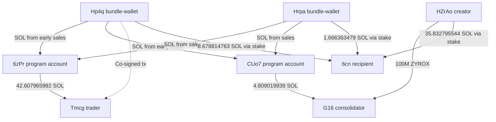
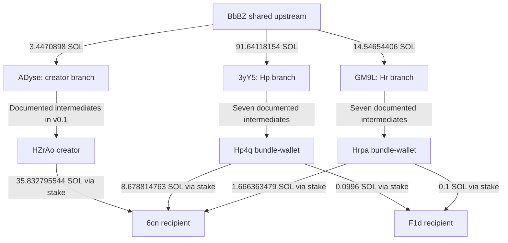

<!-- Repository navigation; the frozen translated report begins below. -->
# Technical evidence navigation

Frozen technical authority: **v0.114 / ledger U453**. The complete historical report is retained below. Earlier interim figures and qualifications remain in their historical sections; the final frozen assessment governs the final case conclusions.

- [Final assessment](#v0-114), [launch-claim synthesis](#v0-113), [seller baseline](#v0-71), [provenance reconciliation](#v0-89), [six-wallet control matrix](#v0-100), and [64-source consolidation manifest](#v0-110).
- [Verified main report](../report/ZYROX_Main_Report_v1_1_Verified.md), [evidence guide](EVIDENCE_GUIDE.md), [transaction links](TRANSACTION_LINKS.md), and [account continuity note](ACCOUNT_CONTINUITY.md).
- [Frozen sale manifest](../data/frozen_35_sale_manifest.csv), [cumulative proceeds dataset](../data/figure_3_cumulative_proceeds.csv), and [core transaction-link dataset](../data/publication_transaction_links.csv).
- Claim screenshots: [IMG_4204.jpeg](claims/IMG_4204.jpeg), [IMG_4205.jpeg](claims/IMG_4205.jpeg), and [English captions](claims/CAPTIONS.md). Their evidentiary status remains screenshot only.

| Figure | PNG | SVG |
| --- | --- | --- |
| Figure 1 | [PNG](../figures/figure_1_first_60_seconds.png) | [SVG](../figures/figure_1_first_60_seconds.svg) |
| Figure 2 | [PNG](../figures/figure_2_consolidation_control.png) | [SVG](../figures/figure_2_consolidation_control.svg) |
| Figure 3 | [PNG](../figures/figure_3_cumulative_proceeds.png) | [SVG](../figures/figure_3_cumulative_proceeds.svg) |
| Figure 4 | [PNG](../figures/figure_4_market_value_vs_target.png) | [SVG](../figures/figure_4_market_value_vs_target.svg) |
| Figure 5 | [PNG](../figures/figure_5_where_money_can_be_documented.png) | [SVG](../figures/figure_5_where_money_can_be_documented.svg) |

<!-- BEGIN FROZEN ENGLISH TECHNICAL REPORT -->

# ZYROX — Devsold verification, 3 October 2026

**Current analysis version: v0.114. Ledger: U01–U453; next available U454.** Final SCAM / COORDINATION ASSESSMENT + REPORT STRUCTURE. SUPPORTED COORDINATED OPERATIONAL STRUCTURE; specific co-authorization/consolidation and rapid selling documented. 606.331808740 proceeds, 0 CLEAN, 597.487092059 conservative PARTIAL minimum; 0 SOL attributed to a finally identified beneficiary. Common ownership/operator, intent and legal fraud UNRESOLVED. Ready for evidence-graded main-report drafting; frozen phases unchanged.

Historical v0.42 summary: Checkpoint v0.41/U325 is confirmed. New RPC inventories for HZrAo, Hp4q, Hrpa and G16 yield respectively 39, 27, 26 and 55 signatures, covered by 146 unique jsonParsed transactions. After excluding already ledgered/closed branches, mixed funds, tips/dust, refunds, purchase/AMM/token accounts and program-directed routing, no new qualifying direct money-trail branch exists in this inventory. Hp4q→5B3 (46.114163669 SOL plus separate 0.000650240 SOL initial funding) is role-classified as an off-curve, CPI-created account under the already examined 8gxk program and excluded before hop-by-hop tracing. No new qualifying economic edge was ledgered; U326 remains the next available ID. This is a bounded negative finding, not evidence that no other historical or future trails exist.

Status: INTERIM. This supplements v0.1; it is not a completed map of all funding roots. Sources are Solscan's live decoded/finalized transaction views. Raw RPC data and cryptographic signature verification have not been obtained.

Mint: FACvJMFBWQ1GYm9dgZ7XHvs85V1EcK2SqHf534kspump
Creator: HZrAoEWQGd5dsTzkj7YbzQq5ou3YQEWQQWvjBNRG9Atu

## Findings

Devsold's specific bundle list has been found. Approximately 720M tokens bought and sold by the two listed wallets are confirmed. This does not confirm that these are the team's own wallets. Direct funding flows, co-signing and shared recipients provide stronger coordination evidence than timing or matching amounts.

## Wallet register

| Alias | Address | Role |
|---|---|---|
| Creator | HZrAoEWQGd5dsTzkj7YbzQq5ou3YQEWQQWvjBNRG9Atu | Deployer; 100M launch purchase |
| Hp | Hp4q9Tfeo5Cp7BuFNe6pRo3DqfPZVAiEampauGzPyyod | Devsold bundle wallet; 693.1M bought and sold |
| Hr | HrpahQoW21MEA8qbsR9Z8oeN8NLFmTKukYSjok2Ktou9 | Devsold bundle wallet; approximately 26.9M bought and sold |
| Tm | TmcgWRgFqddHiUBDYysSCsvMA6SiGBHwLfE9xbmf7CW | 137.5876M bought; 16 sales |
| G16 | G16wTdwT5e8H292JPLCCNXoYnPCzacQnU6VPZfKeWncZ | Creator-token recipient; consolidation and selling, v0.1 |
| C1 | 6cnRXniBFNYrxnMebd5vqEv2d5wuXumbKwWkBjV8b88L | Shared SOL recipient; ownership/service role unresolved |
| C2 | F1dCFudwvrwCmUUbVTG1oYt3iWJpXEajrNgr3RNX5mpG | Later shared SOL recipient, v0.1 |
| C3 | 6hR7GwHpdHbJgNJAagm64KMsMYu8mR6ExzmbE5N8wv1N | Recipient from C1 and C2, v0.1 |
| P1 | 6zPrzDZFJQmh4gBRtd5pNRC3vwfQkv4SLcyJSXRu6gnE | Program-created account; SOL-flow bridge, not automatically a personal wallet |
| P2 | CUo7RXbfyjcGUr5RzZMrjMkh5Xhoa3E8wakyoBXrGnQK | Off-curve, nonpersistent System Program PDA/SOL-flow bridge under `8gxk…V2kn`; first observed funding from Hp4q; exact seeds/bump unresolved |
| PA | GVt5opeGJgPjxr817qk7YseN5vtKi24Ye4bVxQVc7C3h | Broad program deployer; deployer and current upgrade authority for `8gxk…V2kn`; no direct edge to a core ZYROX node established |

## Devsold compared with observed transactions

Live scanner observed 2026-10-03T06:47:05.756Z:
https://devsold.wtf/FACvJMFBWQ1GYm9dgZ7XHvs85V1EcK2SqHf534kspump

| Claim/display | Status | Verification |
|---|---|---|
| Two bundle wallets | CONFIRMED as a scanner classification | Hp and Hr above. Actual Jito bundle ID has not been obtained. |
| 482.53M bought | CONTRADICTED as the total purchase amount | Hp has two BUY instructions in the same tx: 455633422.064004 + 237466577.935996 = 693100000. Hr buys 26899999.998698. Total 719999999.998698. The scanner counts only the first Hp purchase. |
| 720M sold | CONFIRMED as gross sale volume | Hp sells 693100000; Hr 26899999.998698. |
| Team wallets sold 72% | SUPPORTED association hypothesis; ownership UNRESOLVED | Sale volume is confirmed, but team affiliation is a separate question. |
| Creator-token recipient has not sold | CONTRADICTED | G16 receipt and sales are documented in v0.1. |
| Dev/team earned 98.7 SOL | UNVERIFIED | Not reproduced. Original card, timestamp, wallet set and calculation method are missing. |

## Purchase and sale reconciliation

SOL/WSOL use the same unit here. Purchase amounts include observed swap fees; the table does not deduct all network fees, tips or net rent costs. The difference is therefore not final net profit. Internal transfers and stake withdrawals are not counted as new sale revenue.

| Wallet | ZYROX bought | ZYROX sold | Purchase cost SOL/WSOL | Sale receipts WSOL | Difference before other costs |
|---|---:|---:|---:|---:|---:|
| Hp | 693100000 | 693100000 | 82.947483966 | 129.372237495 | 46.424753529 |
| Hr | 26899999.998698 | 26899999.998698 | 12.860103707 | 12.716876102 | -0.143227605 |
| Tm | 137587563.532596 | 137587563.532596 | 42.607315750 | 109.663672076 | 67.056356326 |
| Total | 857587563.531294 | 857587563.531294 | 138.414903423 | 251.752785673 | 113.337882250 |

Hp and Hr buy in slot 452029524, 17:18:06 UTC, and sell everything by 17:18:09. Tm buys in slot 452029526, 17:18:06, and sells the entire purchase between 17:18:10 and 17:19:03. A shared block/timestamp is not ownership evidence by itself.

These volumes must not be added to the G16 sale as a percentage of unique team-controlled tokens. The same tokens can be bought and resold multiple times.

## Evidence ledger and graph edges

All times are 30.09.2026 UTC. CONFIRMED means observed decoded transactions, not confirmed human ownership.

| ID | Status | Relationship | Primary source |
|---|---|---|---|
| D01 | CONFIRMED | Hp two bonding-curve purchases, 693.1M total, 17:18:06 | https://solscan.io/tx/52ZjUbg4bzdQoAsFeJuLgqM5b5kmeQpgp79ndnAi13D7W795N8A7BLon9t7LhENRi5wUGcqMb5RWzNDs2AB9nKkw |
| D02 | CONFIRMED | Hr AMM purchase 26899999.998698, 17:18:06 | https://solscan.io/tx/4JrhsmKT44mQpZh5kTYFMcFWXi2Hu8Lg3U5BkUS4WEw66pWeR7GkiR299KY2WFD5XZQTH5pvBMW957WrdjjRh5Xf |
| D03 | CONFIRMED | Hp first sale 278149496.731053 for 59.510477626 WSOL; first observed funding/use of P1/P2 in the case window; sends 42.607315752 SOL to P1 and 16.903161874 SOL to P2. No separate `CreateAccount` for CUo7 was observed | https://solscan.io/tx/5jRjC6ULUHNd88x2gazxAUGcjA4yCGAqusvbqXHNkh7pASuSsyB8wn6CRd17wZ9D3rUkeYoxLd2qQopFgCinMi7T |
| D04 | CONFIRMED | Hp second sale 414950503.268947 for 69.861759869 WSOL, 17:18:09; 13.674826944 SOL to P1 and 10.072769256 SOL to P2 | https://solscan.io/tx/1o27R3x3MgdCNjGXQCYMhnxTzeQjg2EnXMXcMRVE9ybbaa1fSXvQCQWYgn2YzZzHuef9onbRUcVbYpFM2FsjyGK |
| D05 | CONFIRMED | Hr sells the entire purchase for 12.716876102 WSOL, 17:18:09; sends 6.801611461 SOL to P1 and 5.915264641 SOL to P2 | https://solscan.io/tx/4fGjRC7N9251H6oDNjC6Qten3H1Gs1p7WQaZRbtpv4wvp9dTNJDqD3azbgrZc4iXKWxpR44E3WEk8jHhQAPWCUvj |
| D06 | CONFIRMED | Hp and Tm are both listed as signers in one finalized tip transaction, slot 452029526 | https://solscan.io/tx/AgMVBsknEvB22wZFR2zqSbGtoJxxsdybi71ZQeH2BGSYC1qYUvnWoiCkmjYrvAL8HTkdqSgrqE6rwz6piJeh38u |
| D07 | CONFIRMED | P1 sends 42.607965992 SOL to Tm in the purchase transaction; Tm buys for 42.607315750 WSOL | https://solscan.io/tx/3oj1pmRLg9F7LvBjJBjwXSLuvWnMDPf2p31yGKyfm6b7J9efz6xQJjcBQPdrQoozM1hLVaLjyHA8JZRB8wdfBQs2 |
| D08 | CONFIRMED | P2 sends 4.809019939 SOL to G16 before G16's purchase for 4.808369696 WSOL | https://solscan.io/tx/2vst8Tcw7tMjR1axmwEP9VQf7dqHVfdf4bBW7h1wBDcTXoP6jZ6gdRAgVPriEmUv3RweoiywKAtrcAFQBugD47Ca |
| D09 | CONFIRMED | Hp -> new stake 45Z9us2doma5S5bGto7UKdLRhxSD6XmQgr9yqbs3Erst -> C1, 8.678814763 SOL, 17:50:18 | https://solscan.io/tx/3WsXfkKWYFwXErEJnptccpKZXAnM55BFwZdwqVLrmzxC1L3f3FBgYuUWgqR1vthQjeQfpFCxSMZFqAWPGPFPPEm |
| D10 | CONFIRMED | Hr -> new stake EKPF32VndzNx49m1ezx9QsNHz8QcR6aumdYbyaYuxNAT -> C1, 1.666363479 SOL, 17:50:18 | https://solscan.io/tx/38siyxuYmsKbbW3i4TJNceFYz2o7s4d3yVuDtH85mdsoFqHg31D7gEtg3rDhvYsSPdrDEvAEV9wYesMnZ68jAKSm |
| D11 | CONFIRMED, from v0.1 | Creator -> new stake 2skgam -> C1, 35.832795544 SOL, same slot 452036737 | https://solscan.io/tx/N2LnQDfNy9yiSuRAR7FH49a7tEWnBvCgZCYDYNrwgax3ATt4R8j5n1b5oFVrC9TWSQF5YAQGgh8YbTMXE1ruDbx |
| D12 | CONFIRMED, from v0.1 | Creator co-authorizes 100M to G16, 17:58:26 | https://solscan.io/tx/29VDE2VcR724cRjzCBoWCFuWZLGrD7ySQiuMkwpgTVvsndw13TeHohwmhW1oM4jHTTLytDoD9QH7jKRP6nKY4Gsr |
| D13 | CONFIRMED, from v0.1 | G16 sells 581529004.875567 for 145.975602514 WSOL, 17:58:28 | https://solscan.io/tx/2wyYPRdcJ3TGT7JFC9Yqg5hytrU6cp8SeanzcLG9NFKDpBt6F4yja5mWJdmiggiki21cBbJQR8EyiUVRrRYFPued |
| D14 | SUPPORTED | Hp/Tm operationally coordinated: co-signing + direct funding flow through P1 | D03, D06, D07 |
| D15 | SUPPORTED | Creator/Hp/Hr linked to the same collection network; not merely matching time/amount | D09–D12. Service/aggregator involvement and actual ownership still require assessment. |

## Wallet graph

The arrows below represent transfers, not ownership. The dashed link represents co-signing, not token flow.



## Tmcg: all 16 observed AMM sales

| UTC | ZYROX | WSOL received | Solscan tx |
|---|---:|---:|---|
| 17:18:10 | 12579868.429379 | 6.525569570 | https://solscan.io/tx/2tz4dHvdr8gDzTFhUakAGvEhgqxmvGVCAtDqfVKFHvv7nDsPnuXpNkJxgWvxE4Sg4r3yE6RutzsPhutchaqapm1s |
| 17:18:14 | 10616340.913298 | 5.831639753 | https://solscan.io/tx/2pe9ohP1mV6o8kvcNXRdM53jPPKJqzrSZcmr972MHM1C3hH7Y5ZeWvFEnXpzqKMjHUm2XZqYCA92oaATWruJWX9g |
| 17:18:17 | 13136118.696438 | 7.562734294 | https://solscan.io/tx/4UYtwihmCFa1mzcXFmZFomNT73S1jcRT1T3LwazK7xkE18JWtpALfTKZgUgLjXgnTBbZc3WXhcy741uJ3yRbqRv2 |
| 17:18:21 | 5951405.900417 | 3.660644455 | https://solscan.io/tx/461pxR2UcDkf6xB3Mvmj9qUF6NqHkUky838pFobHimgMxHd7UV6wrManT6juXqLjcxw7mn2MuuT9CzuG4Ho6PKRL |
| 17:18:24 | 6642328.940057 | 4.210467549 | https://solscan.io/tx/5a4Swfp5jJJcEiCai2pyJSe8CEM2Rcj2RSmLWsikvqF4R85KTpKXTJoR2qrJMxXqwGrpp3ctsCNqjcbjJisZ6XTd |
| 17:18:28 | 7940553.773168 | 4.948644457 | https://solscan.io/tx/J86BFHrpRpaGS2vR3qoMDb8PMdpwwHcKLJq1JnNqSLUNud9KhxK94QndnWhyJPyGmC9cSFQq9fcW3YEYzUjRhiS |
| 17:18:31 | 10146000.164658 | 9.934182541 | https://solscan.io/tx/3zHShrGSEetGNVKHMFsJmZDJECzg6Tt8egHrZRg8ymhRrrRj436dBDsKDYdRRmwQ2QzGpQqSNfA86VJSb8pdGPw4 |
| 17:18:35 | 5027711.970193 | 5.007593709 | https://solscan.io/tx/5MUuUM6LmyvrWEz2UybLaVhYFVvsLnd7R9SBdmiC6Zjjc7qdHdBG44m3nhfMeZK1fwPMKFdDpcnHg8FFgaHmy2jU |
| 17:18:38 | 9761614.128386 | 9.257132389 | https://solscan.io/tx/62idmuDgyzmHdzZ6Qq2HX2kb8FjLJYz3zuBtYdcfe2vqwkjc5zTrw4DBLUP9tzcfqQK1Zo4GYcAxcgWmqUq9K3fD |
| 17:18:42 | 8823693.729957 | 8.573075930 | https://solscan.io/tx/QaauUb5xEGuu5YVDDE5nrHitkw5dDHt42GZN55nQjkesHeSsPqv12qt3ser6SkPfTfn1jkdL445GFpYkPi5CwJ3 |
| 17:18:45 | 6679939.072417 | 6.576709272 | https://solscan.io/tx/2zJk5fdrggxqPnMLaVroqpvyEkik2LesmcyznUYAqF7dZXPJx5sRBchYpkCUkgZc3s5yBUiiUW1G5NGbW71TzyMX |
| 17:18:49 | 4850330.989503 | 4.786663923 | https://solscan.io/tx/4fHHLXvohmhxvx67KET7MvcnSfMReAGNXQPjZGs5ZD9miy94rs5BRYUph9HRgGANqdc7mRt2SQeKNWv2M2UDSRyu |
| 17:18:52 | 7303734.853799 | 6.986829165 | https://solscan.io/tx/5YLVzn3GHBaBW9gKQ2akCeYLYxHN8keC2G39X588vPm3vShPn2ZKsui6SqoL4XggAGNe9A4sSjkzaqi5Ly94Rzoi |
| 17:18:56 | 12030090.706758 | 11.092003661 | https://solscan.io/tx/2xFrM5McCsUXpqvbh5p1XostzkdFo6h8LNW4vShpLKxKNMHEEGwsD53WopzjJ46ERJBHQRPhLxFWGWKn1aH2TzRr |
| 17:18:59 | 4682649.795819 | 4.479488897 | https://solscan.io/tx/2W69fTffp7rmQFJKtpJJsMrtiSH9PzLiJVSbb1RkuxVuyHEPYmQRCmryDFsGh59cWSbVYtsnF3P99J6eu7vybUyQ |
| 17:19:03 | 11415181.468349 | 10.230292511 | https://solscan.io/tx/2jzwkic7dKaLvgM81VvmjXtKoZykdwqDe4FTzzNknMBZDY5XLePFSbzKLcvfWYinbUhtjHWQ96iamMi7vCa4rqjK |
| Total | 137587563.532596 | 109.663672076 | Reconciled with initial purchase |

## Claims and limitations

| Question | Status | Assessment |
|---|---|---|
| Genuine fair launch? | UNRESOLVED; significant concentration CONFIRMED | Hp alone buys 69.31% at launch. Strong operational links exist. No final claim of team ownership or a specific bundle service. |
| Creator-associated control/sale of substantial supply? | CONFIRMED flows; SUPPORTED coordination | Creator sends 100M to G16; 64 sources consolidate over 581M and G16 sells this, v0.1. Beneficial ownership of all sources has not been established. |
| Majority supply locked? | SUPPORTED contradiction, conditional on the exact claim | Over 58% can be transferred and sold at 17:58:28. This is inconsistent with a majority lock still being active at that time. The original claim, promised period and lock contract are missing. Stake routing concerns SOL, not a ZYROX lock. |
| No presale/KOL allocation? | UNRESOLVED | Early purchases/co-signing do not identify KOL roles or private agreements. |
| Airdrop to followers? | UNRESOLVED | No documented recipient list or X identities to reconcile; transfers alone do not prove an airdrop. |
| 10M market cap guaranteed? | UNVERIFIED promise and historical price peak | Reported ATH approximately 516k has not yet been reconstructed from historical price/supply. The valuation promise cannot be verified through token transfers alone. |
| No rugpull/no pump and dump? | UNRESOLVED intent/classification | Significant coordinated exits are documented. This is not automatically proof of a particular intent, fraud or liquidity rug. |
| Sevilla wallet | UNRESOLVED | Full address or screenshot required. Not linked to any address by guesswork. |

Funding roots remain incomplete. Solscan account lists showed ten Hp funders with approximately 9.16 SOL each; details and ultimate roots have not been fully verified. First-funder labels and matching amounts do not establish ownership. The creator's funding graph and the 0.040x/0.010x trail remain previously documented/open; the new bundle addresses are not automatically the same set as all earlier sources.

Next required input: original Devsold card with timestamp and any additional wallet addresses; full Sevilla address; dated pre-launch screenshots with wording and any lock/airdrop links.


<a id="v0-3"></a>
## Update v0.3 — shared upstream source verified

Examined 03.10.2026 after v0.2. All funding edges below are CONFIRMED in Solscan's decoded finalized view. Ownership remains UNRESOLVED. Chains document relationships, not that every received lamport came solely from one source: multiple stages split and pool funds.

Creator, Hp and Hr now have a shared verified upstream source: BbBZuboLxyw3LBjjMBb6RCn9UP3Bz9DwctNgRmuwvR1f. BbBZ is a verified shared point, not an established ultimate funding root or identified person.

BbBZ sent 3.4470898 SOL to ADyse8NncFppb148UxYuUt73mfpFLBfby3Tg3MAsBPfq at 17:15:43. The remaining edges in this creator branch are documented in v0.1: ADyse -> 7S6 -> EeZY -> 4min -> 6Ta -> GPVxz -> 3FEx -> 8y1Yx -> creator. First edge rechecked: https://solscan.io/tx/c7aAx3PDf1DRxyDH9e9A5bVmBt57Jx4YsrRpYuNo8gAwwcnxwwymdD4WYFr4Ub6G6QaRchr546HwtyP2AfjwY1Q

### Two new chronological funding paths

All times below are 30.09.2026 UTC. These are two documented paths, not all parallel branches. Amounts are individual transfers, not totals to add to sale revenue.

| From | To | SOL | UTC | Evidence |
|---|---|---:|---|---|
| BbBZuboLxyw3LBjjMBb6RCn9UP3Bz9DwctNgRmuwvR1f | 3yY5Cs37N7TERUzmpjBgq7XWsJisYhix2tUc35ZiKa56 | 91.64118154 | 17:16:06 | [F01](https://solscan.io/tx/2uUy7qYC3qrun34WwiTvy79KSxyWZRtxdDwuo5wN1w5dU45WgPoqkKjmp4XriQW3CzVDeYp89kiFmEn7JvnFv8EK) |
| 3yY5Cs37N7TERUzmpjBgq7XWsJisYhix2tUc35ZiKa56 | E9Te9bdtX6HrALyXU42pVMTCJH94iUW6nrY676PemgxX | 4.582058827 | 17:16:06 | [F02](https://solscan.io/tx/5rZst2R8n2ofbEGEw1MAw1X1asBS7pYkWrEkteGj3W8EKfzv3Rrqin59TNQeQMNb6GPEXw4gssdaWqfYncUi7nJz) |
| E9Te9bdtX6HrALyXU42pVMTCJH94iUW6nrY676PemgxX | D1UV5gwNAMca6xkV4XJAQwttksw7asmyioaDjhhf7Z2S | 4.582053827 | 17:16:08 | [F03](https://solscan.io/tx/3tFLsKKP7FTpNYZgonMvGh2DjNT8A67gfRhHBkNue47qd5kQ6LTo6xrKXr8E9kEWaQyghbY1NcGS1KRvfVAV78DC) |
| D1UV5gwNAMca6xkV4XJAQwttksw7asmyioaDjhhf7Z2S | 8ySbR18BZrfW98cKoroYLffSfUSwEJZyWQSrTkdyPLv2 | 4.582048827 | 17:16:08 | [F04](https://solscan.io/tx/3QPn4mfrVxSwykQa5bcEkjWvnxbcs5awDTxqYqr1YcA75NdQeMgHixG3qmczNNdtWw8om7VLjmrYiDXn3rfJNju8) |
| 8ySbR18BZrfW98cKoroYLffSfUSwEJZyWQSrTkdyPLv2 | BZ9mPLztWYrv9xcWtgwnQTVYJVpFXRgRGcbptzHYHSLR | 9.164096154 | 17:16:24 | [F05](https://solscan.io/tx/5FjePPLz2TRTk4Axzso1mTR4QpdbhLbM7zK7Nco122CyNyQ749v9VwTKoxGU1otHtXNErYTDEmFgGZBdezuBDhat) |
| BZ9mPLztWYrv9xcWtgwnQTVYJVpFXRgRGcbptzHYHSLR | 62DWdupxLroTc2jfiHEXdnzbg5aWemMHwkkTrpU9SNrN | 2.291022788 | 17:16:24 | [F06](https://solscan.io/tx/5gpnfRA4Z1zSY8VX756WB2qsur8STA9CeBetkQwJUijwParm6RsY7V2aTQgfoatG8cknxfpWNTDMM8yMpfmHKjpd) |
| 62DWdupxLroTc2jfiHEXdnzbg5aWemMHwkkTrpU9SNrN | GhWZD17VzcdiSRUHuegmQ89pgDFS7G3jRPGSdiUGGZCn | 2.291021538 | 17:16:36 | [F07](https://solscan.io/tx/4RKL11tJyeGoDEtNFNoRjTCHndHydkV3un5JeDpt3N9PNjf7SehJW2LkoqmTKCcvoU9XaEdVfs6uyUKBoiasViz2) |
| GhWZD17VzcdiSRUHuegmQ89pgDFS7G3jRPGSdiUGGZCn | G1W7jRq6eDMfEnVjSXgcqb547pyMs3bqUUupTzYh1TGN | 2.291020288 | 17:16:38 | [F08](https://solscan.io/tx/3hMjAHKEiKzDHiUeEhoqyuCBYkuNEGZgnyFQ1AM7HnAofyhmUgGgHwiUTkzqezf5tmtnzj5ZbHmN8aZGkA6LsqQu) |
| G1W7jRq6eDMfEnVjSXgcqb547pyMs3bqUUupTzYh1TGN | Hp4q9Tfeo5Cp7BuFNe6pRo3DqfPZVAiEampauGzPyyod | 9.164076154 | 17:16:39 | [F09](https://solscan.io/tx/82SaMPFHcnTJSZJoSJR69hRnJP9BRQbYuWJb42pKeYdS2ykTeZa5YBdzqN1sF3bg2jR9jiB9EAvgXUSjJMMSkqo) |
| BbBZuboLxyw3LBjjMBb6RCn9UP3Bz9DwctNgRmuwvR1f | GM9LETR7DBSvztGTtQYXbNsvjausyqZAw4qSyaBYf2Gs | 14.54654406 | 17:16:11 | [F10](https://solscan.io/tx/3wJreq8GjmtSt29xZmiEcvw5BMrXKG3HYzQR3vBbVWqAK1ZTWzC9DuFD4y1EaBSrXvvyNNT6BvqMyoAAEpQphLGX) |
| GM9LETR7DBSvztGTtQYXbNsvjausyqZAw4qSyaBYf2Gs | 8q3xt7z292qX3cZRZ3kD2nCougXMTXnjDVn97c218NBt | 0.727326953 | 17:16:12 | [F11](https://solscan.io/tx/4JR9uDrHnTWZ6yJdpfgsZQG25ZnKQRumb515YxMsccN791Ya189hQGdkHMHhzPv86CNwc2QrBxFBYcxXN6rvh5Gc) |
| 8q3xt7z292qX3cZRZ3kD2nCougXMTXnjDVn97c218NBt | 8MYo7TDhkkzv3m6STifXFCXj2Avrr5aYWWngzvvFiknk | 0.727321953 | 17:16:13 | [F12](https://solscan.io/tx/3BsCuBYRM2RvWEDcVSjjcAE4L8KXskBMGcUppMzKu4u571enY5AV4xziD9MPJJ7g1LG719KjmqFiVQTUdkQAf5px) |
| 8MYo7TDhkkzv3m6STifXFCXj2Avrr5aYWWngzvvFiknk | AuaM9EjM2YgNXRUadMYuBj5yyuPqpyJbxogCeG5twWka | 0.727316953 | 17:16:13 | [F13](https://solscan.io/tx/3Kxq7kpdzPNpSXPCyypSXU6M7Zvp4AJUYLMxfuBLp6aedTW2WVnxW4mGgi7vVVNSLyabCvmSxh5isqeP694qa9Qd) |
| AuaM9EjM2YgNXRUadMYuBj5yyuPqpyJbxogCeG5twWka | 76gj5nxsHMt68Km2YCM3t2eRxtA5rBeeC5P4czsgXT4i | 1.454632406 | 17:16:21 | [F14](https://solscan.io/tx/dQRVFLaBEpSumo7qbWeA791bUfMKyTTshBqNYBo13hA7XyJbsf1jjMseyNChXjVbquy7cLTYggrT2a951snGYQH) |
| 76gj5nxsHMt68Km2YCM3t2eRxtA5rBeeC5P4czsgXT4i | EdQkCQziRyx7a6BmADyZysVo5Rr52e1MzaGSD31NHbPH | 0.363656851 | 17:16:21 | [F15](https://solscan.io/tx/4LCdjECVkXmekRWQueLzELXfsDs1N3csLLSt3SpA9EjxoFAXu3WPUvXSwKYa1oGeT4fHow16X8QTSb22NR3Yr9aR) |
| EdQkCQziRyx7a6BmADyZysVo5Rr52e1MzaGSD31NHbPH | EV49ucuEsyfVaZ1qyKeqeRBimYUm8pjxVQEZtuJjtEDc | 0.363655601 | 17:16:23 | [F16](https://solscan.io/tx/4RPaQVVgFe59hNacozteUNKcqsdS6BW6k59n2rBaP3vpX5YmWjYd1GKax3V9mkDJ7cooTMn9gYzk13uhTcQPDY6k) |
| EV49ucuEsyfVaZ1qyKeqeRBimYUm8pjxVQEZtuJjtEDc | GmJgapaTrnk3np6cXABxYUqf4xA3jTCrhTfUesvtgX8v | 0.363654351 | 17:16:43 | [F17](https://solscan.io/tx/31dQMeGkJwLuw4FXtjDFW6NKNMAduUwNkkceF6AfgkwktHh7LHoVxxAcwKh4UQwSxtc9J9i4oxhLB6dUi8ivQJbZ) |
| GmJgapaTrnk3np6cXABxYUqf4xA3jTCrhTfUesvtgX8v | HrpahQoW21MEA8qbsR9Z8oeN8NLFmTKukYSjok2Ktou9 | 1.454612406 | 17:16:44 | [F18](https://solscan.io/tx/DnvVu1kUfvYiR2eP6HXRUSJMj4PzktDwaBkGv4RU6a7Nb7cov8Vb4P5M92ugFSf7RtJVtHw2QDWTSc4Zuy8EEy8) |

### Direct funding of the bundle wallets

Hp: ten verified senders, each 9.164076154 SOL, total 91.640761540 SOL, 17:16:39–44. Hr: ten verified senders, each 1.454612406 SOL, total 14.546124060 SOL, 17:16:44–48. All preceded launch. This supersedes the v0.2 qualification that direct funding transactions had not been fully verified; ultimate roots and all side branches remain incomplete.

| Hp funders | Hr funders |
|---|---|
| G1W7jRq6eDMfEnVjSXgcqb547pyMs3bqUUupTzYh1TGN | GmJgapaTrnk3np6cXABxYUqf4xA3jTCrhTfUesvtgX8v |
| 9FAguDq5G22C9YLm8gqdkrSq3gGiykdnc7V8EBxvvVw9 | 7f96Weg2xhYzqgWSFJi5hr1gkMTDPef8jfnyEPbTw8cW |
| DSRGBmu54ZFgsxncWoT2uEgQkBF1ZikZ4ko2dAQNy6w5 | GYhGnF26p8HqHGFF9rfpTGzSDFC4p76DEnyzHnPCMrL5 |
| BvfeNd5UWXJZWbURNrmF3JF34q463cXZqP2HYgddKzf | 7SxQv2N9LipWL7EhavFok9me2zKaUpD8xvVWGHT8A9ED |
| 5wjUCbqsQ77LgV1TKMvy1hbg2Wvh9NkT8inJFCFybpzb | 5DURTso6cr1u6gZPpLtg5jHMDupDwNTm5JrCjhhHmdFj |
| FXaanteZQPdeaD45JEEtG4Yu7BgFY8tGG4KCdjbmnEoP | APaGGySNEkiGQ5n8wmxSfuWA4GmKKUpirahHuJDK8spP |
| DqEoiLwJLV8LgtwpLmtcsZvLgELPJ8LnUpTEwHyigcTK | Grc7AGjtC2bE5XfHVAoQn5iGpGhTQaCxL7w5GqcyeMnB |
| Dsun394GT7QanqtP6dF3qwYpPaXyANKHDPLnjSqrzjRV | HXDPm7pnAkf7o5TBCExHuBVHW6cjYP7zrARXZvgkhXYg |
| 39PE8B1Si5oNcUFjCdthTuE3c4UQjup5ff94QYjWwSpN | EGnfDFgkwE3WzSdkj2kC7ecEezf9Jav1fhts59oRMxJG |
| 56n1cx1DYspMkH9fSXwY81Q71CZsiK2oyj91iH8veQea | 6XYFV1hpUyN5AADRG2VvJuPeRHRembKwVYcGB2giQAbf |

### New exit and co-signing edges

| ID | Status | Observation | Primary source |
|---|---|---|---|
| F19 | CONFIRMED | Hp routes 0.0996 SOL through a new stake account to F1dCF… at 17:59:49; a further 0.0004 SOL to tip accounts. Not 0.1 SOL net to F1d. | https://solscan.io/tx/2WwQHucWYpFGAapH9gNXmQStq3KK2rKa4dbv1zs9FW5KkZizcKr7zcn2K1s2CZQvDscsxyTELHkDX1xrLGdyDn7r |
| F20 | CONFIRMED | Hr routes 0.1 SOL through a new stake account to F1dCF… at 17:59:49. Hp/Hr therefore share both 6cn and F1d recipients with previously examined wallets. | https://solscan.io/tx/3VxR5ga29LzMFn5Uvyo7uiPE1krHr1NEYfBTkTMWJYfzpoj6LDZQuKGsemxoZx5A9GDe1besoL8CPosTxXox3FoX |
| F21 | CONFIRMED | Hr co-signs with Wksb8WrEFFSeCcyhmxHGK79iFxbA89x8yeWSqgYJmLt and J5rWMWJxuUqsC39oexns3Jm26HQjyozRa6Pz5rRLM4U3 at 17:18:09. The roles of the two new addresses are UNRESOLVED. | https://solscan.io/tx/4pH4om1nrjjoSkxS7qWEVody2FNJxA8gUVSenxcTBo8kagcQMtZYcB98h4SgavX66VEm9G5badiRwL2QEqNxPrWL |

### Updated interpretation

- CONFIRMED: direct, chronologically valid funding paths from the same BbBZ point to the creator and both scanner-listed bundle wallets; several parallel stages remain.
- SUPPORTED: a creator-associated operational network. This now rests on shared upstream funding, shared downstream recipients, co-signing and the creator's token consolidation — not merely matching amounts/timing.
- UNRESOLVED: one beneficial owner, personal identity, service/mixer/operator role and net profit of the entire wallet set.
- At launch, creator buys 100M, Hp 693.1M and Hr approximately 26.9M: approximately 82% of initial supply in total, across three now funding-linked wallets. This is a concentration observation, not automatically 82% proven team ownership or 82% unique tokens sold.
- No presale/KOL allocation and airdrop remain UNRESOLVED; funding chains do not identify social roles or off-chain agreements.

Method check: later small return transfers at 17:51:42 were found in the lists but are NOT used as pre-launch funding. The correct D1UV -> 8ySb edge on the Hp path is 4.582048827 SOL at 17:16:08, not the return amount 0.00501125 SOL. The Hr path uses 8MYo -> AuaM at 17:16:13, not a later return from 92dKo. This prevents chronologically impossible funding conclusions.

### Compact graph of the new relationships



Remaining questions: all parallel funding branches and other BbBZ roots; Wksb/J5r and other co-signers; original claims/lock evidence; Devsold's 98.7 SOL methodology; Sevilla address. No scam/rug conclusion has been made.


### Upstream verification and alternative explanation

The Solscan view for BbBZ shows ‘Funding out’ of 1,029 accounts and 1,433 transfers. These are the explorer's aggregate figures, not an independent count of unique owner wallets. The earliest funder label points to 6hR7 around 6 September; the September-6 edge is documented in v0.1 and is not automatically provenance for all later funds. BbBZ also has activity on 2 October. The service/operator hypothesis therefore remains viable and UNRESOLVED; all 1,029 addresses must NOT be classified as the ZYROX team.

New observed pre-launch deposits (CONFIRMED, all 30.09.2026 UTC):

| ID | From | To | SOL received by BbBZ | UTC | Source |
|---|---|---|---:|---|---|
| F22 | 3GTWiMwAhZHSU2aARBTCb6YuRLRumvUtmsXXbT2C4uBi | BbBZuboLxyw3LBjjMBb6RCn9UP3Bz9DwctNgRmuwvR1f | 123.588073912 | 17:04:26 | https://solscan.io/tx/wWqWBdusM3SdBXnsRgzegnBZ5qEwQ3Z2r8SWe5fTMTz6en6QH9gWLRTegxwwtVxcTjF7jDJASdMbTNK6gk8WoGK |
| F23 | AZoiopP8U77GZjn4CfaijSXpqrhUDwfBCXeFzY6csAdG | BbBZuboLxyw3LBjjMBb6RCn9UP3Bz9DwctNgRmuwvR1f | 118.925529475 | 17:13:13 | https://solscan.io/tx/3RyBFfQTEU5x3Shxomyj518fxP2egFdjMKwYLW6BVVQXK539Nxq3dHqDC5oYr4ZS8psMdW7evK4xT6mYb6SBmacT |

The amounts are the net edges to BbBZ. Both transactions have four additional tips of 0.0002 SOL; the aggregate summary amounts are therefore 0.0008 SOL higher. Legacy Mode was used to verify all transfers because Summary Mode with ‘Key Actions’ hid the actual BbBZ transfer.

These two deposits total 242.513603387 SOL, but the funds may be mixed with an older balance and other transactions. This is not a proven total ZYROX budget or ZYROX profit. The AZoi account list also shows numerous stake-withdraw deposits and a ‘Funded by’ label for 7yiBbihLx18a1VJ48Hzts8j2ZZcaCRMW7GYYePEFD85B; this is a new unverified upstream lead, not an established root.

The next investigation front therefore moves from BbBZ to AZoi and 3GTWi, while a case-specific wallet set must be defined through token flows, co-signing and actual exits. A broad funding hub alone is insufficient.

<a id="v0-4"></a>
## Update v0.4 — continuing from the saved checkpoint

On resumption 03.10.2026, the current report was read: saved version 1, modified 07:16:03 UTC. V0.3 had been completed and saved. Existing purchases/sales and F01–F23 were not re-examined. The JSON ledger and JSON graph from v0.1 remain older; additions to this report have not been incorporated into them.

### New edges to 3GTWi

CONFIRMED in Solscan's finalized decoded view, 30.09.2026 at 17:04:25 UTC, slot 452026471:

| ID | From | New stake account | To | SOL | Source |
|---|---|---|---|---:|---|
| F24 | 6o2E3mvMLVVcjsUDZGtodF5PxnoGiXFWvVUmMq9GyJQH | Dai7ogGM8dF6XgdZ4PyF2mEVj5WdiRJCv2po2VryuW58 | 3GTWiMwAhZHSU2aARBTCb6YuRLRumvUtmsXXbT2C4uBi | 0.094537907 | https://solscan.io/tx/58UT8c7xLZB9BnjVfUV4numGmkoEMh6Hcgajx6n3Dc5np8czJFKy14ZsewSdC5kycx4dywSH5SH19tStrL5TJmu4 |
| F25 | 6YBrken26DJFWN8uCYyA7MVJw6FNttkdqzVHns27iN5v | GKudKFyGG8bhmUbW5PnJfnZCg2DfdWgm3tSfT6TLXuP6 | 3GTWiMwAhZHSU2aARBTCb6YuRLRumvUtmsXXbT2C4uBi | 0.123326747 | https://solscan.io/tx/K6t7RvyGAM67nEf9PTN5teDTbKQQV8o1nzc5gJaVKYJwoaZwJN2KSsmVt7hZzNeezWeuYqEC7JX1LMcQscNAfcn |

Both create and empty the stake account in the same transaction. This documents SOL routing, not previously delegated staking or a token lock. F24 additionally has two tips of 0.0002 SOL. The two verified deposits represent only 0.217864654 SOL of 3GTWi's later 123.588073912 SOL payment to BbBZ; the rest of the funding remains unreconciled. Other visible withdrawal rows are leads, not fully verified edges.

### Separate token with the same name: must not be mixed into supply/profit

F26 CONFIRMED: 6o2E… bought 15648713.887970 tokens for a swap amount of 4.694395851 SOL at 16:53:35 UTC, slot 452024039. The token is displayed as ZYROX, but its mint is **GFKGJHWdFdgEaJJ6GbE6kJrLpVVBCiFxHZhPH8ompump**, not FACv…spump. The transaction also shows 4.693699893 SOL from FuZfNwwpvLfn97EnrgC2tknKt295JgBeLRk4bsD6YMDL through program 8gxk64hYgGAEnHVhRMvBGVvBXZM5WhkGkaQ6DVgVV2kn. Source: https://solscan.io/tx/4Y3KMWXUdCqZRuVGYCoibzhYLuPwxbgtZwhem3hmoXkz5C8e9oymSCQTSdjgNGcePBcQEKkK2XMMgKC3kuXc9iop

F27 explorer metadata: https://solscan.io/token/GFKGJHWdFdgEaJJ6GbE6kJrLpVVBCiFxHZhPH8ompump shows Creator **CAxTxHsiBB6Y5kAAMQuPbQdAwyLrEuFYoio5YGwMwtGD**, different from HZrAo… . The creator label was observed, but this mint's create transaction has not yet been verified.

Interpretation: there is now direct support that the upstream network was active in at least one other token with the same name before the launch under examination. Whether this was an earlier official launch, a copy or a token of the same actor is UNRESOLVED. Matching programs and names are not ownership evidence. No purchases/sales for the GFKG mint are added to the FACv mint's supply or results calculation.

Next open step: reconcile the remaining 3GTWi deposits and AZoi; verify GFKG create and any direct links between CAxTx and HZrAo without assuming a relationship beforehand. Original claims, Sevilla and Devsold's 98.7 SOL method remain open.

<a id="v0-5"></a>
## Update v0.5 — separate create, consolidation and upstream exit

Resumed from saved v0.4 (Library version 2, 07:24:13 UTC). Previously completed transaction trails were not repeated. All new transactions below are SUCCESS/Finalized in Solscan's decoded view; this is not independent RPC/signature verification. The GFKG mint is kept separate from the FACv mint.

| ID | Status | New observation | Source |
|---|---|---|---|
| F28 | CONFIRMED | The GFKG mint is created by CAxTxHsiBB6Y5kAAMQuPbQdAwyLrEuFYoio5YGwMwtGD at 16:52:59 UTC 30.09, slot452023906. Create_v2 and Buy_v2 in the same tx: 1B minted, creator buys 70M for a swap amount of 2.115605614 SOL. Confirms and supersedes F27's metadata qualification. | https://solscan.io/tx/4D9VqyGJCzgs1EGyqTVrDS1FRcdVckKnjezqib7DBZzR6wQSdBLr8gVvhgfoJMr6EpZ6Uz7crgeoDxyD4ANegach |
| F29 | CONFIRMED | At 17:01:58, slot452025919, 6YBrken26DJFWN8uCYyA7MVJw6FNttkdqzVHns27iN5v transfers 10984341.017467 GFKG-ZYROX and 6o2E3mvMLVVcjsUDZGtodF5PxnoGiXFWvVUmMq9GyJQH transfers 15648713.887970 GFKG-ZYROX to CAxTx. All three are signers. Legacy Mode reveals the token transfers hidden by Summary Mode. | https://solscan.io/tx/2umEdrqGNvZywCgDwai6KWyqfzZG9CkDVKjeqTXA4rUDtto3cyN4yVBD6aSoff1vrDP7Qrjb8vojp5QMLuHEX7mr |
| F30 | CONFIRMED | CAxTx sells 745617423.919486 GFKG-ZYROX for receipts of 107.572157415 WSOL at 17:01:59, slot452025922. Separate protocol/creator/buyback fees are displayed; 108.66 in the account list is NOT the wallet's actual sale revenue. | https://solscan.io/tx/2Q9cg5Qtz7Vqf6m9dXPLgn2oFrcGHdGJ4usPQWfsSg1CUaCjzfp2uV4tYD4UiF7CzYWVjifJL7pyCyeN9MGW34YK |
| F31 | CONFIRMED | CAxTx creates new stake DsQ81qStrxko9QoDbphNENudwytwNBu2eM8KVWDoPKoj with 108.186872978 SOL and withdraws the entire amount to 3GTWi in the same tx at 17:04:25, slot452026470. No delegated staking shown. | https://solscan.io/tx/9UjZdVckBDzJWtaqL3DuRKT7Zgz1nPjkMPRavi2TAvgnPK1ZWotbm91AHtrTCy8k5CEocxnfs1WaW3Q75q2X1QF |
| F32 | CONFIRMED | 6hR7GwHpdHbJgNJAagm64KMsMYu8mR6ExzmbE5N8wv1N sends 0.033886730 SOL directly to CAxTx at 00:46:41 UTC 01.10, slot452129928. Later relationship, NOT pre-launch funding. | https://solscan.io/tx/9GsTfDm5Fvs3ZwGrMUZYZAt67V6WdLJpBjwYvNcVTKVrDJgtTkDjXe562eaX1eJShEnmUWi7h4vYipEasw55zVL |

### Reconciliation and interpretation

F24, F25 and F31 now document a combined 108.404737632 SOL into 3GTWi immediately before the previously verified F22 payment of 123.588073912 SOL to BbBZ. The difference of 15.183336280 SOL is provisionally unreconciled against other deposits, existing balance and costs; it is not an estimate of unknown profit. The F31 amount exceeds F30 receipts by 0.614715563 SOL; the entire stake payment must not be classified as proceeds from this one sale.

The specific new path is CAxTx -> new stake -> 3GTWi -> BbBZ -> the already documented FACv funding branches. This is a confirmed transaction path, not evidence of exclusive provenance or the same beneficial owner across all stages. F29 provides stronger support for operational coordination between CAxTx, 6o2E and 6YBr than timing/name similarity: direct token flow AND co-signing. F32 also links CAxTx directly to a previously known collector, but the late timing and possible service/operator role must remain qualified.

GFKG was created 25 minutes and 7 seconds before FACv launch. Whether this was a copy, an earlier official launch or the same human actor remains UNRESOLVED. No direct HZrAo–CAxTx transfer or co-signing was found in this step. GFKG sales, supply and profit are NOT included in FACv accounting.

### Next checkpoint front

- Completed now: GFKG create and creator buy; one co-signed collection; large CAxTx sale; CAxTx -> 3GTWi; later 6hR7 -> CAxTx.
- Open: other sources of CAxTx's 745.617M token balance; other 3GTWi deposits (15.1833 SOL difference); AZoi sources; pre-launch funding of CAxTx; service/operator identity.
- F29's two sources are only part of the total before F30. The whole 745.617M collection must not be described as reconciled.
- Sevilla, original pre-launch claims, lock/airdrop evidence and Devsold's 98.7 SOL remain open. The v0.1 JSON graph/ledger has not yet been updated with report additions.


<a id="v0-6"></a>
## Update v0.6 — FROZEN: 3GTWi direct reconciliation — CONFIRMED

Frozen at the user's instruction 03.10.2026. This direct reconciliation is not to be reverified unless new data contradict it. It supersedes earlier unreconciled differences in v0.4/v0.5. Ultimate funding roots are NOT complete.

- 58 verified deposits from 58 different sender addresses: **123.588878912 SOL**.
- All deposits below: **30.09.2026 at 17:04:25 UTC**. Recipient: **3GTWiMwAhZHSU2aARBTCb6YuRLRumvUtmsXXbT2C4uBi**.
- Each transaction creates and withdraws a stake account in the same tx. SOL routing, not previously delegated staking or a ZYROX lock. The table shows the actual net edge to 3GTWi; the sender's tips/fees are not added to the deposit.
- Payment: **123.588073912 SOL** to **BbBZuboLxyw3LBjjMBb6RCn9UP3Bz9DwctNgRmuwvR1f**, **30.09.2026 at 17:04:26 UTC**, signature **wWqWBdusM3SdBXnsRgzegnBZ5qEwQ3Z2r8SWe5fTMTz6en6QH9gWLRTegxwwtVxcTjF7jDJASdMbTNK6gk8WoGK**.
- Difference: **0.000805 SOL = four documented tips of 0.0002 SOL + network fee 0.000005 SOL** in this payment transaction. Fee data came from previously observed records; the payment was not re-examined.
- Exact lamport check: **123588878912 = 123588073912 + 800000 + 5000**. No unexplained balance in this direct reconciliation.
- CONFIRMED means directly observed finalized decoded transactions in Solscan. Raw RPC transactions and independent signature verification have still not been obtained; this distinction must be preserved.

### Complete deposit ledger

Source for each row: https://solscan.io/tx/ followed by the full signature in the final column. All wallet addresses and signatures are preserved. No row establishes common ownership.

| Sender | Intermediate stake account | SOL received by 3GTWi | Full tx signature |
|---|---|---:|---|
| 6o2E3mvMLVVcjsUDZGtodF5PxnoGiXFWvVUmMq9GyJQH | Dai7ogGM8dF6XgdZ4PyF2mEVj5WdiRJCv2po2VryuW58 | 0.094537907 | 58UT8c7xLZB9BnjVfUV4numGmkoEMh6Hcgajx6n3Dc5np8czJFKy14ZsewSdC5kycx4dywSH5SH19tStrL5TJmu4 |
| 6YBrken26DJFWN8uCYyA7MVJw6FNttkdqzVHns27iN5v | GKudKFyGG8bhmUbW5PnJfnZCg2DfdWgm3tSfT6TLXuP6 | 0.123326747 | K6t7RvyGAM67nEf9PTN5teDTbKQQV8o1nzc5gJaVKYJwoaZwJN2KSsmVt7hZzNeezWeuYqEC7JX1LMcQscNAfcn |
| 49KRfC2HnkiRMWJgg5p2CwhBHKzZ1LaGZBEeRCQ73xYt | GJJgEJAztfmhq7JWubbfmStaFp8oEwwayZzXhryzXATd | 0.126374167 | 65ZVfWkkyr3xUamgTMbPwCuNJxzwTw71rRjzzwWM4TPjB7Z2cfQrbWsQQcWZK4kXXjGjF6rrFW4nuctjmdwfHux |
| 36z8FdRhXKEeWE9ZNe2v9bAVCinYFKwyaUNmk6cZaK5v | 36d8eRnVfmdBioUXHD3AwDFrZtXbZ7xpq5btvwKrGeD2 | 0.110839828 | UDnLCeSS218W8ih8NyG4VW7HihwYrdtL4nFcR77efwBUMR3whePCqb8x8hMxCAc1nwJagQk84XL1sMd65aesLh6 |
| 5kfCsc4zpw5ntnGmVLAK1AoJNH9U676ijGJiz3UvttjH | CJcNPADQHzuvHbE7GBRivGe79zGpzdxnY6temay74HK6 | 0.111608167 | 5E4kBW51yMibxXGDVr9u3Ld2k8cNuWbVh4VkiXCmcQg3B2yoCGGvAcYemVgdyLZfSGXkPt8VPAPFcoiFi3aNaFTF |
| 6hEQa1N3V7iPKXFFnjJe4aKduKGebHVfvUsZJmHy4Va6 | Gtz2KPvWkCTbENvmnVqKoz97HqX3UsCdo3p5X5CMyHxT | 0.118493367 | 4zaFAS8hAQCMLHVHdB5iWLt4G6Wh73cBAe5jj1YZQbiCg1ePPRJiwediWbeEkQdvxnLccW7MDkK7boPMMx2TAwY7 |
| 8dYNSh676PT63w9coLUUiCSHrTW3M2qUpguodgE7HBhp | FNDd8Nbs23JtQb8mcpd4gsBP8E4FqWaHyqtoyCt3BFp3 | 0.113324607 | 3nwWpaAwSjZWq8bMmv7LDQ7ZVwXADoDnsTofLhpvmZ4yznwB9BH82aPykGR3Na8ibVzQzhh7GfzuZGEfJJXCxuc2 |
| BoX8JuVyt3mykZd9skLR81r2rYKfG5SU4fgCr9W7oTTN | 6sUm6AxAnj7kWerm7vZMU9zAScnHu8P8BFqJcYikYXYx | 0.103358047 | 3uRyJ5tSnTSiqP4pjeco66mhG8QPrE73ZAfudm8yVEgKL7ow5dgMvjWKy4UesDx9CzQdMdhisW9Yz2yEWCMJPQRY |
| 8JzYZAGxnaPAYpAZuhTRBCXW443VeHD9Lziq1edSzE2R | HDMmmVjL9tT21YH8BdCtfJnSdMf4LJmkNhF3a6xGChQy | 0.124275307 | 2nBiZC7rDjSRwsWvdNkF3H7J5DXn4eo6LvupHBT5GzGthBqmxNnCjowaPprzN6VUy9UGg3EfMFFRkokb2kutCgg9 |
| 8BSnAbzq6ezNe8wnePvU9kZE37qiXkvLT8DeS71SPmhD | 2Ggcd3424P9Ngpmnfspkjdo2SHiBz8MHzCgMR3jnborx | 0.109375847 | 4A8k3DaanN2DhuXGoYfdPw4pW7PkUumC5hC6ZGF2cvcTNQf6exN4pMjBVwV3V7Njb1ZHrCgjEujnbtEt7zhgahb |
| 7N4KLKRaaQUEvG39WVoZ1V2cuojUHJKzedairgBzHuQ | F869pVZgpY1GgzRfHiTm7kAGCKgVVcg3HLVhBsDP76o | 0.107302968 | 3Wrb2HeSDJ3J7faQ34XQtp2LSFgMCeaP7T49fLi288sb8kEMcEnrkKUbDgCCXzanf6T7NRGSWs2FniZPNJEpDXcx |
| 3hgh42eeeBQesscyxpiB1k4YcA6M9ZpXQqrjcBopX6Ws | CNGrb6vP9KHMcsWdRGFZX3ERUe92wYpVfN78x5rEFj8R | 0.106087047 | 5HbBzcuggg9WMHgqbxLjfEDGtgaHXPuzRwsVyFWEHbMpGzLp5ANQHeWti6W5ja4ZGHYtWfnTXGNW5H3HWw3wdr9E |
| 7rkikx2EscsnyZD5kruJkcr4bAY18Y8dgQwHV3vFWsHh | 42HENTVTVkUxYmTRMv3W7HEwMzBfGw32AXMX57dVKU58 | 0.096749448 | 3PmbKeXJd3M38Ej6xzGcWBeuhkHSMip6E4j6kh7zdLmDF265qTp3a9Kgp8vKX3Vfv7oKYMPseykoooy8SGaVJBZT |
| 81ccEBKV2MJQ8pS8W49z9MmF9Qhj45uZk4Vcb3NJee42 | E1fUjufxh5xMvjg3NzKydfhYVKLfqB94iN2ZUef6RzFf | 0.096987228 | 4Nrb7RdPcvMKWypENCWtyqJcKR23poLiWi39VkhUNLFLDYJu9yKBj3DMbFQM3H9K8ePjUvbFfT4WWPSpa2yCjbw7 |
| B5uPso1ecZKSat1NaHq7v3LAQpsRfr4dmF6o9bw6uvma | Fhhp7PkVpU9Da95TGycfh6mc2iomsDT51ZuF3ZzktWth | 0.094694468 | 2EsoUd2kAT2nNDGaaBnLT66MvgSwbk7R5sjYBdf84tm6RR7krvx7vwygdhf4oVrYCsw7nL8iffYnP4m6BbEJ71e4 |
| 2vRqQ6uCztgBezqKs4xJVVr1zzcGGj16AScnfn4qXmAL | AXu2Pn2yjGGaTMTVN3CCfwAQYomfERdEsaszGVXmMh59 | 0.107598187 | 51QdDfNVb9aarKUzR2rhP5HN3V1iiyKxTM84MoHQLyc2m6EXGkYWbCGruktbMaqoFxXX6X4P5hksPnD5Qhu86Wk4 |
| 7s2o6er3P6SUKnprepLajorPwst3hqfCrJ7EuviHRZQb | ChD1sdDj1va6S6sTspTpVtKjKc3UKnexqunKQUDhP1mh | 0.098847287 | 5BZqGLmzkYvwooc8LgtxLCBWi3joUeZDc9s4839jGbUeqK3Rq4ghBfuCbWXv6skHpNpjtrgxBwPod2RBuxhDDKYV |
| AjPU2fP4GXRqfUatEqW29zRJKcpxqwsMkDH1Cs5MzqUL | 2uaubojmLFnYDeggnyzHS1cnUb5ZQYm16EHKoGGc1X7g | 0.120884847 | 2CNrATmwN5wsMtA7GVFZGDFfcnT1SMwFGZNt5AKgzi7pzJGq2ZD37vS3LvV2PT3ZQUMVhcx4XApn3nQrZ3jWwLZa |
| 2DHChxRWLb3QATyMSZ97sBfQeYNu73BDCG3sXoAV9w73 | 2bLfQLAGnzEpd9Y8bv93gLubKNNK7vb1NE3d1WDsx7w2 | 0.105570008 | 4CjhZVE5LKxg2BVRKbfYsBxZLaVaSjrEeXBjSMvMrdwgz5WrMm6pQ8bhcqmfP8DStyCjwkL6fEa96qGfYeTmcNSp |
| 9evitm3zGxGBAizVYGJHBkKHrzRFikSnGhmGg4Wgfkvn | HqD3kh47N75cSJWddzUbCg3W5MXYj1AKVVjAToqvTKBv | 0.113507127 | 3Qj4TB3bFhSEXfbcJbk84A618v9WsgSktDFRvsKu15fCjpnmskQ8Nh383sa7caATRQBtZRv1k1BwMP25aFaqwLrs |
| BDKMjzjRwwjK8werrzw3iFMDhbsL9NazBkawbF42RekG | 2bE4Tz6L5MV7JhKUJqU6ZJbgMr9H3sdoZxdQpb2Uy7f6 | 0.096957068 | 4rfUtyWxCKVKPfwygHEMmDTB7FxSngpiQfsjd8PvA6AKX9iS8DWieaVoLEpN6jUuFgLsLnxEzCHnzVcTD6QZEafS |
| 2zMJydmocLkMyVwpXZe33aufbt6snt8twfLxBRDtGrni | 8KFLE6esqGov7Gyv8g8Mnt6qZRDfb4oPKxY86NykPrrz | 0.127597368 | 4UP4WKAsdYyQNJ2QKZ1KTt8k3zA8QBbqMXWADu4c34Nw6A4fve2rEoLkTj9X9eVoBBK6SjA4Hnjs13n2ueom2ffi |
| 3bUahMarCd4Q9fbMjXcG7DjF2sp38m355sA2oyRcfZxX | 4i96JREG8RuhGuWf6V28hcb3PTSJ8Y8jh4keMb6cHeeU | 0.109205887 | 56YFJJiRp67BEJickpYPxCSXEbYFSpyB6tA4p4SiejWcxSvG8N7BMhDHTF1b8zVX8kjAG6T8smStcj6cueHo4J5i |
| 56pQSucsG9sfmKEYf6tahhCyFSYi6whr994ghuXeczRv | Cj3TK5UcVcyCCeDKugRKsNhyxsLvMKvwz6xHAK4FQE3U | 0.120471367 | KYt4ZGEQSiMSTQPt5zUtFfJLPgQRSi9RZm3WsqWguq3CtMCVKGVm47t5yuzw389KFFWJ1pm5mS9UwEkW35GxGbm |
| 28MpPrdJ9WbdaX3KgDHy11igiqksWp3HDJvjGcPErdrb | BG5eAGFB7EhhuMDwN361bkz6vYjhto3rQAKq9uJvTJbv | 0.096451187 | 3R4SiNV6SZS4oNd8yJfcKzWaEQeesPhwKxWwUwnqghy5c2WxGEoj2h2myiJDeAw7uaZjprEmLufqigKNi7TVnQ4M |
| AbgT1LgzfXhDDREJnxWMsTBAhj4reiZMBPEtv3CkUrJt | GHi8WEXRU8upjKA7jJbaSqunDnMLk4b4NbZdyUmLjzVt | 0.107506968 | 3TFeoYLCLRTs8THpAxrwsYbiGcv6V8gGacNhUHTJoZUAFAFzn4Nfgcu6o1dCaBmLa3aNTQwdfsM4s4oL9Ui4wnHG |
| 3B3xNMjhW5AcNNAgb5N4XNwwr6LRuZ18F3WC5CbrwLCf | 8YzPd5yBAV7kF7HQt3P8DhZ49Ed1CkVw63Usygum2TAk | 0.115450128 | 2FdCNTGChYQ9p7ikBUm3NmV1kph2ARyvWc27pP3y2CAomsikgdUFoZPBGwzUW9LTA7NidJ7pfY2z2k4Wf3bRGzwu |
| BRZ5nB3gLngR17NFQuhp1coTjWxAQhU8hvr5CCinQpo4 | 647jP7VtkoNRYkhjUYFzzWAS7UUg2VMyk5WkxZmSqDYb | 0.107777247 | 2PgrqWk11fM86FCFBWSAwF7zERdEXEHKzpR5G4VN5doWi9vVMg9N8XnvTuoaeVzLYnBv5u6PmCk4SUh2XFbVg5q3 |
| B2b9tvH2y3z6TVuAVBkCgAUx4MeCTVCPaN2hywSyXChs | CFFKrqGR6RzfoG1vTcPDdR2kLk86t37WUMTjJbHmMyaA | 0.108751628 | 4vHnJaBWJyyWpXg6HVGpPgiEyMj3bHQs8uRozMusnD9yKUzYb6MUzGiur6tz9HxKtrkcckC1AyPEqVqbJDWvcQsA |
| 5mikZMbsEzX2CUUeYt5hSMC4vEfd3HsifS7UkzWJQGeB | 8KUCM5CQYDvKKqfPtbntfDFYdqsvxThq2FLwWtaLamtH | 0.101916147 | 3ZkmyigpSaLkjw4SqFqcUoJhqc3m7Nyait4F4ExXLp8sangHB5mfBxbu2GaU6PfwCwNFamdKVKz5dZfPJbQWztk8 |
| 9Etx5sVqQ1VHCR1oEKGyXcn6eXNqYyP1KFY7jhpWndXM | Goc9H8HV7WqvAuAnSV16WgiYS9BptCZXEboy2rSUQt7n | 0.098907188 | wProXQ4Sq7HE3rKTvmN9N6e4rv7WAgpTSTuQUv2eobXRJyK6V7pyoNb6PQqmfcCkDn9bcesc3W1x28zR6WTeQcF |
| Ajga2q1rEDzk5UFHN4gsi18GMJpoqjfajS5DeAvUKump | FvK4BtBNESbnGM7i6wKBo3tLwxM3dC7MQXDWDF8WTQBN | 0.118593507 | 56UAMmxrW2BEx5NQFCPDhVkWkiHqaoEHQLsufhwkY5cuWjwqVjdMAnS67HKUgwkXwFXGoQpcWBGJBLwuPG28Demf |
| 454VVjMbMXsNYUQku47N3j2DxvMj8a4XwfrFhjax9qqY | BtBRH64njLs1NMCLHiFeUg6MmDWpTCRf5fw4g6GYf3QN | 0.116893448 | 4tqqs9YgtG3iXNtBrPyVZRpkEgYTgwbgbcTUE13GV8sfUjJfuxgegQZmtmAKYEFeVFZYVByUNFpVuWb5PGXbuQ5Z |
| AUvp85tQHh9KGG9VKf5SFUzpYZ8hT8fhw67b2GEeqVet | 9QsbpFC2zhMAp1Qw94z3Mo2RY7N8tsRGuDWfakg5TKiP | 0.118683847 | 4aQLosykmqcorE1RDHYsqt2mG9Ln2bfztRf5M7Smk5x9nVDJNoha4nUCUkg2VL1p8U5nPJtaMcR5fiE1WMBVJFT4 |
| 5nWSAMupQnBovKY9mZ9hSrYbUD6QqbmZVcybSQMPzvfB | 4LDgXFGXxmHD3wh7fJp9EcfiMDJHSjQ74T7THNkCr9tn | 0.093970807 | 5V2mPSV5tHA5dANhBxrYyFGgdYdE8nKeRRoDrzQfFMNmSPtAw8nrqVUNCn5ejFL2afW3BMFRfzhSRkRWnmBr8khA |
| BSkrc5Mrh9n2oEsxjtaQjBTyqKBeHT4Hg8MEk48JoQTM | 7Xk8tWA1BkuduXDhxkg3nB6ptfRb6xetDLmq2e2FhECv | 0.105902727 | 5otChjRGrfYBS2bWGNWznebdXi85bJrodD35bVWqnUYXQeLWE9zYwL2kCJMPL7hf62khEYRhzwjqb8PhLddFPbuf |
| 7FUT3K5PbdgUPUTpbeU56y9FubZxVh4gXSqFQr2AJq89 | 6izYVF1esrQLmpshRTjiqE74uH4hdQg6wizWdBiXQgC | 0.097268387 | 21LS3xF2woo6VaSrwRowSvAXW67cvuxXk224PeJiHYNAFoCHzHUQCShMZqsHozevaQvSqLaTc594mH6oTFghiv8o |
| 7Uqtsaj1Kj2D3fytZcHcv8GhXAawZ1tSN1jDPfdSc1n | C5kYb7Yzb6AGheAHBVk5Sfh3V7Cr5dr2XiFrguDnKD3A | 0.124790627 | TsYbadMHTovcpXDmJTwXRHtD9tpVTsysmNC69FrxcYZSmQ2N36njfAzjSj4xRo5ktrwpryZbYmKXdW48MfERiie |
| 8rTceXYoRxM1pBSvYLfwnT6n3iFug9nbJffZ11Yobamw | 3Zfa6nuyigcbqAYwiDRUqRKzbF7LYyiFJMStDahfMg6a | 0.124971308 | E9dgPBSZvjd17ATPqCLzzyzFomL2fNjZqgKjpKxmyUK4FGEJY9UGjVafCJ6HedtPFVcyvvXuZFKMLumD66XxSfC |
| 87iVSRQ7rmiP5ncfQ5kckD7998qGXjBS8rrvAbKxnaZP | GhjqcC9KGUhYEKohzFbtA4ncLnbbyQDLHH1psvjjvNgz | 0.099276348 | 35L76ToQTfoGHTHB2KNeBxyvnEYzGCUvggzTi1fBdr98byHvtPcUiwbiQRtGXNUrJ3cTemfyr9iUTbuQcuvWz2aE |
| 5Sd6hmd7CmjfLCFSiDSf3XHbmmW7Jdd8jbhQJPz7ZkKU | 8f9VCyymM689PPV5xn6i4G5Cm7ArzerNXNSiE3AwvDTU | 0.093372987 | 3f36vE4SqTwxEnqy1gjTJTX1dG8Q4Y1Ftqtowz4buzWaVJnLf9inQ2JoQU3VztXf4sw3ZUkqgAsoPDKDZzpyvseq |
| 7rKb6EkPkxDnhNqRAbqZJXNTnfUqPmMfSzRWd1ByjWSu | 4nMquY2CEGLH7PZfjPihqBVCk4CqN9QTggWZMt639gJR | 0.116768707 | 2CsQ4KYxnNSoqMQNFK4m2Xsvcwva9A6MivN9By5ZH15dYYSNDR9AzwukB6uEXx8zxMBfUJ6KMdoU2yrPdtd8UYN5 |
| AppdHC2TtqQwyLixNdsfAMrBw5efkoSq49HyWg11AdL4 | 5tUqnK7DaAeSpct5x7xJuYRpjGTLgDYYtdPS1YGwZtpW | 0.104876148 | wUoNKSjUvAZADnUshzsd2GiR4CKwqbiSkJiWxyFHzzWc6e4GWZR4L6ztdYKaQeAUKQoQxwaCFjccMZgH1iaJ55q |
| 7T1C3kNt5DEMjnJYT2B2XV7LkmwmhJra9eHHEyd5VoLw | GirZPXbveBHruy4dbsddTVSd64Go6MPWEyEkbkuJmifi | 0.103559988 | 3y2PXf6YidyA9sVgeYEWFa7CoS9wxBMDizDJw4jx8iApuJVLkQEJ9iryPN6CiGvWbnGUkAtdMLqPhifvXYuPrVNC |
| 7ZDWF8W7KcoZ6btscqJM6egwUpHETs4EA9dy2AmNducd | Hm41L8Bmm5vsgK5RVE2w5vbSbud4qW4SoLEZiDdcMhyN | 0.102255007 | 5YJkBnoDF4Q4HWHqXG738TyNrynGCHNvZSi4hBwkwTpcN8yktsCwXkUDiDuVzB4xK5wFDN4ZEHkFos1dZzbKde7t |
| 9r62JTV9n4b5be8eeWsCxEUwu1d2D26rbqJdZ8HtBL5t | HNmcAqzgznJBkcgHDWQRBkHmZMTrKFa4WChHX2aweWuw | 0.124718707 | 3HpQgJGrwqGNVrBm1QRnKQn9749YxMzDFQC8N7xNv1LWKi5MhU439ZjXsj149MyZYBXaEoR7hSh5sZG71crLCqgq |
| 4Rev2vV74T3Kf7J5oBDG7QDQ2YFcJnDtWD1qqQC3Khbn | 8MsKdY6QqPWYCG6KgeSsDcdjv1FfRQaLRfQEFaUcUs1t | 0.103260848 | 3QYqRZ3HQA6wZry2pFqu97KudstGAeQrmMkEztp6ws9Wp3HvSvgKA6Qb4yEoA6up2FURdbvBwgDSRaqjkm6Vd6FZ |
| 8WPHMk9rpsENdgGfvegXkgEpD1bWbqDEqaGiVawT26ak | 35fUtSAfaJPEFdbtQcjxkdAwdTfaysaVZYcUjYBcm31a | 0.126359368 | yqCifYnsxppTqeSdsu4MZkRuzpDZJxThA1Hb5LBZBZpZW1afbTzW6hFHyxY9wzhRmNh9cba5CaqvjksvwYLS2sR |
| 2337mXfyNsVUunhHh8qzzEYzrUuxUygUmrEAppZyXd7d | AsoFSuYZuKQtZDvf78ziAbcgYZmnBYULT5APFEyMvgB | 0.115149228 | 3VoE7yezZXnKa6oXVx1g3Uwuhu49gbU7CZukH1uaJ6AmCq79G8bHVY49j9JMte7Dc5XNKaVUWc9xMteiPHuF1unZ |
| 5UCm2WjkRtMQNinpvV65nyju5VAxgkdg8aQniBkGRE58 | 3g9zweEvNsAQctLcFkYQmcXqCMndTF2jhzvHuCFVcL3t | 0.104478527 | 5z52qp2bEfP9rJ1WLMPDFWy5rVkP9rWczHXYHs5EBpwwMFj5zAgKkYkUY2vGPLDUzjeje9g1MbdquwHENV6PLRpD |
| Ca6RzQVA7mopuhmTnALE5UtXTVdPhWTmMSvY2S4fTVpR | 7J1bCYig6UGKTWC1zJiHy6FZdqWXB6GGHnBadAWuMzvp | 0.329845529 | dMoL49byybzAoe3hB5HoZjurNX3ugdPpPwLYEhFCXY5b4LStgVD49MPhLgRihNUYmgDRQVrWycSsGpB1fPHygaS |
| CHbHReW1wJ9jz3qBacuUdGe88BHgfvHZwqusEv3dUbem | 8Uetk9zGTHXfxiwA4moUfeb3w2SLTkF1v3FoLbZmsuuV | 5.540735820 | B2JTAmSwsJt6uCtdnxRikhsdke2rzoouHLh24WnJDHaNAEGJamJo6d7DxMDq95X3vaG4C6Rh7CiiF57u2sE8b4k |
| CSLfQHU6217gQoSfrFcca7Vwkogp6PcoSkt4B9SKtC8C | 3L26kTPK93UvuyreZoskEw5QLaQ7mUCvpzXxBRV2DVQ8 | 2.741323964 | 3NRPvTxjTYW7r4aDMi6Nme2CuCHRx8n8f5wbWEXhce4UdMYYUhULcgaQ5RC4C5TCFwMhPx8mzE9TSDVY38HGDeB8 |
| CAxTxHsiBB6Y5kAAMQuPbQdAwyLrEuFYoio5YGwMwtGD | DsQ81qStrxko9QoDbphNENudwytwNBu2eM8KVWDoPKoj | 108.186872978 | 9UjZdVckBDzJWtaqL3DuRKT7Zgz1nPjkMPRavi2TAvgnPK1ZWotbm91AHtrTCy8k5CEocxnfs1WaW3Q75q2X1QF |
| DDUdcpUqXGLVPR5PfwbfC2TinuE7Y6FPmUhUicABcG6E | 6dALTFkt9Vx5CBsSo3hMVj5pC69YYx46cE55surppJ5d | 0.329797908 | ccfWdD1Q96Y3pTtnm1R4JEnSUBzrRccatXeWZHYCUqQqo5bcX5P2NTCnB2XByRTmg68mvsfgSmteMiXwWwitN7i |
| DAEnVHsLxmcrsjQnZUh92AF9CJDAyJ1ccjQ8U38q4kRx | 2K8vbGgEcKX8qZzdAZethCVKww8Fh3KPpqsaqDqba1G2 | 0.330301634 | TEUpWaCP2C7dXvLTxUftvx5RETqUZABe4WmJaYk9oQG3k4hngDbfcDroXgS8N9fdKYPZgTB4GHdBbvkUosGXgxp |
| CVdQzAHVjZWz3ePyUmPJpVu1GHe59LcBm9hWgpjtNGuT | 5fqDquYPK49YbLN36vPrqhU191RtYPXeRbvGESLh7XFS | 0.329624530 | TcwqA5uDaWWncUHvtFEHSWiJ516s6dwHHJXdAsqg7mQuWe1f5x8AQ2eMTRt5PFPzVuCPKbcMfn3EMyTneVNRPxc |
| D2kwRk2QNKbTSvHtqWJAga4GynbvP9qCdePx74x8TaCH | 8NaYtFtkxZXe7cJts3AYrPwxrCVLsL4rEu2dz1dHYMtF | 0.330491239 | 2KMMj1i3nvAABHP5cQ6hNYH9BBUCTAVYMCqMjCdeBAMuFW7DL63Yt6cnPgJZx6wverP6Z6vkUEz3jradutuNR65R |

Next phase: group the 58 senders only by documented upstream transfers, co-signing or actual token/SOL flows. Amounts/timing alone are not ownership evidence. AZoi and post-launch exits are unfinished.


<a id="v0-7"></a>
## v0.7 — upstream checkpoint 2026-10-03

The frozen direct 3GTWi → BbBZ reconciliation is carried forward without new analysis. This addition extends the upstream ledger with 24 concrete transfer edges, based on observed finalized Solscan transactions. SOL edges were read in Legacy Mode; the signature link below was also checked in Solscan’s Raw view.

### New groups and control evidence

- **CONFIRMED — shared direct funding routing:** FuZfNwwpvLfn97EnrgC2tknKt295JgBeLRk4bsD6YMDL transferred SOL to eight of the 58 frozen senders during purchases of the separate GFKG mint (U11–U18). The account is an immediate source in these transactions, not an established original funding root. Program/service identity and FuZf’s funding are UNRESOLVED. Shared routing does not prove common ownership.
- **CONFIRMED — co-signing:** U19–U24 consolidated GFKG tokens from six wallet addresses into CAxTx in one transaction. Raw accountKeys indices 0–6 show `signer: true` for CAxTx and all six senders. CAxTx is at index 0, is writable and is the fee payer; meta.fee = 35700 lamports. Slot 452025919, blockTime 1790787718. This documents authorization of the same token consolidation by the seven keys. None of the observed signers is HZrAo, Hp4q or Hrpa. A common individual/beneficial owner is UNRESOLVED.
- **CONFIRMED — two further upstream branches:** four direct sources converge into FKy → CHb; four others into GkCV → CSL (U01–U10). CHb and CSL are already in the frozen list of 58 senders. These two branches have not been shown to share an original source.

### Upstream evidence ledger

All times below are UTC. Status applies to the transfer, not beneficial ownership. Full signatures are preserved; Solscan source: `https://solscan.io/tx/` followed by the signature. GFKG amounts and revenue are kept separate from the official FACv mint.

| ID | Wallet A → wallet B | UTC time | Asset | Exact amount | Tx signature | Status | Role / significance |
|---|---|---|---|---:|---|---|---|
| U01 | 5iWKNGUmK3NMo7QxE6vaavnzHWStDLVoepESksmGhL45 → FKyHFNfeHZ68GUzuxdLmCFTytPjiDmwPpPerPRwYpgfc | 2026-09-30 16:52:23 | SOL | 1.428256587 | R1KyrpH1VSEqG4hQJRumZRNaZS1BEkXG8Prkb2uyGRNMvVhMcNh6GzFWKu6TspcTjG4ePhy7nWfZ1orHGx1Z7PK | CONFIRMED | Upstream fan-in; concrete source for the CHb/CSL branch. |
| U02 | 7sHYvFQXMXfWFDaBgxsh8tUigGnCYTYVF1gyq1nF7oZT → FKyHFNfeHZ68GUzuxdLmCFTytPjiDmwPpPerPRwYpgfc | 2026-09-30 16:52:22 | SOL | 1.428256587 | eiekDpNWa8M6vwizkQaWjRv85PkiaXQpfFRqMHvTT7YPyBXToBvgLdRd5DBwguvo1eAfAKzuFUdkC9sf2Ucv2nY | CONFIRMED | Upstream fan-in; concrete source for the CHb/CSL branch. |
| U03 | HGAmJvXqDMBine1p6gerageioJXqPvEARXdpQxTCnJRT → FKyHFNfeHZ68GUzuxdLmCFTytPjiDmwPpPerPRwYpgfc | 2026-09-30 16:52:22 | SOL | 1.428256587 | 4esLPpH7gk5RPgRXzepV1phmkmBJ4XD9ihthqBwFvSA8MmgsfEpkRTNZkPiGwyhUq775GRpJrzqQAWXcCaCbknKo | CONFIRMED | Upstream fan-in; concrete source for the CHb/CSL branch. |
| U04 | HAFJEpDC6qEgsiZ3z8t42QQoQQpYPKgxPEdm2iQUurbn → FKyHFNfeHZ68GUzuxdLmCFTytPjiDmwPpPerPRwYpgfc | 2026-09-30 16:52:22 | SOL | 1.428256587 | jZvKqu2vcLa3yQMHR3cy49KnMhW3drSje2K2LjQexg8Hd6eaJRyGC3C7Djm5MKrzXYEyn1uU6r6FcVL8jqL5VnF | CONFIRMED | Upstream fan-in; concrete source for the CHb/CSL branch. |
| U05 | 2MknFB1UCNvxgm51iiohWVfnbVyGR5hA6J2AECq3awZq → GkCVjyRfbtbDiTdGmhCXv1qABFd17UVSwHp4RRtBqs5Y | 2026-09-30 16:51:39 | SOL | 0.656190767 | 2BVw4VP9dNPxZdrVu1jnLKMQw4YrZ63dL6hhX9SXWmJYqXUN5R1Diby1v4zhhExRWi5AbtrFLGeaUWQYct4hkVT | CONFIRMED | Upstream fan-in; concrete source for the CHb/CSL branch. |
| U06 | 1dgVh4TgvY15FBzkotKw2tjwJHffuebnQKgwbVUN78E → GkCVjyRfbtbDiTdGmhCXv1qABFd17UVSwHp4RRtBqs5Y | 2026-09-30 16:51:39 | SOL | 0.656190765 | 3rLcMnNSwrPmcPKW8bG4ygy91spTwnmqkTWyXexqi7Dw8oMSTVrQZqbJxcfd3Vs3DNhLmSB5UnuraCh3o5cvm2DV | CONFIRMED | Upstream fan-in; concrete source for the CHb/CSL branch. |
| U07 | BXFQyaemkA2ZQBpRxKcCYRN9GTaby2rPJSCTN9JTjWnH → GkCVjyRfbtbDiTdGmhCXv1qABFd17UVSwHp4RRtBqs5Y | 2026-09-30 16:51:38 | SOL | 0.656190765 | 5SaS2jmbtgUY4wBGKwhNgb1tDRc5EoFmsjw41WZ6rhwv74fdTyE3NRQ78eZmyBWMiFXHXR2MoRMauEAmaSWvasRt | CONFIRMED | Upstream fan-in; concrete source for the CHb/CSL branch. |
| U08 | 9EnqGmzeZzJg5eUD3yamjNobCNwiBcwpqName2tqMXN2 → GkCVjyRfbtbDiTdGmhCXv1qABFd17UVSwHp4RRtBqs5Y | 2026-09-30 16:51:38 | SOL | 0.656190765 | 3sGqGrp1RbaB6B2dSQ81Zt2sieFFUJrgKZaUspc5W1QmqPyfMmKWdQ3PTQJ6FgUY4teeznbpu3dSvpshYg7911RP | CONFIRMED | Upstream fan-in; concrete source for the CHb/CSL branch. |
| U09 | FKyHFNfeHZ68GUzuxdLmCFTytPjiDmwPpPerPRwYpgfc → CHbHReW1wJ9jz3qBacuUdGe88BHgfvHZwqusEv3dUbem | 2026-09-30 16:52:25 | SOL | 5.713021348 | 2YnXRciVsLjtEu9QJAae7UrVk8gfSJ4o5MVZ7FVo3fwMv1kkarhADhi6SptxHXnnW66HqQzuS1tpER346jj4oA5y | CONFIRMED | Direct funding of a frozen 3GTWi sender. |
| U10 | GkCVjyRfbtbDiTdGmhCXv1qABFd17UVSwHp4RRtBqs5Y → CSLfQHU6217gQoSfrFcca7Vwkogp6PcoSkt4B9SKtC8C | 2026-09-30 16:51:50 | SOL | 2.624758062 | 5HqU5sTAzmoM6ST3X8aqLV8X1WsQaeR3VY8Tt9jBuaM4rfsVNTmxFRsKKmkfiGUWoQWouNTN9DKFKP61tZmjPGDf | CONFIRMED | Direct funding of a frozen 3GTWi sender. |
| U11 | FuZfNwwpvLfn97EnrgC2tknKt295JgBeLRk4bsD6YMDL → 49KRfC2HnkiRMWJgg5p2CwhBHKzZ1LaGZBEeRCQ73xYt | 2026-09-30 16:53:30 | SOL | 3.463134670 | 3DpeyyaPNNZXdsn7dQtNRCsTSCwVJEZP5SGJFgjM6cViLuVyUV5SAD2gCgj2ZjKivTfzDLAUKyVhriSbAsRU588b | CONFIRMED | Shared direct SOL source under program 8gxk64hYgGAEnHVhRMvBGVvBXZM5WhkGkaQ6DVgVV2kn; funds purchases of the separate GFKG mint. Owner UNRESOLVED. |
| U12 | FuZfNwwpvLfn97EnrgC2tknKt295JgBeLRk4bsD6YMDL → 36z8FdRhXKEeWE9ZNe2v9bAVCinYFKwyaUNmk6cZaK5v | 2026-09-30 16:53:29 | SOL | 4.594983373 | uuh7WSQBnAZLVKzpqgR5RfSuPBsRgFk9YdoCqevwxZEKY6aFmcMWqRkQazCbCi5rhgy3Ai8HJz3Ja45jSs3HW4g | CONFIRMED | Shared direct SOL source under program 8gxk64hYgGAEnHVhRMvBGVvBXZM5WhkGkaQ6DVgVV2kn; funds purchases of the separate GFKG mint. Owner UNRESOLVED. |
| U13 | FuZfNwwpvLfn97EnrgC2tknKt295JgBeLRk4bsD6YMDL → 5kfCsc4zpw5ntnGmVLAK1AoJNH9U676ijGJiz3UvttjH | 2026-09-30 16:53:34 | SOL | 5.527325998 | 5eqXipzUctog1S3sA1vhSgvNEnPzuSirJ94L7JBEvLWxV1mXwNExKKZ7dicb7LTcVS6J4nLp4vrDgdUPhkjtgaTy | CONFIRMED | Shared direct SOL source under program 8gxk64hYgGAEnHVhRMvBGVvBXZM5WhkGkaQ6DVgVV2kn; funds purchases of the separate GFKG mint. Owner UNRESOLVED. |
| U14 | FuZfNwwpvLfn97EnrgC2tknKt295JgBeLRk4bsD6YMDL → 6hEQa1N3V7iPKXFFnjJe4aKduKGebHVfvUsZJmHy4Va6 | 2026-09-30 16:53:32 | SOL | 2.722152626 | fZejDjcbVtDNNT3PvKcWvGViLLw4efVSdZu2gxEihraYSUfogYnSXwWw7kpRrpNRnax9GBLqYnFyCzDxuRzTN56 | CONFIRMED | Shared direct SOL source under program 8gxk64hYgGAEnHVhRMvBGVvBXZM5WhkGkaQ6DVgVV2kn; funds purchases of the separate GFKG mint. Owner UNRESOLVED. |
| U15 | FuZfNwwpvLfn97EnrgC2tknKt295JgBeLRk4bsD6YMDL → 8dYNSh676PT63w9coLUUiCSHrTW3M2qUpguodgE7HBhp | 2026-09-30 16:53:27 | SOL | 3.526910150 | 4ZNbyuCbbX5y6awjuKpsQwUg1SEBpwNifXGyR1a5nbWtVAuPYs3fVfpSW3yBfWF4gfxCQwFRHdDhGDnZwQQ9JuVN | CONFIRMED | Shared direct SOL source under program 8gxk64hYgGAEnHVhRMvBGVvBXZM5WhkGkaQ6DVgVV2kn; funds purchases of the separate GFKG mint. Owner UNRESOLVED. |
| U16 | FuZfNwwpvLfn97EnrgC2tknKt295JgBeLRk4bsD6YMDL → BoX8JuVyt3mykZd9skLR81r2rYKfG5SU4fgCr9W7oTTN | 2026-09-30 16:53:27 | SOL | 3.109973625 | 43e9Xmy4imQFy4YoTVXs1MLGU7qAs6WMqAetJ6oNGEvVvzwZ2SKof3F4Lmb5bcZG1QXCQhKoo6B9NfZCLFzzreEG | CONFIRMED | Shared direct SOL source under program 8gxk64hYgGAEnHVhRMvBGVvBXZM5WhkGkaQ6DVgVV2kn; funds purchases of the separate GFKG mint. Owner UNRESOLVED. |
| U17 | FuZfNwwpvLfn97EnrgC2tknKt295JgBeLRk4bsD6YMDL → 8JzYZAGxnaPAYpAZuhTRBCXW443VeHD9Lziq1edSzE2R | 2026-09-30 16:53:26 | SOL | 2.485929868 | SXgkXELppeP58ZHmcK9Zx5huJsYFMvgo7Vgm5sm1c3EQPx4po8h14ZCpjFcPhqCd5s6s4m7fyGzDShsgjKeWxF6 | CONFIRMED | Shared direct SOL source under program 8gxk64hYgGAEnHVhRMvBGVvBXZM5WhkGkaQ6DVgVV2kn; funds purchases of the separate GFKG mint. Owner UNRESOLVED. |
| U18 | FuZfNwwpvLfn97EnrgC2tknKt295JgBeLRk4bsD6YMDL → 8BSnAbzq6ezNe8wnePvU9kZE37qiXkvLT8DeS71SPmhD | 2026-09-30 16:53:25 | SOL | 4.445510875 | 4BpDpqFna486r6utnnt7sVzKjMLZb9kxD7uiULfXi5eKwdBEUcQGmyj4W3kppbgh8vheZ6WYzHwU1WvQXWHLejbu | CONFIRMED | Shared direct SOL source under program 8gxk64hYgGAEnHVhRMvBGVvBXZM5WhkGkaQ6DVgVV2kn; funds purchases of the separate GFKG mint. Owner UNRESOLVED. |
| U19 | 36z8FdRhXKEeWE9ZNe2v9bAVCinYFKwyaUNmk6cZaK5v → CAxTxHsiBB6Y5kAAMQuPbQdAwyLrEuFYoio5YGwMwtGD | 2026-09-30 17:01:58 | GFKGJHWdFdgEaJJ6GbE6kJrLpVVBCiFxHZhPH8ompump | 15135190.257862 | 5dqSyS4wv46TayRTacbN5xFhfPjbNY19r9rsttZAxUPNxD8vmQ5mMe5UdAEm5jp9p1BEBVEzFKQLcXcKZyvQyHeS | CONFIRMED | Token consolidation; A and CAxTx co-sign the same transaction. Coordinated authorization CONFIRMED; common owner UNRESOLVED. |
| U20 | 49KRfC2HnkiRMWJgg5p2CwhBHKzZ1LaGZBEeRCQ73xYt → CAxTxHsiBB6Y5kAAMQuPbQdAwyLrEuFYoio5YGwMwtGD | 2026-09-30 17:01:58 | GFKGJHWdFdgEaJJ6GbE6kJrLpVVBCiFxHZhPH8ompump | 11295008.519376 | 5dqSyS4wv46TayRTacbN5xFhfPjbNY19r9rsttZAxUPNxD8vmQ5mMe5UdAEm5jp9p1BEBVEzFKQLcXcKZyvQyHeS | CONFIRMED | Token consolidation; A and CAxTx co-sign the same transaction. Coordinated authorization CONFIRMED; common owner UNRESOLVED. |
| U21 | 81ccEBKV2MJQ8pS8W49z9MmF9Qhj45uZk4Vcb3NJee42 → CAxTxHsiBB6Y5kAAMQuPbQdAwyLrEuFYoio5YGwMwtGD | 2026-09-30 17:01:58 | GFKGJHWdFdgEaJJ6GbE6kJrLpVVBCiFxHZhPH8ompump | 20017965.427159 | 5dqSyS4wv46TayRTacbN5xFhfPjbNY19r9rsttZAxUPNxD8vmQ5mMe5UdAEm5jp9p1BEBVEzFKQLcXcKZyvQyHeS | CONFIRMED | Token consolidation; A and CAxTx co-sign the same transaction. Coordinated authorization CONFIRMED; common owner UNRESOLVED. |
| U22 | 7rkikx2EscsnyZD5kruJkcr4bAY18Y8dgQwHV3vFWsHh → CAxTxHsiBB6Y5kAAMQuPbQdAwyLrEuFYoio5YGwMwtGD | 2026-09-30 17:01:58 | GFKGJHWdFdgEaJJ6GbE6kJrLpVVBCiFxHZhPH8ompump | 12780299.615746 | 5dqSyS4wv46TayRTacbN5xFhfPjbNY19r9rsttZAxUPNxD8vmQ5mMe5UdAEm5jp9p1BEBVEzFKQLcXcKZyvQyHeS | CONFIRMED | Token consolidation; A and CAxTx co-sign the same transaction. Coordinated authorization CONFIRMED; common owner UNRESOLVED. |
| U23 | 6hEQa1N3V7iPKXFFnjJe4aKduKGebHVfvUsZJmHy4Va6 → CAxTxHsiBB6Y5kAAMQuPbQdAwyLrEuFYoio5YGwMwtGD | 2026-09-30 17:01:58 | GFKGJHWdFdgEaJJ6GbE6kJrLpVVBCiFxHZhPH8ompump | 8832232.376763 | 5dqSyS4wv46TayRTacbN5xFhfPjbNY19r9rsttZAxUPNxD8vmQ5mMe5UdAEm5jp9p1BEBVEzFKQLcXcKZyvQyHeS | CONFIRMED | Token consolidation; A and CAxTx co-sign the same transaction. Coordinated authorization CONFIRMED; common owner UNRESOLVED. |
| U24 | 5kfCsc4zpw5ntnGmVLAK1AoJNH9U676ijGJiz3UvttjH → CAxTxHsiBB6Y5kAAMQuPbQdAwyLrEuFYoio5YGwMwtGD | 2026-09-30 17:01:58 | GFKGJHWdFdgEaJJ6GbE6kJrLpVVBCiFxHZhPH8ompump | 18512220.850114 | 5dqSyS4wv46TayRTacbN5xFhfPjbNY19r9rsttZAxUPNxD8vmQ5mMe5UdAEm5jp9p1BEBVEzFKQLcXcKZyvQyHeS | CONFIRMED | Token consolidation; A and CAxTx co-sign the same transaction. Coordinated authorization CONFIRMED; common owner UNRESOLVED. |

### Next saved step

Extend the other senders’ funding groups; deduplicate consolidation transactions before opening them. Trace FuZf back to actual inflows and check the account’s program/authority role. The eight FuZf edges show direct funding, but earlier wallet preparation has not been exhausted. Examine the other consolidation groups into CAxTx and signer flags. Preserve the distinction between token consolidation, SOL funding and common ownership. AZoi and Hp4q/Hrpa post-launch exits remain open. All 58 upstream trails have not been completed.

Version history: v0.7 adds U01–U24 and raw signer/fee-payer evidence; the v0.6 freeze remains unchanged. Older graph/JSON artifacts are not synchronized with this addition and must not be used as the complete current ledger.


<a id="v0-8"></a>
## v0.8 — FuZf inflow sources and account role

New finalized Legacy observations document five of the 58 senders as **directly funding FuZf** during sales of the separate GFKG mint. U25–U34 below show both the SOL transfer and a separate rent deposit. FuZf is therefore documented on both the inflow and outflow sides for several sender branches. This is concrete routing overlap, not proof of common ownership or automatic allocation of a particular inflow to a particular purchase.

FuZf’s account page showed `isOnCurve FALSE`, balance 0 and `Account does not exist onchain` when observed on 2026-10-03. Together with repeated Create deposits under program 8gxk64hYgGAEnHVhRMvBGVvBXZM5WhkGkaQ6DVgVV2kn, this supports a temporary account used in program routing (**SUPPORTED**). This is not an established service identity or beneficial funding root. PDA derivation, program authority and possible close instructions have not been fully examined (**UNRESOLVED**). The explorer’s `Funded by CSL` label is only a lead and is not treated as a verified CSL → FuZf edge without the concrete transaction.

| ID | Wallet A → wallet B | Timestamp | Asset / exact amount | Full tx signature | Status | Role / significance |
|---|---|---|---|---|---|---|
| U25 | CVdQzAHVjZWz3ePyUmPJpVu1GHe59LcBm9hWgpjtNGuT → FuZfNwwpvLfn97EnrgC2tknKt295JgBeLRk4bsD6YMDL | 2026-09-30 16:53:35 UTC | SOL 4.693049653 | 5HwK88N5tQy6gxkXNpnJSab8mzqkLFTT984nqymUgZPdDrEhkUTrE2dvt98PQrM6VxA51M231SXknHRYsLnLEX8e | CONFIRMED | SOL transfer during a GFKG sale; concrete inflow into the shared routing account. |
| U26 | CVdQzAHVjZWz3ePyUmPJpVu1GHe59LcBm9hWgpjtNGuT → FuZfNwwpvLfn97EnrgC2tknKt295JgBeLRk4bsD6YMDL | 2026-09-30 16:53:35 UTC | SOL 0.000650240 | 5HwK88N5tQy6gxkXNpnJSab8mzqkLFTT984nqymUgZPdDrEhkUTrE2dvt98PQrM6VxA51M231SXknHRYsLnLEX8e | CONFIRMED | Separate Create deposit to FuZf in the same transaction; account/rent funding, not a sale or profit. |
| U27 | D2kwRk2QNKbTSvHtqWJAga4GynbvP9qCdePx74x8TaCH → FuZfNwwpvLfn97EnrgC2tknKt295JgBeLRk4bsD6YMDL | 2026-09-30 16:53:34 UTC | SOL 3.348073346 | 3AoeARpYaHWhDo7TQcUyFPKkvskuCFSuNybm3S6q3EGyt7e7JW9WdrbtL2vVLuujy5FGYyNLB5yUvaNxtLu59iJf | CONFIRMED | SOL transfer during a GFKG sale; concrete inflow into the shared routing account. |
| U28 | D2kwRk2QNKbTSvHtqWJAga4GynbvP9qCdePx74x8TaCH → FuZfNwwpvLfn97EnrgC2tknKt295JgBeLRk4bsD6YMDL | 2026-09-30 16:53:34 UTC | SOL 0.000650240 | 3AoeARpYaHWhDo7TQcUyFPKkvskuCFSuNybm3S6q3EGyt7e7JW9WdrbtL2vVLuujy5FGYyNLB5yUvaNxtLu59iJf | CONFIRMED | Separate Create deposit to FuZf in the same transaction; account/rent funding, not a sale or profit. |
| U29 | DDUdcpUqXGLVPR5PfwbfC2TinuE7Y6FPmUhUicABcG6E → FuZfNwwpvLfn97EnrgC2tknKt295JgBeLRk4bsD6YMDL | 2026-09-30 16:53:34 UTC | SOL 5.526675758 | 3P8qeTZvFy2NYsr5DxeAwrvBZP3L315uvSQ7gXnCQvbT4ijRpJYpqNYWVzKUEJTVxVAnjTLiagWNbtNYDy4Z8tgM | CONFIRMED | SOL transfer during a GFKG sale; concrete inflow into the shared routing account. |
| U30 | DDUdcpUqXGLVPR5PfwbfC2TinuE7Y6FPmUhUicABcG6E → FuZfNwwpvLfn97EnrgC2tknKt295JgBeLRk4bsD6YMDL | 2026-09-30 16:53:34 UTC | SOL 0.000650240 | 3P8qeTZvFy2NYsr5DxeAwrvBZP3L315uvSQ7gXnCQvbT4ijRpJYpqNYWVzKUEJTVxVAnjTLiagWNbtNYDy4Z8tgM | CONFIRMED | Separate Create deposit to FuZf in the same transaction; account/rent funding, not a sale or profit. |
| U31 | DAEnVHsLxmcrsjQnZUh92AF9CJDAyJ1ccjQ8U38q4kRx → FuZfNwwpvLfn97EnrgC2tknKt295JgBeLRk4bsD6YMDL | 2026-09-30 16:53:32 UTC | SOL 2.721502386 | 4KdR1PvN2oxxPZGeaQAS5z5WheT3kxGqCycctthqbwE9RZQX1TUrRmEeT5idJTLs5Es4qUtr4AEPEAMDeaHCdaLE | CONFIRMED | SOL transfer during a GFKG sale; concrete inflow into the shared routing account. |
| U32 | DAEnVHsLxmcrsjQnZUh92AF9CJDAyJ1ccjQ8U38q4kRx → FuZfNwwpvLfn97EnrgC2tknKt295JgBeLRk4bsD6YMDL | 2026-09-30 16:53:32 UTC | SOL 0.000650240 | 4KdR1PvN2oxxPZGeaQAS5z5WheT3kxGqCycctthqbwE9RZQX1TUrRmEeT5idJTLs5Es4qUtr4AEPEAMDeaHCdaLE | CONFIRMED | Separate Create deposit to FuZf in the same transaction; account/rent funding, not a sale or profit. |
| U33 | Ca6RzQVA7mopuhmTnALE5UtXTVdPhWTmMSvY2S4fTVpR → FuZfNwwpvLfn97EnrgC2tknKt295JgBeLRk4bsD6YMDL | 2026-09-30 16:53:32 UTC | SOL 3.896609124 | 2PkG2xqDARFV3iWqCgjGk7tUmE4C4eqYTtFkYb9cAkU8Yu5XmM3xtoeY3S5gBSPLipi6WMxzeWMz6sFhza8pKcYo | CONFIRMED | SOL transfer during a GFKG sale; concrete inflow into the shared routing account. |
| U34 | Ca6RzQVA7mopuhmTnALE5UtXTVdPhWTmMSvY2S4fTVpR → FuZfNwwpvLfn97EnrgC2tknKt295JgBeLRk4bsD6YMDL | 2026-09-30 16:53:32 UTC | SOL 0.000650240 | 2PkG2xqDARFV3iWqCgjGk7tUmE4C4eqYTtFkYb9cAkU8Yu5XmM3xtoeY3S5gBSPLipi6WMxzeWMz6sFhza8pKcYo | CONFIRMED | Separate Create deposit to FuZf in the same transaction; account/rent funding, not a sale or profit. |

**Next checkpoint:** retain U01–U34; do not reopen their transactions without a concrete need. Find the earliest CSL → FuZf transfer through the account history, examine the remaining FuZf inflow/outflow groups, and continue the remaining 58 addresses’ native funding and signature groups. Signature transaction 5dqSy…QyHeS must be processed once even if six accounts display it. No conclusion about common ownership of CAxTx and HZrAo has changed. All 58 upstream trails are still not exhausted.

Version history: v0.8 adds U25–U34 and a new account-role observation. The v0.6 direct reconciliation remains frozen. GFKG remains a separate mint.


<a id="v0-9"></a>
## v0.9 — concrete convergence behind FuZf and native split funding

**CONFIRMED structural link:** CHb and CSL, which previously had separate documented upstream branches (U01–U10), both sent SOL to FuZf and B9D249bKkgHeGCE6P7hX99coHiBLsNGdYWiphXsyH9M2 from sales of the separate GFKG mint at 16:53:00. FuZf forwarded SOL to Ca6 and DAEn during GFKG purchases. These are actual directed edges, not grouping by time or amount. The CSL sale and Ca6 purchase are in slot 452023908; the CHb sale and DAEn purchase are in slot 452023910. Transaction order within the same slot and exclusive allocation of funds have not been fully checked.

**FuZf account role:** The earliest transaction displayed in Solscan’s ascending history is the CSL sale, signature 5hHjGv3x6nYvmoQrb8pfVCKTdyYXKhFEqFkuCM3eshV14UjF7dFGY9bdwf9gFeGHmtUwPXDDsVnaAB766wPbB5vA. Expanded instruction #3.1 shows `System Program: CreateAccount`, Source CSL, New Account FuZf, deposit 650240 lamports and Program Owner `11111111111111111111111111111111` (System Program). It is therefore incorrect to describe the account’s program owner as the 8gx program; 8gx is the invoking outer program. The off-curve address, repeated creation and later depletion support temporary program routing, but PDA seeds/bump and the actual authorization mechanism for FuZf outflows remain UNRESOLVED. No FuZf stake/withdraw authority is documented in this new material.

**New native funding structure:** two direct intermediate wallets funded 49KR before the GFKG purchase. Two upstream sources (4UsG and Gxn) both funded these intermediate wallets and ALVv in separate concrete split transactions. Shared recipients and direction are CONFIRMED; ownership of the sources and a connection to Hp4q/Hrpa/HZrAo are not documented. The account inventory shows further upstream candidates 936iuzX3UNquUVtwGJ4j5oJmdxa9pCYiKV8xWAZCwFNG, 4ZjDBv3C9RYDC72B3RuexPyaWsaVnrKf57fthyQDKdWW and DjLJew3JNcn4xSdu7puyg21m5c5NNkxHMwy5zz717fiZ; these remain LEADS until the transactions are decoded.

### Ledger U35–U56

All entries below concern SOL. Rent/deposit is recorded separately from the transfer of sale proceeds. GFKG economics are not mixed into FACv sale volume or profit.

| ID | Full wallet A → full wallet B | UTC | Exact SOL | Full tx signature | Link type / direction / significance | Status |
|---|---|---|---:|---|---|---|
| U35 | CSLfQHU6217gQoSfrFcca7Vwkogp6PcoSkt4B9SKtC8C → FuZfNwwpvLfn97EnrgC2tknKt295JgBeLRk4bsD6YMDL | 2026-09-30 16:53:00 | 9.923756529 | 5hHjGv3x6nYvmoQrb8pfVCKTdyYXKhFEqFkuCM3eshV14UjF7dFGY9bdwf9gFeGHmtUwPXDDsVnaAB766wPbB5vA | SOL from a separate GFKG sale, routing/split. | CONFIRMED |
| U36 | CSLfQHU6217gQoSfrFcca7Vwkogp6PcoSkt4B9SKtC8C → FuZfNwwpvLfn97EnrgC2tknKt295JgBeLRk4bsD6YMDL | 2026-09-30 16:53:00 | 0.000650240 | 5hHjGv3x6nYvmoQrb8pfVCKTdyYXKhFEqFkuCM3eshV14UjF7dFGY9bdwf9gFeGHmtUwPXDDsVnaAB766wPbB5vA | Separate CreateAccount/rent deposit. | CONFIRMED |
| U37 | CSLfQHU6217gQoSfrFcca7Vwkogp6PcoSkt4B9SKtC8C → B9D249bKkgHeGCE6P7hX99coHiBLsNGdYWiphXsyH9M2 | 2026-09-30 16:53:00 | 17.983134426 | 5hHjGv3x6nYvmoQrb8pfVCKTdyYXKhFEqFkuCM3eshV14UjF7dFGY9bdwf9gFeGHmtUwPXDDsVnaAB766wPbB5vA | SOL from a separate GFKG sale, routing/split. | CONFIRMED |
| U38 | CSLfQHU6217gQoSfrFcca7Vwkogp6PcoSkt4B9SKtC8C → B9D249bKkgHeGCE6P7hX99coHiBLsNGdYWiphXsyH9M2 | 2026-09-30 16:53:00 | 0.000650240 | 5hHjGv3x6nYvmoQrb8pfVCKTdyYXKhFEqFkuCM3eshV14UjF7dFGY9bdwf9gFeGHmtUwPXDDsVnaAB766wPbB5vA | Separate CreateAccount/rent deposit. | CONFIRMED |
| U39 | CSLfQHU6217gQoSfrFcca7Vwkogp6PcoSkt4B9SKtC8C → G3uhgb15Hy72FX9iB82Aqi4HhAoro2VKMjmqVQHrF8HD | 2026-09-30 16:53:00 | 33.349755965 | 5hHjGv3x6nYvmoQrb8pfVCKTdyYXKhFEqFkuCM3eshV14UjF7dFGY9bdwf9gFeGHmtUwPXDDsVnaAB766wPbB5vA | SOL from a separate GFKG sale, routing/split. | CONFIRMED |
| U40 | CSLfQHU6217gQoSfrFcca7Vwkogp6PcoSkt4B9SKtC8C → G3uhgb15Hy72FX9iB82Aqi4HhAoro2VKMjmqVQHrF8HD | 2026-09-30 16:53:00 | 0.000650240 | 5hHjGv3x6nYvmoQrb8pfVCKTdyYXKhFEqFkuCM3eshV14UjF7dFGY9bdwf9gFeGHmtUwPXDDsVnaAB766wPbB5vA | Separate CreateAccount/rent deposit. | CONFIRMED |
| U41 | FuZfNwwpvLfn97EnrgC2tknKt295JgBeLRk4bsD6YMDL → Ca6RzQVA7mopuhmTnALE5UtXTVdPhWTmMSvY2S4fTVpR | 2026-09-30 16:53:00 | 9.924406769 | 2E464J5EhCaXhEdMJrBTGpN34Z8wLafEz7YFZ1qdHaFdy6WVEWubfagXGZs6925i6Hx6DcSpTs4Q5EDDQVi5b73F | Further SOL funding during a GFKG purchase. | CONFIRMED |
| U42 | CHbHReW1wJ9jz3qBacuUdGe88BHgfvHZwqusEv3dUbem → FuZfNwwpvLfn97EnrgC2tknKt295JgBeLRk4bsD6YMDL | 2026-09-30 16:53:00 | 16.788849370 | 2KRT6vG5c3MnWDRY4QeNVtHcENXQ5KVHxrbiGofcQzLBPkdovPKhGVoxgqn7wBtpZoTUwqdwNuZrPA7ET6ZyJ5A4 | SOL from a separate GFKG sale; CHb/CSL converge into the same recipient. | CONFIRMED |
| U43 | CHbHReW1wJ9jz3qBacuUdGe88BHgfvHZwqusEv3dUbem → FuZfNwwpvLfn97EnrgC2tknKt295JgBeLRk4bsD6YMDL | 2026-09-30 16:53:00 | 0.000650240 | 2KRT6vG5c3MnWDRY4QeNVtHcENXQ5KVHxrbiGofcQzLBPkdovPKhGVoxgqn7wBtpZoTUwqdwNuZrPA7ET6ZyJ5A4 | Separate Create/rent deposit. | CONFIRMED |
| U44 | CHbHReW1wJ9jz3qBacuUdGe88BHgfvHZwqusEv3dUbem → B9D249bKkgHeGCE6P7hX99coHiBLsNGdYWiphXsyH9M2 | 2026-09-30 16:53:00 | 32.964965316 | 2KRT6vG5c3MnWDRY4QeNVtHcENXQ5KVHxrbiGofcQzLBPkdovPKhGVoxgqn7wBtpZoTUwqdwNuZrPA7ET6ZyJ5A4 | SOL from a separate GFKG sale; CHb/CSL converge into the same recipient. | CONFIRMED |
| U45 | CHbHReW1wJ9jz3qBacuUdGe88BHgfvHZwqusEv3dUbem → B9D249bKkgHeGCE6P7hX99coHiBLsNGdYWiphXsyH9M2 | 2026-09-30 16:53:00 | 0.000650240 | 2KRT6vG5c3MnWDRY4QeNVtHcENXQ5KVHxrbiGofcQzLBPkdovPKhGVoxgqn7wBtpZoTUwqdwNuZrPA7ET6ZyJ5A4 | Separate Create/rent deposit. | CONFIRMED |
| U46 | FuZfNwwpvLfn97EnrgC2tknKt295JgBeLRk4bsD6YMDL → DAEnVHsLxmcrsjQnZUh92AF9CJDAyJ1ccjQ8U38q4kRx | 2026-09-30 16:53:00 | 16.789499610 | 3ixLSCEEysmd2b8zhhesECRJcb5JuHCHBvjTDFgyP9LKzVoKC7ysjpMDB2mtH3pNm1Mj5uPgFmBFimVcvgJxs94a | Further SOL funding during a GFKG purchase. | CONFIRMED |
| U47 | 7f5jBC7BSJhVnkiaqLhXgGNPfbWZz53QaNR1dE2MzFVu → 49KRfC2HnkiRMWJgg5p2CwhBHKzZ1LaGZBEeRCQ73xYt | 2026-09-30 16:51:57 | 0.012899912 | 5231Q1jHBiUWkNhDXLjwx49iDxG4fk5BCpK8WeM2653tt8nofHgwBAFqdABJhTEz77VWbYrrJ9353GZfLv8657AT | Native wallet preparation before a GFKG purchase and co-signing. | CONFIRMED |
| U48 | 22PaCh87XG2UoRVHZhQ6kVrGFCZyViAeumFvTeLg3Bw2 → 49KRfC2HnkiRMWJgg5p2CwhBHKzZ1LaGZBEeRCQ73xYt | 2026-09-30 16:51:57 | 0.012899912 | jQ1SPeEXrLhCxY66s3ZYnMZ5e6dZm4BiqGoomFFEUeaJuTMXCWWkkySjTpExGYn7XpHNCLRXZEgsS5Ar2WwJLse | Native wallet preparation before a GFKG purchase and co-signing. | CONFIRMED |
| U49 | 4UsGZssYnkz4jhVQzhzNQyjQheuNufhW3o6oMSUFmuS6 → ALVv6VcsLr4N2WEQxhLTNEumQUmPyhDuz8BG1d7grdCf | 2026-09-30 16:51:56 | 0.003226228 | 2jFWzvX8VHnC68qanTPtHnUgAN1tf4GrusrSzwRxkMeCN5PhqZ53NP9N4Ymkub4XvRAYbizL8G9WQp3psvLcWrUu | One signer funds four downstream accounts in the same split transaction. | CONFIRMED |
| U50 | 4UsGZssYnkz4jhVQzhzNQyjQheuNufhW3o6oMSUFmuS6 → 22PaCh87XG2UoRVHZhQ6kVrGFCZyViAeumFvTeLg3Bw2 | 2026-09-30 16:51:56 | 0.003226228 | 2jFWzvX8VHnC68qanTPtHnUgAN1tf4GrusrSzwRxkMeCN5PhqZ53NP9N4Ymkub4XvRAYbizL8G9WQp3psvLcWrUu | One signer funds four downstream accounts in the same split transaction. | CONFIRMED |
| U51 | 4UsGZssYnkz4jhVQzhzNQyjQheuNufhW3o6oMSUFmuS6 → 7f5jBC7BSJhVnkiaqLhXgGNPfbWZz53QaNR1dE2MzFVu | 2026-09-30 16:51:56 | 0.003226228 | 2jFWzvX8VHnC68qanTPtHnUgAN1tf4GrusrSzwRxkMeCN5PhqZ53NP9N4Ymkub4XvRAYbizL8G9WQp3psvLcWrUu | One signer funds four downstream accounts in the same split transaction. | CONFIRMED |
| U52 | 4UsGZssYnkz4jhVQzhzNQyjQheuNufhW3o6oMSUFmuS6 → 5c86jXZwMphnocsfuQdm1utx9rrCYtZyqgMZ5pCqTgvV | 2026-09-30 16:51:56 | 0.003226228 | 2jFWzvX8VHnC68qanTPtHnUgAN1tf4GrusrSzwRxkMeCN5PhqZ53NP9N4Ymkub4XvRAYbizL8G9WQp3psvLcWrUu | One signer funds four downstream accounts in the same split transaction. | CONFIRMED |
| U53 | GxnAvRLqwm5vu1bhz5QjGbdrhvbWNnJmGtfGRCPwwUbV → CmVxeZgbexUuJpU8W4wUr5XhkZaPGLoeGGKGevdMM46v | 2026-09-30 16:51:56 | 0.003226228 | 3wL3HG5KD2jnaSyZ6HUVkrjYZvX3rJQguALT2JcRhp52m4kaBkR2a9Y4KhzVrf8XP7UCak7ArYu5sRtnxXZ9Grrs | A second source shares three concrete recipients with the split transaction above. | CONFIRMED |
| U54 | GxnAvRLqwm5vu1bhz5QjGbdrhvbWNnJmGtfGRCPwwUbV → ALVv6VcsLr4N2WEQxhLTNEumQUmPyhDuz8BG1d7grdCf | 2026-09-30 16:51:56 | 0.003226228 | 3wL3HG5KD2jnaSyZ6HUVkrjYZvX3rJQguALT2JcRhp52m4kaBkR2a9Y4KhzVrf8XP7UCak7ArYu5sRtnxXZ9Grrs | A second source shares three concrete recipients with the split transaction above. | CONFIRMED |
| U55 | GxnAvRLqwm5vu1bhz5QjGbdrhvbWNnJmGtfGRCPwwUbV → 22PaCh87XG2UoRVHZhQ6kVrGFCZyViAeumFvTeLg3Bw2 | 2026-09-30 16:51:56 | 0.003226228 | 3wL3HG5KD2jnaSyZ6HUVkrjYZvX3rJQguALT2JcRhp52m4kaBkR2a9Y4KhzVrf8XP7UCak7ArYu5sRtnxXZ9Grrs | A second source shares three concrete recipients with the split transaction above. | CONFIRMED |
| U56 | GxnAvRLqwm5vu1bhz5QjGbdrhvbWNnJmGtfGRCPwwUbV → 7f5jBC7BSJhVnkiaqLhXgGNPfbWZz53QaNR1dE2MzFVu | 2026-09-30 16:51:56 | 0.003226228 | 3wL3HG5KD2jnaSyZ6HUVkrjYZvX3rJQguALT2JcRhp52m4kaBkR2a9Y4KhzVrf8XP7UCak7ArYu5sRtnxXZ9Grrs | A second source shares three concrete recipients with the split transaction above. | CONFIRMED |

### Four link types kept separate

| Category | Currently documented | Limit |
|---|---|---|
| Same transaction / co-signing | U19–U24: CAxTx + six signers | Authorization of one consolidation, not one owner. |
| Same funding source | U11–U18 and U35–U56 show concrete FuZf, CHb/CSL and split edges | FuZf is an immediate intermediate account, not an established original root. |
| Same control key / authority | In CSL sale #3.11, CSL is the token-transfer authority; #3.8/#3.13 show CSL as WSOL owner/close authority; CSL is signer and fee payer | Applies to CSL’s own accounts in this transaction. No shared authority with Hp4q, Hrpa or HZrAo has been established. |
| Same economic final recipient | FuZf and B9 received funds from both sales; CAxTx received tokens in a signed consolidation | These are intermediate/consolidation recipients. The final beneficial recipient is UNRESOLVED. |

**Answer at this checkpoint:** FuZf is confirmed as a recurring routing/intermediate node with several concrete inflow and outflow branches. The material does not identify FuZf as the operational control core. The multisigner group’s joint token authorization is documented, but no new direct transaction edge or shared control mechanism with Hp4q/Hrpa/HZrAo has yet been found in this addition. Previously documented indirect funding connections retain their original limitations.

**Next saved step:** U01–U56 fully recorded. Follow the 4UsG/Gxn candidates upstream and test against other multisigners. For FuZf, the four earliest transactions in ascending history have been decoded; the rest of the history is not exhausted. Examine the invoking program’s mechanism for FuZf outflows without treating routing as ownership evidence. The full upstream investigation of all 58 remains unfinished. The v0.6 reconciliation remains frozen; no new FACv volume/profit calculations have been made.

Version history: v0.9 adds U35–U56, CHb/CSL convergence and a concrete System Program owner/CSL authority observation. This remains the same main document; older separate JSON graphs have not been updated.


<a id="v0-10"></a>
## v0.10 — native funding branch back to BbBZ

**New CONFIRMED structural link:** an actual native SOL funding chain from multisigner wallet 49KR has now been traced upstream to **BbBZ**. All edges were observed in finalized transactions; new U57–U99 document 43 deduplicated SOL edges in nine transactions. Summary fields and Legacy instructions showing the same transfer have not been counted twice. This is not a reanalysis of the frozen 3GTWi → BbBZ reconciliation.

Directed chain, from source toward multisigner: **BbBZ → B744 → F7NV → BR4 → F6EY → 8iiG → C4pJ → FVo1 → 936i → 4UsG/Gxn → 7f5j/22Pa → 49KR**. Full addresses and signatures are in U47–U99; 49KR co-signed and transferred GFKG tokens to CAxTx in U20. 936i funded both 4UsG and Gxn in the same transaction. This confirms a shared concrete upstream source for the two earlier split branches.

**Significance for Hp4q/Hrpa/HZrAo:** BbBZ is already documented as an upstream funding node for these wallet branches in earlier report sections. The new chain therefore links a CAxTx multisigner to the same observed funding node through actual edges. This is an indirect funding connection between the networks. It is **not** a direct 49KR → Hp4q/Hrpa/HZrAo transfer or a shared private key, stake authority or withdraw authority. BbBZ’s broad historical activity leaves service/operator routing as a relevant explanation; ownership is UNRESOLVED. BbBZ is a shared documented funding node at this checkpoint, not a proven ultimate economic root.

### Ledger U57–U99 — SOL funding and splits

| ID | Full wallet A → full wallet B | UTC | Asset / exact amount | Full tx signature | Type / direction | Status |
|---|---|---|---|---|---|---|
| U57 | 936iuzX3UNquUVtwGJ4j5oJmdxa9pCYiKV8xWAZCwFNG → GxnAvRLqwm5vu1bhz5QjGbdrhvbWNnJmGtfGRCPwwUbV | 2026-09-30 16:51:55 | SOL 0.003227478 | 5Si7rDVjKAG69XpRMdPHBgmgoKnu8CT82o7cRDYwTz8TYxKw2RzqFNemxz895siLihnkCjwvXsXJAVvna9bwEQMQ | Direct funding; split to several recipients in the same transaction | CONFIRMED |
| U58 | 936iuzX3UNquUVtwGJ4j5oJmdxa9pCYiKV8xWAZCwFNG → 4UsGZssYnkz4jhVQzhzNQyjQheuNufhW3o6oMSUFmuS6 | 2026-09-30 16:51:55 | SOL 0.003227478 | 5Si7rDVjKAG69XpRMdPHBgmgoKnu8CT82o7cRDYwTz8TYxKw2RzqFNemxz895siLihnkCjwvXsXJAVvna9bwEQMQ | Direct funding; split to several recipients in the same transaction | CONFIRMED |
| U59 | 936iuzX3UNquUVtwGJ4j5oJmdxa9pCYiKV8xWAZCwFNG → 8L7stf3taaC9Y8ePkdXqRvMyFJ8fcZQrT2gK1aUrQ9hZ | 2026-09-30 16:51:55 | SOL 0.003227478 | 5Si7rDVjKAG69XpRMdPHBgmgoKnu8CT82o7cRDYwTz8TYxKw2RzqFNemxz895siLihnkCjwvXsXJAVvna9bwEQMQ | Direct funding; split to several recipients in the same transaction | CONFIRMED |
| U60 | 936iuzX3UNquUVtwGJ4j5oJmdxa9pCYiKV8xWAZCwFNG → GYQ5F6nR9kKNicbP9RTTLmNxMuEWXqh7WYAAQBjVMeYB | 2026-09-30 16:51:55 | SOL 0.003227478 | 5Si7rDVjKAG69XpRMdPHBgmgoKnu8CT82o7cRDYwTz8TYxKw2RzqFNemxz895siLihnkCjwvXsXJAVvna9bwEQMQ | Direct funding; split to several recipients in the same transaction | CONFIRMED |
| U61 | FVo15zx2LZgH8ksWmuUhYndULCq9csWzYxo6AGHhTFWn → 936iuzX3UNquUVtwGJ4j5oJmdxa9pCYiKV8xWAZCwFNG | 2026-09-30 16:51:54 | SOL 0.003228728 | 5CLUMUKVKFfHsB4dcaCrVLFmgg7XmZPUaVBYrZRR6hUy25B3wTPQZoWGu9LdGrYdZd8eLSqeBxTBgAkMNryAgs85 | Direct funding; split to several recipients in the same transaction | CONFIRMED |
| U62 | FVo15zx2LZgH8ksWmuUhYndULCq9csWzYxo6AGHhTFWn → ECGZgAyMut3RSa2GnVNj7LeG73sqZVjTC8zUhqfxqUGv | 2026-09-30 16:51:54 | SOL 0.003228728 | 5CLUMUKVKFfHsB4dcaCrVLFmgg7XmZPUaVBYrZRR6hUy25B3wTPQZoWGu9LdGrYdZd8eLSqeBxTBgAkMNryAgs85 | Direct funding; split to several recipients in the same transaction | CONFIRMED |
| U63 | FVo15zx2LZgH8ksWmuUhYndULCq9csWzYxo6AGHhTFWn → 81FKXqpwSYtG81Achdieps5dEH6Pe1i7K12TdjXiHvAX | 2026-09-30 16:51:54 | SOL 0.003228728 | 5CLUMUKVKFfHsB4dcaCrVLFmgg7XmZPUaVBYrZRR6hUy25B3wTPQZoWGu9LdGrYdZd8eLSqeBxTBgAkMNryAgs85 | Direct funding; split to several recipients in the same transaction | CONFIRMED |
| U64 | FVo15zx2LZgH8ksWmuUhYndULCq9csWzYxo6AGHhTFWn → HvMsN7BVkMs9US45cR13ggzxY9fDWPmHLCmhh4zT4t3o | 2026-09-30 16:51:54 | SOL 0.003228728 | 5CLUMUKVKFfHsB4dcaCrVLFmgg7XmZPUaVBYrZRR6hUy25B3wTPQZoWGu9LdGrYdZd8eLSqeBxTBgAkMNryAgs85 | Direct funding; split to several recipients in the same transaction | CONFIRMED |
| U65 | C4pJSjoJg2H155BHdahGWKKFXvxPoHkGH3jA5nASeykC → CPWbcZc4pNRix7ZYpiSgUARL1WZ9WquRRdmiSn8Vf4jr | 2026-09-30 16:51:53 | SOL 0.012919912 | 44nTdWnJyeerKYNKT9vofokoYj3jgShNrj1aQvhsWX9Cihz4sWf331TYatH8bZSuob6R9rVTcE1ScVkATSZXvVWe | Direct funding; split to several recipients in the same transaction | CONFIRMED |
| U66 | C4pJSjoJg2H155BHdahGWKKFXvxPoHkGH3jA5nASeykC → FHXcHtYPQ2M5qrbhwykrnKCSZWi9SZKckZSp6PdnGGCP | 2026-09-30 16:51:53 | SOL 0.012919912 | 44nTdWnJyeerKYNKT9vofokoYj3jgShNrj1aQvhsWX9Cihz4sWf331TYatH8bZSuob6R9rVTcE1ScVkATSZXvVWe | Direct funding; split to several recipients in the same transaction | CONFIRMED |
| U67 | C4pJSjoJg2H155BHdahGWKKFXvxPoHkGH3jA5nASeykC → 594UCTWrF3KmEDVh3Z738CNo7Kn851QRkahUFbrULYGV | 2026-09-30 16:51:53 | SOL 0.012919912 | 44nTdWnJyeerKYNKT9vofokoYj3jgShNrj1aQvhsWX9Cihz4sWf331TYatH8bZSuob6R9rVTcE1ScVkATSZXvVWe | Direct funding; split to several recipients in the same transaction | CONFIRMED |
| U68 | C4pJSjoJg2H155BHdahGWKKFXvxPoHkGH3jA5nASeykC → wytF8uDoZsxMDjQ3dMmCxducW72bTdju6aRUMNfie6h | 2026-09-30 16:51:53 | SOL 0.012919912 | 44nTdWnJyeerKYNKT9vofokoYj3jgShNrj1aQvhsWX9Cihz4sWf331TYatH8bZSuob6R9rVTcE1ScVkATSZXvVWe | Direct funding; split to several recipients in the same transaction | CONFIRMED |
| U69 | C4pJSjoJg2H155BHdahGWKKFXvxPoHkGH3jA5nASeykC → GDTdhN8Y2pimq7RJukcggLMjSahxJ7aZtxvB9ceuVmFv | 2026-09-30 16:51:53 | SOL 0.012919912 | 44nTdWnJyeerKYNKT9vofokoYj3jgShNrj1aQvhsWX9Cihz4sWf331TYatH8bZSuob6R9rVTcE1ScVkATSZXvVWe | Direct funding; split to several recipients in the same transaction | CONFIRMED |
| U70 | C4pJSjoJg2H155BHdahGWKKFXvxPoHkGH3jA5nASeykC → AYRR59UuH1YMNuLoY5zpYspUKXovyLq4m7PPyBpjVSep | 2026-09-30 16:51:53 | SOL 0.012919912 | 44nTdWnJyeerKYNKT9vofokoYj3jgShNrj1aQvhsWX9Cihz4sWf331TYatH8bZSuob6R9rVTcE1ScVkATSZXvVWe | Direct funding; split to several recipients in the same transaction | CONFIRMED |
| U71 | C4pJSjoJg2H155BHdahGWKKFXvxPoHkGH3jA5nASeykC → 99NBS3BteeDzPwAAnFp5K6a46rQr9apfe7A1J8o2W6fH | 2026-09-30 16:51:53 | SOL 0.012919912 | 44nTdWnJyeerKYNKT9vofokoYj3jgShNrj1aQvhsWX9Cihz4sWf331TYatH8bZSuob6R9rVTcE1ScVkATSZXvVWe | Direct funding; split to several recipients in the same transaction | CONFIRMED |
| U72 | C4pJSjoJg2H155BHdahGWKKFXvxPoHkGH3jA5nASeykC → 2B6Ypg67wq8dVHvDmk8n6Awa8Dd18vtUybcp5wT4ejyP | 2026-09-30 16:51:53 | SOL 0.012919912 | 44nTdWnJyeerKYNKT9vofokoYj3jgShNrj1aQvhsWX9Cihz4sWf331TYatH8bZSuob6R9rVTcE1ScVkATSZXvVWe | Direct funding; split to several recipients in the same transaction | CONFIRMED |
| U73 | C4pJSjoJg2H155BHdahGWKKFXvxPoHkGH3jA5nASeykC → FVo15zx2LZgH8ksWmuUhYndULCq9csWzYxo6AGHhTFWn | 2026-09-30 16:51:53 | SOL 0.012919912 | 44nTdWnJyeerKYNKT9vofokoYj3jgShNrj1aQvhsWX9Cihz4sWf331TYatH8bZSuob6R9rVTcE1ScVkATSZXvVWe | Direct funding; split to several recipients in the same transaction | CONFIRMED |
| U74 | C4pJSjoJg2H155BHdahGWKKFXvxPoHkGH3jA5nASeykC → 8bAV8aa8jbERigSBAZHFRVy14MtgdBvGZTEeTGPWtKTE | 2026-09-30 16:51:53 | SOL 0.012919912 | 44nTdWnJyeerKYNKT9vofokoYj3jgShNrj1aQvhsWX9Cihz4sWf331TYatH8bZSuob6R9rVTcE1ScVkATSZXvVWe | Direct funding; split to several recipients in the same transaction | CONFIRMED |
| U75 | 8iiGASiXw84DAX4Z8xRS2KwAb2ksbhonkDFZdqhSCRme → C4pJSjoJg2H155BHdahGWKKFXvxPoHkGH3jA5nASeykC | 2026-09-30 16:51:52 | SOL 0.064597060 | 3VAZpX3rmfsvXLmFEQ5CGXieRxb2oE7oU9wLa9C5d8WC3wz6xQGSAzaRKiDaqXvhXSbSX2pQ44VX18CDcf9oNrP7 | Direct funding; intermediary | CONFIRMED |
| U76 | F6EY7tBjZCxJKbwhEHwE8RCQyEhpWs2zK6tpGzuxwiB2 → 8iiGASiXw84DAX4Z8xRS2KwAb2ksbhonkDFZdqhSCRme | 2026-09-30 16:51:52 | SOL 0.064602060 | 3TzmWYF8WjUKcPKBa7srbEDzkPfKGxY3jc93VeTFrib3UDWNksmwHBrPRLfcKcuTztz2iXCcX3Ne67E4SLSdQm9 | Direct funding; intermediary | CONFIRMED |
| U77 | BR4La63eQwB5WRiU2sRuFH1rcexdvx6Vf8ei28WBtKKb → F6EY7tBjZCxJKbwhEHwE8RCQyEhpWs2zK6tpGzuxwiB2 | 2026-09-30 16:51:52 | SOL 0.006460706 | 4dWnXNAGAv5XJBXHT1XKwHawKvRftSXMX5fhTaH2eY2TyTWpBkc3d89fGUKoLnNbfPhrSvx9ofhZT12Pg6pXzKaW | Direct funding; intermediary | CONFIRMED |
| U78 | F7NVqiBCPRqzk1jvkpf4fBf2Niko1RVGV1GX97uCyCSR → BR4La63eQwB5WRiU2sRuFH1rcexdvx6Vf8ei28WBtKKb | 2026-09-30 16:51:52 | SOL 0.006465706 | 3ViWUYhdPGEToUCG1tq3rDA9NE9YJ6yJkHRcj1KDmnSh7tuTYByLeWRnqPmuYvBBq8j7JNdx4VceBVqNMkwMBLqe | Direct funding; intermediary | CONFIRMED |
| U79 | B744pPF1USsuwBvE6jXkSdYTQ2YNFKJdLsQnsdfXHQaz → E2pQfUMdAjNaQC6SVgQ3By1q4x5KELggsrK89Uczu8hs | 2026-09-30 16:51:34 | SOL 0.006470706 | 584GmykfG13Mpjo51HXZKjCSfNY1RLd1sCXvjzBAMtFMkmPcpVTryhsmsZDMW2daYmkBoucc1N9k1juMXhSarzf9 | Direct funding; split to several recipients in the same transaction | CONFIRMED |
| U80 | B744pPF1USsuwBvE6jXkSdYTQ2YNFKJdLsQnsdfXHQaz → 38XUAsfHTHPURetD8SZ94qFMNgCG3375fYUDMecimCUy | 2026-09-30 16:51:34 | SOL 0.006470706 | 584GmykfG13Mpjo51HXZKjCSfNY1RLd1sCXvjzBAMtFMkmPcpVTryhsmsZDMW2daYmkBoucc1N9k1juMXhSarzf9 | Direct funding; split to several recipients in the same transaction | CONFIRMED |
| U81 | B744pPF1USsuwBvE6jXkSdYTQ2YNFKJdLsQnsdfXHQaz → 3eF5tNX91Wz3aSNEqHsqfpfZsYFUYa1hpnaaTnmuhBiD | 2026-09-30 16:51:34 | SOL 0.006470706 | 584GmykfG13Mpjo51HXZKjCSfNY1RLd1sCXvjzBAMtFMkmPcpVTryhsmsZDMW2daYmkBoucc1N9k1juMXhSarzf9 | Direct funding; split to several recipients in the same transaction | CONFIRMED |
| U82 | B744pPF1USsuwBvE6jXkSdYTQ2YNFKJdLsQnsdfXHQaz → 2SRwd5hoPHM8ZXGcDYRQBTJHNhpCvuGU1SC6LxFyMi7e | 2026-09-30 16:51:34 | SOL 0.006470706 | 584GmykfG13Mpjo51HXZKjCSfNY1RLd1sCXvjzBAMtFMkmPcpVTryhsmsZDMW2daYmkBoucc1N9k1juMXhSarzf9 | Direct funding; split to several recipients in the same transaction | CONFIRMED |
| U83 | B744pPF1USsuwBvE6jXkSdYTQ2YNFKJdLsQnsdfXHQaz → DShaffVmUGKNHuf754wGstWXHRk7vkFaRw862wAwhkZB | 2026-09-30 16:51:34 | SOL 0.006470706 | 584GmykfG13Mpjo51HXZKjCSfNY1RLd1sCXvjzBAMtFMkmPcpVTryhsmsZDMW2daYmkBoucc1N9k1juMXhSarzf9 | Direct funding; split to several recipients in the same transaction | CONFIRMED |
| U84 | B744pPF1USsuwBvE6jXkSdYTQ2YNFKJdLsQnsdfXHQaz → Dt61begj1usgq8jS7xvam4r5LJEth7cZy6LSYnKAT77x | 2026-09-30 16:51:34 | SOL 0.006470706 | 584GmykfG13Mpjo51HXZKjCSfNY1RLd1sCXvjzBAMtFMkmPcpVTryhsmsZDMW2daYmkBoucc1N9k1juMXhSarzf9 | Direct funding; split to several recipients in the same transaction | CONFIRMED |
| U85 | B744pPF1USsuwBvE6jXkSdYTQ2YNFKJdLsQnsdfXHQaz → EWeYJ7eBVwe88RixVzDQk3tqQrVnm2GLVHFJ3yXaVq7q | 2026-09-30 16:51:34 | SOL 0.006470706 | 584GmykfG13Mpjo51HXZKjCSfNY1RLd1sCXvjzBAMtFMkmPcpVTryhsmsZDMW2daYmkBoucc1N9k1juMXhSarzf9 | Direct funding; split to several recipients in the same transaction | CONFIRMED |
| U86 | B744pPF1USsuwBvE6jXkSdYTQ2YNFKJdLsQnsdfXHQaz → QSGLZAsocnLecmgyGe48Rb4cXBLSZJycGcojtYoLzSf | 2026-09-30 16:51:34 | SOL 0.006470706 | 584GmykfG13Mpjo51HXZKjCSfNY1RLd1sCXvjzBAMtFMkmPcpVTryhsmsZDMW2daYmkBoucc1N9k1juMXhSarzf9 | Direct funding; split to several recipients in the same transaction | CONFIRMED |
| U87 | B744pPF1USsuwBvE6jXkSdYTQ2YNFKJdLsQnsdfXHQaz → 59TQBrHGYpsUeHSYzcHtvKxmyYrb627RDWs1X7RfPi7S | 2026-09-30 16:51:34 | SOL 0.006470706 | 584GmykfG13Mpjo51HXZKjCSfNY1RLd1sCXvjzBAMtFMkmPcpVTryhsmsZDMW2daYmkBoucc1N9k1juMXhSarzf9 | Direct funding; split to several recipients in the same transaction | CONFIRMED |
| U88 | B744pPF1USsuwBvE6jXkSdYTQ2YNFKJdLsQnsdfXHQaz → C3Rx1UqSmXV5T54vLJQNDmz4VCq5m8MrkRLXrRvJ8wVz | 2026-09-30 16:51:34 | SOL 0.006470706 | 584GmykfG13Mpjo51HXZKjCSfNY1RLd1sCXvjzBAMtFMkmPcpVTryhsmsZDMW2daYmkBoucc1N9k1juMXhSarzf9 | Direct funding; split to several recipients in the same transaction | CONFIRMED |
| U89 | B744pPF1USsuwBvE6jXkSdYTQ2YNFKJdLsQnsdfXHQaz → GJmw1RB3sk5JAwTevrUvU2pTemWL3sBGtnnbySmvy4QA | 2026-09-30 16:51:34 | SOL 0.006470706 | 584GmykfG13Mpjo51HXZKjCSfNY1RLd1sCXvjzBAMtFMkmPcpVTryhsmsZDMW2daYmkBoucc1N9k1juMXhSarzf9 | Direct funding; split to several recipients in the same transaction | CONFIRMED |
| U90 | B744pPF1USsuwBvE6jXkSdYTQ2YNFKJdLsQnsdfXHQaz → BCvTYM2dgKoKxUQtPZhM4qsk4KhrYXSgKB18zQU4dnxG | 2026-09-30 16:51:34 | SOL 0.006470706 | 584GmykfG13Mpjo51HXZKjCSfNY1RLd1sCXvjzBAMtFMkmPcpVTryhsmsZDMW2daYmkBoucc1N9k1juMXhSarzf9 | Direct funding; split to several recipients in the same transaction | CONFIRMED |
| U91 | B744pPF1USsuwBvE6jXkSdYTQ2YNFKJdLsQnsdfXHQaz → 7djBgzao8zda4JbXZsNUWqFo3dcWxc5eycf8ArYEEsgg | 2026-09-30 16:51:34 | SOL 0.006470706 | 584GmykfG13Mpjo51HXZKjCSfNY1RLd1sCXvjzBAMtFMkmPcpVTryhsmsZDMW2daYmkBoucc1N9k1juMXhSarzf9 | Direct funding; split to several recipients in the same transaction | CONFIRMED |
| U92 | B744pPF1USsuwBvE6jXkSdYTQ2YNFKJdLsQnsdfXHQaz → BadYULqzLgdGHE1Q3JzTfFvo9uVf4TFFbZMEepB6Cinm | 2026-09-30 16:51:34 | SOL 0.006470706 | 584GmykfG13Mpjo51HXZKjCSfNY1RLd1sCXvjzBAMtFMkmPcpVTryhsmsZDMW2daYmkBoucc1N9k1juMXhSarzf9 | Direct funding; split to several recipients in the same transaction | CONFIRMED |
| U93 | B744pPF1USsuwBvE6jXkSdYTQ2YNFKJdLsQnsdfXHQaz → CCUEffJauusn9mr8zugqpVCFBzMbgzhs75YC56vgBZQa | 2026-09-30 16:51:34 | SOL 0.006470706 | 584GmykfG13Mpjo51HXZKjCSfNY1RLd1sCXvjzBAMtFMkmPcpVTryhsmsZDMW2daYmkBoucc1N9k1juMXhSarzf9 | Direct funding; split to several recipients in the same transaction | CONFIRMED |
| U94 | B744pPF1USsuwBvE6jXkSdYTQ2YNFKJdLsQnsdfXHQaz → Bte4QJTdmmxsWitFvqWhrr8zFyoVxaCACQ2vo8y3Z8Ej | 2026-09-30 16:51:34 | SOL 0.006470706 | 584GmykfG13Mpjo51HXZKjCSfNY1RLd1sCXvjzBAMtFMkmPcpVTryhsmsZDMW2daYmkBoucc1N9k1juMXhSarzf9 | Direct funding; split to several recipients in the same transaction | CONFIRMED |
| U95 | B744pPF1USsuwBvE6jXkSdYTQ2YNFKJdLsQnsdfXHQaz → H5N5akiYaR5xQvJcmJF3CNxiC6hCDCUwwr2Zi33685hp | 2026-09-30 16:51:34 | SOL 0.006470706 | 584GmykfG13Mpjo51HXZKjCSfNY1RLd1sCXvjzBAMtFMkmPcpVTryhsmsZDMW2daYmkBoucc1N9k1juMXhSarzf9 | Direct funding; split to several recipients in the same transaction | CONFIRMED |
| U96 | B744pPF1USsuwBvE6jXkSdYTQ2YNFKJdLsQnsdfXHQaz → 758D6XQRxNA2TMQRNsA3mPGzkp5LheM4LTXoY3A9EYmt | 2026-09-30 16:51:34 | SOL 0.006470706 | 584GmykfG13Mpjo51HXZKjCSfNY1RLd1sCXvjzBAMtFMkmPcpVTryhsmsZDMW2daYmkBoucc1N9k1juMXhSarzf9 | Direct funding; split to several recipients in the same transaction | CONFIRMED |
| U97 | B744pPF1USsuwBvE6jXkSdYTQ2YNFKJdLsQnsdfXHQaz → AtPmESh7N5JRYVsqKgxgndpCxNwhvVAcoLwHLQj9mjxt | 2026-09-30 16:51:34 | SOL 0.006470706 | 584GmykfG13Mpjo51HXZKjCSfNY1RLd1sCXvjzBAMtFMkmPcpVTryhsmsZDMW2daYmkBoucc1N9k1juMXhSarzf9 | Direct funding; split to several recipients in the same transaction | CONFIRMED |
| U98 | B744pPF1USsuwBvE6jXkSdYTQ2YNFKJdLsQnsdfXHQaz → F7NVqiBCPRqzk1jvkpf4fBf2Niko1RVGV1GX97uCyCSR | 2026-09-30 16:51:34 | SOL 0.006470706 | 584GmykfG13Mpjo51HXZKjCSfNY1RLd1sCXvjzBAMtFMkmPcpVTryhsmsZDMW2daYmkBoucc1N9k1juMXhSarzf9 | Direct funding; split to several recipients in the same transaction | CONFIRMED |
| U99 | BbBZuboLxyw3LBjjMBb6RCn9UP3Bz9DwctNgRmuwvR1f → B744pPF1USsuwBvE6jXkSdYTQ2YNFKJdLsQnsdfXHQaz | 2026-09-30 16:51:34 | SOL 0.129419120 | 4ZZQqgEHDoKojQVfgXLf3iSiL87UjeSe9sUsBhZi8KVhrBcvds3N8eR1csTRRzs3wqDUNxuYT7ocjGQvMN1fTyR6 | Direct funding; intermediary | CONFIRMED |

### Updated distinction between network links and ownership

| Question | Status at v0.10 |
|---|---|
| Do 4UsG and Gxn converge into the same concrete upstream source? | CONFIRMED: 936i → both in U57/U58. |
| Can the CAxTx multisigner group be linked to the known main network? | CONFIRMED indirect funding: the BbBZ chain to 49KR, combined with existing BbBZ branches to HZrAo/Hp4q/Hrpa. |
| Have we found the same control key or authority between the groups? | UNRESOLVED; no such new control mechanism observed. |
| Is FuZf the control core? | UNRESOLVED. Documented intermediate/routing node. The program owner at creation is System Program; program interaction alone identifies no operator/owner. |
| Does BbBZ share an owner with all downstream wallets? | UNRESOLVED. Shared funding can be explained by service/operator routing. |
| Have all 58 upstream trails been examined? | No. This is a checkpoint at new confirmed upstream convergence. |

**Next saved step:** U01–U99 preserved. Do not repeat the nine new native funding transactions. Test the other five CAxTx co-signers against this concretely documented BbBZ/936i structure; examine native funders that are still inventory leads only. Follow FuZf history beyond the four earliest transactions already decoded. Prioritize a shared signer/authority or actual final recipient over further timing/amount patterns. Keep GFKG economically separate. The frozen unnumbered 3GTWi reconciliation from v0.6 remains unchanged.

Version history: v0.10 adds U57–U99 and a documented indirect BbBZ connection for CAxTx multisigner 49KR. The v0.9 null finding about a new connection to the main network is supplemented: an indirect chain of funding edges has now been found; a direct transfer/control mechanism is still not established.

<a id="v0-11"></a>
## Analysis v0.11 — forward convergence of the split recipients

All five unique recipients from the two native split transactions in U49–U56 have a documented onward transfer to **49KRfC2HnkiRMWJgg5p2CwhBHKzZ1LaGZBEeRCQ73xYt**. 7f5j and 22Pa are already preserved in U47/U48. The remaining three edges are new below. Sources are Solscan transaction details, SUCCESS/finalized, Legacy transfers and signer fields; no timing or amount similarity is used as evidence of the connection.

| ID | Full wallet A → full wallet B | UTC | Asset / exact amount | Full tx signature | Type / direction | Status / significance |
|---|---|---|---|---|---|---|
| U100 | ALVv6VcsLr4N2WEQxhLTNEumQUmPyhDuz8BG1d7grdCf → 49KRfC2HnkiRMWJgg5p2CwhBHKzZ1LaGZBEeRCQ73xYt | 2026-09-30 16:51:57 | SOL 0.012899912 | 5wY9UPA8wk8iz8qCmxZ74UXSCw7wBTuV4WKhD3aBaDZE6qtD3JAMVfnLsCdWaHUVDAft9ArURQxmnQp5eQg76Lez | System Program transfer; ALVv is signer; funding into the shared recipient | CONFIRMED; third split recipient converges into CAxTx co-signer 49KR |
| U101 | 5c86jXZwMphnocsfuQdm1utx9rrCYtZyqgMZ5pCqTgvV → 49KRfC2HnkiRMWJgg5p2CwhBHKzZ1LaGZBEeRCQ73xYt | 2026-09-30 16:51:57 | SOL 0.012899912 | 5qNreit7xcBTZ2Y5m8KBxtexukxebhV4EqRtcEEeWFw7wPr7YDkuFVsf8X9VQvkfVTjr6eYPcvQi7HhTJohEymFT | System Program transfer; 5c86 is signer; funding into the shared recipient | CONFIRMED; fourth split recipient converges into the same 49KR |
| U102 | CmVxeZgbexUuJpU8W4wUr5XhkZaPGLoeGGKGevdMM46v → 49KRfC2HnkiRMWJgg5p2CwhBHKzZ1LaGZBEeRCQ73xYt | 2026-09-30 16:51:57 | SOL 0.012899912 | 28cWXYEAPML1ZmdV57RDdAjZW6hqhKsDQNG51aennMVXrEfJFHFEhgWsm3RZRD6whv5uPvdECbBtu9rpXCRYqK2J | System Program transfer; CmVx is signer; funding into the shared recipient | CONFIRMED; fifth split recipient converges into the same 49KR |

**Category boundary:** The shared economic recipient of these transfers is 49KR (CONFIRMED). Co-signing by 49KR + CAxTx is already documented in U19–U24; this is a separate control action in one concrete transaction, not proof of identical private keys. Funding from BbBZ through intermediaries is preserved in v0.10. No new direct edge to HZrAo/Hp4q/Hrpa, shared stake/withdraw authority or shared control key is established by U100–U102. Ownership remains UNRESOLVED. 49KR is the recipient at this stage, not a proven final economic recipient.

**FuZf status at the checkpoint:** Account history showed 104 transactions across three pages (40/40/24; the final next button disabled). The table was inventoried, but 86 transactions had not yet been preserved as decoded edges at the start of this phase. A timeout during further decoding lost the temporary browser buffer. These are not counted as completed analysis. Existing U01–U99 and the three new edges are preserved. The FuZf trail remains UNRESOLVED and **not exhausted**; no claim is made of full raw signer/authority checking of all 104. The next ledger ID is U103. The frozen 3GTWi reconciliation has not been repeated.

Version history: v0.11 adds U100–U102, completes the direct forward convergence of all five split recipients, and preserves an explicitly unfinished FuZf checkpoint.


<a id="v0-12"></a>
## Analysis v0.12 — FuZf direct history reviewed

The 104 visible FuZf transactions are now covered: 18 previously preserved and 86 newly decoded Legacy transfers. The 86 new edges are recorded as U103–U188 below. Previously processed transactions were skipped; a lost temporary buffer was recovered before completion. Each new edge was read in a SUCCESS/finalized transaction with a full signature and UTC time. Amounts are explicit SOL transfers; CreateAccount deposits/rent are separate and are not added to these amounts. This table is not a net-revenue calculation.

**New structural evidence:** FuZf → 7rkik (U105) and FuZf → 81cc (U106) supplement the four already documented FuZf → CAxTx co-signer edges. All six wallets that co-signed the GFKG transaction with CAxTx have therefore actually received SOL from FuZf. Co-signing and funding are two separate observed relationships. This confirms an operational transaction structure in the GFKG network, but no common beneficial owner/control key.

**Immediate funding sources:** CSL and CHb are the previously preserved first funders. In the 86 new transactions, FuZf inflows come only from CVdQ, D2kw, DDUd, DAEn and Ca6R, with full addresses in the ledger. All are sale/routing edges in the separate GFKG mint. None of the 86 new Legacy summaries shows HZrAo, Hp4q, Hrpa, BbBZ, 3GTWi or CAxTx as direct sender/recipient/signer. This is a bounded null finding for visible actions and signer fields; it is not a complete raw accountKeys/fee-payer/authority audit of all 104. The unknown program’s operator and possible authority control remain UNRESOLVED.

### Ledger U103–U188 — exact FuZf transfers

| ID | Full wallet A → full wallet B | UTC | Asset / exact amount | Full tx signature | Type / direction | Status |
|---|---|---|---|---|---|---|
| U103 | FuZfNwwpvLfn97EnrgC2tknKt295JgBeLRk4bsD6YMDL → 7N4KLKRaaQUEvG39WVoZ1V2cuojUHJKzedairgBzHuQ | 2026-09-30 16:53:25 | SOL 2.684154824 | Nap6wxR4iukAVu63stX4V3kWzSvsp9TjjD8sgvVNfL92PR9fQFPduUypzgEP3TDEHne4JLYJvs6zBcKBVeUvHCv | Routing to a GFKG buyer; recipient is the observed signer | CONFIRMED |
| U104 | FuZfNwwpvLfn97EnrgC2tknKt295JgBeLRk4bsD6YMDL → 6YBrken26DJFWN8uCYyA7MVJw6FNttkdqzVHns27iN5v | 2026-09-30 16:53:34 | SOL 3.348723586 | 5qy1ESjymotiNvhsTRxnj5TYkETCHj1GTuKCXeWiC3UkM9sRRYeFCAhD6mp47vN4tebWRTT6sTCjobn3fhF386BK | Routing to a GFKG buyer; recipient is the observed signer | CONFIRMED |
| U105 | FuZfNwwpvLfn97EnrgC2tknKt295JgBeLRk4bsD6YMDL → 7rkikx2EscsnyZD5kruJkcr4bAY18Y8dgQwHV3vFWsHh | 2026-09-30 16:53:32 | SOL 3.897259364 | G52cy7HJtFnYPebZHyA8yrgXLWP1yGDDW1d8ZVqjzum288xxMGRgdgviLKTRnMKa5yz6qhqYZtKmJbJfyuugqBo | Routing to a GFKG buyer; recipient is the observed signer | CONFIRMED |
| U106 | FuZfNwwpvLfn97EnrgC2tknKt295JgBeLRk4bsD6YMDL → 81ccEBKV2MJQ8pS8W49z9MmF9Qhj45uZk4Vcb3NJee42 | 2026-09-30 16:53:31 | SOL 5.962730482 | 2kuVDsrWrQDHFc3jQbZjMukGYmkB4qMgamG2w9uRbQdusqViJtgYf8EhFhKJJnMg9UviG2rKDTaSmEzVH5BeseBn | Routing to a GFKG buyer; recipient is the observed signer | CONFIRMED |
| U107 | CVdQzAHVjZWz3ePyUmPJpVu1GHe59LcBm9hWgpjtNGuT → FuZfNwwpvLfn97EnrgC2tknKt295JgBeLRk4bsD6YMDL | 2026-09-30 16:53:31 | SOL 5.962080242 | 29P7LVTYSn6bQuTb3jrCbKbu35mENd2oVrAd3Vn7SREgiDAXT5TPMAwymEHxfyj6zhrNBdvzMwoG7NwAYXQCJfJV | GFKG sale proceeds to a routing node; sender is the observed signer | CONFIRMED |
| U108 | D2kwRk2QNKbTSvHtqWJAga4GynbvP9qCdePx74x8TaCH → FuZfNwwpvLfn97EnrgC2tknKt295JgBeLRk4bsD6YMDL | 2026-09-30 16:53:30 | SOL 3.46248443 | 38VMd82Ba5vdZLVCMzaReY1U74Be7ZFwd3PE2eC14mY6yz6tE8HpTEXNMc6EC8uTdGvVfiHrkoYbbge53vg8hGtK | GFKG sale proceeds to a routing node; sender is the observed signer | CONFIRMED |
| U109 | DDUdcpUqXGLVPR5PfwbfC2TinuE7Y6FPmUhUicABcG6E → FuZfNwwpvLfn97EnrgC2tknKt295JgBeLRk4bsD6YMDL | 2026-09-30 16:53:29 | SOL 4.594333133 | 3GpPEFMW9sZoQVVsuYWYyE27afrbUtEQrF9es3agUfSz9ufncmBKXLWUA3TRyHc39W9n6FbWomZCjZkuq8Q68Cm2 | GFKG sale proceeds to a routing node; sender is the observed signer | CONFIRMED |
| U110 | FuZfNwwpvLfn97EnrgC2tknKt295JgBeLRk4bsD6YMDL → 2337mXfyNsVUunhHh8qzzEYzrUuxUygUmrEAppZyXd7d | 2026-09-30 16:53:29 | SOL 3.924152086 | pYPFRxjDe2BntaCKcbSYh8f38zW5EZKyuJBtcwjj19ohACmdzEbKbNGkzrvCv8hX4zgK44TARMEA9uCcFqfxnMw | Routing to a GFKG buyer; recipient is the observed signer | CONFIRMED |
| U111 | DAEnVHsLxmcrsjQnZUh92AF9CJDAyJ1ccjQ8U38q4kRx → FuZfNwwpvLfn97EnrgC2tknKt295JgBeLRk4bsD6YMDL | 2026-09-30 16:53:29 | SOL 3.923501846 | 3fT2EYQhxattPpEcs7jHaN5kcuxFVwTWBttJvKt6Rw1e4U1rVCiTSXKQF66RiY5gAJbkg4i4abAb9PMaqkZS2hNj | GFKG sale proceeds to a routing node; sender is the observed signer | CONFIRMED |
| U112 | FuZfNwwpvLfn97EnrgC2tknKt295JgBeLRk4bsD6YMDL → 5UCm2WjkRtMQNinpvV65nyju5VAxgkdg8aQniBkGRE58 | 2026-09-30 16:53:28 | SOL 5.101151751 | 4sxcTq76tky5hahPW7hhGYzca1qUiZw6mdUuJDRHrtXUL5RvRDCqZaimnpZm8Z8HxYKJB4XdXhSJv5cyh3AqNwEG | Routing to a GFKG buyer; recipient is the observed signer | CONFIRMED |
| U113 | Ca6RzQVA7mopuhmTnALE5UtXTVdPhWTmMSvY2S4fTVpR → FuZfNwwpvLfn97EnrgC2tknKt295JgBeLRk4bsD6YMDL | 2026-09-30 16:53:28 | SOL 5.100501511 | 5Tr8wM63uKVHMQTcWHWyjogqLRqQQfc6KWmgqEYLxo9AZu6TFBnRAn3d7XydMjHJaFjc7ULiQXsbpzc8D6tmwCAd | GFKG sale proceeds to a routing node; sender is the observed signer | CONFIRMED |
| U114 | CVdQzAHVjZWz3ePyUmPJpVu1GHe59LcBm9hWgpjtNGuT → FuZfNwwpvLfn97EnrgC2tknKt295JgBeLRk4bsD6YMDL | 2026-09-30 16:53:27 | SOL 3.52625991 | 4XhABHsuYwsBaqtEdD7N1dS8XsEAmLfuMxZkvjksu3KsoAPXAT14UZc8PUbni4herSaoLumt1KM9zpsZ5oL8PRe1 | GFKG sale proceeds to a routing node; sender is the observed signer | CONFIRMED |
| U115 | D2kwRk2QNKbTSvHtqWJAga4GynbvP9qCdePx74x8TaCH → FuZfNwwpvLfn97EnrgC2tknKt295JgBeLRk4bsD6YMDL | 2026-09-30 16:53:27 | SOL 3.109323385 | 2ibaCePq5gMACLMFdeowcYoZNQRFF4VUafHNGSj8bEuoLn8Gi61RenrcjJE9eNvTvsy8V54qmz9FjA1TUsnUdG38 | GFKG sale proceeds to a routing node; sender is the observed signer | CONFIRMED |
| U116 | DDUdcpUqXGLVPR5PfwbfC2TinuE7Y6FPmUhUicABcG6E → FuZfNwwpvLfn97EnrgC2tknKt295JgBeLRk4bsD6YMDL | 2026-09-30 16:53:26 | SOL 2.485279628 | 4cTDcX1BpgkjfwcS3nN6DsFhmEm5uRWQ1dLFjMKFr97ERu3JheJ4XtLMQkSfUSuz79x3uC6xw2E4bPVyzVvTXtui | GFKG sale proceeds to a routing node; sender is the observed signer | CONFIRMED |
| U117 | DAEnVHsLxmcrsjQnZUh92AF9CJDAyJ1ccjQ8U38q4kRx → FuZfNwwpvLfn97EnrgC2tknKt295JgBeLRk4bsD6YMDL | 2026-09-30 16:53:25 | SOL 4.444860635 | 2htXddTXZKRELEtMiruRXDwjSGb1LVQAvxadUqVnBYZcoHeVs95GcjQYuxoZVBb6TmGNtp8gAKCQJFnY5QVFmqhu | GFKG sale proceeds to a routing node; sender is the observed signer | CONFIRMED |
| U118 | Ca6RzQVA7mopuhmTnALE5UtXTVdPhWTmMSvY2S4fTVpR → FuZfNwwpvLfn97EnrgC2tknKt295JgBeLRk4bsD6YMDL | 2026-09-30 16:53:25 | SOL 2.683504584 | 5RHVdnwUZZm9TaE6cf9eM7YKH3rBwCqYznfPszWYW2vbz4yLjCAVabasPzg5kZR2NVSd1MhXLEFR9WVnTBJhDdsV | GFKG sale proceeds to a routing node; sender is the observed signer | CONFIRMED |
| U119 | FuZfNwwpvLfn97EnrgC2tknKt295JgBeLRk4bsD6YMDL → 3hgh42eeeBQesscyxpiB1k4YcA6M9ZpXQqrjcBopX6Ws | 2026-09-30 16:53:24 | SOL 2.624835295 | 55oLCdsgPBszSAo5TJAYHd1ZQHQZMwTQMFLUzwWoLDhWNkN8x6sSdGewkhQKvWsQQF7CZSS9KhMjjRUAtd8tPiN4 | Routing to a GFKG buyer; recipient is the observed signer | CONFIRMED |
| U120 | CVdQzAHVjZWz3ePyUmPJpVu1GHe59LcBm9hWgpjtNGuT → FuZfNwwpvLfn97EnrgC2tknKt295JgBeLRk4bsD6YMDL | 2026-09-30 16:53:24 | SOL 2.624185055 | 2ezYQpJMwQJjMA54kfjuK8EsXAE8g1rVXNMgKuKWBdV7AikfJL2htqkasPHawHBRbEZu99fF5VyPm5jTt4SPaj43 | GFKG sale proceeds to a routing node; sender is the observed signer | CONFIRMED |
| U121 | FuZfNwwpvLfn97EnrgC2tknKt295JgBeLRk4bsD6YMDL → 4Rev2vV74T3Kf7J5oBDG7QDQ2YFcJnDtWD1qqQC3Khbn | 2026-09-30 16:53:23 | SOL 4.022494739 | 2XtUxh3a8PSbL6BW7KRpBJSLwiMGNUuKDC3wezns9D65KwY5a6cZDikNy3YLGcxP5ocN9fkNDBAmXGhCvg61Ky59 | Routing to a GFKG buyer; recipient is the observed signer | CONFIRMED |
| U122 | D2kwRk2QNKbTSvHtqWJAga4GynbvP9qCdePx74x8TaCH → FuZfNwwpvLfn97EnrgC2tknKt295JgBeLRk4bsD6YMDL | 2026-09-30 16:53:23 | SOL 4.021844499 | 2Fymrq9X3bqd1mmpNdmWieoen7B8mkPH6PW5ktg9Wm95aG25yH59GJotDCsiiP9ZnMZqB4o97ctVxS2B5YUJXDkv | GFKG sale proceeds to a routing node; sender is the observed signer | CONFIRMED |
| U123 | FuZfNwwpvLfn97EnrgC2tknKt295JgBeLRk4bsD6YMDL → 8WPHMk9rpsENdgGfvegXkgEpD1bWbqDEqaGiVawT26ak | 2026-09-30 16:53:22 | SOL 5.066995911 | 2Qe9S5zhQAY6nGWk1G3N8k4HLWAfqn8262KbDD12pZM9iiT2CoifdWyz7jcq7GUu7W29xpsihJ3Rzp1GftfV2vrE | Routing to a GFKG buyer; recipient is the observed signer | CONFIRMED |
| U124 | DDUdcpUqXGLVPR5PfwbfC2TinuE7Y6FPmUhUicABcG6E → FuZfNwwpvLfn97EnrgC2tknKt295JgBeLRk4bsD6YMDL | 2026-09-30 16:53:22 | SOL 5.066345671 | 41ih8jPaxSkk7XL8vy88gha2gp8nX16tdMsE8Xa2WjaTuPwh4sSEHz9x4UPxscr8u8Ypo2CmzZUwCcjy5n63o2UM | GFKG sale proceeds to a routing node; sender is the observed signer | CONFIRMED |
| U125 | FuZfNwwpvLfn97EnrgC2tknKt295JgBeLRk4bsD6YMDL → 454VVjMbMXsNYUQku47N3j2DxvMj8a4XwfrFhjax9qqY | 2026-09-30 16:53:22 | SOL 5.609714844 | 4hqairUHuEnxKJe3AZf1mbM6hUXSoG92wW9vAYGxBAuHxPuLh311xRa7N4zhHAdVfsGSSaWJSRfEmDDutEHTLbDv | Routing to a GFKG buyer; recipient is the observed signer | CONFIRMED |
| U126 | DAEnVHsLxmcrsjQnZUh92AF9CJDAyJ1ccjQ8U38q4kRx → FuZfNwwpvLfn97EnrgC2tknKt295JgBeLRk4bsD6YMDL | 2026-09-30 16:53:22 | SOL 5.609064604 | 4D2N9MbY3veFZ58pWKo685ebZHCvR5A5hghFRoAaHSuC5Lfb7xKtNFChLk11XZ5zAScSXkNvGtpJALP2g8iytiXd | GFKG sale proceeds to a routing node; sender is the observed signer | CONFIRMED |
| U127 | FuZfNwwpvLfn97EnrgC2tknKt295JgBeLRk4bsD6YMDL → AUvp85tQHh9KGG9VKf5SFUzpYZ8hT8fhw67b2GEeqVet | 2026-09-30 16:53:21 | SOL 3.422183228 | 5AGJ95Tzq3wD1DCKZViJ22dSRz5Z3fDREDVPnDqmHu7qLdRfquetCt3NLRxpa1H2cbDntnnwV3RYv6K9SreCQQp3 | Routing to a GFKG buyer; recipient is the observed signer | CONFIRMED |
| U128 | Ca6RzQVA7mopuhmTnALE5UtXTVdPhWTmMSvY2S4fTVpR → FuZfNwwpvLfn97EnrgC2tknKt295JgBeLRk4bsD6YMDL | 2026-09-30 16:53:21 | SOL 3.421532988 | 4L4zdKKXhTz8AnD5WByGzPk3WakZKtFvEvi9YpjeY2x2ZbBhMUHVr4tic9VxEAoKFck9HHqdMHZaYbwaUF9Y3x19 | GFKG sale proceeds to a routing node; sender is the observed signer | CONFIRMED |
| U129 | FuZfNwwpvLfn97EnrgC2tknKt295JgBeLRk4bsD6YMDL → 7ZDWF8W7KcoZ6btscqJM6egwUpHETs4EA9dy2AmNducd | 2026-09-30 16:53:21 | SOL 3.415759596 | byicdQRjVvzYgnD6n4FV9f44qY6zjAQbrokXVfvYj5vz1bVv5pQ5cdMDgVHXPtZFDa5RjgEApsDMNGktL63qD6w | Routing to a GFKG buyer; recipient is the observed signer | CONFIRMED |
| U130 | CVdQzAHVjZWz3ePyUmPJpVu1GHe59LcBm9hWgpjtNGuT → FuZfNwwpvLfn97EnrgC2tknKt295JgBeLRk4bsD6YMDL | 2026-09-30 16:53:21 | SOL 3.415109356 | 58mg2SeAHNnAhCBFGFUK7hgbD2EZ6ap48RC3mbA2Zb7ACyea8UWYs1ivuoYVgRzxuPBpAumH5X9EXhJFBruHRXBH | GFKG sale proceeds to a routing node; sender is the observed signer | CONFIRMED |
| U131 | FuZfNwwpvLfn97EnrgC2tknKt295JgBeLRk4bsD6YMDL → 9r62JTV9n4b5be8eeWsCxEUwu1d2D26rbqJdZ8HtBL5t | 2026-09-30 16:53:20 | SOL 5.57890063 | HfaDZgtQ9jMm4fU1J38hBupxAez4SSMqzauq2zx1qZMitgP8QoyNjufhDbvK9L5dg7rfEY4xGZbqeb9AbKZjKfP | Routing to a GFKG buyer; recipient is the observed signer | CONFIRMED |
| U132 | D2kwRk2QNKbTSvHtqWJAga4GynbvP9qCdePx74x8TaCH → FuZfNwwpvLfn97EnrgC2tknKt295JgBeLRk4bsD6YMDL | 2026-09-30 16:53:20 | SOL 5.57825039 | fmQ26ntP26EB7Jz4be86doqrACBKKAHhErmZKJWDPQiny5yhWPVC1VJPbTuqv5WBstPdqZP281VJumE6V23rNF4 | GFKG sale proceeds to a routing node; sender is the observed signer | CONFIRMED |
| U133 | FuZfNwwpvLfn97EnrgC2tknKt295JgBeLRk4bsD6YMDL → 3B3xNMjhW5AcNNAgb5N4XNwwr6LRuZ18F3WC5CbrwLCf | 2026-09-30 16:53:19 | SOL 4.797622071 | 2dRiUBeHUW1s7NQ767jza65Jmsa7koVfSK6hpzLJRgG9BiuhQRRZJTtCksTci7ErETiYBxnhVU27PpvBTMMcX7pc | Routing to a GFKG buyer; recipient is the observed signer | CONFIRMED |
| U134 | DDUdcpUqXGLVPR5PfwbfC2TinuE7Y6FPmUhUicABcG6E → FuZfNwwpvLfn97EnrgC2tknKt295JgBeLRk4bsD6YMDL | 2026-09-30 16:53:19 | SOL 4.796971831 | 3fPDMpVJSvBuZo6EVDFjfkJfDAr2Y5A4SC6rizRKr3G1RmdvKFss2mx5S7o9usnQwPVXMrZzonhCKfMhrYCNkxYc | GFKG sale proceeds to a routing node; sender is the observed signer | CONFIRMED |
| U135 | FuZfNwwpvLfn97EnrgC2tknKt295JgBeLRk4bsD6YMDL → BRZ5nB3gLngR17NFQuhp1coTjWxAQhU8hvr5CCinQpo4 | 2026-09-30 16:53:19 | SOL 3.916061445 | 55s8dH8nKSV5KHUe5dqtz8eDpgiHmHjwbL8xGtAEhGpn4VhWGjG8PAWv81kSRSDbUcxs5dRrurkheJGUkvtVdQya | Routing to a GFKG buyer; recipient is the observed signer | CONFIRMED |
| U136 | DAEnVHsLxmcrsjQnZUh92AF9CJDAyJ1ccjQ8U38q4kRx → FuZfNwwpvLfn97EnrgC2tknKt295JgBeLRk4bsD6YMDL | 2026-09-30 16:53:19 | SOL 3.915411205 | 2BFCwz1jJmTn8dBbUyHr5S3GrEuYybPBcYCGbfj8csggzJgNFbNEtNMS3n22jpnDT4kWbTkT2rhuRZVC2kfDR5zF | GFKG sale proceeds to a routing node; sender is the observed signer | CONFIRMED |
| U137 | FuZfNwwpvLfn97EnrgC2tknKt295JgBeLRk4bsD6YMDL → B2b9tvH2y3z6TVuAVBkCgAUx4MeCTVCPaN2hywSyXChs | 2026-09-30 16:53:18 | SOL 2.581588838 | 2PSBtSYR2HwvuXqj2cdMfa6qyRQJzQ7AN3tMDwU5g3CX4K2TfUhRdFFbsHLVtX4p4ansfzEf9WxRxNbYYB5NhWqC | Routing to a GFKG buyer; recipient is the observed signer | CONFIRMED |
| U138 | Ca6RzQVA7mopuhmTnALE5UtXTVdPhWTmMSvY2S4fTVpR → FuZfNwwpvLfn97EnrgC2tknKt295JgBeLRk4bsD6YMDL | 2026-09-30 16:53:18 | SOL 2.580938598 | 3fW7cKr7vDMSi7Sfo5M97zpEAFoayJGsxMjo1KTTKDvmajxKpJ2iaMjktYbFNcZB8ySoC78gs27wMdTYMBNXofJX | GFKG sale proceeds to a routing node; sender is the observed signer | CONFIRMED |
| U139 | FuZfNwwpvLfn97EnrgC2tknKt295JgBeLRk4bsD6YMDL → 5mikZMbsEzX2CUUeYt5hSMC4vEfd3HsifS7UkzWJQGeB | 2026-09-30 16:53:17 | SOL 3.76022547 | 3LCEiawNJcY4JP7P64PZnmAwQ9hK615iehnPEhQetpqA7jV7j2mJ4wCrGaNH82YccRE1eowELtqozWUa8D7TsmU5 | Routing to a GFKG buyer; recipient is the observed signer | CONFIRMED |
| U140 | CVdQzAHVjZWz3ePyUmPJpVu1GHe59LcBm9hWgpjtNGuT → FuZfNwwpvLfn97EnrgC2tknKt295JgBeLRk4bsD6YMDL | 2026-09-30 16:53:17 | SOL 3.75957523 | 5EJA5sGZVnBE7311zXumbHjz4zGn5Axg9i1Azc9BRPCEvMSYpZQaK8NRZuTPfNRuSnGn7dtCZ2W3TFocmhaxm81R | GFKG sale proceeds to a routing node; sender is the observed signer | CONFIRMED |
| U141 | FuZfNwwpvLfn97EnrgC2tknKt295JgBeLRk4bsD6YMDL → 3bUahMarCd4Q9fbMjXcG7DjF2sp38m355sA2oyRcfZxX | 2026-09-30 16:53:16 | SOL 4.423649405 | 3zchwsthgP2YrhkKobuWCScFj5fAm3N5EHWCiiwEQfet7VJPo5fnD6K6mmPzrkwErG99gTG6KTZqRvsSVDMeqU9S | Routing to a GFKG buyer; recipient is the observed signer | CONFIRMED |
| U142 | D2kwRk2QNKbTSvHtqWJAga4GynbvP9qCdePx74x8TaCH → FuZfNwwpvLfn97EnrgC2tknKt295JgBeLRk4bsD6YMDL | 2026-09-30 16:53:16 | SOL 4.422999165 | 4BFkyjGs9hnUEq864hGKSGhU9TLppeWD9scU377tM8hQppHFr4bfRTmrjxgabeQmv2fEgHWgCYMx5YcpU2qYC1H8 | GFKG sale proceeds to a routing node; sender is the observed signer | CONFIRMED |
| U143 | FuZfNwwpvLfn97EnrgC2tknKt295JgBeLRk4bsD6YMDL → 56pQSucsG9sfmKEYf6tahhCyFSYi6whr994ghuXeczRv | 2026-09-30 16:53:16 | SOL 5.91009616 | 2qYJqZUkhrFuSEbHSvvoyQ7GKwcBhnt6c9b4HGUfbsmcKoMHd2MDT18N2jcQUSaeZz784dTjgtS1KCyK7AMDMFwv | Routing to a GFKG buyer; recipient is the observed signer | CONFIRMED |
| U144 | DDUdcpUqXGLVPR5PfwbfC2TinuE7Y6FPmUhUicABcG6E → FuZfNwwpvLfn97EnrgC2tknKt295JgBeLRk4bsD6YMDL | 2026-09-30 16:53:16 | SOL 5.90944592 | 22SD4xG9qnzDhPhHtWQ6BaS2TXgifeHEESVzK46ksdSMaDpCUKJkJG5kynnVEt5gK9BqpvyqBTh3oGWKhwh2VsA2 | GFKG sale proceeds to a routing node; sender is the observed signer | CONFIRMED |
| U145 | FuZfNwwpvLfn97EnrgC2tknKt295JgBeLRk4bsD6YMDL → 9Etx5sVqQ1VHCR1oEKGyXcn6eXNqYyP1KFY7jhpWndXM | 2026-09-30 16:53:15 | SOL 3.286204971 | 9aFXiGTHMTse5BnL9HYB4KfqEsvbKhW3BV8tz9eNWehqW42JFxYPEvf32NNpChZ7rYK7VcozFMVA6eQJZEkadoN | Routing to a GFKG buyer; recipient is the observed signer | CONFIRMED |
| U146 | DAEnVHsLxmcrsjQnZUh92AF9CJDAyJ1ccjQ8U38q4kRx → FuZfNwwpvLfn97EnrgC2tknKt295JgBeLRk4bsD6YMDL | 2026-09-30 16:53:15 | SOL 3.285554731 | 3J87GjbtLr6s5PcaWE7CBkebLihedzSEtHPofA4qPTP4NzaTv47fpNRRpsbT3eSvEKoL3LapkTF5UEA9XjzpAwc9 | GFKG sale proceeds to a routing node; sender is the observed signer | CONFIRMED |
| U147 | FuZfNwwpvLfn97EnrgC2tknKt295JgBeLRk4bsD6YMDL → Ajga2q1rEDzk5UFHN4gsi18GMJpoqjfajS5DeAvUKump | 2026-09-30 16:53:14 | SOL 5.618196032 | 3j1VXSPrRiytuzxP2kKQ1KevQmLVnURPse6VWSA98A2xbx5SmptPubGkETmkqep8L5nbFuEkv6ZfQJ4AwVaryudX | Routing to a GFKG buyer; recipient is the observed signer | CONFIRMED |
| U148 | Ca6RzQVA7mopuhmTnALE5UtXTVdPhWTmMSvY2S4fTVpR → FuZfNwwpvLfn97EnrgC2tknKt295JgBeLRk4bsD6YMDL | 2026-09-30 16:53:14 | SOL 5.617545792 | 43WvyRr1F66TNgt3bVwZ7JS6y9suCG8hzJ4QtUFUtW7q1KhHHs4s4HrwYfnqnmizjHEssBb5agsykArfVdWfJHWN | GFKG sale proceeds to a routing node; sender is the observed signer | CONFIRMED |
| U149 | FuZfNwwpvLfn97EnrgC2tknKt295JgBeLRk4bsD6YMDL → AppdHC2TtqQwyLixNdsfAMrBw5efkoSq49HyWg11AdL4 | 2026-09-30 16:53:14 | SOL 5.614239806 | 35rNeWm6jMzg9qpU3fC94MS7Qbfe6w1g19ap4bgiYK4BcUyXVbRZtSQobzH5UrFbWz7p6oWX4usRbTg3ZYM3Lgvx | Routing to a GFKG buyer; recipient is the observed signer | CONFIRMED |
| U150 | CVdQzAHVjZWz3ePyUmPJpVu1GHe59LcBm9hWgpjtNGuT → FuZfNwwpvLfn97EnrgC2tknKt295JgBeLRk4bsD6YMDL | 2026-09-30 16:53:14 | SOL 5.613589566 | 3J2h6UGoymH82m8JMdB2pLGJWzJPdng8ZASRoNJC8t85ymG4ZzEdFUQ5ehRDP75a6kf4q3jvF4wZwV67fDBV4ZA3 | GFKG sale proceeds to a routing node; sender is the observed signer | CONFIRMED |
| U151 | FuZfNwwpvLfn97EnrgC2tknKt295JgBeLRk4bsD6YMDL → 7T1C3kNt5DEMjnJYT2B2XV7LkmwmhJra9eHHEyd5VoLw | 2026-09-30 16:53:13 | SOL 6.357854084 | 3rfHkmSa5ySjste9juS2MAcNWPRR3u4Lh4tEQNwARjjY2SXUGiWJiFA2NcLQ9jKhUKkn7efF1uBzSSwpdsbS6HWT | Routing to a GFKG buyer; recipient is the observed signer | CONFIRMED |
| U152 | D2kwRk2QNKbTSvHtqWJAga4GynbvP9qCdePx74x8TaCH → FuZfNwwpvLfn97EnrgC2tknKt295JgBeLRk4bsD6YMDL | 2026-09-30 16:53:13 | SOL 6.357203844 | 4GaXnHCdmt8r1GMJ7DgdVutRFVSNcjBqmGAfgzEcvoBYJX3M3TcP1vP9z1znqNFzkpPaGJBvWExjzUast8xkfRG5 | GFKG sale proceeds to a routing node; sender is the observed signer | CONFIRMED |
| U153 | FuZfNwwpvLfn97EnrgC2tknKt295JgBeLRk4bsD6YMDL → 5Sd6hmd7CmjfLCFSiDSf3XHbmmW7Jdd8jbhQJPz7ZkKU | 2026-09-30 16:53:12 | SOL 3.168330355 | 3ZVHmRx3C4f9oVmApvH61TVUKmLMJcYJ9QLwzLL7oBV23L5hgqtZi4KN6e6V4ARo1AVypqyyMDyxxcL5utGhKMHj | Routing to a GFKG buyer; recipient is the observed signer | CONFIRMED |
| U154 | DDUdcpUqXGLVPR5PfwbfC2TinuE7Y6FPmUhUicABcG6E → FuZfNwwpvLfn97EnrgC2tknKt295JgBeLRk4bsD6YMDL | 2026-09-30 16:53:12 | SOL 3.167680115 | 2X63kr71YeWjebUJPTwEqyDPYR8ekQcSSGCRBbc1BkzayfKqrKFgWeWa4FZk2TxTRvKRiZSD9PLuXEWqZTMgm29 | GFKG sale proceeds to a routing node; sender is the observed signer | CONFIRMED |
| U155 | FuZfNwwpvLfn97EnrgC2tknKt295JgBeLRk4bsD6YMDL → 7rKb6EkPkxDnhNqRAbqZJXNTnfUqPmMfSzRWd1ByjWSu | 2026-09-30 16:53:12 | SOL 3.909913423 | 3hXMDRRebWuTS6tw3eLTsBV7i7CewvfT4SKYKSnLrwbffcQqELjp5schUDTMs3d8xQZ6RmZd677BxDWGyciYVATh | Routing to a GFKG buyer; recipient is the observed signer | CONFIRMED |
| U156 | DAEnVHsLxmcrsjQnZUh92AF9CJDAyJ1ccjQ8U38q4kRx → FuZfNwwpvLfn97EnrgC2tknKt295JgBeLRk4bsD6YMDL | 2026-09-30 16:53:12 | SOL 3.909263183 | 3MzVT7aA8Fbpcg8XA29ewfPbmi3Rmtm8hqg3EhtARcq8CzqBZHPzsfTWJbZRpnHicNQJEnKV1NZuXcGzLetPGrfn | GFKG sale proceeds to a routing node; sender is the observed signer | CONFIRMED |
| U157 | FuZfNwwpvLfn97EnrgC2tknKt295JgBeLRk4bsD6YMDL → 5nWSAMupQnBovKY9mZ9hSrYbUD6QqbmZVcybSQMPzvfB | 2026-09-30 16:53:11 | SOL 3.153427891 | 2FsBucyzVcju98Ls1LTiNFXJu9HZE3NjLt2L2ZK5v8cNMUhVGZKxMD7XDgoUd2SCxCYLaSjiEKMGMYoYEt8uKxaY | Routing to a GFKG buyer; recipient is the observed signer | CONFIRMED |
| U158 | Ca6RzQVA7mopuhmTnALE5UtXTVdPhWTmMSvY2S4fTVpR → FuZfNwwpvLfn97EnrgC2tknKt295JgBeLRk4bsD6YMDL | 2026-09-30 16:53:11 | SOL 3.152777651 | 61URF53JHq3HCoMbm49G5FmpSLHvmbV47o35AjQacL58xu9ZYMQDSRk8t8ejAGAhoAULEVRC7biNAV9vLLKtSX1v | GFKG sale proceeds to a routing node; sender is the observed signer | CONFIRMED |
| U159 | FuZfNwwpvLfn97EnrgC2tknKt295JgBeLRk4bsD6YMDL → BSkrc5Mrh9n2oEsxjtaQjBTyqKBeHT4Hg8MEk48JoQTM | 2026-09-30 16:53:10 | SOL 4.383397331 | 5My14RaP4r95PtT4fvP1ekwC5u4H3GiqK2BapsR7BNkD1kKbooYRNtS1oXWQV3zzdAvYAfoAMaSavfuXfyiQVSqq | Routing to a GFKG buyer; recipient is the observed signer | CONFIRMED |
| U160 | CVdQzAHVjZWz3ePyUmPJpVu1GHe59LcBm9hWgpjtNGuT → FuZfNwwpvLfn97EnrgC2tknKt295JgBeLRk4bsD6YMDL | 2026-09-30 16:53:10 | SOL 4.382747091 | 4hbxaSoS9fZDvA9wmYxMdhy5yvZDDS4kLpW6ZnPaPVzDmjx5YJr1nNym3FRCJSUiT2GcuoqgTnVUmifkv21XZLSP | GFKG sale proceeds to a routing node; sender is the observed signer | CONFIRMED |
| U161 | FuZfNwwpvLfn97EnrgC2tknKt295JgBeLRk4bsD6YMDL → 28MpPrdJ9WbdaX3KgDHy11igiqksWp3HDJvjGcPErdrb | 2026-09-30 16:53:09 | SOL 3.877692461 | MaQNWZ2SKW44p8hk7v7sZGV6my8vh7njoTS6KEm3Gb7XrXxwP15m317AuEjeztvMr3bQmpC6RhxSDzkbGNEkvAa | Routing to a GFKG buyer; recipient is the observed signer | CONFIRMED |
| U162 | D2kwRk2QNKbTSvHtqWJAga4GynbvP9qCdePx74x8TaCH → FuZfNwwpvLfn97EnrgC2tknKt295JgBeLRk4bsD6YMDL | 2026-09-30 16:53:09 | SOL 3.877042221 | 3v1V3hHNZ48mnVqhiNLd42WCW6ndXCJXe6qB9k172DWAhWJAMqcMnNPqTSrxqbnXQ5c3P13bNhsqm5ydZ8YFAvPr | GFKG sale proceeds to a routing node; sender is the observed signer | CONFIRMED |
| U163 | FuZfNwwpvLfn97EnrgC2tknKt295JgBeLRk4bsD6YMDL → AbgT1LgzfXhDDREJnxWMsTBAhj4reiZMBPEtv3CkUrJt | 2026-09-30 16:53:09 | SOL 5.732201098 | 2GZukjturHkvwFMC6mtTEaoAAz7wgVXZbwsomDtGmF7V2SsHz4rnT33ct32p2JcV1EJXB1Y7cS81qTTZJ8TaoTMS | Routing to a GFKG buyer; recipient is the observed signer | CONFIRMED |
| U164 | DDUdcpUqXGLVPR5PfwbfC2TinuE7Y6FPmUhUicABcG6E → FuZfNwwpvLfn97EnrgC2tknKt295JgBeLRk4bsD6YMDL | 2026-09-30 16:53:09 | SOL 5.731550858 | aAHwk6XdWNJZEZtH4bttxifrbJY7MVLkv52eqjetdXjwUP55dTYqf7kiKE2YXRQRLAJDfdbMcFPnyHGYhpeCkEY | GFKG sale proceeds to a routing node; sender is the observed signer | CONFIRMED |
| U165 | FuZfNwwpvLfn97EnrgC2tknKt295JgBeLRk4bsD6YMDL → 7FUT3K5PbdgUPUTpbeU56y9FubZxVh4gXSqFQr2AJq89 | 2026-09-30 16:53:08 | SOL 5.820725981 | 5uzrC15gCBLPT49bnz3rnjLqPoJKahP2VAZFXoT5hU8WRXLgnd5ohZfRzaeU74qs6PfVwejNe8pDwc6Wp2KZ2383 | Routing to a GFKG buyer; recipient is the observed signer | CONFIRMED |
| U166 | DAEnVHsLxmcrsjQnZUh92AF9CJDAyJ1ccjQ8U38q4kRx → FuZfNwwpvLfn97EnrgC2tknKt295JgBeLRk4bsD6YMDL | 2026-09-30 16:53:08 | SOL 5.820075741 | 4haHot7ecHMh5DHsbJdBboNNTfKTJmjXUBfZzNR2y8SjzKVea45mWnWee6cUotzEVbxqWsf5yfPLwhPA4NqzjEKy | GFKG sale proceeds to a routing node; sender is the observed signer | CONFIRMED |
| U167 | FuZfNwwpvLfn97EnrgC2tknKt295JgBeLRk4bsD6YMDL → 7Uqtsaj1Kj2D3fytZcHcv8GhXAawZ1tSN1jDPfdSc1n | 2026-09-30 16:53:07 | SOL 4.720249998 | 2WdxoZ1rXRrvezWEgRvcW7cJt6BZTKEVSSHiYGJLoFx8K3FhEfrJyMtQaxj3ztsaVtDGURxZxJpSgDLa4aw94KvD | Routing to a GFKG buyer; recipient is the observed signer | CONFIRMED |
| U168 | Ca6RzQVA7mopuhmTnALE5UtXTVdPhWTmMSvY2S4fTVpR → FuZfNwwpvLfn97EnrgC2tknKt295JgBeLRk4bsD6YMDL | 2026-09-30 16:53:07 | SOL 4.719599758 | 2gZaK63DdCbqAvAa7fqqS8QkgCNUnw2i6go1JRZ7rLRj2YntsJuuhVwhbWuZ9eG7nJr4CpArEuGxaKE4fHvX7Zog | GFKG sale proceeds to a routing node; sender is the observed signer | CONFIRMED |
| U169 | FuZfNwwpvLfn97EnrgC2tknKt295JgBeLRk4bsD6YMDL → 87iVSRQ7rmiP5ncfQ5kckD7998qGXjBS8rrvAbKxnaZP | 2026-09-30 16:53:07 | SOL 2.588974961 | 3zf5cjxUyvNBcdaw3AzAegRdNGQu6QBP7bWyuyrfmVsQCxh46fPT8CDRbxpTaFoEgQXRkA8RuYXbEiVxfJ32Pzv9 | Routing to a GFKG buyer; recipient is the observed signer | CONFIRMED |
| U170 | D2kwRk2QNKbTSvHtqWJAga4GynbvP9qCdePx74x8TaCH → FuZfNwwpvLfn97EnrgC2tknKt295JgBeLRk4bsD6YMDL | 2026-09-30 16:53:07 | SOL 2.588324721 | 36aKpTNyjMjXWD2WFaD3q7LN2hQa2JJq5PrqKti8fZ7UEPXrqREs1K2BuvQafwF4AVUSBBJmQJcW3V8qzM7xanuP | GFKG sale proceeds to a routing node; sender is the observed signer | CONFIRMED |
| U171 | FuZfNwwpvLfn97EnrgC2tknKt295JgBeLRk4bsD6YMDL → 8rTceXYoRxM1pBSvYLfwnT6n3iFug9nbJffZ11Yobamw | 2026-09-30 16:53:07 | SOL 5.287174959 | 5NTKuvRbm2Dj7SngA5HDFoyBd2jhdMF2CRkPRr7ZKa4dApzRpxQ4ANZVChDTwQ3u7jY8uptvoG4RvMZsGt33G8gz | Routing to a GFKG buyer; recipient is the observed signer | CONFIRMED |
| U172 | CVdQzAHVjZWz3ePyUmPJpVu1GHe59LcBm9hWgpjtNGuT → FuZfNwwpvLfn97EnrgC2tknKt295JgBeLRk4bsD6YMDL | 2026-09-30 16:53:07 | SOL 5.286524719 | 275Y8XYr3zVAxmWnoW3rgjyhuEbg5YG8TxJzXwzCnEqvyPN8hPNWvv8DLxR3aW3feW6cf9gtoQB4Ju1G7Ze5suCG | GFKG sale proceeds to a routing node; sender is the observed signer | CONFIRMED |
| U173 | FuZfNwwpvLfn97EnrgC2tknKt295JgBeLRk4bsD6YMDL → BDKMjzjRwwjK8werrzw3iFMDhbsL9NazBkawbF42RekG | 2026-09-30 16:53:05 | SOL 2.318189116 | 5ypfuC6SF9aqykEUVoJgQnCBG7zkUfKcABrSe2uJAEWEmbKFUT3GjP13VZgauuhEREfL9nzsDkuxUYtncQKH6v2K | Routing to a GFKG buyer; recipient is the observed signer | CONFIRMED |
| U174 | DDUdcpUqXGLVPR5PfwbfC2TinuE7Y6FPmUhUicABcG6E → FuZfNwwpvLfn97EnrgC2tknKt295JgBeLRk4bsD6YMDL | 2026-09-30 16:53:05 | SOL 2.317538876 | 33gt3VMCQgdWwCea73WVp5CXGvwAsMcMaoFFHYkMZ7gaKYYBmDiGLKmXc6gYCKVdYyX1DTA2u1tDbiCymsLCamja | GFKG sale proceeds to a routing node; sender is the observed signer | CONFIRMED |
| U175 | FuZfNwwpvLfn97EnrgC2tknKt295JgBeLRk4bsD6YMDL → 2zMJydmocLkMyVwpXZe33aufbt6snt8twfLxBRDtGrni | 2026-09-30 16:53:05 | SOL 3.14164493 | 3ymHMMTZ4t5wiKzqrdrghwgUonPfoetqReFwAGsCjNePFdW4WresfyceZMLAsZsubdRMLVzVhw3JSUHFjraoXpuz | Routing to a GFKG buyer; recipient is the observed signer | CONFIRMED |
| U176 | DAEnVHsLxmcrsjQnZUh92AF9CJDAyJ1ccjQ8U38q4kRx → FuZfNwwpvLfn97EnrgC2tknKt295JgBeLRk4bsD6YMDL | 2026-09-30 16:53:05 | SOL 3.14099469 | 2QgU5463Jw78RszT93CZwnfBKb29MGD32LarTeEm3hNS4TDStu5TdpVrERsMtpMUgQGcSBAr3nRnUKmjAGqNjxrN | GFKG sale proceeds to a routing node; sender is the observed signer | CONFIRMED |
| U177 | FuZfNwwpvLfn97EnrgC2tknKt295JgBeLRk4bsD6YMDL → 2DHChxRWLb3QATyMSZ97sBfQeYNu73BDCG3sXoAV9w73 | 2026-09-30 16:53:04 | SOL 3.218296581 | 4qBBH5BxuYyJq4VsWiQCiNXE5pgW1C2G7bNFCRXdXq1QHmhRywnwWZD6E9epEKiKBL6YCk9K5Pu2zQec6bVhyHXw | Routing to a GFKG buyer; recipient is the observed signer | CONFIRMED |
| U178 | Ca6RzQVA7mopuhmTnALE5UtXTVdPhWTmMSvY2S4fTVpR → FuZfNwwpvLfn97EnrgC2tknKt295JgBeLRk4bsD6YMDL | 2026-09-30 16:53:04 | SOL 3.217646341 | 4Zhp93QBZxo4tPD8gwqw9mVuG2zLCZ9gdS3xnZsGbn5NccAmUhwdXAhmoD274uKi954EL1SYiTrLMPSo5d6A92Ns | GFKG sale proceeds to a routing node; sender is the observed signer | CONFIRMED |
| U179 | FuZfNwwpvLfn97EnrgC2tknKt295JgBeLRk4bsD6YMDL → 9evitm3zGxGBAizVYGJHBkKHrzRFikSnGhmGg4Wgfkvn | 2026-09-30 16:53:03 | SOL 3.292681447 | 5qSgRcvPeMZ8ovuGc1sewJPj2WLqGkZksmQXvFzCvBQHneFhBHhXEiTdyTFaNW94S9gggYk6Uzm2vGLHTNuKXrxQ | Routing to a GFKG buyer; recipient is the observed signer | CONFIRMED |
| U180 | CVdQzAHVjZWz3ePyUmPJpVu1GHe59LcBm9hWgpjtNGuT → FuZfNwwpvLfn97EnrgC2tknKt295JgBeLRk4bsD6YMDL | 2026-09-30 16:53:03 | SOL 3.292031207 | 3kJgxeVLU7eAdjdipxRX7oNCJaGizLyB3jggymZzf6NPonkeoCwv98YdHekbcuMXnu3micJgUbJM1PeUncLeLyfh | GFKG sale proceeds to a routing node; sender is the observed signer | CONFIRMED |
| U181 | FuZfNwwpvLfn97EnrgC2tknKt295JgBeLRk4bsD6YMDL → B5uPso1ecZKSat1NaHq7v3LAQpsRfr4dmF6o9bw6uvma | 2026-09-30 16:53:02 | SOL 5.987754763 | 3vL861dEp1QT9mxyyoo8AcYVohHeUJiyUpu2s6WbtPm2KLs5Lh3TxRzVqkN4KXDWJar4398BkALwG5Wf6KMbq5ZJ | Routing to a GFKG buyer; recipient is the observed signer | CONFIRMED |
| U182 | D2kwRk2QNKbTSvHtqWJAga4GynbvP9qCdePx74x8TaCH → FuZfNwwpvLfn97EnrgC2tknKt295JgBeLRk4bsD6YMDL | 2026-09-30 16:53:02 | SOL 5.987104523 | bLvgDAUP6a7W445juqJxsw1YcLr96h1AYd48c72gKMyGCsECm2bVdkdsuUh5GBQ4NY5xsh5DmHtoRYZUEREHwQb | GFKG sale proceeds to a routing node; sender is the observed signer | CONFIRMED |
| U183 | FuZfNwwpvLfn97EnrgC2tknKt295JgBeLRk4bsD6YMDL → 2vRqQ6uCztgBezqKs4xJVVr1zzcGGj16AScnfn4qXmAL | 2026-09-30 16:53:02 | SOL 4.736124917 | 3udfS3YD2UnU6ozcFe8RkY3yqfto3DBq7RPmDkzRGhwHdMHjxA1CCUTSy9pTzg71go6qN42f8wiPjrSKR7Rq1fhd | Routing to a GFKG buyer; recipient is the observed signer | CONFIRMED |
| U184 | DDUdcpUqXGLVPR5PfwbfC2TinuE7Y6FPmUhUicABcG6E → FuZfNwwpvLfn97EnrgC2tknKt295JgBeLRk4bsD6YMDL | 2026-09-30 16:53:02 | SOL 4.735474677 | 32d61i72x4eiojuXY3akF5YNXV94yDmFeSA8CBMkzwYQuEQ5nMop3x9tujuVtMrd38oa2RjrJa3D2aAzqfLbYdRm | GFKG sale proceeds to a routing node; sender is the observed signer | CONFIRMED |
| U185 | FuZfNwwpvLfn97EnrgC2tknKt295JgBeLRk4bsD6YMDL → 7s2o6er3P6SUKnprepLajorPwst3hqfCrJ7EuviHRZQb | 2026-09-30 16:53:01 | SOL 4.633004863 | 59f84VvayXtCkZvCFNiwJcAMdhNW6mjDeRgdFUJn6SXMNZJiRgRx2NJtj2DDpQCGAnceoBgsEqpLXkdQzZUBaFNh | Routing to a GFKG buyer; recipient is the observed signer | CONFIRMED |
| U186 | DAEnVHsLxmcrsjQnZUh92AF9CJDAyJ1ccjQ8U38q4kRx → FuZfNwwpvLfn97EnrgC2tknKt295JgBeLRk4bsD6YMDL | 2026-09-30 16:53:01 | SOL 4.632354623 | 2eUPfAxoK8m8rPdRV9ch3KR18zqT6me8Qb2w2L1ASKUcLy4hTxvK5LPXQwCJqMFBPGHuUr3dpt3YJcMc7PDnJ5m3 | GFKG sale proceeds to a routing node; sender is the observed signer | CONFIRMED |
| U187 | FuZfNwwpvLfn97EnrgC2tknKt295JgBeLRk4bsD6YMDL → AjPU2fP4GXRqfUatEqW29zRJKcpxqwsMkDH1Cs5MzqUL | 2026-09-30 16:53:00 | SOL 5.644662146 | 4FHdGZX2rFdZSDiGXdPxw2Sy3D75P5fRUBqEyJuvH43ohHW3aqvGfX2onUzDtP9ZUV6io1hcjtbvh54X92hvTu5t | Routing to a GFKG buyer; recipient is the observed signer | CONFIRMED |
| U188 | Ca6RzQVA7mopuhmTnALE5UtXTVdPhWTmMSvY2S4fTVpR → FuZfNwwpvLfn97EnrgC2tknKt295JgBeLRk4bsD6YMDL | 2026-09-30 16:53:00 | SOL 5.644011906 | 31unD5NWfxad3w71jW3XfP7QKd3eF7hxnizDcLeqihisw4fVHt14FDdMYMw4bZcFvzQSGnYTVgm5d9JCy1zmchM8 | GFKG sale proceeds to a routing node; sender is the observed signer | CONFIRMED |

### NETWORK FINDINGS — bounded FuZf/split status

| Test | Documented result | Classification |
|---|---|---|
| All five split recipients onward | 7f5j, 22Pa, ALVv, 5c86 and CmVx → 49KR; U47/U48/U100–U102 | CONFIRMED direct convergence |
| FuZf to the multisigner group | All six CAxTx co-signers received SOL from FuZf; U11–U18 and U105/U106 | CONFIRMED funding structure |
| Same transaction / co-signing | CAxTx + six distinct signer addresses in the previously documented GFKG transaction | CONFIRMED; not identical keys |
| Same funding source | The split structure’s 49KR branch can be traced to BbBZ, preserved in U57–U99 | CONFIRMED indirect funding; possible service routing |
| Direct FuZf → main node | Not established in the reviewed actions/signer fields | UNRESOLVED |
| Same fee payer as HZrAo/Hp4q/Hrpa | No such relationship established; full raw checking of all transactions not completed | UNRESOLVED |
| Same stake/withdraw authority | No such relationship established from these transfer/trade edges | UNRESOLVED |
| Same economic final recipient | 49KR is the shared recipient at the split stage; later GFKG token convergence into CAxTx already preserved. The ultimate economic recipient of main-mint sales is not resolved here | UNRESOLVED ultimate final recipient |
| Same owner as HZrAo/Hp4q/Hrpa | Shared funding through the broad BbBZ node and program use alone are insufficient | UNRESOLVED |

**Scope boundary:** The direct FuZf funding/transfer history on the three visible pages has been reviewed without a new direct main-node edge. The control/authority question remains UNRESOLVED; the trail is not universally or cryptographically exhausted. The next strongest candidate among the documented branches is B9D2, because two already verified sale roots, CSL and CHb, converge into this actual recipient (v0.9). No new GFKG economics are combined with the FACv mint. The next ledger ID is U189.

Version history: v0.12 adds U103–U188, documents all six FuZf-funded CAxTx co-signers, and closes the direct transfer inventory with explicit raw authority/fee-payer limitations. The full set of 58 remains incompletely examined.


<a id="v0-13"></a>
## Analysis v0.13 — final five FuZf transactions completed and status closed

U189–U193 supplement the five already preserved transfers U184–U188 with explicit signer, fee payer and authority. The transfers are **not new economic entries** and must not be summed twice. The unknown program’s instruction was opened and all “Show more” input accounts expanded in each of these five transactions. Fee payer was read as FEE PAYER, not inferred from timing, fee size or sender. Authority below is a concrete token/account role, not beneficial ownership.

| ID / existing transfer | Full wallet A → full wallet B | UTC | Asset / exact amount | Full tx signature | Signer | Fee payer | Authority / owner in instruction | Status |
|---|---|---|---|---|---|---|---|---|
| U189 (extends U184) | DDUdcpUqXGLVPR5PfwbfC2TinuE7Y6FPmUhUicABcG6E → FuZfNwwpvLfn97EnrgC2tknKt295JgBeLRk4bsD6YMDL | 2026-09-30 16:53:02 | SOL 4.735474677 | 32d61i72x4eiojuXY3akF5YNXV94yDmFeSA8CBMkzwYQuEQ5nMop3x9tujuVtMrd38oa2RjrJa3D2aAzqfLbYdRm | DDUdcpUqXGLVPR5PfwbfC2TinuE7Y6FPmUhUicABcG6E | DDUdcpUqXGLVPR5PfwbfC2TinuE7Y6FPmUhUicABcG6E | GFKG TransferChecked and WSOL/close owner: DDUdcpUqXGLVPR5PfwbfC2TinuE7Y6FPmUhUicABcG6E | CONFIRMED role fields; ownership UNRESOLVED |
| U190 (extends U185) | FuZfNwwpvLfn97EnrgC2tknKt295JgBeLRk4bsD6YMDL → 7s2o6er3P6SUKnprepLajorPwst3hqfCrJ7EuviHRZQb | 2026-09-30 16:53:01 | SOL 4.633004863 | 59f84VvayXtCkZvCFNiwJcAMdhNW6mjDeRgdFUJn6SXMNZJiRgRx2NJtj2DDpQCGAnceoBgsEqpLXkdQzZUBaFNh | 7s2o6er3P6SUKnprepLajorPwst3hqfCrJ7EuviHRZQb | 7s2o6er3P6SUKnprepLajorPwst3hqfCrJ7EuviHRZQb | GFKG TransferChecked: GXkDxPkmJAjcdQ6z91T4zMVnduyHeLsEsdV5kk3vTkow; trader’s WSOL/token-account owner and close owner: 7s2o6er3P6SUKnprepLajorPwst3hqfCrJ7EuviHRZQb | CONFIRMED role fields; ownership UNRESOLVED |
| U191 (extends U186) | DAEnVHsLxmcrsjQnZUh92AF9CJDAyJ1ccjQ8U38q4kRx → FuZfNwwpvLfn97EnrgC2tknKt295JgBeLRk4bsD6YMDL | 2026-09-30 16:53:01 | SOL 4.632354623 | 2eUPfAxoK8m8rPdRV9ch3KR18zqT6me8Qb2w2L1ASKUcLy4hTxvK5LPXQwCJqMFBPGHuUr3dpt3YJcMc7PDnJ5m3 | DAEnVHsLxmcrsjQnZUh92AF9CJDAyJ1ccjQ8U38q4kRx | DAEnVHsLxmcrsjQnZUh92AF9CJDAyJ1ccjQ8U38q4kRx | GFKG TransferChecked and WSOL/close owner: DAEnVHsLxmcrsjQnZUh92AF9CJDAyJ1ccjQ8U38q4kRx | CONFIRMED role fields; ownership UNRESOLVED |
| U192 (extends U187) | FuZfNwwpvLfn97EnrgC2tknKt295JgBeLRk4bsD6YMDL → AjPU2fP4GXRqfUatEqW29zRJKcpxqwsMkDH1Cs5MzqUL | 2026-09-30 16:53:00 | SOL 5.644662146 | 4FHdGZX2rFdZSDiGXdPxw2Sy3D75P5fRUBqEyJuvH43ohHW3aqvGfX2onUzDtP9ZUV6io1hcjtbvh54X92hvTu5t | AjPU2fP4GXRqfUatEqW29zRJKcpxqwsMkDH1Cs5MzqUL | AjPU2fP4GXRqfUatEqW29zRJKcpxqwsMkDH1Cs5MzqUL | GFKG TransferChecked: GXkDxPkmJAjcdQ6z91T4zMVnduyHeLsEsdV5kk3vTkow; trader’s WSOL/token-account owner and close owner: AjPU2fP4GXRqfUatEqW29zRJKcpxqwsMkDH1Cs5MzqUL | CONFIRMED role fields; ownership UNRESOLVED |
| U193 (extends U188) | Ca6RzQVA7mopuhmTnALE5UtXTVdPhWTmMSvY2S4fTVpR → FuZfNwwpvLfn97EnrgC2tknKt295JgBeLRk4bsD6YMDL | 2026-09-30 16:53:00 | SOL 5.644011906 | 31unD5NWfxad3w71jW3XfP7QKd3eF7hxnizDcLeqihisw4fVHt14FDdMYMw4bZcFvzQSGnYTVgm5d9JCy1zmchM8 | Ca6RzQVA7mopuhmTnALE5UtXTVdPhWTmMSvY2S4fTVpR | Ca6RzQVA7mopuhmTnALE5UtXTVdPhWTmMSvY2S4fTVpR | GFKG TransferChecked and WSOL/close owner: Ca6RzQVA7mopuhmTnALE5UtXTVdPhWTmMSvY2S4fTVpR | CONFIRMED role fields; ownership UNRESOLVED |

In the three sales (U189/U191/U193), FuZf is created with a separate CreateAccount deposit of **0.00065024 SOL** from the respective seller, in addition to the explicit SOL transfer in the table. Program Owner is **System Program, 11111111111111111111111111111111**. The deposit is account creation/rent, not additional token-sale revenue. In the two purchases, FuZf is the funds’ Source in the internal System Program transfer; the trader is the outer signer and fee payer. FuZf is not the trader’s token authority in these purchases.

**Shared protocol role:** Ce6TQqeHC9p8KetsN6JsjHK7UTZk7nasjjnr7XxXp9F1 appears as Pump.fun Event Authority in the expanded trading instructions. The same protocol authority is not a user or team control key. No Stake Program instruction, stake authority or withdraw authority was observed in these five instruction sets.

### Explicit test of the five against prioritized main nodes

| Full main node | Direct SOL/token edge in the five | Fee payer / trader authority / co-signer in the five | Other occurrence / assessment |
|---|---|---|---|
| HZrAoEWQGd5dsTzkj7YbzQq5ou3YQEWQQWvjBNRG9Atu | None observed | None observed | UNRESOLVED connection; no new positive edge |
| Hp4q9Tfeo5Cp7BuFNe6pRo3DqfPZVAiEampauGzPyyod | None observed | None observed | UNRESOLVED connection; no new positive edge |
| HrpahQoW21MEA8qbsR9Z8oeN8NLFmTKukYSjok2Ktou9 | None observed | None observed | UNRESOLVED connection; no new positive edge |
| BbBZuboLxyw3LBjjMBb6RCn9UP3Bz9DwctNgRmuwvR1f | None observed | None observed | Earlier indirect funding chain preserved; no new direct FuZf edge |
| 3GTWiMwAhZHSU2aARBTCb6YuRLRumvUtmsXXbT2C4uBi | None observed | None observed | Earlier downstream stake routing from other wallets is separate; no direct FuZf edge in these five |
| CAxTxHsiBB6Y5kAAMQuPbQdAwyLrEuFYoio5YGwMwtGD | No direct FuZf ↔ CAxTx transfer observed | None observed | CONFIRMED creator field in the GFKG tradeEvent. This is mint metadata, not co-signing or a direct personal payout; the creator-fee field alone does not prove that CAxTx received a wallet transfer in these five. |

**Closure status:** The FuZf inventory of 104 visible transactions is complete for direct SOL transfers/actions and visible signers. The final five now also have completed expanded-instruction checking of fee payer and authority. A direct FuZf connection to HZrAo/Hp4q/Hrpa/BbBZ/3GTWi/CAxTx is **UNRESOLVED**, not CONTRADICTED: absence in this bounded material does not prove that a connection never exists. Raw authority/fee-payer checking of the other 99 is not claimed complete. No control key or common owner has been established.

**Exactly which positive edges we have:** FuZf directly funds 49KR, 36z8, 5kfC and 6hEQ with SOL (preserved in U11–U18), and 7rkik and 81cc (U105/U106). These six have the separately documented co-signing relationship with CAxTx. FuZf also has direct inbound edges from CSL, CHb, Ca6R, DAEn, DDUd, D2kw and CVdQ, preserved earlier and in U103–U188. This is a CONFIRMED transaction structure. It demonstrates an operational connection in the GFKG chain; possible common ownership with the main mint’s creator/seller wallets remains UNRESOLVED. The split recipients converge into 49KR, and their indirect BbBZ funding is separately documented. GFKG and FACv economics/supply are kept separate.

**Next selected cluster, not opened in this phase:** B9D249bKkgHeGCE6P7hX99coHiBLsNGdYWiphXsyH9M2. Selection is based on the earlier concrete CSL → B9D2 and CHb → B9D2 edges in v0.9, not matching amounts/timing. The next test is B9D2’s direct onward routing, signer/authority relationships and possible convergence into the six main nodes. The five concluding FuZf checks were completed before this selection. Next ledger ID: U194.

Version history: v0.13 adds five role/control entries U189–U193 without new economic totals, an explicit main-node test and UNRESOLVED closure status for a direct main-node/owner connection. Preserved/frozen analyses have not been repeated.


<a id="v0-14"></a>
## Analysis v0.14 — B9D2 outgoing routing and control roles

Solscan’s complete visible B9D2 history shows four transactions: the two previously preserved inbound edges CSL → B9D2 and CHb → B9D2, and two outgoing purchase transactions to D2kw and DDUd. Only the two outgoing transactions are new ledger entries below. U37/U38 and U44/U45 are not repeated.

| ID | Full wallet A → full wallet B | UTC / slot | Asset / exact amount | Full tx signature | Signer | Fee payer | Authority / control fields | Status |
|---|---|---|---|---|---|---|---|---|
| U194 | B9D249bKkgHeGCE6P7hX99coHiBLsNGdYWiphXsyH9M2 → D2kwRk2QNKbTSvHtqWJAga4GynbvP9qCdePx74x8TaCH | 2026-09-30 16:53:00 UTC / 452023910 | SOL 32.965615556 | esZaepNsVS2MgvHTBfpnCpusitSzDarAyciSRVG39Pv5RXbQRZS77PchZfGuW9hqSZgHRxDSwmbBaLGkwWDTtc1 | D2kwRk2QNKbTSvHtqWJAga4GynbvP9qCdePx74x8TaCH | D2kwRk2QNKbTSvHtqWJAga4GynbvP9qCdePx74x8TaCH | D2kw is user, owner and close owner for its own created GFKG/WSOL accounts. GFKG TransferChecked authority is the bonding curve GXkDxPkmJAjcdQ6z91T4zMVnduyHeLsEsdV5kk3vTkow. B9D2 is only the Source in an internal System Program transfer. | CONFIRMED roles and funding; B9D2 control/ownership UNRESOLVED |
| U195 | B9D249bKkgHeGCE6P7hX99coHiBLsNGdYWiphXsyH9M2 → DDUdcpUqXGLVPR5PfwbfC2TinuE7Y6FPmUhUicABcG6E | 2026-09-30 16:53:00 UTC / 452023908 | SOL 17.983784666 | MxKMTbBjGHG1ttP7a2L99rrcAMwtdXmVjqonvyrE2mZv3oJyyXZRgmAfaMPE1r1DYCNyKSNbqoM3KeVb7BtQrxc | DDUdcpUqXGLVPR5PfwbfC2TinuE7Y6FPmUhUicABcG6E | DDUdcpUqXGLVPR5PfwbfC2TinuE7Y6FPmUhUicABcG6E | DDUd is user, owner and close owner for its own created GFKG/WSOL accounts. GFKG TransferChecked authority is the bonding curve GXkDxPkmJAjcdQ6z91T4zMVnduyHeLsEsdV5kk3vTkow. B9D2 is only the Source in an internal System Program transfer. | CONFIRMED roles and funding; B9D2 control/ownership UNRESOLVED |

The two B9D2 amounts fund most of the recipients’ respective GFKG purchases in the same transaction. D2kw buys 140,277,803.370028 GFKG for 32.966311514 SOL; DDUd buys 146,005,393.206844 GFKG for 17.984480623 SOL. The difference from the B9D2 transfer is covered by the buyer’s other account/fee movements and must not be described as additional B9D2 funding.

### Bounded main-node test

| Prioritized node | Result in B9D2’s four visible transactions | Evidence level / limitation |
|---|---|---|
| HZrAoEWQGd5dsTzkj7YbzQq5ou3YQEWQQWvjBNRG9Atu | No signer, fee-payer, authority, funding or control role observed | UNRESOLVED outside this bounded inventory |
| Hp4q9Tfeo5Cp7BuFNe6pRo3DqfPZVAiEampauGzPyyod | No signer, fee-payer, authority, funding or control role observed | UNRESOLVED outside this bounded inventory |
| HrpahQoW21MEA8qbsR9Z8oeN8NLFmTKukYSjok2Ktou9 | No signer, fee-payer, authority, funding or control role observed | UNRESOLVED outside this bounded inventory |
| BbBZuboLxyw3LBjjMBb6RCn9UP3Bz9DwctNgRmuwvR1f | No direct role observed in the four B9D2 transactions | Earlier broad upstream connection is not upgraded; UNRESOLVED control/ownership |
| 3GTWiMwAhZHSU2aARBTCb6YuRLRumvUtmsXXbT2C4uBi | No signer, fee-payer, authority, funding or control role observed | UNRESOLVED outside this bounded inventory |
| CAxTxHsiBB6Y5kAAMQuPbQdAwyLrEuFYoio5YGwMwtGD | Appears as `creator` in the GFKG tradeEvent in both purchases; the creator fee is 0.097673972 and 0.053283362 SOL respectively, but the decoded transfer destination is 5YTP33Cf1TkH54sKmk82LHzHRpA2TbZqeQWkj946D1m2, not the CAxTx wallet | CONFIRMED protocol metadata/fee routing; this is not direct B9D2 → CAxTx funding, co-signing or control evidence |

**Control conclusion:** B9D2 is off-curve and subsequently appears as a nonexistent on-chain account. The four visible transactions fit a temporary program-routing account: CSL and CHb fund it, and the 8gx program uses its balance in two purchases signed by D2kw and DDUd. This describes observed mechanics, not who controlled the program or beneficial ownership. No PDA seeds, bump, program upgrade authority or other direct B9D2 control key is documented. B9D2’s control and common ownership with any main node therefore remain **UNRESOLVED**.

Version history: v0.14 adds U194–U195, completes B9D2’s four visible transactions and preserves the ownership boundary. No earlier ledger entries have been repeated or reclassified.


<a id="v0-15"></a>
## Analysis v0.15 — stake/withdraw control after B9D2 and the next collector node

U196–U198 are role/control extensions of economic edges already preserved in the v0.6 ledger. The amounts must therefore **not be summed twice**. The purpose is to document signer, fee payer, staker and withdraw authority in the concrete instructions.

| ID / existing edge | Full wallet A → full wallet B | UTC / slot | Asset / exact amount | Full tx signature | Signer / fee payer | Stake/withdraw control | Status |
|---|---|---|---|---|---|---|---|
| U196 (role extension) | D2kwRk2QNKbTSvHtqWJAga4GynbvP9qCdePx74x8TaCH → 3GTWiMwAhZHSU2aARBTCb6YuRLRumvUtmsXXbT2C4uBi | 2026-09-30 17:04:25 UTC / 452026470 | SOL 0.330491239 | 2KMMj1i3nvAABHP5cQ6hNYH9BBUCTAVYMCqMjCdeBAMuFW7DL63Yt6cnPgJZx6wverP6Z6vkUEz3jradutuNR65R | D2kw / D2kw | Stake account 8NaYtFtkxZXe7cJts3AYrPwxrCVLsL4rEu2dz1dHYMtF is initialized with staker = D2kw and withdrawer = D2kw; Withdraw Authority = D2kw, writable signer and fee payer; destination = 3GTWi | CONFIRMED direct authority and economic recipient; ownership UNRESOLVED |
| U197 (role extension) | DDUdcpUqXGLVPR5PfwbfC2TinuE7Y6FPmUhUicABcG6E → 3GTWiMwAhZHSU2aARBTCb6YuRLRumvUtmsXXbT2C4uBi | 2026-09-30 17:04:25 UTC / 452026470 | SOL 0.329797908 | ccfWdD1Q96Y3pTtnm1R4JEnSUBzrRccatXeWZHYCUqQqo5bcX5P2NTCnB2XByRTmg68mvsfgSmteMiXwWwitN7i | DDUd / DDUd | Stake account 6dALTFkt9Vx5CBsSo3hMVj5pC69YYx46cE55surppJ5d is initialized with staker = DDUd and withdrawer = DDUd; Withdraw Authority = DDUd, writable signer and fee payer; destination = 3GTWi | CONFIRMED direct authority and economic recipient; ownership UNRESOLVED |
| U198 (AZoi control sample) | 7Yff8xNdmdxHZcTBm6nmZjuA8P1oS4bTBhrKRVLhYANe → AZoiopP8U77GZjn4CfaijSXpqrhUDwfBCXeFzY6csAdG | 2026-09-30 17:13:12 UTC / 452028434 | SOL 0.101234647 | 4Y6pwPizZU7qjXPUTepwujeCHkgWcWzfPPkHboS8gMFSJFg42jkyGFzi9gA7xe1duh5tsvT7mvTgZgJFSw3p5MLP | 7Yff8xNdmdxHZcTBm6nmZjuA8P1oS4bTBhrKRVLhYANe / 7Yff8xNdmdxHZcTBm6nmZjuA8P1oS4bTBhrKRVLhYANe | Stake account 3hvGH592TCRDLjqUHUPEJviLF4KPwz7qrWYKPjen9jPE is initialized with staker = 7Yff and withdrawer = 7Yff; Withdraw Authority = 7Yff, writable signer and fee payer; destination = AZoi | CONFIRMED separate authority and economic recipient; ownership UNRESOLVED |

### Control signals and scope boundary

- **D2kw and DDUd:** This is not merely amount/timing similarity. Each wallet signs, pays the fee and is explicitly both staker and withdraw authority for its own stake account, while both withdrawal instructions go to the same destination, 3GTWi, in the same slot and second. This is strong operational coordination and a shared economic collector node. It is not evidence that the same private key controls D2kw and DDUd.
- **Onward to BbBZ:** The earlier frozen 3GTWi → BbBZ reconciliation of 123.588073912 SOL has not been entered again. U196/U197 provide new upstream control roles for this preserved bridge. The previously preserved CAxTx → stake → 3GTWi edge shows the CAxTx branch converging into the same 3GTWi collector, but these remain separate signers/authorities, not common beneficial ownership.
- **AZoi as the next unresolved node:** AZoi’s visible oldest history shows a series of stake withdrawals from different senders and a previously preserved outgoing transfer of 118.925529475 SOL to BbBZ. U198 checks one concrete inbound edge and shows the same collector pattern: sender 7Yff is itself staker, withdraw authority, signer and fee payer, while AZoi is only the destination. This establishes routing/economic convergence into BbBZ, not control by AZoi over 7Yff or other payers.
- **Prioritized main nodes:** New direct signals concern 3GTWi and, through previously preserved 3GTWi/AZoi outgoing edges, BbBZ. None of the three new instruction sets shows HZrAoEWQGd5dsTzkj7YbzQq5ou3YQEWQQWvjBNRG9Atu, Hp4q9Tfeo5Cp7BuFNe6pRo3DqfPZVAiEampauGzPyyod or HrpahQoW21MEA8qbsR9Z8oeN8NLFmTKukYSjok2Ktou9 as signer, fee payer, stake/withdraw authority, create authority or direct recipient. These connections remain UNRESOLVED, not contradicted.

**Ownership boundary:** U196–U198 upgrade the evidence from routing alone to explicit wallet control over the respective stake-withdrawal instructions. They do not upgrade beneficial ownership between the wallets, 3GTWi, AZoi or BbBZ. No shared signer, token authority, stake/withdraw authority or create authority across D2kw, DDUd, CAxTx, 3GTWi, BbBZ, HZrAo, Hp4q and Hrpa is documented in this phase.

Version history: v0.15 adds U196–U198 as role/control extensions without repeating or double-summing earlier economic edges. D2kw/DDUd are linked onward to 3GTWi with explicit withdraw control; AZoi is opened as the next unresolved collector node and one inbound edge is authority-verified. Next ledger ID: U199.


<a id="v0-16"></a>
## Analysis v0.16 — AZoi as a broad collector and further unresolved funding

U199–U202 extend previously preserved economic edges with explicit control roles and must not be summed twice. U203 is a new direct funding edge to the largest checked AZoi sender.

| ID / type | Full wallet A → full wallet B | UTC / slot | Asset / exact amount | Full tx signature | Signer / fee payer | Control fields | Status |
|---|---|---|---|---|---|---|---|
| U199 (role extension) | ALei4SuBrEPm36stFQ3vXHLPXq2xTCYVjtxe1g9yuQ1Q → AZoiopP8U77GZjn4CfaijSXpqrhUDwfBCXeFzY6csAdG | 2026-09-30 17:13:12 UTC / 452028434 | SOL 0.098972987 | 4LrmEu1YsTvFquv37KKd2PMSByD1LZk7czBuVsFdiVbjTRoz8pn5ZFxwfjWR1F9G8VA7P2TH42hZcGa9VcnTfLJJ | ALei / ALei | Stake account EYKHd1bbMZ4wN1Br9p8KgufirFG5U6hMudYMjUyevQTL; staker = ALei, withdrawer = ALei and Withdraw Authority = ALei; destination = AZoi | CONFIRMED separate authority; ownership UNRESOLVED |
| U200 (role extension) | FcCLPECKzyDxKCmPqpe6aG7u1x3Diop5VtjFNZykU4dP → AZoiopP8U77GZjn4CfaijSXpqrhUDwfBCXeFzY6csAdG | 2026-09-30 17:13:12 UTC / 452028434 | SOL 0.096601527 | qEbWeQCNgw4yxhdHSpJ46Eosoy7Bw5CX7on9RjHu2v9TMkzTNNtwrzMWrjouPRDgTkmaQNMojrDG92j3Db3DowQ | FcCL / FcCL | Stake account Go1L3CaZkKCWWRR1RnrXnWsW9hSH9tdMUpZr6TBnMzfp; staker = FcCL, withdrawer = FcCL and Withdraw Authority = FcCL; destination = AZoi | CONFIRMED separate authority; ownership UNRESOLVED |
| U201 (role extension) | FmrwJjXVy2aBwap74PH2TLQQqqiHjLtaKckyECFX8HvP → AZoiopP8U77GZjn4CfaijSXpqrhUDwfBCXeFzY6csAdG | 2026-09-30 17:13:12 UTC / 452028434 | SOL 100.757102175 | 2xbLQyFieKCKJhoJjbVhyFtqJWLMai52Khedn9bUAsYjUC9bU8S78Ymg1a3oxbsM9bs76WUKoHg7qifkL5YkWFNq | Fmrw / Fmrw | Stake account 7yiBbihLx18a1VJ48Hzts8j2ZZcaCRMW7GYYePEFD85B; staker = Fmrw, withdrawer = Fmrw and Withdraw Authority = Fmrw; destination = AZoi | CONFIRMED separate authority and dominant inflow; ownership UNRESOLVED |
| U202 (extends earlier F23) | AZoiopP8U77GZjn4CfaijSXpqrhUDwfBCXeFzY6csAdG → BbBZuboLxyw3LBjjMBb6RCn9UP3Bz9DwctNgRmuwvR1f | 2026-09-30 17:13:13 UTC / 452028439 | SOL 118.925529475 | 3RyBFfQTEU5x3Shxomyj518fxP2egFdjMKwYLW6BVVQXK539Nxq3dHqDC5oYr4ZS8psMdW7evK4xT6mYb6SBmacT | AZoi / AZoi | System Program Source = AZoi, writable signer and fee payer; Destination = BbBZ. Four separate 0.0002 SOL tips are not included in the main amount | CONFIRMED direct routing/control; beneficial ownership UNRESOLVED |
| U203 (new funding edge) | GbhcVP5WdVbDHFouW7yoSyJyc7PU6U8U1bMKZN1tQVQk → FmrwJjXVy2aBwap74PH2TLQQqqiHjLtaKckyECFX8HvP | 2026-09-30 17:06:33 UTC / 452026941 | SOL 0.174399826 | 4UBQt3AfpNG85463hDBPFkcq7H5tW5Mb5pWLGx147YcbcktxrBhd8jYmuDDJyjz8xLVd3MjiQ74q1Y2wVbHN2DQk | Gbhc / Gbhc | System Program Source = Gbhc, writable signer and fee payer; Destination = Fmrw | CONFIRMED direct funding; ownership UNRESOLVED |

### Do AZoi inflows share a control key or upstream node?

The checked sample now consists of U198–U201. Each transaction uses a different authority wallet: 7Yff, ALei, FcCL and Fmrw. In each transaction, the authority wallet is itself staker, withdrawer, signer and fee payer. AZoi is only the destination in the withdrawal instruction. There is therefore **no shared signer, fee payer or stake/withdraw authority** among the four samples.

Solscan’s visible oldest AZoi page also shows several inflows labelled `SOL: WithdrawStake` from other distinct `By` addresses, including 6ZUz, 4oNW, B87X, 95cc, 56Jc and FRgA. These were not raw authority-verified in this phase and are not upgraded to ledger entries. Together with the four raw-checked samples, the inventory supports classifying AZoi as a **broad economic collector/routing wallet**. `Service-wallet` is a functional possibility, but provider identity or a contractual relationship is not documented.

### Actual links to prioritized nodes

- **BbBZ:** U202 confirms the direct edge with AZoi as signer, fee payer and System Program Source. This is the strongest new control link in the phase.
- **3GTWi and CAxTx:** None of U198–U203 shows these as signer, fee payer, authority, source or destination. They converge separately into BbBZ through the previously preserved 3GTWi branch; this is the same economic final recipient, not direct shared control.
- **HZrAo, Hp4q and Hrpa:** No role or actual transaction edge was observed in U198–U203. The connections remain UNRESOLVED.
- **Fmrw as the next unresolved node:** Fmrw accounts for the dominant checked AZoi inflow and has a concrete direct funding edge from Gbhc in U203. Fmrw’s visible account activity is labelled `Token Creator`/Pump.fun by Solscan and includes activity in a separate ZYROX mint, HQAqGN9ZwycTigLbc6chEy6bAuSTPZgBZ2pnPWGZpump. This is an account/activity observation, not evidence of a connection to the FACv mint’s creator or beneficial owner. Gbhc → Fmrw is therefore the next selected actual funding branch.

**Ownership boundary:** AZoi controls its own payment to BbBZ. Each of the four payers controls its own withdrawal. This documents coordinated economic consolidation, but no shared control key between the payers, AZoi and BbBZ. No beneficial-ownership status is upgraded.

Version history: v0.16 adds U199–U203, classifies AZoi as a broad economic collector/routing wallet, confirms AZoi as signer and fee payer on the previously preserved BbBZ edge, and opens Gbhc → Fmrw as the next concrete unresolved funding branch. Next ledger ID: U204.


<a id="v0-17"></a>
## Analysis v0.17 — Gbhc/Fmrw upstream routing

Gbhc’s complete visible history consists of five transactions: four inflows and the previously preserved U203 payment to Fmrw. U204–U207 are the four new direct inbound edges. These are actual System Program transfers; similar timing and amounts are not used as independent ownership evidence.

| ID | Full wallet A → full wallet B | UTC / slot | Asset / exact amount | Full tx signature | Observed signer | Role / boundary | Status |
|---|---|---|---|---|---|---|---|
| U204 | 2oApTWKZMSvCC7uBN9zwW3EFPPVWH6af46yUirUpakEf → GbhcVP5WdVbDHFouW7yoSyJyc7PU6U8U1bMKZN1tQVQk | 2026-09-30 17:06:32 UTC / 452026940 | SOL 0.043601206 | 4h7tToTqNSPgbBwuAupi9DdYnEAKEGFnkoNqyGZ5aPz3j9697TJQAh6J1ugEA5vdkuN6ZCtEtmJ3QoLwATFkxBaY | 2oApTWKZMSvCC7uBN9zwW3EFPPVWH6af46yUirUpakEf | One of four direct System Program payments signed by 2oAp; the others go to 46xh, B7hf and EcEM | CONFIRMED direct funding/signer; common ownership UNRESOLVED |
| U205 | CBkDjcpSehFKm4U5SrKA7wKFtQnBNFQwVS1eq9uKGnVJ → GbhcVP5WdVbDHFouW7yoSyJyc7PU6U8U1bMKZN1tQVQk | 2026-09-30 17:06:32 UTC / 452026940 | SOL 0.043601206 | 2jJT1FLqu9sG8Ps2WczzZThoZ8hXsVT5mv7DPH31MoHG9G71sWNG2aPAefQWqL2ZkDZDW2AYhtyV6mbppJoH6tt4 | CBkDjcpSehFKm4U5SrKA7wKFtQnBNFQwVS1eq9uKGnVJ | One of four direct System Program payments signed by CBkD; the others go to B7hf, EcEM and Borb | CONFIRMED direct funding/signer; common ownership UNRESOLVED |
| U206 | HGq44SxN2fymEPGmbsZHEPppyGn27kCExch8zcksKetp → GbhcVP5WdVbDHFouW7yoSyJyc7PU6U8U1bMKZN1tQVQk | 2026-09-30 17:06:33 UTC / 452026941 | SOL 0.043601206 | SKT113EmZG2kMetj2fCbVfusbSx8sntvsjb9XHyD2vY9JG1sGYAj3qtHrezHpbGsiykf3BcppZ3BkL1AEy6jrsv | HGq44SxN2fymEPGmbsZHEPppyGn27kCExch8zcksKetp | One of four direct System Program payments signed by HGq44; the others go to EcEM, Borb and 2B4g | CONFIRMED direct funding/signer; common ownership UNRESOLVED |
| U207 | 2eRpVWYkmPPQLddjKiqzZpVQ61zbgvsbcDapuwDee2p3 → GbhcVP5WdVbDHFouW7yoSyJyc7PU6U8U1bMKZN1tQVQk | 2026-09-30 17:06:33 UTC / 452026941 | SOL 0.043601208 | 3KmyJtsftpvAMaZzVS8nSsmbbXTwt352J9ZPSdVeRLL6XBFwvg6qDzYmx9rLLiEYbvgbxznyfSbB5X7G4zcUXDFi | 2eRpVWYkmPPQLddjKiqzZpVQ61zbgvsbcDapuwDee2p3 | One of four direct System Program payments signed by 2eRp; the others go to Borb, 2B4g and 4tG1 | CONFIRMED direct funding/signer; common ownership UNRESOLVED |

### Function of the Gbhc/Fmrw trail

Gbhc receives a total of **0.174404826 SOL** through U204–U207 and forwards **0.174399826 SOL** to Fmrw in U203. The difference is **0.000005 SOL**, equal to the transaction fee on U203. This reconciliation describes actual routing, not owner identity.

Gbhc has only one visible funding-out destination: Fmrw. There is therefore no actual Gbhc edge to 7Yff, ALei or FcCL, the three other raw-checked AZoi funders. The test “does Gbhc fund several of AZoi’s other funders?” therefore returns a bounded **null finding** in Gbhc’s complete visible history.

The four Gbhc funders do not share a signer. Each signs its own fan-out. Three raw-checked transactions — 2oAp, CBkD and HGq44 — nevertheless have overlapping actual destinations in their fan-outs: Gbhc and at least two of B7hf/EcEM/Borb appear in more than one transaction. This confirms a coordinated routing matrix, but without a shared signer, fee payer or authority across them.

### Next unresolved upstream node

CBkD was selected as the next strongest node because its actual transfer goes both to Gbhc and to other recurring destinations. CBkD’s complete visible history shows the same structure one level up: four different `By` addresses — 8TAo3LtoQBT16Rc7J1qK2eCPuBVuaNw64Y2zHQ7QcUZZ, 5P3eXFLfLS2nxr3JcFeUpS4QMF4mMGh1dGB8tcB3hVzK, Bu3mBM5eCQVP4ugzzmqmG79jWZ65YXUEdUdy9HCaS3Yd and 6TJK6nKj3DFE4d7qmkHPLrJpQ5qXyAPYWzHH5kQv6bqn — followed by CBkD’s four-way fan-out. These four inbound edges are inventoried, but not raw-decoded into new ledger entries in this phase. CBkD is therefore also classified as routing/service infrastructure, not a documented control node. 8TAo is the next concrete upstream candidate; no control link to the prioritized main nodes has been established.

### Test against prioritized documented nodes

None of U204–U207 or the visible Gbhc/CBkD account histories shows BbBZ, 3GTWi, CAxTx, HZrAo, Hp4q, Hrpa, B9D2, D2kw or DDUd as direct source, destination or signer. The Fmrw → AZoi → BbBZ chain from v0.16 is retained, but there is no new direct control edge from the routing matrix to these nodes. The result is UNRESOLVED, not CONTRADICTED.

**Ownership boundary:** Actual fan-outs, overlapping destinations and full amount reconciliation establish routing and coordination. They do not establish beneficial ownership or the same private key. No ownership status is upgraded.

Version history: v0.17 adds U204–U207, completes Gbhc’s five visible transactions, documents Gbhc/Fmrw as broad routing/service infrastructure and tests CBkD as the next unresolved upstream node. Next ledger ID: U208.


<a id="v0-18"></a>
## Analysis v0.18 — 8TAo upstream routing

8TAo’s complete visible history consists of five transactions: four inflows from four different `By`/signer addresses and one outgoing payment signed by 8TAo. U208–U210 raw-decode the prioritized edge to CBkD and the two strongest actual upstream edges. This checks concrete transaction roles; amount and time similarity are not used as ownership evidence.

| ID | Full wallet A → full wallet B | UTC / slot | Asset / exact amount | Full tx signature | Observed signer / fee payer | Role / boundary | Status |
|---|---|---|---|---|---|---|---|
| U208 | 8TAo3LtoQBT16Rc7J1qK2eCPuBVuaNw64Y2zHQ7QcUZZ → CBkDjcpSehFKm4U5SrKA7wKFtQnBNFQwVS1eq9uKGnVJ | 2026-09-30 17:06:32 UTC / 452026937 | SOL 0.043602456 | 2TcshWmAohSHCB4Tv6kW3EQBdLTmpUGenekAv3ajYRtkKcEFHo3FnB9nRRvKBuBSVeaJE3a2WLbPWta6PT9GxRRs | 8TAo3LtoQBT16Rc7J1qK2eCPuBVuaNw64Y2zHQ7QcUZZ / 8TAo3LtoQBT16Rc7J1qK2eCPuBVuaNw64Y2zHQ7QcUZZ | One of four direct System Program payments; the others go to 2uLE, tnR4 and 2oAp. The transaction has one signer, four transfers and only Compute Budget + System Program | CONFIRMED direct funding/signer/fee payer; common ownership UNRESOLVED |
| U209 | HxNs2kLHYrqsY93K96HGVNQovNwthkZWAwvkdirY73oa → 8TAo3LtoQBT16Rc7J1qK2eCPuBVuaNw64Y2zHQ7QcUZZ | 2026-09-30 17:06:28 UTC / 452026923 | SOL 0.043603706 | 2M6Krmhvci9UWrvcY9ctoQpyMKceKZYw9uSHiBw8B3PoDND63oM3oYGQqyoFGFGjqriDTUSsrotyV4PPowq9kiej | HxNs2kLHYrqsY93K96HGVNQovNwthkZWAwvkdirY73oa / HxNs2kLHYrqsY93K96HGVNQovNwthkZWAwvkdirY73oa | One of four direct System Program payments; the others go to E178, 8szU and 5P3e. The transaction has one signer and only Compute Budget + System Program | CONFIRMED direct funding/signer/fee payer; common ownership UNRESOLVED |
| U210 | GknhoQK8QTdetdyUD3s7cwpWfQoGTbEM5SjaMetXEGFh → HxNs2kLHYrqsY93K96HGVNQovNwthkZWAwvkdirY73oa | 2026-09-30 17:06:28 UTC / 452026923 | SOL 0.174419826 | 2kxDqVrJSKRtHjm7p6fjSRKboYM31wWU8L8fqf3rxKZTZBgXHZZmLsdPdzFFXbDHj9MEk6YdcqjeQqnSe96BLvdw | GknhoQK8QTdetdyUD3s7cwpWfQoGTbEM5SjaMetXEGFh / GknhoQK8QTdetdyUD3s7cwpWfQoGTbEM5SjaMetXEGFh | One of ten direct System Program payments with the same exact amount; the transaction has one signer and only Compute Budget + System Program | CONFIRMED direct funding/signer/fee payer; common ownership UNRESOLVED |

### 8TAo’s concrete role

- **Funding in:** Four observed direct SOL inflows, from HxNs, 2u2z, 5wne and 5hGL. U209 raw-decodes the HxNs edge; each inflow has a different `By` address in the complete account history.
- **Funding out:** One transaction, U208, with total fan-out **0.174409826 SOL** to four accounts. CBkD receives **0.043602456 SOL**.
- **Signer and fee payer:** 8TAo is the only displayed signer and fee payer on U208. No known main node is a co-signer or fee payer. On the inflows, the respective upstream wallets are `By`/signer; this is not a shared control key.
- **Stake/withdraw authority and token authority:** No observed stake or token-program instructions in 8TAo’s five transactions; the account shows 0 stake and only native SOL/System Program activity. No authority edge has been established.
- **Multisigner and wallet creation:** U208 and the two raw-decoded upstream transactions each have one signer. No multisigner transaction or separate account-create instruction is observed. The first visible funding to 8TAo is U209, but this is a normal System Program transfer, not direct evidence of wallet creation.

### Routing classification and next unresolved node

8TAo is a short-lived intermediary: four separate inflows followed by one four-way fan-out, with no remaining on-chain account. This is classified as **routing/service infrastructure**, not a documented control node. HxNs shows the same function in even more compressed form: one inflow from Gknho and one four-way outflow including 8TAo. Gknho sends to ten separate recipients in U210. The trail therefore continues upstream as a broad distribution matrix, and further fan-out has not been pursued without a direct control signal.

Gknho is the next strongest unresolved upstream node if later work resumes, but U210 already gives a clear service/routing signal. None of the raw-decoded transactions shows a shared signer, fee payer, stake/withdraw authority, token authority or multisigner with a known main node.

### Test against prioritized documented nodes

None of 8TAo’s five visible transactions or U208–U210 shows HZrAo, Hp4q, Hrpa, BbBZ, 3GTWi, CAxTx, B9D2, D2kw, DDUd, AZoi, Fmrw or FuZf as direct source, destination, signer, fee payer or authority. The only direct connection into previously documented routing infrastructure is U208 to CBkD. The result is **UNRESOLVED**, not CONTRADICTED.

**Ownership boundary:** U208–U210 confirm sequential funding edges and control over each individual sender’s own transaction. They do not establish the same private key, beneficial owner or organizational ownership across them. No existing evidence levels are upgraded.

Version history: v0.18 adds U208–U210, completes 8TAo’s five visible transactions, classifies the 8TAo/HxNs/Gknho branch as routing/service infrastructure and closes the fan-out trail without direct control evidence. Next ledger ID: U211.


<a id="v0-19"></a>
## Analysis v0.19 — Gknho distribution and CBkD convergence

This phase follows several unresolved branches rather than stopping at the first intermediary. It raw-decodes one further upstream edge into Gknho and three separate fan-out branches converging into already documented CBkD/Gbhc nodes. All new ledger entries are actual System Program transfers. No conclusion relies on amount or time similarity alone.

| ID | Full wallet A → full wallet B | UTC / slot | Asset / exact amount | Full tx signature | Observed signer / fee payer | Role / boundary | Status |
|---|---|---|---|---|---|---|---|
| U211 | HAAQ4RPHBye3dNNEYsiXNh5nJ3xAKTYxCxKv3SjEKsiR → GknhoQK8QTdetdyUD3s7cwpWfQoGTbEM5SjaMetXEGFh | 2026-09-30 17:06:22 UTC / 452026899 | SOL 0.087210663 | G6jsyh13r9xZWKk95kuYg76p2vejHDSTchqLJBoyP98wfs6YQWZRxsnEEVoMw8xWuX84GGYniopwepwN9apvamH | HAAQ4RPHBye3dNNEYsiXNh5nJ3xAKTYxCxKv3SjEKsiR / HAAQ4RPHBye3dNNEYsiXNh5nJ3xAKTYxCxKv3SjEKsiR | One ordinary System Program transfer; HAAQ has a complete visible history with one inflow and this one outflow | CONFIRMED direct funding/signer/fee payer; ownership UNRESOLVED |
| U212 | HxNs2kLHYrqsY93K96HGVNQovNwthkZWAwvkdirY73oa → 5P3eXFLfLS2nxr3JcFeUpS4QMF4mMGh1dGB8tcB3hVzK | 2026-09-30 17:06:28 UTC / 452026923 | SOL 0.043603706 | 2M6Krmhvci9UWrvcY9ctoQpyMKceKZYw9uSHiBw8B3PoDND63oM3oYGQqyoFGFGjqriDTUSsrotyV4PPowq9kiej | HxNs2kLHYrqsY93K96HGVNQovNwthkZWAwvkdirY73oa / HxNs2kLHYrqsY93K96HGVNQovNwthkZWAwvkdirY73oa | Separate destination in HxNs’ four-way fan-out; U209 preserved another destination from the same transaction and is not double-summed | CONFIRMED direct funding; common ownership UNRESOLVED |
| U213 | 5P3eXFLfLS2nxr3JcFeUpS4QMF4mMGh1dGB8tcB3hVzK → CBkDjcpSehFKm4U5SrKA7wKFtQnBNFQwVS1eq9uKGnVJ | 2026-09-30 17:06:32 UTC / 452026937 | SOL 0.043602456 | 5BaMZfSPZDe45gmTPf3Kd15FeR6Xw5ghK9iCidj3eafT4kozUjwqXfDnubufgGt8EbuBTSMLHdor2mAZAMDsp9if | 5P3eXFLfLS2nxr3JcFeUpS4QMF4mMGh1dGB8tcB3hVzK / 5P3eXFLfLS2nxr3JcFeUpS4QMF4mMGh1dGB8tcB3hVzK | One of four System Program destinations; the others are tnR4, 2oAp and HGq44 | CONFIRMED direct funding/signer/fee payer; ownership UNRESOLVED |
| U214 | 5P3eXFLfLS2nxr3JcFeUpS4QMF4mMGh1dGB8tcB3hVzK → 2oApTWKZMSvCC7uBN9zwW3EFPPVWH6af46yUirUpakEf | 2026-09-30 17:06:32 UTC / 452026937 | SOL 0.043602456 | 5BaMZfSPZDe45gmTPf3Kd15FeR6Xw5ghK9iCidj3eafT4kozUjwqXfDnubufgGt8EbuBTSMLHdor2mAZAMDsp9if | 5P3eXFLfLS2nxr3JcFeUpS4QMF4mMGh1dGB8tcB3hVzK / 5P3eXFLfLS2nxr3JcFeUpS4QMF4mMGh1dGB8tcB3hVzK | Direct funding to the earlier U204 signer 2oAp; same transaction as U213, separate actual edge | CONFIRMED direct funding; common ownership UNRESOLVED |
| U215 | 5P3eXFLfLS2nxr3JcFeUpS4QMF4mMGh1dGB8tcB3hVzK → HGq44SxN2fymEPGmbsZHEPppyGn27kCExch8zcksKetp | 2026-09-30 17:06:32 UTC / 452026937 | SOL 0.043602456 | 5BaMZfSPZDe45gmTPf3Kd15FeR6Xw5ghK9iCidj3eafT4kozUjwqXfDnubufgGt8EbuBTSMLHdor2mAZAMDsp9if | 5P3eXFLfLS2nxr3JcFeUpS4QMF4mMGh1dGB8tcB3hVzK / 5P3eXFLfLS2nxr3JcFeUpS4QMF4mMGh1dGB8tcB3hVzK | Direct funding to the earlier U206 signer HGq44; same transaction as U213, separate actual edge | CONFIRMED direct funding; common ownership UNRESOLVED |
| U216 | Bu3mBM5eCQVP4ugzzmqmG79jWZ65YXUEdUdy9HCaS3Yd → CBkDjcpSehFKm4U5SrKA7wKFtQnBNFQwVS1eq9uKGnVJ | 2026-09-30 17:06:32 UTC / 452026937 | SOL 0.043602456 | 3YQAMgdfXp28moP2egHg9D1R9cWkQhV8xn5Hw62pgFWaFY7pQftufchviowNJbrKr8x5GQUNCMzWsi5Kpowyqq7h | Bu3mBM5eCQVP4ugzzmqmG79jWZ65YXUEdUdy9HCaS3Yd / Bu3mBM5eCQVP4ugzzmqmG79jWZ65YXUEdUdy9HCaS3Yd | One of four System Program destinations; the others are 2oAp, HGq44 and 2eRp | CONFIRMED direct funding/signer/fee payer; ownership UNRESOLVED |
| U217 | 6TJK6nKj3DFE4d7qmkHPLrJpQ5qXyAPYWzHH5kQv6bqn → CBkDjcpSehFKm4U5SrKA7wKFtQnBNFQwVS1eq9uKGnVJ | 2026-09-30 17:06:32 UTC / 452026937 | SOL 0.043602458 | 67hiiLESM65vaRiJkHWdiyr1BbQkWCruuP9QCuJoBgDN5mQ776U35xVLd1YhLEvpyeioM4r2DvipF4V1xo7rArgU | 6TJK6nKj3DFE4d7qmkHPLrJpQ5qXyAPYWzHH5kQv6bqn / 6TJK6nKj3DFE4d7qmkHPLrJpQ5qXyAPYWzHH5kQv6bqn | One of four System Program destinations; the others are HGq44, 2eRp and 5tVw | CONFIRMED direct funding/signer/fee payer; ownership UNRESOLVED |

### Several branches tested and closed

- **Gknho/HAAQ:** Gknho has twelve visible transactions: eleven inflows from eleven different `By`/signer addresses and U210 as a ten-way fan-out. HAAQ has two transactions, one inflow and U211 outflow. No co-signer, shared fee payer, authority or multisig. The branch is closed as routing/service.
- **5P3e:** Complete history consists of five transactions. Four separate signers — HxNs, 2u2z, 5wne and 9r99 — fund 5P3e. All four are actual recipients in Gknho’s U210 fan-out. 5P3e then signs one four-way fan-out to CBkD, 2oAp, HGq44 and tnR4. This is concrete fan-out/fan-in coordination, not a shared control key.
- **Bu3m:** Complete history consists of five transactions. Four separate signers — 2u2z, 5wne, 9r99 and Ck3M — fund Bu3m; all four are recipients in U210. Bu3m then signs one four-way fan-out to CBkD, 2oAp, HGq44 and 2eRp. No shared signer or authority.
- **6TJK:** Complete history consists of five transactions. Four separate signers — 5wne, 9r99, Ck3M and Evh4 — fund 6TJK; all four are recipients in U210. 6TJK then signs one four-way fan-out to CBkD, HGq44, 2eRp and 5tVw. No shared signer or authority.

### Control test and main set

The checked transactions use only Compute Budget and System Program. Each has one signer, and the same address is fee payer and transfer source. No stake program, withdraw authority, token authority, account-create instruction or multisigner is observed. The wallets show 0 stake and no remaining on-chain account.

No direct edge, signer, fee payer or authority from U211–U217 reaches HZrAo, Hp4q, Hrpa, BbBZ, 3GTWi, CAxTx, B9D2, D2kw, DDUd, AZoi, Fmrw or FuZf. U213, U216 and U217 reach CBkD, while U214–U215 and the documented side destinations reach already classified Gbhc funders. This binds the routing matrix more closely together, but provides no direct control evidence into the main set.

### Still unresolved and prioritized targets

High-priority fan-out branches from Gknho to 5P3e, Bu3m and 6TJK are closed as routing/service. The following candidates remain, ranked by actual network position:

1. `2oApTWKZMSvCC7uBN9zwW3EFPPVWH6af46yUirUpakEf` — receives from 5P3e and Bu3m and later signs U204 to Gbhc.
2. `HGq44SxN2fymEPGmbsZHEPppyGn27kCExch8zcksKetp` — receives from 5P3e, Bu3m and 6TJK and signs U206 to Gbhc.
3. `2eRpVWYkmPPQLddjKiqzZpVQ61zbgvsbcDapuwDee2p3` — receives from Bu3m and 6TJK and signs U207 to Gbhc.
4. `tnR4q1v6U5oEJ44D6cC1DgLMseW2tH7fw6SbLZ46QrF` — receives from 8TAo and 5P3e; further role has not been raw-decoded.
5. `5tVwKbdEEc2Xmxq3LAGWBRs5g2bUof2oZ64VQtFb75kP` — destination in the 6TJK fan-out; further role has not been raw-decoded.

**Ownership boundary:** Intersecting fan-outs and fan-ins document routing and coordination. They do not show that Gknho, 5P3e, Bu3m, 6TJK, CBkD or Gbhc share a private key or beneficial owner. No existing ownership status is upgraded.

Version history: v0.19 adds U211–U217, tests and closes the HAAQ/Gknho, 5P3e, Bu3m and 6TJK branches as routing/service infrastructure and prioritizes the next five actual downstream targets. Next ledger ID: U218.


<a id="v0-20"></a>
## Analysis v0.20 — second routing checkpoint

The five highest-priority targets from v0.19 have been checked further. 2oAp, HGq44, 2eRp, tnR4 and 5tVw each have a complete visible history of five transactions: four inflows from four different `By`/signer addresses and one self-signed outflow. U218–U219 raw-decode BRWp’s direct cross-link to two of these nodes.

| ID | Full wallet A → full wallet B | UTC / slot | Asset / exact amount | Full tx signature | Observed signer / fee payer | Role / boundary | Status |
|---|---|---|---|---|---|---|---|
| U218 | BRWpKLiBunFMWGT9ToxwCtzEDuJVuwwkY94QfGB51ZjL → HGq44SxN2fymEPGmbsZHEPppyGn27kCExch8zcksKetp | 2026-09-30 17:06:32 UTC / 452026938 | SOL 0.043602458 | 21FXE6sP1mS86jvLTTNoaJeYkisMcfGC8LgQDvdsUL83viCR5XdR9fzXHrNnxE1vbDfvZJBpegimC3Sy9iuY1ppW | BRWpKLiBunFMWGT9ToxwCtzEDuJVuwwkY94QfGB51ZjL / BRWpKLiBunFMWGT9ToxwCtzEDuJVuwwkY94QfGB51ZjL | One of four System Program destinations; the others are 2eRp, 5tVw and 53mZ | CONFIRMED direct funding/signer/fee payer; common ownership UNRESOLVED |
| U219 | BRWpKLiBunFMWGT9ToxwCtzEDuJVuwwkY94QfGB51ZjL → 2eRpVWYkmPPQLddjKiqzZpVQ61zbgvsbcDapuwDee2p3 | 2026-09-30 17:06:32 UTC / 452026938 | SOL 0.043602456 | 21FXE6sP1mS86jvLTTNoaJeYkisMcfGC8LgQDvdsUL83viCR5XdR9fzXHrNnxE1vbDfvZJBpegimC3Sy9iuY1ppW | BRWpKLiBunFMWGT9ToxwCtzEDuJVuwwkY94QfGB51ZjL / BRWpKLiBunFMWGT9ToxwCtzEDuJVuwwkY94QfGB51ZjL | Same signed fan-out as U218, separate actual edge to the earlier U207 signer | CONFIRMED direct funding; common ownership UNRESOLVED |

### Branches closed at the second checkpoint

- **2oAp:** Four inflows from 8szU, 8TAo, 5P3e and Bu3m; then the U204 fan-out to Gbhc and three others. No shared signer or authority. Closed as routing/service.
- **HGq44:** Four inflows from 5P3e, Bu3m, 6TJK and BRWp; then the U206 fan-out to Gbhc and three others. No shared signer or authority. Closed as routing/service.
- **2eRp:** Four inflows from Bu3m, 6TJK, BRWp and 6R4G; then the U207 fan-out to Gbhc and three others. No shared signer or authority. Closed as routing/service.
- **tnR4:** Four inflows from E178, 8szU, 8TAo and 5P3e; then one self-signed fan-out. No main node or control role. Closed as routing/service.
- **5tVw:** Four inflows from 6TJK, BRWp, 6R4G and HLxM; then one self-signed fan-out to four accounts. No main node or control role. Closed as routing/service.

### Aggregate control result

Across both checkpoints, signer and fee payer are always the individual sender. No transaction has more than one signer. No stake, token, multisig or account-create instruction is observed; the checked wallet histories show only native SOL, Compute Budget and System Program. The new cross-edges establish economic coordination and sequential funding, but no explicit common control structure.

No new direct edge from U218–U219 or the five complete histories reaches HZrAo, Hp4q, Hrpa, BbBZ, 3GTWi, CAxTx, B9D2, D2kw, DDUd, AZoi, Fmrw or FuZf. Previously preserved chains toward Gbhc→Fmrw→AZoi→BbBZ remain unchanged.

### Final status and next targets

- **New report version:** v0.20
- **Last ledger ID:** U219
- **Branches closed in this run:** HAAQ/Gknho, 5P3e, Bu3m, 6TJK, 2oAp, HGq44, 2eRp, tnR4 and 5tVw.
- **Still unresolved:** the upstream sources behind 8szU, E178, BRWp, 6R4G and HLxM; their further history has not been raw-decoded in this run. The HZrAo/Hp4q/Hrpa connection also remains UNRESOLVED without a new direct edge.
- **Next five targets, prioritized:** `BRWpKLiBunFMWGT9ToxwCtzEDuJVuwwkY94QfGB51ZjL`, `8szUkpZpva6vzFdryUpXMnqXspr1QjTJXmJzLzfxgLrN`, `6R4GfoWXo3RrAJ1bpNNZzzMPuXbgM5tCWLaRW5tiQexY`, `E1788AW5bLVaafkYASa7vgv9LNvYCxrS2DHoSYmUTfZx`, `HLxMCskdWGuXb7F8LXJyzP8u71YmA3CQjniinivJQhqs`.

**Ownership boundary:** The result is a broad, concrete transaction matrix with separate signers. Routing, coordination and economic convergence must not be confused with beneficial ownership. No ownership status is upgraded.

Version history: v0.20 adds U218–U219, completes five new full wallet histories, closes additional routing branches and preserves five prioritized unresolved upstream targets. Next ledger ID: U220.

<a id="v0-21"></a>
## Analysis v0.21 — HZrAo post-launch exits and new direct BbBZ chain

The checkpoint was verified against the actual saved Library version 16: the report was already v0.20 with last ledger entry U219. Work therefore continues from U220; U211–U219 are not repeated. The frozen v0.6 3GTWi → BbBZ reconciliation, FuZf history and 8TAo/HxNs/Gknho fan-out have not been reopened.

### New ledger entries

| ID | Full wallet A → full wallet B | UTC / slot | Asset / exact amount | Full tx signature | Signer / fee payer | Authority role and link type | Evidence status / what the finding does not prove |
|---|---|---|---|---|---|---|---|
| U220 | HZrAoEWQGd5dsTzkj7YbzQq5ou3YQEWQQWvjBNRG9Atu → 24Vj2RnRUt9nBbNouiG1wrn898PLmHB1gxoxa7HmbXYR | 2026-10-01 00:48:47 UTC / 452130410 | SOL 0.348960748 | p51QCf3pG47W7tnRJu4QhwDiSJPPnyEcmFWm18jzJNzgHgAKShvV6M76miF2dgwsFh35MjNbBX6GZPGsTHhMAfC | HZrAoEWQGd5dsTzkj7YbzQq5ou3YQEWQQWvjBNRG9Atu and new stake account E5qYr6Ctju2W4jN3L1AuGLT8yoWrFC21QepJBR57FBVu / HZrAoEWQGd5dsTzkj7YbzQq5ou3YQEWQQWvjBNRG9Atu | HZrAo is System Program source, signer and fee payer; creates E5qY with 0.348960748 SOL, initializes staker = HZrAo and withdrawer = HZrAo, and is Withdraw Authority for the withdrawal to 24Vj. Wallet creation + stake/withdraw control + direct funding | CONFIRMED control and direct funding. Proves HZrAo’s control over this instruction, but not control by HZrAo over 24Vj or BbBZ |
| U221 | 24Vj2RnRUt9nBbNouiG1wrn898PLmHB1gxoxa7HmbXYR → BbBZuboLxyw3LBjjMBb6RCn9UP3Bz9DwctNgRmuwvR1f | 2026-10-01 00:48:49 UTC / 452130417 | SOL 0.348155748 | 3vfgrFR3UUubi4RSKfV2gwZ1QkMPFnELQH3aWLw1X8RwydUYXUc1GKssEXG6ZefXgfzHqE6qiTT82Egpyyv1p7D6 | 24Vj2RnRUt9nBbNouiG1wrn898PLmHB1gxoxa7HmbXYR / 24Vj2RnRUt9nBbNouiG1wrn898PLmHB1gxoxa7HmbXYR | System Program transfer; 24Vj is source, sole signer and fee payer. 24Vj’s complete visible history consists of the U220 inflow and this outflow, plus four separate 0.0002 SOL tips in U221 | CONFIRMED direct funding and post-launch exit to BbBZ. The observed HZrAo→24Vj→BbBZ trail is actual, but does not prove the same private key or beneficial owner |
| U222 | HZrAoEWQGd5dsTzkj7YbzQq5ou3YQEWQQWvjBNRG9Atu → F1dCFudwvrwCmUUbVTG1oYt3iWJpXEajrNgr3RNX5mpG | 2026-09-30 17:59:49 UTC / 452038857 | SOL 4.335172789 | 383414W4pcx6gCMsvRmNYsRrsvWatS8ZxC2F33zJZfhTGXZr6uaaALPxbMANuF69np6m2ZnrvCfn4f8kggCzxD5p | HZrAoEWQGd5dsTzkj7YbzQq5ou3YQEWQQWvjBNRG9Atu and new stake account C8iG9K9y9T1TmE38F4jt4LSL6bJykfYHWHED4jbZAxoS / HZrAoEWQGd5dsTzkj7YbzQq5ou3YQEWQQWvjBNRG9Atu | HZrAo creates C8iG, initializes staker = HZrAo and withdrawer = HZrAo, and is Withdraw Authority for the withdrawal to F1dC; HZrAo is signer and fee payer | CONFIRMED control and direct funding. Does not prove control by HZrAo over the broad collector F1dC |
| U223 | F1dCFudwvrwCmUUbVTG1oYt3iWJpXEajrNgr3RNX5mpG → 6hR7GwHpdHbJgNJAagm64KMsMYu8mR6ExzmbE5N8wv1N | 2026-09-30 17:59:50 UTC / 452038861 | SOL 175.588375882 | 4FCWGXKuXEL1hP5xedobbPD3p1brbhxvYC5MYt7uJ9Q3XmUtphrq9SU4VbMTNJBZk9xwU5geeYqaXywjLBqsD4MF | F1dCFudwvrwCmUUbVTG1oYt3iWJpXEajrNgr3RNX5mpG / F1dCFudwvrwCmUUbVTG1oYt3iWJpXEajrNgr3RNX5mpG | Direct System Program transfer from a broad fan-in collector to the previously documented 6hR7 node; four separate 0.0002 SOL tips in the same transaction are excluded | CONFIRMED direct funding F1dC→6hR7; SUPPORTED economic convergence with U222. The much larger aggregate amount cannot be allocated by provenance to HZrAo’s 4.335172789 SOL and does not prove control or ownership |

### Control conclusion

U220–U221 are the first documented actual post-launch chain from the FACv mint’s creator HZrAo to main node BbBZ: HZrAo controls stake creation and the withdrawal instruction to 24Vj, and 24Vj forwards the main amount to BbBZ two seconds later. This upgrades the transaction trail itself to **CONFIRMED**. It does not upgrade beneficial ownership: HZrAo and 24Vj are different signers, and BbBZ signs neither of these two transactions.

U222–U223 are a separate branch. HZrAo controls its withdrawal to F1dC, but F1dC has broad fan-in and forwards a much larger aggregate amount to 6hR7. Because 6hR7 is later documented as a direct funder of CAxTx, economic convergence between the HZrAo branch and the earlier GFKG-related collector is **SUPPORTED**. There is no one-to-one provenance, shared signer, shared fee payer or shared authority between HZrAo and 6hR7/CAxTx in these transactions.

The GFKG and FACv mints remain economically separate. No GFKG supply, sale volume or profit has been added to the FACv calculation.

### Closed and open branches

- **24Vj branch:** closed after a complete visible history of two transactions; functionally a short-lived relay from an HZrAo-controlled withdrawal to BbBZ.
- **F1dC branch:** closed as broad routing/service infrastructure and economic convergence. Fan-in history shows many separate stake withdrawals; further fan-out provides no HZrAo control evidence.
- **New CONFIRMED main-node link:** HZrAo → 24Vj → BbBZ, with explicit HZrAo signer/fee payer/staker/withdraw authority on the first hop and 24Vj signer/fee payer on the second.
- **Still strongest UNRESOLVED:** whether 24Vj/BbBZ and HZrAo have a common beneficial owner; whether Hp4q or Hrpa have a similar post-launch relay to BbBZ; who controls HZrAo’s original funder 8y1Yx5dLXmUxFhdcfEC3FJz7RGhttRjWTyuLKWMiHq2p; and whether the CAxTx/GFKG co-signers have direct signer, fee-payer or authority overlap with HZrAo outside the documented economic convergence.

### Run status

- **New report version:** v0.21
- **Last ledger ID:** U223
- **New CONFIRMED links:** HZrAo → 24Vj (wallet creation, stake/withdraw control and funding); 24Vj → BbBZ (direct funding); HZrAo → F1dC (stake/withdraw control and funding); F1dC → 6hR7 (direct funding, but aggregate routing).
- **Closed as routing/service:** F1dC. 24Vj is closed as a short-lived relay after a direct link to BbBZ, not as a broad service wallet.
- **Best next targets, prioritized:** `Hp4q9Tfeo5Cp7BuFNe6pRo3DqfPZVAiEampauGzPyyod` post-launch exits; `HrpahQoW21MEA8qbsR9Z8oeN8NLFmTKukYSjok2Ktou9` post-launch exits; `8y1Yx5dLXmUxFhdcfEC3FJz7RGhttRjWTyuLKWMiHq2p` as HZrAo’s observed funder; `BbBZuboLxyw3LBjjMBb6RCn9UP3Bz9DwctNgRmuwvR1f` around the receipt from 24Vj; `CAxTxHsiBB6Y5kAAMQuPbQdAwyLrEuFYoio5YGwMwtGD` for direct raw signer/fee-payer overlap with HZrAo.

Version history: v0.21 adds U220–U223, establishes the new direct post-launch chain HZrAo→24Vj→BbBZ, closes 24Vj and F1dC at the correct functional scope and stops at the user’s explicit criterion of a new direct control link to the main nodes. The next ledger ID is U224.

---

<a id="v0-22"></a>
## Analysis v0.22 — Hp4q/Hrpa exits and HZrAo funder 8y1Y

The checkpoint was checked in the actual saved report before further work: the latest analysis was v0.21 and the last ledger entry U223. The work below therefore continues with U224 without repeating U001–U223. The frozen/closed 24Vj, F1dC, 3GTWi→BbBZ, FuZf and 8TAo/HxNs/Gknho trails have not been reopened, except that F1dC necessarily appears as the direct recipient in two new prioritized post-launch exits.

### New ledger entries U224–U231

| ID | Wallet A → wallet B | UTC / slot | Asset / exact amount | Full tx signature | Signer / fee payer | Authority / link type | Evidence status and limitation |
|---|---|---|---|---|---|---|---|
| U224 | Hp4q9Tfeo5Cp7BuFNe6pRo3DqfPZVAiEampauGzPyyod → F1dCFudwvrwCmUUbVTG1oYt3iWJpXEajrNgr3RNX5mpG | 2026-09-30 17:59:49 UTC / 452038857 | SOL 0.0996 | 2WwQHucWYpFGAapH9gNXmQStq3KK2rKa4dbv1zs9FW5KkZizcKr7zcn2K1s2CZQvDscsxyTELHkDX1xrLGdyDn7r | Hp4q9Tfeo5Cp7BuFNe6pRo3DqfPZVAiEampauGzPyyod / same | Hp4q creates stake account 9y7U68dKRpS9dwwv6Pq7uyPMB5hoDqXHuWynZeVJDVV6 with 0.0996 SOL, initializes staker = Hp4q and withdrawer = Hp4q, and is Withdraw Authority for the withdrawal to F1dC. Wallet creation + stake/withdraw control + direct funding | CONFIRMED. Proves Hp4q’s control over this instruction; does not prove that Hp4q controls F1dC, HZrAo or Hrpa. Two separate 0.0002-SOL tips are not included in the main amount |
| U225 | HrpahQoW21MEA8qbsR9Z8oeN8NLFmTKukYSjok2Ktou9 → F1dCFudwvrwCmUUbVTG1oYt3iWJpXEajrNgr3RNX5mpG | 2026-09-30 17:59:49 UTC / 452038857 | SOL 0.1 | 3VxR5ga29LzMFn5Uvyo7uiPE1krHr1NEYfBTkTMWJYfzpoj6LDZQuKGsemxoZx5A9GDe1besoL8CPosTxXox3FoX | HrpahQoW21MEA8qbsR9Z8oeN8NLFmTKukYSjok2Ktou9 / same | Hrpa creates stake account 7H7YLE2WEsa16SfeWDWsZDsqKEscqfmR78fCrqpm5NmE with 0.1 SOL, initializes staker = Hrpa and withdrawer = Hrpa, and is Withdraw Authority for the withdrawal to F1dC. Wallet creation + stake/withdraw control + direct funding | CONFIRMED. Proves Hrpa’s control over this instruction; does not prove that Hrpa controls F1dC, HZrAo or Hp4q |
| U226 | BQPvEZDPwRKvaiBiCf5M6aGwifmwqPPAq6HvrJwSnU8Z → 8y1Yx5dLXmUxFhdcfEC3FJz7RGhttRjWTyuLKWMiHq2p | 2026-09-30 17:16:21 UTC / 452029133 | SOL 0.086167995 | 5Z1gJzm6uNfDS5mhJTFxbrLi1uxDNnzJTtvfbj6MCLiNC61iCdKir7fZ92ewA4zn5wPUqBh8E4pPpeYHdjG987te | BQPvEZDPwRKvaiBiCf5M6aGwifmwqPPAq6HvrJwSnU8Z / same | Direct System Program funding in a four-way fan-out | CONFIRMED direct funding. BQPv is its own signer/fee payer; no shared authority or private key with 8y1Y/HZrAo has been established |
| U227 | Ed3szKMEgsxZapm6fJbvKXpzAKej3Pk5uHV3GsvBBTpS → 8y1Yx5dLXmUxFhdcfEC3FJz7RGhttRjWTyuLKWMiHq2p | 2026-09-30 17:16:21 UTC / 452029133 | SOL 0.086167995 | 2XipQmwWFF8Ptz8dv5voCZrfoUUP9F4Vy1FxFe2r1nk1hAaRqDKSj2N2qWLnNU9uwqXXbHEboejgiAQLS7jjxpXZ | Ed3szKMEgsxZapm6fJbvKXpzAKej3Pk5uHV3GsvBBTpS / same | Direct System Program funding in a four-way fan-out | CONFIRMED direct funding. Ed3s is its own signer/fee payer; common ownership is UNRESOLVED |
| U228 | 94QLJEo6YMsKcSZCin3Pb1Ccd1cJG3iVifscWcBYoXzw → 8y1Yx5dLXmUxFhdcfEC3FJz7RGhttRjWTyuLKWMiHq2p | 2026-09-30 17:16:21 UTC / 452029133 | SOL 0.086167995 | iagivRsP81ZDmS4jL7pXvgYdsFPStMYtxWJDxSWVZkxJGKHdxHjYPC1umrE5r8ECnqvcdFk6vqifJjNuo72Asht | 94QLJEo6YMsKcSZCin3Pb1Ccd1cJG3iVifscWcBYoXzw / same | Direct System Program funding in a four-way fan-out | CONFIRMED direct funding. 94QL is its own signer/fee payer; common ownership is UNRESOLVED |
| U229 | 3FExSdyKQBsrbsnUmH6NxLVnpSc3ycyNKRamZkZH3huo → 8y1Yx5dLXmUxFhdcfEC3FJz7RGhttRjWTyuLKWMiHq2p | 2026-09-30 17:16:21 UTC / 452029132 | SOL 0.086167995 | pnBqWubTqpNBMHb7VNJRsdmWD2t21gPNSGzVbQkmc1ZCWqu4qCVfitFhSc7TiUJubxNr6vyXHQwx3xJ4rWr5k2r | 3FExSdyKQBsrbsnUmH6NxLVnpSc3ycyNKRamZkZH3huo / same | Direct System Program funding in a four-way fan-out | CONFIRMED direct funding. 3FEx is its own signer/fee payer; common ownership is UNRESOLVED |
| U230 | 8y1Yx5dLXmUxFhdcfEC3FJz7RGhttRjWTyuLKWMiHq2p → HZrAoEWQGd5dsTzkj7YbzQq5ou3YQEWQQWvjBNRG9Atu | 2026-09-30 17:16:22 UTC / 452029136 | SOL 0.34466698 | 2WYngRC4wirQnZZwthSpDa4mtCLv8mGicFrgvQZHVTrzEQBmMMt8K9NvKjXKUzDr3dGqsG1MbgbnDKCDi8cNBvRe | 8y1Yx5dLXmUxFhdcfEC3FJz7RGhttRjWTyuLKWMiHq2p / same | Direct System Program funding | CONFIRMED 8y1Y→HZrAo. 8y1Y is source, sole signer and fee payer; HZrAo is recipient, not signer. This does not prove a shared private key or beneficial owner |
| U231 | 8y1Yx5dLXmUxFhdcfEC3FJz7RGhttRjWTyuLKWMiHq2p → HZrAoEWQGd5dsTzkj7YbzQq5ou3YQEWQQWvjBNRG9Atu | 2026-09-30 17:51:49 UTC / 452037077 | SOL 0.010001 | 4SrakFDT1V8kyqZssC1HD9gEeJpUsRgFpn74v5EXBKSHfkPjW5m8XNe7e2B6bGUFnMpjRJJeJEG19hFcafLFEhf1 | 8y1Yx5dLXmUxFhdcfEC3FJz7RGhttRjWTyuLKWMiHq2p / same | Direct System Program funding | CONFIRMED repeated 8y1Y→HZrAo. No co-signer, shared fee payer or authority with HZrAo is observed |

### Hp4q/Hrpa against the HZrAo network

U224, U225 and earlier U222 are three separate stake-withdrawal transactions in the same slot **452038857** and UTC second **17:59:49**. Each of HZrAo, Hp4q and Hrpa creates and controls its own stake account, is its own signer and fee payer, and is its own staker/withdrawer/Withdraw Authority. All three send to exactly the same recipient, F1dC.

This gives three **CONFIRMED direct funding/control edges** to F1dC and **SUPPORTED coordinated economic convergence** between the HZrAo, Hp4q and Hrpa branches. It does not give a shared signer, shared fee payer, shared authority or shared private key. Timing and recipient convergence are therefore not used as ownership evidence. F1dC remains closed as broad routing/service infrastructure; the large aggregate F1dC→6hR7 amount in U223 still cannot be allocated by provenance to any of the three inflows.

### 8y1Y creation/funding history and classification

8y1Y’s complete visible history consisted of ten transactions and a zero ending balance. The larger funding wave in U226–U229 comes from four different signer/fee-payer wallets. Each transaction distributes the same amount to the same four-wallet recipient group: 8y1Y, Hb3Q1cxcAT8euomjVVLaKvWMcxEJszCYzBPYJkzY72VQ, 8wZ2BNEYnihfbcw55yWTKd4UZZVnePGJJJBeaTT4EyhP and 6regFefKmqCYqBi4oqFjRZyrL1FqYarF4KBFAiLpyT2w. One second later, 8y1Y forwards nearly the full sum to HZrAo in U230. A smaller repetition of the same four-source/four-recipient routing matrix immediately precedes U231.

The funding chain itself to HZrAo is therefore **CONFIRMED**, while 8y1Y is classified as a short-lived funding/routing wallet fed by broader split infrastructure. None of the observed upstream signers is HZrAo, Hp4q, Hrpa, BbBZ, 3GTWi, CAxTx, B9D2, D2kw, DDUd, AZoi, Fmrw or FuZf. No shared signer, fee payer, stake/withdraw authority, token authority or multisig with the main set was observed. The 8y1Y trail is therefore closed at routing scope; operator and beneficial owner are UNRESOLVED.

### BbBZ around the 24Vj receipt

U221 remains unchanged as the direct 24Vj→BbBZ transfer of 0.348155748 SOL at 00:48:49 UTC. In this transaction, 24Vj is source, sole signer and fee payer; BbBZ is only destination. The BbBZ account has broad, high-frequency fan-in/fan-out (Solscan shows more than a thousand funding-out recipients), and there is no separately identifiable U221 outflow preserving provenance for exactly the received lamports. It is therefore not defensible to claim that the 0.348155748 SOL later went to a particular main node. No new ledger edge is added on the basis of aggregate balance or temporal proximity alone.

### Explicit HZrAo–CAxTx control test

The new raw control roles in U224–U231 and the preserved CAxTx transactions were compared with the main set. No transaction shows HZrAo and CAxTx as simultaneous signers/co-signers, the same fee payer, the same stake/withdraw authority, the same token authority or parties in the same wallet/account creation. No new direct HZrAo↔CAxTx funding was found. The previously documented HZrAo→F1dC→6hR7→CAxTx convergence remains **SUPPORTED economic convergence**, not direct provenance or control evidence. Creator/metadata fields alone are still not control evidence.

### Run status and next checkpoint

- **New report version:** v0.22
- **Last ledger ID:** U231
- **New CONFIRMED links:** Hp4q→F1dC with its own signer/fee payer/stake/withdraw control; Hrpa→F1dC with equivalent separate control; BQPv/Ed3s/94QL/3FEx→8y1Y direct funding; two direct 8y1Y→HZrAo transfers.
- **New SUPPORTED links:** HZrAo, Hp4q and Hrpa converge economically into F1dC in the same slot, but with three separate control keys. This supports coordination/routing, not ownership.
- **Closed trails:** Hp4q and Hrpa exits to F1dC are documented and stop at the already closed service wallet; 8y1Y and its four-source split matrix are closed as short-lived routing/funding without a control signal into the main set; the BbBZ window is closed without allocating provenance through aggregate funds.
- **Strongest remaining UNRESOLVED control trails:** the identity/operator behind the synchronized but separately signed HZrAo/Hp4q/Hrpa→F1dC convergence; direct HZrAo–CAxTx control overlap outside economic routing; BbBZ’s case-specific operator role; and post-launch recipient hops that do not terminate at F1dC.
- **Recommended concrete next node:** `6hR7GwHpdHbJgNJAagm64KMsMYu8mR6ExzmbE5N8wv1N`, limited to raw signer/fee payer/authority in transactions funding CAxTx and any direct cross-edges to HZrAo/Hp4q/Hrpa. Do not reopen F1dC’s broad fan-out.

Version history: v0.22 adds U224–U231, documents Hp4q/Hrpa post-launch exits with explicit separate stake/withdraw control, confirms two direct 8y1Y→HZrAo fundings and upstream split routing, and preserves the distinction between direct control, coordinated economic convergence and beneficial ownership. The next ledger ID is U232.

---

<a id="v0-23"></a>
## Analysis v0.23 — 6hR7 signer/fee-payer control concerning BbBZ and CAxTx

The checkpoint was verified in the actual saved report version 18: analysis v0.22, last ledger entry U231 and next ID U232. The frozen/closed Hp4q/Hrpa→F1dC, 8y1Y routing matrix, BbBZ window around 24Vj, 3GTWi→BbBZ, FuZf and 8TAo/HxNs/Gknho trails have not been reopened.

### New ledger entries U232–U233

These entries are **role extensions** of two previously observed economic edges. The amounts must not be summed again in economic totals.

| ID | Wallet A → wallet B | UTC / slot | Asset / exact amount | Full tx signature | Signer / fee payer | Authority role and link type | Evidence status and what the finding does not prove |
|---|---|---|---|---|---|---|---|
| U232 (role extension of earlier v0.1 edge) | 6hR7GwHpdHbJgNJAagm64KMsMYu8mR6ExzmbE5N8wv1N → BbBZuboLxyw3LBjjMBb6RCn9UP3Bz9DwctNgRmuwvR1f | 2026-09-06 20:32:13 UTC / 444884283 | SOL 2.947003195 | 4S3zbUE8PLkNJFUHxHFHi1PbZfkgNZ8snGb93gTTKEHoYFKj2Tr3VcBCN7XVvSUXoumWNgTowYBea2qNmNURgmzo | 6hR7GwHpdHbJgNJAagm64KMsMYu8mR6ExzmbE5N8wv1N / same; sole observed signer in the Legacy transaction | System Program transfer. Solscan’s `Funded by` field for BbBZ points to this transaction as the account’s first observed funding. No separate stake, withdraw or token authority | CONFIRMED direct initial funding and 6hR7 control over the instruction. Does not prove that 6hR7 created BbBZ’s private key, controls BbBZ, is the same operator or beneficial owner |
| U233 (role extension of F32) | 6hR7GwHpdHbJgNJAagm64KMsMYu8mR6ExzmbE5N8wv1N → CAxTxHsiBB6Y5kAAMQuPbQdAwyLrEuFYoio5YGwMwtGD | 2026-10-01 00:46:41 UTC / 452129928 | SOL 0.03388673 | 9GsTfDm5Fvs3ZwGrMUZYZAt67V6WdLJpBjwYvNcVTKVrDJgtTkDjXe562eaX1eJShEnmUWi7h4vYipEasw55zVL | 6hR7GwHpdHbJgNJAagm64KMsMYu8mR6ExzmbE5N8wv1N / same; sole observed signer in the Legacy transaction | Direct System Program transfer; no stake, withdraw or token authority in the instruction | CONFIRMED direct funding and 6hR7 control over the payment. Does not prove that 6hR7 controls CAxTx, shares a private key with CAxTx or is the ultimate economic owner |

### Control test against HZrAo, Hp4q and Hrpa

The case-relevant 6hR7 transactions were checked against the main set:

- In U232 and U233, 6hR7 is the sole observed signer and fee payer. HZrAo, Hp4q and Hrpa are not co-signers, fee payers, sources, destinations or authorities.
- In U223, 6hR7 is only the destination of F1dC’s aggregate transfer; F1dC is signer and fee payer. U223 therefore establishes no 6hR7 control overlap with HZrAo/Hp4q/Hrpa.
- None of the checked instructions has a stake authority, withdraw authority or token/account authority recurring between 6hR7 and HZrAo, Hp4q or Hrpa.
- No known main node creates 6hR7. Solscan’s oldest funder label for 6hR7 instead points to `CWZZVgMuUhgEC2DUa242vmhkAj12GnerxLj2h8J1NDpXS`, approximately two years before the ZYROX launch; this is not a case-specific control link and was therefore not pursued further.

The main objective’s result is therefore **UNRESOLVED**: no actual shared signer, fee payer or authority between 6hR7 and HZrAo/Hp4q/Hrpa was found. This is a bounded null finding in the case-relevant transactions, not proof that such a connection never exists.

### 6hR7’s role concerning the rest of the main set

6hR7 has two separate **CONFIRMED** control actions concerning the main set: the first observed funding of BbBZ in U232 and direct post-launch funding of CAxTx in U233. At the same time, the account shows broad and longstanding activity, substantial current SOL/token balances and the Solscan aggregate `Funding out: 735 accounts`. This is consistent with routing/service infrastructure.

The correct classification is therefore divided:

- **CONFIRMED:** 6hR7 authorized the two concrete payments to BbBZ and CAxTx.
- **SUPPORTED:** 6hR7 functions as an economic convergence/routing node between previously documented collector flows and two main nodes.
- **UNRESOLVED:** who operates 6hR7, whether 6hR7 controls the recipients, and whether the same human actor/private key is behind 6hR7, BbBZ or CAxTx.

6hR7’s broad general fan-out is closed. It must only be reopened if a new concrete cross-link to HZrAo, Hp4q, Hrpa or an explicit authority/co-signer structure appears.

### Run status and next checkpoint

- **New report version:** v0.23
- **Last ledger ID:** U233
- **New CONFIRMED findings:** 6hR7 is signer and fee payer for the first observed BbBZ funding of 2.947003195 SOL; 6hR7 is signer and fee payer for 0.03388673 SOL directly to CAxTx. Both are control-role extensions, not new economic amounts.
- **New SUPPORTED findings:** 6hR7 connects broad routing/service infrastructure to both BbBZ and CAxTx through two separate self-authorized transactions. This supports an operational infrastructure connection, not common ownership.
- **Closed trail:** general 6hR7 fan-out. No further search through the 735 funding-out recipients without a new control signal.
- **Strongest remaining UNRESOLVED:** direct HZrAo–CAxTx signer/fee-payer/authority overlap; operator identity behind 6hR7/BbBZ service infrastructure; and whether other case nodes with at least two main-set connections have an explicit co-signer or authority not yet decoded.
- **Recommended concrete next node:** `6cnRXniBFNYrxnMebd5vqEv2d5wuXumbKwWkBjV8b88L`, limited to signer/fee payer/authority in the three documented HZrAo, Hp4q and Hrpa withdrawals and its direct outgoing edge to 6hR7. This is the nearest parallel collector branch with at least three concrete connections into the main set.

Version history: v0.23 adds U232–U233 as explicit control-role extensions for 6hR7→BbBZ and 6hR7→CAxTx, closes general 6hR7 fan-out as routing/service and preserves beneficial ownership as UNRESOLVED. The next ledger ID is U234.

---

<a id="v0-24"></a>
## Analysis v0.24 — 6cn authority reconciliation and outgoing edge to 6hR7

The checkpoint was verified in the actual saved report before further work: the latest analysis was v0.23, the last ledger entry U233 and the next ID U234. The frozen/closed trails — general 6hR7 fan-out, Hp4q/Hrpa→F1dC, the 8y1Y routing matrix, the BbBZ window around 24Vj, 3GTWi→BbBZ, FuZf and 8TAo/HxNs/Gknho — have not been reopened.

### New ledger entries U234–U238

U234–U236 are **role extensions** of D11, D09 and D10. The economic amounts must not be summed again.

| ID | Wallet A → wallet B | UTC / slot | Asset / exact amount | Full tx signature | Signer / fee payer | Authority role and link type | Evidence status and what the finding does not prove |
|---|---|---|---|---|---|---|---|
| U234 (role extension of D11) | HZrAoEWQGd5dsTzkj7YbzQq5ou3YQEWQQWvjBNRG9Atu → 6cnRXniBFNYrxnMebd5vqEv2d5wuXumbKwWkBjV8b88L | 2026-09-30 17:50:18 UTC / 452036737 | SOL 35.832795544 | N2LnQDfNy9yiSuRAR7FH49a7tEWnBvCgZCYDYNrwgax3ATt4R8j5n1b5oFVrC9TWSQF5YAQGgh8YbTMXE1ruDbx | HZrAoEWQGd5dsTzkj7YbzQq5ou3YQEWQQWvjBNRG9Atu and new stake account 2skgamvY7yfPDmsNB323N7bLwGTNYsjqVpHdPS4oG7Sk / HZrAo | HZrAo creates and initializes the stake account with staker = HZrAo and withdrawer = HZrAo; HZrAo is Withdraw Authority, writable signer and fee payer; destination = 6cn | CONFIRMED own stake/withdraw control and direct economic edge HZrAo→6cn. Does not prove that HZrAo controls 6cn, Hp4q or Hrpa |
| U235 (role extension of D09) | Hp4q9Tfeo5Cp7BuFNe6pRo3DqfPZVAiEampauGzPyyod → 6cnRXniBFNYrxnMebd5vqEv2d5wuXumbKwWkBjV8b88L | 2026-09-30 17:50:18 UTC / 452036737 | SOL 8.678814763 | 3WsXfkKWYFwXErEJnptccpKZXAnM55BFwZdwqVLrmzxC1L3f3FBgYuUWgqR1vthQjeQfpFCxSMZFqAWPGPFPPEm | Hp4q9Tfeo5Cp7BuFNe6pRo3DqfPZVAiEampauGzPyyod and new stake account 45Z9us2doma5S5bGto7UKdLRhxSD6XmQgr9yqbs3Erst / Hp4q | Hp4q creates and initializes the stake account with staker = Hp4q and withdrawer = Hp4q; Hp4q is Withdraw Authority, writable signer and fee payer; destination = 6cn | CONFIRMED own stake/withdraw control and direct economic edge Hp4q→6cn. Does not prove that Hp4q controls 6cn, HZrAo or Hrpa |
| U236 (role extension of D10) | HrpahQoW21MEA8qbsR9Z8oeN8NLFmTKukYSjok2Ktou9 → 6cnRXniBFNYrxnMebd5vqEv2d5wuXumbKwWkBjV8b88L | 2026-09-30 17:50:18 UTC / 452036737 | SOL 1.666363479 | 38siyxuYmsKbbW3i4TJNceFYz2o7s4d3yVuDtH85mdsoFqHg31D7gEtg3rDhvYsSPdrDEvAEV9wYesMnZ68jAKSm | HrpahQoW21MEA8qbsR9Z8oeN8NLFmTKukYSjok2Ktou9 and new stake account EKPF32VndzNx49m1ezx9QsNHz8QcR6aumdYbyaYuxNAT / Hrpa | Hrpa creates and initializes the stake account with staker = Hrpa and withdrawer = Hrpa; Hrpa is Withdraw Authority, writable signer and fee payer; destination = 6cn | CONFIRMED own stake/withdraw control and direct economic edge Hrpa→6cn. Does not prove that Hrpa controls 6cn, HZrAo or Hp4q |
| U237 | AHVctr6VoPP6mBUK9NzY1N6m2gzJdXpxFGuEKyQ2vhYX → 6cnRXniBFNYrxnMebd5vqEv2d5wuXumbKwWkBjV8b88L | 2026-09-30 17:50:18 UTC / 452036737 | SOL 0.126047827 | 5YN6nGp33E7MygDwHA5eka6K5icVzqmqLjnMTNu8yWL84BH2BvoQ6Q6xn94uF6quDWxTbXJdA3GtjVjVhmeXtX9B | DKDhQGLjG1z9vpNB2AM3mHPbNdWGdisrw2qrQE2BGSjU and stake account AHVctr6VoPP6mBUK9NzY1N6m2gzJdXpxFGuEKyQ2vhYX / DKDh | Solscan’s `Funded by` field for 6cn points to this first observed funding. DKDh creates and initializes AHVctr with staker = DKDh and withdrawer = DKDh; DKDh is Withdraw Authority, writable signer and fee payer; destination = 6cn | CONFIRMED first observed funding to 6cn from a fourth, separate control key. Does not prove creation of 6cn’s private key, control over 6cn or a link to the main set’s beneficial owners |
| U238 | 6cnRXniBFNYrxnMebd5vqEv2d5wuXumbKwWkBjV8b88L → 6hR7GwHpdHbJgNJAagm64KMsMYu8mR6ExzmbE5N8wv1N | 2026-09-30 17:50:20 UTC / 452036742 | SOL 468.432649156 | 5weXc9NJeVf146desr178oLTG212TcWA4BGL6kg8evYPkv7GSkgpBF8gi2zcnigsbmBhd7Yv9d4KXXj6XzUguMoc | 6cnRXniBFNYrxnMebd5vqEv2d5wuXumbKwWkBjV8b88L / same; sole observed signer | Direct System Program transfer; 6cn is writable source, signer and fee payer. Four separate 0.0002 SOL tips in the same transaction are excluded from the main amount. No stake, withdraw or token authority in this instruction | CONFIRMED direct funding and 6cn’s control over forwarding to 6hR7. Does not prove that 6cn controls 6hR7 or that the funds can be allocated by provenance to HZrAo, Hp4q or Hrpa |

### Comparison of the three prioritized withdrawals

The three main transactions U234–U236 have the same slot, UTC second, instruction type and destination. They share only standard programs/sysvars and recipient 6cn. Their control roles, however, are separate:

| Control signal | HZrAo transaction | Hp4q transaction | Hrpa transaction | Overlap |
|---|---|---|---|---|
| Primary signer / fee payer | HZrAo | Hp4q | Hrpa | None |
| Stake account | 2skgamvY7yfPDmsNB323N7bLwGTNYsjqVpHdPS4oG7Sk | 45Z9us2doma5S5bGto7UKdLRhxSD6XmQgr9yqbs3Erst | EKPF32VndzNx49m1ezx9QsNHz8QcR6aumdYbyaYuxNAT | None |
| Stake authority | HZrAo | Hp4q | Hrpa | None |
| Withdraw authority | HZrAo | Hp4q | Hrpa | None |
| Destination | 6cn | 6cn | 6cn | Shared economic recipient |

This is **SUPPORTED coordinated economic convergence**, because three self-authorized transactions converge in the same wallet in the same slot. It is not signer, fee-payer or authority overlap, and identical timing/instruction templates are not used as ownership evidence.

### 6cn’s role and outgoing test against the main set

6cn’s first observed funding in U237 comes from stake account AHVctr and is controlled by DKDh, not by HZrAo, Hp4q or Hrpa. Two seconds after convergence, 6cn itself signs U238 and sends 468.432649156 SOL to 6hR7. The amount is much greater than the sum of U234–U237 and cannot be allocated by provenance to individual inflows.

The account’s other visible activity shows many stake withdrawals from other separate signer/authority wallets to the same destination. This is consistent with broad fan-in and routing/service infrastructure. No direct 6cn outgoing edge to HZrAo, Hp4q, Hrpa, BbBZ, CAxTx, 3GTWi, AZoi, Fmrw, B9D2, D2kw or DDUd was established in the bounded case-relevant history; the concrete main-set edge is 6cn→6hR7 in U238.

The correct classification is:

- **CONFIRMED:** separate inflows to 6cn controlled by HZrAo, Hp4q, Hrpa and DKDh; 6cn itself controls the direct forwarding to 6hR7.
- **SUPPORTED:** 6cn is a shared economic convergence/routing node in the documented chain.
- **UNRESOLVED:** who operates 6cn, whether the same human actor is behind any of the senders, and whether 6cn/6hR7 share a beneficial owner or private-key control.

The 6cn branch is therefore closed as economic convergence/routing without a shared control signal. Further general fan-out must not be followed without a new concrete signer, fee-payer, authority, creation or direct main-set cross-link.

### HZrAo–CAxTx after closure of 6cn

The direct HZrAo–CAxTx control test in v0.22 was not repeated. The new U234–U238 roles add no transaction where HZrAo and CAxTx are simultaneous signers/co-signers, share a fee payer or authority, create each other’s accounts or fund each other directly. The earlier null finding therefore remains unchanged: HZrAo→6cn→6hR7→CAxTx is economic routing/convergence, not preserved provenance or direct control evidence.

### Run status and next checkpoint

- **New report version:** v0.24
- **Last ledger ID:** U238
- **New CONFIRMED findings:** U234–U236 confirm three separate self-controlled stake withdrawals to 6cn; U237 confirms the first observed 6cn funding controlled by DKDh; U238 confirms that 6cn is signer and fee payer for the direct transfer of 468.432649156 SOL to 6hR7.
- **New SUPPORTED findings:** HZrAo, Hp4q and Hrpa converge economically into 6cn, but without a shared signer, fee payer, stake authority or withdraw authority. 6cn connects this convergence onward to 6hR7 as a routing node.
- **Closed trail:** general 6cn fan-in/fan-out; no further search through other stake-withdrawal sources without a new control signal.
- **Strongest remaining UNRESOLVED:** direct HZrAo–CAxTx control overlap; operator identity behind 6cn/6hR7/BbBZ service infrastructure; and case-specific nodes with at least two concrete main-set connections but no decoded co-signer/authority.
- **Recommended concrete next node:** `DKDhQGLjG1z9vpNB2AM3mHPbNdWGdisrw2qrQE2BGSjU`, but limited to direct cross-links to HZrAo, Hp4q, Hrpa, CAxTx or BbBZ. If no such cross-link exists, close immediately without broad fan-out.

Version history: v0.24 adds U234–U238, documents separate authority chains into 6cn, confirms 6cn→6hR7 with 6cn as signer/fee payer and closes 6cn as economic convergence/routing without beneficial-ownership evidence. Next ledger ID is U239.

---

<a id="v0-25"></a>
## Analysis v0.25 — DKDh control role, CUo7 funding and G16 multiparty signing

The checkpoint was verified in the actual saved report before further work: the latest analysis was v0.24, the last ledger entry U238 and the next ID U239. The 6cn branch remains closed as routing/economic convergence. It has only been used as the already documented destination in U237; general 6cn fan-out has not been reopened.

### New ledger entries U239–U243

U239–U243 are new direct edges or control-role extensions. U237 is not repeated.

| ID | Wallet A → wallet B | UTC / slot | Asset / exact amount | Full tx signature | Signer / fee payer | Authority role and link type | Evidence status and what the finding does not prove |
|---|---|---|---|---|---|---|---|
| U239 | 6bhWTXzXkMoFmurJsBVT9zrTyH1KTtWESX5eE3vGazsn → DKDhQGLjG1z9vpNB2AM3mHPbNdWGdisrw2qrQE2BGSjU | 2026-09-30 17:15:29 UTC / 452028947 | SOL 0.012827278 | 23UsytG3REcgJrn6QRjZJKmr9hUSQX369vsjqUqWNcZMcvGkqjtc6mU7SY82q3b9on2nVSsYFSNM1T7uqPtSooVJ | 6bhWTXzXkMoFmurJsBVT9zrTyH1KTtWESX5eE3vGazsn / same; sole signer | Direct System Program transfer. Solscan’s `Funded by` field for DKDh points to this as the first observed funding | CONFIRMED first observed funding. Does not prove wallet/private-key creation, shared authority or beneficial ownership |
| U240 | CUo7RXbfyjcGUr5RzZMrjMkh5Xhoa3E8wakyoBXrGnQK → DKDhQGLjG1z9vpNB2AM3mHPbNdWGdisrw2qrQE2BGSjU | 2026-09-30 17:18:22 UTC / 452029584 | SOL 5.370639629 | 3Ethet3kLawHsHBRs6XmAc8D3vAQ9KeMnqfAa96c74WrTowfXHGwtDDFuExrG15WwZHgCFbXN5BB1LmLPkra6qEY | DKDhQGLjG1z9vpNB2AM3mHPbNdWGdisrw2qrQE2BGSjU / DKDh; sole transaction signer and first account key | Program-mediated transfer from CUo7 to DKDh in the same transaction in which DKDh swaps 5.369989387 WSOL for 8,395,557.828787 ZYROX | CONFIRMED direct economic funding CUo7→DKDh and DKDh’s control over the purchase transaction. Does not prove that DKDh controls the CUo7 program account or Hp4q/Hrpa |
| U241 | DKDhQGLjG1z9vpNB2AM3mHPbNdWGdisrw2qrQE2BGSjU → G16wTdwT5e8H292JPLCCNXoYnPCzacQnU6VPZfKeWncZ | 2026-09-30 17:58:27 UTC / 452038552 | FACvJMFBWQ1GYm9dgZ7XHvs85V1EcK2SqHf534kspump (ZYROX) 8,395,557.828787 | 4psPPkGYRnw1T3Q1ku5LXkNjz8xUakzubtwJSzpdtCqj3XdV8rtA5rnRRDUhJnGdU8RiZ1Mb5iVkf4PzKpz2Cizm | Seven signers: G16wTdwT5e8H292JPLCCNXoYnPCzacQnU6VPZfKeWncZ, 4MPZsxpV5TnNeLkgdgmwZDChFNxbMcczmuskT1NMo86d, 6J9MsmyQj3qR38nZDNykyWkZyWTpUxZ51xhcfYzM6Zdm, BZyrBq6kdhqiu7nHPNykTbYp6ojevZi7SCKByDisLhVh, DKDhQGLjG1z9vpNB2AM3mHPbNdWGdisrw2qrQE2BGSjU, EMXgCdsFRyaBdcd1xizrAgXabbigKRaRWSVRPh95DeYc and FBc5rWe6JUYNBEDgz2ZDZeheqSjtTeYJE2Rsu1BSEYNf / G16 | G16 is writable signer and fee payer and creates its ZYROX ATA 9pommm3KY3bgWc4Z9EZP4JGTyZ6xbuxKYSww9gZBb6sx. DKDh is explicit token authority and signer for TransferChecked from its ATA 2AtnPe2U6A8mz7FXtcWqh2VtDa741sTS3FQecyXMCGP8 to G16’s ATA | CONFIRMED direct token transfer and signer/co-signer overlap DKDh↔G16. Supports operational coordination, but does not prove the same private key, person or beneficial owner |
| U242 | DKDhQGLjG1z9vpNB2AM3mHPbNdWGdisrw2qrQE2BGSjU → F1dCFudwvrwCmUUbVTG1oYt3iWJpXEajrNgr3RNX5mpG | 2026-09-30 17:59:49 UTC / 452038857 | SOL 0.1 | 23FVy19ZXhzTaWTDwA94ZWsDH6qVYZkCTjsZRbWG2CpxdFm5QwRocuFMQetM4CJdJQVmLAttQcpop4gCAcfwBSVu | DKDhQGLjG1z9vpNB2AM3mHPbNdWGdisrw2qrQE2BGSjU and new stake account 9TvwG97BxSBYgYd6etwktftEVYf4kucL6s1iNt91Ncwb / DKDh | DKDh creates and initializes the stake account with staker = DKDh and withdrawer = DKDh; DKDh is Withdraw Authority, writable signer and fee payer; destination = F1dC | CONFIRMED own stake/withdraw control and direct DKDh→F1dC funding. The same destination/slot as HZrAo, Hp4q and Hrpa supports coordinated convergence, but does not prove a shared private key or ownership |
| U243 | 4MPZsxpV5TnNeLkgdgmwZDChFNxbMcczmuskT1NMo86d → F1dCFudwvrwCmUUbVTG1oYt3iWJpXEajrNgr3RNX5mpG | 2026-09-30 17:59:49 UTC / 452038857 | SOL 0.1 | 2vyxiYN9Rr2K6x2TAi57d28hZXTC1C4o8DgA4Rmd7y9bHszdiKND4e4UphuBCf1tgm54woDzUMxC231UsGCE3QAA | 4MPZsxpV5TnNeLkgdgmwZDChFNxbMcczmuskT1NMo86d and new stake account ENZWVANtG6GvqSho44AF5ZBMhzirtD7BuVcVww2w4iTb / 4MPZ | 4MPZ creates and initializes the stake account with staker = 4MPZ and withdrawer = 4MPZ; 4MPZ is Withdraw Authority, writable signer and fee payer; destination = F1dC | CONFIRMED separate authority chain from another U241 co-signer into the same F1dC convergence. Does not prove that 4MPZ controls DKDh, G16 or F1dC |

### DKDh’s complete visible history and role

DKDh’s visible Solscan history consisted of 24 transactions across three pages. Before and after the ZYROX purchase, DKDh received two split-funding waves from ten separate signer/fee-payer wallets: `6bhW`, `FMyJ`, `G9yZ`, `2NMax`, `3BAX`, `UQWp`, `FYX1`, `ErWx`, `13Hge` and `9j1y`. The small direct transfers are actual transaction edges, but none of these ten is a known main node. The pattern is classified as split routing/fan-in and is not used as ownership evidence.

The case-specific portion is stronger than general routing:

1. U240 directly links the previously documented program account CUo7 to DKDh’s ZYROX purchase.
2. DKDh buys exactly 8,395,557.828787 ZYROX and later transfers this entire amount to G16 in U241.
3. U241 is an explicit multiparty transaction with G16 as fee payer and seven separate signers; DKDh authorizes its own token transfer.
4. DKDh controls separate stake withdrawals to both 6cn in U237 and F1dC in U242.
5. 4MPZ, another U241 co-signer and token source, controls a parallel 0.1-SOL withdrawal to F1dC in U243.

DKDh is therefore **not merely broad routing/service infrastructure**. The correct classification is:

- **CONFIRMED:** DKDh controlled its ZYROX purchase, its token transfer to G16 and its own stake withdrawals to 6cn/F1dC; DKDh and G16 are direct co-signers in U241.
- **SUPPORTED:** the CUo7→DKDh→G16 token chain and parallel DKDh/4MPZ/HZrAo/Hp4q/Hrpa→F1dC withdrawals support a coordinated operational structure.
- **UNRESOLVED:** who operates DKDh, whether DKDh created or controls 6cn’s private key, and whether DKDh, G16 or the main nodes share a beneficial owner.

No System Program `CreateAccount` or other instruction shows DKDh creating 6cn’s system wallet or private key. U237 shows the first observed stake funding into 6cn, not wallet-key creation. The main objective therefore has a two-part answer: DKDh is an actual case-specific control/operational node for its own transactions, but is **not** proven to be a creation or control node for 6cn.

### Direct test against the main set and next branch

U237 remains the only direct DKDh→6cn edge and is not repeated. In the 24 transactions, no direct DKDh edges, shared fee payer or authority were found with HZrAo, Hp4q, Hrpa, 6hR7, BbBZ, CAxTx, 3GTWi, AZoi, Fmrw, B9D2, D2kw or DDUd. The new control link instead goes to the already documented G16 node and onward to the previously documented F1dC convergence.

The earlier direct HZrAo–CAxTx null test has not been repeated. U239–U243 add no transaction where HZrAo and CAxTx are simultaneous signers/co-signers, share a fee payer or authority, create each other’s accounts or fund each other directly. The indirect chain through routing/service infrastructure remains SUPPORTED economic convergence, not direct control evidence.

The next strongest unresolved branch is the bounded U241 signer group, particularly `4MPZsxpV5TnNeLkgdgmwZDChFNxbMcczmuskT1NMo86d`. U243 shows 4MPZ repeating DKDh’s F1dC withdrawal structure. General fan-out from 4MPZ must not be followed; the next test should only decode 4MPZ’s case-specific ZYROX purchase/funding and compare fee payer/authority with DKDh, G16 and CUo7.

### Run status and next checkpoint

- **New report version:** v0.25
- **Last ledger ID:** U243
- **New CONFIRMED findings:** first observed 6bhW→DKDh funding; CUo7→DKDh funding in DKDh’s ZYROX purchase; DKDh→G16 of 8,395,557.828787 ZYROX with direct co-signer and token-authority evidence; DKDh→F1dC and 4MPZ→F1dC with separate self-controlled stake/withdraw authorities.
- **New SUPPORTED findings:** CUo7→DKDh→G16 establishes a new operational chain; DKDh and 4MPZ connect the U241 signer group to the same F1dC convergence as HZrAo, Hp4q and Hrpa.
- **Closed/routing-classified trails:** DKDh’s ten-wallet split-funding matrix is closed as fan-in/routing without a main-node control signal. 6cn remains closed as routing/economic convergence.
- **Strongest remaining UNRESOLVED:** beneficial ownership and operator identity behind the U241 signer group; whether the six ZYROX sources were funded/controlled through the same concrete program account; direct HZrAo–CAxTx control overlap remains unestablished.
- **Recommended concrete next node:** `4MPZsxpV5TnNeLkgdgmwZDChFNxbMcczmuskT1NMo86d`, limited to its case-specific ZYROX purchase/funding and comparison with DKDh, G16 and CUo7. Stop immediately if the remainder is only split routing or dusting.

Version history: v0.25 adds U239–U243, upgrades DKDh from a possible upstream routing source to a CONFIRMED case-specific operational node with G16 co-signing, documents the CUo7→DKDh→G16 chain and preserves 6cn creation and beneficial ownership as UNRESOLVED. Next ledger ID is U244.

---

<a id="v0-26"></a>
## Analysis v0.26 — 4MPZ CUo7 funding, 6cn withdrawal and G16 token authority

The checkpoint was verified in the actual saved report before further work: the latest analysis was v0.25, the last ledger entry U243 and the next ID U244. U241 and U243 have not been repeated. 4MPZ’s complete visible Solscan history comprised 29 transactions across three pages; dusting and general fan-out are excluded from the case analysis.

### New ledger entries U244–U249

| ID | Wallet A → wallet B | UTC / slot | Asset / exact amount | Full tx signature | Signer / fee payer | Authority role and link type | Evidence status and what the finding does not prove |
|---|---|---|---|---|---|---|---|
| U244 | DsN4cqKyB3E1duCVHCE1v1fyB6Kf7iggviGrztYdVYvw → 4MPZsxpV5TnNeLkgdgmwZDChFNxbMcczmuskT1NMo86d | 2026-09-30 17:16:24 UTC / 452029145 | SOL 0.010930994 | 5pqxrzJedS7xk1NpPFZkgMxdDyzGRUKq55WBozpZBFUd5r7JnX8nykq9T17P3UbMJc42HThnpbF7UrHvmN9JL27y | DsN4cqKyB3E1duCVHCE1v1fyB6Kf7iggviGrztYdVYvw / same; sole signer | Direct System Program transfer; Solscan’s `Funded by` field for 4MPZ points to DsN4 as the first observed funder | CONFIRMED first observed funding. Does not prove wallet/private-key creation, shared authority or beneficial ownership |
| U245 | CUo7RXbfyjcGUr5RzZMrjMkh5Xhoa3E8wakyoBXrGnQK → 4MPZsxpV5TnNeLkgdgmwZDChFNxbMcczmuskT1NMo86d | 2026-09-30 17:18:24 UTC / 452029589 | SOL 7.775184750; in the same transaction 4MPZ swaps 7.774534508 WSOL for 12,449,338.155659 ZYROX | 2KG8QoqQro1rwoMs5JxhGxcYJFmcxfFhTUUyrDP3cnGVvGnKanbk5roRDisPF4dBvHMkyeuNC4iiFzyY8rBUqKdi | 4MPZsxpV5TnNeLkgdgmwZDChFNxbMcczmuskT1NMo86d / 4MPZ; sole transaction signer | Program-mediated direct funding from CUo7 in 4MPZ’s ZYROX purchase; 4MPZ controls the purchase transaction and token account | CONFIRMED direct CUo7→4MPZ funding and 4MPZ control over the purchase. The same CUo7 role as in DKDh’s purchase supports coordination, but does not prove that 4MPZ or DKDh controls CUo7 |
| U246 | 4MPZsxpV5TnNeLkgdgmwZDChFNxbMcczmuskT1NMo86d → DA5uVLo9YU7wrS8ehuu61ujQkRzGGXSQ2oGdZRn861yg | 2026-09-30 17:47:14 UTC / 452036039 | ZYROX 5,355,643.417778; swap proceeds 9.401889536 WSOL back to 4MPZ | v87LcZr4ahBtquniTT91ExgFqrX4terBFoNT9Wq7CN8AFAY9y1E3kSFWrJ4qDfnWVSNd3fj13XWuWLQ8WeGV8yd | 4MPZsxpV5TnNeLkgdgmwZDChFNxbMcczmuskT1NMo86d / 4MPZ; sole signer | 4MPZ authorizes the Pump.fun AMM sale from its own token account into the ZYROX–WSOL market | CONFIRMED self-controlled ZYROX exit. Does not prove that the market/protocol accounts are controlled by 4MPZ or that the sale is on behalf of DKDh/G16 |
| U247 | 4MPZsxpV5TnNeLkgdgmwZDChFNxbMcczmuskT1NMo86d → FM1aCKWwHX6chEeUNM3pjeTH1AN3vSitsy3L7eq6kkcr | 2026-09-30 17:47:14 UTC / 452036039 | SOL 0.470094476 | G3Tw9r1UEQZKgWUCSdyLVS76BWvy64XXL7AzZcfdBrdjQ978nu1hucPj2BccS54R72TBjCzjecSj6hQR5QNX9oN | 4MPZsxpV5TnNeLkgdgmwZDChFNxbMcczmuskT1NMo86d / 4MPZ; sole signer | Direct System Program transfer in the same slot as U246 | CONFIRMED direct post-sale payment to FM1a. Does not prove that the funds can be allocated one-to-one by provenance from U246, or that FM1a is controlled by a main node |
| U248 | 4MPZsxpV5TnNeLkgdgmwZDChFNxbMcczmuskT1NMo86d → 6cnRXniBFNYrxnMebd5vqEv2d5wuXumbKwWkBjV8b88L | 2026-09-30 17:50:18 UTC / 452036737 | SOL 9.037775748 | 3kbDQfR2J49eyUmnSkRb6yVjy85LFfsyL6cuwUVQqvGogvq5sLgyNkfM3nkp899VNzw79JQp3yZCKm84A8pDxSeh | 4MPZsxpV5TnNeLkgdgmwZDChFNxbMcczmuskT1NMo86d and new stake account 8PqBqcRhJp9KER7mSVGxJ5kYUojzxKs5GHbTkdoREQVA / 4MPZ | 4MPZ creates the stake account, sets staker = 4MPZ and withdrawer = 4MPZ, and is Withdraw Authority, signer and fee payer for the withdrawal to 6cn | CONFIRMED own stake/withdraw control and direct 4MPZ→6cn funding. Does not prove that 4MPZ controls 6cn, or that earlier 6cn inflows share an owner |
| U249 | 4MPZsxpV5TnNeLkgdgmwZDChFNxbMcczmuskT1NMo86d → G16wTdwT5e8H292JPLCCNXoYnPCzacQnU6VPZfKeWncZ | 2026-09-30 17:58:27 UTC / 452038552 | ZYROX 7,093,694.737881 | 4psPPkGYRnw1T3Q1ku5LXkNjz8xUakzubtwJSzpdtCqj3XdV8rtA5rnRRDUhJnGdU8RiZ1Mb5iVkf4PzKpz2Cizm | Seven signers including 4MPZ, DKDh and G16 / G16wTdwT5e8H292JPLCCNXoYnPCzacQnU6VPZfKeWncZ | 4MPZ is explicit Token-2022 `TransferChecked` authority and signer for source ATA 94opgqTAPZZ3zY1APwgDBZqeF8vZ1Pjz4skh61bLMYTL to G16’s ATA 9pommm3KY3bgWc4Z9EZP4JGTyZ6xbuxKYSww9gZBb6sx. This is a new 4MPZ-specific edge in the already documented U241 transaction | CONFIRMED direct token transfer and co-signer overlap 4MPZ↔DKDh↔G16. Does not prove formal multisig, a shared private key, the same person or beneficial ownership |

### 4MPZ control assessment

4MPZ’s case-specific sequence is continuous and stronger than F1dC convergence alone:

1. U244 is the first observed external funding, but shows no wallet-key creation or known main node.
2. U245 directly links CUo7 to 4MPZ’s ZYROX purchase. CUo7 has the same concrete funding role in DKDh’s purchase in U240.
3. U246 sells 5,355,643.417778 of the purchased tokens under 4MPZ’s own signature/fee payment.
4. U248 shows separate, explicit 4MPZ stake/withdraw control into the already closed routing node 6cn.
5. U249 shows 4MPZ as token authority sending the remaining 7,093,694.737881 ZYROX to G16 in the same transaction where DKDh and five other token sources make similar transfers. The amount is arithmetically equal to the U245 purchase minus the U246 sale, but the conclusion rests on direct token transfers and authority roles — not amount similarity alone.
6. U243 remains unchanged as 4MPZ’s self-authorized 0.1-SOL stake withdrawal to F1dC and is not repeated here.

4MPZ is therefore classified as a **CONFIRMED case-specific operational node for its own accounts and transactions**, not merely a separate participant that happens to converge into F1dC. Direct CUo7 funding, the 6cn withdrawal and G16 token authority give **SUPPORTED operational coordination** with the DKDh/G16/CUo7 network. None of these facts shows that 4MPZ and DKDh share a private key, that G16 is a formal multisig or that one beneficial owner controls the nodes.

### Direct test against the bounded main set

In the 29 visible transactions, direct 4MPZ edges to CUo7, G16, 6cn and F1dC were found. 4MPZ and DKDh are simultaneous signers in U249/U241, while G16 is fee payer. 4MPZ’s stake/withdraw authority is only 4MPZ; no shared stake/withdraw authority with DKDh, G16 or other main nodes was established.

No direct 4MPZ edge, shared fee payer or shared authority was established with HZrAo, Hp4q, Hrpa, 6hR7, BbBZ, CAxTx or 3GTWi. The other history consists mainly of small inflows/outflows and later dusting; it is classified as fan-in/fan-out without a new control signal and is not followed further.

### Run status and next checkpoint

- **New report version:** v0.26
- **Last ledger ID:** U249
- **New CONFIRMED findings:** first observed DsN4→4MPZ funding; direct CUo7→4MPZ funding in the ZYROX purchase; 4MPZ’s self-controlled ZYROX sale; direct 4MPZ→FM1a post-sale transfer; self-controlled 4MPZ→6cn stake withdrawal; and 4MPZ→G16 of 7,093,694.737881 ZYROX with explicit token authority and co-signing with DKDh/G16.
- **New SUPPORTED findings:** CUo7 has the same concrete funding role in both DKDh and 4MPZ purchases; 4MPZ and DKDh converge operationally in the G16 transaction and through separate withdrawals to 6cn/F1dC.
- **Closed/routing-classified trails:** 4MPZ’s general small payments/dusting and recipients without main-set cross-links are closed as fan-in/fan-out. 6cn and F1dC remain closed as routing/economic convergence; U248/U243 do not reopen their general fan-out.
- **Strongest remaining UNRESOLVED:** who operates the CUo7 program account; beneficial ownership behind the 4MPZ/DKDh/G16 group; and whether the other U241 signer sources show the same direct CUo7 funding and self-authorized withdrawal sequence.
- **Recommended concrete next node:** `6J9MsmyQj3qR38nZDNykyWkZyWTpUxZ51xhcfYzM6Zdm`, limited to first funding, ZYROX purchase, CUo7 overlap, token authority into G16 and any stake withdrawals to 6cn/F1dC. General fan-out must not be followed without a control signal.

Version history: v0.26 adds U244–U249, classifies 4MPZ as a CONFIRMED case-specific operational node, documents the direct CUo7→4MPZ→G16 chain and 4MPZ→6cn control edge, and preserves beneficial ownership as UNRESOLVED. Next ledger ID is U250.

---

<a id="v0-27"></a>
## Analysis v0.27 — 6J9M/BZyr: CUo7 purchase funding, self-authorized withdrawals and G16 consolidation

The checkpoint was verified in the actual saved report file before further work: the latest analysis was v0.26, the last ledger entry U249 and the next ID U250. The U241 transaction was already documented, but the 6J9M- and BZyr-specific token edges, amounts and authority roles had not previously been entered in the ledger and are therefore recorded separately below. 6cn and F1dC have not been opened for general fan-out.

### New ledger entries U250–U259

| ID | Wallet A → wallet B | UTC / slot | Asset / exact amount | Full tx signature | Signer / fee payer | Authority role and link type | Evidence status and what the finding does not prove |
|---|---|---|---|---|---|---|---|
| U250 | FzrJUib2poNoNegL2QEXLPyBYyj8yBQJ6yTxwFNp8FbZ → 6J9MsmyQj3qR38nZDNykyWkZyWTpUxZ51xhcfYzM6Zdm | 2026-09-30 17:16:13 UTC / 452029107 | SOL 0.01067441 | 42gsP55NXunHhdXf1N9uR69w2pXhdJntBxWuWAR4XgaujhQ3MmJNfZidrVfgjqkeYFEhU7fZ4S3cDocBNrvVpjYi | FzrJUib2poNoNegL2QEXLPyBYyj8yBQJ6yTxwFNp8FbZ / same; sole signer | Direct System Program transfer; Solscan’s `Funded by` field points to FzrJ as first observed funder | CONFIRMED first observed funding. Does not prove wallet/private-key creation, shared authority or beneficial ownership |
| U251 | CUo7RXbfyjcGUr5RzZMrjMkh5Xhoa3E8wakyoBXrGnQK → 6J9MsmyQj3qR38nZDNykyWkZyWTpUxZ51xhcfYzM6Zdm | 2026-09-30 17:18:23 UTC / 452029587 | SOL 5.130231743; in the same tx swaps 6J9M 5.129581501 WSOL for 7,990,434.694985 ZYROX | 3vsAuZR2Rz9vMqx1GBHLsMgNVs47hMzjU3jKXhyXhiiXw8VHbi3z3peN54ZmxouafK3fFk9w1pnRMnmphB9NJ8CK | 6J9MsmyQj3qR38nZDNykyWkZyWTpUxZ51xhcfYzM6Zdm / 6J9M; sole transaction signer | Program-mediated direct funding from CUo7 in 6J9Ms ZYROX purchase; 6J9M controls the purchase transaction and token account | CONFIRMED direct CUo7→6J9M funding and 6J9M control over the purchase. Does not prove that 6J9M controls CUo7 or shares a private key with DKDh/4MPZ |
| U252 | 6J9MsmyQj3qR38nZDNykyWkZyWTpUxZ51xhcfYzM6Zdm → 6cnRXniBFNYrxnMebd5vqEv2d5wuXumbKwWkBjV8b88L | 2026-09-30 17:50:18 UTC / 452036737 | SOL 0.104119147 | 6iEBphxSXfNZ3CCjnSV6U2mRqUr2ZAjBKvD9KPActk87gEKWuDVtZpttx4FyauCMxxzHbkvH7SdVvUN3Q9SamiW | 6J9MsmyQj3qR38nZDNykyWkZyWTpUxZ51xhcfYzM6Zdm and new stake account 4aw8HWaCvgMyZebTYSdavN5Vr8APfsanv1FUtcccr5q8 / 6J9M | 6J9M creates and initializes the stake account with staker = 6J9M and withdrawer = 6J9M; 6J9M is Withdraw Authority, signer and fee payer; destination = 6cn | CONFIRMED own stake/withdraw control and direct 6J9M→6cn-funding. Does not prove that 6J9M controls 6cn or shares authority with other senders |
| U253 | 6J9MsmyQj3qR38nZDNykyWkZyWTpUxZ51xhcfYzM6Zdm → G16wTdwT5e8H292JPLCCNXoYnPCzacQnU6VPZfKeWncZ | 2026-09-30 17:58:27 UTC / 452038552 | FACvJMFBWQ1GYm9dgZ7XHvs85V1EcK2SqHf534kspump (ZYROX) 7,990,434.694985 | 4psPPkGYRnw1T3Q1ku5LXkNjz8xUakzubtwJSzpdtCqj3XdV8rtA5rnRRDUhJnGdU8RiZ1Mb5iVkf4PzKpz2Cizm | Seven signers: G16, 4MPZ, 6J9M, BZyr, DKDh, EMXg and FBc5 / G16wTdwT5e8H292JPLCCNXoYnPCzacQnU6VPZfKeWncZ | 6J9M is explicit Token-2022 `TransferChecked` authority and signer for source ATA 3T62YqPzWQZi6GCeqykEAK3raj45DrUBSUJZfNQyN678 to G16’s ATA 9pommm3KY3bgWc4Z9EZP4JGTyZ6xbuxKYSww9gZBb6sx | CONFIRMED direct token transfer and co-signer overlap with DKDh/4MPZ/G16. Does not prove formal multisig, a shared private key, the same person or beneficial ownership |
| U254 | 6J9MsmyQj3qR38nZDNykyWkZyWTpUxZ51xhcfYzM6Zdm → F1dCFudwvrwCmUUbVTG1oYt3iWJpXEajrNgr3RNX5mpG | 2026-09-30 17:59:49 UTC / 452038857 | SOL 0.0996 | 4mHBcLLwaMcsRTTxGrpf6bQEtxrCH3uCjUKSW9gig59hY8E4QCyNkuz7wXQ9oQk2gykEMkKewt4nt3MBKoxKVrkE | 6J9MsmyQj3qR38nZDNykyWkZyWTpUxZ51xhcfYzM6Zdm and new stake account J9j8xjYG1A7hVn7Nms9szxHGvwiaAw3N8EaUmaPCL8un / 6J9M | 6J9M creates and initializes the stake account with staker = 6J9M and withdrawer = 6J9M; 6J9M is Withdraw Authority, signer and fee payer; destination = F1dC | CONFIRMED separate self-authorized 6J9M→F1dC edge. Does not prove that 6J9M controls F1dC or that same-slot withdrawals have the same owner |
| U255 | 8fbZQsBTKA9K3zsHkpETFDMDubttRVJLxc3dth8ypjkJ → BZyrBq6kdhqiu7nHPNykTbYp6ojevZi7SCKByDisLhVh | 2026-09-30 17:16:59 UTC / 452029271 | SOL 0.01023543 | BMxVThdxCRJ72YRmL9VjqHbcv9U27HVR53u59DZyXQoihnh53o1SJWmJx2CPSw2qLHAWhLeetYyQfFExxywzK9Z | 8fbZQsBTKA9K3zsHkpETFDMDubttRVJLxc3dth8ypjkJ / same; sole signer | Direct System Program transfer; oldest of 24 visible BZyr transactions and Solscan’s `Funded by` edge | CONFIRMED first observed funding. Does not prove wallet/private-key creation, shared authority or beneficial ownership |
| U256 | CUo7RXbfyjcGUr5RzZMrjMkh5Xhoa3E8wakyoBXrGnQK → BZyrBq6kdhqiu7nHPNykTbYp6ojevZi7SCKByDisLhVh | 2026-09-30 17:18:19 UTC / 452029574 | SOL 4.940482562; in the same tx swaps BZyr 4.93983232 WSOL for 8,004,819.761718 ZYROX | 2Jnpv3t5EKVBFLFeV5ZrjHd231UKdPJovB2XfVFoK5iPgjaj1U9jGdoZbYSpZmqGWvnwoRLKXGNfo1eNUXUytWRi | BZyrBq6kdhqiu7nHPNykTbYp6ojevZi7SCKByDisLhVh / BZyr; sole transaction signer | Program-mediated direct funding from CUo7 in BZyrs ZYROX purchase; BZyr controls the purchase transaction and token account | CONFIRMED direct CUo7→BZyr funding and BZyr control over the purchase. Does not prove that BZyr controls CUo7 or shares a private key with the other buyers |
| U257 | BZyrBq6kdhqiu7nHPNykTbYp6ojevZi7SCKByDisLhVh → 6cnRXniBFNYrxnMebd5vqEv2d5wuXumbKwWkBjV8b88L | 2026-09-30 17:50:18 UTC / 452036737 | SOL 0.100129347 | 34t4y5NsPftNSyMCqhYc4g1rMdvRMSAvneZ7snkd3WG8dRBUhbFPxUzrfx75eesQy9sAmYPJPcWqvnnaFWNowYus | BZyrBq6kdhqiu7nHPNykTbYp6ojevZi7SCKByDisLhVh and new stake account 6EBL5uT2AAcBDz3vj5VULmRrmjDBjH5ZqJjGNZ1aLGkv / BZyr | BZyr creates and initializes the stake account with staker = BZyr and withdrawer = BZyr; BZyr is Withdraw Authority, signer and fee payer; destination = 6cn | CONFIRMED own stake/withdraw control and direct BZyr→6cn-funding. Does not prove that BZyr controls 6cn or shares authority with other senders |
| U258 | BZyrBq6kdhqiu7nHPNykTbYp6ojevZi7SCKByDisLhVh → G16wTdwT5e8H292JPLCCNXoYnPCzacQnU6VPZfKeWncZ | 2026-09-30 17:58:27 UTC / 452038552 | FACvJMFBWQ1GYm9dgZ7XHvs85V1EcK2SqHf534kspump (ZYROX) 8,004,819.761718 | 4psPPkGYRnw1T3Q1ku5LXkNjz8xUakzubtwJSzpdtCqj3XdV8rtA5rnRRDUhJnGdU8RiZ1Mb5iVkf4PzKpz2Cizm | Seven signers: G16, 4MPZ, 6J9M, BZyr, DKDh, EMXg and FBc5 / G16wTdwT5e8H292JPLCCNXoYnPCzacQnU6VPZfKeWncZ | BZyr is explicit Token-2022 `TransferChecked` authority and signer for source ATA BWiX2ZBus4wJmMqBz7xewN9VTHhMh4KCb6tBpyCJT1db to G16’s ATA 9pommm3KY3bgWc4Z9EZP4JGTyZ6xbuxKYSww9gZBb6sx | CONFIRMED direct token transfer and co-signer overlap with 6J9M/DKDh/4MPZ/G16. Does not prove formal multisig, a shared private key, the same person or beneficial ownership |
| U259 | BZyrBq6kdhqiu7nHPNykTbYp6ojevZi7SCKByDisLhVh → F1dCFudwvrwCmUUbVTG1oYt3iWJpXEajrNgr3RNX5mpG | 2026-09-30 17:59:49 UTC / 452038857 | SOL 0.1 | 5R9nXmi8r3HX9L4CPz5hqdWfjyn1yAYjmhdy2ZeAhCjY4zyxMbdHoEK5NeJ7H5HHdXHPYScmzyGREEV2tsPmKmRX | BZyrBq6kdhqiu7nHPNykTbYp6ojevZi7SCKByDisLhVh and new stake account 3uKS91fo2Dta4iEZMMs3RkZfpcBgoKhbxu7Rnfux4Kgp / BZyr | BZyr creates and initializes the stake account with staker = BZyr and withdrawer = BZyr; BZyr is Withdraw Authority, signer and fee payer; destination = F1dC; raw instruction shows 100000000 lamports | CONFIRMED separate self-authorized BZyr→F1dC edge. Does not prove that BZyr controls F1dC or that same-slot withdrawals have the same owner |

### Control assessment of 6J9M and BZyr

6J9M’s complete visible Solscan history consisted of 24 transactions. BZyr’s complete visible history also consisted of 24 transactions. In both cases, the case-specific chain is concrete:

1. The first observed funding comes from separate external wallets, FzrJ for 6J9M and 8fbZ for BZyr. Neither is a previously documented main node.
2. CUo7 then directly funds each ZYROX purchase, while the recipient wallet itself is the sole transaction signer and fee payer.
3. 6J9M and BZyr each create their own stake accounts, designate themselves as staker/withdrawer and authorize withdrawals to both 6cn and F1dC.
4. Both then authorize their own `TransferChecked` of the entire observed ZYROX holding to G16 in the already known seven-signer transaction, with G16 as fee payer.

This does not show one shared authority across 6J9M, BZyr, DKDh and 4MPZ. Rather, the purchases and stake withdrawals are separately self-controlled. The concrete shared authorization surface is U241/U253/U258, where all sign the same transaction, each token source authorizes its own token account, and G16 pays the fee. This is direct co-signer overlap and strong operational coordination, but no decoded formal multisig or evidence of a shared private key.

The correct classification is therefore:

- **CONFIRMED:** 6J9M and BZyr control their own purchases, token accounts and stake/withdraw authorities; CUo7 directly funds both purchases; both send ZYROX to G16 as token authority and co-signer with DKDh/4MPZ/G16.
- **SUPPORTED:** the CUo7→buyer→G16 chains and parallel, self-authorized withdrawals to 6cn/F1dC show a coordinated operational structure in the bounded ZYROX case.
- **UNRESOLVED:** operator identity, beneficial ownership, the same human actor, shared private-key control and who controls CUo7/G16 outside the explicit transaction roles.

### Direct test against the main set and closed trails

The direct case edges for 6J9M and BZyr lead to CUo7, G16, 6cn and F1dC. No direct edge, shared fee payer or shared authority with HZrAo, Hp4q, Hrpa, 6hR7, BbBZ or CAxTx was established in the reviewed history. 6cn and F1dC remain classified as routing/economic convergence; the new inflows do not reopen their general fan-out.

Both wallets’ other small inflows/outflows are bounded as fan-in/fan-out without a new main-set control signal and are closed. Amount and timing similarity are not used as ownership evidence; the classification rests on direct funding, signatures, fee-payer roles, token authorities and stake/withdraw authorities.

### Run status and next checkpoint

- **New report version:** v0.27
- **Last ledger ID:** U259
- **New CONFIRMED findings:** FzrJ→6J9M and 8fbZ→BZyr as first observed funding; CUo7→6J9M and CUo7→BZyr in self-signed ZYROX purchases; separate self-authorized 6J9M/BZyr→6cn and →F1dC stake withdrawals; 6J9M→G16 of 7,990,434.694985 ZYROX and BZyr→G16 of 8,004,819.761718 ZYROX with explicit token authority and co-signing.
- **New SUPPORTED findings:** 6J9M and BZyr repeat the concrete CUo7 funding/G16 consolidation structure of DKDh/4MPZ and link the signer group more strongly operationally, without proving a common owner.
- **Closed/routing-classified trails:** 6J9M’s and BZyr’s general small payments/fan-out; 6cn and F1dC remain closed as routing/economic convergence.
- **Strongest remaining UNRESOLVED:** who controls the CUo7 program account; beneficial ownership and operator identity behind the G16 signer group; whether EMXg and FBc5 repeat the same direct CUo7 funding and self-authorized withdrawal sequence; direct HZrAo–CAxTx control overlap has still not been established.
- **Recommended concrete next node:** `EMXgCdsFRyaBdcd1xizrAgXabbigKRaRWSVRPh95DeYc`, limited to first funding, CUo7-funded ZYROX purchase, token authority/co-signing to G16 and stake withdrawals to 6cn/F1dC. If EMXg shows no control signal, proceed directly to `FBc5rWe6JUYNBEDgz2ZDZeheqSjtTeYJE2Rsu1BSEYNf` without general fan-out.

Version history: v0.27 adds U250–U259, classifies 6J9M and BZyr as CONFIRMED case-specific operational nodes, documents parallel CUo7→buyer→G16 chains and separate self-authorized withdrawals to 6cn/F1dC, and preserves beneficial ownership as UNRESOLVED. Next ledger ID is U260.

---

<a id="v0-28"></a>
## Analysis v0.28 — EMXg/FBc5: replicated CUo7 purchase funding, self-authorized withdrawals and G16 consolidation

The checkpoint was verified in the actual saved report file before further work: the latest analysis was v0.27, the last ledger entry U259 and the next ID U260. The already documented multiparty transaction U241 has not been entered in the ledger again; U264 and U269 record the previously undocumented wallet-specific token edges and authority roles for EMXg and FBc5. 6cn and F1dC have not been opened for general fan-out.

### New ledger entries U260–U270

| ID | Wallet A → wallet B | UTC / slot | Asset / exact amount | Full tx signature | Signer / fee payer | Authority role and link type | Evidence status and what the finding does not prove |
|---|---|---|---|---|---|---|---|
| U260 | J2Vv9yNjFpdnwNYT97EQKuJ7y8FDp7PfCPA96vfAvxdK → EMXgCdsFRyaBdcd1xizrAgXabbigKRaRWSVRPh95DeYc | 2026-09-30 17:17:08 UTC / 452029305 | SOL 0.012924798 | 2Uvh8uZ6oZhpKJkQUhUPikzrovbErEZj1t2WTkKz1yLds3CJQXvU2vMF3WFPdDKcj6G6sbyq2FQnoD312ygDDBmh | J2Vv9yNjFpdnwNYT97EQKuJ7y8FDp7PfCPA96vfAvxdK / same; sole signer | Direct System Program transfer; first observed funding of EMXg | CONFIRMED first observed funding. Does not prove wallet/private-key creation, shared authority or beneficial ownership |
| U261 | CUo7RXbfyjcGUr5RzZMrjMkh5Xhoa3E8wakyoBXrGnQK → EMXgCdsFRyaBdcd1xizrAgXabbigKRaRWSVRPh95DeYc | 2026-09-30 17:18:20 UTC / 452029577 | SOL 6.482853548; in the same tx swaps EMXg 6.482203306 WSOL for 10,567,795.402241 ZYROX | 46JsetzFFoS8isXjG6cGH5R6Z1mDj63RFNZnAhm1nZRf6hVEaQX2zuDQmXHTz6XHaXajDjecrNF7kPndV8raib7C | EMXgCdsFRyaBdcd1xizrAgXabbigKRaRWSVRPh95DeYc / EMXg; sole transaction signer | Program-mediated direct CUo7 funding in EMXgs ZYROX purchase; EMXg controls the purchase transaction and token account | CONFIRMED direct CUo7→EMXg funding and EMXg control over the purchase. Does not prove that EMXg controls CUo7 or shares a private key with other buyers |
| U262 | EMXgCdsFRyaBdcd1xizrAgXabbigKRaRWSVRPh95DeYc → DA5uVLo9YU7wrS8ehuu61ujQkRzGGXSQ2oGdZRn861yg | 2026-09-30 17:26:15 UTC / 452031342 | ZYROX 51,289.192775; swap proceeds 0.126367333 WSOL back to EMXg | 5Bti2Ttz2Yyf489x8hUwrqR8QjQSVB6poZd4TvzKj5A7h76r4oZfBCfJDz3vW9pN8AaufHuDPuAqFJtYkRNS13t2 | EMXgCdsFRyaBdcd1xizrAgXabbigKRaRWSVRPh95DeYc / EMXg; sole signer | EMXg authorizes the Pump.fun AMM sale from its own token account to the ZYROX–WSOL market DA5u | CONFIRMED self-controlled, partial ZYROX exit. The market and protocol fee/tip accounts are service accounts; the finding does not prove direct exit to a known main node or control over the market |
| U263 | EMXgCdsFRyaBdcd1xizrAgXabbigKRaRWSVRPh95DeYc → 6cnRXniBFNYrxnMebd5vqEv2d5wuXumbKwWkBjV8b88L | 2026-09-30 17:50:18 UTC / 452036737 | SOL 0.245611432 | 4YN1b1d3azqzaYLyYxfu7Yn2ADmpEZWre4Fk46bzxB4HGmdsGUDTAtFA1ZsU3ynrAEjKdxrZ9DRA5YDYAfUwY4GT | EMXgCdsFRyaBdcd1xizrAgXabbigKRaRWSVRPh95DeYc and new stake account Dihz53e3xCbJejGS9zJ3bhkwyAGLpaojMAXHoKtrv2cB / EMXg | EMXg creates and initializes the stake account with staker = EMXg and withdrawer = EMXg; EMXg is Withdraw Authority, signer and fee payer; destination = 6cn | CONFIRMED own stake/withdraw control and direct EMXg→6cn-funding. Does not prove that EMXg controls 6cn or shares authority with other senders |
| U264 | EMXgCdsFRyaBdcd1xizrAgXabbigKRaRWSVRPh95DeYc → G16wTdwT5e8H292JPLCCNXoYnPCzacQnU6VPZfKeWncZ | 2026-09-30 17:58:27 UTC / 452038552 | FACvJMFBWQ1GYm9dgZ7XHvs85V1EcK2SqHf534kspump (ZYROX) 10,516,506.209466 | 4psPPkGYRnw1T3Q1ku5LXkNjz8xUakzubtwJSzpdtCqj3XdV8rtA5rnRRDUhJnGdU8RiZ1Mb5iVkf4PzKpz2Cizm | Seven signers: G16wTdwT5e8H292JPLCCNXoYnPCzacQnU6VPZfKeWncZ, 4MPZsxpV5TnNeLkgdgmwZDChFNxbMcczmuskT1NMo86d, 6J9MsmyQj3qR38nZDNykyWkZyWTpUxZ51xhcfYzM6Zdm, BZyrBq6kdhqiu7nHPNykTbYp6ojevZi7SCKByDisLhVh, DKDhQGLjG1z9vpNB2AM3mHPbNdWGdisrw2qrQE2BGSjU, EMXgCdsFRyaBdcd1xizrAgXabbigKRaRWSVRPh95DeYc and FBc5rWe6JUYNBEDgz2ZDZeheqSjtTeYJE2Rsu1BSEYNf / G16 | EMXg is explicit Token-2022 `TransferChecked` authority and signer for source ATA 6dUL84Bn9yipEPwncp9pTAp76mutBUq5Vv4jubjShNG2 to G16’s ATA 9pommm3KY3bgWc4Z9EZP4JGTyZ6xbuxKYSww9gZBb6sx | CONFIRMED direct token transfer and co-signer overlap with DKDh/4MPZ/6J9M/BZyr/FBc5/G16. Does not prove formal multisig, a shared private key, the same person or beneficial ownership |
| U265 | EMXgCdsFRyaBdcd1xizrAgXabbigKRaRWSVRPh95DeYc → F1dCFudwvrwCmUUbVTG1oYt3iWJpXEajrNgr3RNX5mpG | 2026-09-30 17:59:49 UTC / 452038857 | SOL 0.0996 | 5xvNZMGqe6JCxonugEH1AjXc6Y4kaZqVmKHHGkcyu9YAWc3eZsZLsV2rcG5kripLrk34rYbTP8VdD2YfarBAgTyE | EMXgCdsFRyaBdcd1xizrAgXabbigKRaRWSVRPh95DeYc and new stake account ArbXrpP18sGnNSz34BrrTApZQnLDuBX5wVaG2u9PFxNA / EMXg | EMXg creates and initializes the stake account with staker = EMXg and withdrawer = EMXg; EMXg is Withdraw Authority, signer and fee payer; destination = F1dC | CONFIRMED separate self-authorized EMXg→F1dC edge. Does not prove that EMXg controls F1dC or that same-slot withdrawals have the same owner |
| U266 | GZoRXjWwC5pCCxLTDQqJ8nnHqt1JUbRPdaudP5Jn4XCN → FBc5rWe6JUYNBEDgz2ZDZeheqSjtTeYJE2Rsu1BSEYNf | 2026-09-30 17:15:28 UTC / 452028942 | SOL 0.009517208 | 2ieaqLiSwAcP13Xja4vjts1P5mPYQDb9wiAVvc6j9fT11j5NsZBG2SewwBJtNJUkhE6RZe8FK6Cmr5Z3UMeyTsuA | GZoRXjWwC5pCCxLTDQqJ8nnHqt1JUbRPdaudP5Jn4XCN / same; sole signer | Direct System Program transfer; first observed funding of FBc5 | CONFIRMED first observed funding. Does not prove wallet/private-key creation, shared authority or beneficial ownership |
| U267 | CUo7RXbfyjcGUr5RzZMrjMkh5Xhoa3E8wakyoBXrGnQK → FBc5rWe6JUYNBEDgz2ZDZeheqSjtTeYJE2Rsu1BSEYNf | 2026-09-30 17:18:22 UTC / 452029582 | SOL 7.608800981; in the same tx swaps FBc5 7.608150739 WSOL for 12,595,483.495535 ZYROX | 2EDArgAdNCT2ceWuKBZdrcVfV7XSzsM8XFTddD6PMLFb7g8PZ3yNSeaShxe2u2DkSdpAGeDrNSHxSvZjMHEGGLXf | FBc5rWe6JUYNBEDgz2ZDZeheqSjtTeYJE2Rsu1BSEYNf / FBc5; sole transaction signer | Program-mediated direct CUo7 funding in FBc5s ZYROX purchase; FBc5 controls the purchase transaction and token account | CONFIRMED direct CUo7→FBc5-funding and FBc5 control over the purchase. Does not prove that FBc5 controls CUo7 or shares a private key with other buyers |
| U268 | FBc5rWe6JUYNBEDgz2ZDZeheqSjtTeYJE2Rsu1BSEYNf → 6cnRXniBFNYrxnMebd5vqEv2d5wuXumbKwWkBjV8b88L | 2026-09-30 17:50:18 UTC / 452036737 | SOL 0.092547127 | 2BQnugAfwwk3QLP84mMnpPSe9d5F8hgvsgRi3xZauHrDoaM4PBxDBgiRfQkbeEAWsKA1d1kxbvTc37FzrQ1mc9eA | FBc5rWe6JUYNBEDgz2ZDZeheqSjtTeYJE2Rsu1BSEYNf and new stake account FoDKhxN9FHU2dcfUhEZVhusNRFKSSv7gQ1QR3f9hC8nt / FBc5 | FBc5 creates and initializes the stake account with staker = FBc5 and withdrawer = FBc5; FBc5 is Withdraw Authority, signer and fee payer; destination = 6cn | CONFIRMED own stake/withdraw control and direct FBc5→6cn-funding. Does not prove that FBc5 controls 6cn or shares authority with other senders |
| U269 | FBc5rWe6JUYNBEDgz2ZDZeheqSjtTeYJE2Rsu1BSEYNf → G16wTdwT5e8H292JPLCCNXoYnPCzacQnU6VPZfKeWncZ | 2026-09-30 17:58:27 UTC / 452038552 | FACvJMFBWQ1GYm9dgZ7XHvs85V1EcK2SqHf534kspump (ZYROX) 12,595,483.495535 | 4psPPkGYRnw1T3Q1ku5LXkNjz8xUakzubtwJSzpdtCqj3XdV8rtA5rnRRDUhJnGdU8RiZ1Mb5iVkf4PzKpz2Cizm | Seven signers: G16wTdwT5e8H292JPLCCNXoYnPCzacQnU6VPZfKeWncZ, 4MPZsxpV5TnNeLkgdgmwZDChFNxbMcczmuskT1NMo86d, 6J9MsmyQj3qR38nZDNykyWkZyWTpUxZ51xhcfYzM6Zdm, BZyrBq6kdhqiu7nHPNykTbYp6ojevZi7SCKByDisLhVh, DKDhQGLjG1z9vpNB2AM3mHPbNdWGdisrw2qrQE2BGSjU, EMXgCdsFRyaBdcd1xizrAgXabbigKRaRWSVRPh95DeYc and FBc5rWe6JUYNBEDgz2ZDZeheqSjtTeYJE2Rsu1BSEYNf / G16 | FBc5 is explicit Token-2022 `TransferChecked` authority and signer for source ATA DqLPxVV4ZUixTwHeRHPvduNtenxTSxodqFdQCEqtVHsd to G16’s ATA 9pommm3KY3bgWc4Z9EZP4JGTyZ6xbuxKYSww9gZBb6sx | CONFIRMED direct token transfer and co-signer overlap with DKDh/4MPZ/6J9M/BZyr/EMXg/G16. Does not prove formal multisig, a shared private key, the same person or beneficial ownership |
| U270 | FBc5rWe6JUYNBEDgz2ZDZeheqSjtTeYJE2Rsu1BSEYNf → F1dCFudwvrwCmUUbVTG1oYt3iWJpXEajrNgr3RNX5mpG | 2026-09-30 17:59:49 UTC / 452038857 | SOL 0.0996 | 4QuRfhSwAo8muiEPy3GsMP7L7sSPorK1XMsPN9pp872qzapkNdo348sVnyBDK8Kj3mbtu8SXJ8DMUg7Cb1ya8cqG | FBc5rWe6JUYNBEDgz2ZDZeheqSjtTeYJE2Rsu1BSEYNf and new stake account 3RghAxBG5T2ja6Sxo1w1W5FuDDhfxD5ohYmyWgC3Vbo7 / FBc5 | FBc5 creates and initializes the stake account with staker = FBc5 and withdrawer = FBc5; FBc5 is Withdraw Authority, signer and fee payer; destination = F1dC | CONFIRMED separate self-authorized FBc5→F1dC edge. Does not prove that FBc5 controls F1dC or that same-slot withdrawals have the same owner |

### Control assessment and pattern replication

EMXg’s complete visible Solscan history consisted of 27 transactions; FBc5’s consisted of 24. Both repeat the same directly observed core structure as DKDh, 4MPZ, 6J9M and BZyr:

1. Each wallet has a separate first observed funder outside the main set.
2. CUo7 directly funds the ZYROX purchase, while the recipient wallet itself is the sole signer and fee payer.
3. Each wallet creates its own stake accounts, designates itself as staker/withdrawer and authorizes withdrawals to both 6cn and F1dC.
4. Each wallet signs the same G16 transaction as Token-2022 authority for its own source account; G16 is fee payer.

This is now a **SUPPORTED replicated operational structure** across six self-authorized buyers/token sources: DKDh, 4MPZ, 6J9M, BZyr, EMXg and FBc5. It does not consist of one observed shared stake, withdraw or token authority; the individual wallet roles are separate. The concrete shared authorization surface is the multiparty transaction to G16, where all seven wallets sign and each token source authorizes its own transfer.

The exit behavior is not identical. EMXg sells 51,289.192775 ZYROX in a self-authorized AMM sale before the remainder is sent to G16. FBc5 has no observed partial post-purchase exit and sends the entire purchased amount of 12,595,483.495535 ZYROX to G16. This bounds “possible partial exit” as an optional step and does not weaken the common, directly documented core of CUo7 funding → self-controlled purchase → G16 authority/co-signing → self-authorized withdrawals.

The correct classification is:

- **CONFIRMED:** EMXg and FBc5 control their own purchases, token accounts and stake/withdraw authorities; CUo7 directly funds both purchases; both send ZYROX to G16 as token authority and co-signer with the entire documented group. EMXg’s partial market exit is also self-authorized.
- **SUPPORTED:** the pattern is replicated across six wallets and shows strong case-specific operational coordination.
- **UNRESOLVED:** who operates CUo7, G16 and the six wallet keys; beneficial ownership; the same human actor; shared private-key control; and whether the structure is team-driven or service-operated.

### Direct test against the main set and closed trails

The direct case edges for both EMXg and FBc5 lead to CUo7, G16, 6cn and F1dC. EMXg’s AMM exit leads to the documented Pump.fun market account DA5u, not to a known main node. No direct edge, shared fee payer or shared authority with HZrAo, Hp4q, Hrpa, BbBZ or CAxTx was established in the reviewed histories.

Both wallets’ other small inflows/outflows are closed as general fan-in/fan-out without a new main-set control signal. 6cn and F1dC remain routing/economic convergence; the new inflows do not reopen their general fan-out. The classification rests on direct funding, signatures, fee-payer roles, token authorities and stake/withdraw authorities — not timing or amount similarity.

### Run status and next checkpoint

- **New report version:** v0.28
- **Last ledger ID:** U270
- **New CONFIRMED findings:** J2Vv→EMXg and GZoR→FBc5 as first observed funding; direct CUo7→EMXg and CUo7→FBc5 in self-signed ZYROX purchases; EMXg’s self-authorized partial AMM exit; separate self-authorized EMXg/FBc5→6cn and →F1dC stake withdrawals; EMXg→G16 of 10,516,506.209466 ZYROX and FBc5→G16 of 12,595,483.495535 ZYROX with explicit token authority and co-signing.
- **New SUPPORTED findings:** CUo7 funding → self-controlled purchase → G16 token authority/co-signing → self-authorized withdrawals is now replicated across all six documented token sources. EMXg’s and FBc5’s different exit behavior bounds, but does not contradict, the common operational structure.
- **Closed/routing-classified trails:** EMXg’s and FBc5’s general small payments/fan-out; the AMM market and fee/tip accounts; 6cn and F1dC remain closed as routing/economic convergence.
- **Strongest remaining UNRESOLVED:** concrete control/creation of the CUo7 program account; beneficial ownership and operator identity behind the G16 signer group; and direct HZrAo–CAxTx control overlap, which has still not been established.
- **Recommended concrete next node/branch:** `CUo7RXbfyjcGUr5RzZMrjMkh5Xhoa3E8wakyoBXrGnQK`, limited to account creation, initial funding, program/upgrade authority, signers/fee payers and explicit control instructions. Do not follow general fan-out or program use without a direct control signal.

Version history: v0.28 adds U260–U270, classifies EMXg and FBc5 as CONFIRMED case-specific operational nodes, documents that the operational CUo7→buyer→G16/6cn/F1dC structure is replicated across all six wallet sources, bounds differing exit behavior and preserves beneficial ownership as UNRESOLVED. Next ledger ID is U271.

---

<a id="v0-29"></a>
## Analysis v0.29 — CUo7: off-curve PDA, Hp4q funding and 8gxk/GVt5 authority

The checkpoint was verified in the actual saved report file before further work: the latest analysis was v0.28, the last ledger entry U270 and the next ID U271. The six already documented CUo7→buyer edges in U240, U245, U251, U256, U261 and U267 have not been entered in the ledger again. The analysis below instead bounds CUo7’s account type, program control, first observed case funding and the CUo7→G16 edge not previously recorded in the ledger.

### New ledger entries U271–U273

| ID | Wallet A → wallet B | UTC / slot | Asset / exact amount | Full tx signature | Signer / fee payer | Authority role and link type | Evidence status and what the finding does not prove |
|---|---|---|---|---|---|---|---|
| U271 | GVt5opeGJgPjxr817qk7YseN5vtKi24Ye4bVxQVc7C3h → 8gxk64hYgGAEnHVhRMvBGVvBXZM5WhkGkaQ6DVgVV2kn / programdata 6oT1z4RkKHB7ah3JzirUww16h33ktHccnWmBVCzJRQpZ | 2026-09-19 19:50:33 UTC / 448507013 | SOL 0.00083312 to the program account; SOL 4.50919596 to programdata | 41kfZfUiCeubs2je8S5tqNhFHDz4n4BSRrqup3YrKzk2ry8K5X7WiqBpesC65YrFmyhQJR35vQyAHJ7SNSkaFkzk | GVt5opeGJgPjxr817qk7YseN5vtKi24Ye4bVxQVc7C3h and 8gxk64hYgGAEnHVhRMvBGVvBXZM5WhkGkaQ6DVgVV2kn / GVt5 | GVt5 funds `CreateAccount` for the executable program account and `DeployWithMaxDataLen` for programdata. Program owner is BPF Upgradeable Loader `BPFLoaderUpgradeab1e11111111111111111111111`; GVt5 is listed as current upgrade authority | CONFIRMED program creation, deployment and upgrade authority. Does not prove that GVt5 is the same person/operator as HZrAo, Hp4q, Hrpa, G16 or CAxTx, or that GVt5 is the beneficial owner of the case wallets |
| U272 | Hp4q9Tfeo5Cp7BuFNe6pRo3DqfPZVAiEampauGzPyyod → CUo7RXbfyjcGUr5RzZMrjMkh5Xhoa3E8wakyoBXrGnQK | 2026-09-30 17:18:06 UTC / 452029526 | SOL 16.903161874 | 5jRjC6ULUHNd88x2gazxAUGcjA4yCGAqusvbqXHNkh7pASuSsyB8wn6CRd17wZ9D3rUkeYoxLd2qQopFgCinMi7T | Hp4q9Tfeo5Cp7BuFNe6pRo3DqfPZVAiEampauGzPyyod / Hp4q; sole transaction signer | Direct System Program transfer in an 8gxk-wrapped transaction; first observed CUo7 funding/use in the sorted case window. No `CreateAccount` for CUo7 exists in the transaction | CONFIRMED direct funding and first observed case use. Does not prove wallet creation, program upgrade control or private-key control; CUo7 is off-curve and has no personal signing key |
| U273 | CUo7RXbfyjcGUr5RzZMrjMkh5Xhoa3E8wakyoBXrGnQK → G16wTdwT5e8H292JPLCCNXoYnPCzacQnU6VPZfKeWncZ | 2026-09-30 17:18:13 UTC / 452029552 | SOL 4.809019939; in the same tx G16 swaps 4.808369696 WSOL for 8,635,040.391331 ZYROX | 2vst8Tcw7tMjR1axmwEP9VQf7dqHVfdf4bBW7h1wBDcTXoP6jZ6gdRAgVPriEmUv3RweoiywKAtrcAFQBugD47Ca | G16wTdwT5e8H292JPLCCNXoYnPCzacQnU6VPZfKeWncZ / G16; sole transaction signer | Inner System Program transfer from off-curve CUo7 under top-level program 8gxk; G16 authorizes and pays for its own purchase transaction | CONFIRMED direct CUo7→G16 funding and G16’s control over the purchase. Does not prove that G16, Hp4q or GVt5 controls one another’s private keys, or that G16 is program/upgrade authority |

### CUo7’s account type and authorizing mechanism

CUo7’s current Solscan state is balance 0 and “Account does not exist onchain”. The address has `isOnCurve = false`. It therefore has no ordinary personal key that can sign a System Program transfer. The oldest observed case transaction is U272, where Hp4q sends 16.903161874 SOL to the address without a separate `CreateAccount` instruction.

In the representative DKDh purchase transaction `3Ethet3kLawHsHBRs6XmAc8D3vAQ9KeMnqfAa96c74WrTowfXHGwtDDFuExrG15WwZHgCFbXN5BB1LmLPkra6qEY` at 2026-09-30 17:18:22 UTC / slot 452029584, top-level instruction #3 is owned by program `8gxk64hYgGAEnHVhRMvBGVvBXZM5WhkGkaQ6DVgVV2kn`. DKDh is `WRITABLE SIGNER FEE PAYER`. Inner instruction #3.1 is a System Program transfer of 5.370639629 SOL from CUo7 to DKDh, but CUo7 is not an outer signer. An off-curve address acting as source for this transfer inside the 8gxk instruction shows program-derived signing via CPI/`invoke_signed`. Exact PDA seeds and bump have not been decoded and remain UNRESOLVED.

The correct classification is therefore that CUo7 is an **off-curve, nonpersistent System Program lamport source/PDA and SOL flow bridge under 8gxk**, not a personal wallet or a persistent data/program account. “Program-created account” in earlier register text is clarified: the report has not found a separate CUo7 `CreateAccount`; the address can receive lamports, be used programmatically and be emptied back to a nonexistent state.

### Program owner and upgrade authority

`8gxk64hYgGAEnHVhRMvBGVvBXZM5WhkGkaQ6DVgVV2kn` is an executable, upgradeable program account. Owner is BPF Upgradeable Loader `BPFLoaderUpgradeab1e11111111111111111111111`; programdata is `6oT1z4RkKHB7ah3JzirUww16h33ktHccnWmBVCzJRQpZ`; and current upgrade authority is `GVt5opeGJgPjxr817qk7YseN5vtKi24Ye4bVxQVc7C3h`. U271 shows GVt5 as fee payer and co-signer at creation/deployment. This is the strongest observed explicit program-control role behind the CUo7 mechanism.

The program is not verified in Solscan and lacks a published `security.txt`; the concrete seed/instruction logic therefore cannot be validated against public source code. Program history and Solscan statistics show heavy use across other tokens and wallets, including activity outside the ZYROX case. This supports classification as broad routing/trading-service infrastructure. It does not weaken the concrete case edges, but means shared 8gxk/CUo7 use alone is not evidence of control or ownership between the users.

### Signer/fee-payer comparison for the six buyer fundings

| Buyer | Existing ledger | CUo7 funding | Signer | Fee payer | Top-level program | Control interpretation |
|---|---:|---:|---|---|---|---|
| DKDhQGLjG1z9vpNB2AM3mHPbNdWGdisrw2qrQE2BGSjU | U240 | 5.370639629 SOL | DKDh alone | DKDh | 8gxk…V2kn | Self-authorized wrapper/purchase; CUo7 is inner CPI source |
| 4MPZsxpV5TnNeLkgdgmwZDChFNxbMcczmuskT1NMo86d | U245 | 7.775184750 SOL | 4MPZ alone | 4MPZ | 8gxk…V2kn | Same mechanism, separate wallet control |
| 6J9MsmyQj3qR38nZDNykyWkZyWTpUxZ51xhcfYzM6Zdm | U251 | 5.130231743 SOL | 6J9M alone | 6J9M | 8gxk…V2kn | Same mechanism, separate wallet control |
| BZyrBq6kdhqiu7nHPNykTbYp6ojevZi7SCKByDisLhVh | U256 | 4.940482562 SOL | BZyr alone | BZyr | 8gxk…V2kn | Same mechanism, separate wallet control |
| EMXgCdsFRyaBdcd1xizrAgXabbigKRaRWSVRPh95DeYc | U261 | 6.482853548 SOL | EMXg alone | EMXg | 8gxk…V2kn | Same mechanism, separate wallet control |
| FBc5rWe6JUYNBEDgz2ZDZeheqSjtTeYJE2Rsu1BSEYNf | U267 | 7.608800981 SOL | FBc5 alone | FBc5 | 8gxk…V2kn | Same mechanism, separate wallet control |

No shared external signer or fee payer recurs in these six fundings. The shared authorizing mechanism is the 8gxk program, which can sign for the CUo7 PDA; each buyer, however, signs and pays for its own outer transaction. This bounds the earlier SUPPORTED replicated structure: it is a shared program route with later explicit co-signing to G16, not evidence that the purchases alone were authorized by one shared human key.

### Test against the main set

The sorted, case-relevant CUo7 history shows Hp4q→CUo7 in U272, later Hp4q and Hrpa inflows already documented in D04–D05, CUo7→G16 in U273 and the six existing buyer edges. In the decoded purchase transactions, HZrAo appears only as the AMM event’s `coinCreator`; HZrAo is not signer, fee payer, PDA authority or upgrade authority for the wrapper transactions. Creator metadata and the protocol’s creator-fee role therefore do not count as CUo7 control evidence.

No direct CUo7/8gxk signer, fee-payer or authority link to CAxTx or BbBZ was observed in the reviewed case window. Nor was a direct transaction found linking GVt5 as signer/funder/authority to HZrAo, Hp4q, Hrpa, G16 or CAxTx in this bounded control test. This is a bounded negative observation, not a claim that all history for GVt5’s hundreds of funded accounts has been exhausted.

### Evidence classification

- **CONFIRMED:** CUo7 is off-curve and does not exist as an allocated account after being emptied; Hp4q is the first observed case funder; 8gxk can move CUo7 lamports via inner System Program CPI while CUo7 is not an outer signer; GVt5 deployed 8gxk and is listed as upgrade authority; each of the six buyers is itself sole signer/fee payer in its purchase transaction; CUo7 also directly funds G16’s self-signed purchase.
- **SUPPORTED:** CUo7 acts as a temporary PDA/SOL flow bridge controlled by 8gxk via `invoke_signed`; 8gxk/CUo7 is broad routing/trading-service infrastructure; the six buyers use the same program route, but separate outer wallet control.
- **UNRESOLVED:** exact PDA seeds/bump; who humanly operates GVt5; whether GVt5 is the same actor as any main node; beneficial ownership and private-key relationships between Hp4q, G16 and the buyer group; and whether Hp4q’s funding was an independent user action or externally coordinated program use.

### Run status and next checkpoint

- **New report version:** v0.29
- **Last ledger ID:** U273
- **CUo7 account type:** off-curve, nonpersistent System Program lamport source/PDA and SOL flow bridge under 8gxk; no separate CUo7 `CreateAccount` established.
- **Creator/funder:** no wallet creator established; first observed case funder is Hp4q with 16.903161874 SOL in U272.
- **Program owner / authority:** 8gxk is owned by BPF Upgradeable Loader; programdata is 6oT1…JRQpZ; GVt5…7C3h is deployer/funder and current upgrade authority.
- **Signer/fee-payer pattern for all six buyer fundings:** DKDh, 4MPZ, 6J9M, BZyr, EMXg and FBc5 are each sole signer and own fee payer; no shared external signer/fee payer. Shared control mechanism is 8gxk→CUo7 PDA via CPI.
- **New CONFIRMED findings:** GVt5→8gxk deployment/upgrade authority; Hp4q→CUo7 as first observed case funding; direct CUo7→G16 funding in G16’s self-signed ZYROX purchase; the program CPI mechanism behind CUo7.
- **New SUPPORTED findings:** CUo7/8gxk is classified as broad program-controlled routing/service infrastructure; the replicated buyer structure has a shared program route, but separate outer wallet signatures.
- **Closed trails:** general CUo7/8gxk cross-token fan-out is closed as service infrastructure. The six already ledgered buyer edges are not reopened. No basis exists for reopening 6cn, F1dC, FuZf or 8TAo/HxNs/Gknho.
- **Strongest UNRESOLVED:** the identity behind GVt5 and any direct signer/funding/authority overlap between GVt5 and Hp4q/Hrpa/HZrAo/G16/CAxTx; exact CUo7 seeds; beneficial ownership behind the G16 signer group.
- **Recommended concrete next target:** `GVt5opeGJgPjxr817qk7YseN5vtKi24Ye4bVxQVc7C3h`, strictly limited to upgrade/deploy authority transactions and direct signer, fee-payer, creation or funding overlap with Hp4q, Hrpa, HZrAo, G16 and CAxTx. Do not follow the broad 429-account funding fan-out without a concrete main-set cross-link.

Version history: v0.29 adds U271–U273, clarifies CUo7 as an off-curve, nonpersistent PDA/SOL flow bridge under 8gxk, identifies GVt5 as deployer and upgrade authority, documents first observed Hp4q funding and the new CUo7→G16 edge, and preserves all beneficial ownership as UNRESOLVED. Next ledger ID is U274.

---

<a id="v0-30"></a>
## Analysis v0.30 — GVt5 bounded as program deployer; G16’s first funding

The checkpoint was verified in the actual saved report file before further work: the latest analysis was v0.29, the last ledger entry U273 and the next ID U274. U271’s deployment and upgrade-authority edge has not been entered in the ledger again. This analysis instead tests GVt5’s funding, complete transfer matrix, post-deployment activity and programdata history. When the test yielded no case-specific GVt5 edge, the next strongest control node, G16, was examined only for first funding.

### New ledger entries U274–U275

| ID | Wallet A → wallet B | UTC / slot | Asset / exact amount | Full tx signature | Signer / fee payer | Authority role and link type | Evidence status and what the finding does not prove |
|---|---|---|---|---|---|---|---|
| U274 | A77HErqtfN1hLLpvZ9pCtu66FEtM8BveoaKbbMoZ4RiR (Bitget Exchange) → GVt5opeGJgPjxr817qk7YseN5vtKi24Ye4bVxQVc7C3h | 2025-07-22 15:14:05 UTC / 355017027 | SOL 3.994 | 2J1k86SLv6S2bf7BEFjna5G74aB5Lp5JGcygGiUkpQAwzvtVGGFmeagyk53Yh96FtBkYka9rT44MfzxZN296qXvw | A77HErqtfN1hLLpvZ9pCtu66FEtM8BveoaKbbMoZ4RiR and nonce account 3bLkLrRvkwHMrqyoCaDSCn6bZnpfJCVsHxcmznUwB1p5 / A77HEr; raw account index 0 is writable signer | Direct System Program transfer; Solscan’s `Funded by` field and chronology identify this as first observed GVt5 funding | CONFIRMED first observed funding. Does not prove who created or humanly operates GVt5, and does not link Bitget or the nonce account to the ZYROX main nodes |
| U275 | QPsJmR4KQAAtwUJ8xmHo5zK5jy6pkA3V55ZNVLy814y → G16wTdwT5e8H292JPLCCNXoYnPCzacQnU6VPZfKeWncZ | 2026-09-30 17:16:54 UTC / 452029254 | SOL 0.011989604 | 5byWTDitTh7c4jEVHxH1MioAQJFJNKPvdmbtVET2YoCf8cZKjEGgyjYmhtEnrDiwxVToaLM17JJFhWt1zRTGVJ1 | QPsJmR4KQAAtwUJ8xmHo5zK5jy6pkA3V55ZNVLy814y / QPsJ; sole signer | Direct System Program transfer; first observed G16 funding, 1 minute 12 seconds before documented ZYROX launch at 17:18:06 UTC | CONFIRMED first observed funding of a main node. The time interval is used only to bound the case window; the edge does not prove that QPsJ controls G16’s private key, purchases or later multiparty transactions, and does not prove beneficial ownership |

### `graph_edge` pilot for new entries

The following JSONL lines mirror U274–U275 without changing or retrospectively converting U01–U273:

```json
{"id":"U274","from":"A77HErqtfN1hLLpvZ9pCtu66FEtM8BveoaKbbMoZ4RiR","to":"GVt5opeGJgPjxr817qk7YseN5vtKi24Ye4bVxQVc7C3h","edge_type":"funding","asset":"SOL","amount":"3.994","timestamp":"2025-07-22T15:14:05Z","tx":"2J1k86SLv6S2bf7BEFjna5G74aB5Lp5JGcygGiUkpQAwzvtVGGFmeagyk53Yh96FtBkYka9rT44MfzxZN296qXvw","signer":["A77HErqtfN1hLLpvZ9pCtu66FEtM8BveoaKbbMoZ4RiR","3bLkLrRvkwHMrqyoCaDSCn6bZnpfJCVsHxcmznUwB1p5"],"fee_payer":"A77HErqtfN1hLLpvZ9pCtu66FEtM8BveoaKbbMoZ4RiR","authority":"System Program transfer; from-address is account index 0, writable signer and fee payer","evidence_status":"CONFIRMED"}
{"id":"U275","from":"QPsJmR4KQAAtwUJ8xmHo5zK5jy6pkA3V55ZNVLy814y","to":"G16wTdwT5e8H292JPLCCNXoYnPCzacQnU6VPZfKeWncZ","edge_type":"funding","asset":"SOL","amount":"0.011989604","timestamp":"2026-09-30T17:16:54Z","tx":"5byWTDitTh7c4jEVHxH1MioAQJFJNKPvdmbtVET2YoCf8cZKjEGgyjYmhtEnrDiwxVToaLM17JJFhWt1zRTGVJ1","signer":["QPsJmR4KQAAtwUJ8xmHo5zK5jy6pkA3V55ZNVLy814y"],"fee_payer":"QPsJmR4KQAAtwUJ8xmHo5zK5jy6pkA3V55ZNVLy814y","authority":"System Program transfer; sole signer and fee payer","evidence_status":"CONFIRMED"}
```

The pilot works as intended: all mandatory fields are unambiguous, full addresses and signatures are preserved, amounts are stored as decimal strings to avoid rounding errors, and `edge_type` can be used directly for graph construction. The limitation “what the finding does not prove” remains in the human-readable ledger rather than overloading the edge object.

### GVt5’s concrete program role

U271 remains the direct deployment edge: GVt5 creates and funds `8gxk64hYgGAEnHVhRMvBGVvBXZM5WhkGkaQ6DVgVV2kn` and programdata `6oT1z4RkKHB7ah3JzirUww16h33ktHccnWmBVCzJRQpZ`, signs deployment, pays the fee and is recorded as upgrade authority. The programdata account’s complete indexed history consists of this single deployment transaction. `Last Deployed Slot` remains 448507013, the same slot as U271, and current upgrade authority remains GVt5.

The following were therefore not observed:

- a later `upgrade` instruction;
- `setAuthority` or transfer of upgrade authority;
- an authority change that was later reversed;
- a GVt5-signed 8gxk transaction during or after the ZYROX launch window.

GVt5’s own transaction list has deployment on 19 September 2026 as the latest observed GVt5 activity; subsequent rows are older program-write/deploy transactions. GVt5 therefore does not pay the fee and is not signer in the case-relevant CUo7 purchases or ZYROX transactions on 30 September. This is consistent with buyers themselves signing and paying for their wrapper transactions while 8gxk uses PDA signing internally.

### Direct test against the main set

GVt5’s complete transfer tab contained 435 transfers and was reviewed across five pages with up to 100 entries. No `from`, `to` or created recipient matched:

`Hp4q`, `Hrpa`, `HZrAo`, `G16`, `CAxTx`, `CUo7`, `DKDh`, `4MPZ`, `6J9M`, `BZyr`, `EMXg`, `FBc5`, `6cn`, `F1dC`, `BbBZ` or `3GTWi`.

Nor was a shared external signer or fee payer found between GVt5’s observed activity and the already decoded ZYROX main transactions. The only link to the case remains the already documented program chain GVt5 → 8gxk → CUo7 PDA. The program association is real program control, but not a direct wallet, private-key or beneficial-ownership link to the program’s users.

GVt5 has funded 429 accounts and repeatedly created/deployed programs with the same cost structure. Together with the absence of case-specific matches, GVt5 is therefore classified as **generic program-deployer/upgrade-authority infrastructure**, not a documented ZYROX operator.

### Next control node: G16

After the GVt5 branch was closed, G16 was tested only for first funding. U275 identifies `QPsJmR4KQAAtwUJ8xmHo5zK5jy6pkA3V55ZNVLy814y` as first observed funder with 0.011989604 SOL. QPsJ is sole signer and fee payer. This edge is independent of CUo7→G16 purchase funding in U273 and the multiparty transaction in U241.

U275 provides a new concrete upstream node for G16, but does not show who later controlled G16 or whether QPsJ participated in token consolidation. QPsJ should therefore be tested next against HZrAo, Hp4q, Hrpa, CAxTx, G16’s co-signers and the documented routing nodes before any broad fan-out.

### Evidence classification

- **CONFIRMED:** Bitget/A77HE is first observed funder of GVt5; GVt5 signed and paid for deployment of 8gxk; GVt5 remains upgrade authority; programdata has no indexed transaction other than deployment; 435 GVt5 transfers have no direct main-node matches; QPsJ is first observed funder of G16 and is sole signer/fee payer in U275.
- **SUPPORTED:** GVt5 is broad deployer/service infrastructure and not a case-specific ZYROX control node; absence of post-deployment activity supports that 8gxk/CUo7 use occurs programmatically without GVt5 as transaction signer.
- **UNRESOLVED:** who humanly controls GVt5; whether upgrade authority has an off-chain operator relationship to ZYROX actors; exact CUo7 PDA seeds; who controls G16; QPsJ’s role beyond first funding; all beneficial-ownership and private-key hypotheses.

### Run status and next checkpoint

- **New report version:** v0.30
- **Last ledger ID:** U275
- **GVt5’s concrete role:** deployer, fee payer and current upgrade authority for 8gxk; broad program deployer with 429 funded accounts; no direct ZYROX main-node edge established.
- **Direct GVt5 links to the main nodes:** none. The indirect program chain via 8gxk/CUo7 is already documented in U271–U273 and is not ownership evidence.
- **New CONFIRMED findings:** Bitget/A77HE→GVt5 as first observed funding; no later programdata upgrade/authority transaction; QPsJ→G16 as first observed G16 funding.
- **New SUPPORTED findings:** GVt5 is classified as generic program-deployer/service infrastructure, not a documented ZYROX operator.
- **Closed trails:** GVt5’s 429-account fan-out and general deployment history are closed without a main-set cross-link.
- **Strongest UNRESOLVED:** QPsJ’s role behind G16’s initial funding; operator identity and beneficial ownership behind G16; direct HZrAo–CAxTx control overlap has still not been established.
- **Recommended concrete next target:** `QPsJmR4KQAAtwUJ8xmHo5zK5jy6pkA3V55ZNVLy814y`, limited to first funding, signer/fee-payer overlap and direct transactions with HZrAo, Hp4q, Hrpa, CAxTx, G16, DKDh, 4MPZ, 6J9M, BZyr, EMXg and FBc5. Stop at generic service/fan-out without a control signal.
- **Graph-edge format:** worked as intended for U274–U275. The fields are complete and directly machine-readable; older ledger entries have not been changed.

Version history: v0.30 adds U274–U275, bounds GVt5 as generic deployer/upgrade-authority infrastructure without direct main-node matches, documents Bitget as first observed GVt5 funder, identifies QPsJ as first observed G16 funder and tests the `graph_edge` format. Next ledger ID is U276.

---

<a id="v0-31"></a>
## Analysis v0.31 — QPsJ and shared upstream bounded as multilayer routing

The checkpoint was verified in the actual saved report file before further work: the latest analysis was v0.30, the last ledger entry U275 and the next ID U276. U275 has not been entered in the ledger again. QPsJ’s ten direct transfers have been reviewed completely, and the strongest shared upstream node `4t5FqCgAKfvBANUDuEHWL38nUFZhhJTH8hQbknSLa8dr` has been followed one concrete layer further.

### New ledger entries U276–U292

| ID | Wallet A → wallet B | UTC / slot | Asset / exact amount | Full tx signature | Signer / fee payer | Authority role and link type | Evidence status and what the finding does not prove |
|---|---|---|---|---|---|---|---|
| U276 | QPsJmR4KQAAtwUJ8xmHo5zK5jy6pkA3V55ZNVLy814y → G16wTdwT5e8H292JPLCCNXoYnPCzacQnU6VPZfKeWncZ | 2026-09-30 17:51:52 UTC / 452037087 | SOL 0.010001 | 91CR6wmfpSRw3aYRER1gSkCc9PhG9iCfSMWMYReUMNnCvJCvpxW7ZiGmhHx3dvreMkTDcvcQeCDzGqbYaz5doi6 | QPsJmR4KQAAtwUJ8xmHo5zK5jy6pkA3V55ZNVLy814y / QPsJ; sole signer | Direct System Program funding; second observed QPsJ→G16 transfer | CONFIRMED direct funding. Does not prove that QPsJ controls G16, participates in G16’s purchases/sales or shares a private key/beneficial owner |
| U277 | 6jFpeRd6nTbV3qyrtXXyYyvutVdhcGZHAoH6RdEtP8ub → QPsJmR4KQAAtwUJ8xmHo5zK5jy6pkA3V55ZNVLy814y | 2026-09-30 17:16:51 UTC / 452029244 | SOL 0.002998651 | 5VreAaMAKucrdYD7qSRsLTDYZ4fEH4WT3izDAFB8FiiFuxTqYFwQapWWeEhPiBqg6rc7DcEJbipSHSpfHgvig41Q | 6jFpeRd6nTbV3qyrtXXyYyvutVdhcGZHAoH6RdEtP8ub / 6jFpe; sole signer | System Program funding; one of four transfers in the batch | CONFIRMED funding. Does not prove shared control with QPsJ or G16; the batch also funds three other wallets |
| U278 | CD4zYwBZRxoKEbF1Z9WBpSoZUbMQMGEh2Nb2pxVuSyGS → QPsJmR4KQAAtwUJ8xmHo5zK5jy6pkA3V55ZNVLy814y | 2026-09-30 17:16:53 UTC / 452029248 | SOL 0.002998651 | 3HSAmRaQnNZ6vsrmU7mry6JFzzf3WJ3QtdShruqgAnNajZRsygMRo1AtafEXCTCBPn6cvVXh7S5B5MTk74r1H8mm | CD4zYwBZRxoKEbF1Z9WBpSoZUbMQMGEh2Nb2pxVuSyGS / CD4z; sole signer | System Program funding; one of four transfers in the batch | CONFIRMED funding. Does not prove shared control with QPsJ or G16; the batch also funds three other wallets |
| U279 | 3AhmokdRu8qdh9AeHrrPFgoUdnBBS64rGo1aUK9yDBV7 → QPsJmR4KQAAtwUJ8xmHo5zK5jy6pkA3V55ZNVLy814y | 2026-09-30 17:16:54 UTC / 452029251 | SOL 0.002998651 | 3xxXLAmzyXGLmFA6u5nV57AJvbiJDW9FZgvWFRA5j8RgvMG4iECbDhqzDzJCdy1JVrvVQpcRfXtRiZTxiaAgjz3s | 3AhmokdRu8qdh9AeHrrPFgoUdnBBS64rGo1aUK9yDBV7 / 3Ahm; sole signer | System Program funding; one of four transfers in the batch | CONFIRMED funding. Does not prove shared control with QPsJ or G16; the batch also funds three other wallets |
| U280 | 7SvRTSUc5uqgFEu9Hz8qKcdK3sBJZFvBZJxaZbrYwf2R → QPsJmR4KQAAtwUJ8xmHo5zK5jy6pkA3V55ZNVLy814y | 2026-09-30 17:16:54 UTC / 452029252 | SOL 0.002998651 | 2ZrzJXcy7ddc67D5B4usb5rfrkuDdy2vncj37QuVMjc5aSYLmo4v9izq7qecuSnc6yb54kwt5qFkS6QpAndaQnph | 7SvRTSUc5uqgFEu9Hz8qKcdK3sBJZFvBZJxaZbrYwf2R / 7SvR; sole signer | System Program funding; one of four transfers in the batch | CONFIRMED funding. Does not prove shared control with QPsJ or G16; the batch also funds three other wallets |
| U281 | 6jFpeRd6nTbV3qyrtXXyYyvutVdhcGZHAoH6RdEtP8ub → QPsJmR4KQAAtwUJ8xmHo5zK5jy6pkA3V55ZNVLy814y | 2026-09-30 17:51:52 UTC / 452037086 | SOL 0.0025015 | 5KWuvRuDZw73jCm9nWPzLANEt1C5iNxNM2Qami9v6CMbHo2cD7muvjArGMuCLTwiYNsrtqp8VGuAvR9tLwXBYeou | 6jFpeRd6nTbV3qyrtXXyYyvutVdhcGZHAoH6RdEtP8ub / 6jFpe; sole signer | System Program funding; one of four transfers in the second batch | CONFIRMED funding. Repetition supports a routing structure, but does not prove the same private key or beneficial owner |
| U282 | CD4zYwBZRxoKEbF1Z9WBpSoZUbMQMGEh2Nb2pxVuSyGS → QPsJmR4KQAAtwUJ8xmHo5zK5jy6pkA3V55ZNVLy814y | 2026-09-30 17:51:52 UTC / 452037086 | SOL 0.0025015 | NtXi1PhQ4ja41JJVoRz5wgRF4XTYpqdHpPCo7L13fHu27panFoHM5eJ8XaAsoUd4uk2SaXpBnHfrRD1L1FoaAoB | CD4zYwBZRxoKEbF1Z9WBpSoZUbMQMGEh2Nb2pxVuSyGS / CD4z; sole signer | System Program funding; one of four transfers in the second batch | CONFIRMED funding. Repetition supports a routing structure, but does not prove the same private key or beneficial owner |
| U283 | 3AhmokdRu8qdh9AeHrrPFgoUdnBBS64rGo1aUK9yDBV7 → QPsJmR4KQAAtwUJ8xmHo5zK5jy6pkA3V55ZNVLy814y | 2026-09-30 17:51:52 UTC / 452037086 | SOL 0.0025015 | DvHhSG9npxEV3AEYy2Ar7MPnFnGm2iuUukWeEGXAqrqSyp1Tbq42N2ahNGaXR2sYjWVjpNDDpXGFb1tg49s118R | 3AhmokdRu8qdh9AeHrrPFgoUdnBBS64rGo1aUK9yDBV7 / 3Ahm; sole signer | System Program funding; one of four transfers in the second batch | CONFIRMED funding. Repetition supports a routing structure, but does not prove the same private key or beneficial owner |
| U284 | 7SvRTSUc5uqgFEu9Hz8qKcdK3sBJZFvBZJxaZbrYwf2R → QPsJmR4KQAAtwUJ8xmHo5zK5jy6pkA3V55ZNVLy814y | 2026-09-30 17:51:52 UTC / 452037087 | SOL 0.0025015 | 2652idz3kNvsH8g1dwvPfxb8XimnxkuohXwnRrh9hyCpEZJuB18XAscRgaUWEvzXuXeGZZriaK7d5x2FrtpEUPZ4 | 7SvRTSUc5uqgFEu9Hz8qKcdK3sBJZFvBZJxaZbrYwf2R / 7SvR; sole signer | System Program funding; one of four transfers in the second batch | CONFIRMED funding. Repetition supports a routing structure, but does not prove the same private key or beneficial owner |
| U285 | 4t5FqCgAKfvBANUDuEHWL38nUFZhhJTH8hQbknSLa8dr → 6jFpeRd6nTbV3qyrtXXyYyvutVdhcGZHAoH6RdEtP8ub | 2026-09-30 17:16:47 UTC / 452029228 | SOL 0.002999901 | 5UWQJrCBRh4E3bVFTRfBgoQzb1391iyBo7XYGHvQYLMhC6rNag2hCg6cPeppGwuG6SzfSjKrqBT1tkGKDVcPWWrM | 4t5FqCgAKfvBANUDuEHWL38nUFZhhJTH8hQbknSLa8dr / 4t5F; sole signer | System Program funding; one of four transfers to QPsJ’s four funders | CONFIRMED upstream funding. Does not prove control over the recipient’s key or QPsJ/G16 |
| U286 | 4t5FqCgAKfvBANUDuEHWL38nUFZhhJTH8hQbknSLa8dr → CD4zYwBZRxoKEbF1Z9WBpSoZUbMQMGEh2Nb2pxVuSyGS | 2026-09-30 17:16:47 UTC / 452029228 | SOL 0.002999901 | 5UWQJrCBRh4E3bVFTRfBgoQzb1391iyBo7XYGHvQYLMhC6rNag2hCg6cPeppGwuG6SzfSjKrqBT1tkGKDVcPWWrM | 4t5FqCgAKfvBANUDuEHWL38nUFZhhJTH8hQbknSLa8dr / 4t5F; sole signer | System Program funding; one of four transfers to QPsJ’s four funders | CONFIRMED upstream funding. Does not prove control over the recipient’s key or QPsJ/G16 |
| U287 | 4t5FqCgAKfvBANUDuEHWL38nUFZhhJTH8hQbknSLa8dr → 3AhmokdRu8qdh9AeHrrPFgoUdnBBS64rGo1aUK9yDBV7 | 2026-09-30 17:16:47 UTC / 452029228 | SOL 0.002999901 | 5UWQJrCBRh4E3bVFTRfBgoQzb1391iyBo7XYGHvQYLMhC6rNag2hCg6cPeppGwuG6SzfSjKrqBT1tkGKDVcPWWrM | 4t5FqCgAKfvBANUDuEHWL38nUFZhhJTH8hQbknSLa8dr / 4t5F; sole signer | System Program funding; one of four transfers to QPsJ’s four funders | CONFIRMED upstream funding. Does not prove control over the recipient’s key or QPsJ/G16 |
| U288 | 4t5FqCgAKfvBANUDuEHWL38nUFZhhJTH8hQbknSLa8dr → 7SvRTSUc5uqgFEu9Hz8qKcdK3sBJZFvBZJxaZbrYwf2R | 2026-09-30 17:16:47 UTC / 452029228 | SOL 0.002999901 | 5UWQJrCBRh4E3bVFTRfBgoQzb1391iyBo7XYGHvQYLMhC6rNag2hCg6cPeppGwuG6SzfSjKrqBT1tkGKDVcPWWrM | 4t5FqCgAKfvBANUDuEHWL38nUFZhhJTH8hQbknSLa8dr / 4t5F; sole signer | System Program funding; one of four transfers to QPsJ’s four funders | CONFIRMED upstream funding. Does not prove control over the recipient’s key or QPsJ/G16 |
| U289 | 4t5FqCgAKfvBANUDuEHWL38nUFZhhJTH8hQbknSLa8dr → 6jFpeRd6nTbV3qyrtXXyYyvutVdhcGZHAoH6RdEtP8ub | 2026-09-30 17:51:50 UTC / 452037079 | SOL 0.00250275 | 4bSd9kKBioukVCeUGvUAMJMe8XHT7qdw3cjkQZX2Zu2L34kuMKPC5tb3tzrbFL69UJDUsvzYNeak4sLzkF9Bk6gk | 4t5FqCgAKfvBANUDuEHWL38nUFZhhJTH8hQbknSLa8dr / 4t5F; sole signer | System Program funding; second four-way batch to QPsJ’s funders | CONFIRMED upstream funding and replicated routing. Does not prove a shared private key or beneficial owner |
| U290 | 4t5FqCgAKfvBANUDuEHWL38nUFZhhJTH8hQbknSLa8dr → CD4zYwBZRxoKEbF1Z9WBpSoZUbMQMGEh2Nb2pxVuSyGS | 2026-09-30 17:51:50 UTC / 452037079 | SOL 0.00250275 | 4bSd9kKBioukVCeUGvUAMJMe8XHT7qdw3cjkQZX2Zu2L34kuMKPC5tb3tzrbFL69UJDUsvzYNeak4sLzkF9Bk6gk | 4t5FqCgAKfvBANUDuEHWL38nUFZhhJTH8hQbknSLa8dr / 4t5F; sole signer | System Program funding; second four-way batch to QPsJ’s funders | CONFIRMED upstream funding and replicated routing. Does not prove a shared private key or beneficial owner |
| U291 | 4t5FqCgAKfvBANUDuEHWL38nUFZhhJTH8hQbknSLa8dr → 3AhmokdRu8qdh9AeHrrPFgoUdnBBS64rGo1aUK9yDBV7 | 2026-09-30 17:51:50 UTC / 452037079 | SOL 0.00250275 | 4bSd9kKBioukVCeUGvUAMJMe8XHT7qdw3cjkQZX2Zu2L34kuMKPC5tb3tzrbFL69UJDUsvzYNeak4sLzkF9Bk6gk | 4t5FqCgAKfvBANUDuEHWL38nUFZhhJTH8hQbknSLa8dr / 4t5F; sole signer | System Program funding; second four-way batch to QPsJ’s funders | CONFIRMED upstream funding and replicated routing. Does not prove a shared private key or beneficial owner |
| U292 | 4t5FqCgAKfvBANUDuEHWL38nUFZhhJTH8hQbknSLa8dr → 7SvRTSUc5uqgFEu9Hz8qKcdK3sBJZFvBZJxaZbrYwf2R | 2026-09-30 17:51:50 UTC / 452037079 | SOL 0.00250275 | 4bSd9kKBioukVCeUGvUAMJMe8XHT7qdw3cjkQZX2Zu2L34kuMKPC5tb3tzrbFL69UJDUsvzYNeak4sLzkF9Bk6gk | 4t5FqCgAKfvBANUDuEHWL38nUFZhhJTH8hQbknSLa8dr / 4t5F; sole signer | System Program funding; second four-way batch to QPsJ’s funders | CONFIRMED upstream funding and replicated routing. Does not prove a shared private key or beneficial owner |

### `graph_edge` for U276–U292

```json
{"id":"U276","from":"QPsJmR4KQAAtwUJ8xmHo5zK5jy6pkA3V55ZNVLy814y","to":"G16wTdwT5e8H292JPLCCNXoYnPCzacQnU6VPZfKeWncZ","edge_type":"funding","asset":"SOL","amount":"0.010001","timestamp":"2026-09-30T17:51:52Z","tx":"91CR6wmfpSRw3aYRER1gSkCc9PhG9iCfSMWMYReUMNnCvJCvpxW7ZiGmhHx3dvreMkTDcvcQeCDzGqbYaz5doi6","signer":["QPsJmR4KQAAtwUJ8xmHo5zK5jy6pkA3V55ZNVLy814y"],"fee_payer":"QPsJmR4KQAAtwUJ8xmHo5zK5jy6pkA3V55ZNVLy814y","authority":"System Program transfer; sole signer and fee payer","evidence_status":"CONFIRMED"}
{"id":"U277","from":"6jFpeRd6nTbV3qyrtXXyYyvutVdhcGZHAoH6RdEtP8ub","to":"QPsJmR4KQAAtwUJ8xmHo5zK5jy6pkA3V55ZNVLy814y","edge_type":"funding","asset":"SOL","amount":"0.002998651","timestamp":"2026-09-30T17:16:51Z","tx":"5VreAaMAKucrdYD7qSRsLTDYZ4fEH4WT3izDAFB8FiiFuxTqYFwQapWWeEhPiBqg6rc7DcEJbipSHSpfHgvig41Q","signer":["6jFpeRd6nTbV3qyrtXXyYyvutVdhcGZHAoH6RdEtP8ub"],"fee_payer":"6jFpeRd6nTbV3qyrtXXyYyvutVdhcGZHAoH6RdEtP8ub","authority":"System Program transfer; sole signer and fee payer","evidence_status":"CONFIRMED"}
{"id":"U278","from":"CD4zYwBZRxoKEbF1Z9WBpSoZUbMQMGEh2Nb2pxVuSyGS","to":"QPsJmR4KQAAtwUJ8xmHo5zK5jy6pkA3V55ZNVLy814y","edge_type":"funding","asset":"SOL","amount":"0.002998651","timestamp":"2026-09-30T17:16:53Z","tx":"3HSAmRaQnNZ6vsrmU7mry6JFzzf3WJ3QtdShruqgAnNajZRsygMRo1AtafEXCTCBPn6cvVXh7S5B5MTk74r1H8mm","signer":["CD4zYwBZRxoKEbF1Z9WBpSoZUbMQMGEh2Nb2pxVuSyGS"],"fee_payer":"CD4zYwBZRxoKEbF1Z9WBpSoZUbMQMGEh2Nb2pxVuSyGS","authority":"System Program transfer; sole signer and fee payer","evidence_status":"CONFIRMED"}
{"id":"U279","from":"3AhmokdRu8qdh9AeHrrPFgoUdnBBS64rGo1aUK9yDBV7","to":"QPsJmR4KQAAtwUJ8xmHo5zK5jy6pkA3V55ZNVLy814y","edge_type":"funding","asset":"SOL","amount":"0.002998651","timestamp":"2026-09-30T17:16:54Z","tx":"3xxXLAmzyXGLmFA6u5nV57AJvbiJDW9FZgvWFRA5j8RgvMG4iECbDhqzDzJCdy1JVrvVQpcRfXtRiZTxiaAgjz3s","signer":["3AhmokdRu8qdh9AeHrrPFgoUdnBBS64rGo1aUK9yDBV7"],"fee_payer":"3AhmokdRu8qdh9AeHrrPFgoUdnBBS64rGo1aUK9yDBV7","authority":"System Program transfer; sole signer and fee payer","evidence_status":"CONFIRMED"}
{"id":"U280","from":"7SvRTSUc5uqgFEu9Hz8qKcdK3sBJZFvBZJxaZbrYwf2R","to":"QPsJmR4KQAAtwUJ8xmHo5zK5jy6pkA3V55ZNVLy814y","edge_type":"funding","asset":"SOL","amount":"0.002998651","timestamp":"2026-09-30T17:16:54Z","tx":"2ZrzJXcy7ddc67D5B4usb5rfrkuDdy2vncj37QuVMjc5aSYLmo4v9izq7qecuSnc6yb54kwt5qFkS6QpAndaQnph","signer":["7SvRTSUc5uqgFEu9Hz8qKcdK3sBJZFvBZJxaZbrYwf2R"],"fee_payer":"7SvRTSUc5uqgFEu9Hz8qKcdK3sBJZFvBZJxaZbrYwf2R","authority":"System Program transfer; sole signer and fee payer","evidence_status":"CONFIRMED"}
{"id":"U281","from":"6jFpeRd6nTbV3qyrtXXyYyvutVdhcGZHAoH6RdEtP8ub","to":"QPsJmR4KQAAtwUJ8xmHo5zK5jy6pkA3V55ZNVLy814y","edge_type":"funding","asset":"SOL","amount":"0.0025015","timestamp":"2026-09-30T17:51:52Z","tx":"5KWuvRuDZw73jCm9nWPzLANEt1C5iNxNM2Qami9v6CMbHo2cD7muvjArGMuCLTwiYNsrtqp8VGuAvR9tLwXBYeou","signer":["6jFpeRd6nTbV3qyrtXXyYyvutVdhcGZHAoH6RdEtP8ub"],"fee_payer":"6jFpeRd6nTbV3qyrtXXyYyvutVdhcGZHAoH6RdEtP8ub","authority":"System Program transfer; sole signer and fee payer","evidence_status":"CONFIRMED"}
{"id":"U282","from":"CD4zYwBZRxoKEbF1Z9WBpSoZUbMQMGEh2Nb2pxVuSyGS","to":"QPsJmR4KQAAtwUJ8xmHo5zK5jy6pkA3V55ZNVLy814y","edge_type":"funding","asset":"SOL","amount":"0.0025015","timestamp":"2026-09-30T17:51:52Z","tx":"NtXi1PhQ4ja41JJVoRz5wgRF4XTYpqdHpPCo7L13fHu27panFoHM5eJ8XaAsoUd4uk2SaXpBnHfrRD1L1FoaAoB","signer":["CD4zYwBZRxoKEbF1Z9WBpSoZUbMQMGEh2Nb2pxVuSyGS"],"fee_payer":"CD4zYwBZRxoKEbF1Z9WBpSoZUbMQMGEh2Nb2pxVuSyGS","authority":"System Program transfer; sole signer and fee payer","evidence_status":"CONFIRMED"}
{"id":"U283","from":"3AhmokdRu8qdh9AeHrrPFgoUdnBBS64rGo1aUK9yDBV7","to":"QPsJmR4KQAAtwUJ8xmHo5zK5jy6pkA3V55ZNVLy814y","edge_type":"funding","asset":"SOL","amount":"0.0025015","timestamp":"2026-09-30T17:51:52Z","tx":"DvHhSG9npxEV3AEYy2Ar7MPnFnGm2iuUukWeEGXAqrqSyp1Tbq42N2ahNGaXR2sYjWVjpNDDpXGFb1tg49s118R","signer":["3AhmokdRu8qdh9AeHrrPFgoUdnBBS64rGo1aUK9yDBV7"],"fee_payer":"3AhmokdRu8qdh9AeHrrPFgoUdnBBS64rGo1aUK9yDBV7","authority":"System Program transfer; sole signer and fee payer","evidence_status":"CONFIRMED"}
{"id":"U284","from":"7SvRTSUc5uqgFEu9Hz8qKcdK3sBJZFvBZJxaZbrYwf2R","to":"QPsJmR4KQAAtwUJ8xmHo5zK5jy6pkA3V55ZNVLy814y","edge_type":"funding","asset":"SOL","amount":"0.0025015","timestamp":"2026-09-30T17:51:52Z","tx":"2652idz3kNvsH8g1dwvPfxb8XimnxkuohXwnRrh9hyCpEZJuB18XAscRgaUWEvzXuXeGZZriaK7d5x2FrtpEUPZ4","signer":["7SvRTSUc5uqgFEu9Hz8qKcdK3sBJZFvBZJxaZbrYwf2R"],"fee_payer":"7SvRTSUc5uqgFEu9Hz8qKcdK3sBJZFvBZJxaZbrYwf2R","authority":"System Program transfer; sole signer and fee payer","evidence_status":"CONFIRMED"}
{"id":"U285","from":"4t5FqCgAKfvBANUDuEHWL38nUFZhhJTH8hQbknSLa8dr","to":"6jFpeRd6nTbV3qyrtXXyYyvutVdhcGZHAoH6RdEtP8ub","edge_type":"funding","asset":"SOL","amount":"0.002999901","timestamp":"2026-09-30T17:16:47Z","tx":"5UWQJrCBRh4E3bVFTRfBgoQzb1391iyBo7XYGHvQYLMhC6rNag2hCg6cPeppGwuG6SzfSjKrqBT1tkGKDVcPWWrM","signer":["4t5FqCgAKfvBANUDuEHWL38nUFZhhJTH8hQbknSLa8dr"],"fee_payer":"4t5FqCgAKfvBANUDuEHWL38nUFZhhJTH8hQbknSLa8dr","authority":"System Program transfer; sole signer and fee payer","evidence_status":"CONFIRMED"}
{"id":"U286","from":"4t5FqCgAKfvBANUDuEHWL38nUFZhhJTH8hQbknSLa8dr","to":"CD4zYwBZRxoKEbF1Z9WBpSoZUbMQMGEh2Nb2pxVuSyGS","edge_type":"funding","asset":"SOL","amount":"0.002999901","timestamp":"2026-09-30T17:16:47Z","tx":"5UWQJrCBRh4E3bVFTRfBgoQzb1391iyBo7XYGHvQYLMhC6rNag2hCg6cPeppGwuG6SzfSjKrqBT1tkGKDVcPWWrM","signer":["4t5FqCgAKfvBANUDuEHWL38nUFZhhJTH8hQbknSLa8dr"],"fee_payer":"4t5FqCgAKfvBANUDuEHWL38nUFZhhJTH8hQbknSLa8dr","authority":"System Program transfer; sole signer and fee payer","evidence_status":"CONFIRMED"}
{"id":"U287","from":"4t5FqCgAKfvBANUDuEHWL38nUFZhhJTH8hQbknSLa8dr","to":"3AhmokdRu8qdh9AeHrrPFgoUdnBBS64rGo1aUK9yDBV7","edge_type":"funding","asset":"SOL","amount":"0.002999901","timestamp":"2026-09-30T17:16:47Z","tx":"5UWQJrCBRh4E3bVFTRfBgoQzb1391iyBo7XYGHvQYLMhC6rNag2hCg6cPeppGwuG6SzfSjKrqBT1tkGKDVcPWWrM","signer":["4t5FqCgAKfvBANUDuEHWL38nUFZhhJTH8hQbknSLa8dr"],"fee_payer":"4t5FqCgAKfvBANUDuEHWL38nUFZhhJTH8hQbknSLa8dr","authority":"System Program transfer; sole signer and fee payer","evidence_status":"CONFIRMED"}
{"id":"U288","from":"4t5FqCgAKfvBANUDuEHWL38nUFZhhJTH8hQbknSLa8dr","to":"7SvRTSUc5uqgFEu9Hz8qKcdK3sBJZFvBZJxaZbrYwf2R","edge_type":"funding","asset":"SOL","amount":"0.002999901","timestamp":"2026-09-30T17:16:47Z","tx":"5UWQJrCBRh4E3bVFTRfBgoQzb1391iyBo7XYGHvQYLMhC6rNag2hCg6cPeppGwuG6SzfSjKrqBT1tkGKDVcPWWrM","signer":["4t5FqCgAKfvBANUDuEHWL38nUFZhhJTH8hQbknSLa8dr"],"fee_payer":"4t5FqCgAKfvBANUDuEHWL38nUFZhhJTH8hQbknSLa8dr","authority":"System Program transfer; sole signer and fee payer","evidence_status":"CONFIRMED"}
{"id":"U289","from":"4t5FqCgAKfvBANUDuEHWL38nUFZhhJTH8hQbknSLa8dr","to":"6jFpeRd6nTbV3qyrtXXyYyvutVdhcGZHAoH6RdEtP8ub","edge_type":"funding","asset":"SOL","amount":"0.00250275","timestamp":"2026-09-30T17:51:50Z","tx":"4bSd9kKBioukVCeUGvUAMJMe8XHT7qdw3cjkQZX2Zu2L34kuMKPC5tb3tzrbFL69UJDUsvzYNeak4sLzkF9Bk6gk","signer":["4t5FqCgAKfvBANUDuEHWL38nUFZhhJTH8hQbknSLa8dr"],"fee_payer":"4t5FqCgAKfvBANUDuEHWL38nUFZhhJTH8hQbknSLa8dr","authority":"System Program transfer; sole signer and fee payer","evidence_status":"CONFIRMED"}
{"id":"U290","from":"4t5FqCgAKfvBANUDuEHWL38nUFZhhJTH8hQbknSLa8dr","to":"CD4zYwBZRxoKEbF1Z9WBpSoZUbMQMGEh2Nb2pxVuSyGS","edge_type":"funding","asset":"SOL","amount":"0.00250275","timestamp":"2026-09-30T17:51:50Z","tx":"4bSd9kKBioukVCeUGvUAMJMe8XHT7qdw3cjkQZX2Zu2L34kuMKPC5tb3tzrbFL69UJDUsvzYNeak4sLzkF9Bk6gk","signer":["4t5FqCgAKfvBANUDuEHWL38nUFZhhJTH8hQbknSLa8dr"],"fee_payer":"4t5FqCgAKfvBANUDuEHWL38nUFZhhJTH8hQbknSLa8dr","authority":"System Program transfer; sole signer and fee payer","evidence_status":"CONFIRMED"}
{"id":"U291","from":"4t5FqCgAKfvBANUDuEHWL38nUFZhhJTH8hQbknSLa8dr","to":"3AhmokdRu8qdh9AeHrrPFgoUdnBBS64rGo1aUK9yDBV7","edge_type":"funding","asset":"SOL","amount":"0.00250275","timestamp":"2026-09-30T17:51:50Z","tx":"4bSd9kKBioukVCeUGvUAMJMe8XHT7qdw3cjkQZX2Zu2L34kuMKPC5tb3tzrbFL69UJDUsvzYNeak4sLzkF9Bk6gk","signer":["4t5FqCgAKfvBANUDuEHWL38nUFZhhJTH8hQbknSLa8dr"],"fee_payer":"4t5FqCgAKfvBANUDuEHWL38nUFZhhJTH8hQbknSLa8dr","authority":"System Program transfer; sole signer and fee payer","evidence_status":"CONFIRMED"}
{"id":"U292","from":"4t5FqCgAKfvBANUDuEHWL38nUFZhhJTH8hQbknSLa8dr","to":"7SvRTSUc5uqgFEu9Hz8qKcdK3sBJZFvBZJxaZbrYwf2R","edge_type":"funding","asset":"SOL","amount":"0.00250275","timestamp":"2026-09-30T17:51:50Z","tx":"4bSd9kKBioukVCeUGvUAMJMe8XHT7qdw3cjkQZX2Zu2L34kuMKPC5tb3tzrbFL69UJDUsvzYNeak4sLzkF9Bk6gk","signer":["4t5FqCgAKfvBANUDuEHWL38nUFZhhJTH8hQbknSLa8dr"],"fee_payer":"4t5FqCgAKfvBANUDuEHWL38nUFZhhJTH8hQbknSLa8dr","authority":"System Program transfer; sole signer and fee payer","evidence_status":"CONFIRMED"}
```

### Role and control test

QPsJ is on-curve, has a zero balance and no longer exists as a funded account. The complete visible history is ten pure System Program transfers and no token, stake, withdraw, account-creation or authority instructions. QPsJ is sole signer and fee payer in both outgoing G16 fundings, U275 and U276. G16 returns no funds to QPsJ, and QPsJ does not appear as signer, co-signer, fee payer or authority in G16’s documented ZYROX purchases, sales or token consolidation.

The eight inflows U277–U284 come from four different wallets. Each signs and pays for its own four-way batch. The same four funders repeat the structure in two rounds. This is direct funding evidence, but not a shared signature or authority.

`4t5FqCgAKfvBANUDuEHWL38nUFZhhJTH8hQbknSLa8dr` is the strongest shared upstream node: U285–U292 show two self-signed four-way batches to all four QPsJ funders. 4t5F’s complete visible transfer history consists of 16 transfers: eight in from four other wallets and eight out in the two batches. The first observed 4t5F funder is `41ob7TUsXVixxTvdS89jzAKuXzCc5fDcwDq4hhCyUYHq`; this additional four-to-one layer has not been followed further because it introduces no signer, authority, fee-payer or main-node overlap.

QPsJ is therefore a short-lived aggregation/relay wallet in a multilayer batch structure. `4t5F` and the four intermediate wallets are classified as routing/service infrastructure. The direct QPsJ→G16 funding is real and repeated, but operator identity, private-key control and beneficial ownership cannot be inferred from the routing edge.

### Direct main-node test

Of the main set `G16`, `HZrAo`, `Hp4q`, `Hrpa`, `CUo7`, `DKDh`, `4MPZ`, `6J9M`, `BZyr`, `EMXg`, `FBc5`, `6cn`, `F1dC`, `BbBZ`, `6hR7`, `CAxTx` and `3GTWi`, QPsJ’s complete history matches only G16. There are exactly two direct QPsJ→G16 transfers: U275 and U276. No direct QPsJ↔CUo7/buyer-group/creator/bundle-wallet edge, return payment from G16 or shared signer, fee payer or authority was observed.

### Evidence classification and checkpoint

- **CONFIRMED:** QPsJ funds G16 twice and signs/pays for both transactions itself; four separate wallets fund QPsJ in two batch rounds; 4t5F funds all four intermediate wallets in two self-signed batch rounds.
- **SUPPORTED:** QPsJ, the four intermediate wallets and 4t5F form a replicated multilayer routing/aggregation structure. This is supported by actual transaction edges and separate signature roles, not by timing or amount similarity alone.
- **UNRESOLVED:** who humanly operates the routing structure; whether any wallets share an off-chain operator; who controls G16’s private key and beneficial ownership; direct HZrAo–CAxTx control overlap.
- **Closed trails:** QPsJ’s complete ten-transaction history and the 4t5F branch are closed as routing/service. Further fan-out via `41ob…UYHq` is not opened without a new concrete main-set cross-link.
- **Recommended concrete next target:** `928dLQeWBNhYgGgFkcSs2dbajeKUsxArVsrutiyU2hZ2`, recipient of 7.298780125 SOL from G16 in tx `32HdV3Jnye5eX8vsgofKYDxWeG55W7aaSP5yeBhvRRtZzypWT6p5U5LPA6vJkmSvX2zNdbyUrtwxEd4bpDoywPMy` (2026-09-30 17:58:28 UTC), limited to signer/fee-payer/authority and direct main-node cross-link. The edge is only identified as the next target and has not been entered in the ledger in this run. QPsJ/4t5F must not be reopened without a new control signal.
- **Graph-edge format:** worked as intended for all U276–U292; all mandatory fields are preserved and each multiparty transaction is normalized to one edge per concrete wallet pair.

Version history: v0.31 adds U276–U292, confirms QPsJ’s second direct G16 funding, reviews QPsJ’s complete visible history, follows shared upstream 4t5F one concrete layer, classifies the entire branch as multilayer routing/service without control overlap and preserves G16’s beneficial ownership as UNRESOLVED. Next ledger ID is U293.

---

<a id="v0-32"></a>
## Analysis v0.32 — 928d confirmed as short-lived relay; provenance breaks at HFAc

The checkpoint was verified in the actual saved report file before further work: the latest analysis was v0.31, the last ledger entry U292 and the next ID U293. Earlier QPsJ/4t5F edges have not been opened or entered in the ledger again. 928d’s complete visible history consists of four pure System Program transfers, and the next recipient HFAc has been checked to the point where funds mix.

### New ledger entries U293–U296

| ID | Wallet A → wallet B | UTC / slot | Asset / exact amount | Full tx signature | Signer / fee payer | Authority role and link type | Evidence status and what the finding does not prove |
|---|---|---|---|---|---|---|---|
| U293 | G16wTdwT5e8H292JPLCCNXoYnPCzacQnU6VPZfKeWncZ → 928dLQeWBNhYgGgFkcSs2dbajeKUsxArVsrutiyU2hZ2 | 2026-09-30 17:53:31 UTC / 452037455 | SOL 0.526052793 | 36BSvXewZrAccTj4oCQZyHp2VCM1P7NSsdFwmYtCf3MBZU1rdjiU8qHTFp8d63bwudKwfiCtAiZs9hkjL8iKbJBA | G16wTdwT5e8H292JPLCCNXoYnPCzacQnU6VPZfKeWncZ / G16; sole signer | Direct System Program funding; first observed funding of 928d and first transaction in the visible history | CONFIRMED first observed funding. No explicit `CreateAccount` was observed; the edge does not prove that G16 created or controls 928d’s private key or beneficial ownership |
| U294 | G16wTdwT5e8H292JPLCCNXoYnPCzacQnU6VPZfKeWncZ → 928dLQeWBNhYgGgFkcSs2dbajeKUsxArVsrutiyU2hZ2 | 2026-09-30 17:58:28 UTC / 452038556 | SOL 7.298780125 | 32HdV3Jnye5eX8vsgofKYDxWeG55W7aaSP5yeBhvRRtZzypWT6p5U5LPA6vJkmSvX2zNdbyUrtwxEd4bpDoywPMy | G16wTdwT5e8H292JPLCCNXoYnPCzacQnU6VPZfKeWncZ / G16; sole signer | Direct System Program funding; prioritized G16→928d edge | CONFIRMED funding. Does not prove a shared signer, control or beneficial ownership between G16 and 928d |
| U295 | G16wBG2LFna4er1w9UpiGqEhoWGNMEg2iNA7aM4j7ncZ → 928dLQeWBNhYgGgFkcSs2dbajeKUsxArVsrutiyU2hZ2 | 2026-09-30 17:58:51 UTC / 452038642 | SOL 0.000001 | Ym3nyuq66DVnfPaASQppNTYhn9pgZxdhs85vof1PxaPnNwmfNkWJPQ3iuYgSY2AXShP37WK9yyPiTt9dYKwFV3N | G16wBG2LFna4er1w9UpiGqEhoWGNMEg2iNA7aM4j7ncZ / same address; sole signer | Direct System Program transfer; one lamport of third-party dust from a separate address with a similar prefix, not main node G16wTdw…WncZ | CONFIRMED transfer. The amount and name similarity are not used as ownership evidence and provide no documented control link to the main G16 |
| U296 | 928dLQeWBNhYgGgFkcSs2dbajeKUsxArVsrutiyU2hZ2 → HFAcfCGEcG323fFfaZtuSi6wua724q59QX5u3VkU1QjV | 2026-10-01 19:40:53 UTC / 452384311 | SOL 7.824828918 | 4eyvkL8W1hCb2iKCDNG2WqibUxK858WTQMzUBFqEXGhcHhjn52JqEKEnrjjtjAJ9kxTUrJKfeJwumbSnq5o56aaf | 928dLQeWBNhYgGgFkcSs2dbajeKUsxArVsrutiyU2hZ2 / 928d; sole signer | Direct System Program transfer and full-balance sweep: balance 7.824833918 minus 0.000005 SOL fee; aggregate forwarding of both G16 inflows and one lamport of dust | CONFIRMED aggregate provenance to HFAc. The account model does not segregate individual lamports; the finding does not prove that HFAc is controlled by G16/928d, and after HFAc’s mixing no specific later outflow can be allocated to G16 |

### `graph_edge` for U293–U296

```json
{"id":"U293","from":"G16wTdwT5e8H292JPLCCNXoYnPCzacQnU6VPZfKeWncZ","to":"928dLQeWBNhYgGgFkcSs2dbajeKUsxArVsrutiyU2hZ2","edge_type":"funding","asset":"SOL","amount":"0.526052793","timestamp":"2026-09-30T17:53:31Z","tx":"36BSvXewZrAccTj4oCQZyHp2VCM1P7NSsdFwmYtCf3MBZU1rdjiU8qHTFp8d63bwudKwfiCtAiZs9hkjL8iKbJBA","signer":["G16wTdwT5e8H292JPLCCNXoYnPCzacQnU6VPZfKeWncZ"],"fee_payer":"G16wTdwT5e8H292JPLCCNXoYnPCzacQnU6VPZfKeWncZ","authority":"System Program transfer; sole signer and fee payer","evidence_status":"CONFIRMED"}
{"id":"U294","from":"G16wTdwT5e8H292JPLCCNXoYnPCzacQnU6VPZfKeWncZ","to":"928dLQeWBNhYgGgFkcSs2dbajeKUsxArVsrutiyU2hZ2","edge_type":"funding","asset":"SOL","amount":"7.298780125","timestamp":"2026-09-30T17:58:28Z","tx":"32HdV3Jnye5eX8vsgofKYDxWeG55W7aaSP5yeBhvRRtZzypWT6p5U5LPA6vJkmSvX2zNdbyUrtwxEd4bpDoywPMy","signer":["G16wTdwT5e8H292JPLCCNXoYnPCzacQnU6VPZfKeWncZ"],"fee_payer":"G16wTdwT5e8H292JPLCCNXoYnPCzacQnU6VPZfKeWncZ","authority":"System Program transfer; sole signer and fee payer","evidence_status":"CONFIRMED"}
{"id":"U295","from":"G16wBG2LFna4er1w9UpiGqEhoWGNMEg2iNA7aM4j7ncZ","to":"928dLQeWBNhYgGgFkcSs2dbajeKUsxArVsrutiyU2hZ2","edge_type":"funding","asset":"SOL","amount":"0.000001","timestamp":"2026-09-30T17:58:51Z","tx":"Ym3nyuq66DVnfPaASQppNTYhn9pgZxdhs85vof1PxaPnNwmfNkWJPQ3iuYgSY2AXShP37WK9yyPiTt9dYKwFV3N","signer":["G16wBG2LFna4er1w9UpiGqEhoWGNMEg2iNA7aM4j7ncZ"],"fee_payer":"G16wBG2LFna4er1w9UpiGqEhoWGNMEg2iNA7aM4j7ncZ","authority":"System Program transfer; sole signer and fee payer","evidence_status":"CONFIRMED"}
{"id":"U296","from":"928dLQeWBNhYgGgFkcSs2dbajeKUsxArVsrutiyU2hZ2","to":"HFAcfCGEcG323fFfaZtuSi6wua724q59QX5u3VkU1QjV","edge_type":"funding","asset":"SOL","amount":"7.824828918","timestamp":"2026-10-01T19:40:53Z","tx":"4eyvkL8W1hCb2iKCDNG2WqibUxK858WTQMzUBFqEXGhcHhjn52JqEKEnrjjtjAJ9kxTUrJKfeJwumbSnq5o56aaf","signer":["928dLQeWBNhYgGgFkcSs2dbajeKUsxArVsrutiyU2hZ2"],"fee_payer":"928dLQeWBNhYgGgFkcSs2dbajeKUsxArVsrutiyU2hZ2","authority":"System Program transfer; sole signer and fee payer; full-balance sweep less fee","evidence_status":"CONFIRMED"}
```

### 928d’s role and control test

928d is on-curve, now has a zero balance and no longer exists as a funded account. The four observed transactions are only SOL transfers via System Program. 928d first received 0.526052793 SOL and then the prioritized 7.298780125 SOL from G16. Twenty-three seconds later, 0.000001 SOL dust arrived from a separate address. After approximately 25 hours and 42 minutes, 928d itself signed one outgoing transfer to HFAc that emptied the entire balance after the fee.

The arithmetic is exact:

- G16→928d: 0.526052793 + 7.298780125 = **7.824832918 SOL**.
- Third-party dust: **0.000001 SOL**.
- Balance before sweep: **7.824833918 SOL**.
- 928d→HFAc: **7.824828918 SOL**.
- Fee: **0.000005 SOL**.
- Closing balance: **0 SOL**.

928d is therefore classified as a **short-lived, self-signing relay/temporary collector and case-specific downstream node for G16**, not documented exchange, bridge or aggregator infrastructure. The waiting period means the transfer is not described as immediate. No WSOL, USDC, USDT or other asset conversion, token account, stake/withdraw authority, co-signer or external fee payer was observed for 928d.

Of the main set `G16`, `HZrAo`, `Hp4q`, `Hrpa`, `CUo7`, `DKDh`, `4MPZ`, `6J9M`, `BZyr`, `EMXg`, `FBc5`, `6cn`, `F1dC`, `BbBZ`, `6hR7`, `CAxTx` and `3GTWi`, only G16 appears in 928d’s complete history. No direct signer, fee-payer, creation, authority or funding edge to the other main nodes was observed.

### Money trail and break point

The entire prioritized inflow of **7.298780125 SOL** can be followed to HFAc as part of 928d’s exact full-balance sweep. This is CONFIRMED aggregate provenance: 928d had no other material funds beyond the two G16 inflows, and the single unrelated inflow was only one lamport. It is nevertheless not UTXO segregation; the later transfer contains a mixed account balance, so individual lamports cannot be labeled cryptographically.

HFAc breaks the individual money trail. The account has 33 transfers and receives SOL from many independent addresses before itself signing tx `4yrQXHrpi5Po27RJXsaGLDLNzGcWrbqtU8w7z9dDXvhtm4e4HfmL8p3pvty1pk8JM4hSz1tADf5VuQxkVszKT2aZ` at 2026-10-01 19:45:12 UTC, with two outflows:

- HFAc→FEaTJRSSgZotX3vxxb7cYbj2vW9rtjLcU3EnuRxPwSWe: 27.485238778 SOL.
- HFAc→99GcqafMcohBvKDw9pR1TXQuAXzB4ZEU3JWLWz7eNtTm: 4.850336254 SOL.

These HFAc outflows are actual transaction edges, but are **UNRESOLVED mixed funds** relative to G16. They are not entered in the ledger as G16 provenance because HFAc’s balance includes many other inflows and there is no instruction-based or account-segregated allocation. HFAc is classified as a broad SOL collector/fan-in and service-like routing node; operator identity and final recipient role are UNRESOLVED.

### Evidence classification and checkpoint

- **CONFIRMED provenance:** G16 funds 928d twice for a total of 7.824832918 SOL; 928d signs and pays for its own full-balance sweep of 7.824828918 SOL to HFAc; the entire prioritized 7.298780125 SOL edge is included in the sweep.
- **SUPPORTED continuation:** 928d is a short-lived relay/temporary collector specifically downstream of G16. The classification rests on complete four-transaction history and exact balance reconciliation, but does not prove a common human operator.
- **UNRESOLVED mixed funds:** At HFAc, the 928d amount mixes with many independent inflows. No part of HFAc→FEaT/99Gc can defensibly be allocated back to G16.
- **New direct main-node links:** only G16→928d in U293–U294. No new signer, fee-payer or authority overlap with the rest of the main set.
- **Closed trail:** 928d is closed as a short-lived relay. HFAc is closed for further G16 provenance at the mixed-funds break; fan-out is not followed as though it were G16’s money.
- **New report version:** v0.32.
- **Last ledger ID:** U296.
- **Next documented recipient:** `HFAcfCGEcG323fFfaZtuSi6wua724q59QX5u3VkU1QjV`.
- **Money-trail status:** intact through 928d to HFAc at aggregate level; breaks at HFAc’s broad fan-in before later outflows.
- **Recommended concrete next target:** `FEaTJRSSgZotX3vxxb7cYbj2vW9rtjLcU3EnuRxPwSWe`, but only to classify HFAc’s largest service/endpoint edge. It must not be treated as continued G16 provenance without new direct traceability evidence. Secondary target is `99GcqafMcohBvKDw9pR1TXQuAXzB4ZEU3JWLWz7eNtTm`.

Version history: v0.32 adds U293–U296, documents 928d’s complete four-transaction history, confirms the entire prioritized G16→928d inflow as part of a full-balance sweep to HFAc, classifies 928d as a short-lived relay and stops individual provenance at HFAc’s mixed-funds collector. Next ledger ID is U297.

---

<a id="v0-33"></a>
## Analysis v0.33 — FEaT established as broad SOL collector/relay; branch closed

The checkpoint was verified in the actual saved report file before further work: the latest analysis was v0.32, the last ledger entry U296 and the next ID U297. 928d or HFAc provenance has not been recalculated. HFAc→FEaT is treated as an independent, direct edge after the already documented mixed-funds break, not as continuation of G16 funds.

### New ledger entries U297–U300

| ID | Wallet A → wallet B | UTC / slot | Asset / exact amount | Full tx signature | Signer / fee payer | Authority role and link type | Evidence status and what the finding does not prove |
|---|---|---|---|---|---|---|---|
| U297 | HFAcfCGEcG323fFfaZtuSi6wua724q59QX5u3VkU1QjV → FEaTJRSSgZotX3vxxb7cYbj2vW9rtjLcU3EnuRxPwSWe | 2026-10-01 19:45:12 UTC / 452385290 | SOL 27.485238778 | 4yrQXHrpi5Po27RJXsaGLDLNzGcWrbqtU8w7z9dDXvhtm4e4HfmL8p3pvty1pk8JM4hSz1tADf5VuQxkVszKT2aZ | HFAcfCGEcG323fFfaZtuSi6wua724q59QX5u3VkU1QjV / HFAc; sole signer | Direct System Program transfer; one of two HFAc outflows in the same transaction | CONFIRMED direct HFAc→FEaT edge. HFAc’s funds were already mixed with many inflows; the edge does not reestablish G16 provenance or prove that FEaT or HFAc is controlled by G16 |
| U298 | 2pe2mitWM5nBGPQM2XN5fSdq3rr6ZzYAEuR7xAwpFUrd → FEaTJRSSgZotX3vxxb7cYbj2vW9rtjLcU3EnuRxPwSWe | 2026-10-01 13:20:08 UTC / 452299316 | SOL 0.007539451 | 5V2JQegUzPruEwMcVt2qj9vinEEmSodvRU6KKopCH2n3uubv54cw8ZSE58UwzFCubfij7RP4Q3AxfQoKbSCRAhQi | 2pe2mitWM5nBGPQM2XN5fSdq3rr6ZzYAEuR7xAwpFUrd / same address; sole signer | Direct System Program transfer; first observed funding of FEaT. The same transaction separately sends 0.004059704 SOL to 4CKAE1hpFbRoAAkGDDWUZ5kiSx7fMsAtkdRyLhtyH2X7 | CONFIRMED first observed funding. No explicit `CreateAccount` was observed; the edge does not prove who humanly operates FEaT or that the funder controls FEaT’s private key |
| U299 | FEaTJRSSgZotX3vxxb7cYbj2vW9rtjLcU3EnuRxPwSWe → H85KW8sDNzbs2ykUuapYcdNhbwoNQfBn3zFZTvBdx7kG | 2026-10-02 11:42:16 UTC / 452599823 | SOL 139.458186476 | 3miAWqYHKEeS5bd7Y792FstR5q38cRe4gmNQKHJVYtLVTB5NkyAQqW94vz3E5tq9Dqd8KzwWeQxwHLDVnYytz3LL | FEaTJRSSgZotX3vxxb7cYbj2vW9rtjLcU3EnuRxPwSWe / FEaT; sole signer | Direct System Program transfer and full-balance sweep: 110 inflows sum to 139.458191476 SOL; outflow plus 0.000005 SOL fee empties the balance | CONFIRMED FEaT collector/relay sweep. Does not prove that H85K is controlled by the FEaT operator and does not permit allocation of HFAc or G16 shares in the mixed outflow |
| U300 | H85KW8sDNzbs2ykUuapYcdNhbwoNQfBn3zFZTvBdx7kG → 8zHcWujHhyJri3CRTcWUGmT5WSRdwW7xrns3WTTkPGvS | 2026-10-02 11:42:19 UTC / 452599835 | SOL 139.458181476 | T7To7CBLjCmV16JL3vTyuTvgze5kuuRvXjdoP6AgmQiRu8urjsPGpJm3nsxypA9cipPD8UjmyMqeDBEvjAK55zk | H85KW8sDNzbs2ykUuapYcdNhbwoNQfBn3zFZTvBdx7kG / H85K; sole signer | Direct System Program transfer; H85K forwards the entire receipt from FEaT minus 0.000005 SOL fee three seconds later | CONFIRMED short-lived relay edge supporting service/routing classification. Does not prove who controls 8zHc and does not reestablish G16 provenance through the mixed FEaT funds |

### `graph_edge` for U297–U300

```json
{"id":"U297","from":"HFAcfCGEcG323fFfaZtuSi6wua724q59QX5u3VkU1QjV","to":"FEaTJRSSgZotX3vxxb7cYbj2vW9rtjLcU3EnuRxPwSWe","edge_type":"funding","asset":"SOL","amount":"27.485238778","timestamp":"2026-10-01T19:45:12Z","tx":"4yrQXHrpi5Po27RJXsaGLDLNzGcWrbqtU8w7z9dDXvhtm4e4HfmL8p3pvty1pk8JM4hSz1tADf5VuQxkVszKT2aZ","signer":["HFAcfCGEcG323fFfaZtuSi6wua724q59QX5u3VkU1QjV"],"fee_payer":"HFAcfCGEcG323fFfaZtuSi6wua724q59QX5u3VkU1QjV","authority":"System Program transfer; sole signer and fee payer; mixed-funds source","evidence_status":"CONFIRMED"}
{"id":"U298","from":"2pe2mitWM5nBGPQM2XN5fSdq3rr6ZzYAEuR7xAwpFUrd","to":"FEaTJRSSgZotX3vxxb7cYbj2vW9rtjLcU3EnuRxPwSWe","edge_type":"funding","asset":"SOL","amount":"0.007539451","timestamp":"2026-10-01T13:20:08Z","tx":"5V2JQegUzPruEwMcVt2qj9vinEEmSodvRU6KKopCH2n3uubv54cw8ZSE58UwzFCubfij7RP4Q3AxfQoKbSCRAhQi","signer":["2pe2mitWM5nBGPQM2XN5fSdq3rr6ZzYAEuR7xAwpFUrd"],"fee_payer":"2pe2mitWM5nBGPQM2XN5fSdq3rr6ZzYAEuR7xAwpFUrd","authority":"System Program transfer; sole signer and fee payer; first observed FEaT funding","evidence_status":"CONFIRMED"}
{"id":"U299","from":"FEaTJRSSgZotX3vxxb7cYbj2vW9rtjLcU3EnuRxPwSWe","to":"H85KW8sDNzbs2ykUuapYcdNhbwoNQfBn3zFZTvBdx7kG","edge_type":"funding","asset":"SOL","amount":"139.458186476","timestamp":"2026-10-02T11:42:16Z","tx":"3miAWqYHKEeS5bd7Y792FstR5q38cRe4gmNQKHJVYtLVTB5NkyAQqW94vz3E5tq9Dqd8KzwWeQxwHLDVnYytz3LL","signer":["FEaTJRSSgZotX3vxxb7cYbj2vW9rtjLcU3EnuRxPwSWe"],"fee_payer":"FEaTJRSSgZotX3vxxb7cYbj2vW9rtjLcU3EnuRxPwSWe","authority":"System Program transfer; sole signer and fee payer; full-balance mixed-funds sweep less fee","evidence_status":"CONFIRMED"}
{"id":"U300","from":"H85KW8sDNzbs2ykUuapYcdNhbwoNQfBn3zFZTvBdx7kG","to":"8zHcWujHhyJri3CRTcWUGmT5WSRdwW7xrns3WTTkPGvS","edge_type":"funding","asset":"SOL","amount":"139.458181476","timestamp":"2026-10-02T11:42:19Z","tx":"T7To7CBLjCmV16JL3vTyuTvgze5kuuRvXjdoP6AgmQiRu8urjsPGpJm3nsxypA9cipPD8UjmyMqeDBEvjAK55zk","signer":["H85KW8sDNzbs2ykUuapYcdNhbwoNQfBn3zFZTvBdx7kG"],"fee_payer":"H85KW8sDNzbs2ykUuapYcdNhbwoNQfBn3zFZTvBdx7kG","authority":"System Program transfer; sole signer and fee payer; full-balance relay less fee","evidence_status":"CONFIRMED"}
```

### FEaT’s account type, owner and transaction pattern

FEaT is on-curve and now has a zero balance; the account no longer exists as a funded on-chain account. There is no persistent data account or program account to which a current program owner can be assigned. The complete indexed transfer history consists of 111 pure SOL transfers via System Program: 110 inflows from many different addresses and one outflow.

No token account, token transfer, WSOL/USDC/USDT conversion, stake account, withdraw authority, token authority, bridge instruction, aggregator CPI or other program-controlled asset flow was observed. FEaT itself signs and pays for the only outgoing transaction. The history is therefore consistent with an ordinary on-curve system wallet used as a short-lived collector, not a PDA or program account.

The reconciliation is exact:

- 110 inflows: **139.458191476 SOL**.
- FEaT→H85K: **139.458186476 SOL**.
- Fee: **0.000005 SOL**.
- Closing balance: **0 SOL**.

H85K itself has only two visible transactions: receipt from FEaT and full-balance forwarding of 139.458181476 SOL to 8zHc three seconds later. This confirms a collector→relay chain, but not the operator’s identity.

### Service/label test and main-node test

Solscan shows no exchange, bridge, aggregator or other service label for FEaT, H85K or the immediate recipient 8zHc. Exact publicly indexed address searches likewise yielded no verifiable external label. There is therefore no basis for naming a specific exchange, bridge or aggregator.

The behavioral classification is nevertheless established: **FEaT is a broad SOL collector/relay and generic service-like routing infrastructure**. The classification rests on 110-to-one fan-in, exact full-balance sweep and immediate next relay, not timing or amount similarity alone.

Direct testing against `HFAc`, `G16`, `HZrAo`, `Hp4q`, `Hrpa`, `CUo7`, `6cn`, `F1dC`, `BbBZ` and `CAxTx` yielded only one match: HFAc→FEaT in U297. None of the other main nodes appears as sender or recipient in FEaT’s complete 111-transfer history. No shared signer, fee payer or authority with these nodes was observed either.

U297 is a new direct ZYROX-relevant edge because HFAc is already documented in the 928d branch. It is not a new control signal: HFAc had a mixed balance before the transaction, FEaT also received funds from 109 other transfers, and the entire FEaT balance was later combined in one outflow. No concrete separate mechanism reestablishes provenance for the G16 share.

### Evidence classification and checkpoint

- **CONFIRMED:** HFAc→FEaT 27.485238778 SOL; first observed FEaT funding from 2pe2; 110 inflows totaling 139.458191476 SOL; FEaT’s self-signed full-balance sweep to H85K; H85K’s full-balance forwarding to 8zHc three seconds later.
- **SUPPORTED:** FEaT and H85K form part of broad collector/relay/service infrastructure. This is supported by complete transaction edges and exact balance reconciliation, but does not identify the operator.
- **UNRESOLVED:** human operator and beneficial ownership of FEaT/H85K/8zHc; whether the infrastructure belongs to an exchange, broker, OTC service or other internal service; any further allocation of HFAc’s mixed funds.
- **Endpoint/service classification:** established behaviorally as collector/relay/service routing. Specific exchange, bridge or aggregator identity has not been established.
- **New direct ZYROX link:** only HFAc→FEaT. No direct link to G16, HZrAo, Hp4q, Hrpa, CUo7, 6cn, F1dC, BbBZ or CAxTx.
- **Closed trail:** FEaT→H85K→8zHc is closed as generic service/routing. No part of the later outflow is allocated to G16.
- **New report version:** v0.33.
- **Last ledger ID:** U300.
- **Recommended concrete next target:** `2ayGLVRZs35qJ5WyURunqkEpupEUE6q7LvMYEZeaaNmM`, recipient/account created directly by G16 with 148.76481922 SOL in tx `mtueMHVqeih2u9vie7huoHF392VYZak2MNBySFZap1AT5MUtAMAxHHT9CCv2VBnFG8m85LmLNwzNWAPeTRsRgxz`. This is a separate, direct G16 proceeds branch and must be examined from the G16 edge without using FEaT/HFAc mixed funds as provenance.

Version history: v0.33 adds U297–U300, classifies FEaT as a broad SOL collector/relay with 110-to-one fan-in and full-balance sweep, documents H85K’s immediate relay, preserves HFAc→FEaT as mixed funds without G16 allocation, closes the service branch and prioritizes the separate G16→2ayG outflow. Next ledger ID is U301.

---

<a id="v0-34"></a>
## Analysis v0.34 — 2ayG is a short-lived stake-account bridge; provenance stops at F1dC

The checkpoint was verified in the actual saved Library report before further work: the latest analysis was v0.33, the last ledger entry U300 and the next ID U301. Findings from the earlier interrupted work session were not used as the source of truth; the account and transaction data below were reproduced from live, decoded and finalized data. The existing F1dC→6hR7 edge in U223 is not entered in the ledger again.

### New ledger entries U301–U302

| ID | Wallet A → wallet B | UTC / slot | Asset / exact amount | Full tx signature | Signer / fee payer | Authority role and link type | Evidence status and what the finding does not prove |
|---|---|---|---|---|---|---|---|
| U301 | G16wTdwT5e8H292JPLCCNXoYnPCzacQnU6VPZfKeWncZ → 2ayGLVRZs35qJ5WyURunqkEpupEUE6q7LvMYEZeaaNmM | 2026-09-30 17:59:49 UTC / 452038857 | SOL 148.76481922 | mtueMHVqeih2u9vie7huoHF392VYZak2MNBySFZap1AT5MUtAMAxHHT9CCv2VBnFG8m85LmLNwzNWAPeTRsRgxz | G16wTdwT5e8H292JPLCCNXoYnPCzacQnU6VPZfKeWncZ and 2ayGLVRZs35qJ5WyURunqkEpupEUE6q7LvMYEZeaaNmM / G16 | System Program `CreateAccount`: G16 is source/funder, signer and fee payer; 2ayG is new writable signer; program owner is set to Stake11111111111111111111111111111111111111 | CONFIRMED account creation and funding. Proves G16’s creation/funding role, but not that G16 controls 2ayG’s private key or beneficial ownership |
| U302 | 2ayGLVRZs35qJ5WyURunqkEpupEUE6q7LvMYEZeaaNmM → F1dCFudwvrwCmUUbVTG1oYt3iWJpXEajrNgr3RNX5mpG | 2026-09-30 17:59:49 UTC / 452038857 | SOL 148.76481922 | mtueMHVqeih2u9vie7huoHF392VYZak2MNBySFZap1AT5MUtAMAxHHT9CCv2VBnFG8m85LmLNwzNWAPeTRsRgxz | G16wTdwT5e8H292JPLCCNXoYnPCzacQnU6VPZfKeWncZ and 2ayGLVRZs35qJ5WyURunqkEpupEUE6q7LvMYEZeaaNmM / G16 | Stake Program withdrawal: G16 is authorized staker and withdrawer, signer, fee payer and Withdraw Authority; 2ayG is stake-account signer; destination is F1dC | CONFIRMED stake/withdraw control and exact full-balance transfer to F1dC. Does not prove that G16 controls F1dC or that later mixed-funds outflows can be allocated to G16 |

### `graph_edge` for U301–U302

```json
{"id":"U301","from":"G16wTdwT5e8H292JPLCCNXoYnPCzacQnU6VPZfKeWncZ","to":"2ayGLVRZs35qJ5WyURunqkEpupEUE6q7LvMYEZeaaNmM","edge_type":"account_creation","asset":"SOL","amount":"148.76481922","timestamp":"2026-09-30T17:59:49Z","tx":"mtueMHVqeih2u9vie7huoHF392VYZak2MNBySFZap1AT5MUtAMAxHHT9CCv2VBnFG8m85LmLNwzNWAPeTRsRgxz","signer":["G16wTdwT5e8H292JPLCCNXoYnPCzacQnU6VPZfKeWncZ","2ayGLVRZs35qJ5WyURunqkEpupEUE6q7LvMYEZeaaNmM"],"fee_payer":"G16wTdwT5e8H292JPLCCNXoYnPCzacQnU6VPZfKeWncZ","authority":"G16 is source/funder and fee payer; 2ayG is new-account signer; program owner is Stake11111111111111111111111111111111111111","evidence_status":"CONFIRMED"}
{"id":"U302","from":"2ayGLVRZs35qJ5WyURunqkEpupEUE6q7LvMYEZeaaNmM","to":"F1dCFudwvrwCmUUbVTG1oYt3iWJpXEajrNgr3RNX5mpG","edge_type":"stake_withdraw","asset":"SOL","amount":"148.76481922","timestamp":"2026-09-30T17:59:49Z","tx":"mtueMHVqeih2u9vie7huoHF392VYZak2MNBySFZap1AT5MUtAMAxHHT9CCv2VBnFG8m85LmLNwzNWAPeTRsRgxz","signer":["G16wTdwT5e8H292JPLCCNXoYnPCzacQnU6VPZfKeWncZ","2ayGLVRZs35qJ5WyURunqkEpupEUE6q7LvMYEZeaaNmM"],"fee_payer":"G16wTdwT5e8H292JPLCCNXoYnPCzacQnU6VPZfKeWncZ","authority":"G16 is authorized staker, withdrawer and Withdraw Authority; 2ayG is stake-account signer; destination is F1dC","evidence_status":"CONFIRMED"}
```

### 2ayG’s concrete role and complete history

2ayG is on-curve, now has a zero balance and no longer exists as a funded on-chain account. The complete indexed history consists of exactly one transaction, `mtue…Rgxz`. No separate earlier or later transaction was observed.

The following occurs in the same finalized transaction:

1. G16 creates 2ayG with System Program’s `CreateAccount` and transfers **148.76481922 SOL**. G16 is source, signer and fee payer; 2ayG co-signs as the new account.
2. 2ayG is initialized as a stake account with program owner `Stake11111111111111111111111111111111111111`.
3. The stake instruction sets both `staker` and `withdrawer` to G16.
4. G16 uses the Withdraw Authority role to withdraw **148.76481922 SOL** from 2ayG to F1dC in the same transaction.

No ZYROX or other token activity, WSOL/USDC/USDT conversion, swap, splitting of the main amount or other downstream transaction was observed for 2ayG. Two separate tips of 0.0002 SOL from G16 to Jito/Astralane in the same transaction are not part of the 2ayG balance and are not treated as provenance branches.

2ayG is therefore classified as a **short-lived stake-account bridge under G16’s explicit stake/withdraw control**, not a documented independent recipient or service endpoint. 2ayG co-signing account creation shows a separate signature role; it does not prove that G16 held 2ayG’s private key.

### Money trail and mixed-funds break at F1dC

The entire prioritized G16 inflow can be followed through 2ayG without discrepancy:

- G16→2ayG: **148.76481922 SOL**.
- 2ayG→F1dC in the same transaction: **148.76481922 SOL**.
- 2ayG closing balance: **0 SOL**.
- Provenance through 2ayG: **100 % / 148.76481922 SOL, CONFIRMED**.

Individual provenance breaks at F1dC. Balance Changes shows that F1dC had **1.79723 SOL** before U302 and **150.56204922 SOL** after receipt. One second later, in tx `4FCWGXKuXEL1hP5xedobbPD3p1brbhxvYC5MYt7uJ9Q3XmUtphrq9SU4VbMTNJBZk9xwU5geeYqaXywjLBqsD4MF`, F1dC’s balance was **175.589180882 SOL** and was emptied:

- F1dC→6hR7: **175.588375882 SOL**.
- Four separate tips: total **0.0008 SOL**.
- Fee: **0.000005 SOL**.
- Closing balance: **0 SOL**.

F1dC therefore received other funds both before and between receipt of the G16 branch and the full-balance sweep. The actual F1dC→6hR7 edge is already entered in the ledger as **U223**. It is not entered again, and no part of the 175.588375882 SOL is allocated onward as G16 provenance.

### Evidence classification and checkpoint

- **CONFIRMED:** G16 and 2ayG are transaction signers; G16 is fee payer and source for `CreateAccount`; 2ayG is created as a Stake Program account; G16 is both staker and withdrawer; G16 is Withdraw Authority; the entire 148.76481922 SOL goes from 2ayG to F1dC in the same transaction; 2ayG has exactly one indexed transaction and zero closing balance.
- **SUPPORTED:** 2ayG acts as a short-lived stake-account bridge/routing mechanism under G16’s explicit authority control. The classification rests on decoded instructions, signature roles and exact balance reconciliation.
- **UNRESOLVED:** who controlled 2ayG’s private key; whether G16 and 2ayG had the same human operator or beneficial owner; what part of F1dC’s later mixed full-balance sweep can economically be attributed to G16.
- **Money-trail status:** intact for the entire 148.76481922 SOL through 2ayG to F1dC; stops at F1dC’s documented mixed-funds break.
- **New report version:** v0.34.
- **Last ledger ID:** U302.
- **Next separate G16 money-trail target:** `HE8mTVaXJNprrqYabaRRj546kxJdwWSbN4RojyT3GcMR`, recipient of 0.117271088 SOL directly from G16 in tx `CjKdGV4Ma3nL8QUvPdo4PfbqnvKBD72JvxHdfo6nBSCtZVNkMcZsahdci3AFTkgtbrLeMRygUfwqTq2s3Aitevb`. This is the largest still untested, separate and material G16 funding branch after the completed 2ayG and 928d branches. The edge is only identified as the next target and has not been entered in the ledger in this run.

Version history: v0.34 adds U301–U302, confirms 2ayG as a one-transaction stake-account bridge created, funded and authority-controlled by G16, follows 100 % of 148.76481922 SOL to F1dC, stops provenance at the documented mixed-funds break and references the existing F1dC→6hR7 edge U223 without duplication. Next ledger ID is U303.

---

<a id="v0-35"></a>
## Analysis v0.35 — HE8m is a one-transaction stake-account bridge to 6cn

The checkpoint was verified in the actual saved Library report before further work: the latest analysis was v0.34, the last ledger entry U302 and the next ID U303. Earlier 6cn analysis and the 6cn→6hR7 edge in U238 have not been opened or entered in the ledger again. HE8m’s account and transaction data have been checked against live, decoded and finalized data.

### New ledger entries U303–U304

| ID | Wallet A → wallet B | UTC / slot | Asset / exact amount | Full tx signature | Signer / fee payer | Authority role and link type | Evidence status and what the finding does not prove |
|---|---|---|---|---|---|---|---|
| U303 | G16wTdwT5e8H292JPLCCNXoYnPCzacQnU6VPZfKeWncZ → HE8mTVaXJNprrqYabaRRj546kxJdwWSbN4RojyT3GcMR | 2026-09-30 17:50:18 UTC / 452036737 | SOL 0.117271088 | CjKdGV4Ma3nL8QUvPdo4PfbqnvKBD72JvxHdfo6nBSCtZVNkMcZsahdci3AFTkgtbrLeMRygUfwqTq2s3Aitevb | G16wTdwT5e8H292JPLCCNXoYnPCzacQnU6VPZfKeWncZ and HE8mTVaXJNprrqYabaRRj546kxJdwWSbN4RojyT3GcMR / G16 | System Program `CreateAccount`: G16 is source/funder, signer and fee payer; HE8m is new writable signer; program owner is set to Stake11111111111111111111111111111111111111 | CONFIRMED account creation and funding. Proves G16’s creation/funding role, but not that G16 controls HE8m’s private key or beneficial ownership |
| U304 | HE8mTVaXJNprrqYabaRRj546kxJdwWSbN4RojyT3GcMR → 6cnRXniBFNYrxnMebd5vqEv2d5wuXumbKwWkBjV8b88L | 2026-09-30 17:50:18 UTC / 452036737 | SOL 0.117271088 | CjKdGV4Ma3nL8QUvPdo4PfbqnvKBD72JvxHdfo6nBSCtZVNkMcZsahdci3AFTkgtbrLeMRygUfwqTq2s3Aitevb | G16wTdwT5e8H292JPLCCNXoYnPCzacQnU6VPZfKeWncZ and HE8mTVaXJNprrqYabaRRj546kxJdwWSbN4RojyT3GcMR / G16 | Stake Program withdrawal: G16 is authorized staker and withdrawer, signer, fee payer and Withdraw Authority; HE8m is stake-account signer; destination is 6cn | CONFIRMED stake/withdraw control and exact full-balance transfer to 6cn. Does not prove that G16 controls 6cn or that 6cn’s mixed forwarding can be allocated to G16 |

### `graph_edge` for U303–U304

```json
{"id":"U303","from":"G16wTdwT5e8H292JPLCCNXoYnPCzacQnU6VPZfKeWncZ","to":"HE8mTVaXJNprrqYabaRRj546kxJdwWSbN4RojyT3GcMR","edge_type":"account_creation","asset":"SOL","amount":"0.117271088","timestamp":"2026-09-30T17:50:18Z","tx":"CjKdGV4Ma3nL8QUvPdo4PfbqnvKBD72JvxHdfo6nBSCtZVNkMcZsahdci3AFTkgtbrLeMRygUfwqTq2s3Aitevb","signer":["G16wTdwT5e8H292JPLCCNXoYnPCzacQnU6VPZfKeWncZ","HE8mTVaXJNprrqYabaRRj546kxJdwWSbN4RojyT3GcMR"],"fee_payer":"G16wTdwT5e8H292JPLCCNXoYnPCzacQnU6VPZfKeWncZ","authority":"G16 is source/funder and fee payer; HE8m is new-account signer; program owner is Stake11111111111111111111111111111111111111","evidence_status":"CONFIRMED"}
{"id":"U304","from":"HE8mTVaXJNprrqYabaRRj546kxJdwWSbN4RojyT3GcMR","to":"6cnRXniBFNYrxnMebd5vqEv2d5wuXumbKwWkBjV8b88L","edge_type":"stake_withdraw","asset":"SOL","amount":"0.117271088","timestamp":"2026-09-30T17:50:18Z","tx":"CjKdGV4Ma3nL8QUvPdo4PfbqnvKBD72JvxHdfo6nBSCtZVNkMcZsahdci3AFTkgtbrLeMRygUfwqTq2s3Aitevb","signer":["G16wTdwT5e8H292JPLCCNXoYnPCzacQnU6VPZfKeWncZ","HE8mTVaXJNprrqYabaRRj546kxJdwWSbN4RojyT3GcMR"],"fee_payer":"G16wTdwT5e8H292JPLCCNXoYnPCzacQnU6VPZfKeWncZ","authority":"G16 is authorized staker, withdrawer and Withdraw Authority; HE8m is stake-account signer; destination is 6cn","evidence_status":"CONFIRMED"}
```

### HE8m’s role and complete history

HE8m is on-curve, now has a zero balance and no longer exists as a funded on-chain account. The complete indexed history consists of exactly one transaction, `CjKd…itevb`. The account’s Transfers and Activities views have no separate entries; no token account, ZYROX, WSOL, USDC, USDT, swap or other asset conversion was observed.

The following occurs in the same finalized transaction:

1. G16 creates HE8m with System Program’s `CreateAccount` and transfers **0.117271088 SOL**. G16 is source, signer and fee payer; HE8m co-signs as the new account.
2. HE8m is initialized as a stake account with program owner `Stake11111111111111111111111111111111111111`.
3. The stake instruction sets both `staker` and `withdrawer` to G16.
4. G16 uses the Withdraw Authority role to withdraw **0.117271088 SOL / 117271088 lamports** from HE8m to 6cn in the same transaction.

HE8m is therefore classified as a **short-lived stake-account bridge under G16’s explicit stake/withdraw control**, not an independent endpoint, exchange, bridge, aggregator or service wallet. HE8m co-signing account creation shows a separate signature role; it does not prove that G16 held HE8m’s private key.

### Money trail and break point at 6cn

The entire prioritized G16 inflow can be followed through HE8m without discrepancy:

- G16→HE8m: **0.117271088 SOL**.
- HE8m→6cn in the same transaction: **0.117271088 SOL**.
- HE8m closing balance: **0 SOL**.
- Provenance through HE8m: **100 % / 0.117271088 SOL, CONFIRMED**.

Individual provenance breaks at 6cn. The same report documents a series of separate, self-authorized stake withdrawals to 6cn in the same time window, and U238 shows that two seconds later 6cn signed an aggregate System Program transfer of **468.432649156 SOL** to 6hR7. The outflow is substantially larger than the HE8m amount and comprises a broad, mixed balance. U238 is not entered in the ledger again, and no part of the 6cn→6hR7 outflow is allocated to G16.

### Direct main-node test and evidence classification

HE8m’s only transaction gives two direct case-relevant links: G16→HE8m and HE8m→6cn. No separate HE8m transaction with HZrAo, Hp4q, Hrpa, CUo7, F1dC, 6hR7, BbBZ or CAxTx was observed. 6cn remains the previously closed routing/economic-convergence node; this analysis does not reopen its general fan-out.

- **CONFIRMED:** G16 and HE8m are transaction signers; G16 is source and fee payer for `CreateAccount`; HE8m is created as a Stake Program account; G16 is both staker and withdrawer; G16 is Withdraw Authority; the entire 0.117271088 SOL goes from HE8m to 6cn in the same transaction; HE8m has exactly one indexed transaction and zero closing balance.
- **SUPPORTED:** HE8m acts as a short-lived stake-account bridge/routing mechanism under G16’s explicit authority control. The classification rests on decoded instructions, signature roles and exact full-balance transfer.
- **UNRESOLVED:** who controlled HE8m’s private key; whether G16 and HE8m had the same human operator or beneficial owner; what part of 6cn’s later mixed outflow can economically be attributed to G16.
- **Money-trail status:** intact for the entire 0.117271088 SOL through HE8m to 6cn; stops at 6cn’s documented mixed-funds/fan-in break.
- **New report version:** v0.35.
- **Last ledger ID:** U304.
- **Next separate G16 money-trail target:** `Eaow6pqw5mwDU35qHpw4ETeCqrJqCuyGgajh41tfRX3u`, recipient of 0.00089588 SOL directly from G16 in tx `2wyYPRdcJ3TGT7JFC9Yqg5hytrU6cp8SeanzcLG9NFKDpBt6F4yja5mWJdmiggiki21cBbJQR8EyiUVRrRYFPued`. This is the first of the two still untested, equally sized, separate System Program funding branches after the completed 2ayG, 928d and HE8m branches. The edge is only identified as the next target and has not been entered in the ledger in this run.

Version history: v0.35 adds U303–U304, confirms HE8m as a one-transaction stake-account bridge created, funded and authority-controlled by G16, follows 100 % of 0.117271088 SOL to 6cn, stops provenance at the documented mixed-funds/fan-in break and references the existing 6cn→6hR7 edge U238 without duplication. Next ledger ID is U305.

---

<a id="v0-36"></a>
## Analysis v0.36 — Eaow differs from stake bridge; two G16-funded SOL round trips

The checkpoint was verified in the actual saved Library report before further work: the latest analysis was v0.35, the last ledger entry U304 and the next ID U305. The 2ayG, HE8m, F1dC and 6cn branches have not been opened or entered in the ledger again. Eaow’s complete history and the next separate G16 outflow 4PwD have been checked against live, decoded and finalized data.

### New ledger entries U305–U308

| ID | Wallet A → wallet B | UTC / slot | Asset / exact amount | Full tx signature | Signer / fee payer | Authority role and link type | Evidence status and what the finding does not prove |
|---|---|---|---|---|---|---|---|
| U305 | G16wTdwT5e8H292JPLCCNXoYnPCzacQnU6VPZfKeWncZ → Eaow6pqw5mwDU35qHpw4ETeCqrJqCuyGgajh41tfRX3u | 2026-09-30 17:58:28 UTC / 452038555 | SOL 0.00089588 | 2wyYPRdcJ3TGT7JFC9Yqg5hytrU6cp8SeanzcLG9NFKDpBt6F4yja5mWJdmiggiki21cBbJQR8EyiUVRrRYFPued | G16wTdwT5e8H292JPLCCNXoYnPCzacQnU6VPZfKeWncZ / G16; sole signer and fee payer | Direct System Program transfer in the same transaction where G16 sells 581,529,004.875567 ZYROX. G16 is source, writable signer and fee payer; Eaow is writable destination. No `CreateAccount`, stake, withdraw or token authority for Eaow | CONFIRMED direct funding. Does not prove that G16 controls Eaow’s private key, that Eaow is a stake account or that the wallets have the same beneficial owner |
| U306 | Eaow6pqw5mwDU35qHpw4ETeCqrJqCuyGgajh41tfRX3u → G16wTdwT5e8H292JPLCCNXoYnPCzacQnU6VPZfKeWncZ | 2026-09-30 17:58:47 UTC / 452038625 | SOL 0.00089088 | hTL763XaXosAjaLRzjwBiM2VHKv5KHdnizhSXZmnE3rsXhrZdap7bnMu819tmECTSGetqAh5qdN2MKLVPgq2Rxf | Eaow6pqw5mwDU35qHpw4ETeCqrJqCuyGgajh41tfRX3u / Eaow; sole signer and fee payer | Direct System Program transfer and full-balance return: Eaow returns the received balance minus 0.000005 SOL fee to G16 | CONFIRMED self-signed return and intact provenance. Does not prove that G16 signed the return, held Eaow’s private key or was Eaow’s authority |
| U307 | G16wTdwT5e8H292JPLCCNXoYnPCzacQnU6VPZfKeWncZ → 4PwDY7U5Fg157jCPA7shVQ5dEQX4gjnPPePUwLaU7Y34 | 2026-09-30 17:53:31 UTC / 452037454 | SOL 0.00089588 | 59wQPYg1jj4Pqt6BLkKQt5segEARTv8wD9rsZLwo6Fxo9Rbr6ukk3q1VdEfktjFbQrvjqL4fcZBF8gnforqFRt9f | G16wTdwT5e8H292JPLCCNXoYnPCzacQnU6VPZfKeWncZ / G16; sole signer and fee payer | Direct System Program transfer in the same transaction where G16 sells 8,413,197.867619 ZYROX. G16 is source, writable signer and fee payer; 4PwD is writable destination. No `CreateAccount` or stake/withdraw authority | CONFIRMED direct funding. Does not prove private-key control, a common human operator or beneficial ownership |
| U308 | 4PwDY7U5Fg157jCPA7shVQ5dEQX4gjnPPePUwLaU7Y34 → G16wTdwT5e8H292JPLCCNXoYnPCzacQnU6VPZfKeWncZ | 2026-09-30 17:53:47 UTC / 452037510 | SOL 0.00089088 | 46Y7UmW5B7MTkH7pcbjfdCtNkKiMVTrpNtrd9eRoymmQBrp3MNwbgwY5ESqnmJzJLudZYuYNrxpvLSyruTBhZBsF | 4PwDY7U5Fg157jCPA7shVQ5dEQX4gjnPPePUwLaU7Y34 / 4PwD; sole signer and fee payer | Direct System Program transfer and full-balance return: 4PwD returns the received balance minus 0.000005 SOL fee to G16 | CONFIRMED self-signed return and intact provenance. Does not prove that G16 signed the return, held 4PwD’s private key or was the wallet’s authority |

### `graph_edge` for U305–U308

```json
{"id":"U305","from":"G16wTdwT5e8H292JPLCCNXoYnPCzacQnU6VPZfKeWncZ","to":"Eaow6pqw5mwDU35qHpw4ETeCqrJqCuyGgajh41tfRX3u","edge_type":"funding","asset":"SOL","amount":"0.00089588","timestamp":"2026-09-30T17:58:28Z","tx":"2wyYPRdcJ3TGT7JFC9Yqg5hytrU6cp8SeanzcLG9NFKDpBt6F4yja5mWJdmiggiki21cBbJQR8EyiUVRrRYFPued","signer":["G16wTdwT5e8H292JPLCCNXoYnPCzacQnU6VPZfKeWncZ"],"fee_payer":"G16wTdwT5e8H292JPLCCNXoYnPCzacQnU6VPZfKeWncZ","authority":"System Program transfer; G16 is source, sole signer and fee payer; no Eaow account-creation or stake authority instruction","evidence_status":"CONFIRMED"}
{"id":"U306","from":"Eaow6pqw5mwDU35qHpw4ETeCqrJqCuyGgajh41tfRX3u","to":"G16wTdwT5e8H292JPLCCNXoYnPCzacQnU6VPZfKeWncZ","edge_type":"funding","asset":"SOL","amount":"0.00089088","timestamp":"2026-09-30T17:58:47Z","tx":"hTL763XaXosAjaLRzjwBiM2VHKv5KHdnizhSXZmnE3rsXhrZdap7bnMu819tmECTSGetqAh5qdN2MKLVPgq2Rxf","signer":["Eaow6pqw5mwDU35qHpw4ETeCqrJqCuyGgajh41tfRX3u"],"fee_payer":"Eaow6pqw5mwDU35qHpw4ETeCqrJqCuyGgajh41tfRX3u","authority":"System Program full-balance return less 0.000005 SOL fee; Eaow is sole signer and fee payer","evidence_status":"CONFIRMED"}
{"id":"U307","from":"G16wTdwT5e8H292JPLCCNXoYnPCzacQnU6VPZfKeWncZ","to":"4PwDY7U5Fg157jCPA7shVQ5dEQX4gjnPPePUwLaU7Y34","edge_type":"funding","asset":"SOL","amount":"0.00089588","timestamp":"2026-09-30T17:53:31Z","tx":"59wQPYg1jj4Pqt6BLkKQt5segEARTv8wD9rsZLwo6Fxo9Rbr6ukk3q1VdEfktjFbQrvjqL4fcZBF8gnforqFRt9f","signer":["G16wTdwT5e8H292JPLCCNXoYnPCzacQnU6VPZfKeWncZ"],"fee_payer":"G16wTdwT5e8H292JPLCCNXoYnPCzacQnU6VPZfKeWncZ","authority":"System Program transfer; G16 is source, sole signer and fee payer; no 4PwD account-creation or stake authority instruction","evidence_status":"CONFIRMED"}
{"id":"U308","from":"4PwDY7U5Fg157jCPA7shVQ5dEQX4gjnPPePUwLaU7Y34","to":"G16wTdwT5e8H292JPLCCNXoYnPCzacQnU6VPZfKeWncZ","edge_type":"funding","asset":"SOL","amount":"0.00089088","timestamp":"2026-09-30T17:53:47Z","tx":"46Y7UmW5B7MTkH7pcbjfdCtNkKiMVTrpNtrd9eRoymmQBrp3MNwbgwY5ESqnmJzJLudZYuYNrxpvLSyruTBhZBsF","signer":["4PwDY7U5Fg157jCPA7shVQ5dEQX4gjnPPePUwLaU7Y34"],"fee_payer":"4PwDY7U5Fg157jCPA7shVQ5dEQX4gjnPPePUwLaU7Y34","authority":"System Program full-balance return less 0.000005 SOL fee; 4PwD is sole signer and fee payer","evidence_status":"CONFIRMED"}
```

### Eaow’s role and departure from the stake-bridge pattern

Eaow is on-curve, now has a zero balance and no longer exists as a funded on-chain account. The complete indexed history consists of exactly two transactions. No token, WSOL, USDC, USDT, swap, stake or authority activity exists on Eaow itself.

G16’s first transaction is a large, self-signed ZYROX sale. A separate top-level instruction sends **0.00089588 SOL** from G16 to Eaow. The instruction is `System Program: Transfer`, not `CreateAccount`; Eaow is not signer or fee payer. Nineteen seconds later, Eaow is sole signer and fee payer for a pure System Program return of **0.00089088 SOL** to G16. The difference is exactly **0.000005 SOL**, equal to the transaction fee. Eaow receives no other funds between the transactions, so the entire available balance is returned without mixing.

This is not the structure of 2ayG or HE8m:

| Control signal | 2ayG | HE8m | Eaow |
|---|---|---|---|
| `CreateAccount` from G16 | Yes | Yes | No |
| Account co-signs creation | Yes | Yes | No |
| Program owner Stake Program | Yes | Yes | No |
| G16 = fee payer at funding | Yes | Yes | Yes |
| G16 = staker/withdrawer/Withdraw Authority | Yes | Yes | No |
| Next recipient of the entire balance | F1dC | 6cn | Back to G16 |
| Transaction structure | One tx: create→initialize→withdraw | One tx: create→initialize→withdraw | Two txs: funding→self-signed return |

Eaow is therefore classified as a **short-lived, self-signing SOL refund/buffer wallet**, not a G16-controlled stake-account bridge. G16 has an explicit source and fee-payer role in U305, but no stake, withdraw or token authority over Eaow is observed.

### Replication test against 4PwD

4PwD has the same bounded two-transaction structure as Eaow:

- G16 sends **0.00089588 SOL** to 4PwD in a separate ZYROX sale transaction.
- 16 seconds later, 4PwD itself signs and pays for a return of **0.00089088 SOL** to G16.
- **0.000005 SOL** is used as fee; closing balance is 0 SOL.
- No `CreateAccount`, stake initialization, stake authority or withdraw authority is observed.

The direct edges and separate signature roles establish a replicated operational SOL round-trip pattern around G16. Equal amounts and short time intervals are not used alone as evidence; the pattern is supported by two complete, direct G16→wallet→G16 chains. It nevertheless does not prove that G16 controlled the two private keys or that the same human signed all transactions.

### Money trail, evidence and checkpoint

- **CONFIRMED:** G16 is source, sole signer and fee payer for U305/U307; Eaow and 4PwD are each sole signer and fee payer for their returns U306/U308; both received balances are returned to G16 minus exactly 0.000005 SOL fee; no other inflows or mixed funds exist in either account.
- **SUPPORTED:** Eaow and 4PwD form a replicated, short-lived SOL refund/buffer pattern directly linked to two G16 sale transactions. This is a distinct operational pattern, not the stake-bridge pattern.
- **UNRESOLVED:** private-key control, human operator, why the buffer/return mechanism was used, and beneficial ownership.
- **Eaow money trail:** 0.00089588 SOL received; 0.00089088 SOL returned to G16; 0.000005 SOL fee. Provenance is intact and ends at G16; no mixed-funds break.
- **Does this strengthen the G16 stake-bridge pattern?** No. 2ayG and HE8m remain two replicated G16-authority-controlled stake bridges, while Eaow/4PwD bound a separate two-transaction SOL round-trip structure without G16 authority over the recipient wallets.
- **Funding-out status:** All five independent on-curve System Program destinations in G16’s `Funding out` table have now been tested: 2ayG, 928d, HE8m, Eaow and 4PwD. The three remaining entries are program/token accounts from the already documented U273 purchase transaction: off-curve Pump.fun AMM account CSyng, an Associated Token Account (AzHT) and G16’s ZYROX ATA 9pom. They are not new separate wallet money trails.
- **New report version:** v0.36.
- **Last ledger ID:** U308.
- **Next target:** full G16 post-launch transfer inventory, limited to the largest previously unledgered direct outflow to an on-curve, non-program, non-tip recipient. Start from `G16wTdwT5e8H292JPLCCNXoYnPCzacQnU6VPZfKeWncZ`’s complete 138-transfer history; do not open CSyng/AzHT/9pom as separate wallets or repeat the 2ayG, 928d, HE8m, Eaow or 4PwD edges.

Version history: v0.36 adds U305–U308, rules out Eaow as a stake bridge, documents two complete G16→Eaow/4PwD→G16 round trips without mixing, bounds this as a distinct SUPPORTED refund/buffer pattern and completes the independent on-curve System Program destinations in G16’s `Funding out` table. Next ledger ID is U309.

---

<a id="v0-37"></a>
## Analysis v0.37 — complete inventory of G16’s direct post-launch outflows

The checkpoint was verified in the actual saved Library report before further work: the latest analysis was v0.36, the last ledger entry U308 and the next ID U309. The complete indexed `Transfers` history for `G16wTdwT5e8H292JPLCCNXoYnPCzacQnU6VPZfKeWncZ` consists of 138 rows. Both pages, with 100 rows per page, have been reviewed. Of these, **47 rows are direct outflows from G16** in the case-relevant launch/post-launch window. Incoming ZYROX consolidations and other rows where G16 is only recipient are excluded from the outflow inventory.

### New ledger entry U309

| ID | Wallet A → wallet B | UTC / slot | Asset / exact amount | Full tx signature | Signer / fee payer | Authority role and link type | Evidence status and what the finding does not prove |
|---|---|---|---|---|---|---|---|
| U309 | G16wTdwT5e8H292JPLCCNXoYnPCzacQnU6VPZfKeWncZ → 5tQtAMMQZLnK8gbRgZUMkEB4EaKnpyktpVsykZtiyE5v | 2026-09-30 17:18:13 UTC / 452029552 | WSOL 0.045137858 | 2vst8Tcw7tMjR1axmwEP9VQf7dqHVfdf4bBW7h1wBDcTXoP6jZ6gdRAgVPriEmUv3RweoiywKAtrcAFQBugD47Ca | G16wTdwT5e8H292JPLCCNXoYnPCzacQnU6VPZfKeWncZ / G16; sole transaction signer and fee payer | Program-directed Pump.fun AMM outflow to an off-curve account explicitly labeled `Pump.fun / Creator Vault`; same purchase transaction as U273. Link type: `program_control`, not direct person-to-person payment | CONFIRMED direct program-directed WSOL edge and service classification. Does not prove that 5tQt is a personal wallet, that G16 controls the vault, that the vault operator is a ZYROX main node or that beneficial ownership overlaps |

### `graph_edge` for U309

```json
{"id":"U309","from":"G16wTdwT5e8H292JPLCCNXoYnPCzacQnU6VPZfKeWncZ","to":"5tQtAMMQZLnK8gbRgZUMkEB4EaKnpyktpVsykZtiyE5v","edge_type":"program_control","asset":"WSOL","amount":"0.045137858","timestamp":"2026-09-30T17:18:13Z","tx":"2vst8Tcw7tMjR1axmwEP9VQf7dqHVfdf4bBW7h1wBDcTXoP6jZ6gdRAgVPriEmUv3RweoiywKAtrcAFQBugD47Ca","signer":["G16wTdwT5e8H292JPLCCNXoYnPCzacQnU6VPZfKeWncZ"],"fee_payer":"G16wTdwT5e8H292JPLCCNXoYnPCzacQnU6VPZfKeWncZ","authority":"Pump.fun AMM program-directed transfer to off-curve Creator Vault; no wallet-control inference","evidence_status":"CONFIRMED"}
```

### Complete outflow inventory

`Ledgered` shows whether the economic edge already has its own ledger entry after this analysis. Program-internal self-close rows and tips are inventoried, but not made into new case ledger edges. `On-curve` refers to the recipient address shown in the transfer row; `—` is used where there is no ordinary recipient.

| # | Recipient | Asset / amount | UTC | Full tx | Signer(s) / fee payer | Account type | On-curve | Classification | Ledgered | Known role |
|---:|---|---|---|---|---|---|---|---|---|---|
| 1 | `__` | DCjj…FQAj 1,000 | 2026-10-01 08:12:12 | `63P5rjzVxpoaroMgSSC8TdHe9H9A5GA6BNpN8oN1av7vwjN6GNXGSR5wtuUuZ4Y6fBDkqXE4TffbcVz4MeDbQEHY` | `6Mvb6rmQ3p8o954wEHndriNf7smn33XZaHTVL32ndGPH` / same | Token-2022 burn/cleanup | — | service/spam-cleanup | no | spam-dusting burn; no recipient |
| 2 | `astrawVNP4xDBKT7rAdxrLYiTSTdqtUr63fSMduivXK` | SOL 0.0002 | 2026-09-30 17:59:49 | `mtueMHVqeih2u9vie7huoHF392VYZak2MNBySFZap1AT5MUtAMAxHHT9CCv2VBnFG8m85LmLNwzNWAPeTRsRgxz` | G16 + 2ayG / G16 | System tip wallet | yes | tip/service | no | Astralane tip |
| 3 | `ADuUkR4vqLUMWXxW9gh6D6L8pMSawimctcNZ5pGwDcEt` | SOL 0.0002 | 2026-09-30 17:59:49 | `mtueMHVqeih2u9vie7huoHF392VYZak2MNBySFZap1AT5MUtAMAxHHT9CCv2VBnFG8m85LmLNwzNWAPeTRsRgxz` | G16 + 2ayG / G16 | System tip wallet | yes | tip/service | no | Jito tip 6 |
| 4 | `2ayGLVRZs35qJ5WyURunqkEpupEUE6q7LvMYEZeaaNmM` | SOL 148.76481922 | 2026-09-30 17:59:49 | `mtueMHVqeih2u9vie7huoHF392VYZak2MNBySFZap1AT5MUtAMAxHHT9CCv2VBnFG8m85LmLNwzNWAPeTRsRgxz` | G16 + 2ayG / G16 | Stake account | yes | case-specific | yes, U301 | G16-controlled stake bridge |
| 5 | `928dLQeWBNhYgGgFkcSs2dbajeKUsxArVsrutiyU2hZ2` | SOL 7.298780125 | 2026-09-30 17:58:28 | `32HdV3Jnye5eX8vsgofKYDxWeG55W7aaSP5yeBhvRRtZzypWT6p5U5LPA6vJkmSvX2zNdbyUrtwxEd4bpDoywPMy` | G16 / G16 | System wallet | yes | case-specific | yes, U294 | relay |
| 6 | `astraZW5GLFefxNPAatceHhYjfA1ciq9gvfEg2S47xk` | SOL 0.003 | 2026-09-30 17:58:28 | `2wyYPRdcJ3TGT7JFC9Yqg5hytrU6cp8SeanzcLG9NFKDpBt6F4yja5mWJdmiggiki21cBbJQR8EyiUVRrRYFPued` | G16 / G16 | System tip wallet | yes | tip/service | no | Astralane tip |
| 7 | `G16wTdwT5e8H292JPLCCNXoYnPCzacQnU6VPZfKeWncZ` | SOL 0.00151384 | 2026-09-30 17:58:28 | `2wyYPRdcJ3TGT7JFC9Yqg5hytrU6cp8SeanzcLG9NFKDpBt6F4yja5mWJdmiggiki21cBbJQR8EyiUVRrRYFPued` | G16 / G16 | self / token-account close | yes | program/internal | no | rent return |
| 8 | `G16wTdwT5e8H292JPLCCNXoYnPCzacQnU6VPZfKeWncZ` | SOL 145.977090954 | 2026-09-30 17:58:28 | `2wyYPRdcJ3TGT7JFC9Yqg5hytrU6cp8SeanzcLG9NFKDpBt6F4yja5mWJdmiggiki21cBbJQR8EyiUVRrRYFPued` | G16 / G16 | self / WSOL-account close | yes | program/internal | no | self-unwrapping; not an external outflow |
| 9 | `DA5uVLo9YU7wrS8ehuu61ujQkRzGGXSQ2oGdZRn861yg` | ZYROX 581,529,004.875567 | 2026-09-30 17:58:28 | `2wyYPRdcJ3TGT7JFC9Yqg5hytrU6cp8SeanzcLG9NFKDpBt6F4yja5mWJdmiggiki21cBbJQR8EyiUVRrRYFPued` | G16 / G16 | Pump.fun AMM market/PDA | no | program/service | no | AMM sale input |
| 10 | `AzHTdAkfGupXt2KXPQhTVSLhYHs3TVTcJ1bT1mPyxipA` | SOL 0.00148844 | 2026-09-30 17:58:28 | `2wyYPRdcJ3TGT7JFC9Yqg5hytrU6cp8SeanzcLG9NFKDpBt6F4yja5mWJdmiggiki21cBbJQR8EyiUVRrRYFPued` | G16 / G16 | Associated Token Account | no | program/internal | no | ATA creation |
| 11 | `Eaow6pqw5mwDU35qHpw4ETeCqrJqCuyGgajh41tfRX3u` | SOL 0.00089588 | 2026-09-30 17:58:28 | `2wyYPRdcJ3TGT7JFC9Yqg5hytrU6cp8SeanzcLG9NFKDpBt6F4yja5mWJdmiggiki21cBbJQR8EyiUVRrRYFPued` | G16 / G16 | System wallet | yes | case-specific | yes, U305 | refund-buffer round trip |
| 12 | `AsTRADtvb6tTmrsqULQ9Wji9PigDMjhfEMza6zkynEvV` | SOL 0.0002 | 2026-09-30 17:58:27 | `2zEUSbaQymAmq7ypNTxuPwve4zemm6owLaNdhKrjU423Jb5ufmwZTom6wXmeXPPvSgrLYZwt5vhhWfa1HCerYrQb` | G16 + `6gW3AqiseYJFwtDthKp1a2rzYaeJsHbntHbszf5hT7tZ` / G16 | System tip wallet | yes | tip/service | no | Astralane tip |
| 13 | `96gYZGLnJYVFmbjzopPSU6QiEV5fGqZNyN9nmNhvrZU5` | SOL 0.0002 | 2026-09-30 17:58:27 | `2zEUSbaQymAmq7ypNTxuPwve4zemm6owLaNdhKrjU423Jb5ufmwZTom6wXmeXPPvSgrLYZwt5vhhWfa1HCerYrQb` | G16 + 6gW3 / G16 | System tip wallet | yes | tip/service | no | Jito tip 1 |
| 14 | `D2L6yPZ2FmmmTKPgzaMKdhu6EWZcTpLy1Vhx8uvZe7NZ` | SOL 0.0002 | 2026-09-30 17:58:27 | `2zEUSbaQymAmq7ypNTxuPwve4zemm6owLaNdhKrjU423Jb5ufmwZTom6wXmeXPPvSgrLYZwt5vhhWfa1HCerYrQb` | G16 + 6gW3 / G16 | System tip wallet | yes | tip/service | no | Helius tip 2 |
| 15 | `6rYLG55Q9RpsPGvqdPNJs4z5WTxJVatMB8zV3WJhs5EK` | SOL 0.0002 | 2026-09-30 17:58:27 | `2zEUSbaQymAmq7ypNTxuPwve4zemm6owLaNdhKrjU423Jb5ufmwZTom6wXmeXPPvSgrLYZwt5vhhWfa1HCerYrQb` | G16 + 6gW3 / G16 | System tip wallet | yes | tip/service | no | 0slot tip |
| 16 | `astra9xWY93QyfG6yM8zwsKsRodscjQ2uU2HKNL5prk` | SOL 0.0002 | 2026-09-30 17:58:27 | `ay6LTMdVeZv86hKKryHB3dWMUQTSWarcvyYYFAaKfbqvASgknaW5tRMaXic3Hmgs2baofmSJH7xS5VEVv7suvnd` | G16 / G16 | System tip wallet | yes | tip/service | no | Astralane tip |
| 17 | `DttWaMuVvTiduZRnguLF7jNxTgiMBZ1hyAumKUiL2KRL` | SOL 0.0002 | 2026-09-30 17:58:27 | `ay6LTMdVeZv86hKKryHB3dWMUQTSWarcvyYYFAaKfbqvASgknaW5tRMaXic3Hmgs2baofmSJH7xS5VEVv7suvnd` | G16 / G16 | System tip wallet | yes | tip/service | no | Jito tip 7 |
| 18 | `astraRVUuTHjpwEVvNBeQEgwYx9w9CFyfxjYoobCZhL` | SOL 0.0002 | 2026-09-30 17:58:27 | `5qvqbjAfpdLfLdJ3keJB79q4VZg3dQUyvif3iP3Ku1APDVQHDbf21p21jwYj37qLisdRXFmz9ubHQG9vai6LJ4NW` | G16 / G16 | System tip wallet | yes | tip/service | no | Astralane tip |
| 19 | `96gYZGLnJYVFmbjzopPSU6QiEV5fGqZNyN9nmNhvrZU5` | SOL 0.0002 | 2026-09-30 17:58:27 | `5qvqbjAfpdLfLdJ3keJB79q4VZg3dQUyvif3iP3Ku1APDVQHDbf21p21jwYj37qLisdRXFmz9ubHQG9vai6LJ4NW` | G16 / G16 | System tip wallet | yes | tip/service | no | Jito tip 1 |
| 20 | `AStrAJv2RN2hKCHxwUMtqmSxgdcNZbihCwc1mCSnG83W` | SOL 0.0002 | 2026-09-30 17:58:27 | `5Nz9o5i9yfo3TBUg5mjgky8Fd4WUM7xPzVwwe9bnZYHBTqnVz5ojQRK5GTLcgbrXgQ65eF15UoopUvfFQc9GN7jy` | G16 / G16 | System tip wallet | yes | tip/service | no | Astralane tip |
| 21 | `96gYZGLnJYVFmbjzopPSU6QiEV5fGqZNyN9nmNhvrZU5` | SOL 0.0002 | 2026-09-30 17:58:27 | `5Nz9o5i9yfo3TBUg5mjgky8Fd4WUM7xPzVwwe9bnZYHBTqnVz5ojQRK5GTLcgbrXgQ65eF15UoopUvfFQc9GN7jy` | G16 / G16 | System tip wallet | yes | tip/service | no | Jito tip 1 |
| 22 | `ASTRaoF93eYt73TYvwtsv6fMWHWbGmMUZfVZPo3CRU9C` | SOL 0.0002 | 2026-09-30 17:58:27 | `5XRebVwpk3MBvX8uMDY4DNJoFHJ5vg7JzKpbaxBu8fMpVHuZC13e8A8PRDnyvmpfjeMwiTQdntCgazRuheSxoHKv` | G16 / G16 | System tip wallet | yes | tip/service | no | Astralane tip |
| 23 | `ADuUkR4vqLUMWXxW9gh6D6L8pMSawimctcNZ5pGwDcEt` | SOL 0.0002 | 2026-09-30 17:58:27 | `5XRebVwpk3MBvX8uMDY4DNJoFHJ5vg7JzKpbaxBu8fMpVHuZC13e8A8PRDnyvmpfjeMwiTQdntCgazRuheSxoHKv` | G16 / G16 | System tip wallet | yes | tip/service | no | Jito tip 6 |
| 24 | `AsTRADtvb6tTmrsqULQ9Wji9PigDMjhfEMza6zkynEvV` | SOL 0.0002 | 2026-09-30 17:58:27 | `4KDyEYYYwFkRdXijuwJmXoqownn2Q3ATGhD6a7A8nPh6ZPv2y6rRemoSmGf6YHZ4nEFX45KVEoLdd24ty6YPeboE` | G16 / G16 | System tip wallet | yes | tip/service | no | Astralane tip |
| 25 | `DttWaMuVvTiduZRnguLF7jNxTgiMBZ1hyAumKUiL2KRL` | SOL 0.0002 | 2026-09-30 17:58:27 | `4KDyEYYYwFkRdXijuwJmXoqownn2Q3ATGhD6a7A8nPh6ZPv2y6rRemoSmGf6YHZ4nEFX45KVEoLdd24ty6YPeboE` | G16 / G16 | System tip wallet | yes | tip/service | no | Jito tip 7 |
| 26 | `astraRVUuTHjpwEVvNBeQEgwYx9w9CFyfxjYoobCZhL` | SOL 0.0002 | 2026-09-30 17:58:27 | `oa9Nz3C8dCEmGx1PL7f34E2y6aa9YG1BhytvRQjoHApXu2QyavzWRjMkaJ8zftCcYaocFMyi1fdLyy8bKA6p9va` | G16 / G16 | System tip wallet | yes | tip/service | no | Astralane tip |
| 27 | `DfXygSm4jCyNCybVYYK6DwvWqjKee8pbDmJGcLWNDXjh` | SOL 0.0002 | 2026-09-30 17:58:27 | `oa9Nz3C8dCEmGx1PL7f34E2y6aa9YG1BhytvRQjoHApXu2QyavzWRjMkaJ8zftCcYaocFMyi1fdLyy8bKA6p9va` | G16 / G16 | System tip wallet | yes | tip/service | no | Jito tip 5 |
| 28 | `AStrAJv2RN2hKCHxwUMtqmSxgdcNZbihCwc1mCSnG83W` | SOL 0.0002 | 2026-09-30 17:58:27 | `49FWwHk4sN2qp9pAjLvArivaTUymyPQEBYw7aGJAp5LS3sfbShLuGGU3NY6kSaP68EYoF31Svn3rhWnzWcLvyEJi` | G16 / G16 | System tip wallet | yes | tip/service | no | Astralane tip |
| 29 | `DfXygSm4jCyNCybVYYK6DwvWqjKee8pbDmJGcLWNDXjh` | SOL 0.0002 | 2026-09-30 17:58:27 | `49FWwHk4sN2qp9pAjLvArivaTUymyPQEBYw7aGJAp5LS3sfbShLuGGU3NY6kSaP68EYoF31Svn3rhWnzWcLvyEJi` | G16 / G16 | System tip wallet | yes | tip/service | no | Jito tip 5 |
| 30 | `928dLQeWBNhYgGgFkcSs2dbajeKUsxArVsrutiyU2hZ2` | SOL 0.526052793 | 2026-09-30 17:53:31 | `36BSvXewZrAccTj4oCQZyHp2VCM1P7NSsdFwmYtCf3MBZU1rdjiU8qHTFp8d63bwudKwfiCtAiZs9hkjL8iKbJBA` | G16 / G16 | System wallet | yes | case-specific | yes, U293 | relay |
| 31 | `3KCKozbAaF75qEU33jtzozcJ29yJuaLJTy2jFdzUY8bT` | SOL 0.001031277 | 2026-09-30 17:53:31 | `59wQPYg1jj4Pqt6BLkKQt5segEARTv8wD9rsZLwo6Fxo9Rbr6ukk3q1VdEfktjFbQrvjqL4fcZBF8gnforqFRt9f` | G16 / G16 | System tip wallet | yes | tip/service | no | Helius tip 8 |
| 32 | `G16wTdwT5e8H292JPLCCNXoYnPCzacQnU6VPZfKeWncZ` | SOL 10.522544302 | 2026-09-30 17:53:31 | `59wQPYg1jj4Pqt6BLkKQt5segEARTv8wD9rsZLwo6Fxo9Rbr6ukk3q1VdEfktjFbQrvjqL4fcZBF8gnforqFRt9f` | G16 / G16 | self / WSOL-account close | yes | program/internal | no | self-unwrapping; not an external outflow |
| 33 | `DA5uVLo9YU7wrS8ehuu61ujQkRzGGXSQ2oGdZRn861yg` | ZYROX 8,413,197.867619 | 2026-09-30 17:53:31 | `59wQPYg1jj4Pqt6BLkKQt5segEARTv8wD9rsZLwo6Fxo9Rbr6ukk3q1VdEfktjFbQrvjqL4fcZBF8gnforqFRt9f` | G16 / G16 | Pump.fun AMM market/PDA | no | program/service | no | AMM sale input |
| 34 | `AzHTdAkfGupXt2KXPQhTVSLhYHs3TVTcJ1bT1mPyxipA` | SOL 0.00148844 | 2026-09-30 17:53:31 | `59wQPYg1jj4Pqt6BLkKQt5segEARTv8wD9rsZLwo6Fxo9Rbr6ukk3q1VdEfktjFbQrvjqL4fcZBF8gnforqFRt9f` | G16 / G16 | Associated Token Account | no | program/internal | no | ATA creation |
| 35 | `4PwDY7U5Fg157jCPA7shVQ5dEQX4gjnPPePUwLaU7Y34` | SOL 0.00089588 | 2026-09-30 17:53:31 | `59wQPYg1jj4Pqt6BLkKQt5segEARTv8wD9rsZLwo6Fxo9Rbr6ukk3q1VdEfktjFbQrvjqL4fcZBF8gnforqFRt9f` | G16 / G16 | System wallet | yes | case-specific | yes, U307 | refund-buffer round trip |
| 36 | `AsTra79FET4aCKWspPqeSFvjJNyp96SvAnrmyAxqg5b7` | SOL 0.0002 | 2026-09-30 17:50:18 | `CjKdGV4Ma3nL8QUvPdo4PfbqnvKBD72JvxHdfo6nBSCtZVNkMcZsahdci3AFTkgtbrLeMRygUfwqTq2s3Aitevb` | G16 + HE8m / G16 | System tip wallet | yes | tip/service | no | Astralane tip |
| 37 | `96gYZGLnJYVFmbjzopPSU6QiEV5fGqZNyN9nmNhvrZU5` | SOL 0.0002 | 2026-09-30 17:50:18 | `CjKdGV4Ma3nL8QUvPdo4PfbqnvKBD72JvxHdfo6nBSCtZVNkMcZsahdci3AFTkgtbrLeMRygUfwqTq2s3Aitevb` | G16 + HE8m / G16 | System tip wallet | yes | tip/service | no | Jito tip 1 |
| 38 | `HE8mTVaXJNprrqYabaRRj546kxJdwWSbN4RojyT3GcMR` | SOL 0.117271088 | 2026-09-30 17:50:18 | `CjKdGV4Ma3nL8QUvPdo4PfbqnvKBD72JvxHdfo6nBSCtZVNkMcZsahdci3AFTkgtbrLeMRygUfwqTq2s3Aitevb` | G16 + HE8m / G16 | Stake account | yes | case-specific | yes, U303 | G16-controlled stake bridge |
| 39 | `G16wTdwT5e8H292JPLCCNXoYnPCzacQnU6VPZfKeWncZ` | SOL 0.117182888 | 2026-09-30 17:18:13 | `2vst8Tcw7tMjR1axmwEP9VQf7dqHVfdf4bBW7h1wBDcTXoP6jZ6gdRAgVPriEmUv3RweoiywKAtrcAFQBugD47Ca` | G16 / G16 | self / program account close | yes | program/internal | no | self-return; not an external outflow |
| 40 | `9M4giFFMxmFGXtc3feFzRai56WbBqehoSeRE5GK7gf7` | WSOL 0.001187838 | 2026-09-30 17:18:13 | `2vst8Tcw7tMjR1axmwEP9VQf7dqHVfdf4bBW7h1wBDcTXoP6jZ6gdRAgVPriEmUv3RweoiywKAtrcAFQBugD47Ca` | G16 / G16 | Pump.fun Buyback Vault/PDA | no | program/service | no | protocol vault |
| 41 | `5tQtAMMQZLnK8gbRgZUMkEB4EaKnpyktpVsykZtiyE5v` | WSOL 0.045137858 | 2026-09-30 17:18:13 | `2vst8Tcw7tMjR1axmwEP9VQf7dqHVfdf4bBW7h1wBDcTXoP6jZ6gdRAgVPriEmUv3RweoiywKAtrcAFQBugD47Ca` | G16 / G16 | Pump.fun Creator Vault/PDA | no | program/service | yes, U309 | program-directed creator-vault outflow |
| 42 | `62qc2CNXwrYqQScmEdiZFFAnJR262PxWEuNQtxfafNgV` | WSOL 0.001187839 | 2026-09-30 17:18:13 | `2vst8Tcw7tMjR1axmwEP9VQf7dqHVfdf4bBW7h1wBDcTXoP6jZ6gdRAgVPriEmUv3RweoiywKAtrcAFQBugD47Ca` | G16 / G16 | Pump.fun Protocol Fee vault/PDA | no | program/service | no | protocol fee |
| 43 | `DA5uVLo9YU7wrS8ehuu61ujQkRzGGXSQ2oGdZRn861yg` | WSOL 4.760856161 | 2026-09-30 17:18:13 | `2vst8Tcw7tMjR1axmwEP9VQf7dqHVfdf4bBW7h1wBDcTXoP6jZ6gdRAgVPriEmUv3RweoiywKAtrcAFQBugD47Ca` | G16 / G16 | Pump.fun AMM market/PDA | no | program/service | no | AMM buy input |
| 44 | `CSyngzaPkhBVNDGvJhfRBRcSaUfNK68Te7BmrfodGwiT` | SOL 0.0013462 | 2026-09-30 17:18:13 | `2vst8Tcw7tMjR1axmwEP9VQf7dqHVfdf4bBW7h1wBDcTXoP6jZ6gdRAgVPriEmUv3RweoiywKAtrcAFQBugD47Ca` | G16 / G16 | Pump.fun AMM program account | no | program/service | no | account creation |
| 45 | `AzHTdAkfGupXt2KXPQhTVSLhYHs3TVTcJ1bT1mPyxipA` | SOL 4.924064144 | 2026-09-30 17:18:13 | `2vst8Tcw7tMjR1axmwEP9VQf7dqHVfdf4bBW7h1wBDcTXoP6jZ6gdRAgVPriEmUv3RweoiywKAtrcAFQBugD47Ca` | G16 / G16 | Associated Token Account | no | program/internal | no | WSOL wrapping/ATA funding |
| 46 | `AzHTdAkfGupXt2KXPQhTVSLhYHs3TVTcJ1bT1mPyxipA` | SOL 0.00148844 | 2026-09-30 17:18:13 | `2vst8Tcw7tMjR1axmwEP9VQf7dqHVfdf4bBW7h1wBDcTXoP6jZ6gdRAgVPriEmUv3RweoiywKAtrcAFQBugD47Ca` | G16 / G16 | Associated Token Account | no | program/internal | no | ATA creation |
| 47 | `9pommm3KY3bgWc4Z9EZP4JGTyZ6xbuxKYSww9gZBb6sx` | SOL 0.00151384 | 2026-09-30 17:18:13 | `2vst8Tcw7tMjR1axmwEP9VQf7dqHVfdf4bBW7h1wBDcTXoP6jZ6gdRAgVPriEmUv3RweoiywKAtrcAFQBugD47Ca` | G16 / G16 | G16 ZYROX Associated Token Account | no | program/internal | no | ATA creation |

### Ranking and bounded top-candidate test

Before the account-type check, `5tQtAMMQZLnK8gbRgZUMkEB4EaKnpyktpVsykZtiyE5v` was the largest previously unledgered external recipient not labeled as a tip, with **0.045137858 WSOL**. The bounded role classification nevertheless shows:

- `isOnCurve = FALSE`;
- explicit Solscan tags `Pump.fun` and `Creator Vault`;
- the account appears to be a protocol/program vault, not an independent on-curve System wallet;
- the edge occurs in the already documented G16 purchase transaction U273, with G16 as sole signer and fee payer.

5tQt is therefore entered once in U309 as a direct, program-directed `program_control` edge and immediately closed as service/protocol infrastructure. No individual money trail from the vault is defensible as G16 provenance.

After the required exclusions — already ledgered edges, tips, program/service accounts, dust, self-close/ATA movements and documented refund loops — there is **no qualifying unledgered direct G16 outflow to an on-curve recipient with an unknown role**. A top-5 list therefore cannot be filled without reintroducing explicitly excluded rows.

The largest excluded SOL/WSOL near-matches explain why:

| Rank | Recipient / amount | Reason for exclusion |
|---:|---|---|
| 1 | G16 self-close, 145.977090954 SOL | internal WSOL unwrapping; no external recipient |
| 2 | G16 self-close, 10.522544302 SOL | internal WSOL unwrapping; no external recipient |
| 3 | AzHT, 4.924064144 SOL | off-curve Associated Token Account; program-internal wrapping |
| 4 | DA5u, 4.760856161 WSOL | off-curve Pump.fun AMM market/PDA |
| 5 | G16 self-close, 0.117182888 SOL | internal program-account closure; no external recipient |

The next external near-match is 5tQt with 0.045137858 WSOL, but U309 shows that it too is off-curve service infrastructure.

### Evidence, status and checkpoint

- **CONFIRMED:** 138 total transfer rows; 47 direct outgoing rows; 16 unique outflow transactions; all 47 have been role-classified. G16 is fee payer in the 15 case/launch transactions from 2026-09-30. The burn row on 2026-10-01 is instead signed and paid for by the explicitly labeled spam-dusting wallet 6Mvb and is not ZYROX control evidence.
- **CONFIRMED:** 5tQt is an off-curve Pump.fun Creator Vault; G16→5tQt 0.045137858 WSOL is a program-directed outflow, not a direct on-curve wallet payment.
- **SUPPORTED:** the complete outflow matrix is exhausted for the defined target class: on-curve, non-program, non-tip, non-dust, non-refund and previously unledgered direct recipient.
- **UNRESOLVED:** why the program allocated the concrete creator-vault share, which human actor controls the Pump.fun infrastructure, and G16’s beneficial ownership. None can be inferred from the program association.
- **Total post-launch/launch G16 outflows:** 47 transfer rows.
- **Already ledgered direct case edges:** 7 rows after U309 — U293, U294, U301, U303, U305, U307 and U309.
- **Role-classified:** 47 of 47.
- **Still unresolved in the target class:** 0.
- **Top 5 qualifying unledgered candidates:** none; the candidate set is empty after the explicit exclusions.
- **New report version:** v0.37.
- **Last ledger ID:** U309.
- **Next recommended target:** no new direct G16 outflow. Close this inventory branch and return to the strongest control trail not based on outflows in the report: direct signer/fee-payer/authority test between HZrAo and CAxTx, without reopening G16 program/tip fan-out.

Version history: v0.37 adds U309, inventories all 47 direct G16 outflows in the complete 138-row transfer history, classifies 5tQt as off-curve Pump.fun Creator Vault, finds no remaining qualifying on-curve unknown direct recipient and closes G16’s direct outflow ranking. Next ledger ID is U310.

---

<a id="v0-38"></a>
## Analysis v0.38 — direct HZrAo↔CAxTx control test

The checkpoint was verified in the actual saved Library report before further work: the latest analysis was v0.37, the last ledger entry U309 and the next ID U310. The test is strictly limited to the two wallets `HZrAoEWQGd5dsTzkj7YbzQq5ou3YQEWQQWvjBNRG9Atu` and `CAxTxHsiBB6Y5kAAMQuPbQdAwyLrEuFYoio5YGwMwtGD`. No other branch, service fan-out or downstream money trail has been opened.

### New ledger entry U310

| ID | Wallet A → wallet B | UTC / slot | Asset / exact amount | Full tx signature | Signer / fee payer | Authority role and link type | Evidence status and what the finding does not prove |
|---|---|---|---|---|---|---|---|
| U310 | 6hR7GwHpdHbJgNJAagm64KMsMYu8mR6ExzmbE5N8wv1N → HZrAoEWQGd5dsTzkj7YbzQq5ou3YQEWQQWvjBNRG9Atu | 2026-10-01 00:43:38 UTC / 452129237 | SOL 0.033895331 | 3JWGXtN3zexApXRScudWYNW7mQsRzkBps32BfQ6N7A28rupXEWQwovG1AbsqYfBgWQLVHmmUwcDpUxqaXoPW35AM | 6hR7GwHpdHbJgNJAagm64KMsMYu8mR6ExzmbE5N8wv1N / same; sole signer and fee payer | Direct top-level `System Program: Transfer`; 6hR7 is source, signer and fee payer, HZrAo is destination. No stake, withdraw or token authority in the transaction | CONFIRMED direct funding and 6hR7’s control over the payment. Together with existing U233, this confirms 6hR7 as shared direct funder/fee payer for HZrAo and CAxTx. Does not prove that 6hR7 controls the recipients’ private keys, that HZrAo and CAxTx control each other or that they have the same beneficial owner |

### `graph_edge` for U310

```json
{"id":"U310","from":"6hR7GwHpdHbJgNJAagm64KMsMYu8mR6ExzmbE5N8wv1N","to":"HZrAoEWQGd5dsTzkj7YbzQq5ou3YQEWQQWvjBNRG9Atu","edge_type":"funding","asset":"SOL","amount":"0.033895331","timestamp":"2026-10-01T00:43:38Z","tx":"3JWGXtN3zexApXRScudWYNW7mQsRzkBps32BfQ6N7A28rupXEWQwovG1AbsqYfBgWQLVHmmUwcDpUxqaXoPW35AM","signer":["6hR7GwHpdHbJgNJAagm64KMsMYu8mR6ExzmbE5N8wv1N"],"fee_payer":"6hR7GwHpdHbJgNJAagm64KMsMYu8mR6ExzmbE5N8wv1N","authority":"Direct System Program transfer; 6hR7 is source, sole signer and fee payer; no recipient authority inferred","evidence_status":"CONFIRMED"}
```

### Direct comparison

Both complete account overviews were checked: HZrAo has 118 transfer rows and 10 transactions; CAxTx has 139 transfer rows and 10 transactions. No transfer row or transaction contains a direct HZrAo→CAxTx or CAxTx→HZrAo edge. Nor do the wallets appear as simultaneous signers or co-signers in the same transaction.

The signer/fee-payer sets have one concrete shared match: `6hR7GwHpdHbJgNJAagm64KMsMYu8mR6ExzmbE5N8wv1N`.

| Control signal | HZrAo | CAxTx | Result |
|---|---|---|---|
| Direct SOL/token transfer between the wallets | None | None | No direct HZrAo↔CAxTx edge |
| Co-signing in the same transaction | None with CAxTx | None with HZrAo | Not established |
| Shared signer / fee payer | 6hR7 signs and pays for U310 | 6hR7 signs and pays for existing U233 | CONFIRMED shared direct funder and fee payer |
| Stake/withdraw authority | No shared authority established | No shared authority established | Not established |
| Token/account authority | No shared authority established | No shared authority established | Not established |
| Mutual account creation | None | None | Not established |
| Initial funding | `8y1Yx5dLXmUxFhdcfEC3FJz7RGhttRjWTyuLKWMiHq2p` | `HZMSe8iVj9jQ6DDSF8CtPUU6phpTSV3kkZmTy3i7zVS2` | Different initial funders |
| Shared direct funder | 6hR7 → HZrAo, 0.033895331 SOL, U310 | 6hR7 → CAxTx, 0.03388673 SOL, U233 | CONFIRMED |

U233 is not duplicated. The existing entry shows that 6hR7 was sole signer and fee payer for the direct CAxTx payment at 2026-10-01 00:46:41 UTC. U310 shows the same concrete control roles in a separate payment to HZrAo. The earlier v0.23 wording that no 6hR7 control overlap with HZrAo was found is therefore bounded as an incomplete null finding and superseded by U310.

### Evidence and stopping status

- **CONFIRMED:** new direct 6hR7→HZrAo funding of 0.033895331 SOL; 6hR7 is sole signer and fee payer. Compared with existing U233, 6hR7 is a shared direct funder and fee payer for HZrAo and CAxTx.
- **SUPPORTED:** the two separate, self-authorized 6hR7 payments support concrete operational coordination around HZrAo and CAxTx. This is stronger than the earlier pure routing/convergence hypothesis because both recipients now have their own direct 6hR7 edge.
- **UNRESOLVED:** no direct HZrAo↔CAxTx transfer, co-signing, shared authority, mutual account creation or shared initial funder has been established. It is still not proven that HZrAo and CAxTx are controlled by the same person/private key, that 6hR7 controls the recipients or that beneficial ownership overlaps.
- **Next strongest unresolved control target:** the concrete operator/control relationship behind 6hR7’s separate, direct and self-authorized payments to HZrAo and CAxTx. This target is only identified; no further 6hR7 research or fan-out has been performed.
- **New report version:** v0.38.
- **Last ledger ID:** U310.

Version history: v0.38 adds U310, corrects the earlier bounded 6hR7/HZrAo null finding, confirms 6hR7 as shared direct funder/signer/fee payer for HZrAo and CAxTx and preserves direct HZrAo↔CAxTx control, private-key overlap and beneficial ownership as UNRESOLVED. Next ledger ID is U311.

---

<a id="v0-39"></a>
## Analysis v0.39 — bounded 6hR7 control test

The checkpoint was verified in the actual saved Library report before further work: the latest analysis was v0.38, the last ledger entry U310 and the next ID U311. The test is limited to first observed funding/account creation, signer/co-signer, fee payer, stake/withdraw/token authority and direct funding between 6hR7 and HZrAo, CAxTx, Hp4q, Hrpa or G16. No general 6hR7 fan-out or service/routing branch has been followed.

### New ledger entry U311

| ID | Wallet A → wallet B | UTC / slot | Asset / exact amount | Full tx signature | Signer / fee payer | Authority role and link type | Evidence status and what the finding does not prove |
|---|---|---|---|---|---|---|---|
| U311 | CWZZVgMuUhgEC2DUa242vmhkAj12GnerxLj2h81NDpXS → 6hR7GwHpdHbJgNJAagm64KMsMYu8mR6ExzmbE5N8wv1N | 2024-08-17 10:55:56 UTC / 284138892 | SOL 0.022241382 | 5A61dHcJ2PUV4CgfQNoGW4GgEgN2TKf89Z7b5Hbqmt3rPEhfYjE4BzUgoNPFDVpHuL2k3TaRTW8XG37AYcqgyLDv | CWZZVgMuUhgEC2DUa242vmhkAj12GnerxLj2h81NDpXS / same; sole signer | First observed funding of 6hR7; simple top-level `System Program: Transfer`. No `CreateAccount`, stake authority, withdraw authority or token authority in the transaction | CONFIRMED first observed funding. Does not prove creation of 6hR7’s private key, continuing control over 6hR7, a link to the ZYROX main nodes or beneficial ownership |

### `graph_edge` for U311

```json
{"id":"U311","from":"CWZZVgMuUhgEC2DUa242vmhkAj12GnerxLj2h81NDpXS","to":"6hR7GwHpdHbJgNJAagm64KMsMYu8mR6ExzmbE5N8wv1N","edge_type":"funding","asset":"SOL","amount":"0.022241382","timestamp":"2024-08-17T10:55:56Z","tx":"5A61dHcJ2PUV4CgfQNoGW4GgEgN2TKf89Z7b5Hbqmt3rPEhfYjE4BzUgoNPFDVpHuL2k3TaRTW8XG37AYcqgyLDv","signer":["CWZZVgMuUhgEC2DUa242vmhkAj12GnerxLj2h81NDpXS"],"fee_payer":"CWZZVgMuUhgEC2DUa242vmhkAj12GnerxLj2h81NDpXS","authority":"First observed funding; direct System Program transfer; no CreateAccount or stake/withdraw/token authority","evidence_status":"CONFIRMED"}
```

### Control matrix and bounded result

| Control signal | Result | Evidence status |
|---|---|---|
| Account type | 6hR7 is an on-curve System Program account, not a stake or token account | CONFIRMED |
| First observed funding | CWZZ→6hR7, 0.022241382 SOL in U311; CWZZ is sole signer and fee payer | CONFIRMED |
| Account creation | U311 is only a System Program transfer; no explicit wallet/private-key creation is observed | UNRESOLVED |
| 6hR7→HZrAo | U310: 0.033895331 SOL; 6hR7 is sole signer and fee payer | CONFIRMED, not duplicated |
| 6hR7→CAxTx | U233: 0.03388673 SOL; 6hR7 is sole signer and fee payer | CONFIRMED, not duplicated |
| Direct 6hR7↔Hp4q/Hrpa/G16 | No direct funding edge or shared signer/fee-payer/authority was established in the bounded target set | UNRESOLVED control; no new economic edge |
| Repeated external signer/fee payer/authority | CWZZ signs only first funding; 6hR7 itself signs the two case-relevant outflows. No external key recurs | Not established |
| Stake/withdraw/token authority | No such authority role exists in U311, U310 or U233 | Not established |

The new U311 edge is over two years before the ZYROX launch and does not point to any main node. It therefore provides no case-specific control signal. The concrete control actions remaining are that 6hR7 itself signs and pays for two separate System Program transfers to HZrAo and CAxTx. This confirms control over the payments, but not over the recipients.

### Evidence and stopping status

- **CONFIRMED:** CWZZ is first observed funder of 6hR7 with 0.022241382 SOL and sole signer/fee payer in U311; 6hR7 is an on-curve System Program account; existing U310 and U233 still confirm 6hR7 as shared direct funder, sole signer and fee payer for separate payments to HZrAo and CAxTx.
- **SUPPORTED:** the two self-authorized case payments support operational coordination around HZrAo and CAxTx. U311 does not strengthen this link, because the funding is old and comes from a separate address without an established main-node match.
- **UNRESOLVED:** who humanly operates 6hR7; whether 6hR7, HZrAo and CAxTx share off-chain control; HZrAo↔CAxTx same-owner/private-key/control; wallet-key creation; and beneficial ownership. No recurring external signer, fee payer or authority links the three accounts.
- **Next strongest unresolved control target:** BbBZ’s case-specific operator role, limited to recurring external signer/fee payer/authority or direct control overlap with HZrAo, Hp4q, Hrpa, CAxTx and 6hR7. Broad BbBZ fan-out must not be opened.
- **New report version:** v0.39.
- **Last ledger ID:** U311.

Version history: v0.39 adds U311, verifies 6hR7’s first observed funding and account type, finds no explicit account creation or stronger signer/fee-payer/authority overlap, closes the bounded 6hR7 control test and preserves HZrAo↔CAxTx same-owner/control as UNRESOLVED. Next ledger ID is U312.

---

<a id="v0-40"></a>
## Analysis v0.40 — case-specific BbBZ control test

The checkpoint was verified in the actual saved report before further work: the latest analysis was v0.39, the last ledger entry U311 and the next available ID U312. The test is strictly limited to direct signer/co-signer, fee payer, account creation, stake/withdraw/token authority and direct funding between `BbBZuboLxyw3LBjjMBb6RCn9UP3Bz9DwctNgRmuwvR1f` and HZrAo, Hp4q, Hrpa, CAxTx or G16. None of the other approximately 1 000 downstream addresses has been analyzed, and no service/routing branch has been followed.

### Bounded control matrix

| Control signal | Direct result | Evidence status |
|---|---|---|
| Account type | BbBZ is on-curve and owned by System Program; the address now has 0 SOL and no longer appears as an existing on-chain account | CONFIRMED account state; does not say who controlled the private key |
| First observed funding | Existing U232: 6hR7→BbBZ, 2.947003195 SOL, 2026-09-06 20:32:13 UTC; 6hR7 was sole signer and fee payer | CONFIRMED, not duplicated |
| Account creation | U232 is a simple System Program transfer and contains no `CreateAccount`; wallet/private-key creation is not observed | UNRESOLVED |
| Direct BbBZ↔HZrAo | No direct transfer in the complete transfer overview of 1 433 rows | Not established; existing HZrAo→24Vj→BbBZ chain is indirect and not duplicated |
| Direct BbBZ↔Hp4q | No direct transfer in the complete transfer overview | Not established |
| Direct BbBZ↔Hrpa | No direct transfer in the complete transfer overview | Not established |
| Direct BbBZ↔CAxTx | No direct transfer in the complete transfer overview | Not established; earlier CAxTx-related links via other nodes are not direct BbBZ control evidence |
| Direct BbBZ↔G16 | No direct transfer in the complete transfer overview | Not established |
| Signer/co-signer and fee payer | No direct transaction between BbBZ and the target set gives a shared signer, co-signer or fee payer. In U232, 6hR7 alone is signer/fee payer; BbBZ does not control the incoming payment | No new control overlap established |
| Stake/withdraw/token authority | No such shared authority is established between BbBZ and any of the five target wallets in the case-relevant direct edges | Not established |
| Routing indicator | Account overview shows 1 029 funding-out addresses and 1 433 transfer rows | SUPPORTED broad upstream/routing role; does not prove ownership of the recipients |

The bounded exact-address check of the entire transfer overview found no direct SOL or token edge between BbBZ and HZrAo, Hp4q, Hrpa, CAxTx or G16. Existing documented edges to BbBZ — including U232 from 6hR7, U221 from 24Vj and U202 from AZoi — are retained at their original evidence levels and have not been entered in the ledger again. No new transaction or control edge justifying U312 was therefore found.

### Evidence and final stopping status

- **CONFIRMED:** BbBZ is an on-curve System Program address; existing U232 is first observed direct funding and shows 6hR7 as sole signer and fee payer. No direct BbBZ↔HZrAo/Hp4q/Hrpa/CAxTx/G16 transfer exists in the complete 1 433-row transfer overview. No new CONFIRMED control edge was found.
- **SUPPORTED:** the combination of existing case-relevant inflows and the broad funding-out profile supports the classification `case-relevant common upstream/routing node`. This is an operational role classification, not an ownership finding.
- **UNRESOLVED:** who operated BbBZ, who controlled the private key, wallet-key creation, any off-chain coordination with the target set and beneficial ownership. Nor is it proven that BbBZ controlled any downstream recipient.
- **Ledger:** no new entry added. Without a new edge, U312 would either duplicate U232/U221/U202 or turn a null finding into an artificial transaction entry. Last ledger ID therefore remains U311; next available ID is U312.
- **Stop:** the requested case-specific BbBZ test is closed without stronger control evidence. ZYROX control research stops here as instructed.
- **New report version:** v0.40.
- **Last ledger ID:** U311.

Version history: v0.40 adds no ledger edge, but documents the bounded BbBZ control test, classifies BbBZ as a case-relevant common upstream/routing node, preserves operator/private-key/beneficial ownership as UNRESOLVED and stops ZYROX control research. Next available ledger ID is U312.


---

<a id="v0-41"></a>
## Analysis v0.41 — HZrAo→FU2n→HFAc, bounded reverification

Checkpoint: actually saved v0.40/U311, Library version 36. Only this branch has been verified again; no other research.

Source: Solana mainnet RPC `getSignaturesForAddress` (limit 1000, 14 finalized signatures returned for FU2n) and `getTransaction` (jsonParsed, maxSupportedTransactionVersion 0) for all 14. All transactions have meta.err=null. The check includes outer/inner System Program instructions, signers, fee payer and FU2n’s pre/postBalances. Cryptographic signature verification has not been performed.

FU2n: `FU2nN418YgHyAZpf8BD3v79b28pM6s4EV3SV2CiGTZqh`. All 13 inflows have HZrAo as sole signer and fee payer; balance increases correspond exactly to transfer amounts. Before the first inflow, balance is zero. No other inflows or other balance credits occur in the complete returned history. This is an observation of RPC history at the time of checking, not a guarantee against future payments.

- Number of HZrAo→FU2n payments: 13, CONFIRMED.
- Total in: 2.103661128 SOL / 2103661128 lamports, CONFIRMED.
- FU2n→HFAc: 2.103656128 SOL / 2103656128 lamports, CONFIRMED.
- FU2n’s sweep fee: 0.000005 SOL / 5000 lamports, CONFIRMED.
- Sweep: preBalance 2103661128; postBalance 0. FU2n is sole signer and fee payer.
- Classification: case-specific relay, SUPPORTED by exact source-bounded fan-in and full-balance sweep. This does not prove human ownership or same-owner control.
- Provenance: CONFIRMED aggregate HZrAo→FU2n→HFAc; no individual allocation to later HFAc outflows. The mixed-funds break point reuses v0.32/U296 and the existing HFAc documentation, without new duplicate HFAc fan-out entries.

### graph_edge U312–U325

```json
{"id":"U312","from":"HZrAoEWQGd5dsTzkj7YbzQq5ou3YQEWQQWvjBNRG9Atu","to":"FU2nN418YgHyAZpf8BD3v79b28pM6s4EV3SV2CiGTZqh","edge_type":"funding","asset":"SOL","amount":"0.919748391","timestamp":"2026-09-30T17:22:42Z","slot":452030548,"tx":"3VngZeHohYqExYkMPaD77bULb1v6rDxvW6WHMzGpHXM8bnY6bJC4SkZcNL1HNKJ5wMATZM6DCPPbJ6PfZd5H3vHb","signer":["HZrAoEWQGd5dsTzkj7YbzQq5ou3YQEWQQWvjBNRG9Atu"],"fee_payer":"HZrAoEWQGd5dsTzkj7YbzQq5ou3YQEWQQWvjBNRG9Atu","authority":"System Program transfer; sole signer and fee payer","evidence_status":"CONFIRMED"}
{"id":"U313","from":"HZrAoEWQGd5dsTzkj7YbzQq5ou3YQEWQQWvjBNRG9Atu","to":"FU2nN418YgHyAZpf8BD3v79b28pM6s4EV3SV2CiGTZqh","edge_type":"funding","asset":"SOL","amount":"0.212816852","timestamp":"2026-09-30T17:24:16Z","slot":452030899,"tx":"5gdwMkm2qXJddQnkBjQt2JMWpdHexM2bLqEZAWUaFwiibkXTA5H7sgvDVrhGPA3NSQgswfEc36KKTra11yyUK6kQ","signer":["HZrAoEWQGd5dsTzkj7YbzQq5ou3YQEWQQWvjBNRG9Atu"],"fee_payer":"HZrAoEWQGd5dsTzkj7YbzQq5ou3YQEWQQWvjBNRG9Atu","authority":"System Program transfer; sole signer and fee payer","evidence_status":"CONFIRMED"}
{"id":"U314","from":"HZrAoEWQGd5dsTzkj7YbzQq5ou3YQEWQQWvjBNRG9Atu","to":"FU2nN418YgHyAZpf8BD3v79b28pM6s4EV3SV2CiGTZqh","edge_type":"funding","asset":"SOL","amount":"0.211577808","timestamp":"2026-09-30T17:27:12Z","slot":452031555,"tx":"3yjJq5Jtzj8g6KQ3ZQTrgDeXRmyXz9qht4At2aK4vZjMsDKGtRiSJrduvqdXctcAhY3VH6cP3znRqKoN7QEUruRF","signer":["HZrAoEWQGd5dsTzkj7YbzQq5ou3YQEWQQWvjBNRG9Atu"],"fee_payer":"HZrAoEWQGd5dsTzkj7YbzQq5ou3YQEWQQWvjBNRG9Atu","authority":"System Program transfer; sole signer and fee payer","evidence_status":"CONFIRMED"}
{"id":"U315","from":"HZrAoEWQGd5dsTzkj7YbzQq5ou3YQEWQQWvjBNRG9Atu","to":"FU2nN418YgHyAZpf8BD3v79b28pM6s4EV3SV2CiGTZqh","edge_type":"funding","asset":"SOL","amount":"0.128076651","timestamp":"2026-09-30T17:29:57Z","slot":452032175,"tx":"3ZmtgaLn9T5WFGLbRkyoNFNCgtJ7E5Aqc8JzT9hWHkqoRhUFT5ERATyf2kYr53B2MMHUcTTDbBpecHG4mAsPe1Fs","signer":["HZrAoEWQGd5dsTzkj7YbzQq5ou3YQEWQQWvjBNRG9Atu"],"fee_payer":"HZrAoEWQGd5dsTzkj7YbzQq5ou3YQEWQQWvjBNRG9Atu","authority":"System Program transfer; sole signer and fee payer","evidence_status":"CONFIRMED"}
{"id":"U316","from":"HZrAoEWQGd5dsTzkj7YbzQq5ou3YQEWQQWvjBNRG9Atu","to":"FU2nN418YgHyAZpf8BD3v79b28pM6s4EV3SV2CiGTZqh","edge_type":"funding","asset":"SOL","amount":"0.141233918","timestamp":"2026-09-30T17:34:52Z","slot":452033273,"tx":"472EQT8Y9bVqrtVbPyaPkZ697LpDTDQNNs1UrFft2Ytijd65avESuFttdHbPSMcxWS5F9HnTrUEyrPvJ2hLjxxth","signer":["HZrAoEWQGd5dsTzkj7YbzQq5ou3YQEWQQWvjBNRG9Atu"],"fee_payer":"HZrAoEWQGd5dsTzkj7YbzQq5ou3YQEWQQWvjBNRG9Atu","authority":"System Program transfer; sole signer and fee payer","evidence_status":"CONFIRMED"}
{"id":"U317","from":"HZrAoEWQGd5dsTzkj7YbzQq5ou3YQEWQQWvjBNRG9Atu","to":"FU2nN418YgHyAZpf8BD3v79b28pM6s4EV3SV2CiGTZqh","edge_type":"funding","asset":"SOL","amount":"0.082445784","timestamp":"2026-09-30T17:37:06Z","slot":452033775,"tx":"2ApzTDwHMPKhFhXrxDsbfodaM1zE5rFWo8oExQsMj1mwHbxZ2WsPAPAJZs5bjip9eD8ozGSf8PvdgtJe9Hc8yaFc","signer":["HZrAoEWQGd5dsTzkj7YbzQq5ou3YQEWQQWvjBNRG9Atu"],"fee_payer":"HZrAoEWQGd5dsTzkj7YbzQq5ou3YQEWQQWvjBNRG9Atu","authority":"System Program transfer; sole signer and fee payer","evidence_status":"CONFIRMED"}
{"id":"U318","from":"HZrAoEWQGd5dsTzkj7YbzQq5ou3YQEWQQWvjBNRG9Atu","to":"FU2nN418YgHyAZpf8BD3v79b28pM6s4EV3SV2CiGTZqh","edge_type":"funding","asset":"SOL","amount":"0.062473451","timestamp":"2026-09-30T17:39:53Z","slot":452034398,"tx":"53QFkcDbTstJc3hkfhYJx9WzVPBJwwxMTbRema4dyj58Su65vUG1x1XbSR72vtWndae4vRtHuQh6DamVas8qicwH","signer":["HZrAoEWQGd5dsTzkj7YbzQq5ou3YQEWQQWvjBNRG9Atu"],"fee_payer":"HZrAoEWQGd5dsTzkj7YbzQq5ou3YQEWQQWvjBNRG9Atu","authority":"System Program transfer; sole signer and fee payer","evidence_status":"CONFIRMED"}
{"id":"U319","from":"HZrAoEWQGd5dsTzkj7YbzQq5ou3YQEWQQWvjBNRG9Atu","to":"FU2nN418YgHyAZpf8BD3v79b28pM6s4EV3SV2CiGTZqh","edge_type":"funding","asset":"SOL","amount":"0.086618253","timestamp":"2026-09-30T17:44:37Z","slot":452035456,"tx":"5w7JVScLUmDk4uas6DDGy9CZzhv9aHCmnkmG47nkEGe941VKHwwEnsqQF25R3jws4BpJeUWRq5AWhfnDRse684CT","signer":["HZrAoEWQGd5dsTzkj7YbzQq5ou3YQEWQQWvjBNRG9Atu"],"fee_payer":"HZrAoEWQGd5dsTzkj7YbzQq5ou3YQEWQQWvjBNRG9Atu","authority":"System Program transfer; sole signer and fee payer","evidence_status":"CONFIRMED"}
{"id":"U320","from":"HZrAoEWQGd5dsTzkj7YbzQq5ou3YQEWQQWvjBNRG9Atu","to":"FU2nN418YgHyAZpf8BD3v79b28pM6s4EV3SV2CiGTZqh","edge_type":"funding","asset":"SOL","amount":"0.019080391","timestamp":"2026-09-30T17:46:14Z","slot":452035819,"tx":"3XhPJGYR8FjrZyMq99xFDJmGDJT7j3FxCkABBf1JivfqZHBdS4ezYSTtAyhGYPosEAYqQgyo967tpKDZx7gU4PVH","signer":["HZrAoEWQGd5dsTzkj7YbzQq5ou3YQEWQQWvjBNRG9Atu"],"fee_payer":"HZrAoEWQGd5dsTzkj7YbzQq5ou3YQEWQQWvjBNRG9Atu","authority":"System Program transfer; sole signer and fee payer","evidence_status":"CONFIRMED"}
{"id":"U321","from":"HZrAoEWQGd5dsTzkj7YbzQq5ou3YQEWQQWvjBNRG9Atu","to":"FU2nN418YgHyAZpf8BD3v79b28pM6s4EV3SV2CiGTZqh","edge_type":"funding","asset":"SOL","amount":"0.088587200","timestamp":"2026-09-30T17:52:36Z","slot":452037250,"tx":"22v42M4os5bWjDEYmEPWcpKH9NtMdSJ5xdw69HTpNTyagibB12GVHSknzwF5n2KCKF8PGE51FZQeoqaZo4gUWeoL","signer":["HZrAoEWQGd5dsTzkj7YbzQq5ou3YQEWQQWvjBNRG9Atu"],"fee_payer":"HZrAoEWQGd5dsTzkj7YbzQq5ou3YQEWQQWvjBNRG9Atu","authority":"System Program transfer; sole signer and fee payer","evidence_status":"CONFIRMED"}
{"id":"U322","from":"HZrAoEWQGd5dsTzkj7YbzQq5ou3YQEWQQWvjBNRG9Atu","to":"FU2nN418YgHyAZpf8BD3v79b28pM6s4EV3SV2CiGTZqh","edge_type":"funding","asset":"SOL","amount":"0.066213022","timestamp":"2026-09-30T17:58:02Z","slot":452038462,"tx":"59QfxrbGY4gw8Cv1BaiqR4SuxsnMVE9BT5HaqXNcuEcU55TkbToDN6H1FMERLmAcvcfqHvjG6Rzgs5DjqinDaDYD","signer":["HZrAoEWQGd5dsTzkj7YbzQq5ou3YQEWQQWvjBNRG9Atu"],"fee_payer":"HZrAoEWQGd5dsTzkj7YbzQq5ou3YQEWQQWvjBNRG9Atu","authority":"System Program transfer; sole signer and fee payer","evidence_status":"CONFIRMED"}
{"id":"U323","from":"HZrAoEWQGd5dsTzkj7YbzQq5ou3YQEWQQWvjBNRG9Atu","to":"FU2nN418YgHyAZpf8BD3v79b28pM6s4EV3SV2CiGTZqh","edge_type":"funding","asset":"SOL","amount":"0.068164117","timestamp":"2026-09-30T17:58:32Z","slot":452038573,"tx":"5vwz97wEjikBHooakkhaEUZ74EJzQ485wYGwBXUYwM2xNDLt9WXW8EKR4oSXthzeqWJDEZkjHmznZBGG9SkUBnL5","signer":["HZrAoEWQGd5dsTzkj7YbzQq5ou3YQEWQQWvjBNRG9Atu"],"fee_payer":"HZrAoEWQGd5dsTzkj7YbzQq5ou3YQEWQQWvjBNRG9Atu","authority":"System Program transfer; sole signer and fee payer","evidence_status":"CONFIRMED"}
{"id":"U324","from":"HZrAoEWQGd5dsTzkj7YbzQq5ou3YQEWQQWvjBNRG9Atu","to":"FU2nN418YgHyAZpf8BD3v79b28pM6s4EV3SV2CiGTZqh","edge_type":"funding","asset":"SOL","amount":"0.016625290","timestamp":"2026-10-01T00:43:44Z","slot":452129261,"tx":"3jimaPfnTBgKhnksprLN8qY1E6SvKGnXV63sRBY8sagcGHXHWDiWTfNmQASSU3w3JLEvrizGXAvGFmyPLFdj1pUs","signer":["HZrAoEWQGd5dsTzkj7YbzQq5ou3YQEWQQWvjBNRG9Atu"],"fee_payer":"HZrAoEWQGd5dsTzkj7YbzQq5ou3YQEWQQWvjBNRG9Atu","authority":"System Program transfer; sole signer and fee payer","evidence_status":"CONFIRMED"}
{"id":"U325","from":"FU2nN418YgHyAZpf8BD3v79b28pM6s4EV3SV2CiGTZqh","to":"HFAcfCGEcG323fFfaZtuSi6wua724q59QX5u3VkU1QjV","edge_type":"funding","asset":"SOL","amount":"2.103656128","timestamp":"2026-10-01T19:40:53Z","slot":452384311,"tx":"3DKdTS4tHxASdVhGXrVMB4KcoaXavMoLBS6yxZsqbZwL36h3zXkZqH1S1S4VM8EGuN5oVJCaEvHKuS34baMiNGiC","signer":["FU2nN418YgHyAZpf8BD3v79b28pM6s4EV3SV2CiGTZqh"],"fee_payer":"FU2nN418YgHyAZpf8BD3v79b28pM6s4EV3SV2CiGTZqh","authority":"System Program transfer; sole signer and fee payer; full-balance sweep less 5000 lamports fee","evidence_status":"CONFIRMED"}
```

Version history: v0.41 adds U312–U325, confirms all seven requested points and stops provenance at HFAc. Last ledger ID U325; next available ID U326.


---

<a id="v0-42"></a>
## Analysis v0.42 — ranking remaining direct money-trail candidates

Checkpoint: actually saved analysis v0.41, U325, Library version 37. Next available ID at start is U326. The existing report, historical closure statuses and graph_edge entries have been compared with new RPC inventories; no closed downstream branch has been reopened.

Source basis: `getSignaturesForAddress` with limit 1000 for all four main wallets returned HZrAo 39, Hp4q 27, Hrpa 26 and G16 55 finalized signatures. `getTransaction`, encoding jsonParsed, maxSupportedTransactionVersion 0, yielded 146 unique transactions covering all returned signatures (one transaction may involve several main wallets). The inventory includes outer/inner System Program transfers, stake withdrawals, createAccount, token transfers with main-wallet authority, and SOL/WSOL wrapping. This is the returned history at the time of checking, not a global guarantee of historical RPC coverage or future transfers. No cryptographic signature verification has been performed.

### Exclusions and amount ranking

Amounts below are concrete totals per source/destination within the inventory, not revenue to be summed across hops or added to profit accounting. SOL/WSOL purchase flow is not a clean post-sale exit branch. Previously ledgered economic edges are excluded before candidate selection.

| Assessed branch / aggregate | SOL | Reason for exclusion |
|---|---:|---|
| G16→F1dC via stake bridge | 148.764819220 | Already U301–U302; provenance broken at F1dC |
| Hp4q→8aCf | 81.922111372 | Pump.fun purchase/bonding-curve infrastructure in existing purchases; not a new wallet exit |
| Hp4q→6zPr | 56.282142696 | Known program-created SOL flow bridge P1; excluded program/routing |
| Hp4q→5B3 | 46.114163669 | CPI-created off-curve program account; role clarification below; excluded |
| HZrAo→6cn | 35.832795544 | Already D11/U234; mixed-funds stop at 6cn |
| Hp4q→CUo7 | 26.975931130 | Known 8gxk PDA/program routing, already analyzed in v0.29 |
| Hrpa→CfKG | 12.860103707 | Own WSOL token account used in ledgered purchase; conversion/wrapping, not an external wallet exit |
| Hp4q→6cn | 8.678814763 | Already D09/U235; mixed-funds stop at 6cn |
| G16→928d, two payments | 7.824832918 | Already U293–U294; U296 termination at HFAc |
| Hrpa→6zPr | 6.801611461 | Known program account P1, excluded |
| Hrpa→CUo7 | 5.915264641 | Known program account/routing, excluded |
| G16→AzHT | 4.924064144 | Own WSOL token account in U273 purchase; wrapping, not a wallet exit |
| HZrAo→F1dC | 4.335172789 | Already U222; mixed-funds stop |
| HZrAo→8aCf | 3.083247688 | Creator launch purchase; bonding-curve infrastructure |
| HZrAo→FU2n | 2.103661128 | Already U312–U324; U325 termination at HFAc |
| Hrpa→6cn | 1.666363479 | Already D10/U236; mixed-funds stop |
| Hp4q→CebN | 0.389130030 | Program-directed payments within existing Pump.fun purchases; not a new independent post-sale exit |
| HZrAo→24Vj | 0.348960748 | Already U220–U221; terminated at mixed-funds BbBZ |
| Hp4q→A7hA | 0.250735491 | Program-directed purchase payment, same ledgered purchase |
| Hp4q→4SUG | 0.245766335 | Program-directed purchase/protocol payment; not a new clean exit |
| Hp4q→5cjc | 0.138394538 | Program-directed purchase payment, same ledgered purchase |
| G16→6cn | 0.117271088 | Already U303–U304; mixed-funds stop |
| Hrpa→F1dC / Hp4q→F1dC | 0.100000000 / 0.099600000 | Already U225/U224; mixed-funds stop |

Other small payments are tip/service, rent/ATA funding, protocol payments or the already documented Eaow/4PwD refund loops. G16→3KCK 0.001031277 SOL, for example, is already inventory-classified as Helius tip 8 in v0.37. Small amounts are not automatically called dust; the instruction role and existing tip/refund classification have been used. Token-authority outflows in the new inventory concern existing purchases/sales against the bonding curve/AMM and associated fee/token accounts; they do not constitute a new unknown direct recipient branch.

**Ranking after all exclusions: empty candidate set.** No top candidate has been selected for further hop-by-hop research. The largest routing account in the inventory not previously given a separate role description was 5B3; it has been clarified only to determine qualification, not followed downstream.

### Bounded role clarification: 5B3

Address: `5B3hiPMqvQGqY3B5x69rACajNHZqLLwYX4ayjN4RqGVh`.

Primary transaction: https://solscan.io/tx/1o27R3x3MgdCNjGXQCYMhnxTzeQjg2EnXMXcMRVE9ybbaa1fSXvQCQWYgn2YzZzHuef9onbRUcVbYpFM2FsjyGK

This Hp4q sale transaction is already documented in the report. The new role check shows:

- Hp4q is sole transaction signer and fee payer; 5B3 is not a transaction signer.
- The top-level instruction is under `8gxk64hYgGAEnHVhRMvBGVvBXZM5WhkGkaQ6DVgVV2kn`, the same already documented program family as CUo7.
- At stackHeight 2, System Program createAccount is executed: Hp4q pays 650240 lamports; newAccount=5B3; owner=System Program; space=0.
- Separate CPI transfer from Hp4q to 5B3: 46114163669 lamports / 46.114163669 SOL. This must not be confused with initial funding.
- 5B3 preBalance=0, postBalance=46114813909 lamports / 46.114813909 SOL.
- Address bytes test off-curve using the Ed25519 point-decompression criterion. CPI creation without a top-level signature for the new account supports program/PDA authorization, not a new human private-key wallet. Exact seeds/bump have not been retrieved.
- getAccountInfo returned null at checking slot 453602408; getSignaturesForAddress returned two finalized signatures. No downstream transaction has been opened to follow this excluded program branch.
- Classification: CONFIRMED program-directed, program-created off-curve SOL account; SUPPORTED short-lived routing/flow bridge. No concrete exchange/bridge/service operator is identified, and no beneficial ownership is inferred.

### Provenance, ledger and checkpoint

No new qualifying clean money trail has been followed. A new exact traceable exit amount has therefore **not been established**; this does not mean zero SOL in already documented branches. Existing provenance stops at HFAc, F1dC, 6cn and BbBZ are retained. No later mixed outflows are allocated back to ZYROX.

No new graph_edge is added: new actual qualifying transaction edges have not been found, and null findings must not artificially fill U326. Excluded program routing is documented in the role clarification, not reintroduced as a clean money-trail candidate.

- New analysis version: v0.42.
- Last ledger ID: U325.
- Next available ledger ID: U326.
- Selected branch: none after the required exclusions.
- Next highest-priority money-trail target: no qualifying direct target in this inventory. Do not reopen mixed funds or program fan-out to fill the candidate list.

Version history: v0.42 saves the complete bounded main-wallet inventory, amount ranking and null finding after exclusions. The ledger remains U01–U325.

<a id="v0-43"></a>
## Analysis v0.43 — bounded Kytro ↔ ZYROX on-chain identity test

Review date: 2026-10-05. Starting checkpoint: actually saved v0.42 / U325, file version 38. The earlier separate local overlap draft was not saved and is not treated as a previous report finding. This new section saves the result of the bounded test in the same report file. No broad fan-out, general routing follow-up or full off-chain analysis was performed.

### Identity basis and sources

Stored IMG_4372.png–IMG_4377.png were visually checked. IMG_4372.png (libfile_cdbbfd8ddb2081919c8750ce56173ba8) shows Kytro / @KytroCrypto and a Telegram card called “Kytro Insider Calls”, but no full channel address, mint address or wallet. The other five images show replies, not an on-chain identity. The claim in a reply about a previous Zyrox name and “28” name changes is unverified and is not used as control evidence.

A limited public identity search for KytroCrypto/Kytro combined with CA, contract address, mint, Pump.fun and Solana yielded no verifiable Kytro mint or own wallet. Secondary reproductions of Kytro posts mention token calls, but no unambiguous Kytro contract/deployer. Neither calls nor wallets in giveaway replies can alone be attributed to Kytro’s control. Previously mentioned GCAT is not automatically the Kytro project and was not used as a substitute mint.

Direct opening of https://x.com/KytroCrypto failed (DisabledError). Primary post https://x.com/Zyrox0x/status/2093164165770961013?lang=ar failed with 403. The search index reproduces this as a 1-SOL giveaway post with a Kytro label, but shows no transaction signature or full sender address. The search index also reproduces https://x.com/Zyrox0x/status/2099755097622499743 with an @KytroCrypto author label. These are concrete later identity targets, not on-chain evidence. Numeric X user ID and controller continuity are unverified.

| Kytro identity field | Result |
| --- | --- |
| Mint / CA | UNRESOLVED — no verified address |
| Creator/deployer | UNRESOLVED — mint/create transaction missing |
| First direct funder | UNRESOLVED — creator address missing |
| Main wallets | UNRESOLVED — no attributed wallet |

### Bounded direct overlap matrix

For each node below, only direct funding, the same direct funder, signer/co-signer, fee payer, stake/withdraw/token authority and wallet reuse were to be tested. All six tests are currently untestable because the Kytro side lacks a verified on-chain identity. “Untestable” is not the same as a complete transaction comparison yielding zero matches. No new RPC transactions were retrieved for speculatively attributed Kytro addresses.

| ZYROX node | Full address from existing report | Status of all six tests |
| --- | --- | --- |
| HZrAo | HZrAoEWQGd5dsTzkj7YbzQq5ou3YQEWQQWvjBNRG9Atu | UNRESOLVED / untestable |
| Hp4q | Hp4q9Tfeo5Cp7BuFNe6pRo3DqfPZVAiEampauGzPyyod | UNRESOLVED / untestable |
| Hrpa | HrpahQoW21MEA8qbsR9Z8oeN8NLFmTKukYSjok2Ktou9 | UNRESOLVED / untestable |
| G16 | G16wTdwT5e8H292JPLCCNXoYnPCzacQnU6VPZfKeWncZ | UNRESOLVED / untestable |
| CAxTx | CAxTxHsiBB6Y5kAAMQuPbQdAwyLrEuFYoio5YGwMwtGD | UNRESOLVED / untestable |
| 6hR7 | 6hR7GwHpdHbJgNJAagm64KMsMYu8mR6ExzmbE5N8wv1N | UNRESOLVED / untestable |
| BbBZ | BbBZuboLxyw3LBjjMBb6RCn9UP3Bz9DwctNgRmuwvR1f | UNRESOLVED / untestable |
| CUo7 | CUo7RXbfyjcGUr5RzZMrjMkh5Xhoa3E8wakyoBXrGnQK | UNRESOLVED / untestable; known program account |

CUo7’s previous program role is retained. Shared use of CUo7/8gxk, if observed later, will not alone prove control. No previously closed routing or mixed-funds branch was reopened.

### Evidence status, next targets and ledger

- CONFIRMED on-chain overlaps: none documented.
- SUPPORTED on-chain overlaps: none documented. No off-chain overlap was upgraded to control/funding evidence.
- UNRESOLVED: Kytro mint, creator, first funder and main wallets; all six direct overlap tests against all eight ZYROX nodes.
- Result type: identity-blocked test. There is no basis for saving “no on-chain overlap exists” as a confirmed null finding.

At most three concrete off-chain candidates, listed only for later review:

1. The original post behind IMG_4372.png: find the full Telegram link that @KytroCrypto actually published, and one explicit CA/wallet in the original source. A channel name alone is not proof of an identical channel.
2. https://x.com/Zyrox0x/status/2099755097622499743: verify the numeric author/user ID for possible @Zyrox0x→@KytroCrypto continuity. The index label alone does not prove an unchanged owner/controller.
3. https://x.com/Zyrox0x/status/2093164165770961013: check the original media for 1-SOL payment evidence, a full sender address and a transaction signature. A recipient address or giveaway claim alone is not Kytro’s wallet.

The strongest next step is to resolve Kytro’s identity from target 1; alternatively, receive a full Kytro CA with an original source from the user. The cases remain separate until concrete evidence exists.

No new economic or control edge is documented. No graph_edge was added; the ledger remains U01–U325, next available U326. Version history: v0.43 saves this bounded identity/test limitation and three later targets in the same report.

<a id="v0-44"></a>
## Analysis v0.44 — beneficiary/control attribution for 6hR7 and documented HFAc endpoints

Starting checkpoint: actually saved v0.43 / U325, file version 39. The scope is direct signer, fee payer, authority, account creator, public wallet attribution, exchange/service attribution and concrete wallet reuse. Frozen provenance breaks at HFAc/F1dC/6cn/BbBZ are retained. No new general recipient history or fan-out was followed.

### Scope and method

Solana mainnet RPC `getSignaturesForAddress` retrieved at most the 25 latest signatures for each of six previously documented nodes. Only successful transactions from 2026-10-01 00:00 UTC were decoded using `getTransaction`, jsonParsed, including inner instructions. 109 unique transactions yielded 111 node observations. Current `getAccountInfo` was checked for the six nodes and the two specifically identified token accounts. Signer sets, fee payer, decoded account/authority fields, tokenbalance-owner and the exact ZYROX mint were compared with HZrAo/Hp4q/Hrpa/G16/CAxTx/BbBZ.

| Node | Decoded | Decoded UTC window | Control result |
| --- | ---: | --- | --- |
| 6hR7 | 25 | 2026-10-02 17:49:05–2026-10-04 18:33:40 | Four self-signed tx, own fee payer, no co-signer; two new concrete token-authority accounts |
| HFAc | 25 | 2026-10-01 19:40:53–19:45:12 | One self-signed tx, known U297 transaction; no external control key identified |
| FEaT | 25 | 2026-10-02 02:06:59–11:42:16 | One self-signed tx, known U299; no external control key identified |
| H85K | 2 | 2026-10-02 11:42:16–11:42:19 | One self-signed tx, known U300; no external control key identified |
| 8zHc | 25 | 2026-10-05 15:08:53–15:13:31 | One self-signed tx, own fee payer; no co-signer/authority overlap |
| 99Gc | 9 | 2026-10-01 19:45:09–2026-10-03 21:32:56 | One self-signed tx, own fee payer; no co-signer/authority overlap |

This is a bounded sample, not a complete history for the five nodes that returned 25 signatures. 99Gc returned 25 signatures, of which only nine fell within the specified decoding window. Absence of `CreateAccount` in the sample does not prove that an account was never explicitly created. 6hR7’s older first-funding/account-creation test is already documented in v0.39/U311 and was not ledgered again.

6hR7, 8zHc and 99Gc are now System Program accounts with empty account data. HFAc, FEaT and H85K returned null account value at review. Program owner is an account type, not the identity of a human owner.

### New concrete control signals: U326–U327

U326: 6hR7 is token-owner and authorizes `transferChecked` from USDT token account `8uKAGuxowd2eM4vfzgorTq9dCBZoeSNTpsmLhziziWfK` in tx `2vj3WSdQ4LRhTzE5EGjutkAfXrtmhLMqaCRxYdAVeJqByPn5GmGsM7YYCASWhFP9uovjydBL91NZFJmtBcu1o51E`, 2026-10-02 19:26:42 UTC, slot 452703976. Mint `Es9vMFrzaCERmJfrF4H2FYD4KCoNkY11McCe8BenwNYB`; the sole signer and fee payer is 6hR7. pre/postTokenBalances specify the same owner. The observed token transfer is 100.022387, but the amount is not allocated to ZYROX and the ledger edge concerns authority only.

U327: 6hR7 is token-owner and authorizes `transferChecked` from USDC token account `3gow3Ew2un4J4hxvkxKWWx29yfufEdN9sapnewcufYYc` in tx `2aZLpZFofU3mudj9BqUt6bvT4SY7Hua1JFdGJfFwzuHNY5bRVMLhhUFSBGNeUfM7qj9paAQvQape5oohixdsEXc2`, 2026-10-03 19:24:08 UTC, slot 453026677. Mint `EPjFWdd5AufqSSqeM2qN1xzybapC8G4wEGGkZwyTDt1v`; the sole signer and fee payer is 6hR7. pre/postTokenBalances specify the same owner. The observed token transfer is 150.005059, without ZYROX allocation.

Both token accounts were also checked using `getAccountInfo`, context slot 453617509: parsed token-owner = 6hR7, program-owner = Tokenkeg, state initialized, 165-byte ordinary token account. No delegate or separate close authority was specified. The RPC parser uses `multisigAuthority` and a signers field for the transfers; this is not evidence of a multiparty multisig. The actual transaction has one signer, and authority address 6hR7 is an empty System Program wallet. No external controller is identified.

```json
{"id":"U326","from":"6hR7GwHpdHbJgNJAagm64KMsMYu8mR6ExzmbE5N8wv1N","to":"8uKAGuxowd2eM4vfzgorTq9dCBZoeSNTpsmLhziziWfK","edge_type":"token_authority","asset":"USDT","amount":null,"mint":"Es9vMFrzaCERmJfrF4H2FYD4KCoNkY11McCe8BenwNYB","timestamp":"2026-10-02T19:26:42Z","slot":452703976,"tx":"2vj3WSdQ4LRhTzE5EGjutkAfXrtmhLMqaCRxYdAVeJqByPn5GmGsM7YYCASWhFP9uovjydBL91NZFJmtBcu1o51E","signer":["6hR7GwHpdHbJgNJAagm64KMsMYu8mR6ExzmbE5N8wv1N"],"fee_payer":"6hR7GwHpdHbJgNJAagm64KMsMYu8mR6ExzmbE5N8wv1N","authority":"6hR7 is SPL token-owner and actual transfer authority for source account; current parsed account owner corroborates historical token balances; no beneficiary or funds provenance inferred","evidence_status":"CONFIRMED"}
{"id":"U327","from":"6hR7GwHpdHbJgNJAagm64KMsMYu8mR6ExzmbE5N8wv1N","to":"3gow3Ew2un4J4hxvkxKWWx29yfufEdN9sapnewcufYYc","edge_type":"token_authority","asset":"USDC","amount":null,"mint":"EPjFWdd5AufqSSqeM2qN1xzybapC8G4wEGGkZwyTDt1v","timestamp":"2026-10-03T19:24:08Z","slot":453026677,"tx":"2aZLpZFofU3mudj9BqUt6bvT4SY7Hua1JFdGJfFwzuHNY5bRVMLhhUFSBGNeUfM7qj9paAQvQape5oohixdsEXc2","signer":["6hR7GwHpdHbJgNJAagm64KMsMYu8mR6ExzmbE5N8wv1N"],"fee_payer":"6hR7GwHpdHbJgNJAagm64KMsMYu8mR6ExzmbE5N8wv1N","authority":"6hR7 is SPL token-owner and actual transfer authority for source account; current parsed account owner corroborates historical token balances; no beneficiary or funds provenance inferred","evidence_status":"CONFIRMED"}
```

These two addresses and control relationships were not previously ledgered. Amount is null on the control edges because they are not economic flow edges. No new payment from a mixed-funds account was ledgered as a funding edge.

### Attribution and later wallet reuse

None of the 109 decoded transactions contained the six specified main-wallet addresses or the exact ZYROX mint. This yields no new ZYROX event reuse beyond the previously confirmed U310/U233 links. Kytro’s mint and controlled wallets remain unresolved in v0.43; Kytro event reuse therefore cannot be tested reliably.

Exact public address searches for 6hR7, HFAc, FEaT, H85K, 8zHc and 99Gc yielded no verifiable person/exchange/service attribution. The Solscan pages for 6hR7, 8zHc and 99Gc were unavailable through the source tool; this is an access limitation, not a proven absence of labels. A result for 8zHc was only a generic Solana Explorer transaction, without external identity attribution.

An already directly observed 6hR7 recipient, `EnVAvXwCpDCmaSFYpgs5N9BiKhhyV83zWQ6APBKjv92z`, appears as token-owner on the recipient side of 6hR7’s USDT and USDC transactions and as recipient of its self-signed SOL payment on 2026-10-04 in tx `4Dboji6RX29mptKPaSRnpC6a9iipirLGnTw9idLZHiTuDicqSaavefmAKeS73E6yKyg18qUCo5arbqRfKqGMX5d5`. An exact public address search yielded no identity label. This observation was not ledgered: it is only a mixed-funds payout relationship without a new control/attribution signal. Recipient history was not retrieved, and no further routing is followed.

### Conclusion and next bounded target

- CONFIRMED new: only 6hR7’s token-owner/transfer-authority for the two specified accounts, U326–U327. This expands the wallet’s concrete control scope, not its human identity.
- SUPPORTED: the existing routing/operational infrastructure relationship is retained. No new named service or same-owner attribution.
- UNRESOLVED: operator/beneficial owner for 6hR7/HFAc/FEaT/H85K/8zHc/99Gc; exchange/service identity; earlier account creator beyond documented tests; wallet reuse in identified Kytro events.
- Provenance: the stops at mixed funds remain. No USDC, USDT or SOL payout above is allocated back to ZYROX.
- Next concrete attribution target: public wallet/service attribution of `EnVAvXwCpDCmaSFYpgs5N9BiKhhyV83zWQ6APBKjv92z`, only through originally published address evidence or an authoritative service label. Without such a signal, its fan-out must not be opened.
- New report version v0.44; last ledger ID U327; next available U328.

### Reproducible RPC sample

The signature manifest below defines exactly which transactions were decoded. It documents the sample and is not an economic allocation.

```json
{"observed_at":"2026-10-05T15:12:41Z","cutoff":1790812800,"limit":25,"nodes":{"6hR7":{"address":"6hR7GwHpdHbJgNJAagm64KMsMYu8mR6ExzmbE5N8wv1N","signatures_decoded":["2YFhzFf9rvJY1sGExWwGDeM4pVmU5BjRAtwX3hcViynXjiLWjvUw881CXbr7mZjVQJNpXnWaU5ZtPbtfkrkXqkP1","48DsaFEWCZCZDn85PiKiDAqoygGph6vEj5mKovLRkawCtsccS2cKbyXMopZHGvdKVjtjqLGfoCewy7MR1MUwLi5i","gmRhQyVBRS1y1A1xZUXkC4ww5GHxvLmb9mp5U167pVVavgxyZmC4uPTQZfQDXiR5ECoQ4rH9deGJrk3oUFxiCYd","621QU1jSCeVriCtEzAyrHPM7LgvYY2j6YD5TUcYeMLK4uU5XLKuN1XiYxfnVptrB5jJ4C1jq4hj9voEKYutB98yM","29zQwUnXU7jyP74sK374sKbzpPJ4bRmYiynYsMc33oFqE9VETw5bX3FLGMstuvV6vFUczvRD9LUhuyQ7Yfuj4ddw","4Dboji6RX29mptKPaSRnpC6a9iipirLGnTw9idLZHiTuDicqSaavefmAKeS73E6yKyg18qUCo5arbqRfKqGMX5d5","4RVHVAx3bV9y1ZDn6FXwpxv4vfR5m1eUKgAodJRTod5uN7j28ARGCebbXKW5BY2inw4sTHV9vTn5swkwzUUXrF7E","41mooh43ZVuCi1aKeRgEYR1cMFC43vnqEtKwtVCBtX5ugsV4Z8cU1LpkLqHtBxB7QhV9kHxRjgYQtTL4MXzdoyMN","3oswGzaEknFDfTb4JGwR9h8A3pK8SzeZFMRKCtgcqMLyooMmqvT3nMHbFxsMPXxYoU1fGEAuJwfY2QYescqmZ9Qk","3J4KSWtEfN6eryHwMLyMV3MizfCjp9qAMxsQoY89fGcawBKUJTzLVS92rfWqYG7ahM1NZ5pzb2jsmoRiPMNZrLCQ","CfKSi6aS2F1ujqLfMjxL4qeBRKkEiwC8wtAHFhyPMgT4uPb4bFnpNbeLq8AA1dhKqzsN6mwK4xGde43JnmCn1Jp","2aZLpZFofU3mudj9BqUt6bvT4SY7Hua1JFdGJfFwzuHNY5bRVMLhhUFSBGNeUfM7qj9paAQvQape5oohixdsEXc2","zjExpWcuQRKTiPFc3LUx4Zf58CNcJhxcrHMHk1fL7oYNVatDTGNFJRRZchp1k2QdMA78XLexQEqSqog4SrKxLUb","WMvJ1pWMUg1TZJpRwHKX9c6RFqeDPQXwo8nRpMPr1zmijNmwwvN8FBu2rZqzGWpUcXx9sqrMTYV6UneSWHzQ7Ui","tscdZab89DSYpDp2tcpF5RsYeMUyZ3rTJRU6WR1CkLfajpQkzz1oyUF71L4KRjG5CE3NFytB1g7ph2K4XABjwCX","3fwmhwGfwmJBWJPvmZrjvkLmCrH9Cdk8673ymj2UNP8MiSMK6NinZAmqXRUrepkeEvnSMbyAJF3o7GwuSh1vHaTk","2tAF3crqvB7GkWQaKrjnBxiTRsYrboihDVsGbm71SnRa3UxiY24D6fg5XiaxVVDUp6Ba59mPemNqKQW9pz7d2ML4","9nzKHaPWspCQcriBdvWCnsjw19DiCfaG5VWySuJwPfuiYgU4DDtv61SShhjVWXpNLemtkTBW4HYjHVVFBFkuUKH","3v6ehcNER2Lofwbn6ufLb9VfAKA7wLEXy85ARTRk3Vie3cJAyAL4843KSKYtkS1dMpWToWUi7M7FK2RES2v6siUh","4n86S9CkLbiUNBrXtGM1Kud99s1p5moiXxmpBSThhekbo3Ry7TBakwi3J3BMwU48PjQVo3KeRF2YyMPEUoHovpUY","2vj3WSdQ4LRhTzE5EGjutkAfXrtmhLMqaCRxYdAVeJqByPn5GmGsM7YYCASWhFP9uovjydBL91NZFJmtBcu1o51E","3LiDrxt2PaKTuMVteveR4fHq5hrRffsFk6GmWeRXtqWRmkMVHv9GKkRuNqZgjsHyJNktdhteBRDa9YkXZ6U7BVgt","2Q9RKuCmStcBxiaVAmBDTDzJELVUENwtCJYUaGx73iB1atkaD8NnWbU4P5p27c2JDwE4AYYBpeBAuXJddPCuTEC4","4Xk3c11nJDWhyRyG85RV6c9AsWNfU8a7BniBPwgYuQHYvar8SYJCYbnia5D36DsTyxEzbNwAc2SeefdgYZLcaQcX","3jWGtNL4GQrwiiZdBym4CeqYFNjaGDwpTAViMXJJC1pNRpiy5xgSppRoVfVhE8d45pkXV5JpSJ2x5BLbu3Yqhk4h"]},"HFAc":{"address":"HFAcfCGEcG323fFfaZtuSi6wua724q59QX5u3VkU1QjV","signatures_decoded":["4yrQXHrpi5Po27RJXsaGLDLNzGcWrbqtU8w7z9dDXvhtm4e4HfmL8p3pvty1pk8JM4hSz1tADf5VuQxkVszKT2aZ","QhacZct7Z1KVm8WGrgVcfSwU1ET29EgBjEYc5qBvuBXE3f1uh1gvFtefeQFSqauhQEMMH2o71GAgUT2hLHLQkeJ","5odbrXfrEEhFaRp7MPMHx2ebYnGXJhykTppq9NEK3h4AA2B7Qp8XLkhTdKE8H8dEwMH3oZJYaxRbVLNKscmS3C2T","5arZr2QALzP3oJYeXEXcumCJHHeSc1u8n7Rk9XySUw7kg3GmKT5K1DUbbnYyb1efT75yv6Gsa4157kw19Po925RU","XuEdReP4oaE5XeQoCqnNBoxK4Ben9dWhVtoADXUR9jCSUGVM7eTUmLDYjh241yE7nrCzMfpPjGKeHy9umospz4P","5CridKwaHC8pJzXoJfdT257uTGNmdTdA7ju7rX2e3QCy3bd8xyz5BFFbPm8ETUZFX7K8u3Z41pNxnZt2oa9LpCHH","67cqA6f3TW4FPBD9TK3FjRuFPQcDNE3MQz4Yw3U72mwndbb4CXAYN1HJHBNL2M45xPrSaKFr9yz86DLLje9WpKzp","61J1A5SDhCa6AxMRHoPuMbMSdoiKTtQvhpwn1rXDvFN9hheoi7X8jTS2aZgwRTcnpAXh8mKpWqFNB3gbWTk7kMYv","4Ksu6wzoC99hyGvTkFYUuwAB2dQ6HcwVwEApVmqJ1B2esuiH9X8mUxbo4guwLJWJCoYf8yWRyB9XjdUX9exJJXR5","66mQtw7LW5Bjum5N6s4YyHUoYcSGsDdEiidHdnziiLajKybgxmE19KkiFBN4q8ArF5W83q3rKAtHhTejxqawQGXF","5SK3fxNaMU4yRjxXWgU5FpXwRCMnF6KAdzkqj7G8NSF5NJADtrhy8JeJodM3wtH9mTSK6TWCbhhnHyXPTyw3hbPe","2EupvZiXktQEHKSpwrDJFp5FKR7AuryCVtRKpSWTo1vVWqSgTRdGdJFac6HuC5chWsWutH9ttJad5NxXNSXcCiDh","5MWWU1LFPxSPYLaC1C4ji3Qs3MuSBnymQRacoepU21iFxPaXNUYxfbUD3Ah1RjDiqu99PKp2XHZAizUKAHCA4RrZ","4iAHJiMmZbgMVtHYneYq3oLkFUUfHtMko3oUrL9ikwU854Kx9eppbjLRwKFAJBJgM8LHnGX3kGtHLYbHR6i2kya8","3nVuGbM98h41HYuV8ZfsC1zR6pRCtwbTFtXMLZV1LfYEGzsX8m9DES5m8s9ui97XVwNDsarXb8MuoAeKGjN2AGL5","KpE7dTtxWk71VXJuczhKczZdf8BBSugvByG4LRFzJyVDGB1T9xH7H5pBrUxRDAn4BKJWrHnkuTzQM3xbxN2dyCU","2rHgHd1Lmdfm9dKtuqzv2LJ5ewWHaht97cQiPLRvCdKZ8WTRCDTkqKdY2PVCUVkTTnxkXMcib5SBvMwY1dYMHmpC","3PxDyjAdXSxsZgZoW5x4cgmyZMskYt2595qZoWWSWAC2B1F6uqmbLFL7182dr4zAfuQGfxYxinyjzmnjs6AMvfUj","5iU2qJfBTno278kXxRti1GNXS886NcurEbJyX525ZFFqBe2n4CYg3ELiTXJnyF2zP6uAEkCKJQFjoHgZ639iRfwj","4MDP2RPsB8gW7D7PjzQXp52q4u6qBgXRZjCzmykMQxRHMrWBP4SuZpTUv4tv17L9q99qk8tS78pgjAUEaEpzyQQY","5VAPDLqMVhU17GRKrRM3cNHFbJSsb339SaaczEPc4XUksTCqS2eUkN7fHAGZkxTNs5EaasWwiUFYyAVgYCrR9nAJ","3C4BqsJn8aQ8YArUxEKVRMf9aLU3uX8nyCvm4BnYiVQqgHcpsipxGDuSx7JFFDnMb7FerD5NgspzqStAVJuFsq9D","4JLUEXPqNUi7jffAq3vNanHHD9CcC2hAW1QFkTesixe5JpSnYpP1mRRw9AtoZtCzNZ3XHHKNjJtt6mSwwucXrsRm","5dJZffTh7VC9AD9vJzjDWWF3Vni1z7DTUkAqDs7hUQ9mjrpcSe5A7eRjszPgW7SjFnYR2FqVbPpZYmZDnsSLiyT7","4KStK2V7ZB1zswxcGup1f28sCY1cX1YRABq5bu86uAzW47vGzxnLWVHwJhjZG8ZagJBabX8FZR6EMPSiN7ufh1Dx"]},"FEaT":{"address":"FEaTJRSSgZotX3vxxb7cYbj2vW9rtjLcU3EnuRxPwSWe","signatures_decoded":["3miAWqYHKEeS5bd7Y792FstR5q38cRe4gmNQKHJVYtLVTB5NkyAQqW94vz3E5tq9Dqd8KzwWeQxwHLDVnYytz3LL","37HnbFYwPNBdRCHSFxZQgAyDucumKVXUNefWSGTXr6mz5Lq7vQmZAM5zv9WeFe5Dv4scc5yHBUntuFaLFgx5UaSi","5EwsLx7vP44mpPmyMRJyVAtDRE13PGXW9pGVhH5GadiWaxagDcwF96cVswnnesyQ9DwAtxueWWMao1BeqbSqirag","3aWPLAUaASr5aFhQTf7DTBBVB1bQhEcH1ZuZEqmBqyAGmhbCxPWXETT7HZqvSrxTVN3CD3LWaTWyvpomUx3vde7","5JUJ1kiYqzQATzarwEi8VU8k4CqFPy8nDbUk2B9Uv5EJLaLkZySLYhp3gJ26Lvz4VQRLHqX95EdYGTkA318hwRQV","HaCQLxNk1pNfFL5EPterzDTabuPsnypW8Z5Lpz6ieJJTTWMTB3WCacXSn4sZjHRemwyBUqgbRvt7JvRPb9iGi4i","2GsmN86YbRCcUWdjQbH6NoFnQm2t6JVK6ahhPSHZrU5s1mV8owaiZ1Vt6HAVjz6DHciyohoXUKNtEypuewWtHpGu","UYerdLen5x4caE7G17N3kbnHn9ZKZ6XPsuDZo8GkY8siCTqhNehpN3eyjD2ghv6QpbdopASpdsVafTatLaAB1Th","2R51eipcBMrGYfFmQWAiSpRKTFtyGWZkj2wbsn1fQTbN9yAw7cQtXfreu2wB2Y1Yhh8ZfLr1vyXsvQXpps9QJuCf","5hfmb9PmKzdK22Xss3GZT1oYwwCmYpUEvX12tS7SWovxEqmzXPhLWXTs6Z2bCZhkPtnUGJicKxLyDTEaNCgNuDBC","wdmnEjURyGUFeZUuJhyiX2d6YiUgFZCuCQBPYaWDVPwpNTbbqfhEeQVwPY9cZMyATn5AQkA7g8gyESqQVqM4GMo","3pMVnrnEwTqUUfHzVQ2sY9xSJr2F5BsS78UZSXmr91dUQrqWFCKUrwM9kwfJQE5m5QbkEoJGzBqBmysVeLWYnyN7","2aPHoVGDDDkXTMQnkbfdzCLs8Bu3UijJZqVzyDrWEZGmxmHx4927AxP6rquDSvSRrN32C6eAs28zbJhrjG5NN1Kc","3sXAkEmM3eX8cochGBCkydeSxjMaaK67Bqsf9U9XEM2xCLBkEAquAVDhLQ1HNHWJwMF953ex34beTYUZYra55bgi","678K3MTyNykLnU8819KCibhg8ekyFao7zgCmnapbGTXmbzPjoFfp7WdEK7h44n1xpxrF9GTj6WsrrWDuUmY56gRq","5z4aXKdn4wrkvYqvTuLp7qQjTXU9d6r5CkUAUWKNRaAhX6B8S4msCTsWCN9kGSYKex5TirCR64NHdNLWUc2uoM4u","4B48eSFQt2DsdRM5U51c4Pp1Qv39jrqTeXqrEvKcrzRzjWK6uawAX9xzzP8v93TNrS2pbV63ZVXYbeowmkyUzZKa","4D2Xgzqhyy17Y9sFt8QKe77xH3Z5q8fCuspbHfDLiJzLiu9r4W8RpqjA6H6AMB2toZYFY6sRXGXKgGh8g4zXW5Pq","3SXTa4oSRwjehkHDYtAS45A4CJ2CyBq88f7dkDjZFTACfYRcLaNxMZWBYzudZbsm6x64QDaoA3obYrBgPqr27kLF","XjDB78JZH4tZeYmjKAo3oXtHvPTZi236HkpBsteFGm3Ei5wvsKBSoqx3EJfZwJF2aqAFz8aw6LXvLppSD7zoMQ4","3RsqeddmejDPSPThup6kJk39zPmo6onkouiQGPvH4qkPgA39WSGacs2kCtJr7RA36L5mvqRXmPvusPqx44XjYjxy","5ZTFmjX2oH8tPRbuxdBeUzmDYSyGDkUdcFtnzHMiCaF8T3m87LHw9PNue4qfuPXKxjHZ6xZpXghuEDDSc74ffcq8","25pksXGUFBPZz7i2fRoDZx9jWAwQH6gQkTkzXMyKKYTXuMQ7iRjTRmyBrzLpawDKRqVXzvSLwk6UdV9cFS7NxqQd","2DdK5hMbRVvwbKuvsm4PwLbkbsAq97FVERABZoFpc8Y3bEULofBtCwng4cPuCtY8xXr6bYJBfsb8HZmPmjKH5ot","59njjqU9Q5p8t4NigZVvGbu5k2rRCz1Y4w6wZUKSrvX39Zropd8KgJEg5nPYnqdYjNi66c7BTn5R6mo4oL4Z9isD"]},"H85K":{"address":"H85KW8sDNzbs2ykUuapYcdNhbwoNQfBn3zFZTvBdx7kG","signatures_decoded":["T7To7CBLjCmV16JL3vTyuTvgze5kuuRvXjdoP6AgmQiRu8urjsPGpJm3nsxypA9cipPD8UjmyMqeDBEvjAK55zk","3miAWqYHKEeS5bd7Y792FstR5q38cRe4gmNQKHJVYtLVTB5NkyAQqW94vz3E5tq9Dqd8KzwWeQxwHLDVnYytz3LL"]},"8zHc":{"address":"8zHcWujHhyJri3CRTcWUGmT5WSRdwW7xrns3WTTkPGvS","signatures_decoded":["5tYxJak55idU5bZMtGxGi9V7AJrpwXRtUf8DtmEitQDM4Z88zNSixvBYYRetcymYijV6Jfv5iubChuvLMcKSigVx","3snZ9gHySvW2uFYsZCqiswQ9MXGiKzqvPsCkwLP62tLX4cr58vo6hPLv9stda7KXfJe4EN2cRNFMhm41WVKh37ai","4XRBoFAYZQdEUVY4C6qsn5LNWSX82oDR9NNQ6wgVmzobdiuJVx4e844xGrXYh9xB4PNxmKcjtPQaGr4MQdM3G1t5","3dnFwn6aDEbPX8w3rUKzk3e2oscu92BzyHgR2uQbHYNk9euJFWwuxuQFbATuZA8RiYPu8PgWHQYYZmVnyVnVGckd","3xczgEkPEW1d4KrzZV8Q5mXUM5HshGzVngeXi8T3GCY4cEFzFV4uadLcdqFQEHqadGjf25xRVpXqv12KzVjvyzvk","4qyADXPMkbbVvi9hJpAdf5eSw5JigzVESFtUTk6n1VT1yF87jWrs1xYNKGJ66dyFCcG9NRowR1N8edFCGNd2nzCv","kxmhhvTFSZ3txMb64NMvQhEkoLa2EKge2NwM1N8jahjQFkNBdbDh2RtdpzN5WPVYgzYEG6nJS5dDbFUHXMKBUaM","3y5KMufHthBTzGLhtxC9mU6jD1q8TLRznAwoaYDPAezHXd3LQFUYYBnouF5UpcanfXs1VuB4R4SKfDejjxfdyLyk","mBUossphckvheRifuWaiWN31VAnQ4UNfcAeX7zbZZtVhC3hK7H9CbveG5bRqkbmuTbFDdrYTFcgV6QSi8LNSGaP","4vPbYmhCSojaWm52FqBt439no6G56xTPTX3kfZZvcnERMt5pavCRevwwR7quWSxAf2vSrdiqUcXs8b5moUDZRQkH","4YHgp18EnSCxcoiV45zdLsEE4EdgpvDHkqZKa6Fx9VRFNUjgTsdsL42BoxtN1mYVGLjmgjdYGvgwo4BUDFhwXjjK","4fkU988kBg4rnPqqsm6ComnBqQeqRjes9aTfimzd9mdjJ3faquCuJyWURNf15MGnkBxwvTTkdCaYmmxwrPeszgFz","3iNTZPcWuKV2UzTxZhVkocLv8hrCBuRv5ue23iDeuxiVLFPoKbLdAp42tcZCEQ63uYuu3t7KiWuFLTR5ZeHEM8g3","126HpxJK9kfr1xFCF2x6AeXVR4e7s19YAL49LcpsHQ2G39xZVcPYi7kLUnRnbzWqozFueGmC9vwECx9kBGZ8y6ZY","51Q3uwmVBskqr65nvTwEefySsWWhpCoWitxhSc3JfkghNymvzhrkspLtBZ9q966JbZjY4ciLtjfrM98p9WtCGBY","3fCGwEoXfesRZC26F9916Jug3mWDDmhmioKXNtASNVLNxMNympJGJ22PXXcaAK3psa75cVNoceChg7KSHpZ9qQ15","vW7Vb1mjNYHrqT6bKqyusxeq4A4RkFDkdyMV4WhXFLUPhwoxQec9iVyLGjXDJcokEjHDKKoY7nHy317hSGWQWJC","3w3WCHAwjDybBccMpXHN8biLpGRF1MagW3uqyB3ZPAstsErtkJM7cyjX5nc2daj5Z3PKtrMJM77QpxHRQnXdy6Sq","sqxek6mHyo11wukgCMx145vUmCEVG8DqwwiGdKUZsfepB9tNfiQ9kBGH3Gg7sezDGS3zNn2ZxcvQAiRDg3oJH6c","639ZZVwa7qSyRMDTWia4kFCiQCaaFDiKYyMt7PupZRv7ezmY9RcYhqZrkPHrdZk25A2gmzdf7PxvWeNhoNqxXoEx","3ommy2CieyVCga4cUNcaoJhyveTjAwJoxetyiKytgBQZGsKg5oGnRBFjD2UokmhuMb89zDzWUoNPdivMvREiXq78","TrnVti2Pns7zr6eYffoBUxKpJ2wPPDhZCLrHvfQMwrzDXa7a4hpzxAFjwSFPgTHUGYmKZPvnHyu8TqPpbhiQmtX","4z6XvBVMpt4efh9qU6ndUqPd8xJcWXHYQkmN8hixVnxTBHH11KBYeAht9T7sKfRrB6eU8S8fhNyCqPaTVvLNr4oL","Ncg36czsCB4gaNYtDXpqq6TPhFBEA2DSttFtcufe6m5pV1kzgd9CJYUqqgGWCeTUfqwmGmh2yrcNCWsLj4JqJvz","3Y4ahv4CgtXvagApQNTc8HtvpiKc2AtfE7CJX5VHVz6b7qwVb5hzyRerJRmmFmzCB1JmrzCaYcgJ6d9CAXf98vvs"]},"99Gc":{"address":"99GcqafMcohBvKDw9pR1TXQuAXzB4ZEU3JWLWz7eNtTm","signatures_decoded":["48oQnNHynycgA1LNBsMSBaJGEph3ChJgBMoSas4EYwAb2Q3jffENMq1645fY7WrCGDaEMky7AeNLg8412SE5w45X","UYwSFBGi5mk9dtwMKytLMKVx9A4vrNPow6rSnmTocsvKdDjSHvvxiw2TNGQhkfyQmwBTF2YGRL5rmMHhQKjKp5L","5UGc1cC5PEJmwyfYSiqhbzvgQSfQfQJaddWWncF6gHsRv5AGM7WyEWTYgUccoHSQUHMh5xLhdPqEYe3QwG7AztuP","THiQguk9bUyYjCQQFmzPBERRCQSLVqSVJ9z7yYKgvXb3p5nfMy6L58k5PAADhBPj5XnwVdYsSeUGaraoRpSRMaF","5mNsckE3STTQpcWz7omR8EAUBBDeBUgbUPTFJZJRovrkmT14rKJJUa25nXjFsg9FSq78bQj9vULYCj15GuFHXC3Y","4yrQXHrpi5Po27RJXsaGLDLNzGcWrbqtU8w7z9dDXvhtm4e4HfmL8p3pvty1pk8JM4hSz1tADf5VuQxkVszKT2aZ","5zpJQFeGJfzMPDDtXSW2hHGx5RCaebjDbG2fwpN9n39vNCJBHGwxTevoCYr8BcyHZ43GNPJjhbojohLQCvCVy2SL","GjpwjmaSARCze6qFG2Cdjdbt8eQ21S88GgcxmYnR2KGaGmPZvn4QdNYaBrwjaK5h86XEGrEo4y6h44xnMdxfgUG","4RM3raS82kaxspwPX8ovu1zsQiHsW28whUsdexTeVXoAHvavGq7oqLLVQngbnbHafaiBxqDm5m2cd5Hp6gmupzfC"]}}}
```

Version history: v0.44 adds U326–U327 as explicit token-authority edges, documents a bounded attribution test of six already known nodes, preserves all provenance breaks and leaves a named beneficiary UNRESOLVED.

<a id="v0-45"></a>
## Analysis v0.45 — public address-binding attribution of EnVAv

Starting checkpoint: actually saved v0.44 / U327, file version 40. Target: `EnVAvXwCpDCmaSFYpgs5N9BiKhhyV83zWQ6APBKjv92z`. Only public attribution and exact-address event reuse were examined. No RPC history, fan-out, recipient history or new mixed-funds flow was retrieved.

### Explorer, exchange, bridge and service attribution

The exact-address views on Solscan and Solana Explorer were unavailable through the source tool:
- https://solscan.io/account/EnVAvXwCpDCmaSFYpgs5N9BiKhhyV83zWQ6APBKjv92z
- https://explorer.solana.com/address/EnVAvXwCpDCmaSFYpgs5N9BiKhhyV83zWQ6APBKjv92z

No available public source provided an explicit exchange deposit/withdrawal, bridge, aggregator or other named service attribution. There is no basis to infer a service from the address prefix, pattern or generic program relationship. Unavailable explorer views are an access limitation, not evidence that labels do not exist.

### Concrete new public-wallet lead

Exact address searches found repeated publication of the full target address, attributed to X handle `@jessimckingpin` / display name Macjessie, in indexed excerpts from several specific X threads:

| Public source / parent thread | Concrete observation | Evidence boundary |
| --- | --- | --- |
| https://x.com/Crypto__Haris/status/2097898106419609873 | Indexed reply shows @jessimckingpin, “Is this Real?” and the exact target address; excerpt shows Sep 10 without a certain year | Address posting, not key control |
| https://x.com/VOLTIXSOL/status/2091854322615083109 | Indexed reply shows @jessimckingpin, “Thanks Volt!” and the exact address; excerpt shows Aug 24 without a certain year | Address posting, not key control |
| https://x.com/coldtrz/status/2104253915512422800 | Indexed reply shows @jessimckingpin, “THE GOAT” and the exact address | Address posting, not key control |
| https://x.com/mystayor/status/2106398366984777883 | Indexed reply shows @jessimckingpin, “Okay” and the exact address | Address posting, not key control |
| https://x.com/coldtrz/status/2091544557145985112?lang=bn | Indexed reply shows @jessimckingpin and the exact address | Address posting, not key control |

The secondary reproduction https://twstalker.com/ExploitedSOL/status/2009642067983761454 also shows a reply with the same handle and exact address. Direct opening of the secondary page returned 404. It alone would not have been sufficient for attribution.

Primary opening of the specified Haris, Voltix and Mystayor threads returned 403. The specific reply permalinks and numeric X user ID were not retrieved. The parent-post IDs must therefore not be presented as IDs of Macjessie’s own replies. Times in the index/mirror are not normalized as certain event dates.

Taken together, this is a **SUPPORTED public-address posting/handle association** because the same exact address appears explicitly alongside the same handle in several specific sources. It is not CONFIRMED private-key control, legal/personal identity, service attribution or ultimate beneficial ownership. The address may be a third party’s or a custodial deposit address; that alternative explanation remains unresolved.

### New graph_edge U328

One non-economic public-wallet-posting association is ledgered. The five excerpts are evidence for the same association, not five separate ownership edges. No new on-chain control or payment flow is ledgered.

```json
{"id":"U328","from":"EnVAvXwCpDCmaSFYpgs5N9BiKhhyV83zWQ6APBKjv92z","to":"https://x.com/jessimckingpin","edge_type":"public_wallet_posting","asset":null,"amount":null,"timestamp":null,"tx":null,"signer":[],"fee_payer":null,"authority":"Not established. Exact address repeatedly appears alongside @jessimckingpin in indexed replies; association is public posting only, not wallet control or beneficial ownership.","evidence_status":"SUPPORTED","evidence_origin":"Search-index excerpts of specified X parent threads; live primary replies unavailable; reply IDs and numeric user ID unresolved","sources":["https://x.com/Crypto__Haris/status/2097898106419609873","https://x.com/VOLTIXSOL/status/2091854322615083109","https://x.com/coldtrz/status/2104253915512422800","https://x.com/mystayor/status/2106398366984777883","https://x.com/coldtrz/status/2091544557145985112?lang=bn"]}
```

### ZYROX/Kytro relevance, closure and next target

The address’s existing ZYROX relevance is indirect through already documented 6hR7 payments in v0.44. These payments are not allocated to ZYROX provenance. The public-posting association upgrades neither 6hR7’s beneficial ownership nor the recipient’s connection to the creator.

Exact combination searches for the full address, @jessimckingpin and ZYROX/Kytro yielded no documented case-event reuse. The giveaway replies found are not themselves ZYROX/Kytro events. Kytro’s on-chain identity remains unresolved; no direct Kytro relevance is established.

- CONFIRMED attribution: none.
- SUPPORTED attribution: only exact address posting under @jessimckingpin, U328.
- UNRESOLVED: endpoint operator, private-key/control, beneficial ownership, numeric X user ID, original reply IDs and any custodial/exchange/service status.
- Exchange/bridge/aggregator attribution: none established.
- Closure: EnVAv is closed as an **UNRESOLVED endpoint** for further flow/routing. Only the concrete public handle association is retained as a possible later attribution lead.
- Next strongest beneficiary/control target: original reply by @jessimckingpin in https://x.com/Crypto__Haris/status/2097898106419609873, limited to the exact reply permalink, author/user ID and any explicit wallet-ownership claim or documented control. No profile/reply fan-out is authorized.
- New report version v0.45; last ledger ID U328; next available U329.

Version history: v0.45 adds one SUPPORTED public-wallet-posting edge, retains control and beneficial ownership as UNRESOLVED, establishes no service attribution, and closes EnVAv as a flow endpoint without reopening provenance.

<a id="v0-46"></a>
## v0.46 — Bounded primary verification of the EnVA original reply

Checkpoint: actually saved v0.45 / U328, Library version 41, was read before the update. Only the original reply in the already identified Haris thread and its visible parent context were checked. No other replies were followed. The review was performed on 5 October 2026 in the live X view; previous search-index findings are historical, not the basis of this primary verification.

### Original source and exact wording

- Original reply: https://x.com/jessimckingpin/status/2098016580797907009
- Visible author: Macjessie🏂 / @jessimckingpin. Numeric X user ID was not retrieved.
- Exact visible reply text, with a blank line between the question and address:

```text
Is this Real?

EnVAvXwCpDCmaSFYpgs5N9BiKhhyV83zWQ6APBKjv92z
```

The full address matches the target byte-for-byte. The reply contains no “my wallet”, “my address”, “send to me”, “I used this wallet” or equivalent explicit control/ownership claim. Address posting in a giveaway is not documentation of private-key control or beneficial ownership.

### Timestamp and direct thread context

| Source | Directly observed time | DOM `datetime` (UTC) | Context |
| --- | --- | --- | --- |
| Parent 2097898106419609873, @Crypto__Haris | 9:01 PM · Sep 9, 2026 in the parent view | 2026-09-10T04:01:00.000Z | General giveaway: “$2K to two people to start their trading journey. Just comment with solana wallet.” |
| Reply 2098016580797907009, @jessimckingpin | 4:51 AM · Sep 10, 2026 | 2026-09-10T11:51:46.000Z | Direct reply to the above parent, visible together with the parent in the original reply’s Conversation view |

The displayed times are the X client’s local display; UTC was read from the two visible post units’ `time` elements. Neither the parent text nor the original reply mentions ZYROX or Kytro. This thread therefore establishes no ZYROX/Kytro-related wallet reuse. The already documented indirect connection through 6hR7 is unchanged, and no mixed-funds provenance is re-established.

### Evidence status and closure

- Primary-verified observation: the exact address is published in the original reply under @jessimckingpin. Reply ID, wording, time and direct parent context are now documented; the historical v0.45 limitation of missing primary access is resolved for this particular reply.
- SUPPORTED: the public-address association in existing U328 is retained, as instructed. This primary source supplements the evidence for the same association and creates no new edge.
- CONFIRMED control/attribution claim: none new.
- UNRESOLVED: wallet control, beneficial ownership, actual endpoint operator, any custodial/service status and numeric X user ID. No direct Kytro connection is established.
- The EnVA lead is closed as an UNRESOLVED endpoint. No new graph_edge or null-finding entries are created. Last ledger ID U328; next available U329.
- Next separate target: already stored original post https://x.com/Zyrox0x/status/2093164165770961013, limited to original 1-SOL media with any full sender address/transaction signature and explicit control role. This is an unresolved case-specific attribution target from v0.43, not established Kytro-wallet evidence. No review of this post was performed in v0.46.

Version history: v0.46 primary-verifies only the EnVA original reply, retains U328 as a SUPPORTED association, creates no ledger entry and closes EnVA without a control/ownership upgrade.

<a id="v0-47"></a>
## v0.47 — Original 1-SOL media, post 2093164165770961013

Checkpoint: actually saved v0.46 / U328, Library version 42, was read before the work. The review on 5 October 2026 covers only the specified original post, its own image and direct comparison against addresses in the existing report. No other replies, giveaways, profiles or routing branches were followed.

### Primary source, text and timestamp

- The already stored URL https://x.com/Zyrox0x/status/2093164165770961013 opens in live X and redirects to https://x.com/KytroCrypto/status/2093164165770961013.
- The currently visible author is Kytro / @KytroCrypto. Redirection and the same post ID were directly observed. This documents the post’s current resolution, not historical controller continuity or an unchanged beneficial owner. Numeric X user ID was not retrieved.
- The exact relevant sender claim in the post text is: “Just sent an active follower 1 SOL to trench with 🫡”.
- The rest of the post text thanks the follower for daily activity and asks others to post SOL addresses. It contains no full wallet address or transaction signature and names no sender wallet. Nor does it assign control/ownership to any concrete address.
- Visible X time: 7:30 PM · Aug 27, 2026. The post’s own `time` element has `datetime` **2026-08-28T02:30:00.000Z**. The former is the client’s local display; the latter is UTC.
- The original image was opened and visually read in the enlarged photo/1 view: https://x.com/KytroCrypto/status/2093164165770961013/photo/1. It is one static image, not a video.

### What the image actually shows

The image shows a black payment confirmation with a green check and the heading “Sent!”. The confirmation text specifies **1 SOL** sent to the visible, abbreviated recipient **AGV8...Jmxu**. Below it, “View transaction” appears in purple.

| Test | Primary observation | Evidence boundary |
| --- | --- | --- |
| Amount | The image specifies 1 SOL | Published screenshot, not a verified blockchain transfer |
| Sender address | Not visible | Sender, signer and fee payer cannot be inferred |
| Recipient address | Only AGV8...Jmxu | Incomplete address; cannot serve as an unambiguous on-chain identity |
| Tx signature | None visible | No concrete transaction can be opened/verified |
| Transaction link | The words “View transaction” are inside the image | No visible explorer URL/signature; the image text is not an interactive wallet-control field |
| Explicit claim | The author claims to have sent 1 SOL to an active follower | Claim of an action; no documented link between the author and an identifiable sender wallet |

There is no other visible address, QR code, transaction signature or explorer URL in the enlarged image. No wallet app/service is identified solely from the screenshot’s design.

### Direct overlap test and evidence status

The abbreviated recipient was compared only with already documented addresses in the same report. No full address in the report’s address inventory starts with AGV8 or ends with Jmxu. There is therefore no candidate match against the report’s documented nodes. This is a limited negative text match, not a complete on-chain null test: the recipient’s full address and the transaction are missing. Kytro’s mint, creator and main wallets remain unresolved.

- **CONFIRMED primary observation:** the original post, current @KytroCrypto author display, post resolution from the stored Zyrox0x URL, timestamp and described image were checked directly.
- **SUPPORTED:** the post contains a self-reported claim of sending 1 SOL, accompanied by a published confirmation with an abbreviated recipient. This is not a confirmed transfer or wallet-control attribution.
- **CONFIRMED/SUPPORTED on-chain overlap:** none newly established.
- **UNRESOLVED:** actual transfer, full sender/recipient, signature, signer, fee payer, historical account control and any on-chain connection to ZYROX/Kytro. No beneficial ownership is upgraded.
- **Closure:** this 1-SOL media lead is closed because the primary media provides no sender address or tx signature. No new graph_edge or null-finding ledger entries are created. Last ledger ID U328; next available U329.
- **Next strongest separate Kytro attribution target:** the original post behind the already stored IMG_4372.png, limited to the actually published Telegram link and any explicit CA/wallet in the original source. A channel name alone must not be used as proof of an identical channel or control. The target was not examined in this run.

Version history: v0.47 saves the bounded primary review of the 1-SOL media, documents the lack of an identifiable wallet/tx, retains U328 as the last ledger entry and closes this lead without an on-chain or ownership upgrade.

<a id="v0-48"></a>
## v0.48 — Published identifiers in the original post behind IMG_4372.png

Checkpoint: actually saved v0.47 / U328, Library version 43, was read before the update. IMG_4372.png (libfile_cdbbfd8ddb2081919c8750ce56173ba8) was read as actual image pixels. The screenshot shows Kytro / @KytroCrypto, the post text below, a Kytro Insider Calls card and relative time 21 m at client clock 15:06. It contains no full CA, wallet, post permalink or absolute timestamp. The other replies in the image were not followed or used as control evidence.

### Original post and primary-verified fields

A bounded text search for the exact post phrase from @KytroCrypto and a time window around the screenshot identified one result: https://x.com/KytroCrypto/status/2106364896736841977. The original post was opened directly. The first date-bounded X search also returned results outside the specified time window; these were not used as original-post evidence. A specific second-bounded search around 3 October at 12:00–13:07 UTC yielded the identified result.

| Field | Primary-verified result |
| --- | --- |
| Original post ID | 2106364896736841977 |
| Currently visible account name / handle | Kytro / @KytroCrypto |
| Exact post text, excluding the link | DROPPING THE NEXT 1000x RUNNER HERE SOON JOIN FAST : |
| Published short link | https://t.co/tWDNMrcTsm |
| Card name on X | Kytro Insider Calls |
| Actual link destination | https://t.me/SolanaInsiderVangaurd |
| Telegram public identifier in URL | SolanaInsiderVangaurd (the spelling Vangaurd is retained exactly) |
| X client time | 5:45 AM · Oct 3, 2026 |
| Post `time datetime` in UTC | 2026-10-03T12:45:00.000Z |
| Published CA / contract address | None in the original post’s text or card |
| Published wallet | None in the original post’s text or card |
| Published launch/Pump.fun link | None in the original post’s text or card |
| Explicit creator/deployer | No identifiable address or creator/deployer information |

Wording, author, card and time match IMG_4372.png. The UTC time corresponds to 14:45 in Norway on 3 October; the screenshot’s 15:06 / 21 m is consistent with this. The identification concerns this original publication; time or account name alone is not wallet/ownership evidence.

### Bounded Telegram opening and access boundary

Only the published short link was opened. The resulting browser URL is https://t.me/SolanaInsiderVangaurd, but the page shows Site Unavailable / Unable to access this site. Direct web opening also reported that the URL was unavailable; one exact search for this URL yielded no results. No broad Telegram research, channel history, member list or other links were followed.

Therefore, **the X card’s name and the published Telegram destination are primary-verified**, while **the current channel/group name on Telegram itself and any CA/wallet identifiers inside Telegram have not been checked**. Unavailable channel content must not be described as a confirmed null finding. A link-publishing X handle alone is not a proven channel administrator or beneficial owner.

### On-chain identity, overlap and ledger

No concrete blockchain address was obtained from this primary post. There is therefore no address to classify as a Kytro mint, creator/deployer, funder or other wallet. Direct overlap against HZrAo, Hp4q, Hrpa, G16, CAxTx, 6hR7, BbBZ and CUo7 is **UNRESOLVED / untestable in this run**, not a verified on-chain null finding. No new RPC/transaction history was retrieved for speculative identities.

- **CONFIRMED off-chain primary observation:** @KytroCrypto published the concrete link that opens to SolanaInsiderVangaurd, under the visible Kytro Insider Calls card, in post 2106364896736841977 at the specified UTC time.
- **SUPPORTED control/address attribution:** none new. The link association documents publication, not administrator control or a wallet.
- **CONFIRMED/SUPPORTED on-chain overlap:** none newly established.
- **UNRESOLVED:** Telegram content, Kytro’s mint/creator/first funder/main wallets, control over the channel and beneficial ownership. ZYROX and Kytro remain separate on-chain cases.
- **Ledger:** no new concrete on-chain edge or blockchain address-binding attribution exists. No graph_edge or null-finding entry is created. Last U328; next available U329. Previous closures and mixed-funds breaks remain intact.
- **Next bounded Kytro target:** original media in visible parent post 2106364896095207906 (https://x.com/KytroCrypto/status/2106364896095207906/photo/1), only for any full CA/wallet/launch identifier. The parent media was not opened or examined in v0.48; ticker/return claims in the parent are not mint/creator evidence.

Version history: v0.48 primary-verifies the published Telegram identifier from the IMG_4372 original post, documents the Telegram access boundary, retains Kytro’s on-chain identity as UNRESOLVED and creates no ledger entry.

<a id="v0-49"></a>
## v0.49 — IMG_4372 test supplemented with user-provided Telegram content

The checkpoint was read directly from the same saved report: the actual latest version is **v0.48 / U328**, Library version 44, not v0.47. The original-post test was therefore not repeated or rolled back. The update below preserves the primary-verified fields in v0.48 and adds the new screenshots the user provided on 5 October 2026.

### Sources and explicit identifiers

| Source | Direct observation | Evidence boundary |
| --- | --- | --- |
| Original post https://x.com/KytroCrypto/status/2106364896736841977, already primary-verified in v0.48 | Kytro / @KytroCrypto, 2026-10-03T12:45:00.000Z; short link https://t.co/tWDNMrcTsm opened to https://t.me/SolanaInsiderVangaurd | Published link, no wallet or creator information in the X post |
| IMG_4425.png, libfile_91d2320c4adc8191b1e149c9a4c0b9de; image pixels checked locally | Kytro Insider Calls, 75 682 subscribers; explicit Business enquiries: @KytroCrypto | User-provided channel view, no numeric channel ID or full Telegram URL visible; supports a contact association, not administrator/wallet control |
| IMG_4430.jpeg, libfile_cbba683acb048191a327327825c5dce8; image pixels checked locally | Kytro Insider Calls, marker September 11 / Channel created; post with Meteora Mascot/M3M3 image and full published CA | Year, time zone and exact Telegram message ID/permalink are missing. The marker does not prove deleted history or a username change |

The user describes the images as taken inside the published Telegram channel. Channel name, description and explicit contact match the X card, but the screenshots alone do not confirm numeric channel identity. The channel’s contact link to @KytroCrypto is therefore classified as a **SUPPORTED off-chain association**. The agent’s previous direct Telegram access limitation remains; the user images are a new evidence basis, not a claim that the agent opened channel history.

### Published CA and actual role

Exact joined address from IMG_4430.jpeg:

```text
AY9mRp4v2SoSDr2c8n1AesFohntEu2nw2oLZTS4E7oLv
```

It can be decoded as 32 bytes in Solana Base58 format. This format check does not prove account type. A separate direct lookup on Solflare identifies the exact address as **Meteora Mascot, ticker M3M3**, with the same name/ticker as the image:

https://www.solflare.com/de/preise/meteora-mascot/AY9mRp4v2SoSDr2c8n1AesFohntEu2nw2oLZTS4E7oLv/

The Solflare page was opened during the immediately preceding CA review and explicitly binds the full address to the token. It labels the token unverified; the token’s name implies no verified official Meteora connection. The Solscan token view could not be retrieved. A bounded getAccountInfo/jsonParsed call to Solana’s public mainnet RPC in this run timed out. The account’s parsed mint state/authority is therefore not independently RPC-confirmed here, and no creator/deployer is specified.

The screenshot’s relevant claim is “Good Narrative, honestly aping heavy into this one!” followed by the CA. This documents promotion and a self-reported investment claim. It does not explicitly claim that the channel operator is the token’s creator/deployer and identifies no concrete wallet as investor or authority.

- Address classification: publicly identified M3M3 token address / CA; not a personal wallet.
- Kytro mint: not established. A token published as a call must not be renamed as Kytro’s own project.
- Creator/deployer/authority: UNRESOLVED.
- Published wallet or full tx signature: none in the two checked user images.
- Launch/Pump.fun link: none published in the original X post or these two images.

### Direct comparison only against the eight main nodes

| ZYROX node | Exact address | Identical to published M3M3 CA? |
| --- | --- | --- |
| HZrAo | HZrAoEWQGd5dsTzkj7YbzQq5ou3YQEWQQWvjBNRG9Atu | No |
| Hp4q | Hp4q9Tfeo5Cp7BuFNe6pRo3DqfPZVAiEampauGzPyyod | No |
| Hrpa | HrpahQoW21MEA8qbsR9Z8oeN8NLFmTKukYSjok2Ktou9 | No |
| G16 | G16wTdwT5e8H292JPLCCNXoYnPCzacQnU6VPZfKeWncZ | No |
| CAxTx | CAxTxHsiBB6Y5kAAMQuPbQdAwyLrEuFYoio5YGwMwtGD | No |
| 6hR7 | 6hR7GwHpdHbJgNJAagm64KMsMYu8mR6ExzmbE5N8wv1N | No |
| BbBZ | BbBZuboLxyw3LBjjMBb6RCn9UP3Bz9DwctNgRmuwvR1f | No |
| CUo7 | CUo7RXbfyjcGUr5RzZMrjMkh5Xhoa3E8wakyoBXrGnQK | No |

This is only an exact address-identity test. Absence of address identity between a token address and eight wallets/program nodes does not prove absence of funding, signer/authority overlap or reuse. Such direct control tests still lack a concrete Kytro-attributed wallet/creator. No fan-out, holder inventory, generic service or mixed-funds branch was followed.

### Evidence status, ledger and next target

- **CONFIRMED observation:** the original post’s account/timestamp and published Telegram destination from v0.48; the full CA is visible in the user-provided image and matches the M3M3 listing on Solflare.
- **SUPPORTED:** Kytro Insider Calls lists @KytroCrypto as its business contact; the channel promotes the concrete M3M3 address and claims its own investment. The exact Telegram message source and numeric channel ID have still not been retrieved from a primary source.
- **UNRESOLVED:** Kytro’s own on-chain identity, M3M3 creator/deployer, wallet control, beneficial ownership and direct funding/control overlap with ZYROX.
- **Ledger decision:** no new concrete on-chain edge or wallet-control/creator attribution is established. Token promotion from a user-provided image is recorded as a source observation, not a Kytro ownership edge. No graph_edge or null-finding entry is created. Last U328; next available U329.
- **Next strongest bounded target:** the original Telegram message for the M3M3 CA in IMG_4430.jpeg, limited to the exact message link/ID, absolute timestamp, published CA and any explicit creator/wallet claim. This would anchor the concrete token publication to a primary source; no broad channel history is authorized.

Version history: v0.49 preserves the v0.48 original-post verification, supplements it with Telegram contact and M3M3 publication from user images, classifies the CA as a promoted token and leaves ledger/control unchanged.

<a id="v0-50"></a>
## v0.50 — M3M3 original message: bounded primary-access test

Checkpoint: actually saved v0.49 / U328, Library version 45, was read directly before the work. Only the specified M3M3 message from IMG_4430.jpeg is the target. No other tokens, channel history, holders or M3M3 transactions were followed.

### Primary access and limitation

The already primary-verified channel identifier from the original X post is SolanaInsiderVangaurd. An exact search for the M3M3 CA limited to the channel’s public preview yielded no results. Direct opening of https://t.me/s/SolanaInsiderVangaurd in a web lookup returned an unavailable URL. A single browser opening of the same public message view showed Site Unavailable / Unable to access this site. No message ID, permalink, message DOM or absolute timestamp could be retrieved. No alternative Telegram channels or bypass was attempted.

The result is **access-blocked primary verification**, not confirmed absence of an original message or a control claim in it. The channel URL is not a message permalink and must not be presented as such.

### What the existing screenshot actually supports

| Requested field | Result and source boundary |
| --- | --- |
| Message ID / permanent link | UNRESOLVED; not visible in IMG_4430 and not retrieved from a primary source |
| Timestamp | September 11 is visible as a date marker above Channel created and the post. Year, time zone and full message time are unverified; the partly obscured time field at the bottom is not used as a certain timestamp |
| Channel name | Kytro Insider Calls in the user image; no numeric channel ID retrieved |
| Exact text around the token | Good Narrative, honestly aping heavy into this one! followed by CA and the full address below |
| CA | AY9mRp4v2SoSDr2c8n1AesFohntEu2nw2oLZTS4E7oLv, the M3M3 token address identified in v0.49 |
| @KytroCrypto’s exact role | Business contact listed in the separate channel description, IMG_4425. The M3M3 post appears under the channel name, without an identified personal author/admin signature. The image shows promotion and self-reported investment, not a documented creator/wallet role |
| Creator/deployer/wallet | No identifiable creator, deployer or wallet address in the visible message |
| Our token / our launch / dev wallet / creator / team wallet | No such explicit claim in visible text in IMG_4430. The absence is limited to the image, not a full primary review of the original message |

### Status, closure and ledger

- **SUPPORTED promotion association:** Kytro↔M3M3 is retained as in v0.49, based on the user-provided image and separate channel/contact association. No upgrade to primary-verified message attribution.
- **UNRESOLVED:** the original message’s ID/permalink and absolute timestamp, personal author/admin, creator/deployer, wallet control and beneficial ownership.
- **No new concrete edge:** no explicit address-binding control attribution or on-chain edge is established. The ledger remains U01–U328; U329 is still available. No null-finding entry or graph_edge is created.
- **Closure:** the M3M3 lead is closed to further ownership/on-chain follow-up on the available promotion evidence. The primary message’s documentation gap expressly remains UNRESOLVED. No fan-out must be opened to compensate for a missing original source.
- **Next concrete documentation target:** a permanent link to this exact M3M3 message using Telegram’s Copy Link/sharing function. Such a link must come from the original message; the message number must not be guessed. Until it is available, the inaccessible channel view is not retried. No new research into other tokens was selected.

Version history: v0.50 saves the bounded access blockage, preserves SUPPORTED promotion association and UNRESOLVED control, and ends the M3M3 ownership lead without a ledger change.

<a id="v0-51"></a>
## v0.51 — Bounded search for Kytro’s own on-chain identity

### Checkpoint and scope

The current saved report was read before the work: analysis version v0.50, ledger U01–U328, next available U329, Library file libfile_6557c548aad88191bd25910ec367e2dd, storage version 46. This run seeks only an explicit Kytro-owned mint/CA, launch link or wallet that could trigger a direct overlap test. No M3M3 research, Telegram research, on-chain fan-out or mixed-funds follow-up was performed.

### Sources and observed results

1. Stored v0.43 and v0.48–v0.50 were reviewed. The IMG_4372 original 2106364896736841977 publishes Telegram link https://t.me/SolanaInsiderVangaurd, but no own CA/wallet/launch. The channel’s contact field publicly links it to @KytroCrypto; this does not identify an on-chain wallet or creator. The M3M3 CA is retained as a promoted third-party token, not Kytro identity.
2. Library files IMG_4373–IMG_4377 were read again. This run received only text extracts, with a warning that image pixels were unavailable; the previous visual review in v0.43 is expressly reused. The text consists of other accounts’ CA requests and general comments. No explicitly published Kytro-owned address or launch identifier was found.
3. The previously stored primary post https://x.com/Zyrox0x/status/2099755097622499743 was opened in the browser. It showed canonical URL https://x.com/KytroCrypto/status/2099755097622499743 and author Kytro / @KytroCrypto. Visible original text:

   > Who has $0 in their wallet?
   > Sending a few people some $SOL.
   > Drop your $SOL wallets, I’m changing that 👇🏻

   DOM timestamp for the original post: **2026-09-15T07:00:01.000Z**; browser display: 12:00 AM · Sep 15, 2026. The post asks followers to publish recipient addresses, but contains no own sender address, CA, transaction signature, creator/deployer or explicit address-binding control claim. Automatically visible follower replies were not used as Kytro wallets and were not followed. The embedded third-party token promotion was not examined.
4. One bounded X search for the author’s own published identity was run: `from:KytroCrypto ("pump.fun/coin" OR "our token" OR "our launch" OR "my wallet" OR "contract address")`. The Top view showed third-party token promotion without a visible explicit own creator/wallet claim; these posts or tokens were not opened or analyzed. The Latest view showed “No results”. The search is not exhaustive, and the difference between Top and Latest makes it unsuitable as proof of historical absence. Verified search URL: https://x.com/search?q=from%3AKytroCrypto%20(%22pump.fun%2Fcoin%22%20OR%20%22our%20token%22%20OR%20%22our%20launch%22%20OR%20%22my%20wallet%22%20OR%20%22contract%20address%22)&src=typed_query&f=live
5. Bounded public web searches yielded no relevant address-binding primary source. Direct web opening of the stored X post returned 403; the original post was therefore primary-checked in the working browser view. No irrelevant search-result source was used as evidence.

### Identity and direct overlap

| Field/test | Result |
|---|---|
| Kytro-owned CA/mint or launch link | UNRESOLVED — no qualifying identifier found in the checked sources |
| Creator/deployer wallet | UNRESOLVED |
| First direct funder | UNRESOLVED — no identified creator/deployer to check |
| Explicit own wallet published by @KytroCrypto | Not identified in reviewed material |
| Exact address reuse against HZrAo, Hp4q, Hrpa, G16, CAxTx, 6hR7, BbBZ, CUo7 | Untestable without a qualifying Kytro address |
| Direct funding / same direct funder | Untestable; no on-chain null finding is claimed |
| Signer/co-signer / fee payer / authority overlap | Untestable; no transaction or authority account identified |
| CONFIRMED Kytro↔ZYROX on-chain overlap | No new findings |
| SUPPORTED | The previous public Kytro account↔Telegram contact association is retained. No new address-binding or on-chain overlap |

### Closure, ledger and next target

The documentation gap is saved; Kytro and ZYROX remain separate on-chain cases. It has not been shown that Kytro lacks its own token/wallet, only that the bounded sources provide no identifier that supports an overlap test. Historical funding/control relationships and beneficial ownership remain UNRESOLVED.

No new concrete on-chain edge or explicit address-binding attribution is established. No graph_edge or null-finding entry is created. Last ledger ID remains **U328**, next available **U329**.

The next strongest target is an **original Kytro-owned launch/CA/wallet publication with a permanent link and explicit role**, or an archived original image of such a publication. No concrete such post was identified in this run; no guessed link or token is therefore provided. Promoted third-party tokens and followers’ giveaway addresses must not be used as substitutes. M3M3 is not reopened without an already available permanent message link.

Version history: v0.51 saves the bounded identity test and primary review of 2099755097622499743. No Kytro-owned on-chain identity or new overlap is established; ledger U328 is retained.

<a id="v0-52"></a>
## v0.52 — FACv-only sales accounting and first provenance breaks

### Checkpoint, method and scope

The actually saved checkpoint v0.51/U328 was checked against the same report, storage version 47. This analysis concerns exclusively mint **FACvJMFBWQ1GYm9dgZ7XHvs85V1EcK2SqHf534kspump**. GFKG/CAxTx economics, Kytro research, general fan-out and closed control leads were not used or reopened.

Source basis: existing decoded evidence D03–D05, D13, Tmcg’s 16 sale rows, U246 and U262; current raw RPC cache from v0.42; new primary review of Solscan decoded instructions and Balance Changes for all 16 Tmcg sales and U246/U262. HZrAo/Hp4q/Hrpa/G16 have respectively 39/27/26/55 cached transactions, covering the previously returned signature lists. This is the available documented history, not a guarantee of global or future coverage.

A new RPC retrieval of the first Tmcg sale timed out; the public decoded view worked and was used instead. The raw data’s five relevant sales were reproduced by identifying the FACv token transfer to the market’s token account and actual WSOL transfer to the seller’s owned WSOL account, not by using a balance change or scanner estimate as sale revenue. Pool liquidity/migration in 2MP6 is not counted as a sale. No other wallet is added without an already documented FACv sale; 4MPZ and EMXg qualify through U246/U262.

Sale proceeds are actual user receipts after swap fees, but before network fees, tips and later payouts. Rent return is a separate return of capital. Purchase cost is not deducted: these are sale revenues, not profit. Tokens resold by several wallets may appear multiple times in gross sale volume; the volume is not unique supply or team ownership.

### Ranked sales accounting

| Seller | ZYROX sold | SOL/WSOL received | First proceeds wallet | Traced amount SOL | Last provable endpoint | Status |
|---|---:|---:|---|---:|---|---|
| G16 | 589942202.743186 | 156.496658376 | AzHT → G16 | 156.496658376 | G16 at unwrap | CONFIRMED receipt; mixed/unsegregated SOL balance; later beneficiary UNRESOLVED |
| Hp4q | 693100000.000000 | 129.372237495 | C4iRi → Hp4q | 129.372237495 | Hp4q at unwrap | CONFIRMED receipt; mixed/unsegregated SOL balance; no downstream allocation |
| Tmcg | 137587563.532596 | 109.663672076 | DS8ND → Tmcg | 109.663672076 | Tmcg at unwrap | 16 sales and unwraps checked; mixed/unsegregated SOL balance |
| Hrpa | 26899999.998698 | 12.716876102 | CfKG → Hrpa | 12.716876102 | Hrpa at unwrap | CONFIRMED receipt; mixed/unsegregated SOL balance |
| 4MPZ | 5355643.417778 | 9.401889536 | Ekz3 → 4MPZ | 9.401889536 | 4MPZ at unwrap | U246 reproduced; mixed/unsegregated SOL balance |
| EMXg | 51289.192775 | 0.126367333 | EjYr → EMXg | 0.126367333 | EMXg at unwrap | U262 reproduced; mixed/unsegregated SOL balance |
| HZrAo | No direct sale identified | Not included | — | — | — | Launch purchase and 100M token transfer to G16 are not a creator sale |

**Total: 23 documented sales, 417.777700918 SOL/WSOL.** Five sales / 298.585771973 SOL/WSOL are reproduced from preserved raw RPC data; the remaining 18 sales / 119.191928945 SOL/WSOL were checked in the public decoded view. Scanner estimates were not used. HZrAo’s 100M transfer is not counted as an additional sale; G16’s later sale is the revenue entry.

### All sale roots, timestamps and actual proceeds accounts

| Ledger unwrap | Seller | UTC 2026-09-30 | FACv ZYROX sold | WSOL received | Actual WSOL account | Tx signature |
|---|---|---|---:|---:|---|---|
| U329 | G16 | 17:53:31 | 8413197.867619 | 10.521055862 | AzHTdAkfGupXt2KXPQhTVSLhYHs3TVTcJ1bT1mPyxipA | 59wQPYg1jj4Pqt6BLkKQt5segEARTv8wD9rsZLwo6Fxo9Rbr6ukk3q1VdEfktjFbQrvjqL4fcZBF8gnforqFRt9f |
| U330 | G16 | 17:58:28 | 581529004.875567 | 145.975602514 | AzHTdAkfGupXt2KXPQhTVSLhYHs3TVTcJ1bT1mPyxipA | 2wyYPRdcJ3TGT7JFC9Yqg5hytrU6cp8SeanzcLG9NFKDpBt6F4yja5mWJdmiggiki21cBbJQR8EyiUVRrRYFPued |
| U331 | Hp4q | 17:18:06 | 278149496.731053 | 59.510477626 | C4iRiP7pFGZX2BwPj2rpSxeDCEpHewG8aDZ1vaZfKWc4 | 5jRjC6ULUHNd88x2gazxAUGcjA4yCGAqusvbqXHNkh7pASuSsyB8wn6CRd17wZ9D3rUkeYoxLd2qQopFgCinMi7T |
| U332 | Hp4q | 17:18:09 | 414950503.268947 | 69.861759869 | C4iRiP7pFGZX2BwPj2rpSxeDCEpHewG8aDZ1vaZfKWc4 | 1o27R3x3MgdCNjGXQCYMhnxTzeQjg2EnXMXcMRVE9ybbaa1fSXvQCQWYgn2YzZzHuef9onbRUcVbYpFM2FsjyGK |
| U333 | Tmcg | 17:18:10 | 12579868.429379 | 6.525569570 | DS8NDq6jP6sRKaJsPprNWaSCK2e2CGMSC8SBBbaBXuv2 | 2tz4dHvdr8gDzTFhUakAGvEhgqxmvGVCAtDqfVKFHvv7nDsPnuXpNkJxgWvxE4Sg4r3yE6RutzsPhutchaqapm1s |
| U334 | Tmcg | 17:18:14 | 10616340.913298 | 5.831639753 | DS8NDq6jP6sRKaJsPprNWaSCK2e2CGMSC8SBBbaBXuv2 | 2pe9ohP1mV6o8kvcNXRdM53jPPKJqzrSZcmr972MHM1C3hH7Y5ZeWvFEnXpzqKMjHUm2XZqYCA92oaATWruJWX9g |
| U335 | Tmcg | 17:18:17 | 13136118.696438 | 7.562734294 | DS8NDq6jP6sRKaJsPprNWaSCK2e2CGMSC8SBBbaBXuv2 | 4UYtwihmCFa1mzcXFmZFomNT73S1jcRT1T3LwazK7xkE18JWtpALfTKZgUgLjXgnTBbZc3WXhcy741uJ3yRbqRv2 |
| U336 | Tmcg | 17:18:21 | 5951405.900417 | 3.660644455 | DS8NDq6jP6sRKaJsPprNWaSCK2e2CGMSC8SBBbaBXuv2 | 461pxR2UcDkf6xB3Mvmj9qUF6NqHkUky838pFobHimgMxHd7UV6wrManT6juXqLjcxw7mn2MuuT9CzuG4Ho6PKRL |
| U337 | Tmcg | 17:18:24 | 6642328.940057 | 4.210467549 | DS8NDq6jP6sRKaJsPprNWaSCK2e2CGMSC8SBBbaBXuv2 | 5a4Swfp5jJJcEiCai2pyJSe8CEM2Rcj2RSmLWsikvqF4R85KTpKXTJoR2qrJMxXqwGrpp3ctsCNqjcbjJisZ6XTd |
| U338 | Tmcg | 17:18:28 | 7940553.773168 | 4.948644457 | DS8NDq6jP6sRKaJsPprNWaSCK2e2CGMSC8SBBbaBXuv2 | J86BFHrpRpaGS2vR3qoMDb8PMdpwwHcKLJq1JnNqSLUNud9KhxK94QndnWhyJPyGmC9cSFQq9fcW3YEYzUjRhiS |
| U339 | Tmcg | 17:18:31 | 10146000.164658 | 9.934182541 | DS8NDq6jP6sRKaJsPprNWaSCK2e2CGMSC8SBBbaBXuv2 | 3zHShrGSEetGNVKHMFsJmZDJECzg6Tt8egHrZRg8ymhRrrRj436dBDsKDYdRRmwQ2QzGpQqSNfA86VJSb8pdGPw4 |
| U340 | Tmcg | 17:18:35 | 5027711.970193 | 5.007593709 | DS8NDq6jP6sRKaJsPprNWaSCK2e2CGMSC8SBBbaBXuv2 | 5MUuUM6LmyvrWEz2UybLaVhYFVvsLnd7R9SBdmiC6Zjjc7qdHdBG44m3nhfMeZK1fwPMKFdDpcnHg8FFgaHmy2jU |
| U341 | Tmcg | 17:18:38 | 9761614.128386 | 9.257132389 | DS8NDq6jP6sRKaJsPprNWaSCK2e2CGMSC8SBBbaBXuv2 | 62idmuDgyzmHdzZ6Qq2HX2kb8FjLJYz3zuBtYdcfe2vqwkjc5zTrw4DBLUP9tzcfqQK1Zo4GYcAxcgWmqUq9K3fD |
| U342 | Tmcg | 17:18:42 | 8823693.729957 | 8.573075930 | DS8NDq6jP6sRKaJsPprNWaSCK2e2CGMSC8SBBbaBXuv2 | QaauUb5xEGuu5YVDDE5nrHitkw5dDHt42GZN55nQjkesHeSsPqv12qt3ser6SkPfTfn1jkdL445GFpYkPi5CwJ3 |
| U343 | Tmcg | 17:18:45 | 6679939.072417 | 6.576709272 | DS8NDq6jP6sRKaJsPprNWaSCK2e2CGMSC8SBBbaBXuv2 | 2zJk5fdrggxqPnMLaVroqpvyEkik2LesmcyznUYAqF7dZXPJx5sRBchYpkCUkgZc3s5yBUiiUW1G5NGbW71TzyMX |
| U344 | Tmcg | 17:18:49 | 4850330.989503 | 4.786663923 | DS8NDq6jP6sRKaJsPprNWaSCK2e2CGMSC8SBBbaBXuv2 | 4fHHLXvohmhxvx67KET7MvcnSfMReAGNXQPjZGs5ZD9miy94rs5BRYUph9HRgGANqdc7mRt2SQeKNWv2M2UDSRyu |
| U345 | Tmcg | 17:18:52 | 7303734.853799 | 6.986829165 | DS8NDq6jP6sRKaJsPprNWaSCK2e2CGMSC8SBBbaBXuv2 | 5YLVzn3GHBaBW9gKQ2akCeYLYxHN8keC2G39X588vPm3vShPn2ZKsui6SqoL4XggAGNe9A4sSjkzaqi5Ly94Rzoi |
| U346 | Tmcg | 17:18:56 | 12030090.706758 | 11.092003661 | DS8NDq6jP6sRKaJsPprNWaSCK2e2CGMSC8SBBbaBXuv2 | 2xFrM5McCsUXpqvbh5p1XostzkdFo6h8LNW4vShpLKxKNMHEEGwsD53WopzjJ46ERJBHQRPhLxFWGWKn1aH2TzRr |
| U347 | Tmcg | 17:18:59 | 4682649.795819 | 4.479488897 | DS8NDq6jP6sRKaJsPprNWaSCK2e2CGMSC8SBBbaBXuv2 | 2W69fTffp7rmQFJKtpJJsMrtiSH9PzLiJVSbb1RkuxVuyHEPYmQRCmryDFsGh59cWSbVYtsnF3P99J6eu7vybUyQ |
| U348 | Tmcg | 17:19:03 | 11415181.468349 | 10.230292511 | DS8NDq6jP6sRKaJsPprNWaSCK2e2CGMSC8SBBbaBXuv2 | 2jzwkic7dKaLvgM81VvmjXtKoZykdwqDe4FTzzNknMBZDY5XLePFSbzKLcvfWYinbUhtjHWQ96iamMi7vCa4rqjK |
| U349 | Hrpa | 17:18:09 | 26899999.998698 | 12.716876102 | CfKGyTu3FXrgwV3tXUKqGA1WPwfdM3S25VejAzXkByrA | 4fGjRC7N9251H6oDNjC6Qten3H1Gs1p7WQaZRbtpv4wvp9dTNJDqD3azbgrZc4iXKWxpR44E3WEk8jHhQAPWCUvj |
| U350 | 4MPZ | 17:47:14 | 5355643.417778 | 9.401889536 | Ekz3gBoYWbHd9PcJK35kFwqkRcGZFLodKb9yYqtQZXNv | v87LcZr4ahBtquniTT91ExgFqrX4terBFoNT9Wq7CN8AFAY9y1E3kSFWrJ4qDfnWVSNd3fj13XWuWLQ8WeGV8yd |
| U351 | EMXg | 17:26:15 | 51289.192775 | 0.126367333 | EjYrhMavCfE59dvH9p63p6knVHzK2PBvJQvsH2UtZURF | 5Bti2Ttz2Yyf489x8hUwrqR8QjQSVB6poZd4TvzKj5A7h76r4oZfBCfJDz3vW9pN8AaufHuDPuAqFJtYkRNS13t2 |

The full address for each seller alias is the to field in the graph_edge below. The AMM pool’s WSOL source is GjLZs7G8o7K5E2DfRdgX9DvbC2nHtHSWdwXTE8tXnFHW; market authority for the WSOL payout is DA5uVLo9YU7wrS8ehuu61ujQkRzGGXSQ2oGdZRn861yg. The FACv mint is verified separately from token name and branding.

For G16, the previously large D13 revenue **145.975602514 WSOL** is supplemented in the accounting with the already documented smaller sale in the U307 transaction: **8413197.867619 ZYROX for 10.521055862 WSOL**. The CloseAccount amount **10.522544302 SOL** is not sale revenue; the difference is **0.001488440 SOL rent**. The same distinction applies to the large sale: **145.977090954 SOL** in the WSOL close = **145.975602514 SOL proceeds + 0.001488440 SOL rent**. A separate FACv token-account close of 0.001513840 SOL in the large tx is also excluded from sale revenue.

All 23 proceeds accounts unwrap through SPL Token CloseAccount to the seller’s SOL account in the same sale transaction. Unwrap adds **0.001488440 SOL** rent return to principal in each close; this is not additional sale proceeds. In Tmcg’s first sale, for example, the close amount is **6.527058010 SOL = 6.525569570 + 0.001488440**. In U246 the close is **9.403377976 SOL**; in U262 **0.127855773 SOL**.

### Hop by hop to the first mixing boundary

For each sale root, the documented sequence is:

FACv sale → clean, newly created WSOL account → CloseAccount/unwrap → seller’s existing SOL balance.

| Hop | Amount | Signer / fee payer | Authority | Clean/mixed | Node classification |
|---|---:|---|---|---|---|
| AMM → seller’s WSOL account | Exact userQuoteAmountOut per sale row | Seller is transaction signer and fee payer | Market DA5u authorizes the pool’s WSOL transfer; seller owns the recipient account | No old WSOL holdings in the newly created proceeds account; rent separate | Token account, not exchange/beneficiary |
| WSOL account → seller’s SOL account | Same principal; separate 0.001488440 SOL rent | Seller / seller | Seller is owner/close authority | Principal documented entering; mixes with old SOL balance at destination | Persistent/on-curve seller wallet; no established exchange/service attribution |
| Later stake/relay/collector | Not allocated | Previous ledger roles retained | Previous authority evidence retained | Already unsegregated source; no separately provable sale-proceeds allocation | Not followed as FACv proceeds |

The first recipient’s existing balance must be tested before using previous wallet→collector edges. Documented pre-sale balances:

| Seller / sale | SOL before transaction | Proceeds unwrap in | Consequence |
|---|---:|---:|---|
| G16 17:53:31 | 0.100010000 | 10.521055862 | First observed FACv sale is received in an already funded SOL account |
| G16 17:58:28 | 10.089928621 | 145.975602514 | Existing balance is not a separate, segregated proceeds account |
| Hp4q 17:18:06 | 8.691658440 | 59.510477626 | Old SOL mixes with unwrap before subsequent System transfers |
| Hp4q 17:18:09 | 8.684293385 | 69.861759869 | The same allocation break applies to the second sale |
| Tmcg 17:18:10 | 0.397795047 | 6.525569570 | First of 16 unwraps is received in an already funded seller wallet |
| Hrpa 17:18:09 | 1.673743527 | 12.716876102 | Old SOL mixes with unwrap |
| 4MPZ 17:47:14 | 0.107094987 | 9.401889536 | Post-sale FM1a/6cn payout cannot be allocated without separate balance allocation |
| EMXg 17:26:15 | 0.127033027 | 0.126367333 | Existing balance exceeds sale proceeds |

Tmcg’s other checked Balance Changes still show an existing balance at unwrap; for example, 0.391013762 SOL at 17:18:14 and 0.303489725 SOL at 17:18:59. All 16 sale roots were followed to the DS8ND close back to Tmcg. UTXO traceability, FIFO/LIFO or pro-rata allocation was not introduced. “Mixed” here means **sale proceeds mixed with older SOL/rent/capital**, not a claim that other people own the wallet.

This is a stricter sale-rooted scope than the earlier “G16 funding → relay” sections. The older sections document actual G16 payouts, but do not alone prove that a payout is segregated FACv sale proceeds. Historical edges are retained; their validity as transfer/authority evidence is unchanged.

### Previous edges not reclassified as sale proceeds

- In the sale transactions, Hp4q sends 56.282142696 SOL to 6zPr, 26.975931130 SOL to CUo7 and 46.114163669 SOL to 5B3. The sum is 129.372237495 SOL. Hrpa sends 6.801611461 SOL to 6zPr and 5.915264641 SOL to CUo7, totaling 12.716876102 SOL. This is documented simultaneous cashflow, **not evidence of segregation after unwrap**. Matching amounts and atomic simultaneity do not negate the existing SOL balance. No new ledger edge or program fan-out is created for this.
- Tmcg’s first sale shows a subsequent 6.525569570-SOL transfer to CUo7 in the same transaction, but this occurs after the DS8ND close into Tmcg’s existing SOL balance. It is not used to re-establish provenance or follow generic routing.
- G16→2ayG→F1dC, 148.764819220 SOL, is in U301–U302. G16→928d→HFAc is in U293–U296. These actual wallet-funding branches are not counted as new sale revenues or reallocated to FACv proceeds.
- Hp4q/Hrpa/4MPZ/EMXg→6cn and later F1dC edges are retained as previous direct funding/authority evidence, not exact sale-rooted attribution.
- HZrAo→FU2n→HFAc, HZrAo→24Vj→BbBZ and HZrAo stake withdrawals are not added to FACv sales accounting: a direct HZrAo sale funding them has not been identified.
- No part of 6cn→6hR7, F1dC→6hR7 or HFAc’s later payouts is allocated back to FACv sales in this analysis.

### New graph_edge entries U329–U351

Only **new explicit proceeds-account → unwrap-destination edges** are ledgered. These are not new sales or additional revenue. D03–D05/D13, U246/U262 and existing wallet→relay/collector edges are not duplicated. G16’s self-close was previously described in the v0.37 inventory, but not ledgered as this explicit principal-only conversion edge.

The amount field is sale principal. Actual CloseAccount moves principal plus rent_return_SOL; the close amount is therefore not used as new sale revenue. Mixing status applies to the receiving seller SOL account, and the graph_edge provides no entitlement to follow later payouts as ZYROX money.

```jsonl
{"id":"U329","from":"AzHTdAkfGupXt2KXPQhTVSLhYHs3TVTcJ1bT1mPyxipA","to":"G16wTdwT5e8H292JPLCCNXoYnPCzacQnU6VPZfKeWncZ","edge_type":"asset_conversion","asset":"WSOL","amount":"10.521055862","converted_asset":"SOL","timestamp":"2026-09-30T17:53:31Z","tx":"59wQPYg1jj4Pqt6BLkKQt5segEARTv8wD9rsZLwo6Fxo9Rbr6ukk3q1VdEfktjFbQrvjqL4fcZBF8gnforqFRt9f","signer":["G16wTdwT5e8H292JPLCCNXoYnPCzacQnU6VPZfKeWncZ"],"fee_payer":"G16wTdwT5e8H292JPLCCNXoYnPCzacQnU6VPZfKeWncZ","authority":"Seller is WSOL account owner/close authority; SPL Token CloseAccount unwraps proceeds to seller","rent_return_SOL":"0.001488440","provenance_status":"intact_to_unwrap_destination; stop at pre-existing unsegregated seller SOL balance","evidence_status":"CONFIRMED"}
{"id":"U330","from":"AzHTdAkfGupXt2KXPQhTVSLhYHs3TVTcJ1bT1mPyxipA","to":"G16wTdwT5e8H292JPLCCNXoYnPCzacQnU6VPZfKeWncZ","edge_type":"asset_conversion","asset":"WSOL","amount":"145.975602514","converted_asset":"SOL","timestamp":"2026-09-30T17:58:28Z","tx":"2wyYPRdcJ3TGT7JFC9Yqg5hytrU6cp8SeanzcLG9NFKDpBt6F4yja5mWJdmiggiki21cBbJQR8EyiUVRrRYFPued","signer":["G16wTdwT5e8H292JPLCCNXoYnPCzacQnU6VPZfKeWncZ"],"fee_payer":"G16wTdwT5e8H292JPLCCNXoYnPCzacQnU6VPZfKeWncZ","authority":"Seller is WSOL account owner/close authority; SPL Token CloseAccount unwraps proceeds to seller","rent_return_SOL":"0.001488440","provenance_status":"intact_to_unwrap_destination; stop at pre-existing unsegregated seller SOL balance","evidence_status":"CONFIRMED"}
{"id":"U331","from":"C4iRiP7pFGZX2BwPj2rpSxeDCEpHewG8aDZ1vaZfKWc4","to":"Hp4q9Tfeo5Cp7BuFNe6pRo3DqfPZVAiEampauGzPyyod","edge_type":"asset_conversion","asset":"WSOL","amount":"59.510477626","converted_asset":"SOL","timestamp":"2026-09-30T17:18:06Z","tx":"5jRjC6ULUHNd88x2gazxAUGcjA4yCGAqusvbqXHNkh7pASuSsyB8wn6CRd17wZ9D3rUkeYoxLd2qQopFgCinMi7T","signer":["Hp4q9Tfeo5Cp7BuFNe6pRo3DqfPZVAiEampauGzPyyod"],"fee_payer":"Hp4q9Tfeo5Cp7BuFNe6pRo3DqfPZVAiEampauGzPyyod","authority":"Seller is WSOL account owner/close authority; SPL Token CloseAccount unwraps proceeds to seller","rent_return_SOL":"0.001488440","provenance_status":"intact_to_unwrap_destination; stop at pre-existing unsegregated seller SOL balance","evidence_status":"CONFIRMED"}
{"id":"U332","from":"C4iRiP7pFGZX2BwPj2rpSxeDCEpHewG8aDZ1vaZfKWc4","to":"Hp4q9Tfeo5Cp7BuFNe6pRo3DqfPZVAiEampauGzPyyod","edge_type":"asset_conversion","asset":"WSOL","amount":"69.861759869","converted_asset":"SOL","timestamp":"2026-09-30T17:18:09Z","tx":"1o27R3x3MgdCNjGXQCYMhnxTzeQjg2EnXMXcMRVE9ybbaa1fSXvQCQWYgn2YzZzHuef9onbRUcVbYpFM2FsjyGK","signer":["Hp4q9Tfeo5Cp7BuFNe6pRo3DqfPZVAiEampauGzPyyod"],"fee_payer":"Hp4q9Tfeo5Cp7BuFNe6pRo3DqfPZVAiEampauGzPyyod","authority":"Seller is WSOL account owner/close authority; SPL Token CloseAccount unwraps proceeds to seller","rent_return_SOL":"0.001488440","provenance_status":"intact_to_unwrap_destination; stop at pre-existing unsegregated seller SOL balance","evidence_status":"CONFIRMED"}
{"id":"U333","from":"DS8NDq6jP6sRKaJsPprNWaSCK2e2CGMSC8SBBbaBXuv2","to":"TmcgWRgFqddHiUBDYysSCsvMA6SiGBHwLfE9xbmf7CW","edge_type":"asset_conversion","asset":"WSOL","amount":"6.525569570","converted_asset":"SOL","timestamp":"2026-09-30T17:18:10Z","tx":"2tz4dHvdr8gDzTFhUakAGvEhgqxmvGVCAtDqfVKFHvv7nDsPnuXpNkJxgWvxE4Sg4r3yE6RutzsPhutchaqapm1s","signer":["TmcgWRgFqddHiUBDYysSCsvMA6SiGBHwLfE9xbmf7CW"],"fee_payer":"TmcgWRgFqddHiUBDYysSCsvMA6SiGBHwLfE9xbmf7CW","authority":"Seller is WSOL account owner/close authority; SPL Token CloseAccount unwraps proceeds to seller","rent_return_SOL":"0.001488440","provenance_status":"intact_to_unwrap_destination; stop at pre-existing unsegregated seller SOL balance","evidence_status":"CONFIRMED"}
{"id":"U334","from":"DS8NDq6jP6sRKaJsPprNWaSCK2e2CGMSC8SBBbaBXuv2","to":"TmcgWRgFqddHiUBDYysSCsvMA6SiGBHwLfE9xbmf7CW","edge_type":"asset_conversion","asset":"WSOL","amount":"5.831639753","converted_asset":"SOL","timestamp":"2026-09-30T17:18:14Z","tx":"2pe9ohP1mV6o8kvcNXRdM53jPPKJqzrSZcmr972MHM1C3hH7Y5ZeWvFEnXpzqKMjHUm2XZqYCA92oaATWruJWX9g","signer":["TmcgWRgFqddHiUBDYysSCsvMA6SiGBHwLfE9xbmf7CW"],"fee_payer":"TmcgWRgFqddHiUBDYysSCsvMA6SiGBHwLfE9xbmf7CW","authority":"Seller is WSOL account owner/close authority; SPL Token CloseAccount unwraps proceeds to seller","rent_return_SOL":"0.001488440","provenance_status":"intact_to_unwrap_destination; stop at pre-existing unsegregated seller SOL balance","evidence_status":"CONFIRMED"}
{"id":"U335","from":"DS8NDq6jP6sRKaJsPprNWaSCK2e2CGMSC8SBBbaBXuv2","to":"TmcgWRgFqddHiUBDYysSCsvMA6SiGBHwLfE9xbmf7CW","edge_type":"asset_conversion","asset":"WSOL","amount":"7.562734294","converted_asset":"SOL","timestamp":"2026-09-30T17:18:17Z","tx":"4UYtwihmCFa1mzcXFmZFomNT73S1jcRT1T3LwazK7xkE18JWtpALfTKZgUgLjXgnTBbZc3WXhcy741uJ3yRbqRv2","signer":["TmcgWRgFqddHiUBDYysSCsvMA6SiGBHwLfE9xbmf7CW"],"fee_payer":"TmcgWRgFqddHiUBDYysSCsvMA6SiGBHwLfE9xbmf7CW","authority":"Seller is WSOL account owner/close authority; SPL Token CloseAccount unwraps proceeds to seller","rent_return_SOL":"0.001488440","provenance_status":"intact_to_unwrap_destination; stop at pre-existing unsegregated seller SOL balance","evidence_status":"CONFIRMED"}
{"id":"U336","from":"DS8NDq6jP6sRKaJsPprNWaSCK2e2CGMSC8SBBbaBXuv2","to":"TmcgWRgFqddHiUBDYysSCsvMA6SiGBHwLfE9xbmf7CW","edge_type":"asset_conversion","asset":"WSOL","amount":"3.660644455","converted_asset":"SOL","timestamp":"2026-09-30T17:18:21Z","tx":"461pxR2UcDkf6xB3Mvmj9qUF6NqHkUky838pFobHimgMxHd7UV6wrManT6juXqLjcxw7mn2MuuT9CzuG4Ho6PKRL","signer":["TmcgWRgFqddHiUBDYysSCsvMA6SiGBHwLfE9xbmf7CW"],"fee_payer":"TmcgWRgFqddHiUBDYysSCsvMA6SiGBHwLfE9xbmf7CW","authority":"Seller is WSOL account owner/close authority; SPL Token CloseAccount unwraps proceeds to seller","rent_return_SOL":"0.001488440","provenance_status":"intact_to_unwrap_destination; stop at pre-existing unsegregated seller SOL balance","evidence_status":"CONFIRMED"}
{"id":"U337","from":"DS8NDq6jP6sRKaJsPprNWaSCK2e2CGMSC8SBBbaBXuv2","to":"TmcgWRgFqddHiUBDYysSCsvMA6SiGBHwLfE9xbmf7CW","edge_type":"asset_conversion","asset":"WSOL","amount":"4.210467549","converted_asset":"SOL","timestamp":"2026-09-30T17:18:24Z","tx":"5a4Swfp5jJJcEiCai2pyJSe8CEM2Rcj2RSmLWsikvqF4R85KTpKXTJoR2qrJMxXqwGrpp3ctsCNqjcbjJisZ6XTd","signer":["TmcgWRgFqddHiUBDYysSCsvMA6SiGBHwLfE9xbmf7CW"],"fee_payer":"TmcgWRgFqddHiUBDYysSCsvMA6SiGBHwLfE9xbmf7CW","authority":"Seller is WSOL account owner/close authority; SPL Token CloseAccount unwraps proceeds to seller","rent_return_SOL":"0.001488440","provenance_status":"intact_to_unwrap_destination; stop at pre-existing unsegregated seller SOL balance","evidence_status":"CONFIRMED"}
{"id":"U338","from":"DS8NDq6jP6sRKaJsPprNWaSCK2e2CGMSC8SBBbaBXuv2","to":"TmcgWRgFqddHiUBDYysSCsvMA6SiGBHwLfE9xbmf7CW","edge_type":"asset_conversion","asset":"WSOL","amount":"4.948644457","converted_asset":"SOL","timestamp":"2026-09-30T17:18:28Z","tx":"J86BFHrpRpaGS2vR3qoMDb8PMdpwwHcKLJq1JnNqSLUNud9KhxK94QndnWhyJPyGmC9cSFQq9fcW3YEYzUjRhiS","signer":["TmcgWRgFqddHiUBDYysSCsvMA6SiGBHwLfE9xbmf7CW"],"fee_payer":"TmcgWRgFqddHiUBDYysSCsvMA6SiGBHwLfE9xbmf7CW","authority":"Seller is WSOL account owner/close authority; SPL Token CloseAccount unwraps proceeds to seller","rent_return_SOL":"0.001488440","provenance_status":"intact_to_unwrap_destination; stop at pre-existing unsegregated seller SOL balance","evidence_status":"CONFIRMED"}
{"id":"U339","from":"DS8NDq6jP6sRKaJsPprNWaSCK2e2CGMSC8SBBbaBXuv2","to":"TmcgWRgFqddHiUBDYysSCsvMA6SiGBHwLfE9xbmf7CW","edge_type":"asset_conversion","asset":"WSOL","amount":"9.934182541","converted_asset":"SOL","timestamp":"2026-09-30T17:18:31Z","tx":"3zHShrGSEetGNVKHMFsJmZDJECzg6Tt8egHrZRg8ymhRrrRj436dBDsKDYdRRmwQ2QzGpQqSNfA86VJSb8pdGPw4","signer":["TmcgWRgFqddHiUBDYysSCsvMA6SiGBHwLfE9xbmf7CW"],"fee_payer":"TmcgWRgFqddHiUBDYysSCsvMA6SiGBHwLfE9xbmf7CW","authority":"Seller is WSOL account owner/close authority; SPL Token CloseAccount unwraps proceeds to seller","rent_return_SOL":"0.001488440","provenance_status":"intact_to_unwrap_destination; stop at pre-existing unsegregated seller SOL balance","evidence_status":"CONFIRMED"}
{"id":"U340","from":"DS8NDq6jP6sRKaJsPprNWaSCK2e2CGMSC8SBBbaBXuv2","to":"TmcgWRgFqddHiUBDYysSCsvMA6SiGBHwLfE9xbmf7CW","edge_type":"asset_conversion","asset":"WSOL","amount":"5.007593709","converted_asset":"SOL","timestamp":"2026-09-30T17:18:35Z","tx":"5MUuUM6LmyvrWEz2UybLaVhYFVvsLnd7R9SBdmiC6Zjjc7qdHdBG44m3nhfMeZK1fwPMKFdDpcnHg8FFgaHmy2jU","signer":["TmcgWRgFqddHiUBDYysSCsvMA6SiGBHwLfE9xbmf7CW"],"fee_payer":"TmcgWRgFqddHiUBDYysSCsvMA6SiGBHwLfE9xbmf7CW","authority":"Seller is WSOL account owner/close authority; SPL Token CloseAccount unwraps proceeds to seller","rent_return_SOL":"0.001488440","provenance_status":"intact_to_unwrap_destination; stop at pre-existing unsegregated seller SOL balance","evidence_status":"CONFIRMED"}
{"id":"U341","from":"DS8NDq6jP6sRKaJsPprNWaSCK2e2CGMSC8SBBbaBXuv2","to":"TmcgWRgFqddHiUBDYysSCsvMA6SiGBHwLfE9xbmf7CW","edge_type":"asset_conversion","asset":"WSOL","amount":"9.257132389","converted_asset":"SOL","timestamp":"2026-09-30T17:18:38Z","tx":"62idmuDgyzmHdzZ6Qq2HX2kb8FjLJYz3zuBtYdcfe2vqwkjc5zTrw4DBLUP9tzcfqQK1Zo4GYcAxcgWmqUq9K3fD","signer":["TmcgWRgFqddHiUBDYysSCsvMA6SiGBHwLfE9xbmf7CW"],"fee_payer":"TmcgWRgFqddHiUBDYysSCsvMA6SiGBHwLfE9xbmf7CW","authority":"Seller is WSOL account owner/close authority; SPL Token CloseAccount unwraps proceeds to seller","rent_return_SOL":"0.001488440","provenance_status":"intact_to_unwrap_destination; stop at pre-existing unsegregated seller SOL balance","evidence_status":"CONFIRMED"}
{"id":"U342","from":"DS8NDq6jP6sRKaJsPprNWaSCK2e2CGMSC8SBBbaBXuv2","to":"TmcgWRgFqddHiUBDYysSCsvMA6SiGBHwLfE9xbmf7CW","edge_type":"asset_conversion","asset":"WSOL","amount":"8.573075930","converted_asset":"SOL","timestamp":"2026-09-30T17:18:42Z","tx":"QaauUb5xEGuu5YVDDE5nrHitkw5dDHt42GZN55nQjkesHeSsPqv12qt3ser6SkPfTfn1jkdL445GFpYkPi5CwJ3","signer":["TmcgWRgFqddHiUBDYysSCsvMA6SiGBHwLfE9xbmf7CW"],"fee_payer":"TmcgWRgFqddHiUBDYysSCsvMA6SiGBHwLfE9xbmf7CW","authority":"Seller is WSOL account owner/close authority; SPL Token CloseAccount unwraps proceeds to seller","rent_return_SOL":"0.001488440","provenance_status":"intact_to_unwrap_destination; stop at pre-existing unsegregated seller SOL balance","evidence_status":"CONFIRMED"}
{"id":"U343","from":"DS8NDq6jP6sRKaJsPprNWaSCK2e2CGMSC8SBBbaBXuv2","to":"TmcgWRgFqddHiUBDYysSCsvMA6SiGBHwLfE9xbmf7CW","edge_type":"asset_conversion","asset":"WSOL","amount":"6.576709272","converted_asset":"SOL","timestamp":"2026-09-30T17:18:45Z","tx":"2zJk5fdrggxqPnMLaVroqpvyEkik2LesmcyznUYAqF7dZXPJx5sRBchYpkCUkgZc3s5yBUiiUW1G5NGbW71TzyMX","signer":["TmcgWRgFqddHiUBDYysSCsvMA6SiGBHwLfE9xbmf7CW"],"fee_payer":"TmcgWRgFqddHiUBDYysSCsvMA6SiGBHwLfE9xbmf7CW","authority":"Seller is WSOL account owner/close authority; SPL Token CloseAccount unwraps proceeds to seller","rent_return_SOL":"0.001488440","provenance_status":"intact_to_unwrap_destination; stop at pre-existing unsegregated seller SOL balance","evidence_status":"CONFIRMED"}
{"id":"U344","from":"DS8NDq6jP6sRKaJsPprNWaSCK2e2CGMSC8SBBbaBXuv2","to":"TmcgWRgFqddHiUBDYysSCsvMA6SiGBHwLfE9xbmf7CW","edge_type":"asset_conversion","asset":"WSOL","amount":"4.786663923","converted_asset":"SOL","timestamp":"2026-09-30T17:18:49Z","tx":"4fHHLXvohmhxvx67KET7MvcnSfMReAGNXQPjZGs5ZD9miy94rs5BRYUph9HRgGANqdc7mRt2SQeKNWv2M2UDSRyu","signer":["TmcgWRgFqddHiUBDYysSCsvMA6SiGBHwLfE9xbmf7CW"],"fee_payer":"TmcgWRgFqddHiUBDYysSCsvMA6SiGBHwLfE9xbmf7CW","authority":"Seller is WSOL account owner/close authority; SPL Token CloseAccount unwraps proceeds to seller","rent_return_SOL":"0.001488440","provenance_status":"intact_to_unwrap_destination; stop at pre-existing unsegregated seller SOL balance","evidence_status":"CONFIRMED"}
{"id":"U345","from":"DS8NDq6jP6sRKaJsPprNWaSCK2e2CGMSC8SBBbaBXuv2","to":"TmcgWRgFqddHiUBDYysSCsvMA6SiGBHwLfE9xbmf7CW","edge_type":"asset_conversion","asset":"WSOL","amount":"6.986829165","converted_asset":"SOL","timestamp":"2026-09-30T17:18:52Z","tx":"5YLVzn3GHBaBW9gKQ2akCeYLYxHN8keC2G39X588vPm3vShPn2ZKsui6SqoL4XggAGNe9A4sSjkzaqi5Ly94Rzoi","signer":["TmcgWRgFqddHiUBDYysSCsvMA6SiGBHwLfE9xbmf7CW"],"fee_payer":"TmcgWRgFqddHiUBDYysSCsvMA6SiGBHwLfE9xbmf7CW","authority":"Seller is WSOL account owner/close authority; SPL Token CloseAccount unwraps proceeds to seller","rent_return_SOL":"0.001488440","provenance_status":"intact_to_unwrap_destination; stop at pre-existing unsegregated seller SOL balance","evidence_status":"CONFIRMED"}
{"id":"U346","from":"DS8NDq6jP6sRKaJsPprNWaSCK2e2CGMSC8SBBbaBXuv2","to":"TmcgWRgFqddHiUBDYysSCsvMA6SiGBHwLfE9xbmf7CW","edge_type":"asset_conversion","asset":"WSOL","amount":"11.092003661","converted_asset":"SOL","timestamp":"2026-09-30T17:18:56Z","tx":"2xFrM5McCsUXpqvbh5p1XostzkdFo6h8LNW4vShpLKxKNMHEEGwsD53WopzjJ46ERJBHQRPhLxFWGWKn1aH2TzRr","signer":["TmcgWRgFqddHiUBDYysSCsvMA6SiGBHwLfE9xbmf7CW"],"fee_payer":"TmcgWRgFqddHiUBDYysSCsvMA6SiGBHwLfE9xbmf7CW","authority":"Seller is WSOL account owner/close authority; SPL Token CloseAccount unwraps proceeds to seller","rent_return_SOL":"0.001488440","provenance_status":"intact_to_unwrap_destination; stop at pre-existing unsegregated seller SOL balance","evidence_status":"CONFIRMED"}
{"id":"U347","from":"DS8NDq6jP6sRKaJsPprNWaSCK2e2CGMSC8SBBbaBXuv2","to":"TmcgWRgFqddHiUBDYysSCsvMA6SiGBHwLfE9xbmf7CW","edge_type":"asset_conversion","asset":"WSOL","amount":"4.479488897","converted_asset":"SOL","timestamp":"2026-09-30T17:18:59Z","tx":"2W69fTffp7rmQFJKtpJJsMrtiSH9PzLiJVSbb1RkuxVuyHEPYmQRCmryDFsGh59cWSbVYtsnF3P99J6eu7vybUyQ","signer":["TmcgWRgFqddHiUBDYysSCsvMA6SiGBHwLfE9xbmf7CW"],"fee_payer":"TmcgWRgFqddHiUBDYysSCsvMA6SiGBHwLfE9xbmf7CW","authority":"Seller is WSOL account owner/close authority; SPL Token CloseAccount unwraps proceeds to seller","rent_return_SOL":"0.001488440","provenance_status":"intact_to_unwrap_destination; stop at pre-existing unsegregated seller SOL balance","evidence_status":"CONFIRMED"}
{"id":"U348","from":"DS8NDq6jP6sRKaJsPprNWaSCK2e2CGMSC8SBBbaBXuv2","to":"TmcgWRgFqddHiUBDYysSCsvMA6SiGBHwLfE9xbmf7CW","edge_type":"asset_conversion","asset":"WSOL","amount":"10.230292511","converted_asset":"SOL","timestamp":"2026-09-30T17:19:03Z","tx":"2jzwkic7dKaLvgM81VvmjXtKoZykdwqDe4FTzzNknMBZDY5XLePFSbzKLcvfWYinbUhtjHWQ96iamMi7vCa4rqjK","signer":["TmcgWRgFqddHiUBDYysSCsvMA6SiGBHwLfE9xbmf7CW"],"fee_payer":"TmcgWRgFqddHiUBDYysSCsvMA6SiGBHwLfE9xbmf7CW","authority":"Seller is WSOL account owner/close authority; SPL Token CloseAccount unwraps proceeds to seller","rent_return_SOL":"0.001488440","provenance_status":"intact_to_unwrap_destination; stop at pre-existing unsegregated seller SOL balance","evidence_status":"CONFIRMED"}
{"id":"U349","from":"CfKGyTu3FXrgwV3tXUKqGA1WPwfdM3S25VejAzXkByrA","to":"HrpahQoW21MEA8qbsR9Z8oeN8NLFmTKukYSjok2Ktou9","edge_type":"asset_conversion","asset":"WSOL","amount":"12.716876102","converted_asset":"SOL","timestamp":"2026-09-30T17:18:09Z","tx":"4fGjRC7N9251H6oDNjC6Qten3H1Gs1p7WQaZRbtpv4wvp9dTNJDqD3azbgrZc4iXKWxpR44E3WEk8jHhQAPWCUvj","signer":["HrpahQoW21MEA8qbsR9Z8oeN8NLFmTKukYSjok2Ktou9"],"fee_payer":"HrpahQoW21MEA8qbsR9Z8oeN8NLFmTKukYSjok2Ktou9","authority":"Seller is WSOL account owner/close authority; SPL Token CloseAccount unwraps proceeds to seller","rent_return_SOL":"0.001488440","provenance_status":"intact_to_unwrap_destination; stop at pre-existing unsegregated seller SOL balance","evidence_status":"CONFIRMED"}
{"id":"U350","from":"Ekz3gBoYWbHd9PcJK35kFwqkRcGZFLodKb9yYqtQZXNv","to":"4MPZsxpV5TnNeLkgdgmwZDChFNxbMcczmuskT1NMo86d","edge_type":"asset_conversion","asset":"WSOL","amount":"9.401889536","converted_asset":"SOL","timestamp":"2026-09-30T17:47:14Z","tx":"v87LcZr4ahBtquniTT91ExgFqrX4terBFoNT9Wq7CN8AFAY9y1E3kSFWrJ4qDfnWVSNd3fj13XWuWLQ8WeGV8yd","signer":["4MPZsxpV5TnNeLkgdgmwZDChFNxbMcczmuskT1NMo86d"],"fee_payer":"4MPZsxpV5TnNeLkgdgmwZDChFNxbMcczmuskT1NMo86d","authority":"Seller is WSOL account owner/close authority; SPL Token CloseAccount unwraps proceeds to seller","rent_return_SOL":"0.001488440","provenance_status":"intact_to_unwrap_destination; stop at pre-existing unsegregated seller SOL balance","evidence_status":"CONFIRMED"}
{"id":"U351","from":"EjYrhMavCfE59dvH9p63p6knVHzK2PBvJQvsH2UtZURF","to":"EMXgCdsFRyaBdcd1xizrAgXabbigKRaRWSVRPh95DeYc","edge_type":"asset_conversion","asset":"WSOL","amount":"0.126367333","converted_asset":"SOL","timestamp":"2026-09-30T17:26:15Z","tx":"5Bti2Ttz2Yyf489x8hUwrqR8QjQSVB6poZd4TvzKj5A7h76r4oZfBCfJDz3vW9pN8AaufHuDPuAqFJtYkRNS13t2","signer":["EMXgCdsFRyaBdcd1xizrAgXabbigKRaRWSVRPh95DeYc"],"fee_payer":"EMXgCdsFRyaBdcd1xizrAgXabbigKRaRWSVRPh95DeYc","authority":"Seller is WSOL account owner/close authority; SPL Token CloseAccount unwraps proceeds to seller","rent_return_SOL":"0.001488440","provenance_status":"intact_to_unwrap_destination; stop at pre-existing unsegregated seller SOL balance","evidence_status":"CONFIRMED"}
```

### Totals, incompleteness and next proceeds target

- **Total verified sale proceeds in this documented wallet set: 417.777700918 SOL/WSOL.**
- **Exactly followed to concrete first proceeds/unwrap recipients: 417.777700918 SOL**, distributed as in the table. This includes the first seller wallet, not a final beneficiary.
- **Amount reaching mixed/unsegregated balances and stopping there: 417.777700918 SOL.** This is the same principal, not additional volume added to the total.
- **Clean/intact allocation to an external downstream endpoint after first mixing: 0 SOL established in this run.** This does not mean that the money was not forwarded; only that later amounts are not provably allocated to sale principal under the current rule.
- **Final beneficial ownership / exchange deposit: UNRESOLVED.** No new exchange/bridge/service attribution is established.
- **Large documented sales without reconstructed receipt/unwrap:** none of the 23 included sales. A completeness check of FACv sales outside this known set and of Tmcg’s full history remains; no unknown revenue sum is estimated. Absence of direct HZrAo sales is limited to the available inventory.
- **Next highest-priority proceeds target:** Tmcg’s complete FACv sales inventory beyond the 16 already checked sales. Tmcg has 109.663672076 SOL in documented proceeds, but not the same preserved complete signature/raw-data inventory as the four main wallets. The check must only identify any additional FACv sales and their first recipient; no CUo7 or mixed-funds fan-out and no assumption that more sales actually exist.
- **Next ledger ID: U352.** Last ledger ID: U351.

Publication-ready scope: “We documented 417.777700918 SOL/WSOL in gross sale proceeds from 23 ZYROX sales in the examined wallet set. The entire amount could be linked to sellers’ proceeds accounts and unwrap recipients. The proceeds mixed there with existing SOL balances. Later payouts and the final beneficiary therefore cannot be allocated to these sale funds on the available basis.”

Version history: v0.52 stops Kytro research, establishes FACv-only sales accounting, includes both G16 sales and already documented 4MPZ/EMXg sales, adds principal-only unwrap edges U329–U351 and marks first mixing at the seller’s existing SOL balance. No generic routing, control reopening or later mixed-funds allocation.


<a id="v0-53"></a>
## v0.53 — Tmcg complete FACv sales inventory for available history

Reviewed 2026-10-05. Actually saved checkpoint before change: analysis v0.52 / U351, file version 48. Only mint FACvJMFBWQ1GYm9dgZ7XHvs85V1EcK2SqHf534kspump and seller TmcgWRgFqddHiUBDYysSCsvMA6SiGBHwLfE9xbmf7CW were examined. No Kytro, GFKG/CAxTx, collector or mixed-funds fan-out.

### Completeness check and source scope

Primary source: https://solscan.io/account/TmcgWRgFqddHiUBDYysSCsvMA6SiGBHwLfE9xbmf7CW — unfiltered Transactions view, 40 rows per page. Both pages were reviewed: Item 1 to 40 and Item 41 to 72; the next button is disabled on the last page. The DOM rows yield 72 unique tx signatures: 16 AMM: Sell, 1 AMM: Buy, 53 Transfer and 2 SOL: WithdrawStake. Token links on all rows were checked: all 16 sale rows show the exact FACv mint and match one-to-one the already documented U333–U348 transactions. No additional sale row or other FACv sale candidate exists in this available inventory. No time/token/action filter was used to shorten the history.

Page 1 starts with 4NfqmfFVHywdharZMkds6kMaC4D8sr9z7NrTakg6oyK2fyJt36zazUzmxR6YjkcbbK2WHk6JUe7vJxJTiUcQKctj. Page 2 ends with 35efGHVwAyB4UcfZnCR3ChPqYSosr4pCsNNvHMD1nTyyXWL9nAyiHHYeBSitbDroyW7Fpg5EutACHu73B2JrUSFx. Row order is newest first; the UI text “Oldest First” is an available sorting action, not used as evidence of the selected order.

FACv also appears in the already known purchase 3oj1pmRLg9F7LvBjJBjwXSLuvWnMDPf2p31yGKyfm6b7J9efz6xQJjcBQPdrQoozM1hLVaLjyHA8JZRB8wdfBQs2 and in AgMVBsknEvB22wZFR2zqSbGtoJxxsdybi71ZQeH2BGSYC1qYUvnWoiCkmjYrvAL8HTkdqSgrqE6rwz6piJeh38u. The latter was checked against preserved jsonParsed data: RecordMevBuy, no innerInstructions, and the same FACv token balance 137587563.532596 before/after; not an additional sale. SOL transfers in that transaction are not included as sale revenue.

This is **complete for Solscan’s available, indexed Tmcg history at this review**, not independent archive-RPC proof of the absence of all potentially missing indexed transactions or future sales. The entire 72-transaction set was not newly retrieved as raw RPC. The exact sale/unwrap details below are retained from v0.52’s primary review of decoded transactions; this run closes the inventory gap through full-page review and signature reconciliation, not by making old edges new.

### Reconciled sales inventory

Proceeds token account for **all 16 sales**: DS8NDq6jP6sRKaJsPprNWaSCK2e2CGMSC8SBBbaBXuv2 (WSOL). Unwrap destination for **all 16 sales**: TmcgWRgFqddHiUBDYysSCsvMA6SiGBHwLfE9xbmf7CW, in the same tx through CloseAccount. The table counts only actual principal received; 0.001488440 SOL rent return per close is not additional sale proceeds. U333–U348 are existing edges, not new ledger entries.

| Existing unwrap ID | Timestamp UTC | ZYROX sold | SOL/WSOL received | Tx signature |
|---|---|---:|---:|---|
| U333 | 2026-09-30T17:18:10Z | 12579868.429379 | 6.525569570 | 2tz4dHvdr8gDzTFhUakAGvEhgqxmvGVCAtDqfVKFHvv7nDsPnuXpNkJxgWvxE4Sg4r3yE6RutzsPhutchaqapm1s |
| U334 | 2026-09-30T17:18:14Z | 10616340.913298 | 5.831639753 | 2pe9ohP1mV6o8kvcNXRdM53jPPKJqzrSZcmr972MHM1C3hH7Y5ZeWvFEnXpzqKMjHUm2XZqYCA92oaATWruJWX9g |
| U335 | 2026-09-30T17:18:17Z | 13136118.696438 | 7.562734294 | 4UYtwihmCFa1mzcXFmZFomNT73S1jcRT1T3LwazK7xkE18JWtpALfTKZgUgLjXgnTBbZc3WXhcy741uJ3yRbqRv2 |
| U336 | 2026-09-30T17:18:21Z | 5951405.900417 | 3.660644455 | 461pxR2UcDkf6xB3Mvmj9qUF6NqHkUky838pFobHimgMxHd7UV6wrManT6juXqLjcxw7mn2MuuT9CzuG4Ho6PKRL |
| U337 | 2026-09-30T17:18:24Z | 6642328.940057 | 4.210467549 | 5a4Swfp5jJJcEiCai2pyJSe8CEM2Rcj2RSmLWsikvqF4R85KTpKXTJoR2qrJMxXqwGrpp3ctsCNqjcbjJisZ6XTd |
| U338 | 2026-09-30T17:18:28Z | 7940553.773168 | 4.948644457 | J86BFHrpRpaGS2vR3qoMDb8PMdpwwHcKLJq1JnNqSLUNud9KhxK94QndnWhyJPyGmC9cSFQq9fcW3YEYzUjRhiS |
| U339 | 2026-09-30T17:18:31Z | 10146000.164658 | 9.934182541 | 3zHShrGSEetGNVKHMFsJmZDJECzg6Tt8egHrZRg8ymhRrrRj436dBDsKDYdRRmwQ2QzGpQqSNfA86VJSb8pdGPw4 |
| U340 | 2026-09-30T17:18:35Z | 5027711.970193 | 5.007593709 | 5MUuUM6LmyvrWEz2UybLaVhYFVvsLnd7R9SBdmiC6Zjjc7qdHdBG44m3nhfMeZK1fwPMKFdDpcnHg8FFgaHmy2jU |
| U341 | 2026-09-30T17:18:38Z | 9761614.128386 | 9.257132389 | 62idmuDgyzmHdzZ6Qq2HX2kb8FjLJYz3zuBtYdcfe2vqwkjc5zTrw4DBLUP9tzcfqQK1Zo4GYcAxcgWmqUq9K3fD |
| U342 | 2026-09-30T17:18:42Z | 8823693.729957 | 8.573075930 | QaauUb5xEGuu5YVDDE5nrHitkw5dDHt42GZN55nQjkesHeSsPqv12qt3ser6SkPfTfn1jkdL445GFpYkPi5CwJ3 |
| U343 | 2026-09-30T17:18:45Z | 6679939.072417 | 6.576709272 | 2zJk5fdrggxqPnMLaVroqpvyEkik2LesmcyznUYAqF7dZXPJx5sRBchYpkCUkgZc3s5yBUiiUW1G5NGbW71TzyMX |
| U344 | 2026-09-30T17:18:49Z | 4850330.989503 | 4.786663923 | 4fHHLXvohmhxvx67KET7MvcnSfMReAGNXQPjZGs5ZD9miy94rs5BRYUph9HRgGANqdc7mRt2SQeKNWv2M2UDSRyu |
| U345 | 2026-09-30T17:18:52Z | 7303734.853799 | 6.986829165 | 5YLVzn3GHBaBW9gKQ2akCeYLYxHN8keC2G39X588vPm3vShPn2ZKsui6SqoL4XggAGNe9A4sSjkzaqi5Ly94Rzoi |
| U346 | 2026-09-30T17:18:56Z | 12030090.706758 | 11.092003661 | 2xFrM5McCsUXpqvbh5p1XostzkdFo6h8LNW4vShpLKxKNMHEEGwsD53WopzjJ46ERJBHQRPhLxFWGWKn1aH2TzRr |
| U347 | 2026-09-30T17:18:59Z | 4682649.795819 | 4.479488897 | 2W69fTffp7rmQFJKtpJJsMrtiSH9PzLiJVSbb1RkuxVuyHEPYmQRCmryDFsGh59cWSbVYtsnF3P99J6eu7vybUyQ |
| U348 | 2026-09-30T17:19:03Z | 11415181.468349 | 10.230292511 | 2jzwkic7dKaLvgM81VvmjXtKoZykdwqDe4FTzzNknMBZDY5XLePFSbzKLcvfWYinbUhtjHWQ96iamMi7vCa4rqjK |
| Total | 2026-09-30 17:18:10–17:19:03 UTC | 137587563.532596 | 109.663672076 | 16 unique sales |

### Result / next seller

- New FACv sales: **0**. Deviation from the previous 16 / 137587563.532596 ZYROX / 109.663672076 SOL/WSOL: **0**. Decimal sums were recalculated from all 16 sale rows, not taken from the scanner’s rounded wallet/tx value.
- Tmcg FACv sales inventory: **COMPLETE_FOR_AVAILABLE_INDEXED_HISTORY**. No general lifetime/archive guarantee.
- The entire report’s verified sale proceeds for documented sellers are unchanged: **417.777700918 SOL/WSOL** across 23 sales. No mixed-funds provenance was re-established.
- Ledger unchanged **U351**; **U352** remains next available. No null finding or duplicate of U333–U348 ledgered.
- Next seller for full inventory: **G16wTdwT5e8H292JPLCCNXoYnPCzacQnU6VPZfKeWncZ**, because it has the largest documented FACv sale proceeds (**156.496658376 SOL/WSOL**) in the current accounting. First use the already preserved 55-signature inventory from v0.42, reconcile both known FACv sales and test available history for additional sales; do not reopen collector/mixed-funds branches. This is the next recommended check, not performed in this run.

Version history: v0.53 fully inventories Tmcg’s available 72-transaction history, finds no new FACv sales, reconciles all 16 sales and totals, and explicitly marks completeness limited to indexed history. The ledger remains at U351.


<a id="v0-54"></a>
## v0.54 — G16 complete FACv sales inventory for available indexed history

Reviewed 2026-10-05. Actually saved checkpoint: v0.53 / U351, file version 49. Only G16wTdwT5e8H292JPLCCNXoYnPCzacQnU6VPZfKeWncZ and mint FACvJMFBWQ1GYm9dgZ7XHvs85V1EcK2SqHf534kspump. No mixed-funds fan-out, Kytro or GFKG/CAxTx.

### History coverage / reconciliation

Primary source: https://solscan.io/account/G16wTdwT5e8H292JPLCCNXoYnPCzacQnU6VPZfKeWncZ — unfiltered Transactions view, 40 per page. Both pages checked: Item 1 to 40 and Item 41 to 49, disabled next button on the last page. 49 unique signatures. All visible token links were checked; only two AMM: Sell rows, both with the exact FACv mint and the same signatures as U329/U330.

The preserved v0.42 inventory root_signatures.json has 55 G16 signatures with corresponding jsonParsed data in rpc_cache: **47 successful and 8 failed**. All 55 were reviewed for FACv token balance and actual sale/proceeds movement; both sales were recalculated from raw token instructions. The public list shows 47 successful transactions from this inventory and two additional rows with other token identifiers, labeled Spam Dusting in the explorer view. These two are excluded only from FACv accounting; the explorer’s service/spam label is not used as ownership evidence.

Reconciliation of the sorted 47-signature set in the public DOM against the 47 successful raw RPC signatures yields the same count and the same FNV-1a-64 set fingerprint, 745e70332eb74008. The fingerprint is a non-cryptographic reconciliation check, not signature verification. The accounting 55 − 8 + 2 = 49 explains the list difference. Both sale signatures and all 11 consolidation signatures were also specifically reconciled against the observed FACv rows.

Latest visible row: 63P5rjzVxpoaroMgSSC8TdHe9H9A5GA6BNpN8oN1av7vwjN6GNXGSR5wtuUuZ4Y6fBDkqXE4TffbcVz4MeDbQEHY (non-FACv). Earliest visible row: 5byWTDitTh7c4jEVHxH1MioAQJFJNKPvdmbtVET2YoCf8cZKjEGgyjYmhtEnrDiwxVToaLM17JJFhWt1zRTGVJ1. No action, token or time filter used.

### Actual sales and first proceeds receipt

| Existing unwrap ID | Timestamp UTC | FACv ZYROX sold | WSOL received | Proceeds token account | Unwrap destination | Tx signature |
|---|---|---:|---:|---|---|---|
| U329 | 2026-09-30T17:53:31Z | 8413197.867619 | 10.521055862 | AzHTdAkfGupXt2KXPQhTVSLhYHs3TVTcJ1bT1mPyxipA | G16wTdwT5e8H292JPLCCNXoYnPCzacQnU6VPZfKeWncZ | 59wQPYg1jj4Pqt6BLkKQt5segEARTv8wD9rsZLwo6Fxo9Rbr6ukk3q1VdEfktjFbQrvjqL4fcZBF8gnforqFRt9f |
| U330 | 2026-09-30T17:58:28Z | 581529004.875567 | 145.975602514 | AzHTdAkfGupXt2KXPQhTVSLhYHs3TVTcJ1bT1mPyxipA | G16wTdwT5e8H292JPLCCNXoYnPCzacQnU6VPZfKeWncZ | 2wyYPRdcJ3TGT7JFC9Yqg5hytrU6cp8SeanzcLG9NFKDpBt6F4yja5mWJdmiggiki21cBbJQR8EyiUVRrRYFPued |
| Total | | 589942202.743186 | 156.496658376 | | | 2 sales |

Both raw transactions have a FACv transfer from G16’s token account 9pommm3KY3bgWc4Z9EZP4JGTyZ6xbuxKYSww9gZBb6sx to AMM token account DR78XZaQmLuarEW38K2rFqH2Y91ZcjG2gnBihCbxk213 and an actual WSOL transfer to the AzHT account. G16 is owner and CloseAccount destination; proceeds unwrap in the same tx. The close amounts are respectively 10.522544302 and 145.977090954 SOL, including 0.001488440 SOL rent per close. Rent and the separate FACv account close of 0.001513840 SOL in the large sale are not sale proceeds. No scanner estimates were used.

### Consolidations are not sales

11 successful transactions yield positive FACv balance changes at G16, totaling **581307162.351855 ZYROX**. None qualifies as a FACv-out → WSOL-in sale in the raw data. These are token receipts/consolidation, not SOL/WSOL sale revenues:

| Tx signature | FACv net inflow to G16 |
|---|---:|
| 29VDE2VcR724cRjzCBoWCFuWZLGrD7ySQiuMkwpgTVvsndw13TeHohwmhW1oM4jHTTLytDoD9QH7jKRP6nKY4Gsr | 145567365.514556 |
| 42JwohAxS6MsPRpgwSjbDeHy2n4QYCCpzSAui339DuYJezCaQn6J5qrni1ArGVaLXFi92EFxogH5Y2EWffRvhPuX | 50160064.927209 |
| 4psPPkGYRnw1T3Q1ku5LXkNjz8xUakzubtwJSzpdtCqj3XdV8rtA5rnRRDUhJnGdU8RiZ1Mb5iVkf4PzKpz2Cizm | 54596496.728372 |
| 266dCf9QgnmqGvknduotjkPZivKE6PbSUWkdQcR1UGzWDnU8z4rmtgMMeQ4Zpzcf9cGBbE76Jro3PXSHbRWkoFzZ | 47029632.658451 |
| 2bpHBxdMri1yWrchCcL7Hi8eimYBpNTqxtDTmKUkxvsSzErkfd2pvmcrkJG6cN3kHEmfBATqd9u21KUyLCnSLG9r | 34353300.723891 |
| 2sbfKqHuR38DVEgAMkjkYVBMHQcCJWwNzyuhCsMpvaSx4W4Q6khiDM9gYjPeZVA7QxA6PgGkFpoNqj6pF6aiXh6c | 42429790.178780 |
| 2KTXyxHNtNusd41DUKo3N3tg3q78jbvxBnDZE9zd3a6xb4gVxjCs61zS7TM18Ljjb1wCgWmVDbvdLWwB6uYgSgnd | 45807890.179700 |
| 2tPrFjB8GmTgiZ5hFcJfbFBxCrFjEz6aZU3YbqBHf6rRm9VpkEts63Z8VPoEjFdUXrdV5CpuDjQStnnADVdGh9n4 | 49087824.268098 |
| 373iUxTCBbyKRnRPnGnJJuA9kEHJymkgZ3xJWY5sXoneMgg7LmJoxnqLHUN6UPFtH9sKNWMYXTR7P8naD5oCyZiJ | 43287308.578845 |
| 5FYgmPvfDUzCYz3eVKCHwfU54gzFxQ6Gybb7HLhYPh7wwppDXaZVpJ3TSRuQB89uYsFWRy2TiexJLoLnJXy4zPkM | 48846030.718183 |
| 2zEUSbaQymAmq7ypNTxuPwve4zemm6owLaNdhKrjU423Jb5ufmwZTom6wXmeXPPvSgrLYZwt5vhhWfa1HCerYrQb | 20141457.875770 |
| Total | 581307162.351855 |

A separate actual FACv purchase in 2vst8Tcw7tMjR1axmwEP9VQf7dqHVfdf4bBW7h1wBDcTXoP6jZ6gdRAgVPriEmUv3RweoiywKAtrcAFQBugD47Ca yields **8635040.391331 ZYROX** in. It is not counted as a sale. Token reconciliation: 8635040.391331 + 581307162.351855 = 589942202.743186 in; two actual sales yield exactly the same amount out and zero remaining FACv in the documented G16 token account after the final sale. After the smaller sale the remainder was 221842.523712; this plus later consolidation yields 581529004.875567 before the large sale. Consolidation is not counted an additional time as a sale.

All eight failed transactions have meta.err InstructionError [2, Custom 6001] and unchanged FACv before/after. They are not completed sales:
65BZor8RXwksXYHcYdYyBQ7jdvoJtEyzfDcfgtGTDPV1fXJ2HAor1TgfYmaRgFzCYJwFfk7qwPWGfUifpAkNgqhr;
2dHCSAQ4c3NVNZf7rMDvkCkw7gNv2JKY99FKcDrKcS7F5hyzp2Yoemor66K1s1qWdS4qLAUbbYgqFZasqap3Yu1c;
3U14btuKsuzceGfCf1ZpjsQqXjPuGeUqzmxmubc8Q3qMJ9DGh2SAXpHpfyiUVq4Dn1qdQEzkDW26LBfNaEodJorE;
2qg4rxkkYveQ8T2d5v9xLLeom5GGWGwaGicrnWDP7Jd8cUuW3iW25q6EjgeufFrT2BzZDc9nzKppEdQPmdbBXHrS;
4d3S4yTznJSo4B1emz8iMt28FCybM41oKkjxu7PkvYx3sdbTqSYsXQarSt44DEJYQkYgMME7BaYjcQURP2Uz9K7q;
4rZ68TsqrCpDvws9RHatGihKjMYJCNQWstV3ctJmzBfBR7tbSeuLKpVzjdpXnWUr6xD5dnGBBYfLNU7EgMG1n9m7;
yg3qAeqf7JhQSC7tupYNP2QXZD6y8Wt9MV6HwaPYbfAq5Fifwi4ivtDxsMUij65ZY7szxZLNs6kzBMAFPae4TRB;
3MzVnaLQgpHRDc8eS81HiLnzVFox8ySusERRngDzTQQFXcNMxyDkYLn8ySFNRHnFEmTDgxQwU7cWeSXh4p2MUzH6.

### Result / next seller

- New completed FACv sales: **0**. Exactly reconciled **2 sales / 589942202.743186 ZYROX / 156.496658376 SOL/WSOL**.
- G16 status: **COMPLETE_FOR_AVAILABLE_INDEXED_HISTORY**, strengthened with the complete preserved 55-signature/raw-data inventory. No independent guarantee for non-indexed or future transactions.
- Tmcg is already fully inventoried in v0.53. The full FACv sales accounting for documented sellers remains 23 sales / **417.777700918 SOL/WSOL**, not yet frozen as a full-history global accounting.
- The ledger stands at **U351**, next available **U352**. No duplicate sale/unwrap, no null-finding entry and no new edge for already documented consolidations.
- The first mixing/provenance stop in v0.52 is retained; no later payout is allocated back to FACv.
- Next seller: **Hp4q9Tfeo5Cp7BuFNe6pRo3DqfPZVAiEampauGzPyyod**, already documented 2 sales / 693100000 ZYROX / 129.372237495 SOL/WSOL. To be fully inventoried separately with the preserved 27-signature set and available history. Then Hrpa, 4MPZ and EMXg in the user’s order. None of those full inventories was performed in this run.

Version history: v0.54 confirms G16’s two actual FACv sales, reconciles raw data against available indexed history, distinguishes 11 consolidations and one purchase from sales, excludes eight failed transactions and leaves the ledger at U351.


<a id="v0-55"></a>
## v0.55 — Hp4q complete FACv sales inventory for available indexed history

Reviewed 2026-10-05 from actually saved v0.54 / U351 (file version 50). Limited to Hp4q9Tfeo5Cp7BuFNe6pRo3DqfPZVAiEampauGzPyyod and FACvJMFBWQ1GYm9dgZ7XHvs85V1EcK2SqHf534kspump. No downstream/mixed-funds fan-out.

### History coverage

Primary source: https://solscan.io/account/Hp4q9Tfeo5Cp7BuFNe6pRo3DqfPZVAiEampauGzPyyod — unfiltered Transactions, 40 rows per page; Item 1 to 29 and disabled next button. **29 unique transactions**, comprising the **27 preserved RPC signatures** and **2 additional non-FACv rows** labeled Spam Dusting in the explorer. Token links on all rows were checked. No token, action or time filter used.

The entire preserved 27-signature inventory was reanalyzed from jsonParsed data: **27 successful, 0 failed**. The public 27 non-dusting signatures and raw inventory have the same count and sorted FNV-1a-64 set fingerprint **7a973f72c5649402**, which is a non-cryptographic reconciliation check, not cryptographic signature verification. Sales, purchases and FACv-labeled program rows were also reconciled using exact signatures and raw token-balance/instruction data.

Latest public row: 5BqzGCnzo6wqRaKXwhZeVrjUL4Z7iB5JEfUZJDzSK4SGeEje75JYhP3DffSCexv1SSq2e3T87aMBHzZXRvasW68z (non-FACv). Earliest row: 82SaMPFHcnTJSZJoSJR69hRnJP9BRQbYuWJb42pKeYdS2ykTeZa5YBdzqN1sF3bg2jR9jiB9EAvgXUSjJMMSkqo. The two additional rows have another mint DCjjSET97j39BH4nkCQHoeroXtTbA1nEN5DThF6MfQAj, not FACv; the label is not used for ownership/service attribution.

### Actual sales / proceeds / unwrap

| Existing unwrap ID | Timestamp UTC | FACv ZYROX sold | SOL/WSOL received | Proceeds token account | Unwrap destination | Tx signature |
|---|---|---:|---:|---|---|---|
| U331 | 2026-09-30T17:18:06Z | 278149496.731053 | 59.510477626 | C4iRiP7pFGZX2BwPj2rpSxeDCEpHewG8aDZ1vaZfKWc4 | Hp4q9Tfeo5Cp7BuFNe6pRo3DqfPZVAiEampauGzPyyod | 5jRjC6ULUHNd88x2gazxAUGcjA4yCGAqusvbqXHNkh7pASuSsyB8wn6CRd17wZ9D3rUkeYoxLd2qQopFgCinMi7T |
| U332 | 2026-09-30T17:18:09Z | 414950503.268947 | 69.861759869 | C4iRiP7pFGZX2BwPj2rpSxeDCEpHewG8aDZ1vaZfKWc4 | Hp4q9Tfeo5Cp7BuFNe6pRo3DqfPZVAiEampauGzPyyod | 1o27R3x3MgdCNjGXQCYMhnxTzeQjg2EnXMXcMRVE9ybbaa1fSXvQCQWYgn2YzZzHuef9onbRUcVbYpFM2FsjyGK |
| Total | | 693100000.000000 | 129.372237495 | | | 2 sales |

Both are successful SellAndDispersePump/Sell transactions with an actual FACv transfer from 6SXLYHbiqc6LHMHb1nbHzTsJcCi1qpSvAa26hBGUx3tM to AMM token account DR78XZaQmLuarEW38K2rFqH2Y91ZcjG2gnBihCbxk213, and an actual WSOL payout from GjLZs7G8o7K5E2DfRdgX9DvbC2nHtHSWdwXTE8tXnFHW to the C4iRi account. CloseAccount unwraps back to Hp4q in the same sale transaction. Close includes 0.001488440 SOL rent per transaction, not additional sale proceeds. Sale revenue was recalculated from the actual WSOL transfer amounts; the scanner’s rounded values 60.11/70.57 SOL are not used.

### Explicit classification — no double counting

The categories below classify the 27 preserved transactions by main event. Actual sales include routing in the same tx, but are counted only once as a sale.

| Category | Transaction count | FACv accounting treatment |
|---|---:|---|
| Actual FACv sales | 2 | Table above: actual FACv out and WSOL in |
| FACv purchase | 1 | 52ZjUbg4bzdQoAsFeJuLgqM5b5kmeQpgp79ndnAi13D7W795N8A7BLon9t7LhENRi5wUGcqMb5RWzNDs2AB9nKkw; 693100000 FACv net in, not a sale |
| RecordMevBuy / program/routing rows | 2 | FACv may appear as an affected token, but no actual token transfer or sale proceeds in these tx |
| SOL-only funding/transfer | 20 | No FACv sales; not followed further |
| Stake initialize/withdraw routing | 2 | No FACv sales; not followed further |
| Failed transactions | 0 | No meta.err in the preserved 27-signature set |
| Pure FACv token transfers without purchase/sale | 0 | None observed in this Hp4q inventory |
| Total preserved transactions | 27 | Plus 2 non-FACv dusting rows in the public list |

The two FACv-labeled program/routing transactions are:
- **AgMVBsknEvB22wZFR2zqSbGtoJxxsdybi71ZQeH2BGSYC1qYUvnWoiCkmjYrvAL8HTkdqSgrqE6rwz6piJeh38u**: RecordMevBuy, no innerInstructions or parsed SPL Token instructions. Affected Tmcg FACv balance is unchanged before/after.
- **4NPFqZ6eLnFGFSfmLKkYbVJhnyBFEcQwBLKHBYFBZap2gqQWkK6VtzFLyu9XGSSvNQjASEVeaBGrpZTF6GuaDtAg**: two RecordMevBuy instructions, no innerInstructions or parsed SPL Token instructions. Both affected FACv balances are unchanged before/after.

These program rows are neither new Hp4q sales, new FACv token transfers nor additional sale revenues. Any SOL transfers in them are not classified as sales. Actual sales must show completed token exchange, not just a program name, token link or tx label.

FACv token accounting reconciles: 693100000 net purchased − 278149496.731053 − 414950503.268947 = **0**. No other successful FACv balance reductions or sales found in the raw inventory or available indexed history.

### Result / next seller

- New FACv sales: **0**. Reconciled **2 sales / 693100000 ZYROX / 129.372237495 SOL/WSOL**.
- Hp4q status: **COMPLETE_FOR_AVAILABLE_INDEXED_HISTORY**, reconciled against the complete preserved 27-transaction set. No independent guarantee for non-indexed or future transactions.
- Ledger unchanged **U351**; next available **U352**. U331/U332 and previous sale entries are not duplicated; no null finding ledgered.
- The full FACv accounting remains **23 sales / 417.777700918 SOL/WSOL**. Tmcg, G16 and Hp4q are fully inventoried for available history; other sellers remain before a combined freeze.
- Existing mixing/provenance stops are retained; no later payout is allocated back to FACv.
- Next seller: **HrpahQoW21MEA8qbsR9Z8oeN8NLFmTKukYSjok2Ktou9**, known sale 26899999.998698 ZYROX / 12.716876102 SOL/WSOL. First use the preserved 26-signature inventory. Hrpa was not fully inventoried in this run.

Version history: v0.55 fully inventories Hp4q’s available FACv history, reproduces both sales from raw data, distinguishes program/routing rows and token references from actual sales, finds no new sales and leaves the ledger at U351.


<a id="v0-56"></a>
## v0.56 — Hrpa complete FACv sales inventory for available indexed history

Reviewed 2026-10-05 from actually saved v0.55 / U351, file version 51. Only HrpahQoW21MEA8qbsR9Z8oeN8NLFmTKukYSjok2Ktou9 and FACvJMFBWQ1GYm9dgZ7XHvs85V1EcK2SqHf534kspump. No downstream/mixed-funds fan-out.

### Full history coverage and raw-data reconciliation

Primary source: https://solscan.io/account/HrpahQoW21MEA8qbsR9Z8oeN8NLFmTKukYSjok2Ktou9 — unfiltered Transactions, 40 per page, **Item 1 to 28**, disabled next button. All 28 unique rows and their token links were reviewed. No action, token or time filter used.

The preserved root_signatures.json inventory has **26 signatures**, with raw jsonParsed transactions in rpc_cache. All 26 were reanalyzed for successful status, actual FACv movements, WSOL receipts and CloseAccount. **26 successful, 0 failed**. The public view contains these 26 and two non-FACv rows with another mint DCjjSET97j39BH4nkCQHoeroXtTbA1nEN5DThF6MfQAj, labeled Spam Dusting in the explorer. This is an exclusion from FACv accounting, not ownership/service attribution.

The public 26 non-dusting signatures and the preserved 26-signature set have the same count and sorted FNV-1a-64 set fingerprint **ee5f4f3d959e2b90**. This is a non-cryptographic reconciliation check, not cryptographic signature verification. Sale, purchase, RecordMevBuy and migration were also reconciled using exact signatures and instructions.

Latest public row: 5BqzGCnzo6wqRaKXwhZeVrjUL4Z7iB5JEfUZJDzSK4SGeEje75JYhP3DffSCexv1SSq2e3T87aMBHzZXRvasW68z (non-FACv). Earliest public row: DnvVu1kUfvYiR2eP6HXRUSJMj4PzktDwaBkGv4RU6a7Nb7cov8Vb4P5M92ugFSf7RtJVtHw2QDWTSc4Zuy8EEy8.

### Actual FACv sale and proceeds

| Existing unwrap ID | Timestamp UTC | ZYROX sold | SOL/WSOL received | Proceeds token account | Unwrap destination | Tx signature |
|---|---|---:|---:|---|---|---|
| U349 | 2026-09-30T17:18:09Z | 26899999.998698 | 12.716876102 | CfKGyTu3FXrgwV3tXUKqGA1WPwfdM3S25VejAzXkByrA | HrpahQoW21MEA8qbsR9Z8oeN8NLFmTKukYSjok2Ktou9 | 4fGjRC7N9251H6oDNjC6Qten3H1Gs1p7WQaZRbtpv4wvp9dTNJDqD3azbgrZc4iXKWxpR44E3WEk8jHhQAPWCUvj |
| Total | | 26899999.998698 | 12.716876102 | | | 1 sale |

Raw data shows successful SellAndDispersePump/Sell, a FACv transfer from Hrpa’s token account 9uZW8V1T6o12cTySFqSw6TUNr2Hvb2C7SiPY8iZmjUjm to AMM token account DR78XZaQmLuarEW38K2rFqH2Y91ZcjG2gnBihCbxk213 and actual **12716876102 lamports WSOL** from GjLZs7G8o7K5E2DfRdgX9DvbC2nHtHSWdwXTE8tXnFHW to the CfKG account. CloseAccount unwraps to Hrpa in the same tx. Close return is **12.718364542 SOL = 12.716876102 principal + 0.001488440 rent**; rent is not additional sale revenue. The explorer’s rounded tx value 12.84 SOL is not used.

### Distinguishing sales, transfers, routing and failures

The categories classify the 26 raw transactions by main event. Routing within an actual sale does not make the transaction an additional sale.

| Category | Tx count | Treatment |
|---|---:|---|
| Actual Hrpa FACv sales | 1 | Exact token out / WSOL in in the table above |
| Hrpa FACv purchase | 1 | 4JrhsmKT44mQpZh5kTYFMcFWXi2Hu8Lg3U5BkUS4WEw66pWeR7GkiR299KY2WFD5XZQTH5pvBMW957WrdjjRh5Xf; 26899999.998698 FACv in, not a sale |
| RecordMevBuy / program routing | 1 | 4pH4om1nrjjoSkxS7qWEVody2FNJxA8gUVSenxcTBo8kagcQMtZYcB98h4SgavX66VEm9G5badiRwL2QEqNxPrWL; not a token transfer or sale |
| MigrateV2 / CreatePool | 1 | 2MP6ABDBuCgMyAysTyNYjuFdR1AJ9eHJn4tzr1ae7DgHsYhEAsGgetnWVVpaatbZ1Dunk5Ns96PHxPm6q8gawdLB; protocol/pool movements, not a Hrpa sale |
| SOL-only funding/transfer | 20 | No FACv sales; not followed further |
| Stake initialize/withdraw routing | 2 | No FACv sales; not followed further |
| Failed transactions | 0 | No meta.err in the 26-signature inventory |
| Pure Hrpa FACv token transfers without purchase/sale | 0 | None observed |
| Total preserved transactions | 26 | Plus 2 non-FACv dusting rows in the public view |

The **RecordMevBuy row** has two RecordMevBuy instructions, no innerInstructions and no parsed SPL token transfer; both affected FACv balances are identical before/after. A token reference is not a documented sale or transfer.

The **migration row** has actual FACv/WSOL token transfers in MigrateV2/CreatePool. The FACv movement of **206900000 ZYROX** goes from bonding-curve/migration accounts to the AMM pool, not from Hrpa’s own FACv account. Hrpa has no FACv balance reduction, and no WSOL token payout in this tx is to a Hrpa-owned proceeds account. Therefore, neither the FACv pool deposit nor the WSOL pool/protocol movements are counted as Hrpa sales or Hrpa sale revenue. No recipient was followed further and no new control/attribution claim is made.

Hrpa’s own FACv token accounting: **26899999.998698 purchased − 26899999.998698 sold = 0**. No additional FACv sales or other Hrpa token reductions identified in available indexed history and the preserved raw inventory.

### Result / next seller

- New actual FACv sales: **0**. Reconciled totals **1 sale / 26899999.998698 ZYROX / 12.716876102 SOL/WSOL**.
- Hrpa status: **COMPLETE_FOR_AVAILABLE_INDEXED_HISTORY**, reconciled against the complete preserved 26-signature/raw-data inventory. Not an independent guarantee for non-indexed or future transactions.
- Ledger unchanged **U351**; next available **U352**. No duplicate U349/sale, no null-finding entry.
- Combined FACv accounting remains **23 sales / 417.777700918 SOL/WSOL**. Tmcg, G16, Hp4q and Hrpa are now fully inventoried for available history; 4MPZ and EMXg remain before the combined freeze.
- Previous mixing/provenance stops are retained; no later mixed-funds payout is allocated back to FACv.
- Next seller: **4MPZsxpV5TnNeLkgdgmwZDChFNxbMcczmuskT1NMo86d**, known sale 5355643.417778 ZYROX / 9.401889536 SOL/WSOL; then EMXg. These full inventories were not performed in this run.

Version history: v0.56 fully inventories Hrpa’s available FACv history, reproduces one actual sale from raw data, distinguishes token references and protocol migration from Hrpa sales and leaves the ledger at U351.
<a id="v0-57"></a>
## v0.57 — 4MPZ complete FACv sales inventory for available indexed history

Checkpoint v0.56 / U351 was verified in the actually saved report before the work (file version 52). Reviewed 5 October 2026. Scope is only 4MPZ’s sales of FACvJMFBWQ1GYm9dgZ7XHvs85V1EcK2SqHf534kspump. No Kytro, GFKG/CAxTx, new control leads or mixed-funds fan-out.

### History coverage and classification

The public Solscan Transactions view for `4MPZsxpV5TnNeLkgdgmwZDChFNxbMcczmuskT1NMo86d` was reopened, set to 40 rows and read to the end of the history. 29 rows / 29 unique signatures; both previous/next page buttons were disabled. The count matches the older v0.26 history coverage. Only three rows reference FACv. All three were distinguished by actual transaction content, not the scanner’s rounded value.

| Type | Count | Treatment |
|---|---:|---|
| Actual FACv sale | 1 | SUCCESS; exact AMM sellEvent and inner TransferChecked confirm token out / WSOL in |
| FACv purchase | 1 | Not a sale; purchased holdings reconciled from token balances |
| FACv token transfer to G16 | 1 | SUCCESS; TransferChecked without SOL/WSOL proceeds to 4MPZ |
| SOL-only funding/transfers | 22 | No FACv token reference; not sale revenue |
| Stake/withdraw transactions | 2 | Not FACv sales; already documented, not followed further |
| Non-FACv dusting | 2 | Mint DCjjSET97j39BH4nkCQHoeroXtTbA1nEN5DThF6MfQAj; excluded |
| Failed FACv transactions | 0 observed | None of the three FACv rows failed; failed transactions would not have been counted as sales |

No separate FACv routing/RecordMevBuy/migration row was found in 4MPZ’s available history. Program instructions and tips within the purchase/sale transaction are not additional sales. Dusting warnings in the history table are not themselves failed status.

Coverage boundary: complete **for available publicly indexed history**, not a guarantee of an independent, unlimited archive RPC. It is not claimed that all 29 transactions were raw-decoded; FACv-relevant transactions were checked in detail, and other rows classified from visible history/mint. No additional FACv sale was observed.

### Reproduced sales inventory

| UTC timestamp | ZYROX sold | SOL/WSOL received | Proceeds token account | Unwrap destination | Tx signature | Existing ledger |
|---|---:|---:|---|---|---|---|
| 2026-09-30T17:47:14Z | 5355643.417778 | 9.401889536 | Ekz3gBoYWbHd9PcJK35kFwqkRcGZFLodKb9yYqtQZXNv | 4MPZsxpV5TnNeLkgdgmwZDChFNxbMcczmuskT1NMo86d | v87LcZr4ahBtquniTT91ExgFqrX4terBFoNT9Wq7CN8AFAY9y1E3kSFWrJ4qDfnWVSNd3fj13XWuWLQ8WeGV8yd | U246 sale / U350 unwrap |
| **Total (1 sale)** | **5355643.417778** | **9.401889536** | | | | |

Reproduced from decoded AMM data:
- `baseAmountIn = 5355643417778` with 6 decimals.
- `userQuoteAmountOut = 9401889536` with 9 decimals, confirmed by inner TransferChecked from pool account `GjLZs7G8o7K5E2DfRdgX9DvbC2nHtHSWdwXTE8tXnFHW` to proceeds account Ekz3.
- FACv source `94opgqTAPZZ3zY1APwgDBZqeF8vZ1Pjz4skh61bLMYTL` → pool account `DR78XZaQmLuarEW38K2rFqH2Y91ZcjG2gnBihCbxk213`, authority/signer/fee payer = 4MPZ.
- SPL Token CloseAccount in the same tx: Ekz3 → 4MPZ, owner/close authority = 4MPZ, redeemed **9.403377976 SOL = 9.401889536 sale principal + 0.001488440 rent return**. Rent is not sale proceeds.
- The event’s `quoteAmountOut = 9511269133`, `quoteAmountOutWithoutLpFee = 9492246594` and the scanner’s rounded 9.49 are not the amount the seller actually received. The accounting uses actual userQuoteAmountOut/WSOL transfer.
- SUCCESS / slot 452036039; the sale’s UTC timestamp confirmed on the explorer. No new edge: sale and unwrap are already U246/U350.

### Token reconciliation — consolidation is not a sale

Purchase `2KG8QoqQro1rwoMs5JxhGxcYJFmcxfFhTUUyrDP3cnGVvGnKanbk5roRDisPF4dBvHMkyeuNC4iiFzyY8rBUqKdi` gives 4MPZ-owned FACv account 94op **12449338.155659** from zero. After the sale, **7093694.737881** remains.

Consolidation `4psPPkGYRnw1T3Q1ku5LXkNjz8xUakzubtwJSzpdtCqj3XdV8rtA5rnRRDUhJnGdU8RiZ1Mb5iVkf4PzKpz2Cizm`, 2026-09-30T17:58:27Z, has TransferChecked #8 from 94op to G16’s `9pommm3KY3bgWc4Z9EZP4JGTyZ6xbuxKYSww9gZBb6sx`: **7093694.737881 FACv**, authority/signer 4MPZ, fee payer G16. 4MPZ’s FACv balance becomes zero. The token-balance table contains FACv, no WSOL proceeds; the only changed SOL account is G16’s fee. This is existing U249/U241, not another 4MPZ sale.

Exact reconciliation: **12449338.155659 purchased = 5355643.417778 sold + 7093694.737881 transferred to G16**. Direct transfer and balance changes confirm the roles; equality alone is not used as proof.

### Result and subsequent checkpoint

- **CONFIRMED:** 1 actual FACv sale / 5355643.417778 ZYROX / 9.401889536 SOL/WSOL; all figures match previous sales accounting.
- **Inventory status:** complete for available indexed history; no new sales.
- **Ledger:** still U351; next available U352. No null-finding entries or duplicates of U246/U249/U350.
- **Combined FACv accounting:** unchanged 23 sales / 417.777700918 SOL/WSOL.
- **Provenance:** the previous stop at 4MPZ’s existing, unsegregated SOL balance remains unchanged; no later payout allocated as FACv proceeds.
- **Next seller:** EMXgCdsFRyaBdcd1xizrAgXabbigKRaRWSVRPh95DeYc. EMXg was not fully inventoried in this run.

Sources: public history https://solscan.io/account/4MPZsxpV5TnNeLkgdgmwZDChFNxbMcczmuskT1NMo86d; decoded tx for sale, purchase and consolidation on https://solscan.io/tx/ with the full signatures above; previous U245/U246/U249/U350. Direct DOM observation, not a search index/scanner estimate.

Version history: v0.57 fully inventories 4MPZ’s available FACv history, reproduces one sale and same-tx unwrap, distinguishes token consolidation to G16 from a sale and leaves the ledger at U351.
<a id="v0-58"></a>
## v0.58 — EMXg FACv full inventory and freeze of the six-seller inventory

Checkpoint v0.57 / U351 was verified in the actually saved report before the work (file version 53). Reviewed 5 October 2026. Scope is only EMXg’s FACvJMFBWQ1GYm9dgZ7XHvs85V1EcK2SqHf534kspump sale and combined inventory status for the six already fully inventoried sellers. No new wallets, Kytro, GFKG/CAxTx or mixed-funds fan-out.

### Available history

Solscan Transactions for `EMXgCdsFRyaBdcd1xizrAgXabbigKRaRWSVRPh95DeYc` was reopened without time/token/action filtering and set to 40 rows. **27 rows / 27 unique signatures**, one page; both previous and next were disabled. This matches the preserved v0.28 observation of 27 transactions. All rows’ actions and token links were read. Only three rows reference FACv.

| Classification | Count | Included as FACv sale? |
|---|---:|---|
| AMM FACv sale | 1 | Yes; SUCCESS, exact sellEvent/inner transfer/CloseAccount |
| AMM FACv purchase | 1 | No; token balance goes from zero to 10567795.402241 |
| Token transfer to G16 | 1 | No; only TransferChecked, without sale proceeds |
| SOL-only funding/transfers | 22 | No; no FACv token reference |
| Stake/withdraw transactions | 2 | No; no FACv sales |
| Failed FACv transactions | 0 observed | No failed FACv row found; failed transactions are not counted |

No separate FACv routing, RecordMevBuy or migration candidate was observed. Program instructions, tips, fees and account creation within purchases/sales are not additional sales. The other 24 rows were classified from visible history, not followed further or raw-decoded as irrelevant fan-out.

Latest displayed signature: `5xvNZMGqe6JCxonugEH1AjXc6Y4kaZqVmKHHGkcyu9YAWc3eZsZLsV2rcG5kripLrk34rYbTP8VdD2YfarBAgTyE`. Earliest displayed signature: `2Uvh8uZ6oZhpKJkQUhUPikzrovbErEZj1t2WTkKz1yLds3CJQXvU2vMF3WFPdDKcj6G6sbyq2FQnoD312ygDDBmh`.

Complete means **complete for available publicly indexed history at review**. It is not independent archive-RPC proof against possible index gaps or future sales. The entire 27-set was not newly retrieved as raw RPC; FACv-relevant transactions were primary-checked in decoded instructions and token balances.

### Reproduced sales inventory

| Timestamp UTC | ZYROX sold | SOL/WSOL received | Proceeds token account | Unwrap destination | Tx signature | Existing ledger |
|---|---:|---:|---|---|---|---|
| 2026-09-30T17:26:15Z | 51289.192775 | 0.126367333 | EjYrhMavCfE59dvH9p63p6knVHzK2PBvJQvsH2UtZURF | EMXgCdsFRyaBdcd1xizrAgXabbigKRaRWSVRPh95DeYc | 5Bti2Ttz2Yyf489x8hUwrqR8QjQSVB6poZd4TvzKj5A7h76r4oZfBCfJDz3vW9pN8AaufHuDPuAqFJtYkRNS13t2 | U262 sale / U351 unwrap |
| **Total: 1 sale** | **51289.192775** | **0.126367333** | | | | |

- SUCCESS / slot 452031342 / 2026-09-30T17:26:15Z.
- AMM sellEvent `baseAmountIn = 51289192775` (6 decimals) and `userQuoteAmountOut = 126367333` (9 decimals).
- Inner TransferChecked: FACv source `6dUL84Bn9yipEPwncp9pTAp76mutBUq5Vv4jubjShNG2` → pool `DR78XZaQmLuarEW38K2rFqH2Y91ZcjG2gnBihCbxk213`, amount 51289.192775, authority EMXg.
- Actual WSOL transfer: pool `GjLZs7G8o7K5E2DfRdgX9DvbC2nHtHSWdwXTE8tXnFHW` → EjYr, amount **0.126367333**. Event and inner transfer match.
- EMXg is signer, fee payer and owner/close authority for the proceeds token account.
- Same-tx CloseAccount: EjYr → EMXg, redeem **0.127855773 SOL = 0.126367333 principal + 0.001488440 rent return**. Rent is not sale revenue.
- `quoteAmountOut = 127772836` and `quoteAmountOutWithoutLpFee = 127517290` are not actual proceeds received. The scanner’s rounded 0.1275 is not used.
- Existing U262 and U351 cover the findings; no new edge is created.

### Token transfer to G16 is not a sale

Purchase `46JsetzFFoS8isXjG6cGH5R6Z1mDj63RFNZnAhm1nZRf6hVEaQX2zuDQmXHTz6XHaXajDjecrNF7kPndV8raib7C` gives EMXg-owned FACv account 6dUL **10567795.402241** from zero. This is existing U261, not sale revenue.

Consolidation `4psPPkGYRnw1T3Q1ku5LXkNjz8xUakzubtwJSzpdtCqj3XdV8rtA5rnRRDUhJnGdU8RiZ1Mb5iVkf4PzKpz2Cizm`, 2026-09-30T17:58:27Z, has TransferChecked #4 from 6dUL to G16’s `9pommm3KY3bgWc4Z9EZP4JGTyZ6xbuxKYSww9gZBb6sx`: **10516506.209466 FACv**, authority/signer EMXg, fee payer G16. EMXg’s token balance goes from this amount to zero. No WSOL proceeds to EMXg; the only changed SOL account is G16’s fee. This is existing U264/U241, not an additional EMXg sale.

Exact reconciliation: **10567795.402241 purchased = 51289.192775 sold + 10516506.209466 transferred to G16**. The conclusion is supported by instructions and owned account balances, not matching amounts alone.

### Combined seller-inventory status — bounded freeze

Previous full inventories v0.53–v0.57 are retained, not re-examined or re-ledgered in this run.

| Seller | Actual FACv sales | ZYROX sold | SOL/WSOL received | Full inventory | Status |
|---|---:|---:|---:|---|---|
| G16 | 2 | 589942202.743186 | 156.496658376 | v0.54 | Complete, available indexed history |
| Hp4q | 2 | 693100000 | 129.372237495 | v0.55 | Complete, available indexed history |
| Tmcg | 16 | 137587563.532596 | 109.663672076 | v0.53 | Complete, available indexed history |
| Hrpa | 1 | 26899999.998698 | 12.716876102 | v0.56 | Complete, available indexed history |
| 4MPZ | 1 | 5355643.417778 | 9.401889536 | v0.57 | Complete, available indexed history |
| EMXg | 1 | 51289.192775 | 0.126367333 | v0.58 | Complete, available indexed history |
| **Total** | **23** | | **417.777700918** | | **Seller inventory can be frozen within this scope** |

The freeze applies to the **six named sellers, FACv mint and available history at review**, not all FACv sellers globally, future events or verified profit/team ownership. Token volume between sellers may include resales of consolidated tokens; sums must not be presented as unique supply tokens.

No new sales. The ledger stands at **U351**, next available **U352**. No null-finding graph or duplicate of old sale/proceeds edges. First mixing at sellers’ existing SOL balances remains unchanged; the phase freeze does not re-establish downstream provenance or beneficial ownership.

Sources: public Solscan history https://solscan.io/account/EMXgCdsFRyaBdcd1xizrAgXabbigKRaRWSVRPh95DeYc; decoded tx https://solscan.io/tx/5Bti2Ttz2Yyf489x8hUwrqR8QjQSVB6poZd4TvzKj5A7h76r4oZfBCfJDz3vW9pN8AaufHuDPuAqFJtYkRNS13t2; purchase/consolidation with the full signatures above; existing U261/U262/U264/U351 and seller inventories v0.53–v0.57. Primary data observed directly in the explorer DOM, not broad research.

Version history: v0.58 fully inventories EMXg FACv, confirms one sale and unwrap, distinguishes G16 consolidation from a sale and freezes seller inventory for the six bounded sellers/available indexed history. No new ledger entries.

---

<a id="v0-59"></a>
## Analysis v0.59 — bounded case-relevant FACv seller expansion

Checkpoint: actually saved v0.58 / U351, storage version 54, was checked before editing. The interrupted broad mint review was not saved and is not used as seller-universe evidence. The user’s new scope replaces full review of 7 923 mint activities. FACv only; no Kytro, GFKG/CAxTx economics or downstream money trail.

### Candidate set and evidence requirements

The existing wallet register, funding/authority ledger and token-source/G16 consolidation data were used first. The 11 already documented G16 consolidations in v0.54 yield 64 distinct FACv sources. For each, the specific source token account’s owner equals token authority, and the wallet key is signer/co-signer in the transfer to G16. This is a direct case signal, not name similarity, timing or ordinary market participation. It does not imply a common beneficial owner.

The 64 sources include HZrAo and operational DKDh/6J9M/BZyr/FBc5 nodes, and already fully inventoried 4MPZ and EMXg. Together with G16/Hp4q/Hrpa/Tmcg, this yields a bounded token-related candidate set of 68 wallets: six previous sellers and 62 other candidates. Generic program/service accounts, stake accounts, tips/dust, refund buffers and previously closed SOL-only routing nodes were not made new token-seller candidates merely because they received case funding.

Method: getSignaturesForAddress for each of the 64 documented FACv source token accounts, limit 1000 and the entire returned signature set, then jsonParsed getTransaction for all successful unique signatures. 191 token-account history rows = 142 successful + 49 failed. After deduplication there are 89 successful transactions, and all 89 raw transactions were available. No history reached the page limit; the largest source-account history was 12 rows. Failed transactions are excluded before accounting.

The 89 transactions comprise 64 purchases/creator purchases, 11 multiparty consolidations and 14 actual FACv sales. Two sales are existing 4MPZ/EMXg and are not recorded again. The other 12 sales are new. Each qualifying sale has a successful AMM Sell instruction/log, FACv transfer from the seller’s owned account to the pool, WSOL transfer from the pool’s WSOL account to the seller’s owned proceeds account and documented CloseAccount to the same seller. No token consolidation, purchase or routing alone is counted as a sale.

All 64 source accounts reconcile exactly: FACv purchased = FACv sold + FACv transferred to G16. No reconciliation relies on scanner estimates. Primary source: Solana mainnet RPC https://api.mainnet-beta.solana.com, finalized signature lists and jsonParsed transactions. This is not separate cryptographic signature verification or proof of exhaustive archive history.

### New case-relevant sellers — ranked by proceeds received

All below have a direct FACv→G16 transfer, own token authority and co-signing with G16. They were not among the six wallets selected for previous full inventories; their own partial sales were therefore outside the frozen six-wallet accounting. Full wallet history should be inventoried for each new seller; this run exhausts the documented source account’s available FACv history, not possible other/unknown token accounts.

| Full seller wallet | New sales | FACv sold | SOL/WSOL received | Full inventory |
|---|---:|---:|---:|---|
| FrkAfmfSWFi2Eut5Dg5DvZ9g3GCZN2D8kDCUtYP1JJUU | 2 | 10871089.239028 | 37.913999673 | Yes; first priority |
| 5vt4TKVxxJMrE6cBG3a7nmkgWsNsoiYrwEWQ33F7M8pd | 1 | 11171784.581228 | 30.000000000 | Yes; in descending proceeds order |
| 7WMmrYjtELdZA6qNAwQHoWPZBtfhceErqRsHQcxvjCAC | 1 | 9630315.796472 | 29.917162590 | Yes; in descending proceeds order |
| CjFcdoth1WJkhaYJRjaBPNGUGBMiLhEq2SWKx5AYmp8B | 1 | 8664242.700173 | 25.063766077 | Yes; in descending proceeds order |
| 5H5C2xegNK9pBSideBX37is6cATWxiPFasuSXKMZJJoA | 1 | 5184844.532253 | 15.823017362 | Yes; in descending proceeds order |
| 98YDnrXucYxZGZpJKh15YQZbCzMMqRhhFMiBJv64dbzJ | 1 | 5430056.590225 | 13.100607310 | Yes; in descending proceeds order |
| 4bxpKo6ANe15mEwGXA6UBLBcqeisXNkFnTZHNQSnczU3 | 1 | 7334078.215578 | 11.048522338 | Yes; in descending proceeds order |
| FRtmPmFWZBsFDvVjQj8Rovp2tPXZ6ej4mRABZxQDMbPZ | 1 | 8155322.654458 | 8.389518445 | Yes; in descending proceeds order |
| BjZeWG9tgGKyoyEyEMLCzYBKfc5q6p6UKcJ6MVYkLhMx | 1 | 2919747.098349 | 7.047621393 | Yes; in descending proceeds order |
| DnBKBWpq4Vti7FT8xMZt5xamntK3z2pZCfALQxqY6QMY | 1 | 2828227.429391 | 5.165977369 | Yes; in descending proceeds order |
| 6UKzs3LRSvPVKQgTsvDhr2sHgqmhm6pDoE5YiRt7os4G | 1 | 2121899.003726 | 5.083915265 | Yes; in descending proceeds order |
| **New** | **12** | **74311607.840881** | **188.554107822** | **11 new seller wallets** |

### New sale/proceeds edges U352–U363

One new sale_proceeds edge per new sale transaction, from the AMM pool’s WSOL account to the seller’s owned WSOL proceeds account. Unwrap is documented in the same sale record, not duplicated as additional revenue or a downstream edge. FACv sale amount and source account appear in the record. Previous U329–U351 and 4MPZ/EMXg are retained without duplicates. No payout after unwrap was followed or allocated.

| ID | Seller | UTC | FACv sold | WSOL received | Proceeds token account → unwrap destination | Tx signature |
|---|---|---|---:|---:|---|---|
| U352 | FrkAfmfSWFi2Eut5Dg5DvZ9g3GCZN2D8kDCUtYP1JJUU | 2026-09-30T17:23:23Z | 8186560.526662 | 31.027796635 | E7swVKM246GZdFoygNDmg3mrpXpqprzUMfb7WPx4Taff → FrkAfmfSWFi2Eut5Dg5DvZ9g3GCZN2D8kDCUtYP1JJUU | 32MUyFikecDQ1zpwFoVs8BD5jJarXqAEDmgVHVMZZiurHFb1EF84KnQ81YHjvjJqBFayZ7z5MBUNU2vfxxVCV4Wt |
| U353 | FrkAfmfSWFi2Eut5Dg5DvZ9g3GCZN2D8kDCUtYP1JJUU | 2026-09-30T17:34:59Z | 2684528.712366 | 6.886203038 | E7swVKM246GZdFoygNDmg3mrpXpqprzUMfb7WPx4Taff → FrkAfmfSWFi2Eut5Dg5DvZ9g3GCZN2D8kDCUtYP1JJUU | 3K2T3ym6Qf2eYThSsXsp8bY7zKU4vwFbN1iRhseqkYRg5JwzgH3m3tBvAJ67254E5T4bHLTLMxSRMS82z6iMgKHn |
| U354 | 5vt4TKVxxJMrE6cBG3a7nmkgWsNsoiYrwEWQ33F7M8pd | 2026-09-30T17:23:30Z | 11171784.581228 | 30.000000000 | 4DqjZeDiuEw1J7d5Am3Mos7rowhWDxTjCQsaGXDFwuzR → 5vt4TKVxxJMrE6cBG3a7nmkgWsNsoiYrwEWQ33F7M8pd | 3tF9wijujrtp7w4PbUEL6bVBi32ZmAf1xRPLaZ2weLf3sL8vq5D1azHAzeuAsPDycoFJJnsP9cPAPX9jQ6LiZ1J5 |
| U355 | 7WMmrYjtELdZA6qNAwQHoWPZBtfhceErqRsHQcxvjCAC | 2026-09-30T17:25:18Z | 9630315.796472 | 29.917162590 | 51QX2oGUa1VrAkF4Ecs2NCoTgvSt5BbcRPX5iUuYVTcG → 7WMmrYjtELdZA6qNAwQHoWPZBtfhceErqRsHQcxvjCAC | 5SwYN52RS3vFFJpyypxPP6Utde73MmNX2GGhpSMitQ26skggaqnDYASHtwyF5tkFgbqgiZaAub14SH8BdDaFgijo |
| U356 | CjFcdoth1WJkhaYJRjaBPNGUGBMiLhEq2SWKx5AYmp8B | 2026-09-30T17:27:20Z | 8664242.700173 | 25.063766077 | CoEGwbrDpDeVdM4r6MY7GVHnVCRTKKFtL3R6mpLZzFQa → CjFcdoth1WJkhaYJRjaBPNGUGBMiLhEq2SWKx5AYmp8B | 2WtNo2JhEtMWh2Mz5C2Ee7Es1Hj1f25ab5aRSKjVoxJB6CkfHeaFLabWCMooPC8rkWXEatzMiUU1WKWAk7dfpSQV |
| U357 | 5H5C2xegNK9pBSideBX37is6cATWxiPFasuSXKMZJJoA | 2026-09-30T17:23:26Z | 5184844.532253 | 15.823017362 | FD3eJrerSMHSSvgxMya1GEVBVP7RdscDTxUC3xNy93XB → 5H5C2xegNK9pBSideBX37is6cATWxiPFasuSXKMZJJoA | 3a7tJ6bZGSh9NDbctUw1sMyVtYbq26QcipDAijwLZcm8s4WN5g2exKtuhtFXprmEnpfYJ1wv2f18tKbHLNg2b5ky |
| U358 | 98YDnrXucYxZGZpJKh15YQZbCzMMqRhhFMiBJv64dbzJ | 2026-09-30T17:31:10Z | 5430056.590225 | 13.100607310 | 3B28SuLbYN1XvtQNgSBXrD2iC4EUwAijNeABmNykuxjU → 98YDnrXucYxZGZpJKh15YQZbCzMMqRhhFMiBJv64dbzJ | 5QuJS9eT3XJQuJb5cSV622srahMfPsMBimnohp5Fem5B1kK3DK9twLcAagVPQyHS9BWitEiR3smcoWpfm7WTFKcY |
| U359 | 4bxpKo6ANe15mEwGXA6UBLBcqeisXNkFnTZHNQSnczU3 | 2026-09-30T17:39:55Z | 7334078.215578 | 11.048522338 | 2dChncnwrQESGdH3UhxGqWaC2qc3oPtErLiFPoCuee5i → 4bxpKo6ANe15mEwGXA6UBLBcqeisXNkFnTZHNQSnczU3 | 39ggPS5cLqpq3jqxxSh7byvWPHfMs6gCGptPw6E2uM8YHL5wDKt69V9QWrcJjokKsaBVRG4ktZmF6RawrxYYZrjM |
| U360 | FRtmPmFWZBsFDvVjQj8Rovp2tPXZ6ej4mRABZxQDMbPZ | 2026-09-30T17:41:31Z | 8155322.654458 | 8.389518445 | AbSgVdGyU5H7YqAQvDonF321khERbstN889NE3T5Nzcb → FRtmPmFWZBsFDvVjQj8Rovp2tPXZ6ej4mRABZxQDMbPZ | NHo385QjYUDTkcMLfFS9KL6Mfxs74pokm1jEpRbEXz81xymbRWr77ZGEbUScztPGEt1ywZmrQjL2qp8iswjPMQr |
| U361 | BjZeWG9tgGKyoyEyEMLCzYBKfc5q6p6UKcJ6MVYkLhMx | 2026-09-30T17:28:37Z | 2919747.098349 | 7.047621393 | Gyf4hCLec47TZwMSkxa2rSWYw1R7oRstmU6pcfQsjeaG → BjZeWG9tgGKyoyEyEMLCzYBKfc5q6p6UKcJ6MVYkLhMx | 3AdA9soqc2GW3T2jGidPAPJqDH1iLD7zTQ6wuFfSQ4S6ytnZG32v6KP97nCUUuqMW5pQGvEfqiiv6WncLoabcmRi |
| U362 | DnBKBWpq4Vti7FT8xMZt5xamntK3z2pZCfALQxqY6QMY | 2026-09-30T17:37:03Z | 2828227.429391 | 5.165977369 | Br4wTb5gDoDxUoYx2N3RixcAH6fkxSaeHoo1aEtp2JEC → DnBKBWpq4Vti7FT8xMZt5xamntK3z2pZCfALQxqY6QMY | 3qBkjsshac5eYHSykWgHm4itUwcDNTDAjaQQKSWiqwLHgzwgZf2wdQv95UAXgaEpLq58AfB2X2XzkkH2aTpUscw7 |
| U363 | 6UKzs3LRSvPVKQgTsvDhr2sHgqmhm6pDoE5YiRt7os4G | 2026-09-30T17:24:22Z | 2121899.003726 | 5.083915265 | Eu6iRpnG3JgeKoUFYNh3duZAxYHHDETWQURtWJ6cfqyA → 6UKzs3LRSvPVKQgTsvDhr2sHgqmhm6pDoE5YiRt7os4G | NyXz373evz67hu378N2vw1ruXLR9qpoQZRRxzSc9kcB8tRftdUNruVJXGVU5sXtUPo1TEnC9KY9zFJ9FT66VENf |

```graph_edge
{"id":"U352","from":"GjLZs7G8o7K5E2DfRdgX9DvbC2nHtHSWdwXTE8tXnFHW","to":"E7swVKM246GZdFoygNDmg3mrpXpqprzUMfb7WPx4Taff","edge_type":"sale_proceeds","asset":"WSOL","amount":"31.027796635","mint":"FACvJMFBWQ1GYm9dgZ7XHvs85V1EcK2SqHf534kspump","FACv_sold":"8186560.526662","seller":"FrkAfmfSWFi2Eut5Dg5DvZ9g3GCZN2D8kDCUtYP1JJUU","FACv_source":"GBXYq1k29jckxtB9pmucwbjSPtQVNKbuv1F3qZh7yVdR","timestamp":"2026-09-30T17:23:23Z","slot":452030702,"tx":"32MUyFikecDQ1zpwFoVs8BD5jJarXqAEDmgVHVMZZiurHFb1EF84KnQ81YHjvjJqBFayZ7z5MBUNU2vfxxVCV4Wt","signer":["FrkAfmfSWFi2Eut5Dg5DvZ9g3GCZN2D8kDCUtYP1JJUU"],"fee_payer":"FrkAfmfSWFi2Eut5Dg5DvZ9g3GCZN2D8kDCUtYP1JJUU","authority":"Seller is FACv transfer authority and WSOL account owner/close authority; DA5uVLo9YU7wrS8ehuu61ujQkRzGGXSQ2oGdZRn861yg is pool WSOL transfer authority","unwrap_destination":"FrkAfmfSWFi2Eut5Dg5DvZ9g3GCZN2D8kDCUtYP1JJUU","evidence_status":"CONFIRMED","scope":"Actual FACv sale and owned WSOL receipt only; no downstream allocation or beneficial ownership inferred"}
{"id":"U353","from":"GjLZs7G8o7K5E2DfRdgX9DvbC2nHtHSWdwXTE8tXnFHW","to":"E7swVKM246GZdFoygNDmg3mrpXpqprzUMfb7WPx4Taff","edge_type":"sale_proceeds","asset":"WSOL","amount":"6.886203038","mint":"FACvJMFBWQ1GYm9dgZ7XHvs85V1EcK2SqHf534kspump","FACv_sold":"2684528.712366","seller":"FrkAfmfSWFi2Eut5Dg5DvZ9g3GCZN2D8kDCUtYP1JJUU","FACv_source":"GBXYq1k29jckxtB9pmucwbjSPtQVNKbuv1F3qZh7yVdR","timestamp":"2026-09-30T17:34:59Z","slot":452033299,"tx":"3K2T3ym6Qf2eYThSsXsp8bY7zKU4vwFbN1iRhseqkYRg5JwzgH3m3tBvAJ67254E5T4bHLTLMxSRMS82z6iMgKHn","signer":["FrkAfmfSWFi2Eut5Dg5DvZ9g3GCZN2D8kDCUtYP1JJUU"],"fee_payer":"FrkAfmfSWFi2Eut5Dg5DvZ9g3GCZN2D8kDCUtYP1JJUU","authority":"Seller is FACv transfer authority and WSOL account owner/close authority; DA5uVLo9YU7wrS8ehuu61ujQkRzGGXSQ2oGdZRn861yg is pool WSOL transfer authority","unwrap_destination":"FrkAfmfSWFi2Eut5Dg5DvZ9g3GCZN2D8kDCUtYP1JJUU","evidence_status":"CONFIRMED","scope":"Actual FACv sale and owned WSOL receipt only; no downstream allocation or beneficial ownership inferred"}
{"id":"U354","from":"GjLZs7G8o7K5E2DfRdgX9DvbC2nHtHSWdwXTE8tXnFHW","to":"4DqjZeDiuEw1J7d5Am3Mos7rowhWDxTjCQsaGXDFwuzR","edge_type":"sale_proceeds","asset":"WSOL","amount":"30.000000000","mint":"FACvJMFBWQ1GYm9dgZ7XHvs85V1EcK2SqHf534kspump","FACv_sold":"11171784.581228","seller":"5vt4TKVxxJMrE6cBG3a7nmkgWsNsoiYrwEWQ33F7M8pd","FACv_source":"8pXwEnC1tyiSNS7VK7XfNT7d7vpARCAdXrcfN119VoUJ","timestamp":"2026-09-30T17:23:30Z","slot":452030729,"tx":"3tF9wijujrtp7w4PbUEL6bVBi32ZmAf1xRPLaZ2weLf3sL8vq5D1azHAzeuAsPDycoFJJnsP9cPAPX9jQ6LiZ1J5","signer":["5vt4TKVxxJMrE6cBG3a7nmkgWsNsoiYrwEWQ33F7M8pd"],"fee_payer":"5vt4TKVxxJMrE6cBG3a7nmkgWsNsoiYrwEWQ33F7M8pd","authority":"Seller is FACv transfer authority and WSOL account owner/close authority; DA5uVLo9YU7wrS8ehuu61ujQkRzGGXSQ2oGdZRn861yg is pool WSOL transfer authority","unwrap_destination":"5vt4TKVxxJMrE6cBG3a7nmkgWsNsoiYrwEWQ33F7M8pd","evidence_status":"CONFIRMED","scope":"Actual FACv sale and owned WSOL receipt only; no downstream allocation or beneficial ownership inferred"}
{"id":"U355","from":"GjLZs7G8o7K5E2DfRdgX9DvbC2nHtHSWdwXTE8tXnFHW","to":"51QX2oGUa1VrAkF4Ecs2NCoTgvSt5BbcRPX5iUuYVTcG","edge_type":"sale_proceeds","asset":"WSOL","amount":"29.917162590","mint":"FACvJMFBWQ1GYm9dgZ7XHvs85V1EcK2SqHf534kspump","FACv_sold":"9630315.796472","seller":"7WMmrYjtELdZA6qNAwQHoWPZBtfhceErqRsHQcxvjCAC","FACv_source":"FmkhyZ57qfgs9iivun4r3h9XHQiAEEAxXjvfotDwgM5g","timestamp":"2026-09-30T17:25:18Z","slot":452031130,"tx":"5SwYN52RS3vFFJpyypxPP6Utde73MmNX2GGhpSMitQ26skggaqnDYASHtwyF5tkFgbqgiZaAub14SH8BdDaFgijo","signer":["7WMmrYjtELdZA6qNAwQHoWPZBtfhceErqRsHQcxvjCAC"],"fee_payer":"7WMmrYjtELdZA6qNAwQHoWPZBtfhceErqRsHQcxvjCAC","authority":"Seller is FACv transfer authority and WSOL account owner/close authority; DA5uVLo9YU7wrS8ehuu61ujQkRzGGXSQ2oGdZRn861yg is pool WSOL transfer authority","unwrap_destination":"7WMmrYjtELdZA6qNAwQHoWPZBtfhceErqRsHQcxvjCAC","evidence_status":"CONFIRMED","scope":"Actual FACv sale and owned WSOL receipt only; no downstream allocation or beneficial ownership inferred"}
{"id":"U356","from":"GjLZs7G8o7K5E2DfRdgX9DvbC2nHtHSWdwXTE8tXnFHW","to":"CoEGwbrDpDeVdM4r6MY7GVHnVCRTKKFtL3R6mpLZzFQa","edge_type":"sale_proceeds","asset":"WSOL","amount":"25.063766077","mint":"FACvJMFBWQ1GYm9dgZ7XHvs85V1EcK2SqHf534kspump","FACv_sold":"8664242.700173","seller":"CjFcdoth1WJkhaYJRjaBPNGUGBMiLhEq2SWKx5AYmp8B","FACv_source":"CCBA2p2H1NxvMJU6k3MAjnDZgQ6XAGQ1Dz7v1azU4W62","timestamp":"2026-09-30T17:27:20Z","slot":452031588,"tx":"2WtNo2JhEtMWh2Mz5C2Ee7Es1Hj1f25ab5aRSKjVoxJB6CkfHeaFLabWCMooPC8rkWXEatzMiUU1WKWAk7dfpSQV","signer":["CjFcdoth1WJkhaYJRjaBPNGUGBMiLhEq2SWKx5AYmp8B"],"fee_payer":"CjFcdoth1WJkhaYJRjaBPNGUGBMiLhEq2SWKx5AYmp8B","authority":"Seller is FACv transfer authority and WSOL account owner/close authority; DA5uVLo9YU7wrS8ehuu61ujQkRzGGXSQ2oGdZRn861yg is pool WSOL transfer authority","unwrap_destination":"CjFcdoth1WJkhaYJRjaBPNGUGBMiLhEq2SWKx5AYmp8B","evidence_status":"CONFIRMED","scope":"Actual FACv sale and owned WSOL receipt only; no downstream allocation or beneficial ownership inferred"}
{"id":"U357","from":"GjLZs7G8o7K5E2DfRdgX9DvbC2nHtHSWdwXTE8tXnFHW","to":"FD3eJrerSMHSSvgxMya1GEVBVP7RdscDTxUC3xNy93XB","edge_type":"sale_proceeds","asset":"WSOL","amount":"15.823017362","mint":"FACvJMFBWQ1GYm9dgZ7XHvs85V1EcK2SqHf534kspump","FACv_sold":"5184844.532253","seller":"5H5C2xegNK9pBSideBX37is6cATWxiPFasuSXKMZJJoA","FACv_source":"DBvjNcEn6i5DyGXHWTY95PF5Cah8xusH4enJVg3apSjZ","timestamp":"2026-09-30T17:23:26Z","slot":452030712,"tx":"3a7tJ6bZGSh9NDbctUw1sMyVtYbq26QcipDAijwLZcm8s4WN5g2exKtuhtFXprmEnpfYJ1wv2f18tKbHLNg2b5ky","signer":["5H5C2xegNK9pBSideBX37is6cATWxiPFasuSXKMZJJoA"],"fee_payer":"5H5C2xegNK9pBSideBX37is6cATWxiPFasuSXKMZJJoA","authority":"Seller is FACv transfer authority and WSOL account owner/close authority; DA5uVLo9YU7wrS8ehuu61ujQkRzGGXSQ2oGdZRn861yg is pool WSOL transfer authority","unwrap_destination":"5H5C2xegNK9pBSideBX37is6cATWxiPFasuSXKMZJJoA","evidence_status":"CONFIRMED","scope":"Actual FACv sale and owned WSOL receipt only; no downstream allocation or beneficial ownership inferred"}
{"id":"U358","from":"GjLZs7G8o7K5E2DfRdgX9DvbC2nHtHSWdwXTE8tXnFHW","to":"3B28SuLbYN1XvtQNgSBXrD2iC4EUwAijNeABmNykuxjU","edge_type":"sale_proceeds","asset":"WSOL","amount":"13.100607310","mint":"FACvJMFBWQ1GYm9dgZ7XHvs85V1EcK2SqHf534kspump","FACv_sold":"5430056.590225","seller":"98YDnrXucYxZGZpJKh15YQZbCzMMqRhhFMiBJv64dbzJ","FACv_source":"97uCWbrMBucL61SpfU5aGa3kTTxbchUNgeDcSB4pGBB8","timestamp":"2026-09-30T17:31:10Z","slot":452032444,"tx":"5QuJS9eT3XJQuJb5cSV622srahMfPsMBimnohp5Fem5B1kK3DK9twLcAagVPQyHS9BWitEiR3smcoWpfm7WTFKcY","signer":["98YDnrXucYxZGZpJKh15YQZbCzMMqRhhFMiBJv64dbzJ"],"fee_payer":"98YDnrXucYxZGZpJKh15YQZbCzMMqRhhFMiBJv64dbzJ","authority":"Seller is FACv transfer authority and WSOL account owner/close authority; DA5uVLo9YU7wrS8ehuu61ujQkRzGGXSQ2oGdZRn861yg is pool WSOL transfer authority","unwrap_destination":"98YDnrXucYxZGZpJKh15YQZbCzMMqRhhFMiBJv64dbzJ","evidence_status":"CONFIRMED","scope":"Actual FACv sale and owned WSOL receipt only; no downstream allocation or beneficial ownership inferred"}
{"id":"U359","from":"GjLZs7G8o7K5E2DfRdgX9DvbC2nHtHSWdwXTE8tXnFHW","to":"2dChncnwrQESGdH3UhxGqWaC2qc3oPtErLiFPoCuee5i","edge_type":"sale_proceeds","asset":"WSOL","amount":"11.048522338","mint":"FACvJMFBWQ1GYm9dgZ7XHvs85V1EcK2SqHf534kspump","FACv_sold":"7334078.215578","seller":"4bxpKo6ANe15mEwGXA6UBLBcqeisXNkFnTZHNQSnczU3","FACv_source":"5yNXeGYGTz48BbRg8JXGM8V59fPpmNyPVBmK3pop1geY","timestamp":"2026-09-30T17:39:55Z","slot":452034407,"tx":"39ggPS5cLqpq3jqxxSh7byvWPHfMs6gCGptPw6E2uM8YHL5wDKt69V9QWrcJjokKsaBVRG4ktZmF6RawrxYYZrjM","signer":["4bxpKo6ANe15mEwGXA6UBLBcqeisXNkFnTZHNQSnczU3"],"fee_payer":"4bxpKo6ANe15mEwGXA6UBLBcqeisXNkFnTZHNQSnczU3","authority":"Seller is FACv transfer authority and WSOL account owner/close authority; DA5uVLo9YU7wrS8ehuu61ujQkRzGGXSQ2oGdZRn861yg is pool WSOL transfer authority","unwrap_destination":"4bxpKo6ANe15mEwGXA6UBLBcqeisXNkFnTZHNQSnczU3","evidence_status":"CONFIRMED","scope":"Actual FACv sale and owned WSOL receipt only; no downstream allocation or beneficial ownership inferred"}
{"id":"U360","from":"GjLZs7G8o7K5E2DfRdgX9DvbC2nHtHSWdwXTE8tXnFHW","to":"AbSgVdGyU5H7YqAQvDonF321khERbstN889NE3T5Nzcb","edge_type":"sale_proceeds","asset":"WSOL","amount":"8.389518445","mint":"FACvJMFBWQ1GYm9dgZ7XHvs85V1EcK2SqHf534kspump","FACv_sold":"8155322.654458","seller":"FRtmPmFWZBsFDvVjQj8Rovp2tPXZ6ej4mRABZxQDMbPZ","FACv_source":"BXkxKvJcGuhqFwLoUUHfq8sAXmonBEEGFnNRBgBBpRCV","timestamp":"2026-09-30T17:41:31Z","slot":452034766,"tx":"NHo385QjYUDTkcMLfFS9KL6Mfxs74pokm1jEpRbEXz81xymbRWr77ZGEbUScztPGEt1ywZmrQjL2qp8iswjPMQr","signer":["FRtmPmFWZBsFDvVjQj8Rovp2tPXZ6ej4mRABZxQDMbPZ"],"fee_payer":"FRtmPmFWZBsFDvVjQj8Rovp2tPXZ6ej4mRABZxQDMbPZ","authority":"Seller is FACv transfer authority and WSOL account owner/close authority; DA5uVLo9YU7wrS8ehuu61ujQkRzGGXSQ2oGdZRn861yg is pool WSOL transfer authority","unwrap_destination":"FRtmPmFWZBsFDvVjQj8Rovp2tPXZ6ej4mRABZxQDMbPZ","evidence_status":"CONFIRMED","scope":"Actual FACv sale and owned WSOL receipt only; no downstream allocation or beneficial ownership inferred"}
{"id":"U361","from":"GjLZs7G8o7K5E2DfRdgX9DvbC2nHtHSWdwXTE8tXnFHW","to":"Gyf4hCLec47TZwMSkxa2rSWYw1R7oRstmU6pcfQsjeaG","edge_type":"sale_proceeds","asset":"WSOL","amount":"7.047621393","mint":"FACvJMFBWQ1GYm9dgZ7XHvs85V1EcK2SqHf534kspump","FACv_sold":"2919747.098349","seller":"BjZeWG9tgGKyoyEyEMLCzYBKfc5q6p6UKcJ6MVYkLhMx","FACv_source":"A4n8fu8LLeyY3kyz5X7eNhra5YJGRJeG9q2AmvCMhg1H","timestamp":"2026-09-30T17:28:37Z","slot":452031877,"tx":"3AdA9soqc2GW3T2jGidPAPJqDH1iLD7zTQ6wuFfSQ4S6ytnZG32v6KP97nCUUuqMW5pQGvEfqiiv6WncLoabcmRi","signer":["BjZeWG9tgGKyoyEyEMLCzYBKfc5q6p6UKcJ6MVYkLhMx"],"fee_payer":"BjZeWG9tgGKyoyEyEMLCzYBKfc5q6p6UKcJ6MVYkLhMx","authority":"Seller is FACv transfer authority and WSOL account owner/close authority; DA5uVLo9YU7wrS8ehuu61ujQkRzGGXSQ2oGdZRn861yg is pool WSOL transfer authority","unwrap_destination":"BjZeWG9tgGKyoyEyEMLCzYBKfc5q6p6UKcJ6MVYkLhMx","evidence_status":"CONFIRMED","scope":"Actual FACv sale and owned WSOL receipt only; no downstream allocation or beneficial ownership inferred"}
{"id":"U362","from":"GjLZs7G8o7K5E2DfRdgX9DvbC2nHtHSWdwXTE8tXnFHW","to":"Br4wTb5gDoDxUoYx2N3RixcAH6fkxSaeHoo1aEtp2JEC","edge_type":"sale_proceeds","asset":"WSOL","amount":"5.165977369","mint":"FACvJMFBWQ1GYm9dgZ7XHvs85V1EcK2SqHf534kspump","FACv_sold":"2828227.429391","seller":"DnBKBWpq4Vti7FT8xMZt5xamntK3z2pZCfALQxqY6QMY","FACv_source":"27unwCNz8KqXhTc5LGPXZhRiA11ApC6Aa17afi2Z1yJX","timestamp":"2026-09-30T17:37:03Z","slot":452033763,"tx":"3qBkjsshac5eYHSykWgHm4itUwcDNTDAjaQQKSWiqwLHgzwgZf2wdQv95UAXgaEpLq58AfB2X2XzkkH2aTpUscw7","signer":["DnBKBWpq4Vti7FT8xMZt5xamntK3z2pZCfALQxqY6QMY"],"fee_payer":"DnBKBWpq4Vti7FT8xMZt5xamntK3z2pZCfALQxqY6QMY","authority":"Seller is FACv transfer authority and WSOL account owner/close authority; DA5uVLo9YU7wrS8ehuu61ujQkRzGGXSQ2oGdZRn861yg is pool WSOL transfer authority","unwrap_destination":"DnBKBWpq4Vti7FT8xMZt5xamntK3z2pZCfALQxqY6QMY","evidence_status":"CONFIRMED","scope":"Actual FACv sale and owned WSOL receipt only; no downstream allocation or beneficial ownership inferred"}
{"id":"U363","from":"GjLZs7G8o7K5E2DfRdgX9DvbC2nHtHSWdwXTE8tXnFHW","to":"Eu6iRpnG3JgeKoUFYNh3duZAxYHHDETWQURtWJ6cfqyA","edge_type":"sale_proceeds","asset":"WSOL","amount":"5.083915265","mint":"FACvJMFBWQ1GYm9dgZ7XHvs85V1EcK2SqHf534kspump","FACv_sold":"2121899.003726","seller":"6UKzs3LRSvPVKQgTsvDhr2sHgqmhm6pDoE5YiRt7os4G","FACv_source":"HnGkj99mKnr76ZXcAu12oraqpDM4EaHw86auLXjcg96d","timestamp":"2026-09-30T17:24:22Z","slot":452030923,"tx":"NyXz373evz67hu378N2vw1ruXLR9qpoQZRRxzSc9kcB8tRftdUNruVJXGVU5sXtUPo1TEnC9KY9zFJ9FT66VENf","signer":["6UKzs3LRSvPVKQgTsvDhr2sHgqmhm6pDoE5YiRt7os4G"],"fee_payer":"6UKzs3LRSvPVKQgTsvDhr2sHgqmhm6pDoE5YiRt7os4G","authority":"Seller is FACv transfer authority and WSOL account owner/close authority; DA5uVLo9YU7wrS8ehuu61ujQkRzGGXSQ2oGdZRn861yg is pool WSOL transfer authority","unwrap_destination":"6UKzs3LRSvPVKQgTsvDhr2sHgqmhm6pDoE5YiRt7os4G","evidence_status":"CONFIRMED","scope":"Actual FACv sale and owned WSOL receipt only; no downstream allocation or beneficial ownership inferred"}
```

### All 64 documented source accounts — bounded screening

The consolidation signatures and accounts’ source/authority roles derive from previously documented G16 transactions; no new consolidation edge is created. The sales count below applies only to the documented FACv source account. Null findings are not ledgered.

| Wallet | FACv source account | History: successful / failed | Actual sales | FACv sold | WSOL received | Consolidation tx |
|---|---|---:|---:|---:|---:|---|
| HZrAoEWQGd5dsTzkj7YbzQq5ou3YQEWQQWvjBNRG9Atu | ACSfCg5D4syK1VHRFNh1tdvTVhsTSMgssdgGaXjiuaQ9 | 2 / 0 | 0 | 0 | 0.000000000 | 29VDE2VcR724cRjzCBoWCFuWZLGrD7ySQiuMkwpgTVvsndw13TeHohwmhW1oM4jHTTLytDoD9QH7jKRP6nKY4Gsr |
| CSumTD9M3PouX5yNHVdG6majXXYJxU7YpmyFFP8A7dEv | 2mhPS826MDbcxwerNcAAYjsiwdws1mP8CkMfhXqCsBFp | 2 / 0 | 0 | 0 | 0.000000000 | 29VDE2VcR724cRjzCBoWCFuWZLGrD7ySQiuMkwpgTVvsndw13TeHohwmhW1oM4jHTTLytDoD9QH7jKRP6nKY4Gsr |
| EM7H48zNqTZZYLbLBHuiKt7pf8sGX91CTNx4tz4inEsU | 7cMr5tCZ5XAXBdw44XPPaR46orT3Mzbkcv5HVQfjtFAm | 2 / 0 | 0 | 0 | 0.000000000 | 29VDE2VcR724cRjzCBoWCFuWZLGrD7ySQiuMkwpgTVvsndw13TeHohwmhW1oM4jHTTLytDoD9QH7jKRP6nKY4Gsr |
| 4bxpKo6ANe15mEwGXA6UBLBcqeisXNkFnTZHNQSnczU3 | 5yNXeGYGTz48BbRg8JXGM8V59fPpmNyPVBmK3pop1geY | 3 / 4 | 1 | 7334078.215578 | 11.048522338 | 29VDE2VcR724cRjzCBoWCFuWZLGrD7ySQiuMkwpgTVvsndw13TeHohwmhW1oM4jHTTLytDoD9QH7jKRP6nKY4Gsr |
| AxsucMeDaqWWdAbHTZk2GcABniuwpXyKaHEiD6kY9Lz2 | 4SidsAhzuc68eGPCPsWpERyqiqxS1hR4tCWGWapZPukL | 2 / 0 | 0 | 0 | 0.000000000 | 29VDE2VcR724cRjzCBoWCFuWZLGrD7ySQiuMkwpgTVvsndw13TeHohwmhW1oM4jHTTLytDoD9QH7jKRP6nKY4Gsr |
| 9qtppccuf766QV3f63JAU3EyuRF17WBzZyqz4xn5S2HP | 7hWiqU769gBqAmGbrUWD8bb5kDc9D2wPb7D6px6NLuPc | 2 / 0 | 0 | 0 | 0.000000000 | 29VDE2VcR724cRjzCBoWCFuWZLGrD7ySQiuMkwpgTVvsndw13TeHohwmhW1oM4jHTTLytDoD9QH7jKRP6nKY4Gsr |
| 4dtxHNPpHJCY7Em3zDFy4JRrdkD1uTWThFU1izXSMvEQ | EFskgSCHVrQZx7zPkxkVpKq7gQXtUuyucCv4isHnuN8K | 2 / 0 | 0 | 0 | 0.000000000 | 42JwohAxS6MsPRpgwSjbDeHy2n4QYCCpzSAui339DuYJezCaQn6J5qrni1ArGVaLXFi92EFxogH5Y2EWffRvhPuX |
| DnBKBWpq4Vti7FT8xMZt5xamntK3z2pZCfALQxqY6QMY | 27unwCNz8KqXhTc5LGPXZhRiA11ApC6Aa17afi2Z1yJX | 3 / 1 | 1 | 2828227.429391 | 5.165977369 | 42JwohAxS6MsPRpgwSjbDeHy2n4QYCCpzSAui339DuYJezCaQn6J5qrni1ArGVaLXFi92EFxogH5Y2EWffRvhPuX |
| ADKAMrJwUXCULZu4c76jipAyaDgosRYZi9Zmdoui9dU4 | DrapS9w3HfLNVTR94fLAgumsyQzBqD9ATuMckxxMgU5U | 2 / 0 | 0 | 0 | 0.000000000 | 42JwohAxS6MsPRpgwSjbDeHy2n4QYCCpzSAui339DuYJezCaQn6J5qrni1ArGVaLXFi92EFxogH5Y2EWffRvhPuX |
| 9apy6JUZ6jmASsjSSkgk1GxkjcbSKPNrB8qC8B8CQozA | GHknhVLc28FuGPT3UhuzTRFGhaJQcBCg4qt4jBBGEiNA | 2 / 0 | 0 | 0 | 0.000000000 | 42JwohAxS6MsPRpgwSjbDeHy2n4QYCCpzSAui339DuYJezCaQn6J5qrni1ArGVaLXFi92EFxogH5Y2EWffRvhPuX |
| 6UKzs3LRSvPVKQgTsvDhr2sHgqmhm6pDoE5YiRt7os4G | HnGkj99mKnr76ZXcAu12oraqpDM4EaHw86auLXjcg96d | 3 / 4 | 1 | 2121899.003726 | 5.083915265 | 42JwohAxS6MsPRpgwSjbDeHy2n4QYCCpzSAui339DuYJezCaQn6J5qrni1ArGVaLXFi92EFxogH5Y2EWffRvhPuX |
| Ayap1Hs5fNhVRTLz8qfYxkRK9LRsEzDVQ4YtDd9tk94H | 7EJiBFvrjThfM488ERCE78sq9mRn5h1Chz9pLqdp6qky | 2 / 0 | 0 | 0 | 0.000000000 | 42JwohAxS6MsPRpgwSjbDeHy2n4QYCCpzSAui339DuYJezCaQn6J5qrni1ArGVaLXFi92EFxogH5Y2EWffRvhPuX |
| BZyrBq6kdhqiu7nHPNykTbYp6ojevZi7SCKByDisLhVh | BWiX2ZBus4wJmMqBz7xewN9VTHhMh4KCb6tBpyCJT1db | 2 / 0 | 0 | 0 | 0.000000000 | 4psPPkGYRnw1T3Q1ku5LXkNjz8xUakzubtwJSzpdtCqj3XdV8rtA5rnRRDUhJnGdU8RiZ1Mb5iVkf4PzKpz2Cizm |
| EMXgCdsFRyaBdcd1xizrAgXabbigKRaRWSVRPh95DeYc | 6dUL84Bn9yipEPwncp9pTAp76mutBUq5Vv4jubjShNG2 | 3 / 3 | 1 | 51289.192775 | 0.126367333 | 4psPPkGYRnw1T3Q1ku5LXkNjz8xUakzubtwJSzpdtCqj3XdV8rtA5rnRRDUhJnGdU8RiZ1Mb5iVkf4PzKpz2Cizm |
| FBc5rWe6JUYNBEDgz2ZDZeheqSjtTeYJE2Rsu1BSEYNf | DqLPxVV4ZUixTwHeRHPvduNtenxTSxodqFdQCEqtVHsd | 2 / 0 | 0 | 0 | 0.000000000 | 4psPPkGYRnw1T3Q1ku5LXkNjz8xUakzubtwJSzpdtCqj3XdV8rtA5rnRRDUhJnGdU8RiZ1Mb5iVkf4PzKpz2Cizm |
| DKDhQGLjG1z9vpNB2AM3mHPbNdWGdisrw2qrQE2BGSjU | 2AtnPe2U6A8mz7FXtcWqh2VtDa741sTS3FQecyXMCGP8 | 2 / 0 | 0 | 0 | 0.000000000 | 4psPPkGYRnw1T3Q1ku5LXkNjz8xUakzubtwJSzpdtCqj3XdV8rtA5rnRRDUhJnGdU8RiZ1Mb5iVkf4PzKpz2Cizm |
| 6J9MsmyQj3qR38nZDNykyWkZyWTpUxZ51xhcfYzM6Zdm | 3T62YqPzWQZi6GCeqykEAK3raj45DrUBSUJZfNQyN678 | 2 / 0 | 0 | 0 | 0.000000000 | 4psPPkGYRnw1T3Q1ku5LXkNjz8xUakzubtwJSzpdtCqj3XdV8rtA5rnRRDUhJnGdU8RiZ1Mb5iVkf4PzKpz2Cizm |
| 4MPZsxpV5TnNeLkgdgmwZDChFNxbMcczmuskT1NMo86d | 94opgqTAPZZ3zY1APwgDBZqeF8vZ1Pjz4skh61bLMYTL | 3 / 4 | 1 | 5355643.417778 | 9.401889536 | 4psPPkGYRnw1T3Q1ku5LXkNjz8xUakzubtwJSzpdtCqj3XdV8rtA5rnRRDUhJnGdU8RiZ1Mb5iVkf4PzKpz2Cizm |
| 9xcdAGJqCJ2HMysRf6NKNiDbMTSHmyYwdwx4nhNcnfzL | GH9s5QkNRFaBecccd7gksAkLuUcbBZash5aJAHY5LjYL | 2 / 0 | 0 | 0 | 0.000000000 | 266dCf9QgnmqGvknduotjkPZivKE6PbSUWkdQcR1UGzWDnU8z4rmtgMMeQ4Zpzcf9cGBbE76Jro3PXSHbRWkoFzZ |
| 5H5C2xegNK9pBSideBX37is6cATWxiPFasuSXKMZJJoA | DBvjNcEn6i5DyGXHWTY95PF5Cah8xusH4enJVg3apSjZ | 3 / 4 | 1 | 5184844.532253 | 15.823017362 | 266dCf9QgnmqGvknduotjkPZivKE6PbSUWkdQcR1UGzWDnU8z4rmtgMMeQ4Zpzcf9cGBbE76Jro3PXSHbRWkoFzZ |
| 9t5VSFAMN9xUQ5kcHNxhhuPKSjyriicHaY392BtLjbN6 | 2ikapzmc8kWCY7BqyZCtBqrxzxMjjgtDPgRfEfdwsbbT | 2 / 0 | 0 | 0 | 0.000000000 | 266dCf9QgnmqGvknduotjkPZivKE6PbSUWkdQcR1UGzWDnU8z4rmtgMMeQ4Zpzcf9cGBbE76Jro3PXSHbRWkoFzZ |
| 8qjEvMdKyzrZgGGNr1GMxkyKzyLkXWyjaLoFyfNNZhAR | HCrtBKC12oYhPnano8q7bny47x65CM9q59TuLfPziot | 2 / 0 | 0 | 0 | 0.000000000 | 266dCf9QgnmqGvknduotjkPZivKE6PbSUWkdQcR1UGzWDnU8z4rmtgMMeQ4Zpzcf9cGBbE76Jro3PXSHbRWkoFzZ |
| B8g5ZdgwCrhTbCdL3CwMS8dLXanqmsVAHj4KAScSvcvx | FyNyatNeGwFt3Vwf6yqpd4FmUxyrpPFBHVRLgjxheS2u | 2 / 0 | 0 | 0 | 0.000000000 | 266dCf9QgnmqGvknduotjkPZivKE6PbSUWkdQcR1UGzWDnU8z4rmtgMMeQ4Zpzcf9cGBbE76Jro3PXSHbRWkoFzZ |
| 5jw34cJbWXzCYQCQetBWYWJFPfeCEa9SYN5GD94qou8D | AEk5xcdAXChPqnssEZMdn8mND6Mba3hr6reuyPi1TzJN | 2 / 0 | 0 | 0 | 0.000000000 | 266dCf9QgnmqGvknduotjkPZivKE6PbSUWkdQcR1UGzWDnU8z4rmtgMMeQ4Zpzcf9cGBbE76Jro3PXSHbRWkoFzZ |
| DcRTke9QecjygLqYVxjBWuVcMW323ynAodQUbN9bmRTU | BhrNYBnHazniGbXMiMFmSfKcc78gk97boacvPCcSo1VA | 2 / 0 | 0 | 0 | 0.000000000 | 2bpHBxdMri1yWrchCcL7Hi8eimYBpNTqxtDTmKUkxvsSzErkfd2pvmcrkJG6cN3kHEmfBATqd9u21KUyLCnSLG9r |
| DhVK7A1HcADnuWXwhTBnaCXKumMAdeUnsVrYs6cSGmxd | 5KPskXXTAWGKHKZPQTTfKyc5FgHXwySJqEkMhgYvdKnf | 2 / 0 | 0 | 0 | 0.000000000 | 2bpHBxdMri1yWrchCcL7Hi8eimYBpNTqxtDTmKUkxvsSzErkfd2pvmcrkJG6cN3kHEmfBATqd9u21KUyLCnSLG9r |
| 98YDnrXucYxZGZpJKh15YQZbCzMMqRhhFMiBJv64dbzJ | 97uCWbrMBucL61SpfU5aGa3kTTxbchUNgeDcSB4pGBB8 | 3 / 1 | 1 | 5430056.590225 | 13.100607310 | 2bpHBxdMri1yWrchCcL7Hi8eimYBpNTqxtDTmKUkxvsSzErkfd2pvmcrkJG6cN3kHEmfBATqd9u21KUyLCnSLG9r |
| ETpFSUWFihWGBon31mwkqkssGT6mPk8d6wHYRLJ6ubGL | GyBuFLVXayKQDoMKjJQYe1NPyPcB2E9Jbiyct3aV1nL4 | 2 / 0 | 0 | 0 | 0.000000000 | 2bpHBxdMri1yWrchCcL7Hi8eimYBpNTqxtDTmKUkxvsSzErkfd2pvmcrkJG6cN3kHEmfBATqd9u21KUyLCnSLG9r |
| BJJwJrJZkFTbTWjotciypthdsbYZ5Xq574SFUfsvSuVw | FvQmy1ctnUFPXJTdCKJ2ywRXf3tpTQijb1nPBgM1c3o3 | 2 / 0 | 0 | 0 | 0.000000000 | 2bpHBxdMri1yWrchCcL7Hi8eimYBpNTqxtDTmKUkxvsSzErkfd2pvmcrkJG6cN3kHEmfBATqd9u21KUyLCnSLG9r |
| 5jGjz3rsN9tkP4QbdTg1AfK7atTdNLMUnRf8WzvdJtk7 | 2E6MCPoSqQypXr1ERzpd4VdtJF9Ud8duAyrHgpT7KTzD | 2 / 0 | 0 | 0 | 0.000000000 | 2bpHBxdMri1yWrchCcL7Hi8eimYBpNTqxtDTmKUkxvsSzErkfd2pvmcrkJG6cN3kHEmfBATqd9u21KUyLCnSLG9r |
| AajzrbGErP7qCsiJWUnkmDwZhKndLh5tMRLEyDRQUM3F | 5aWRf4ZtHSHKp7fjRFWokF5ntZad8oS7pmR7PGui7BVG | 2 / 0 | 0 | 0 | 0.000000000 | 2sbfKqHuR38DVEgAMkjkYVBMHQcCJWwNzyuhCsMpvaSx4W4Q6khiDM9gYjPeZVA7QxA6PgGkFpoNqj6pF6aiXh6c |
| 92XjCZevs81GtDBoQ3TBA3XfCoND96cyW3Phf3Z3AUau | GjWL678A1izW4MPE5cGGvJRtq31TucQg5eRhPTgDnvQD | 2 / 0 | 0 | 0 | 0.000000000 | 2sbfKqHuR38DVEgAMkjkYVBMHQcCJWwNzyuhCsMpvaSx4W4Q6khiDM9gYjPeZVA7QxA6PgGkFpoNqj6pF6aiXh6c |
| FQsiwKZ7ax21hac5KnrEwnzTSCAExc3kRU7Fya5TiFd5 | BQwdKc1Nkk1hNEEE2m9Cv42n7aXxoCjbjyD4rYbedP25 | 2 / 0 | 0 | 0 | 0.000000000 | 2sbfKqHuR38DVEgAMkjkYVBMHQcCJWwNzyuhCsMpvaSx4W4Q6khiDM9gYjPeZVA7QxA6PgGkFpoNqj6pF6aiXh6c |
| 5vt4TKVxxJMrE6cBG3a7nmkgWsNsoiYrwEWQ33F7M8pd | 8pXwEnC1tyiSNS7VK7XfNT7d7vpARCAdXrcfN119VoUJ | 3 / 4 | 1 | 11171784.581228 | 30.000000000 | 2sbfKqHuR38DVEgAMkjkYVBMHQcCJWwNzyuhCsMpvaSx4W4Q6khiDM9gYjPeZVA7QxA6PgGkFpoNqj6pF6aiXh6c |
| 79HjBRYpyDgyBpesWEhrJrXDjjRUvcayJHpWrx7vbk6r | BJpYAiqRuH2EM4UvrG516vKSoPbDGR5XUy3XzjmqWpTN | 2 / 0 | 0 | 0 | 0.000000000 | 2sbfKqHuR38DVEgAMkjkYVBMHQcCJWwNzyuhCsMpvaSx4W4Q6khiDM9gYjPeZVA7QxA6PgGkFpoNqj6pF6aiXh6c |
| EyPA8E9rGycCfhn5fNCBs6i2Lth8GogeTdmFpotgUi23 | CYr3bknvkyHDRCt2cfERhhYdTD1xgdorAbZg57LmHcJD | 2 / 0 | 0 | 0 | 0.000000000 | 2sbfKqHuR38DVEgAMkjkYVBMHQcCJWwNzyuhCsMpvaSx4W4Q6khiDM9gYjPeZVA7QxA6PgGkFpoNqj6pF6aiXh6c |
| CjFcdoth1WJkhaYJRjaBPNGUGBMiLhEq2SWKx5AYmp8B | CCBA2p2H1NxvMJU6k3MAjnDZgQ6XAGQ1Dz7v1azU4W62 | 3 / 4 | 1 | 8664242.700173 | 25.063766077 | 2KTXyxHNtNusd41DUKo3N3tg3q78jbvxBnDZE9zd3a6xb4gVxjCs61zS7TM18Ljjb1wCgWmVDbvdLWwB6uYgSgnd |
| Cfcb5djZ4kVRHGxtCHjwjnn5ztxuKn45CdhAzZQbxwv4 | 6za6VZRjniQ82MJVu1eXSjUh32PuC1p7sAae5UA8vv6c | 2 / 0 | 0 | 0 | 0.000000000 | 2KTXyxHNtNusd41DUKo3N3tg3q78jbvxBnDZE9zd3a6xb4gVxjCs61zS7TM18Ljjb1wCgWmVDbvdLWwB6uYgSgnd |
| 4UGifTCEGs4vs8i1fSoeuxMvEw5wYyBsnKGo1AKv4AGR | BwsuYNLqtwaHJyDbQGiSmjn1AVUUVkTL56swwMM1ba7a | 2 / 0 | 0 | 0 | 0.000000000 | 2KTXyxHNtNusd41DUKo3N3tg3q78jbvxBnDZE9zd3a6xb4gVxjCs61zS7TM18Ljjb1wCgWmVDbvdLWwB6uYgSgnd |
| 13hMbLR9vmbmg37ghSeeVFshqWAP1saSTY75DN4fAKcF | DxqkZCt1bZfpwxn6ojc6GD1mwegq9hfm7M7AXVy8Yf5A | 2 / 0 | 0 | 0 | 0.000000000 | 2KTXyxHNtNusd41DUKo3N3tg3q78jbvxBnDZE9zd3a6xb4gVxjCs61zS7TM18Ljjb1wCgWmVDbvdLWwB6uYgSgnd |
| 4Aa6qUoERWTgBWjjHjqWiL6nBffmn8x5msY8gVkNcrVp | 8nQAaQoXfUBFXbcSUKHaoScS8if6t8WYoR3E18UQ169Z | 2 / 0 | 0 | 0 | 0.000000000 | 2KTXyxHNtNusd41DUKo3N3tg3q78jbvxBnDZE9zd3a6xb4gVxjCs61zS7TM18Ljjb1wCgWmVDbvdLWwB6uYgSgnd |
| 7EErJ5evs7rg9GXQjifgDUNfhgT4Zb51iCtiHozDWKWZ | A8UgYfAZ7ipxoEWujFEnEbUauGUXJXr5epVQpfY2sAwf | 2 / 0 | 0 | 0 | 0.000000000 | 2KTXyxHNtNusd41DUKo3N3tg3q78jbvxBnDZE9zd3a6xb4gVxjCs61zS7TM18Ljjb1wCgWmVDbvdLWwB6uYgSgnd |
| EcJLMy6ttv219xXoimZ2RryZVpJDz9gtn8DMK8tRGU4N | 9vPSDmSy3TDaJAC4xJxBWn2dyFALWhq5TZmG65hFrkr9 | 2 / 0 | 0 | 0 | 0.000000000 | 2tPrFjB8GmTgiZ5hFcJfbFBxCrFjEz6aZU3YbqBHf6rRm9VpkEts63Z8VPoEjFdUXrdV5CpuDjQStnnADVdGh9n4 |
| 6GR7pbs5iWowazjtdeXFR4UKZ9bc2UR7KFxg6L1eUfDM | 5uRtRizCVA1pTgfTXJWTLMdrRhTqb6a1J7RmMsHo1WUx | 2 / 0 | 0 | 0 | 0.000000000 | 2tPrFjB8GmTgiZ5hFcJfbFBxCrFjEz6aZU3YbqBHf6rRm9VpkEts63Z8VPoEjFdUXrdV5CpuDjQStnnADVdGh9n4 |
| G2H3C89Smp6FwQLaAQDzvmKbvBHwdvr6KXzgjCF4geqM | EM5irAeehg7A9Mr4e8uGY2dft2NBPyCD6PddNQuZ51HN | 2 / 0 | 0 | 0 | 0.000000000 | 2tPrFjB8GmTgiZ5hFcJfbFBxCrFjEz6aZU3YbqBHf6rRm9VpkEts63Z8VPoEjFdUXrdV5CpuDjQStnnADVdGh9n4 |
| 38t9GG5bgqUx5gXoLp3HeCSaHfeKPFzmzoPiPmrEWqyA | FgaqkX4fy4dd4Qxq4EqHM4cPtmQGUN1o9KrrsANf66yv | 2 / 0 | 0 | 0 | 0.000000000 | 2tPrFjB8GmTgiZ5hFcJfbFBxCrFjEz6aZU3YbqBHf6rRm9VpkEts63Z8VPoEjFdUXrdV5CpuDjQStnnADVdGh9n4 |
| 51swiC9aovzn2uZ3jWbAze3XGhuVczeA3N9vuuMURwCg | AgK2nJFM5NaAc6Ypkcaz3Eo3zmCBv2QJ3iwnqSqpXEte | 2 / 0 | 0 | 0 | 0.000000000 | 2tPrFjB8GmTgiZ5hFcJfbFBxCrFjEz6aZU3YbqBHf6rRm9VpkEts63Z8VPoEjFdUXrdV5CpuDjQStnnADVdGh9n4 |
| CvbsvJXw1W2GRXpbQECQKz2K7xGhLCYUtJv6j6vPpL2H | GKqLusfYupG8QPWFbneP3QdKJFk5SKRhnWEKVYgMvwJe | 2 / 0 | 0 | 0 | 0.000000000 | 2tPrFjB8GmTgiZ5hFcJfbFBxCrFjEz6aZU3YbqBHf6rRm9VpkEts63Z8VPoEjFdUXrdV5CpuDjQStnnADVdGh9n4 |
| CAE99H8jCJ61jbbPzKF8BzeaqdqotiZPz4NywY2AFoYy | DQFpmHfKw97x4XqNRjcYg9bnoCfSSJ6dhpvNKLgQNv1D | 2 / 0 | 0 | 0 | 0.000000000 | 373iUxTCBbyKRnRPnGnJJuA9kEHJymkgZ3xJWY5sXoneMgg7LmJoxnqLHUN6UPFtH9sKNWMYXTR7P8naD5oCyZiJ |
| D9TEtWn2NyXYpfdArtApREYrYfPJQ69yHUx3hkEziqLb | 5bZWgjdPeiYgsm9eXN3u1htoo7LHJ6rfke2bsM8EJuYC | 2 / 0 | 0 | 0 | 0.000000000 | 373iUxTCBbyKRnRPnGnJJuA9kEHJymkgZ3xJWY5sXoneMgg7LmJoxnqLHUN6UPFtH9sKNWMYXTR7P8naD5oCyZiJ |
| FRtmPmFWZBsFDvVjQj8Rovp2tPXZ6ej4mRABZxQDMbPZ | BXkxKvJcGuhqFwLoUUHfq8sAXmonBEEGFnNRBgBBpRCV | 3 / 4 | 1 | 8155322.654458 | 8.389518445 | 373iUxTCBbyKRnRPnGnJJuA9kEHJymkgZ3xJWY5sXoneMgg7LmJoxnqLHUN6UPFtH9sKNWMYXTR7P8naD5oCyZiJ |
| GyaM3Y59ZQcdAXfB1VS3e4SWtsPgxRDrJQa1GfQFCedu | DNL3yE95hAK8A9ZFspMe2VUx1GBH3YV3h7SWr7eU3oh6 | 2 / 0 | 0 | 0 | 0.000000000 | 373iUxTCBbyKRnRPnGnJJuA9kEHJymkgZ3xJWY5sXoneMgg7LmJoxnqLHUN6UPFtH9sKNWMYXTR7P8naD5oCyZiJ |
| BjZeWG9tgGKyoyEyEMLCzYBKfc5q6p6UKcJ6MVYkLhMx | A4n8fu8LLeyY3kyz5X7eNhra5YJGRJeG9q2AmvCMhg1H | 3 / 4 | 1 | 2919747.098349 | 7.047621393 | 373iUxTCBbyKRnRPnGnJJuA9kEHJymkgZ3xJWY5sXoneMgg7LmJoxnqLHUN6UPFtH9sKNWMYXTR7P8naD5oCyZiJ |
| 8NdX2pNEUPxA5az54nWvSW4zD7og5X9jzCR8W8qH1H6c | G4gazFoGGW3aWpLYWdmUaqU4TRxsphePF5xnbzitMwY5 | 2 / 0 | 0 | 0 | 0.000000000 | 373iUxTCBbyKRnRPnGnJJuA9kEHJymkgZ3xJWY5sXoneMgg7LmJoxnqLHUN6UPFtH9sKNWMYXTR7P8naD5oCyZiJ |
| 7WMmrYjtELdZA6qNAwQHoWPZBtfhceErqRsHQcxvjCAC | FmkhyZ57qfgs9iivun4r3h9XHQiAEEAxXjvfotDwgM5g | 3 / 4 | 1 | 9630315.796472 | 29.917162590 | 5FYgmPvfDUzCYz3eVKCHwfU54gzFxQ6Gybb7HLhYPh7wwppDXaZVpJ3TSRuQB89uYsFWRy2TiexJLoLnJXy4zPkM |
| 6pKko6j7u8AoKNe5EY1i8LBhiBx5hCV9unztuS3tipwD | CQaUM785Po9jTvmf4fWp7oby3bUMbBU9g8q17EPwRCVz | 2 / 0 | 0 | 0 | 0.000000000 | 5FYgmPvfDUzCYz3eVKCHwfU54gzFxQ6Gybb7HLhYPh7wwppDXaZVpJ3TSRuQB89uYsFWRy2TiexJLoLnJXy4zPkM |
| 3zvxt6QXCUcBN2nt8qg4hBtRYrLxpqUf2jneE1n3EAaE | 9TQnVbGt6wncjtLiq7PK9LCi1q9q9gJnJg2213CwJgRf | 2 / 0 | 0 | 0 | 0.000000000 | 5FYgmPvfDUzCYz3eVKCHwfU54gzFxQ6Gybb7HLhYPh7wwppDXaZVpJ3TSRuQB89uYsFWRy2TiexJLoLnJXy4zPkM |
| 3hUjpMfZrYmo6aENZcqkaiUSFPvt6XUU7pd9TK1AcGtY | 7prLoAxm2Gx6ijmdZf7zPDe1BMtEZjEc1pASaoCYyaMH | 2 / 0 | 0 | 0 | 0.000000000 | 5FYgmPvfDUzCYz3eVKCHwfU54gzFxQ6Gybb7HLhYPh7wwppDXaZVpJ3TSRuQB89uYsFWRy2TiexJLoLnJXy4zPkM |
| 4GjssJ7pY4v2QeU2AB3ELbMxVHK36krr1NouuqKWGoun | FVS3LR3ue3SBhfvAZDCaok3bkj3yg4qJY5wFEzUGc9ro | 2 / 0 | 0 | 0 | 0.000000000 | 5FYgmPvfDUzCYz3eVKCHwfU54gzFxQ6Gybb7HLhYPh7wwppDXaZVpJ3TSRuQB89uYsFWRy2TiexJLoLnJXy4zPkM |
| Gcq9ptorExcPQBivxSUAEzdXFPa61L11C7v9UnpaUDN9 | 8TvTJHy9hYbRZxLK4WisDTmfDSLAck7vhTvTfGjrxXAH | 2 / 0 | 0 | 0 | 0.000000000 | 5FYgmPvfDUzCYz3eVKCHwfU54gzFxQ6Gybb7HLhYPh7wwppDXaZVpJ3TSRuQB89uYsFWRy2TiexJLoLnJXy4zPkM |
| 7DiwF3mHie86JA9wnLX36UjbJtJB7A2tdg9swF1pPckC | ABSFGVbEsom9FRDBpwcuf7KELtuqBT6JWMnCJsC1wGwL | 2 / 0 | 0 | 0 | 0.000000000 | 2zEUSbaQymAmq7ypNTxuPwve4zemm6owLaNdhKrjU423Jb5ufmwZTom6wXmeXPPvSgrLYZwt5vhhWfa1HCerYrQb |
| FrkAfmfSWFi2Eut5Dg5DvZ9g3GCZN2D8kDCUtYP1JJUU | GBXYq1k29jckxtB9pmucwbjSPtQVNKbuv1F3qZh7yVdR | 4 / 8 | 2 | 10871089.239028 | 37.913999673 | 2zEUSbaQymAmq7ypNTxuPwve4zemm6owLaNdhKrjU423Jb5ufmwZTom6wXmeXPPvSgrLYZwt5vhhWfa1HCerYrQb |
| 6gW3AqiseYJFwtDthKp1a2rzYaeJsHbntHbszf5hT7tZ | 5pnn78ttAwHpE1W1BSLHqVfqgYtKsYrKb1Zi65uStyw5 | 2 / 0 | 0 | 0 | 0.000000000 | 2zEUSbaQymAmq7ypNTxuPwve4zemm6owLaNdhKrjU423Jb5ufmwZTom6wXmeXPPvSgrLYZwt5vhhWfa1HCerYrQb |
| 7rSaLHvnEqhdvBbnk43NqyuZUFfYNeUyxDaNfXoXF7M8 | CKmTrQKASiazGRn6Jb8z3dwCmSGxpXfUkJAScMeiHYKU | 2 / 0 | 0 | 0 | 0.000000000 | 2zEUSbaQymAmq7ypNTxuPwve4zemm6owLaNdhKrjU423Jb5ufmwZTom6wXmeXPPvSgrLYZwt5vhhWfa1HCerYrQb |

### Updated accounting, evidence boundary and next phase

| Set | Seller wallets | FACv sales | Verified SOL/WSOL proceeds | Inventory status |
|---|---:|---:|---:|---|
| Previous six | 6 | 23 | 417.777700918 | Frozen full inventory, unchanged |
| New G16 source sellers | 11 | 12 | 188.554107822 | Documented source accounts screened; full wallet inventory remains |
| **Documented case-relevant total** | **17** | **35** | **606.331808740** | **Expanded minimum; not the global market universe** |

**CONFIRMED:** 11 new wallet keys have actual FACv sales and owned WSOL receipts; all have concrete G16 transfer/authority/co-signer signals. **SUPPORTED:** operational case links through the already documented consolidation. **UNRESOLVED:** all new sellers’ possible other FACv token accounts/full wallet history, exhaustive archive coverage, operator/beneficial ownership and ultimate recipients. New sellers exist; therefore, the case-relevant seller universe is not marked finished/complete and the six-wallet freeze is not automatically extended to them. The entire market seller universe is expressly not fully inventoried.

The updated total is gross documented sale receipts for 17 case-relevant seller wallets, not net profit, team revenue or a percentage of unique supply. 188.554107822 is new sale revenue, not a sum of later hops. Rent, tips and fees were not added to WSOL received. Previous provenance/mixed-funds boundaries remain unchanged, and no downstream edge was reopened.

**Next recommended phase:** fully inventory largest new seller `FrkAfmfSWFi2Eut5Dg5DvZ9g3GCZN2D8kDCUtYP1JJUU` (FrkA): 2 documented sales / 10871089.239028 FACv / 37.913999673 SOL/WSOL. Check the entire available wallet history and any additional FACv token accounts, sale/proceeds only. Then 5vt4 (30.000000000) and 7WMm (29.917162590). Downstream money trail is performed only in a separately requested phase.

Ledger: last **U363**, next available **U364**. Twelve new concrete sale_proceeds records; no null finding, ordinary market seller or old edge was ledgered. The archive-RPC limitation is retained even though all 89 transactions in the bounded returned signature set were available.

Version history: v0.59 replaces the interrupted broad mint test with case-candidate screening, documents 64 G16 sources, 11 new FACv sellers and 12 new sales, adds U352–U363 and updates documented case proceeds to 606.331808740 SOL/WSOL.

---

<a id="v0-60"></a>
## Analysis v0.60 — FrkA complete FACv sales inventory for available indexed history

Checkpoint: actually saved v0.59 / U363, storage version 55, was checked first. Only wallet `FrkAfmfSWFi2Eut5Dg5DvZ9g3GCZN2D8kDCUtYP1JJUU` and FACv mint `FACvJMFBWQ1GYm9dgZ7XHvs85V1EcK2SqHf534kspump` were examined. No mint universe, other seller, downstream money trail or broad fan-out.

### Coverage and classification

Wallet-level getSignaturesForAddress(limit=1000) returned 40 finalized signatures from 2026-09-30T17:15:35Z to 2026-09-30T17:59:49Z. An explicit new request with before = earliest returned signature yielded an empty next page. All 32 successful signatures were checked in available jsonParsed getTransaction data. Eight failed transactions have InstructionError [2, Custom 6001] and are excluded from sales; they are not counted as executed token transfers.

| Class | Count | Sales treatment |
|---|---:|---|
| FACv purchase | 1 | Not a sale |
| Actual FACv sales | 2 | Verified FACv out and owned WSOL in |
| FACv consolidation to G16 | 1 | Token transfer, not a sale |
| Other SOL transactions | 26 | No FACv sales or FACv proceeds |
| Stake/withdraw transactions | 2 | Not FACv sales; not followed further |
| Failed transactions | 8 | Excluded |
| **Total** | **40** | **32 successful / 8 failed** |

Review of all successful wallet transactions finds only one FrkA-owned FACv account: `GBXYq1k29jckxtB9pmucwbjSPtQVNKbuv1F3qZh7yVdR`. Separate getTokenAccountsByOwner with the exact FACv mint returned the same single Token-2022 account, owner = FrkA, decimals = 6, balance = 0, at slot 453662270. No other FrkA-owned FACv account was observed in available wallet history or the current mint-filtered account list. This is stronger coverage than v0.59’s screening of only the known source token account.

### Exact sales — existing U352/U353, not new ledger entries

| Existing ID | UTC / slot | ZYROX sold | WSOL received | Proceeds token account | Unwrap destination | Tx signature |
|---|---|---:|---:|---|---|---|
| U352 | 2026-09-30T17:23:23Z / 452030702 | 8186560.526662 | 31.027796635 | E7swVKM246GZdFoygNDmg3mrpXpqprzUMfb7WPx4Taff | FrkAfmfSWFi2Eut5Dg5DvZ9g3GCZN2D8kDCUtYP1JJUU | 32MUyFikecDQ1zpwFoVs8BD5jJarXqAEDmgVHVMZZiurHFb1EF84KnQ81YHjvjJqBFayZ7z5MBUNU2vfxxVCV4Wt |
| U353 | 2026-09-30T17:34:59Z / 452033299 | 2684528.712366 | 6.886203038 | E7swVKM246GZdFoygNDmg3mrpXpqprzUMfb7WPx4Taff | FrkAfmfSWFi2Eut5Dg5DvZ9g3GCZN2D8kDCUtYP1JJUU | 3K2T3ym6Qf2eYThSsXsp8bY7zKU4vwFbN1iRhseqkYRg5JwzgH3m3tBvAJ67254E5T4bHLTLMxSRMS82z6iMgKHn |
| **Total** | | **10871089.239028** | **37.913999673** | | | |

Both transactions are successful Pump AMM Sell instructions with a Sell log. FrkA is the sole transaction signer, fee payer and FACv transfer authority. FACv goes from the owned GBXY account to pool account `DR78XZaQmLuarEW38K2rFqH2Y91ZcjG2gnBihCbxk213`. WSOL goes from `GjLZs7G8o7K5E2DfRdgX9DvbC2nHtHSWdwXTE8tXnFHW` to FrkA’s owned `E7swVKM246GZdFoygNDmg3mrpXpqprzUMfb7WPx4Taff`, with market authority `DA5uVLo9YU7wrS8ehuu61ujQkRzGGXSQ2oGdZRn861yg`. E7sw is initialized and closed in each sale transaction; FrkA is owner/close authority and explicit CloseAccount destination. The same token-account address is reused in the two sales, but receipt is verified separately per tx.

The amount received is the actual WSOL transfer, not a net native SOL balance change or scanner estimate. Network fee is 0.000005126 SOL per sale and is not added to proceeds. No rent/refund/tips are counted as sale revenue. No later SOL payout was followed.

### Token reconciliation and direct G16 case relevance

Purchase `4RiPhx46fVeYTt2qQmk4RNQtfN4it5nk3bN5DLzGwYc3W4HpK7byM2PQEeTYVK1CnuUUiStYEaW6ibnvLFGEmNPD`, 2026-09-30T17:19:03Z, gives FrkA-owned GBXY **11163292.516286 FACv**. After the first sale the balance is 2976731.989624; after the second sale the balance is 292203.277258. The remaining holdings are transferred to G16, and GBXY becomes zero.

**Exact reconciliation:** 11163292.516286 purchased = 8186560.526662 sold + 2684528.712366 sold + 292203.277258 transferred to G16.

Consolidation `2zEUSbaQymAmq7ypNTxuPwve4zemm6owLaNdhKrjU423Jb5ufmwZTom6wXmeXPPvSgrLYZwt5vhhWfa1HCerYrQb`, 2026-09-30T17:58:27Z / slot 452038554: Token-2022 TransferChecked sends **292203.277258 FACv** from FrkA’s GBXY to G16’s `9pommm3KY3bgWc4Z9EZP4JGTyZ6xbuxKYSww9gZBb6sx`. The source token account’s owner is FrkA; the parsed multisigAuthority field is FrkA and instruction-signers contains FrkA. Raw accountKeys confirm FrkA and G16 as actual transaction signers; G16 is the first account key and fee payer. The transaction has five signers: G16, 6gW3, 7Diw, 7rSa and FrkA. The parsed field name does not itself document a formal multisig.

**CONFIRMED:** FrkA→G16 FACv transfer, FrkA’s token authority and co-signing with G16. No G16→FrkA FACv transfer was found. This confirms existing case relevance, not the same private key, person, team affiliation or beneficial owner. Consolidation yields no WSOL proceeds to FrkA and is not counted as a third sale. No existing G16 control/transfer edge is ledgered again.

### History manifest — all 40 returned signatures

| UTC | Tx signature | Classification |
|---|---|---|
| 2026-09-30T17:15:35Z | 3dyrrgGWY97MFRrw22vBB6xFby47WG7GBvdAEyL7tZVArsBNDJidgzKzjJSER6Q6brZ9cNNwgQArdnEigCWdfPZW | SOL; no FACv sale |
| 2026-09-30T17:15:35Z | 35wEf3qjw5U4Mks9zHfCAjYs3Ezvqhs5HTnyMwpWm1HeXiVTkKn2bHMDVnwPuYmZ3NS2T9YUrkwKWoe5PRczSktU | SOL; no FACv sale |
| 2026-09-30T17:15:36Z | 42vsHTxHYgGKsCW7Nz9Wyt5TYNppwUux21RXkZ8UoiF27pB6ebLrETUdEsxnqzoKrBGCgxxjnrCo5SFUPsrHw5JH | SOL; no FACv sale |
| 2026-09-30T17:15:37Z | gNPFsjhoqP1rkAvehUZ2YZ5HqDPi2JcoiTjmURfS66CT3C599vvZbQtKxdsQY83H9RxXwzBoH9wHX2cPekLUXrm | SOL; no FACv sale |
| 2026-09-30T17:15:38Z | 5tZ5ahyeTeEXE89fZDzhce8kt9nauqEpvReiYtyRAp9ux7PDaSeov6tbeMmFKuiVMxRPhJhKgZzQgD8jQboWhtgw | SOL; no FACv sale |
| 2026-09-30T17:15:38Z | 5aW6HrPGtUcEzKDZEVYZXXoPY54FcfML8vYMKyiAKzWN4FfE2xHSKt1Y3YCwWSDnQj4jAfDFEmgWcTSywk6AQUvj | SOL; no FACv sale |
| 2026-09-30T17:15:38Z | 5NFUu1rkQpHtj1mcG7tK9hiMqcppP9V6o9Vww1zqjz8HMKZsnXdCsSWoy6R8E9fDs7EJKkVu2taPi1sbEAsUj3j4 | SOL; no FACv sale |
| 2026-09-30T17:15:49Z | 3HK6BqutVKrrvpYmfLkFbU2G5K8b83YVwg4Dag6rASUJY4wgdMMyp3NJoiZp1paC3QeuFxzh1ae12GMs9mJXyVSn | SOL; no FACv sale |
| 2026-09-30T17:15:49Z | YDStQYwJzKWpgaTEqVtbzqVVEdEu6in4XbJWhrfuHDvmhvJLT9waSSsoYzEka359U7ZuVR6ktujaEFXR6VfqCSx | SOL; no FACv sale |
| 2026-09-30T17:15:50Z | 2SpvkYxRtF4fcSFpFdKH4uxqHNEsxoabNReaB7QzAeoHx5SzrgAT2uFAbxtbjRkvpRLY5mHbfZPfPfbcWqaPZhNf | SOL; no FACv sale |
| 2026-09-30T17:19:03Z | 4RiPhx46fVeYTt2qQmk4RNQtfN4it5nk3bN5DLzGwYc3W4HpK7byM2PQEeTYVK1CnuUUiStYEaW6ibnvLFGEmNPD | FACv purchase |
| 2026-09-30T17:23:23Z | 32MUyFikecDQ1zpwFoVs8BD5jJarXqAEDmgVHVMZZiurHFb1EF84KnQ81YHjvjJqBFayZ7z5MBUNU2vfxxVCV4Wt | FACv sale |
| 2026-09-30T17:23:23Z | 5EpCVtDiEmHnurNyPgZDzwQujrrGySN9YdgpNA4UXGsFvtjMxPp1MvRCVhnMRrG3ufVcaieAGGfCXzqxywHxrhpc | Failed: Custom 6001 |
| 2026-09-30T17:23:23Z | FN9Djnp89AZTNnP6upeeNAeS12Afm9h2EkfSUZ2h6iEr5Cz6ChPr7onMLb7bvHJbmCcDuXhPkUAL7f8ahyHaDp7 | Failed: Custom 6001 |
| 2026-09-30T17:23:23Z | 2N49utKeBc6To1rpWbLUzzszi6ReKuxxtbZzjhJyANe4YaMBVeYQENZn8utbw9SYrQj3YzEjVzSKKmkQ6njqdfcX | Failed: Custom 6001 |
| 2026-09-30T17:23:23Z | 5484a5CtDGwxkx7VbKDCm3gzu1FmpxNmvqpy26aUj5FxXnqGZKr62KupsaWNkaQTDrAmcxE6NHsoFDNeY8SCvvfU | SOL; no FACv sale |
| 2026-09-30T17:23:25Z | 3DXYSu6nf22n9mB8pg1wbJwA9Ufksqbxz1rKksJ4HKW1SpAHXHZJs7RAafZh3Nf2SqaYVBJGYUYRaNTE2GRihqvy | Failed: Custom 6001 |
| 2026-09-30T17:23:43Z | 3ae1CxtYwGPJY8PSBw9cYBkVHwr6duPgNaSw8wGEc6wsXruyEKDNe62vRzxf59DBurTw9zpkjHiXd6TSZaUGSV1a | SOL; no FACv sale |
| 2026-09-30T17:25:00Z | 2ZFVHH5Q6F3XaLJ1StAUjzYycU8uzq8a9SZSFYoxMZF6pJFBstKb2HUSMLcZg5WwSNqXkRwH7HfWcxM5UJDsothx | SOL; no FACv sale |
| 2026-09-30T17:34:59Z | 3K2T3ym6Qf2eYThSsXsp8bY7zKU4vwFbN1iRhseqkYRg5JwzgH3m3tBvAJ67254E5T4bHLTLMxSRMS82z6iMgKHn | FACv sale |
| 2026-09-30T17:34:59Z | 2QjNtHQWM4Xntw1csCYZXRemvAfmDppqyfmd2dqEM4X5Hqqy1MN6ZPDtCMDcaUnuLcYCqhFDRtFVKAomVFtoESFP | SOL; no FACv sale |
| 2026-09-30T17:34:59Z | 5t6KJMcKYrWqkA3CAhY4xAXW8pcWzrRnEojFjSEqsRRfoNqBhMxuRGndw6JKHUMzap1gLvpYpW5xEtAonSctwmaW | Failed: Custom 6001 |
| 2026-09-30T17:34:59Z | 57S51tPT4bnZ7B5eaV3hFANSoChpmxW7mRAuo38DbBmsYEu2fHmWo3D75ENyxy9Yu4mF4V4PJrvh8iogKvmCh5DB | Failed: Custom 6001 |
| 2026-09-30T17:34:59Z | 4cvhCMJKnq6UrFZhGkbk6uh9mPdUhFqioLoGkhmWbhmUNKkR9kCAiN173ijWX1xKaopAgcmkRtWp8Mdt6BQgSZfp | Failed: Custom 6001 |
| 2026-09-30T17:34:59Z | 4jseo5m35q3mdhiNzhfGneQegwujGrC7ReT9taymEouQRuvKDgkQAw9Jak8HyvY2yUPXEA62zX7yGfJGk6Nik7Xz | Failed: Custom 6001 |
| 2026-09-30T17:35:18Z | 5HZH2Y5fGHg1aBwiAkZfxrEsenvGvKQ3eUg64CSxvrYH7vYws4bLHGifDEYsVyhbego1RRFqVaUmc1BuhPsdt2JE | SOL; no FACv sale |
| 2026-09-30T17:36:07Z | 2GRR9AuFYy1i61u2DqRKnEFimhMUJVW4YJcib3VwumubNF7aFB7R6v1upfdTeiRnQMyDiRPyL9CMvK2mbjLzXRv5 | SOL; no FACv sale |
| 2026-09-30T17:50:18Z | 4AAjT9DF4mZMr4o7UYYL3D2yMLPdvBtgQUvc26RMSNtM4hqAfg6uwX7EXpdcnerxLfqHdF71azYVyNG44SiZCD23 | Stake/withdraw; not a sale |
| 2026-09-30T17:53:17Z | 58ms9SiJBKFi5oLRQ23kQoVFrxs7KkcYuC63YXFe3Cs27ppBUZkXErz73TgcWSaR5wW3vSwUshZVvCDQEot3YKWF | SOL; no FACv sale |
| 2026-09-30T17:53:17Z | JMNNX9aibiTwgJ6gM3XcWXp9hYE7mWnfeYBohwcToqRXbnMwXbWddKXKYRF8bxii8qYpg3LoC9h7H7s9saK2nUr | SOL; no FACv sale |
| 2026-09-30T17:53:17Z | yKptrNUCsCmCffBYt6LTDyserws7o81aB6R6DjtuoX19aJujYCdkU3kua9aRdSseYKxN8HzfnwJed7YB32sT2Rg | SOL; no FACv sale |
| 2026-09-30T17:53:17Z | 4wtWbAHvtRGJbUyeiG8DHaLEDkqaETzYsW171RLQmoRpjw5LpWhPvTtk6UsPAX4PXBeeUNXX3Ed9AN46XhSU4HXo | SOL; no FACv sale |
| 2026-09-30T17:53:17Z | 4veLMMUtsxYwknFWS5V5tNGJqnimmm81AvwxNeP8H913zGCGo8k4nAUTNbfiSg6cYBWTtinFhskDs2GLFUMHWYNU | SOL; no FACv sale |
| 2026-09-30T17:53:17Z | 44MJHUcavzC2Pr6YkoYAY1F4vhivmiLoYwvp3ubnrax98ZYrmaVdckApE9kSQndY8aagUVkJzSNjQs7SVyUm7KzE | SOL; no FACv sale |
| 2026-09-30T17:53:19Z | KGhbxVTVar7MQ6Y2qYLG8YPZJLwdUqtViSiQPoGCAkK2GvQtkrXAHDM7g1o18ouLvpUFySoJKxFkeT5sPs2ktFZ | SOL; no FACv sale |
| 2026-09-30T17:53:20Z | 3iCEjgaj9RaW9V8ATV5nV5zHNRJmfP41BH5rc7CTAnLD6XL1zn7YGe1MtEAGUtNjZNmmtbbf8sWT2WNANmuyKWah | SOL; no FACv sale |
| 2026-09-30T17:53:20Z | 5KMoy3XS9ZP5Peuz8MTy5Ht7tg3ipkPYp2dE23M4FDuCcbMnHz41GbQX44cqMvkBGLotCP1XhkZWp4xrc8PXeXYb | SOL; no FACv sale |
| 2026-09-30T17:53:20Z | 267qrsUvFG7LfesFY7YEZ6jhaqcjTtwX3dbtL9Wxq9icteJHrb5n2BeFu5mdrzZA2VhRDJNbqFL5kasBkbL2teDp | SOL; no FACv sale |
| 2026-09-30T17:58:27Z | 2zEUSbaQymAmq7ypNTxuPwve4zemm6owLaNdhKrjU423Jb5ufmwZTom6wXmeXPPvSgrLYZwt5vhhWfa1HCerYrQb | FACv consolidation to G16 |
| 2026-09-30T17:59:49Z | 4EfSedyc1xSfgbaLDe7YrQRoNAocw2p8QH2HUwtqAT1Znnn4ZaqBx56WU5h1hQaXpCDD6r63CGfhP48g5ziA2BJt | Stake/withdraw; not a sale |

### Completeness status and next seller

FrkA is **fully inventoried for available RPC-indexed history at review**. No additional FACv sales exist in this inventory. An empty older signature page and full raw coverage of the 32 successful wallet transactions do not prove history that an index/archive node may not return; the archive-RPC limitation is retained. No claim of global mint-universe completeness or beneficial ownership is upgraded.

FrkA’s preliminary v0.59 accounting is confirmed unchanged: **2 sales / 10871089.239028 ZYROX / 37.913999673 SOL/WSOL**. Combined documented case-relevant proceeds remain **606.331808740 SOL/WSOL**, 17 sellers / 35 sales. The previous six full inventories and all other sellers are unchanged. FrkA is the first fully inventoried new seller; seven in total are now fully inventoried and ten new ones remain.

Next largest new seller not fully inventoried: **5vt4TKVxxJMrE6cBG3a7nmkgWsNsoiYrwEWQ33F7M8pd**, preliminary 1 sale / 11171784.581228 ZYROX / 30.000000000 SOL/WSOL. Then 7WMm and CjFc in documented amount order. No further seller was examined in this run.

The ledger stands at **U363**, next available **U364**. No additional sales, new sale/proceeds edges, null-finding graph or downstream edge were created. Primary data: Solana mainnet RPC https://api.mainnet-beta.solana.com, getSignaturesForAddress (wallet and explicit older page), jsonParsed getTransaction and mint-filtered getTokenAccountsByOwner. Exact sale and consolidation signatures are preserved above.

Version history: v0.60 fully inventories FrkA’s available wallet history, confirms two FACv sales and same-tx unwrap, reconciles purchase/sales/G16 consolidation, confirms token authority and G16 co-signing and leaves ledger/proceeds total unchanged.

---

<a id="v0-61"></a>
## Analysis v0.61 — 5vt4 complete FACv sales inventory for available indexed history

Checkpoint: actually saved v0.60 / U363, storage version 56, was checked before the work. Only wallet `5vt4TKVxxJMrE6cBG3a7nmkgWsNsoiYrwEWQ33F7M8pd` and FACv mint `FACvJMFBWQ1GYm9dgZ7XHvs85V1EcK2SqHf534kspump` were examined. No mint universe, downstream money trail, broad fan-out or review of the next seller.

### Coverage and classification

Wallet-level getSignaturesForAddress(limit=1000) returned 33 finalized signatures from 2026-09-30T17:16:05Z to 2026-09-30T17:59:49Z. An explicit request with before = earliest returned signature yielded an empty next page. All 29 successful signatures were checked in available jsonParsed getTransaction data; four failed transactions are excluded.

| Class | Count | Sales treatment |
|---|---:|---|
| FACv purchase | 1 | Not a sale |
| Actual FACv sale | 1 | Owned FACv out and owned WSOL in |
| FACv consolidation to G16 | 1 | Not a sale |
| Other SOL transactions | 24 | No FACv sales |
| Stake/withdraw transactions | 2 | Not sales; not followed further |
| Failed transactions | 4 | Excluded |
| **Total** | **33** | **29 successful / 4 failed** |

Only one 5vt4-owned FACv account is observed in the available wallet history: `8pXwEnC1tyiSNS7VK7XfNT7d7vpARCAdXrcfN119VoUJ`. Current getTokenAccountsByOwner with the exact FACv mint returned the same single Token-2022 account, owner = 5vt4, balance = 0, at slot 453663639. No other 5vt4-owned FACv account was found in this data basis.

### Exact sale — existing U354

| Existing ID | UTC / slot | ZYROX sold | WSOL received | Proceeds token account | Unwrap destination | Tx signature |
|---|---|---:|---:|---|---|---|
| U354 | 2026-09-30T17:23:30Z / 452030729 | 11171784.581228 | 30.000000000 | 4DqjZeDiuEw1J7d5Am3Mos7rowhWDxTjCQsaGXDFwuzR | 5vt4TKVxxJMrE6cBG3a7nmkgWsNsoiYrwEWQ33F7M8pd | 3tF9wijujrtp7w4PbUEL6bVBi32ZmAf1xRPLaZ2weLf3sL8vq5D1azHAzeuAsPDycoFJJnsP9cPAPX9jQ6LiZ1J5 |

The sale has a successful Pump AMM Sell instruction and Sell log. 5vt4 is the sole transaction signer, fee payer and FACv transfer authority. FACv is sent from the owned 8pXw account to pool account `DR78XZaQmLuarEW38K2rFqH2Y91ZcjG2gnBihCbxk213`. Pool account `GjLZs7G8o7K5E2DfRdgX9DvbC2nHtHSWdwXTE8tXnFHW` sends exactly 30000000000 WSOL base units to 5vt4-owned `4DqjZeDiuEw1J7d5Am3Mos7rowhWDxTjCQsaGXDFwuzR`, with market authority `DA5uVLo9YU7wrS8ehuu61ujQkRzGGXSQ2oGdZRn861yg`. The proceeds account is initialized and closed in the same transaction; 5vt4 is owner/close authority and explicit CloseAccount destination.

30.000000000 is actual WSOL receipt, not a scanner estimate or net change in native SOL balance. Network fee 0.000005126 SOL, rent/refunds and tips are not added to proceeds. No later payment was followed.

### Token reconciliation and G16 case relevance

Purchase `5NYcLuEdeV7YDqvWAK2wNL9snohz7hNjMSQCfkSdy2o1PAM5mBa4bb9Skhwks8xykxT2bnrDD5Ui3q6pVjWUbo5F`, 2026-09-30T17:18:39Z, gives the 5vt4-owned FACv account **12644746.293421 ZYROX**. After the sale the balance is **1472961.712193**. Consolidation sends this entire remainder to G16 and leaves zero.

**Exact reconciliation:** 12644746.293421 purchased = 11171784.581228 sold + 1472961.712193 transferred to G16.

Consolidation `2sbfKqHuR38DVEgAMkjkYVBMHQcCJWwNzyuhCsMpvaSx4W4Q6khiDM9gYjPeZVA7QxA6PgGkFpoNqj6pF6aiXh6c`, 2026-09-30T17:58:27Z / slot 452038553: Token-2022 TransferChecked sends **1472961.712193 FACv** from `8pXwEnC1tyiSNS7VK7XfNT7d7vpARCAdXrcfN119VoUJ` to G16’s `9pommm3KY3bgWc4Z9EZP4JGTyZ6xbuxKYSww9gZBb6sx`. The source token account’s owner is 5vt4; the parsed multisigAuthority field and instruction-signers identify 5vt4. Raw accountKeys confirm 5vt4 and G16 as transaction signers, and G16 as first account key / fee payer. Seven signers: G16wTdwT5e8H292JPLCCNXoYnPCzacQnU6VPZfKeWncZ, 5vt4TKVxxJMrE6cBG3a7nmkgWsNsoiYrwEWQ33F7M8pd, 79HjBRYpyDgyBpesWEhrJrXDjjRUvcayJHpWrx7vbk6r, 92XjCZevs81GtDBoQ3TBA3XfCoND96cyW3Phf3Z3AUau, AajzrbGErP7qCsiJWUnkmDwZhKndLh5tMRLEyDRQUM3F, EyPA8E9rGycCfhn5fNCBs6i2Lth8GogeTdmFpotgUi23, FQsiwKZ7ax21hac5KnrEwnzTSCAExc3kRU7Fya5TiFd5.

**CONFIRMED:** 5vt4→G16 FACv transfer, own token authority and co-signing with G16. No G16→5vt4 FACv transfer was found. This is concrete case relevance, not proof of the same private key, person, team affiliation or beneficial owner. The parsed field name is not itself proof of a formal multisig. Consolidation yields no sale proceeds to 5vt4 and is not counted as a second sale. No old control/transfer edge is recreated.

### History manifest — all 33 returned signatures

| UTC | Tx signature | Classification |
|---|---|---|
| 2026-09-30T17:16:05Z | 39C4a3MUCjgH5NaA5hCh7Kqgn5hKx85pg95HkZeg7n4ZCZbyVGtpjFLog4PYssUmiCgW863voeR27GHWz3T4vjiV | SOL; no FACv sale |
| 2026-09-30T17:16:05Z | 4zQznp64ANHm9UNuKhsAsDkAh26DFLx5FuZDCq9pgjr8Df5SRngCHjMX1F1mbHbC7eqDRCYtEsNR6PBMUmQupBEv | SOL; no FACv sale |
| 2026-09-30T17:16:05Z | 3H9RrUaMKpG1JXmoddux5GwWj4ktb94ymFXjUMZHmqmoYKzKaNWp2tg32gzMWKJvnT9JhmbmqEDeDXwBK172J7Mv | SOL; no FACv sale |
| 2026-09-30T17:16:05Z | 5eTSpCmRNDZGTAfdT3youuUD4qRPC9iPWxFiKdW8Sch1oPkP1dUv5PZyXYBq4bvNd9TmCcaA8uqb7u5w5b7Lk9fh | SOL; no FACv sale |
| 2026-09-30T17:16:05Z | 4QLv3E3BWuGQAi6qj3wzNJFdEyrdBQScVpKrPNoizrqt9ZnwjuBVUZi3H3xw9t1Ew9gGZMgZSEmkmEfbgCmTFjS | SOL; no FACv sale |
| 2026-09-30T17:16:06Z | 2c9ceXS8XMHGNWs1Pbi8f9W5U6uZjSQcHbZRKctLkZa9P7pFyTGaFYWo3Ehi1itW6bxsoBikSCDKt71WZUFBsW16 | SOL; no FACv sale |
| 2026-09-30T17:16:06Z | 5xvWFDcbxgv87nZKbQeP7qK5gFFntgj6WyjLQmuycS2K6g6nYSx5KLGPBaHsxGSwAFUq6ANAPUqT2Z9nA8paDijw | SOL; no FACv sale |
| 2026-09-30T17:16:06Z | 4tuoThrxZyJjVWZbbLeDgWyWoJ9AvU82EYhwJXmX6mtHU9FZ2VNzj1hZ7Qfa5gHw4Xc75B5T7pSuBdMKK6HsXpQY | SOL; no FACv sale |
| 2026-09-30T17:16:06Z | 4bNmtAWF7bjxx2KkNK9hSjTAUWrKH8u3zf8Y1ixdsbCMsKaPBvheY2mKiabZuD6htNigNyuNWp6mKDv2mfnSDS38 | SOL; no FACv sale |
| 2026-09-30T17:16:06Z | 3cqC7wzLfTWQC9cjmC3sqFzwY5aTabtFyvAz9NZoAdY1eUViXpzn4aLMzzMkVJSPrn5DosM3cyiVJcHeaaDwfdsJ | SOL; no FACv sale |
| 2026-09-30T17:18:39Z | 5NYcLuEdeV7YDqvWAK2wNL9snohz7hNjMSQCfkSdy2o1PAM5mBa4bb9Skhwks8xykxT2bnrDD5Ui3q6pVjWUbo5F | FACv purchase |
| 2026-09-30T17:23:30Z | 3tF9wijujrtp7w4PbUEL6bVBi32ZmAf1xRPLaZ2weLf3sL8vq5D1azHAzeuAsPDycoFJJnsP9cPAPX9jQ6LiZ1J5 | FACv sale |
| 2026-09-30T17:23:31Z | qJ5UEpyQvXmvLNDJ64QDfyMQw4esHXN8oojiiaeqGhXXBeV5y3GQi7uzxiLHPEVMip24CDez8mqi9ApwU23wnpQ | SOL; no FACv sale |
| 2026-09-30T17:23:31Z | Zm4XgjMFjTDeDBNqth9nQNMzXisEx4pEFitSvWT56HnUgWJ946XUc4KaQFbs54EWZTkRom5ZwcLERdamMsiUXHa | Failed: {"InstructionError":[2,{"Custom":6001}]} |
| 2026-09-30T17:23:31Z | 4D6fiLv2Ufekv2YDo49xPQq1oPE2Lkn77nrkMiYDq872JHnf67Z4voJZTWMWj2927CHpERtrbaJRV9XWcPrsMZMW | Failed: {"InstructionError":[2,{"Custom":6001}]} |
| 2026-09-30T17:23:31Z | 2BuzqffUtMMkzDdwT1SycMGa6i42Smo2njoK7t165jE5TYTyDnatWaFkVyvBGtSCnYiAK1oq36TtJZktJDRpGrwe | Failed: {"InstructionError":[2,{"Custom":6001}]} |
| 2026-09-30T17:23:31Z | 4H5taGLfHKQuc1PHDy5VScumxsDKFTQL5ntvmVd1dLumkMKHj3u1bGi95aBLauKtijyhr54TpPheoCwDS52RBQCZ | Failed: {"InstructionError":[2,{"Custom":6001}]} |
| 2026-09-30T17:23:48Z | it9FyUsUJYgSwZxt5KhCfJhp5Pp4s2soHEDDGzzjt6vhxGdBqc8yPsp9Tdmtyaj1c3rpErJHVn7dqyY7TykroS8 | SOL; no FACv sale |
| 2026-09-30T17:24:38Z | 54E8EaqXkaRsv7fdFMn1974nmQsgtdsghwonM3TsTgdCW4xKoaFFPUyjF8cTvCJwmhVz5NfxiR9CoUpPZymGxPgE | SOL; no FACv sale |
| 2026-09-30T17:25:06Z | 287R3TeVhg5K3FM3qXs83e8L7K7yJypSkYGw7RryTNGzfWfYSeUPhoDfVkMWW4jwVBweejpFbcCEViJ8ucoG1Hnc | SOL; no FACv sale |
| 2026-09-30T17:50:18Z | 43x6LmEZvA3cWAoc7Xd2zqV2GhVKss7TmuwpacT8Df71tVfhLz2NYs4ikYByunzxGsFwpjmaqYyZDJXYvukYEVSV | Stake/withdraw; not a sale |
| 2026-09-30T17:52:40Z | niGuMsmJGGp7UwjhESGii9WrBxEbCCPVWimx6frvz9Uocsu619R2opPN4bGfcvDZrqRpQCsBDLRgcFkUWzDzinH | SOL; no FACv sale |
| 2026-09-30T17:52:40Z | 31t3jFyeAXXhrHYDu8svszkfbz6QzpUuxWuDwBtiPHreXzWGmLSSYqtxp5fR4pyrqwTa7K8jFq4SGbrrYCtGcxN9 | SOL; no FACv sale |
| 2026-09-30T17:52:40Z | 4kbnhw3BDUZ2JwiCHKnKxLjuhriNzzMTqTYCNyn3N2ByEqP7ed24shzhKoQnGZjGBcvMCE4ZuZH3Yp6WWVTvkZ8e | SOL; no FACv sale |
| 2026-09-30T17:52:41Z | 4e7YVKNPeNhYEtpHKRWNCChFHq4gnBpDsY5WfnDYZiRgBaKwS7yxLbXrrGcLzSqUm2XbD3mBvsuVFXYzRJSpBnFh | SOL; no FACv sale |
| 2026-09-30T17:52:41Z | 5joMvfeqUg472eiQniHMU2kT46gEcxjD6CAR3qWjBJkP8UyTDeYBh6ddjoRqce6RMXCRp4ZDBwvxk1wDi95sJ8Ax | SOL; no FACv sale |
| 2026-09-30T17:52:41Z | 3BbFcxzkh6yY2eggZbQBfwJWfBJsTH1VSih3jHD2dxnxCkUvbJUdNkYVVBpfVoAQSGMmbSsxnUG4o3Lt1azfUKJh | SOL; no FACv sale |
| 2026-09-30T17:52:41Z | 1TYFPkkQRmcYBKZVRtHvBURbezj8jAnbg2fupeK3tLp69Tc1AePsjEvADEH71E6VgfgMJy3xUYwYRySDKDABdHv | SOL; no FACv sale |
| 2026-09-30T17:52:41Z | 23zuaEGXCXYYffuXFL2GyAyGZ6uPRcjMJqmp4WR35B5sHivQwtgiCku2uk8hWyMhzh7zfjy5NGbXtwdtRQ9wNLDx | SOL; no FACv sale |
| 2026-09-30T17:52:41Z | 3NVH8atKp6u3xVD6pBxh3ptqB3wE5F7VXUtrBCRWbdmuCm1PAwez7ftLGRWhxdHawMbJAh2ubCphQRqEXbn5uJjd | SOL; no FACv sale |
| 2026-09-30T17:52:41Z | 5KuB1Gz1JjFozwMgypAGgDAt8k1qJD8ZWtbyDuUa3FyFNjHDLJp3M1QC51funxKMNZKpyqAXnSAzw7AGVXR471ZZ | SOL; no FACv sale |
| 2026-09-30T17:58:27Z | 2sbfKqHuR38DVEgAMkjkYVBMHQcCJWwNzyuhCsMpvaSx4W4Q6khiDM9gYjPeZVA7QxA6PgGkFpoNqj6pF6aiXh6c | FACv consolidation to G16 |
| 2026-09-30T17:59:49Z | 5giTWmZRJUsZcWmXT9NTZV9TSGUFhn52NK4ncuayHb3cBR91S5TmbAtG9TYAU75pzyH7ExWxh6FUwy48kJ8AC1Rq | Stake/withdraw; not a sale |

### Completeness, accounting and next seller

5vt4 is **fully inventoried for available RPC-indexed history at review**. No additional FACv sales were found. Completeness status applies to the returned signature set, all 29 successful raw transactions and observed FACv accounts. An empty older page is not proof of history that an index/archive node may not return; the archive-RPC limitation is retained.

Preliminary v0.59 accounting is confirmed unchanged: **1 sale / 11171784.581228 ZYROX / 30.000000000 SOL/WSOL**. Combined documented case-relevant proceeds stand at **606.331808740 SOL/WSOL**, 17 sellers / 35 sales. The previous six and FrkA are unchanged. Eight sellers in total are now fully inventoried within available history; nine new ones remain.

Next largest new seller not fully inventoried: **7WMmrYjtELdZA6qNAwQHoWPZBtfhceErqRsHQcxvjCAC**, preliminary 1 sale / 9630315.796472 ZYROX / **29.917162590 SOL/WSOL**. Then CjFc. The next seller was not examined in this run.

The ledger stands at **U363**, next available **U364**. No additional sales or new sale/proceeds edges, null-finding graph or downstream edge. Primary data: Solana mainnet RPC https://api.mainnet-beta.solana.com, wallet signature list including an explicit empty older page, jsonParsed raw transactions and mint-filtered getTokenAccountsByOwner. The sale remains existing U354.

Version history: v0.61 fully inventories 5vt4, confirms one FACv sale and same-tx unwrap, reconciles purchase/sale/G16 consolidation, confirms token authority and co-signing and leaves ledger/proceeds total unchanged.

---

<a id="v0-62"></a>
## Analysis v0.62 — 7WMm complete FACv sales inventory for available RPC-indexed history

Checkpoint: actually saved v0.61 / U363, storage version 57, checked before the work. Only wallet `7WMmrYjtELdZA6qNAwQHoWPZBtfhceErqRsHQcxvjCAC` and FACv mint `FACvJMFBWQ1GYm9dgZ7XHvs85V1EcK2SqHf534kspump` examined. No downstream money trail, mint universe, broad fan-out or inventory of the next seller.

### Coverage and classification

getSignaturesForAddress(limit=1000) returned 32 finalized wallet signatures from 2026-09-30T17:15:52Z to 2026-09-30T17:59:49Z. The next request with before = earliest signature returned an explicitly empty page. All 28 successful raw transactions are available and checked; 4 failed transactions are excluded.

| Class | Count | Sales treatment |
|---|---:|---|
| Stake/withdraw; not a sale | 2 | Not a sale |
| FACv consolidation to G16 | 1 | Not a sale |
| Other transaction; no FACv sale | 23 | Not a sale |
| FACv sale | 1 | FACv out + owned WSOL in |
| FACv purchase | 1 | Not a sale |
| Failed transactions | 4 | Excluded |
| **Total** | **32** | **28 successful / 4 failed** |

Only one owned FACv token account observed: `FmkhyZ57qfgs9iivun4r3h9XHQiAEEAxXjvfotDwgM5g`. Mint-filtered getTokenAccountsByOwner returns the same single account with owner = 7WMm and balance 0 at slot 453664992. No other owned FACv account found in this data basis.

### Exact sale — existing U355

| Existing ID | UTC / slot | ZYROX sold | SOL/WSOL received | Proceeds token account | Unwrap destination | Tx signature |
|---|---|---:|---:|---|---|---|
| U355 | 2026-09-30T17:25:18Z / 452031130 | 9630315.796472 | 29.917162590 | 51QX2oGUa1VrAkF4Ecs2NCoTgvSt5BbcRPX5iUuYVTcG | 7WMmrYjtELdZA6qNAwQHoWPZBtfhceErqRsHQcxvjCAC | 5SwYN52RS3vFFJpyypxPP6Utde73MmNX2GGhpSMitQ26skggaqnDYASHtwyF5tkFgbqgiZaAub14SH8BdDaFgijo |

Successful Pump AMM Sell instruction/Sell log. 7WMm is sole signer, fee payer and FACv transfer authority. Owned FACv account `FmkhyZ57qfgs9iivun4r3h9XHQiAEEAxXjvfotDwgM5g` sends to `DR78XZaQmLuarEW38K2rFqH2Y91ZcjG2gnBihCbxk213`. The pool’s `GjLZs7G8o7K5E2DfRdgX9DvbC2nHtHSWdwXTE8tXnFHW` sends exactly 29917162590 WSOL base units to `51QX2oGUa1VrAkF4Ecs2NCoTgvSt5BbcRPX5iUuYVTcG`, with authority `DA5uVLo9YU7wrS8ehuu61ujQkRzGGXSQ2oGdZRn861yg`. The proceeds account is initialized with 7WMm as owner and closed in the same tx, with 7WMm as close authority and CloseAccount destination.

29.917162590 is gross actual WSOL receipt, not a scanner estimate or net native SOL balance. Fee 0.000005126 SOL, rent/refunds and any tips are not added to sale proceeds. No further payout was followed.

### Token reconciliation and G16 case relevance

Purchase `3QBX2qUpxA9fJ5U6CTPYbfRYkywYSVz1i9SuFPsSTbMrdd29B62AfYSzoWq97LsuzY9QM6zGjHVqxShBv1HmxKRs`, 2026-09-30T17:18:58Z / slot 452029716: the owned FACv account receives 12385690.119204 ZYROX. Exact reconciliation: **12385690.119204 purchased = 9630315.796472 sold + 2755374.322732 transferred to G16**. After consolidation the balance is zero.

G16 consolidation `5FYgmPvfDUzCYz3eVKCHwfU54gzFxQ6Gybb7HLhYPh7wwppDXaZVpJ3TSRuQB89uYsFWRy2TiexJLoLnJXy4zPkM`, 2026-09-30T17:58:27Z / slot 452038553: TransferChecked sends 2755374.322732 FACv from `FmkhyZ57qfgs9iivun4r3h9XHQiAEEAxXjvfotDwgM5g` to `9pommm3KY3bgWc4Z9EZP4JGTyZ6xbuxKYSww9gZBb6sx`. Source owner, parsed authority/multisigAuthority and instruction-signers bind token authority to 7WMm. Raw accountKeys confirm 7WMm and G16 as actual transaction signers; G16 is fee payer. Signers: G16wTdwT5e8H292JPLCCNXoYnPCzacQnU6VPZfKeWncZ, 3hUjpMfZrYmo6aENZcqkaiUSFPvt6XUU7pd9TK1AcGtY, 3zvxt6QXCUcBN2nt8qg4hBtRYrLxpqUf2jneE1n3EAaE, 4GjssJ7pY4v2QeU2AB3ELbMxVHK36krr1NouuqKWGoun, 6pKko6j7u8AoKNe5EY1i8LBhiBx5hCV9unztuS3tipwD, 7WMmrYjtELdZA6qNAwQHoWPZBtfhceErqRsHQcxvjCAC, Gcq9ptorExcPQBivxSUAEzdXFPa61L11C7v9UnpaUDN9.

**CONFIRMED:** FACv transfer 7WMm→G16, own token authority and co-signing with G16. No G16→7WMm FACv transfer in the reviewed history. This documents case relevance, not the same person/private key/team or beneficial ownership. The parsed multisigAuthority field name alone does not prove a formal multisig. Consolidation is not a sale and yields no second sale proceeds. Existing transfer/control entries are not duplicated.

### History manifest — all 32 returned signatures

| UTC | Tx signature | Classification |
|---|---|---|
| 2026-09-30T17:15:52Z | 5ezfhHX4KAD1SJkUbL6RtVLmmX9A1kwG5tYaGyLuHZ4eTaXepseNMvRVTt2nt9PYgqvEaTcK2sfAiHR9Hn8X2R12 | Other transaction; no FACv sale |
| 2026-09-30T17:15:52Z | 2hepvmi5DG1aRXHpxVZNnBs3QVxDZjk1RozyM37aFuD8rDUeB6VWhPWURHTUEX6Cxhrf7EPQvQxpFbPSoPVN5397 | Other transaction; no FACv sale |
| 2026-09-30T17:15:52Z | 5QPRbv412m5GH4u1SFt4bHs38ibfa34ug7AZoas1TqzsjFuHhzN9FJL5MdKK9ReU61nmsvskQScyr6MpMiR8GzE7 | Other transaction; no FACv sale |
| 2026-09-30T17:15:52Z | 4vb6BbLCZdSQysoUdQgon9wCSBkTxaVDCdCDHebT4weCgtyzP2EP9gVDLyhqjUfNa2M2dXnSC872aK7MHLBKYRjs | Other transaction; no FACv sale |
| 2026-09-30T17:15:52Z | 3d5kYKkqRv3hGtM35E52mAQumwFhJDpmuuGBAU6uScutLZMo8bSbKyh69a1Ut4SNspbLDkLvt2JNksHe88AS4VhZ | Other transaction; no FACv sale |
| 2026-09-30T17:15:52Z | 59CVwEumr3eFjYSp1JtW3j2u8LmkwsMJTuZWkRbuBuw6MZsZ4yWJyJXeEzaPczndQahm32S3hRUd2mBC4BuLew9g | Other transaction; no FACv sale |
| 2026-09-30T17:15:52Z | 4S5dMzSZwQzk1jDUYBE38RKgMwaGUqhJpkqhgJF3itwFgAA4NooFXk12XXLUhxKdCsxezWckEqrHNSuqzn5rRZa2 | Other transaction; no FACv sale |
| 2026-09-30T17:15:53Z | 5gtb74w3ZdSBHYXV6FBznZ2dBjuSeXQchHfiP2r7xsajgbBJPuLNtwMTTKjBaAiACmDKLaZWaVwHT8zACgUEfXgQ | Other transaction; no FACv sale |
| 2026-09-30T17:15:53Z | 2cbpnmCJGkB9L6davun5k8jphHvkTGsTSjxSspZL981NwbCaYJra8L5DPznP63o8fQT6iZKT2YZcRMJn3hRYUPSc | Other transaction; no FACv sale |
| 2026-09-30T17:15:53Z | 4stKd9c8BzXkWaaHjYL4gcwxUArERjzifHg3JUb4u3Z6i2WF2HPKS3BUHYDW9RJPBLfEr6tvigDwtYaJ8vfARVB6 | Other transaction; no FACv sale |
| 2026-09-30T17:18:58Z | 3QBX2qUpxA9fJ5U6CTPYbfRYkywYSVz1i9SuFPsSTbMrdd29B62AfYSzoWq97LsuzY9QM6zGjHVqxShBv1HmxKRs | FACv purchase |
| 2026-09-30T17:25:18Z | 5SwYN52RS3vFFJpyypxPP6Utde73MmNX2GGhpSMitQ26skggaqnDYASHtwyF5tkFgbqgiZaAub14SH8BdDaFgijo | FACv sale |
| 2026-09-30T17:25:18Z | 3uRNgDp7hYmcLzLqaivd754Wae7Jm36rVWmuzi82sCKQ9LEdfCKn3FVDuDLj6ubtwkMjEfM4KzpCzUFSjcJdpdgj | Failed: {"InstructionError":[2,{"Custom":6001}]} |
| 2026-09-30T17:25:18Z | 51xkTtCUFteC8vKpQUKKcrfvwGGa5vxNKFFhLW6ApPpPUsHkfnjPm9DHjJ7BM25EvptRkZBPoMbFytEZVeED6bZV | Failed: {"InstructionError":[2,{"Custom":6001}]} |
| 2026-09-30T17:25:18Z | oBYUxHNsCCjFgCnqc63qHyK9mds6YZnQgFHqKM4FRYLdrfrJf3HFke5Pp3iLYoxxGrnb2gtWF3du5SygunQFQsq | Failed: {"InstructionError":[2,{"Custom":6001}]} |
| 2026-09-30T17:25:18Z | 3rxLwj1T8XLEqK2ovfs2hNfNKWTivfu24wNRoVwguRuum6xdSPo8chGWMBKBsmrXNBP9nFDEsmMLqzdpVUdExzFn | Other transaction; no FACv sale |
| 2026-09-30T17:25:19Z | 5MdfSqe2tURxCdni7nwg7D2ypAYm9g1J6GmuxsYsQpobwaHXX4GWW1Zpz9k1z5wYqgWjYtHHp62F2i8YrsXBJcvH | Failed: {"InstructionError":[2,{"Custom":6001}]} |
| 2026-09-30T17:25:36Z | 5Vgo3Xb47UDYnZHLoYCXB62fyUfK468HA92dHRyfaw49wzW1Wa114gfYed7SkAeWfUbeVBTbUaXtDdTF1MEMXJxc | Other transaction; no FACv sale |
| 2026-09-30T17:30:00Z | cPj45yMBTw4y2ysNvY48AyUEfu2N5HwfFfX6TSzGAGkSN9ipNhzafww6w5hU7SCvi5jXpHFzMxSjZukCfSQ4MCp | Other transaction; no FACv sale |
| 2026-09-30T17:50:18Z | 4BqYgSyiuHcriZ6yN1ypZqUHV3XcjHYby4G1zBnfeQCUk79nSKrd2RcAVutuSFKqZtACqgbSLaGR7ANdT9JUPWFD | Stake/withdraw; not a sale |
| 2026-09-30T17:53:28Z | U4y4E14KoTbDYoxYwq3UTodcXFKoWue6vbY8gbxDSXmmfxYwwWzHNZDp8ypqiZC74NuTCBmV5tUQanbrG6FK4xQ | Other transaction; no FACv sale |
| 2026-09-30T17:53:28Z | 38P1sfmXz4s27tDVxNnFwinQZmpV8HWSuogMJQBL8qUdT4e1hdPj6v5ZPmwHSSqAzPkzhtj6YMMLRdanpmmKVrjX | Other transaction; no FACv sale |
| 2026-09-30T17:53:28Z | qpV6gHZZBTyyk5Bb18QnjLSMLtQ4xzvzw7LYQdLB22pApMsy3Pm7m4LHrZuKY1c5ojyZncjYPABt8cjhUZmPhLh | Other transaction; no FACv sale |
| 2026-09-30T17:53:28Z | 5SJmUdanBzn5zTo3sviD3zWBeVhohGavUZY4176M21yGYfL8ULs36NQzTVyhhbsiySujTtaptoZ8b4AuSm6KC8ex | Other transaction; no FACv sale |
| 2026-09-30T17:53:29Z | 4A755dK8QC4rgrRyQNZNbjrzLQ1sHbJqUGbCEpTQGNkkLTZnbhA61xiDMdxMLhbG1JvR9FuwouPFRkD2byzWCLPy | Other transaction; no FACv sale |
| 2026-09-30T17:53:29Z | 51JfprYmthEX7D5gr3jyb5AZcAcjWxn8egdgcC4V11YjjXUCYguu2emcaF3B3Ggy4hCbW1ryCv8H7onH8QxFEPQm | Other transaction; no FACv sale |
| 2026-09-30T17:53:30Z | 21y2XrDXWXrL9A7s3XMEVAPseoUZTjbK97yKsjXjjvqYqqmW2jpUHycFAqbDsps3L2nNXVvqYmkEwqrJa5bFT9Q2 | Other transaction; no FACv sale |
| 2026-09-30T17:53:31Z | ksTa3gVvYTB7iH3gPUtqfa1LsHtY5SfzxGnu1CiGbpuz7qVsTFBX5QR3YGyByEmNWjv8kknRJumhGt1sJK9ptLo | Other transaction; no FACv sale |
| 2026-09-30T17:53:31Z | 5PU7d2z4vAPW1qCMyv6PkvUfbggVpLPspJT7GHTTaLsBKEsLaZofjqCvmb8nvVAskFTusjrfuhMskEfithQX52C5 | Other transaction; no FACv sale |
| 2026-09-30T17:53:32Z | 3kf9sFxaHkkLouoMMakdac5wofggWURHxyCkHoanbavBACnL32EkGrDk3ShQESWxuJ3mUiNSrVbNgBP4DC2EBqLz | Other transaction; no FACv sale |
| 2026-09-30T17:58:27Z | 5FYgmPvfDUzCYz3eVKCHwfU54gzFxQ6Gybb7HLhYPh7wwppDXaZVpJ3TSRuQB89uYsFWRy2TiexJLoLnJXy4zPkM | FACv consolidation to G16 |
| 2026-09-30T17:59:49Z | 3HV6czattFyJfAzT8PQh28sQjeYL5ZgBYtvydst2xEnTTaWHxbqv5Xh9rkjbT4FQ7Anwq5Lnt3QfhrfvVbGvMMNi | Stake/withdraw; not a sale |

### Completeness, accounting and next seller

7WMm is **fully inventoried for available RPC-indexed history at review**. No additional FACv sales. All 28 successful returned wallet transactions were reviewed, and observed FACv accounts reconciled. An empty older page is not a guarantee for history that an index/archive node does not return; the archive-RPC limitation is retained.

Preliminary v0.59 accounting confirmed unchanged: **1 sale / 9630315.796472 ZYROX / 29.917162590 SOL/WSOL**. Combined documented case-relevant FACv proceeds: **606.331808740 SOL/WSOL**, 17 sellers / 35 sales. Nine sellers are fully inventoried within available history; eight new ones remain. No upgrade to the full market seller universe or beneficial ownership.

Next largest new seller not fully inventoried: **CjFcdoth1WJkhaYJRjaBPNGUGBMiLhEq2SWKx5AYmp8B**, preliminary 1 sale / 8664242.700173 ZYROX / **25.063766077 SOL/WSOL**. Then 5H5C. The next seller was not examined in this run.

The ledger stands at **U363**, next available **U364**. Existing U355 is retained; no new concrete sale/proceeds edges, null-finding entries or downstream edges. Primary data: Solana mainnet RPC https://api.mainnet-beta.solana.com, wallet signature list with an explicitly empty older page, jsonParsed getTransaction and mint-filtered getTokenAccountsByOwner.

Version history: v0.62 fully inventories 7WMm, confirms one FACv sale and same-tx unwrap, reconciles FACv purchase/sale/G16 consolidation and confirms token authority/co-signing. Ledger and combined proceeds are unchanged.

---

<a id="v0-63"></a>
## Analysis v0.63 — CjFc complete FACv sales inventory for available RPC-indexed history

Checkpoint: actually saved v0.62 / U363, storage version 58, checked before the work. Only wallet `CjFcdoth1WJkhaYJRjaBPNGUGBMiLhEq2SWKx5AYmp8B` and FACv mint `FACvJMFBWQ1GYm9dgZ7XHvs85V1EcK2SqHf534kspump` examined. No downstream money trail, mint universe, broad fan-out or inventory of the next seller.

### Coverage and classification

getSignaturesForAddress(limit=1000) returned 32 finalized wallet signatures from 2026-09-30T17:16:45Z to 2026-09-30T17:59:49Z. The next request with before = earliest signature returned an explicitly empty page. All 28 successful raw transactions are available and checked; 4 failed transactions are excluded.

| Class | Count | Sales treatment |
|---|---:|---|
| Stake/withdraw; not a sale | 2 | Not a sale |
| FACv consolidation to G16 | 1 | Not a sale |
| Other transaction; no FACv sale | 23 | Not a sale |
| FACv sale | 1 | FACv out + owned WSOL in |
| FACv purchase | 1 | Not a sale |
| Failed transactions | 4 | Excluded |
| **Total** | **32** | **28 successful / 4 failed** |

Only one owned FACv token account observed: `CCBA2p2H1NxvMJU6k3MAjnDZgQ6XAGQ1Dz7v1azU4W62`. Mint-filtered getTokenAccountsByOwner returns the same single account with owner = CjFc and balance 0 at slot 453667968. No other owned FACv account found in this data basis.

### Exact sale — existing U356

| Existing ID | UTC / slot | ZYROX sold | SOL/WSOL received | Proceeds token account | Unwrap destination | Tx signature |
|---|---|---:|---:|---|---|---|
| U356 | 2026-09-30T17:27:20Z / 452031588 | 8664242.700173 | 25.063766077 | CoEGwbrDpDeVdM4r6MY7GVHnVCRTKKFtL3R6mpLZzFQa | CjFcdoth1WJkhaYJRjaBPNGUGBMiLhEq2SWKx5AYmp8B | 2WtNo2JhEtMWh2Mz5C2Ee7Es1Hj1f25ab5aRSKjVoxJB6CkfHeaFLabWCMooPC8rkWXEatzMiUU1WKWAk7dfpSQV |

Successful Pump AMM Sell instruction/Sell log. CjFc is sole signer, fee payer and FACv transfer authority. Owned FACv account `CCBA2p2H1NxvMJU6k3MAjnDZgQ6XAGQ1Dz7v1azU4W62` sends to `DR78XZaQmLuarEW38K2rFqH2Y91ZcjG2gnBihCbxk213`. The pool’s `GjLZs7G8o7K5E2DfRdgX9DvbC2nHtHSWdwXTE8tXnFHW` sends exactly 25063766077 WSOL base units to `CoEGwbrDpDeVdM4r6MY7GVHnVCRTKKFtL3R6mpLZzFQa`, with authority `DA5uVLo9YU7wrS8ehuu61ujQkRzGGXSQ2oGdZRn861yg`. The proceeds account is initialized with CjFc as owner and closed in the same tx, with CjFc as close authority and CloseAccount destination.

25.063766077 is gross actual WSOL receipt, not a scanner estimate or net native SOL balance. Fee 0.000005126 SOL, rent/refunds and any tips are not added to sale proceeds. No further payout was followed.

### Token reconciliation and G16 case relevance

Purchase `qKrzh7pzHo39kJP1Tg6aqWytU1MjJ4bG7cRRvEM8MQDS3F2shaTEdvbtQ7t2Sza4yy6Cp2v58SjNSDAueqUYoHc`, 2026-09-30T17:18:41Z / slot 452029653: the owned FACv account receives 11050875.819369 ZYROX. Exact reconciliation: **11050875.819369 purchased = 8664242.700173 sold + 2386633.119196 transferred to G16**. After consolidation the balance is zero.

G16 consolidation `2KTXyxHNtNusd41DUKo3N3tg3q78jbvxBnDZE9zd3a6xb4gVxjCs61zS7TM18Ljjb1wCgWmVDbvdLWwB6uYgSgnd`, 2026-09-30T17:58:27Z / slot 452038553: TransferChecked sends 2386633.119196 FACv from `CCBA2p2H1NxvMJU6k3MAjnDZgQ6XAGQ1Dz7v1azU4W62` to `9pommm3KY3bgWc4Z9EZP4JGTyZ6xbuxKYSww9gZBb6sx`. Source owner, parsed authority/multisigAuthority and instruction-signers bind token authority to CjFc. Raw accountKeys confirm CjFc and G16 as actual transaction signers; G16 is fee payer. Signers: G16wTdwT5e8H292JPLCCNXoYnPCzacQnU6VPZfKeWncZ, 13hMbLR9vmbmg37ghSeeVFshqWAP1saSTY75DN4fAKcF, 4Aa6qUoERWTgBWjjHjqWiL6nBffmn8x5msY8gVkNcrVp, 4UGifTCEGs4vs8i1fSoeuxMvEw5wYyBsnKGo1AKv4AGR, 7EErJ5evs7rg9GXQjifgDUNfhgT4Zb51iCtiHozDWKWZ, Cfcb5djZ4kVRHGxtCHjwjnn5ztxuKn45CdhAzZQbxwv4, CjFcdoth1WJkhaYJRjaBPNGUGBMiLhEq2SWKx5AYmp8B.

**CONFIRMED:** FACv transfer CjFc→G16, own token authority and co-signing with G16. No G16→CjFc FACv transfer in the reviewed history. This documents case relevance, not the same person/private key/team or beneficial ownership. The parsed multisigAuthority field name alone does not prove a formal multisig. Consolidation is not a sale and yields no second sale proceeds. Existing transfer/control entries are not duplicated.

### History manifest — all 32 returned signatures

| UTC | Tx signature | Classification |
|---|---|---|
| 2026-09-30T17:16:45Z | 44jozufCyCjGzP8yJ3RNfEMpBQy4RJuKGukLvkpyiSHwhzeFC6YtCs6uYcVXtRwAWvwrnWoL5f6JQjL4bMBWdXK8 | Other transaction; no FACv sale |
| 2026-09-30T17:16:45Z | 4qApMfKs8wG6JfYZsKJUC2rQ325Mc7mpb2zFZEQk1Z99usRataV1FpJq3MonsN9PNuJDhkdauMRbFNXUdVvdsqvW | Other transaction; no FACv sale |
| 2026-09-30T17:16:47Z | 3bDUPzoezuabReLFcxUAnvwRESBidf3cdqaEoVJu9pYajhCqzt2XL7ttucMUApmmUKn3bF6TRGpHLTZCusHAREBY | Other transaction; no FACv sale |
| 2026-09-30T17:16:48Z | 61BGyTsYvHhh4zzyAZXVQghNSHHdna2hpxZug2JPWZ3SXJ7ofchFFFDSduRzwhsudaqkEPiCtivEHXtBEfnkK9wF | Other transaction; no FACv sale |
| 2026-09-30T17:16:48Z | 498VZwwDVU2D59mJRcbz1qvGLQCcjnWxRXG5Hp9CNxunxScjBy9WdBQ935LRG7WaYLAKmHGYAA79cNoouurps9xR | Other transaction; no FACv sale |
| 2026-09-30T17:16:48Z | 38GJCKf5oFrymeMFtCcZi4S89x4AWAXyKBf7o44dw1sosdrqMncCCFWRNxWKHftNRtCKLbKdWiTHsjEkPXxzxnWM | Other transaction; no FACv sale |
| 2026-09-30T17:16:48Z | 2D7iGaca7qPkYYpi42e31sJNemf9vFRsUH9WVXaa5KUZpE7WekKGyM1oWK6rd2RGCCSNnag2cRPJnbADaPy4vjWW | Other transaction; no FACv sale |
| 2026-09-30T17:16:48Z | 4CPTt5W9PcuudXECVC4ddUYk12i41AziYgUugC8tm879gSdaFmMddQdBQGK6Qo9eWbQnu4mwAXzXTEEPnQbTpNoi | Other transaction; no FACv sale |
| 2026-09-30T17:16:48Z | 5FQSPfwqifUvBm2JEasqfYy5EheorPYjSzwgW74buHJ8YxC8RHJ7qNREVq3aE2Wiw9RcSZFdaWep8iS7gZxqVHRL | Other transaction; no FACv sale |
| 2026-09-30T17:16:49Z | 4LbvNkAiefMSwCsjtsp2qeRBELqEbwiZN1RZ3DGrYd1fKpVpuJtisXUiQ62bL6wecTPUz3NYEkfgWQ2SPfeiAqCy | Other transaction; no FACv sale |
| 2026-09-30T17:18:41Z | qKrzh7pzHo39kJP1Tg6aqWytU1MjJ4bG7cRRvEM8MQDS3F2shaTEdvbtQ7t2Sza4yy6Cp2v58SjNSDAueqUYoHc | FACv purchase |
| 2026-09-30T17:27:20Z | 2WtNo2JhEtMWh2Mz5C2Ee7Es1Hj1f25ab5aRSKjVoxJB6CkfHeaFLabWCMooPC8rkWXEatzMiUU1WKWAk7dfpSQV | FACv sale |
| 2026-09-30T17:27:20Z | 4fFJJFswKYuV7f2JJ3MotXtArMzyHGnWmByKUJp5yBDELarfapitF4diQcE1nwBJMApDyjvnwfuhAt8p6JSbCHoa | Other transaction; no FACv sale |
| 2026-09-30T17:27:20Z | 675BX7Uhis4tC4WFu6FB6aKnzadz91Pbu5VBTu3mkZ6WygwoT9x1PgAMf1okf91GzjjSCJUan1Cb9os6q8L96xG1 | Failed: {"InstructionError":[2,{"Custom":6001}]} |
| 2026-09-30T17:27:20Z | 3ipTSEha8VopHrmhbCKW83rKTxX7aG3jKHBZNZ1dSCFqgKPFkbttmfHugFbZhGuDCYakXGikhUV7EpdTEmCeV24c | Failed: {"InstructionError":[2,{"Custom":6001}]} |
| 2026-09-30T17:27:20Z | 3jXXbsc1vHMNKRwzeA3B3dJR7TfWTDQZNyU35SK6Km3terr5KgBdVzKQpo6wbhZVRoyYcyeyVu9H2ZCG7QVAs2w5 | Failed: {"InstructionError":[2,{"Custom":6001}]} |
| 2026-09-30T17:27:20Z | 4itZ1iK1stLsLzHzRw5wbuc6QXafG5ShQrjHL3tCSGWtF84J6rtZdJfE9mogSRgeg8fHkVJrqDw5HYffBU4Jj1yP | Failed: {"InstructionError":[2,{"Custom":6001}]} |
| 2026-09-30T17:27:36Z | FhmGJM6WNjGs5b1Ar5n7oEfxr84RPTKbDXDsQbecQuzBG1r7d6BkdR6CKgjMBcSR7fGpQBbJQaLA8ToTwhZHWXp | Other transaction; no FACv sale |
| 2026-09-30T17:29:27Z | 34xNy2ipU5t51wzQXWaGDSrXArG1uSEJjqyiJW11sLJHLychrQxyazJktsEGpZtogtSvv9cfZp6h6vrzizTm2cKe | Other transaction; no FACv sale |
| 2026-09-30T17:50:18Z | mW7WeapHeVT1ZYSyux7qsTneWfR9uySgqZeWehjb8qJm1hZXBc6RA7o43FYkRAR36cZSvt5rbLka2F2gtytDUkp | Stake/withdraw; not a sale |
| 2026-09-30T17:52:41Z | 3gdcrq9Q5uBDWgsznXehdkdz4ejxtcTeuVHVS41Wx19rCRnEnUgHfrEoaDjfyswu8zgeRtwJWBhcPaxgM5fcaCLP | Other transaction; no FACv sale |
| 2026-09-30T17:52:41Z | 3ahVadQabWfV5SkPqh3cQm1eGLSXtPckrdbLwXRX9UXBBgHxR3uHMSUc6KHGdPHHdAoDEEvDbrCeZV4PonmYxw1o | Other transaction; no FACv sale |
| 2026-09-30T17:52:41Z | 7pJXS7BpS97LMnGTvAEcnZcreQj35VXBHiEjDThsRNj9yWwt5gPyZsNEGTxUmpc68ns31HksRKcD6RaYzND9EL4 | Other transaction; no FACv sale |
| 2026-09-30T17:52:41Z | 2F7AB97X3BFGymABRwQ1VzMuQvpqPYocCR9FhFz9pyxRiCEKdWGA7kpZYHo7wVfyzsC6kmoWwwk5hQpmPRverF5D | Other transaction; no FACv sale |
| 2026-09-30T17:52:41Z | LJdGaWLPheoLxfBSe1EoYyUDXLZJDVvTZo8LKw5BP1J9PqHJaH4YwTKnyYaChEYwaYwnGzsyKsz4AhVZRmPwxEF | Other transaction; no FACv sale |
| 2026-09-30T17:52:41Z | 4EAT4a1xf5bZkEsdykztU7uLr8miRkiuacCi9oq6YBgmC5v8bdfLMyHGBxZ7GV4efqVALxBV9iDjWwiy2sf5z3fw | Other transaction; no FACv sale |
| 2026-09-30T17:52:42Z | KZnJai4B6oTqMj3gz6jv2CGN1orodjYAGeVjk3tjgkiMcNNcb1bRVVWtAytDTnPnn4gXzDzdwxPTgPAYEhjFA1x | Other transaction; no FACv sale |
| 2026-09-30T17:52:42Z | 4LYDhPpH1As2MSTf79VUhNp8d8rpj6jhYkjf1uV2ufZEBNWB4CdB7VqRLc8Zxc4ozUc4RXPin6pDdHKbNP8kJFs4 | Other transaction; no FACv sale |
| 2026-09-30T17:52:42Z | 5SM35oiHnzDCwUfHM6n72hRVHthotDdRT3M7cwhY9DXBuG1uPxpKZcw1hKUzt9qEJoqhPiHjgRUVzgfqMBJPmgKW | Other transaction; no FACv sale |
| 2026-09-30T17:52:43Z | 3YcuDqrGuam71Q95vSWDCRiYgoucWxzdfQYQ44pG6eSYPBerLRbLeueQDfjvTbTPSHhqshCZtRw5XBHiDrk1onnu | Other transaction; no FACv sale |
| 2026-09-30T17:58:27Z | 2KTXyxHNtNusd41DUKo3N3tg3q78jbvxBnDZE9zd3a6xb4gVxjCs61zS7TM18Ljjb1wCgWmVDbvdLWwB6uYgSgnd | FACv consolidation to G16 |
| 2026-09-30T17:59:49Z | 4SVWbZqFL6e5x3Avij6X5hDoDBmLZsSqNNLsUaeyH6VLoAbixe5iFR7ByK9BjJGVu2Rg8ygNTqW3e7U4bdyZPNor | Stake/withdraw; not a sale |

### Completeness, accounting and next seller

CjFc is **fully inventoried for available RPC-indexed history at review**. No additional FACv sales. All 28 successful returned wallet transactions were reviewed, and observed FACv accounts reconciled. An empty older page is not a guarantee for history that an index/archive node does not return; the archive-RPC limitation is retained.

Preliminary v0.59 accounting confirmed unchanged: **1 sale / 8664242.700173 ZYROX / 25.063766077 SOL/WSOL**. Combined documented case-relevant FACv proceeds: **606.331808740 SOL/WSOL**, 17 sellers / 35 sales. Ten sellers are fully inventoried within available history; seven new ones remain. No upgrade to the full market seller universe or beneficial ownership.

Next largest new seller not fully inventoried: **5H5C2xegNK9pBSideBX37is6cATWxiPFasuSXKMZJJoA**, preliminary 1 sale / 5184844.532253 ZYROX / **15.823017362 SOL/WSOL**. Then 98YD. The next seller was not examined in this run.

The ledger stands at **U363**, next available **U364**. Existing U356 is retained; no new concrete sale/proceeds edges, null-finding entries or downstream edges. Primary data: Solana mainnet RPC https://api.mainnet-beta.solana.com, wallet signature list with an explicitly empty older page, jsonParsed getTransaction and mint-filtered getTokenAccountsByOwner.

Version history: v0.63 fully inventories CjFc, confirms one FACv sale and same-tx unwrap, reconciles FACv purchase/sale/G16 consolidation and confirms token authority/co-signing. Ledger and combined proceeds are unchanged.

---

<a id="v0-64"></a>
## Analysis v0.64 — 5H5C complete FACv sales inventory for available RPC-indexed history

Checkpoint: actually saved v0.63 / U363, storage version 59, checked before the work. Only wallet `5H5C2xegNK9pBSideBX37is6cATWxiPFasuSXKMZJJoA` and FACv mint `FACvJMFBWQ1GYm9dgZ7XHvs85V1EcK2SqHf534kspump` examined. No downstream money trail, mint universe, broad fan-out or inventory of the next seller.

### Coverage and classification

getSignaturesForAddress(limit=1000) returned 32 finalized wallet signatures from 2026-09-30T17:15:52Z to 2026-09-30T17:59:49Z. The next request with before = earliest signature returned an explicitly empty page. All 28 successful raw transactions are available and checked; 4 failed transactions are excluded.

| Class | Count | Sales treatment |
|---|---:|---|
| Stake/withdraw; not a sale | 2 | Not a sale |
| FACv consolidation to G16 | 1 | Not a sale |
| Other transaction; no FACv sale | 23 | Not a sale |
| FACv sale | 1 | FACv out + owned WSOL in |
| FACv purchase | 1 | Not a sale |
| Failed transactions | 4 | Excluded |
| **Total** | **32** | **28 successful / 4 failed** |

Only one owned FACv token account observed: `DBvjNcEn6i5DyGXHWTY95PF5Cah8xusH4enJVg3apSjZ`. Mint-filtered getTokenAccountsByOwner returns the same single account with owner = 5H5C and balance 0 at slot 453668966. No other owned FACv account found in this data basis.

### Exact sale — existing U357

| Existing ID | UTC / slot | ZYROX sold | SOL/WSOL received | Proceeds token account | Unwrap destination | Tx signature |
|---|---|---:|---:|---|---|---|
| U357 | 2026-09-30T17:23:26Z / 452030712 | 5184844.532253 | 15.823017362 | FD3eJrerSMHSSvgxMya1GEVBVP7RdscDTxUC3xNy93XB | 5H5C2xegNK9pBSideBX37is6cATWxiPFasuSXKMZJJoA | 3a7tJ6bZGSh9NDbctUw1sMyVtYbq26QcipDAijwLZcm8s4WN5g2exKtuhtFXprmEnpfYJ1wv2f18tKbHLNg2b5ky |

Successful Pump AMM Sell instruction/Sell log. 5H5C is sole signer, fee payer and FACv transfer authority. Owned FACv account `DBvjNcEn6i5DyGXHWTY95PF5Cah8xusH4enJVg3apSjZ` sends to `DR78XZaQmLuarEW38K2rFqH2Y91ZcjG2gnBihCbxk213`. The pool’s `GjLZs7G8o7K5E2DfRdgX9DvbC2nHtHSWdwXTE8tXnFHW` sends exactly 15823017362 WSOL base units to `FD3eJrerSMHSSvgxMya1GEVBVP7RdscDTxUC3xNy93XB`, with authority `DA5uVLo9YU7wrS8ehuu61ujQkRzGGXSQ2oGdZRn861yg`. The proceeds account is initialized with 5H5C as owner and closed in the same tx, with 5H5C as close authority and CloseAccount destination.

15.823017362 is gross actual WSOL receipt, not a scanner estimate or net native SOL balance. Fee 0.000005126 SOL, rent/refunds and any tips are not added to sale proceeds. No further payout was followed.

### Token reconciliation and G16 case relevance

Purchase `5qfjhGZAhvteje3sFaU5ViuPZBzFJEn6p8imNMMxXthy4jZPT6sFZKZBSATccuVZmvpF3cqYGiqe4bfcMS7a5Kfs`, 2026-09-30T17:18:25Z / slot 452029594: the owned FACv account receives 7651754.249677 ZYROX. Exact reconciliation: **7651754.249677 purchased = 5184844.532253 sold + 2466909.717424 transferred to G16**. After consolidation the balance is zero.

G16 consolidation `266dCf9QgnmqGvknduotjkPZivKE6PbSUWkdQcR1UGzWDnU8z4rmtgMMeQ4Zpzcf9cGBbE76Jro3PXSHbRWkoFzZ`, 2026-09-30T17:58:27Z / slot 452038552: TransferChecked sends 2466909.717424 FACv from `DBvjNcEn6i5DyGXHWTY95PF5Cah8xusH4enJVg3apSjZ` to `9pommm3KY3bgWc4Z9EZP4JGTyZ6xbuxKYSww9gZBb6sx`. Source owner, parsed authority/multisigAuthority and instruction-signers bind token authority to 5H5C. Raw accountKeys confirm 5H5C and G16 as actual transaction signers; G16 is fee payer. Signers: G16wTdwT5e8H292JPLCCNXoYnPCzacQnU6VPZfKeWncZ, 5H5C2xegNK9pBSideBX37is6cATWxiPFasuSXKMZJJoA, 5jw34cJbWXzCYQCQetBWYWJFPfeCEa9SYN5GD94qou8D, 8qjEvMdKyzrZgGGNr1GMxkyKzyLkXWyjaLoFyfNNZhAR, 9t5VSFAMN9xUQ5kcHNxhhuPKSjyriicHaY392BtLjbN6, 9xcdAGJqCJ2HMysRf6NKNiDbMTSHmyYwdwx4nhNcnfzL, B8g5ZdgwCrhTbCdL3CwMS8dLXanqmsVAHj4KAScSvcvx.

**CONFIRMED:** FACv transfer 5H5C→G16, own token authority and co-signing with G16. No G16→5H5C FACv transfer in the reviewed history. This documents case relevance, not the same person/private key/team or beneficial ownership. The parsed multisigAuthority field name alone does not prove a formal multisig. Consolidation is not a sale and yields no second sale proceeds. Existing transfer/control entries are not duplicated.

### History manifest — all 32 returned signatures

| UTC | Tx signature | Classification |
|---|---|---|
| 2026-09-30T17:15:52Z | zvP7n7WCYdTpCMgiTWp68zzFV4b67Tz4RszLEKhDD24J1MomBaDCu4aDidtcG6nJxDYzQj318i4fU9TecJbeZjw | Other transaction; no FACv sale |
| 2026-09-30T17:15:52Z | 2218aRstS16uEjnmrprn78CxvmNTY6qTJevTfyd7eXiyCaTaKxK4Ko45cgXCHedr3uTsWyjg22TGhqG1KUozhE4t | Other transaction; no FACv sale |
| 2026-09-30T17:15:52Z | SEc6epKiLmTEn3WSJqKMu1DuK3VERfsjz2JHfqd59X8jZkuES7s2cmtTgusNwM53znup7CsyhLKx1HmbWPDiNXR | Other transaction; no FACv sale |
| 2026-09-30T17:15:52Z | 5VKPsBw9rUjBwxpi2GuFH1g2dkGtK8sQgJfM8gCuZnNPiXWZGemjTJ47J2rfimHP7ZNYbFE8cu7iQGEb4aDGKkTH | Other transaction; no FACv sale |
| 2026-09-30T17:15:53Z | 4Bv94VEN4rxZP3KFNF57DB2xbSEAZXAsi3hmHu52RNC7Xz9GtU4mSme8vNRtn78Fe374AsTcTSHZP3ctfmnu2Bqu | Other transaction; no FACv sale |
| 2026-09-30T17:15:53Z | 5tQFSYLGAbijeM5kxnqyAg17hD8uaMoMpTde3ynuS3yuhnih8wLTofzYwntDzd3vKQQLCkPAKYRf2kBf5cDCmyiH | Other transaction; no FACv sale |
| 2026-09-30T17:15:53Z | 3Vwpshv2rPVxaS19wdJyuYNiA2ur4WL5GDpsYfAPkGjYAtjCQPCBqe4VH97esx9PsVr1njgCTTELiVnNJuTKePw9 | Other transaction; no FACv sale |
| 2026-09-30T17:15:53Z | 5qk1VRznjucjthLr2Mt2fQc5zB9FzKAR1WLc8mhzGHpTBkq6MHfRir5X3f9jVku7vNruw7HjryBeHvy2VoYYm31P | Other transaction; no FACv sale |
| 2026-09-30T17:15:54Z | 5PLjdaVZ2MHEN9Civ7LzLaoThVkuDw1ZE9JGFb3ncKZLhoveAuCThTdy8gUYSAUAvWoQcNVSmkj8eKRvRp8mtJ4Z | Other transaction; no FACv sale |
| 2026-09-30T17:15:54Z | 3XXecDkhrJoMMwqCgSyvjybsKHmgzq417rFTCXDmSu8w94Xw5XmAcpvpHRPpA3TWwwTjomhnuEc3hAN1REjyuj9j | Other transaction; no FACv sale |
| 2026-09-30T17:18:25Z | 5qfjhGZAhvteje3sFaU5ViuPZBzFJEn6p8imNMMxXthy4jZPT6sFZKZBSATccuVZmvpF3cqYGiqe4bfcMS7a5Kfs | FACv purchase |
| 2026-09-30T17:23:26Z | 3a7tJ6bZGSh9NDbctUw1sMyVtYbq26QcipDAijwLZcm8s4WN5g2exKtuhtFXprmEnpfYJ1wv2f18tKbHLNg2b5ky | FACv sale |
| 2026-09-30T17:23:26Z | 4xws9k9kGQeMtbtksenjCcBp2iW5u64VJJwPd4ev3DWVNfXsPPxqeyEhURBimNh1WY7h7v23ZFAk9pXeQaGeeGpB | Failed: {"InstructionError":[2,{"Custom":6001}]} |
| 2026-09-30T17:23:26Z | yy79EZCN1Z5ckJhLqjs5bK8giwUBEtBktGj7B9QmpfJfD56uzECWeAi1zM82DV3ptMmeJjmxFJ6A845TiMGsvYN | Failed: {"InstructionError":[2,{"Custom":6001}]} |
| 2026-09-30T17:23:26Z | 3ZdjtPGkZMXHRUBNMPdcCyYSkFf2LveQ5r6ULbEPTj7en3q5GvLBzzTQu4WgLhebYDKHYNLf1GJpvXCjLfJ592Hg | Failed: {"InstructionError":[2,{"Custom":6001}]} |
| 2026-09-30T17:23:26Z | 4oZkDtZyJxAJKTQy4ojx734ymg6QGE9tcTx99xtyqxBR4JWdHZFkwLdrEeUP8uRGe5RdaRSZrnFiUQdUjsbpd5U8 | Failed: {"InstructionError":[2,{"Custom":6001}]} |
| 2026-09-30T17:23:27Z | 2cbgiPvtcetGZTuc5rxGoTasbukWPqkjH4TDohtrwWemVZQtZ8KoSSWRNapyoNaRwQt6ZRiKXiEqcHkc3QvArzbw | Other transaction; no FACv sale |
| 2026-09-30T17:23:43Z | nKXdHcJBEp1j4HEhyLPYBg1fXtNvZ2vchZ51qKA82vG2hot6gtq6nMfoLEbPM92K1schNVPwAnwfou1us8WoBtt | Other transaction; no FACv sale |
| 2026-09-30T17:27:09Z | 39JrgYjhNmQ7LUePjHRYHenr2uruupaH8Wb98fY9bSLtMQm6WcCLf7SKHzQDPFv55TtMavwKL6CtBjsptGRDZWJK | Other transaction; no FACv sale |
| 2026-09-30T17:50:18Z | 3y5zNm5PWXf9Bg3c4wjxxHJWyV5vi6LSjG5HVAvrfBrHg9mnzum6L6Td5yGWNFAm3id7fcQE8yqAPSNjfDSehJBk | Stake/withdraw; not a sale |
| 2026-09-30T17:52:19Z | 4Zk9dbPz846AFz2G5qNXczs4rahnavBXPKGMn7UzmrtbQbtebZrpqWNm8CK3LyjHA4mNPivnBWoe7uPWKSB8X5uN | Other transaction; no FACv sale |
| 2026-09-30T17:52:19Z | 3omW69FZAT99nentGs2jzSNPBL3dyNGC5V9s1RtYo3KseqQ2d7Soar1uGRStmx6wLMVn3HaJ2G1pt1fkjrkAofbT | Other transaction; no FACv sale |
| 2026-09-30T17:52:19Z | 3732SQzbKVkizQqdVAnoie8W1CCVHTSQhhBMYddnFjSbY6aURpjgPWtuK4fdk1MJQkJ6sZUxm9uRyKBW92yCSLC8 | Other transaction; no FACv sale |
| 2026-09-30T17:52:19Z | 6nxUyKN3ZzN7rT8iG3ehoYYu5r6ymuU75Z3fKZUUAsa5rCu2n7Ane7XYSzBMLCRbCG6XbcJGMUqcy25CNUXVnuK | Other transaction; no FACv sale |
| 2026-09-30T17:52:19Z | 4uSUTwtjDQ4GH4tHhkjo6ryKABn7aQHqqjJ5fsqD6NPRsxf3MXdMhg7T7e1gCW6bkSYWXL51zjo3j6PK1AEdVadw | Other transaction; no FACv sale |
| 2026-09-30T17:52:19Z | 2hpZEUJmvXrQ4tyBMX58PKEiAkkELc3MuNryFGjAEosieAL1gTVMfZA73TybAzmUQpVWbJ9iLh5BzzaALYrFsoEH | Other transaction; no FACv sale |
| 2026-09-30T17:52:19Z | BBuwiqMxAPcaE1wdRxY6qCeeW1Auzjii5hNnoCFrukzTvwrwkmA6GmzVWrTZDpWMga1mHs8TEFBMmL9tHap6bsQ | Other transaction; no FACv sale |
| 2026-09-30T17:52:19Z | 4yTdtb8h4CvACUBFzR8dWsgXPCYo8JPvqHXG3brxABdQqe4Gskt6xHP2BzYqphXh4fQNhvKU7iwbMTrdeMxHuqFZ | Other transaction; no FACv sale |
| 2026-09-30T17:52:19Z | 5HrhLtznvCjFYVcZykHpwjDXYdmfvDiYxYRTwnW6tzoyq67sbRWs8FkZVjdTM72h8kVM8veFdJUW6onxDp7W8He5 | Other transaction; no FACv sale |
| 2026-09-30T17:52:20Z | 2ogUfFfnf1eRR6xC5A2MRovDWCLL9rDg4GojHGd9sR9dCDNEA4KJzwAVPpiTKmp37Zw2EVpPn1ie254Y3RRv4nTC | Other transaction; no FACv sale |
| 2026-09-30T17:58:27Z | 266dCf9QgnmqGvknduotjkPZivKE6PbSUWkdQcR1UGzWDnU8z4rmtgMMeQ4Zpzcf9cGBbE76Jro3PXSHbRWkoFzZ | FACv consolidation to G16 |
| 2026-09-30T17:59:49Z | 536uxGargaqzpvTciYm7wsfcSosH6bAJY8HqV5PYduWxdAvCpDwS7iHwBeCLLgfS7SRWXKPsNswg4AzF7uK2KWyi | Stake/withdraw; not a sale |

### Completeness, accounting and next seller

5H5C is **fully inventoried for available RPC-indexed history at review**. No additional FACv sales. All 28 successful returned wallet transactions were reviewed, and observed FACv accounts reconciled. An empty older page is not a guarantee for history that an index/archive node does not return; the archive-RPC limitation is retained.

Preliminary v0.59 accounting confirmed unchanged: **1 sale / 5184844.532253 ZYROX / 15.823017362 SOL/WSOL**. Combined documented case-relevant FACv proceeds: **606.331808740 SOL/WSOL**, 17 sellers / 35 sales. Eleven sellers are fully inventoried within available history; six new ones remain. No upgrade to the full market seller universe or beneficial ownership.

Next largest new seller not fully inventoried: **98YDnrXucYxZGZpJKh15YQZbCzMMqRhhFMiBJv64dbzJ**, preliminary 1 sale / 5430056.590225 ZYROX / **13.100607310 SOL/WSOL**. Then 4bxp. The next seller was not examined in this run.

The ledger stands at **U363**, next available **U364**. Existing U357 is retained; no new concrete sale/proceeds edges, null-finding entries or downstream edges. Primary data: Solana mainnet RPC https://api.mainnet-beta.solana.com, wallet signature list with an explicitly empty older page, jsonParsed getTransaction and mint-filtered getTokenAccountsByOwner.

Version history: v0.64 fully inventories 5H5C, confirms one FACv sale and same-tx unwrap, reconciles FACv purchase/sale/G16 consolidation and confirms token authority/co-signing. Ledger and combined proceeds are unchanged.

---

<a id="v0-65"></a>
## Analysis v0.65 — 98YD complete FACv sales inventory for available RPC-indexed history

Checkpoint: actually saved v0.64 / U363, storage version 60, checked before the work. Only wallet `98YDnrXucYxZGZpJKh15YQZbCzMMqRhhFMiBJv64dbzJ` and FACv mint `FACvJMFBWQ1GYm9dgZ7XHvs85V1EcK2SqHf534kspump` examined. No downstream money trail, mint universe, broad fan-out or inventory of the next seller.

### Coverage and classification

getSignaturesForAddress(limit=1000) returned 29 finalized wallet signatures from 2026-09-30T17:16:37Z to 2026-09-30T17:59:49Z. The next request with before = earliest signature returned an explicitly empty page. All 28 successful raw transactions are available and checked; one failed transaction is excluded.

| Class | Count | Sales treatment |
|---|---:|---|
| Stake/withdraw; not a sale | 2 | Not a sale |
| FACv consolidation to G16 | 1 | Not a sale |
| Other transaction; no FACv sale | 23 | Not a sale |
| FACv sale | 1 | FACv out + owned WSOL in |
| FACv purchase | 1 | Not a sale |
| Failed transactions | 1 | Excluded |
| **Total** | **29** | **28 successful / 1 failed** |

Only one owned FACv token account observed: `97uCWbrMBucL61SpfU5aGa3kTTxbchUNgeDcSB4pGBB8`. Mint-filtered getTokenAccountsByOwner returns the same single account with owner = 98YD and balance 0 at slot 453669633. No other owned FACv account found in this data basis.

### Exact sale — existing U358

| Existing ID | UTC / slot | ZYROX sold | SOL/WSOL received | Proceeds token account | Unwrap destination | Tx signature |
|---|---|---:|---:|---|---|---|
| U358 | 2026-09-30T17:31:10Z / 452032444 | 5430056.590225 | 13.100607310 | 3B28SuLbYN1XvtQNgSBXrD2iC4EUwAijNeABmNykuxjU | 98YDnrXucYxZGZpJKh15YQZbCzMMqRhhFMiBJv64dbzJ | 5QuJS9eT3XJQuJb5cSV622srahMfPsMBimnohp5Fem5B1kK3DK9twLcAagVPQyHS9BWitEiR3smcoWpfm7WTFKcY |

Successful Pump AMM Sell instruction/Sell log. 98YD is sole signer, fee payer and FACv transfer authority. Owned FACv account `97uCWbrMBucL61SpfU5aGa3kTTxbchUNgeDcSB4pGBB8` sends to `DR78XZaQmLuarEW38K2rFqH2Y91ZcjG2gnBihCbxk213`. The pool’s `GjLZs7G8o7K5E2DfRdgX9DvbC2nHtHSWdwXTE8tXnFHW` sends exactly 13100607310 WSOL base units to `3B28SuLbYN1XvtQNgSBXrD2iC4EUwAijNeABmNykuxjU`, with authority `DA5uVLo9YU7wrS8ehuu61ujQkRzGGXSQ2oGdZRn861yg`. The proceeds account is initialized with 98YD as owner and closed in the same tx, with 98YD as close authority and CloseAccount destination.

13.100607310 is gross actual WSOL receipt, not a scanner estimate or net native SOL balance. Fee 0.000005126 SOL, rent/refunds and any tips are not added to sale proceeds. No further payout was followed.

### Token reconciliation and G16 case relevance

Purchase `5hV1zQFuSw1yET58TnzDTmAkWTCboR57d6nRf7gpsvkA3o675v8xBnRuadZn7f5Y55zfLqktfzkayAUzBhoirU6a`, 2026-09-30T17:18:32Z / slot 452029623: the owned FACv account receives 5877965.709977 ZYROX. Exact reconciliation: **5877965.709977 purchased = 5430056.590225 sold + 447909.119752 transferred to G16**. After consolidation the balance is zero.

G16 consolidation `2bpHBxdMri1yWrchCcL7Hi8eimYBpNTqxtDTmKUkxvsSzErkfd2pvmcrkJG6cN3kHEmfBATqd9u21KUyLCnSLG9r`, 2026-09-30T17:58:27Z / slot 452038552: TransferChecked sends 447909.119752 FACv from `97uCWbrMBucL61SpfU5aGa3kTTxbchUNgeDcSB4pGBB8` to `9pommm3KY3bgWc4Z9EZP4JGTyZ6xbuxKYSww9gZBb6sx`. Source owner, parsed authority/multisigAuthority and instruction-signers bind token authority to 98YD. Raw accountKeys confirm 98YD and G16 as actual transaction signers; G16 is fee payer. Signers: G16wTdwT5e8H292JPLCCNXoYnPCzacQnU6VPZfKeWncZ, 5jGjz3rsN9tkP4QbdTg1AfK7atTdNLMUnRf8WzvdJtk7, 98YDnrXucYxZGZpJKh15YQZbCzMMqRhhFMiBJv64dbzJ, BJJwJrJZkFTbTWjotciypthdsbYZ5Xq574SFUfsvSuVw, DcRTke9QecjygLqYVxjBWuVcMW323ynAodQUbN9bmRTU, DhVK7A1HcADnuWXwhTBnaCXKumMAdeUnsVrYs6cSGmxd, ETpFSUWFihWGBon31mwkqkssGT6mPk8d6wHYRLJ6ubGL.

**CONFIRMED:** FACv transfer 98YD→G16, own token authority and co-signing with G16. No G16→98YD FACv transfer in the reviewed history. This documents case relevance, not the same person/private key/team or beneficial ownership. The parsed multisigAuthority field name alone does not prove a formal multisig. Consolidation is not a sale and yields no second sale proceeds. Existing transfer/control entries are not duplicated.

### History manifest — all 29 returned signatures

| UTC | Tx signature | Classification |
|---|---|---|
| 2026-09-30T17:16:37Z | 28g8fkC5WpJV14n1pMJtztAXVBCymEsWFNeaNwY56nb9j4kGKhNwvub2FKU444ufrpi7d4LYiUpDPpkYWHcshnkx | Other transaction; no FACv sale |
| 2026-09-30T17:16:38Z | 3c3XF1D7vuUK84rkiYKmcGBTtzdzzw3og2i3SeggnFMS9WkNtEPDUXwyPFEQmSY8xxug376VouY7pKjiJdsscrkN | Other transaction; no FACv sale |
| 2026-09-30T17:16:38Z | 5rzaZ4kroneXDeRhmEN7ZdvbFC8PfijNJ7TB7iGD4FJfwueHzto1GtsbhZW94Y4GEj7z5qWhM9ASECfPjpZ4WZTj | Other transaction; no FACv sale |
| 2026-09-30T17:16:38Z | 25S59jSJrXjTxbqmCaMmhjyvs4qSCiLpBUR3PyLt8ahkdTKf6SL4tGmo4NjZbmwuqVzN4NqnDdsjHC3qMeLkykwj | Other transaction; no FACv sale |
| 2026-09-30T17:16:38Z | 33aMPkwp4FrNEPWqVSbhrxDLLSqPNvzmJop9XPGHMcjuc7ogt2g1ZHtBPZMGVMkb2o5XLCXc7hShrnxSoURz6Qtg | Other transaction; no FACv sale |
| 2026-09-30T17:16:38Z | 2fVEoVJK75inAo1DYrdnQZzSYp6YqpJGVaZxcc4yHotqwmpR3Mcnne1tTXFjamoUQsLYWaNC2GtjYHeaw1UPbyjE | Other transaction; no FACv sale |
| 2026-09-30T17:16:38Z | 4enGwqraegducjeL4zVBeGrAryaJ1rdPa33GGnPuoX182UaS9g6VD3Tu46vqTJFF2xhZihgg3pKWyTagbpRDyNpq | Other transaction; no FACv sale |
| 2026-09-30T17:16:39Z | 35DSRdLwTbUeM4oSddDDzYaX1oR8My4eY64TDrzyv3bGNNLP8PbVwNn963a9AkU6gXeJkeA1ffoyYMG9gfwUh2FA | Other transaction; no FACv sale |
| 2026-09-30T17:16:39Z | RTxp36nN996SWCdNi7VynKRnrTCDoBT9BGgWxQvND1ErX8VYMSsfYDJHLcXzt9MGupZsvh6LPP8jSHuJuyJwNcY | Other transaction; no FACv sale |
| 2026-09-30T17:16:39Z | 2Qi9UdT3ctyVD4QeNwvaeWHnEQ1FeCxiXHog5K1LXQ3Zh8cABUpf19QDAF92jEUEWJFN5rr9oKuL828fdBwbHLGP | Other transaction; no FACv sale |
| 2026-09-30T17:18:32Z | 5hV1zQFuSw1yET58TnzDTmAkWTCboR57d6nRf7gpsvkA3o675v8xBnRuadZn7f5Y55zfLqktfzkayAUzBhoirU6a | FACv purchase |
| 2026-09-30T17:31:10Z | 5QuJS9eT3XJQuJb5cSV622srahMfPsMBimnohp5Fem5B1kK3DK9twLcAagVPQyHS9BWitEiR3smcoWpfm7WTFKcY | FACv sale |
| 2026-09-30T17:31:10Z | 5qbwiA8p5jQy4Pdym65u6YcKMMWRWSYMt5bu8JMbgZWwQGP716CccbQZCBnBtth34zNeGYH5yhbCcFjmssXqekXc | Other transaction; no FACv sale |
| 2026-09-30T17:31:11Z | dUNRi4a21pRxJWGVvSBSWuvNma6b4CLGRUKxe579kpxd2HUdiiuHNmGGGA9x5KhKqoZ6iauMiezQMm6gv76i7ui | Failed: {"InstructionError":[2,{"Custom":6001}]} |
| 2026-09-30T17:31:29Z | 56FvFCMLorQRwVZov4cQZJF8kJGDGE5iWXp4pg35zZ4XXaUCGdJFBsZ4bW1kCdH4FLqKPvMfPPLzpmY9qNE5wRMQ | Other transaction; no FACv sale |
| 2026-09-30T17:32:46Z | 8E9NjcHM8zs8f9Yv9sAtJyngPp2TsXojcUBViEZoXAqiqnz3CfpeB5ZjAhEW5kV5ZVPW2k7nfpaqP5ZG6dymbCY | Other transaction; no FACv sale |
| 2026-09-30T17:50:18Z | 2FTf6F8dAG23S4Eapiud7D4uAkDbAXxk1NYAZ1Rx6n1ySSUjPbvZnAzaZhEHzhya5htSSH6FBfCMgZgYvWXPx1aR | Stake/withdraw; not a sale |
| 2026-09-30T17:52:39Z | 2bJWbgkPrqxri8L3io3TaHN8RvGqrF7pB1UZ31ixQkk9jUPDwmgY3QTLoaexturosxuKimDpH3WvthwLiA9E6ZEx | Other transaction; no FACv sale |
| 2026-09-30T17:52:40Z | 5ojb1vTFuXs29uf6y7LiUj8rHR4wTHcE6NdeNSZSU965mYvXSJ9eTapUPp9Ga5W3XRMHkemKMzuqRc2YCN4V7YiF | Other transaction; no FACv sale |
| 2026-09-30T17:52:40Z | 2KTGow5wdanqHMtpCLa57gz34ncbBcw5eW3SPQpUDhJMEXwSrHmbC2629BaATGC5UMjy1XbkV6jfwuoaLozkKTYu | Other transaction; no FACv sale |
| 2026-09-30T17:52:40Z | 4CP4UKmQq2eDKhQPUD5qvr28gat4T8CnnmXMaC1HgZJyFVJ1YYmTyfZwSsfwc9biST36MAvXhePFMwCToTcFnniU | Other transaction; no FACv sale |
| 2026-09-30T17:52:40Z | 3sYBqe6usHkdQJtDdRmTf3dyKKJ2C9EXn31MHgLMEcKbBpkVZpycTF758TbyWDe763jjeFjebXgKSPEyWvhzU7HC | Other transaction; no FACv sale |
| 2026-09-30T17:52:40Z | 3GHu8Y9smqrrVPFp2gb9o6qZPasPouHRWDo5oDrRi2eTL5V5oex2m3UWbBnDjrSH8kgpnMxwMawYiyxFZfPcJeN1 | Other transaction; no FACv sale |
| 2026-09-30T17:52:41Z | 2Fmq4vqnzVM9DkHKEsbduWzGxG1ss9KGVG9ksaEZAefGTimkmmzQoNaUwK4vmwtVdvAtZBy4eKgFzKBsu9MPkk7B | Other transaction; no FACv sale |
| 2026-09-30T17:52:41Z | 4p5yt81gLVMKRPzGQorSwsF1i35ye2BviN5wQ4SYUpMzG4SSrqvjPkrcFb6RkSBc7szJK3qBobG4DZnUKdRdT2Gm | Other transaction; no FACv sale |
| 2026-09-30T17:52:41Z | 3Ahnb1Qbr72Y6oECKdrVcFVDwmhxAqkmRmqnUoKcrmrR8mUkr8LCMqh576FbMpyWJZcoFrXxaziVEJrwTB2ejoc | Other transaction; no FACv sale |
| 2026-09-30T17:52:41Z | 76zDY81PJxrfka5u1AoBFGKNEA6c9Zy1NqJoc9aBfPboStrw6Cdi4nuUrQUj9xK1MJMiyqExSNwf5PrWTMYDEym | Other transaction; no FACv sale |
| 2026-09-30T17:58:27Z | 2bpHBxdMri1yWrchCcL7Hi8eimYBpNTqxtDTmKUkxvsSzErkfd2pvmcrkJG6cN3kHEmfBATqd9u21KUyLCnSLG9r | FACv consolidation to G16 |
| 2026-09-30T17:59:49Z | 4QxafgFvmvv6wCZYYTVRUsZk9jiAUBja1ZNshQq2UwKu5x2CSuTf5CdKF343K3YEJ55ZqvEeiHhPc28dNFL8ywLC | Stake/withdraw; not a sale |

### Completeness, accounting and next seller

98YD is **fully inventoried for available RPC-indexed history at review**. No additional FACv sales. All 28 successful returned wallet transactions were reviewed, and observed FACv accounts reconciled. An empty older page is not a guarantee for history that an index/archive node does not return; the archive-RPC limitation is retained.

Preliminary v0.59 accounting confirmed unchanged: **1 sale / 5430056.590225 ZYROX / 13.100607310 SOL/WSOL**. Combined documented case-relevant FACv proceeds: **606.331808740 SOL/WSOL**, 17 sellers / 35 sales. Twelve sellers are fully inventoried within available history; five new ones remain. No upgrade to the full market seller universe or beneficial ownership.

Next largest new seller not fully inventoried: **4bxpKo6ANe15mEwGXA6UBLBcqeisXNkFnTZHNQSnczU3**, preliminary 1 sale / 7334078.215578 ZYROX / **11.048522338 SOL/WSOL**. Then FRtm. The next seller was not examined in this run.

The ledger stands at **U363**, next available **U364**. Existing U358 is retained; no new concrete sale/proceeds edges, null-finding entries or downstream edges. Primary data: Solana mainnet RPC https://api.mainnet-beta.solana.com, wallet signature list with an explicitly empty older page, jsonParsed getTransaction and mint-filtered getTokenAccountsByOwner.

Version history: v0.65 fully inventories 98YD, confirms one FACv sale and same-tx unwrap, reconciles FACv purchase/sale/G16 consolidation and confirms token authority/co-signing. Ledger and combined proceeds are unchanged.

---

<a id="v0-66"></a>
## Analysis v0.66 — 4bxp complete FACv sales inventory for available RPC-indexed history

Checkpoint: actually saved v0.65 / U363, storage version 61, checked before the work. Only wallet `4bxpKo6ANe15mEwGXA6UBLBcqeisXNkFnTZHNQSnczU3` and FACv mint `FACvJMFBWQ1GYm9dgZ7XHvs85V1EcK2SqHf534kspump` examined. No downstream money trail, mint universe, broad fan-out or inventory of the next seller.

### Coverage and classification

getSignaturesForAddress(limit=1000) returned 31 finalized wallet signatures from 2026-09-30T17:16:23Z to 2026-09-30T17:59:49Z. The next request with before = earliest signature returned an explicitly empty page. All 27 successful raw transactions are available and checked; 4 failed transactions are excluded.

| Class | Count | Sales treatment |
|---|---:|---|
| Stake/withdraw; not a sale | 2 | Not a sale |
| FACv consolidation to G16 | 1 | Not a sale |
| Other transaction; no FACv sale | 22 | Not a sale |
| FACv sale | 1 | FACv out + owned WSOL in |
| FACv purchase | 1 | Not a sale |
| Failed transactions | 4 | Excluded |
| **Total** | **31** | **27 successful / 4 failed** |

Only one owned FACv token account observed: `5yNXeGYGTz48BbRg8JXGM8V59fPpmNyPVBmK3pop1geY`. Mint-filtered getTokenAccountsByOwner returns the same single account with owner = 4bxp and balance 0 at slot 453670543. No other owned FACv account found in this data basis.

### Exact sale — existing U359

| Existing ID | UTC / slot | ZYROX sold | SOL/WSOL received | Proceeds token account | Unwrap destination | Tx signature |
|---|---|---:|---:|---|---|---|
| U359 | 2026-09-30T17:39:55Z / 452034407 | 7334078.215578 | 11.048522338 | 2dChncnwrQESGdH3UhxGqWaC2qc3oPtErLiFPoCuee5i | 4bxpKo6ANe15mEwGXA6UBLBcqeisXNkFnTZHNQSnczU3 | 39ggPS5cLqpq3jqxxSh7byvWPHfMs6gCGptPw6E2uM8YHL5wDKt69V9QWrcJjokKsaBVRG4ktZmF6RawrxYYZrjM |

Successful Pump AMM Sell instruction/Sell log. 4bxp is sole signer, fee payer and FACv transfer authority. Owned FACv account `5yNXeGYGTz48BbRg8JXGM8V59fPpmNyPVBmK3pop1geY` sends to `DR78XZaQmLuarEW38K2rFqH2Y91ZcjG2gnBihCbxk213`. The pool’s `GjLZs7G8o7K5E2DfRdgX9DvbC2nHtHSWdwXTE8tXnFHW` sends exactly 11048522338 WSOL base units to `2dChncnwrQESGdH3UhxGqWaC2qc3oPtErLiFPoCuee5i`, with authority `DA5uVLo9YU7wrS8ehuu61ujQkRzGGXSQ2oGdZRn861yg`. The proceeds account is initialized with 4bxp as owner and closed in the same tx, with 4bxp as close authority and CloseAccount destination.

11.048522338 is gross actual WSOL receipt, not a scanner estimate or net native SOL balance. Fee 0.000005126 SOL, rent/refunds and any tips are not added to sale proceeds. No further payout was followed.

### Token reconciliation and G16 case relevance

Purchase `TrS7EURxebBzUHKnv3vKiKET637znPNN7XFa96H6NZRsxG9bEbgdYK2wLsEN957SMpeAnnARDisQvh93nfc7cc7`, 2026-09-30T17:18:11Z / slot 452029544: the owned FACv account receives 11114773.430993 ZYROX. Exact reconciliation: **11114773.430993 purchased = 7334078.215578 sold + 3780695.215415 transferred to G16**. After consolidation the balance is zero.

G16 consolidation `29VDE2VcR724cRjzCBoWCFuWZLGrD7ySQiuMkwpgTVvsndw13TeHohwmhW1oM4jHTTLytDoD9QH7jKRP6nKY4Gsr`, 2026-09-30T17:58:26Z / slot 452038551: TransferChecked sends 3780695.215415 FACv from `5yNXeGYGTz48BbRg8JXGM8V59fPpmNyPVBmK3pop1geY` to `9pommm3KY3bgWc4Z9EZP4JGTyZ6xbuxKYSww9gZBb6sx`. Source owner, parsed authority/multisigAuthority and instruction-signers bind token authority to 4bxp. Raw accountKeys confirm 4bxp and G16 as actual transaction signers; G16 is fee payer. Signers: G16wTdwT5e8H292JPLCCNXoYnPCzacQnU6VPZfKeWncZ, 4bxpKo6ANe15mEwGXA6UBLBcqeisXNkFnTZHNQSnczU3, 9qtppccuf766QV3f63JAU3EyuRF17WBzZyqz4xn5S2HP, AxsucMeDaqWWdAbHTZk2GcABniuwpXyKaHEiD6kY9Lz2, CSumTD9M3PouX5yNHVdG6majXXYJxU7YpmyFFP8A7dEv, EM7H48zNqTZZYLbLBHuiKt7pf8sGX91CTNx4tz4inEsU, HZrAoEWQGd5dsTzkj7YbzQq5ou3YQEWQQWvjBNRG9Atu.

**CONFIRMED:** FACv transfer 4bxp→G16, own token authority and co-signing with G16. No G16→4bxp FACv transfer in the reviewed history. This documents case relevance, not the same person/private key/team or beneficial ownership. The parsed multisigAuthority field name alone does not prove a formal multisig. Consolidation is not a sale and yields no second sale proceeds. Existing transfer/control entries are not duplicated.

### History manifest — all 31 returned signatures

| UTC | Tx signature | Classification |
|---|---|---|
| 2026-09-30T17:16:23Z | gLBfiT7qxy46BHFYCmjBmqDnEoMRerGcFRf9dZyMeSK7zHU2Da12dojxStWcqYQPBdyScCzpFZT34wFKFJ3kPuv | Other transaction; no FACv sale |
| 2026-09-30T17:16:23Z | 5MxBQAxdvVVBjvZFysifKFYTDMzZNaaGBPzauyjg2LdiERhJ2kBjZMtzCfGrUXyBPZnQoGBkqwnxrN3Bjw9o3d28 | Other transaction; no FACv sale |
| 2026-09-30T17:16:23Z | 4WC9kga7wqHWr5y1u4XAhjMaeggmeHhwRiBsupD6YsH41gWDnqX3VgSVkUkzVbsbQH38n3sY5F3ScwgpqDcZnzPU | Other transaction; no FACv sale |
| 2026-09-30T17:16:23Z | wZm86pY3hRNCAa5nJgjbyrmeHCV1GgDRYtRDUe9jWUCyLN5uGWn3YyPmv5uAJ8gcoAWMsy1qJyL999KUmrRfdsT | Other transaction; no FACv sale |
| 2026-09-30T17:16:23Z | 55J8FwePNjUH9UEHyMPtm83i1EFUfkq1DhmjvChgpaChusbBi9BCUZG5SUCuy9xP9Vuo3HjxaZ34mnmKNtZTD4NN | Other transaction; no FACv sale |
| 2026-09-30T17:16:23Z | 65TzE9GVYrheQwAr6poWLQVeHuuekPFvUgP2QF13jvsaDr769ERoomHnZSeS863p2JtsGrMbyJ4pY44WsRSVf9Gv | Other transaction; no FACv sale |
| 2026-09-30T17:16:24Z | 5JnhpiGigsriqQ4MYp11GQeo6D4noEiFwuuWtdp5bxsKrH9mEQmRQShFeY1bpZMTBNHfiWAscH2mS1SxKpRzqzhX | Other transaction; no FACv sale |
| 2026-09-30T17:16:24Z | 4USfft3nfumRS31fbFXkkAFEj6tVsBJUG8PvcU472u4wRCoi6ZV7xTc8gJqdpopynRKKRF2k1Tw8X7Ftp9ZQTWXo | Other transaction; no FACv sale |
| 2026-09-30T17:16:24Z | hDa8EwjCPKfdFPdNyUkMTnmgWpDtYEcp2ZLkMjQjGUNB82LGpTentUM4VV3XoXNgfpZfdFYqvh4xYmGu5YTaZiV | Other transaction; no FACv sale |
| 2026-09-30T17:16:24Z | 2CCwhhkoyJos2xYjp2JHEo57wFi6Gzn5JdBmAk5nDYEtCtN2Y7vU99sdNhMJ16R8693e58Csbj1p9tJiSzFZN6RS | Other transaction; no FACv sale |
| 2026-09-30T17:18:11Z | TrS7EURxebBzUHKnv3vKiKET637znPNN7XFa96H6NZRsxG9bEbgdYK2wLsEN957SMpeAnnARDisQvh93nfc7cc7 | FACv purchase |
| 2026-09-30T17:39:55Z | 39ggPS5cLqpq3jqxxSh7byvWPHfMs6gCGptPw6E2uM8YHL5wDKt69V9QWrcJjokKsaBVRG4ktZmF6RawrxYYZrjM | FACv sale |
| 2026-09-30T17:39:55Z | 633AZ3xpKwMiUmWGe3QWxqjCcFRXuiM7twsNb2EWiDB4kuS3mZJvzA4Q4K4Ztfb9kP9KGT52XLismAa5yuud9817 | Failed: {"InstructionError":[2,{"Custom":6001}]} |
| 2026-09-30T17:39:55Z | 5GLFFYhKtbfZbgUfWsTfaBw19Xwo1mb71hqQfctEMPktEGGm8ssvwXSj6HRXnk9ThR6iQcUgicPMBGmMVZZcN13a | Failed: {"InstructionError":[2,{"Custom":6001}]} |
| 2026-09-30T17:39:55Z | 33egMhFD4gj8aQ2MvFWk3DzcHB55hzvxysuAmD9acXustf2pj79jbobRqN1BxyasvJ4iw7hYCxaCiGyYFzKwwWCm | Failed: {"InstructionError":[2,{"Custom":6001}]} |
| 2026-09-30T17:39:55Z | 23xKjqJzYHQJTPqFoNHo1AmoZqMCqiwwVSXEvxoZ5iJ8cLFXCnBggbrPGTv7VHJ7X1xNXqys3BKWhRVVt2xVskKu | Other transaction; no FACv sale |
| 2026-09-30T17:39:56Z | pVQjkRTxvnUA6SwZTDqf1fh9oKD9iYXXJotxaYgv8NsjJ3ePoBfMWim4QvDadgCR329jW2hVmu5qh6iSgtiPbYM | Failed: {"InstructionError":[2,{"Custom":6001}]} |
| 2026-09-30T17:40:13Z | 5MU4CVesoS2rhjDk36hRtnSaQf7KRYdhmTvJo8rkHAxtKavzCsvc93phTLcyAsKEFuLSynTUZ5Zuyj8xjecgEZkw | Other transaction; no FACv sale |
| 2026-09-30T17:50:18Z | 3edG7WW279t25jav6PhLV6kfMQiBjqcoYcApM9WhyqusMutJ7xCV79EvE5jHiSGgQCRt1iXnJr1LP13spieJmgD7 | Stake/withdraw; not a sale |
| 2026-09-30T17:52:28Z | 2F5pFD1NA5SXPjfFBpGuFE9rAPTEiGtEZwY8xCXuunW4Qfo7XPd4npTzNgxnNExwnjqk5ouUcURQV5SMCnVqX7rY | Other transaction; no FACv sale |
| 2026-09-30T17:52:29Z | 26V5g2C58TxtjsmDBYfd5dF2Y8AYCFQXQFvVsYpbj2x94syzA8DCgcNVcgafCsqRo1Ki7VVqv69XdnHCHhpnhzjN | Other transaction; no FACv sale |
| 2026-09-30T17:52:29Z | 493syKa8jt7PS3kewFPxnvA23CS1BEHPee2ooZZftdbKuXBhQMrEpDBscndcP3ajRFMvnaG58idH7pCs2mL231Ui | Other transaction; no FACv sale |
| 2026-09-30T17:52:29Z | 4vuqgHDBPFniTvcUCNBei8PKTKBB8ExXc2PLzJNdtEvy4JJxntW6YNWicHVzYV9sxds7hJDmiUpcrxLaQ1YF29E9 | Other transaction; no FACv sale |
| 2026-09-30T17:52:29Z | 3q96DxbUigugzPfesedjQQV4691ASWQCT6zJPhF6NEoV9KdwATUH1aeGuRMGWxjphtbMj1GSELsN1mbYQHhf9ujG | Other transaction; no FACv sale |
| 2026-09-30T17:52:31Z | 21U5kobPGPHysjLghQSaCqD9pWPJncb4xMMp6BQmYHGYybVQ4mCLX1YSZQFTAjoHBTZxLG5y2xAgq5sgZuY4xqAW | Other transaction; no FACv sale |
| 2026-09-30T17:52:32Z | 4VGdw6TeLo2hWnuj7CJcmgS2nPbpjXBkqNB82eLYPG7RE8YaqaRuXqFbheh5UnUUTc87LKKvophQij2Nbfj7a18f | Other transaction; no FACv sale |
| 2026-09-30T17:52:32Z | 58mqWdo6q8hDxZgkKqwdkvZnjym1xmchK6uH3v4DhTDXasj2MbJ7etYJJ1pHCEEPuSDtrqusRRPhAYm1G17UBbD3 | Other transaction; no FACv sale |
| 2026-09-30T17:52:32Z | 2cF9As21ZGf9tDEVBNr55Szb7rEhwyVj4sX5oPMfjQHDAcHaXgXdnnrWBgBQkTJCpeN4x3utmqdZxfyb2MVKJvbT | Other transaction; no FACv sale |
| 2026-09-30T17:52:32Z | 5UFFDsBSc7vt4K18q41FpE2epKj2n8937CHsSJPuK2ncmQMXahuU2dwMvmGvHXNMcMLp8e8NgEV37JgmHgpkkoPJ | Other transaction; no FACv sale |
| 2026-09-30T17:58:26Z | 29VDE2VcR724cRjzCBoWCFuWZLGrD7ySQiuMkwpgTVvsndw13TeHohwmhW1oM4jHTTLytDoD9QH7jKRP6nKY4Gsr | FACv consolidation to G16 |
| 2026-09-30T17:59:49Z | 2FYfa7RjLWpoVvJES5RU7YHjysM7Gb9R4Aix6REtwxGL4QYqRSvym7rVdGKhAP2oAqbssghkawjuAbHAiDpSFVoC | Stake/withdraw; not a sale |

### Completeness, accounting and next seller

4bxp is **fully inventoried for available RPC-indexed history at review**. No additional FACv sales. All 27 successful returned wallet transactions were reviewed, and observed FACv accounts reconciled. An empty older page is not a guarantee for history that an index/archive node does not return; the archive-RPC limitation is retained.

Preliminary v0.59 accounting confirmed unchanged: **1 sale / 7334078.215578 ZYROX / 11.048522338 SOL/WSOL**. Combined documented case-relevant FACv proceeds: **606.331808740 SOL/WSOL**, 17 sellers / 35 sales. Thirteen sellers are fully inventoried within available history; four new ones remain. No upgrade to the full market seller universe or beneficial ownership.

Next largest new seller not fully inventoried: **FRtmPmFWZBsFDvVjQj8Rovp2tPXZ6ej4mRABZxQDMbPZ**, preliminary 1 sale / 8155322.654458 ZYROX / **8.389518445 SOL/WSOL**. Then BjZe. The next seller was not examined in this run.

The ledger stands at **U363**, next available **U364**. Existing U359 is retained; no new concrete sale/proceeds edges, null-finding entries or downstream edges. Primary data: Solana mainnet RPC https://api.mainnet-beta.solana.com, wallet signature list with an explicitly empty older page, jsonParsed getTransaction and mint-filtered getTokenAccountsByOwner.

Version history: v0.66 fully inventories 4bxp, confirms one FACv sale and same-tx unwrap, reconciles FACv purchase/sale/G16 consolidation and confirms token authority/co-signing. Ledger and combined proceeds are unchanged.

---

<a id="v0-67"></a>
## Analysis v0.67 — FRtm complete FACv sales inventory for available RPC-indexed history

Checkpoint: actually saved v0.66 / U363, storage version 62, checked before the work. Only wallet `FRtmPmFWZBsFDvVjQj8Rovp2tPXZ6ej4mRABZxQDMbPZ` and FACv mint `FACvJMFBWQ1GYm9dgZ7XHvs85V1EcK2SqHf534kspump` examined. No downstream money trail, mint universe, broad fan-out or inventory of the next seller.

### Coverage and classification

getSignaturesForAddress(limit=1000) returned 31 finalized wallet signatures from 2026-09-30T17:15:59Z to 2026-09-30T17:59:49Z. The next request with before = earliest signature returned an explicitly empty page. All 27 successful raw transactions are available and checked; 4 failed transactions are excluded.

| Class | Count | Sales treatment |
|---|---:|---|
| Stake/withdraw; not a sale | 2 | Not a sale |
| FACv consolidation to G16 | 1 | Not a sale |
| Other transaction; no FACv sale | 22 | Not a sale |
| FACv sale | 1 | FACv out + owned WSOL in |
| FACv purchase | 1 | Not a sale |
| Failed transactions | 4 | Excluded |
| **Total** | **31** | **27 successful / 4 failed** |

Only one owned FACv token account observed: `BXkxKvJcGuhqFwLoUUHfq8sAXmonBEEGFnNRBgBBpRCV`. Mint-filtered getTokenAccountsByOwner returns the same single account with owner = FRtm and balance 0 at slot 453671249. No other owned FACv account found in this data basis.

### Exact sale — existing U360

| Existing ID | UTC / slot | ZYROX sold | SOL/WSOL received | Proceeds token account | Unwrap destination | Tx signature |
|---|---|---:|---:|---|---|---|
| U360 | 2026-09-30T17:41:31Z / 452034766 | 8155322.654458 | 8.389518445 | AbSgVdGyU5H7YqAQvDonF321khERbstN889NE3T5Nzcb | FRtmPmFWZBsFDvVjQj8Rovp2tPXZ6ej4mRABZxQDMbPZ | NHo385QjYUDTkcMLfFS9KL6Mfxs74pokm1jEpRbEXz81xymbRWr77ZGEbUScztPGEt1ywZmrQjL2qp8iswjPMQr |

Successful Pump AMM Sell instruction/Sell log. FRtm is sole signer, fee payer and FACv transfer authority. Owned FACv account `BXkxKvJcGuhqFwLoUUHfq8sAXmonBEEGFnNRBgBBpRCV` sends to `DR78XZaQmLuarEW38K2rFqH2Y91ZcjG2gnBihCbxk213`. The pool’s `GjLZs7G8o7K5E2DfRdgX9DvbC2nHtHSWdwXTE8tXnFHW` sends exactly 8389518445 WSOL base units to `AbSgVdGyU5H7YqAQvDonF321khERbstN889NE3T5Nzcb`, with authority `DA5uVLo9YU7wrS8ehuu61ujQkRzGGXSQ2oGdZRn861yg`. The proceeds account is initialized with FRtm as owner and closed in the same tx, with FRtm as close authority and CloseAccount destination.

8.389518445 is gross actual WSOL receipt, not a scanner estimate or net native SOL balance. Fee 0.000005126 SOL, rent/refunds and any tips are not added to sale proceeds. No further payout was followed.

### Token reconciliation and G16 case relevance

Purchase `k8toX1M5ZPLjozbe4ZKZFYLma2zkCzxAFuzpnfckxbaXRioXQVuaaoeh1WKFKEUpPtgBstRPj5bmA5kw91XFdz6`, 2026-09-30T17:18:55Z / slot 452029706: the owned FACv account receives 11393481.488418 ZYROX. Exact reconciliation: **11393481.488418 purchased = 8155322.654458 sold + 3238158.83396 transferred to G16**. After consolidation the balance is zero.

G16 consolidation `373iUxTCBbyKRnRPnGnJJuA9kEHJymkgZ3xJWY5sXoneMgg7LmJoxnqLHUN6UPFtH9sKNWMYXTR7P8naD5oCyZiJ`, 2026-09-30T17:58:27Z / slot 452038553: TransferChecked sends 3238158.83396 FACv from `BXkxKvJcGuhqFwLoUUHfq8sAXmonBEEGFnNRBgBBpRCV` to `9pommm3KY3bgWc4Z9EZP4JGTyZ6xbuxKYSww9gZBb6sx`. Source owner, parsed authority/multisigAuthority and instruction-signers bind token authority to FRtm. Raw accountKeys confirm FRtm and G16 as actual transaction signers; G16 is fee payer. Signers: G16wTdwT5e8H292JPLCCNXoYnPCzacQnU6VPZfKeWncZ, 8NdX2pNEUPxA5az54nWvSW4zD7og5X9jzCR8W8qH1H6c, BjZeWG9tgGKyoyEyEMLCzYBKfc5q6p6UKcJ6MVYkLhMx, CAE99H8jCJ61jbbPzKF8BzeaqdqotiZPz4NywY2AFoYy, D9TEtWn2NyXYpfdArtApREYrYfPJQ69yHUx3hkEziqLb, FRtmPmFWZBsFDvVjQj8Rovp2tPXZ6ej4mRABZxQDMbPZ, GyaM3Y59ZQcdAXfB1VS3e4SWtsPgxRDrJQa1GfQFCedu.

**CONFIRMED:** FACv transfer FRtm→G16, own token authority and co-signing with G16. No G16→FRtm FACv transfer in the reviewed history. This documents case relevance, not the same person/private key/team or beneficial ownership. The parsed multisigAuthority field name alone does not prove a formal multisig. Consolidation is not a sale and yields no second sale proceeds. Existing transfer/control entries are not duplicated.

### History manifest — all 31 returned signatures

| UTC | Tx signature | Classification |
|---|---|---|
| 2026-09-30T17:15:59Z | 4GjXGXJ3XZnXLhoZLWTW29CgspZ23NJrWPDxkJrtAhNorPVh4tH7XqvcniZGy2mieQAPMYpKssKzqUZ8DbDWTpoX | Other transaction; no FACv sale |
| 2026-09-30T17:15:59Z | 627ysjgQRL5WdZdkNM1xTua1Nps1S7Skhb4XpMewDtcYkKJFKcbhDDyosZ15PVUVRTu2kzJTYCYzm2gnAifMZC8k | Other transaction; no FACv sale |
| 2026-09-30T17:15:59Z | 3Fi5BwS7anUgA9KEoxbgqBtb8nbwuGAVSKR862uC6eUFHpPgb8zeHobMYBJbXbUm8icMdb3Y4AHUdSC33LGuMKEN | Other transaction; no FACv sale |
| 2026-09-30T17:15:59Z | 29XephpCTzt5FowyXnAFFDoymgVqkNeDs9Y88NFjRENhWokr47R3HhkqVEaU2CwhqCYoZdBgvAiDN4CAvrUWKQt5 | Other transaction; no FACv sale |
| 2026-09-30T17:15:59Z | 3SHLAsxXYWEWVHQ2VkGH1mNwGBorcLuXoNsxYqQYp1WFka8fqX5TatToH9ZBQwV3agjdqKcmR8Cjw8r5N5jD7tBo | Other transaction; no FACv sale |
| 2026-09-30T17:15:59Z | 4kaadHQRxvf7svzyb1AS1DfB71NYjvLoJa4FqCZkSq5DB2ftkSnxYw3JQPSMWrVQBtvnpKHpFE8YxcmRT6f7vfgs | Other transaction; no FACv sale |
| 2026-09-30T17:15:59Z | 49ELLbYcUba6VJdGSJYDcBCXtdWP9sMF5f6eguv4UsfoFgmSRyaxgsXzsFxntAPGhG5zsWLc1rR5kAG4nFARARr5 | Other transaction; no FACv sale |
| 2026-09-30T17:15:59Z | 3VRo74Dwj9uRBnchETFYUvde55PUaNyawDS3viM3PGbPKqdATqDfvXJyAvb1cYY9AUBQ8TWMajAhvt4n2v9VPBtW | Other transaction; no FACv sale |
| 2026-09-30T17:15:59Z | 3rKNqAdGbEhnWPPiovf2vedkG5dBQw27sm5ZV9ZSXf3TJ4Sn1aMj7ogN1vZdgBnqYSCtGAmHE9tyzaUeiy7Zahuy | Other transaction; no FACv sale |
| 2026-09-30T17:16:00Z | 4EKogcHEYNLvyziMuNQiG8Vzo2bSnRbogatbwi8321s785U4jHn8oMh1Rxig19FWeVkqznT9njQ7XfZpqE3qD6zF | Other transaction; no FACv sale |
| 2026-09-30T17:18:55Z | k8toX1M5ZPLjozbe4ZKZFYLma2zkCzxAFuzpnfckxbaXRioXQVuaaoeh1WKFKEUpPtgBstRPj5bmA5kw91XFdz6 | FACv purchase |
| 2026-09-30T17:41:31Z | NHo385QjYUDTkcMLfFS9KL6Mfxs74pokm1jEpRbEXz81xymbRWr77ZGEbUScztPGEt1ywZmrQjL2qp8iswjPMQr | FACv sale |
| 2026-09-30T17:41:31Z | PmwbqQPmcHwFGs5eWTbdwDyGUcBQhFpiP3HmHwzoQWEvRM6AXSf24F4KAo9VRNk1e5x4x1YxZxxtCniRfNRBa8S | Failed: {"InstructionError":[2,{"Custom":6001}]} |
| 2026-09-30T17:41:31Z | WXsK5zsnykb69th2BCZ6QkW5M2cZ2LwhA1YH2ESkkGMdWJDMVDE9wzaDcDz9kUYDCm2vqYAgu3nnpNLXYRiC3pG | Failed: {"InstructionError":[2,{"Custom":6001}]} |
| 2026-09-30T17:41:31Z | GSUA2x7dhfV8oxTnD2WafsteazpaVwBk5wRjThdZQikCr1hsdwSFQULJT1fGRA7qEJadLPULzKTXhvq7TTVSWCA | Failed: {"InstructionError":[2,{"Custom":6001}]} |
| 2026-09-30T17:41:32Z | 47NeBhJARzYr1s8EjgS2X65hi5Lig2gvLXw4zRX5vpPmqHJyznZa4H9L2P83YL5VUpKVKdhiP5odbpugK7xFyW7J | Other transaction; no FACv sale |
| 2026-09-30T17:41:34Z | yoUqhAWrNuD2cFhBCbVhMbTyhE5p3U1uzyipBKTNtywGrCd9TueoetwV6zAfgEB3Lw59BBcLPz2w6V4QGCaYz9t | Failed: {"InstructionError":[2,{"Custom":6001}]} |
| 2026-09-30T17:41:49Z | 54VDHe3USrrCNniM1eHfGQXRL679GiB1QsYEQ4HYMZm3zEKfbmSQqkKh3EFmLgMkntdJtYxw4SjeCuYmYvXzdg9F | Other transaction; no FACv sale |
| 2026-09-30T17:50:18Z | 5KBhSAGZJ2WjDWTj16EDeXYoKYgFzTAMv6Bgq4xfSac2o4n4JE6Nt13zyHoQpLqF1JZ23iVE13gGTnQeomFJmwHc | Stake/withdraw; not a sale |
| 2026-09-30T17:53:31Z | 38zHQ21LQACC7okVwvH8zTWaozosvJXj6n2dgWKKHMk1HAj8nvNS8qjh6qcjfzadk4CPERMFQx56TWjbjQmNHRGu | Other transaction; no FACv sale |
| 2026-09-30T17:53:32Z | 4wr9Q6CVYoDFg159PdnUEdMwqSprbSzBd4Meqi7dz7Msz7vNPv1iBk4eDUQmejRJM6U1MzN3Ng8drMYZXrqm3mCE | Other transaction; no FACv sale |
| 2026-09-30T17:53:32Z | 4x83RBi9uNzHnS4oQs6JkrBzAbNLV25wQzfqhNQ3Men3T2BpABdL5ScwPt5L41j54xRe3RY21DVMsWtgNMNkE5Eg | Other transaction; no FACv sale |
| 2026-09-30T17:53:32Z | 4QCvx1o3VFayvrwEaA7Hx6JhQ4EciMSoDAg5uSg7h825DiuEywh6k4cShtNaD7LECrGnztNmyXzshsWuKubGBhHG | Other transaction; no FACv sale |
| 2026-09-30T17:53:32Z | 4nbjZibkmzWwVPhzPzxPHBTAo14Dca2tiyjtLy1htNbJCsvneQoAQPry2yZmEWURToq4S1ZRBWJFyFcoSyMM8rHi | Other transaction; no FACv sale |
| 2026-09-30T17:53:32Z | 5EKG761Wo8NBVdUj14JZaDTYpuJppWJfofeGHRVsQzpfd3PHkCLt5EkGNkd5ZzC6CPfGHWuyHt1hGPnYhWiWqZFh | Other transaction; no FACv sale |
| 2026-09-30T17:53:33Z | 2QcqYuPHDJwM2nG8dBZ53zrFyXocBpUr2GaUMZ4EqvrTGN8N7fZQ3A5HK5r81mCviU3GBRgtS7R727rnQNkFEv5j | Other transaction; no FACv sale |
| 2026-09-30T17:53:33Z | 4GU7B2Sefj3fLBTR2FPKX31D9RMm5E3nsPARc9QrAEb5Abmdi3VUfRyVbVQkqExXUBEF7PhzyvrfeSadJNPthGzL | Other transaction; no FACv sale |
| 2026-09-30T17:53:33Z | Q57UahhYw7utd3Moq2HwdwieW7BUCUVkwbBydX57GtTW2vk819vzs7EuACiDUDqqj6dYPHBTx1NPGxqBz6G2Naa | Other transaction; no FACv sale |
| 2026-09-30T17:53:33Z | 23GMQbqhqugEtCHKjN85QrJSsvxK2twPacjCs4rXtB12MQL9wS7Z8QYCkm3XpmN5ZL6pbR6HcRfAR5y8p9Y7KBaG | Other transaction; no FACv sale |
| 2026-09-30T17:58:27Z | 373iUxTCBbyKRnRPnGnJJuA9kEHJymkgZ3xJWY5sXoneMgg7LmJoxnqLHUN6UPFtH9sKNWMYXTR7P8naD5oCyZiJ | FACv consolidation to G16 |
| 2026-09-30T17:59:49Z | 2U8zjaeY1ELv4EghJuXd7U6vwn7TbtcJ5WMkVZkdETxMZMFK2SaPVqbdeZotHh66xdapmLSvXnVRpRs5fke1rfU8 | Stake/withdraw; not a sale |

### Completeness, accounting and next seller

FRtm is **fully inventoried for available RPC-indexed history at review**. No additional FACv sales. All 27 successful returned wallet transactions were reviewed, and observed FACv accounts reconciled. An empty older page is not a guarantee for history that an index/archive node does not return; the archive-RPC limitation is retained.

Preliminary v0.59 accounting confirmed unchanged: **1 sale / 8155322.654458 ZYROX / 8.389518445 SOL/WSOL**. Combined documented case-relevant FACv proceeds: **606.331808740 SOL/WSOL**, 17 sellers / 35 sales. Fourteen sellers are fully inventoried within available history; three new ones remain. No upgrade to the full market seller universe or beneficial ownership.

Next largest new seller not fully inventoried: **BjZeWG9tgGKyoyEyEMLCzYBKfc5q6p6UKcJ6MVYkLhMx**, preliminary 1 sale / 2919747.098349 ZYROX / **7.047621393 SOL/WSOL**. Then DnBK and 6UKz. The next seller was not examined in this run.

The ledger stands at **U363**, next available **U364**. Existing U360 is retained; no new concrete sale/proceeds edges, null-finding entries or downstream edges. Primary data: Solana mainnet RPC https://api.mainnet-beta.solana.com, wallet signature list with an explicitly empty older page, jsonParsed getTransaction and mint-filtered getTokenAccountsByOwner.

Version history: v0.67 fully inventories FRtm, confirms one FACv sale and same-tx unwrap, reconciles FACv purchase/sale/G16 consolidation and confirms token authority/co-signing. Ledger and combined proceeds are unchanged.

---

<a id="v0-68"></a>
## Analysis v0.68 — BjZe complete FACv sales inventory for available RPC-indexed history

Checkpoint: actually saved v0.67 / U363, storage version 63, checked before the work. Only wallet `BjZeWG9tgGKyoyEyEMLCzYBKfc5q6p6UKcJ6MVYkLhMx` and FACv mint `FACvJMFBWQ1GYm9dgZ7XHvs85V1EcK2SqHf534kspump` examined. No downstream money trail, mint universe, broad fan-out or inventory of the next seller.

### Coverage and classification

getSignaturesForAddress(limit=1000) returned 31 finalized wallet signatures from 2026-09-30T17:17:14Z to 2026-09-30T17:59:49Z. The next request with before = earliest signature returned an explicitly empty page. All 27 successful raw transactions are available and checked; 4 failed transactions are excluded.

| Class | Count | Sales treatment |
|---|---:|---|
| Stake/withdraw; not a sale | 2 | Not a sale |
| FACv consolidation to G16 | 1 | Not a sale |
| Other transaction; no FACv sale | 22 | Not a sale |
| FACv sale | 1 | FACv out + owned WSOL in |
| FACv purchase | 1 | Not a sale |
| Failed transactions | 4 | Excluded |
| **Total** | **31** | **27 successful / 4 failed** |

Only one owned FACv token account observed: `A4n8fu8LLeyY3kyz5X7eNhra5YJGRJeG9q2AmvCMhg1H`. Mint-filtered getTokenAccountsByOwner returns the same single account with owner = BjZe and balance 0 at slot 453671950. No other owned FACv account found in this data basis.

### Exact sale — existing U361

| Existing ID | UTC / slot | ZYROX sold | SOL/WSOL received | Proceeds token account | Unwrap destination | Tx signature |
|---|---|---:|---:|---|---|---|
| U361 | 2026-09-30T17:28:37Z / 452031877 | 2919747.098349 | 7.047621393 | Gyf4hCLec47TZwMSkxa2rSWYw1R7oRstmU6pcfQsjeaG | BjZeWG9tgGKyoyEyEMLCzYBKfc5q6p6UKcJ6MVYkLhMx | 3AdA9soqc2GW3T2jGidPAPJqDH1iLD7zTQ6wuFfSQ4S6ytnZG32v6KP97nCUUuqMW5pQGvEfqiiv6WncLoabcmRi |

Successful Pump AMM Sell instruction/Sell log. BjZe is sole signer, fee payer and FACv transfer authority. Owned FACv account `A4n8fu8LLeyY3kyz5X7eNhra5YJGRJeG9q2AmvCMhg1H` sends to `DR78XZaQmLuarEW38K2rFqH2Y91ZcjG2gnBihCbxk213`. The pool’s `GjLZs7G8o7K5E2DfRdgX9DvbC2nHtHSWdwXTE8tXnFHW` sends exactly 7047621393 WSOL base units to `Gyf4hCLec47TZwMSkxa2rSWYw1R7oRstmU6pcfQsjeaG`, with authority `DA5uVLo9YU7wrS8ehuu61ujQkRzGGXSQ2oGdZRn861yg`. The proceeds account is initialized with BjZe as owner and closed in the same tx, with BjZe as close authority and CloseAccount destination.

7.047621393 is gross actual WSOL receipt, not a scanner estimate or net native SOL balance. Fee 0.000005126 SOL, rent/refunds and any tips are not added to sale proceeds. No further payout was followed.

### Token reconciliation and G16 case relevance

Purchase `5vPQLJsJTAFuoBsKpdJZjhowij1uwCzfm2eiowPoK5CEhLsvLnT7iAW8ECSDSwJgmyhdG9uvtPgDLpJJaXKu4SGb`, 2026-09-30T17:18:57Z / slot 452029711: the owned FACv account receives 8880711.135523 ZYROX. Exact reconciliation: **8880711.135523 purchased = 2919747.098349 sold + 5960964.037174 transferred to G16**. After consolidation the balance is zero.

G16 consolidation `373iUxTCBbyKRnRPnGnJJuA9kEHJymkgZ3xJWY5sXoneMgg7LmJoxnqLHUN6UPFtH9sKNWMYXTR7P8naD5oCyZiJ`, 2026-09-30T17:58:27Z / slot 452038553: TransferChecked sends 5960964.037174 FACv from `A4n8fu8LLeyY3kyz5X7eNhra5YJGRJeG9q2AmvCMhg1H` to `9pommm3KY3bgWc4Z9EZP4JGTyZ6xbuxKYSww9gZBb6sx`. Source owner, parsed authority/multisigAuthority and instruction-signers bind token authority to BjZe. Raw accountKeys confirm BjZe and G16 as actual transaction signers; G16 is fee payer. Signers: G16wTdwT5e8H292JPLCCNXoYnPCzacQnU6VPZfKeWncZ, 8NdX2pNEUPxA5az54nWvSW4zD7og5X9jzCR8W8qH1H6c, BjZeWG9tgGKyoyEyEMLCzYBKfc5q6p6UKcJ6MVYkLhMx, CAE99H8jCJ61jbbPzKF8BzeaqdqotiZPz4NywY2AFoYy, D9TEtWn2NyXYpfdArtApREYrYfPJQ69yHUx3hkEziqLb, FRtmPmFWZBsFDvVjQj8Rovp2tPXZ6ej4mRABZxQDMbPZ, GyaM3Y59ZQcdAXfB1VS3e4SWtsPgxRDrJQa1GfQFCedu.

**CONFIRMED:** FACv transfer BjZe→G16, own token authority and co-signing with G16. No G16→BjZe FACv transfer in the reviewed history. This documents case relevance, not the same person/private key/team or beneficial ownership. The parsed multisigAuthority field name alone does not prove a formal multisig. Consolidation is not a sale and yields no second sale proceeds. Existing transfer/control entries are not duplicated.

### History manifest — all 31 returned signatures

| UTC | Tx signature | Classification |
|---|---|---|
| 2026-09-30T17:17:14Z | 3gssJzrbAokHMZkuqhMBgAAh66KhVZKggozd6JNhNU2p4Ta4iVCB53FZ9QHrDAodUtSGYVYJEmLziRcp79xQhVA6 | Other transaction; no FACv sale |
| 2026-09-30T17:17:14Z | 4GY2UXMg5hYPtKjxuVRvzrm31SHRpSorc5yYvEFnG3mXaH1dMukx9VXLTMjzeyBt6zBU8WjBrW6kMsKx2N1X2GYV | Other transaction; no FACv sale |
| 2026-09-30T17:17:14Z | 2TN2FJ8KGTQao6FfGse6Vhv2oNGihwBRCWq4vmkWsGnTGAMzgUaSijfLBEcPLM1d7zxF6WLoDqxtyUiceq67hrgA | Other transaction; no FACv sale |
| 2026-09-30T17:17:14Z | 53xFsfmgxLFs9qgtmSyAcZcrJCmepzeyUoCaKKhySN6EWx6zFnC7AmDfbD21aQH2RLHWvAqa3UuNtBcUy3fXV7p4 | Other transaction; no FACv sale |
| 2026-09-30T17:17:14Z | 3WLakBxkADwFmfpiJw9Ra3nqYgL5XPN1GHkEs3gkHtscNkLsiHiUKVP5r2ZnJD4boZGjzAU8ZuFdTAkc7xtCqWzs | Other transaction; no FACv sale |
| 2026-09-30T17:17:14Z | 37E59JcFh5qTNSmYmVJEXSVMHGjWBFwutuCo4XPhZsJcPACofMBqKCzZMvUr3yRjBsgqjykvfAD8YDSvw5mukUyS | Other transaction; no FACv sale |
| 2026-09-30T17:17:14Z | 36cNVQPT14QJ39WFbv65uNEQNwcs2NhVy8YdQYnZJ7Adp8msKpoeWptxTakKDv4h5tTdcf3yd4zBW7LEHB34bvnW | Other transaction; no FACv sale |
| 2026-09-30T17:17:14Z | 2vpdhe4yEYZ2woRcrPfjeoR8YvRfcKiyShgVrqrAmC3YQT6MdFCX4G6BnmvwuH5sz5uNcDyzH9SEsJ588NadGgC | Other transaction; no FACv sale |
| 2026-09-30T17:17:14Z | 4EfzbFrzBLnUQpNT6vDR5xd9zsFqvnTyNteFQZ2fJMHBaVZjmKDuteVZ69scCdyyZAJ2172od6cx8VM5xyQD5bNy | Other transaction; no FACv sale |
| 2026-09-30T17:17:15Z | 59iQUgX99zF6NsGrr82EAvSfTUS7w1yyz1GcegVnPHMepHCQyHJppsfp4wNrXWM3zknnjSZCbPof3beyTd7A5GTY | Other transaction; no FACv sale |
| 2026-09-30T17:18:57Z | 5vPQLJsJTAFuoBsKpdJZjhowij1uwCzfm2eiowPoK5CEhLsvLnT7iAW8ECSDSwJgmyhdG9uvtPgDLpJJaXKu4SGb | FACv purchase |
| 2026-09-30T17:28:37Z | 3AdA9soqc2GW3T2jGidPAPJqDH1iLD7zTQ6wuFfSQ4S6ytnZG32v6KP97nCUUuqMW5pQGvEfqiiv6WncLoabcmRi | FACv sale |
| 2026-09-30T17:28:38Z | 2x9sAi763YRHqUQgpj5iWjG5D68pdEQNfpN8QRHuTEkGteNPk92UjshfikfuHdWzF9sEbMyCm2MEZZnFs4AwrBAm | Other transaction; no FACv sale |
| 2026-09-30T17:28:38Z | 3CWoPZjfuDgXFqcBSZEreZwQhYxZ5sVfGCTFAwsxDJ3PWMYBumZAbsenxUSEkoCiWLdQrxQKiV4ANcknX2c2ifAD | Failed: {"InstructionError":[2,{"Custom":6001}]} |
| 2026-09-30T17:28:38Z | 5m7q4fBfzdePG3nP3j319VE5v3RFjWexGRamSYbMkWZEcsKngoEKRRUH1ZsEpzkG19TuMgcyYw2wnWfTYeyDWNqp | Failed: {"InstructionError":[2,{"Custom":6001}]} |
| 2026-09-30T17:28:38Z | 4CmjpWpPxrqWEVcABuuuHTX6xgY3JbUiqjLMfWvZeqodRhMrLLzHeFdZNvmvmPm3uRh9JNqe8QzKk834jPeFumKg | Failed: {"InstructionError":[2,{"Custom":6001}]} |
| 2026-09-30T17:28:38Z | 2xKEhYn3pRfmxm1C6zakrEYCYWYtYW4J4kZebMkxfWLxK58A8XfGJ51tggUCDyAhbzhc46dgaudtfrDJj5dfZLa2 | Failed: {"InstructionError":[2,{"Custom":6001}]} |
| 2026-09-30T17:28:53Z | 44v4igLMLjSxpH4oru7aMEvsdwiHm818umBmWReP5muqXka1xn9iFT4Yydc5rhCzvuoHRGTb9P1MQ2daxUPpUPWw | Other transaction; no FACv sale |
| 2026-09-30T17:50:18Z | 47DRaQs2psq4Ex9mrtCwmwQxhDKZqJXhuvhhu4jeRWDymtiWeP4cLyVc1bMwbd6TBwPeviswdZ2UqodkJmDseNKS | Stake/withdraw; not a sale |
| 2026-09-30T17:53:20Z | 62nro9YvtqQbcHtAHjyakAeF9ZUmpmW5jGiffwG9wzK2z7d9NwVnp8AZL2Prq58ErwZaF1mS89qJDr9a2s1m51xn | Other transaction; no FACv sale |
| 2026-09-30T17:53:20Z | 3iVyYjRQkMftaqc7Boexz1vo9Qj4XUKNQEuryRfC5Tv17UfFgazwtELYkZjQBzKgo11eHLcmLbGnzwh9ihuBfFx7 | Other transaction; no FACv sale |
| 2026-09-30T17:53:21Z | 45C4hYHtP2NEQXL1BGBKKHks2Dy5yoWqMtPs8JhwpJ3k8svo4rnctKHgopgfA3jSdRcN4d6yjGcMGjqPxsdvANg4 | Other transaction; no FACv sale |
| 2026-09-30T17:53:21Z | 42xDmmoNruaLxoSgHLUeU9SVXsNSdAyMS3r1hNS5ff8crLzqkxLzgpK4cMvDVPybQWQu3VCGVyUYxnopiu7nPvci | Other transaction; no FACv sale |
| 2026-09-30T17:53:21Z | 3s1P86U8Hm62HeUA44uk8uUyvCC836YoJeTKR34LJwiBLyiuN92i3kY1m83CqvpTgJrPF7dA1DCFa1UT86guzMkk | Other transaction; no FACv sale |
| 2026-09-30T17:53:21Z | 28bUj45tupBaEXBuVrJxRmQ9nKJAQm7qb9FfUZzktSiNWWvygQb337x2TKyXYzqvja8oWVZHhedWQk4K2gjYAiG5 | Other transaction; no FACv sale |
| 2026-09-30T17:53:21Z | 3pwMeXamrocbp8A8EogHhnsALjo4YjF7k6EFD3Uv3yeyfoAcf1pRPLXmbmQhzZ2qcCetTrP4DSQDRxKpawxFSeWK | Other transaction; no FACv sale |
| 2026-09-30T17:53:21Z | 3UtgBT6cTkDZq7iw3MQt1Fqjq8cuziua7k1yqhTpqjVzeeGRpQkSG89vBqkFTGAeATQGA2RA2nyYpXRY72dnMQhG | Other transaction; no FACv sale |
| 2026-09-30T17:53:21Z | bHURK8yj9vjBszXR4Jq27SgKqjhFTbZcpXbVYgdjq9biAAqMJDNj6VUjcdqyE3h117nphFZKrz4fbe9WvrqKfj3 | Other transaction; no FACv sale |
| 2026-09-30T17:53:21Z | 2c9J8ARbmo5GAKAUHEtGa7UySsDx2MP2nQeacnNGrTGCiZQcWWqc6cY4akDsNwgV8XGTCSBt8i8mRtJxecQSy2m4 | Other transaction; no FACv sale |
| 2026-09-30T17:58:27Z | 373iUxTCBbyKRnRPnGnJJuA9kEHJymkgZ3xJWY5sXoneMgg7LmJoxnqLHUN6UPFtH9sKNWMYXTR7P8naD5oCyZiJ | FACv consolidation to G16 |
| 2026-09-30T17:59:49Z | wfmEqF18PEi5LSpqraZfUQN4jYjyNM4yWKeoD3Pqrt5vdehbNE6n7xBQg4As5PvxaKvK8XPmtwADHUQkwWzMYDe | Stake/withdraw; not a sale |

### Completeness, accounting and next seller

BjZe is **fully inventoried for available RPC-indexed history at review**. No additional FACv sales. All 27 successful returned wallet transactions were reviewed, and observed FACv accounts reconciled. An empty older page is not a guarantee for history that an index/archive node does not return; the archive-RPC limitation is retained.

Preliminary v0.59 accounting confirmed unchanged: **1 sale / 2919747.098349 ZYROX / 7.047621393 SOL/WSOL**. Combined documented case-relevant FACv proceeds: **606.331808740 SOL/WSOL**, 17 sellers / 35 sales. Fifteen sellers are fully inventoried within available history; two new ones remain. No upgrade to the full market seller universe or beneficial ownership.

Next largest new seller not fully inventoried: **DnBKBWpq4Vti7FT8xMZt5xamntK3z2pZCfALQxqY6QMY**, preliminary 1 sale / 2828227.429391 ZYROX / **5.165977369 SOL/WSOL**. Then 6UKz. The next seller was not examined in this run.

The ledger stands at **U363**, next available **U364**. Existing U361 is retained; no new concrete sale/proceeds edges, null-finding entries or downstream edges. Primary data: Solana mainnet RPC https://api.mainnet-beta.solana.com, wallet signature list with an explicitly empty older page, jsonParsed getTransaction and mint-filtered getTokenAccountsByOwner.

Version history: v0.68 fully inventories BjZe, confirms one FACv sale and same-tx unwrap, reconciles FACv purchase/sale/G16 consolidation and confirms token authority/co-signing. Ledger and combined proceeds are unchanged.

---

<a id="v0-69"></a>
## Analysis v0.69 — DnBK complete FACv sales inventory for available RPC-indexed history

Checkpoint: actually saved v0.68 / U363, storage version 64, checked before the work. Only wallet `DnBKBWpq4Vti7FT8xMZt5xamntK3z2pZCfALQxqY6QMY` and FACv mint `FACvJMFBWQ1GYm9dgZ7XHvs85V1EcK2SqHf534kspump` examined. No downstream money trail, mint universe, broad fan-out or inventory of the next seller.

### Coverage and classification

getSignaturesForAddress(limit=1000) returned 28 finalized wallet signatures from 2026-09-30T17:15:29Z to 2026-09-30T17:59:49Z. The next request with before = earliest signature returned an explicitly empty page. All 27 successful raw transactions are available and checked; one failed transaction is excluded.

| Class | Count | Sales treatment |
|---|---:|---|
| Stake/withdraw; not a sale | 2 | Not a sale |
| FACv consolidation to G16 | 1 | Not a sale |
| Other transaction; no FACv sale | 22 | Not a sale |
| FACv sale | 1 | FACv out + owned WSOL in |
| FACv purchase | 1 | Not a sale |
| Failed transactions | 1 | Excluded |
| **Total** | **28** | **27 successful / 1 failed** |

Only one owned FACv token account observed: `27unwCNz8KqXhTc5LGPXZhRiA11ApC6Aa17afi2Z1yJX`. Mint-filtered getTokenAccountsByOwner returns the same single account with owner = DnBK and balance 0 at slot 453674317. No other owned FACv account found in this data basis.

### Exact sale — existing U362

| Existing ID | UTC / slot | ZYROX sold | SOL/WSOL received | Proceeds token account | Unwrap destination | Tx signature |
|---|---|---:|---:|---|---|---|
| U362 | 2026-09-30T17:37:03Z / 452033763 | 2828227.429391 | 5.165977369 | Br4wTb5gDoDxUoYx2N3RixcAH6fkxSaeHoo1aEtp2JEC | DnBKBWpq4Vti7FT8xMZt5xamntK3z2pZCfALQxqY6QMY | 3qBkjsshac5eYHSykWgHm4itUwcDNTDAjaQQKSWiqwLHgzwgZf2wdQv95UAXgaEpLq58AfB2X2XzkkH2aTpUscw7 |

Successful Pump AMM Sell instruction/Sell log. DnBK is sole signer, fee payer and FACv transfer authority. Owned FACv account `27unwCNz8KqXhTc5LGPXZhRiA11ApC6Aa17afi2Z1yJX` sends to `DR78XZaQmLuarEW38K2rFqH2Y91ZcjG2gnBihCbxk213`. The pool’s `GjLZs7G8o7K5E2DfRdgX9DvbC2nHtHSWdwXTE8tXnFHW` sends exactly 5165977369 WSOL base units to `Br4wTb5gDoDxUoYx2N3RixcAH6fkxSaeHoo1aEtp2JEC`, with authority `DA5uVLo9YU7wrS8ehuu61ujQkRzGGXSQ2oGdZRn861yg`. The proceeds account is initialized with DnBK as owner and closed in the same tx, with DnBK as close authority and CloseAccount destination.

5.165977369 is gross actual WSOL receipt, not a scanner estimate or net native SOL balance. Fee 0.000005126 SOL, rent/refunds and any tips are not added to sale proceeds. No further payout was followed.

### Token reconciliation and G16 case relevance

Purchase `JU3gjuKLv2ksVAtfgpf9NcusWa6NRTHFBjpRoSJ5tvTW8kyZzwvMBqSZL3E3xvxKeVjsHsR6EVDvfHNskaqfGxe`, 2026-09-30T17:18:15Z / slot 452029557: the owned FACv account receives 6924623.970541 ZYROX. Exact reconciliation: **6924623.970541 purchased = 2828227.429391 sold + 4096396.54115 transferred to G16**. After consolidation the balance is zero.

G16 consolidation `42JwohAxS6MsPRpgwSjbDeHy2n4QYCCpzSAui339DuYJezCaQn6J5qrni1ArGVaLXFi92EFxogH5Y2EWffRvhPuX`, 2026-09-30T17:58:27Z / slot 452038552: TransferChecked sends 4096396.54115 FACv from `27unwCNz8KqXhTc5LGPXZhRiA11ApC6Aa17afi2Z1yJX` to `9pommm3KY3bgWc4Z9EZP4JGTyZ6xbuxKYSww9gZBb6sx`. Source owner, parsed authority/multisigAuthority and instruction-signers bind token authority to DnBK. Raw accountKeys confirm DnBK and G16 as actual transaction signers; G16 is fee payer. Signers: G16wTdwT5e8H292JPLCCNXoYnPCzacQnU6VPZfKeWncZ, 4dtxHNPpHJCY7Em3zDFy4JRrdkD1uTWThFU1izXSMvEQ, 6UKzs3LRSvPVKQgTsvDhr2sHgqmhm6pDoE5YiRt7os4G, 9apy6JUZ6jmASsjSSkgk1GxkjcbSKPNrB8qC8B8CQozA, ADKAMrJwUXCULZu4c76jipAyaDgosRYZi9Zmdoui9dU4, Ayap1Hs5fNhVRTLz8qfYxkRK9LRsEzDVQ4YtDd9tk94H, DnBKBWpq4Vti7FT8xMZt5xamntK3z2pZCfALQxqY6QMY.

**CONFIRMED:** FACv transfer DnBK→G16, own token authority and co-signing with G16. No G16→DnBK FACv transfer in the reviewed history. This documents case relevance, not the same person/private key/team or beneficial ownership. The parsed multisigAuthority field name alone does not prove a formal multisig. Consolidation is not a sale and yields no second sale proceeds. Existing transfer/control entries are not duplicated.

### History manifest — all 28 returned signatures

| UTC | Tx signature | Classification |
|---|---|---|
| 2026-09-30T17:15:29Z | TdY8AU6NfyMeyyGquVk4E5ahubuXoSV3pJw8jek6x9PutBwBeP68KDg1ZG5Q2T5pTiRWGmXorxCK7rQ8pRzMbUo | Other transaction; no FACv sale |
| 2026-09-30T17:15:29Z | 27mijyEjb3sVRLvUP5dsKKgVkWDF2sZymvXtQh6BpATpUQzFrs6poJxjkvnYQPYd5xfGYe7wf27ChitLdbqL6QQV | Other transaction; no FACv sale |
| 2026-09-30T17:15:29Z | 5P3zWEkhVLQ3tfTQHeFcH8uuNageoG3sZcMctQDMG8ukrbqLc5eM3FuA65feabGQcDBS9DP1c8jVNZnnBM2afNVN | Other transaction; no FACv sale |
| 2026-09-30T17:15:29Z | 3bteBhAXXim2ZJP98PwWB1Fov6ZGGdE7r7TFPzXGoZJeagqs9fu2mHGSCAHCST3vyDRBdciiNB7nzVdAcxxg8dfp | Other transaction; no FACv sale |
| 2026-09-30T17:15:29Z | 2A6gdjmTGtFmUxAAiDyK74NoroS3K2jimkUCBq4mkzANbJMogzMpfAN58WmrrX9ctEUAgGbK1PfnNgsKegPmMdzr | Other transaction; no FACv sale |
| 2026-09-30T17:15:29Z | 3FifpLWXZJ3kNttrCs6Z5ZuSrTj3mMCaTqcU2he7uLMt9f3racmPc6zmhT3ZBUG1CkC1JnQf8aiX4pmUmzEerU9M | Other transaction; no FACv sale |
| 2026-09-30T17:15:29Z | 1S8cxXFnyVzDgSszQNt89s5vctu9CCdmuZ5vmBu4RgvPWbVDUEytkPXrLHsA9G25schSjLXzx8VJPzYZwgaT5o7 | Other transaction; no FACv sale |
| 2026-09-30T17:15:29Z | 4Vo5JZ9vo39iGwVV39Zwe4vLTk1cK1mBMLzgjpXQto566qWAxvuwHAogLCX29Ky6tu98yV61fMTVX2juiipeUuYB | Other transaction; no FACv sale |
| 2026-09-30T17:15:29Z | 45qHT8xyErSFSuZokTB3sSskix3ezprxKr4AJSVNkEU7218mKajhTi54cgdaYP4wQFQGcUZJvL1QskirjeMTAkrM | Other transaction; no FACv sale |
| 2026-09-30T17:15:29Z | 3EHHGoA7Aao9uX8mDx1ha5SZXZNySvEKb6Lg6xNP5kVNtFdgX5gfmsqx3ev5yv7yQVkeCvtJyCdzi1LtTVDt4YRS | Other transaction; no FACv sale |
| 2026-09-30T17:18:15Z | JU3gjuKLv2ksVAtfgpf9NcusWa6NRTHFBjpRoSJ5tvTW8kyZzwvMBqSZL3E3xvxKeVjsHsR6EVDvfHNskaqfGxe | FACv purchase |
| 2026-09-30T17:37:03Z | 3qBkjsshac5eYHSykWgHm4itUwcDNTDAjaQQKSWiqwLHgzwgZf2wdQv95UAXgaEpLq58AfB2X2XzkkH2aTpUscw7 | FACv sale |
| 2026-09-30T17:37:03Z | 3ooBSq1WvQZJj7pnwdEXhK1TV7asuhuaHVLPJAQvWga62EHAWPyZXermyyc51QXgQdUEfabf4yDwrXQ7Sh9Y8JvV | Other transaction; no FACv sale |
| 2026-09-30T17:37:04Z | qXtBjzTpd7WR7GZakMXsT5mN74Uyyv2xVVw863Qr7zx9D424gsecRnE3We1F6zFVm9QRuRESW7KwRzEeAkjsVJq | Failed: {"InstructionError":[2,{"Custom":6001}]} |
| 2026-09-30T17:37:20Z | 4tiQXvY3YhwPK21zvYx9nS1YFSxKNg6wFHRMUdo6HUmedpyLWfTDipnttLyGsWpA5SfG2877ActGV2CgSya7rBa6 | Other transaction; no FACv sale |
| 2026-09-30T17:50:18Z | 4TJR4DNY5ZQgt87JZ4u3K4yctgkQFBw9MFRGmghMBQRzEmWV6yZAru89VTKSt4vuqnCJJwJPpGsSP4m1pp8NfCMG | Stake/withdraw; not a sale |
| 2026-09-30T17:51:53Z | 4gBt4yPm3rCFWeALy6UURPH2C9sC5kbfPN3VPMFFZvW9PwCZx5ptkZpzjYd65zJkCHkTJKkXAuwFTtZYqv51Nwe2 | Other transaction; no FACv sale |
| 2026-09-30T17:51:53Z | 4sXvpwhJHdakhc1mR9Lpmr1JNWELNRTifRFDwzCtwfH2GrFbRQCGaREPJv5VnJrR7bsLNKhBaYtt4U44kRCGe6hp | Other transaction; no FACv sale |
| 2026-09-30T17:51:53Z | 4EvFG3Xk7tzvh7aeThHdRD2Xi5aYXy3V75oKK6fDqiRXaEztqr5ywZbmGQ7SLeFiYqkZKSJ1ZvawQXu7NADikWBp | Other transaction; no FACv sale |
| 2026-09-30T17:51:54Z | 59ZWjcYZFRcKq2KGWQ9Cx3X5qgDxqhvym7Z5nuKF7D7LZNwbtcd1VCu63uA8p9VDFbhiHM1YJoJtwP79Wg5o2yLN | Other transaction; no FACv sale |
| 2026-09-30T17:51:54Z | 4E2QPVwzmgkQrNctL3SGVhsUhY8rES3DU4RaTEHvbjFfcXvS6LSF3pP6g8YVwMaWihEUCboBENL2YHTNzCJk8Nnv | Other transaction; no FACv sale |
| 2026-09-30T17:51:54Z | 62PL3E67d6GEk9SX27aEpN6W8TChpYvsnYEaAfSZUHnNRdAe3LEB2iK2RJe3pZmux54Dreke4JAQ8f4Rz9HoYPWi | Other transaction; no FACv sale |
| 2026-09-30T17:51:54Z | f9T5nQcueZNTXo8FVKJtp5gS4zsEo3YMtpyHo2GBcxNfUNyReahssdye56CpZHazKJGdK5VU7YmJK38aKUF9mNP | Other transaction; no FACv sale |
| 2026-09-30T17:51:54Z | 5MxqV2ksYKkB7jNvhZveLUv83iBxnj3x34z2DKdhBPx7wX5KzkeYH3KQP2Acz3MNBpTGGJpjpmtAk4ZAcvDteWMu | Other transaction; no FACv sale |
| 2026-09-30T17:51:54Z | 5LXnLbq5tNGJMCGYG2qEwxdTBx4YhRx8nw9jPYGtXi5vqiMpCyEuVbAd951wKRYrUgupPpXSqHpCkCZMQgJuAJqz | Other transaction; no FACv sale |
| 2026-09-30T17:51:55Z | 5BfZNCkLe7ipKfa9x6BwBS1WVuGHKGqmaCMBkXnYMjuXyZTgBda6VKu4Jv8EFZCuxLnw6WbtV5zioH24eWN5Axk6 | Other transaction; no FACv sale |
| 2026-09-30T17:58:27Z | 42JwohAxS6MsPRpgwSjbDeHy2n4QYCCpzSAui339DuYJezCaQn6J5qrni1ArGVaLXFi92EFxogH5Y2EWffRvhPuX | FACv consolidation to G16 |
| 2026-09-30T17:59:49Z | 3786vSVRvSkaW8eHz9cQnBXu4uuDBLXuW7g5GFNnDugH3q4YhDp87DtyNexkHSrPC4jh8X8bcrdQLLvqLVxP9sGS | Stake/withdraw; not a sale |

### Completeness, accounting and next seller

DnBK is **fully inventoried for available RPC-indexed history at review**. No additional FACv sales. All 27 successful returned wallet transactions were reviewed, and observed FACv accounts reconciled. An empty older page is not a guarantee for history that an index/archive node does not return; the archive-RPC limitation is retained.

Preliminary v0.59 accounting confirmed unchanged: **1 sale / 2828227.429391 ZYROX / 5.165977369 SOL/WSOL**. Combined documented case-relevant FACv proceeds: **606.331808740 SOL/WSOL**, 17 sellers / 35 sales. Sixteen sellers are fully inventoried within available history; one new one remains. No upgrade to the full market seller universe or beneficial ownership.

Next largest new seller not fully inventoried: **6UKzs3LRSvPVKQgTsvDhr2sHgqmhm6pDoE5YiRt7os4G**, preliminary 1 sale / 2121899.003726 ZYROX / **5.083915265 SOL/WSOL**. This is the last seller not fully inventoried in the new 11-wallet set. The next seller was not examined in this run.

The ledger stands at **U363**, next available **U364**. Existing U362 is retained; no new concrete sale/proceeds edges, null-finding entries or downstream edges. Primary data: Solana mainnet RPC https://api.mainnet-beta.solana.com, wallet signature list with an explicitly empty older page, jsonParsed getTransaction and mint-filtered getTokenAccountsByOwner.

Version history: v0.69 fully inventories DnBK, confirms one FACv sale and same-tx unwrap, reconciles FACv purchase/sale/G16 consolidation and confirms token authority/co-signing. Ledger and combined proceeds are unchanged.

---

<a id="v0-70"></a>
## Analysis v0.70 — 6UKz complete FACv sales inventory for available RPC-indexed history

Checkpoint: actually saved v0.69 / U363, storage version 65, checked before the work. Only wallet `6UKzs3LRSvPVKQgTsvDhr2sHgqmhm6pDoE5YiRt7os4G` and FACv mint `FACvJMFBWQ1GYm9dgZ7XHvs85V1EcK2SqHf534kspump` examined. No downstream money trail, mint universe, broad fan-out or inventory of the next seller.

### Coverage and classification

getSignaturesForAddress(limit=1000) returned 31 finalized wallet signatures from 2026-09-30T17:16:01Z to 2026-09-30T17:59:49Z. The next request with before = earliest signature returned an explicitly empty page. All 27 successful raw transactions are available and checked; 4 failed transactions are excluded.

| Class | Count | Sales treatment |
|---|---:|---|
| Stake/withdraw; not a sale | 2 | Not a sale |
| FACv consolidation to G16 | 1 | Not a sale |
| Other transaction; no FACv sale | 22 | Not a sale |
| FACv sale | 1 | FACv out + owned WSOL in |
| FACv purchase | 1 | Not a sale |
| Failed transactions | 4 | Excluded |
| **Total** | **31** | **27 successful / 4 failed** |

Only one owned FACv token account observed: `HnGkj99mKnr76ZXcAu12oraqpDM4EaHw86auLXjcg96d`. Mint-filtered getTokenAccountsByOwner returns the same single account with owner = 6UKz and balance 0 at slot 453675922. No other owned FACv account found in this data basis.

### Exact sale — existing U363

| Existing ID | UTC / slot | ZYROX sold | SOL/WSOL received | Proceeds token account | Unwrap destination | Tx signature |
|---|---|---:|---:|---|---|---|
| U363 | 2026-09-30T17:24:22Z / 452030923 | 2121899.003726 | 5.083915265 | Eu6iRpnG3JgeKoUFYNh3duZAxYHHDETWQURtWJ6cfqyA | 6UKzs3LRSvPVKQgTsvDhr2sHgqmhm6pDoE5YiRt7os4G | NyXz373evz67hu378N2vw1ruXLR9qpoQZRRxzSc9kcB8tRftdUNruVJXGVU5sXtUPo1TEnC9KY9zFJ9FT66VENf |

Successful Pump AMM Sell instruction/Sell log. 6UKz is sole signer, fee payer and FACv transfer authority. Owned FACv account `HnGkj99mKnr76ZXcAu12oraqpDM4EaHw86auLXjcg96d` sends to `DR78XZaQmLuarEW38K2rFqH2Y91ZcjG2gnBihCbxk213`. The pool’s `GjLZs7G8o7K5E2DfRdgX9DvbC2nHtHSWdwXTE8tXnFHW` sends exactly 5083915265 WSOL base units to `Eu6iRpnG3JgeKoUFYNh3duZAxYHHDETWQURtWJ6cfqyA`, with authority `DA5uVLo9YU7wrS8ehuu61ujQkRzGGXSQ2oGdZRn861yg`. The proceeds account is initialized with 6UKz as owner and closed in the same tx, with 6UKz as close authority and CloseAccount destination.

5.083915265 is gross actual WSOL receipt, not a scanner estimate or net native SOL balance. Fee 0.000005126 SOL, rent/refunds and any tips are not added to sale proceeds. No further payout was followed.

### Token reconciliation and G16 case relevance

Purchase `JLrVRbAzGmAEYSaeaocc1Rjrt1PUcAePPExGBf6Dxwdg8KmNx9fhMkPfkyPsVNpXMtVBo6msur33NgFMAhHGTft`, 2026-09-30T17:18:17Z / slot 452029566: the owned FACv account receives 12844790.096292 ZYROX. Exact reconciliation: **12844790.096292 purchased = 2121899.003726 sold + 10722891.092566 transferred to G16**. After consolidation the balance is zero.

G16 consolidation `42JwohAxS6MsPRpgwSjbDeHy2n4QYCCpzSAui339DuYJezCaQn6J5qrni1ArGVaLXFi92EFxogH5Y2EWffRvhPuX`, 2026-09-30T17:58:27Z / slot 452038552: TransferChecked sends 10722891.092566 FACv from `HnGkj99mKnr76ZXcAu12oraqpDM4EaHw86auLXjcg96d` to `9pommm3KY3bgWc4Z9EZP4JGTyZ6xbuxKYSww9gZBb6sx`. Source owner, parsed authority/multisigAuthority and instruction-signers bind token authority to 6UKz. Raw accountKeys confirm 6UKz and G16 as actual transaction signers; G16 is fee payer. Signers: G16wTdwT5e8H292JPLCCNXoYnPCzacQnU6VPZfKeWncZ, 4dtxHNPpHJCY7Em3zDFy4JRrdkD1uTWThFU1izXSMvEQ, 6UKzs3LRSvPVKQgTsvDhr2sHgqmhm6pDoE5YiRt7os4G, 9apy6JUZ6jmASsjSSkgk1GxkjcbSKPNrB8qC8B8CQozA, ADKAMrJwUXCULZu4c76jipAyaDgosRYZi9Zmdoui9dU4, Ayap1Hs5fNhVRTLz8qfYxkRK9LRsEzDVQ4YtDd9tk94H, DnBKBWpq4Vti7FT8xMZt5xamntK3z2pZCfALQxqY6QMY.

**CONFIRMED:** FACv transfer 6UKz→G16, own token authority and co-signing with G16. No G16→6UKz FACv transfer in the reviewed history. This documents case relevance, not the same person/private key/team or beneficial ownership. The parsed multisigAuthority field name alone does not prove a formal multisig. Consolidation is not a sale and yields no second sale proceeds. Existing transfer/control entries are not duplicated.

### History manifest — all 31 returned signatures

| UTC | Tx signature | Classification |
|---|---|---|
| 2026-09-30T17:16:01Z | 2QQiz9a5So3xPqhJC25wDSEydAhCYhf87nBcHqJirS5SjfNBoYUBretSB9vDf1LjNPFkdaCQBgRqWUVn9iS8V5Wv | Other transaction; no FACv sale |
| 2026-09-30T17:16:02Z | rXx4y2ZX4XsXgCxGTC2XkNvcLh3j3dn4vQEWGNg4MpMLwp4ygN59W85uRLYTgQdtTKeVuaecxkFPCB3i8tPUehA | Other transaction; no FACv sale |
| 2026-09-30T17:16:04Z | 59dJ47RPySDanqrdk7Brg5CWMWivw4FakSeo1rURF2785XU3YQM2bzmCkkZKn8bf4Hd5rRgWWQxEGR63jpiP5YQR | Other transaction; no FACv sale |
| 2026-09-30T17:16:05Z | oDWWW6VFtWUFpjf9A1bKVzJEFFX635trCn3FJSqERNq1cAKyV4Ad5KVNSRwmhJFsoiFEMeBMggDxFRs5HKRT4uA | Other transaction; no FACv sale |
| 2026-09-30T17:16:05Z | j5RXDr7jd18D8ESKwuUgkndYoWFigyaXA2KXwsgc1XJ5ZJsYuVJuoxMLh5ySB2K9P5JU1zNcYNLDudyYbYmfsTC | Other transaction; no FACv sale |
| 2026-09-30T17:16:05Z | 2Y6TtPShdhs2DnTgCPYGxsMPBDjVvVbijN9XXwSH4jBHS8Y9k4Ntj3TF14CSKan5kchppiA5m3vuGfwSedCVs2cD | Other transaction; no FACv sale |
| 2026-09-30T17:16:05Z | 66zris2hhNq2pSkuecV37YXZTkjTF46Y38yvzaYfLy3GoZQK22MPKMmurJHc5v4gRXehdB1PAGN75iYUo9tpch5t | Other transaction; no FACv sale |
| 2026-09-30T17:16:05Z | 5GNfLpsFgUhKYjbyuVUrryFna9pUDL9RSGN9JNvYaQ9fcgpywyTgs2mbyhPHT844SiHoffjzLzPakEFJmPgdamoh | Other transaction; no FACv sale |
| 2026-09-30T17:16:05Z | Vya2MwTPX3B98RGGqGQNgCeVwQK3fAryAovxfMukjX4wm8C4bKh6MXD5VnyUBUZMC7mUoFx1YUjfJc2egtrDjPT | Other transaction; no FACv sale |
| 2026-09-30T17:16:05Z | 5igHo8Z9U6BpmmywHnM54hrNYFhXAJDoXCxb1UFmqFEcU3r6xdNgZjx8UioUKtRo5ytpTGMTddHB5acbYfB4HyF7 | Other transaction; no FACv sale |
| 2026-09-30T17:18:17Z | JLrVRbAzGmAEYSaeaocc1Rjrt1PUcAePPExGBf6Dxwdg8KmNx9fhMkPfkyPsVNpXMtVBo6msur33NgFMAhHGTft | FACv purchase |
| 2026-09-30T17:24:22Z | NyXz373evz67hu378N2vw1ruXLR9qpoQZRRxzSc9kcB8tRftdUNruVJXGVU5sXtUPo1TEnC9KY9zFJ9FT66VENf | FACv sale |
| 2026-09-30T17:24:23Z | rhqWgGmN6MHdsTtxbcCiLeQupofhYwLWMXmpxf8fJ1QHodE7jigCRcXowX2HUi3pkf4LNnzYRLJoHzNGTzKX3wD | Other transaction; no FACv sale |
| 2026-09-30T17:24:24Z | 3w584DzD1MgLk1Pe65v3DCofoLrV4Yibm7cvQPQnuYRHzqnJNSBgR2qgsg9EaRzwfacxWzRFFS5ZFvoAVQU8BJzY | Failed: {"InstructionError":[2,{"Custom":6001}]} |
| 2026-09-30T17:24:24Z | 44n9RtQvz5yqVw9mUjVgT8xa2rGbHWxu1iRew4ZYvXnkAQNStkpSBLiUtA2UMAMngBFcSxhh18M57hyqK8V3waoo | Failed: {"InstructionError":[2,{"Custom":6001}]} |
| 2026-09-30T17:24:24Z | 3BKaBadWZhYR3sPUa6gVgLh6wWK23GntYKZtoqqv6SQKoaVx88t9TGgCu8ywPfHDvuocbnqYcVQXGnLTNNeYZVwA | Failed: {"InstructionError":[2,{"Custom":6001}]} |
| 2026-09-30T17:24:25Z | 5y8oRbL6QjZuonJwXzASZvxQ9k7U8EAcXLjjY9J4rZfN7bPLduHkWjk41DfzTVhhJHHRUEz45T8SZkpWQabHA5YD | Failed: {"InstructionError":[2,{"Custom":6001}]} |
| 2026-09-30T17:24:39Z | 3uYeYzqHnp4L4bwn4kWuEV8gkff7XLEcYCeF2vrN3HtHiLKbm4121jvdhWZorbMAqF9E56iJZ9S7o2boVpwboAc4 | Other transaction; no FACv sale |
| 2026-09-30T17:50:18Z | xD84cNP9b7zruaH3pq2pAiBhz3yDmwF2SXZ4777GaV5fbaTsnaLZyRBHV6iEkwLukkQceSdaEJ7ACgfK4Rxv9sT | Stake/withdraw; not a sale |
| 2026-09-30T17:52:06Z | 4ye7Dcb4twhEf5ebPsWUkJGeNsu8GzDXjBoanbUcAAtVgBfcJapgtC9UKNVHAKfghyGjfjf7h4pKrBzYhczu4osb | Other transaction; no FACv sale |
| 2026-09-30T17:52:06Z | 3UYb17u3iaoZbHPEqzn9t9qxWBjk5sYVa7RUQbvrargcxwkSztUKAhxrkm44VMau11NyQz1p33dXrDeXETsWhVN1 | Other transaction; no FACv sale |
| 2026-09-30T17:52:06Z | 3pZjD8ENgn9uvispet8WjwvwePgiMCMEMCQW43bjZnPZ4bCCetsc8NidjHEsPXP9d4WnrKGBCr8netL1M2vh2Ldo | Other transaction; no FACv sale |
| 2026-09-30T17:52:06Z | k8oFdjJyUeEpitNSeSMiaTJq1G3qjnG969uLAuAa5xwY6t9oV4FrpkLrc9fiv9Joi8oCPVz9KQwoFM2fmN4hEjV | Other transaction; no FACv sale |
| 2026-09-30T17:52:06Z | 2DcfAZShXBTDjHua3wLhJFJmm3S2qGr2FHrgeS13NKwnwF6cg8uMZPhBPEv1uVNBYDNYTKEpVp4xdbAtwgCA2cyT | Other transaction; no FACv sale |
| 2026-09-30T17:52:06Z | 2yeEtnpZYoRw48kiiu6kBfby3LyRvTeYpx8o1wTr2YawWYhS9G3CUPYMdSeg6hh3gGoLJxg8v6V9vVmsr4XNjc6K | Other transaction; no FACv sale |
| 2026-09-30T17:52:06Z | 4jgMYqe9pTZipL2Eep4TSX9XSBHoAP1Ax3RcY8jLcHCkT2gujiGoE8Tk5gASjWW3zC3NrGjXZQ54QvFnTK1CFdtC | Other transaction; no FACv sale |
| 2026-09-30T17:52:06Z | bZmJT7VR6XqEQQZbkVSannQDvCdusfXmtA567gJLHmnDHvR38yg1yg86KBZ96mjhqLacKmPsoSYUbnnANpf5xKK | Other transaction; no FACv sale |
| 2026-09-30T17:52:06Z | 39pxjFiauKUjLos3tNU3Tt3wEEEG4SB8HsPTj4buBj1Uoq5nDyyDDWB4cKuXS2uCbV1cYxfEMekU18hEdS1uvAXj | Other transaction; no FACv sale |
| 2026-09-30T17:52:06Z | 3Nk6MiZbGBvbMkDMSJkpVitgMtoGTBNCJFKpfQvFy7RFR6nx1sP9TdqrTBru2jG2fnAQWdZe9oJaY7dtpcHsdzqc | Other transaction; no FACv sale |
| 2026-09-30T17:58:27Z | 42JwohAxS6MsPRpgwSjbDeHy2n4QYCCpzSAui339DuYJezCaQn6J5qrni1ArGVaLXFi92EFxogH5Y2EWffRvhPuX | FACv consolidation to G16 |
| 2026-09-30T17:59:49Z | 3ZxyhYJyFCCeC7BENkbqnpxMuVXec5sPkMCbyEbjVqb5kBRNgNnb9Nfy7V674pS3z5j8p8cq9jx5rur8YzhX5jNX | Stake/withdraw; not a sale |

### Completeness, accounting and next seller

6UKz is **fully inventoried for available RPC-indexed history at review**. No additional FACv sales. All 27 successful returned wallet transactions were reviewed, and observed FACv accounts reconciled. An empty older page is not a guarantee for history that an index/archive node does not return; the archive-RPC limitation is retained.

Preliminary v0.59 accounting confirmed unchanged: **1 sale / 2121899.003726 ZYROX / 5.083915265 SOL/WSOL**. Combined documented case-relevant FACv proceeds: **606.331808740 SOL/WSOL**, 17 sellers / 35 sales. All 17 case-relevant sellers are fully inventoried within available RPC-indexed history. No upgrade to the full market seller universe or beneficial ownership.

No sellers remain without full inventory in the documented 17-wallet set. The next recommended step is a combined reconciliation/freeze run that reconciles sales accounting, avoids double counting WSOL/unwrap, checks ledger coverage and freezes the total with the existing archive-RPC caveat. No downstream tracing was performed.

The ledger stands at **U363**, next available **U364**. Existing U363 is retained; no new concrete sale/proceeds edges, null-finding entries or downstream edges. Primary data: Solana mainnet RPC https://api.mainnet-beta.solana.com, wallet signature list with an explicitly empty older page, jsonParsed getTransaction and mint-filtered getTokenAccountsByOwner.

Version history: v0.70 fully inventories 6UKz, confirms one FACv sale and same-tx unwrap, reconciles FACv purchase/sale/G16 consolidation and confirms token authority/co-signing. Ledger and combined proceeds are unchanged.

---

<a id="v0-71"></a>
## Analysis v0.71 — combined reconciliation and freeze

## FACv CASE-RELEVANT SELLER BASELINE — FROZEN

Checkpoint: actually saved v0.70 / U363, storage version 66. Only the existing report, ledger, full inventories and already preserved raw transactions were used. Mint: `FACvJMFBWQ1GYm9dgZ7XHvs85V1EcK2SqHf534kspump`. No new RPC/explorer retrieval, new seller candidates or downstream money trail.

| Seller | Full wallet | FACv sales | Gross ZYROX sold | SOL/WSOL gross proceeds |
|---|---|---:|---:|---:|
| G16 | G16wTdwT5e8H292JPLCCNXoYnPCzacQnU6VPZfKeWncZ | 2 | 589942202.743186 | 156.496658376 |
| Hp4q | Hp4q9Tfeo5Cp7BuFNe6pRo3DqfPZVAiEampauGzPyyod | 2 | 693100000.000000 | 129.372237495 |
| Tmcg | TmcgWRgFqddHiUBDYysSCsvMA6SiGBHwLfE9xbmf7CW | 16 | 137587563.532596 | 109.663672076 |
| FrkA | FrkAfmfSWFi2Eut5Dg5DvZ9g3GCZN2D8kDCUtYP1JJUU | 2 | 10871089.239028 | 37.913999673 |
| 5vt4 | 5vt4TKVxxJMrE6cBG3a7nmkgWsNsoiYrwEWQ33F7M8pd | 1 | 11171784.581228 | 30.000000000 |
| 7WMm | 7WMmrYjtELdZA6qNAwQHoWPZBtfhceErqRsHQcxvjCAC | 1 | 9630315.796472 | 29.917162590 |
| CjFc | CjFcdoth1WJkhaYJRjaBPNGUGBMiLhEq2SWKx5AYmp8B | 1 | 8664242.700173 | 25.063766077 |
| 5H5C | 5H5C2xegNK9pBSideBX37is6cATWxiPFasuSXKMZJJoA | 1 | 5184844.532253 | 15.823017362 |
| 98YD | 98YDnrXucYxZGZpJKh15YQZbCzMMqRhhFMiBJv64dbzJ | 1 | 5430056.590225 | 13.100607310 |
| Hrpa | HrpahQoW21MEA8qbsR9Z8oeN8NLFmTKukYSjok2Ktou9 | 1 | 26899999.998698 | 12.716876102 |
| 4bxp | 4bxpKo6ANe15mEwGXA6UBLBcqeisXNkFnTZHNQSnczU3 | 1 | 7334078.215578 | 11.048522338 |
| 4MPZ | 4MPZsxpV5TnNeLkgdgmwZDChFNxbMcczmuskT1NMo86d | 1 | 5355643.417778 | 9.401889536 |
| FRtm | FRtmPmFWZBsFDvVjQj8Rovp2tPXZ6ej4mRABZxQDMbPZ | 1 | 8155322.654458 | 8.389518445 |
| BjZe | BjZeWG9tgGKyoyEyEMLCzYBKfc5q6p6UKcJ6MVYkLhMx | 1 | 2919747.098349 | 7.047621393 |
| DnBK | DnBKBWpq4Vti7FT8xMZt5xamntK3z2pZCfALQxqY6QMY | 1 | 2828227.429391 | 5.165977369 |
| 6UKz | 6UKzs3LRSvPVKQgTsvDhr2sHgqmhm6pDoE5YiRt7os4G | 1 | 2121899.003726 | 5.083915265 |
| EMXg | EMXgCdsFRyaBdcd1xizrAgXabbigKRaRWSVRPh95DeYc | 1 | 51289.192775 | 0.126367333 |
| **TOTAL** | **17 unique seller wallets** | **35** | **1527248306.725914** | **606.331808740** |

### Reconciliation result

**PASS — no accounting, ledger or sale-identity discrepancies.** The six original seller tables sum to 23 sales / 417.777700918 SOL/WSOL. The eleven subsequently fully inventoried seller tables sum to 12 sales / 188.554107822 SOL/WSOL. Exact Decimal sum: **417.777700918 + 188.554107822 = 606.331808740 SOL/WSOL**. Each seller’s count, token amount and proceeds were calculated from sale rows and match its existing totals.

35 unique tx signatures and 35 unique seller/tx pairs; one economic sale row per tx. All 35 rows were reconciled with later full-inventory tables and existing U329–U363 on principal, proceeds account, unwrap destination, tx and timestamp. 19 sales were also rechecked against already preserved jsonParsed raw data; 16 Tmcg sales rely on the report’s previously primary-verified decoded view and full inventory v0.53, not new raw RPC verification in this run.

U329–U351 are asset_conversion/unwrap entries for already documented sales; U352–U363 are sale_proceeds with unwrap destination in the same record. These different ledger types were reconciled into one combined list of actual sales. Older D-/U-sale references, seller wallet, proceeds account, unwrap and routing are not summed again. Rent return, fees, tips and later SOL transfers are excluded from gross swap proceeds.

FACv token transfers and consolidation to G16, purchases, migration, program/routing and failed transactions are not among the 35 sales. Included raw transactions are successful Sell with FACv out and owned WSOL in; Tmcg’s 16 rows are the already primary-verified Sell inventory. G16’s later actual sales are counted, but token receipt/consolidation adds no sale row.

**Gross ZYROX sold is the sum of actual token volume traded across the sales, not the number of unique tokens, unique supply or a percentage of supply.** Resale may occur; the baseline must not be used to describe this as total unique supply controlled by one actor. The SOL/WSOL figure is gross swap principal received, not net gain or final beneficiary attribution.

### Frozen sale manifest — one row per actual sale

| Ledger reference | Seller | Timestamp UTC | ZYROX sold | SOL/WSOL received | Proceeds token account | Unwrap destination | Tx signature |
|---|---|---|---:|---:|---|---|---|
| U331 | Hp4q | 2026-09-30T17:18:06Z | 278149496.731053 | 59.510477626 | C4iRiP7pFGZX2BwPj2rpSxeDCEpHewG8aDZ1vaZfKWc4 | Hp4q9Tfeo5Cp7BuFNe6pRo3DqfPZVAiEampauGzPyyod | 5jRjC6ULUHNd88x2gazxAUGcjA4yCGAqusvbqXHNkh7pASuSsyB8wn6CRd17wZ9D3rUkeYoxLd2qQopFgCinMi7T |
| U332 | Hp4q | 2026-09-30T17:18:09Z | 414950503.268947 | 69.861759869 | C4iRiP7pFGZX2BwPj2rpSxeDCEpHewG8aDZ1vaZfKWc4 | Hp4q9Tfeo5Cp7BuFNe6pRo3DqfPZVAiEampauGzPyyod | 1o27R3x3MgdCNjGXQCYMhnxTzeQjg2EnXMXcMRVE9ybbaa1fSXvQCQWYgn2YzZzHuef9onbRUcVbYpFM2FsjyGK |
| U349 | Hrpa | 2026-09-30T17:18:09Z | 26899999.998698 | 12.716876102 | CfKGyTu3FXrgwV3tXUKqGA1WPwfdM3S25VejAzXkByrA | HrpahQoW21MEA8qbsR9Z8oeN8NLFmTKukYSjok2Ktou9 | 4fGjRC7N9251H6oDNjC6Qten3H1Gs1p7WQaZRbtpv4wvp9dTNJDqD3azbgrZc4iXKWxpR44E3WEk8jHhQAPWCUvj |
| U333 | Tmcg | 2026-09-30T17:18:10Z | 12579868.429379 | 6.525569570 | DS8NDq6jP6sRKaJsPprNWaSCK2e2CGMSC8SBBbaBXuv2 | TmcgWRgFqddHiUBDYysSCsvMA6SiGBHwLfE9xbmf7CW | 2tz4dHvdr8gDzTFhUakAGvEhgqxmvGVCAtDqfVKFHvv7nDsPnuXpNkJxgWvxE4Sg4r3yE6RutzsPhutchaqapm1s |
| U334 | Tmcg | 2026-09-30T17:18:14Z | 10616340.913298 | 5.831639753 | DS8NDq6jP6sRKaJsPprNWaSCK2e2CGMSC8SBBbaBXuv2 | TmcgWRgFqddHiUBDYysSCsvMA6SiGBHwLfE9xbmf7CW | 2pe9ohP1mV6o8kvcNXRdM53jPPKJqzrSZcmr972MHM1C3hH7Y5ZeWvFEnXpzqKMjHUm2XZqYCA92oaATWruJWX9g |
| U335 | Tmcg | 2026-09-30T17:18:17Z | 13136118.696438 | 7.562734294 | DS8NDq6jP6sRKaJsPprNWaSCK2e2CGMSC8SBBbaBXuv2 | TmcgWRgFqddHiUBDYysSCsvMA6SiGBHwLfE9xbmf7CW | 4UYtwihmCFa1mzcXFmZFomNT73S1jcRT1T3LwazK7xkE18JWtpALfTKZgUgLjXgnTBbZc3WXhcy741uJ3yRbqRv2 |
| U336 | Tmcg | 2026-09-30T17:18:21Z | 5951405.900417 | 3.660644455 | DS8NDq6jP6sRKaJsPprNWaSCK2e2CGMSC8SBBbaBXuv2 | TmcgWRgFqddHiUBDYysSCsvMA6SiGBHwLfE9xbmf7CW | 461pxR2UcDkf6xB3Mvmj9qUF6NqHkUky838pFobHimgMxHd7UV6wrManT6juXqLjcxw7mn2MuuT9CzuG4Ho6PKRL |
| U337 | Tmcg | 2026-09-30T17:18:24Z | 6642328.940057 | 4.210467549 | DS8NDq6jP6sRKaJsPprNWaSCK2e2CGMSC8SBBbaBXuv2 | TmcgWRgFqddHiUBDYysSCsvMA6SiGBHwLfE9xbmf7CW | 5a4Swfp5jJJcEiCai2pyJSe8CEM2Rcj2RSmLWsikvqF4R85KTpKXTJoR2qrJMxXqwGrpp3ctsCNqjcbjJisZ6XTd |
| U338 | Tmcg | 2026-09-30T17:18:28Z | 7940553.773168 | 4.948644457 | DS8NDq6jP6sRKaJsPprNWaSCK2e2CGMSC8SBBbaBXuv2 | TmcgWRgFqddHiUBDYysSCsvMA6SiGBHwLfE9xbmf7CW | J86BFHrpRpaGS2vR3qoMDb8PMdpwwHcKLJq1JnNqSLUNud9KhxK94QndnWhyJPyGmC9cSFQq9fcW3YEYzUjRhiS |
| U339 | Tmcg | 2026-09-30T17:18:31Z | 10146000.164658 | 9.934182541 | DS8NDq6jP6sRKaJsPprNWaSCK2e2CGMSC8SBBbaBXuv2 | TmcgWRgFqddHiUBDYysSCsvMA6SiGBHwLfE9xbmf7CW | 3zHShrGSEetGNVKHMFsJmZDJECzg6Tt8egHrZRg8ymhRrrRj436dBDsKDYdRRmwQ2QzGpQqSNfA86VJSb8pdGPw4 |
| U340 | Tmcg | 2026-09-30T17:18:35Z | 5027711.970193 | 5.007593709 | DS8NDq6jP6sRKaJsPprNWaSCK2e2CGMSC8SBBbaBXuv2 | TmcgWRgFqddHiUBDYysSCsvMA6SiGBHwLfE9xbmf7CW | 5MUuUM6LmyvrWEz2UybLaVhYFVvsLnd7R9SBdmiC6Zjjc7qdHdBG44m3nhfMeZK1fwPMKFdDpcnHg8FFgaHmy2jU |
| U341 | Tmcg | 2026-09-30T17:18:38Z | 9761614.128386 | 9.257132389 | DS8NDq6jP6sRKaJsPprNWaSCK2e2CGMSC8SBBbaBXuv2 | TmcgWRgFqddHiUBDYysSCsvMA6SiGBHwLfE9xbmf7CW | 62idmuDgyzmHdzZ6Qq2HX2kb8FjLJYz3zuBtYdcfe2vqwkjc5zTrw4DBLUP9tzcfqQK1Zo4GYcAxcgWmqUq9K3fD |
| U342 | Tmcg | 2026-09-30T17:18:42Z | 8823693.729957 | 8.573075930 | DS8NDq6jP6sRKaJsPprNWaSCK2e2CGMSC8SBBbaBXuv2 | TmcgWRgFqddHiUBDYysSCsvMA6SiGBHwLfE9xbmf7CW | QaauUb5xEGuu5YVDDE5nrHitkw5dDHt42GZN55nQjkesHeSsPqv12qt3ser6SkPfTfn1jkdL445GFpYkPi5CwJ3 |
| U343 | Tmcg | 2026-09-30T17:18:45Z | 6679939.072417 | 6.576709272 | DS8NDq6jP6sRKaJsPprNWaSCK2e2CGMSC8SBBbaBXuv2 | TmcgWRgFqddHiUBDYysSCsvMA6SiGBHwLfE9xbmf7CW | 2zJk5fdrggxqPnMLaVroqpvyEkik2LesmcyznUYAqF7dZXPJx5sRBchYpkCUkgZc3s5yBUiiUW1G5NGbW71TzyMX |
| U344 | Tmcg | 2026-09-30T17:18:49Z | 4850330.989503 | 4.786663923 | DS8NDq6jP6sRKaJsPprNWaSCK2e2CGMSC8SBBbaBXuv2 | TmcgWRgFqddHiUBDYysSCsvMA6SiGBHwLfE9xbmf7CW | 4fHHLXvohmhxvx67KET7MvcnSfMReAGNXQPjZGs5ZD9miy94rs5BRYUph9HRgGANqdc7mRt2SQeKNWv2M2UDSRyu |
| U345 | Tmcg | 2026-09-30T17:18:52Z | 7303734.853799 | 6.986829165 | DS8NDq6jP6sRKaJsPprNWaSCK2e2CGMSC8SBBbaBXuv2 | TmcgWRgFqddHiUBDYysSCsvMA6SiGBHwLfE9xbmf7CW | 5YLVzn3GHBaBW9gKQ2akCeYLYxHN8keC2G39X588vPm3vShPn2ZKsui6SqoL4XggAGNe9A4sSjkzaqi5Ly94Rzoi |
| U346 | Tmcg | 2026-09-30T17:18:56Z | 12030090.706758 | 11.092003661 | DS8NDq6jP6sRKaJsPprNWaSCK2e2CGMSC8SBBbaBXuv2 | TmcgWRgFqddHiUBDYysSCsvMA6SiGBHwLfE9xbmf7CW | 2xFrM5McCsUXpqvbh5p1XostzkdFo6h8LNW4vShpLKxKNMHEEGwsD53WopzjJ46ERJBHQRPhLxFWGWKn1aH2TzRr |
| U347 | Tmcg | 2026-09-30T17:18:59Z | 4682649.795819 | 4.479488897 | DS8NDq6jP6sRKaJsPprNWaSCK2e2CGMSC8SBBbaBXuv2 | TmcgWRgFqddHiUBDYysSCsvMA6SiGBHwLfE9xbmf7CW | 2W69fTffp7rmQFJKtpJJsMrtiSH9PzLiJVSbb1RkuxVuyHEPYmQRCmryDFsGh59cWSbVYtsnF3P99J6eu7vybUyQ |
| U348 | Tmcg | 2026-09-30T17:19:03Z | 11415181.468349 | 10.230292511 | DS8NDq6jP6sRKaJsPprNWaSCK2e2CGMSC8SBBbaBXuv2 | TmcgWRgFqddHiUBDYysSCsvMA6SiGBHwLfE9xbmf7CW | 2jzwkic7dKaLvgM81VvmjXtKoZykdwqDe4FTzzNknMBZDY5XLePFSbzKLcvfWYinbUhtjHWQ96iamMi7vCa4rqjK |
| U352 | FrkA | 2026-09-30T17:23:23Z | 8186560.526662 | 31.027796635 | E7swVKM246GZdFoygNDmg3mrpXpqprzUMfb7WPx4Taff | FrkAfmfSWFi2Eut5Dg5DvZ9g3GCZN2D8kDCUtYP1JJUU | 32MUyFikecDQ1zpwFoVs8BD5jJarXqAEDmgVHVMZZiurHFb1EF84KnQ81YHjvjJqBFayZ7z5MBUNU2vfxxVCV4Wt |
| U357 | 5H5C | 2026-09-30T17:23:26Z | 5184844.532253 | 15.823017362 | FD3eJrerSMHSSvgxMya1GEVBVP7RdscDTxUC3xNy93XB | 5H5C2xegNK9pBSideBX37is6cATWxiPFasuSXKMZJJoA | 3a7tJ6bZGSh9NDbctUw1sMyVtYbq26QcipDAijwLZcm8s4WN5g2exKtuhtFXprmEnpfYJ1wv2f18tKbHLNg2b5ky |
| U354 | 5vt4 | 2026-09-30T17:23:30Z | 11171784.581228 | 30.000000000 | 4DqjZeDiuEw1J7d5Am3Mos7rowhWDxTjCQsaGXDFwuzR | 5vt4TKVxxJMrE6cBG3a7nmkgWsNsoiYrwEWQ33F7M8pd | 3tF9wijujrtp7w4PbUEL6bVBi32ZmAf1xRPLaZ2weLf3sL8vq5D1azHAzeuAsPDycoFJJnsP9cPAPX9jQ6LiZ1J5 |
| U363 | 6UKz | 2026-09-30T17:24:22Z | 2121899.003726 | 5.083915265 | Eu6iRpnG3JgeKoUFYNh3duZAxYHHDETWQURtWJ6cfqyA | 6UKzs3LRSvPVKQgTsvDhr2sHgqmhm6pDoE5YiRt7os4G | NyXz373evz67hu378N2vw1ruXLR9qpoQZRRxzSc9kcB8tRftdUNruVJXGVU5sXtUPo1TEnC9KY9zFJ9FT66VENf |
| U355 | 7WMm | 2026-09-30T17:25:18Z | 9630315.796472 | 29.917162590 | 51QX2oGUa1VrAkF4Ecs2NCoTgvSt5BbcRPX5iUuYVTcG | 7WMmrYjtELdZA6qNAwQHoWPZBtfhceErqRsHQcxvjCAC | 5SwYN52RS3vFFJpyypxPP6Utde73MmNX2GGhpSMitQ26skggaqnDYASHtwyF5tkFgbqgiZaAub14SH8BdDaFgijo |
| U351 | EMXg | 2026-09-30T17:26:15Z | 51289.192775 | 0.126367333 | EjYrhMavCfE59dvH9p63p6knVHzK2PBvJQvsH2UtZURF | EMXgCdsFRyaBdcd1xizrAgXabbigKRaRWSVRPh95DeYc | 5Bti2Ttz2Yyf489x8hUwrqR8QjQSVB6poZd4TvzKj5A7h76r4oZfBCfJDz3vW9pN8AaufHuDPuAqFJtYkRNS13t2 |
| U356 | CjFc | 2026-09-30T17:27:20Z | 8664242.700173 | 25.063766077 | CoEGwbrDpDeVdM4r6MY7GVHnVCRTKKFtL3R6mpLZzFQa | CjFcdoth1WJkhaYJRjaBPNGUGBMiLhEq2SWKx5AYmp8B | 2WtNo2JhEtMWh2Mz5C2Ee7Es1Hj1f25ab5aRSKjVoxJB6CkfHeaFLabWCMooPC8rkWXEatzMiUU1WKWAk7dfpSQV |
| U361 | BjZe | 2026-09-30T17:28:37Z | 2919747.098349 | 7.047621393 | Gyf4hCLec47TZwMSkxa2rSWYw1R7oRstmU6pcfQsjeaG | BjZeWG9tgGKyoyEyEMLCzYBKfc5q6p6UKcJ6MVYkLhMx | 3AdA9soqc2GW3T2jGidPAPJqDH1iLD7zTQ6wuFfSQ4S6ytnZG32v6KP97nCUUuqMW5pQGvEfqiiv6WncLoabcmRi |
| U358 | 98YD | 2026-09-30T17:31:10Z | 5430056.590225 | 13.100607310 | 3B28SuLbYN1XvtQNgSBXrD2iC4EUwAijNeABmNykuxjU | 98YDnrXucYxZGZpJKh15YQZbCzMMqRhhFMiBJv64dbzJ | 5QuJS9eT3XJQuJb5cSV622srahMfPsMBimnohp5Fem5B1kK3DK9twLcAagVPQyHS9BWitEiR3smcoWpfm7WTFKcY |
| U353 | FrkA | 2026-09-30T17:34:59Z | 2684528.712366 | 6.886203038 | E7swVKM246GZdFoygNDmg3mrpXpqprzUMfb7WPx4Taff | FrkAfmfSWFi2Eut5Dg5DvZ9g3GCZN2D8kDCUtYP1JJUU | 3K2T3ym6Qf2eYThSsXsp8bY7zKU4vwFbN1iRhseqkYRg5JwzgH3m3tBvAJ67254E5T4bHLTLMxSRMS82z6iMgKHn |
| U362 | DnBK | 2026-09-30T17:37:03Z | 2828227.429391 | 5.165977369 | Br4wTb5gDoDxUoYx2N3RixcAH6fkxSaeHoo1aEtp2JEC | DnBKBWpq4Vti7FT8xMZt5xamntK3z2pZCfALQxqY6QMY | 3qBkjsshac5eYHSykWgHm4itUwcDNTDAjaQQKSWiqwLHgzwgZf2wdQv95UAXgaEpLq58AfB2X2XzkkH2aTpUscw7 |
| U359 | 4bxp | 2026-09-30T17:39:55Z | 7334078.215578 | 11.048522338 | 2dChncnwrQESGdH3UhxGqWaC2qc3oPtErLiFPoCuee5i | 4bxpKo6ANe15mEwGXA6UBLBcqeisXNkFnTZHNQSnczU3 | 39ggPS5cLqpq3jqxxSh7byvWPHfMs6gCGptPw6E2uM8YHL5wDKt69V9QWrcJjokKsaBVRG4ktZmF6RawrxYYZrjM |
| U360 | FRtm | 2026-09-30T17:41:31Z | 8155322.654458 | 8.389518445 | AbSgVdGyU5H7YqAQvDonF321khERbstN889NE3T5Nzcb | FRtmPmFWZBsFDvVjQj8Rovp2tPXZ6ej4mRABZxQDMbPZ | NHo385QjYUDTkcMLfFS9KL6Mfxs74pokm1jEpRbEXz81xymbRWr77ZGEbUScztPGEt1ywZmrQjL2qp8iswjPMQr |
| U350 | 4MPZ | 2026-09-30T17:47:14Z | 5355643.417778 | 9.401889536 | Ekz3gBoYWbHd9PcJK35kFwqkRcGZFLodKb9yYqtQZXNv | 4MPZsxpV5TnNeLkgdgmwZDChFNxbMcczmuskT1NMo86d | v87LcZr4ahBtquniTT91ExgFqrX4terBFoNT9Wq7CN8AFAY9y1E3kSFWrJ4qDfnWVSNd3fj13XWuWLQ8WeGV8yd |
| U329 | G16 | 2026-09-30T17:53:31Z | 8413197.867619 | 10.521055862 | AzHTdAkfGupXt2KXPQhTVSLhYHs3TVTcJ1bT1mPyxipA | G16wTdwT5e8H292JPLCCNXoYnPCzacQnU6VPZfKeWncZ | 59wQPYg1jj4Pqt6BLkKQt5segEARTv8wD9rsZLwo6Fxo9Rbr6ukk3q1VdEfktjFbQrvjqL4fcZBF8gnforqFRt9f |
| U330 | G16 | 2026-09-30T17:58:28Z | 581529004.875567 | 145.975602514 | AzHTdAkfGupXt2KXPQhTVSLhYHs3TVTcJ1bT1mPyxipA | G16wTdwT5e8H292JPLCCNXoYnPCzacQnU6VPZfKeWncZ | 2wyYPRdcJ3TGT7JFC9Yqg5hytrU6cp8SeanzcLG9NFKDpBt6F4yja5mWJdmiggiki21cBbJQR8EyiUVRrRYFPued |

### Freeze boundary and next phase

All 17 case-relevant seller wallets are fully inventoried and this baseline is **FROZEN_FOR_AVAILABLE_INDEXED_HISTORY**. The original six inventories include explorer-indexed history; the eleven new ones use available RPC-indexed history. The limitation is preserved, not upgraded to independently complete archive-RPC/lifetime history or the complete market seller universe. No evidence for history that the indexes do not return; the freeze applies to the documented case set and available history at the inventory reviews.

Ledger unchanged **U363**, next available **U364**. No new concrete sale/proceeds edges, null-finding entries or double entries. The baseline changes only upon a concrete documented discrepancy or new sale edge in a later authorized review.

Recommended next phase: combined sale-rooted provenance reconciliation of existing documented edges, prioritized by sale proceeds, with explicit mixing boundaries and without allocating later payouts after provenance breaks. This is only a recommendation; no downstream investigation was performed here.

Version history: v0.71 reconciles and freezes 17 sellers / 35 sales, documents the exact gross token and proceeds totals and complete sale manifest. Reconciliation passed without discrepancies; U363 and next available U364 are retained.

---

<a id="v0-72"></a>
## Analysis v0.72 — G16 frozen sale-proceeds reconciliation

Checkpoint: actually saved v0.71 / U363, storage version 67. Seller inventory and FACv CASE-RELEVANT SELLER BASELINE — FROZEN are unchanged. Only already documented G16 branches were checked. 55 preserved G16 raw transactions and their existing signature list were used; only two existing U295/U296 transactions were newly retrieved for dust/sweep verification. No new wallet history, seller candidates or fan-out after mixed collectors.

### Sale root and unwrap

| Sale / unwrap | UTC | Principal SOL/WSOL | G16 before sale tx | Proceeds token account | Unwrap destination | Status |
|---|---|---:|---:|---|---|---|
| U329 / 59wQPYg1jj4Pqt6BLkKQt5segEARTv8wD9rsZLwo6Fxo9Rbr6ukk3q1VdEfktjFbQrvjqL4fcZBF8gnforqFRt9f | 2026-09-30T17:53:31Z | 10.521055862 | 0.100010000 | AzHTdAkfGupXt2KXPQhTVSLhYHs3TVTcJ1bT1mPyxipA | G16wTdwT5e8H292JPLCCNXoYnPCzacQnU6VPZfKeWncZ | CLEAN PROVENANCE to unwrap; mixed at G16 |
| U330 / 2wyYPRdcJ3TGT7JFC9Yqg5hytrU6cp8SeanzcLG9NFKDpBt6F4yja5mWJdmiggiki21cBbJQR8EyiUVRrRYFPued | 2026-09-30T17:58:28Z | 145.975602514 | 10.089928621 | AzHTdAkfGupXt2KXPQhTVSLhYHs3TVTcJ1bT1mPyxipA | G16wTdwT5e8H292JPLCCNXoYnPCzacQnU6VPZfKeWncZ | CLEAN PROVENANCE to unwrap; mixed at G16 |

Both sales create AzHT, receive actual WSOL principal and CloseAccount-unwrap to G16 with G16 as sole signer, fee payer and token/close authority. 0.001488440 SOL WSOL rent is the same G16 capital deposited at creation; not new sale revenue. Buffer transfers of 0.000895880 SOL to 4PwD/Eaow precede unwrap in instruction order and are funded from the pre-balance, not principal from the sale later in the same tx. The 4PwD outflow precedes the first sale and cannot be these FACv proceeds; the Eaow outflow precedes the second sale, but its pre-balance already contains mixed proceeds from the first sale. They later return 0.000890880 SOL each. The large sale tx also returns 0.001513840 SOL from FACv token-account rent; this is not FACv sale proceeds.

G16 is not near zero at first unwrap: 0.100010000 SOL before tx, spread across ten documented receipts of 0.010001000 SOL each after the previous HE8m sweep. Before the second sale the balance is 10.089928621 SOL. No same-tx unwrap→segregated full forwarding of principal exists; the same-tx tip after the large unwrap is not a clean beneficiary branch.

### Exact balance reconciliation from first sale to G16 sweep

All 33 transactions from the first sale to final sweep are available, including eight failed ones. Pre/post balances chain without gaps through the entire preserved 55-signature set. Failed instructions are rolled back; only their actual tx fees are charged. No FIFO/LIFO, pro-rata or timing/amount similarity is used.

| Accounting item | SOL |
|---|---:|
| G16 initial native SOL before first sale | 0.100010000 |
| Two FACv sales, principal | 156.496658376 |
| FACv token-account rent return, separate capital | 0.001513840 |
| **Available external funds** | **156.598182216** |
| G16→928d, two existing transfers | 7.824832918 |
| G16→2ayG→F1dC | 148.764819220 |
| Other actual System transfers/tips, excluding buffer principal | 0.008031277 |
| G16 paid tx fees, including eight failed txs | 0.000488801 |
| Net loss in two buffer round trips, recipient fees | 0.000010000 |
| **Payouts + expenses** | **156.598182216** |
| G16 final balance | 0.000000000 |

Full-balance sweep: **148.765229220 before = 148.764819220 to 2ayG + 0.000400000 tips + 0.000010000 fee**, G16 after = 0. 2ayG is created and withdraws the entire 148.764819220 to F1dC in the same tx under G16’s stake/withdraw authority. This is fully reconciled aggregate wallet flow, but not proof that the entire amount is FACv proceeds.

### Classification of existing branches

| Existing branch | Documented wallet flow SOL | Classification for FACv baseline | FACv traceability / stop |
|---|---:|---|---|
| U301–U302: G16→2ayG→F1dC | 148.764819220 | PARTIAL / RE-ESTABLISHED PROVENANCE | FACv component certainly at least 148.663295380, at most 148.764819220; exact share UNRESOLVED. Stops at mixed F1dC. |
| U293–U296: G16→928d→HFAc | 7.824832918 in; 7.824828918 out | PARTIAL / RE-ESTABLISHED PROVENANCE | FACv component certainly at least 7.723304078 at HFAc, at most 7.824828918; exact share UNRESOLVED. Stops at mixed HFAc. |
| U303–U304: G16→HE8m→6cn | 0.117271088 | MIXED — attribution stops | Occurred at 17:50:18 UTC, before first FACv sale at 17:53:31. 0 SOL from the two frozen G16 sales; otherwise valid G16 funding/control. |
| U305–U308: Eaow / 4PwD buffers and return | 0.000895880 out / 0.000890880 back each | MIXED — attribution stops | 4PwD is funded before first unwrap; Eaow before second unwrap from a balance containing first-sale proceeds. No exact FACv allocation to these buffers is established. |
| U309 / U273: program/purchase accounts, creator vault | Previous wallet flow | MIXED — attribution stops | Before the G16 sales; no sale-proceeds flow. |
| Other already documented fee/tip/token-account branches | Included in reconciliation above | MIXED — attribution stops | No segregated FACv forwarding; not opened as new beneficiary/wallet branches. |

### What the partial bounds actually prove

At most **0.101523840 SOL** outside FACv sale principal is available in the accounting: pre-balance 0.100010000 + FACv rent 0.001513840. Buffer return reuses already included capital; WSOL rent is in/out of the same G16 capital. Even if this entire non-proceeds budget is hypothetically included in the 2ayG payout, at least **148.764819220 − 0.101523840 = 148.663295380 SOL** must have come from FACv sales. This is a certain conservative lower bound, not an exact value or ownership proof.

Similarly, at least **7.824832918 − 0.101523840 = 7.723309078 SOL** of the G16→928d flow must be FACv principal. 928d also receives **0.000001000 SOL = 1 000 lamports**, not one lamport as older narrative sections incorrectly stated. Raw U295 and U296 confirm pre-balance 7.824833918, fee 0.000005000 and full sweep 7.824828918 to HFAc. If the entire sweep fee is conservatively deducted from the FACv component, the lower bound is **7.723304078 SOL** at HFAc. The U295/U296 amounts in the ledger were already correct; only the older dust-unit description is corrected here.

**The two individual lower bounds share the same non-proceeds budget and must not be summed as exact, independent allocations.** Joint mass balance yields a stronger combined lower bound at F1dC + HFAc: **148.764819220 + 7.824828918 − 0.101523840 − 0.000001000 = 156.488123298 SOL**. At most the entire frozen G16 proceeds of 156.496658376 may be in these endpoints; the difference from the lower bound, **0.008535078 SOL**, is the maximum unallocated FACv principal for reconciled expenses. No exact distribution between the endpoints or between fees/tips and other capital is established.

This upgrades only bounded source composition under PARTIAL / RE-ESTABLISHED PROVENANCE. **CLEAN onward after G16 unwrap = 0 SOL.** The entire 156.496658376 passes through G16’s mixed SOL balance; exact per-branch attribution breaks there. A documentable combined FACv component of at least 156.488123298 can nevertheless be followed to the two existing mixed collectors through mass balance, without pretending that entire branch amounts are FACv. This partial traceability stops at F1dC/HFAc. No 6hR7/HFAc fan-out or later payout is attributed to FACv.

### New graph_edge reclassifications, without duplicating old transfers

Amount is actual existing endpoint flow, not new sale revenue. FACv_proceeds_lower_bound_SOL is the only certain conservative FACv attribution; exact_attributed_amount_SOL = null. Reclassification records reference old edges and are not new transfer entries.

```jsonl
{"id":"U364","to":"F1dCFudwvrwCmUUbVTG1oYt3iWJpXEajrNgr3RNX5mpG","edge_type":"provenance_reclassification","asset":"SOL","amount":"148.764819220","FACv_mint":"FACvJMFBWQ1GYm9dgZ7XHvs85V1EcK2SqHf534kspump","source_sale_refs":["U329","U330"],"existing_path_refs":["U301","U302"],"tx":"mtueMHVqeih2u9vie7huoHF392VYZak2MNBySFZap1AT5MUtAMAxHHT9CCv2VBnFG8m85LmLNwzNWAPeTRsRgxz","timestamp":"2026-09-30T17:59:49Z","provenance_status":"PARTIAL / RE-ESTABLISHED PROVENANCE","attribution_type":"conservative_mathematical_lower_bound_only","FACv_proceeds_lower_bound_SOL":"148.663295380","FACv_proceeds_upper_bound_SOL":"148.764819220","exact_attributed_amount_SOL":null,"evidence_status":"CONFIRMED balance-conservation bound for available indexed history","stop":"MIXED collector; no allocation to later payouts","scope":"Reclassification only; existing transfers are not recreated; endpoint bounds share the same non-proceeds budget and must not be summed as independent allocations","from":"G16wTdwT5e8H292JPLCCNXoYnPCzacQnU6VPZfKeWncZ"}
{"id":"U365","to":"HFAcfCGEcG323fFfaZtuSi6wua724q59QX5u3VkU1QjV","edge_type":"provenance_reclassification","asset":"SOL","amount":"7.824828918","FACv_mint":"FACvJMFBWQ1GYm9dgZ7XHvs85V1EcK2SqHf534kspump","source_sale_refs":["U329","U330"],"existing_path_refs":["U293","U294","U295","U296"],"tx":"4eyvkL8W1hCb2iKCDNG2WqibUxK858WTQMzUBFqEXGhcHhjn52JqEKEnrjjtjAJ9kxTUrJKfeJwumbSnq5o56aaf","timestamp":"2026-10-01T19:40:53Z","provenance_status":"PARTIAL / RE-ESTABLISHED PROVENANCE","attribution_type":"conservative_mathematical_lower_bound_only","FACv_proceeds_lower_bound_SOL":"7.723304078","FACv_proceeds_upper_bound_SOL":"7.824828918","exact_attributed_amount_SOL":null,"evidence_status":"CONFIRMED balance-conservation bound for available indexed history","stop":"MIXED collector; no allocation to later payouts","scope":"Reclassification only; existing transfers are not recreated; endpoint bounds share the same non-proceeds budget and must not be summed as independent allocations","from":"G16wTdwT5e8H292JPLCCNXoYnPCzacQnU6VPZfKeWncZ"}
```

### Freeze / scope

The G16 branch is frozen as **RECONCILED_FOR_AVAILABLE_INDEXED_HISTORY**: two sales, 156.496658376 principal; 0 clean after unwrap; two bounded partial branches to mixed collectors; no exact onward beneficiary allocation. The existing archive-RPC caveat applies. This is not a lifetime guarantee or restoration of clean provenance for the entire balance.

The seller baseline remains 17 sellers / 35 sales / 606.331808740 SOL/WSOL, with gross token amount 1527248306.725914. Last ledger ID **U365**, next available **U366**. U364–U365 are new accounting-verified provenance reclassifications; no old funding/control edges duplicated.

Version history: v0.72 reconciles G16 unwrap, balance and all documented payouts through final sweep. Preserves 0 clean after mixing, documents conservative partial source-composition bounds for F1dC/HFAc and excludes the HE8m branch from FACv proceeds because it preceded the sales.

---

<a id="v0-73"></a>
## Analysis v0.73 — Hp4q frozen sale-proceeds reconciliation

Checkpoint: actually saved v0.72 / U365, storage version 68. Only Hp4q’s already documented FACv sale roots and routing/stake edges were checked. G16 was not reopened. The frozen seller baseline remains 17 / 35 / 606.331808740 SOL/WSOL. 27 preserved Hp4q transactions were used; only the existing D07 transaction was newly retrieved, together with a strictly bounded P1 signature query between D03 and D07 to exclude intervening funding. No seller inventory or broad downstream fan-out.

### Sales, proceeds account and exact unwrap balance

| Unwrap-ID / sale tx | UTC | WSOL principal | Hp4q before tx | SOL immediately before CloseAccount | SOL immediately after CloseAccount | SOL after tx |
|---|---|---:|---:|---:|---:|---:|
| U331 / 5jRjC6ULUHNd88x2gazxAUGcjA4yCGAqusvbqXHNkh7pASuSsyB8wn6CRd17wZ9D3rUkeYoxLd2qQopFgCinMi7T | 2026-09-30T17:18:06Z | 59.510477626 | 8.691658440 | 8.688864350 | 68.200830416 | 8.690352790 |
| U332 / 1o27R3x3MgdCNjGXQCYMhnxTzeQjg2EnXMXcMRVE9ybbaa1fSXvQCQWYgn2YzZzHuef9onbRUcVbYpFM2FsjyGK | 2026-09-30T17:18:09Z | 69.861759869 | 8.684293385 | 8.680849054 | 78.544097363 | 8.682337494 |

Both sales use WSOL token account `C4iRiP7pFGZX2BwPj2rpSxeDCEpHewG8aDZ1vaZfKWc4` and unwrap destination `Hp4q9Tfeo5Cp7BuFNe6pRo3DqfPZVAiEampauGzPyyod`. Hp4q is the sole signer, fee payer, FACv transfer authority and WSOL owner/close authority. Principal is 59.510477626 + 69.861759869 = **129.372237495 SOL/WSOL**. The 0.001488440 SOL rent return per close is offset against Hp4q’s same-tx WSOL creation capital; it does not count as new proceeds. Pre-unwrap balances are calculated after the actual fee and account-creation debits in instruction order.

Hp4q held **8.691658440 SOL** before the first sale. All three large routing payments occur after unwrap in their respective transactions. Their principal sums exactly to the sale receipts, but this does not prove that older lamports were excluded. No segregated same-tx forward or near-zero source establishes a fully clean branch. No other native receipts into Hp4q occur between the first sale and the 6cn sweep in the reconciled raw transaction set.

### Transaction accounting and full-balance sweep

| Item from first sale to 6cn sweep | SOL |
|---|---:|
| Opening balance, not FACv principal | 8.691658440 |
| Two sales, principal | 129.372237495 |
| **Available** | **138.063895935** |
| Hp4q→P1, two principal transfers | 56.282142696 |
| Hp4q→CUo7, two principal transfers | 26.975931130 |
| Hp4q→5B3, principal transfer | 46.114163669 |
| Program-account initial funding, 5 × 0.000650240 | 0.003251200 |
| Tips/other System transfers | 0.009547061 |
| Hp4q tx-fees | 0.000045416 |
| Hp4q→stake 45Z9→6cn | 8.678814763 |
| **Payments + expenses** | **138.063895935** |
| Hp4q after 6cn sweep | 0.000000000 |

All five transactions in the interval reconcile individually: actual native balance change = own fees + System transfer/create debits + sale receipts, with WSOL creation/close offset. The entire 27-transaction set chains through pre/post balances without a gap; all are successful. No failed instructions or new receipts are included. 6cn sweep: **8.679224763 before = 8.678814763 stake principal + 0.000400000 tips + 0.000010000 fee**, after = 0.

### Classification of existing branches

| Branch | Actual existing flow SOL | Classification | Secure FACv component / endpoint |
|---|---:|---|---|
| Hp4q→P1 / 6zPr | 56.282142696 | PARTIAL / RE-ESTABLISHED PROVENANCE | At least 47.590484256, at most 56.282142696. Exact share UNRESOLVED; stop at this program/routing node for other onward flows. |
| Hp4q→CUo7 / 8gxk | 26.975931130 | PARTIAL / RE-ESTABLISHED PROVENANCE | At least 18.284272690, at most 26.975931130. Exact share UNRESOLVED; stop at this program/routing node for other onward flows. |
| Hp4q→5B3 / 8gxk | 46.114163669 | PARTIAL / RE-ESTABLISHED PROVENANCE | At least 37.422505229, at most 46.114163669. Exact share UNRESOLVED; stop at this program/routing node for other onward flows. |
| First P1→Tmcg, D07 | 42.607965992 including seed | PARTIAL / RE-ESTABLISHED PROVENANCE | At least 33.916307552 SOL FACv component at Tmcg; at most 42.607965992. Tmcg held 0.400010000 SOL before receipt. Stops there; not beneficial ownership. |
| Hp4q→45Z9 stake→6cn, U235/D09 | 8.678814763 | MIXED — attribution stops | Secure FACv lower bound 0; possible share 0–8.678814763. A full sweep proves the entire wallet flow, not the exact sale source. No allocation of 6cn→6hR7. |
| Hp4q→9y7U stake→F1dC, U224 | 0.099600000 | MIXED — attribution stops | 0 of these FACv proceeds: Hp4q was emptied before ten new 0.010001000-SOL receipts. The F1dC branch is separate funding/control, not sale proceeds. |

### Partially re-established source composition — conservative bounds

At most 8.691658440 SOL of non-proceeds capital is available before the 6cn zero balance. Two sale-principal receipts are the only new external Hp4q capital in the interval. Therefore at least **129.372237495 − 8.691658440 = 120.680579055 SOL** of the three principal routing payments combined must originate from the FACv sales. Per-node lower bounds are branch principal minus this entire non-proceeds budget. No pro-rata/FIFO/LIFO or exact ownership/beneficiary allocation is introduced.

Individual bounds share the same budget and cannot be summed as exact allocations. D07/P1→Tmcg is downstream of the first P1 payment and overlaps the P1 bound; it is never added as extra proceeds or independent branch income. The entire **129.372237495 SOL** passes through a mixed Hp4q balance, so **clean onward = 0 SOL** and exact source attribution stops there. Partial mass-balance bounds do not change this.

**P1→Tmcg primary verification:** P1 before the first Hp4q sale = 0; the same tx creates P1 with 0.000650240 SOL and sends 42.607315752 SOL after unwrap, final P1 = 42.607965992. Bounded getSignaturesForAddress(P1, before=D07, until=D03, limit=1000) returns an explicitly empty result: no intervening P1 transaction in the available index. D07 shows pre P1 = 42.607965992 and one actual System transfer of the entire amount to Tmcg, post P1 = 0. The first flow therefore consists only of the documented Hp4q funding in this bounded set.

Even if Hp4q’s entire 8.691658440 SOL non-proceeds budget hypothetically entered D07, the FACv component is at least **42.607965992 − 8.691658440 = 33.916307552 SOL**. D07 buys FACv with Tmcg as sole signer/fee payer and Tmcg as token authority; this establishes Tmcg’s actual receipt and purchasing role, not Hp4q’s ownership of Tmcg or a final beneficiary. Tmcg’s mixed balance and purchase/later sales are not followed further in this run.

**Stake separation:** After the 6cn sweep, Hp4q is exactly zero. Ten documented new receipts of 0.010001000 SOL each then arrive, totaling 0.100010000. F1dC sweep 17:59:49: 0.100010000 = 0.099600000 stake principal + 0.000400000 tips + 0.000010000 fee, post = 0. No FACv principal returns to Hp4q between these zero boundaries. U224 is therefore not a continuation of the frozen Hp4q sales.

**Program/control scope and correction:** Raw D03/U272 contains inner System CreateAccount for CUo7 and P1, each 0.000650240 SOL, and D04 creates CUo7/P1/5B3 in the same way. Earlier narrative statements that D03/U272 contained no CreateAccount are contradicted by the raw instructions and replaced by this clarification. CPI/program creation is documented account creation/funding, not personal signer/private-key/beneficiary attribution. 8gxk is wrapper/program routing; P1/CUo7/5B3 are not automatically Hp4q beneficiaries. No generic program fan-out, service ownership or reopening of G16 is undertaken.

### New graph_edge reclassifications

Only new bounded provenance reclassification of existing flows; the amount field is the existing flow, not the exact FACv share or new sale income. The lower-bound field must be read together with null exact_attributed_amount_SOL and the overlap caveat.

```jsonl
{"id":"U366","from":"Hp4q9Tfeo5Cp7BuFNe6pRo3DqfPZVAiEampauGzPyyod","to":"6zPrzDZFJQmh4gBRtd5pNRC3vwfQkv4SLcyJSXRu6gnE","edge_type":"provenance_reclassification","asset":"SOL","amount":"56.282142696","FACv_mint":"FACvJMFBWQ1GYm9dgZ7XHvs85V1EcK2SqHf534kspump","source_sale_refs":["U331","U332"],"existing_path_refs":["D03","D04"],"tx":"1o27R3x3MgdCNjGXQCYMhnxTzeQjg2EnXMXcMRVE9ybbaa1fSXvQCQWYgn2YzZzHuef9onbRUcVbYpFM2FsjyGK","timestamp":"2026-09-30T17:18:09Z","provenance_status":"PARTIAL / RE-ESTABLISHED PROVENANCE","attribution_type":"conservative_balance_conservation_lower_bound_only","FACv_proceeds_lower_bound_SOL":"47.590484256","FACv_proceeds_upper_bound_SOL":"56.282142696","exact_attributed_amount_SOL":null,"evidence_status":"CONFIRMED bounded source composition for available indexed history","scope":"Two existing program receipts; later mixed program routing not allocated; reclassification is not a new transfer; shared/overlapping bounds must not be added"}
{"id":"U367","from":"Hp4q9Tfeo5Cp7BuFNe6pRo3DqfPZVAiEampauGzPyyod","to":"CUo7RXbfyjcGUr5RzZMrjMkh5Xhoa3E8wakyoBXrGnQK","edge_type":"provenance_reclassification","asset":"SOL","amount":"26.975931130","FACv_mint":"FACvJMFBWQ1GYm9dgZ7XHvs85V1EcK2SqHf534kspump","source_sale_refs":["U331","U332"],"existing_path_refs":["U272","D04"],"tx":"1o27R3x3MgdCNjGXQCYMhnxTzeQjg2EnXMXcMRVE9ybbaa1fSXvQCQWYgn2YzZzHuef9onbRUcVbYpFM2FsjyGK","timestamp":"2026-09-30T17:18:09Z","provenance_status":"PARTIAL / RE-ESTABLISHED PROVENANCE","attribution_type":"conservative_balance_conservation_lower_bound_only","FACv_proceeds_lower_bound_SOL":"18.284272690","FACv_proceeds_upper_bound_SOL":"26.975931130","exact_attributed_amount_SOL":null,"evidence_status":"CONFIRMED bounded source composition for available indexed history","scope":"Two existing program receipts; no attribution of later CUo7 payouts; reclassification is not a new transfer; shared/overlapping bounds must not be added"}
{"id":"U368","from":"Hp4q9Tfeo5Cp7BuFNe6pRo3DqfPZVAiEampauGzPyyod","to":"5B3hiPMqvQGqY3B5x69rACajNHZqLLwYX4ayjN4RqGVh","edge_type":"provenance_reclassification","asset":"SOL","amount":"46.114163669","FACv_mint":"FACvJMFBWQ1GYm9dgZ7XHvs85V1EcK2SqHf534kspump","source_sale_refs":["U331","U332"],"existing_path_refs":["v0.42","U332"],"tx":"1o27R3x3MgdCNjGXQCYMhnxTzeQjg2EnXMXcMRVE9ybbaa1fSXvQCQWYgn2YzZzHuef9onbRUcVbYpFM2FsjyGK","timestamp":"2026-09-30T17:18:09Z","provenance_status":"PARTIAL / RE-ESTABLISHED PROVENANCE","attribution_type":"conservative_balance_conservation_lower_bound_only","FACv_proceeds_lower_bound_SOL":"37.422505229","FACv_proceeds_upper_bound_SOL":"46.114163669","exact_attributed_amount_SOL":null,"evidence_status":"CONFIRMED bounded source composition for available indexed history","scope":"Existing program receipt; no generic routing fan-out; reclassification is not a new transfer; shared/overlapping bounds must not be added"}
{"id":"U369","from":"Hp4q9Tfeo5Cp7BuFNe6pRo3DqfPZVAiEampauGzPyyod","to":"TmcgWRgFqddHiUBDYysSCsvMA6SiGBHwLfE9xbmf7CW","edge_type":"provenance_reclassification","asset":"SOL","amount":"42.607965992","FACv_mint":"FACvJMFBWQ1GYm9dgZ7XHvs85V1EcK2SqHf534kspump","source_sale_refs":["U331"],"existing_path_refs":["D03","D07"],"tx":"3oj1pmRLg9F7LvBjJBjwXSLuvWnMDPf2p31yGKyfm6b7J9efz6xQJjcBQPdrQoozM1hLVaLjyHA8JZRB8wdfBQs2","timestamp":"2026-09-30T17:18:06Z","provenance_status":"PARTIAL / RE-ESTABLISHED PROVENANCE","attribution_type":"conservative_balance_conservation_lower_bound_only","FACv_proceeds_lower_bound_SOL":"33.916307552","FACv_proceeds_upper_bound_SOL":"42.607965992","exact_attributed_amount_SOL":null,"evidence_status":"CONFIRMED bounded source composition for available indexed history","scope":"First P1 balance fully accounted and swept; stop at pre-existing Tmcg balance; no FACv buy/sale recycling allocation; reclassification is not a new transfer; shared/overlapping bounds must not be added"}
```

### Freeze

The Hp4q sale-proceeds phase is frozen as **RECONCILED_FOR_AVAILABLE_INDEXED_HISTORY**. Two sales / 129.372237495 SOL/WSOL; 0 fully clean onward; bounded partial source composition at documented routing nodes and the first P1 full sweep to mixed Tmcg; no secure positive FACv bound in the 6cn branch; the F1dC branch is financed by later separate funding. No onward payment after mixing is allocated to FACv. The archive-RPC caveat is retained, including the limitation of the P1 gap test.

The G16 phase and frozen 17-seller baseline are unchanged. Last ledger ID **U369**, next available **U370**. U366–U369 are four reclassifications; D03/D04/D07, U272, U224/U235 and U331/U332 are not ledgered again.

Version history: v0.73 reconciles Hp4q unwrap and accounting, documents conservative partial provenance bounds and the first P1 full sweep to Tmcg, separates the 6cn balance from later F1dC funding and corrects the earlier CUo7/P1 account-creation description.

---

<a id="v0-74"></a>
## Analysis v0.74 — Tmcg FACv sale-proceeds reconciliation — FROZEN

Actually saved checkpoint v0.73 / U369, file version 69, checked 2026-10-05. Only existing Tmcg sales U333–U348, purchase/funding D07 and Tmcg’s native sale/sweep accounting were examined. No new seller candidates, reopening of Hp4q/G16 or CUo7/downstream fan-out. Frozen seller baseline unchanged: 17 wallets / 35 sales / 606.331808740 SOL/WSOL.

### Primary data and coverage

All 16 known sales are now preserved as getTransaction(jsonParsed, maxSupportedTransactionVersion=0) raw data from https://api.mainnet-beta.solana.com. They confirm 137587563.532596 FACv sold / **109.663672076 SOL/WSOL principal**, exactly the frozen Tmcg accounting; no new sale row. Bounded getSignaturesForAddress(Tmcg, until=D07, limit=1000) returned 61 signatures after the already documented purchase. These are used only for native custody reconciliation: 46 transactions from first to last sale, two immediate tip transactions, the first zero-balance sweep, ten separate subsequent funding payments and the second documented stake withdrawal. One earlier co-sign/tip event after D07 is also in the set. All 61 are successful, raw data are available and postBalances→next preBalances are continuous; no native balance gap or unexplained balance change. This does not reopen the seller inventory or constitute full-history archive-RPC proof.

### Proceeds token account, unwrap and native balance per sale

All 16 use WSOL account `DS8NDq6jP6sRKaJsPprNWaSCK2e2CGMSC8SBBbaBXuv2`, FACv account `HMQkesecU14rLndmQpygfpFx8uYWVgTiiD78UGsKC1v4` and unwrap destination `TmcgWRgFqddHiUBDYysSCsvMA6SiGBHwLfE9xbmf7CW`. Tmcg is sole signer and fee payer in each sale, FACv transfer authority and WSOL owner/close authority. The same tx creates CUo7 with 0.000650240 SOL and the WSOL account with 0.001488440 SOL before sale/close; rent returned at close is offset against same-tx creation capital and is not new proceeds. After close, one System transfer to CUo7 executes for the exact sale principal. The “immediately before/after close” figures follow instruction order and the fee debit, not a scanner estimate.

| Existing ID / tx signature | UTC | Principal SOL/WSOL | Tmcg before tx | Immediately before unwrap | Immediately after unwrap | After tx |
|---|---|---:|---:|---:|---:|---:|
| U333 / 2tz4dHvdr8gDzTFhUakAGvEhgqxmvGVCAtDqfVKFHvv7nDsPnuXpNkJxgWvxE4Sg4r3yE6RutzsPhutchaqapm1s | 2026-09-30T17:18:10Z | 6.525569570 | 0.397795047 | 0.395651197 | 6.922709207 | 0.397139637 |
| U334 / 2pe9ohP1mV6o8kvcNXRdM53jPPKJqzrSZcmr972MHM1C3hH7Y5ZeWvFEnXpzqKMjHUm2XZqYCA92oaATWruJWX9g | 2026-09-30T17:18:14Z | 5.831639753 | 0.391013762 | 0.388869911 | 6.221998104 | 0.390358351 |
| U335 / 4UYtwihmCFa1mzcXFmZFomNT73S1jcRT1T3LwazK7xkE18JWtpALfTKZgUgLjXgnTBbZc3WXhcy741uJ3yRbqRv2 | 2026-09-30T17:18:17Z | 7.562734294 | 0.384208946 | 0.382065095 | 7.946287829 | 0.383553535 |
| U336 / 461pxR2UcDkf6xB3Mvmj9qUF6NqHkUky838pFobHimgMxHd7UV6wrManT6juXqLjcxw7mn2MuuT9CzuG4Ho6PKRL | 2026-09-30T17:18:21Z | 3.660644455 | 0.377490941 | 0.375347090 | 4.037479985 | 0.376835530 |
| U337 / 5a4Swfp5jJJcEiCai2pyJSe8CEM2Rcj2RSmLWsikvqF4R85KTpKXTJoR2qrJMxXqwGrpp3ctsCNqjcbjJisZ6XTd | 2026-09-30T17:18:24Z | 4.210467549 | 0.370729701 | 0.368585850 | 4.580541839 | 0.370074290 |
| U338 / J86BFHrpRpaGS2vR3qoMDb8PMdpwwHcKLJq1JnNqSLUNud9KhxK94QndnWhyJPyGmC9cSFQq9fcW3YEYzUjRhiS | 2026-09-30T17:18:28Z | 4.948644457 | 0.363997453 | 0.361853602 | 5.311986499 | 0.363342042 |
| U339 / 3zHShrGSEetGNVKHMFsJmZDJECzg6Tt8egHrZRg8ymhRrrRj436dBDsKDYdRRmwQ2QzGpQqSNfA86VJSb8pdGPw4 | 2026-09-30T17:18:31Z | 9.934182541 | 0.357299546 | 0.355155695 | 10.290826676 | 0.356644135 |
| U340 / 5MUuUM6LmyvrWEz2UybLaVhYFVvsLnd7R9SBdmiC6Zjjc7qdHdBG44m3nhfMeZK1fwPMKFdDpcnHg8FFgaHmy2jU | 2026-09-30T17:18:35Z | 5.007593709 | 0.350604052 | 0.348460201 | 5.357542350 | 0.349948641 |
| U341 / 62idmuDgyzmHdzZ6Qq2HX2kb8FjLJYz3zuBtYdcfe2vqwkjc5zTrw4DBLUP9tzcfqQK1Zo4GYcAxcgWmqUq9K3fD | 2026-09-30T17:18:38Z | 9.257132389 | 0.343937034 | 0.341793183 | 9.600414012 | 0.343281623 |
| U342 / QaauUb5xEGuu5YVDDE5nrHitkw5dDHt42GZN55nQjkesHeSsPqv12qt3ser6SkPfTfn1jkdL445GFpYkPi5CwJ3 | 2026-09-30T17:18:42Z | 8.573075930 | 0.337230048 | 0.335086197 | 8.909650567 | 0.336574637 |
| U343 / 2zJk5fdrggxqPnMLaVroqpvyEkik2LesmcyznUYAqF7dZXPJx5sRBchYpkCUkgZc3s5yBUiiUW1G5NGbW71TzyMX | 2026-09-30T17:18:45Z | 6.576709272 | 0.330539235 | 0.328395384 | 6.906593096 | 0.329883824 |
| U344 / 4fHHLXvohmhxvx67KET7MvcnSfMReAGNXQPjZGs5ZD9miy94rs5BRYUph9HRgGANqdc7mRt2SQeKNWv2M2UDSRyu | 2026-09-30T17:18:49Z | 4.786663923 | 0.323716311 | 0.321572460 | 5.109724823 | 0.323060900 |
| U345 / 5YLVzn3GHBaBW9gKQ2akCeYLYxHN8keC2G39X588vPm3vShPn2ZKsui6SqoL4XggAGNe9A4sSjkzaqi5Ly94Rzoi | 2026-09-30T17:18:52Z | 6.986829165 | 0.317036774 | 0.314892923 | 7.303210528 | 0.316381363 |
| U346 / 2xFrM5McCsUXpqvbh5p1XostzkdFo6h8LNW4vShpLKxKNMHEEGwsD53WopzjJ46ERJBHQRPhLxFWGWKn1aH2TzRr | 2026-09-30T17:18:56Z | 11.092003661 | 0.310339119 | 0.308195268 | 11.401687369 | 0.309683708 |
| U347 / 2W69fTffp7rmQFJKtpJJsMrtiSH9PzLiJVSbb1RkuxVuyHEPYmQRCmryDFsGh59cWSbVYtsnF3P99J6eu7vybUyQ | 2026-09-30T17:18:59Z | 4.479488897 | 0.303489725 | 0.301345874 | 4.782323211 | 0.302834314 |
| U348 / 2jzwkic7dKaLvgM81VvmjXtKoZykdwqDe4FTzzNknMBZDY5XLePFSbzKLcvfWYinbUhtjHWQ96iamMi7vCa4rqjK | 2026-09-30T17:19:03Z | 10.230292511 | 0.296799931 | 0.294656080 | 10.526437031 | 0.296144520 |

Tmcg’s last sale postbalance is 0.296144520 SOL. The two immediate tip transactions reduce the balance to 0.290009942 SOL. No other SOL arrives from the first sale through the first stake sweep. Verified native mass balance:

**0.397795047 older SOL + 109.663672076 sale proceeds = 109.663672076 forwarding to CUo7 + 0.010403840 CUo7 seed/creation + 0.097138442 tips + 0.000252823 fees + 0.289999942 stake sweep to 6cn.**

All WSOL rent debits/returns explicitly cancel. The FACv token account is not closed in the interval and produces no further native receipt. D07/P1 funding has already occurred and been used for the purchase before the first sale balance of 0.397795047 SOL; older purchase/funding provenance is not used as proof of lamport identity in new sales and is not counted as extra Tmcg sale proceeds.

### Strict branch classification

| Branch | Documented wallet flow | Classification | FACv component / last endpoint |
|---|---:|---|---|
| DS8ND → Tmcg, 16 unwraps | 109.663672076 | CLEAN PROVENANCE to unwrap; MIXED — attribution stops in Tmcg balance | All proceeds received; 0 fully clean after mixing. |
| Tmcg → CUo7, 16 same-tx forwards | 109.663672076 | PARTIAL / RE-ESTABLISHED PROVENANCE | At least 109.265877029, at most 109.663672076 SOL FACv component; exact allocation UNRESOLVED. Stops at `CUo7RXbfyjcGUr5RzZMrjMkh5Xhoa3E8wakyoBXrGnQK`. |
| Tmcg → temporary stake → 6cn | 0.289999942 | MIXED — attribution stops | FACv component 0–0.289999942 SOL; no secure positive lower bound. 6cn is the observed recipient, no exact FACv beneficiary attribution. |
| Tmcg → temporary stake → F1dC after zero balance | 0.100000000 | Not a branch of these sale proceeds | 0 SOL from frozen Tmcg proceeds; separate funding. |

The CUo7 bound is based on **109.663672076 − 0.397795047 = 109.265877029 SOL**, with the entire opening balance conservatively treated as a possible other source and no other receipts. It does not claim that principal amount equality or timing isolates older lamports. It is a documented minimum component in aggregate routing flow, not an exact lamport allocation, clean downstream branch or ownership upgrade. At most 0.397795047 SOL of the CUo7 forwarding may be older funds under this conservative bound. This is not an exact remainder in Tmcg/6cn. **The entire 109.663672076 SOL passes through a mixed balance**, and the partial bound overlaps this amount; it must not be added to the total or subtracted as though it were clean.

CUo7 is already classified as a program/routing node in the 8gxk structure. Seed/creation and program-controlled forwarding into CUo7 are observed per sale; this provides no beneficiary/control identity. No later CUo7 payment is examined or allocated back to FACv.

### Exact full-balance sweeps and separation of later funding

- 2026-09-30T17:50:18Z; tx `3frvNVPKNp1DzCAvKsiDgQc88hAB4y2hEy7s1baXSE7H2AbiMbpE1xpiwnuYiKA8E1JtqnT9Nq556C6beMukGmuG`: Tmcg before = 0.290009942, after = 0.000000000 SOL. Temp stake `25amYHRKW7iTnx2SXkEaM65M7Aj1yPE121qNPaSUWnsp` is created/funded by Tmcg with 0.289999942 SOL, initialize sets Tmcg as staker/withdrawer, and the same tx withdraws the entire amount to `6cnRXniBFNYrxnMebd5vqEv2d5wuXumbKwWkBjV8b88L`. Signers: Tmcg + temp stake; fee payer and withdraw authority: Tmcg. Fee 0.000010000 SOL; no remaining stake principal. Zero balance ends this native custody interval; the 6cn composition has no positive secure FACv bound.
- 2026-09-30T17:59:49Z; tx `4NfqmfFVHywdharZMkds6kMaC4D8sr9z7NrTakg6oyK2fyJt36zazUzmxR6YjkcbbK2WHk6JUe7vJxJTiUcQKctj`: Tmcg before = 0.100010000, after = 0.000000000 SOL. Temp stake `FBstDYBurWXFcZp3USAq2gAhoKp9BBzqhKcxHZzNG9ms` is created/funded by Tmcg with 0.100000000 SOL, initialize sets Tmcg as staker/withdrawer, and the same tx withdraws the entire amount to `F1dCFudwvrwCmUUbVTG1oYt3iWJpXEajrNgr3RNX5mpG`. Signers: Tmcg + temp stake; fee payer and withdraw authority: Tmcg. Fee 0.000010000 SOL; no remaining stake principal. This payment occurs after ten separate receipts of 0.010001000 SOL each, totaling 0.100010000 SOL from zero balance. Therefore 0 of the earlier sale proceeds.

### graph_edge — new reclassification, no duplicate sale/unwrap edges

U333–U348 are retained. U370 reclassifies only the aggregate component in existing routing now verified against raw data/balances. No null finding or hypothetical 6cn/F1dC proceeds edge is created.

```graph_edge
{"id":"U370","from":"TmcgWRgFqddHiUBDYysSCsvMA6SiGBHwLfE9xbmf7CW","to":"CUo7RXbfyjcGUr5RzZMrjMkh5Xhoa3E8wakyoBXrGnQK","edge_type":"provenance_reclassification","asset":"SOL","amount":"109.663672076","FACv_mint":"FACvJMFBWQ1GYm9dgZ7XHvs85V1EcK2SqHf534kspump","source_sale_refs":["U333","U334","U335","U336","U337","U338","U339","U340","U341","U342","U343","U344","U345","U346","U347","U348"],"tx_signatures":["2tz4dHvdr8gDzTFhUakAGvEhgqxmvGVCAtDqfVKFHvv7nDsPnuXpNkJxgWvxE4Sg4r3yE6RutzsPhutchaqapm1s","2pe9ohP1mV6o8kvcNXRdM53jPPKJqzrSZcmr972MHM1C3hH7Y5ZeWvFEnXpzqKMjHUm2XZqYCA92oaATWruJWX9g","4UYtwihmCFa1mzcXFmZFomNT73S1jcRT1T3LwazK7xkE18JWtpALfTKZgUgLjXgnTBbZc3WXhcy741uJ3yRbqRv2","461pxR2UcDkf6xB3Mvmj9qUF6NqHkUky838pFobHimgMxHd7UV6wrManT6juXqLjcxw7mn2MuuT9CzuG4Ho6PKRL","5a4Swfp5jJJcEiCai2pyJSe8CEM2Rcj2RSmLWsikvqF4R85KTpKXTJoR2qrJMxXqwGrpp3ctsCNqjcbjJisZ6XTd","J86BFHrpRpaGS2vR3qoMDb8PMdpwwHcKLJq1JnNqSLUNud9KhxK94QndnWhyJPyGmC9cSFQq9fcW3YEYzUjRhiS","3zHShrGSEetGNVKHMFsJmZDJECzg6Tt8egHrZRg8ymhRrrRj436dBDsKDYdRRmwQ2QzGpQqSNfA86VJSb8pdGPw4","5MUuUM6LmyvrWEz2UybLaVhYFVvsLnd7R9SBdmiC6Zjjc7qdHdBG44m3nhfMeZK1fwPMKFdDpcnHg8FFgaHmy2jU","62idmuDgyzmHdzZ6Qq2HX2kb8FjLJYz3zuBtYdcfe2vqwkjc5zTrw4DBLUP9tzcfqQK1Zo4GYcAxcgWmqUq9K3fD","QaauUb5xEGuu5YVDDE5nrHitkw5dDHt42GZN55nQjkesHeSsPqv12qt3ser6SkPfTfn1jkdL445GFpYkPi5CwJ3","2zJk5fdrggxqPnMLaVroqpvyEkik2LesmcyznUYAqF7dZXPJx5sRBchYpkCUkgZc3s5yBUiiUW1G5NGbW71TzyMX","4fHHLXvohmhxvx67KET7MvcnSfMReAGNXQPjZGs5ZD9miy94rs5BRYUph9HRgGANqdc7mRt2SQeKNWv2M2UDSRyu","5YLVzn3GHBaBW9gKQ2akCeYLYxHN8keC2G39X588vPm3vShPn2ZKsui6SqoL4XggAGNe9A4sSjkzaqi5Ly94Rzoi","2xFrM5McCsUXpqvbh5p1XostzkdFo6h8LNW4vShpLKxKNMHEEGwsD53WopzjJ46ERJBHQRPhLxFWGWKn1aH2TzRr","2W69fTffp7rmQFJKtpJJsMrtiSH9PzLiJVSbb1RkuxVuyHEPYmQRCmryDFsGh59cWSbVYtsnF3P99J6eu7vybUyQ","2jzwkic7dKaLvgM81VvmjXtKoZykdwqDe4FTzzNknMBZDY5XLePFSbzKLcvfWYinbUhtjHWQ96iamMi7vCa4rqjK"],"timestamp_start":"2026-09-30T17:18:10Z","timestamp_end":"2026-09-30T17:19:03Z","signer":["TmcgWRgFqddHiUBDYysSCsvMA6SiGBHwLfE9xbmf7CW"],"fee_payer":"TmcgWRgFqddHiUBDYysSCsvMA6SiGBHwLfE9xbmf7CW","authority":"Tmcg is FACv transfer authority and WSOL owner/close authority; CUo7 forward executes in existing program/CPI routing","provenance_status":"PARTIAL / RE-ESTABLISHED PROVENANCE","attribution_type":"conservative_balance_conservation_lower_bound_only","FACv_proceeds_lower_bound_SOL":"109.265877029","FACv_proceeds_upper_bound_SOL":"109.663672076","exact_attributed_amount_SOL":null,"opening_non_sale_SOL":"0.397795047","other_native_incoming_before_first_zero_SOL":"0.000000000","evidence_status":"CONFIRMED bounded source composition for available indexed history","scope":"Aggregate reclassification of 16 existing same-tx post-unwrap transfers; not 16 new sales, not an exact source allocation. Stop at mixed/generic CUo7 routing. No later CUo7 payout allocated; no P1/Hp4q proceeds counted again; beneficial ownership UNRESOLVED."}
```

### Freeze and caveats

**TMCG_PROCEEDS_RECONCILED_FOR_AVAILABLE_INDEXED_HISTORY — FROZEN.** Frozen proceeds 109.663672076 SOL/WSOL; clean after unwrap 0 SOL; all proceeds pass through Tmcg mixing. Bounded partial composition to CUo7 at least 109.265877029 SOL, no onward allocation after mixed routing. 6cn not securely FACv-attributed; F1dC after zero balance excluded. Beneficial ownership remains UNRESOLVED. Archive-RPC/indexing caveats retained; no global guarantee concerning missing archive transactions. Hp4q and G16 are not revised. Ledger U370, next U371.

Version history: v0.74 reconciles Tmcg’s 16 raw sale/unwrap transactions and native sale/stake accounting, adds one conservative provenance reclassification to CUo7 and freezes the phase within available indexed history.

---

<a id="v0-75"></a>
## Analysis v0.75 — FrkA FACv sale-proceeds reconciliation — FROZEN

Checkpoint v0.74 / U370, actual file version 70, checked 2026-10-05. Only FrkA’s existing two sales, unwraps and direct native custody/stake accounting were examined. G16/Hp4q/Tmcg were not reopened; case-control signals from G16 consolidation are not used as sale provenance. Seller baseline remains 17 / 35 / 606.331808740 SOL/WSOL.

### Data basis and full balance reconciliation

The existing v0.60 inventory with 40 signatures and an empty older page is used; no new wallet/seller inventory. All 32 successful raw transactions were preserved. The eight already known failed transactions have now been retrieved from https://api.mainnet-beta.solana.com as getTransaction(jsonParsed, maxSupportedTransactionVersion=0), only for fee/pre-/postBalance reconciliation. All 40 native pre/post balance points chain without a gap. Failed instructions allocate no executed transfers; their actual fees are included. From the first sale to the first zero balance there are 17 transactions: 9 successful and 8 failed. No seller candidates or recipient fan-out were examined.

### Proceeds account and unwrap balance

Both sales use `E7swVKM246GZdFoygNDmg3mrpXpqprzUMfb7WPx4Taff` as the FrkA-owned WSOL proceeds token account and `FrkAfmfSWFi2Eut5Dg5DvZ9g3GCZN2D8kDCUtYP1JJUU` as the CloseAccount destination. FACv out of `GBXYq1k29jckxtB9pmucwbjSPtQVNKbuv1F3qZh7yVdR`; principal WSOL in from pool account GjLZs. FrkA is sole signer, fee payer, FACv transfer authority and WSOL owner/close authority. The 0.001488440 SOL creation capital per WSOL account returns at close and does not count as new proceeds. Each tx also pays 0.000895880 SOL to a separate buffer before unwrap. The second sale sends 0.001011070 SOL to astraubk after unwrap; this small amount is used only in accounting, not for new endpoint fan-out or ownership attribution.

| Existing sale-ID / tx | UTC | Proceeds SOL/WSOL | FrkA before tx | Immediately before unwrap | Immediately after unwrap | FrkA after tx |
|---|---|---:|---:|---:|---:|---:|
| U352 / 32MUyFikecDQ1zpwFoVs8BD5jJarXqAEDmgVHVMZZiurHFb1EF84KnQ81YHjvjJqBFayZ7z5MBUNU2vfxxVCV4Wt | 2026-09-30T17:23:23Z | 31.027796635 | 0.127298987 | 0.124909541 | 31.154194616 | 31.154194616 |
| U353 / 3K2T3ym6Qf2eYThSsXsp8bY7zKU4vwFbN1iRhseqkYRg5JwzgH3m3tBvAJ67254E5T4bHLTLMxSRMS82z6iMgKHn | 2026-09-30T17:34:59Z | 6.886203038 | 29.603680161 | 29.601290715 | 36.488982193 | 36.487971123 |

Two sales reconciled: **10871089.239028 FACv / 37.913999673 SOL/WSOL**. FrkA held 0.127298987 SOL before the first sale; the second unwrap is received into a balance already containing older funds and the first sale proceeds. No segregated forward isolates sale principal.

### Native custody accounting up to the first full-balance sweep

**0.127298987 older SOL + 37.913999673 proceeds + 0.001792760 other native receipts = 1.895699982 to ASD9z + 36.144517348 via stake to 6cn + 0.001791760 to two buffers + 0.001011070 astraubk payment + 0.000071260 fees. Closing balance: 0.**

Other receipts consist of two buffer returns of 0.000890880 SOL each and separate dust of 0.000010000 + 0.000001000 SOL. Buffer outflows/returns reconcile as accounted loops, not new sale proceeds. For a conservative source bound, all returns are nevertheless treated as a possible other source, without assuming their ownership or lamport composition. Maximum other-funds budget = 0.127298987 + 0.001792760 = **0.129091747 SOL**. This doubly conservative budget does not make a refund return extra FACv proceeds.

Eight failed transactions deduct a total of 0.000041008 SOL from FrkA (0.000005126 each), with InstructionError [2, Custom 6001]. Other FrkA fees in the interval are 0.000030252 SOL; total fees 0.000071260 SOL. Buffer refund transactions’ own fees are paid by the buffers and already reflected in the returned amount, not deducted again from FrkA.

| Other receipt | UTC | Source | SOL |
|---|---|---|---:|
| 3ae1CxtYwGPJY8PSBw9cYBkVHwr6duPgNaSw8wGEc6wsXruyEKDNe62vRzxf59DBurTw9zpkjHiXd6TSZaUGSV1a | 2026-09-30T17:23:43Z | 5i7T4BxFsmvw7Cr87NqjHuFFgUUfDBksiBzRVxfyyRi1 | 0.000890880 |
| 2ZFVHH5Q6F3XaLJ1StAUjzYycU8uzq8a9SZSFYoxMZF6pJFBstKb2HUSMLcZg5WwSNqXkRwH7HfWcxM5UJDsothx | 2026-09-30T17:25:00Z | ASD9VEpH8NfoS8XSe5ucVaAoFBJqBWVEQtCQxfgfS8ED | 0.000010000 |
| 5HZH2Y5fGHg1aBwiAkZfxrEsenvGvKQ3eUg64CSxvrYH7vYws4bLHGifDEYsVyhbego1RRFqVaUmc1BuhPsdt2JE | 2026-09-30T17:35:18Z | 3rxcMZPwFLQyMMrsAHEC9VNd5VYcDzopw7H9RBfA6Eyt | 0.000890880 |
| 2GRR9AuFYy1i61u2DqRKnEFimhMUJVW4YJcib3VwumubNF7aFB7R6v1upfdTeiRnQMyDiRPyL9CMvK2mbjLzXRv5 | 2026-09-30T17:36:07Z | ASD9g3VR3ZYJxswm8g3y2QBL9UDhau3z9pfrT1hbZ8ED | 0.000001000 |

### Branch classification under strict provenance

| Branch | Actual wallet flow SOL | Classification | Secure FACv component / endpoint |
|---|---:|---|---|
| E7sw → FrkA, two unwraps | 37.913999673 | CLEAN to unwrap; MIXED — attribution stops in FrkA | 0 fully clean after unwrap; all proceeds mix. |
| FrkA → ASD9z, two direct payments | 1.895699982 | PARTIAL / RE-ESTABLISHED PROVENANCE | 1.766608235–1.895699982 SOL; exact source allocation/beneficiary UNRESOLVED. |
| FrkA → temp stake → 6cn full sweep | 36.144517348 | PARTIAL / RE-ESTABLISHED PROVENANCE → MIXED — attribution stops | 36.015425601–36.144517348 SOL; stop at already mixed 6cn. |
| FrkA → temp stake → F1dC after zero balance | 0.100000000 | Not from these proceeds | 0 SOL from earlier FACv sales; later funding. |
| Small same-tx astraubk payment | 0.001011070 | MIXED — attribution stops | 0–0.001011070 SOL FACv; no secure positive component, no ledger edge. |
| Two buffer outflows with returns | 0.001791760 out / 0.001781760 returned | Refund loops, balance reconciliation only | No separate FACv endpoint attribution or new ledger edge. |

Individual lower bounds are flow minus the entire 0.129091747-SOL budget. These are verified minimum components, not FIFO/LIFO/pro-rata or allocation based on timing/amount similarity. Bounds share the same budget and cannot be summed as exact branch amounts. A separate joint bound gives **1.895699982 + 36.144517348 − 0.129091747 = 37.911125583 SOL** as a secure minimum component at the two direct endpoints combined. The joint upper bound is total sale proceeds, 37.913999673 SOL, not the sum of individual upper bounds.

The entire **37.913999673 SOL** passes through a mixed FrkA balance. Partial bounds overlap the mixed amount and must not be added to frozen proceeds or subtracted as clean. The difference of 0.002874090 between sale proceeds and joint lower bound is conservative uncertainty/cost room, not a documented new beneficiary payment.

ASD9z full address `ASD9zJkXM76iLQKcGrNpHL7k4L2dySZscmQqhjjrV8ED`: pre/post at first receipt 0 → 1.551389831 SOL; at second receipt 1.551389831 → 1.895699982 SOL. The address therefore started at zero at the first observed payment, but received mixed-source components. Role: direct SOL endpoint, service/beneficiary identity UNRESOLVED; no service attribution from address prefix. No later payments are followed.

### Direct payments and stake sweep

- `5484a5CtDGwxkx7VbKDCm3gzu1FmpxNmvqpy26aUj5FxXnqGZKr62KupsaWNkaQTDrAmcxE6NHsoFDNeY8SCvvfU`, 2026-09-30T17:23:23Z: FrkA → `ASD9zJkXM76iLQKcGrNpHL7k4L2dySZscmQqhjjrV8ED`, 1.551389831 SOL. FrkA sole signer, fee payer and native sender. Executed in a separate transaction after the respective sale in the same slot; classification is based on raw balance/funding accounting, not temporal proximity.
- `2QjNtHQWM4Xntw1csCYZXRemvAfmDppqyfmd2dqEM4X5Hqqy1MN6ZPDtCMDcaUnuLcYCqhFDRtFVKAomVFtoESFP`, 2026-09-30T17:34:59Z: FrkA → `ASD9zJkXM76iLQKcGrNpHL7k4L2dySZscmQqhjjrV8ED`, 0.344310151 SOL. FrkA sole signer, fee payer and native sender. Executed in a separate transaction after the respective sale in the same slot; classification is based on raw balance/funding accounting, not temporal proximity.

Full-balance sweep `4AAjT9DF4mZMr4o7UYYL3D2yMLPdvBtgQUvc26RMSNtM4hqAfg6uwX7EXpdcnerxLfqHdF71azYVyNG44SiZCD23`, 2026-09-30T17:50:18Z: FrkA pre 36.144527348 SOL; fee 0.000010000; creates `3ZXQHDMLqLAGrg3qvM8EmBnpDQRLV6DWewNzSWXz46Kx` with **36.144517348 SOL**, initialize staker/withdrawer = FrkA and withdraws the same amount to `6cnRXniBFNYrxnMebd5vqEv2d5wuXumbKwWkBjV8b88L` in the same tx. FrkA post = 0; temp stake pre/post = 0. Signers: FrkA + temp stake; fee payer/withdraw authority: FrkA. 6cn pre **210.096825494**, post **246.241342842 SOL**, so onward provenance stops. No subsequent 6cn payment is allocated to FACv.

After this zero balance, FrkA receives ten separate receipts of 0.010001000 SOL each, totaling 0.100010000 SOL. G16 consolidation does not change FrkA’s native balance. Tx `4EfSedyc1xSfgbaLDe7YrQRoNAocw2p8QH2HUwtqAT1Znnn4ZaqBx56WU5h1hQaXpCDD6r63CGfhP48g5ziA2BJt`, 2026-09-30T17:59:49Z: FrkA funds temp stake `9A9dUV1zasprrB9dLvb8ukjydzyBkRzVRH3XroPSB2Hq` with 0.100000000 SOL and withdraws to `F1dCFudwvrwCmUUbVTG1oYt3iWJpXEajrNgr3RNX5mpG`, fee 0.000010000 and post FrkA = 0. This is **0 of the earlier frozen sale proceeds**. Control/co-signing at G16 is not used to restore this proceeds provenance.

### graph_edge — new provenance reclassifications

U352/U353 remain unchanged; the two direct SOL/stake flows already exist in v0.60’s transaction manifest. U371/U372 now document reconciled source composition, without repeating sale/proceeds or creating the F1dC null finding as an edge.

```graph_edge
{"id":"U371","from":"FrkAfmfSWFi2Eut5Dg5DvZ9g3GCZN2D8kDCUtYP1JJUU","to":"ASD9zJkXM76iLQKcGrNpHL7k4L2dySZscmQqhjjrV8ED","edge_type":"provenance_reclassification","asset":"SOL","amount":"1.895699982","FACv_mint":"FACvJMFBWQ1GYm9dgZ7XHvs85V1EcK2SqHf534kspump","source_sale_refs":["U352","U353"],"tx_signatures":["5484a5CtDGwxkx7VbKDCm3gzu1FmpxNmvqpy26aUj5FxXnqGZKr62KupsaWNkaQTDrAmcxE6NHsoFDNeY8SCvvfU","2QjNtHQWM4Xntw1csCYZXRemvAfmDppqyfmd2dqEM4X5Hqqy1MN6ZPDtCMDcaUnuLcYCqhFDRtFVKAomVFtoESFP"],"signer":["FrkAfmfSWFi2Eut5Dg5DvZ9g3GCZN2D8kDCUtYP1JJUU"],"fee_payer":"FrkAfmfSWFi2Eut5Dg5DvZ9g3GCZN2D8kDCUtYP1JJUU","authority":"FrkA native sender","provenance_status":"PARTIAL / RE-ESTABLISHED PROVENANCE","attribution_type":"conservative_balance_conservation_lower_bound_only","FACv_proceeds_lower_bound_SOL":"1.766608235","FACv_proceeds_upper_bound_SOL":"1.895699982","exact_attributed_amount_SOL":null,"other_funds_upper_budget_SOL":"0.129091747","timestamp_start":"2026-09-30T17:23:23Z","timestamp_end":"2026-09-30T17:34:59Z","evidence_status":"CONFIRMED bounded source composition for available indexed history","scope":"Two immediate post-sale SOL payments; recipient starts at zero at first receipt, but source composition is partial, not entirely clean; endpoint role/beneficial owner UNRESOLVED; no later payout allocated to FACv; bounds share one budget and are not exact allocations or additional sale proceeds"}
{"id":"U372","from":"FrkAfmfSWFi2Eut5Dg5DvZ9g3GCZN2D8kDCUtYP1JJUU","to":"6cnRXniBFNYrxnMebd5vqEv2d5wuXumbKwWkBjV8b88L","edge_type":"provenance_reclassification","asset":"SOL","amount":"36.144517348","FACv_mint":"FACvJMFBWQ1GYm9dgZ7XHvs85V1EcK2SqHf534kspump","source_sale_refs":["U352","U353"],"tx_signatures":["4AAjT9DF4mZMr4o7UYYL3D2yMLPdvBtgQUvc26RMSNtM4hqAfg6uwX7EXpdcnerxLfqHdF71azYVyNG44SiZCD23"],"signer":["FrkAfmfSWFi2Eut5Dg5DvZ9g3GCZN2D8kDCUtYP1JJUU","3ZXQHDMLqLAGrg3qvM8EmBnpDQRLV6DWewNzSWXz46Kx"],"fee_payer":"FrkAfmfSWFi2Eut5Dg5DvZ9g3GCZN2D8kDCUtYP1JJUU","authority":"FrkA funding source, staker and withdraw authority; temporary stake 3ZXQHDMLqLAGrg3qvM8EmBnpDQRLV6DWewNzSWXz46Kx","provenance_status":"PARTIAL / RE-ESTABLISHED PROVENANCE","attribution_type":"conservative_balance_conservation_lower_bound_only","FACv_proceeds_lower_bound_SOL":"36.015425601","FACv_proceeds_upper_bound_SOL":"36.144517348","exact_attributed_amount_SOL":null,"other_funds_upper_budget_SOL":"0.129091747","timestamp_start":"2026-09-30T17:50:18Z","timestamp_end":"2026-09-30T17:50:18Z","evidence_status":"CONFIRMED bounded source composition for available indexed history","scope":"Exact FrkA full-balance sweep via initialized temporary stake; FrkA is staker/withdraw authority; stop at pre-existing mixed 6cn balance; no later payout allocated to FACv; bounds share one budget and are not exact allocations or additional sale proceeds"}
```

### Freeze, history limitation and next seller

**FRKA_PROCEEDS_RECONCILED_FOR_AVAILABLE_INDEXED_HISTORY — FROZEN.** Two sales / 37.913999673 SOL/WSOL; clean onward 0 SOL; all proceeds pass through mixed FrkA. Bounded partial provenance to ASD9z and 6cn, the latter already a mixed collector. No downstream allocation or beneficial-ownership upgrade. This is complete for the reconciled available indexed set, with the previous archive-RPC/indexing caveats, not a guarantee regarding potentially missing archive history.

Next largest untreated seller: **5vt4TKVxxJMrE6cBG3a7nmkgWsNsoiYrwEWQ33F7M8pd**, frozen proceeds **30.000000000 SOL/WSOL**. Then 7WMm, 29.917162590 SOL/WSOL. Neither was examined in this run. Ledger U372; next available U373.

Version history: v0.75 reconciles FrkA’s sale/unwrap and native fees/refunds/stake accounting, documents bounded partial provenance to two endpoints and freezes the FrkA phase without reopening previously frozen branches.

---

<a id="v0-76"></a>
## Analysis v0.76 — 5vt4 FACv sale-proceeds reconciliation — FROZEN

Actual checkpoint v0.75 / U372, file version 71, checked 2026-10-05. Only 5vt4’s known FACv sale U354, unwrap and existing direct SOL/stake transactions were used. G16/Hp4q/Tmcg/FrkA phases were not reopened. No seller inventory, new candidates or recipient fan-out. Frozen seller baseline remains 17 / 35 / 606.331808740 SOL/WSOL.

### Raw-data coverage and balance reconciliation

The existing v0.61 inventory with 33 signatures and an empty older page is the basis. 29 successful jsonParsed transactions were already preserved. Four previously known failed transactions were newly retrieved from https://api.mainnet-beta.solana.com with getTransaction(jsonParsed, maxSupportedTransactionVersion=0), only for actual fees and native pre/post balances. All 33 balance points chain without a gap. From the sale to the first zero balance: ten transactions, six successful and four failed. All executed native changes in the interval are explained by actual parsed instruction accounting; failed instructions do not count as executed transfers. This is not global archive-RPC coverage or a new inventory freeze.

### Exact sale/unwrap

Existing U354: tx `3tF9wijujrtp7w4PbUEL6bVBi32ZmAf1xRPLaZ2weLf3sL8vq5D1azHAzeuAsPDycoFJJnsP9cPAPX9jQ6LiZ1J5`, 2026-09-30T17:23:30Z; **11171784.581228 FACv sold / 30.000000000 WSOL received**. FACv source `8pXwEnC1tyiSNS7VK7XfNT7d7vpARCAdXrcfN119VoUJ`, owned by 5vt4. Proceeds token account `4DqjZeDiuEw1J7d5Am3Mos7rowhWDxTjCQsaGXDFwuzR`, initialized and closed in the same tx to `5vt4TKVxxJMrE6cBG3a7nmkgWsNsoiYrwEWQ33F7M8pd`. 5vt4 is sole signer, fee payer, FACv transfer authority and WSOL owner/close authority. Pool account GjLZs pays the verified principal, not a scanner estimate.

| 5vt4 before tx | Immediately before unwrap | Immediately after unwrap | 5vt4 after tx | WSOL rent return |
|---:|---:|---:|---:|---:|
| 0.101214607 | 0.098825161 | 30.100313601 | 30.099249419 | 0.001488440 |

The pre-close balance includes actual earlier instructions: fee 0.000005126, buffer transfer 0.000895880 and WSOL creation 0.001488440 SOL. Close receives 30.000000000 principal + 0.001488440 rent; rent is offset against same-tx creation capital and is not new sale proceeds. After close, 0.001064182 SOL is sent to `Astran35aiQUF57XZsmkWMtNCtXGLzs8upfiqXxth2bz`. No large segregated same-tx forward. Before the sale, purchase/CUo7 funding has already occurred; older capital provides no onward lamport attribution for this sale. G16 token authority and co-signing are not used as proceeds evidence.

### Native accounting up to the full-balance sweep

**0.101214607 older SOL + 30.000000000 proceeds + 0.000901880 other receipts = 1.500000000 to 3eAt + 28.600115795 via stake to 6cn + 0.000895880 buffer outflow + 0.001064182 Astran payment + 0.000040630 fees. Closing balance 0.**

Other receipts are a 0.000890880 SOL buffer refund and separate dust of 0.000001000 + 0.000010000 SOL. Buffer out/refund is balance reconciliation, not new sale proceeds or an endpoint edge. The conservative other-funds budget uses the entire opening balance and all returns/other receipts as a possible other source: **0.102116487 SOL**. The refund is thus treated conservatively, without assuming source identity or that it is new independent sale income. Four failed fees of 0.000005126 each = 0.000020504 SOL; other 5vt4 fees 0.000020126; total fees 0.000040630 SOL. Fees paid by dust senders/refund buffer do not deduct from 5vt4 again.

| Other receipt tx | UTC | Source | SOL |
|---|---|---|---:|
| it9FyUsUJYgSwZxt5KhCfJhp5Pp4s2soHEDDGzzjt6vhxGdBqc8yPsp9Tdmtyaj1c3rpErJHVn7dqyY7TykroS8 | 2026-09-30T17:23:48Z | FYQFdXA1D4MEqUUofv2KvHHxQvxf6LTMwTbVuyigXzjM | 0.000890880 |
| 54E8EaqXkaRsv7fdFMn1974nmQsgtdsghwonM3TsTgdCW4xKoaFFPUyjF8cTvCJwmhVz5NfxiR9CoUpPZymGxPgE | 2026-09-30T17:24:38Z | 3eAtsQywWBdvhystgb9DKBvLGUhoFkv2vcYiLt4B4j82 | 0.000001000 |
| 287R3TeVhg5K3FM3qXs83e8L7K7yJypSkYGw7RryTNGzfWfYSeUPhoDfVkMWW4jwVBweejpFbcCEViJ8ucoG1Hnc | 2026-09-30T17:25:06Z | 3eAtpnZhsp7xN31eUyjYoeX339Nctk6FEG9ULTiCEj82 | 0.000010000 |

### Classification

| Branch | Actual flow SOL | Classification | Secure FACv component / endpoint |
|---|---:|---|---|
| WSOL account → 5vt4 unwrap | 30.000000000 | CLEAN to unwrap; MIXED — attribution stops in 5vt4 | 0 fully clean onward; all proceeds pass through an older SOL balance. |
| 5vt4 → 3eAt | 1.500000000 | PARTIAL / RE-ESTABLISHED PROVENANCE | 1.397883513–1.500000000 SOL; exact source allocation and beneficiary UNRESOLVED. |
| 5vt4 → temp stake → 6cn | 28.600115795 | PARTIAL / RE-ESTABLISHED → MIXED — attribution stops | 28.497999308–28.600115795 SOL; no later 6cn payment allocated. |
| Later 5vt4 → temp stake → F1dC | 0.100000000 | Not from these frozen proceeds | 0 SOL; new funding after zero balance. |
| Small same-tx Astran payment | 0.001064182 | MIXED — attribution stops | No secure positive FACv component; no ledger edge or service attribution. |
| Buffer outflow/refund | 0.000895880 out / 0.000890880 returned | Refund loop, accounting only | Not extra sale proceeds or an independent attribution branch. |

Each individual lower bound is wallet flow minus the entire 0.102116487-SOL budget. They share the same budget and are not exact branch allocations. Separate joint bound: **1.500000000 + 28.600115795 − 0.102116487 = 29.997999308 SOL** securely at the two direct endpoints combined. The joint upper bound is sale principal **30.000000000 SOL**, not the sum of individual upper bounds. The difference of 0.002000692 from proceeds is conservative cost/uncertainty room, not a documented new beneficiary payment.

All **30.000000000 SOL** passes through a mixed 5vt4 balance. Partial amounts overlap the mixed amount; they are not added to the baseline or subtracted as clean. Source bounds are based on fully reconciled native accounting for the interval, not timing or amount similarity.

### Endpoint and sweep evidence

`qJ5UEpyQvXmvLNDJ64QDfyMQw4esHXN8oojiiaeqGhXXBeV5y3GQi7uzxiLHPEVMip24CDez8mqi9ApwU23wnpQ`, 2026-09-30T17:23:31Z: actual System transfer of **1.500000000 SOL** from 5vt4 to `3eAtcjSzwjZXBvDcJhUdPvrnxHhBMSm2N3wqN46x1j82`. 5vt4 sole signer/fee payer/native sender. 5vt4 pre/post 30.099249419 → 28.599244419 SOL; recipient pre/post 0 → 1.500000000 SOL. The first recipient started at zero, but source composition is partial. Role: direct unknown SOL endpoint; public service/beneficiary identity UNRESOLVED. No onward recipient transactions examined, no name/prefix-based attribution.

`43x6LmEZvA3cWAoc7Xd2zqV2GhVKss7TmuwpacT8Df71tVfhLz2NYs4ikYByunzxGsFwpjmaqYyZDJXYvukYEVSV`, 2026-09-30T17:50:18Z: 5vt4 pre 28.600125795; fee 0.000010000; creates temp stake `C7WMKV7B36dTBcvCzX3ibzMt7u5pSGpkd1mTLGsfHUx` with **28.600115795 SOL**, initialize staker/withdrawer = 5vt4 and same-tx withdrawal of the entire amount to `6cnRXniBFNYrxnMebd5vqEv2d5wuXumbKwWkBjV8b88L`. 5vt4 post = 0, temp stake pre/post = 0. Signers 5vt4 + temp stake; fee payer and withdraw authority 5vt4. 6cn pre **349.902882470**, post **378.502998265 SOL**: already a mixed collector, onward provenance stops.

After the first zero balance, 5vt4 receives ten separate payments of 0.010001000 SOL each, totaling 0.100010000. Token consolidation to G16 does not change the native 5vt4 balance. Later stake/withdraw tx `5giTWmZRJUsZcWmXT9NTZV9TSGUFhn52NK4ncuayHb3cBR91S5TmbAtG9TYAU75pzyH7ExWxh6FUwy48kJ8AC1Rq`, 2026-09-30T17:59:49Z: temp stake `ESwjpEx2R3jpT4YSHXEAazsnJRkWnE2zxeG3eLYtugEz` is funded with 0.100000000 SOL and withdrawn by 5vt4 to `F1dCFudwvrwCmUUbVTG1oYt3iWJpXEajrNgr3RNX5mpG`; fee 0.000010000; 5vt4 post 0. Thus **0 SOL of earlier FACv proceeds** in this F1dC payment. No F1dC null finding is ledgered.

### graph_edge — new provenance reclassifications

U354 and G16 case/token edges are retained. U373/U374 now document balance-verified source composition for direct flows already listed in v0.61’s transaction manifest. No older sale/unwrap edges are duplicated.

```graph_edge
{"id":"U373","from":"5vt4TKVxxJMrE6cBG3a7nmkgWsNsoiYrwEWQ33F7M8pd","to":"3eAtcjSzwjZXBvDcJhUdPvrnxHhBMSm2N3wqN46x1j82","edge_type":"provenance_reclassification","asset":"SOL","amount":"1.500000000","FACv_mint":"FACvJMFBWQ1GYm9dgZ7XHvs85V1EcK2SqHf534kspump","source_sale_refs":["U354"],"tx":"qJ5UEpyQvXmvLNDJ64QDfyMQw4esHXN8oojiiaeqGhXXBeV5y3GQi7uzxiLHPEVMip24CDez8mqi9ApwU23wnpQ","timestamp":"2026-09-30T17:23:31Z","signer":["5vt4TKVxxJMrE6cBG3a7nmkgWsNsoiYrwEWQ33F7M8pd"],"fee_payer":"5vt4TKVxxJMrE6cBG3a7nmkgWsNsoiYrwEWQ33F7M8pd","authority":"5vt4 native sender","provenance_status":"PARTIAL / RE-ESTABLISHED PROVENANCE","attribution_type":"conservative_balance_conservation_lower_bound_only","FACv_proceeds_lower_bound_SOL":"1.397883513","FACv_proceeds_upper_bound_SOL":"1.500000000","exact_attributed_amount_SOL":null,"other_funds_upper_budget_SOL":"0.102116487","evidence_status":"CONFIRMED bounded source composition for available indexed history","scope":"Direct payment after sale; stop at unknown-role endpoint; no later recipient transaction followed; shared source-budget bounds are not exact allocations or extra sale proceeds; no beneficial ownership inferred"}
{"id":"U374","from":"5vt4TKVxxJMrE6cBG3a7nmkgWsNsoiYrwEWQ33F7M8pd","to":"6cnRXniBFNYrxnMebd5vqEv2d5wuXumbKwWkBjV8b88L","edge_type":"provenance_reclassification","asset":"SOL","amount":"28.600115795","FACv_mint":"FACvJMFBWQ1GYm9dgZ7XHvs85V1EcK2SqHf534kspump","source_sale_refs":["U354"],"tx":"43x6LmEZvA3cWAoc7Xd2zqV2GhVKss7TmuwpacT8Df71tVfhLz2NYs4ikYByunzxGsFwpjmaqYyZDJXYvukYEVSV","timestamp":"2026-09-30T17:50:18Z","signer":["5vt4TKVxxJMrE6cBG3a7nmkgWsNsoiYrwEWQ33F7M8pd","C7WMKV7B36dTBcvCzX3ibzMt7u5pSGpkd1mTLGsfHUx"],"fee_payer":"5vt4TKVxxJMrE6cBG3a7nmkgWsNsoiYrwEWQ33F7M8pd","authority":"5vt4 initial funder/staker/withdraw authority of temporary stake C7WMKV7B36dTBcvCzX3ibzMt7u5pSGpkd1mTLGsfHUx","provenance_status":"PARTIAL / RE-ESTABLISHED PROVENANCE","attribution_type":"conservative_balance_conservation_lower_bound_only","FACv_proceeds_lower_bound_SOL":"28.497999308","FACv_proceeds_upper_bound_SOL":"28.600115795","exact_attributed_amount_SOL":null,"other_funds_upper_budget_SOL":"0.102116487","evidence_status":"CONFIRMED bounded source composition for available indexed history","scope":"Exact full-balance sweep via temporary stake; stop at pre-existing mixed 6cn collector; shared source-budget bounds are not exact allocations or extra sale proceeds; no beneficial ownership inferred"}
```

### Freeze and next seller

**5VT4_PROCEEDS_RECONCILED_FOR_AVAILABLE_INDEXED_HISTORY — FROZEN.** One sale / 30.000000000 SOL/WSOL, clean onward 0; bounded partial provenance to unknown 3eAt endpoint and mixed 6cn collector. Beneficial ownership UNRESOLVED. Later F1dC is funded separately. Archive-RPC/indexing caveats retained; no global guarantee concerning missing archive transactions. G16, Hp4q, Tmcg and FrkA unchanged.

Next largest untreated seller: **7WMmrYjtELdZA6qNAwQHoWPZBtfhceErqRsHQcxvjCAC**, frozen proceeds **29.917162590 SOL/WSOL**. Ledger U374, next available U375.

Version history: v0.76 reconciles 5vt4’s sale/unwrap and native fees/refund/stake accounting, adds two bounded provenance reclassifications and freezes the phase within available indexed history.

---

<a id="v0-77"></a>
## Analysis v0.77 — 7WMm FACv sale-proceeds reconciliation — FROZEN

Actually saved checkpoint v0.76 / U374, file version 72, checked 2026-10-05. Only existing sale U355, unwrap and direct native custody/stake accounting. G16, Hp4q, Tmcg, FrkA and 5vt4 were not reopened. No new sellers or recipient fan-out. Frozen seller baseline remains 17 / 35 / 606.331808740 SOL/WSOL.

### Data basis and balance reconciliation

The existing v0.62 inventory with 32 signatures and an empty older page was used. 28 successful raw transactions were preserved; four already known failed transactions were retrieved from https://api.mainnet-beta.solana.com as getTransaction(jsonParsed, maxSupportedTransactionVersion=0), only for actual fees and pre/postBalances. All 32 native balance points chain without a gap. From the sale to the first zero balance: nine transactions, five successful and four failed. Failed instructions are not counted as executed transfers; fees are included. No sale inventory reopened and no global archive-RPC coverage claimed.

### Sale proceeds and exact unwrap

U355 / `5SwYN52RS3vFFJpyypxPP6Utde73MmNX2GGhpSMitQ26skggaqnDYASHtwyF5tkFgbqgiZaAub14SH8BdDaFgijo`, 2026-09-30T17:25:18Z: **9630315.796472 FACv sold / 29.917162590 SOL/WSOL**. FACv account `FmkhyZ57qfgs9iivun4r3h9XHQiAEEAxXjvfotDwgM5g`; proceeds token account `51QX2oGUa1VrAkF4Ecs2NCoTgvSt5BbcRPX5iUuYVTcG`; CloseAccount destination `7WMmrYjtELdZA6qNAwQHoWPZBtfhceErqRsHQcxvjCAC`. 7WMm sole signer, fee payer, FACv transfer authority and WSOL owner/close authority. Owned WSOL principal from pool GjLZs verified; not a scanner estimate.

| SOL before tx | Immediately before unwrap | Immediately after unwrap | After tx | WSOL rent return |
|---:|---:|---:|---:|---:|
| 0.112463607 | 0.110074161 | 30.028725191 | 30.027716893 | 0.001488440 |

Before unwrap, fee 0.000005126, buffer transfer 0.000895880 and WSOL creation 0.001488440 SOL are deducted. Close returns principal + rent; rent cancels same-tx creation capital and is not new sale proceeds. After close, 0.001008298 SOL is sent to `wyvPkWjVZz1M8fHQnMMCDTQDbkManefNNhweYk5WkcF`. No large segregated same-tx forward. Older purchase/CUo7 funding occurred before the opening balance; G16 transfer, token authority and co-signing establish case relevance, not proceeds provenance.

### Native accounting to first zero balance

**0.112463607 older SOL + 29.917162590 proceeds + 0.000900880 other receipts = 1.495858129 to 3VUz + 28.532324140 via stake to 6cn + 0.000895880 buffer outflow + 0.001008298 small same-tx payment + 0.000400000 sweep tips + 0.000040630 fees. Closing balance 0.**

Other receipts are a 0.000890880 SOL refund and 0.000010000 SOL dust. For conservative source bounds, the entire opening balance and both receipts are treated as a possible other source: **0.113364487 SOL**. The refund is a reconciled loop, not extra sale proceeds or new independent income. Four failed fees of 0.000005126 each give 0.000020504 SOL; other 7WMm fees 0.000020126; total 0.000040630 SOL. Buffer/dust senders’ fees are not debited from 7WMm again.

| Other receipt tx | UTC | Source | SOL |
|---|---|---|---:|
| 5Vgo3Xb47UDYnZHLoYCXB62fyUfK468HA92dHRyfaw49wzW1Wa114gfYed7SkAeWfUbeVBTbUaXtDdTF1MEMXJxc | 2026-09-30T17:25:36Z | BpnnXC8mX2QKDbSsFowWxsLNQdveqfTXV5j5x9CFX2Sy | 0.000890880 |
| cPj45yMBTw4y2ysNvY48AyUEfu2N5HwfFfX6TSzGAGkSN9ipNhzafww6w5hU7SCvi5jXpHFzMxSjZukCfSQ4MCp | 2026-09-30T17:30:00Z | 3VUgei73sdqXu6QzLNTskbTwdX8EHKA5fQ6MfVQngdbz | 0.000010000 |

### Strict provenance — classification

| Branch | Actual flow SOL | Classification | Secure FACv component / endpoint |
|---|---:|---|---|
| WSOL account → 7WMm unwrap | 29.917162590 | CLEAN to unwrap; MIXED — attribution stops in 7WMm | 0 fully clean onward; all proceeds pass through an older balance. |
| 7WMm → 3VUz | 1.495858129 | PARTIAL / RE-ESTABLISHED PROVENANCE | 1.382493642–1.495858129 SOL; unknown endpoint identity. |
| 7WMm → temp stake → 6cn | 28.532324140 | PARTIAL / RE-ESTABLISHED → MIXED — attribution stops | 28.418959653–28.532324140 SOL; already a mixed collector. |
| Later stake/withdraw → F1dC | 0.099600000 | Not from these proceeds | 0 SOL; new funding after zero balance. |
| Small same-tx payment and two sweep tips | 0.001008298 + 0.000400000 | MIXED — attribution stops | No secure positive FACv component; accounted only, no small endpoint edges. |
| Buffer outflow/refund | 0.000895880 out / 0.000890880 returned | Refund loop, accounting only | Not new income or an independent provenance branch. |

Individual lower bounds = actual wallet flow minus the entire 0.113364487-SOL budget. Bounds share the same budget and are not exact branch allocations. Separate joint bound: **1.495858129 + 28.532324140 − 0.113364487 = 29.914817782 SOL** securely at the two direct endpoints combined. The joint upper bound is sale proceeds **29.917162590 SOL**, not the sum of individual upper bounds. The difference of 0.002344808 is conservative cost/uncertainty room, not a documented separate beneficiary payment.

All **29.917162590 SOL** passes through a mixed 7WMm balance. Partial amounts overlap the mixed amount; they are not added to frozen proceeds or subtracted as clean. Classification is based on explicit native accounting, not temporal proximity or amount similarity.

### Direct endpoint and stake evidence

`3rxLwj1T8XLEqK2ovfs2hNfNKWTivfu24wNRoVwguRuum6xdSPo8chGWMBKBsmrXNBP9nFDEsmMLqzdpVUdExzFn`, 2026-09-30T17:25:18Z: 7WMm → `3VUzB89kmphS4ptNsUea2N5vBXKZer1oK29fYPdRgdbz`, **1.495858129 SOL**, actual System transfer. 7WMm sole signer, fee payer and native sender. 7WMm pre/post 30.027701515 → 28.531838386 SOL. Recipient pre/post 0 → 1.495858129 SOL, but the mixed-source component is only partial. Role/beneficiary/service attribution UNRESOLVED; no address-prefix/name heuristic and no later recipient transaction followed.

`4BqYgSyiuHcriZ6yN1ypZqUHV3XcjHYby4G1zBnfeQCUk79nSKrd2RcAVutuSFKqZtACqgbSLaGR7ANdT9JUPWFD`, 2026-09-30T17:50:18Z: 7WMm pre 28.532734140 SOL, fee 0.000010000; temp stake `HcsemgXTUZoM5JrZGcztLaKb8mTkmGa14qU16aRKm2Gu` is created with **28.532324140 SOL**, initialize staker/withdrawer = 7WMm; same-tx withdrawal of the entire stake amount to `6cnRXniBFNYrxnMebd5vqEv2d5wuXumbKwWkBjV8b88L`. Two separate System tips of 0.000200000 SOL each to `DfXygSm4jCyNCybVYYK6DwvWqjKee8pbDmJGcLWNDXjh` and `astrazznxsGUhWShqgNtAdfrzP2G83DzcWVJDxwV9bF`; 7WMm post = 0, temp stake pre/post = 0. Signers 7WMm + temp stake; fee payer/withdraw authority 7WMm. This is full native balance consumption including tips/fee, not the entire prebalance going to 6cn. 6cn pre **150.222137712**, post **178.754461852 SOL**; onward source attribution stops at mixing.

After zero balance, 7WMm receives ten separate payments of 0.010001000 SOL each, totaling 0.100010000. G16 consolidation does not change the native balance. Later tx `3HV6czattFyJfAzT8PQh28sQjeYL5ZgBYtvydst2xEnTTaWHxbqv5Xh9rkjbT4FQ7Anwq5Lnt3QfhrfvVbGvMMNi`, 2026-09-30T17:59:49Z funds temp stake `Bu417LAznwdkAnnPnLXykbV2emdgwMTNud14t2SqmPaH` with 0.099600000 SOL, withdraws the same amount to `F1dCFudwvrwCmUUbVTG1oYt3iWJpXEajrNgr3RNX5mpG`, pays two tips of 0.000200000 each and fee 0.000010000, post = 0. **0 SOL of earlier FACv proceeds** in this F1dC branch. No null-finding edge.

### graph_edge — new provenance reclassifications

U355 and existing case-control edges are retained. U375/U376 document source composition for direct native flows already listed in the v0.62 manifest; no duplicate sale/unwrap edges.

```graph_edge
{"id":"U375","from":"7WMmrYjtELdZA6qNAwQHoWPZBtfhceErqRsHQcxvjCAC","to":"3VUzB89kmphS4ptNsUea2N5vBXKZer1oK29fYPdRgdbz","edge_type":"provenance_reclassification","asset":"SOL","amount":"1.495858129","FACv_mint":"FACvJMFBWQ1GYm9dgZ7XHvs85V1EcK2SqHf534kspump","source_sale_refs":["U355"],"tx":"3rxLwj1T8XLEqK2ovfs2hNfNKWTivfu24wNRoVwguRuum6xdSPo8chGWMBKBsmrXNBP9nFDEsmMLqzdpVUdExzFn","timestamp":"2026-09-30T17:25:18Z","signer":["7WMmrYjtELdZA6qNAwQHoWPZBtfhceErqRsHQcxvjCAC"],"fee_payer":"7WMmrYjtELdZA6qNAwQHoWPZBtfhceErqRsHQcxvjCAC","authority":"7WMm native sender","provenance_status":"PARTIAL / RE-ESTABLISHED PROVENANCE","attribution_type":"conservative_balance_conservation_lower_bound_only","FACv_proceeds_lower_bound_SOL":"1.382493642","FACv_proceeds_upper_bound_SOL":"1.495858129","exact_attributed_amount_SOL":null,"other_funds_upper_budget_SOL":"0.113364487","evidence_status":"CONFIRMED bounded source composition for available indexed history","scope":"Direct post-sale payment; stop at unknown-role endpoint; shared budget bounds are not exact allocations or additional sale proceeds; no downstream fan-out or beneficial ownership inferred"}
{"id":"U376","from":"7WMmrYjtELdZA6qNAwQHoWPZBtfhceErqRsHQcxvjCAC","to":"6cnRXniBFNYrxnMebd5vqEv2d5wuXumbKwWkBjV8b88L","edge_type":"provenance_reclassification","asset":"SOL","amount":"28.532324140","FACv_mint":"FACvJMFBWQ1GYm9dgZ7XHvs85V1EcK2SqHf534kspump","source_sale_refs":["U355"],"tx":"4BqYgSyiuHcriZ6yN1ypZqUHV3XcjHYby4G1zBnfeQCUk79nSKrd2RcAVutuSFKqZtACqgbSLaGR7ANdT9JUPWFD","timestamp":"2026-09-30T17:50:18Z","signer":["7WMmrYjtELdZA6qNAwQHoWPZBtfhceErqRsHQcxvjCAC","HcsemgXTUZoM5JrZGcztLaKb8mTkmGa14qU16aRKm2Gu"],"fee_payer":"7WMmrYjtELdZA6qNAwQHoWPZBtfhceErqRsHQcxvjCAC","authority":"7WMm initial funder/staker/withdraw authority; temporary stake HcsemgXTUZoM5JrZGcztLaKb8mTkmGa14qU16aRKm2Gu","provenance_status":"PARTIAL / RE-ESTABLISHED PROVENANCE","attribution_type":"conservative_balance_conservation_lower_bound_only","FACv_proceeds_lower_bound_SOL":"28.418959653","FACv_proceeds_upper_bound_SOL":"28.532324140","exact_attributed_amount_SOL":null,"other_funds_upper_budget_SOL":"0.113364487","evidence_status":"CONFIRMED bounded source composition for available indexed history","scope":"Full native balance consumed by stake sweep, two tips and fee; stop at already mixed 6cn collector; shared budget bounds are not exact allocations or additional sale proceeds; no downstream fan-out or beneficial ownership inferred"}
```

### Freeze and next seller

**7WMM_PROCEEDS_RECONCILED_FOR_AVAILABLE_INDEXED_HISTORY — FROZEN.** One sale / 29.917162590 SOL/WSOL; 0 clean onward; bounded partial to 3VUz and mixed 6cn; onward attribution stops. Beneficial ownership UNRESOLVED. Archive-RPC/indexing caveats retained; no global history guarantee. Previous five provenance phases and seller baseline unchanged.

Next largest untreated seller: **CjFcdoth1WJkhaYJRjaBPNGUGBMiLhEq2SWKx5AYmp8B — 25.063766077 SOL/WSOL**. Ledger U376; next available U377.

Version history: v0.77 reconciles 7WMm sale/unwrap, failed fees/refund/stake accounting and source bounds to two direct endpoints; freezes the phase within available indexed history.

---

<a id="v0-78"></a>
## Analysis v0.78 — CjFc FACv sale-proceeds reconciliation — FROZEN

Actually saved checkpoint v0.77 / U376, file version 73, checked 2026-10-05. Only existing sale U356, unwrap and direct native custody/stake accounting. G16, Hp4q, Tmcg, FrkA, 5vt4 and 7WMm were not reopened. No new sellers or recipient fan-out. Frozen seller baseline remains 17 / 35 / 606.331808740 SOL/WSOL.

### Data basis and balance reconciliation

The existing v0.63 inventory with 32 signatures and an empty older page was used. 28 successful raw transactions were preserved; four already known failed transactions were retrieved from https://api.mainnet-beta.solana.com as getTransaction(jsonParsed, maxSupportedTransactionVersion=0), only for actual fees and pre/postBalances. All 32 native balance points chain without a gap. From the sale to the first zero balance: nine transactions, five successful and four failed. Failed instructions are not counted as executed transfers; fees are included. No sale inventory reopened and no global archive-RPC coverage claimed.

### Sale proceeds and exact unwrap

U356 / `2WtNo2JhEtMWh2Mz5C2Ee7Es1Hj1f25ab5aRSKjVoxJB6CkfHeaFLabWCMooPC8rkWXEatzMiUU1WKWAk7dfpSQV`, 2026-09-30T17:27:20Z: **8664242.700173 FACv sold / 25.063766077 SOL/WSOL**. FACv account `CCBA2p2H1NxvMJU6k3MAjnDZgQ6XAGQ1Dz7v1azU4W62`; proceeds token account `CoEGwbrDpDeVdM4r6MY7GVHnVCRTKKFtL3R6mpLZzFQa`; CloseAccount destination `CjFcdoth1WJkhaYJRjaBPNGUGBMiLhEq2SWKx5AYmp8B`. CjFc sole signer, fee payer, FACv transfer authority and WSOL owner/close authority. Owned WSOL principal from pool GjLZs verified; not a scanner estimate.

| SOL before tx | Immediately before unwrap | Immediately after unwrap | After tx | WSOL rent return |
|---:|---:|---:|---:|---:|
| 0.108152747 | 0.105763301 | 25.171017818 | 25.169983691 | 0.001488440 |

Before unwrap, fee 0.000005126, buffer transfer 0.000895880 and WSOL creation 0.001488440 SOL are deducted. Close returns principal + rent; rent cancels same-tx creation capital and is not new sale proceeds. After close, 0.001034127 SOL is sent to `ASTRaoF93eYt73TYvwtsv6fMWHWbGmMUZfVZPo3CRU9C`. No large segregated same-tx forward. Older purchase/CUo7 funding occurred before the opening balance; G16 transfer, token authority and co-signing establish case relevance, not proceeds provenance.

### Native accounting to first zero balance

**0.108152747 older SOL + 25.063766077 proceeds + 0.000900880 other receipts = 1.253188303 to 5jiy + 23.917260764 via stake to 6cn + 0.000895880 buffer outflow + 0.001034127 small same-tx payment + 0.000400000 sweep tips + 0.000040630 fees. Closing balance 0.**

Other receipts are a 0.000890880 SOL refund and 0.000010000 SOL dust. For conservative source bounds, the entire opening balance and both receipts are treated as a possible other source: **0.109053627 SOL**. The refund is a reconciled loop, not extra sale proceeds or new independent income. Four failed fees of 0.000005126 each give 0.000020504 SOL; other CjFc fees 0.000020126; total 0.000040630 SOL. Buffer/dust senders’ fees are not debited from CjFc again.

| Other receipt tx | UTC | Source | SOL |
|---|---|---|---:|
| FhmGJM6WNjGs5b1Ar5n7oEfxr84RPTKbDXDsQbecQuzBG1r7d6BkdR6CKgjMBcSR7fGpQBbJQaLA8ToTwhZHWXp | 2026-09-30T17:27:36Z | 9dvwBXy1gxDdm51BATRz8B7suV2BM4HW4B8mDraNUrJW | 0.000890880 |
| 34xNy2ipU5t51wzQXWaGDSrXArG1uSEJjqyiJW11sLJHLychrQxyazJktsEGpZtogtSvv9cfZp6h6vrzizTm2cKe | 2026-09-30T17:29:27Z | 5ji5yBAbeXAQWidSjnh8eoz96JUvyHFphm4bv6aWnWcL | 0.000010000 |

### Strict provenance — classification

| Branch | Actual flow SOL | Classification | Secure FACv component / endpoint |
|---|---:|---|---|
| WSOL account → CjFc unwrap | 25.063766077 | CLEAN to unwrap; MIXED — attribution stops in CjFc | 0 fully clean onward; all proceeds pass through an older balance. |
| CjFc → 5jiy | 1.253188303 | PARTIAL / RE-ESTABLISHED PROVENANCE | 1.144134676–1.253188303 SOL; unknown endpoint identity. |
| CjFc → temp stake → 6cn | 23.917260764 | PARTIAL / RE-ESTABLISHED → MIXED — attribution stops | 23.808207137–23.917260764 SOL; already a mixed collector. |
| Later stake/withdraw → F1dC | 0.099600000 | Not from these proceeds | 0 SOL; new funding after zero balance. |
| Small same-tx payment and two sweep tips | 0.001034127 + 0.000400000 | MIXED — attribution stops | No secure positive FACv component; accounted only, no small endpoint edges. |
| Buffer outflow/refund | 0.000895880 out / 0.000890880 returned | Refund loop, accounting only | Not new income or an independent provenance branch. |

Individual lower bounds = actual wallet flow minus the entire 0.109053627-SOL budget. Bounds share the same budget and are not exact branch allocations. Separate joint bound: **1.253188303 + 23.917260764 − 0.109053627 = 25.061395440 SOL** securely at the two direct endpoints combined. The joint upper bound is sale proceeds **25.063766077 SOL**, not the sum of individual upper bounds. The difference of 0.002370637 is conservative cost/uncertainty room, not a documented separate beneficiary payment.

All **25.063766077 SOL** passes through a mixed CjFc balance. Partial amounts overlap the mixed amount; they are not added to frozen proceeds or subtracted as clean. Classification is based on explicit native accounting, not temporal proximity or amount similarity.

### Direct endpoint and stake evidence

`4fFJJFswKYuV7f2JJ3MotXtArMzyHGnWmByKUJp5yBDELarfapitF4diQcE1nwBJMApDyjvnwfuhAt8p6JSbCHoa`, 2026-09-30T17:27:20Z: CjFc → `5jiyyMdc79vESWSfNpGY1c8GNNo84pWqXeEnDoegnWcL`, **1.253188303 SOL**, actual System transfer. CjFc sole signer, fee payer and native sender. CjFc pre/post 25.169983691 → 23.916790388 SOL. Recipient pre/post 0 → 1.253188303 SOL, but the mixed-source component is only partial. Role/beneficiary/service attribution UNRESOLVED; no address-prefix/name heuristic and no later recipient transaction followed.

`mW7WeapHeVT1ZYSyux7qsTneWfR9uySgqZeWehjb8qJm1hZXBc6RA7o43FYkRAR36cZSvt5rbLka2F2gtytDUkp`, 2026-09-30T17:50:18Z: CjFc pre 23.917670764 SOL, fee 0.000010000; temp stake `62R34MotdiQHfJA2MeS3iLiVrpF8a1hoZV17MC4T6E76` is created with **23.917260764 SOL**, initialize staker/withdrawer = CjFc; same-tx withdrawal of the entire stake amount to `6cnRXniBFNYrxnMebd5vqEv2d5wuXumbKwWkBjV8b88L`. Two separate System tips of 0.000200000 SOL each to `DttWaMuVvTiduZRnguLF7jNxTgiMBZ1hyAumKUiL2KRL` and `AsTRAEoyMofR3vUPpf9k68Gsfb6ymTZttEtsAbv8Bk4d`; CjFc post = 0, temp stake pre/post = 0. Signers CjFc + temp stake; fee payer/withdraw authority CjFc. This is full native balance consumption including tips/fee, not the entire prebalance going to 6cn. 6cn pre **186.179564730**, post **210.096825494 SOL**; onward source attribution stops at mixing.

After zero balance, CjFc receives ten separate payments of 0.010001000 SOL each, totaling 0.100010000. G16 consolidation does not change the native balance. Later tx `4SVWbZqFL6e5x3Avij6X5hDoDBmLZsSqNNLsUaeyH6VLoAbixe5iFR7ByK9BjJGVu2Rg8ygNTqW3e7U4bdyZPNor`, 2026-09-30T17:59:49Z funds temp stake `J4HLTynhG2yJ76Y2wWENAfpdBPmpqg1FFZQ4eZWNsmpH` with 0.099600000 SOL, withdraws the same amount to `F1dCFudwvrwCmUUbVTG1oYt3iWJpXEajrNgr3RNX5mpG`, pays two tips of 0.000200000 each and fee 0.000010000, post = 0. **0 SOL of earlier FACv proceeds** in this F1dC branch. No null-finding edge.

### graph_edge — new provenance reclassifications

U356 and existing case-control edges are retained. U377/U378 document source composition for direct native flows already listed in the v0.63 manifest; no duplicate sale/unwrap edges.

```graph_edge
{"id":"U377","from":"CjFcdoth1WJkhaYJRjaBPNGUGBMiLhEq2SWKx5AYmp8B","to":"5jiyyMdc79vESWSfNpGY1c8GNNo84pWqXeEnDoegnWcL","edge_type":"provenance_reclassification","asset":"SOL","amount":"1.253188303","FACv_mint":"FACvJMFBWQ1GYm9dgZ7XHvs85V1EcK2SqHf534kspump","source_sale_refs":["U356"],"tx":"4fFJJFswKYuV7f2JJ3MotXtArMzyHGnWmByKUJp5yBDELarfapitF4diQcE1nwBJMApDyjvnwfuhAt8p6JSbCHoa","timestamp":"2026-09-30T17:27:20Z","signer":["CjFcdoth1WJkhaYJRjaBPNGUGBMiLhEq2SWKx5AYmp8B"],"fee_payer":"CjFcdoth1WJkhaYJRjaBPNGUGBMiLhEq2SWKx5AYmp8B","authority":"CjFc native sender","provenance_status":"PARTIAL / RE-ESTABLISHED PROVENANCE","attribution_type":"conservative_balance_conservation_lower_bound_only","FACv_proceeds_lower_bound_SOL":"1.144134676","FACv_proceeds_upper_bound_SOL":"1.253188303","exact_attributed_amount_SOL":null,"other_funds_upper_budget_SOL":"0.109053627","evidence_status":"CONFIRMED bounded source composition for available indexed history","scope":"Direct post-sale payment; stop at unknown-role endpoint; shared budget bounds are not exact allocations or additional sale proceeds; no downstream fan-out or beneficial ownership inferred"}
{"id":"U378","from":"CjFcdoth1WJkhaYJRjaBPNGUGBMiLhEq2SWKx5AYmp8B","to":"6cnRXniBFNYrxnMebd5vqEv2d5wuXumbKwWkBjV8b88L","edge_type":"provenance_reclassification","asset":"SOL","amount":"23.917260764","FACv_mint":"FACvJMFBWQ1GYm9dgZ7XHvs85V1EcK2SqHf534kspump","source_sale_refs":["U356"],"tx":"mW7WeapHeVT1ZYSyux7qsTneWfR9uySgqZeWehjb8qJm1hZXBc6RA7o43FYkRAR36cZSvt5rbLka2F2gtytDUkp","timestamp":"2026-09-30T17:50:18Z","signer":["CjFcdoth1WJkhaYJRjaBPNGUGBMiLhEq2SWKx5AYmp8B","62R34MotdiQHfJA2MeS3iLiVrpF8a1hoZV17MC4T6E76"],"fee_payer":"CjFcdoth1WJkhaYJRjaBPNGUGBMiLhEq2SWKx5AYmp8B","authority":"CjFc initial funder/staker/withdraw authority; temporary stake 62R34MotdiQHfJA2MeS3iLiVrpF8a1hoZV17MC4T6E76","provenance_status":"PARTIAL / RE-ESTABLISHED PROVENANCE","attribution_type":"conservative_balance_conservation_lower_bound_only","FACv_proceeds_lower_bound_SOL":"23.808207137","FACv_proceeds_upper_bound_SOL":"23.917260764","exact_attributed_amount_SOL":null,"other_funds_upper_budget_SOL":"0.109053627","evidence_status":"CONFIRMED bounded source composition for available indexed history","scope":"Full native balance consumed by stake sweep, two tips and fee; stop at already mixed 6cn collector; shared budget bounds are not exact allocations or additional sale proceeds; no downstream fan-out or beneficial ownership inferred"}
```

### Freeze and next seller

**CJFC_PROCEEDS_RECONCILED_FOR_AVAILABLE_INDEXED_HISTORY — FROZEN.** One sale / 25.063766077 SOL/WSOL; 0 clean onward; bounded partial to 5jiy and mixed 6cn; onward attribution stops. Beneficial ownership UNRESOLVED. Archive-RPC/indexing caveats retained; no global history guarantee. Previous six provenance phases and seller baseline unchanged.

Next largest untreated seller: **5H5C2xegNK9pBSideBX37is6cATWxiPFasuSXKMZJJoA — 15.823017362 SOL/WSOL**. Ledger U378; next available U379.

Version history: v0.78 reconciles CjFc sale/unwrap, failed fees/refund/stake accounting and source bounds to two direct endpoints; freezes the phase within available indexed history.

---

<a id="v0-79"></a>
## Analysis v0.79 — 5H5C FACv sale-proceeds reconciliation — FROZEN

Actually saved checkpoint v0.78 / U378, file version 74, checked 2026-10-05. Only U357, unwrap and existing 5H5C native/stake history. No previously frozen branches reopened. Frozen seller baseline 17 sellers / 35 sales / 606.331808740 SOL/WSOL unchanged.

### Data basis

Existing v0.64 inventory: 32 signatures, 28 successful and four failed. Four known failed transactions retrieved as getTransaction(jsonParsed, maxSupportedTransactionVersion=0) from https://api.mainnet-beta.solana.com only for actual fees/native balance. All native pre/post points chain without a gap; the empty older page from the inventory is retained, not a global archive-RPC guarantee. From sale to first zero balance: nine transactions, five successful and four failed. All executed System transfers/create and WSOL close reconcile against native balance; failed instructions are not counted as executed transfers.

### Sale proceeds and unwrap

U357 / `3a7tJ6bZGSh9NDbctUw1sMyVtYbq26QcipDAijwLZcm8s4WN5g2exKtuhtFXprmEnpfYJ1wv2f18tKbHLNg2b5ky` / 2026-09-30T17:23:26Z: **5184844.532253 FACv sold / 15.823017362 SOL/WSOL**. FACv account `DBvjNcEn6i5DyGXHWTY95PF5Cah8xusH4enJVg3apSjZ`; pool `GjLZs7G8o7K5E2DfRdgX9DvbC2nHtHSWdwXTE8tXnFHW` pays owned WSOL account `FD3eJrerSMHSSvgxMya1GEVBVP7RdscDTxUC3xNy93XB`. CloseAccount in the same transaction to `5H5C2xegNK9pBSideBX37is6cATWxiPFasuSXKMZJJoA`. 5H5C sole signer, fee payer, FACv transfer authority and WSOL owner/close authority.

| Before sale tx SOL | Immediately before unwrap | Immediately after unwrap | After tx | Returned WSOL rent |
|---:|---:|---:|---:|---:|
| 0.117129086 | 0.114739640 | 15.939245442 | 15.938225237 | 0.001488440 |

Before close: fee 0.000005126, buffer transfer 0.000895880 and WSOL create 0.001488440 SOL. Close returns principal + rent, which cancels same-tx rent capital; rent is not extra proceeds. After close: 0.001020205 SOL to `astra9xWY93QyfG6yM8zwsKsRodscjQ2uU2HKNL5prk`. No large segregated same-tx forward. G16 token transfer, token authority and co-signing are control/case signals, not provenance. Older purchase/CUo7 funding is included in the opening balance, not newly incoming proceeds.

### Full native accounting to zero balance

**0.117129086 older SOL + 15.823017362 proceeds + 0.000900880 receipts = 0.791150868 AmV47 + 15.147939745 stake→6cn + 0.000895880 buffer + 0.001020205 small same-tx payment + 0.000040630 fees. Closing balance 0.**

Receipts: refund 0.000890880 + dust 0.000010000. The entire opening balance + receipts are conservatively treated as a possible other source: **0.118029966 SOL**. The refund is a reconciled loop, not independent new income. Four failed fees of 0.000005126 each = 0.000020504; other own fees 0.000020126. Other fee payers are not debited from 5H5C.

| Receipt tx | UTC | Source | SOL |
|---|---|---|---:|
| nKXdHcJBEp1j4HEhyLPYBg1fXtNvZ2vchZ51qKA82vG2hot6gtq6nMfoLEbPM92K1schNVPwAnwfou1us8WoBtt | 2026-09-30T17:23:43Z | 27ssmoUa2kqwMQuqDzWZ8n3XPGc1a3HksWUzDwDM63Lz | 0.000890880 |
| 39JrgYjhNmQ7LUePjHRYHenr2uruupaH8Wb98fY9bSLtMQm6WcCLf7SKHzQDPFv55TtMavwKL6CtBjsptGRDZWJK | 2026-09-30T17:27:09Z | AmVUYnC2fiUnG2mmHfSpwqjqiA2ajBDhaL8fKcK6rdco | 0.000010000 |

### Native balance points — sale to first zero balance

Fees below are only fees paid by 5H5C, not other senders’ fees.

| Tx | UTC | Pre SOL | Post SOL | Own fee SOL | Failed |
|---|---|---:|---:|---:|---|
| 3a7tJ6bZGSh9NDbctUw1sMyVtYbq26QcipDAijwLZcm8s4WN5g2exKtuhtFXprmEnpfYJ1wv2f18tKbHLNg2b5ky | 2026-09-30T17:23:26Z | 0.117129086 | 15.938225237 | 0.000005126 | False |
| 4xws9k9kGQeMtbtksenjCcBp2iW5u64VJJwPd4ev3DWVNfXsPPxqeyEhURBimNh1WY7h7v23ZFAk9pXeQaGeeGpB | 2026-09-30T17:23:26Z | 15.938225237 | 15.938220111 | 0.000005126 | True |
| yy79EZCN1Z5ckJhLqjs5bK8giwUBEtBktGj7B9QmpfJfD56uzECWeAi1zM82DV3ptMmeJjmxFJ6A845TiMGsvYN | 2026-09-30T17:23:26Z | 15.938220111 | 15.938214985 | 0.000005126 | True |
| 3ZdjtPGkZMXHRUBNMPdcCyYSkFf2LveQ5r6ULbEPTj7en3q5GvLBzzTQu4WgLhebYDKHYNLf1GJpvXCjLfJ592Hg | 2026-09-30T17:23:26Z | 15.938214985 | 15.938209859 | 0.000005126 | True |
| 4oZkDtZyJxAJKTQy4ojx734ymg6QGE9tcTx99xtyqxBR4JWdHZFkwLdrEeUP8uRGe5RdaRSZrnFiUQdUjsbpd5U8 | 2026-09-30T17:23:26Z | 15.938209859 | 15.938204733 | 0.000005126 | True |
| 2cbgiPvtcetGZTuc5rxGoTasbukWPqkjH4TDohtrwWemVZQtZ8KoSSWRNapyoNaRwQt6ZRiKXiEqcHkc3QvArzbw | 2026-09-30T17:23:27Z | 15.938204733 | 15.147048865 | 0.000005000 | False |
| nKXdHcJBEp1j4HEhyLPYBg1fXtNvZ2vchZ51qKA82vG2hot6gtq6nMfoLEbPM92K1schNVPwAnwfou1us8WoBtt | 2026-09-30T17:23:43Z | 15.147048865 | 15.147939745 | 0.000000000 | False |
| 39JrgYjhNmQ7LUePjHRYHenr2uruupaH8Wb98fY9bSLtMQm6WcCLf7SKHzQDPFv55TtMavwKL6CtBjsptGRDZWJK | 2026-09-30T17:27:09Z | 15.147939745 | 15.147949745 | 0.000000000 | False |
| 3y5zNm5PWXf9Bg3c4wjxxHJWyV5vi6LSjG5HVAvrfBrHg9mnzum6L6Td5yGWNFAm3id7fcQE8yqAPSNjfDSehJBk | 2026-09-30T17:50:18Z | 15.147949745 | 0.000000000 | 0.000010000 | False |

### Classification and secure minimum components

| Branch | Actual flow SOL | Status | FACv component SOL |
|---|---:|---|---|
| WSOL → 5H5C unwrap | 15.823017362 | CLEAN to unwrap; MIXED — attribution stops in 5H5C | None fully clean onward |
| 5H5C → AmV47 | 0.791150868 | PARTIAL / RE-ESTABLISHED PROVENANCE | 0.673120902–0.791150868 |
| 5H5C → temp stake → 6cn | 15.147939745 | PARTIAL / RE-ESTABLISHED → MIXED — attribution stops | 15.029909779–15.147939745 |
| Later stake → F1dC | 0.100000000 | Separate new funding after zero balance | 0 earlier FACv proceeds |
| Small payment / buffer refund | 0.001020205 / 0.000895880 out | MIXED; cost/refund accounting, no new branch | No secure positive endpoint component |

Individual lower bound = flow minus the entire 0.118029966-SOL budget. Bounds share the budget; not exact allocations. Joint lower bound = **0.791150868 + 15.147939745 − 0.118029966 = 15.821060647 SOL** at the two endpoints combined. Joint upper bound = **15.823017362 SOL**. The difference of 0.001956715 is conservative cost/uncertainty room, not a separately documented beneficiary. All proceeds pass through a mixed 5H5C balance; partial overlaps the mixed amount and is not extra proceeds or clean.

### Direct endpoint evidence

`2cbgiPvtcetGZTuc5rxGoTasbukWPqkjH4TDohtrwWemVZQtZ8KoSSWRNapyoNaRwQt6ZRiKXiEqcHkc3QvArzbw`, 2026-09-30T17:23:27Z: executed System transfer to `AmV47hzxhAxVx6zkS8Sr7jEV8xPGApGCDQAXj8m3rdco` of 0.791150868 SOL. 5H5C sole signer/fee payer/native sender. Sender pre/post 15.938204733 → 15.147048865; recipient 0 → 0.791150868 SOL. Unknown endpoint/service/beneficial ownership: UNRESOLVED. No recipient fan-out followed.

`3y5zNm5PWXf9Bg3c4wjxxHJWyV5vi6LSjG5HVAvrfBrHg9mnzum6L6Td5yGWNFAm3id7fcQE8yqAPSNjfDSehJBk`, 2026-09-30T17:50:18Z: 5H5C pre 15.147949745 SOL; fee 0.000010000; creates temp stake `EyyvTvKS8owvk8ZCqJKjcaZA2dkFdXETZSuw1zEnhwX7` with 15.147939745 SOL, initialize staker/withdrawer = 5H5C, withdraws the entire amount in the same tx to `6cnRXniBFNYrxnMebd5vqEv2d5wuXumbKwWkBjV8b88L`. Signers 5H5C + temp stake; fee payer/creator/funder/withdraw authority = 5H5C. Sender and temp stake post = 0; temp stake pre = 0. No separate sweep tips. 6cn pre 134.870389913 → post 150.018329658 SOL: mixed collector, onward attribution stops.

After zero balance: ten payments of 0.010001000 each = 0.100010000 SOL; G16 consolidation produces no native change. Later `536uxGargaqzpvTciYm7wsfcSosH6bAJY8HqV5PYduWxdAvCpDwS7iHwBeCLLgfS7SRWXKPsNswg4AzF7uK2KWyi`, 2026-09-30T17:59:49Z: temp stake `CUV9MQyaVkDVVadHRsNw1K3pJiDUJ2qSzxWygTCeEYwp` is funded with 0.100000000 SOL and withdrawn to `F1dCFudwvrwCmUUbVTG1oYt3iWJpXEajrNgr3RNX5mpG`, fee 0.000010000, post 0. **0 SOL from earlier FACv proceeds**. No null-finding edge.

### graph_edge — new reclassifications

U357 and existing case control are retained. U379/U380 now document bounded source composition for previously inventoried native flows, not duplicate sale/unwrap edges.

```graph_edge
{"id":"U379","from":"5H5C2xegNK9pBSideBX37is6cATWxiPFasuSXKMZJJoA","to":"AmV47hzxhAxVx6zkS8Sr7jEV8xPGApGCDQAXj8m3rdco","edge_type":"provenance_reclassification","asset":"SOL","amount":"0.791150868","FACv_mint":"FACvJMFBWQ1GYm9dgZ7XHvs85V1EcK2SqHf534kspump","source_sale_refs":["U357"],"tx":"2cbgiPvtcetGZTuc5rxGoTasbukWPqkjH4TDohtrwWemVZQtZ8KoSSWRNapyoNaRwQt6ZRiKXiEqcHkc3QvArzbw","timestamp":"2026-09-30T17:23:27Z","signer":["5H5C2xegNK9pBSideBX37is6cATWxiPFasuSXKMZJJoA"],"fee_payer":"5H5C2xegNK9pBSideBX37is6cATWxiPFasuSXKMZJJoA","authority":"5H5C native sender","provenance_status":"PARTIAL / RE-ESTABLISHED PROVENANCE","attribution_type":"conservative_balance_conservation_lower_bound_only","FACv_proceeds_lower_bound_SOL":"0.673120902","FACv_proceeds_upper_bound_SOL":"0.791150868","exact_attributed_amount_SOL":null,"other_funds_upper_budget_SOL":"0.118029966","evidence_status":"CONFIRMED bounded source composition for available indexed history","scope":"Direct payment; unknown endpoint; stop; shared budget; not exact allocation or additional proceeds; no ownership inference or downstream fan-out"}
{"id":"U380","from":"5H5C2xegNK9pBSideBX37is6cATWxiPFasuSXKMZJJoA","to":"6cnRXniBFNYrxnMebd5vqEv2d5wuXumbKwWkBjV8b88L","edge_type":"provenance_reclassification","asset":"SOL","amount":"15.147939745","FACv_mint":"FACvJMFBWQ1GYm9dgZ7XHvs85V1EcK2SqHf534kspump","source_sale_refs":["U357"],"tx":"3y5zNm5PWXf9Bg3c4wjxxHJWyV5vi6LSjG5HVAvrfBrHg9mnzum6L6Td5yGWNFAm3id7fcQE8yqAPSNjfDSehJBk","timestamp":"2026-09-30T17:50:18Z","signer":["5H5C2xegNK9pBSideBX37is6cATWxiPFasuSXKMZJJoA","EyyvTvKS8owvk8ZCqJKjcaZA2dkFdXETZSuw1zEnhwX7"],"fee_payer":"5H5C2xegNK9pBSideBX37is6cATWxiPFasuSXKMZJJoA","authority":"5H5C initial funder/staker/withdraw authority; temporary stake EyyvTvKS8owvk8ZCqJKjcaZA2dkFdXETZSuw1zEnhwX7","provenance_status":"PARTIAL / RE-ESTABLISHED PROVENANCE","attribution_type":"conservative_balance_conservation_lower_bound_only","FACv_proceeds_lower_bound_SOL":"15.029909779","FACv_proceeds_upper_bound_SOL":"15.147939745","exact_attributed_amount_SOL":null,"other_funds_upper_budget_SOL":"0.118029966","evidence_status":"CONFIRMED bounded source composition for available indexed history","scope":"Full native balance consumed by stake sweep and fee; stop at mixed 6cn; shared budget; not exact allocation or additional proceeds; no ownership inference or downstream fan-out"}
```

### Freeze

**5H5C_PROCEEDS_RECONCILED_FOR_AVAILABLE_INDEXED_HISTORY — FROZEN.** One sale, 15.823017362 SOL/WSOL. Clean onward 0; mixed amount the entire proceeds; bounded partial to AmV47 and mixed 6cn, without downstream allocation. Beneficial ownership UNRESOLVED. Archive-RPC/indexing caveats retained. No previously frozen branches reopened.

Next largest untreated seller: **98YDnrXucYxZGZpJKh15YQZbCzMMqRhhFMiBJv64dbzJ — 13.100607310 SOL/WSOL**. Ledger U380; next available U381.

Version history: v0.79 reconciles 5H5C unwrap/native/failed fees/refund/stake and freezes bounded provenance.

---

<a id="v0-80"></a>
## Analysis v0.80 — 98YD FACv sale-proceeds reconciliation — FROZEN

Actually saved checkpoint v0.79 / U380, file version 75, checked 2026-10-05. Only U358, unwrap and existing 98YD native/stake history. No previously frozen branches reopened. Frozen seller baseline 17 sellers / 35 sales / 606.331808740 SOL/WSOL unchanged.

### Data basis

Existing v0.65 inventory: 29 signatures, 28 successful and one failed. The known failed transaction retrieved as getTransaction(jsonParsed, maxSupportedTransactionVersion=0) from https://api.mainnet-beta.solana.com only for actual fees/native balance. All native pre/post points chain without a gap; the empty older page from the inventory is retained, not a global archive-RPC guarantee. From sale to first zero balance: six transactions, five successful and one failed. All executed System transfers/create and WSOL close reconcile against native balance; failed instructions are not counted as executed transfers.

### Sale proceeds and unwrap

U358 / `5QuJS9eT3XJQuJb5cSV622srahMfPsMBimnohp5Fem5B1kK3DK9twLcAagVPQyHS9BWitEiR3smcoWpfm7WTFKcY` / 2026-09-30T17:31:10Z: **5430056.590225 FACv sold / 13.100607310 SOL/WSOL**. FACv account `97uCWbrMBucL61SpfU5aGa3kTTxbchUNgeDcSB4pGBB8`; pool `GjLZs7G8o7K5E2DfRdgX9DvbC2nHtHSWdwXTE8tXnFHW` pays owned WSOL account `3B28SuLbYN1XvtQNgSBXrD2iC4EUwAijNeABmNykuxjU`. CloseAccount in the same transaction to `98YDnrXucYxZGZpJKh15YQZbCzMMqRhhFMiBJv64dbzJ`. 98YD sole signer, fee payer, FACv transfer authority and WSOL owner/close authority.

| Before sale tx SOL | Immediately before unwrap | Immediately after unwrap | After tx | Returned WSOL rent |
|---:|---:|---:|---:|---:|
| 0.115097067 | 0.112707621 | 13.214803371 | 13.213760241 | 0.001488440 |

Before close: fee 0.000005126, buffer transfer 0.000895880 and WSOL create 0.001488440 SOL. Close returns principal + rent, which cancels same-tx rent capital; rent is not extra proceeds. After close: 0.001043130 SOL to `ASTRaoF93eYt73TYvwtsv6fMWHWbGmMUZfVZPo3CRU9C`. No large segregated same-tx forward. G16 token transfer, token authority and co-signing are control/case signals, not provenance. Older purchase/CUo7 funding is included in the opening balance, not newly incoming proceeds.

### Full native accounting to zero balance

**0.115097067 older SOL + 13.100607310 proceeds + 0.000900880 receipts = 0.655030365 CTcip + 12.559610630 stake→6cn + 0.000895880 buffer + 0.001043130 small same-tx payment + 0.000025252 fees. Closing balance 0.**

Receipts: refund 0.000890880 + dust 0.000010000. The entire opening balance + receipts are conservatively treated as a possible other source: **0.115997947 SOL**. The refund is a reconciled loop, not independent new income. One failed fee of 0.000005126 = 0.000005126; other own fees 0.000020126. Other fee payers are not debited from 98YD.

| Receipt tx | UTC | Source | SOL |
|---|---|---|---:|
| 56FvFCMLorQRwVZov4cQZJF8kJGDGE5iWXp4pg35zZ4XXaUCGdJFBsZ4bW1kCdH4FLqKPvMfPPLzpmY9qNE5wRMQ | 2026-09-30T17:31:29Z | CV3fqG6Rw6HkWoXGgrK8iQZuyBEon8ZYy6j3imqH33R9 | 0.000890880 |
| 8E9NjcHM8zs8f9Yv9sAtJyngPp2TsXojcUBViEZoXAqiqnz3CfpeB5ZjAhEW5kV5ZVPW2k7nfpaqP5ZG6dymbCY | 2026-09-30T17:32:46Z | CTcEgrPHkKbebRR1k6PJJGx9uNyJFw4qonpjUDZiSQC3 | 0.000010000 |

### Native balance points — sale to first zero balance

Fees below are only fees paid by 98YD, not other senders’ fees.

| Tx | UTC | Pre SOL | Post SOL | Own fee SOL | Failed |
|---|---|---:|---:|---:|---|
| 5QuJS9eT3XJQuJb5cSV622srahMfPsMBimnohp5Fem5B1kK3DK9twLcAagVPQyHS9BWitEiR3smcoWpfm7WTFKcY | 2026-09-30T17:31:10Z | 0.115097067 | 13.213760241 | 0.000005126 | False |
| 5qbwiA8p5jQy4Pdym65u6YcKMMWRWSYMt5bu8JMbgZWwQGP716CccbQZCBnBtth34zNeGYH5yhbCcFjmssXqekXc | 2026-09-30T17:31:10Z | 13.213760241 | 12.558724876 | 0.000005000 | False |
| dUNRi4a21pRxJWGVvSBSWuvNma6b4CLGRUKxe579kpxd2HUdiiuHNmGGGA9x5KhKqoZ6iauMiezQMm6gv76i7ui | 2026-09-30T17:31:11Z | 12.558724876 | 12.558719750 | 0.000005126 | True |
| 56FvFCMLorQRwVZov4cQZJF8kJGDGE5iWXp4pg35zZ4XXaUCGdJFBsZ4bW1kCdH4FLqKPvMfPPLzpmY9qNE5wRMQ | 2026-09-30T17:31:29Z | 12.558719750 | 12.559610630 | 0.000000000 | False |
| 8E9NjcHM8zs8f9Yv9sAtJyngPp2TsXojcUBViEZoXAqiqnz3CfpeB5ZjAhEW5kV5ZVPW2k7nfpaqP5ZG6dymbCY | 2026-09-30T17:32:46Z | 12.559610630 | 12.559620630 | 0.000000000 | False |
| 2FTf6F8dAG23S4Eapiud7D4uAkDbAXxk1NYAZ1Rx6n1ySSUjPbvZnAzaZhEHzhya5htSSH6FBfCMgZgYvWXPx1aR | 2026-09-30T17:50:18Z | 12.559620630 | 0.000000000 | 0.000010000 | False |

### Classification and secure minimum components

| Branch | Actual flow SOL | Status | FACv component SOL |
|---|---:|---|---|
| WSOL → 98YD unwrap | 13.100607310 | CLEAN to unwrap; MIXED — attribution stops in 98YD | None fully clean onward |
| 98YD → CTcip | 0.655030365 | PARTIAL / RE-ESTABLISHED PROVENANCE | 0.539032418–0.655030365 |
| 98YD → temp stake → 6cn | 12.559610630 | PARTIAL / RE-ESTABLISHED → MIXED — attribution stops | 12.443612683–12.559610630 |
| Later stake → F1dC | 0.100000000 | Separate new funding after zero balance | 0 earlier FACv proceeds |
| Small payment / buffer refund | 0.001043130 / 0.000895880 out | MIXED; cost/refund accounting, no new branch | No secure positive endpoint component |

Individual lower bound = flow minus the entire 0.115997947-SOL budget. Bounds share the budget; not exact allocations. Joint lower bound = **0.655030365 + 12.559610630 − 0.115997947 = 13.098643048 SOL** at the two endpoints combined. Joint upper bound = **13.100607310 SOL**. The difference of 0.001964262 is conservative cost/uncertainty room, not a separately documented beneficiary. All proceeds pass through a mixed 98YD balance; partial overlaps the mixed amount and is not extra proceeds or clean.

### Direct endpoint evidence

`5qbwiA8p5jQy4Pdym65u6YcKMMWRWSYMt5bu8JMbgZWwQGP716CccbQZCBnBtth34zNeGYH5yhbCcFjmssXqekXc`, 2026-09-30T17:31:10Z: executed System transfer to `CTcip75jgTWTwuYmxTVYxagA3gWUUXR9Dc2JnMYHSQC3` of 0.655030365 SOL. 98YD sole signer/fee payer/native sender. Sender pre/post 13.213760241 → 12.558724876; recipient 0 → 0.655030365 SOL. Unknown endpoint/service/beneficial ownership: UNRESOLVED. No recipient fan-out followed.

`2FTf6F8dAG23S4Eapiud7D4uAkDbAXxk1NYAZ1Rx6n1ySSUjPbvZnAzaZhEHzhya5htSSH6FBfCMgZgYvWXPx1aR`, 2026-09-30T17:50:18Z: 98YD pre 12.559620630 SOL; fee 0.000010000; creates temp stake `F3G8HeafZj9XYp3y5Ec9qJoQybZ1JhFGvBumNZp1cDp5` with 12.559610630 SOL, initialize staker/withdrawer = 98YD, withdraws the entire amount in the same tx to `6cnRXniBFNYrxnMebd5vqEv2d5wuXumbKwWkBjV8b88L`. Signers 98YD + temp stake; fee payer/creator/funder/withdraw authority = 98YD. Sender and temp stake post = 0; temp stake pre = 0. No separate sweep tips. 6cn pre 328.083837899 → post 340.643448529 SOL: mixed collector, onward attribution stops.

After zero balance: ten payments of 0.010001000 each = 0.100010000 SOL; G16 consolidation produces no native change. Later `4QxafgFvmvv6wCZYYTVRUsZk9jiAUBja1ZNshQq2UwKu5x2CSuTf5CdKF343K3YEJ55ZqvEeiHhPc28dNFL8ywLC`, 2026-09-30T17:59:49Z: temp stake `Ev48TKMh8cXq4XYh9YGDXJTBM5wDQSgCrhkY47HFFoa3` is funded with 0.100000000 SOL and withdrawn to `F1dCFudwvrwCmUUbVTG1oYt3iWJpXEajrNgr3RNX5mpG`, fee 0.000010000, post 0. **0 SOL from earlier FACv proceeds**. No null-finding edge.

### graph_edge — new reclassifications

U358 and existing case control are retained. U381/U382 now document bounded source composition for previously inventoried native flows, not duplicate sale/unwrap edges.

```graph_edge
{"id":"U381","from":"98YDnrXucYxZGZpJKh15YQZbCzMMqRhhFMiBJv64dbzJ","to":"CTcip75jgTWTwuYmxTVYxagA3gWUUXR9Dc2JnMYHSQC3","edge_type":"provenance_reclassification","asset":"SOL","amount":"0.655030365","FACv_mint":"FACvJMFBWQ1GYm9dgZ7XHvs85V1EcK2SqHf534kspump","source_sale_refs":["U358"],"tx":"5qbwiA8p5jQy4Pdym65u6YcKMMWRWSYMt5bu8JMbgZWwQGP716CccbQZCBnBtth34zNeGYH5yhbCcFjmssXqekXc","timestamp":"2026-09-30T17:31:10Z","signer":["98YDnrXucYxZGZpJKh15YQZbCzMMqRhhFMiBJv64dbzJ"],"fee_payer":"98YDnrXucYxZGZpJKh15YQZbCzMMqRhhFMiBJv64dbzJ","authority":"98YD native sender","provenance_status":"PARTIAL / RE-ESTABLISHED PROVENANCE","attribution_type":"conservative_balance_conservation_lower_bound_only","FACv_proceeds_lower_bound_SOL":"0.539032418","FACv_proceeds_upper_bound_SOL":"0.655030365","exact_attributed_amount_SOL":null,"other_funds_upper_budget_SOL":"0.115997947","evidence_status":"CONFIRMED bounded source composition for available indexed history","scope":"Direct payment; unknown endpoint; stop; shared budget; not exact allocation or additional proceeds; no ownership inference or downstream fan-out"}
{"id":"U382","from":"98YDnrXucYxZGZpJKh15YQZbCzMMqRhhFMiBJv64dbzJ","to":"6cnRXniBFNYrxnMebd5vqEv2d5wuXumbKwWkBjV8b88L","edge_type":"provenance_reclassification","asset":"SOL","amount":"12.559610630","FACv_mint":"FACvJMFBWQ1GYm9dgZ7XHvs85V1EcK2SqHf534kspump","source_sale_refs":["U358"],"tx":"2FTf6F8dAG23S4Eapiud7D4uAkDbAXxk1NYAZ1Rx6n1ySSUjPbvZnAzaZhEHzhya5htSSH6FBfCMgZgYvWXPx1aR","timestamp":"2026-09-30T17:50:18Z","signer":["98YDnrXucYxZGZpJKh15YQZbCzMMqRhhFMiBJv64dbzJ","F3G8HeafZj9XYp3y5Ec9qJoQybZ1JhFGvBumNZp1cDp5"],"fee_payer":"98YDnrXucYxZGZpJKh15YQZbCzMMqRhhFMiBJv64dbzJ","authority":"98YD initial funder/staker/withdraw authority; temporary stake F3G8HeafZj9XYp3y5Ec9qJoQybZ1JhFGvBumNZp1cDp5","provenance_status":"PARTIAL / RE-ESTABLISHED PROVENANCE","attribution_type":"conservative_balance_conservation_lower_bound_only","FACv_proceeds_lower_bound_SOL":"12.443612683","FACv_proceeds_upper_bound_SOL":"12.559610630","exact_attributed_amount_SOL":null,"other_funds_upper_budget_SOL":"0.115997947","evidence_status":"CONFIRMED bounded source composition for available indexed history","scope":"Full native balance consumed by stake sweep and fee; stop at mixed 6cn; shared budget; not exact allocation or additional proceeds; no ownership inference or downstream fan-out"}
```

### Freeze

**98YD_PROCEEDS_RECONCILED_FOR_AVAILABLE_INDEXED_HISTORY — FROZEN.** One sale, 13.100607310 SOL/WSOL. Clean onward 0; mixed amount the entire proceeds; bounded partial to CTcip and mixed 6cn, without downstream allocation. Beneficial ownership UNRESOLVED. Archive-RPC/indexing caveats retained. No previously frozen branches reopened.

Next largest untreated seller: **Hrpa — 12.716876102 SOL/WSOL**. Ledger U382; next available U383.

Version history: v0.80 reconciles 98YD unwrap/native/failed fees/refund/stake and freezes bounded provenance.

---

<a id="v0-81"></a>
## Analysis v0.81 — Hrpa FACv sale-proceeds reconciliation — FROZEN

Actually saved checkpoint v0.80 / U382, file version 76, checked 2026-10-05. Only U349 and already documented Hrpa native/routing/stake branches. No previously frozen branches or seller inventory reopened; baseline 17 / 35 / 606.331808740 SOL/WSOL unchanged.

### Data basis and unwrap

26 existing root_signatures.json signatures with preserved jsonParsed transactions; all successful. The entire native pre/post chain is reconciled without a gap. The two extra public non-FACv dusting rows in v0.56 do not change the native chain used here. No new wallet fan-out or general routing investigation. Archive-RPC/indexing caveats retained.

U349 / `4fGjRC7N9251H6oDNjC6Qten3H1Gs1p7WQaZRbtpv4wvp9dTNJDqD3azbgrZc4iXKWxpR44E3WEk8jHhQAPWCUvj` / 2026-09-30T17:18:09Z: **26899999.998698 FACv / 12.716876102 SOL/WSOL**. FACv account `9uZW8V1T6o12cTySFqSw6TUNr2Hvb2C7SiPY8iZmjUjm`; pool `GjLZs7G8o7K5E2DfRdgX9DvbC2nHtHSWdwXTE8tXnFHW` pays owned WSOL account `CfKGyTu3FXrgwV3tXUKqGA1WPwfdM3S25VejAzXkByrA`, which is closed to `HrpahQoW21MEA8qbsR9Z8oeN8NLFmTKukYSjok2Ktou9` in the same tx. Hrpa sole signer/fee payer/FACv transfer authority/WSOL owner and close authority.

| Before tx SOL | Immediately before unwrap | Immediately after unwrap | After tx | WSOL rent return |
|---:|---:|---:|---:|---:|
| 1.673743527 | 1.670949437 | 14.389313979 | 1.672437877 | 0.001488440 |

Before unwrap: fee 0.000005170, two CPI-created routing accounts of 0.000650240 SOL each, WSOL create 0.001488440 SOL. Rent returns at close and is offset against same-tx capital; not extra proceeds. After close: 6.801611461 SOL to P1/6zPr and 5.915264641 SOL to CUo7. The same-tx principal sum is exactly sale proceeds, but older SOL is not segregated. Clean onward = 0.

### Native accounting to first zero balance

**1.673743527 older SOL + 12.716876102 proceeds = 6.801611461 P1 + 5.915264641 CUo7 + 0.001300480 routing seeds + 0.006049348 RecordMevBuy tips + 0.000030220 fees + 1.666363479 stake→6cn. Closing balance 0.**

No other native receipts from sale to sweep. RecordMevBuy is not a sale; two tips of 0.003024674 SOL each and fee 0.000015050. Fees: sale 0.000005170 + RecordMevBuy 0.000015050 + sweep 0.000010000. No failed transactions in the set. Conservative other-funds budget = the entire 1.673743527 SOL before sale, even though some is used for costs/seeds.

| Tx | UTC | Pre SOL | Post SOL | Hrpa fee SOL |
|---|---|---:|---:|---:|
| 4fGjRC7N9251H6oDNjC6Qten3H1Gs1p7WQaZRbtpv4wvp9dTNJDqD3azbgrZc4iXKWxpR44E3WEk8jHhQAPWCUvj | 2026-09-30T17:18:09Z | 1.673743527 | 1.672437877 | 0.000005170 |
| 4pH4om1nrjjoSkxS7qWEVody2FNJxA8gUVSenxcTBo8kagcQMtZYcB98h4SgavX66VEm9G5badiRwL2QEqNxPrWL | 2026-09-30T17:18:09Z | 1.672437877 | 1.666373479 | 0.000015050 |
| 38siyxuYmsKbbW3i4TJNceFYz2o7s4d3yVuDtH85mdsoFqHg31D7gEtg3rDhvYsSPdrDEvAEV9wYesMnZ68jAKSm | 2026-09-30T17:50:18Z | 1.666373479 | 0.000000000 | 0.000010000 |

### Strict provenance

| Branch | Principal flow SOL | Classification | FACv component SOL |
|---|---:|---|---|
| WSOL → Hrpa | 12.716876102 | CLEAN to unwrap; MIXED — attribution stops in Hrpa | 0 fully clean onward |
| Hrpa → P1/6zPr | 6.801611461 | PARTIAL / RE-ESTABLISHED → MIXED routing | 5.127867934–6.801611461 |
| Hrpa → CUo7 | 5.915264641 | PARTIAL / RE-ESTABLISHED → MIXED routing | 4.241521114–5.915264641 |
| Hrpa → temp stake → 6cn | 1.666363479 | MIXED — attribution stops | 0–1.666363479; no secure positive individual minimum component |
| Later stake → F1dC | 0.100000000 | New funding after zero balance, not earlier proceeds | 0 |

Individual lower bound = principal minus the entire old-funds budget. P1 and CUo7 have separate older seeds of 0.000650240 SOL before principal, so recipient balances are also mixed. Bounded attribution stops here; no later routing payment is allocated to FACv, and earlier P1/CUo7 trails are not reopened. A program node is not a beneficiary.

Secure pair bound: **6.801611461 + 5.915264641 − 1.673743527 = 11.043132575 SOL** at P1/CUo7 combined. Secure joint bound at **P1/CUo7/6cn combined**: **6.801611461 + 5.915264641 + 1.666363479 − 1.673743527 = 12.709496054 SOL**, upper bound 12.716876102. This does not give a positive individual 6cn allocation. Bounds share the same budget and overlap; they are not summed. The difference of 0.007380048 is conservative cost/uncertainty room, not a separately documented beneficiary. The mixed amount is all 12.716876102 SOL; partial is an overlapping source component, not extra proceeds or clean.

Routing receipts in the sale tx: P1 `6zPrzDZFJQmh4gBRtd5pNRC3vwfQkv4SLcyJSXRu6gnE` pre 0 / post 6.802261701 SOL; CUo7 `CUo7RXbfyjcGUr5RzZMrjMkh5Xhoa3E8wakyoBXrGnQK` pre 0 / post 5.915914881 SOL. Hrpa signs and pays the fee, but CPI occurs under 8gxk; this does not prove Hrpa’s control over the recipient or beneficial ownership. Existing service/routing classification retained, no public identity attribution upgraded.

U236 / `38siyxuYmsKbbW3i4TJNceFYz2o7s4d3yVuDtH85mdsoFqHg31D7gEtg3rDhvYsSPdrDEvAEV9wYesMnZ68jAKSm` / 2026-09-30T17:50:18Z: Hrpa pre 1.666373479 SOL, fee 0.000010000; temp stake `EKPF32VndzNx49m1ezx9QsNHz8QcR6aumdYbyaYuxNAT` create/funding 1.666363479, initialize staker/withdrawer Hrpa, same-tx withdrawal of the entire amount to `6cnRXniBFNYrxnMebd5vqEv2d5wuXumbKwWkBjV8b88L`; Hrpa and temp stake signers, Hrpa fee payer/withdraw authority. Sender and temp stake post 0; temp pre 0. 6cn pre 29.135770741 → post 30.802134220 SOL. No new edge: individual lower bound 0; U236 retained as funding/control, not exact proceeds.

U225 / `3VxR5ga29LzMFn5Uvyo7uiPE1krHr1NEYfBTkTMWJYfzpoj6LDZQuKGsemxoZx5A9GDe1besoL8CPosTxXox3FoX` / 2026-09-30T17:59:49Z: after Hrpa zero balance, ten new payments of 0.010001000 SOL each arrive. New balance 0.100010000; temp stake `7H7YLE2WEsa16SfeWDWsZDsqKEscqfmR78fCrqpm5NmE` funded/withdrawn 0.100000000 to `F1dCFudwvrwCmUUbVTG1oYt3iWJpXEajrNgr3RNX5mpG`, fee 0.000010000, post 0. **0 earlier FACv proceeds**; older control edge not duplicated.

### graph_edge — new provenance reclassifications

U349 unwrap and U236/U225 control/funding retained. U383/U384 reclassify previously documented sale-tx transfers, not new or duplicate sale/unwrap edges.

```graph_edge
{"id":"U383","from":"HrpahQoW21MEA8qbsR9Z8oeN8NLFmTKukYSjok2Ktou9","to":"6zPrzDZFJQmh4gBRtd5pNRC3vwfQkv4SLcyJSXRu6gnE","edge_type":"provenance_reclassification","asset":"SOL","amount":"6.801611461","FACv_mint":"FACvJMFBWQ1GYm9dgZ7XHvs85V1EcK2SqHf534kspump","source_sale_refs":["U349"],"tx":"4fGjRC7N9251H6oDNjC6Qten3H1Gs1p7WQaZRbtpv4wvp9dTNJDqD3azbgrZc4iXKWxpR44E3WEk8jHhQAPWCUvj","timestamp":"2026-09-30T17:18:09Z","signer":["HrpahQoW21MEA8qbsR9Z8oeN8NLFmTKukYSjok2Ktou9"],"fee_payer":"HrpahQoW21MEA8qbsR9Z8oeN8NLFmTKukYSjok2Ktou9","authority":"Hrpa native sender and sale/WSOL close authority; CPI under 8gxk program; recipient control not inferred","provenance_status":"PARTIAL / RE-ESTABLISHED PROVENANCE","attribution_type":"conservative_balance_conservation_lower_bound_only","FACv_proceeds_lower_bound_SOL":"5.127867934","FACv_proceeds_upper_bound_SOL":"6.801611461","exact_attributed_amount_SOL":null,"other_funds_upper_budget_SOL":"1.673743527","evidence_status":"CONFIRMED bounded source composition for available indexed history","scope":"Existing same-tx routing transfer after mixed Hrpa unwrap; recipient also receives separate old-funded 0.000650240 SOL seed; stop at mixed program-routing node; no later payouts allocated; shared bounds not additive or ownership evidence"}
{"id":"U384","from":"HrpahQoW21MEA8qbsR9Z8oeN8NLFmTKukYSjok2Ktou9","to":"CUo7RXbfyjcGUr5RzZMrjMkh5Xhoa3E8wakyoBXrGnQK","edge_type":"provenance_reclassification","asset":"SOL","amount":"5.915264641","FACv_mint":"FACvJMFBWQ1GYm9dgZ7XHvs85V1EcK2SqHf534kspump","source_sale_refs":["U349"],"tx":"4fGjRC7N9251H6oDNjC6Qten3H1Gs1p7WQaZRbtpv4wvp9dTNJDqD3azbgrZc4iXKWxpR44E3WEk8jHhQAPWCUvj","timestamp":"2026-09-30T17:18:09Z","signer":["HrpahQoW21MEA8qbsR9Z8oeN8NLFmTKukYSjok2Ktou9"],"fee_payer":"HrpahQoW21MEA8qbsR9Z8oeN8NLFmTKukYSjok2Ktou9","authority":"Hrpa native sender and sale/WSOL close authority; CPI under 8gxk program; recipient control not inferred","provenance_status":"PARTIAL / RE-ESTABLISHED PROVENANCE","attribution_type":"conservative_balance_conservation_lower_bound_only","FACv_proceeds_lower_bound_SOL":"4.241521114","FACv_proceeds_upper_bound_SOL":"5.915264641","exact_attributed_amount_SOL":null,"other_funds_upper_budget_SOL":"1.673743527","evidence_status":"CONFIRMED bounded source composition for available indexed history","scope":"Existing same-tx routing transfer after mixed Hrpa unwrap; recipient also receives separate old-funded 0.000650240 SOL seed; stop at mixed program-routing node; no later payouts allocated; shared bounds not additive or ownership evidence"}
```

### Freeze

**HRPA_PROCEEDS_RECONCILED_FOR_AVAILABLE_INDEXED_HISTORY — FROZEN.** Clean onward 0; entire proceeds mixed; bounded partial at P1/CUo7. Combined minimum at P1/CUo7/6cn is 12.709496054 SOL without individual 6cn allocation. Onward beneficiary/ownership UNRESOLVED. Archive-RPC caveat retained; no global history guarantee.

Next largest untreated seller: **4bxpKo6ANe15mEwGXA6UBLBcqeisXNkFnTZHNQSnczU3 — 11.048522338 SOL/WSOL**. Ledger U384; next available U385.

Version history: v0.81 reconciles Hrpa same-tx routing, native sweep and post-zero funding; new bounded reclassifications, phase frozen.

---

<a id="v0-82"></a>
## Analysis v0.82 — 4bxp FACv sale-proceeds reconciliation — FROZEN

Actually saved checkpoint v0.81 / U384, file version 77, checked 2026-10-05. Only U359, unwrap and existing 4bxp native/stake history. No previously frozen branches reopened. Frozen seller baseline 17 sellers / 35 sales / 606.331808740 SOL/WSOL unchanged.

### Data basis

Existing v0.66 inventory: 31 signatures, 27 successful and four failed. Four known failed transactions retrieved as getTransaction(jsonParsed, maxSupportedTransactionVersion=0) from https://api.mainnet-beta.solana.com only for actual fees/native balance. All native pre/post points chain without a gap; the empty older page from the inventory is retained, not a global archive-RPC guarantee. From sale to first zero balance: eight transactions, four successful and four failed. All executed System transfers/create and WSOL close reconcile against native balance; failed instructions are not counted as executed transfers.

### Sale proceeds and unwrap

U359 / `39ggPS5cLqpq3jqxxSh7byvWPHfMs6gCGptPw6E2uM8YHL5wDKt69V9QWrcJjokKsaBVRG4ktZmF6RawrxYYZrjM` / 2026-09-30T17:39:55Z: **7334078.215578 FACv sold / 11.048522338 SOL/WSOL**. FACv account `5yNXeGYGTz48BbRg8JXGM8V59fPpmNyPVBmK3pop1geY`; pool `GjLZs7G8o7K5E2DfRdgX9DvbC2nHtHSWdwXTE8tXnFHW` pays owned WSOL account `2dChncnwrQESGdH3UhxGqWaC2qc3oPtErLiFPoCuee5i`. CloseAccount in the same transaction to `4bxpKo6ANe15mEwGXA6UBLBcqeisXNkFnTZHNQSnczU3`. 4bxp sole signer, fee payer, FACv transfer authority and WSOL owner/close authority.

| Before sale tx SOL | Immediately before unwrap | Immediately after unwrap | After tx | Returned WSOL rent |
|---:|---:|---:|---:|---:|
| 0.104641847 | 0.102252401 | 11.152263179 | 11.151206825 | 0.001488440 |

Before close: fee 0.000005126, buffer transfer 0.000895880 and WSOL create 0.001488440 SOL. Close returns principal + rent, which cancels same-tx rent capital; rent is not extra proceeds. After close: 0.001056354 SOL to `wyvPkWjVZz1M8fHQnMMCDTQDbkManefNNhweYk5WkcF`. No large segregated same-tx forward. G16 token transfer, token authority and co-signing are control/case signals, not provenance. Older purchase/CUo7 funding is included in the opening balance, not newly incoming proceeds.

### Full native accounting to zero balance

**0.104641847 older SOL + 11.048522338 proceeds + 0.000890880 receipts = 0.552426116 HDLB + 10.599636085 stake→6cn + 0.000895880 buffer + 0.001056354 small same-tx payment + 0.000040630 fees. Closing balance 0.**

Receipt: refund only 0.000890880; no dust receipt before the first zero balance. The entire opening balance + receipts are conservatively treated as a possible other source: **0.105532727 SOL**. The refund is a reconciled loop, not independent new income. Four failed fees of 0.000005126 each = 0.000020504; other own fees 0.000020126. Other fee payers are not debited from 4bxp.

| Receipt tx | UTC | Source | SOL |
|---|---|---|---:|
| 5MU4CVesoS2rhjDk36hRtnSaQf7KRYdhmTvJo8rkHAxtKavzCsvc93phTLcyAsKEFuLSynTUZ5Zuyj8xjecgEZkw | 2026-09-30T17:40:13Z | gR33XNu7yfS62e26xw1kHU58VH7oJvYMip6jd9bfgGB | 0.000890880 |

### Native balance points — sale to first zero balance

Fees below are only fees paid by 4bxp, not other senders’ fees.

| Tx | UTC | Pre SOL | Post SOL | Own fee SOL | Failed |
|---|---|---:|---:|---:|---|
| 39ggPS5cLqpq3jqxxSh7byvWPHfMs6gCGptPw6E2uM8YHL5wDKt69V9QWrcJjokKsaBVRG4ktZmF6RawrxYYZrjM | 2026-09-30T17:39:55Z | 0.104641847 | 11.151206825 | 0.000005126 | False |
| 633AZ3xpKwMiUmWGe3QWxqjCcFRXuiM7twsNb2EWiDB4kuS3mZJvzA4Q4K4Ztfb9kP9KGT52XLismAa5yuud9817 | 2026-09-30T17:39:55Z | 11.151206825 | 11.151201699 | 0.000005126 | True |
| 5GLFFYhKtbfZbgUfWsTfaBw19Xwo1mb71hqQfctEMPktEGGm8ssvwXSj6HRXnk9ThR6iQcUgicPMBGmMVZZcN13a | 2026-09-30T17:39:55Z | 11.151201699 | 11.151196573 | 0.000005126 | True |
| 33egMhFD4gj8aQ2MvFWk3DzcHB55hzvxysuAmD9acXustf2pj79jbobRqN1BxyasvJ4iw7hYCxaCiGyYFzKwwWCm | 2026-09-30T17:39:55Z | 11.151196573 | 11.151191447 | 0.000005126 | True |
| 23xKjqJzYHQJTPqFoNHo1AmoZqMCqiwwVSXEvxoZ5iJ8cLFXCnBggbrPGTv7VHJ7X1xNXqys3BKWhRVVt2xVskKu | 2026-09-30T17:39:55Z | 11.151191447 | 10.598760331 | 0.000005000 | False |
| pVQjkRTxvnUA6SwZTDqf1fh9oKD9iYXXJotxaYgv8NsjJ3ePoBfMWim4QvDadgCR329jW2hVmu5qh6iSgtiPbYM | 2026-09-30T17:39:56Z | 10.598760331 | 10.598755205 | 0.000005126 | True |
| 5MU4CVesoS2rhjDk36hRtnSaQf7KRYdhmTvJo8rkHAxtKavzCsvc93phTLcyAsKEFuLSynTUZ5Zuyj8xjecgEZkw | 2026-09-30T17:40:13Z | 10.598755205 | 10.599646085 | 0.000000000 | False |
| 3edG7WW279t25jav6PhLV6kfMQiBjqcoYcApM9WhyqusMutJ7xCV79EvE5jHiSGgQCRt1iXnJr1LP13spieJmgD7 | 2026-09-30T17:50:18Z | 10.599646085 | 0.000000000 | 0.000010000 | False |

### Classification and secure minimum components

| Branch | Actual flow SOL | Status | FACv component SOL |
|---|---:|---|---|
| WSOL → 4bxp unwrap | 11.048522338 | CLEAN to unwrap; MIXED — attribution stops in 4bxp | None fully clean onward |
| 4bxp → HDLB | 0.552426116 | PARTIAL / RE-ESTABLISHED PROVENANCE | 0.446893389–0.552426116 |
| 4bxp → temp stake → 6cn | 10.599636085 | PARTIAL / RE-ESTABLISHED → MIXED — attribution stops | 10.494103358–10.599636085 |
| Later stake → F1dC | 0.100000000 | Separate new funding after zero balance | 0 earlier FACv proceeds |
| Small payment / buffer refund | 0.001056354 / 0.000895880 out | MIXED; cost/refund accounting, no new branch | No secure positive endpoint component |

Individual lower bound = flow minus the entire 0.105532727-SOL budget. Bounds share the budget; not exact allocations. Joint lower bound = **0.552426116 + 10.599636085 − 0.105532727 = 11.046529474 SOL** at the two endpoints combined. Joint upper bound = **11.048522338 SOL**. The difference of 0.001992864 is conservative cost/uncertainty room, not a separately documented beneficiary. All proceeds pass through a mixed 4bxp balance; partial overlaps the mixed amount and is not extra proceeds or clean.

### Direct endpoint evidence

`23xKjqJzYHQJTPqFoNHo1AmoZqMCqiwwVSXEvxoZ5iJ8cLFXCnBggbrPGTv7VHJ7X1xNXqys3BKWhRVVt2xVskKu`, 2026-09-30T17:39:55Z: executed System transfer to `HDLBnft93tW5MaBphvAsXm3q5DKVrFioixCUS3cdiy9F` of 0.552426116 SOL. 4bxp sole signer/fee payer/native sender. Sender pre/post 11.151191447 → 10.598760331; recipient 0 → 0.552426116 SOL. Unknown endpoint/service/beneficial ownership: UNRESOLVED. No recipient fan-out followed.

`3edG7WW279t25jav6PhLV6kfMQiBjqcoYcApM9WhyqusMutJ7xCV79EvE5jHiSGgQCRt1iXnJr1LP13spieJmgD7`, 2026-09-30T17:50:18Z: 4bxp pre 10.599646085 SOL; fee 0.000010000; creates temp stake `865fdfiuJYpEzZnJMWHBD4Rf89nZ5uRxAD9w4UZqzvB6` with 10.599636085 SOL, initialize staker/withdrawer = 4bxp, withdraws the entire amount in the same tx to `6cnRXniBFNYrxnMebd5vqEv2d5wuXumbKwWkBjV8b88L`. Signers 4bxp + temp stake; fee payer/creator/funder/withdraw authority = 4bxp. Sender and temp stake post = 0; temp stake pre = 0. No separate sweep tips. 6cn pre 87.789789761 → post 98.389425846 SOL: mixed collector, onward attribution stops.

After zero balance: ten payments of 0.010001000 each = 0.100010000 SOL; G16 consolidation produces no native change. Later `2FYfa7RjLWpoVvJES5RU7YHjysM7Gb9R4Aix6REtwxGL4QYqRSvym7rVdGKhAP2oAqbssghkawjuAbHAiDpSFVoC`, 2026-09-30T17:59:49Z: temp stake `FqqYrvyk2SAtpgcSifvSXqW6vAX5DJNH9un7rvsuevYZ` is funded with 0.100000000 SOL and withdrawn to `F1dCFudwvrwCmUUbVTG1oYt3iWJpXEajrNgr3RNX5mpG`, fee 0.000010000, post 0. **0 SOL from earlier FACv proceeds**. No null-finding edge.

### graph_edge — new reclassifications

U359 and existing case control are retained. U385/U386 now document bounded source composition for previously inventoried native flows, not duplicate sale/unwrap edges.

```graph_edge
{"id":"U385","from":"4bxpKo6ANe15mEwGXA6UBLBcqeisXNkFnTZHNQSnczU3","to":"HDLBnft93tW5MaBphvAsXm3q5DKVrFioixCUS3cdiy9F","edge_type":"provenance_reclassification","asset":"SOL","amount":"0.552426116","FACv_mint":"FACvJMFBWQ1GYm9dgZ7XHvs85V1EcK2SqHf534kspump","source_sale_refs":["U359"],"tx":"23xKjqJzYHQJTPqFoNHo1AmoZqMCqiwwVSXEvxoZ5iJ8cLFXCnBggbrPGTv7VHJ7X1xNXqys3BKWhRVVt2xVskKu","timestamp":"2026-09-30T17:39:55Z","signer":["4bxpKo6ANe15mEwGXA6UBLBcqeisXNkFnTZHNQSnczU3"],"fee_payer":"4bxpKo6ANe15mEwGXA6UBLBcqeisXNkFnTZHNQSnczU3","authority":"4bxp native sender","provenance_status":"PARTIAL / RE-ESTABLISHED PROVENANCE","attribution_type":"conservative_balance_conservation_lower_bound_only","FACv_proceeds_lower_bound_SOL":"0.446893389","FACv_proceeds_upper_bound_SOL":"0.552426116","exact_attributed_amount_SOL":null,"other_funds_upper_budget_SOL":"0.105532727","evidence_status":"CONFIRMED bounded source composition for available indexed history","scope":"Direct payment; unknown endpoint; stop; shared budget; not exact allocation or additional proceeds; no ownership inference or downstream fan-out"}
{"id":"U386","from":"4bxpKo6ANe15mEwGXA6UBLBcqeisXNkFnTZHNQSnczU3","to":"6cnRXniBFNYrxnMebd5vqEv2d5wuXumbKwWkBjV8b88L","edge_type":"provenance_reclassification","asset":"SOL","amount":"10.599636085","FACv_mint":"FACvJMFBWQ1GYm9dgZ7XHvs85V1EcK2SqHf534kspump","source_sale_refs":["U359"],"tx":"3edG7WW279t25jav6PhLV6kfMQiBjqcoYcApM9WhyqusMutJ7xCV79EvE5jHiSGgQCRt1iXnJr1LP13spieJmgD7","timestamp":"2026-09-30T17:50:18Z","signer":["4bxpKo6ANe15mEwGXA6UBLBcqeisXNkFnTZHNQSnczU3","865fdfiuJYpEzZnJMWHBD4Rf89nZ5uRxAD9w4UZqzvB6"],"fee_payer":"4bxpKo6ANe15mEwGXA6UBLBcqeisXNkFnTZHNQSnczU3","authority":"4bxp initial funder/staker/withdraw authority; temporary stake 865fdfiuJYpEzZnJMWHBD4Rf89nZ5uRxAD9w4UZqzvB6","provenance_status":"PARTIAL / RE-ESTABLISHED PROVENANCE","attribution_type":"conservative_balance_conservation_lower_bound_only","FACv_proceeds_lower_bound_SOL":"10.494103358","FACv_proceeds_upper_bound_SOL":"10.599636085","exact_attributed_amount_SOL":null,"other_funds_upper_budget_SOL":"0.105532727","evidence_status":"CONFIRMED bounded source composition for available indexed history","scope":"Full native balance consumed by stake sweep and fee; stop at mixed 6cn; shared budget; not exact allocation or additional proceeds; no ownership inference or downstream fan-out"}
```

### Freeze

**4bxp_PROCEEDS_RECONCILED_FOR_AVAILABLE_INDEXED_HISTORY — FROZEN.** One sale, 11.048522338 SOL/WSOL. Clean onward 0; mixed amount the entire proceeds; bounded partial to HDLB and mixed 6cn, without downstream allocation. Beneficial ownership UNRESOLVED. Archive-RPC/indexing caveats retained. No previously frozen branches reopened.

Next largest untreated seller: **4MPZ — 9.401889536 SOL/WSOL**. Ledger U386; next available U387.

Version history: v0.82 reconciles 4bxp unwrap/native/failed fees/refund/stake and freezes bounded provenance.

---

<a id="v0-83"></a>
## Analysis v0.83 — 4MPZ FACv sale-proceeds reconciliation — FROZEN

Actually saved checkpoint v0.82 / U386, file version 78, checked 2026-10-05. Only U350, unwrap and existing 4MPZ native/stake history. No previously frozen branches reopened. Frozen seller baseline 17 sellers / 35 sales / 606.331808740 SOL/WSOL unchanged.

### Data basis

Bounded 4MPZ native history checked via getSignaturesForAddress: 31 signatures, 27 successful and four failed. Available getTransaction raw data retrieved as getTransaction(jsonParsed, maxSupportedTransactionVersion=0) from https://api.mainnet-beta.solana.com only for actual fees/native balance. All native pre/post points chain without a gap; the signature list reconciles against the native pre/post chain; no global archive-RPC guarantee. From sale to first zero balance: eight transactions, four successful and four failed. All executed System transfers/create and WSOL close reconcile against native balance; failed instructions are not counted as executed transfers.

### Sale proceeds and unwrap

U350 / `v87LcZr4ahBtquniTT91ExgFqrX4terBFoNT9Wq7CN8AFAY9y1E3kSFWrJ4qDfnWVSNd3fj13XWuWLQ8WeGV8yd` / 2026-09-30T17:47:14Z: **5355643.417778 FACv sold / 9.401889536 SOL/WSOL**. FACv account `94opgqTAPZZ3zY1APwgDBZqeF8vZ1Pjz4skh61bLMYTL`; pool `GjLZs7G8o7K5E2DfRdgX9DvbC2nHtHSWdwXTE8tXnFHW` pays owned WSOL account `Ekz3gBoYWbHd9PcJK35kFwqkRcGZFLodKb9yYqtQZXNv`. CloseAccount in the same transaction to `4MPZsxpV5TnNeLkgdgmwZDChFNxbMcczmuskT1NMo86d`. 4MPZ sole signer, fee payer, FACv transfer authority and WSOL owner/close authority.

| Before sale tx SOL | Immediately before unwrap | Immediately after unwrap | After tx | Returned WSOL rent |
|---:|---:|---:|---:|---:|
| 0.107094987 | 0.104705541 | 9.508083517 | 9.507014848 | 0.001488440 |

Before close: fee 0.000005126, buffer transfer 0.000895880 and WSOL create 0.001488440 SOL. Close returns principal + rent, which cancels same-tx rent capital; rent is not extra proceeds. After close: 0.001068669 SOL to `astraubkDw81n4LuutzSQ8uzHCv4BhPVhfvTcYv8SKC`. No large segregated same-tx forward. G16 token transfer, token authority and co-signing are control/case signals, not provenance. Older purchase/CUo7 funding is included in the opening balance, not newly incoming proceeds.

### Full native accounting to zero balance

**0.107094987 older SOL + 9.401889536 proceeds + 0.000890880 receipts = 0.470094476 FM1a + 9.037775748 stake→6cn + 0.000895880 buffer + 0.001068669 small same-tx payment + 0.000040630 fees. Closing balance 0.**

Receipt: refund only 0.000890880; no dust receipt before the first zero balance. The entire opening balance + receipts are conservatively treated as a possible other source: **0.107985867 SOL**. The refund is a reconciled loop, not independent new income. Four failed fees of 0.000005126 each = 0.000020504; other own fees 0.000020126. Other fee payers are not debited from 4MPZ.

| Receipt tx | UTC | Source | SOL |
|---|---|---|---:|
| 3Ah1bCFY5wLUuDHbWLkgQi5E2yJsP8CdL6KCiMZVXuj8Lzwg3x5nvbgY5DvGwdMbXxqEuDq2EU5B3CRoQDsK9cJX | 2026-09-30T17:47:31Z | HDGoP6UZV4JckexJ85UNvhdea523b1UHzBQyKCKVNmaY | 0.000890880 |

### Native balance points — sale to first zero balance

Fees below are only fees paid by 4MPZ.

| Tx | UTC | Pre SOL | Post SOL | Own fee SOL | Failed |
|---|---|---:|---:|---:|---|
| v87LcZr4ahBtquniTT91ExgFqrX4terBFoNT9Wq7CN8AFAY9y1E3kSFWrJ4qDfnWVSNd3fj13XWuWLQ8WeGV8yd | 2026-09-30T17:47:14Z | 0.107094987 | 9.507014848 | 0.000005126 | False |
| CV6kWkQBjocZfGNRzGZoTvTijAzVQk9w21ZJvbhmAM99VrFhjG7hmMKRmNtRZ2wCjfroLF5CasQWP9sH5aVNPKn | 2026-09-30T17:47:14Z | 9.507014848 | 9.507009722 | 0.000005126 | True |
| 499LWTd8FEt9yiRjcymn9uiE4wcJTwyfb3JaEeQEP75rhVPAWtMeXb3oeTQiAYA3CToCYePpiwCQkBHn676xh4uA | 2026-09-30T17:47:14Z | 9.507009722 | 9.507004596 | 0.000005126 | True |
| 2Lucqd61QeXi4HCBoaXbgWLwc6Mf4nTuGPjtg3iVzs8GjmDjp5BMjcG7pPrUcLG2Uh2QFrCMVewc46DaHHutCVp7 | 2026-09-30T17:47:14Z | 9.507004596 | 9.506999470 | 0.000005126 | True |
| G3Tw9r1UEQZKgWUCSdyLVS76BWvy64XXL7AzZcfdBrdjQ978nu1hucPj2BccS54R72TBjCzjecSj6hQR5QNX9oN | 2026-09-30T17:47:14Z | 9.506999470 | 9.036899994 | 0.000005000 | False |
| 3mAsZfBxPX9pCwxVNiMvsB3QtVWVg5HgShWqftrwynNzcySW36JbFefZG6b6nVf1qCX3k83h9RoqN6134Roa4LRa | 2026-09-30T17:47:15Z | 9.036899994 | 9.036894868 | 0.000005126 | True |
| 3Ah1bCFY5wLUuDHbWLkgQi5E2yJsP8CdL6KCiMZVXuj8Lzwg3x5nvbgY5DvGwdMbXxqEuDq2EU5B3CRoQDsK9cJX | 2026-09-30T17:47:31Z | 9.036894868 | 9.037785748 | 0.000000000 | False |
| 3kbDQfR2J49eyUmnSkRb6yVjy85LFfsyL6cuwUVQqvGogvq5sLgyNkfM3nkp899VNzw79JQp3yZCKm84A8pDxSeh | 2026-09-30T17:50:18Z | 9.037785748 | 0.000000000 | 0.000010000 | False |

### Classification and secure minimum components

| Branch | Actual flow SOL | Status | FACv component SOL |
|---|---:|---|---|
| WSOL → 4MPZ unwrap | 9.401889536 | CLEAN to unwrap; MIXED — attribution stops in 4MPZ | None fully clean onward |
| 4MPZ → FM1a | 0.470094476 | PARTIAL / RE-ESTABLISHED PROVENANCE | 0.362108609–0.470094476 |
| 4MPZ → temp stake → 6cn | 9.037775748 | PARTIAL / RE-ESTABLISHED → MIXED — attribution stops | 8.929789881–9.037775748 |
| Later stake → F1dC | 0.100000000 | Separate new funding after zero balance | 0 earlier FACv proceeds |
| Small payment / buffer refund | 0.001068669 / 0.000895880 out | MIXED; cost/refund accounting, no new branch | No secure positive endpoint component |

Individual lower bound = flow minus the entire 0.107985867-SOL budget. Bounds share the budget; not exact allocations. Joint lower bound = **0.470094476 + 9.037775748 − 0.107985867 = 9.399884357 SOL** at the two endpoints combined. Joint upper bound = **9.401889536 SOL**. The difference of 0.002005179 is conservative cost/uncertainty room, not a separately documented beneficiary. All proceeds pass through a mixed 4MPZ balance; partial overlaps the mixed amount and is not extra proceeds or clean.

### Direct endpoint evidence

`G3Tw9r1UEQZKgWUCSdyLVS76BWvy64XXL7AzZcfdBrdjQ978nu1hucPj2BccS54R72TBjCzjecSj6hQR5QNX9oN`, 2026-09-30T17:47:14Z: executed System transfer to `FM1aCKWwHX6chEeUNM3pjeTH1AN3vSitsy3L7eq6kkcr` of 0.470094476 SOL. 4MPZ sole signer/fee payer/native sender. Sender pre/post 9.506999470 → 9.036899994; recipient 0 → 0.470094476 SOL. Unknown endpoint/service/beneficial ownership: UNRESOLVED. No recipient fan-out followed.

`3kbDQfR2J49eyUmnSkRb6yVjy85LFfsyL6cuwUVQqvGogvq5sLgyNkfM3nkp899VNzw79JQp3yZCKm84A8pDxSeh`, 2026-09-30T17:50:18Z: 4MPZ pre 9.037785748 SOL; fee 0.000010000; creates temp stake `8PqBqcRhJp9KER7mSVGxJ5kYUojzxKs5GHbTkdoREQVA` with 9.037775748 SOL, initialize staker/withdrawer = 4MPZ, withdraws the entire amount in the same tx to `6cnRXniBFNYrxnMebd5vqEv2d5wuXumbKwWkBjV8b88L`. Signers 4MPZ + temp stake; fee payer/creator/funder/withdraw authority = 4MPZ. Sender and temp stake post = 0; temp stake pre = 0. No separate sweep tips. 6cn pre 340.745757556 → post 349.783533304 SOL: mixed collector, onward attribution stops.

After zero balance: ten payments of 0.010001000 each = 0.100010000 SOL; G16 consolidation produces no native change. Later `2vyxiYN9Rr2K6x2TAi57d28hZXTC1C4o8DgA4Rmd7y9bHszdiKND4e4UphuBCf1tgm54woDzUMxC231UsGCE3QAA`, 2026-09-30T17:59:49Z: temp stake `ENZWVANtG6GvqSho44AF5ZBMhzirtD7BuVcVww2w4iTb` is funded with 0.100000000 SOL and withdrawn to `F1dCFudwvrwCmUUbVTG1oYt3iWJpXEajrNgr3RNX5mpG`, fee 0.000010000, post 0. **0 SOL from earlier FACv proceeds**. No null-finding edge.

### graph_edge — new reclassifications

U350 and existing case control are retained. U387/U388 now document bounded source composition for previously inventoried native flows, not duplicate sale/unwrap edges.

```graph_edge
{"id":"U387","from":"4MPZsxpV5TnNeLkgdgmwZDChFNxbMcczmuskT1NMo86d","to":"FM1aCKWwHX6chEeUNM3pjeTH1AN3vSitsy3L7eq6kkcr","edge_type":"provenance_reclassification","asset":"SOL","amount":"0.470094476","FACv_mint":"FACvJMFBWQ1GYm9dgZ7XHvs85V1EcK2SqHf534kspump","source_sale_refs":["U350"],"tx":"G3Tw9r1UEQZKgWUCSdyLVS76BWvy64XXL7AzZcfdBrdjQ978nu1hucPj2BccS54R72TBjCzjecSj6hQR5QNX9oN","timestamp":"2026-09-30T17:47:14Z","signer":["4MPZsxpV5TnNeLkgdgmwZDChFNxbMcczmuskT1NMo86d"],"fee_payer":"4MPZsxpV5TnNeLkgdgmwZDChFNxbMcczmuskT1NMo86d","authority":"4MPZ native sender","provenance_status":"PARTIAL / RE-ESTABLISHED PROVENANCE","attribution_type":"conservative_balance_conservation_lower_bound_only","FACv_proceeds_lower_bound_SOL":"0.362108609","FACv_proceeds_upper_bound_SOL":"0.470094476","exact_attributed_amount_SOL":null,"other_funds_upper_budget_SOL":"0.107985867","evidence_status":"CONFIRMED bounded source composition for available indexed history","scope":"Direct payment; unknown endpoint; stop; shared budget; not exact allocation or additional proceeds; no ownership inference or downstream fan-out"}
{"id":"U388","from":"4MPZsxpV5TnNeLkgdgmwZDChFNxbMcczmuskT1NMo86d","to":"6cnRXniBFNYrxnMebd5vqEv2d5wuXumbKwWkBjV8b88L","edge_type":"provenance_reclassification","asset":"SOL","amount":"9.037775748","FACv_mint":"FACvJMFBWQ1GYm9dgZ7XHvs85V1EcK2SqHf534kspump","source_sale_refs":["U350"],"tx":"3kbDQfR2J49eyUmnSkRb6yVjy85LFfsyL6cuwUVQqvGogvq5sLgyNkfM3nkp899VNzw79JQp3yZCKm84A8pDxSeh","timestamp":"2026-09-30T17:50:18Z","signer":["4MPZsxpV5TnNeLkgdgmwZDChFNxbMcczmuskT1NMo86d","8PqBqcRhJp9KER7mSVGxJ5kYUojzxKs5GHbTkdoREQVA"],"fee_payer":"4MPZsxpV5TnNeLkgdgmwZDChFNxbMcczmuskT1NMo86d","authority":"4MPZ initial funder/staker/withdraw authority; temporary stake 8PqBqcRhJp9KER7mSVGxJ5kYUojzxKs5GHbTkdoREQVA","provenance_status":"PARTIAL / RE-ESTABLISHED PROVENANCE","attribution_type":"conservative_balance_conservation_lower_bound_only","FACv_proceeds_lower_bound_SOL":"8.929789881","FACv_proceeds_upper_bound_SOL":"9.037775748","exact_attributed_amount_SOL":null,"other_funds_upper_budget_SOL":"0.107985867","evidence_status":"CONFIRMED bounded source composition for available indexed history","scope":"Full native balance consumed by stake sweep and fee; stop at mixed 6cn; shared budget; not exact allocation or additional proceeds; no ownership inference or downstream fan-out"}
```

### Freeze

**4MPZ_PROCEEDS_RECONCILED_FOR_AVAILABLE_INDEXED_HISTORY — FROZEN.** One sale, 9.401889536 SOL/WSOL. Clean onward 0; mixed amount the entire proceeds; bounded partial to FM1a and mixed 6cn, without downstream allocation. Beneficial ownership UNRESOLVED. Archive-RPC/indexing caveats retained. No previously frozen branches reopened.

Next largest untreated seller: **FRtmPmFWZBsFDvVjQj8Rovp2tPXZ6ej4mRABZxQDMbPZ — 8.389518445 SOL/WSOL**. Ledger U388; next available U389.

Version history: v0.83 reconciles 4MPZ unwrap/native/failed fees/refund/stake and freezes bounded provenance.

---

<a id="v0-84"></a>
## Analysis v0.84 — FRtm FACv sale-proceeds reconciliation — FROZEN

Actually saved checkpoint v0.83 / U388, file version 79, checked 2026-10-05. Only existing U360 and FRtm native/stake history. No previously frozen branches or seller inventory reopened. Frozen baseline 17 sellers / 35 sales / 606.331808740 SOL/WSOL unchanged.

### Primary data and unwrap

getSignaturesForAddress from https://api.mainnet-beta.solana.com returned the same 31 FRtm signatures as the earlier inventory; 27 successful / four failed. All getTransaction jsonParsed raw data, including four failed fees, reconcile in an uninterrupted native pre/post chain. No guarantee for history outside the available RPC index; archive-RPC caveat retained.

U360 / `NHo385QjYUDTkcMLfFS9KL6Mfxs74pokm1jEpRbEXz81xymbRWr77ZGEbUScztPGEt1ywZmrQjL2qp8iswjPMQr` / 2026-09-30T17:41:31Z: **8155322.654458 FACv / 8.389518445 SOL/WSOL**. FACv account `BXkxKvJcGuhqFwLoUUHfq8sAXmonBEEGFnNRBgBBpRCV`; pool `GjLZs7G8o7K5E2DfRdgX9DvbC2nHtHSWdwXTE8tXnFHW` pays WSOL account `AbSgVdGyU5H7YqAQvDonF321khERbstN889NE3T5Nzcb`. CloseAccount in the same tx to `FRtmPmFWZBsFDvVjQj8Rovp2tPXZ6ej4mRABZxQDMbPZ`. FRtm sole signer, fee payer, token transfer authority and WSOL owner/close authority.

| SOL before sale tx | Immediately before unwrap | Immediately after unwrap | After tx | Returned rent |
|---:|---:|---:|---:|---:|
| 0.102264287 | 0.099874841 | 8.490881726 | 8.489824170 | 0.001488440 |

Before unwrap: fee 0.000005126 + buffer 0.000895880 + WSOL create 0.001488440. Close returns principal and same-tx rent; rent is not extra proceeds. After unwrap: 0.001057556 SOL to `AsTra79FET4aCKWspPqeSFvjJNyp96SvAnrmyAxqg5b7`. No large segregated same-tx forward. Older SOL makes FRtm mixed. G16 transfer/token authority/co-signing is control/case evidence, not sale-proceeds provenance.

### Native accounting to first zero balance

**0.102264287 older SOL + 8.389518445 proceeds + 0.000890880 refund = 0.419475922 BRTr + 8.070803624 stake→6cn + 0.000895880 buffer + 0.001057556 same-tx payment + 0.000400000 sweep tips + 0.000040630 fees. Closing balance 0.**

Only a buffer refund from `mdsUKAMNF9eJNSgSp7cMqoK52hXKt6b5UPpFF6wPecN`, no other receipt between sale and zero balance. The entire opening + refund is conservatively used as a possible other source: **0.103155167 SOL**. The refund loop is not independent income. Four failed fees of 0.000005126 each = 0.000020504; other own fees 0.000020126. Fees of other fee payers are not charged to FRtm.

| Tx | UTC | Pre SOL | Post SOL | Own fee SOL | Failed |
|---|---|---:|---:|---:|---|
| NHo385QjYUDTkcMLfFS9KL6Mfxs74pokm1jEpRbEXz81xymbRWr77ZGEbUScztPGEt1ywZmrQjL2qp8iswjPMQr | 2026-09-30T17:41:31Z | 0.102264287 | 8.489824170 | 0.000005126 | False |
| PmwbqQPmcHwFGs5eWTbdwDyGUcBQhFpiP3HmHwzoQWEvRM6AXSf24F4KAo9VRNk1e5x4x1YxZxxtCniRfNRBa8S | 2026-09-30T17:41:31Z | 8.489824170 | 8.489819044 | 0.000005126 | True |
| WXsK5zsnykb69th2BCZ6QkW5M2cZ2LwhA1YH2ESkkGMdWJDMVDE9wzaDcDz9kUYDCm2vqYAgu3nnpNLXYRiC3pG | 2026-09-30T17:41:31Z | 8.489819044 | 8.489813918 | 0.000005126 | True |
| GSUA2x7dhfV8oxTnD2WafsteazpaVwBk5wRjThdZQikCr1hsdwSFQULJT1fGRA7qEJadLPULzKTXhvq7TTVSWCA | 2026-09-30T17:41:31Z | 8.489813918 | 8.489808792 | 0.000005126 | True |
| 47NeBhJARzYr1s8EjgS2X65hi5Lig2gvLXw4zRX5vpPmqHJyznZa4H9L2P83YL5VUpKVKdhiP5odbpugK7xFyW7J | 2026-09-30T17:41:32Z | 8.489808792 | 8.070327870 | 0.000005000 | False |
| yoUqhAWrNuD2cFhBCbVhMbTyhE5p3U1uzyipBKTNtywGrCd9TueoetwV6zAfgEB3Lw59BBcLPz2w6V4QGCaYz9t | 2026-09-30T17:41:34Z | 8.070327870 | 8.070322744 | 0.000005126 | True |
| 54VDHe3USrrCNniM1eHfGQXRL679GiB1QsYEQ4HYMZm3zEKfbmSQqkKh3EFmLgMkntdJtYxw4SjeCuYmYvXzdg9F | 2026-09-30T17:41:49Z | 8.070322744 | 8.071213624 | 0.000000000 | False |
| 5KBhSAGZJ2WjDWTj16EDeXYoKYgFzTAMv6Bgq4xfSac2o4n4JE6Nt13zyHoQpLqF1JZ23iVE13gGTnQeomFJmwHc | 2026-09-30T17:50:18Z | 8.071213624 | 0.000000000 | 0.000010000 | False |

Refund: ('54VDHe3USrrCNniM1eHfGQXRL679GiB1QsYEQ4HYMZm3zEKfbmSQqkKh3EFmLgMkntdJtYxw4SjeCuYmYvXzdg9F', '2026-09-30T17:41:49Z', 'mdsUKAMNF9eJNSgSp7cMqoK52hXKt6b5UPpFF6wPecN', '0.000890880')

### Branch classification

| Branch | Actual flow SOL | Status | Secure FACv component SOL |
|---|---:|---|---|
| WSOL → FRtm | 8.389518445 | CLEAN to unwrap; MIXED — attribution stops in FRtm | None fully clean onward |
| FRtm → BRTr | 0.419475922 | PARTIAL / RE-ESTABLISHED | 0.316320755–0.419475922 |
| FRtm → stake → 6cn | 8.070803624 | PARTIAL / RE-ESTABLISHED → MIXED — attribution stops | 7.967648457–8.070803624 |
| Later F1dC | 0.099600000 | Separate new funding after zero balance | 0 earlier FACv proceeds |

Bounds share the entire uncertainty budget and must not be summed individually. Combined endpoint lower bound = 0.419475922 + 8.070803624 − 0.103155167 = **8.387124379 SOL**; upper bound 8.389518445. The difference of **0.002394066 SOL** is conservative cost/uncertainty room, not a separate beneficiary. The entire proceeds are mixed; partial overlaps the mixed amount and is not extra proceeds. Small cost/tip/refund payments have no secure positive individual component and are not created as new branches.

`47NeBhJARzYr1s8EjgS2X65hi5Lig2gvLXw4zRX5vpPmqHJyznZa4H9L2P83YL5VUpKVKdhiP5odbpugK7xFyW7J`, 2026-09-30T17:41:32Z: FRtm sole signer/fee payer/native sender, pre/post 8.489808792 → 8.070327870. System transfer to `BRTrju1JzrTCQL4w6mPJQ8caY4Z3G5FUQDmXtaThMMoA`, recipient 0 → 0.419475922. Unknown endpoint/service/beneficial ownership: UNRESOLVED. Stops without recipient fan-out.

`5KBhSAGZJ2WjDWTj16EDeXYoKYgFzTAMv6Bgq4xfSac2o4n4JE6Nt13zyHoQpLqF1JZ23iVE13gGTnQeomFJmwHc`, 2026-09-30T17:50:18Z: sender pre 8.071213624, fee 0.000010000. Temp stake `ASMTvSnHGGx5vDbxEvMob4uw7n7aJnaBVUxoJ1U8X1X3` created/funded with 8.070803624, FRtm staker/withdraw authority; same-tx withdrawal to `6cnRXniBFNYrxnMebd5vqEv2d5wuXumbKwWkBjV8b88L`. FRtm + temp stake sign, FRtm fee payer/account creator/funder. Two tips of 0.000200000 each to `HFqU5x63VTqvQss8hp11i4wVV8bD44PvwucfZ2bU7gRe` and `astraubkDw81n4LuutzSQ8uzHCv4BhPVhfvTcYv8SKC`. The entire native balance goes to stake + tips + fee; sender/temp post 0. 6cn pre/post 414.822156195 → 422.892959819: mixed collector; onward attribution stops.

After zero balance: ten new receipts of 0.010001000 each = 0.100010000 SOL. G16 token consolidation has native delta 0. Later `2U8zjaeY1ELv4EghJuXd7U6vwn7TbtcJ5WMkVZkdETxMZMFK2SaPVqbdeZotHh66xdapmLSvXnVRpRs5fke1rfU8`, 2026-09-30T17:59:49Z: temp stake `EZninmZFVPrc5JmkPPXuyZA56KhjAnwkMPWyZW6A2nRy` → F1dC 0.099600000, tips 0.000400000, fee 0.000010000, post 0. **0 earlier FACv proceeds**; no null-finding edge.

### graph_edge — bounded provenance reclassification

Existing U360 and older transfer/control edges retained; no duplication. New entries concern a verified source component, not ordinary mixed-funds forwarding.

```graph_edge
{"id":"U389","from":"FRtmPmFWZBsFDvVjQj8Rovp2tPXZ6ej4mRABZxQDMbPZ","to":"BRTrju1JzrTCQL4w6mPJQ8caY4Z3G5FUQDmXtaThMMoA","edge_type":"provenance_reclassification","asset":"SOL","amount":"0.419475922","FACv_mint":"FACvJMFBWQ1GYm9dgZ7XHvs85V1EcK2SqHf534kspump","source_sale_refs":["U360"],"tx":"47NeBhJARzYr1s8EjgS2X65hi5Lig2gvLXw4zRX5vpPmqHJyznZa4H9L2P83YL5VUpKVKdhiP5odbpugK7xFyW7J","timestamp":"2026-09-30T17:41:32Z","signer":["FRtmPmFWZBsFDvVjQj8Rovp2tPXZ6ej4mRABZxQDMbPZ"],"fee_payer":"FRtmPmFWZBsFDvVjQj8Rovp2tPXZ6ej4mRABZxQDMbPZ","authority":"FRtm native sender","provenance_status":"PARTIAL / RE-ESTABLISHED PROVENANCE","FACv_proceeds_lower_bound_SOL":"0.316320755","FACv_proceeds_upper_bound_SOL":"0.419475922","exact_attributed_amount_SOL":null,"other_funds_upper_budget_SOL":"0.103155167","evidence_status":"CONFIRMED conservative bounded source composition for available indexed history","scope":"Shared uncertainty budget; not exact allocation or additional proceeds; stop at endpoint; no ownership inference or downstream allocation"}
{"id":"U390","from":"FRtmPmFWZBsFDvVjQj8Rovp2tPXZ6ej4mRABZxQDMbPZ","to":"6cnRXniBFNYrxnMebd5vqEv2d5wuXumbKwWkBjV8b88L","edge_type":"provenance_reclassification","asset":"SOL","amount":"8.070803624","FACv_mint":"FACvJMFBWQ1GYm9dgZ7XHvs85V1EcK2SqHf534kspump","source_sale_refs":["U360"],"tx":"5KBhSAGZJ2WjDWTj16EDeXYoKYgFzTAMv6Bgq4xfSac2o4n4JE6Nt13zyHoQpLqF1JZ23iVE13gGTnQeomFJmwHc","timestamp":"2026-09-30T17:50:18Z","signer":["FRtmPmFWZBsFDvVjQj8Rovp2tPXZ6ej4mRABZxQDMbPZ","ASMTvSnHGGx5vDbxEvMob4uw7n7aJnaBVUxoJ1U8X1X3"],"fee_payer":"FRtmPmFWZBsFDvVjQj8Rovp2tPXZ6ej4mRABZxQDMbPZ","authority":"FRtm creator/funder/staker/withdraw authority; temporary stake ASMTvSnHGGx5vDbxEvMob4uw7n7aJnaBVUxoJ1U8X1X3","provenance_status":"PARTIAL / RE-ESTABLISHED PROVENANCE","FACv_proceeds_lower_bound_SOL":"7.967648457","FACv_proceeds_upper_bound_SOL":"8.070803624","exact_attributed_amount_SOL":null,"other_funds_upper_budget_SOL":"0.103155167","evidence_status":"CONFIRMED conservative bounded source composition for available indexed history","scope":"Shared uncertainty budget; not exact allocation or additional proceeds; stop at endpoint; no ownership inference or downstream allocation"}
```

**FRtm_PROCEEDS_RECONCILED_FOR_AVAILABLE_INDEXED_HISTORY — FROZEN.** Clean onward 0; entire 8.389518445 SOL mixed. Bounded source composition to BRTr and 6cn, no later payout allocation or ownership proof. Archive-RPC caveat.

Next largest untreated seller: **BjZeWG9tgGKyoyEyEMLCzYBKfc5q6p6UKcJ6MVYkLhMx — 7.047621393 SOL/WSOL**. Ledger U390; next available U391.

---

<a id="v0-85"></a>
## Analysis v0.85 — BjZe FACv sale-proceeds reconciliation — FROZEN

Actually saved checkpoint v0.84 / U390, file version 80, checked 2026-10-05. Only existing U361 and BjZe native/stake history. No previously frozen branches or seller inventory reopened. Frozen baseline 17 sellers / 35 sales / 606.331808740 SOL/WSOL unchanged.

### Primary data and unwrap

getSignaturesForAddress from https://api.mainnet-beta.solana.com returned the same 31 BjZe signatures as the earlier inventory; 27 successful / four failed. All getTransaction jsonParsed raw data, including four failed fees, reconcile in an uninterrupted native pre/post chain. No guarantee for history outside the available RPC index; archive-RPC caveat retained.

U361 / `3AdA9soqc2GW3T2jGidPAPJqDH1iLD7zTQ6wuFfSQ4S6ytnZG32v6KP97nCUUuqMW5pQGvEfqiiv6WncLoabcmRi` / 2026-09-30T17:28:37Z: **2919747.098349 FACv / 7.047621393 SOL/WSOL**. FACv account `A4n8fu8LLeyY3kyz5X7eNhra5YJGRJeG9q2AmvCMhg1H`; pool `GjLZs7G8o7K5E2DfRdgX9DvbC2nHtHSWdwXTE8tXnFHW` pays WSOL account `Gyf4hCLec47TZwMSkxa2rSWYw1R7oRstmU6pcfQsjeaG`. CloseAccount in the same tx to `BjZeWG9tgGKyoyEyEMLCzYBKfc5q6p6UKcJ6MVYkLhMx`. BjZe sole signer, fee payer, token transfer authority and WSOL owner/close authority.

| SOL before sale tx | Immediately before unwrap | Immediately after unwrap | After tx | Returned rent |
|---:|---:|---:|---:|---:|
| 0.125351147 | 0.122961701 | 7.172071534 | 7.171049448 | 0.001488440 |

Before unwrap: fee 0.000005126 + buffer 0.000895880 + WSOL create 0.001488440. Close returns principal and same-tx rent; rent is not extra proceeds. After unwrap: 0.001022086 SOL to `astra9xWY93QyfG6yM8zwsKsRodscjQ2uU2HKNL5prk`. No large segregated same-tx forward. Older SOL makes BjZe mixed. G16 transfer/token authority/co-signing is control/case evidence, not sale-proceeds provenance.

### Native accounting to first zero balance

**0.125351147 older SOL + 7.047621393 proceeds + 0.000890880 refund = 0.352381069 3tpu + 6.819123755 stake→6cn + 0.000895880 buffer + 0.001022086 same-tx payment + 0.000400000 sweep tips + 0.000040630 fees. Closing balance 0.**

Only a buffer refund from `2qs436BzLp2YEeA8L47HkQj2aGQL5J6iJB91NbScM5U6`, no other receipt between sale and zero balance. The entire opening + refund is conservatively used as a possible other source: **0.126242027 SOL**. The refund loop is not independent income. Four failed fees of 0.000005126 each = 0.000020504; other own fees 0.000020126. Fees of other fee payers are not charged to BjZe.

| Tx | UTC | Pre SOL | Post SOL | Own fee SOL | Failed |
|---|---|---:|---:|---:|---|
| 3AdA9soqc2GW3T2jGidPAPJqDH1iLD7zTQ6wuFfSQ4S6ytnZG32v6KP97nCUUuqMW5pQGvEfqiiv6WncLoabcmRi | 2026-09-30T17:28:37Z | 0.125351147 | 7.171049448 | 0.000005126 | False |
| 2x9sAi763YRHqUQgpj5iWjG5D68pdEQNfpN8QRHuTEkGteNPk92UjshfikfuHdWzF9sEbMyCm2MEZZnFs4AwrBAm | 2026-09-30T17:28:38Z | 7.171049448 | 6.818663379 | 0.000005000 | False |
| 3CWoPZjfuDgXFqcBSZEreZwQhYxZ5sVfGCTFAwsxDJ3PWMYBumZAbsenxUSEkoCiWLdQrxQKiV4ANcknX2c2ifAD | 2026-09-30T17:28:38Z | 6.818663379 | 6.818658253 | 0.000005126 | True |
| 5m7q4fBfzdePG3nP3j319VE5v3RFjWexGRamSYbMkWZEcsKngoEKRRUH1ZsEpzkG19TuMgcyYw2wnWfTYeyDWNqp | 2026-09-30T17:28:38Z | 6.818658253 | 6.818653127 | 0.000005126 | True |
| 4CmjpWpPxrqWEVcABuuuHTX6xgY3JbUiqjLMfWvZeqodRhMrLLzHeFdZNvmvmPm3uRh9JNqe8QzKk834jPeFumKg | 2026-09-30T17:28:38Z | 6.818653127 | 6.818648001 | 0.000005126 | True |
| 2xKEhYn3pRfmxm1C6zakrEYCYWYtYW4J4kZebMkxfWLxK58A8XfGJ51tggUCDyAhbzhc46dgaudtfrDJj5dfZLa2 | 2026-09-30T17:28:38Z | 6.818648001 | 6.818642875 | 0.000005126 | True |
| 44v4igLMLjSxpH4oru7aMEvsdwiHm818umBmWReP5muqXka1xn9iFT4Yydc5rhCzvuoHRGTb9P1MQ2daxUPpUPWw | 2026-09-30T17:28:53Z | 6.818642875 | 6.819533755 | 0.000000000 | False |
| 47DRaQs2psq4Ex9mrtCwmwQxhDKZqJXhuvhhu4jeRWDymtiWeP4cLyVc1bMwbd6TBwPeviswdZ2UqodkJmDseNKS | 2026-09-30T17:50:18Z | 6.819533755 | 0.000000000 | 0.000010000 | False |

Refund: ('44v4igLMLjSxpH4oru7aMEvsdwiHm818umBmWReP5muqXka1xn9iFT4Yydc5rhCzvuoHRGTb9P1MQ2daxUPpUPWw', '2026-09-30T17:28:53Z', '2qs436BzLp2YEeA8L47HkQj2aGQL5J6iJB91NbScM5U6', '0.000890880')

### Branch classification

| Branch | Actual flow SOL | Status | Secure FACv component SOL |
|---|---:|---|---|
| WSOL → BjZe | 7.047621393 | CLEAN to unwrap; MIXED — attribution stops in BjZe | None fully clean onward |
| BjZe → 3tpu | 0.352381069 | PARTIAL / RE-ESTABLISHED | 0.226139042–0.352381069 |
| BjZe → stake → 6cn | 6.819123755 | PARTIAL / RE-ESTABLISHED → MIXED — attribution stops | 6.692881728–6.819123755 |
| Later F1dC | 0.099600000 | Separate new funding after zero balance | 0 earlier FACv proceeds |

Bounds share the entire uncertainty budget and must not be summed individually. Combined endpoint lower bound = 0.352381069 + 6.819123755 − 0.126242027 = **7.045262797 SOL**; upper bound 7.047621393. The difference of **0.002358596 SOL** is conservative cost/uncertainty room, not a separate beneficiary. The entire proceeds are mixed; partial overlaps the mixed amount and is not extra proceeds. Small cost/tip/refund payments have no secure positive individual component and are not created as new branches.

`2x9sAi763YRHqUQgpj5iWjG5D68pdEQNfpN8QRHuTEkGteNPk92UjshfikfuHdWzF9sEbMyCm2MEZZnFs4AwrBAm`, 2026-09-30T17:28:38Z: BjZe sole signer/fee payer/native sender, pre/post 7.171049448 → 6.818663379. System transfer to `3tpu3uxDqgYmqD3CWUDCBEbwShVE2b5xaeoGVsyoKD6Y`, recipient 0 → 0.352381069. Unknown endpoint/service/beneficial ownership: UNRESOLVED. Stops without recipient fan-out.

`47DRaQs2psq4Ex9mrtCwmwQxhDKZqJXhuvhhu4jeRWDymtiWeP4cLyVc1bMwbd6TBwPeviswdZ2UqodkJmDseNKS`, 2026-09-30T17:50:18Z: sender pre 6.819533755, fee 0.000010000. Temp stake `E5uNHB3EJKVMhgYPMAguteEdKa8oMaMDbZfZcyvoqRa5` created/funded with 6.819123755, BjZe staker/withdraw authority; same-tx withdrawal to `6cnRXniBFNYrxnMebd5vqEv2d5wuXumbKwWkBjV8b88L`. BjZe + temp stake sign, BjZe fee payer/account creator/funder. Two tips of 0.000200000 each to `Cw8CFyM9FkoMi7K7Crf6HNQqf4uEMzpKw6QNghXLvLkY` and `astra9xWY93QyfG6yM8zwsKsRodscjQ2uU2HKNL5prk`. The entire native balance goes to stake + tips + fee; sender/temp post 0. 6cn pre/post 291.259303537 → 298.078427292: mixed collector; onward attribution stops.

After zero balance: ten new receipts of 0.010001000 each = 0.100010000 SOL. G16 token consolidation has native delta 0. Later `wfmEqF18PEi5LSpqraZfUQN4jYjyNM4yWKeoD3Pqrt5vdehbNE6n7xBQg4As5PvxaKvK8XPmtwADHUQkwWzMYDe`, 2026-09-30T17:59:49Z: temp stake `B8cEcU5d2Er7Y7ExP3ZtMzmC8SQFbeXmhraZoDhvXsW6` → F1dC 0.099600000, tips 0.000400000, fee 0.000010000, post 0. **0 earlier FACv proceeds**; no null-finding edge.

### graph_edge — bounded provenance reclassification

Existing U361 and older transfer/control edges retained; no duplication. New entries concern a verified source component, not ordinary mixed-funds forwarding.

```graph_edge
{"id":"U391","from":"BjZeWG9tgGKyoyEyEMLCzYBKfc5q6p6UKcJ6MVYkLhMx","to":"3tpu3uxDqgYmqD3CWUDCBEbwShVE2b5xaeoGVsyoKD6Y","edge_type":"provenance_reclassification","asset":"SOL","amount":"0.352381069","FACv_mint":"FACvJMFBWQ1GYm9dgZ7XHvs85V1EcK2SqHf534kspump","source_sale_refs":["U361"],"tx":"2x9sAi763YRHqUQgpj5iWjG5D68pdEQNfpN8QRHuTEkGteNPk92UjshfikfuHdWzF9sEbMyCm2MEZZnFs4AwrBAm","timestamp":"2026-09-30T17:28:38Z","signer":["BjZeWG9tgGKyoyEyEMLCzYBKfc5q6p6UKcJ6MVYkLhMx"],"fee_payer":"BjZeWG9tgGKyoyEyEMLCzYBKfc5q6p6UKcJ6MVYkLhMx","authority":"BjZe native sender","provenance_status":"PARTIAL / RE-ESTABLISHED PROVENANCE","FACv_proceeds_lower_bound_SOL":"0.226139042","FACv_proceeds_upper_bound_SOL":"0.352381069","exact_attributed_amount_SOL":null,"other_funds_upper_budget_SOL":"0.126242027","evidence_status":"CONFIRMED conservative bounded source composition for available indexed history","scope":"Shared uncertainty budget; not exact allocation or additional proceeds; stop at endpoint; no ownership inference or downstream allocation"}
{"id":"U392","from":"BjZeWG9tgGKyoyEyEMLCzYBKfc5q6p6UKcJ6MVYkLhMx","to":"6cnRXniBFNYrxnMebd5vqEv2d5wuXumbKwWkBjV8b88L","edge_type":"provenance_reclassification","asset":"SOL","amount":"6.819123755","FACv_mint":"FACvJMFBWQ1GYm9dgZ7XHvs85V1EcK2SqHf534kspump","source_sale_refs":["U361"],"tx":"47DRaQs2psq4Ex9mrtCwmwQxhDKZqJXhuvhhu4jeRWDymtiWeP4cLyVc1bMwbd6TBwPeviswdZ2UqodkJmDseNKS","timestamp":"2026-09-30T17:50:18Z","signer":["BjZeWG9tgGKyoyEyEMLCzYBKfc5q6p6UKcJ6MVYkLhMx","E5uNHB3EJKVMhgYPMAguteEdKa8oMaMDbZfZcyvoqRa5"],"fee_payer":"BjZeWG9tgGKyoyEyEMLCzYBKfc5q6p6UKcJ6MVYkLhMx","authority":"BjZe creator/funder/staker/withdraw authority; temporary stake E5uNHB3EJKVMhgYPMAguteEdKa8oMaMDbZfZcyvoqRa5","provenance_status":"PARTIAL / RE-ESTABLISHED PROVENANCE","FACv_proceeds_lower_bound_SOL":"6.692881728","FACv_proceeds_upper_bound_SOL":"6.819123755","exact_attributed_amount_SOL":null,"other_funds_upper_budget_SOL":"0.126242027","evidence_status":"CONFIRMED conservative bounded source composition for available indexed history","scope":"Shared uncertainty budget; not exact allocation or additional proceeds; stop at endpoint; no ownership inference or downstream allocation"}
```

**BjZe_PROCEEDS_RECONCILED_FOR_AVAILABLE_INDEXED_HISTORY — FROZEN.** Clean onward 0; entire 7.047621393 SOL mixed. Bounded source composition to 3tpu and 6cn, no later payout allocation or ownership proof. Archive-RPC caveat.

Next largest untreated seller: **DnBKBWpq4Vti7FT8xMZt5xamntK3z2pZCfALQxqY6QMY — 5.165977369 SOL/WSOL**. Ledger U392; next available U393.

---

<a id="v0-86"></a>
## Analysis v0.86 — DnBK FACv sale-proceeds reconciliation — FROZEN

Actually saved checkpoint v0.85 / U392, file version 81, checked 2026-10-05. Only existing U362 and DnBK native/stake history. No previously frozen branches or seller inventory reopened. Frozen baseline 17 sellers / 35 sales / 606.331808740 SOL/WSOL unchanged.

### Primary data and unwrap

getSignaturesForAddress from https://api.mainnet-beta.solana.com returned the same 28 DnBK signatures as the earlier inventory; 27 successful / one failed. All getTransaction jsonParsed raw data, including one failed fee, reconcile in an uninterrupted native pre/post chain. No guarantee for history outside the available RPC index; archive-RPC caveat retained.

U362 / `3qBkjsshac5eYHSykWgHm4itUwcDNTDAjaQQKSWiqwLHgzwgZf2wdQv95UAXgaEpLq58AfB2X2XzkkH2aTpUscw7` / 2026-09-30T17:37:03Z: **2828227.429391 FACv / 5.165977369 SOL/WSOL**. FACv account `27unwCNz8KqXhTc5LGPXZhRiA11ApC6Aa17afi2Z1yJX`; pool `GjLZs7G8o7K5E2DfRdgX9DvbC2nHtHSWdwXTE8tXnFHW` pays WSOL account `Br4wTb5gDoDxUoYx2N3RixcAH6fkxSaeHoo1aEtp2JEC`. CloseAccount in the same tx to `DnBKBWpq4Vti7FT8xMZt5xamntK3z2pZCfALQxqY6QMY`. DnBK sole signer, fee payer, token transfer authority and WSOL owner/close authority.

| SOL before sale tx | Immediately before unwrap | Immediately after unwrap | After tx | Returned rent |
|---:|---:|---:|---:|---:|
| 0.101722107 | 0.099332661 | 5.266798470 | 5.265764916 | 0.001488440 |

Before unwrap: fee 0.000005126 + buffer 0.000895880 + WSOL create 0.001488440. Close returns principal and same-tx rent; rent is not extra proceeds. After unwrap: 0.001033554 SOL to `AsTra79FET4aCKWspPqeSFvjJNyp96SvAnrmyAxqg5b7`. No large segregated same-tx forward. Older SOL makes DnBK mixed. G16 transfer/token authority/co-signing is control/case evidence, not sale-proceeds provenance.

### Native accounting to first zero balance

**0.101722107 older SOL + 5.165977369 proceeds + 0.000890880 refund = 0.258298868 2SFL + 5.007936802 stake→6cn + 0.000895880 buffer + 0.001033554 same-tx payment + 0.000400000 sweep tips + 0.000025252 fees. Closing balance 0.**

Only a buffer refund from `7PLxpynBoy9sdBo2Y7SgZdbwyT6X3moorcL5nGH3AYEz`, no other receipt between sale and zero balance. The entire opening + refund is conservatively used as a possible other source: **0.102612987 SOL**. The refund loop is not independent income. One failed transaction with fee 0.000005126; other own fees 0.000020126. Fees of other fee payers are not charged to DnBK.

| Tx | UTC | Pre SOL | Post SOL | Own fee SOL | Failed |
|---|---|---:|---:|---:|---|
| 3qBkjsshac5eYHSykWgHm4itUwcDNTDAjaQQKSWiqwLHgzwgZf2wdQv95UAXgaEpLq58AfB2X2XzkkH2aTpUscw7 | 2026-09-30T17:37:03Z | 0.101722107 | 5.265764916 | 0.000005126 | False |
| 3ooBSq1WvQZJj7pnwdEXhK1TV7asuhuaHVLPJAQvWga62EHAWPyZXermyyc51QXgQdUEfabf4yDwrXQ7Sh9Y8JvV | 2026-09-30T17:37:03Z | 5.265764916 | 5.007461048 | 0.000005000 | False |
| qXtBjzTpd7WR7GZakMXsT5mN74Uyyv2xVVw863Qr7zx9D424gsecRnE3We1F6zFVm9QRuRESW7KwRzEeAkjsVJq | 2026-09-30T17:37:04Z | 5.007461048 | 5.007455922 | 0.000005126 | True |
| 4tiQXvY3YhwPK21zvYx9nS1YFSxKNg6wFHRMUdo6HUmedpyLWfTDipnttLyGsWpA5SfG2877ActGV2CgSya7rBa6 | 2026-09-30T17:37:20Z | 5.007455922 | 5.008346802 | 0.000000000 | False |
| 4TJR4DNY5ZQgt87JZ4u3K4yctgkQFBw9MFRGmghMBQRzEmWV6yZAru89VTKSt4vuqnCJJwJPpGsSP4m1pp8NfCMG | 2026-09-30T17:50:18Z | 5.008346802 | 0.000000000 | 0.000010000 | False |

Refund: ('4tiQXvY3YhwPK21zvYx9nS1YFSxKNg6wFHRMUdo6HUmedpyLWfTDipnttLyGsWpA5SfG2877ActGV2CgSya7rBa6', '2026-09-30T17:37:20Z', '7PLxpynBoy9sdBo2Y7SgZdbwyT6X3moorcL5nGH3AYEz', '0.000890880')

### Branch classification

| Branch | Actual flow SOL | Status | Secure FACv component SOL |
|---|---:|---|---|
| WSOL → DnBK | 5.165977369 | CLEAN to unwrap; MIXED — attribution stops in DnBK | None fully clean onward |
| DnBK → 2SFL | 0.258298868 | PARTIAL / RE-ESTABLISHED | 0.155685881–0.258298868 |
| DnBK → stake → 6cn | 5.007936802 | PARTIAL / RE-ESTABLISHED → MIXED — attribution stops | 4.905323815–5.007936802 |
| Later F1dC | 0.099600000 | Separate new funding after zero balance | 0 earlier FACv proceeds |

Bounds share the entire uncertainty budget and must not be summed individually. Combined endpoint lower bound = 0.258298868 + 5.007936802 − 0.102612987 = **5.163622683 SOL**; upper bound 5.165977369. The difference of **0.002354686 SOL** is conservative cost/uncertainty room, not a separate beneficiary. The entire proceeds are mixed; partial overlaps the mixed amount and is not extra proceeds. Small cost/tip/refund payments have no secure positive individual component and are not created as new branches.

`3ooBSq1WvQZJj7pnwdEXhK1TV7asuhuaHVLPJAQvWga62EHAWPyZXermyyc51QXgQdUEfabf4yDwrXQ7Sh9Y8JvV`, 2026-09-30T17:37:03Z: DnBK sole signer/fee payer/native sender, pre/post 5.265764916 → 5.007461048. System transfer to `2SFLrSe8icG4HHkZs2RmWUikyKLWTebWv9kgfXt5cFgc`, recipient 0 → 0.258298868. Unknown endpoint/service/beneficial ownership: UNRESOLVED. Stops without recipient fan-out.

`4TJR4DNY5ZQgt87JZ4u3K4yctgkQFBw9MFRGmghMBQRzEmWV6yZAru89VTKSt4vuqnCJJwJPpGsSP4m1pp8NfCMG`, 2026-09-30T17:50:18Z: sender pre 5.008346802, fee 0.000010000. Temp stake `7JrAGcfVQVWg2E32oP8xjcD8MfkNdqr3uhhobUJWFyc` created/funded with 5.007936802, DnBK staker/withdraw authority; same-tx withdrawal to `6cnRXniBFNYrxnMebd5vqEv2d5wuXumbKwWkBjV8b88L`. DnBK + temp stake sign, DnBK fee payer/account creator/funder. Two tips of 0.000200000 each to `ADaUMid9yfUytqMBgopwjb2DTLSokTSzL1zt6iGPaS49` and `astra4uejePWneqNaJKuFFA8oonqCE1sqF6b45kDMZm`. The entire native balance goes to stake + tips + fee; sender/temp post 0. 6cn pre/post 107.454753432 → 112.462690234: mixed collector; onward attribution stops.

After zero balance: ten new receipts of 0.010001000 each = 0.100010000 SOL. G16 token consolidation has native delta 0. Later `3786vSVRvSkaW8eHz9cQnBXu4uuDBLXuW7g5GFNnDugH3q4YhDp87DtyNexkHSrPC4jh8X8bcrdQLLvqLVxP9sGS`, 2026-09-30T17:59:49Z: temp stake `itAduuAgzQXd4Lj5JE1AvGeXgTJn2yDDrQ7SPjNY2LH` → F1dC 0.099600000, tips 0.000400000, fee 0.000010000, post 0. **0 earlier FACv proceeds**; no null-finding edge.

### graph_edge — bounded provenance reclassification

Existing U362 and older transfer/control edges retained; no duplication. New entries concern a verified source component, not ordinary mixed-funds forwarding.

```graph_edge
{"id":"U393","from":"DnBKBWpq4Vti7FT8xMZt5xamntK3z2pZCfALQxqY6QMY","to":"2SFLrSe8icG4HHkZs2RmWUikyKLWTebWv9kgfXt5cFgc","edge_type":"provenance_reclassification","asset":"SOL","amount":"0.258298868","FACv_mint":"FACvJMFBWQ1GYm9dgZ7XHvs85V1EcK2SqHf534kspump","source_sale_refs":["U362"],"tx":"3ooBSq1WvQZJj7pnwdEXhK1TV7asuhuaHVLPJAQvWga62EHAWPyZXermyyc51QXgQdUEfabf4yDwrXQ7Sh9Y8JvV","timestamp":"2026-09-30T17:37:03Z","signer":["DnBKBWpq4Vti7FT8xMZt5xamntK3z2pZCfALQxqY6QMY"],"fee_payer":"DnBKBWpq4Vti7FT8xMZt5xamntK3z2pZCfALQxqY6QMY","authority":"DnBK native sender","provenance_status":"PARTIAL / RE-ESTABLISHED PROVENANCE","FACv_proceeds_lower_bound_SOL":"0.155685881","FACv_proceeds_upper_bound_SOL":"0.258298868","exact_attributed_amount_SOL":null,"other_funds_upper_budget_SOL":"0.102612987","evidence_status":"CONFIRMED conservative bounded source composition for available indexed history","scope":"Shared uncertainty budget; not exact allocation or additional proceeds; stop at endpoint; no ownership inference or downstream allocation"}
{"id":"U394","from":"DnBKBWpq4Vti7FT8xMZt5xamntK3z2pZCfALQxqY6QMY","to":"6cnRXniBFNYrxnMebd5vqEv2d5wuXumbKwWkBjV8b88L","edge_type":"provenance_reclassification","asset":"SOL","amount":"5.007936802","FACv_mint":"FACvJMFBWQ1GYm9dgZ7XHvs85V1EcK2SqHf534kspump","source_sale_refs":["U362"],"tx":"4TJR4DNY5ZQgt87JZ4u3K4yctgkQFBw9MFRGmghMBQRzEmWV6yZAru89VTKSt4vuqnCJJwJPpGsSP4m1pp8NfCMG","timestamp":"2026-09-30T17:50:18Z","signer":["DnBKBWpq4Vti7FT8xMZt5xamntK3z2pZCfALQxqY6QMY","7JrAGcfVQVWg2E32oP8xjcD8MfkNdqr3uhhobUJWFyc"],"fee_payer":"DnBKBWpq4Vti7FT8xMZt5xamntK3z2pZCfALQxqY6QMY","authority":"DnBK creator/funder/staker/withdraw authority; temporary stake 7JrAGcfVQVWg2E32oP8xjcD8MfkNdqr3uhhobUJWFyc","provenance_status":"PARTIAL / RE-ESTABLISHED PROVENANCE","FACv_proceeds_lower_bound_SOL":"4.905323815","FACv_proceeds_upper_bound_SOL":"5.007936802","exact_attributed_amount_SOL":null,"other_funds_upper_budget_SOL":"0.102612987","evidence_status":"CONFIRMED conservative bounded source composition for available indexed history","scope":"Shared uncertainty budget; not exact allocation or additional proceeds; stop at endpoint; no ownership inference or downstream allocation"}
```

**DnBK_PROCEEDS_RECONCILED_FOR_AVAILABLE_INDEXED_HISTORY — FROZEN.** Clean onward 0; entire 5.165977369 SOL mixed. Bounded source composition to 2SFL and 6cn, no later payout allocation or ownership proof. Archive-RPC caveat.

Next largest untreated seller: **6UKzs3LRSvPVKQgTsvDhr2sHgqmhm6pDoE5YiRt7os4G — 5.083915265 SOL/WSOL**. Ledger U394; next available U395.

---

<a id="v0-87"></a>
## Analysis v0.87 — 6UKz FACv sale-proceeds reconciliation — FROZEN

Actually saved checkpoint v0.86 / U394, file version 82, checked 2026-10-05. Only existing U363 and 6UKz native/stake history. No previously frozen branches or seller inventory reopened. Frozen baseline 17 sellers / 35 sales / 606.331808740 SOL/WSOL unchanged.

### Primary data and unwrap

getSignaturesForAddress from https://api.mainnet-beta.solana.com returned the same 31 6UKz signatures as the earlier inventory; 27 successful / four failed. All getTransaction jsonParsed raw data, including four failed fees, reconcile in an uninterrupted native pre/post chain. No guarantee for history outside the available RPC index; archive-RPC caveat retained.

U363 / `NyXz373evz67hu378N2vw1ruXLR9qpoQZRRxzSc9kcB8tRftdUNruVJXGVU5sXtUPo1TEnC9KY9zFJ9FT66VENf` / 2026-09-30T17:24:22Z: **2121899.003726 FACv / 5.083915265 SOL/WSOL**. FACv account `HnGkj99mKnr76ZXcAu12oraqpDM4EaHw86auLXjcg96d`; pool `GjLZs7G8o7K5E2DfRdgX9DvbC2nHtHSWdwXTE8tXnFHW` pays WSOL account `Eu6iRpnG3JgeKoUFYNh3duZAxYHHDETWQURtWJ6cfqyA`. CloseAccount in the same tx to `6UKzs3LRSvPVKQgTsvDhr2sHgqmhm6pDoE5YiRt7os4G`. 6UKz sole signer, fee payer, token transfer authority and WSOL owner/close authority.

| SOL before sale tx | Immediately before unwrap | Immediately after unwrap | After tx | Returned rent |
|---:|---:|---:|---:|---:|
| 0.099931787 | 0.097542341 | 5.182946046 | 5.181912583 | 0.001488440 |

Before unwrap: fee 0.000005126 + buffer 0.000895880 + WSOL create 0.001488440. Close returns principal and same-tx rent; rent is not extra proceeds. After unwrap: 0.001033463 SOL to `astraZW5GLFefxNPAatceHhYjfA1ciq9gvfEg2S47xk`. No large segregated same-tx forward. Older SOL makes 6UKz mixed. G16 transfer/token authority/co-signing is control/case evidence, not sale-proceeds provenance.

### Native accounting to first zero balance

**0.099931787 older SOL + 5.083915265 proceeds + 0.000890880 refund = 0.254195763 Gyd8 + 4.928172196 stake→6cn + 0.000895880 buffer + 0.001033463 same-tx payment + 0.000400000 sweep tips + 0.000040630 fees. Closing balance 0.**

Only a buffer refund from `CVU8DivW6LCpM4oZa9Yno2UYFKgTWbHw4fVhugoLJLRT`, no other receipt between sale and zero balance. The entire opening + refund is conservatively used as a possible other source: **0.100822667 SOL**. The refund loop is not independent income. Four failed fees of 0.000005126 each = 0.000020504; other own fees 0.000020126. Fees of other fee payers are not charged to 6UKz.

| Tx | UTC | Pre SOL | Post SOL | Own fee SOL | Failed |
|---|---|---:|---:|---:|---|
| NyXz373evz67hu378N2vw1ruXLR9qpoQZRRxzSc9kcB8tRftdUNruVJXGVU5sXtUPo1TEnC9KY9zFJ9FT66VENf | 2026-09-30T17:24:22Z | 0.099931787 | 5.181912583 | 0.000005126 | False |
| rhqWgGmN6MHdsTtxbcCiLeQupofhYwLWMXmpxf8fJ1QHodE7jigCRcXowX2HUi3pkf4LNnzYRLJoHzNGTzKX3wD | 2026-09-30T17:24:23Z | 5.181912583 | 4.927711820 | 0.000005000 | False |
| 3w584DzD1MgLk1Pe65v3DCofoLrV4Yibm7cvQPQnuYRHzqnJNSBgR2qgsg9EaRzwfacxWzRFFS5ZFvoAVQU8BJzY | 2026-09-30T17:24:24Z | 4.927711820 | 4.927706694 | 0.000005126 | True |
| 44n9RtQvz5yqVw9mUjVgT8xa2rGbHWxu1iRew4ZYvXnkAQNStkpSBLiUtA2UMAMngBFcSxhh18M57hyqK8V3waoo | 2026-09-30T17:24:24Z | 4.927706694 | 4.927701568 | 0.000005126 | True |
| 3BKaBadWZhYR3sPUa6gVgLh6wWK23GntYKZtoqqv6SQKoaVx88t9TGgCu8ywPfHDvuocbnqYcVQXGnLTNNeYZVwA | 2026-09-30T17:24:24Z | 4.927701568 | 4.927696442 | 0.000005126 | True |
| 5y8oRbL6QjZuonJwXzASZvxQ9k7U8EAcXLjjY9J4rZfN7bPLduHkWjk41DfzTVhhJHHRUEz45T8SZkpWQabHA5YD | 2026-09-30T17:24:25Z | 4.927696442 | 4.927691316 | 0.000005126 | True |
| 3uYeYzqHnp4L4bwn4kWuEV8gkff7XLEcYCeF2vrN3HtHiLKbm4121jvdhWZorbMAqF9E56iJZ9S7o2boVpwboAc4 | 2026-09-30T17:24:39Z | 4.927691316 | 4.928582196 | 0.000000000 | False |
| xD84cNP9b7zruaH3pq2pAiBhz3yDmwF2SXZ4777GaV5fbaTsnaLZyRBHV6iEkwLukkQceSdaEJ7ACgfK4Rxv9sT | 2026-09-30T17:50:18Z | 4.928582196 | 0.000000000 | 0.000010000 | False |

Refund: ('3uYeYzqHnp4L4bwn4kWuEV8gkff7XLEcYCeF2vrN3HtHiLKbm4121jvdhWZorbMAqF9E56iJZ9S7o2boVpwboAc4', '2026-09-30T17:24:39Z', 'CVU8DivW6LCpM4oZa9Yno2UYFKgTWbHw4fVhugoLJLRT', '0.000890880')

### Branch classification

| Branch | Actual flow SOL | Status | Secure FACv component SOL |
|---|---:|---|---|
| WSOL → 6UKz | 5.083915265 | CLEAN to unwrap; MIXED — attribution stops in 6UKz | None fully clean onward |
| 6UKz → Gyd8 | 0.254195763 | PARTIAL / RE-ESTABLISHED | 0.153373096–0.254195763 |
| 6UKz → stake → 6cn | 4.928172196 | PARTIAL / RE-ESTABLISHED → MIXED — attribution stops | 4.827349529–4.928172196 |
| Later F1dC | 0.099600000 | Separate new funding after zero balance | 0 earlier FACv proceeds |

Bounds share the entire uncertainty budget and must not be summed individually. Combined endpoint lower bound = 0.254195763 + 4.928172196 − 0.100822667 = **5.081545292 SOL**; upper bound 5.083915265. The difference of **0.002369973 SOL** is conservative cost/uncertainty room, not a separate beneficiary. The entire proceeds are mixed; partial overlaps the mixed amount and is not extra proceeds. Small cost/tip/refund payments have no secure positive individual component and are not created as new branches.

`rhqWgGmN6MHdsTtxbcCiLeQupofhYwLWMXmpxf8fJ1QHodE7jigCRcXowX2HUi3pkf4LNnzYRLJoHzNGTzKX3wD`, 2026-09-30T17:24:23Z: 6UKz sole signer/fee payer/native sender, pre/post 5.181912583 → 4.927711820. System transfer to `Gyd8iEg2fZNAnhT9ar3hCpYQJBGUd622hSq43YkC39CY`, recipient 0 → 0.254195763. Unknown endpoint/service/beneficial ownership: UNRESOLVED. Stops without recipient fan-out.

`xD84cNP9b7zruaH3pq2pAiBhz3yDmwF2SXZ4777GaV5fbaTsnaLZyRBHV6iEkwLukkQceSdaEJ7ACgfK4Rxv9sT`, 2026-09-30T17:50:18Z: sender pre 4.928582196, fee 0.000010000. Temp stake `aCGB4tFEWLnBwAQdPrjhgHjsm8XbRXYhXSAQJ2dtWcW` created/funded with 4.928172196, 6UKz staker/withdraw authority; same-tx withdrawal to `6cnRXniBFNYrxnMebd5vqEv2d5wuXumbKwWkBjV8b88L`. 6UKz + temp stake sign, 6UKz fee payer/account creator/funder. Two tips of 0.000200000 each to `Cw8CFyM9FkoMi7K7Crf6HNQqf4uEMzpKw6QNghXLvLkY` and `astrazznxsGUhWShqgNtAdfrzP2G83DzcWVJDxwV9bF`. The entire native balance goes to stake + tips + fee; sender/temp post 0. 6cn pre/post 23.975453852 → 28.903626048: mixed collector; onward attribution stops.

After zero balance: ten new receipts of 0.010001000 each = 0.100010000 SOL. G16 token consolidation has native delta 0. Later `3ZxyhYJyFCCeC7BENkbqnpxMuVXec5sPkMCbyEbjVqb5kBRNgNnb9Nfy7V674pS3z5j8p8cq9jx5rur8YzhX5jNX`, 2026-09-30T17:59:49Z: temp stake `GGJhEnRSQau3uK5zxzGwQJBssgFcT4m6KEZ48Mvvz4xc` → F1dC 0.099600000, tips 0.000400000, fee 0.000010000, post 0. **0 earlier FACv proceeds**; no null-finding edge.

### graph_edge — bounded provenance reclassification

Existing U363 and older transfer/control edges retained; no duplication. New entries concern a verified source component, not ordinary mixed-funds forwarding.

```graph_edge
{"id":"U395","from":"6UKzs3LRSvPVKQgTsvDhr2sHgqmhm6pDoE5YiRt7os4G","to":"Gyd8iEg2fZNAnhT9ar3hCpYQJBGUd622hSq43YkC39CY","edge_type":"provenance_reclassification","asset":"SOL","amount":"0.254195763","FACv_mint":"FACvJMFBWQ1GYm9dgZ7XHvs85V1EcK2SqHf534kspump","source_sale_refs":["U363"],"tx":"rhqWgGmN6MHdsTtxbcCiLeQupofhYwLWMXmpxf8fJ1QHodE7jigCRcXowX2HUi3pkf4LNnzYRLJoHzNGTzKX3wD","timestamp":"2026-09-30T17:24:23Z","signer":["6UKzs3LRSvPVKQgTsvDhr2sHgqmhm6pDoE5YiRt7os4G"],"fee_payer":"6UKzs3LRSvPVKQgTsvDhr2sHgqmhm6pDoE5YiRt7os4G","authority":"6UKz native sender","provenance_status":"PARTIAL / RE-ESTABLISHED PROVENANCE","FACv_proceeds_lower_bound_SOL":"0.153373096","FACv_proceeds_upper_bound_SOL":"0.254195763","exact_attributed_amount_SOL":null,"other_funds_upper_budget_SOL":"0.100822667","evidence_status":"CONFIRMED conservative bounded source composition for available indexed history","scope":"Shared uncertainty budget; not exact allocation or additional proceeds; stop at endpoint; no ownership inference or downstream allocation"}
{"id":"U396","from":"6UKzs3LRSvPVKQgTsvDhr2sHgqmhm6pDoE5YiRt7os4G","to":"6cnRXniBFNYrxnMebd5vqEv2d5wuXumbKwWkBjV8b88L","edge_type":"provenance_reclassification","asset":"SOL","amount":"4.928172196","FACv_mint":"FACvJMFBWQ1GYm9dgZ7XHvs85V1EcK2SqHf534kspump","source_sale_refs":["U363"],"tx":"xD84cNP9b7zruaH3pq2pAiBhz3yDmwF2SXZ4777GaV5fbaTsnaLZyRBHV6iEkwLukkQceSdaEJ7ACgfK4Rxv9sT","timestamp":"2026-09-30T17:50:18Z","signer":["6UKzs3LRSvPVKQgTsvDhr2sHgqmhm6pDoE5YiRt7os4G","aCGB4tFEWLnBwAQdPrjhgHjsm8XbRXYhXSAQJ2dtWcW"],"fee_payer":"6UKzs3LRSvPVKQgTsvDhr2sHgqmhm6pDoE5YiRt7os4G","authority":"6UKz creator/funder/staker/withdraw authority; temporary stake aCGB4tFEWLnBwAQdPrjhgHjsm8XbRXYhXSAQJ2dtWcW","provenance_status":"PARTIAL / RE-ESTABLISHED PROVENANCE","FACv_proceeds_lower_bound_SOL":"4.827349529","FACv_proceeds_upper_bound_SOL":"4.928172196","exact_attributed_amount_SOL":null,"other_funds_upper_budget_SOL":"0.100822667","evidence_status":"CONFIRMED conservative bounded source composition for available indexed history","scope":"Shared uncertainty budget; not exact allocation or additional proceeds; stop at endpoint; no ownership inference or downstream allocation"}
```

**6UKz_PROCEEDS_RECONCILED_FOR_AVAILABLE_INDEXED_HISTORY — FROZEN.** Clean onward 0; entire 5.083915265 SOL mixed. Bounded source composition to Gyd8 and 6cn, no later payout allocation or ownership proof. Archive-RPC caveat.

Next largest untreated seller: **EMXgCdsFRyaBdcd1xizrAgXabbigKRaRWSVRPh95DeYc — 0.126367333 SOL/WSOL**. Ledger U396; next available U397.

---

<a id="v0-88"></a>
## Analysis v0.88 — EMXg FACv sale-proceeds reconciliation — FROZEN

Actually saved checkpoint v0.87 / U396, file version 83, checked 2026-10-05. Only existing U262/U351 and EMXg native/stake history. Seller baseline 17 wallets / 35 sales / 606.331808740 SOL/WSOL unchanged. No previously frozen branches reopened.

### Primary data and unwrap

getSignaturesForAddress at https://api.mainnet-beta.solana.com: 30 signatures, 27 successful / three failed. All getTransaction(jsonParsed,maxSupportedTransactionVersion=0) available and native pre/post chain reconciled without a gap, including three failed fees. The earlier explorer showed 27 successful transactions; this is native fee reconciliation, not reopened seller inventory. Archive-RPC/indexing caveats retained.

U262 sale / U351 unwrap: `5Bti2Ttz2Yyf489x8hUwrqR8QjQSVB6poZd4TvzKj5A7h76r4oZfBCfJDz3vW9pN8AaufHuDPuAqFJtYkRNS13t2`, 2026-09-30T17:26:15Z. **51289.192775 FACv sold / 0.126367333 SOL/WSOL**. FACv account `6dUL84Bn9yipEPwncp9pTAp76mutBUq5Vv4jubjShNG2`; pool `GjLZs7G8o7K5E2DfRdgX9DvbC2nHtHSWdwXTE8tXnFHW` → owned WSOL account `EjYrhMavCfE59dvH9p63p6knVHzK2PBvJQvsH2UtZURF` → same-tx CloseAccount to `EMXgCdsFRyaBdcd1xizrAgXabbigKRaRWSVRPh95DeYc`. EMXg sole signer/fee payer, FACv transfer authority and WSOL owner/close authority.

| Pre sale tx SOL | Immediately before unwrap | Immediately after unwrap | Post tx | Rent returned |
|---:|---:|---:|---:|---:|
| 0.127033027 | 0.124643581 | 0.252499354 | 0.251469296 | 0.001488440 |

Fee 0.000005126 + buffer transfer 0.000895880 + WSOL create 0.001488440 before close. Returned rent is same-tx capital, not extra proceeds. After close: 0.001030058 SOL to `astrazznxsGUhWShqgNtAdfrzP2G83DzcWVJDxwV9bF`. No large segregated forward in the sale tx. EMXg’s older SOL exceeds proceeds; mixed at unwrap. G16 transfer/token authority/co-signing documents case relevance, not proceeds provenance.

### Native accounting to first zero balance

**0.127033027 older SOL + 0.126367333 proceeds + 0.000890880 refund = 0.006318366 to 4jAb + 0.245611432 stake→6cn + 0.000895880 buffer + 0.001030058 same-tx payment + 0.000400000 sweep tips + 0.000035504 fees. Closing balance 0.**

Only a refund from `HqQeiVi8pgMr3fodibyDRgF7zdZLGqCPWW67P57opmA6`; no other receipts before the first zero balance. Conservative other-source budget = opening + refund = **0.127923907 SOL**; refund is a loop, not independent income. Three failed fees of 0.000005126 each = 0.000015378, other own fees 0.000020126. Other fee payers are not charged to EMXg.

| Tx | UTC | Pre SOL | Post SOL | Own fee SOL | Failed |
|---|---|---:|---:|---:|---|
| 5Bti2Ttz2Yyf489x8hUwrqR8QjQSVB6poZd4TvzKj5A7h76r4oZfBCfJDz3vW9pN8AaufHuDPuAqFJtYkRNS13t2 | 2026-09-30T17:26:15Z | 0.127033027 | 0.251469296 | 0.000005126 | False |
| 3XNxu3G9gfYgX2djh2rvoyLTadweDuJdgcBUSxTM8AkMXaBviknaLy8qt9N9UDjNc4Uzm8Ht7dFsKzgPZFK6ti6X | 2026-09-30T17:26:15Z | 0.251469296 | 0.251464170 | 0.000005126 | True |
| 2wcu7Cf3AhkDnSr6xUHnxwAxCaatMMUPHC1KxSFrJ1JVNpXMcbCBq6SLTxJSfDw7XzcrQFJo9ga8LjH66cK8wu2e | 2026-09-30T17:26:15Z | 0.251464170 | 0.251459044 | 0.000005126 | True |
| 44XnqQnwjGKobh45w6KMScxnJhiZaJWbaquV2nkSyuG1PThDN1EWxmbsrr55gDaainsw2GKYyjWsqNscPdmmaGso | 2026-09-30T17:26:15Z | 0.251459044 | 0.251453918 | 0.000005126 | True |
| 5MfagofoFHwimig8yxzhF4jah5bw2yHXZEpaPeNwVb81bdA4tX1S4ymut5WqMH7pwAqdbLQCPLcU4Bf6bV1MKhwN | 2026-09-30T17:26:15Z | 0.251453918 | 0.245130552 | 0.000005000 | False |
| t97iMXWPxmQqxFV6W3wTm299xsV2jSrE59m6Rxkva22VziPRw7VR3QuK7tkbEBdcyrTL2gd8cFr9K6QrDjVVfpo | 2026-09-30T17:26:29Z | 0.245130552 | 0.246021432 | 0.000000000 | False |
| 4YN1b1d3azqzaYLyYxfu7Yn2ADmpEZWre4Fk46bzxB4HGmdsGUDTAtFA1ZsU3ynrAEjKdxrZ9DRA5YDYAfUwY4GT | 2026-09-30T17:50:18Z | 0.246021432 | 0.000000000 | 0.000010000 | False |

Refund: ('t97iMXWPxmQqxFV6W3wTm299xsV2jSrE59m6Rxkva22VziPRw7VR3QuK7tkbEBdcyrTL2gd8cFr9K6QrDjVVfpo', '2026-09-30T17:26:29Z', 'HqQeiVi8pgMr3fodibyDRgF7zdZLGqCPWW67P57opmA6', '0.000890880')

### Branch classification

| Branch | Actual flow SOL | Status | FACv component SOL |
|---|---:|---|---|
| WSOL → EMXg | 0.126367333 | CLEAN to unwrap; MIXED — attribution stops in EMXg | None clean onward |
| EMXg → 4jAb | 0.006318366 | MIXED — attribution stops | 0–0.006318366; no positive secure individual minimum component |
| EMXg → stake → 6cn | 0.245611432 | PARTIAL / RE-ESTABLISHED → MIXED — attribution stops | 0.117687525–0.126367333 |
| Later F1dC | 0.099600000 | Separate new funding after zero balance | 0 earlier FACv proceeds |

6cn lower = 0.245611432 − 0.127923907 = **0.117687525 SOL**. Upper is capped at the entire frozen proceeds **0.126367333**, not the higher stake-flow amount. The 4jAb flow can be covered entirely by other funds; no positive lower bound and no new edge. Combined minimum at 4jAb + 6cn = **0.006318366 + 0.245611432 − 0.127923907 = 0.124005891 SOL**. Joint upper 0.126367333; difference 0.002361442 conservative cost/uncertainty room. No exact branch allocation; bounds share a budget. Partial overlaps the entire mixed amount and is not extra proceeds. No later payout from a mixed collector is attributed to FACv.

`5MfagofoFHwimig8yxzhF4jah5bw2yHXZEpaPeNwVb81bdA4tX1S4ymut5WqMH7pwAqdbLQCPLcU4Bf6bV1MKhwN`, 2026-09-30T17:26:15Z: System transfer to `4jAbGBhcdrxDfDa6YLEjUCnmipMrbKtQZMej1hdpJ12E` with EMXg signer/fee payer/native sender. Recipient 0 → 0.006318366 SOL; unknown endpoint/service/beneficial ownership UNRESOLVED. No fan-out, no attribution edge from a zero minimum.

U263 / `4YN1b1d3azqzaYLyYxfu7Yn2ADmpEZWre4Fk46bzxB4HGmdsGUDTAtFA1ZsU3ynrAEjKdxrZ9DRA5YDYAfUwY4GT`, 2026-09-30T17:50:18Z: sender pre 0.246021432, fee 0.000010000, stake `Dihz53e3xCbJejGS9zJ3bhkwyAGLpaojMAXHoKtrv2cB` create/fund 0.245611432, initialize staker/withdrawer = EMXg; same-tx withdrawal to `6cnRXniBFNYrxnMebd5vqEv2d5wuXumbKwWkBjV8b88L`. Signers EMXg + stake, EMXg fee payer/account creator/funder/withdraw authority. Tips of 0.000200000 each to `96gYZGLnJYVFmbjzopPSU6QiEV5fGqZNyN9nmNhvrZU5` and `AsTRAEoyMofR3vUPpf9k68Gsfb6ymTZttEtsAbv8Bk4d`. Sender and temp stake post 0. 6cn pre/post 75.703428515 → 75.949039947 SOL: mixed collector; attribution stops.

After zero balance: ten new receipts of 0.010001000 each = 0.100010000. U264 G16 consolidation native delta 0. U265 / `5xvNZMGqe6JCxonugEH1AjXc6Y4kaZqVmKHHGkcyu9YAWc3eZsZLsV2rcG5kripLrk34rYbTP8VdD2YfarBAgTyE`, 2026-09-30T17:59:49Z: stake `ArbXrpP18sGnNSz34BrrTApZQnLDuBX5wVaG2u9PFxNA` → F1dC 0.099600000, tips 0.000400000, fee 0.000010000, post 0. **0 earlier FACv proceeds**, no null-finding edge.

### graph_edge — bounded source composition

U397 reclassifies U263; U262/U351/U264/U265 retained. No duplicate sale/unwrap/control edges and no new edge merely for mixed-funds forwarding.

```graph_edge
{"id":"U397","from":"EMXgCdsFRyaBdcd1xizrAgXabbigKRaRWSVRPh95DeYc","to":"6cnRXniBFNYrxnMebd5vqEv2d5wuXumbKwWkBjV8b88L","edge_type":"provenance_reclassification","asset":"SOL","amount":"0.245611432","FACv_mint":"FACvJMFBWQ1GYm9dgZ7XHvs85V1EcK2SqHf534kspump","source_sale_refs":["U262","U351"],"existing_flow_ref":"U263","tx":"4YN1b1d3azqzaYLyYxfu7Yn2ADmpEZWre4Fk46bzxB4HGmdsGUDTAtFA1ZsU3ynrAEjKdxrZ9DRA5YDYAfUwY4GT","timestamp":"2026-09-30T17:50:18Z","signer":["EMXgCdsFRyaBdcd1xizrAgXabbigKRaRWSVRPh95DeYc","Dihz53e3xCbJejGS9zJ3bhkwyAGLpaojMAXHoKtrv2cB"],"fee_payer":"EMXgCdsFRyaBdcd1xizrAgXabbigKRaRWSVRPh95DeYc","authority":"EMXg account creator/funder/staker/withdraw authority; temporary stake Dihz53e3xCbJejGS9zJ3bhkwyAGLpaojMAXHoKtrv2cB","provenance_status":"PARTIAL / RE-ESTABLISHED PROVENANCE","FACv_proceeds_lower_bound_SOL":"0.117687525","FACv_proceeds_upper_bound_SOL":"0.126367333","exact_attributed_amount_SOL":null,"other_funds_upper_budget_SOL":"0.127923907","evidence_status":"CONFIRMED conservative bounded source composition for available indexed history","scope":"Stop at mixed 6cn; shared uncertainty budget; not exact allocation or additional proceeds; no ownership or later payout attribution"}
```

**EMXg_PROCEEDS_RECONCILED_FOR_AVAILABLE_INDEXED_HISTORY — FROZEN.** Beneficial ownership UNRESOLVED. Archive-RPC caveat retained.

### Coverage — all 17 seller-provenance phases

| Seller | Addressed in version |
|---|---|
| G16 | v0.72 |
| Hp4q | v0.73 |
| Tmcg | v0.74 |
| FrkA | v0.75 |
| 5vt4 | v0.76 |
| 7WMm | v0.77 |
| CjFc | v0.78 |
| 5H5C | v0.79 |
| 98YD | v0.80 |
| Hrpa | v0.81 |
| 4bxp | v0.82 |
| 4MPZ | v0.83 |
| FRtm | v0.84 |
| BjZe | v0.85 |
| DnBK | v0.86 |
| 6UKz | v0.87 |
| EMXg | v0.88 |

All **17/17** seller-provenance phases have been addressed for available indexed history. This does not mean a final beneficiary has been identified or mixed-funds provenance restored. Combined cross-seller reconciliation/freeze of minimum components is a separate next step and has not been performed here. Ledger U397; next available U398.

---

<a id="v0-89"></a>
## Analysis v0.89 — combined FACv proceeds-provenance reconciliation

Checkpoint: actually saved **v0.88 / U397**, file storage version **84**, checked 2026-10-05. Only the report’s frozen seller manifest, ledger U329–U397 and existing provenance accounting v0.72–v0.88 used. No new wallet/RPC/explorer research, seller candidate, reopened branch or mixed-collector fan-out. This is an aggregate check and arithmetic freeze, not an ownership upgrade.

## FACv SALE-PROCEEDS PROVENANCE — FROZEN

**PASS — FROZEN_FOR_AVAILABLE_INDEXED_HISTORY.** Mint: `FACvJMFBWQ1GYm9dgZ7XHvs85V1EcK2SqHf534kspump`.

Baseline unchanged: **17 case-relevant sellers / 35 unique FACv sale transactions / 1527248306.725914 ZYROX gross sold / 606.331808740 SOL/WSOL gross swap principal**. Gross token amount is traded volume, not unique supply. Proceeds are gross sale revenue, not net profit, unique lamports or an identified beneficiary.

### One combined seller table

All amounts in SOL. CLEAN means onward after unwrap/seller custody, not the documented clean sale→WSOL→unwrap root. MIXED is proceeds passing through the seller’s mixed native balance. PARTIAL is an overlapping source component of MIXED, not extra income and not CLEAN. Lower/upper apply to the endpoint set combined; no exact per-branch allocation is established. Upper is conservatively capped at the seller’s frozen principal, not the sum of branch-flow upper bounds. Full seller addresses, sale signatures, timestamps, proceeds accounts and unwrap destinations remain unchanged in the v0.71 manifest; endpoint addresses and direct transaction references are in the respective v0.72–v0.88 section.

| Seller / accounting source | Frozen proceeds | CLEAN | MIXED | PARTIAL / RE-ESTABLISHED combined lower bound | Combined upper bound | Last documentable endpoint set | Status |
|---|---:|---:|---:|---:|---:|---|---|
| G16 (v0.72) | 156.496658376 | 0.000000000 | 156.496658376 | 156.488123298 | 156.496658376 | F1dC; HFAc | FROZEN |
| Hp4q (v0.73) | 129.372237495 | 0.000000000 | 129.372237495 | 120.680579055 | 129.372237495 | P1 / CUo7 / 5B3; first P1→Tmcg (nested) | FROZEN |
| Tmcg (v0.74) | 109.663672076 | 0.000000000 | 109.663672076 | 109.555876971 | 109.663672076 | CUo7 + 6cn combined; 6cn individual lower = 0 | FROZEN |
| FrkA (v0.75) | 37.913999673 | 0.000000000 | 37.913999673 | 37.911125583 | 37.913999673 | ASD9z; 6cn | FROZEN |
| 5vt4 (v0.76) | 30.000000000 | 0.000000000 | 30.000000000 | 29.997999308 | 30.000000000 | 3eAt; 6cn | FROZEN |
| 7WMm (v0.77) | 29.917162590 | 0.000000000 | 29.917162590 | 29.914817782 | 29.917162590 | 3VUz; 6cn | FROZEN |
| CjFc (v0.78) | 25.063766077 | 0.000000000 | 25.063766077 | 25.061395440 | 25.063766077 | 5jiy; 6cn | FROZEN |
| 5H5C (v0.79) | 15.823017362 | 0.000000000 | 15.823017362 | 15.821060647 | 15.823017362 | AmV47; 6cn | FROZEN |
| 98YD (v0.80) | 13.100607310 | 0.000000000 | 13.100607310 | 13.098643048 | 13.100607310 | CTcip; 6cn | FROZEN |
| Hrpa (v0.81) | 12.716876102 | 0.000000000 | 12.716876102 | 12.709496054 | 12.716876102 | P1 / CUo7 + 6cn combined; 6cn individual lower = 0 | FROZEN |
| 4bxp (v0.82) | 11.048522338 | 0.000000000 | 11.048522338 | 11.046529474 | 11.048522338 | HDLB; 6cn | FROZEN |
| 4MPZ (v0.83) | 9.401889536 | 0.000000000 | 9.401889536 | 9.399884357 | 9.401889536 | FM1a; 6cn | FROZEN |
| FRtm (v0.84) | 8.389518445 | 0.000000000 | 8.389518445 | 8.387124379 | 8.389518445 | BRTr; 6cn | FROZEN |
| BjZe (v0.85) | 7.047621393 | 0.000000000 | 7.047621393 | 7.045262797 | 7.047621393 | 3tpu; 6cn | FROZEN |
| DnBK (v0.86) | 5.165977369 | 0.000000000 | 5.165977369 | 5.163622683 | 5.165977369 | 2SFL; 6cn | FROZEN |
| 6UKz (v0.87) | 5.083915265 | 0.000000000 | 5.083915265 | 5.081545292 | 5.083915265 | Gyd8; 6cn | FROZEN |
| EMXg (v0.88) | 0.126367333 | 0.000000000 | 0.126367333 | 0.124005891 | 0.126367333 | 4jAb + 6cn combined; 4jAb individual lower = 0 | FROZEN |
| **TOTAL — 17 sellers / 35 sales** | **606.331808740** | **0.000000000** | **606.331808740** | **597.487092059** | **606.331808740** | Endpoint sets below; no final beneficiary | **FROZEN** |

Hp4q’s existing joint minimum applies to P1/CUo7/5B3 routing receipts combined. The first P1→Tmcg forward is a nested continuation of the same Hp4q component, not new independent branch income. Tmcg is the last documentable recipient for this first P1 flow; other routing stops at P1/CUo7/5B3. Hp4q’s 6cn branch still has individual lower 0 and is not added to the joint minimum. Hrpa’s and Tmcg’s positive joint bound over routing + 6cn likewise implies no positive individual 6cn bound. EMXg’s positive joint bound over 4jAb + 6cn implies no positive individual 4jAb bound.

### Missing Tmcg joint bound — calculated only from existing accounting

v0.74 / U370 documents CUo7 lower **109.265877029** and 6cn lower **0**, but no combined minimum component for both receipts. In accordance with the reconciliation rule, it is calculated here from v0.74’s already reconciled transaction accounting, without new data or changes to frozen edges:

- Opening capital outside sale principal: **0.397795047**.
- FACv-principal: **109.663672076**.
- CUo7-forward principal: **109.663672076**.
- First stake sweep to 6cn: **0.289999942**.
- Other reconciled expenses: **0.010403840** CUo7 seed + **0.097138442** tips + **0.000252823** fees = **0.107795105**.
- No other native receipt before first zero balance; WSOL rent cancels, FACv token account is not closed.

The accounting balances: **0.397795047 + 109.663672076 = 109.663672076 + 0.289999942 + 0.107795105 = 110.061467123**.

Conservative combined minimum at **CUo7 + 6cn**:
**109.663672076 + 0.289999942 − 0.397795047 = 109.555876971 SOL**.
Upper **109.663672076**. CUo7’s individual lower remains **109.265877029**; 6cn individual lower remains **0**. The joint-only addition **0.289999942** cannot be placed exactly in CUo7 or 6cn. This is a new aggregate calculation of existing flows, not a new edge or necessary edge reclassification. U370 is not changed. The later F1dC sweep from new funding after zero balance adds 0 older FACv proceeds.

### Global totals and avoidance of double counting

**1. Frozen proceeds: 606.331808740 SOL/WSOL.**
**2. CLEAN onward after unwrap: 0.000000000 SOL — applies to all 17/17 sellers.**
**3. Proceeds through mixed seller balances: 606.331808740 SOL.**
**4. Global conservative PARTIAL / RE-ESTABLISHED secure minimum component: 597.487092059 SOL.**

Item 4 is the exact sum of the table’s **one joint lower per seller**. Hp4q’s already documented joint minimum is retained; it is not extended with a new 6cn allocation. Tmcg’s missing joint minimum is calculated as shown above. G16, Hrpa and the two-endpoint sellers use their existing combined bounds. Individual/overlapping branch bounds are never summed as extra seller proceeds. Rent, tips, fees, refund-loop principal and later funding are not new sale revenue.

Difference between frozen principal and global joint minimum: **8.844716681 SOL**. This is conservative cost/uncertainty room for the chosen documented endpoint set, not an exact amount to an unknown beneficiary or a newly demonstrated payment. The entire proceeds total remains MIXED; the partial minimum is not subtracted as CLEAN.

35 unique sale signatures and 35 unique seller/tx pairs in the frozen manifest; 17 unique sellers. Decimal sums from the manifest’s own rows reproduce 35 / 1527248306.725914 / 606.331808740, and each sale row has an existing ledger reference. A proceeds/routing account is not an extra seller or sale row. Token transfers/consolidation to G16, migration, routing and failed transactions add no sales. P1→Tmcg loan/purchase funding is not added to Tmcg’s frozen sale principal; Tmcg’s later actual sales are separate manifest transactions. This is gross sale-event accounting, not a claim of economically independent or unique underlying capital.

### Where the minimum component can be documented — category bounds, not exact allocation

The table states **secure minima at documented receipts/routing stops**, not a final owner or a snapshot holding. All later mixed-collector payments are outside scope. The endpoint categories below do not have the entire joint minimum exactly allocated among them.

| Endpoint / routing stop | Conservative secure category minimum SOL | Reproducible source / limitation |
|---|---:|---|
| 6cn | **188.148898454** | Sum of the 12 positive individual 6cn lower bounds from FrkA, 5vt4, 7WMm, CjFc, 5H5C, 98YD, 4bxp, 4MPZ, FRtm, BjZe, DnBK, 6UKz, plus EMXg (13 sellers). G16 pre-sale flow excluded. Hp4q, Tmcg and Hrpa individual lower 0. Stops at mixed 6cn; no 6hR7 allocation. |
| P1 / CUo7 / 5B3 | **240.989588659** | Hp4q joint **120.680579055** + Tmcg CUo7 lower **109.265877029** + Hrpa P1/CUo7 pair lower **11.043132575**. This is a routing cut: Hp4q’s first P1→Tmcg has documented nested lower **33.916307552**, but is not additionally counted or treated as an exact terminal allocation of the group. |
| F1dC | **148.663295380** | Only G16→2ayG→F1dC / U364. Other documented later F1dC sweeps from new funding after zero balance give 0 older sale proceeds. Stops at mixed F1dC. |
| HFAc | **7.723304078** | Only G16→928d→HFAc / U365 in this frozen seller set. HZrAo→FU2n→HFAc is not extra sale principal from these 35 sales and is not included. Stops at mixed HFAc. |
| Unknown direct/intermediate endpoints | **8.563794158** | Positive individual lower bounds at ASD9z, 3eAt, 3VUz, 5jiy, AmV47, CTcip, HDLB, FM1a, BRTr, 3tpu, 2SFL, Gyd8. 4jAb individual lower 0. No onward flow/ownership assumption. |
| **Sum of category-specific minima** | **594.088880729** | No extra counting of relays, stake accounts, P1→Tmcg or other nested flows. |
| **Joint-only remainder without secure individual category allocation** | **3.398211330** | Difference between global joint minimum and sum of category minima; secure within the respective seller endpoint sets, but cannot be placed exactly among categories. Not a sixth wallet, new payment or separate unknown endpoint. |
| **Global joint minimum** | **597.487092059** | 594.088880729 + 3.398211330; no double counting of the same sale proceeds along multiple nodes. |

The P1/CUo7/5B3 group’s nested Tmcg receipt is shown separately in text, not as an addition to “unknown endpoints.” A specific secure final-endpoint allocation of the entire group minimum is therefore not claimed. Shared 6cn does not mean different sellers’ distinct sale-event principal overlaps; the same seller’s principal is nevertheless counted only once.

Category minima may be less than the global joint bound without discrepancy: each individual endpoint may conservatively receive the seller’s entire non-proceeds budget, whereas the joint bound deducts that budget only once. The joint-only remainder consists of **0.101524840 G16**, **0.289999942 Tmcg**, **1.666363479 Hrpa** and **1.340323069** from the other 13 seller endpoint sets. The sum is **3.398211330 SOL**. None of these residuals is allocated onward using assumptions about timing, amount similarity, FIFO/LIFO or pro-rata.

### Freeze, evidence and ledger

**Reconciliation PASS. The entire FACv proceeds-provenance phase is FROZEN** for the documented 17-wallet set and available indexed history. This freezes sale-rooted custody/balance bounds, not a final beneficiary or a clean downstream money trail. The original archive-RPC/history caveat carries forward; no lifetime or complete market-universe guarantee.

**Beneficial ownership: UNRESOLVED. None of the 606.331808740 SOL/WSOL can be attributed with this material to a finally identified beneficiary. Documented amount to a finally identified beneficiary: 0 SOL.** Routing, signer/authority and bounded source component are not personal ownership. A service/program role is not automatically a beneficial owner.

No concrete accounting error, missing sale/proceeds edge or necessary edge reclassification found. The aggregate and Tmcg joint bound do not change existing individual edges. **Last ledger ID U397; next available U398.** All historical ledger records and v0.72–v0.88 accounting retained unchanged.

Next unresolved investigative question: **Is there direct address-binding control/service/beneficiary evidence for 6cn, the largest shared mixed receipt with a positive seller-proceeds bound, without allocating its later payments to FACv?** This is only a recommendation; no such research performed here.

Version history: v0.89 combines and reconciles 17 frozen seller-provenance phases; freezes 606.331808740 SOL/WSOL gross principal, 0 CLEAN and 597.487092059 SOL conservative joint minimum. Separates category bounds and 3.398211330 SOL joint-only remainder; calculates missing Tmcg joint bound from existing accounting. Ledger unchanged U397 / next U398.

---

<a id="v0-90"></a>
## Analysis v0.90 — 6cn direct control/service/identity test

Checkpoint **actually saved v0.89 / U397**, storage version **85**, checked 2026-10-05. Target: `6cnRXniBFNYrxnMebd5vqEv2d5wuXumbKwWkBjV8b88L`. Only this address’s account state, indexed direct transactions, signer/fee payer/creation/authority and address-binding public identity examined. No other wallet histories or downstream collectors opened. Sale-proceeds allocation, frozen 17-seller baseline and v0.89 global reconciliation unchanged.

### Primary coverage and scope

Solana mainnet RPC `getSignaturesForAddress` (finalized, limit 1000) returns **89** signatures. A separate page with `before=5YN6nGp33E7MygDwHA5eka6K5icVzqmqLjnMTNu8yWL84BH2BvoQ6Q6xn94uF6quDWxTbXJdA3GtjVjVhmeXtX9B` returns **0**, confirming the end of the available index, not lifetime or archive-RPC completeness. All 89 unique transactions decoded with `getTransaction(jsonParsed, maxSupportedTransactionVersion=0)`; 18 existing preserved raw transactions reused and 71 retrieved for this target test. All 89 have `meta.err=null`; no missing raw data. Order checked using slot and transactionIndex, not merely the same second. 6cn’s pre/postBalances chain without a gap from first zero balance to last zero balance. This is a coverage test, not new FACv source allocation.

The first parallel decoding round encountered HTTP 429 and was not used as a complete result. A new check with lower concurrency completed all 89 without missing transactions. Reported null findings are based on the completed check.

### Account, creation and first documented activity

| Test | Verified result | Evidence / limitation |
|---|---|---|
| On-/off-curve | **On-curve** | Base58-decoded 32-byte address decompresses to a valid Ed25519 point; independently consistent with actual outer signer role in U238. It identifies no person/operator. |
| PDA | **Not a Solana PDA** | Solana’s PDA definition requires an off-curve address; see [official PDA documentation](https://solana.com/docs/core/pda). No program-derived signer identified for the target. |
| Historical account type | **On-curve System wallet / native SOL collector** | First receipt has zero opening balance, without CreateAccount/Assign/Allocate for 6cn. A later successful ordinary System transfer debits 6cn with its own outer signature. Historical System-wallet classification follows these instructions; not a preserved historical getAccountInfo owner snapshot. Program owner must not be confused with human owner. |
| Current account | **getAccountInfo.value=null**, context slot **453702824** | No existing account value at the check, consistent with historical closing balance 0. A null result identifies no owner or creator and is not proof that the address never existed. |
| Explicit 6cn CreateAccount | **None demonstrated** in all 89 target transactions | CreateAccount instructions create senders’ temporary stake accounts, never 6cn. Also no Assign/Allocate for 6cn. Private-key generation/account creator **UNRESOLVED**. |
| First funding / activity | **DKDh→AHVctr stake→6cn, 0.126047827 SOL**, **2026-09-30T17:50:18Z**, slot **452036737**, transactionIndex **52** | Existing U237, tx `5YN6nGp33E7MygDwHA5eka6K5icVzqmqLjnMTNu8yWL84BH2BvoQ6Q6xn94uF6quDWxTbXJdA3GtjVjVhmeXtX9B`; 6cn pre=0, post=0.126047827 SOL. First documented activity in the available index, not a claim about unknown archive history. |
| First funding authority | **DKDhQGLjG1z9vpNB2AM3mHPbNdWGdisrw2qrQE2BGSjU** | DKDh is fee payer, signer, staker and withdrawer for **AHVctr6VoPP6mBUK9NzY1N6m2gzJdXpxFGuEKyQ2vhYX**. AHVctr is the second signer. No 6cn signature; this proves control over the funding/stake account, not over 6cn. |

### All documented signer/fee-payer/authority roles

**88** receipt transactions come from **88 separate fee-payer/withdraw-authority wallets**, each with its own temporary stake account as second signer. In each, the sender is staker and withdrawer and 6cn only withdrawal destination. None of the 88 is therefore documented as an external signer/fee payer “on behalf of 6cn.” Their full addresses and signatures are in the control manifest below; no sender history or new fan-out examined.

**One** transaction has 6cn as actual outer signer: already ledgered **U238**, `5weXc9NJeVf146desr178oLTG212TcWA4BGL6kg8evYPkv7GSkgpBF8gi2zcnigsbmBhd7Yv9d4KXXj6XzUguMoc`, **2026-09-30T17:50:20Z**, slot **452036742**, transactionIndex **315**. 6cn is **sole signer and own fee payer**. No co-signer or external fee payer in this transaction. The System transfer to **6hR7GwHpdHbJgNJAagm64KMsMYu8mR6ExzmbE5N8wv1N** is already documented with **468.432649156 SOL**; four small tips are not ownership/service evidence and were not followed onward. The amount is not reallocated to FACv.

| Control test | Result in available 89 transactions |
|---|---|
| External outer signer/co-signer acting on behalf of 6cn | **None demonstrated.** 6cn signs alone in the only debit. |
| External fee payer for 6cn’s own actions | **None demonstrated.** Own fee payer in U238. Senders pay for their own receipts. |
| 6cn as stake/withdraw authority | **None demonstrated.** All 88 Initialize/Withdraw pairs give authority to the sender, not destination 6cn. |
| External stake/withdraw authority over a 6cn-controlled stake account | **No such 6cn-controlled stake account established.** 88 sender-controlled accounts are not 6cn’s stake accounts. |
| 6cn token/delegate/close authority | **None demonstrated.** No SPL-token/Token-2022 instructions in the 89 target transactions. |
| Current token accounts with 6cn as owner | **0 SPL Token, 0 Token-2022**, RPC context slots **453702850 / 453702874**. Current null finding, not a guarantee about all historical token accounts. |
| Program ownership / service program / PDA control | Only **System Program, Stake Program and Compute Budget** in the decoded set; target is not PDA. No concrete bridge, aggregator, exchange or named-service binding from this. |
| Identified beneficial owner | **None. UNRESOLVED.** A signing address does not identify the person/service operator behind the key. |

### Direct case links — funding is not control of the recipient

| Case node | Direct documentation / control role | What it does not prove |
|---|---|---|
| HZrAo | Existing U234: signer/fee payer/staker/withdrawer for its own stake receipt to 6cn; 6cn not signer | HZrAo does not thereby control 6cn |
| Hp4q | Existing U235: same sender-controlled role, own stake account; 6cn not signer | No shared-key/control link |
| Hrpa | Existing U236: same sender-controlled role, own stake account; 6cn not signer | No shared-key/control link |
| G16 | Existing U303–U304 / HE8m→6cn: G16 fee payer/staker/withdrawer for its own funding; 6cn not signer | No G16 control over 6cn; no change to frozen FACv separation |
| DKDh | Existing U237 first observed funding; DKDh controls AHVctr, not documented as 6cn creator | First funding is not key generation/control |
| 6hR7 | Existing U238: recipient of 6cn’s self-signed System transfer; 6hR7 not signer/authority there | No proven shared owner, co-signing or control over 6cn |
| F1dC / BbBZ | No role as external signer, fee payer or stake/withdraw/token authority for 6cn in the set | Historical indirect routing relationships are not direct control |
| Other already documented sellers/case nodes | Their existing direct withdrawals are included in the control manifest; each controls its own temporary stake account | Multiple senders, the same destination or stake method is not common ownership |

No transaction combines **6cn’s own signature** with an external case node as co-signer or fee payer. No new direct case-control edge can therefore be justified. Case wallets appearing as signers in *receipts into* 6cn must not be described as co-signing *with* 6cn.

### Public service/operator attribution

Exact-address searches using two search systems yielded no accessible, documentable source explicitly binding **the full 6cn address** to a service/protocol/exchange/operator/person. The public Solscan account, Solscan U238 and Solana Explorer account could not be retrieved through the source tool. This is an **access/indexing limitation**, not a confirmed absence of explorer labels. No heuristic label, name similarity, fan-in/out, synchronization or same downstream collector used for attribution.

The stake-create→initialize→withdraw structure is explicitly verified, but names only the standard Stake Program and senders’ authority wallets. Without an authoritative address binding, it cannot be upgraded to a known service’s deposit/withdrawal infrastructure. No service identity established; no control or ownership conclusion from the pattern alone.

### Final classification and stop

**UNRESOLVED MIXED COLLECTOR.**

- CONFIRMED: on-curve, historically own outer signer/fee payer in existing U238, first documented DKDh stake funding in existing U237, completed 89/89 direct role observations within the available index.
- No **CONFIRMED SERVICE** or **CONFIRMED CASE-CONTROL LINK** established.
- Existing operational/routing association may be retained as context, but is not upgraded to service/operator/beneficial ownership.
- Creator/private-key operator/service/beneficiary remain **UNRESOLVED**. Null findings are index-limited, not “never” proof.
- The 6cn identity test is closed without a new concrete edge. **No U398 entry created. Last ledger ID U397; next available U398.**
- The FACv seller and proceeds-provenance phase remains **FROZEN**. None of the 606.331808740 SOL/WSOL is reallocated through 6cn; no later payment becomes FACv proceeds merely because the target’s roles are now better verified.
- Next most valuable unresolved node: **6hR7GwHpdHbJgNJAagm64KMsMYu8mR6ExzmbE5N8wv1N**, only **authoritative public wallet/service/operator binding** to the exact address. Its earlier signer/funding tests are already documented; do not repeat them or follow mixed payments without a new independent identity signal. This recommendation was not performed in the run.

### Control manifest — all 89 target transactions, not new ledger entries

UTC/slot:index states explicit transaction order. In receipt rows, column 2 is simultaneously sole sender-wallet signer, fee payer, Initialize staker/withdrawer and Withdraw authority; column 3 is the co-signing new stake account. 6cn does not sign these rows. The last row is the only 6cn-signed action. SHA-256 applies to the preserved/retrieved jsonParsed transaction serialized with sorted JSON keys and no extra whitespace; it is integrity/reproduction metadata, not proof of personal identity. Cryptographic signature verification beyond RPC finalized status and signer flags was not performed.

| UTC / slot:index | Wallet signer / fee payer / source authority | Stake account / other signer | 6cn role | Tx signature | Canonical raw transaction SHA-256 |
|---|---|---|---|---|---|
| 2026-09-30T17:50:18Z / 452036737:52 | DKDhQGLjG1z9vpNB2AM3mHPbNdWGdisrw2qrQE2BGSjU | AHVctr6VoPP6mBUK9NzY1N6m2gzJdXpxFGuEKyQ2vhYX | Recipient, not signer; sender = staker/withdrawer | 5YN6nGp33E7MygDwHA5eka6K5icVzqmqLjnMTNu8yWL84BH2BvoQ6Q6xn94uF6quDWxTbXJdA3GtjVjVhmeXtX9B | 54e9272c82fbb6b94d5e31d780d1627fbb93a6200962023a9717455f632b308e |
| 2026-09-30T17:50:18Z / 452036737:53 | 6J9MsmyQj3qR38nZDNykyWkZyWTpUxZ51xhcfYzM6Zdm | 4aw8HWaCvgMyZebTYSdavN5Vr8APfsanv1FUtcccr5q8 | Recipient, not signer; sender = staker/withdrawer | 6iEBphxSXfNZ3CCjnSV6U2mRqUr2ZAjBKvD9KPActk87gEKWuDVtZpttx4FyauCMxxzHbkvH7SdVvUN3Q9SamiW | aa7fef683d107e631cf705a76f42be046fa8203e87f2adde170a49b5831e801d |
| 2026-09-30T17:50:18Z / 452036737:55 | ABNq8GcQtUx8gZfDAvc3MTDZm7mJJXE9uJ3LSTTubgqN | GTnD2nmDwM5U6aoqTUPuufHzvPd42PkofXYYkLh4uoty | Recipient, not signer; sender = staker/withdrawer | 8nj4kej7RcUsHoTui9gDkzDWr6Z8ry5RqNaa5cGE5wtWzZ1GFRafAheNK5ipzAwTLiEF1fYwtnvMLgAiVh6UaLH | cef7e3b504aa951c15a307aa927ba71a2560f0e5b2ffb7dc3dec427d007fc5e3 |
| 2026-09-30T17:50:18Z / 452036737:56 | 6UKzs3LRSvPVKQgTsvDhr2sHgqmhm6pDoE5YiRt7os4G | aCGB4tFEWLnBwAQdPrjhgHjsm8XbRXYhXSAQJ2dtWcW | Recipient, not signer; sender = staker/withdrawer | xD84cNP9b7zruaH3pq2pAiBhz3yDmwF2SXZ4777GaV5fbaTsnaLZyRBHV6iEkwLukkQceSdaEJ7ACgfK4Rxv9sT | 2f6ebef0b1f467e7d68a67088913e5d83b52a1661a90e7d550442daf6f999d62 |
| 2026-09-30T17:50:18Z / 452036737:58 | ADKAMrJwUXCULZu4c76jipAyaDgosRYZi9Zmdoui9dU4 | J3LWuc6uj4VGvW3dS8XMPxfyCEmm4YuxX973h1YTXbJT | Recipient, not signer; sender = staker/withdrawer | 4iffG5QMSFwKTaSn2hYFFcqCtjzGytpbBJfEeaxCidUudtKgXnHZ2BWQi33iQC4dFgApFdQWXrZYnxNbE4iqB2VY | da3128a9a8cf746c9d534d0163af4f0b0e93c9dbcacaaf8164fe201de64747be |
| 2026-09-30T17:50:18Z / 452036737:59 | 9apy6JUZ6jmASsjSSkgk1GxkjcbSKPNrB8qC8B8CQozA | 4zSPWoUHs6FcSd7J4Ns4AYPKrGerDjoHw9BNp3pcoYea | Recipient, not signer; sender = staker/withdrawer | 4g7tEm4As7CCWGVk8Yi43ZXhT8mbHZuvns635iZtq7v2meEMJxXr65VTiiyZ1BWUtL8YDrSnNf79guv5fWgzpUMk | df359b41e7663dc269f103da35817f7267e841a92164438013d1015c1b470b7e |
| 2026-09-30T17:50:18Z / 452036737:65 | HrpahQoW21MEA8qbsR9Z8oeN8NLFmTKukYSjok2Ktou9 | EKPF32VndzNx49m1ezx9QsNHz8QcR6aumdYbyaYuxNAT | Recipient, not signer; sender = staker/withdrawer | 38siyxuYmsKbbW3i4TJNceFYz2o7s4d3yVuDtH85mdsoFqHg31D7gEtg3rDhvYsSPdrDEvAEV9wYesMnZ68jAKSm | e02ca40bc300c7212b8c62301d7702f3856dbf1dce8feb2743b4b01e7f7e7d08 |
| 2026-09-30T17:50:18Z / 452036737:66 | Wksb8WrEFFSeCcyhmxHGK79iFxbA89x8yeWSqgYJmLt | 9yqz8w5eGMtHWTQoA8us6cjzZgeWbQAbpwZbNsV87iRC | Recipient, not signer; sender = staker/withdrawer | ihJjyxpsEBJD1WhWJTMztXQyTvBt47tdn5SPFTkRBnrM3HpAmpyC7NoYpYirC54vJHpGe63sXSc11MrDDQmARTy | 0f7617234ad731dcc0f9e2ca721d743798833f37355c385c51f4d2d33d1809ce |
| 2026-09-30T17:50:18Z / 452036737:74 | HZrAoEWQGd5dsTzkj7YbzQq5ou3YQEWQQWvjBNRG9Atu | 2skgamvY7yfPDmsNB323N7bLwGTNYsjqVpHdPS4oG7Sk | Recipient, not signer; sender = staker/withdrawer | N2LnQDfNy9yiSuRAR7FH49a7tEWnBvCgZCYDYNrwgax3ATt4R8j5n1b5oFVrC9TWSQF5YAQGgh8YbTMXE1ruDbx | 57820aced5c4839279c513d4f3852f5fb6a131e29dc8af15762a1460dc9d0957 |
| 2026-09-30T17:50:18Z / 452036737:75 | Hp4q9Tfeo5Cp7BuFNe6pRo3DqfPZVAiEampauGzPyyod | 45Z9us2doma5S5bGto7UKdLRhxSD6XmQgr9yqbs3Erst | Recipient, not signer; sender = staker/withdrawer | 3WsXfkKWYFwXErEJnptccpKZXAnM55BFwZdwqVLrmzxC1L3f3FBgYuUWgqR1vthQjeQfpFCxSMZFqAWPGPFPPEm | 690587ae8aa84f8f769b7129ed7be13bd215d0c1223dc580a230e82fa5b37f52 |
| 2026-09-30T17:50:18Z / 452036737:80 | BZyrBq6kdhqiu7nHPNykTbYp6ojevZi7SCKByDisLhVh | 6EBL5uT2AAcBDz3vj5VULmRrmjDBjH5ZqJjGNZ1aLGkv | Recipient, not signer; sender = staker/withdrawer | 34t4y5NsPftNSyMCqhYc4g1rMdvRMSAvneZ7snkd3WG8dRBUhbFPxUzrfx75eesQy9sAmYPJPcWqvnnaFWNowYus | e5349f840c73498317d1a40bf4623de313c4217d6eb7534152de142123c7c435 |
| 2026-09-30T17:50:18Z / 452036737:81 | EMXgCdsFRyaBdcd1xizrAgXabbigKRaRWSVRPh95DeYc | Dihz53e3xCbJejGS9zJ3bhkwyAGLpaojMAXHoKtrv2cB | Recipient, not signer; sender = staker/withdrawer | 4YN1b1d3azqzaYLyYxfu7Yn2ADmpEZWre4Fk46bzxB4HGmdsGUDTAtFA1ZsU3ynrAEjKdxrZ9DRA5YDYAfUwY4GT | 4ec68bb5ed9b12589a642d3896da78d9d8cb0e783bc68a97d1c1404fd82b19fc |
| 2026-09-30T17:50:18Z / 452036737:103 | TmcgWRgFqddHiUBDYysSCsvMA6SiGBHwLfE9xbmf7CW | 25amYHRKW7iTnx2SXkEaM65M7Aj1yPE121qNPaSUWnsp | Recipient, not signer; sender = staker/withdrawer | 3frvNVPKNp1DzCAvKsiDgQc88hAB4y2hEy7s1baXSE7H2AbiMbpE1xpiwnuYiKA8E1JtqnT9Nq556C6beMukGmuG | ae5b900a2e89082923aa4e5968e2a98b3ad2831d3a2d2a1d46440839150e75ec |
| 2026-09-30T17:50:18Z / 452036737:104 | Hze7aNNaW1VewzesJLAUvgrvoKkaMSTX4N4Qu7CSyQ7U | 9x9UNq5PtjVPkxLwawkfcQEEb3KCu9A1FiNVJekyrNR8 | Recipient, not signer; sender = staker/withdrawer | 3g3wNtyyovqzduUZDVn5Y17ydE6Zuh5ZVj2R9YCHuos57cg2NN3Gm8tX3j4xnqdPtCp4yPXaVAdYj8VPzZWx3C5q | a8877e47908f0ed9bccfe6c6818e28ddf968b3e1542d35a9d246bb6b120c46ac |
| 2026-09-30T17:50:18Z / 452036737:108 | 81pgnfDstyozWLmuYHRkLFfTmJfv85734Nqmg773fpdS | 6G6R2vzwE46gghT1mco5AE3esXJydTKxdZgHzPLZv7iN | Recipient, not signer; sender = staker/withdrawer | sCyN3i48pKagUzoqZKyLCZ2YhD97s5aWRUXJygzpmF3fPpNCiB38u5Qqd6EsuYV4fs4MstQrCcQsvDt42ATwkj1 | 8e93f53ff2c85ab05bd324da639768d5d82207fba5d7efd4e18ba7e78512dd73 |
| 2026-09-30T17:50:18Z / 452036737:109 | FBc5rWe6JUYNBEDgz2ZDZeheqSjtTeYJE2Rsu1BSEYNf | FoDKhxN9FHU2dcfUhEZVhusNRFKSSv7gQ1QR3f9hC8nt | Recipient, not signer; sender = staker/withdrawer | 2BQnugAfwwk3QLP84mMnpPSe9d5F8hgvsgRi3xZauHrDoaM4PBxDBgiRfQkbeEAWsKA1d1kxbvTc37FzrQ1mc9eA | 78cd71ea102d8c23406f2a8c41b9b790af96b7713c7749eca4618401332f34cd |
| 2026-09-30T17:50:18Z / 452036737:113 | CSumTD9M3PouX5yNHVdG6majXXYJxU7YpmyFFP8A7dEv | BiP1L32SbNQznEjzb4kdu3FG2aQoTiWAug2cPShet6yC | Recipient, not signer; sender = staker/withdrawer | 4HkUjUiNsChEk8MsU179e4MiCRcBv7rgHTeAw29TR7rd5PzUzBiAf7Me4jLxbCjojJ2ByPodysq6uSJkcK7NK81n | 0ccbc5c3aa8ffe285e3c36404b06748867dcc92c08911359f6860a21677c207f |
| 2026-09-30T17:50:18Z / 452036737:114 | EM7H48zNqTZZYLbLBHuiKt7pf8sGX91CTNx4tz4inEsU | GU7MjeALKTBtnNG5wFjVFj8bi3rapuhAcP6hCHdvEBa6 | Recipient, not signer; sender = staker/withdrawer | 4C79aHLNMmXjkJM1kbcNmm4KQswXRnwb7Kgt3PnrLE92sbi4nKEnaCX9pbahNippjU9tW676TEvv3xpunzx4toQH | 63217866ada99911d7a7a1b042a15ab45a30120af51aa8d7edf0e42c4bbe872c |
| 2026-09-30T17:50:18Z / 452036737:150 | 4bxpKo6ANe15mEwGXA6UBLBcqeisXNkFnTZHNQSnczU3 | 865fdfiuJYpEzZnJMWHBD4Rf89nZ5uRxAD9w4UZqzvB6 | Recipient, not signer; sender = staker/withdrawer | 3edG7WW279t25jav6PhLV6kfMQiBjqcoYcApM9WhyqusMutJ7xCV79EvE5jHiSGgQCRt1iXnJr1LP13spieJmgD7 | 710f5c21876463349e7b5f65e030665047d4ac653d44accca99686b1958ed5fd |
| 2026-09-30T17:50:18Z / 452036737:151 | AxsucMeDaqWWdAbHTZk2GcABniuwpXyKaHEiD6kY9Lz2 | 6GcNSLgjyXSvceELRsWM7kp9yxQjLWrMHLcYd7YBDgqY | Recipient, not signer; sender = staker/withdrawer | 62DbGVJBT4s54Uy531AckeidrMMdjNxL2dztXfzD7PhZ65hhn3khsF4nZ4eTQorjME6tKm4dVecYqWNqaCgVRzka | 18338adfd7764696a11ab06c3201e39501b1fd9124ad31880cef7a7ed8aa8ef1 |
| 2026-09-30T17:50:18Z / 452036737:156 | J5rWMWJxuUqsC39oexns3Jm26HQjyozRa6Pz5rRLM4U3 | 9zUKqkRyfgQcRgH4Sfxv1U5Qy81jNJhnyfwsZckqFGFC | Recipient, not signer; sender = staker/withdrawer | aXMiiVBKb7PDb8YWdqYpxXHSQjzCLYx4cCsNxDVc3eDSh7yWs8PuPFcbqRCtSaGDAf7i86F8TkakxigsxqoiXSW | d6cc8c6ec8dd703fac0901548b0bc51b7b1c21830e6800b407fb28762bc80cae |
| 2026-09-30T17:50:18Z / 452036737:157 | J7gN6Tds5XG2E8zAocKqjLLdcjBVBT4Btomk4LRLKSu6 | 8TgMfVvkWjDrwQkSa8LdqUtaU1bAPJeG8urfZQEe3sgc | Recipient, not signer; sender = staker/withdrawer | 3A1s1SRTZUNtsDcXxqzVJPdaG2afK5FMLhToC5bDsDQbj6ydxs9picCK4J9wvpADheBi7Utk2c3hmxZoa2h1Xyjw | c488d976781bf943aedc3725fb3b30cc2ea72957fa7be082294d2451e76c0c56 |
| 2026-09-30T17:50:18Z / 452036737:171 | 8BkQxBWCsPyg58LVCTbTESTnagvG8RDSkFxFC1kscjyx | ECqThc2nbbFBSJSpjpDt5kLcQnJrUAZgm6jjwXH8egeG | Recipient, not signer; sender = staker/withdrawer | M6KxkchLU1xJp95r4qV6Kcq89nH8o89amk51Z2jFRp7CNMiPhjEZZY44kqnwKtSmnzmLTEtTyoym39bksuk4rso | 6205b200551ccb2b401077e2ded060a033e47409e47388cd568579bafc48b33a |
| 2026-09-30T17:50:18Z / 452036737:172 | Ayap1Hs5fNhVRTLz8qfYxkRK9LRsEzDVQ4YtDd9tk94H | Guygya4GoR2hGRiJWNAB4VvrFDiGadkfgfSP3xdsNCZs | Recipient, not signer; sender = staker/withdrawer | L14Gatf7iUmMrjuTrZvnTkCVBE14VMFfkvXHF8fiZKDqcVqwxkuRWgH3KBbVCKAaiyRpaaSgk65JFvm9dR9Hzuw | 5f30c63af7641f9d94773c7fa2676f00a1182f7906b5cf75bab6138b17d04197 |
| 2026-09-30T17:50:18Z / 452036737:174 | 9qtppccuf766QV3f63JAU3EyuRF17WBzZyqz4xn5S2HP | AUVzXZVuwzZ6aQeutgUSSkHgVz2mF8A51ZhbdfqtUooR | Recipient, not signer; sender = staker/withdrawer | 5tYQqsFWWiJq6826A8uwEtb15BQbwwEkARSDHaUFaYoJAFEQFr6PZyoj1QDst8Bg2JemicdtEPPwQE7pwAPePtzv | a68e402141adabe1ee329f63c4a1a81027b265bdfdf7ca41a00f0c1b6dec3203 |
| 2026-09-30T17:50:18Z / 452036737:175 | G16wTdwT5e8H292JPLCCNXoYnPCzacQnU6VPZfKeWncZ | HE8mTVaXJNprrqYabaRRj546kxJdwWSbN4RojyT3GcMR | Recipient, not signer; sender = staker/withdrawer | CjKdGV4Ma3nL8QUvPdo4PfbqnvKBD72JvxHdfo6nBSCtZVNkMcZsahdci3AFTkgtbrLeMRygUfwqTq2s3Aitevb | 886cfc262e14ed76ff7a0d1d4ab67ca9818c46744d5ded9b927e94793d134b2a |
| 2026-09-30T17:50:18Z / 452036737:178 | 4dtxHNPpHJCY7Em3zDFy4JRrdkD1uTWThFU1izXSMvEQ | CBaSBZdadMBXu7TyHg7gAN1gKxpqyioH44TgCAFrNeiQ | Recipient, not signer; sender = staker/withdrawer | 65kb6QJv8x3GYtqALFq9dVFcyLH2FqNmU2dEnm48K3qR4F7KPNcKshAvEbKgEJx8JyBtWGKxKXyP1WFt7KJcTamE | 1986955935b14f37365634e238e304d356500b52a7dd0593a885ec7cd17f8cc9 |
| 2026-09-30T17:50:18Z / 452036737:179 | DnBKBWpq4Vti7FT8xMZt5xamntK3z2pZCfALQxqY6QMY | 7JrAGcfVQVWg2E32oP8xjcD8MfkNdqr3uhhobUJWFyc | Recipient, not signer; sender = staker/withdrawer | 4TJR4DNY5ZQgt87JZ4u3K4yctgkQFBw9MFRGmghMBQRzEmWV6yZAru89VTKSt4vuqnCJJwJPpGsSP4m1pp8NfCMG | d119af82584f92418196d232fe9c6c9775654551c515e080ea93f707f8fa96ab |
| 2026-09-30T17:50:18Z / 452036737:223 | AajzrbGErP7qCsiJWUnkmDwZhKndLh5tMRLEyDRQUM3F | YSM4ZXChiG1saaNdV3qKraC7zgXWTsZ89iEyMrH3wf6 | Recipient, not signer; sender = staker/withdrawer | 4WMjitts4YGrshDbWgzFjJ3h4S9zGyUjHjn1SHiXavYXiaDXk7W3xSvEtFYc7pdwhiXMV9vny13BHTWWJ98xrZGk | 0d9eff865d4ae664964fc387d2ddbc2232e35267eba3f69ab00323c5aadea259 |
| 2026-09-30T17:50:18Z / 452036737:224 | 6QfcRkqzk9WxBFNKSUbbFZBr4V4pnvNKZ7oXAsV2U33y | EXuHBomNkR2sDQhpfnFpXaFMejcBB4RcPXze9pE5QG9g | Recipient, not signer; sender = staker/withdrawer | yWcxnKZ45sC3Wy1wBQRNjKTka3aoV4nsWDmuZ4xaYE3DCbQctkboeuKXDKU5ytpNJqAUMjkTrxz2J8mGPmRmX9Y | 8608d43e413c704766dbe61e1a5f490ad430aab41fd17491faf80b5bf5c2cb95 |
| 2026-09-30T17:50:18Z / 452036737:236 | 6pKko6j7u8AoKNe5EY1i8LBhiBx5hCV9unztuS3tipwD | Amx4uL68eeicupBD4zBNXMhjEe9qghTvDKLJWSgncnGC | Recipient, not signer; sender = staker/withdrawer | 4KEDMC889XZyXW4nbPcnfDL2DgvWNz2uKPXrmscf9h4AcBG7x6PLUyTGhivfkafZkMBs1Czm31eW8gHc7Kfs4FQ7 | dfa93a7115fbb6ce80d73e7434a37e90f3ec03e108bbe7e7eb5d6f4b60c37bcf |
| 2026-09-30T17:50:18Z / 452036737:237 | 3zvxt6QXCUcBN2nt8qg4hBtRYrLxpqUf2jneE1n3EAaE | 49QkGpBqKQEF1y9BCuqtaptJhQrx5iqakHJb4zQa7Jxq | Recipient, not signer; sender = staker/withdrawer | 2ajvmbuCgUwgt5SRyZnHB1oZRxzUQoqpB74WSdWY3hPS9MQkLzYpHGQ3UWxotUjPv281ZSNdBTfyFLHfM63NcXGi | b5c3ac0d732e88db5d0321e22a0d47fdaee54419e53f14b5849484bc916f312c |
| 2026-09-30T17:50:18Z / 452036737:265 | 5H5C2xegNK9pBSideBX37is6cATWxiPFasuSXKMZJJoA | EyyvTvKS8owvk8ZCqJKjcaZA2dkFdXETZSuw1zEnhwX7 | Recipient, not signer; sender = staker/withdrawer | 3y5zNm5PWXf9Bg3c4wjxxHJWyV5vi6LSjG5HVAvrfBrHg9mnzum6L6Td5yGWNFAm3id7fcQE8yqAPSNjfDSehJBk | 987c536950f196e0c1984dfa3be2fe5c4acf240a016d5c28469f4a342548956b |
| 2026-09-30T17:50:18Z / 452036737:266 | 9t5VSFAMN9xUQ5kcHNxhhuPKSjyriicHaY392BtLjbN6 | 9Sd2U7gXG6auydwf1fxBtk5rqs65QYweNq9D53UnYybh | Recipient, not signer; sender = staker/withdrawer | 2CiJ9fayXexQQc17eM8PTYt3QbR2RzKCArxzfGPHGyo8PK6jvezpwnWxmkVHGnvstHi3yhi8gS9U2fVNuaZ8j7Du | 12ee9a27da1264d62b4f53660f3eac9b911e2e04a85085bf3d9913e5ec3da3f2 |
| 2026-09-30T17:50:18Z / 452036737:278 | 8NdX2pNEUPxA5az54nWvSW4zD7og5X9jzCR8W8qH1H6c | 2q5SFundGffBmSqHk1gwFACAjuTbXcD5SwVaNHnoHeu5 | Recipient, not signer; sender = staker/withdrawer | 32PQznBZoo9LoyquRuAr4cFi4EaSkbYQvgExiZzGTX3vLQdpM4seMKfdwVjXxKAfJWw8A1W9EgELNsuysubEKr6V | 8de4eb29c71f04d2cd6fb6272d08cc178d7f5172fecd01aeb75c80fd82ffd54a |
| 2026-09-30T17:50:18Z / 452036737:279 | 7WMmrYjtELdZA6qNAwQHoWPZBtfhceErqRsHQcxvjCAC | HcsemgXTUZoM5JrZGcztLaKb8mTkmGa14qU16aRKm2Gu | Recipient, not signer; sender = staker/withdrawer | 4BqYgSyiuHcriZ6yN1ypZqUHV3XcjHYby4G1zBnfeQCUk79nSKrd2RcAVutuSFKqZtACqgbSLaGR7ANdT9JUPWFD | 3679da2c69ddd57ea546e7111839c85deafc096d4d4ed00a0059d8d567686845 |
| 2026-09-30T17:50:18Z / 452036737:284 | 8MSBFhAAXTQxVkDGybXD3W4g996vM1NuUg6DMbggMuwk | 7vazT1on1ZicGn5pqxFhytqg6YnaX34GSCMS6XjVzoXA | Recipient, not signer; sender = staker/withdrawer | 49NW1SS648BMsXNX35wkYySsnHdHaNCJtc3mD9UneBDYHNujmdGG2NVx9Lu45gFrshtJxwJ1Wd5Fow6k9XyVNVt9 | 4f26f7b6326b6e1fdb65c8b682ecea89b166a2972e746eb5bf18e794ccc4ceee |
| 2026-09-30T17:50:18Z / 452036737:285 | 6GR7pbs5iWowazjtdeXFR4UKZ9bc2UR7KFxg6L1eUfDM | 5ZajeraM3dCXieoygc81WPmC829kQTG2ssS6TSx6LRgb | Recipient, not signer; sender = staker/withdrawer | 639GD31APdnvQqCzC2Sbp6PWoJxUkeGS8PoK25RV2DZXRLKsiyKErRRLKJ7RZ8B4Vxpk9hwJLAmif3nWCHVCVyvV | 6d3ae22166a366bb9d3a23d1b042cd6b2f59e2bc654f78af9b242a3e34e80cc9 |
| 2026-09-30T17:50:18Z / 452036737:290 | 8qjEvMdKyzrZgGGNr1GMxkyKzyLkXWyjaLoFyfNNZhAR | HzAbDFEehWxucdrEFSxg9nvvConpucoHaGgTWr9HFPCL | Recipient, not signer; sender = staker/withdrawer | 4uZ6y28qeECenCbPWJnmkMALYRtR3CYbW6vDn4HLbRWe3SDcdGY7kEtDkZJGMSb4FhyxYb6DWWhXBQf6dncnA2Gm | d54ed69407b3e80454b9063fe111837bd74a3e62a9b6bc8b6c10e53816e93677 |
| 2026-09-30T17:50:18Z / 452036737:291 | B8g5ZdgwCrhTbCdL3CwMS8dLXanqmsVAHj4KAScSvcvx | AcNjtTKjCa4k6fw9cSVNMhzyGPysDJWBqDX1BoSFwd1Z | Recipient, not signer; sender = staker/withdrawer | 5vnvFQAKzyeZQYaUm4mWmMcPVyhg9XFZw1Acdwy6vmwjcHgaJYjw4enRDHmH8vWBxG1hSTCubWaNK9yvPES3aJBx | b469227f70939c046039ac0690fdd75795ec7da7bd88dc191ae0802892b5fa78 |
| 2026-09-30T17:50:18Z / 452036737:294 | EyPA8E9rGycCfhn5fNCBs6i2Lth8GogeTdmFpotgUi23 | EkuGQo8GP9qsg8psiKKaGRYBMHra1PmuFnm7vA2LNRzV | Recipient, not signer; sender = staker/withdrawer | 5ToNMQ7qojBQaBi4vR5gD2aVT7eTBq1gNrwRr4Up5sf6KQnUhSCiEhKCK2UrNbxAQG8WXokpvG5TAXfohSQ3WRZR | ee42ab106d782dd523f26c19693302f1905977b9ad6462f89e5da12fe2652e8b |
| 2026-09-30T17:50:18Z / 452036737:295 | CjFcdoth1WJkhaYJRjaBPNGUGBMiLhEq2SWKx5AYmp8B | 62R34MotdiQHfJA2MeS3iLiVrpF8a1hoZV17MC4T6E76 | Recipient, not signer; sender = staker/withdrawer | mW7WeapHeVT1ZYSyux7qsTneWfR9uySgqZeWehjb8qJm1hZXBc6RA7o43FYkRAR36cZSvt5rbLka2F2gtytDUkp | c18c57a03e5ff18208d174936fefc879077d590b0cc6cc459808299413bd1037 |
| 2026-09-30T17:50:18Z / 452036737:298 | FrkAfmfSWFi2Eut5Dg5DvZ9g3GCZN2D8kDCUtYP1JJUU | 3ZXQHDMLqLAGrg3qvM8EmBnpDQRLV6DWewNzSWXz46Kx | Recipient, not signer; sender = staker/withdrawer | 4AAjT9DF4mZMr4o7UYYL3D2yMLPdvBtgQUvc26RMSNtM4hqAfg6uwX7EXpdcnerxLfqHdF71azYVyNG44SiZCD23 | c9e7ccf142f3e42059096d54c8d50a7d6d44dbe5f81758c49852359325ff2395 |
| 2026-09-30T17:50:18Z / 452036737:299 | 6gW3AqiseYJFwtDthKp1a2rzYaeJsHbntHbszf5hT7tZ | B9Lvrvb9j5cYxAgGSjnBtj3kbWkYn69DiYDgxz6i2eL5 | Recipient, not signer; sender = staker/withdrawer | 43h9KFwZUSD6X5s9RKPF8m2UghSZfxD653UFVCEApAgtGLY1ZpExrBPo1Ww8jiN54V2JKGrePLwUc2CT4r6djsi2 | b455d4c2ad8e23efbfd582ded2aea659a7f8f6d4cecdda2444a147718a30934b |
| 2026-09-30T17:50:18Z / 452036737:307 | BJJwJrJZkFTbTWjotciypthdsbYZ5Xq574SFUfsvSuVw | CjqGsdt6o1CyVUvczfsQgsXAw5YRyJmVjjxDu6eRqqPx | Recipient, not signer; sender = staker/withdrawer | AGwTEttcL6zmPkVZrWosJxdeQSRWbajHi2iYS5WhFXZor6UmzY2AtCCFcL9tJkyjFSQi6jAuDCddUbAZnTE3TMq | a499ae65960d9ca0e5f5fe81fc259aaafd416270e3022127587dc9f5ab42f272 |
| 2026-09-30T17:50:18Z / 452036737:308 | 5jGjz3rsN9tkP4QbdTg1AfK7atTdNLMUnRf8WzvdJtk7 | 5HY3azKzK1JXEhGTtB8eUPisVR2HzxnNTgqaDmNUr1JJ | Recipient, not signer; sender = staker/withdrawer | 3zuJvUdqi6Y7GyS13TgkAXVodNwn33Lf5zFiUszf4KHEhPZ29GyvPYZ7vaNkxwnziBY5HoxLc3u9qjfcc8x4ppwD | cfe486eeacaeb6f0f57657e858bff8091094d11e916444b24c99fd040e8159a0 |
| 2026-09-30T17:50:18Z / 452036737:316 | CAE99H8jCJ61jbbPzKF8BzeaqdqotiZPz4NywY2AFoYy | Eg7GMskXMaBYKBfzpetT1DbDao5bTFD2ajapUQCs9uQx | Recipient, not signer; sender = staker/withdrawer | FKidVUKoEiTpgG2zrZG3Fp3vRsCeCFEY5V4bkoSFHUHJAh3Pd6ohqCU4sPDsizjcJVyzSrACjDvHeb6fbe6ZXg7 | d97337ca3d1c8a2f8d56d361641f3a6dcec846516f29d9e533c41611ce0f510a |
| 2026-09-30T17:50:18Z / 452036737:317 | APcmQmMiqG7dJ1ZGpd9kveRXeGLh33La47yDB6gqphdy | 3RvzpZmXKLyUB7nphYoTzxEcxbpTfogXJWyrqpMfCjYx | Recipient, not signer; sender = staker/withdrawer | VUzLKgimCUrjQXyXQYcAp7kXXCmjmM6NCgSSqrMtfKvook2hBGBc1EMDsS3GnqRaG6tMkPquiwyQ1juPsfJmEEQ | 50e7aed048ab962a52618513d0d733b33f9c812cd631776d292c3c34749ce37d |
| 2026-09-30T17:50:18Z / 452036737:320 | 7e2MooxRe2PU5rmbnGKGvt6VKGfhzHsAKVGgeAZZcHQL | 7tBzqatHzLttqzscMQv7KFRS9STivx87YDzcgad8AnS1 | Recipient, not signer; sender = staker/withdrawer | 2Md49TbtWj7e6hd3UCMGaFgbvYknsrhUZE7VpjqznUp794Pnp7gqyaB5LFEpa7TPdn9XUz6LsZGggM4jFKMTr5d1 | 88649e9dc99e702784499c117fe8291774a178a2c458880e45be739c793ede06 |
| 2026-09-30T17:50:18Z / 452036737:321 | 14VXvs758mVdSiypmGJzi8EGwPzxzta5q2BrtgiE5gnL | 2m7pcWmgayma1KWaU7Zvr26rmbbrerK6XCtG1ZaeHAjM | Recipient, not signer; sender = staker/withdrawer | EPDh6CRKjvstCpW59Kb4w1WSSrU6p3fn283ZJx9kUWM2WTxXUwKA6fvHm6dpEgRYDqPtJZnKpXfrkZ5wesGAU76 | 5986ec2d2cd5969480e8c50cb7870e7f66e3e4ab9c5135bb89ae2dbc0c81d76c |
| 2026-09-30T17:50:18Z / 452036737:323 | 5jw34cJbWXzCYQCQetBWYWJFPfeCEa9SYN5GD94qou8D | 7xpwtwAWXbCvCuHb88KtfHsRxbQnYm2x5Zz6wR3XRZUB | Recipient, not signer; sender = staker/withdrawer | 4ChrkfFAd8GFoHXLfhf97To9FnyQtUMnHEPyYBn59Gvn3ziPdaXx3yro6vQv9A42vXnSrBp1GpQgEvYJdzBTjJqT | 3365520317215c1a52f983a8a2194e4e9dbb0802be17640ce8386fa273c2a430 |
| 2026-09-30T17:50:18Z / 452036737:324 | DcRTke9QecjygLqYVxjBWuVcMW323ynAodQUbN9bmRTU | GhDMGNRzabuX8ELCoCrLFUFFQDDq4ur6KmjhWPRHh22w | Recipient, not signer; sender = staker/withdrawer | 2jvpM7BYy3rZBPJtuN3u8psxXYnoGr7Fmw41g6BpbXVsXVFB5sZUtrh1WxwdRhZqQ9ydPG6gRyFnBbEyiPkcpw16 | f787bcedbb284acf10e44c1a82534481643999a546db1a3ad9d3c0365f67b1f3 |
| 2026-09-30T17:50:18Z / 452036737:327 | GyaM3Y59ZQcdAXfB1VS3e4SWtsPgxRDrJQa1GfQFCedu | 2iNuwcSbgpuAgMRPQBsWNqwsRypYqfMpyopgYLdnbsQs | Recipient, not signer; sender = staker/withdrawer | 5zq7rJ1opR8j93UZgmN5t55ewK9UZXpVKZdMKkRsD3FNinpk5irC6fVmRirRmxTr4nFJuEMp8NXBM5XeYcCQQt42 | fa95bf30718aba50ed5288acfa58456948752525450ad3dc988619bbfb3e4b0d |
| 2026-09-30T17:50:18Z / 452036737:328 | BjZeWG9tgGKyoyEyEMLCzYBKfc5q6p6UKcJ6MVYkLhMx | E5uNHB3EJKVMhgYPMAguteEdKa8oMaMDbZfZcyvoqRa5 | Recipient, not signer; sender = staker/withdrawer | 47DRaQs2psq4Ex9mrtCwmwQxhDKZqJXhuvhhu4jeRWDymtiWeP4cLyVc1bMwbd6TBwPeviswdZ2UqodkJmDseNKS | 574d342ef59e16f59bcd8ca96ec6b269c50f375e64063d1a764fbe2f425bc680 |
| 2026-09-30T17:50:18Z / 452036737:331 | 92XjCZevs81GtDBoQ3TBA3XfCoND96cyW3Phf3Z3AUau | B6NT5Yyybvi8WBMZrpF6o3igbARQxc4uFGQoC1ed5Pb | Recipient, not signer; sender = staker/withdrawer | 598p6eYcC2BTfbsnANyEFCGgfUgPPPjXbGzpXhkhpBKeh5HUhg6h7kmtZRxNTquhPManR14jYmGsHK8fPUX5Hort | ec386d6768821175825512f2f703f58500ca41213dece39d737e238773086673 |
| 2026-09-30T17:50:18Z / 452036737:332 | FQsiwKZ7ax21hac5KnrEwnzTSCAExc3kRU7Fya5TiFd5 | FNKVfGhckR9XzanzqZ9wfhAhJJ6UGUBxmX95k3nvxDzM | Recipient, not signer; sender = staker/withdrawer | 5EbCDMMaH8tToVhjHXfZv4V2wqjbuyDuHhcKz5X9cqRP2qEbN3xcVJoh9v7VXCQFHEukmSkWcYotTZGHXawbSCZo | 45975a699b0eb78d3ee776bd192abfa9495c540c999fa7acbf608130c640b43b |
| 2026-09-30T17:50:18Z / 452036737:334 | B6ErnSqY3nvUUKiMPRQz3kxu848fKtXZXuhBmHhiuorW | FZstYECrKuggAeJKuwL69WG9PbH4dZU1wPcQbXdv3VAw | Recipient, not signer; sender = staker/withdrawer | 2ASdcx4zCBRTwhUUGi5x5idJyxViStKbU87L4JwgvMencksFAsG3s6jrk1wtbpgKzbAWUe9FDYvsAshnZcKHuDrc | d21c677507c74050e19cc18cc6c5d4871a4e1a84d053c9b286b753d0a1828ccf |
| 2026-09-30T17:50:18Z / 452036737:335 | FyTPQDbtNpK19BEvFhcB5jsbedxiUdas13j2fvCeUxop | 71M4Peuig4pT3x3BDLrm48xUfguuEGQ6YNBUYux9diZR | Recipient, not signer; sender = staker/withdrawer | AWqPgaNYqBNxPyEFVtaSyVA7fs6GoitF3s8G1c1D6KXqDNdH89uTsMVcsBkprNbEjgVnDiTzeHTheYF5te6kgtK | a91d41f677cbc61f7acc0da68096c30ba12b50e6bfa302cd96fb5a907469a505 |
| 2026-09-30T17:50:18Z / 452036737:338 | DhVK7A1HcADnuWXwhTBnaCXKumMAdeUnsVrYs6cSGmxd | 4AVqk7cXvwcKQzvTahGsx6CHD8ULbpJUbwsijxGxj7nT | Recipient, not signer; sender = staker/withdrawer | 29fxLZi5FpjRG4weADcZN9rG2D34Keo43Fk9CmNg1bfMKWPvPVegZ7sg6R2zvXxf49QbKUXrjoLuq65ABFaZq414 | 5a6dbb05d080c060e458d0658f1ad795b17de45952e93291c8da94b0dc89462f |
| 2026-09-30T17:50:18Z / 452036737:339 | GSvjfjrG2h2UCC9GDq8QS56BPhQicMoQ9zPpeheG6Epd | 9C9cRv5wUsAFiyHUDTsxnKbhN52Us8dyMV5KbgAnejs | Recipient, not signer; sender = staker/withdrawer | 4X7gRSrPJQQqQGM2fU4T34gisMU3xEw93pVtwUi7AjKGKTiYQ9nshDQnpMYgJk5GLu7k8Cdt5QB5yigwo138o9qZ | e085943fff0037e18b852c27a7f2ab1434a430e2b1e5dba1aec7db2596750ce4 |
| 2026-09-30T17:50:18Z / 452036737:342 | 98YDnrXucYxZGZpJKh15YQZbCzMMqRhhFMiBJv64dbzJ | F3G8HeafZj9XYp3y5Ec9qJoQybZ1JhFGvBumNZp1cDp5 | Recipient, not signer; sender = staker/withdrawer | 2FTf6F8dAG23S4Eapiud7D4uAkDbAXxk1NYAZ1Rx6n1ySSUjPbvZnAzaZhEHzhya5htSSH6FBfCMgZgYvWXPx1aR | e713fb207deea02ed59f60da523bc82ce04cc028240c010252ad46f157915e5d |
| 2026-09-30T17:50:18Z / 452036737:343 | ETpFSUWFihWGBon31mwkqkssGT6mPk8d6wHYRLJ6ubGL | 35T2htpKhs6abWVCxked2ZDsDEHJgQddG6sDdccv3SVJ | Recipient, not signer; sender = staker/withdrawer | 3szyrVii4wLxuWwbhUN6MzH9Pe6guHVJAkBJaK2K7bEEjsTWkFV4uuDsmz32QmDzKhitWRXQ25CQYsGZax7W1GAK | e43b332c42db4e03862678cc3e0286fd26922a97752dfe8110e489fe780a0ef7 |
| 2026-09-30T17:50:18Z / 452036737:347 | 4MPZsxpV5TnNeLkgdgmwZDChFNxbMcczmuskT1NMo86d | 8PqBqcRhJp9KER7mSVGxJ5kYUojzxKs5GHbTkdoREQVA | Recipient, not signer; sender = staker/withdrawer | 3kbDQfR2J49eyUmnSkRb6yVjy85LFfsyL6cuwUVQqvGogvq5sLgyNkfM3nkp899VNzw79JQp3yZCKm84A8pDxSeh | d2b98c4572845e720e3fba79934250def8ce85fcafe0dc7fc181c2ca554b35f7 |
| 2026-09-30T17:50:18Z / 452036737:348 | 9xcdAGJqCJ2HMysRf6NKNiDbMTSHmyYwdwx4nhNcnfzL | 8QTnMfoCT8GwbxWnfG9Y7Ndbb5TcX5cQFisPw4MTBuFy | Recipient, not signer; sender = staker/withdrawer | 637m4hdCwT66n1y9SbJsTCayBmzxmvg58vNmbTM3q1Atbq8p5hrFmYxxcnXgPCQDJ2TQJxREAVcp91EiXjNf7JSC | 925010bddc8e9b85793894463b1699643e37e584224978b342f4ad5b8f9d4c03 |
| 2026-09-30T17:50:18Z / 452036737:351 | 5vt4TKVxxJMrE6cBG3a7nmkgWsNsoiYrwEWQ33F7M8pd | C7WMKV7B36dTBcvCzX3ibzMt7u5pSGpkd1mTLGsfHUx | Recipient, not signer; sender = staker/withdrawer | 43x6LmEZvA3cWAoc7Xd2zqV2GhVKss7TmuwpacT8Df71tVfhLz2NYs4ikYByunzxGsFwpjmaqYyZDJXYvukYEVSV | 98a261759223a842ec8f4d5dfe09c6c8bd66329fb2e0fe184990b8f867f194f5 |
| 2026-09-30T17:50:18Z / 452036737:352 | 79HjBRYpyDgyBpesWEhrJrXDjjRUvcayJHpWrx7vbk6r | 6AbABAPxrmtB9Mvys7kVwj2v25WBSNBDcP3opww6RrB3 | Recipient, not signer; sender = staker/withdrawer | 51hmw4WNhWJgffd5pAD5ENHBPtqc86eAZLPfGXv1kgiL3zYXpg88AeR7pt77hg6wDrnBcwGZ5aZLEom2KQPdmfvB | 76cdcf65471d25b1bd440a08e2bbc3ff0a7548bc04c2106eceab9671a1b7c50c |
| 2026-09-30T17:50:18Z / 452036737:412 | 3hUjpMfZrYmo6aENZcqkaiUSFPvt6XUU7pd9TK1AcGtY | EXjtsNERSr8wqRUErFAiJo1FnSph5HcUmCWqAoUAFETn | Recipient, not signer; sender = staker/withdrawer | Hj1Ph1fSVNoPEefL3cjfMaPXU6BAHTKW9qsiiHV8Jo5QrjPHtMJTYXFW8tD75khgaNrYqtgD8ZLj1KLzDmr3msX | c9ad5e335cd011f5b33e0bf71b5107a86c777738dcbe27b6365b6c43f77c7cf5 |
| 2026-09-30T17:50:18Z / 452036737:413 | 4GjssJ7pY4v2QeU2AB3ELbMxVHK36krr1NouuqKWGoun | BDmpNdtbjNqXcUcpL6rKZ7LdfgQqy3fzp9c1Fav2wbPP | Recipient, not signer; sender = staker/withdrawer | 4Fqzjma1H1QBos83Evn9Ebj324771HsFzpcYiw8z1NkNUD8skRLjbndEwMj7mBX3LTh6VnpXNYQrA9WMQc1G9tnz | af832fc6163fe1192fbc473a0943c98643d4508bdfcbd202599488592677ef0d |
| 2026-09-30T17:50:18Z / 452036737:428 | 7EErJ5evs7rg9GXQjifgDUNfhgT4Zb51iCtiHozDWKWZ | HxwwLxkgQ7EV2oFQpLndC3ujs3k3tUUsh7JaefaeQisy | Recipient, not signer; sender = staker/withdrawer | 5a4w4CS93EkGVfeU3XnzcWeVkHk3vJT2Lv5MoFxkydrmMZpVWPbuA83e3RwEi9jZnFwnwgGdj1ZkMymN7wNhnYLt | 03d6e0e091d61a81c5acd0872a86b5a01cb8ffe5a32abfea5eb8e13d9b82deb0 |
| 2026-09-30T17:50:18Z / 452036737:429 | EcJLMy6ttv219xXoimZ2RryZVpJDz9gtn8DMK8tRGU4N | 4gSHuFVcywD4maUxNynX6P4VMNAmr5bG2Q8kFjZfc9yH | Recipient, not signer; sender = staker/withdrawer | 5DZ2iQj3w8hfkaRjS3megjG7U7Fc91Usg6FcZmC6MiYj5NV3CNndbCVfqCx6j831CRuoTuW6Je3Bvf9wAxFLvtsE | 4be90f185df061c4a5e3b644af11d40c87bf230f471d220f80bf5ce419500975 |
| 2026-09-30T17:50:18Z / 452036737:445 | 9dbueZu4Nvjh25JE51SsRJSeNJmuRTsYzbX9ngH2uyTM | 98GGAuBoF3JuJCi5gsskuQ6AD1UttkCdiy5HUNuGbnZG | Recipient, not signer; sender = staker/withdrawer | c9vTRAGRvUWdENAEwQaNpJBpJJ3hdtUvmXv4VThFPCFs67DExW2xxHZcpwHH5Tm9RhK4mRhgY4vYZBxmyWFw9Bn | dd98a3c9360c86517b88cb4689f805ca357ab748d0683552513a025dd917fea9 |
| 2026-09-30T17:50:18Z / 452036737:446 | 7rSaLHvnEqhdvBbnk43NqyuZUFfYNeUyxDaNfXoXF7M8 | 1jAS8npQi9rZ93yYE79v1CsrXsf87uwoASqxGhKgtVb | Recipient, not signer; sender = staker/withdrawer | 3Tfxuw4CtbArNdEgjAo8YokSf2iJ1rcCLPF2Dq4f2Q1ETmZkXCvBxyb4MnuRck9bmyhALEzXLJnqNms7cFwWWVJY | adff9a7c76fd60d6ac6316b24e27d7ba3652c0d75cb6789882f0023e8e47cc86 |
| 2026-09-30T17:50:18Z / 452036737:449 | Gcq9ptorExcPQBivxSUAEzdXFPa61L11C7v9UnpaUDN9 | 4e2BKBC2Fr5m5ohAC9EHa8qauPRToKvLRGDmqQL4RFQo | Recipient, not signer; sender = staker/withdrawer | 6uCwvXtVrgFDjYWodTgjgPz3YMom5txyLr2zdJoEAaEFbrTRiJMppSoqYjn2y8wiieA4hEJRYok3apHtqVQjfMo | 7222a11e7fba0ff4be64060135192f53ec38d981cf5aaf1e53c8f0d6fbbf20cd |
| 2026-09-30T17:50:18Z / 452036737:450 | 7DiwF3mHie86JA9wnLX36UjbJtJB7A2tdg9swF1pPckC | 7ZUayxNvdrXqZTxNuxVRDLSSTHkwVimUbB4A3rd5SoZo | Recipient, not signer; sender = staker/withdrawer | 3VySddF8DQaXnfQxUMHqzwBuV1TpbUV2UKuijpFKjUu4AYHvRJQapTyiGepKA72yAwuk9wBGunEJG7Scnh7jLegX | 7a4e35ea4bedcd98d4452c2e13bc45c31ca22d302a59807d59c72347985c676f |
| 2026-09-30T17:50:18Z / 452036737:455 | 6p6y5VkZwBvVw7ZLqBoPxnd49GrcxnnS2c2pyS6y9JU7 | EKif4WkmSfHasDcRuJxDRe6U5Vov57TqxCHTjDGkQknJ | Recipient, not signer; sender = staker/withdrawer | 4UmWAorYdQRXKe2Dfa1wqzUTvhrrY8NeBiz23HARrxjysLb7rB1kBYgEjZHMkkB8jduc3aTfYnPQtqgqKMqcEnBr | aa6ee8bfcbf7bf57cf54a1caa4b6a0ed238355144b91a85e965e7b9f3f4c06b0 |
| 2026-09-30T17:50:18Z / 452036737:456 | 13hMbLR9vmbmg37ghSeeVFshqWAP1saSTY75DN4fAKcF | 4a4NTTSFbkHkwdq5uNK4CkbTJQ8HjZmencHebqkQegPS | Recipient, not signer; sender = staker/withdrawer | 2UoUSJbsXEtBcVihXhEFy3TtSy5pbeHEZK8eNYaVFqTX5sbhKeBf3kYhDNRCwDjQpaM4CguJv1XwwcJziUAkGEnK | a6aa99d372e080f4ab65a0bd11fedc52b266d88e6a8206dd4dcae5f531117eaa |
| 2026-09-30T17:50:18Z / 452036737:463 | D9TEtWn2NyXYpfdArtApREYrYfPJQ69yHUx3hkEziqLb | DjX2zKzgcmJNJrrPwYpwjBNbTVSLFUh3LSFt2mgqCXNk | Recipient, not signer; sender = staker/withdrawer | 2USCYZkttadU3jbtWNkSgKRXLx7NXXvApWHkuWoQpZWjaUMwdAM87wYiRPDVkUNyZMxqouhKhKqS9j6EyAdwDPNh | 94c16ae3a011e467122bf2d4ab2ca56a50d3387e1cdbff28697e32df38607a13 |
| 2026-09-30T17:50:18Z / 452036737:464 | FRtmPmFWZBsFDvVjQj8Rovp2tPXZ6ej4mRABZxQDMbPZ | ASMTvSnHGGx5vDbxEvMob4uw7n7aJnaBVUxoJ1U8X1X3 | Recipient, not signer; sender = staker/withdrawer | 5KBhSAGZJ2WjDWTj16EDeXYoKYgFzTAMv6Bgq4xfSac2o4n4JE6Nt13zyHoQpLqF1JZ23iVE13gGTnQeomFJmwHc | cd7be2c21f4a4e1748043e355d83d17bc72834c5933ce58054b9145ae9f7a5e2 |
| 2026-09-30T17:50:19Z / 452036738:68 | 4Aa6qUoERWTgBWjjHjqWiL6nBffmn8x5msY8gVkNcrVp | HG9oBFEy2rRNQ3MMShkEvEFN5NDLrjjQmqZ6267DFBi9 | Recipient, not signer; sender = staker/withdrawer | n5QZL1hRPYBq8Xv8xLKK7ZQ6f8dSDBYYYZwNa24FgM9biRxtxxjEqwBES6AMMr3bYjCvZq1jkvBEgvmwBN5PVu6 | 1dac8a9bd404eaadbf01578bd87a43cd4c8dadcbbd7a41383cfa521b1623abd9 |
| 2026-09-30T17:50:19Z / 452036738:69 | CbQJnUn2ZAtUj16zSL3LTrUZ47pJBBRoNPRQPUDVMsy3 | BoFaA5jQvL76mMYiwEUcEsWveWmtT5ags3H3uXVppZKp | Recipient, not signer; sender = staker/withdrawer | 5etxW5ZfGzLgWgU9XW54fitagHgWmSGAuVwxihn4hqVcDcop1D1CRLDPRXjakhY1LDqGHEw4YHW4VVggNhqsssaM | 34999a84f775cc82afd2453fc705afce07ac64ca44c2d74aea424e4710f08727 |
| 2026-09-30T17:50:19Z / 452036738:73 | Cfcb5djZ4kVRHGxtCHjwjnn5ztxuKn45CdhAzZQbxwv4 | Aogr6VTdfQgLEcztz2qVQvqF7oDfvCj5eqR7XjquhM7b | Recipient, not signer; sender = staker/withdrawer | y4PQYBPaGmchoaGqtBuPz1zUzQAEia9vfuYVEqb7mwnbPNg64m2CMtj79n53fdZCoaLKAqfS5M8wXHgNYSmMbaC | 4d50e2ff3e59b47c5217a64f6c6d39be04b2450db4bd38c887f9a9422f4e92d0 |
| 2026-09-30T17:50:19Z / 452036738:74 | 4UGifTCEGs4vs8i1fSoeuxMvEw5wYyBsnKGo1AKv4AGR | A4uGAxbdjtaj9pH3FGQxPgM2Sgt8HYscu1tGGpfVFLHb | Recipient, not signer; sender = staker/withdrawer | 4AVdfppcUWvS1Ub2kPdLQ2FFVfFGx7oJKkVUNwV7nnLwnn5ViHxC7Dv1GEf2k4ACHiY8vYEG1vsZRn9GRgUMQPeP | 174bb669c3a49d5c1ef96c3f2c6b1d694b490f8ec9db0bf075f92f135766885c |
| 2026-09-30T17:50:19Z / 452036738:87 | D7jXN45aBnBx7e3sNCKoFKPEwjikg1CiGdmw5r8fpaiY | 72SanPdNA1FLC2h8tsY1dDEdgR33UJs2249ZgUyJxNBL | Recipient, not signer; sender = staker/withdrawer | 26FFPe8ePcrgUFKb2WrossDo4yYyVH84aZwLceoitf6zCCP93P5gpCsrFN72vVWfrjoyYFDjEL8emHWB88UeK4LG | f94735914b0fbb617cdb5775be44fad178c5d62e11b0423b63922676a4f64da9 |
| 2026-09-30T17:50:19Z / 452036738:88 | 5TgLjUa3hocfHjDNhz9Cc5QgW8UsuQoZZ8PXgYHrWWUF | 4NigrF9pdZe6VtbKd23DVZNBDkzujH9JYsSjGZiP1MJR | Recipient, not signer; sender = staker/withdrawer | 4FqtHWhUvzAEqEN5hezyJhKUGkKT6XFbfhtiDkv6fCn1rW2npe6JfbZL3yvUqtcAmCqqZEu3SgZuJjiu2QzEp3fW | 10032a6133d7b728f2c21ec603066dfb61f091ba92fca5f5f02dd7efd5b7bb91 |
| 2026-09-30T17:50:19Z / 452036738:96 | G2H3C89Smp6FwQLaAQDzvmKbvBHwdvr6KXzgjCF4geqM | HPeoUZoJoUuZENoH5SeTgENpKdy1pJhHUK2gdqSKMWL2 | Recipient, not signer; sender = staker/withdrawer | 5Xzwfhxvb3s3C3jrQwPn7stAgyG5oCdjUHvhiBqVXVt5m6qjPRyNaf6cyTx6qoanmQseFZRsXULQB8Gj9WYxWKJA | 95402563af9af821715075618d7cd32d3eae6a3c7901c9aa23213ed762382c23 |
| 2026-09-30T17:50:19Z / 452036738:97 | 38t9GG5bgqUx5gXoLp3HeCSaHfeKPFzmzoPiPmrEWqyA | DyTRmPy4W5X8RTvBkZDc9bydn9y7GEwGdNtGS3MRamXa | Recipient, not signer; sender = staker/withdrawer | 2Dihi3HEMrTuNaYxFQxtrDWHaotmKnVsYeayLjZtXjWZXW5a1XykTAoRrdfAzpmqjP8LTru9Ye3VUxPFGpEDm6FZ | 88d210266e307bac5551698e37bcb88c2d18b778a47af51bb0a5aad73db3267f |
| 2026-09-30T17:50:19Z / 452036738:99 | 51swiC9aovzn2uZ3jWbAze3XGhuVczeA3N9vuuMURwCg | 3igHBpkzmGq9RGqDHXsqyDYFq1FaVvPs7R9hJxqBEU3U | Recipient, not signer; sender = staker/withdrawer | HVzHBWqay1FGCF9APSzmrKcH2uGnDABoyJLN3fxqks3QQbYeZ5vqwkZAHfxSTnJM3kfQ71dXRZapd5kEZaJs1cV | d63d77e1147ef74704d438a0b65e219b61c7c7e8b654ef6dd6d864acf7558d17 |
| 2026-09-30T17:50:19Z / 452036738:100 | CvbsvJXw1W2GRXpbQECQKz2K7xGhLCYUtJv6j6vPpL2H | 5CBzo3noKgoyGScsfdyC9wyr1hK8GtYVF5YR7gMhbFLN | Recipient, not signer; sender = staker/withdrawer | 2oAyTPToi8KrM6a2YC13zjTusgYSmhzmrkUy4Laf8EixiFiu3EDPvsMJN5c58cHQPAZHsfSng9J6QED2GrjKA6kB | a35e6c62dfbad70efb46cc66272fba9d7f6fd8b856b6a3b01fc801d9e20621a4 |
| 2026-09-30T17:50:20Z / 452036742:315 | 6cnRXniBFNYrxnMebd5vqEv2d5wuXumbKwWkBjV8b88L | No co-signer | 6cn sole signer/fee payer; System transfer | 5weXc9NJeVf146desr178oLTG212TcWA4BGL6kg8evYPkv7GSkgpBF8gi2zcnigsbmBhd7Yv9d4KXXj6XzUguMoc | 28447cb8ecee1013d069bc17dfe53d92305d3f4192bd0f0ea9f2b432f25af095 |

Version history: **v0.90** scopes 6cn to direct control/service/identity attribution, completes 89/89 indexed transactions and two current token-owner tests, confirms on-curve/non-PDA and existing first funding/own signing. No new external controller or authoritative service binding. **UNRESOLVED MIXED COLLECTOR; beneficial ownership UNRESOLVED; ledger U397 / next U398.** Frozen proceeds accounting unchanged.

<a id="v0-91"></a>
## v0.91 — 6hR7 exact-address identity/control/service test

Checkpoint: actually saved v0.90 / U397 confirmed before work. Target address: `6hR7GwHpdHbJgNJAagm64KMsMYu8mR6ExzmbE5N8wv1N`. Test date: 2026-10-06 UTC. No seller inventory, proceeds allocation or onward tracing from mixed collectors opened.

### Result and scope

**Final classification: UNRESOLVED** (operator/public identity/service). Existing **SUPPORTED operational association** to case nodes retained; no direct control over other case wallets established. **Beneficial ownership UNRESOLVED.** No FACv proceeds attributed to an identified beneficiary or onward through 6hR7.

45 unique, successful jsonParsed transactions checked: existing available target transactions and prioritized ledger evidence, one exact-address Explorer result, latest 25 indexed signatures and the five signatures before U311. This is **not a full inventory of all 6hR7 transactions from 2024 to 2026**. Negative signer/authority findings apply to this explicit sample. The newer sample covers 2026-10-03T19:19:17Z–2026-10-05T20:37:39Z. No recipient history or downstream fan-out retrieved.

### Account type and chronology

| Field | Verified result |
| --- | --- |
| Ed25519 curve | On-curve, checked from the address’s 32 decoded bytes; not an off-curve Solana PDA |
| Current account owner | System Program `11111111111111111111111111111111` |
| Current state | 0 data bytes; non-executable; RPC context slot 453806557 |
| Explicit creator | No CreateAccount/Assign/Allocate for 6hR7 itself found in the 45 checked transactions; ATA creator is not wallet creator |
| First available indexed address activity | 2024-01-25T20:45:05Z, slot 244092313, `3RRbwgxjvCYgVwFa7vj9UcftGBXaZHgAPuNcbRcMjpcHkC6Sc3VfAPUSRS2teQBzorqRvNCNfVB347q7gJLcnpRe` |
| Role in first activity | External signer/fee payer `85NcVnjs2JfMgcWSTDVZPkZxzeZQZ8rFUp8KJkmMQQ78` creates token account `2vX88KheyYenbrri6BWjYGBThByUC4md7abq5XrfS73r` with 6hR7 as token owner and sends one raw token (0 decimals). 6hR7 is not signer, native balance 0→0. This does not identify the 6hR7 operator |
| First observed native SOL funding | U311: `CWZZVgMuUhgEC2DUa242vmhkAj12GnerxLj2h81NDpXS` → 6hR7, **0.022241382 SOL**, 2024-08-17T10:55:56Z, slot 284138892 |
| Funding transaction | `5A61dHcJ2PUV4CgfQNoGW4GgEgN2TKf89Z7b5Hbqmt3rPEhfYjE4BzUgoNPFDVpHuL2k3TaRTW8XG37AYcqgyLDv`; CWZZ sole signer/fee payer; System transfer; 6hR7 0→22241382 lamports; not explicit account creation |

Chronology clarification: U311 retained as first observed **native SOL funding**, not first address activity. Before U311 the signature query returned five transactions; all have 6hR7 native pre/post = 0/0 and no 6hR7 signature. Two refer to Bubblegum instructions not fully role-decoded here; this provides no basis for ownership attribution. A query before the oldest signature returned an empty result. This is an indexed history boundary, not absolute archive proof.

### Signer / fee payer / authority

Of the 45 transactions, **10** have 6hR7 as signer. All ten have **only 6hR7 as signer and fee payer**. No external co-signer or external payer for a 6hR7-authorized action exists in the sample. External payers in incoming transfers, permissionless ATA creation or other address references are **not** controllers on behalf of 6hR7.

No new 6hR7 stake/withdraw authority, program authority or case node directly controlling 6hR7 verified in the sample. Other case wallets paying into 6hR7 prove only their own authorized payments, not 6hR7 control.

Current getTokenAccountsByOwner returns 20 SPL Token and 14 Token-2022 accounts (context slots 453806746 / 453806762). No delegate or separate closeAuthority stated in these current parsed account data. This is a current snapshot, not a full historical authority audit.

Existing USDT/USDC owner/signer evidence retained without duplicates:
- U326: USDT account `8uKAGuxowd2eM4vfzgorTq9dCBZoeSNTpsmLhziziWfK`.
- U327: USDC account `3gow3Ew2un4J4hxvkxKWWx29yfufEdN9sapnewcufYYc`.

A new, limited current-state fact: token account `3jV3SLd8KPdDkAgsHqoM8g5DdfCPKEHkCdPLhSGoMmNr` has exact FACv mint `FACvJMFBWQ1GYm9dgZ7XHvs85V1EcK2SqHf534kspump` and parsed token owner = 6hR7. Direct getAccountInfo confirms Token-2022, initialized, immutableOwner, 170 bytes, **raw token balance 0**, no delegate/closeAuthority, context slot 453807237. This documents an owner designation, **not** a new active 6hR7-signed FACv action, creator/deployer role, sale or beneficial ownership. Token accounts may be created by third parties. No new graph_edge created for this empty account in this identity round.

### Direct case links — existing evidence retained

| Existing ledger | Direct signal | Permitted conclusion |
| --- | --- | --- |
| U310 | 6hR7→HZrAo, 0.033895331 SOL; 6hR7 sole signer/fee payer | Control over own payment; not control over HZrAo |
| U233 | 6hR7→CAxTx, 0.033886730 SOL; 6hR7 sole signer/fee payer | Control over own payment; not control over CAxTx |
| U232 | 6hR7→BbBZ, 2.947003195 SOL | Existing operational/funding relationship, not ownership |
| U238 | 6cn→6hR7 | Existing receipt; not identity or control evidence for the recipient |
| U223 | F1dC→6hR7 | Existing receipt; no reconstruction/allocation of mixed proceeds |
| U326/U327 | 6hR7 own USDT/USDC accounts | Token-account control as already ledgered |

No new direct controller/co-signer/authority binding to HZrAo, Hp4q, Hrpa, G16, 6cn, F1dC, BbBZ or CAxTx established. It is not claimed that all possible historical links are excluded. Exact addresses compared; similar prefixes in dust/lookalike addresses are not merged with case nodes. New payments from mixed balances are not ledgered merely because the recipient is already case-relevant.

### Public address binding

Exact-address searches, including explicit service/exchange/deposit/withdrawal, GitHub/docs and API-label terms, gave **no verifiable authoritative binding** to a service, operator or public identity. This is a bounded null finding in available sources, not proof that a label does not exist.

One public Solana Explorer result mentions exact 6hR7 in transaction `414JTEMX5L9xusVsumjQYX19moMswGhKEgoawxvxpxrNTRaKw6jTFrGBR4RFHakumFJzt9hee6AEoGy2wQfzJ8Qe`:
https://explorer.solana.com/tx/414JTEMX5L9xusVsumjQYX19moMswGhKEgoawxvxpxrNTRaKw6jTFrGBR4RFHakumFJzt9hee6AEoGy2wQfzJ8Qe

Direct RPC confirms 2025-02-06T19:23:50Z and 6hR7 as sole signer/fee payer, but this does not identify the operator. The Explorer page gave only a loading shell when opened. Exact account pages at Solscan/Solana Explorer could not be retrieved readably in this round; **no claim of absence of explorer labels** is based on this. No official address list, GitHub/docs source, verified API label or public deposit/withdrawal identity found. No heuristic label or fan-in/fan-out upgraded to identity.

### Evidence manifest — 45 checked transactions

RPC: https://api.mainnet-beta.solana.com, getTransaction jsonParsed, maxSupportedTransactionVersion=0; getAccountInfo and getTokenAccountsByOwner only for target/direct token-account data. Hashes below are raw-response hashes generated when read, not Solana consensus hashes.

| UTC / slot | Signers | Fee payer | 6hR7 role / limitation | Tx signature | Raw-response SHA-256 |
| --- | --- | --- | --- | --- | --- |
| 2024-01-25T20:45:05Z / 244092313 | 85NcVnjs2JfMgcWSTDVZPkZxzeZQZ8rFUp8KJkmMQQ78 | 85NcVnjs2JfMgcWSTDVZPkZxzeZQZ8rFUp8KJkmMQQ78 | 6hR7 not signer; external transaction payer is not a verified controller | 3RRbwgxjvCYgVwFa7vj9UcftGBXaZHgAPuNcbRcMjpcHkC6Sc3VfAPUSRS2teQBzorqRvNCNfVB347q7gJLcnpRe | 1f4f0439774f4cb94e781b7cc4321ee564e77b21b9928c6a7496a41562b1aed3 |
| 2024-01-25T20:49:20Z / 244092942 | 85NcVnjs2JfMgcWSTDVZPkZxzeZQZ8rFUp8KJkmMQQ78 | 85NcVnjs2JfMgcWSTDVZPkZxzeZQZ8rFUp8KJkmMQQ78 | 6hR7 not signer; external transaction payer is not a verified controller | NuRBDzF4dLf3nULWQ78WoxLp5ooAeg9rdQmGb24jkWysHa63hPQT84HBS29ePrn43LrUm7dFL8MxKrwosCwAWfh | ce5baef729cd96c2ba9c307b4af410cea52f3575155f1848453b836dad9bd6f5 |
| 2024-01-30T17:01:43Z / 245097244 | gjaxYLjc8NK8CctMB68THQe1nYpbekUXgjdxDuzMv4u | gjaxYLjc8NK8CctMB68THQe1nYpbekUXgjdxDuzMv4u | 6hR7 not signer; external transaction payer is not a verified controller | 3Uecmh4wt7FpMSK1ogLVzSvvD5hqG5L8D1Ma69A4vu38C6ARiEGWhTrG2VYKzWkqKtXW9GiqGFkVAyM9qPNRN1H5 | 0ae03ffd83229130702c0195c986c170534bb1ca0983e19e0635749cbdd970ca |
| 2024-02-06T03:57:38Z / 246413277 | gjaxYLjc8NK8CctMB68THQe1nYpbekUXgjdxDuzMv4u | gjaxYLjc8NK8CctMB68THQe1nYpbekUXgjdxDuzMv4u | 6hR7 not signer; external transaction payer is not a verified controller | 32NWv2U8socTqzHQ4BmakuRoKT6rxcz1fFKKyTDQ48H72WjLam1hNZN1JPSY42NwMv9ymHwLgTs2DAthFMCKDErz | 5fbfb000e3db522459f112e8e5443be1892efee066fc446244c0256e3aebe5b8 |
| 2024-08-17T09:53:59Z / 284130204 | 2TJjWo47znRE82iFNsx29CKGQGfyX1TE4jgc86THtNkh | 2TJjWo47znRE82iFNsx29CKGQGfyX1TE4jgc86THtNkh | 6hR7 not signer; external transaction payer is not a verified controller | 47gE3ssCstJ7arjdZ6Csw7KWwa3FYCiLtccSQMGhupRGhFxqHw344MGa72gMqeDTrfKcyN9BUayivEVA8FCNHjR8 | 3156ca51cbec64729652c3428787ecf205ee704d729da96def2588f68fe31a5f |
| 2024-08-17T10:55:56Z / 284138892 | CWZZVgMuUhgEC2DUa242vmhkAj12GnerxLj2h81NDpXS | CWZZVgMuUhgEC2DUa242vmhkAj12GnerxLj2h81NDpXS | 6hR7 not signer; external transaction payer is not a verified controller | 5A61dHcJ2PUV4CgfQNoGW4GgEgN2TKf89Z7b5Hbqmt3rPEhfYjE4BzUgoNPFDVpHuL2k3TaRTW8XG37AYcqgyLDv | 4802db2a02755301325b21fb74b8dbfd1ca12292bd91936fb131f8547fcd523a |
| 2025-02-06T19:23:50Z / 318917098 | 6hR7GwHpdHbJgNJAagm64KMsMYu8mR6ExzmbE5N8wv1N | 6hR7GwHpdHbJgNJAagm64KMsMYu8mR6ExzmbE5N8wv1N | 6hR7 sole signer / fee payer | 414JTEMX5L9xusVsumjQYX19moMswGhKEgoawxvxpxrNTRaKw6jTFrGBR4RFHakumFJzt9hee6AEoGy2wQfzJ8Qe | a442732ec0513a0cfb685b0a9b6558ba15b597d8e2d1af78ee4b3fb610011f7c |
| 2026-09-06T20:32:13Z / 444884283 | 6hR7GwHpdHbJgNJAagm64KMsMYu8mR6ExzmbE5N8wv1N | 6hR7GwHpdHbJgNJAagm64KMsMYu8mR6ExzmbE5N8wv1N | 6hR7 sole signer / fee payer | 4S3zbUE8PLkNJFUHxHFHi1PbZfkgNZ8snGb93gTTKEHoYFKj2Tr3VcBCN7XVvSUXoumWNgTowYBea2qNmNURgmzo | de3226f45c79754d43f770825e5bbad0859300448ee0713b3d54c30464e3f562 |
| 2026-09-30T17:50:20Z / 452036742 | 6cnRXniBFNYrxnMebd5vqEv2d5wuXumbKwWkBjV8b88L | 6cnRXniBFNYrxnMebd5vqEv2d5wuXumbKwWkBjV8b88L | 6hR7 not signer; external transaction payer is not a verified controller | 5weXc9NJeVf146desr178oLTG212TcWA4BGL6kg8evYPkv7GSkgpBF8gi2zcnigsbmBhd7Yv9d4KXXj6XzUguMoc | 28447cb8ecee1013d069bc17dfe53d92305d3f4192bd0f0ea9f2b432f25af095 |
| 2026-10-01T00:43:38Z / 452129237 | 6hR7GwHpdHbJgNJAagm64KMsMYu8mR6ExzmbE5N8wv1N | 6hR7GwHpdHbJgNJAagm64KMsMYu8mR6ExzmbE5N8wv1N | 6hR7 sole signer / fee payer | 3JWGXtN3zexApXRScudWYNW7mQsRzkBps32BfQ6N7A28rupXEWQwovG1AbsqYfBgWQLVHmmUwcDpUxqaXoPW35AM | 5f0951f1b297e9c0abc0f442ae4f63cb2fc33ab62eb5e95d734b64b760a8d731 |
| 2026-10-01T00:46:41Z / 452129928 | 6hR7GwHpdHbJgNJAagm64KMsMYu8mR6ExzmbE5N8wv1N | 6hR7GwHpdHbJgNJAagm64KMsMYu8mR6ExzmbE5N8wv1N | 6hR7 sole signer / fee payer | 9GsTfDm5Fvs3ZwGrMUZYZAt67V6WdLJpBjwYvNcVTKVrDJgtTkDjXe562eaX1eJShEnmUWi7h4vYipEasw55zVL | faff48b87e2bde87abc93de7f552b8e492dc29366be9d9a0d70521b085dcf479 |
| 2026-10-02T17:49:05Z / 452682191 | BbBZo5apjEiYoKetdSyGkc4Y7LJDam3XNxWjrNjE1R1f | BbBZo5apjEiYoKetdSyGkc4Y7LJDam3XNxWjrNjE1R1f | 6hR7 not signer; external transaction payer is not a verified controller | 3jWGtNL4GQrwiiZdBym4CeqYFNjaGDwpTAViMXJJC1pNRpiy5xgSppRoVfVhE8d45pkXV5JpSJ2x5BLbu3Yqhk4h | 4fd550c3fe548217a3534c8e45dd26c0c44e6f8f78fe419b0fef222b9a9e47b3 |
| 2026-10-02T17:49:11Z / 452682214 | BbBZo5apjEiYoKetdSyGkc4Y7LJDam3XNxWjrNjE1R1f | BbBZo5apjEiYoKetdSyGkc4Y7LJDam3XNxWjrNjE1R1f | 6hR7 not signer; external transaction payer is not a verified controller | 4Xk3c11nJDWhyRyG85RV6c9AsWNfU8a7BniBPwgYuQHYvar8SYJCYbnia5D36DsTyxEzbNwAc2SeefdgYZLcaQcX | 3b362e2ec89fcae25cfcc4980f970b5226e0802436f0d2449753bd81bcaac278 |
| 2026-10-02T18:28:43Z / 452691023 | 6jKhxFbsiUHMSBe87vGdaepJc82CHxEkDfmJyNEpibu3 | 6jKhxFbsiUHMSBe87vGdaepJc82CHxEkDfmJyNEpibu3 | 6hR7 not signer; external transaction payer is not a verified controller | 2Q9RKuCmStcBxiaVAmBDTDzJELVUENwtCJYUaGx73iB1atkaD8NnWbU4P5p27c2JDwE4AYYBpeBAuXJddPCuTEC4 | 71080382cf152fe2fcd326908603af5f6d96c53237128eb5fabe00b0f313f977 |
| 2026-10-02T18:29:27Z / 452691190 | 6UXsn1uQVkjvHwCTwbR2Mi3FVDJr3QjqVdErPawMnEBg | 6UXsn1uQVkjvHwCTwbR2Mi3FVDJr3QjqVdErPawMnEBg | 6hR7 not signer; external transaction payer is not a verified controller | 3LiDrxt2PaKTuMVteveR4fHq5hrRffsFk6GmWeRXtqWRmkMVHv9GKkRuNqZgjsHyJNktdhteBRDa9YkXZ6U7BVgt | 25497241834786fccdb71a42f6470444ccfae711d49190fe1af0614c36dfafb6 |
| 2026-10-02T19:26:42Z / 452703976 | 6hR7GwHpdHbJgNJAagm64KMsMYu8mR6ExzmbE5N8wv1N | 6hR7GwHpdHbJgNJAagm64KMsMYu8mR6ExzmbE5N8wv1N | 6hR7 sole signer / fee payer | 2vj3WSdQ4LRhTzE5EGjutkAfXrtmhLMqaCRxYdAVeJqByPn5GmGsM7YYCASWhFP9uovjydBL91NZFJmtBcu1o51E | b173303d4eb8e0e3451c97f997c58ce33e1b5386aa827daf5b48e6970afce4dc |
| 2026-10-02T19:26:48Z / 452703999 | EnVAaCyzsBrbYMMUFu4KnqmTAuzJY7Ri38TEfGAQv92z | EnVAaCyzsBrbYMMUFu4KnqmTAuzJY7Ri38TEfGAQv92z | 6hR7 not signer; external transaction payer is not a verified controller | 4n86S9CkLbiUNBrXtGM1Kud99s1p5moiXxmpBSThhekbo3Ry7TBakwi3J3BMwU48PjQVo3KeRF2YyMPEUoHovpUY | 0ff59e0a18249abb5b43e7c1fc1146f17bf5eb3dfd32b7d58c574ec6c80b7394 |
| 2026-10-02T19:27:45Z / 452704212 | EnVAe5xn8rWHnrhJtBncKGSx6tZiTPtCTZYxUZBJ492z | EnVAe5xn8rWHnrhJtBncKGSx6tZiTPtCTZYxUZBJ492z | 6hR7 not signer; external transaction payer is not a verified controller | 3v6ehcNER2Lofwbn6ufLb9VfAKA7wLEXy85ARTRk3Vie3cJAyAL4843KSKYtkS1dMpWToWUi7M7FK2RES2v6siUh | cea5ad4ca6df34ca2a9f572181c7acb3ffd39aa73f842bfc4c823633e301e5db |
| 2026-10-02T19:27:51Z / 452704235 | EnVAe5xn8rWHnrhJtBncKGSx6tZiTPtCTZYxUZBJ492z | EnVAe5xn8rWHnrhJtBncKGSx6tZiTPtCTZYxUZBJ492z | 6hR7 not signer; external transaction payer is not a verified controller | 9nzKHaPWspCQcriBdvWCnsjw19DiCfaG5VWySuJwPfuiYgU4DDtv61SShhjVWXpNLemtkTBW4HYjHVVFBFkuUKH | 3302df08a0de7b187b6b57950b2e091f91277cd187e163fe04b70d65cce81ae3 |
| 2026-10-02T19:31:51Z / 452705133 | EnVAaCyzsBrbYMMUFu4KnqmTAuzJY7Ri38TEfGAQv92z | EnVAaCyzsBrbYMMUFu4KnqmTAuzJY7Ri38TEfGAQv92z | 6hR7 not signer; external transaction payer is not a verified controller | 2tAF3crqvB7GkWQaKrjnBxiTRsYrboihDVsGbm71SnRa3UxiY24D6fg5XiaxVVDUp6Ba59mPemNqKQW9pz7d2ML4 | fe34e2ff0f4fb0d288715372bdfef095d8ecf31c114dc5f191872cdf1ce1c146 |
| 2026-10-03T19:19:17Z / 453025592 | 6hR7GwHpdHbJgNJAagm64KMsMYu8mR6ExzmbE5N8wv1N | 6hR7GwHpdHbJgNJAagm64KMsMYu8mR6ExzmbE5N8wv1N | 6hR7 sole signer / fee payer | 3fwmhwGfwmJBWJPvmZrjvkLmCrH9Cdk8673ymj2UNP8MiSMK6NinZAmqXRUrepkeEvnSMbyAJF3o7GwuSh1vHaTk | 410c8a67c347bd8aed79dcef44e5c5da2ce56429695d04445014dc7daf350595 |
| 2026-10-03T19:19:23Z / 453025615 | EnVAaCyzsBrbYMMUFu4KnqmTAuzJY7Ri38TEfGAQv92z | EnVAaCyzsBrbYMMUFu4KnqmTAuzJY7Ri38TEfGAQv92z | 6hR7 not signer; external transaction payer is not a verified controller | tscdZab89DSYpDp2tcpF5RsYeMUyZ3rTJRU6WR1CkLfajpQkzz1oyUF71L4KRjG5CE3NFytB1g7ph2K4XABjwCX | 5fc97d8688fed3a3158c09c1721815263d1c79756c2235608049d54d3f06c22b |
| 2026-10-03T19:19:37Z / 453025665 | EnVAe5xn8rWHnrhJtBncKGSx6tZiTPtCTZYxUZBJ492z | EnVAe5xn8rWHnrhJtBncKGSx6tZiTPtCTZYxUZBJ492z | 6hR7 not signer; external transaction payer is not a verified controller | WMvJ1pWMUg1TZJpRwHKX9c6RFqeDPQXwo8nRpMPr1zmijNmwwvN8FBu2rZqzGWpUcXx9sqrMTYV6UneSWHzQ7Ui | 0830c81a9f6073b7948d7350b747c5a23e4c41d37afdc6ba7ad548076ad7095e |
| 2026-10-03T19:19:44Z / 453025688 | EnVAe5xn8rWHnrhJtBncKGSx6tZiTPtCTZYxUZBJ492z | EnVAe5xn8rWHnrhJtBncKGSx6tZiTPtCTZYxUZBJ492z | 6hR7 not signer; external transaction payer is not a verified controller | zjExpWcuQRKTiPFc3LUx4Zf58CNcJhxcrHMHk1fL7oYNVatDTGNFJRRZchp1k2QdMA78XLexQEqSqog4SrKxLUb | 41a290208ea7e509aaa504a180b77d67d0797eb5e8de2f5ad7b43b2d5ffd1523 |
| 2026-10-03T19:24:08Z / 453026677 | 6hR7GwHpdHbJgNJAagm64KMsMYu8mR6ExzmbE5N8wv1N | 6hR7GwHpdHbJgNJAagm64KMsMYu8mR6ExzmbE5N8wv1N | 6hR7 sole signer / fee payer | 2aZLpZFofU3mudj9BqUt6bvT4SY7Hua1JFdGJfFwzuHNY5bRVMLhhUFSBGNeUfM7qj9paAQvQape5oohixdsEXc2 | f2a43457dc8e33c22aebf5e6e438d535a3f1213cc2110999a2ec673f8bb74535 |
| 2026-10-03T19:24:25Z / 453026739 | 8HCSskjNb17dJLgU6waQYfPiaUtdmsC3TWhaJJWVote2 | 8HCSskjNb17dJLgU6waQYfPiaUtdmsC3TWhaJJWVote2 | 6hR7 not signer; external transaction payer is not a verified controller | CfKSi6aS2F1ujqLfMjxL4qeBRKkEiwC8wtAHFhyPMgT4uPb4bFnpNbeLq8AA1dhKqzsN6mwK4xGde43JnmCn1Jp | dc91dbeed0fd7c5252de8b173338eda9818cc7d8da3f9f236fb2a835f4ea5442 |
| 2026-10-03T19:24:27Z / 453026747 | EnVAaCyzsBrbYMMUFu4KnqmTAuzJY7Ri38TEfGAQv92z | EnVAaCyzsBrbYMMUFu4KnqmTAuzJY7Ri38TEfGAQv92z | 6hR7 not signer; external transaction payer is not a verified controller | 3J4KSWtEfN6eryHwMLyMV3MizfCjp9qAMxsQoY89fGcawBKUJTzLVS92rfWqYG7ahM1NZ5pzb2jsmoRiPMNZrLCQ | a778ff93b05688a746db693aacb07596e9f04c308e17ee2d4fa4c951f58420fb |
| 2026-10-03T19:24:45Z / 453026814 | 8HCSLcsXpqxoANxYMQxTseEu2QFDKgFTXcaKSXrx7te2 | 8HCSLcsXpqxoANxYMQxTseEu2QFDKgFTXcaKSXrx7te2 | 6hR7 not signer; external transaction payer is not a verified controller | 3oswGzaEknFDfTb4JGwR9h8A3pK8SzeZFMRKCtgcqMLyooMmqvT3nMHbFxsMPXxYoU1fGEAuJwfY2QYescqmZ9Qk | 6f839242ac7aec86c42433d8c635e8c277dce76e720e30be44db6f39f6b9b06d |
| 2026-10-03T19:24:51Z / 453026836 | 8HCSLcsXpqxoANxYMQxTseEu2QFDKgFTXcaKSXrx7te2 | 8HCSLcsXpqxoANxYMQxTseEu2QFDKgFTXcaKSXrx7te2 | 6hR7 not signer; external transaction payer is not a verified controller | 41mooh43ZVuCi1aKeRgEYR1cMFC43vnqEtKwtVCBtX5ugsV4Z8cU1LpkLqHtBxB7QhV9kHxRjgYQtTL4MXzdoyMN | 7ae87099c62420bed8e237e67fcbfafb4b623034034f9391d0278c61099c189c |
| 2026-10-03T19:29:29Z / 453027884 | 8HCSskjNb17dJLgU6waQYfPiaUtdmsC3TWhaJJWVote2 | 8HCSskjNb17dJLgU6waQYfPiaUtdmsC3TWhaJJWVote2 | 6hR7 not signer; external transaction payer is not a verified controller | 4RVHVAx3bV9y1ZDn6FXwpxv4vfR5m1eUKgAodJRTod5uN7j28ARGCebbXKW5BY2inw4sTHV9vTn5swkwzUUXrF7E | f5f94eb5d7a4cfe4a6e580109174a087f0287184cd4b5ca317db65301d011077 |
| 2026-10-04T18:28:26Z / 453337073 | 6hR7GwHpdHbJgNJAagm64KMsMYu8mR6ExzmbE5N8wv1N | 6hR7GwHpdHbJgNJAagm64KMsMYu8mR6ExzmbE5N8wv1N | 6hR7 sole signer / fee payer | 4Dboji6RX29mptKPaSRnpC6a9iipirLGnTw9idLZHiTuDicqSaavefmAKeS73E6yKyg18qUCo5arbqRfKqGMX5d5 | 1d5a32ad07fdc98f6765bec5eb7b958b7f491cb69f6fad1913dc5133e922a68e |
| 2026-10-04T18:28:27Z / 453337075 | 91pBhsSxkE7YXQvd8f5VcCQWthqwUM4cwKvrw79yr7Zh | 91pBhsSxkE7YXQvd8f5VcCQWthqwUM4cwKvrw79yr7Zh | 6hR7 not signer; external transaction payer is not a verified controller | 29zQwUnXU7jyP74sK374sKbzpPJ4bRmYiynYsMc33oFqE9VETw5bX3FLGMstuvV6vFUczvRD9LUhuyQ7Yfuj4ddw | 2e7b514c4d6dd896b0d7db2feedfe391e875a5f9b7a27f0d960b081f31e3bbec |
| 2026-10-04T18:28:32Z / 453337095 | EnVAaCyzsBrbYMMUFu4KnqmTAuzJY7Ri38TEfGAQv92z | EnVAaCyzsBrbYMMUFu4KnqmTAuzJY7Ri38TEfGAQv92z | 6hR7 not signer; external transaction payer is not a verified controller | 621QU1jSCeVriCtEzAyrHPM7LgvYY2j6YD5TUcYeMLK4uU5XLKuN1XiYxfnVptrB5jJ4C1jq4hj9voEKYutB98yM | e81170396f0cb8c957535b61e2a675cf53c61582da0b097000a76cedbb77d2a5 |
| 2026-10-04T18:29:20Z / 453337268 | EnVAe5xn8rWHnrhJtBncKGSx6tZiTPtCTZYxUZBJ492z | EnVAe5xn8rWHnrhJtBncKGSx6tZiTPtCTZYxUZBJ492z | 6hR7 not signer; external transaction payer is not a verified controller | gmRhQyVBRS1y1A1xZUXkC4ww5GHxvLmb9mp5U167pVVavgxyZmC4uPTQZfQDXiR5ECoQ4rH9deGJrk3oUFxiCYd | 362b8b51148666afc988ed888eba0e58e33c79d24c2dfa191dc8ee706fd32235 |
| 2026-10-04T18:29:26Z / 453337288 | EnVAe5xn8rWHnrhJtBncKGSx6tZiTPtCTZYxUZBJ492z | EnVAe5xn8rWHnrhJtBncKGSx6tZiTPtCTZYxUZBJ492z | 6hR7 not signer; external transaction payer is not a verified controller | 48DsaFEWCZCZDn85PiKiDAqoygGph6vEj5mKovLRkawCtsccS2cKbyXMopZHGvdKVjtjqLGfoCewy7MR1MUwLi5i | ac01a14cbd7bd97c6655134f94e69cd266ed27fe4248242cfaada956548adf34 |
| 2026-10-04T18:33:40Z / 453338226 | EnVAaCyzsBrbYMMUFu4KnqmTAuzJY7Ri38TEfGAQv92z | EnVAaCyzsBrbYMMUFu4KnqmTAuzJY7Ri38TEfGAQv92z | 6hR7 not signer; external transaction payer is not a verified controller | 2YFhzFf9rvJY1sGExWwGDeM4pVmU5BjRAtwX3hcViynXjiLWjvUw881CXbr7mZjVQJNpXnWaU5ZtPbtfkrkXqkP1 | bde746e5a465d58abfd729fbba734c8a0137930eb9419e6bf4deb8e8f1f78c99 |
| 2026-10-05T16:51:57Z / 453638167 | 6hR7GwHpdHbJgNJAagm64KMsMYu8mR6ExzmbE5N8wv1N | 6hR7GwHpdHbJgNJAagm64KMsMYu8mR6ExzmbE5N8wv1N | 6hR7 sole signer / fee payer | 4Xf9yZtspYbWrMme2uzc13HgCvtvGSvSQQfPF8BXzE62LdZUFzXRQ1hETdQU8m2s34DEZcuYbm9VCHs9USoWrBtS | ab588a51ce47d6f6c299cf4c56f005fbee6c63e6259e500f191fcb96197ab547 |
| 2026-10-05T16:52:38Z / 453638319 | BbBZo5apjEiYoKetdSyGkc4Y7LJDam3XNxWjrNjE1R1f | BbBZo5apjEiYoKetdSyGkc4Y7LJDam3XNxWjrNjE1R1f | 6hR7 not signer; external transaction payer is not a verified controller | 5GcwyatyQqrCc5TLxaoPCjiuvra46VLURXoeocRD4ZbJU6aXXEd56yKmMFJubB6r33KTt1PZEe5znNmxoxoCseg6 | 9b3a7880a8de56ec0f9d9381a5c843132fe6a7204a8ae9dbf5bea23df2a85351 |
| 2026-10-05T16:52:44Z / 453638343 | BbBZo5apjEiYoKetdSyGkc4Y7LJDam3XNxWjrNjE1R1f | BbBZo5apjEiYoKetdSyGkc4Y7LJDam3XNxWjrNjE1R1f | 6hR7 not signer; external transaction payer is not a verified controller | 3KeBxCkZWPT4xSZZJVsVqzbBZbwAD1qySXPykaUuL5gMxxcfPggQkSp1T9abUJsN9mxN3yAKrdWTs34Jdfn1dw68 | fd1c5fd3b96317d5152c9519a3dbabc0360deb08e15f5509ea9d6d15ae4592ca |
| 2026-10-05T17:34:49Z / 453647722 | CND5NNcDeNymiDw6Fe5TBqmSby3pfPSi7fXD5M2udPPS | CND5NNcDeNymiDw6Fe5TBqmSby3pfPSi7fXD5M2udPPS | 6hR7 not signer; external transaction payer is not a verified controller | 66MoMB7RKVML13wm32cNG16RqbY1JJPG7mx9KJ5bzJ1PTFerEpHoqohkAhuFqfRTT8eAixKWMW1TsTJd2B5apY4R | 9106de883b5e6c67e59251bebde24d198ab1f61f68a0cf5c988409306dc7b07e |
| 2026-10-05T20:32:28Z / 453687358 | 6hR7GwHpdHbJgNJAagm64KMsMYu8mR6ExzmbE5N8wv1N | 6hR7GwHpdHbJgNJAagm64KMsMYu8mR6ExzmbE5N8wv1N | 6hR7 sole signer / fee payer | 4bFf6yd2wotne3BrinNmP12dz4Bzs9tdBm2FjfaNrJ4BYwRmQhwR7fPy2YFnJBVU3hEBbe7oywNJPbg14M3MFyNs | f0c51b075dd94eb65fe65b54939a01bd01acdf0c0c99185d66a81b014989cf18 |
| 2026-10-05T20:32:35Z / 453687383 | EnVAaCyzsBrbYMMUFu4KnqmTAuzJY7Ri38TEfGAQv92z | EnVAaCyzsBrbYMMUFu4KnqmTAuzJY7Ri38TEfGAQv92z | 6hR7 not signer; external transaction payer is not a verified controller | 4kJjygAtUvGRQCUuq65NXj5N69hQySg4nmiJ6S9GDtcakMuyzHs16oUWedG7RJBHiXapiDGvwCpYximPA1nFjMYT | ca5d68de0a25263be3537711f8c17443db9b5a88541af4aeaff870f87ea57390 |
| 2026-10-05T20:33:33Z / 453687598 | EnVAe5xn8rWHnrhJtBncKGSx6tZiTPtCTZYxUZBJ492z | EnVAe5xn8rWHnrhJtBncKGSx6tZiTPtCTZYxUZBJ492z | 6hR7 not signer; external transaction payer is not a verified controller | LD5q9LHnzTvh3KnyzNN53zq59vNtMXKD89Bp5syA86EJrwenfdkdpToXPcqywiP9qfkavuyJmKQmkHFiVJnEbhw | 1bdcc51c357645a250c156220deebb2683f978e1e6c1e30165a4b690e4b825fc |
| 2026-10-05T20:33:39Z / 453687623 | EnVAe5xn8rWHnrhJtBncKGSx6tZiTPtCTZYxUZBJ492z | EnVAe5xn8rWHnrhJtBncKGSx6tZiTPtCTZYxUZBJ492z | 6hR7 not signer; external transaction payer is not a verified controller | 61hQ1Jx12WPKef1jBCxExyVqPPU2FXZ4hVZrcKa4k9vg8kq3TAQVmZrUfk6U34AUDj1Cm6rEUhc8KyaGSzBE1fyo | 4fbf5fdbcdd1bbb935186efae913a39659ff6b9cabbc9ee01bee6cbaab9f7ee8 |
| 2026-10-05T20:37:39Z / 453688529 | EnVAaCyzsBrbYMMUFu4KnqmTAuzJY7Ri38TEfGAQv92z | EnVAaCyzsBrbYMMUFu4KnqmTAuzJY7Ri38TEfGAQv92z | 6hR7 not signer; external transaction payer is not a verified controller | 3bhVsAEE6CBavYAibWstPg6cKyZHQCuxZmuCeutviadQJSjxR4cVH36NLn1YP5LJ6ybQrj9wYYytyrnKBiHJWaxJ | e6bf8455835ef62379024922088285193e6eeb5eeed1db72dfaa921ddccc2d4d |

### Closing / next bounded target

No new identity/control/service edge verified; **ledger U397, next available U398**. No existing edges duplicated. Classification **UNRESOLVED**, with existing SUPPORTED operational association retained. Beneficial ownership still UNRESOLVED. Frozen FACv baseline and all proceeds/6cn conclusions unchanged.

Next most valuable unresolved address-identity/control target: **F1dCFudwvrwCmUUbVTG1oYt3iWJpXEajrNgr3RNX5mpG**, because of already documented direct case/stake-withdrawal relationships and U223 to 6hR7. Only authoritative public identity, own signer/fee payer, account creator and authorities; no mixed-funds tracing or FACv reallocation.

Version history: **v0.91** separates first address activity from first native funding, checks 45 bounded transactions and current account/token state, retains existing signals without duplicates. No authoritative identity binding or new external controller. **UNRESOLVED; U397 / next U398.**

<a id="v0-92"></a>
## v0.92 — F1dC direct identity / control attribution

Checkpoint: actually saved **v0.91 / U397**, before work; limited target address `F1dCFudwvrwCmUUbVTG1oYt3iWJpXEajrNgr3RNX5mpG`. Review time 2026-10-06 UTC. 6hR7, 6cn and FACv seller/proceeds provenance remain frozen. No downstream mixed-funds tracing or new sale-proceeds allocation.

### Final result

**UNRESOLVED MIXED ROUTING NODE. Beneficial ownership remains UNRESOLVED.** Existing funding/routing relationships are retained as operational observations; they do not prove a service, operator, public identity or common ownership. No new concrete identity/control/service edge, no reclassification of earlier provenance; **ledger U397 / next available U398**.

### Data coverage and account type

getSignaturesForAddress(limit=1000, finalized) returned **89 unique signatures**; all 89 are successful and decoded from primary data using getTransaction(jsonParsed, maxSupportedTransactionVersion=0), including inner instructions. Activity covers only **2026-09-30T17:59:49Z–17:59:50Z**, slots 452038857 and 452038861. A query before the oldest signature returned an empty result. This is a full review of the available indexed 89-tx set, not proof of complete universal archive history. The first pass lost the decoded results following a final RPC error; all 89 were reviewed again and preserved with continuous checkpointing in the second pass.

The address bytes yield an **on-curve Ed25519 address, not an off-curve PDA**. U223 shows F1dC as sole signer/fee payer for a System Program transfer from itself: historically a native System wallet, not an identified program/service account. getAccountInfo context slot 453812331: value=null. A null current lookup is not evidence that the address was never funded or of who its operator is. U223 leaves 0 lamports; historical signature/System-transfer evidence is retained even though the account does not currently exist.

No explicit CreateAccount/Assign/Allocate for **F1dC itself** appears in the 89 transactions. Source wallets create temporary stake accounts and withdraw to F1dC; this is not explicit creation of F1dC. The first credit without a preceding balance is not in itself evidence of ownership or creator control.

### First observed funding / earliest indexed activity

| Field | Result |
| --- | --- |
| First funding / earliest indexed activity | **2026-09-30T17:59:49Z**, slot **452038857**, transactionIndex **22** |
| Sender | `4bxpKo6ANe15mEwGXA6UBLBcqeisXNkFnTZHNQSnczU3` |
| Received directly by F1dC | **0.100000000 SOL**, native pre 0 / post 100000000 lamports |
| Tx | `2FYfa7RjLWpoVvJES5RU7YHjysM7Gb9R4Aix6REtwxGL4QYqRSvym7rVdGKhAP2oAqbssghkawjuAbHAiDpSFVoC` |
| Source stake account | `FqqYrvyk2SAtpgcSifvSXqW6vAX5DJNH9un7rvsuevYZ` |
| Signers / fee payer | 4bxp and new stake account FqqY; fee payer 4bxp |
| Stake / withdraw authority | Staker=4bxp, withdrawer=4bxp, actual withdrawAuthority=4bxp; F1dC only the destination, not a signer |
| F1dC creator/operator | **UNRESOLVED**; the first funder is not proven to be the F1dC controller |

This is an existing case transaction, not a new graph_edge. transactionIndex is used to determine the first activity within the same slot; identical timestamps are not used as control evidence.

### Signers / fee payers / authorities

**One** of 89 transactions is authorized by F1dC: existing **U223**, `4FCWGXKuXEL1hP5xedobbPD3p1brbhxvYC5MYt7uJ9Q3XmUtphrq9SU4VbMTNJBZk9xwU5geeYqaXywjLBqsD4MF`, 2026-09-30T17:59:50Z, slot 452038861:1158. F1dC is the **sole signer and its own fee payer**. No external co-signer or external fee payer on this action. This proves self-authorization of the existing System transfer, not the identity behind the key.

The other **88** transactions are incoming stake withdrawals: F1dC is a recipient, not a signer. External signers/fee payers and stake/withdraw authorities control their source accounts; they do not act on behalf of F1dC. No initialize/withdraw authority, token-authority instruction or program/PDA relationship giving an external case node control over F1dC was identified. F1dC does not appear as stake staker/withdrawer or actual withdrawAuthority in the set.

Current token-owner tests:
- TokenkegQfeZyiNwAJbNbGKPFXCWuBvf9Ss623VQ5DA: 0 accounts, context slot 453812267
- TokenzQdBNbLqP5VEhdkAS6EPFLC1PHnBqCXEpPxuEb: 0 accounts, context slot 453812300

No token-authority instruction appears in the 89 decoded transactions. Any failed current token lookups must not be interpreted as evidence of the absence of token accounts. Negative control results apply to the available indexed transactions and successful current lookups, subject to the archive-RPC limitation.

### Explicit test of case controllers

| Exact case node | Verified role in the set | Control conclusion |
| --- | --- | --- |
| HZrAo / HZrAoEWQGd5dsTzkj7YbzQq5ou3YQEWQQWvjBNRG9Atu | 1 incoming tx: control over its own source/stake withdrawal, not F1dC | No direct F1dC control link verified |
| Hp4q / Hp4q9Tfeo5Cp7BuFNe6pRo3DqfPZVAiEampauGzPyyod | 1 incoming tx: control over its own source/stake withdrawal, not F1dC | No direct F1dC control link verified |
| Hrpa / HrpahQoW21MEA8qbsR9Z8oeN8NLFmTKukYSjok2Ktou9 | 1 incoming tx: control over its own source/stake withdrawal, not F1dC | No direct F1dC control link verified |
| G16 / G16wTdwT5e8H292JPLCCNXoYnPCzacQnU6VPZfKeWncZ | 1 incoming tx: control over its own source/stake withdrawal, not F1dC | No direct F1dC control link verified |
| 6cn / 6cnRXniBFNYrxnMebd5vqEv2d5wuXumbKwWkBjV8b88L | No signer/fee payer acting on behalf of F1dC in the set | No direct F1dC control link verified |
| 6hR7 / 6hR7GwHpdHbJgNJAagm64KMsMYu8mR6ExzmbE5N8wv1N | No signer/fee payer acting on behalf of F1dC in the set; U223 recipient, not an F1dC controller | No direct F1dC control link verified |
| BbBZ / BbBZuboLxyw3LBjjMBb6RCn9UP3Bz9DwctNgRmuwvR1f | No signer/fee payer acting on behalf of F1dC in the set | No direct F1dC control link verified |
| CAxTx / CAxTxHsiBB6Y5kAAMQuPbQdAwyLrEuFYoio5YGwMwtGD | No signer/fee payer acting on behalf of F1dC in the set | No direct F1dC control link verified |

U222/U224/U225 and G16→2ayG→F1dC are retained without duplication. HZrAo/Hp4q/Hrpa/G16 control their own source/stake-withdrawal instructions; F1dC being the recipient does not imply control over F1dC. Exact addresses are compared; similar address prefixes provide no identity binding. No fan-in/fan-out, amount or timing inference is used as ownership evidence.

### Public service / operator / identity binding

Exact-address searches on two search systems and searches restricted to GitHub, Solscan and Solana Explorer yielded **no relevant, authoritative explicit address binding**. One general search returned irrelevant Exchange word matches without the target address; these were rejected. No official service/exchange address list or public documentation binding the exact F1dC address to an operator/service was verified. No service candidate is identified from the transaction structure alone.

Direct public account pages attempted:
- https://solscan.io/account/F1dCFudwvrwCmUUbVTG1oYt3iWJpXEajrNgr3RNX5mpG
- https://explorer.solana.com/address/F1dCFudwvrwCmUUbVTG1oYt3iWJpXEajrNgr3RNX5mpG

Both were inaccessible during source retrieval. Explorer-label coverage is therefore **limited**, not a confirmed absence of labels. No heuristic label or private API data is used. No explicit, identified deposit/withdrawal service binding was established. The negative finding applies to available public sources and must not be described as universal proof that no binding exists.

### Primary evidence manifest — 89 successful transactions

RPC https://api.mainnet-beta.solana.com. SHA-256 applies to canonical JSON of the retrieved getTransaction response, not a Solana consensus hash. Roles are reconciled against decoded account signers, fee payer, source creation and stake authorities; no recipient history was retrieved.

| UTC / slot:index | Signers | Fee payer | F1dC role | Tx signature | Canonical JSON SHA-256 |
| --- | --- | --- | --- | --- | --- |
| 2026-09-30T17:59:49Z / 452038857:22 | 4bxpKo6ANe15mEwGXA6UBLBcqeisXNkFnTZHNQSnczU3, FqqYrvyk2SAtpgcSifvSXqW6vAX5DJNH9un7rvsuevYZ | 4bxpKo6ANe15mEwGXA6UBLBcqeisXNkFnTZHNQSnczU3 | F1dC recipient, not a signer; the sender’s authority applies to the source stake account | 2FYfa7RjLWpoVvJES5RU7YHjysM7Gb9R4Aix6REtwxGL4QYqRSvym7rVdGKhAP2oAqbssghkawjuAbHAiDpSFVoC | aa1c7cc75850c932f690c30e42c90f8787d3dacb7a5ed0c25898a3c4442b0bf8 |
| 2026-09-30T17:59:49Z / 452038857:23 | AxsucMeDaqWWdAbHTZk2GcABniuwpXyKaHEiD6kY9Lz2, a1vLjSNX1bAE2roEPgR5yUjpQvgkHNUSkyfyqhwvPp6 | AxsucMeDaqWWdAbHTZk2GcABniuwpXyKaHEiD6kY9Lz2 | F1dC recipient, not a signer; the sender’s authority applies to the source stake account | ZMNMQpYFMAsWFgVaptdoCXMsdLdzRsUVn2a6muPBY8Z1CmhwiVfpDSWxhSJ3AK3pm5DGZxq3xKPFz78tjCTqh7J | 582ff8ce08d1f8b5964888c4074ea3c96a0f0ac88918873b8c5baaa970be976e |
| 2026-09-30T17:59:49Z / 452038857:28 | CSumTD9M3PouX5yNHVdG6majXXYJxU7YpmyFFP8A7dEv, 51RKhtdp3SuXYabnwtHA4BmnGLttxoNphWJLc47k88UN | CSumTD9M3PouX5yNHVdG6majXXYJxU7YpmyFFP8A7dEv | F1dC recipient, not a signer; the sender’s authority applies to the source stake account | oVfA2viPQWMrbLoSwmCDoVNhVqtLQPo8WuJ4g54wU9Fkt34qRuh4ZFuL5HxsB5p3p4PaYTLp76o8Ybotk4fKxTN | ac530c4e1718d1a0df1a7e0df03d57a99164225018a2222f33810ee4657e2490 |
| 2026-09-30T17:59:49Z / 452038857:29 | EM7H48zNqTZZYLbLBHuiKt7pf8sGX91CTNx4tz4inEsU, 22BhsktW3PasyujcqwmGUij88a1QXUrwEwfj826448m7 | EM7H48zNqTZZYLbLBHuiKt7pf8sGX91CTNx4tz4inEsU | F1dC recipient, not a signer; the sender’s authority applies to the source stake account | 4DawSRTv4AAHBjUV5FUzGJwe1RfJpSdMd9zYjssvDmEco64JRrnV2fmnFwQqrUgPu1B9fTcoU8QhembsGWusixM1 | 1ff8feed85e55d1a3a94484acf8b4ca3672c96df3b89378f494791d6cb0d641c |
| 2026-09-30T17:59:49Z / 452038857:32 | ADKAMrJwUXCULZu4c76jipAyaDgosRYZi9Zmdoui9dU4, 9RneK3rbtQhcQUnfCofVDTswz7NutYpoTrBtWM6RfMzL | ADKAMrJwUXCULZu4c76jipAyaDgosRYZi9Zmdoui9dU4 | F1dC recipient, not a signer; the sender’s authority applies to the source stake account | 4JEXCpQBz2BeKi9EgbmCL73JJY7RCWR9NV6YPaHndLxmQhmJPLt7croSSsk82e15xkuQ6H4EvRAiZ4RVrPKED4p7 | a59c2e074dc83c3e9d9fc3d7d273b598442c6f45ec650abc91605379c1f4912c |
| 2026-09-30T17:59:49Z / 452038857:33 | 9apy6JUZ6jmASsjSSkgk1GxkjcbSKPNrB8qC8B8CQozA, 4sGZkNy1332ZTRw1NFn2PyxMoKZmFaXVEGvhVdX2TMQm | 9apy6JUZ6jmASsjSSkgk1GxkjcbSKPNrB8qC8B8CQozA | F1dC recipient, not a signer; the sender’s authority applies to the source stake account | 3ti1KTnwJfD1f5LjRFc3Ypy93GSQsT787vb8bCEqbzD6WXnJNUWv4Wga1Skp5EZkZzAjzwFRJVTi4aCHPZuihhEh | c24ff72e5b2ee1f254b97ff775af3ea0688b658cc8a948da41cc3b5781cdc140 |
| 2026-09-30T17:59:49Z / 452038857:35 | J5rWMWJxuUqsC39oexns3Jm26HQjyozRa6Pz5rRLM4U3, BHHnaXBQ6f7hRKDrMHsVVtQgetKvJyBiQ9a728LmS2CQ | J5rWMWJxuUqsC39oexns3Jm26HQjyozRa6Pz5rRLM4U3 | F1dC recipient, not a signer; the sender’s authority applies to the source stake account | 38z7W4shmmN1tZzyV9bvrLesqfW6n6JwpSKyx7yxs9dsdmXShgdKuEB87d3CPAdpuuzbTmFqZMrZ3nP7uwFfrphD | 1a56b6675e56a2f2ce5b029d3135072b600df2500856f61563e9f618a08a3b12 |
| 2026-09-30T17:59:49Z / 452038857:36 | J7gN6Tds5XG2E8zAocKqjLLdcjBVBT4Btomk4LRLKSu6, CB3JETmu1ePuiP7Cuon3wFJ6P2zK5CG1ViunEzsY2QDG | J7gN6Tds5XG2E8zAocKqjLLdcjBVBT4Btomk4LRLKSu6 | F1dC recipient, not a signer; the sender’s authority applies to the source stake account | 2E7HCaRL3wR4usgKCsZrnZuJN5tkpLTzq469C2EteeMqAJNKGNqHXRqBQEjaTPQpmUk72ySwAidmoyzjF276yhZM | 77495a67ecd84945869f6b2e8c56b46a9c669a81763ce500163433edf56ce461 |
| 2026-09-30T17:59:49Z / 452038857:45 | TmcgWRgFqddHiUBDYysSCsvMA6SiGBHwLfE9xbmf7CW, FBstDYBurWXFcZp3USAq2gAhoKp9BBzqhKcxHZzNG9ms | TmcgWRgFqddHiUBDYysSCsvMA6SiGBHwLfE9xbmf7CW | F1dC recipient, not a signer; the sender’s authority applies to the source stake account | 4NfqmfFVHywdharZMkds6kMaC4D8sr9z7NrTakg6oyK2fyJt36zazUzmxR6YjkcbbK2WHk6JUe7vJxJTiUcQKctj | 91fb13b68135613054849d9e8f6b2d2625f1b059fce70f351bdad2c38fb4c4cb |
| 2026-09-30T17:59:49Z / 452038857:46 | Hze7aNNaW1VewzesJLAUvgrvoKkaMSTX4N4Qu7CSyQ7U, ARAGxRF73JrxHo4VGsJvbDPdiG6pV7mrKSyxYs7y6ufU | Hze7aNNaW1VewzesJLAUvgrvoKkaMSTX4N4Qu7CSyQ7U | F1dC recipient, not a signer; the sender’s authority applies to the source stake account | PdgLWt6KWcSjgy81ShWyivXd5Y92EHWKhKhofuNh4Fx948Lzqe1AdgsL9AnowezvxbfHm3AoiABsXirNCsRSWvB | eebe9771975fd4646a8d42e5ce04ef10de5e7db85f0bd95c97cf0a3730ad08fa |
| 2026-09-30T17:59:49Z / 452038857:52 | HrpahQoW21MEA8qbsR9Z8oeN8NLFmTKukYSjok2Ktou9, 7H7YLE2WEsa16SfeWDWsZDsqKEscqfmR78fCrqpm5NmE | HrpahQoW21MEA8qbsR9Z8oeN8NLFmTKukYSjok2Ktou9 | F1dC recipient, not a signer; the sender’s authority applies to the source stake account | 3VxR5ga29LzMFn5Uvyo7uiPE1krHr1NEYfBTkTMWJYfzpoj6LDZQuKGsemxoZx5A9GDe1besoL8CPosTxXox3FoX | 4ff3d4231573da42b706597eba734ec1699103c6100dcd5d4d844e987952aea8 |
| 2026-09-30T17:59:49Z / 452038857:53 | Wksb8WrEFFSeCcyhmxHGK79iFxbA89x8yeWSqgYJmLt, 8uKqC1Fn8AJ85ZwRJocBbnNqvp2CC6fGSKxVid2uHLRV | Wksb8WrEFFSeCcyhmxHGK79iFxbA89x8yeWSqgYJmLt | F1dC recipient, not a signer; the sender’s authority applies to the source stake account | 3ehNMKiUzNFhC7bZjZgsKG6Js5tbCkrzGHut8k9nfPzmLztVuwtwW5VeycdTn3TJJKsw8KevYJYbyPxxnGHLsruT | 530ba5e9bf69f25a9b1ce36a3acb3a19b8a8e6b5a67a6997fe3acb361855de28 |
| 2026-09-30T17:59:49Z / 452038857:60 | 4dtxHNPpHJCY7Em3zDFy4JRrdkD1uTWThFU1izXSMvEQ, JCMBFsrb8GbLbhu2d9E5cmqyBoe7CEZbTqr4sgHaWCoM | 4dtxHNPpHJCY7Em3zDFy4JRrdkD1uTWThFU1izXSMvEQ | F1dC recipient, not a signer; the sender’s authority applies to the source stake account | 4cnk62r8vTGv5uhsXJxfDL2HbPVkfDXUc6sRykRD7NMsjYT4pdBMz2RMdPQM8LivvUXi3cjDpTWeN2tdbderobSr | 16dc7ad9cd6b45ed70d74d290bacc5412b908fdd9ccb5c912971b746d4f9809c |
| 2026-09-30T17:59:49Z / 452038857:61 | DnBKBWpq4Vti7FT8xMZt5xamntK3z2pZCfALQxqY6QMY, itAduuAgzQXd4Lj5JE1AvGeXgTJn2yDDrQ7SPjNY2LH | DnBKBWpq4Vti7FT8xMZt5xamntK3z2pZCfALQxqY6QMY | F1dC recipient, not a signer; the sender’s authority applies to the source stake account | 3786vSVRvSkaW8eHz9cQnBXu4uuDBLXuW7g5GFNnDugH3q4YhDp87DtyNexkHSrPC4jh8X8bcrdQLLvqLVxP9sGS | 08bd2489ca1df1c51fc4e1ccbcc4b0e235d28df882be1e3fe03eee4eba6baa07 |
| 2026-09-30T17:59:49Z / 452038857:63 | ABNq8GcQtUx8gZfDAvc3MTDZm7mJJXE9uJ3LSTTubgqN, 2i89GTcfo1wQuUZh6i6P32cdYhNGTyYFp1YCGU7DTNtN | ABNq8GcQtUx8gZfDAvc3MTDZm7mJJXE9uJ3LSTTubgqN | F1dC recipient, not a signer; the sender’s authority applies to the source stake account | 3i6CcK7AdExysb5x1xiEu2t8sd8NUuAfQ2GNSHEsu1UQtbTyj4sakjdQZGXuVTP8uaxw4AhP1pZe9xJt6VCrje8w | c86f262aef004d2da9cdbc71f49382353b93b8a53969cf84ab5aefec5a424c80 |
| 2026-09-30T17:59:49Z / 452038857:64 | 6UKzs3LRSvPVKQgTsvDhr2sHgqmhm6pDoE5YiRt7os4G, GGJhEnRSQau3uK5zxzGwQJBssgFcT4m6KEZ48Mvvz4xc | 6UKzs3LRSvPVKQgTsvDhr2sHgqmhm6pDoE5YiRt7os4G | F1dC recipient, not a signer; the sender’s authority applies to the source stake account | 3ZxyhYJyFCCeC7BENkbqnpxMuVXec5sPkMCbyEbjVqb5kBRNgNnb9Nfy7V674pS3z5j8p8cq9jx5rur8YzhX5jNX | d868fa960a9574e1df45a8a04dd29abfd679045a1328b71ac09247a4665e03b8 |
| 2026-09-30T17:59:49Z / 452038857:66 | 9qtppccuf766QV3f63JAU3EyuRF17WBzZyqz4xn5S2HP, AhqJ565U1hmgXDuX8bzF7ft7GnTHYte4LyD8GgcqCbam | 9qtppccuf766QV3f63JAU3EyuRF17WBzZyqz4xn5S2HP | F1dC recipient, not a signer; the sender’s authority applies to the source stake account | 5Yu92bZL3k2A6fCzuvRfUjdFZVxaHbU5TXNhirNgSk4iPZxw5i9C3DUFoYdRU7ZT5U6ZxMNCnexMHDK7KvAAr3H2 | d63a66a1ae3943d00f2bda2c5e78c48823938b79d5f7bb8eb2ee257b8dbc90c5 |
| 2026-09-30T17:59:49Z / 452038857:67 | G16wTdwT5e8H292JPLCCNXoYnPCzacQnU6VPZfKeWncZ, 2ayGLVRZs35qJ5WyURunqkEpupEUE6q7LvMYEZeaaNmM | G16wTdwT5e8H292JPLCCNXoYnPCzacQnU6VPZfKeWncZ | F1dC recipient, not a signer; the sender’s authority applies to the source stake account | mtueMHVqeih2u9vie7huoHF392VYZak2MNBySFZap1AT5MUtAMAxHHT9CCv2VBnFG8m85LmLNwzNWAPeTRsRgxz | 6f26d788db8f7d7b34c17d4b2d01022b0535da66afe376341f6b981098d554a0 |
| 2026-09-30T17:59:49Z / 452038857:69 | HZrAoEWQGd5dsTzkj7YbzQq5ou3YQEWQQWvjBNRG9Atu, C8iG9K9y9T1TmE38F4jt4LSL6bJykfYHWHED4jbZAxoS | HZrAoEWQGd5dsTzkj7YbzQq5ou3YQEWQQWvjBNRG9Atu | F1dC recipient, not a signer; the sender’s authority applies to the source stake account | 383414W4pcx6gCMsvRmNYsRrsvWatS8ZxC2F33zJZfhTGXZr6uaaALPxbMANuF69np6m2ZnrvCfn4f8kggCzxD5p | 8d7ef061addf6c8ca36575bce4b3cba78090468ed17df47337d1455d48d5a0c6 |
| 2026-09-30T17:59:49Z / 452038857:70 | Hp4q9Tfeo5Cp7BuFNe6pRo3DqfPZVAiEampauGzPyyod, 9y7U68dKRpS9dwwv6Pq7uyPMB5hoDqXHuWynZeVJDVV6 | Hp4q9Tfeo5Cp7BuFNe6pRo3DqfPZVAiEampauGzPyyod | F1dC recipient, not a signer; the sender’s authority applies to the source stake account | 2WwQHucWYpFGAapH9gNXmQStq3KK2rKa4dbv1zs9FW5KkZizcKr7zcn2K1s2CZQvDscsxyTELHkDX1xrLGdyDn7r | 2e1c5b35834d78e8e080853188fa3a23107a1b28cf7f23adde743344a655f515 |
| 2026-09-30T17:59:49Z / 452038857:76 | 8BkQxBWCsPyg58LVCTbTESTnagvG8RDSkFxFC1kscjyx, gNxP3Z9ZpXfs3mspywtcC2p2WdS3dsDy3it9rmXWKcp | 8BkQxBWCsPyg58LVCTbTESTnagvG8RDSkFxFC1kscjyx | F1dC recipient, not a signer; the sender’s authority applies to the source stake account | 4Y8k1dfniFZ4e9i8MzoVCMnWPDqsxeeT8583RNvNCajYgL3h3yKCB95BDs4ZSRRdbAARMgc5VKKtGTYcXuUr8dc2 | bc4e4a3352501893a9858a29bb353b0df1f1b18ec3289fe2867e7ca489f364e0 |
| 2026-09-30T17:59:49Z / 452038857:77 | Ayap1Hs5fNhVRTLz8qfYxkRK9LRsEzDVQ4YtDd9tk94H, 4V2GvrgfNWHkv21a3ywHEXEuK7ifDHmTkWa9oBENV39t | Ayap1Hs5fNhVRTLz8qfYxkRK9LRsEzDVQ4YtDd9tk94H | F1dC recipient, not a signer; the sender’s authority applies to the source stake account | 3PMDFrxm1VcyWVvax8rA5vtxrMLSmE8XcfhZa3zBALMY7ecp4LtDSJ2iCJSjsqmsFbtedQPbrm2vr64FQwkiLMyd | a4a5c17a748b3d5ec323a27b6c65eefbfab206a9826df49bd071e41f6d35853b |
| 2026-09-30T17:59:49Z / 452038857:79 | BZyrBq6kdhqiu7nHPNykTbYp6ojevZi7SCKByDisLhVh, 3uKS91fo2Dta4iEZMMs3RkZfpcBgoKhbxu7Rnfux4Kgp | BZyrBq6kdhqiu7nHPNykTbYp6ojevZi7SCKByDisLhVh | F1dC recipient, not a signer; the sender’s authority applies to the source stake account | 5R9nXmi8r3HX9L4CPz5hqdWfjyn1yAYjmhdy2ZeAhCjY4zyxMbdHoEK5NeJ7H5HHdXHPYScmzyGREEV2tsPmKmRX | 6b3bd9e36a231fb7e5570f354c9088db8c517292593cbaaa0075423c2532d1f7 |
| 2026-09-30T17:59:49Z / 452038857:80 | EMXgCdsFRyaBdcd1xizrAgXabbigKRaRWSVRPh95DeYc, ArbXrpP18sGnNSz34BrrTApZQnLDuBX5wVaG2u9PFxNA | EMXgCdsFRyaBdcd1xizrAgXabbigKRaRWSVRPh95DeYc | F1dC recipient, not a signer; the sender’s authority applies to the source stake account | 5xvNZMGqe6JCxonugEH1AjXc6Y4kaZqVmKHHGkcyu9YAWc3eZsZLsV2rcG5kripLrk34rYbTP8VdD2YfarBAgTyE | f7b47d26ac47b6cea2c74a61f67a1d0c5467ce2bf69ee05e740e0e7ac064581a |
| 2026-09-30T17:59:49Z / 452038857:128 | 7e2MooxRe2PU5rmbnGKGvt6VKGfhzHsAKVGgeAZZcHQL, HwbXst79qWsjt17cDCXpBcXqKHTEoWMspLoN3xFhjRUo | 7e2MooxRe2PU5rmbnGKGvt6VKGfhzHsAKVGgeAZZcHQL | F1dC recipient, not a signer; the sender’s authority applies to the source stake account | 3UdktRHzbrpUuAwy5dddnHmYz2LwdTGFWn73VRBeb35cqKvsmNPenaJquSrMQvTxkzGKjoxwq1hr2r2AivnkfovG | 28006fd7822929c07db0bfe2c57c08b376a460a98ddcbd5311013de567d4ccaa |
| 2026-09-30T17:59:49Z / 452038857:129 | 14VXvs758mVdSiypmGJzi8EGwPzxzta5q2BrtgiE5gnL, G9hSx9qHX4n8cLYppYjZ872W3zLUvAirq5CuDCw4GeSw | 14VXvs758mVdSiypmGJzi8EGwPzxzta5q2BrtgiE5gnL | F1dC recipient, not a signer; the sender’s authority applies to the source stake account | 3cP31XVReN4Qw5Z98K6SdRTmDGervBbxERMx7naUDBBxW58gKFwRyDJ8z5nwgzMm63KzrsY1kLBHCC7vwZPUnTug | e41c9b8cce6781216fce9cc80fce9f4d91f73a528ada7826725dea8548763bc5 |
| 2026-09-30T17:59:49Z / 452038857:132 | 81pgnfDstyozWLmuYHRkLFfTmJfv85734Nqmg773fpdS, CvLdQGCVMHWJy6dri15hHipjL5NWetNXEjd6wLh7sJw4 | 81pgnfDstyozWLmuYHRkLFfTmJfv85734Nqmg773fpdS | F1dC recipient, not a signer; the sender’s authority applies to the source stake account | 4hK3ka5qPxvNynPyAhLx3eLGjjp2cPsKidgT2psmnhbt7PGH5zDHnef3tp6VsGyJcoxJs757UwNqfHXATtyRufUs | 7fc1ef273b5765604fc251addfea70bab9bbcc29acf29b74b32da8925ad5c06f |
| 2026-09-30T17:59:49Z / 452038857:133 | FBc5rWe6JUYNBEDgz2ZDZeheqSjtTeYJE2Rsu1BSEYNf, 3RghAxBG5T2ja6Sxo1w1W5FuDDhfxD5ohYmyWgC3Vbo7 | FBc5rWe6JUYNBEDgz2ZDZeheqSjtTeYJE2Rsu1BSEYNf | F1dC recipient, not a signer; the sender’s authority applies to the source stake account | 4QuRfhSwAo8muiEPy3GsMP7L7sSPorK1XMsPN9pp872qzapkNdo348sVnyBDK8Kj3mbtu8SXJ8DMUg7Cb1ya8cqG | 2d4f6b07680ef2e55907bdb63f395eeceab4a889eb7c67d8f905d1fd81815c66 |
| 2026-09-30T17:59:49Z / 452038857:135 | 5vt4TKVxxJMrE6cBG3a7nmkgWsNsoiYrwEWQ33F7M8pd, ESwjpEx2R3jpT4YSHXEAazsnJRkWnE2zxeG3eLYtugEz | 5vt4TKVxxJMrE6cBG3a7nmkgWsNsoiYrwEWQ33F7M8pd | F1dC recipient, not a signer; the sender’s authority applies to the source stake account | 5giTWmZRJUsZcWmXT9NTZV9TSGUFhn52NK4ncuayHb3cBR91S5TmbAtG9TYAU75pzyH7ExWxh6FUwy48kJ8AC1Rq | 189542c9a764e284ed9024da069c30e2485d7c7e6a9c70ae49ae9085cdcbc50c |
| 2026-09-30T17:59:49Z / 452038857:136 | 79HjBRYpyDgyBpesWEhrJrXDjjRUvcayJHpWrx7vbk6r, Cg76Y6nBSh7DYfu31LEExAqFUQvbsiF2dAjGHvmuew6M | 79HjBRYpyDgyBpesWEhrJrXDjjRUvcayJHpWrx7vbk6r | F1dC recipient, not a signer; the sender’s authority applies to the source stake account | 2X7tN5kEgTjrUGR8HHZujz6JjB3qgTTnn11pY8RdUvHckWeCiNFyfrKqeCBf9N4XEBXNtSoJPcjodWS7GM5MQYbX | 890cd7327938b0f2500f053ab2c3e2ac7314d641aab71f05e547dc81d8aff8e1 |
| 2026-09-30T17:59:49Z / 452038857:142 | B6ErnSqY3nvUUKiMPRQz3kxu848fKtXZXuhBmHhiuorW, ECwjtQjoWL9ynBUur8p69QR5hNBax1ZFRSgDj2TSXWr1 | B6ErnSqY3nvUUKiMPRQz3kxu848fKtXZXuhBmHhiuorW | F1dC recipient, not a signer; the sender’s authority applies to the source stake account | 7yFyTCorJfaJjL5vNTEKGUc3Ykc6fBh7diRSKC4ubdWtJe48p42zDBLsex9cqx7nzg8YvyZUr999Cfcgs87Jxq8 | afa5e9bd5bd2693b38163bfe59ae1cc7959c428203a177cb0d19a1aa7cc6cbaf |
| 2026-09-30T17:59:49Z / 452038857:143 | FyTPQDbtNpK19BEvFhcB5jsbedxiUdas13j2fvCeUxop, GbFDxT9o9fw7DJezDzUF5bQpK4ueRRdzUiAMoQxEE2xn | FyTPQDbtNpK19BEvFhcB5jsbedxiUdas13j2fvCeUxop | F1dC recipient, not a signer; the sender’s authority applies to the source stake account | EnS3phRGoVeVtNaKGoQDx9QZCAh4ragrHLboceLgSCSFqHZbjTonjmZksHLx8VH8yXNmgvoapo95w6sxhqvG3xX | 0fc482cf2e4f7f69caac86866c671afdeb0cedbb7dce7bbe1575901ac4a464f3 |
| 2026-09-30T17:59:49Z / 452038857:145 | DhVK7A1HcADnuWXwhTBnaCXKumMAdeUnsVrYs6cSGmxd, 4PnduA2LW7uYSmXpmSrBq3HBdzWedqWMModZYWcAFZ9E | DhVK7A1HcADnuWXwhTBnaCXKumMAdeUnsVrYs6cSGmxd | F1dC recipient, not a signer; the sender’s authority applies to the source stake account | kjNPRdTP4eT2gXCa9zGTLzWpBQego7NYV2pAgC1eNMR4LaevXh44ZmVZjdAT7bVTv11DaWvXfjLt8gjqf7N2yGD | 72f66706cc720251fb5962f98fd84752c433a322929f429237907b2db7c58a61 |
| 2026-09-30T17:59:49Z / 452038857:146 | GSvjfjrG2h2UCC9GDq8QS56BPhQicMoQ9zPpeheG6Epd, 2n3STiMFaAJSCxf7oWC24PYQVdThqnxEkRDSNUi5NH9A | GSvjfjrG2h2UCC9GDq8QS56BPhQicMoQ9zPpeheG6Epd | F1dC recipient, not a signer; the sender’s authority applies to the source stake account | 4P3eUW2BCocdWj7DKh6EWEWqdyo32VJMYm9gajCY2pheWPoPbtHpiRZC7VEffeUQfSVSYgB7FDnZ4kCaSFAJJbkd | d13ab6def584b124b4aff7ec3df6417096c6ec758c785a436ca171f1548cf0d9 |
| 2026-09-30T17:59:49Z / 452038857:159 | 4Aa6qUoERWTgBWjjHjqWiL6nBffmn8x5msY8gVkNcrVp, GNqzJRRstVWy4F9p2RSZJVjyTySwzLj9FsEF2hnJgzzo | 4Aa6qUoERWTgBWjjHjqWiL6nBffmn8x5msY8gVkNcrVp | F1dC recipient, not a signer; the sender’s authority applies to the source stake account | cTgPx6icDhc5bTWgNHXWZvbHj5g3pmHZdiXqP813wEaHndhC3xJvKVzLJ5CzZjYaCzFxkeMndtGt9hr88TBQa3y | 1ef15d36850aadb986ce575aff4da5b760ab92d87e8e87f2e960327f73639dd6 |
| 2026-09-30T17:59:49Z / 452038857:160 | CbQJnUn2ZAtUj16zSL3LTrUZ47pJBBRoNPRQPUDVMsy3, 42AcQWVkGqNGTmA3y6xpo4w7KmiiR5yYHusfNPPosDCS | CbQJnUn2ZAtUj16zSL3LTrUZ47pJBBRoNPRQPUDVMsy3 | F1dC recipient, not a signer; the sender’s authority applies to the source stake account | 2w2zrDrg8e4MihdxfGGi2ozuc8YK2kezVHSfR3gy9tej95H32hLUShD2Lva5W9To5Eo9sDW99kqdaiaCrTQcmbyf | a02751bcc5776a7f2011f5a97b9bb1e45429111a4c707ec87278a5bca6bc5686 |
| 2026-09-30T17:59:49Z / 452038857:165 | CAE99H8jCJ61jbbPzKF8BzeaqdqotiZPz4NywY2AFoYy, 5vhWgn2ez4Liram7HtXgpW8iiSGP8dKUiiPLZatJ1C4 | CAE99H8jCJ61jbbPzKF8BzeaqdqotiZPz4NywY2AFoYy | F1dC recipient, not a signer; the sender’s authority applies to the source stake account | 2TsMZaCzydj5QL5CarRVKYTtXk4uV3LXfEQwfxUajyeRq38HvqzSk3Gb6yPoE9W6LVs4crJ5FB28LcccESqSR343 | 65b4bfa0b8e5a5c37bb19123610f8673cc428d0dc3198a2d1e1f29f05783bd4c |
| 2026-09-30T17:59:49Z / 452038857:166 | APcmQmMiqG7dJ1ZGpd9kveRXeGLh33La47yDB6gqphdy, 5PPPh9pbAtmS8JwFD3pJWgeBizGtdP3iRg6BYapoKZA | APcmQmMiqG7dJ1ZGpd9kveRXeGLh33La47yDB6gqphdy | F1dC recipient, not a signer; the sender’s authority applies to the source stake account | 2BHFVgCyYqnShMDmmUBwPPTH9QTrivUSwMqz22Sszqc2XAXYUB3KHJLYW6sGJhdB5ZJyy5QYgrMeMyZHFn58QKy8 | fe14af1db525ff0608e04312656a2a831294dfc4f5f1aa3e0c811fa21176cd90 |
| 2026-09-30T17:59:49Z / 452038857:168 | 92XjCZevs81GtDBoQ3TBA3XfCoND96cyW3Phf3Z3AUau, 3oW46o1kXjFcXYB8yytqGjMQ1bGKLKNsSM3QjRdYSHdn | 92XjCZevs81GtDBoQ3TBA3XfCoND96cyW3Phf3Z3AUau | F1dC recipient, not a signer; the sender’s authority applies to the source stake account | 4Gq6Mx1u57CpkHFpovfQZCFWmPZMvag6kVMS4i7rVrz4QK4XNLqQz5MexPtV2kMa1iBrjzSVgwwLv6YSB2bcMrwW | c3a7164fb031f521e06a6b27b6f556dd50668a1b2e672b3dbf2304e24013906b |
| 2026-09-30T17:59:49Z / 452038857:169 | FQsiwKZ7ax21hac5KnrEwnzTSCAExc3kRU7Fya5TiFd5, HG4Pi5Aq7xmtDDWz2f8XWt9vKFhhXVKGWCfySRkPsqUL | FQsiwKZ7ax21hac5KnrEwnzTSCAExc3kRU7Fya5TiFd5 | F1dC recipient, not a signer; the sender’s authority applies to the source stake account | 4dJptch6ajchGQtAbqXWG418vUgv6HfS8QYjxryAmfaRR5WFMyc9B5g3qDhN9aL4qQzZytzdNTMjXAQd77vrGtb | ac1bb75b53ae1a19c8fdf387ebee6faee13c6613f12a2147667e88a1b3a2a3ac |
| 2026-09-30T17:59:49Z / 452038857:172 | G2H3C89Smp6FwQLaAQDzvmKbvBHwdvr6KXzgjCF4geqM, 89wUTZcf3gAev4cTLFgFFkPEPuizUsUR41RKwWP9U2fU | G2H3C89Smp6FwQLaAQDzvmKbvBHwdvr6KXzgjCF4geqM | F1dC recipient, not a signer; the sender’s authority applies to the source stake account | 5197P42K5a4X9wCGb5SGgQPPrU2SKN6S8mciNe4Efso441kKcTtgpapnAQJgp7N5GjgTVqfCS7ZeWAv1FyWivwBr | fb73474a8277bd07d4d0808d3685db80a55e1925e7266aa8cb988b77594f4c4b |
| 2026-09-30T17:59:49Z / 452038857:173 | 38t9GG5bgqUx5gXoLp3HeCSaHfeKPFzmzoPiPmrEWqyA, 5fdtMRimY3xN7ZJucUBCfKZSeHTQEDrRR81FqQvYegBP | 38t9GG5bgqUx5gXoLp3HeCSaHfeKPFzmzoPiPmrEWqyA | F1dC recipient, not a signer; the sender’s authority applies to the source stake account | 2PK5fmvkgz5j4mkSfVHD9gvHMNr25RXYrhSHkkV8Xj47oaXU8Div8b1XzJXjuf7UZFP9qcupSscWQbBP96Zc6DAJ | cd0abef738bd121524d3dd1933c09dd8734b452f4480a7260172ce3c60415b38 |
| 2026-09-30T17:59:49Z / 452038857:175 | 4MPZsxpV5TnNeLkgdgmwZDChFNxbMcczmuskT1NMo86d, ENZWVANtG6GvqSho44AF5ZBMhzirtD7BuVcVww2w4iTb | 4MPZsxpV5TnNeLkgdgmwZDChFNxbMcczmuskT1NMo86d | F1dC recipient, not a signer; the sender’s authority applies to the source stake account | 2vyxiYN9Rr2K6x2TAi57d28hZXTC1C4o8DgA4Rmd7y9bHszdiKND4e4UphuBCf1tgm54woDzUMxC231UsGCE3QAA | c7ca538336f923ad31c974a0e532c9c754875ec21c55c855124f6ac969d64efb |
| 2026-09-30T17:59:49Z / 452038857:176 | 9xcdAGJqCJ2HMysRf6NKNiDbMTSHmyYwdwx4nhNcnfzL, CH1Nngg6SrEBeffvQG5dkHwAjcySEUv6YER18V9uXGL1 | 9xcdAGJqCJ2HMysRf6NKNiDbMTSHmyYwdwx4nhNcnfzL | F1dC recipient, not a signer; the sender’s authority applies to the source stake account | 2gH9WhHCP8GMbv4ED7BSD7gagQiVytNZ5oGUNFQLYR5JFxAvL8aboisN8CNq567vMXVHMJy6fnsZbdah9pNhc7ZS | 7bb75e3055ea7313dea0b8dad4622c95fdb7ca60aa8ff8f8a25ce546e3efb431 |
| 2026-09-30T17:59:49Z / 452038857:178 | DKDhQGLjG1z9vpNB2AM3mHPbNdWGdisrw2qrQE2BGSjU, 9TvwG97BxSBYgYd6etwktftEVYf4kucL6s1iNt91Ncwb | DKDhQGLjG1z9vpNB2AM3mHPbNdWGdisrw2qrQE2BGSjU | F1dC recipient, not a signer; the sender’s authority applies to the source stake account | 23FVy19ZXhzTaWTDwA94ZWsDH6qVYZkCTjsZRbWG2CpxdFm5QwRocuFMQetM4CJdJQVmLAttQcpop4gCAcfwBSVu | 33f03e18e212f90e0c0de5f1e4eea12e7769dfc489e32a0c322ac4affe432e9b |
| 2026-09-30T17:59:49Z / 452038857:179 | 6J9MsmyQj3qR38nZDNykyWkZyWTpUxZ51xhcfYzM6Zdm, J9j8xjYG1A7hVn7Nms9szxHGvwiaAw3N8EaUmaPCL8un | 6J9MsmyQj3qR38nZDNykyWkZyWTpUxZ51xhcfYzM6Zdm | F1dC recipient, not a signer; the sender’s authority applies to the source stake account | 4mHBcLLwaMcsRTTxGrpf6bQEtxrCH3uCjUKSW9gig59hY8E4QCyNkuz7wXQ9oQk2gykEMkKewt4nt3MBKoxKVrkE | 1d92cba30bf9924052a9053aa606ed31c693e22063bc950ea4d4716539ff8a36 |
| 2026-09-30T17:59:49Z / 452038857:184 | Cfcb5djZ4kVRHGxtCHjwjnn5ztxuKn45CdhAzZQbxwv4, DANCkJVHG9ZbSvwhZKb6miShW1sadtFyCm9mqQanVgkU | Cfcb5djZ4kVRHGxtCHjwjnn5ztxuKn45CdhAzZQbxwv4 | F1dC recipient, not a signer; the sender’s authority applies to the source stake account | 5VE2oiLqLYgkfGg3gcXoSjEQwLmuYZC8AfZW1YL2AJb8aRbX3Kzos7qvdCXtMm3PAt835HnFMiU5jBXSZUe9K1yd | 60200bcaf5e9ece279889655c73fe0b385aa8de5d647596f0ca4cb843822aab8 |
| 2026-09-30T17:59:49Z / 452038857:185 | 4UGifTCEGs4vs8i1fSoeuxMvEw5wYyBsnKGo1AKv4AGR, 6MGD51wrjUXdpnvDbvW7DfbPuqeXu4pzGTysZ3qYyf6A | 4UGifTCEGs4vs8i1fSoeuxMvEw5wYyBsnKGo1AKv4AGR | F1dC recipient, not a signer; the sender’s authority applies to the source stake account | 4U7Nxa6HKw2NvNc48PVQAxPPzH4Y9ERYksBACGXA1dMQLC5EPV1ZcYqYsCmHc7Jsf91kLiigiA7QQ4ykGKGVG8M6 | 07217fa5af3c88e9f9f998fa8a27c03ab384aa9faa1e7e041354fa8af9e9c50d |
| 2026-09-30T17:59:49Z / 452038857:192 | AajzrbGErP7qCsiJWUnkmDwZhKndLh5tMRLEyDRQUM3F, DsBSs4HiZbsUPKEUzVYRiN1d9HtxA4svwYM5Mu8WnxPk | AajzrbGErP7qCsiJWUnkmDwZhKndLh5tMRLEyDRQUM3F | F1dC recipient, not a signer; the sender’s authority applies to the source stake account | 8DqUVFPBWvZaf74iRrVDQZWbKGq3QJWyfyuVeP8Unb4eyk1JFJJ17Pxpcy41dMmygjigcZVeU4TpGRWN6zNJ4QH | 39834275b4c89d16515fc35c4df6bc7c039de58f3e8037f47f037efb23e3d846 |
| 2026-09-30T17:59:49Z / 452038857:193 | 6QfcRkqzk9WxBFNKSUbbFZBr4V4pnvNKZ7oXAsV2U33y, 56gHBrQLizHJKYUktu57Psog2f7XUQMD1joUxptaG9E7 | 6QfcRkqzk9WxBFNKSUbbFZBr4V4pnvNKZ7oXAsV2U33y | F1dC recipient, not a signer; the sender’s authority applies to the source stake account | 3K5pDEXwmkMTnSzMrfpSwLnooxaiuLoAPjhB2HyW2hzUYKxPkv1JoVMNqf1pzyWv3ecgDXZa5QSHDyXwpZ7LAHqF | 15f7691c7e84bcbb272a3e343336fad429ccaf7097d83cd0c70b7d512a6fbaa8 |
| 2026-09-30T17:59:49Z / 452038857:196 | 6p6y5VkZwBvVw7ZLqBoPxnd49GrcxnnS2c2pyS6y9JU7, 5uaXhEo9HRv99spnAqxpL7iZyXewGtQCUqPW3fz2FgRe | 6p6y5VkZwBvVw7ZLqBoPxnd49GrcxnnS2c2pyS6y9JU7 | F1dC recipient, not a signer; the sender’s authority applies to the source stake account | 3du47gDKBhrcNfSuW8zyYFtErohmEj4A76YeUcrrQTJHqs2KXPiwfspGS4QMgLLdeBmudmQaGhT8MZ96QTwcm1Q6 | 31199f23ff3eb1bf49f66139e2d84828264dc42b7446e95ac22a091fce5e63a8 |
| 2026-09-30T17:59:49Z / 452038857:197 | 13hMbLR9vmbmg37ghSeeVFshqWAP1saSTY75DN4fAKcF, CDLtgfigDZzCnvaBioJfrKkmjDnsqgfdidu4j3S1wHka | 13hMbLR9vmbmg37ghSeeVFshqWAP1saSTY75DN4fAKcF | F1dC recipient, not a signer; the sender’s authority applies to the source stake account | SAqMhetV3G8BwvS7shdbGWfZiAzHPJRhJJ5Wq14PHAhRqmGHsNG27La1bpKigrf48jXXeoMdsMTZpdL1Do5fXbn | 895fe3de99b8e2836798d8c2944123f927dd74295eb002bdaea524fbc6ae0995 |
| 2026-09-30T17:59:49Z / 452038857:199 | 5H5C2xegNK9pBSideBX37is6cATWxiPFasuSXKMZJJoA, CUV9MQyaVkDVVadHRsNw1K3pJiDUJ2qSzxWygTCeEYwp | 5H5C2xegNK9pBSideBX37is6cATWxiPFasuSXKMZJJoA | F1dC recipient, not a signer; the sender’s authority applies to the source stake account | 536uxGargaqzpvTciYm7wsfcSosH6bAJY8HqV5PYduWxdAvCpDwS7iHwBeCLLgfS7SRWXKPsNswg4AzF7uK2KWyi | f3c0c6f313332d211fed3cdb4cdd39e4caeb53eebb567a13e9279ef8ffe944d9 |
| 2026-09-30T17:59:49Z / 452038857:200 | 9t5VSFAMN9xUQ5kcHNxhhuPKSjyriicHaY392BtLjbN6, DUZkvKdtkPkynKm6cfQsuqctvfcZWhcVbugF4yejMede | 9t5VSFAMN9xUQ5kcHNxhhuPKSjyriicHaY392BtLjbN6 | F1dC recipient, not a signer; the sender’s authority applies to the source stake account | 21gw7EHXTo9wNYd1Cu7Qh9pEivR39xc9cwuv33jBewqAMgsr7PPGgfg7TcbjcqTRtmBHiSfZPptkLXEfNXyBXmoV | d875c81774b052bfd19df09f5c62be2d8db59144fe4136948ed714182ab09998 |
| 2026-09-30T17:59:49Z / 452038857:217 | 8qjEvMdKyzrZgGGNr1GMxkyKzyLkXWyjaLoFyfNNZhAR, Cu51PKAbwNDbSkujKQrVuGCDYmEXmQbuv9zW2wpRVBhf | 8qjEvMdKyzrZgGGNr1GMxkyKzyLkXWyjaLoFyfNNZhAR | F1dC recipient, not a signer; the sender’s authority applies to the source stake account | 2xeLjTEBm9dE6Kr7qUeBUg7bwcZSGvJrFAXjvBeEBd9ALJr5FHDx5mqCDz5S3Gbm88L5HBHQDpM9YLWQXFRryCAf | cfe2686a2cf752f31bfd2a5ffad5d69e108ebf8488bf5f4b33299fcea096f0b6 |
| 2026-09-30T17:59:49Z / 452038857:218 | B8g5ZdgwCrhTbCdL3CwMS8dLXanqmsVAHj4KAScSvcvx, BB9DqdUVTKcMCBDWv5og72u4u93bjc43d463GUNAE1Rj | B8g5ZdgwCrhTbCdL3CwMS8dLXanqmsVAHj4KAScSvcvx | F1dC recipient, not a signer; the sender’s authority applies to the source stake account | 3ksadPS8bSsKyMo7oQAYP34P7pfGDXL21X19waC8AdqYMkKDdUkFBwVyAQiAVJQwpuXL1scn96kJjCMwTX14UjYw | 4855c8c15e3f9a690b0bc119b4b571afb705bd48bd7b8596be27185049c05c1d |
| 2026-09-30T17:59:49Z / 452038857:222 | EyPA8E9rGycCfhn5fNCBs6i2Lth8GogeTdmFpotgUi23, DsaohLcrSm3VdDFuGDQnR4ibFDN1E5h8C7ivZg3dPWYR | EyPA8E9rGycCfhn5fNCBs6i2Lth8GogeTdmFpotgUi23 | F1dC recipient, not a signer; the sender’s authority applies to the source stake account | 2jomhnCRWdfMoCXgXXH2ESUwuWm5xjt5YM4pk6kdupibnX1rEzonKZdv2RL6xLS6EYAGDYVZTCJnX36dHLbrCRbn | cc575be7bd5bac04fa8236d5fc40812d47e839ca76fa7f40b560e375489cfe25 |
| 2026-09-30T17:59:49Z / 452038857:223 | CjFcdoth1WJkhaYJRjaBPNGUGBMiLhEq2SWKx5AYmp8B, J4HLTynhG2yJ76Y2wWENAfpdBPmpqg1FFZQ4eZWNsmpH | CjFcdoth1WJkhaYJRjaBPNGUGBMiLhEq2SWKx5AYmp8B | F1dC recipient, not a signer; the sender’s authority applies to the source stake account | 4SVWbZqFL6e5x3Avij6X5hDoDBmLZsSqNNLsUaeyH6VLoAbixe5iFR7ByK9BjJGVu2Rg8ygNTqW3e7U4bdyZPNor | 625e2928de01c9b87a5e723f8310ae1c74fb63a034933a3fc3e6638d3c183db7 |
| 2026-09-30T17:59:49Z / 452038857:230 | 5jw34cJbWXzCYQCQetBWYWJFPfeCEa9SYN5GD94qou8D, tXvmkDpVouLDh6ggRnExnQMkwGCUUAcDMJmYhqEaEds | 5jw34cJbWXzCYQCQetBWYWJFPfeCEa9SYN5GD94qou8D | F1dC recipient, not a signer; the sender’s authority applies to the source stake account | 3p5S9FJK6pFZS4NfppEYEr4Jxtjw2KSYJuRcejiC33sS5GnEB2WU6s4WnxPta79pmaSMbfi6wkDcJoSpxsVvgHuY | 4a3c2bd423f2fb741aff2c0ca1338654dd091800928c5d5e390f7962522e4f18 |
| 2026-09-30T17:59:49Z / 452038857:231 | DcRTke9QecjygLqYVxjBWuVcMW323ynAodQUbN9bmRTU, 4cAgdHWbxaXumpVL4tswnozMTTxcy4nQ7hUZF3ztQmTJ | DcRTke9QecjygLqYVxjBWuVcMW323ynAodQUbN9bmRTU | F1dC recipient, not a signer; the sender’s authority applies to the source stake account | 3Lx2zA8GetLVWwMpctxTa3bH9TjGypBBNjuniNbHqujTARg5nbaGxKKRiUXGC47v8wDPB6jwCJRaeuuBM6gHCoKi | 6fdaa1a56b25b0ce7ff4a5264b62322984e3bada1e6a3496577d0ad42df78ae0 |
| 2026-09-30T17:59:49Z / 452038857:237 | BJJwJrJZkFTbTWjotciypthdsbYZ5Xq574SFUfsvSuVw, 8mivb8q2oVST9TDAqmhMy4ehgAtbpRuRX8QNgjyXhiQA | BJJwJrJZkFTbTWjotciypthdsbYZ5Xq574SFUfsvSuVw | F1dC recipient, not a signer; the sender’s authority applies to the source stake account | 5fzKrpYN86gcseS6wTRAUWvTYrHievNEBSHkDryXvBpsZA2dXjTTDJiaRdGa5mBXLmSrWKaH2dR6iYbyrxqHDqPe | 066951a992cf84c22ac631e22b124cd0bec9fc7ae399ce96d3e434e0fa183e0b |
| 2026-09-30T17:59:49Z / 452038857:238 | 5jGjz3rsN9tkP4QbdTg1AfK7atTdNLMUnRf8WzvdJtk7, 3VTrgSGG7H9SHHYqTmkmWz97ZutVCBRj5wRvBiQFUfs5 | 5jGjz3rsN9tkP4QbdTg1AfK7atTdNLMUnRf8WzvdJtk7 | F1dC recipient, not a signer; the sender’s authority applies to the source stake account | 5JVFYxHLPpuwsFw7vJMRdcPV2uuDxFpkutHSNrF9XvyhXwf5LG2QsSZN2nuDbKnwzo7bHG6j2v9ijMzwvxwNVwk2 | 3bec9185f6d92d2d14c87eb2877e33b2b24dbb50ac633e6e96c894e12fea1d14 |
| 2026-09-30T17:59:49Z / 452038857:274 | 6pKko6j7u8AoKNe5EY1i8LBhiBx5hCV9unztuS3tipwD, BSiqy1JDL3DkbBAisiCrWrj64HkD27pwyfgYncAvj38i | 6pKko6j7u8AoKNe5EY1i8LBhiBx5hCV9unztuS3tipwD | F1dC recipient, not a signer; the sender’s authority applies to the source stake account | fgqbpAtJN6r855PYwLeghYFQyLCV8CPKu7HX6x3cdQnWfQW2KizLnKJ7jpvxp2F9iiQnWkyTjzefNz85ndRqA1C | eb76fc68ee8133d9c1bd2322c9f91b5d4567b8741445b3ab395a9efbb2b66a02 |
| 2026-09-30T17:59:49Z / 452038857:275 | 3zvxt6QXCUcBN2nt8qg4hBtRYrLxpqUf2jneE1n3EAaE, GKVHi1kcvvyZvpbvNnJJK3GAiwVTdddZjgTGLp851gGH | 3zvxt6QXCUcBN2nt8qg4hBtRYrLxpqUf2jneE1n3EAaE | F1dC recipient, not a signer; the sender’s authority applies to the source stake account | 4ThNJJ2CL59nDAaqsBSikbHjWaQ9VxwJvTSbzurddCavRuQS5etZAcQse99fqhrmLuypzhoruVdTTycJCapVSvu8 | 52b068df921b9ca9373890bcf63b1a23935febcc14fa68c8e89d199ac9d83ebd |
| 2026-09-30T17:59:49Z / 452038857:283 | 3hUjpMfZrYmo6aENZcqkaiUSFPvt6XUU7pd9TK1AcGtY, 5yerPypXo4tHmJZNX5QySq5eEEtJQapNkQSdeHf2NCZS | 3hUjpMfZrYmo6aENZcqkaiUSFPvt6XUU7pd9TK1AcGtY | F1dC recipient, not a signer; the sender’s authority applies to the source stake account | r66vgBjUUvXD52y5YzXw8t2KrSSZhAndHm671MS8KWJw43qiFiJJiLs1SopTHrQ6Hbkv1PjhaHE75nYHwv5EAXK | 3ae4f928a63bd7eaad0a626bfab265509757f3fcf528604e144516abbf978839 |
| 2026-09-30T17:59:49Z / 452038857:284 | 4GjssJ7pY4v2QeU2AB3ELbMxVHK36krr1NouuqKWGoun, AjDqLeueEmGX1KyWuWFJWHUYUKJjQiod7eGGyLAZQvHk | 4GjssJ7pY4v2QeU2AB3ELbMxVHK36krr1NouuqKWGoun | F1dC recipient, not a signer; the sender’s authority applies to the source stake account | 5L8Tp6an6mwvcqhNH7GmxQY1zbJ8hFrKAgD7ufXo1a2tXRC1enA3SVhSibHKQ24YHHJPLQPeuB9YFbZjXL87kxzp | b840a09997de633cad3817a8b05c973880d9e381521a476bc5af3156e4e1a8ae |
| 2026-09-30T17:59:49Z / 452038857:287 | D9TEtWn2NyXYpfdArtApREYrYfPJQ69yHUx3hkEziqLb, AhcPdgn8nEFNpQroBUufERQhbJVd5zVAZjDcYrfnhE6F | D9TEtWn2NyXYpfdArtApREYrYfPJQ69yHUx3hkEziqLb | F1dC recipient, not a signer; the sender’s authority applies to the source stake account | 2XDn9r2yjUAdZ8zK72V3vMbYQnUdmxcEMF82pQG21ybHAVWk5ryacqToT65a7Xg7VjVN7AcnNDyg1CXLPivqLF4C | a367118200cff5e8a8f40d42b1b196f4eab8ba7e35f5f253e5e8f6af3c09f481 |
| 2026-09-30T17:59:49Z / 452038857:288 | FRtmPmFWZBsFDvVjQj8Rovp2tPXZ6ej4mRABZxQDMbPZ, EZninmZFVPrc5JmkPPXuyZA56KhjAnwkMPWyZW6A2nRy | FRtmPmFWZBsFDvVjQj8Rovp2tPXZ6ej4mRABZxQDMbPZ | F1dC recipient, not a signer; the sender’s authority applies to the source stake account | 2U8zjaeY1ELv4EghJuXd7U6vwn7TbtcJ5WMkVZkdETxMZMFK2SaPVqbdeZotHh66xdapmLSvXnVRpRs5fke1rfU8 | 15989696ea22756f5fb36874ddbb6803447ce44392c09bcd624b4f1a6425e32f |
| 2026-09-30T17:59:49Z / 452038857:311 | D7jXN45aBnBx7e3sNCKoFKPEwjikg1CiGdmw5r8fpaiY, GhDdqB3beniWSEsBXSgSPuNNLP5H3e5oZKRsfcp85TAz | D7jXN45aBnBx7e3sNCKoFKPEwjikg1CiGdmw5r8fpaiY | F1dC recipient, not a signer; the sender’s authority applies to the source stake account | 5PyELS7hyxiHkkwDNVdvDhzLf3M3H1AeLw7k9jPBFgceqBApnhJ3jF72ZxQGJrFjEuNF6HrzC88sjApW7yV4n1L9 | 6b9a41bbcf2cf9dc79c6af5daec6f4c03cba91ccfed7223915f2c4ae41733dd0 |
| 2026-09-30T17:59:49Z / 452038857:312 | 5TgLjUa3hocfHjDNhz9Cc5QgW8UsuQoZZ8PXgYHrWWUF, 2fAEkFjATAUfUcvdktJQizG91v395ghhG7EpX9sdEU8G | 5TgLjUa3hocfHjDNhz9Cc5QgW8UsuQoZZ8PXgYHrWWUF | F1dC recipient, not a signer; the sender’s authority applies to the source stake account | 2hV35UJvrnSGWrDgRoAaY8zcygnf7XGjUKt4cwJFdiFuhTRrngND2xQGG5ygPzQ76zvshn3rPXB6wqETkYxnNLRv | a2cbde201d58182fb521312eb8eaabeb5d072d3f505effb9fb79412b141157f3 |
| 2026-09-30T17:59:49Z / 452038857:318 | GyaM3Y59ZQcdAXfB1VS3e4SWtsPgxRDrJQa1GfQFCedu, HxXEw1sV7B2D2DAE5mVW1X8n12Zw9m6wRhkUm2aMrdeJ | GyaM3Y59ZQcdAXfB1VS3e4SWtsPgxRDrJQa1GfQFCedu | F1dC recipient, not a signer; the sender’s authority applies to the source stake account | MLN6YskLGoB8rwEqWbddTpGbXDozifxXnaMCKkotLr4LEurSeaGgQebNeaEMBoPaH5F79XwAoHSAmhqvf9tZ1XJ | 58cafd8f25a76b3529b3a34f7a9b1b757fc671f175ff0eb36ef748f3a1911b6a |
| 2026-09-30T17:59:49Z / 452038857:319 | BjZeWG9tgGKyoyEyEMLCzYBKfc5q6p6UKcJ6MVYkLhMx, B8cEcU5d2Er7Y7ExP3ZtMzmC8SQFbeXmhraZoDhvXsW6 | BjZeWG9tgGKyoyEyEMLCzYBKfc5q6p6UKcJ6MVYkLhMx | F1dC recipient, not a signer; the sender’s authority applies to the source stake account | wfmEqF18PEi5LSpqraZfUQN4jYjyNM4yWKeoD3Pqrt5vdehbNE6n7xBQg4As5PvxaKvK8XPmtwADHUQkwWzMYDe | 162e91bea70e13865387a19c3bdbd3b0dc44db5a438c5c1357e3ffaa81fbdf47 |
| 2026-09-30T17:59:49Z / 452038857:326 | 7EErJ5evs7rg9GXQjifgDUNfhgT4Zb51iCtiHozDWKWZ, CMbjiyGB5ftKa1N4JZ6FUTX7KGayFcp2ANW2VYvVhWBz | 7EErJ5evs7rg9GXQjifgDUNfhgT4Zb51iCtiHozDWKWZ | F1dC recipient, not a signer; the sender’s authority applies to the source stake account | P5pPWEdCPduM844KSuw5UoUFvfgY8B1Dd4fu1HvbaoocC7Y3pLK9AuMyD7LTh1SiisnBqf3xkCzuMZmR3P4hF77 | 90a951ff684832ae9c61a024d23d7f64cde1e839d1bafc9ff721a504d81a71cd |
| 2026-09-30T17:59:49Z / 452038857:327 | EcJLMy6ttv219xXoimZ2RryZVpJDz9gtn8DMK8tRGU4N, HQCBQEEB3R9H3k3KSW6nUSN669rGXRWSeAiNUnHE5Bzt | EcJLMy6ttv219xXoimZ2RryZVpJDz9gtn8DMK8tRGU4N | F1dC recipient, not a signer; the sender’s authority applies to the source stake account | aV9Wqc6doAPiBM7znSYxUHy1KLCBVP549sPEe24gALiyZDEUmu41R6Nh91sJwFDSgPUA54HqEB1a7qGmJgsymLD | 893dcbd09f68f3f33668a944e80bcc870a1784873f5b4c19a70a01846695a81b |
| 2026-09-30T17:59:49Z / 452038857:330 | Gcq9ptorExcPQBivxSUAEzdXFPa61L11C7v9UnpaUDN9, 48DcKWH4QdVRHKQ8RhuDDCSD6a11oKhBuip3ggZWBQaN | Gcq9ptorExcPQBivxSUAEzdXFPa61L11C7v9UnpaUDN9 | F1dC recipient, not a signer; the sender’s authority applies to the source stake account | EmTh9u6jsUJgA6BKM69g3KRdoZZhrwdtzEKzHhVs9ZhzNmmGBKyfC5PjvDEURL6D964NA2AzLDYZZUpFS1XRNPt | 157d724c0b81fc51cb93e3a606d83354108d6cd98e0274187d90c6afc43ca58b |
| 2026-09-30T17:59:49Z / 452038857:331 | 7DiwF3mHie86JA9wnLX36UjbJtJB7A2tdg9swF1pPckC, 3MLNTvEaMQvWu4Kysd73FVrtPRmJbBZBBHmFyLXbqd3s | 7DiwF3mHie86JA9wnLX36UjbJtJB7A2tdg9swF1pPckC | F1dC recipient, not a signer; the sender’s authority applies to the source stake account | 4QrcBAqm2K3renJBvHkRV7LQokFd5hevyCMURP6717RjEvRVQGhnt8SocTzQi9fKcHe8DgQ6WKvBshP1Vk1S1YZW | a6bcf1307109e82bb7c1014c47112d3470305f45c41d1c094c8389a650e2b97c |
| 2026-09-30T17:59:49Z / 452038857:333 | 8MSBFhAAXTQxVkDGybXD3W4g996vM1NuUg6DMbggMuwk, 5oSJfr2JFfVjaLFodB83tFHjCoHkzAPDs5tYdojSPHgq | 8MSBFhAAXTQxVkDGybXD3W4g996vM1NuUg6DMbggMuwk | F1dC recipient, not a signer; the sender’s authority applies to the source stake account | R7ruwf5xeRLfhSwTarwdqJEPDBcdNss3DRNvbVMycmvbdGrFTB3WfLxBLVPAinxxvtuwrKd8Adi2T7JXBUwwmtL | 03e66b8422df11221909bf1b694506155eb1a7b1e9aa447e38e234b38c7a02cc |
| 2026-09-30T17:59:49Z / 452038857:334 | 6GR7pbs5iWowazjtdeXFR4UKZ9bc2UR7KFxg6L1eUfDM, 61sLUAJAN8XDV5BnZjuU5Uf9qqeyjDCxuySGK9V1o38Z | 6GR7pbs5iWowazjtdeXFR4UKZ9bc2UR7KFxg6L1eUfDM | F1dC recipient, not a signer; the sender’s authority applies to the source stake account | 2ARd6aUwz59xnMoaXTrpbGPBrQXmzKzWBsBvZK7tf57Mv7sAMBo2ct1FqcwHmUriH9xQmNMtvpnNipnkMF5aCB4r | 256e70dbf46399bd3ef729b18f37875dee889a67fbdbbbe57f1b038e16f66b25 |
| 2026-09-30T17:59:49Z / 452038857:336 | 8NdX2pNEUPxA5az54nWvSW4zD7og5X9jzCR8W8qH1H6c, A6hFmhLxkm1iabgbww8TbrrK4y2m2X9p2n77V26w1xRD | 8NdX2pNEUPxA5az54nWvSW4zD7og5X9jzCR8W8qH1H6c | F1dC recipient, not a signer; the sender’s authority applies to the source stake account | 29ftQL6gd4Gd3SNM1BnJrbfLACXdhRZPrqWz5GkKfPxv2n6vNHDMLZq1rEke3ZMYmXAn5aaLqiDwdELmrvWkWepQ | e8b346493a6537b58d9a597db8c5ad9db0e9099f9bd6048ba2225a1cd2f3aa63 |
| 2026-09-30T17:59:49Z / 452038857:337 | 7WMmrYjtELdZA6qNAwQHoWPZBtfhceErqRsHQcxvjCAC, Bu417LAznwdkAnnPnLXykbV2emdgwMTNud14t2SqmPaH | 7WMmrYjtELdZA6qNAwQHoWPZBtfhceErqRsHQcxvjCAC | F1dC recipient, not a signer; the sender’s authority applies to the source stake account | 3HV6czattFyJfAzT8PQh28sQjeYL5ZgBYtvydst2xEnTTaWHxbqv5Xh9rkjbT4FQ7Anwq5Lnt3QfhrfvVbGvMMNi | 2625b12420d7e242f5dce4fef3fec2e7c160475beb616bd395805dcff5ea8dbc |
| 2026-09-30T17:59:49Z / 452038857:341 | 9dbueZu4Nvjh25JE51SsRJSeNJmuRTsYzbX9ngH2uyTM, 8mPoBcUgm6Eq24b235srtN2YGUf1C9q6afRxzEM4SYqN | 9dbueZu4Nvjh25JE51SsRJSeNJmuRTsYzbX9ngH2uyTM | F1dC recipient, not a signer; the sender’s authority applies to the source stake account | 5J86eRWh45ZuoSeeFmEWJ6zTezxDheTDNj37QEddxJxQwvcD14RkddW1Un1NMKn8AzMwtUzZJw5VVorvzDTUh319 | e999a6c5c7f99c462f161dc27289529e30d8153473dbcfd53379db2c9a1ddea5 |
| 2026-09-30T17:59:49Z / 452038857:342 | 7rSaLHvnEqhdvBbnk43NqyuZUFfYNeUyxDaNfXoXF7M8, AdWRGLuDBdQ8GqQ5MrcaDkctBPYifvvf19Qsc77aX2dV | 7rSaLHvnEqhdvBbnk43NqyuZUFfYNeUyxDaNfXoXF7M8 | F1dC recipient, not a signer; the sender’s authority applies to the source stake account | 3EMDYXC6ShN5ZrzXra49uiZ97f585ThighoQeamdabcjw22G6auS5QRsiHhsCRfr2v5iTLnwn7fZK5atNzg6QepZ | 290b622a5cd7228fbb84badd4b91ce9ee1f23e9c8ec4d4d565c20cfdbd349b38 |
| 2026-09-30T17:59:49Z / 452038857:344 | FrkAfmfSWFi2Eut5Dg5DvZ9g3GCZN2D8kDCUtYP1JJUU, 9A9dUV1zasprrB9dLvb8ukjydzyBkRzVRH3XroPSB2Hq | FrkAfmfSWFi2Eut5Dg5DvZ9g3GCZN2D8kDCUtYP1JJUU | F1dC recipient, not a signer; the sender’s authority applies to the source stake account | 4EfSedyc1xSfgbaLDe7YrQRoNAocw2p8QH2HUwtqAT1Znnn4ZaqBx56WU5h1hQaXpCDD6r63CGfhP48g5ziA2BJt | 471108b106362a5ae90454209ff7479763ac4e77998dde62e264943015d03f71 |
| 2026-09-30T17:59:49Z / 452038857:345 | 6gW3AqiseYJFwtDthKp1a2rzYaeJsHbntHbszf5hT7tZ, CQx59VmdXX95gw1W4FE5nkf3UzESDNWeDBRCdLhKfuEz | 6gW3AqiseYJFwtDthKp1a2rzYaeJsHbntHbszf5hT7tZ | F1dC recipient, not a signer; the sender’s authority applies to the source stake account | 3HT8F5Y9ZGckC1iyBDNSCNsLX8zdPmteRFaTxwC2X7BebLyui7je2uJJ7B6cWXrgj52e5XJ5rjF2KR2oS7XeJ8Up | 887bd3b24a74a49e6e367bdc9627dccc9dee0e0bbfa9b518f2244f564002eb65 |
| 2026-09-30T17:59:49Z / 452038857:382 | 98YDnrXucYxZGZpJKh15YQZbCzMMqRhhFMiBJv64dbzJ, Ev48TKMh8cXq4XYh9YGDXJTBM5wDQSgCrhkY47HFFoa3 | 98YDnrXucYxZGZpJKh15YQZbCzMMqRhhFMiBJv64dbzJ | F1dC recipient, not a signer; the sender’s authority applies to the source stake account | 4QxafgFvmvv6wCZYYTVRUsZk9jiAUBja1ZNshQq2UwKu5x2CSuTf5CdKF343K3YEJ55ZqvEeiHhPc28dNFL8ywLC | a54c29ede1240a7525c5a99fcf3c8284587b5ab128fb050c9f72d04cda800172 |
| 2026-09-30T17:59:49Z / 452038857:383 | ETpFSUWFihWGBon31mwkqkssGT6mPk8d6wHYRLJ6ubGL, 4KDyJZLqtzrfKpEoU4fKWe7F27X1syoL2tgYiDT9nLzL | ETpFSUWFihWGBon31mwkqkssGT6mPk8d6wHYRLJ6ubGL | F1dC recipient, not a signer; the sender’s authority applies to the source stake account | 3uivvAHhBFBrUc46G2xEJtd2wzq3YBT1QyAHU6qG52iuKjqJdEKkYJd8yQNPVwApVp36LbMib5yBMF9LxmNw5NLe | 85693c2c01a1e5322b16e6fbc54332c95ab4b558c3c2ac7d8e83e973cee27755 |
| 2026-09-30T17:59:49Z / 452038857:498 | 51swiC9aovzn2uZ3jWbAze3XGhuVczeA3N9vuuMURwCg, 4io1huyxrwadGAobQ4gxWd3jsJ7ATcgSeWpv7Zt1qiZs | 51swiC9aovzn2uZ3jWbAze3XGhuVczeA3N9vuuMURwCg | F1dC recipient, not a signer; the sender’s authority applies to the source stake account | 5zisJfogmtuB6acYieX8Ahbvy6QMqVL3pFFG15nG4i99b9inSZdV4RxKfjh6evAmdwdXLjcRSoYB2VoaHueeuah | 84c11c2d1c0305e9e496c103e66b2ca501277102381e67ca2ef6d500554d0ba7 |
| 2026-09-30T17:59:49Z / 452038857:499 | CvbsvJXw1W2GRXpbQECQKz2K7xGhLCYUtJv6j6vPpL2H, 2P1itiqdeQcPMYQvZsrXhbNqJZycqsZqvBonzZ5cVYok | CvbsvJXw1W2GRXpbQECQKz2K7xGhLCYUtJv6j6vPpL2H | F1dC recipient, not a signer; the sender’s authority applies to the source stake account | 3m5r3tPJpKadCx1PBAYcSWYXdoRCEwn29e9QG7xTtD1NuSWSiiVWCNCKn4bzSx8JwhyGcTUD9JmtqDZ7HYMfuZbL | a36979ded2f5c08c39844642aa035a54bd575311a0271c215353e4ef7be13355 |
| 2026-09-30T17:59:50Z / 452038861:1158 | F1dCFudwvrwCmUUbVTG1oYt3iWJpXEajrNgr3RNX5mpG | F1dCFudwvrwCmUUbVTG1oYt3iWJpXEajrNgr3RNX5mpG | F1dC sole signer/fee payer; its own System transfer | 4FCWGXKuXEL1hP5xedobbPD3p1brbhxvYC5MYt7uJ9Q3XmUtphrq9SU4VbMTNJBZk9xwU5geeYqaXywjLBqsD4MF | d4780ca2020f5e2e1ec9d2911c581f300163b5e37f7ec0295acb076373081a32 |

### Conclusion / next unresolved identity target

**UNRESOLVED MIXED ROUTING NODE; beneficial ownership UNRESOLVED.** No new direct case-control, identity or service edge. **U397 / next U398**. No FACv proceeds are reallocated through F1dC; the frozen seller/proceeds accounting and the 6cn and 6hR7 conclusions are unchanged.

Next most valuable unresolved identity/control node: **BbBZuboLxyw3LBjjMBb6RCn9UP3Bz9DwctNgRmuwvR1f**, because of existing direct case funding and the link to 6hR7. Limit the review to public exact-address binding, its own signer/co-signer/fee payer, creator and authorities. No reopening of general funding/fan-out or mixed-provenance analysis.

Version history: **v0.92** reviews F1dC’s 89 available indexed transactions for direct control/identity, distinguishes the first stake funder from the wallet creator and source authority from recipient control. No new authoritative identity binding; **UNRESOLVED MIXED ROUTING NODE, U397 / next U398**.

<a id="v0-93"></a>
## v0.93 — BbBZ direct identity / control attribution

Checkpoint: actually saved **v0.92 / U397**, checked before work. Exact target address `BbBZuboLxyw3LBjjMBb6RCn9UP3Bz9DwctNgRmuwvR1f`. Test date 2026-10-06 UTC. F1dC, 6cn, 6hR7 and FACv seller/proceeds provenance remain frozen. No general fan-out or mixed-funds tracing; no recipient history was retrieved.

**Final classification: UNRESOLVED ROUTING / FUNDING NODE. Beneficial ownership UNRESOLVED.** No service/operator/public identity or direct control over the nine specified case wallets was established. The existing SUPPORTED operational association is retained. One new concrete, local stake-control signal is documented as **U398**, without economic allocation. This does not upgrade the operator/beneficiary identity.

### Scope / continuity

The earlier v0.40 test and its 1 433-row explorer transfer overview are used as existing case evidence, not as a new raw-transaction audit. The old funding/fan-out analysis is not reopened.

A new metadata request with limit=1000 returned 1000 signatures, from 2026-09-24T16:59:53Z to 2026-10-05T17:34:49Z. **This page is not the entire history and is not fully decoded.** The before-oldest test is instead made directly before existing U232; it returns an empty page.

**31 unique successful transactions** decoded from primary data using getTransaction jsonParsed including inner instructions: the 25 latest signatures (2026-10-05T17:28:43Z–2026-10-05T17:34:49Z), existing direct case/funding edges from the report and a more recent direct 6hR7→BbBZ transaction. No claims of an absence of external controllers throughout the entire history. Negative signer/authority results apply to this sample and the earlier case-limited v0.40 test. The archive-RPC limitation is retained.

### Account type / first funding / creator

| Field | Result |
| --- | --- |
| Curve | On-curve Ed25519 address; not an off-curve PDA |
| Account type | Historically a native System wallet, confirmed by its own successful System instructions. Current getAccountInfo value=null, context slot 453813800 |
| Earliest available indexed activity / first funding | **2026-09-06T20:32:13Z**, slot **444884283**, existing **U232** |
| First funder | `6hR7GwHpdHbJgNJAagm64KMsMYu8mR6ExzmbE5N8wv1N` |
| Amount and native balance | **2.947003195 SOL**; BbBZ pre 0, post 2947003195 lamports |
| Tx | `4S3zbUE8PLkNJFUHxHFHi1PbZfkgNZ8snGb93gTTKEHoYFKj2Tr3VcBCN7XVvSUXoumWNgTowYBea2qNmNURgmzo` |
| Funding role | 6hR7 sole signer/fee payer. BbBZ recipient, not a signer |
| Explicit creation of BbBZ | No CreateAccount/Assign/Allocate for BbBZ itself identified in the sample; U232 is a simple System transfer. Wallet/private-key creator and operator UNRESOLVED |

getSignaturesForAddress(before=U232, limit=1000) returned **[]**. First funding is confirmed as the earliest available indexed activity, subject to the archive limitation. The account predates the FACv launch. The first funder does not identify the BbBZ key creator or controller. The current null account is not used as evidence that the address never existed.

### Signers / fee payers / authorities

**25 of 31** transactions have BbBZ as signer; all 25 have BbBZ as its own fee payer. **24** of these have only BbBZ as signer. One has an additional signer: the new stake account `mXkeugGCy37j7kSsa2y5dipYk7C15vVR2w2Vs27p5NT`. None of the nine specified case nodes is an external payer/co-signer on a BbBZ-authorized action in the sample.

The six remaining transactions are incoming payments. The sender’s signature/fee payer authorizes the sender’s payment, not control of the recipient. U232 and the more recent 6hR7→BbBZ transaction therefore do not show that 6hR7 controls BbBZ.

Current token-owner tests:
- TokenkegQfeZyiNwAJbNbGKPFXCWuBvf9Ss623VQ5DA: 0 token accounts, context slot 453814679
- TokenzQdBNbLqP5VEhdkAS6EPFLC1PHnBqCXEpPxuEb: 0 token accounts, context slot 453814736

No SPL Token/Token-2022 authority instruction appears in the decoded sample. There is no verified token-authority overlap with the nine case nodes. No program affiliation is inferred from general use of System/Stake/ComputeBudget.

### New concrete control edge — U398 (no money-trail edge)

Tx `XbjQcau3Wj4g9Tm38vK54gLR65UuxiSr28ZrEn7KH23JeYJSLE3pk9DWM6Chb28bP5Hd8w5xmDF2FX3hoofBjJU`, **2026-10-05T17:34:49Z**, slot **453647721**:
- BbBZ is fee payer and signer.
- System CreateAccount: source=BbBZ, newAccount=`mXkeugGCy37j7kSsa2y5dipYk7C15vVR2w2Vs27p5NT`, owner=Stake Program, space=200.
- Stake initialize: **staker=BbBZ, withdrawer=BbBZ**.
- Stake withdraw: **withdrawAuthority=BbBZ** for this stake account in the same tx.
- Co-signer `mXkeugGCy37j7kSsa2y5dipYk7C15vVR2w2Vs27p5NT` is the address of the newly created stake account. This shows a concrete creation/authority role; not an identified external operator or common human owner of the case wallets.

This is a separate, explicit control signal, not an edge created merely because mixed funds are forwarded. No recipient/funding edge or FACv amount is entered into the ledger from this payment; amount=null on the control edge. No further stake recipient was examined.

```json
{"id":"U398","from":"BbBZuboLxyw3LBjjMBb6RCn9UP3Bz9DwctNgRmuwvR1f","to":"mXkeugGCy37j7kSsa2y5dipYk7C15vVR2w2Vs27p5NT","edge_type":"stake_authority","asset":"SOL","amount":null,"mint":null,"timestamp":"2026-10-05T17:34:49Z","slot":453647721,"tx":"XbjQcau3Wj4g9Tm38vK54gLR65UuxiSr28ZrEn7KH23JeYJSLE3pk9DWM6Chb28bP5Hd8w5xmDF2FX3hoofBjJU","signer":["BbBZuboLxyw3LBjjMBb6RCn9UP3Bz9DwctNgRmuwvR1f","mXkeugGCy37j7kSsa2y5dipYk7C15vVR2w2Vs27p5NT"],"fee_payer":"BbBZuboLxyw3LBjjMBb6RCn9UP3Bz9DwctNgRmuwvR1f","authority":"BbBZ creates the new Stake Program account, initializes staker=withdrawer=BbBZ and is actual withdrawAuthority in the same transaction. Co-signer mXkeug is the newly created stake-account key, not an identified external operator. Control-only record: no recipient ownership, service identity, FACv allocation or downstream funding edge inferred.","evidence_status":"CONFIRMED"}
```

### Explicit direct case-control test

| Exact node | Verified role in the sample | Control conclusion |
| --- | --- | --- |
| HZrAo / HZrAoEWQGd5dsTzkj7YbzQq5ou3YQEWQQWvjBNRG9Atu | No controller/co-signer/fee payer for BbBZ in the sample | No direct BbBZ control link verified |
| Hp4q / Hp4q9Tfeo5Cp7BuFNe6pRo3DqfPZVAiEampauGzPyyod | No controller/co-signer/fee payer for BbBZ in the sample | No direct BbBZ control link verified |
| Hrpa / HrpahQoW21MEA8qbsR9Z8oeN8NLFmTKukYSjok2Ktou9 | No controller/co-signer/fee payer for BbBZ in the sample | No direct BbBZ control link verified |
| G16 / G16wTdwT5e8H292JPLCCNXoYnPCzacQnU6VPZfKeWncZ | No controller/co-signer/fee payer for BbBZ in the sample | No direct BbBZ control link verified |
| 6cn / 6cnRXniBFNYrxnMebd5vqEv2d5wuXumbKwWkBjV8b88L | No controller/co-signer/fee payer for BbBZ in the sample | No direct BbBZ control link verified |
| 6hR7 / 6hR7GwHpdHbJgNJAagm64KMsMYu8mR6ExzmbE5N8wv1N | 2 incoming payment(s); only the sender authorizes its own payment | No direct BbBZ control link verified |
| F1dC / F1dCFudwvrwCmUUbVTG1oYt3iWJpXEajrNgr3RNX5mpG | No controller/co-signer/fee payer for BbBZ in the sample | No direct BbBZ control link verified |
| CAxTx / CAxTxHsiBB6Y5kAAMQuPbQdAwyLrEuFYoio5YGwMwtGD | No controller/co-signer/fee payer for BbBZ in the sample | No direct BbBZ control link verified |
| 3GTWi / 3GTWiMwAhZHSU2aARBTCb6YuRLRumvUtmsXXbT2C4uBi | 1 incoming payment(s); only the sender authorizes its own payment | No direct BbBZ control link verified |

Existing 3GTWi→BbBZ reconciliation and the HZrAo→24Vj→BbBZ relay path are retained. U221: 24Vj is source/sole signer/fee payer, BbBZ recipient. U232: 6hR7 is source/sole signer/fee payer, BbBZ recipient. These funding relationships are not common control. Indirect upstream links to HZrAo/Hp4q/Hrpa and CAxTx-related branches retain their earlier evidence levels, without new fan-out. Exact addresses are tested; the other address with prefix `BbBZo5ap…` from the 6hR7 sample in v0.91 is **not** the target address and is not conflated with the same wallet.

### Public identity / service

Two search systems tested the exact address, including service/exchange, GitHub, deposit, withdrawal and label searches. No relevant authoritative explicit address binding was found. One domain-restricted search returned generic GitHub matches without the address; these were discarded. No public documentation or official service/exchange address list explicitly binding the target address was verified. No service identity is inferred from fan-in/fan-out or transaction structure.

Account pages attempted:
- https://solscan.io/account/BbBZuboLxyw3LBjjMBb6RCn9UP3Bz9DwctNgRmuwvR1f
- https://explorer.solana.com/address/BbBZuboLxyw3LBjjMBb6RCn9UP3Bz9DwctNgRmuwvR1f

Neither could be retrieved in readable form. Explorer-label coverage is **limited**, not a proven absence of labels. The negative finding applies to available public sources; no universal negative assertion or heuristic label upgrade.

### Evidence manifest — only 31 decoded target transactions

RPC https://api.mainnet-beta.solana.com; finalized, jsonParsed, maxSupportedTransactionVersion=0. SHA-256 is the canonical JSON getTransaction response, not a Solana consensus hash. Control data preserved continuously; no downstream-node history retrieved.

| UTC / slot | Signers | Fee payer | BbBZ role | Tx signature | Canonical JSON SHA-256 |
| --- | --- | --- | --- | --- | --- |
| 2026-09-06T20:32:13Z / 444884283 | 6hR7GwHpdHbJgNJAagm64KMsMYu8mR6ExzmbE5N8wv1N | 6hR7GwHpdHbJgNJAagm64KMsMYu8mR6ExzmbE5N8wv1N | BbBZ recipient, not a signer | 4S3zbUE8PLkNJFUHxHFHi1PbZfkgNZ8snGb93gTTKEHoYFKj2Tr3VcBCN7XVvSUXoumWNgTowYBea2qNmNURgmzo | de3226f45c79754d43f770825e5bbad0859300448ee0713b3d54c30464e3f562 |
| 2026-09-30T16:51:34Z / 452023592 | BbBZuboLxyw3LBjjMBb6RCn9UP3Bz9DwctNgRmuwvR1f | BbBZuboLxyw3LBjjMBb6RCn9UP3Bz9DwctNgRmuwvR1f | BbBZ authorizes its own action | 4ZZQqgEHDoKojQVfgXLf3iSiL87UjeSe9sUsBhZi8KVhrBcvds3N8eR1csTRRzs3wqDUNxuYT7ocjGQvMN1fTyR6 | 3defa0440c9d8cfe824676b91ffb2c3a73d721c3d049519ec9fd7462533f872b |
| 2026-09-30T17:04:26Z / 452026475 | 3GTWiMwAhZHSU2aARBTCb6YuRLRumvUtmsXXbT2C4uBi | 3GTWiMwAhZHSU2aARBTCb6YuRLRumvUtmsXXbT2C4uBi | BbBZ recipient, not a signer | wWqWBdusM3SdBXnsRgzegnBZ5qEwQ3Z2r8SWe5fTMTz6en6QH9gWLRTegxwwtVxcTjF7jDJASdMbTNK6gk8WoGK | 3360a651ab5e559fac9a95f61a936142bcf8640abf4e68c8a3494311c0224b3d |
| 2026-09-30T17:13:13Z / 452028439 | AZoiopP8U77GZjn4CfaijSXpqrhUDwfBCXeFzY6csAdG | AZoiopP8U77GZjn4CfaijSXpqrhUDwfBCXeFzY6csAdG | BbBZ recipient, not a signer | 3RyBFfQTEU5x3Shxomyj518fxP2egFdjMKwYLW6BVVQXK539Nxq3dHqDC5oYr4ZS8psMdW7evK4xT6mYb6SBmacT | cc840973705f13aa45bf1194a8f3f217edda72a3c47c7f28dc6db208553c896b |
| 2026-10-01T00:48:49Z / 452130417 | 24Vj2RnRUt9nBbNouiG1wrn898PLmHB1gxoxa7HmbXYR | 24Vj2RnRUt9nBbNouiG1wrn898PLmHB1gxoxa7HmbXYR | BbBZ recipient, not a signer | 3vfgrFR3UUubi4RSKfV2gwZ1QkMPFnELQH3aWLw1X8RwydUYXUc1GKssEXG6ZefXgfzHqE6qiTT82Egpyyv1p7D6 | d073678cb027ce95aedb58b136a3eeabeb8d27a5278c504ff52f9ce6474d300c |
| 2026-10-05T16:51:57Z / 453638167 | 6hR7GwHpdHbJgNJAagm64KMsMYu8mR6ExzmbE5N8wv1N | 6hR7GwHpdHbJgNJAagm64KMsMYu8mR6ExzmbE5N8wv1N | BbBZ recipient, not a signer | 4Xf9yZtspYbWrMme2uzc13HgCvtvGSvSQQfPF8BXzE62LdZUFzXRQ1hETdQU8m2s34DEZcuYbm9VCHs9USoWrBtS | ab588a51ce47d6f6c299cf4c56f005fbee6c63e6259e500f191fcb96197ab547 |
| 2026-10-05T17:28:43Z / 453646351 | BbBZuboLxyw3LBjjMBb6RCn9UP3Bz9DwctNgRmuwvR1f | BbBZuboLxyw3LBjjMBb6RCn9UP3Bz9DwctNgRmuwvR1f | BbBZ authorizes its own action | 28gxEpgTQT5dN76VKtsjYMqHVJmoSW18MUDP6A6YKgAS1oU6FUNBorAftzdDa5JtLGThEosZQVTJpum5qwpsm6VT | 5826f8ceedbf3633c33187e1203cdd1598bce51dd6731906533c0657c8425bdf |
| 2026-10-05T17:28:44Z / 453646353 | BbBZuboLxyw3LBjjMBb6RCn9UP3Bz9DwctNgRmuwvR1f | BbBZuboLxyw3LBjjMBb6RCn9UP3Bz9DwctNgRmuwvR1f | BbBZ authorizes its own action | 2CjGuJ8ELGdxLN2KYy2rM1VhKRaNmZVxnyJDQLNRGir8BvKzmWo6tNfNk7jRxCfMZxBXiwWEKQBZ1wJ3QuSV9MEj | f3523877e97038d38e497bfff0f37112171bcb6461be608971c906940b9110f4 |
| 2026-10-05T17:28:44Z / 453646354 | BbBZuboLxyw3LBjjMBb6RCn9UP3Bz9DwctNgRmuwvR1f | BbBZuboLxyw3LBjjMBb6RCn9UP3Bz9DwctNgRmuwvR1f | BbBZ authorizes its own action | 4hJrm2SHE2RciG9PmGixWjVeYDusJ8cVuAj7uzfEhmxqZPY3TMotfsbra6mJVTdTSeCNwW7y2NpAaRsi9c2avecj | d870b3eedc399c920a15d56615cff83f8a5b1c99ed7d6fe89656e4e74bb426da |
| 2026-10-05T17:28:44Z / 453646355 | BbBZuboLxyw3LBjjMBb6RCn9UP3Bz9DwctNgRmuwvR1f | BbBZuboLxyw3LBjjMBb6RCn9UP3Bz9DwctNgRmuwvR1f | BbBZ authorizes its own action | 59bH6anEqmLuJzUvaFZ7UHVji9K6qX8pQ5oPx6XuvKLsGXoapUNykVN8TdfDjx1vAXsGFESXHARsHW8y1bCg1Mdz | d9f97307af3c54c52d8e6ad34ac8884c2b2fbc024459981a877e74f920327dd0 |
| 2026-10-05T17:28:44Z / 453646355 | BbBZuboLxyw3LBjjMBb6RCn9UP3Bz9DwctNgRmuwvR1f | BbBZuboLxyw3LBjjMBb6RCn9UP3Bz9DwctNgRmuwvR1f | BbBZ authorizes its own action | 4fBmUihP7LisQjTcRDgJf9rfQ4FjpfacsUpVqYvyUE7AZ9x2vE93hGsQYBoKJApRTjeyDXcpetA8iHXtCTzBkJoy | 3b48efef09d0999c163cfb1a572b44edcf2ff3c07857f00079a0e932949fd1df |
| 2026-10-05T17:28:45Z / 453646357 | BbBZuboLxyw3LBjjMBb6RCn9UP3Bz9DwctNgRmuwvR1f | BbBZuboLxyw3LBjjMBb6RCn9UP3Bz9DwctNgRmuwvR1f | BbBZ authorizes its own action | 5ivWzp4DNwt4JZiY8JPuQixd3kvG4uT5KT3FGmoKGKqVCvqEok8nQHLFbc2UT2WnmoZ3HLreQDjf5gVgZfVzMP6W | e771d61e3648b074020ce2b993728fe146e678a4171459f1a96112e7a21317e8 |
| 2026-10-05T17:28:45Z / 453646358 | BbBZuboLxyw3LBjjMBb6RCn9UP3Bz9DwctNgRmuwvR1f | BbBZuboLxyw3LBjjMBb6RCn9UP3Bz9DwctNgRmuwvR1f | BbBZ authorizes its own action | EGVibGeHXzzKjefgxkYpVR2BdEaGd1zMVerap7N4qBBKJAmCv6QmAp3ufkkZ5EL3Um8YVUBUzMFbqmcnAV4npug | 1dff579ee1a5c29fe5a0064826a20f1cd2c2b3fdec0e8d5f36c5ac1946c7f841 |
| 2026-10-05T17:28:45Z / 453646359 | BbBZuboLxyw3LBjjMBb6RCn9UP3Bz9DwctNgRmuwvR1f | BbBZuboLxyw3LBjjMBb6RCn9UP3Bz9DwctNgRmuwvR1f | BbBZ authorizes its own action | 3EdXmyTsqM392AkdHMGjKku4iCq3GQFbYn2dxTALLGbP9KpBMfbRQskjuJnCpdPBBP7XZ2u3pLVjjCB9fhVM75pc | e11afaffa69d839350cc69bbdf793662bd46e917a151dc56c692ce5af27df5db |
| 2026-10-05T17:28:45Z / 453646359 | BbBZuboLxyw3LBjjMBb6RCn9UP3Bz9DwctNgRmuwvR1f | BbBZuboLxyw3LBjjMBb6RCn9UP3Bz9DwctNgRmuwvR1f | BbBZ authorizes its own action | 554DtemLaVmd38ypcC2SbGdMFe82uCsGUjZb3rqRCmQFVac3NFLbxUzn3BW4TY8CCQco6uSw4hwqGMDAb1K4DXC6 | 7b3c2d403b845971fd5656108e0a2659ad3362c8094c2223a8cc9be653edae59 |
| 2026-10-05T17:28:45Z / 453646360 | BbBZuboLxyw3LBjjMBb6RCn9UP3Bz9DwctNgRmuwvR1f | BbBZuboLxyw3LBjjMBb6RCn9UP3Bz9DwctNgRmuwvR1f | BbBZ authorizes its own action | 36X49bAG1n2MTA57RV5CiDkAxnd6FRQgoDmgyGM5UbhKU8h4LAJxwTbx6VbJcYARboSkyYtqvG13BL4Jq5frhpFj | 10ea2bbee6231271d189b84e338f944c4b249bbae0c75f992bcddbeaaa3214e3 |
| 2026-10-05T17:28:46Z / 453646361 | BbBZuboLxyw3LBjjMBb6RCn9UP3Bz9DwctNgRmuwvR1f | BbBZuboLxyw3LBjjMBb6RCn9UP3Bz9DwctNgRmuwvR1f | BbBZ authorizes its own action | 2ASd1RMFPTjAEatrjY2B3PScchXn4qTmk1p1EJ2mQboWX2L7UgWsA8jJQK8nsFVEF79Cx2koX5iQehSnKAWDuR2u | 2b3fbb107d153bdf1772df49bb0f8cf9f73b842b5843634ded3a2abb23a90b0c |
| 2026-10-05T17:28:46Z / 453646362 | BbBZuboLxyw3LBjjMBb6RCn9UP3Bz9DwctNgRmuwvR1f | BbBZuboLxyw3LBjjMBb6RCn9UP3Bz9DwctNgRmuwvR1f | BbBZ authorizes its own action | XLqHG5WHWBG7VU7DqPhEwWw7gthQTME33nJqFCoqS2sKqHX2NRBxacHTRXQqhroweF3LNqpKtYXB2xiMueJarpk | 9fe0ac3cff97fdea386281af25800b5510bd998744547e7cc1cc930d131de90a |
| 2026-10-05T17:28:46Z / 453646363 | BbBZuboLxyw3LBjjMBb6RCn9UP3Bz9DwctNgRmuwvR1f | BbBZuboLxyw3LBjjMBb6RCn9UP3Bz9DwctNgRmuwvR1f | BbBZ authorizes its own action | 44K6rMBpj2dVZwrshUNGQgj9MTdVwqnWXYExvzFe3P9TXiaJG9DryqpYchHxaQ98qZoiN3WHJx9dGPtrJXHN67zv | 5a1f2f42e60f2f7a60bf62e1db590288d85eabfb0538d769a12f92fab310def9 |
| 2026-10-05T17:28:47Z / 453646365 | BbBZuboLxyw3LBjjMBb6RCn9UP3Bz9DwctNgRmuwvR1f | BbBZuboLxyw3LBjjMBb6RCn9UP3Bz9DwctNgRmuwvR1f | BbBZ authorizes its own action | 4sCUsqxGLdsC2rqqwUTMAc7kHw7zHyqKvGGjicshT4jzMeePPcCdH7Yn9KzpEJdxq67LG98Wg5FGm7uUrGZMXTrN | dbea80d310e6478893af88ea43ccc2240e03b274d7165762fde01250f54c02f7 |
| 2026-10-05T17:28:47Z / 453646366 | BbBZuboLxyw3LBjjMBb6RCn9UP3Bz9DwctNgRmuwvR1f | BbBZuboLxyw3LBjjMBb6RCn9UP3Bz9DwctNgRmuwvR1f | BbBZ authorizes its own action | tqxQMYDVyCWPHR9tUpev29fGqx4yjQuoT8AXZctBgwzQqFfzAwisAzrn7YT67Pb5493m9CiB8sGD711hRsbA44i | 199a3c8c52b7f832a6a53d5ebe2fbc3d4749b0a277a5f43b99baf3712696f531 |
| 2026-10-05T17:28:47Z / 453646366 | BbBZuboLxyw3LBjjMBb6RCn9UP3Bz9DwctNgRmuwvR1f | BbBZuboLxyw3LBjjMBb6RCn9UP3Bz9DwctNgRmuwvR1f | BbBZ authorizes its own action | 4mDTc1C2aDyVXdQ43DHEjNRUT5w7QxFdaqAz96zSP2a5428MqjccSPZCXBP1hTjp652EQMQFjHHUcW3LNW46HHs8 | 2192e853c44046e2f8411e7bce0ad830ed275e33917988cf2c7b653fb7495ba3 |
| 2026-10-05T17:28:48Z / 453646368 | BbBZuboLxyw3LBjjMBb6RCn9UP3Bz9DwctNgRmuwvR1f | BbBZuboLxyw3LBjjMBb6RCn9UP3Bz9DwctNgRmuwvR1f | BbBZ authorizes its own action | 5eFBt9AX5RGnd4mJabkQkYDmHoAWpBgWQQspAy3BtNCZaLWFy4ATTujn2qLaNQtLNTY8jZ8f7a4sxr2N4zjEH3Lf | 650434120348a6853c22b304dc874c1e4b48fa6b112df1c57609affe348f79d8 |
| 2026-10-05T17:28:48Z / 453646368 | BbBZuboLxyw3LBjjMBb6RCn9UP3Bz9DwctNgRmuwvR1f | BbBZuboLxyw3LBjjMBb6RCn9UP3Bz9DwctNgRmuwvR1f | BbBZ authorizes its own action | RGd2C6VqY6aN526rkeFvyRYZNVwMYXHtutFBprWh9N5AbRLiBMvpM7xs8EETDBZNsCzizRdudz4uTrkiKNY57x6 | 2a4cadc7e63fa9d34d2c2fcea47dbb6bb3c8060c84a7c9e99936895fb2e44fab |
| 2026-10-05T17:28:48Z / 453646368 | BbBZuboLxyw3LBjjMBb6RCn9UP3Bz9DwctNgRmuwvR1f | BbBZuboLxyw3LBjjMBb6RCn9UP3Bz9DwctNgRmuwvR1f | BbBZ authorizes its own action | Wbw24DXZisJ7GAQdx5gyF4gZ8JVeib5MZ74bJTzuYcgmtGMBaJzoBp3KcLyC4VZ9Ryr3BQWJjy6i5fjJBSNSWr6 | 85a154612d24f93a2c49eb8e2bda75c66e2aec2e49bb98ec6ff775d95ca82917 |
| 2026-10-05T17:29:04Z / 453646429 | BbBZuboLxyw3LBjjMBb6RCn9UP3Bz9DwctNgRmuwvR1f | BbBZuboLxyw3LBjjMBb6RCn9UP3Bz9DwctNgRmuwvR1f | BbBZ authorizes its own action | 5prmuJyyaH2hbQqjFdeUT8et9Ps2Xje5uBnKnYAwn2nAFL9N2LqBJSEfUFCjZWyWhRYh2iBWefSC9oRFYnEPtSQT | de271a6c0666e8ec23c82774120b2d8f41d9c1bfe2c7b6d2e272ca7d06d11e35 |
| 2026-10-05T17:29:05Z / 453646433 | BbBZuboLxyw3LBjjMBb6RCn9UP3Bz9DwctNgRmuwvR1f | BbBZuboLxyw3LBjjMBb6RCn9UP3Bz9DwctNgRmuwvR1f | BbBZ authorizes its own action | jtUYWiZdKtJ33vABshvUZotyppvswnQ1Gh9jyNhZKoEakP7p4ob2if72xjdcTwQaPP77SVevp1DMQX7hFpiZm2p | d931beaa2e926f4a0565ad27b415463ea3e3ead692c02dc6b3cc91c802a6036d |
| 2026-10-05T17:29:06Z / 453646436 | BbBZuboLxyw3LBjjMBb6RCn9UP3Bz9DwctNgRmuwvR1f | BbBZuboLxyw3LBjjMBb6RCn9UP3Bz9DwctNgRmuwvR1f | BbBZ authorizes its own action | 4VLK4ex3autNXAeGvriQDqycpx42yvTJX17zjbvmybySrkmT7Ae8Kagvk9TpXJjzAAmFDhxFiqyFNPuTDRFFhasj | 1e21c2a31e7aab1434555842744697d68babf0149d514bace219458bfad49675 |
| 2026-10-05T17:29:07Z / 453646440 | BbBZuboLxyw3LBjjMBb6RCn9UP3Bz9DwctNgRmuwvR1f | BbBZuboLxyw3LBjjMBb6RCn9UP3Bz9DwctNgRmuwvR1f | BbBZ authorizes its own action | 2HVuJhCMJJJQ3wrzpBjuns7mCfRCxmkQgPBGJ5EGgxmsQV2K6ZnSe1wLCiCdwRMatnXRH8PPU2L1vyxraHrpGig9 | dd41e23debf7b1a9e17458221308deb2aa4a959cb797f4e0b2acafb47f35f0f9 |
| 2026-10-05T17:33:42Z / 453647472 | 7JXmivpX7Fij9y6MwfWqDxHM8UeEiTVp8sUHpsQ9ygRD | 7JXmivpX7Fij9y6MwfWqDxHM8UeEiTVp8sUHpsQ9ygRD | BbBZ recipient, not a signer | 4VqcSWbyPdiJYEtqwWAyfsbYXhrCCP7VKDP5Ry62Uu8xBZM2AqBYeeuz2HT27YRdbDyfk3q1omcTEAU44pReBrzM | d1d9fd79331f6d834cc530c5ffb8de62fb6529929c05a5bc0545102ee0997cd4 |
| 2026-10-05T17:34:49Z / 453647721 | BbBZuboLxyw3LBjjMBb6RCn9UP3Bz9DwctNgRmuwvR1f, mXkeugGCy37j7kSsa2y5dipYk7C15vVR2w2Vs27p5NT | BbBZuboLxyw3LBjjMBb6RCn9UP3Bz9DwctNgRmuwvR1f | BbBZ authorizes its own action | XbjQcau3Wj4g9Tm38vK54gLR65UuxiSr28ZrEn7KH23JeYJSLE3pk9DWM6Chb28bP5Hd8w5xmDF2FX3hoofBjJU | ca628c13ea16f85a1fd2f12aec563cf0475220bca530484e2736fcf150beeb63 |

### Conclusion / next unresolved target

**UNRESOLVED ROUTING / FUNDING NODE; beneficial ownership UNRESOLVED.** One new CONFIRMED local stake-authority signal, U398; no new service/public identity or controller from the nine case wallets. **Last ledger U398 / next available U399.** Frozen FACv proceeds and the other identity phases are unchanged. No FACv proceeds are reallocated through BbBZ.

Next most valuable unresolved identity/control target: **3GTWiMwAhZHSU2aARBTCb6YuRLRumvUtmsXXbT2C4uBi**, because of the already documented case/CAxTx relationship and reconciled direct payment to BbBZ. Only its own signer/fee payer, authorities, account creator and public exact-address binding. Do not reopen 3GTWi proceeds allocation or downstream mixed-funds tracing.

Version history: **v0.93** limits BbBZ to direct identity/control, confirms existing first funding and distinguishes source signing from recipient control. U398 documents new explicit stake-account creation/authority; no ownership/service upgrade. **UNRESOLVED ROUTING / FUNDING NODE, U398 / next U399**.

<a id="v0-94"></a>
## v0.94 — 3GTWi direct identity / control attribution

Checkpoint: actually saved **v0.93 / U398**, checked before work. Exact target address `3GTWiMwAhZHSU2aARBTCb6YuRLRumvUtmsXXbT2C4uBi`. Review time 2026-10-06 UTC. Only account type, creator/first activity, signers/fee payer/authorities and explicit public address binding. No wallet fan-out, no mixed-funds tracing and no sale-proceeds allocation.

### Final result

**UNRESOLVED ROUTING NODE. Beneficial ownership UNRESOLVED.** Existing SUPPORTED operational association with CAxTx/GFKG-related source wallets and BbBZ is retained; no service/operator/public identity or direct case controller for 3GTWi identified. No new identity/control/service edge; **ledger U398 / next available U399**.

### Frozen economic findings — retained, not reconciled again

Existing reconciliation remains **FROZEN**: 58 verified inbound payments / **123.588878912 SOL**; 3GTWi→BbBZ **123.588073912 SOL**; documented difference **0.000805 SOL** in tips/fees. The figures are copied as the existing baseline; they are not calculated or upgraded in this round. No FACv proceeds are reallocated through 3GTWi. The other frozen seller, proceeds and identity phases are unchanged.

### Data coverage / account type

getSignaturesForAddress(limit=1000, finalized) returned **59 unique signatures**. A lookup before the oldest returned **[]**. All 59 successful transactions are decoded from primary data using getTransaction(jsonParsed, maxSupportedTransactionVersion=0), including inner instructions, **only for control roles**. Activity falls within **2026-09-30T17:04:25Z–17:04:26Z**. These are all available indexed transactions from this endpoint, not proof of universally complete archive history. The archive-RPC limitation is retained.

The address bytes yield an **on-curve Ed25519 address, not an off-curve PDA**. The self-authorized F22 transaction shows a historical **native System wallet**: source=3GTWi in a successful System Program transfer, sole signer/fee payer=3GTWi. Current getAccountInfo returns **value=null**, context slot **453815811**. The current null account identifies no operator and does not mean the address was never funded.

No explicit CreateAccount/Assign/Allocate for **3GTWi itself** appears in the 59 transactions. Temporary source stake accounts are created by the senders; these do not constitute creation of 3GTWi. No program-owner/PDA relationship binds 3GTWi to a known service. Use of System/Stake/ComputeBudget programs alone does not identify a service.

### First funding / earliest indexed activity

| Field | Result |
| --- | --- |
| Time / slot / index | **2026-09-30T17:04:25Z / 452026470:1056** |
| First observed funder | `D2kwRk2QNKbTSvHtqWJAga4GynbvP9qCdePx74x8TaCH` |
| Credit | **0.330491239 SOL**, native pre 0 / post 330491239 lamports |
| Tx / existing ledger | `2KMMj1i3nvAABHP5cQ6hNYH9BBUCTAVYMCqMjCdeBAMuFW7DL63Yt6cnPgJZx6wverP6Z6vkUEz3jradutuNR65R` / **U196**, no duplicate |
| Source stake account | `8NaYtFtkxZXe7cJts3AYrPwxrCVLsL4rEu2dz1dHYMtF` |
| Signers / fee payer | D2kw and new source stake account 8NaY; fee payer=D2kw; 3GTWi not a signer |
| Stake / withdraw authority | D2kw is the source account’s staker, withdrawer and actual withdrawAuthority; 3GTWi only the destination |
| Creator / operator of 3GTWi | **UNRESOLVED**; no explicit wallet/private-key creation identified |

transactionIndex is used to determine the first activity within the same slot. Timing and the first payment are not used as ownership evidence. The first funder controls its own source instruction; this does not establish D2kw as controller over the recipient.

### External signers / fee payers / authorities

**One** of 59 transactions has 3GTWi as signer: existing **F22**, `wWqWBdusM3SdBXnsRgzegnBZ5qEwQ3Z2r8SWe5fTMTz6en6QH9gWLRTegxwwtVxcTjF7jDJASdMbTNK6gk8WoGK`, 2026-09-30T17:04:26Z, slot 452026475. **3GTWi sole signer and its own fee payer**; no external co-signer or payer on behalf of 3GTWi. This is known self-authorization, not a new control edge or operator identity.

The remaining **58** transactions have 3GTWi as stake-withdrawal recipient, **not a signer**. Source wallets and their newly created stake-account keys co-sign the source instructions. None of these new stake addresses is therefore documented as a controller over 3GTWi. No 3GTWi stake staker/withdrawer or actual withdrawAuthority; source authorities apply to the source accounts.

No SPL Token/Token-2022 authority instruction appears in the 59 transactions. Current token-owner tests:
- TokenkegQfeZyiNwAJbNbGKPFXCWuBvf9Ss623VQ5DA: 0 token accounts, context slot 453817404
- TokenzQdBNbLqP5VEhdkAS6EPFLC1PHnBqCXEpPxuEb: 0 token accounts, context slot 453817454

No new token authority, program authority or external controller that could identify the 3GTWi operator was verified. Negative results apply to available indexed history/current tests; not to unavailable archive history.

### Explicit case-control test

| Exact case node | Role in the control set | Control conclusion |
| --- | --- | --- |
| CAxTx / CAxTxHsiBB6Y5kAAMQuPbQdAwyLrEuFYoio5YGwMwtGD | 1 incoming tx; the source wallet’s own signer/fee payer/withdraw authority, not a 3GTWi controller | No direct control over 3GTWi verified |
| HZrAo / HZrAoEWQGd5dsTzkj7YbzQq5ou3YQEWQQWvjBNRG9Atu | No signer/co-signer/fee payer on behalf of 3GTWi | No direct control over 3GTWi verified |
| Hp4q / Hp4q9Tfeo5Cp7BuFNe6pRo3DqfPZVAiEampauGzPyyod | No signer/co-signer/fee payer on behalf of 3GTWi | No direct control over 3GTWi verified |
| Hrpa / HrpahQoW21MEA8qbsR9Z8oeN8NLFmTKukYSjok2Ktou9 | No signer/co-signer/fee payer on behalf of 3GTWi | No direct control over 3GTWi verified |
| G16 / G16wTdwT5e8H292JPLCCNXoYnPCzacQnU6VPZfKeWncZ | No signer/co-signer/fee payer on behalf of 3GTWi | No direct control over 3GTWi verified |
| 6cn / 6cnRXniBFNYrxnMebd5vqEv2d5wuXumbKwWkBjV8b88L | No signer/co-signer/fee payer on behalf of 3GTWi | No direct control over 3GTWi verified |
| 6hR7 / 6hR7GwHpdHbJgNJAagm64KMsMYu8mR6ExzmbE5N8wv1N | No signer/co-signer/fee payer on behalf of 3GTWi | No direct control over 3GTWi verified |
| F1dC / F1dCFudwvrwCmUUbVTG1oYt3iWJpXEajrNgr3RNX5mpG | No signer/co-signer/fee payer on behalf of 3GTWi | No direct control over 3GTWi verified |
| BbBZ / BbBZuboLxyw3LBjjMBb6RCn9UP3Bz9DwctNgRmuwvR1f | No signer/co-signer/fee payer on behalf of 3GTWi; existing F22 recipient, not a controller | No direct control over 3GTWi verified |

Existing **F31 CAxTx→stake→3GTWi** is retained: CAxTx controls source stake account `DsQ81qStrxko9QoDbphNENudwytwNBu2eM8KVWDoPKoj` and its withdrawal to 3GTWi, co-signed by the new stake-account key. This does not establish CAxTx as signer/fee payer on behalf of 3GTWi. U196/U197 source-authority findings and F22 to BbBZ are preserved without duplicates or new amount totals.

Payments from CAxTx/GFKG-related wallets, 3GTWi sending the combined amount to BbBZ, and identical timing/amounts/fan-in are not used as ownership evidence. No later BbBZ or other mixed-wallet payments are examined or allocated.

### Public service / identity binding

The exact address was tested on two search systems, including service/exchange/GitHub, domain-restricted explorer/GitHub searches, deposit/operator/label. No relevant authoritative explicit address binding was verified. No official service/exchange address list or public documentation explicitly identifying the target address was found in available sources.

Direct account pages attempted:
- https://solscan.io/account/3GTWiMwAhZHSU2aARBTCb6YuRLRumvUtmsXXbT2C4uBi
- https://explorer.solana.com/address/3GTWiMwAhZHSU2aARBTCb6YuRLRumvUtmsXXbT2C4uBi

Both were inaccessible during retrieval. **Explorer-label coverage is limited**, not a proven absence of labels. No heuristic service label or identity inference from the routing structure. The public negative finding is not described as universal proof of absence.

### Control manifest — 59 transactions, no new reconciliation

RPC https://api.mainnet-beta.solana.com, finalized jsonParsed. SHA-256 applies to the canonical JSON getTransaction response, not a Solana consensus hash. Signer/fee payer and stake/withdraw/create/token roles are reconciled; inbound and outbound amounts are not summed. No history for other wallets was retrieved.

| UTC / slot:index | Signers | Fee payer | 3GTWi role | Tx signature | Canonical JSON SHA-256 |
| --- | --- | --- | --- | --- | --- |
| 2026-09-30T17:04:25Z / 452026470:1056 | D2kwRk2QNKbTSvHtqWJAga4GynbvP9qCdePx74x8TaCH, 8NaYtFtkxZXe7cJts3AYrPwxrCVLsL4rEu2dz1dHYMtF | D2kwRk2QNKbTSvHtqWJAga4GynbvP9qCdePx74x8TaCH | 3GTWi recipient, not a signer; source authorities apply to the source account | 2KMMj1i3nvAABHP5cQ6hNYH9BBUCTAVYMCqMjCdeBAMuFW7DL63Yt6cnPgJZx6wverP6Z6vkUEz3jradutuNR65R | d9f17ebf031c2896c15c3817b99143936299b99a91f8aa37b8fd63d27a4a8bde |
| 2026-09-30T17:04:25Z / 452026470:1057 | CVdQzAHVjZWz3ePyUmPJpVu1GHe59LcBm9hWgpjtNGuT, 5fqDquYPK49YbLN36vPrqhU191RtYPXeRbvGESLh7XFS | CVdQzAHVjZWz3ePyUmPJpVu1GHe59LcBm9hWgpjtNGuT | 3GTWi recipient, not a signer; source authorities apply to the source account | TcwqA5uDaWWncUHvtFEHSWiJ516s6dwHHJXdAsqg7mQuWe1f5x8AQ2eMTRt5PFPzVuCPKbcMfn3EMyTneVNRPxc | 52f870e78f862051eeeb092e8b49ac9e28999cc3952a9db7c9ec032fb2ba04ce |
| 2026-09-30T17:04:25Z / 452026470:1059 | DAEnVHsLxmcrsjQnZUh92AF9CJDAyJ1ccjQ8U38q4kRx, 2K8vbGgEcKX8qZzdAZethCVKww8Fh3KPpqsaqDqba1G2 | DAEnVHsLxmcrsjQnZUh92AF9CJDAyJ1ccjQ8U38q4kRx | 3GTWi recipient, not a signer; source authorities apply to the source account | TEUpWaCP2C7dXvLTxUftvx5RETqUZABe4WmJaYk9oQG3k4hngDbfcDroXgS8N9fdKYPZgTB4GHdBbvkUosGXgxp | c19651c23ff185f618079225d4f4d0aa021b7c33402ecd42389a2603e5308567 |
| 2026-09-30T17:04:25Z / 452026470:1060 | DDUdcpUqXGLVPR5PfwbfC2TinuE7Y6FPmUhUicABcG6E, 6dALTFkt9Vx5CBsSo3hMVj5pC69YYx46cE55surppJ5d | DDUdcpUqXGLVPR5PfwbfC2TinuE7Y6FPmUhUicABcG6E | 3GTWi recipient, not a signer; source authorities apply to the source account | ccfWdD1Q96Y3pTtnm1R4JEnSUBzrRccatXeWZHYCUqQqo5bcX5P2NTCnB2XByRTmg68mvsfgSmteMiXwWwitN7i | 89f678b29e48ddc63ad149f31b5b049be1059e4e725d2609a1d9aa2f51d5cf7f |
| 2026-09-30T17:04:25Z / 452026470:1062 | CAxTxHsiBB6Y5kAAMQuPbQdAwyLrEuFYoio5YGwMwtGD, DsQ81qStrxko9QoDbphNENudwytwNBu2eM8KVWDoPKoj | CAxTxHsiBB6Y5kAAMQuPbQdAwyLrEuFYoio5YGwMwtGD | 3GTWi recipient, not a signer; source authorities apply to the source account | 9UjZdVckBDzJWtaqL3DuRKT7Zgz1nPjkMPRavi2TAvgnPK1ZWotbm91AHtrTCy8k5CEocxnfs1WaW3Q75q2X1QF | 735732fe8c869982b2b7391f9fa45c4439e9694458e6002a66c0fde12af4c5b9 |
| 2026-09-30T17:04:25Z / 452026470:1063 | CSLfQHU6217gQoSfrFcca7Vwkogp6PcoSkt4B9SKtC8C, 3L26kTPK93UvuyreZoskEw5QLaQ7mUCvpzXxBRV2DVQ8 | CSLfQHU6217gQoSfrFcca7Vwkogp6PcoSkt4B9SKtC8C | 3GTWi recipient, not a signer; source authorities apply to the source account | 3NRPvTxjTYW7r4aDMi6Nme2CuCHRx8n8f5wbWEXhce4UdMYYUhULcgaQ5RC4C5TCFwMhPx8mzE9TSDVY38HGDeB8 | 1c790c0b73e6dc2115a3772d92a87d5098d112bb45b04a92599dc6a9adcbd0db |
| 2026-09-30T17:04:25Z / 452026470:1065 | CHbHReW1wJ9jz3qBacuUdGe88BHgfvHZwqusEv3dUbem, 8Uetk9zGTHXfxiwA4moUfeb3w2SLTkF1v3FoLbZmsuuV | CHbHReW1wJ9jz3qBacuUdGe88BHgfvHZwqusEv3dUbem | 3GTWi recipient, not a signer; source authorities apply to the source account | B2JTAmSwsJt6uCtdnxRikhsdke2rzoouHLh24WnJDHaNAEGJamJo6d7DxMDq95X3vaG4C6Rh7CiiF57u2sE8b4k | 68bead1229e4ba728b8c2d06cf5118bbbc5c243bc8fd17c0eff9396772ece6bb |
| 2026-09-30T17:04:25Z / 452026470:1066 | Ca6RzQVA7mopuhmTnALE5UtXTVdPhWTmMSvY2S4fTVpR, 7J1bCYig6UGKTWC1zJiHy6FZdqWXB6GGHnBadAWuMzvp | Ca6RzQVA7mopuhmTnALE5UtXTVdPhWTmMSvY2S4fTVpR | 3GTWi recipient, not a signer; source authorities apply to the source account | dMoL49byybzAoe3hB5HoZjurNX3ugdPpPwLYEhFCXY5b4LStgVD49MPhLgRihNUYmgDRQVrWycSsGpB1fPHygaS | c3755de8d205a41c6ed220b19e598d4d6a526b4cf15debc04fe7245038a26454 |
| 2026-09-30T17:04:25Z / 452026470:1416 | 5UCm2WjkRtMQNinpvV65nyju5VAxgkdg8aQniBkGRE58, 3g9zweEvNsAQctLcFkYQmcXqCMndTF2jhzvHuCFVcL3t | 5UCm2WjkRtMQNinpvV65nyju5VAxgkdg8aQniBkGRE58 | 3GTWi recipient, not a signer; source authorities apply to the source account | 5z52qp2bEfP9rJ1WLMPDFWy5rVkP9rWczHXYHs5EBpwwMFj5zAgKkYkUY2vGPLDUzjeje9g1MbdquwHENV6PLRpD | ef4fb49bb1658e4fb8cb17a75eabe5b8e58f4247271687876c5a96ebc2f501bf |
| 2026-09-30T17:04:25Z / 452026470:1417 | 2337mXfyNsVUunhHh8qzzEYzrUuxUygUmrEAppZyXd7d, AsoFSuYZuKQtZDvf78ziAbcgYZmnBYULT5APFEyMvgB | 2337mXfyNsVUunhHh8qzzEYzrUuxUygUmrEAppZyXd7d | 3GTWi recipient, not a signer; source authorities apply to the source account | 3VoE7yezZXnKa6oXVx1g3Uwuhu49gbU7CZukH1uaJ6AmCq79G8bHVY49j9JMte7Dc5XNKaVUWc9xMteiPHuF1unZ | 1850c3dd0eabe7fb2b638aef44fcc9f1dd03a4ea3e56221d30dfadeb6e8b6bf1 |
| 2026-09-30T17:04:25Z / 452026470:1419 | 8WPHMk9rpsENdgGfvegXkgEpD1bWbqDEqaGiVawT26ak, 35fUtSAfaJPEFdbtQcjxkdAwdTfaysaVZYcUjYBcm31a | 8WPHMk9rpsENdgGfvegXkgEpD1bWbqDEqaGiVawT26ak | 3GTWi recipient, not a signer; source authorities apply to the source account | yqCifYnsxppTqeSdsu4MZkRuzpDZJxThA1Hb5LBZBZpZW1afbTzW6hFHyxY9wzhRmNh9cba5CaqvjksvwYLS2sR | 1dd7cc2aa1d33d3a1e16b3d4746a5213e5d494a31d0c3813d76202ee6f1d5421 |
| 2026-09-30T17:04:25Z / 452026470:1420 | 4Rev2vV74T3Kf7J5oBDG7QDQ2YFcJnDtWD1qqQC3Khbn, 8MsKdY6QqPWYCG6KgeSsDcdjv1FfRQaLRfQEFaUcUs1t | 4Rev2vV74T3Kf7J5oBDG7QDQ2YFcJnDtWD1qqQC3Khbn | 3GTWi recipient, not a signer; source authorities apply to the source account | 3QYqRZ3HQA6wZry2pFqu97KudstGAeQrmMkEztp6ws9Wp3HvSvgKA6Qb4yEoA6up2FURdbvBwgDSRaqjkm6Vd6FZ | 6ff77907c48382cbc4e924c934c0c513459750c70b5c059091e9b37e6dde8b7d |
| 2026-09-30T17:04:25Z / 452026470:1423 | 9r62JTV9n4b5be8eeWsCxEUwu1d2D26rbqJdZ8HtBL5t, HNmcAqzgznJBkcgHDWQRBkHmZMTrKFa4WChHX2aweWuw | 9r62JTV9n4b5be8eeWsCxEUwu1d2D26rbqJdZ8HtBL5t | 3GTWi recipient, not a signer; source authorities apply to the source account | 3HpQgJGrwqGNVrBm1QRnKQn9749YxMzDFQC8N7xNv1LWKi5MhU439ZjXsj149MyZYBXaEoR7hSh5sZG71crLCqgq | bd03e0e80656b117bda5061101add596b316aa4c2165b009ab35741ef10f226d |
| 2026-09-30T17:04:25Z / 452026470:1424 | 7ZDWF8W7KcoZ6btscqJM6egwUpHETs4EA9dy2AmNducd, Hm41L8Bmm5vsgK5RVE2w5vbSbud4qW4SoLEZiDdcMhyN | 7ZDWF8W7KcoZ6btscqJM6egwUpHETs4EA9dy2AmNducd | 3GTWi recipient, not a signer; source authorities apply to the source account | 5YJkBnoDF4Q4HWHqXG738TyNrynGCHNvZSi4hBwkwTpcN8yktsCwXkUDiDuVzB4xK5wFDN4ZEHkFos1dZzbKde7t | 500476804a493e34ea6410ebe58080118e3b264694216cc6506db1413d058b31 |
| 2026-09-30T17:04:25Z / 452026470:1427 | 7T1C3kNt5DEMjnJYT2B2XV7LkmwmhJra9eHHEyd5VoLw, GirZPXbveBHruy4dbsddTVSd64Go6MPWEyEkbkuJmifi | 7T1C3kNt5DEMjnJYT2B2XV7LkmwmhJra9eHHEyd5VoLw | 3GTWi recipient, not a signer; source authorities apply to the source account | 3y2PXf6YidyA9sVgeYEWFa7CoS9wxBMDizDJw4jx8iApuJVLkQEJ9iryPN6CiGvWbnGUkAtdMLqPhifvXYuPrVNC | 93e3a193c6277150c54d8da4ae29f73eca586e0e6f2dbe65d26346cdc2512cb7 |
| 2026-09-30T17:04:25Z / 452026470:1428 | AppdHC2TtqQwyLixNdsfAMrBw5efkoSq49HyWg11AdL4, 5tUqnK7DaAeSpct5x7xJuYRpjGTLgDYYtdPS1YGwZtpW | AppdHC2TtqQwyLixNdsfAMrBw5efkoSq49HyWg11AdL4 | 3GTWi recipient, not a signer; source authorities apply to the source account | wUoNKSjUvAZADnUshzsd2GiR4CKwqbiSkJiWxyFHzzWc6e4GWZR4L6ztdYKaQeAUKQoQxwaCFjccMZgH1iaJ55q | effce6a60853425479be386fcb9951c1751e76224cb10602f5f9d435d173846f |
| 2026-09-30T17:04:25Z / 452026470:1433 | 7rKb6EkPkxDnhNqRAbqZJXNTnfUqPmMfSzRWd1ByjWSu, 4nMquY2CEGLH7PZfjPihqBVCk4CqN9QTggWZMt639gJR | 7rKb6EkPkxDnhNqRAbqZJXNTnfUqPmMfSzRWd1ByjWSu | 3GTWi recipient, not a signer; source authorities apply to the source account | 2CsQ4KYxnNSoqMQNFK4m2Xsvcwva9A6MivN9By5ZH15dYYSNDR9AzwukB6uEXx8zxMBfUJ6KMdoU2yrPdtd8UYN5 | cee6cf41389f6c2574a673b7f3aa191e75369c0cda657c33349be1be2ef39f52 |
| 2026-09-30T17:04:25Z / 452026470:1434 | 5Sd6hmd7CmjfLCFSiDSf3XHbmmW7Jdd8jbhQJPz7ZkKU, 8f9VCyymM689PPV5xn6i4G5Cm7ArzerNXNSiE3AwvDTU | 5Sd6hmd7CmjfLCFSiDSf3XHbmmW7Jdd8jbhQJPz7ZkKU | 3GTWi recipient, not a signer; source authorities apply to the source account | 3f36vE4SqTwxEnqy1gjTJTX1dG8Q4Y1Ftqtowz4buzWaVJnLf9inQ2JoQU3VztXf4sw3ZUkqgAsoPDKDZzpyvseq | 66378e3572e7e11a06874bad47129b50cf0a6e074aa5b7c759e6aed3e3c62b8d |
| 2026-09-30T17:04:25Z / 452026470:1437 | 87iVSRQ7rmiP5ncfQ5kckD7998qGXjBS8rrvAbKxnaZP, GhjqcC9KGUhYEKohzFbtA4ncLnbbyQDLHH1psvjjvNgz | 87iVSRQ7rmiP5ncfQ5kckD7998qGXjBS8rrvAbKxnaZP | 3GTWi recipient, not a signer; source authorities apply to the source account | 35L76ToQTfoGHTHB2KNeBxyvnEYzGCUvggzTi1fBdr98byHvtPcUiwbiQRtGXNUrJ3cTemfyr9iUTbuQcuvWz2aE | a429eb3e16163e82d4a1ba9d14deaf521e4bf235feafd68908dc4fe7c19bf721 |
| 2026-09-30T17:04:25Z / 452026470:1438 | 8rTceXYoRxM1pBSvYLfwnT6n3iFug9nbJffZ11Yobamw, 3Zfa6nuyigcbqAYwiDRUqRKzbF7LYyiFJMStDahfMg6a | 8rTceXYoRxM1pBSvYLfwnT6n3iFug9nbJffZ11Yobamw | 3GTWi recipient, not a signer; source authorities apply to the source account | E9dgPBSZvjd17ATPqCLzzyzFomL2fNjZqgKjpKxmyUK4FGEJY9UGjVafCJ6HedtPFVcyvvXuZFKMLumD66XxSfC | 9b865d284b6a4d4ba01cd75b13d9bbcf35a6735ebff76a46a6d482e37f5325c6 |
| 2026-09-30T17:04:25Z / 452026470:1440 | 7Uqtsaj1Kj2D3fytZcHcv8GhXAawZ1tSN1jDPfdSc1n, C5kYb7Yzb6AGheAHBVk5Sfh3V7Cr5dr2XiFrguDnKD3A | 7Uqtsaj1Kj2D3fytZcHcv8GhXAawZ1tSN1jDPfdSc1n | 3GTWi recipient, not a signer; source authorities apply to the source account | TsYbadMHTovcpXDmJTwXRHtD9tpVTsysmNC69FrxcYZSmQ2N36njfAzjSj4xRo5ktrwpryZbYmKXdW48MfERiie | e51c987ab43a68b7bbc17b98406b8b967b6076c55739f564b0cd20c5b22537ae |
| 2026-09-30T17:04:25Z / 452026470:1441 | 7FUT3K5PbdgUPUTpbeU56y9FubZxVh4gXSqFQr2AJq89, 6izYVF1esrQLmpshRTjiqE74uH4hdQg6wizWdBiXQgC | 7FUT3K5PbdgUPUTpbeU56y9FubZxVh4gXSqFQr2AJq89 | 3GTWi recipient, not a signer; source authorities apply to the source account | 21LS3xF2woo6VaSrwRowSvAXW67cvuxXk224PeJiHYNAFoCHzHUQCShMZqsHozevaQvSqLaTc594mH6oTFghiv8o | 544bf2342c1ffe467207f8712e3014f0bf9fd3336c7ae149db83c36e2173c36f |
| 2026-09-30T17:04:25Z / 452026470:1444 | BSkrc5Mrh9n2oEsxjtaQjBTyqKBeHT4Hg8MEk48JoQTM, 7Xk8tWA1BkuduXDhxkg3nB6ptfRb6xetDLmq2e2FhECv | BSkrc5Mrh9n2oEsxjtaQjBTyqKBeHT4Hg8MEk48JoQTM | 3GTWi recipient, not a signer; source authorities apply to the source account | 5otChjRGrfYBS2bWGNWznebdXi85bJrodD35bVWqnUYXQeLWE9zYwL2kCJMPL7hf62khEYRhzwjqb8PhLddFPbuf | 08bc6c9c619da682df0045e58271f0779ff975e35be156e27b875fa2bc3bd20a |
| 2026-09-30T17:04:25Z / 452026470:1445 | 5nWSAMupQnBovKY9mZ9hSrYbUD6QqbmZVcybSQMPzvfB, 4LDgXFGXxmHD3wh7fJp9EcfiMDJHSjQ74T7THNkCr9tn | 5nWSAMupQnBovKY9mZ9hSrYbUD6QqbmZVcybSQMPzvfB | 3GTWi recipient, not a signer; source authorities apply to the source account | 5V2mPSV5tHA5dANhBxrYyFGgdYdE8nKeRRoDrzQfFMNmSPtAw8nrqVUNCn5ejFL2afW3BMFRfzhSRkRWnmBr8khA | 857fd767366b386f12d4fedd23afdb4f28542d877b734decc5c42ee13b67fc0c |
| 2026-09-30T17:04:25Z / 452026470:1448 | AUvp85tQHh9KGG9VKf5SFUzpYZ8hT8fhw67b2GEeqVet, 9QsbpFC2zhMAp1Qw94z3Mo2RY7N8tsRGuDWfakg5TKiP | AUvp85tQHh9KGG9VKf5SFUzpYZ8hT8fhw67b2GEeqVet | 3GTWi recipient, not a signer; source authorities apply to the source account | 4aQLosykmqcorE1RDHYsqt2mG9Ln2bfztRf5M7Smk5x9nVDJNoha4nUCUkg2VL1p8U5nPJtaMcR5fiE1WMBVJFT4 | 0fe50ea3b24793d0393476ff2ed9e7623b7c0517ceddf6648776de94cec640bc |
| 2026-09-30T17:04:25Z / 452026470:1449 | 454VVjMbMXsNYUQku47N3j2DxvMj8a4XwfrFhjax9qqY, BtBRH64njLs1NMCLHiFeUg6MmDWpTCRf5fw4g6GYf3QN | 454VVjMbMXsNYUQku47N3j2DxvMj8a4XwfrFhjax9qqY | 3GTWi recipient, not a signer; source authorities apply to the source account | 4tqqs9YgtG3iXNtBrPyVZRpkEgYTgwbgbcTUE13GV8sfUjJfuxgegQZmtmAKYEFeVFZYVByUNFpVuWb5PGXbuQ5Z | 4e7b3abd1760eeab9280324c114ca63639a2b2d3befca92d576b161da59f4db7 |
| 2026-09-30T17:04:25Z / 452026470:1451 | Ajga2q1rEDzk5UFHN4gsi18GMJpoqjfajS5DeAvUKump, FvK4BtBNESbnGM7i6wKBo3tLwxM3dC7MQXDWDF8WTQBN | Ajga2q1rEDzk5UFHN4gsi18GMJpoqjfajS5DeAvUKump | 3GTWi recipient, not a signer; source authorities apply to the source account | 56UAMmxrW2BEx5NQFCPDhVkWkiHqaoEHQLsufhwkY5cuWjwqVjdMAnS67HKUgwkXwFXGoQpcWBGJBLwuPG28Demf | 5428df9a789c310b346fcc89a173e5c1423097e5c80c6f60bd8d9023c8ee865a |
| 2026-09-30T17:04:25Z / 452026470:1452 | 9Etx5sVqQ1VHCR1oEKGyXcn6eXNqYyP1KFY7jhpWndXM, Goc9H8HV7WqvAuAnSV16WgiYS9BptCZXEboy2rSUQt7n | 9Etx5sVqQ1VHCR1oEKGyXcn6eXNqYyP1KFY7jhpWndXM | 3GTWi recipient, not a signer; source authorities apply to the source account | wProXQ4Sq7HE3rKTvmN9N6e4rv7WAgpTSTuQUv2eobXRJyK6V7pyoNb6PQqmfcCkDn9bcesc3W1x28zR6WTeQcF | d937fa97c781c23cf2ce5e016528dc2f40851118e3ba7d08087c17fd4926b6ad |
| 2026-09-30T17:04:25Z / 452026470:1455 | 5mikZMbsEzX2CUUeYt5hSMC4vEfd3HsifS7UkzWJQGeB, 8KUCM5CQYDvKKqfPtbntfDFYdqsvxThq2FLwWtaLamtH | 5mikZMbsEzX2CUUeYt5hSMC4vEfd3HsifS7UkzWJQGeB | 3GTWi recipient, not a signer; source authorities apply to the source account | 3ZkmyigpSaLkjw4SqFqcUoJhqc3m7Nyait4F4ExXLp8sangHB5mfBxbu2GaU6PfwCwNFamdKVKz5dZfPJbQWztk8 | d0019dc66d0a0e812ad05d83ac76b0e511b16327987bcc1e8fcb5876ab064c4c |
| 2026-09-30T17:04:25Z / 452026470:1456 | B2b9tvH2y3z6TVuAVBkCgAUx4MeCTVCPaN2hywSyXChs, CFFKrqGR6RzfoG1vTcPDdR2kLk86t37WUMTjJbHmMyaA | B2b9tvH2y3z6TVuAVBkCgAUx4MeCTVCPaN2hywSyXChs | 3GTWi recipient, not a signer; source authorities apply to the source account | 4vHnJaBWJyyWpXg6HVGpPgiEyMj3bHQs8uRozMusnD9yKUzYb6MUzGiur6tz9HxKtrkcckC1AyPEqVqbJDWvcQsA | 5ed009da993504f4741d482333baa73de085c23c30f67821e4bc7bbce7f8e2b2 |
| 2026-09-30T17:04:25Z / 452026470:1459 | BRZ5nB3gLngR17NFQuhp1coTjWxAQhU8hvr5CCinQpo4, 647jP7VtkoNRYkhjUYFzzWAS7UUg2VMyk5WkxZmSqDYb | BRZ5nB3gLngR17NFQuhp1coTjWxAQhU8hvr5CCinQpo4 | 3GTWi recipient, not a signer; source authorities apply to the source account | 2PgrqWk11fM86FCFBWSAwF7zERdEXEHKzpR5G4VN5doWi9vVMg9N8XnvTuoaeVzLYnBv5u6PmCk4SUh2XFbVg5q3 | 4db83b96b612001d34f00c6c033461828849e86cd3685254be3055cdb0f81c71 |
| 2026-09-30T17:04:25Z / 452026470:1460 | 3B3xNMjhW5AcNNAgb5N4XNwwr6LRuZ18F3WC5CbrwLCf, 8YzPd5yBAV7kF7HQt3P8DhZ49Ed1CkVw63Usygum2TAk | 3B3xNMjhW5AcNNAgb5N4XNwwr6LRuZ18F3WC5CbrwLCf | 3GTWi recipient, not a signer; source authorities apply to the source account | 2FdCNTGChYQ9p7ikBUm3NmV1kph2ARyvWc27pP3y2CAomsikgdUFoZPBGwzUW9LTA7NidJ7pfY2z2k4Wf3bRGzwu | 45ead38f7bc0f8b4d8aa2b4cf44b0c402e2257c57fd24ab86d558d6ea4d7ffeb |
| 2026-09-30T17:04:25Z / 452026470:1463 | AbgT1LgzfXhDDREJnxWMsTBAhj4reiZMBPEtv3CkUrJt, GHi8WEXRU8upjKA7jJbaSqunDnMLk4b4NbZdyUmLjzVt | AbgT1LgzfXhDDREJnxWMsTBAhj4reiZMBPEtv3CkUrJt | 3GTWi recipient, not a signer; source authorities apply to the source account | 3TFeoYLCLRTs8THpAxrwsYbiGcv6V8gGacNhUHTJoZUAFAFzn4Nfgcu6o1dCaBmLa3aNTQwdfsM4s4oL9Ui4wnHG | 474d064b7ce7800688f6ed72cc0fe1b5127d47134165c57fafbd94c2d85fe2e2 |
| 2026-09-30T17:04:25Z / 452026470:1464 | 28MpPrdJ9WbdaX3KgDHy11igiqksWp3HDJvjGcPErdrb, BG5eAGFB7EhhuMDwN361bkz6vYjhto3rQAKq9uJvTJbv | 28MpPrdJ9WbdaX3KgDHy11igiqksWp3HDJvjGcPErdrb | 3GTWi recipient, not a signer; source authorities apply to the source account | 3R4SiNV6SZS4oNd8yJfcKzWaEQeesPhwKxWwUwnqghy5c2WxGEoj2h2myiJDeAw7uaZjprEmLufqigKNi7TVnQ4M | cf06dc32b748219e320032097f16c1e27df09d6f97f31f38ea2ea9ce8d7a8395 |
| 2026-09-30T17:04:25Z / 452026470:1467 | 56pQSucsG9sfmKEYf6tahhCyFSYi6whr994ghuXeczRv, Cj3TK5UcVcyCCeDKugRKsNhyxsLvMKvwz6xHAK4FQE3U | 56pQSucsG9sfmKEYf6tahhCyFSYi6whr994ghuXeczRv | 3GTWi recipient, not a signer; source authorities apply to the source account | KYt4ZGEQSiMSTQPt5zUtFfJLPgQRSi9RZm3WsqWguq3CtMCVKGVm47t5yuzw389KFFWJ1pm5mS9UwEkW35GxGbm | 318833e0b57610b6e39d8bb03850a25a1b6ac56eccb47718370791237b945b0f |
| 2026-09-30T17:04:25Z / 452026470:1468 | 3bUahMarCd4Q9fbMjXcG7DjF2sp38m355sA2oyRcfZxX, 4i96JREG8RuhGuWf6V28hcb3PTSJ8Y8jh4keMb6cHeeU | 3bUahMarCd4Q9fbMjXcG7DjF2sp38m355sA2oyRcfZxX | 3GTWi recipient, not a signer; source authorities apply to the source account | 56YFJJiRp67BEJickpYPxCSXEbYFSpyB6tA4p4SiejWcxSvG8N7BMhDHTF1b8zVX8kjAG6T8smStcj6cueHo4J5i | e5bb4edffd4e3d4cd3ca92fb2cf7a30fa7e3513624e283022c3778f2f6afe002 |
| 2026-09-30T17:04:25Z / 452026470:1473 | 2zMJydmocLkMyVwpXZe33aufbt6snt8twfLxBRDtGrni, 8KFLE6esqGov7Gyv8g8Mnt6qZRDfb4oPKxY86NykPrrz | 2zMJydmocLkMyVwpXZe33aufbt6snt8twfLxBRDtGrni | 3GTWi recipient, not a signer; source authorities apply to the source account | 4UP4WKAsdYyQNJ2QKZ1KTt8k3zA8QBbqMXWADu4c34Nw6A4fve2rEoLkTj9X9eVoBBK6SjA4Hnjs13n2ueom2ffi | 02b6ebf66edabfc7242179d53c2c5311db82b5be5871b771a7a95b52581fdb65 |
| 2026-09-30T17:04:25Z / 452026470:1474 | BDKMjzjRwwjK8werrzw3iFMDhbsL9NazBkawbF42RekG, 2bE4Tz6L5MV7JhKUJqU6ZJbgMr9H3sdoZxdQpb2Uy7f6 | BDKMjzjRwwjK8werrzw3iFMDhbsL9NazBkawbF42RekG | 3GTWi recipient, not a signer; source authorities apply to the source account | 4rfUtyWxCKVKPfwygHEMmDTB7FxSngpiQfsjd8PvA6AKX9iS8DWieaVoLEpN6jUuFgLsLnxEzCHnzVcTD6QZEafS | ce219f44e0d53d250fe172d0690b3d9756ee6a5374d0ae415f5c97e15b7f0970 |
| 2026-09-30T17:04:25Z / 452026470:1476 | 9evitm3zGxGBAizVYGJHBkKHrzRFikSnGhmGg4Wgfkvn, HqD3kh47N75cSJWddzUbCg3W5MXYj1AKVVjAToqvTKBv | 9evitm3zGxGBAizVYGJHBkKHrzRFikSnGhmGg4Wgfkvn | 3GTWi recipient, not a signer; source authorities apply to the source account | 3Qj4TB3bFhSEXfbcJbk84A618v9WsgSktDFRvsKu15fCjpnmskQ8Nh383sa7caATRQBtZRv1k1BwMP25aFaqwLrs | 7ebebe3abf846bf9af3f7d827bb0ac03d1f70e0d2403d70499934011efe8da75 |
| 2026-09-30T17:04:25Z / 452026470:1477 | 2DHChxRWLb3QATyMSZ97sBfQeYNu73BDCG3sXoAV9w73, 2bLfQLAGnzEpd9Y8bv93gLubKNNK7vb1NE3d1WDsx7w2 | 2DHChxRWLb3QATyMSZ97sBfQeYNu73BDCG3sXoAV9w73 | 3GTWi recipient, not a signer; source authorities apply to the source account | 4CjhZVE5LKxg2BVRKbfYsBxZLaVaSjrEeXBjSMvMrdwgz5WrMm6pQ8bhcqmfP8DStyCjwkL6fEa96qGfYeTmcNSp | bf932aa1502be3ae1c9c8b44d249a2a28adc401313f2947340b388e675d9f119 |
| 2026-09-30T17:04:25Z / 452026470:1479 | AjPU2fP4GXRqfUatEqW29zRJKcpxqwsMkDH1Cs5MzqUL, 2uaubojmLFnYDeggnyzHS1cnUb5ZQYm16EHKoGGc1X7g | AjPU2fP4GXRqfUatEqW29zRJKcpxqwsMkDH1Cs5MzqUL | 3GTWi recipient, not a signer; source authorities apply to the source account | 2CNrATmwN5wsMtA7GVFZGDFfcnT1SMwFGZNt5AKgzi7pzJGq2ZD37vS3LvV2PT3ZQUMVhcx4XApn3nQrZ3jWwLZa | 8d6d8fddbe7a388b4b8822600622e4de331022f9fc10cab8f8b049c3330ba5e1 |
| 2026-09-30T17:04:25Z / 452026470:1480 | 7s2o6er3P6SUKnprepLajorPwst3hqfCrJ7EuviHRZQb, ChD1sdDj1va6S6sTspTpVtKjKc3UKnexqunKQUDhP1mh | 7s2o6er3P6SUKnprepLajorPwst3hqfCrJ7EuviHRZQb | 3GTWi recipient, not a signer; source authorities apply to the source account | 5BZqGLmzkYvwooc8LgtxLCBWi3joUeZDc9s4839jGbUeqK3Rq4ghBfuCbWXv6skHpNpjtrgxBwPod2RBuxhDDKYV | 57e233a7145277308c0a954d4bfcc2cb664a484c3ab2682e83e412bacf92e2f8 |
| 2026-09-30T17:04:25Z / 452026470:1483 | 2vRqQ6uCztgBezqKs4xJVVr1zzcGGj16AScnfn4qXmAL, AXu2Pn2yjGGaTMTVN3CCfwAQYomfERdEsaszGVXmMh59 | 2vRqQ6uCztgBezqKs4xJVVr1zzcGGj16AScnfn4qXmAL | 3GTWi recipient, not a signer; source authorities apply to the source account | 51QdDfNVb9aarKUzR2rhP5HN3V1iiyKxTM84MoHQLyc2m6EXGkYWbCGruktbMaqoFxXX6X4P5hksPnD5Qhu86Wk4 | a11c4439b111214f1e9629a4c472c7f78875f958ef546d295d17e9283ed39c97 |
| 2026-09-30T17:04:25Z / 452026470:1484 | B5uPso1ecZKSat1NaHq7v3LAQpsRfr4dmF6o9bw6uvma, Fhhp7PkVpU9Da95TGycfh6mc2iomsDT51ZuF3ZzktWth | B5uPso1ecZKSat1NaHq7v3LAQpsRfr4dmF6o9bw6uvma | 3GTWi recipient, not a signer; source authorities apply to the source account | 2EsoUd2kAT2nNDGaaBnLT66MvgSwbk7R5sjYBdf84tm6RR7krvx7vwygdhf4oVrYCsw7nL8iffYnP4m6BbEJ71e4 | 95bc0eb14cab6521070df9848afd656d2b8091b4e41727b4683463680cb8f13c |
| 2026-09-30T17:04:25Z / 452026471:72 | 81ccEBKV2MJQ8pS8W49z9MmF9Qhj45uZk4Vcb3NJee42, E1fUjufxh5xMvjg3NzKydfhYVKLfqB94iN2ZUef6RzFf | 81ccEBKV2MJQ8pS8W49z9MmF9Qhj45uZk4Vcb3NJee42 | 3GTWi recipient, not a signer; source authorities apply to the source account | 4Nrb7RdPcvMKWypENCWtyqJcKR23poLiWi39VkhUNLFLDYJu9yKBj3DMbFQM3H9K8ePjUvbFfT4WWPSpa2yCjbw7 | 919ff71456e02592f98428b06bcb1457ad9c0970c1697a71cb632a9bcfe47b27 |
| 2026-09-30T17:04:25Z / 452026471:73 | 7rkikx2EscsnyZD5kruJkcr4bAY18Y8dgQwHV3vFWsHh, 42HENTVTVkUxYmTRMv3W7HEwMzBfGw32AXMX57dVKU58 | 7rkikx2EscsnyZD5kruJkcr4bAY18Y8dgQwHV3vFWsHh | 3GTWi recipient, not a signer; source authorities apply to the source account | 3PmbKeXJd3M38Ej6xzGcWBeuhkHSMip6E4j6kh7zdLmDF265qTp3a9Kgp8vKX3Vfv7oKYMPseykoooy8SGaVJBZT | 960cb219fe8ff91920a1ba5360a92b0be6d8cbc8a8f0f77daa09daeae02203a7 |
| 2026-09-30T17:04:25Z / 452026471:75 | 3hgh42eeeBQesscyxpiB1k4YcA6M9ZpXQqrjcBopX6Ws, CNGrb6vP9KHMcsWdRGFZX3ERUe92wYpVfN78x5rEFj8R | 3hgh42eeeBQesscyxpiB1k4YcA6M9ZpXQqrjcBopX6Ws | 3GTWi recipient, not a signer; source authorities apply to the source account | 5HbBzcuggg9WMHgqbxLjfEDGtgaHXPuzRwsVyFWEHbMpGzLp5ANQHeWti6W5ja4ZGHYtWfnTXGNW5H3HWw3wdr9E | 0d7389bbf85d22e0b974ed980d478cb4179f5ad5e9a6f4146874b578f95d09b2 |
| 2026-09-30T17:04:25Z / 452026471:76 | 7N4KLKRaaQUEvG39WVoZ1V2cuojUHJKzedairgBzHuQ, F869pVZgpY1GgzRfHiTm7kAGCKgVVcg3HLVhBsDP76o | 7N4KLKRaaQUEvG39WVoZ1V2cuojUHJKzedairgBzHuQ | 3GTWi recipient, not a signer; source authorities apply to the source account | 3Wrb2HeSDJ3J7faQ34XQtp2LSFgMCeaP7T49fLi288sb8kEMcEnrkKUbDgCCXzanf6T7NRGSWs2FniZPNJEpDXcx | 96be85d8f2249513a2bc1bc6bbba6f8290fb7e8d2c1ecd4e5d449298c0982eac |
| 2026-09-30T17:04:25Z / 452026471:78 | 8BSnAbzq6ezNe8wnePvU9kZE37qiXkvLT8DeS71SPmhD, 2Ggcd3424P9Ngpmnfspkjdo2SHiBz8MHzCgMR3jnborx | 8BSnAbzq6ezNe8wnePvU9kZE37qiXkvLT8DeS71SPmhD | 3GTWi recipient, not a signer; source authorities apply to the source account | 4A8k3DaanN2DhuXGoYfdPw4pW7PkUumC5hC6ZGF2cvcTNQf6exN4pMjBVwV3V7Njb1ZHrCgjEujnbtEt7zhgahb | 332fef8d58df90620dfa7a94d3ca557153e56928d8e30b78174d1019dfda49b3 |
| 2026-09-30T17:04:25Z / 452026471:79 | 8JzYZAGxnaPAYpAZuhTRBCXW443VeHD9Lziq1edSzE2R, HDMmmVjL9tT21YH8BdCtfJnSdMf4LJmkNhF3a6xGChQy | 8JzYZAGxnaPAYpAZuhTRBCXW443VeHD9Lziq1edSzE2R | 3GTWi recipient, not a signer; source authorities apply to the source account | 2nBiZC7rDjSRwsWvdNkF3H7J5DXn4eo6LvupHBT5GzGthBqmxNnCjowaPprzN6VUy9UGg3EfMFFRkokb2kutCgg9 | d2f6c2669c39d4a3c8363e9037f2c6462115d98403b3520f70ac2e7a81a50a56 |
| 2026-09-30T17:04:25Z / 452026471:82 | BoX8JuVyt3mykZd9skLR81r2rYKfG5SU4fgCr9W7oTTN, 6sUm6AxAnj7kWerm7vZMU9zAScnHu8P8BFqJcYikYXYx | BoX8JuVyt3mykZd9skLR81r2rYKfG5SU4fgCr9W7oTTN | 3GTWi recipient, not a signer; source authorities apply to the source account | 3uRyJ5tSnTSiqP4pjeco66mhG8QPrE73ZAfudm8yVEgKL7ow5dgMvjWKy4UesDx9CzQdMdhisW9Yz2yEWCMJPQRY | b3f58e0d859646d1c43839cebc3d652807152ac8e1f88836955668d9aec7eb85 |
| 2026-09-30T17:04:25Z / 452026471:83 | 8dYNSh676PT63w9coLUUiCSHrTW3M2qUpguodgE7HBhp, FNDd8Nbs23JtQb8mcpd4gsBP8E4FqWaHyqtoyCt3BFp3 | 8dYNSh676PT63w9coLUUiCSHrTW3M2qUpguodgE7HBhp | 3GTWi recipient, not a signer; source authorities apply to the source account | 3nwWpaAwSjZWq8bMmv7LDQ7ZVwXADoDnsTofLhpvmZ4yznwB9BH82aPykGR3Na8ibVzQzhh7GfzuZGEfJJXCxuc2 | c7067daad189279d484088212b16f20ad787ead7ad75807cb7b44132da0ebd08 |
| 2026-09-30T17:04:25Z / 452026471:85 | 6hEQa1N3V7iPKXFFnjJe4aKduKGebHVfvUsZJmHy4Va6, Gtz2KPvWkCTbENvmnVqKoz97HqX3UsCdo3p5X5CMyHxT | 6hEQa1N3V7iPKXFFnjJe4aKduKGebHVfvUsZJmHy4Va6 | 3GTWi recipient, not a signer; source authorities apply to the source account | 4zaFAS8hAQCMLHVHdB5iWLt4G6Wh73cBAe5jj1YZQbiCg1ePPRJiwediWbeEkQdvxnLccW7MDkK7boPMMx2TAwY7 | 041e59d23fab20c665038df4631154055e5cee542fadeb7a1381cd26561be94a |
| 2026-09-30T17:04:25Z / 452026471:86 | 5kfCsc4zpw5ntnGmVLAK1AoJNH9U676ijGJiz3UvttjH, CJcNPADQHzuvHbE7GBRivGe79zGpzdxnY6temay74HK6 | 5kfCsc4zpw5ntnGmVLAK1AoJNH9U676ijGJiz3UvttjH | 3GTWi recipient, not a signer; source authorities apply to the source account | 5E4kBW51yMibxXGDVr9u3Ld2k8cNuWbVh4VkiXCmcQg3B2yoCGGvAcYemVgdyLZfSGXkPt8VPAPFcoiFi3aNaFTF | 30668c8d27f96bc4daa39d45fd80cea6bfd4c4c916158e7fd3e1d6c9000173c4 |
| 2026-09-30T17:04:25Z / 452026471:88 | 36z8FdRhXKEeWE9ZNe2v9bAVCinYFKwyaUNmk6cZaK5v, 36d8eRnVfmdBioUXHD3AwDFrZtXbZ7xpq5btvwKrGeD2 | 36z8FdRhXKEeWE9ZNe2v9bAVCinYFKwyaUNmk6cZaK5v | 3GTWi recipient, not a signer; source authorities apply to the source account | UDnLCeSS218W8ih8NyG4VW7HihwYrdtL4nFcR77efwBUMR3whePCqb8x8hMxCAc1nwJagQk84XL1sMd65aesLh6 | 68eb8d6810a0184a1a8bdd5d9dc7cfe8dc1b894f1a1a4e1b7efaf17db7f3421a |
| 2026-09-30T17:04:25Z / 452026471:89 | 49KRfC2HnkiRMWJgg5p2CwhBHKzZ1LaGZBEeRCQ73xYt, GJJgEJAztfmhq7JWubbfmStaFp8oEwwayZzXhryzXATd | 49KRfC2HnkiRMWJgg5p2CwhBHKzZ1LaGZBEeRCQ73xYt | 3GTWi recipient, not a signer; source authorities apply to the source account | 65ZVfWkkyr3xUamgTMbPwCuNJxzwTw71rRjzzwWM4TPjB7Z2cfQrbWsQQcWZK4kXXjGjF6rrFW4nuctjmdwfHux | bc1c0940b1199424b4ee6e7f89c9b038130c801c455d632b148eecb3d4c2ce08 |
| 2026-09-30T17:04:25Z / 452026471:91 | 6YBrken26DJFWN8uCYyA7MVJw6FNttkdqzVHns27iN5v, GKudKFyGG8bhmUbW5PnJfnZCg2DfdWgm3tSfT6TLXuP6 | 6YBrken26DJFWN8uCYyA7MVJw6FNttkdqzVHns27iN5v | 3GTWi recipient, not a signer; source authorities apply to the source account | K6t7RvyGAM67nEf9PTN5teDTbKQQV8o1nzc5gJaVKYJwoaZwJN2KSsmVt7hZzNeezWeuYqEC7JX1LMcQscNAfcn | bf3ae4394e38587012d10c3225b5a05f60b1d5366ec8d58be6a607c8675d727e |
| 2026-09-30T17:04:25Z / 452026471:92 | 6o2E3mvMLVVcjsUDZGtodF5PxnoGiXFWvVUmMq9GyJQH, Dai7ogGM8dF6XgdZ4PyF2mEVj5WdiRJCv2po2VryuW58 | 6o2E3mvMLVVcjsUDZGtodF5PxnoGiXFWvVUmMq9GyJQH | 3GTWi recipient, not a signer; source authorities apply to the source account | 58UT8c7xLZB9BnjVfUV4numGmkoEMh6Hcgajx6n3Dc5np8czJFKy14ZsewSdC5kycx4dywSH5SH19tStrL5TJmu4 | 0a88e580996bac3c5cc65f7028569f4a7f1e8e0a33952e36302eeaf00d3e4103 |
| 2026-09-30T17:04:26Z / 452026475:454 | 3GTWiMwAhZHSU2aARBTCb6YuRLRumvUtmsXXbT2C4uBi | 3GTWiMwAhZHSU2aARBTCb6YuRLRumvUtmsXXbT2C4uBi | 3GTWi sole signer/fee payer | wWqWBdusM3SdBXnsRgzegnBZ5qEwQ3Z2r8SWe5fTMTz6en6QH9gWLRTegxwwtVxcTjF7jDJASdMbTNK6gk8WoGK | 3360a651ab5e559fac9a95f61a936142bcf8640abf4e68c8a3494311c0224b3d |

### Conclusion / next unresolved identity target

**UNRESOLVED ROUTING NODE; beneficial ownership UNRESOLVED.** No new authoritative service/operator/public identity or direct case controller. **Ledger U398 / next U399**. Frozen 58-payment totals and FACv provenance are unchanged; no new graph_edge records for negative findings or existing source-authority roles.

Next most valuable unresolved identity/control target: **CAxTxHsiBB6Y5kAAMQuPbQdAwyLrEuFYoio5YGwMwtGD**. Rationale: existing creator/token-authority/co-signing findings provide more concrete control material than generic collector routing. Limit the review to operator/public-wallet attribution, direct control roles and exact case-wallet reuse; no new GFKG economic analysis, FACv allocation or mixed-funds tracing.

Version history: **v0.94** completes identity/control-role decoding of 3GTWi’s 59 available indexed transactions without reopening frozen reconciliation. First activity from D2kw/U196, one self-authorization/F22, no external controller or public identity binding. **UNRESOLVED ROUTING NODE, U398 / next U399**.

<a id="v0-95"></a>
## v0.95 — CAxTx identity / control attribution

Checkpoint **actually saved v0.94 / U398**, verified 2026-10-06 UTC. Target address `CAxTxHsiBB6Y5kAAMQuPbQdAwyLrEuFYoio5YGwMwtGD`. No GFKG economic reconciliation, FACv proceeds reallocation or mixed-funds tracing. All previously frozen chapters and old ledger records are preserved.

### Result and evidence boundary

**CONFIRMED CASE-CONTROL LINK**, limited to explicit joint transaction authorization with existing GFKG case wallets. **CREATOR WALLET — IDENTITY UNRESOLVED** still describes the wallet’s operator/public identity. Control link here means co-signing, not that CAxTx controls the other keys. No direct control link to the ten specifically prioritized nodes was verified. Same-operator/same-owner with HZrAo and beneficial ownership are **UNRESOLVED**.

Nine token-consolidation transactions with **50 different external wallet co-signers** were verified. Eight co-signer relationships are already documented in F29 and U19–U24; they are not duplicated. **42 new co-signing edges**, one new local stake-authority edge and two explicit historical token-authority edges are entered into the ledger as **U399–U443**, next **U444**. No new economic transfer edge, proceeds component or human ownership conclusion.

### Preserved frozen facts — no new economic analysis

CAxTx is the creator of the GFKG mint, bought 70M at launch, sold 745,617,423.919486 GFKG for 107.572157415 WSOL and routed 108.186872978 SOL through stake withdrawal to 3GTWi. The 3GTWi→BbBZ reconciliation is FROZEN. U233 / 6hR7→CAxTx **0.03388673 SOL** is CONFIRMED. These figures are retained from the earlier report, not summed or reverified here. The FACv frozen baseline/provenance and all frozen identity phases are unchanged.

### Data coverage and account type

RPC https://api.mainnet-beta.solana.com, finalized. getSignaturesForAddress(limit=1000) returned **40 unique successful signatures**, before the oldest **[]**. All **40/40** are decoded using getTransaction(jsonParsed, maxSupportedTransactionVersion=0), including inner instructions, only for control roles. Available activity **2026-09-30T16:52:19Z–2026-10-01T00:48:27Z**. Archive-RPC limitation: no universal guarantee regarding unavailable earlier history or all future events.

**On-curve Ed25519 address, not an off-curve PDA.** Current account owner=`11111111111111111111111111111111`, space=0, executable=false, context slot **453819754**: native **System wallet**. No explicit CreateAccount/Assign/Allocate for CAxTx itself observed; the first credit is a System transfer. Wallet/key creator is UNRESOLVED. Program use alone identifies no operator.

### First funding / earliest indexed activity

| Field | Primary finding |
| --- | --- |
| UTC / slot:index | 2026-09-30T16:52:19Z / 452023762:565 |
| First observed funder | `HZMSe8iVj9jQ6DDSF8CtPUU6phpTSV3kkZmTy3i7zVS2` |
| Funding | **0.240469594 SOL**, CAxTx pre=0 / post=240469594 lamports |
| Tx | `4kRJaFrUJxkFn9yp15EdoDn1i5Hhxa1vbKgBsKH6GfJoodELcsQ3iYZQ5Y383T5mTbsWEKg9xQ3ouUKPjAtdkEh5` |
| Signer / fee payer | HZMSe sole signer and its own fee payer; CAxTx not a signer |
| Creator / control | No explicit CAxTx creation or control over the recipient verified |

No funder history or fan-out was opened. First funding is a historical finding, not a new control edge and not ownership evidence.

### Signers, fee payers and related account authorities

**27** transactions have CAxTx as signer, all with **CAxTx as its own fee payer**. No external fee payer acts on behalf of a CAxTx-signed transaction in the material. The external signers/payers of the 13 remaining transactions appear in the manifest; incoming funders and an unrelated program-account reference are not recipient controllers.

The 50 co-signer wallets below authorize their respective token instructions. Parsed `transferChecked` uses `multisigAuthority` and `signers` with each individual wallet key. This is not in itself proof of one SPL multisig account or one owner. CAxTx pays the fee and co-signs the same transaction; CAxTx is not documented as the authority of the other source token accounts.

| UTC | External wallet co-signers — exact addresses | Tx | Evidence / ledger |
| --- | --- | --- | --- |
| 2026-09-30T17:01:57Z | 2DHChxRWLb3QATyMSZ97sBfQeYNu73BDCG3sXoAV9w73, 2vRqQ6uCztgBezqKs4xJVVr1zzcGGj16AScnfn4qXmAL, 7s2o6er3P6SUKnprepLajorPwst3hqfCrJ7EuviHRZQb, 9evitm3zGxGBAizVYGJHBkKHrzRFikSnGhmGg4Wgfkvn, AjPU2fP4GXRqfUatEqW29zRJKcpxqwsMkDH1Cs5MzqUL, B5uPso1ecZKSat1NaHq7v3LAQpsRfr4dmF6o9bw6uvma | 5hDANDojzn2J95PYv3z5XYjgPc4U9oajYFRgu9DMYb4AmKJMXvmb7FurK1vtvoMckJPXwpy67tZWHc9b43pqJMKb | New explicit co-authorization, entered into the ledger |
| 2026-09-30T17:01:57Z | 7Uqtsaj1Kj2D3fytZcHcv8GhXAawZ1tSN1jDPfdSc1n, 2zMJydmocLkMyVwpXZe33aufbt6snt8twfLxBRDtGrni, 7FUT3K5PbdgUPUTpbeU56y9FubZxVh4gXSqFQr2AJq89, 87iVSRQ7rmiP5ncfQ5kckD7998qGXjBS8rrvAbKxnaZP, 8rTceXYoRxM1pBSvYLfwnT6n3iFug9nbJffZ11Yobamw, BDKMjzjRwwjK8werrzw3iFMDhbsL9NazBkawbF42RekG | yuoGzJHRxWHYGYTLzpQZoLHJbwUMCcD4yrxjtPtmzUGYbExftKsjB7jZ7cUS7xnwBzoM6sn2h6rSabUpzUw32jQ | New explicit co-authorization, entered into the ledger |
| 2026-09-30T17:01:57Z | 28MpPrdJ9WbdaX3KgDHy11igiqksWp3HDJvjGcPErdrb, 5Sd6hmd7CmjfLCFSiDSf3XHbmmW7Jdd8jbhQJPz7ZkKU, 5nWSAMupQnBovKY9mZ9hSrYbUD6QqbmZVcybSQMPzvfB, 7rKb6EkPkxDnhNqRAbqZJXNTnfUqPmMfSzRWd1ByjWSu, AbgT1LgzfXhDDREJnxWMsTBAhj4reiZMBPEtv3CkUrJt, BSkrc5Mrh9n2oEsxjtaQjBTyqKBeHT4Hg8MEk48JoQTM | 4k1wV7WG9CjLXEYGYFDtXAG5Z3PyeG3FuQ8gvMNqPpsRTCuogkMxtR7GaAtPRxte4UMVoSSSVZ9EFTPgRcwTpTqE | New explicit co-authorization, entered into the ledger |
| 2026-09-30T17:01:57Z | 3bUahMarCd4Q9fbMjXcG7DjF2sp38m355sA2oyRcfZxX, 56pQSucsG9sfmKEYf6tahhCyFSYi6whr994ghuXeczRv, 7T1C3kNt5DEMjnJYT2B2XV7LkmwmhJra9eHHEyd5VoLw, 9Etx5sVqQ1VHCR1oEKGyXcn6eXNqYyP1KFY7jhpWndXM, Ajga2q1rEDzk5UFHN4gsi18GMJpoqjfajS5DeAvUKump, AppdHC2TtqQwyLixNdsfAMrBw5efkoSq49HyWg11AdL4 | 5rTrAv68pUid6K73uZ2ne4svZT1645S7uNqSKhqELw5KZix9ZFjDQUjsehpfeYVuJp2AobAzcxw4vmJ7JQCdV5D4 | New explicit co-authorization, entered into the ledger |
| 2026-09-30T17:01:57Z | 3B3xNMjhW5AcNNAgb5N4XNwwr6LRuZ18F3WC5CbrwLCf, 5mikZMbsEzX2CUUeYt5hSMC4vEfd3HsifS7UkzWJQGeB, 7ZDWF8W7KcoZ6btscqJM6egwUpHETs4EA9dy2AmNducd, 9r62JTV9n4b5be8eeWsCxEUwu1d2D26rbqJdZ8HtBL5t, B2b9tvH2y3z6TVuAVBkCgAUx4MeCTVCPaN2hywSyXChs, BRZ5nB3gLngR17NFQuhp1coTjWxAQhU8hvr5CCinQpo4 | 5KjzfarpPamjUmEBeUUTUi1fSmyn1o1M5EAh1BYgTneVfeSR4eo4xrQ9wsAkaJsUG1EtkVcYJUKGxhZDVxR4wiNe | New explicit co-authorization, entered into the ledger |
| 2026-09-30T17:01:58Z | 7N4KLKRaaQUEvG39WVoZ1V2cuojUHJKzedairgBzHuQ, 3hgh42eeeBQesscyxpiB1k4YcA6M9ZpXQqrjcBopX6Ws, 454VVjMbMXsNYUQku47N3j2DxvMj8a4XwfrFhjax9qqY, 4Rev2vV74T3Kf7J5oBDG7QDQ2YFcJnDtWD1qqQC3Khbn, 8WPHMk9rpsENdgGfvegXkgEpD1bWbqDEqaGiVawT26ak, AUvp85tQHh9KGG9VKf5SFUzpYZ8hT8fhw67b2GEeqVet | 3LSbC3BnSMh3cuX4FFw1iUzxWBvRm5EhsayJcC9A33LgtF35ous99hMwX6X2VLUnN6RJN68JYovZz7GcZVCmT12Y | New explicit co-authorization, entered into the ledger |
| 2026-09-30T17:01:58Z | 2337mXfyNsVUunhHh8qzzEYzrUuxUygUmrEAppZyXd7d, 5UCm2WjkRtMQNinpvV65nyju5VAxgkdg8aQniBkGRE58, 8BSnAbzq6ezNe8wnePvU9kZE37qiXkvLT8DeS71SPmhD, 8JzYZAGxnaPAYpAZuhTRBCXW443VeHD9Lziq1edSzE2R, 8dYNSh676PT63w9coLUUiCSHrTW3M2qUpguodgE7HBhp, BoX8JuVyt3mykZd9skLR81r2rYKfG5SU4fgCr9W7oTTN | ZTg7NQnASoJBdP4H4qE3cE7jnUKiPV4tekme6TRANNuWvSyCvAb6NwtJ94dtarSDpUQ8eSZy8W77tMmx2kFxfML | New explicit co-authorization, entered into the ledger |
| 2026-09-30T17:01:58Z | 36z8FdRhXKEeWE9ZNe2v9bAVCinYFKwyaUNmk6cZaK5v, 49KRfC2HnkiRMWJgg5p2CwhBHKzZ1LaGZBEeRCQ73xYt, 5kfCsc4zpw5ntnGmVLAK1AoJNH9U676ijGJiz3UvttjH, 6hEQa1N3V7iPKXFFnjJe4aKduKGebHVfvUsZJmHy4Va6, 7rkikx2EscsnyZD5kruJkcr4bAY18Y8dgQwHV3vFWsHh, 81ccEBKV2MJQ8pS8W49z9MmF9Qhj45uZk4Vcb3NJee42 | 5dqSyS4wv46TayRTacbN5xFhfPjbNY19r9rsttZAxUPNxD8vmQ5mMe5UdAEm5jp9p1BEBVEzFKQLcXcKZyvQyHeS | Existing F29/U19–U24; not duplicated |
| 2026-09-30T17:01:58Z | 6YBrken26DJFWN8uCYyA7MVJw6FNttkdqzVHns27iN5v, 6o2E3mvMLVVcjsUDZGtodF5PxnoGiXFWvVUmMq9GyJQH | 2umEdrqGNvZywCgDwai6KWyqfzZG9CkDVKjeqTXA4rUDtto3cyN4yVBD6aSoff1vrDP7Qrjb8vojp5QMLuHEX7mr | Existing F29/U19–U24; not duplicated |

Other co-signers in CAxTx-signed transactions are the **GFKG mint key** in existing F28 and the newly created stake-account keys **DsQ81qStrxko9QoDbphNENudwytwNBu2eM8KVWDoPKoj** / **FaJ7aBkCtBdr7oMiieNSBdRLxdWk1GjPogULCGKsgmxe**. These are account keys, not identified external operators.

F31/DsQ81 is retained: CAxTx account creator/funder, staker, withdrawer and actual withdrawAuthority; no new routing or economic edge. New **U441**: the same explicit local authority roles for FaJ7 in `29KoeUQSPTN6FadA7X9RDt2tBsrZ3gYQ349FjJAUiRFoZbbAw3bGozqjP1Ae8847EYHunvwPAcPg7M26ndGRuvET` / 2026-10-01T00:48:27Z. The withdrawal destination is not investigated further and is not used as ownership/provenance evidence.

Historical token accounts **7LQanYyhmaPxftF9PrzTAZBRWw9h5LKzwp1dEkvJwWEv** (GFKG) and **4he1PcTF2ZfnSnbKUdobuxzh7n7kG5K3z9nzfYQFSqXS** (WSOL) are created with CAxTx funding and `initializeAccount3 owner=CAxTx`; **U442/U443** document authority, not sales or proceeds. Actual CAxTx transfer/close-account authorization was observed. Current SPL Token and Token-2022 owner tests both returned **0** accounts, context slots **453820412** / **453820442**; historical authority is not asserted to be current holdings.

The F28/create transaction shows historical GFKG `initializeMint2 mintAuthority=TSLvdd1pWpHVjahSpsvCXUbgwsL3JAcvokwaKt1eokM`, then `setAuthority authorityType=mintTokens,newAuthority=null`. No freezeAuthority is set in this initialize instruction. **Creator CAxTx is not the mint-authority key.** TSLv also appears in HZrAo’s already saved FACv launch instructions; this is generic CPI/protocol mint authority, not an account signing on behalf of both wallets or a case-specific ownership signal. No such generic program edge is entered into the ledger.

### Direct control overlap with the prioritized set

| Case node / exact address | Observed role | Control conclusion |
| --- | --- | --- |
| HZrAo / HZrAoEWQGd5dsTzkj7YbzQq5ou3YQEWQQWvjBNRG9Atu | No direct control overlap verified in the CAxTx control set | No identified controller on behalf of both wallets |
| Hp4q / Hp4q9Tfeo5Cp7BuFNe6pRo3DqfPZVAiEampauGzPyyod | No direct control overlap verified in the CAxTx control set | No identified controller on behalf of both wallets |
| Hrpa / HrpahQoW21MEA8qbsR9Z8oeN8NLFmTKukYSjok2Ktou9 | No direct control overlap verified in the CAxTx control set | No identified controller on behalf of both wallets |
| G16 / G16wTdwT5e8H292JPLCCNXoYnPCzacQnU6VPZfKeWncZ | No direct control overlap verified in the CAxTx control set | No identified controller on behalf of both wallets |
| 6cn / 6cnRXniBFNYrxnMebd5vqEv2d5wuXumbKwWkBjV8b88L | No direct control overlap verified in the CAxTx control set | No identified controller on behalf of both wallets |
| 6hR7 / 6hR7GwHpdHbJgNJAagm64KMsMYu8mR6ExzmbE5N8wv1N | Existing U233: 6hR7 signs its own funding, CAxTx not a signer | No identified controller on behalf of both wallets |
| F1dC / F1dCFudwvrwCmUUbVTG1oYt3iWJpXEajrNgr3RNX5mpG | No direct control overlap verified in the CAxTx control set | No identified controller on behalf of both wallets |
| BbBZ / BbBZuboLxyw3LBjjMBb6RCn9UP3Bz9DwctNgRmuwvR1f | No direct control overlap verified in the CAxTx control set | No identified controller on behalf of both wallets |
| 3GTWi / 3GTWiMwAhZHSU2aARBTCb6YuRLRumvUtmsXXbT2C4uBi | Existing F31: CAxTx source authority, 3GTWi only a recipient | No identified controller on behalf of both wallets |
| D2kw / D2kwRk2QNKbTSvHtqWJAga4GynbvP9qCdePx74x8TaCH | No direct control overlap verified in the CAxTx control set | No identified controller on behalf of both wallets |

CAxTx’s 40 transactions were compared with **already saved** role data for HZrAo/Hp4q/Hrpa/G16 (39/27/26/55 source rows, shared tx deduplicated in interpretation). No new history or economic audit for these. No CAxTx signature in their cached accountKeys and no shared external co-signer between CAxTx and these wallets’ own signed actions. CAxTx has none of the ten prioritized addresses as co-signer/fee payer in its own actions. No shared wallet stake/withdraw/token authority, reciprocal wallet creation or same account explicitly acting on behalf of both CAxTx and HZrAo was verified. Shared protocol accounts/owners/TSLv are excluded as generic infrastructure.

6hR7 controls its own U233 payment, not CAxTx. 3GTWi is the destination in F31, not a CAxTx controller. Funding and later routing through BbBZ/6cn/F1dC are not attributed as control. Same-owner/same-operator with HZrAo remains UNRESOLVED, not a proven absence in unavailable archive history.

### Public identity / service

The exact address was searched on two search systems, including service/exchange/GitHub, domain-restricted Solscan/Solana Explorer/GitHub searches and docs/operator/deposit/label. No relevant authoritative source explicitly binding CAxTx to a public person/operator or service was verified. No official exchange/service address list with a binding was found in available search results.

https://solscan.io/account/CAxTxHsiBB6Y5kAAMQuPbQdAwyLrEuFYoio5YGwMwtGD and https://explorer.solana.com/address/CAxTxHsiBB6Y5kAAMQuPbQdAwyLrEuFYoio5YGwMwtGD could not be retrieved. **Explorer-label coverage limited**, not a confirmed absence of labels. No heuristic service attribution, no identity from branding/creator fields or generic program use. Public identity and beneficial ownership UNRESOLVED.

### Control manifest — 40 available transactions

SHA-256 applies to the canonical JSON getTransaction response, not a consensus hash. Signatures/roles are documented without new summation of sales/routing.

| UTC / slot:index | Signers | Fee payer | CAxTx rolle | Tx | Canonical JSON SHA-256 |
| --- | --- | --- | --- | --- | --- |
| 2026-09-30T16:52:19Z / 452023762:565 | HZMSe8iVj9jQ6DDSF8CtPUU6phpTSV3kkZmTy3i7zVS2 | HZMSe8iVj9jQ6DDSF8CtPUU6phpTSV3kkZmTy3i7zVS2 | CAxTx not a signer; no external controller verified | 4kRJaFrUJxkFn9yp15EdoDn1i5Hhxa1vbKgBsKH6GfJoodELcsQ3iYZQ5Y383T5mTbsWEKg9xQ3ouUKPjAtdkEh5 | f9fc0e7e12debccca2d534f9646c20d51301d65cc0a8c3d0696bf06ccf696c48 |
| 2026-09-30T16:52:19Z / 452023762:722 | 8WsfxdM7darjibQj7VptHRzLRNUiKNE2AdxexGjJhRRN | 8WsfxdM7darjibQj7VptHRzLRNUiKNE2AdxexGjJhRRN | CAxTx not a signer; no external controller verified | 3PBQhsTujxWNbJzDXfFc1koFTLu4PTyA1oSiixFCXrn5H7t5aR88dTSR5qBDC19zuZqgmsWapGxYEKJFt8K51nNj | f9d26ed6b773fbcc813e84c6d46b8bf9c780b5c6ffaa7759b6fd41ebb7075eaf |
| 2026-09-30T16:52:19Z / 452023762:883 | 2h6yCi7dHfJNRCsSrpjSoAxAuNWv26Gwt8QzjnwV1eFT | 2h6yCi7dHfJNRCsSrpjSoAxAuNWv26Gwt8QzjnwV1eFT | CAxTx not a signer; no external controller verified | 2GQ96QCZ1NsDWw73e2FBdwPAMLef582BmRghfG6oxSiV42njz3v65SHESZczLGgwEb8jSSrkRiQbdxxBaZFChLF6 | 81f7ac0a77d3d171a5976b704e4943c6af96eff0cc98566e3fa7f832791fc8b8 |
| 2026-09-30T16:52:19Z / 452023763:1049 | 9BE4RW6dCPiNBhdwtDQgAmMsk1rYtc5rHTRfvSucrZWJ | 9BE4RW6dCPiNBhdwtDQgAmMsk1rYtc5rHTRfvSucrZWJ | CAxTx not a signer; no external controller verified | 5KuiZiabFvT3XgUSYgTq6HDNZioyGCXWs27StNHUGr2VFB2htTJRRhbrmsGod3WGYD5PpEXLN6i1j9MtNHwV4vPd | 661641400c984366050fa5b03d33f46ce17d97bcde3e05cdaeb2bda3198123d8 |
| 2026-09-30T16:52:19Z / 452023763:1364 | 3iu4m44ryKfmgpb4kKCbMxEoKGNj5JkoV7z7ZD4fBSWP | 3iu4m44ryKfmgpb4kKCbMxEoKGNj5JkoV7z7ZD4fBSWP | CAxTx not a signer; no external controller verified | 5MTSksAFgFMSgxPKmYGDcKGEwEohH2N1YW994CxU4F7ePwxs3rRPUwznr3e8hfqPPeFsA5yT5LUVDApzT39Q23H2 | 53fd1237eee0daad8d9adc8efcecf171af4b1b7a2d5cdaadfbaaa1004ca1b57e |
| 2026-09-30T16:52:19Z / 452023764:515 | 5hohE2Xdm2v8GsKWzVbSKH6zyjB6v8WZBATpWfo5mHJp | 5hohE2Xdm2v8GsKWzVbSKH6zyjB6v8WZBATpWfo5mHJp | CAxTx not a signer; no external controller verified | 2FpM2JSeT65H1z7EC9cqbi2sMWtbG5aUANPgQVqHHUYSdRFeKKGNzZKjMDvi41gPt2MT4AvaemcKsc39RJLeTwqL | d8f67d8a872796db2fe66a80e1ba7800429bbb5645c2e3341d1af1d71fa6e1bc |
| 2026-09-30T16:52:19Z / 452023764:1315 | 3WuzdoS8htQeyRzKHrmiWARBdrdsSE7Ro9kFLUoDxGSg | 3WuzdoS8htQeyRzKHrmiWARBdrdsSE7Ro9kFLUoDxGSg | CAxTx not a signer; no external controller verified | XxK76is2rhiQftErsVaJNs4uvnH5ki9d4DJtXS89PVZCSXq8TNpT8P3a6vikmNtMsYqX9hNgSMrH1NnrZda15Fu | cda41b14c3a7c52791071d349373ed6cce265ed472b7e7066b0e5ec8ceae4414 |
| 2026-09-30T16:52:20Z / 452023765:713 | 3rJ9EVAChGVJNchxuJDRTBYMwg9rZkntKWe2GEMv1whq | 3rJ9EVAChGVJNchxuJDRTBYMwg9rZkntKWe2GEMv1whq | CAxTx not a signer; no external controller verified | 4jt5ma7VvVz6zMu8xTqXKtcrQHvTQ9z4TVvjEAB6UAJVzhrpZSGWMNzs8Rm3tCdzB3XLCjkirxj6pGhMN9yEs6UR | 837dfaad07cff293165da447a09e6a027113b9512189c373e39e323d53b0864f |
| 2026-09-30T16:52:21Z / 452023768:96 | 2SMS3t92AiKADpcr27LC8ycGeoNbXoU76eAnCifAMP6J | 2SMS3t92AiKADpcr27LC8ycGeoNbXoU76eAnCifAMP6J | CAxTx not a signer; no external controller verified | 3gGdWUD7gaG3YUCCUkcYjhWD8NzpLKzMNfD6UvEz5jgnxs5j8Y4KSJs4QyZzftpDrn5dVoGZ4qKjoc75MLEwWQmH | 19e4a1d9180e30a30f4b157990837f642264743862981003c3c4b51748de2f5e |
| 2026-09-30T16:52:21Z / 452023768:898 | 9dss2fKf9Eoddg7fwmDpWkPp8LjaLAXh39j6TFoGWDxR | 9dss2fKf9Eoddg7fwmDpWkPp8LjaLAXh39j6TFoGWDxR | CAxTx not a signer; no external controller verified | 5oQ64DyoMiZEEpuM684dD4fCFYtraDqAGoByAQqy1ATR2kxYUW9ffUmQh8xTesVL2S8bpDP2ANVXaAKufCC8Kc6V | c9a314a057713f12f46d523966827340ccdd0306430334ba1041692704222085 |
| 2026-09-30T16:52:59Z / 452023906:675 | CAxTxHsiBB6Y5kAAMQuPbQdAwyLrEuFYoio5YGwMwtGD, GFKGJHWdFdgEaJJ6GbE6kJrLpVVBCiFxHZhPH8ompump | CAxTxHsiBB6Y5kAAMQuPbQdAwyLrEuFYoio5YGwMwtGD | CAxTx signer / its own fee payer | 4D9VqyGJCzgs1EGyqTVrDS1FRcdVckKnjezqib7DBZzR6wQSdBLr8gVvhgfoJMr6EpZ6Uz7crgeoDxyD4ANegach | f2b2723ac32ef318a838a455d257b879dcbb3f15aa7dae3d158a8cb86b2abff8 |
| 2026-09-30T17:00:29Z / 452025594:654 | CAxTxHsiBB6Y5kAAMQuPbQdAwyLrEuFYoio5YGwMwtGD | CAxTxHsiBB6Y5kAAMQuPbQdAwyLrEuFYoio5YGwMwtGD | CAxTx signer / its own fee payer | 4N28pjqq2gHeJwZttgX7UmMmDFM54KjgixSxyv4bS9ohfWT8UeHu3eZf6bgrjGt9EZyQV1Q12rJd66Bjw5REykLX | 84f962645fdcb8a46d8a6bd209522d92c52b482b723e58d778935e39138916d1 |
| 2026-09-30T17:01:09Z / 452025746:1454 | Hs7EdTBqXT2VA249b8ApxwXvGGKAnEGs5Jadp9c85Fks, 2CVNYKz8bKtgP9wuaG8QFCF3jUdq8YXHphA8J1d29hhh | Hs7EdTBqXT2VA249b8ApxwXvGGKAnEGs5Jadp9c85Fks | CAxTx not a signer; no external controller verified | Uv4J5to4RNJ1yivTPh4xrYNRyvVMEvEE1niTukzRM5yJCuw4qHSYqmJpKWY7v1udH9bGKBuhYyT3RgYsFjrFk9e | 06591a304bd89eeccde76d59420f9241f92ff0fc0497dc43f6f44228d84d7748 |
| 2026-09-30T17:01:57Z / 452025914:284 | CAxTxHsiBB6Y5kAAMQuPbQdAwyLrEuFYoio5YGwMwtGD, 2DHChxRWLb3QATyMSZ97sBfQeYNu73BDCG3sXoAV9w73, 2vRqQ6uCztgBezqKs4xJVVr1zzcGGj16AScnfn4qXmAL, 7s2o6er3P6SUKnprepLajorPwst3hqfCrJ7EuviHRZQb, 9evitm3zGxGBAizVYGJHBkKHrzRFikSnGhmGg4Wgfkvn, AjPU2fP4GXRqfUatEqW29zRJKcpxqwsMkDH1Cs5MzqUL, B5uPso1ecZKSat1NaHq7v3LAQpsRfr4dmF6o9bw6uvma | CAxTxHsiBB6Y5kAAMQuPbQdAwyLrEuFYoio5YGwMwtGD | CAxTx signer / its own fee payer | 5hDANDojzn2J95PYv3z5XYjgPc4U9oajYFRgu9DMYb4AmKJMXvmb7FurK1vtvoMckJPXwpy67tZWHc9b43pqJMKb | a872930383a777a27ad0ccde3fa29f70f873a60d889cd34d8b59e880ee5565ad |
| 2026-09-30T17:01:57Z / 452025914:285 | CAxTxHsiBB6Y5kAAMQuPbQdAwyLrEuFYoio5YGwMwtGD | CAxTxHsiBB6Y5kAAMQuPbQdAwyLrEuFYoio5YGwMwtGD | CAxTx signer / its own fee payer | 4X8tFfw6Po91Wd1MDZ6kvskGkJNmiaebzQGYbHY54VKnfxS4rYeW5QNkHZDXENGYA6NJA36rcnyqHSWXqwXHQdhK | cad23a1f214de0c9906795b8c0349c4031237a1e3f3bf3e846ebd369496a7fe5 |
| 2026-09-30T17:01:57Z / 452025915:188 | CAxTxHsiBB6Y5kAAMQuPbQdAwyLrEuFYoio5YGwMwtGD, 7Uqtsaj1Kj2D3fytZcHcv8GhXAawZ1tSN1jDPfdSc1n, 2zMJydmocLkMyVwpXZe33aufbt6snt8twfLxBRDtGrni, 7FUT3K5PbdgUPUTpbeU56y9FubZxVh4gXSqFQr2AJq89, 87iVSRQ7rmiP5ncfQ5kckD7998qGXjBS8rrvAbKxnaZP, 8rTceXYoRxM1pBSvYLfwnT6n3iFug9nbJffZ11Yobamw, BDKMjzjRwwjK8werrzw3iFMDhbsL9NazBkawbF42RekG | CAxTxHsiBB6Y5kAAMQuPbQdAwyLrEuFYoio5YGwMwtGD | CAxTx signer / its own fee payer | yuoGzJHRxWHYGYTLzpQZoLHJbwUMCcD4yrxjtPtmzUGYbExftKsjB7jZ7cUS7xnwBzoM6sn2h6rSabUpzUw32jQ | 65dde3bc2b07f1c554b6a125c17e5fd8d4064b73e068e244e4864c82fec62a96 |
| 2026-09-30T17:01:57Z / 452025915:189 | CAxTxHsiBB6Y5kAAMQuPbQdAwyLrEuFYoio5YGwMwtGD | CAxTxHsiBB6Y5kAAMQuPbQdAwyLrEuFYoio5YGwMwtGD | CAxTx signer / its own fee payer | 5zem78Y35peYHN6Q33aLMo7WyeJDniUJBgGUVMLBgTzRfKQVGuU89Fx4YMBiqoGiipZXiwDh7nJSC3Tbh9sYbAQN | 8b1777ac419f20da6622e67be3541daa10dbf1949c53ca27104c0ddd5cb82ad6 |
| 2026-09-30T17:01:57Z / 452025916:28 | CAxTxHsiBB6Y5kAAMQuPbQdAwyLrEuFYoio5YGwMwtGD, 28MpPrdJ9WbdaX3KgDHy11igiqksWp3HDJvjGcPErdrb, 5Sd6hmd7CmjfLCFSiDSf3XHbmmW7Jdd8jbhQJPz7ZkKU, 5nWSAMupQnBovKY9mZ9hSrYbUD6QqbmZVcybSQMPzvfB, 7rKb6EkPkxDnhNqRAbqZJXNTnfUqPmMfSzRWd1ByjWSu, AbgT1LgzfXhDDREJnxWMsTBAhj4reiZMBPEtv3CkUrJt, BSkrc5Mrh9n2oEsxjtaQjBTyqKBeHT4Hg8MEk48JoQTM | CAxTxHsiBB6Y5kAAMQuPbQdAwyLrEuFYoio5YGwMwtGD | CAxTx signer / its own fee payer | 4k1wV7WG9CjLXEYGYFDtXAG5Z3PyeG3FuQ8gvMNqPpsRTCuogkMxtR7GaAtPRxte4UMVoSSSVZ9EFTPgRcwTpTqE | bd3c16cdd1795c07ad032ff7e4781cae685ba154b8e72293fbe1f822000791d9 |
| 2026-09-30T17:01:57Z / 452025916:29 | CAxTxHsiBB6Y5kAAMQuPbQdAwyLrEuFYoio5YGwMwtGD | CAxTxHsiBB6Y5kAAMQuPbQdAwyLrEuFYoio5YGwMwtGD | CAxTx signer / its own fee payer | 3RKGsV3n3vLpP1kisMJTV7LrGDdvExUfeDfC2JzB4psrCizN1dQWPcVU2Q4AeArXaXxkCFjGBHJNYNggCh13TFBb | bece8882653a1d44ef2a471c18ae387335d6ae82d35173de8ce1d56abfa59708 |
| 2026-09-30T17:01:57Z / 452025916:556 | CAxTxHsiBB6Y5kAAMQuPbQdAwyLrEuFYoio5YGwMwtGD, 3bUahMarCd4Q9fbMjXcG7DjF2sp38m355sA2oyRcfZxX, 56pQSucsG9sfmKEYf6tahhCyFSYi6whr994ghuXeczRv, 7T1C3kNt5DEMjnJYT2B2XV7LkmwmhJra9eHHEyd5VoLw, 9Etx5sVqQ1VHCR1oEKGyXcn6eXNqYyP1KFY7jhpWndXM, Ajga2q1rEDzk5UFHN4gsi18GMJpoqjfajS5DeAvUKump, AppdHC2TtqQwyLixNdsfAMrBw5efkoSq49HyWg11AdL4 | CAxTxHsiBB6Y5kAAMQuPbQdAwyLrEuFYoio5YGwMwtGD | CAxTx signer / its own fee payer | 5rTrAv68pUid6K73uZ2ne4svZT1645S7uNqSKhqELw5KZix9ZFjDQUjsehpfeYVuJp2AobAzcxw4vmJ7JQCdV5D4 | 3f217321ebf7ab042543520a0ba6e33e987de9dfd6baacd4c8a8176fa0364fed |
| 2026-09-30T17:01:57Z / 452025916:557 | CAxTxHsiBB6Y5kAAMQuPbQdAwyLrEuFYoio5YGwMwtGD | CAxTxHsiBB6Y5kAAMQuPbQdAwyLrEuFYoio5YGwMwtGD | CAxTx signer / its own fee payer | 2wWz5apeBCGX7du7n4jDXAM6GLcw2ct1GzUws86dArr89VpR4hKK311efQwfPmpf3CoGF2gkr78mruGvmSNhn76j | e6a449ac954ccfa19b864bd00f89f911c92fe6f6c9b764b46feab29d61708cb9 |
| 2026-09-30T17:01:57Z / 452025917:230 | CAxTxHsiBB6Y5kAAMQuPbQdAwyLrEuFYoio5YGwMwtGD, 3B3xNMjhW5AcNNAgb5N4XNwwr6LRuZ18F3WC5CbrwLCf, 5mikZMbsEzX2CUUeYt5hSMC4vEfd3HsifS7UkzWJQGeB, 7ZDWF8W7KcoZ6btscqJM6egwUpHETs4EA9dy2AmNducd, 9r62JTV9n4b5be8eeWsCxEUwu1d2D26rbqJdZ8HtBL5t, B2b9tvH2y3z6TVuAVBkCgAUx4MeCTVCPaN2hywSyXChs, BRZ5nB3gLngR17NFQuhp1coTjWxAQhU8hvr5CCinQpo4 | CAxTxHsiBB6Y5kAAMQuPbQdAwyLrEuFYoio5YGwMwtGD | CAxTx signer / its own fee payer | 5KjzfarpPamjUmEBeUUTUi1fSmyn1o1M5EAh1BYgTneVfeSR4eo4xrQ9wsAkaJsUG1EtkVcYJUKGxhZDVxR4wiNe | 9508b58a7e9ed4c28d7c179b13e09a248503f1e7042b0bd723284f67565f5e36 |
| 2026-09-30T17:01:57Z / 452025917:231 | CAxTxHsiBB6Y5kAAMQuPbQdAwyLrEuFYoio5YGwMwtGD | CAxTxHsiBB6Y5kAAMQuPbQdAwyLrEuFYoio5YGwMwtGD | CAxTx signer / its own fee payer | 4jYLaFdDzJJUz1SUn3HTQKLLeSSa3NJJFRVgzTfKWivzGnKh5jGF7H8nMNnv9DTzT3mCVx6JxwtUG1M7SCoC9BpF | 46dd10b6a593c542bbc64be1eed9d0e5374d10fce8d4e9dc706f335f91c07968 |
| 2026-09-30T17:01:58Z / 452025918:191 | CAxTxHsiBB6Y5kAAMQuPbQdAwyLrEuFYoio5YGwMwtGD, 7N4KLKRaaQUEvG39WVoZ1V2cuojUHJKzedairgBzHuQ, 3hgh42eeeBQesscyxpiB1k4YcA6M9ZpXQqrjcBopX6Ws, 454VVjMbMXsNYUQku47N3j2DxvMj8a4XwfrFhjax9qqY, 4Rev2vV74T3Kf7J5oBDG7QDQ2YFcJnDtWD1qqQC3Khbn, 8WPHMk9rpsENdgGfvegXkgEpD1bWbqDEqaGiVawT26ak, AUvp85tQHh9KGG9VKf5SFUzpYZ8hT8fhw67b2GEeqVet | CAxTxHsiBB6Y5kAAMQuPbQdAwyLrEuFYoio5YGwMwtGD | CAxTx signer / its own fee payer | 3LSbC3BnSMh3cuX4FFw1iUzxWBvRm5EhsayJcC9A33LgtF35ous99hMwX6X2VLUnN6RJN68JYovZz7GcZVCmT12Y | 637af5b86de5aa9ffb114b8707897b1de16afc8deb22c923d1c8e85cc28b2c9d |
| 2026-09-30T17:01:58Z / 452025918:192 | CAxTxHsiBB6Y5kAAMQuPbQdAwyLrEuFYoio5YGwMwtGD | CAxTxHsiBB6Y5kAAMQuPbQdAwyLrEuFYoio5YGwMwtGD | CAxTx signer / its own fee payer | 5cEg4qoA1sw4skprndGQ7wDFRJLK4NS2Es3Bza3GVCSBweiC75d6AL2qjt3CoWyLqwJBCK13p7XDcHDBeA2FnQRN | 9a4b560b9380a023818ba521737581d9e34f86614595dd22d4208360e23fa5b9 |
| 2026-09-30T17:01:58Z / 452025919:167 | CAxTxHsiBB6Y5kAAMQuPbQdAwyLrEuFYoio5YGwMwtGD, 2337mXfyNsVUunhHh8qzzEYzrUuxUygUmrEAppZyXd7d, 5UCm2WjkRtMQNinpvV65nyju5VAxgkdg8aQniBkGRE58, 8BSnAbzq6ezNe8wnePvU9kZE37qiXkvLT8DeS71SPmhD, 8JzYZAGxnaPAYpAZuhTRBCXW443VeHD9Lziq1edSzE2R, 8dYNSh676PT63w9coLUUiCSHrTW3M2qUpguodgE7HBhp, BoX8JuVyt3mykZd9skLR81r2rYKfG5SU4fgCr9W7oTTN | CAxTxHsiBB6Y5kAAMQuPbQdAwyLrEuFYoio5YGwMwtGD | CAxTx signer / its own fee payer | ZTg7NQnASoJBdP4H4qE3cE7jnUKiPV4tekme6TRANNuWvSyCvAb6NwtJ94dtarSDpUQ8eSZy8W77tMmx2kFxfML | 8ee94fb4a96f536b25fd6f21bfadf2eb44fc182d4bdc878e669b454738d0d29d |
| 2026-09-30T17:01:58Z / 452025919:168 | CAxTxHsiBB6Y5kAAMQuPbQdAwyLrEuFYoio5YGwMwtGD | CAxTxHsiBB6Y5kAAMQuPbQdAwyLrEuFYoio5YGwMwtGD | CAxTx signer / its own fee payer | Y5mtqUgn4vokb5Tvzgh6ycPsYKaWnuzXYCYKsueHtEK6R9iZ3bNnJnBy2CgxJNw3xWe6ei42XACJ8wgRchMdPUk | 27a67da2a4dafec182efc7432aa46af241a8cb0430309eda20e59fb38faeab7b |
| 2026-09-30T17:01:58Z / 452025919:584 | CAxTxHsiBB6Y5kAAMQuPbQdAwyLrEuFYoio5YGwMwtGD, 36z8FdRhXKEeWE9ZNe2v9bAVCinYFKwyaUNmk6cZaK5v, 49KRfC2HnkiRMWJgg5p2CwhBHKzZ1LaGZBEeRCQ73xYt, 5kfCsc4zpw5ntnGmVLAK1AoJNH9U676ijGJiz3UvttjH, 6hEQa1N3V7iPKXFFnjJe4aKduKGebHVfvUsZJmHy4Va6, 7rkikx2EscsnyZD5kruJkcr4bAY18Y8dgQwHV3vFWsHh, 81ccEBKV2MJQ8pS8W49z9MmF9Qhj45uZk4Vcb3NJee42 | CAxTxHsiBB6Y5kAAMQuPbQdAwyLrEuFYoio5YGwMwtGD | CAxTx signer / its own fee payer | 5dqSyS4wv46TayRTacbN5xFhfPjbNY19r9rsttZAxUPNxD8vmQ5mMe5UdAEm5jp9p1BEBVEzFKQLcXcKZyvQyHeS | 3b20ce2c0a154d86f02a93c649697fb55697d8b4ed407714896bac377e9bce84 |
| 2026-09-30T17:01:58Z / 452025919:585 | CAxTxHsiBB6Y5kAAMQuPbQdAwyLrEuFYoio5YGwMwtGD | CAxTxHsiBB6Y5kAAMQuPbQdAwyLrEuFYoio5YGwMwtGD | CAxTx signer / its own fee payer | 5ihbJVYarodomNG1SFbn5DSSjTwXhWKRfr3GM2zfmHPn7WHKW7BNfNvNdttYbzSb1DKUfatxhX9zKg9NowULeNWo | 0fbbac51d5604584fd7f8ebd765c87ec3fa5bacd1748533e0c40e0da8f5af116 |
| 2026-09-30T17:01:58Z / 452025919:730 | CAxTxHsiBB6Y5kAAMQuPbQdAwyLrEuFYoio5YGwMwtGD, 6YBrken26DJFWN8uCYyA7MVJw6FNttkdqzVHns27iN5v, 6o2E3mvMLVVcjsUDZGtodF5PxnoGiXFWvVUmMq9GyJQH | CAxTxHsiBB6Y5kAAMQuPbQdAwyLrEuFYoio5YGwMwtGD | CAxTx signer / its own fee payer | 2umEdrqGNvZywCgDwai6KWyqfzZG9CkDVKjeqTXA4rUDtto3cyN4yVBD6aSoff1vrDP7Qrjb8vojp5QMLuHEX7mr | 3c47e61adafb2b4706a4b0f886a111cc78add0a8e41308620bc0ed9d234dd0df |
| 2026-09-30T17:01:59Z / 452025922:651 | CAxTxHsiBB6Y5kAAMQuPbQdAwyLrEuFYoio5YGwMwtGD | CAxTxHsiBB6Y5kAAMQuPbQdAwyLrEuFYoio5YGwMwtGD | CAxTx signer / its own fee payer | 2Q9cg5Qtz7Vqf6m9dXPLgn2oFrcGHdGJ4usPQWfsSg1CUaCjzfp2uV4tYD4UiF7CzYWVjifJL7pyCyeN9MGW34YK | e5d347d4a1471a37eb7cf7400109705193757336c04d86e8fe7742550d243d8e |
| 2026-09-30T17:01:59Z / 452025922:1370 | CAxTxHsiBB6Y5kAAMQuPbQdAwyLrEuFYoio5YGwMwtGD | CAxTxHsiBB6Y5kAAMQuPbQdAwyLrEuFYoio5YGwMwtGD | CAxTx signer / its own fee payer | 2BvwWauQ4V32FfhPRvs8xNJDUYwRHai6a9imPuRerG8RoEbbgKMLHFcfkNhAiLqB1j4QCqAVU5XUbmaDPBGqL8Ab | 5e232568d99e6da413ebefc827e86e7bf17ed29eb7e4e0252e906cb69049a1b5 |
| 2026-09-30T17:02:02Z / 452025934:1354 | CAxTxHsiBB6Y5kAAMQuPbQdAwyLrEuFYoio5YGwMwtGD | CAxTxHsiBB6Y5kAAMQuPbQdAwyLrEuFYoio5YGwMwtGD | CAxTx signer / its own fee payer | cE15bG4SfZoGfnCsV5shEhbofohoAXnJEHVWnhqNKJ8VZF4P1P1HugRt6ebeqEFoJxahrAMwcrpZLPyireEXZYX | 6e29d4d9f1fce9257485f937ca15feebdb0b69045b322a3c3d4febbdcd166e78 |
| 2026-09-30T17:02:03Z / 452025938:320 | CAxTxHsiBB6Y5kAAMQuPbQdAwyLrEuFYoio5YGwMwtGD | CAxTxHsiBB6Y5kAAMQuPbQdAwyLrEuFYoio5YGwMwtGD | CAxTx signer / its own fee payer | 3PGcL5XeJ3px1tAL79dswX6M27a3LXuYisE6nU9HsdG4Rymep7V23h13YysNFKmY4s6aS1374Yt6yRScLJHefz5c | 8eb16ea7cd1479e32166a1b61660d7bed67fed79a753f82a029b329194745db4 |
| 2026-09-30T17:02:19Z / 452025996:880 | 5XXP2QLjckxfJoY8kCnWzJ3MQhWiQhgdpBLUgLn8ZKpT | 5XXP2QLjckxfJoY8kCnWzJ3MQhWiQhgdpBLUgLn8ZKpT | CAxTx not a signer; no external controller verified | 5HEffbFz3fdyAU2hBm7if7uR6jEX8F3Z13BD63QFhB4bvZ3KJRnBMzBJN49MNuEWnSFfoghWETuuDSq5NWugH7Jk | 55270fa449d834bea66b38e8678edfa7af0f561d9ca8e09ee26d1de236d4d997 |
| 2026-09-30T17:04:03Z / 452026388:1458 | CAxTxHsiBB6Y5kAAMQuPbQdAwyLrEuFYoio5YGwMwtGD | CAxTxHsiBB6Y5kAAMQuPbQdAwyLrEuFYoio5YGwMwtGD | CAxTx signer / its own fee payer | 3tY3gTn4tpTErtqdDPsQ6Bn5wJq4Z6d38CRd49avLLUA8MxV3wJh3BTgyqKsmtX5bVQNRQHWe1vtzAq84U3xhVgQ | 8250d154ee540f8369413f41fda39f10c22a292cf8905e16c46837bee98ce49f |
| 2026-09-30T17:04:25Z / 452026470:1062 | CAxTxHsiBB6Y5kAAMQuPbQdAwyLrEuFYoio5YGwMwtGD, DsQ81qStrxko9QoDbphNENudwytwNBu2eM8KVWDoPKoj | CAxTxHsiBB6Y5kAAMQuPbQdAwyLrEuFYoio5YGwMwtGD | CAxTx signer / its own fee payer | 9UjZdVckBDzJWtaqL3DuRKT7Zgz1nPjkMPRavi2TAvgnPK1ZWotbm91AHtrTCy8k5CEocxnfs1WaW3Q75q2X1QF | 735732fe8c869982b2b7391f9fa45c4439e9694458e6002a66c0fde12af4c5b9 |
| 2026-10-01T00:46:41Z / 452129928:273 | 6hR7GwHpdHbJgNJAagm64KMsMYu8mR6ExzmbE5N8wv1N | 6hR7GwHpdHbJgNJAagm64KMsMYu8mR6ExzmbE5N8wv1N | CAxTx not a signer; no external controller verified | 9GsTfDm5Fvs3ZwGrMUZYZAt67V6WdLJpBjwYvNcVTKVrDJgtTkDjXe562eaX1eJShEnmUWi7h4vYipEasw55zVL | faff48b87e2bde87abc93de7f552b8e492dc29366be9d9a0d70521b085dcf479 |
| 2026-10-01T00:48:07Z / 452130256:859 | CAxTxHsiBB6Y5kAAMQuPbQdAwyLrEuFYoio5YGwMwtGD | CAxTxHsiBB6Y5kAAMQuPbQdAwyLrEuFYoio5YGwMwtGD | CAxTx signer / its own fee payer | DcRdJy3TSQHpP9FMhpY7vSmGqCv5HXfLMAxw1Hjes5L2UnTepm8CDK7R77NB8LbsnWJHhCxQHKM8YWYwLzsZzxJ | f3f85b4c42360dfcdf4eb8e6da7fccb0ef255f56fb0572a87b487aecdc5ca4be |
| 2026-10-01T00:48:27Z / 452130332:983 | CAxTxHsiBB6Y5kAAMQuPbQdAwyLrEuFYoio5YGwMwtGD, FaJ7aBkCtBdr7oMiieNSBdRLxdWk1GjPogULCGKsgmxe | CAxTxHsiBB6Y5kAAMQuPbQdAwyLrEuFYoio5YGwMwtGD | CAxTx signer / its own fee payer | 29KoeUQSPTN6FadA7X9RDt2tBsrZ3gYQ349FjJAUiRFoZbbAw3bGozqjP1Ae8847EYHunvwPAcPg7M26ndGRuvET | 7d0a58256a74db762ac0fd6a8b93bc0c9c813d86205acae12eb01d54b34f7696 |

### New graph_edge — only control / co-authorization

U399–U440 cover 42 previously undocumented co-signer edges in seven already case-relevant token consolidations. No wallet history outside the target address was opened. U441 local stake authority; U442–U443 historical token authority. Amount=null in all: no economic duplicate or proceeds allocation.

```graph_edge
{"id":"U399","from":"CAxTxHsiBB6Y5kAAMQuPbQdAwyLrEuFYoio5YGwMwtGD","to":"2DHChxRWLb3QATyMSZ97sBfQeYNu73BDCG3sXoAV9w73","edge_type":"co_signing","asset":null,"amount":null,"mint":"GFKGJHWdFdgEaJJ6GbE6kJrLpVVBCiFxHZhPH8ompump","timestamp":"2026-09-30T17:01:57Z","slot":452025914,"tx":"5hDANDojzn2J95PYv3z5XYjgPc4U9oajYFRgu9DMYb4AmKJMXvmb7FurK1vtvoMckJPXwpy67tZWHc9b43pqJMKb","signer":["CAxTxHsiBB6Y5kAAMQuPbQdAwyLrEuFYoio5YGwMwtGD","2DHChxRWLb3QATyMSZ97sBfQeYNu73BDCG3sXoAV9w73","2vRqQ6uCztgBezqKs4xJVVr1zzcGGj16AScnfn4qXmAL","7s2o6er3P6SUKnprepLajorPwst3hqfCrJ7EuviHRZQb","9evitm3zGxGBAizVYGJHBkKHrzRFikSnGhmGg4Wgfkvn","AjPU2fP4GXRqfUatEqW29zRJKcpxqwsMkDH1Cs5MzqUL","B5uPso1ecZKSat1NaHq7v3LAQpsRfr4dmF6o9bw6uvma"],"fee_payer":"CAxTxHsiBB6Y5kAAMQuPbQdAwyLrEuFYoio5YGwMwtGD","authority":"CAxTx and the other wallet jointly sign this transaction; CAxTx pays the fee. Other wallet is explicit multisigAuthority/signers entry for its own GFKG transferChecked instruction to CAxTx token account. This is coordinated authorization, not control of the other wallet.","evidence_status":"CONFIRMED","scope":"Control-only. No new economic amount, provenance allocation, public identity or same-owner inference."}
{"id":"U400","from":"CAxTxHsiBB6Y5kAAMQuPbQdAwyLrEuFYoio5YGwMwtGD","to":"2vRqQ6uCztgBezqKs4xJVVr1zzcGGj16AScnfn4qXmAL","edge_type":"co_signing","asset":null,"amount":null,"mint":"GFKGJHWdFdgEaJJ6GbE6kJrLpVVBCiFxHZhPH8ompump","timestamp":"2026-09-30T17:01:57Z","slot":452025914,"tx":"5hDANDojzn2J95PYv3z5XYjgPc4U9oajYFRgu9DMYb4AmKJMXvmb7FurK1vtvoMckJPXwpy67tZWHc9b43pqJMKb","signer":["CAxTxHsiBB6Y5kAAMQuPbQdAwyLrEuFYoio5YGwMwtGD","2DHChxRWLb3QATyMSZ97sBfQeYNu73BDCG3sXoAV9w73","2vRqQ6uCztgBezqKs4xJVVr1zzcGGj16AScnfn4qXmAL","7s2o6er3P6SUKnprepLajorPwst3hqfCrJ7EuviHRZQb","9evitm3zGxGBAizVYGJHBkKHrzRFikSnGhmGg4Wgfkvn","AjPU2fP4GXRqfUatEqW29zRJKcpxqwsMkDH1Cs5MzqUL","B5uPso1ecZKSat1NaHq7v3LAQpsRfr4dmF6o9bw6uvma"],"fee_payer":"CAxTxHsiBB6Y5kAAMQuPbQdAwyLrEuFYoio5YGwMwtGD","authority":"CAxTx and the other wallet jointly sign this transaction; CAxTx pays the fee. Other wallet is explicit multisigAuthority/signers entry for its own GFKG transferChecked instruction to CAxTx token account. This is coordinated authorization, not control of the other wallet.","evidence_status":"CONFIRMED","scope":"Control-only. No new economic amount, provenance allocation, public identity or same-owner inference."}
{"id":"U401","from":"CAxTxHsiBB6Y5kAAMQuPbQdAwyLrEuFYoio5YGwMwtGD","to":"7s2o6er3P6SUKnprepLajorPwst3hqfCrJ7EuviHRZQb","edge_type":"co_signing","asset":null,"amount":null,"mint":"GFKGJHWdFdgEaJJ6GbE6kJrLpVVBCiFxHZhPH8ompump","timestamp":"2026-09-30T17:01:57Z","slot":452025914,"tx":"5hDANDojzn2J95PYv3z5XYjgPc4U9oajYFRgu9DMYb4AmKJMXvmb7FurK1vtvoMckJPXwpy67tZWHc9b43pqJMKb","signer":["CAxTxHsiBB6Y5kAAMQuPbQdAwyLrEuFYoio5YGwMwtGD","2DHChxRWLb3QATyMSZ97sBfQeYNu73BDCG3sXoAV9w73","2vRqQ6uCztgBezqKs4xJVVr1zzcGGj16AScnfn4qXmAL","7s2o6er3P6SUKnprepLajorPwst3hqfCrJ7EuviHRZQb","9evitm3zGxGBAizVYGJHBkKHrzRFikSnGhmGg4Wgfkvn","AjPU2fP4GXRqfUatEqW29zRJKcpxqwsMkDH1Cs5MzqUL","B5uPso1ecZKSat1NaHq7v3LAQpsRfr4dmF6o9bw6uvma"],"fee_payer":"CAxTxHsiBB6Y5kAAMQuPbQdAwyLrEuFYoio5YGwMwtGD","authority":"CAxTx and the other wallet jointly sign this transaction; CAxTx pays the fee. Other wallet is explicit multisigAuthority/signers entry for its own GFKG transferChecked instruction to CAxTx token account. This is coordinated authorization, not control of the other wallet.","evidence_status":"CONFIRMED","scope":"Control-only. No new economic amount, provenance allocation, public identity or same-owner inference."}
{"id":"U402","from":"CAxTxHsiBB6Y5kAAMQuPbQdAwyLrEuFYoio5YGwMwtGD","to":"9evitm3zGxGBAizVYGJHBkKHrzRFikSnGhmGg4Wgfkvn","edge_type":"co_signing","asset":null,"amount":null,"mint":"GFKGJHWdFdgEaJJ6GbE6kJrLpVVBCiFxHZhPH8ompump","timestamp":"2026-09-30T17:01:57Z","slot":452025914,"tx":"5hDANDojzn2J95PYv3z5XYjgPc4U9oajYFRgu9DMYb4AmKJMXvmb7FurK1vtvoMckJPXwpy67tZWHc9b43pqJMKb","signer":["CAxTxHsiBB6Y5kAAMQuPbQdAwyLrEuFYoio5YGwMwtGD","2DHChxRWLb3QATyMSZ97sBfQeYNu73BDCG3sXoAV9w73","2vRqQ6uCztgBezqKs4xJVVr1zzcGGj16AScnfn4qXmAL","7s2o6er3P6SUKnprepLajorPwst3hqfCrJ7EuviHRZQb","9evitm3zGxGBAizVYGJHBkKHrzRFikSnGhmGg4Wgfkvn","AjPU2fP4GXRqfUatEqW29zRJKcpxqwsMkDH1Cs5MzqUL","B5uPso1ecZKSat1NaHq7v3LAQpsRfr4dmF6o9bw6uvma"],"fee_payer":"CAxTxHsiBB6Y5kAAMQuPbQdAwyLrEuFYoio5YGwMwtGD","authority":"CAxTx and the other wallet jointly sign this transaction; CAxTx pays the fee. Other wallet is explicit multisigAuthority/signers entry for its own GFKG transferChecked instruction to CAxTx token account. This is coordinated authorization, not control of the other wallet.","evidence_status":"CONFIRMED","scope":"Control-only. No new economic amount, provenance allocation, public identity or same-owner inference."}
{"id":"U403","from":"CAxTxHsiBB6Y5kAAMQuPbQdAwyLrEuFYoio5YGwMwtGD","to":"AjPU2fP4GXRqfUatEqW29zRJKcpxqwsMkDH1Cs5MzqUL","edge_type":"co_signing","asset":null,"amount":null,"mint":"GFKGJHWdFdgEaJJ6GbE6kJrLpVVBCiFxHZhPH8ompump","timestamp":"2026-09-30T17:01:57Z","slot":452025914,"tx":"5hDANDojzn2J95PYv3z5XYjgPc4U9oajYFRgu9DMYb4AmKJMXvmb7FurK1vtvoMckJPXwpy67tZWHc9b43pqJMKb","signer":["CAxTxHsiBB6Y5kAAMQuPbQdAwyLrEuFYoio5YGwMwtGD","2DHChxRWLb3QATyMSZ97sBfQeYNu73BDCG3sXoAV9w73","2vRqQ6uCztgBezqKs4xJVVr1zzcGGj16AScnfn4qXmAL","7s2o6er3P6SUKnprepLajorPwst3hqfCrJ7EuviHRZQb","9evitm3zGxGBAizVYGJHBkKHrzRFikSnGhmGg4Wgfkvn","AjPU2fP4GXRqfUatEqW29zRJKcpxqwsMkDH1Cs5MzqUL","B5uPso1ecZKSat1NaHq7v3LAQpsRfr4dmF6o9bw6uvma"],"fee_payer":"CAxTxHsiBB6Y5kAAMQuPbQdAwyLrEuFYoio5YGwMwtGD","authority":"CAxTx and the other wallet jointly sign this transaction; CAxTx pays the fee. Other wallet is explicit multisigAuthority/signers entry for its own GFKG transferChecked instruction to CAxTx token account. This is coordinated authorization, not control of the other wallet.","evidence_status":"CONFIRMED","scope":"Control-only. No new economic amount, provenance allocation, public identity or same-owner inference."}
{"id":"U404","from":"CAxTxHsiBB6Y5kAAMQuPbQdAwyLrEuFYoio5YGwMwtGD","to":"B5uPso1ecZKSat1NaHq7v3LAQpsRfr4dmF6o9bw6uvma","edge_type":"co_signing","asset":null,"amount":null,"mint":"GFKGJHWdFdgEaJJ6GbE6kJrLpVVBCiFxHZhPH8ompump","timestamp":"2026-09-30T17:01:57Z","slot":452025914,"tx":"5hDANDojzn2J95PYv3z5XYjgPc4U9oajYFRgu9DMYb4AmKJMXvmb7FurK1vtvoMckJPXwpy67tZWHc9b43pqJMKb","signer":["CAxTxHsiBB6Y5kAAMQuPbQdAwyLrEuFYoio5YGwMwtGD","2DHChxRWLb3QATyMSZ97sBfQeYNu73BDCG3sXoAV9w73","2vRqQ6uCztgBezqKs4xJVVr1zzcGGj16AScnfn4qXmAL","7s2o6er3P6SUKnprepLajorPwst3hqfCrJ7EuviHRZQb","9evitm3zGxGBAizVYGJHBkKHrzRFikSnGhmGg4Wgfkvn","AjPU2fP4GXRqfUatEqW29zRJKcpxqwsMkDH1Cs5MzqUL","B5uPso1ecZKSat1NaHq7v3LAQpsRfr4dmF6o9bw6uvma"],"fee_payer":"CAxTxHsiBB6Y5kAAMQuPbQdAwyLrEuFYoio5YGwMwtGD","authority":"CAxTx and the other wallet jointly sign this transaction; CAxTx pays the fee. Other wallet is explicit multisigAuthority/signers entry for its own GFKG transferChecked instruction to CAxTx token account. This is coordinated authorization, not control of the other wallet.","evidence_status":"CONFIRMED","scope":"Control-only. No new economic amount, provenance allocation, public identity or same-owner inference."}
{"id":"U405","from":"CAxTxHsiBB6Y5kAAMQuPbQdAwyLrEuFYoio5YGwMwtGD","to":"7Uqtsaj1Kj2D3fytZcHcv8GhXAawZ1tSN1jDPfdSc1n","edge_type":"co_signing","asset":null,"amount":null,"mint":"GFKGJHWdFdgEaJJ6GbE6kJrLpVVBCiFxHZhPH8ompump","timestamp":"2026-09-30T17:01:57Z","slot":452025915,"tx":"yuoGzJHRxWHYGYTLzpQZoLHJbwUMCcD4yrxjtPtmzUGYbExftKsjB7jZ7cUS7xnwBzoM6sn2h6rSabUpzUw32jQ","signer":["CAxTxHsiBB6Y5kAAMQuPbQdAwyLrEuFYoio5YGwMwtGD","7Uqtsaj1Kj2D3fytZcHcv8GhXAawZ1tSN1jDPfdSc1n","2zMJydmocLkMyVwpXZe33aufbt6snt8twfLxBRDtGrni","7FUT3K5PbdgUPUTpbeU56y9FubZxVh4gXSqFQr2AJq89","87iVSRQ7rmiP5ncfQ5kckD7998qGXjBS8rrvAbKxnaZP","8rTceXYoRxM1pBSvYLfwnT6n3iFug9nbJffZ11Yobamw","BDKMjzjRwwjK8werrzw3iFMDhbsL9NazBkawbF42RekG"],"fee_payer":"CAxTxHsiBB6Y5kAAMQuPbQdAwyLrEuFYoio5YGwMwtGD","authority":"CAxTx and the other wallet jointly sign this transaction; CAxTx pays the fee. Other wallet is explicit multisigAuthority/signers entry for its own GFKG transferChecked instruction to CAxTx token account. This is coordinated authorization, not control of the other wallet.","evidence_status":"CONFIRMED","scope":"Control-only. No new economic amount, provenance allocation, public identity or same-owner inference."}
{"id":"U406","from":"CAxTxHsiBB6Y5kAAMQuPbQdAwyLrEuFYoio5YGwMwtGD","to":"2zMJydmocLkMyVwpXZe33aufbt6snt8twfLxBRDtGrni","edge_type":"co_signing","asset":null,"amount":null,"mint":"GFKGJHWdFdgEaJJ6GbE6kJrLpVVBCiFxHZhPH8ompump","timestamp":"2026-09-30T17:01:57Z","slot":452025915,"tx":"yuoGzJHRxWHYGYTLzpQZoLHJbwUMCcD4yrxjtPtmzUGYbExftKsjB7jZ7cUS7xnwBzoM6sn2h6rSabUpzUw32jQ","signer":["CAxTxHsiBB6Y5kAAMQuPbQdAwyLrEuFYoio5YGwMwtGD","7Uqtsaj1Kj2D3fytZcHcv8GhXAawZ1tSN1jDPfdSc1n","2zMJydmocLkMyVwpXZe33aufbt6snt8twfLxBRDtGrni","7FUT3K5PbdgUPUTpbeU56y9FubZxVh4gXSqFQr2AJq89","87iVSRQ7rmiP5ncfQ5kckD7998qGXjBS8rrvAbKxnaZP","8rTceXYoRxM1pBSvYLfwnT6n3iFug9nbJffZ11Yobamw","BDKMjzjRwwjK8werrzw3iFMDhbsL9NazBkawbF42RekG"],"fee_payer":"CAxTxHsiBB6Y5kAAMQuPbQdAwyLrEuFYoio5YGwMwtGD","authority":"CAxTx and the other wallet jointly sign this transaction; CAxTx pays the fee. Other wallet is explicit multisigAuthority/signers entry for its own GFKG transferChecked instruction to CAxTx token account. This is coordinated authorization, not control of the other wallet.","evidence_status":"CONFIRMED","scope":"Control-only. No new economic amount, provenance allocation, public identity or same-owner inference."}
{"id":"U407","from":"CAxTxHsiBB6Y5kAAMQuPbQdAwyLrEuFYoio5YGwMwtGD","to":"7FUT3K5PbdgUPUTpbeU56y9FubZxVh4gXSqFQr2AJq89","edge_type":"co_signing","asset":null,"amount":null,"mint":"GFKGJHWdFdgEaJJ6GbE6kJrLpVVBCiFxHZhPH8ompump","timestamp":"2026-09-30T17:01:57Z","slot":452025915,"tx":"yuoGzJHRxWHYGYTLzpQZoLHJbwUMCcD4yrxjtPtmzUGYbExftKsjB7jZ7cUS7xnwBzoM6sn2h6rSabUpzUw32jQ","signer":["CAxTxHsiBB6Y5kAAMQuPbQdAwyLrEuFYoio5YGwMwtGD","7Uqtsaj1Kj2D3fytZcHcv8GhXAawZ1tSN1jDPfdSc1n","2zMJydmocLkMyVwpXZe33aufbt6snt8twfLxBRDtGrni","7FUT3K5PbdgUPUTpbeU56y9FubZxVh4gXSqFQr2AJq89","87iVSRQ7rmiP5ncfQ5kckD7998qGXjBS8rrvAbKxnaZP","8rTceXYoRxM1pBSvYLfwnT6n3iFug9nbJffZ11Yobamw","BDKMjzjRwwjK8werrzw3iFMDhbsL9NazBkawbF42RekG"],"fee_payer":"CAxTxHsiBB6Y5kAAMQuPbQdAwyLrEuFYoio5YGwMwtGD","authority":"CAxTx and the other wallet jointly sign this transaction; CAxTx pays the fee. Other wallet is explicit multisigAuthority/signers entry for its own GFKG transferChecked instruction to CAxTx token account. This is coordinated authorization, not control of the other wallet.","evidence_status":"CONFIRMED","scope":"Control-only. No new economic amount, provenance allocation, public identity or same-owner inference."}
{"id":"U408","from":"CAxTxHsiBB6Y5kAAMQuPbQdAwyLrEuFYoio5YGwMwtGD","to":"87iVSRQ7rmiP5ncfQ5kckD7998qGXjBS8rrvAbKxnaZP","edge_type":"co_signing","asset":null,"amount":null,"mint":"GFKGJHWdFdgEaJJ6GbE6kJrLpVVBCiFxHZhPH8ompump","timestamp":"2026-09-30T17:01:57Z","slot":452025915,"tx":"yuoGzJHRxWHYGYTLzpQZoLHJbwUMCcD4yrxjtPtmzUGYbExftKsjB7jZ7cUS7xnwBzoM6sn2h6rSabUpzUw32jQ","signer":["CAxTxHsiBB6Y5kAAMQuPbQdAwyLrEuFYoio5YGwMwtGD","7Uqtsaj1Kj2D3fytZcHcv8GhXAawZ1tSN1jDPfdSc1n","2zMJydmocLkMyVwpXZe33aufbt6snt8twfLxBRDtGrni","7FUT3K5PbdgUPUTpbeU56y9FubZxVh4gXSqFQr2AJq89","87iVSRQ7rmiP5ncfQ5kckD7998qGXjBS8rrvAbKxnaZP","8rTceXYoRxM1pBSvYLfwnT6n3iFug9nbJffZ11Yobamw","BDKMjzjRwwjK8werrzw3iFMDhbsL9NazBkawbF42RekG"],"fee_payer":"CAxTxHsiBB6Y5kAAMQuPbQdAwyLrEuFYoio5YGwMwtGD","authority":"CAxTx and the other wallet jointly sign this transaction; CAxTx pays the fee. Other wallet is explicit multisigAuthority/signers entry for its own GFKG transferChecked instruction to CAxTx token account. This is coordinated authorization, not control of the other wallet.","evidence_status":"CONFIRMED","scope":"Control-only. No new economic amount, provenance allocation, public identity or same-owner inference."}
{"id":"U409","from":"CAxTxHsiBB6Y5kAAMQuPbQdAwyLrEuFYoio5YGwMwtGD","to":"8rTceXYoRxM1pBSvYLfwnT6n3iFug9nbJffZ11Yobamw","edge_type":"co_signing","asset":null,"amount":null,"mint":"GFKGJHWdFdgEaJJ6GbE6kJrLpVVBCiFxHZhPH8ompump","timestamp":"2026-09-30T17:01:57Z","slot":452025915,"tx":"yuoGzJHRxWHYGYTLzpQZoLHJbwUMCcD4yrxjtPtmzUGYbExftKsjB7jZ7cUS7xnwBzoM6sn2h6rSabUpzUw32jQ","signer":["CAxTxHsiBB6Y5kAAMQuPbQdAwyLrEuFYoio5YGwMwtGD","7Uqtsaj1Kj2D3fytZcHcv8GhXAawZ1tSN1jDPfdSc1n","2zMJydmocLkMyVwpXZe33aufbt6snt8twfLxBRDtGrni","7FUT3K5PbdgUPUTpbeU56y9FubZxVh4gXSqFQr2AJq89","87iVSRQ7rmiP5ncfQ5kckD7998qGXjBS8rrvAbKxnaZP","8rTceXYoRxM1pBSvYLfwnT6n3iFug9nbJffZ11Yobamw","BDKMjzjRwwjK8werrzw3iFMDhbsL9NazBkawbF42RekG"],"fee_payer":"CAxTxHsiBB6Y5kAAMQuPbQdAwyLrEuFYoio5YGwMwtGD","authority":"CAxTx and the other wallet jointly sign this transaction; CAxTx pays the fee. Other wallet is explicit multisigAuthority/signers entry for its own GFKG transferChecked instruction to CAxTx token account. This is coordinated authorization, not control of the other wallet.","evidence_status":"CONFIRMED","scope":"Control-only. No new economic amount, provenance allocation, public identity or same-owner inference."}
{"id":"U410","from":"CAxTxHsiBB6Y5kAAMQuPbQdAwyLrEuFYoio5YGwMwtGD","to":"BDKMjzjRwwjK8werrzw3iFMDhbsL9NazBkawbF42RekG","edge_type":"co_signing","asset":null,"amount":null,"mint":"GFKGJHWdFdgEaJJ6GbE6kJrLpVVBCiFxHZhPH8ompump","timestamp":"2026-09-30T17:01:57Z","slot":452025915,"tx":"yuoGzJHRxWHYGYTLzpQZoLHJbwUMCcD4yrxjtPtmzUGYbExftKsjB7jZ7cUS7xnwBzoM6sn2h6rSabUpzUw32jQ","signer":["CAxTxHsiBB6Y5kAAMQuPbQdAwyLrEuFYoio5YGwMwtGD","7Uqtsaj1Kj2D3fytZcHcv8GhXAawZ1tSN1jDPfdSc1n","2zMJydmocLkMyVwpXZe33aufbt6snt8twfLxBRDtGrni","7FUT3K5PbdgUPUTpbeU56y9FubZxVh4gXSqFQr2AJq89","87iVSRQ7rmiP5ncfQ5kckD7998qGXjBS8rrvAbKxnaZP","8rTceXYoRxM1pBSvYLfwnT6n3iFug9nbJffZ11Yobamw","BDKMjzjRwwjK8werrzw3iFMDhbsL9NazBkawbF42RekG"],"fee_payer":"CAxTxHsiBB6Y5kAAMQuPbQdAwyLrEuFYoio5YGwMwtGD","authority":"CAxTx and the other wallet jointly sign this transaction; CAxTx pays the fee. Other wallet is explicit multisigAuthority/signers entry for its own GFKG transferChecked instruction to CAxTx token account. This is coordinated authorization, not control of the other wallet.","evidence_status":"CONFIRMED","scope":"Control-only. No new economic amount, provenance allocation, public identity or same-owner inference."}
{"id":"U411","from":"CAxTxHsiBB6Y5kAAMQuPbQdAwyLrEuFYoio5YGwMwtGD","to":"28MpPrdJ9WbdaX3KgDHy11igiqksWp3HDJvjGcPErdrb","edge_type":"co_signing","asset":null,"amount":null,"mint":"GFKGJHWdFdgEaJJ6GbE6kJrLpVVBCiFxHZhPH8ompump","timestamp":"2026-09-30T17:01:57Z","slot":452025916,"tx":"4k1wV7WG9CjLXEYGYFDtXAG5Z3PyeG3FuQ8gvMNqPpsRTCuogkMxtR7GaAtPRxte4UMVoSSSVZ9EFTPgRcwTpTqE","signer":["CAxTxHsiBB6Y5kAAMQuPbQdAwyLrEuFYoio5YGwMwtGD","28MpPrdJ9WbdaX3KgDHy11igiqksWp3HDJvjGcPErdrb","5Sd6hmd7CmjfLCFSiDSf3XHbmmW7Jdd8jbhQJPz7ZkKU","5nWSAMupQnBovKY9mZ9hSrYbUD6QqbmZVcybSQMPzvfB","7rKb6EkPkxDnhNqRAbqZJXNTnfUqPmMfSzRWd1ByjWSu","AbgT1LgzfXhDDREJnxWMsTBAhj4reiZMBPEtv3CkUrJt","BSkrc5Mrh9n2oEsxjtaQjBTyqKBeHT4Hg8MEk48JoQTM"],"fee_payer":"CAxTxHsiBB6Y5kAAMQuPbQdAwyLrEuFYoio5YGwMwtGD","authority":"CAxTx and the other wallet jointly sign this transaction; CAxTx pays the fee. Other wallet is explicit multisigAuthority/signers entry for its own GFKG transferChecked instruction to CAxTx token account. This is coordinated authorization, not control of the other wallet.","evidence_status":"CONFIRMED","scope":"Control-only. No new economic amount, provenance allocation, public identity or same-owner inference."}
{"id":"U412","from":"CAxTxHsiBB6Y5kAAMQuPbQdAwyLrEuFYoio5YGwMwtGD","to":"5Sd6hmd7CmjfLCFSiDSf3XHbmmW7Jdd8jbhQJPz7ZkKU","edge_type":"co_signing","asset":null,"amount":null,"mint":"GFKGJHWdFdgEaJJ6GbE6kJrLpVVBCiFxHZhPH8ompump","timestamp":"2026-09-30T17:01:57Z","slot":452025916,"tx":"4k1wV7WG9CjLXEYGYFDtXAG5Z3PyeG3FuQ8gvMNqPpsRTCuogkMxtR7GaAtPRxte4UMVoSSSVZ9EFTPgRcwTpTqE","signer":["CAxTxHsiBB6Y5kAAMQuPbQdAwyLrEuFYoio5YGwMwtGD","28MpPrdJ9WbdaX3KgDHy11igiqksWp3HDJvjGcPErdrb","5Sd6hmd7CmjfLCFSiDSf3XHbmmW7Jdd8jbhQJPz7ZkKU","5nWSAMupQnBovKY9mZ9hSrYbUD6QqbmZVcybSQMPzvfB","7rKb6EkPkxDnhNqRAbqZJXNTnfUqPmMfSzRWd1ByjWSu","AbgT1LgzfXhDDREJnxWMsTBAhj4reiZMBPEtv3CkUrJt","BSkrc5Mrh9n2oEsxjtaQjBTyqKBeHT4Hg8MEk48JoQTM"],"fee_payer":"CAxTxHsiBB6Y5kAAMQuPbQdAwyLrEuFYoio5YGwMwtGD","authority":"CAxTx and the other wallet jointly sign this transaction; CAxTx pays the fee. Other wallet is explicit multisigAuthority/signers entry for its own GFKG transferChecked instruction to CAxTx token account. This is coordinated authorization, not control of the other wallet.","evidence_status":"CONFIRMED","scope":"Control-only. No new economic amount, provenance allocation, public identity or same-owner inference."}
{"id":"U413","from":"CAxTxHsiBB6Y5kAAMQuPbQdAwyLrEuFYoio5YGwMwtGD","to":"5nWSAMupQnBovKY9mZ9hSrYbUD6QqbmZVcybSQMPzvfB","edge_type":"co_signing","asset":null,"amount":null,"mint":"GFKGJHWdFdgEaJJ6GbE6kJrLpVVBCiFxHZhPH8ompump","timestamp":"2026-09-30T17:01:57Z","slot":452025916,"tx":"4k1wV7WG9CjLXEYGYFDtXAG5Z3PyeG3FuQ8gvMNqPpsRTCuogkMxtR7GaAtPRxte4UMVoSSSVZ9EFTPgRcwTpTqE","signer":["CAxTxHsiBB6Y5kAAMQuPbQdAwyLrEuFYoio5YGwMwtGD","28MpPrdJ9WbdaX3KgDHy11igiqksWp3HDJvjGcPErdrb","5Sd6hmd7CmjfLCFSiDSf3XHbmmW7Jdd8jbhQJPz7ZkKU","5nWSAMupQnBovKY9mZ9hSrYbUD6QqbmZVcybSQMPzvfB","7rKb6EkPkxDnhNqRAbqZJXNTnfUqPmMfSzRWd1ByjWSu","AbgT1LgzfXhDDREJnxWMsTBAhj4reiZMBPEtv3CkUrJt","BSkrc5Mrh9n2oEsxjtaQjBTyqKBeHT4Hg8MEk48JoQTM"],"fee_payer":"CAxTxHsiBB6Y5kAAMQuPbQdAwyLrEuFYoio5YGwMwtGD","authority":"CAxTx and the other wallet jointly sign this transaction; CAxTx pays the fee. Other wallet is explicit multisigAuthority/signers entry for its own GFKG transferChecked instruction to CAxTx token account. This is coordinated authorization, not control of the other wallet.","evidence_status":"CONFIRMED","scope":"Control-only. No new economic amount, provenance allocation, public identity or same-owner inference."}
{"id":"U414","from":"CAxTxHsiBB6Y5kAAMQuPbQdAwyLrEuFYoio5YGwMwtGD","to":"7rKb6EkPkxDnhNqRAbqZJXNTnfUqPmMfSzRWd1ByjWSu","edge_type":"co_signing","asset":null,"amount":null,"mint":"GFKGJHWdFdgEaJJ6GbE6kJrLpVVBCiFxHZhPH8ompump","timestamp":"2026-09-30T17:01:57Z","slot":452025916,"tx":"4k1wV7WG9CjLXEYGYFDtXAG5Z3PyeG3FuQ8gvMNqPpsRTCuogkMxtR7GaAtPRxte4UMVoSSSVZ9EFTPgRcwTpTqE","signer":["CAxTxHsiBB6Y5kAAMQuPbQdAwyLrEuFYoio5YGwMwtGD","28MpPrdJ9WbdaX3KgDHy11igiqksWp3HDJvjGcPErdrb","5Sd6hmd7CmjfLCFSiDSf3XHbmmW7Jdd8jbhQJPz7ZkKU","5nWSAMupQnBovKY9mZ9hSrYbUD6QqbmZVcybSQMPzvfB","7rKb6EkPkxDnhNqRAbqZJXNTnfUqPmMfSzRWd1ByjWSu","AbgT1LgzfXhDDREJnxWMsTBAhj4reiZMBPEtv3CkUrJt","BSkrc5Mrh9n2oEsxjtaQjBTyqKBeHT4Hg8MEk48JoQTM"],"fee_payer":"CAxTxHsiBB6Y5kAAMQuPbQdAwyLrEuFYoio5YGwMwtGD","authority":"CAxTx and the other wallet jointly sign this transaction; CAxTx pays the fee. Other wallet is explicit multisigAuthority/signers entry for its own GFKG transferChecked instruction to CAxTx token account. This is coordinated authorization, not control of the other wallet.","evidence_status":"CONFIRMED","scope":"Control-only. No new economic amount, provenance allocation, public identity or same-owner inference."}
{"id":"U415","from":"CAxTxHsiBB6Y5kAAMQuPbQdAwyLrEuFYoio5YGwMwtGD","to":"AbgT1LgzfXhDDREJnxWMsTBAhj4reiZMBPEtv3CkUrJt","edge_type":"co_signing","asset":null,"amount":null,"mint":"GFKGJHWdFdgEaJJ6GbE6kJrLpVVBCiFxHZhPH8ompump","timestamp":"2026-09-30T17:01:57Z","slot":452025916,"tx":"4k1wV7WG9CjLXEYGYFDtXAG5Z3PyeG3FuQ8gvMNqPpsRTCuogkMxtR7GaAtPRxte4UMVoSSSVZ9EFTPgRcwTpTqE","signer":["CAxTxHsiBB6Y5kAAMQuPbQdAwyLrEuFYoio5YGwMwtGD","28MpPrdJ9WbdaX3KgDHy11igiqksWp3HDJvjGcPErdrb","5Sd6hmd7CmjfLCFSiDSf3XHbmmW7Jdd8jbhQJPz7ZkKU","5nWSAMupQnBovKY9mZ9hSrYbUD6QqbmZVcybSQMPzvfB","7rKb6EkPkxDnhNqRAbqZJXNTnfUqPmMfSzRWd1ByjWSu","AbgT1LgzfXhDDREJnxWMsTBAhj4reiZMBPEtv3CkUrJt","BSkrc5Mrh9n2oEsxjtaQjBTyqKBeHT4Hg8MEk48JoQTM"],"fee_payer":"CAxTxHsiBB6Y5kAAMQuPbQdAwyLrEuFYoio5YGwMwtGD","authority":"CAxTx and the other wallet jointly sign this transaction; CAxTx pays the fee. Other wallet is explicit multisigAuthority/signers entry for its own GFKG transferChecked instruction to CAxTx token account. This is coordinated authorization, not control of the other wallet.","evidence_status":"CONFIRMED","scope":"Control-only. No new economic amount, provenance allocation, public identity or same-owner inference."}
{"id":"U416","from":"CAxTxHsiBB6Y5kAAMQuPbQdAwyLrEuFYoio5YGwMwtGD","to":"BSkrc5Mrh9n2oEsxjtaQjBTyqKBeHT4Hg8MEk48JoQTM","edge_type":"co_signing","asset":null,"amount":null,"mint":"GFKGJHWdFdgEaJJ6GbE6kJrLpVVBCiFxHZhPH8ompump","timestamp":"2026-09-30T17:01:57Z","slot":452025916,"tx":"4k1wV7WG9CjLXEYGYFDtXAG5Z3PyeG3FuQ8gvMNqPpsRTCuogkMxtR7GaAtPRxte4UMVoSSSVZ9EFTPgRcwTpTqE","signer":["CAxTxHsiBB6Y5kAAMQuPbQdAwyLrEuFYoio5YGwMwtGD","28MpPrdJ9WbdaX3KgDHy11igiqksWp3HDJvjGcPErdrb","5Sd6hmd7CmjfLCFSiDSf3XHbmmW7Jdd8jbhQJPz7ZkKU","5nWSAMupQnBovKY9mZ9hSrYbUD6QqbmZVcybSQMPzvfB","7rKb6EkPkxDnhNqRAbqZJXNTnfUqPmMfSzRWd1ByjWSu","AbgT1LgzfXhDDREJnxWMsTBAhj4reiZMBPEtv3CkUrJt","BSkrc5Mrh9n2oEsxjtaQjBTyqKBeHT4Hg8MEk48JoQTM"],"fee_payer":"CAxTxHsiBB6Y5kAAMQuPbQdAwyLrEuFYoio5YGwMwtGD","authority":"CAxTx and the other wallet jointly sign this transaction; CAxTx pays the fee. Other wallet is explicit multisigAuthority/signers entry for its own GFKG transferChecked instruction to CAxTx token account. This is coordinated authorization, not control of the other wallet.","evidence_status":"CONFIRMED","scope":"Control-only. No new economic amount, provenance allocation, public identity or same-owner inference."}
{"id":"U417","from":"CAxTxHsiBB6Y5kAAMQuPbQdAwyLrEuFYoio5YGwMwtGD","to":"3bUahMarCd4Q9fbMjXcG7DjF2sp38m355sA2oyRcfZxX","edge_type":"co_signing","asset":null,"amount":null,"mint":"GFKGJHWdFdgEaJJ6GbE6kJrLpVVBCiFxHZhPH8ompump","timestamp":"2026-09-30T17:01:57Z","slot":452025916,"tx":"5rTrAv68pUid6K73uZ2ne4svZT1645S7uNqSKhqELw5KZix9ZFjDQUjsehpfeYVuJp2AobAzcxw4vmJ7JQCdV5D4","signer":["CAxTxHsiBB6Y5kAAMQuPbQdAwyLrEuFYoio5YGwMwtGD","3bUahMarCd4Q9fbMjXcG7DjF2sp38m355sA2oyRcfZxX","56pQSucsG9sfmKEYf6tahhCyFSYi6whr994ghuXeczRv","7T1C3kNt5DEMjnJYT2B2XV7LkmwmhJra9eHHEyd5VoLw","9Etx5sVqQ1VHCR1oEKGyXcn6eXNqYyP1KFY7jhpWndXM","Ajga2q1rEDzk5UFHN4gsi18GMJpoqjfajS5DeAvUKump","AppdHC2TtqQwyLixNdsfAMrBw5efkoSq49HyWg11AdL4"],"fee_payer":"CAxTxHsiBB6Y5kAAMQuPbQdAwyLrEuFYoio5YGwMwtGD","authority":"CAxTx and the other wallet jointly sign this transaction; CAxTx pays the fee. Other wallet is explicit multisigAuthority/signers entry for its own GFKG transferChecked instruction to CAxTx token account. This is coordinated authorization, not control of the other wallet.","evidence_status":"CONFIRMED","scope":"Control-only. No new economic amount, provenance allocation, public identity or same-owner inference."}
{"id":"U418","from":"CAxTxHsiBB6Y5kAAMQuPbQdAwyLrEuFYoio5YGwMwtGD","to":"56pQSucsG9sfmKEYf6tahhCyFSYi6whr994ghuXeczRv","edge_type":"co_signing","asset":null,"amount":null,"mint":"GFKGJHWdFdgEaJJ6GbE6kJrLpVVBCiFxHZhPH8ompump","timestamp":"2026-09-30T17:01:57Z","slot":452025916,"tx":"5rTrAv68pUid6K73uZ2ne4svZT1645S7uNqSKhqELw5KZix9ZFjDQUjsehpfeYVuJp2AobAzcxw4vmJ7JQCdV5D4","signer":["CAxTxHsiBB6Y5kAAMQuPbQdAwyLrEuFYoio5YGwMwtGD","3bUahMarCd4Q9fbMjXcG7DjF2sp38m355sA2oyRcfZxX","56pQSucsG9sfmKEYf6tahhCyFSYi6whr994ghuXeczRv","7T1C3kNt5DEMjnJYT2B2XV7LkmwmhJra9eHHEyd5VoLw","9Etx5sVqQ1VHCR1oEKGyXcn6eXNqYyP1KFY7jhpWndXM","Ajga2q1rEDzk5UFHN4gsi18GMJpoqjfajS5DeAvUKump","AppdHC2TtqQwyLixNdsfAMrBw5efkoSq49HyWg11AdL4"],"fee_payer":"CAxTxHsiBB6Y5kAAMQuPbQdAwyLrEuFYoio5YGwMwtGD","authority":"CAxTx and the other wallet jointly sign this transaction; CAxTx pays the fee. Other wallet is explicit multisigAuthority/signers entry for its own GFKG transferChecked instruction to CAxTx token account. This is coordinated authorization, not control of the other wallet.","evidence_status":"CONFIRMED","scope":"Control-only. No new economic amount, provenance allocation, public identity or same-owner inference."}
{"id":"U419","from":"CAxTxHsiBB6Y5kAAMQuPbQdAwyLrEuFYoio5YGwMwtGD","to":"7T1C3kNt5DEMjnJYT2B2XV7LkmwmhJra9eHHEyd5VoLw","edge_type":"co_signing","asset":null,"amount":null,"mint":"GFKGJHWdFdgEaJJ6GbE6kJrLpVVBCiFxHZhPH8ompump","timestamp":"2026-09-30T17:01:57Z","slot":452025916,"tx":"5rTrAv68pUid6K73uZ2ne4svZT1645S7uNqSKhqELw5KZix9ZFjDQUjsehpfeYVuJp2AobAzcxw4vmJ7JQCdV5D4","signer":["CAxTxHsiBB6Y5kAAMQuPbQdAwyLrEuFYoio5YGwMwtGD","3bUahMarCd4Q9fbMjXcG7DjF2sp38m355sA2oyRcfZxX","56pQSucsG9sfmKEYf6tahhCyFSYi6whr994ghuXeczRv","7T1C3kNt5DEMjnJYT2B2XV7LkmwmhJra9eHHEyd5VoLw","9Etx5sVqQ1VHCR1oEKGyXcn6eXNqYyP1KFY7jhpWndXM","Ajga2q1rEDzk5UFHN4gsi18GMJpoqjfajS5DeAvUKump","AppdHC2TtqQwyLixNdsfAMrBw5efkoSq49HyWg11AdL4"],"fee_payer":"CAxTxHsiBB6Y5kAAMQuPbQdAwyLrEuFYoio5YGwMwtGD","authority":"CAxTx and the other wallet jointly sign this transaction; CAxTx pays the fee. Other wallet is explicit multisigAuthority/signers entry for its own GFKG transferChecked instruction to CAxTx token account. This is coordinated authorization, not control of the other wallet.","evidence_status":"CONFIRMED","scope":"Control-only. No new economic amount, provenance allocation, public identity or same-owner inference."}
{"id":"U420","from":"CAxTxHsiBB6Y5kAAMQuPbQdAwyLrEuFYoio5YGwMwtGD","to":"9Etx5sVqQ1VHCR1oEKGyXcn6eXNqYyP1KFY7jhpWndXM","edge_type":"co_signing","asset":null,"amount":null,"mint":"GFKGJHWdFdgEaJJ6GbE6kJrLpVVBCiFxHZhPH8ompump","timestamp":"2026-09-30T17:01:57Z","slot":452025916,"tx":"5rTrAv68pUid6K73uZ2ne4svZT1645S7uNqSKhqELw5KZix9ZFjDQUjsehpfeYVuJp2AobAzcxw4vmJ7JQCdV5D4","signer":["CAxTxHsiBB6Y5kAAMQuPbQdAwyLrEuFYoio5YGwMwtGD","3bUahMarCd4Q9fbMjXcG7DjF2sp38m355sA2oyRcfZxX","56pQSucsG9sfmKEYf6tahhCyFSYi6whr994ghuXeczRv","7T1C3kNt5DEMjnJYT2B2XV7LkmwmhJra9eHHEyd5VoLw","9Etx5sVqQ1VHCR1oEKGyXcn6eXNqYyP1KFY7jhpWndXM","Ajga2q1rEDzk5UFHN4gsi18GMJpoqjfajS5DeAvUKump","AppdHC2TtqQwyLixNdsfAMrBw5efkoSq49HyWg11AdL4"],"fee_payer":"CAxTxHsiBB6Y5kAAMQuPbQdAwyLrEuFYoio5YGwMwtGD","authority":"CAxTx and the other wallet jointly sign this transaction; CAxTx pays the fee. Other wallet is explicit multisigAuthority/signers entry for its own GFKG transferChecked instruction to CAxTx token account. This is coordinated authorization, not control of the other wallet.","evidence_status":"CONFIRMED","scope":"Control-only. No new economic amount, provenance allocation, public identity or same-owner inference."}
{"id":"U421","from":"CAxTxHsiBB6Y5kAAMQuPbQdAwyLrEuFYoio5YGwMwtGD","to":"Ajga2q1rEDzk5UFHN4gsi18GMJpoqjfajS5DeAvUKump","edge_type":"co_signing","asset":null,"amount":null,"mint":"GFKGJHWdFdgEaJJ6GbE6kJrLpVVBCiFxHZhPH8ompump","timestamp":"2026-09-30T17:01:57Z","slot":452025916,"tx":"5rTrAv68pUid6K73uZ2ne4svZT1645S7uNqSKhqELw5KZix9ZFjDQUjsehpfeYVuJp2AobAzcxw4vmJ7JQCdV5D4","signer":["CAxTxHsiBB6Y5kAAMQuPbQdAwyLrEuFYoio5YGwMwtGD","3bUahMarCd4Q9fbMjXcG7DjF2sp38m355sA2oyRcfZxX","56pQSucsG9sfmKEYf6tahhCyFSYi6whr994ghuXeczRv","7T1C3kNt5DEMjnJYT2B2XV7LkmwmhJra9eHHEyd5VoLw","9Etx5sVqQ1VHCR1oEKGyXcn6eXNqYyP1KFY7jhpWndXM","Ajga2q1rEDzk5UFHN4gsi18GMJpoqjfajS5DeAvUKump","AppdHC2TtqQwyLixNdsfAMrBw5efkoSq49HyWg11AdL4"],"fee_payer":"CAxTxHsiBB6Y5kAAMQuPbQdAwyLrEuFYoio5YGwMwtGD","authority":"CAxTx and the other wallet jointly sign this transaction; CAxTx pays the fee. Other wallet is explicit multisigAuthority/signers entry for its own GFKG transferChecked instruction to CAxTx token account. This is coordinated authorization, not control of the other wallet.","evidence_status":"CONFIRMED","scope":"Control-only. No new economic amount, provenance allocation, public identity or same-owner inference."}
{"id":"U422","from":"CAxTxHsiBB6Y5kAAMQuPbQdAwyLrEuFYoio5YGwMwtGD","to":"AppdHC2TtqQwyLixNdsfAMrBw5efkoSq49HyWg11AdL4","edge_type":"co_signing","asset":null,"amount":null,"mint":"GFKGJHWdFdgEaJJ6GbE6kJrLpVVBCiFxHZhPH8ompump","timestamp":"2026-09-30T17:01:57Z","slot":452025916,"tx":"5rTrAv68pUid6K73uZ2ne4svZT1645S7uNqSKhqELw5KZix9ZFjDQUjsehpfeYVuJp2AobAzcxw4vmJ7JQCdV5D4","signer":["CAxTxHsiBB6Y5kAAMQuPbQdAwyLrEuFYoio5YGwMwtGD","3bUahMarCd4Q9fbMjXcG7DjF2sp38m355sA2oyRcfZxX","56pQSucsG9sfmKEYf6tahhCyFSYi6whr994ghuXeczRv","7T1C3kNt5DEMjnJYT2B2XV7LkmwmhJra9eHHEyd5VoLw","9Etx5sVqQ1VHCR1oEKGyXcn6eXNqYyP1KFY7jhpWndXM","Ajga2q1rEDzk5UFHN4gsi18GMJpoqjfajS5DeAvUKump","AppdHC2TtqQwyLixNdsfAMrBw5efkoSq49HyWg11AdL4"],"fee_payer":"CAxTxHsiBB6Y5kAAMQuPbQdAwyLrEuFYoio5YGwMwtGD","authority":"CAxTx and the other wallet jointly sign this transaction; CAxTx pays the fee. Other wallet is explicit multisigAuthority/signers entry for its own GFKG transferChecked instruction to CAxTx token account. This is coordinated authorization, not control of the other wallet.","evidence_status":"CONFIRMED","scope":"Control-only. No new economic amount, provenance allocation, public identity or same-owner inference."}
{"id":"U423","from":"CAxTxHsiBB6Y5kAAMQuPbQdAwyLrEuFYoio5YGwMwtGD","to":"3B3xNMjhW5AcNNAgb5N4XNwwr6LRuZ18F3WC5CbrwLCf","edge_type":"co_signing","asset":null,"amount":null,"mint":"GFKGJHWdFdgEaJJ6GbE6kJrLpVVBCiFxHZhPH8ompump","timestamp":"2026-09-30T17:01:57Z","slot":452025917,"tx":"5KjzfarpPamjUmEBeUUTUi1fSmyn1o1M5EAh1BYgTneVfeSR4eo4xrQ9wsAkaJsUG1EtkVcYJUKGxhZDVxR4wiNe","signer":["CAxTxHsiBB6Y5kAAMQuPbQdAwyLrEuFYoio5YGwMwtGD","3B3xNMjhW5AcNNAgb5N4XNwwr6LRuZ18F3WC5CbrwLCf","5mikZMbsEzX2CUUeYt5hSMC4vEfd3HsifS7UkzWJQGeB","7ZDWF8W7KcoZ6btscqJM6egwUpHETs4EA9dy2AmNducd","9r62JTV9n4b5be8eeWsCxEUwu1d2D26rbqJdZ8HtBL5t","B2b9tvH2y3z6TVuAVBkCgAUx4MeCTVCPaN2hywSyXChs","BRZ5nB3gLngR17NFQuhp1coTjWxAQhU8hvr5CCinQpo4"],"fee_payer":"CAxTxHsiBB6Y5kAAMQuPbQdAwyLrEuFYoio5YGwMwtGD","authority":"CAxTx and the other wallet jointly sign this transaction; CAxTx pays the fee. Other wallet is explicit multisigAuthority/signers entry for its own GFKG transferChecked instruction to CAxTx token account. This is coordinated authorization, not control of the other wallet.","evidence_status":"CONFIRMED","scope":"Control-only. No new economic amount, provenance allocation, public identity or same-owner inference."}
{"id":"U424","from":"CAxTxHsiBB6Y5kAAMQuPbQdAwyLrEuFYoio5YGwMwtGD","to":"5mikZMbsEzX2CUUeYt5hSMC4vEfd3HsifS7UkzWJQGeB","edge_type":"co_signing","asset":null,"amount":null,"mint":"GFKGJHWdFdgEaJJ6GbE6kJrLpVVBCiFxHZhPH8ompump","timestamp":"2026-09-30T17:01:57Z","slot":452025917,"tx":"5KjzfarpPamjUmEBeUUTUi1fSmyn1o1M5EAh1BYgTneVfeSR4eo4xrQ9wsAkaJsUG1EtkVcYJUKGxhZDVxR4wiNe","signer":["CAxTxHsiBB6Y5kAAMQuPbQdAwyLrEuFYoio5YGwMwtGD","3B3xNMjhW5AcNNAgb5N4XNwwr6LRuZ18F3WC5CbrwLCf","5mikZMbsEzX2CUUeYt5hSMC4vEfd3HsifS7UkzWJQGeB","7ZDWF8W7KcoZ6btscqJM6egwUpHETs4EA9dy2AmNducd","9r62JTV9n4b5be8eeWsCxEUwu1d2D26rbqJdZ8HtBL5t","B2b9tvH2y3z6TVuAVBkCgAUx4MeCTVCPaN2hywSyXChs","BRZ5nB3gLngR17NFQuhp1coTjWxAQhU8hvr5CCinQpo4"],"fee_payer":"CAxTxHsiBB6Y5kAAMQuPbQdAwyLrEuFYoio5YGwMwtGD","authority":"CAxTx and the other wallet jointly sign this transaction; CAxTx pays the fee. Other wallet is explicit multisigAuthority/signers entry for its own GFKG transferChecked instruction to CAxTx token account. This is coordinated authorization, not control of the other wallet.","evidence_status":"CONFIRMED","scope":"Control-only. No new economic amount, provenance allocation, public identity or same-owner inference."}
{"id":"U425","from":"CAxTxHsiBB6Y5kAAMQuPbQdAwyLrEuFYoio5YGwMwtGD","to":"7ZDWF8W7KcoZ6btscqJM6egwUpHETs4EA9dy2AmNducd","edge_type":"co_signing","asset":null,"amount":null,"mint":"GFKGJHWdFdgEaJJ6GbE6kJrLpVVBCiFxHZhPH8ompump","timestamp":"2026-09-30T17:01:57Z","slot":452025917,"tx":"5KjzfarpPamjUmEBeUUTUi1fSmyn1o1M5EAh1BYgTneVfeSR4eo4xrQ9wsAkaJsUG1EtkVcYJUKGxhZDVxR4wiNe","signer":["CAxTxHsiBB6Y5kAAMQuPbQdAwyLrEuFYoio5YGwMwtGD","3B3xNMjhW5AcNNAgb5N4XNwwr6LRuZ18F3WC5CbrwLCf","5mikZMbsEzX2CUUeYt5hSMC4vEfd3HsifS7UkzWJQGeB","7ZDWF8W7KcoZ6btscqJM6egwUpHETs4EA9dy2AmNducd","9r62JTV9n4b5be8eeWsCxEUwu1d2D26rbqJdZ8HtBL5t","B2b9tvH2y3z6TVuAVBkCgAUx4MeCTVCPaN2hywSyXChs","BRZ5nB3gLngR17NFQuhp1coTjWxAQhU8hvr5CCinQpo4"],"fee_payer":"CAxTxHsiBB6Y5kAAMQuPbQdAwyLrEuFYoio5YGwMwtGD","authority":"CAxTx and the other wallet jointly sign this transaction; CAxTx pays the fee. Other wallet is explicit multisigAuthority/signers entry for its own GFKG transferChecked instruction to CAxTx token account. This is coordinated authorization, not control of the other wallet.","evidence_status":"CONFIRMED","scope":"Control-only. No new economic amount, provenance allocation, public identity or same-owner inference."}
{"id":"U426","from":"CAxTxHsiBB6Y5kAAMQuPbQdAwyLrEuFYoio5YGwMwtGD","to":"9r62JTV9n4b5be8eeWsCxEUwu1d2D26rbqJdZ8HtBL5t","edge_type":"co_signing","asset":null,"amount":null,"mint":"GFKGJHWdFdgEaJJ6GbE6kJrLpVVBCiFxHZhPH8ompump","timestamp":"2026-09-30T17:01:57Z","slot":452025917,"tx":"5KjzfarpPamjUmEBeUUTUi1fSmyn1o1M5EAh1BYgTneVfeSR4eo4xrQ9wsAkaJsUG1EtkVcYJUKGxhZDVxR4wiNe","signer":["CAxTxHsiBB6Y5kAAMQuPbQdAwyLrEuFYoio5YGwMwtGD","3B3xNMjhW5AcNNAgb5N4XNwwr6LRuZ18F3WC5CbrwLCf","5mikZMbsEzX2CUUeYt5hSMC4vEfd3HsifS7UkzWJQGeB","7ZDWF8W7KcoZ6btscqJM6egwUpHETs4EA9dy2AmNducd","9r62JTV9n4b5be8eeWsCxEUwu1d2D26rbqJdZ8HtBL5t","B2b9tvH2y3z6TVuAVBkCgAUx4MeCTVCPaN2hywSyXChs","BRZ5nB3gLngR17NFQuhp1coTjWxAQhU8hvr5CCinQpo4"],"fee_payer":"CAxTxHsiBB6Y5kAAMQuPbQdAwyLrEuFYoio5YGwMwtGD","authority":"CAxTx and the other wallet jointly sign this transaction; CAxTx pays the fee. Other wallet is explicit multisigAuthority/signers entry for its own GFKG transferChecked instruction to CAxTx token account. This is coordinated authorization, not control of the other wallet.","evidence_status":"CONFIRMED","scope":"Control-only. No new economic amount, provenance allocation, public identity or same-owner inference."}
{"id":"U427","from":"CAxTxHsiBB6Y5kAAMQuPbQdAwyLrEuFYoio5YGwMwtGD","to":"B2b9tvH2y3z6TVuAVBkCgAUx4MeCTVCPaN2hywSyXChs","edge_type":"co_signing","asset":null,"amount":null,"mint":"GFKGJHWdFdgEaJJ6GbE6kJrLpVVBCiFxHZhPH8ompump","timestamp":"2026-09-30T17:01:57Z","slot":452025917,"tx":"5KjzfarpPamjUmEBeUUTUi1fSmyn1o1M5EAh1BYgTneVfeSR4eo4xrQ9wsAkaJsUG1EtkVcYJUKGxhZDVxR4wiNe","signer":["CAxTxHsiBB6Y5kAAMQuPbQdAwyLrEuFYoio5YGwMwtGD","3B3xNMjhW5AcNNAgb5N4XNwwr6LRuZ18F3WC5CbrwLCf","5mikZMbsEzX2CUUeYt5hSMC4vEfd3HsifS7UkzWJQGeB","7ZDWF8W7KcoZ6btscqJM6egwUpHETs4EA9dy2AmNducd","9r62JTV9n4b5be8eeWsCxEUwu1d2D26rbqJdZ8HtBL5t","B2b9tvH2y3z6TVuAVBkCgAUx4MeCTVCPaN2hywSyXChs","BRZ5nB3gLngR17NFQuhp1coTjWxAQhU8hvr5CCinQpo4"],"fee_payer":"CAxTxHsiBB6Y5kAAMQuPbQdAwyLrEuFYoio5YGwMwtGD","authority":"CAxTx and the other wallet jointly sign this transaction; CAxTx pays the fee. Other wallet is explicit multisigAuthority/signers entry for its own GFKG transferChecked instruction to CAxTx token account. This is coordinated authorization, not control of the other wallet.","evidence_status":"CONFIRMED","scope":"Control-only. No new economic amount, provenance allocation, public identity or same-owner inference."}
{"id":"U428","from":"CAxTxHsiBB6Y5kAAMQuPbQdAwyLrEuFYoio5YGwMwtGD","to":"BRZ5nB3gLngR17NFQuhp1coTjWxAQhU8hvr5CCinQpo4","edge_type":"co_signing","asset":null,"amount":null,"mint":"GFKGJHWdFdgEaJJ6GbE6kJrLpVVBCiFxHZhPH8ompump","timestamp":"2026-09-30T17:01:57Z","slot":452025917,"tx":"5KjzfarpPamjUmEBeUUTUi1fSmyn1o1M5EAh1BYgTneVfeSR4eo4xrQ9wsAkaJsUG1EtkVcYJUKGxhZDVxR4wiNe","signer":["CAxTxHsiBB6Y5kAAMQuPbQdAwyLrEuFYoio5YGwMwtGD","3B3xNMjhW5AcNNAgb5N4XNwwr6LRuZ18F3WC5CbrwLCf","5mikZMbsEzX2CUUeYt5hSMC4vEfd3HsifS7UkzWJQGeB","7ZDWF8W7KcoZ6btscqJM6egwUpHETs4EA9dy2AmNducd","9r62JTV9n4b5be8eeWsCxEUwu1d2D26rbqJdZ8HtBL5t","B2b9tvH2y3z6TVuAVBkCgAUx4MeCTVCPaN2hywSyXChs","BRZ5nB3gLngR17NFQuhp1coTjWxAQhU8hvr5CCinQpo4"],"fee_payer":"CAxTxHsiBB6Y5kAAMQuPbQdAwyLrEuFYoio5YGwMwtGD","authority":"CAxTx and the other wallet jointly sign this transaction; CAxTx pays the fee. Other wallet is explicit multisigAuthority/signers entry for its own GFKG transferChecked instruction to CAxTx token account. This is coordinated authorization, not control of the other wallet.","evidence_status":"CONFIRMED","scope":"Control-only. No new economic amount, provenance allocation, public identity or same-owner inference."}
{"id":"U429","from":"CAxTxHsiBB6Y5kAAMQuPbQdAwyLrEuFYoio5YGwMwtGD","to":"7N4KLKRaaQUEvG39WVoZ1V2cuojUHJKzedairgBzHuQ","edge_type":"co_signing","asset":null,"amount":null,"mint":"GFKGJHWdFdgEaJJ6GbE6kJrLpVVBCiFxHZhPH8ompump","timestamp":"2026-09-30T17:01:58Z","slot":452025918,"tx":"3LSbC3BnSMh3cuX4FFw1iUzxWBvRm5EhsayJcC9A33LgtF35ous99hMwX6X2VLUnN6RJN68JYovZz7GcZVCmT12Y","signer":["CAxTxHsiBB6Y5kAAMQuPbQdAwyLrEuFYoio5YGwMwtGD","7N4KLKRaaQUEvG39WVoZ1V2cuojUHJKzedairgBzHuQ","3hgh42eeeBQesscyxpiB1k4YcA6M9ZpXQqrjcBopX6Ws","454VVjMbMXsNYUQku47N3j2DxvMj8a4XwfrFhjax9qqY","4Rev2vV74T3Kf7J5oBDG7QDQ2YFcJnDtWD1qqQC3Khbn","8WPHMk9rpsENdgGfvegXkgEpD1bWbqDEqaGiVawT26ak","AUvp85tQHh9KGG9VKf5SFUzpYZ8hT8fhw67b2GEeqVet"],"fee_payer":"CAxTxHsiBB6Y5kAAMQuPbQdAwyLrEuFYoio5YGwMwtGD","authority":"CAxTx and the other wallet jointly sign this transaction; CAxTx pays the fee. Other wallet is explicit multisigAuthority/signers entry for its own GFKG transferChecked instruction to CAxTx token account. This is coordinated authorization, not control of the other wallet.","evidence_status":"CONFIRMED","scope":"Control-only. No new economic amount, provenance allocation, public identity or same-owner inference."}
{"id":"U430","from":"CAxTxHsiBB6Y5kAAMQuPbQdAwyLrEuFYoio5YGwMwtGD","to":"3hgh42eeeBQesscyxpiB1k4YcA6M9ZpXQqrjcBopX6Ws","edge_type":"co_signing","asset":null,"amount":null,"mint":"GFKGJHWdFdgEaJJ6GbE6kJrLpVVBCiFxHZhPH8ompump","timestamp":"2026-09-30T17:01:58Z","slot":452025918,"tx":"3LSbC3BnSMh3cuX4FFw1iUzxWBvRm5EhsayJcC9A33LgtF35ous99hMwX6X2VLUnN6RJN68JYovZz7GcZVCmT12Y","signer":["CAxTxHsiBB6Y5kAAMQuPbQdAwyLrEuFYoio5YGwMwtGD","7N4KLKRaaQUEvG39WVoZ1V2cuojUHJKzedairgBzHuQ","3hgh42eeeBQesscyxpiB1k4YcA6M9ZpXQqrjcBopX6Ws","454VVjMbMXsNYUQku47N3j2DxvMj8a4XwfrFhjax9qqY","4Rev2vV74T3Kf7J5oBDG7QDQ2YFcJnDtWD1qqQC3Khbn","8WPHMk9rpsENdgGfvegXkgEpD1bWbqDEqaGiVawT26ak","AUvp85tQHh9KGG9VKf5SFUzpYZ8hT8fhw67b2GEeqVet"],"fee_payer":"CAxTxHsiBB6Y5kAAMQuPbQdAwyLrEuFYoio5YGwMwtGD","authority":"CAxTx and the other wallet jointly sign this transaction; CAxTx pays the fee. Other wallet is explicit multisigAuthority/signers entry for its own GFKG transferChecked instruction to CAxTx token account. This is coordinated authorization, not control of the other wallet.","evidence_status":"CONFIRMED","scope":"Control-only. No new economic amount, provenance allocation, public identity or same-owner inference."}
{"id":"U431","from":"CAxTxHsiBB6Y5kAAMQuPbQdAwyLrEuFYoio5YGwMwtGD","to":"454VVjMbMXsNYUQku47N3j2DxvMj8a4XwfrFhjax9qqY","edge_type":"co_signing","asset":null,"amount":null,"mint":"GFKGJHWdFdgEaJJ6GbE6kJrLpVVBCiFxHZhPH8ompump","timestamp":"2026-09-30T17:01:58Z","slot":452025918,"tx":"3LSbC3BnSMh3cuX4FFw1iUzxWBvRm5EhsayJcC9A33LgtF35ous99hMwX6X2VLUnN6RJN68JYovZz7GcZVCmT12Y","signer":["CAxTxHsiBB6Y5kAAMQuPbQdAwyLrEuFYoio5YGwMwtGD","7N4KLKRaaQUEvG39WVoZ1V2cuojUHJKzedairgBzHuQ","3hgh42eeeBQesscyxpiB1k4YcA6M9ZpXQqrjcBopX6Ws","454VVjMbMXsNYUQku47N3j2DxvMj8a4XwfrFhjax9qqY","4Rev2vV74T3Kf7J5oBDG7QDQ2YFcJnDtWD1qqQC3Khbn","8WPHMk9rpsENdgGfvegXkgEpD1bWbqDEqaGiVawT26ak","AUvp85tQHh9KGG9VKf5SFUzpYZ8hT8fhw67b2GEeqVet"],"fee_payer":"CAxTxHsiBB6Y5kAAMQuPbQdAwyLrEuFYoio5YGwMwtGD","authority":"CAxTx and the other wallet jointly sign this transaction; CAxTx pays the fee. Other wallet is explicit multisigAuthority/signers entry for its own GFKG transferChecked instruction to CAxTx token account. This is coordinated authorization, not control of the other wallet.","evidence_status":"CONFIRMED","scope":"Control-only. No new economic amount, provenance allocation, public identity or same-owner inference."}
{"id":"U432","from":"CAxTxHsiBB6Y5kAAMQuPbQdAwyLrEuFYoio5YGwMwtGD","to":"4Rev2vV74T3Kf7J5oBDG7QDQ2YFcJnDtWD1qqQC3Khbn","edge_type":"co_signing","asset":null,"amount":null,"mint":"GFKGJHWdFdgEaJJ6GbE6kJrLpVVBCiFxHZhPH8ompump","timestamp":"2026-09-30T17:01:58Z","slot":452025918,"tx":"3LSbC3BnSMh3cuX4FFw1iUzxWBvRm5EhsayJcC9A33LgtF35ous99hMwX6X2VLUnN6RJN68JYovZz7GcZVCmT12Y","signer":["CAxTxHsiBB6Y5kAAMQuPbQdAwyLrEuFYoio5YGwMwtGD","7N4KLKRaaQUEvG39WVoZ1V2cuojUHJKzedairgBzHuQ","3hgh42eeeBQesscyxpiB1k4YcA6M9ZpXQqrjcBopX6Ws","454VVjMbMXsNYUQku47N3j2DxvMj8a4XwfrFhjax9qqY","4Rev2vV74T3Kf7J5oBDG7QDQ2YFcJnDtWD1qqQC3Khbn","8WPHMk9rpsENdgGfvegXkgEpD1bWbqDEqaGiVawT26ak","AUvp85tQHh9KGG9VKf5SFUzpYZ8hT8fhw67b2GEeqVet"],"fee_payer":"CAxTxHsiBB6Y5kAAMQuPbQdAwyLrEuFYoio5YGwMwtGD","authority":"CAxTx and the other wallet jointly sign this transaction; CAxTx pays the fee. Other wallet is explicit multisigAuthority/signers entry for its own GFKG transferChecked instruction to CAxTx token account. This is coordinated authorization, not control of the other wallet.","evidence_status":"CONFIRMED","scope":"Control-only. No new economic amount, provenance allocation, public identity or same-owner inference."}
{"id":"U433","from":"CAxTxHsiBB6Y5kAAMQuPbQdAwyLrEuFYoio5YGwMwtGD","to":"8WPHMk9rpsENdgGfvegXkgEpD1bWbqDEqaGiVawT26ak","edge_type":"co_signing","asset":null,"amount":null,"mint":"GFKGJHWdFdgEaJJ6GbE6kJrLpVVBCiFxHZhPH8ompump","timestamp":"2026-09-30T17:01:58Z","slot":452025918,"tx":"3LSbC3BnSMh3cuX4FFw1iUzxWBvRm5EhsayJcC9A33LgtF35ous99hMwX6X2VLUnN6RJN68JYovZz7GcZVCmT12Y","signer":["CAxTxHsiBB6Y5kAAMQuPbQdAwyLrEuFYoio5YGwMwtGD","7N4KLKRaaQUEvG39WVoZ1V2cuojUHJKzedairgBzHuQ","3hgh42eeeBQesscyxpiB1k4YcA6M9ZpXQqrjcBopX6Ws","454VVjMbMXsNYUQku47N3j2DxvMj8a4XwfrFhjax9qqY","4Rev2vV74T3Kf7J5oBDG7QDQ2YFcJnDtWD1qqQC3Khbn","8WPHMk9rpsENdgGfvegXkgEpD1bWbqDEqaGiVawT26ak","AUvp85tQHh9KGG9VKf5SFUzpYZ8hT8fhw67b2GEeqVet"],"fee_payer":"CAxTxHsiBB6Y5kAAMQuPbQdAwyLrEuFYoio5YGwMwtGD","authority":"CAxTx and the other wallet jointly sign this transaction; CAxTx pays the fee. Other wallet is explicit multisigAuthority/signers entry for its own GFKG transferChecked instruction to CAxTx token account. This is coordinated authorization, not control of the other wallet.","evidence_status":"CONFIRMED","scope":"Control-only. No new economic amount, provenance allocation, public identity or same-owner inference."}
{"id":"U434","from":"CAxTxHsiBB6Y5kAAMQuPbQdAwyLrEuFYoio5YGwMwtGD","to":"AUvp85tQHh9KGG9VKf5SFUzpYZ8hT8fhw67b2GEeqVet","edge_type":"co_signing","asset":null,"amount":null,"mint":"GFKGJHWdFdgEaJJ6GbE6kJrLpVVBCiFxHZhPH8ompump","timestamp":"2026-09-30T17:01:58Z","slot":452025918,"tx":"3LSbC3BnSMh3cuX4FFw1iUzxWBvRm5EhsayJcC9A33LgtF35ous99hMwX6X2VLUnN6RJN68JYovZz7GcZVCmT12Y","signer":["CAxTxHsiBB6Y5kAAMQuPbQdAwyLrEuFYoio5YGwMwtGD","7N4KLKRaaQUEvG39WVoZ1V2cuojUHJKzedairgBzHuQ","3hgh42eeeBQesscyxpiB1k4YcA6M9ZpXQqrjcBopX6Ws","454VVjMbMXsNYUQku47N3j2DxvMj8a4XwfrFhjax9qqY","4Rev2vV74T3Kf7J5oBDG7QDQ2YFcJnDtWD1qqQC3Khbn","8WPHMk9rpsENdgGfvegXkgEpD1bWbqDEqaGiVawT26ak","AUvp85tQHh9KGG9VKf5SFUzpYZ8hT8fhw67b2GEeqVet"],"fee_payer":"CAxTxHsiBB6Y5kAAMQuPbQdAwyLrEuFYoio5YGwMwtGD","authority":"CAxTx and the other wallet jointly sign this transaction; CAxTx pays the fee. Other wallet is explicit multisigAuthority/signers entry for its own GFKG transferChecked instruction to CAxTx token account. This is coordinated authorization, not control of the other wallet.","evidence_status":"CONFIRMED","scope":"Control-only. No new economic amount, provenance allocation, public identity or same-owner inference."}
{"id":"U435","from":"CAxTxHsiBB6Y5kAAMQuPbQdAwyLrEuFYoio5YGwMwtGD","to":"2337mXfyNsVUunhHh8qzzEYzrUuxUygUmrEAppZyXd7d","edge_type":"co_signing","asset":null,"amount":null,"mint":"GFKGJHWdFdgEaJJ6GbE6kJrLpVVBCiFxHZhPH8ompump","timestamp":"2026-09-30T17:01:58Z","slot":452025919,"tx":"ZTg7NQnASoJBdP4H4qE3cE7jnUKiPV4tekme6TRANNuWvSyCvAb6NwtJ94dtarSDpUQ8eSZy8W77tMmx2kFxfML","signer":["CAxTxHsiBB6Y5kAAMQuPbQdAwyLrEuFYoio5YGwMwtGD","2337mXfyNsVUunhHh8qzzEYzrUuxUygUmrEAppZyXd7d","5UCm2WjkRtMQNinpvV65nyju5VAxgkdg8aQniBkGRE58","8BSnAbzq6ezNe8wnePvU9kZE37qiXkvLT8DeS71SPmhD","8JzYZAGxnaPAYpAZuhTRBCXW443VeHD9Lziq1edSzE2R","8dYNSh676PT63w9coLUUiCSHrTW3M2qUpguodgE7HBhp","BoX8JuVyt3mykZd9skLR81r2rYKfG5SU4fgCr9W7oTTN"],"fee_payer":"CAxTxHsiBB6Y5kAAMQuPbQdAwyLrEuFYoio5YGwMwtGD","authority":"CAxTx and the other wallet jointly sign this transaction; CAxTx pays the fee. Other wallet is explicit multisigAuthority/signers entry for its own GFKG transferChecked instruction to CAxTx token account. This is coordinated authorization, not control of the other wallet.","evidence_status":"CONFIRMED","scope":"Control-only. No new economic amount, provenance allocation, public identity or same-owner inference."}
{"id":"U436","from":"CAxTxHsiBB6Y5kAAMQuPbQdAwyLrEuFYoio5YGwMwtGD","to":"5UCm2WjkRtMQNinpvV65nyju5VAxgkdg8aQniBkGRE58","edge_type":"co_signing","asset":null,"amount":null,"mint":"GFKGJHWdFdgEaJJ6GbE6kJrLpVVBCiFxHZhPH8ompump","timestamp":"2026-09-30T17:01:58Z","slot":452025919,"tx":"ZTg7NQnASoJBdP4H4qE3cE7jnUKiPV4tekme6TRANNuWvSyCvAb6NwtJ94dtarSDpUQ8eSZy8W77tMmx2kFxfML","signer":["CAxTxHsiBB6Y5kAAMQuPbQdAwyLrEuFYoio5YGwMwtGD","2337mXfyNsVUunhHh8qzzEYzrUuxUygUmrEAppZyXd7d","5UCm2WjkRtMQNinpvV65nyju5VAxgkdg8aQniBkGRE58","8BSnAbzq6ezNe8wnePvU9kZE37qiXkvLT8DeS71SPmhD","8JzYZAGxnaPAYpAZuhTRBCXW443VeHD9Lziq1edSzE2R","8dYNSh676PT63w9coLUUiCSHrTW3M2qUpguodgE7HBhp","BoX8JuVyt3mykZd9skLR81r2rYKfG5SU4fgCr9W7oTTN"],"fee_payer":"CAxTxHsiBB6Y5kAAMQuPbQdAwyLrEuFYoio5YGwMwtGD","authority":"CAxTx and the other wallet jointly sign this transaction; CAxTx pays the fee. Other wallet is explicit multisigAuthority/signers entry for its own GFKG transferChecked instruction to CAxTx token account. This is coordinated authorization, not control of the other wallet.","evidence_status":"CONFIRMED","scope":"Control-only. No new economic amount, provenance allocation, public identity or same-owner inference."}
{"id":"U437","from":"CAxTxHsiBB6Y5kAAMQuPbQdAwyLrEuFYoio5YGwMwtGD","to":"8BSnAbzq6ezNe8wnePvU9kZE37qiXkvLT8DeS71SPmhD","edge_type":"co_signing","asset":null,"amount":null,"mint":"GFKGJHWdFdgEaJJ6GbE6kJrLpVVBCiFxHZhPH8ompump","timestamp":"2026-09-30T17:01:58Z","slot":452025919,"tx":"ZTg7NQnASoJBdP4H4qE3cE7jnUKiPV4tekme6TRANNuWvSyCvAb6NwtJ94dtarSDpUQ8eSZy8W77tMmx2kFxfML","signer":["CAxTxHsiBB6Y5kAAMQuPbQdAwyLrEuFYoio5YGwMwtGD","2337mXfyNsVUunhHh8qzzEYzrUuxUygUmrEAppZyXd7d","5UCm2WjkRtMQNinpvV65nyju5VAxgkdg8aQniBkGRE58","8BSnAbzq6ezNe8wnePvU9kZE37qiXkvLT8DeS71SPmhD","8JzYZAGxnaPAYpAZuhTRBCXW443VeHD9Lziq1edSzE2R","8dYNSh676PT63w9coLUUiCSHrTW3M2qUpguodgE7HBhp","BoX8JuVyt3mykZd9skLR81r2rYKfG5SU4fgCr9W7oTTN"],"fee_payer":"CAxTxHsiBB6Y5kAAMQuPbQdAwyLrEuFYoio5YGwMwtGD","authority":"CAxTx and the other wallet jointly sign this transaction; CAxTx pays the fee. Other wallet is explicit multisigAuthority/signers entry for its own GFKG transferChecked instruction to CAxTx token account. This is coordinated authorization, not control of the other wallet.","evidence_status":"CONFIRMED","scope":"Control-only. No new economic amount, provenance allocation, public identity or same-owner inference."}
{"id":"U438","from":"CAxTxHsiBB6Y5kAAMQuPbQdAwyLrEuFYoio5YGwMwtGD","to":"8JzYZAGxnaPAYpAZuhTRBCXW443VeHD9Lziq1edSzE2R","edge_type":"co_signing","asset":null,"amount":null,"mint":"GFKGJHWdFdgEaJJ6GbE6kJrLpVVBCiFxHZhPH8ompump","timestamp":"2026-09-30T17:01:58Z","slot":452025919,"tx":"ZTg7NQnASoJBdP4H4qE3cE7jnUKiPV4tekme6TRANNuWvSyCvAb6NwtJ94dtarSDpUQ8eSZy8W77tMmx2kFxfML","signer":["CAxTxHsiBB6Y5kAAMQuPbQdAwyLrEuFYoio5YGwMwtGD","2337mXfyNsVUunhHh8qzzEYzrUuxUygUmrEAppZyXd7d","5UCm2WjkRtMQNinpvV65nyju5VAxgkdg8aQniBkGRE58","8BSnAbzq6ezNe8wnePvU9kZE37qiXkvLT8DeS71SPmhD","8JzYZAGxnaPAYpAZuhTRBCXW443VeHD9Lziq1edSzE2R","8dYNSh676PT63w9coLUUiCSHrTW3M2qUpguodgE7HBhp","BoX8JuVyt3mykZd9skLR81r2rYKfG5SU4fgCr9W7oTTN"],"fee_payer":"CAxTxHsiBB6Y5kAAMQuPbQdAwyLrEuFYoio5YGwMwtGD","authority":"CAxTx and the other wallet jointly sign this transaction; CAxTx pays the fee. Other wallet is explicit multisigAuthority/signers entry for its own GFKG transferChecked instruction to CAxTx token account. This is coordinated authorization, not control of the other wallet.","evidence_status":"CONFIRMED","scope":"Control-only. No new economic amount, provenance allocation, public identity or same-owner inference."}
{"id":"U439","from":"CAxTxHsiBB6Y5kAAMQuPbQdAwyLrEuFYoio5YGwMwtGD","to":"8dYNSh676PT63w9coLUUiCSHrTW3M2qUpguodgE7HBhp","edge_type":"co_signing","asset":null,"amount":null,"mint":"GFKGJHWdFdgEaJJ6GbE6kJrLpVVBCiFxHZhPH8ompump","timestamp":"2026-09-30T17:01:58Z","slot":452025919,"tx":"ZTg7NQnASoJBdP4H4qE3cE7jnUKiPV4tekme6TRANNuWvSyCvAb6NwtJ94dtarSDpUQ8eSZy8W77tMmx2kFxfML","signer":["CAxTxHsiBB6Y5kAAMQuPbQdAwyLrEuFYoio5YGwMwtGD","2337mXfyNsVUunhHh8qzzEYzrUuxUygUmrEAppZyXd7d","5UCm2WjkRtMQNinpvV65nyju5VAxgkdg8aQniBkGRE58","8BSnAbzq6ezNe8wnePvU9kZE37qiXkvLT8DeS71SPmhD","8JzYZAGxnaPAYpAZuhTRBCXW443VeHD9Lziq1edSzE2R","8dYNSh676PT63w9coLUUiCSHrTW3M2qUpguodgE7HBhp","BoX8JuVyt3mykZd9skLR81r2rYKfG5SU4fgCr9W7oTTN"],"fee_payer":"CAxTxHsiBB6Y5kAAMQuPbQdAwyLrEuFYoio5YGwMwtGD","authority":"CAxTx and the other wallet jointly sign this transaction; CAxTx pays the fee. Other wallet is explicit multisigAuthority/signers entry for its own GFKG transferChecked instruction to CAxTx token account. This is coordinated authorization, not control of the other wallet.","evidence_status":"CONFIRMED","scope":"Control-only. No new economic amount, provenance allocation, public identity or same-owner inference."}
{"id":"U440","from":"CAxTxHsiBB6Y5kAAMQuPbQdAwyLrEuFYoio5YGwMwtGD","to":"BoX8JuVyt3mykZd9skLR81r2rYKfG5SU4fgCr9W7oTTN","edge_type":"co_signing","asset":null,"amount":null,"mint":"GFKGJHWdFdgEaJJ6GbE6kJrLpVVBCiFxHZhPH8ompump","timestamp":"2026-09-30T17:01:58Z","slot":452025919,"tx":"ZTg7NQnASoJBdP4H4qE3cE7jnUKiPV4tekme6TRANNuWvSyCvAb6NwtJ94dtarSDpUQ8eSZy8W77tMmx2kFxfML","signer":["CAxTxHsiBB6Y5kAAMQuPbQdAwyLrEuFYoio5YGwMwtGD","2337mXfyNsVUunhHh8qzzEYzrUuxUygUmrEAppZyXd7d","5UCm2WjkRtMQNinpvV65nyju5VAxgkdg8aQniBkGRE58","8BSnAbzq6ezNe8wnePvU9kZE37qiXkvLT8DeS71SPmhD","8JzYZAGxnaPAYpAZuhTRBCXW443VeHD9Lziq1edSzE2R","8dYNSh676PT63w9coLUUiCSHrTW3M2qUpguodgE7HBhp","BoX8JuVyt3mykZd9skLR81r2rYKfG5SU4fgCr9W7oTTN"],"fee_payer":"CAxTxHsiBB6Y5kAAMQuPbQdAwyLrEuFYoio5YGwMwtGD","authority":"CAxTx and the other wallet jointly sign this transaction; CAxTx pays the fee. Other wallet is explicit multisigAuthority/signers entry for its own GFKG transferChecked instruction to CAxTx token account. This is coordinated authorization, not control of the other wallet.","evidence_status":"CONFIRMED","scope":"Control-only. No new economic amount, provenance allocation, public identity or same-owner inference."}
{"id":"U441","from":"CAxTxHsiBB6Y5kAAMQuPbQdAwyLrEuFYoio5YGwMwtGD","to":"FaJ7aBkCtBdr7oMiieNSBdRLxdWk1GjPogULCGKsgmxe","edge_type":"stake_authority","asset":"SOL","amount":null,"mint":null,"timestamp":"2026-10-01T00:48:27Z","slot":452130332,"tx":"29KoeUQSPTN6FadA7X9RDt2tBsrZ3gYQ349FjJAUiRFoZbbAw3bGozqjP1Ae8847EYHunvwPAcPg7M26ndGRuvET","signer":["CAxTxHsiBB6Y5kAAMQuPbQdAwyLrEuFYoio5YGwMwtGD","FaJ7aBkCtBdr7oMiieNSBdRLxdWk1GjPogULCGKsgmxe"],"fee_payer":"CAxTxHsiBB6Y5kAAMQuPbQdAwyLrEuFYoio5YGwMwtGD","authority":"CAxTx creates the new Stake Program account, initializes staker=withdrawer=CAxTx and is actual withdrawAuthority. Co-signer FaJ7 is the newly created stake-account key, not an identified external operator.","evidence_status":"CONFIRMED","scope":"Control-only. No new economic amount, provenance allocation, public identity or same-owner inference."}
{"id":"U442","from":"CAxTxHsiBB6Y5kAAMQuPbQdAwyLrEuFYoio5YGwMwtGD","to":"7LQanYyhmaPxftF9PrzTAZBRWw9h5LKzwp1dEkvJwWEv","edge_type":"token_authority","asset":null,"amount":null,"mint":"GFKGJHWdFdgEaJJ6GbE6kJrLpVVBCiFxHZhPH8ompump","timestamp":"2026-09-30T16:52:59Z","slot":452023906,"tx":"4D9VqyGJCzgs1EGyqTVrDS1FRcdVckKnjezqib7DBZzR6wQSdBLr8gVvhgfoJMr6EpZ6Uz7crgeoDxyD4ANegach","signer":["CAxTxHsiBB6Y5kAAMQuPbQdAwyLrEuFYoio5YGwMwtGD","GFKGJHWdFdgEaJJ6GbE6kJrLpVVBCiFxHZhPH8ompump"],"fee_payer":"CAxTxHsiBB6Y5kAAMQuPbQdAwyLrEuFYoio5YGwMwtGD","authority":"initializeAccount3 explicitly assigns owner=CAxTx; CAxTx is signer/fee payer and funds creation of this related token account. Historical authority only; current token-owner query is empty.","evidence_status":"CONFIRMED","scope":"Control-only. No new economic amount, provenance allocation, public identity or same-owner inference."}
{"id":"U443","from":"CAxTxHsiBB6Y5kAAMQuPbQdAwyLrEuFYoio5YGwMwtGD","to":"4he1PcTF2ZfnSnbKUdobuxzh7n7kG5K3z9nzfYQFSqXS","edge_type":"token_authority","asset":null,"amount":null,"mint":"So11111111111111111111111111111111111111112","timestamp":"2026-09-30T17:00:29Z","slot":452025594,"tx":"4N28pjqq2gHeJwZttgX7UmMmDFM54KjgixSxyv4bS9ohfWT8UeHu3eZf6bgrjGt9EZyQV1Q12rJd66Bjw5REykLX","signer":["CAxTxHsiBB6Y5kAAMQuPbQdAwyLrEuFYoio5YGwMwtGD"],"fee_payer":"CAxTxHsiBB6Y5kAAMQuPbQdAwyLrEuFYoio5YGwMwtGD","authority":"initializeAccount3 explicitly assigns owner=CAxTx; CAxTx is signer/fee payer and funds creation of this related token account. Historical authority only; current token-owner query is empty.","evidence_status":"CONFIRMED","scope":"Control-only. No new economic amount, provenance allocation, public identity or same-owner inference."}
```

### Freeze / next target

CAxTx identity/control test completed for available indexed history. **CONFIRMED CASE-CONTROL LINK** for explicit co-authorization with GFKG case wallets; creator/operator/public identity and same-owner with HZrAo **UNRESOLVED**. Ledger **U443**, next **U444**. No GFKG economic reconciliation or FACv proceeds/mixed-funds tracing.

Next most valuable unresolved target: **HZrAoEWQGd5dsTzkj7YbzQq5ou3YQEWQQWvjBNRG9Atu**, limited to the documented FACv creator’s public address binding and direct operator/control roles. This addresses case identity directly; no reopening of sale/proceeds or funder fan-out.

Version history: **v0.95 / U443**. CAxTx 40/40 tx control roles, first funding HZMSe, 27 own-payer actions, 50 wallet co-signers in nine consolidations (42 new co-authorization edges), local stake authority and two historical token-authority accounts. No authoritative public identity or direct CAxTx↔HZrAo wallet-control overlap.

<a id="v0-96"></a>
## v0.96 — HZrAo public address / operator / direct control attribution

Checkpoint **actually saved v0.95 / U443**, checked 2026-10-06 UTC. Target address `HZrAoEWQGd5dsTzkj7YbzQq5ou3YQEWQQWvjBNRG9Atu`. The CAxTx phase remains frozen as CONFIRMED CASE-CONTROL LINK — co-authorization. No GFKG economics, FACv proceeds provenance or mixed-funds tracing was reopened.

### Final classification

**CONFIRMED CASE-CONTROL LINK**, limited to already documented **D12 co-authorization with G16 and five other case wallets**. **CREATOR WALLET — IDENTITY UNRESOLVED** still applies to HZrAo’s operator/public identity. No external controller over HZrAo identified. Same-operator/same-owner with CAxTx and beneficial ownership **UNRESOLVED**.

Only **one new local authority edge U444**: historical HZrAo control over its own WSOL token account `7vDqLrT7F1reFP6aFBXjQDGowoEhTsJx4uJdngddj8pe`. No new co-authorization edges; D12, stake controls and existing FACv token authority are already documented and are not duplicated. Last ledger **U444**, next **U445**.

### Frozen facts preserved

HZrAo is the FACv creator, bought 100M at launch and co-authorized the documented 100M transfer to G16. Self-authorized SOL payments and HZrAo→FU2n→HFAc provenance are documented/frozen. **6hR7→HZrAo 0.033895331 SOL** is CONFIRMED. A direct HZrAo↔CAxTx wallet-control link remains unverified. None of these economic components is summed, reallocated or followed further here.

### Data coverage / account type / creator

getSignaturesForAddress(limit=1000, finalized) returned **39 unique successful transactions**, before the oldest **[]**. **39/39** are available/decoded, including raw signer/fee payer and outer/inner instructions. The period is **2026-09-30T17:16:22Z–2026-10-01T00:48:47Z**. Signer and control mapping is complete for available indexed history at this RPC endpoint, subject to the **archive-RPC limitation**.

The address bytes are **on-curve**, not an off-curve PDA. Historical successful System transfers with HZrAo as source/sole signer document a **native System wallet**. Current getAccountInfo **value=null**, context slot **453822827**; the account’s current null status does not invalidate historical actions. No CreateAccount/Assign/Allocate for HZrAo itself found in the history. Wallet/private-key creator **UNRESOLVED**; related token/stake-account creation represents separate roles.

### First documented funding / earliest indexed activity

| Field | Primary finding |
| --- | --- |
| UTC / slot:index | **2026-09-30T17:16:22Z / 452029136:473** |
| First observed funder | `8y1Yx5dLXmUxFhdcfEC3FJz7RGhttRjWTyuLKWMiHq2p` |
| Incoming payment | **0.344666980 SOL**, HZrAo pre=0/post=344666980 lamports |
| Tx / existing reference | `2WYngRC4wirQnZZwthSpDa4mtCLv8mGicFrgvQZHVTrzEQBmMMt8K9NvKjXKUzDr3dGqsG1MbgbnDKCDi8cNBvRe` / **U230**, not duplicated |
| Signer / payer | Only 8y1Y; HZrAo not a signer |
| Control boundary | The funder controls its own transfer, not documented as an HZrAo controller |

No funder history, routing or downstream was opened. HZMSe is not HZrAo’s first funder; CAxTx’s first funder is not used to infer overlap.

### Full signer / co-signer / fee-payer mapping

**18 signed transaction actions**: **17 with HZrAo as its own fee payer**, one with **G16 as fee payer** (D12). **10 unique other signer keys** in HZrAo-signed tx: **6 wallet co-signers**, **3 newly created stake-account keys**, **1 FACv mint key**. Mint/stake-account keys are counted separately from external operator wallets.

| Exact co-signer | Role / what is authorized | Tx | Existing evidence / control boundary |
| --- | --- | --- | --- |
| G16wTdwT5e8H292JPLCCNXoYnPCzacQnU6VPZfKeWncZ | Wallet, fee payer and co-signer; not authority for HZrAo’s source | 29VDE2VcR724cRjzCBoWCFuWZLGrD7ySQiuMkwpgTVvsndw13TeHohwmhW1oM4jHTTLytDoD9QH7jKRP6nKY4Gsr | Existing D12 / v0.66, not duplicated |
| 4bxpKo6ANe15mEwGXA6UBLBcqeisXNkFnTZHNQSnczU3 | Wallet, co-signer / authority for its own FACv source instruction | 29VDE2VcR724cRjzCBoWCFuWZLGrD7ySQiuMkwpgTVvsndw13TeHohwmhW1oM4jHTTLytDoD9QH7jKRP6nKY4Gsr | Existing D12 / v0.66, not duplicated |
| 9qtppccuf766QV3f63JAU3EyuRF17WBzZyqz4xn5S2HP | Wallet, co-signer / authority for its own FACv source instruction | 29VDE2VcR724cRjzCBoWCFuWZLGrD7ySQiuMkwpgTVvsndw13TeHohwmhW1oM4jHTTLytDoD9QH7jKRP6nKY4Gsr | Existing D12 / v0.66, not duplicated |
| AxsucMeDaqWWdAbHTZk2GcABniuwpXyKaHEiD6kY9Lz2 | Wallet, co-signer / authority for its own FACv source instruction | 29VDE2VcR724cRjzCBoWCFuWZLGrD7ySQiuMkwpgTVvsndw13TeHohwmhW1oM4jHTTLytDoD9QH7jKRP6nKY4Gsr | Existing D12 / v0.66, not duplicated |
| CSumTD9M3PouX5yNHVdG6majXXYJxU7YpmyFFP8A7dEv | Wallet, co-signer / authority for its own FACv source instruction | 29VDE2VcR724cRjzCBoWCFuWZLGrD7ySQiuMkwpgTVvsndw13TeHohwmhW1oM4jHTTLytDoD9QH7jKRP6nKY4Gsr | Existing D12 / v0.66, not duplicated |
| EM7H48zNqTZZYLbLBHuiKt7pf8sGX91CTNx4tz4inEsU | Wallet, co-signer / authority for its own FACv source instruction | 29VDE2VcR724cRjzCBoWCFuWZLGrD7ySQiuMkwpgTVvsndw13TeHohwmhW1oM4jHTTLytDoD9QH7jKRP6nKY4Gsr | Existing D12 / v0.66, not duplicated |
| 2skgamvY7yfPDmsNB323N7bLwGTNYsjqVpHdPS4oG7Sk | New stake-account key; HZrAo is staker/withdrawer/withdrawAuthority | N2LnQDfNy9yiSuRAR7FH49a7tEWnBvCgZCYDYNrwgax3ATt4R8j5n1b5oFVrC9TWSQF5YAQGgh8YbTMXE1ruDbx | Existing U234, not an external controller |
| C8iG9K9y9T1TmE38F4jt4LSL6bJykfYHWHED4jbZAxoS | New stake-account key; HZrAo is staker/withdrawer/withdrawAuthority | 383414W4pcx6gCMsvRmNYsRrsvWatS8ZxC2F33zJZfhTGXZr6uaaALPxbMANuF69np6m2ZnrvCfn4f8kggCzxD5p | Existing U222, not an external controller |
| E5qYr6Ctju2W4jN3L1AuGLT8yoWrFC21QepJBR57FBVu | New stake-account key; HZrAo is staker/withdrawer/withdrawAuthority | p51QCf3pG47W7tnRJu4QhwDiSJPPnyEcmFWm18jzJNzgHgAKShvV6M76miF2dgwsFh35MjNbBX6GZPGsTHhMAfC | Existing U220, not an external controller |
| FACvJMFBWQ1GYm9dgZ7XHvs85V1EcK2SqHf534kspump | New mint-account key at launch, not an operator wallet | 5ubvNRPDbdXtHaiexB4zroZxUDFS9mwDmDwJ3HnvdGrxuiqxDDGsZnkjdAGVHysDZgiCFqVASoinDu1bADPAbowo | Existing FACv creation, not duplicated |

In D12, G16, 4bxp, 9qtp, Axsu, CSum, EM7H and HZrAo sign the same transaction. **HZrAo is `multisigAuthority` and instruction signer for transferChecked from `ACSfCg5D4syK1VHRFNh1tdvTVhsTSMgssdgGaXjiuaQ9` to `9pommm3KY3bgWc4Z9EZP4JGTyZ6xbuxKYSww9gZBb6sx`**. The five other source wallets authorize their own source instructions. G16 is fee payer/co-signer and the already documented recipient wallet. This distinguishes **HZrAo control**, **counterparty control** and **the same transaction**: G16’s payer role does not mean that G16 can sign with HZrAo’s private key or independently dispose of HZrAo’s token account.

The 21 tx where HZrAo does not sign are incoming System transfers; source wallets pay their own fees. They identify no external controller. The manifest lists all these signer/payer roles without summing amounts or opening the funders.

### Stake / withdraw / token / mint authority and account creators

Existing **U234 / 2skg**, **U222 / C8iG**, **U220 / E5qY**: HZrAo is creator/funder, staker, withdrawer and actual withdrawAuthority. The newly created stake-account keys co-sign creation but do not act as external HZrAo controllers. Destinations 6cn/F1dC/24Vj are not documented as controlled by HZrAo. No old edges are duplicated.

FACv token account **ACSfCg5D4syK1VHRFNh1tdvTVhsTSMgssdgGaXjiuaQ9** has historical `initializeAccount3 owner=HZrAo` at launch and an actual HZrAo-authorized transfer in D12. The current Token-2022 owner query returned the same account with owner=HZrAo, no delegate/closeAuthority fields; the native SPL Token owner query returned no accounts. Context slots **453822913** / **453822946**. This confirms known local token authority; no new external controller or supply/proceeds conclusion.

**New U444:** WSOL account `7vDqLrT7F1reFP6aFBXjQDGowoEhTsJx4uJdngddj8pe` is created with HZrAo as source/funder, `initializeAccount3 owner=HZrAo`; actual `closeAccount owner=HZrAo,destination=HZrAo` in the same tx, HZrAo sole signer/payer. First observed local creation/authority at **2026-09-30T17:22:42Z / slot 452030548**, `3VngZeHohYqExYkMPaD77bULb1v6rDxvW6WHMzGpHXM8bnY6bJC4SkZcNL1HNKJ5wMATZM6DCPPbJ6PfZd5H3vHb`. Later recreation/close of the same address confirms control, not new identity edges or sales. No program-returned WSOL transfer or native transfer is followed further.

The FACv launch has historical `initializeMint2 mintAuthority=TSLvdd1pWpHVjahSpsvCXUbgwsL3JAcvokwaKt1eokM`, then `setAuthority mintTokens,newAuthority=null`. No freezeAuthority set in the initialize instruction. **HZrAo is creator, not the mint-authority key**. The same TSLv at the CAxTx/GFKG launch is generic program/CPI authority and not wallet signing on behalf of both CAxTx and HZrAo. HZrAo also funds program/mint-related accounts at launch; their program ownership and use of the same program are not person/operator identity and are not entered into the ledger as case control.

### Explicit overlap test — eleven prioritized nodes

| Exact node | Direct control/role finding |
| --- | --- |
| CAxTx / CAxTxHsiBB6Y5kAAMQuPbQdAwyLrEuFYoio5YGwMwtGD | No direct wallet-control/co-signing/payer overlap verified in the HZrAo set |
| Hp4q / Hp4q9Tfeo5Cp7BuFNe6pRo3DqfPZVAiEampauGzPyyod | No direct wallet-control/co-signing/payer overlap verified in the HZrAo set |
| Hrpa / HrpahQoW21MEA8qbsR9Z8oeN8NLFmTKukYSjok2Ktou9 | No direct wallet-control/co-signing/payer overlap verified in the HZrAo set |
| G16 / G16wTdwT5e8H292JPLCCNXoYnPCzacQnU6VPZfKeWncZ | CONFIRMED existing co-authorization and fee payer in D12; HZrAo’s own token authority |
| 6cn / 6cnRXniBFNYrxnMebd5vqEv2d5wuXumbKwWkBjV8b88L | Existing stake-withdrawal destination; HZrAo controls the source, not the recipient |
| 6hR7 / 6hR7GwHpdHbJgNJAagm64KMsMYu8mR6ExzmbE5N8wv1N | Existing self-authorized incoming payment; no recipient control |
| F1dC / F1dCFudwvrwCmUUbVTG1oYt3iWJpXEajrNgr3RNX5mpG | Existing stake-withdrawal destination; HZrAo controls the source, not the recipient |
| BbBZ / BbBZuboLxyw3LBjjMBb6RCn9UP3Bz9DwctNgRmuwvR1f | No direct wallet-control/co-signing/payer overlap verified in the HZrAo set |
| 3GTWi / 3GTWiMwAhZHSU2aARBTCb6YuRLRumvUtmsXXbT2C4uBi | No direct wallet-control/co-signing/payer overlap verified in the HZrAo set |
| D2kw / D2kwRk2QNKbTSvHtqWJAga4GynbvP9qCdePx74x8TaCH | No direct wallet-control/co-signing/payer overlap verified in the HZrAo set |
| HZMSe / HZMSe8iVj9jQ6DDSF8CtPUU6phpTSV3kkZmTy3i7zVS2 | No direct wallet-control/co-signing/payer overlap verified in the HZrAo set |

CAxTx-v0.95’s **40** decoded tx compared with HZrAo’s **39**: no joint signer tx, no reciprocal fee payer, no shared external co-signer, no account with case-specific authority explicitly authorizing on behalf of both. No reciprocal wallet creation or direct funding with a recipient-control signal. **HZrAo co-signers (10) ∩ CAxTx co-signers (53) = empty**, with the account-key distinction preserved. TSLv and other generic program/pool accounts are excluded as ownership signals.

Already saved HZrAo/Hp4q/Hrpa/G16 role data and previously frozen collector/source-authority findings are used as the comparison basis, without new economics or wallet history for counterparties. Absence findings apply to available control material, not unavailable archive history. 6hR7 funding to both, routing, timing, shared collectors and matching amounts are not used as same-owner evidence.

### Public address binding / operator

Exact-address searches performed with two search systems; operator/service/GitHub, X/explorer domains, docs, exchange/deposit and explicit wallet claims. No authoritative public person/operator/service binding or explicit controller claim verified.

The available third-party pages below mention the exact HZrAo address and the known FACv creator/holder role; they identify no operator. Scanner clusters and generic labels are not used as control or same-owner evidence. No scanner economics was incorporated.
- https://www.rug.tools/token/FACvJMFBWQ1GYm9dgZ7XHvs85V1EcK2SqHf534kspump
- https://www.geckoterminal.com/fr/solana/pools/DA5uVLo9YU7wrS8ehuu61ujQkRzGGXSQ2oGdZRn861yg

Direct https://solscan.io/account/HZrAoEWQGd5dsTzkj7YbzQq5ou3YQEWQQWvjBNRG9Atu and https://explorer.solana.com/address/HZrAoEWQGd5dsTzkj7YbzQq5ou3YQEWQQWvjBNRG9Atu could not be retrieved. Explorer-label coverage is **limited**, not a proven absence of labels. Public identity, external operator and beneficial ownership remain UNRESOLVED. No ownership from creator fields/branding alone.

### Control manifest — 39 tx

RPC https://api.mainnet-beta.solana.com, finalized jsonParsed. SHA-256 is the canonical JSON response, not a consensus hash. All available tx are successful; all signer/payer/outer/inner control roles were examined without sale/proceeds allocation.

| UTC / slot:index | All signers | Fee payer | HZrAo role | Tx | Canonical JSON SHA-256 |
| --- | --- | --- | --- | --- | --- |
| 2026-09-30T17:16:22Z / 452029136:473 | 8y1Yx5dLXmUxFhdcfEC3FJz7RGhttRjWTyuLKWMiHq2p | 8y1Yx5dLXmUxFhdcfEC3FJz7RGhttRjWTyuLKWMiHq2p | HZrAo recipient, not a signer | 2WYngRC4wirQnZZwthSpDa4mtCLv8mGicFrgvQZHVTrzEQBmMMt8K9NvKjXKUzDr3dGqsG1MbgbnDKCDi8cNBvRe | ac1f282f279f6a9f7006157f5615617d5c5012fe5af943b9b1f8b7d8247ccb5c |
| 2026-09-30T17:16:22Z / 452029136:1347 | EoMe7BrzN6HKp8sDezM4R2dXerAdxiTJnVAy5yuBgxbM | EoMe7BrzN6HKp8sDezM4R2dXerAdxiTJnVAy5yuBgxbM | HZrAo recipient, not a signer | 2RvRTDRWMMPTHAS3x3KEWVK9Rf9KNWte6ZZueCD7V3P8bWEUMYi5pHxcB23ZWVTJQBo28Gb216Bp8G2hTHh3JBSo | 598145e13cfa44a7a9d19aa9f9b684e86891c1e3a221d10146ebc78c97cb6ad8 |
| 2026-09-30T17:16:22Z / 452029136:1553 | DdB4DSHhkmUys52piCfMpAie9Zn2RaSNaBkvhHHAnqNt | DdB4DSHhkmUys52piCfMpAie9Zn2RaSNaBkvhHHAnqNt | HZrAo recipient, not a signer | 6yMF64XY526mntTT7PCkNuk9k3u4ABr2hu8RdeJZY8BRWTUTQZsVGrSEVifngexTUwmwS9Ln6eNoU9r72cUxPek | be2ce7bb428771624a279021de09b839c1f2dcf25a6a7f7a574addb853be2fc0 |
| 2026-09-30T17:16:22Z / 452029137:397 | 4nMcLNFzTEe8TNNobXGo7F1DcWRDGYw9YFwa5kXsnHoj | 4nMcLNFzTEe8TNNobXGo7F1DcWRDGYw9YFwa5kXsnHoj | HZrAo recipient, not a signer | 3E6zvD2TLpDhSZfJCWjn1hTwLr2KRJWVeyNvwzZH6gWrqLzu7dSUCY2fW11icCqDAcf6wM1pSrhyeiXM2jsZdzKC | 40fda31d14dee8c078647e9faf417540953775458917d6eefa626c3a4cf33e28 |
| 2026-09-30T17:16:22Z / 452029137:1073 | 8r7V7A9W4fWQPDz2Y1g9XdZsFqMhwLyqCpEdQ94CnhVi | 8r7V7A9W4fWQPDz2Y1g9XdZsFqMhwLyqCpEdQ94CnhVi | HZrAo recipient, not a signer | 36a6B9u6Yoe5RKagH3SvyCsLwcKGcwyNPKP8W8A3FXxe7mk94kTSMyutCdJkR3TshgD7WRCK8euXqnKYqQ9eahhg | 5d41bdafb7fdbdf97e42b72ac928cf3ba0293c3ef24f11c9a7c83e45ea306143 |
| 2026-09-30T17:16:22Z / 452029137:1477 | 5TbC2ZrBymLxuV2womMmnNbf835tknvBMembCnFUjK5t | 5TbC2ZrBymLxuV2womMmnNbf835tknvBMembCnFUjK5t | HZrAo recipient, not a signer | 2UkFRe5b9FXkGbKB59HwkRjRyiyWrrPm9VeZDmvn6Jnh8D72kuT5UrU7EbcoJzwQe3XJuCKXanHpbWvPXpJacPmK | 448a249535b90a653da8d50c18dd57fada138f15d6be5bf5127779e6bea9b0b9 |
| 2026-09-30T17:16:22Z / 452029138:360 | 4HX4zEj3Paf51WX8Rp1UFZ3nwozpwNHYjvYafD44uSMx | 4HX4zEj3Paf51WX8Rp1UFZ3nwozpwNHYjvYafD44uSMx | HZrAo recipient, not a signer | 5uVWH5khpbhf1Mj5SChoZ49TYBmkQcWtF8iLG1XtfYUWH6zUTM4axPjszmBA2xNb5TAfthb4aCpqBn14XHs1s2bX | 3728f10da1ab0921efae8171aa98b42f1ebb827c3a193a3eb658035d61707030 |
| 2026-09-30T17:16:22Z / 452029138:789 | 6regFefKmqCYqBi4oqFjRZyrL1FqYarF4KBFAiLpyT2w | 6regFefKmqCYqBi4oqFjRZyrL1FqYarF4KBFAiLpyT2w | HZrAo recipient, not a signer | 4QSQ9i7SGTvMGEmyPyHBy9Qb61DmTC6MrBiXiYpFXAtzc8jrC9ooKJ3RppPhzsiLhxTfxfeWA4guDk5avkqTPHik | 7302ba3d11fc040c4ea5870bd7b8234b6c53e2fb067c2a3ce619b04e8a6f6cd0 |
| 2026-09-30T17:16:22Z / 452029138:1174 | 8wZ2BNEYnihfbcw55yWTKd4UZZVnePGJJJBeaTT4EyhP | 8wZ2BNEYnihfbcw55yWTKd4UZZVnePGJJJBeaTT4EyhP | HZrAo recipient, not a signer | Ha41RiaNAxQk5A6AeQKnXcQKMQoHqBTTXdQYmnjMBiJLULCTHhbac7SuXvYDVikYK5wKo2FBZLdPN8oH5FR9r3w | a8fd54c7d0e13b256320764b07cd8d6b6e815ba4d631a30fec4dd4c99dd20855 |
| 2026-09-30T17:16:23Z / 452029139:324 | Hb3Q1cxcAT8euomjVVLaKvWMcxEJszCYzBPYJkzY72VQ | Hb3Q1cxcAT8euomjVVLaKvWMcxEJszCYzBPYJkzY72VQ | HZrAo recipient, not a signer | 2HqL27jebtbjxYYWryYsQEuXJEH8K7yREZA6ogLQb81SZmGfAvT5Qvmc991aDRP6feQS1bdNJDpeYNjzK4zG5jm | 59e63b8d2ba3d0064ec247dd60ecca3b7a20bb166ec2573f4646472f27583056 |
| 2026-09-30T17:18:06Z / 452029524:1330 | HZrAoEWQGd5dsTzkj7YbzQq5ou3YQEWQQWvjBNRG9Atu, FACvJMFBWQ1GYm9dgZ7XHvs85V1EcK2SqHf534kspump | HZrAoEWQGd5dsTzkj7YbzQq5ou3YQEWQQWvjBNRG9Atu | HZrAo signer; self-authorization | 5ubvNRPDbdXtHaiexB4zroZxUDFS9mwDmDwJ3HnvdGrxuiqxDDGsZnkjdAGVHysDZgiCFqVASoinDu1bADPAbowo | be1d315c7c9402768ca3e66ae4ff089673af06f1ee14ff9d867252b9a40d999e |
| 2026-09-30T17:22:42Z / 452030548:239 | HZrAoEWQGd5dsTzkj7YbzQq5ou3YQEWQQWvjBNRG9Atu | HZrAoEWQGd5dsTzkj7YbzQq5ou3YQEWQQWvjBNRG9Atu | HZrAo signer; self-authorization | 3VngZeHohYqExYkMPaD77bULb1v6rDxvW6WHMzGpHXM8bnY6bJC4SkZcNL1HNKJ5wMATZM6DCPPbJ6PfZd5H3vHb | b803a1d2131df0fde6102af2ba62afab1419046189b133eaf3334f4d8803c09e |
| 2026-09-30T17:24:16Z / 452030899:1022 | HZrAoEWQGd5dsTzkj7YbzQq5ou3YQEWQQWvjBNRG9Atu | HZrAoEWQGd5dsTzkj7YbzQq5ou3YQEWQQWvjBNRG9Atu | HZrAo signer; self-authorization | 5gdwMkm2qXJddQnkBjQt2JMWpdHexM2bLqEZAWUaFwiibkXTA5H7sgvDVrhGPA3NSQgswfEc36KKTra11yyUK6kQ | 154c886d1ee97b2b5078eb99527c9970155e0c22f8fdd095034a20923a6e87d1 |
| 2026-09-30T17:27:12Z / 452031555:686 | HZrAoEWQGd5dsTzkj7YbzQq5ou3YQEWQQWvjBNRG9Atu | HZrAoEWQGd5dsTzkj7YbzQq5ou3YQEWQQWvjBNRG9Atu | HZrAo signer; self-authorization | 3yjJq5Jtzj8g6KQ3ZQTrgDeXRmyXz9qht4At2aK4vZjMsDKGtRiSJrduvqdXctcAhY3VH6cP3znRqKoN7QEUruRF | 5a96e4d07d4100db144112bafd936762fa88b92ef6935200e3cca766300e4556 |
| 2026-09-30T17:29:57Z / 452032175:50 | HZrAoEWQGd5dsTzkj7YbzQq5ou3YQEWQQWvjBNRG9Atu | HZrAoEWQGd5dsTzkj7YbzQq5ou3YQEWQQWvjBNRG9Atu | HZrAo signer; self-authorization | 3ZmtgaLn9T5WFGLbRkyoNFNCgtJ7E5Aqc8JzT9hWHkqoRhUFT5ERATyf2kYr53B2MMHUcTTDbBpecHG4mAsPe1Fs | 689cca283d31bdd1afc2c21a5144424d46858a92eebd3da52867e215422589ae |
| 2026-09-30T17:34:52Z / 452033273:40 | HZrAoEWQGd5dsTzkj7YbzQq5ou3YQEWQQWvjBNRG9Atu | HZrAoEWQGd5dsTzkj7YbzQq5ou3YQEWQQWvjBNRG9Atu | HZrAo signer; self-authorization | 472EQT8Y9bVqrtVbPyaPkZ697LpDTDQNNs1UrFft2Ytijd65avESuFttdHbPSMcxWS5F9HnTrUEyrPvJ2hLjxxth | fd183a50fb4cf6c5d70a5feb8e244f63a6004c13da4e34924c170fa02c02e430 |
| 2026-09-30T17:37:06Z / 452033775:483 | HZrAoEWQGd5dsTzkj7YbzQq5ou3YQEWQQWvjBNRG9Atu | HZrAoEWQGd5dsTzkj7YbzQq5ou3YQEWQQWvjBNRG9Atu | HZrAo signer; self-authorization | 2ApzTDwHMPKhFhXrxDsbfodaM1zE5rFWo8oExQsMj1mwHbxZ2WsPAPAJZs5bjip9eD8ozGSf8PvdgtJe9Hc8yaFc | be7d539dd1e444e45450b64f62d4e951c02a1db55ef5163cc5e0d4b675ab3a95 |
| 2026-09-30T17:39:53Z / 452034398:1249 | HZrAoEWQGd5dsTzkj7YbzQq5ou3YQEWQQWvjBNRG9Atu | HZrAoEWQGd5dsTzkj7YbzQq5ou3YQEWQQWvjBNRG9Atu | HZrAo signer; self-authorization | 53QFkcDbTstJc3hkfhYJx9WzVPBJwwxMTbRema4dyj58Su65vUG1x1XbSR72vtWndae4vRtHuQh6DamVas8qicwH | 43a9fb9b861f48e47bebf4c0c1b0691b741328f391b79ad20ef7387700f5ab03 |
| 2026-09-30T17:44:37Z / 452035456:876 | HZrAoEWQGd5dsTzkj7YbzQq5ou3YQEWQQWvjBNRG9Atu | HZrAoEWQGd5dsTzkj7YbzQq5ou3YQEWQQWvjBNRG9Atu | HZrAo signer; self-authorization | 5w7JVScLUmDk4uas6DDGy9CZzhv9aHCmnkmG47nkEGe941VKHwwEnsqQF25R3jws4BpJeUWRq5AWhfnDRse684CT | 20c37dd88b4ee48ca7b60a76ff680f1818ecb95d384e6ecc193c6456a0d8e967 |
| 2026-09-30T17:46:14Z / 452035819:221 | HZrAoEWQGd5dsTzkj7YbzQq5ou3YQEWQQWvjBNRG9Atu | HZrAoEWQGd5dsTzkj7YbzQq5ou3YQEWQQWvjBNRG9Atu | HZrAo signer; self-authorization | 3XhPJGYR8FjrZyMq99xFDJmGDJT7j3FxCkABBf1JivfqZHBdS4ezYSTtAyhGYPosEAYqQgyo967tpKDZx7gU4PVH | 085a466d041c1bf321811d2f81f937d3c3f8e2ca1edbd9624ad54917ca3409e8 |
| 2026-09-30T17:50:18Z / 452036737:74 | HZrAoEWQGd5dsTzkj7YbzQq5ou3YQEWQQWvjBNRG9Atu, 2skgamvY7yfPDmsNB323N7bLwGTNYsjqVpHdPS4oG7Sk | HZrAoEWQGd5dsTzkj7YbzQq5ou3YQEWQQWvjBNRG9Atu | HZrAo signer; self-authorization | N2LnQDfNy9yiSuRAR7FH49a7tEWnBvCgZCYDYNrwgax3ATt4R8j5n1b5oFVrC9TWSQF5YAQGgh8YbTMXE1ruDbx | 57820aced5c4839279c513d4f3852f5fb6a131e29dc8af15762a1460dc9d0957 |
| 2026-09-30T17:51:49Z / 452037077:612 | 8y1Yx5dLXmUxFhdcfEC3FJz7RGhttRjWTyuLKWMiHq2p | 8y1Yx5dLXmUxFhdcfEC3FJz7RGhttRjWTyuLKWMiHq2p | HZrAo recipient, not a signer | 4SrakFDT1V8kyqZssC1HD9gEeJpUsRgFpn74v5EXBKSHfkPjW5m8XNe7e2B6bGUFnMpjRJJeJEG19hFcafLFEhf1 | 62931cf93b219674d9fa229f334bcfd8258a8b10e1a0d2f3ddf34a57edbb5286 |
| 2026-09-30T17:51:49Z / 452037077:1216 | EoMe7BrzN6HKp8sDezM4R2dXerAdxiTJnVAy5yuBgxbM | EoMe7BrzN6HKp8sDezM4R2dXerAdxiTJnVAy5yuBgxbM | HZrAo recipient, not a signer | 3hy6RJrpbtAQepY39ue3qh1QTKGsWUf5MqXhneEjsSk44vTAyeJqGLzmjXD7CcEBT2K2QNPuqFbJoVHR5JxjRjPj | c2228a758fcd17b7c2565732e0a4488ea01e99674fd4d176878e19be14026586 |
| 2026-09-30T17:51:49Z / 452037078:546 | DdB4DSHhkmUys52piCfMpAie9Zn2RaSNaBkvhHHAnqNt | DdB4DSHhkmUys52piCfMpAie9Zn2RaSNaBkvhHHAnqNt | HZrAo recipient, not a signer | 7WyV8Hp3EEgrsBgPLBv6rPKeYrUU8t8st7WAjDmW2eDFhmterzyMwmu9xJwR4C59PMQEM5LZ18wPeCasB7YxQEF | 6ffb526581688308b2b8f96660cef00eb471ca6be68e4e450dd2bea9fa6b611b |
| 2026-09-30T17:51:49Z / 452037078:705 | 4nMcLNFzTEe8TNNobXGo7F1DcWRDGYw9YFwa5kXsnHoj | 4nMcLNFzTEe8TNNobXGo7F1DcWRDGYw9YFwa5kXsnHoj | HZrAo recipient, not a signer | 3Qk1cMU98h2uLE5kV5CBixo2GZPy5CofTFCbZEv8Ca17GrimZLVT4k9JXJ3H9kqhVgAqgKN9Z1joCE8B2xbKQSUg | f0d18f15d6c45fb4b62c051e68b076c12899579451af2d68073f6b5ecf809d12 |
| 2026-09-30T17:51:49Z / 452037078:953 | 8r7V7A9W4fWQPDz2Y1g9XdZsFqMhwLyqCpEdQ94CnhVi | 8r7V7A9W4fWQPDz2Y1g9XdZsFqMhwLyqCpEdQ94CnhVi | HZrAo recipient, not a signer | 3jPVPH6uQ5WeG1546qaeQEn74wpaiXPcwPEd9jZwWFELaqLCEyNDD4Y4f2Y5R21jB4VchFm9h8CR1dw11tYHo6gi | 543fd0a3588fee927d433d094fe66fa5d7a9af29139d90144de6dc46650cf165 |
| 2026-09-30T17:51:49Z / 452037078:1179 | 5TbC2ZrBymLxuV2womMmnNbf835tknvBMembCnFUjK5t | 5TbC2ZrBymLxuV2womMmnNbf835tknvBMembCnFUjK5t | HZrAo recipient, not a signer | 4Fwi3CHxKw2Wp3XfTpU97Hc5rKSqJfE1LWgqm9DwRxXmd2PPgFXfHFEvEQFpdrC8xwHtw69BsZjQADoRpozisfta | f4b769aa532fdfacb3f6f45e05ef0e638d5b05f0ad7fd948e7093f6a395b6e55 |
| 2026-09-30T17:51:50Z / 452037079:199 | 4HX4zEj3Paf51WX8Rp1UFZ3nwozpwNHYjvYafD44uSMx | 4HX4zEj3Paf51WX8Rp1UFZ3nwozpwNHYjvYafD44uSMx | HZrAo recipient, not a signer | rnpBuHqnEAh3gWXQe11EBFvzMu3DVGvPA4TrynT317bm5dTawWgqq23nkHtEtNu9NDU8WF95dVVSPTHXPof57Dv | 6235e268b9a9f2a32fc386d1d07bb767150391479dbcfa1d6c2979982bb581d4 |
| 2026-09-30T17:51:50Z / 452037079:469 | 6regFefKmqCYqBi4oqFjRZyrL1FqYarF4KBFAiLpyT2w | 6regFefKmqCYqBi4oqFjRZyrL1FqYarF4KBFAiLpyT2w | HZrAo recipient, not a signer | 2ne9ms4cKKBDUV8sHobfiJpaakDPPXdFRBdzxajesYkFFckv2AA5qarwrACrw5Z5PEeZj8zXShNJ1uPtte8fEB5h | b6978015ae583614b526c809fa22534e23281a5af28d12be5a366d539b2453b1 |
| 2026-09-30T17:51:50Z / 452037079:698 | 8wZ2BNEYnihfbcw55yWTKd4UZZVnePGJJJBeaTT4EyhP | 8wZ2BNEYnihfbcw55yWTKd4UZZVnePGJJJBeaTT4EyhP | HZrAo recipient, not a signer | ogTGRh6vW8neBTmA4nNnPsZRyBRaptzsixgygEfEB7CDHZkGdcWHz1F5b7aRHrJKvtWYUJqSF2dQ7w52tH4erXa | 3552f84c759c8bfb9efa9994e8283f1275572310aeb09226db4677abed645513 |
| 2026-09-30T17:51:50Z / 452037079:1139 | Hb3Q1cxcAT8euomjVVLaKvWMcxEJszCYzBPYJkzY72VQ | Hb3Q1cxcAT8euomjVVLaKvWMcxEJszCYzBPYJkzY72VQ | HZrAo recipient, not a signer | 3APBjeKaQDv1FRMDnJ4KrXu9mvGDo4B8h2SB4gJbgamU6DJjBD3emAoMiJv16YYpjszkiN7L1A4PLb7yEngtidUf | 1a76e20d06fdc1933b6cb66cd71552ee0853c25d72305fc4fcea259c60ccdc63 |
| 2026-09-30T17:52:36Z / 452037250:60 | HZrAoEWQGd5dsTzkj7YbzQq5ou3YQEWQQWvjBNRG9Atu | HZrAoEWQGd5dsTzkj7YbzQq5ou3YQEWQQWvjBNRG9Atu | HZrAo signer; self-authorization | 22v42M4os5bWjDEYmEPWcpKH9NtMdSJ5xdw69HTpNTyagibB12GVHSknzwF5n2KCKF8PGE51FZQeoqaZo4gUWeoL | d6b3d85b11e01f66575fda40b5cb1500e4e86cd0fe7af896e0a2992fb7bb8b6a |
| 2026-09-30T17:58:02Z / 452038462:981 | HZrAoEWQGd5dsTzkj7YbzQq5ou3YQEWQQWvjBNRG9Atu | HZrAoEWQGd5dsTzkj7YbzQq5ou3YQEWQQWvjBNRG9Atu | HZrAo signer; self-authorization | 59QfxrbGY4gw8Cv1BaiqR4SuxsnMVE9BT5HaqXNcuEcU55TkbToDN6H1FMERLmAcvcfqHvjG6Rzgs5DjqinDaDYD | 01747dd6043b76348a669d91708ceabeff4cad0d760f14c0c47e017fe3f718db |
| 2026-09-30T17:58:26Z / 452038551:1071 | G16wTdwT5e8H292JPLCCNXoYnPCzacQnU6VPZfKeWncZ, 4bxpKo6ANe15mEwGXA6UBLBcqeisXNkFnTZHNQSnczU3, 9qtppccuf766QV3f63JAU3EyuRF17WBzZyqz4xn5S2HP, AxsucMeDaqWWdAbHTZk2GcABniuwpXyKaHEiD6kY9Lz2, CSumTD9M3PouX5yNHVdG6majXXYJxU7YpmyFFP8A7dEv, EM7H48zNqTZZYLbLBHuiKt7pf8sGX91CTNx4tz4inEsU, HZrAoEWQGd5dsTzkj7YbzQq5ou3YQEWQQWvjBNRG9Atu | G16wTdwT5e8H292JPLCCNXoYnPCzacQnU6VPZfKeWncZ | HZrAo signer; self-authorization | 29VDE2VcR724cRjzCBoWCFuWZLGrD7ySQiuMkwpgTVvsndw13TeHohwmhW1oM4jHTTLytDoD9QH7jKRP6nKY4Gsr | d85c0dd49db706c7ff1ec0ef8418eeacfc923be989b3d56e232c64655a5423e4 |
| 2026-09-30T17:58:32Z / 452038573:644 | HZrAoEWQGd5dsTzkj7YbzQq5ou3YQEWQQWvjBNRG9Atu | HZrAoEWQGd5dsTzkj7YbzQq5ou3YQEWQQWvjBNRG9Atu | HZrAo signer; self-authorization | 5vwz97wEjikBHooakkhaEUZ74EJzQ485wYGwBXUYwM2xNDLt9WXW8EKR4oSXthzeqWJDEZkjHmznZBGG9SkUBnL5 | 43d5b810b8b482be2c9bb58b6de572bfc8a19fc07a62e9fe6455c480b943a25f |
| 2026-09-30T17:59:49Z / 452038857:69 | HZrAoEWQGd5dsTzkj7YbzQq5ou3YQEWQQWvjBNRG9Atu, C8iG9K9y9T1TmE38F4jt4LSL6bJykfYHWHED4jbZAxoS | HZrAoEWQGd5dsTzkj7YbzQq5ou3YQEWQQWvjBNRG9Atu | HZrAo signer; self-authorization | 383414W4pcx6gCMsvRmNYsRrsvWatS8ZxC2F33zJZfhTGXZr6uaaALPxbMANuF69np6m2ZnrvCfn4f8kggCzxD5p | 8d7ef061addf6c8ca36575bce4b3cba78090468ed17df47337d1455d48d5a0c6 |
| 2026-10-01T00:43:38Z / 452129237:525 | 6hR7GwHpdHbJgNJAagm64KMsMYu8mR6ExzmbE5N8wv1N | 6hR7GwHpdHbJgNJAagm64KMsMYu8mR6ExzmbE5N8wv1N | HZrAo recipient, not a signer | 3JWGXtN3zexApXRScudWYNW7mQsRzkBps32BfQ6N7A28rupXEWQwovG1AbsqYfBgWQLVHmmUwcDpUxqaXoPW35AM | 5f0951f1b297e9c0abc0f442ae4f63cb2fc33ab62eb5e95d734b64b760a8d731 |
| 2026-10-01T00:43:44Z / 452129261:59 | HZrAoEWQGd5dsTzkj7YbzQq5ou3YQEWQQWvjBNRG9Atu | HZrAoEWQGd5dsTzkj7YbzQq5ou3YQEWQQWvjBNRG9Atu | HZrAo signer; self-authorization | 3jimaPfnTBgKhnksprLN8qY1E6SvKGnXV63sRBY8sagcGHXHWDiWTfNmQASSU3w3JLEvrizGXAvGFmyPLFdj1pUs | 2c32c40e98f2a4f401acb63ff26da3f80fb80386d67fb322f350bd32e05607d8 |
| 2026-10-01T00:48:47Z / 452130410:217 | HZrAoEWQGd5dsTzkj7YbzQq5ou3YQEWQQWvjBNRG9Atu, E5qYr6Ctju2W4jN3L1AuGLT8yoWrFC21QepJBR57FBVu | HZrAoEWQGd5dsTzkj7YbzQq5ou3YQEWQQWvjBNRG9Atu | HZrAo signer; self-authorization | p51QCf3pG47W7tnRJu4QhwDiSJPPnyEcmFWm18jzJNzgHgAKShvV6M76miF2dgwsFh35MjNbBX6GZPGsTHhMAfC | fb650018427c5cbc762322084a6744489da6f032bff79892e48f644f73e8ac5c |

### New graph_edge — local authority, no co-authorization duplicates

```graph_edge
{"id":"U444","from":"HZrAoEWQGd5dsTzkj7YbzQq5ou3YQEWQQWvjBNRG9Atu","to":"7vDqLrT7F1reFP6aFBXjQDGowoEhTsJx4uJdngddj8pe","edge_type":"token_authority","asset":"WSOL","amount":null,"mint":"So11111111111111111111111111111111111111112","timestamp":"2026-09-30T17:22:42Z","slot":452030548,"tx":"3VngZeHohYqExYkMPaD77bULb1v6rDxvW6WHMzGpHXM8bnY6bJC4SkZcNL1HNKJ5wMATZM6DCPPbJ6PfZd5H3vHb","signer":["HZrAoEWQGd5dsTzkj7YbzQq5ou3YQEWQQWvjBNRG9Atu"],"fee_payer":"HZrAoEWQGd5dsTzkj7YbzQq5ou3YQEWQQWvjBNRG9Atu","authority":"HZrAo funds creation and initializeAccount3 explicitly assigns owner=HZrAo. Same-transaction closeAccount owner=HZrAo, destination=HZrAo; HZrAo sole signer and fee payer. Historical local token-account control only.","evidence_status":"CONFIRMED","scope":"No new sale/proceeds/funding edge, no downstream tracing, no external operator or same-owner inference. Repeated recreations of the same WSOL address are not separate identity edges."}
```

### Freeze / next target

**HZrAo identity/control phase FROZEN for available indexed history**. CONFIRMED CASE-CONTROL LINK only for known D12 co-authorization; public/operator identity, external controller, beneficial ownership and same-owner with CAxTx UNRESOLVED. **U444 / next U445**. No economics/provenance reopened.

Next most valuable unresolved target: **G16wTdwT5e8H292JPLCCNXoYnPCzacQnU6VPZfKeWncZ**, only identity/operator/control attribution. G16 is directly documented as co-signer and the sole external fee payer in HZrAo-signed actions. This provides a concrete authorization relationship to test, without reopening G16’s frozen sale-proceeds/provenance or mixed collectors.

Version history: **v0.96 / U444**. HZrAo 39/39 control roles; 18 signed tx, 17 own payers/one G16 payer; 10 other signer keys (6 wallets/3 stakes/1 mint). Known co-authorization preserved without duplicates; one new local WSOL token authority. Public/operator identity and same-owner with CAxTx UNRESOLVED.

<a id="v0-97"></a>
## v0.97 — G16 direct identity / service / operator / control attribution

Checkpoint **actually saved v0.96 / U444**, verified before work 2026-10-06 UTC. Exact target address `G16wTdwT5e8H292JPLCCNXoYnPCzacQnU6VPZfKeWncZ`. Only control/identity roles. FACv sale/proceeds provenance, GFKG economics and mixed-funds tracing remain closed. Earlier chapters and ledger are preserved.

### Classification / ledger

**CONFIRMED CASE-CONTROL LINK**, only explicit **co-authorization / fee payer** with existing case wallets. **CORE OPERATIONAL WALLET — IDENTITY UNRESOLVED** describes operator/service/public identity. No external controller over G16 verified. Same-operator/same-owner with HZrAo or CAxTx and beneficial ownership **UNRESOLVED**.

No new concrete identity/control edges: the 64 source wallets, 11 consolidations, local token authorities and two stake-control structures already appear in the report. Full role mapping is collected here without duplication. **Ledger U444; next available U445**.

### Frozen facts — retained, not economically reconciled

G16 received the documented 100M from HZrAo and FACv from other case wallets, co-signs token consolidations and has its own documented FACv sales. G16 controlled stake bridges to 2ayG/HE8m and has documented funding/routing of its own to 928d. G16 was fee payer in at least one HZrAo-related tx/D12. G16 proceeds provenance remains FROZEN. No sales/proceeds/allocation are calculated or carried forward here.

### Available history / account type

getSignaturesForAddress(limit=1000, finalized) returned **55 unique tx**, lookup before the oldest **[]**. **55/55** decoded using getTransaction(jsonParsed, maxSupportedTransactionVersion=0), outer/inner instructions, signer/payer/create/authority. **47 successful and 8 failed**, in **2026-09-30T17:16:54Z–17:59:49Z**. The archive-RPC limitation is retained. Earlier v0.54 also mentions two explorer spam/dust rows that are not included in this RPC set; these were not retrieved or assigned new control signals. No guarantee concerning unavailable archive history.

**On-curve Ed25519 address, not an off-curve PDA. Historically a native System wallet** documented through its own successful System-transfer/create-account source instructions. Current getAccountInfo **value=null**, context slot **453824179**. No explicit CreateAccount/Assign/Allocate for G16 itself in the history. Wallet/private-key creator **UNRESOLVED**; related token/stake-account creation represents separate roles.

### First funding / earliest activity

| Field | Primary finding |
| --- | --- |
| UTC / slot:index | **2026-09-30T17:16:54Z / 452029254:539** |
| First observed funder | `QPsJmR4KQAAtwUJ8xmHo5zK5jy6pkA3V55ZNVLy814y` |
| Incoming payment | **0.011989604 SOL**, G16 pre=0/post=11989604 lamports |
| Tx / existing ledger | `5byWTDitTh7c4jEVHxH1MioAQJFJNKPvdmbtVET2YoCf8cZKjEGgyjYmhtEnrDiwxVToaLM17JJFhWt1zRTGVJ1` / **U275**, not duplicated |
| Signer / payer | QPsJ sole signer and its own fee payer; G16 not a signer |
| Recipient control / creator | None verified; first funder is not evidence of wallet control |

No new QPsJ/funder history or routing was opened.

### All G16-signed actions and fee payers

**33 signed transaction attempts**: **25 successful + 8 failed**. **G16 is fee payer in all 33. No external payer in G16-signed tx.** The eight failed transactions have meta.err `InstructionError [2, Custom 6001]` and G16 as sole signer/payer. Signing documents its own attempts, but their token/close/program instructions are not used as completed control or creation effects. No new edge from failed tx.

Among 25 successful own tx: **11 multiparty token consolidations**, **2 stake-create/initialize/withdraw tx**, **12 other own actions**. The role manifest documents all; sales and routing are not reclassified. **22 successful tx** have G16 as recipient/referenced address, not signer; the source wallets’ own funding/signer/payer does not imply recipient control.

**66 unique other signer keys** in successful G16-signed tx: **64 wallet co-signers + 2 newly created stake-account keys**. No mint-key co-signer. These are the already documented 64 FACv sources from v0.54/v0.59, not new candidate wallets or new ownership findings.

### Full co-signer mapping — wallet roles

| UTC / slot:index | Other wallet signers — exact addresses | Tx | Authorization boundary |
| --- | --- | --- | --- |
| 2026-09-30T17:58:26Z / 452038551:1071 | 4bxpKo6ANe15mEwGXA6UBLBcqeisXNkFnTZHNQSnczU3, 9qtppccuf766QV3f63JAU3EyuRF17WBzZyqz4xn5S2HP, AxsucMeDaqWWdAbHTZk2GcABniuwpXyKaHEiD6kY9Lz2, CSumTD9M3PouX5yNHVdG6majXXYJxU7YpmyFFP8A7dEv, EM7H48zNqTZZYLbLBHuiKt7pf8sGX91CTNx4tz4inEsU, HZrAoEWQGd5dsTzkj7YbzQq5ou3YQEWQQWvjBNRG9Atu | 29VDE2VcR724cRjzCBoWCFuWZLGrD7ySQiuMkwpgTVvsndw13TeHohwmhW1oM4jHTTLytDoD9QH7jKRP6nKY4Gsr | G16 fee payer; each source wallet authorizes its own token instruction |
| 2026-09-30T17:58:27Z / 452038552:475 | 4dtxHNPpHJCY7Em3zDFy4JRrdkD1uTWThFU1izXSMvEQ, 6UKzs3LRSvPVKQgTsvDhr2sHgqmhm6pDoE5YiRt7os4G, 9apy6JUZ6jmASsjSSkgk1GxkjcbSKPNrB8qC8B8CQozA, ADKAMrJwUXCULZu4c76jipAyaDgosRYZi9Zmdoui9dU4, Ayap1Hs5fNhVRTLz8qfYxkRK9LRsEzDVQ4YtDd9tk94H, DnBKBWpq4Vti7FT8xMZt5xamntK3z2pZCfALQxqY6QMY | 42JwohAxS6MsPRpgwSjbDeHy2n4QYCCpzSAui339DuYJezCaQn6J5qrni1ArGVaLXFi92EFxogH5Y2EWffRvhPuX | G16 fee payer; each source wallet authorizes its own token instruction |
| 2026-09-30T17:58:27Z / 452038552:892 | 4MPZsxpV5TnNeLkgdgmwZDChFNxbMcczmuskT1NMo86d, 6J9MsmyQj3qR38nZDNykyWkZyWTpUxZ51xhcfYzM6Zdm, BZyrBq6kdhqiu7nHPNykTbYp6ojevZi7SCKByDisLhVh, DKDhQGLjG1z9vpNB2AM3mHPbNdWGdisrw2qrQE2BGSjU, EMXgCdsFRyaBdcd1xizrAgXabbigKRaRWSVRPh95DeYc, FBc5rWe6JUYNBEDgz2ZDZeheqSjtTeYJE2Rsu1BSEYNf | 4psPPkGYRnw1T3Q1ku5LXkNjz8xUakzubtwJSzpdtCqj3XdV8rtA5rnRRDUhJnGdU8RiZ1Mb5iVkf4PzKpz2Cizm | G16 fee payer; each source wallet authorizes its own token instruction |
| 2026-09-30T17:58:27Z / 452038552:968 | 5H5C2xegNK9pBSideBX37is6cATWxiPFasuSXKMZJJoA, 5jw34cJbWXzCYQCQetBWYWJFPfeCEa9SYN5GD94qou8D, 8qjEvMdKyzrZgGGNr1GMxkyKzyLkXWyjaLoFyfNNZhAR, 9t5VSFAMN9xUQ5kcHNxhhuPKSjyriicHaY392BtLjbN6, 9xcdAGJqCJ2HMysRf6NKNiDbMTSHmyYwdwx4nhNcnfzL, B8g5ZdgwCrhTbCdL3CwMS8dLXanqmsVAHj4KAScSvcvx | 266dCf9QgnmqGvknduotjkPZivKE6PbSUWkdQcR1UGzWDnU8z4rmtgMMeQ4Zpzcf9cGBbE76Jro3PXSHbRWkoFzZ | G16 fee payer; each source wallet authorizes its own token instruction |
| 2026-09-30T17:58:27Z / 452038552:1155 | 5jGjz3rsN9tkP4QbdTg1AfK7atTdNLMUnRf8WzvdJtk7, 98YDnrXucYxZGZpJKh15YQZbCzMMqRhhFMiBJv64dbzJ, BJJwJrJZkFTbTWjotciypthdsbYZ5Xq574SFUfsvSuVw, DcRTke9QecjygLqYVxjBWuVcMW323ynAodQUbN9bmRTU, DhVK7A1HcADnuWXwhTBnaCXKumMAdeUnsVrYs6cSGmxd, ETpFSUWFihWGBon31mwkqkssGT6mPk8d6wHYRLJ6ubGL | 2bpHBxdMri1yWrchCcL7Hi8eimYBpNTqxtDTmKUkxvsSzErkfd2pvmcrkJG6cN3kHEmfBATqd9u21KUyLCnSLG9r | G16 fee payer; each source wallet authorizes its own token instruction |
| 2026-09-30T17:58:27Z / 452038553:128 | 5vt4TKVxxJMrE6cBG3a7nmkgWsNsoiYrwEWQ33F7M8pd, 79HjBRYpyDgyBpesWEhrJrXDjjRUvcayJHpWrx7vbk6r, 92XjCZevs81GtDBoQ3TBA3XfCoND96cyW3Phf3Z3AUau, AajzrbGErP7qCsiJWUnkmDwZhKndLh5tMRLEyDRQUM3F, EyPA8E9rGycCfhn5fNCBs6i2Lth8GogeTdmFpotgUi23, FQsiwKZ7ax21hac5KnrEwnzTSCAExc3kRU7Fya5TiFd5 | 2sbfKqHuR38DVEgAMkjkYVBMHQcCJWwNzyuhCsMpvaSx4W4Q6khiDM9gYjPeZVA7QxA6PgGkFpoNqj6pF6aiXh6c | G16 fee payer; each source wallet authorizes its own token instruction |
| 2026-09-30T17:58:27Z / 452038553:423 | 13hMbLR9vmbmg37ghSeeVFshqWAP1saSTY75DN4fAKcF, 4Aa6qUoERWTgBWjjHjqWiL6nBffmn8x5msY8gVkNcrVp, 4UGifTCEGs4vs8i1fSoeuxMvEw5wYyBsnKGo1AKv4AGR, 7EErJ5evs7rg9GXQjifgDUNfhgT4Zb51iCtiHozDWKWZ, Cfcb5djZ4kVRHGxtCHjwjnn5ztxuKn45CdhAzZQbxwv4, CjFcdoth1WJkhaYJRjaBPNGUGBMiLhEq2SWKx5AYmp8B | 2KTXyxHNtNusd41DUKo3N3tg3q78jbvxBnDZE9zd3a6xb4gVxjCs61zS7TM18Ljjb1wCgWmVDbvdLWwB6uYgSgnd | G16 fee payer; each source wallet authorizes its own token instruction |
| 2026-09-30T17:58:27Z / 452038553:653 | 38t9GG5bgqUx5gXoLp3HeCSaHfeKPFzmzoPiPmrEWqyA, 51swiC9aovzn2uZ3jWbAze3XGhuVczeA3N9vuuMURwCg, 6GR7pbs5iWowazjtdeXFR4UKZ9bc2UR7KFxg6L1eUfDM, CvbsvJXw1W2GRXpbQECQKz2K7xGhLCYUtJv6j6vPpL2H, EcJLMy6ttv219xXoimZ2RryZVpJDz9gtn8DMK8tRGU4N, G2H3C89Smp6FwQLaAQDzvmKbvBHwdvr6KXzgjCF4geqM | 2tPrFjB8GmTgiZ5hFcJfbFBxCrFjEz6aZU3YbqBHf6rRm9VpkEts63Z8VPoEjFdUXrdV5CpuDjQStnnADVdGh9n4 | G16 fee payer; each source wallet authorizes its own token instruction |
| 2026-09-30T17:58:27Z / 452038553:853 | 8NdX2pNEUPxA5az54nWvSW4zD7og5X9jzCR8W8qH1H6c, BjZeWG9tgGKyoyEyEMLCzYBKfc5q6p6UKcJ6MVYkLhMx, CAE99H8jCJ61jbbPzKF8BzeaqdqotiZPz4NywY2AFoYy, D9TEtWn2NyXYpfdArtApREYrYfPJQ69yHUx3hkEziqLb, FRtmPmFWZBsFDvVjQj8Rovp2tPXZ6ej4mRABZxQDMbPZ, GyaM3Y59ZQcdAXfB1VS3e4SWtsPgxRDrJQa1GfQFCedu | 373iUxTCBbyKRnRPnGnJJuA9kEHJymkgZ3xJWY5sXoneMgg7LmJoxnqLHUN6UPFtH9sKNWMYXTR7P8naD5oCyZiJ | G16 fee payer; each source wallet authorizes its own token instruction |
| 2026-09-30T17:58:27Z / 452038553:1100 | 3hUjpMfZrYmo6aENZcqkaiUSFPvt6XUU7pd9TK1AcGtY, 3zvxt6QXCUcBN2nt8qg4hBtRYrLxpqUf2jneE1n3EAaE, 4GjssJ7pY4v2QeU2AB3ELbMxVHK36krr1NouuqKWGoun, 6pKko6j7u8AoKNe5EY1i8LBhiBx5hCV9unztuS3tipwD, 7WMmrYjtELdZA6qNAwQHoWPZBtfhceErqRsHQcxvjCAC, Gcq9ptorExcPQBivxSUAEzdXFPa61L11C7v9UnpaUDN9 | 5FYgmPvfDUzCYz3eVKCHwfU54gzFxQ6Gybb7HLhYPh7wwppDXaZVpJ3TSRuQB89uYsFWRy2TiexJLoLnJXy4zPkM | G16 fee payer; each source wallet authorizes its own token instruction |
| 2026-09-30T17:58:27Z / 452038554:1 | 6gW3AqiseYJFwtDthKp1a2rzYaeJsHbntHbszf5hT7tZ, 7DiwF3mHie86JA9wnLX36UjbJtJB7A2tdg9swF1pPckC, 7rSaLHvnEqhdvBbnk43NqyuZUFfYNeUyxDaNfXoXF7M8, FrkAfmfSWFi2Eut5Dg5DvZ9g3GCZN2D8kDCUtYP1JJUU | 2zEUSbaQymAmq7ypNTxuPwve4zemm6owLaNdhKrjU423Jb5ufmwZTom6wXmeXPPvSgrLYZwt5vhhWfa1HCerYrQb | G16 fee payer; each source wallet authorizes its own token instruction |

All source-wallet keys are actual tx signers and authority/signers for their own token instruction. G16 is payer/co-signer and controls its own recipient token account. Signing the same consolidation transaction confirms coordinated authorization, not that G16 owns or can control their keys. G16 as fee payer for HZrAo/D12 is explicit; HZrAo itself authorizes its source transfer. No co-authorization duplicates are entered into the ledger.

### Stake / withdraw / token / account creator

| Account | G16 role | Tx | Boundary / existing evidence |
| --- | --- | --- | --- |
| HE8mTVaXJNprrqYabaRRj546kxJdwWSbN4RojyT3GcMR | G16 creator/funder/staker/withdrawer/actual withdrawAuthority | CjKdGV4Ma3nL8QUvPdo4PfbqnvKBD72JvxHdfo6nBSCtZVNkMcZsahdci3AFTkgtbrLeMRygUfwqTq2s3Aitevb | Existing U303–U304; account key, not an external operator |
| 2ayGLVRZs35qJ5WyURunqkEpupEUE6q7LvMYEZeaaNmM | G16 creator/funder/staker/withdrawer/actual withdrawAuthority | mtueMHVqeih2u9vie7huoHF392VYZak2MNBySFZap1AT5MUtAMAxHHT9CCv2VBnFG8m85LmLNwzNWAPeTRsRgxz | Existing U242–U243; account key, not an external operator |

G16 is source/funder for both stake creations, initializes staker=withdrawer=G16 and is actual withdrawAuthority. The new stake-account keys co-sign creation. They are not external controllers over G16. Withdrawal destinations 6cn/F1dC are not documented as controlled by G16. No further tracing or economic edge.

Historical **FACv token account `9pommm3KY3bgWc4Z9EZP4JGTyZ6xbuxKYSww9gZBb6sx`** and **WSOL token account `AzHTdAkfGupXt2KXPQhTVSLhYHs3TVTcJ1bT1mPyxipA`** are G16-funded creations with initializeAccount3 owner=G16 and G16 as actual transfer/close authorizer. These authority roles are already documented in the G16 inventory/provenance chapters and are not duplicated. Program account `CSyngzaPkhBVNDGvJhfRBRcSaUfNK68Te7BmrfodGwiT` is an existing launch/program account creation; funding/creation of a program-owned account does not provide external operator/service identity or control over the program itself.

Current SPL Token/Token-2022 owner queries both returned **0 accounts**, context slots **453824280** / **453824308**. Historical control is not asserted to be current holdings. No successful setAuthority, external delegate or stake/withdraw authority giving an external key control over G16’s own accounts verified in the material. Generic program/PDA authorities are not used as operator/same-owner evidence.

### Explicit case overlap / shared-controller test

| Exact case node | Verified control role / boundary |
| --- | --- |
| HZrAo / HZrAoEWQGd5dsTzkj7YbzQq5ou3YQEWQQWvjBNRG9Atu | Existing D12: G16 co-signer/fee payer, HZrAo’s own source token authority |
| CAxTx / CAxTxHsiBB6Y5kAAMQuPbQdAwyLrEuFYoio5YGwMwtGD | No direct case-specific co-signer/payer/authority/creator overlap verified in the G16 set |
| Hp4q / Hp4q9Tfeo5Cp7BuFNe6pRo3DqfPZVAiEampauGzPyyod | No direct case-specific co-signer/payer/authority/creator overlap verified in the G16 set |
| Hrpa / HrpahQoW21MEA8qbsR9Z8oeN8NLFmTKukYSjok2Ktou9 | No direct case-specific co-signer/payer/authority/creator overlap verified in the G16 set |
| 6cn / 6cnRXniBFNYrxnMebd5vqEv2d5wuXumbKwWkBjV8b88L | Known withdrawal destination; G16 controls its own source stake, not the recipient |
| 6hR7 / 6hR7GwHpdHbJgNJAagm64KMsMYu8mR6ExzmbE5N8wv1N | No direct case-specific co-signer/payer/authority/creator overlap verified in the G16 set |
| F1dC / F1dCFudwvrwCmUUbVTG1oYt3iWJpXEajrNgr3RNX5mpG | Known withdrawal destination; G16 controls its own source stake, not the recipient |
| BbBZ / BbBZuboLxyw3LBjjMBb6RCn9UP3Bz9DwctNgRmuwvR1f | No direct case-specific co-signer/payer/authority/creator overlap verified in the G16 set |
| 3GTWi / 3GTWiMwAhZHSU2aARBTCb6YuRLRumvUtmsXXbT2C4uBi | No direct case-specific co-signer/payer/authority/creator overlap verified in the G16 set |
| D2kw / D2kwRk2QNKbTSvHtqWJAga4GynbvP9qCdePx74x8TaCH | No direct case-specific co-signer/payer/authority/creator overlap verified in the G16 set |
| 8y1Y / 8y1Yx5dLXmUxFhdcfEC3FJz7RGhttRjWTyuLKWMiHq2p | No direct case-specific co-signer/payer/authority/creator overlap verified in the G16 set |

G16 and HZrAo have **five shared other wallet co-signers**: 4bxpKo6ANe15mEwGXA6UBLBcqeisXNkFnTZHNQSnczU3, 9qtppccuf766QV3f63JAU3EyuRF17WBzZyqz4xn5S2HP, AxsucMeDaqWWdAbHTZk2GcABniuwpXyKaHEiD6kY9Lz2, CSumTD9M3PouX5yNHVdG6majXXYJxU7YpmyFFP8A7dEv, EM7H48zNqTZZYLbLBHuiKt7pf8sGX91CTNx4tz4inEsU. All five appear in **the same already documented D12 transaction**. They authorize their own source instructions; these are not five independent proofs of a controller or external keys disposing of both G16 and HZrAo. G16 is shared fee payer for its own actions and HZrAo’s D12 authorization; payer alone does not upgrade this to the same operator/owner.

G16-v0.97 and CAxTx-v0.95: **no shared external co-signer** in their own signed actions, no joint G16/CAxTx signer tx and no reciprocal payer role. HZrAo/G16 each have their own source token authority and stake/withdraw authorities; no single external key is documented as controller over both. No same-account-creator control or shared case-specific token/stake/withdraw authority with the other prioritized nodes verified.

The comparison uses available G16 history and already saved control data for HZrAo/CAxTx/Hp4q/Hrpa and prioritized routing nodes, no new wallet histories. Negative findings apply to the control material, not universal absence. Funding, token flows, timing, shared collectors, routing or the same program are not used as same-owner evidence.

### Public identity / service attribution

The exact address text was searched on two search systems, including operator/service/GitHub, X/explorer domains, docs, wallet-ownership claims, exchange/deposit. No relevant authoritative source explicitly binding **the exact G16 address** to public identity, service or operator verified. Unrelated search results and similar addresses were excluded.

https://solscan.io/account/G16wTdwT5e8H292JPLCCNXoYnPCzacQnU6VPZfKeWncZ and https://explorer.solana.com/address/G16wTdwT5e8H292JPLCCNXoYnPCzacQnU6VPZfKeWncZ could not be retrieved. Explorer-label coverage is **limited**, not a proven absence of labels. No heuristic label or service identity from transaction structure. Operator/service/public identity and beneficial ownership remain UNRESOLVED.

### Full control manifest — 55 tx, no economic reconciliation

RPC https://api.mainnet-beta.solana.com, finalized jsonParsed. SHA-256 applies to the canonical JSON response, not a consensus hash. Failed effects are explicitly excluded from positive authority/creation findings.

| UTC / slot:index | All signers | Fee payer | Role / execution | Tx | Canonical JSON SHA-256 |
| --- | --- | --- | --- | --- | --- |
| 2026-09-30T17:16:54Z / 452029254:539 | QPsJmR4KQAAtwUJ8xmHo5zK5jy6pkA3V55ZNVLy814y | QPsJmR4KQAAtwUJ8xmHo5zK5jy6pkA3V55ZNVLy814y | G16 recipient, not a signer | 5byWTDitTh7c4jEVHxH1MioAQJFJNKPvdmbtVET2YoCf8cZKjEGgyjYmhtEnrDiwxVToaLM17JJFhWt1zRTGVJ1 | de313a43828129703745c7701c87eb93ec8397ef320abcbdd650567db590d9bd |
| 2026-09-30T17:16:55Z / 452029255:805 | GNDA9FtGnzCm9Ar2HkcMz2sqUfV6rqhNvkTRpLcaYS9 | GNDA9FtGnzCm9Ar2HkcMz2sqUfV6rqhNvkTRpLcaYS9 | G16 recipient, not a signer | 3qcDzvANrgobzs3cnnd9guPSZG8DqnZdvNjb9hqbYB91F7WME4Nb1hnoqF5dxsZbihmgisYM21WtYuCdTQABAQ2e | 9e1239dcf1a9bc9cf9cf6c176b3014ca84d2a2646470cf498a1ead02743da240 |
| 2026-09-30T17:16:55Z / 452029255:1231 | Ez1qT6Gwfpj8eNPqLvtXB6ayKBSnvjC4Pu8hqxReWvXo | Ez1qT6Gwfpj8eNPqLvtXB6ayKBSnvjC4Pu8hqxReWvXo | G16 recipient, not a signer | 5YmXE9NTi4aduFmzVuTA26Ynk22LS4zm7cPesDkX5WMJEgvgSdPWuYGPX8uNFMwcHj5s5Q5saVmau9iWAPyJB3r7 | 6fefc5fb850d2be04499e5f7a244feb09ee6f1a82d0e0a8487fed71d8416ed74 |
| 2026-09-30T17:16:55Z / 452029255:1689 | BGPG48JAPWiJ5Jfx2atZwmVAfHxgVJZGb3wvzwm2gcZR | BGPG48JAPWiJ5Jfx2atZwmVAfHxgVJZGb3wvzwm2gcZR | G16 recipient, not a signer | 3kUhd1xiPfpJ4WCUgRb6yG4HvywcsXCJpGEiDPWYJtoamtQLBrmwKF38V1sUaYWXDCMXhKTQWQxuNbdoK131babW | 14dede8cd1f2ded68d0f748554f878a93a052d2daf90522b4b0564757b3f1bd6 |
| 2026-09-30T17:16:55Z / 452029256:812 | 9iNoBEeQuJFG1phPQtrWgh8fEBFWSQNgqPDHprYRaV78 | 9iNoBEeQuJFG1phPQtrWgh8fEBFWSQNgqPDHprYRaV78 | G16 recipient, not a signer | 2XfasKgBsKXLV6E3XLnvoHZXeKYimt9DYrbgD7AYvGWdVoi1UXKPicTFjNjBjsX747JvxwM6tv7Goe5frEKeCXtu | 6af4194d889591ce4ca5a73110876d0c114eea2e270dd391afbc8ae9fbbc5a9f |
| 2026-09-30T17:16:55Z / 452029256:1027 | APWuBu5SsMqeE6TnGZqiqpKix4Wxica1G12w67d5sYat | APWuBu5SsMqeE6TnGZqiqpKix4Wxica1G12w67d5sYat | G16 recipient, not a signer | 5Dvb18y2biwLPetEBXMkKXVGnoB3hvHpkBTGhkfzcczUr4twB9cJAw2dQyUYJTxXbBjgHwRAUw7kqA4Ye2FKG2yw | 326e0f4276df5b6cba54f5a2af302c18ff8ce8d6f942b54bdbbcb9e5ec5d7143 |
| 2026-09-30T17:16:55Z / 452029257:534 | 63e7Hq5aisC2K5u8AuK84eQ74h1KpNGjiNYo9bmnjDkK | 63e7Hq5aisC2K5u8AuK84eQ74h1KpNGjiNYo9bmnjDkK | G16 recipient, not a signer | GdE21DdeiXC2Xhtn4hbdsWZhTGm8hetuQPh6KwW69zdUnNA8wSP9nHiCga2xeDKynTs8iQx6JnEYuwyLTPyCSj7 | aabe0ab0c2fcbe91a9deaffbd53e924c4cf4f43ca2d48d461e47d80e318338c0 |
| 2026-09-30T17:16:55Z / 452029258:1276 | EJGf5j3tRBEmGWVaUHWuyrJf54kJ4m1uNjrdhBBdbDpM | EJGf5j3tRBEmGWVaUHWuyrJf54kJ4m1uNjrdhBBdbDpM | G16 recipient, not a signer | 4Zetywbpq6wAsSCeKQidRKz9b1DsNH2Z5vUh795i2CUmqdHV5uai1atHa3i9LsUsn5QY9y41MftzLRx5Jg1fSKz7 | 8acf2f3b55704efd9fa5eb5714d1dd1c88d5c4f5367703ef51f4b69555fee459 |
| 2026-09-30T17:16:56Z / 452029259:832 | FbAozuQW9gxLT2CeS3QyksErBMSwQrShripNP8ZhjxW7 | FbAozuQW9gxLT2CeS3QyksErBMSwQrShripNP8ZhjxW7 | G16 recipient, not a signer | 2mFeBBbPxWEvhYLjDjXYY7W7vzA7HY5ACdgZJFANrsiUDmCjivTrpQDiFBHbfkLzSqS2soTjkKDng7bcezjeTuZW | bafb68ac03cc46051269366cb22cac4648990013cc48422e4dff2ac427ef3c78 |
| 2026-09-30T17:16:56Z / 452029259:1432 | 7oNb6nWaUi7oG1YkTAif4Mt7FjSAHPnahx9ujfp9qCCn | 7oNb6nWaUi7oG1YkTAif4Mt7FjSAHPnahx9ujfp9qCCn | G16 recipient, not a signer | 5J3TmA9JPDNhhG3qx4rLpVx937xp1ATv88L9psTabAG7aWQsJ2ct2E6wz48kbNVDsYdU8gnoe6ZhKmp2RMHbv9iz | 4ffc7fc125d143ddccc3af6ca46d1d66f56eff59a33466f88b3c1e12a41e26f6 |
| 2026-09-30T17:18:13Z / 452029552:1004 | G16wTdwT5e8H292JPLCCNXoYnPCzacQnU6VPZfKeWncZ | G16wTdwT5e8H292JPLCCNXoYnPCzacQnU6VPZfKeWncZ | G16 signer / its own payer | 2vst8Tcw7tMjR1axmwEP9VQf7dqHVfdf4bBW7h1wBDcTXoP6jZ6gdRAgVPriEmUv3RweoiywKAtrcAFQBugD47Ca | 07137f683dcead3584bad9c476e984c2314748a4d7394777e9385871900b99d2 |
| 2026-09-30T17:50:18Z / 452036737:175 | G16wTdwT5e8H292JPLCCNXoYnPCzacQnU6VPZfKeWncZ, HE8mTVaXJNprrqYabaRRj546kxJdwWSbN4RojyT3GcMR | G16wTdwT5e8H292JPLCCNXoYnPCzacQnU6VPZfKeWncZ | G16 signer / its own payer | CjKdGV4Ma3nL8QUvPdo4PfbqnvKBD72JvxHdfo6nBSCtZVNkMcZsahdci3AFTkgtbrLeMRygUfwqTq2s3Aitevb | 886cfc262e14ed76ff7a0d1d4ab67ca9818c46744d5ded9b927e94793d134b2a |
| 2026-09-30T17:51:52Z / 452037087:311 | QPsJmR4KQAAtwUJ8xmHo5zK5jy6pkA3V55ZNVLy814y | QPsJmR4KQAAtwUJ8xmHo5zK5jy6pkA3V55ZNVLy814y | G16 recipient, not a signer | 91CR6wmfpSRw3aYRER1gSkCc9PhG9iCfSMWMYReUMNnCvJCvpxW7ZiGmhHx3dvreMkTDcvcQeCDzGqbYaz5doi6 | e4b5881307d23bb936649d17bf7bd46d7c4ae92121997581b11a2a0f1da869ee |
| 2026-09-30T17:51:52Z / 452037087:462 | GNDA9FtGnzCm9Ar2HkcMz2sqUfV6rqhNvkTRpLcaYS9 | GNDA9FtGnzCm9Ar2HkcMz2sqUfV6rqhNvkTRpLcaYS9 | G16 recipient, not a signer | wMpRRQmj7ZKE5we1TwXiUH2cfXurdnPBfC6wHj2iub8uy76WHMtwo7K29kpxro4QboCGpMMPBLF1XQBt8Ce81Lt | dfdc50a2e174d5c2b84c9d13160e77514638bcf4594d87d6b2005a71ee5d5b9f |
| 2026-09-30T17:51:52Z / 452037087:575 | Ez1qT6Gwfpj8eNPqLvtXB6ayKBSnvjC4Pu8hqxReWvXo | Ez1qT6Gwfpj8eNPqLvtXB6ayKBSnvjC4Pu8hqxReWvXo | G16 recipient, not a signer | 22ANYkUB5epir8zkFoAAWrsWEqEAKnkSaEfSEKHDb4Fe9y2VPBkgbXbwgGGTLu9L1SWjeHkG647TpaVyqnWutwHy | 1d7b9d73bdd51717e625878054bbd3bcea2b582c63e905c3ec0b88f0b6a14790 |
| 2026-09-30T17:51:52Z / 452037088:892 | BGPG48JAPWiJ5Jfx2atZwmVAfHxgVJZGb3wvzwm2gcZR | BGPG48JAPWiJ5Jfx2atZwmVAfHxgVJZGb3wvzwm2gcZR | G16 recipient, not a signer | TM5yJg3d3RBVoDLZFNAPA6W8kMZ11xUZfZzy67rTRzZ7vReB1uGzMKQGjp7XCfzpHTcHWbjg4EYWfy2Ej2GpML2 | a4250476aabcb84e3b838e8e2d82b5fb9a40c35e3598a73088b8ff84aca18e5d |
| 2026-09-30T17:51:52Z / 452037089:143 | 9iNoBEeQuJFG1phPQtrWgh8fEBFWSQNgqPDHprYRaV78 | 9iNoBEeQuJFG1phPQtrWgh8fEBFWSQNgqPDHprYRaV78 | G16 recipient, not a signer | 2Rvvj4SDZMHqR8kdPvLVT7ncfBqNE2EUWzHmtixaVyALUBtSiuX7j82ALYVoAvVaNg9AnNJGRXSwHK4qbGD5qbUe | 1b52334f352c7c47bea694d992ec93e230be6d6f242acb44d4c17e0522dd4cb9 |
| 2026-09-30T17:51:52Z / 452037089:1135 | APWuBu5SsMqeE6TnGZqiqpKix4Wxica1G12w67d5sYat | APWuBu5SsMqeE6TnGZqiqpKix4Wxica1G12w67d5sYat | G16 recipient, not a signer | 3TDzDry6V66yX6hnbXA2YUP8HKqSNeyTc6NuTzj61c7Das5xMDLx9AeAWJd1HXuixvxV8DxvgqNbqvHV1owiuyrR | 7d208d71595c89aef4996db5a75f22321615ab7a93a002b0902dd76ab48a1058 |
| 2026-09-30T17:51:53Z / 452037090:850 | 63e7Hq5aisC2K5u8AuK84eQ74h1KpNGjiNYo9bmnjDkK | 63e7Hq5aisC2K5u8AuK84eQ74h1KpNGjiNYo9bmnjDkK | G16 recipient, not a signer | 3yXgSefUHW8Jw6nbjN48rpDur6hmSnS5r985UM5sX9T7Qr3QLMGV7MNUdG16hMoqSDkMp8ChrrheBrsoVfrnbbP6 | 38e8af1e459f172f322950070ba65d94143065b35af405cb13f6fb5f0e5a6365 |
| 2026-09-30T17:51:53Z / 452037090:1789 | EJGf5j3tRBEmGWVaUHWuyrJf54kJ4m1uNjrdhBBdbDpM | EJGf5j3tRBEmGWVaUHWuyrJf54kJ4m1uNjrdhBBdbDpM | G16 recipient, not a signer | 5KGHthd8mxZapzUZpceCERFc94bytteTkUfd7V844sUjohLFtzfpkUmHU2wXUWuaEF8E53SMQcLmdwiBZwyDVBE8 | c2398a6568163569f4ffdf96b81b85b853daccc43ec057ab4a3e7dd5b965eacd |
| 2026-09-30T17:51:53Z / 452037091:577 | FbAozuQW9gxLT2CeS3QyksErBMSwQrShripNP8ZhjxW7 | FbAozuQW9gxLT2CeS3QyksErBMSwQrShripNP8ZhjxW7 | G16 recipient, not a signer | 4UqpgiJZLu1YFX2Mr5ormUEA4vDLsmWxjrWD6WhPUug4BUZikzGJN1ajEWTEDYUUy4Urqkr2F5Q1tvx4K5KHdH9S | 403f31274c57cc8357f011b276393f5dbf519c693acd655413b1f374ef732b0d |
| 2026-09-30T17:51:53Z / 452037091:970 | 7oNb6nWaUi7oG1YkTAif4Mt7FjSAHPnahx9ujfp9qCCn | 7oNb6nWaUi7oG1YkTAif4Mt7FjSAHPnahx9ujfp9qCCn | G16 recipient, not a signer | 5QmFyZAujbu8NTS6wuJQYthgGnkmjYbocyrwoBpNMMqg5AtECnvidBmDkrpj9SmciALRhAKaEJ2sua7o5tzjagV8 | 11cfdb89b1a4f33eb75a5d4fc6d963a2a1c0e8d0a7543fb52cdcce6ceeaa2540 |
| 2026-09-30T17:53:31Z / 452037454:1233 | G16wTdwT5e8H292JPLCCNXoYnPCzacQnU6VPZfKeWncZ | G16wTdwT5e8H292JPLCCNXoYnPCzacQnU6VPZfKeWncZ | G16 signer / its own payer | 59wQPYg1jj4Pqt6BLkKQt5segEARTv8wD9rsZLwo6Fxo9Rbr6ukk3q1VdEfktjFbQrvjqL4fcZBF8gnforqFRt9f | aa48804d6e3133b46a7e619c3d23c74bf020960672253268ed0bddfe70e26256 |
| 2026-09-30T17:53:31Z / 452037455:236 | G16wTdwT5e8H292JPLCCNXoYnPCzacQnU6VPZfKeWncZ | G16wTdwT5e8H292JPLCCNXoYnPCzacQnU6VPZfKeWncZ | FAILED: signed attempt; instruction effects not established | 3MzVnaLQgpHRDc8eS81HiLnzVFox8ySusERRngDzTQQFXcNMxyDkYLn8ySFNRHnFEmTDgxQwU7cWeSXh4p2MUzH6 | e7ef4f5dc3412f3596301c152970137b8f992c34dc86dd09c1a2cf1d30727776 |
| 2026-09-30T17:53:31Z / 452037455:245 | G16wTdwT5e8H292JPLCCNXoYnPCzacQnU6VPZfKeWncZ | G16wTdwT5e8H292JPLCCNXoYnPCzacQnU6VPZfKeWncZ | FAILED: signed attempt; instruction effects not established | yg3qAeqf7JhQSC7tupYNP2QXZD6y8Wt9MV6HwaPYbfAq5Fifwi4ivtDxsMUij65ZY7szxZLNs6kzBMAFPae4TRB | 4e293c11373234edb65312dae5c7d87e7daed8e378d762eaa38253b3dfb8048b |
| 2026-09-30T17:53:31Z / 452037455:248 | G16wTdwT5e8H292JPLCCNXoYnPCzacQnU6VPZfKeWncZ | G16wTdwT5e8H292JPLCCNXoYnPCzacQnU6VPZfKeWncZ | FAILED: signed attempt; instruction effects not established | 4rZ68TsqrCpDvws9RHatGihKjMYJCNQWstV3ctJmzBfBR7tbSeuLKpVzjdpXnWUr6xD5dnGBBYfLNU7EgMG1n9m7 | 2c5edf5d001e6db05a42558f2904460f32ee89fd8d051204ec7ec98a4c5001e9 |
| 2026-09-30T17:53:31Z / 452037455:320 | G16wTdwT5e8H292JPLCCNXoYnPCzacQnU6VPZfKeWncZ | G16wTdwT5e8H292JPLCCNXoYnPCzacQnU6VPZfKeWncZ | G16 signer / its own payer | 36BSvXewZrAccTj4oCQZyHp2VCM1P7NSsdFwmYtCf3MBZU1rdjiU8qHTFp8d63bwudKwfiCtAiZs9hkjL8iKbJBA | 3d4f78f267abf5c6696da4b4142f2c748c24f0c8825b1c82107a68b437f8f919 |
| 2026-09-30T17:53:31Z / 452037455:1275 | G16wTdwT5e8H292JPLCCNXoYnPCzacQnU6VPZfKeWncZ | G16wTdwT5e8H292JPLCCNXoYnPCzacQnU6VPZfKeWncZ | FAILED: signed attempt; instruction effects not established | 4d3S4yTznJSo4B1emz8iMt28FCybM41oKkjxu7PkvYx3sdbTqSYsXQarSt44DEJYQkYgMME7BaYjcQURP2Uz9K7q | 9aee3b63c69589ca88c8be78a5f8d988fd35ce1978f0ca7501ac283b6322763d |
| 2026-09-30T17:53:47Z / 452037510:549 | 4PwDY7U5Fg157jCPA7shVQ5dEQX4gjnPPePUwLaU7Y34 | 4PwDY7U5Fg157jCPA7shVQ5dEQX4gjnPPePUwLaU7Y34 | G16 recipient, not a signer | 46Y7UmW5B7MTkH7pcbjfdCtNkKiMVTrpNtrd9eRoymmQBrp3MNwbgwY5ESqnmJzJLudZYuYNrxpvLSyruTBhZBsF | 5a123dc856d2e7020af45f2b50e9c612c754e81ba6e51151536978cd2b72dbed |
| 2026-09-30T17:58:26Z / 452038551:1071 | G16wTdwT5e8H292JPLCCNXoYnPCzacQnU6VPZfKeWncZ, 4bxpKo6ANe15mEwGXA6UBLBcqeisXNkFnTZHNQSnczU3, 9qtppccuf766QV3f63JAU3EyuRF17WBzZyqz4xn5S2HP, AxsucMeDaqWWdAbHTZk2GcABniuwpXyKaHEiD6kY9Lz2, CSumTD9M3PouX5yNHVdG6majXXYJxU7YpmyFFP8A7dEv, EM7H48zNqTZZYLbLBHuiKt7pf8sGX91CTNx4tz4inEsU, HZrAoEWQGd5dsTzkj7YbzQq5ou3YQEWQQWvjBNRG9Atu | G16wTdwT5e8H292JPLCCNXoYnPCzacQnU6VPZfKeWncZ | G16 signer / its own payer | 29VDE2VcR724cRjzCBoWCFuWZLGrD7ySQiuMkwpgTVvsndw13TeHohwmhW1oM4jHTTLytDoD9QH7jKRP6nKY4Gsr | d85c0dd49db706c7ff1ec0ef8418eeacfc923be989b3d56e232c64655a5423e4 |
| 2026-09-30T17:58:27Z / 452038552:475 | G16wTdwT5e8H292JPLCCNXoYnPCzacQnU6VPZfKeWncZ, 4dtxHNPpHJCY7Em3zDFy4JRrdkD1uTWThFU1izXSMvEQ, 6UKzs3LRSvPVKQgTsvDhr2sHgqmhm6pDoE5YiRt7os4G, 9apy6JUZ6jmASsjSSkgk1GxkjcbSKPNrB8qC8B8CQozA, ADKAMrJwUXCULZu4c76jipAyaDgosRYZi9Zmdoui9dU4, Ayap1Hs5fNhVRTLz8qfYxkRK9LRsEzDVQ4YtDd9tk94H, DnBKBWpq4Vti7FT8xMZt5xamntK3z2pZCfALQxqY6QMY | G16wTdwT5e8H292JPLCCNXoYnPCzacQnU6VPZfKeWncZ | G16 signer / its own payer | 42JwohAxS6MsPRpgwSjbDeHy2n4QYCCpzSAui339DuYJezCaQn6J5qrni1ArGVaLXFi92EFxogH5Y2EWffRvhPuX | bd05bd11fb3b1fb624dc6eb1d84bcdf636c80f48411168d1e163d5baee77686e |
| 2026-09-30T17:58:27Z / 452038552:892 | G16wTdwT5e8H292JPLCCNXoYnPCzacQnU6VPZfKeWncZ, 4MPZsxpV5TnNeLkgdgmwZDChFNxbMcczmuskT1NMo86d, 6J9MsmyQj3qR38nZDNykyWkZyWTpUxZ51xhcfYzM6Zdm, BZyrBq6kdhqiu7nHPNykTbYp6ojevZi7SCKByDisLhVh, DKDhQGLjG1z9vpNB2AM3mHPbNdWGdisrw2qrQE2BGSjU, EMXgCdsFRyaBdcd1xizrAgXabbigKRaRWSVRPh95DeYc, FBc5rWe6JUYNBEDgz2ZDZeheqSjtTeYJE2Rsu1BSEYNf | G16wTdwT5e8H292JPLCCNXoYnPCzacQnU6VPZfKeWncZ | G16 signer / its own payer | 4psPPkGYRnw1T3Q1ku5LXkNjz8xUakzubtwJSzpdtCqj3XdV8rtA5rnRRDUhJnGdU8RiZ1Mb5iVkf4PzKpz2Cizm | 733ddc892c64543f1ccee745a352ef4568a89842712f73f5c1a2ffdaa0f2b1bf |
| 2026-09-30T17:58:27Z / 452038552:968 | G16wTdwT5e8H292JPLCCNXoYnPCzacQnU6VPZfKeWncZ, 5H5C2xegNK9pBSideBX37is6cATWxiPFasuSXKMZJJoA, 5jw34cJbWXzCYQCQetBWYWJFPfeCEa9SYN5GD94qou8D, 8qjEvMdKyzrZgGGNr1GMxkyKzyLkXWyjaLoFyfNNZhAR, 9t5VSFAMN9xUQ5kcHNxhhuPKSjyriicHaY392BtLjbN6, 9xcdAGJqCJ2HMysRf6NKNiDbMTSHmyYwdwx4nhNcnfzL, B8g5ZdgwCrhTbCdL3CwMS8dLXanqmsVAHj4KAScSvcvx | G16wTdwT5e8H292JPLCCNXoYnPCzacQnU6VPZfKeWncZ | G16 signer / its own payer | 266dCf9QgnmqGvknduotjkPZivKE6PbSUWkdQcR1UGzWDnU8z4rmtgMMeQ4Zpzcf9cGBbE76Jro3PXSHbRWkoFzZ | 52f177329b2f25efcc260e56c9bfd70a88cb775bfd79586963a8a8483d879491 |
| 2026-09-30T17:58:27Z / 452038552:969 | G16wTdwT5e8H292JPLCCNXoYnPCzacQnU6VPZfKeWncZ | G16wTdwT5e8H292JPLCCNXoYnPCzacQnU6VPZfKeWncZ | G16 signer / its own payer | 49FWwHk4sN2qp9pAjLvArivaTUymyPQEBYw7aGJAp5LS3sfbShLuGGU3NY6kSaP68EYoF31Svn3rhWnzWcLvyEJi | 9ebb75893b24213c594e39e02f4fd0f5e82cc8fb04c8aa5db0ce5ffa9c6f439d |
| 2026-09-30T17:58:27Z / 452038552:1155 | G16wTdwT5e8H292JPLCCNXoYnPCzacQnU6VPZfKeWncZ, 5jGjz3rsN9tkP4QbdTg1AfK7atTdNLMUnRf8WzvdJtk7, 98YDnrXucYxZGZpJKh15YQZbCzMMqRhhFMiBJv64dbzJ, BJJwJrJZkFTbTWjotciypthdsbYZ5Xq574SFUfsvSuVw, DcRTke9QecjygLqYVxjBWuVcMW323ynAodQUbN9bmRTU, DhVK7A1HcADnuWXwhTBnaCXKumMAdeUnsVrYs6cSGmxd, ETpFSUWFihWGBon31mwkqkssGT6mPk8d6wHYRLJ6ubGL | G16wTdwT5e8H292JPLCCNXoYnPCzacQnU6VPZfKeWncZ | G16 signer / its own payer | 2bpHBxdMri1yWrchCcL7Hi8eimYBpNTqxtDTmKUkxvsSzErkfd2pvmcrkJG6cN3kHEmfBATqd9u21KUyLCnSLG9r | 4c55c71691c7865c559a073e599f1ebbbf1e61c6ed0afa62f01f6a89ccc15547 |
| 2026-09-30T17:58:27Z / 452038552:1156 | G16wTdwT5e8H292JPLCCNXoYnPCzacQnU6VPZfKeWncZ | G16wTdwT5e8H292JPLCCNXoYnPCzacQnU6VPZfKeWncZ | G16 signer / its own payer | oa9Nz3C8dCEmGx1PL7f34E2y6aa9YG1BhytvRQjoHApXu2QyavzWRjMkaJ8zftCcYaocFMyi1fdLyy8bKA6p9va | cd9cddd5a90dbc7e3f629becd145754bfda56abeeb3cd86d708f6e9d7d8f1a7d |
| 2026-09-30T17:58:27Z / 452038553:128 | G16wTdwT5e8H292JPLCCNXoYnPCzacQnU6VPZfKeWncZ, 5vt4TKVxxJMrE6cBG3a7nmkgWsNsoiYrwEWQ33F7M8pd, 79HjBRYpyDgyBpesWEhrJrXDjjRUvcayJHpWrx7vbk6r, 92XjCZevs81GtDBoQ3TBA3XfCoND96cyW3Phf3Z3AUau, AajzrbGErP7qCsiJWUnkmDwZhKndLh5tMRLEyDRQUM3F, EyPA8E9rGycCfhn5fNCBs6i2Lth8GogeTdmFpotgUi23, FQsiwKZ7ax21hac5KnrEwnzTSCAExc3kRU7Fya5TiFd5 | G16wTdwT5e8H292JPLCCNXoYnPCzacQnU6VPZfKeWncZ | G16 signer / its own payer | 2sbfKqHuR38DVEgAMkjkYVBMHQcCJWwNzyuhCsMpvaSx4W4Q6khiDM9gYjPeZVA7QxA6PgGkFpoNqj6pF6aiXh6c | 9017fe2d0d19bb724df99b47874ab099efc7b4b1794427dafac928487e46f396 |
| 2026-09-30T17:58:27Z / 452038553:129 | G16wTdwT5e8H292JPLCCNXoYnPCzacQnU6VPZfKeWncZ | G16wTdwT5e8H292JPLCCNXoYnPCzacQnU6VPZfKeWncZ | G16 signer / its own payer | 4KDyEYYYwFkRdXijuwJmXoqownn2Q3ATGhD6a7A8nPh6ZPv2y6rRemoSmGf6YHZ4nEFX45KVEoLdd24ty6YPeboE | 85465b0f8f3d00de559eec9c191e77427059792a84eea103f64e9ae2ac82b58f |
| 2026-09-30T17:58:27Z / 452038553:423 | G16wTdwT5e8H292JPLCCNXoYnPCzacQnU6VPZfKeWncZ, 13hMbLR9vmbmg37ghSeeVFshqWAP1saSTY75DN4fAKcF, 4Aa6qUoERWTgBWjjHjqWiL6nBffmn8x5msY8gVkNcrVp, 4UGifTCEGs4vs8i1fSoeuxMvEw5wYyBsnKGo1AKv4AGR, 7EErJ5evs7rg9GXQjifgDUNfhgT4Zb51iCtiHozDWKWZ, Cfcb5djZ4kVRHGxtCHjwjnn5ztxuKn45CdhAzZQbxwv4, CjFcdoth1WJkhaYJRjaBPNGUGBMiLhEq2SWKx5AYmp8B | G16wTdwT5e8H292JPLCCNXoYnPCzacQnU6VPZfKeWncZ | G16 signer / its own payer | 2KTXyxHNtNusd41DUKo3N3tg3q78jbvxBnDZE9zd3a6xb4gVxjCs61zS7TM18Ljjb1wCgWmVDbvdLWwB6uYgSgnd | a850a5d3f18febae71fb168ca2e5afd91a3a428580c57925f3c05e8fd09b1818 |
| 2026-09-30T17:58:27Z / 452038553:424 | G16wTdwT5e8H292JPLCCNXoYnPCzacQnU6VPZfKeWncZ | G16wTdwT5e8H292JPLCCNXoYnPCzacQnU6VPZfKeWncZ | G16 signer / its own payer | 5XRebVwpk3MBvX8uMDY4DNJoFHJ5vg7JzKpbaxBu8fMpVHuZC13e8A8PRDnyvmpfjeMwiTQdntCgazRuheSxoHKv | ac94c2eaa2a30a820912d77c89084d7b42bb63874f267432fd7ac40f5921f60b |
| 2026-09-30T17:58:27Z / 452038553:653 | G16wTdwT5e8H292JPLCCNXoYnPCzacQnU6VPZfKeWncZ, 38t9GG5bgqUx5gXoLp3HeCSaHfeKPFzmzoPiPmrEWqyA, 51swiC9aovzn2uZ3jWbAze3XGhuVczeA3N9vuuMURwCg, 6GR7pbs5iWowazjtdeXFR4UKZ9bc2UR7KFxg6L1eUfDM, CvbsvJXw1W2GRXpbQECQKz2K7xGhLCYUtJv6j6vPpL2H, EcJLMy6ttv219xXoimZ2RryZVpJDz9gtn8DMK8tRGU4N, G2H3C89Smp6FwQLaAQDzvmKbvBHwdvr6KXzgjCF4geqM | G16wTdwT5e8H292JPLCCNXoYnPCzacQnU6VPZfKeWncZ | G16 signer / its own payer | 2tPrFjB8GmTgiZ5hFcJfbFBxCrFjEz6aZU3YbqBHf6rRm9VpkEts63Z8VPoEjFdUXrdV5CpuDjQStnnADVdGh9n4 | bcd8241d67a978889391bb6f8c8173a2d51765428052a92495c32d1d02975d31 |
| 2026-09-30T17:58:27Z / 452038553:654 | G16wTdwT5e8H292JPLCCNXoYnPCzacQnU6VPZfKeWncZ | G16wTdwT5e8H292JPLCCNXoYnPCzacQnU6VPZfKeWncZ | G16 signer / its own payer | 5Nz9o5i9yfo3TBUg5mjgky8Fd4WUM7xPzVwwe9bnZYHBTqnVz5ojQRK5GTLcgbrXgQ65eF15UoopUvfFQc9GN7jy | 643d2a3c7fc3e4cdf95fa01981a5ccc03e313c28f36de3833f26afe07db5a144 |
| 2026-09-30T17:58:27Z / 452038553:853 | G16wTdwT5e8H292JPLCCNXoYnPCzacQnU6VPZfKeWncZ, 8NdX2pNEUPxA5az54nWvSW4zD7og5X9jzCR8W8qH1H6c, BjZeWG9tgGKyoyEyEMLCzYBKfc5q6p6UKcJ6MVYkLhMx, CAE99H8jCJ61jbbPzKF8BzeaqdqotiZPz4NywY2AFoYy, D9TEtWn2NyXYpfdArtApREYrYfPJQ69yHUx3hkEziqLb, FRtmPmFWZBsFDvVjQj8Rovp2tPXZ6ej4mRABZxQDMbPZ, GyaM3Y59ZQcdAXfB1VS3e4SWtsPgxRDrJQa1GfQFCedu | G16wTdwT5e8H292JPLCCNXoYnPCzacQnU6VPZfKeWncZ | G16 signer / its own payer | 373iUxTCBbyKRnRPnGnJJuA9kEHJymkgZ3xJWY5sXoneMgg7LmJoxnqLHUN6UPFtH9sKNWMYXTR7P8naD5oCyZiJ | 02d432a1896715ab1248b006481c5ffab637a119426127547178e5cc20f47657 |
| 2026-09-30T17:58:27Z / 452038553:854 | G16wTdwT5e8H292JPLCCNXoYnPCzacQnU6VPZfKeWncZ | G16wTdwT5e8H292JPLCCNXoYnPCzacQnU6VPZfKeWncZ | G16 signer / its own payer | 5qvqbjAfpdLfLdJ3keJB79q4VZg3dQUyvif3iP3Ku1APDVQHDbf21p21jwYj37qLisdRXFmz9ubHQG9vai6LJ4NW | c4590ff45e0f2abe1d99bd67e9b2b59c3aa69085ba042afdd7d74ca4eb500737 |
| 2026-09-30T17:58:27Z / 452038553:1100 | G16wTdwT5e8H292JPLCCNXoYnPCzacQnU6VPZfKeWncZ, 3hUjpMfZrYmo6aENZcqkaiUSFPvt6XUU7pd9TK1AcGtY, 3zvxt6QXCUcBN2nt8qg4hBtRYrLxpqUf2jneE1n3EAaE, 4GjssJ7pY4v2QeU2AB3ELbMxVHK36krr1NouuqKWGoun, 6pKko6j7u8AoKNe5EY1i8LBhiBx5hCV9unztuS3tipwD, 7WMmrYjtELdZA6qNAwQHoWPZBtfhceErqRsHQcxvjCAC, Gcq9ptorExcPQBivxSUAEzdXFPa61L11C7v9UnpaUDN9 | G16wTdwT5e8H292JPLCCNXoYnPCzacQnU6VPZfKeWncZ | G16 signer / its own payer | 5FYgmPvfDUzCYz3eVKCHwfU54gzFxQ6Gybb7HLhYPh7wwppDXaZVpJ3TSRuQB89uYsFWRy2TiexJLoLnJXy4zPkM | b1e40fbee1f294b768a2c6e5c7ac390daea8b1d27eea7def86ec2eff7f20d18a |
| 2026-09-30T17:58:27Z / 452038553:1101 | G16wTdwT5e8H292JPLCCNXoYnPCzacQnU6VPZfKeWncZ | G16wTdwT5e8H292JPLCCNXoYnPCzacQnU6VPZfKeWncZ | G16 signer / its own payer | ay6LTMdVeZv86hKKryHB3dWMUQTSWarcvyYYFAaKfbqvASgknaW5tRMaXic3Hmgs2baofmSJH7xS5VEVv7suvnd | b05a59ad2710bfdec976ab8e326aa6db4df79ce75196ae6bf01ddd4b665e3937 |
| 2026-09-30T17:58:27Z / 452038554:1 | G16wTdwT5e8H292JPLCCNXoYnPCzacQnU6VPZfKeWncZ, 6gW3AqiseYJFwtDthKp1a2rzYaeJsHbntHbszf5hT7tZ, 7DiwF3mHie86JA9wnLX36UjbJtJB7A2tdg9swF1pPckC, 7rSaLHvnEqhdvBbnk43NqyuZUFfYNeUyxDaNfXoXF7M8, FrkAfmfSWFi2Eut5Dg5DvZ9g3GCZN2D8kDCUtYP1JJUU | G16wTdwT5e8H292JPLCCNXoYnPCzacQnU6VPZfKeWncZ | G16 signer / its own payer | 2zEUSbaQymAmq7ypNTxuPwve4zemm6owLaNdhKrjU423Jb5ufmwZTom6wXmeXPPvSgrLYZwt5vhhWfa1HCerYrQb | 12b6b6049ebc3035aff47609abdce3e7ad51e0fced9a758009dcba0d10fecf80 |
| 2026-09-30T17:58:28Z / 452038555:837 | G16wTdwT5e8H292JPLCCNXoYnPCzacQnU6VPZfKeWncZ | G16wTdwT5e8H292JPLCCNXoYnPCzacQnU6VPZfKeWncZ | G16 signer / its own payer | 2wyYPRdcJ3TGT7JFC9Yqg5hytrU6cp8SeanzcLG9NFKDpBt6F4yja5mWJdmiggiki21cBbJQR8EyiUVRrRYFPued | 337ade535e1525ed6ec544b0501924b57994edb39754170d330f175de534bd4d |
| 2026-09-30T17:58:28Z / 452038555:1020 | G16wTdwT5e8H292JPLCCNXoYnPCzacQnU6VPZfKeWncZ | G16wTdwT5e8H292JPLCCNXoYnPCzacQnU6VPZfKeWncZ | FAILED: signed attempt; instruction effects not established | 2qg4rxkkYveQ8T2d5v9xLLeom5GGWGwaGicrnWDP7Jd8cUuW3iW25q6EjgeufFrT2BzZDc9nzKppEdQPmdbBXHrS | 617f301bab364ab52cd0b9e4e938692dee201497aa3319fb83a468c48f8c868c |
| 2026-09-30T17:58:28Z / 452038555:1021 | G16wTdwT5e8H292JPLCCNXoYnPCzacQnU6VPZfKeWncZ | G16wTdwT5e8H292JPLCCNXoYnPCzacQnU6VPZfKeWncZ | FAILED: signed attempt; instruction effects not established | 3U14btuKsuzceGfCf1ZpjsQqXjPuGeUqzmxmubc8Q3qMJ9DGh2SAXpHpfyiUVq4Dn1qdQEzkDW26LBfNaEodJorE | b0be8e313cddcfb250cd3640f918ab53b0b15290c4bf6a54799aaf689cd875c4 |
| 2026-09-30T17:58:28Z / 452038556:791 | G16wTdwT5e8H292JPLCCNXoYnPCzacQnU6VPZfKeWncZ | G16wTdwT5e8H292JPLCCNXoYnPCzacQnU6VPZfKeWncZ | G16 signer / its own payer | 32HdV3Jnye5eX8vsgofKYDxWeG55W7aaSP5yeBhvRRtZzypWT6p5U5LPA6vJkmSvX2zNdbyUrtwxEd4bpDoywPMy | 661aa470d23d1ebce891ec5990a78b915bf957a8235fb5f2044f78ba5dafe0d6 |
| 2026-09-30T17:58:29Z / 452038560:1090 | G16wTdwT5e8H292JPLCCNXoYnPCzacQnU6VPZfKeWncZ | G16wTdwT5e8H292JPLCCNXoYnPCzacQnU6VPZfKeWncZ | FAILED: signed attempt; instruction effects not established | 2dHCSAQ4c3NVNZf7rMDvkCkw7gNv2JKY99FKcDrKcS7F5hyzp2Yoemor66K1s1qWdS4qLAUbbYgqFZasqap3Yu1c | f267cc15bb8377b7d7dfe6cf79fb0fa4f643fdd363c81c3d7a2d66a08e4394cb |
| 2026-09-30T17:58:32Z / 452038570:827 | G16wTdwT5e8H292JPLCCNXoYnPCzacQnU6VPZfKeWncZ | G16wTdwT5e8H292JPLCCNXoYnPCzacQnU6VPZfKeWncZ | FAILED: signed attempt; instruction effects not established | 65BZor8RXwksXYHcYdYyBQ7jdvoJtEyzfDcfgtGTDPV1fXJ2HAor1TgfYmaRgFzCYJwFfk7qwPWGfUifpAkNgqhr | 0413e289ae9e1bb91c24dde77329bdeca587c65cc9cdbac1dc584ace02a5e8e7 |
| 2026-09-30T17:58:47Z / 452038625:1035 | Eaow6pqw5mwDU35qHpw4ETeCqrJqCuyGgajh41tfRX3u | Eaow6pqw5mwDU35qHpw4ETeCqrJqCuyGgajh41tfRX3u | G16 recipient, not a signer | hTL763XaXosAjaLRzjwBiM2VHKv5KHdnizhSXZmnE3rsXhrZdap7bnMu819tmECTSGetqAh5qdN2MKLVPgq2Rxf | 06ef16e439a2bd81a967b8d5c81520ce5994b145cc5218aca933c3435607d5f8 |
| 2026-09-30T17:59:49Z / 452038857:67 | G16wTdwT5e8H292JPLCCNXoYnPCzacQnU6VPZfKeWncZ, 2ayGLVRZs35qJ5WyURunqkEpupEUE6q7LvMYEZeaaNmM | G16wTdwT5e8H292JPLCCNXoYnPCzacQnU6VPZfKeWncZ | G16 signer / its own payer | mtueMHVqeih2u9vie7huoHF392VYZak2MNBySFZap1AT5MUtAMAxHHT9CCv2VBnFG8m85LmLNwzNWAPeTRsRgxz | 6f26d788db8f7d7b34c17d4b2d01022b0535da66afe376341f6b981098d554a0 |

### Freeze / next target

**G16 identity/control phase FROZEN for available indexed history. CONFIRMED CASE-CONTROL LINK — co-authorization.** Core operational wallet, public operator/service identity and beneficial ownership UNRESOLVED. Co-authorization with HZrAo is not same-operator/same-owner evidence; CAxTx overlap is not verified. No new ledger records; **U444 / next U445**.

Next most valuable unresolved target: **Hp4q9Tfeo5Cp7BuFNe6pRo3DqfPZVAiEampauGzPyyod**, only identity/operator/control attribution. A central already documented FACv case wallet with its own control actions and program relationship provides a limited attribution target. No reopening of frozen sales/proceeds, generic routing or mixed collectors.

Version history: **v0.97 / U444**. G16 55/55 tx control map, 47 successful/8 failed; 33 signed attempts (25 completed), own payer in all; 66 other signer keys (64 wallets/2 stakes). All concrete case/account control roles already documented; no duplicates. Identity/service/operator/same-owner UNRESOLVED, no FACv provenance reallocation.

<a id="v0-98"></a>
## v0.98 — Hp4q direct identity / operator / control attribution

Checkpoint **actually saved v0.97 / U444**, analysis header and file version **93** verified 2026-10-06 UTC. Exact target `Hp4q9Tfeo5Cp7BuFNe6pRo3DqfPZVAiEampauGzPyyod`. Only identity/control roles. FACv seller/proceeds provenance, GFKG economics and mixed-funds tracing were not opened. G16 and all earlier frozen phases unchanged.

### Classification and ledger

**CONFIRMED CASE-CONTROL LINK — co-authorization**. This applies to existing D06 with Tmcg and new **U445–U446** with Hze7a/J7gN6. **CORE FACv WALLET — IDENTITY UNRESOLVED** describes operator/public identity/service status. No external controller over Hp4q verified. Same-operator with HZrAo, Hrpa, G16 or Tmcg and beneficial ownership **UNRESOLVED**.

U445–U446 document two new concrete co-authorization relationships in one already known finalized RecordMevBuy/tip transaction. The transaction was previously examined as a non-sale row, but co-signer relationships with Hze7a/J7gN6 had not been entered into the ledger. These are not two new transactions, sales, token transfers, ownership edges or external controllers. D06/Tmcg, F09/first funding, U224/U235 and U331/U332 are not duplicated. **Last U446; next available U447**.

### Frozen facts — retained

Hp4q bought/sold the documented 693.1M FACv; frozen proceeds **129.372237495 SOL/WSOL**. Hp4q funded/used P1/CUo7 routing, P1 funded Tmcg and Hp4q/Tmcg co-signed D06. Stake/routing relationships are retained. These facts and frozen proceeds allocation are not revised here; control signals do not upgrade routing to beneficial ownership.

### Account type / history / first funding

getSignaturesForAddress(limit=1000, finalized) yielded **27 unique tx**, lookup before the oldest **[]**. **27/27 decoded**, all **successful**, with outer/inner instructions and signer/payer/creation/authority roles. Available period **2026-09-30T17:16:39Z–17:59:49Z**. Earlier explorer dusting rows outside this RPC set were not assigned positive control findings. The archive-RPC limitation is retained; no guarantee concerning unavailable history.

**On-curve Ed25519, historically a native System wallet, not an off-curve PDA**. Hp4q’s own successful System-source/create/transfer instructions document historical account use. Current getAccountInfo **value=null**, context slot **453825817**. No explicit CreateAccount/Assign/Allocate for Hp4q itself in available history. Creator of the wallet/private key **UNRESOLVED**; creation of its own related accounts is a separate role.

| Field | Primary finding |
| --- | --- |
| Earliest funding / UTC | **2026-09-30T17:16:39Z**, slot **452029202:76** |
| First observed funder | **G1W7jRq6eDMfEnVjSXgcqb547pyMs3bqUUupTzYh1TGN** |
| Funding | **9.164076154 SOL**, Hp4q pre=0 / post=9164076154 lamports |
| Tx / existing ref | `82SaMPFHcnTJSZJoSJR69hRnJP9BRQbYuWJb42pKeYdS2ykTeZa5YBdzqN1sF3bg2jR9jiB9EAvgXUSjJMMSkqo` / **F09** |
| Signer / fee payer | G1W7 sole signer and its own payer; Hp4q only recipient |
| Creator / recipient control | Not identified; direct funding alone does not provide control over Hp4q |

The 20 funding transactions in the Hp4q set are the senders’ own signed funding payments. No sender becomes an external controller over Hp4q based on receipt. No new funder history/fan-out was examined.

### All own signed actions / co-signers / payer

**7 signed and successful transactions** out of 27, with **Hp4q as fee payer in all 7**. No failed Hp4q attempts in the set, no external fee payer for Hp4q’s own signed actions. Among the seven: one existing purchase authorization, two existing sale/token-account authorizations, two RecordMevBuy/tip co-authorization events and two stake-create/initialize/withdraw events. These are control roles, not new sales inventory.

**5 unique other signer keys:** **3 wallets** (Tmcg, Hze7a, J7gN6) and **2 newly created stake-account keys** (45Z9, 9y7U). Stake-account keys are creation signers, not external controllers. No mint-key co-signer in the set.

| UTC / slot:index | Hp4q role | Other signers | Tx |
| --- | --- | --- | --- |
| 2026-09-30T17:18:06Z / 452029524:1331 | Own signer / FACv token-account owner and creator/funder; existing purchase authorization | None | 52ZjUbg4bzdQoAsFeJuLgqM5b5kmeQpgp79ndnAi13D7W795N8A7BLon9t7LhENRi5wUGcqMb5RWzNDs2AB9nKkw |
| 2026-09-30T17:18:06Z / 452029526:608 | Own signer / token transfer and WSOL initialize/close authority; CPI routing as funder | None | 5jRjC6ULUHNd88x2gazxAUGcjA4yCGAqusvbqXHNkh7pASuSsyB8wn6CRd17wZ9D3rUkeYoxLd2qQopFgCinMi7T |
| 2026-09-30T17:18:06Z / 452029526:611 | Co-authorization with Tmcg / Hp4q fee payer and System-tip source | TmcgWRgFqddHiUBDYysSCsvMA6SiGBHwLfE9xbmf7CW | AgMVBsknEvB22wZFR2zqSbGtoJxxsdybi71ZQeH2BGSYC1qYUvnWoiCkmjYrvAL8HTkdqSgrqE6rwz6piJeh38u |
| 2026-09-30T17:18:09Z / 452029535:139 | Own signer / token transfer and WSOL initialize/close authority; CPI routing as funder | None | 1o27R3x3MgdCNjGXQCYMhnxTzeQjg2EnXMXcMRVE9ybbaa1fSXvQCQWYgn2YzZzHuef9onbRUcVbYpFM2FsjyGK |
| 2026-09-30T17:18:09Z / 452029535:143 | Co-authorization with Hze7a and J7gN6 / Hp4q fee payer and System-tip source | Hze7aNNaW1VewzesJLAUvgrvoKkaMSTX4N4Qu7CSyQ7U, J7gN6Tds5XG2E8zAocKqjLLdcjBVBT4Btomk4LRLKSu6 | 4NPFqZ6eLnFGFSfmLKkYbVJhnyBFEcQwBLKHBYFBZap2gqQWkK6VtzFLyu9XGSSvNQjASEVeaBGrpZTF6GuaDtAg |
| 2026-09-30T17:50:18Z / 452036737:75 | Own stake creator/funder/staker/withdrawer / withdrawAuthority | 45Z9us2doma5S5bGto7UKdLRhxSD6XmQgr9yqbs3Erst | 3WsXfkKWYFwXErEJnptccpKZXAnM55BFwZdwqVLrmzxC1L3f3FBgYuUWgqR1vthQjeQfpFCxSMZFqAWPGPFPPEm |
| 2026-09-30T17:59:49Z / 452038857:70 | Own stake creator/funder/staker/withdrawer / withdrawAuthority | 9y7U68dKRpS9dwwv6Pq7uyPMB5hoDqXHuWynZeVJDVV6 | 2WwQHucWYpFGAapH9gNXmQStq3KK2rKa4dbv1zs9FW5KkZizcKr7zcn2K1s2CZQvDscsxyTELHkDX1xrLGdyDn7r |

### Exact co-authorization and authorization boundary

**D06 / Tmcg**, tx `AgMVBsknEvB22wZFR2zqSbGtoJxxsdybi71ZQeH2BGSYC1qYUvnWoiCkmjYrvAL8HTkdqSgrqE6rwz6piJeh38u`, **2026-09-30T17:18:06Z / 452029526:611**: Hp4q and Tmcg are both actual signers. Hp4q is fee payer and source for the separate System-tip instructions; Tmcg is the first wallet account in one successful **RecordMevBuy** instruction. No innerInstructions or parsed SPL Token instructions. This is not token disposition, stake control, authority delegation or control over each other’s wallet. Existing D06 is retained without a new ledger record.

**U445–U446**, tx `4NPFqZ6eLnFGFSfmLKkYbVJhnyBFEcQwBLKHBYFBZap2gqQWkK6VtzFLyu9XGSSvNQjASEVeaBGrpZTF6GuaDtAg`, **2026-09-30T17:18:09Z / 452029535:143**: signers are Hp4q, **Hze7aNNaW1VewzesJLAUvgrvoKkaMSTX4N4Qu7CSyQ7U** and **J7gN6Tds5XG2E8zAocKqjLLdcjBVBT4Btomk4LRLKSu6**. Hp4q is fee payer and sole source/signature for the separate System-tip instruction. Two successful **RecordMevBuy** instructions have Hze7a and J7gN6 respectively as the first wallet account; both are actual tx signers. No innerInstructions or SPL Token transfers in the event. Co-signing documents joint authorization of this exact transaction and each one’s program action, not that an external key can dispose of Hp4q’s balance. No program name/co-occurrence alone is used as control evidence: the finding is based on actual signer flags and instruction roles.

### New graph_edge records — only co-authorization

```graph_edge
{"id":"U445","from":"Hp4q9Tfeo5Cp7BuFNe6pRo3DqfPZVAiEampauGzPyyod","to":"Hze7aNNaW1VewzesJLAUvgrvoKkaMSTX4N4Qu7CSyQ7U","edge_type":"co_authorization","asset":null,"amount":null,"timestamp":"2026-09-30T17:18:09Z","tx":"4NPFqZ6eLnFGFSfmLKkYbVJhnyBFEcQwBLKHBYFBZap2gqQWkK6VtzFLyu9XGSSvNQjASEVeaBGrpZTF6GuaDtAg","slot":452029535,"transaction_index":143,"signer":["Hp4q9Tfeo5Cp7BuFNe6pRo3DqfPZVAiEampauGzPyyod","Hze7aNNaW1VewzesJLAUvgrvoKkaMSTX4N4Qu7CSyQ7U","J7gN6Tds5XG2E8zAocKqjLLdcjBVBT4Btomk4LRLKSu6"],"fee_payer":"Hp4q9Tfeo5Cp7BuFNe6pRo3DqfPZVAiEampauGzPyyod","authority":"Both wallet keys are transaction signers; counterparty is first account of its own RecordMevBuy instruction; Hp4q is source/signature for separate System tip transfer and fee payer","authorized_action":"Finalized transaction contains two RecordMevBuy instructions, one for Hze7a and one for J7gN6; no inner instructions or SPL Token transfers in this event","evidence_status":"CONFIRMED co-authorization","scope":"Not external control over Hp4q, not common private key/operator/owner, not a sale/proceeds or mixed-funds edge"}
{"id":"U446","from":"Hp4q9Tfeo5Cp7BuFNe6pRo3DqfPZVAiEampauGzPyyod","to":"J7gN6Tds5XG2E8zAocKqjLLdcjBVBT4Btomk4LRLKSu6","edge_type":"co_authorization","asset":null,"amount":null,"timestamp":"2026-09-30T17:18:09Z","tx":"4NPFqZ6eLnFGFSfmLKkYbVJhnyBFEcQwBLKHBYFBZap2gqQWkK6VtzFLyu9XGSSvNQjASEVeaBGrpZTF6GuaDtAg","slot":452029535,"transaction_index":143,"signer":["Hp4q9Tfeo5Cp7BuFNe6pRo3DqfPZVAiEampauGzPyyod","Hze7aNNaW1VewzesJLAUvgrvoKkaMSTX4N4Qu7CSyQ7U","J7gN6Tds5XG2E8zAocKqjLLdcjBVBT4Btomk4LRLKSu6"],"fee_payer":"Hp4q9Tfeo5Cp7BuFNe6pRo3DqfPZVAiEampauGzPyyod","authority":"Both wallet keys are transaction signers; counterparty is first account of its own RecordMevBuy instruction; Hp4q is source/signature for separate System tip transfer and fee payer","authorized_action":"Finalized transaction contains two RecordMevBuy instructions, one for Hze7a and one for J7gN6; no inner instructions or SPL Token transfers in this event","evidence_status":"CONFIRMED co-authorization","scope":"Not external control over Hp4q, not common private key/operator/owner, not a sale/proceeds or mixed-funds edge"}
```

### Stake / withdraw / token / account creation

| Exact account | Program owner | Verified Hp4q role / boundary | Tx |
| --- | --- | --- | --- |
| 6SXLYHbiqc6LHMHb1nbHzTsJcCi1qpSvAa26hBGUx3tM | TokenzQdBNbLqP5VEhdkAS6EPFLC1PHnBqCXEpPxuEb | Hp4q initializeAccount3 owner / actual FACv transfer-authority; existing inventory | 52ZjUbg4bzdQoAsFeJuLgqM5b5kmeQpgp79ndnAi13D7W795N8A7BLon9t7LhENRi5wUGcqMb5RWzNDs2AB9nKkw |
| DS7gVmEsZyPEZNTT6ZyejnQtHj9kHT1mp2VzuHx1Gm5E | 6EF8rrecthR5Dkzon8Nwu78hRvfCKubJ14M5uBEwF6P | Pump-program-owned account; Hp4q source/funder, not program owner/operator | 52ZjUbg4bzdQoAsFeJuLgqM5b5kmeQpgp79ndnAi13D7W795N8A7BLon9t7LhENRi5wUGcqMb5RWzNDs2AB9nKkw |
| CUo7RXbfyjcGUr5RzZMrjMkh5Xhoa3E8wakyoBXrGnQK | 11111111111111111111111111111111 | CPI-create/funding under 8gxk; off-curve routing, not Hp4q private-key/program control | 5jRjC6ULUHNd88x2gazxAUGcjA4yCGAqusvbqXHNkh7pASuSsyB8wn6CRd17wZ9D3rUkeYoxLd2qQopFgCinMi7T |
| 6zPrzDZFJQmh4gBRtd5pNRC3vwfQkv4SLcyJSXRu6gnE | 11111111111111111111111111111111 | P1; CPI-create/funding under 8gxk; not Hp4q private-key/program control | 5jRjC6ULUHNd88x2gazxAUGcjA4yCGAqusvbqXHNkh7pASuSsyB8wn6CRd17wZ9D3rUkeYoxLd2qQopFgCinMi7T |
| C4iRiP7pFGZX2BwPj2rpSxeDCEpHewG8aDZ1vaZfKWc4 | TokenkegQfeZyiNwAJbNbGKPFXCWuBvf9Ss623VQ5DA | Hp4q initializeAccount3 owner / close-authority; existing U331–U332 | 5jRjC6ULUHNd88x2gazxAUGcjA4yCGAqusvbqXHNkh7pASuSsyB8wn6CRd17wZ9D3rUkeYoxLd2qQopFgCinMi7T |
| 5B3hiPMqvQGqY3B5x69rACajNHZqLLwYX4ayjN4RqGVh | 11111111111111111111111111111111 | CPI-create/funding under 8gxk; not Hp4q private-key/program control | 1o27R3x3MgdCNjGXQCYMhnxTzeQjg2EnXMXcMRVE9ybbaa1fSXvQCQWYgn2YzZzHuef9onbRUcVbYpFM2FsjyGK |
| 45Z9us2doma5S5bGto7UKdLRhxSD6XmQgr9yqbs3Erst | Stake11111111111111111111111111111111111111 | Hp4q staker / withdrawer / actual withdrawAuthority; existing U235 | 3WsXfkKWYFwXErEJnptccpKZXAnM55BFwZdwqVLrmzxC1L3f3FBgYuUWgqR1vthQjeQfpFCxSMZFqAWPGPFPPEm |
| 9y7U68dKRpS9dwwv6Pq7uyPMB5hoDqXHuWynZeVJDVV6 | Stake11111111111111111111111111111111111111 | Hp4q staker / withdrawer / actual withdrawAuthority; existing U224 | 2WwQHucWYpFGAapH9gNXmQStq3KK2rKa4dbv1zs9FW5KkZizcKr7zcn2K1s2CZQvDscsxyTELHkDX1xrLGdyDn7r |

Hp4q is funder/creator, initializes its own stake accounts with staker=withdrawer=Hp4q and is actual withdrawAuthority in both events. Recipients 6cn and F1dC are not controllers or co-signers in these actions. Existing U235/U224 retained; no proceeds allocation.

FACv token account **6SXLYHbiqc6LHMHb1nbHzTsJcCi1qpSvAa26hBGUx3tM** has Hp4q as initializeAccount3 owner and actual transfer authority in already documented actions. WSOL account **C4iRiP7pFGZX2BwPj2rpSxeDCEpHewG8aDZ1vaZfKWc4** has Hp4q as initializeAccount3 owner/actual close authorizer, already U331–U332. No external delegate/setAuthority or alternative stake/withdraw authority disposing of these Hp4q accounts identified.

Current SPL Token owner query: **0 accounts**, slot **453825886**. Token-2022 query: **1 account**, **6SXLY…**, owner=Hp4q, mint=FACv, initialized immutableOwner, amount **0**, slot **453825909**. This confirms the token account’s local owner binding, not current FACv holdings, public identity or ownership of other wallets. No new authority edge necessary: earlier inventory documents the same role.

P1/CUo7/5B3 are created/funded through **inner System createAccount under 8gxk CPI**, with Hp4q as source. The older v0.29 statement that there was no CUo7 CreateAccount was already corrected in **v0.73**, which is retained. The program can authorize PDA actions; Hp4q’s payer/funder role does not make Hp4q the PDA private-key controller or program upgrade authority. The same creator of its own related accounts does not establish an external key controlling multiple case wallets.

### Explicit case overlap / shared-controller test

| Exact case node | Direct role and boundary |
| --- | --- |
| HZrAo / HZrAoEWQGd5dsTzkj7YbzQq5ou3YQEWQQWvjBNRG9Atu | No direct case-specific signer/payer/authority/creator control overlap verified |
| Hrpa / HrpahQoW21MEA8qbsR9Z8oeN8NLFmTKukYSjok2Ktou9 | No direct case-specific signer/payer/authority/creator control overlap verified |
| G16 / G16wTdwT5e8H292JPLCCNXoYnPCzacQnU6VPZfKeWncZ | No direct case-specific signer/payer/authority/creator control overlap verified |
| Tmcg / TmcgWRgFqddHiUBDYysSCsvMA6SiGBHwLfE9xbmf7CW | D06: Hp4q and Tmcg sign; Hp4q payer/tip source, Tmcg RecordMevBuy account; not external control |
| CAxTx / CAxTxHsiBB6Y5kAAMQuPbQdAwyLrEuFYoio5YGwMwtGD | No direct case-specific signer/payer/authority/creator control overlap verified |
| 6cn / 6cnRXniBFNYrxnMebd5vqEv2d5wuXumbKwWkBjV8b88L | Existing stake-withdraw recipient; Hp4q source authority, not control over recipient |
| 6hR7 / 6hR7GwHpdHbJgNJAagm64KMsMYu8mR6ExzmbE5N8wv1N | No direct case-specific signer/payer/authority/creator control overlap verified |
| F1dC / F1dCFudwvrwCmUUbVTG1oYt3iWJpXEajrNgr3RNX5mpG | Existing stake-withdraw recipient; Hp4q source authority, not control over recipient |
| BbBZ / BbBZuboLxyw3LBjjMBb6RCn9UP3Bz9DwctNgRmuwvR1f | No direct case-specific signer/payer/authority/creator control overlap verified |
| CUo7 / CUo7RXbfyjcGUr5RzZMrjMkh5Xhoa3E8wakyoBXrGnQK | Existing program-CPI-create/funding; no co-signer/private-key or upgrade-authority overlap |
| P1 / 6zPrzDZFJQmh4gBRtd5pNRC3vwfQkv4SLcyJSXRu6gnE | Existing program-CPI-create/funding; no co-signer/private-key or upgrade-authority overlap |

Compared with already saved HZrAo-v0.96, G16-v0.97, CAxTx-v0.95 and Hrpa control data: **no shared external co-signer** with Hp4q, no reciprocal wallet authorization, no external shared payer or shared case-specific stake/withdraw/token authority verified. Each wallet acts with its own source authority. Shared program/PDA authorities are generic infrastructure, not an operator link.

Tmcg: **52 already cached successful Tmcg-signed tx** used only for signer/payer comparison, no new Tmcg history lookups. External keys in the material are Hp4q and two local stake-account keys. **No shared third-party co-signer** with Hp4q. D06 establishes Hp4q as payer in an action co-signed by Tmcg; this is not external control over Tmcg or same-owner. P1 funding to Tmcg and later program routing provide no additional controller binding.

6cn/6hR7/F1dC/BbBZ use their own keys in the already documented source actions; Hp4q is not established as controller over them or vice versa. CUo7/P1 program relationships are already classified and not reopened. No single external key is documented as controller over both Hp4q and any of the prioritized wallets. Negative findings apply to available control material, not universal absence. Timing, amounts, funding, economic structure and shared collectors are not ownership evidence.

### Public identity / service binding

The exact Hp4q address was searched on two search systems, including public wallet claims, operator/service/exchange/deposit, GitHub/docs and X. No relevant authoritative explicit address binding to public identity, service or operator verified. Unrelated results ignoring the exact address were excluded.

https://solscan.io/account/Hp4q9Tfeo5Cp7BuFNe6pRo3DqfPZVAiEampauGzPyyod and https://explorer.solana.com/address/Hp4q9Tfeo5Cp7BuFNe6pRo3DqfPZVAiEampauGzPyyod could not be retrieved. **Explorer-label coverage limited**, not a proven absence of labels. No service identity was inferred from generic routing or program use.

### Full control manifest — all 27 available tx

RPC https://api.mainnet-beta.solana.com, finalized jsonParsed; SHA-256 of the canonical JSON response, not a consensus hash. All rows are successful. The manifest contains only signers, payer and control role; frozen sales/proceeds accounting is not revised.

| UTC / slot:index | All signers | Fee payer | Hp4q role | Tx | Canonical JSON SHA-256 |
| --- | --- | --- | --- | --- | --- |
| 2026-09-30T17:16:39Z / 452029202:76 | G1W7jRq6eDMfEnVjSXgcqb547pyMs3bqUUupTzYh1TGN | G1W7jRq6eDMfEnVjSXgcqb547pyMs3bqUUupTzYh1TGN | Recipient; not a signer/controller | 82SaMPFHcnTJSZJoSJR69hRnJP9BRQbYuWJb42pKeYdS2ykTeZa5YBdzqN1sF3bg2jR9jiB9EAvgXUSjJMMSkqo | dd818135cb6303df0df10503916482c4995bc2bf3377f65f569ddd15ea64c4e2 |
| 2026-09-30T17:16:39Z / 452029202:358 | 9FAguDq5G22C9YLm8gqdkrSq3gGiykdnc7V8EBxvvVw9 | 9FAguDq5G22C9YLm8gqdkrSq3gGiykdnc7V8EBxvvVw9 | Recipient; not a signer/controller | 4p3WxtTWr85dV2qaJEybTfHVwsi5Cmg1kVbvaSM3rEwKqk3DpZVbzehaT4cJ8tSTjCPWEj9hcpB2N1zF3ahFYPNx | 15b93053b7e5d3cc399445d583a823e68816a4c2636eb5948d4a54cc4c869202 |
| 2026-09-30T17:16:39Z / 452029203:105 | DSRGBmu54ZFgsxncWoT2uEgQkBF1ZikZ4ko2dAQNy6w5 | DSRGBmu54ZFgsxncWoT2uEgQkBF1ZikZ4ko2dAQNy6w5 | Recipient; not a signer/controller | 2Z27xvW5Sp6WfYxHKpYueJt7mwj5YfbUgEBbMRkmugGCVAJvB2sRyXBLiB3oZU6LyBpbjGyMvD9px1pVERFi5CmN | 32c17de9560427b52a57bdb8272d625625fb0cce6996d4f14e4c8555d4dcb784 |
| 2026-09-30T17:16:42Z / 452029212:7 | BvfeNd5UWXJZWbURNrmF3JF34q463cXZqP2HYgddKzf | BvfeNd5UWXJZWbURNrmF3JF34q463cXZqP2HYgddKzf | Recipient; not a signer/controller | Sz3oZxV94VD5c9hK72jPTEEiFUMRF48ZyE6R3njSPVGWc6PXbzVWqH94cnNA8yjZALmWU7oWkwrKdKctWwmujtm | 47b1c235bedd4368e2b5f7bb569d8c542c83010c343a9826f7f147e345388708 |
| 2026-09-30T17:16:43Z / 452029215:170 | 5wjUCbqsQ77LgV1TKMvy1hbg2Wvh9NkT8inJFCFybpzb | 5wjUCbqsQ77LgV1TKMvy1hbg2Wvh9NkT8inJFCFybpzb | Recipient; not a signer/controller | 4XE6xCfM1Udb5mebzmWnjuq2HwsWMs2xTip4n6Y2ev3Wtpc5CfU2ERJ6tWxmypHivVBHUzsHpKgLPqMJLS8Rbg8D | 900b53be7f8c2fe44d13048aade97216e755e7c641b5b859245183f9b5934ffe |
| 2026-09-30T17:16:43Z / 452029215:443 | FXaanteZQPdeaD45JEEtG4Yu7BgFY8tGG4KCdjbmnEoP | FXaanteZQPdeaD45JEEtG4Yu7BgFY8tGG4KCdjbmnEoP | Recipient; not a signer/controller | 3vScS6cUV1jcP7peVTBw1QMABnbkUczhYDECdFcKGEKms3ZkbMMdsm36ottarVVfDSkPuJNYcdoa3qcBrSKZSmJH | 06bb6fb28420f212f236c3dc0f408798ce2d939522c06e690f25d803186b93aa |
| 2026-09-30T17:16:43Z / 452029215:669 | DqEoiLwJLV8LgtwpLmtcsZvLgELPJ8LnUpTEwHyigcTK | DqEoiLwJLV8LgtwpLmtcsZvLgELPJ8LnUpTEwHyigcTK | Recipient; not a signer/controller | gKTXoVyGQwchGqqQXtK3oJ3txXmj13UZEnZ88QAXenoJzaWL8SmrmDmVCxEzgCsQZn4dThJTTJCoiffec3qhNFZ | 6d23978cb8fa79427aacc06507da876e1d60547a1058825e3c7b2991bd21c87e |
| 2026-09-30T17:16:43Z / 452029216:153 | Dsun394GT7QanqtP6dF3qwYpPaXyANKHDPLnjSqrzjRV | Dsun394GT7QanqtP6dF3qwYpPaXyANKHDPLnjSqrzjRV | Recipient; not a signer/controller | 4Jm77NMNtCAyvhJtq42vbPreA9uCxNuM5Y2ue3ACZbiQcisEQqnzhgwAs1TB1HekhGegFawoePU7c82wZQucc399 | 3a4130a1e6e58547bc08d5edfbc35b421a4cf9bbbb23456843b3837f2e28b0da |
| 2026-09-30T17:16:43Z / 452029217:105 | 39PE8B1Si5oNcUFjCdthTuE3c4UQjup5ff94QYjWwSpN | 39PE8B1Si5oNcUFjCdthTuE3c4UQjup5ff94QYjWwSpN | Recipient; not a signer/controller | 5mzdb7syzMuZoXXcpApgeeEiP2w5jkXG5QeVJwB3s73KrSzhF998CTnsdjV4NxqwzUZ9WoJc4HXfEykkytUcCsig | c1cf5a7cb6f6f7b864df3aaeb794f1408e8883ac6d97c0bcf5cecff8e4e989ef |
| 2026-09-30T17:16:44Z / 452029218:39 | 56n1cx1DYspMkH9fSXwY81Q71CZsiK2oyj91iH8veQea | 56n1cx1DYspMkH9fSXwY81Q71CZsiK2oyj91iH8veQea | Recipient; not a signer/controller | 3hbYxfL7vzS4nj5yxCZfL2qKboAxGRoxvfHNRYf8NjY22dJ78qNA8W6VqYa75ZpmHKDJ4rKCCAcXdH282fZQwwCN | 7b0bd3fcb9bd6c13bfb374526a4b4b3ed03917a8d5a2066acee081058c5835e6 |
| 2026-09-30T17:18:06Z / 452029524:1331 | Hp4q9Tfeo5Cp7BuFNe6pRo3DqfPZVAiEampauGzPyyod | Hp4q9Tfeo5Cp7BuFNe6pRo3DqfPZVAiEampauGzPyyod | Hp4q signer / its own payer | 52ZjUbg4bzdQoAsFeJuLgqM5b5kmeQpgp79ndnAi13D7W795N8A7BLon9t7LhENRi5wUGcqMb5RWzNDs2AB9nKkw | 74a711ccf69c2b2af03b440beaea7e8a9f36722d5ec19c6206ea142e946c7965 |
| 2026-09-30T17:18:06Z / 452029526:608 | Hp4q9Tfeo5Cp7BuFNe6pRo3DqfPZVAiEampauGzPyyod | Hp4q9Tfeo5Cp7BuFNe6pRo3DqfPZVAiEampauGzPyyod | Hp4q signer / its own payer | 5jRjC6ULUHNd88x2gazxAUGcjA4yCGAqusvbqXHNkh7pASuSsyB8wn6CRd17wZ9D3rUkeYoxLd2qQopFgCinMi7T | 5e7c22842f6aa49447ca34a8759e03ab1057d94042d44cf5c3a90c73e8ca4aa8 |
| 2026-09-30T17:18:06Z / 452029526:611 | Hp4q9Tfeo5Cp7BuFNe6pRo3DqfPZVAiEampauGzPyyod, TmcgWRgFqddHiUBDYysSCsvMA6SiGBHwLfE9xbmf7CW | Hp4q9Tfeo5Cp7BuFNe6pRo3DqfPZVAiEampauGzPyyod | Hp4q signer / its own payer | AgMVBsknEvB22wZFR2zqSbGtoJxxsdybi71ZQeH2BGSYC1qYUvnWoiCkmjYrvAL8HTkdqSgrqE6rwz6piJeh38u | 7f57143248581647e1d6a6974aa655a59431dcc6d4c616da17d711557d858501 |
| 2026-09-30T17:18:09Z / 452029535:139 | Hp4q9Tfeo5Cp7BuFNe6pRo3DqfPZVAiEampauGzPyyod | Hp4q9Tfeo5Cp7BuFNe6pRo3DqfPZVAiEampauGzPyyod | Hp4q signer / its own payer | 1o27R3x3MgdCNjGXQCYMhnxTzeQjg2EnXMXcMRVE9ybbaa1fSXvQCQWYgn2YzZzHuef9onbRUcVbYpFM2FsjyGK | acc295f2bade6fbf58c6322785f7af4b386172aabeef3d2c2a1b2dea8d1218df |
| 2026-09-30T17:18:09Z / 452029535:143 | Hp4q9Tfeo5Cp7BuFNe6pRo3DqfPZVAiEampauGzPyyod, Hze7aNNaW1VewzesJLAUvgrvoKkaMSTX4N4Qu7CSyQ7U, J7gN6Tds5XG2E8zAocKqjLLdcjBVBT4Btomk4LRLKSu6 | Hp4q9Tfeo5Cp7BuFNe6pRo3DqfPZVAiEampauGzPyyod | Hp4q signer / its own payer | 4NPFqZ6eLnFGFSfmLKkYbVJhnyBFEcQwBLKHBYFBZap2gqQWkK6VtzFLyu9XGSSvNQjASEVeaBGrpZTF6GuaDtAg | a6b74be6ffb1080db3eeaf68fc90d8708a17bfcfbc225fe24aa52d0a6736ad49 |
| 2026-09-30T17:50:18Z / 452036737:75 | Hp4q9Tfeo5Cp7BuFNe6pRo3DqfPZVAiEampauGzPyyod, 45Z9us2doma5S5bGto7UKdLRhxSD6XmQgr9yqbs3Erst | Hp4q9Tfeo5Cp7BuFNe6pRo3DqfPZVAiEampauGzPyyod | Hp4q signer / its own payer | 3WsXfkKWYFwXErEJnptccpKZXAnM55BFwZdwqVLrmzxC1L3f3FBgYuUWgqR1vthQjeQfpFCxSMZFqAWPGPFPPEm | 690587ae8aa84f8f769b7129ed7be13bd215d0c1223dc580a230e82fa5b37f52 |
| 2026-09-30T17:51:49Z / 452037076:1100 | G1W7jRq6eDMfEnVjSXgcqb547pyMs3bqUUupTzYh1TGN | G1W7jRq6eDMfEnVjSXgcqb547pyMs3bqUUupTzYh1TGN | Recipient; not a signer/controller | adMpqjFZnZN1gmwZY5MN7AwPVgKzRKps5ujyHAuvA5P59jinawZdwBYMxe1d5w518Yr5t8ELZDMmUnfG6YAatm9 | dd117570cfa7bec81436cade963c93f6bd316cec996f4172857e7eb77800818c |
| 2026-09-30T17:51:49Z / 452037077:609 | 9FAguDq5G22C9YLm8gqdkrSq3gGiykdnc7V8EBxvvVw9 | 9FAguDq5G22C9YLm8gqdkrSq3gGiykdnc7V8EBxvvVw9 | Recipient; not a signer/controller | 5MfHkFpWXFYmbDu4NaRn1bdiWvMYs5CyjqjxjdQqyrKkpEpvu31hJUQvDUEyPN1jSJf7GhudBNQo9uuuiJ9kgYUC | a200a2b9407817746b1ea8f9b98a8d12445b31794fa9345135c8f5d6979ab001 |
| 2026-09-30T17:51:49Z / 452037077:1215 | DSRGBmu54ZFgsxncWoT2uEgQkBF1ZikZ4ko2dAQNy6w5 | DSRGBmu54ZFgsxncWoT2uEgQkBF1ZikZ4ko2dAQNy6w5 | Recipient; not a signer/controller | 3gnrB2GzbzCk8LS2xJKPnB3frLSqryYwMPpE6PPbSXrjK8hqxDS1X7QPdGWF8ENuzUgv1TeZQXVYYozCn2LEKNi | 825b2b8bdf6268c42e5752628476fdbf6abe83989331c79051f47739cef110f8 |
| 2026-09-30T17:51:49Z / 452037078:276 | BvfeNd5UWXJZWbURNrmF3JF34q463cXZqP2HYgddKzf | BvfeNd5UWXJZWbURNrmF3JF34q463cXZqP2HYgddKzf | Recipient; not a signer/controller | 26Evd31s8euL57g5g4kUQRYbx1NhcgZr2iQFDaoWGnovi3WmnhdeXik3jpwVaYP7wyvMvX6j5Z9sW29rDR62bb4C | d1b425288b2f74c2f597c51ebe290816ce5c5d9ae722519db4feb3fd6e98c988 |
| 2026-09-30T17:51:49Z / 452037078:544 | 5wjUCbqsQ77LgV1TKMvy1hbg2Wvh9NkT8inJFCFybpzb | 5wjUCbqsQ77LgV1TKMvy1hbg2Wvh9NkT8inJFCFybpzb | Recipient; not a signer/controller | 2zWqu71uJq9dghgyGvdtvqazP31zoYgaAWoZeSYpTRt6tqpv87BhQnwW68fcx2JLyYJEp4mL6EootPBMyj9pokQZ | cdedc9283219891e0b1db61384c0ea1f1591df9e236d34e88f92e17132491315 |
| 2026-09-30T17:51:49Z / 452037078:1092 | FXaanteZQPdeaD45JEEtG4Yu7BgFY8tGG4KCdjbmnEoP | FXaanteZQPdeaD45JEEtG4Yu7BgFY8tGG4KCdjbmnEoP | Recipient; not a signer/controller | 2kmU8t5TbhX5C98uAgek3WhKutofJu2Ev2HueYbrx6TP1NYh6RFRfuz7sXkxmBRQo224Gyow3Niq6Pbt59nrPGUr | c957f8707b96f5a9799c78e470435e61a8ea365747f92a0da46dd9ca46e187a5 |
| 2026-09-30T17:51:49Z / 452037078:1174 | DqEoiLwJLV8LgtwpLmtcsZvLgELPJ8LnUpTEwHyigcTK | DqEoiLwJLV8LgtwpLmtcsZvLgELPJ8LnUpTEwHyigcTK | Recipient; not a signer/controller | 5hvPgD4skYeHsqNNfAF9zPaci5ZsM1mghAThmox8uorqKD2HxN97yJF5VptUh558JDJ38X5SKubJGB2d4Mj3SuXa | 54529599840acc47eafcd4bb1e7fa543ebccef1568756e3f224ab12049767599 |
| 2026-09-30T17:51:50Z / 452037079:195 | Dsun394GT7QanqtP6dF3qwYpPaXyANKHDPLnjSqrzjRV | Dsun394GT7QanqtP6dF3qwYpPaXyANKHDPLnjSqrzjRV | Recipient; not a signer/controller | 4bagqosxMtVzKqedsinXSpiwXPgDHtpPmYR1jp3LWRwyp8zCGw9GumvrYMz9ZY9QY1YE4XPsFqLmSaiYPRRDp89X | 2eab0370bb3bccf707ab3a51e9e63ff56dedabf36fb5a3c15fd8194d4352c149 |
| 2026-09-30T17:51:50Z / 452037079:477 | 39PE8B1Si5oNcUFjCdthTuE3c4UQjup5ff94QYjWwSpN | 39PE8B1Si5oNcUFjCdthTuE3c4UQjup5ff94QYjWwSpN | Recipient; not a signer/controller | 43kYjVq5YFsZUgLFdgAF3gJNnqr7QfkTg5WxCyBSFru8k122eS9RPgXvEydM29M6yGXoXojuq4o1qGRJrPC9ySny | 5e4da81859a53f80e26781d02ddd6e5e3c5221cae4d0ec9b44d5f7fa8a03de34 |
| 2026-09-30T17:51:50Z / 452037079:1035 | 56n1cx1DYspMkH9fSXwY81Q71CZsiK2oyj91iH8veQea | 56n1cx1DYspMkH9fSXwY81Q71CZsiK2oyj91iH8veQea | Recipient; not a signer/controller | 22MrUmZVoHgAj1HBh4RcUabBzNpUHBr88NAup6otAzZFduCX2yfJMXpfYhi37r8wxtw65q6AeVtv7nQWn5JCgJ8m | c3e5372c7a93de292df0641103833a6442f8631c02b6447564e3dd935420b36f |
| 2026-09-30T17:59:49Z / 452038857:70 | Hp4q9Tfeo5Cp7BuFNe6pRo3DqfPZVAiEampauGzPyyod, 9y7U68dKRpS9dwwv6Pq7uyPMB5hoDqXHuWynZeVJDVV6 | Hp4q9Tfeo5Cp7BuFNe6pRo3DqfPZVAiEampauGzPyyod | Hp4q signer / its own payer | 2WwQHucWYpFGAapH9gNXmQStq3KK2rKa4dbv1zs9FW5KkZizcKr7zcn2K1s2CZQvDscsxyTELHkDX1xrLGdyDn7r | 2e1c5b35834d78e8e080853188fa3a23107a1b28cf7f23adde743344a655f515 |

### Freeze / next target

**Hp4q identity/control phase FROZEN for available indexed history: CONFIRMED CASE-CONTROL LINK — co-authorization.** Public identity/service/operator, external controller, beneficial ownership and same-operator with HZrAo/Hrpa/G16/Tmcg remain **UNRESOLVED**. U445–U446 document only the new signer relationships; all earlier frozen economic/provenance conclusions are retained.

Next most valuable unresolved target: **HrpahQoW21MEA8qbsR9Z8oeN8NLFmTKukYSjok2Ktou9**, only full available identity/control mapping. No new seller inventory, program fan-out or mixed-funds tracing.

Version history: **v0.98 / U446**, next **U447**. 27/27 tx, seven own successful authorizations, own payer in all, five other signer keys (three wallets/two stakes). U445–U446 are new Hze7a/J7gN6 co-authorization edges; existing Tmcg/D06 and its own token/stake roles are not duplicated. No operator/public identity/service or external controller established.

<a id="v0-99"></a>
## v0.99 — Hrpa direct identity / operator / control attribution

Checkpoint **actually saved v0.98 / U446**, file version **94**, verified 2026-10-06 UTC. Target address `HrpahQoW21MEA8qbsR9Z8oeN8NLFmTKukYSjok2Ktou9`. Only identity/control roles. FACv seller/proceeds provenance and mixed-funds tracing remain closed. All earlier frozen economic/provenance and identity phases preserved.

### Classification / ledger

**CONFIRMED CASE-CONTROL LINK — co-authorization**, limited to existing **F21** with Wksb8/J5rW. **CORE FACv WALLET — IDENTITY UNRESOLVED** describes public operator/service identity. No external controller over Hrpa verified. Same-operator with HZrAo, Hp4q, G16 or Tmcg and beneficial ownership **UNRESOLVED**.

F21 already documented both co-signers as CONFIRMED. This run clarifies instruction roles in the same event and collects existing token/stake roles. No new concrete identity/control edge, no new ledger record and no duplication of F21, F18, U225/U236 or U349. **Last U446; next available U447**.

### Frozen facts — retained

Hrpa bought/sold approximately 26.9M FACv; frozen proceeds **12.716876102 SOL/WSOL**, proceeds provenance **FROZEN**. Documented routing/stake relationships are retained. No sales reconstruction, new allocation or tracing after collector mixing in this run. Co-authorization/control role is not used to re-establish proceeds provenance.

### Account type / available history

getSignaturesForAddress(limit=1000, finalized) yielded **26 unique tx**, before the oldest **[]**. **26/26** decoded using getTransaction(jsonParsed, maxSupportedTransactionVersion=0), outer/inner instructions and signer/payer/creation/authority. All **successful**, available period **2026-09-30T17:16:44Z–17:59:49Z**. The archive-RPC limitation is retained. Earlier explorer dusting rows outside the RPC set are not used as positive control findings.

**On-curve Ed25519, historically a native System wallet, not an off-curve PDA**. Its own successful System-source/create/transfer instructions confirm historical use. Current getAccountInfo **value=null**, context slot **453827073**. No explicit CreateAccount/Assign/Allocate for Hrpa itself. Wallet/private-key creator **UNRESOLVED**. Creation of related accounts is a separate role.

### First funding / earliest indexed activity

| Field | Primary finding |
| --- | --- |
| UTC / slot:index | **2026-09-30T17:16:44Z / 452029218:881** |
| First observed funder | **GmJgapaTrnk3np6cXABxYUqf4xA3jTCrhTfUesvtgX8v** |
| Funding | **1.454612406 SOL**, Hrpa pre=0/post=1454612406 lamports |
| Tx / existing ref | `DnvVu1kUfvYiR2eP6HXRUSJMj4PzktDwaBkGv4RU6a7Nb7cov8Vb4P5M92ugFSf7RtJVtHw2QDWTSc4Zuy8EEy8` / **F18** |
| Signer / fee payer | GmJg sole signer / its own payer; Hrpa recipient, not a signer |
| Creator / control signal | Not verified; funding does not establish a controller over Hrpa |

The **20 funding transactions not signed by Hrpa** have the senders’ own signers/payers. No funder becomes an external controller over Hrpa based on an incoming payment. No new funder/routing history examined.

### All Hrpa-signed actions / co-signers / fee payer

**6 successful signed transactions** out of 26, **Hrpa its own fee payer in all six**. No failed transactions or external payer for Hrpa’s own actions in the available set. One migration-caller action, one existing purchase/token-account action, one existing sale/token-account action, one RecordMevBuy/tip co-authorization and two stake-create/initialize/withdraw events.

**4 unique other signer keys:** **2 wallets** — Wksb8/J5rW — and **2 stake-account keys** — EKPF/7H7Y. The stake-account keys co-sign creation, not external control over Hrpa. No mint-key co-signer.

| UTC / slot:index | Hrpa role | Other signers | Tx |
| --- | --- | --- | --- |
| 2026-09-30T17:18:06Z / 452029524:1332 | Own signer/payer as migration caller; program/PDA-source authorization kept separate | None | 2MP6ABDBuCgMyAysTyNYjuFdR1AJ9eHJn4tzr1ae7DgHsYhEAsGgetnWVVpaatbZ1Dunk5Ns96PHxPm6q8gawdLB |
| 2026-09-30T17:18:06Z / 452029524:1333 | Own signer/payer, creator/funder/owner of its own token accounts and transfer/close authority | None | 4JrhsmKT44mQpZh5kTYFMcFWXi2Hu8Lg3U5BkUS4WEw66pWeR7GkiR299KY2WFD5XZQTH5pvBMW957WrdjjRh5Xf |
| 2026-09-30T17:18:09Z / 452029538:1977 | Own signer/payer, own FACv transfer authority and WSOL close authority; CPI-routing funder | None | 4fGjRC7N9251H6oDNjC6Qten3H1Gs1p7WQaZRbtpv4wvp9dTNJDqD3azbgrZc4iXKWxpR44E3WEk8jHhQAPWCUvj |
| 2026-09-30T17:18:09Z / 452029538:1980 | F21: co-authorization with Wksb8/J5rW; Hrpa payer and System-tip source | Wksb8WrEFFSeCcyhmxHGK79iFxbA89x8yeWSqgYJmLt, J5rWMWJxuUqsC39oexns3Jm26HQjyozRa6Pz5rRLM4U3 | 4pH4om1nrjjoSkxS7qWEVody2FNJxA8gUVSenxcTBo8kagcQMtZYcB98h4SgavX66VEm9G5badiRwL2QEqNxPrWL |
| 2026-09-30T17:50:18Z / 452036737:65 | Own stake creator/funder/staker/withdrawer and actual withdrawAuthority | EKPF32VndzNx49m1ezx9QsNHz8QcR6aumdYbyaYuxNAT | 38siyxuYmsKbbW3i4TJNceFYz2o7s4d3yVuDtH85mdsoFqHg31D7gEtg3rDhvYsSPdrDEvAEV9wYesMnZ68jAKSm |
| 2026-09-30T17:59:49Z / 452038857:52 | Own stake creator/funder/staker/withdrawer and actual withdrawAuthority | 7H7YLE2WEsa16SfeWDWsZDsqKEscqfmR78fCrqpm5NmE | 3VxR5ga29LzMFn5Uvyo7uiPE1krHr1NEYfBTkTMWJYfzpoj6LDZQuKGsemxoZx5A9GDe1besoL8CPosTxXox3FoX |

### F21 — exact co-signing and instruction role

Tx `4pH4om1nrjjoSkxS7qWEVody2FNJxA8gUVSenxcTBo8kagcQMtZYcB98h4SgavX66VEm9G5badiRwL2QEqNxPrWL`, **2026-09-30T17:18:09Z / 452029538:1980**. Actual signers: Hrpa, **Wksb8WrEFFSeCcyhmxHGK79iFxbA89x8yeWSqgYJmLt**, **J5rWMWJxuUqsC39oexns3Jm26HQjyozRa6Pz5rRLM4U3**. Hrpa is fee payer and sole source/signature in two separate System-tip instructions.

Two successful **RecordMevBuy** instructions have Wksb8 and J5rW respectively as the first wallet account, with actual signer flags for both. No innerInstructions or parsed SPL Token transfers in this event. They co-authorize the same finalized transaction with their respective RecordMevBuy program actions; Hrpa authorizes its own tips and pays the fee. This is not documented transfer authority/delegate over Hrpa’s token accounts, not stake/withdraw authority over Hrpa’s accounts and not external balance control over Hrpa. Program names or co-occurrence alone were not used: the finding is based on actual signers and explicit instruction roles.

F21 was already CONFIRMED co-signing. The clarification of roles provides no new control edge and is not entered into the ledger again. Two wallet relationships in one tx are not two new tx or same-owner evidence.

### Stake / withdraw / token / account creators

| Exact account | Program owner | Hrpa role / boundary | Tx |
| --- | --- | --- | --- |
| CfKGyTu3FXrgwV3tXUKqGA1WPwfdM3S25VejAzXkByrA | TokenkegQfeZyiNwAJbNbGKPFXCWuBvf9Ss623VQ5DA | Own WSOL owner/transfer/close authority; existing U349 | 4JrhsmKT44mQpZh5kTYFMcFWXi2Hu8Lg3U5BkUS4WEw66pWeR7GkiR299KY2WFD5XZQTH5pvBMW957WrdjjRh5Xf |
| 9uZW8V1T6o12cTySFqSw6TUNr2Hvb2C7SiPY8iZmjUjm | TokenzQdBNbLqP5VEhdkAS6EPFLC1PHnBqCXEpPxuEb | Own FACv initializeAccount3 owner/transfer authority; existing seller inventory | 4JrhsmKT44mQpZh5kTYFMcFWXi2Hu8Lg3U5BkUS4WEw66pWeR7GkiR299KY2WFD5XZQTH5pvBMW957WrdjjRh5Xf |
| HcJQkcqQ2NX383ZrhopWQG6twTtvSAkCxPu1pEMocVCb | TokenkegQfeZyiNwAJbNbGKPFXCWuBvf9Ss623VQ5DA | Funder/creation-source; token owner=5tQtAMMQZLnK8gbRgZUMkEB4EaKnpyktpVsykZtiyE5v, not Hrpa | 4JrhsmKT44mQpZh5kTYFMcFWXi2Hu8Lg3U5BkUS4WEw66pWeR7GkiR299KY2WFD5XZQTH5pvBMW957WrdjjRh5Xf |
| 4C8qWsuiCWd7H31PTLwGhR4NztDyg2NeoRPgtJw88R9p | pAMMBay6oceH9fJKBRHGP5D4bD4sWpmSwMn52FMfXEA | AMM-program-owned account; source/funding not program owner/operator | 4JrhsmKT44mQpZh5kTYFMcFWXi2Hu8Lg3U5BkUS4WEw66pWeR7GkiR299KY2WFD5XZQTH5pvBMW957WrdjjRh5Xf |
| CUo7RXbfyjcGUr5RzZMrjMkh5Xhoa3E8wakyoBXrGnQK | 11111111111111111111111111111111 | CPI-create/funder under 8gxk, not wallet controller/upgrade authority | 4fGjRC7N9251H6oDNjC6Qten3H1Gs1p7WQaZRbtpv4wvp9dTNJDqD3azbgrZc4iXKWxpR44E3WEk8jHhQAPWCUvj |
| 6zPrzDZFJQmh4gBRtd5pNRC3vwfQkv4SLcyJSXRu6gnE | 11111111111111111111111111111111 | P1; CPI-create/funder under 8gxk, not wallet controller/upgrade authority | 4fGjRC7N9251H6oDNjC6Qten3H1Gs1p7WQaZRbtpv4wvp9dTNJDqD3azbgrZc4iXKWxpR44E3WEk8jHhQAPWCUvj |
| EKPF32VndzNx49m1ezx9QsNHz8QcR6aumdYbyaYuxNAT | Stake11111111111111111111111111111111111111 | Hrpa staker/withdrawer/actual withdrawAuthority; existing U236 | 38siyxuYmsKbbW3i4TJNceFYz2o7s4d3yVuDtH85mdsoFqHg31D7gEtg3rDhvYsSPdrDEvAEV9wYesMnZ68jAKSm |
| 7H7YLE2WEsa16SfeWDWsZDsqKEscqfmR78fCrqpm5NmE | Stake11111111111111111111111111111111111111 | Hrpa staker/withdrawer/actual withdrawAuthority; existing U225 | 3VxR5ga29LzMFn5Uvyo7uiPE1krHr1NEYfBTkTMWJYfzpoj6LDZQuKGsemxoZx5A9GDe1besoL8CPosTxXox3FoX |

Hrpa creates/funds its own stake accounts, initializes **staker=withdrawer=Hrpa**, and is actual **withdrawAuthority** in U236/U225. EKPF/7H7Y are account keys signing creation. 6cn/F1dC are recipients, not external authorities or Hrpa controllers. No downstream tracing or economic reclassification.

FACv token account **9uZW8V1T6o12cTySFqSw6TUNr2Hvb2C7SiPY8iZmjUjm** has Hrpa as initializeAccount3 owner and actual token transfer authority. WSOL account **CfKGyTu3FXrgwV3tXUKqGA1WPwfdM3S25VejAzXkByrA** has Hrpa as initializeAccount3 owner, actual transfer and close authority. These roles are already documented in the inventory/U349 and are not duplicated. No external delegate/setAuthority or alternative stake/withdraw authority disposing of Hrpa’s own accounts identified.

Current SPL Token owner query: **0 accounts**, slot **453827144**. Token-2022: **1 account**, **9uZW…**, owner=Hrpa, mint=FACv, initialized immutableOwner, amount **0**, slot **453827163**. The account’s local owner binding is verified, but provides no public identity or control over other wallets.

**Migration caller distinguished from program control:** `2MP6ABDBuCgMyAysTyNYjuFdR1AJ9eHJn4tzr1ae7DgHsYhEAsGgetnWVVpaatbZ1Dunk5Ns96PHxPm6q8gawdLB` has Hrpa as sole signer/payer. Inner account creations use **BUuXJdHDcdZHs1gT6Xp6BGpcrHJu7KXcZNsicW8Ep5F3** as program source; pool/LP-account owners/LP-mint authority are program/PDA keys, not Hrpa or external wallet controllers over Hrpa. No new migration economics, mint-creator claim or program-ownership edge. Hrpa’s funding/creation-source role for HcJQ/program accounts also does not give Hrpa their token/program authority.

P1/CUo7 inner creation/funding occurs under 8gxk CPI. Hrpa is source/funder, not a documented program upgrade authority or private-key controller for the routing PDA. Both Hp4q and Hrpa funding the same CPI-created addresses does not constitute one shared external controller or same-owner.

### Explicit overlap with prioritized nodes

| Exact case node | Role / control boundary |
| --- | --- |
| HZrAo / HZrAoEWQGd5dsTzkj7YbzQq5ou3YQEWQQWvjBNRG9Atu | No direct signer/co-signer/payer or shared case-specific authority/controller verified |
| Hp4q / Hp4q9Tfeo5Cp7BuFNe6pRo3DqfPZVAiEampauGzPyyod | No direct signer/co-signer/payer or shared case-specific authority/controller verified |
| G16 / G16wTdwT5e8H292JPLCCNXoYnPCzacQnU6VPZfKeWncZ | No direct signer/co-signer/payer or shared case-specific authority/controller verified |
| Tmcg / TmcgWRgFqddHiUBDYysSCsvMA6SiGBHwLfE9xbmf7CW | No direct signer/co-signer/payer or shared case-specific authority/controller verified |
| CAxTx / CAxTxHsiBB6Y5kAAMQuPbQdAwyLrEuFYoio5YGwMwtGD | No direct signer/co-signer/payer or shared case-specific authority/controller verified |
| 6cn / 6cnRXniBFNYrxnMebd5vqEv2d5wuXumbKwWkBjV8b88L | Existing stake-withdraw recipient; Hrpa source authority, not recipient control |
| 6hR7 / 6hR7GwHpdHbJgNJAagm64KMsMYu8mR6ExzmbE5N8wv1N | No direct signer/co-signer/payer or shared case-specific authority/controller verified |
| F1dC / F1dCFudwvrwCmUUbVTG1oYt3iWJpXEajrNgr3RNX5mpG | Existing stake-withdraw recipient; Hrpa source authority, not recipient control |
| BbBZ / BbBZuboLxyw3LBjjMBb6RCn9UP3Bz9DwctNgRmuwvR1f | No direct signer/co-signer/payer or shared case-specific authority/controller verified |
| CUo7 / CUo7RXbfyjcGUr5RzZMrjMkh5Xhoa3E8wakyoBXrGnQK | Program-CPI-create/funding; not co-signer/shared private-key or program-upgrade control |
| P1 / 6zPrzDZFJQmh4gBRtd5pNRC3vwfQkv4SLcyJSXRu6gnE | Program-CPI-create/funding; not co-signer/shared private-key or program-upgrade control |
| Hze7a / Hze7aNNaW1VewzesJLAUvgrvoKkaMSTX4N4Qu7CSyQ7U | No direct signer/co-signer/payer or shared case-specific authority/controller verified |
| J7gN6 / J7gN6Tds5XG2E8zAocKqjLLdcjBVBT4Btomk4LRLKSu6 | No direct signer/co-signer/payer or shared case-specific authority/controller verified |

The comparison uses already saved signed control data for HZrAo-v0.96, Hp4q-v0.98, G16-v0.97, CAxTx-v0.95 and frozen routing-node roles. No new wallet history for counterparties. **No shared external signer/co-signer**, joint Hrpa/case-signer event, external shared fee payer or case-specific shared stake/withdraw/token authority verified. One key explicitly disposing of Hrpa and one of the prioritized wallets was not established.

Tmcg comparison uses **52 already cached successful Tmcg-signed tx**, not new Tmcg history or a sale-proceeds audit. Hze7a/J7gN6 comparison uses already saved Hp4q U445/U446 and existing 6cn/F1dC source-authority manifests: Hze7a/J7gN6 sign their own source transactions, but have no direct Hrpa signer/payer/authority role. Wksb8/J5rW are separate exact keys; similar program actions are not signer overlap.

Negative findings apply to available control material subject to the archive limitation. Routing, timing, matching amounts, shared collectors and economic coordination are not used as ownership evidence. Same-operator with HZrAo/Hp4q/G16/Tmcg remains UNRESOLVED.

### Authoritative public identity / service binding

The exact Hrpa address was searched on two search systems, including GitHub/service/exchange/wallet. No relevant authoritative documentation explicitly binding this exact address to public identity, service or operator verified.

https://solscan.io/account/HrpahQoW21MEA8qbsR9Z8oeN8NLFmTKukYSjok2Ktou9 and https://explorer.solana.com/address/HrpahQoW21MEA8qbsR9Z8oeN8NLFmTKukYSjok2Ktou9 could not be retrieved. **Explorer-label coverage limited**, not a proven absence of labels. No heuristic label or generic program/routing use is used for service identification.

### Full control manifest — 26 tx

RPC https://api.mainnet-beta.solana.com, finalized jsonParsed; SHA-256 of the canonical JSON response, not a consensus hash. All transactions successful. No economic/proceeds reconciliation in this run.

| UTC / slot:index | All signers | Fee payer | Role | Tx | Canonical JSON SHA-256 |
| --- | --- | --- | --- | --- | --- |
| 2026-09-30T17:16:44Z / 452029218:881 | GmJgapaTrnk3np6cXABxYUqf4xA3jTCrhTfUesvtgX8v | GmJgapaTrnk3np6cXABxYUqf4xA3jTCrhTfUesvtgX8v | Hrpa recipient, not a signer | DnvVu1kUfvYiR2eP6HXRUSJMj4PzktDwaBkGv4RU6a7Nb7cov8Vb4P5M92ugFSf7RtJVtHw2QDWTSc4Zuy8EEy8 | 8ff6f18dd70c05c906b48e337ee64c212e1b4c12bb86c17c1954430834e29d04 |
| 2026-09-30T17:16:44Z / 452029220:410 | 7f96Weg2xhYzqgWSFJi5hr1gkMTDPef8jfnyEPbTw8cW | 7f96Weg2xhYzqgWSFJi5hr1gkMTDPef8jfnyEPbTw8cW | Hrpa recipient, not a signer | 2Sc2cXMbrhcQ197P7T45nqxo9ZYX56MbRiiCpcT7Z5qnnZKYHBWiuZc5t9fB6dAU4ZEnSiq5CUWTeGbGcenzf5YG | 37794b45843023258e867c3498f6d5e4aea2a0fc7ebb1d39cbae174ff8454cf3 |
| 2026-09-30T17:16:47Z / 452029228:50 | GYhGnF26p8HqHGFF9rfpTGzSDFC4p76DEnyzHnPCMrL5 | GYhGnF26p8HqHGFF9rfpTGzSDFC4p76DEnyzHnPCMrL5 | Hrpa recipient, not a signer | 4JSsz5boybkLge6BeN5eYSAoQ7fVWxjm88xENRWcU6fFL3GHGk6bDA75Ybhw3CJkc788Ze34zbv5vKuDUtAU3Sxt | ec983f8aad9ef848e5a84756b9238f4d878c7076b4564c5c57e3066784f167e9 |
| 2026-09-30T17:16:48Z / 452029230:938 | 7SxQv2N9LipWL7EhavFok9me2zKaUpD8xvVWGHT8A9ED | 7SxQv2N9LipWL7EhavFok9me2zKaUpD8xvVWGHT8A9ED | Hrpa recipient, not a signer | 54Ax6dQjaYxQYNveBNGiteQbaTKCA3YEUHYRLYZSAFf1QFFB2GTmjM9ViDnJRz377cNSkVRJcCCpKoF72UYhSuWd | aecd0c682119042a926becab6054538efcaee3176a6f2835bff4d8a52e163b52 |
| 2026-09-30T17:16:48Z / 452029230:1463 | 5DURTso6cr1u6gZPpLtg5jHMDupDwNTm5JrCjhhHmdFj | 5DURTso6cr1u6gZPpLtg5jHMDupDwNTm5JrCjhhHmdFj | Hrpa recipient, not a signer | 5hHP8eQWDyiKHvKBRhodzsRt8rfh2F1umY2rnfNkSKafSXGKKHEpyp1Luzu7qVr7yDPbt6mcNDRkH9wnjGmnnHCk | de2c1761e8ac682976eeae338b3709d48437edf0c8cb9a56a6b6f3bf70a71544 |
| 2026-09-30T17:16:48Z / 452029230:1790 | APaGGySNEkiGQ5n8wmxSfuWA4GmKKUpirahHuJDK8spP | APaGGySNEkiGQ5n8wmxSfuWA4GmKKUpirahHuJDK8spP | Hrpa recipient, not a signer | 3kb36NdN3CsAxAJCagM5uGh8w1HFLENfMMTYrKmypYMLjcNJBqm5CgFRD2FzK3pKxCqewrJN4KKLu7yiQRL9Jcok | 4de2bf6af1d363a48192a46b0b3ed937ca64a46eaae0113634176adbb9ac28c6 |
| 2026-09-30T17:16:48Z / 452029231:656 | Grc7AGjtC2bE5XfHVAoQn5iGpGhTQaCxL7w5GqcyeMnB | Grc7AGjtC2bE5XfHVAoQn5iGpGhTQaCxL7w5GqcyeMnB | Hrpa recipient, not a signer | 3U1VrpRe4pMXRHaWmfJ7EeJjEuWRwxi3mQLEFDHDdctD1fXMuoxqawb2QvGg4kATU4hLxJiqyzmw75G9AFkzN6es | 619c96d01ace9fd9ff6a4eb6ea06a12610f4816e76c2b47a0ce597d3e13d6c7f |
| 2026-09-30T17:16:48Z / 452029231:1022 | HXDPm7pnAkf7o5TBCExHuBVHW6cjYP7zrARXZvgkhXYg | HXDPm7pnAkf7o5TBCExHuBVHW6cjYP7zrARXZvgkhXYg | Hrpa recipient, not a signer | 2T3LDPWj3bhV68nQKzRuekFmYBc1Z3CyA912f3CwxSEYRHYwmxYd2Wg31j4YyC35rs9NJffzmZKwWtyCbwpfXrvv | 5cf38ed2da66ed627b8d0a1dc8eccf2ee437e98ea483575cbb557d089ddc30ee |
| 2026-09-30T17:16:48Z / 452029231:1409 | EGnfDFgkwE3WzSdkj2kC7ecEezf9Jav1fhts59oRMxJG | EGnfDFgkwE3WzSdkj2kC7ecEezf9Jav1fhts59oRMxJG | Hrpa recipient, not a signer | 3SqVm7B5iAGoBX8evuYpo9D6z1R1DeeLQL7t3kyM4rCfi8MDbmvJfGjmx3B5dmfnUarHjHbK1xt4xKZrKzmhusxj | 99b2a778e3d59e017994bee366c6c0a402bac015d2f546674d909a48af595cc9 |
| 2026-09-30T17:16:48Z / 452029231:1761 | 6XYFV1hpUyN5AADRG2VvJuPeRHRembKwVYcGB2giQAbf | 6XYFV1hpUyN5AADRG2VvJuPeRHRembKwVYcGB2giQAbf | Hrpa recipient, not a signer | 2ceDCu7sAhxz2ZZ979WgM8K2TtCZoxc9MzmDqKeJK5zBtGNZ1LNLMic4EdBPrYPKUU2FVwFPFDtRypzMLbECDLWV | 3a4cecce60c8802fb6e5150c5ff11d89400231fe340684c642e719edfcb9bc65 |
| 2026-09-30T17:18:06Z / 452029524:1332 | HrpahQoW21MEA8qbsR9Z8oeN8NLFmTKukYSjok2Ktou9 | HrpahQoW21MEA8qbsR9Z8oeN8NLFmTKukYSjok2Ktou9 | Hrpa signer / its own payer | 2MP6ABDBuCgMyAysTyNYjuFdR1AJ9eHJn4tzr1ae7DgHsYhEAsGgetnWVVpaatbZ1Dunk5Ns96PHxPm6q8gawdLB | c618f320771928fc778486ad333663318788c0f584fe8ff028d97ff75b12ee28 |
| 2026-09-30T17:18:06Z / 452029524:1333 | HrpahQoW21MEA8qbsR9Z8oeN8NLFmTKukYSjok2Ktou9 | HrpahQoW21MEA8qbsR9Z8oeN8NLFmTKukYSjok2Ktou9 | Hrpa signer / its own payer | 4JrhsmKT44mQpZh5kTYFMcFWXi2Hu8Lg3U5BkUS4WEw66pWeR7GkiR299KY2WFD5XZQTH5pvBMW957WrdjjRh5Xf | 772ca6ce00c2635f5bbeece67e8c50b2d1bec0715146c58a3fce9f5cc98835c8 |
| 2026-09-30T17:18:09Z / 452029538:1977 | HrpahQoW21MEA8qbsR9Z8oeN8NLFmTKukYSjok2Ktou9 | HrpahQoW21MEA8qbsR9Z8oeN8NLFmTKukYSjok2Ktou9 | Hrpa signer / its own payer | 4fGjRC7N9251H6oDNjC6Qten3H1Gs1p7WQaZRbtpv4wvp9dTNJDqD3azbgrZc4iXKWxpR44E3WEk8jHhQAPWCUvj | eff9185354e737ad07e1d6ab37c350b1591ecfef1fa5c9351d28b025ea755514 |
| 2026-09-30T17:18:09Z / 452029538:1980 | HrpahQoW21MEA8qbsR9Z8oeN8NLFmTKukYSjok2Ktou9, Wksb8WrEFFSeCcyhmxHGK79iFxbA89x8yeWSqgYJmLt, J5rWMWJxuUqsC39oexns3Jm26HQjyozRa6Pz5rRLM4U3 | HrpahQoW21MEA8qbsR9Z8oeN8NLFmTKukYSjok2Ktou9 | Hrpa signer / its own payer | 4pH4om1nrjjoSkxS7qWEVody2FNJxA8gUVSenxcTBo8kagcQMtZYcB98h4SgavX66VEm9G5badiRwL2QEqNxPrWL | 5b9afc0cfc12d10736d7c7e19ec201647f7e92ae9df06b65a4a0113a08b26ef6 |
| 2026-09-30T17:50:18Z / 452036737:65 | HrpahQoW21MEA8qbsR9Z8oeN8NLFmTKukYSjok2Ktou9, EKPF32VndzNx49m1ezx9QsNHz8QcR6aumdYbyaYuxNAT | HrpahQoW21MEA8qbsR9Z8oeN8NLFmTKukYSjok2Ktou9 | Hrpa signer / its own payer | 38siyxuYmsKbbW3i4TJNceFYz2o7s4d3yVuDtH85mdsoFqHg31D7gEtg3rDhvYsSPdrDEvAEV9wYesMnZ68jAKSm | e02ca40bc300c7212b8c62301d7702f3856dbf1dce8feb2743b4b01e7f7e7d08 |
| 2026-09-30T17:51:51Z / 452037084:512 | GmJgapaTrnk3np6cXABxYUqf4xA3jTCrhTfUesvtgX8v | GmJgapaTrnk3np6cXABxYUqf4xA3jTCrhTfUesvtgX8v | Hrpa recipient, not a signer | 2SWQcLAzJRjENtXdgWogTpyYAhcYXZhP1epTJpMrgKtoB1L8gw1XmATEu5kdYEsUuX8JJ6vK3U6GtYk9iiyXoQuz | c49816b050b1b831fb4b843e27b9bb274893b65fa8f1d574a1e6f1f7e573949f |
| 2026-09-30T17:51:51Z / 452037085:42 | 7f96Weg2xhYzqgWSFJi5hr1gkMTDPef8jfnyEPbTw8cW | 7f96Weg2xhYzqgWSFJi5hr1gkMTDPef8jfnyEPbTw8cW | Hrpa recipient, not a signer | 382YV8brs79p5kjHtKSF7RZQsvmx5PZ2s6f8uwobxUdNhuStSuL66fPh2cyQKrbcDR6rnCdt6okKa1Z8RkQLezNk | 14ccdce064bcbd66784ec9695baad1312637fd41d224442de817b9d3c26d2a79 |
| 2026-09-30T17:51:51Z / 452037085:372 | GYhGnF26p8HqHGFF9rfpTGzSDFC4p76DEnyzHnPCMrL5 | GYhGnF26p8HqHGFF9rfpTGzSDFC4p76DEnyzHnPCMrL5 | Hrpa recipient, not a signer | 4mKfsYrgAefjKdFctdZEoS6XTSnQoBGUfRxoZSBXyKSvkTKLVfa5szZxM31HJPNUdeg24MQ51dcU8EHVDDXrPTAU | 1d59d01d3d83a103dafde7f3b76614ffb1541be23c5d2648e869f86739cf664c |
| 2026-09-30T17:51:51Z / 452037085:484 | 7SxQv2N9LipWL7EhavFok9me2zKaUpD8xvVWGHT8A9ED | 7SxQv2N9LipWL7EhavFok9me2zKaUpD8xvVWGHT8A9ED | Hrpa recipient, not a signer | 3sLPyaYfocT3GYHy5a3Zk4Riu7HFtpTjSwQA1AcvXqME1P1o8m7gnZsi4X6zywzC9jqTsg7iJUDwcMvgrEqWzqDP | 322986b8d7fd1fc5494554fd3e676c6a0b2e79eeae3cca049d7886389d3804ba |
| 2026-09-30T17:51:51Z / 452037085:630 | 5DURTso6cr1u6gZPpLtg5jHMDupDwNTm5JrCjhhHmdFj | 5DURTso6cr1u6gZPpLtg5jHMDupDwNTm5JrCjhhHmdFj | Hrpa recipient, not a signer | 2t68MEZmjJ87znPMvjBwMrEcBxsbpAWxYRq7EFUTtkEa9FRxnPPkxRTAdwh1TeSQntnyN8DBi51ezGb6MA5orGtP | 2248373accff6d222b7901c47b228af36e87019a2029b48b372215ed83d60991 |
| 2026-09-30T17:51:52Z / 452037086:8 | APaGGySNEkiGQ5n8wmxSfuWA4GmKKUpirahHuJDK8spP | APaGGySNEkiGQ5n8wmxSfuWA4GmKKUpirahHuJDK8spP | Hrpa recipient, not a signer | 5wXAF2QyvWwK1JQvM4b2nyPQwWkJmJBayVdCS7JPN8Fjp9WiXj8df56Dk7dgcTmtQP3VPUPwvD6V2vxDoiikBaZB | 4fe375cbf9cd8c74ab7719482b6e33a63f41e4c6cf092db3a8bf261356437020 |
| 2026-09-30T17:51:52Z / 452037086:256 | Grc7AGjtC2bE5XfHVAoQn5iGpGhTQaCxL7w5GqcyeMnB | Grc7AGjtC2bE5XfHVAoQn5iGpGhTQaCxL7w5GqcyeMnB | Hrpa recipient, not a signer | 3scgdnKEW9HpPGE9rXy9nnykZUwxHczUCdoBhQc79XuknXpdv1YFqATvqsGpfPSG4woF1hVpt5AQM5XERirn3wo2 | b5f7e3724869ba79cd19af51c1f4bf9ca4739ebb9d029675f8714c3002258604 |
| 2026-09-30T17:51:52Z / 452037086:347 | HXDPm7pnAkf7o5TBCExHuBVHW6cjYP7zrARXZvgkhXYg | HXDPm7pnAkf7o5TBCExHuBVHW6cjYP7zrARXZvgkhXYg | Hrpa recipient, not a signer | 2r7XfCiUttGMKzYahBKzAR4X1PBMQk6TfsdT2EmAagmbBhXK7NayRHLCxiHzsGg9ftTr1RN2mJswJHt5bYDcbKpZ | ac86021867a0cc3ebdd5260ae6dcdd2b3a3429daf07a8aaf60e315678b5d1759 |
| 2026-09-30T17:51:52Z / 452037086:486 | EGnfDFgkwE3WzSdkj2kC7ecEezf9Jav1fhts59oRMxJG | EGnfDFgkwE3WzSdkj2kC7ecEezf9Jav1fhts59oRMxJG | Hrpa recipient, not a signer | 4W4j9G5FvWrdnyhpMQaGTYoNYMwJmLn5zyxpKp8MyMEQYNaNKsptGDPY1PtUdH45NJBzvnpHCYPo5K9NTqnKhQ2N | 36eadb6b2144173617e6b4cef4bcf5ab13f40967dfe0635d902c2376eaeac9be |
| 2026-09-30T17:51:52Z / 452037087:71 | 6XYFV1hpUyN5AADRG2VvJuPeRHRembKwVYcGB2giQAbf | 6XYFV1hpUyN5AADRG2VvJuPeRHRembKwVYcGB2giQAbf | Hrpa recipient, not a signer | 2cXrbpLVK17zT5mhQWvxu9oj1jyA7AKWEHDJs9ft7MAm3kog3xpp8iWyjohRXWZodc3GVsWVZWYgocJ4MFc9rREv | 8fbd7761b7be6aa08dffab83a7c1070423842457e0dba8ea2a25d908705b9bca |
| 2026-09-30T17:59:49Z / 452038857:52 | HrpahQoW21MEA8qbsR9Z8oeN8NLFmTKukYSjok2Ktou9, 7H7YLE2WEsa16SfeWDWsZDsqKEscqfmR78fCrqpm5NmE | HrpahQoW21MEA8qbsR9Z8oeN8NLFmTKukYSjok2Ktou9 | Hrpa signer / its own payer | 3VxR5ga29LzMFn5Uvyo7uiPE1krHr1NEYfBTkTMWJYfzpoj6LDZQuKGsemxoZx5A9GDe1besoL8CPosTxXox3FoX | 4ff3d4231573da42b706597eba734ec1699103c6100dcd5d4d844e987952aea8 |

### Freeze / next phase

**Hrpa identity/control phase FROZEN for available indexed history: CONFIRMED CASE-CONTROL LINK — co-authorization**, existing F21. Public identity/service/operator, external controller, beneficial ownership and same-operator with core wallets **UNRESOLVED**. No new ledger records. **U446 / next U447**.

**The next phase should be a cross-wallet signer/co-signer/control-overlap matrix**, based on existing signed role manifests and authority data. The matrix must distinguish self-controller, co-authorization, payer, funding, program/PDA roles and actual external control; deduplicate shared tx; include HZrAo, CAxTx, G16, Hp4q, Hrpa, Tmcg and documented co-signers. No reopening of frozen seller/proceeds or tracing after mixed collectors, and no same-owner upgrade from co-signing alone.

Version history: **v0.99 / U446**. Hrpa 26/26 successful tx, six own signed actions with own payer, four other signer keys (two wallets/two stakes). Existing F21 clarified as RecordMevBuy/tip co-authorization; own token/stake roles and first funding F18 retained without duplication. Identity/service/operator and external control remain UNRESOLVED; next U447.

<a id="v0-100"></a>
## v0.100 — Cross-wallet signer / co-signer / fee-payer / authority / creator matrix

Actually saved checkpoint **v0.99 / U446**, file version **95**, checked 2026-10-06 UTC. Only already documented/verified control material from the report/ledger and associated preserved decoded role data. **No new RPC/explorer/wallet lookups, new research, seller/proceeds audit or mixed-funds tracing.** Earlier frozen phases unchanged.

### Core wallets / coverage

| Alias | Exact wallet | Control source set |
| --- | --- | --- |
| HZrAo | HZrAoEWQGd5dsTzkj7YbzQq5ou3YQEWQQWvjBNRG9Atu | v0.96: 39 decoded; 18 own signed |
| G16 | G16wTdwT5e8H292JPLCCNXoYnPCzacQnU6VPZfKeWncZ | v0.97: 55 decoded; 25 own successful + 8 failed attempts |
| Hp4q | Hp4q9Tfeo5Cp7BuFNe6pRo3DqfPZVAiEampauGzPyyod | v0.98: 27 decoded; 7 own signed |
| Hrpa | HrpahQoW21MEA8qbsR9Z8oeN8NLFmTKukYSjok2Ktou9 | v0.99: 26 decoded; 6 own signed |
| Tmcg | TmcgWRgFqddHiUBDYysSCsvMA6SiGBHwLfE9xbmf7CW | v0.74/v0.98/v0.99: 52 already cached successful signed actions; not asserted to be complete identity/first-funder history |
| CAxTx | CAxTxHsiBB6Y5kAAMQuPbQdAwyLrEuFYoio5YGwMwtGD | v0.95: 40 decoded; 27 own signed |

Failed G16 instruction effects are excluded from positive authority/creation overlaps. Each shared event is deduplicated by full tx signature; D12 appears in both HZrAo/G16 material, but is **one** transaction. D06 appears in Hp4q/Tmcg, but is **one** transaction. Archive-RPC and Tmcg control-coverage limitations are retained; no absence finding is asserted universally.

### Classification rules / full 6×6 matrix

**C = CONFIRMED CONTROL OVERLAP**: the same key explicitly exercises authority over relevant accounts/actions on behalf of both core wallets, with control over the relevant wallet/account as separate documented roles. **A = CONFIRMED CO-AUTHORIZATION OVERLAP**: joint signer event and/or payer for another wallet’s own authorization, without documented unilateral external control. **F = SHARED FUNDER ONLY**: documented same direct funder, not the same controller. **R = SHARED ROUTING/SERVICE ONLY**: the same documented program/PDA/protocol/routing, without direct control/co-signing. **N = NO DIRECT OVERLAP**: none of these direct/structural overlaps in available material. **SELF** on the diagonal is the same wallet and its own control, not cross-wallet evidence.

C takes priority over A, then F and R. A cell shows the strongest verified category; weaker program/routing similarity may still exist. **F for HZrAo↔CAxTx concerns 6hR7 as a shared later direct funder, not a shared first funder.** R may be generic protocol use and proves no case-specific operator. No C cells between different wallets.

| Wallet | HZrAo | G16 | Hp4q | Hrpa | Tmcg | CAxTx |
| --- | --- | --- | --- | --- | --- | --- |
| HZrAo | SELF | A | R | R | R | F |
| G16 | A | SELF | R | R | R | R |
| Hp4q | R | R | SELF | R | A | R |
| Hrpa | R | R | R | SELF | R | R |
| Tmcg | R | R | A | R | SELF | R |
| CAxTx | F | R | R | R | R | SELF |

**15 unique wallet pairs: 0 C, 2 A, 1 F, 12 R, 0 N.** R does not mean an identified service/operator, ownership or direct wallet control. All the material uses at least the shared Pump/AMM protocol; this explains R also for CAxTx pairs without a shared source wallet/controller. System/SPL/ComputeBudget alone does not count as meaningful service overlap.

### All 15 pairs — eight explicit tests

| Pair | External signer | Co-signer | Fee payer | Stake authority | Withdraw authority | Token authority | Account creator | First funder | Class |
| --- | --- | --- | --- | --- | --- | --- | --- | --- | --- |
| HZrAo ↔ G16 | Five shared own source signers, only D12 | D12 | G16 payer for HZrAo/D12 | No shared case-wallet controller | No shared case-wallet controller | Each source’s own authority in D12 | No shared external wallet creator; CPI source kept separate | Different documented first funders | A |
| HZrAo ↔ Hp4q | No shared external wallet signer | No direct co-authorization | No shared external payer | No shared case-wallet controller | No shared case-wallet controller | No shared case-specific authority; protocol roles separate | No shared external wallet creator; CPI source kept separate | Different documented first funders | R |
| HZrAo ↔ Hrpa | No shared external wallet signer | No direct co-authorization | No shared external payer | No shared case-wallet controller | No shared case-wallet controller | No shared case-specific authority; protocol roles separate | No shared external wallet creator; CPI source kept separate | Different documented first funders | R |
| HZrAo ↔ Tmcg | No shared external wallet signer | No direct co-authorization | No shared external payer | No shared case-wallet controller | No shared case-wallet controller | No shared case-specific authority; protocol roles separate | No shared external wallet creator; CPI source kept separate | Tmcg first funder UNRESOLVED | R |
| HZrAo ↔ CAxTx | No shared external wallet signer | No direct co-authorization | No shared external payer | No shared case-wallet controller | No shared case-wallet controller | No shared case-specific authority; protocol roles separate | No shared external wallet creator; CPI source kept separate | Different documented first funders | F |
| G16 ↔ Hp4q | No shared external wallet signer | No direct co-authorization | No shared external payer | No shared case-wallet controller | No shared case-wallet controller | No shared case-specific authority; protocol roles separate | No shared external wallet creator; CPI source kept separate | Different documented first funders | R |
| G16 ↔ Hrpa | No shared external wallet signer | No direct co-authorization | No shared external payer | No shared case-wallet controller | No shared case-wallet controller | No shared case-specific authority; protocol roles separate | No shared external wallet creator; CPI source kept separate | Different documented first funders | R |
| G16 ↔ Tmcg | No shared external wallet signer | No direct co-authorization | No shared external payer | No shared case-wallet controller | No shared case-wallet controller | No shared case-specific authority; protocol roles separate | No shared external wallet creator; CPI source kept separate | Tmcg first funder UNRESOLVED | R |
| G16 ↔ CAxTx | No shared external wallet signer | No direct co-authorization | No shared external payer | No shared case-wallet controller | No shared case-wallet controller | No shared case-specific authority; protocol roles separate | No shared external wallet creator; CPI source kept separate | Different documented first funders | R |
| Hp4q ↔ Hrpa | No shared external wallet signer | No direct co-authorization | No shared external payer | No shared case-wallet controller | No shared case-wallet controller | No shared case-specific authority; protocol roles separate | No shared external wallet creator; CPI source kept separate | Different documented first funders | R |
| Hp4q ↔ Tmcg | No shared external wallet signer | D06 | Hp4q payer for Tmcg/D06 | No shared case-wallet controller | No shared case-wallet controller | No shared case-specific authority; protocol roles separate | No shared external wallet creator; CPI source kept separate | Tmcg first funder UNRESOLVED | A |
| Hp4q ↔ CAxTx | No shared external wallet signer | No direct co-authorization | No shared external payer | No shared case-wallet controller | No shared case-wallet controller | No shared case-specific authority; protocol roles separate | No shared external wallet creator; CPI source kept separate | Different documented first funders | R |
| Hrpa ↔ Tmcg | No shared external wallet signer | No direct co-authorization | No shared external payer | No shared case-wallet controller | No shared case-wallet controller | No shared case-specific authority; protocol roles separate | No shared external wallet creator; CPI source kept separate | Tmcg first funder UNRESOLVED | R |
| Hrpa ↔ CAxTx | No shared external wallet signer | No direct co-authorization | No shared external payer | No shared case-wallet controller | No shared case-wallet controller | No shared case-specific authority; protocol roles separate | No shared external wallet creator; CPI source kept separate | Different documented first funders | R |
| Tmcg ↔ CAxTx | No shared external wallet signer | No direct co-authorization | No shared external payer | No shared case-wallet controller | No shared case-wallet controller | No shared case-specific authority; protocol roles separate | No shared external wallet creator; CPI source kept separate | Tmcg first funder UNRESOLVED | R |

No wallet-key creator identified. Creators of their own local token/stake accounts are the wallets themselves. CPI/program sources such as BUuX at Hrpa migration and repeated creation/funding of P1/CUo7 are program roles; they are not a shared external key controlling the two core wallets. An initial funding transfer from zero balance is not wallet/private-key creation.

### Prioritized pairs — concrete roles

**HZrAo↔CAxTx: F.** No joint signer tx, no shared external co-signer, no reciprocal payer, no shared case-wallet stake/withdraw/token controller or wallet creator. Generic program authorities are documented separately below. Existing **6hR7→HZrAo 0.033895331 SOL** and **6hR7→CAxTx 0.03388673 SOL** are the sender’s own sole-signer/payer actions. Recipients do not sign these funding actions. This is a shared direct funder, not recipient control and not first-funder overlap. Same-operator/same-owner **UNRESOLVED**.

**HZrAo↔G16: A**, existing D12, tx `29VDE2VcR724cRjzCBoWCFuWZLGrD7ySQiuMkwpgTVvsndw13TeHohwmhW1oM4jHTTLytDoD9QH7jKRP6nKY4Gsr`. G16 signer/payer and local recipient-token control; HZrAo signer and actual transferChecked authority for its own FACv source account ACSfCg5D4syK1VHRFNh1tdvTVhsTSMgssdgGaXjiuaQ9. Five other wallets authorize their own source transfers. G16 cannot be inferred to control HZrAo’s private key/account from the payer role. HZrAo/G16 have different stake/withdraw/token authorities of their own; a shared signer context is not a shared source-wallet controller.

**Hp4q↔Tmcg: A**, existing D06, tx `AgMVBsknEvB22wZFR2zqSbGtoJxxsdybi71ZQeH2BGSYC1qYUvnWoiCkmjYrvAL8HTkdqSgrqE6rwz6piJeh38u`. Hp4q signer/payer and source for its own System tips; Tmcg signer and wallet account in its RecordMevBuy instruction. No token/stake-authority delegation over each other’s wallets. The shared P1/CUo7 flow is additional routing, not external control. P1→Tmcg D07 is not used for new provenance or same-owner.

**Hp4q↔Hrpa: R.** Different actual wallet co-signers: Hp4q has Tmcg/Hze7a/J7gN6, Hrpa has Wksb8/J5rW; their stake-creation keys are different. No shared external wallet signer/payer/controller. The same RecordMevBuy/program use, P1/CUo7 and stake recipients provide only service/routing overlap.

**Hp4q↔G16: R; Hrpa↔G16: R.** No direct co-signing or shared external source controller. G16 receives program-CPI funding from CUo7, but this does not give Hp4q/Hrpa control over G16. Shared pool-PDA/token authority and 6cn/F1dC recipients are generic program/routing, not shared case-wallet authority.

### All third wallet-key overlaps

**Five external wallet keys** appear in own signed sets for at least two of the six core wallets. All overlap **HZrAo and G16 in the same D12 event**, not independent later controller actions. Each key is its own source token authority/instruction signer; G16 payer. None of the five acts as controller over both HZrAo and G16.

| Full third address | Core set / event | Exact actual role | Meaning |
| --- | --- | --- | --- |
| 4bxpKo6ANe15mEwGXA6UBLBcqeisXNkFnTZHNQSnczU3 | HZrAo + G16, same D12 | Own source token account `5yNXeGYGTz48BbRg8JXGM8V59fPpmNyPVBmK3pop1geY`; transferChecked multisigAuthority/instruction-signer for its own transfer to the G16 account | Co-authorization; no control over HZrAo/G16 |
| 9qtppccuf766QV3f63JAU3EyuRF17WBzZyqz4xn5S2HP | HZrAo + G16, same D12 | Own source token account `7hWiqU769gBqAmGbrUWD8bb5kDc9D2wPb7D6px6NLuPc`; transferChecked multisigAuthority/instruction-signer for its own transfer to the G16 account | Co-authorization; no control over HZrAo/G16 |
| AxsucMeDaqWWdAbHTZk2GcABniuwpXyKaHEiD6kY9Lz2 | HZrAo + G16, same D12 | Own source token account `4SidsAhzuc68eGPCPsWpERyqiqxS1hR4tCWGWapZPukL`; transferChecked multisigAuthority/instruction-signer for its own transfer to the G16 account | Co-authorization; no control over HZrAo/G16 |
| CSumTD9M3PouX5yNHVdG6majXXYJxU7YpmyFFP8A7dEv | HZrAo + G16, same D12 | Own source token account `2mhPS826MDbcxwerNcAAYjsiwdws1mP8CkMfhXqCsBFp`; transferChecked multisigAuthority/instruction-signer for its own transfer to the G16 account | Co-authorization; no control over HZrAo/G16 |
| EM7H48zNqTZZYLbLBHuiKt7pf8sGX91CTNx4tz4inEsU | HZrAo + G16, same D12 | Own source token account `7cMr5tCZ5XAXBdw44XPPaR46orT3Mzbkcv5HVQfjtFAm`; transferChecked multisigAuthority/instruction-signer for its own transfer to the G16 account | Co-authorization; no control over HZrAo/G16 |

For **all five**, the exact tx signature is `29VDE2VcR724cRjzCBoWCFuWZLGrD7ySQiuMkwpgTVvsndw13TeHohwmhW1oM4jHTTLytDoD9QH7jKRP6nKY4Gsr` / **2026-09-30T17:58:26Z**. The HZrAo and G16 manifests’ two references to each signer event are the same primary transaction, not two edges. U241/D12 and v0.54/v0.59/v0.96/v0.97 preserve these existing relationships; no duplicates.

Two core keys also appear across core sets: **G16** is its own controller and fee payer/co-signer for HZrAo’s D12; **Hp4q** is its own controller and fee payer/co-signer for Tmcg’s D06. They are not third external keys. Their payer/co-signer role is not documented unilateral control over the counterparty.

No new third wallet signer/authority actually exercising authority over two or more core wallets verified. Hze7a/J7gN6 overlap Hp4q, Wksb8/J5rW overlap Hrpa, and CAxTx’s 50 wallet co-signers have no signer overlap with the other core sets. Account-key/mint/stake signers are kept separate from operator wallets.

### Shared program/PDA authorities — explicitly separated

Four third authority keys appear in control instructions for multiple cores. All four are **off-curve**, verified through local address decoding of existing exact addresses, and act as protocol/PDA authorities, not outer wallet signers over the core wallets. This is **R**, not C. Universal System/SPL/Stake/program IDs are not catalogued as external controllers.

| Full authority | Core material | Instruction role / account | Exact example tx | Boundary |
| --- | --- | --- | --- | --- |
| 8aCfGqjRjHjHjxbs9aXkHC4Ks8XLuPMZVSndRpveUeW | HZrAo | initializeAccount3 / owner / `GMF5WPAMkzEF7pVDkNny5ktKWJinwFiDoDDsueFgnUzC` | 5ubvNRPDbdXtHaiexB4zroZxUDFS9mwDmDwJ3HnvdGrxuiqxDDGsZnkjdAGVHysDZgiCFqVASoinDu1bADPAbowo | Generic off-curve program/PDA authority; not core-wallet control |
| 8aCfGqjRjHjHjxbs9aXkHC4Ks8XLuPMZVSndRpveUeW | Hp4q | transferChecked / authority / `GMF5WPAMkzEF7pVDkNny5ktKWJinwFiDoDDsueFgnUzC` | 52ZjUbg4bzdQoAsFeJuLgqM5b5kmeQpgp79ndnAi13D7W795N8A7BLon9t7LhENRi5wUGcqMb5RWzNDs2AB9nKkw | Generic off-curve program/PDA authority; not core-wallet control |
| 8aCfGqjRjHjHjxbs9aXkHC4Ks8XLuPMZVSndRpveUeW | Hrpa | transferChecked / authority / `GMF5WPAMkzEF7pVDkNny5ktKWJinwFiDoDDsueFgnUzC` | 2MP6ABDBuCgMyAysTyNYjuFdR1AJ9eHJn4tzr1ae7DgHsYhEAsGgetnWVVpaatbZ1Dunk5Ns96PHxPm6q8gawdLB | Generic off-curve program/PDA authority; not core-wallet control |
| 5tQtAMMQZLnK8gbRgZUMkEB4EaKnpyktpVsykZtiyE5v | HZrAo | transferChecked / authority / `HcJQkcqQ2NX383ZrhopWQG6twTtvSAkCxPu1pEMocVCb` | 3jimaPfnTBgKhnksprLN8qY1E6SvKGnXV63sRBY8sagcGHXHWDiWTfNmQASSU3w3JLEvrizGXAvGFmyPLFdj1pUs | Generic off-curve program/PDA authority; not core-wallet control |
| 5tQtAMMQZLnK8gbRgZUMkEB4EaKnpyktpVsykZtiyE5v | Hrpa | initializeAccount3 / owner / `HcJQkcqQ2NX383ZrhopWQG6twTtvSAkCxPu1pEMocVCb` | 4JrhsmKT44mQpZh5kTYFMcFWXi2Hu8Lg3U5BkUS4WEw66pWeR7GkiR299KY2WFD5XZQTH5pvBMW957WrdjjRh5Xf | Generic off-curve program/PDA authority; not core-wallet control |
| DA5uVLo9YU7wrS8ehuu61ujQkRzGGXSQ2oGdZRn861yg | G16 | transferChecked / authority / `GjLZs7G8o7K5E2DfRdgX9DvbC2nHtHSWdwXTE8tXnFHW` | 2wyYPRdcJ3TGT7JFC9Yqg5hytrU6cp8SeanzcLG9NFKDpBt6F4yja5mWJdmiggiki21cBbJQR8EyiUVRrRYFPued | Generic off-curve program/PDA authority; not core-wallet control |
| DA5uVLo9YU7wrS8ehuu61ujQkRzGGXSQ2oGdZRn861yg | Hp4q | transferChecked / authority / `GjLZs7G8o7K5E2DfRdgX9DvbC2nHtHSWdwXTE8tXnFHW` | 1o27R3x3MgdCNjGXQCYMhnxTzeQjg2EnXMXcMRVE9ybbaa1fSXvQCQWYgn2YzZzHuef9onbRUcVbYpFM2FsjyGK | Generic off-curve program/PDA authority; not core-wallet control |
| DA5uVLo9YU7wrS8ehuu61ujQkRzGGXSQ2oGdZRn861yg | Hrpa | transferChecked / authority / `GjLZs7G8o7K5E2DfRdgX9DvbC2nHtHSWdwXTE8tXnFHW` | 4fGjRC7N9251H6oDNjC6Qten3H1Gs1p7WQaZRbtpv4wvp9dTNJDqD3azbgrZc4iXKWxpR44E3WEk8jHhQAPWCUvj | Generic off-curve program/PDA authority; not core-wallet control |
| DA5uVLo9YU7wrS8ehuu61ujQkRzGGXSQ2oGdZRn861yg | Tmcg | transferChecked / authority / `GjLZs7G8o7K5E2DfRdgX9DvbC2nHtHSWdwXTE8tXnFHW` | 461pxR2UcDkf6xB3Mvmj9qUF6NqHkUky838pFobHimgMxHd7UV6wrManT6juXqLjcxw7mn2MuuT9CzuG4Ho6PKRL | Generic off-curve program/PDA authority; not core-wallet control |
| TSLvdd1pWpHVjahSpsvCXUbgwsL3JAcvokwaKt1eokM | HZrAo | initializeMint2 / mintAuthority / `FACvJMFBWQ1GYm9dgZ7XHvs85V1EcK2SqHf534kspump` | 5ubvNRPDbdXtHaiexB4zroZxUDFS9mwDmDwJ3HnvdGrxuiqxDDGsZnkjdAGVHysDZgiCFqVASoinDu1bADPAbowo | Generic off-curve program/PDA authority; not core-wallet control |
| TSLvdd1pWpHVjahSpsvCXUbgwsL3JAcvokwaKt1eokM | CAxTx | initializeMint2 / mintAuthority / `GFKGJHWdFdgEaJJ6GbE6kJrLpVVBCiFxHZhPH8ompump` | 4D9VqyGJCzgs1EGyqTVrDS1FRcdVckKnjezqib7DBZzR6wQSdBLr8gVvhgfoJMr6EpZ6Uz7crgeoDxyD4ANegach | Generic off-curve program/PDA authority; not core-wallet control |

**8aCf** controls the shared FACv bonding-curve token account; **DA5u** pool-token/LP protocol accounts; **5tQt** the protocol’s creator-fee-vault authority; **TSLv** temporary generic launch mint authority in HZrAo/CAxTx, then revoked. None of these is documented as an external controller over core wallets. A wallet funding a protocol account owned by this authority does not make the authority a wallet controller or the funder’s operator. No program/identity edge or economics is reclassified.

### First-funder test / coverage gap

| Core | Documented first observed funder |
| --- | --- |
| HZrAo | 8y1Yx5dLXmUxFhdcfEC3FJz7RGhttRjWTyuLKWMiHq2p |
| G16 | QPsJmR4KQAAtwUJ8xmHo5zK5jy6pkA3V55ZNVLy814y |
| Hp4q | G1W7jRq6eDMfEnVjSXgcqb547pyMs3bqUUupTzYh1TGN |
| Hrpa | GmJgapaTrnk3np6cXABxYUqf4xA3jTCrhTfUesvtgX8v |
| Tmcg | UNRESOLVED; P1/D07 is documented later funding, not a verified first funder |
| CAxTx | HZMSe8iVj9jQ6DDSF8CtPUU6phpTSV3kkZmTy3i7zVS2 |

Five documented first funders are different. **No shared first funder verified.** Tmcg’s first wallet funding/creator remains **UNRESOLVED** in the selected existing control material: pre-existing balance before D07 prevents calling P1 the first funder. No new Tmcg history retrieved to fill the gap. Shared 6hR7 to HZrAo/CAxTx retained as later direct funding only.

### Conclusion / ledger / next target

**No CONFIRMED CONTROL OVERLAP between different core wallets.** Two **CONFIRMED CO-AUTHORIZATION OVERLAP** pairs: HZrAo↔G16 and Hp4q↔Tmcg. HZrAo↔CAxTx: shared direct funder only. The other twelve pairs: shared routing/service only, no direct key/controller overlap. Beneficial ownership and same-operator hypotheses remain UNRESOLVED, particularly HZrAo↔CAxTx.

The matrix reveals no new concrete control/co-authorization edge beyond existing D12/U241, D06, F21 and U445–U446. **No new ledger records: U446 / next U447.** No frozen sale/proceeds or mixed-funds phases opened. The phase is frozen for existing available control material.

**Most valuable concrete unresolved target: `TmcgWRgFqddHiUBDYysSCsvMA6SiGBHwLfE9xbmf7CW`**, limited to identity/control, first funding and possible external signers/authorities. Tmcg has a known direct co-authorization/payer link with Hp4q, but no equivalent full identity/first-funder audit to the five other cores. This is a documented coverage gap, not an indication of external control. No new research on the target performed here.

Version history: **v0.100 / U446**. Full 6×6/15-pair control matrix, eight role fields per pair; five deduplicated third wallet co-signers in D12, four shared generic PDA authorities separately. 0 cross-wallet C, 2 A, 1 F, 12 R. No new edge. First-funder Tmcg and same-operator/beneficial ownership UNRESOLVED.

<a id="v0-101"></a>
## v0.101 — Tmcg identity / control / first funding

Actually saved checkpoint **v0.100 / U446**, file version **96**, verified 2026-10-06 UTC. Exact target `TmcgWRgFqddHiUBDYysSCsvMA6SiGBHwLfE9xbmf7CW`. Only limited Tmcg control history and the documented first-funding gap. Cross-wallet matrix is **FROZEN**; no new broad overlap analysis. FACv seller/proceeds and mixed-funds tracing remain closed.

### Classification / ledger / coverage gap

**CONFIRMED CASE-CONTROL LINK — co-authorization**, existing Hp4q/Tmcg D06. **CORE FACv WALLET — IDENTITY UNRESOLVED** for public operator/service and beneficial ownership. No external controller over Tmcg verified.

New **U447** documents first observed SOL funding and first meaningful funding from **79vrxwYwvzr1Ys4Tq1nU7QkSyNX5v6z15QHksuPwWr6v**. The signature was already mentioned in v0.53 as the last/oldest history row, but the full funder address, amount, zero balance, signer/payer and first-funding edge had not been documented or entered into the ledger. U447 records this concrete funding edge, not a new transaction. Its own token/stake roles and D06/P1 funding are existing material and are not duplicated. **Last U447; next U448**.

The first-funding gap is **closed for available indexed history**, but wallet/private-key creator, the funder’s operator and ultimate upstream funding root remain **UNRESOLVED**. The identified first-hop funder is not the ultimate root. No findings contradict or change the frozen matrix/provenance status.

### Frozen facts — retained

Tmcg bought the documented **137587563.532596 FACv**, sold its entire holdings, frozen proceeds **109.663672076 SOL/WSOL**. Proceeds provenance remains **FROZEN**. Hp4q/Tmcg D06 co-authorization and Hp4q payer retained. P1 funded the documented purchase; P1/CUo7 are program routing and not automatically the wallet owner. No sales/proceeds/allocation recalculated.

### Account type / full available control history

getSignaturesForAddress(limit=1000, finalized) returned **72 unique signatures**, lookup before the oldest **[]**. **72/72 decoded**, all successful, with outer/inner instructions, signer/payer/creation/authority roles. Available activity **2026-09-30T17:15:51Z–17:59:49Z**. The **52 own signed actions** match the control set already used; new coverage concerns ten earlier initial funding payments, not new sales or proceeds. The archive-RPC limitation is retained.

**On-curve Ed25519, historically a native System wallet, not an off-curve PDA**. Current getAccountInfo **value=null**, context slot **453829860**. No explicit createAccount/assign/allocate for the Tmcg wallet itself. Related account creations are separate instructions and do not document who created the wallet key.

### First observed SOL / earliest meaningful funding

| Field | Primary finding |
| --- | --- |
| First funder | **79vrxwYwvzr1Ys4Tq1nU7QkSyNX5v6z15QHksuPwWr6v** |
| UTC / slot:index | **2026-09-30T17:15:51Z / 452029027:1258** |
| Amount | **0.040001000 SOL** |
| Tx | `35efGHVwAyB4UcfZnCR3ChPqYSosr4pCsNNvHMD1nTyyXWL9nAyiHHYeBSitbDroyW7Fpg5EutACHu73B2JrUSFx` |
| Signer / fee payer | **79vrxwYwvzr1Ys4Tq1nU7QkSyNX5v6z15QHksuPwWr6v**, sole signer / its own payer |
| Tmcg pre/post | **0 → 40001000 lamports** |
| Tmcg role | Recipient, not a signer |
| Account creation | No createAccount, stake/token initialize, assign/allocate in the funding event |
| Wallet creator / controller | Not established |
| First meaningful funder | The same **79vrxwYwvzr1Ys4Tq1nU7QkSyNX5v6z15QHksuPwWr6v**, no earlier dust credit in the available index |

0.040001000 SOL is concrete initial balance funding included in Tmcg’s documented pre-trade balance, not random dust or unique ownership evidence. “Meaningful” here means starting funding beyond a dust credit, not a general threshold or operator attribution.

Ten initial payments from ten different source keys credit Tmcg before P1/D07. Each is **0.040001000 SOL**, total **0.400010000 SOL**. Each source signs/pays for its own System transfer; Tmcg signs none. Historical ordering is sorted by **slot + transactionIndex**, not only by second. The first post=40001000 is the next pre, and the sequence ends at the already documented pre-D07 balance. This explains the starting balance without opening sale-proceeds accounting. Only first-funding edge U447 is entered into the ledger; other direct initial receipts are documented in the control manifest without fan-out.

| UTC / slot:index | Direct initial funder | SOL | Tx | Role |
| --- | --- | --- | --- | --- |
| 2026-09-30T17:15:51Z / 452029027:1258 | 79vrxwYwvzr1Ys4Tq1nU7QkSyNX5v6z15QHksuPwWr6v | 0.040001000 | 35efGHVwAyB4UcfZnCR3ChPqYSosr4pCsNNvHMD1nTyyXWL9nAyiHHYeBSitbDroyW7Fpg5EutACHu73B2JrUSFx | Sole source signer/payer; Tmcg recipient |
| 2026-09-30T17:15:51Z / 452029027:1561 | 5d7ZbpsqrtThJ3yvreVxQpZvDabd1so6uhGdivGbVpkD | 0.040001000 | gU77LpX2DYNpNi8XqydmGazykEPTi1piCYijtsMPo6KZhQDzHmBk96vwAKAPfraugBkGfcSxYr8fKVBYiucsgQN | Sole source signer/payer; Tmcg recipient |
| 2026-09-30T17:15:51Z / 452029027:1729 | 5C9WCD8Z74K3yR4DLRxpodNohXw2RXPuge2DSeMR45E1 | 0.040001000 | 3iswJeikypHpZpjL89maik4WUSn7D22SxDn5Y85wUgQMV7EAa3nHp6juPDmoJQKuWKFf2PDiBkq1i6d86LXpPpTi | Sole source signer/payer; Tmcg recipient |
| 2026-09-30T17:15:52Z / 452029028:312 | DvpaLYhZafZfkmdza5sFEkCK9CLHLi2FjCdCWusvA8ns | 0.040001000 | auptXdYYgrJLxuFqKmREJ8g4bCQ3vWBjcsK7iSGuKKR7CUMWqFZaFYbhiHpf5ffxnft6kcwp9M9UKR8JzQ3Ja7c | Sole source signer/payer; Tmcg recipient |
| 2026-09-30T17:15:52Z / 452029029:84 | 8gq53baE5YKscNdm68KXdKQNzm7cWq251kGzDePb4Ecv | 0.040001000 | DGfAEXu8p83wNBuLj32dHu21yzHXEe2bFaUXXBPpfx7uJFZG7urziPTS4wqdmE3wmTgufcsDsrpWrUbrg9trRRa | Sole source signer/payer; Tmcg recipient |
| 2026-09-30T17:15:52Z / 452029029:686 | FyJ1uACjPACzJ4gTeXi4UbXi5zqEZwCerzhe1f4t7mDy | 0.040001000 | 3gNNkkgFWFEHZKqv4eMejk26zti7CoFPUYnr3UtJMDp5g1gcVzdcDkuG9TMKTJ9ZEv2TLZv3W5zJC2qjj27WfJq2 | Sole source signer/payer; Tmcg recipient |
| 2026-09-30T17:15:52Z / 452029030:127 | 9XAePoJ8BKDjAeJABn7GQogHYs7Kpi56Wwwet6Z42tcA | 0.040001000 | fsgLsQrzkBG4fSTFZZRgg25YKMszYSafmgVEvedbYZ4o1t4HXf1E8prGNb7Zc4FyP7bRrVZCCNVGXwN6uK5LnHN | Sole source signer/payer; Tmcg recipient |
| 2026-09-30T17:15:52Z / 452029030:806 | FJ1hu3ZGYkhVgwRx5xtVv1KFfXiEerey7e4isjUuSstP | 0.040001000 | 4H4xgKybS56vG63TSZJJyMUnPHcUCVzTnWsnF8y2JxWf46LjUx6gHXN442D512rh76YqYsVqbffBb2S3oRJGdq1L | Sole source signer/payer; Tmcg recipient |
| 2026-09-30T17:15:52Z / 452029031:367 | 2CNhqRxX3QgJgFG6kHi2G1phWsmBMabiug5efMuaejbZ | 0.040001000 | GmUh28oUFYT7DbkwqwHSkEFbiq7zVmTAarzV4L56wsjPvaHTrUWnLxtsc1BsKsLeCySbqh8zpWpqBQ2eg75z2Cx | Sole source signer/payer; Tmcg recipient |
| 2026-09-30T17:15:52Z / 452029031:838 | GbDz8VVuLfqjC26D58ui3JFmWhzZQ6piNHS1ZuETAYW5 | 0.040001000 | XvKtmXDMKZU8TGLNgDm4j6oKHwWh29QNSajNuheLq9ezJ58HbpKQEExekde4j88p4iYv7zuckagapwsqBmJ7Ncm | Sole source signer/payer; Tmcg recipient |

### New graph_edge — first funding, not ownership

```graph_edge
{"id":"U447","from":"79vrxwYwvzr1Ys4Tq1nU7QkSyNX5v6z15QHksuPwWr6v","to":"TmcgWRgFqddHiUBDYysSCsvMA6SiGBHwLfE9xbmf7CW","edge_type":"first_funding","asset":"SOL","amount":"0.040001000","timestamp":"2026-09-30T17:15:51Z","slot":452029027,"transaction_index":1258,"tx":"35efGHVwAyB4UcfZnCR3ChPqYSosr4pCsNNvHMD1nTyyXWL9nAyiHHYeBSitbDroyW7Fpg5EutACHu73B2JrUSFx","signer":["79vrxwYwvzr1Ys4Tq1nU7QkSyNX5v6z15QHksuPwWr6v"],"fee_payer":"79vrxwYwvzr1Ys4Tq1nU7QkSyNX5v6z15QHksuPwWr6v","authority":"Sole source-wallet signer / System Program transfer; Tmcg recipient is not signer","recipient_pre_lamports":0,"recipient_post_lamports":40001000,"first_meaningful_funding":true,"account_creation":false,"evidence_status":"CONFIRMED for available indexed history","scope":"First observed SOL and first meaningful funding; not wallet/key creator, external controller, ultimate upstream root or FACv proceeds edge"}
```

### Funder creation / direct case test

First funding is a simple System transfer. No account created on behalf of Tmcg in this transaction, and **no 79vrxwYwvzr1Ys4Tq1nU7QkSyNX5v6z15QHksuPwWr6v-funded createAccount** in Tmcg’s 72-transaction set. Tmcg itself creates its own local token and stake accounts later. The first funder is therefore **not a verified wallet creator or external controller**.

The exact funder address was compared with the already fully decoded available target sets for **HZrAo (39), Hp4q (27), Hrpa (26), G16 (55) and CAxTx (40)**. No occurrence as direct funder, signer/co-signer, payer, stake/withdraw/token authority or account-creation source for these target wallets verified. This is a limited direct target test, not a universal claim about the funder’s entire activity. No new funder fan-out or upstream history opened.

### Signers / fee payers / authorities

**52 successful Tmcg-signed transactions** out of 72. **51 with Tmcg as its own payer**, **1 with Hp4q payer**, existing D06. The **20 others** are the ten initial and ten later sender-authorized funding payments. **3 other signer keys** in its own actions: Hp4q and local stake keys **25amYHRKW7iTnx2SXkEaM65M7Aj1yPE121qNPaSUWnsp** / **FBstDYBurWXFcZp3USAq2gAhoKp9BBzqhKcxHZzNG9ms**. No new external wallet co-signers or external authority/delegate over its own Tmcg accounts.

| Account | Tmcg role | Tx | Boundary |
| --- | --- | --- | --- |
| 25amYHRKW7iTnx2SXkEaM65M7Aj1yPE121qNPaSUWnsp | Tmcg creator/funder/staker/withdrawer/withdrawAuthority | 3frvNVPKNp1DzCAvKsiDgQc88hAB4y2hEy7s1baXSE7H2AbiMbpE1xpiwnuYiKA8E1JtqnT9Nq556C6beMukGmuG | Source control, not recipient control; existing frozen v0.74 |
| FBstDYBurWXFcZp3USAq2gAhoKp9BBzqhKcxHZzNG9ms | Tmcg creator/funder/staker/withdrawer/withdrawAuthority | 4NfqmfFVHywdharZMkds6kMaC4D8sr9z7NrTakg6oyK2fyJt36zazUzmxR6YjkcbbK2WHk6JUe7vJxJTiUcQKctj | Source control, not recipient control; existing frozen v0.74 |

Tmcg initializes staker=withdrawer=Tmcg and is actual withdrawAuthority. Stake creation keys are not external controllers. 6cn/F1dC as withdrawal recipients provide no recipient control or further proceeds allocation.

**FACv token account `HMQkesecU14rLndmQpygfpFx8uYWVgTiiD78UGsKC1v4`**: creator/funder and initializeAccount3 owner=Tmcg, actual token transfer authority. **WSOL token account `DS8NDq6jP6sRKaJsPprNWaSCK2e2CGMSC8SBBbaBXuv2`**: creator/funder and initializeAccount3 owner=Tmcg, actual transfer/close authority. These roles are already included in frozen inventory/provenance v0.74/U333–U348; no new control edge or sales audit. Program account **9euQ3AwMCVhD2L9UM6nskSB4aZt38iRaHXERseRWwvRE** is AMM-owned and Tmcg-funded; funding/creation source is not program-operator identity.

Current SPL Token owner query: **0 accounts**, slot **453830060**. Token-2022: **1 account**, HMQk…, owner=Tmcg, mint=FACv, initialized immutableOwner, amount **0**, slot **453830082**. Local token owner binding verified, not public identity or holdings.

### Direct overlap / distinct roles

| Node | Verified role and boundary |
| --- | --- |
| Hp4q / Hp4q9Tfeo5Cp7BuFNe6pRo3DqfPZVAiEampauGzPyyod | Existing D06 co-signer/payer; Tmcg RecordMevBuy wallet, Hp4q’s own System-tip source. No external control over each other’s keys. |
| HZrAo / HZrAoEWQGd5dsTzkj7YbzQq5ou3YQEWQQWvjBNRG9Atu | No direct signer/payer/authority/creator control overlap verified in the Tmcg set. |
| Hrpa / HrpahQoW21MEA8qbsR9Z8oeN8NLFmTKukYSjok2Ktou9 | No direct signer/payer/authority/creator control overlap verified. |
| G16 / G16wTdwT5e8H292JPLCCNXoYnPCzacQnU6VPZfKeWncZ | No direct signer/payer/authority/creator control overlap verified. |
| CAxTx / CAxTxHsiBB6Y5kAAMQuPbQdAwyLrEuFYoio5YGwMwtGD | No direct signer/payer/authority/creator control overlap verified. |
| P1 / 6zPrzDZFJQmh4gBRtd5pNRC3vwfQkv4SLcyJSXRu6gnE | Existing D07 program-funded trade balance, not first funder; Tmcg already had 0.400010000 SOL. CPI routing not an external wallet owner. |
| CUo7 / CUo7RXbfyjcGUr5RzZMrjMkh5Xhoa3E8wakyoBXrGnQK | Existing program routing. No new service/owner attribution or tracing. |
| 6hR7 / 6hR7GwHpdHbJgNJAagm64KMsMYu8mR6ExzmbE5N8wv1N | No external signer/payer/authority/controller over Tmcg verified. |
| BbBZ / BbBZuboLxyw3LBjjMBb6RCn9UP3Bz9DwctNgRmuwvR1f | No external signer/payer/authority/controller over Tmcg verified. |

**First funder** = 79vrx; **first meaningful funder** = the same 79vrx; **program-funded trade balance** = existing P1/D07; **wallet creator** = UNRESOLVED; **external controller** = none verified. Same-operator with Hp4q or other core wallets remains UNRESOLVED. Funding, timing, co-authorization and routing are not same-owner evidence.

### Public identity / service binding

The exact Tmcg address was searched on two search systems, including service/operator/wallet. No relevant authoritative source explicitly binding the exact address to a public person, service or operator verified. Solscan/SolanaExplorer address pages could not be retrieved; explorer-label coverage **limited**, not a proven absence of labels. No heuristic service label or protocol use used as identity.

### Full control manifest — 72 successful tx

RPC https://api.mainnet-beta.solana.com, finalized jsonParsed. Canonical JSON SHA-256, not a consensus hash. Funding/control roles, no new sale/proceeds allocation.

| UTC / slot:index | All signers | Fee payer | Tmcg role | Tx | Canonical JSON SHA-256 |
| --- | --- | --- | --- | --- | --- |
| 2026-09-30T17:15:51Z / 452029027:1258 | 79vrxwYwvzr1Ys4Tq1nU7QkSyNX5v6z15QHksuPwWr6v | 79vrxwYwvzr1Ys4Tq1nU7QkSyNX5v6z15QHksuPwWr6v | Tmcg recipient, not a signer | 35efGHVwAyB4UcfZnCR3ChPqYSosr4pCsNNvHMD1nTyyXWL9nAyiHHYeBSitbDroyW7Fpg5EutACHu73B2JrUSFx | f0a1b54e3bc2c8da31b26be3cbaea08f962722ea78950e56d43a94a7ac64737f |
| 2026-09-30T17:15:51Z / 452029027:1561 | 5d7ZbpsqrtThJ3yvreVxQpZvDabd1so6uhGdivGbVpkD | 5d7ZbpsqrtThJ3yvreVxQpZvDabd1so6uhGdivGbVpkD | Tmcg recipient, not a signer | gU77LpX2DYNpNi8XqydmGazykEPTi1piCYijtsMPo6KZhQDzHmBk96vwAKAPfraugBkGfcSxYr8fKVBYiucsgQN | 45d3fb33b086488f1ae323d582b440e039587783c52e121ab198466dd46440e0 |
| 2026-09-30T17:15:51Z / 452029027:1729 | 5C9WCD8Z74K3yR4DLRxpodNohXw2RXPuge2DSeMR45E1 | 5C9WCD8Z74K3yR4DLRxpodNohXw2RXPuge2DSeMR45E1 | Tmcg recipient, not a signer | 3iswJeikypHpZpjL89maik4WUSn7D22SxDn5Y85wUgQMV7EAa3nHp6juPDmoJQKuWKFf2PDiBkq1i6d86LXpPpTi | 4bf5a25d06d14fab21cbda24e07659d133d8a0b44310f0fa61f5c789266cbe6d |
| 2026-09-30T17:15:52Z / 452029028:312 | DvpaLYhZafZfkmdza5sFEkCK9CLHLi2FjCdCWusvA8ns | DvpaLYhZafZfkmdza5sFEkCK9CLHLi2FjCdCWusvA8ns | Tmcg recipient, not a signer | auptXdYYgrJLxuFqKmREJ8g4bCQ3vWBjcsK7iSGuKKR7CUMWqFZaFYbhiHpf5ffxnft6kcwp9M9UKR8JzQ3Ja7c | a369c22a121ea70ae987a8a8d189dc429080056e0f2bb113cc6b63f4e7aa1f96 |
| 2026-09-30T17:15:52Z / 452029029:84 | 8gq53baE5YKscNdm68KXdKQNzm7cWq251kGzDePb4Ecv | 8gq53baE5YKscNdm68KXdKQNzm7cWq251kGzDePb4Ecv | Tmcg recipient, not a signer | DGfAEXu8p83wNBuLj32dHu21yzHXEe2bFaUXXBPpfx7uJFZG7urziPTS4wqdmE3wmTgufcsDsrpWrUbrg9trRRa | 694021938d650036740073a305150461ea7cef447254339fa4a5aaf0b0b76804 |
| 2026-09-30T17:15:52Z / 452029029:686 | FyJ1uACjPACzJ4gTeXi4UbXi5zqEZwCerzhe1f4t7mDy | FyJ1uACjPACzJ4gTeXi4UbXi5zqEZwCerzhe1f4t7mDy | Tmcg recipient, not a signer | 3gNNkkgFWFEHZKqv4eMejk26zti7CoFPUYnr3UtJMDp5g1gcVzdcDkuG9TMKTJ9ZEv2TLZv3W5zJC2qjj27WfJq2 | 54586d5ebd24e9b330e2bcf7aa2fdb8f7558578df63b0e2c09671698a29171f0 |
| 2026-09-30T17:15:52Z / 452029030:127 | 9XAePoJ8BKDjAeJABn7GQogHYs7Kpi56Wwwet6Z42tcA | 9XAePoJ8BKDjAeJABn7GQogHYs7Kpi56Wwwet6Z42tcA | Tmcg recipient, not a signer | fsgLsQrzkBG4fSTFZZRgg25YKMszYSafmgVEvedbYZ4o1t4HXf1E8prGNb7Zc4FyP7bRrVZCCNVGXwN6uK5LnHN | a75b813cd08e57875e07b7e4f79f8bc2d0a8bd476ae2aa1b1830f9f251914add |
| 2026-09-30T17:15:52Z / 452029030:806 | FJ1hu3ZGYkhVgwRx5xtVv1KFfXiEerey7e4isjUuSstP | FJ1hu3ZGYkhVgwRx5xtVv1KFfXiEerey7e4isjUuSstP | Tmcg recipient, not a signer | 4H4xgKybS56vG63TSZJJyMUnPHcUCVzTnWsnF8y2JxWf46LjUx6gHXN442D512rh76YqYsVqbffBb2S3oRJGdq1L | 20b271a67d2dd5493759c3354e5a281e892a6b210851e8ec34e50930c9865c95 |
| 2026-09-30T17:15:52Z / 452029031:367 | 2CNhqRxX3QgJgFG6kHi2G1phWsmBMabiug5efMuaejbZ | 2CNhqRxX3QgJgFG6kHi2G1phWsmBMabiug5efMuaejbZ | Tmcg recipient, not a signer | GmUh28oUFYT7DbkwqwHSkEFbiq7zVmTAarzV4L56wsjPvaHTrUWnLxtsc1BsKsLeCySbqh8zpWpqBQ2eg75z2Cx | 4031c29910435b531b7e9ac0ed45ff1f88d2caaea54e33021b1fd512686eb51d |
| 2026-09-30T17:15:52Z / 452029031:838 | GbDz8VVuLfqjC26D58ui3JFmWhzZQ6piNHS1ZuETAYW5 | GbDz8VVuLfqjC26D58ui3JFmWhzZQ6piNHS1ZuETAYW5 | Tmcg recipient, not a signer | XvKtmXDMKZU8TGLNgDm4j6oKHwWh29QNSajNuheLq9ezJ58HbpKQEExekde4j88p4iYv7zuckagapwsqBmJ7Ncm | 3c66c2d94105d89661a530da2e112f83400e5328365c64513f537bf75c27548b |
| 2026-09-30T17:18:06Z / 452029526:610 | TmcgWRgFqddHiUBDYysSCsvMA6SiGBHwLfE9xbmf7CW | TmcgWRgFqddHiUBDYysSCsvMA6SiGBHwLfE9xbmf7CW | Tmcg signer / its own payer | 3oj1pmRLg9F7LvBjJBjwXSLuvWnMDPf2p31yGKyfm6b7J9efz6xQJjcBQPdrQoozM1hLVaLjyHA8JZRB8wdfBQs2 | d0f807c530871a950a276c0dade83ca7cfb1ab50293cb394cba0769196c81a82 |
| 2026-09-30T17:18:06Z / 452029526:611 | Hp4q9Tfeo5Cp7BuFNe6pRo3DqfPZVAiEampauGzPyyod, TmcgWRgFqddHiUBDYysSCsvMA6SiGBHwLfE9xbmf7CW | Hp4q9Tfeo5Cp7BuFNe6pRo3DqfPZVAiEampauGzPyyod | Tmcg co-signer / Hp4q payer | AgMVBsknEvB22wZFR2zqSbGtoJxxsdybi71ZQeH2BGSYC1qYUvnWoiCkmjYrvAL8HTkdqSgrqE6rwz6piJeh38u | 7f57143248581647e1d6a6974aa655a59431dcc6d4c616da17d711557d858501 |
| 2026-09-30T17:18:10Z / 452029541:1714 | TmcgWRgFqddHiUBDYysSCsvMA6SiGBHwLfE9xbmf7CW | TmcgWRgFqddHiUBDYysSCsvMA6SiGBHwLfE9xbmf7CW | Tmcg signer / its own payer | 2tz4dHvdr8gDzTFhUakAGvEhgqxmvGVCAtDqfVKFHvv7nDsPnuXpNkJxgWvxE4Sg4r3yE6RutzsPhutchaqapm1s | 4ead84a41f284630d4690e4fb1f15ac4c51c210ce39903685d329b3539e08888 |
| 2026-09-30T17:18:10Z / 452029541:1716 | TmcgWRgFqddHiUBDYysSCsvMA6SiGBHwLfE9xbmf7CW | TmcgWRgFqddHiUBDYysSCsvMA6SiGBHwLfE9xbmf7CW | Tmcg signer / its own payer | 4m1573g9ZJjwtTkwrUymhfhHPo8AB1RufznkCueTbnjN4pcfQKohz8B6LpJK8JPPEUDGttQ8aHGYWugrFVFJXGZn | 40a0d84532ca0124756c40889846c5fd9475f04d692848b75fc20314de1c8f5f |
| 2026-09-30T17:18:10Z / 452029541:1717 | TmcgWRgFqddHiUBDYysSCsvMA6SiGBHwLfE9xbmf7CW | TmcgWRgFqddHiUBDYysSCsvMA6SiGBHwLfE9xbmf7CW | Tmcg signer / its own payer | NkBH3N4xETGSEuDbAoHmABYa5Z9DnuzMC5687TS1Zw9tQnCc7N2S8CEDU4tQHLsyr8u4ux7uUitUTYPwbKhHucB | 16b79ee650a5bb15120fd12126c06b363230c1378a4ce1cdbe03b0e98bf7fd03 |
| 2026-09-30T17:18:14Z / 452029554:1001 | TmcgWRgFqddHiUBDYysSCsvMA6SiGBHwLfE9xbmf7CW | TmcgWRgFqddHiUBDYysSCsvMA6SiGBHwLfE9xbmf7CW | Tmcg signer / its own payer | 2pe9ohP1mV6o8kvcNXRdM53jPPKJqzrSZcmr972MHM1C3hH7Y5ZeWvFEnXpzqKMjHUm2XZqYCA92oaATWruJWX9g | 82e217f7e1fdb3968b30b04c6ecb52fb2894bee15b12ee6dacac4b2ac712986c |
| 2026-09-30T17:18:14Z / 452029554:1003 | TmcgWRgFqddHiUBDYysSCsvMA6SiGBHwLfE9xbmf7CW | TmcgWRgFqddHiUBDYysSCsvMA6SiGBHwLfE9xbmf7CW | Tmcg signer / its own payer | 5As5EXo3CDwTPVAHggH1GREizckchqRuKsexNtkCDi5N5JQFuaqdhJZcvo98Kg3ma4iChuczhSwCM4h3jtzgUjYM | 90a5450b40a59ed785d70e0eff2dd70c22a939e1a345751d8d406c87e2b996ca |
| 2026-09-30T17:18:14Z / 452029554:1004 | TmcgWRgFqddHiUBDYysSCsvMA6SiGBHwLfE9xbmf7CW | TmcgWRgFqddHiUBDYysSCsvMA6SiGBHwLfE9xbmf7CW | Tmcg signer / its own payer | 3HmxYZBt6eXAqKQsJfkWSATSnmWz7NyXBxUCs87Tgt8dMFx2oTp5Q2eYNaY1oy4pxeMX3VEPDY9w2w7cLhEWw1rK | c3499a2e752ce69cc21f8b08e60db6fc699c52f27014d4de0a9d45fd89ee24cb |
| 2026-09-30T17:18:17Z / 452029566:742 | TmcgWRgFqddHiUBDYysSCsvMA6SiGBHwLfE9xbmf7CW | TmcgWRgFqddHiUBDYysSCsvMA6SiGBHwLfE9xbmf7CW | Tmcg signer / its own payer | 4UYtwihmCFa1mzcXFmZFomNT73S1jcRT1T3LwazK7xkE18JWtpALfTKZgUgLjXgnTBbZc3WXhcy741uJ3yRbqRv2 | 01d6c7131394324347b70706d993350034850d9d7f7b435f89b1ae6a0167b47c |
| 2026-09-30T17:18:17Z / 452029566:744 | TmcgWRgFqddHiUBDYysSCsvMA6SiGBHwLfE9xbmf7CW | TmcgWRgFqddHiUBDYysSCsvMA6SiGBHwLfE9xbmf7CW | Tmcg signer / its own payer | 5LrTvUNAbyesD8NvhCP7LuqGrrV7KHJn8KpENEgqtZXGBDvMU7d3c57hh8wsnhMMEhhPmyD2WkjcHuTNTWGjCJaq | 3d51a4f2fa1e6c939754433d5de9dfa38962755f056a40fe1bf76f309adcff75 |
| 2026-09-30T17:18:17Z / 452029566:745 | TmcgWRgFqddHiUBDYysSCsvMA6SiGBHwLfE9xbmf7CW | TmcgWRgFqddHiUBDYysSCsvMA6SiGBHwLfE9xbmf7CW | Tmcg signer / its own payer | 2PpxYhktDiHbqTitvpR5VVDESHi3mtVe6btgiHXCiZTrM5EUZPu3rNLBzU2HvX7Yr2kNUCyqAc8dzgteSiejPaBw | 05a1909d9d904cdd511a5ddb03c219f49b75c9513fd418b954d65db285d4a700 |
| 2026-09-30T17:18:21Z / 452029579:319 | TmcgWRgFqddHiUBDYysSCsvMA6SiGBHwLfE9xbmf7CW | TmcgWRgFqddHiUBDYysSCsvMA6SiGBHwLfE9xbmf7CW | Tmcg signer / its own payer | 461pxR2UcDkf6xB3Mvmj9qUF6NqHkUky838pFobHimgMxHd7UV6wrManT6juXqLjcxw7mn2MuuT9CzuG4Ho6PKRL | 11634bd2f58c39b29a8928fd2248885f057a8b4b4b13b8e715c36298911e5002 |
| 2026-09-30T17:18:21Z / 452029579:321 | TmcgWRgFqddHiUBDYysSCsvMA6SiGBHwLfE9xbmf7CW | TmcgWRgFqddHiUBDYysSCsvMA6SiGBHwLfE9xbmf7CW | Tmcg signer / its own payer | 4czC3iVJqKJc4oXAk8kHwqdpZD2b87AnxQRuUgq84GzLgRtWVJpaoSGTZy5N7eSdQUiv4U4d5t3r4yFYkuxoNcA9 | 7e192f754dd7d41caa5b9a5bdcdda147394b89ee93aacc6c043059547bdc7e0d |
| 2026-09-30T17:18:21Z / 452029579:322 | TmcgWRgFqddHiUBDYysSCsvMA6SiGBHwLfE9xbmf7CW | TmcgWRgFqddHiUBDYysSCsvMA6SiGBHwLfE9xbmf7CW | Tmcg signer / its own payer | 4tMwXAa7o5mWRSPy8cvpJdcC871TCEdAWERaf5kwxnGixxc8x7dGrRbWc4dogBSnWSusUUJTe7LFbNbrHDEMPywM | 2e07aa84995c6c7118077eb5d9aa34bb43ead9dce26702707f9559be50cc80d7 |
| 2026-09-30T17:18:24Z / 452029592:739 | TmcgWRgFqddHiUBDYysSCsvMA6SiGBHwLfE9xbmf7CW | TmcgWRgFqddHiUBDYysSCsvMA6SiGBHwLfE9xbmf7CW | Tmcg signer / its own payer | 5a4Swfp5jJJcEiCai2pyJSe8CEM2Rcj2RSmLWsikvqF4R85KTpKXTJoR2qrJMxXqwGrpp3ctsCNqjcbjJisZ6XTd | aee7d7aece73de3c7f6101c064da85ba728cb7bc0805c1749eed0a7fb1e6e8b7 |
| 2026-09-30T17:18:24Z / 452029592:741 | TmcgWRgFqddHiUBDYysSCsvMA6SiGBHwLfE9xbmf7CW | TmcgWRgFqddHiUBDYysSCsvMA6SiGBHwLfE9xbmf7CW | Tmcg signer / its own payer | 2QEQUf2nc6GknBwk7rhLFuGjwZ3Ko4q7GjhaShLQkUGaeTitDf9MD8LcSkKn4FXKn76Gc2agit1rePXAtPFc5yaR | a893b5042265c7ac5676563bc915e46ae7db97689d4c43f59c865f191c0c7f37 |
| 2026-09-30T17:18:24Z / 452029592:742 | TmcgWRgFqddHiUBDYysSCsvMA6SiGBHwLfE9xbmf7CW | TmcgWRgFqddHiUBDYysSCsvMA6SiGBHwLfE9xbmf7CW | Tmcg signer / its own payer | 3tgZDqPEnNz33fp157VL56dn5Ns726onXYv1ziafqrKB8vXXXc1X4z4W6jeAARDmjuZbTe3wnQyNA2DCSu9BhTcF | 15efe83c4ae334ea70e88e95e7607f46fceb020a1ccd66c604400040fc51df18 |
| 2026-09-30T17:18:28Z / 452029606:458 | TmcgWRgFqddHiUBDYysSCsvMA6SiGBHwLfE9xbmf7CW | TmcgWRgFqddHiUBDYysSCsvMA6SiGBHwLfE9xbmf7CW | Tmcg signer / its own payer | J86BFHrpRpaGS2vR3qoMDb8PMdpwwHcKLJq1JnNqSLUNud9KhxK94QndnWhyJPyGmC9cSFQq9fcW3YEYzUjRhiS | 243476ee66fd712de4f2cb7505b30e0d5653bd70105d352d08edb5728b272cc8 |
| 2026-09-30T17:18:28Z / 452029606:460 | TmcgWRgFqddHiUBDYysSCsvMA6SiGBHwLfE9xbmf7CW | TmcgWRgFqddHiUBDYysSCsvMA6SiGBHwLfE9xbmf7CW | Tmcg signer / its own payer | iWiEpMQAryPxgiYwHw3BPuUec5E8RDgYnsq5Nhu7eRd2Bhbyybpu2BvpDhn5BoM65URkPBwhprrVzN61ojaQpuv | f5f2edfbfd0429f76ca9d335018738322fbc74fa1042206f1834e696dafe435b |
| 2026-09-30T17:18:28Z / 452029606:461 | TmcgWRgFqddHiUBDYysSCsvMA6SiGBHwLfE9xbmf7CW | TmcgWRgFqddHiUBDYysSCsvMA6SiGBHwLfE9xbmf7CW | Tmcg signer / its own payer | 4HrZ46oQnVMjN8LDoBt742iJh96gczyQwe97xTGJgxwWPa1UkMhV9yNgbD7G3op4zhxjpaiWoTUEU9A7oJU113xj | 2b3eed038be8f0a890dbd364518d7d6bc11425af859ec14a71e92ae9b9970ab4 |
| 2026-09-30T17:18:31Z / 452029619:1142 | TmcgWRgFqddHiUBDYysSCsvMA6SiGBHwLfE9xbmf7CW | TmcgWRgFqddHiUBDYysSCsvMA6SiGBHwLfE9xbmf7CW | Tmcg signer / its own payer | 3zHShrGSEetGNVKHMFsJmZDJECzg6Tt8egHrZRg8ymhRrrRj436dBDsKDYdRRmwQ2QzGpQqSNfA86VJSb8pdGPw4 | 733c8fb90f056de6947d48d01157b078354777d1f9190e0aeda327dd2013195f |
| 2026-09-30T17:18:31Z / 452029619:1144 | TmcgWRgFqddHiUBDYysSCsvMA6SiGBHwLfE9xbmf7CW | TmcgWRgFqddHiUBDYysSCsvMA6SiGBHwLfE9xbmf7CW | Tmcg signer / its own payer | 3ujSAF5PqU9xHni5N4jAQHjGJs1ogAEUw5whf3YKc4XPcw2zNnQAjcSCHCwi1oFWw5brDEcHCQzRiPPgRYCg3hA1 | 33e3a088993d824da77ebf5b527995ab0fabf004bebb6bf5e4a996941ebfd8fc |
| 2026-09-30T17:18:31Z / 452029619:1145 | TmcgWRgFqddHiUBDYysSCsvMA6SiGBHwLfE9xbmf7CW | TmcgWRgFqddHiUBDYysSCsvMA6SiGBHwLfE9xbmf7CW | Tmcg signer / its own payer | 28ja4buFGa9jSKdsKkyE6V4o9DdsDfGGekbNdrmMYmpKJc3AcLaYLDZmCoxsZkDpVVSUZ2f5xK6hY9WpxZKL5twA | f09b6ad38a4d1ea710f733aa244a356e3c63416f31cb9c46c515e60fe12d794b |
| 2026-09-30T17:18:35Z / 452029632:445 | TmcgWRgFqddHiUBDYysSCsvMA6SiGBHwLfE9xbmf7CW | TmcgWRgFqddHiUBDYysSCsvMA6SiGBHwLfE9xbmf7CW | Tmcg signer / its own payer | 5MUuUM6LmyvrWEz2UybLaVhYFVvsLnd7R9SBdmiC6Zjjc7qdHdBG44m3nhfMeZK1fwPMKFdDpcnHg8FFgaHmy2jU | 77134bcc62150336cec5df1b104cbc2e1e7b884f3928b94d4bcdf783e63d47f7 |
| 2026-09-30T17:18:35Z / 452029632:447 | TmcgWRgFqddHiUBDYysSCsvMA6SiGBHwLfE9xbmf7CW | TmcgWRgFqddHiUBDYysSCsvMA6SiGBHwLfE9xbmf7CW | Tmcg signer / its own payer | 1fGeXSMFVaH2xFYqq7WhYSPxiToSoNHLKPo22PgaWqHD1WynhyeADjan5LWWh1Be8kfWuRHwMfoeKBBE9ybz5bv | bd1f89236d01f8e95e47bf0d9905904e2db9352544b4bfb0c31ae29cdc3e8aee |
| 2026-09-30T17:18:35Z / 452029632:448 | TmcgWRgFqddHiUBDYysSCsvMA6SiGBHwLfE9xbmf7CW | TmcgWRgFqddHiUBDYysSCsvMA6SiGBHwLfE9xbmf7CW | Tmcg signer / its own payer | 5n8urURoFvwBgf8XYAhgmhM3FNPUfvKaEFERmzbwue3Yyyx85q4mqqdGQjNVq7tUs4iV4DLbBVtXUa7GVGiwva76 | fdb73cbb26fe0e79c1422d2b5f6e90d1d9523a33739c3a16ebf0b0cd260c361d |
| 2026-09-30T17:18:38Z / 452029644:1210 | TmcgWRgFqddHiUBDYysSCsvMA6SiGBHwLfE9xbmf7CW | TmcgWRgFqddHiUBDYysSCsvMA6SiGBHwLfE9xbmf7CW | Tmcg signer / its own payer | 62idmuDgyzmHdzZ6Qq2HX2kb8FjLJYz3zuBtYdcfe2vqwkjc5zTrw4DBLUP9tzcfqQK1Zo4GYcAxcgWmqUq9K3fD | c9247011aaba26ddcbe2637fa0d54af641f6bafb28476bc2c129096c5e01e24d |
| 2026-09-30T17:18:38Z / 452029644:1212 | TmcgWRgFqddHiUBDYysSCsvMA6SiGBHwLfE9xbmf7CW | TmcgWRgFqddHiUBDYysSCsvMA6SiGBHwLfE9xbmf7CW | Tmcg signer / its own payer | 66PRakbjGr6vd5PrgYyCT9MSQSmHwMZUfKazabbEKGp86hu2FAZsxR79Tcfwk21jSaD8reMJ9n3YcdKR16AX3uta | 278a57efb6e4027de9407b3c3a2f8a42ad2a2655f8ac0e230fdf9ef9f0bda2ef |
| 2026-09-30T17:18:38Z / 452029644:1213 | TmcgWRgFqddHiUBDYysSCsvMA6SiGBHwLfE9xbmf7CW | TmcgWRgFqddHiUBDYysSCsvMA6SiGBHwLfE9xbmf7CW | Tmcg signer / its own payer | 2avYUUrv7xhFB6SeYiufjnEMiRN2rzmTCYtYC5Cbbhej7nox3aMAcrJnv2ANSkYRD3X1gTxvpDVkBnMP9dnjtNZN | 6a98b3a40b537a8550a481b4ff0a12570375908b52ff7bde417f5740ac270b5c |
| 2026-09-30T17:18:42Z / 452029655:554 | TmcgWRgFqddHiUBDYysSCsvMA6SiGBHwLfE9xbmf7CW | TmcgWRgFqddHiUBDYysSCsvMA6SiGBHwLfE9xbmf7CW | Tmcg signer / its own payer | QaauUb5xEGuu5YVDDE5nrHitkw5dDHt42GZN55nQjkesHeSsPqv12qt3ser6SkPfTfn1jkdL445GFpYkPi5CwJ3 | 5272398494d6d70c486518d5ec2de990cbd0656800547f8bb6d03d254899dbc5 |
| 2026-09-30T17:18:42Z / 452029655:556 | TmcgWRgFqddHiUBDYysSCsvMA6SiGBHwLfE9xbmf7CW | TmcgWRgFqddHiUBDYysSCsvMA6SiGBHwLfE9xbmf7CW | Tmcg signer / its own payer | 58zqvwYhVrvD4FRVQkSa9rHcQbg2iorjtqYkoWh4EGChmAAj7WnCTpG713xA4nsaQ6UqFg14vt1EUNY3gHSq4gqT | 260c685143dde01fdea05a6c10f67307ebec6ef2260bdcb48db3cc3e022193dd |
| 2026-09-30T17:18:42Z / 452029655:557 | TmcgWRgFqddHiUBDYysSCsvMA6SiGBHwLfE9xbmf7CW | TmcgWRgFqddHiUBDYysSCsvMA6SiGBHwLfE9xbmf7CW | Tmcg signer / its own payer | 3V5ugDuxFukDa9arm5MqYPbioHwXJXDRvcCun8uSUxzBnu5dPNKLXqsr13S8N3zHtcrcr9TEG9NhZ2rejnaQ2LNf | d8562260732cedc4351944f428690d4dc3b0caac98e9778bdcf7e6af12324fdc |
| 2026-09-30T17:18:45Z / 452029669:124 | TmcgWRgFqddHiUBDYysSCsvMA6SiGBHwLfE9xbmf7CW | TmcgWRgFqddHiUBDYysSCsvMA6SiGBHwLfE9xbmf7CW | Tmcg signer / its own payer | 2zJk5fdrggxqPnMLaVroqpvyEkik2LesmcyznUYAqF7dZXPJx5sRBchYpkCUkgZc3s5yBUiiUW1G5NGbW71TzyMX | a3e4f2f5b71f8d6a675bdc8cf802021f95f797d6ed709f2e1c416a594e7c57ec |
| 2026-09-30T17:18:45Z / 452029669:126 | TmcgWRgFqddHiUBDYysSCsvMA6SiGBHwLfE9xbmf7CW | TmcgWRgFqddHiUBDYysSCsvMA6SiGBHwLfE9xbmf7CW | Tmcg signer / its own payer | 5o1ZU5Z26ag6U6CChJDpr3X8UpBPA7nU1upcg2M467ervrDEPDcrVMrPmj91q19Hyam3oHdhb8bFbEgZokAEFc4K | c3b64f7383e463ebb40a73dfe896872afa09cda0d2e8e2857fac3fd6de30dc04 |
| 2026-09-30T17:18:45Z / 452029669:127 | TmcgWRgFqddHiUBDYysSCsvMA6SiGBHwLfE9xbmf7CW | TmcgWRgFqddHiUBDYysSCsvMA6SiGBHwLfE9xbmf7CW | Tmcg signer / its own payer | 5sVTNbZYpdVpPu5E7tSkX5bTaRvEddhPx86Kcnt6ue6EFooR2EdgLi7btq2B8o67m4tusJTkMkxRMn7CobCzx13H | 0ecf945ff1b06d39fdabe89df996d6f65b44b11a6f7314c3f46fc8b5dc0350a2 |
| 2026-09-30T17:18:49Z / 452029682:1145 | TmcgWRgFqddHiUBDYysSCsvMA6SiGBHwLfE9xbmf7CW | TmcgWRgFqddHiUBDYysSCsvMA6SiGBHwLfE9xbmf7CW | Tmcg signer / its own payer | 4fHHLXvohmhxvx67KET7MvcnSfMReAGNXQPjZGs5ZD9miy94rs5BRYUph9HRgGANqdc7mRt2SQeKNWv2M2UDSRyu | 187bc37de823758b1c0eb743d025662f829ea3509358a29d5ee74103e4697aab |
| 2026-09-30T17:18:49Z / 452029682:1147 | TmcgWRgFqddHiUBDYysSCsvMA6SiGBHwLfE9xbmf7CW | TmcgWRgFqddHiUBDYysSCsvMA6SiGBHwLfE9xbmf7CW | Tmcg signer / its own payer | s3dP7kAtsWu4Qz8eVpc3je6cBBcG9VvdmQmobr7ranbr7HkHMbP4xaKWgC3NjcbuFf4dskHswE14wjEoU2XQByK | f2079c6ef030e034cdf81bc847b1753ae27560ab241981a216bdc6fc74dfb0f9 |
| 2026-09-30T17:18:49Z / 452029682:1148 | TmcgWRgFqddHiUBDYysSCsvMA6SiGBHwLfE9xbmf7CW | TmcgWRgFqddHiUBDYysSCsvMA6SiGBHwLfE9xbmf7CW | Tmcg signer / its own payer | 5MUAhhmsqLzSaX8apGTN7LRzr69oEucCDCdqqoGQp4GTn8exa9MJFt5ihM9n9iby4YkeRL3mXs99Xe3gs1tFajhm | ea238ee6e58a913143a7013dff6212d0fcac46c3fae508e8a99398f383b17281 |
| 2026-09-30T17:18:52Z / 452029695:1290 | TmcgWRgFqddHiUBDYysSCsvMA6SiGBHwLfE9xbmf7CW | TmcgWRgFqddHiUBDYysSCsvMA6SiGBHwLfE9xbmf7CW | Tmcg signer / its own payer | 5YLVzn3GHBaBW9gKQ2akCeYLYxHN8keC2G39X588vPm3vShPn2ZKsui6SqoL4XggAGNe9A4sSjkzaqi5Ly94Rzoi | d05a5b03127837a642dbebb0ba8428511430977b5f66fe9cb4b6652c12befddc |
| 2026-09-30T17:18:52Z / 452029695:1292 | TmcgWRgFqddHiUBDYysSCsvMA6SiGBHwLfE9xbmf7CW | TmcgWRgFqddHiUBDYysSCsvMA6SiGBHwLfE9xbmf7CW | Tmcg signer / its own payer | 3cqSGwj2YEqfsQoEfPFmzedxkoAAxr4XZi3o7FUiFJcJmYD2c1JN86A1duEhG9BEkNXTewC8P7R5cQm8LRQzzXeU | 03b114b097872ebe95b2f1a09e2693293fe8b5aaebd30995d1ae91f10538e0ab |
| 2026-09-30T17:18:52Z / 452029695:1293 | TmcgWRgFqddHiUBDYysSCsvMA6SiGBHwLfE9xbmf7CW | TmcgWRgFqddHiUBDYysSCsvMA6SiGBHwLfE9xbmf7CW | Tmcg signer / its own payer | 28ECgsR3vW5TNMVsH9qn8FMuMjutFsbKcaTydgjaSWgj7rwtapxgfM325mzdK8W51UjCZk1Ba8DtYLjt9EeDv5h3 | 0ba3ea693e64f3b596c0f96c6b664d7516619bdf20136e533a043f11fd4da5cd |
| 2026-09-30T17:18:56Z / 452029708:523 | TmcgWRgFqddHiUBDYysSCsvMA6SiGBHwLfE9xbmf7CW | TmcgWRgFqddHiUBDYysSCsvMA6SiGBHwLfE9xbmf7CW | Tmcg signer / its own payer | 2xFrM5McCsUXpqvbh5p1XostzkdFo6h8LNW4vShpLKxKNMHEEGwsD53WopzjJ46ERJBHQRPhLxFWGWKn1aH2TzRr | fd558dec8ced32e141ecb98df6047b547a6262ab523deca5c2cc6528f774ff1e |
| 2026-09-30T17:18:56Z / 452029708:525 | TmcgWRgFqddHiUBDYysSCsvMA6SiGBHwLfE9xbmf7CW | TmcgWRgFqddHiUBDYysSCsvMA6SiGBHwLfE9xbmf7CW | Tmcg signer / its own payer | 54uSDfB5Vu1qMskVLiXvCf1tPqsyqSNA2eZZ1K8UbbrEHTf1hF2185KdviKwUk8gmALmyvmNNiQKkfhZmrw1FvLQ | 78736cadcadbf92e14603d23672d4ecfe3c2cfc84d766ff4d8090fc80b35cac3 |
| 2026-09-30T17:18:56Z / 452029708:526 | TmcgWRgFqddHiUBDYysSCsvMA6SiGBHwLfE9xbmf7CW | TmcgWRgFqddHiUBDYysSCsvMA6SiGBHwLfE9xbmf7CW | Tmcg signer / its own payer | 2XudSyRKNKVp5CyvtEoWnA6yNZAhbiTUZzC2FAZ2pzMPYj21igMp1Es6K1ZPecFYDwiQcCf6gbdP4xyQCNVkXswb | 9187637ba6df53d21bdf17e9bbae56d8c833d6e23311c1de2095b785747b4c83 |
| 2026-09-30T17:18:59Z / 452029721:444 | TmcgWRgFqddHiUBDYysSCsvMA6SiGBHwLfE9xbmf7CW | TmcgWRgFqddHiUBDYysSCsvMA6SiGBHwLfE9xbmf7CW | Tmcg signer / its own payer | 2W69fTffp7rmQFJKtpJJsMrtiSH9PzLiJVSbb1RkuxVuyHEPYmQRCmryDFsGh59cWSbVYtsnF3P99J6eu7vybUyQ | 97b1fefb5dfd105de68349c82c09bfb3e85de0d9c14e18cf69f27e40d5c5b44b |
| 2026-09-30T17:18:59Z / 452029721:446 | TmcgWRgFqddHiUBDYysSCsvMA6SiGBHwLfE9xbmf7CW | TmcgWRgFqddHiUBDYysSCsvMA6SiGBHwLfE9xbmf7CW | Tmcg signer / its own payer | 2BadjXvfQc1JqhTZotuwd6Hg9CDZVYp9McJksvgwAEEeJeLA2oLs1jWZYQvLAZzn2Btb5DPy1pRWjJ2rDFivFCSp | 591df6e840455d4b0314c22c16e7897d1900fe58e0eed6a2a3fa3a0051e80bd1 |
| 2026-09-30T17:18:59Z / 452029721:447 | TmcgWRgFqddHiUBDYysSCsvMA6SiGBHwLfE9xbmf7CW | TmcgWRgFqddHiUBDYysSCsvMA6SiGBHwLfE9xbmf7CW | Tmcg signer / its own payer | 4p3WEdy5zfXGqxMNjxix3nmKfDiP6cCaJFsz353FbKo8VesGEhd5wTAxg1ye3Sckyn3EAzNyGGxXQHqQiLProXeg | a77e1062dfd6ea2e878d92c72dbc64234170ba693fc6b4dc5f99120f05e0fc5f |
| 2026-09-30T17:19:03Z / 452029733:409 | TmcgWRgFqddHiUBDYysSCsvMA6SiGBHwLfE9xbmf7CW | TmcgWRgFqddHiUBDYysSCsvMA6SiGBHwLfE9xbmf7CW | Tmcg signer / its own payer | 2jzwkic7dKaLvgM81VvmjXtKoZykdwqDe4FTzzNknMBZDY5XLePFSbzKLcvfWYinbUhtjHWQ96iamMi7vCa4rqjK | db9bd99a210ddbe255da32ebcb839bd585d46db2690492943427818944d7f4ca |
| 2026-09-30T17:19:03Z / 452029733:411 | TmcgWRgFqddHiUBDYysSCsvMA6SiGBHwLfE9xbmf7CW | TmcgWRgFqddHiUBDYysSCsvMA6SiGBHwLfE9xbmf7CW | Tmcg signer / its own payer | gb3aURzBadURpzetvNVrEBYqb4Qi6wCWUkit1em47FBPLZtqueyBiSfBxxJ2MQuMVu7e6U7YUjxr3AbeLj5b8JV | dfc9437d63aa49ece15ebfe05e1f74315d9fc1097b4d8b35a5ec025a23372bee |
| 2026-09-30T17:19:03Z / 452029733:412 | TmcgWRgFqddHiUBDYysSCsvMA6SiGBHwLfE9xbmf7CW | TmcgWRgFqddHiUBDYysSCsvMA6SiGBHwLfE9xbmf7CW | Tmcg signer / its own payer | RQZa1rRmk2wXd3SbFLcwPctqxLNAZ64QvNXiBDu5U7Xsc572KoT9LfCCJoFYxKeuXLwya5ngUn4u3916WCsN8Tg | 8348760e622f3ce069f4992d25994aaf058ed1d24206f82d7d7c794c4cc38531 |
| 2026-09-30T17:50:18Z / 452036737:103 | TmcgWRgFqddHiUBDYysSCsvMA6SiGBHwLfE9xbmf7CW, 25amYHRKW7iTnx2SXkEaM65M7Aj1yPE121qNPaSUWnsp | TmcgWRgFqddHiUBDYysSCsvMA6SiGBHwLfE9xbmf7CW | Tmcg signer / its own payer | 3frvNVPKNp1DzCAvKsiDgQc88hAB4y2hEy7s1baXSE7H2AbiMbpE1xpiwnuYiKA8E1JtqnT9Nq556C6beMukGmuG | ae5b900a2e89082923aa4e5968e2a98b3ad2831d3a2d2a1d46440839150e75ec |
| 2026-09-30T17:51:51Z / 452037085:507 | 79vrxwYwvzr1Ys4Tq1nU7QkSyNX5v6z15QHksuPwWr6v | 79vrxwYwvzr1Ys4Tq1nU7QkSyNX5v6z15QHksuPwWr6v | Tmcg recipient, not a signer | 2wTU96Q2QphUXyNhvF9uSwdZPUXyEFTeZBD88uB4wvZXLWakSfhX8hrnrwuwHDKeR4LdtXmvNHss9VvdbhKKu9BX | 19ea6aaf7a0faa59329c05c19616e9fb51d3708fc40f97f7b9ac5b7e208bac79 |
| 2026-09-30T17:51:51Z / 452037085:621 | 5d7ZbpsqrtThJ3yvreVxQpZvDabd1so6uhGdivGbVpkD | 5d7ZbpsqrtThJ3yvreVxQpZvDabd1so6uhGdivGbVpkD | Tmcg recipient, not a signer | 677FPELxSPK6CmwepLc7VJ32BoCe2cNKs8h3qcqiBdmq9HRFZFfnAU8dYX4gahXaqoQ2EishDHALtVZcWMb2jgd5 | 251e4e9936a6ea37683dea9933eee04bc6bcb1992878ba94f70807a73a4818f9 |
| 2026-09-30T17:51:52Z / 452037086:10 | 5C9WCD8Z74K3yR4DLRxpodNohXw2RXPuge2DSeMR45E1 | 5C9WCD8Z74K3yR4DLRxpodNohXw2RXPuge2DSeMR45E1 | Tmcg recipient, not a signer | 3UnA3YjBHqw8VQPKXEkYsQSZRfQCXK332GxCKSzNnoQbpftdvSSuHBD7eUZvzaS21jcS2hosE5atJx1MNHAMdS7o | 0d98ebf52a6d8a0dc7ea63bad3db708343c0aec81dafebed9b3cdeb9bbe21b77 |
| 2026-09-30T17:51:52Z / 452037086:258 | DvpaLYhZafZfkmdza5sFEkCK9CLHLi2FjCdCWusvA8ns | DvpaLYhZafZfkmdza5sFEkCK9CLHLi2FjCdCWusvA8ns | Tmcg recipient, not a signer | 5QFpTgd1YW1a3DipJaVedxcPsh8s8XsqSN3LNB37gyih5K6XFB8zR8Cr1pAUg6m7t75EeJQPQAwAFwxuaaDcuMCc | 786f8fce164817a7b109b2811bde869057e515bfa655bde1334cd85f8a5f21ca |
| 2026-09-30T17:51:52Z / 452037086:371 | 8gq53baE5YKscNdm68KXdKQNzm7cWq251kGzDePb4Ecv | 8gq53baE5YKscNdm68KXdKQNzm7cWq251kGzDePb4Ecv | Tmcg recipient, not a signer | 5GFiKC9k3PvQ343LdNBnJm3WNjr1Mv6bTNoFUgMR6wsuvW5QsjcVvZjreJ6y3bAn4UVzvBGfJTyeGguTEvJzKLCT | 3b702541b3c5ac5bbf4e451beb45dff9b0f5defcf0f848eb4fc0830521b740bb |
| 2026-09-30T17:51:52Z / 452037088:216 | FyJ1uACjPACzJ4gTeXi4UbXi5zqEZwCerzhe1f4t7mDy | FyJ1uACjPACzJ4gTeXi4UbXi5zqEZwCerzhe1f4t7mDy | Tmcg recipient, not a signer | 4cJt7mEKgPuzHi14jwuCPMeB1BG8Y8b5bsvk3ErQSjoDEJirnuvkhfKhHhqiCeVsT2Ad7jy1BycsN2d19DQbGGqr | c2200fd6f2405fa2714b85c58d0edbe374595044f0bd6342859fc3cae84b40fe |
| 2026-09-30T17:51:52Z / 452037089:43 | 9XAePoJ8BKDjAeJABn7GQogHYs7Kpi56Wwwet6Z42tcA | 9XAePoJ8BKDjAeJABn7GQogHYs7Kpi56Wwwet6Z42tcA | Tmcg recipient, not a signer | 58pXui4vqKrcvGaFFkSrvBT4UbgENDm67dYuKaRo7cjLQgXQ8irxb2bPfzzZgThodmFXC8Ze6TgqbZcTfDvgxhQ5 | ec47e87c4c3f2d32dc2999cd4600cc0bb98b306cdf5edc826e03f2fcaaa76ec3 |
| 2026-09-30T17:51:52Z / 452037089:1134 | FJ1hu3ZGYkhVgwRx5xtVv1KFfXiEerey7e4isjUuSstP | FJ1hu3ZGYkhVgwRx5xtVv1KFfXiEerey7e4isjUuSstP | Tmcg recipient, not a signer | 4iYs9obiptDv2LwnN4zgUgneKCs4xSFTVyyxfESoNWv6WybQe6cNmQAvm6k6TfWjdLkLN8ak18W32pziUkUg8Ym5 | 831c67d52462859f343ba72aa7aadd6ccda0e729f28839b595494bc5b862fede |
| 2026-09-30T17:51:53Z / 452037090:944 | 2CNhqRxX3QgJgFG6kHi2G1phWsmBMabiug5efMuaejbZ | 2CNhqRxX3QgJgFG6kHi2G1phWsmBMabiug5efMuaejbZ | Tmcg recipient, not a signer | 5g5j1S2RNq2g7isE4QzzQNEJkEofmYv6Q8F9ynTJC38x9vHgrbhDsZgoEwEwozrkzwbg6Y8W9ngnkVG8mSW5JQBz | 60e264f1d6d97e889978abe32ff63b5198ad54e0e92c87db9ff20d54a84cc473 |
| 2026-09-30T17:51:53Z / 452037090:1781 | GbDz8VVuLfqjC26D58ui3JFmWhzZQ6piNHS1ZuETAYW5 | GbDz8VVuLfqjC26D58ui3JFmWhzZQ6piNHS1ZuETAYW5 | Tmcg recipient, not a signer | 3o1nuaL2VSQ4X1kwYCRMzspV4DDw9Ah8KUKkYQRwosBJY267Aq68ev9UrN5TE5dr6TDkaxyyXGVTzrYFM9c4UF4U | 2cf5605762a1a3b6826137f66f3754848c756cb978b6404ad00d565e89506b97 |
| 2026-09-30T17:59:49Z / 452038857:45 | TmcgWRgFqddHiUBDYysSCsvMA6SiGBHwLfE9xbmf7CW, FBstDYBurWXFcZp3USAq2gAhoKp9BBzqhKcxHZzNG9ms | TmcgWRgFqddHiUBDYysSCsvMA6SiGBHwLfE9xbmf7CW | Tmcg signer / its own payer | 4NfqmfFVHywdharZMkds6kMaC4D8sr9z7NrTakg6oyK2fyJt36zazUzmxR6YjkcbbK2WHk6JUe7vJxJTiUcQKctj | 91fb13b68135613054849d9e8f6b2d2625f1b059fce70f351bdad2c38fb4c4cb |

### Freeze / next unresolved target

Tmcg identity/control/first-funding phase **FROZEN for available indexed history**. CONFIRMED CASE-CONTROL LINK — existing co-authorization with Hp4q. First-funding/meaningful-funding gap closed by U447; wallet creator, the first funder’s identity/control and ultimate upstream root remain UNRESOLVED. No external controller/public identity/beneficiary established. Frozen v0.100 matrix and FACv seller/proceeds phases retained.

Next most valuable unresolved target: **79vrxwYwvzr1Ys4Tq1nU7QkSyNX5v6z15QHksuPwWr6v**, limited to identity/control and explicit wallet/account-creation relationship with Tmcg. This is a new concrete direct first-funder target, not permission for broad funding fan-out or mixed-funds tracing. No new funder history examined here.

Version history: **v0.101 / U447**, next **U448**. 72/72 successful Tmcg tx, 52 own signer events; 51 own payers/1 Hp4q payer, 3 other keys (1 wallet/2 stakes). First 79vrx→Tmcg 0.040001000 SOL, before P1; no wallet creation/controller binding. No frozen sale/proceeds or broad overlap phases opened.

<a id="v0-102"></a>
## v0.102 — 79vr identity / control / first funding

Actually saved checkpoint **v0.101 / U447**, file version **97**, verified from primary evidence 2026-10-06 UTC. Exact address **79vrxwYwvzr1Ys4Tq1nU7QkSyNX5v6z15QHksuPwWr6v**. Only this address’s available history and direct control roles; no funding-wallet histories, broad fan-out, mixed-funds tracing or reopening of FACv sale/proceeds. Tmcg first funding and all earlier frozen phases retained.

### Classification and scope

**SUPPORTED FUNDING LINK** to Tmcg: direct SOL payments are CONFIRMED, but funding is not control/ownership over the recipient. No CONFIRMED PUBLIC IDENTITY, SERVICE or CASE-CONTROL LINK established for 79vr. Operator, external controller and beneficial ownership **UNRESOLVED**.

New **U448** documents the first-funding edge not previously entered into the ledger **FAkVffjJD7HSXVWQy1DeJXBuaXKGjjWH7sfv23xczFGf → 79vrxwYwvzr1Ys4Tq1nU7QkSyNX5v6z15QHksuPwWr6v, 0.010001500 SOL**. No duplication of U447. The later 79vr→Tmcg receipt was already in the v0.101 control manifest; it creates no new control edge. **Last U448; next U449**.

### Account type / full available audit

Finalized getSignaturesForAddress(limit=1000) yields **10 unique transactions**; lookup before the oldest yields **[]**. **10/10 decoded and successful**. Historical ordering is slot + transactionIndex, not timing alone. Available activity **2026-09-30T17:15:51Z–17:51:51Z**. “All” applies to available RPC-indexed history; the archive-RPC limitation is retained.

**On-curve Ed25519, historically a native System wallet; not an off-curve PDA**. Two own signer/fee-payer-authorized System transfers. Current getAccountInfo **value=null**, context slot **453831526**. No explicit createAccount/assign/allocate for 79vr or related accounts in the available set; no verifiable wallet/key creator. A zero balance credited by System transfer is not explicit wallet creation or identity of whoever created the key.

Current SPL Token and Token-2022 owner lookups yield **0 accounts** (slots 453831716 / 453831735). No token/stake/withdraw/authority instructions in the ten-tx set; no program-owned account/PDA relationship established. This is limited to the audit set and owner lookups, not a universal assertion about all other accounts’ historical authorities.

### First funding / earliest activity

| Field | Verified finding |
| --- | --- |
| First observed and first meaningful funder | **FAkVffjJD7HSXVWQy1DeJXBuaXKGjjWH7sfv23xczFGf** |
| Timestamp UTC | **2026-09-30T17:15:51Z** |
| Slot:index | **452029026:1758** |
| SOL | **0.010001500** |
| Tx | `5Hd4mCcMntgcDiaTk7NTThqeviM6wUMS11pmnP1M3oWUcaQpGLnbiz8Q4UdJf7vdYSHEpdtcJCDqjaqGqKZxYkKd` |
| Signer / fee payer | **FAkVffjJD7HSXVWQy1DeJXBuaXKGjjWH7sfv23xczFGf**, sole signer / its own payer |
| 79vr role | Recipient, not a signer |
| Balance before/after | **0 → 10001500 lamports** |
| Explicit creation / authority | None; simple System transfer |
| Wallet creator / external controller | UNRESOLVED |

There is no earlier indexed dust credit. First meaningful denotes concrete starting funding here; the amount is not used as a control signal. FAkV signs only its own transfer, not on behalf of 79vr.

```graph_edge
{"id":"U448","from":"FAkVffjJD7HSXVWQy1DeJXBuaXKGjjWH7sfv23xczFGf","to":"79vrxwYwvzr1Ys4Tq1nU7QkSyNX5v6z15QHksuPwWr6v","edge_type":"first_funding","asset":"SOL","amount":"0.010001500","timestamp":"2026-09-30T17:15:51Z","slot":452029026,"transaction_index":1758,"tx":"5Hd4mCcMntgcDiaTk7NTThqeviM6wUMS11pmnP1M3oWUcaQpGLnbiz8Q4UdJf7vdYSHEpdtcJCDqjaqGqKZxYkKd","signer":["FAkVffjJD7HSXVWQy1DeJXBuaXKGjjWH7sfv23xczFGf"],"fee_payer":"FAkVffjJD7HSXVWQy1DeJXBuaXKGjjWH7sfv23xczFGf","recipient_pre_lamports":0,"recipient_post_lamports":10001500,"account_creation":false,"evidence_status":"CONFIRMED for available indexed history","control_scope":"Source-wallet authorized transfer only; recipient not signer; no wallet creation, external controller, ultimate root or FACv proceeds attribution"}
```

### Direct funding relationships — no fan-out

Four separate source keys appear in the 79vr history, each in two direct incoming payments. The other source keys’ history was not opened. None is co-signer or fee payer in 79vr’s own two actions; source control is distinguished from recipient control.

| Direct source | First receipt | Later receipt | Role |
| --- | --- | --- | --- |
| 7kQoohiCsjeVkudCKSNRbakxsDbdXnRkSRjxZoxEi6eF | 0.010001500 SOL / 17:15:51 UTC | 0.002501500 SOL / 17:51:51 UTC | Source sole signer/payer; 79vr recipient, not a signer |
| Es8Uzbia9pHhjEE4nZja7SWMaSdq8jgvaBttL3c1pY8F | 0.010001500 SOL / 17:15:51 UTC | 0.002501500 SOL / 17:51:51 UTC | Source sole signer/payer; 79vr recipient, not a signer |
| FAkVffjJD7HSXVWQy1DeJXBuaXKGjjWH7sfv23xczFGf | 0.010001500 SOL / 17:15:51 UTC | 0.002501500 SOL / 17:51:51 UTC | Source sole signer/payer; 79vr recipient, not a signer |
| JCLHMGiKqdGKevfkZZAmUYmbrY58Pk9M7KjV8gwQPsoF | 0.010001500 SOL / 17:15:51 UTC | 0.002501500 SOL / 17:51:51 UTC | Source sole signer/payer; 79vr recipient, not a signer |

79vr itself signs System transfers to **TmcgWRgFqddHiUBDYysSCsvMA6SiGBHwLfE9xbmf7CW**:

| UTC / slot:index | Amount SOL | Tx | Role |
| --- | --- | --- | --- |
| 2026-09-30T17:15:51Z / 452029027:1258 | 0.040001000 | `35efGHVwAyB4UcfZnCR3ChPqYSosr4pCsNNvHMD1nTyyXWL9nAyiHHYeBSitbDroyW7Fpg5EutACHu73B2JrUSFx` | Existing U447; 79vr sole signer/payer, Tmcg recipient |
| 2026-09-30T17:51:51Z / 452037085:507 | 0.010001000 | `2wTU96Q2QphUXyNhvF9uSwdZPUXyEFTeZBD88uB4wvZXLWakSfhX8hrnrwuwHDKeR4LdtXmvNHss9VvdbhKKu9BX` | Already in the v0.101 manifest; 79vr sole signer/payer, Tmcg recipient |

These document direct funding, not control over Tmcg, FACv proceeds or new downstream provenance. No further routing or balance allocation is performed.

### Signers / fee payers / authorities / overlap

**2 own signed actions**, both 79vr sole signer and fee payer. **0 co-signers**, **0 external fee payers for own actions**, no verifiable external controller. The eight receipts each have the sender as sole signer/payer and 79vr as a non-signing recipient. No stake/withdraw/token authority or account creator in the 79vr set.

| Case node | Direct test / conclusion |
| --- | --- |
| Tmcg | Two source-authorized funding payments; no co-signing, recipient authority or account creation. SUPPORTED FUNDING LINK. |
| Hp4q | No direct transfer, signer, fee-payer, authority or creator overlap in the available 79vr set. |
| HZrAo | Same limited negative finding. |
| Hrpa | Same limited negative finding. |
| G16 | Same limited negative finding. |
| CAxTx | Same limited negative finding. |
| 6hR7 | No direct role in 79vr’s ten transactions. |
| BbBZ | No direct role in 79vr’s ten transactions. |
| P1 / 6zPrzDZFJQmh4gBRtd5pNRC3vwfQkv4SLcyJSXRu6gnE | No direct role in the 79vr set; Tmcg’s separate P1 trade funding is not 79vr control. |
| CUo7 / CUo7RXbfyjcGUr5RzZMrjMkh5Xhoa3E8wakyoBXrGnQK | No direct role in the 79vr set. Generic program use is not control overlap. |

The exact 79vr address and all four funding-source addresses were compared with already decoded control sets for HZrAo (39), Hp4q (27), Hrpa (26), G16 (55), CAxTx (40): **no occurrence**. No source address appears in the report’s existing case ledger before v0.102. No third key explicitly acts on behalf of both 79vr and a core wallet; 79vr’s own actions have only its own key. Limited negative findings are not proof that unindexed activity or other funding branches do not exist.

### Public service/identity binding

The exact address was checked on two search systems, including the exact string without additional words and a service/operator query. No relevant address-binding public documentation, official address list, GitHub/docs/API label or identifiable exchange-deposit/withdrawal structure verified. Generic irrelevant search results discarded. Solscan/SolanaExplorer address pages could not be retrieved; explorer-label coverage **limited**, not a proven absence of a label. No service attribution from heuristics, program use, funding size, timing or fan-in/fan-out.

### Primary manifest — all ten tx

RPC **https://api.mainnet-beta.solana.com**, finalized jsonParsed. Canonical JSON SHA-256 is a local raw-data hash, not a Solana consensus hash. All relevant outer/inner instructions tested for signer, fee payer, token/stake/withdraw authorities and creation.

| UTC / slot:index | Tx | Sole signer / fee payer | 79vr role | Pre→post lamports | Canonical JSON SHA-256 |
| --- | --- | --- | --- | --- | --- |
| 2026-09-30T17:15:51Z / 452029026:1758 | 5Hd4mCcMntgcDiaTk7NTThqeviM6wUMS11pmnP1M3oWUcaQpGLnbiz8Q4UdJf7vdYSHEpdtcJCDqjaqGqKZxYkKd | FAkVffjJD7HSXVWQy1DeJXBuaXKGjjWH7sfv23xczFGf | 79vr recipient, source sole signer/payer | 0 → 10001500 | a7f4ed75a5e6b2fba5f738e34fc3f70bc447456cdf331a6c528b0b9317288523 |
| 2026-09-30T17:15:51Z / 452029027:315 | 2U85MA9PQmTP7gW7yEnwqznHq8n9ACvZCqYRTR1EpyXCaZrE8qCaWmeDpcStVtkHwHQPg1wL3oTP9cBz6ZcYyFcN | Es8Uzbia9pHhjEE4nZja7SWMaSdq8jgvaBttL3c1pY8F | 79vr recipient, source sole signer/payer | 10001500 → 20003000 | f9d37fd4fa4474635b113e09bfab8c3cfb8004f05ca4034d0c3142c20995c90d |
| 2026-09-30T17:15:51Z / 452029027:760 | 3AkFr6Vgr63exDQgJCyEi5QLVrXm6VtRMS2m9SqSRrxjoqcTekGenfMsN7jsz7ZdvZnbAHMwv4xXVhGaWm2PfnKp | 7kQoohiCsjeVkudCKSNRbakxsDbdXnRkSRjxZoxEi6eF | 79vr recipient, source sole signer/payer | 20003000 → 30004500 | 202741685affb4b04cd4ef0e9b17c754cd061688e6cf18e227d852f67ce79e4e |
| 2026-09-30T17:15:51Z / 452029027:993 | 2THRGC4wwSovUdhpxr88PEFPrTsXrrxiU7vQeCYq3BWnWP32xC9QdT6MnmzEAPN1NuZznTMMs1sj7mnHvbdkUqXS | JCLHMGiKqdGKevfkZZAmUYmbrY58Pk9M7KjV8gwQPsoF | 79vr recipient, source sole signer/payer | 30004500 → 40006000 | 25034fab4a4ff4035bf1910fe607968582f639f777017d7ed5565c7d05fb2943 |
| 2026-09-30T17:15:51Z / 452029027:1258 | 35efGHVwAyB4UcfZnCR3ChPqYSosr4pCsNNvHMD1nTyyXWL9nAyiHHYeBSitbDroyW7Fpg5EutACHu73B2JrUSFx | 79vrxwYwvzr1Ys4Tq1nU7QkSyNX5v6z15QHksuPwWr6v | 79vr source, sole signer/payer | 40006000 → 0 | f0a1b54e3bc2c8da31b26be3cbaea08f962722ea78950e56d43a94a7ac64737f |
| 2026-09-30T17:51:51Z / 452037084:245 | 2r2fRaTvhPzqwoCK3GZ1iLpTupcZq9kQg4sQDbBgmHPuW4u1bvdtPiuTw8XS3SdcpDYz4TnuSRkmzY7fydWtv9ZC | FAkVffjJD7HSXVWQy1DeJXBuaXKGjjWH7sfv23xczFGf | 79vr recipient, source sole signer/payer | 0 → 2501500 | 223a195b114c92f47f16871a84ddc0ad6d6d6359c61b90676dca6fb6491bb0ec |
| 2026-09-30T17:51:51Z / 452037084:547 | 3TrufZ8X44pQcU33uTrjs7NAwF8Qs8fXiJ1qXURTCmJjHAjHhnStxRbQZeBXVKxQa6QtR2FNV9jtsRKDC5uWQeQo | Es8Uzbia9pHhjEE4nZja7SWMaSdq8jgvaBttL3c1pY8F | 79vr recipient, source sole signer/payer | 2501500 → 5003000 | c0e0c2f71f9d5aee42c38fade18d0a7e7d9acf89950d3424221166879119e784 |
| 2026-09-30T17:51:51Z / 452037085:35 | 2NStcUVd71bw9ByiN6KiQpRRLtiD35qdMTC2kB7nfadZf6Qd4fpZTTNeeYAiaF4tgKNFcZ79pNTnsjVVEZPD5ZJJ | 7kQoohiCsjeVkudCKSNRbakxsDbdXnRkSRjxZoxEi6eF | 79vr recipient, source sole signer/payer | 5003000 → 7504500 | e3e7b8b6b7640e020152ea131bdd3d1ee0c71194dccee3c9d4b64bd15933848d |
| 2026-09-30T17:51:51Z / 452037085:384 | 3okM9gEZL8ti2gv9poQHcEHWUjMn1yT1jC32HNhGrdtdJ8fNySiWyuXKbpdoq5kLXprJM1MerVoYAkadiuBoSdo5 | JCLHMGiKqdGKevfkZZAmUYmbrY58Pk9M7KjV8gwQPsoF | 79vr recipient, source sole signer/payer | 7504500 → 10006000 | 3b179ec7004e70a40c354a42d2a1ea81cb75ce0574ccb7139ff306a693ad03f3 |
| 2026-09-30T17:51:51Z / 452037085:507 | 2wTU96Q2QphUXyNhvF9uSwdZPUXyEFTeZBD88uB4wvZXLWakSfhX8hrnrwuwHDKeR4LdtXmvNHss9VvdbhKKu9BX | 79vrxwYwvzr1Ys4Tq1nU7QkSyNX5v6z15QHksuPwWr6v | 79vr source, sole signer/payer | 10006000 → 0 | 19ea6aaf7a0faa59329c05c19616e9fb51d3708fc40f97f7b9ac5b7e208bac79 |

### Freeze / next unresolved target

79vr identity/control phase **FROZEN for available indexed history — SUPPORTED FUNDING LINK**. Direct transfer facts CONFIRMED, public identity/service/controller and beneficial ownership UNRESOLVED. New first-hop upstream funder **FAkV** identified; no ultimate funding root or root with a specific control signal established. FAkV is not a wallet creator or external controller on this basis.

Next most valuable unresolved target: **FAkVffjJD7HSXVWQy1DeJXBuaXKGjjWH7sfv23xczFGf**, only bounded first-funding/identity/control attribution. No new source-wallet history examined in this run. No frozen sale/proceeds or overlap matrices opened.

Version history: **v0.102 / U448**, next **U449**. 10/10 successful transactions; two own signer/payer actions, zero co-signers/external controllers; first FAkV→79vr 0.010001500 SOL entered into the ledger. No identity/service or same-owner binding established.

<a id="v0-103"></a>
## v0.103 — FAkV first funding / identity / control

Checkpoint actually saved **v0.102 / U448**, file version **98**, verified 2026-10-06 UTC. Target **FAkVffjJD7HSXVWQy1DeJXBuaXKGjjWH7sfv23xczFGf**. Only the target wallet’s available funding/control history; no other wallet histories opened. All earlier frozen FACv seller/proceeds, mixed-funds and overlap phases retained.

### Classification / ledger

**SUPPORTED FUNDING LINK**. Direct transfers are CONFIRMED; public service/person/operator, creator, external controller and beneficial ownership **UNRESOLVED**. Funding, identical amounts, timing, program use or a funding chain do not provide control over the recipient.

**U449** new first-funding edge. **U450–U452** three new direct funding relationships with already known Tmcg funders, two concrete payments each. The same two transactions have separate transfer instructions to different recipients; no duplicate recording of the same lamports. U448 FAkV→79vr and v0.102’s later receipt are not duplicated. **Last U452; next U453**.

### Account / signer / authority audit

Finalized getSignaturesForAddress(limit=1000): **10 unique tx**, before the oldest **[]**; **10/10 decoded and successful**. Slot+transactionIndex ordering, not timing alone. Activity **2026-09-30T17:15:50Z–17:51:51Z**. Completeness applies to available indexed history; the archive-RPC limitation is retained.

**On-curve Ed25519, historically a native System wallet, not an off-curve PDA**. Current getAccountInfo value=null, slot **453832639**. No createAccount/assign/allocate in the ten-tx set; zero balance funded through transfer is not explicit wallet creation or key creator.

**2 FAkV-signed actions**, both sole signer/own fee payer. **0 co-signers and 0 external fee payers for own actions**. Eight other tx are source-authorized receipts; FAkV signs none of them. No stake/withdraw/token authority, delegation or account-creation instructions. Current SPL Token and Token-2022 owner queries both **0 accounts**, slots 453832839 / 453832860. No external controller or program/PDA relationship established. Authority negative findings limited to target set and owner lookups.

### First funding / earliest activity

| Field | Primary finding |
| --- | --- |
| First funder / first meaningful funder | **7mCReDFqFPzPA8Xy55xWVquteu11o7QECQP9WjQxHhWT** |
| UTC | **2026-09-30T17:15:50Z** |
| Slot:index | **452029024:1350** |
| Amount | **0.010002750 SOL** |
| Tx | `5pFcm65fxM6iej9Qma5xjb3KUavQuyswNGyRrQSsNEUZTpdhiBtNm9REBqLkpirfXf3xGnK7RsH1XoVdr6v1Q6pw` |
| Signer / fee payer | **7mCReDFqFPzPA8Xy55xWVquteu11o7QECQP9WjQxHhWT**, sole signer/own payer |
| FAkV pre/post | **0 → 10002750 lamports** |
| Recipient role | Not a signer |
| Explicit creation / external control | None verified |

No earlier indexed dust credit. First meaningful denotes concrete starting funding, not an amount as control signal. The first funder was not in the existing case ledger. One new upstream hop is documented; ultimate root and control over FAkV are not established. The source signs its own transfer, not on behalf of FAkV.

### Direct funding in the target set

Four source keys, two receipts each. No source-wallet histories opened.

| Source | First SOL, 17:15:50–51 UTC | Later SOL, 17:51:49 UTC | Role |
| --- | --- | --- | --- |
| 33H3kTVSqKDz9f9pSQzWUwYG6ichpKAYsPSDGhnb2aLt | 0.010002750 | 0.002502750 | Source sole signer/payer; FAkV recipient |
| 7fq8DWxYgT2fzNauRW5NA1qtn3WaHjBeeJ1WBGEyriu3 | 0.010002750 | 0.002502750 | Source sole signer/payer; FAkV recipient |
| 7mCReDFqFPzPA8Xy55xWVquteu11o7QECQP9WjQxHhWT | 0.010002750 | 0.002502750 | Source sole signer/payer; FAkV recipient |
| 8E99bXcH6gvbF4fsBBvSHuWoZEtJnacaVDhLWGbzk49R | 0.010002750 | 0.002502750 | Source sole signer/payer; FAkV recipient |

None of these four addresses or FAkV appears in the already decoded control sets for Tmcg (72), HZrAo (39), Hp4q (27), Hrpa (26), G16 (55), CAxTx (40). All four source addresses are also absent from the old report/ledger. Limited direct test, not a universal claim about all history.

Both FAkV-signed tx have four System transfers, no recipient signs or receives an authority/creation signal. Tx 1: `5Hd4mCcMntgcDiaTk7NTThqeviM6wUMS11pmnP1M3oWUcaQpGLnbiz8Q4UdJf7vdYSHEpdtcJCDqjaqGqKZxYkKd`, **2026-09-30T17:15:51Z / 452029026:1758**. Tx 2: `2r2fRaTvhPzqwoCK3GZ1iLpTupcZq9kQg4sQDbBgmHPuW4u1bvdtPiuTw8XS3SdcpDYz4TnuSRkmzY7fydWtv9ZC`, **2026-09-30T17:51:51Z / 452037084:245**.

| Recipient | Tx 1 SOL | Tx 2 SOL | Ledger |
| --- | --- | --- | --- |
| FJ1hu3ZGYkhVgwRx5xtVv1KFfXiEerey7e4isjUuSstP | 0.010001500 | 0.002501500 | U450 |
| 2CNhqRxX3QgJgFG6kHi2G1phWsmBMabiug5efMuaejbZ | 0.010001500 | 0.002501500 | U451 |
| GbDz8VVuLfqjC26D58ui3JFmWhzZQ6piNHS1ZuETAYW5 | 0.010001500 | 0.002501500 | U452 |
| 79vrxwYwvzr1Ys4Tq1nU7QkSyNX5v6z15QHksuPwWr6v | 0.010001500 | 0.002501500 | U448 / v0.102, not duplicated |

FJ1hu3, 2CNh and GbDz are already documented direct Tmcg funders in v0.101. FAkV’s source role in their funding instructions is a new concrete relationship. This establishes case-relevant funding, not control over the recipient or Tmcg. No further fan-out or proceeds allocation.

### New funding graph_edges

```graph_edge
{"id":"U449","from":"7mCReDFqFPzPA8Xy55xWVquteu11o7QECQP9WjQxHhWT","to":"FAkVffjJD7HSXVWQy1DeJXBuaXKGjjWH7sfv23xczFGf","edge_type":"first_funding","asset":"SOL","amount":"0.010002750","timestamp":"2026-09-30T17:15:50Z","slot":452029024,"transaction_index":1350,"tx":"5pFcm65fxM6iej9Qma5xjb3KUavQuyswNGyRrQSsNEUZTpdhiBtNm9REBqLkpirfXf3xGnK7RsH1XoVdr6v1Q6pw","signer":["7mCReDFqFPzPA8Xy55xWVquteu11o7QECQP9WjQxHhWT"],"fee_payer":"7mCReDFqFPzPA8Xy55xWVquteu11o7QECQP9WjQxHhWT","recipient_pre_lamports":0,"recipient_post_lamports":10002750,"account_creation":false,"evidence_status":"CONFIRMED for available indexed history","control_scope":"Source own transfer; recipient not signer; no controller, wallet creator or ultimate root attribution"}
```

```graph_edge
{"id":"U450","from":"FAkVffjJD7HSXVWQy1DeJXBuaXKGjjWH7sfv23xczFGf","to":"FJ1hu3ZGYkhVgwRx5xtVv1KFfXiEerey7e4isjUuSstP","edge_type":"direct_funding","asset":"SOL","amount":"0.012503000","payment_count":2,"payments":[{"tx":"5Hd4mCcMntgcDiaTk7NTThqeviM6wUMS11pmnP1M3oWUcaQpGLnbiz8Q4UdJf7vdYSHEpdtcJCDqjaqGqKZxYkKd","timestamp":"2026-09-30T17:15:51Z","slot":452029026,"transaction_index":1758,"lamports":10001500},{"tx":"2r2fRaTvhPzqwoCK3GZ1iLpTupcZq9kQg4sQDbBgmHPuW4u1bvdtPiuTw8XS3SdcpDYz4TnuSRkmzY7fydWtv9ZC","timestamp":"2026-09-30T17:51:51Z","slot":452037084,"transaction_index":245,"lamports":2501500}],"signer":["FAkVffjJD7HSXVWQy1DeJXBuaXKGjjWH7sfv23xczFGf"],"fee_payer":"FAkVffjJD7HSXVWQy1DeJXBuaXKGjjWH7sfv23xczFGf","evidence_status":"CONFIRMED funding; SUPPORTED FUNDING LINK","control_scope":"Recipient not signer; already documented Tmcg funder; no ownership/controller or sale-proceeds attribution"}
```

```graph_edge
{"id":"U451","from":"FAkVffjJD7HSXVWQy1DeJXBuaXKGjjWH7sfv23xczFGf","to":"2CNhqRxX3QgJgFG6kHi2G1phWsmBMabiug5efMuaejbZ","edge_type":"direct_funding","asset":"SOL","amount":"0.012503000","payment_count":2,"payments":[{"tx":"5Hd4mCcMntgcDiaTk7NTThqeviM6wUMS11pmnP1M3oWUcaQpGLnbiz8Q4UdJf7vdYSHEpdtcJCDqjaqGqKZxYkKd","timestamp":"2026-09-30T17:15:51Z","slot":452029026,"transaction_index":1758,"lamports":10001500},{"tx":"2r2fRaTvhPzqwoCK3GZ1iLpTupcZq9kQg4sQDbBgmHPuW4u1bvdtPiuTw8XS3SdcpDYz4TnuSRkmzY7fydWtv9ZC","timestamp":"2026-09-30T17:51:51Z","slot":452037084,"transaction_index":245,"lamports":2501500}],"signer":["FAkVffjJD7HSXVWQy1DeJXBuaXKGjjWH7sfv23xczFGf"],"fee_payer":"FAkVffjJD7HSXVWQy1DeJXBuaXKGjjWH7sfv23xczFGf","evidence_status":"CONFIRMED funding; SUPPORTED FUNDING LINK","control_scope":"Recipient not signer; already documented Tmcg funder; no ownership/controller or sale-proceeds attribution"}
```

```graph_edge
{"id":"U452","from":"FAkVffjJD7HSXVWQy1DeJXBuaXKGjjWH7sfv23xczFGf","to":"GbDz8VVuLfqjC26D58ui3JFmWhzZQ6piNHS1ZuETAYW5","edge_type":"direct_funding","asset":"SOL","amount":"0.012503000","payment_count":2,"payments":[{"tx":"5Hd4mCcMntgcDiaTk7NTThqeviM6wUMS11pmnP1M3oWUcaQpGLnbiz8Q4UdJf7vdYSHEpdtcJCDqjaqGqKZxYkKd","timestamp":"2026-09-30T17:15:51Z","slot":452029026,"transaction_index":1758,"lamports":10001500},{"tx":"2r2fRaTvhPzqwoCK3GZ1iLpTupcZq9kQg4sQDbBgmHPuW4u1bvdtPiuTw8XS3SdcpDYz4TnuSRkmzY7fydWtv9ZC","timestamp":"2026-09-30T17:51:51Z","slot":452037084,"transaction_index":245,"lamports":2501500}],"signer":["FAkVffjJD7HSXVWQy1DeJXBuaXKGjjWH7sfv23xczFGf"],"fee_payer":"FAkVffjJD7HSXVWQy1DeJXBuaXKGjjWH7sfv23xczFGf","evidence_status":"CONFIRMED funding; SUPPORTED FUNDING LINK","control_scope":"Recipient not signer; already documented Tmcg funder; no ownership/controller or sale-proceeds attribution"}
```

### Direct overlap with prioritized targets

| Target | Role / evidence boundary |
| --- | --- |
| 79vr | Two funding payments; FAkV sole signer/payer, recipient not a signer. U448 retained. |
| Tmcg | No direct funding or signer/payer/authority overlap. Indirect documented funding is not control. |
| Hp4q | No direct transfer/signer/payer/authority/creator role in the FAkV set. |
| HZrAo | Same limited negative finding. |
| Hrpa | Same limited negative finding. |
| G16 | Same limited negative finding. |
| CAxTx | Same limited negative finding. |
| 6hR7 | No direct role in the ten-tx set. |
| BbBZ | No direct role in the ten-tx set. |
| P1 / CUo7 | No direct role in the ten-tx set; Tmcg’s separate program funding does not provide FAkV control. |

No case wallet co-signs FAkV, no shared external signer/fee payer acting on behalf of both FAkV and a core wallet. Its own actions are authorized only by the FAkV key; no authority overlap or external controller established.

### Public identity/service

The exact full address was searched on two search systems; no relevant address-binding public primary source verified. No authoritative explorer label, official address list, GitHub/docs/API binding or identifiable exchange-deposit/withdrawal structure established. Solscan/SolanaExplorer address pages could not be retrieved; explorer-label coverage limited, not a proven absence of labels. Identity/service and beneficial ownership UNRESOLVED.

### Primary manifest — ten tx

RPC https://api.mainnet-beta.solana.com, finalized jsonParsed. Canonical JSON SHA-256 is a local raw-data hash, not a consensus hash. Outer/inner instructions checked for signer/payer, creation and authorities.

| UTC / slot:index | Tx | Sole signer / fee payer | FAkV role | Pre→post lamports | Canonical JSON SHA-256 |
| --- | --- | --- | --- | --- | --- |
| 2026-09-30T17:15:50Z / 452029024:1350 | 5pFcm65fxM6iej9Qma5xjb3KUavQuyswNGyRrQSsNEUZTpdhiBtNm9REBqLkpirfXf3xGnK7RsH1XoVdr6v1Q6pw | 7mCReDFqFPzPA8Xy55xWVquteu11o7QECQP9WjQxHhWT | Recipient, not a signer | 0 → 10002750 | c8c06d502982714a4dc20a21c25f50cd1eada0098cd9f67799211e497fc9096e |
| 2026-09-30T17:15:50Z / 452029024:1593 | 2PsJrz2iXLM4AbwZTvYn6Kp6NAJESu5PfLPmr4kzDmoQfoZpUfXcqD7FcBN5ahVkBPoHq82p8rn3RbSxJAGSuMLX | 8E99bXcH6gvbF4fsBBvSHuWoZEtJnacaVDhLWGbzk49R | Recipient, not a signer | 10002750 → 20005500 | d1c7fddcad9f07487ae5ef8fa29c92da9ed1fccc71417bc7ffeb5e445f46458a |
| 2026-09-30T17:15:50Z / 452029024:1792 | 3qPxnFKA53cY85cLF4hfW37mhRG2WXeYsbheVh34rBqPJfDrNVuzU96sqATgmtg965CJckYLZ5wkp5TdeNqQXkcn | 33H3kTVSqKDz9f9pSQzWUwYG6ichpKAYsPSDGhnb2aLt | Recipient, not a signer | 20005500 → 30008250 | 4744493bb2dd9ccdf2a00e7a65997947df505f6fecf4558ca1fef2720f871f8d |
| 2026-09-30T17:15:51Z / 452029025:270 | 5cx7o5Qpp76hWQD49ncxDF587VimXwbYGn3BEVh1WehN2HhQ4Zjeau7np3pNAy3BXUSor9N5h7g3A5hn9SzKVNjt | 7fq8DWxYgT2fzNauRW5NA1qtn3WaHjBeeJ1WBGEyriu3 | Recipient, not a signer | 30008250 → 40011000 | 9494cd6f90376e8d0e13f71f9858af0d23ca491ff93017c4aa80620ee4c75050 |
| 2026-09-30T17:15:51Z / 452029026:1758 | 5Hd4mCcMntgcDiaTk7NTThqeviM6wUMS11pmnP1M3oWUcaQpGLnbiz8Q4UdJf7vdYSHEpdtcJCDqjaqGqKZxYkKd | FAkVffjJD7HSXVWQy1DeJXBuaXKGjjWH7sfv23xczFGf | Source sole signer/payer | 40011000 → 0 | a7f4ed75a5e6b2fba5f738e34fc3f70bc447456cdf331a6c528b0b9317288523 |
| 2026-09-30T17:51:49Z / 452037077:1099 | 61TrSmN2uabnVVRRepgTtxbbQ11yJzpd9BRRpYgrWqUMrm9jwTPGGHXi9bGRNjs69ZGewdL3fNEurgXRhxN4XYXZ | 7mCReDFqFPzPA8Xy55xWVquteu11o7QECQP9WjQxHhWT | Recipient, not a signer | 0 → 2502750 | c88f380bb23cc601ae41b24c96c7dec70c34a64de47a834743b0e4ad364c83f0 |
| 2026-09-30T17:51:49Z / 452037078:464 | 323hXNGMTUyYB1TBRsdsY2jEgZ8TkSVtErpLMAuHfUfJGZZD44x6zUFkpwB6J8u8nG787QR5vQwpGAdRygzAvbET | 8E99bXcH6gvbF4fsBBvSHuWoZEtJnacaVDhLWGbzk49R | Recipient, not a signer | 2502750 → 5005500 | bf7c7525c3a6c403f0fbf90a49c266c652fd5f6d1d7918feaf3cd2be64aa2ecd |
| 2026-09-30T17:51:49Z / 452037078:711 | 57tFD3FD1UC8ejoMbdLgqz6k3q1y7hiD2kZ371yFW7qXSTGtjJ1rXpDjQ1Y8P1GcsZPcKvHa2dDqZR2YNVzQx4id | 33H3kTVSqKDz9f9pSQzWUwYG6ichpKAYsPSDGhnb2aLt | Recipient, not a signer | 5005500 → 7508250 | 559a125337fd41d814744a929ef73737498bf9d0502b48909c20a631aef46974 |
| 2026-09-30T17:51:49Z / 452037078:969 | 3mcFuJyYNxZazTgyFMu5WzyBPrpBnYT5GcrVg9VVvVVKMkULypwvV2sxBZgZ9JVe58qa7P6AUZETbPH3rLkzGAtm | 7fq8DWxYgT2fzNauRW5NA1qtn3WaHjBeeJ1WBGEyriu3 | Recipient, not a signer | 7508250 → 10011000 | 2966f8f239e09504b03a553610e845087e3df393576a8e42c99dd05474f20117 |
| 2026-09-30T17:51:51Z / 452037084:245 | 2r2fRaTvhPzqwoCK3GZ1iLpTupcZq9kQg4sQDbBgmHPuW4u1bvdtPiuTw8XS3SdcpDYz4TnuSRkmzY7fydWtv9ZC | FAkVffjJD7HSXVWQy1DeJXBuaXKGjjWH7sfv23xczFGf | Source sole signer/payer | 10011000 → 0 | 223a195b114c92f47f16871a84ddc0ad6d6d6359c61b90676dca6fb6491bb0ec |

### Freeze / next target

FAkV phase **FROZEN for available indexed history — SUPPORTED FUNDING LINK**. Transfer facts CONFIRMED; public identity/service, creator, external controller and ultimate root UNRESOLVED. No frozen economic/provenance phases opened.

Next most valuable unresolved target **7mCReDFqFPzPA8Xy55xWVquteu11o7QECQP9WjQxHhWT**, only its own first-funding/identity/control. This is one new upstream hop, no identified ultimate root with a control signal. The source wallet’s history was not examined in this run.

Version history: **v0.103 / U452**, next **U453**. U449 first funding; U450–U452 three new direct funding relationships. 10/10 successful tx, two own sole signer/payer actions, no co-signers or external controller.

<a id="v0-104"></a>
## v0.104 — 7mCR first funding / identity / control; upstream STOP

Actually saved checkpoint **v0.103 / U452**, file version **99**, verified from primary evidence 2026-10-06 UTC. Exact target **7mCReDFqFPzPA8Xy55xWVquteu11o7QECQP9WjQxHhWT**. Only the target wallet’s ten available transactions and direct roles. No other source/recipient-wallet history opened. FACv sale/proceeds, frozen control matrix and mixed-funds phases remain closed.

### Conclusion / classification / stop rule

**SUPPORTED FUNDING CLUSTER** in a limited sense: 7mCR is a direct funding source for FAkV, which already documentedly funds four Tmcg funders. The transfer facts themselves are CONFIRMED. “Cluster” denotes funding relationships, not common operator, ownership or authority. No new identity/control signals, public identity/service or external controller verified.

7mCR provides **only another upstream hop without a new control/identity signal**. The user’s stop rule is **TRIGGERED**: the branch **STOPPED**, and the first funder must not be proposed or examined as the next upstream target. No further upstream/fan-out.

New **U453** documents concrete first funding to 7mCR. U449 7mCR→FAkV and the later receipt from v0.103 retained without duplication. Unknown recipients without a case signal are not entered into the ledger. **Last U453; next U454**.

### Account type / full available signer audit

Finalized getSignaturesForAddress(limit=1000) returned **10 unique transactions**, before the oldest **[]**. **10/10 decoded and successful**, outer/inner instructions tested. Activity **2026-09-30T17:15:49Z–17:51:49Z**, ordered by slot + transactionIndex. Archive-RPC limitation retained: available indexed history, not universal proof of historical absence.

**On-curve Ed25519, historically a native System wallet; not an off-curve PDA**. Current getAccountInfo value=null, slot **453834187**. No explicit createAccount/assign/allocate in the ten-tx set. Zero balance credited by System transfer shows first funding, not who created the wallet/private key.

**2 own signed actions**, both 7mCR sole signer and its own fee payer; **0 co-signers**, **0 external fee payers for own actions**. Eight other tx are source-authorized receipts, 7mCR not a signer. No stake/withdraw/token authority, delegation or account-creation instructions; external controller and creator UNRESOLVED. Current SPL Token/Token-2022 owner queries both **0 accounts**, slots 453834371 / 453834395. Authority negative findings apply to the target set and owner lookups, not all possible other accounts.

### First observed / meaningful funding

| Field | Primary finding |
| --- | --- |
| First funder | **3fG7YYc2Umuw5j3kZVwLCKNhH3ktxZkQiuosKoSwds7Z** |
| Timestamp UTC | **2026-09-30T17:15:49Z** |
| Slot:index | **452029018:127** |
| Amount | **0.010004000 SOL** |
| Tx | `3tPiz4Hijcu7k2f3WBcoprDT1SWQ2xa3a1td2oXv3rWnUgqDfk4ueftkiU2uas5NrHhg8pwQhVEEf9aUdsuhNYXN` |
| Signer / fee payer | **3fG7YYc2Umuw5j3kZVwLCKNhH3ktxZkQiuosKoSwds7Z**, sole signer/own payer |
| 7mCR pre/post | **0 → 10004000 lamports** |
| 7mCR role | Recipient, not a signer |
| Explicit creation / control | None verified |

No earlier indexed dust credit; first meaningful is the same starting funding. The source was not in the existing case ledger. The source signs only its own transfer, not on behalf of 7mCR. Ultimate root and creator/controller not established. No further source-wallet history examined.

```graph_edge
{"id":"U453","from":"3fG7YYc2Umuw5j3kZVwLCKNhH3ktxZkQiuosKoSwds7Z","to":"7mCReDFqFPzPA8Xy55xWVquteu11o7QECQP9WjQxHhWT","edge_type":"first_funding","asset":"SOL","amount":"0.010004000","timestamp":"2026-09-30T17:15:49Z","slot":452029018,"transaction_index":127,"tx":"3tPiz4Hijcu7k2f3WBcoprDT1SWQ2xa3a1td2oXv3rWnUgqDfk4ueftkiU2uas5NrHhg8pwQhVEEf9aUdsuhNYXN","signer":["3fG7YYc2Umuw5j3kZVwLCKNhH3ktxZkQiuosKoSwds7Z"],"fee_payer":"3fG7YYc2Umuw5j3kZVwLCKNhH3ktxZkQiuosKoSwds7Z","recipient_pre_lamports":0,"recipient_post_lamports":10004000,"account_creation":false,"evidence_status":"CONFIRMED for available indexed history","control_scope":"Source own transfer, recipient not signer; no creator/controller/ultimate root attribution; upstream branch STOPPED by user rule"}
```

### Direct funding relationships, not further tracing

Four incoming source keys with two receipts each. None of the source addresses appears in the old report/ledger or the already decoded core control sets (Tmcg 72, HZrAo 39, Hp4q 27, Hrpa 26, G16 55, CAxTx 40). None acts as external signer/payer in 7mCR’s own actions.

| Source | First SOL, 17:15:49–50 UTC | Later SOL, 17:51:48–49 UTC | Role |
| --- | --- | --- | --- |
| 3fG7YYc2Umuw5j3kZVwLCKNhH3ktxZkQiuosKoSwds7Z | 0.010004000 | 0.002504000 | Source sole signer/payer; 7mCR recipient |
| 3i6DKcZCZvVnsoT28WCDCML66Fskah8ZJQ49Yet4GQ7p | 0.010004000 | 0.002504000 | Source sole signer/payer; 7mCR recipient |
| A7E4G8xU9VgeWfYEAA9zcspprsn8HoB3MFUmijg2Xrrz | 0.010004000 | 0.002504000 | Source sole signer/payer; 7mCR recipient |
| DsC6HsjHE1JxQEr5jkhvjQRt9wqJcm1s4HmQn3BMunDL | 0.010004000 | 0.002504000 | Source sole signer/payer; 7mCR recipient |

Both own transactions have four System-transfer instructions; recipients do not sign. Tx 1 `5pFcm65fxM6iej9Qma5xjb3KUavQuyswNGyRrQSsNEUZTpdhiBtNm9REBqLkpirfXf3xGnK7RsH1XoVdr6v1Q6pw` (**2026-09-30T17:15:50Z / 452029024:1350**). Tx 2 `61TrSmN2uabnVVRRepgTtxbbQ11yJzpd9BRRpYgrWqUMrm9jwTPGGHXi9bGRNjs69ZGewdL3fNEurgXRhxN4XYXZ` (**2026-09-30T17:51:49Z / 452037077:1099**).

| Recipient | Tx 1 SOL | Tx 2 SOL | Scope |
| --- | --- | --- | --- |
| 6FpNd7JjzKuiHRoGysDzSdF1WioffTGinUBcSGHcWEqs | 0.010002750 | 0.002502750 | No documented case relevance; no ledger/fan-out |
| 6k9GpPT5HK3g4nTFZ3JFk4tGBaazwstCKYmANMbmucPd | 0.010002750 | 0.002502750 | No documented case relevance; no ledger/fan-out |
| DqSqT1eCHu9hYdYZzgrBSy9zGsawADLkpvQqdwSWp3ns | 0.010002750 | 0.002502750 | No documented case relevance; no ledger/fan-out |
| FAkVffjJD7HSXVWQy1DeJXBuaXKGjjWH7sfv23xczFGf | 0.010002750 | 0.002502750 | Existing FAkV funding; U449 retained |

The three unknown recipients were not in the case register/report. Their histories are not opened, their role as possible Tmcg funders is not asserted, and no new graph_edges are created for them. Only FAkV among already documented case nodes is directly funded in this target set.

### Direct overlap with prioritized case wallets

| Target | Verified role / boundary |
| --- | --- |
| FAkV | Two direct funding payments; 7mCR sole signer/payer, FAkV not a signer. Existing U449. No recipient control. |
| 79vr | No direct role in the 7mCR set; a separate funding chain is not control. |
| Tmcg | No direct funding/signer/payer/authority/creator role. Only an existing indirect funding relationship. |
| FJ1hu3 | No direct role in the 7mCR set; FAkV’s funding is separate. |
| 2CNh | Same limited negative finding. |
| GbDz | Same limited negative finding. |
| Hp4q | No direct transfer/signer/payer/authority/creator role in the target set. |
| HZrAo | Same limited negative finding. |
| Hrpa | Same limited negative finding. |
| G16 | Same limited negative finding. |
| CAxTx | Same limited negative finding. |
| 6hR7 | No direct role in the ten transactions. |
| BbBZ | No direct role in the ten transactions. |

No case-wallet co-signer, no authority overlap, no shared external signer/fee payer explicitly acting on behalf of both 7mCR and a core wallet. Its own actions have only its own key. Funding relationships strengthen documentation of a Tmcg-related funding cluster, not same-operator or ownership.

### Public identity/service

The exact full address was searched on two search systems: no relevant address-binding public primary source verified. No authoritative explorer label, official service/exchange address list, docs/GitHub/API binding or verifiable deposit/withdrawal service established. Solscan/SolanaExplorer address pages could not be retrieved; label coverage limited, not a proven absence. No identity inferred from funding, timing, amounts or generic programs.

### Control manifest — ten transactions verified from primary evidence

RPC https://api.mainnet-beta.solana.com, finalized jsonParsed. Canonical JSON SHA-256 local raw-data hash, not a consensus hash. No FACv economic reconstruction or funds allocation.

| UTC / slot:index | Tx | Sole signer / fee payer | 7mCR role | Pre→post lamports | Canonical JSON SHA-256 |
| --- | --- | --- | --- | --- | --- |
| 2026-09-30T17:15:49Z / 452029018:127 | 3tPiz4Hijcu7k2f3WBcoprDT1SWQ2xa3a1td2oXv3rWnUgqDfk4ueftkiU2uas5NrHhg8pwQhVEEf9aUdsuhNYXN | 3fG7YYc2Umuw5j3kZVwLCKNhH3ktxZkQiuosKoSwds7Z | Recipient, not a signer | 0 → 10004000 | df1b601532402a3cfc911cd4a774aefa4bea63cfc5db3bc05e7a619f547e2f4f |
| 2026-09-30T17:15:49Z / 452029020:17 | 5hcW88Ez2auNmc7swdf1TvHKJMJrFE8K1U1bExajsmv3KSYZJ1kEX2oa9x3Xjod5ZUeVZicWxrsgDwJyhhmV6ZeV | DsC6HsjHE1JxQEr5jkhvjQRt9wqJcm1s4HmQn3BMunDL | Recipient, not a signer | 10004000 → 20008000 | 9b77b503a7e1f7256561fda8c3054d11d386a995fdf3214a2147e2bd75e7fead |
| 2026-09-30T17:15:50Z / 452029023:661 | 48mi1ZwqPuuci8SZMD1seyVsatmFAvPXcPgj4yxpJgSbKGzuAhazJZpf5yHLKRS5RYNZioksv877Vqsvh7FoAq4Q | 3i6DKcZCZvVnsoT28WCDCML66Fskah8ZJQ49Yet4GQ7p | Recipient, not a signer | 20008000 → 30012000 | 70d17a9d44fe0be843ba4be4a4c7eb54adfd97a7277e5e6e44b4898e8d492eb3 |
| 2026-09-30T17:15:50Z / 452029024:156 | 3Pk92RXy7X4YX9qiuqxsAWHp82cyet1w3XcA6D4ig1vNJZTq6EzEBXyL7UxevmXz3r1u8XzLeE2cjBcRrfRk2vyL | A7E4G8xU9VgeWfYEAA9zcspprsn8HoB3MFUmijg2Xrrz | Recipient, not a signer | 30012000 → 40016000 | f541e59bf8657ff0183c99db576fda9ba0de6f5ffc63de33db2c0907f4e9bdc3 |
| 2026-09-30T17:15:50Z / 452029024:1350 | 5pFcm65fxM6iej9Qma5xjb3KUavQuyswNGyRrQSsNEUZTpdhiBtNm9REBqLkpirfXf3xGnK7RsH1XoVdr6v1Q6pw | 7mCReDFqFPzPA8Xy55xWVquteu11o7QECQP9WjQxHhWT | Source sole signer/payer | 40016000 → 0 | c8c06d502982714a4dc20a21c25f50cd1eada0098cd9f67799211e497fc9096e |
| 2026-09-30T17:51:48Z / 452037073:478 | sc7XW1tPEzeDsjqwjzY3uHrisGThrWgw7QDZC9iYP6GST3787WVLAnJcGrtqKXfC1LvRW2zG3LZ4dsJAzruNHT4 | 3fG7YYc2Umuw5j3kZVwLCKNhH3ktxZkQiuosKoSwds7Z | Recipient, not a signer | 0 → 2504000 | d20699993b627c2608b219f85b8e6306cc89f7e3e1e9535d2fbc167eb9e84260 |
| 2026-09-30T17:51:48Z / 452037074:437 | 3jPxxPCJLUPd5E9nrVPXytaWk9A13a5WNFsXoz457ndEg8v2kPfL7kKe1T1QtLZpTFbNBa1epr2oJ56J5sgqiA37 | DsC6HsjHE1JxQEr5jkhvjQRt9wqJcm1s4HmQn3BMunDL | Recipient, not a signer | 2504000 → 5008000 | 4b483d5bb6074586fe7b07ae4f35bcdc33cc4ff893c4ea22f7113d0b830e5eb7 |
| 2026-09-30T17:51:49Z / 452037076:1007 | jjzFHzKCz7pyzjvF54fULDinUmWAtWeJZXezJUPzwZa8rtE69Cve6HNXawsqcerenBcTBf8ZZpZeyxnsWTwHXBr | 3i6DKcZCZvVnsoT28WCDCML66Fskah8ZJQ49Yet4GQ7p | Recipient, not a signer | 5008000 → 7512000 | 442d92a1e40cd6ca93dacb7af825c71d24c9ea1088ece80de66b2c39d7fb8227 |
| 2026-09-30T17:51:49Z / 452037076:1111 | 3TPfeAoHAA3EccuNWBp8T3qP8s1Zhob95aQM43KVBVfqsrC1b3a3buskqRJU4LucsNs2g4KJS9Vf5CwU5b1xA2sq | A7E4G8xU9VgeWfYEAA9zcspprsn8HoB3MFUmijg2Xrrz | Recipient, not a signer | 7512000 → 10016000 | 531c19756d1f3876b83dd7ffa070f7b066358f146ad6e43574e628baa0f8debe |
| 2026-09-30T17:51:49Z / 452037077:1099 | 61TrSmN2uabnVVRRepgTtxbbQ11yJzpd9BRRpYgrWqUMrm9jwTPGGHXi9bGRNjs69ZGewdL3fNEurgXRhxN4XYXZ | 7mCReDFqFPzPA8Xy55xWVquteu11o7QECQP9WjQxHhWT | Source sole signer/payer | 10016000 → 0 | c88f380bb23cc601ae41b24c96c7dec70c34a64de47a834743b0e4ad364c83f0 |

### Freeze / recommended next phase

7mCR identity/control phase **FROZEN — SUPPORTED FUNDING CLUSTER** for available indexed history. Public identity/service, creator, external controller and ultimate root UNRESOLVED. **Stop rule triggered; this upstream branch is closed without a new upstream target**.

Recommended next phase: limited primary-source review of public wallet/CA posting in already saved launch/X sources for core wallets. The aim is concrete address binding to an account/operator, not more funding hops, general off-chain fan-out or reopening of frozen proceeds/control matrices.

Version history: **v0.104 / U453**, next **U454**. One new first-funding edge, 10/10 successful tx, two own sole signer/payer actions, zero external controllers. Upstream STOP; all frozen economic/provenance phases retained.


<a id="v0-105"></a>
## v0.105 — Limited public wallet/CA binding

### Checkpoint and scope

Actually saved v0.104 / U453 was materialized and checked before modification: Library version 100, 1 349 356 bytes; the local report matched this checkpoint byte for byte. The next available ledger ID is U454. Tmcg upstream, seller/proceeds baseline, provenance and control matrix remain FROZEN. No RPC, new wallet history, funding hop, economic reallocation or mixed-funds tracing performed.

The review on 6 October 2026 concerns the report’s already documented public sources (v0.43–v0.51), saved original case report/ledger, IMG_4372, IMG_4425 and IMG_4430 as image pixels, and text extracts from IMG_4373–IMG_4377. The latter returned a warning that native image pixels were unavailable; earlier visual review in v0.43 is expressly reused. The images show CA requests/general comments, not published addresses. Some archive images reviewed during source identification showed earlier Work analysis or irrelevant content; these are not public account/address sources and are not used as evidence. Addresses in our own reports and on-chain tables do not count as public posting by an account.

Two already identified original URLs were checked directly in X: 2103012808174579838 and parent media 2106364896095207906/photo/1. Web lookups returned DisabledError; the specific posts and parent image could be read in the X view. No profile searches, new replies, other tokens or broad channel history followed. Automatically displayed neighboring replies were not used for new claims or targets. No exhaustive examination of all public posts or all files in the archive performed.

### Source classification and concrete observations

| Source / public account | ID / URL | Timestamp UTC | Address / identifier and context | Source class | Evidence level and meaning |
| --- | --- | --- | --- | --- | --- |
| @KytroCrypto, earlier primary review v0.48 | https://x.com/KytroCrypto/status/2106364896736841977 | 2026-10-03T12:45:00Z | Telegram publication via https://t.co/tWDNMrcTsm to https://t.me/SolanaInsiderVangaurd; card Kytro Insider Calls. No CA/wallet in the post. | ORIGINAL PRIMARY POST | CONFIRMED published channel link; not a wallet, creator, admin or private-key binding. Existing finding. |
| Kytro Insider Calls, IMG_4425.png | libfile_91d2320c4adc8191b1e149c9a4c0b9de; no post permalink | Absolute date/year UNRESOLVED | The channel description states Business enquiries: @KytroCrypto. No blockchain address. | SCREENSHOT ONLY | SUPPORTED public contact association; not a documented channel admin or wallet control. |
| Kytro Insider Calls, IMG_4430.jpeg | libfile_cbba683acb048191a327327825c5dce8; message ID/permalink UNRESOLVED | September 11 marker; year, timezone and exact post timestamp UNRESOLVED | AY9mRp4v2SoSDr2c8n1AesFohntEu2nw2oLZTS4E7oLv. The text says Good Narrative, honestly aping heavy into this one! and CA. M3M3/Meteora Mascot promotion. | SCREENSHOT ONLY | SUPPORTED promotion association, already v0.49–v0.50. Full CA visible; no our token/dev wallet/creator/team wallet. Author/admin behind the channel not identified. No Kytro mint or core wallet established. |
| @jessimckingpin, existing U328 / v0.46 | https://x.com/jessimckingpin/status/2098016580797907009 | 2026-09-10T11:51:46Z | EnVAvXwCpDCmaSFYpgs5N9BiKhhyV83zWQ6APBKjv92z. Exact text: Is this Real? followed by the address. Parent @Crypto__Haris 2097898106419609873 requests Solana wallets in a general giveaway. | REPLY BY ACCOUNT OWNER | SUPPORTED public-address association; exact posting previously verified from a primary source. Account owner means the reply’s author, not a proven wallet owner. No explicit control claim, no ZYROX/Kytro context. No duplication of U328. |
| @KytroCrypto, earlier v0.47 | https://x.com/KytroCrypto/status/2093164165770961013; legacy /Zyrox0x/ with the same post ID | 2026-08-28T02:30:00Z | 1-SOL image: recipient fragment AGV8...Jmxu; no full sender address/tx. The post discusses payment to a follower. | ORIGINAL PRIMARY POST | Previously verified from a primary source, but the fragment does not uniquely identify any tested address. No control/beneficiary binding from posting alone. |
| @KytroCrypto, earlier v0.51 | https://x.com/KytroCrypto/status/2099755097622499743; legacy /Zyrox0x/ with the same post ID | 2026-09-15T07:00:01Z | Giveaway inviting wallet posting; no own CA/sender wallet. | ORIGINAL PRIMARY POST | Documented account view/canonical post, no address binding. Legacy handle/canonical handle does not prove historical controller continuity. |
| @KytroCrypto, checked directly in this run | https://x.com/KytroCrypto/status/2103012808174579838; originally identified /zyrox0x/ URL | 2026-09-24T06:45:00Z, read from the post’s time datetime | The post promotes $CATE and claims returns from $50; no full case address in the text. Has a 45-second video not examined in this run, because more promoted third-party tokens must not be analyzed. | ORIGINAL PRIMARY POST | Post text/author/timestamp verified from a primary source. This is not a documented FACv launch post. The negative finding applies to the text, not all video frames. |
| @KytroCrypto, checked directly in this run | https://x.com/KytroCrypto/status/2106364896095207906/photo/1 | 2026-10-03T12:45:00Z, read from the post’s time datetime | The original image is a cropped price/liquidity/FDV/market-cap panel: $3.0K liquidity, $1.5K FDV/market cap. No visible CA, wallet or tx. The text claims earlier calls and asks readers to comment CA. | ORIGINAL PRIMARY POST | Text and image pixels verified from a primary source. A promise to send a CA is not an actually published CA or creator binding. No other tokens or replies analyzed. |
| @_NotUrAvrgeJoe in IMG_4372 | Screenshot without a reliable reply ID | Relative time; absolute timestamp UNRESOLVED | Claim about an earlier Zyrox name/name changes; no case address. | THIRD-PARTY CLAIM / SCREENSHOT ONLY | UNVERIFIED identity/controller claim. Not a basis for same-owner or address binding. |
| Earlier index findings from v0.43/v0.45 | Existing source URLs in these sections | Only previously documented times | Handle labels and EnVA replies; no new primary binding to tested addresses. | SEARCH / INDEX SNIPPET | Candidate/historical material, not CONFIRMED identity. U328 retains the same association status. |

### Explicit address and fragment test

The full addresses and prefix/suffix fragments below were compared with published text, visible image pixels and already documented primary-source observations. Fragments are search/comparison keys, not independent identity evidence. An occurrence in an analyst’s on-chain register or our own ledger is excluded. No ambiguous short string was upgraded to a full address.

| Target | Full address | Reviewed fragments | Result in reviewed source sample |
| --- | --- | --- | --- |
| HZrAo | HZrAoEWQGd5dsTzkj7YbzQq5ou3YQEWQQWvjBNRG9Atu | HZrAoEWQ / BNRG9Atu | NO PRIMARY PUBLIC ADDRESS BINDING FOUND IN STORED SOURCES |
| Hp4q | Hp4q9Tfeo5Cp7BuFNe6pRo3DqfPZVAiEampauGzPyyod | Hp4q9Tfe / uGzPyyod | NO PRIMARY PUBLIC ADDRESS BINDING FOUND IN STORED SOURCES |
| Hrpa | HrpahQoW21MEA8qbsR9Z8oeN8NLFmTKukYSjok2Ktou9 | HrpahQoW / ok2Ktou9 | NO PRIMARY PUBLIC ADDRESS BINDING FOUND IN STORED SOURCES |
| G16 | G16wTdwT5e8H292JPLCCNXoYnPCzacQnU6VPZfKeWncZ | G16wTdwT / ZfKeWncZ | NO PRIMARY PUBLIC ADDRESS BINDING FOUND IN STORED SOURCES |
| Tmcg | TmcgWRgFqddHiUBDYysSCsvMA6SiGBHwLfE9xbmf7CW | TmcgWRgF / xbmf7CW | NO PRIMARY PUBLIC ADDRESS BINDING FOUND IN STORED SOURCES |
| CAxTx | CAxTxHsiBB6Y5kAAMQuPbQdAwyLrEuFYoio5YGwMwtGD | CAxTxHsi / YGwMwtGD | NO PRIMARY PUBLIC ADDRESS BINDING FOUND IN STORED SOURCES |
| FACv mint | FACvJMFBWQ1GYm9dgZ7XHvs85V1EcK2SqHf534kspump | FACvJMFB / 534kspump | NO PRIMARY PUBLIC ADDRESS BINDING FOUND IN STORED SOURCES |
| GFKG mint | GFKGJHWdFdgEaJJ6GbE6kJrLpVVBCiFxHZhPH8ompump | GFKGJHWd / H8ompump | NO PRIMARY PUBLIC ADDRESS BINDING FOUND IN STORED SOURCES |

These are limited negative findings in the material actually reviewed, not evidence that address bindings do not exist publicly. Historical launch posts for FACv/GFKG with identified author, permanent link and published address remain a coverage gap. No such original launch post was established from a primary source in this run.

### Critical identity tests and final status

- HZrAo → @Zyrox0x: no primary public address binding in reviewed sources.
- CAxTx → @Zyrox0x: no primary public address binding in reviewed sources.
- HZrAo or CAxTx → @KytroCrypto: no primary public address binding in reviewed sources.
- Hp4q, Hrpa, G16 or Tmcg → @KytroCrypto: no primary public address binding in reviewed sources.
- EnVA and M3M3 are existing separate association findings; they provide no identity bridge to the six core wallets. Token CA, recipient wallet, explicit my/dev/team-wallet claim and third-party claim are kept separate.
- Documented on-chain co-authorization is unchanged. Same-operator / same-owner HZrAo ↔ CAxTx and beneficial ownership remain UNRESOLVED.
- ZYROX↔Kytro account/branding association was previously documented, but the link at operator/wallet/ownership level remains UNRESOLVED. The run neither strengthens nor weakens such a control claim; a negative finding is not counterevidence.
- No new concrete public address binding, no new graph_edge, no negative-finding ledger records. Last U453; next U454.

Next most valuable unresolved question: does an archived original FACv launch/CA post exist with permanent post ID, identified author and explicit creator/dev/team-wallet wording binding HZrAo (or CAxTx) to a public account? No concrete such permalink identified here; no guessed URL, funding hop or further mixed-funds target proposed.

Version history: v0.105 / U453, next U454. Limited public-source audit without new address-binding edges; all frozen phases and ownership limitations retained.


<a id="v0-106"></a>
## v0.106 — FACv launch and explicit creator/dev/team-wallet binding

### Checkpoint / scope

The actually saved v0.105 / U453 was read directly before the work, storage version 101, 1 359 479 bytes. Next U454. This run examines only public launch evidence and address wording, not seller/proceeds, funding hops, new wallet histories or mixed funds. No frozen economic or control phases are reopened.

The archive search was limited to NPC signals, FACv-/HZrAo-/Zyrox-launch terms and older image titles. Analyst-produced transaction reports were excluded as evidence of account posting. Relevant September 30 launch images IMG_4204/4205 and Devsold-/Solscan images IMG_4214/4230 were materialized from their existing file IDs and checked as pixels. IMG_4207–4212, IMG_4215–4217 and IMG_4231–4233/4236 were source-classified from text extracts; native pixels were unavailable in these read responses. Unrelated and Work analysis images were not used as public claims. No claim of exhaustive coverage of the entire Library or all historical posts is made.

Limited exact-address/launch-text lookups in search indexes/cache were used only to find original IDs and classify the sources. No new wallet/token analyses were opened. Two specific X originals were opened directly and both showed “Hmm...this page doesn’t exist. Try searching for something else.” No name variant, new profile fan-out or new replies were followed.

### Positive source findings and what they actually show

| Source / author | Post-ID / source | Timestamp | Address shown | Short verified context | Source class | Evidence level / actual binding |
| --- | --- | --- | --- | --- | --- | --- |
| Zyrox / @Zyrox0x | IMG_4204.jpeg; libfile_8d4a30d80508819188a47315f68e03ab. Post-ID not visible. | Absolute post timestamp UNRESOLVED; screenshot clock 16:24, relative 3 h; the text mentions September 30 Wednesday. Archive file created 2026-09-30T14:26:18.131746Z is storage time, not post time. | No FACv CA or HZrAo | GM! and $ZYROX Is launching TODAY 30th September Wednesday at 1 PM est.; asks followers to post SOL addresses for an airdrop. | SCREENSHOT ONLY | SUPPORTED launch/promotion association with the visible account. No specific wallet binding; ticker alone does not distinguish FACv from other ZYROX mints. |
| Zyrox / @Zyrox0x | IMG_4205.jpeg; libfile_d7465cc52aac81919a221dfb88bd2fec. Post-ID not visible. | Absolute post timestamp UNRESOLVED; relative 7 m. Archive file created 2026-09-30T16:13:58.862484Z is storage time. | No FACv CA or HZrAo | I’m now officially launching my first ever memecoin $ZYROX AFTER 1 HOUR at 1 PM EST! Also no rugpull/no pump and dump, promised early CA and locked majority supply. | SCREENSHOT ONLY | SUPPORTED self-reported launch role for ticker ZYROX. My first ever memecoin is a claim about their own project, but no specific HZrAo/dev/team-wallet address is given. No controller evidence. |
| Devsold.wtf / @devsoldwtf | IMG_4214.png; libfile_45c1d1b4bc4c8191ad61912b9ba9f641. Post-ID not visible. | Absolute post timestamp UNRESOLVED; client clock 21:28, relative 1 h. Archive file 2026-09-30T19:31:45.928267Z. | FACv...pump and HZrA...9Atu, not full addresses | The visible card says DEV WALLET HZrA...9Atu under ZYROX/FACv...pump. The post claims dev/team/bundle sales. | THIRD-PARTY CLAIM | CONFIRMED what the screenshot shows; claim/identity binding UNVERIFIED. The fragment is consistent with known HZrAo in the case register, but is not independently unique public full-address identification. The sender is not @Zyrox0x and there is no direct personal wallet binding. Scanner economics are not revised here. |
| Solscan view | IMG_4230.png; libfile_23d9290071908191ba8b92f111f9be9d | Visible create time 2026-09-30 17:18:06 UTC; this is transaction time, not public post time | Creator HZrAoE...RG9Atu; mint FACvJM...kspump | Explorer fields classify the token’s creator and show a create-tx fragment. | SCREENSHOT ONLY | The existing on-chain creator role is supported by the explorer observation. No account author or public owner is identified. Not a launch post or a new attribution edge. |
| Telemetr cache, channel listed as Dawoud Crypto Calls / SolanaInsiderTerminal | https://telemetr.me/content/SolanaInsiderTerminal; source search turn85search2. Telegram message ID/permalink missing. | Cache shows 30.09.2026 20:44 without a verified timezone | FACvJMFBWQ1GYm9dgZ7XHvs85V1EcK2SqHf534kspump | Full mint follows CA TO BUY; the text promotes ZYROX. No HZrAo. | SEARCH / INDEX SNIPPET | SUPPORTED that the index reproduces CA promotion. Original channel/admin/post is not primary-verified. Channel-name/handle binding and wallet owner cannot be upgraded from cache. |
| Telemetr cache, same limited launch extract | https://x.com/zyrox0x/status/2105354234820497855?s=46; X-post-ID 2105354234820497855 | Cache shows 30.09.2026 20:52 without a verified timezone; X timestamp UNRESOLVED | No address verifiable in the unavailable original | Cache contains a specific X link; directly opening https://x.com/zyrox0x/status/2105354234820497855 shows page doesn’t exist. | SEARCH / INDEX SNIPPET | Candidate ID, no ORIGINAL PRIMARY POST verification and no address/control binding. The post’s content must not be replaced with the neighboring message’s CA. |
| Cache attributes prelaunch announcement to Zyrox / @Zyrox0x | https://boldnet.twstalker.com/cryptotatooo, View Details links to https://boldnet.twstalker.com/Zyrox0x/status/2104673752521003441. Identified X-ID 2104673752521003441 | Relative cache time; absolute post timestamp UNRESOLVED | No FACv or HZrAo in the reproduced launch text | Cache reproduces an announcement of their own ZYROX launch the next day. Direct https://x.com/Zyrox0x/status/2104673752521003441 shows page doesn’t exist. | SEARCH / INDEX SNIPPET | SUPPORTED index reproduction of a launch announcement. This is the TOMORROW variant, not primary identification of the AFTER 1 HOUR screenshot. No wallet binding. |

The third-party fragment HZrA...9Atu was interpreted only against the already known case register. We have not assumed that such a short fragment is globally unique. A full HZrAo address in an analyst report or explorer is not a claim by @Zyrox0x about their own wallet. A full FACv CA in cache documents token promotion at most, not control of the mint creator.

### Six separate binding tests

| Test | Result |
| --- | --- |
| 1. Token CA posted | Full FACv is reproduced in a Telemetr SEARCH / INDEX SNIPPET; no original account/Telegram post with the exact address was primary-verified here. |
| 2. Wallet posted | No HZrAo wallet posted by @Zyrox0x was verified. A known wallet fragment appears in a third-party scanner card / explorer. |
| 3. Wallet described as creator | Explorer shows the known creator fragment; this binds HZrAo to the mint role, not to a public account/operator. |
| 4. Wallet described as dev/team wallet | The Devsold card says DEV WALLET HZrA...9Atu as a third party. No corresponding claim by the account itself was found. |
| 5. Third party claims the wallet belongs to @Zyrox0x | The scanner’s dev/team wording implies a third-party role/ownership claim; no verified explicit full-address → @Zyrox0x binding was found. |
| 6. @Zyrox0x themselves claims/implies the wallet is theirs | The screenshot says my first ever memecoin, but identifies no wallet. A project claim is not explicit control over HZrAo. |

Full FACv and HZrAo, as well as FACvJMFB / 534kspump and HZrAoEWQ / BNRG9Atu, were compared with the reviewed launch sources. The shorter fragments in scanner/explorer were recorded separately. No source with an identified original author, full/unambiguous HZrAo and an explicit creator/dev/team-wallet role was found.

**NO PRIMARY FACv LAUNCH POST WITH CREATOR/DEV/TEAM-WALLET BINDING FOUND IN REVIEWED ARCHIVES**

The null finding applies to this actually checked archive/cache sample. It does not prove that such an original post never existed. Screenshot announcements were found, and cache provides identifiable launch-post IDs, but unavailable originals cannot be classified as ORIGINAL PRIMARY POST. No new ledger entry is created for null findings, snippets or third-party claims.

### Identity / closure

HZrAo↔@Zyrox0x public identity/control remains UNRESOLVED. Existing on-chain creator/co-authorization is retained. Same-operator HZrAo↔CAxTx and beneficial ownership remain UNRESOLVED. ZYROX↔Kytro operator/wallet/ownership status remains unchanged UNRESOLVED; this run establishes no new identity bridge.

Next most valuable unresolved question: is there a preserved original of launch post 2104673752521003441 or the specific FACv-CA publication behind the cache extract, including an identified author, permanent message/post ID and any explicit HZrAo-wallet wording? The identified sources should be archived; CA alone must still not be upgraded to wallet ownership. No new funding or mixed-funds branch is proposed.

Version history: v0.106 / U453, next U454. Launch screenshots and two specific cache leads documented; no primary public HZrAo binding, no new graph_edge. All frozen phases retained.

<a id="v0-107"></a>
## v0.107 — Final bounded recovery / PUBLIC IDENTITY-ATTRIBUTION FROZEN

### Checkpoint / scope

The actually saved v0.106 / U453 was checked directly before modification: storage version 102, 1 368 571 bytes. Next U454. Check on October 6, 2026, only X-ID 2104673752521003441, the already identified FACv-CA cache and two specifically returned Wayback copies of the same Telegram view. No broad research, RPC, new funding hops, proceeds allocation or mixed-funds tracing. Previously frozen phases are retained.

### Recovery attempts

| Source type / source | Original author verified? | Full FACv? | HZrAo? | Explicit creator/dev/team wallet? | Evidence level / result |
| --- | --- | --- | --- | --- | --- |
| Original X: https://x.com/Zyrox0x/status/2104673752521003441 | No; URL handle is not a verified author | Not verifiable | Not verifiable | Not verifiable | Original content unavailable. Web DisabledError; X view page doesn’t exist. No primary upgrade. |
| Wayback calendar for exact X URL | No | Not verifiable | Not verifiable | Not verifiable | The calendar showed that the exact URL was not archived. A legacy twitter-format attempt gave the same normalized X view, not an independent check. No global claim about all archives. |
| Earlier Twstalker launch cache / same X-ID, v0.106 | Only cache attribution to @Zyrox0x | No in documented text | No | No | SEARCH / INDEX SNIPPET. Existing TOMORROW text retained without primary upgrade. No new replies/reposts followed. |
| Telemetr: https://telemetr.me/content/SolanaInsiderTerminal | No | Yes in earlier cache | No in earlier cache | No | SEARCH / INDEX SNIPPET. Earlier CA TO BUY extract 30.09.2026 20:44, timezone unknown, lacks message ID. Direct current view returned other September 5–8 content, not the original. |
| Original Telegram: https://t.me/s/SolanaInsiderTerminal | Not verifiable live | Not verifiable live | Not verifiable live | Not verifiable live | Direct view unavailable in this session. Not evidence that the service is generally down. |
| Wayback 2026-10-02T11:49:02Z: https://web.archive.org/web/20261002114902/https://t.me/s/SolanaInsiderTerminal | Yes, channel sender Zyrox Insider Calls / @SolanaInsiderTerminal; person/admin or @Zyrox0x not identified | Yes, message 1009 | No in message and loaded archive text | No | Archived ORIGINAL PRIMARY POST at channel level. CONFIRMED full CA publication, post ID and timestamp; no wallet-control/personal binding. |
| Wayback 2026-10-03T13:25:44Z: https://web.archive.org/web/20261003132544/https://t.me/s/SolanaInsiderTerminal | Same verifiable channel sender; person/admin UNRESOLVED | Yes, same message 1009 | No in message and loaded archive text | No | Same archived primary message and timestamp. Not a separate post or independent ownership source. No other tokens analyzed. |
| Earlier screenshots IMG_4204/4205 and scanner/explorer, v0.106 | @Zyrox0x visible on launch images, but post ID/absolute post time missing | No on launch images | No on launch images | No wallet claim by the account itself | SCREENSHOT ONLY / THIRD-PARTY CLAIM. Earlier verification reused; dev label is not upgraded to a public claim by the account itself. No new scanner analysis. |

The Wayback copies were read in the browser’s rendered page. The DOM snapshot initially failed with RangeError from the archive script; screenshot and read-only DOM text worked. The web parser could not retrieve the copy. The findings are based on rendered archive content, not search snippets. No hidden service APIs or channel history outside the two returned copies were examined.

### Recovered FACv message

- Publishing channel: **Zyrox Insider Calls / @SolanaInsiderTerminal**. The channel sender is identified; the natural person, admin, @Zyrox0x or @KytroCrypto behind the channel is not identified.
- Telegram data-post: **SolanaInsiderTerminal/1009**. Exposed archived date link: https://web.archive.org/web/20261002114902/https://t.me/SolanaInsiderTerminal/1009. A separate single-message view was not opened; verification concerns the message in the archived channel view.
- Post timestamp from time element: **2026-09-30T17:22:12+00:00**. The message is marked edited; edit time unknown. Archive date is not post date. The initially published wording cannot be determined from a later copy.
- Short exact address context: **$ZYROX!** followed by **Ca : FACvJMFBWQ1GYm9dgZ7XHvs85V1EcK2SqHf534kspump**. The same mint appears in visible Fomo-/Pump.fun links. These were not followed into on-chain analysis.
- No HZrAo address or prefix and no explicit my wallet, dev wallet, team wallet, creator or equivalent address-binding claim by the account itself. Token-CA publication is not creator-wallet ownership.
- The stored CA TO BUY extract has different wording and time 20:44, without a verified timezone. It is **not verified** whether this is message 1009, an earlier edit of it or another post. Recovery of the exact original behind the cache extract remains **UNRESOLVED**. Message 1009 is a specific primary FACv-CA finding; it does not replace the cache extract’s missing source identity.
- @SolanaInsiderVangaurd / Kytro Insider Calls is another previously documented handle. No merger with @SolanaInsiderTerminal, account or admin continuity has been established.

### PUBLIC IDENTITY-ATTRIBUTION — FROZEN

**NO PRIMARY OR ARCHIVED PRIMARY SOURCE WITH EXPLICIT HZrAo PUBLIC ACCOUNT / CREATOR / DEV / TEAM-WALLET BINDING RECOVERED IN THIS RUN.**

The stop rule is triggered: the recovered FACv-CA post lacks an explicit HZrAo binding. Public identity-attribution is **FROZEN**. Do not spend more Work on a generic search for deleted launch posts without a new concrete source. This is a source-limited null finding, not proof that such a post never existed.

HZrAo↔@Zyrox0x, same-operator/same-owner HZrAo↔CAxTx and beneficial ownership remain **UNRESOLVED**. Existing creator/co-authorization is retained. ZYROX↔Kytro operator/wallet/ownership status remains **UNRESOLVED**. The channel’s CA publication is a token association, not an identity bridge.

No new concrete public core-wallet binding. No new graph_edge or ledger entries. **Last U453; next U454.**

Next most valuable unresolved question outside public attribution: **Can the launch claim of locked majority supply be documented or refuted with concrete lock/authority evidence?** Possible separate verification of the launch promise and the lock’s control roles, not reopening frozen seller/proceeds accounting, funding hops or mixed-funds tracing. Not examined here.

Version history: v0.107 / U453, next U454. X original not recovered; archived FACv-CA message 1009 verified, exact old cache original still unidentified. No HZrAo binding. Public identity-attribution FROZEN; stop rule triggered.


<a id="v0-108"></a>
## v0.108 — FACv majority-supply-lock claim: technical custody / authority test

### Checkpoint and claim source

The actually saved v0.107 / U453, storage version 103 / 1 375 333 bytes, was checked before modification. Next U454. Public identity-attribution and seller/proceeds-provenance remain FROZEN. No mixed-funds tracing, funding hop or new broad wallet research.

IMG_4205.jpeg (libfile_d7465cc52aac81919a221dfb88bd2fec) was read as preserved image pixels. The visible account is Zyrox / @Zyrox0x, and the specific wording is **“Majority of the supply will be locked!”**. This is future-tense wording, not a specified lock start/end. The screenshot specifies no locker, lock account, token amount, unlock time or full FACv/HZrAo address. Post ID/absolute post timestamp still UNRESOLVED. SCREENSHOT ONLY; SUPPORTED documented launch promise for the ZYROX ticker. FACv is the case’s documented launch mint, but the screenshot alone does not primarily bind the mint creator to the account. No reopening of the public identity track or assessment of fraud/scam intent.

### Source coverage and method

The analysis reuses 118 successful already preserved jsonParsed transactions containing FACv, not new mint/wallet candidates. All 191 indexed history entries for the 64 already registered G16 source token accounts have a corresponding preserved raw transaction. The source register plus the four already documented Hp4q/Hrpa/Tmcg/G16 wallets gives 68 wallets for examination. No claim of complete market-holder history.

For each identified FACv token account, postTokenBalances are replayed, sorted by slot/transactionIndex; a documented CloseAccount removes the account. Amounts are calculated from integers with 6 decimals and summed once per token account. The source accounts’ index history and core-wallet inventories are used for interval coverage; all accounts holding tokens at the checkpoints have a preserved initializeAccount3 with wallet owner. All 65 holding owners at +5/+15/+30 are on-curve. This documents local key authorities, not who the human behind the keys is.

Freeze/mint/account-authority, burn/delegate and extension instructions were checked in this material. No Freeze/Thaw, burn, account-owner revocation, permanent delegate, non-transferable, transfer hook, default frozen state, pause, vesting/escrow/timelock instruction was identified in the checked FACv material. This is limited coverage, not proof that no lock/burn transaction exists outside the material. A new limited finalized getAccountInfo for the mint itself was used only for current extension/authority/supply verification; no new wallet history was obtained.

### Mint, token accounts and mechanism

| Check | Verified finding | Significance for locking |
| --- | --- | --- |
| Mint program | TokenzQdBNbLqP5VEhdkAS6EPFLC1PHnBqCXEpPxuEb, Token-2022 | Program ownership alone is not a lock |
| Launch initializeMint2 | decimals=6; mintAuthority=TSLvdd1pWpHVjahSpsvCXUbgwsL3JAcvokwaKt1eokM; no freezeAuthority set | No mint-level freeze mechanism established |
| Launch mintTo / SetAuthority | 1 000 000 000 FACv minted; mintTokens authority then null | Revoked mint authority limits new minting, not sale/transfer of existing holdings |
| Metadata | MetadataPointer / tokenMetadata; updateAuthority revoked | Metadata immutability is not a token lock |
| FACv token accounts | initializeImmutableOwner + initializeAccount3 with local wallet owner | Immutable owner prevents owner replacement; the owner retains transfer authority |
| Creator account | ACSfCg5D4syK1VHRFNh1tdvTVhsTSMgssdgGaXjiuaQ9; owner HZrAoEWQGd5dsTzkj7YbzQq5ou3YQEWQQWvjBNRG9Atu | 100M HELD / UNSOLD BUT TRANSFERABLE until documented transfer, not escrow |
| Curve custody | GMF5WPAMkzEF7pVDkNny5ktKWJinwFiDoDDsueFgnUzC; token-owner 8aCfGqjRjHjHjxbs9aXkHC4Ks8XLuPMZVSndRpveUeW; curve-program 6EF8rrecthR5Dkzon8Nwu78hRvfCKubJ14M5uBEwF6P | 900M after create+creator-buy. PROGRAM CUSTODY, not a documented dev/team timelock; sales/buys can release tokens under the program’s rules. Ultimate operator/owner not identified |
| G16 token account | 9pommm3KY3bgWc4Z9EZP4JGTyZ6xbuxKYSww9gZBb6sx; owner G16wTdwT5e8H292JPLCCNXoYnPCzacQnU6VPZfKeWncZ | Consolidation is G16-controlled holdings, not a lock |
| AMM custody | FACv account DR78XZaQmLuarEW38K2rFqH2Y91ZcjG2gnBihCbxk213; token-owner DA5uVLo9YU7wrS8ehuu61ujQkRzGGXSQ2oGdZRn861yg | Pool tokens are not the same as locked supply. LP lock/burn, if one exists, is a separate mechanism and is not established here |
| Locker / vesting / unlock | No specific relevant lock program/account with condition/time verified | NO VERIFIED LOCK FOUND; no unlock start/end can be stated |

Launch source: 5ubvNRPDbdXtHaiexB4zroZxUDFS9mwDmDwJ3HnvdGrxuiqxDDGsZnkjdAGVHysDZgiCFqVASoinDu1bADPAbowo. The HZrAo account’s authority and curve-custody roles were already documented in v0.96/v0.100; no duplication of these as new control edges.

Technical primary references: https://solana.com/docs/tokens/extensions/immutable-owner, https://solana.com/docs/tokens/basics/set-authority, https://solana.com/docs/tokens/basics and https://solana.com/docs/tokens/extensions/permanent-delegate. Revoked mint authority, immutable owner and revoked metadata authority must never be equated with a transfer lock.

### Supply and burn caveat

Launch mintTo shows exactly **1 000 000 000.000000 FACv**. Current finalized mint lookup on October 6, 2026, context slot 453845417, shows supply **986372480.603089**, mintAuthority=null and freezeAuthority=null. Current extensions are only metadataPointer and tokenMetadata, not permanentDelegate/nonTransferable/transferHook/pausable. This current lookup is not a historical bank-state snapshot.

Supply has thus fallen by **13627519.396911** since minting. The reduction’s tx/time was not identified in this run; it cannot be placed in the launch hour. After permanently revoked mint authority, supply cannot increase through new minting; the conservative historical supply interval for later checkpoints is therefore **986372480.603089 to 1 000 000 000.000000**. Exact supply at +5/+15/+30/+60 is UNRESOLVED, not assumed unchanged. The percentages below use 1B as a conservative denominator/initial supply; the actual spendable share is at least as high if supply had been reduced.

### Launch checkpoints

Launch t0 = create+creator-buy tx after execution, 2026-09-30T17:18:06Z, slot 452029524 / transactionIndex 1330. The same second contains later buys; these are not included in the t0 snapshot. +5/+15/+30/+60 are blockTime cutoffs after t0. Reconstruction is limited to available indexed account history, not an independent archive-RPC bank snapshot.

| Cutoff UTC | Total supply | Verified technical lock | Spendable wallet-held, documented subset | Min. share of initial 1B | Already sold by frozen case set, GROSS | HELD / UNSOLD BUT TRANSFERABLE | Global remainder / program custody |
| --- | --- | --- | ---: | ---: | ---: | ---: | --- |
| +0 min / 2026-09-30T17:18:06+00:00 | 1 000 000 000.000000 | 0 verified; actual global amount unknown | 100000000.000000 | 10.000000000% | 0.000000 (0 sales) | 100000000.000000 | 900M in curve; no documented lock |
| +5 min / 2026-09-30T17:23:06+00:00 | [986372480.603089, 1000000000.000000] | 0 verified; actual global amount unknown | 669660743.194620 | 66.966074319% | 857587563.531294 (19 sales) | 669660743.194620 | Not completely reconstructed |
| +15 min / 2026-09-30T17:33:06+00:00 | [986372480.603089, 1000000000.000000] | 0 verified; actual global amount unknown | 616300003.172757 | 61.630000317% | 910948303.553157 (28 sales) | 616300003.172757 | Not completely reconstructed |
| +30 min / 2026-09-30T17:48:06+00:00 | [986372480.603089, 1000000000.000000] | 0 verified; actual global amount unknown | 589942202.743186 | 58.994220274% | 937306103.982728 (33 sales) | 589942202.743186 | Not completely reconstructed |
| +60 min / 2026-09-30T18:18:06+00:00 | [986372480.603089, 1000000000.000000] | 0 verified; actual global amount unknown | 0.000000 | 0.000000000% | 1527248306.725914 (35 sales) | 0.000000 | Other holders/pool and any locks unknown; 0 here does not mean 0 globally |


The Spendable and HELD columns describe **the same holdings**, not two amounts to sum. At +60 this limited account set has zero holdings; global spendable supply at +60 is **UNRESOLVED**, not proven zero. Amount already sold is actual cumulative gross case trading volume; 1.527B at +60 is not unique supply or a percentage of unique tokens sold. The same FACv can be traded multiple times.

At +5/+15/+30 more than 50% of the maximum 1B supply is documented in wallet-owned accounts without a technical transfer lock. Even if the entire remainder is assumed locked, the maximum possible locked amount at those times is at most **330339256.805380**, **383699996.827243**, **410057797.256814** FACv respectively. These are mathematical remainder ceilings, not verified locks.

### Reconciliation against frozen flows / spendability

- Creator buys 100M in the launch tx; the account is initialized with HZrAo as owner, not a locker. The same 100M remains in the account’s indexed history until 17:58:26, when HZrAo themselves authorizes the transfer to G16 (D12).
- Hp4q buys 693.1M and Hrpa 26.899999998698M at launch; Tmcg buys 137.587563532596M. Their documented successful transfers/sales show local transferability, not a supply lock. The 19 early sales sum to 857587563.531294 gross FACv by +5. These volumes were not added to simultaneous holdings to produce a unique supply percentage.
- At +5/+15/+30 HZrAo holds 100M and G16 8635040.391331 FACv. The remainder of the snapshot amount is in the other already registered consolidation accounts with their own wallet authorities, not yet at G16.
- 17:58:26–17:58:27: existing consolidations bring source accounts together under G16’s token authority. Co-signing authorizes their own source transfers; no program lock/vesting release is demonstrated.
- 17:58:28: G16’s successful sale uses **581529004.875567 FACv**, **58.1529004875567%** of initial supply, as a single transfer/sale input. Tx **2wyYPRdcJ3TGT7JFC9Yqg5hytrU6cp8SeanzcLG9NFKDpBt6F4yja5mWJdmiggiki21cBbJQR8EyiUVRrRYFPued**, preTokenBalance and transferChecked show G16 as token authority. This is direct, single-transaction evidence of spendability of over half at that exact time, not summed repeat trading. No new sale/proceeds edge or reallocation.
- G16’s total two sales of 589942202.743186 FACv and the entire frozen 35-sale manifest reconcile without change. SOL stake withdrawals are not FACv locks.

### Authority / custody evidence manifest

Below is wallet-held balance per identified source owner at +5/+15/+30. Each positive-balance account has preserved initializeAccount3 for the same owner and Token-2022 immutableOwner. No owner revocation or relevant transfer restriction was identified in available account history. All owners are local key authorities; not public identity/beneficiary.

| Token owner | FACv token account | +5 min | +15 min | +30 min | Init tx |
| --- | --- | ---: | ---: | ---: | --- |
| DnBKBWpq4Vti7FT8xMZt5xamntK3z2pZCfALQxqY6QMY | 27unwCNz8KqXhTc5LGPXZhRiA11ApC6Aa17afi2Z1yJX | 6924623.970541 | 6924623.970541 | 4096396.541150 | JU3gjuKLv2ksVAtfgpf9NcusWa6NRTHFBjpRoSJ5tvTW8kyZzwvMBqSZL3E3xvxKeVjsHsR6EVDvfHNskaqfGxe |
| DKDhQGLjG1z9vpNB2AM3mHPbNdWGdisrw2qrQE2BGSjU | 2AtnPe2U6A8mz7FXtcWqh2VtDa741sTS3FQecyXMCGP8 | 8395557.828787 | 8395557.828787 | 8395557.828787 | 3Ethet3kLawHsHBRs6XmAc8D3vAQ9KeMnqfAa96c74WrTowfXHGwtDDFuExrG15WwZHgCFbXN5BB1LmLPkra6qEY |
| 5jGjz3rsN9tkP4QbdTg1AfK7atTdNLMUnRf8WzvdJtk7 | 2E6MCPoSqQypXr1ERzpd4VdtJF9Ud8duAyrHgpT7KTzD | 5791911.093121 | 5791911.093121 | 5791911.093121 | 5weWZCcp8uhGo4QgbQAfMXAZV4wL98sRPfSyR8N9B2fTy11ybvKEt2MG9myVGD34LUvP1SGpG7oNQAZLsiTsoV6n |
| 9t5VSFAMN9xUQ5kcHNxhhuPKSjyriicHaY392BtLjbN6 | 2ikapzmc8kWCY7BqyZCtBqrxzxMjjgtDPgRfEfdwsbbT | 10763237.308753 | 10763237.308753 | 10763237.308753 | uZq47K3jxoY949kWdkPH3voUJ1V8fZxzwCwi7sJVduYoYoRDhUj5QxJPnvyqizMhqSZmneQgkrkbAY1amP6nFRC |
| CSumTD9M3PouX5yNHVdG6majXXYJxU7YpmyFFP8A7dEv | 2mhPS826MDbcxwerNcAAYjsiwdws1mP8CkMfhXqCsBFp | 9136973.158976 | 9136973.158976 | 9136973.158976 | aJz6hnqEu4NQTEsP6VkuSoNtDiaB23P7PUBnW1W4Cw2Hdh2aQhkncPM9XvhKxVN6Qm5hp4WdRPQCyKp23XmRbTW |
| 6J9MsmyQj3qR38nZDNykyWkZyWTpUxZ51xhcfYzM6Zdm | 3T62YqPzWQZi6GCeqykEAK3raj45DrUBSUJZfNQyN678 | 7990434.694985 | 7990434.694985 | 7990434.694985 | 3vsAuZR2Rz9vMqx1GBHLsMgNVs47hMzjU3jKXhyXhiiXw8VHbi3z3peN54ZmxouafK3fFk9w1pnRMnmphB9NJ8CK |
| AxsucMeDaqWWdAbHTZk2GcABniuwpXyKaHEiD6kY9Lz2 | 4SidsAhzuc68eGPCPsWpERyqiqxS1hR4tCWGWapZPukL | 7356332.957484 | 7356332.957484 | 7356332.957484 | 47mHqUs6iBenaJaKWebagvVd4BTfB9TJauBdSbAidoX9cP3Gu4VfrCAXEjMYqTBgzP8iHfQR9qqHz716BkEjVnSq |
| DhVK7A1HcADnuWXwhTBnaCXKumMAdeUnsVrYs6cSGmxd | 5KPskXXTAWGKHKZPQTTfKyc5FgHXwySJqEkMhgYvdKnf | 10445482.007209 | 10445482.007209 | 10445482.007209 | 66behmMxUzcDndA1m7fgtpDYYLkss59ASXbhySbrX8uLc6H5HRAraF7NUH47AAU8VSWxtnhwFr5iuMJtchw4SLP5 |
| AajzrbGErP7qCsiJWUnkmDwZhKndLh5tMRLEyDRQUM3F | 5aWRf4ZtHSHKp7fjRFWokF5ntZad8oS7pmR7PGui7BVG | 8327530.228537 | 8327530.228537 | 8327530.228537 | 4KvvvhtzQfvnoQSSFJ4kh66M4jFzQjVT3dA6Tv6k9TqDnxLRPgWB4kZyEMG5E34J2ZBLyUoKqnChWiG2ZCMF1oe8 |
| D9TEtWn2NyXYpfdArtApREYrYfPJQ69yHUx3hkEziqLb | 5bZWgjdPeiYgsm9eXN3u1htoo7LHJ6rfke2bsM8EJuYC | 5465423.941223 | 5465423.941223 | 5465423.941223 | 5HdLhTGPsiUMESd1kVTpsFZYB7ZxqaLjkfiLzQab3AiBb6TcXVWDVXiJ51HoUsQExuqpc9Dw9pfcuPXXo3rRrK21 |
| 6gW3AqiseYJFwtDthKp1a2rzYaeJsHbntHbszf5hT7tZ | 5pnn78ttAwHpE1W1BSLHqVfqgYtKsYrKb1Zi65uStyw5 | 5771094.813776 | 5771094.813776 | 5771094.813776 | 3mhZZ9dmFKfaXa6rB9D1szQsdstTXh5nYAeWHj4kTbinxSoNxmTgq9c1gviKrdmVzX3CfYYRg3M5Y6LH3aWbucRJ |
| 6GR7pbs5iWowazjtdeXFR4UKZ9bc2UR7KFxg6L1eUfDM | 5uRtRizCVA1pTgfTXJWTLMdrRhTqb6a1J7RmMsHo1WUx | 10169953.543407 | 10169953.543407 | 10169953.543407 | 2W6da1RfNYzLWLoW4bb1GdgXEt3rHM9mBPs4QVSxLqxwXS6WC7EQacuo2oBwVaCCNyi9wvMR3ufdnQNxZHpNr9CE |
| 4bxpKo6ANe15mEwGXA6UBLBcqeisXNkFnTZHNQSnczU3 | 5yNXeGYGTz48BbRg8JXGM8V59fPpmNyPVBmK3pop1geY | 11114773.430993 | 11114773.430993 | 3780695.215415 | TrS7EURxebBzUHKnv3vKiKET637znPNN7XFa96H6NZRsxG9bEbgdYK2wLsEN957SMpeAnnARDisQvh93nfc7cc7 |
| EMXgCdsFRyaBdcd1xizrAgXabbigKRaRWSVRPh95DeYc | 6dUL84Bn9yipEPwncp9pTAp76mutBUq5Vv4jubjShNG2 | 10567795.402241 | 10516506.209466 | 10516506.209466 | 46JsetzFFoS8isXjG6cGH5R6Z1mDj63RFNZnAhm1nZRf6hVEaQX2zuDQmXHTz6XHaXajDjecrNF7kPndV8raib7C |
| Cfcb5djZ4kVRHGxtCHjwjnn5ztxuKn45CdhAzZQbxwv4 | 6za6VZRjniQ82MJVu1eXSjUh32PuC1p7sAae5UA8vv6c | 8626281.947598 | 8626281.947598 | 8626281.947598 | 2kuLTMH66oqp3CGrkp8vCB78JQgPkWREnsukQt3oTYVj4K4whpfWmb6onMLieCZiCtGY1REF6QMu5JoiXiPNDVJJ |
| Ayap1Hs5fNhVRTLz8qfYxkRK9LRsEzDVQ4YtDd9tk94H | 7EJiBFvrjThfM488ERCE78sq9mRn5h1Chz9pLqdp6qky | 9314744.460678 | 9314744.460678 | 9314744.460678 | SGt7wwwMQgJXEwVxLETYmvmqgQc98k3TMu4o8dsrC44F18rCZtGZdg3ispnRBbYnYQ922bZoPsVP2eTLihRSQ8M |
| EM7H48zNqTZZYLbLBHuiKt7pf8sGX91CTNx4tz4inEsU | 7cMr5tCZ5XAXBdw44XPPaR46orT3Mzbkcv5HVQfjtFAm | 12299193.320037 | 12299193.320037 | 12299193.320037 | 2eiqNcZsmKqDS66jNqN3cVxiy6RwN5gS1FMrmwHvBt8irq4PoLexBLP3iibqV4guKJtRzdHmFsruF6azoC1K1aj3 |
| 9qtppccuf766QV3f63JAU3EyuRF17WBzZyqz4xn5S2HP | 7hWiqU769gBqAmGbrUWD8bb5kDc9D2wPb7D6px6NLuPc | 12994170.862644 | 12994170.862644 | 12994170.862644 | 4LY3J3nRFYxVaSpN2wXodGztDJ3SDAJca8HkKs5FhzbxscEUxPtq7ScDWzarRPqK8nXK2k4Gdsm92HZ2UJFKEJEJ |
| 3hUjpMfZrYmo6aENZcqkaiUSFPvt6XUU7pd9TK1AcGtY | 7prLoAxm2Gx6ijmdZf7zPDe1BMtEZjEc1pASaoCYyaMH | 12721789.167488 | 12721789.167488 | 12721789.167488 | 38YcdtABHoKAh6W85Tu6CTV1hHBJ2h2queSPS3sMwGDUVMaGxeyvmagtE9qjcaDhg37XdFmztpEfAG5G3eXw8W6 |
| Gcq9ptorExcPQBivxSUAEzdXFPa61L11C7v9UnpaUDN9 | 8TvTJHy9hYbRZxLK4WisDTmfDSLAck7vhTvTfGjrxXAH | 9644997.123823 | 9644997.123823 | 9644997.123823 | 48WCdsEd6JLnsHa92K9jqn2xdip8NtisoEa5ai66V8Qu9r1qJo1V1mGno9GrcqFQDcgGkugyaQZYGS2MEMzGfaLW |
| 4Aa6qUoERWTgBWjjHjqWiL6nBffmn8x5msY8gVkNcrVp | 8nQAaQoXfUBFXbcSUKHaoScS8if6t8WYoR3E18UQ169Z | 8252484.903298 | 8252484.903298 | 8252484.903298 | 35hXWguE1JmzF2hY2acwqwTDWuA8pmGC3spCpq4zmczKtdsBPbPmyXu8vXgATrtutfCk3S2ZWtyYYJeVitcuCUms |
| 5vt4TKVxxJMrE6cBG3a7nmkgWsNsoiYrwEWQ33F7M8pd | 8pXwEnC1tyiSNS7VK7XfNT7d7vpARCAdXrcfN119VoUJ | 12644746.293421 | 1472961.712193 | 1472961.712193 | 5NYcLuEdeV7YDqvWAK2wNL9snohz7hNjMSQCfkSdy2o1PAM5mBa4bb9Skhwks8xykxT2bnrDD5Ui3q6pVjWUbo5F |
| 4MPZsxpV5TnNeLkgdgmwZDChFNxbMcczmuskT1NMo86d | 94opgqTAPZZ3zY1APwgDBZqeF8vZ1Pjz4skh61bLMYTL | 12449338.155659 | 12449338.155659 | 7093694.737881 | 2KG8QoqQro1rwoMs5JxhGxcYJFmcxfFhTUUyrDP3cnGVvGnKanbk5roRDisPF4dBvHMkyeuNC4iiFzyY8rBUqKdi |
| 98YDnrXucYxZGZpJKh15YQZbCzMMqRhhFMiBJv64dbzJ | 97uCWbrMBucL61SpfU5aGa3kTTxbchUNgeDcSB4pGBB8 | 5877965.709977 | 447909.119752 | 447909.119752 | 5hV1zQFuSw1yET58TnzDTmAkWTCboR57d6nRf7gpsvkA3o675v8xBnRuadZn7f5Y55zfLqktfzkayAUzBhoirU6a |
| 3zvxt6QXCUcBN2nt8qg4hBtRYrLxpqUf2jneE1n3EAaE | 9TQnVbGt6wncjtLiq7PK9LCi1q9q9gJnJg2213CwJgRf | 4574948.052416 | 4574948.052416 | 4574948.052416 | 2Rp1hLHjydJDL5PHeJzU4CXGA5tXLdGb7vfkheQKEtnxsD6Poz73C9NfBnhhZaUS3h1YFsBSJV463tRWSu4BaiTq |
| G16wTdwT5e8H292JPLCCNXoYnPCzacQnU6VPZfKeWncZ | 9pommm3KY3bgWc4Z9EZP4JGTyZ6xbuxKYSww9gZBb6sx | 8635040.391331 | 8635040.391331 | 8635040.391331 | 2vst8Tcw7tMjR1axmwEP9VQf7dqHVfdf4bBW7h1wBDcTXoP6jZ6gdRAgVPriEmUv3RweoiywKAtrcAFQBugD47Ca |
| EcJLMy6ttv219xXoimZ2RryZVpJDz9gtn8DMK8tRGU4N | 9vPSDmSy3TDaJAC4xJxBWn2dyFALWhq5TZmG65hFrkr9 | 6463717.884074 | 6463717.884074 | 6463717.884074 | SRdBEWs8GJc1zaM6d874xJ3iB3R17ZrrUth3f6xuqux3d3DxX9kCcC8DdFXUbrNxgozqzaKsvLygwXMNC5SDgQY |
| BjZeWG9tgGKyoyEyEMLCzYBKfc5q6p6UKcJ6MVYkLhMx | A4n8fu8LLeyY3kyz5X7eNhra5YJGRJeG9q2AmvCMhg1H | 8880711.135523 | 5960964.037174 | 5960964.037174 | 5vPQLJsJTAFuoBsKpdJZjhowij1uwCzfm2eiowPoK5CEhLsvLnT7iAW8ECSDSwJgmyhdG9uvtPgDLpJJaXKu4SGb |
| 7EErJ5evs7rg9GXQjifgDUNfhgT4Zb51iCtiHozDWKWZ | A8UgYfAZ7ipxoEWujFEnEbUauGUXJXr5epVQpfY2sAwf | 7446393.561446 | 7446393.561446 | 7446393.561446 | 5LeM1jMjotnzZA7oSVnwaXvuoMFb2i6xLwJcdM9rR8DHUHKgcbUqLdGvaaGMSMXfjgMeBp882SE1yXkhv89XBpbA |
| 7DiwF3mHie86JA9wnLX36UjbJtJB7A2tdg9swF1pPckC | ABSFGVbEsom9FRDBpwcuf7KELtuqBT6JWMnCJsC1wGwL | 9192441.924104 | 9192441.924104 | 9192441.924104 | 3M2PtxmWYnozrMoYWAJB94aQ9ERDXinCjDyLMWTaKqYKDTrQV5BPFRcG6xonhsTDn3N4TsaBUPTuLq5GuGxSEX5x |
| HZrAoEWQGd5dsTzkj7YbzQq5ou3YQEWQQWvjBNRG9Atu | ACSfCg5D4syK1VHRFNh1tdvTVhsTSMgssdgGaXjiuaQ9 | 100000000.000000 | 100000000.000000 | 100000000.000000 | 5ubvNRPDbdXtHaiexB4zroZxUDFS9mwDmDwJ3HnvdGrxuiqxDDGsZnkjdAGVHysDZgiCFqVASoinDu1bADPAbowo |
| 5jw34cJbWXzCYQCQetBWYWJFPfeCEa9SYN5GD94qou8D | AEk5xcdAXChPqnssEZMdn8mND6Mba3hr6reuyPi1TzJN | 7760010.152392 | 7760010.152392 | 7760010.152392 | rmCabUFp1yfvq7CpXrAEEZcs4KNYaVZfiz7M7JidJqGTD49S6iGk2WKWQxNJQAe3uPkUpBnu3zEhek6WjMSDzPU |
| 51swiC9aovzn2uZ3jWbAze3XGhuVczeA3N9vuuMURwCg | AgK2nJFM5NaAc6Ypkcaz3Eo3zmCBv2QJ3iwnqSqpXEte | 11052470.479588 | 11052470.479588 | 11052470.479588 | 3vsjsKsVTQEBXVGYQDqg4ZvXdXBtgAoyxyX2cwUdJZiMo55Mp83gahjoa24MBnvdN8krRGwP8RuS8sWCChkyAV8v |
| 79HjBRYpyDgyBpesWEhrJrXDjjRUvcayJHpWrx7vbk6r | BJpYAiqRuH2EM4UvrG516vKSoPbDGR5XUy3XzjmqWpTN | 5920647.781003 | 5920647.781003 | 5920647.781003 | h3kzrAyuwW82s8pJTKEDPCt2YpvwdKaV45E8ZaTmLcFYmC7NjKBfyWsmHTRQxxXJKS98ZCe4Lmnqxvyve3s1mjt |
| FQsiwKZ7ax21hac5KnrEwnzTSCAExc3kRU7Fya5TiFd5 | BQwdKc1Nkk1hNEEE2m9Cv42n7aXxoCjbjyD4rYbedP25 | 9544404.760482 | 9544404.760482 | 9544404.760482 | 3hmb3NbQ2rZakWHTdXL6DStTJkMa51fgMkrhdEj1PHABaV4Cc75FveDJJvrjDe9YEPZqtBCbZAEh4ofJXzSsd17C |
| BZyrBq6kdhqiu7nHPNykTbYp6ojevZi7SCKByDisLhVh | BWiX2ZBus4wJmMqBz7xewN9VTHhMh4KCb6tBpyCJT1db | 8004819.761718 | 8004819.761718 | 8004819.761718 | 2Jnpv3t5EKVBFLFeV5ZrjHd231UKdPJovB2XfVFoK5iPgjaj1U9jGdoZbYSpZmqGWvnwoRLKXGNfo1eNUXUytWRi |
| FRtmPmFWZBsFDvVjQj8Rovp2tPXZ6ej4mRABZxQDMbPZ | BXkxKvJcGuhqFwLoUUHfq8sAXmonBEEGFnNRBgBBpRCV | 11393481.488418 | 11393481.488418 | 3238158.833960 | k8toX1M5ZPLjozbe4ZKZFYLma2zkCzxAFuzpnfckxbaXRioXQVuaaoeh1WKFKEUpPtgBstRPj5bmA5kw91XFdz6 |
| DcRTke9QecjygLqYVxjBWuVcMW323ynAodQUbN9bmRTU | BhrNYBnHazniGbXMiMFmSfKcc78gk97boacvPCcSo1VA | 7999886.674959 | 7999886.674959 | 7999886.674959 | 5xiutvx6mhUc8ruivkWYb7BFcavRLortXrsdsaJKPkKpSytur63gTuR2h8XQuVHDtTpi5oB68YMJ7MgzEacQd5Sb |
| 4UGifTCEGs4vs8i1fSoeuxMvEw5wYyBsnKGo1AKv4AGR | BwsuYNLqtwaHJyDbQGiSmjn1AVUUVkTL56swwMM1ba7a | 11467868.215465 | 11467868.215465 | 11467868.215465 | 3wedFJDJ9X9r1hwN7EXEsE3AhrCsd7GshpQiW4xr8d1Q2XhgVUUu64njgjRrPbu1ZRHsu2ZTKJn8j8VH5Ua935hx |
| CjFcdoth1WJkhaYJRjaBPNGUGBMiLhEq2SWKx5AYmp8B | CCBA2p2H1NxvMJU6k3MAjnDZgQ6XAGQ1Dz7v1azU4W62 | 11050875.819369 | 2386633.119196 | 2386633.119196 | qKrzh7pzHo39kJP1Tg6aqWytU1MjJ4bG7cRRvEM8MQDS3F2shaTEdvbtQ7t2Sza4yy6Cp2v58SjNSDAueqUYoHc |
| 7rSaLHvnEqhdvBbnk43NqyuZUFfYNeUyxDaNfXoXF7M8 | CKmTrQKASiazGRn6Jb8z3dwCmSGxpXfUkJAScMeiHYKU | 4885717.860632 | 4885717.860632 | 4885717.860632 | 3tAWvvnmrHGR8YykZ7tfYz2y9GqXqkrx8f9aELX2PykF2yexEecmAn2jbFJUv59QQka1x99NfXJDHVDpPxcX26ja |
| 6pKko6j7u8AoKNe5EY1i8LBhiBx5hCV9unztuS3tipwD | CQaUM785Po9jTvmf4fWp7oby3bUMbBU9g8q17EPwRCVz | 9278045.941385 | 9278045.941385 | 9278045.941385 | 54WVHGEZY446FnvsU4YD2c588HH5z9t1JXXG7VinMCutt9tEEAxXVRxsY1nrHiXptMizmwuUpEQm6muc2tGSezqk |
| EyPA8E9rGycCfhn5fNCBs6i2Lth8GogeTdmFpotgUi23 | CYr3bknvkyHDRCt2cfERhhYdTD1xgdorAbZg57LmHcJD | 7452496.358991 | 7452496.358991 | 7452496.358991 | 4ECZQcuFrHA4BoPyJyiwrYLyB1WTufNZBqyA4nY4ci1Ue837HGzb1qryyYCDvzLKseoRkXtmMEi13CyvprQJUee5 |
| 5H5C2xegNK9pBSideBX37is6cATWxiPFasuSXKMZJJoA | DBvjNcEn6i5DyGXHWTY95PF5Cah8xusH4enJVg3apSjZ | 7651754.249677 | 2466909.717424 | 2466909.717424 | 5qfjhGZAhvteje3sFaU5ViuPZBzFJEn6p8imNMMxXthy4jZPT6sFZKZBSATccuVZmvpF3cqYGiqe4bfcMS7a5Kfs |
| GyaM3Y59ZQcdAXfB1VS3e4SWtsPgxRDrJQa1GfQFCedu | DNL3yE95hAK8A9ZFspMe2VUx1GBH3YV3h7SWr7eU3oh6 | 11765972.742361 | 11765972.742361 | 11765972.742361 | 3ohsvBPVkpcbdBYhNqcHvjq76XVkbPyMKFdgmxVhKho8LDdSzMaoQN3kerNhBEkgxuJNMM61kFH11XG5h9zaLw4T |
| CAE99H8jCJ61jbbPzKF8BzeaqdqotiZPz4NywY2AFoYy | DQFpmHfKw97x4XqNRjcYg9bnoCfSSJ6dhpvNKLgQNv1D | 9461127.707555 | 9461127.707555 | 9461127.707555 | 3qUMbKsxtTQ7RQZaT5ue4bV82FbB3XS6EWjer9zxCW9BNdcNeaV4JRBwa1JaaFp8vzaRkUzdh2TY5ySVKihK6mHD |
| FBc5rWe6JUYNBEDgz2ZDZeheqSjtTeYJE2Rsu1BSEYNf | DqLPxVV4ZUixTwHeRHPvduNtenxTSxodqFdQCEqtVHsd | 12595483.495535 | 12595483.495535 | 12595483.495535 | 2EDArgAdNCT2ceWuKBZdrcVfV7XSzsM8XFTddD6PMLFb7g8PZ3yNSeaShxe2u2DkSdpAGeDrNSHxSvZjMHEGGLXf |
| ADKAMrJwUXCULZu4c76jipAyaDgosRYZi9Zmdoui9dU4 | DrapS9w3HfLNVTR94fLAgumsyQzBqD9ATuMckxxMgU5U | 4512667.459485 | 4512667.459485 | 4512667.459485 | 5DqMMmN9b8ixrGoN1CcZVwiUcSSqPT2E26bHVSbTZbo85yb9iUmoG7oE79a5LWmLxjZbbggTPUs3zeSUiNj8JWba |
| 13hMbLR9vmbmg37ghSeeVFshqWAP1saSTY75DN4fAKcF | DxqkZCt1bZfpwxn6ojc6GD1mwegq9hfm7M7AXVy8Yf5A | 7628228.432697 | 7628228.432697 | 7628228.432697 | 3cFJDGhc8BRLg3YHxn6ywX2KmqPZXw54H8GvVRh8YYFMSm8zfz8Bq4K4AXQYxUDgAiCDpCZkbAxcxmmoiSEApAqY |
| 4dtxHNPpHJCY7Em3zDFy4JRrdkD1uTWThFU1izXSMvEQ | EFskgSCHVrQZx7zPkxkVpKq7gQXtUuyucCv4isHnuN8K | 10377562.150301 | 10377562.150301 | 10377562.150301 | 3tczitFqL3ruCGj8Atr9h4nphFDrLywQUasfypLqqamWmbdcKxGgG77q4C7DtkHUwAg1SstmfHnmxpkbwNqvHWuV |
| G2H3C89Smp6FwQLaAQDzvmKbvBHwdvr6KXzgjCF4geqM | EM5irAeehg7A9Mr4e8uGY2dft2NBPyCD6PddNQuZ51HN | 4744914.867137 | 4744914.867137 | 4744914.867137 | 2UQhSzn6oUrpa7qKZ7nAx4A3vcKZw6w2UtyFVEFNugsJS8Sm1BvEPUXBkyNV6ChHauj6HvZHEFwBZExhVBWurtL5 |
| 4GjssJ7pY4v2QeU2AB3ELbMxVHK36krr1NouuqKWGoun | FVS3LR3ue3SBhfvAZDCaok3bkj3yg4qJY5wFEzUGc9ro | 9870876.110339 | 9870876.110339 | 9870876.110339 | 3pA8YzQkb21obM17XDhsvUd2rw3WTjeJ6ngwYhzi8PE6qWwWvsPofU3Ca9LLFDLNin9aUE5ia9zH5GitBCP47ra9 |
| 38t9GG5bgqUx5gXoLp3HeCSaHfeKPFzmzoPiPmrEWqyA | FgaqkX4fy4dd4Qxq4EqHM4cPtmQGUN1o9KrrsANf66yv | 9518159.277559 | 9518159.277559 | 9518159.277559 | 3z99GKEFAhPEr1z6SrNnimfUsCQuuPSp5mZxoHaADUJNBq2tZZ8TaMmhuzDdGufrCivvY49LtA3hT1fYDu6igW1s |
| 7WMmrYjtELdZA6qNAwQHoWPZBtfhceErqRsHQcxvjCAC | FmkhyZ57qfgs9iivun4r3h9XHQiAEEAxXjvfotDwgM5g | 12385690.119204 | 2755374.322732 | 2755374.322732 | 3QBX2qUpxA9fJ5U6CTPYbfRYkywYSVz1i9SuFPsSTbMrdd29B62AfYSzoWq97LsuzY9QM6zGjHVqxShBv1HmxKRs |
| BJJwJrJZkFTbTWjotciypthdsbYZ5Xq574SFUfsvSuVw | FvQmy1ctnUFPXJTdCKJ2ywRXf3tpTQijb1nPBgM1c3o3 | 4912428.590182 | 4912428.590182 | 4912428.590182 | jzKriCYzgWoKGR88wcoFtjSn8faQZHpHoMBbZVVHdn7Rn6wf64AKBkYzHc6WkM4yytSqZivmifKjXC13XF36Wtx |
| B8g5ZdgwCrhTbCdL3CwMS8dLXanqmsVAHj4KAScSvcvx | FyNyatNeGwFt3Vwf6yqpd4FmUxyrpPFBHVRLgjxheS2u | 6788810.467351 | 6788810.467351 | 6788810.467351 | 5XdL4B5kb9UDhzHdANiUdLTk5rtmW53uLbnjTJA7cCKcw3B5FFBxecf9ydWJujn3Lobm1BSdPSv1TiLikXCJF7qv |
| 8NdX2pNEUPxA5az54nWvSW4zD7og5X9jzCR8W8qH1H6c | G4gazFoGGW3aWpLYWdmUaqU4TRxsphePF5xnbzitMwY5 | 7395661.316572 | 7395661.316572 | 7395661.316572 | HPW4dLyRNZzXoyvHsoEcm3bqawk5e46UanvWBXdZo3274e6krwKRBQBzBALcAPB6mFtDvNKqZ2DZm1Gc5zkyzie |
| FrkAfmfSWFi2Eut5Dg5DvZ9g3GCZN2D8kDCUtYP1JJUU | GBXYq1k29jckxtB9pmucwbjSPtQVNKbuv1F3qZh7yVdR | 11163292.516286 | 2976731.989624 | 292203.277258 | 4RiPhx46fVeYTt2qQmk4RNQtfN4it5nk3bN5DLzGwYc3W4HpK7byM2PQEeTYVK1CnuUUiStYEaW6ibnvLFGEmNPD |
| 9xcdAGJqCJ2HMysRf6NKNiDbMTSHmyYwdwx4nhNcnfzL | GH9s5QkNRFaBecccd7gksAkLuUcbBZash5aJAHY5LjYL | 6490308.967024 | 6490308.967024 | 6490308.967024 | 452m15nCi9qcgjpuzg93Pv92CcEpVPTpbeoipKjULgvXjG5DVdpfCV5WHW22qYo8SQabzQ8GVbqYYoFbY4UHbxNV |
| 9apy6JUZ6jmASsjSSkgk1GxkjcbSKPNrB8qC8B8CQozA | GHknhVLc28FuGPT3UhuzTRFGhaJQcBCg4qt4jBBGEiNA | 11135803.223029 | 11135803.223029 | 11135803.223029 | 3PTB1RSJUTsqVX9H7GzkATZfR3bYbe7kntiYuoUFsoRXPf9ZwM1QGKs7HZ18Fvsdz1jRLVvWzz1r2QNtinGA33tk |
| CvbsvJXw1W2GRXpbQECQKz2K7xGhLCYUtJv6j6vPpL2H | GKqLusfYupG8QPWFbneP3QdKJFk5SKRhnWEKVYgMvwJe | 7138608.216333 | 7138608.216333 | 7138608.216333 | j5365L3z43S4qFKLtmeEp9DNzrm6LGwZkmhDkbiasaKrhC6sEBMdFpwABstfTpcf5ZCmuUZg2cXRNBtHgnQ61z9 |
| 92XjCZevs81GtDBoQ3TBA3XfCoND96cyW3Phf3Z3AUau | GjWL678A1izW4MPE5cGGvJRtq31TucQg5eRhPTgDnvQD | 9711749.337574 | 9711749.337574 | 9711749.337574 | 4aaPWnD9ASaxSQs7NSm9UQjM6h29nPipisuH6H4wyDyZpUXECgd2bw5WCtdUWuLY2a5fonQe95o5gNdrvLRTxzGb |
| ETpFSUWFihWGBon31mwkqkssGT6mPk8d6wHYRLJ6ubGL | GyBuFLVXayKQDoMKjJQYe1NPyPcB2E9Jbiyct3aV1nL4 | 4755683.238668 | 4755683.238668 | 4755683.238668 | CxEKTu36sTUXrFNynHe7ipVUNhz8dXUHSuvt3zfAXLABFXd5oBbEtVgd9aNt9PFECvfTt7BNfKEwk9bpbSJRwzG |
| 8qjEvMdKyzrZgGGNr1GMxkyKzyLkXWyjaLoFyfNNZhAR | HCrtBKC12oYhPnano8q7bny47x65CM9q59TuLfPziot | 12760356.045507 | 12760356.045507 | 12760356.045507 | 4Uq5zDQjqA1LfN5AgBmywqgP1zrzBnGzcx4stMgaEu7f62MwkYb5t37Smo131pYKfRW2jhAYimWAZbeQMc7iubqp |
| 6UKzs3LRSvPVKQgTsvDhr2sHgqmhm6pDoE5YiRt7os4G | HnGkj99mKnr76ZXcAu12oraqpDM4EaHw86auLXjcg96d | 12844790.096292 | 10722891.092566 | 10722891.092566 | JLrVRbAzGmAEYSaeaocc1Rjrt1PUcAePPExGBf6Dxwdg8KmNx9fhMkPfkyPsVNpXMtVBo6msur33NgFMAhHGTft |


### Claims test / final status

**NOT SUPPORTED BY ON-CHAIN LOCK EVIDENCE** for a majority lock that would make the majority unavailable during the examined launch period. **NO VERIFIED LOCK FOUND** in examined material. At +5/+15/+30 and the individual 17:58:28 sale, documented technical spendability is incompatible with a majority being locked simultaneously.

This is not a claim that tokens could never have been locked at another time. The future wording “will be locked”, missing lock start/end and source limitation leave a residual gap: **UNRESOLVED DUE TO SOURCE GAP** for the exact promised period or any brief/earlier/later lock outside the checked times. No assessment of intent, fraud or scam.

Holdings parked at HZrAo/source wallets/G16 are classified **HELD / UNSOLD BUT TRANSFERABLE**, not locked. Bonding curve/AMM is classified as program custody / market infrastructure; ultimate operator/owner is not identified, and custody alone is not a timelock. Burn is supply reduction, not vesting. Any LP lock cannot be used as evidence for a majority lock of FACv supply itself.

No new concrete locker/authority/custody edge between new keys: known token-owner/program-custody roles are already documented, and null findings/calculations are not ledgered. **Last ledger U453; next U454.** Public identity, ownership and FACv proceeds-provenance do not change.

Source gaps: complete historical holder/burn/locker universe and bank snapshots; exact supply after launch; any accounts outside the documented case set; original post ID/start/unlock promise; any LP lock as a separate mechanism. New authority calculations concern only available indexed history.

Next most valuable unresolved launch claim: **“10 M Mc guaranteed”** — can historical maximum market cap be reproduced from FACv reserves/price and actual supply, rather than a scanner/screenshot estimate? No such price analysis was performed here.

Version history: v0.108 / U453, next U454. No verified majority lock; limited spendable-account reconstruction for five times, mint/extension verification and G16’s individual >58% input reconciled. No new ledger entries; frozen phases retained.


<a id="v0-109"></a>
## v0.109 — FACv / ZYROX: «10 M Mc guaranteed»

Checkpoint actually saved v0.108/U453; next U454. No new graph_edge: existing claim, price calculations and mechanism null findings are not ledgered as new funding/control/custody edges. Lock, identity, seller/proceeds and upstream phases remain FROZEN.

### Claim source

The best stored source is **SCREENSHOT**, IMG_4205.jpeg, visible Zyrox / @Zyrox0x and relative age “7m”. Wording:

> Will drop early ca at 10k mc will push it to 10 M Mc guaranteed!

Original post ID and absolute post timestamp are not verified. The file’s storage time 2026-09-30 16:13:58.862484 UTC is not the post timestamp. No explicit deadline or enforceable guarantee appears. Claim attribution is not upgraded to ORIGINAL PRIMARY POST. The public identity phase is not opened.

### Definition and market

Mint FACvJMFBWQ1GYm9dgZ7XHvs85V1EcK2SqHf534kspump. The consistent metric is **INITIAL-SUPPLY-NORMALIZED FDV = price × 1,000,000,000 FACv**. Launch issuance was 1B, six decimals; mint authority revoked. This is not reconstructed circulating cap or unique gross sold supply. Historical actual total-supply FDV may be lower if burns occurred. Currently documented supply 986,372,480.603089; historical burn timeline missing.

Identified provider markets: curve 8aCfGqjRjHjHjxbs9aXkHC4Ks8XLuPMZVSndRpveUeW and PumpSwap DA5uVLo9YU7wrS8ehuu61ujQkRzGGXSQ2oGdZRn861yg. This is not proof of complete global market coverage. The pool’s base account DR78XZaQmLuarEW38K2rFqH2Y91ZcjG2gnBihCbxk213 and WSOL account GjLZs7G8o7K5E2DfRdgX9DvbC2nHtHSWdwXTE8tXnFHW.

Curve price uses TradeEvent virtual reserves; PumpSwap price uses the pre/post WSOL/base reserve ratio. Both are marginal spot, not execution average or cash value of supply. USD for raw reserves uses Coinbase SOL-USD close for the same minute, not a same-tick oracle. FX low/high is not a complete uncertainty bound.

Launch t0=2026-09-30 17:18:06 UTC, after create + creator buy. +5/15/30/60 uses the last completed minute candle before the target time. Exact price at the target second is UNRESOLVED; the table shows explicit proxies.

| Point | Price | Normalized FDV, initial 1B | Source / confidence |
|---|---:|---:|---|
| Launch 17:18:06 | 3.400128231038026721479958890E-8 SOL/FACv | 34.00128231038026721479958890 SOL; approx. USD 4,067.91 | Primary virtual reserves HIGH; USD minute estimate MEDIUM |
| +5 min / 2026-09-30 17:23:06 UTC | 0.0003831696155243242 USD/FACv | USD 383,169.62 | Gecko close, bucket 2026-09-30 17:22:00 UTC; MEDIUM; not an exact target tick |
| +15 min / 2026-09-30 17:33:06 UTC | 0.00033958598469362064 USD/FACv | USD 339,585.98 | Gecko close, bucket 2026-09-30 17:32:00 UTC; MEDIUM; not an exact target tick |
| +30 min / 2026-09-30 17:48:06 UTC | 0.00017858249591384066 USD/FACv | USD 178,582.50 | Gecko close, bucket 2026-09-30 17:47:00 UTC; MEDIUM; not an exact target tick |
| +60 min / 2026-09-30 18:18:06 UTC | 5.312925602659695e-06 USD/FACv | USD 5,312.93 | Gecko close, bucket 2026-09-30 18:17:00 UTC; MEDIUM; not an exact target tick |

Launch tx 5ubvNRPDbdXtHaiexB4zroZxUDFS9mwDmDwJ3HnvdGrxuiqxDDGsZnkjdAGVHysDZgiCFqVASoinDu1bADPAbowo, slot 452029524. Virtual SOL 33.083247688 / virtual FACv 973,000,000. The price applies to this state, not all launch trades in the same second.

### Post-state after larger documented sales

Price check of already frozen transactions; not reopening sales/proceeds. The Tmcg row is the last of 16 sales.

| Seller / FACv sold in tx | Timestamp | Slot/index | Post SOL/FACv | FDV initial 1B SOL | USD minute estimate | Signature |
|---|---|---|---:|---:|---:|---|
| Hp4q / 278149496.731053 | 2026-09-30 17:18:06 UTC | 452029526/608 | 4.622422548661284563856610019E-8 | 46.22422548661284563856610019 | 5,530.27 | 5jRjC6ULUHNd88x2gazxAUGcjA4yCGAqusvbqXHNkh7pASuSsyB8wn6CRd17wZ9D3rUkeYoxLd2qQopFgCinMi7T |
| Hp4q / 414950503.268947 | 2026-09-30 17:18:09 UTC | 452029535/139 | 2.108182289655793693775424191E-8 | 21.08182289655793693775424191 | 2,522.23 | 1o27R3x3MgdCNjGXQCYMhnxTzeQjg2EnXMXcMRVE9ybbaa1fSXvQCQWYgn2YzZzHuef9onbRUcVbYpFM2FsjyGK |
| Hrpa / 26899999.998698 | 2026-09-30 17:18:09 UTC | 452029538/1977 | 3.310727678284916215982748769E-7 | 331.0727678284916215982748769 | 39,609.55 | 4fGjRC7N9251H6oDNjC6Qten3H1Gs1p7WQaZRbtpv4wvp9dTNJDqD3azbgrZc4iXKWxpR44E3WEk8jHhQAPWCUvj |
| Tmcg / 11415181.468349 | 2026-09-30 17:19:03 UTC | 452029733/409 | 7.171426032503023387088534212E-7 | 717.1426032503023387088534212 | 85,755.91 | 2jzwkic7dKaLvgM81VvmjXtKoZykdwqDe4FTzzNknMBZDY5XLePFSbzKLcvfWYinbUhtjHWQ96iamMi7vCa4rqjK |
| G16 / 8413197.867619 | 2026-09-30 17:53:31 UTC | 452037454/1233 | 0.000001041098405222772513537504224 | 1041.098405222772513537504224 | 124,026.05 | 59wQPYg1jj4Pqt6BLkKQt5segEARTv8wD9rsZLwo6Fxo9Rbr6ukk3q1VdEfktjFbQrvjqL4fcZBF8gnforqFRt9f |
| G16 / 581529004.875567 | 2026-09-30 17:58:28 UTC | 452038555/837 | 1.426143940358842599479906333E-8 | 14.26143940358842599479906333 | 1,699.11 | 2wyYPRdcJ3TGT7JFC9Yqg5hytrU6cp8SeanzcLG9NFKDpBt6F4yja5mWJdmiggiki21cBbJQR8EyiUVRrRYFPued |

Confidence primary state HIGH, USD conversion MEDIUM. Same-second tx must be ordered by slot/index, not timestamp alone. Intervening trades can change price immediately.

### ATH test

Highest **checked raw reserve state in the sample**, not lifetime ATH: 2026-09-30 17:23:23 UTC, slot 452030702, index 1030, **pre** tx 32MUyFikecDQ1zpwFoVs8BD5jJarXqAEDmgVHVMZZiurHFb1EF84KnQ81YHjvjJqBFayZ7z5MBUNU2vfxxVCV4Wt. Base 65025486.943778 FACv, quote 262.840162029 WSOL. Spot 0.000004042109861572516952273345497 SOL/FACv; normalized FDV 4042.109861572516952273345497 SOL. Coinbase minute close 119.62 gives approx. **USD 483,517.18**, FX low/high USD 483,234.23–483,719.29.

Highest **aggregator candle price**: **0.0005164919520405705 USD/FACv**, initial-supply-normalized FDV **USD 516,491.95**, bucket **2026-09-30 17:23:00–17:23:59 UTC**. Approximately 516k is thus documented at aggregator level; exact peak second/tx/block is not primary-verified. The difference from the raw-reserve sample is an unresolved sampling/method gap, not grounds for declaring a single exact lifetime ATH.

Against USD 10M the peak is **5.1649195204057050000% of the target**, **USD 9,483,508.05 below**, and requires **19.361386×**. The same normalized FDV definition is used in the comparison.

### Coverage / duration

PumpSwap: 98 nonempty minute bars 2026-09-30 17:18–18:59, 77 nonempty hourly bars 2026-09-30 17:00–2026-10-06 02:00 UTC. The hourly history high is the same 0.0005164919520405705. Curve: one hourly bar, high 0.00002662416909464443 USD/FACv, initial-supply FDV USD 26,624.17. Candle execution price and curve marginal reserve price are different bases; they are not forced to match.

No returned high reaches 10M. **NOT ACHIEVED in the available indexed price series**; not unconditional proof of “never” in every market series or outside coverage. Documented time held above 10M: no observation.

The launch minute series has a high above 500k in one bucket and a low above 500k in zero. A touch in the peak minute is documented, not a full minute held. Continuous duration UNRESOLVED. Above 250k: 16 high-bars/13 low-bars; above 100k: 41/40. These are bucket counts, not consecutive minutes or exact seconds.

### Guarantee mechanism

Limited check of stored claim/launch material and examined mint/curve/AMM mechanics; no treasury fan-out. Reserve/collateral, buyback, market-making commitment, liquidity commitment, minimum-price contract and binding treasury purchase obligation are **not verified as case-specific enforcement of 10M**. Ordinary AMM reserves or buy/sell mechanics are not a floor-price guarantee. No identified funded contract or binding commitment in the examined sources.

**NO GUARANTEE MECHANISM VERIFIED**. The claim documents promotion/intention/prediction, not a verified guarantee. This is not proof of the absence of every possible external agreement. No assessment of intent or legal fraud.

### Conclusion / ledger / data gaps

**NOT ACHIEVED (available indexed history) + NO GUARANTEE MECHANISM VERIFIED.** Claim evidence SCREENSHOT. Highest documentable aggregator value around 516k; highest checked primary reserve state around 483.5k with an FX estimate; lifetime exact ATH unresolved.

Limitations: original claim ID/timestamp; exact historical total/circulating supply/burn; aggregator sampling and USD price method; unindexed markets; empty intervals/intervals without tick coverage; minute FX; no exact peak tx. The last limited peak recovery returned 5 of 23 requested tx, 18 network errors; missing tx are not negative findings. No further fan-out.

Last U453, next U454. Previously frozen phases are unchanged. Next launch claim: any stored airdrop promise to followers — primary-verify wording and actual delivery, without identity inference.

### Reproduction basis

Obtained raw OHLCV series are preserved here. Gecko [epoch,open,high,low,close,volume]; Coinbase [epoch,low,high,open,close,volume]. Array field order must be kept separate.

Source: https://api.geckoterminal.com/api/v2/networks/solana/pools/DA5uVLo9YU7wrS8ehuu61ujQkRzGGXSQ2oGdZRn861yg/ohlcv/minute?aggregate=1&before_timestamp=1790794800&limit=1000&currency=usd&token=base

```json
[[1790794740,4.394620799746962e-06,4.56208218559553e-06,4.394620799746962e-06,4.534839420319765e-06,58.315324075714685],[1790794560,4.428795722673408e-06,4.428795722673408e-06,4.394620799746962e-06,4.394620799746962e-06,0.06510557134810149],[1790794500,4.492049844841009e-06,4.492049844841009e-06,4.428795722673408e-06,4.428795722673408e-06,34.62906746747271],[1790794440,4.501184678186018e-06,4.501184678186018e-06,4.492049844841009e-06,4.492049844841009e-06,3.1406037201979884],[1790794380,4.513553942039117e-06,4.513553942039117e-06,4.501184678186018e-06,4.501184678186018e-06,0.030446161814874223],[1790794320,4.559901996981798e-06,4.559901996981798e-06,4.513553942039117e-06,4.513553942039117e-06,10.15746218069684],[1790794260,4.600649831161364e-06,4.600649831161364e-06,4.559901996981798e-06,4.559901996981798e-06,25.65705884455398],[1790794200,4.597503886966316e-06,4.600649831161364e-06,4.597503886966316e-06,4.600649831161364e-06,1.271329404268041],[1790794140,4.605354447514076e-06,4.605354447514076e-06,4.597503886966316e-06,4.597503886966316e-06,3.2330625265228323],[1790794080,4.5943906961748595e-06,4.65851435500963e-06,4.5943906961748595e-06,4.605354447514076e-06,6.577883691279662],[1790793960,4.648231573199973e-06,4.656984746734246e-06,4.5943906961748595e-06,4.5943906961748595e-06,0.45626906515769233],[1790793900,4.587371497862983e-06,4.648231573199973e-06,4.587371497862983e-06,4.648231573199973e-06,5.807909301049497],[1790793840,4.593939747092975e-06,4.593939747092975e-06,4.587371497862983e-06,4.587371497862983e-06,2.6844614935877673],[1790793780,4.958093087720851e-06,4.958093087720851e-06,4.593939747092975e-06,4.593939747092975e-06,125.36480890622308],[1790793720,4.938886264619142e-06,5.011491696684641e-06,4.931513677027875e-06,4.958093087720851e-06,14.221519611250937],[1790793660,5.1766957267768045e-06,5.1766957267768045e-06,4.938886264619142e-06,4.938886264619142e-06,31.640249179577296],[1790793600,5.383822626835651e-06,5.383822626835651e-06,5.1766957267768045e-06,5.1766957267768045e-06,93.89166412658821],[1790793540,5.293109362090779e-06,5.383822626835651e-06,5.293109362090779e-06,5.383822626835651e-06,22.833334552997304],[1790793420,5.291177382685568e-06,5.293109362090779e-06,5.291177382685568e-06,5.293109362090779e-06,1.0714327505702548],[1790793360,5.301383427105849e-06,5.301383427105849e-06,5.291177382685568e-06,5.291177382685568e-06,0.36108220827904486],[1790793300,5.368596942673349e-06,5.368596942673349e-06,5.301383427105849e-06,5.301383427105849e-06,0.4558501434453753],[1790793240,5.334730876991368e-06,5.393926979944297e-06,5.311652906343681e-06,5.368596942673349e-06,11.688772469638407],[1790793180,5.339093570310023e-06,5.339093570310023e-06,5.3335963781455925e-06,5.334730876991368e-06,0.9586192283029306],[1790793120,5.353125953135357e-06,5.353125953135357e-06,5.339093570310023e-06,5.339093570310023e-06,5.0957382550938926],[1790793060,5.357126160529009e-06,5.420410202810865e-06,5.353125953135357e-06,5.353125953135357e-06,1.2220235160818023],[1790793000,5.389677132254432e-06,5.389677132254432e-06,5.357126160529009e-06,5.357126160529009e-06,2.017668020045886],[1790792940,5.3786302101566305e-06,5.389677132254432e-06,5.2789540697350195e-06,5.389677132254432e-06,48.63207200889666],[1790792880,5.415289920913426e-06,5.5178571185076444e-06,5.3786302101566305e-06,5.3786302101566305e-06,63.958452975347114],[1790792820,5.465438349679997e-06,5.481078196041855e-06,5.414226155150903e-06,5.415289920913426e-06,10.932220182214836],[1790792760,5.488549818578681e-06,5.488549818578681e-06,5.39338426931789e-06,5.465438349679997e-06,16.020052775083887],[1790792700,5.389377956042706e-06,5.492225969959783e-06,5.31667497672869e-06,5.488549818578681e-06,37.39827117675436],[1790792640,5.337009600292867e-06,5.389377956042706e-06,5.3276707738103924e-06,5.389377956042706e-06,8.265502790578006],[1790792580,5.293915997640776e-06,5.379007973524199e-06,5.2892168081966346e-06,5.337009600292867e-06,23.205694566741805],[1790792520,5.253043775342406e-06,5.352669040891304e-06,5.253043775342406e-06,5.293915997640776e-06,16.190481766782735],[1790792460,6.187980762224758e-06,6.187980762224758e-06,5.253043775342406e-06,5.253043775342406e-06,190.54854651377127],[1790792400,5.992967697305041e-06,6.5498294465418316e-06,5.750804037719385e-06,6.187980762224758e-06,455.34105098224524],[1790792340,5.377119544224742e-06,5.992967697305041e-06,5.324664231864529e-06,5.992967697305041e-06,300.8994507855377],[1790792280,5.312925602659695e-06,5.377119544224742e-06,5.211326402577888e-06,5.377119544224742e-06,54.52673676424641],[1790792220,5.408493525281909e-06,5.408493525281909e-06,5.248599999595832e-06,5.312925602659695e-06,68.77128731679265],[1790792160,6.81460382779095e-06,6.81460382779095e-06,5.408493525281909e-06,5.408493525281909e-06,428.21291962445997],[1790792100,6.5787493932284305e-06,6.81460382779095e-06,6.55630545418945e-06,6.81460382779095e-06,93.33319566414794],[1790792040,7.011399367676232e-06,7.011399367676232e-06,6.5787493932284305e-06,6.5787493932284305e-06,105.49635382405306],[1790791980,7.319322707095916e-06,7.319322707095916e-06,6.90740964243666e-06,7.011399367676232e-06,267.2382822417031],[1790791920,7.952034715384753e-06,8.02850996925344e-06,7.319322707095916e-06,7.319322707095916e-06,171.83364097810568],[1790791860,8.260056354777047e-06,8.260056354777047e-06,7.729553853073413e-06,7.952034715384753e-06,240.50109280838387],[1790791800,8.357313645309741e-06,8.791571431666416e-06,8.224404524784427e-06,8.260056354777047e-06,501.04367917051593],[1790791740,9.196246222584952e-06,9.26690383853586e-06,8.221715105950722e-06,8.357313645309741e-06,311.1373185898638],[1790791680,8.8237198094832e-06,9.196246222584952e-06,8.587062707399156e-06,9.196246222584952e-06,393.8389398029284],[1790791620,9.191927640215513e-06,9.419850330727864e-06,8.76856452216248e-06,8.8237198094832e-06,233.8159739371596],[1790791560,9.456683802668835e-06,9.600509999776993e-06,9.191927640215513e-06,9.191927640215513e-06,139.71410566165486],[1790791500,9.417530253063e-06,9.683537383660149e-06,9.288384516375261e-06,9.456683802668835e-06,185.24030863951265],[1790791440,9.155583109243196e-06,9.507238436644517e-06,9.142360946953165e-06,9.417530253063e-06,359.48875011459614],[1790791380,9.076492755326457e-06,9.373808128425843e-06,8.909820188727608e-06,9.155583109243196e-06,310.3938651173429],[1790791320,8.17096781169528e-06,1.0516739593487201e-05,8.17096781169528e-06,9.076492755326457e-06,1057.7182448916824],[1790791260,7.702188971109551e-06,8.692098300420154e-06,7.622271314860974e-06,8.17096781169528e-06,726.8796123283639],[1790791200,5.882133252330217e-06,7.702188971109551e-06,5.7549745759868245e-06,7.702188971109551e-06,824.869709257313],[1790791140,5.509957296839517e-06,6.060181386011583e-06,5.367762923044546e-06,5.882133252330217e-06,617.4384781309568],[1790791080,0.0001890078940306828,0.0001944892934733247,4.689800880264795e-06,5.509957296839517e-06,18258.897068109363],[1790791020,0.00016409637665455162,0.00019823183275126917,0.00016266582147413184,0.0001890078940306828,4125.936890541391],[1790790960,0.0001518570698602597,0.00016409637665455162,0.00015097301125888176,0.00016409637665455162,1201.335725464107],[1790790900,0.00015528976343504264,0.00015528976343504264,0.00014513587198925225,0.0001518570698602597,1940.7527809731469],[1790790840,0.00016506447175841974,0.00016608097511256305,0.00014405452310398107,0.00015528976343504264,2754.8734373401667],[1790790780,0.00018450442777809492,0.0001935358103958721,0.0001388369649217687,0.00016506447175841974,6200.0906278836255],[1790790720,0.00019250189570562786,0.0001982529502927071,0.0001801164300993544,0.00018450442777809492,1932.1586963595857],[1790790660,0.00018546246365919492,0.00021498083134595836,0.00018546246365919492,0.00019250189570562786,4791.852649825817],[1790790600,0.0001731860106882016,0.00020427246501302586,0.00017065969720580853,0.00018546246365919492,1330.6574602864987],[1790790540,0.00017809272978587217,0.0002019949896310658,0.00016647714508526002,0.0001731860106882016,2021.033407664137],[1790790480,0.00017858249591384066,0.00018048732925523062,0.00016622777044674692,0.00017809272978587217,2329.009972468699],[1790790420,0.00023673487789574286,0.0002513368276959099,0.00016001013875141323,0.00017858249591384066,9464.063432506187],[1790790360,0.00020891830542036692,0.00024025467312227685,0.000207891226306187,0.00023673487789574286,2312.866829720999],[1790790300,0.00018252042530472447,0.00020956408907350728,0.00018106857526115395,0.00020891830542036692,2615.714967301895],[1790790240,0.00015911144955157717,0.0001853776755991761,0.00015711222341696838,0.00018252042530472447,2716.964893675016],[1790790180,0.00015420506081952802,0.00016010114105278808,0.00015337441996753,0.00015911144955157717,1830.1409580851316],[1790790120,0.00012843320076072302,0.0001543595227190285,0.00012597769512313775,0.00015420506081952802,3571.922865589483],[1790790060,0.00016863206491089775,0.00018673167401715493,0.00011494682284029681,0.00012843320076072302,7583.974323352524],[1790790000,0.00014663423362575538,0.00017043159974416635,0.00014663423362575538,0.00016863206491089775,3198.226214341985],[1790789940,0.00022259420166203045,0.00022259420166203045,0.00013693765439539007,0.00014663423362575538,11950.56159303992],[1790789880,0.00018178801687826883,0.00023316868734537467,0.00018159151657792116,0.00022259420166203045,3848.2839586633104],[1790789820,0.0002267516449284674,0.00022889257910214622,0.0001532998582135709,0.00018178801687826883,8920.031078529793],[1790789760,0.00025753767929017783,0.0002742203591818075,0.00021252432457682395,0.0002267516449284674,6397.879330905725],[1790789700,0.00024077306071583636,0.00028602458480995693,0.00023841638575019966,0.00025753767929017783,7540.54785062886],[1790789640,0.0003223402222145104,0.0003264659858001919,0.00023991804858325357,0.00024077306071583636,7814.243173792096],[1790789580,0.00033958598469362064,0.0003411246920189727,0.000285084895326758,0.0003223402222145104,7234.66456487365],[1790789520,0.0003224325353368189,0.0003436030381553927,0.0003038373148186543,0.00033958598469362064,7414.338586994787],[1790789460,0.0003954689466999902,0.00041091334036440604,0.0002770072829553688,0.0003224325353368189,16290.20190946462],[1790789400,0.0003421715666216451,0.0003954689466999902,0.0003382797276639846,0.0003954689466999902,4412.044792890426],[1790789340,0.000359935745770751,0.0003632052397393206,0.00032473118010606155,0.0003421715666216451,7718.594025539553],[1790789280,0.0003372316409534281,0.0004107388957128361,0.00027816906103284565,0.000359935745770751,18103.19010043844],[1790789220,0.0003853382966336365,0.0003964455515838299,0.0002982318506277149,0.0003372316409534281,13046.464317880482],[1790789160,0.00036142445523436843,0.00039729695848713856,0.0002943355380410779,0.0003853382966336365,16818.159240835474],[1790789100,0.0003656767176335454,0.0004304036428518772,0.00031796225203067094,0.00036142445523436843,21553.585124715763],[1790789040,0.00034575329825532383,0.00039658199444419617,0.00024078006843194136,0.0003656767176335454,22476.214483813787],[1790788980,0.0003831696155243242,0.0005164919520405705,0.0002677866128174757,0.00034575329825532383,37328.117648957144],[1790788920,0.00018118559598841692,0.0004133355328041254,0.00012661191839624696,0.0003831696155243242,80176.20975054613],[1790788860,0.00017198119550150052,0.00018118559598841692,0.00016444255311639483,0.00018118559598841692,1169.0569709622944],[1790788800,0.00014965330660492659,0.00017198119550150052,0.00014965330660492659,0.00017198119550150052,1197.8507974485574],[1790788740,0.00011234043957128597,0.00015269735309601673,0.00010722210786231063,0.00014965330660492659,18820.23156659201],[1790788680,5.656403255362048e-05,0.00012648120307484786,8.112645055216327e-06,0.00011234043957128597,161591.94776129644]]
```

Source: https://api.geckoterminal.com/api/v2/networks/solana/pools/DA5uVLo9YU7wrS8ehuu61ujQkRzGGXSQ2oGdZRn861yg/ohlcv/hour?aggregate=1&limit=1000&currency=usd&token=base

```json
[[1791252000,3.432910925226137e-06,3.453756666882865e-06,3.432910925226137e-06,3.453756666882865e-06,5.8617153092102114],[1791216000,3.438875444318248e-06,3.438875444318248e-06,3.432910925226137e-06,3.432910925226137e-06,0.39237829992422285],[1791208800,3.468158200997756e-06,3.468158200997756e-06,3.438875444318248e-06,3.438875444318248e-06,0.21217004526777855],[1791205200,3.490064502263472e-06,3.490064502263472e-06,3.468158200997756e-06,3.468158200997756e-06,3.9975738742523483],[1791194400,3.5061345002374974e-06,3.5061345002374974e-06,3.490064502263472e-06,3.490064502263472e-06,4.541104525401765],[1791190800,3.5203001315554293e-06,3.5203001315554293e-06,3.5061345002374974e-06,3.5061345002374974e-06,6.548724352651396],[1791176400,3.5409793398231523e-06,3.5409793398231523e-06,3.5203001315554293e-06,3.5203001315554293e-06,12.945761595632924],[1791172800,3.577451348697441e-06,3.577451348697441e-06,3.5409793398231523e-06,3.5409793398231523e-06,0.03623645539636738],[1791151200,3.6146963344702303e-06,3.6146963344702303e-06,3.577451348697441e-06,3.577451348697441e-06,0.9005132080680212],[1791140400,3.578448250211019e-06,3.6146963344702303e-06,3.578448250211019e-06,3.6146963344702303e-06,1.7286289717557695],[1791129600,3.5821470166071336e-06,3.5821470166071336e-06,3.578448250211019e-06,3.578448250211019e-06,1.556848715122581],[1791126000,3.569404633123734e-06,3.62759761956031e-06,3.569404633123734e-06,3.5821470166071336e-06,6.0954758887196405],[1791111600,3.5693942875953924e-06,3.6161882066217366e-06,3.5693942875953924e-06,3.569404633123734e-06,4.399937325675644],[1791108000,3.557551125651129e-06,3.5693942875953924e-06,3.557551125651129e-06,3.5693942875953924e-06,0.1629055548051491],[1791100800,3.5628214267737676e-06,3.5628214267737676e-06,3.557551125651129e-06,3.557551125651129e-06,0.7544695427656227],[1791097200,3.5958121021090085e-06,3.5958121021090085e-06,3.5628214267737676e-06,3.5628214267737676e-06,1.9858196538484307],[1791090000,3.5613713743351964e-06,3.5958121021090085e-06,3.5454040874098916e-06,3.5958121021090085e-06,5.468751339929109],[1791079200,3.4896746221691477e-06,3.5613713743351964e-06,3.4896746221691477e-06,3.5613713743351964e-06,13.09679943263357],[1791068400,3.49335430204744e-06,3.49335430204744e-06,3.4896746221691477e-06,3.4896746221691477e-06,0.6964878629601273],[1791064800,3.4956746701045396e-06,3.532467200245508e-06,3.4880971558343864e-06,3.49335430204744e-06,6.59288883871667],[1791054000,3.5039836005532383e-06,3.5039836005532383e-06,3.4956746701045396e-06,3.4956746701045396e-06,2.645559004904848],[1791046800,3.4965105384711386e-06,3.5039836005532383e-06,3.4965105384711386e-06,3.5039836005532383e-06,0.01109574601587624],[1791039600,3.4988698768613013e-06,3.4988698768613013e-06,3.4965105384711386e-06,3.4965105384711386e-06,2.0979063230826833],[1791028800,3.5081300070244374e-06,3.5081300070244374e-06,3.4988698768613013e-06,3.4988698768613013e-06,5.274021714661671],[1791025200,3.507207990879111e-06,3.5081300070244374e-06,3.507207990879111e-06,3.5081300070244374e-06,1.2177943183969242],[1791014400,3.5255044464738245e-06,3.5255044464738245e-06,3.507207990879111e-06,3.507207990879111e-06,4.704421411537564],[1791010800,3.5268384905253696e-06,3.580969767243825e-06,3.5255044464738245e-06,3.5255044464738245e-06,6.431561242205313],[1790992800,3.550738687588875e-06,3.5745488173129408e-06,3.5268384905253696e-06,3.5268384905253696e-06,5.577509452125895],[1790985600,3.4705433854859083e-06,3.550738687588875e-06,3.4705433854859083e-06,3.550738687588875e-06,4.379718569776052],[1790967600,3.505665203452673e-06,3.505665203452673e-06,3.4705433854859083e-06,3.4705433854859083e-06,4.703318190191252],[1790964000,3.5591464912769964e-06,3.5591464912769964e-06,3.505665203452673e-06,3.505665203452673e-06,7.478848128668558],[1790960400,3.6415997394776317e-06,3.6415997394776317e-06,3.5591464912769964e-06,3.5591464912769964e-06,31.470779852440558],[1790956800,3.634863870285701e-06,3.6981511047144377e-06,3.634863870285701e-06,3.6415997394776317e-06,7.7701741594102005],[1790953200,3.6977309102920115e-06,3.6977309102920115e-06,3.634863870285701e-06,3.634863870285701e-06,0.4490501605275278],[1790949600,3.744284252970565e-06,3.744284252970565e-06,3.6977309102920115e-06,3.6977309102920115e-06,2.19471517455537],[1790946000,3.8029940319105247e-06,3.8029940319105247e-06,3.744284252970565e-06,3.744284252970565e-06,16.94304517809335],[1790942400,3.731547931636401e-06,3.8029940319105247e-06,3.731547931636401e-06,3.8029940319105247e-06,7.850340214904028],[1790938800,3.729471490782554e-06,3.731547931636401e-06,3.729471490782554e-06,3.731547931636401e-06,1.3661068620756052],[1790935200,3.6647033461541095e-06,3.729471490782554e-06,3.6647033461541095e-06,3.729471490782554e-06,0.4455791011726052],[1790931600,3.5130541338202127e-06,3.6647033461541095e-06,3.5130541338202127e-06,3.6647033461541095e-06,92.02093879849578],[1790928000,3.5406287017027628e-06,3.5406287017027628e-06,3.5015858298194525e-06,3.5130541338202127e-06,0.9870577647618867],[1790924400,3.5040793774718694e-06,3.5406287017027628e-06,3.5040793774718694e-06,3.5406287017027628e-06,1.6779935636424852],[1790920800,3.47658343233334e-06,3.5040793774718694e-06,3.47658343233334e-06,3.5040793774718694e-06,0.11732839990108825],[1790910000,3.4560567140979544e-06,3.5061277669161063e-06,3.4560567140979544e-06,3.47658343233334e-06,5.278359030008411],[1790906400,3.413578217902314e-06,3.5003747993943956e-06,3.413578217902314e-06,3.4560567140979544e-06,5.521344176913419],[1790899200,3.428097748988111e-06,3.457727432263577e-06,3.4056766412347185e-06,3.413578217902314e-06,5.8200401043111105],[1790895600,3.4892163527035786e-06,3.4892163527035786e-06,3.428097748988111e-06,3.428097748988111e-06,34.804501319060996],[1790892000,3.4709301804618277e-06,3.4892163527035786e-06,3.4709301804618277e-06,3.4892163527035786e-06,0.11479063818766419],[1790888400,3.4942459625174393e-06,3.4942459625174393e-06,3.4709301804618277e-06,3.4709301804618277e-06,0.09692384753699448],[1790884800,3.494832646667631e-06,3.560042162911264e-06,3.4942459625174393e-06,3.4942459625174393e-06,10.476296536361351],[1790881200,3.541337279702588e-06,3.549990787399406e-06,3.494832646667631e-06,3.494832646667631e-06,12.538279886293376],[1790877600,3.636069042135319e-06,3.636069042135319e-06,3.541337279702588e-06,3.541337279702588e-06,17.454742433016587],[1790874000,3.567845828699444e-06,3.636069042135319e-06,3.5592542996145634e-06,3.636069042135319e-06,4.883383411002939],[1790870400,3.630698310955294e-06,3.6627489673266425e-06,3.567845828699444e-06,3.567845828699444e-06,39.69920828438176],[1790866800,3.654133969479373e-06,3.699580908574402e-06,3.630698310955294e-06,3.630698310955294e-06,22.565504647195368],[1790863200,3.6924227019873068e-06,3.7351627227726286e-06,3.654133969479373e-06,3.654133969479373e-06,22.324563379949158],[1790859600,3.686732571807472e-06,3.722548545657881e-06,3.6764625281156275e-06,3.6924227019873068e-06,8.513684709331894],[1790856000,3.73312827078328e-06,3.73312827078328e-06,3.543779072782803e-06,3.686732571807472e-06,10.461151100095647],[1790852400,3.839512870803542e-06,3.839512870803542e-06,3.73312827078328e-06,3.73312827078328e-06,46.2039818700982],[1790848800,3.916798892476864e-06,3.916798892476864e-06,3.839512870803542e-06,3.839512870803542e-06,0.8643722321583148],[1790845200,4.035267078230161e-06,4.0565421226379074e-06,3.916798892476864e-06,3.916798892476864e-06,59.15109689172486],[1790841600,3.991855252768733e-06,4.0608899916571936e-06,3.979267263523975e-06,4.035267078230161e-06,87.41370158931856],[1790838000,4.521934580953227e-06,4.521934580953227e-06,3.991855252768733e-06,3.991855252768733e-06,175.05037499848083],[1790834400,4.526671813691672e-06,4.590043361649415e-06,4.521934580953227e-06,4.521934580953227e-06,14.25717249352114],[1790830800,4.543371901025626e-06,4.58937686312487e-06,4.526671813691672e-06,4.526671813691672e-06,18.32965393690099],[1790827200,4.83778076366636e-06,4.83778076366636e-06,4.511456700651951e-06,4.543371901025626e-06,111.31376316798735],[1790823600,5.566047271656242e-06,5.566047271656242e-06,4.83778076366636e-06,4.83778076366636e-06,243.18418915633956],[1790820000,5.961804046846053e-06,5.961804046846053e-06,5.566047271656242e-06,5.566047271656242e-06,158.1256865198913],[1790816400,6.361143395834889e-06,6.361180926877868e-06,5.961804046846053e-06,5.961804046846053e-06,123.03470913484891],[1790812800,6.407753171651407e-06,6.441230797367408e-06,6.311458307084774e-06,6.361143395834889e-06,24.34807762184957],[1790809200,6.3152212701021695e-06,6.409455968766638e-06,6.240148526608726e-06,6.407753171651407e-06,68.10899204514192],[1790805600,7.368909019123576e-06,1.0883396177256798e-05,6.3152212701021695e-06,6.3152212701021695e-06,2050.161464186243],[1790802000,7.219613395028969e-06,7.805063431510948e-06,7.144255210447457e-06,7.368909019123576e-06,506.670079830431],[1790798400,5.026114083238046e-06,7.219613395028969e-06,5.026114083238046e-06,7.219613395028969e-06,1000.8011276613141],[1790794800,4.56208218559553e-06,5.100574961987499e-06,4.463035606743926e-06,5.026114083238046e-06,348.50844770672205],[1790791200,5.882133252330217e-06,1.0516739593487201e-05,4.394620799746962e-06,4.56208218559553e-06,8108.294559728539],[1790787600,6.567440978217985e-05,0.0005164919520405705,4.689800880264795e-06,5.882133252330217e-06,562620.33030843]]
```

Source: https://api.geckoterminal.com/api/v2/networks/solana/pools/8aCfGqjRjHjHjxbs9aXkHC4Ks8XLuPMZVSndRpveUeW/ohlcv/hour?aggregate=1&limit=1000&currency=usd&token=FACvJMFBWQ1GYm9dgZ7XHvs85V1EcK2SqHf534kspump

```json
[[1790787600,2.662416909464443e-05,2.662416909464443e-05,3.6928763724584685e-06,2.662416909464443e-05,10181.28654492394]]
```

Source: https://api.exchange.coinbase.com/products/SOL-USD/candles?granularity=60&start=2026-09-30T17:00:00Z&end=2026-09-30T18:30:00Z

```json
[[1790793000,118.74,118.92,118.77,118.91,1023.70057484],[1790792940,118.61,118.78,118.63,118.78,342.48526053],[1790792880,118.6,118.74,118.63,118.64,1236.07096701],[1790792820,118.61,118.71,118.63,118.64,853.52995031],[1790792760,118.63,118.71,118.68,118.63,256.12401442],[1790792700,118.65,118.75,118.74,118.66,520.58747074],[1790792640,118.7,118.83,118.75,118.74,140.67966917],[1790792580,118.73,118.89,118.89,118.75,115.45142294],[1790792520,118.82,118.92,118.85,118.87,397.98895975],[1790792460,118.8,118.95,118.95,118.85,143.97891982],[1790792400,118.89,118.97,118.93,118.94,107.96728063],[1790792340,118.86,118.95,118.9,118.94,432.38937412],[1790792280,118.73,118.9,118.82,118.9,1163.74692356],[1790792220,118.82,118.89,118.83,118.83,76.68737703],[1790792160,118.83,118.95,118.89,118.84,563.76486128],[1790792100,118.82,118.92,118.84,118.87,449.9630327],[1790792040,118.85,119,118.95,118.85,145.16892748],[1790791980,118.92,119.04,119.03,118.94,674.90097995],[1790791920,118.95,119.03,118.97,119.03,116.4024667],[1790791860,118.9,119.02,118.9,118.96,112.89397296],[1790791800,118.87,119.06,119.03,118.91,389.99494504],[1790791740,118.9,119.1,119,119.02,203.38381579],[1790791680,118.79,118.98,118.92,118.98,128.81424969],[1790791620,118.74,118.9,118.77,118.9,378.5402155],[1790791560,118.73,118.87,118.85,118.76,281.27804064],[1790791500,118.86,119.03,119.03,118.87,156.34053993],[1790791440,118.84,119.09,118.88,119.04,1072.08650142],[1790791380,118.86,119.04,118.95,118.86,155.47267094],[1790791320,118.91,119.04,119,118.91,1460.99344712],[1790791260,119,119.15,119.11,119,991.20933505],[1790791200,119.07,119.31,119.12,119.12,1002.43267893],[1790791140,119.11,119.18,119.14,119.12,93.55159767],[1790791080,119.03,119.15,119.03,119.14,434.01210226],[1790791020,119.01,119.04,119.04,119.03,39.90989162],[1790790960,119,119.09,119,119.04,91.9143784],[1790790900,118.93,119.02,119.02,119,250.89833431],[1790790840,119.02,119.14,119.14,119.02,1768.53252594],[1790790780,119.11,119.22,119.22,119.13,125.97118413],[1790790720,119.2,119.36,119.29,119.22,402.98896311],[1790790660,119.3,119.41,119.36,119.3,66.94990223],[1790790600,119.23,119.48,119.23,119.37,590.06307705],[1790790540,119.19,119.3,119.25,119.22,281.68578641],[1790790480,119.07,119.28,119.09,119.27,210.75927462],[1790790420,119.08,119.33,119.12,119.09,221.47067825],[1790790360,119.08,119.14,119.08,119.12,181.03612867],[1790790300,118.9,119.1,118.95,119.08,653.04613902],[1790790240,118.95,119.08,119.07,118.96,217.86137994],[1790790180,119.04,119.12,119.04,119.07,63.41636835],[1790790120,118.94,119.06,119.02,119.06,124.90662938],[1790790060,118.98,119.06,119,119.03,76.11615882],[1790790000,118.93,119.04,119.01,119.01,75.65515886],[1790789940,119.02,119.18,119.07,119.02,182.36863467],[1790789880,118.88,119.08,118.93,119.08,950.04705522],[1790789820,118.83,119.09,119.09,118.92,1261.32903596],[1790789760,119.09,119.21,119.13,119.09,155.31955346],[1790789700,119.06,119.2,119.15,119.12,172.47177198],[1790789640,119.13,119.38,119.35,119.13,1001.58891291],[1790789580,119.34,119.5,119.5,119.37,145.08727351],[1790789520,119.44,119.6,119.48,119.5,93.82294632],[1790789460,119.43,119.62,119.6,119.48,114.86061533],[1790789400,119.54,119.73,119.73,119.6,112.19959604],[1790789340,119.61,119.74,119.61,119.72,48.63479336],[1790789280,119.57,119.67,119.65,119.59,101.19803149],[1790789220,119.33,119.69,119.37,119.67,131.19073943],[1790789160,119.34,119.59,119.56,119.36,497.92664931],[1790789100,119.53,119.69,119.67,119.56,472.08372495],[1790789040,119.6,119.7,119.61,119.68,148.87195916],[1790788980,119.55,119.67,119.6,119.62,137.74781598],[1790788920,119.59,119.74,119.71,119.61,580.77310718],[1790788860,119.54,119.75,119.55,119.71,49.70573864],[1790788800,119.45,119.61,119.59,119.54,231.33439369],[1790788740,119.58,119.71,119.63,119.58,128.0019866],[1790788680,119.61,119.88,119.78,119.64,785.61646709],[1790788620,119.65,119.93,119.9,119.79,471.86710621],[1790788560,119.88,119.98,119.94,119.91,204.85718265],[1790788500,119.92,120.2,120.2,119.93,995.10622973],[1790788440,120.22,120.33,120.22,120.23,258.94329261],[1790788380,120.11,120.26,120.13,120.22,547.71352122],[1790788320,120.13,120.28,120.24,120.14,511.87906571],[1790788260,120.23,120.34,120.33,120.24,268.08366861],[1790788200,120.22,120.35,120.22,120.32,252.85394332],[1790788140,120.15,120.5,120.45,120.22,3745.27401667],[1790788080,120.38,120.52,120.38,120.46,716.09375696],[1790788020,120.29,120.43,120.3,120.35,383.95808292],[1790787960,120.21,120.39,120.24,120.31,440.93059203],[1790787900,120.13,120.36,120.15,120.24,183.86942419],[1790787840,120.16,120.45,120.28,120.16,553.80759972],[1790787780,120.17,120.3,120.21,120.29,162.1948683],[1790787720,120.22,120.28,120.22,120.22,132.59987976],[1790787660,120.16,120.23,120.21,120.22,77.79724218],[1790787600,120.22,120.29,120.28,120.22,95.19348948]]
```

Primary selected reserve states and launch event:

```json
{
  "raw_highest": {
    "tx": "32MUyFikecDQ1zpwFoVs8BD5jJarXqAEDmgVHVMZZiurHFb1EF84KnQ81YHjvjJqBFayZ7z5MBUNU2vfxxVCV4Wt",
    "time": 1790789003,
    "slot": 452030702,
    "index": 1030,
    "stage": "pre",
    "price_SOL": "0.000004042109861572516952273345497",
    "FDV_1B_SOL": "4042.109861572516952273345497",
    "base_reserve": "65025486.943778",
    "quote_reserve": "262.840162029",
    "usd_close_est": "483517.1816413044778309375884",
    "usd_low": "483234.2339509944016442784542",
    "usd_high": "483719.2871343831036785512556",
    "fx_close": "119.62"
  },
  "post_sales": [
    {
      "seller": "Hp4q",
      "sold": "278149496.731053",
      "tx": "5jRjC6ULUHNd88x2gazxAUGcjA4yCGAqusvbqXHNkh7pASuSsyB8wn6CRd17wZ9D3rUkeYoxLd2qQopFgCinMi7T",
      "time": 1790788686,
      "slot": 452029526,
      "index": 608,
      "stage": "post",
      "price_SOL": "4.622422548661284563856610019E-8",
      "FDV_1B_SOL": "46.22422548661284563856610019",
      "base_reserve": "456168834.545574",
      "quote_reserve": "21.086051068",
      "usd_close_est": "5530.266337218360852198048227",
      "usd_low": "5528.879610453762466828891244",
      "usd_high": "5541.360151335147935151304091",
      "fx_close": "119.64"
    },
    {
      "seller": "Hp4q",
      "sold": "414950503.268947",
      "tx": "1o27R3x3MgdCNjGXQCYMhnxTzeQjg2EnXMXcMRVE9ybbaa1fSXvQCQWYgn2YzZzHuef9onbRUcVbYpFM2FsjyGK",
      "time": 1790788689,
      "slot": 452029535,
      "index": 139,
      "stage": "post",
      "price_SOL": "2.108182289655793693775424191E-8",
      "FDV_1B_SOL": "21.08182289655793693775424191",
      "base_reserve": "590346758.298212",
      "quote_reserve": "12.445585806",
      "usd_close_est": "2522.229291344191575232917502",
      "usd_low": "2521.596836657294837124784875",
      "usd_high": "2527.288928839365480097978520",
      "fx_close": "119.64"
    },
    {
      "seller": "Hrpa",
      "sold": "26899999.998698",
      "tx": "4fGjRC7N9251H6oDNjC6Qten3H1Gs1p7WQaZRbtpv4wvp9dTNJDqD3azbgrZc4iXKWxpR44E3WEk8jHhQAPWCUvj",
      "time": 1790788689,
      "slot": 452029538,
      "index": 1977,
      "stage": "post",
      "price_SOL": "3.310727678284916215982748769E-7",
      "FDV_1B_SOL": "331.0727678284916215982748769",
      "base_reserve": "206424103.801263",
      "quote_reserve": "68.341399392",
      "usd_close_est": "39609.54594300073760801760627",
      "usd_low": "39599.61375996588285936965803",
      "usd_high": "39689.00340727957559720119224",
      "fx_close": "119.64"
    },
    {
      "seller": "Tmcg",
      "sold": "11415181.468349",
      "tx": "2jzwkic7dKaLvgM81VvmjXtKoZykdwqDe4FTzzNknMBZDY5XLePFSbzKLcvfWYinbUhtjHWQ96iamMi7vCa4rqjK",
      "time": 1790788743,
      "slot": 452029733,
      "index": 409,
      "stage": "post",
      "price_SOL": "7.171426032503023387088534212E-7",
      "FDV_1B_SOL": "717.1426032503023387088534212",
      "base_reserve": "146982722.627636",
      "quote_reserve": "105.407572338",
      "usd_close_est": "85755.91249667115366280469211",
      "usd_low": "85755.91249667115366280469211",
      "usd_high": "85849.14103509369296683684305",
      "fx_close": "119.58"
    },
    {
      "seller": "G16",
      "sold": "8413197.867619",
      "tx": "59wQPYg1jj4Pqt6BLkKQt5segEARTv8wD9rsZLwo6Fxo9Rbr6ukk3q1VdEfktjFbQrvjqL4fcZBF8gnforqFRt9f",
      "time": 1790790811,
      "slot": 452037454,
      "index": 1233,
      "stage": "post",
      "price_SOL": "0.000001041098405222772513537504224",
      "FDV_1B_SOL": "1041.098405222772513537504224",
      "base_reserve": "125592192.511352",
      "quote_reserve": "130.753831332",
      "usd_close_est": "124026.0530141888895377228782",
      "usd_low": "124005.2310460844340874521281",
      "usd_high": "124119.7518706589390639412536",
      "fx_close": "119.13"
    },
    {
      "seller": "G16",
      "sold": "581529004.875567",
      "tx": "2wyYPRdcJ3TGT7JFC9Yqg5hytrU6cp8SeanzcLG9NFKDpBt6F4yja5mWJdmiggiki21cBbJQR8EyiUVRrRYFPued",
      "time": 1790791108,
      "slot": 452038555,
      "index": 837,
      "stage": "post",
      "price_SOL": "1.426143940358842599479906333E-8",
      "FDV_1B_SOL": "14.26143940358842599479906333",
      "base_reserve": "688265832.376654",
      "quote_reserve": "9.815661462",
      "usd_close_est": "1699.107890543525073020360405",
      "usd_low": "1697.539132209130346160932508",
      "usd_high": "1699.250504937560957280308396",
      "fx_close": "119.14"
    }
  ],
  "launch": {
    "tx": "5ubvNRPDbdXtHaiexB4zroZxUDFS9mwDmDwJ3HnvdGrxuiqxDDGsZnkjdAGVHysDZgiCFqVASoinDu1bADPAbowo",
    "blockTime": 1790788686,
    "event_timestamp": 1790788686,
    "virtual_SOL_raw": 33083247688,
    "virtual_token_raw": 973000000000000,
    "real_SOL_raw": 3083247688,
    "real_token_raw": 693100000000000,
    "price_SOL": 3.4001282310380267e-08
  }
}
```

Method documentation: https://docs.cdp.coinbase.com/api-reference/exchange-api/rest-api/products/get-product-candles ; https://apiguide.geckoterminal.com/faq ; https://api.geckoterminal.com/docs/index.html ; official event IDL https://raw.githubusercontent.com/pump-fun/pump-public-docs/main/idl/pump.json . IDL is field decoding, not a case-specific guarantee.


<a id="v0-110"></a>
## v0.110 — FACv / ZYROX airdrop promise: claim / distribution / recipients

Checkpoint: actually saved v0.109 / U453, Library revision 105, verified before work. Last ledger U453; next U454. Market cap, lock, public identity, upstream funding and seller/proceeds remain FROZEN. No new wallet, funding-hop, mixed-funds or downstream research.

### 1. Best documented claim source

**Account:** Zyrox / @Zyrox0x.
**Source class:** SCREENSHOT.
**Archive:** IMG_4204.jpeg, libfile_8d4a30d80508819188a47315f68e03ab. Existing local copy checked as image pixels, not only OCR.
**Post-ID/original URL:** not visible / UNRESOLVED.
**Timestamp:** absolute post time UNRESOLVED. Visible client clock 16:24 and relative age “3 h”. Post text mentions September 30, Wednesday, and launch at 1 PM est. Archive file creation 2026-09-30 14:26:18.131746 UTC is storage time, not post timestamp.

Exact relevant wording:

> Drop $SOL Addresses, Airdropping Some Of The Supply 👇🏻

The preceding text discusses the $ZYROX launch. The screenshot shows no full FACv mint or HZrAo address. FACv is the report’s documented ZYROX launch mint; this is case context, not a new public wallet-identity binding. No claim evidence is upgraded to an original post or controller evidence.

### 2. Expected behavior / qualification

| Field | Verified claim content |
|---|---|
| Token/project | ZYROX; no exact mint in the screenshot |
| Wallet submission | Yes: “Drop $SOL Addresses” |
| Follow | Not explicitly required in the visible text; UNRESOLVED |
| Like / repost | Not explicitly required; UNRESOLVED |
| Reply | Address submission is encouraged; precise submission channel/form requirements not specified |
| Number of recipients | UNRESOLVED |
| FACv amount or share | “Some Of The Supply”; figure / % UNRESOLVED |
| Deadline / distribution time | UNRESOLVED; launch time is not an explicit airdrop deadline |
| Selection / all vs winners | UNRESOLVED |

A documentable delivery test would require identifiable submitted Solana wallets and FACv receipts that can be reconciled with the promise. Standardized amounts or many recipients are a possible pattern, not necessary for all airdrops and not evidence alone. “To followers” is retained as an analytical objective; not a verified follow requirement in this claim text.

### 3. Limited on-chain distribution test

Used existing jsonParsed transactions and history from HZrAo/G16/Hp4q/Hrpa, the 64 documented G16 source wallets and Tmcg. This gives 68 distinct wallet keys in the documented case-source set. No new candidates opened. Stored FACv token accounts’ pre/post mint/owner and initializeAccount instructions link token account to wallet owner; all parsed transfer/transferChecked from the source set are checked. Amounts come from integer token amounts with six decimals.

The stored cache sample contains 191 FACv-related transactions, 134 successful and 57 failed. Failed transactions are excluded from delivery. This is a case/price-investigation sample, not the entire mint universe. From the 68 case sources there are **99 successful FACv transfer instructions**:

| Class | Transfer instructions | Recipient type | Assessment |
|---|---:|---|---|
| TOKEN CONSOLIDATION | 64 in 11 tx | One wallet: G16 | Many sources → one recipient; not airdrop fan-out |
| SALE | 35 in 35 frozen sale tx | PumpSwap pool | FACv out, WSOL to seller; not transfer-only delivery |
| AIRDROP-LIKE DISTRIBUTION | 0 identified | None verified | Source-limited null finding |
| UNKNOWN TRANSFER / same-owner transfer from the source set | 0 identified | — | No positive delivery edge |

Sale signatures/amounts are matched against the frozen 35-sale manifest without changing inventory, economics or proceeds. The observed 206.9M FACv migration/liquidity transfer via BUuXJdHDcdZHs1gT6Xp6BGpcrHJu7KXcZNsicW8Ep5F3 in tx 2MP6ABDBuCgMyAysTyNYjuFdR1AJ9eHJn4tzr1ae7DgHsYhEAsGgetnWVVpaatbZ1Dunk5Ns96PHxPm6q8gawdLB is program/liquidity custody, not a wallet airdrop. This program account is not among the 68 case wallets or the 99 wallet-source transfer instructions.

#### Prioritized sources

| Source | FACv out | Transfers | Full recipient wallet / role | Distribution status |
|---|---:|---:|---|---|
| HZrAo / HZrAoEWQGd5dsTzkj7YbzQq5ou3YQEWQQWvjBNRG9Atu | 100000000 | 1 | G16wTdwT5e8H292JPLCCNXoYnPCzacQnU6VPZfKeWncZ | TOKEN CONSOLIDATION; no airdrop fan-out |
| G16 / G16wTdwT5e8H292JPLCCNXoYnPCzacQnU6VPZfKeWncZ | 589942202.743186 | 2 | DA5uVLo9YU7wrS8ehuu61ujQkRzGGXSQ2oGdZRn861yg | SALE; no airdrop fan-out |
| Hp4q / Hp4q9Tfeo5Cp7BuFNe6pRo3DqfPZVAiEampauGzPyyod | 693100000.000000 | 2 | DA5uVLo9YU7wrS8ehuu61ujQkRzGGXSQ2oGdZRn861yg | SALE; no airdrop fan-out |
| Hrpa / HrpahQoW21MEA8qbsR9Z8oeN8NLFmTKukYSjok2Ktou9 | 26899999.998698 | 1 | DA5uVLo9YU7wrS8ehuu61ujQkRzGGXSQ2oGdZRn861yg | SALE; no airdrop fan-out |

The 64 consolidations move **581307162.351855 FACv** from 64 sources to G16 in 11 transactions, 2026-09-30 17:58:26 UTC–2026-09-30 17:58:27 UTC. All 64 amounts differ. Clustered timestamps are real, but the direction is consolidation. G16’s existing token account 9pommm3KY3bgWc4Z9EZP4JGTyZ6xbuxKYSww9gZBb6sx is the recipient, not a list of new follower wallets. Co-authorization also does not mean proven common ownership. No same-owner classification is upgraded from co-signing.

### 4. Recipient verification

**Verified claim delivery:** 0 documented recipients / 0 documented FACv allocated under this promise in the examined material. This is a count of verified evidence, not a claim that actual global delivery equals zero.

No stored, unambiguous ZYROX airdrop reply with a full submitted wallet and eligibility is identified in the report’s already checked source register. Therefore there is no documented follower-wallet list to match. No random token buyers or G16 source wallets are called followers.

The previously stored @jessimckingpin reply with EnVAvXwCpDCmaSFYpgs5N9BiKhhyV83zWQ6APBKjv92z concerns another account/thread and a general giveaway, expressly without ZYROX/Kytro context in v0.46. It is not a documented submission to this promise, and is not opened/followed further. Kytro “rewards sent” / USDC images are other claims/assets, not FACv delivery evidence.

### 5. Coverage check and limitations

The four prioritized wallet histories were used without new RPC funder hops. All history signatures exist in cache:

| Source | Indexed signatures / success / failed | History start UTC | History end UTC | Missing cached tx |
|---|---:|---|---|---:|
| HZrAoEWQGd5dsTzkj7YbzQq5ou3YQEWQQWvjBNRG9Atu | 39 / 39 / 0 | 2026-09-30 17:16:22 UTC | 2026-10-01 00:48:47 UTC | 0 |
| G16wTdwT5e8H292JPLCCNXoYnPCzacQnU6VPZfKeWncZ | 55 / 47 / 8 | 2026-09-30 17:16:54 UTC | 2026-09-30 17:59:49 UTC | 0 |
| Hp4q9Tfeo5Cp7BuFNe6pRo3DqfPZVAiEampauGzPyyod | 27 / 27 / 0 | 2026-09-30 17:16:39 UTC | 2026-09-30 17:59:49 UTC | 0 |
| HrpahQoW21MEA8qbsR9Z8oeN8NLFmTKukYSjok2Ktou9 | 26 / 26 / 0 | 2026-09-30 17:16:44 UTC | 2026-09-30 17:59:49 UTC | 0 |

The earlier source-token-account lookups cover 64/64 documented G16 sources; all 89 distinct transactions in this subset are available in cache. The earlier “before earliest” lookups for the four core wallets returned empty. This is completeness within already available RPC-indexed history, with an archive-RPC caveat; it is not fresh universal history or evidence against distribution from an unknown source.

Main source gaps: original post/permalink/absolute time, full reply/submission list, qualification criteria, promised amount/timing, off-chain selection, another mint with the same ticker, any alternative distribution sources and unavailable/unindexed history. No new broad X/Telegram/mint-universe review.

### 6. Final claim status

**NO VERIFIED DELIVERY + UNRESOLVED DUE TO SOURCE/RECIPIENT GAP.**

No AIRDROP-LIKE DISTRIBUTION from documented case sources in examined cache; no quantifiable partial delivery. Sales and consolidation must not be misclassified as an airdrop. The null finding does not prove non-delivery outside coverage. No intent/legal conclusion.

No new concrete claim/recipient/airdrop edge beyond the previously documented screenshot promise and existing transfers; **U453 retained, U454 next available**. Next launch claim: **“no presale / no KOL allocation”**, limited to best stored wording and already documented early allocations; social role/off-chain agreement cannot be inferred from timing or buying alone.

### Reproduction manifest — transfer-only consolidations, not airdrop recipients

All rows are existing edges; no new ledger entries. This manifests why the clustered transfer pattern is consolidation. No control/ownership status is upgraded.

| Source wallet | Recipient wallet | FACv amount | Timestamp UTC | Tx signature |
|---|---|---:|---|---|
| HZrAoEWQGd5dsTzkj7YbzQq5ou3YQEWQQWvjBNRG9Atu | G16wTdwT5e8H292JPLCCNXoYnPCzacQnU6VPZfKeWncZ | 100000000 | 2026-09-30 17:58:26 UTC | 29VDE2VcR724cRjzCBoWCFuWZLGrD7ySQiuMkwpgTVvsndw13TeHohwmhW1oM4jHTTLytDoD9QH7jKRP6nKY4Gsr |
| CSumTD9M3PouX5yNHVdG6majXXYJxU7YpmyFFP8A7dEv | G16wTdwT5e8H292JPLCCNXoYnPCzacQnU6VPZfKeWncZ | 9136973.158976 | 2026-09-30 17:58:26 UTC | 29VDE2VcR724cRjzCBoWCFuWZLGrD7ySQiuMkwpgTVvsndw13TeHohwmhW1oM4jHTTLytDoD9QH7jKRP6nKY4Gsr |
| EM7H48zNqTZZYLbLBHuiKt7pf8sGX91CTNx4tz4inEsU | G16wTdwT5e8H292JPLCCNXoYnPCzacQnU6VPZfKeWncZ | 12299193.320037 | 2026-09-30 17:58:26 UTC | 29VDE2VcR724cRjzCBoWCFuWZLGrD7ySQiuMkwpgTVvsndw13TeHohwmhW1oM4jHTTLytDoD9QH7jKRP6nKY4Gsr |
| 4bxpKo6ANe15mEwGXA6UBLBcqeisXNkFnTZHNQSnczU3 | G16wTdwT5e8H292JPLCCNXoYnPCzacQnU6VPZfKeWncZ | 3780695.215415 | 2026-09-30 17:58:26 UTC | 29VDE2VcR724cRjzCBoWCFuWZLGrD7ySQiuMkwpgTVvsndw13TeHohwmhW1oM4jHTTLytDoD9QH7jKRP6nKY4Gsr |
| AxsucMeDaqWWdAbHTZk2GcABniuwpXyKaHEiD6kY9Lz2 | G16wTdwT5e8H292JPLCCNXoYnPCzacQnU6VPZfKeWncZ | 7356332.957484 | 2026-09-30 17:58:26 UTC | 29VDE2VcR724cRjzCBoWCFuWZLGrD7ySQiuMkwpgTVvsndw13TeHohwmhW1oM4jHTTLytDoD9QH7jKRP6nKY4Gsr |
| 9qtppccuf766QV3f63JAU3EyuRF17WBzZyqz4xn5S2HP | G16wTdwT5e8H292JPLCCNXoYnPCzacQnU6VPZfKeWncZ | 12994170.862644 | 2026-09-30 17:58:26 UTC | 29VDE2VcR724cRjzCBoWCFuWZLGrD7ySQiuMkwpgTVvsndw13TeHohwmhW1oM4jHTTLytDoD9QH7jKRP6nKY4Gsr |
| 9xcdAGJqCJ2HMysRf6NKNiDbMTSHmyYwdwx4nhNcnfzL | G16wTdwT5e8H292JPLCCNXoYnPCzacQnU6VPZfKeWncZ | 6490308.967024 | 2026-09-30 17:58:27 UTC | 266dCf9QgnmqGvknduotjkPZivKE6PbSUWkdQcR1UGzWDnU8z4rmtgMMeQ4Zpzcf9cGBbE76Jro3PXSHbRWkoFzZ |
| 5H5C2xegNK9pBSideBX37is6cATWxiPFasuSXKMZJJoA | G16wTdwT5e8H292JPLCCNXoYnPCzacQnU6VPZfKeWncZ | 2466909.717424 | 2026-09-30 17:58:27 UTC | 266dCf9QgnmqGvknduotjkPZivKE6PbSUWkdQcR1UGzWDnU8z4rmtgMMeQ4Zpzcf9cGBbE76Jro3PXSHbRWkoFzZ |
| 9t5VSFAMN9xUQ5kcHNxhhuPKSjyriicHaY392BtLjbN6 | G16wTdwT5e8H292JPLCCNXoYnPCzacQnU6VPZfKeWncZ | 10763237.308753 | 2026-09-30 17:58:27 UTC | 266dCf9QgnmqGvknduotjkPZivKE6PbSUWkdQcR1UGzWDnU8z4rmtgMMeQ4Zpzcf9cGBbE76Jro3PXSHbRWkoFzZ |
| 8qjEvMdKyzrZgGGNr1GMxkyKzyLkXWyjaLoFyfNNZhAR | G16wTdwT5e8H292JPLCCNXoYnPCzacQnU6VPZfKeWncZ | 12760356.045507 | 2026-09-30 17:58:27 UTC | 266dCf9QgnmqGvknduotjkPZivKE6PbSUWkdQcR1UGzWDnU8z4rmtgMMeQ4Zpzcf9cGBbE76Jro3PXSHbRWkoFzZ |
| B8g5ZdgwCrhTbCdL3CwMS8dLXanqmsVAHj4KAScSvcvx | G16wTdwT5e8H292JPLCCNXoYnPCzacQnU6VPZfKeWncZ | 6788810.467351 | 2026-09-30 17:58:27 UTC | 266dCf9QgnmqGvknduotjkPZivKE6PbSUWkdQcR1UGzWDnU8z4rmtgMMeQ4Zpzcf9cGBbE76Jro3PXSHbRWkoFzZ |
| 5jw34cJbWXzCYQCQetBWYWJFPfeCEa9SYN5GD94qou8D | G16wTdwT5e8H292JPLCCNXoYnPCzacQnU6VPZfKeWncZ | 7760010.152392 | 2026-09-30 17:58:27 UTC | 266dCf9QgnmqGvknduotjkPZivKE6PbSUWkdQcR1UGzWDnU8z4rmtgMMeQ4Zpzcf9cGBbE76Jro3PXSHbRWkoFzZ |
| DcRTke9QecjygLqYVxjBWuVcMW323ynAodQUbN9bmRTU | G16wTdwT5e8H292JPLCCNXoYnPCzacQnU6VPZfKeWncZ | 7999886.674959 | 2026-09-30 17:58:27 UTC | 2bpHBxdMri1yWrchCcL7Hi8eimYBpNTqxtDTmKUkxvsSzErkfd2pvmcrkJG6cN3kHEmfBATqd9u21KUyLCnSLG9r |
| DhVK7A1HcADnuWXwhTBnaCXKumMAdeUnsVrYs6cSGmxd | G16wTdwT5e8H292JPLCCNXoYnPCzacQnU6VPZfKeWncZ | 10445482.007209 | 2026-09-30 17:58:27 UTC | 2bpHBxdMri1yWrchCcL7Hi8eimYBpNTqxtDTmKUkxvsSzErkfd2pvmcrkJG6cN3kHEmfBATqd9u21KUyLCnSLG9r |
| 98YDnrXucYxZGZpJKh15YQZbCzMMqRhhFMiBJv64dbzJ | G16wTdwT5e8H292JPLCCNXoYnPCzacQnU6VPZfKeWncZ | 447909.119752 | 2026-09-30 17:58:27 UTC | 2bpHBxdMri1yWrchCcL7Hi8eimYBpNTqxtDTmKUkxvsSzErkfd2pvmcrkJG6cN3kHEmfBATqd9u21KUyLCnSLG9r |
| ETpFSUWFihWGBon31mwkqkssGT6mPk8d6wHYRLJ6ubGL | G16wTdwT5e8H292JPLCCNXoYnPCzacQnU6VPZfKeWncZ | 4755683.238668 | 2026-09-30 17:58:27 UTC | 2bpHBxdMri1yWrchCcL7Hi8eimYBpNTqxtDTmKUkxvsSzErkfd2pvmcrkJG6cN3kHEmfBATqd9u21KUyLCnSLG9r |
| BJJwJrJZkFTbTWjotciypthdsbYZ5Xq574SFUfsvSuVw | G16wTdwT5e8H292JPLCCNXoYnPCzacQnU6VPZfKeWncZ | 4912428.590182 | 2026-09-30 17:58:27 UTC | 2bpHBxdMri1yWrchCcL7Hi8eimYBpNTqxtDTmKUkxvsSzErkfd2pvmcrkJG6cN3kHEmfBATqd9u21KUyLCnSLG9r |
| 5jGjz3rsN9tkP4QbdTg1AfK7atTdNLMUnRf8WzvdJtk7 | G16wTdwT5e8H292JPLCCNXoYnPCzacQnU6VPZfKeWncZ | 5791911.093121 | 2026-09-30 17:58:27 UTC | 2bpHBxdMri1yWrchCcL7Hi8eimYBpNTqxtDTmKUkxvsSzErkfd2pvmcrkJG6cN3kHEmfBATqd9u21KUyLCnSLG9r |
| 4dtxHNPpHJCY7Em3zDFy4JRrdkD1uTWThFU1izXSMvEQ | G16wTdwT5e8H292JPLCCNXoYnPCzacQnU6VPZfKeWncZ | 10377562.150301 | 2026-09-30 17:58:27 UTC | 42JwohAxS6MsPRpgwSjbDeHy2n4QYCCpzSAui339DuYJezCaQn6J5qrni1ArGVaLXFi92EFxogH5Y2EWffRvhPuX |
| DnBKBWpq4Vti7FT8xMZt5xamntK3z2pZCfALQxqY6QMY | G16wTdwT5e8H292JPLCCNXoYnPCzacQnU6VPZfKeWncZ | 4096396.54115 | 2026-09-30 17:58:27 UTC | 42JwohAxS6MsPRpgwSjbDeHy2n4QYCCpzSAui339DuYJezCaQn6J5qrni1ArGVaLXFi92EFxogH5Y2EWffRvhPuX |
| ADKAMrJwUXCULZu4c76jipAyaDgosRYZi9Zmdoui9dU4 | G16wTdwT5e8H292JPLCCNXoYnPCzacQnU6VPZfKeWncZ | 4512667.459485 | 2026-09-30 17:58:27 UTC | 42JwohAxS6MsPRpgwSjbDeHy2n4QYCCpzSAui339DuYJezCaQn6J5qrni1ArGVaLXFi92EFxogH5Y2EWffRvhPuX |
| 9apy6JUZ6jmASsjSSkgk1GxkjcbSKPNrB8qC8B8CQozA | G16wTdwT5e8H292JPLCCNXoYnPCzacQnU6VPZfKeWncZ | 11135803.223029 | 2026-09-30 17:58:27 UTC | 42JwohAxS6MsPRpgwSjbDeHy2n4QYCCpzSAui339DuYJezCaQn6J5qrni1ArGVaLXFi92EFxogH5Y2EWffRvhPuX |
| 6UKzs3LRSvPVKQgTsvDhr2sHgqmhm6pDoE5YiRt7os4G | G16wTdwT5e8H292JPLCCNXoYnPCzacQnU6VPZfKeWncZ | 10722891.092566 | 2026-09-30 17:58:27 UTC | 42JwohAxS6MsPRpgwSjbDeHy2n4QYCCpzSAui339DuYJezCaQn6J5qrni1ArGVaLXFi92EFxogH5Y2EWffRvhPuX |
| Ayap1Hs5fNhVRTLz8qfYxkRK9LRsEzDVQ4YtDd9tk94H | G16wTdwT5e8H292JPLCCNXoYnPCzacQnU6VPZfKeWncZ | 9314744.460678 | 2026-09-30 17:58:27 UTC | 42JwohAxS6MsPRpgwSjbDeHy2n4QYCCpzSAui339DuYJezCaQn6J5qrni1ArGVaLXFi92EFxogH5Y2EWffRvhPuX |
| BZyrBq6kdhqiu7nHPNykTbYp6ojevZi7SCKByDisLhVh | G16wTdwT5e8H292JPLCCNXoYnPCzacQnU6VPZfKeWncZ | 8004819.761718 | 2026-09-30 17:58:27 UTC | 4psPPkGYRnw1T3Q1ku5LXkNjz8xUakzubtwJSzpdtCqj3XdV8rtA5rnRRDUhJnGdU8RiZ1Mb5iVkf4PzKpz2Cizm |
| EMXgCdsFRyaBdcd1xizrAgXabbigKRaRWSVRPh95DeYc | G16wTdwT5e8H292JPLCCNXoYnPCzacQnU6VPZfKeWncZ | 10516506.209466 | 2026-09-30 17:58:27 UTC | 4psPPkGYRnw1T3Q1ku5LXkNjz8xUakzubtwJSzpdtCqj3XdV8rtA5rnRRDUhJnGdU8RiZ1Mb5iVkf4PzKpz2Cizm |
| FBc5rWe6JUYNBEDgz2ZDZeheqSjtTeYJE2Rsu1BSEYNf | G16wTdwT5e8H292JPLCCNXoYnPCzacQnU6VPZfKeWncZ | 12595483.495535 | 2026-09-30 17:58:27 UTC | 4psPPkGYRnw1T3Q1ku5LXkNjz8xUakzubtwJSzpdtCqj3XdV8rtA5rnRRDUhJnGdU8RiZ1Mb5iVkf4PzKpz2Cizm |
| DKDhQGLjG1z9vpNB2AM3mHPbNdWGdisrw2qrQE2BGSjU | G16wTdwT5e8H292JPLCCNXoYnPCzacQnU6VPZfKeWncZ | 8395557.828787 | 2026-09-30 17:58:27 UTC | 4psPPkGYRnw1T3Q1ku5LXkNjz8xUakzubtwJSzpdtCqj3XdV8rtA5rnRRDUhJnGdU8RiZ1Mb5iVkf4PzKpz2Cizm |
| 6J9MsmyQj3qR38nZDNykyWkZyWTpUxZ51xhcfYzM6Zdm | G16wTdwT5e8H292JPLCCNXoYnPCzacQnU6VPZfKeWncZ | 7990434.694985 | 2026-09-30 17:58:27 UTC | 4psPPkGYRnw1T3Q1ku5LXkNjz8xUakzubtwJSzpdtCqj3XdV8rtA5rnRRDUhJnGdU8RiZ1Mb5iVkf4PzKpz2Cizm |
| 4MPZsxpV5TnNeLkgdgmwZDChFNxbMcczmuskT1NMo86d | G16wTdwT5e8H292JPLCCNXoYnPCzacQnU6VPZfKeWncZ | 7093694.737881 | 2026-09-30 17:58:27 UTC | 4psPPkGYRnw1T3Q1ku5LXkNjz8xUakzubtwJSzpdtCqj3XdV8rtA5rnRRDUhJnGdU8RiZ1Mb5iVkf4PzKpz2Cizm |
| CjFcdoth1WJkhaYJRjaBPNGUGBMiLhEq2SWKx5AYmp8B | G16wTdwT5e8H292JPLCCNXoYnPCzacQnU6VPZfKeWncZ | 2386633.119196 | 2026-09-30 17:58:27 UTC | 2KTXyxHNtNusd41DUKo3N3tg3q78jbvxBnDZE9zd3a6xb4gVxjCs61zS7TM18Ljjb1wCgWmVDbvdLWwB6uYgSgnd |
| Cfcb5djZ4kVRHGxtCHjwjnn5ztxuKn45CdhAzZQbxwv4 | G16wTdwT5e8H292JPLCCNXoYnPCzacQnU6VPZfKeWncZ | 8626281.947598 | 2026-09-30 17:58:27 UTC | 2KTXyxHNtNusd41DUKo3N3tg3q78jbvxBnDZE9zd3a6xb4gVxjCs61zS7TM18Ljjb1wCgWmVDbvdLWwB6uYgSgnd |
| 4UGifTCEGs4vs8i1fSoeuxMvEw5wYyBsnKGo1AKv4AGR | G16wTdwT5e8H292JPLCCNXoYnPCzacQnU6VPZfKeWncZ | 11467868.215465 | 2026-09-30 17:58:27 UTC | 2KTXyxHNtNusd41DUKo3N3tg3q78jbvxBnDZE9zd3a6xb4gVxjCs61zS7TM18Ljjb1wCgWmVDbvdLWwB6uYgSgnd |
| 13hMbLR9vmbmg37ghSeeVFshqWAP1saSTY75DN4fAKcF | G16wTdwT5e8H292JPLCCNXoYnPCzacQnU6VPZfKeWncZ | 7628228.432697 | 2026-09-30 17:58:27 UTC | 2KTXyxHNtNusd41DUKo3N3tg3q78jbvxBnDZE9zd3a6xb4gVxjCs61zS7TM18Ljjb1wCgWmVDbvdLWwB6uYgSgnd |
| 4Aa6qUoERWTgBWjjHjqWiL6nBffmn8x5msY8gVkNcrVp | G16wTdwT5e8H292JPLCCNXoYnPCzacQnU6VPZfKeWncZ | 8252484.903298 | 2026-09-30 17:58:27 UTC | 2KTXyxHNtNusd41DUKo3N3tg3q78jbvxBnDZE9zd3a6xb4gVxjCs61zS7TM18Ljjb1wCgWmVDbvdLWwB6uYgSgnd |
| 7EErJ5evs7rg9GXQjifgDUNfhgT4Zb51iCtiHozDWKWZ | G16wTdwT5e8H292JPLCCNXoYnPCzacQnU6VPZfKeWncZ | 7446393.561446 | 2026-09-30 17:58:27 UTC | 2KTXyxHNtNusd41DUKo3N3tg3q78jbvxBnDZE9zd3a6xb4gVxjCs61zS7TM18Ljjb1wCgWmVDbvdLWwB6uYgSgnd |
| AajzrbGErP7qCsiJWUnkmDwZhKndLh5tMRLEyDRQUM3F | G16wTdwT5e8H292JPLCCNXoYnPCzacQnU6VPZfKeWncZ | 8327530.228537 | 2026-09-30 17:58:27 UTC | 2sbfKqHuR38DVEgAMkjkYVBMHQcCJWwNzyuhCsMpvaSx4W4Q6khiDM9gYjPeZVA7QxA6PgGkFpoNqj6pF6aiXh6c |
| 92XjCZevs81GtDBoQ3TBA3XfCoND96cyW3Phf3Z3AUau | G16wTdwT5e8H292JPLCCNXoYnPCzacQnU6VPZfKeWncZ | 9711749.337574 | 2026-09-30 17:58:27 UTC | 2sbfKqHuR38DVEgAMkjkYVBMHQcCJWwNzyuhCsMpvaSx4W4Q6khiDM9gYjPeZVA7QxA6PgGkFpoNqj6pF6aiXh6c |
| FQsiwKZ7ax21hac5KnrEwnzTSCAExc3kRU7Fya5TiFd5 | G16wTdwT5e8H292JPLCCNXoYnPCzacQnU6VPZfKeWncZ | 9544404.760482 | 2026-09-30 17:58:27 UTC | 2sbfKqHuR38DVEgAMkjkYVBMHQcCJWwNzyuhCsMpvaSx4W4Q6khiDM9gYjPeZVA7QxA6PgGkFpoNqj6pF6aiXh6c |
| 5vt4TKVxxJMrE6cBG3a7nmkgWsNsoiYrwEWQ33F7M8pd | G16wTdwT5e8H292JPLCCNXoYnPCzacQnU6VPZfKeWncZ | 1472961.712193 | 2026-09-30 17:58:27 UTC | 2sbfKqHuR38DVEgAMkjkYVBMHQcCJWwNzyuhCsMpvaSx4W4Q6khiDM9gYjPeZVA7QxA6PgGkFpoNqj6pF6aiXh6c |
| 79HjBRYpyDgyBpesWEhrJrXDjjRUvcayJHpWrx7vbk6r | G16wTdwT5e8H292JPLCCNXoYnPCzacQnU6VPZfKeWncZ | 5920647.781003 | 2026-09-30 17:58:27 UTC | 2sbfKqHuR38DVEgAMkjkYVBMHQcCJWwNzyuhCsMpvaSx4W4Q6khiDM9gYjPeZVA7QxA6PgGkFpoNqj6pF6aiXh6c |
| EyPA8E9rGycCfhn5fNCBs6i2Lth8GogeTdmFpotgUi23 | G16wTdwT5e8H292JPLCCNXoYnPCzacQnU6VPZfKeWncZ | 7452496.358991 | 2026-09-30 17:58:27 UTC | 2sbfKqHuR38DVEgAMkjkYVBMHQcCJWwNzyuhCsMpvaSx4W4Q6khiDM9gYjPeZVA7QxA6PgGkFpoNqj6pF6aiXh6c |
| EcJLMy6ttv219xXoimZ2RryZVpJDz9gtn8DMK8tRGU4N | G16wTdwT5e8H292JPLCCNXoYnPCzacQnU6VPZfKeWncZ | 6463717.884074 | 2026-09-30 17:58:27 UTC | 2tPrFjB8GmTgiZ5hFcJfbFBxCrFjEz6aZU3YbqBHf6rRm9VpkEts63Z8VPoEjFdUXrdV5CpuDjQStnnADVdGh9n4 |
| 6GR7pbs5iWowazjtdeXFR4UKZ9bc2UR7KFxg6L1eUfDM | G16wTdwT5e8H292JPLCCNXoYnPCzacQnU6VPZfKeWncZ | 10169953.543407 | 2026-09-30 17:58:27 UTC | 2tPrFjB8GmTgiZ5hFcJfbFBxCrFjEz6aZU3YbqBHf6rRm9VpkEts63Z8VPoEjFdUXrdV5CpuDjQStnnADVdGh9n4 |
| G2H3C89Smp6FwQLaAQDzvmKbvBHwdvr6KXzgjCF4geqM | G16wTdwT5e8H292JPLCCNXoYnPCzacQnU6VPZfKeWncZ | 4744914.867137 | 2026-09-30 17:58:27 UTC | 2tPrFjB8GmTgiZ5hFcJfbFBxCrFjEz6aZU3YbqBHf6rRm9VpkEts63Z8VPoEjFdUXrdV5CpuDjQStnnADVdGh9n4 |
| 38t9GG5bgqUx5gXoLp3HeCSaHfeKPFzmzoPiPmrEWqyA | G16wTdwT5e8H292JPLCCNXoYnPCzacQnU6VPZfKeWncZ | 9518159.277559 | 2026-09-30 17:58:27 UTC | 2tPrFjB8GmTgiZ5hFcJfbFBxCrFjEz6aZU3YbqBHf6rRm9VpkEts63Z8VPoEjFdUXrdV5CpuDjQStnnADVdGh9n4 |
| 51swiC9aovzn2uZ3jWbAze3XGhuVczeA3N9vuuMURwCg | G16wTdwT5e8H292JPLCCNXoYnPCzacQnU6VPZfKeWncZ | 11052470.479588 | 2026-09-30 17:58:27 UTC | 2tPrFjB8GmTgiZ5hFcJfbFBxCrFjEz6aZU3YbqBHf6rRm9VpkEts63Z8VPoEjFdUXrdV5CpuDjQStnnADVdGh9n4 |
| CvbsvJXw1W2GRXpbQECQKz2K7xGhLCYUtJv6j6vPpL2H | G16wTdwT5e8H292JPLCCNXoYnPCzacQnU6VPZfKeWncZ | 7138608.216333 | 2026-09-30 17:58:27 UTC | 2tPrFjB8GmTgiZ5hFcJfbFBxCrFjEz6aZU3YbqBHf6rRm9VpkEts63Z8VPoEjFdUXrdV5CpuDjQStnnADVdGh9n4 |
| CAE99H8jCJ61jbbPzKF8BzeaqdqotiZPz4NywY2AFoYy | G16wTdwT5e8H292JPLCCNXoYnPCzacQnU6VPZfKeWncZ | 9461127.707555 | 2026-09-30 17:58:27 UTC | 373iUxTCBbyKRnRPnGnJJuA9kEHJymkgZ3xJWY5sXoneMgg7LmJoxnqLHUN6UPFtH9sKNWMYXTR7P8naD5oCyZiJ |
| D9TEtWn2NyXYpfdArtApREYrYfPJQ69yHUx3hkEziqLb | G16wTdwT5e8H292JPLCCNXoYnPCzacQnU6VPZfKeWncZ | 5465423.941223 | 2026-09-30 17:58:27 UTC | 373iUxTCBbyKRnRPnGnJJuA9kEHJymkgZ3xJWY5sXoneMgg7LmJoxnqLHUN6UPFtH9sKNWMYXTR7P8naD5oCyZiJ |
| FRtmPmFWZBsFDvVjQj8Rovp2tPXZ6ej4mRABZxQDMbPZ | G16wTdwT5e8H292JPLCCNXoYnPCzacQnU6VPZfKeWncZ | 3238158.83396 | 2026-09-30 17:58:27 UTC | 373iUxTCBbyKRnRPnGnJJuA9kEHJymkgZ3xJWY5sXoneMgg7LmJoxnqLHUN6UPFtH9sKNWMYXTR7P8naD5oCyZiJ |
| GyaM3Y59ZQcdAXfB1VS3e4SWtsPgxRDrJQa1GfQFCedu | G16wTdwT5e8H292JPLCCNXoYnPCzacQnU6VPZfKeWncZ | 11765972.742361 | 2026-09-30 17:58:27 UTC | 373iUxTCBbyKRnRPnGnJJuA9kEHJymkgZ3xJWY5sXoneMgg7LmJoxnqLHUN6UPFtH9sKNWMYXTR7P8naD5oCyZiJ |
| BjZeWG9tgGKyoyEyEMLCzYBKfc5q6p6UKcJ6MVYkLhMx | G16wTdwT5e8H292JPLCCNXoYnPCzacQnU6VPZfKeWncZ | 5960964.037174 | 2026-09-30 17:58:27 UTC | 373iUxTCBbyKRnRPnGnJJuA9kEHJymkgZ3xJWY5sXoneMgg7LmJoxnqLHUN6UPFtH9sKNWMYXTR7P8naD5oCyZiJ |
| 8NdX2pNEUPxA5az54nWvSW4zD7og5X9jzCR8W8qH1H6c | G16wTdwT5e8H292JPLCCNXoYnPCzacQnU6VPZfKeWncZ | 7395661.316572 | 2026-09-30 17:58:27 UTC | 373iUxTCBbyKRnRPnGnJJuA9kEHJymkgZ3xJWY5sXoneMgg7LmJoxnqLHUN6UPFtH9sKNWMYXTR7P8naD5oCyZiJ |
| 7WMmrYjtELdZA6qNAwQHoWPZBtfhceErqRsHQcxvjCAC | G16wTdwT5e8H292JPLCCNXoYnPCzacQnU6VPZfKeWncZ | 2755374.322732 | 2026-09-30 17:58:27 UTC | 5FYgmPvfDUzCYz3eVKCHwfU54gzFxQ6Gybb7HLhYPh7wwppDXaZVpJ3TSRuQB89uYsFWRy2TiexJLoLnJXy4zPkM |
| 6pKko6j7u8AoKNe5EY1i8LBhiBx5hCV9unztuS3tipwD | G16wTdwT5e8H292JPLCCNXoYnPCzacQnU6VPZfKeWncZ | 9278045.941385 | 2026-09-30 17:58:27 UTC | 5FYgmPvfDUzCYz3eVKCHwfU54gzFxQ6Gybb7HLhYPh7wwppDXaZVpJ3TSRuQB89uYsFWRy2TiexJLoLnJXy4zPkM |
| 3zvxt6QXCUcBN2nt8qg4hBtRYrLxpqUf2jneE1n3EAaE | G16wTdwT5e8H292JPLCCNXoYnPCzacQnU6VPZfKeWncZ | 4574948.052416 | 2026-09-30 17:58:27 UTC | 5FYgmPvfDUzCYz3eVKCHwfU54gzFxQ6Gybb7HLhYPh7wwppDXaZVpJ3TSRuQB89uYsFWRy2TiexJLoLnJXy4zPkM |
| 3hUjpMfZrYmo6aENZcqkaiUSFPvt6XUU7pd9TK1AcGtY | G16wTdwT5e8H292JPLCCNXoYnPCzacQnU6VPZfKeWncZ | 12721789.167488 | 2026-09-30 17:58:27 UTC | 5FYgmPvfDUzCYz3eVKCHwfU54gzFxQ6Gybb7HLhYPh7wwppDXaZVpJ3TSRuQB89uYsFWRy2TiexJLoLnJXy4zPkM |
| 4GjssJ7pY4v2QeU2AB3ELbMxVHK36krr1NouuqKWGoun | G16wTdwT5e8H292JPLCCNXoYnPCzacQnU6VPZfKeWncZ | 9870876.110339 | 2026-09-30 17:58:27 UTC | 5FYgmPvfDUzCYz3eVKCHwfU54gzFxQ6Gybb7HLhYPh7wwppDXaZVpJ3TSRuQB89uYsFWRy2TiexJLoLnJXy4zPkM |
| Gcq9ptorExcPQBivxSUAEzdXFPa61L11C7v9UnpaUDN9 | G16wTdwT5e8H292JPLCCNXoYnPCzacQnU6VPZfKeWncZ | 9644997.123823 | 2026-09-30 17:58:27 UTC | 5FYgmPvfDUzCYz3eVKCHwfU54gzFxQ6Gybb7HLhYPh7wwppDXaZVpJ3TSRuQB89uYsFWRy2TiexJLoLnJXy4zPkM |
| 7DiwF3mHie86JA9wnLX36UjbJtJB7A2tdg9swF1pPckC | G16wTdwT5e8H292JPLCCNXoYnPCzacQnU6VPZfKeWncZ | 9192441.924104 | 2026-09-30 17:58:27 UTC | 2zEUSbaQymAmq7ypNTxuPwve4zemm6owLaNdhKrjU423Jb5ufmwZTom6wXmeXPPvSgrLYZwt5vhhWfa1HCerYrQb |
| FrkAfmfSWFi2Eut5Dg5DvZ9g3GCZN2D8kDCUtYP1JJUU | G16wTdwT5e8H292JPLCCNXoYnPCzacQnU6VPZfKeWncZ | 292203.277258 | 2026-09-30 17:58:27 UTC | 2zEUSbaQymAmq7ypNTxuPwve4zemm6owLaNdhKrjU423Jb5ufmwZTom6wXmeXPPvSgrLYZwt5vhhWfa1HCerYrQb |
| 6gW3AqiseYJFwtDthKp1a2rzYaeJsHbntHbszf5hT7tZ | G16wTdwT5e8H292JPLCCNXoYnPCzacQnU6VPZfKeWncZ | 5771094.813776 | 2026-09-30 17:58:27 UTC | 2zEUSbaQymAmq7ypNTxuPwve4zemm6owLaNdhKrjU423Jb5ufmwZTom6wXmeXPPvSgrLYZwt5vhhWfa1HCerYrQb |
| 7rSaLHvnEqhdvBbnk43NqyuZUFfYNeUyxDaNfXoXF7M8 | G16wTdwT5e8H292JPLCCNXoYnPCzacQnU6VPZfKeWncZ | 4885717.860632 | 2026-09-30 17:58:27 UTC | 2zEUSbaQymAmq7ypNTxuPwve4zemm6owLaNdhKrjU423Jb5ufmwZTom6wXmeXPPvSgrLYZwt5vhhWfa1HCerYrQb |

Version history: v0.110 / U453; next U454. Screenshot claim read as pixels; 68 documented case sources tested in available cache; no verified FACv airdrop delivery. Previously frozen phases retained.


<a id="v0-111"></a>
## v0.111 — Separate FACv claims: «No presale» / «No KOL allocation»

Checkpoint v0.110/U453, saved revision 106, verified. Next U454. Airdrop, market cap, majority lock, public identity and FACv sale/proceeds are FROZEN. This test concerns claim provenance and acquisition role in already preserved FACv transactions; no new wallet/upstream/mixed-funds fan-out.

### 1. Source criticism — two different claims

The stored claims register and limited archive searches with presale, KOL allocation and ZYROX/Zyrox0x yield earlier analytical summaries, not an identifiable original launch post with these two formulations. IMG_4204 and IMG_4205 were checked as pixels: neither shows “No presale” or “No KOL allocation”.

| Claim | Best stored support | Source class | Account / author | Post-ID / screenshot | Timestamp / wording |
|---|---|---|---|---|---|
| No presale | ZYROX_evidence_ledger.json, E15; the report’s older claims register | THIRD-PARTY CLAIM — case handover/analytical account, not independent confirmation | Alleged ZYROX launch claim; original account/author UNRESOLVED | No original post ID or screenshot with this wording verified | Absolute claim time UNRESOLVED. E15 paraphrases “No presale or KOL allocation”; not a verified original quotation |
| No KOL allocation | Same E15 / earlier report register, treated separately | THIRD-PARTY CLAIM — case handover/analytical account | Original account/author UNRESOLVED | No original post ID or screenshot with this wording verified | Claim time UNRESOLVED; same analytical paraphrase, not wording by the account itself |

E15 was read from libfile_c9f89fcc5bbc8191bb22b99647664188, ZYROX_evidence_ledger.json. Its source says “User case handover; archival text surfaced in search but not tied to September 30 launch”. The ledger’s retrieved_at 2026-10-01 13:42:48.963 UTC is retrieval time, not claim-post time. No URL/timestamp for the older archival/index extract is available here. The search provides no basis for upgrading this to SCREENSHOT or ORIGINAL PRIMARY POST.

IMG_4205.jpeg, libfile_d7465cc52aac81919a221dfb88bd2fec, actually shows @Zyrox0x writing about large KOLs/influencers who will promote the token. It is **SCREENSHOT** with relative age 7m, without post ID/absolute post time. It shows promotion, not allocation or a promise of no allocation. Having promotion and simultaneously no token allocation is not a contradiction. The public identity phase is not opened.

### 2. Operational definition

**Presale** requires documentable private or pre-public-trading allocation: direct token allocation, OTC, prepaid token purchase or whitelist/private round. SOL prefunding, buying in the first block and use of the same program are not in themselves presale. An ordinary protocol buy also does not exclude a separate off-chain refund/agreement mechanism.

**KOL allocation** requires token receipt or a special agreement for an identifiable promoter/KOL. An early buy or co-signing does not identify the recipient’s social role. A transfer without a same-tx buy is a relevant receipt finding, but must also be bound to a KOL and assessed by purpose; a consolidation recipient is not automatically a KOL.

In this test “market/program buy” means that tokens move from an identified curve/AMM to a wallet with SOL/WSOL payment to the same market in the same transaction. This documents purchase mechanics, not when the CA became widely known or genuinely equal public access.

### 3. Mint/create and first trades

FACvJMFBWQ1GYm9dgZ7XHvs85V1EcK2SqHf534kspump was created via System createAccount and initializeMint2 in tx **5ubvNRPDbdXtHaiexB4zroZxUDFS9mwDmDwJ3HnvdGrxuiqxDDGsZnkjdAGVHysDZgiCFqVASoinDu1bADPAbowo**, 2026-09-30 17:18:06 UTC, slot **452029524 / tx-index 1330**. The mint is a new account in this transaction, not an earlier FACv issuance in the material.

Instruction order (flattened audit ordinal, not outer message index): initializeMint2 5; mintTo 15 of exactly 1,000,000,000 FACv to curve token account GMF5WPAMkzEF7pVDkNny5ktKWJinwFiDoDDsueFgnUzC; mintTokens authority revoked 16; creator account initialized 22; 100M transferChecked to HZrAo 26; HZrAo pays 3.083247688 SOL to curve 29, with separate fees. MintTo to program custody is not private recipient allocation. The launch transaction is atomic: the creator buy occurs within the same create tx, before other transactions can trade.

The first observed external buyer is Hp4q, same slot, index **1331**, in tx 52ZjUbg4bzdQoAsFeJuLgqM5b5kmeQpgp79ndnAi13D7W795N8A7BLon9t7LhENRi5wUGcqMb5RWzNDs2AB9nKkw. Two curve buys receive 455,633,422.064004 + 237,466,577.935996 = 693,100,000 FACv. Migration follows as a program mechanism, not private allocation. Hrpa buys from AMM at index 1333 in the same slot. Tmcg buys in slot 452029526, index 610; G16 17:18:13 in slot 452029552/index 1004.

**Technical first trading:** creator buy in create tx; **first observed separate buy:** Hp4q in the following tx. **Exact public CA publication / availability:** UNRESOLVED. A cached index order does not document that the entire public had the same advance information or right to transaction placement.

No FACv transfer before create tx identified; no pre-existing FACv balances in the 68 case wallets immediately before their first documented receipt. This does not make private prepayment/agreement impossible: such agreements can be delivered through an on-chain buy after minting.

### 4. Case wallets — purchases versus receipts without purchase

68 already documented case wallets: the 64 G16 consolidation source wallets plus G16, Hp4q, Hrpa and Tmcg (HZrAo is already in the source set). Same limited existing cache as v0.110; 134 successful FACv-related tx. No seller inventory opened.

Reading recipient token owner, integer amount, same-tx market payment and preTokenBalances identifies **69 purchase-transfer instructions to 68 wallets**; Hp4q has two instructions in the same purchase transaction. All 68 have a first receipt as a market/program buy and pre-FACv=0. These are acquisitions from curve/AMM, not confirmed private allocations.

| Wallet | FACv purchased in first tx | Role / non-purchase receipts |
|---|---:|---|
| HZrAo / HZrAoEWQGd5dsTzkj7YbzQq5ou3YQEWQQWvjBNRG9Atu | 100000000 | Creator atomic launch buy; not a free special mint |
| Hp4q / Hp4q9Tfeo5Cp7BuFNe6pRo3DqfPZVAiEampauGzPyyod | 693100000.000000 | Market buy; no non-purchase receipts in the sample |
| Hrpa / HrpahQoW21MEA8qbsR9Z8oeN8NLFmTKukYSjok2Ktou9 | 26899999.998698 | Market buy; no non-purchase receipts in the sample |
| Tmcg / TmcgWRgFqddHiUBDYysSCsvMA6SiGBHwLfE9xbmf7CW | 137587563.532596 | Market buy; no non-purchase receipts in the sample |
| G16 / G16wTdwT5e8H292JPLCCNXoYnPCzacQnU6VPZfKeWncZ | 8635040.391331 | Market buy, later 64 consolidation receipts |

**64 receipts without a same-tx buy**, all to G16 in the already ledgered 11 consolidation tx 17:58:26–27; total 581,307,162.351855 FACv. HZrAo → G16 100M is included here. This is direct post-launch token transfer, not pre-launch allocation. G16 is not publicly identified as a promoter/KOL. Common ownership across source wallets is not assumed.

No other unknown/private-recipient transfer to this case set in the sample. No token transfer to any of the 68 before create state. Money flow before launch is still classified as funding, without presale inference. Prepaid purchase, OTC consideration, whitelist or separate compensation is UNRESOLVED; cache of on-chain trades alone does not determine this.

### 5. Stored promotion sources / public wallet binding

* @Zyrox0x: documented ZYROX promotion in screenshots, but no verified primary binding to HZrAo or an allocation recipient; no account→KOL-wallet link to upgrade.
* Kytro / @KytroCrypto / Kytro Insider Calls: earlier sources show channel/promotion, not a verified FACv recipient wallet. M3M3/USDC material concerns other tokens/claims; not FACv allocation evidence.
* @jessimckingpin → EnVAv address is earlier SUPPORTED public posting in another giveaway context, not a FACv/KOL binding or a claim by the account itself of key control. It is not included as a documented FACv promoter wallet.
* No already verified public promoter/KOL-wallet binding links the 68 case recipients to a KOL. Therefore there is no positive “publicly bound KOL received FACv without purchase” edge. No new identity research or broad promoter replies.

### 6. Separate classifications / ledger

| Claim | Limited on-chain result | Overall claim status |
|---|---|---|
| No presale | **NO VERIFIED PRESALE FOUND** in examined create/acquisition data | **UNRESOLVED** regarding original claim, public-access time, private agreements and total coverage; not proven “no presale” |
| No KOL allocation | **NO VERIFIED KOL ALLOCATION FOUND** | **UNRESOLVED** because claim source, KOL-recipient identity and off-chain allocation agreements are missing |

No PRESALE EVIDENCE FOUND or KOL ALLOCATION EVIDENCE FOUND in this sample. The claims are not upgraded to SUPPORTED as universal negative statements. No intent/legal assessment.

Data gaps: original claim wording/author/post time, full historical mint/account universe without archive-RPC, when FACv CA was actually publicly distributed, private payments/agreements/refunds, public KOL-wallet binding and unregistered recipients. Technical post-mint buys and prefunding alone do not resolve these gaps.

No new concrete presale/KOL-allocation/recipient edge; existing market buys and G16 transfers are not duplicated. **Last U453; next U454.** Next launch claim: **“No pump and dump”**, as a limited test of documented concentration, co-authorization, buys/consolidation/sales and promotional wording; no inference about intent or an identified beneficial owner.

### Reproduction manifest — first FACv receipt per case wallet

These are existing market acquisitions, not new ledger edges. Price payment shows the same-tx amount directly to curve/AMM, **excluding separate protocol/creator fees, tips and rent**; Hp4q’s same-tx amount applies to both buys together and must not be double-counted. Full market access/public publishing at receipt time is unresolved. All pre-FACv in the manifest are 0. Amount is the first transfer instruction, so Hp4q has an additional 237,466,577.935996 in the same tx.

| Wallet | First receipt FACv | From market owner | Timestamp / slot:index | Same-tx market payment SOL/WSOL | Tx |
|---|---:|---|---|---:|---|
| 13hMbLR9vmbmg37ghSeeVFshqWAP1saSTY75DN4fAKcF | 7628228.432697 | DA5uVLo9YU7wrS8ehuu61ujQkRzGGXSQ2oGdZRn861yg | 2026-09-30 17:18:44 UTC / 452029663:698 | 7.583247253 | 3cFJDGhc8BRLg3YHxn6ywX2KmqPZXw54H8GvVRh8YYFMSm8zfz8Bq4K4AXQYxUDgAiCDpCZkbAxcxmmoiSEApAqY |
| 38t9GG5bgqUx5gXoLp3HeCSaHfeKPFzmzoPiPmrEWqyA | 9518159.277559 | DA5uVLo9YU7wrS8ehuu61ujQkRzGGXSQ2oGdZRn861yg | 2026-09-30 17:18:51 UTC / 452029690:384 | 9.119962515 | 3z99GKEFAhPEr1z6SrNnimfUsCQuuPSp5mZxoHaADUJNBq2tZZ8TaMmhuzDdGufrCivvY49LtA3hT1fYDu6igW1s |
| 3hUjpMfZrYmo6aENZcqkaiUSFPvt6XUU7pd9TK1AcGtY | 12721789.167488 | DA5uVLo9YU7wrS8ehuu61ujQkRzGGXSQ2oGdZRn861yg | 2026-09-30 17:19:00 UTC / 452029724:73 | 11.548659566 | 38YcdtABHoKAh6W85Tu6CTV1hHBJ2h2queSPS3sMwGDUVMaGxeyvmagtE9qjcaDhg37XdFmztpEfAG5G3eXw8W6 |
| 3zvxt6QXCUcBN2nt8qg4hBtRYrLxpqUf2jneE1n3EAaE | 4574948.052416 | DA5uVLo9YU7wrS8ehuu61ujQkRzGGXSQ2oGdZRn861yg | 2026-09-30 17:18:59 UTC / 452029721:445 | 4.435225169 | 2Rp1hLHjydJDL5PHeJzU4CXGA5tXLdGb7vfkheQKEtnxsD6Poz73C9NfBnhhZaUS3h1YFsBSJV463tRWSu4BaiTq |
| 4Aa6qUoERWTgBWjjHjqWiL6nBffmn8x5msY8gVkNcrVp | 8252484.903298 | DA5uVLo9YU7wrS8ehuu61ujQkRzGGXSQ2oGdZRn861yg | 2026-09-30 17:18:45 UTC / 452029666:235 | 8.146031333 | 35hXWguE1JmzF2hY2acwqwTDWuA8pmGC3spCpq4zmczKtdsBPbPmyXu8vXgATrtutfCk3S2ZWtyYYJeVitcuCUms |
| 4GjssJ7pY4v2QeU2AB3ELbMxVHK36krr1NouuqKWGoun | 9870876.110339 | DA5uVLo9YU7wrS8ehuu61ujQkRzGGXSQ2oGdZRn861yg | 2026-09-30 17:19:01 UTC / 452029726:525 | 9.052073867 | 3pA8YzQkb21obM17XDhsvUd2rw3WTjeJ6ngwYhzi8PE6qWwWvsPofU3Ca9LLFDLNin9aUE5ia9zH5GitBCP47ra9 |
| 4MPZsxpV5TnNeLkgdgmwZDChFNxbMcczmuskT1NMo86d | 12449338.155659 | DA5uVLo9YU7wrS8ehuu61ujQkRzGGXSQ2oGdZRn861yg | 2026-09-30 17:18:24 UTC / 452029589:329 | 7.697711043 | 2KG8QoqQro1rwoMs5JxhGxcYJFmcxfFhTUUyrDP3cnGVvGnKanbk5roRDisPF4dBvHMkyeuNC4iiFzyY8rBUqKdi |
| 4UGifTCEGs4vs8i1fSoeuxMvEw5wYyBsnKGo1AKv4AGR | 11467868.215465 | DA5uVLo9YU7wrS8ehuu61ujQkRzGGXSQ2oGdZRn861yg | 2026-09-30 17:18:43 UTC / 452029658:529 | 11.020988629 | 3wedFJDJ9X9r1hwN7EXEsE3AhrCsd7GshpQiW4xr8d1Q2XhgVUUu64njgjRrPbu1ZRHsu2ZTKJn8j8VH5Ua935hx |
| 4bxpKo6ANe15mEwGXA6UBLBcqeisXNkFnTZHNQSnczU3 | 11114773.430993 | DA5uVLo9YU7wrS8ehuu61ujQkRzGGXSQ2oGdZRn861yg | 2026-09-30 17:18:11 UTC / 452029544:634 | 5.973833382 | TrS7EURxebBzUHKnv3vKiKET637znPNN7XFa96H6NZRsxG9bEbgdYK2wLsEN957SMpeAnnARDisQvh93nfc7cc7 |
| 4dtxHNPpHJCY7Em3zDFy4JRrdkD1uTWThFU1izXSMvEQ | 10377562.150301 | DA5uVLo9YU7wrS8ehuu61ujQkRzGGXSQ2oGdZRn861yg | 2026-09-30 17:18:14 UTC / 452029554:1002 | 5.774014851 | 3tczitFqL3ruCGj8Atr9h4nphFDrLywQUasfypLqqamWmbdcKxGgG77q4C7DtkHUwAg1SstmfHnmxpkbwNqvHWuV |
| 51swiC9aovzn2uZ3jWbAze3XGhuVczeA3N9vuuMURwCg | 11052470.479588 | DA5uVLo9YU7wrS8ehuu61ujQkRzGGXSQ2oGdZRn861yg | 2026-09-30 17:18:51 UTC / 452029692:1323 | 10.441583056 | 3vsjsKsVTQEBXVGYQDqg4ZvXdXBtgAoyxyX2cwUdJZiMo55Mp83gahjoa24MBnvdN8krRGwP8RuS8sWCChkyAV8v |
| 5H5C2xegNK9pBSideBX37is6cATWxiPFasuSXKMZJJoA | 7651754.249677 | DA5uVLo9YU7wrS8ehuu61ujQkRzGGXSQ2oGdZRn861yg | 2026-09-30 17:18:25 UTC / 452029594:1202 | 4.872000562 | 5qfjhGZAhvteje3sFaU5ViuPZBzFJEn6p8imNMMxXthy4jZPT6sFZKZBSATccuVZmvpF3cqYGiqe4bfcMS7a5Kfs |
| 5jGjz3rsN9tkP4QbdTg1AfK7atTdNLMUnRf8WzvdJtk7 | 5791911.093121 | DA5uVLo9YU7wrS8ehuu61ujQkRzGGXSQ2oGdZRn861yg | 2026-09-30 17:18:36 UTC / 452029635:48 | 5.797364508 | 5weWZCcp8uhGo4QgbQAfMXAZV4wL98sRPfSyR8N9B2fTy11ybvKEt2MG9myVGD34LUvP1SGpG7oNQAZLsiTsoV6n |
| 5jw34cJbWXzCYQCQetBWYWJFPfeCEa9SYN5GD94qou8D | 7760010.152392 | DA5uVLo9YU7wrS8ehuu61ujQkRzGGXSQ2oGdZRn861yg | 2026-09-30 17:18:28 UTC / 452029606:459 | 4.899744805 | rmCabUFp1yfvq7CpXrAEEZcs4KNYaVZfiz7M7JidJqGTD49S6iGk2WKWQxNJQAe3uPkUpBnu3zEhek6WjMSDzPU |
| 5vt4TKVxxJMrE6cBG3a7nmkgWsNsoiYrwEWQ33F7M8pd | 12644746.293421 | DA5uVLo9YU7wrS8ehuu61ujQkRzGGXSQ2oGdZRn861yg | 2026-09-30 17:18:39 UTC / 452029647:347 | 11.882262393 | 5NYcLuEdeV7YDqvWAK2wNL9snohz7hNjMSQCfkSdy2o1PAM5mBa4bb9Skhwks8xykxT2bnrDD5Ui3q6pVjWUbo5F |
| 6GR7pbs5iWowazjtdeXFR4UKZ9bc2UR7KFxg6L1eUfDM | 10169953.543407 | DA5uVLo9YU7wrS8ehuu61ujQkRzGGXSQ2oGdZRn861yg | 2026-09-30 17:18:49 UTC / 452029685:75 | 9.751257827 | 2W6da1RfNYzLWLoW4bb1GdgXEt3rHM9mBPs4QVSxLqxwXS6WC7EQacuo2oBwVaCCNyi9wvMR3ufdnQNxZHpNr9CE |
| 6J9MsmyQj3qR38nZDNykyWkZyWTpUxZ51xhcfYzM6Zdm | 7990434.694985 | DA5uVLo9YU7wrS8ehuu61ujQkRzGGXSQ2oGdZRn861yg | 2026-09-30 17:18:23 UTC / 452029587:369 | 5.078893935 | 3vsAuZR2Rz9vMqx1GBHLsMgNVs47hMzjU3jKXhyXhiiXw8VHbi3z3peN54ZmxouafK3fFk9w1pnRMnmphB9NJ8CK |
| 6UKzs3LRSvPVKQgTsvDhr2sHgqmhm6pDoE5YiRt7os4G | 12844790.096292 | DA5uVLo9YU7wrS8ehuu61ujQkRzGGXSQ2oGdZRn861yg | 2026-09-30 17:18:17 UTC / 452029566:743 | 7.488003715 | JLrVRbAzGmAEYSaeaocc1Rjrt1PUcAePPExGBf6Dxwdg8KmNx9fhMkPfkyPsVNpXMtVBo6msur33NgFMAhHGTft |
| 6gW3AqiseYJFwtDthKp1a2rzYaeJsHbntHbszf5hT7tZ | 5771094.813776 | DA5uVLo9YU7wrS8ehuu61ujQkRzGGXSQ2oGdZRn861yg | 2026-09-30 17:19:04 UTC / 452029736:426 | 5.426660548 | 3mhZZ9dmFKfaXa6rB9D1szQsdstTXh5nYAeWHj4kTbinxSoNxmTgq9c1gviKrdmVzX3CfYYRg3M5Y6LH3aWbucRJ |
| 6pKko6j7u8AoKNe5EY1i8LBhiBx5hCV9unztuS3tipwD | 9278045.941385 | DA5uVLo9YU7wrS8ehuu61ujQkRzGGXSQ2oGdZRn861yg | 2026-09-30 17:18:59 UTC / 452029719:73 | 8.711884236 | 54WVHGEZY446FnvsU4YD2c588HH5z9t1JXXG7VinMCutt9tEEAxXVRxsY1nrHiXptMizmwuUpEQm6muc2tGSezqk |
| 79HjBRYpyDgyBpesWEhrJrXDjjRUvcayJHpWrx7vbk6r | 5920647.781003 | DA5uVLo9YU7wrS8ehuu61ujQkRzGGXSQ2oGdZRn861yg | 2026-09-30 17:18:39 UTC / 452029648:1595 | 5.989843685 | h3kzrAyuwW82s8pJTKEDPCt2YpvwdKaV45E8ZaTmLcFYmC7NjKBfyWsmHTRQxxXJKS98ZCe4Lmnqxvyve3s1mjt |
| 7DiwF3mHie86JA9wnLX36UjbJtJB7A2tdg9swF1pPckC | 9192441.924104 | DA5uVLo9YU7wrS8ehuu61ujQkRzGGXSQ2oGdZRn861yg | 2026-09-30 17:19:02 UTC / 452029730:952 | 8.482219651 | 3M2PtxmWYnozrMoYWAJB94aQ9ERDXinCjDyLMWTaKqYKDTrQV5BPFRcG6xonhsTDn3N4TsaBUPTuLq5GuGxSEX5x |
| 7EErJ5evs7rg9GXQjifgDUNfhgT4Zb51iCtiHozDWKWZ | 7446393.561446 | DA5uVLo9YU7wrS8ehuu61ujQkRzGGXSQ2oGdZRn861yg | 2026-09-30 17:18:46 UTC / 452029671:1047 | 7.360928493 | 5LeM1jMjotnzZA7oSVnwaXvuoMFb2i6xLwJcdM9rR8DHUHKgcbUqLdGvaaGMSMXfjgMeBp882SE1yXkhv89XBpbA |
| 7WMmrYjtELdZA6qNAwQHoWPZBtfhceErqRsHQcxvjCAC | 12385690.119204 | DA5uVLo9YU7wrS8ehuu61ujQkRzGGXSQ2oGdZRn861yg | 2026-09-30 17:18:58 UTC / 452029716:993 | 11.414294004 | 3QBX2qUpxA9fJ5U6CTPYbfRYkywYSVz1i9SuFPsSTbMrdd29B62AfYSzoWq97LsuzY9QM6zGjHVqxShBv1HmxKRs |
| 7rSaLHvnEqhdvBbnk43NqyuZUFfYNeUyxDaNfXoXF7M8 | 4885717.860632 | DA5uVLo9YU7wrS8ehuu61ujQkRzGGXSQ2oGdZRn861yg | 2026-09-30 17:19:05 UTC / 452029741:525 | 4.604655513 | 3tAWvvnmrHGR8YykZ7tfYz2y9GqXqkrx8f9aELX2PykF2yexEecmAn2jbFJUv59QQka1x99NfXJDHVDpPxcX26ja |
| 8NdX2pNEUPxA5az54nWvSW4zD7og5X9jzCR8W8qH1H6c | 7395661.316572 | DA5uVLo9YU7wrS8ehuu61ujQkRzGGXSQ2oGdZRn861yg | 2026-09-30 17:18:57 UTC / 452029713:949 | 7.082566548 | HPW4dLyRNZzXoyvHsoEcm3bqawk5e46UanvWBXdZo3274e6krwKRBQBzBALcAPB6mFtDvNKqZ2DZm1Gc5zkyzie |
| 8qjEvMdKyzrZgGGNr1GMxkyKzyLkXWyjaLoFyfNNZhAR | 12760356.045507 | DA5uVLo9YU7wrS8ehuu61ujQkRzGGXSQ2oGdZRn861yg | 2026-09-30 17:18:26 UTC / 452029601:130 | 7.857723187 | 4Uq5zDQjqA1LfN5AgBmywqgP1zrzBnGzcx4stMgaEu7f62MwkYb5t37Smo131pYKfRW2jhAYimWAZbeQMc7iubqp |
| 92XjCZevs81GtDBoQ3TBA3XfCoND96cyW3Phf3Z3AUau | 9711749.337574 | DA5uVLo9YU7wrS8ehuu61ujQkRzGGXSQ2oGdZRn861yg | 2026-09-30 17:18:38 UTC / 452029643:42 | 9.342357375 | 4aaPWnD9ASaxSQs7NSm9UQjM6h29nPipisuH6H4wyDyZpUXECgd2bw5WCtdUWuLY2a5fonQe95o5gNdrvLRTxzGb |
| 98YDnrXucYxZGZpJKh15YQZbCzMMqRhhFMiBJv64dbzJ | 5877965.709977 | DA5uVLo9YU7wrS8ehuu61ujQkRzGGXSQ2oGdZRn861yg | 2026-09-30 17:18:32 UTC / 452029623:110 | 5.98889961 | 5hV1zQFuSw1yET58TnzDTmAkWTCboR57d6nRf7gpsvkA3o675v8xBnRuadZn7f5Y55zfLqktfzkayAUzBhoirU6a |
| 9apy6JUZ6jmASsjSSkgk1GxkjcbSKPNrB8qC8B8CQozA | 11135803.223029 | DA5uVLo9YU7wrS8ehuu61ujQkRzGGXSQ2oGdZRn861yg | 2026-09-30 17:18:16 UTC / 452029562:77 | 6.306793374 | 3PTB1RSJUTsqVX9H7GzkATZfR3bYbe7kntiYuoUFsoRXPf9ZwM1QGKs7HZ18Fvsdz1jRLVvWzz1r2QNtinGA33tk |
| 9qtppccuf766QV3f63JAU3EyuRF17WBzZyqz4xn5S2HP | 12994170.862644 | DA5uVLo9YU7wrS8ehuu61ujQkRzGGXSQ2oGdZRn861yg | 2026-09-30 17:18:12 UTC / 452029549:1108 | 7.012266506 | 4LY3J3nRFYxVaSpN2wXodGztDJ3SDAJca8HkKs5FhzbxscEUxPtq7ScDWzarRPqK8nXK2k4Gdsm92HZ2UJFKEJEJ |
| 9t5VSFAMN9xUQ5kcHNxhhuPKSjyriicHaY392BtLjbN6 | 10763237.308753 | DA5uVLo9YU7wrS8ehuu61ujQkRzGGXSQ2oGdZRn861yg | 2026-09-30 17:18:26 UTC / 452029598:504 | 6.724649225 | uZq47K3jxoY949kWdkPH3voUJ1V8fZxzwCwi7sJVduYoYoRDhUj5QxJPnvyqizMhqSZmneQgkrkbAY1amP6nFRC |
| 9xcdAGJqCJ2HMysRf6NKNiDbMTSHmyYwdwx4nhNcnfzL | 6490308.967024 | DA5uVLo9YU7wrS8ehuu61ujQkRzGGXSQ2oGdZRn861yg | 2026-09-30 17:18:24 UTC / 452029592:740 | 4.168862136 | 452m15nCi9qcgjpuzg93Pv92CcEpVPTpbeoipKjULgvXjG5DVdpfCV5WHW22qYo8SQabzQ8GVbqYYoFbY4UHbxNV |
| ADKAMrJwUXCULZu4c76jipAyaDgosRYZi9Zmdoui9dU4 | 4512667.459485 | DA5uVLo9YU7wrS8ehuu61ujQkRzGGXSQ2oGdZRn861yg | 2026-09-30 17:18:16 UTC / 452029560:34 | 2.659030505 | 5DqMMmN9b8ixrGoN1CcZVwiUcSSqPT2E26bHVSbTZbo85yb9iUmoG7oE79a5LWmLxjZbbggTPUs3zeSUiNj8JWba |
| AajzrbGErP7qCsiJWUnkmDwZhKndLh5tMRLEyDRQUM3F | 8327530.228537 | DA5uVLo9YU7wrS8ehuu61ujQkRzGGXSQ2oGdZRn861yg | 2026-09-30 17:18:36 UTC / 452029637:899 | 8.162294992 | 4KvvvhtzQfvnoQSSFJ4kh66M4jFzQjVT3dA6Tv6k9TqDnxLRPgWB4kZyEMG5E34J2ZBLyUoKqnChWiG2ZCMF1oe8 |
| AxsucMeDaqWWdAbHTZk2GcABniuwpXyKaHEiD6kY9Lz2 | 7356332.957484 | DA5uVLo9YU7wrS8ehuu61ujQkRzGGXSQ2oGdZRn861yg | 2026-09-30 17:18:12 UTC / 452029547:248 | 4.027764704 | 47mHqUs6iBenaJaKWebagvVd4BTfB9TJauBdSbAidoX9cP3Gu4VfrCAXEjMYqTBgzP8iHfQR9qqHz716BkEjVnSq |
| Ayap1Hs5fNhVRTLz8qfYxkRK9LRsEzDVQ4YtDd9tk94H | 9314744.460678 | DA5uVLo9YU7wrS8ehuu61ujQkRzGGXSQ2oGdZRn861yg | 2026-09-30 17:18:19 UTC / 452029571:1042 | 5.597076282 | SGt7wwwMQgJXEwVxLETYmvmqgQc98k3TMu4o8dsrC44F18rCZtGZdg3ispnRBbYnYQ922bZoPsVP2eTLihRSQ8M |
| B8g5ZdgwCrhTbCdL3CwMS8dLXanqmsVAHj4KAScSvcvx | 6788810.467351 | DA5uVLo9YU7wrS8ehuu61ujQkRzGGXSQ2oGdZRn861yg | 2026-09-30 17:18:27 UTC / 452029603:1141 | 4.319360985 | 5XdL4B5kb9UDhzHdANiUdLTk5rtmW53uLbnjTJA7cCKcw3B5FFBxecf9ydWJujn3Lobm1BSdPSv1TiLikXCJF7qv |
| BJJwJrJZkFTbTWjotciypthdsbYZ5Xq574SFUfsvSuVw | 4912428.590182 | DA5uVLo9YU7wrS8ehuu61ujQkRzGGXSQ2oGdZRn861yg | 2026-09-30 17:18:35 UTC / 452029632:446 | 4.958111555 | jzKriCYzgWoKGR88wcoFtjSn8faQZHpHoMBbZVVHdn7Rn6wf64AKBkYzHc6WkM4yytSqZivmifKjXC13XF36Wtx |
| BZyrBq6kdhqiu7nHPNykTbYp6ojevZi7SCKByDisLhVh | 8004819.761718 | DA5uVLo9YU7wrS8ehuu61ujQkRzGGXSQ2oGdZRn861yg | 2026-09-30 17:18:19 UTC / 452029574:555 | 4.891019747 | 2Jnpv3t5EKVBFLFeV5ZrjHd231UKdPJovB2XfVFoK5iPgjaj1U9jGdoZbYSpZmqGWvnwoRLKXGNfo1eNUXUytWRi |
| BjZeWG9tgGKyoyEyEMLCzYBKfc5q6p6UKcJ6MVYkLhMx | 8880711.135523 | DA5uVLo9YU7wrS8ehuu61ujQkRzGGXSQ2oGdZRn861yg | 2026-09-30 17:18:57 UTC / 452029711:185 | 8.435047012 | 5vPQLJsJTAFuoBsKpdJZjhowij1uwCzfm2eiowPoK5CEhLsvLnT7iAW8ECSDSwJgmyhdG9uvtPgDLpJJaXKu4SGb |
| CAE99H8jCJ61jbbPzKF8BzeaqdqotiZPz4NywY2AFoYy | 9461127.707555 | DA5uVLo9YU7wrS8ehuu61ujQkRzGGXSQ2oGdZRn861yg | 2026-09-30 17:18:53 UTC / 452029698:13 | 8.992910253 | 3qUMbKsxtTQ7RQZaT5ue4bV82FbB3XS6EWjer9zxCW9BNdcNeaV4JRBwa1JaaFp8vzaRkUzdh2TY5ySVKihK6mHD |
| CSumTD9M3PouX5yNHVdG6majXXYJxU7YpmyFFP8A7dEv | 9136973.158976 | DA5uVLo9YU7wrS8ehuu61ujQkRzGGXSQ2oGdZRn861yg | 2026-09-30 17:18:10 UTC / 452029539:1182 | 4.755334598 | aJz6hnqEu4NQTEsP6VkuSoNtDiaB23P7PUBnW1W4Cw2Hdh2aQhkncPM9XvhKxVN6Qm5hp4WdRPQCyKp23XmRbTW |
| Cfcb5djZ4kVRHGxtCHjwjnn5ztxuKn45CdhAzZQbxwv4 | 8626281.947598 | DA5uVLo9YU7wrS8ehuu61ujQkRzGGXSQ2oGdZRn861yg | 2026-09-30 17:18:42 UTC / 452029655:555 | 8.488361738 | 2kuLTMH66oqp3CGrkp8vCB78JQgPkWREnsukQt3oTYVj4K4whpfWmb6onMLieCZiCtGY1REF6QMu5JoiXiPNDVJJ |
| CjFcdoth1WJkhaYJRjaBPNGUGBMiLhEq2SWKx5AYmp8B | 11050875.819369 | DA5uVLo9YU7wrS8ehuu61ujQkRzGGXSQ2oGdZRn861yg | 2026-09-30 17:18:41 UTC / 452029653:216 | 10.71638258 | qKrzh7pzHo39kJP1Tg6aqWytU1MjJ4bG7cRRvEM8MQDS3F2shaTEdvbtQ7t2Sza4yy6Cp2v58SjNSDAueqUYoHc |
| CvbsvJXw1W2GRXpbQECQKz2K7xGhLCYUtJv6j6vPpL2H | 7138608.216333 | DA5uVLo9YU7wrS8ehuu61ujQkRzGGXSQ2oGdZRn861yg | 2026-09-30 17:18:52 UTC / 452029695:1291 | 6.917789348 | j5365L3z43S4qFKLtmeEp9DNzrm6LGwZkmhDkbiasaKrhC6sEBMdFpwABstfTpcf5ZCmuUZg2cXRNBtHgnQ61z9 |
| D9TEtWn2NyXYpfdArtApREYrYfPJQ69yHUx3hkEziqLb | 5465423.941223 | DA5uVLo9YU7wrS8ehuu61ujQkRzGGXSQ2oGdZRn861yg | 2026-09-30 17:18:55 UTC / 452029703:374 | 5.370841059 | 5HdLhTGPsiUMESd1kVTpsFZYB7ZxqaLjkfiLzQab3AiBb6TcXVWDVXiJ51HoUsQExuqpc9Dw9pfcuPXXo3rRrK21 |
| DKDhQGLjG1z9vpNB2AM3mHPbNdWGdisrw2qrQE2BGSjU | 8395557.828787 | DA5uVLo9YU7wrS8ehuu61ujQkRzGGXSQ2oGdZRn861yg | 2026-09-30 17:18:22 UTC / 452029584:1234 | 5.31692625 | 3Ethet3kLawHsHBRs6XmAc8D3vAQ9KeMnqfAa96c74WrTowfXHGwtDDFuExrG15WwZHgCFbXN5BB1LmLPkra6qEY |
| DcRTke9QecjygLqYVxjBWuVcMW323ynAodQUbN9bmRTU | 7999886.674959 | DA5uVLo9YU7wrS8ehuu61ujQkRzGGXSQ2oGdZRn861yg | 2026-09-30 17:18:29 UTC / 452029609:29 | 5.034013104 | 5xiutvx6mhUc8ruivkWYb7BFcavRLortXrsdsaJKPkKpSytur63gTuR2h8XQuVHDtTpi5oB68YMJ7MgzEacQd5Sb |
| DhVK7A1HcADnuWXwhTBnaCXKumMAdeUnsVrYs6cSGmxd | 10445482.007209 | DA5uVLo9YU7wrS8ehuu61ujQkRzGGXSQ2oGdZRn861yg | 2026-09-30 17:18:31 UTC / 452029617:362 | 6.438080984 | 66behmMxUzcDndA1m7fgtpDYYLkss59ASXbhySbrX8uLc6H5HRAraF7NUH47AAU8VSWxtnhwFr5iuMJtchw4SLP5 |
| DnBKBWpq4Vti7FT8xMZt5xamntK3z2pZCfALQxqY6QMY | 6924623.970541 | DA5uVLo9YU7wrS8ehuu61ujQkRzGGXSQ2oGdZRn861yg | 2026-09-30 17:18:15 UTC / 452029557:95 | 3.986514603 | JU3gjuKLv2ksVAtfgpf9NcusWa6NRTHFBjpRoSJ5tvTW8kyZzwvMBqSZL3E3xvxKeVjsHsR6EVDvfHNskaqfGxe |
| EM7H48zNqTZZYLbLBHuiKt7pf8sGX91CTNx4tz4inEsU | 12299193.320037 | DA5uVLo9YU7wrS8ehuu61ujQkRzGGXSQ2oGdZRn861yg | 2026-09-30 17:18:10 UTC / 452029541:1715 | 6.461087654 | 2eiqNcZsmKqDS66jNqN3cVxiy6RwN5gS1FMrmwHvBt8irq4PoLexBLP3iibqV4guKJtRzdHmFsruF6azoC1K1aj3 |
| EMXgCdsFRyaBdcd1xizrAgXabbigKRaRWSVRPh95DeYc | 10567795.402241 | DA5uVLo9YU7wrS8ehuu61ujQkRzGGXSQ2oGdZRn861yg | 2026-09-30 17:18:20 UTC / 452029577:34 | 6.418149913 | 46JsetzFFoS8isXjG6cGH5R6Z1mDj63RFNZnAhm1nZRf6hVEaQX2zuDQmXHTz6XHaXajDjecrNF7kPndV8raib7C |
| ETpFSUWFihWGBon31mwkqkssGT6mPk8d6wHYRLJ6ubGL | 4755683.238668 | DA5uVLo9YU7wrS8ehuu61ujQkRzGGXSQ2oGdZRn861yg | 2026-09-30 17:18:33 UTC / 452029626:460 | 4.875874744 | CxEKTu36sTUXrFNynHe7ipVUNhz8dXUHSuvt3zfAXLABFXd5oBbEtVgd9aNt9PFECvfTt7BNfKEwk9bpbSJRwzG |
| EcJLMy6ttv219xXoimZ2RryZVpJDz9gtn8DMK8tRGU4N | 6463717.884074 | DA5uVLo9YU7wrS8ehuu61ujQkRzGGXSQ2oGdZRn861yg | 2026-09-30 17:18:47 UTC / 452029674:612 | 6.422105214 | SRdBEWs8GJc1zaM6d874xJ3iB3R17ZrrUth3f6xuqux3d3DxX9kCcC8DdFXUbrNxgozqzaKsvLygwXMNC5SDgQY |
| EyPA8E9rGycCfhn5fNCBs6i2Lth8GogeTdmFpotgUi23 | 7452496.358991 | DA5uVLo9YU7wrS8ehuu61ujQkRzGGXSQ2oGdZRn861yg | 2026-09-30 17:18:40 UTC / 452029650:903 | 7.440598841 | 4ECZQcuFrHA4BoPyJyiwrYLyB1WTufNZBqyA4nY4ci1Ue837HGzb1qryyYCDvzLKseoRkXtmMEi13CyvprQJUee5 |
| FBc5rWe6JUYNBEDgz2ZDZeheqSjtTeYJE2Rsu1BSEYNf | 12595483.495535 | DA5uVLo9YU7wrS8ehuu61ujQkRzGGXSQ2oGdZRn861yg | 2026-09-30 17:18:22 UTC / 452029582:296 | 7.532971383 | 2EDArgAdNCT2ceWuKBZdrcVfV7XSzsM8XFTddD6PMLFb7g8PZ3yNSeaShxe2u2DkSdpAGeDrNSHxSvZjMHEGGLXf |
| FQsiwKZ7ax21hac5KnrEwnzTSCAExc3kRU7Fya5TiFd5 | 9544404.760482 | DA5uVLo9YU7wrS8ehuu61ujQkRzGGXSQ2oGdZRn861yg | 2026-09-30 17:18:38 UTC / 452029644:1211 | 9.165658746 | 3hmb3NbQ2rZakWHTdXL6DStTJkMa51fgMkrhdEj1PHABaV4Cc75FveDJJvrjDe9YEPZqtBCbZAEh4ofJXzSsd17C |
| FRtmPmFWZBsFDvVjQj8Rovp2tPXZ6ej4mRABZxQDMbPZ | 11393481.488418 | DA5uVLo9YU7wrS8ehuu61ujQkRzGGXSQ2oGdZRn861yg | 2026-09-30 17:18:55 UTC / 452029706:48 | 10.699147926 | k8toX1M5ZPLjozbe4ZKZFYLma2zkCzxAFuzpnfckxbaXRioXQVuaaoeh1WKFKEUpPtgBstRPj5bmA5kw91XFdz6 |
| FrkAfmfSWFi2Eut5Dg5DvZ9g3GCZN2D8kDCUtYP1JJUU | 11163292.516286 | DA5uVLo9YU7wrS8ehuu61ujQkRzGGXSQ2oGdZRn861yg | 2026-09-30 17:19:03 UTC / 452029733:410 | 10.129202661 | 4RiPhx46fVeYTt2qQmk4RNQtfN4it5nk3bN5DLzGwYc3W4HpK7byM2PQEeTYVK1CnuUUiStYEaW6ibnvLFGEmNPD |
| G16wTdwT5e8H292JPLCCNXoYnPCzacQnU6VPZfKeWncZ | 8635040.391331 | DA5uVLo9YU7wrS8ehuu61ujQkRzGGXSQ2oGdZRn861yg | 2026-09-30 17:18:13 UTC / 452029552:1004 | 4.760856161 | 2vst8Tcw7tMjR1axmwEP9VQf7dqHVfdf4bBW7h1wBDcTXoP6jZ6gdRAgVPriEmUv3RweoiywKAtrcAFQBugD47Ca |
| G2H3C89Smp6FwQLaAQDzvmKbvBHwdvr6KXzgjCF4geqM | 4744914.867137 | DA5uVLo9YU7wrS8ehuu61ujQkRzGGXSQ2oGdZRn861yg | 2026-09-30 17:18:50 UTC / 452029688:1035 | 4.723115613 | 2UQhSzn6oUrpa7qKZ7nAx4A3vcKZw6w2UtyFVEFNugsJS8Sm1BvEPUXBkyNV6ChHauj6HvZHEFwBZExhVBWurtL5 |
| Gcq9ptorExcPQBivxSUAEzdXFPa61L11C7v9UnpaUDN9 | 9644997.123823 | DA5uVLo9YU7wrS8ehuu61ujQkRzGGXSQ2oGdZRn861yg | 2026-09-30 17:19:01 UTC / 452029728:1021 | 8.896289573 | 48WCdsEd6JLnsHa92K9jqn2xdip8NtisoEa5ai66V8Qu9r1qJo1V1mGno9GrcqFQDcgGkugyaQZYGS2MEMzGfaLW |
| GyaM3Y59ZQcdAXfB1VS3e4SWtsPgxRDrJQa1GfQFCedu | 11765972.742361 | DA5uVLo9YU7wrS8ehuu61ujQkRzGGXSQ2oGdZRn861yg | 2026-09-30 17:18:56 UTC / 452029708:524 | 10.982398878 | 3ohsvBPVkpcbdBYhNqcHvjq76XVkbPyMKFdgmxVhKho8LDdSzMaoQN3kerNhBEkgxuJNMM61kFH11XG5h9zaLw4T |
| HZrAoEWQGd5dsTzkj7YbzQq5ou3YQEWQQWvjBNRG9Atu | 100000000 | 8aCfGqjRjHjHjxbs9aXkHC4Ks8XLuPMZVSndRpveUeW | 2026-09-30 17:18:06 UTC / 452029524:1330 | 3.083247688 | 5ubvNRPDbdXtHaiexB4zroZxUDFS9mwDmDwJ3HnvdGrxuiqxDDGsZnkjdAGVHysDZgiCFqVASoinDu1bADPAbowo |
| Hp4q9Tfeo5Cp7BuFNe6pRo3DqfPZVAiEampauGzPyyod | 455633422.064004 | 8aCfGqjRjHjHjxbs9aXkHC4Ks8XLuPMZVSndRpveUeW | 2026-09-30 17:18:06 UTC / 452029524:1331 | 81.922111372 | 52ZjUbg4bzdQoAsFeJuLgqM5b5kmeQpgp79ndnAi13D7W795N8A7BLon9t7LhENRi5wUGcqMb5RWzNDs2AB9nKkw |
| HrpahQoW21MEA8qbsR9Z8oeN8NLFmTKukYSjok2Ktou9 | 26899999.998698 | DA5uVLo9YU7wrS8ehuu61ujQkRzGGXSQ2oGdZRn861yg | 2026-09-30 17:18:06 UTC / 452029524:1333 | 12.703877261 | 4JrhsmKT44mQpZh5kTYFMcFWXi2Hu8Lg3U5BkUS4WEw66pWeR7GkiR299KY2WFD5XZQTH5pvBMW957WrdjjRh5Xf |
| TmcgWRgFqddHiUBDYysSCsvMA6SiGBHwLfE9xbmf7CW | 137587563.532596 | DA5uVLo9YU7wrS8ehuu61ujQkRzGGXSQ2oGdZRn861yg | 2026-09-30 17:18:06 UTC / 452029526:610 | 42.089715765 | 3oj1pmRLg9F7LvBjJBjwXSLuvWnMDPf2p31yGKyfm6b7J9efz6xQJjcBQPdrQoozM1hLVaLjyHA8JZRB8wdfBQs2 |

Version history: v0.111/U453, next U454. Two separate claims with source gaps, 68 first market receipts, no verified presale/KOL-allocation edge; previously frozen phases retained.


<a id="v0-112"></a>
## v0.112 — “No pump and dump”: observable behavior, not an intent/legal test

Checkpoint actually saved v0.111/U453, revision 107. Next U454. Frozen seller baseline, proceeds, market cap, lock, airdrop, presale/KOL and identity remain unchanged. No new RPC/wallet/mixed-funds/ATH-recovery attempts. This section brings together already documented transactions, prices and promotion sources.

### Claim source and operational test

The best source is **SCREENSHOT**, IMG_4205.jpeg, libfile_d7465cc52aac81919a221dfb88bd2fec; visible Zyrox / **@Zyrox0x**. Exact wording:

> No rugpull, no pump and dump!

The account also says ZYROX will launch after one hour, that large KOLs/influencers will promote it, and that market cap will be pushed to 10M. Post ID and absolute post timestamp are UNRESOLVED. Relative age “7m” is shown; storage time 2026-09-30 16:13:58.862484 UTC is not post time. The image was checked as pixels in existing work and contains neither a full FACv mint nor an HZrAo address. Claim context is linked to the report’s FACv case; no new public owner/control binding. The original post has not been recovered; SCREENSHOT is retained.

The test does not use “pump and dump” as a legal label. We examine price rise, early large case buys, actual multiparty consolidation, significant sales, reserve price/quote response and verifiable promotion time. Buys/transfer/co-authorization document roles; they do not prove a common beneficial owner, social coordination or intent.

### Consistent UTC timeline

T0: 2026-09-30 17:18:06, create + creator buy. At second resolution several tx share the same timestamp; slot/index distinguishes the order. Frozen prices use initial-supply-normalized FDV = price × 1B FACv. This metric is not circulating market cap. Primary reserve prices in SOL and aggregator price in USD are kept separate; primary USD is a Coinbase same-minute FX estimate.

| Time UTC | Event | Documented amount / value | Evidence and limitation |
|---|---|---|---|
| Before launch, stored 14:26:18 / 16:13:58 | IMG_4204/4205 promote ZYROX | Airdrop, 10M and KOL push discussed; “no pump and dump” on IMG_4205 | Archive time documents that the images existed before launch, not exact post time |
| 17:18:06 / 452029524:1330 | Mint/create + HZrAo creator-buy | 100M FACv; curve-reserve quote FDV 34.00128231038027 SOL, approx. USD 4,067.91 | Atomic launch buy; full tx in v0.111 |
| 17:18:06 / 452029524:1331 | Hp4q two curve buys | 693.1M FACv | Market/program buys, no presale inference |
| 17:18:06 / 452029524:1333 | Hrpa AMM-buy | 26,899,999.998698 FACv | Same blocktime, separate tx/index |
| 17:18:06 / 452029526:608 | First case sale, Hp4q | 278,149,496.731053 FACv → 59.510477626 WSOL | After creator/Hp/Hr buys in slot order; still the same timestamp second |
| 17:18:06 / 452029526:610 | Tmcg-buy | 137,587,563.532596 FACv | After first Hp4q sale in index order |
| 17:18:09 | Hp4q second sale and Hrpa sale | Hp4q/Hrpa three sales total 719,999,999.998698 FACv gross / 142.089113597 SOL/WSOL | Within approx. 3 seconds after t0; not a net supply count |
| 17:18:10–17:19:03 | Tmcg 16 sales | Entire 137,587,563.532596 FACv / 109.663672076 SOL/WSOL | First sale +4s, last +57s |
| 17:18:13 / 452029552:1004 | G16-buy | 8,635,040.391331 FACv | Already verified market buy |
| 17:23:00–17:23:59 | Highest documented aggregator candle | 0.0005164919520405705 USD/FACv; normalized FDV USD 516,491.95 | Frozen v0.109; exact lifetime ATH tx unresolved |
| 17:23:23 | FrkA sale in peak minute | 8,186,560.526662 FACv / 31.027796635 SOL/WSOL | Primary pre/post states; not proven to be the aggregator ATH tx itself |
| 17:23:26 / 17:23:30 | 5H5C / 5vt4 sales | 15.823017362 / 30.000000000 SOL/WSOL | Frozen baseline; several case exits around the peak minute |
| 17:24:22–17:47:14 | Other documented case sales | 6UKz, 7WMm, EMXg, CjFc, BjZe, 98YD, FrkA, DnBK, 4bxp, FRtm, 4MPZ | Full 35-sale manifest retained |
| 17:53:31 | G16 first sale | 8,413,197.867619 FACv / 10.521055862 WSOL | Before consolidation |
| 17:58:26–17:58:27 | 64 source-wallets → G16, 11 tx | 581,307,162.351855 FACv, including HZrAo 100M | Actual consolidation over approx. two timestamp seconds, not an airdrop |
| 17:58:28 (+40m22s) | Largest individual sale, G16 | 581,529,004.875567 FACv / 145.975602514 WSOL | 58.1529004875567% of initial 1B as one spendable input |
| After G16 sale, same tx post-state | Quote reserve and spot decrease | Quote 9.815661462 WSOL; FDV 14.261439403588426 SOL, approx. USD 1,699.11 | Primary reserve state; USD minute estimate |
| +60m target 18:18:06 | Last preceding candle close | USD 5,312.93 normalized FDV | Source bucket 18:17; proxy, not an exact tick at 18:18:06 |

The sequence shows **early sales before the peak minute**, then continued case sales and later G16 consolidation/exit. It must not be presented as if all sales came after one unambiguous peak or the price path declined monotonically. G16 post-state around 1.7k and the +60 proxy around 5.3k also show a later rise from post-state.

### Selling behavior — frozen figures

17 case-relevant sellers, **35 sales**, **1,527,248,306.725914 FACv gross sold**, **606.331808740 SOL/WSOL proceeds**. Not unique supply, not documented total team profit, and not sale proceeds to an identified final beneficiary.

First sale: Hp4q, 5jRjC6ULUHNd88x2gazxAUGcjA4yCGAqusvbqXHNkh7pASuSsyB8wn6CRd17wZ9D3rUkeYoxLd2qQopFgCinMi7T, slot 452029526/index608, 17:18:06. It is the same timestamp second as create, but two slots later; exact millisecond delay is not known.

Largest sale in both FACv and proceeds: G16, 2wyYPRdcJ3TGT7JFC9Yqg5hytrU6cp8SeanzcLG9NFKDpBt6F4yja5mWJdmiggiki21cBbJQR8EyiUVRrRYFPued, 17:58:28, slot452038555/index837. 581.529M FACv / 145.975602514 WSOL.

By +57s, 19 sales were documented, 857,587,563.531294 FACv gross and 251.752785673 SOL/WSOL. This is gross trading, not 85.76% unique supply. By +40m22s the entire frozen 35-sale set is completed. HZrAo has no direct FACv sale in this baseline; HZrAo transferred their own 100M to G16, which later sold consolidated holdings. Do not describe this as profit personally realized by HZrAo.

Lock findings retained: at least 58.1529004875567% of initial supply was documented spendable in one G16 sale input at 17:58:28. The majority-lock claim is NOT SUPPORTED BY ON-CHAIN LOCK EVIDENCE for the examined period. No new lock test.

### Price / reserve response

The following are pre/post **the same transaction in the same pool**, not loose timing correlation. FDV in SOL = reserve quote/base × initial 1B. Reserve amounts are the pool’s WSOL, not total liquidity value or received net sale proceeds; fees can make delta different from seller receipt. Separate intervening trades/rebounds explain why the next tx’s pre-state does not necessarily equal the previous post-state.

| Seller / time | Pre FDV SOL | Post FDV SOL | Spot change | Quote reserve pre → post WSOL | Quote reduction |
|---|---:|---:|---:|---|---:|
| Hp4q / 2026-09-30 17:18:06 UTC | 456.123825995 | 46.224225487 | −89.8659% | 81.198861465 → 21.086051068 | 74.0316% |
| Hp4q / 2026-09-30 17:18:09 UTC | 473.296584897 | 21.081822897 | −95.5457% | 83.014448509 → 12.445585806 | 85.0079% |
| Hrpa / 2026-09-30 17:18:09 UTC | 452.234474905 | 331.072767828 | −26.7918% | 81.186988816 → 68.341399392 | 15.8222% |
| Tmcg / 2026-09-30 17:19:03 UTC | 853.754588534 | 717.142603250 | −16.0013% | 115.741410321 → 105.407572338 | 8.9284% |
| FrkA / 2026-09-30 17:23:23 UTC | 4042.109861573 | 3162.673883687 | −21.7569% | 262.840162029 → 231.545830506 | 11.9062% |
| G16 / 2026-09-30 17:53:31 UTC | 1206.541974898 | 1041.098405223 | −13.7122% | 141.381375614 → 130.753831332 | 7.5169% |
| G16 / 2026-09-30 17:58:28 UTC | 1472.726604764 | 14.261439404 | −99.0316% | 157.194165569 → 9.815661462 | 93.7557% |

G16’s largest sale **coincided with** a reserve-spot decline of 99.0316% and a quote-reserve reduction of 93.7557% within the same tx. This is consistent with significant sell pressure and quote-reserve depletion; not proof of LP withdrawal or complete liquidity removal. The pool still had 9.815661462 WSOL after the tx. No classification as a “liquidity rug”.

The aggregator’s frozen peak USD 516,491.95 → +60 proxy USD 5,312.93 is an approx. **98.9713%** decline on the same normalized definition. It is a price path that **followed/coincided with** several documented case sales; it is not an identified counterfactual causal effect of one wallet or proof of manipulation. A detailed market-order/tick series and counterfactual are missing.

### Promotion versus selling

| Class | Result in stored sources |
|---|---|
| Promotion before selling | SUPPORTED: launch screenshots IMG_4204/4205 existed before 17:18:06 according to archive time and future-oriented launch text |
| Promotion during selling | UNRESOLVED: no verified post timestamp with FACv promotion within 17:18:06–17:58:28 identified here |
| Promotion after selling | UNRESOLVED for FACv; later Kytro/third-party-token posts are not automatically FACv promotion |

Visible launch/KOL promises cannot be extended into a documented “promotional period” continuing through all sales. That an earlier post could remain online does not prove new or ongoing promotion. **SELLING OVERLAPPED WITH PROMOTIONAL PERIOD is therefore not confirmed.** No inference about coordinated intent or historical account ownership.

### Behaviour / claim-classification

**SIGNIFICANT CASE-RELATED SELLING OBSERVED**  
**RAPID EARLY SELLING OBSERVED**  
**PRICE DECLINE FOLLOWED / COINCIDED WITH SELLING**  
**INTENT UNRESOLVED**

Claim test: **NOT SUPPORTED BY OBSERVED BEHAVIOUR**, under the expressly operational meaning (promoted launch, large early buys, rapid/extensive selling, consolidation and significant reserve/price declines). This is not a binary verdict on the legal or intent-based label “pump and dump”. Original post/absolute timestamp and exact meaning of the claim have a **CLAIM/SOURCE GAP**. The screenshot’s wording/handle is documented, but human controller, same-owner and beneficial ownership remain UNRESOLVED.

No direct evidence of intent, deception or coordinated crime was identified in this run. No new concrete claim/timeline edge beyond the existing screenshot and ledgered tx; no duplicates. **Last U453, next U454.**

Next recommended step: **final launch-claim synthesis**, with separate evidence status for each promise, the distinction between operational coordination and common ownership, and a precise summary of where proceeds can be documented and where beneficiary remains UNRESOLVED. No new mixed-funds tracing.

### Reproduction manifest — selected same-tx reserve comparisons

Transaction signature, slot/index and primary pre/post reserves are preserved for each comparison. Price sources are the already stored v0.109 extracts; no new ATH search.

```json
[
  {
    "seller": "Hp4q",
    "tx": "5jRjC6ULUHNd88x2gazxAUGcjA4yCGAqusvbqXHNkh7pASuSsyB8wn6CRd17wZ9D3rUkeYoxLd2qQopFgCinMi7T",
    "time": 1790788686,
    "slot": 452029526,
    "index": 608,
    "pre": {
      "tx": "5jRjC6ULUHNd88x2gazxAUGcjA4yCGAqusvbqXHNkh7pASuSsyB8wn6CRd17wZ9D3rUkeYoxLd2qQopFgCinMi7T",
      "time": 1790788686,
      "slot": 452029526,
      "index": 608,
      "stage": "pre",
      "price_SOL": "4.561238259946871115859815790E-7",
      "FDV_1B_SOL": "456.1238259946871115859815790",
      "base_reserve": "178019337.814521",
      "quote_reserve": "81.198861465",
      "usd_close_est": "54570.65454200436603014683611",
      "usd_low": "54556.97082722452541679925666",
      "usd_high": "54680.12426024309093692747169",
      "fx_close": "119.64"
    },
    "post": {
      "tx": "5jRjC6ULUHNd88x2gazxAUGcjA4yCGAqusvbqXHNkh7pASuSsyB8wn6CRd17wZ9D3rUkeYoxLd2qQopFgCinMi7T",
      "time": 1790788686,
      "slot": 452029526,
      "index": 608,
      "stage": "post",
      "price_SOL": "4.622422548661284563856610019E-8",
      "FDV_1B_SOL": "46.22422548661284563856610019",
      "base_reserve": "456168834.545574",
      "quote_reserve": "21.086051068",
      "usd_close_est": "5530.266337218360852198048227",
      "usd_low": "5528.879610453762466828891244",
      "usd_high": "5541.360151335147935151304091",
      "fx_close": "119.64"
    },
    "spot_decline_pct": "89.86586035364193819384083106",
    "quote_decline_pct": "74.03159270023885426655101438",
    "quote_change_SOL": "-60.112810397"
  },
  {
    "seller": "Hp4q",
    "tx": "1o27R3x3MgdCNjGXQCYMhnxTzeQjg2EnXMXcMRVE9ybbaa1fSXvQCQWYgn2YzZzHuef9onbRUcVbYpFM2FsjyGK",
    "time": 1790788689,
    "slot": 452029535,
    "index": 139,
    "pre": {
      "tx": "1o27R3x3MgdCNjGXQCYMhnxTzeQjg2EnXMXcMRVE9ybbaa1fSXvQCQWYgn2YzZzHuef9onbRUcVbYpFM2FsjyGK",
      "time": 1790788689,
      "slot": 452029535,
      "index": 139,
      "stage": "pre",
      "price_SOL": "4.732965848965759014809164896E-7",
      "FDV_1B_SOL": "473.2965848965759014809164896",
      "base_reserve": "175396255.029265",
      "quote_reserve": "83.014448509",
      "usd_close_est": "56625.20341702634085317684882",
      "usd_low": "56611.00451947944357613242132",
      "usd_high": "56738.79459740151906953226877",
      "fx_close": "119.64"
    },
    "post": {
      "tx": "1o27R3x3MgdCNjGXQCYMhnxTzeQjg2EnXMXcMRVE9ybbaa1fSXvQCQWYgn2YzZzHuef9onbRUcVbYpFM2FsjyGK",
      "time": 1790788689,
      "slot": 452029535,
      "index": 139,
      "stage": "post",
      "price_SOL": "2.108182289655793693775424191E-8",
      "FDV_1B_SOL": "21.08182289655793693775424191",
      "base_reserve": "590346758.298212",
      "quote_reserve": "12.445585806",
      "usd_close_est": "2522.229291344191575232917502",
      "usd_low": "2521.596836657294837124784875",
      "usd_high": "2527.288928839365480097978520",
      "fx_close": "119.64"
    },
    "spot_decline_pct": "95.54574793706472507516344529",
    "quote_decline_pct": "85.00792810223787305025412706",
    "quote_change_SOL": "-70.568862703"
  },
  {
    "seller": "Hrpa",
    "tx": "4fGjRC7N9251H6oDNjC6Qten3H1Gs1p7WQaZRbtpv4wvp9dTNJDqD3azbgrZc4iXKWxpR44E3WEk8jHhQAPWCUvj",
    "time": 1790788689,
    "slot": 452029538,
    "index": 1977,
    "pre": {
      "tx": "4fGjRC7N9251H6oDNjC6Qten3H1Gs1p7WQaZRbtpv4wvp9dTNJDqD3azbgrZc4iXKWxpR44E3WEk8jHhQAPWCUvj",
      "time": 1790788689,
      "slot": 452029538,
      "index": 1977,
      "stage": "pre",
      "price_SOL": "4.522344749053136260350342467E-7",
      "FDV_1B_SOL": "452.2344749053136260350342467",
      "base_reserve": "179524103.802565",
      "quote_reserve": "81.186988816",
      "usd_close_est": "54105.33257767172221883149728",
      "usd_low": "54091.76554342456281005044625",
      "usd_high": "54213.86885164899748907990549",
      "fx_close": "119.64"
    },
    "post": {
      "tx": "4fGjRC7N9251H6oDNjC6Qten3H1Gs1p7WQaZRbtpv4wvp9dTNJDqD3azbgrZc4iXKWxpR44E3WEk8jHhQAPWCUvj",
      "time": 1790788689,
      "slot": 452029538,
      "index": 1977,
      "stage": "post",
      "price_SOL": "3.310727678284916215982748769E-7",
      "FDV_1B_SOL": "331.0727678284916215982748769",
      "base_reserve": "206424103.801263",
      "quote_reserve": "68.341399392",
      "usd_close_est": "39609.54594300073760801760627",
      "usd_low": "39599.61375996588285936965803",
      "usd_high": "39689.00340727957559720119224",
      "fx_close": "119.64"
    },
    "spot_decline_pct": "26.79178917135633636145387408",
    "quote_decline_pct": "15.82222670323799929808693695",
    "quote_change_SOL": "-12.845589424"
  },
  {
    "seller": "Tmcg",
    "tx": "2jzwkic7dKaLvgM81VvmjXtKoZykdwqDe4FTzzNknMBZDY5XLePFSbzKLcvfWYinbUhtjHWQ96iamMi7vCa4rqjK",
    "time": 1790788743,
    "slot": 452029733,
    "index": 409,
    "pre": {
      "tx": "2jzwkic7dKaLvgM81VvmjXtKoZykdwqDe4FTzzNknMBZDY5XLePFSbzKLcvfWYinbUhtjHWQ96iamMi7vCa4rqjK",
      "time": 1790788743,
      "slot": 452029733,
      "index": 409,
      "stage": "pre",
      "price_SOL": "8.537545885339027640561853255E-7",
      "FDV_1B_SOL": "853.7545885339027640561853255",
      "base_reserve": "135567541.159287",
      "quote_reserve": "115.741410321",
      "usd_close_est": "102091.9736968840925258386412",
      "usd_low": "102091.9736968840925258386412",
      "usd_high": "102202.9617933934998851659453",
      "fx_close": "119.58"
    },
    "post": {
      "tx": "2jzwkic7dKaLvgM81VvmjXtKoZykdwqDe4FTzzNknMBZDY5XLePFSbzKLcvfWYinbUhtjHWQ96iamMi7vCa4rqjK",
      "time": 1790788743,
      "slot": 452029733,
      "index": 409,
      "stage": "post",
      "price_SOL": "7.171426032503023387088534212E-7",
      "FDV_1B_SOL": "717.1426032503023387088534212",
      "base_reserve": "146982722.627636",
      "quote_reserve": "105.407572338",
      "usd_close_est": "85755.91249667115366280469211",
      "usd_low": "85755.91249667115366280469211",
      "usd_high": "85849.14103509369296683684305",
      "fx_close": "119.58"
    },
    "spot_decline_pct": "16.00131783984848666077860633",
    "quote_decline_pct": "8.928384365059909144149610450",
    "quote_change_SOL": "-10.333837983"
  },
  {
    "seller": "G16",
    "tx": "59wQPYg1jj4Pqt6BLkKQt5segEARTv8wD9rsZLwo6Fxo9Rbr6ukk3q1VdEfktjFbQrvjqL4fcZBF8gnforqFRt9f",
    "time": 1790790811,
    "slot": 452037454,
    "index": 1233,
    "pre": {
      "tx": "59wQPYg1jj4Pqt6BLkKQt5segEARTv8wD9rsZLwo6Fxo9Rbr6ukk3q1VdEfktjFbQrvjqL4fcZBF8gnforqFRt9f",
      "time": 1790790811,
      "slot": 452037454,
      "index": 1233,
      "stage": "pre",
      "price_SOL": "0.000001206541974897899489332110737",
      "FDV_1B_SOL": "1206.541974897899489332110737",
      "base_reserve": "117178994.643733",
      "quote_reserve": "141.381375614",
      "usd_close_est": "143735.3454695867661641343521",
      "usd_low": "143711.2146300888081743477099",
      "usd_high": "143843.9342473275771181742421",
      "fx_close": "119.13"
    },
    "post": {
      "tx": "59wQPYg1jj4Pqt6BLkKQt5segEARTv8wD9rsZLwo6Fxo9Rbr6ukk3q1VdEfktjFbQrvjqL4fcZBF8gnforqFRt9f",
      "time": 1790790811,
      "slot": 452037454,
      "index": 1233,
      "stage": "post",
      "price_SOL": "0.000001041098405222772513537504224",
      "FDV_1B_SOL": "1041.098405222772513537504224",
      "base_reserve": "125592192.511352",
      "quote_reserve": "130.753831332",
      "usd_close_est": "124026.0530141888895377228782",
      "usd_low": "124005.2310460844340874521281",
      "usd_high": "124119.7518706589390639412536",
      "fx_close": "119.13"
    },
    "spot_decline_pct": "13.71221002809514457689258406",
    "quote_decline_pct": "7.516933709157961595556780940",
    "quote_change_SOL": "-10.627544282"
  },
  {
    "seller": "G16",
    "tx": "2wyYPRdcJ3TGT7JFC9Yqg5hytrU6cp8SeanzcLG9NFKDpBt6F4yja5mWJdmiggiki21cBbJQR8EyiUVRrRYFPued",
    "time": 1790791108,
    "slot": 452038555,
    "index": 837,
    "pre": {
      "tx": "2wyYPRdcJ3TGT7JFC9Yqg5hytrU6cp8SeanzcLG9NFKDpBt6F4yja5mWJdmiggiki21cBbJQR8EyiUVRrRYFPued",
      "time": 1790791108,
      "slot": 452038555,
      "index": 837,
      "stage": "pre",
      "price_SOL": "0.000001472726604764406607275460665",
      "FDV_1B_SOL": "1472.726604764406607275460665",
      "base_reserve": "106736827.501087",
      "quote_reserve": "157.194165569",
      "usd_close_est": "175460.6476916314031907983836",
      "usd_low": "175298.6477651073184639980830",
      "usd_high": "175475.3749576790472568711382",
      "fx_close": "119.14"
    },
    "post": {
      "tx": "2wyYPRdcJ3TGT7JFC9Yqg5hytrU6cp8SeanzcLG9NFKDpBt6F4yja5mWJdmiggiki21cBbJQR8EyiUVRrRYFPued",
      "time": 1790791108,
      "slot": 452038555,
      "index": 837,
      "stage": "post",
      "price_SOL": "1.426143940358842599479906333E-8",
      "FDV_1B_SOL": "14.26143940358842599479906333",
      "base_reserve": "688265832.376654",
      "quote_reserve": "9.815661462",
      "usd_close_est": "1699.107890543525073020360405",
      "usd_low": "1697.539132209130346160932508",
      "usd_high": "1699.250504937560957280308396",
      "fx_close": "119.14"
    },
    "spot_decline_pct": "99.03163021857204506623383854",
    "quote_decline_pct": "93.75570879080022911813978357",
    "quote_change_SOL": "-147.378504107"
  },
  {
    "seller": "FrkA",
    "tx": "32MUyFikecDQ1zpwFoVs8BD5jJarXqAEDmgVHVMZZiurHFb1EF84KnQ81YHjvjJqBFayZ7z5MBUNU2vfxxVCV4Wt",
    "time": 1790789003,
    "slot": 452030702,
    "index": 1030,
    "pre": {
      "tx": "32MUyFikecDQ1zpwFoVs8BD5jJarXqAEDmgVHVMZZiurHFb1EF84KnQ81YHjvjJqBFayZ7z5MBUNU2vfxxVCV4Wt",
      "time": 1790789003,
      "slot": 452030702,
      "index": 1030,
      "stage": "pre",
      "price_SOL": "0.000004042109861572516952273345497",
      "FDV_1B_SOL": "4042.109861572516952273345497",
      "base_reserve": "65025486.943778",
      "quote_reserve": "262.840162029",
      "usd_close_est": "483517.1816413044778309375884",
      "usd_low": "483234.2339509944016442784542",
      "usd_high": "483719.2871343831036785512556",
      "fx_close": "119.62"
    },
    "post": {
      "tx": "32MUyFikecDQ1zpwFoVs8BD5jJarXqAEDmgVHVMZZiurHFb1EF84KnQ81YHjvjJqBFayZ7z5MBUNU2vfxxVCV4Wt",
      "time": 1790789003,
      "slot": 452030702,
      "index": 1030,
      "stage": "post",
      "price_SOL": "0.000003162673883686815889171550320",
      "FDV_1B_SOL": "3162.673883686815889171550320",
      "base_reserve": "73212047.47044",
      "quote_reserve": "231.545830506",
      "usd_close_est": "378319.0499666169166627008493",
      "usd_low": "378097.6627947588395504588408",
      "usd_high": "378477.1836608012574571594268",
      "fx_close": "119.62"
    },
    "spot_decline_pct": "21.75685491001402003854266799",
    "quote_decline_pct": "11.90622136336500804798018184"
  }
]
```

Version history: v0.112/U453; next U454. Frozen 17/35/606.331808740 reconciled for the timeline without new sales. Claim behavior NOT SUPPORTED BY OBSERVED BEHAVIOUR; INTENT UNRESOLVED; promotion overlap unverified.


<a id="v0-113"></a>
## v0.113 — Final ZYROX / FACv launch-claim synthesis — FROZEN

### Checkpoint / source boundary

The actually saved v0.112/U453 has been checked against the current report, revision 108. Next available U454. This synthesis uses exclusively saved sections v0.108–v0.112 and already frozen seller, provenance and control findings. No new on-chain research, wallet walk, public identity recovery, upstream funding or mixed-funds tracing. No previous phase is reopened.

FACv: FACvJMFBWQ1GYm9dgZ7XHvs85V1EcK2SqHf534kspump. Launch 2026-09-30 17:18:06 UTC. Frozen baseline: 17 case-relevant sellers, 35 sales, 1,527,248,306.725914 FACv gross sold, 606.331808740 SOL/WSOL verified proceeds. Gross is trading volume, not unique supply, team profit or proceeds to an identified beneficiary.

SCREENSHOT documents the visible account/wording in the archive; it has not been upgraded to ORIGINAL PRIMARY POST. IMG_4204/4205 show @Zyrox0x and ZYROX, but not the full FACv or HZrAo. The FACv association rests on the existing case context; no public creator-wallet identity binding is established here. Confidence below distinguishes observed facts from the claim’s source and global absence claims.

### Consolidated claim table

| Claim | Best claim source / account | Source class | Documented wording / verified paraphrase | Relevant observable facts | Claim-classification | Confidence | Main unresolved gap |
|---|---|---|---|---|---|---|---|
| No rugpull | IMG_4205.jpeg; visible Zyrox / @Zyrox0x; original post-ID/absolute timestamp unknown | SCREENSHOT | «No rugpull, no pump and dump!» | Large early case sales; 64 sources consolidated 581,307,162.351855 FACv into G16; G16’s largest sale produced an approx. 99.03% decline in the pool’s marginal price and a 93.76% reduction in the WSOL reserve in the same tx. Co-authorization documents operational structure, not common ownership. Final beneficiary unknown. No LP-withdrawal is established by these swap data | SOURCE CLAIM DOCUMENTED; BEHAVIOURAL CONTRADICTION / SUPPORT UNRESOLVED | HIGH for saved wording and tx behavior; limited original source; UNRESOLVED for the undefined rugpull claim | The source does not define rugpull. Selling/quote-reserve decline alone is not proof of liquidity removal, contract abuse, intent or a legal rugpull |
| No pump and dump | IMG_4205.jpeg; @Zyrox0x | SCREENSHOT | «No rugpull, no pump and dump!» | Hp4q/Hrpa sold for 142.089113597 SOL/WSOL within approx. 3s; Tmcg completed +57s. The entire 35-sale set within +40m22s. Documented price rise and large same-tx reserve-price declines; highest aggregator-FDV approx. $516,492, +60-proxy approx. $5,313 | NOT SUPPORTED BY OBSERVED BEHAVIOUR; INTENT UNRESOLVED | HIGH for sales and same-tx reserve changes; MEDIUM for aggregator/FX price; limited original claim source | Absolute claim time/original text in the primary post; promotion during sales; causal contribution across the entire market and intent |
| Majority supply locked | IMG_4205.jpeg; @Zyrox0x | SCREENSHOT | «Majority of the supply will be locked!» | No specific locker/timelock verified. At +5/+15/+30, at least 66.97% / 61.63% / 58.99% of the initial 1B was documented in transferable wallet accounts. G16 sold 581,529,004.875567 FACv at +40m22s. Revoked mint authority and immutable owner were not a transfer-lock | NOT SUPPORTED BY ON-CHAIN LOCK EVIDENCE for the examined launch period | HIGH for documented authority/spendability; source-limited absence of a lock | Original claim time and promised lock start; total holder/archive state and possible lock outside the material. No new lock test |
| 10M market cap guaranteed | IMG_4205.jpeg; @Zyrox0x | SCREENSHOT | «Will drop early ca at 10k mc will push it to 10 M Mc guaranteed!» | Highest documented aggregator price gives initial-supply-normalized FDV $516,491.95 in the 17:23 minute, 5.1649% of $10M; $9,483,508.05 below the target. No case-specific enforceable price/purchase guarantee verified | NOT ACHIEVED within data coverage; NO GUARANTEE MECHANISM VERIFIED | MEDIUM for documented price series; bounded mechanism null finding; screenshot wording documented | Exact lifetime ATH-tx, tick/market coverage, historical circulating supply/burn, original claim time/deadline and any external agreement |
| Airdropping some of the supply | IMG_4204.jpeg; @Zyrox0x | SCREENSHOT | «Drop $SOL Addresses, Airdropping Some Of The Supply 👇🏻» | No airdrop-like distribution in the examined 68 case sources. 99 successful FACv-transfer instructions classified as 64 consolidations into G16 and 35 sales. 0 documented claim recipients, not proof of global delivery being zero | NO VERIFIED DELIVERY; UNRESOLVED DUE TO SOURCE/RECIPIENT GAP | HIGH for classified cache; limited basis for global delivery | Submission/recipient list, eligibility, amount, deadline, alternative source and unindexed history. Follow requirement not explicit in the image |
| No presale | ZYROX_evidence_ledger.json E15 / earlier claims register; original author unverified | THIRD-PARTY CLAIM — analytical case handover | E15 paraphrases «No presale or KOL allocation»; not a verified quotation from the account itself. IMG_4204/4205 do not contain this wording | No pre-launch private token allocation verified in the examined create/acquisition data. Documented core buys are launch-time program/market purchases. Pre-funding and early buys alone are not a presale | NO VERIFIED PRESALE FOUND; claim-status UNRESOLVED | Limited claim quality; HIGH for documented buys, insufficient for universal absence | Original claim, public access time, private agreements/OTC and history coverage |
| No KOL allocation | Same E15 / earlier claims register; original author unverified | THIRD-PARTY CLAIM — analytical case handover | Same analytical paraphrase, assessed as a separate claim; no original wording verified | No publicly bound promoter/KOL wallet verified as a FACv recipient without a purchase. G16 consolidation or Kytro promotion is not in itself a KOL allocation | NO VERIFIED KOL ALLOCATION FOUND; claim-status UNRESOLVED | Limited claim and recipient identity; not proof of absence | Original claim, public wallet bindings, promoter-recipient role and off-chain allocation agreements |

Source identities: IMG_4205.jpeg = libfile_d7465cc52aac81919a221dfb88bd2fec; IMG_4204.jpeg = libfile_8d4a30d80508819188a47315f68e03ab. Their archive times are respectively 2026-09-30 16:13:58.862484 UTC and 14:26:18.131746 UTC, not post timestamps. No screenshot is upgraded to an original post or public wallet ownership.

### PROMISES VS OBSERVED FACTS

**What was promised:** Visible @Zyrox0x material promised no rugpull/pump and dump, a majority supply lock, a guaranteed 10M target and part of the supply as an airdrop upon address submission. No presale/no KOL allocation appears only in the analytical claims register; original claims are not verified.

**What actually happened:** Large launch-time buys were followed by case sales in the same timestamp second and within the first minutes. 19 sales for 251.752785673 SOL/WSOL had been completed by +57s, before the highest documented aggregator minute. Later, tokens were gathered from 64 sources into G16 and a sale of 581.529M FACv was executed at +40m22s. The entire baseline yielded 606.331808740 SOL/WSOL. More than half of the initial supply was documented as transferable at several launch checkpoints. Documented normalized FDV reached around $516k, not $10M within coverage, and was around $5.3k at the +60 proxy. The price path was not monotonic: intervening buys/rebounds occurred.

**What is directly proven:** Mint/create roles, specific buys/transfers/co-authorization, frozen sale amounts/net receipts and same-tx reserve changes are transaction-based findings. The screenshots document preserved text/account. Price estimates in USD and the aggregator high are separate, explicitly bounded metrics. Pool-reserve reduction during a sale does not prove LP removal. Null findings are bounded to examined sources, not proof of global absence.

**What remains inference or unresolved:** Common operator, same-owner, planned social coordination, public binding between @Zyrox0x and HZrAo, ZYROX↔Kytro identity, beneficial ownership, final beneficiary, intent and legal fraud. Co-authorization/funding/routing does not automatically mean common ownership. Promotion before launch is documented; promotion during/after case sales is not time-verified. The overall price decline cannot be causally allocated to one wallet without a full market analysis.

### Most strongly contradicted claims / unresolved claims

Most strongly contradicted by observable evidence: **Majority supply locked** for the examined period; **10M market cap guaranteed** as a target within data coverage and without a verified guarantee mechanism; **No pump and dump** under the bounded operational behavior test, not as a legal label. Airdrop has no verified delivery, but is not proven globally breached. No presale/no KOL allocation remain claim- and coverage-limited UNRESOLVED. No rugpull is documented as wording, but BEHAVIOURAL CONTRADICTION / SUPPORT UNRESOLVED because the source provides no precise operational definition.

### Final methodological boundary / freeze

Observable behavior may be consistent with a coordinated launch and a rapid sell-off. Intent, beneficial ownership and legal fraud nevertheless remain UNRESOLVED unless proven separately. This describes what the data permit, not a conclusion of coordinated crime or scam/fraud.

**LAUNCH-CLAIM SYNTHESIS — FROZEN** for available saved material. No new claim edge identified: all sources and observations are already documented. No new ledger entry or new reclassification of frozen phases. Last **U453**; next available **U454**.

Next recommended phase: **final scam/coordination assessment and report structure**, solely as an evidence-graded assessment of existing material. Distinguish documented operational co-authorization from inferred coordination and legal/intent-based scam. Structure the final product as claims/source quality → launch/supply/sales → strict proceeds/endpoints → control versus identity → alternative explanations/data boundary → conclusion. No new wallet walks or reopening of frozen phases without specific new evidence.


<a id="v0-114"></a>
## v0.114 — SCAM / COORDINATION ASSESSMENT + REPORT STRUCTURE

### Mandate / actual checkpoint

Current saved v0.113/U453, revision 109, checked before work. Next available U454. Exclusively a synthesis of verified saved material. No new research, wallet walk or reopening of seller/proceeds/identity/funding/claims. The v0.113 claim synthesis remains FROZEN. No new edge or documentation error identified; ledger unchanged.

FACvJMFBWQ1GYm9dgZ7XHvs85V1EcK2SqHf534kspump is the mint under analysis. GFKG/CAxTx is discussed only for bounded control context; GFKG economics are not included in FACv totals. The report assesses proven events, supported hypotheses and unresolved questions separately, not “SCAM = YES/NO”.

### Chronological case narrative

**A. Presentation and pre-launch setup.** Preserved IMG_4204/4205 show Zyrox / @Zyrox0x promoting a ZYROX launch, an airdrop through SOL-address submission, a majority supply lock, a KOL push and a guaranteed 10M market-cap target, as well as “No rugpull, no pump and dump!”. This is SCREENSHOT evidence, not a recovered original post with an absolute timestamp. No presale/no KOL allocation are only analytical summaries; original claims UNRESOLVED. No primary public binding from @Zyrox0x to HZrAo has been established. Account, wallet key and human operator must be kept separate.

Funded operational wallets existed before launch. HZrAo is the documented FACv creator wallet, not a publicly identified person. First observed funding and key creation are different matters. The saved funding roots are:

| Operational role / wallet | First observed funder in available history | Earliest indexed activity UTC 30 September 2026 | Limit |
|---|---|---|---|
| Creator HZrAo | 8y1Yx5dLXmUxFhdcfEC3FJz7RGhttRjWTyuLKWMiHq2p | 17:16:22 | No public creator identity or wallet-key creator identified |
| Consolidation/sales G16 | QPsJmR4KQAAtwUJ8xmHo5zK5jy6pkA3V55ZNVLy814y | 17:16:54 | First funding alone is not external control |
| Early large buyer/seller Hp4q | G1W7jRq6eDMfEnVjSXgcqb547pyMs3bqUUupTzYh1TGN | 17:16:39 | Routing/payer roles are not beneficial ownership |
| Early buyer/seller Hrpa | GmJgapaTrnk3np6cXABxYUqf4xA3jTCrhTfUesvtgX8v | 17:16:44 | No common controller verified |
| Early buyer/seller Tmcg | 79vrxwYwvzr1Ys4Tq1nU7QkSyNX5v6z15QHksuPwWr6v | First funding 17:15:51 | 0.040001000 SOL into a zero balance; 79vr sole signer/payer; no explicit wallet creation |

The first funders above are different. Later 6hR7 funding of both HZrAo and CAxTx is SHARED FUNDING, not a shared first funder or common ownership. P1 funded Tmcg’s purchase balance; this is a program-funded trade balance, not a wallet creator/controller. P1/CUo7/5B3 are routing/program roles and do not automatically identify an owner. Tmcg’s upstream branch is closed after v0.104 and is not followed further.

**B. Launch and the first seconds.** FACv creation + HZrAo creator buy occurred at 17:18:06 UTC: 100M FACv into the creator’s controlled token account. Hp4q bought 693.1M and Hrpa 26,899,999.998698 FACv in the launch material. These are documented program/market purchases, not evidence of private agreements or a whitelist. The first Hp4q sale came in the same timestamp second, two slots after the creator launch. Tmcg bought 137,587,563.532596 FACv after the first Hp4q sale in the same slot’s transaction order. G16 also had a documented purchase of 8,635,040.391331 FACv at 17:18:13. Early purchases document actual access, not preferential advance access by themselves.

Within approximately three seconds, Hp4q/Hrpa had sold for a combined **142.089113597 SOL/WSOL**. Tmcg’s 16 sales were complete at 17:19:03, +57s. By +57s, 19 case sales and 251.752785673 SOL/WSOL were documented. The exact millisecond delay is unknown; slot/index determines order when timestamps are identical.

**C. Consolidation and authorization.** At 17:58:26–27, 64 source wallets sent a combined **581,307,162.351855 FACv** to G16 in 11 transactions, including HZrAo’s 100M. Source keys authorized their own token transfers; G16 was payer/co-signer in relevant consolidations. HZrAo↔G16 joint authorization is documented. This is concrete coordinated transaction execution for the consolidation, not proof that G16 could sign on behalf of all sources or that they had the same human owner.

**D. Major sell-off.** The frozen baseline is **17 case-relevant sellers / 35 actual FACv sales / 1,527,248,306.725914 FACv gross sold / 606.331808740 SOL/WSOL proceeds**. All case sales were completed within **40m22s**. Gross is traded volume and may include the same tokens several times; it is not 152.7% unique supply sold. Proceeds are sale-event principal, not net profit or necessarily economically independent capital. The largest individual sale is G16 at 17:58:28: **581,529,004.875567 FACv → 145.975602514 WSOL**. This single input documents 58.1529% of the initial 1B as spendable at that time. HZrAo is not a direct FACv seller in the baseline; HZrAo→G16 cannot be described as personally realized creator profit.

**E. Price behavior.** The highest documented aggregator candle gave initial-supply-normalized FDV of approximately **$516,492**, in the 17:23 minute, after the first 19 case sales. G16’s largest sale at +40m22s contained approximately a **99.03% decline in reserve-based marginal price** and approximately a 93.76% reduction in the WSOL reserve in the same pool/transaction. The +60 proxy gave approximately **$5,313 FDV**. The pool retained 9.815661462 WSOL after the large sale; this swap accounting does not prove LP withdrawal or full liquidity removal. The price path had intermediate rebounds. The entire market decline is not attributed to one wallet; it is consistent with significant sell pressure, while exact aggregate causal allocation is unresolved. FDV is price × initial 1B, not circulating market cap; exact lifetime ATH and historical supply/burn have source gaps.

### Control / coordination assessment

| Evidence type | Verified role / finding | What it permits — and the limit |
|---|---|---|
| CONFIRMED CASE-CONTROL LINK | Phase labels for concrete signer/authority/co-authorization events | The label must always be qualified by the actual role; it does not mean a common controller |
| CONFIRMED CO-AUTHORIZATION | HZrAo↔G16 in D12; G16 payer. Hp4q↔Tmcg in D06; Hp4q payer | Joint authorization of specific actions, not unilateral control over the counterparty’s wallet |
| G16 consolidation network | 64 source transfers to G16 in 11 transactions; sources authorize their own tokens | PROVEN coordinated consolidation execution; not PROVEN common human ownership |
| SUPPORTED OPERATIONAL LINK | The combination of funding/routing, concrete joint authorization, consolidation and rapid exits | SUPPORTED COORDINATED OPERATIONAL STRUCTURE; not evidence of one launch organizer or a pre-agreed fraud plan |
| SHARED FUNDING | 6hR7 funded HZrAo and CAxTx | Documented funder connection; not a common first funder, signer or beneficial owner |
| SHARED ROUTING/SERVICE | P1/CUo7/5B3, generic launch/pool PDAs and collectors | Service use alone provides no common-owner/controller evidence |
| CAxTx / GFKG control context | CAxTx co-authorization with GFKG case wallets | GFKG operational structure documented separately. No direct HZrAo↔CAxTx control link in the frozen matrix; GFKG economics excluded |
| SAME-OWNER UNRESOLVED | No CONFIRMED CONTROL OVERLAP among the six core wallets in v0.100 | 15 pairs: 0 control overlap, 2 co-authorization, 1 shared funder, 12 shared routing/service. No verified shared external controller |

Overall **SUPPORTED COORDINATED OPERATIONAL STRUCTURE**. Concrete collaborative events are proven; the hypothesis of an overall coordinated launch/sell-off is supported, not fully established as a common human operator, a deliberate joint plan or common ownership. A signer controls its relevant key/account; multiple signatures in one transaction are not proof of one person behind the keys. The frozen matrix is not upgraded.

### Money assessment — documented onward flows, not beneficiary attribution

| Metric | SOL / SOL-equivalent principal | Meaning |
|---|---:|---|
| Frozen FACv sale proceeds | **606.331808740** | 35 sale receipts, not net profit |
| CLEAN onward after seller-level unwrap/mixing | **0.000000000** | The sale→WSOL→unwrap root is documented, but no clean downstream provenance after seller custody |
| Proceeds passing through mixed seller balances | **606.331808740** | The entire principal passes through mixing |
| Global conservative PARTIAL / RE-ESTABLISHED minimum | **597.487092059** | Sum of one combined lower bound per seller; a subset of MIXED, not additional or CLEAN |
| To a finally identified beneficiary | **0.000000000** | Beneficial ownership and ultimate destination UNRESOLVED |

597.487092059 SOL is an accounting-based secure minimum component in documented onward flows after seller mixing. It is not an amount to a named person, a current balance or permission to allocate later collector payouts. No overlapping seller bounds/nested relays are counted additionally. Total uncertainty/cost room against principal is 8.844716681 SOL, not an established unknown payout.

| Documented routing cut / endpoint | Conservative category minimum SOL | Attribution stop / scope boundary |
|---|---:|---|
| 6cn | 188.148898454 | Mixed collector; later 6hR7 payouts not allocated to FACv |
| P1 / CUo7 / 5B3 | 240.989588659 | Combined routing cut; the first P1→Tmcg flow is nested, not extra proceeds or an exact terminal allocation |
| F1dC | 148.663295380 | G16 component; mixed routing node |
| HFAc | 7.723304078 | G16 component; mixed collector. HZrAo→FU2n is not additional sale principal in the baseline |
| Unidentified intermediate wallets | 8.563794158 | Documented address endpoints, no identified beneficiary |
| Combined category minimum | 594.088880729 | Not an exact global allocation |
| Joint-only remainder | 3.398211330 | Within seller endpoint sets; not securely allocated to individual categories |
| Global combined minimum | **597.487092059** | Category sum + joint-only remainder; no double-counting |

An endpoint is the last provable receipt/routing stop, not necessarily the final destination. No new mixed-funds tracing or service/identity upgrade. All earlier classifications stand.

### PROMISES VS OBSERVED FACTS — frozen classifications

| Claim | Unchanged status from v0.113 | Evidence boundary |
|---|---|---|
| Majority supply locked | NOT SUPPORTED BY ON-CHAIN LOCK EVIDENCE | Examined launch period, concrete authority/spendability |
| 10M market cap guaranteed | NOT ACHIEVED within data coverage + NO GUARANTEE MECHANISM VERIFIED | Aggregator/supply/ATH coverage and possible external agreement |
| No pump and dump | NOT SUPPORTED BY OBSERVED BEHAVIOUR; INTENT UNRESOLVED | Operational behavior test, not a legal label |
| Airdrop | NO VERIFIED DELIVERY + UNRESOLVED DUE TO SOURCE/RECIPIENT GAP | Null findings are not proof of global absence |
| No presale | NO VERIFIED PRESALE FOUND; claim status UNRESOLVED | Original claim and private agreements/coverage |
| No KOL allocation | NO VERIFIED KOL ALLOCATION FOUND; claim status UNRESOLVED | Original claim and KOL wallet binding/agreements |
| No rugpull | SOURCE CLAIM DOCUMENTED; BEHAVIOURAL CONTRADICTION / SUPPORT UNRESOLVED | The source does not define the term; a sale-related decline is not evidence of an LP rug |

The material discrepancies concern documented transferable supply versus the lock promise, documented price levels versus the $10M target, and extensive rapid case selling versus the operational meaning of “no pump and dump”. Do not upgrade bounded airdrop/presale/KOL null findings to proven broken promises. Pre-launch promotion is supported; promotion during the sales is not confirmed. Public identity and the Kytro connection remain UNRESOLVED.

### SCAM / COORDINATION — evidence matrix

| Question | PROVEN | SUPPORTED | UNRESOLVED |
|---|---|---|---|
| Coordinated launch? | Creator event, actual early purchases/funding, relevant signers | The whole supports a coordinated operational launch/sell-off hypothesis | Common organizer, advance plan and preferential private access |
| Coordinated wallet activity? | Concrete D12/D06 co-authorization events and multiparty G16 consolidation | Broader operational structure beyond individual transactions | One person/controller behind the entire network |
| Rapid early sell-off? | First sale in the same timestamp second; 142.089113597 proceeds within +3s; all 35 within +40m22s | — | Purpose of the sales |
| Material mismatch between promotion and behaviour? | Screenshot wording; transferable holdings, sales and documented prices | Material discrepancies for lock/10M/behavior promises under the bounded methodology | Original claim time, precise rugpull meaning, global airdrop/presale/KOL delivery/allocation |
| Same operator behind core wallets? | No common-controller overlap verified in the frozen matrix | Collaboration on concrete actions | Same operator UNRESOLVED; co-authorization is not common ownership |
| Same beneficial owner? | No identified common owner | No upgrade from routing/funding | UNRESOLVED |
| Final destination / beneficiary? | Sale receipts and conservative onward bounds to address/routing stops | No personal attribution | Final beneficiary UNRESOLVED; 0 SOL to an identified ultimate beneficiary |
| Intent to deceive? | No direct evidence of intent established | Material discrepancies can justify a question, not proven intent | UNRESOLVED; no fraud-intent conclusion |
| Legal fraud / scam? | No legal elements or responsible person established | No overall binary scam verdict | UNRESOLVED; this report does not establish legal fraud |

**Overall conclusion:** The evidence documents concrete operational collaboration/co-authorization, token consolidation, rapid case-related selling and several material discrepancies between promotional promises and observed on-chain behavior. It supports the hypothesis of a coordinated operational launch/sell-off structure. It does not establish a common human operator, common beneficial owner, final beneficiary, intent to deceive or the legal elements of fraud. “Scam” therefore cannot be presented as an overall proven fact on this material.

Possible alternative explanations must remain visible: collaboration between separate owners, automated early purchases/sales, a shared execution/routing service, changed plans and incomplete source coverage. These are not verified explanations or exonerations; they show why common key control, public attribution and intent do not automatically follow from operational coordination. No plausibility ranking of the alternatives is made without new data.

### Five materially unresolved questions

1. Who, if anyone, is the human operator/controller behind the core wallets, and can such an identity be bound directly to @Zyrox0x? HZrAo↔CAxTx common operation and the Kytro link are not proven.
2. Who economically owns the proceeds, and who was the final beneficiary? Known mixed endpoints provide no such attribution; 0 SOL is attributed to an ultimate beneficiary.
3. Was the entire launch/sell-off jointly planned, or was there concrete collaboration between separate actors? Joint signatures document only specific authorized actions.
4. Is there direct evidence of deliberate deception or agreements for misleading marketing? Claim discrepancies and timing do not document this by themselves.
5. Can original claims, presale/KOL agreements and airdrop delivery to recipients be documented? Exact ATH/supply/archive coverage is also a limitation, but does not change the already proven sale events.

None of these questions initiates research in this run. Frozen trails are reopened only upon a new concrete relevant source.

### Proposed publishable report structure

| Part | Reader’s question / content | Evidence basis / editorial boundary |
|---|---|---|
| 1. Executive Summary | What do we know, and what do we not know? | 17/35/606.331808740; supported coordination; no proven legal fraud/beneficiary |
| 2. What ZYROX Promised | What was marketed? | v0.113 table; screenshots versus analytical summaries |
| 3. How the Launch Was Structured | Creator, funding, first purchases and program roles | Key roles; no inferred public person or private access |
| 4. The First 60 Seconds | What happened immediately after launch? | UTC/slot/index timeline; 19 sales by +57s |
| 5. Consolidation and Control Signals | How did wallets collaborate? | G16 network and D12/D06; co-authorization versus unilateral control |
| 6. The Sell-Off | Who sold, how much, how quickly? | Frozen 17-seller/35-sale table; gross is not unique supply/profit |
| 7. Where the Money Went | Which receipts can be proven? | 0 CLEAN; mixed and partial bounds separate; endpoint is not beneficiary |
| 8. Promises vs Observed Facts | Which promises hold up in the data? | Frozen claim classifications, source quality and bounded null findings |
| 9. What the Evidence Supports | Which overall explanation is supported? | PROVEN/SUPPORTED/UNRESOLVED matrix; alternative explanations |
| 10. What Remains Unresolved | Which conclusions can we not draw? | Five questions; intent/ownership/legal fraud separately |
| 11. Methodology and Evidence Standards | How was this tested? | Indexed history, archive RPC, primary versus screenshot, supply/FDV, deduplication and strict provenance |
| 12. Technical Appendix / Ledger | How can the reader verify it? | Full addresses, tx/slot/timestamp, authority manifest and unchanged technical report/ledger |

Use functional names in the main text: creator wallet, early large buyer/seller, consolidation wallet, routing receipt. Introduce a short wallet ID on first mention; full address/transaction in the appendix. Describe one event/conclusion at a time and give a clear internal evidence reference. Avoid “dev stole”, “team profit”, “rugged”, “same owner” and “money went to person X” without evidence supporting the wording. One possible neutral working title is **ZYROX: launch promises, coordinated wallet activity and a rapid sell-off**; the opening summary must explicitly limit coordination to documented actions and a supported overall operational hypothesis.

### Drafting readiness / ledger

**Ready to draft the final main report:** YES, as an evidence-graded case report, not a categorical legal scam accusation. The technical report/ledger remains the evidence basis; this section is the reader-facing argument structure. No publication performed or authorized as part of this run. Claim synthesis and other phases remain FROZEN; this overall assessment is complete for available material.

Last ledger ID **U453**, next available **U454**. No new edge, concrete documentation error or necessary reclassification identified. The recommended next phase is to write the main report itself using the structure above and perform editorial checking of numbers, roles, evidence references and overclaiming against the frozen basis, without new wallet walks.
