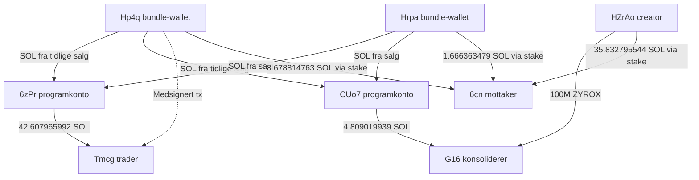
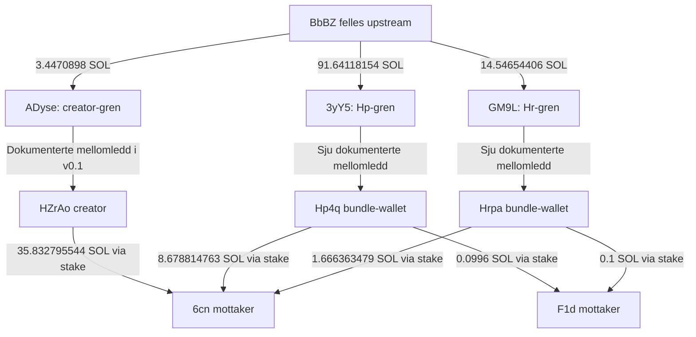

# ZYROX — Devsold-verifisering, 3. oktober 2026

**Gjeldende analyseversjon: v0.114. Ledger: U01–U453; neste ledige U454.** Avsluttende SCAM / COORDINATION ASSESSMENT + REPORT STRUCTURE. SUPPORTED COORDINATED OPERATIONAL STRUCTURE; konkret co-authorization/konsolidering og rapid selling dokumentert. 606.331808740 proceeds, 0 CLEAN, 597.487092059 konservativ PARTIAL minimum; 0 SOL til endelig identifisert beneficiary. Same-owner/operator, intent og juridisk fraud UNRESOLVED. Klar for evidensgradert hovedrapport-drafting; frosne faser uendret.

Historisk v0.42-sammendrag: Checkpoint v0.41/U325 er bekreftet. Nye RPC-inventarer for HZrAo, Hp4q, Hrpa og G16 gir henholdsvis 39, 27, 26 og 55 signaturer, dekket av 146 unike jsonParsed-transaksjoner. Etter eksklusjon av allerede ledgerførte/lukkede grener, mixed-funds, tips/dust, refunds, kjøps-/AMM-/tokenkontoer og programdirigert routing finnes ingen ny kvalifisert direkte money-trail-gren i dette inventaret. Hp4q→5B3 (46.114163669 SOL pluss separat 0.000650240 SOL initial funding) er rolleavklart som off-curve, CPI-opprettet konto under det allerede undersøkte 8gxk-programmet og ekskludert før hop-for-hop-følging. Ingen ny kvalifisert økonomisk edge er ledgerført; U326 er fortsatt neste ledige ID. Dette er et avgrenset nullfunn, ikke bevis på at ingen andre historiske eller fremtidige spor finnes.

Status: INTERIM. Dette er et tillegg til v0.1, ikke en fullført kartlegging av alle funding-røtter. Kildene er Solscans live-visning av decoded/finalized-transaksjoner. Rå RPC-data og kryptografisk verifisering av signaturer er ikke hentet.

Mint: FACvJMFBWQ1GYm9dgZ7XHvs85V1EcK2SqHf534kspump
Creator: HZrAoEWQGd5dsTzkj7YbzQq5ou3YQEWQQWvjBNRG9Atu

## Resultat

Devsolds konkrete bundle-liste er funnet. Omtrent 720M tokens kjøpt og solgt av de to oppførte wallet-ene er bekreftet. At disse er teamets egne wallets er ikke dermed bekreftet. Direkte finansieringsflyt, medsignering og felles mottakere gir sterkere koordineringsevidens enn timing eller beløpslikhet.

## Wallet-register

| Alias | Adresse | Rolle |
|---|---|---|
| Creator | HZrAoEWQGd5dsTzkj7YbzQq5ou3YQEWQQWvjBNRG9Atu | Deployer; 100M launch-kjøp |
| Hp | Hp4q9Tfeo5Cp7BuFNe6pRo3DqfPZVAiEampauGzPyyod | Devsold bundle-wallet; 693.1M kjøpt og solgt |
| Hr | HrpahQoW21MEA8qbsR9Z8oeN8NLFmTKukYSjok2Ktou9 | Devsold bundle-wallet; ca. 26.9M kjøpt og solgt |
| Tm | TmcgWRgFqddHiUBDYysSCsvMA6SiGBHwLfE9xbmf7CW | 137.5876M kjøpt; 16 salg |
| G16 | G16wTdwT5e8H292JPLCCNXoYnPCzacQnU6VPZfKeWncZ | Creator-tokenmottaker; konsolidering og salg, v0.1 |
| C1 | 6cnRXniBFNYrxnMebd5vqEv2d5wuXumbKwWkBjV8b88L | Felles SOL-mottaker; eierskap/servicerolle uavklart |
| C2 | F1dCFudwvrwCmUUbVTG1oYt3iWJpXEajrNgr3RNX5mpG | Senere felles SOL-mottaker, v0.1 |
| C3 | 6hR7GwHpdHbJgNJAagm64KMsMYu8mR6ExzmbE5N8wv1N | Mottaker fra C1 og C2, v0.1 |
| P1 | 6zPrzDZFJQmh4gBRtd5pNRC3vwfQkv4SLcyJSXRu6gnE | Program-opprettet konto; SOL-flytbrygge, ikke automatisk personlig wallet |
| P2 | CUo7RXbfyjcGUr5RzZMrjMkh5Xhoa3E8wakyoBXrGnQK | Off-curve, ikke-persistent System Program-PDA/SOL-flytbrygge under `8gxk…V2kn`; første observerte funding fra Hp4q; eksakte seeds/bump uavklart |
| PA | GVt5opeGJgPjxr817qk7YseN5vtKi24Ye4bVxQVc7C3h | Bred programdeployer; deployer og nåværende upgrade authority for `8gxk…V2kn`; ingen direkte ZYROX-hovednodekant påvist |

## Devsold mot observerte transaksjoner

Live scanner observert 2026-10-03T06:47:05.756Z:
https://devsold.wtf/FACvJMFBWQ1GYm9dgZ7XHvs85V1EcK2SqHf534kspump

| Påstand/visning | Status | Kontroll |
|---|---|---|
| To bundle-wallets | CONFIRMED som scanner-klassifisering | Hp og Hr ovenfor. Faktisk Jito-bundle-ID er ikke hentet. |
| 482.53M kjøpt | CONTRADICTED som samlet kjøpsmengde | Hp har to BUY-instruksjoner i samme tx: 455633422.064004 + 237466577.935996 = 693100000. Hr kjøper 26899999.998698. Sum 719999999.998698. Scanner teller bare første Hp-kjøp. |
| 720M solgt | CONFIRMED som brutto salgsvolum | Hp selger 693100000; Hr 26899999.998698. |
| Teamets wallets solgte 72% | SUPPORTED koblingshypotese; eierskap UNRESOLVED | Salgsvolum er bekreftet, men teamtilhørighet er separat. |
| Creator-tokenmottaker har ikke solgt | CONTRADICTED | G16-mottak og salg er dokumentert i v0.1. |
| Dev/team tjente 98.7 SOL | UNVERIFIED | Ikke reprodusert. Originalkort, tidspunkt, wallet-sett og beregningsmetode mangler. |

## Avstemming av kjøp og salg

SOL/WSOL har samme enhet her. Kjøpsbeløp inkluderer observerte swap-gebyrer; tabellen trekker ikke fra alle nettverksgebyrer, tips eller netto rent-kostnader. Differansen er derfor ikke endelig nettofortjeneste. Interne overføringer og stake-withdraw telles ikke som nye salgsinntekter.

| Wallet | Kjøpte ZYROX | Solgte ZYROX | Kjøpskost SOL/WSOL | Salgsmottak WSOL | Differanse før øvrige kostnader |
|---|---:|---:|---:|---:|---:|
| Hp | 693100000 | 693100000 | 82.947483966 | 129.372237495 | 46.424753529 |
| Hr | 26899999.998698 | 26899999.998698 | 12.860103707 | 12.716876102 | -0.143227605 |
| Tm | 137587563.532596 | 137587563.532596 | 42.607315750 | 109.663672076 | 67.056356326 |
| Sum | 857587563.531294 | 857587563.531294 | 138.414903423 | 251.752785673 | 113.337882250 |

Hp og Hr kjøper i slot 452029524, 17:18:06 UTC, og selger alt innen 17:18:09. Tm kjøper i slot 452029526, 17:18:06, og selger hele kjøpet mellom 17:18:10 og 17:19:03. Samme blokk/tid er ikke alene eierskapsbevis.

Ikke summer disse volumene med G16-salget til en prosentandel av unike teamkontrollerte tokens. De samme tokenene kan kjøpes og videreselges flere ganger.

## Evidensledger og grafkanter

Alle tider 30.09.2026 UTC. CONFIRMED betyr observerte decoded-transaksjoner, ikke bekreftet menneskelig eierskap.

| ID | Status | Forhold | Primærkilde |
|---|---|---|---|
| D01 | CONFIRMED | Hp to bonding-curve-kjøp, 693.1M totalt, 17:18:06 | https://solscan.io/tx/52ZjUbg4bzdQoAsFeJuLgqM5b5kmeQpgp79ndnAi13D7W795N8A7BLon9t7LhENRi5wUGcqMb5RWzNDs2AB9nKkw |
| D02 | CONFIRMED | Hr AMM-kjøp 26899999.998698, 17:18:06 | https://solscan.io/tx/4JrhsmKT44mQpZh5kTYFMcFWXi2Hu8Lg3U5BkUS4WEw66pWeR7GkiR299KY2WFD5XZQTH5pvBMW957WrdjjRh5Xf |
| D03 | CONFIRMED | Hp første salg 278149496.731053 for 59.510477626 WSOL; første observerte funding/bruk av P1/P2 i case-vinduet; sender 42.607315752 SOL til P1 og 16.903161874 SOL til P2. Ingen separat `CreateAccount` for CUo7 er observert | https://solscan.io/tx/5jRjC6ULUHNd88x2gazxAUGcjA4yCGAqusvbqXHNkh7pASuSsyB8wn6CRd17wZ9D3rUkeYoxLd2qQopFgCinMi7T |
| D04 | CONFIRMED | Hp andre salg 414950503.268947 for 69.861759869 WSOL, 17:18:09; 13.674826944 SOL til P1 og 10.072769256 SOL til P2 | https://solscan.io/tx/1o27R3x3MgdCNjGXQCYMhnxTzeQjg2EnXMXcMRVE9ybbaa1fSXvQCQWYgn2YzZzHuef9onbRUcVbYpFM2FsjyGK |
| D05 | CONFIRMED | Hr salg av hele kjøpet for 12.716876102 WSOL, 17:18:09; sender 6.801611461 SOL til P1 og 5.915264641 SOL til P2 | https://solscan.io/tx/4fGjRC7N9251H6oDNjC6Qten3H1Gs1p7WQaZRbtpv4wvp9dTNJDqD3azbgrZc4iXKWxpR44E3WEk8jHhQAPWCUvj |
| D06 | CONFIRMED | Hp og Tm er begge oppført som signers i én finalized tip-transaksjon, slot 452029526 | https://solscan.io/tx/AgMVBsknEvB22wZFR2zqSbGtoJxxsdybi71ZQeH2BGSYC1qYUvnWoiCkmjYrvAL8HTkdqSgrqE6rwz6piJeh38u |
| D07 | CONFIRMED | P1 sender 42.607965992 SOL til Tm i kjøpstransaksjonen; Tm kjøper for 42.607315750 WSOL | https://solscan.io/tx/3oj1pmRLg9F7LvBjJBjwXSLuvWnMDPf2p31yGKyfm6b7J9efz6xQJjcBQPdrQoozM1hLVaLjyHA8JZRB8wdfBQs2 |
| D08 | CONFIRMED | P2 sender 4.809019939 SOL til G16 før G16-kjøpet på 4.808369696 WSOL | https://solscan.io/tx/2vst8Tcw7tMjR1axmwEP9VQf7dqHVfdf4bBW7h1wBDcTXoP6jZ6gdRAgVPriEmUv3RweoiywKAtrcAFQBugD47Ca |
| D09 | CONFIRMED | Hp -> ny stake 45Z9us2doma5S5bGto7UKdLRhxSD6XmQgr9yqbs3Erst -> C1, 8.678814763 SOL, 17:50:18 | https://solscan.io/tx/3WsXfkKWYFwXErEJnptccpKZXAnM55BFwZdwqVLrmzxC1L3f3FBgYuUWgqR1vthQjeQfpFCxSMZFqAWPGPFPPEm |
| D10 | CONFIRMED | Hr -> ny stake EKPF32VndzNx49m1ezx9QsNHz8QcR6aumdYbyaYuxNAT -> C1, 1.666363479 SOL, 17:50:18 | https://solscan.io/tx/38siyxuYmsKbbW3i4TJNceFYz2o7s4d3yVuDtH85mdsoFqHg31D7gEtg3rDhvYsSPdrDEvAEV9wYesMnZ68jAKSm |
| D11 | CONFIRMED, fra v0.1 | Creator -> ny stake 2skgam -> C1, 35.832795544 SOL, samme slot 452036737 | https://solscan.io/tx/N2LnQDfNy9yiSuRAR7FH49a7tEWnBvCgZCYDYNrwgax3ATt4R8j5n1b5oFVrC9TWSQF5YAQGgh8YbTMXE1ruDbx |
| D12 | CONFIRMED, fra v0.1 | Creator co-autoriserer 100M til G16, 17:58:26 | https://solscan.io/tx/29VDE2VcR724cRjzCBoWCFuWZLGrD7ySQiuMkwpgTVvsndw13TeHohwmhW1oM4jHTTLytDoD9QH7jKRP6nKY4Gsr |
| D13 | CONFIRMED, fra v0.1 | G16 selger 581529004.875567 for 145.975602514 WSOL, 17:58:28 | https://solscan.io/tx/2wyYPRdcJ3TGT7JFC9Yqg5hytrU6cp8SeanzcLG9NFKDpBt6F4yja5mWJdmiggiki21cBbJQR8EyiUVRrRYFPued |
| D14 | SUPPORTED | Hp/Tm operasjonelt koordinert: medsignering + direkte finansieringsflyt gjennom P1 | D03, D06, D07 |
| D15 | SUPPORTED | Creator/Hp/Hr knyttet til samme collection-nettverk; ikke bare lik tid/beløp | D09–D12. Service/aggregator og reelt eierskap må fortsatt vurderes. |

## Wallet-graf

Pilene nedenfor er overføringer, ikke eierskap. Den stiplede forbindelsen er medsignering, ikke tokenflyt.



## Tmcg: alle 16 observerte AMM-salg

| UTC | ZYROX | WSOL mottatt | Solscan-tx |
|---|---:|---:|---|
| 17:18:10 | 12579868.429379 | 6.525569570 | https://solscan.io/tx/2tz4dHvdr8gDzTFhUakAGvEhgqxmvGVCAtDqfVKFHvv7nDsPnuXpNkJxgWvxE4Sg4r3yE6RutzsPhutchaqapm1s |
| 17:18:14 | 10616340.913298 | 5.831639753 | https://solscan.io/tx/2pe9ohP1mV6o8kvcNXRdM53jPPKJqzrSZcmr972MHM1C3hH7Y5ZeWvFEnXpzqKMjHUm2XZqYCA92oaATWruJWX9g |
| 17:18:17 | 13136118.696438 | 7.562734294 | https://solscan.io/tx/4UYtwihmCFa1mzcXFmZFomNT73S1jcRT1T3LwazK7xkE18JWtpALfTKZgUgLjXgnTBbZc3WXhcy741uJ3yRbqRv2 |
| 17:18:21 | 5951405.900417 | 3.660644455 | https://solscan.io/tx/461pxR2UcDkf6xB3Mvmj9qUF6NqHkUky838pFobHimgMxHd7UV6wrManT6juXqLjcxw7mn2MuuT9CzuG4Ho6PKRL |
| 17:18:24 | 6642328.940057 | 4.210467549 | https://solscan.io/tx/5a4Swfp5jJJcEiCai2pyJSe8CEM2Rcj2RSmLWsikvqF4R85KTpKXTJoR2qrJMxXqwGrpp3ctsCNqjcbjJisZ6XTd |
| 17:18:28 | 7940553.773168 | 4.948644457 | https://solscan.io/tx/J86BFHrpRpaGS2vR3qoMDb8PMdpwwHcKLJq1JnNqSLUNud9KhxK94QndnWhyJPyGmC9cSFQq9fcW3YEYzUjRhiS |
| 17:18:31 | 10146000.164658 | 9.934182541 | https://solscan.io/tx/3zHShrGSEetGNVKHMFsJmZDJECzg6Tt8egHrZRg8ymhRrrRj436dBDsKDYdRRmwQ2QzGpQqSNfA86VJSb8pdGPw4 |
| 17:18:35 | 5027711.970193 | 5.007593709 | https://solscan.io/tx/5MUuUM6LmyvrWEz2UybLaVhYFVvsLnd7R9SBdmiC6Zjjc7qdHdBG44m3nhfMeZK1fwPMKFdDpcnHg8FFgaHmy2jU |
| 17:18:38 | 9761614.128386 | 9.257132389 | https://solscan.io/tx/62idmuDgyzmHdzZ6Qq2HX2kb8FjLJYz3zuBtYdcfe2vqwkjc5zTrw4DBLUP9tzcfqQK1Zo4GYcAxcgWmqUq9K3fD |
| 17:18:42 | 8823693.729957 | 8.573075930 | https://solscan.io/tx/QaauUb5xEGuu5YVDDE5nrHitkw5dDHt42GZN55nQjkesHeSsPqv12qt3ser6SkPfTfn1jkdL445GFpYkPi5CwJ3 |
| 17:18:45 | 6679939.072417 | 6.576709272 | https://solscan.io/tx/2zJk5fdrggxqPnMLaVroqpvyEkik2LesmcyznUYAqF7dZXPJx5sRBchYpkCUkgZc3s5yBUiiUW1G5NGbW71TzyMX |
| 17:18:49 | 4850330.989503 | 4.786663923 | https://solscan.io/tx/4fHHLXvohmhxvx67KET7MvcnSfMReAGNXQPjZGs5ZD9miy94rs5BRYUph9HRgGANqdc7mRt2SQeKNWv2M2UDSRyu |
| 17:18:52 | 7303734.853799 | 6.986829165 | https://solscan.io/tx/5YLVzn3GHBaBW9gKQ2akCeYLYxHN8keC2G39X588vPm3vShPn2ZKsui6SqoL4XggAGNe9A4sSjkzaqi5Ly94Rzoi |
| 17:18:56 | 12030090.706758 | 11.092003661 | https://solscan.io/tx/2xFrM5McCsUXpqvbh5p1XostzkdFo6h8LNW4vShpLKxKNMHEEGwsD53WopzjJ46ERJBHQRPhLxFWGWKn1aH2TzRr |
| 17:18:59 | 4682649.795819 | 4.479488897 | https://solscan.io/tx/2W69fTffp7rmQFJKtpJJsMrtiSH9PzLiJVSbb1RkuxVuyHEPYmQRCmryDFsGh59cWSbVYtsnF3P99J6eu7vybUyQ |
| 17:19:03 | 11415181.468349 | 10.230292511 | https://solscan.io/tx/2jzwkic7dKaLvgM81VvmjXtKoZykdwqDe4FTzzNknMBZDY5XLePFSbzKLcvfWYinbUhtjHWQ96iamMi7vCa4rqjK |
| Sum | 137587563.532596 | 109.663672076 | Avstemt med initialt kjøp |

## Claims og begrensninger

| Spørsmål | Status | Vurdering |
|---|---|---|
| Genuint fair launch? | UNRESOLVED; betydelig konsentrasjon CONFIRMED | Hp alene kjøper 69.31% ved launch. Sterke operative koblinger finnes. Ingen endelig påstand om team-eierskap eller bestemt bundle-tjeneste. |
| Creator-associated kontroll/salg av stor supply? | CONFIRMED flyt; SUPPORTED koordinering | Creator sender 100M til G16; 64 kilder konsoliderer over 581M og G16 selger dette, v0.1. Beneficial ownership av alle kilder er ikke fastslått. |
| Majority supply locked? | SUPPORTED motsigelse, betinget av nøyaktig claim | Over 58% kan overføres og selges ved 17:58:28. Dette er uforenlig med en fortsatt aktiv lock av et flertall på det tidspunktet. Originalclaim, lovet tidsrom og lock-kontrakt mangler. Stake-routing er SOL, ikke en ZYROX-lock. |
| Ingen presale/KOL-allokasjon? | UNRESOLVED | Tidlige kjøp/co-signering identifiserer ikke KOL-roller eller private avtaler. |
| Airdrop til followers? | UNRESOLVED | Ingen dokumentert mottakerliste eller X-identiteter å avstemme; transfers alene beviser ikke airdrop. |
| 10M market cap guaranteed? | UNVERIFIED løfte og historisk pristopp | Rapportert ATH ca. 516k er ennå ikke rekonstruert fra historisk pris/supply. Markedsverdi-løftet kan ikke verifiseres med tokenoverføringer alene. |
| No rugpull/no pump and dump? | UNRESOLVED hensikt/klassifisering | Betydelige koordinerte exits er dokumentert. Ikke automatisk bevis for bestemt hensikt, svindel eller liquidity rug. |
| Sevilla-wallet | UNRESOLVED | Full adresse eller screenshot må innhentes. Ikke koblet til noen adresse ved gjetning. |

Funding-røtter er fortsatt ufullstendige. Solscan-kontolister viste ti fundere til Hp med omtrent 9.16 SOL hver; detaljer og ultimate røtter er ikke ferdig verifisert. Første-funder-labels og beløpslikhet gir ikke eierskap. Creatorens funding-graf og 0.040x/0.010x-sporet beholdes som tidligere dokumentert/åpent; de nye bundle-adressene er ikke automatisk samme sett som alle gamle kilder.

Neste nødvendige input: originalt Devsold-kort med tidspunkt og eventuelle flere wallet-adresser; full Sevilla-adresse; daterte pre-launch screenshots med ordlyd og eventuelle lock/airdrop-lenker.


## Oppdatering v0.3 — felles upstream-kilde verifisert

Undersøkt 03.10.2026 etter v0.2. Alle nedenstående funding-kanter er CONFIRMED i Solscans decoded finalized-visning. Eierskap er fortsatt UNRESOLVED. Kjeder dokumenterer forbindelser, ikke at hver mottatt lamport bare kom fra én kilde: flere ledd splitter og samler midler.

Creator, Hp og Hr har nå en felles verifisert upstream-kilde: BbBZuboLxyw3LBjjMBb6RCn9UP3Bz9DwctNgRmuwvR1f. BbBZ er et verifisert felles punkt, ikke en ferdig fastslått ultimate funding-root eller identifisert person.

BbBZ sendte 3.4470898 SOL til ADyse8NncFppb148UxYuUt73mfpFLBfby3Tg3MAsBPfq kl. 17:15:43. Denne creator-grenens øvrige kanter er dokumentert i v0.1: ADyse -> 7S6 -> EeZY -> 4min -> 6Ta -> GPVxz -> 3FEx -> 8y1Yx -> creator. Første kant kontrollert på nytt: https://solscan.io/tx/c7aAx3PDf1DRxyDH9e9A5bVmBt57Jx4YsrRpYuNo8gAwwcnxwwymdD4WYFr4Ub6G6QaRchr546HwtyP2AfjwY1Q

### To nye kronologiske funding-stier

Alle tider nedenfor 30.09.2026 UTC. Dette er to dokumenterte stier, ikke alle parallelle grener. Beløpene er de enkelte overføringene, ikke summer som skal legges til salgsinntektene.

| Fra | Til | SOL | UTC | Evidens |
|---|---|---:|---|---|
| BbBZuboLxyw3LBjjMBb6RCn9UP3Bz9DwctNgRmuwvR1f | 3yY5Cs37N7TERUzmpjBgq7XWsJisYhix2tUc35ZiKa56 | 91.64118154 | 17:16:06 | [F01](https://solscan.io/tx/2uUy7qYC3qrun34WwiTvy79KSxyWZRtxdDwuo5wN1w5dU45WgPoqkKjmp4XriQW3CzVDeYp89kiFmEn7JvnFv8EK) |
| 3yY5Cs37N7TERUzmpjBgq7XWsJisYhix2tUc35ZiKa56 | E9Te9bdtX6HrALyXU42pVMTCJH94iUW6nrY676PemgxX | 4.582058827 | 17:16:06 | [F02](https://solscan.io/tx/5rZst2R8n2ofbEGEw1MAw1X1asBS7pYkWrEkteGj3W8EKfzv3Rrqin59TNQeQMNb6GPEXw4gssdaWqfYncUi7nJz) |
| E9Te9bdtX6HrALyXU42pVMTCJH94iUW6nrY676PemgxX | D1UV5gwNAMca6xkV4XJAQwttksw7asmyioaDjhhf7Z2S | 4.582053827 | 17:16:08 | [F03](https://solscan.io/tx/3tFLsKKP7FTpNYZgonMvGh2DjNT8A67gfRhHBkNue47qd5kQ6LTo6xrKXr8E9kEWaQyghbY1NcGS1KRvfVAV78DC) |
| D1UV5gwNAMca6xkV4XJAQwttksw7asmyioaDjhhf7Z2S | 8ySbR18BZrfW98cKoroYLffSfUSwEJZyWQSrTkdyPLv2 | 4.582048827 | 17:16:08 | [F04](https://solscan.io/tx/3QPn4mfrVxSwykQa5bcEkjWvnxbcs5awDTxqYqr1YcA75NdQeMgHixG3qmczNNdtWw8om7VLjmrYiDXn3rfJNju8) |
| 8ySbR18BZrfW98cKoroYLffSfUSwEJZyWQSrTkdyPLv2 | BZ9mPLztWYrv9xcWtgwnQTVYJVpFXRgRGcbptzHYHSLR | 9.164096154 | 17:16:24 | [F05](https://solscan.io/tx/5FjePPLz2TRTk4Axzso1mTR4QpdbhLbM7zK7Nco122CyNyQ749v9VwTKoxGU1otHtXNErYTDEmFgGZBdezuBDhat) |
| BZ9mPLztWYrv9xcWtgwnQTVYJVpFXRgRGcbptzHYHSLR | 62DWdupxLroTc2jfiHEXdnzbg5aWemMHwkkTrpU9SNrN | 2.291022788 | 17:16:24 | [F06](https://solscan.io/tx/5gpnfRA4Z1zSY8VX756WB2qsur8STA9CeBetkQwJUijwParm6RsY7V2aTQgfoatG8cknxfpWNTDMM8yMpfmHKjpd) |
| 62DWdupxLroTc2jfiHEXdnzbg5aWemMHwkkTrpU9SNrN | GhWZD17VzcdiSRUHuegmQ89pgDFS7G3jRPGSdiUGGZCn | 2.291021538 | 17:16:36 | [F07](https://solscan.io/tx/4RKL11tJyeGoDEtNFNoRjTCHndHydkV3un5JeDpt3N9PNjf7SehJW2LkoqmTKCcvoU9XaEdVfs6uyUKBoiasViz2) |
| GhWZD17VzcdiSRUHuegmQ89pgDFS7G3jRPGSdiUGGZCn | G1W7jRq6eDMfEnVjSXgcqb547pyMs3bqUUupTzYh1TGN | 2.291020288 | 17:16:38 | [F08](https://solscan.io/tx/3hMjAHKEiKzDHiUeEhoqyuCBYkuNEGZgnyFQ1AM7HnAofyhmUgGgHwiUTkzqezf5tmtnzj5ZbHmN8aZGkA6LsqQu) |
| G1W7jRq6eDMfEnVjSXgcqb547pyMs3bqUUupTzYh1TGN | Hp4q9Tfeo5Cp7BuFNe6pRo3DqfPZVAiEampauGzPyyod | 9.164076154 | 17:16:39 | [F09](https://solscan.io/tx/82SaMPFHcnTJSZJoSJR69hRnJP9BRQbYuWJb42pKeYdS2ykTeZa5YBdzqN1sF3bg2jR9jiB9EAvgXUSjJMMSkqo) |
| BbBZuboLxyw3LBjjMBb6RCn9UP3Bz9DwctNgRmuwvR1f | GM9LETR7DBSvztGTtQYXbNsvjausyqZAw4qSyaBYf2Gs | 14.54654406 | 17:16:11 | [F10](https://solscan.io/tx/3wJreq8GjmtSt29xZmiEcvw5BMrXKG3HYzQR3vBbVWqAK1ZTWzC9DuFD4y1EaBSrXvvyNNT6BvqMyoAAEpQphLGX) |
| GM9LETR7DBSvztGTtQYXbNsvjausyqZAw4qSyaBYf2Gs | 8q3xt7z292qX3cZRZ3kD2nCougXMTXnjDVn97c218NBt | 0.727326953 | 17:16:12 | [F11](https://solscan.io/tx/4JR9uDrHnTWZ6yJdpfgsZQG25ZnKQRumb515YxMsccN791Ya189hQGdkHMHhzPv86CNwc2QrBxFBYcxXN6rvh5Gc) |
| 8q3xt7z292qX3cZRZ3kD2nCougXMTXnjDVn97c218NBt | 8MYo7TDhkkzv3m6STifXFCXj2Avrr5aYWWngzvvFiknk | 0.727321953 | 17:16:13 | [F12](https://solscan.io/tx/3BsCuBYRM2RvWEDcVSjjcAE4L8KXskBMGcUppMzKu4u571enY5AV4xziD9MPJJ7g1LG719KjmqFiVQTUdkQAf5px) |
| 8MYo7TDhkkzv3m6STifXFCXj2Avrr5aYWWngzvvFiknk | AuaM9EjM2YgNXRUadMYuBj5yyuPqpyJbxogCeG5twWka | 0.727316953 | 17:16:13 | [F13](https://solscan.io/tx/3Kxq7kpdzPNpSXPCyypSXU6M7Zvp4AJUYLMxfuBLp6aedTW2WVnxW4mGgi7vVVNSLyabCvmSxh5isqeP694qa9Qd) |
| AuaM9EjM2YgNXRUadMYuBj5yyuPqpyJbxogCeG5twWka | 76gj5nxsHMt68Km2YCM3t2eRxtA5rBeeC5P4czsgXT4i | 1.454632406 | 17:16:21 | [F14](https://solscan.io/tx/dQRVFLaBEpSumo7qbWeA791bUfMKyTTshBqNYBo13hA7XyJbsf1jjMseyNChXjVbquy7cLTYggrT2a951snGYQH) |
| 76gj5nxsHMt68Km2YCM3t2eRxtA5rBeeC5P4czsgXT4i | EdQkCQziRyx7a6BmADyZysVo5Rr52e1MzaGSD31NHbPH | 0.363656851 | 17:16:21 | [F15](https://solscan.io/tx/4LCdjECVkXmekRWQueLzELXfsDs1N3csLLSt3SpA9EjxoFAXu3WPUvXSwKYa1oGeT4fHow16X8QTSb22NR3Yr9aR) |
| EdQkCQziRyx7a6BmADyZysVo5Rr52e1MzaGSD31NHbPH | EV49ucuEsyfVaZ1qyKeqeRBimYUm8pjxVQEZtuJjtEDc | 0.363655601 | 17:16:23 | [F16](https://solscan.io/tx/4RPaQVVgFe59hNacozteUNKcqsdS6BW6k59n2rBaP3vpX5YmWjYd1GKax3V9mkDJ7cooTMn9gYzk13uhTcQPDY6k) |
| EV49ucuEsyfVaZ1qyKeqeRBimYUm8pjxVQEZtuJjtEDc | GmJgapaTrnk3np6cXABxYUqf4xA3jTCrhTfUesvtgX8v | 0.363654351 | 17:16:43 | [F17](https://solscan.io/tx/31dQMeGkJwLuw4FXtjDFW6NKNMAduUwNkkceF6AfgkwktHh7LHoVxxAcwKh4UQwSxtc9J9i4oxhLB6dUi8ivQJbZ) |
| GmJgapaTrnk3np6cXABxYUqf4xA3jTCrhTfUesvtgX8v | HrpahQoW21MEA8qbsR9Z8oeN8NLFmTKukYSjok2Ktou9 | 1.454612406 | 17:16:44 | [F18](https://solscan.io/tx/DnvVu1kUfvYiR2eP6HXRUSJMj4PzktDwaBkGv4RU6a7Nb7cov8Vb4P5M92ugFSf7RtJVtHw2QDWTSc4Zuy8EEy8) |

### Direkte funding av bundle-walletene

Hp: ti verifiserte avsendere, hver 9.164076154 SOL, sum 91.640761540 SOL, 17:16:39–44. Hr: ti verifiserte avsendere, hver 1.454612406 SOL, sum 14.546124060 SOL, 17:16:44–48. Alle var før launch. Dette erstatter v0.2-forbeholdet om at de direkte funding-transaksjonene ikke var ferdig verifisert; ultimate røtter og alle sidegrener er fortsatt ufullstendige.

| Hp-fundere | Hr-fundere |
|---|---|
| G1W7jRq6eDMfEnVjSXgcqb547pyMs3bqUUupTzYh1TGN | GmJgapaTrnk3np6cXABxYUqf4xA3jTCrhTfUesvtgX8v |
| 9FAguDq5G22C9YLm8gqdkrSq3gGiykdnc7V8EBxvvVw9 | 7f96Weg2xhYzqgWSFJi5hr1gkMTDPef8jfnyEPbTw8cW |
| DSRGBmu54ZFgsxncWoT2uEgQkBF1ZikZ4ko2dAQNy6w5 | GYhGnF26p8HqHGFF9rfpTGzSDFC4p76DEnyzHnPCMrL5 |
| BvfeNd5UWXJZWbURNrmF3JF34q463cXZqP2HYgddKzf | 7SxQv2N9LipWL7EhavFok9me2zKaUpD8xvVWGHT8A9ED |
| 5wjUCbqsQ77LgV1TKMvy1hbg2Wvh9NkT8inJFCFybpzb | 5DURTso6cr1u6gZPpLtg5jHMDupDwNTm5JrCjhhHmdFj |
| FXaanteZQPdeaD45JEEtG4Yu7BgFY8tGG4KCdjbmnEoP | APaGGySNEkiGQ5n8wmxSfuWA4GmKKUpirahHuJDK8spP |
| DqEoiLwJLV8LgtwpLmtcsZvLgELPJ8LnUpTEwHyigcTK | Grc7AGjtC2bE5XfHVAoQn5iGpGhTQaCxL7w5GqcyeMnB |
| Dsun394GT7QanqtP6dF3qwYpPaXyANKHDPLnjSqrzjRV | HXDPm7pnAkf7o5TBCExHuBVHW6cjYP7zrARXZvgkhXYg |
| 39PE8B1Si5oNcUFjCdthTuE3c4UQjup5ff94QYjWwSpN | EGnfDFgkwE3WzSdkj2kC7ecEezf9Jav1fhts59oRMxJG |
| 56n1cx1DYspMkH9fSXwY81Q71CZsiK2oyj91iH8veQea | 6XYFV1hpUyN5AADRG2VvJuPeRHRembKwVYcGB2giQAbf |

### Nye exit- og medsigneringskanter

| ID | Status | Observasjon | Primærkilde |
|---|---|---|---|
| F19 | CONFIRMED | Hp ruter 0.0996 SOL via ny stake-konto til F1dCF… kl. 17:59:49; ytterligere 0.0004 SOL til tip-kontoer. Ikke 0.1 SOL netto til F1d. | https://solscan.io/tx/2WwQHucWYpFGAapH9gNXmQStq3KK2rKa4dbv1zs9FW5KkZizcKr7zcn2K1s2CZQvDscsxyTELHkDX1xrLGdyDn7r |
| F20 | CONFIRMED | Hr ruter 0.1 SOL via ny stake-konto til F1dCF… kl. 17:59:49. Dermed deler Hp/Hr både 6cn- og F1d-mottakere med tidligere undersøkte wallets. | https://solscan.io/tx/3VxR5ga29LzMFn5Uvyo7uiPE1krHr1NEYfBTkTMWJYfzpoj6LDZQuKGsemxoZx5A9GDe1besoL8CPosTxXox3FoX |
| F21 | CONFIRMED | Hr medsignerer med Wksb8WrEFFSeCcyhmxHGK79iFxbA89x8yeWSqgYJmLt og J5rWMWJxuUqsC39oexns3Jm26HQjyozRa6Pz5rRLM4U3 kl. 17:18:09. De to nye adressenes roller er UNRESOLVED. | https://solscan.io/tx/4pH4om1nrjjoSkxS7qWEVody2FNJxA8gUVSenxcTBo8kagcQMtZYcB98h4SgavX66VEm9G5badiRwL2QEqNxPrWL |

### Oppdatert tolkning

- CONFIRMED: direkte, tidsriktige funding-stier fra samme BbBZ-punkt til creator og begge scanner-oppførte bundle-wallets; flere parallelle ledd gjenstår.
- SUPPORTED: et creator-associated operasjonelt nettverk. Dette bygger nå på både felles upstream-funding, felles downstream-mottakere, co-signering og creatorens token-konsolidering — ikke bare beløpslikhet/timing.
- UNRESOLVED: én beneficial owner, personidentitet, tjeneste-/mixer-/operatørrolle og hele wallet-settets nettofortjeneste.
- Ved launch kjøper creator 100M, Hp 693.1M og Hr ca.26.9M: samlet ca.82% av initial supply fordelt på tre nå funding-linked wallets. Dette er en konsentrasjonsobservasjon, ikke automatisk 82% bevist team-eierskap eller 82% unike tokens solgt.
- Ingen presale/KOL-allokasjon og airdrop er fortsatt UNRESOLVED; funding-kjeder identifiserer ikke sosiale roller eller off-chain avtaler.

Metodekontroll: senere små returoverføringer kl.17:51:42 ble funnet i listene, men brukes IKKE som pre-launch funding. Hp-stiens riktige D1UV -> 8ySb-kant er 4.582048827 SOL kl.17:16:08, ikke returbeløpet 0.00501125 SOL. Hr-stien bruker 8MYo -> AuaM kl.17:16:13, ikke en senere retur fra 92dKo. Dette hindrer tidsmessig umulige funding-slutninger.

### Kompakt graf over de nye forbindelsene



Avklaringer som gjenstår: alle parallelle funding-grener og BbBZs øvrige røtter; Wksb/J5r og øvrige co-signers; originale claims/lock-bevis; Devsolds 98.7 SOL-metode; Sevilla-adressen. Ingen scam/rug-konklusjon er satt.


### Upstream-kontroll og alternativ forklaring

Solscan-visningen for BbBZ observeres med «Funding out» 1,029 accounts og 1,433 transfers. Dette er explorerens aggregerte tall, ikke en selvstendig opptelling av unike eier-wallets. Den eldste funder-labelen peker på 6hR7 rundt 6. september; September-6-kanten er dokumentert i v0.1 og er ikke automatisk provenance for alle senere midler. BbBZ har også aktivitet 2. oktober. Tjeneste-/operatørhypotesen forblir derfor reell og UNRESOLVED; alle 1,029 adresser må IKKE klassifiseres som ZYROX-team.

Observerte nye pre-launch-innbetalinger (CONFIRMED, alle 30.09.2026 UTC):

| ID | Fra | Til | SOL mottatt av BbBZ | UTC | Kilde |
|---|---|---|---:|---|---|
| F22 | 3GTWiMwAhZHSU2aARBTCb6YuRLRumvUtmsXXbT2C4uBi | BbBZuboLxyw3LBjjMBb6RCn9UP3Bz9DwctNgRmuwvR1f | 123.588073912 | 17:04:26 | https://solscan.io/tx/wWqWBdusM3SdBXnsRgzegnBZ5qEwQ3Z2r8SWe5fTMTz6en6QH9gWLRTegxwwtVxcTjF7jDJASdMbTNK6gk8WoGK |
| F23 | AZoiopP8U77GZjn4CfaijSXpqrhUDwfBCXeFzY6csAdG | BbBZuboLxyw3LBjjMBb6RCn9UP3Bz9DwctNgRmuwvR1f | 118.925529475 | 17:13:13 | https://solscan.io/tx/3RyBFfQTEU5x3Shxomyj518fxP2egFdjMKwYLW6BVVQXK539Nxq3dHqDC5oYr4ZS8psMdW7evK4xT6mYb6SBmacT |

Beløpene er nettkantene til BbBZ. Begge transaksjoner har ytterligere fire tips på 0.0002 SOL; de aggregerte summary-beløpene er derfor 0.0008 SOL høyere. Legacy Mode ble brukt for å kontrollere alle transfers, fordi Summary Mode med «Key Actions» skjulte selve BbBZ-overføringen.

Disse to innbetalingene summerer til 242.513603387 SOL, men pengene kan være blandet med eldre saldo og andre transaksjoner. Dette er ikke et bevist samlet ZYROX-budsjett og ikke ZYROX-fortjeneste. AZoi-kontolisten viser videre mange stake-withdraw-innbetalinger og en «Funded by»-label for 7yiBbihLx18a1VJ48Hzts8j2ZZcaCRMW7GYYePEFD85B; dette er et nytt uverifisert upstream-lead, ikke en ferdig rot.

Neste undersøkelsesfront flyttes derfor fra BbBZ til AZoi og 3GTWi, samtidig som et case-spesifikt wallet-sett må avgrenses med tokenflyt, co-signering og faktiske exits. En bred finansieringshub alene er ikke nok.

## Oppdatering v0.4 — videre fra lagret checkpoint

Ved gjenopptak 03.10.2026 ble gjeldende rapport lest: lagret versjon 1, endret 07:16:03 UTC. V0.3 var fullført og lagret. Eksisterende kjøp/salg og F01–F23 ble ikke undersøkt på nytt. JSON-ledger og JSON-graf fra v0.1 er fortsatt eldre; denne rapportens tillegg er ikke innarbeidet i dem.

### Nye kanter til 3GTWi

CONFIRMED i Solscans finalized decoded-visning, 30.09.2026 kl.17:04:25 UTC, slot 452026471:

| ID | Fra | Ny stake-konto | Til | SOL | Kilde |
|---|---|---|---|---:|---|
| F24 | 6o2E3mvMLVVcjsUDZGtodF5PxnoGiXFWvVUmMq9GyJQH | Dai7ogGM8dF6XgdZ4PyF2mEVj5WdiRJCv2po2VryuW58 | 3GTWiMwAhZHSU2aARBTCb6YuRLRumvUtmsXXbT2C4uBi | 0.094537907 | https://solscan.io/tx/58UT8c7xLZB9BnjVfUV4numGmkoEMh6Hcgajx6n3Dc5np8czJFKy14ZsewSdC5kycx4dywSH5SH19tStrL5TJmu4 |
| F25 | 6YBrken26DJFWN8uCYyA7MVJw6FNttkdqzVHns27iN5v | GKudKFyGG8bhmUbW5PnJfnZCg2DfdWgm3tSfT6TLXuP6 | 3GTWiMwAhZHSU2aARBTCb6YuRLRumvUtmsXXbT2C4uBi | 0.123326747 | https://solscan.io/tx/K6t7RvyGAM67nEf9PTN5teDTbKQQV8o1nzc5gJaVKYJwoaZwJN2KSsmVt7hZzNeezWeuYqEC7JX1LMcQscNAfcn |

Begge oppretter og tømmer stake-kontoen i samme transaksjon. Dette dokumenterer SOL-routing, ikke tidligere delegert staking eller en token-lock. F24 har i tillegg to tips på 0.0002 SOL. De to verifiserte innbetalingene er bare 0.217864654 SOL av 3GTWis senere 123.588073912 SOL til BbBZ; resten av funding er fortsatt uavstemt. De øvrige synlige withdraw-radene er leads, ikke ferdig verifiserte kanter.

### Separat token med samme navn: må ikke blandes inn i supply/fortjeneste

F26 CONFIRMED: 6o2E… kjøpte 15648713.887970 tokens for swap-beløpet 4.694395851 SOL kl.16:53:35 UTC, slot 452024039. Tokenet vises som ZYROX, men mint er **GFKGJHWdFdgEaJJ6GbE6kJrLpVVBCiFxHZhPH8ompump**, ikke FACv…spump. Transaksjonen viser også 4.693699893 SOL fra FuZfNwwpvLfn97EnrgC2tknKt295JgBeLRk4bsD6YMDL via program 8gxk64hYgGAEnHVhRMvBGVvBXZM5WhkGkaQ6DVgVV2kn. Kilde: https://solscan.io/tx/4Y3KMWXUdCqZRuVGYCoibzhYLuPwxbgtZwhem3hmoXkz5C8e9oymSCQTSdjgNGcePBcQEKkK2XMMgKC3kuXc9iop

F27 explorer-metadata: https://solscan.io/token/GFKGJHWdFdgEaJJ6GbE6kJrLpVVBCiFxHZhPH8ompump viser Creator **CAxTxHsiBB6Y5kAAMQuPbQdAwyLrEuFYoio5YGwMwtGD**, forskjellig fra HZrAo… . Creator-labelen er observert, men denne mintens create-transaksjon er ennå ikke kontrollert.

Tolkning: Det er nå direkte støtte for at upstream-nettverket har aktivitet i minst ett annet token med samme navn før den undersøkte lanseringen. At dette er en tidligere offisiell lansering, en kopi eller samme aktørs token er UNRESOLVED. Programlikhet og navnelikhet er ikke eierskapsbevis. Ingen kjøp/salg for GFKG-minten legges til FACv-mintens supply- eller resultatberegning.

Neste åpne steg: avstemme resten av 3GTWi-innbetalingene og AZoi; kontrollere GFKG-create og eventuelle direkte koblinger mellom CAxTx og HZrAo, uten å anta relasjon på forhånd. Originale claims, Sevilla og Devsolds 98.7 SOL-metode er fortsatt åpne.

## Oppdatering v0.5 — separat create, konsolidering og upstream-exit

Gjenopptatt fra lagret v0.4 (Library-versjon 2, 07:24:13 UTC). Tidligere fullførte transaksjonsspor ble ikke repetert. Alle nye transaksjoner nedenfor er SUCCESS/Finalized i Solscans decoded-visning; det er ikke selvstendig RPC/signaturverifisering. GFKG-minten holdes separat fra FACv-minten.

| ID | Status | Ny observasjon | Kilde |
|---|---|---|---|
| F28 | CONFIRMED | GFKG-minten opprettes av CAxTxHsiBB6Y5kAAMQuPbQdAwyLrEuFYoio5YGwMwtGD kl.16:52:59 UTC 30.09, slot452023906. Create_v2 og Buy_v2 i samme tx: 1B mintet, creator kjøper 70M for swap-beløpet 2.115605614 SOL. Bekrefter og erstatter F27s metadata-forbehold. | https://solscan.io/tx/4D9VqyGJCzgs1EGyqTVrDS1FRcdVckKnjezqib7DBZzR6wQSdBLr8gVvhgfoJMr6EpZ6Uz7crgeoDxyD4ANegach |
| F29 | CONFIRMED | Kl.17:01:58, slot452025919, overfører 6YBrken26DJFWN8uCYyA7MVJw6FNttkdqzVHns27iN5v 10984341.017467 GFKG-ZYROX og 6o2E3mvMLVVcjsUDZGtodF5PxnoGiXFWvVUmMq9GyJQH 15648713.887970 GFKG-ZYROX til CAxTx. Alle tre er signers. Legacy Mode avdekker tokenoverføringene som Summary Mode skjulte. | https://solscan.io/tx/2umEdrqGNvZywCgDwai6KWyqfzZG9CkDVKjeqTXA4rUDtto3cyN4yVBD6aSoff1vrDP7Qrjb8vojp5QMLuHEX7mr |
| F30 | CONFIRMED | CAxTx selger 745617423.919486 GFKG-ZYROX for mottak 107.572157415 WSOL kl.17:01:59, slot452025922. Separate protokoll/creator/buyback-fees vises; 108.66 i kontolisten er IKKE walletens faktiske salgsinntekt. | https://solscan.io/tx/2Q9cg5Qtz7Vqf6m9dXPLgn2oFrcGHdGJ4usPQWfsSg1CUaCjzfp2uV4tYD4UiF7CzYWVjifJL7pyCyeN9MGW34YK |
| F31 | CONFIRMED | CAxTx oppretter ny stake DsQ81qStrxko9QoDbphNENudwytwNBu2eM8KVWDoPKoj med 108.186872978 SOL og withdraw-er hele beløpet til 3GTWi i samme tx kl.17:04:25, slot452026470. Ingen delegert staking vist. | https://solscan.io/tx/9UjZdVckBDzJWtaqL3DuRKT7Zgz1nPjkMPRavi2TAvgnPK1ZWotbm91AHtrTCy8k5CEocxnfs1WaW3Q75q2X1QF |
| F32 | CONFIRMED | 6hR7GwHpdHbJgNJAagm64KMsMYu8mR6ExzmbE5N8wv1N sender 0.033886730 SOL direkte til CAxTx kl.00:46:41 UTC 01.10, slot452129928. Senere forbindelse, IKKE pre-launch funding. | https://solscan.io/tx/9GsTfDm5Fvs3ZwGrMUZYZAt67V6WdLJpBjwYvNcVTKVrDJgtTkDjXe562eaX1eJShEnmUWi7h4vYipEasw55zVL |

### Avstemming og tolkning

F24, F25 og F31 dokumenterer nå samlet 108.404737632 SOL inn til 3GTWi umiddelbart før den tidligere verifiserte F22-utbetalingen på 123.588073912 SOL til BbBZ. Differansen 15.183336280 SOL er foreløpig uavstemt mot øvrige innbetalinger, eksisterende saldo og kostnader; dette er ikke et estimat av ukjent fortjeneste. F31 beløpet er 0.614715563 SOL høyere enn F30-mottaket; ikke klassifiser hele stake-utbetalingen som proveny fra dette ene salget.

Den konkrete nye stien er CAxTx -> ny stake -> 3GTWi -> BbBZ -> de allerede dokumenterte FACv-funding-grenene. Dette er en bekreftet transaksjonssti, ikke bevis for eksklusiv provenance eller samme beneficial owner gjennom alle ledd. F29 gir sterkere støtte for operasjonell koordinering mellom CAxTx, 6o2E og 6YBr enn timing/navnelikhet: direkte tokenflyt OG medsignering. F32 knytter også CAxTx direkte til en tidligere kjent collector, men sent tidspunkt og mulig tjeneste/operatørrolle må beholdes.

GFKG er opprettet 25 minutter og 7 sekunder før FACv-launch. Det er fortsatt UNRESOLVED om dette var en kopi, en tidligere offisiell lansering eller samme menneskelige aktør. Ingen direkte HZrAo–CAxTx-overføring eller medsignering er funnet i dette steget. GFKG-salg, supply og fortjeneste inngår IKKE i FACv-beregningen.

### Neste checkpoint-front

- Ferdig nå: GFKG-create og creator-buy; én co-signert innsamling; CAxTx-storsalg; CAxTx -> 3GTWi; senere 6hR7 -> CAxTx.
- Åpent: øvrige kilder til CAxTxs 745.617M tokenbalanse; øvrige 3GTWi-innbetalinger (15.1833 SOL differanse); AZoi-kildene; pre-launch funding av CAxTx; tjeneste-/operatøridentitet.
- F29s to kilder er bare en del av totalen før F30. Ikke påstå at hele 745.617M-innsamlingen er avstemt.
- Sevilla, originale pre-launch claims, lock/airdrop-bevis og Devsolds 98.7 SOL er uendret åpne. JSON-graf/ledger fra v0.1 er ennå ikke oppdatert med rapporttilleggene.


## Oppdatering v0.6 — FROZEN: 3GTWi direct reconciliation — CONFIRMED

Frys ved brukerens instruks 03.10.2026. Denne direkte avstemmingen skal ikke re-verifiseres med mindre nye data motsier den. Dette erstatter tidligere uavstemte differanser i v0.4/v0.5. Ultimate funding-roots er IKKE ferdige.

- 58 verifiserte innbetalinger fra 58 forskjellige avsenderadresser: **123.588878912 SOL**.
- Alle innbetalingene nedenfor: **30.09.2026 kl.17:04:25 UTC**. Mottaker: **3GTWiMwAhZHSU2aARBTCb6YuRLRumvUtmsXXbT2C4uBi**.
- Hver transaksjon oppretter og withdraw-er en stake-konto i samme tx. SOL-routing, ikke tidligere delegert staking eller ZYROX-lock. Tabellen viser faktisk nettkant til 3GTWi; avsenderens tips/gebyrer er ikke lagt til innbetalingen.
- Utbetaling: **123.588073912 SOL** til **BbBZuboLxyw3LBjjMBb6RCn9UP3Bz9DwctNgRmuwvR1f**, **30.09.2026 kl.17:04:26 UTC**, signatur **wWqWBdusM3SdBXnsRgzegnBZ5qEwQ3Z2r8SWe5fTMTz6en6QH9gWLRTegxwwtVxcTjF7jDJASdMbTNK6gk8WoGK**.
- Differanse: **0.000805 SOL = fire dokumenterte tips à 0.0002 SOL + nettverksgebyr 0.000005 SOL** i denne utbetalings-transaksjonen. Gebyrgrunnlaget ble hentet fra tidligere observerte data; utbetalingen ble ikke undersøkt på nytt.
- Eksakt kontroll i lamports: **123588878912 = 123588073912 + 800000 + 5000**. Ingen uforklart saldo i denne direkte avstemmingen.
- CONFIRMED betyr direkte observerte finalized decoded-transaksjoner i Solscan. Rå RPC-transaksjoner og selvstendig signaturverifikasjon er fortsatt ikke hentet; dette skillet skal bevares.

### Full innbetalingsledger

Kilde for hver rad: https://solscan.io/tx/ etterfulgt av den fulle signaturen i siste kolonne. Alle wallet-adresser og signaturer er bevart. Ingen rad innebærer bevist felles eierskap.

| Avsender | Stake-mellomkonto | SOL mottatt av 3GTWi | Full tx-signatur |
|---|---|---:|---|
| 6o2E3mvMLVVcjsUDZGtodF5PxnoGiXFWvVUmMq9GyJQH | Dai7ogGM8dF6XgdZ4PyF2mEVj5WdiRJCv2po2VryuW58 | 0.094537907 | 58UT8c7xLZB9BnjVfUV4numGmkoEMh6Hcgajx6n3Dc5np8czJFKy14ZsewSdC5kycx4dywSH5SH19tStrL5TJmu4 |
| 6YBrken26DJFWN8uCYyA7MVJw6FNttkdqzVHns27iN5v | GKudKFyGG8bhmUbW5PnJfnZCg2DfdWgm3tSfT6TLXuP6 | 0.123326747 | K6t7RvyGAM67nEf9PTN5teDTbKQQV8o1nzc5gJaVKYJwoaZwJN2KSsmVt7hZzNeezWeuYqEC7JX1LMcQscNAfcn |
| 49KRfC2HnkiRMWJgg5p2CwhBHKzZ1LaGZBEeRCQ73xYt | GJJgEJAztfmhq7JWubbfmStaFp8oEwwayZzXhryzXATd | 0.126374167 | 65ZVfWkkyr3xUamgTMbPwCuNJxzwTw71rRjzzwWM4TPjB7Z2cfQrbWsQQcWZK4kXXjGjF6rrFW4nuctjmdwfHux |
| 36z8FdRhXKEeWE9ZNe2v9bAVCinYFKwyaUNmk6cZaK5v | 36d8eRnVfmdBioUXHD3AwDFrZtXbZ7xpq5btvwKrGeD2 | 0.110839828 | UDnLCeSS218W8ih8NyG4VW7HihwYrdtL4nFcR77efwBUMR3whePCqb8x8hMxCAc1nwJagQk84XL1sMd65aesLh6 |
| 5kfCsc4zpw5ntnGmVLAK1AoJNH9U676ijGJiz3UvttjH | CJcNPADQHzuvHbE7GBRivGe79zGpzdxnY6temay74HK6 | 0.111608167 | 5E4kBW51yMibxXGDVr9u3Ld2k8cNuWbVh4VkiXCmcQg3B2yoCGGvAcYemVgdyLZfSGXkPt8VPAPFcoiFi3aNaFTF |
| 6hEQa1N3V7iPKXFFnjJe4aKduKGebHVfvUsZJmHy4Va6 | Gtz2KPvWkCTbENvmnVqKoz97HqX3UsCdo3p5X5CMyHxT | 0.118493367 | 4zaFAS8hAQCMLHVHdB5iWLt4G6Wh73cBAe5jj1YZQbiCg1ePPRJiwediWbeEkQdvxnLccW7MDkK7boPMMx2TAwY7 |
| 8dYNSh676PT63w9coLUUiCSHrTW3M2qUpguodgE7HBhp | FNDd8Nbs23JtQb8mcpd4gsBP8E4FqWaHyqtoyCt3BFp3 | 0.113324607 | 3nwWpaAwSjZWq8bMmv7LDQ7ZVwXADoDnsTofLhpvmZ4yznwB9BH82aPykGR3Na8ibVzQzhh7GfzuZGEfJJXCxuc2 |
| BoX8JuVyt3mykZd9skLR81r2rYKfG5SU4fgCr9W7oTTN | 6sUm6AxAnj7kWerm7vZMU9zAScnHu8P8BFqJcYikYXYx | 0.103358047 | 3uRyJ5tSnTSiqP4pjeco66mhG8QPrE73ZAfudm8yVEgKL7ow5dgMvjWKy4UesDx9CzQdMdhisW9Yz2yEWCMJPQRY |
| 8JzYZAGxnaPAYpAZuhTRBCXW443VeHD9Lziq1edSzE2R | HDMmmVjL9tT21YH8BdCtfJnSdMf4LJmkNhF3a6xGChQy | 0.124275307 | 2nBiZC7rDjSRwsWvdNkF3H7J5DXn4eo6LvupHBT5GzGthBqmxNnCjowaPprzN6VUy9UGg3EfMFFRkokb2kutCgg9 |
| 8BSnAbzq6ezNe8wnePvU9kZE37qiXkvLT8DeS71SPmhD | 2Ggcd3424P9Ngpmnfspkjdo2SHiBz8MHzCgMR3jnborx | 0.109375847 | 4A8k3DaanN2DhuXGoYfdPw4pW7PkUumC5hC6ZGF2cvcTNQf6exN4pMjBVwV3V7Njb1ZHrCgjEujnbtEt7zhgahb |
| 7N4KLKRaaQUEvG39WVoZ1V2cuojUHJKzedairgBzHuQ | F869pVZgpY1GgzRfHiTm7kAGCKgVVcg3HLVhBsDP76o | 0.107302968 | 3Wrb2HeSDJ3J7faQ34XQtp2LSFgMCeaP7T49fLi288sb8kEMcEnrkKUbDgCCXzanf6T7NRGSWs2FniZPNJEpDXcx |
| 3hgh42eeeBQesscyxpiB1k4YcA6M9ZpXQqrjcBopX6Ws | CNGrb6vP9KHMcsWdRGFZX3ERUe92wYpVfN78x5rEFj8R | 0.106087047 | 5HbBzcuggg9WMHgqbxLjfEDGtgaHXPuzRwsVyFWEHbMpGzLp5ANQHeWti6W5ja4ZGHYtWfnTXGNW5H3HWw3wdr9E |
| 7rkikx2EscsnyZD5kruJkcr4bAY18Y8dgQwHV3vFWsHh | 42HENTVTVkUxYmTRMv3W7HEwMzBfGw32AXMX57dVKU58 | 0.096749448 | 3PmbKeXJd3M38Ej6xzGcWBeuhkHSMip6E4j6kh7zdLmDF265qTp3a9Kgp8vKX3Vfv7oKYMPseykoooy8SGaVJBZT |
| 81ccEBKV2MJQ8pS8W49z9MmF9Qhj45uZk4Vcb3NJee42 | E1fUjufxh5xMvjg3NzKydfhYVKLfqB94iN2ZUef6RzFf | 0.096987228 | 4Nrb7RdPcvMKWypENCWtyqJcKR23poLiWi39VkhUNLFLDYJu9yKBj3DMbFQM3H9K8ePjUvbFfT4WWPSpa2yCjbw7 |
| B5uPso1ecZKSat1NaHq7v3LAQpsRfr4dmF6o9bw6uvma | Fhhp7PkVpU9Da95TGycfh6mc2iomsDT51ZuF3ZzktWth | 0.094694468 | 2EsoUd2kAT2nNDGaaBnLT66MvgSwbk7R5sjYBdf84tm6RR7krvx7vwygdhf4oVrYCsw7nL8iffYnP4m6BbEJ71e4 |
| 2vRqQ6uCztgBezqKs4xJVVr1zzcGGj16AScnfn4qXmAL | AXu2Pn2yjGGaTMTVN3CCfwAQYomfERdEsaszGVXmMh59 | 0.107598187 | 51QdDfNVb9aarKUzR2rhP5HN3V1iiyKxTM84MoHQLyc2m6EXGkYWbCGruktbMaqoFxXX6X4P5hksPnD5Qhu86Wk4 |
| 7s2o6er3P6SUKnprepLajorPwst3hqfCrJ7EuviHRZQb | ChD1sdDj1va6S6sTspTpVtKjKc3UKnexqunKQUDhP1mh | 0.098847287 | 5BZqGLmzkYvwooc8LgtxLCBWi3joUeZDc9s4839jGbUeqK3Rq4ghBfuCbWXv6skHpNpjtrgxBwPod2RBuxhDDKYV |
| AjPU2fP4GXRqfUatEqW29zRJKcpxqwsMkDH1Cs5MzqUL | 2uaubojmLFnYDeggnyzHS1cnUb5ZQYm16EHKoGGc1X7g | 0.120884847 | 2CNrATmwN5wsMtA7GVFZGDFfcnT1SMwFGZNt5AKgzi7pzJGq2ZD37vS3LvV2PT3ZQUMVhcx4XApn3nQrZ3jWwLZa |
| 2DHChxRWLb3QATyMSZ97sBfQeYNu73BDCG3sXoAV9w73 | 2bLfQLAGnzEpd9Y8bv93gLubKNNK7vb1NE3d1WDsx7w2 | 0.105570008 | 4CjhZVE5LKxg2BVRKbfYsBxZLaVaSjrEeXBjSMvMrdwgz5WrMm6pQ8bhcqmfP8DStyCjwkL6fEa96qGfYeTmcNSp |
| 9evitm3zGxGBAizVYGJHBkKHrzRFikSnGhmGg4Wgfkvn | HqD3kh47N75cSJWddzUbCg3W5MXYj1AKVVjAToqvTKBv | 0.113507127 | 3Qj4TB3bFhSEXfbcJbk84A618v9WsgSktDFRvsKu15fCjpnmskQ8Nh383sa7caATRQBtZRv1k1BwMP25aFaqwLrs |
| BDKMjzjRwwjK8werrzw3iFMDhbsL9NazBkawbF42RekG | 2bE4Tz6L5MV7JhKUJqU6ZJbgMr9H3sdoZxdQpb2Uy7f6 | 0.096957068 | 4rfUtyWxCKVKPfwygHEMmDTB7FxSngpiQfsjd8PvA6AKX9iS8DWieaVoLEpN6jUuFgLsLnxEzCHnzVcTD6QZEafS |
| 2zMJydmocLkMyVwpXZe33aufbt6snt8twfLxBRDtGrni | 8KFLE6esqGov7Gyv8g8Mnt6qZRDfb4oPKxY86NykPrrz | 0.127597368 | 4UP4WKAsdYyQNJ2QKZ1KTt8k3zA8QBbqMXWADu4c34Nw6A4fve2rEoLkTj9X9eVoBBK6SjA4Hnjs13n2ueom2ffi |
| 3bUahMarCd4Q9fbMjXcG7DjF2sp38m355sA2oyRcfZxX | 4i96JREG8RuhGuWf6V28hcb3PTSJ8Y8jh4keMb6cHeeU | 0.109205887 | 56YFJJiRp67BEJickpYPxCSXEbYFSpyB6tA4p4SiejWcxSvG8N7BMhDHTF1b8zVX8kjAG6T8smStcj6cueHo4J5i |
| 56pQSucsG9sfmKEYf6tahhCyFSYi6whr994ghuXeczRv | Cj3TK5UcVcyCCeDKugRKsNhyxsLvMKvwz6xHAK4FQE3U | 0.120471367 | KYt4ZGEQSiMSTQPt5zUtFfJLPgQRSi9RZm3WsqWguq3CtMCVKGVm47t5yuzw389KFFWJ1pm5mS9UwEkW35GxGbm |
| 28MpPrdJ9WbdaX3KgDHy11igiqksWp3HDJvjGcPErdrb | BG5eAGFB7EhhuMDwN361bkz6vYjhto3rQAKq9uJvTJbv | 0.096451187 | 3R4SiNV6SZS4oNd8yJfcKzWaEQeesPhwKxWwUwnqghy5c2WxGEoj2h2myiJDeAw7uaZjprEmLufqigKNi7TVnQ4M |
| AbgT1LgzfXhDDREJnxWMsTBAhj4reiZMBPEtv3CkUrJt | GHi8WEXRU8upjKA7jJbaSqunDnMLk4b4NbZdyUmLjzVt | 0.107506968 | 3TFeoYLCLRTs8THpAxrwsYbiGcv6V8gGacNhUHTJoZUAFAFzn4Nfgcu6o1dCaBmLa3aNTQwdfsM4s4oL9Ui4wnHG |
| 3B3xNMjhW5AcNNAgb5N4XNwwr6LRuZ18F3WC5CbrwLCf | 8YzPd5yBAV7kF7HQt3P8DhZ49Ed1CkVw63Usygum2TAk | 0.115450128 | 2FdCNTGChYQ9p7ikBUm3NmV1kph2ARyvWc27pP3y2CAomsikgdUFoZPBGwzUW9LTA7NidJ7pfY2z2k4Wf3bRGzwu |
| BRZ5nB3gLngR17NFQuhp1coTjWxAQhU8hvr5CCinQpo4 | 647jP7VtkoNRYkhjUYFzzWAS7UUg2VMyk5WkxZmSqDYb | 0.107777247 | 2PgrqWk11fM86FCFBWSAwF7zERdEXEHKzpR5G4VN5doWi9vVMg9N8XnvTuoaeVzLYnBv5u6PmCk4SUh2XFbVg5q3 |
| B2b9tvH2y3z6TVuAVBkCgAUx4MeCTVCPaN2hywSyXChs | CFFKrqGR6RzfoG1vTcPDdR2kLk86t37WUMTjJbHmMyaA | 0.108751628 | 4vHnJaBWJyyWpXg6HVGpPgiEyMj3bHQs8uRozMusnD9yKUzYb6MUzGiur6tz9HxKtrkcckC1AyPEqVqbJDWvcQsA |
| 5mikZMbsEzX2CUUeYt5hSMC4vEfd3HsifS7UkzWJQGeB | 8KUCM5CQYDvKKqfPtbntfDFYdqsvxThq2FLwWtaLamtH | 0.101916147 | 3ZkmyigpSaLkjw4SqFqcUoJhqc3m7Nyait4F4ExXLp8sangHB5mfBxbu2GaU6PfwCwNFamdKVKz5dZfPJbQWztk8 |
| 9Etx5sVqQ1VHCR1oEKGyXcn6eXNqYyP1KFY7jhpWndXM | Goc9H8HV7WqvAuAnSV16WgiYS9BptCZXEboy2rSUQt7n | 0.098907188 | wProXQ4Sq7HE3rKTvmN9N6e4rv7WAgpTSTuQUv2eobXRJyK6V7pyoNb6PQqmfcCkDn9bcesc3W1x28zR6WTeQcF |
| Ajga2q1rEDzk5UFHN4gsi18GMJpoqjfajS5DeAvUKump | FvK4BtBNESbnGM7i6wKBo3tLwxM3dC7MQXDWDF8WTQBN | 0.118593507 | 56UAMmxrW2BEx5NQFCPDhVkWkiHqaoEHQLsufhwkY5cuWjwqVjdMAnS67HKUgwkXwFXGoQpcWBGJBLwuPG28Demf |
| 454VVjMbMXsNYUQku47N3j2DxvMj8a4XwfrFhjax9qqY | BtBRH64njLs1NMCLHiFeUg6MmDWpTCRf5fw4g6GYf3QN | 0.116893448 | 4tqqs9YgtG3iXNtBrPyVZRpkEgYTgwbgbcTUE13GV8sfUjJfuxgegQZmtmAKYEFeVFZYVByUNFpVuWb5PGXbuQ5Z |
| AUvp85tQHh9KGG9VKf5SFUzpYZ8hT8fhw67b2GEeqVet | 9QsbpFC2zhMAp1Qw94z3Mo2RY7N8tsRGuDWfakg5TKiP | 0.118683847 | 4aQLosykmqcorE1RDHYsqt2mG9Ln2bfztRf5M7Smk5x9nVDJNoha4nUCUkg2VL1p8U5nPJtaMcR5fiE1WMBVJFT4 |
| 5nWSAMupQnBovKY9mZ9hSrYbUD6QqbmZVcybSQMPzvfB | 4LDgXFGXxmHD3wh7fJp9EcfiMDJHSjQ74T7THNkCr9tn | 0.093970807 | 5V2mPSV5tHA5dANhBxrYyFGgdYdE8nKeRRoDrzQfFMNmSPtAw8nrqVUNCn5ejFL2afW3BMFRfzhSRkRWnmBr8khA |
| BSkrc5Mrh9n2oEsxjtaQjBTyqKBeHT4Hg8MEk48JoQTM | 7Xk8tWA1BkuduXDhxkg3nB6ptfRb6xetDLmq2e2FhECv | 0.105902727 | 5otChjRGrfYBS2bWGNWznebdXi85bJrodD35bVWqnUYXQeLWE9zYwL2kCJMPL7hf62khEYRhzwjqb8PhLddFPbuf |
| 7FUT3K5PbdgUPUTpbeU56y9FubZxVh4gXSqFQr2AJq89 | 6izYVF1esrQLmpshRTjiqE74uH4hdQg6wizWdBiXQgC | 0.097268387 | 21LS3xF2woo6VaSrwRowSvAXW67cvuxXk224PeJiHYNAFoCHzHUQCShMZqsHozevaQvSqLaTc594mH6oTFghiv8o |
| 7Uqtsaj1Kj2D3fytZcHcv8GhXAawZ1tSN1jDPfdSc1n | C5kYb7Yzb6AGheAHBVk5Sfh3V7Cr5dr2XiFrguDnKD3A | 0.124790627 | TsYbadMHTovcpXDmJTwXRHtD9tpVTsysmNC69FrxcYZSmQ2N36njfAzjSj4xRo5ktrwpryZbYmKXdW48MfERiie |
| 8rTceXYoRxM1pBSvYLfwnT6n3iFug9nbJffZ11Yobamw | 3Zfa6nuyigcbqAYwiDRUqRKzbF7LYyiFJMStDahfMg6a | 0.124971308 | E9dgPBSZvjd17ATPqCLzzyzFomL2fNjZqgKjpKxmyUK4FGEJY9UGjVafCJ6HedtPFVcyvvXuZFKMLumD66XxSfC |
| 87iVSRQ7rmiP5ncfQ5kckD7998qGXjBS8rrvAbKxnaZP | GhjqcC9KGUhYEKohzFbtA4ncLnbbyQDLHH1psvjjvNgz | 0.099276348 | 35L76ToQTfoGHTHB2KNeBxyvnEYzGCUvggzTi1fBdr98byHvtPcUiwbiQRtGXNUrJ3cTemfyr9iUTbuQcuvWz2aE |
| 5Sd6hmd7CmjfLCFSiDSf3XHbmmW7Jdd8jbhQJPz7ZkKU | 8f9VCyymM689PPV5xn6i4G5Cm7ArzerNXNSiE3AwvDTU | 0.093372987 | 3f36vE4SqTwxEnqy1gjTJTX1dG8Q4Y1Ftqtowz4buzWaVJnLf9inQ2JoQU3VztXf4sw3ZUkqgAsoPDKDZzpyvseq |
| 7rKb6EkPkxDnhNqRAbqZJXNTnfUqPmMfSzRWd1ByjWSu | 4nMquY2CEGLH7PZfjPihqBVCk4CqN9QTggWZMt639gJR | 0.116768707 | 2CsQ4KYxnNSoqMQNFK4m2Xsvcwva9A6MivN9By5ZH15dYYSNDR9AzwukB6uEXx8zxMBfUJ6KMdoU2yrPdtd8UYN5 |
| AppdHC2TtqQwyLixNdsfAMrBw5efkoSq49HyWg11AdL4 | 5tUqnK7DaAeSpct5x7xJuYRpjGTLgDYYtdPS1YGwZtpW | 0.104876148 | wUoNKSjUvAZADnUshzsd2GiR4CKwqbiSkJiWxyFHzzWc6e4GWZR4L6ztdYKaQeAUKQoQxwaCFjccMZgH1iaJ55q |
| 7T1C3kNt5DEMjnJYT2B2XV7LkmwmhJra9eHHEyd5VoLw | GirZPXbveBHruy4dbsddTVSd64Go6MPWEyEkbkuJmifi | 0.103559988 | 3y2PXf6YidyA9sVgeYEWFa7CoS9wxBMDizDJw4jx8iApuJVLkQEJ9iryPN6CiGvWbnGUkAtdMLqPhifvXYuPrVNC |
| 7ZDWF8W7KcoZ6btscqJM6egwUpHETs4EA9dy2AmNducd | Hm41L8Bmm5vsgK5RVE2w5vbSbud4qW4SoLEZiDdcMhyN | 0.102255007 | 5YJkBnoDF4Q4HWHqXG738TyNrynGCHNvZSi4hBwkwTpcN8yktsCwXkUDiDuVzB4xK5wFDN4ZEHkFos1dZzbKde7t |
| 9r62JTV9n4b5be8eeWsCxEUwu1d2D26rbqJdZ8HtBL5t | HNmcAqzgznJBkcgHDWQRBkHmZMTrKFa4WChHX2aweWuw | 0.124718707 | 3HpQgJGrwqGNVrBm1QRnKQn9749YxMzDFQC8N7xNv1LWKi5MhU439ZjXsj149MyZYBXaEoR7hSh5sZG71crLCqgq |
| 4Rev2vV74T3Kf7J5oBDG7QDQ2YFcJnDtWD1qqQC3Khbn | 8MsKdY6QqPWYCG6KgeSsDcdjv1FfRQaLRfQEFaUcUs1t | 0.103260848 | 3QYqRZ3HQA6wZry2pFqu97KudstGAeQrmMkEztp6ws9Wp3HvSvgKA6Qb4yEoA6up2FURdbvBwgDSRaqjkm6Vd6FZ |
| 8WPHMk9rpsENdgGfvegXkgEpD1bWbqDEqaGiVawT26ak | 35fUtSAfaJPEFdbtQcjxkdAwdTfaysaVZYcUjYBcm31a | 0.126359368 | yqCifYnsxppTqeSdsu4MZkRuzpDZJxThA1Hb5LBZBZpZW1afbTzW6hFHyxY9wzhRmNh9cba5CaqvjksvwYLS2sR |
| 2337mXfyNsVUunhHh8qzzEYzrUuxUygUmrEAppZyXd7d | AsoFSuYZuKQtZDvf78ziAbcgYZmnBYULT5APFEyMvgB | 0.115149228 | 3VoE7yezZXnKa6oXVx1g3Uwuhu49gbU7CZukH1uaJ6AmCq79G8bHVY49j9JMte7Dc5XNKaVUWc9xMteiPHuF1unZ |
| 5UCm2WjkRtMQNinpvV65nyju5VAxgkdg8aQniBkGRE58 | 3g9zweEvNsAQctLcFkYQmcXqCMndTF2jhzvHuCFVcL3t | 0.104478527 | 5z52qp2bEfP9rJ1WLMPDFWy5rVkP9rWczHXYHs5EBpwwMFj5zAgKkYkUY2vGPLDUzjeje9g1MbdquwHENV6PLRpD |
| Ca6RzQVA7mopuhmTnALE5UtXTVdPhWTmMSvY2S4fTVpR | 7J1bCYig6UGKTWC1zJiHy6FZdqWXB6GGHnBadAWuMzvp | 0.329845529 | dMoL49byybzAoe3hB5HoZjurNX3ugdPpPwLYEhFCXY5b4LStgVD49MPhLgRihNUYmgDRQVrWycSsGpB1fPHygaS |
| CHbHReW1wJ9jz3qBacuUdGe88BHgfvHZwqusEv3dUbem | 8Uetk9zGTHXfxiwA4moUfeb3w2SLTkF1v3FoLbZmsuuV | 5.540735820 | B2JTAmSwsJt6uCtdnxRikhsdke2rzoouHLh24WnJDHaNAEGJamJo6d7DxMDq95X3vaG4C6Rh7CiiF57u2sE8b4k |
| CSLfQHU6217gQoSfrFcca7Vwkogp6PcoSkt4B9SKtC8C | 3L26kTPK93UvuyreZoskEw5QLaQ7mUCvpzXxBRV2DVQ8 | 2.741323964 | 3NRPvTxjTYW7r4aDMi6Nme2CuCHRx8n8f5wbWEXhce4UdMYYUhULcgaQ5RC4C5TCFwMhPx8mzE9TSDVY38HGDeB8 |
| CAxTxHsiBB6Y5kAAMQuPbQdAwyLrEuFYoio5YGwMwtGD | DsQ81qStrxko9QoDbphNENudwytwNBu2eM8KVWDoPKoj | 108.186872978 | 9UjZdVckBDzJWtaqL3DuRKT7Zgz1nPjkMPRavi2TAvgnPK1ZWotbm91AHtrTCy8k5CEocxnfs1WaW3Q75q2X1QF |
| DDUdcpUqXGLVPR5PfwbfC2TinuE7Y6FPmUhUicABcG6E | 6dALTFkt9Vx5CBsSo3hMVj5pC69YYx46cE55surppJ5d | 0.329797908 | ccfWdD1Q96Y3pTtnm1R4JEnSUBzrRccatXeWZHYCUqQqo5bcX5P2NTCnB2XByRTmg68mvsfgSmteMiXwWwitN7i |
| DAEnVHsLxmcrsjQnZUh92AF9CJDAyJ1ccjQ8U38q4kRx | 2K8vbGgEcKX8qZzdAZethCVKww8Fh3KPpqsaqDqba1G2 | 0.330301634 | TEUpWaCP2C7dXvLTxUftvx5RETqUZABe4WmJaYk9oQG3k4hngDbfcDroXgS8N9fdKYPZgTB4GHdBbvkUosGXgxp |
| CVdQzAHVjZWz3ePyUmPJpVu1GHe59LcBm9hWgpjtNGuT | 5fqDquYPK49YbLN36vPrqhU191RtYPXeRbvGESLh7XFS | 0.329624530 | TcwqA5uDaWWncUHvtFEHSWiJ516s6dwHHJXdAsqg7mQuWe1f5x8AQ2eMTRt5PFPzVuCPKbcMfn3EMyTneVNRPxc |
| D2kwRk2QNKbTSvHtqWJAga4GynbvP9qCdePx74x8TaCH | 8NaYtFtkxZXe7cJts3AYrPwxrCVLsL4rEu2dz1dHYMtF | 0.330491239 | 2KMMj1i3nvAABHP5cQ6hNYH9BBUCTAVYMCqMjCdeBAMuFW7DL63Yt6cnPgJZx6wverP6Z6vkUEz3jradutuNR65R |

Neste fase: 58 avsendere grupperes kun etter dokumenterte upstream-overføringer, co-signering eller faktisk token/SOL-flyt. Beløp/timing alene er ikke eierskapsbevis. AZoi og post-launch exits er ikke ferdigstilt.


## v0.7 — upstream checkpoint 2026-10-03

Den frosne direkte 3GTWi → BbBZ-avstemmingen er videreført uten ny analyse. Dette tillegget utvider upstream-ledgeren med 24 konkrete overføringskanter, basert på observerte finalized Solscan-transaksjoner. SOL-kantene er lest i Legacy Mode; signaturkoblingen nedenfor er også kontrollert i Solscans Raw-visning.

### Nye grupper og kontrollbevis

- **CONFIRMED — felles direkte funding-routing:** FuZfNwwpvLfn97EnrgC2tknKt295JgBeLRk4bsD6YMDL overførte SOL til åtte av de 58 frosne avsenderne under kjøp av separat GFKG-mint (U11–U18). Kontoen er en umiddelbar kilde i disse transaksjonene, ikke fastslått opprinnelig finansieringsrot. Program-/tjenesteidentitet og finansieringen av FuZf er UNRESOLVED. Felles routing beviser ikke felles eier.
- **CONFIRMED — medsignering:** U19–U24 samlet GFKG-tokens fra seks wallet-adresser til CAxTx i én transaksjon. Raw accountKeys indeks 0–6 viser `signer: true` for CAxTx og alle seks avsenderne. CAxTx ligger på indeks 0, er writable og er fee payer; meta.fee = 35700 lamports. Slot 452025919, blockTime 1790787718. Dette dokumenterer at de sju nøklene autoriserte samme token-konsolidering. Ingen av de observerte signerne er HZrAo, Hp4q eller Hrpa. Samme fysiske/benefisielle eier er UNRESOLVED.
- **CONFIRMED — to videre upstream-grener:** fire direkte kilder konvergerer i FKy → CHb; fire andre i GkCV → CSL (U01–U10). CHb og CSL er allerede i den frosne listen over 58 avsendere. Disse to grenene er ikke påvist å ha felles opprinnelig kilde.

### Upstream evidensledger

Alle tider nedenfor er UTC. Status gjelder overføringen, ikke benefisielt eierskap. Full signatur er bevart; Solscan-kilde: `https://solscan.io/tx/` etterfulgt av signaturen. GFKG-beløp og inntekter holdes separat fra offisiell FACv-mint.

| ID | Wallet A → wallet B | UTC-tid | Asset | Eksakt beløp | Tx-signatur | Status | Rolle / betydning |
|---|---|---|---|---:|---|---|---|
| U01 | 5iWKNGUmK3NMo7QxE6vaavnzHWStDLVoepESksmGhL45 → FKyHFNfeHZ68GUzuxdLmCFTytPjiDmwPpPerPRwYpgfc | 2026-09-30 16:52:23 | SOL | 1.428256587 | R1KyrpH1VSEqG4hQJRumZRNaZS1BEkXG8Prkb2uyGRNMvVhMcNh6GzFWKu6TspcTjG4ePhy7nWfZ1orHGx1Z7PK | CONFIRMED | Upstream fan-in; konkret kilde til CHb-/CSL-grenen. |
| U02 | 7sHYvFQXMXfWFDaBgxsh8tUigGnCYTYVF1gyq1nF7oZT → FKyHFNfeHZ68GUzuxdLmCFTytPjiDmwPpPerPRwYpgfc | 2026-09-30 16:52:22 | SOL | 1.428256587 | eiekDpNWa8M6vwizkQaWjRv85PkiaXQpfFRqMHvTT7YPyBXToBvgLdRd5DBwguvo1eAfAKzuFUdkC9sf2Ucv2nY | CONFIRMED | Upstream fan-in; konkret kilde til CHb-/CSL-grenen. |
| U03 | HGAmJvXqDMBine1p6gerageioJXqPvEARXdpQxTCnJRT → FKyHFNfeHZ68GUzuxdLmCFTytPjiDmwPpPerPRwYpgfc | 2026-09-30 16:52:22 | SOL | 1.428256587 | 4esLPpH7gk5RPgRXzepV1phmkmBJ4XD9ihthqBwFvSA8MmgsfEpkRTNZkPiGwyhUq775GRpJrzqQAWXcCaCbknKo | CONFIRMED | Upstream fan-in; konkret kilde til CHb-/CSL-grenen. |
| U04 | HAFJEpDC6qEgsiZ3z8t42QQoQQpYPKgxPEdm2iQUurbn → FKyHFNfeHZ68GUzuxdLmCFTytPjiDmwPpPerPRwYpgfc | 2026-09-30 16:52:22 | SOL | 1.428256587 | jZvKqu2vcLa3yQMHR3cy49KnMhW3drSje2K2LjQexg8Hd6eaJRyGC3C7Djm5MKrzXYEyn1uU6r6FcVL8jqL5VnF | CONFIRMED | Upstream fan-in; konkret kilde til CHb-/CSL-grenen. |
| U05 | 2MknFB1UCNvxgm51iiohWVfnbVyGR5hA6J2AECq3awZq → GkCVjyRfbtbDiTdGmhCXv1qABFd17UVSwHp4RRtBqs5Y | 2026-09-30 16:51:39 | SOL | 0.656190767 | 2BVw4VP9dNPxZdrVu1jnLKMQw4YrZ63dL6hhX9SXWmJYqXUN5R1Diby1v4zhhExRWi5AbtrFLGeaUWQYct4hkVT | CONFIRMED | Upstream fan-in; konkret kilde til CHb-/CSL-grenen. |
| U06 | 1dgVh4TgvY15FBzkotKw2tjwJHffuebnQKgwbVUN78E → GkCVjyRfbtbDiTdGmhCXv1qABFd17UVSwHp4RRtBqs5Y | 2026-09-30 16:51:39 | SOL | 0.656190765 | 3rLcMnNSwrPmcPKW8bG4ygy91spTwnmqkTWyXexqi7Dw8oMSTVrQZqbJxcfd3Vs3DNhLmSB5UnuraCh3o5cvm2DV | CONFIRMED | Upstream fan-in; konkret kilde til CHb-/CSL-grenen. |
| U07 | BXFQyaemkA2ZQBpRxKcCYRN9GTaby2rPJSCTN9JTjWnH → GkCVjyRfbtbDiTdGmhCXv1qABFd17UVSwHp4RRtBqs5Y | 2026-09-30 16:51:38 | SOL | 0.656190765 | 5SaS2jmbtgUY4wBGKwhNgb1tDRc5EoFmsjw41WZ6rhwv74fdTyE3NRQ78eZmyBWMiFXHXR2MoRMauEAmaSWvasRt | CONFIRMED | Upstream fan-in; konkret kilde til CHb-/CSL-grenen. |
| U08 | 9EnqGmzeZzJg5eUD3yamjNobCNwiBcwpqName2tqMXN2 → GkCVjyRfbtbDiTdGmhCXv1qABFd17UVSwHp4RRtBqs5Y | 2026-09-30 16:51:38 | SOL | 0.656190765 | 3sGqGrp1RbaB6B2dSQ81Zt2sieFFUJrgKZaUspc5W1QmqPyfMmKWdQ3PTQJ6FgUY4teeznbpu3dSvpshYg7911RP | CONFIRMED | Upstream fan-in; konkret kilde til CHb-/CSL-grenen. |
| U09 | FKyHFNfeHZ68GUzuxdLmCFTytPjiDmwPpPerPRwYpgfc → CHbHReW1wJ9jz3qBacuUdGe88BHgfvHZwqusEv3dUbem | 2026-09-30 16:52:25 | SOL | 5.713021348 | 2YnXRciVsLjtEu9QJAae7UrVk8gfSJ4o5MVZ7FVo3fwMv1kkarhADhi6SptxHXnnW66HqQzuS1tpER346jj4oA5y | CONFIRMED | Direkte funding av en frossen 3GTWi-avsender. |
| U10 | GkCVjyRfbtbDiTdGmhCXv1qABFd17UVSwHp4RRtBqs5Y → CSLfQHU6217gQoSfrFcca7Vwkogp6PcoSkt4B9SKtC8C | 2026-09-30 16:51:50 | SOL | 2.624758062 | 5HqU5sTAzmoM6ST3X8aqLV8X1WsQaeR3VY8Tt9jBuaM4rfsVNTmxFRsKKmkfiGUWoQWouNTN9DKFKP61tZmjPGDf | CONFIRMED | Direkte funding av en frossen 3GTWi-avsender. |
| U11 | FuZfNwwpvLfn97EnrgC2tknKt295JgBeLRk4bsD6YMDL → 49KRfC2HnkiRMWJgg5p2CwhBHKzZ1LaGZBEeRCQ73xYt | 2026-09-30 16:53:30 | SOL | 3.463134670 | 3DpeyyaPNNZXdsn7dQtNRCsTSCwVJEZP5SGJFgjM6cViLuVyUV5SAD2gCgj2ZjKivTfzDLAUKyVhriSbAsRU588b | CONFIRMED | Felles direkte SOL-kilde under program 8gxk64hYgGAEnHVhRMvBGVvBXZM5WhkGkaQ6DVgVV2kn; finansierer kjøp av separat GFKG-mint. Eier UNRESOLVED. |
| U12 | FuZfNwwpvLfn97EnrgC2tknKt295JgBeLRk4bsD6YMDL → 36z8FdRhXKEeWE9ZNe2v9bAVCinYFKwyaUNmk6cZaK5v | 2026-09-30 16:53:29 | SOL | 4.594983373 | uuh7WSQBnAZLVKzpqgR5RfSuPBsRgFk9YdoCqevwxZEKY6aFmcMWqRkQazCbCi5rhgy3Ai8HJz3Ja45jSs3HW4g | CONFIRMED | Felles direkte SOL-kilde under program 8gxk64hYgGAEnHVhRMvBGVvBXZM5WhkGkaQ6DVgVV2kn; finansierer kjøp av separat GFKG-mint. Eier UNRESOLVED. |
| U13 | FuZfNwwpvLfn97EnrgC2tknKt295JgBeLRk4bsD6YMDL → 5kfCsc4zpw5ntnGmVLAK1AoJNH9U676ijGJiz3UvttjH | 2026-09-30 16:53:34 | SOL | 5.527325998 | 5eqXipzUctog1S3sA1vhSgvNEnPzuSirJ94L7JBEvLWxV1mXwNExKKZ7dicb7LTcVS6J4nLp4vrDgdUPhkjtgaTy | CONFIRMED | Felles direkte SOL-kilde under program 8gxk64hYgGAEnHVhRMvBGVvBXZM5WhkGkaQ6DVgVV2kn; finansierer kjøp av separat GFKG-mint. Eier UNRESOLVED. |
| U14 | FuZfNwwpvLfn97EnrgC2tknKt295JgBeLRk4bsD6YMDL → 6hEQa1N3V7iPKXFFnjJe4aKduKGebHVfvUsZJmHy4Va6 | 2026-09-30 16:53:32 | SOL | 2.722152626 | fZejDjcbVtDNNT3PvKcWvGViLLw4efVSdZu2gxEihraYSUfogYnSXwWw7kpRrpNRnax9GBLqYnFyCzDxuRzTN56 | CONFIRMED | Felles direkte SOL-kilde under program 8gxk64hYgGAEnHVhRMvBGVvBXZM5WhkGkaQ6DVgVV2kn; finansierer kjøp av separat GFKG-mint. Eier UNRESOLVED. |
| U15 | FuZfNwwpvLfn97EnrgC2tknKt295JgBeLRk4bsD6YMDL → 8dYNSh676PT63w9coLUUiCSHrTW3M2qUpguodgE7HBhp | 2026-09-30 16:53:27 | SOL | 3.526910150 | 4ZNbyuCbbX5y6awjuKpsQwUg1SEBpwNifXGyR1a5nbWtVAuPYs3fVfpSW3yBfWF4gfxCQwFRHdDhGDnZwQQ9JuVN | CONFIRMED | Felles direkte SOL-kilde under program 8gxk64hYgGAEnHVhRMvBGVvBXZM5WhkGkaQ6DVgVV2kn; finansierer kjøp av separat GFKG-mint. Eier UNRESOLVED. |
| U16 | FuZfNwwpvLfn97EnrgC2tknKt295JgBeLRk4bsD6YMDL → BoX8JuVyt3mykZd9skLR81r2rYKfG5SU4fgCr9W7oTTN | 2026-09-30 16:53:27 | SOL | 3.109973625 | 43e9Xmy4imQFy4YoTVXs1MLGU7qAs6WMqAetJ6oNGEvVvzwZ2SKof3F4Lmb5bcZG1QXCQhKoo6B9NfZCLFzzreEG | CONFIRMED | Felles direkte SOL-kilde under program 8gxk64hYgGAEnHVhRMvBGVvBXZM5WhkGkaQ6DVgVV2kn; finansierer kjøp av separat GFKG-mint. Eier UNRESOLVED. |
| U17 | FuZfNwwpvLfn97EnrgC2tknKt295JgBeLRk4bsD6YMDL → 8JzYZAGxnaPAYpAZuhTRBCXW443VeHD9Lziq1edSzE2R | 2026-09-30 16:53:26 | SOL | 2.485929868 | SXgkXELppeP58ZHmcK9Zx5huJsYFMvgo7Vgm5sm1c3EQPx4po8h14ZCpjFcPhqCd5s6s4m7fyGzDShsgjKeWxF6 | CONFIRMED | Felles direkte SOL-kilde under program 8gxk64hYgGAEnHVhRMvBGVvBXZM5WhkGkaQ6DVgVV2kn; finansierer kjøp av separat GFKG-mint. Eier UNRESOLVED. |
| U18 | FuZfNwwpvLfn97EnrgC2tknKt295JgBeLRk4bsD6YMDL → 8BSnAbzq6ezNe8wnePvU9kZE37qiXkvLT8DeS71SPmhD | 2026-09-30 16:53:25 | SOL | 4.445510875 | 4BpDpqFna486r6utnnt7sVzKjMLZb9kxD7uiULfXi5eKwdBEUcQGmyj4W3kppbgh8vheZ6WYzHwU1WvQXWHLejbu | CONFIRMED | Felles direkte SOL-kilde under program 8gxk64hYgGAEnHVhRMvBGVvBXZM5WhkGkaQ6DVgVV2kn; finansierer kjøp av separat GFKG-mint. Eier UNRESOLVED. |
| U19 | 36z8FdRhXKEeWE9ZNe2v9bAVCinYFKwyaUNmk6cZaK5v → CAxTxHsiBB6Y5kAAMQuPbQdAwyLrEuFYoio5YGwMwtGD | 2026-09-30 17:01:58 | GFKGJHWdFdgEaJJ6GbE6kJrLpVVBCiFxHZhPH8ompump | 15135190.257862 | 5dqSyS4wv46TayRTacbN5xFhfPjbNY19r9rsttZAxUPNxD8vmQ5mMe5UdAEm5jp9p1BEBVEzFKQLcXcKZyvQyHeS | CONFIRMED | Token-konsolidering; A og CAxTx medsignerer samme tx. Koordinert autorisering CONFIRMED; felles eier UNRESOLVED. |
| U20 | 49KRfC2HnkiRMWJgg5p2CwhBHKzZ1LaGZBEeRCQ73xYt → CAxTxHsiBB6Y5kAAMQuPbQdAwyLrEuFYoio5YGwMwtGD | 2026-09-30 17:01:58 | GFKGJHWdFdgEaJJ6GbE6kJrLpVVBCiFxHZhPH8ompump | 11295008.519376 | 5dqSyS4wv46TayRTacbN5xFhfPjbNY19r9rsttZAxUPNxD8vmQ5mMe5UdAEm5jp9p1BEBVEzFKQLcXcKZyvQyHeS | CONFIRMED | Token-konsolidering; A og CAxTx medsignerer samme tx. Koordinert autorisering CONFIRMED; felles eier UNRESOLVED. |
| U21 | 81ccEBKV2MJQ8pS8W49z9MmF9Qhj45uZk4Vcb3NJee42 → CAxTxHsiBB6Y5kAAMQuPbQdAwyLrEuFYoio5YGwMwtGD | 2026-09-30 17:01:58 | GFKGJHWdFdgEaJJ6GbE6kJrLpVVBCiFxHZhPH8ompump | 20017965.427159 | 5dqSyS4wv46TayRTacbN5xFhfPjbNY19r9rsttZAxUPNxD8vmQ5mMe5UdAEm5jp9p1BEBVEzFKQLcXcKZyvQyHeS | CONFIRMED | Token-konsolidering; A og CAxTx medsignerer samme tx. Koordinert autorisering CONFIRMED; felles eier UNRESOLVED. |
| U22 | 7rkikx2EscsnyZD5kruJkcr4bAY18Y8dgQwHV3vFWsHh → CAxTxHsiBB6Y5kAAMQuPbQdAwyLrEuFYoio5YGwMwtGD | 2026-09-30 17:01:58 | GFKGJHWdFdgEaJJ6GbE6kJrLpVVBCiFxHZhPH8ompump | 12780299.615746 | 5dqSyS4wv46TayRTacbN5xFhfPjbNY19r9rsttZAxUPNxD8vmQ5mMe5UdAEm5jp9p1BEBVEzFKQLcXcKZyvQyHeS | CONFIRMED | Token-konsolidering; A og CAxTx medsignerer samme tx. Koordinert autorisering CONFIRMED; felles eier UNRESOLVED. |
| U23 | 6hEQa1N3V7iPKXFFnjJe4aKduKGebHVfvUsZJmHy4Va6 → CAxTxHsiBB6Y5kAAMQuPbQdAwyLrEuFYoio5YGwMwtGD | 2026-09-30 17:01:58 | GFKGJHWdFdgEaJJ6GbE6kJrLpVVBCiFxHZhPH8ompump | 8832232.376763 | 5dqSyS4wv46TayRTacbN5xFhfPjbNY19r9rsttZAxUPNxD8vmQ5mMe5UdAEm5jp9p1BEBVEzFKQLcXcKZyvQyHeS | CONFIRMED | Token-konsolidering; A og CAxTx medsignerer samme tx. Koordinert autorisering CONFIRMED; felles eier UNRESOLVED. |
| U24 | 5kfCsc4zpw5ntnGmVLAK1AoJNH9U676ijGJiz3UvttjH → CAxTxHsiBB6Y5kAAMQuPbQdAwyLrEuFYoio5YGwMwtGD | 2026-09-30 17:01:58 | GFKGJHWdFdgEaJJ6GbE6kJrLpVVBCiFxHZhPH8ompump | 18512220.850114 | 5dqSyS4wv46TayRTacbN5xFhfPjbNY19r9rsttZAxUPNxD8vmQ5mMe5UdAEm5jp9p1BEBVEzFKQLcXcKZyvQyHeS | CONFIRMED | Token-konsolidering; A og CAxTx medsignerer samme tx. Koordinert autorisering CONFIRMED; felles eier UNRESOLVED. |

### Neste lagrede steg

Utvid de øvrige avsendernes funding-grupper; dedupliser konsolideringstransaksjoner før åpning. Følg FuZf bakover til faktiske innbetalinger og kontroller kontoens program-/authority-rolle. De åtte FuZf-kantene viser direkte funding, men den eldre wallet-prepareringen er ikke uttømt. Undersøk de øvrige konsolideringsgruppene mot CAxTx og signerflagg. Bevar skillet mellom token-konsolidering, SOL-funding og samme eier. AZoi og Hp4q/Hrpa post-launch exits er fortsatt åpne. Alle 58 upstream-spor er ikke ferdigstilt.

Versjonshistorikk: v0.7 tilfører U01–U24 og rå signer-/fee-payer-bevis; v0.6-frys beholdes uendret. Eldre graf-/JSON-artefakter er ikke synkronisert med dette tillegget og skal ikke brukes som komplett aktuell ledger.


## v0.8 — FuZf innbetalingskilder og kontorolle

Nye finalized Legacy-observasjoner dokumenterer fem av de 58 avsenderne som **direkte finansierer FuZf** under salg av den separate GFKG-minten. U25–U34 nedenfor viser både SOL-overføringen og separat rent-deposit. Dermed er FuZf dokumentert på både innbetalings- og utbetalingssiden for flere avsendergrener. Dette er konkret routing-overlapp, ikke bevis på samme eier eller automatisk allokering av én bestemt innbetaling til ett bestemt kjøp.

FuZf-kontosiden viste `isOnCurve FALSE`, saldo 0 og `Account does not exist onchain` ved observasjon 2026-10-03. Sammen med gjentatt Create-deposit under program 8gxk64hYgGAEnHVhRMvBGVvBXZM5WhkGkaQ6DVgVV2kn støtter dette en midlertidig programroutet konto (**SUPPORTED**). Dette er ikke en fastslått tjenesteidentitet eller benefisiell funding-rot. PDA-avledning, program authority og eventuelle close-instruksjoner er ikke ferdig undersøkt (**UNRESOLVED**). Explorerens `Funded by CSL`-label er kun et spor og regnes ikke som en verifisert CSL → FuZf-kant uten den konkrete transaksjonen.

| ID | Wallet A → wallet B | Timestamp | Asset / eksakt beløp | Full tx-signatur | Status | Rolle / betydning |
|---|---|---|---|---|---|---|
| U25 | CVdQzAHVjZWz3ePyUmPJpVu1GHe59LcBm9hWgpjtNGuT → FuZfNwwpvLfn97EnrgC2tknKt295JgBeLRk4bsD6YMDL | 2026-09-30 16:53:35 UTC | SOL 4.693049653 | 5HwK88N5tQy6gxkXNpnJSab8mzqkLFTT984nqymUgZPdDrEhkUTrE2dvt98PQrM6VxA51M231SXknHRYsLnLEX8e | CONFIRMED | SOL-overføring under GFKG-salg; konkret innbetaling til felles routingkonto. |
| U26 | CVdQzAHVjZWz3ePyUmPJpVu1GHe59LcBm9hWgpjtNGuT → FuZfNwwpvLfn97EnrgC2tknKt295JgBeLRk4bsD6YMDL | 2026-09-30 16:53:35 UTC | SOL 0.000650240 | 5HwK88N5tQy6gxkXNpnJSab8mzqkLFTT984nqymUgZPdDrEhkUTrE2dvt98PQrM6VxA51M231SXknHRYsLnLEX8e | CONFIRMED | Separat Create-deposit til FuZf i samme tx; konto/rent-funding, ikke salg eller profitt. |
| U27 | D2kwRk2QNKbTSvHtqWJAga4GynbvP9qCdePx74x8TaCH → FuZfNwwpvLfn97EnrgC2tknKt295JgBeLRk4bsD6YMDL | 2026-09-30 16:53:34 UTC | SOL 3.348073346 | 3AoeARpYaHWhDo7TQcUyFPKkvskuCFSuNybm3S6q3EGyt7e7JW9WdrbtL2vVLuujy5FGYyNLB5yUvaNxtLu59iJf | CONFIRMED | SOL-overføring under GFKG-salg; konkret innbetaling til felles routingkonto. |
| U28 | D2kwRk2QNKbTSvHtqWJAga4GynbvP9qCdePx74x8TaCH → FuZfNwwpvLfn97EnrgC2tknKt295JgBeLRk4bsD6YMDL | 2026-09-30 16:53:34 UTC | SOL 0.000650240 | 3AoeARpYaHWhDo7TQcUyFPKkvskuCFSuNybm3S6q3EGyt7e7JW9WdrbtL2vVLuujy5FGYyNLB5yUvaNxtLu59iJf | CONFIRMED | Separat Create-deposit til FuZf i samme tx; konto/rent-funding, ikke salg eller profitt. |
| U29 | DDUdcpUqXGLVPR5PfwbfC2TinuE7Y6FPmUhUicABcG6E → FuZfNwwpvLfn97EnrgC2tknKt295JgBeLRk4bsD6YMDL | 2026-09-30 16:53:34 UTC | SOL 5.526675758 | 3P8qeTZvFy2NYsr5DxeAwrvBZP3L315uvSQ7gXnCQvbT4ijRpJYpqNYWVzKUEJTVxVAnjTLiagWNbtNYDy4Z8tgM | CONFIRMED | SOL-overføring under GFKG-salg; konkret innbetaling til felles routingkonto. |
| U30 | DDUdcpUqXGLVPR5PfwbfC2TinuE7Y6FPmUhUicABcG6E → FuZfNwwpvLfn97EnrgC2tknKt295JgBeLRk4bsD6YMDL | 2026-09-30 16:53:34 UTC | SOL 0.000650240 | 3P8qeTZvFy2NYsr5DxeAwrvBZP3L315uvSQ7gXnCQvbT4ijRpJYpqNYWVzKUEJTVxVAnjTLiagWNbtNYDy4Z8tgM | CONFIRMED | Separat Create-deposit til FuZf i samme tx; konto/rent-funding, ikke salg eller profitt. |
| U31 | DAEnVHsLxmcrsjQnZUh92AF9CJDAyJ1ccjQ8U38q4kRx → FuZfNwwpvLfn97EnrgC2tknKt295JgBeLRk4bsD6YMDL | 2026-09-30 16:53:32 UTC | SOL 2.721502386 | 4KdR1PvN2oxxPZGeaQAS5z5WheT3kxGqCycctthqbwE9RZQX1TUrRmEeT5idJTLs5Es4qUtr4AEPEAMDeaHCdaLE | CONFIRMED | SOL-overføring under GFKG-salg; konkret innbetaling til felles routingkonto. |
| U32 | DAEnVHsLxmcrsjQnZUh92AF9CJDAyJ1ccjQ8U38q4kRx → FuZfNwwpvLfn97EnrgC2tknKt295JgBeLRk4bsD6YMDL | 2026-09-30 16:53:32 UTC | SOL 0.000650240 | 4KdR1PvN2oxxPZGeaQAS5z5WheT3kxGqCycctthqbwE9RZQX1TUrRmEeT5idJTLs5Es4qUtr4AEPEAMDeaHCdaLE | CONFIRMED | Separat Create-deposit til FuZf i samme tx; konto/rent-funding, ikke salg eller profitt. |
| U33 | Ca6RzQVA7mopuhmTnALE5UtXTVdPhWTmMSvY2S4fTVpR → FuZfNwwpvLfn97EnrgC2tknKt295JgBeLRk4bsD6YMDL | 2026-09-30 16:53:32 UTC | SOL 3.896609124 | 2PkG2xqDARFV3iWqCgjGk7tUmE4C4eqYTtFkYb9cAkU8Yu5XmM3xtoeY3S5gBSPLipi6WMxzeWMz6sFhza8pKcYo | CONFIRMED | SOL-overføring under GFKG-salg; konkret innbetaling til felles routingkonto. |
| U34 | Ca6RzQVA7mopuhmTnALE5UtXTVdPhWTmMSvY2S4fTVpR → FuZfNwwpvLfn97EnrgC2tknKt295JgBeLRk4bsD6YMDL | 2026-09-30 16:53:32 UTC | SOL 0.000650240 | 2PkG2xqDARFV3iWqCgjGk7tUmE4C4eqYTtFkYb9cAkU8Yu5XmM3xtoeY3S5gBSPLipi6WMxzeWMz6sFhza8pKcYo | CONFIRMED | Separat Create-deposit til FuZf i samme tx; konto/rent-funding, ikke salg eller profitt. |

**Neste checkpoint:** behold U01–U34; ikke åpne deres transaksjoner på nytt uten konkret behov. Finn tidligste CSL → FuZf-overføring via kontoens historikk, undersøk resten av FuZf inn-/ut-grupper, og fortsett de resterende 58-adressenes native funding og signaturgrupper. Signaturtx 5dqSy…QyHeS skal behandles én gang selv om seks kontoer viser den. Ingen konklusjon om felles eier hos CAxTx og HZrAo er endret. Alle 58 upstream-spor er fortsatt ikke uttømt.

Versjonshistorikk: v0.8 tilføyer U25–U34 og ny kontorolle-observasjon. V0.6 direkte avstemming står frosset. GFKG er fortsatt separat mint.


## v0.9 — konkret konvergens bak FuZf og native split-funding

**CONFIRMED strukturkobling:** CHb og CSL, som tidligere hadde separate dokumenterte upstream-grener (U01–U10), sendte begge SOL til FuZf og B9D249bKkgHeGCE6P7hX99coHiBLsNGdYWiphXsyH9M2 fra salg av separat GFKG-mint kl. 16:53:00. FuZf sendte videre SOL til Ca6 og DAEn under GFKG-kjøp. Disse er faktiske rettede kanter, ikke gruppering etter tid eller beløp. CSL-salg og Ca6-kjøp ligger i slot 452023908; CHb-salg og DAEn-kjøp i slot 452023910. Transaksjonsrekkefølge innen samme slot og eksklusiv allokering av penger er ikke ferdig kontrollert.

**FuZf-kontorolle:** Den tidligste transaksjonen vist i Solscans ascending historikk er CSL-salget, signatur 5hHjGv3x6nYvmoQrb8pfVCKTdyYXKhFEqFkuCM3eshV14UjF7dFGY9bdwf9gFeGHmtUwPXDDsVnaAB766wPbB5vA. Utvidet instruksjon #3.1 viser `System Program: CreateAccount`, Source CSL, New Account FuZf, deposit 650240 lamports og Program Owner `11111111111111111111111111111111` (System Program). Det er derfor feil å omtale kontoens program-owner som 8gx-programmet; 8gx er det invokerende ytre programmet. Off-curve-adresse, gjentatt opprettelse og senere uttømming støtter midlertidig programrouting, men PDA-seeds/bump og den faktisk autoriserende mekanismen for FuZf-utbetalingene er fortsatt UNRESOLVED. Ingen stake-/withdraw-authority for FuZf er dokumentert i dette nye materialet.

**Ny native funding-struktur:** to direkte mellomwallets finansierte 49KR før GFKG-kjøpet. To upstream-kilder (4UsG og Gxn) finansierte begge disse mellomwallets og ALVv i hver sin konkrete split-transaksjon. Felles mottakere og retning er CONFIRMED; eier av kildene og forbindelse til Hp4q/Hrpa/HZrAo er ikke dokumentert. Kontoenes inventar viser videre upstream-kandidater 936iuzX3UNquUVtwGJ4j5oJmdxa9pCYiKV8xWAZCwFNG, 4ZjDBv3C9RYDC72B3RuexPyaWsaVnrKf57fthyQDKdWW og DjLJew3JNcn4xSdu7puyg21m5c5NNkxHMwy5zz717fiZ; disse står som LEADS inntil transaksjonene er dekodet.

### Ledger U35–U56

Alle poster nedenfor gjelder SOL. Rent/deposit føres separat fra overføring av salgsproveny. GFKG-økonomi blandes ikke inn i FACv-salgsvolum eller profitt.

| ID | Full wallet A → full wallet B | UTC | SOL eksakt | Full tx-signatur | Koblingstype / retning / betydning | Status |
|---|---|---|---:|---|---|---|
| U35 | CSLfQHU6217gQoSfrFcca7Vwkogp6PcoSkt4B9SKtC8C → FuZfNwwpvLfn97EnrgC2tknKt295JgBeLRk4bsD6YMDL | 2026-09-30 16:53:00 | 9.923756529 | 5hHjGv3x6nYvmoQrb8pfVCKTdyYXKhFEqFkuCM3eshV14UjF7dFGY9bdwf9gFeGHmtUwPXDDsVnaAB766wPbB5vA | SOL fra separat GFKG-salg, routing/split. | CONFIRMED |
| U36 | CSLfQHU6217gQoSfrFcca7Vwkogp6PcoSkt4B9SKtC8C → FuZfNwwpvLfn97EnrgC2tknKt295JgBeLRk4bsD6YMDL | 2026-09-30 16:53:00 | 0.000650240 | 5hHjGv3x6nYvmoQrb8pfVCKTdyYXKhFEqFkuCM3eshV14UjF7dFGY9bdwf9gFeGHmtUwPXDDsVnaAB766wPbB5vA | Separat CreateAccount/rent-deposit. | CONFIRMED |
| U37 | CSLfQHU6217gQoSfrFcca7Vwkogp6PcoSkt4B9SKtC8C → B9D249bKkgHeGCE6P7hX99coHiBLsNGdYWiphXsyH9M2 | 2026-09-30 16:53:00 | 17.983134426 | 5hHjGv3x6nYvmoQrb8pfVCKTdyYXKhFEqFkuCM3eshV14UjF7dFGY9bdwf9gFeGHmtUwPXDDsVnaAB766wPbB5vA | SOL fra separat GFKG-salg, routing/split. | CONFIRMED |
| U38 | CSLfQHU6217gQoSfrFcca7Vwkogp6PcoSkt4B9SKtC8C → B9D249bKkgHeGCE6P7hX99coHiBLsNGdYWiphXsyH9M2 | 2026-09-30 16:53:00 | 0.000650240 | 5hHjGv3x6nYvmoQrb8pfVCKTdyYXKhFEqFkuCM3eshV14UjF7dFGY9bdwf9gFeGHmtUwPXDDsVnaAB766wPbB5vA | Separat CreateAccount/rent-deposit. | CONFIRMED |
| U39 | CSLfQHU6217gQoSfrFcca7Vwkogp6PcoSkt4B9SKtC8C → G3uhgb15Hy72FX9iB82Aqi4HhAoro2VKMjmqVQHrF8HD | 2026-09-30 16:53:00 | 33.349755965 | 5hHjGv3x6nYvmoQrb8pfVCKTdyYXKhFEqFkuCM3eshV14UjF7dFGY9bdwf9gFeGHmtUwPXDDsVnaAB766wPbB5vA | SOL fra separat GFKG-salg, routing/split. | CONFIRMED |
| U40 | CSLfQHU6217gQoSfrFcca7Vwkogp6PcoSkt4B9SKtC8C → G3uhgb15Hy72FX9iB82Aqi4HhAoro2VKMjmqVQHrF8HD | 2026-09-30 16:53:00 | 0.000650240 | 5hHjGv3x6nYvmoQrb8pfVCKTdyYXKhFEqFkuCM3eshV14UjF7dFGY9bdwf9gFeGHmtUwPXDDsVnaAB766wPbB5vA | Separat CreateAccount/rent-deposit. | CONFIRMED |
| U41 | FuZfNwwpvLfn97EnrgC2tknKt295JgBeLRk4bsD6YMDL → Ca6RzQVA7mopuhmTnALE5UtXTVdPhWTmMSvY2S4fTVpR | 2026-09-30 16:53:00 | 9.924406769 | 2E464J5EhCaXhEdMJrBTGpN34Z8wLafEz7YFZ1qdHaFdy6WVEWubfagXGZs6925i6Hx6DcSpTs4Q5EDDQVi5b73F | Videre SOL-funding under GFKG-kjøp. | CONFIRMED |
| U42 | CHbHReW1wJ9jz3qBacuUdGe88BHgfvHZwqusEv3dUbem → FuZfNwwpvLfn97EnrgC2tknKt295JgBeLRk4bsD6YMDL | 2026-09-30 16:53:00 | 16.788849370 | 2KRT6vG5c3MnWDRY4QeNVtHcENXQ5KVHxrbiGofcQzLBPkdovPKhGVoxgqn7wBtpZoTUwqdwNuZrPA7ET6ZyJ5A4 | SOL fra separat GFKG-salg; CHb/CSL konvergerer i samme mottaker. | CONFIRMED |
| U43 | CHbHReW1wJ9jz3qBacuUdGe88BHgfvHZwqusEv3dUbem → FuZfNwwpvLfn97EnrgC2tknKt295JgBeLRk4bsD6YMDL | 2026-09-30 16:53:00 | 0.000650240 | 2KRT6vG5c3MnWDRY4QeNVtHcENXQ5KVHxrbiGofcQzLBPkdovPKhGVoxgqn7wBtpZoTUwqdwNuZrPA7ET6ZyJ5A4 | Separat Create/rent-deposit. | CONFIRMED |
| U44 | CHbHReW1wJ9jz3qBacuUdGe88BHgfvHZwqusEv3dUbem → B9D249bKkgHeGCE6P7hX99coHiBLsNGdYWiphXsyH9M2 | 2026-09-30 16:53:00 | 32.964965316 | 2KRT6vG5c3MnWDRY4QeNVtHcENXQ5KVHxrbiGofcQzLBPkdovPKhGVoxgqn7wBtpZoTUwqdwNuZrPA7ET6ZyJ5A4 | SOL fra separat GFKG-salg; CHb/CSL konvergerer i samme mottaker. | CONFIRMED |
| U45 | CHbHReW1wJ9jz3qBacuUdGe88BHgfvHZwqusEv3dUbem → B9D249bKkgHeGCE6P7hX99coHiBLsNGdYWiphXsyH9M2 | 2026-09-30 16:53:00 | 0.000650240 | 2KRT6vG5c3MnWDRY4QeNVtHcENXQ5KVHxrbiGofcQzLBPkdovPKhGVoxgqn7wBtpZoTUwqdwNuZrPA7ET6ZyJ5A4 | Separat Create/rent-deposit. | CONFIRMED |
| U46 | FuZfNwwpvLfn97EnrgC2tknKt295JgBeLRk4bsD6YMDL → DAEnVHsLxmcrsjQnZUh92AF9CJDAyJ1ccjQ8U38q4kRx | 2026-09-30 16:53:00 | 16.789499610 | 3ixLSCEEysmd2b8zhhesECRJcb5JuHCHBvjTDFgyP9LKzVoKC7ysjpMDB2mtH3pNm1Mj5uPgFmBFimVcvgJxs94a | Videre SOL-funding under GFKG-kjøp. | CONFIRMED |
| U47 | 7f5jBC7BSJhVnkiaqLhXgGNPfbWZz53QaNR1dE2MzFVu → 49KRfC2HnkiRMWJgg5p2CwhBHKzZ1LaGZBEeRCQ73xYt | 2026-09-30 16:51:57 | 0.012899912 | 5231Q1jHBiUWkNhDXLjwx49iDxG4fk5BCpK8WeM2653tt8nofHgwBAFqdABJhTEz77VWbYrrJ9353GZfLv8657AT | Native wallet-preparering før GFKG-kjøp og medsignering. | CONFIRMED |
| U48 | 22PaCh87XG2UoRVHZhQ6kVrGFCZyViAeumFvTeLg3Bw2 → 49KRfC2HnkiRMWJgg5p2CwhBHKzZ1LaGZBEeRCQ73xYt | 2026-09-30 16:51:57 | 0.012899912 | jQ1SPeEXrLhCxY66s3ZYnMZ5e6dZm4BiqGoomFFEUeaJuTMXCWWkkySjTpExGYn7XpHNCLRXZEgsS5Ar2WwJLse | Native wallet-preparering før GFKG-kjøp og medsignering. | CONFIRMED |
| U49 | 4UsGZssYnkz4jhVQzhzNQyjQheuNufhW3o6oMSUFmuS6 → ALVv6VcsLr4N2WEQxhLTNEumQUmPyhDuz8BG1d7grdCf | 2026-09-30 16:51:56 | 0.003226228 | 2jFWzvX8VHnC68qanTPtHnUgAN1tf4GrusrSzwRxkMeCN5PhqZ53NP9N4Ymkub4XvRAYbizL8G9WQp3psvLcWrUu | Én signer finansierer fire downstream-kontoer i samme split-tx. | CONFIRMED |
| U50 | 4UsGZssYnkz4jhVQzhzNQyjQheuNufhW3o6oMSUFmuS6 → 22PaCh87XG2UoRVHZhQ6kVrGFCZyViAeumFvTeLg3Bw2 | 2026-09-30 16:51:56 | 0.003226228 | 2jFWzvX8VHnC68qanTPtHnUgAN1tf4GrusrSzwRxkMeCN5PhqZ53NP9N4Ymkub4XvRAYbizL8G9WQp3psvLcWrUu | Én signer finansierer fire downstream-kontoer i samme split-tx. | CONFIRMED |
| U51 | 4UsGZssYnkz4jhVQzhzNQyjQheuNufhW3o6oMSUFmuS6 → 7f5jBC7BSJhVnkiaqLhXgGNPfbWZz53QaNR1dE2MzFVu | 2026-09-30 16:51:56 | 0.003226228 | 2jFWzvX8VHnC68qanTPtHnUgAN1tf4GrusrSzwRxkMeCN5PhqZ53NP9N4Ymkub4XvRAYbizL8G9WQp3psvLcWrUu | Én signer finansierer fire downstream-kontoer i samme split-tx. | CONFIRMED |
| U52 | 4UsGZssYnkz4jhVQzhzNQyjQheuNufhW3o6oMSUFmuS6 → 5c86jXZwMphnocsfuQdm1utx9rrCYtZyqgMZ5pCqTgvV | 2026-09-30 16:51:56 | 0.003226228 | 2jFWzvX8VHnC68qanTPtHnUgAN1tf4GrusrSzwRxkMeCN5PhqZ53NP9N4Ymkub4XvRAYbizL8G9WQp3psvLcWrUu | Én signer finansierer fire downstream-kontoer i samme split-tx. | CONFIRMED |
| U53 | GxnAvRLqwm5vu1bhz5QjGbdrhvbWNnJmGtfGRCPwwUbV → CmVxeZgbexUuJpU8W4wUr5XhkZaPGLoeGGKGevdMM46v | 2026-09-30 16:51:56 | 0.003226228 | 3wL3HG5KD2jnaSyZ6HUVkrjYZvX3rJQguALT2JcRhp52m4kaBkR2a9Y4KhzVrf8XP7UCak7ArYu5sRtnxXZ9Grrs | Andre kilde deler tre konkrete mottakere med split-tx ovenfor. | CONFIRMED |
| U54 | GxnAvRLqwm5vu1bhz5QjGbdrhvbWNnJmGtfGRCPwwUbV → ALVv6VcsLr4N2WEQxhLTNEumQUmPyhDuz8BG1d7grdCf | 2026-09-30 16:51:56 | 0.003226228 | 3wL3HG5KD2jnaSyZ6HUVkrjYZvX3rJQguALT2JcRhp52m4kaBkR2a9Y4KhzVrf8XP7UCak7ArYu5sRtnxXZ9Grrs | Andre kilde deler tre konkrete mottakere med split-tx ovenfor. | CONFIRMED |
| U55 | GxnAvRLqwm5vu1bhz5QjGbdrhvbWNnJmGtfGRCPwwUbV → 22PaCh87XG2UoRVHZhQ6kVrGFCZyViAeumFvTeLg3Bw2 | 2026-09-30 16:51:56 | 0.003226228 | 3wL3HG5KD2jnaSyZ6HUVkrjYZvX3rJQguALT2JcRhp52m4kaBkR2a9Y4KhzVrf8XP7UCak7ArYu5sRtnxXZ9Grrs | Andre kilde deler tre konkrete mottakere med split-tx ovenfor. | CONFIRMED |
| U56 | GxnAvRLqwm5vu1bhz5QjGbdrhvbWNnJmGtfGRCPwwUbV → 7f5jBC7BSJhVnkiaqLhXgGNPfbWZz53QaNR1dE2MzFVu | 2026-09-30 16:51:56 | 0.003226228 | 3wL3HG5KD2jnaSyZ6HUVkrjYZvX3rJQguALT2JcRhp52m4kaBkR2a9Y4KhzVrf8XP7UCak7ArYu5sRtnxXZ9Grrs | Andre kilde deler tre konkrete mottakere med split-tx ovenfor. | CONFIRMED |

### Fire koblingstyper holdt separat

| Kategori | Dokumentert nå | Grense |
|---|---|---|
| Samme tx / medsignering | U19–U24: CAxTx + seks signere | Autorisering av én konsolidering, ikke én eier. |
| Samme funding-kilde | U11–U18 og U35–U56 viser konkrete FuZf-, CHb-/CSL- og split-kanter | FuZf er en umiddelbar mellomkonto, ikke fastslått opprinnelig root. |
| Samme kontrollnøkkel / authority | I CSL-salg #3.11 er CSL token-transfer authority; #3.8/#3.13 viser CSL som WSOL-owner/close authority; CSL er signer og fee payer | Gjelder CSLs egne kontoer i denne tx. Ingen felles authority med Hp4q, Hrpa eller HZrAo er påvist. |
| Samme økonomiske sluttmottaker | FuZf og B9 mottok fra begge salg; CAxTx mottok tokens i signert konsolidering | Dette er mellom-/konsolideringsmottakere. Benefisiell sluttmottaker er UNRESOLVED. |

**Svar ved dette checkpointet:** FuZf er bekreftet som en gjentatt routing-/mellomnode med flere konkrete inn- og ut-grener. Materialet identifiserer ikke FuZf som operativ kontrollkjerne. Multisigner-gruppens samlede tokenautorisasjon er dokumentert, men det er fortsatt ikke funnet en ny direkte transaksjonskant eller felles kontrollmekanisme mot Hp4q/Hrpa/HZrAo i dette tillegget. Tidligere dokumenterte indirekte funding-forbindelser beholdes med sine opprinnelige begrensninger.

**Neste lagrede steg:** U01–U56 ferdig registrert. Følg 4UsG/Gxn-kandidatene bakover og test mot øvrige multisignere. For FuZf er fire tidligste ascending historikk-transaksjoner dekodet; resten av historikken er ikke uttømt. Undersøk invokerende programs mekanisme i FuZf-utbetaling uten å gjøre routing til eierskapsbevis. Full upstream-undersøkelse av alle 58 er fortsatt ufullført. V0.6-avstemmingen forblir frosset; ingen nye FACv-volum-/profittberegninger er gjort.

Versjonshistorikk: v0.9 tilføyer U35–U56, CHb/CSL-konvergens og konkret System Program-owner/CSL-authority-observasjon. Rapporten er fortsatt samme hoveddokument; gamle separate JSON-grafer er ikke oppdatert.


## v0.10 — native funding-gren tilbake til BbBZ

**Ny CONFIRMED strukturkobling:** en faktisk native SOL-funding-kjede fra multisigner-wallet 49KR er nå sporet bakover til **BbBZ**. Samtlige kanter er observert i finalized transaksjoner; nye U57–U99 dokumenterer 43 dedupliserte SOL-kanter i ni transaksjoner. Oppsummeringsfelt og Legacy-instruksjon som viser samme overføring er ikke telt to ganger. Dette er ikke reanalyse av den frosne 3GTWi → BbBZ-avstemmingen.

Rettet kjede, fra kilde mot multisigner: **BbBZ → B744 → F7NV → BR4 → F6EY → 8iiG → C4pJ → FVo1 → 936i → 4UsG/Gxn → 7f5j/22Pa → 49KR**. Fulladresser og signaturer i U47–U99; 49KR medsignerte og overførte GFKG-tokens til CAxTx i U20. 936i finansierte både 4UsG og Gxn i samme transaksjon. Det bekrefter felles konkret upstream-kilde for de to tidligere split-grenene.

**Betydning for Hp4q/Hrpa/HZrAo:** BbBZ er allerede dokumentert som upstream funding-node for disse wallet-grenene i tidligere rapportseksjoner. Den nye kjeden knytter dermed en CAxTx-multisigner til samme observerte funding-node gjennom faktiske kanter. Dette er en indirekte funding-forbindelse mellom nettverkene. Det er **ikke** en direkte 49KR → Hp4q/Hrpa/HZrAo-overføring og ikke felles private key, stake-authority eller withdraw-authority. BbBZs historiske bredde gjør tjeneste-/operatorrouting til en fortsatt relevant forklaring; eierskap er UNRESOLVED. BbBZ er felles dokumentert funding-node ved dette checkpointet, ikke bevist ultimate økonomiske root.

### Ledger U57–U99 — SOL funding og split

| ID | Full wallet A → full wallet B | UTC | Asset / eksakt beløp | Full tx-signatur | Type / retning | Status |
|---|---|---|---|---|---|---|
| U57 | 936iuzX3UNquUVtwGJ4j5oJmdxa9pCYiKV8xWAZCwFNG → GxnAvRLqwm5vu1bhz5QjGbdrhvbWNnJmGtfGRCPwwUbV | 2026-09-30 16:51:55 | SOL 0.003227478 | 5Si7rDVjKAG69XpRMdPHBgmgoKnu8CT82o7cRDYwTz8TYxKw2RzqFNemxz895siLihnkCjwvXsXJAVvna9bwEQMQ | Direkte funding; split til flere mottakere i samme tx | CONFIRMED |
| U58 | 936iuzX3UNquUVtwGJ4j5oJmdxa9pCYiKV8xWAZCwFNG → 4UsGZssYnkz4jhVQzhzNQyjQheuNufhW3o6oMSUFmuS6 | 2026-09-30 16:51:55 | SOL 0.003227478 | 5Si7rDVjKAG69XpRMdPHBgmgoKnu8CT82o7cRDYwTz8TYxKw2RzqFNemxz895siLihnkCjwvXsXJAVvna9bwEQMQ | Direkte funding; split til flere mottakere i samme tx | CONFIRMED |
| U59 | 936iuzX3UNquUVtwGJ4j5oJmdxa9pCYiKV8xWAZCwFNG → 8L7stf3taaC9Y8ePkdXqRvMyFJ8fcZQrT2gK1aUrQ9hZ | 2026-09-30 16:51:55 | SOL 0.003227478 | 5Si7rDVjKAG69XpRMdPHBgmgoKnu8CT82o7cRDYwTz8TYxKw2RzqFNemxz895siLihnkCjwvXsXJAVvna9bwEQMQ | Direkte funding; split til flere mottakere i samme tx | CONFIRMED |
| U60 | 936iuzX3UNquUVtwGJ4j5oJmdxa9pCYiKV8xWAZCwFNG → GYQ5F6nR9kKNicbP9RTTLmNxMuEWXqh7WYAAQBjVMeYB | 2026-09-30 16:51:55 | SOL 0.003227478 | 5Si7rDVjKAG69XpRMdPHBgmgoKnu8CT82o7cRDYwTz8TYxKw2RzqFNemxz895siLihnkCjwvXsXJAVvna9bwEQMQ | Direkte funding; split til flere mottakere i samme tx | CONFIRMED |
| U61 | FVo15zx2LZgH8ksWmuUhYndULCq9csWzYxo6AGHhTFWn → 936iuzX3UNquUVtwGJ4j5oJmdxa9pCYiKV8xWAZCwFNG | 2026-09-30 16:51:54 | SOL 0.003228728 | 5CLUMUKVKFfHsB4dcaCrVLFmgg7XmZPUaVBYrZRR6hUy25B3wTPQZoWGu9LdGrYdZd8eLSqeBxTBgAkMNryAgs85 | Direkte funding; split til flere mottakere i samme tx | CONFIRMED |
| U62 | FVo15zx2LZgH8ksWmuUhYndULCq9csWzYxo6AGHhTFWn → ECGZgAyMut3RSa2GnVNj7LeG73sqZVjTC8zUhqfxqUGv | 2026-09-30 16:51:54 | SOL 0.003228728 | 5CLUMUKVKFfHsB4dcaCrVLFmgg7XmZPUaVBYrZRR6hUy25B3wTPQZoWGu9LdGrYdZd8eLSqeBxTBgAkMNryAgs85 | Direkte funding; split til flere mottakere i samme tx | CONFIRMED |
| U63 | FVo15zx2LZgH8ksWmuUhYndULCq9csWzYxo6AGHhTFWn → 81FKXqpwSYtG81Achdieps5dEH6Pe1i7K12TdjXiHvAX | 2026-09-30 16:51:54 | SOL 0.003228728 | 5CLUMUKVKFfHsB4dcaCrVLFmgg7XmZPUaVBYrZRR6hUy25B3wTPQZoWGu9LdGrYdZd8eLSqeBxTBgAkMNryAgs85 | Direkte funding; split til flere mottakere i samme tx | CONFIRMED |
| U64 | FVo15zx2LZgH8ksWmuUhYndULCq9csWzYxo6AGHhTFWn → HvMsN7BVkMs9US45cR13ggzxY9fDWPmHLCmhh4zT4t3o | 2026-09-30 16:51:54 | SOL 0.003228728 | 5CLUMUKVKFfHsB4dcaCrVLFmgg7XmZPUaVBYrZRR6hUy25B3wTPQZoWGu9LdGrYdZd8eLSqeBxTBgAkMNryAgs85 | Direkte funding; split til flere mottakere i samme tx | CONFIRMED |
| U65 | C4pJSjoJg2H155BHdahGWKKFXvxPoHkGH3jA5nASeykC → CPWbcZc4pNRix7ZYpiSgUARL1WZ9WquRRdmiSn8Vf4jr | 2026-09-30 16:51:53 | SOL 0.012919912 | 44nTdWnJyeerKYNKT9vofokoYj3jgShNrj1aQvhsWX9Cihz4sWf331TYatH8bZSuob6R9rVTcE1ScVkATSZXvVWe | Direkte funding; split til flere mottakere i samme tx | CONFIRMED |
| U66 | C4pJSjoJg2H155BHdahGWKKFXvxPoHkGH3jA5nASeykC → FHXcHtYPQ2M5qrbhwykrnKCSZWi9SZKckZSp6PdnGGCP | 2026-09-30 16:51:53 | SOL 0.012919912 | 44nTdWnJyeerKYNKT9vofokoYj3jgShNrj1aQvhsWX9Cihz4sWf331TYatH8bZSuob6R9rVTcE1ScVkATSZXvVWe | Direkte funding; split til flere mottakere i samme tx | CONFIRMED |
| U67 | C4pJSjoJg2H155BHdahGWKKFXvxPoHkGH3jA5nASeykC → 594UCTWrF3KmEDVh3Z738CNo7Kn851QRkahUFbrULYGV | 2026-09-30 16:51:53 | SOL 0.012919912 | 44nTdWnJyeerKYNKT9vofokoYj3jgShNrj1aQvhsWX9Cihz4sWf331TYatH8bZSuob6R9rVTcE1ScVkATSZXvVWe | Direkte funding; split til flere mottakere i samme tx | CONFIRMED |
| U68 | C4pJSjoJg2H155BHdahGWKKFXvxPoHkGH3jA5nASeykC → wytF8uDoZsxMDjQ3dMmCxducW72bTdju6aRUMNfie6h | 2026-09-30 16:51:53 | SOL 0.012919912 | 44nTdWnJyeerKYNKT9vofokoYj3jgShNrj1aQvhsWX9Cihz4sWf331TYatH8bZSuob6R9rVTcE1ScVkATSZXvVWe | Direkte funding; split til flere mottakere i samme tx | CONFIRMED |
| U69 | C4pJSjoJg2H155BHdahGWKKFXvxPoHkGH3jA5nASeykC → GDTdhN8Y2pimq7RJukcggLMjSahxJ7aZtxvB9ceuVmFv | 2026-09-30 16:51:53 | SOL 0.012919912 | 44nTdWnJyeerKYNKT9vofokoYj3jgShNrj1aQvhsWX9Cihz4sWf331TYatH8bZSuob6R9rVTcE1ScVkATSZXvVWe | Direkte funding; split til flere mottakere i samme tx | CONFIRMED |
| U70 | C4pJSjoJg2H155BHdahGWKKFXvxPoHkGH3jA5nASeykC → AYRR59UuH1YMNuLoY5zpYspUKXovyLq4m7PPyBpjVSep | 2026-09-30 16:51:53 | SOL 0.012919912 | 44nTdWnJyeerKYNKT9vofokoYj3jgShNrj1aQvhsWX9Cihz4sWf331TYatH8bZSuob6R9rVTcE1ScVkATSZXvVWe | Direkte funding; split til flere mottakere i samme tx | CONFIRMED |
| U71 | C4pJSjoJg2H155BHdahGWKKFXvxPoHkGH3jA5nASeykC → 99NBS3BteeDzPwAAnFp5K6a46rQr9apfe7A1J8o2W6fH | 2026-09-30 16:51:53 | SOL 0.012919912 | 44nTdWnJyeerKYNKT9vofokoYj3jgShNrj1aQvhsWX9Cihz4sWf331TYatH8bZSuob6R9rVTcE1ScVkATSZXvVWe | Direkte funding; split til flere mottakere i samme tx | CONFIRMED |
| U72 | C4pJSjoJg2H155BHdahGWKKFXvxPoHkGH3jA5nASeykC → 2B6Ypg67wq8dVHvDmk8n6Awa8Dd18vtUybcp5wT4ejyP | 2026-09-30 16:51:53 | SOL 0.012919912 | 44nTdWnJyeerKYNKT9vofokoYj3jgShNrj1aQvhsWX9Cihz4sWf331TYatH8bZSuob6R9rVTcE1ScVkATSZXvVWe | Direkte funding; split til flere mottakere i samme tx | CONFIRMED |
| U73 | C4pJSjoJg2H155BHdahGWKKFXvxPoHkGH3jA5nASeykC → FVo15zx2LZgH8ksWmuUhYndULCq9csWzYxo6AGHhTFWn | 2026-09-30 16:51:53 | SOL 0.012919912 | 44nTdWnJyeerKYNKT9vofokoYj3jgShNrj1aQvhsWX9Cihz4sWf331TYatH8bZSuob6R9rVTcE1ScVkATSZXvVWe | Direkte funding; split til flere mottakere i samme tx | CONFIRMED |
| U74 | C4pJSjoJg2H155BHdahGWKKFXvxPoHkGH3jA5nASeykC → 8bAV8aa8jbERigSBAZHFRVy14MtgdBvGZTEeTGPWtKTE | 2026-09-30 16:51:53 | SOL 0.012919912 | 44nTdWnJyeerKYNKT9vofokoYj3jgShNrj1aQvhsWX9Cihz4sWf331TYatH8bZSuob6R9rVTcE1ScVkATSZXvVWe | Direkte funding; split til flere mottakere i samme tx | CONFIRMED |
| U75 | 8iiGASiXw84DAX4Z8xRS2KwAb2ksbhonkDFZdqhSCRme → C4pJSjoJg2H155BHdahGWKKFXvxPoHkGH3jA5nASeykC | 2026-09-30 16:51:52 | SOL 0.064597060 | 3VAZpX3rmfsvXLmFEQ5CGXieRxb2oE7oU9wLa9C5d8WC3wz6xQGSAzaRKiDaqXvhXSbSX2pQ44VX18CDcf9oNrP7 | Direkte funding; mellomledd | CONFIRMED |
| U76 | F6EY7tBjZCxJKbwhEHwE8RCQyEhpWs2zK6tpGzuxwiB2 → 8iiGASiXw84DAX4Z8xRS2KwAb2ksbhonkDFZdqhSCRme | 2026-09-30 16:51:52 | SOL 0.064602060 | 3TzmWYF8WjUKcPKBa7srbEDzkPfKGxY3jc93VeTFrib3UDWNksmwHBrPRLfcKcuTztz2iXCcX3Ne67E4SLSdQm9 | Direkte funding; mellomledd | CONFIRMED |
| U77 | BR4La63eQwB5WRiU2sRuFH1rcexdvx6Vf8ei28WBtKKb → F6EY7tBjZCxJKbwhEHwE8RCQyEhpWs2zK6tpGzuxwiB2 | 2026-09-30 16:51:52 | SOL 0.006460706 | 4dWnXNAGAv5XJBXHT1XKwHawKvRftSXMX5fhTaH2eY2TyTWpBkc3d89fGUKoLnNbfPhrSvx9ofhZT12Pg6pXzKaW | Direkte funding; mellomledd | CONFIRMED |
| U78 | F7NVqiBCPRqzk1jvkpf4fBf2Niko1RVGV1GX97uCyCSR → BR4La63eQwB5WRiU2sRuFH1rcexdvx6Vf8ei28WBtKKb | 2026-09-30 16:51:52 | SOL 0.006465706 | 3ViWUYhdPGEToUCG1tq3rDA9NE9YJ6yJkHRcj1KDmnSh7tuTYByLeWRnqPmuYvBBq8j7JNdx4VceBVqNMkwMBLqe | Direkte funding; mellomledd | CONFIRMED |
| U79 | B744pPF1USsuwBvE6jXkSdYTQ2YNFKJdLsQnsdfXHQaz → E2pQfUMdAjNaQC6SVgQ3By1q4x5KELggsrK89Uczu8hs | 2026-09-30 16:51:34 | SOL 0.006470706 | 584GmykfG13Mpjo51HXZKjCSfNY1RLd1sCXvjzBAMtFMkmPcpVTryhsmsZDMW2daYmkBoucc1N9k1juMXhSarzf9 | Direkte funding; split til flere mottakere i samme tx | CONFIRMED |
| U80 | B744pPF1USsuwBvE6jXkSdYTQ2YNFKJdLsQnsdfXHQaz → 38XUAsfHTHPURetD8SZ94qFMNgCG3375fYUDMecimCUy | 2026-09-30 16:51:34 | SOL 0.006470706 | 584GmykfG13Mpjo51HXZKjCSfNY1RLd1sCXvjzBAMtFMkmPcpVTryhsmsZDMW2daYmkBoucc1N9k1juMXhSarzf9 | Direkte funding; split til flere mottakere i samme tx | CONFIRMED |
| U81 | B744pPF1USsuwBvE6jXkSdYTQ2YNFKJdLsQnsdfXHQaz → 3eF5tNX91Wz3aSNEqHsqfpfZsYFUYa1hpnaaTnmuhBiD | 2026-09-30 16:51:34 | SOL 0.006470706 | 584GmykfG13Mpjo51HXZKjCSfNY1RLd1sCXvjzBAMtFMkmPcpVTryhsmsZDMW2daYmkBoucc1N9k1juMXhSarzf9 | Direkte funding; split til flere mottakere i samme tx | CONFIRMED |
| U82 | B744pPF1USsuwBvE6jXkSdYTQ2YNFKJdLsQnsdfXHQaz → 2SRwd5hoPHM8ZXGcDYRQBTJHNhpCvuGU1SC6LxFyMi7e | 2026-09-30 16:51:34 | SOL 0.006470706 | 584GmykfG13Mpjo51HXZKjCSfNY1RLd1sCXvjzBAMtFMkmPcpVTryhsmsZDMW2daYmkBoucc1N9k1juMXhSarzf9 | Direkte funding; split til flere mottakere i samme tx | CONFIRMED |
| U83 | B744pPF1USsuwBvE6jXkSdYTQ2YNFKJdLsQnsdfXHQaz → DShaffVmUGKNHuf754wGstWXHRk7vkFaRw862wAwhkZB | 2026-09-30 16:51:34 | SOL 0.006470706 | 584GmykfG13Mpjo51HXZKjCSfNY1RLd1sCXvjzBAMtFMkmPcpVTryhsmsZDMW2daYmkBoucc1N9k1juMXhSarzf9 | Direkte funding; split til flere mottakere i samme tx | CONFIRMED |
| U84 | B744pPF1USsuwBvE6jXkSdYTQ2YNFKJdLsQnsdfXHQaz → Dt61begj1usgq8jS7xvam4r5LJEth7cZy6LSYnKAT77x | 2026-09-30 16:51:34 | SOL 0.006470706 | 584GmykfG13Mpjo51HXZKjCSfNY1RLd1sCXvjzBAMtFMkmPcpVTryhsmsZDMW2daYmkBoucc1N9k1juMXhSarzf9 | Direkte funding; split til flere mottakere i samme tx | CONFIRMED |
| U85 | B744pPF1USsuwBvE6jXkSdYTQ2YNFKJdLsQnsdfXHQaz → EWeYJ7eBVwe88RixVzDQk3tqQrVnm2GLVHFJ3yXaVq7q | 2026-09-30 16:51:34 | SOL 0.006470706 | 584GmykfG13Mpjo51HXZKjCSfNY1RLd1sCXvjzBAMtFMkmPcpVTryhsmsZDMW2daYmkBoucc1N9k1juMXhSarzf9 | Direkte funding; split til flere mottakere i samme tx | CONFIRMED |
| U86 | B744pPF1USsuwBvE6jXkSdYTQ2YNFKJdLsQnsdfXHQaz → QSGLZAsocnLecmgyGe48Rb4cXBLSZJycGcojtYoLzSf | 2026-09-30 16:51:34 | SOL 0.006470706 | 584GmykfG13Mpjo51HXZKjCSfNY1RLd1sCXvjzBAMtFMkmPcpVTryhsmsZDMW2daYmkBoucc1N9k1juMXhSarzf9 | Direkte funding; split til flere mottakere i samme tx | CONFIRMED |
| U87 | B744pPF1USsuwBvE6jXkSdYTQ2YNFKJdLsQnsdfXHQaz → 59TQBrHGYpsUeHSYzcHtvKxmyYrb627RDWs1X7RfPi7S | 2026-09-30 16:51:34 | SOL 0.006470706 | 584GmykfG13Mpjo51HXZKjCSfNY1RLd1sCXvjzBAMtFMkmPcpVTryhsmsZDMW2daYmkBoucc1N9k1juMXhSarzf9 | Direkte funding; split til flere mottakere i samme tx | CONFIRMED |
| U88 | B744pPF1USsuwBvE6jXkSdYTQ2YNFKJdLsQnsdfXHQaz → C3Rx1UqSmXV5T54vLJQNDmz4VCq5m8MrkRLXrRvJ8wVz | 2026-09-30 16:51:34 | SOL 0.006470706 | 584GmykfG13Mpjo51HXZKjCSfNY1RLd1sCXvjzBAMtFMkmPcpVTryhsmsZDMW2daYmkBoucc1N9k1juMXhSarzf9 | Direkte funding; split til flere mottakere i samme tx | CONFIRMED |
| U89 | B744pPF1USsuwBvE6jXkSdYTQ2YNFKJdLsQnsdfXHQaz → GJmw1RB3sk5JAwTevrUvU2pTemWL3sBGtnnbySmvy4QA | 2026-09-30 16:51:34 | SOL 0.006470706 | 584GmykfG13Mpjo51HXZKjCSfNY1RLd1sCXvjzBAMtFMkmPcpVTryhsmsZDMW2daYmkBoucc1N9k1juMXhSarzf9 | Direkte funding; split til flere mottakere i samme tx | CONFIRMED |
| U90 | B744pPF1USsuwBvE6jXkSdYTQ2YNFKJdLsQnsdfXHQaz → BCvTYM2dgKoKxUQtPZhM4qsk4KhrYXSgKB18zQU4dnxG | 2026-09-30 16:51:34 | SOL 0.006470706 | 584GmykfG13Mpjo51HXZKjCSfNY1RLd1sCXvjzBAMtFMkmPcpVTryhsmsZDMW2daYmkBoucc1N9k1juMXhSarzf9 | Direkte funding; split til flere mottakere i samme tx | CONFIRMED |
| U91 | B744pPF1USsuwBvE6jXkSdYTQ2YNFKJdLsQnsdfXHQaz → 7djBgzao8zda4JbXZsNUWqFo3dcWxc5eycf8ArYEEsgg | 2026-09-30 16:51:34 | SOL 0.006470706 | 584GmykfG13Mpjo51HXZKjCSfNY1RLd1sCXvjzBAMtFMkmPcpVTryhsmsZDMW2daYmkBoucc1N9k1juMXhSarzf9 | Direkte funding; split til flere mottakere i samme tx | CONFIRMED |
| U92 | B744pPF1USsuwBvE6jXkSdYTQ2YNFKJdLsQnsdfXHQaz → BadYULqzLgdGHE1Q3JzTfFvo9uVf4TFFbZMEepB6Cinm | 2026-09-30 16:51:34 | SOL 0.006470706 | 584GmykfG13Mpjo51HXZKjCSfNY1RLd1sCXvjzBAMtFMkmPcpVTryhsmsZDMW2daYmkBoucc1N9k1juMXhSarzf9 | Direkte funding; split til flere mottakere i samme tx | CONFIRMED |
| U93 | B744pPF1USsuwBvE6jXkSdYTQ2YNFKJdLsQnsdfXHQaz → CCUEffJauusn9mr8zugqpVCFBzMbgzhs75YC56vgBZQa | 2026-09-30 16:51:34 | SOL 0.006470706 | 584GmykfG13Mpjo51HXZKjCSfNY1RLd1sCXvjzBAMtFMkmPcpVTryhsmsZDMW2daYmkBoucc1N9k1juMXhSarzf9 | Direkte funding; split til flere mottakere i samme tx | CONFIRMED |
| U94 | B744pPF1USsuwBvE6jXkSdYTQ2YNFKJdLsQnsdfXHQaz → Bte4QJTdmmxsWitFvqWhrr8zFyoVxaCACQ2vo8y3Z8Ej | 2026-09-30 16:51:34 | SOL 0.006470706 | 584GmykfG13Mpjo51HXZKjCSfNY1RLd1sCXvjzBAMtFMkmPcpVTryhsmsZDMW2daYmkBoucc1N9k1juMXhSarzf9 | Direkte funding; split til flere mottakere i samme tx | CONFIRMED |
| U95 | B744pPF1USsuwBvE6jXkSdYTQ2YNFKJdLsQnsdfXHQaz → H5N5akiYaR5xQvJcmJF3CNxiC6hCDCUwwr2Zi33685hp | 2026-09-30 16:51:34 | SOL 0.006470706 | 584GmykfG13Mpjo51HXZKjCSfNY1RLd1sCXvjzBAMtFMkmPcpVTryhsmsZDMW2daYmkBoucc1N9k1juMXhSarzf9 | Direkte funding; split til flere mottakere i samme tx | CONFIRMED |
| U96 | B744pPF1USsuwBvE6jXkSdYTQ2YNFKJdLsQnsdfXHQaz → 758D6XQRxNA2TMQRNsA3mPGzkp5LheM4LTXoY3A9EYmt | 2026-09-30 16:51:34 | SOL 0.006470706 | 584GmykfG13Mpjo51HXZKjCSfNY1RLd1sCXvjzBAMtFMkmPcpVTryhsmsZDMW2daYmkBoucc1N9k1juMXhSarzf9 | Direkte funding; split til flere mottakere i samme tx | CONFIRMED |
| U97 | B744pPF1USsuwBvE6jXkSdYTQ2YNFKJdLsQnsdfXHQaz → AtPmESh7N5JRYVsqKgxgndpCxNwhvVAcoLwHLQj9mjxt | 2026-09-30 16:51:34 | SOL 0.006470706 | 584GmykfG13Mpjo51HXZKjCSfNY1RLd1sCXvjzBAMtFMkmPcpVTryhsmsZDMW2daYmkBoucc1N9k1juMXhSarzf9 | Direkte funding; split til flere mottakere i samme tx | CONFIRMED |
| U98 | B744pPF1USsuwBvE6jXkSdYTQ2YNFKJdLsQnsdfXHQaz → F7NVqiBCPRqzk1jvkpf4fBf2Niko1RVGV1GX97uCyCSR | 2026-09-30 16:51:34 | SOL 0.006470706 | 584GmykfG13Mpjo51HXZKjCSfNY1RLd1sCXvjzBAMtFMkmPcpVTryhsmsZDMW2daYmkBoucc1N9k1juMXhSarzf9 | Direkte funding; split til flere mottakere i samme tx | CONFIRMED |
| U99 | BbBZuboLxyw3LBjjMBb6RCn9UP3Bz9DwctNgRmuwvR1f → B744pPF1USsuwBvE6jXkSdYTQ2YNFKJdLsQnsdfXHQaz | 2026-09-30 16:51:34 | SOL 0.129419120 | 4ZZQqgEHDoKojQVfgXLf3iSiL87UjeSe9sUsBhZi8KVhrBcvds3N8eR1csTRRzs3wqDUNxuYT7ocjGQvMN1fTyR6 | Direkte funding; mellomledd | CONFIRMED |

### Oppdatert skille mellom nettverk og eierskap

| Spørsmål | Status ved v0.10 |
|---|---|
| Konvergerer 4UsG og Gxn mot samme konkrete upstream-kilde? | CONFIRMED: 936i → begge i U57/U58. |
| Kan CAxTx-multisigner-gruppen kobles til kjent hovednettverk? | CONFIRMED indirekte funding: BbBZ-kjeden til 49KR, kombinert med eksisterende BbBZ-grener til HZrAo/Hp4q/Hrpa. |
| Har vi funnet samme kontrollnøkkel eller authority mellom gruppene? | UNRESOLVED; ingen ny slik kontrollmekanisme observert. |
| Er FuZf kontrollkjernen? | UNRESOLVED. Dokumentert mellom-/routingnode. Program-owner ved opprettelse er System Program; programinteraksjon alene identifiserer ingen operatør/eier. |
| Er BbBZ samme eier som alle downstream-wallets? | UNRESOLVED. Felles funding kan forklares av tjeneste-/operatorrouting. |
| Er alle 58 upstream-spor undersøkt? | Nei. Dette er et checkpoint ved ny bekreftet upstream-konvergens. |

**Neste lagrede steg:** U01–U99 bevart. Ikke gjenta de ni nye native funding-transaksjonene. Test de øvrige fem CAxTx-medsignerne mot denne konkret dokumenterte BbBZ/936i-strukturen; undersøk native fundere som ennå bare er inventar-leads. Følg FuZf-historikk utover de fire tidligste allerede dekodede transaksjonene. Prioriter felles signer/authority eller faktisk sluttmottaker framfor flere timing-/beløpsmønstre. GFKG holdes separat økonomisk. Den frosne Uten-ID 3GTWi-avstemmingen fra v0.6 står uendret.

Versjonshistorikk: v0.10 legger til U57–U99 og dokumentert indirekte BbBZ-forbindelse for CAxTx-multisigner 49KR. V0.9s nullfunn om ny forbindelse mot hovednettverket er supplert: indirekte funding-kantkjede er nå funnet, direkte overføring/kontrollmekanisme er fortsatt ikke etablert.

## Analyse v0.11 — split-mottakernes fremoverkonvergens

Alle fem unike mottakere fra de to native split-transaksjonene i U49–U56 har en dokumentert videreoverføring til **49KRfC2HnkiRMWJgg5p2CwhBHKzZ1LaGZBEeRCQ73xYt**. 7f5j og 22Pa er allerede bevart i U47/U48. De resterende tre kanter er nye nedenfor. Kildene er Solscans transaksjonsdetaljer, SUCCESS/finalized, legacy transfers og signerfelt; ingen timing- eller beløpslikhet brukes som bevis for forbindelsen.

| ID | Full wallet A → full wallet B | UTC | Asset / eksakt beløp | Full tx-signatur | Type / retning | Status / betydning |
|---|---|---|---|---|---|---|
| U100 | ALVv6VcsLr4N2WEQxhLTNEumQUmPyhDuz8BG1d7grdCf → 49KRfC2HnkiRMWJgg5p2CwhBHKzZ1LaGZBEeRCQ73xYt | 2026-09-30 16:51:57 | SOL 0.012899912 | 5wY9UPA8wk8iz8qCmxZ74UXSCw7wBTuV4WKhD3aBaDZE6qtD3JAMVfnLsCdWaHUVDAft9ArURQxmnQp5eQg76Lez | System Program transfer; ALVv er signer; funding inn til felles mottaker | CONFIRMED; tredje split-mottaker konvergerer til CAxTx-medsigner 49KR |
| U101 | 5c86jXZwMphnocsfuQdm1utx9rrCYtZyqgMZ5pCqTgvV → 49KRfC2HnkiRMWJgg5p2CwhBHKzZ1LaGZBEeRCQ73xYt | 2026-09-30 16:51:57 | SOL 0.012899912 | 5qNreit7xcBTZ2Y5m8KBxtexukxebhV4EqRtcEEeWFw7wPr7YDkuFVsf8X9VQvkfVTjr6eYPcvQi7HhTJohEymFT | System Program transfer; 5c86 er signer; funding inn til felles mottaker | CONFIRMED; fjerde split-mottaker konvergerer til samme 49KR |
| U102 | CmVxeZgbexUuJpU8W4wUr5XhkZaPGLoeGGKGevdMM46v → 49KRfC2HnkiRMWJgg5p2CwhBHKzZ1LaGZBEeRCQ73xYt | 2026-09-30 16:51:57 | SOL 0.012899912 | 28cWXYEAPML1ZmdV57RDdAjZW6hqhKsDQNG51aennMVXrEfJFHFEhgWsm3RZRD6whv5uPvdECbBtu9rpXCRYqK2J | System Program transfer; CmVx er signer; funding inn til felles mottaker | CONFIRMED; femte split-mottaker konvergerer til samme 49KR |

**Kategoriavgrensning:** Felles økonomisk mottaker i disse overføringene er 49KR (CONFIRMED). Medsigneringen 49KR + CAxTx er allerede dokumentert i U19–U24; dette er en separat kontrollhandling i én konkret transaksjon, ikke bevis på identiske private keys. Funding fra BbBZ via mellomledd er bevart i v0.10. Ingen ny direkte kant til HZrAo/Hp4q/Hrpa, felles stake-/withdraw-authority eller felles kontrollnøkkel er etablert av U100–U102. Eierskap forblir UNRESOLVED. 49KR er mottaker ved dette leddet, ikke bevist endelig økonomisk sluttmottaker.

**FuZf status ved checkpoint:** Kontohistorikken viste 104 transaksjoner fordelt på tre sider (40/40/24; siste neste-knapp deaktivert). Tabellen ble inventarisert, men 86 transaksjoner var ennå ikke bevart som dekodede kanter ved starten av denne fasen. Et tidsavbrudd under videre dekoding mistet den midlertidige nettleserbufferen. Disse er ikke regnet som fullført analyse. Eksisterende U01–U99 og de tre nye kanter er bevart. FuZf-sporet er fortsatt UNRESOLVED og **ikke uttømt**; ingen påstand om full rå signer-/authority-kontroll av alle 104 gjøres. Neste ledger-ID er U103. Den frosne 3GTWi-avstemmingen er ikke gjentatt.

Versjonshistorikk: v0.11 legger til U100–U102, fullfører den direkte fremoverkonvergensen for alle fem split-mottakere, og bevarer et eksplisitt ufullført FuZf-checkpoint.


## Analyse v0.12 — FuZf direkte historikk gjennomgått

104 synlige FuZf-transaksjoner er nå dekket: 18 tidligere bevarte og 86 nye dekodede legacy-overføringer. De 86 nye kanter er ført som U103–U188 nedenfor. Tidligere transaksjoner ble hoppet over; en mistet midlertidig buffer ble gjenopprettet før fullføring. Hver ny kant er lest i en SUCCESS/finalized transaksjon med full signatur og UTC. Beløp er eksplisitt SOL-transfer; CreateAccount-deposit/rent er separat og ikke lagt til disse beløpene. Tabellen er ikke en nettoinntektsberegning.

**Nytt strukturbevis:** FuZf → 7rkik (U105) og FuZf → 81cc (U106) supplerer de fire allerede dokumenterte FuZf → CAxTx-medsigner-kanter. Alle seks wallet-ene som medsignerte GFKG-transaksjonen med CAxTx har dermed faktisk mottatt SOL fra FuZf. Medsignering og funding er to separate observerte relasjoner. Dette bekrefter en operativ transaksjonsstruktur i GFKG-nettverket, men ingen felles beneficial owner/kontrollnøkkel.

**Nærmeste funding-kilder:** CSL og CHb er de tidligere bevarte førstefunderne. I de 86 nye transaksjonene kommer FuZf-innbetalingene kun fra CVdQ, D2kw, DDUd, DAEn og Ca6R, med full adresse i ledgeren. Alle er salgs-/routingkanter i den separate GFKG-minten. Ingen av de 86 nye legacy-sammendragene viser HZrAo, Hp4q, Hrpa, BbBZ, 3GTWi eller CAxTx som direkte avsender/mottaker/signer. Dette er et avgrenset nullfunn for synlige actions og signerfelt; det er ikke en komplett rå accountKeys/fee-payer/authority-revisjon av alle 104. Ukjent programs operatør og mulig authority-kontroll forblir UNRESOLVED.

### Ledger U103–U188 — eksakte FuZf-overføringer

| ID | Full wallet A → full wallet B | UTC | Asset / eksakt beløp | Full tx-signatur | Type / retning | Status |
|---|---|---|---|---|---|---|
| U103 | FuZfNwwpvLfn97EnrgC2tknKt295JgBeLRk4bsD6YMDL → 7N4KLKRaaQUEvG39WVoZ1V2cuojUHJKzedairgBzHuQ | 2026-09-30 16:53:25 | SOL 2.684154824 | Nap6wxR4iukAVu63stX4V3kWzSvsp9TjjD8sgvVNfL92PR9fQFPduUypzgEP3TDEHne4JLYJvs6zBcKBVeUvHCv | Routing til GFKG-kjøper; mottaker er observert signer | CONFIRMED |
| U104 | FuZfNwwpvLfn97EnrgC2tknKt295JgBeLRk4bsD6YMDL → 6YBrken26DJFWN8uCYyA7MVJw6FNttkdqzVHns27iN5v | 2026-09-30 16:53:34 | SOL 3.348723586 | 5qy1ESjymotiNvhsTRxnj5TYkETCHj1GTuKCXeWiC3UkM9sRRYeFCAhD6mp47vN4tebWRTT6sTCjobn3fhF386BK | Routing til GFKG-kjøper; mottaker er observert signer | CONFIRMED |
| U105 | FuZfNwwpvLfn97EnrgC2tknKt295JgBeLRk4bsD6YMDL → 7rkikx2EscsnyZD5kruJkcr4bAY18Y8dgQwHV3vFWsHh | 2026-09-30 16:53:32 | SOL 3.897259364 | G52cy7HJtFnYPebZHyA8yrgXLWP1yGDDW1d8ZVqjzum288xxMGRgdgviLKTRnMKa5yz6qhqYZtKmJbJfyuugqBo | Routing til GFKG-kjøper; mottaker er observert signer | CONFIRMED |
| U106 | FuZfNwwpvLfn97EnrgC2tknKt295JgBeLRk4bsD6YMDL → 81ccEBKV2MJQ8pS8W49z9MmF9Qhj45uZk4Vcb3NJee42 | 2026-09-30 16:53:31 | SOL 5.962730482 | 2kuVDsrWrQDHFc3jQbZjMukGYmkB4qMgamG2w9uRbQdusqViJtgYf8EhFhKJJnMg9UviG2rKDTaSmEzVH5BeseBn | Routing til GFKG-kjøper; mottaker er observert signer | CONFIRMED |
| U107 | CVdQzAHVjZWz3ePyUmPJpVu1GHe59LcBm9hWgpjtNGuT → FuZfNwwpvLfn97EnrgC2tknKt295JgBeLRk4bsD6YMDL | 2026-09-30 16:53:31 | SOL 5.962080242 | 29P7LVTYSn6bQuTb3jrCbKbu35mENd2oVrAd3Vn7SREgiDAXT5TPMAwymEHxfyj6zhrNBdvzMwoG7NwAYXQCJfJV | GFKG-salgsproveny til routingnode; avsender er observert signer | CONFIRMED |
| U108 | D2kwRk2QNKbTSvHtqWJAga4GynbvP9qCdePx74x8TaCH → FuZfNwwpvLfn97EnrgC2tknKt295JgBeLRk4bsD6YMDL | 2026-09-30 16:53:30 | SOL 3.46248443 | 38VMd82Ba5vdZLVCMzaReY1U74Be7ZFwd3PE2eC14mY6yz6tE8HpTEXNMc6EC8uTdGvVfiHrkoYbbge53vg8hGtK | GFKG-salgsproveny til routingnode; avsender er observert signer | CONFIRMED |
| U109 | DDUdcpUqXGLVPR5PfwbfC2TinuE7Y6FPmUhUicABcG6E → FuZfNwwpvLfn97EnrgC2tknKt295JgBeLRk4bsD6YMDL | 2026-09-30 16:53:29 | SOL 4.594333133 | 3GpPEFMW9sZoQVVsuYWYyE27afrbUtEQrF9es3agUfSz9ufncmBKXLWUA3TRyHc39W9n6FbWomZCjZkuq8Q68Cm2 | GFKG-salgsproveny til routingnode; avsender er observert signer | CONFIRMED |
| U110 | FuZfNwwpvLfn97EnrgC2tknKt295JgBeLRk4bsD6YMDL → 2337mXfyNsVUunhHh8qzzEYzrUuxUygUmrEAppZyXd7d | 2026-09-30 16:53:29 | SOL 3.924152086 | pYPFRxjDe2BntaCKcbSYh8f38zW5EZKyuJBtcwjj19ohACmdzEbKbNGkzrvCv8hX4zgK44TARMEA9uCcFqfxnMw | Routing til GFKG-kjøper; mottaker er observert signer | CONFIRMED |
| U111 | DAEnVHsLxmcrsjQnZUh92AF9CJDAyJ1ccjQ8U38q4kRx → FuZfNwwpvLfn97EnrgC2tknKt295JgBeLRk4bsD6YMDL | 2026-09-30 16:53:29 | SOL 3.923501846 | 3fT2EYQhxattPpEcs7jHaN5kcuxFVwTWBttJvKt6Rw1e4U1rVCiTSXKQF66RiY5gAJbkg4i4abAb9PMaqkZS2hNj | GFKG-salgsproveny til routingnode; avsender er observert signer | CONFIRMED |
| U112 | FuZfNwwpvLfn97EnrgC2tknKt295JgBeLRk4bsD6YMDL → 5UCm2WjkRtMQNinpvV65nyju5VAxgkdg8aQniBkGRE58 | 2026-09-30 16:53:28 | SOL 5.101151751 | 4sxcTq76tky5hahPW7hhGYzca1qUiZw6mdUuJDRHrtXUL5RvRDCqZaimnpZm8Z8HxYKJB4XdXhSJv5cyh3AqNwEG | Routing til GFKG-kjøper; mottaker er observert signer | CONFIRMED |
| U113 | Ca6RzQVA7mopuhmTnALE5UtXTVdPhWTmMSvY2S4fTVpR → FuZfNwwpvLfn97EnrgC2tknKt295JgBeLRk4bsD6YMDL | 2026-09-30 16:53:28 | SOL 5.100501511 | 5Tr8wM63uKVHMQTcWHWyjogqLRqQQfc6KWmgqEYLxo9AZu6TFBnRAn3d7XydMjHJaFjc7ULiQXsbpzc8D6tmwCAd | GFKG-salgsproveny til routingnode; avsender er observert signer | CONFIRMED |
| U114 | CVdQzAHVjZWz3ePyUmPJpVu1GHe59LcBm9hWgpjtNGuT → FuZfNwwpvLfn97EnrgC2tknKt295JgBeLRk4bsD6YMDL | 2026-09-30 16:53:27 | SOL 3.52625991 | 4XhABHsuYwsBaqtEdD7N1dS8XsEAmLfuMxZkvjksu3KsoAPXAT14UZc8PUbni4herSaoLumt1KM9zpsZ5oL8PRe1 | GFKG-salgsproveny til routingnode; avsender er observert signer | CONFIRMED |
| U115 | D2kwRk2QNKbTSvHtqWJAga4GynbvP9qCdePx74x8TaCH → FuZfNwwpvLfn97EnrgC2tknKt295JgBeLRk4bsD6YMDL | 2026-09-30 16:53:27 | SOL 3.109323385 | 2ibaCePq5gMACLMFdeowcYoZNQRFF4VUafHNGSj8bEuoLn8Gi61RenrcjJE9eNvTvsy8V54qmz9FjA1TUsnUdG38 | GFKG-salgsproveny til routingnode; avsender er observert signer | CONFIRMED |
| U116 | DDUdcpUqXGLVPR5PfwbfC2TinuE7Y6FPmUhUicABcG6E → FuZfNwwpvLfn97EnrgC2tknKt295JgBeLRk4bsD6YMDL | 2026-09-30 16:53:26 | SOL 2.485279628 | 4cTDcX1BpgkjfwcS3nN6DsFhmEm5uRWQ1dLFjMKFr97ERu3JheJ4XtLMQkSfUSuz79x3uC6xw2E4bPVyzVvTXtui | GFKG-salgsproveny til routingnode; avsender er observert signer | CONFIRMED |
| U117 | DAEnVHsLxmcrsjQnZUh92AF9CJDAyJ1ccjQ8U38q4kRx → FuZfNwwpvLfn97EnrgC2tknKt295JgBeLRk4bsD6YMDL | 2026-09-30 16:53:25 | SOL 4.444860635 | 2htXddTXZKRELEtMiruRXDwjSGb1LVQAvxadUqVnBYZcoHeVs95GcjQYuxoZVBb6TmGNtp8gAKCQJFnY5QVFmqhu | GFKG-salgsproveny til routingnode; avsender er observert signer | CONFIRMED |
| U118 | Ca6RzQVA7mopuhmTnALE5UtXTVdPhWTmMSvY2S4fTVpR → FuZfNwwpvLfn97EnrgC2tknKt295JgBeLRk4bsD6YMDL | 2026-09-30 16:53:25 | SOL 2.683504584 | 5RHVdnwUZZm9TaE6cf9eM7YKH3rBwCqYznfPszWYW2vbz4yLjCAVabasPzg5kZR2NVSd1MhXLEFR9WVnTBJhDdsV | GFKG-salgsproveny til routingnode; avsender er observert signer | CONFIRMED |
| U119 | FuZfNwwpvLfn97EnrgC2tknKt295JgBeLRk4bsD6YMDL → 3hgh42eeeBQesscyxpiB1k4YcA6M9ZpXQqrjcBopX6Ws | 2026-09-30 16:53:24 | SOL 2.624835295 | 55oLCdsgPBszSAo5TJAYHd1ZQHQZMwTQMFLUzwWoLDhWNkN8x6sSdGewkhQKvWsQQF7CZSS9KhMjjRUAtd8tPiN4 | Routing til GFKG-kjøper; mottaker er observert signer | CONFIRMED |
| U120 | CVdQzAHVjZWz3ePyUmPJpVu1GHe59LcBm9hWgpjtNGuT → FuZfNwwpvLfn97EnrgC2tknKt295JgBeLRk4bsD6YMDL | 2026-09-30 16:53:24 | SOL 2.624185055 | 2ezYQpJMwQJjMA54kfjuK8EsXAE8g1rVXNMgKuKWBdV7AikfJL2htqkasPHawHBRbEZu99fF5VyPm5jTt4SPaj43 | GFKG-salgsproveny til routingnode; avsender er observert signer | CONFIRMED |
| U121 | FuZfNwwpvLfn97EnrgC2tknKt295JgBeLRk4bsD6YMDL → 4Rev2vV74T3Kf7J5oBDG7QDQ2YFcJnDtWD1qqQC3Khbn | 2026-09-30 16:53:23 | SOL 4.022494739 | 2XtUxh3a8PSbL6BW7KRpBJSLwiMGNUuKDC3wezns9D65KwY5a6cZDikNy3YLGcxP5ocN9fkNDBAmXGhCvg61Ky59 | Routing til GFKG-kjøper; mottaker er observert signer | CONFIRMED |
| U122 | D2kwRk2QNKbTSvHtqWJAga4GynbvP9qCdePx74x8TaCH → FuZfNwwpvLfn97EnrgC2tknKt295JgBeLRk4bsD6YMDL | 2026-09-30 16:53:23 | SOL 4.021844499 | 2Fymrq9X3bqd1mmpNdmWieoen7B8mkPH6PW5ktg9Wm95aG25yH59GJotDCsiiP9ZnMZqB4o97ctVxS2B5YUJXDkv | GFKG-salgsproveny til routingnode; avsender er observert signer | CONFIRMED |
| U123 | FuZfNwwpvLfn97EnrgC2tknKt295JgBeLRk4bsD6YMDL → 8WPHMk9rpsENdgGfvegXkgEpD1bWbqDEqaGiVawT26ak | 2026-09-30 16:53:22 | SOL 5.066995911 | 2Qe9S5zhQAY6nGWk1G3N8k4HLWAfqn8262KbDD12pZM9iiT2CoifdWyz7jcq7GUu7W29xpsihJ3Rzp1GftfV2vrE | Routing til GFKG-kjøper; mottaker er observert signer | CONFIRMED |
| U124 | DDUdcpUqXGLVPR5PfwbfC2TinuE7Y6FPmUhUicABcG6E → FuZfNwwpvLfn97EnrgC2tknKt295JgBeLRk4bsD6YMDL | 2026-09-30 16:53:22 | SOL 5.066345671 | 41ih8jPaxSkk7XL8vy88gha2gp8nX16tdMsE8Xa2WjaTuPwh4sSEHz9x4UPxscr8u8Ypo2CmzZUwCcjy5n63o2UM | GFKG-salgsproveny til routingnode; avsender er observert signer | CONFIRMED |
| U125 | FuZfNwwpvLfn97EnrgC2tknKt295JgBeLRk4bsD6YMDL → 454VVjMbMXsNYUQku47N3j2DxvMj8a4XwfrFhjax9qqY | 2026-09-30 16:53:22 | SOL 5.609714844 | 4hqairUHuEnxKJe3AZf1mbM6hUXSoG92wW9vAYGxBAuHxPuLh311xRa7N4zhHAdVfsGSSaWJSRfEmDDutEHTLbDv | Routing til GFKG-kjøper; mottaker er observert signer | CONFIRMED |
| U126 | DAEnVHsLxmcrsjQnZUh92AF9CJDAyJ1ccjQ8U38q4kRx → FuZfNwwpvLfn97EnrgC2tknKt295JgBeLRk4bsD6YMDL | 2026-09-30 16:53:22 | SOL 5.609064604 | 4D2N9MbY3veFZ58pWKo685ebZHCvR5A5hghFRoAaHSuC5Lfb7xKtNFChLk11XZ5zAScSXkNvGtpJALP2g8iytiXd | GFKG-salgsproveny til routingnode; avsender er observert signer | CONFIRMED |
| U127 | FuZfNwwpvLfn97EnrgC2tknKt295JgBeLRk4bsD6YMDL → AUvp85tQHh9KGG9VKf5SFUzpYZ8hT8fhw67b2GEeqVet | 2026-09-30 16:53:21 | SOL 3.422183228 | 5AGJ95Tzq3wD1DCKZViJ22dSRz5Z3fDREDVPnDqmHu7qLdRfquetCt3NLRxpa1H2cbDntnnwV3RYv6K9SreCQQp3 | Routing til GFKG-kjøper; mottaker er observert signer | CONFIRMED |
| U128 | Ca6RzQVA7mopuhmTnALE5UtXTVdPhWTmMSvY2S4fTVpR → FuZfNwwpvLfn97EnrgC2tknKt295JgBeLRk4bsD6YMDL | 2026-09-30 16:53:21 | SOL 3.421532988 | 4L4zdKKXhTz8AnD5WByGzPk3WakZKtFvEvi9YpjeY2x2ZbBhMUHVr4tic9VxEAoKFck9HHqdMHZaYbwaUF9Y3x19 | GFKG-salgsproveny til routingnode; avsender er observert signer | CONFIRMED |
| U129 | FuZfNwwpvLfn97EnrgC2tknKt295JgBeLRk4bsD6YMDL → 7ZDWF8W7KcoZ6btscqJM6egwUpHETs4EA9dy2AmNducd | 2026-09-30 16:53:21 | SOL 3.415759596 | byicdQRjVvzYgnD6n4FV9f44qY6zjAQbrokXVfvYj5vz1bVv5pQ5cdMDgVHXPtZFDa5RjgEApsDMNGktL63qD6w | Routing til GFKG-kjøper; mottaker er observert signer | CONFIRMED |
| U130 | CVdQzAHVjZWz3ePyUmPJpVu1GHe59LcBm9hWgpjtNGuT → FuZfNwwpvLfn97EnrgC2tknKt295JgBeLRk4bsD6YMDL | 2026-09-30 16:53:21 | SOL 3.415109356 | 58mg2SeAHNnAhCBFGFUK7hgbD2EZ6ap48RC3mbA2Zb7ACyea8UWYs1ivuoYVgRzxuPBpAumH5X9EXhJFBruHRXBH | GFKG-salgsproveny til routingnode; avsender er observert signer | CONFIRMED |
| U131 | FuZfNwwpvLfn97EnrgC2tknKt295JgBeLRk4bsD6YMDL → 9r62JTV9n4b5be8eeWsCxEUwu1d2D26rbqJdZ8HtBL5t | 2026-09-30 16:53:20 | SOL 5.57890063 | HfaDZgtQ9jMm4fU1J38hBupxAez4SSMqzauq2zx1qZMitgP8QoyNjufhDbvK9L5dg7rfEY4xGZbqeb9AbKZjKfP | Routing til GFKG-kjøper; mottaker er observert signer | CONFIRMED |
| U132 | D2kwRk2QNKbTSvHtqWJAga4GynbvP9qCdePx74x8TaCH → FuZfNwwpvLfn97EnrgC2tknKt295JgBeLRk4bsD6YMDL | 2026-09-30 16:53:20 | SOL 5.57825039 | fmQ26ntP26EB7Jz4be86doqrACBKKAHhErmZKJWDPQiny5yhWPVC1VJPbTuqv5WBstPdqZP281VJumE6V23rNF4 | GFKG-salgsproveny til routingnode; avsender er observert signer | CONFIRMED |
| U133 | FuZfNwwpvLfn97EnrgC2tknKt295JgBeLRk4bsD6YMDL → 3B3xNMjhW5AcNNAgb5N4XNwwr6LRuZ18F3WC5CbrwLCf | 2026-09-30 16:53:19 | SOL 4.797622071 | 2dRiUBeHUW1s7NQ767jza65Jmsa7koVfSK6hpzLJRgG9BiuhQRRZJTtCksTci7ErETiYBxnhVU27PpvBTMMcX7pc | Routing til GFKG-kjøper; mottaker er observert signer | CONFIRMED |
| U134 | DDUdcpUqXGLVPR5PfwbfC2TinuE7Y6FPmUhUicABcG6E → FuZfNwwpvLfn97EnrgC2tknKt295JgBeLRk4bsD6YMDL | 2026-09-30 16:53:19 | SOL 4.796971831 | 3fPDMpVJSvBuZo6EVDFjfkJfDAr2Y5A4SC6rizRKr3G1RmdvKFss2mx5S7o9usnQwPVXMrZzonhCKfMhrYCNkxYc | GFKG-salgsproveny til routingnode; avsender er observert signer | CONFIRMED |
| U135 | FuZfNwwpvLfn97EnrgC2tknKt295JgBeLRk4bsD6YMDL → BRZ5nB3gLngR17NFQuhp1coTjWxAQhU8hvr5CCinQpo4 | 2026-09-30 16:53:19 | SOL 3.916061445 | 55s8dH8nKSV5KHUe5dqtz8eDpgiHmHjwbL8xGtAEhGpn4VhWGjG8PAWv81kSRSDbUcxs5dRrurkheJGUkvtVdQya | Routing til GFKG-kjøper; mottaker er observert signer | CONFIRMED |
| U136 | DAEnVHsLxmcrsjQnZUh92AF9CJDAyJ1ccjQ8U38q4kRx → FuZfNwwpvLfn97EnrgC2tknKt295JgBeLRk4bsD6YMDL | 2026-09-30 16:53:19 | SOL 3.915411205 | 2BFCwz1jJmTn8dBbUyHr5S3GrEuYybPBcYCGbfj8csggzJgNFbNEtNMS3n22jpnDT4kWbTkT2rhuRZVC2kfDR5zF | GFKG-salgsproveny til routingnode; avsender er observert signer | CONFIRMED |
| U137 | FuZfNwwpvLfn97EnrgC2tknKt295JgBeLRk4bsD6YMDL → B2b9tvH2y3z6TVuAVBkCgAUx4MeCTVCPaN2hywSyXChs | 2026-09-30 16:53:18 | SOL 2.581588838 | 2PSBtSYR2HwvuXqj2cdMfa6qyRQJzQ7AN3tMDwU5g3CX4K2TfUhRdFFbsHLVtX4p4ansfzEf9WxRxNbYYB5NhWqC | Routing til GFKG-kjøper; mottaker er observert signer | CONFIRMED |
| U138 | Ca6RzQVA7mopuhmTnALE5UtXTVdPhWTmMSvY2S4fTVpR → FuZfNwwpvLfn97EnrgC2tknKt295JgBeLRk4bsD6YMDL | 2026-09-30 16:53:18 | SOL 2.580938598 | 3fW7cKr7vDMSi7Sfo5M97zpEAFoayJGsxMjo1KTTKDvmajxKpJ2iaMjktYbFNcZB8ySoC78gs27wMdTYMBNXofJX | GFKG-salgsproveny til routingnode; avsender er observert signer | CONFIRMED |
| U139 | FuZfNwwpvLfn97EnrgC2tknKt295JgBeLRk4bsD6YMDL → 5mikZMbsEzX2CUUeYt5hSMC4vEfd3HsifS7UkzWJQGeB | 2026-09-30 16:53:17 | SOL 3.76022547 | 3LCEiawNJcY4JP7P64PZnmAwQ9hK615iehnPEhQetpqA7jV7j2mJ4wCrGaNH82YccRE1eowELtqozWUa8D7TsmU5 | Routing til GFKG-kjøper; mottaker er observert signer | CONFIRMED |
| U140 | CVdQzAHVjZWz3ePyUmPJpVu1GHe59LcBm9hWgpjtNGuT → FuZfNwwpvLfn97EnrgC2tknKt295JgBeLRk4bsD6YMDL | 2026-09-30 16:53:17 | SOL 3.75957523 | 5EJA5sGZVnBE7311zXumbHjz4zGn5Axg9i1Azc9BRPCEvMSYpZQaK8NRZuTPfNRuSnGn7dtCZ2W3TFocmhaxm81R | GFKG-salgsproveny til routingnode; avsender er observert signer | CONFIRMED |
| U141 | FuZfNwwpvLfn97EnrgC2tknKt295JgBeLRk4bsD6YMDL → 3bUahMarCd4Q9fbMjXcG7DjF2sp38m355sA2oyRcfZxX | 2026-09-30 16:53:16 | SOL 4.423649405 | 3zchwsthgP2YrhkKobuWCScFj5fAm3N5EHWCiiwEQfet7VJPo5fnD6K6mmPzrkwErG99gTG6KTZqRvsSVDMeqU9S | Routing til GFKG-kjøper; mottaker er observert signer | CONFIRMED |
| U142 | D2kwRk2QNKbTSvHtqWJAga4GynbvP9qCdePx74x8TaCH → FuZfNwwpvLfn97EnrgC2tknKt295JgBeLRk4bsD6YMDL | 2026-09-30 16:53:16 | SOL 4.422999165 | 4BFkyjGs9hnUEq864hGKSGhU9TLppeWD9scU377tM8hQppHFr4bfRTmrjxgabeQmv2fEgHWgCYMx5YcpU2qYC1H8 | GFKG-salgsproveny til routingnode; avsender er observert signer | CONFIRMED |
| U143 | FuZfNwwpvLfn97EnrgC2tknKt295JgBeLRk4bsD6YMDL → 56pQSucsG9sfmKEYf6tahhCyFSYi6whr994ghuXeczRv | 2026-09-30 16:53:16 | SOL 5.91009616 | 2qYJqZUkhrFuSEbHSvvoyQ7GKwcBhnt6c9b4HGUfbsmcKoMHd2MDT18N2jcQUSaeZz784dTjgtS1KCyK7AMDMFwv | Routing til GFKG-kjøper; mottaker er observert signer | CONFIRMED |
| U144 | DDUdcpUqXGLVPR5PfwbfC2TinuE7Y6FPmUhUicABcG6E → FuZfNwwpvLfn97EnrgC2tknKt295JgBeLRk4bsD6YMDL | 2026-09-30 16:53:16 | SOL 5.90944592 | 22SD4xG9qnzDhPhHtWQ6BaS2TXgifeHEESVzK46ksdSMaDpCUKJkJG5kynnVEt5gK9BqpvyqBTh3oGWKhwh2VsA2 | GFKG-salgsproveny til routingnode; avsender er observert signer | CONFIRMED |
| U145 | FuZfNwwpvLfn97EnrgC2tknKt295JgBeLRk4bsD6YMDL → 9Etx5sVqQ1VHCR1oEKGyXcn6eXNqYyP1KFY7jhpWndXM | 2026-09-30 16:53:15 | SOL 3.286204971 | 9aFXiGTHMTse5BnL9HYB4KfqEsvbKhW3BV8tz9eNWehqW42JFxYPEvf32NNpChZ7rYK7VcozFMVA6eQJZEkadoN | Routing til GFKG-kjøper; mottaker er observert signer | CONFIRMED |
| U146 | DAEnVHsLxmcrsjQnZUh92AF9CJDAyJ1ccjQ8U38q4kRx → FuZfNwwpvLfn97EnrgC2tknKt295JgBeLRk4bsD6YMDL | 2026-09-30 16:53:15 | SOL 3.285554731 | 3J87GjbtLr6s5PcaWE7CBkebLihedzSEtHPofA4qPTP4NzaTv47fpNRRpsbT3eSvEKoL3LapkTF5UEA9XjzpAwc9 | GFKG-salgsproveny til routingnode; avsender er observert signer | CONFIRMED |
| U147 | FuZfNwwpvLfn97EnrgC2tknKt295JgBeLRk4bsD6YMDL → Ajga2q1rEDzk5UFHN4gsi18GMJpoqjfajS5DeAvUKump | 2026-09-30 16:53:14 | SOL 5.618196032 | 3j1VXSPrRiytuzxP2kKQ1KevQmLVnURPse6VWSA98A2xbx5SmptPubGkETmkqep8L5nbFuEkv6ZfQJ4AwVaryudX | Routing til GFKG-kjøper; mottaker er observert signer | CONFIRMED |
| U148 | Ca6RzQVA7mopuhmTnALE5UtXTVdPhWTmMSvY2S4fTVpR → FuZfNwwpvLfn97EnrgC2tknKt295JgBeLRk4bsD6YMDL | 2026-09-30 16:53:14 | SOL 5.617545792 | 43WvyRr1F66TNgt3bVwZ7JS6y9suCG8hzJ4QtUFUtW7q1KhHHs4s4HrwYfnqnmizjHEssBb5agsykArfVdWfJHWN | GFKG-salgsproveny til routingnode; avsender er observert signer | CONFIRMED |
| U149 | FuZfNwwpvLfn97EnrgC2tknKt295JgBeLRk4bsD6YMDL → AppdHC2TtqQwyLixNdsfAMrBw5efkoSq49HyWg11AdL4 | 2026-09-30 16:53:14 | SOL 5.614239806 | 35rNeWm6jMzg9qpU3fC94MS7Qbfe6w1g19ap4bgiYK4BcUyXVbRZtSQobzH5UrFbWz7p6oWX4usRbTg3ZYM3Lgvx | Routing til GFKG-kjøper; mottaker er observert signer | CONFIRMED |
| U150 | CVdQzAHVjZWz3ePyUmPJpVu1GHe59LcBm9hWgpjtNGuT → FuZfNwwpvLfn97EnrgC2tknKt295JgBeLRk4bsD6YMDL | 2026-09-30 16:53:14 | SOL 5.613589566 | 3J2h6UGoymH82m8JMdB2pLGJWzJPdng8ZASRoNJC8t85ymG4ZzEdFUQ5ehRDP75a6kf4q3jvF4wZwV67fDBV4ZA3 | GFKG-salgsproveny til routingnode; avsender er observert signer | CONFIRMED |
| U151 | FuZfNwwpvLfn97EnrgC2tknKt295JgBeLRk4bsD6YMDL → 7T1C3kNt5DEMjnJYT2B2XV7LkmwmhJra9eHHEyd5VoLw | 2026-09-30 16:53:13 | SOL 6.357854084 | 3rfHkmSa5ySjste9juS2MAcNWPRR3u4Lh4tEQNwARjjY2SXUGiWJiFA2NcLQ9jKhUKkn7efF1uBzSSwpdsbS6HWT | Routing til GFKG-kjøper; mottaker er observert signer | CONFIRMED |
| U152 | D2kwRk2QNKbTSvHtqWJAga4GynbvP9qCdePx74x8TaCH → FuZfNwwpvLfn97EnrgC2tknKt295JgBeLRk4bsD6YMDL | 2026-09-30 16:53:13 | SOL 6.357203844 | 4GaXnHCdmt8r1GMJ7DgdVutRFVSNcjBqmGAfgzEcvoBYJX3M3TcP1vP9z1znqNFzkpPaGJBvWExjzUast8xkfRG5 | GFKG-salgsproveny til routingnode; avsender er observert signer | CONFIRMED |
| U153 | FuZfNwwpvLfn97EnrgC2tknKt295JgBeLRk4bsD6YMDL → 5Sd6hmd7CmjfLCFSiDSf3XHbmmW7Jdd8jbhQJPz7ZkKU | 2026-09-30 16:53:12 | SOL 3.168330355 | 3ZVHmRx3C4f9oVmApvH61TVUKmLMJcYJ9QLwzLL7oBV23L5hgqtZi4KN6e6V4ARo1AVypqyyMDyxxcL5utGhKMHj | Routing til GFKG-kjøper; mottaker er observert signer | CONFIRMED |
| U154 | DDUdcpUqXGLVPR5PfwbfC2TinuE7Y6FPmUhUicABcG6E → FuZfNwwpvLfn97EnrgC2tknKt295JgBeLRk4bsD6YMDL | 2026-09-30 16:53:12 | SOL 3.167680115 | 2X63kr71YeWjebUJPTwEqyDPYR8ekQcSSGCRBbc1BkzayfKqrKFgWeWa4FZk2TxTRvKRiZSD9PLuXEWqZTMgm29 | GFKG-salgsproveny til routingnode; avsender er observert signer | CONFIRMED |
| U155 | FuZfNwwpvLfn97EnrgC2tknKt295JgBeLRk4bsD6YMDL → 7rKb6EkPkxDnhNqRAbqZJXNTnfUqPmMfSzRWd1ByjWSu | 2026-09-30 16:53:12 | SOL 3.909913423 | 3hXMDRRebWuTS6tw3eLTsBV7i7CewvfT4SKYKSnLrwbffcQqELjp5schUDTMs3d8xQZ6RmZd677BxDWGyciYVATh | Routing til GFKG-kjøper; mottaker er observert signer | CONFIRMED |
| U156 | DAEnVHsLxmcrsjQnZUh92AF9CJDAyJ1ccjQ8U38q4kRx → FuZfNwwpvLfn97EnrgC2tknKt295JgBeLRk4bsD6YMDL | 2026-09-30 16:53:12 | SOL 3.909263183 | 3MzVT7aA8Fbpcg8XA29ewfPbmi3Rmtm8hqg3EhtARcq8CzqBZHPzsfTWJbZRpnHicNQJEnKV1NZuXcGzLetPGrfn | GFKG-salgsproveny til routingnode; avsender er observert signer | CONFIRMED |
| U157 | FuZfNwwpvLfn97EnrgC2tknKt295JgBeLRk4bsD6YMDL → 5nWSAMupQnBovKY9mZ9hSrYbUD6QqbmZVcybSQMPzvfB | 2026-09-30 16:53:11 | SOL 3.153427891 | 2FsBucyzVcju98Ls1LTiNFXJu9HZE3NjLt2L2ZK5v8cNMUhVGZKxMD7XDgoUd2SCxCYLaSjiEKMGMYoYEt8uKxaY | Routing til GFKG-kjøper; mottaker er observert signer | CONFIRMED |
| U158 | Ca6RzQVA7mopuhmTnALE5UtXTVdPhWTmMSvY2S4fTVpR → FuZfNwwpvLfn97EnrgC2tknKt295JgBeLRk4bsD6YMDL | 2026-09-30 16:53:11 | SOL 3.152777651 | 61URF53JHq3HCoMbm49G5FmpSLHvmbV47o35AjQacL58xu9ZYMQDSRk8t8ejAGAhoAULEVRC7biNAV9vLLKtSX1v | GFKG-salgsproveny til routingnode; avsender er observert signer | CONFIRMED |
| U159 | FuZfNwwpvLfn97EnrgC2tknKt295JgBeLRk4bsD6YMDL → BSkrc5Mrh9n2oEsxjtaQjBTyqKBeHT4Hg8MEk48JoQTM | 2026-09-30 16:53:10 | SOL 4.383397331 | 5My14RaP4r95PtT4fvP1ekwC5u4H3GiqK2BapsR7BNkD1kKbooYRNtS1oXWQV3zzdAvYAfoAMaSavfuXfyiQVSqq | Routing til GFKG-kjøper; mottaker er observert signer | CONFIRMED |
| U160 | CVdQzAHVjZWz3ePyUmPJpVu1GHe59LcBm9hWgpjtNGuT → FuZfNwwpvLfn97EnrgC2tknKt295JgBeLRk4bsD6YMDL | 2026-09-30 16:53:10 | SOL 4.382747091 | 4hbxaSoS9fZDvA9wmYxMdhy5yvZDDS4kLpW6ZnPaPVzDmjx5YJr1nNym3FRCJSUiT2GcuoqgTnVUmifkv21XZLSP | GFKG-salgsproveny til routingnode; avsender er observert signer | CONFIRMED |
| U161 | FuZfNwwpvLfn97EnrgC2tknKt295JgBeLRk4bsD6YMDL → 28MpPrdJ9WbdaX3KgDHy11igiqksWp3HDJvjGcPErdrb | 2026-09-30 16:53:09 | SOL 3.877692461 | MaQNWZ2SKW44p8hk7v7sZGV6my8vh7njoTS6KEm3Gb7XrXxwP15m317AuEjeztvMr3bQmpC6RhxSDzkbGNEkvAa | Routing til GFKG-kjøper; mottaker er observert signer | CONFIRMED |
| U162 | D2kwRk2QNKbTSvHtqWJAga4GynbvP9qCdePx74x8TaCH → FuZfNwwpvLfn97EnrgC2tknKt295JgBeLRk4bsD6YMDL | 2026-09-30 16:53:09 | SOL 3.877042221 | 3v1V3hHNZ48mnVqhiNLd42WCW6ndXCJXe6qB9k172DWAhWJAMqcMnNPqTSrxqbnXQ5c3P13bNhsqm5ydZ8YFAvPr | GFKG-salgsproveny til routingnode; avsender er observert signer | CONFIRMED |
| U163 | FuZfNwwpvLfn97EnrgC2tknKt295JgBeLRk4bsD6YMDL → AbgT1LgzfXhDDREJnxWMsTBAhj4reiZMBPEtv3CkUrJt | 2026-09-30 16:53:09 | SOL 5.732201098 | 2GZukjturHkvwFMC6mtTEaoAAz7wgVXZbwsomDtGmF7V2SsHz4rnT33ct32p2JcV1EJXB1Y7cS81qTTZJ8TaoTMS | Routing til GFKG-kjøper; mottaker er observert signer | CONFIRMED |
| U164 | DDUdcpUqXGLVPR5PfwbfC2TinuE7Y6FPmUhUicABcG6E → FuZfNwwpvLfn97EnrgC2tknKt295JgBeLRk4bsD6YMDL | 2026-09-30 16:53:09 | SOL 5.731550858 | aAHwk6XdWNJZEZtH4bttxifrbJY7MVLkv52eqjetdXjwUP55dTYqf7kiKE2YXRQRLAJDfdbMcFPnyHGYhpeCkEY | GFKG-salgsproveny til routingnode; avsender er observert signer | CONFIRMED |
| U165 | FuZfNwwpvLfn97EnrgC2tknKt295JgBeLRk4bsD6YMDL → 7FUT3K5PbdgUPUTpbeU56y9FubZxVh4gXSqFQr2AJq89 | 2026-09-30 16:53:08 | SOL 5.820725981 | 5uzrC15gCBLPT49bnz3rnjLqPoJKahP2VAZFXoT5hU8WRXLgnd5ohZfRzaeU74qs6PfVwejNe8pDwc6Wp2KZ2383 | Routing til GFKG-kjøper; mottaker er observert signer | CONFIRMED |
| U166 | DAEnVHsLxmcrsjQnZUh92AF9CJDAyJ1ccjQ8U38q4kRx → FuZfNwwpvLfn97EnrgC2tknKt295JgBeLRk4bsD6YMDL | 2026-09-30 16:53:08 | SOL 5.820075741 | 4haHot7ecHMh5DHsbJdBboNNTfKTJmjXUBfZzNR2y8SjzKVea45mWnWee6cUotzEVbxqWsf5yfPLwhPA4NqzjEKy | GFKG-salgsproveny til routingnode; avsender er observert signer | CONFIRMED |
| U167 | FuZfNwwpvLfn97EnrgC2tknKt295JgBeLRk4bsD6YMDL → 7Uqtsaj1Kj2D3fytZcHcv8GhXAawZ1tSN1jDPfdSc1n | 2026-09-30 16:53:07 | SOL 4.720249998 | 2WdxoZ1rXRrvezWEgRvcW7cJt6BZTKEVSSHiYGJLoFx8K3FhEfrJyMtQaxj3ztsaVtDGURxZxJpSgDLa4aw94KvD | Routing til GFKG-kjøper; mottaker er observert signer | CONFIRMED |
| U168 | Ca6RzQVA7mopuhmTnALE5UtXTVdPhWTmMSvY2S4fTVpR → FuZfNwwpvLfn97EnrgC2tknKt295JgBeLRk4bsD6YMDL | 2026-09-30 16:53:07 | SOL 4.719599758 | 2gZaK63DdCbqAvAa7fqqS8QkgCNUnw2i6go1JRZ7rLRj2YntsJuuhVwhbWuZ9eG7nJr4CpArEuGxaKE4fHvX7Zog | GFKG-salgsproveny til routingnode; avsender er observert signer | CONFIRMED |
| U169 | FuZfNwwpvLfn97EnrgC2tknKt295JgBeLRk4bsD6YMDL → 87iVSRQ7rmiP5ncfQ5kckD7998qGXjBS8rrvAbKxnaZP | 2026-09-30 16:53:07 | SOL 2.588974961 | 3zf5cjxUyvNBcdaw3AzAegRdNGQu6QBP7bWyuyrfmVsQCxh46fPT8CDRbxpTaFoEgQXRkA8RuYXbEiVxfJ32Pzv9 | Routing til GFKG-kjøper; mottaker er observert signer | CONFIRMED |
| U170 | D2kwRk2QNKbTSvHtqWJAga4GynbvP9qCdePx74x8TaCH → FuZfNwwpvLfn97EnrgC2tknKt295JgBeLRk4bsD6YMDL | 2026-09-30 16:53:07 | SOL 2.588324721 | 36aKpTNyjMjXWD2WFaD3q7LN2hQa2JJq5PrqKti8fZ7UEPXrqREs1K2BuvQafwF4AVUSBBJmQJcW3V8qzM7xanuP | GFKG-salgsproveny til routingnode; avsender er observert signer | CONFIRMED |
| U171 | FuZfNwwpvLfn97EnrgC2tknKt295JgBeLRk4bsD6YMDL → 8rTceXYoRxM1pBSvYLfwnT6n3iFug9nbJffZ11Yobamw | 2026-09-30 16:53:07 | SOL 5.287174959 | 5NTKuvRbm2Dj7SngA5HDFoyBd2jhdMF2CRkPRr7ZKa4dApzRpxQ4ANZVChDTwQ3u7jY8uptvoG4RvMZsGt33G8gz | Routing til GFKG-kjøper; mottaker er observert signer | CONFIRMED |
| U172 | CVdQzAHVjZWz3ePyUmPJpVu1GHe59LcBm9hWgpjtNGuT → FuZfNwwpvLfn97EnrgC2tknKt295JgBeLRk4bsD6YMDL | 2026-09-30 16:53:07 | SOL 5.286524719 | 275Y8XYr3zVAxmWnoW3rgjyhuEbg5YG8TxJzXwzCnEqvyPN8hPNWvv8DLxR3aW3feW6cf9gtoQB4Ju1G7Ze5suCG | GFKG-salgsproveny til routingnode; avsender er observert signer | CONFIRMED |
| U173 | FuZfNwwpvLfn97EnrgC2tknKt295JgBeLRk4bsD6YMDL → BDKMjzjRwwjK8werrzw3iFMDhbsL9NazBkawbF42RekG | 2026-09-30 16:53:05 | SOL 2.318189116 | 5ypfuC6SF9aqykEUVoJgQnCBG7zkUfKcABrSe2uJAEWEmbKFUT3GjP13VZgauuhEREfL9nzsDkuxUYtncQKH6v2K | Routing til GFKG-kjøper; mottaker er observert signer | CONFIRMED |
| U174 | DDUdcpUqXGLVPR5PfwbfC2TinuE7Y6FPmUhUicABcG6E → FuZfNwwpvLfn97EnrgC2tknKt295JgBeLRk4bsD6YMDL | 2026-09-30 16:53:05 | SOL 2.317538876 | 33gt3VMCQgdWwCea73WVp5CXGvwAsMcMaoFFHYkMZ7gaKYYBmDiGLKmXc6gYCKVdYyX1DTA2u1tDbiCymsLCamja | GFKG-salgsproveny til routingnode; avsender er observert signer | CONFIRMED |
| U175 | FuZfNwwpvLfn97EnrgC2tknKt295JgBeLRk4bsD6YMDL → 2zMJydmocLkMyVwpXZe33aufbt6snt8twfLxBRDtGrni | 2026-09-30 16:53:05 | SOL 3.14164493 | 3ymHMMTZ4t5wiKzqrdrghwgUonPfoetqReFwAGsCjNePFdW4WresfyceZMLAsZsubdRMLVzVhw3JSUHFjraoXpuz | Routing til GFKG-kjøper; mottaker er observert signer | CONFIRMED |
| U176 | DAEnVHsLxmcrsjQnZUh92AF9CJDAyJ1ccjQ8U38q4kRx → FuZfNwwpvLfn97EnrgC2tknKt295JgBeLRk4bsD6YMDL | 2026-09-30 16:53:05 | SOL 3.14099469 | 2QgU5463Jw78RszT93CZwnfBKb29MGD32LarTeEm3hNS4TDStu5TdpVrERsMtpMUgQGcSBAr3nRnUKmjAGqNjxrN | GFKG-salgsproveny til routingnode; avsender er observert signer | CONFIRMED |
| U177 | FuZfNwwpvLfn97EnrgC2tknKt295JgBeLRk4bsD6YMDL → 2DHChxRWLb3QATyMSZ97sBfQeYNu73BDCG3sXoAV9w73 | 2026-09-30 16:53:04 | SOL 3.218296581 | 4qBBH5BxuYyJq4VsWiQCiNXE5pgW1C2G7bNFCRXdXq1QHmhRywnwWZD6E9epEKiKBL6YCk9K5Pu2zQec6bVhyHXw | Routing til GFKG-kjøper; mottaker er observert signer | CONFIRMED |
| U178 | Ca6RzQVA7mopuhmTnALE5UtXTVdPhWTmMSvY2S4fTVpR → FuZfNwwpvLfn97EnrgC2tknKt295JgBeLRk4bsD6YMDL | 2026-09-30 16:53:04 | SOL 3.217646341 | 4Zhp93QBZxo4tPD8gwqw9mVuG2zLCZ9gdS3xnZsGbn5NccAmUhwdXAhmoD274uKi954EL1SYiTrLMPSo5d6A92Ns | GFKG-salgsproveny til routingnode; avsender er observert signer | CONFIRMED |
| U179 | FuZfNwwpvLfn97EnrgC2tknKt295JgBeLRk4bsD6YMDL → 9evitm3zGxGBAizVYGJHBkKHrzRFikSnGhmGg4Wgfkvn | 2026-09-30 16:53:03 | SOL 3.292681447 | 5qSgRcvPeMZ8ovuGc1sewJPj2WLqGkZksmQXvFzCvBQHneFhBHhXEiTdyTFaNW94S9gggYk6Uzm2vGLHTNuKXrxQ | Routing til GFKG-kjøper; mottaker er observert signer | CONFIRMED |
| U180 | CVdQzAHVjZWz3ePyUmPJpVu1GHe59LcBm9hWgpjtNGuT → FuZfNwwpvLfn97EnrgC2tknKt295JgBeLRk4bsD6YMDL | 2026-09-30 16:53:03 | SOL 3.292031207 | 3kJgxeVLU7eAdjdipxRX7oNCJaGizLyB3jggymZzf6NPonkeoCwv98YdHekbcuMXnu3micJgUbJM1PeUncLeLyfh | GFKG-salgsproveny til routingnode; avsender er observert signer | CONFIRMED |
| U181 | FuZfNwwpvLfn97EnrgC2tknKt295JgBeLRk4bsD6YMDL → B5uPso1ecZKSat1NaHq7v3LAQpsRfr4dmF6o9bw6uvma | 2026-09-30 16:53:02 | SOL 5.987754763 | 3vL861dEp1QT9mxyyoo8AcYVohHeUJiyUpu2s6WbtPm2KLs5Lh3TxRzVqkN4KXDWJar4398BkALwG5Wf6KMbq5ZJ | Routing til GFKG-kjøper; mottaker er observert signer | CONFIRMED |
| U182 | D2kwRk2QNKbTSvHtqWJAga4GynbvP9qCdePx74x8TaCH → FuZfNwwpvLfn97EnrgC2tknKt295JgBeLRk4bsD6YMDL | 2026-09-30 16:53:02 | SOL 5.987104523 | bLvgDAUP6a7W445juqJxsw1YcLr96h1AYd48c72gKMyGCsECm2bVdkdsuUh5GBQ4NY5xsh5DmHtoRYZUEREHwQb | GFKG-salgsproveny til routingnode; avsender er observert signer | CONFIRMED |
| U183 | FuZfNwwpvLfn97EnrgC2tknKt295JgBeLRk4bsD6YMDL → 2vRqQ6uCztgBezqKs4xJVVr1zzcGGj16AScnfn4qXmAL | 2026-09-30 16:53:02 | SOL 4.736124917 | 3udfS3YD2UnU6ozcFe8RkY3yqfto3DBq7RPmDkzRGhwHdMHjxA1CCUTSy9pTzg71go6qN42f8wiPjrSKR7Rq1fhd | Routing til GFKG-kjøper; mottaker er observert signer | CONFIRMED |
| U184 | DDUdcpUqXGLVPR5PfwbfC2TinuE7Y6FPmUhUicABcG6E → FuZfNwwpvLfn97EnrgC2tknKt295JgBeLRk4bsD6YMDL | 2026-09-30 16:53:02 | SOL 4.735474677 | 32d61i72x4eiojuXY3akF5YNXV94yDmFeSA8CBMkzwYQuEQ5nMop3x9tujuVtMrd38oa2RjrJa3D2aAzqfLbYdRm | GFKG-salgsproveny til routingnode; avsender er observert signer | CONFIRMED |
| U185 | FuZfNwwpvLfn97EnrgC2tknKt295JgBeLRk4bsD6YMDL → 7s2o6er3P6SUKnprepLajorPwst3hqfCrJ7EuviHRZQb | 2026-09-30 16:53:01 | SOL 4.633004863 | 59f84VvayXtCkZvCFNiwJcAMdhNW6mjDeRgdFUJn6SXMNZJiRgRx2NJtj2DDpQCGAnceoBgsEqpLXkdQzZUBaFNh | Routing til GFKG-kjøper; mottaker er observert signer | CONFIRMED |
| U186 | DAEnVHsLxmcrsjQnZUh92AF9CJDAyJ1ccjQ8U38q4kRx → FuZfNwwpvLfn97EnrgC2tknKt295JgBeLRk4bsD6YMDL | 2026-09-30 16:53:01 | SOL 4.632354623 | 2eUPfAxoK8m8rPdRV9ch3KR18zqT6me8Qb2w2L1ASKUcLy4hTxvK5LPXQwCJqMFBPGHuUr3dpt3YJcMc7PDnJ5m3 | GFKG-salgsproveny til routingnode; avsender er observert signer | CONFIRMED |
| U187 | FuZfNwwpvLfn97EnrgC2tknKt295JgBeLRk4bsD6YMDL → AjPU2fP4GXRqfUatEqW29zRJKcpxqwsMkDH1Cs5MzqUL | 2026-09-30 16:53:00 | SOL 5.644662146 | 4FHdGZX2rFdZSDiGXdPxw2Sy3D75P5fRUBqEyJuvH43ohHW3aqvGfX2onUzDtP9ZUV6io1hcjtbvh54X92hvTu5t | Routing til GFKG-kjøper; mottaker er observert signer | CONFIRMED |
| U188 | Ca6RzQVA7mopuhmTnALE5UtXTVdPhWTmMSvY2S4fTVpR → FuZfNwwpvLfn97EnrgC2tknKt295JgBeLRk4bsD6YMDL | 2026-09-30 16:53:00 | SOL 5.644011906 | 31unD5NWfxad3w71jW3XfP7QKd3eF7hxnizDcLeqihisw4fVHt14FDdMYMw4bZcFvzQSGnYTVgm5d9JCy1zmchM8 | GFKG-salgsproveny til routingnode; avsender er observert signer | CONFIRMED |

### NETWORK FINDINGS — avgrenset FuZf/split-status

| Test | Dokumentert resultat | Klassifisering |
|---|---|---|
| Alle fem split-mottakere fremover | 7f5j, 22Pa, ALVv, 5c86 og CmVx → 49KR; U47/U48/U100–U102 | CONFIRMED direkte konvergens |
| FuZf til multisigner-gruppen | Alle seks CAxTx-medsignere har mottatt SOL fra FuZf; U11–U18 og U105/U106 | CONFIRMED fundingstruktur |
| Samme transaksjon / medsignering | CAxTx + seks distinct signer-adresser i tidligere dokumentert GFKG-transaksjon | CONFIRMED; ikke identiske nøkler |
| Samme funding-kilde | Split-strukturens 49KR-gren kan spores til BbBZ, bevart U57–U99 | CONFIRMED indirekte funding; mulig tjenesterouting |
| Direkte FuZf → hovednode | Ikke etablert i gjennomgåtte actions/signerfelt | UNRESOLVED |
| Samme fee payer med HZrAo/Hp4q/Hrpa | Ingen slik relasjon etablert; full råkontroll av alle transaksjoner ikke fullført | UNRESOLVED |
| Samme stake/withdraw authority | Ingen slik relasjon etablert fra disse transfer-/handelskanter | UNRESOLVED |
| Samme økonomiske sluttmottaker | 49KR er felles mottaker ved split-leddet; senere GFKG-tokenkonvergens mot CAxTx allerede bevart. Ultimate økonomiske mottaker for hovedmintens salg ikke avklart her | UNRESOLVED ultimate sluttmottaker |
| Samme eier som HZrAo/Hp4q/Hrpa | Felles funding via bred BbBZ-node og programbruk alene er utilstrekkelig | UNRESOLVED |

**Arbeidsgrense:** Den direkte FuZf funding-/transfer-historikken på de tre synlige sidene er gjennomgått uten ny direkte hovednodekant. Kontroll-/authority-spørsmålet er fortsatt UNRESOLVED; sporet er ikke universelt eller kryptografisk uttømt. Neste sterkeste kandidat blant de dokumenterte grenene er B9D2, fordi to allerede verifiserte salgsrøtter CSL og CHb konvergerer i denne faktiske mottakeren (v0.9). Ingen ny økonomi fra GFKG er slått sammen med FACv-minten. Neste ledger-ID er U189.

Versjonshistorikk: v0.12 tilføyer U103–U188, dokumenterer alle seks FuZf-finansierte CAxTx-medsignere, og lukker direkte transfer-inventar med eksplisitte rå authority-/fee-payer-begrensninger. Full 58-sett er fortsatt ikke ferdig undersøkt.


## Analyse v0.13 — fem siste FuZf-transaksjoner ferdigstilt og status lukket

U189–U193 supplerer de fem allerede bevarte overføringene U184–U188 med eksplisitt signer, fee payer og authority. Overføringene er **ikke nye økonomiske poster** og skal ikke dobbeltsummeres. Unknown-programmets instruction ble åpnet og alle «Show more» input accounts utvidet i hver av disse fem transaksjonene. Fee payer er avlest som FEE PAYER, ikke antatt fra timing, gebyrstørrelse eller avsender. Authority nedenfor er konkret token-/kontorolle, ikke beneficial owner.

| ID / eksisterende transfer | Full wallet A → full wallet B | UTC | Asset / eksakt beløp | Full tx-signatur | Signer | Fee payer | Authority / owner i instruction | Status |
|---|---|---|---|---|---|---|---|---|
| U189 (utvider U184) | DDUdcpUqXGLVPR5PfwbfC2TinuE7Y6FPmUhUicABcG6E → FuZfNwwpvLfn97EnrgC2tknKt295JgBeLRk4bsD6YMDL | 2026-09-30 16:53:02 | SOL 4.735474677 | 32d61i72x4eiojuXY3akF5YNXV94yDmFeSA8CBMkzwYQuEQ5nMop3x9tujuVtMrd38oa2RjrJa3D2aAzqfLbYdRm | DDUdcpUqXGLVPR5PfwbfC2TinuE7Y6FPmUhUicABcG6E | DDUdcpUqXGLVPR5PfwbfC2TinuE7Y6FPmUhUicABcG6E | GFKG TransferChecked og WSOL-/close-owner: DDUdcpUqXGLVPR5PfwbfC2TinuE7Y6FPmUhUicABcG6E | CONFIRMED rollefelt; eierskap UNRESOLVED |
| U190 (utvider U185) | FuZfNwwpvLfn97EnrgC2tknKt295JgBeLRk4bsD6YMDL → 7s2o6er3P6SUKnprepLajorPwst3hqfCrJ7EuviHRZQb | 2026-09-30 16:53:01 | SOL 4.633004863 | 59f84VvayXtCkZvCFNiwJcAMdhNW6mjDeRgdFUJn6SXMNZJiRgRx2NJtj2DDpQCGAnceoBgsEqpLXkdQzZUBaFNh | 7s2o6er3P6SUKnprepLajorPwst3hqfCrJ7EuviHRZQb | 7s2o6er3P6SUKnprepLajorPwst3hqfCrJ7EuviHRZQb | GFKG TransferChecked: GXkDxPkmJAjcdQ6z91T4zMVnduyHeLsEsdV5kk3vTkow; traderens WSOL-/tokenkonto-owner og close-owner: 7s2o6er3P6SUKnprepLajorPwst3hqfCrJ7EuviHRZQb | CONFIRMED rollefelt; eierskap UNRESOLVED |
| U191 (utvider U186) | DAEnVHsLxmcrsjQnZUh92AF9CJDAyJ1ccjQ8U38q4kRx → FuZfNwwpvLfn97EnrgC2tknKt295JgBeLRk4bsD6YMDL | 2026-09-30 16:53:01 | SOL 4.632354623 | 2eUPfAxoK8m8rPdRV9ch3KR18zqT6me8Qb2w2L1ASKUcLy4hTxvK5LPXQwCJqMFBPGHuUr3dpt3YJcMc7PDnJ5m3 | DAEnVHsLxmcrsjQnZUh92AF9CJDAyJ1ccjQ8U38q4kRx | DAEnVHsLxmcrsjQnZUh92AF9CJDAyJ1ccjQ8U38q4kRx | GFKG TransferChecked og WSOL-/close-owner: DAEnVHsLxmcrsjQnZUh92AF9CJDAyJ1ccjQ8U38q4kRx | CONFIRMED rollefelt; eierskap UNRESOLVED |
| U192 (utvider U187) | FuZfNwwpvLfn97EnrgC2tknKt295JgBeLRk4bsD6YMDL → AjPU2fP4GXRqfUatEqW29zRJKcpxqwsMkDH1Cs5MzqUL | 2026-09-30 16:53:00 | SOL 5.644662146 | 4FHdGZX2rFdZSDiGXdPxw2Sy3D75P5fRUBqEyJuvH43ohHW3aqvGfX2onUzDtP9ZUV6io1hcjtbvh54X92hvTu5t | AjPU2fP4GXRqfUatEqW29zRJKcpxqwsMkDH1Cs5MzqUL | AjPU2fP4GXRqfUatEqW29zRJKcpxqwsMkDH1Cs5MzqUL | GFKG TransferChecked: GXkDxPkmJAjcdQ6z91T4zMVnduyHeLsEsdV5kk3vTkow; traderens WSOL-/tokenkonto-owner og close-owner: AjPU2fP4GXRqfUatEqW29zRJKcpxqwsMkDH1Cs5MzqUL | CONFIRMED rollefelt; eierskap UNRESOLVED |
| U193 (utvider U188) | Ca6RzQVA7mopuhmTnALE5UtXTVdPhWTmMSvY2S4fTVpR → FuZfNwwpvLfn97EnrgC2tknKt295JgBeLRk4bsD6YMDL | 2026-09-30 16:53:00 | SOL 5.644011906 | 31unD5NWfxad3w71jW3XfP7QKd3eF7hxnizDcLeqihisw4fVHt14FDdMYMw4bZcFvzQSGnYTVgm5d9JCy1zmchM8 | Ca6RzQVA7mopuhmTnALE5UtXTVdPhWTmMSvY2S4fTVpR | Ca6RzQVA7mopuhmTnALE5UtXTVdPhWTmMSvY2S4fTVpR | GFKG TransferChecked og WSOL-/close-owner: Ca6RzQVA7mopuhmTnALE5UtXTVdPhWTmMSvY2S4fTVpR | CONFIRMED rollefelt; eierskap UNRESOLVED |

I de tre salgene (U189/U191/U193) opprettes FuZf med et eget CreateAccount-deposit på **0.00065024 SOL** fra den respektive selgeren, i tillegg til den eksplisitte SOL-transferen i tabellen. Program Owner er **System Program, 11111111111111111111111111111111**. Deposit er kontoopprettelse/rent, ikke ekstra token-salgsinntekt. I de to kjøpene er FuZf midlenes Source i den interne System Program-transferen; traderen er den ytre signeren og fee payeren. FuZf er ikke traderens token-authority i disse kjøpene.

**Felles protokollrolle:** Ce6TQqeHC9p8KetsN6JsjHK7UTZk7nasjjnr7XxXp9F1 vises som Pump.fun Event Authority i de utvidede handelsinstruksjonene. Samme protokoll-authority er ikke en bruker- eller teamkontrollnøkkel. Ingen Stake Program-instruction, stake-authority eller withdraw-authority ble observert i disse fem instruction-settene.

### Eksplisitt test av de fem mot prioriterte hovednoder

| Full hovednode | Direkte SOL/token-kant i de fem | Fee payer / trader-authority / medsigner i de fem | Annen forekomst / vurdering |
|---|---|---|---|
| HZrAoEWQGd5dsTzkj7YbzQq5ou3YQEWQQWvjBNRG9Atu | Ingen observert | Ingen observert | UNRESOLVED forbindelse; ingen ny positiv kant |
| Hp4q9Tfeo5Cp7BuFNe6pRo3DqfPZVAiEampauGzPyyod | Ingen observert | Ingen observert | UNRESOLVED forbindelse; ingen ny positiv kant |
| HrpahQoW21MEA8qbsR9Z8oeN8NLFmTKukYSjok2Ktou9 | Ingen observert | Ingen observert | UNRESOLVED forbindelse; ingen ny positiv kant |
| BbBZuboLxyw3LBjjMBb6RCn9UP3Bz9DwctNgRmuwvR1f | Ingen observert | Ingen observert | Tidligere indirekte funding-kjede bevart; ingen ny direkte FuZf-kant |
| 3GTWiMwAhZHSU2aARBTCb6YuRLRumvUtmsXXbT2C4uBi | Ingen observert | Ingen observert | Tidligere downstream stake-routing fra andre wallets er separat; ingen direkte FuZf-kant i disse fem |
| CAxTxHsiBB6Y5kAAMQuPbQdAwyLrEuFYoio5YGwMwtGD | Ingen direkte FuZf ↔ CAxTx-transfer observert | Ingen observert | CONFIRMED creator-felt i GFKG tradeEvent. Dette er mint-metadata, ikke medsignering eller direkte personlig utbetaling; creator-fee-felt alene beviser ikke at CAxTx mottok en wallet-transfer i disse fem. |

**Lukkestatus:** FuZf-inventaret på 104 synlige transaksjoner er ferdig for direkte SOL-transfer/actions og synlig signer. De fem siste har nå også fullført utvidet instruction-kontroll av fee payer og authority. En direkte FuZf-forbindelse til HZrAo/Hp4q/Hrpa/BbBZ/3GTWi/CAxTx er **UNRESOLVED**, ikke CONTRADICTED: fravær i dette avgrensede materialet beviser ikke at en forbindelse aldri finnes. Rå authority-/fee-payer-kontroll av de øvrige 99 er ikke påstått fullført. Ingen kontrollnøkkel eller samme eier er etablert.

**Nøyaktig hvilke positive kanter vi har:** FuZf har direkte SOL-funding til 49KR, 36z8, 5kfC og 6hEQ (bevart U11–U18), og til 7rkik og 81cc (U105/U106). Disse seks har den separat dokumenterte medsigneringen med CAxTx. FuZf har dessuten direkte innkanter fra CSL, CHb, Ca6R, DAEn, DDUd, D2kw og CVdQ, bevart tidligere og i U103–U188. Dette er en CONFIRMED transaksjonsstruktur. Den påviser operativ sammenheng i GFKG-kjeden; mulig felles eierskap med hovedmintens creator/salgswallets er fortsatt UNRESOLVED. Split-mottakerne konvergerer til 49KR, og deres indirekte BbBZ-funding er separat dokumentert. GFKG og FACv økonomi/supply er holdt separat.

**Neste valgte klynge, ikke åpnet i denne fasen:** B9D249bKkgHeGCE6P7hX99coHiBLsNGdYWiphXsyH9M2. Valget bygger på de tidligere konkrete CSL → B9D2 og CHb → B9D2-kanter i v0.9, ikke samme beløp/timing. Neste test er B9D2s direkte vidererouting, signer-/authority-relasjoner og eventuell konvergens mot de seks hovednodene. De fem avsluttende FuZf-kontrollene er ferdige før dette valget. Neste ledger-ID: U194.

Versjonshistorikk: v0.13 legger til fem rolle-/kontrollposter U189–U193 uten nye økonomiske summer, eksplisitt hovednodetest og UNRESOLVED lukkestatus for direkte hovednode-/eierforbindelse. Bevarte/frosne analyser er ikke gjentatt.


## Analyse v0.14 — B9D2s utgående routing og kontrollroller

Solscans komplette synlige B9D2-historikk viser fire transaksjoner: de to tidligere bevarte innkantene CSL → B9D2 og CHb → B9D2, samt to utgående kjøpstransaksjoner til D2kw og DDUd. Bare de to utgående transaksjonene er nye ledgerposter nedenfor. U37/U38 og U44/U45 gjentas ikke.

| ID | Full wallet A → full wallet B | UTC / slot | Asset / eksakt beløp | Full tx-signatur | Signer | Fee payer | Authority / kontrollfelt | Status |
|---|---|---|---|---|---|---|---|---|
| U194 | B9D249bKkgHeGCE6P7hX99coHiBLsNGdYWiphXsyH9M2 → D2kwRk2QNKbTSvHtqWJAga4GynbvP9qCdePx74x8TaCH | 2026-09-30 16:53:00 UTC / 452023910 | SOL 32.965615556 | esZaepNsVS2MgvHTBfpnCpusitSzDarAyciSRVG39Pv5RXbQRZS77PchZfGuW9hqSZgHRxDSwmbBaLGkwWDTtc1 | D2kwRk2QNKbTSvHtqWJAga4GynbvP9qCdePx74x8TaCH | D2kwRk2QNKbTSvHtqWJAga4GynbvP9qCdePx74x8TaCH | D2kw er user, owner og close-owner for egne opprettede GFKG-/WSOL-kontoer. GFKG TransferChecked-authority er bonding curve GXkDxPkmJAjcdQ6z91T4zMVnduyHeLsEsdV5kk3vTkow. B9D2 er bare Source i intern System Program-transfer. | CONFIRMED roller og funding; B9D2-kontroll/eierskap UNRESOLVED |
| U195 | B9D249bKkgHeGCE6P7hX99coHiBLsNGdYWiphXsyH9M2 → DDUdcpUqXGLVPR5PfwbfC2TinuE7Y6FPmUhUicABcG6E | 2026-09-30 16:53:00 UTC / 452023908 | SOL 17.983784666 | MxKMTbBjGHG1ttP7a2L99rrcAMwtdXmVjqonvyrE2mZv3oJyyXZRgmAfaMPE1r1DYCNyKSNbqoM3KeVb7BtQrxc | DDUdcpUqXGLVPR5PfwbfC2TinuE7Y6FPmUhUicABcG6E | DDUdcpUqXGLVPR5PfwbfC2TinuE7Y6FPmUhUicABcG6E | DDUd er user, owner og close-owner for egne opprettede GFKG-/WSOL-kontoer. GFKG TransferChecked-authority er bonding curve GXkDxPkmJAjcdQ6z91T4zMVnduyHeLsEsdV5kk3vTkow. B9D2 er bare Source i intern System Program-transfer. | CONFIRMED roller og funding; B9D2-kontroll/eierskap UNRESOLVED |

De to B9D2-beløpene finansierer hoveddelen av mottakernes respektive GFKG-kjøp i samme transaksjon. D2kw kjøper 140,277,803.370028 GFKG for 32.966311514 SOL; DDUd kjøper 146,005,393.206844 GFKG for 17.984480623 SOL. Differansen mot B9D2-transferen dekkes av kjøperens øvrige konto-/fee-bevegelser og skal ikke beskrives som ytterligere B9D2-funding.

### Avgrenset hovednodetest

| Prioritert node | Resultat i B9D2s fire synlige transaksjoner | Evidensnivå / begrensning |
|---|---|---|
| HZrAoEWQGd5dsTzkj7YbzQq5ou3YQEWQQWvjBNRG9Atu | Ingen signer-, fee-payer-, authority-, funding- eller kontrollrolle observert | UNRESOLVED utenfor dette avgrensede inventaret |
| Hp4q9Tfeo5Cp7BuFNe6pRo3DqfPZVAiEampauGzPyyod | Ingen signer-, fee-payer-, authority-, funding- eller kontrollrolle observert | UNRESOLVED utenfor dette avgrensede inventaret |
| HrpahQoW21MEA8qbsR9Z8oeN8NLFmTKukYSjok2Ktou9 | Ingen signer-, fee-payer-, authority-, funding- eller kontrollrolle observert | UNRESOLVED utenfor dette avgrensede inventaret |
| BbBZuboLxyw3LBjjMBb6RCn9UP3Bz9DwctNgRmuwvR1f | Ingen direkte rolle observert i de fire B9D2-transaksjonene | Tidligere bred upstream-forbindelse oppgraderes ikke; UNRESOLVED kontroll/eierskap |
| 3GTWiMwAhZHSU2aARBTCb6YuRLRumvUtmsXXbT2C4uBi | Ingen signer-, fee-payer-, authority-, funding- eller kontrollrolle observert | UNRESOLVED utenfor dette avgrensede inventaret |
| CAxTxHsiBB6Y5kAAMQuPbQdAwyLrEuFYoio5YGwMwtGD | Vises som `creator` i GFKG tradeEvent i begge kjøp; creator-fee er henholdsvis 0.097673972 og 0.053283362 SOL, men den dekodede transfer-destinasjonen er 5YTP33Cf1TkH54sKmk82LHzHRpA2TbZqeQWkj946D1m2, ikke CAxTx-wallet-en | CONFIRMED protokollmetadata/fee-routing; dette er ikke direkte B9D2 → CAxTx-funding, medsignering eller kontrollbevis |

**Kontrollkonklusjon:** B9D2 er off-curve og står etterpå som ikke-eksisterende on-chain konto. De fire synlige transaksjonene passer en midlertidig programroutingkonto: CSL og CHb finansierer den, og 8gx-programmet bruker saldoen videre i to kjøp signert av D2kw og DDUd. Dette beskriver observert mekanikk, ikke hvem som kontrollerte programmet eller beneficial ownership. Ingen PDA-seeds, bump, program-upgrade-authority eller annen direkte kontrollnøkkel for B9D2 er dokumentert. Derfor forblir B9D2s kontroll og felles eierskap med noen av hovednodene **UNRESOLVED**.

Versjonshistorikk: v0.14 legger til U194–U195, fullfører B9D2s fire synlige transaksjoner og bevarer eierskapsgrensen. Ingen tidligere ledgerposter er gjentatt eller omklassifisert.


## Analyse v0.15 — stake-/withdraw-control etter B9D2 og neste samlenode

U196–U198 er rolle-/kontrollutvidelser av økonomiske kanter som allerede er bevart i v0.6-ledgeren. Beløpene skal derfor **ikke dobbeltsummeres**. Formålet er å dokumentere signer, fee payer, staker og withdraw-authority i de konkrete instruksjonene.

| ID / eksisterende kant | Full wallet A → full wallet B | UTC / slot | Asset / eksakt beløp | Full tx-signatur | Signer / fee payer | Stake-/withdraw-control | Status |
|---|---|---|---|---|---|---|---|
| U196 (rolleutvidelse) | D2kwRk2QNKbTSvHtqWJAga4GynbvP9qCdePx74x8TaCH → 3GTWiMwAhZHSU2aARBTCb6YuRLRumvUtmsXXbT2C4uBi | 2026-09-30 17:04:25 UTC / 452026470 | SOL 0.330491239 | 2KMMj1i3nvAABHP5cQ6hNYH9BBUCTAVYMCqMjCdeBAMuFW7DL63Yt6cnPgJZx6wverP6Z6vkUEz3jradutuNR65R | D2kw / D2kw | Stake account 8NaYtFtkxZXe7cJts3AYrPwxrCVLsL4rEu2dz1dHYMtF initialiseres med staker = D2kw og withdrawer = D2kw; Withdraw Authority = D2kw, writable signer og fee payer; destination = 3GTWi | CONFIRMED direkte authority og økonomisk mottaker; eierskap UNRESOLVED |
| U197 (rolleutvidelse) | DDUdcpUqXGLVPR5PfwbfC2TinuE7Y6FPmUhUicABcG6E → 3GTWiMwAhZHSU2aARBTCb6YuRLRumvUtmsXXbT2C4uBi | 2026-09-30 17:04:25 UTC / 452026470 | SOL 0.329797908 | ccfWdD1Q96Y3pTtnm1R4JEnSUBzrRccatXeWZHYCUqQqo5bcX5P2NTCnB2XByRTmg68mvsfgSmteMiXwWwitN7i | DDUd / DDUd | Stake account 6dALTFkt9Vx5CBsSo3hMVj5pC69YYx46cE55surppJ5d initialiseres med staker = DDUd og withdrawer = DDUd; Withdraw Authority = DDUd, writable signer og fee payer; destination = 3GTWi | CONFIRMED direkte authority og økonomisk mottaker; eierskap UNRESOLVED |
| U198 (AZoi kontrollprøve) | 7Yff8xNdmdxHZcTBm6nmZjuA8P1oS4bTBhrKRVLhYANe → AZoiopP8U77GZjn4CfaijSXpqrhUDwfBCXeFzY6csAdG | 2026-09-30 17:13:12 UTC / 452028434 | SOL 0.101234647 | 4Y6pwPizZU7qjXPUTepwujeCHkgWcWzfPPkHboS8gMFSJFg42jkyGFzi9gA7xe1duh5tsvT7mvTgZgJFSw3p5MLP | 7Yff8xNdmdxHZcTBm6nmZjuA8P1oS4bTBhrKRVLhYANe / 7Yff8xNdmdxHZcTBm6nmZjuA8P1oS4bTBhrKRVLhYANe | Stake account 3hvGH592TCRDLjqUHUPEJviLF4KPwz7qrWYKPjen9jPE initialiseres med staker = 7Yff og withdrawer = 7Yff; Withdraw Authority = 7Yff, writable signer og fee payer; destination = AZoi | CONFIRMED separat authority og økonomisk mottaker; eierskap UNRESOLVED |

### Kontrollsignaler og avgrensning

- **D2kw og DDUd:** Det er ikke bare beløps-/timinglikhet. Hver wallet signerer, betaler gebyret og står eksplisitt som både staker og withdraw-authority for sin egen stake-konto, mens begge withdrawal-instruksjonene går til samme destination 3GTWi i samme slot og sekund. Dette er sterk operativ koordinering og samme økonomiske samlenode. Det er ikke bevis for at samme private nøkkel kontrollerer D2kw og DDUd.
- **Videre til BbBZ:** Den tidligere frosne avstemmingen 3GTWi → BbBZ på 123.588073912 SOL er ikke lagt inn på nytt. U196/U197 gir nye kontrollroller upstream til denne bevarte broen. Den tidligere bevarte CAxTx → stake → 3GTWi-kanten viser at CAxTx-grenen konvergerer på samme 3GTWi-samler, men det er fortsatt separate signere/authorities, ikke felles beneficial ownership.
- **AZoi som neste unresolved node:** AZois synlige eldste historikk viser en serie stake-withdrawals fra ulike avsendere og en tidligere bevart utgående overføring på 118.925529475 SOL til BbBZ. U198 kontrollerer én konkret innkant og viser samme samlermønster: avsenderen 7Yff er selv staker, withdraw-authority, signer og fee payer, mens AZoi bare er destination. Dette etablerer routing/økonomisk konvergens til BbBZ, ikke at AZoi kontrollerer 7Yff eller de øvrige innbetalerne.
- **Prioriterte hovednoder:** Nye direkte signaler finnes mot 3GTWi og, gjennom tidligere bevarte 3GTWi/AZoi-utkanter, BbBZ. Ingen av de tre nye instruction-settene viser HZrAoEWQGd5dsTzkj7YbzQq5ou3YQEWQQWvjBNRG9Atu, Hp4q9Tfeo5Cp7BuFNe6pRo3DqfPZVAiEampauGzPyyod eller HrpahQoW21MEA8qbsR9Z8oeN8NLFmTKukYSjok2Ktou9 som signer, fee payer, stake-/withdraw-authority, create-authority eller direkte mottaker. Disse forbindelsene står UNRESOLVED, ikke motsagt.

**Eierskapsgrense:** U196–U198 oppgraderer evidensen fra ren routing til eksplisitt wallet-kontroll over de respektive stake-withdrawal-instruksjonene. De oppgraderer ikke beneficial ownership mellom wallet-ene, 3GTWi, AZoi eller BbBZ. Ingen felles signer, token authority, stake/withdraw authority eller create authority på tvers av D2kw, DDUd, CAxTx, 3GTWi, BbBZ, HZrAo, Hp4q og Hrpa er dokumentert i denne fasen.

Versjonshistorikk: v0.15 legger til U196–U198 som rolle-/kontrollutvidelser uten å gjenta eller dobbeltsummere tidligere økonomiske kanter. D2kw/DDUd er koblet videre til 3GTWi med eksplisitt withdraw-control; AZoi er åpnet som neste uløste samlenode og én innkant er authority-verifisert. Neste ledger-ID: U199.


## Analyse v0.16 — AZoi som bred samler og videre unresolved funding

U199–U202 utvider tidligere bevarte økonomiske kanter med eksplisitte kontrollroller og skal ikke dobbeltsummeres. U203 er en ny direkte funding-kant til den største kontrollerte AZoi-avsenderen.

| ID / type | Full wallet A → full wallet B | UTC / slot | Asset / eksakt beløp | Full tx-signatur | Signer / fee payer | Kontrollfelt | Status |
|---|---|---|---|---|---|---|---|
| U199 (rolleutvidelse) | ALei4SuBrEPm36stFQ3vXHLPXq2xTCYVjtxe1g9yuQ1Q → AZoiopP8U77GZjn4CfaijSXpqrhUDwfBCXeFzY6csAdG | 2026-09-30 17:13:12 UTC / 452028434 | SOL 0.098972987 | 4LrmEu1YsTvFquv37KKd2PMSByD1LZk7czBuVsFdiVbjTRoz8pn5ZFxwfjWR1F9G8VA7P2TH42hZcGa9VcnTfLJJ | ALei / ALei | Stake account EYKHd1bbMZ4wN1Br9p8KgufirFG5U6hMudYMjUyevQTL; staker = ALei, withdrawer = ALei og Withdraw Authority = ALei; destination = AZoi | CONFIRMED separat authority; eierskap UNRESOLVED |
| U200 (rolleutvidelse) | FcCLPECKzyDxKCmPqpe6aG7u1x3Diop5VtjFNZykU4dP → AZoiopP8U77GZjn4CfaijSXpqrhUDwfBCXeFzY6csAdG | 2026-09-30 17:13:12 UTC / 452028434 | SOL 0.096601527 | qEbWeQCNgw4yxhdHSpJ46Eosoy7Bw5CX7on9RjHu2v9TMkzTNNtwrzMWrjouPRDgTkmaQNMojrDG92j3Db3DowQ | FcCL / FcCL | Stake account Go1L3CaZkKCWWRR1RnrXnWsW9hSH9tdMUpZr6TBnMzfp; staker = FcCL, withdrawer = FcCL og Withdraw Authority = FcCL; destination = AZoi | CONFIRMED separat authority; eierskap UNRESOLVED |
| U201 (rolleutvidelse) | FmrwJjXVy2aBwap74PH2TLQQqqiHjLtaKckyECFX8HvP → AZoiopP8U77GZjn4CfaijSXpqrhUDwfBCXeFzY6csAdG | 2026-09-30 17:13:12 UTC / 452028434 | SOL 100.757102175 | 2xbLQyFieKCKJhoJjbVhyFtqJWLMai52Khedn9bUAsYjUC9bU8S78Ymg1a3oxbsM9bs76WUKoHg7qifkL5YkWFNq | Fmrw / Fmrw | Stake account 7yiBbihLx18a1VJ48Hzts8j2ZZcaCRMW7GYYePEFD85B; staker = Fmrw, withdrawer = Fmrw og Withdraw Authority = Fmrw; destination = AZoi | CONFIRMED separat authority og dominerende innbetaling; eierskap UNRESOLVED |
| U202 (utvider tidligere F23) | AZoiopP8U77GZjn4CfaijSXpqrhUDwfBCXeFzY6csAdG → BbBZuboLxyw3LBjjMBb6RCn9UP3Bz9DwctNgRmuwvR1f | 2026-09-30 17:13:13 UTC / 452028439 | SOL 118.925529475 | 3RyBFfQTEU5x3Shxomyj518fxP2egFdjMKwYLW6BVVQXK539Nxq3dHqDC5oYr4ZS8psMdW7evK4xT6mYb6SBmacT | AZoi / AZoi | System Program Source = AZoi, writable signer og fee payer; Destination = BbBZ. Fire separate 0.0002 SOL tips er ikke inkludert i hovedbeløpet | CONFIRMED direkte routing/control; beneficial ownership UNRESOLVED |
| U203 (ny funding-kant) | GbhcVP5WdVbDHFouW7yoSyJyc7PU6U8U1bMKZN1tQVQk → FmrwJjXVy2aBwap74PH2TLQQqqiHjLtaKckyECFX8HvP | 2026-09-30 17:06:33 UTC / 452026941 | SOL 0.174399826 | 4UBQt3AfpNG85463hDBPFkcq7H5tW5Mb5pWLGx147YcbcktxrBhd8jYmuDDJyjz8xLVd3MjiQ74q1Y2wVbHN2DQk | Gbhc / Gbhc | System Program Source = Gbhc, writable signer og fee payer; Destination = Fmrw | CONFIRMED direkte funding; eierskap UNRESOLVED |

### Deler AZoi-innbetalingene kontrollnøkkel eller upstream node?

Den kontrollerte prøven består nå av U198–U201. Hver transaksjon bruker en annen authority-wallet: 7Yff, ALei, FcCL og Fmrw. I hver transaksjon er authority-walleten selv staker, withdrawer, signer og fee payer. AZoi er bare destination i withdrawal-instruksjonen. Det er derfor **ingen felles signer, fee payer eller stake/withdraw-authority** mellom de fire prøvene.

Solscans synlige eldste AZoi-side viser i tillegg flere innbetalinger merket `SOL: WithdrawStake` fra andre distinct `By`-adresser, blant annet 6ZUz, 4oNW, B87X, 95cc, 56Jc og FRgA. Disse er ikke rå authority-verifisert i denne fasen og oppgraderes ikke til ledgerposter. Sammen med de fire råkontrollerte prøvene støtter inventaret klassifiseringen av AZoi som en **bred økonomisk samler/routing-wallet**. `Service-wallet` er en funksjonell mulighet, men leverandøridentitet eller kontraktsforhold er ikke dokumentert.

### Faktisk kobling til prioriterte noder

- **BbBZ:** U202 bekrefter den direkte kanten med AZoi som signer, fee payer og System Program Source. Dette er den sterkeste nye kontrollkoblingen i fasen.
- **3GTWi og CAxTx:** Ingen av U198–U203 viser disse som signer, fee payer, authority, source eller destination. De konvergerer separat mot BbBZ gjennom den tidligere bevarte 3GTWi-grenen; dette er samme økonomiske sluttmottaker, ikke direkte felles kontroll.
- **HZrAo, Hp4q og Hrpa:** Ingen rolle eller faktisk transaksjonskant ble observert i U198–U203. Forbindelsene står UNRESOLVED.
- **Fmrw som neste unresolved node:** Fmrw står for den dominerende kontrollerte AZoi-innbetalingen og har en konkret direkte funding-kant fra Gbhc i U203. Fmrw-kontoens synlige aktivitet er merket `Token Creator`/Pump.fun av Solscan og inkluderer aktivitet i en separat ZYROX-mint, HQAqGN9ZwycTigLbc6chEy6bAuSTPZgBZ2pnPWGZpump. Dette er en konto-/aktivitetsobservasjon, ikke bevis for forbindelse til FACv-mintens creator eller beneficial owner. Gbhc → Fmrw er derfor neste valgte faktiske funding-gren.

**Eierskapsgrense:** AZoi kontrollerer sin egen utbetaling til BbBZ. De fire innbetalerne kontrollerer hver sin withdrawal. Dette dokumenterer koordinert økonomisk konsolidering, men ingen felles kontrollnøkkel mellom innbetalerne, AZoi og BbBZ. Ingen beneficial ownership-status oppgraderes.

Versjonshistorikk: v0.16 legger til U199–U203, klassifiserer AZoi som bred økonomisk samler/routing-wallet, bekrefter AZoi som signer og fee payer på den tidligere bevarte BbBZ-kanten, og åpner Gbhc → Fmrw som neste konkrete unresolved funding-gren. Neste ledger-ID: U204.


## Analyse v0.17 — Gbhc/Fmrw upstream-routing

Gbhcs komplette synlige historikk består av fem transaksjoner: fire innbetalinger og den tidligere bevarte U203-utbetalingen til Fmrw. U204–U207 er de fire nye direkte innkantene. De er faktiske System Program-transfers; lik timing og beløp brukes ikke som selvstendig eierskapsbevis.

| ID | Full wallet A → full wallet B | UTC / slot | Asset / eksakt beløp | Full tx-signatur | Observert signer | Rolle / avgrensning | Status |
|---|---|---|---|---|---|---|---|
| U204 | 2oApTWKZMSvCC7uBN9zwW3EFPPVWH6af46yUirUpakEf → GbhcVP5WdVbDHFouW7yoSyJyc7PU6U8U1bMKZN1tQVQk | 2026-09-30 17:06:32 UTC / 452026940 | SOL 0.043601206 | 4h7tToTqNSPgbBwuAupi9DdYnEAKEGFnkoNqyGZ5aPz3j9697TJQAh6J1ugEA5vdkuN6ZCtEtmJ3QoLwATFkxBaY | 2oApTWKZMSvCC7uBN9zwW3EFPPVWH6af46yUirUpakEf | Én av fire direkte System Program-utbetalinger signert av 2oAp; de andre går til 46xh, B7hf og EcEM | CONFIRMED direkte funding/signer; felles eierskap UNRESOLVED |
| U205 | CBkDjcpSehFKm4U5SrKA7wKFtQnBNFQwVS1eq9uKGnVJ → GbhcVP5WdVbDHFouW7yoSyJyc7PU6U8U1bMKZN1tQVQk | 2026-09-30 17:06:32 UTC / 452026940 | SOL 0.043601206 | 2jJT1FLqu9sG8Ps2WczzZThoZ8hXsVT5mv7DPH31MoHG9G71sWNG2aPAefQWqL2ZkDZDW2AYhtyV6mbppJoH6tt4 | CBkDjcpSehFKm4U5SrKA7wKFtQnBNFQwVS1eq9uKGnVJ | Én av fire direkte System Program-utbetalinger signert av CBkD; de andre går til B7hf, EcEM og Borb | CONFIRMED direkte funding/signer; felles eierskap UNRESOLVED |
| U206 | HGq44SxN2fymEPGmbsZHEPppyGn27kCExch8zcksKetp → GbhcVP5WdVbDHFouW7yoSyJyc7PU6U8U1bMKZN1tQVQk | 2026-09-30 17:06:33 UTC / 452026941 | SOL 0.043601206 | SKT113EmZG2kMetj2fCbVfusbSx8sntvsjb9XHyD2vY9JG1sGYAj3qtHrezHpbGsiykf3BcppZ3BkL1AEy6jrsv | HGq44SxN2fymEPGmbsZHEPppyGn27kCExch8zcksKetp | Én av fire direkte System Program-utbetalinger signert av HGq44; de andre går til EcEM, Borb og 2B4g | CONFIRMED direkte funding/signer; felles eierskap UNRESOLVED |
| U207 | 2eRpVWYkmPPQLddjKiqzZpVQ61zbgvsbcDapuwDee2p3 → GbhcVP5WdVbDHFouW7yoSyJyc7PU6U8U1bMKZN1tQVQk | 2026-09-30 17:06:33 UTC / 452026941 | SOL 0.043601208 | 3KmyJtsftpvAMaZzVS8nSsmbbXTwt352J9ZPSdVeRLL6XBFwvg6qDzYmx9rLLiEYbvgbxznyfSbB5X7G4zcUXDFi | 2eRpVWYkmPPQLddjKiqzZpVQ61zbgvsbcDapuwDee2p3 | Én av fire direkte System Program-utbetalinger signert av 2eRp; de andre går til Borb, 2B4g og 4tG1 | CONFIRMED direkte funding/signer; felles eierskap UNRESOLVED |

### Gbhc/Fmrw-sporets funksjon

Gbhc mottar totalt **0.174404826 SOL** gjennom U204–U207 og sender **0.174399826 SOL** videre til Fmrw i U203. Differansen er **0.000005 SOL**, lik transaksjonsgebyret på U203. Denne avstemmingen beskriver faktisk routing, ikke eieridentitet.

Gbhc har bare én synlig funding-out-destination: Fmrw. Dermed finnes ingen faktisk Gbhc-kant til 7Yff, ALei eller FcCL, de tre andre råkontrollerte AZoi-funderne. Testen «finansierer Gbhc flere av AZois øvrige fundere?» gir derfor et avgrenset **nullfunn** i Gbhcs komplette synlige historikk.

De fire Gbhc-funderne deler ikke signer. Hver signerer sin egen fan-out. Tre råkontrollerte transaksjoner — 2oAp, CBkD og HGq44 — har likevel overlappende faktiske destinations i fan-outene: Gbhc og minst to av B7hf/EcEM/Borb inngår i mer enn én transaksjon. Dette bekrefter en koordinert routingmatrise, men uten felles signer, fee payer eller authority på tvers.

### Neste unresolved upstream-node

CBkD ble valgt som neste sterkeste node fordi dens faktiske transfer både går til Gbhc og til andre gjentatte destinations. CBkDs komplette synlige historikk viser samme struktur ett nivå opp: fire forskjellige `By`-adresser — 8TAo3LtoQBT16Rc7J1qK2eCPuBVuaNw64Y2zHQ7QcUZZ, 5P3eXFLfLS2nxr3JcFeUpS4QMF4mMGh1dGB8tcB3hVzK, Bu3mBM5eCQVP4ugzzmqmG79jWZ65YXUEdUdy9HCaS3Yd og 6TJK6nKj3DFE4d7qmkHPLrJpQ5qXyAPYWzHH5kQv6bqn — etterfulgt av CBkDs fireveis fan-out. Disse fire innkantene er inventarisert, men ikke rådekodet til nye ledgerposter i denne fasen. CBkD klassifiseres derfor også som routing/service-infrastruktur, ikke dokumentert control-node. 8TAo er neste konkrete upstream-kandidat; ingen kontrollkobling til de prioriterte hovednodene er påvist.

### Test mot prioriterte dokumenterte noder

Ingen av U204–U207 eller de synlige Gbhc/CBkD-kontohistorikkene viser BbBZ, 3GTWi, CAxTx, HZrAo, Hp4q, Hrpa, B9D2, D2kw eller DDUd som direkte source, destination eller signer. Fmrw → AZoi → BbBZ-kjeden fra v0.16 beholdes, men det finnes ingen ny direkte kontrollkant fra routingmatrisen til disse nodene. Resultatet er UNRESOLVED, ikke CONTRADICTED.

**Eierskapsgrense:** Faktiske fan-outs, overlappende destinations og full beløpsavstemming etablerer routing og koordinering. De etablerer ikke beneficial ownership eller samme private nøkkel. Ingen eierskapsstatus oppgraderes.

Versjonshistorikk: v0.17 legger til U204–U207, fullfører Gbhcs fem synlige transaksjoner, dokumenterer Gbhc/Fmrw som bred routing/service-infrastruktur og tester CBkD som neste unresolved upstream-node. Neste ledger-ID: U208.


## Analyse v0.18 — 8TAo upstream-routing

8TAos komplette synlige historikk består av fem transaksjoner: fire innbetalinger fra fire forskjellige `By`-/signer-adresser og én utbetaling signert av 8TAo. U208–U210 rådekoder den prioriterte kanten til CBkD og de to sterkeste faktiske upstream-kantene. Dette er kontroll av konkrete transaksjonsroller; beløps- og tidslikhet brukes ikke som eierskapsbevis.

| ID | Full wallet A → full wallet B | UTC / slot | Asset / eksakt beløp | Full tx-signatur | Observert signer / fee payer | Rolle / avgrensning | Status |
|---|---|---|---|---|---|---|---|
| U208 | 8TAo3LtoQBT16Rc7J1qK2eCPuBVuaNw64Y2zHQ7QcUZZ → CBkDjcpSehFKm4U5SrKA7wKFtQnBNFQwVS1eq9uKGnVJ | 2026-09-30 17:06:32 UTC / 452026937 | SOL 0.043602456 | 2TcshWmAohSHCB4Tv6kW3EQBdLTmpUGenekAv3ajYRtkKcEFHo3FnB9nRRvKBuBSVeaJE3a2WLbPWta6PT9GxRRs | 8TAo3LtoQBT16Rc7J1qK2eCPuBVuaNw64Y2zHQ7QcUZZ / 8TAo3LtoQBT16Rc7J1qK2eCPuBVuaNw64Y2zHQ7QcUZZ | Én av fire direkte System Program-utbetalinger; de andre går til 2uLE, tnR4 og 2oAp. Transaksjonen har én signer, fire transfers og bare Compute Budget + System Program | CONFIRMED direkte funding/signer/fee payer; felles eierskap UNRESOLVED |
| U209 | HxNs2kLHYrqsY93K96HGVNQovNwthkZWAwvkdirY73oa → 8TAo3LtoQBT16Rc7J1qK2eCPuBVuaNw64Y2zHQ7QcUZZ | 2026-09-30 17:06:28 UTC / 452026923 | SOL 0.043603706 | 2M6Krmhvci9UWrvcY9ctoQpyMKceKZYw9uSHiBw8B3PoDND63oM3oYGQqyoFGFGjqriDTUSsrotyV4PPowq9kiej | HxNs2kLHYrqsY93K96HGVNQovNwthkZWAwvkdirY73oa / HxNs2kLHYrqsY93K96HGVNQovNwthkZWAwvkdirY73oa | Én av fire direkte System Program-utbetalinger; de andre går til E178, 8szU og 5P3e. Transaksjonen har én signer og bare Compute Budget + System Program | CONFIRMED direkte funding/signer/fee payer; felles eierskap UNRESOLVED |
| U210 | GknhoQK8QTdetdyUD3s7cwpWfQoGTbEM5SjaMetXEGFh → HxNs2kLHYrqsY93K96HGVNQovNwthkZWAwvkdirY73oa | 2026-09-30 17:06:28 UTC / 452026923 | SOL 0.174419826 | 2kxDqVrJSKRtHjm7p6fjSRKboYM31wWU8L8fqf3rxKZTZBgXHZZmLsdPdzFFXbDHj9MEk6YdcqjeQqnSe96BLvdw | GknhoQK8QTdetdyUD3s7cwpWfQoGTbEM5SjaMetXEGFh / GknhoQK8QTdetdyUD3s7cwpWfQoGTbEM5SjaMetXEGFh | Én av ti direkte System Program-utbetalinger med samme eksakte beløp; transaksjonen har én signer og bare Compute Budget + System Program | CONFIRMED direkte funding/signer/fee payer; felles eierskap UNRESOLVED |

### 8TAos konkrete rolle

- **Funding inn:** Fire observerte direkte SOL-innbetalinger, fra HxNs, 2u2z, 5wne og 5hGL. U209 rådekoder HxNs-kanten; hver innbetaling står med en annen `By`-adresse i den komplette kontohistorikken.
- **Funding ut:** Én transaksjon, U208, med total fan-out **0.174409826 SOL** til fire accounts. CBkD mottar **0.043602456 SOL**.
- **Signer og fee payer:** 8TAo er eneste viste signer og fee payer på U208. Ingen kjent hovednode er medsigner eller fee payer. På innbetalingene er de respektive upstream-walletene `By`/signer; dette er ikke en delt kontrollnøkkel.
- **Stake/withdraw authority og token authority:** Ingen observerte stake- eller tokenprogram-instruksjoner i 8TAos fem transaksjoner; kontoen viser 0 stake og bare native SOL/System Program-aktivitet. Ingen authority-kant er etablert.
- **Multisigner og wallet-opprettelse:** U208 og de to rådekodede upstream-transaksjonene har én signer hver. Ingen multisigner-transaksjon eller separat account-create-instruksjon er observert. Første synlige funding til 8TAo er U209, men den er en vanlig System Program-transfer, ikke direkte bevis på wallet-opprettelse.

### Routingklassifisering og neste unresolved node

8TAo er et kortlivet mellomledd: fire separate innbetalinger etterfulgt av én fireveis fan-out, uten gjenværende on-chain-konto. Dette klassifiseres som **routing/service-infrastruktur**, ikke dokumentert control-node. HxNs viser samme funksjon i enda mer komprimert form: én innbetaling fra Gknho og én fireveis utbetaling som inkluderer 8TAo. Gknho sender i U210 til ti separate mottakere. Dermed fortsetter sporet oppstrøms som en bred distribusjonsmatrise, og videre fan-out er ikke forfulgt uten direkte kontrollsignal.

Gknho er neste sterkeste unresolved upstream-node dersom senere arbeid skal gjenopptas, men U210 gir allerede et tydelig service-/routing-signal. Ingen av de rådekodede transaksjonene viser en felles signer, fee payer, stake/withdraw-authority, token authority eller multisigner med en kjent hovednode.

### Test mot prioriterte dokumenterte noder

Ingen av 8TAos fem synlige transaksjoner eller U208–U210 viser HZrAo, Hp4q, Hrpa, BbBZ, 3GTWi, CAxTx, B9D2, D2kw, DDUd, AZoi, Fmrw eller FuZf som direkte source, destination, signer, fee payer eller authority. Den eneste direkte forbindelsen inn i tidligere dokumentert routing-infrastruktur er U208 til CBkD. Resultatet er **UNRESOLVED**, ikke CONTRADICTED.

**Eierskapsgrense:** U208–U210 bekrefter sekvensielle fundingkanter og kontroll over hver enkelt avsenders egen transaksjon. De etablerer ikke samme private nøkkel, beneficial owner eller organisatorisk eierskap på tvers. Ingen eksisterende evidensnivåer oppgraderes.

Versjonshistorikk: v0.18 legger til U208–U210, fullfører 8TAos fem synlige transaksjoner, klassifiserer 8TAo/HxNs/Gknho-grenen som routing/service-infrastruktur og avslutter fan-out-sporet uten direkte kontrollbevis. Neste ledger-ID: U211.


## Analyse v0.19 — Gknho-distribusjon og CBkD-konvergens

Denne fasen følger flere unresolved grener i stedet for å stoppe ved første mellomledd. Den rådekoder én videre upstream-kant til Gknho og tre separate fan-out-grener som konvergerer mot allerede dokumenterte CBkD/Gbhc-noder. Alle nye ledgerposter er faktiske System Program-transfers. Ingen konklusjon bygger på beløps- eller tidslikhet alene.

| ID | Full wallet A → full wallet B | UTC / slot | Asset / eksakt beløp | Full tx-signatur | Observert signer / fee payer | Rolle / avgrensning | Status |
|---|---|---|---|---|---|---|---|
| U211 | HAAQ4RPHBye3dNNEYsiXNh5nJ3xAKTYxCxKv3SjEKsiR → GknhoQK8QTdetdyUD3s7cwpWfQoGTbEM5SjaMetXEGFh | 2026-09-30 17:06:22 UTC / 452026899 | SOL 0.087210663 | G6jsyh13r9xZWKk95kuYg76p2vejHDSTchqLJBoyP98wfs6YQWZRxsnEEVoMw8xWuX84GGYniopwepwN9apvamH | HAAQ4RPHBye3dNNEYsiXNh5nJ3xAKTYxCxKv3SjEKsiR / HAAQ4RPHBye3dNNEYsiXNh5nJ3xAKTYxCxKv3SjEKsiR | Én vanlig System Program-transfer; HAAQ har komplett synlig historikk med én innbetaling og denne ene utbetalingen | CONFIRMED direkte funding/signer/fee payer; eierskap UNRESOLVED |
| U212 | HxNs2kLHYrqsY93K96HGVNQovNwthkZWAwvkdirY73oa → 5P3eXFLfLS2nxr3JcFeUpS4QMF4mMGh1dGB8tcB3hVzK | 2026-09-30 17:06:28 UTC / 452026923 | SOL 0.043603706 | 2M6Krmhvci9UWrvcY9ctoQpyMKceKZYw9uSHiBw8B3PoDND63oM3oYGQqyoFGFGjqriDTUSsrotyV4PPowq9kiej | HxNs2kLHYrqsY93K96HGVNQovNwthkZWAwvkdirY73oa / HxNs2kLHYrqsY93K96HGVNQovNwthkZWAwvkdirY73oa | Separat destination i HxNs' fireveis fan-out; U209 bevarte en annen destination fra samme transaksjon og dobbeltsummeres ikke | CONFIRMED direkte funding; felles eierskap UNRESOLVED |
| U213 | 5P3eXFLfLS2nxr3JcFeUpS4QMF4mMGh1dGB8tcB3hVzK → CBkDjcpSehFKm4U5SrKA7wKFtQnBNFQwVS1eq9uKGnVJ | 2026-09-30 17:06:32 UTC / 452026937 | SOL 0.043602456 | 5BaMZfSPZDe45gmTPf3Kd15FeR6Xw5ghK9iCidj3eafT4kozUjwqXfDnubufgGt8EbuBTSMLHdor2mAZAMDsp9if | 5P3eXFLfLS2nxr3JcFeUpS4QMF4mMGh1dGB8tcB3hVzK / 5P3eXFLfLS2nxr3JcFeUpS4QMF4mMGh1dGB8tcB3hVzK | Én av fire System Program-destinations; de andre er tnR4, 2oAp og HGq44 | CONFIRMED direkte funding/signer/fee payer; eierskap UNRESOLVED |
| U214 | 5P3eXFLfLS2nxr3JcFeUpS4QMF4mMGh1dGB8tcB3hVzK → 2oApTWKZMSvCC7uBN9zwW3EFPPVWH6af46yUirUpakEf | 2026-09-30 17:06:32 UTC / 452026937 | SOL 0.043602456 | 5BaMZfSPZDe45gmTPf3Kd15FeR6Xw5ghK9iCidj3eafT4kozUjwqXfDnubufgGt8EbuBTSMLHdor2mAZAMDsp9if | 5P3eXFLfLS2nxr3JcFeUpS4QMF4mMGh1dGB8tcB3hVzK / 5P3eXFLfLS2nxr3JcFeUpS4QMF4mMGh1dGB8tcB3hVzK | Direkte funding til den tidligere U204-signeren 2oAp; samme transaksjon som U213, separat faktisk edge | CONFIRMED direkte funding; felles eierskap UNRESOLVED |
| U215 | 5P3eXFLfLS2nxr3JcFeUpS4QMF4mMGh1dGB8tcB3hVzK → HGq44SxN2fymEPGmbsZHEPppyGn27kCExch8zcksKetp | 2026-09-30 17:06:32 UTC / 452026937 | SOL 0.043602456 | 5BaMZfSPZDe45gmTPf3Kd15FeR6Xw5ghK9iCidj3eafT4kozUjwqXfDnubufgGt8EbuBTSMLHdor2mAZAMDsp9if | 5P3eXFLfLS2nxr3JcFeUpS4QMF4mMGh1dGB8tcB3hVzK / 5P3eXFLfLS2nxr3JcFeUpS4QMF4mMGh1dGB8tcB3hVzK | Direkte funding til den tidligere U206-signeren HGq44; samme transaksjon som U213, separat faktisk edge | CONFIRMED direkte funding; felles eierskap UNRESOLVED |
| U216 | Bu3mBM5eCQVP4ugzzmqmG79jWZ65YXUEdUdy9HCaS3Yd → CBkDjcpSehFKm4U5SrKA7wKFtQnBNFQwVS1eq9uKGnVJ | 2026-09-30 17:06:32 UTC / 452026937 | SOL 0.043602456 | 3YQAMgdfXp28moP2egHg9D1R9cWkQhV8xn5Hw62pgFWaFY7pQftufchviowNJbrKr8x5GQUNCMzWsi5Kpowyqq7h | Bu3mBM5eCQVP4ugzzmqmG79jWZ65YXUEdUdy9HCaS3Yd / Bu3mBM5eCQVP4ugzzmqmG79jWZ65YXUEdUdy9HCaS3Yd | Én av fire System Program-destinations; de andre er 2oAp, HGq44 og 2eRp | CONFIRMED direkte funding/signer/fee payer; eierskap UNRESOLVED |
| U217 | 6TJK6nKj3DFE4d7qmkHPLrJpQ5qXyAPYWzHH5kQv6bqn → CBkDjcpSehFKm4U5SrKA7wKFtQnBNFQwVS1eq9uKGnVJ | 2026-09-30 17:06:32 UTC / 452026937 | SOL 0.043602458 | 67hiiLESM65vaRiJkHWdiyr1BbQkWCruuP9QCuJoBgDN5mQ776U35xVLd1YhLEvpyeioM4r2DvipF4V1xo7rArgU | 6TJK6nKj3DFE4d7qmkHPLrJpQ5qXyAPYWzHH5kQv6bqn / 6TJK6nKj3DFE4d7qmkHPLrJpQ5qXyAPYWzHH5kQv6bqn | Én av fire System Program-destinations; de andre er HGq44, 2eRp og 5tVw | CONFIRMED direkte funding/signer/fee payer; eierskap UNRESOLVED |

### Flere grener testet og lukket

- **Gknho/HAAQ:** Gknho har tolv synlige transaksjoner: elleve innbetalinger fra elleve forskjellige `By`-/signer-adresser og U210 som en tiveis fan-out. HAAQ har to transaksjoner, én inn og U211 ut. Ingen co-signer, delt fee payer, authority eller multisig. Grenen lukkes som routing/service.
- **5P3e:** Komplett historikk er fem transaksjoner. Fire separate signere — HxNs, 2u2z, 5wne og 9r99 — finansierer 5P3e. Alle fire er faktiske recipients i Gknhos U210-fan-out. 5P3e signerer deretter én fireveis fan-out til CBkD, 2oAp, HGq44 og tnR4. Dette er konkret fan-out/fan-in-koordinering, ikke en felles control-key.
- **Bu3m:** Komplett historikk er fem transaksjoner. Fire separate signere — 2u2z, 5wne, 9r99 og Ck3M — finansierer Bu3m; alle fire er recipients i U210. Bu3m signerer deretter én fireveis fan-out til CBkD, 2oAp, HGq44 og 2eRp. Ingen delt signer eller authority.
- **6TJK:** Komplett historikk er fem transaksjoner. Fire separate signere — 5wne, 9r99, Ck3M og Evh4 — finansierer 6TJK; alle fire er recipients i U210. 6TJK signerer deretter én fireveis fan-out til CBkD, HGq44, 2eRp og 5tVw. Ingen delt signer eller authority.

### Kontrolltest og hovedsett

De kontrollerte transaksjonene bruker bare Compute Budget og System Program. Hver har én signer, og den samme adressen er fee payer og transfer source. Ingen stake-program, withdraw-authority, token authority, account-create-instruksjon eller multisigner er observert. Walletene viser 0 stake og ingen gjenværende on-chain-konto.

Ingen direkte edge, signer, fee payer eller authority fra U211–U217 treffer HZrAo, Hp4q, Hrpa, BbBZ, 3GTWi, CAxTx, B9D2, D2kw, DDUd, AZoi, Fmrw eller FuZf. U213, U216 og U217 treffer CBkD, mens U214–U215 og de dokumenterte side-destinationene treffer allerede klassifiserte Gbhc-fundere. Dette binder routingmatrisen tettere sammen, men gir ikke direkte kontrollbevis til hovedsettet.

### Fortsatt unresolved og prioriterte targets

Høyprioriterte fan-out-grener fra Gknho til 5P3e, Bu3m og 6TJK er lukket som routing/service. Følgende kandidater står igjen, rangert etter faktisk nettverksposisjon:

1. `2oApTWKZMSvCC7uBN9zwW3EFPPVWH6af46yUirUpakEf` — mottar fra 5P3e og Bu3m og signerer senere U204 mot Gbhc.
2. `HGq44SxN2fymEPGmbsZHEPppyGn27kCExch8zcksKetp` — mottar fra 5P3e, Bu3m og 6TJK og signerer U206 mot Gbhc.
3. `2eRpVWYkmPPQLddjKiqzZpVQ61zbgvsbcDapuwDee2p3` — mottar fra Bu3m og 6TJK og signerer U207 mot Gbhc.
4. `tnR4q1v6U5oEJ44D6cC1DgLMseW2tH7fw6SbLZ46QrF` — mottar fra 8TAo og 5P3e; videre rolle er ikke rådekodet.
5. `5tVwKbdEEc2Xmxq3LAGWBRs5g2bUof2oZ64VQtFb75kP` — destination i 6TJK-fan-out; videre rolle er ikke rådekodet.

**Eierskapsgrense:** Kryssende fan-outs og fan-ins dokumenterer routing og koordinering. De viser ikke at Gknho, 5P3e, Bu3m, 6TJK, CBkD eller Gbhc deler private key eller beneficial owner. Ingen eksisterende ownership-status oppgraderes.

Versjonshistorikk: v0.19 legger til U211–U217, tester og lukker HAAQ/Gknho-, 5P3e-, Bu3m- og 6TJK-grenene som routing/service-infrastruktur og prioriterer neste fem faktiske downstream targets. Neste ledger-ID: U218.


## Analyse v0.20 — andre routing-checkpoint

De fem høyest prioriterte targets fra v0.19 er kontrollert videre. 2oAp, HGq44, 2eRp, tnR4 og 5tVw har hver komplett synlig historikk på fem transaksjoner: fire innbetalinger fra fire forskjellige `By`-/signer-adresser og én egen signert utbetaling. U218–U219 rådekoder BRWps direkte krysskobling til to av disse nodene.

| ID | Full wallet A → full wallet B | UTC / slot | Asset / eksakt beløp | Full tx-signatur | Observert signer / fee payer | Rolle / avgrensning | Status |
|---|---|---|---|---|---|---|---|
| U218 | BRWpKLiBunFMWGT9ToxwCtzEDuJVuwwkY94QfGB51ZjL → HGq44SxN2fymEPGmbsZHEPppyGn27kCExch8zcksKetp | 2026-09-30 17:06:32 UTC / 452026938 | SOL 0.043602458 | 21FXE6sP1mS86jvLTTNoaJeYkisMcfGC8LgQDvdsUL83viCR5XdR9fzXHrNnxE1vbDfvZJBpegimC3Sy9iuY1ppW | BRWpKLiBunFMWGT9ToxwCtzEDuJVuwwkY94QfGB51ZjL / BRWpKLiBunFMWGT9ToxwCtzEDuJVuwwkY94QfGB51ZjL | Én av fire System Program-destinations; de andre er 2eRp, 5tVw og 53mZ | CONFIRMED direkte funding/signer/fee payer; felles eierskap UNRESOLVED |
| U219 | BRWpKLiBunFMWGT9ToxwCtzEDuJVuwwkY94QfGB51ZjL → 2eRpVWYkmPPQLddjKiqzZpVQ61zbgvsbcDapuwDee2p3 | 2026-09-30 17:06:32 UTC / 452026938 | SOL 0.043602456 | 21FXE6sP1mS86jvLTTNoaJeYkisMcfGC8LgQDvdsUL83viCR5XdR9fzXHrNnxE1vbDfvZJBpegimC3Sy9iuY1ppW | BRWpKLiBunFMWGT9ToxwCtzEDuJVuwwkY94QfGB51ZjL / BRWpKLiBunFMWGT9ToxwCtzEDuJVuwwkY94QfGB51ZjL | Samme signerte fan-out som U218, separat faktisk edge til den tidligere U207-signeren | CONFIRMED direkte funding; felles eierskap UNRESOLVED |

### Grener lukket i andre checkpoint

- **2oAp:** Fire innbetalinger fra 8szU, 8TAo, 5P3e og Bu3m; deretter U204-fan-out til Gbhc og tre andre. Ingen felles signer eller authority. Lukkes som routing/service.
- **HGq44:** Fire innbetalinger fra 5P3e, Bu3m, 6TJK og BRWp; deretter U206-fan-out til Gbhc og tre andre. Ingen felles signer eller authority. Lukkes som routing/service.
- **2eRp:** Fire innbetalinger fra Bu3m, 6TJK, BRWp og 6R4G; deretter U207-fan-out til Gbhc og tre andre. Ingen felles signer eller authority. Lukkes som routing/service.
- **tnR4:** Fire innbetalinger fra E178, 8szU, 8TAo og 5P3e; deretter én egen signert fan-out. Ingen hovednode eller control-role. Lukkes som routing/service.
- **5tVw:** Fire innbetalinger fra 6TJK, BRWp, 6R4G og HLxM; deretter én egen signert fan-out til fire accounts. Ingen hovednode eller control-role. Lukkes som routing/service.

### Samlet kontrollresultat

På tvers av begge checkpoints er signer og fee payer alltid den enkelte avsenderen. Ingen transaksjon har mer enn én signer. Ingen stake-, token-, multisig- eller account-create-instruksjon er observert; de kontrollerte wallet-historikkene viser bare native SOL, Compute Budget og System Program. De nye krysskantene etablerer økonomisk koordinering og sekvensiell funding, men ingen eksplisitt felles kontrollstruktur.

Ingen ny direkte edge fra U218–U219 eller de fem komplette historikkene treffer HZrAo, Hp4q, Hrpa, BbBZ, 3GTWi, CAxTx, B9D2, D2kw, DDUd, AZoi, Fmrw eller FuZf. Tidligere bevarte kjeder mot Gbhc→Fmrw→AZoi→BbBZ endres ikke.

### Sluttstatus og neste targets

- **Ny rapportversjon:** v0.20
- **Siste ledger-ID:** U219
- **Lukkede grener i dette runnet:** HAAQ/Gknho, 5P3e, Bu3m, 6TJK, 2oAp, HGq44, 2eRp, tnR4 og 5tVw.
- **Fortsatt unresolved:** upstream-kildene bak 8szU, E178, BRWp, 6R4G og HLxM; deres videre historikk er ikke rådekodet i dette runnet. HZrAo/Hp4q/Hrpa-forbindelsen forblir også UNRESOLVED uten ny direkte kant.
- **Neste fem targets, prioritert:** `BRWpKLiBunFMWGT9ToxwCtzEDuJVuwwkY94QfGB51ZjL`, `8szUkpZpva6vzFdryUpXMnqXspr1QjTJXmJzLzfxgLrN`, `6R4GfoWXo3RrAJ1bpNNZzzMPuXbgM5tCWLaRW5tiQexY`, `E1788AW5bLVaafkYASa7vgv9LNvYCxrS2DHoSYmUTfZx`, `HLxMCskdWGuXb7F8LXJyzP8u71YmA3CQjniinivJQhqs`.

**Eierskapsgrense:** Resultatet er en bred, konkret transaksjonsmatrise med separate signere. Routing, koordinering og økonomisk konvergens skal ikke forveksles med beneficial ownership. Ingen ownership-status oppgraderes.

Versjonshistorikk: v0.20 legger til U218–U219, fullfører fem nye komplette wallet-historikker, lukker ytterligere routinggrener og bevarer fem prioriterte unresolved upstream-targets. Neste ledger-ID: U220.

## Analyse v0.21 — HZrAo post-launch exits og ny direkte BbBZ-kjede

Checkpointet ble verifisert mot faktisk lagret Library-versjon 16: rapporten var allerede v0.20 med siste ledgerpost U219. Arbeidet fortsetter derfor fra U220; U211–U219 er ikke gjentatt. Den frosne v0.6-avstemmingen 3GTWi → BbBZ, FuZf-historikken og 8TAo/HxNs/Gknho-fan-out er ikke åpnet på nytt.

### Nye ledgerposter

| ID | Full wallet A → full wallet B | UTC / slot | Asset / eksakt beløp | Full tx-signatur | Signer / fee payer | Authority-rolle og koblingstype | Evidensstatus / hva funnet ikke beviser |
|---|---|---|---|---|---|---|---|
| U220 | HZrAoEWQGd5dsTzkj7YbzQq5ou3YQEWQQWvjBNRG9Atu → 24Vj2RnRUt9nBbNouiG1wrn898PLmHB1gxoxa7HmbXYR | 2026-10-01 00:48:47 UTC / 452130410 | SOL 0.348960748 | p51QCf3pG47W7tnRJu4QhwDiSJPPnyEcmFWm18jzJNzgHgAKShvV6M76miF2dgwsFh35MjNbBX6GZPGsTHhMAfC | HZrAoEWQGd5dsTzkj7YbzQq5ou3YQEWQQWvjBNRG9Atu og ny stake-konto E5qYr6Ctju2W4jN3L1AuGLT8yoWrFC21QepJBR57FBVu / HZrAoEWQGd5dsTzkj7YbzQq5ou3YQEWQQWvjBNRG9Atu | HZrAo er System Program-source, signer og fee payer; oppretter E5qY med 0.348960748 SOL, initialiserer staker = HZrAo og withdrawer = HZrAo, og er Withdraw Authority for withdrawal til 24Vj. Wallet creation + stake/withdraw-control + direkte funding | CONFIRMED kontroll og direkte funding. Beviser HZrAos kontroll over denne instruksjonen, men ikke at HZrAo kontrollerer 24Vj eller BbBZ |
| U221 | 24Vj2RnRUt9nBbNouiG1wrn898PLmHB1gxoxa7HmbXYR → BbBZuboLxyw3LBjjMBb6RCn9UP3Bz9DwctNgRmuwvR1f | 2026-10-01 00:48:49 UTC / 452130417 | SOL 0.348155748 | 3vfgrFR3UUubi4RSKfV2gwZ1QkMPFnELQH3aWLw1X8RwydUYXUc1GKssEXG6ZefXgfzHqE6qiTT82Egpyyv1p7D6 | 24Vj2RnRUt9nBbNouiG1wrn898PLmHB1gxoxa7HmbXYR / 24Vj2RnRUt9nBbNouiG1wrn898PLmHB1gxoxa7HmbXYR | System Program-transfer; 24Vj er source, eneste signer og fee payer. 24Vjs komplette synlige historikk består av U220 inn og denne utbetalingen, pluss fire separate 0.0002 SOL tips i U221 | CONFIRMED direkte funding og post-launch exit til BbBZ. Den observerte HZrAo→24Vj→BbBZ-stien er faktisk, men beviser ikke samme private key eller beneficial owner |
| U222 | HZrAoEWQGd5dsTzkj7YbzQq5ou3YQEWQQWvjBNRG9Atu → F1dCFudwvrwCmUUbVTG1oYt3iWJpXEajrNgr3RNX5mpG | 2026-09-30 17:59:49 UTC / 452038857 | SOL 4.335172789 | 383414W4pcx6gCMsvRmNYsRrsvWatS8ZxC2F33zJZfhTGXZr6uaaALPxbMANuF69np6m2ZnrvCfn4f8kggCzxD5p | HZrAoEWQGd5dsTzkj7YbzQq5ou3YQEWQQWvjBNRG9Atu og ny stake-konto C8iG9K9y9T1TmE38F4jt4LSL6bJykfYHWHED4jbZAxoS / HZrAoEWQGd5dsTzkj7YbzQq5ou3YQEWQQWvjBNRG9Atu | HZrAo oppretter C8iG, initialiserer staker = HZrAo og withdrawer = HZrAo, og er Withdraw Authority for withdrawal til F1dC; HZrAo er signer og fee payer | CONFIRMED kontroll og direkte funding. Beviser ikke at HZrAo kontrollerer den brede samleren F1dC |
| U223 | F1dCFudwvrwCmUUbVTG1oYt3iWJpXEajrNgr3RNX5mpG → 6hR7GwHpdHbJgNJAagm64KMsMYu8mR6ExzmbE5N8wv1N | 2026-09-30 17:59:50 UTC / 452038861 | SOL 175.588375882 | 4FCWGXKuXEL1hP5xedobbPD3p1brbhxvYC5MYt7uJ9Q3XmUtphrq9SU4VbMTNJBZk9xwU5geeYqaXywjLBqsD4MF | F1dCFudwvrwCmUUbVTG1oYt3iWJpXEajrNgr3RNX5mpG / F1dCFudwvrwCmUUbVTG1oYt3iWJpXEajrNgr3RNX5mpG | Direkte System Program-transfer fra bred fan-in-samler til den tidligere dokumenterte 6hR7-noden; fire separate 0.0002 SOL tips i samme tx er ekskludert | CONFIRMED direkte funding F1dC→6hR7; SUPPORTED økonomisk konvergens med U222. Det langt større aggregerte beløpet kan ikke proveniensallokeres til HZrAos 4.335172789 SOL og beviser ikke kontroll eller eierskap |

### Kontrollkonklusjon

U220–U221 er den første dokumenterte faktiske post-launch-kjeden fra FACv-mintens creator HZrAo til hovednoden BbBZ: HZrAo kontrollerer stake-opprettelsen og withdrawal-instruksjonen til 24Vj, og 24Vj videresender hovedbeløpet til BbBZ to sekunder senere. Dette oppgraderer selve transaksjonsstien til **CONFIRMED**. Det oppgraderer ikke beneficial ownership: HZrAo og 24Vj er forskjellige signere, og BbBZ signerer ikke noen av disse to transaksjonene.

U222–U223 er en separat gren. HZrAo kontrollerer sin withdrawal til F1dC, men F1dC har bred fan-in og sender et mye større aggregert beløp videre til 6hR7. Siden 6hR7 senere er dokumentert som direkte funder av CAxTx, er økonomisk konvergens mellom HZrAo-grenen og den tidligere GFKG-relaterte samleren **SUPPORTED**. Det finnes ikke én-til-én-proveniens, felles signer, felles fee payer eller felles authority mellom HZrAo og 6hR7/CAxTx i disse transaksjonene.

GFKG-minten og FACv-minten holdes fortsatt økonomisk separat. Ingen GFKG-supply, salgsvolum eller fortjeneste er lagt til FACv-beregningen.

### Lukkede og åpne grener

- **24Vj-grenen:** lukket etter komplett synlig historikk på to transaksjoner; funksjonelt kortvarig relay fra HZrAo-kontrollert withdrawal til BbBZ.
- **F1dC-grenen:** lukket som bred routing-/service-infrastruktur og økonomisk konvergens. Fan-in-historikken viser mange separate stake-withdrawals; videre fan-out gir ikke kontrollbevis for HZrAo.
- **Ny CONFIRMED hovednodekobling:** HZrAo → 24Vj → BbBZ, med eksplisitt HZrAo signer/fee payer/staker/withdraw-authority på første ledd og 24Vj signer/fee payer på andre ledd.
- **Fortsatt sterkest UNRESOLVED:** om 24Vj/BbBZ og HZrAo har felles beneficial owner; om Hp4q eller Hrpa har tilsvarende post-launch relay til BbBZ; hvem som kontrollerer HZrAos opprinnelige funder 8y1Yx5dLXmUxFhdcfEC3FJz7RGhttRjWTyuLKWMiHq2p; og om CAxTx/GFKG-medsignerne har direkte signer-, fee-payer- eller authority-overlapp med HZrAo utenfor den dokumenterte økonomiske konvergensen.

### Run-status

- **Ny rapportversjon:** v0.21
- **Siste ledger-ID:** U223
- **Nye CONFIRMED koblinger:** HZrAo → 24Vj (wallet creation, stake/withdraw-control og funding); 24Vj → BbBZ (direkte funding); HZrAo → F1dC (stake/withdraw-control og funding); F1dC → 6hR7 (direkte funding, men aggregert routing).
- **Lukket som routing/service:** F1dC. 24Vj er lukket som kortvarig relay etter direkte treff på BbBZ, ikke som bred service-wallet.
- **Beste neste targets, prioritert:** `Hp4q9Tfeo5Cp7BuFNe6pRo3DqfPZVAiEampauGzPyyod` post-launch exits; `HrpahQoW21MEA8qbsR9Z8oeN8NLFmTKukYSjok2Ktou9` post-launch exits; `8y1Yx5dLXmUxFhdcfEC3FJz7RGhttRjWTyuLKWMiHq2p` som HZrAos observerte funder; `BbBZuboLxyw3LBjjMBb6RCn9UP3Bz9DwctNgRmuwvR1f` rundt mottaket fra 24Vj; `CAxTxHsiBB6Y5kAAMQuPbQdAwyLrEuFYoio5YGwMwtGD` for direkte rå signer-/fee-payer-overlapp mot HZrAo.

Versjonshistorikk: v0.21 legger til U220–U223, etablerer den nye direkte post-launch-kjeden HZrAo→24Vj→BbBZ, lukker 24Vj og F1dC på korrekt funksjonsnivå og stopper ved brukerens eksplisitte stoppkriterium om en ny direkte kontrollkobling til hovednodene. Neste ledger-ID er U224.

---

## Analyse v0.22 — Hp4q/Hrpa-exits og HZrAo-funder 8y1Y

Checkpointet ble kontrollert i den faktisk lagrede rapportfilen før videre arbeid: siste analyse var v0.21 og siste ledgerpost U223. Arbeidet nedenfor fortsetter derfor med U224 uten å gjenta U001–U223. De frosne/lukkede sporene 24Vj, F1dC, 3GTWi→BbBZ, FuZf og 8TAo/HxNs/Gknho er ikke åpnet på nytt utover at F1dC nødvendigvis opptrer som direkte mottaker i to nye, prioriterte post-launch exits.

### Nye ledgerposter U224–U231

| ID | Wallet A → wallet B | UTC / slot | Asset / eksakt beløp | Full tx-signatur | Signer / fee payer | Authority / koblingstype | Evidensstatus og begrensning |
|---|---|---|---|---|---|---|---|
| U224 | Hp4q9Tfeo5Cp7BuFNe6pRo3DqfPZVAiEampauGzPyyod → F1dCFudwvrwCmUUbVTG1oYt3iWJpXEajrNgr3RNX5mpG | 2026-09-30 17:59:49 UTC / 452038857 | SOL 0.0996 | 2WwQHucWYpFGAapH9gNXmQStq3KK2rKa4dbv1zs9FW5KkZizcKr7zcn2K1s2CZQvDscsxyTELHkDX1xrLGdyDn7r | Hp4q9Tfeo5Cp7BuFNe6pRo3DqfPZVAiEampauGzPyyod / samme | Hp4q oppretter stake-konto 9y7U68dKRpS9dwwv6Pq7uyPMB5hoDqXHuWynZeVJDVV6 med 0.0996 SOL, initialiserer staker = Hp4q og withdrawer = Hp4q, og er Withdraw Authority for withdrawal til F1dC. Wallet creation + stake/withdraw-control + direkte funding | CONFIRMED. Beviser Hp4qs kontroll over denne instruksjonen; beviser ikke at Hp4q kontrollerer F1dC, HZrAo eller Hrpa. To separate 0.0002-SOL tips inngår ikke i hovedbeløpet |
| U225 | HrpahQoW21MEA8qbsR9Z8oeN8NLFmTKukYSjok2Ktou9 → F1dCFudwvrwCmUUbVTG1oYt3iWJpXEajrNgr3RNX5mpG | 2026-09-30 17:59:49 UTC / 452038857 | SOL 0.1 | 3VxR5ga29LzMFn5Uvyo7uiPE1krHr1NEYfBTkTMWJYfzpoj6LDZQuKGsemxoZx5A9GDe1besoL8CPosTxXox3FoX | HrpahQoW21MEA8qbsR9Z8oeN8NLFmTKukYSjok2Ktou9 / samme | Hrpa oppretter stake-konto 7H7YLE2WEsa16SfeWDWsZDsqKEscqfmR78fCrqpm5NmE med 0.1 SOL, initialiserer staker = Hrpa og withdrawer = Hrpa, og er Withdraw Authority for withdrawal til F1dC. Wallet creation + stake/withdraw-control + direkte funding | CONFIRMED. Beviser Hrpas kontroll over denne instruksjonen; beviser ikke at Hrpa kontrollerer F1dC, HZrAo eller Hp4q |
| U226 | BQPvEZDPwRKvaiBiCf5M6aGwifmwqPPAq6HvrJwSnU8Z → 8y1Yx5dLXmUxFhdcfEC3FJz7RGhttRjWTyuLKWMiHq2p | 2026-09-30 17:16:21 UTC / 452029133 | SOL 0.086167995 | 5Z1gJzm6uNfDS5mhJTFxbrLi1uxDNnzJTtvfbj6MCLiNC61iCdKir7fZ92ewA4zn5wPUqBh8E4pPpeYHdjG987te | BQPvEZDPwRKvaiBiCf5M6aGwifmwqPPAq6HvrJwSnU8Z / samme | Direkte System Program-funding i fireveis fan-out | CONFIRMED direkte funding. BQPv er egen signer/fee payer; ingen felles authority eller private key med 8y1Y/HZrAo er påvist |
| U227 | Ed3szKMEgsxZapm6fJbvKXpzAKej3Pk5uHV3GsvBBTpS → 8y1Yx5dLXmUxFhdcfEC3FJz7RGhttRjWTyuLKWMiHq2p | 2026-09-30 17:16:21 UTC / 452029133 | SOL 0.086167995 | 2XipQmwWFF8Ptz8dv5voCZrfoUUP9F4Vy1FxFe2r1nk1hAaRqDKSj2N2qWLnNU9uwqXXbHEboejgiAQLS7jjxpXZ | Ed3szKMEgsxZapm6fJbvKXpzAKej3Pk5uHV3GsvBBTpS / samme | Direkte System Program-funding i fireveis fan-out | CONFIRMED direkte funding. Ed3s er egen signer/fee payer; felles eierskap er UNRESOLVED |
| U228 | 94QLJEo6YMsKcSZCin3Pb1Ccd1cJG3iVifscWcBYoXzw → 8y1Yx5dLXmUxFhdcfEC3FJz7RGhttRjWTyuLKWMiHq2p | 2026-09-30 17:16:21 UTC / 452029133 | SOL 0.086167995 | iagivRsP81ZDmS4jL7pXvgYdsFPStMYtxWJDxSWVZkxJGKHdxHjYPC1umrE5r8ECnqvcdFk6vqifJjNuo72Asht | 94QLJEo6YMsKcSZCin3Pb1Ccd1cJG3iVifscWcBYoXzw / samme | Direkte System Program-funding i fireveis fan-out | CONFIRMED direkte funding. 94QL er egen signer/fee payer; felles eierskap er UNRESOLVED |
| U229 | 3FExSdyKQBsrbsnUmH6NxLVnpSc3ycyNKRamZkZH3huo → 8y1Yx5dLXmUxFhdcfEC3FJz7RGhttRjWTyuLKWMiHq2p | 2026-09-30 17:16:21 UTC / 452029132 | SOL 0.086167995 | pnBqWubTqpNBMHb7VNJRsdmWD2t21gPNSGzVbQkmc1ZCWqu4qCVfitFhSc7TiUJubxNr6vyXHQwx3xJ4rWr5k2r | 3FExSdyKQBsrbsnUmH6NxLVnpSc3ycyNKRamZkZH3huo / samme | Direkte System Program-funding i fireveis fan-out | CONFIRMED direkte funding. 3FEx er egen signer/fee payer; felles eierskap er UNRESOLVED |
| U230 | 8y1Yx5dLXmUxFhdcfEC3FJz7RGhttRjWTyuLKWMiHq2p → HZrAoEWQGd5dsTzkj7YbzQq5ou3YQEWQQWvjBNRG9Atu | 2026-09-30 17:16:22 UTC / 452029136 | SOL 0.34466698 | 2WYngRC4wirQnZZwthSpDa4mtCLv8mGicFrgvQZHVTrzEQBmMMt8K9NvKjXKUzDr3dGqsG1MbgbnDKCDi8cNBvRe | 8y1Yx5dLXmUxFhdcfEC3FJz7RGhttRjWTyuLKWMiHq2p / samme | Direkte System Program-funding | CONFIRMED 8y1Y→HZrAo. 8y1Y er source, eneste signer og fee payer; HZrAo er mottaker, ikke signer. Dette beviser ikke felles private key eller beneficial owner |
| U231 | 8y1Yx5dLXmUxFhdcfEC3FJz7RGhttRjWTyuLKWMiHq2p → HZrAoEWQGd5dsTzkj7YbzQq5ou3YQEWQQWvjBNRG9Atu | 2026-09-30 17:51:49 UTC / 452037077 | SOL 0.010001 | 4SrakFDT1V8kyqZssC1HD9gEeJpUsRgFpn74v5EXBKSHfkPjW5m8XNe7e2B6bGUFnMpjRJJeJEG19hFcafLFEhf1 | 8y1Yx5dLXmUxFhdcfEC3FJz7RGhttRjWTyuLKWMiHq2p / samme | Direkte System Program-funding | CONFIRMED gjentatt 8y1Y→HZrAo. Ingen co-signer, felles fee payer eller authority med HZrAo er observert |

### Hp4q/Hrpa mot HZrAo-nettverket

U224, U225 og tidligere U222 er tre separate stake-withdrawal-transaksjoner i samme slot **452038857** og samme UTC-sekund **17:59:49**. Hver av HZrAo, Hp4q og Hrpa oppretter og kontrollerer sin egen stake-konto, er egen signer og fee payer, og står som egen staker/withdrawer/Withdraw Authority. Alle tre sender til nøyaktig samme mottaker, F1dC.

Dette gir tre **CONFIRMED direkte funding-/kontrollkanter** til F1dC og **SUPPORTED koordinert økonomisk konvergens** mellom HZrAo-, Hp4q- og Hrpa-grenene. Det gir ikke en felles signer, felles fee payer, felles authority eller delt private key. Timing og mottakerkonvergens brukes derfor ikke som eierskapsbevis. F1dC beholdes lukket som bred routing-/service-infrastruktur; det store aggregerte F1dC→6hR7-beløpet i U223 kan fortsatt ikke proveniensallokeres til noen av de tre innbetalingene.

### 8y1Y creation/funding-historikk og klassifisering

8y1Ys komplette synlige historikk besto av ti transaksjoner og null sluttbalanse. Den større finansieringsbølgen i U226–U229 kommer fra fire forskjellige signer-/fee-payer-wallets. Hver av disse transaksjonene fordeler samme beløp til den samme firewallet-mottakergruppen: 8y1Y, Hb3Q1cxcAT8euomjVVLaKvWMcxEJszCYzBPYJkzY72VQ, 8wZ2BNEYnihfbcw55yWTKd4UZZVnePGJJJBeaTT4EyhP og 6regFefKmqCYqBi4oqFjRZyrL1FqYarF4KBFAiLpyT2w. Ett sekund senere videresender 8y1Y nesten hele summen til HZrAo i U230. En mindre gjentakelse av samme firekilders/firemottakers routingmatrise går umiddelbart før U231.

Dermed er selve finansieringskjeden til HZrAo **CONFIRMED**, mens 8y1Y klassifiseres som en kortvarig finansierings-/routing-wallet matet av bredere split-infrastruktur. Ingen av de observerte upstream-signerne er HZrAo, Hp4q, Hrpa, BbBZ, 3GTWi, CAxTx, B9D2, D2kw, DDUd, AZoi, Fmrw eller FuZf. Ingen felles signer, fee payer, stake-/withdraw-authority, token authority eller multisig med hovedsettet ble observert. 8y1Y-sporet lukkes derfor på routingnivå; operatør og beneficial owner er UNRESOLVED.

### BbBZ rundt 24Vj-mottaket

U221 står uendret som den direkte 24Vj→BbBZ-overføringen på 0.348155748 SOL kl. 00:48:49 UTC. I denne transaksjonen er 24Vj source, eneste signer og fee payer; BbBZ er kun destination. BbBZ-kontoen har bred, høyfrekvent fan-in/fan-out (Solscan viser over tusen funding-out-mottakere), og det finnes ikke en separat identifiserbar U221-utgang som bevarer proveniens for akkurat de mottatte lamportene. Det er derfor ikke forsvarlig å hevde at de 0.348155748 SOL senere gikk til en bestemt hovednode. Ingen ny ledgerkant legges til på grunnlag av aggregert balanse eller tidsnærhet alene.

### Eksplisitt HZrAo–CAxTx-kontrolltest

De nye rå kontrollrollene i U224–U231 og de bevarte CAxTx-transaksjonene ble sammenholdt med hovedsettet. Ingen transaksjon viser HZrAo og CAxTx som samtidige signere/co-signere, samme fee payer, samme stake-/withdraw-authority, samme token authority eller part i samme wallet/account-creation. Ingen ny direkte HZrAo↔CAxTx-funding ble funnet. Den tidligere dokumenterte HZrAo→F1dC→6hR7→CAxTx-konvergensen forblir **SUPPORTED økonomisk konvergens**, ikke direkte proveniens eller kontrollbevis. Creator-/metadatafelter alene er fortsatt ikke kontrollbevis.

### Run-status og neste checkpoint

- **Ny rapportversjon:** v0.22
- **Siste ledger-ID:** U231
- **Nye CONFIRMED koblinger:** Hp4q→F1dC med egen signer/fee-payer/stake-/withdraw-control; Hrpa→F1dC med tilsvarende egen kontroll; BQPv/Ed3s/94QL/3FEx→8y1Y direkte funding; to direkte 8y1Y→HZrAo-overføringer.
- **Nye SUPPORTED koblinger:** HZrAo, Hp4q og Hrpa konvergerer økonomisk på F1dC i samme slot, men med tre separate kontrollnøkler. Dette støtter koordinering/routing, ikke eierskap.
- **Lukkede spor:** Hp4q- og Hrpa-exitene til F1dC er dokumentert og avsluttes ved den allerede lukkede service-wallet-en; 8y1Y og dens firekilders split-matrise lukkes som kortvarig routing/funding uten kontrollsignal til hovedsettet; BbBZ-vinduet lukkes uten proveniensallokering av aggregerte midler.
- **Sterkeste gjenværende UNRESOLVED kontrollspor:** identiteten/operatøren bak den synkroniserte, men separat signerte HZrAo/Hp4q/Hrpa→F1dC-konvergensen; direkte HZrAo–CAxTx control-overlap utenfor økonomisk routing; BbBZs case-spesifikke operatørrolle; og post-launch mottakerledd som ikke terminerer i F1dC.
- **Anbefalt konkret neste node:** `6hR7GwHpdHbJgNJAagm64KMsMYu8mR6ExzmbE5N8wv1N`, avgrenset til raw signer/fee-payer/authority i transaksjonene som finansierer CAxTx og til eventuelle direkte krysskanter mot HZrAo/Hp4q/Hrpa. Ikke åpne F1dCs brede fan-out på nytt.

Versjonshistorikk: v0.22 legger til U224–U231, dokumenterer Hp4q/Hrpa-post-launch exits med eksplisitt egen stake-/withdraw-control, bekrefter to direkte 8y1Y→HZrAo-finansieringer og upstream split-routing, og bevarer skillet mellom direkte kontroll, koordinert økonomisk konvergens og beneficial ownership. Neste ledger-ID er U232.

---

## Analyse v0.23 — 6hR7 signer-/fee-payer-kontroll mot BbBZ og CAxTx

Checkpointet ble verifisert i den faktisk lagrede rapportversjonen 18: analyse v0.22, siste ledgerpost U231 og neste ID U232. De frosne/lukkede sporene Hp4q/Hrpa→F1dC, 8y1Y-routingmatrisen, BbBZ-vinduet rundt 24Vj, 3GTWi→BbBZ, FuZf og 8TAo/HxNs/Gknho er ikke åpnet på nytt.

### Nye ledgerposter U232–U233

Disse postene er **rolleutvidelser** av to tidligere observerte økonomiske kanter. Beløpene skal ikke summeres på nytt i økonomiske totaler.

| ID | Wallet A → wallet B | UTC / slot | Asset / eksakt beløp | Full tx-signatur | Signer / fee payer | Authority-rolle og koblingstype | Evidensstatus og hva funnet ikke beviser |
|---|---|---|---|---|---|---|---|
| U232 (rolleutvidelse av tidligere v0.1-kant) | 6hR7GwHpdHbJgNJAagm64KMsMYu8mR6ExzmbE5N8wv1N → BbBZuboLxyw3LBjjMBb6RCn9UP3Bz9DwctNgRmuwvR1f | 2026-09-06 20:32:13 UTC / 444884283 | SOL 2.947003195 | 4S3zbUE8PLkNJFUHxHFHi1PbZfkgNZ8snGb93gTTKEHoYFKj2Tr3VcBCN7XVvSUXoumWNgTowYBea2qNmNURgmzo | 6hR7GwHpdHbJgNJAagm64KMsMYu8mR6ExzmbE5N8wv1N / samme; eneste observerte signer i legacy-transaksjonen | System Program-transfer. Solscans `Funded by`-felt for BbBZ peker på denne transaksjonen som kontoens første observerte funding. Ingen separat stake-, withdraw- eller token-authority | CONFIRMED direkte initial funding og 6hR7-kontroll over instruksjonen. Beviser ikke at 6hR7 opprettet BbBZs private key, kontrollerer BbBZ, er samme operatør eller beneficial owner |
| U233 (rolleutvidelse av F32) | 6hR7GwHpdHbJgNJAagm64KMsMYu8mR6ExzmbE5N8wv1N → CAxTxHsiBB6Y5kAAMQuPbQdAwyLrEuFYoio5YGwMwtGD | 2026-10-01 00:46:41 UTC / 452129928 | SOL 0.03388673 | 9GsTfDm5Fvs3ZwGrMUZYZAt67V6WdLJpBjwYvNcVTKVrDJgtTkDjXe562eaX1eJShEnmUWi7h4vYipEasw55zVL | 6hR7GwHpdHbJgNJAagm64KMsMYu8mR6ExzmbE5N8wv1N / samme; eneste observerte signer i legacy-transaksjonen | Direkte System Program-transfer; ingen stake-, withdraw- eller token-authority i instruksjonen | CONFIRMED direkte funding og 6hR7-kontroll over betalingen. Beviser ikke at 6hR7 kontrollerer CAxTx, deler private key med CAxTx eller er ultimate økonomiske eier |

### Kontrolltest mot HZrAo, Hp4q og Hrpa

De case-relevante 6hR7-transaksjonene ble kontrollert mot hovedsettet:

- I U232 og U233 er 6hR7 eneste observerte signer og fee payer. HZrAo, Hp4q og Hrpa er ikke medsignere, fee payers, sources, destinations eller authorities.
- I U223 er 6hR7 bare destination for F1dCs aggregerte overføring; F1dC er signer og fee payer. U223 etablerer derfor ingen 6hR7-control-overlap med HZrAo/Hp4q/Hrpa.
- Ingen av de kontrollerte instruksjonene har stake authority, withdraw authority eller token/account authority som går igjen mellom 6hR7 og HZrAo, Hp4q eller Hrpa.
- Ingen kjent hovednode oppretter 6hR7. Solscans eldste funder-label for 6hR7 peker i stedet på `CWZZVgMuUhgEC2DUa242vmhkAj12GnerxLj2h8J1NDpXS`, omtrent to år før ZYROX-lanseringen; dette er ikke en case-spesifikk kontrollkobling og ble derfor ikke jaget videre.

Resultatet for hovedmålet er dermed **UNRESOLVED**: ingen faktisk felles signer, fee payer eller authority mellom 6hR7 og HZrAo/Hp4q/Hrpa ble funnet. Dette er et avgrenset nullfunn i de case-relevante transaksjonene, ikke bevis for at en slik forbindelse aldri finnes.

### 6hR7s rolle mot øvrig hovedsett

6hR7 har to separate **CONFIRMED** kontrollhandlinger mot hovedsettet: første observerte funding av BbBZ i U232 og direkte post-launch funding av CAxTx i U233. Samtidig viser kontoen bred og langvarig aktivitet, betydelig nåværende SOL-/tokenbalanse og Solscan-aggregatet `Funding out: 735 accounts`. Dette er konsistent med routing/service-infrastruktur.

Korrekt klassifisering er derfor todelt:

- **CONFIRMED:** 6hR7 autoriserte de to konkrete betalingene til BbBZ og CAxTx.
- **SUPPORTED:** 6hR7 fungerer som en økonomisk konvergens-/routingnode mellom tidligere dokumenterte samlerstrømmer og to hovednoder.
- **UNRESOLVED:** hvem som opererer 6hR7, om 6hR7 kontrollerer mottakerne, og om samme menneskelige aktør/private key står bak 6hR7, BbBZ eller CAxTx.

6hR7s brede generelle fan-out lukkes. Den skal bare åpnes igjen dersom en ny konkret krysskobling til HZrAo, Hp4q, Hrpa eller en eksplisitt authority-/co-signer-struktur dukker opp.

### Run-status og neste checkpoint

- **Ny rapportversjon:** v0.23
- **Siste ledger-ID:** U233
- **Nye CONFIRMED funn:** 6hR7 er signer og fee payer for den første observerte BbBZ-fundingen på 2.947003195 SOL; 6hR7 er signer og fee payer for 0.03388673 SOL direkte til CAxTx. Begge er kontrollrolle-utvidelser, ikke nye økonomiske beløp.
- **Nye SUPPORTED funn:** 6hR7 binder bred routing/service-infrastruktur til både BbBZ og CAxTx gjennom to separate, selvautoriserte transaksjoner. Dette støtter en operativ infrastruktursammenheng, ikke felles eierskap.
- **Lukket spor:** generell 6hR7-fan-out. Ingen videre jakt gjennom de 735 funding-out-mottakerne uten nytt kontrollsignal.
- **Sterkeste gjenværende UNRESOLVED:** direkte HZrAo–CAxTx signer-/fee-payer-/authority-overlapp; operatøridentiteten bak 6hR7/BbBZ-serviceinfrastrukturen; og om andre case-noder med minst to hovedsettforbindelser har en eksplisitt co-signer eller authority som ennå ikke er dekodet.
- **Anbefalt konkret neste node:** `6cnRXniBFNYrxnMebd5vqEv2d5wuXumbKwWkBjV8b88L`, avgrenset til signer/fee payer/authority i de tre dokumenterte HZrAo-, Hp4q- og Hrpa-withdrawalene og dens direkte utkant til 6hR7. Dette er den nærmeste parallelle samlergrenen med minst tre konkrete forbindelser til hovedsettet.

Versjonshistorikk: v0.23 legger til U232–U233 som eksplisitte kontrollrolle-utvidelser for 6hR7→BbBZ og 6hR7→CAxTx, lukker generell 6hR7-fan-out som routing/service og bevarer beneficial ownership som UNRESOLVED. Neste ledger-ID er U234.

---

## Analyse v0.24 — 6cn authority-avstemming og utkant til 6hR7

Checkpointet ble verifisert i den faktisk lagrede rapportfilen før videre arbeid: siste analyse var v0.23, siste ledgerpost U233 og neste ID U234. De frosne/lukkede sporene 6hR7 generell fan-out, Hp4q/Hrpa→F1dC, 8y1Y-routingmatrisen, BbBZ-vinduet rundt 24Vj, 3GTWi→BbBZ, FuZf og 8TAo/HxNs/Gknho er ikke åpnet på nytt.

### Nye ledgerposter U234–U238

U234–U236 er **rolleutvidelser** av D11, D09 og D10. De økonomiske beløpene skal ikke summeres på nytt.

| ID | Wallet A → wallet B | UTC / slot | Asset / eksakt beløp | Full tx-signatur | Signer / fee payer | Authority-rolle og koblingstype | Evidensstatus og hva funnet ikke beviser |
|---|---|---|---|---|---|---|---|
| U234 (rolleutvidelse av D11) | HZrAoEWQGd5dsTzkj7YbzQq5ou3YQEWQQWvjBNRG9Atu → 6cnRXniBFNYrxnMebd5vqEv2d5wuXumbKwWkBjV8b88L | 2026-09-30 17:50:18 UTC / 452036737 | SOL 35.832795544 | N2LnQDfNy9yiSuRAR7FH49a7tEWnBvCgZCYDYNrwgax3ATt4R8j5n1b5oFVrC9TWSQF5YAQGgh8YbTMXE1ruDbx | HZrAoEWQGd5dsTzkj7YbzQq5ou3YQEWQQWvjBNRG9Atu og ny stake-konto 2skgamvY7yfPDmsNB323N7bLwGTNYsjqVpHdPS4oG7Sk / HZrAo | HZrAo oppretter og initialiserer stake-kontoen med staker = HZrAo og withdrawer = HZrAo; HZrAo er Withdraw Authority, writable signer og fee payer; destination = 6cn | CONFIRMED egen stake-/withdraw-control og direkte økonomisk kant HZrAo→6cn. Beviser ikke at HZrAo kontrollerer 6cn, Hp4q eller Hrpa |
| U235 (rolleutvidelse av D09) | Hp4q9Tfeo5Cp7BuFNe6pRo3DqfPZVAiEampauGzPyyod → 6cnRXniBFNYrxnMebd5vqEv2d5wuXumbKwWkBjV8b88L | 2026-09-30 17:50:18 UTC / 452036737 | SOL 8.678814763 | 3WsXfkKWYFwXErEJnptccpKZXAnM55BFwZdwqVLrmzxC1L3f3FBgYuUWgqR1vthQjeQfpFCxSMZFqAWPGPFPPEm | Hp4q9Tfeo5Cp7BuFNe6pRo3DqfPZVAiEampauGzPyyod og ny stake-konto 45Z9us2doma5S5bGto7UKdLRhxSD6XmQgr9yqbs3Erst / Hp4q | Hp4q oppretter og initialiserer stake-kontoen med staker = Hp4q og withdrawer = Hp4q; Hp4q er Withdraw Authority, writable signer og fee payer; destination = 6cn | CONFIRMED egen stake-/withdraw-control og direkte økonomisk kant Hp4q→6cn. Beviser ikke at Hp4q kontrollerer 6cn, HZrAo eller Hrpa |
| U236 (rolleutvidelse av D10) | HrpahQoW21MEA8qbsR9Z8oeN8NLFmTKukYSjok2Ktou9 → 6cnRXniBFNYrxnMebd5vqEv2d5wuXumbKwWkBjV8b88L | 2026-09-30 17:50:18 UTC / 452036737 | SOL 1.666363479 | 38siyxuYmsKbbW3i4TJNceFYz2o7s4d3yVuDtH85mdsoFqHg31D7gEtg3rDhvYsSPdrDEvAEV9wYesMnZ68jAKSm | HrpahQoW21MEA8qbsR9Z8oeN8NLFmTKukYSjok2Ktou9 og ny stake-konto EKPF32VndzNx49m1ezx9QsNHz8QcR6aumdYbyaYuxNAT / Hrpa | Hrpa oppretter og initialiserer stake-kontoen med staker = Hrpa og withdrawer = Hrpa; Hrpa er Withdraw Authority, writable signer og fee payer; destination = 6cn | CONFIRMED egen stake-/withdraw-control og direkte økonomisk kant Hrpa→6cn. Beviser ikke at Hrpa kontrollerer 6cn, HZrAo eller Hp4q |
| U237 | AHVctr6VoPP6mBUK9NzY1N6m2gzJdXpxFGuEKyQ2vhYX → 6cnRXniBFNYrxnMebd5vqEv2d5wuXumbKwWkBjV8b88L | 2026-09-30 17:50:18 UTC / 452036737 | SOL 0.126047827 | 5YN6nGp33E7MygDwHA5eka6K5icVzqmqLjnMTNu8yWL84BH2BvoQ6Q6xn94uF6quDWxTbXJdA3GtjVjVhmeXtX9B | DKDhQGLjG1z9vpNB2AM3mHPbNdWGdisrw2qrQE2BGSjU og stake-konto AHVctr6VoPP6mBUK9NzY1N6m2gzJdXpxFGuEKyQ2vhYX / DKDh | Solscans `Funded by`-felt for 6cn peker på denne første observerte fundingen. DKDh oppretter og initialiserer AHVctr med staker = DKDh og withdrawer = DKDh; DKDh er Withdraw Authority, writable signer og fee payer; destination = 6cn | CONFIRMED første observerte funding til 6cn fra en fjerde, separat kontrollnøkkel. Beviser ikke opprettelse av 6cns private key, kontroll over 6cn eller kobling til hovedsettets beneficial owners |
| U238 | 6cnRXniBFNYrxnMebd5vqEv2d5wuXumbKwWkBjV8b88L → 6hR7GwHpdHbJgNJAagm64KMsMYu8mR6ExzmbE5N8wv1N | 2026-09-30 17:50:20 UTC / 452036742 | SOL 468.432649156 | 5weXc9NJeVf146desr178oLTG212TcWA4BGL6kg8evYPkv7GSkgpBF8gi2zcnigsbmBhd7Yv9d4KXXj6XzUguMoc | 6cnRXniBFNYrxnMebd5vqEv2d5wuXumbKwWkBjV8b88L / samme; eneste observerte signer | Direkte System Program-transfer; 6cn er writable source, signer og fee payer. Fire separate tips på 0.0002 SOL i samme transaksjon er ekskludert fra hovedbeløpet. Ingen stake-, withdraw- eller token-authority i denne instruksjonen | CONFIRMED direkte funding og 6cns kontroll over videresendingen til 6hR7. Beviser ikke at 6cn kontrollerer 6hR7 eller at midlene kan proveniensallokeres til HZrAo, Hp4q eller Hrpa |

### Sammenligning av de tre prioriterte withdrawalene

De tre hovedtransaksjonene U234–U236 har samme slot, samme UTC-sekund, samme instruksjonstype og samme destination. De deler bare standardprogrammer/sysvars og mottakeren 6cn. Kontrollrollene er derimot separate:

| Kontrollsignal | HZrAo-transaksjon | Hp4q-transaksjon | Hrpa-transaksjon | Overlapp |
|---|---|---|---|---|
| Primær signer / fee payer | HZrAo | Hp4q | Hrpa | Ingen |
| Stake account | 2skgamvY7yfPDmsNB323N7bLwGTNYsjqVpHdPS4oG7Sk | 45Z9us2doma5S5bGto7UKdLRhxSD6XmQgr9yqbs3Erst | EKPF32VndzNx49m1ezx9QsNHz8QcR6aumdYbyaYuxNAT | Ingen |
| Stake authority | HZrAo | Hp4q | Hrpa | Ingen |
| Withdraw authority | HZrAo | Hp4q | Hrpa | Ingen |
| Destination | 6cn | 6cn | 6cn | Felles økonomisk mottaker |

Dette er **SUPPORTED koordinert økonomisk konvergens**, fordi tre selvautoriserte transaksjoner samles i samme wallet i samme slot. Det er ikke signer-, fee-payer- eller authority-overlapp, og samme tidspunkt/instruksjonsmal brukes ikke som eierskapsbevis.

### 6cns rolle og utgående test mot hovedsettet

6cns første observerte funding i U237 kommer fra stake-kontoen AHVctr og kontrolleres av DKDh, ikke av HZrAo, Hp4q eller Hrpa. To sekunder etter konvergensen signerer 6cn selv U238 og sender 468.432649156 SOL til 6hR7. Beløpet er langt større enn summen av U234–U237 og kan ikke proveniensallokeres til de enkelte innbetalingene.

Kontoens øvrige synlige aktivitet viser mange stake-withdrawals fra andre, separate signer-/authority-wallets til samme destination. Dette er konsistent med bred fan-in og routing/service-infrastruktur. Ingen direkte 6cn-utkant til HZrAo, Hp4q, Hrpa, BbBZ, CAxTx, 3GTWi, AZoi, Fmrw, B9D2, D2kw eller DDUd ble påvist i den avgrensede case-relevante historikken; den konkrete hovedsettkanten er 6cn→6hR7 i U238.

Korrekt klassifisering er:

- **CONFIRMED:** separate HZrAo-, Hp4q-, Hrpa- og DKDh-kontrollerte innbetalinger til 6cn; 6cn kontrollerer selv den direkte videresendingen til 6hR7.
- **SUPPORTED:** 6cn er en felles økonomisk konvergens-/routingnode i den dokumenterte kjeden.
- **UNRESOLVED:** hvem som opererer 6cn, om samme menneskelige aktør står bak noen av innsenderne, og om 6cn/6hR7 deler beneficial owner eller private-key-kontroll.

6cn-grenen lukkes derfor som økonomisk konvergens/routing uten felles kontrollsignal. Videre generell fan-out skal ikke følges uten en ny konkret signer-, fee-payer-, authority-, creation- eller direkte hovedsettkrysskobling.

### HZrAo–CAxTx etter lukking av 6cn

Den direkte HZrAo–CAxTx-kontrolltesten i v0.22 ble ikke repetert. De nye U234–U238-rollene tilfører ingen transaksjon der HZrAo og CAxTx er samtidige signere/co-signere, deler fee payer eller authority, oppretter hverandres konto eller finansierer hverandre direkte. Tidligere nullfunn står derfor uendret: HZrAo→6cn→6hR7→CAxTx er økonomisk routing/konvergens, ikke bevart proveniens eller direkte kontrollbevis.

### Run-status og neste checkpoint

- **Ny rapportversjon:** v0.24
- **Siste ledger-ID:** U238
- **Nye CONFIRMED funn:** U234–U236 bekrefter tre separate selvkontrollerte stake-withdrawals til 6cn; U237 bekrefter første observerte 6cn-funding kontrollert av DKDh; U238 bekrefter at 6cn er signer og fee payer for den direkte overføringen på 468.432649156 SOL til 6hR7.
- **Nye SUPPORTED funn:** HZrAo, Hp4q og Hrpa konvergerer økonomisk på 6cn, men uten felles signer, fee payer, stake authority eller withdraw authority. 6cn binder konvergensen videre til 6hR7 som routingnode.
- **Lukket spor:** 6cn generell fan-in/fan-out; ingen videre jakt gjennom de øvrige stake-withdrawal-kildene uten nytt kontrollsignal.
- **Sterkeste gjenværende UNRESOLVED:** direkte HZrAo–CAxTx control-overlap; operatøridentiteten bak 6cn/6hR7/BbBZ-serviceinfrastrukturen; og case-spesifikke noder med minst to konkrete hovedsettforbindelser men uten dekodet co-signer/authority.
- **Anbefalt konkret neste node:** `DKDhQGLjG1z9vpNB2AM3mHPbNdWGdisrw2qrQE2BGSjU`, men kun avgrenset til direkte krysskoblinger mot HZrAo, Hp4q, Hrpa, CAxTx eller BbBZ. Hvis ingen slik krysskobling finnes, lukk umiddelbart uten bred fan-out.

Versjonshistorikk: v0.24 legger til U234–U238, dokumenterer separate authority-kjeder inn til 6cn, bekrefter 6cn→6hR7 med 6cn som signer/fee payer og lukker 6cn som økonomisk konvergens/routing uten beneficial-ownership-bevis. Neste ledger-ID er U239.

---

## Analyse v0.25 — DKDh-kontrollrolle, CUo7-funding og G16-flerparts-signering

Checkpointet ble verifisert i den faktisk lagrede rapportfilen før videre arbeid: siste analyse var v0.24, siste ledgerpost U238 og neste ID U239. 6cn-grenen er beholdt lukket som routing/økonomisk konvergens. Den er bare brukt som den allerede dokumenterte destinationen i U237; generell 6cn-fan-out er ikke åpnet på nytt.

### Nye ledgerposter U239–U243

U239–U243 er nye direkte kanter eller kontrollrolle-utvidelser. U237 gjentas ikke.

| ID | Wallet A → wallet B | UTC / slot | Asset / eksakt beløp | Full tx-signatur | Signer / fee payer | Authority-rolle og koblingstype | Evidensstatus og hva funnet ikke beviser |
|---|---|---|---|---|---|---|---|
| U239 | 6bhWTXzXkMoFmurJsBVT9zrTyH1KTtWESX5eE3vGazsn → DKDhQGLjG1z9vpNB2AM3mHPbNdWGdisrw2qrQE2BGSjU | 2026-09-30 17:15:29 UTC / 452028947 | SOL 0.012827278 | 23UsytG3REcgJrn6QRjZJKmr9hUSQX369vsjqUqWNcZMcvGkqjtc6mU7SY82q3b9on2nVSsYFSNM1T7uqPtSooVJ | 6bhWTXzXkMoFmurJsBVT9zrTyH1KTtWESX5eE3vGazsn / samme; eneste signer | Direkte System Program-transfer. Solscans `Funded by`-felt for DKDh peker på denne som første observerte funding | CONFIRMED første observerte funding. Beviser ikke wallet/private-key-opprettelse, delt authority eller beneficial ownership |
| U240 | CUo7RXbfyjcGUr5RzZMrjMkh5Xhoa3E8wakyoBXrGnQK → DKDhQGLjG1z9vpNB2AM3mHPbNdWGdisrw2qrQE2BGSjU | 2026-09-30 17:18:22 UTC / 452029584 | SOL 5.370639629 | 3Ethet3kLawHsHBRs6XmAc8D3vAQ9KeMnqfAa96c74WrTowfXHGwtDDFuExrG15WwZHgCFbXN5BB1LmLPkra6qEY | DKDhQGLjG1z9vpNB2AM3mHPbNdWGdisrw2qrQE2BGSjU / DKDh; eneste transaksjonssigner og første account key | Programmediert overføring fra CUo7 til DKDh i samme transaksjon som DKDh bytter 5.369989387 WSOL mot 8,395,557.828787 ZYROX | CONFIRMED direkte økonomisk funding CUo7→DKDh og DKDhs kontroll over kjøpstransaksjonen. Beviser ikke at DKDh kontrollerer CUo7-programkontoen eller Hp4q/Hrpa |
| U241 | DKDhQGLjG1z9vpNB2AM3mHPbNdWGdisrw2qrQE2BGSjU → G16wTdwT5e8H292JPLCCNXoYnPCzacQnU6VPZfKeWncZ | 2026-09-30 17:58:27 UTC / 452038552 | FACvJMFBWQ1GYm9dgZ7XHvs85V1EcK2SqHf534kspump (ZYROX) 8,395,557.828787 | 4psPPkGYRnw1T3Q1ku5LXkNjz8xUakzubtwJSzpdtCqj3XdV8rtA5rnRRDUhJnGdU8RiZ1Mb5iVkf4PzKpz2Cizm | Syv signere: G16wTdwT5e8H292JPLCCNXoYnPCzacQnU6VPZfKeWncZ, 4MPZsxpV5TnNeLkgdgmwZDChFNxbMcczmuskT1NMo86d, 6J9MsmyQj3qR38nZDNykyWkZyWTpUxZ51xhcfYzM6Zdm, BZyrBq6kdhqiu7nHPNykTbYp6ojevZi7SCKByDisLhVh, DKDhQGLjG1z9vpNB2AM3mHPbNdWGdisrw2qrQE2BGSjU, EMXgCdsFRyaBdcd1xizrAgXabbigKRaRWSVRPh95DeYc og FBc5rWe6JUYNBEDgz2ZDZeheqSjtTeYJE2Rsu1BSEYNf / G16 | G16 er writable signer og fee payer og oppretter sin ZYROX-ATA 9pommm3KY3bgWc4Z9EZP4JGTyZ6xbuxKYSww9gZBb6sx. DKDh er eksplisitt token authority og signer for TransferChecked fra sin ATA 2AtnPe2U6A8mz7FXtcWqh2VtDa741sTS3FQecyXMCGP8 til G16s ATA | CONFIRMED direkte tokenoverføring og signer/co-signer-overlapp DKDh↔G16. Støtter operativ koordinering, men beviser ikke samme private key, person eller beneficial owner |
| U242 | DKDhQGLjG1z9vpNB2AM3mHPbNdWGdisrw2qrQE2BGSjU → F1dCFudwvrwCmUUbVTG1oYt3iWJpXEajrNgr3RNX5mpG | 2026-09-30 17:59:49 UTC / 452038857 | SOL 0.1 | 23FVy19ZXhzTaWTDwA94ZWsDH6qVYZkCTjsZRbWG2CpxdFm5QwRocuFMQetM4CJdJQVmLAttQcpop4gCAcfwBSVu | DKDhQGLjG1z9vpNB2AM3mHPbNdWGdisrw2qrQE2BGSjU og ny stake-konto 9TvwG97BxSBYgYd6etwktftEVYf4kucL6s1iNt91Ncwb / DKDh | DKDh oppretter og initialiserer stake-kontoen med staker = DKDh og withdrawer = DKDh; DKDh er Withdraw Authority, writable signer og fee payer; destination = F1dC | CONFIRMED egen stake-/withdraw-control og direkte DKDh→F1dC-funding. Samme destination/slot som HZrAo, Hp4q og Hrpa støtter koordinert konvergens, men beviser ikke felles private key eller eierskap |
| U243 | 4MPZsxpV5TnNeLkgdgmwZDChFNxbMcczmuskT1NMo86d → F1dCFudwvrwCmUUbVTG1oYt3iWJpXEajrNgr3RNX5mpG | 2026-09-30 17:59:49 UTC / 452038857 | SOL 0.1 | 2vyxiYN9Rr2K6x2TAi57d28hZXTC1C4o8DgA4Rmd7y9bHszdiKND4e4UphuBCf1tgm54woDzUMxC231UsGCE3QAA | 4MPZsxpV5TnNeLkgdgmwZDChFNxbMcczmuskT1NMo86d og ny stake-konto ENZWVANtG6GvqSho44AF5ZBMhzirtD7BuVcVww2w4iTb / 4MPZ | 4MPZ oppretter og initialiserer stake-kontoen med staker = 4MPZ og withdrawer = 4MPZ; 4MPZ er Withdraw Authority, writable signer og fee payer; destination = F1dC | CONFIRMED separat authority-kjede fra en annen U241-co-signer til samme F1dC-konvergens. Beviser ikke at 4MPZ kontrollerer DKDh, G16 eller F1dC |

### DKDhs komplette synlige historikk og rolle

DKDhs synlige Solscan-historikk besto av 24 transaksjoner over tre sider. Før og etter ZYROX-kjøpet mottok DKDh to split-funding-bølger fra ti separate signer-/fee-payer-wallets: `6bhW`, `FMyJ`, `G9yZ`, `2NMax`, `3BAX`, `UQWp`, `FYX1`, `ErWx`, `13Hge` og `9j1y`. De små direkte overføringene er faktiske transaksjonskanter, men ingen av disse ti er en kjent hovednode. Mønsteret klassifiseres som split-routing/fan-in og brukes ikke som eierskapsbevis.

Den case-spesifikke delen er sterkere enn generell routing:

1. U240 knytter den tidligere dokumenterte programkontoen CUo7 direkte til DKDhs ZYROX-kjøp.
2. DKDh kjøper nøyaktig 8,395,557.828787 ZYROX og overfører senere hele dette beløpet til G16 i U241.
3. U241 er en eksplisitt flerparts-transaksjon med G16 som fee payer og syv separate signere; DKDh autoriserer sin egen tokenoverføring.
4. DKDh kontrollerer separate stake-withdrawals til både 6cn i U237 og F1dC i U242.
5. 4MPZ, en annen U241-co-signer og tokenkilde, kontrollerer en parallell 0.1-SOL withdrawal til F1dC i U243.

DKDh er derfor **ikke bare bred routing/service-infrastruktur**. Korrekt klassifisering er:

- **CONFIRMED:** DKDh kontrollerte sitt ZYROX-kjøp, sin tokenoverføring til G16 og egne stake-withdrawals til 6cn/F1dC; DKDh og G16 er direkte co-signere i U241.
- **SUPPORTED:** CUo7→DKDh→G16-tokenkjeden og de parallelle DKDh/4MPZ/HZrAo/Hp4q/Hrpa→F1dC-withdrawalene støtter en koordinert operativ struktur.
- **UNRESOLVED:** hvem som opererer DKDh, om DKDh opprettet eller kontrollerer 6cns private key, og om DKDh, G16 eller hovednodene deler beneficial owner.

Ingen System Program-`CreateAccount` eller annen instruksjon viser at DKDh opprettet 6cns systemwallet eller private key. U237 viser første observerte stake-funding til 6cn, ikke wallet-key creation. Hovedmålet besvares derfor todelt: DKDh er en faktisk case-spesifikk kontroll-/operasjonsnode for sine egne transaksjoner, men er **ikke** bevist som opprettelses- eller kontrollnode for 6cn.

### Direkte test mot hovedsettet og neste gren

U237 står som den eneste direkte DKDh→6cn-kanten og er ikke gjentatt. I de 24 transaksjonene ble det ikke funnet direkte DKDh-kanter, felles fee payer eller authority med HZrAo, Hp4q, Hrpa, 6hR7, BbBZ, CAxTx, 3GTWi, AZoi, Fmrw, B9D2, D2kw eller DDUd. Den nye kontrollkoblingen går i stedet til den allerede dokumenterte G16-noden og videre til den tidligere dokumenterte F1dC-konvergensen.

Den tidligere direkte HZrAo–CAxTx-nulltesten er ikke repetert. U239–U243 tilfører ingen transaksjon der HZrAo og CAxTx er samtidige signere/co-signere, deler fee payer eller authority, oppretter hverandres konto eller finansierer hverandre direkte. Den indirekte kjeden gjennom routing/service-infrastruktur forblir SUPPORTED økonomisk konvergens, ikke direkte kontrollbevis.

Den neste sterkeste unresolved grenen er den avgrensede U241-signergruppen, særlig `4MPZsxpV5TnNeLkgdgmwZDChFNxbMcczmuskT1NMo86d`. U243 viser at 4MPZ gjentar DKDhs F1dC-withdrawalstruktur. Generell fan-out fra 4MPZ skal ikke følges; neste test bør bare dekode 4MPZs case-spesifikke ZYROX-kjøp/funding og sammenligne fee payer/authority med DKDh, G16 og CUo7.

### Run-status og neste checkpoint

- **Ny rapportversjon:** v0.25
- **Siste ledger-ID:** U243
- **Nye CONFIRMED funn:** første observerte 6bhW→DKDh-funding; CUo7→DKDh-funding i DKDhs ZYROX-kjøp; DKDh→G16 på 8,395,557.828787 ZYROX med direkte co-signer- og token-authority-bevis; DKDh→F1dC og 4MPZ→F1dC med separate selvkontrollerte stake-/withdraw-authorities.
- **Nye SUPPORTED funn:** CUo7→DKDh→G16 etablerer en ny operativ kjede; DKDh og 4MPZ binder U241-signergruppen til samme F1dC-konvergens som HZrAo, Hp4q og Hrpa.
- **Lukkede/routingklassifiserte spor:** DKDhs ti-wallet split-funding-matrise lukkes som fan-in/routing uten hovednode-control-signal. 6cn forblir lukket som routing/økonomisk konvergens.
- **Sterkeste gjenværende UNRESOLVED:** beneficial ownership og operatøridentitet bak U241-signergruppen; om de seks ZYROX-kildene ble finansiert/kontrollert gjennom samme konkrete programkonto; direkte HZrAo–CAxTx control-overlap er fortsatt ikke påvist.
- **Anbefalt konkret neste node:** `4MPZsxpV5TnNeLkgdgmwZDChFNxbMcczmuskT1NMo86d`, avgrenset til dens case-spesifikke ZYROX-kjøp/funding og sammenligning mot DKDh, G16 og CUo7. Stopp straks dersom resten bare er split-routing eller dusting.

Versjonshistorikk: v0.25 legger til U239–U243, oppgraderer DKDh fra mulig upstream-rutingsource til CONFIRMED case-spesifikk operasjonsnode med G16-co-signering, dokumenterer CUo7→DKDh→G16-kjeden og bevarer 6cn-opprettelse samt beneficial ownership som UNRESOLVED. Neste ledger-ID er U244.

---

## Analyse v0.26 — 4MPZs CUo7-funding, 6cn-withdrawal og G16-tokenauthority

Checkpointet ble verifisert i den faktisk lagrede rapportfilen før videre arbeid: siste analyse var v0.25, siste ledgerpost U243 og neste ID U244. U241 og U243 er ikke gjentatt. 4MPZs komplette synlige Solscan-historikk omfattet 29 transaksjoner over tre sider; dusting og generell fan-out er avgrenset bort fra case-analysen.

### Nye ledgerposter U244–U249

| ID | Wallet A → wallet B | UTC / slot | Asset / eksakt beløp | Full tx-signatur | Signer / fee payer | Authority-rolle og koblingstype | Evidensstatus og hva funnet ikke beviser |
|---|---|---|---|---|---|---|---|
| U244 | DsN4cqKyB3E1duCVHCE1v1fyB6Kf7iggviGrztYdVYvw → 4MPZsxpV5TnNeLkgdgmwZDChFNxbMcczmuskT1NMo86d | 2026-09-30 17:16:24 UTC / 452029145 | SOL 0.010930994 | 5pqxrzJedS7xk1NpPFZkgMxdDyzGRUKq55WBozpZBFUd5r7JnX8nykq9T17P3UbMJc42HThnpbF7UrHvmN9JL27y | DsN4cqKyB3E1duCVHCE1v1fyB6Kf7iggviGrztYdVYvw / samme; eneste signer | Direkte System Program-transfer; Solscans `Funded by`-felt for 4MPZ peker på DsN4 som første observerte funder | CONFIRMED første observerte funding. Beviser ikke wallet/private-key-opprettelse, delt authority eller beneficial ownership |
| U245 | CUo7RXbfyjcGUr5RzZMrjMkh5Xhoa3E8wakyoBXrGnQK → 4MPZsxpV5TnNeLkgdgmwZDChFNxbMcczmuskT1NMo86d | 2026-09-30 17:18:24 UTC / 452029589 | SOL 7.775184750; i samme tx bytter 4MPZ 7.774534508 WSOL mot 12,449,338.155659 ZYROX | 2KG8QoqQro1rwoMs5JxhGxcYJFmcxfFhTUUyrDP3cnGVvGnKanbk5roRDisPF4dBvHMkyeuNC4iiFzyY8rBUqKdi | 4MPZsxpV5TnNeLkgdgmwZDChFNxbMcczmuskT1NMo86d / 4MPZ; eneste transaksjonssigner | Programmediert direkte funding fra CUo7 i 4MPZs ZYROX-kjøp; 4MPZ kontrollerer kjøpstransaksjonen og tokenkontoen | CONFIRMED direkte CUo7→4MPZ funding og 4MPZ-kontroll over kjøpet. Samme CUo7-rolle som i DKDh-kjøpet støtter koordinering, men beviser ikke at 4MPZ eller DKDh kontrollerer CUo7 |
| U246 | 4MPZsxpV5TnNeLkgdgmwZDChFNxbMcczmuskT1NMo86d → DA5uVLo9YU7wrS8ehuu61ujQkRzGGXSQ2oGdZRn861yg | 2026-09-30 17:47:14 UTC / 452036039 | ZYROX 5,355,643.417778; swap-proveny 9.401889536 WSOL tilbake til 4MPZ | v87LcZr4ahBtquniTT91ExgFqrX4terBFoNT9Wq7CN8AFAY9y1E3kSFWrJ4qDfnWVSNd3fj13XWuWLQ8WeGV8yd | 4MPZsxpV5TnNeLkgdgmwZDChFNxbMcczmuskT1NMo86d / 4MPZ; eneste signer | 4MPZ autoriserer Pump.fun AMM-salget fra egen tokenkonto til ZYROX–WSOL-markedet | CONFIRMED selvkontrollert ZYROX-exit. Beviser ikke at markeds-/protokollkontoene kontrolleres av 4MPZ eller at salget er på vegne av DKDh/G16 |
| U247 | 4MPZsxpV5TnNeLkgdgmwZDChFNxbMcczmuskT1NMo86d → FM1aCKWwHX6chEeUNM3pjeTH1AN3vSitsy3L7eq6kkcr | 2026-09-30 17:47:14 UTC / 452036039 | SOL 0.470094476 | G3Tw9r1UEQZKgWUCSdyLVS76BWvy64XXL7AzZcfdBrdjQ978nu1hucPj2BccS54R72TBjCzjecSj6hQR5QNX9oN | 4MPZsxpV5TnNeLkgdgmwZDChFNxbMcczmuskT1NMo86d / 4MPZ; eneste signer | Direkte System Program-transfer i samme slot som U246 | CONFIRMED direkte post-sale utbetaling til FM1a. Beviser ikke at midlene kan proveniensallokeres én-til-én fra U246, eller at FM1a kontrolleres av en hovednode |
| U248 | 4MPZsxpV5TnNeLkgdgmwZDChFNxbMcczmuskT1NMo86d → 6cnRXniBFNYrxnMebd5vqEv2d5wuXumbKwWkBjV8b88L | 2026-09-30 17:50:18 UTC / 452036737 | SOL 9.037775748 | 3kbDQfR2J49eyUmnSkRb6yVjy85LFfsyL6cuwUVQqvGogvq5sLgyNkfM3nkp899VNzw79JQp3yZCKm84A8pDxSeh | 4MPZsxpV5TnNeLkgdgmwZDChFNxbMcczmuskT1NMo86d og ny stake-konto 8PqBqcRhJp9KER7mSVGxJ5kYUojzxKs5GHbTkdoREQVA / 4MPZ | 4MPZ oppretter stake-kontoen, setter staker = 4MPZ og withdrawer = 4MPZ, og er Withdraw Authority, signer og fee payer for withdrawal til 6cn | CONFIRMED egen stake-/withdraw-control og direkte 4MPZ→6cn funding. Beviser ikke at 4MPZ kontrollerer 6cn, eller at tidligere 6cn-innbetalinger har samme eier |
| U249 | 4MPZsxpV5TnNeLkgdgmwZDChFNxbMcczmuskT1NMo86d → G16wTdwT5e8H292JPLCCNXoYnPCzacQnU6VPZfKeWncZ | 2026-09-30 17:58:27 UTC / 452038552 | ZYROX 7,093,694.737881 | 4psPPkGYRnw1T3Q1ku5LXkNjz8xUakzubtwJSzpdtCqj3XdV8rtA5rnRRDUhJnGdU8RiZ1Mb5iVkf4PzKpz2Cizm | Syv signere inkludert 4MPZ, DKDh og G16 / G16wTdwT5e8H292JPLCCNXoYnPCzacQnU6VPZfKeWncZ | 4MPZ er eksplisitt Token-2022 `TransferChecked` authority og signer for source ATA 94opgqTAPZZ3zY1APwgDBZqeF8vZ1Pjz4skh61bLMYTL til G16s ATA 9pommm3KY3bgWc4Z9EZP4JGTyZ6xbuxKYSww9gZBb6sx. Dette er en ny 4MPZ-spesifikk kant i den allerede dokumenterte U241-transaksjonen | CONFIRMED direkte tokenoverføring og co-signer-overlapp 4MPZ↔DKDh↔G16. Beviser ikke formell multisig, felles private key, samme person eller beneficial ownership |

### Kontrollvurdering av 4MPZ

4MPZs case-spesifikke sekvens er sammenhengende og sterkere enn ren F1dC-konvergens:

1. U244 er første observerte eksterne funding, men viser ingen wallet-key-opprettelse eller kjent hovednode.
2. U245 knytter CUo7 direkte til 4MPZs ZYROX-kjøp. CUo7 har den samme konkrete finansieringsrollen i DKDhs kjøp i U240.
3. U246 selger 5,355,643.417778 av de kjøpte tokenene under 4MPZs egen signatur/fee-payment.
4. U248 viser separat, eksplisitt 4MPZ stake-/withdraw-control til den allerede lukkede routingnoden 6cn.
5. U249 viser at 4MPZ som token authority sender de resterende 7,093,694.737881 ZYROX til G16 i samme transaksjon der DKDh og fem andre tokenkilder gjør tilsvarende overføringer. Beløpet er aritmetisk lik kjøpet i U245 minus salget i U246, men konklusjonen bygger på de direkte tokenoverføringene og authority-rollene — ikke beløpslikhet alene.
6. U243 står uendret som 4MPZs selvautoriserte 0.1-SOL stake-withdrawal til F1dC og gjentas ikke her.

4MPZ klassifiseres derfor som en **CONFIRMED case-spesifikk operasjonsnode for egne kontoer og transaksjoner**, ikke som bare en separat deltaker som tilfeldigvis konvergerer på F1dC. Den direkte CUo7-finansieringen, 6cn-withdrawal og G16-tokenauthority gir **SUPPORTED operativ koordinering** med DKDh/G16/CUo7-nettverket. Ingen av disse forholdene viser at 4MPZ og DKDh deler private key, at G16 er en formell multisig, eller at én beneficial owner kontrollerer nodene.

### Direkte test mot det avgrensede hovedsettet

I de 29 synlige transaksjonene ble det funnet direkte 4MPZ-kanter til CUo7, G16, 6cn og F1dC. 4MPZ og DKDh er samtidige signere i U249/U241, mens G16 er fee payer. 4MPZs stake-/withdraw-authority er kun 4MPZ; ingen delt stake/withdraw authority med DKDh, G16 eller andre hovednoder ble påvist.

Ingen direkte 4MPZ-kant, felles fee payer eller delt authority ble påvist mot HZrAo, Hp4q, Hrpa, 6hR7, BbBZ, CAxTx eller 3GTWi. Den øvrige historikken består hovedsakelig av små inn-/utbetalinger og senere dusting; den er klassifisert som fan-in/fan-out uten nytt kontrollsignal og følges ikke videre.

### Run-status og neste checkpoint

- **Ny rapportversjon:** v0.26
- **Siste ledger-ID:** U249
- **Nye CONFIRMED funn:** første observerte DsN4→4MPZ-funding; direkte CUo7→4MPZ-funding i ZYROX-kjøpet; 4MPZs selvkontrollerte ZYROX-salg; direkte 4MPZ→FM1a post-sale transfer; selvkontrollert 4MPZ→6cn stake-withdrawal; og 4MPZ→G16 på 7,093,694.737881 ZYROX med eksplisitt token authority og co-signering med DKDh/G16.
- **Nye SUPPORTED funn:** CUo7 har samme konkrete finansieringsrolle i både DKDh- og 4MPZ-kjøpene; 4MPZ og DKDh konvergerer operativt i G16-transaksjonen og gjennom separate withdrawals til 6cn/F1dC.
- **Lukkede/routingklassifiserte spor:** 4MPZs generelle småbetalinger/dusting og mottakere uten hovedsettkrysskobling lukkes som fan-in/fan-out. 6cn og F1dC forblir lukket som routing/økonomisk konvergens; U248/U243 gjenåpner ikke deres generelle fan-out.
- **Sterkeste gjenværende UNRESOLVED:** hvem som opererer CUo7-programkontoen; beneficial ownership bak 4MPZ/DKDh/G16-gruppen; og om de øvrige U241-signerkildene viser den samme direkte CUo7-funding- og selvautoriserte withdrawal-sekvensen.
- **Anbefalt konkret neste node:** `6J9MsmyQj3qR38nZDNykyWkZyWTpUxZ51xhcfYzM6Zdm`, avgrenset til første funding, ZYROX-kjøp, CUo7-overlapp, token authority til G16 og eventuelle stake-withdrawals til 6cn/F1dC. Generell fan-out skal ikke følges uten et kontrollsignal.

Versjonshistorikk: v0.26 legger til U244–U249, klassifiserer 4MPZ som CONFIRMED case-spesifikk operasjonsnode, dokumenterer den direkte CUo7→4MPZ→G16-kjeden og 4MPZ→6cn control-kanten, og bevarer beneficial ownership som UNRESOLVED. Neste ledger-ID er U250.

---

## Analyse v0.27 — 6J9M/BZyr: CUo7-kjøpsfunding, selvautoriserte withdrawals og G16-konsolidering

Checkpointet ble verifisert i den faktisk lagrede rapportfilen før videre arbeid: siste analyse var v0.26, siste ledgerpost U249 og neste ID U250. U241-transaksjonen var allerede dokumentert, men 6J9M- og BZyr-spesifikke tokenkanter, beløp og authority-roller var ikke tidligere ledgerført og registreres derfor separat nedenfor. 6cn og F1dC er ikke åpnet for generell fan-out.

### Nye ledgerposter U250–U259

| ID | Wallet A → wallet B | UTC / slot | Asset / eksakt beløp | Full tx-signatur | Signer / fee payer | Authority-rolle og koblingstype | Evidensstatus og hva funnet ikke beviser |
|---|---|---|---|---|---|---|---|
| U250 | FzrJUib2poNoNegL2QEXLPyBYyj8yBQJ6yTxwFNp8FbZ → 6J9MsmyQj3qR38nZDNykyWkZyWTpUxZ51xhcfYzM6Zdm | 2026-09-30 17:16:13 UTC / 452029107 | SOL 0.01067441 | 42gsP55NXunHhdXf1N9uR69w2pXhdJntBxWuWAR4XgaujhQ3MmJNfZidrVfgjqkeYFEhU7fZ4S3cDocBNrvVpjYi | FzrJUib2poNoNegL2QEXLPyBYyj8yBQJ6yTxwFNp8FbZ / samme; eneste signer | Direkte System Program-transfer; Solscans `Funded by`-felt peker på FzrJ som første observerte funder | CONFIRMED første observerte funding. Beviser ikke wallet/private-key-opprettelse, delt authority eller beneficial ownership |
| U251 | CUo7RXbfyjcGUr5RzZMrjMkh5Xhoa3E8wakyoBXrGnQK → 6J9MsmyQj3qR38nZDNykyWkZyWTpUxZ51xhcfYzM6Zdm | 2026-09-30 17:18:23 UTC / 452029587 | SOL 5.130231743; i samme tx bytter 6J9M 5.129581501 WSOL mot 7,990,434.694985 ZYROX | 3vsAuZR2Rz9vMqx1GBHLsMgNVs47hMzjU3jKXhyXhiiXw8VHbi3z3peN54ZmxouafK3fFk9w1pnRMnmphB9NJ8CK | 6J9MsmyQj3qR38nZDNykyWkZyWTpUxZ51xhcfYzM6Zdm / 6J9M; eneste transaksjonssigner | Programmediert direkte funding fra CUo7 i 6J9Ms ZYROX-kjøp; 6J9M kontrollerer kjøpstransaksjonen og tokenkontoen | CONFIRMED direkte CUo7→6J9M-funding og 6J9M-kontroll over kjøpet. Beviser ikke at 6J9M kontrollerer CUo7 eller deler private key med DKDh/4MPZ |
| U252 | 6J9MsmyQj3qR38nZDNykyWkZyWTpUxZ51xhcfYzM6Zdm → 6cnRXniBFNYrxnMebd5vqEv2d5wuXumbKwWkBjV8b88L | 2026-09-30 17:50:18 UTC / 452036737 | SOL 0.104119147 | 6iEBphxSXfNZ3CCjnSV6U2mRqUr2ZAjBKvD9KPActk87gEKWuDVtZpttx4FyauCMxxzHbkvH7SdVvUN3Q9SamiW | 6J9MsmyQj3qR38nZDNykyWkZyWTpUxZ51xhcfYzM6Zdm og ny stake-konto 4aw8HWaCvgMyZebTYSdavN5Vr8APfsanv1FUtcccr5q8 / 6J9M | 6J9M oppretter og initialiserer stake-kontoen med staker = 6J9M og withdrawer = 6J9M; 6J9M er Withdraw Authority, signer og fee payer; destination = 6cn | CONFIRMED egen stake-/withdraw-control og direkte 6J9M→6cn-funding. Beviser ikke at 6J9M kontrollerer 6cn eller deler authority med andre innsendere |
| U253 | 6J9MsmyQj3qR38nZDNykyWkZyWTpUxZ51xhcfYzM6Zdm → G16wTdwT5e8H292JPLCCNXoYnPCzacQnU6VPZfKeWncZ | 2026-09-30 17:58:27 UTC / 452038552 | FACvJMFBWQ1GYm9dgZ7XHvs85V1EcK2SqHf534kspump (ZYROX) 7,990,434.694985 | 4psPPkGYRnw1T3Q1ku5LXkNjz8xUakzubtwJSzpdtCqj3XdV8rtA5rnRRDUhJnGdU8RiZ1Mb5iVkf4PzKpz2Cizm | Syv signere: G16, 4MPZ, 6J9M, BZyr, DKDh, EMXg og FBc5 / G16wTdwT5e8H292JPLCCNXoYnPCzacQnU6VPZfKeWncZ | 6J9M er eksplisitt Token-2022 `TransferChecked` authority og signer for source ATA 3T62YqPzWQZi6GCeqykEAK3raj45DrUBSUJZfNQyN678 til G16s ATA 9pommm3KY3bgWc4Z9EZP4JGTyZ6xbuxKYSww9gZBb6sx | CONFIRMED direkte tokenoverføring og co-signer-overlapp med DKDh/4MPZ/G16. Beviser ikke formell multisig, felles private key, samme person eller beneficial ownership |
| U254 | 6J9MsmyQj3qR38nZDNykyWkZyWTpUxZ51xhcfYzM6Zdm → F1dCFudwvrwCmUUbVTG1oYt3iWJpXEajrNgr3RNX5mpG | 2026-09-30 17:59:49 UTC / 452038857 | SOL 0.0996 | 4mHBcLLwaMcsRTTxGrpf6bQEtxrCH3uCjUKSW9gig59hY8E4QCyNkuz7wXQ9oQk2gykEMkKewt4nt3MBKoxKVrkE | 6J9MsmyQj3qR38nZDNykyWkZyWTpUxZ51xhcfYzM6Zdm og ny stake-konto J9j8xjYG1A7hVn7Nms9szxHGvwiaAw3N8EaUmaPCL8un / 6J9M | 6J9M oppretter og initialiserer stake-kontoen med staker = 6J9M og withdrawer = 6J9M; 6J9M er Withdraw Authority, signer og fee payer; destination = F1dC | CONFIRMED separat selvautorisert 6J9M→F1dC-kant. Beviser ikke at 6J9M kontrollerer F1dC eller at samme-slot withdrawals har samme eier |
| U255 | 8fbZQsBTKA9K3zsHkpETFDMDubttRVJLxc3dth8ypjkJ → BZyrBq6kdhqiu7nHPNykTbYp6ojevZi7SCKByDisLhVh | 2026-09-30 17:16:59 UTC / 452029271 | SOL 0.01023543 | BMxVThdxCRJ72YRmL9VjqHbcv9U27HVR53u59DZyXQoihnh53o1SJWmJx2CPSw2qLHAWhLeetYyQfFExxywzK9Z | 8fbZQsBTKA9K3zsHkpETFDMDubttRVJLxc3dth8ypjkJ / samme; eneste signer | Direkte System Program-transfer; eldste av 24 synlige BZyr-transaksjoner og Solscans `Funded by`-kant | CONFIRMED første observerte funding. Beviser ikke wallet/private-key-opprettelse, delt authority eller beneficial ownership |
| U256 | CUo7RXbfyjcGUr5RzZMrjMkh5Xhoa3E8wakyoBXrGnQK → BZyrBq6kdhqiu7nHPNykTbYp6ojevZi7SCKByDisLhVh | 2026-09-30 17:18:19 UTC / 452029574 | SOL 4.940482562; i samme tx bytter BZyr 4.93983232 WSOL mot 8,004,819.761718 ZYROX | 2Jnpv3t5EKVBFLFeV5ZrjHd231UKdPJovB2XfVFoK5iPgjaj1U9jGdoZbYSpZmqGWvnwoRLKXGNfo1eNUXUytWRi | BZyrBq6kdhqiu7nHPNykTbYp6ojevZi7SCKByDisLhVh / BZyr; eneste transaksjonssigner | Programmediert direkte funding fra CUo7 i BZyrs ZYROX-kjøp; BZyr kontrollerer kjøpstransaksjonen og tokenkontoen | CONFIRMED direkte CUo7→BZyr-funding og BZyr-kontroll over kjøpet. Beviser ikke at BZyr kontrollerer CUo7 eller deler private key med de andre kjøperne |
| U257 | BZyrBq6kdhqiu7nHPNykTbYp6ojevZi7SCKByDisLhVh → 6cnRXniBFNYrxnMebd5vqEv2d5wuXumbKwWkBjV8b88L | 2026-09-30 17:50:18 UTC / 452036737 | SOL 0.100129347 | 34t4y5NsPftNSyMCqhYc4g1rMdvRMSAvneZ7snkd3WG8dRBUhbFPxUzrfx75eesQy9sAmYPJPcWqvnnaFWNowYus | BZyrBq6kdhqiu7nHPNykTbYp6ojevZi7SCKByDisLhVh og ny stake-konto 6EBL5uT2AAcBDz3vj5VULmRrmjDBjH5ZqJjGNZ1aLGkv / BZyr | BZyr oppretter og initialiserer stake-kontoen med staker = BZyr og withdrawer = BZyr; BZyr er Withdraw Authority, signer og fee payer; destination = 6cn | CONFIRMED egen stake-/withdraw-control og direkte BZyr→6cn-funding. Beviser ikke at BZyr kontrollerer 6cn eller deler authority med andre innsendere |
| U258 | BZyrBq6kdhqiu7nHPNykTbYp6ojevZi7SCKByDisLhVh → G16wTdwT5e8H292JPLCCNXoYnPCzacQnU6VPZfKeWncZ | 2026-09-30 17:58:27 UTC / 452038552 | FACvJMFBWQ1GYm9dgZ7XHvs85V1EcK2SqHf534kspump (ZYROX) 8,004,819.761718 | 4psPPkGYRnw1T3Q1ku5LXkNjz8xUakzubtwJSzpdtCqj3XdV8rtA5rnRRDUhJnGdU8RiZ1Mb5iVkf4PzKpz2Cizm | Syv signere: G16, 4MPZ, 6J9M, BZyr, DKDh, EMXg og FBc5 / G16wTdwT5e8H292JPLCCNXoYnPCzacQnU6VPZfKeWncZ | BZyr er eksplisitt Token-2022 `TransferChecked` authority og signer for source ATA BWiX2ZBus4wJmMqBz7xewN9VTHhMh4KCb6tBpyCJT1db til G16s ATA 9pommm3KY3bgWc4Z9EZP4JGTyZ6xbuxKYSww9gZBb6sx | CONFIRMED direkte tokenoverføring og co-signer-overlapp med 6J9M/DKDh/4MPZ/G16. Beviser ikke formell multisig, felles private key, samme person eller beneficial ownership |
| U259 | BZyrBq6kdhqiu7nHPNykTbYp6ojevZi7SCKByDisLhVh → F1dCFudwvrwCmUUbVTG1oYt3iWJpXEajrNgr3RNX5mpG | 2026-09-30 17:59:49 UTC / 452038857 | SOL 0.1 | 5R9nXmi8r3HX9L4CPz5hqdWfjyn1yAYjmhdy2ZeAhCjY4zyxMbdHoEK5NeJ7H5HHdXHPYScmzyGREEV2tsPmKmRX | BZyrBq6kdhqiu7nHPNykTbYp6ojevZi7SCKByDisLhVh og ny stake-konto 3uKS91fo2Dta4iEZMMs3RkZfpcBgoKhbxu7Rnfux4Kgp / BZyr | BZyr oppretter og initialiserer stake-kontoen med staker = BZyr og withdrawer = BZyr; BZyr er Withdraw Authority, signer og fee payer; destination = F1dC; rå instruction viser 100000000 lamports | CONFIRMED separat selvautorisert BZyr→F1dC-kant. Beviser ikke at BZyr kontrollerer F1dC eller at samme-slot withdrawals har samme eier |

### Kontrollvurdering av 6J9M og BZyr

6J9Ms komplette synlige Solscan-historikk besto av 24 transaksjoner. BZyrs komplette synlige historikk besto også av 24 transaksjoner. I begge tilfeller er den case-spesifikke kjeden konkret:

1. Første observerte funding kommer fra hver sin eksterne wallet, FzrJ for 6J9M og 8fbZ for BZyr. Ingen av disse er en tidligere dokumentert hovednode.
2. CUo7 finansierer deretter hvert ZYROX-kjøp direkte, mens mottakerwalleten selv er eneste transaksjonssigner og fee payer.
3. 6J9M og BZyr oppretter hver sine stake-kontoer, setter seg selv som staker/withdrawer og autoriserer withdrawals til både 6cn og F1dC.
4. Begge autoriserer deretter hver sin `TransferChecked` av hele den observerte ZYROX-beholdningen til G16 i den allerede kjente syv-signer-transaksjonen, med G16 som fee payer.

Dette viser ikke én delt authority på tvers av 6J9M, BZyr, DKDh og 4MPZ. Tvert imot er kjøpene og stake-withdrawalene separat selvkontrollerte. Den konkrete felles kontrollflaten er U241/U253/U258, der alle signerer samme transaksjon, hver tokenkilde autoriserer sin egen tokenkonto, og G16 betaler fee. Det er direkte co-signer-overlapp og sterk operativ koordinering, men ingen dekodet formell multisig eller bevis for felles private key.

Korrekt klassifisering er derfor:

- **CONFIRMED:** 6J9M og BZyr kontrollerer egne kjøp, tokenkontoer og stake-/withdraw-authorities; CUo7 finansierer begge kjøpene direkte; begge sender ZYROX til G16 som token authority og co-signer med DKDh/4MPZ/G16.
- **SUPPORTED:** CUo7→kjøper→G16-kjedene og parallelle, selvautoriserte withdrawals til 6cn/F1dC viser en koordinert operativ struktur i den avgrensede ZYROX-casen.
- **UNRESOLVED:** operatøridentitet, beneficial ownership, samme menneskelige aktør, felles private-key-kontroll og hvem som kontrollerer CUo7/G16 utenfor de eksplisitte transaksjonsrollene.

### Direkte test mot hovedsettet og lukkede spor

De direkte case-kantene for 6J9M og BZyr går til CUo7, G16, 6cn og F1dC. Ingen direkte kant, felles fee payer eller delt authority ble påvist mot HZrAo, Hp4q, Hrpa, 6hR7, BbBZ eller CAxTx i den gjennomgåtte historikken. 6cn og F1dC forblir klassifisert som routing/økonomisk konvergens; de nye innbetalingene gjenåpner ikke deres generelle fan-out.

Begge walleters øvrige små inn-/utbetalinger er avgrenset som fan-in/fan-out uten nytt hovedsettkontrollsignal og lukkes. Beløps- og tidslikhet brukes ikke som eierskapsbevis; klassifiseringen bygger på direkte funding, signaturer, fee-payer-roller, token authorities og stake/withdraw authorities.

### Run-status og neste checkpoint

- **Ny rapportversjon:** v0.27
- **Siste ledger-ID:** U259
- **Nye CONFIRMED funn:** FzrJ→6J9M og 8fbZ→BZyr som første observerte funding; CUo7→6J9M og CUo7→BZyr i selvsignerte ZYROX-kjøp; separate selvautoriserte 6J9M/BZyr→6cn og →F1dC stake-withdrawals; 6J9M→G16 på 7,990,434.694985 ZYROX og BZyr→G16 på 8,004,819.761718 ZYROX med eksplisitt token authority og co-signering.
- **Nye SUPPORTED funn:** 6J9M og BZyr gjentar den konkrete CUo7-funding/G16-konsolideringsstrukturen fra DKDh/4MPZ og binder signergruppen sterkere sammen operativt, uten å bevise felles eier.
- **Lukkede/routingklassifiserte spor:** 6J9Ms og BZyrs generelle småbetalinger/fan-out; 6cn og F1dC forblir lukket som routing/økonomisk konvergens.
- **Sterkeste gjenværende UNRESOLVED:** hvem som kontrollerer CUo7-programkontoen; beneficial ownership og operatøridentitet bak G16-signergruppen; om EMXg og FBc5 gjentar den samme direkte CUo7-funding- og selvautoriserte withdrawal-sekvensen; direkte HZrAo–CAxTx-kontrolloverlapp er fortsatt ikke påvist.
- **Anbefalt konkret neste node:** `EMXgCdsFRyaBdcd1xizrAgXabbigKRaRWSVRPh95DeYc`, avgrenset til første funding, CUo7-finansiert ZYROX-kjøp, token authority/co-signering til G16 og stake-withdrawals til 6cn/F1dC. Hvis EMXg ikke viser kontrollsignal, gå direkte til `FBc5rWe6JUYNBEDgz2ZDZeheqSjtTeYJE2Rsu1BSEYNf` uten generell fan-out.

Versjonshistorikk: v0.27 legger til U250–U259, klassifiserer 6J9M og BZyr som CONFIRMED case-spesifikke operasjonsnoder, dokumenterer parallelle CUo7→kjøper→G16-kjeder og separate self-authorized withdrawals til 6cn/F1dC, og bevarer beneficial ownership som UNRESOLVED. Neste ledger-ID er U260.

---

## Analyse v0.28 — EMXg/FBc5: replikert CUo7-kjøpsfunding, selvautoriserte withdrawals og G16-konsolidering

Checkpointet ble verifisert i den faktisk lagrede rapportfilen før videre arbeid: siste analyse var v0.27, siste ledgerpost U259 og neste ID U260. Den allerede dokumenterte flerparts-transaksjonen U241 er ikke re-ledgerført; U264 og U269 registrerer de hittil udokumenterte, wallet-spesifikke tokenkantene og authority-rollene for EMXg og FBc5. 6cn og F1dC er ikke åpnet for generell fan-out.

### Nye ledgerposter U260–U270

| ID | Wallet A → wallet B | UTC / slot | Asset / eksakt beløp | Full tx-signatur | Signer / fee payer | Authority-rolle og koblingstype | Evidensstatus og hva funnet ikke beviser |
|---|---|---|---|---|---|---|---|
| U260 | J2Vv9yNjFpdnwNYT97EQKuJ7y8FDp7PfCPA96vfAvxdK → EMXgCdsFRyaBdcd1xizrAgXabbigKRaRWSVRPh95DeYc | 2026-09-30 17:17:08 UTC / 452029305 | SOL 0.012924798 | 2Uvh8uZ6oZhpKJkQUhUPikzrovbErEZj1t2WTkKz1yLds3CJQXvU2vMF3WFPdDKcj6G6sbyq2FQnoD312ygDDBmh | J2Vv9yNjFpdnwNYT97EQKuJ7y8FDp7PfCPA96vfAvxdK / samme; eneste signer | Direkte System Program-transfer; første observerte funding av EMXg | CONFIRMED første observerte funding. Beviser ikke wallet/private-key-opprettelse, delt authority eller beneficial ownership |
| U261 | CUo7RXbfyjcGUr5RzZMrjMkh5Xhoa3E8wakyoBXrGnQK → EMXgCdsFRyaBdcd1xizrAgXabbigKRaRWSVRPh95DeYc | 2026-09-30 17:18:20 UTC / 452029577 | SOL 6.482853548; i samme tx bytter EMXg 6.482203306 WSOL mot 10,567,795.402241 ZYROX | 46JsetzFFoS8isXjG6cGH5R6Z1mDj63RFNZnAhm1nZRf6hVEaQX2zuDQmXHTz6XHaXajDjecrNF7kPndV8raib7C | EMXgCdsFRyaBdcd1xizrAgXabbigKRaRWSVRPh95DeYc / EMXg; eneste transaksjonssigner | Programmediert direkte CUo7-funding i EMXgs ZYROX-kjøp; EMXg kontrollerer kjøpstransaksjonen og tokenkontoen | CONFIRMED direkte CUo7→EMXg-funding og EMXg-kontroll over kjøpet. Beviser ikke at EMXg kontrollerer CUo7 eller deler private key med andre kjøpere |
| U262 | EMXgCdsFRyaBdcd1xizrAgXabbigKRaRWSVRPh95DeYc → DA5uVLo9YU7wrS8ehuu61ujQkRzGGXSQ2oGdZRn861yg | 2026-09-30 17:26:15 UTC / 452031342 | ZYROX 51,289.192775; swap-proveny 0.126367333 WSOL tilbake til EMXg | 5Bti2Ttz2Yyf489x8hUwrqR8QjQSVB6poZd4TvzKj5A7h76r4oZfBCfJDz3vW9pN8AaufHuDPuAqFJtYkRNS13t2 | EMXgCdsFRyaBdcd1xizrAgXabbigKRaRWSVRPh95DeYc / EMXg; eneste signer | EMXg autoriserer Pump.fun AMM-salget fra egen tokenkonto til ZYROX–WSOL-markedet DA5u | CONFIRMED selvkontrollert, delvis ZYROX-exit. Markedet og protokollens fee-/tip-kontoer er servicekontoer; funnet beviser ikke direkte exit til en kjent hovednode eller kontroll over markedet |
| U263 | EMXgCdsFRyaBdcd1xizrAgXabbigKRaRWSVRPh95DeYc → 6cnRXniBFNYrxnMebd5vqEv2d5wuXumbKwWkBjV8b88L | 2026-09-30 17:50:18 UTC / 452036737 | SOL 0.245611432 | 4YN1b1d3azqzaYLyYxfu7Yn2ADmpEZWre4Fk46bzxB4HGmdsGUDTAtFA1ZsU3ynrAEjKdxrZ9DRA5YDYAfUwY4GT | EMXgCdsFRyaBdcd1xizrAgXabbigKRaRWSVRPh95DeYc og ny stake-konto Dihz53e3xCbJejGS9zJ3bhkwyAGLpaojMAXHoKtrv2cB / EMXg | EMXg oppretter og initialiserer stake-kontoen med staker = EMXg og withdrawer = EMXg; EMXg er Withdraw Authority, signer og fee payer; destination = 6cn | CONFIRMED egen stake-/withdraw-control og direkte EMXg→6cn-funding. Beviser ikke at EMXg kontrollerer 6cn eller deler authority med andre innsendere |
| U264 | EMXgCdsFRyaBdcd1xizrAgXabbigKRaRWSVRPh95DeYc → G16wTdwT5e8H292JPLCCNXoYnPCzacQnU6VPZfKeWncZ | 2026-09-30 17:58:27 UTC / 452038552 | FACvJMFBWQ1GYm9dgZ7XHvs85V1EcK2SqHf534kspump (ZYROX) 10,516,506.209466 | 4psPPkGYRnw1T3Q1ku5LXkNjz8xUakzubtwJSzpdtCqj3XdV8rtA5rnRRDUhJnGdU8RiZ1Mb5iVkf4PzKpz2Cizm | Syv signere: G16wTdwT5e8H292JPLCCNXoYnPCzacQnU6VPZfKeWncZ, 4MPZsxpV5TnNeLkgdgmwZDChFNxbMcczmuskT1NMo86d, 6J9MsmyQj3qR38nZDNykyWkZyWTpUxZ51xhcfYzM6Zdm, BZyrBq6kdhqiu7nHPNykTbYp6ojevZi7SCKByDisLhVh, DKDhQGLjG1z9vpNB2AM3mHPbNdWGdisrw2qrQE2BGSjU, EMXgCdsFRyaBdcd1xizrAgXabbigKRaRWSVRPh95DeYc og FBc5rWe6JUYNBEDgz2ZDZeheqSjtTeYJE2Rsu1BSEYNf / G16 | EMXg er eksplisitt Token-2022 `TransferChecked` authority og signer for source ATA 6dUL84Bn9yipEPwncp9pTAp76mutBUq5Vv4jubjShNG2 til G16s ATA 9pommm3KY3bgWc4Z9EZP4JGTyZ6xbuxKYSww9gZBb6sx | CONFIRMED direkte tokenoverføring og co-signer-overlapp med DKDh/4MPZ/6J9M/BZyr/FBc5/G16. Beviser ikke formell multisig, felles private key, samme person eller beneficial ownership |
| U265 | EMXgCdsFRyaBdcd1xizrAgXabbigKRaRWSVRPh95DeYc → F1dCFudwvrwCmUUbVTG1oYt3iWJpXEajrNgr3RNX5mpG | 2026-09-30 17:59:49 UTC / 452038857 | SOL 0.0996 | 5xvNZMGqe6JCxonugEH1AjXc6Y4kaZqVmKHHGkcyu9YAWc3eZsZLsV2rcG5kripLrk34rYbTP8VdD2YfarBAgTyE | EMXgCdsFRyaBdcd1xizrAgXabbigKRaRWSVRPh95DeYc og ny stake-konto ArbXrpP18sGnNSz34BrrTApZQnLDuBX5wVaG2u9PFxNA / EMXg | EMXg oppretter og initialiserer stake-kontoen med staker = EMXg og withdrawer = EMXg; EMXg er Withdraw Authority, signer og fee payer; destination = F1dC | CONFIRMED separat selvautorisert EMXg→F1dC-kant. Beviser ikke at EMXg kontrollerer F1dC eller at samme-slot withdrawals har samme eier |
| U266 | GZoRXjWwC5pCCxLTDQqJ8nnHqt1JUbRPdaudP5Jn4XCN → FBc5rWe6JUYNBEDgz2ZDZeheqSjtTeYJE2Rsu1BSEYNf | 2026-09-30 17:15:28 UTC / 452028942 | SOL 0.009517208 | 2ieaqLiSwAcP13Xja4vjts1P5mPYQDb9wiAVvc6j9fT11j5NsZBG2SewwBJtNJUkhE6RZe8FK6Cmr5Z3UMeyTsuA | GZoRXjWwC5pCCxLTDQqJ8nnHqt1JUbRPdaudP5Jn4XCN / samme; eneste signer | Direkte System Program-transfer; første observerte funding av FBc5 | CONFIRMED første observerte funding. Beviser ikke wallet/private-key-opprettelse, delt authority eller beneficial ownership |
| U267 | CUo7RXbfyjcGUr5RzZMrjMkh5Xhoa3E8wakyoBXrGnQK → FBc5rWe6JUYNBEDgz2ZDZeheqSjtTeYJE2Rsu1BSEYNf | 2026-09-30 17:18:22 UTC / 452029582 | SOL 7.608800981; i samme tx bytter FBc5 7.608150739 WSOL mot 12,595,483.495535 ZYROX | 2EDArgAdNCT2ceWuKBZdrcVfV7XSzsM8XFTddD6PMLFb7g8PZ3yNSeaShxe2u2DkSdpAGeDrNSHxSvZjMHEGGLXf | FBc5rWe6JUYNBEDgz2ZDZeheqSjtTeYJE2Rsu1BSEYNf / FBc5; eneste transaksjonssigner | Programmediert direkte CUo7-funding i FBc5s ZYROX-kjøp; FBc5 kontrollerer kjøpstransaksjonen og tokenkontoen | CONFIRMED direkte CUo7→FBc5-funding og FBc5-kontroll over kjøpet. Beviser ikke at FBc5 kontrollerer CUo7 eller deler private key med andre kjøpere |
| U268 | FBc5rWe6JUYNBEDgz2ZDZeheqSjtTeYJE2Rsu1BSEYNf → 6cnRXniBFNYrxnMebd5vqEv2d5wuXumbKwWkBjV8b88L | 2026-09-30 17:50:18 UTC / 452036737 | SOL 0.092547127 | 2BQnugAfwwk3QLP84mMnpPSe9d5F8hgvsgRi3xZauHrDoaM4PBxDBgiRfQkbeEAWsKA1d1kxbvTc37FzrQ1mc9eA | FBc5rWe6JUYNBEDgz2ZDZeheqSjtTeYJE2Rsu1BSEYNf og ny stake-konto FoDKhxN9FHU2dcfUhEZVhusNRFKSSv7gQ1QR3f9hC8nt / FBc5 | FBc5 oppretter og initialiserer stake-kontoen med staker = FBc5 og withdrawer = FBc5; FBc5 er Withdraw Authority, signer og fee payer; destination = 6cn | CONFIRMED egen stake-/withdraw-control og direkte FBc5→6cn-funding. Beviser ikke at FBc5 kontrollerer 6cn eller deler authority med andre innsendere |
| U269 | FBc5rWe6JUYNBEDgz2ZDZeheqSjtTeYJE2Rsu1BSEYNf → G16wTdwT5e8H292JPLCCNXoYnPCzacQnU6VPZfKeWncZ | 2026-09-30 17:58:27 UTC / 452038552 | FACvJMFBWQ1GYm9dgZ7XHvs85V1EcK2SqHf534kspump (ZYROX) 12,595,483.495535 | 4psPPkGYRnw1T3Q1ku5LXkNjz8xUakzubtwJSzpdtCqj3XdV8rtA5rnRRDUhJnGdU8RiZ1Mb5iVkf4PzKpz2Cizm | Syv signere: G16wTdwT5e8H292JPLCCNXoYnPCzacQnU6VPZfKeWncZ, 4MPZsxpV5TnNeLkgdgmwZDChFNxbMcczmuskT1NMo86d, 6J9MsmyQj3qR38nZDNykyWkZyWTpUxZ51xhcfYzM6Zdm, BZyrBq6kdhqiu7nHPNykTbYp6ojevZi7SCKByDisLhVh, DKDhQGLjG1z9vpNB2AM3mHPbNdWGdisrw2qrQE2BGSjU, EMXgCdsFRyaBdcd1xizrAgXabbigKRaRWSVRPh95DeYc og FBc5rWe6JUYNBEDgz2ZDZeheqSjtTeYJE2Rsu1BSEYNf / G16 | FBc5 er eksplisitt Token-2022 `TransferChecked` authority og signer for source ATA DqLPxVV4ZUixTwHeRHPvduNtenxTSxodqFdQCEqtVHsd til G16s ATA 9pommm3KY3bgWc4Z9EZP4JGTyZ6xbuxKYSww9gZBb6sx | CONFIRMED direkte tokenoverføring og co-signer-overlapp med DKDh/4MPZ/6J9M/BZyr/EMXg/G16. Beviser ikke formell multisig, felles private key, samme person eller beneficial ownership |
| U270 | FBc5rWe6JUYNBEDgz2ZDZeheqSjtTeYJE2Rsu1BSEYNf → F1dCFudwvrwCmUUbVTG1oYt3iWJpXEajrNgr3RNX5mpG | 2026-09-30 17:59:49 UTC / 452038857 | SOL 0.0996 | 4QuRfhSwAo8muiEPy3GsMP7L7sSPorK1XMsPN9pp872qzapkNdo348sVnyBDK8Kj3mbtu8SXJ8DMUg7Cb1ya8cqG | FBc5rWe6JUYNBEDgz2ZDZeheqSjtTeYJE2Rsu1BSEYNf og ny stake-konto 3RghAxBG5T2ja6Sxo1w1W5FuDDhfxD5ohYmyWgC3Vbo7 / FBc5 | FBc5 oppretter og initialiserer stake-kontoen med staker = FBc5 og withdrawer = FBc5; FBc5 er Withdraw Authority, signer og fee payer; destination = F1dC | CONFIRMED separat selvautorisert FBc5→F1dC-kant. Beviser ikke at FBc5 kontrollerer F1dC eller at samme-slot withdrawals har samme eier |

### Kontrollvurdering og mønsterreplikasjon

EMXgs komplette synlige Solscan-historikk besto av 27 transaksjoner; FBc5s besto av 24. Begge gjentar den samme direkte observerte kjernestrukturen som DKDh, 4MPZ, 6J9M og BZyr:

1. Hver wallet har en separat første observerte funder som ikke er i hovedsettet.
2. CUo7 finansierer ZYROX-kjøpet direkte, mens mottakerwalleten selv er eneste signer og fee payer.
3. Hver wallet oppretter egne stake-kontoer, setter seg selv som staker/withdrawer og autoriserer withdrawals til både 6cn og F1dC.
4. Hver wallet signerer samme G16-transaksjon som Token-2022 authority for sin egen kildekonto; G16 er fee payer.

Dette er nå en **SUPPORTED replikert operativ struktur** på tvers av seks selvautoriserte kjøper-/tokenkilder: DKDh, 4MPZ, 6J9M, BZyr, EMXg og FBc5. Den består ikke av én observert delt stake-, withdraw- eller token-authority; de enkelte walletrollene er separate. Den konkrete felles kontrollflaten er flerparts-transaksjonen til G16, der alle syv wallets signerer og hver tokenkilde autoriserer sin egen overføring.

Exit-atferden er ikke identisk. EMXg selger 51,289.192775 ZYROX i et selvautorisert AMM-salg før resten sendes til G16. FBc5 har ingen observert delvis post-kjøps-exit og sender hele det kjøpte beløpet 12,595,483.495535 ZYROX til G16. Dette avgrenser «eventuell delvis exit» som et valgfritt ledd og svekker ikke den felles, direkte dokumenterte kjernen CUo7-funding → selvkontrollert kjøp → G16-authority/co-signering → selvautoriserte withdrawals.

Korrekt klassifisering er:

- **CONFIRMED:** EMXg og FBc5 kontrollerer egne kjøp, tokenkontoer og stake-/withdraw-authorities; CUo7 finansierer begge kjøpene direkte; begge sender ZYROX til G16 som token authority og co-signer med hele den dokumenterte gruppen. EMXgs delvise markedsexit er også selvautorisert.
- **SUPPORTED:** mønsteret er replikert på tvers av seks wallets og viser sterk case-spesifikk operativ koordinering.
- **UNRESOLVED:** hvem som opererer CUo7, G16 og de seks wallet-keyene; beneficial ownership; samme menneskelige aktør; delt private-key-kontroll; og om strukturen er teamdrevet eller tjenesteoperert.

### Direkte test mot hovedsettet og lukkede spor

De direkte case-kantene for både EMXg og FBc5 går til CUo7, G16, 6cn og F1dC. EMXgs AMM-exit går til den dokumenterte Pump.fun-markedskontoen DA5u, ikke til en kjent hovednode. Ingen direkte kant, felles fee payer eller delt authority ble påvist mot HZrAo, Hp4q, Hrpa, BbBZ eller CAxTx i de gjennomgåtte historikkene.

Begge walleters øvrige små inn-/utbetalinger lukkes som generell fan-in/fan-out uten nytt hovedsettkontrollsignal. 6cn og F1dC forblir routing/økonomisk konvergens; de nye innbetalingene gjenåpner ikke deres generelle fan-out. Klassifiseringen bygger på direkte funding, signaturer, fee-payer-roller, token authorities og stake/withdraw authorities — ikke timing eller beløpslikhet.

### Run-status og neste checkpoint

- **Ny rapportversjon:** v0.28
- **Siste ledger-ID:** U270
- **Nye CONFIRMED funn:** J2Vv→EMXg og GZoR→FBc5 som første observerte funding; direkte CUo7→EMXg og CUo7→FBc5 i selvsignerte ZYROX-kjøp; EMXgs selvautoriserte delvise AMM-exit; separate selvautoriserte EMXg/FBc5→6cn og →F1dC stake-withdrawals; EMXg→G16 på 10,516,506.209466 ZYROX og FBc5→G16 på 12,595,483.495535 ZYROX med eksplisitt token authority og co-signering.
- **Nye SUPPORTED funn:** CUo7-funding → selvkontrollert kjøp → G16-tokenauthority/co-signering → selvautoriserte withdrawals er nå replikert over alle seks dokumenterte tokenkildene. EMXgs og FBc5s forskjellige exit-atferd avgrenser, men motsier ikke, den felles operasjonsstrukturen.
- **Lukkede/routingklassifiserte spor:** EMXgs og FBc5s generelle småbetalinger/fan-out; AMM-markedet og fee-/tip-kontoene; 6cn og F1dC forblir lukket som routing/økonomisk konvergens.
- **Sterkeste gjenværende UNRESOLVED:** konkret kontroll/opprettelse av CUo7-programkontoen; beneficial ownership og operatøridentitet bak G16-signergruppen; og direkte HZrAo–CAxTx-kontrolloverlapp, som fortsatt ikke er påvist.
- **Anbefalt konkret neste node/gren:** `CUo7RXbfyjcGUr5RzZMrjMkh5Xhoa3E8wakyoBXrGnQK`, avgrenset til konto-opprettelse, initial funding, program-/upgrade-authority, signere/fee payers og eksplisitte kontrollinstruksjoner. Ikke følg generell fan-out eller programbruk uten et direkte kontrollsignal.

Versjonshistorikk: v0.28 legger til U260–U270, klassifiserer EMXg og FBc5 som CONFIRMED case-spesifikke operasjonsnoder, dokumenterer at den operative CUo7→kjøper→G16/6cn/F1dC-strukturen er replikert over alle seks walletkildene, avgrenser ulik exit-atferd og bevarer beneficial ownership som UNRESOLVED. Neste ledger-ID er U271.

---

## Analyse v0.29 — CUo7: off-curve PDA, Hp4q-funding og 8gxk/GVt5-authority

Checkpointet ble verifisert i den faktisk lagrede rapportfilen før videre arbeid: siste analyse var v0.28, siste ledgerpost U270 og neste ID U271. De seks allerede dokumenterte CUo7→kjøper-kantene i U240, U245, U251, U256, U261 og U267 er ikke ledgerført på nytt. Analysen nedenfor avgrenser i stedet CUo7s kontotype, programkontroll, første observerte case-funding og den hittil ikke ledgerførte CUo7→G16-kanten.

### Nye ledgerposter U271–U273

| ID | Wallet A → wallet B | UTC / slot | Asset / eksakt beløp | Full tx-signatur | Signer / fee payer | Authority-rolle og koblingstype | Evidensstatus og hva funnet ikke beviser |
|---|---|---|---|---|---|---|---|
| U271 | GVt5opeGJgPjxr817qk7YseN5vtKi24Ye4bVxQVc7C3h → 8gxk64hYgGAEnHVhRMvBGVvBXZM5WhkGkaQ6DVgVV2kn / programdata 6oT1z4RkKHB7ah3JzirUww16h33ktHccnWmBVCzJRQpZ | 2026-09-19 19:50:33 UTC / 448507013 | SOL 0.00083312 til programkontoen; SOL 4.50919596 til programdata | 41kfZfUiCeubs2je8S5tqNhFHDz4n4BSRrqup3YrKzk2ry8K5X7WiqBpesC65YrFmyhQJR35vQyAHJ7SNSkaFkzk | GVt5opeGJgPjxr817qk7YseN5vtKi24Ye4bVxQVc7C3h og 8gxk64hYgGAEnHVhRMvBGVvBXZM5WhkGkaQ6DVgVV2kn / GVt5 | GVt5 finansierer `CreateAccount` for den executable programkontoen og `DeployWithMaxDataLen` for programdata. Program owner er BPF Upgradeable Loader `BPFLoaderUpgradeab1e11111111111111111111111`; GVt5 står som nåværende upgrade authority | CONFIRMED programopprettelse, deployment og upgrade-authority. Beviser ikke at GVt5 er samme person/operator som HZrAo, Hp4q, Hrpa, G16 eller CAxTx, eller at GVt5 er beneficial owner av case-walletene |
| U272 | Hp4q9Tfeo5Cp7BuFNe6pRo3DqfPZVAiEampauGzPyyod → CUo7RXbfyjcGUr5RzZMrjMkh5Xhoa3E8wakyoBXrGnQK | 2026-09-30 17:18:06 UTC / 452029526 | SOL 16.903161874 | 5jRjC6ULUHNd88x2gazxAUGcjA4yCGAqusvbqXHNkh7pASuSsyB8wn6CRd17wZ9D3rUkeYoxLd2qQopFgCinMi7T | Hp4q9Tfeo5Cp7BuFNe6pRo3DqfPZVAiEampauGzPyyod / Hp4q; eneste transaksjonssigner | Direkte System Program-transfer i en 8gxk-innpakket transaksjon; første observerte CUo7-funding/bruk i det sorterte case-vinduet. Ingen `CreateAccount` for CUo7 finnes i transaksjonen | CONFIRMED direkte funding og første observerte case-bruk. Beviser ikke wallet creation, program-upgrade-control eller private-key-kontroll; CUo7 er off-curve og har ingen personlig signeringsnøkkel |
| U273 | CUo7RXbfyjcGUr5RzZMrjMkh5Xhoa3E8wakyoBXrGnQK → G16wTdwT5e8H292JPLCCNXoYnPCzacQnU6VPZfKeWncZ | 2026-09-30 17:18:13 UTC / 452029552 | SOL 4.809019939; i samme tx bytter G16 4.808369696 WSOL mot 8,635,040.391331 ZYROX | 2vst8Tcw7tMjR1axmwEP9VQf7dqHVfdf4bBW7h1wBDcTXoP6jZ6gdRAgVPriEmUv3RweoiywKAtrcAFQBugD47Ca | G16wTdwT5e8H292JPLCCNXoYnPCzacQnU6VPZfKeWncZ / G16; eneste transaksjonssigner | Inner System Program-transfer fra off-curve CUo7 under toppnivåprogrammet 8gxk; G16 autoriserer og betaler sin egen kjøpstransaksjon | CONFIRMED direkte CUo7→G16-funding og G16-kontroll over kjøpet. Beviser ikke at G16, Hp4q eller GVt5 kontrollerer hverandres private keys, eller at G16 er program-/upgrade-authority |

### CUo7s kontotype og autoriserende mekanisme

CUo7s nåværende Solscan-tilstand er saldo 0 og «Account does not exist onchain». Adressen er `isOnCurve = false`. Den har derfor ingen vanlig personlig nøkkel som kan signere en System Program-transfer. Den eldste observerte case-transaksjonen er U272, der Hp4q sender 16.903161874 SOL til adressen uten en separat `CreateAccount`-instruksjon.

I den representative DKDh-kjøpstransaksjonen `3Ethet3kLawHsHBRs6XmAc8D3vAQ9KeMnqfAa96c74WrTowfXHGwtDDFuExrG15WwZHgCFbXN5BB1LmLPkra6qEY` ved 2026-09-30 17:18:22 UTC / slot 452029584 er toppnivåinstruksjon #3 eid av programmet `8gxk64hYgGAEnHVhRMvBGVvBXZM5WhkGkaQ6DVgVV2kn`. DKDh er `WRITABLE SIGNER FEE PAYER`. Inner instruction #3.1 er en System Program-transfer på 5.370639629 SOL fra CUo7 til DKDh, men CUo7 er ikke en ytre signer. At en off-curve adresse kan være source for denne transferen inne i 8gxk-instruksjonen viser program-derived signing via CPI/`invoke_signed`. Eksakte PDA-seeds og bump er ikke dekodet og forblir UNRESOLVED.

Korrekt klassifisering er derfor at CUo7 er en **off-curve, ikke-persistent System Program-lamportskilde/PDA og SOL-flytbrygge under 8gxk**, ikke en personlig wallet og ikke en varig data-/programkonto. «Program-opprettet konto» i eldre registertekst er presisert: rapporten har ikke funnet en separat CUo7-`CreateAccount`; adressen kan motta lamports, brukes programmatisk og tømmes tilbake til ikke-eksisterende tilstand.

### Program owner og upgrade authority

`8gxk64hYgGAEnHVhRMvBGVvBXZM5WhkGkaQ6DVgVV2kn` er en executable, upgradeable programkonto. Owner er BPF Upgradeable Loader `BPFLoaderUpgradeab1e11111111111111111111111`; programdata er `6oT1z4RkKHB7ah3JzirUww16h33ktHccnWmBVCzJRQpZ`; og nåværende upgrade authority er `GVt5opeGJgPjxr817qk7YseN5vtKi24Ye4bVxQVc7C3h`. U271 viser at GVt5 er fee payer og medsigner ved opprettelse/deployment. Dette er den sterkeste observerte eksplisitte programkontrollrollen bak CUo7-mekanismen.

Programmet er ikke verifisert i Solscan og mangler publisert `security.txt`; den konkrete seed-/instruksjonslogikken kan derfor ikke valideres mot offentlig kildekode. Programhistorikken og Solscan-statistikken viser høy bruk på tvers av andre tokens og wallets, inkludert aktivitet utenfor ZYROX-casen. Dette støtter klassifisering som bred routing/trading-service-infrastruktur. Det svekker ikke de konkrete case-kantene, men det betyr at felles 8gxk/CUo7-bruk alene ikke er kontroll- eller eierskapsbevis mellom brukerne.

### Signer-/fee-payer-sammenligning for de seks kjøperfundingene

| Kjøper | Eksisterende ledger | CUo7-funding | Signer | Fee payer | Toppnivåprogram | Kontrolltolkning |
|---|---:|---:|---|---|---|---|
| DKDhQGLjG1z9vpNB2AM3mHPbNdWGdisrw2qrQE2BGSjU | U240 | 5.370639629 SOL | DKDh alene | DKDh | 8gxk…V2kn | Selvautorisert wrapper/kjøp; CUo7 er inner CPI-source |
| 4MPZsxpV5TnNeLkgdgmwZDChFNxbMcczmuskT1NMo86d | U245 | 7.775184750 SOL | 4MPZ alene | 4MPZ | 8gxk…V2kn | Samme mekanisme, separat walletkontroll |
| 6J9MsmyQj3qR38nZDNykyWkZyWTpUxZ51xhcfYzM6Zdm | U251 | 5.130231743 SOL | 6J9M alene | 6J9M | 8gxk…V2kn | Samme mekanisme, separat walletkontroll |
| BZyrBq6kdhqiu7nHPNykTbYp6ojevZi7SCKByDisLhVh | U256 | 4.940482562 SOL | BZyr alene | BZyr | 8gxk…V2kn | Samme mekanisme, separat walletkontroll |
| EMXgCdsFRyaBdcd1xizrAgXabbigKRaRWSVRPh95DeYc | U261 | 6.482853548 SOL | EMXg alene | EMXg | 8gxk…V2kn | Samme mekanisme, separat walletkontroll |
| FBc5rWe6JUYNBEDgz2ZDZeheqSjtTeYJE2Rsu1BSEYNf | U267 | 7.608800981 SOL | FBc5 alene | FBc5 | 8gxk…V2kn | Samme mekanisme, separat walletkontroll |

Ingen felles ekstern signer eller fee payer går igjen i disse seks finansieringene. Den delte autoriserende mekanismen er 8gxk-programmet, som kan signere for CUo7-PDAen; hver kjøper signerer og betaler derimot sin egen ytre transaksjon. Dette avgrenser den tidligere SUPPORTED replikerte strukturen: den er en felles programrute med senere eksplisitt co-signering til G16, ikke bevis for at kjøpene alene ble autorisert av én delt menneskelig nøkkel.

### Test mot hovedsettet

Den sorterte, case-relevante CUo7-historikken viser Hp4q→CUo7 i U272, senere Hp4q- og Hrpa-innbetalinger som allerede er dokumentert i D04–D05, CUo7→G16 i U273 og de seks eksisterende kjøperkantene. I de dekodede kjøpstransaksjonene opptrer HZrAo kun som AMM-eventets `coinCreator`; HZrAo er ikke signer, fee payer, PDA-authority eller upgrade authority for wrappertransaksjonene. Creator-metadata og protokollens creator-fee-rolle teller derfor ikke som CUo7-kontrollbevis.

Det ble ikke observert en direkte CUo7/8gxk signer-, fee-payer- eller authority-kobling til CAxTx eller BbBZ i det gjennomgåtte case-vinduet. Det ble heller ikke funnet en direkte transaksjon som kobler GVt5 som signer/funder/authority til HZrAo, Hp4q, Hrpa, G16 eller CAxTx i denne avgrensede kontrolltesten. Dette er en avgrenset negativ observasjon, ikke en påstand om at all historikk for GVt5s hundrevis av fundede kontoer er uttømt.

### Evidensklassifisering

- **CONFIRMED:** CUo7 er off-curve og eksisterer ikke som allokert konto etter tømming; Hp4q er første observerte case-funder; 8gxk kan flytte CUo7-lamports via inner System Program-CPI mens CUo7 ikke er ytre signer; GVt5 deployet 8gxk og står som upgrade authority; hver av de seks kjøperne er selv eneste signer/fee payer i sin kjøpstransaksjon; CUo7 finansierer også G16s selvsignerte kjøp direkte.
- **SUPPORTED:** CUo7 fungerer som en midlertidig PDA/SOL-flytbrygge styrt av 8gxk via `invoke_signed`; 8gxk/CUo7 er bred routing/trading-service-infrastruktur; de seks kjøperne bruker samme programrute, men separat ytre walletkontroll.
- **UNRESOLVED:** eksakte PDA-seeds/bump; hvem som menneskelig opererer GVt5; om GVt5 er samme aktør som noen hovednode; beneficial ownership og private-key-forhold mellom Hp4q, G16 og kjøpergruppen; og om Hp4qs funding var en selvstendig brukerhandling eller eksternt koordinert programbruk.

### Run-status og neste checkpoint

- **Ny rapportversjon:** v0.29
- **Siste ledger-ID:** U273
- **CUo7 account type:** off-curve, ikke-persistent System Program-lamportskilde/PDA og SOL-flytbrygge under 8gxk; ingen separat CUo7-`CreateAccount` påvist.
- **Creator/funder:** ingen wallet-creator er påvist; første observerte case-funder er Hp4q med 16.903161874 SOL i U272.
- **Program owner / authority:** 8gxk eies av BPF Upgradeable Loader; programdata er 6oT1…JRQpZ; GVt5…7C3h er deployer/funder og nåværende upgrade authority.
- **Signer/fee-payer-mønster for alle seks kjøperfundinger:** DKDh, 4MPZ, 6J9M, BZyr, EMXg og FBc5 er hver eneste signer og egen fee payer; ingen felles ekstern signer/fee payer. Felles kontrollmekanisme er 8gxk→CUo7-PDA via CPI.
- **Nye CONFIRMED funn:** GVt5→8gxk deployment/upgrade-authority; Hp4q→CUo7 som første observerte case-funding; direkte CUo7→G16 funding i G16s selvsignerte ZYROX-kjøp; program-CPI-mekanismen bak CUo7.
- **Nye SUPPORTED funn:** CUo7/8gxk klassifiseres som bred programstyrt routing/service-infrastruktur; den replikerte kjøperstrukturen har felles programrute, men separate ytre wallet-signaturer.
- **Lukkede spor:** generell CUo7/8gxk cross-token fan-out lukkes som service-infrastruktur. De seks allerede ledgerførte kjøperkantene gjenåpnes ikke. Ingen grunnlag finnes for å gjenåpne 6cn, F1dC, FuZf eller 8TAo/HxNs/Gknho.
- **Sterkeste UNRESOLVED:** identiteten bak GVt5 og eventuell direkte signer/funding/authority-overlapp mellom GVt5 og Hp4q/Hrpa/HZrAo/G16/CAxTx; eksakte CUo7-seeds; beneficial ownership bak G16-signergruppen.
- **Anbefalt konkret neste target:** `GVt5opeGJgPjxr817qk7YseN5vtKi24Ye4bVxQVc7C3h`, strengt avgrenset til upgrade-/deploy-authority-transaksjoner og direkte signer-, fee-payer-, creation- eller funding-overlapp mot Hp4q, Hrpa, HZrAo, G16 og CAxTx. Ikke følg den brede 429-kontoers funding-fan-out uten en konkret hovedsettkrysskobling.

Versjonshistorikk: v0.29 legger til U271–U273, presiserer CUo7 som en off-curve, ikke-persistent PDA/SOL-flytbrygge under 8gxk, identifiserer GVt5 som deployer og upgrade authority, dokumenterer første observerte Hp4q-funding og den nye CUo7→G16-kanten, og bevarer all beneficial ownership som UNRESOLVED. Neste ledger-ID er U274.

---

## Analyse v0.30 — GVt5 avgrenset som programdeployer; G16s første funding

Checkpointet ble verifisert i den faktisk lagrede rapportfilen før videre arbeid: siste analyse var v0.29, siste ledgerpost U273 og neste ID U274. U271s deployment- og upgrade-authority-kant er ikke ledgerført på nytt. Denne analysen tester i stedet GVt5s funding, komplette overføringsmatrise, aktivitet etter deployment og programdatahistorikk. Da testen ikke ga en case-spesifikk GVt5-kant, ble neste sterkeste kontrollnode G16 undersøkt avgrenset til første funding.

### Nye ledgerposter U274–U275

| ID | Wallet A → wallet B | UTC / slot | Asset / eksakt beløp | Full tx-signatur | Signer / fee payer | Authority-rolle og koblingstype | Evidensstatus og hva funnet ikke beviser |
|---|---|---|---|---|---|---|---|
| U274 | A77HErqtfN1hLLpvZ9pCtu66FEtM8BveoaKbbMoZ4RiR (Bitget Exchange) → GVt5opeGJgPjxr817qk7YseN5vtKi24Ye4bVxQVc7C3h | 2025-07-22 15:14:05 UTC / 355017027 | SOL 3.994 | 2J1k86SLv6S2bf7BEFjna5G74aB5Lp5JGcygGiUkpQAwzvtVGGFmeagyk53Yh96FtBkYka9rT44MfzxZN296qXvw | A77HErqtfN1hLLpvZ9pCtu66FEtM8BveoaKbbMoZ4RiR og nonce-konto 3bLkLrRvkwHMrqyoCaDSCn6bZnpfJCVsHxcmznUwB1p5 / A77HEr; rå kontoindeks 0 er writable signer | Direkte System Program-transfer; Solscans `Funded by`-felt og kronologi identifiserer dette som første observerte GVt5-funding | CONFIRMED første observerte funding. Beviser ikke hvem som opprettet eller menneskelig opererer GVt5, og knytter ikke Bitget eller nonce-kontoen til ZYROX-hovednodene |
| U275 | QPsJmR4KQAAtwUJ8xmHo5zK5jy6pkA3V55ZNVLy814y → G16wTdwT5e8H292JPLCCNXoYnPCzacQnU6VPZfKeWncZ | 2026-09-30 17:16:54 UTC / 452029254 | SOL 0.011989604 | 5byWTDitTh7c4jEVHxH1MioAQJFJNKPvdmbtVET2YoCf8cZKjEGgyjYmhtEnrDiwxVToaLM17JJFhWt1zRTGVJ1 | QPsJmR4KQAAtwUJ8xmHo5zK5jy6pkA3V55ZNVLy814y / QPsJ; eneste signer | Direkte System Program-transfer; første observerte G16-funding, 1 minutt 12 sekunder før dokumentert ZYROX-launch ved 17:18:06 UTC | CONFIRMED første observerte funding av en hovednode. Tidsavstanden brukes kun som avgrensning av case-vinduet; kanten beviser ikke at QPsJ kontrollerer G16s private key, kjøp eller senere flerpartstransaksjoner, og beviser ikke beneficial ownership |

### `graph_edge`-pilot for nye poster

Følgende JSONL-linjer speiler U274–U275 uten å endre eller retro-konvertere U01–U273:

```json
{"id":"U274","from":"A77HErqtfN1hLLpvZ9pCtu66FEtM8BveoaKbbMoZ4RiR","to":"GVt5opeGJgPjxr817qk7YseN5vtKi24Ye4bVxQVc7C3h","edge_type":"funding","asset":"SOL","amount":"3.994","timestamp":"2025-07-22T15:14:05Z","tx":"2J1k86SLv6S2bf7BEFjna5G74aB5Lp5JGcygGiUkpQAwzvtVGGFmeagyk53Yh96FtBkYka9rT44MfzxZN296qXvw","signer":["A77HErqtfN1hLLpvZ9pCtu66FEtM8BveoaKbbMoZ4RiR","3bLkLrRvkwHMrqyoCaDSCn6bZnpfJCVsHxcmznUwB1p5"],"fee_payer":"A77HErqtfN1hLLpvZ9pCtu66FEtM8BveoaKbbMoZ4RiR","authority":"System Program transfer; from-address is account index 0, writable signer and fee payer","evidence_status":"CONFIRMED"}
{"id":"U275","from":"QPsJmR4KQAAtwUJ8xmHo5zK5jy6pkA3V55ZNVLy814y","to":"G16wTdwT5e8H292JPLCCNXoYnPCzacQnU6VPZfKeWncZ","edge_type":"funding","asset":"SOL","amount":"0.011989604","timestamp":"2026-09-30T17:16:54Z","tx":"5byWTDitTh7c4jEVHxH1MioAQJFJNKPvdmbtVET2YoCf8cZKjEGgyjYmhtEnrDiwxVToaLM17JJFhWt1zRTGVJ1","signer":["QPsJmR4KQAAtwUJ8xmHo5zK5jy6pkA3V55ZNVLy814y"],"fee_payer":"QPsJmR4KQAAtwUJ8xmHo5zK5jy6pkA3V55ZNVLy814y","authority":"System Program transfer; sole signer and fee payer","evidence_status":"CONFIRMED"}
```

Piloten fungerer som tenkt: alle obligatoriske felter er entydige, fullstendige adresser og signaturer bevares, beløp lagres som desimalstrenger for å unngå avrundingsfeil, og `edge_type` kan brukes direkte til grafbygging. Begrensningen «hva funnet ikke beviser» beholdes i den menneskelesbare ledgeren i stedet for å overbelaste edge-objektet.

### GVt5s konkrete programrolle

U271 står som den direkte deployment-kanten: GVt5 oppretter og finansierer `8gxk64hYgGAEnHVhRMvBGVvBXZM5WhkGkaQ6DVgVV2kn` og programdata `6oT1z4RkKHB7ah3JzirUww16h33ktHccnWmBVCzJRQpZ`, signerer deploymenten, betaler fee og registreres som upgrade authority. Programdata-kontoens komplette indekserte historikk består av denne ene deployment-transaksjonen. `Last Deployed Slot` er fortsatt 448507013, samme slot som U271, og nåværende upgrade authority er fortsatt GVt5.

Det ble derfor ikke observert:

- en senere `upgrade`-instruksjon;
- `setAuthority` eller overføring av upgrade authority;
- en authority-endring som senere ble reversert;
- en GVt5-signert 8gxk-transaksjon under eller etter ZYROX-launchvinduet.

GVt5s egen transaksjonsliste har deploymenten 19. september 2026 som nyeste observerte GVt5-aktivitet; etterfølgende rader er eldre programskrive-/deploytransaksjoner. GVt5 betaler dermed ikke fee og er ikke signer i de case-relevante CUo7-kjøpene eller ZYROX-transaksjonene 30. september. Dette er konsistent med at kjøperne selv signerer og betaler sine wrappertransaksjoner mens 8gxk bruker PDA-signering internt.

### Direkte test mot hovedsettet

GVt5s komplette overføringsfane inneholdt 435 overføringer og ble gjennomgått i fem sider med inntil 100 poster. Ingen `from`, `to` eller opprettet mottaker matchet:

`Hp4q`, `Hrpa`, `HZrAo`, `G16`, `CAxTx`, `CUo7`, `DKDh`, `4MPZ`, `6J9M`, `BZyr`, `EMXg`, `FBc5`, `6cn`, `F1dC`, `BbBZ` eller `3GTWi`.

Det ble heller ikke funnet en felles ekstern signer eller fee payer mellom GVt5s observerte aktivitet og de allerede dekodede ZYROX-hovedtransaksjonene. Den eneste forbindelsen til casen forblir den allerede dokumenterte programkjeden GVt5 → 8gxk → CUo7-PDA. Programtilknytningen er reell programkontroll, men ikke en direkte wallet-, private-key- eller beneficial-ownership-kobling til brukerne av programmet.

GVt5 har finansiert 429 kontoer og gjentatte ganger opprettet/deployet programmer med samme kostnadsstruktur. Sammen med fraværet av case-spesifikke treff klassifiseres GVt5 derfor som **generisk programdeployer/upgrade-authority-infrastruktur**, ikke som dokumentert ZYROX-operatør.

### Neste control-node: G16

Etter at GVt5-grenen ble lukket, ble G16 testet avgrenset til første funding. U275 identifiserer `QPsJmR4KQAAtwUJ8xmHo5zK5jy6pkA3V55ZNVLy814y` som første observerte funder med 0.011989604 SOL. QPsJ er eneste signer og fee payer. Denne kanten er uavhengig av CUo7→G16-kjøpsfundingen i U273 og flerpartstransaksjonen i U241.

U275 gir en ny konkret upstream-node for G16, men viser ikke hvem som senere kontrollerte G16 eller om QPsJ deltok i tokenkonsolideringen. QPsJ bør derfor testes neste mot HZrAo, Hp4q, Hrpa, CAxTx, G16s medsignere og de dokumenterte routingnodene før eventuell bred fan-out.

### Evidensklassifisering

- **CONFIRMED:** Bitget/A77HE er første observerte funder av GVt5; GVt5 signerte og betalte deploymenten av 8gxk; GVt5 er fortsatt upgrade authority; programdata har ingen annen indeksert transaksjon enn deploymenten; 435 GVt5-overføringer har ingen direkte hovednodetreff; QPsJ er første observerte funder av G16 og er eneste signer/fee payer i U275.
- **SUPPORTED:** GVt5 er bred deployer-/serviceinfrastruktur og ikke case-spesifikk ZYROX-control-node; fravær av aktivitet etter deployment støtter at 8gxk/CUo7-bruken skjer programmatisk uten GVt5 som transaksjonssigner.
- **UNRESOLVED:** hvem som menneskelig kontrollerer GVt5; om upgrade authority har en off-chain operatørrelasjon til ZYROX-aktører; exact CUo7 PDA-seeds; hvem som kontrollerer G16; QPsJs rolle utover første funding; alle beneficial-ownership- og private-key-hypoteser.

### Run-status og neste checkpoint

- **Ny rapportversjon:** v0.30
- **Siste ledger-ID:** U275
- **GVt5s konkrete rolle:** deployer, fee payer og nåværende upgrade authority for 8gxk; bred programdeployer med 429 fundede kontoer; ingen direkte ZYROX-hovednodekant påvist.
- **Direkte GVt5-koblinger til hovednodene:** ingen. Den indirekte programkjeden via 8gxk/CUo7 er allerede dokumentert i U271–U273 og er ikke eierskapsbevis.
- **Nye CONFIRMED funn:** Bitget/A77HE→GVt5 som første observerte funding; ingen senere programdata-upgrade/authority-transaksjon; QPsJ→G16 som første observerte G16-funding.
- **Nye SUPPORTED funn:** GVt5 klassifiseres som generisk programdeployer/service-infrastruktur, ikke som dokumentert ZYROX-operatør.
- **Lukkede spor:** GVt5s 429-kontoers fan-out og generelle deployhistorikk lukkes uten hovedsettkrysskobling.
- **Sterkeste UNRESOLVED:** QPsJs rolle bak G16s initiale funding; operatøridentitet og beneficial ownership bak G16; direkte HZrAo–CAxTx control-overlap er fortsatt ikke påvist.
- **Anbefalt konkret neste target:** `QPsJmR4KQAAtwUJ8xmHo5zK5jy6pkA3V55ZNVLy814y`, avgrenset til første funding, signer/fee-payer-overlapp og direkte transaksjoner mot HZrAo, Hp4q, Hrpa, CAxTx, G16, DKDh, 4MPZ, 6J9M, BZyr, EMXg og FBc5. Stopp ved generisk service/fan-out uten kontrollsignal.
- **Graph-edge-format:** fungerte som tenkt for U274–U275. Feltene er komplette og direkte maskinlesbare; eldre ledgerposter er ikke endret.

Versjonshistorikk: v0.30 legger til U274–U275, avgrenser GVt5 til generisk deployer/upgrade-authority-infrastruktur uten direkte hovednodetreff, dokumenterer Bitget som første observerte GVt5-funder, identifiserer QPsJ som første observerte G16-funder og tester `graph_edge`-formatet. Neste ledger-ID er U276.

---

## Analyse v0.31 — QPsJ og felles upstream avgrenset som flerleddet routing

Checkpointet ble verifisert i den faktisk lagrede rapportfilen før videre arbeid: siste analyse var v0.30, siste ledgerpost U275 og neste ID U276. U275 er ikke ledgerført på nytt. QPsJs ti direkte overføringer er gjennomgått komplett, og sterkeste felles upstream-node `4t5FqCgAKfvBANUDuEHWL38nUFZhhJTH8hQbknSLa8dr` er fulgt ett konkret lag videre.

### Nye ledgerposter U276–U292

| ID | Wallet A → wallet B | UTC / slot | Asset / eksakt beløp | Full tx-signatur | Signer / fee payer | Authority-rolle og koblingstype | Evidensstatus og hva funnet ikke beviser |
|---|---|---|---|---|---|---|---|
| U276 | QPsJmR4KQAAtwUJ8xmHo5zK5jy6pkA3V55ZNVLy814y → G16wTdwT5e8H292JPLCCNXoYnPCzacQnU6VPZfKeWncZ | 2026-09-30 17:51:52 UTC / 452037087 | SOL 0.010001 | 91CR6wmfpSRw3aYRER1gSkCc9PhG9iCfSMWMYReUMNnCvJCvpxW7ZiGmhHx3dvreMkTDcvcQeCDzGqbYaz5doi6 | QPsJmR4KQAAtwUJ8xmHo5zK5jy6pkA3V55ZNVLy814y / QPsJ; eneste signer | Direkte System Program-funding; andre observerte QPsJ→G16-overføring | CONFIRMED direkte funding. Beviser ikke at QPsJ kontrollerer G16, deltar i G16s kjøp/salg eller deler private key/beneficial owner |
| U277 | 6jFpeRd6nTbV3qyrtXXyYyvutVdhcGZHAoH6RdEtP8ub → QPsJmR4KQAAtwUJ8xmHo5zK5jy6pkA3V55ZNVLy814y | 2026-09-30 17:16:51 UTC / 452029244 | SOL 0.002998651 | 5VreAaMAKucrdYD7qSRsLTDYZ4fEH4WT3izDAFB8FiiFuxTqYFwQapWWeEhPiBqg6rc7DcEJbipSHSpfHgvig41Q | 6jFpeRd6nTbV3qyrtXXyYyvutVdhcGZHAoH6RdEtP8ub / 6jFpe; eneste signer | System Program-funding; én av fire transfers i batchen | CONFIRMED funding. Beviser ikke felles kontroll med QPsJ eller G16; batchen finansierer også tre andre wallets |
| U278 | CD4zYwBZRxoKEbF1Z9WBpSoZUbMQMGEh2Nb2pxVuSyGS → QPsJmR4KQAAtwUJ8xmHo5zK5jy6pkA3V55ZNVLy814y | 2026-09-30 17:16:53 UTC / 452029248 | SOL 0.002998651 | 3HSAmRaQnNZ6vsrmU7mry6JFzzf3WJ3QtdShruqgAnNajZRsygMRo1AtafEXCTCBPn6cvVXh7S5B5MTk74r1H8mm | CD4zYwBZRxoKEbF1Z9WBpSoZUbMQMGEh2Nb2pxVuSyGS / CD4z; eneste signer | System Program-funding; én av fire transfers i batchen | CONFIRMED funding. Beviser ikke felles kontroll med QPsJ eller G16; batchen finansierer også tre andre wallets |
| U279 | 3AhmokdRu8qdh9AeHrrPFgoUdnBBS64rGo1aUK9yDBV7 → QPsJmR4KQAAtwUJ8xmHo5zK5jy6pkA3V55ZNVLy814y | 2026-09-30 17:16:54 UTC / 452029251 | SOL 0.002998651 | 3xxXLAmzyXGLmFA6u5nV57AJvbiJDW9FZgvWFRA5j8RgvMG4iECbDhqzDzJCdy1JVrvVQpcRfXtRiZTxiaAgjz3s | 3AhmokdRu8qdh9AeHrrPFgoUdnBBS64rGo1aUK9yDBV7 / 3Ahm; eneste signer | System Program-funding; én av fire transfers i batchen | CONFIRMED funding. Beviser ikke felles kontroll med QPsJ eller G16; batchen finansierer også tre andre wallets |
| U280 | 7SvRTSUc5uqgFEu9Hz8qKcdK3sBJZFvBZJxaZbrYwf2R → QPsJmR4KQAAtwUJ8xmHo5zK5jy6pkA3V55ZNVLy814y | 2026-09-30 17:16:54 UTC / 452029252 | SOL 0.002998651 | 2ZrzJXcy7ddc67D5B4usb5rfrkuDdy2vncj37QuVMjc5aSYLmo4v9izq7qecuSnc6yb54kwt5qFkS6QpAndaQnph | 7SvRTSUc5uqgFEu9Hz8qKcdK3sBJZFvBZJxaZbrYwf2R / 7SvR; eneste signer | System Program-funding; én av fire transfers i batchen | CONFIRMED funding. Beviser ikke felles kontroll med QPsJ eller G16; batchen finansierer også tre andre wallets |
| U281 | 6jFpeRd6nTbV3qyrtXXyYyvutVdhcGZHAoH6RdEtP8ub → QPsJmR4KQAAtwUJ8xmHo5zK5jy6pkA3V55ZNVLy814y | 2026-09-30 17:51:52 UTC / 452037086 | SOL 0.0025015 | 5KWuvRuDZw73jCm9nWPzLANEt1C5iNxNM2Qami9v6CMbHo2cD7muvjArGMuCLTwiYNsrtqp8VGuAvR9tLwXBYeou | 6jFpeRd6nTbV3qyrtXXyYyvutVdhcGZHAoH6RdEtP8ub / 6jFpe; eneste signer | System Program-funding; én av fire transfers i andre batch | CONFIRMED funding. Gjentakelsen støtter routingstruktur, men beviser ikke samme private key eller beneficial owner |
| U282 | CD4zYwBZRxoKEbF1Z9WBpSoZUbMQMGEh2Nb2pxVuSyGS → QPsJmR4KQAAtwUJ8xmHo5zK5jy6pkA3V55ZNVLy814y | 2026-09-30 17:51:52 UTC / 452037086 | SOL 0.0025015 | NtXi1PhQ4ja41JJVoRz5wgRF4XTYpqdHpPCo7L13fHu27panFoHM5eJ8XaAsoUd4uk2SaXpBnHfrRD1L1FoaAoB | CD4zYwBZRxoKEbF1Z9WBpSoZUbMQMGEh2Nb2pxVuSyGS / CD4z; eneste signer | System Program-funding; én av fire transfers i andre batch | CONFIRMED funding. Gjentakelsen støtter routingstruktur, men beviser ikke samme private key eller beneficial owner |
| U283 | 3AhmokdRu8qdh9AeHrrPFgoUdnBBS64rGo1aUK9yDBV7 → QPsJmR4KQAAtwUJ8xmHo5zK5jy6pkA3V55ZNVLy814y | 2026-09-30 17:51:52 UTC / 452037086 | SOL 0.0025015 | DvHhSG9npxEV3AEYy2Ar7MPnFnGm2iuUukWeEGXAqrqSyp1Tbq42N2ahNGaXR2sYjWVjpNDDpXGFb1tg49s118R | 3AhmokdRu8qdh9AeHrrPFgoUdnBBS64rGo1aUK9yDBV7 / 3Ahm; eneste signer | System Program-funding; én av fire transfers i andre batch | CONFIRMED funding. Gjentakelsen støtter routingstruktur, men beviser ikke samme private key eller beneficial owner |
| U284 | 7SvRTSUc5uqgFEu9Hz8qKcdK3sBJZFvBZJxaZbrYwf2R → QPsJmR4KQAAtwUJ8xmHo5zK5jy6pkA3V55ZNVLy814y | 2026-09-30 17:51:52 UTC / 452037087 | SOL 0.0025015 | 2652idz3kNvsH8g1dwvPfxb8XimnxkuohXwnRrh9hyCpEZJuB18XAscRgaUWEvzXuXeGZZriaK7d5x2FrtpEUPZ4 | 7SvRTSUc5uqgFEu9Hz8qKcdK3sBJZFvBZJxaZbrYwf2R / 7SvR; eneste signer | System Program-funding; én av fire transfers i andre batch | CONFIRMED funding. Gjentakelsen støtter routingstruktur, men beviser ikke samme private key eller beneficial owner |
| U285 | 4t5FqCgAKfvBANUDuEHWL38nUFZhhJTH8hQbknSLa8dr → 6jFpeRd6nTbV3qyrtXXyYyvutVdhcGZHAoH6RdEtP8ub | 2026-09-30 17:16:47 UTC / 452029228 | SOL 0.002999901 | 5UWQJrCBRh4E3bVFTRfBgoQzb1391iyBo7XYGHvQYLMhC6rNag2hCg6cPeppGwuG6SzfSjKrqBT1tkGKDVcPWWrM | 4t5FqCgAKfvBANUDuEHWL38nUFZhhJTH8hQbknSLa8dr / 4t5F; eneste signer | System Program-funding; én av fire transfers til QPsJs fire fundere | CONFIRMED upstream funding. Beviser ikke kontroll over mottakerens key eller QPsJ/G16 |
| U286 | 4t5FqCgAKfvBANUDuEHWL38nUFZhhJTH8hQbknSLa8dr → CD4zYwBZRxoKEbF1Z9WBpSoZUbMQMGEh2Nb2pxVuSyGS | 2026-09-30 17:16:47 UTC / 452029228 | SOL 0.002999901 | 5UWQJrCBRh4E3bVFTRfBgoQzb1391iyBo7XYGHvQYLMhC6rNag2hCg6cPeppGwuG6SzfSjKrqBT1tkGKDVcPWWrM | 4t5FqCgAKfvBANUDuEHWL38nUFZhhJTH8hQbknSLa8dr / 4t5F; eneste signer | System Program-funding; én av fire transfers til QPsJs fire fundere | CONFIRMED upstream funding. Beviser ikke kontroll over mottakerens key eller QPsJ/G16 |
| U287 | 4t5FqCgAKfvBANUDuEHWL38nUFZhhJTH8hQbknSLa8dr → 3AhmokdRu8qdh9AeHrrPFgoUdnBBS64rGo1aUK9yDBV7 | 2026-09-30 17:16:47 UTC / 452029228 | SOL 0.002999901 | 5UWQJrCBRh4E3bVFTRfBgoQzb1391iyBo7XYGHvQYLMhC6rNag2hCg6cPeppGwuG6SzfSjKrqBT1tkGKDVcPWWrM | 4t5FqCgAKfvBANUDuEHWL38nUFZhhJTH8hQbknSLa8dr / 4t5F; eneste signer | System Program-funding; én av fire transfers til QPsJs fire fundere | CONFIRMED upstream funding. Beviser ikke kontroll over mottakerens key eller QPsJ/G16 |
| U288 | 4t5FqCgAKfvBANUDuEHWL38nUFZhhJTH8hQbknSLa8dr → 7SvRTSUc5uqgFEu9Hz8qKcdK3sBJZFvBZJxaZbrYwf2R | 2026-09-30 17:16:47 UTC / 452029228 | SOL 0.002999901 | 5UWQJrCBRh4E3bVFTRfBgoQzb1391iyBo7XYGHvQYLMhC6rNag2hCg6cPeppGwuG6SzfSjKrqBT1tkGKDVcPWWrM | 4t5FqCgAKfvBANUDuEHWL38nUFZhhJTH8hQbknSLa8dr / 4t5F; eneste signer | System Program-funding; én av fire transfers til QPsJs fire fundere | CONFIRMED upstream funding. Beviser ikke kontroll over mottakerens key eller QPsJ/G16 |
| U289 | 4t5FqCgAKfvBANUDuEHWL38nUFZhhJTH8hQbknSLa8dr → 6jFpeRd6nTbV3qyrtXXyYyvutVdhcGZHAoH6RdEtP8ub | 2026-09-30 17:51:50 UTC / 452037079 | SOL 0.00250275 | 4bSd9kKBioukVCeUGvUAMJMe8XHT7qdw3cjkQZX2Zu2L34kuMKPC5tb3tzrbFL69UJDUsvzYNeak4sLzkF9Bk6gk | 4t5FqCgAKfvBANUDuEHWL38nUFZhhJTH8hQbknSLa8dr / 4t5F; eneste signer | System Program-funding; andre fireveis batch til QPsJs fundere | CONFIRMED upstream funding og replikert routing. Beviser ikke felles private key eller beneficial owner |
| U290 | 4t5FqCgAKfvBANUDuEHWL38nUFZhhJTH8hQbknSLa8dr → CD4zYwBZRxoKEbF1Z9WBpSoZUbMQMGEh2Nb2pxVuSyGS | 2026-09-30 17:51:50 UTC / 452037079 | SOL 0.00250275 | 4bSd9kKBioukVCeUGvUAMJMe8XHT7qdw3cjkQZX2Zu2L34kuMKPC5tb3tzrbFL69UJDUsvzYNeak4sLzkF9Bk6gk | 4t5FqCgAKfvBANUDuEHWL38nUFZhhJTH8hQbknSLa8dr / 4t5F; eneste signer | System Program-funding; andre fireveis batch til QPsJs fundere | CONFIRMED upstream funding og replikert routing. Beviser ikke felles private key eller beneficial owner |
| U291 | 4t5FqCgAKfvBANUDuEHWL38nUFZhhJTH8hQbknSLa8dr → 3AhmokdRu8qdh9AeHrrPFgoUdnBBS64rGo1aUK9yDBV7 | 2026-09-30 17:51:50 UTC / 452037079 | SOL 0.00250275 | 4bSd9kKBioukVCeUGvUAMJMe8XHT7qdw3cjkQZX2Zu2L34kuMKPC5tb3tzrbFL69UJDUsvzYNeak4sLzkF9Bk6gk | 4t5FqCgAKfvBANUDuEHWL38nUFZhhJTH8hQbknSLa8dr / 4t5F; eneste signer | System Program-funding; andre fireveis batch til QPsJs fundere | CONFIRMED upstream funding og replikert routing. Beviser ikke felles private key eller beneficial owner |
| U292 | 4t5FqCgAKfvBANUDuEHWL38nUFZhhJTH8hQbknSLa8dr → 7SvRTSUc5uqgFEu9Hz8qKcdK3sBJZFvBZJxaZbrYwf2R | 2026-09-30 17:51:50 UTC / 452037079 | SOL 0.00250275 | 4bSd9kKBioukVCeUGvUAMJMe8XHT7qdw3cjkQZX2Zu2L34kuMKPC5tb3tzrbFL69UJDUsvzYNeak4sLzkF9Bk6gk | 4t5FqCgAKfvBANUDuEHWL38nUFZhhJTH8hQbknSLa8dr / 4t5F; eneste signer | System Program-funding; andre fireveis batch til QPsJs fundere | CONFIRMED upstream funding og replikert routing. Beviser ikke felles private key eller beneficial owner |

### `graph_edge` for U276–U292

```json
{"id":"U276","from":"QPsJmR4KQAAtwUJ8xmHo5zK5jy6pkA3V55ZNVLy814y","to":"G16wTdwT5e8H292JPLCCNXoYnPCzacQnU6VPZfKeWncZ","edge_type":"funding","asset":"SOL","amount":"0.010001","timestamp":"2026-09-30T17:51:52Z","tx":"91CR6wmfpSRw3aYRER1gSkCc9PhG9iCfSMWMYReUMNnCvJCvpxW7ZiGmhHx3dvreMkTDcvcQeCDzGqbYaz5doi6","signer":["QPsJmR4KQAAtwUJ8xmHo5zK5jy6pkA3V55ZNVLy814y"],"fee_payer":"QPsJmR4KQAAtwUJ8xmHo5zK5jy6pkA3V55ZNVLy814y","authority":"System Program transfer; sole signer and fee payer","evidence_status":"CONFIRMED"}
{"id":"U277","from":"6jFpeRd6nTbV3qyrtXXyYyvutVdhcGZHAoH6RdEtP8ub","to":"QPsJmR4KQAAtwUJ8xmHo5zK5jy6pkA3V55ZNVLy814y","edge_type":"funding","asset":"SOL","amount":"0.002998651","timestamp":"2026-09-30T17:16:51Z","tx":"5VreAaMAKucrdYD7qSRsLTDYZ4fEH4WT3izDAFB8FiiFuxTqYFwQapWWeEhPiBqg6rc7DcEJbipSHSpfHgvig41Q","signer":["6jFpeRd6nTbV3qyrtXXyYyvutVdhcGZHAoH6RdEtP8ub"],"fee_payer":"6jFpeRd6nTbV3qyrtXXyYyvutVdhcGZHAoH6RdEtP8ub","authority":"System Program transfer; sole signer and fee payer","evidence_status":"CONFIRMED"}
{"id":"U278","from":"CD4zYwBZRxoKEbF1Z9WBpSoZUbMQMGEh2Nb2pxVuSyGS","to":"QPsJmR4KQAAtwUJ8xmHo5zK5jy6pkA3V55ZNVLy814y","edge_type":"funding","asset":"SOL","amount":"0.002998651","timestamp":"2026-09-30T17:16:53Z","tx":"3HSAmRaQnNZ6vsrmU7mry6JFzzf3WJ3QtdShruqgAnNajZRsygMRo1AtafEXCTCBPn6cvVXh7S5B5MTk74r1H8mm","signer":["CD4zYwBZRxoKEbF1Z9WBpSoZUbMQMGEh2Nb2pxVuSyGS"],"fee_payer":"CD4zYwBZRxoKEbF1Z9WBpSoZUbMQMGEh2Nb2pxVuSyGS","authority":"System Program transfer; sole signer and fee payer","evidence_status":"CONFIRMED"}
{"id":"U279","from":"3AhmokdRu8qdh9AeHrrPFgoUdnBBS64rGo1aUK9yDBV7","to":"QPsJmR4KQAAtwUJ8xmHo5zK5jy6pkA3V55ZNVLy814y","edge_type":"funding","asset":"SOL","amount":"0.002998651","timestamp":"2026-09-30T17:16:54Z","tx":"3xxXLAmzyXGLmFA6u5nV57AJvbiJDW9FZgvWFRA5j8RgvMG4iECbDhqzDzJCdy1JVrvVQpcRfXtRiZTxiaAgjz3s","signer":["3AhmokdRu8qdh9AeHrrPFgoUdnBBS64rGo1aUK9yDBV7"],"fee_payer":"3AhmokdRu8qdh9AeHrrPFgoUdnBBS64rGo1aUK9yDBV7","authority":"System Program transfer; sole signer and fee payer","evidence_status":"CONFIRMED"}
{"id":"U280","from":"7SvRTSUc5uqgFEu9Hz8qKcdK3sBJZFvBZJxaZbrYwf2R","to":"QPsJmR4KQAAtwUJ8xmHo5zK5jy6pkA3V55ZNVLy814y","edge_type":"funding","asset":"SOL","amount":"0.002998651","timestamp":"2026-09-30T17:16:54Z","tx":"2ZrzJXcy7ddc67D5B4usb5rfrkuDdy2vncj37QuVMjc5aSYLmo4v9izq7qecuSnc6yb54kwt5qFkS6QpAndaQnph","signer":["7SvRTSUc5uqgFEu9Hz8qKcdK3sBJZFvBZJxaZbrYwf2R"],"fee_payer":"7SvRTSUc5uqgFEu9Hz8qKcdK3sBJZFvBZJxaZbrYwf2R","authority":"System Program transfer; sole signer and fee payer","evidence_status":"CONFIRMED"}
{"id":"U281","from":"6jFpeRd6nTbV3qyrtXXyYyvutVdhcGZHAoH6RdEtP8ub","to":"QPsJmR4KQAAtwUJ8xmHo5zK5jy6pkA3V55ZNVLy814y","edge_type":"funding","asset":"SOL","amount":"0.0025015","timestamp":"2026-09-30T17:51:52Z","tx":"5KWuvRuDZw73jCm9nWPzLANEt1C5iNxNM2Qami9v6CMbHo2cD7muvjArGMuCLTwiYNsrtqp8VGuAvR9tLwXBYeou","signer":["6jFpeRd6nTbV3qyrtXXyYyvutVdhcGZHAoH6RdEtP8ub"],"fee_payer":"6jFpeRd6nTbV3qyrtXXyYyvutVdhcGZHAoH6RdEtP8ub","authority":"System Program transfer; sole signer and fee payer","evidence_status":"CONFIRMED"}
{"id":"U282","from":"CD4zYwBZRxoKEbF1Z9WBpSoZUbMQMGEh2Nb2pxVuSyGS","to":"QPsJmR4KQAAtwUJ8xmHo5zK5jy6pkA3V55ZNVLy814y","edge_type":"funding","asset":"SOL","amount":"0.0025015","timestamp":"2026-09-30T17:51:52Z","tx":"NtXi1PhQ4ja41JJVoRz5wgRF4XTYpqdHpPCo7L13fHu27panFoHM5eJ8XaAsoUd4uk2SaXpBnHfrRD1L1FoaAoB","signer":["CD4zYwBZRxoKEbF1Z9WBpSoZUbMQMGEh2Nb2pxVuSyGS"],"fee_payer":"CD4zYwBZRxoKEbF1Z9WBpSoZUbMQMGEh2Nb2pxVuSyGS","authority":"System Program transfer; sole signer and fee payer","evidence_status":"CONFIRMED"}
{"id":"U283","from":"3AhmokdRu8qdh9AeHrrPFgoUdnBBS64rGo1aUK9yDBV7","to":"QPsJmR4KQAAtwUJ8xmHo5zK5jy6pkA3V55ZNVLy814y","edge_type":"funding","asset":"SOL","amount":"0.0025015","timestamp":"2026-09-30T17:51:52Z","tx":"DvHhSG9npxEV3AEYy2Ar7MPnFnGm2iuUukWeEGXAqrqSyp1Tbq42N2ahNGaXR2sYjWVjpNDDpXGFb1tg49s118R","signer":["3AhmokdRu8qdh9AeHrrPFgoUdnBBS64rGo1aUK9yDBV7"],"fee_payer":"3AhmokdRu8qdh9AeHrrPFgoUdnBBS64rGo1aUK9yDBV7","authority":"System Program transfer; sole signer and fee payer","evidence_status":"CONFIRMED"}
{"id":"U284","from":"7SvRTSUc5uqgFEu9Hz8qKcdK3sBJZFvBZJxaZbrYwf2R","to":"QPsJmR4KQAAtwUJ8xmHo5zK5jy6pkA3V55ZNVLy814y","edge_type":"funding","asset":"SOL","amount":"0.0025015","timestamp":"2026-09-30T17:51:52Z","tx":"2652idz3kNvsH8g1dwvPfxb8XimnxkuohXwnRrh9hyCpEZJuB18XAscRgaUWEvzXuXeGZZriaK7d5x2FrtpEUPZ4","signer":["7SvRTSUc5uqgFEu9Hz8qKcdK3sBJZFvBZJxaZbrYwf2R"],"fee_payer":"7SvRTSUc5uqgFEu9Hz8qKcdK3sBJZFvBZJxaZbrYwf2R","authority":"System Program transfer; sole signer and fee payer","evidence_status":"CONFIRMED"}
{"id":"U285","from":"4t5FqCgAKfvBANUDuEHWL38nUFZhhJTH8hQbknSLa8dr","to":"6jFpeRd6nTbV3qyrtXXyYyvutVdhcGZHAoH6RdEtP8ub","edge_type":"funding","asset":"SOL","amount":"0.002999901","timestamp":"2026-09-30T17:16:47Z","tx":"5UWQJrCBRh4E3bVFTRfBgoQzb1391iyBo7XYGHvQYLMhC6rNag2hCg6cPeppGwuG6SzfSjKrqBT1tkGKDVcPWWrM","signer":["4t5FqCgAKfvBANUDuEHWL38nUFZhhJTH8hQbknSLa8dr"],"fee_payer":"4t5FqCgAKfvBANUDuEHWL38nUFZhhJTH8hQbknSLa8dr","authority":"System Program transfer; sole signer and fee payer","evidence_status":"CONFIRMED"}
{"id":"U286","from":"4t5FqCgAKfvBANUDuEHWL38nUFZhhJTH8hQbknSLa8dr","to":"CD4zYwBZRxoKEbF1Z9WBpSoZUbMQMGEh2Nb2pxVuSyGS","edge_type":"funding","asset":"SOL","amount":"0.002999901","timestamp":"2026-09-30T17:16:47Z","tx":"5UWQJrCBRh4E3bVFTRfBgoQzb1391iyBo7XYGHvQYLMhC6rNag2hCg6cPeppGwuG6SzfSjKrqBT1tkGKDVcPWWrM","signer":["4t5FqCgAKfvBANUDuEHWL38nUFZhhJTH8hQbknSLa8dr"],"fee_payer":"4t5FqCgAKfvBANUDuEHWL38nUFZhhJTH8hQbknSLa8dr","authority":"System Program transfer; sole signer and fee payer","evidence_status":"CONFIRMED"}
{"id":"U287","from":"4t5FqCgAKfvBANUDuEHWL38nUFZhhJTH8hQbknSLa8dr","to":"3AhmokdRu8qdh9AeHrrPFgoUdnBBS64rGo1aUK9yDBV7","edge_type":"funding","asset":"SOL","amount":"0.002999901","timestamp":"2026-09-30T17:16:47Z","tx":"5UWQJrCBRh4E3bVFTRfBgoQzb1391iyBo7XYGHvQYLMhC6rNag2hCg6cPeppGwuG6SzfSjKrqBT1tkGKDVcPWWrM","signer":["4t5FqCgAKfvBANUDuEHWL38nUFZhhJTH8hQbknSLa8dr"],"fee_payer":"4t5FqCgAKfvBANUDuEHWL38nUFZhhJTH8hQbknSLa8dr","authority":"System Program transfer; sole signer and fee payer","evidence_status":"CONFIRMED"}
{"id":"U288","from":"4t5FqCgAKfvBANUDuEHWL38nUFZhhJTH8hQbknSLa8dr","to":"7SvRTSUc5uqgFEu9Hz8qKcdK3sBJZFvBZJxaZbrYwf2R","edge_type":"funding","asset":"SOL","amount":"0.002999901","timestamp":"2026-09-30T17:16:47Z","tx":"5UWQJrCBRh4E3bVFTRfBgoQzb1391iyBo7XYGHvQYLMhC6rNag2hCg6cPeppGwuG6SzfSjKrqBT1tkGKDVcPWWrM","signer":["4t5FqCgAKfvBANUDuEHWL38nUFZhhJTH8hQbknSLa8dr"],"fee_payer":"4t5FqCgAKfvBANUDuEHWL38nUFZhhJTH8hQbknSLa8dr","authority":"System Program transfer; sole signer and fee payer","evidence_status":"CONFIRMED"}
{"id":"U289","from":"4t5FqCgAKfvBANUDuEHWL38nUFZhhJTH8hQbknSLa8dr","to":"6jFpeRd6nTbV3qyrtXXyYyvutVdhcGZHAoH6RdEtP8ub","edge_type":"funding","asset":"SOL","amount":"0.00250275","timestamp":"2026-09-30T17:51:50Z","tx":"4bSd9kKBioukVCeUGvUAMJMe8XHT7qdw3cjkQZX2Zu2L34kuMKPC5tb3tzrbFL69UJDUsvzYNeak4sLzkF9Bk6gk","signer":["4t5FqCgAKfvBANUDuEHWL38nUFZhhJTH8hQbknSLa8dr"],"fee_payer":"4t5FqCgAKfvBANUDuEHWL38nUFZhhJTH8hQbknSLa8dr","authority":"System Program transfer; sole signer and fee payer","evidence_status":"CONFIRMED"}
{"id":"U290","from":"4t5FqCgAKfvBANUDuEHWL38nUFZhhJTH8hQbknSLa8dr","to":"CD4zYwBZRxoKEbF1Z9WBpSoZUbMQMGEh2Nb2pxVuSyGS","edge_type":"funding","asset":"SOL","amount":"0.00250275","timestamp":"2026-09-30T17:51:50Z","tx":"4bSd9kKBioukVCeUGvUAMJMe8XHT7qdw3cjkQZX2Zu2L34kuMKPC5tb3tzrbFL69UJDUsvzYNeak4sLzkF9Bk6gk","signer":["4t5FqCgAKfvBANUDuEHWL38nUFZhhJTH8hQbknSLa8dr"],"fee_payer":"4t5FqCgAKfvBANUDuEHWL38nUFZhhJTH8hQbknSLa8dr","authority":"System Program transfer; sole signer and fee payer","evidence_status":"CONFIRMED"}
{"id":"U291","from":"4t5FqCgAKfvBANUDuEHWL38nUFZhhJTH8hQbknSLa8dr","to":"3AhmokdRu8qdh9AeHrrPFgoUdnBBS64rGo1aUK9yDBV7","edge_type":"funding","asset":"SOL","amount":"0.00250275","timestamp":"2026-09-30T17:51:50Z","tx":"4bSd9kKBioukVCeUGvUAMJMe8XHT7qdw3cjkQZX2Zu2L34kuMKPC5tb3tzrbFL69UJDUsvzYNeak4sLzkF9Bk6gk","signer":["4t5FqCgAKfvBANUDuEHWL38nUFZhhJTH8hQbknSLa8dr"],"fee_payer":"4t5FqCgAKfvBANUDuEHWL38nUFZhhJTH8hQbknSLa8dr","authority":"System Program transfer; sole signer and fee payer","evidence_status":"CONFIRMED"}
{"id":"U292","from":"4t5FqCgAKfvBANUDuEHWL38nUFZhhJTH8hQbknSLa8dr","to":"7SvRTSUc5uqgFEu9Hz8qKcdK3sBJZFvBZJxaZbrYwf2R","edge_type":"funding","asset":"SOL","amount":"0.00250275","timestamp":"2026-09-30T17:51:50Z","tx":"4bSd9kKBioukVCeUGvUAMJMe8XHT7qdw3cjkQZX2Zu2L34kuMKPC5tb3tzrbFL69UJDUsvzYNeak4sLzkF9Bk6gk","signer":["4t5FqCgAKfvBANUDuEHWL38nUFZhhJTH8hQbknSLa8dr"],"fee_payer":"4t5FqCgAKfvBANUDuEHWL38nUFZhhJTH8hQbknSLa8dr","authority":"System Program transfer; sole signer and fee payer","evidence_status":"CONFIRMED"}
```

### Rolle- og kontrolltest

QPsJ er on-curve, har nullsaldo og eksisterer ikke lenger som en finansiert konto. Den komplette synlige historikken er ti rene System Program-transfers og ingen token-, stake-, withdraw-, account-creation- eller authority-instruksjoner. QPsJ er eneste signer og fee payer i begge utgående G16-fundinger, U275 og U276. G16 returnerer ingen midler til QPsJ, og QPsJ forekommer ikke som signer, co-signer, fee payer eller authority i G16s dokumenterte ZYROX-kjøp, salg eller tokenkonsolidering.

De åtte innbetalingene U277–U284 kommer fra fire forskjellige wallets. Hver av dem signerer og betaler sin egen fireveis batch. Samme fire fundere gjentar strukturen i to runder. Dette er direkte fundingbevis, men ikke en felles signatur eller authority.

`4t5FqCgAKfvBANUDuEHWL38nUFZhhJTH8hQbknSLa8dr` er den sterkeste felles upstream-noden: U285–U292 viser to selvsignerte fireveis batcher til alle fire QPsJ-funderne. 4t5Fs komplette synlige overføringshistorikk består av 16 transfers: åtte inn fra fire andre wallets og åtte ut i de to batchene. Første observerte 4t5F-funder er `41ob7TUsXVixxTvdS89jzAKuXzCc5fDcwDq4hhCyUYHq`; dette ytterligere fire-til-én-laget er ikke fulgt videre fordi det ikke introduserer signer-, authority-, fee-payer- eller hovednodeoverlapp.

QPsJ er derfor en kortvarig aggregasjons-/relay-wallet i en flerleddet batchstruktur. `4t5F` og de fire mellomwallet-ene klassifiseres som routing/service-infrastruktur. Den direkte QPsJ→G16-finansieringen er reell og gjentatt, men operatøridentitet, privat nøkkelkontroll og beneficial ownership kan ikke utledes av routingkanten.

### Direkte hovednodetest

Av hovedsettet `G16`, `HZrAo`, `Hp4q`, `Hrpa`, `CUo7`, `DKDh`, `4MPZ`, `6J9M`, `BZyr`, `EMXg`, `FBc5`, `6cn`, `F1dC`, `BbBZ`, `6hR7`, `CAxTx` og `3GTWi` matcher QPsJs komplette historikk bare G16. Det finnes nøyaktig to direkte QPsJ→G16-transfers: U275 og U276. Ingen direkte QPsJ↔CUo7-/kjøpergruppe-/creator-/bundle-wallet-kant, ingen returbetaling fra G16 og ingen felles signer, fee payer eller authority ble observert.

### Evidensklassifisering og checkpoint

- **CONFIRMED:** QPsJ finansierer G16 to ganger og signerer/betaler begge transaksjonene selv; fire separate wallets finansierer QPsJ i to batchrunder; 4t5F finansierer alle fire mellomwallet-ene i to selvsignerte batchrunder.
- **SUPPORTED:** QPsJ, de fire mellomwallet-ene og 4t5F utgjør en replikert flerleddet routing-/aggregasjonsstruktur. Dette støttes av faktiske transaksjonskanter og separate signaturroller, ikke av timing eller beløpslikhet alene.
- **UNRESOLVED:** hvem som menneskelig opererer routingstrukturen; om noen av wallet-ene deler off-chain operatør; hvem som kontrollerer G16s private key og beneficial ownership; direkte HZrAo–CAxTx control-overlap.
- **Lukkede spor:** QPsJs komplette ti-transaksjonshistorikk og 4t5F-grenen lukkes som routing/service. Videre fan-out via `41ob…UYHq` åpnes ikke uten ny konkret hovedsettkrysskobling.
- **Anbefalt konkret neste target:** `928dLQeWBNhYgGgFkcSs2dbajeKUsxArVsrutiyU2hZ2`, mottaker av 7.298780125 SOL fra G16 i tx `32HdV3Jnye5eX8vsgofKYDxWeG55W7aaSP5yeBhvRRtZzypWT6p5U5LPA6vJkmSvX2zNdbyUrtwxEd4bpDoywPMy` (2026-09-30 17:58:28 UTC), avgrenset til signer/fee-payer/authority og direkte hovednodekrysskobling. Kanten er bare identifisert som neste target og er ikke ledgerført i dette runnet. QPsJ/4t5F skal ikke gjenåpnes uten nytt kontrollsignal.
- **Graph-edge-format:** fungerte som tenkt for alle U276–U292; samtlige obligatoriske felt er bevart og hver flerpartstransaksjon er normalisert til én edge per konkret walletpar.

Versjonshistorikk: v0.31 legger til U276–U292, bekrefter QPsJs andre direkte G16-funding, gjennomgår QPsJs komplette synlige historikk, følger felles upstream 4t5F ett konkret lag, klassifiserer hele grenen som flerleddet routing/service uten control-overlap og bevarer G16s beneficial ownership som UNRESOLVED. Neste ledger-ID er U293.

---

## Analyse v0.32 — 928d bekreftet som kortvarig relay; proveniens brytes ved HFAc

Checkpointet ble verifisert i den faktisk lagrede rapportfilen før videre arbeid: siste analyse var v0.31, siste ledgerpost U292 og neste ID U293. Tidligere QPsJ-/4t5F-kanter er ikke åpnet eller ledgerført på nytt. 928ds komplette synlige historikk består av fire rene System Program-overføringer, og neste mottaker HFAc er kontrollert til punktet der midlene blandes.

### Nye ledgerposter U293–U296

| ID | Wallet A → wallet B | UTC / slot | Asset / eksakt beløp | Full tx-signatur | Signer / fee payer | Authority-rolle og koblingstype | Evidensstatus og hva funnet ikke beviser |
|---|---|---|---|---|---|---|---|
| U293 | G16wTdwT5e8H292JPLCCNXoYnPCzacQnU6VPZfKeWncZ → 928dLQeWBNhYgGgFkcSs2dbajeKUsxArVsrutiyU2hZ2 | 2026-09-30 17:53:31 UTC / 452037455 | SOL 0.526052793 | 36BSvXewZrAccTj4oCQZyHp2VCM1P7NSsdFwmYtCf3MBZU1rdjiU8qHTFp8d63bwudKwfiCtAiZs9hkjL8iKbJBA | G16wTdwT5e8H292JPLCCNXoYnPCzacQnU6VPZfKeWncZ / G16; eneste signer | Direkte System Program-funding; første observerte funding av 928d og første transaksjon i den synlige historikken | CONFIRMED første observerte funding. Ingen eksplisitt `CreateAccount` ble observert; kanten beviser ikke at G16 opprettet eller kontrollerer 928ds private key eller beneficial ownership |
| U294 | G16wTdwT5e8H292JPLCCNXoYnPCzacQnU6VPZfKeWncZ → 928dLQeWBNhYgGgFkcSs2dbajeKUsxArVsrutiyU2hZ2 | 2026-09-30 17:58:28 UTC / 452038556 | SOL 7.298780125 | 32HdV3Jnye5eX8vsgofKYDxWeG55W7aaSP5yeBhvRRtZzypWT6p5U5LPA6vJkmSvX2zNdbyUrtwxEd4bpDoywPMy | G16wTdwT5e8H292JPLCCNXoYnPCzacQnU6VPZfKeWncZ / G16; eneste signer | Direkte System Program-funding; prioritert G16→928d-kant | CONFIRMED funding. Beviser ikke felles signer, kontroll eller beneficial ownership mellom G16 og 928d |
| U295 | G16wBG2LFna4er1w9UpiGqEhoWGNMEg2iNA7aM4j7ncZ → 928dLQeWBNhYgGgFkcSs2dbajeKUsxArVsrutiyU2hZ2 | 2026-09-30 17:58:51 UTC / 452038642 | SOL 0.000001 | Ym3nyuq66DVnfPaASQppNTYhn9pgZxdhs85vof1PxaPnNwmfNkWJPQ3iuYgSY2AXShP37WK9yyPiTt9dYKwFV3N | G16wBG2LFna4er1w9UpiGqEhoWGNMEg2iNA7aM4j7ncZ / samme adresse; eneste signer | Direkte System Program-transfer; én lamport tredjepartsstøv fra en separat adresse med likt prefiks, ikke hovednoden G16wTdw…WncZ | CONFIRMED transfer. Beløpet og navnelikheten brukes ikke som eierskapsbevis og gir ingen dokumentert kontrollkobling til hoved-G16 |
| U296 | 928dLQeWBNhYgGgFkcSs2dbajeKUsxArVsrutiyU2hZ2 → HFAcfCGEcG323fFfaZtuSi6wua724q59QX5u3VkU1QjV | 2026-10-01 19:40:53 UTC / 452384311 | SOL 7.824828918 | 4eyvkL8W1hCb2iKCDNG2WqibUxK858WTQMzUBFqEXGhcHhjn52JqEKEnrjjtjAJ9kxTUrJKfeJwumbSnq5o56aaf | 928dLQeWBNhYgGgFkcSs2dbajeKUsxArVsrutiyU2hZ2 / 928d; eneste signer | Direkte System Program-transfer og fullbalansesweep: saldo 7.824833918 minus 0.000005 SOL fee; aggregate videreføring av begge G16-innbetalingene og én lamport støv | CONFIRMED aggregate provenance til HFAc. Konto-modellen segregerer ikke individuelle lamports; funnet beviser ikke at HFAc kontrolleres av G16/928d, og etter HFAcs blanding kan ingen bestemt senere utbetaling allokeres til G16 |

### `graph_edge` for U293–U296

```json
{"id":"U293","from":"G16wTdwT5e8H292JPLCCNXoYnPCzacQnU6VPZfKeWncZ","to":"928dLQeWBNhYgGgFkcSs2dbajeKUsxArVsrutiyU2hZ2","edge_type":"funding","asset":"SOL","amount":"0.526052793","timestamp":"2026-09-30T17:53:31Z","tx":"36BSvXewZrAccTj4oCQZyHp2VCM1P7NSsdFwmYtCf3MBZU1rdjiU8qHTFp8d63bwudKwfiCtAiZs9hkjL8iKbJBA","signer":["G16wTdwT5e8H292JPLCCNXoYnPCzacQnU6VPZfKeWncZ"],"fee_payer":"G16wTdwT5e8H292JPLCCNXoYnPCzacQnU6VPZfKeWncZ","authority":"System Program transfer; sole signer and fee payer","evidence_status":"CONFIRMED"}
{"id":"U294","from":"G16wTdwT5e8H292JPLCCNXoYnPCzacQnU6VPZfKeWncZ","to":"928dLQeWBNhYgGgFkcSs2dbajeKUsxArVsrutiyU2hZ2","edge_type":"funding","asset":"SOL","amount":"7.298780125","timestamp":"2026-09-30T17:58:28Z","tx":"32HdV3Jnye5eX8vsgofKYDxWeG55W7aaSP5yeBhvRRtZzypWT6p5U5LPA6vJkmSvX2zNdbyUrtwxEd4bpDoywPMy","signer":["G16wTdwT5e8H292JPLCCNXoYnPCzacQnU6VPZfKeWncZ"],"fee_payer":"G16wTdwT5e8H292JPLCCNXoYnPCzacQnU6VPZfKeWncZ","authority":"System Program transfer; sole signer and fee payer","evidence_status":"CONFIRMED"}
{"id":"U295","from":"G16wBG2LFna4er1w9UpiGqEhoWGNMEg2iNA7aM4j7ncZ","to":"928dLQeWBNhYgGgFkcSs2dbajeKUsxArVsrutiyU2hZ2","edge_type":"funding","asset":"SOL","amount":"0.000001","timestamp":"2026-09-30T17:58:51Z","tx":"Ym3nyuq66DVnfPaASQppNTYhn9pgZxdhs85vof1PxaPnNwmfNkWJPQ3iuYgSY2AXShP37WK9yyPiTt9dYKwFV3N","signer":["G16wBG2LFna4er1w9UpiGqEhoWGNMEg2iNA7aM4j7ncZ"],"fee_payer":"G16wBG2LFna4er1w9UpiGqEhoWGNMEg2iNA7aM4j7ncZ","authority":"System Program transfer; sole signer and fee payer","evidence_status":"CONFIRMED"}
{"id":"U296","from":"928dLQeWBNhYgGgFkcSs2dbajeKUsxArVsrutiyU2hZ2","to":"HFAcfCGEcG323fFfaZtuSi6wua724q59QX5u3VkU1QjV","edge_type":"funding","asset":"SOL","amount":"7.824828918","timestamp":"2026-10-01T19:40:53Z","tx":"4eyvkL8W1hCb2iKCDNG2WqibUxK858WTQMzUBFqEXGhcHhjn52JqEKEnrjjtjAJ9kxTUrJKfeJwumbSnq5o56aaf","signer":["928dLQeWBNhYgGgFkcSs2dbajeKUsxArVsrutiyU2hZ2"],"fee_payer":"928dLQeWBNhYgGgFkcSs2dbajeKUsxArVsrutiyU2hZ2","authority":"System Program transfer; sole signer and fee payer; full-balance sweep less fee","evidence_status":"CONFIRMED"}
```

### 928ds rolle og kontrolltest

928d er on-curve, har nå nullsaldo og eksisterer ikke lenger som en finansiert konto. De fire observerte transaksjonene er bare SOL-transfers via System Program. 928d mottok først 0.526052793 SOL og deretter den prioriterte 7.298780125 SOL fra G16. Tjuetre sekunder senere kom 0.000001 SOL støv fra en separat adresse. Etter omtrent 25 timer og 42 minutter signerte 928d selv én utgående overføring til HFAc som tømte hele saldoen etter fee.

Regnestykket er eksakt:

- G16→928d: 0.526052793 + 7.298780125 = **7.824832918 SOL**.
- Tredjepartsstøv: **0.000001 SOL**.
- Saldo før sweep: **7.824833918 SOL**.
- 928d→HFAc: **7.824828918 SOL**.
- Fee: **0.000005 SOL**.
- Sluttsaldo: **0 SOL**.

928d klassifiseres derfor som en **kortvarig, selvsignerende relay/temporær collector og case-spesifikk downstream-node for G16**, ikke som dokumentert exchange-, bridge- eller aggregatorinfrastruktur. Ventetiden gjør at overføringen ikke beskrives som umiddelbar. Det ble ikke observert WSOL-, USDC-, USDT- eller annen assetkonvertering, tokenkonto, stake-/withdraw-authority, co-signer eller ekstern fee payer hos 928d.

Av hovedsettet `G16`, `HZrAo`, `Hp4q`, `Hrpa`, `CUo7`, `DKDh`, `4MPZ`, `6J9M`, `BZyr`, `EMXg`, `FBc5`, `6cn`, `F1dC`, `BbBZ`, `6hR7`, `CAxTx` og `3GTWi` forekommer bare G16 i 928ds komplette historikk. Ingen direkte signer-, fee-payer-, creation-, authority- eller fundingkant til de øvrige hovednodene ble observert.

### Money trail og bruddpunkt

Hele den prioriterte innbetalingen på **7.298780125 SOL** kan følges til HFAc som del av 928ds eksakte fullbalansesweep. Dette er CONFIRMED aggregate provenance: 928d hadde ingen andre materielle midler enn de to G16-innbetalingene, og den ene fremmede innbetalingen var bare én lamport. Det er likevel ikke en UTXO-segregering; den senere overføringen inneholder en blandet kontosaldo, slik at individuelle lamports ikke kan merkes kryptografisk.

HFAc bryter den individuelle money trail-en. Kontoen har 33 overføringer og mottar SOL fra mange uavhengige adresser før den klokken 2026-10-01 19:45:12 UTC selv signerer tx `4yrQXHrpi5Po27RJXsaGLDLNzGcWrbqtU8w7z9dDXvhtm4e4HfmL8p3pvty1pk8JM4hSz1tADf5VuQxkVszKT2aZ`, med to utbetalinger:

- HFAc→FEaTJRSSgZotX3vxxb7cYbj2vW9rtjLcU3EnuRxPwSWe: 27.485238778 SOL.
- HFAc→99GcqafMcohBvKDw9pR1TXQuAXzB4ZEU3JWLWz7eNtTm: 4.850336254 SOL.

Disse HFAc-utbetalingene er faktiske transaksjonskanter, men de er **UNRESOLVED mixed funds** i forhold til G16. De ledgerføres ikke som G16-proveniens fordi HFAcs saldo omfatter mange andre innbetalinger og det ikke finnes en instruksjonsmessig eller konto-segregert allokering. HFAc klassifiseres som bred SOL-collector/fan-in og service-lignende routingnode; operatøridentitet og endelig mottakerrolle er UNRESOLVED.

### Evidensklassifisering og checkpoint

- **CONFIRMED provenance:** G16 finansierer 928d to ganger med totalt 7.824832918 SOL; 928d signerer og betaler sin egen fullbalansesweep på 7.824828918 SOL til HFAc; hele den prioriterte 7.298780125 SOL-kanten inngår i sweepen.
- **SUPPORTED continuation:** 928d er en kortvarig relay/temporær collector spesifikt downstream fra G16. Klassifiseringen bygger på komplett firetransaksjonshistorikk og eksakt saldoavstemming, men beviser ikke felles menneskelig operatør.
- **UNRESOLVED mixed funds:** Ved HFAc blandes 928d-beløpet med mange uavhengige innbetalinger. Ingen del av HFAc→FEaT/99Gc kan forsvarlig allokeres tilbake til G16.
- **Nye direkte hovednodekoblinger:** bare G16→928d i U293–U294. Ingen ny signer-, fee-payer- eller authority-overlapp med resten av hovedsettet.
- **Lukket spor:** 928d lukkes som kortvarig relay. HFAc lukkes for videre G16-proveniens ved mixed-funds-bruddet; fan-out følges ikke som om den var G16s penger.
- **Ny rapportversjon:** v0.32.
- **Siste ledger-ID:** U296.
- **Neste dokumenterte mottaker:** `HFAcfCGEcG323fFfaZtuSi6wua724q59QX5u3VkU1QjV`.
- **Money-trail-status:** intakt gjennom 928d til HFAc på aggregate nivå; brytes ved HFAcs brede fan-in før senere utbetalinger.
- **Anbefalt konkret neste target:** `FEaTJRSSgZotX3vxxb7cYbj2vW9rtjLcU3EnuRxPwSWe`, men kun for å klassifisere HFAcs største service-/endpoint-kant. Den må ikke behandles som fortsatt G16-proveniens uten et nytt direkte sporbarhetsbevis. Sekundært target er `99GcqafMcohBvKDw9pR1TXQuAXzB4ZEU3JWLWz7eNtTm`.

Versjonshistorikk: v0.32 legger til U293–U296, dokumenterer 928ds komplette firetransaksjonshistorikk, bekrefter hele den prioriterte G16→928d-innbetalingen som del av en fullbalansesweep til HFAc, klassifiserer 928d som kortvarig relay og stopper individuell proveniens ved HFAcs mixed-funds-collector. Neste ledger-ID er U297.

---

## Analyse v0.33 — FEaT avklart som bred SOL collector/relay; grenen lukkes

Checkpointet ble verifisert i den faktisk lagrede rapportfilen før videre arbeid: siste analyse var v0.32, siste ledgerpost U296 og neste ID U297. 928d- eller HFAc-proveniens er ikke beregnet på nytt. HFAc→FEaT behandles som en selvstendig, direkte edge etter det allerede dokumenterte mixed-funds-bruddet, ikke som videreføring av G16-midler.

### Nye ledgerposter U297–U300

| ID | Wallet A → wallet B | UTC / slot | Asset / eksakt beløp | Full tx-signatur | Signer / fee payer | Authority-rolle og koblingstype | Evidensstatus og hva funnet ikke beviser |
|---|---|---|---|---|---|---|---|
| U297 | HFAcfCGEcG323fFfaZtuSi6wua724q59QX5u3VkU1QjV → FEaTJRSSgZotX3vxxb7cYbj2vW9rtjLcU3EnuRxPwSWe | 2026-10-01 19:45:12 UTC / 452385290 | SOL 27.485238778 | 4yrQXHrpi5Po27RJXsaGLDLNzGcWrbqtU8w7z9dDXvhtm4e4HfmL8p3pvty1pk8JM4hSz1tADf5VuQxkVszKT2aZ | HFAcfCGEcG323fFfaZtuSi6wua724q59QX5u3VkU1QjV / HFAc; eneste signer | Direkte System Program-transfer; én av to HFAc-utbetalinger i samme transaksjon | CONFIRMED direkte HFAc→FEaT-edge. HFAcs midler var allerede blandet med mange innbetalinger; kanten gjenoppretter ikke G16-proveniens og beviser ikke at FEaT eller HFAc kontrolleres av G16 |
| U298 | 2pe2mitWM5nBGPQM2XN5fSdq3rr6ZzYAEuR7xAwpFUrd → FEaTJRSSgZotX3vxxb7cYbj2vW9rtjLcU3EnuRxPwSWe | 2026-10-01 13:20:08 UTC / 452299316 | SOL 0.007539451 | 5V2JQegUzPruEwMcVt2qj9vinEEmSodvRU6KKopCH2n3uubv54cw8ZSE58UwzFCubfij7RP4Q3AxfQoKbSCRAhQi | 2pe2mitWM5nBGPQM2XN5fSdq3rr6ZzYAEuR7xAwpFUrd / samme adresse; eneste signer | Direkte System Program-transfer; første observerte funding av FEaT. Samme transaksjon sender separat 0.004059704 SOL til 4CKAE1hpFbRoAAkGDDWUZ5kiSx7fMsAtkdRyLhtyH2X7 | CONFIRMED første observerte funding. Ingen eksplisitt `CreateAccount` ble observert; kanten beviser ikke hvem som menneskelig opererer FEaT eller at funder kontrollerer FEaTs private key |
| U299 | FEaTJRSSgZotX3vxxb7cYbj2vW9rtjLcU3EnuRxPwSWe → H85KW8sDNzbs2ykUuapYcdNhbwoNQfBn3zFZTvBdx7kG | 2026-10-02 11:42:16 UTC / 452599823 | SOL 139.458186476 | 3miAWqYHKEeS5bd7Y792FstR5q38cRe4gmNQKHJVYtLVTB5NkyAQqW94vz3E5tq9Dqd8KzwWeQxwHLDVnYytz3LL | FEaTJRSSgZotX3vxxb7cYbj2vW9rtjLcU3EnuRxPwSWe / FEaT; eneste signer | Direkte System Program-transfer og fullbalansesweep: 110 innbetalinger summerer til 139.458191476 SOL; utbetaling pluss 0.000005 SOL fee tømmer saldoen | CONFIRMED FEaT collector-/relay-sweep. Beviser ikke at H85K kontrolleres av FEaT-operatøren og tillater ikke allokering av HFAc- eller G16-andeler i den blandede utbetalingen |
| U300 | H85KW8sDNzbs2ykUuapYcdNhbwoNQfBn3zFZTvBdx7kG → 8zHcWujHhyJri3CRTcWUGmT5WSRdwW7xrns3WTTkPGvS | 2026-10-02 11:42:19 UTC / 452599835 | SOL 139.458181476 | T7To7CBLjCmV16JL3vTyuTvgze5kuuRvXjdoP6AgmQiRu8urjsPGpJm3nsxypA9cipPD8UjmyMqeDBEvjAK55zk | H85KW8sDNzbs2ykUuapYcdNhbwoNQfBn3zFZTvBdx7kG / H85K; eneste signer | Direkte System Program-transfer; H85K videresender hele mottaket fra FEaT minus 0.000005 SOL fee tre sekunder senere | CONFIRMED kortvarig relay-edge som støtter service/routingklassifisering. Beviser ikke hvem som kontrollerer 8zHc og gjenoppretter ikke G16-proveniens gjennom de blandede FEaT-midlene |

### `graph_edge` for U297–U300

```json
{"id":"U297","from":"HFAcfCGEcG323fFfaZtuSi6wua724q59QX5u3VkU1QjV","to":"FEaTJRSSgZotX3vxxb7cYbj2vW9rtjLcU3EnuRxPwSWe","edge_type":"funding","asset":"SOL","amount":"27.485238778","timestamp":"2026-10-01T19:45:12Z","tx":"4yrQXHrpi5Po27RJXsaGLDLNzGcWrbqtU8w7z9dDXvhtm4e4HfmL8p3pvty1pk8JM4hSz1tADf5VuQxkVszKT2aZ","signer":["HFAcfCGEcG323fFfaZtuSi6wua724q59QX5u3VkU1QjV"],"fee_payer":"HFAcfCGEcG323fFfaZtuSi6wua724q59QX5u3VkU1QjV","authority":"System Program transfer; sole signer and fee payer; mixed-funds source","evidence_status":"CONFIRMED"}
{"id":"U298","from":"2pe2mitWM5nBGPQM2XN5fSdq3rr6ZzYAEuR7xAwpFUrd","to":"FEaTJRSSgZotX3vxxb7cYbj2vW9rtjLcU3EnuRxPwSWe","edge_type":"funding","asset":"SOL","amount":"0.007539451","timestamp":"2026-10-01T13:20:08Z","tx":"5V2JQegUzPruEwMcVt2qj9vinEEmSodvRU6KKopCH2n3uubv54cw8ZSE58UwzFCubfij7RP4Q3AxfQoKbSCRAhQi","signer":["2pe2mitWM5nBGPQM2XN5fSdq3rr6ZzYAEuR7xAwpFUrd"],"fee_payer":"2pe2mitWM5nBGPQM2XN5fSdq3rr6ZzYAEuR7xAwpFUrd","authority":"System Program transfer; sole signer and fee payer; first observed FEaT funding","evidence_status":"CONFIRMED"}
{"id":"U299","from":"FEaTJRSSgZotX3vxxb7cYbj2vW9rtjLcU3EnuRxPwSWe","to":"H85KW8sDNzbs2ykUuapYcdNhbwoNQfBn3zFZTvBdx7kG","edge_type":"funding","asset":"SOL","amount":"139.458186476","timestamp":"2026-10-02T11:42:16Z","tx":"3miAWqYHKEeS5bd7Y792FstR5q38cRe4gmNQKHJVYtLVTB5NkyAQqW94vz3E5tq9Dqd8KzwWeQxwHLDVnYytz3LL","signer":["FEaTJRSSgZotX3vxxb7cYbj2vW9rtjLcU3EnuRxPwSWe"],"fee_payer":"FEaTJRSSgZotX3vxxb7cYbj2vW9rtjLcU3EnuRxPwSWe","authority":"System Program transfer; sole signer and fee payer; full-balance mixed-funds sweep less fee","evidence_status":"CONFIRMED"}
{"id":"U300","from":"H85KW8sDNzbs2ykUuapYcdNhbwoNQfBn3zFZTvBdx7kG","to":"8zHcWujHhyJri3CRTcWUGmT5WSRdwW7xrns3WTTkPGvS","edge_type":"funding","asset":"SOL","amount":"139.458181476","timestamp":"2026-10-02T11:42:19Z","tx":"T7To7CBLjCmV16JL3vTyuTvgze5kuuRvXjdoP6AgmQiRu8urjsPGpJm3nsxypA9cipPD8UjmyMqeDBEvjAK55zk","signer":["H85KW8sDNzbs2ykUuapYcdNhbwoNQfBn3zFZTvBdx7kG"],"fee_payer":"H85KW8sDNzbs2ykUuapYcdNhbwoNQfBn3zFZTvBdx7kG","authority":"System Program transfer; sole signer and fee payer; full-balance relay less fee","evidence_status":"CONFIRMED"}
```

### FEaTs account type, owner og transaksjonsmønster

FEaT er on-curve og har nå nullsaldo; kontoen eksisterer ikke lenger som en finansiert on-chain-konto. Det er ingen persistent data-konto eller program account å tilordne en nåværende program owner til. Den komplette indekserte overføringshistorikken består av 111 rene SOL-transfers via System Program: 110 innbetalinger fra mange forskjellige adresser og én utbetaling.

Ingen tokenkonto, token transfer, WSOL-/USDC-/USDT-konvertering, stakekonto, withdraw authority, token authority, bridgeinstruksjon, aggregator-CPI eller annen programstyrt assetflyt ble observert. FEaT signerer og betaler selv den eneste utgående transaksjonen. Historikken er derfor konsistent med en vanlig on-curve system-wallet brukt som kortvarig collector, ikke en PDA eller programkonto.

Avstemmingen er eksakt:

- 110 innbetalinger: **139.458191476 SOL**.
- FEaT→H85K: **139.458186476 SOL**.
- Fee: **0.000005 SOL**.
- Sluttsaldo: **0 SOL**.

H85K har selv bare to synlige transaksjoner: mottaket fra FEaT og en fullbalansevidereføring på 139.458181476 SOL til 8zHc tre sekunder senere. Dette bekrefter en collector→relay-kjede, men ikke identiteten til operatøren.

### Service-/labeltest og hovednodetest

Solscan viser ingen exchange-, bridge-, aggregator- eller annen tjenestelabel for FEaT, H85K eller den umiddelbare mottakeren 8zHc. Eksakte offentlig indekserte adressesøk ga heller ingen verifiserbar ekstern label. Det finnes derfor ikke grunnlag for å navngi en bestemt børs, bridge eller aggregator.

Den atferdsmessige klassifiseringen er likevel avklart: **FEaT er en bred SOL collector/relay og generisk service-lignende routinginfrastruktur**. Klassifiseringen bygger på 110-til-én fan-in, eksakt fullbalansesweep og umiddelbar neste relay, ikke på timing eller beløpslikhet alene.

Direkte testing mot `HFAc`, `G16`, `HZrAo`, `Hp4q`, `Hrpa`, `CUo7`, `6cn`, `F1dC`, `BbBZ` og `CAxTx` ga bare ett treff: HFAc→FEaT i U297. Ingen av de øvrige hovednodene forekommer som sender eller mottaker i FEaTs komplette 111-transfer-historikk. Det ble heller ikke observert felles signer, fee payer eller authority med disse nodene.

U297 er en ny direkte ZYROX-relevant kant fordi HFAc allerede er dokumentert i 928d-grenen. Den er ikke et nytt kontrollsignal: HFAc hadde blandet saldo før transaksjonen, FEaT mottok samtidig midler fra 109 andre transfers, og hele FEaT-saldoen ble senere samlet i én utbetaling. Ingen konkret separat mekanisme gjenoppretter provenance for G16-andelen.

### Evidensklassifisering og checkpoint

- **CONFIRMED:** HFAc→FEaT 27.485238778 SOL; første observerte FEaT-funding fra 2pe2; 110 innbetalinger på totalt 139.458191476 SOL; FEaTs selvsignerte fullbalansesweep til H85K; H85Ks fullbalansevidereføring til 8zHc tre sekunder senere.
- **SUPPORTED:** FEaT og H85K inngår i bred collector-/relay-/serviceinfrastruktur. Dette støttes av komplette transaksjonskanter og eksakt saldoavstemming, men identifiserer ikke operatøren.
- **UNRESOLVED:** menneskelig operatør og beneficial ownership for FEaT/H85K/8zHc; om infrastrukturen tilhører en børs, broker, OTC-tjeneste eller annen intern tjeneste; eventuell videre allokering av HFAcs mixed funds.
- **Endpoint/serviceklassifisering:** avklart på atferdsnivå som collector/relay/service-routing. Spesifikk exchange-, bridge- eller aggregatoridentitet er ikke etablert.
- **Ny direkte ZYROX-kobling:** bare HFAc→FEaT. Ingen direkte kobling til G16, HZrAo, Hp4q, Hrpa, CUo7, 6cn, F1dC, BbBZ eller CAxTx.
- **Lukket spor:** FEaT→H85K→8zHc lukkes som generisk service/routing. Ingen del av den senere utbetalingen allokeres til G16.
- **Ny rapportversjon:** v0.33.
- **Siste ledger-ID:** U300.
- **Anbefalt konkret neste target:** `2ayGLVRZs35qJ5WyURunqkEpupEUE6q7LvMYEZeaaNmM`, mottaker/konto opprettet direkte av G16 med 148.76481922 SOL i tx `mtueMHVqeih2u9vie7huoHF392VYZak2MNBySFZap1AT5MUtAMAxHHT9CCv2VBnFG8m85LmLNwzNWAPeTRsRgxz`. Dette er en separat, direkte G16-provenygren og skal undersøkes fra G16-kanten uten å bruke FEaT/HFAc-mixed-funds som provenance.

Versjonshistorikk: v0.33 legger til U297–U300, klassifiserer FEaT som bred SOL collector/relay med 110-til-én fan-in og fullbalansesweep, dokumenterer H85Ks umiddelbare relay, bevarer HFAc→FEaT som mixed funds uten G16-allokering, lukker servicegrenen og prioriterer den separate G16→2ayG-utbetalingen. Neste ledger-ID er U301.

---

## Analyse v0.34 — 2ayG er en kortvarig stake-account bridge; proveniens stopper ved F1dC

Checkpointet ble verifisert i den faktisk lagrede Library-rapporten før videre arbeid: siste analyse var v0.33, siste ledgerpost U300 og neste ID U301. Funnene fra den tidligere avbrutte arbeidsøkten ble ikke brukt som sannhetskilde; konto- og transaksjonsdataene nedenfor ble reprodusert fra live, decoded og finalized data. Den eksisterende F1dC→6hR7-kanten i U223 ledgerføres ikke på nytt.

### Nye ledgerposter U301–U302

| ID | Wallet A → wallet B | UTC / slot | Asset / eksakt beløp | Full tx-signatur | Signer / fee payer | Authority-rolle og koblingstype | Evidensstatus og hva funnet ikke beviser |
|---|---|---|---|---|---|---|---|
| U301 | G16wTdwT5e8H292JPLCCNXoYnPCzacQnU6VPZfKeWncZ → 2ayGLVRZs35qJ5WyURunqkEpupEUE6q7LvMYEZeaaNmM | 2026-09-30 17:59:49 UTC / 452038857 | SOL 148.76481922 | mtueMHVqeih2u9vie7huoHF392VYZak2MNBySFZap1AT5MUtAMAxHHT9CCv2VBnFG8m85LmLNwzNWAPeTRsRgxz | G16wTdwT5e8H292JPLCCNXoYnPCzacQnU6VPZfKeWncZ og 2ayGLVRZs35qJ5WyURunqkEpupEUE6q7LvMYEZeaaNmM / G16 | System Program `CreateAccount`: G16 er source/funder, signer og fee payer; 2ayG er ny writable signer; program owner settes til Stake11111111111111111111111111111111111111 | CONFIRMED account creation og funding. Beviser G16s opprettelses-/fundingrolle, men ikke at G16 kontrollerer 2ayGs private key eller beneficial ownership |
| U302 | 2ayGLVRZs35qJ5WyURunqkEpupEUE6q7LvMYEZeaaNmM → F1dCFudwvrwCmUUbVTG1oYt3iWJpXEajrNgr3RNX5mpG | 2026-09-30 17:59:49 UTC / 452038857 | SOL 148.76481922 | mtueMHVqeih2u9vie7huoHF392VYZak2MNBySFZap1AT5MUtAMAxHHT9CCv2VBnFG8m85LmLNwzNWAPeTRsRgxz | G16wTdwT5e8H292JPLCCNXoYnPCzacQnU6VPZfKeWncZ og 2ayGLVRZs35qJ5WyURunqkEpupEUE6q7LvMYEZeaaNmM / G16 | Stake Program withdrawal: G16 er autorisert staker og withdrawer, signer, fee payer og Withdraw Authority; 2ayG er stake-account signer; destination er F1dC | CONFIRMED stake-/withdraw-control og eksakt fullsaldooverføring til F1dC. Beviser ikke at G16 kontrollerer F1dC eller at senere mixed-funds-utbetalinger kan allokeres til G16 |

### `graph_edge` for U301–U302

```json
{"id":"U301","from":"G16wTdwT5e8H292JPLCCNXoYnPCzacQnU6VPZfKeWncZ","to":"2ayGLVRZs35qJ5WyURunqkEpupEUE6q7LvMYEZeaaNmM","edge_type":"account_creation","asset":"SOL","amount":"148.76481922","timestamp":"2026-09-30T17:59:49Z","tx":"mtueMHVqeih2u9vie7huoHF392VYZak2MNBySFZap1AT5MUtAMAxHHT9CCv2VBnFG8m85LmLNwzNWAPeTRsRgxz","signer":["G16wTdwT5e8H292JPLCCNXoYnPCzacQnU6VPZfKeWncZ","2ayGLVRZs35qJ5WyURunqkEpupEUE6q7LvMYEZeaaNmM"],"fee_payer":"G16wTdwT5e8H292JPLCCNXoYnPCzacQnU6VPZfKeWncZ","authority":"G16 is source/funder and fee payer; 2ayG is new-account signer; program owner is Stake11111111111111111111111111111111111111","evidence_status":"CONFIRMED"}
{"id":"U302","from":"2ayGLVRZs35qJ5WyURunqkEpupEUE6q7LvMYEZeaaNmM","to":"F1dCFudwvrwCmUUbVTG1oYt3iWJpXEajrNgr3RNX5mpG","edge_type":"stake_withdraw","asset":"SOL","amount":"148.76481922","timestamp":"2026-09-30T17:59:49Z","tx":"mtueMHVqeih2u9vie7huoHF392VYZak2MNBySFZap1AT5MUtAMAxHHT9CCv2VBnFG8m85LmLNwzNWAPeTRsRgxz","signer":["G16wTdwT5e8H292JPLCCNXoYnPCzacQnU6VPZfKeWncZ","2ayGLVRZs35qJ5WyURunqkEpupEUE6q7LvMYEZeaaNmM"],"fee_payer":"G16wTdwT5e8H292JPLCCNXoYnPCzacQnU6VPZfKeWncZ","authority":"G16 is authorized staker, withdrawer and Withdraw Authority; 2ayG is stake-account signer; destination is F1dC","evidence_status":"CONFIRMED"}
```

### 2ayGs konkrete rolle og komplette historikk

2ayG er on-curve, har nå nullsaldo og eksisterer ikke lenger som en finansiert on-chain-konto. Den komplette indekserte historikken består av nøyaktig én transaksjon, `mtue…Rgxz`. Ingen separat tidligere eller senere transaksjon ble observert.

I samme finalized transaksjon skjer følgende:

1. G16 oppretter 2ayG med System Programs `CreateAccount` og overfører **148.76481922 SOL**. G16 er source, signer og fee payer; 2ayG medsignerer som new account.
2. 2ayG initialiseres som stake account med program owner `Stake11111111111111111111111111111111111111`.
3. Stake-instruksjonen setter både `staker` og `withdrawer` til G16.
4. G16 bruker rollen som Withdraw Authority til å trekke **148.76481922 SOL** fra 2ayG til F1dC i samme transaksjon.

Det ble ikke observert ZYROX- eller annen tokenaktivitet, WSOL-/USDC-/USDT-konvertering, swap, splitting av hovedbeløpet eller annen downstream-transaksjon hos 2ayG. To separate tips på 0.0002 SOL fra G16 til Jito/Astralane i samme transaksjon er ikke deler av 2ayG-saldoen og behandles ikke som proveniensgrener.

2ayG klassifiseres derfor som en **kortvarig stake-account bridge under G16s eksplisitte stake-/withdraw-control**, ikke som en dokumentert selvstendig mottaker eller service-endpoint. At 2ayG medsignerer account creation viser en separat signaturrolle; det beviser ikke at G16 disponerte 2ayGs private key.

### Money trail og mixed-funds-brudd ved F1dC

Hele den prioriterte G16-innbetalingen kan følges uten avvik gjennom 2ayG:

- G16→2ayG: **148.76481922 SOL**.
- 2ayG→F1dC i samme transaksjon: **148.76481922 SOL**.
- 2ayG-sluttsaldo: **0 SOL**.
- Proveniens gjennom 2ayG: **100 % / 148.76481922 SOL, CONFIRMED**.

Den individuelle proveniensen brytes ved F1dC. Balance Changes viser at F1dC hadde **1.79723 SOL** før U302 og **150.56204922 SOL** etter mottaket. Ett sekund senere, i tx `4FCWGXKuXEL1hP5xedobbPD3p1brbhxvYC5MYt7uJ9Q3XmUtphrq9SU4VbMTNJBZk9xwU5geeYqaXywjLBqsD4MF`, var F1dCs saldo **175.589180882 SOL** og ble tømt:

- F1dC→6hR7: **175.588375882 SOL**.
- Fire separate tips: samlet **0.0008 SOL**.
- Fee: **0.000005 SOL**.
- Sluttsaldo: **0 SOL**.

F1dC mottok dermed andre midler både før og mellom G16-grenens mottak og fullbalansesweepet. Den faktiske F1dC→6hR7-kanten er allerede ledgerført som **U223**. Den ledgerføres ikke på nytt, og ingen del av de 175.588375882 SOL allokeres videre som G16-proveniens.

### Evidensklassifisering og checkpoint

- **CONFIRMED:** G16 og 2ayG er transaksjonssignere; G16 er fee payer og source for `CreateAccount`; 2ayG opprettes som Stake Program-konto; G16 er både staker og withdrawer; G16 er Withdraw Authority; hele 148.76481922 SOL går fra 2ayG til F1dC i samme transaksjon; 2ayG har nøyaktig én indeksert transaksjon og null sluttsaldo.
- **SUPPORTED:** 2ayG fungerer som en kortvarig stake-account bridge/routingmekanisme under G16s eksplisitte authority-kontroll. Klassifiseringen bygger på decoded instructions, signaturroller og eksakt saldoavstemming.
- **UNRESOLVED:** hvem som kontrollerte 2ayGs private key; om G16 og 2ayG hadde samme menneskelige operatør eller beneficial owner; hvilken del av F1dCs senere blandede fullbalansesweep som økonomisk kan tilskrives G16.
- **Money-trail-status:** intakt for hele 148.76481922 SOL gjennom 2ayG til F1dC; stopper ved F1dCs dokumenterte mixed-funds-brudd.
- **Ny rapportversjon:** v0.34.
- **Siste ledger-ID:** U302.
- **Neste separate G16-money-trail-target:** `HE8mTVaXJNprrqYabaRRj546kxJdwWSbN4RojyT3GcMR`, mottaker av 0.117271088 SOL direkte fra G16 i tx `CjKdGV4Ma3nL8QUvPdo4PfbqnvKBD72JvxHdfo6nBSCtZVNkMcZsahdci3AFTkgtbrLeMRygUfwqTq2s3Aitevb`. Dette er den største fortsatt utestede, separate og materielle G16-fundinggrenen etter de ferdige 2ayG- og 928d-grenene. Kanten er bare identifisert som neste target og er ikke ledgerført i dette runnet.

Versjonshistorikk: v0.34 legger til U301–U302, bekrefter 2ayG som en éntransaksjons stake-account bridge opprettet, finansiert og authority-styrt av G16, følger 100 % av 148.76481922 SOL til F1dC, stopper proveniensen ved dokumentert mixed-funds-brudd og refererer til eksisterende F1dC→6hR7-kant U223 uten duplisering. Neste ledger-ID er U303.

---

## Analyse v0.35 — HE8m er en éntransaksjons stake-account bridge til 6cn

Checkpointet ble verifisert i den faktisk lagrede Library-rapporten før videre arbeid: siste analyse var v0.34, siste ledgerpost U302 og neste ID U303. Tidligere 6cn-analyse og 6cn→6hR7-kanten i U238 er ikke åpnet eller ledgerført på nytt. HE8ms konto- og transaksjonsdata er kontrollert mot live, decoded og finalized data.

### Nye ledgerposter U303–U304

| ID | Wallet A → wallet B | UTC / slot | Asset / eksakt beløp | Full tx-signatur | Signer / fee payer | Authority-rolle og koblingstype | Evidensstatus og hva funnet ikke beviser |
|---|---|---|---|---|---|---|---|
| U303 | G16wTdwT5e8H292JPLCCNXoYnPCzacQnU6VPZfKeWncZ → HE8mTVaXJNprrqYabaRRj546kxJdwWSbN4RojyT3GcMR | 2026-09-30 17:50:18 UTC / 452036737 | SOL 0.117271088 | CjKdGV4Ma3nL8QUvPdo4PfbqnvKBD72JvxHdfo6nBSCtZVNkMcZsahdci3AFTkgtbrLeMRygUfwqTq2s3Aitevb | G16wTdwT5e8H292JPLCCNXoYnPCzacQnU6VPZfKeWncZ og HE8mTVaXJNprrqYabaRRj546kxJdwWSbN4RojyT3GcMR / G16 | System Program `CreateAccount`: G16 er source/funder, signer og fee payer; HE8m er ny writable signer; program owner settes til Stake11111111111111111111111111111111111111 | CONFIRMED account creation og funding. Beviser G16s opprettelses-/fundingrolle, men ikke at G16 kontrollerer HE8ms private key eller beneficial ownership |
| U304 | HE8mTVaXJNprrqYabaRRj546kxJdwWSbN4RojyT3GcMR → 6cnRXniBFNYrxnMebd5vqEv2d5wuXumbKwWkBjV8b88L | 2026-09-30 17:50:18 UTC / 452036737 | SOL 0.117271088 | CjKdGV4Ma3nL8QUvPdo4PfbqnvKBD72JvxHdfo6nBSCtZVNkMcZsahdci3AFTkgtbrLeMRygUfwqTq2s3Aitevb | G16wTdwT5e8H292JPLCCNXoYnPCzacQnU6VPZfKeWncZ og HE8mTVaXJNprrqYabaRRj546kxJdwWSbN4RojyT3GcMR / G16 | Stake Program withdrawal: G16 er autorisert staker og withdrawer, signer, fee payer og Withdraw Authority; HE8m er stake-account signer; destination er 6cn | CONFIRMED stake-/withdraw-control og eksakt fullsaldooverføring til 6cn. Beviser ikke at G16 kontrollerer 6cn eller at 6cns blandede videresending kan allokeres til G16 |

### `graph_edge` for U303–U304

```json
{"id":"U303","from":"G16wTdwT5e8H292JPLCCNXoYnPCzacQnU6VPZfKeWncZ","to":"HE8mTVaXJNprrqYabaRRj546kxJdwWSbN4RojyT3GcMR","edge_type":"account_creation","asset":"SOL","amount":"0.117271088","timestamp":"2026-09-30T17:50:18Z","tx":"CjKdGV4Ma3nL8QUvPdo4PfbqnvKBD72JvxHdfo6nBSCtZVNkMcZsahdci3AFTkgtbrLeMRygUfwqTq2s3Aitevb","signer":["G16wTdwT5e8H292JPLCCNXoYnPCzacQnU6VPZfKeWncZ","HE8mTVaXJNprrqYabaRRj546kxJdwWSbN4RojyT3GcMR"],"fee_payer":"G16wTdwT5e8H292JPLCCNXoYnPCzacQnU6VPZfKeWncZ","authority":"G16 is source/funder and fee payer; HE8m is new-account signer; program owner is Stake11111111111111111111111111111111111111","evidence_status":"CONFIRMED"}
{"id":"U304","from":"HE8mTVaXJNprrqYabaRRj546kxJdwWSbN4RojyT3GcMR","to":"6cnRXniBFNYrxnMebd5vqEv2d5wuXumbKwWkBjV8b88L","edge_type":"stake_withdraw","asset":"SOL","amount":"0.117271088","timestamp":"2026-09-30T17:50:18Z","tx":"CjKdGV4Ma3nL8QUvPdo4PfbqnvKBD72JvxHdfo6nBSCtZVNkMcZsahdci3AFTkgtbrLeMRygUfwqTq2s3Aitevb","signer":["G16wTdwT5e8H292JPLCCNXoYnPCzacQnU6VPZfKeWncZ","HE8mTVaXJNprrqYabaRRj546kxJdwWSbN4RojyT3GcMR"],"fee_payer":"G16wTdwT5e8H292JPLCCNXoYnPCzacQnU6VPZfKeWncZ","authority":"G16 is authorized staker, withdrawer and Withdraw Authority; HE8m is stake-account signer; destination is 6cn","evidence_status":"CONFIRMED"}
```

### HE8ms rolle og komplette historikk

HE8m er on-curve, har nå nullsaldo og eksisterer ikke lenger som en finansiert on-chain-konto. Den komplette indekserte historikken består av nøyaktig én transaksjon, `CjKd…itevb`. Kontoens Transfers- og Activities-visninger har ingen separate poster; det ble ikke observert tokenkonto, ZYROX, WSOL, USDC, USDT, swap eller annen assetkonvertering.

I samme finalized transaksjon skjer følgende:

1. G16 oppretter HE8m med System Programs `CreateAccount` og overfører **0.117271088 SOL**. G16 er source, signer og fee payer; HE8m medsignerer som new account.
2. HE8m initialiseres som stake account med program owner `Stake11111111111111111111111111111111111111`.
3. Stake-instruksjonen setter både `staker` og `withdrawer` til G16.
4. G16 bruker rollen som Withdraw Authority til å trekke **0.117271088 SOL / 117271088 lamports** fra HE8m til 6cn i samme transaksjon.

HE8m klassifiseres derfor som en **kortvarig stake-account bridge under G16s eksplisitte stake-/withdraw-control**, ikke som en selvstendig endpoint-, exchange-, bridge-, aggregator- eller servicewallet. At HE8m medsignerer account creation viser en separat signaturrolle; det beviser ikke at G16 disponerte HE8ms private key.

### Money trail og bruddpunkt ved 6cn

Hele den prioriterte G16-innbetalingen kan følges uten avvik gjennom HE8m:

- G16→HE8m: **0.117271088 SOL**.
- HE8m→6cn i samme transaksjon: **0.117271088 SOL**.
- HE8m-sluttsaldo: **0 SOL**.
- Proveniens gjennom HE8m: **100 % / 0.117271088 SOL, CONFIRMED**.

Den individuelle proveniensen brytes ved 6cn. Samme rapport dokumenterer en rekke separate, selvautoriserte stake-withdrawals til 6cn i samme tidsvindu, og U238 viser at 6cn to sekunder senere signerte en samlet System Program-overføring på **468.432649156 SOL** til 6hR7. Utbeløpet er vesentlig større enn HE8m-beløpet og omfatter en bred, blandet saldo. U238 ledgerføres ikke på nytt, og ingen del av 6cn→6hR7-utbetalingen allokeres til G16.

### Direkte hovednodetest og evidensklassifisering

HE8ms eneste transaksjon gir to direkte case-relevante koblinger: G16→HE8m og HE8m→6cn. Ingen egen HE8m-transaksjon med HZrAo, Hp4q, Hrpa, CUo7, F1dC, 6hR7, BbBZ eller CAxTx ble observert. 6cn forblir den tidligere lukkede routing-/økonomisk-konvergensnoden; denne analysen åpner ikke dens generelle fan-out igjen.

- **CONFIRMED:** G16 og HE8m er transaksjonssignere; G16 er source og fee payer for `CreateAccount`; HE8m opprettes som Stake Program-konto; G16 er både staker og withdrawer; G16 er Withdraw Authority; hele 0.117271088 SOL går fra HE8m til 6cn i samme transaksjon; HE8m har nøyaktig én indeksert transaksjon og null sluttsaldo.
- **SUPPORTED:** HE8m fungerer som en kortvarig stake-account bridge/routingmekanisme under G16s eksplisitte authority-kontroll. Klassifiseringen bygger på decoded instructions, signaturroller og eksakt fullsaldooverføring.
- **UNRESOLVED:** hvem som kontrollerte HE8ms private key; om G16 og HE8m hadde samme menneskelige operatør eller beneficial owner; hvilken del av 6cns senere blandede utbetaling som økonomisk kan tilskrives G16.
- **Money-trail-status:** intakt for hele 0.117271088 SOL gjennom HE8m til 6cn; stopper ved 6cns dokumenterte mixed-funds-/fan-in-brudd.
- **Ny rapportversjon:** v0.35.
- **Siste ledger-ID:** U304.
- **Neste separate G16-money-trail-target:** `Eaow6pqw5mwDU35qHpw4ETeCqrJqCuyGgajh41tfRX3u`, mottaker av 0.00089588 SOL direkte fra G16 i tx `2wyYPRdcJ3TGT7JFC9Yqg5hytrU6cp8SeanzcLG9NFKDpBt6F4yja5mWJdmiggiki21cBbJQR8EyiUVRrRYFPued`. Dette er den første av de to fortsatt utestede, like store, separate System Program-fundinggrenene etter de fullførte 2ayG-, 928d- og HE8m-grenene. Kanten er bare identifisert som neste target og er ikke ledgerført i dette runnet.

Versjonshistorikk: v0.35 legger til U303–U304, bekrefter HE8m som en éntransaksjons stake-account bridge opprettet, finansiert og authority-styrt av G16, følger 100 % av 0.117271088 SOL til 6cn, stopper proveniensen ved dokumentert mixed-funds-/fan-in-brudd og refererer til eksisterende 6cn→6hR7-kant U238 uten duplisering. Neste ledger-ID er U305.

---

## Analyse v0.36 — Eaow avviker fra stake-bridge; to G16-finansierte SOL round-trips

Checkpointet ble verifisert i den faktisk lagrede Library-rapporten før videre arbeid: siste analyse var v0.35, siste ledgerpost U304 og neste ID U305. 2ayG-, HE8m-, F1dC- og 6cn-grenene er ikke åpnet eller ledgerført på nytt. Eaows komplette historikk og den neste separate G16-utgangen 4PwD er kontrollert mot live, decoded og finalized data.

### Nye ledgerposter U305–U308

| ID | Wallet A → wallet B | UTC / slot | Asset / eksakt beløp | Full tx-signatur | Signer / fee payer | Authority-rolle og koblingstype | Evidensstatus og hva funnet ikke beviser |
|---|---|---|---|---|---|---|---|
| U305 | G16wTdwT5e8H292JPLCCNXoYnPCzacQnU6VPZfKeWncZ → Eaow6pqw5mwDU35qHpw4ETeCqrJqCuyGgajh41tfRX3u | 2026-09-30 17:58:28 UTC / 452038555 | SOL 0.00089588 | 2wyYPRdcJ3TGT7JFC9Yqg5hytrU6cp8SeanzcLG9NFKDpBt6F4yja5mWJdmiggiki21cBbJQR8EyiUVRrRYFPued | G16wTdwT5e8H292JPLCCNXoYnPCzacQnU6VPZfKeWncZ / G16; eneste signer og fee payer | Direkte System Program-transfer i samme transaksjon som G16 selger 581,529,004.875567 ZYROX. G16 er source, writable signer og fee payer; Eaow er writable destination. Ingen `CreateAccount`, stake-, withdraw- eller token-authority for Eaow | CONFIRMED direkte funding. Beviser ikke at G16 kontrollerer Eaows private key, at Eaow er en stake-konto eller at wallet-ene har samme beneficial owner |
| U306 | Eaow6pqw5mwDU35qHpw4ETeCqrJqCuyGgajh41tfRX3u → G16wTdwT5e8H292JPLCCNXoYnPCzacQnU6VPZfKeWncZ | 2026-09-30 17:58:47 UTC / 452038625 | SOL 0.00089088 | hTL763XaXosAjaLRzjwBiM2VHKv5KHdnizhSXZmnE3rsXhrZdap7bnMu819tmECTSGetqAh5qdN2MKLVPgq2Rxf | Eaow6pqw5mwDU35qHpw4ETeCqrJqCuyGgajh41tfRX3u / Eaow; eneste signer og fee payer | Direkte System Program-transfer og fullbalanseretur: Eaow returnerer mottatt saldo minus 0.000005 SOL fee til G16 | CONFIRMED selvsignert retur og intakt provenance. Beviser ikke at G16 signerte returen, disponerte Eaows private key eller var Eaows authority |
| U307 | G16wTdwT5e8H292JPLCCNXoYnPCzacQnU6VPZfKeWncZ → 4PwDY7U5Fg157jCPA7shVQ5dEQX4gjnPPePUwLaU7Y34 | 2026-09-30 17:53:31 UTC / 452037454 | SOL 0.00089588 | 59wQPYg1jj4Pqt6BLkKQt5segEARTv8wD9rsZLwo6Fxo9Rbr6ukk3q1VdEfktjFbQrvjqL4fcZBF8gnforqFRt9f | G16wTdwT5e8H292JPLCCNXoYnPCzacQnU6VPZfKeWncZ / G16; eneste signer og fee payer | Direkte System Program-transfer i samme transaksjon som G16 selger 8,413,197.867619 ZYROX. G16 er source, writable signer og fee payer; 4PwD er writable destination. Ingen `CreateAccount` eller stake-/withdraw-authority | CONFIRMED direkte funding. Beviser ikke private-key-kontroll, felles menneskelig operatør eller beneficial ownership |
| U308 | 4PwDY7U5Fg157jCPA7shVQ5dEQX4gjnPPePUwLaU7Y34 → G16wTdwT5e8H292JPLCCNXoYnPCzacQnU6VPZfKeWncZ | 2026-09-30 17:53:47 UTC / 452037510 | SOL 0.00089088 | 46Y7UmW5B7MTkH7pcbjfdCtNkKiMVTrpNtrd9eRoymmQBrp3MNwbgwY5ESqnmJzJLudZYuYNrxpvLSyruTBhZBsF | 4PwDY7U5Fg157jCPA7shVQ5dEQX4gjnPPePUwLaU7Y34 / 4PwD; eneste signer og fee payer | Direkte System Program-transfer og fullbalanseretur: 4PwD returnerer mottatt saldo minus 0.000005 SOL fee til G16 | CONFIRMED selvsignert retur og intakt provenance. Beviser ikke at G16 signerte returen, disponerte 4PwDs private key eller var walletens authority |

### `graph_edge` for U305–U308

```json
{"id":"U305","from":"G16wTdwT5e8H292JPLCCNXoYnPCzacQnU6VPZfKeWncZ","to":"Eaow6pqw5mwDU35qHpw4ETeCqrJqCuyGgajh41tfRX3u","edge_type":"funding","asset":"SOL","amount":"0.00089588","timestamp":"2026-09-30T17:58:28Z","tx":"2wyYPRdcJ3TGT7JFC9Yqg5hytrU6cp8SeanzcLG9NFKDpBt6F4yja5mWJdmiggiki21cBbJQR8EyiUVRrRYFPued","signer":["G16wTdwT5e8H292JPLCCNXoYnPCzacQnU6VPZfKeWncZ"],"fee_payer":"G16wTdwT5e8H292JPLCCNXoYnPCzacQnU6VPZfKeWncZ","authority":"System Program transfer; G16 is source, sole signer and fee payer; no Eaow account-creation or stake authority instruction","evidence_status":"CONFIRMED"}
{"id":"U306","from":"Eaow6pqw5mwDU35qHpw4ETeCqrJqCuyGgajh41tfRX3u","to":"G16wTdwT5e8H292JPLCCNXoYnPCzacQnU6VPZfKeWncZ","edge_type":"funding","asset":"SOL","amount":"0.00089088","timestamp":"2026-09-30T17:58:47Z","tx":"hTL763XaXosAjaLRzjwBiM2VHKv5KHdnizhSXZmnE3rsXhrZdap7bnMu819tmECTSGetqAh5qdN2MKLVPgq2Rxf","signer":["Eaow6pqw5mwDU35qHpw4ETeCqrJqCuyGgajh41tfRX3u"],"fee_payer":"Eaow6pqw5mwDU35qHpw4ETeCqrJqCuyGgajh41tfRX3u","authority":"System Program full-balance return less 0.000005 SOL fee; Eaow is sole signer and fee payer","evidence_status":"CONFIRMED"}
{"id":"U307","from":"G16wTdwT5e8H292JPLCCNXoYnPCzacQnU6VPZfKeWncZ","to":"4PwDY7U5Fg157jCPA7shVQ5dEQX4gjnPPePUwLaU7Y34","edge_type":"funding","asset":"SOL","amount":"0.00089588","timestamp":"2026-09-30T17:53:31Z","tx":"59wQPYg1jj4Pqt6BLkKQt5segEARTv8wD9rsZLwo6Fxo9Rbr6ukk3q1VdEfktjFbQrvjqL4fcZBF8gnforqFRt9f","signer":["G16wTdwT5e8H292JPLCCNXoYnPCzacQnU6VPZfKeWncZ"],"fee_payer":"G16wTdwT5e8H292JPLCCNXoYnPCzacQnU6VPZfKeWncZ","authority":"System Program transfer; G16 is source, sole signer and fee payer; no 4PwD account-creation or stake authority instruction","evidence_status":"CONFIRMED"}
{"id":"U308","from":"4PwDY7U5Fg157jCPA7shVQ5dEQX4gjnPPePUwLaU7Y34","to":"G16wTdwT5e8H292JPLCCNXoYnPCzacQnU6VPZfKeWncZ","edge_type":"funding","asset":"SOL","amount":"0.00089088","timestamp":"2026-09-30T17:53:47Z","tx":"46Y7UmW5B7MTkH7pcbjfdCtNkKiMVTrpNtrd9eRoymmQBrp3MNwbgwY5ESqnmJzJLudZYuYNrxpvLSyruTBhZBsF","signer":["4PwDY7U5Fg157jCPA7shVQ5dEQX4gjnPPePUwLaU7Y34"],"fee_payer":"4PwDY7U5Fg157jCPA7shVQ5dEQX4gjnPPePUwLaU7Y34","authority":"System Program full-balance return less 0.000005 SOL fee; 4PwD is sole signer and fee payer","evidence_status":"CONFIRMED"}
```

### Eaows rolle og avvik fra stake-bridge-mønsteret

Eaow er on-curve, har nå nullsaldo og eksisterer ikke lenger som en finansiert on-chain-konto. Den komplette indekserte historikken består av nøyaktig to transaksjoner. Ingen token-, WSOL-, USDC-, USDT-, swap-, stake- eller authority-aktivitet finnes på Eaow selv.

G16s første transaksjon er et stort, selvsignert ZYROX-salg. En separat toppnivåinstruksjon sender **0.00089588 SOL** fra G16 til Eaow. Instruksjonen er `System Program: Transfer`, ikke `CreateAccount`; Eaow er ikke signer eller fee payer. Nitten sekunder senere er Eaow eneste signer og fee payer for en ren System Program-retur på **0.00089088 SOL** til G16. Differansen er nøyaktig **0.000005 SOL**, lik transaksjonsgebyret. Eaow mottar ingen andre midler mellom transaksjonene, slik at hele den disponible saldoen returneres uten mixing.

Dette er ikke strukturen i 2ayG eller HE8m:

| Kontrollsignal | 2ayG | HE8m | Eaow |
|---|---|---|---|
| `CreateAccount` fra G16 | Ja | Ja | Nei |
| Konto medsignerer opprettelsen | Ja | Ja | Nei |
| Program owner Stake Program | Ja | Ja | Nei |
| G16 = fee payer ved funding | Ja | Ja | Ja |
| G16 = staker/withdrawer/Withdraw Authority | Ja | Ja | Nei |
| Hele saldoens neste mottaker | F1dC | 6cn | G16 tilbake |
| Transaksjonsstruktur | Én tx: create→initialize→withdraw | Én tx: create→initialize→withdraw | To txs: funding→selvsignert retur |

Eaow klassifiseres derfor som en **kortvarig, selvsignerende SOL refund-/buffer-wallet**, ikke en G16-kontrollert stake-account bridge. G16 har eksplisitt source- og fee-payer-rolle i U305, men ingen stake-, withdraw- eller token-authority over Eaow er observert.

### Replikasjonstest mot 4PwD

4PwD har samme avgrensede totransaksjonsstruktur som Eaow:

- G16 sender **0.00089588 SOL** til 4PwD i en separat ZYROX-salgstransaksjon.
- 16 sekunder senere signerer og betaler 4PwD selv en retur på **0.00089088 SOL** til G16.
- **0.000005 SOL** brukes som fee; sluttsaldo er 0 SOL.
- Ingen `CreateAccount`, stake-initialisering, stake authority eller withdraw authority er observert.

De direkte kantene og separate signaturrollene etablerer et replikert operativt SOL round-trip-mønster rundt G16. Like beløp og korte tidsintervaller brukes ikke alene som bevis; mønsteret støttes av to komplette, direkte G16→wallet→G16-kjeder. Det beviser likevel ikke at G16 kontrollerte de to private nøklene eller at samme menneske signerte alle transaksjonene.

### Money trail, evidens og checkpoint

- **CONFIRMED:** G16 er source, eneste signer og fee payer for U305/U307; Eaow og 4PwD er hver eneste signer og fee payer for sine returer U306/U308; begge mottatte saldoer returneres til G16 minus eksakt 0.000005 SOL fee; ingen andre innbetalinger eller mixed funds finnes i noen av kontoene.
- **SUPPORTED:** Eaow og 4PwD utgjør et replikert, kortvarig SOL refund-/buffer-mønster knyttet direkte til to G16-salgstransaksjoner. Dette er et eget operativt mønster, ikke stake-bridge-mønsteret.
- **UNRESOLVED:** private-key-kontroll, menneskelig operatør, hvorfor buffer-/returmekanismen ble brukt, og beneficial ownership.
- **Eaow-money-trail:** 0.00089588 SOL mottatt; 0.00089088 SOL returnert til G16; 0.000005 SOL fee. Proveniens er intakt og ender hos G16; intet mixed-funds-brudd.
- **Styrker dette G16 stake-bridge-mønsteret?** Nei. 2ayG og HE8m står fortsatt som to replikerte G16-authority-styrte stake bridges, mens Eaow/4PwD avgrenser en separat totransaksjons SOL round-trip-struktur uten G16-authority over mottakerwallet-ene.
- **Funding-out-status:** Alle fem selvstendige on-curve System Program-destinasjoner i G16s `Funding out`-tabell er nå testet: 2ayG, 928d, HE8m, Eaow og 4PwD. De tre resterende postene er program-/tokenkonti fra den allerede dokumenterte U273-kjøpstransaksjonen: off-curve Pump.fun AMM-konto CSyng, en Associated Token Account (AzHT) og G16s ZYROX-ATA 9pom. De er ikke nye separate wallet-money-trails.
- **Ny rapportversjon:** v0.36.
- **Siste ledger-ID:** U308.
- **Neste target:** full G16 post-launch transfer inventory, avgrenset til største hittil uledgerførte direkte utbetaling til en on-curve, ikke-program-, ikke-tip-mottaker. Start fra `G16wTdwT5e8H292JPLCCNXoYnPCzacQnU6VPZfKeWncZ` sin komplette 138-transfer-historikk; ikke åpne CSyng/AzHT/9pom som separate wallets og ikke gjenta 2ayG-, 928d-, HE8m-, Eaow- eller 4PwD-kantene.

Versjonshistorikk: v0.36 legger til U305–U308, avkrefter Eaow som stake bridge, dokumenterer to komplette G16→Eaow/4PwD→G16 round-trips uten mixing, avgrenser dette som et eget SUPPORTED refund-/buffer-mønster og fullfører de selvstendige on-curve System Program-destinasjonene i G16s `Funding out`-tabell. Neste ledger-ID er U309.

---

## Analyse v0.37 — komplett inventar over G16s direkte post-launch-utganger

Checkpointet ble verifisert i den faktisk lagrede Library-rapporten før videre arbeid: siste analyse var v0.36, siste ledgerpost U308 og neste ID U309. Den komplette indekserte `Transfers`-historikken for `G16wTdwT5e8H292JPLCCNXoYnPCzacQnU6VPZfKeWncZ` består av 138 rader. Begge sider, med 100 rader per side, er gjennomgått. Av disse er **47 rader direkte utgående fra G16** i det case-relevante launch/post-launch-vinduet. Innkommende ZYROX-konsolideringer og andre rader der G16 bare er mottaker er ikke tatt med i utgangsinventaret.

### Ny ledgerpost U309

| ID | Wallet A → wallet B | UTC / slot | Asset / eksakt beløp | Full tx-signatur | Signer / fee payer | Authority-rolle og koblingstype | Evidensstatus og hva funnet ikke beviser |
|---|---|---|---|---|---|---|---|
| U309 | G16wTdwT5e8H292JPLCCNXoYnPCzacQnU6VPZfKeWncZ → 5tQtAMMQZLnK8gbRgZUMkEB4EaKnpyktpVsykZtiyE5v | 2026-09-30 17:18:13 UTC / 452029552 | WSOL 0.045137858 | 2vst8Tcw7tMjR1axmwEP9VQf7dqHVfdf4bBW7h1wBDcTXoP6jZ6gdRAgVPriEmUv3RweoiywKAtrcAFQBugD47Ca | G16wTdwT5e8H292JPLCCNXoYnPCzacQnU6VPZfKeWncZ / G16; eneste transaksjonssigner og fee payer | Programdirigert Pump.fun AMM-utbetaling til en off-curve konto eksplisitt merket `Pump.fun / Creator Vault`; samme kjøpstransaksjon som U273. Koblingstype: `program_control`, ikke direkte person-til-person-betaling | CONFIRMED direkte programdirigert WSOL-kant og serviceklassifisering. Beviser ikke at 5tQt er en personlig wallet, at G16 kontrollerer vaulten, at vaultens operatør er en ZYROX-hovednode eller at beneficial ownership overlapper |

### `graph_edge` for U309

```json
{"id":"U309","from":"G16wTdwT5e8H292JPLCCNXoYnPCzacQnU6VPZfKeWncZ","to":"5tQtAMMQZLnK8gbRgZUMkEB4EaKnpyktpVsykZtiyE5v","edge_type":"program_control","asset":"WSOL","amount":"0.045137858","timestamp":"2026-09-30T17:18:13Z","tx":"2vst8Tcw7tMjR1axmwEP9VQf7dqHVfdf4bBW7h1wBDcTXoP6jZ6gdRAgVPriEmUv3RweoiywKAtrcAFQBugD47Ca","signer":["G16wTdwT5e8H292JPLCCNXoYnPCzacQnU6VPZfKeWncZ"],"fee_payer":"G16wTdwT5e8H292JPLCCNXoYnPCzacQnU6VPZfKeWncZ","authority":"Pump.fun AMM program-directed transfer to off-curve Creator Vault; no wallet-control inference","evidence_status":"CONFIRMED"}
```

### Komplett utgangsinventar

`Ledgerført` viser om den økonomiske kanten allerede har en egen ledgerpost etter denne analysen. Programinterne self-close-rader og tips er inventarført, men ikke gjort til nye case-ledgerkanter. `On-curve` gjelder mottakeradressen som vises i transfer-raden; `—` brukes der ingen ordinær mottaker finnes.

| # | Mottaker | Asset / beløp | UTC | Full tx | Signer(e) / fee payer | Account type | On-curve | Klassifisering | Ledgerført | Kjent rolle |
|---:|---|---|---|---|---|---|---|---|---|---|
| 1 | `__` | DCjj…FQAj 1,000 | 2026-10-01 08:12:12 | `63P5rjzVxpoaroMgSSC8TdHe9H9A5GA6BNpN8oN1av7vwjN6GNXGSR5wtuUuZ4Y6fBDkqXE4TffbcVz4MeDbQEHY` | `6Mvb6rmQ3p8o954wEHndriNf7smn33XZaHTVL32ndGPH` / samme | Token-2022 burn/cleanup | — | service/spam-cleanup | nei | spam-dusting burn; ingen mottaker |
| 2 | `astrawVNP4xDBKT7rAdxrLYiTSTdqtUr63fSMduivXK` | SOL 0.0002 | 2026-09-30 17:59:49 | `mtueMHVqeih2u9vie7huoHF392VYZak2MNBySFZap1AT5MUtAMAxHHT9CCv2VBnFG8m85LmLNwzNWAPeTRsRgxz` | G16 + 2ayG / G16 | System tip wallet | ja | tip/service | nei | Astralane tip |
| 3 | `ADuUkR4vqLUMWXxW9gh6D6L8pMSawimctcNZ5pGwDcEt` | SOL 0.0002 | 2026-09-30 17:59:49 | `mtueMHVqeih2u9vie7huoHF392VYZak2MNBySFZap1AT5MUtAMAxHHT9CCv2VBnFG8m85LmLNwzNWAPeTRsRgxz` | G16 + 2ayG / G16 | System tip wallet | ja | tip/service | nei | Jito tip 6 |
| 4 | `2ayGLVRZs35qJ5WyURunqkEpupEUE6q7LvMYEZeaaNmM` | SOL 148.76481922 | 2026-09-30 17:59:49 | `mtueMHVqeih2u9vie7huoHF392VYZak2MNBySFZap1AT5MUtAMAxHHT9CCv2VBnFG8m85LmLNwzNWAPeTRsRgxz` | G16 + 2ayG / G16 | Stake account | ja | case-spesifikk | ja, U301 | G16-controlled stake bridge |
| 5 | `928dLQeWBNhYgGgFkcSs2dbajeKUsxArVsrutiyU2hZ2` | SOL 7.298780125 | 2026-09-30 17:58:28 | `32HdV3Jnye5eX8vsgofKYDxWeG55W7aaSP5yeBhvRRtZzypWT6p5U5LPA6vJkmSvX2zNdbyUrtwxEd4bpDoywPMy` | G16 / G16 | System wallet | ja | case-spesifikk | ja, U294 | relay |
| 6 | `astraZW5GLFefxNPAatceHhYjfA1ciq9gvfEg2S47xk` | SOL 0.003 | 2026-09-30 17:58:28 | `2wyYPRdcJ3TGT7JFC9Yqg5hytrU6cp8SeanzcLG9NFKDpBt6F4yja5mWJdmiggiki21cBbJQR8EyiUVRrRYFPued` | G16 / G16 | System tip wallet | ja | tip/service | nei | Astralane tip |
| 7 | `G16wTdwT5e8H292JPLCCNXoYnPCzacQnU6VPZfKeWncZ` | SOL 0.00151384 | 2026-09-30 17:58:28 | `2wyYPRdcJ3TGT7JFC9Yqg5hytrU6cp8SeanzcLG9NFKDpBt6F4yja5mWJdmiggiki21cBbJQR8EyiUVRrRYFPued` | G16 / G16 | self / token-account close | ja | program/internal | nei | rent return |
| 8 | `G16wTdwT5e8H292JPLCCNXoYnPCzacQnU6VPZfKeWncZ` | SOL 145.977090954 | 2026-09-30 17:58:28 | `2wyYPRdcJ3TGT7JFC9Yqg5hytrU6cp8SeanzcLG9NFKDpBt6F4yja5mWJdmiggiki21cBbJQR8EyiUVRrRYFPued` | G16 / G16 | self / WSOL-account close | ja | program/internal | nei | self-unwrapping; ikke ekstern utbetaling |
| 9 | `DA5uVLo9YU7wrS8ehuu61ujQkRzGGXSQ2oGdZRn861yg` | ZYROX 581,529,004.875567 | 2026-09-30 17:58:28 | `2wyYPRdcJ3TGT7JFC9Yqg5hytrU6cp8SeanzcLG9NFKDpBt6F4yja5mWJdmiggiki21cBbJQR8EyiUVRrRYFPued` | G16 / G16 | Pump.fun AMM market/PDA | nei | program/service | nei | AMM sale input |
| 10 | `AzHTdAkfGupXt2KXPQhTVSLhYHs3TVTcJ1bT1mPyxipA` | SOL 0.00148844 | 2026-09-30 17:58:28 | `2wyYPRdcJ3TGT7JFC9Yqg5hytrU6cp8SeanzcLG9NFKDpBt6F4yja5mWJdmiggiki21cBbJQR8EyiUVRrRYFPued` | G16 / G16 | Associated Token Account | nei | program/internal | nei | ATA creation |
| 11 | `Eaow6pqw5mwDU35qHpw4ETeCqrJqCuyGgajh41tfRX3u` | SOL 0.00089588 | 2026-09-30 17:58:28 | `2wyYPRdcJ3TGT7JFC9Yqg5hytrU6cp8SeanzcLG9NFKDpBt6F4yja5mWJdmiggiki21cBbJQR8EyiUVRrRYFPued` | G16 / G16 | System wallet | ja | case-spesifikk | ja, U305 | refund-buffer round trip |
| 12 | `AsTRADtvb6tTmrsqULQ9Wji9PigDMjhfEMza6zkynEvV` | SOL 0.0002 | 2026-09-30 17:58:27 | `2zEUSbaQymAmq7ypNTxuPwve4zemm6owLaNdhKrjU423Jb5ufmwZTom6wXmeXPPvSgrLYZwt5vhhWfa1HCerYrQb` | G16 + `6gW3AqiseYJFwtDthKp1a2rzYaeJsHbntHbszf5hT7tZ` / G16 | System tip wallet | ja | tip/service | nei | Astralane tip |
| 13 | `96gYZGLnJYVFmbjzopPSU6QiEV5fGqZNyN9nmNhvrZU5` | SOL 0.0002 | 2026-09-30 17:58:27 | `2zEUSbaQymAmq7ypNTxuPwve4zemm6owLaNdhKrjU423Jb5ufmwZTom6wXmeXPPvSgrLYZwt5vhhWfa1HCerYrQb` | G16 + 6gW3 / G16 | System tip wallet | ja | tip/service | nei | Jito tip 1 |
| 14 | `D2L6yPZ2FmmmTKPgzaMKdhu6EWZcTpLy1Vhx8uvZe7NZ` | SOL 0.0002 | 2026-09-30 17:58:27 | `2zEUSbaQymAmq7ypNTxuPwve4zemm6owLaNdhKrjU423Jb5ufmwZTom6wXmeXPPvSgrLYZwt5vhhWfa1HCerYrQb` | G16 + 6gW3 / G16 | System tip wallet | ja | tip/service | nei | Helius tip 2 |
| 15 | `6rYLG55Q9RpsPGvqdPNJs4z5WTxJVatMB8zV3WJhs5EK` | SOL 0.0002 | 2026-09-30 17:58:27 | `2zEUSbaQymAmq7ypNTxuPwve4zemm6owLaNdhKrjU423Jb5ufmwZTom6wXmeXPPvSgrLYZwt5vhhWfa1HCerYrQb` | G16 + 6gW3 / G16 | System tip wallet | ja | tip/service | nei | 0slot tip |
| 16 | `astra9xWY93QyfG6yM8zwsKsRodscjQ2uU2HKNL5prk` | SOL 0.0002 | 2026-09-30 17:58:27 | `ay6LTMdVeZv86hKKryHB3dWMUQTSWarcvyYYFAaKfbqvASgknaW5tRMaXic3Hmgs2baofmSJH7xS5VEVv7suvnd` | G16 / G16 | System tip wallet | ja | tip/service | nei | Astralane tip |
| 17 | `DttWaMuVvTiduZRnguLF7jNxTgiMBZ1hyAumKUiL2KRL` | SOL 0.0002 | 2026-09-30 17:58:27 | `ay6LTMdVeZv86hKKryHB3dWMUQTSWarcvyYYFAaKfbqvASgknaW5tRMaXic3Hmgs2baofmSJH7xS5VEVv7suvnd` | G16 / G16 | System tip wallet | ja | tip/service | nei | Jito tip 7 |
| 18 | `astraRVUuTHjpwEVvNBeQEgwYx9w9CFyfxjYoobCZhL` | SOL 0.0002 | 2026-09-30 17:58:27 | `5qvqbjAfpdLfLdJ3keJB79q4VZg3dQUyvif3iP3Ku1APDVQHDbf21p21jwYj37qLisdRXFmz9ubHQG9vai6LJ4NW` | G16 / G16 | System tip wallet | ja | tip/service | nei | Astralane tip |
| 19 | `96gYZGLnJYVFmbjzopPSU6QiEV5fGqZNyN9nmNhvrZU5` | SOL 0.0002 | 2026-09-30 17:58:27 | `5qvqbjAfpdLfLdJ3keJB79q4VZg3dQUyvif3iP3Ku1APDVQHDbf21p21jwYj37qLisdRXFmz9ubHQG9vai6LJ4NW` | G16 / G16 | System tip wallet | ja | tip/service | nei | Jito tip 1 |
| 20 | `AStrAJv2RN2hKCHxwUMtqmSxgdcNZbihCwc1mCSnG83W` | SOL 0.0002 | 2026-09-30 17:58:27 | `5Nz9o5i9yfo3TBUg5mjgky8Fd4WUM7xPzVwwe9bnZYHBTqnVz5ojQRK5GTLcgbrXgQ65eF15UoopUvfFQc9GN7jy` | G16 / G16 | System tip wallet | ja | tip/service | nei | Astralane tip |
| 21 | `96gYZGLnJYVFmbjzopPSU6QiEV5fGqZNyN9nmNhvrZU5` | SOL 0.0002 | 2026-09-30 17:58:27 | `5Nz9o5i9yfo3TBUg5mjgky8Fd4WUM7xPzVwwe9bnZYHBTqnVz5ojQRK5GTLcgbrXgQ65eF15UoopUvfFQc9GN7jy` | G16 / G16 | System tip wallet | ja | tip/service | nei | Jito tip 1 |
| 22 | `ASTRaoF93eYt73TYvwtsv6fMWHWbGmMUZfVZPo3CRU9C` | SOL 0.0002 | 2026-09-30 17:58:27 | `5XRebVwpk3MBvX8uMDY4DNJoFHJ5vg7JzKpbaxBu8fMpVHuZC13e8A8PRDnyvmpfjeMwiTQdntCgazRuheSxoHKv` | G16 / G16 | System tip wallet | ja | tip/service | nei | Astralane tip |
| 23 | `ADuUkR4vqLUMWXxW9gh6D6L8pMSawimctcNZ5pGwDcEt` | SOL 0.0002 | 2026-09-30 17:58:27 | `5XRebVwpk3MBvX8uMDY4DNJoFHJ5vg7JzKpbaxBu8fMpVHuZC13e8A8PRDnyvmpfjeMwiTQdntCgazRuheSxoHKv` | G16 / G16 | System tip wallet | ja | tip/service | nei | Jito tip 6 |
| 24 | `AsTRADtvb6tTmrsqULQ9Wji9PigDMjhfEMza6zkynEvV` | SOL 0.0002 | 2026-09-30 17:58:27 | `4KDyEYYYwFkRdXijuwJmXoqownn2Q3ATGhD6a7A8nPh6ZPv2y6rRemoSmGf6YHZ4nEFX45KVEoLdd24ty6YPeboE` | G16 / G16 | System tip wallet | ja | tip/service | nei | Astralane tip |
| 25 | `DttWaMuVvTiduZRnguLF7jNxTgiMBZ1hyAumKUiL2KRL` | SOL 0.0002 | 2026-09-30 17:58:27 | `4KDyEYYYwFkRdXijuwJmXoqownn2Q3ATGhD6a7A8nPh6ZPv2y6rRemoSmGf6YHZ4nEFX45KVEoLdd24ty6YPeboE` | G16 / G16 | System tip wallet | ja | tip/service | nei | Jito tip 7 |
| 26 | `astraRVUuTHjpwEVvNBeQEgwYx9w9CFyfxjYoobCZhL` | SOL 0.0002 | 2026-09-30 17:58:27 | `oa9Nz3C8dCEmGx1PL7f34E2y6aa9YG1BhytvRQjoHApXu2QyavzWRjMkaJ8zftCcYaocFMyi1fdLyy8bKA6p9va` | G16 / G16 | System tip wallet | ja | tip/service | nei | Astralane tip |
| 27 | `DfXygSm4jCyNCybVYYK6DwvWqjKee8pbDmJGcLWNDXjh` | SOL 0.0002 | 2026-09-30 17:58:27 | `oa9Nz3C8dCEmGx1PL7f34E2y6aa9YG1BhytvRQjoHApXu2QyavzWRjMkaJ8zftCcYaocFMyi1fdLyy8bKA6p9va` | G16 / G16 | System tip wallet | ja | tip/service | nei | Jito tip 5 |
| 28 | `AStrAJv2RN2hKCHxwUMtqmSxgdcNZbihCwc1mCSnG83W` | SOL 0.0002 | 2026-09-30 17:58:27 | `49FWwHk4sN2qp9pAjLvArivaTUymyPQEBYw7aGJAp5LS3sfbShLuGGU3NY6kSaP68EYoF31Svn3rhWnzWcLvyEJi` | G16 / G16 | System tip wallet | ja | tip/service | nei | Astralane tip |
| 29 | `DfXygSm4jCyNCybVYYK6DwvWqjKee8pbDmJGcLWNDXjh` | SOL 0.0002 | 2026-09-30 17:58:27 | `49FWwHk4sN2qp9pAjLvArivaTUymyPQEBYw7aGJAp5LS3sfbShLuGGU3NY6kSaP68EYoF31Svn3rhWnzWcLvyEJi` | G16 / G16 | System tip wallet | ja | tip/service | nei | Jito tip 5 |
| 30 | `928dLQeWBNhYgGgFkcSs2dbajeKUsxArVsrutiyU2hZ2` | SOL 0.526052793 | 2026-09-30 17:53:31 | `36BSvXewZrAccTj4oCQZyHp2VCM1P7NSsdFwmYtCf3MBZU1rdjiU8qHTFp8d63bwudKwfiCtAiZs9hkjL8iKbJBA` | G16 / G16 | System wallet | ja | case-spesifikk | ja, U293 | relay |
| 31 | `3KCKozbAaF75qEU33jtzozcJ29yJuaLJTy2jFdzUY8bT` | SOL 0.001031277 | 2026-09-30 17:53:31 | `59wQPYg1jj4Pqt6BLkKQt5segEARTv8wD9rsZLwo6Fxo9Rbr6ukk3q1VdEfktjFbQrvjqL4fcZBF8gnforqFRt9f` | G16 / G16 | System tip wallet | ja | tip/service | nei | Helius tip 8 |
| 32 | `G16wTdwT5e8H292JPLCCNXoYnPCzacQnU6VPZfKeWncZ` | SOL 10.522544302 | 2026-09-30 17:53:31 | `59wQPYg1jj4Pqt6BLkKQt5segEARTv8wD9rsZLwo6Fxo9Rbr6ukk3q1VdEfktjFbQrvjqL4fcZBF8gnforqFRt9f` | G16 / G16 | self / WSOL-account close | ja | program/internal | nei | self-unwrapping; ikke ekstern utbetaling |
| 33 | `DA5uVLo9YU7wrS8ehuu61ujQkRzGGXSQ2oGdZRn861yg` | ZYROX 8,413,197.867619 | 2026-09-30 17:53:31 | `59wQPYg1jj4Pqt6BLkKQt5segEARTv8wD9rsZLwo6Fxo9Rbr6ukk3q1VdEfktjFbQrvjqL4fcZBF8gnforqFRt9f` | G16 / G16 | Pump.fun AMM market/PDA | nei | program/service | nei | AMM sale input |
| 34 | `AzHTdAkfGupXt2KXPQhTVSLhYHs3TVTcJ1bT1mPyxipA` | SOL 0.00148844 | 2026-09-30 17:53:31 | `59wQPYg1jj4Pqt6BLkKQt5segEARTv8wD9rsZLwo6Fxo9Rbr6ukk3q1VdEfktjFbQrvjqL4fcZBF8gnforqFRt9f` | G16 / G16 | Associated Token Account | nei | program/internal | nei | ATA creation |
| 35 | `4PwDY7U5Fg157jCPA7shVQ5dEQX4gjnPPePUwLaU7Y34` | SOL 0.00089588 | 2026-09-30 17:53:31 | `59wQPYg1jj4Pqt6BLkKQt5segEARTv8wD9rsZLwo6Fxo9Rbr6ukk3q1VdEfktjFbQrvjqL4fcZBF8gnforqFRt9f` | G16 / G16 | System wallet | ja | case-spesifikk | ja, U307 | refund-buffer round trip |
| 36 | `AsTra79FET4aCKWspPqeSFvjJNyp96SvAnrmyAxqg5b7` | SOL 0.0002 | 2026-09-30 17:50:18 | `CjKdGV4Ma3nL8QUvPdo4PfbqnvKBD72JvxHdfo6nBSCtZVNkMcZsahdci3AFTkgtbrLeMRygUfwqTq2s3Aitevb` | G16 + HE8m / G16 | System tip wallet | ja | tip/service | nei | Astralane tip |
| 37 | `96gYZGLnJYVFmbjzopPSU6QiEV5fGqZNyN9nmNhvrZU5` | SOL 0.0002 | 2026-09-30 17:50:18 | `CjKdGV4Ma3nL8QUvPdo4PfbqnvKBD72JvxHdfo6nBSCtZVNkMcZsahdci3AFTkgtbrLeMRygUfwqTq2s3Aitevb` | G16 + HE8m / G16 | System tip wallet | ja | tip/service | nei | Jito tip 1 |
| 38 | `HE8mTVaXJNprrqYabaRRj546kxJdwWSbN4RojyT3GcMR` | SOL 0.117271088 | 2026-09-30 17:50:18 | `CjKdGV4Ma3nL8QUvPdo4PfbqnvKBD72JvxHdfo6nBSCtZVNkMcZsahdci3AFTkgtbrLeMRygUfwqTq2s3Aitevb` | G16 + HE8m / G16 | Stake account | ja | case-spesifikk | ja, U303 | G16-controlled stake bridge |
| 39 | `G16wTdwT5e8H292JPLCCNXoYnPCzacQnU6VPZfKeWncZ` | SOL 0.117182888 | 2026-09-30 17:18:13 | `2vst8Tcw7tMjR1axmwEP9VQf7dqHVfdf4bBW7h1wBDcTXoP6jZ6gdRAgVPriEmUv3RweoiywKAtrcAFQBugD47Ca` | G16 / G16 | self / program account close | ja | program/internal | nei | self-return; ikke ekstern utbetaling |
| 40 | `9M4giFFMxmFGXtc3feFzRai56WbBqehoSeRE5GK7gf7` | WSOL 0.001187838 | 2026-09-30 17:18:13 | `2vst8Tcw7tMjR1axmwEP9VQf7dqHVfdf4bBW7h1wBDcTXoP6jZ6gdRAgVPriEmUv3RweoiywKAtrcAFQBugD47Ca` | G16 / G16 | Pump.fun Buyback Vault/PDA | nei | program/service | nei | protocol vault |
| 41 | `5tQtAMMQZLnK8gbRgZUMkEB4EaKnpyktpVsykZtiyE5v` | WSOL 0.045137858 | 2026-09-30 17:18:13 | `2vst8Tcw7tMjR1axmwEP9VQf7dqHVfdf4bBW7h1wBDcTXoP6jZ6gdRAgVPriEmUv3RweoiywKAtrcAFQBugD47Ca` | G16 / G16 | Pump.fun Creator Vault/PDA | nei | program/service | ja, U309 | programdirigert creator-vault-utbetaling |
| 42 | `62qc2CNXwrYqQScmEdiZFFAnJR262PxWEuNQtxfafNgV` | WSOL 0.001187839 | 2026-09-30 17:18:13 | `2vst8Tcw7tMjR1axmwEP9VQf7dqHVfdf4bBW7h1wBDcTXoP6jZ6gdRAgVPriEmUv3RweoiywKAtrcAFQBugD47Ca` | G16 / G16 | Pump.fun Protocol Fee vault/PDA | nei | program/service | nei | protocol fee |
| 43 | `DA5uVLo9YU7wrS8ehuu61ujQkRzGGXSQ2oGdZRn861yg` | WSOL 4.760856161 | 2026-09-30 17:18:13 | `2vst8Tcw7tMjR1axmwEP9VQf7dqHVfdf4bBW7h1wBDcTXoP6jZ6gdRAgVPriEmUv3RweoiywKAtrcAFQBugD47Ca` | G16 / G16 | Pump.fun AMM market/PDA | nei | program/service | nei | AMM buy input |
| 44 | `CSyngzaPkhBVNDGvJhfRBRcSaUfNK68Te7BmrfodGwiT` | SOL 0.0013462 | 2026-09-30 17:18:13 | `2vst8Tcw7tMjR1axmwEP9VQf7dqHVfdf4bBW7h1wBDcTXoP6jZ6gdRAgVPriEmUv3RweoiywKAtrcAFQBugD47Ca` | G16 / G16 | Pump.fun AMM program account | nei | program/service | nei | account creation |
| 45 | `AzHTdAkfGupXt2KXPQhTVSLhYHs3TVTcJ1bT1mPyxipA` | SOL 4.924064144 | 2026-09-30 17:18:13 | `2vst8Tcw7tMjR1axmwEP9VQf7dqHVfdf4bBW7h1wBDcTXoP6jZ6gdRAgVPriEmUv3RweoiywKAtrcAFQBugD47Ca` | G16 / G16 | Associated Token Account | nei | program/internal | nei | WSOL wrapping/ATA funding |
| 46 | `AzHTdAkfGupXt2KXPQhTVSLhYHs3TVTcJ1bT1mPyxipA` | SOL 0.00148844 | 2026-09-30 17:18:13 | `2vst8Tcw7tMjR1axmwEP9VQf7dqHVfdf4bBW7h1wBDcTXoP6jZ6gdRAgVPriEmUv3RweoiywKAtrcAFQBugD47Ca` | G16 / G16 | Associated Token Account | nei | program/internal | nei | ATA creation |
| 47 | `9pommm3KY3bgWc4Z9EZP4JGTyZ6xbuxKYSww9gZBb6sx` | SOL 0.00151384 | 2026-09-30 17:18:13 | `2vst8Tcw7tMjR1axmwEP9VQf7dqHVfdf4bBW7h1wBDcTXoP6jZ6gdRAgVPriEmUv3RweoiywKAtrcAFQBugD47Ca` | G16 / G16 | G16 ZYROX Associated Token Account | nei | program/internal | nei | ATA creation |

### Rangering og avgrenset toppkandidat-test

Før account-type-kontrollen var `5tQtAMMQZLnK8gbRgZUMkEB4EaKnpyktpVsykZtiyE5v` den største hittil uledgerførte, ikke-tip-merkede eksterne mottakeren med **0.045137858 WSOL**. Den avgrensede rolleklassifiseringen viser imidlertid:

- `isOnCurve = FALSE`;
- eksplisitte Solscan-tags `Pump.fun` og `Creator Vault`;
- kontoen fremstår som en protokoll-/programvault, ikke som en selvstendig on-curve System wallet;
- kanten oppstår i den allerede dokumenterte G16-kjøpstransaksjonen U273, med G16 som eneste signer og fee payer.

5tQt er derfor ledgerført én gang i U309 som en direkte, programdirigert `program_control`-kant og umiddelbart lukket som service-/protokollinfrastruktur. Ingen individuell money trail fra vaulten er forsvarlig som G16-proveniens.

Etter de pålagte eksklusjonene — allerede ledgerførte kanter, tips, program-/servicekontoer, dust, self-close/ATA-bevegelser og dokumenterte refund-loops — finnes **ingen kvalifisert uledgerført direkte G16-utbetaling til en on-curve mottaker med ukjent rolle**. En topp-5-liste kan derfor ikke fylles uten å gjeninnføre eksplisitt ekskluderte rader.

De største ekskluderte SOL/WSOL-nærtreffene forklarer hvorfor:

| Rang | Mottaker / beløp | Eksklusjonsgrunn |
|---:|---|---|
| 1 | G16 self-close, 145.977090954 SOL | intern WSOL-unwrapping; ingen ekstern mottaker |
| 2 | G16 self-close, 10.522544302 SOL | intern WSOL-unwrapping; ingen ekstern mottaker |
| 3 | AzHT, 4.924064144 SOL | off-curve Associated Token Account; programintern wrapping |
| 4 | DA5u, 4.760856161 WSOL | off-curve Pump.fun AMM market/PDA |
| 5 | G16 self-close, 0.117182888 SOL | intern programkonto-lukking; ingen ekstern mottaker |

Neste eksterne nærtreff er 5tQt med 0.045137858 WSOL, men U309 viser at denne også er off-curve serviceinfrastruktur.

### Evidens, status og checkpoint

- **CONFIRMED:** 138 totale transfer-rader; 47 direkte utgående rader; 16 unike utgangstransaksjoner; alle 47 er rolleklassifisert. G16 er fee payer i de 15 case-/launch-transaksjonene fra 2026-09-30. Burn-raden 2026-10-01 er i stedet signert og betalt av den eksplisitt merkede spam-dusting-walleten 6Mvb og er ikke ZYROX-kontrollbevis.
- **CONFIRMED:** 5tQt er off-curve Pump.fun Creator Vault; G16→5tQt 0.045137858 WSOL er en programdirigert utgang, ikke en direkte on-curve wallet-betaling.
- **SUPPORTED:** den komplette utgangsmatrisen er uttømt for den definerte target-klassen: on-curve, ikke-program, ikke-tip, ikke-dust, ikke-refund og hittil uledgerført direkte mottaker.
- **UNRESOLVED:** hvorfor programmet fordelte den konkrete creator-vault-andelen, hvilken menneskelig aktør som kontrollerer Pump.fun-infrastrukturen, og G16s beneficial ownership. Ingen av disse kan utledes fra programtilknytningen.
- **Totale post-launch/launch G16-utganger:** 47 transfer-rader.
- **Allerede ledgerførte direkte case-kanter:** 7 rader etter U309 — U293, U294, U301, U303, U305, U307 og U309.
- **Rolleklassifisert:** 47 av 47.
- **Fortsatt unresolved i målgruppen:** 0.
- **Topp 5 kvalifiserte uledgerførte kandidater:** ingen; kandidatsettet er tomt etter de eksplisitte eksklusjonene.
- **Ny rapportversjon:** v0.37.
- **Siste ledger-ID:** U309.
- **Neste anbefalte target:** ingen ny direkte G16-utgang. Lukk denne inventargrenen og gå tilbake til sterkeste ikke-utgangsbaserte control-spor i rapporten: direkte signer-/fee-payer-/authority-test mellom HZrAo og CAxTx, uten å gjenåpne G16-program-/tip-fan-out.

Versjonshistorikk: v0.37 legger til U309, inventarfører samtlige 47 direkte G16-utganger i den komplette 138-raders transferhistorikken, klassifiserer 5tQt som off-curve Pump.fun Creator Vault, finner ingen gjenværende kvalifisert on-curve ukjent direkte mottaker og lukker G16s direkte utgangsrangering. Neste ledger-ID er U310.

---

## Analyse v0.38 — direkte HZrAo↔CAxTx control-test

Checkpointet ble verifisert i den faktisk lagrede Library-rapporten før videre arbeid: siste analyse var v0.37, siste ledgerpost U309 og neste ID U310. Testen er strengt avgrenset til de to wallet-ene `HZrAoEWQGd5dsTzkj7YbzQq5ou3YQEWQQWvjBNRG9Atu` og `CAxTxHsiBB6Y5kAAMQuPbQdAwyLrEuFYoio5YGwMwtGD`. Ingen annen branch, service-fan-out eller downstream money trail er åpnet.

### Ny ledgerpost U310

| ID | Wallet A → wallet B | UTC / slot | Asset / eksakt beløp | Full tx-signatur | Signer / fee payer | Authority-rolle og koblingstype | Evidensstatus og hva funnet ikke beviser |
|---|---|---|---|---|---|---|---|
| U310 | 6hR7GwHpdHbJgNJAagm64KMsMYu8mR6ExzmbE5N8wv1N → HZrAoEWQGd5dsTzkj7YbzQq5ou3YQEWQQWvjBNRG9Atu | 2026-10-01 00:43:38 UTC / 452129237 | SOL 0.033895331 | 3JWGXtN3zexApXRScudWYNW7mQsRzkBps32BfQ6N7A28rupXEWQwovG1AbsqYfBgWQLVHmmUwcDpUxqaXoPW35AM | 6hR7GwHpdHbJgNJAagm64KMsMYu8mR6ExzmbE5N8wv1N / samme; eneste signer og fee payer | Direkte toppnivå `System Program: Transfer`; 6hR7 er source, signer og fee payer, HZrAo er destination. Ingen stake-, withdraw- eller token-authority i transaksjonen | CONFIRMED direkte funding og 6hR7-kontroll over betalingen. Sammen med eksisterende U233 bekrefter dette 6hR7 som felles direkte funder/fee payer for HZrAo og CAxTx. Beviser ikke at 6hR7 kontrollerer mottakernes private keys, at HZrAo og CAxTx kontrollerer hverandre eller at de har samme beneficial owner |

### `graph_edge` for U310

```json
{"id":"U310","from":"6hR7GwHpdHbJgNJAagm64KMsMYu8mR6ExzmbE5N8wv1N","to":"HZrAoEWQGd5dsTzkj7YbzQq5ou3YQEWQQWvjBNRG9Atu","edge_type":"funding","asset":"SOL","amount":"0.033895331","timestamp":"2026-10-01T00:43:38Z","tx":"3JWGXtN3zexApXRScudWYNW7mQsRzkBps32BfQ6N7A28rupXEWQwovG1AbsqYfBgWQLVHmmUwcDpUxqaXoPW35AM","signer":["6hR7GwHpdHbJgNJAagm64KMsMYu8mR6ExzmbE5N8wv1N"],"fee_payer":"6hR7GwHpdHbJgNJAagm64KMsMYu8mR6ExzmbE5N8wv1N","authority":"Direct System Program transfer; 6hR7 is source, sole signer and fee payer; no recipient authority inferred","evidence_status":"CONFIRMED"}
```

### Direkte sammenligning

Begge komplette kontooversikter ble kontrollert: HZrAo har 118 transfer-rader og 10 transaksjoner; CAxTx har 139 transfer-rader og 10 transaksjoner. Ingen transfer-rad eller transaksjon inneholder en direkte HZrAo→CAxTx- eller CAxTx→HZrAo-kant. Wallet-ene forekommer heller ikke som samtidige signere eller co-signere i samme transaksjon.

Signer-/fee-payer-settene har ett konkret felles treff: `6hR7GwHpdHbJgNJAagm64KMsMYu8mR6ExzmbE5N8wv1N`.

| Kontrollsignal | HZrAo | CAxTx | Resultat |
|---|---|---|---|
| Direkte SOL/token transfer mellom wallet-ene | Ingen | Ingen | Ingen direkte HZrAo↔CAxTx-kant |
| Co-signering i samme transaksjon | Ingen med CAxTx | Ingen med HZrAo | Ikke påvist |
| Felles signer / fee payer | 6hR7 signerer og betaler U310 | 6hR7 signerer og betaler eksisterende U233 | CONFIRMED felles direkte funder og fee payer |
| Stake-/withdraw-authority | Ingen delt authority påvist | Ingen delt authority påvist | Ikke påvist |
| Token/account authority | Ingen delt authority påvist | Ingen delt authority påvist | Ikke påvist |
| Gjensidig account creation | Ingen | Ingen | Ikke påvist |
| Initial funding | `8y1Yx5dLXmUxFhdcfEC3FJz7RGhttRjWTyuLKWMiHq2p` | `HZMSe8iVj9jQ6DDSF8CtPUU6phpTSV3kkZmTy3i7zVS2` | Ulike initiale fundere |
| Felles direkte funder | 6hR7 → HZrAo, 0.033895331 SOL, U310 | 6hR7 → CAxTx, 0.03388673 SOL, U233 | CONFIRMED |

U233 er ikke duplisert. Den eksisterende posten viser at 6hR7 var eneste signer og fee payer for den direkte CAxTx-betalingen 2026-10-01 00:46:41 UTC. U310 viser samme konkrete kontrollroller i en separat betaling til HZrAo. Den tidligere v0.23-formuleringen om at ingen 6hR7-control-overlap med HZrAo var funnet, avgrenses derfor som et ufullstendig nullfunn og erstattes av U310.

### Evidens og stoppstatus

- **CONFIRMED:** ny direkte 6hR7→HZrAo-funding på 0.033895331 SOL; 6hR7 er eneste signer og fee payer. Sammenholdt med eksisterende U233 er 6hR7 en felles direkte funder og fee payer for HZrAo og CAxTx.
- **SUPPORTED:** de to separate, selvautoriserte 6hR7-betalingene støtter en konkret operativ koordinering rundt HZrAo og CAxTx. Dette er sterkere enn den tidligere rene routing-/konvergenshypotesen fordi begge mottakere nå har hver sin direkte 6hR7-kant.
- **UNRESOLVED:** ingen direkte HZrAo↔CAxTx-transfer, co-signering, delt authority, gjensidig account creation eller felles initial funder er påvist. Det er fortsatt ikke bevist at HZrAo og CAxTx kontrolleres av samme person/private key, at 6hR7 kontrollerer mottakerne eller at beneficial ownership overlapper.
- **Neste sterkeste unresolved control-target:** den konkrete operatør-/kontrollrelasjonen bak 6hR7s separate, direkte og selvautoriserte betalinger til HZrAo og CAxTx. Dette targetet er bare angitt; ingen videre 6hR7-research eller fan-out er utført.
- **Ny rapportversjon:** v0.38.
- **Siste ledger-ID:** U310.

Versjonshistorikk: v0.38 legger til U310, korrigerer det tidligere avgrensede 6hR7/HZrAo-nullfunnet, bekrefter 6hR7 som felles direkte funder/signer/fee payer for HZrAo og CAxTx og bevarer direkte HZrAo↔CAxTx-kontroll, private-key-overlapp og beneficial ownership som UNRESOLVED. Neste ledger-ID er U311.

---

## Analyse v0.39 — avgrenset 6hR7 control-test

Checkpointet ble verifisert i den faktisk lagrede Library-rapporten før videre arbeid: siste analyse var v0.38, siste ledgerpost U310 og neste ID U311. Testen er begrenset til første observerte funding/account creation, signer/co-signer, fee payer, stake-/withdraw-/token-authority og direkte funding mellom 6hR7 og HZrAo, CAxTx, Hp4q, Hrpa eller G16. Ingen generell 6hR7-fan-out eller service-/routinggren er fulgt.

### Ny ledgerpost U311

| ID | Wallet A → wallet B | UTC / slot | Asset / eksakt beløp | Full tx-signatur | Signer / fee payer | Authority-rolle og koblingstype | Evidensstatus og hva funnet ikke beviser |
|---|---|---|---|---|---|---|---|
| U311 | CWZZVgMuUhgEC2DUa242vmhkAj12GnerxLj2h81NDpXS → 6hR7GwHpdHbJgNJAagm64KMsMYu8mR6ExzmbE5N8wv1N | 2024-08-17 10:55:56 UTC / 284138892 | SOL 0.022241382 | 5A61dHcJ2PUV4CgfQNoGW4GgEgN2TKf89Z7b5Hbqmt3rPEhfYjE4BzUgoNPFDVpHuL2k3TaRTW8XG37AYcqgyLDv | CWZZVgMuUhgEC2DUa242vmhkAj12GnerxLj2h81NDpXS / samme; eneste signer | Første observerte funding av 6hR7; enkel toppnivå `System Program: Transfer`. Ingen `CreateAccount`, stake-authority, withdraw-authority eller token-authority i transaksjonen | CONFIRMED første observerte funding. Beviser ikke opprettelse av 6hR7s private key, vedvarende kontroll over 6hR7, kobling til ZYROX-hovednodene eller beneficial ownership |

### `graph_edge` for U311

```json
{"id":"U311","from":"CWZZVgMuUhgEC2DUa242vmhkAj12GnerxLj2h81NDpXS","to":"6hR7GwHpdHbJgNJAagm64KMsMYu8mR6ExzmbE5N8wv1N","edge_type":"funding","asset":"SOL","amount":"0.022241382","timestamp":"2024-08-17T10:55:56Z","tx":"5A61dHcJ2PUV4CgfQNoGW4GgEgN2TKf89Z7b5Hbqmt3rPEhfYjE4BzUgoNPFDVpHuL2k3TaRTW8XG37AYcqgyLDv","signer":["CWZZVgMuUhgEC2DUa242vmhkAj12GnerxLj2h81NDpXS"],"fee_payer":"CWZZVgMuUhgEC2DUa242vmhkAj12GnerxLj2h81NDpXS","authority":"First observed funding; direct System Program transfer; no CreateAccount or stake/withdraw/token authority","evidence_status":"CONFIRMED"}
```

### Kontrollmatrise og avgrenset resultat

| Kontrollsignal | Resultat | Evidensstatus |
|---|---|---|
| Kontotype | 6hR7 er en on-curve System Program-konto, ikke en stake- eller tokenkonto | CONFIRMED |
| Første observerte funding | CWZZ→6hR7, 0.022241382 SOL i U311; CWZZ er eneste signer og fee payer | CONFIRMED |
| Account creation | U311 er kun en System Program-transfer; ingen eksplisitt opprettelse av wallet/private key er observert | UNRESOLVED |
| 6hR7→HZrAo | U310: 0.033895331 SOL; 6hR7 er eneste signer og fee payer | CONFIRMED, ikke duplisert |
| 6hR7→CAxTx | U233: 0.03388673 SOL; 6hR7 er eneste signer og fee payer | CONFIRMED, ikke duplisert |
| Direkte 6hR7↔Hp4q/Hrpa/G16 | Ingen direkte fundingkant eller felles signer/fee-payer/authority ble påvist i det avgrensede target-settet | UNRESOLVED kontroll; intet nytt økonomisk edge |
| Gjentatt ekstern signer/fee payer/authority | CWZZ signerer bare første fundingen; 6hR7 signerer selv de to case-relevante utbetalingene. Ingen ekstern nøkkel går igjen | Ikke påvist |
| Stake-/withdraw-/token-authority | Ingen slik authority-rolle finnes i U311, U310 eller U233 | Ikke påvist |

Den nye U311-kanten ligger over to år før ZYROX-lanseringen og peker ikke mot noen hovednode. Den gir derfor ikke et case-spesifikt control-signal. De konkrete kontrollhandlingene som står igjen, er at 6hR7 selv signerer og betaler to separate System Program-overføringer til HZrAo og CAxTx. Dette bekrefter kontroll over betalingene, men ikke over mottakerne.

### Evidens og stoppstatus

- **CONFIRMED:** CWZZ er første observerte funder av 6hR7 med 0.022241382 SOL og eneste signer/fee payer i U311; 6hR7 er en on-curve System Program-konto; eksisterende U310 og U233 bekrefter fortsatt 6hR7 som felles direkte funder, eneste signer og fee payer for separate betalinger til HZrAo og CAxTx.
- **SUPPORTED:** de to selvautoriserte case-betalingene støtter operativ koordinering rundt HZrAo og CAxTx. U311 styrker ikke denne koblingen, fordi fundingen er gammel og kommer fra en separat adresse uten påvist hovednodetreff.
- **UNRESOLVED:** hvem som menneskelig opererer 6hR7; om 6hR7, HZrAo og CAxTx deler off-chain kontroll; HZrAo↔CAxTx same-owner/private-key/control; wallet-key creation; og beneficial ownership. Ingen gjentatt ekstern signer, fee payer eller authority knytter de tre kontoene sammen.
- **Neste sterkeste unresolved control-target:** BbBZs case-spesifikke operatørrolle, avgrenset til gjentatt ekstern signer/fee payer/authority eller direkte control-overlap med HZrAo, Hp4q, Hrpa, CAxTx og 6hR7. Bred BbBZ-fan-out skal ikke åpnes.
- **Ny rapportversjon:** v0.39.
- **Siste ledger-ID:** U311.

Versjonshistorikk: v0.39 legger til U311, verifiserer 6hR7s første observerte funding og kontotype, finner ingen eksplisitt account creation eller sterkere signer-/fee-payer-/authority-overlap, lukker den avgrensede 6hR7-control-testen og bevarer HZrAo↔CAxTx same-owner/control som UNRESOLVED. Neste ledger-ID er U312.

---

## Analyse v0.40 — case-spesifikk BbBZ control-test

Checkpointet ble verifisert i den faktisk lagrede rapporten før videre arbeid: siste analyse var v0.39, siste ledgerpost U311 og neste ledige ID U312. Testen er strengt avgrenset til direkte signer/co-signer, fee payer, account creation, stake-/withdraw-/token-authority og direkte funding mellom `BbBZuboLxyw3LBjjMBb6RCn9UP3Bz9DwctNgRmuwvR1f` og HZrAo, Hp4q, Hrpa, CAxTx eller G16. Ingen av de øvrige omtrent 1 000 downstream-adressene er analysert, og ingen service-/routinggren er fulgt.

### Avgrenset kontrollmatrise

| Kontrollsignal | Direkte resultat | Evidensstatus |
|---|---|---|
| Kontotype | BbBZ er on-curve og eid av System Program; adressen har nå 0 SOL og fremstår ikke lenger som en eksisterende on-chain konto | CONFIRMED kontotilstand; sier ikke hvem som kontrollerte private key |
| Første observerte funding | Eksisterende U232: 6hR7→BbBZ, 2.947003195 SOL, 2026-09-06 20:32:13 UTC; 6hR7 var eneste signer og fee payer | CONFIRMED, ikke duplisert |
| Account creation | U232 er en enkel System Program-transfer og inneholder ingen `CreateAccount`; opprettelsen av wallet/private key er ikke observert | UNRESOLVED |
| Direkte BbBZ↔HZrAo | Ingen direkte transfer i den komplette transferoversikten på 1 433 rader | Ikke påvist; eksisterende HZrAo→24Vj→BbBZ-kjede er indirekte og ikke duplisert |
| Direkte BbBZ↔Hp4q | Ingen direkte transfer i den komplette transferoversikten | Ikke påvist |
| Direkte BbBZ↔Hrpa | Ingen direkte transfer i den komplette transferoversikten | Ikke påvist |
| Direkte BbBZ↔CAxTx | Ingen direkte transfer i den komplette transferoversikten | Ikke påvist; tidligere CAxTx-relaterte forbindelser via andre noder er ikke direkte BbBZ-control-evidence |
| Direkte BbBZ↔G16 | Ingen direkte transfer i den komplette transferoversikten | Ikke påvist |
| Signer/co-signer og fee payer | Ingen direkte transaksjon mellom BbBZ og målsettet gir delt signer, co-signer eller fee payer. I U232 er 6hR7 alene signer/fee payer; BbBZ kontrollerer ikke den innkommende betalingen | Ingen ny control-overlap påvist |
| Stake-/withdraw-/token-authority | Ingen slik felles authority er påvist mellom BbBZ og noen av de fem målwallet-ene i de case-relevante direkte kantene | Ikke påvist |
| Routingindikator | Kontooversikten viser 1 029 funding-out-adresser og 1 433 transfer-rader | SUPPORTED bred upstream/routing-rolle; beviser ikke eierskap til mottakerne |

Den avgrensede eksakt-adressekontrollen av hele transferoversikten fant ingen direkte SOL- eller tokenkant mellom BbBZ og HZrAo, Hp4q, Hrpa, CAxTx eller G16. Eksisterende dokumenterte kanter til BbBZ — blant annet U232 fra 6hR7, U221 fra 24Vj og U202 fra AZoi — beholdes på sine opprinnelige evidensnivåer og er ikke ledgerført på nytt. Det ble derfor ikke funnet noen ny transaksjons- eller kontrollkant som forsvarer U312.

### Evidens og endelig stoppstatus

- **CONFIRMED:** BbBZ er en on-curve System Program-adresse; eksisterende U232 er første observerte direkte funding og viser 6hR7 som eneste signer og fee payer. Ingen direkte BbBZ↔HZrAo/Hp4q/Hrpa/CAxTx/G16-transfer finnes i den komplette 1 433-raders transferoversikten. Ingen ny CONFIRMED control-edge ble funnet.
- **SUPPORTED:** summen av eksisterende case-relevante innbetalinger og den brede funding-out-profilen støtter klassifiseringen `case-relevant common upstream/routing node`. Dette er en operasjonell rolleklassifisering, ikke et eierskapsfunn.
- **UNRESOLVED:** hvem som opererte BbBZ, hvem som kontrollerte private key, wallet-key creation, eventuell off-chain koordinering med målsettet og beneficial ownership. Det er heller ikke bevist at BbBZ kontrollerte noen downstream-mottaker.
- **Ledger:** ingen ny post er lagt til. U312 ville uten en ny edge enten duplisert U232/U221/U202 eller gjort et nullfunn om til en kunstig transaksjonspost. Siste ledger-ID forblir derfor U311; neste ledige ID er U312.
- **Stopp:** den bestilte case-spesifikke BbBZ-testen er lukket uten sterkere control-evidence. ZYROX-control research stoppes her som instruert.
- **Ny rapportversjon:** v0.40.
- **Siste ledger-ID:** U311.

Versjonshistorikk: v0.40 legger ikke til en ledgerkant, men dokumenterer den avgrensede BbBZ-kontrolltesten, klassifiserer BbBZ som case-relevant common upstream/routing node, bevarer operatør/private-key/beneficial ownership som UNRESOLVED og stopper ZYROX-control research. Neste ledige ledger-ID er U312.


---

## Analyse v0.41 — HZrAo→FU2n→HFAc, avgrenset re-verifisering

Checkpoint: faktisk lagret v0.40/U311, Library-versjon 36. Kun denne grenen er verifisert på nytt; ingen annen research.

Kilde: Solana mainnet RPC `getSignaturesForAddress` (limit 1000, 14 finalized-signaturer returnert for FU2n) og `getTransaction` (jsonParsed, maxSupportedTransactionVersion 0) for samtlige 14. Alle transaksjoner har meta.err=null. Kontrollen inkluderer outer/inner System Program-instruksjoner, signere, fee payer og FU2ns pre/postBalances. Kryptografisk signaturverifisering er ikke utført.

FU2n: `FU2nN418YgHyAZpf8BD3v79b28pM6s4EV3SV2CiGTZqh`. Alle 13 innbetalinger har HZrAo som eneste signer og fee payer; saldoøkningene svarer eksakt til transferbeløpene. Før første innbetaling er saldo null. Ingen andre innbetalinger eller andre balance credits forekommer i den komplette returnerte historikken. Dette er en observasjon av RPC-historikken ved kontrolltidspunktet, ikke en garanti mot fremtidige betalinger.

- Antall HZrAo→FU2n-betalinger: 13, CONFIRMED.
- Sum inn: 2.103661128 SOL / 2103661128 lamports, CONFIRMED.
- FU2n→HFAc: 2.103656128 SOL / 2103656128 lamports, CONFIRMED.
- FU2ns sweep-fee: 0.000005 SOL / 5000 lamports, CONFIRMED.
- Sweep: preBalance 2103661128; postBalance 0. FU2n er eneste signer og fee payer.
- Klassifikasjon: case-spesifikk relay, SUPPORTED av eksakt kildeavgrenset fan-in og fullbalansesweep. Dette beviser ikke menneskelig eierskap eller same-owner-control.
- Proveniens: CONFIRMED aggregate HZrAo→FU2n→HFAc; ingen individuell allokering til senere HFAc-utbetalinger. Mixed-funds-bruddpunktet gjenbruker v0.32/U296 og den eksisterende HFAc-dokumentasjonen, uten nye dupliserte HFAc-fan-out-poster.

### graph_edge U312–U325

```json
{"id":"U312","from":"HZrAoEWQGd5dsTzkj7YbzQq5ou3YQEWQQWvjBNRG9Atu","to":"FU2nN418YgHyAZpf8BD3v79b28pM6s4EV3SV2CiGTZqh","edge_type":"funding","asset":"SOL","amount":"0.919748391","timestamp":"2026-09-30T17:22:42Z","slot":452030548,"tx":"3VngZeHohYqExYkMPaD77bULb1v6rDxvW6WHMzGpHXM8bnY6bJC4SkZcNL1HNKJ5wMATZM6DCPPbJ6PfZd5H3vHb","signer":["HZrAoEWQGd5dsTzkj7YbzQq5ou3YQEWQQWvjBNRG9Atu"],"fee_payer":"HZrAoEWQGd5dsTzkj7YbzQq5ou3YQEWQQWvjBNRG9Atu","authority":"System Program transfer; sole signer and fee payer","evidence_status":"CONFIRMED"}
{"id":"U313","from":"HZrAoEWQGd5dsTzkj7YbzQq5ou3YQEWQQWvjBNRG9Atu","to":"FU2nN418YgHyAZpf8BD3v79b28pM6s4EV3SV2CiGTZqh","edge_type":"funding","asset":"SOL","amount":"0.212816852","timestamp":"2026-09-30T17:24:16Z","slot":452030899,"tx":"5gdwMkm2qXJddQnkBjQt2JMWpdHexM2bLqEZAWUaFwiibkXTA5H7sgvDVrhGPA3NSQgswfEc36KKTra11yyUK6kQ","signer":["HZrAoEWQGd5dsTzkj7YbzQq5ou3YQEWQQWvjBNRG9Atu"],"fee_payer":"HZrAoEWQGd5dsTzkj7YbzQq5ou3YQEWQQWvjBNRG9Atu","authority":"System Program transfer; sole signer and fee payer","evidence_status":"CONFIRMED"}
{"id":"U314","from":"HZrAoEWQGd5dsTzkj7YbzQq5ou3YQEWQQWvjBNRG9Atu","to":"FU2nN418YgHyAZpf8BD3v79b28pM6s4EV3SV2CiGTZqh","edge_type":"funding","asset":"SOL","amount":"0.211577808","timestamp":"2026-09-30T17:27:12Z","slot":452031555,"tx":"3yjJq5Jtzj8g6KQ3ZQTrgDeXRmyXz9qht4At2aK4vZjMsDKGtRiSJrduvqdXctcAhY3VH6cP3znRqKoN7QEUruRF","signer":["HZrAoEWQGd5dsTzkj7YbzQq5ou3YQEWQQWvjBNRG9Atu"],"fee_payer":"HZrAoEWQGd5dsTzkj7YbzQq5ou3YQEWQQWvjBNRG9Atu","authority":"System Program transfer; sole signer and fee payer","evidence_status":"CONFIRMED"}
{"id":"U315","from":"HZrAoEWQGd5dsTzkj7YbzQq5ou3YQEWQQWvjBNRG9Atu","to":"FU2nN418YgHyAZpf8BD3v79b28pM6s4EV3SV2CiGTZqh","edge_type":"funding","asset":"SOL","amount":"0.128076651","timestamp":"2026-09-30T17:29:57Z","slot":452032175,"tx":"3ZmtgaLn9T5WFGLbRkyoNFNCgtJ7E5Aqc8JzT9hWHkqoRhUFT5ERATyf2kYr53B2MMHUcTTDbBpecHG4mAsPe1Fs","signer":["HZrAoEWQGd5dsTzkj7YbzQq5ou3YQEWQQWvjBNRG9Atu"],"fee_payer":"HZrAoEWQGd5dsTzkj7YbzQq5ou3YQEWQQWvjBNRG9Atu","authority":"System Program transfer; sole signer and fee payer","evidence_status":"CONFIRMED"}
{"id":"U316","from":"HZrAoEWQGd5dsTzkj7YbzQq5ou3YQEWQQWvjBNRG9Atu","to":"FU2nN418YgHyAZpf8BD3v79b28pM6s4EV3SV2CiGTZqh","edge_type":"funding","asset":"SOL","amount":"0.141233918","timestamp":"2026-09-30T17:34:52Z","slot":452033273,"tx":"472EQT8Y9bVqrtVbPyaPkZ697LpDTDQNNs1UrFft2Ytijd65avESuFttdHbPSMcxWS5F9HnTrUEyrPvJ2hLjxxth","signer":["HZrAoEWQGd5dsTzkj7YbzQq5ou3YQEWQQWvjBNRG9Atu"],"fee_payer":"HZrAoEWQGd5dsTzkj7YbzQq5ou3YQEWQQWvjBNRG9Atu","authority":"System Program transfer; sole signer and fee payer","evidence_status":"CONFIRMED"}
{"id":"U317","from":"HZrAoEWQGd5dsTzkj7YbzQq5ou3YQEWQQWvjBNRG9Atu","to":"FU2nN418YgHyAZpf8BD3v79b28pM6s4EV3SV2CiGTZqh","edge_type":"funding","asset":"SOL","amount":"0.082445784","timestamp":"2026-09-30T17:37:06Z","slot":452033775,"tx":"2ApzTDwHMPKhFhXrxDsbfodaM1zE5rFWo8oExQsMj1mwHbxZ2WsPAPAJZs5bjip9eD8ozGSf8PvdgtJe9Hc8yaFc","signer":["HZrAoEWQGd5dsTzkj7YbzQq5ou3YQEWQQWvjBNRG9Atu"],"fee_payer":"HZrAoEWQGd5dsTzkj7YbzQq5ou3YQEWQQWvjBNRG9Atu","authority":"System Program transfer; sole signer and fee payer","evidence_status":"CONFIRMED"}
{"id":"U318","from":"HZrAoEWQGd5dsTzkj7YbzQq5ou3YQEWQQWvjBNRG9Atu","to":"FU2nN418YgHyAZpf8BD3v79b28pM6s4EV3SV2CiGTZqh","edge_type":"funding","asset":"SOL","amount":"0.062473451","timestamp":"2026-09-30T17:39:53Z","slot":452034398,"tx":"53QFkcDbTstJc3hkfhYJx9WzVPBJwwxMTbRema4dyj58Su65vUG1x1XbSR72vtWndae4vRtHuQh6DamVas8qicwH","signer":["HZrAoEWQGd5dsTzkj7YbzQq5ou3YQEWQQWvjBNRG9Atu"],"fee_payer":"HZrAoEWQGd5dsTzkj7YbzQq5ou3YQEWQQWvjBNRG9Atu","authority":"System Program transfer; sole signer and fee payer","evidence_status":"CONFIRMED"}
{"id":"U319","from":"HZrAoEWQGd5dsTzkj7YbzQq5ou3YQEWQQWvjBNRG9Atu","to":"FU2nN418YgHyAZpf8BD3v79b28pM6s4EV3SV2CiGTZqh","edge_type":"funding","asset":"SOL","amount":"0.086618253","timestamp":"2026-09-30T17:44:37Z","slot":452035456,"tx":"5w7JVScLUmDk4uas6DDGy9CZzhv9aHCmnkmG47nkEGe941VKHwwEnsqQF25R3jws4BpJeUWRq5AWhfnDRse684CT","signer":["HZrAoEWQGd5dsTzkj7YbzQq5ou3YQEWQQWvjBNRG9Atu"],"fee_payer":"HZrAoEWQGd5dsTzkj7YbzQq5ou3YQEWQQWvjBNRG9Atu","authority":"System Program transfer; sole signer and fee payer","evidence_status":"CONFIRMED"}
{"id":"U320","from":"HZrAoEWQGd5dsTzkj7YbzQq5ou3YQEWQQWvjBNRG9Atu","to":"FU2nN418YgHyAZpf8BD3v79b28pM6s4EV3SV2CiGTZqh","edge_type":"funding","asset":"SOL","amount":"0.019080391","timestamp":"2026-09-30T17:46:14Z","slot":452035819,"tx":"3XhPJGYR8FjrZyMq99xFDJmGDJT7j3FxCkABBf1JivfqZHBdS4ezYSTtAyhGYPosEAYqQgyo967tpKDZx7gU4PVH","signer":["HZrAoEWQGd5dsTzkj7YbzQq5ou3YQEWQQWvjBNRG9Atu"],"fee_payer":"HZrAoEWQGd5dsTzkj7YbzQq5ou3YQEWQQWvjBNRG9Atu","authority":"System Program transfer; sole signer and fee payer","evidence_status":"CONFIRMED"}
{"id":"U321","from":"HZrAoEWQGd5dsTzkj7YbzQq5ou3YQEWQQWvjBNRG9Atu","to":"FU2nN418YgHyAZpf8BD3v79b28pM6s4EV3SV2CiGTZqh","edge_type":"funding","asset":"SOL","amount":"0.088587200","timestamp":"2026-09-30T17:52:36Z","slot":452037250,"tx":"22v42M4os5bWjDEYmEPWcpKH9NtMdSJ5xdw69HTpNTyagibB12GVHSknzwF5n2KCKF8PGE51FZQeoqaZo4gUWeoL","signer":["HZrAoEWQGd5dsTzkj7YbzQq5ou3YQEWQQWvjBNRG9Atu"],"fee_payer":"HZrAoEWQGd5dsTzkj7YbzQq5ou3YQEWQQWvjBNRG9Atu","authority":"System Program transfer; sole signer and fee payer","evidence_status":"CONFIRMED"}
{"id":"U322","from":"HZrAoEWQGd5dsTzkj7YbzQq5ou3YQEWQQWvjBNRG9Atu","to":"FU2nN418YgHyAZpf8BD3v79b28pM6s4EV3SV2CiGTZqh","edge_type":"funding","asset":"SOL","amount":"0.066213022","timestamp":"2026-09-30T17:58:02Z","slot":452038462,"tx":"59QfxrbGY4gw8Cv1BaiqR4SuxsnMVE9BT5HaqXNcuEcU55TkbToDN6H1FMERLmAcvcfqHvjG6Rzgs5DjqinDaDYD","signer":["HZrAoEWQGd5dsTzkj7YbzQq5ou3YQEWQQWvjBNRG9Atu"],"fee_payer":"HZrAoEWQGd5dsTzkj7YbzQq5ou3YQEWQQWvjBNRG9Atu","authority":"System Program transfer; sole signer and fee payer","evidence_status":"CONFIRMED"}
{"id":"U323","from":"HZrAoEWQGd5dsTzkj7YbzQq5ou3YQEWQQWvjBNRG9Atu","to":"FU2nN418YgHyAZpf8BD3v79b28pM6s4EV3SV2CiGTZqh","edge_type":"funding","asset":"SOL","amount":"0.068164117","timestamp":"2026-09-30T17:58:32Z","slot":452038573,"tx":"5vwz97wEjikBHooakkhaEUZ74EJzQ485wYGwBXUYwM2xNDLt9WXW8EKR4oSXthzeqWJDEZkjHmznZBGG9SkUBnL5","signer":["HZrAoEWQGd5dsTzkj7YbzQq5ou3YQEWQQWvjBNRG9Atu"],"fee_payer":"HZrAoEWQGd5dsTzkj7YbzQq5ou3YQEWQQWvjBNRG9Atu","authority":"System Program transfer; sole signer and fee payer","evidence_status":"CONFIRMED"}
{"id":"U324","from":"HZrAoEWQGd5dsTzkj7YbzQq5ou3YQEWQQWvjBNRG9Atu","to":"FU2nN418YgHyAZpf8BD3v79b28pM6s4EV3SV2CiGTZqh","edge_type":"funding","asset":"SOL","amount":"0.016625290","timestamp":"2026-10-01T00:43:44Z","slot":452129261,"tx":"3jimaPfnTBgKhnksprLN8qY1E6SvKGnXV63sRBY8sagcGHXHWDiWTfNmQASSU3w3JLEvrizGXAvGFmyPLFdj1pUs","signer":["HZrAoEWQGd5dsTzkj7YbzQq5ou3YQEWQQWvjBNRG9Atu"],"fee_payer":"HZrAoEWQGd5dsTzkj7YbzQq5ou3YQEWQQWvjBNRG9Atu","authority":"System Program transfer; sole signer and fee payer","evidence_status":"CONFIRMED"}
{"id":"U325","from":"FU2nN418YgHyAZpf8BD3v79b28pM6s4EV3SV2CiGTZqh","to":"HFAcfCGEcG323fFfaZtuSi6wua724q59QX5u3VkU1QjV","edge_type":"funding","asset":"SOL","amount":"2.103656128","timestamp":"2026-10-01T19:40:53Z","slot":452384311,"tx":"3DKdTS4tHxASdVhGXrVMB4KcoaXavMoLBS6yxZsqbZwL36h3zXkZqH1S1S4VM8EGuN5oVJCaEvHKuS34baMiNGiC","signer":["FU2nN418YgHyAZpf8BD3v79b28pM6s4EV3SV2CiGTZqh"],"fee_payer":"FU2nN418YgHyAZpf8BD3v79b28pM6s4EV3SV2CiGTZqh","authority":"System Program transfer; sole signer and fee payer; full-balance sweep less 5000 lamports fee","evidence_status":"CONFIRMED"}
```

Versjonshistorikk: v0.41 legger til U312–U325, bekrefter alle syv etterspurte punkter og stopper proveniens ved HFAc. Siste ledger-ID U325; neste ledige ID U326.


---

## Analyse v0.42 — rangering av gjenværende direkte money-trail-kandidater

Checkpoint: faktisk lagret analyse v0.41, U325, Library-versjon 37. Neste ledige ID ved start er U326. Eksisterende rapport, historiske closure-statusser og graph_edge-poster er sammenholdt med nye RPC-inventarer; ingen lukket downstream-gren er gjenåpnet.

Kildegrunnlag: `getSignaturesForAddress` med limit 1000 for alle fire hovedwallet-er returnerte HZrAo 39, Hp4q 27, Hrpa 26 og G16 55 finalized-signaturer. `getTransaction`, encoding jsonParsed, maxSupportedTransactionVersion 0, ga 146 unike transaksjoner som dekker samtlige returnerte signaturer (en transaksjon kan gjelde flere hovedwallet-er). Inventaret inkluderer outer/inner System Program-transfers, stake-withdrawals, createAccount, token transfers med hovedwallet-authority, og SOL/WSOL-wrapping. Det er den returnerte historikken ved kontrolltidspunktet, ikke en global garanti om historisk RPC-dekning eller fremtidige overføringer. Ingen kryptografisk signaturverifisering er utført.

### Eksklusjoner og beløpsrangering

Beløp nedenfor er konkrete summer per source/destination innen inventaret, ikke inntekter som skal summeres på tvers av hopp eller legges til gevinstregnskapet. SOL/WSOL-kjøpsflyt er ikke en ren post-sale exit-gren. Tidligere ledgerførte økonomiske kanter er ekskludert før kandidatvalg.

| Vurdert gren / aggregat | SOL | Eksklusjonsgrunn |
|---|---:|---|
| G16→F1dC via stake bridge | 148.764819220 | Allerede U301–U302; proveniens brutt ved F1dC |
| Hp4q→8aCf | 81.922111372 | Pump.fun-kjøps-/bonding-curve-infrastruktur i eksisterende kjøp; ikke ny wallet-exit |
| Hp4q→6zPr | 56.282142696 | Kjent programopprettet SOL-flytbrygge P1; ekskludert program/routing |
| Hp4q→5B3 | 46.114163669 | CPI-opprettet off-curve programkonto; rolleavklaring nedenfor; ekskludert |
| HZrAo→6cn | 35.832795544 | Allerede D11/U234; mixed-funds-stopp ved 6cn |
| Hp4q→CUo7 | 26.975931130 | Kjent 8gxk-PDA/programrouting, allerede analysert i v0.29 |
| Hrpa→CfKG | 12.860103707 | Egen WSOL-tokenkonto brukt i ledgerført kjøp; conversion/wrapping, ikke ekstern wallet-exit |
| Hp4q→6cn | 8.678814763 | Allerede D09/U235; mixed-funds-stopp ved 6cn |
| G16→928d, to betalinger | 7.824832918 | Allerede U293–U294; U296 terminering ved HFAc |
| Hrpa→6zPr | 6.801611461 | Kjent programkonto P1, ekskludert |
| Hrpa→CUo7 | 5.915264641 | Kjent programkonto/routing, ekskludert |
| G16→AzHT | 4.924064144 | Egen WSOL-tokenkonto i U273-kjøp; wrapping, ikke wallet-exit |
| HZrAo→F1dC | 4.335172789 | Allerede U222; mixed-funds-stopp |
| HZrAo→8aCf | 3.083247688 | Creator launch-kjøp; bonding-curve-infrastruktur |
| HZrAo→FU2n | 2.103661128 | Allerede U312–U324; U325 terminering ved HFAc |
| Hrpa→6cn | 1.666363479 | Allerede D10/U236; mixed-funds-stopp |
| Hp4q→CebN | 0.389130030 | Programdirigerte betalinger inne i eksisterende Pump.fun-kjøp; ikke ny selvstendig post-sale exit |
| HZrAo→24Vj | 0.348960748 | Allerede U220–U221; terminert ved mixed-funds BbBZ |
| Hp4q→A7hA | 0.250735491 | Programdirigert kjøpsbetaling, samme ledgerførte kjøp |
| Hp4q→4SUG | 0.245766335 | Programdirigert kjøps-/protokollbetaling; ikke ny ren exit |
| Hp4q→5cjc | 0.138394538 | Programdirigert kjøpsbetaling, samme ledgerførte kjøp |
| G16→6cn | 0.117271088 | Allerede U303–U304; mixed-funds-stopp |
| Hrpa→F1dC / Hp4q→F1dC | 0.100000000 / 0.099600000 | Allerede U225/U224; mixed-funds-stopp |

Øvrige små betalinger er tip/service, rent/ATA-funding, protokollbetalinger eller de allerede dokumenterte Eaow/4PwD-refund-loopene. G16→3KCK 0.001031277 SOL er eksempelvis allerede inventarklassifisert som Helius tip 8 i v0.37. Små beløp er ikke automatisk kalt dust; instruksjonsrollen og eksisterende tip-/refund-klassifisering er brukt. Token-authority-utganger i det nye inventaret gjelder de eksisterende kjøp/salg mot bonding curve/AMM og tilhørende fee/tokenkonti; de utgjør ikke en ny ukjent direkte mottakergren.

**Rangering etter alle eksklusjoner: tomt kandidatsett.** Ingen toppkandidat er valgt for videre hop-for-hop research. Største hittil ikke særskilt rollebeskrevne routingkonto i inventaret var 5B3; denne er avklart kun for å avgjøre kvalifikasjon, ikke fulgt downstream.

### Avgrenset rolleavklaring: 5B3

Adresse: `5B3hiPMqvQGqY3B5x69rACajNHZqLLwYX4ayjN4RqGVh`.

Primærtransaksjon: https://solscan.io/tx/1o27R3x3MgdCNjGXQCYMhnxTzeQjg2EnXMXcMRVE9ybbaa1fSXvQCQWYgn2YzZzHuef9onbRUcVbYpFM2FsjyGK

Denne Hp4q-salgstransaksjonen er allerede dokumentert i rapporten. Den nye rollekontrollen viser:

- Hp4q er eneste transaksjonssigner og fee payer; 5B3 er ikke transaksjonssigner.
- Top-level-instruksjonen er under `8gxk64hYgGAEnHVhRMvBGVvBXZM5WhkGkaQ6DVgVV2kn`, samme allerede dokumenterte programfamilie som CUo7.
- Ved stackHeight 2 utføres System Program createAccount: Hp4q betaler 650240 lamports; newAccount=5B3; owner=System Program; space=0.
- Separat CPI-transfer fra Hp4q til 5B3: 46114163669 lamports / 46.114163669 SOL. Dette må ikke blandes sammen med initial funding.
- 5B3 preBalance=0, postBalance=46114813909 lamports / 46.114813909 SOL.
- Adressebytes testes off-curve ved Ed25519 point-decompression-kriteriet. CPI-opprettelse uten top-level-signatur for den nye kontoen støtter program/PDA-autorisasjon, ikke en ny menneskelig private-key-wallet. Eksakte seeds/bump er ikke hentet.
- getAccountInfo returnerte null ved kontrollslot 453602408; getSignaturesForAddress returnerte to finalized-signaturer. Ingen downstream-transaksjon er åpnet for å følge denne ekskluderte programgrenen.
- Klassifikasjon: CONFIRMED programdirigert, programopprettet off-curve SOL-konto; SUPPORTED kortvarig routing-/flytbrygge. Ingen konkret exchange/bridge/service-operatør er identifisert, og ingen beneficial ownership utledes.

### Proveniens, ledger og checkpoint

Ingen ny kvalifisert ren money trail er fulgt. Derfor er et nytt eksakt sporbart exit-beløp **ikke etablert**; dette betyr ikke null SOL i allerede dokumenterte grener. Eksisterende proveniensstopper ved HFAc, F1dC, 6cn og BbBZ beholdes. Det gjøres ingen tilbakeallokering av senere blandede utbetalinger til ZYROX.

Ingen ny graph_edge legges til: nye reelle kvalifiserte transaksjonskanter er ikke funnet, og nullfunn skal ikke fylle U326 kunstig. Ekskludert programrouting er dokumentert i rolleavklaringen, ikke gjeninnført som en ren money-trail-kandidat.

- Ny analyseversjon: v0.42.
- Siste ledger-ID: U325.
- Neste ledige ledger-ID: U326.
- Valgt gren: ingen etter de pålagte eksklusjonene.
- Neste høyest prioriterte money-trail-target: ingen kvalifisert direkte target i dette inventaret. Ikke gjenåpne mixed-funds eller programfan-out for å fylle kandidatlisten.

Versjonshistorikk: v0.42 lagrer komplett avgrenset hovedwallet-inventar, beløpsrangering og nullfunn etter eksklusjonene. Ledgeren forblir U01–U325.

## Analyse v0.43 — avgrenset Kytro ↔ ZYROX on-chain-identitetstest

Kontrolldato: 2026-10-05. Startcheckpoint: faktisk lagret v0.42 / U325, filversjon 38. Det tidligere separate lokale overlap-utkastet var ikke lagret og er ikke behandlet som tidligere rapportfunn. Denne nye seksjonen lagrer resultatet av den avgrensede testen i samme rapportfil. Ingen bred fan-out, generell routing-følging eller full off-chain-analyse er utført.

### Identitetsgrunnlag og kilder

Lagrede IMG_4372.png–IMG_4377.png er kontrollert visuelt. IMG_4372.png (libfile_cdbbfd8ddb2081919c8750ce56173ba8) viser Kytro / @KytroCrypto og et Telegram-kort kalt «Kytro Insider Calls», men ingen full kanaladresse, mintadresse eller wallet. De øvrige fem bildene viser replies, ikke en on-chain-identitet. Påstanden i en reply om tidligere Zyrox-navn og «28» navnebytter er ikke verifisert og brukes ikke som kontrollbevis.

Et begrenset offentlig identitetssøk på KytroCrypto/Kytro kombinert med CA, contract address, mint, Pump.fun og Solana ga ingen verifiserbar Kytro-mint eller egen wallet. Sekundærgjengivelser av Kytro-poster nevner token-calls, men ingen entydig Kytro-contract/deployer. Verken calls eller wallets i giveaway-replies kan tilordnes Kytros kontroll alene. Tidligere nevnt GCAT er ikke automatisk Kytro-prosjektet og ble ikke brukt som erstatningsmint.

Direkte åpning av https://x.com/KytroCrypto feilet (DisabledError). Primærpost https://x.com/Zyrox0x/status/2093164165770961013?lang=ar feilet med 403. Søkeindeksen gjengir denne som en 1-SOL-giveaway-post med Kytro-etikett, men viser ingen transaksjonssignatur eller full senderadresse. Søkeindeksen gjengir også https://x.com/Zyrox0x/status/2099755097622499743 med @KytroCrypto-forfatteretikett. Disse er konkrete senere identitetstargets, ikke on-chain-evidens. Numerisk X-user-ID og controller-kontinuitet er ikke verifisert.

| Kytro-identitetsfelt | Resultat |
| --- | --- |
| Mint / CA | UNRESOLVED — ingen verifisert adresse |
| Creator/deployer | UNRESOLVED — mint/create-transaksjon mangler |
| Første direkte funder | UNRESOLVED — creator-adresse mangler |
| Hovedwallets | UNRESOLVED — ingen attribuert wallet |

### Avgrenset direkte overlap-matrise

For hver node nedenfor skulle bare direkte funding, samme direkte funder, signer/co-signer, fee payer, stake/withdraw/token authority og gjenbrukt wallet testes. Alle seks tester er foreløpig ikke testbare fordi Kytro-siden ikke har en verifisert on-chain-identitet. «Ikke testbar» er ikke det samme som at en fullstendig transaksjonssammenligning ga null treff. Ingen nye RPC-transaksjoner er hentet på spekulativt attribuerte Kytro-adresser.

| ZYROX-node | Full adresse fra eksisterende rapport | Status for alle seks tester |
| --- | --- | --- |
| HZrAo | HZrAoEWQGd5dsTzkj7YbzQq5ou3YQEWQQWvjBNRG9Atu | UNRESOLVED / ikke testbar |
| Hp4q | Hp4q9Tfeo5Cp7BuFNe6pRo3DqfPZVAiEampauGzPyyod | UNRESOLVED / ikke testbar |
| Hrpa | HrpahQoW21MEA8qbsR9Z8oeN8NLFmTKukYSjok2Ktou9 | UNRESOLVED / ikke testbar |
| G16 | G16wTdwT5e8H292JPLCCNXoYnPCzacQnU6VPZfKeWncZ | UNRESOLVED / ikke testbar |
| CAxTx | CAxTxHsiBB6Y5kAAMQuPbQdAwyLrEuFYoio5YGwMwtGD | UNRESOLVED / ikke testbar |
| 6hR7 | 6hR7GwHpdHbJgNJAagm64KMsMYu8mR6ExzmbE5N8wv1N | UNRESOLVED / ikke testbar |
| BbBZ | BbBZuboLxyw3LBjjMBb6RCn9UP3Bz9DwctNgRmuwvR1f | UNRESOLVED / ikke testbar |
| CUo7 | CUo7RXbfyjcGUr5RzZMrjMkh5Xhoa3E8wakyoBXrGnQK | UNRESOLVED / ikke testbar; kjent programkonto |

CUo7s tidligere programrolle beholdes. Felles bruk av CUo7/8gxk, dersom det senere observeres, vil ikke alene bevise kontroll. Ingen tidligere lukket routing- eller mixed-funds-gren er gjenåpnet.

### Evidensstatus, neste targets og ledger

- CONFIRMED on-chain overlaps: ingen dokumentert.
- SUPPORTED on-chain overlaps: ingen dokumentert. Ingen off-chain overlap er oppgradert til kontroll-/funding-evidens.
- UNRESOLVED: Kytro-mint, creator, første funder og hovedwallets; alle seks direkte overlap-tester mot alle åtte ZYROX-noder.
- Resultattype: identitetsblokkert test. Det finnes ikke grunnlag for å lagre «ingen on-chain overlap finnes» som et bekreftet nullfunn.

Maks tre konkrete off-chain-kandidater, kun satt opp for senere kontroll:

1. Originalposten bak IMG_4372.png: finn den fulle Telegram-lenken som @KytroCrypto faktisk publiserte, og én eksplisitt CA/wallet i originalkilden. Kanalnavn alene er ikke identisk-kanal-bevis.
2. https://x.com/Zyrox0x/status/2099755097622499743: verifiser numerisk author/user-ID for mulig @Zyrox0x→@KytroCrypto-kontinuitet. Indeksens etikett alene beviser ikke uendret eier/controller.
3. https://x.com/Zyrox0x/status/2093164165770961013: kontroller originalt media for 1-SOL-betalingsbevis, full senderadresse og transaksjonssignatur. En mottakeradresse eller giveaway-påstand alene er ikke Kytros wallet.

Sterkeste neste steg er å løse Kytro-identiteten fra target 1; alternativt motta full Kytro-CA med originalkilde fra brukeren. Sakene holdes separate inntil konkret bevis foreligger.

Ingen ny økonomisk eller kontroll-edge er dokumentert. Ingen graph_edge er lagt til; ledgeren forblir U01–U325, neste ledige U326. Versjonshistorikk: v0.43 lagrer denne avgrensede identitets-/testbegrensningen og tre senere targets i samme rapport.

## Analyse v0.44 — beneficiary/control attribution for 6hR7 og dokumenterte HFAc-endpoints

Startcheckpoint: faktisk lagret v0.43 / U325, filversjon 39. Avgrensningen er direct signer, fee payer, authority, account creator, public wallet attribution, exchange/service attribution og konkret wallet reuse. Frosne proveniensbrudd ved HFAc/F1dC/6cn/BbBZ beholdes. Ingen ny generell mottakerhistorikk eller fan-out er fulgt.

### Omfang og metode

Solana mainnet RPC `getSignaturesForAddress` hentet høyst de 25 siste signaturene for hver av seks på forhånd dokumenterte noder. Bare vellykkede transaksjoner fra 2026-10-01 00:00 UTC ble dekodet med `getTransaction`, jsonParsed, inkludert inner instructions. 109 unike transaksjoner ga 111 nodeobservasjoner. Nåværende `getAccountInfo` ble kontrollert for de seks nodene og de to konkret identifiserte tokenkontoene. Signer-sett, fee payer, decoded account/authority-felter, tokenbalance-owner og eksakt ZYROX-mint ble sammenholdt med HZrAo/Hp4q/Hrpa/G16/CAxTx/BbBZ.

| Node | Dekodet | Dekodet UTC-vindu | Kontrollresultat |
| --- | ---: | --- | --- |
| 6hR7 | 25 | 2026-10-02 17:49:05–2026-10-04 18:33:40 | Fire selvsignerte tx, egen fee payer, ingen co-signer; to nye konkrete token-authority-kontoer |
| HFAc | 25 | 2026-10-01 19:40:53–19:45:12 | Én selvsignert tx, kjent U297-transaksjon; ingen ekstern kontrollnøkkel påvist |
| FEaT | 25 | 2026-10-02 02:06:59–11:42:16 | Én selvsignert tx, kjent U299; ingen ekstern kontrollnøkkel påvist |
| H85K | 2 | 2026-10-02 11:42:16–11:42:19 | Én selvsignert tx, kjent U300; ingen ekstern kontrollnøkkel påvist |
| 8zHc | 25 | 2026-10-05 15:08:53–15:13:31 | Én selvsignert tx, egen fee payer; ingen co-signer/authority-overlap |
| 99Gc | 9 | 2026-10-01 19:45:09–2026-10-03 21:32:56 | Én selvsignert tx, egen fee payer; ingen co-signer/authority-overlap |

Dette er et avgrenset utvalg, ikke komplett historikk for de fem nodene som returnerte 25 signaturer. 99Gc returnerte 25 signaturer, hvorav bare ni lå i det fastsatte dekodingsvinduet. Manglende `CreateAccount` i utvalget beviser ikke at en konto aldri ble eksplisitt opprettet. 6hR7s eldre første funding/account-creation-test er allerede dokumentert i v0.39/U311 og ikke ledgerført på nytt.

6hR7, 8zHc og 99Gc er nå System Program-kontoer med tom kontodata. HFAc, FEaT og H85K ga null account value ved kontrollen. Program-owner er kontotype, ikke identitet til menneskelig eier.

### Nye konkrete kontrollsignaler: U326–U327

U326: 6hR7 er token-owner og autoriserer `transferChecked` fra USDT-tokenkonto `8uKAGuxowd2eM4vfzgorTq9dCBZoeSNTpsmLhziziWfK` i tx `2vj3WSdQ4LRhTzE5EGjutkAfXrtmhLMqaCRxYdAVeJqByPn5GmGsM7YYCASWhFP9uovjydBL91NZFJmtBcu1o51E`, 2026-10-02 19:26:42 UTC, slot 452703976. Mint `Es9vMFrzaCERmJfrF4H2FYD4KCoNkY11McCe8BenwNYB`; eneste signer og fee payer er 6hR7. pre/postTokenBalances oppgir samme owner. Den observerte tokenoverføringen er 100.022387, men beløpet er ikke allokert til ZYROX og ledgerkanten gjelder bare authority.

U327: 6hR7 er token-owner og autoriserer `transferChecked` fra USDC-tokenkonto `3gow3Ew2un4J4hxvkxKWWx29yfufEdN9sapnewcufYYc` i tx `2aZLpZFofU3mudj9BqUt6bvT4SY7Hua1JFdGJfFwzuHNY5bRVMLhhUFSBGNeUfM7qj9paAQvQape5oohixdsEXc2`, 2026-10-03 19:24:08 UTC, slot 453026677. Mint `EPjFWdd5AufqSSqeM2qN1xzybapC8G4wEGGkZwyTDt1v`; eneste signer og fee payer er 6hR7. pre/postTokenBalances oppgir samme owner. Den observerte tokenoverføringen er 150.005059, uten ZYROX-allokering.

Begge tokenkontoene ble også kontrollert med `getAccountInfo`, context slot 453617509: parsed token-owner = 6hR7, program-owner = Tokenkeg, state initialized, 165-byte ordinær tokenkonto. Ingen delegate eller separat close authority var oppgitt. RPC-parseren bruker `multisigAuthority` og ett signers-felt for overføringene; dette er ikke bevis for en flerparts-multisig. Faktisk transaksjon har én signer, og authority-adressen 6hR7 er en tom System Program-wallet. Det er ikke påvist ekstern controller.

```json
{"id":"U326","from":"6hR7GwHpdHbJgNJAagm64KMsMYu8mR6ExzmbE5N8wv1N","to":"8uKAGuxowd2eM4vfzgorTq9dCBZoeSNTpsmLhziziWfK","edge_type":"token_authority","asset":"USDT","amount":null,"mint":"Es9vMFrzaCERmJfrF4H2FYD4KCoNkY11McCe8BenwNYB","timestamp":"2026-10-02T19:26:42Z","slot":452703976,"tx":"2vj3WSdQ4LRhTzE5EGjutkAfXrtmhLMqaCRxYdAVeJqByPn5GmGsM7YYCASWhFP9uovjydBL91NZFJmtBcu1o51E","signer":["6hR7GwHpdHbJgNJAagm64KMsMYu8mR6ExzmbE5N8wv1N"],"fee_payer":"6hR7GwHpdHbJgNJAagm64KMsMYu8mR6ExzmbE5N8wv1N","authority":"6hR7 is SPL token-owner and actual transfer authority for source account; current parsed account owner corroborates historical token balances; no beneficiary or funds provenance inferred","evidence_status":"CONFIRMED"}
{"id":"U327","from":"6hR7GwHpdHbJgNJAagm64KMsMYu8mR6ExzmbE5N8wv1N","to":"3gow3Ew2un4J4hxvkxKWWx29yfufEdN9sapnewcufYYc","edge_type":"token_authority","asset":"USDC","amount":null,"mint":"EPjFWdd5AufqSSqeM2qN1xzybapC8G4wEGGkZwyTDt1v","timestamp":"2026-10-03T19:24:08Z","slot":453026677,"tx":"2aZLpZFofU3mudj9BqUt6bvT4SY7Hua1JFdGJfFwzuHNY5bRVMLhhUFSBGNeUfM7qj9paAQvQape5oohixdsEXc2","signer":["6hR7GwHpdHbJgNJAagm64KMsMYu8mR6ExzmbE5N8wv1N"],"fee_payer":"6hR7GwHpdHbJgNJAagm64KMsMYu8mR6ExzmbE5N8wv1N","authority":"6hR7 is SPL token-owner and actual transfer authority for source account; current parsed account owner corroborates historical token balances; no beneficiary or funds provenance inferred","evidence_status":"CONFIRMED"}
```

Disse to adressene og kontrollrelasjonene var ikke tidligere ledgerført. Beløp er null på kontrollkantene fordi de ikke er økonomiske flow-kanter. Ingen ny betaling fra en mixed-funds-konto er ledgerført som funding-edge.

### Attribution og senere wallet reuse

Ingen av de 109 dekodede transaksjonene inneholdt de seks oppgitte hovedwallet-adressene eller eksakt ZYROX-mint. Dette gir ingen ny ZYROX-event-reuse utover de tidligere bekreftede U310/U233-koblingene. Kytro-mint og kontrollerte wallets er fortsatt uavklart i v0.43; Kytro-event-reuse kan derfor ikke testes forsvarlig.

Eksakte offentlige adressesøk for 6hR7, HFAc, FEaT, H85K, 8zHc og 99Gc ga ingen verifiserbar person-/exchange-/serviceattribusjon. Solscan-sidene for 6hR7, 8zHc og 99Gc var utilgjengelige gjennom kildeverktøyet; dette er en tilgangsbegrensning og ikke et bevist fravær av labels. Et treff for 8zHc var bare en generisk Solana Explorer-transaksjon, uten ekstern identitetsattribusjon.

En allerede direkte observert 6hR7-mottaker, `EnVAvXwCpDCmaSFYpgs5N9BiKhhyV83zWQ6APBKjv92z`, forekommer som token-owner på mottakersiden av 6hR7s USDT- og USDC-transaksjoner og som mottaker av dens selvsignerte SOL-betaling 2026-10-04 i tx `4Dboji6RX29mptKPaSRnpC6a9iipirLGnTw9idLZHiTuDicqSaavefmAKeS73E6yKyg18qUCo5arbqRfKqGMX5d5`. Et eksakt offentlig adressesøk ga ingen identitetslabel. Denne observasjonen er ikke ledgerført: den er bare en mixed-funds-utbetalingsrelasjon uten nytt kontroll-/attribution-signal. Mottakerhistorikken er ikke hentet, og ingen videre routing følges.

### Konklusjon og neste avgrensede target

- CONFIRMED nytt: bare 6hR7s token-owner/transfer-authority for de to spesifiserte kontoene, U326–U327. Dette utvider walletens konkrete kontrollflate, ikke dens menneskelige identitet.
- SUPPORTED: eksisterende routing-/operativ infrastruktursammenheng beholdes. Ingen ny navngitt service- eller same-owner-attribusjon.
- UNRESOLVED: operatør/beneficial owner for 6hR7/HFAc/FEaT/H85K/8zHc/99Gc; exchange/serviceidentitet; tidligere account creator utover dokumenterte tester; wallet reuse i identifiserte Kytro-events.
- Proveniens: stoppene ved mixed funds består. Ingen USDC-, USDT- eller SOL-utbetaling ovenfor allokeres tilbake til ZYROX.
- Neste konkrete attribution-target: offentlig wallet-/serviceattribusjon av `EnVAvXwCpDCmaSFYpgs5N9BiKhhyV83zWQ6APBKjv92z`, kun via originalt publisert adressebevis eller autoritativ service-label. Uten slikt signal skal dens fan-out ikke åpnes.
- Ny rapportversjon v0.44; siste ledger-ID U327; neste ledige U328.

### Reproduserbart RPC-utvalg

Signaturmanifestet nedenfor avgrenser nøyaktig hvilke transaksjoner som ble dekodet. Det dokumenterer utvalget og er ikke en økonomisk allokering.

```json
{"observed_at":"2026-10-05T15:12:41Z","cutoff":1790812800,"limit":25,"nodes":{"6hR7":{"address":"6hR7GwHpdHbJgNJAagm64KMsMYu8mR6ExzmbE5N8wv1N","signatures_decoded":["2YFhzFf9rvJY1sGExWwGDeM4pVmU5BjRAtwX3hcViynXjiLWjvUw881CXbr7mZjVQJNpXnWaU5ZtPbtfkrkXqkP1","48DsaFEWCZCZDn85PiKiDAqoygGph6vEj5mKovLRkawCtsccS2cKbyXMopZHGvdKVjtjqLGfoCewy7MR1MUwLi5i","gmRhQyVBRS1y1A1xZUXkC4ww5GHxvLmb9mp5U167pVVavgxyZmC4uPTQZfQDXiR5ECoQ4rH9deGJrk3oUFxiCYd","621QU1jSCeVriCtEzAyrHPM7LgvYY2j6YD5TUcYeMLK4uU5XLKuN1XiYxfnVptrB5jJ4C1jq4hj9voEKYutB98yM","29zQwUnXU7jyP74sK374sKbzpPJ4bRmYiynYsMc33oFqE9VETw5bX3FLGMstuvV6vFUczvRD9LUhuyQ7Yfuj4ddw","4Dboji6RX29mptKPaSRnpC6a9iipirLGnTw9idLZHiTuDicqSaavefmAKeS73E6yKyg18qUCo5arbqRfKqGMX5d5","4RVHVAx3bV9y1ZDn6FXwpxv4vfR5m1eUKgAodJRTod5uN7j28ARGCebbXKW5BY2inw4sTHV9vTn5swkwzUUXrF7E","41mooh43ZVuCi1aKeRgEYR1cMFC43vnqEtKwtVCBtX5ugsV4Z8cU1LpkLqHtBxB7QhV9kHxRjgYQtTL4MXzdoyMN","3oswGzaEknFDfTb4JGwR9h8A3pK8SzeZFMRKCtgcqMLyooMmqvT3nMHbFxsMPXxYoU1fGEAuJwfY2QYescqmZ9Qk","3J4KSWtEfN6eryHwMLyMV3MizfCjp9qAMxsQoY89fGcawBKUJTzLVS92rfWqYG7ahM1NZ5pzb2jsmoRiPMNZrLCQ","CfKSi6aS2F1ujqLfMjxL4qeBRKkEiwC8wtAHFhyPMgT4uPb4bFnpNbeLq8AA1dhKqzsN6mwK4xGde43JnmCn1Jp","2aZLpZFofU3mudj9BqUt6bvT4SY7Hua1JFdGJfFwzuHNY5bRVMLhhUFSBGNeUfM7qj9paAQvQape5oohixdsEXc2","zjExpWcuQRKTiPFc3LUx4Zf58CNcJhxcrHMHk1fL7oYNVatDTGNFJRRZchp1k2QdMA78XLexQEqSqog4SrKxLUb","WMvJ1pWMUg1TZJpRwHKX9c6RFqeDPQXwo8nRpMPr1zmijNmwwvN8FBu2rZqzGWpUcXx9sqrMTYV6UneSWHzQ7Ui","tscdZab89DSYpDp2tcpF5RsYeMUyZ3rTJRU6WR1CkLfajpQkzz1oyUF71L4KRjG5CE3NFytB1g7ph2K4XABjwCX","3fwmhwGfwmJBWJPvmZrjvkLmCrH9Cdk8673ymj2UNP8MiSMK6NinZAmqXRUrepkeEvnSMbyAJF3o7GwuSh1vHaTk","2tAF3crqvB7GkWQaKrjnBxiTRsYrboihDVsGbm71SnRa3UxiY24D6fg5XiaxVVDUp6Ba59mPemNqKQW9pz7d2ML4","9nzKHaPWspCQcriBdvWCnsjw19DiCfaG5VWySuJwPfuiYgU4DDtv61SShhjVWXpNLemtkTBW4HYjHVVFBFkuUKH","3v6ehcNER2Lofwbn6ufLb9VfAKA7wLEXy85ARTRk3Vie3cJAyAL4843KSKYtkS1dMpWToWUi7M7FK2RES2v6siUh","4n86S9CkLbiUNBrXtGM1Kud99s1p5moiXxmpBSThhekbo3Ry7TBakwi3J3BMwU48PjQVo3KeRF2YyMPEUoHovpUY","2vj3WSdQ4LRhTzE5EGjutkAfXrtmhLMqaCRxYdAVeJqByPn5GmGsM7YYCASWhFP9uovjydBL91NZFJmtBcu1o51E","3LiDrxt2PaKTuMVteveR4fHq5hrRffsFk6GmWeRXtqWRmkMVHv9GKkRuNqZgjsHyJNktdhteBRDa9YkXZ6U7BVgt","2Q9RKuCmStcBxiaVAmBDTDzJELVUENwtCJYUaGx73iB1atkaD8NnWbU4P5p27c2JDwE4AYYBpeBAuXJddPCuTEC4","4Xk3c11nJDWhyRyG85RV6c9AsWNfU8a7BniBPwgYuQHYvar8SYJCYbnia5D36DsTyxEzbNwAc2SeefdgYZLcaQcX","3jWGtNL4GQrwiiZdBym4CeqYFNjaGDwpTAViMXJJC1pNRpiy5xgSppRoVfVhE8d45pkXV5JpSJ2x5BLbu3Yqhk4h"]},"HFAc":{"address":"HFAcfCGEcG323fFfaZtuSi6wua724q59QX5u3VkU1QjV","signatures_decoded":["4yrQXHrpi5Po27RJXsaGLDLNzGcWrbqtU8w7z9dDXvhtm4e4HfmL8p3pvty1pk8JM4hSz1tADf5VuQxkVszKT2aZ","QhacZct7Z1KVm8WGrgVcfSwU1ET29EgBjEYc5qBvuBXE3f1uh1gvFtefeQFSqauhQEMMH2o71GAgUT2hLHLQkeJ","5odbrXfrEEhFaRp7MPMHx2ebYnGXJhykTppq9NEK3h4AA2B7Qp8XLkhTdKE8H8dEwMH3oZJYaxRbVLNKscmS3C2T","5arZr2QALzP3oJYeXEXcumCJHHeSc1u8n7Rk9XySUw7kg3GmKT5K1DUbbnYyb1efT75yv6Gsa4157kw19Po925RU","XuEdReP4oaE5XeQoCqnNBoxK4Ben9dWhVtoADXUR9jCSUGVM7eTUmLDYjh241yE7nrCzMfpPjGKeHy9umospz4P","5CridKwaHC8pJzXoJfdT257uTGNmdTdA7ju7rX2e3QCy3bd8xyz5BFFbPm8ETUZFX7K8u3Z41pNxnZt2oa9LpCHH","67cqA6f3TW4FPBD9TK3FjRuFPQcDNE3MQz4Yw3U72mwndbb4CXAYN1HJHBNL2M45xPrSaKFr9yz86DLLje9WpKzp","61J1A5SDhCa6AxMRHoPuMbMSdoiKTtQvhpwn1rXDvFN9hheoi7X8jTS2aZgwRTcnpAXh8mKpWqFNB3gbWTk7kMYv","4Ksu6wzoC99hyGvTkFYUuwAB2dQ6HcwVwEApVmqJ1B2esuiH9X8mUxbo4guwLJWJCoYf8yWRyB9XjdUX9exJJXR5","66mQtw7LW5Bjum5N6s4YyHUoYcSGsDdEiidHdnziiLajKybgxmE19KkiFBN4q8ArF5W83q3rKAtHhTejxqawQGXF","5SK3fxNaMU4yRjxXWgU5FpXwRCMnF6KAdzkqj7G8NSF5NJADtrhy8JeJodM3wtH9mTSK6TWCbhhnHyXPTyw3hbPe","2EupvZiXktQEHKSpwrDJFp5FKR7AuryCVtRKpSWTo1vVWqSgTRdGdJFac6HuC5chWsWutH9ttJad5NxXNSXcCiDh","5MWWU1LFPxSPYLaC1C4ji3Qs3MuSBnymQRacoepU21iFxPaXNUYxfbUD3Ah1RjDiqu99PKp2XHZAizUKAHCA4RrZ","4iAHJiMmZbgMVtHYneYq3oLkFUUfHtMko3oUrL9ikwU854Kx9eppbjLRwKFAJBJgM8LHnGX3kGtHLYbHR6i2kya8","3nVuGbM98h41HYuV8ZfsC1zR6pRCtwbTFtXMLZV1LfYEGzsX8m9DES5m8s9ui97XVwNDsarXb8MuoAeKGjN2AGL5","KpE7dTtxWk71VXJuczhKczZdf8BBSugvByG4LRFzJyVDGB1T9xH7H5pBrUxRDAn4BKJWrHnkuTzQM3xbxN2dyCU","2rHgHd1Lmdfm9dKtuqzv2LJ5ewWHaht97cQiPLRvCdKZ8WTRCDTkqKdY2PVCUVkTTnxkXMcib5SBvMwY1dYMHmpC","3PxDyjAdXSxsZgZoW5x4cgmyZMskYt2595qZoWWSWAC2B1F6uqmbLFL7182dr4zAfuQGfxYxinyjzmnjs6AMvfUj","5iU2qJfBTno278kXxRti1GNXS886NcurEbJyX525ZFFqBe2n4CYg3ELiTXJnyF2zP6uAEkCKJQFjoHgZ639iRfwj","4MDP2RPsB8gW7D7PjzQXp52q4u6qBgXRZjCzmykMQxRHMrWBP4SuZpTUv4tv17L9q99qk8tS78pgjAUEaEpzyQQY","5VAPDLqMVhU17GRKrRM3cNHFbJSsb339SaaczEPc4XUksTCqS2eUkN7fHAGZkxTNs5EaasWwiUFYyAVgYCrR9nAJ","3C4BqsJn8aQ8YArUxEKVRMf9aLU3uX8nyCvm4BnYiVQqgHcpsipxGDuSx7JFFDnMb7FerD5NgspzqStAVJuFsq9D","4JLUEXPqNUi7jffAq3vNanHHD9CcC2hAW1QFkTesixe5JpSnYpP1mRRw9AtoZtCzNZ3XHHKNjJtt6mSwwucXrsRm","5dJZffTh7VC9AD9vJzjDWWF3Vni1z7DTUkAqDs7hUQ9mjrpcSe5A7eRjszPgW7SjFnYR2FqVbPpZYmZDnsSLiyT7","4KStK2V7ZB1zswxcGup1f28sCY1cX1YRABq5bu86uAzW47vGzxnLWVHwJhjZG8ZagJBabX8FZR6EMPSiN7ufh1Dx"]},"FEaT":{"address":"FEaTJRSSgZotX3vxxb7cYbj2vW9rtjLcU3EnuRxPwSWe","signatures_decoded":["3miAWqYHKEeS5bd7Y792FstR5q38cRe4gmNQKHJVYtLVTB5NkyAQqW94vz3E5tq9Dqd8KzwWeQxwHLDVnYytz3LL","37HnbFYwPNBdRCHSFxZQgAyDucumKVXUNefWSGTXr6mz5Lq7vQmZAM5zv9WeFe5Dv4scc5yHBUntuFaLFgx5UaSi","5EwsLx7vP44mpPmyMRJyVAtDRE13PGXW9pGVhH5GadiWaxagDcwF96cVswnnesyQ9DwAtxueWWMao1BeqbSqirag","3aWPLAUaASr5aFhQTf7DTBBVB1bQhEcH1ZuZEqmBqyAGmhbCxPWXETT7HZqvSrxTVN3CD3LWaTWyvpomUx3vde7","5JUJ1kiYqzQATzarwEi8VU8k4CqFPy8nDbUk2B9Uv5EJLaLkZySLYhp3gJ26Lvz4VQRLHqX95EdYGTkA318hwRQV","HaCQLxNk1pNfFL5EPterzDTabuPsnypW8Z5Lpz6ieJJTTWMTB3WCacXSn4sZjHRemwyBUqgbRvt7JvRPb9iGi4i","2GsmN86YbRCcUWdjQbH6NoFnQm2t6JVK6ahhPSHZrU5s1mV8owaiZ1Vt6HAVjz6DHciyohoXUKNtEypuewWtHpGu","UYerdLen5x4caE7G17N3kbnHn9ZKZ6XPsuDZo8GkY8siCTqhNehpN3eyjD2ghv6QpbdopASpdsVafTatLaAB1Th","2R51eipcBMrGYfFmQWAiSpRKTFtyGWZkj2wbsn1fQTbN9yAw7cQtXfreu2wB2Y1Yhh8ZfLr1vyXsvQXpps9QJuCf","5hfmb9PmKzdK22Xss3GZT1oYwwCmYpUEvX12tS7SWovxEqmzXPhLWXTs6Z2bCZhkPtnUGJicKxLyDTEaNCgNuDBC","wdmnEjURyGUFeZUuJhyiX2d6YiUgFZCuCQBPYaWDVPwpNTbbqfhEeQVwPY9cZMyATn5AQkA7g8gyESqQVqM4GMo","3pMVnrnEwTqUUfHzVQ2sY9xSJr2F5BsS78UZSXmr91dUQrqWFCKUrwM9kwfJQE5m5QbkEoJGzBqBmysVeLWYnyN7","2aPHoVGDDDkXTMQnkbfdzCLs8Bu3UijJZqVzyDrWEZGmxmHx4927AxP6rquDSvSRrN32C6eAs28zbJhrjG5NN1Kc","3sXAkEmM3eX8cochGBCkydeSxjMaaK67Bqsf9U9XEM2xCLBkEAquAVDhLQ1HNHWJwMF953ex34beTYUZYra55bgi","678K3MTyNykLnU8819KCibhg8ekyFao7zgCmnapbGTXmbzPjoFfp7WdEK7h44n1xpxrF9GTj6WsrrWDuUmY56gRq","5z4aXKdn4wrkvYqvTuLp7qQjTXU9d6r5CkUAUWKNRaAhX6B8S4msCTsWCN9kGSYKex5TirCR64NHdNLWUc2uoM4u","4B48eSFQt2DsdRM5U51c4Pp1Qv39jrqTeXqrEvKcrzRzjWK6uawAX9xzzP8v93TNrS2pbV63ZVXYbeowmkyUzZKa","4D2Xgzqhyy17Y9sFt8QKe77xH3Z5q8fCuspbHfDLiJzLiu9r4W8RpqjA6H6AMB2toZYFY6sRXGXKgGh8g4zXW5Pq","3SXTa4oSRwjehkHDYtAS45A4CJ2CyBq88f7dkDjZFTACfYRcLaNxMZWBYzudZbsm6x64QDaoA3obYrBgPqr27kLF","XjDB78JZH4tZeYmjKAo3oXtHvPTZi236HkpBsteFGm3Ei5wvsKBSoqx3EJfZwJF2aqAFz8aw6LXvLppSD7zoMQ4","3RsqeddmejDPSPThup6kJk39zPmo6onkouiQGPvH4qkPgA39WSGacs2kCtJr7RA36L5mvqRXmPvusPqx44XjYjxy","5ZTFmjX2oH8tPRbuxdBeUzmDYSyGDkUdcFtnzHMiCaF8T3m87LHw9PNue4qfuPXKxjHZ6xZpXghuEDDSc74ffcq8","25pksXGUFBPZz7i2fRoDZx9jWAwQH6gQkTkzXMyKKYTXuMQ7iRjTRmyBrzLpawDKRqVXzvSLwk6UdV9cFS7NxqQd","2DdK5hMbRVvwbKuvsm4PwLbkbsAq97FVERABZoFpc8Y3bEULofBtCwng4cPuCtY8xXr6bYJBfsb8HZmPmjKH5ot","59njjqU9Q5p8t4NigZVvGbu5k2rRCz1Y4w6wZUKSrvX39Zropd8KgJEg5nPYnqdYjNi66c7BTn5R6mo4oL4Z9isD"]},"H85K":{"address":"H85KW8sDNzbs2ykUuapYcdNhbwoNQfBn3zFZTvBdx7kG","signatures_decoded":["T7To7CBLjCmV16JL3vTyuTvgze5kuuRvXjdoP6AgmQiRu8urjsPGpJm3nsxypA9cipPD8UjmyMqeDBEvjAK55zk","3miAWqYHKEeS5bd7Y792FstR5q38cRe4gmNQKHJVYtLVTB5NkyAQqW94vz3E5tq9Dqd8KzwWeQxwHLDVnYytz3LL"]},"8zHc":{"address":"8zHcWujHhyJri3CRTcWUGmT5WSRdwW7xrns3WTTkPGvS","signatures_decoded":["5tYxJak55idU5bZMtGxGi9V7AJrpwXRtUf8DtmEitQDM4Z88zNSixvBYYRetcymYijV6Jfv5iubChuvLMcKSigVx","3snZ9gHySvW2uFYsZCqiswQ9MXGiKzqvPsCkwLP62tLX4cr58vo6hPLv9stda7KXfJe4EN2cRNFMhm41WVKh37ai","4XRBoFAYZQdEUVY4C6qsn5LNWSX82oDR9NNQ6wgVmzobdiuJVx4e844xGrXYh9xB4PNxmKcjtPQaGr4MQdM3G1t5","3dnFwn6aDEbPX8w3rUKzk3e2oscu92BzyHgR2uQbHYNk9euJFWwuxuQFbATuZA8RiYPu8PgWHQYYZmVnyVnVGckd","3xczgEkPEW1d4KrzZV8Q5mXUM5HshGzVngeXi8T3GCY4cEFzFV4uadLcdqFQEHqadGjf25xRVpXqv12KzVjvyzvk","4qyADXPMkbbVvi9hJpAdf5eSw5JigzVESFtUTk6n1VT1yF87jWrs1xYNKGJ66dyFCcG9NRowR1N8edFCGNd2nzCv","kxmhhvTFSZ3txMb64NMvQhEkoLa2EKge2NwM1N8jahjQFkNBdbDh2RtdpzN5WPVYgzYEG6nJS5dDbFUHXMKBUaM","3y5KMufHthBTzGLhtxC9mU6jD1q8TLRznAwoaYDPAezHXd3LQFUYYBnouF5UpcanfXs1VuB4R4SKfDejjxfdyLyk","mBUossphckvheRifuWaiWN31VAnQ4UNfcAeX7zbZZtVhC3hK7H9CbveG5bRqkbmuTbFDdrYTFcgV6QSi8LNSGaP","4vPbYmhCSojaWm52FqBt439no6G56xTPTX3kfZZvcnERMt5pavCRevwwR7quWSxAf2vSrdiqUcXs8b5moUDZRQkH","4YHgp18EnSCxcoiV45zdLsEE4EdgpvDHkqZKa6Fx9VRFNUjgTsdsL42BoxtN1mYVGLjmgjdYGvgwo4BUDFhwXjjK","4fkU988kBg4rnPqqsm6ComnBqQeqRjes9aTfimzd9mdjJ3faquCuJyWURNf15MGnkBxwvTTkdCaYmmxwrPeszgFz","3iNTZPcWuKV2UzTxZhVkocLv8hrCBuRv5ue23iDeuxiVLFPoKbLdAp42tcZCEQ63uYuu3t7KiWuFLTR5ZeHEM8g3","126HpxJK9kfr1xFCF2x6AeXVR4e7s19YAL49LcpsHQ2G39xZVcPYi7kLUnRnbzWqozFueGmC9vwECx9kBGZ8y6ZY","51Q3uwmVBskqr65nvTwEefySsWWhpCoWitxhSc3JfkghNymvzhrkspLtBZ9q966JbZjY4ciLtjfrM98p9WtCGBY","3fCGwEoXfesRZC26F9916Jug3mWDDmhmioKXNtASNVLNxMNympJGJ22PXXcaAK3psa75cVNoceChg7KSHpZ9qQ15","vW7Vb1mjNYHrqT6bKqyusxeq4A4RkFDkdyMV4WhXFLUPhwoxQec9iVyLGjXDJcokEjHDKKoY7nHy317hSGWQWJC","3w3WCHAwjDybBccMpXHN8biLpGRF1MagW3uqyB3ZPAstsErtkJM7cyjX5nc2daj5Z3PKtrMJM77QpxHRQnXdy6Sq","sqxek6mHyo11wukgCMx145vUmCEVG8DqwwiGdKUZsfepB9tNfiQ9kBGH3Gg7sezDGS3zNn2ZxcvQAiRDg3oJH6c","639ZZVwa7qSyRMDTWia4kFCiQCaaFDiKYyMt7PupZRv7ezmY9RcYhqZrkPHrdZk25A2gmzdf7PxvWeNhoNqxXoEx","3ommy2CieyVCga4cUNcaoJhyveTjAwJoxetyiKytgBQZGsKg5oGnRBFjD2UokmhuMb89zDzWUoNPdivMvREiXq78","TrnVti2Pns7zr6eYffoBUxKpJ2wPPDhZCLrHvfQMwrzDXa7a4hpzxAFjwSFPgTHUGYmKZPvnHyu8TqPpbhiQmtX","4z6XvBVMpt4efh9qU6ndUqPd8xJcWXHYQkmN8hixVnxTBHH11KBYeAht9T7sKfRrB6eU8S8fhNyCqPaTVvLNr4oL","Ncg36czsCB4gaNYtDXpqq6TPhFBEA2DSttFtcufe6m5pV1kzgd9CJYUqqgGWCeTUfqwmGmh2yrcNCWsLj4JqJvz","3Y4ahv4CgtXvagApQNTc8HtvpiKc2AtfE7CJX5VHVz6b7qwVb5hzyRerJRmmFmzCB1JmrzCaYcgJ6d9CAXf98vvs"]},"99Gc":{"address":"99GcqafMcohBvKDw9pR1TXQuAXzB4ZEU3JWLWz7eNtTm","signatures_decoded":["48oQnNHynycgA1LNBsMSBaJGEph3ChJgBMoSas4EYwAb2Q3jffENMq1645fY7WrCGDaEMky7AeNLg8412SE5w45X","UYwSFBGi5mk9dtwMKytLMKVx9A4vrNPow6rSnmTocsvKdDjSHvvxiw2TNGQhkfyQmwBTF2YGRL5rmMHhQKjKp5L","5UGc1cC5PEJmwyfYSiqhbzvgQSfQfQJaddWWncF6gHsRv5AGM7WyEWTYgUccoHSQUHMh5xLhdPqEYe3QwG7AztuP","THiQguk9bUyYjCQQFmzPBERRCQSLVqSVJ9z7yYKgvXb3p5nfMy6L58k5PAADhBPj5XnwVdYsSeUGaraoRpSRMaF","5mNsckE3STTQpcWz7omR8EAUBBDeBUgbUPTFJZJRovrkmT14rKJJUa25nXjFsg9FSq78bQj9vULYCj15GuFHXC3Y","4yrQXHrpi5Po27RJXsaGLDLNzGcWrbqtU8w7z9dDXvhtm4e4HfmL8p3pvty1pk8JM4hSz1tADf5VuQxkVszKT2aZ","5zpJQFeGJfzMPDDtXSW2hHGx5RCaebjDbG2fwpN9n39vNCJBHGwxTevoCYr8BcyHZ43GNPJjhbojohLQCvCVy2SL","GjpwjmaSARCze6qFG2Cdjdbt8eQ21S88GgcxmYnR2KGaGmPZvn4QdNYaBrwjaK5h86XEGrEo4y6h44xnMdxfgUG","4RM3raS82kaxspwPX8ovu1zsQiHsW28whUsdexTeVXoAHvavGq7oqLLVQngbnbHafaiBxqDm5m2cd5Hp6gmupzfC"]}}}
```

Versjonshistorikk: v0.44 legger til U326–U327 som eksplisitte token-authority-kanter, dokumenterer avgrenset attribution-test av seks allerede kjente noder, bevarer alle provenance-brudd og navngitt beneficiary som UNRESOLVED.

## Analyse v0.45 — offentlig adressebindende attribution av EnVAv

Startcheckpoint: faktisk lagret v0.44 / U327, filversjon 40. Target: `EnVAvXwCpDCmaSFYpgs5N9BiKhhyV83zWQ6APBKjv92z`. Kun offentlig attribution og eksakt-adresse-event-reuse er undersøkt. Ingen RPC-historikk, fan-out, mottakerhistorikk eller ny mixed-funds-flyt er hentet.

### Explorer-, exchange-, bridge- og serviceattribution

Solscan og Solana Explorer sine eksakte adressevisninger var utilgjengelige gjennom kildeverktøyet:
- https://solscan.io/account/EnVAvXwCpDCmaSFYpgs5N9BiKhhyV83zWQ6APBKjv92z
- https://explorer.solana.com/address/EnVAvXwCpDCmaSFYpgs5N9BiKhhyV83zWQ6APBKjv92z

Ingen tilgjengelig offentlig kilde ga en eksplisitt exchange deposit/withdrawal-, bridge-, aggregator- eller annen navngitt serviceattribusjon. Det er ikke grunnlag for å utlede en tjeneste fra adressens prefiks, mønster eller generiske programsammenheng. Utilgjengelige explorer-visninger er en tilgangsbegrensning, ikke bevis for at labels ikke finnes.

### Konkret nytt public-wallet-spor

Eksakte adressesøk fant gjentatt publisering av hele targetadressen, attribuert til X-handle `@jessimckingpin` / display name Macjessie, i indekserte utdrag fra flere bestemte X-tråder:

| Offentlig kilde / parent-thread | Konkret observasjon | Bevisgrense |
| --- | --- | --- |
| https://x.com/Crypto__Haris/status/2097898106419609873 | Indeksert reply viser @jessimckingpin, «Is this Real?» og eksakt targetadresse; utdrag viser Sep 10 uten sikkert år | Adresseposting, ikke nøkkelkontroll |
| https://x.com/VOLTIXSOL/status/2091854322615083109 | Indeksert reply viser @jessimckingpin, «Thanks Volt!» og eksakt adresse; utdrag viser Aug 24 uten sikkert år | Adresseposting, ikke nøkkelkontroll |
| https://x.com/coldtrz/status/2104253915512422800 | Indeksert reply viser @jessimckingpin, «THE GOAT» og eksakt adresse | Adresseposting, ikke nøkkelkontroll |
| https://x.com/mystayor/status/2106398366984777883 | Indeksert reply viser @jessimckingpin, «Okay» og eksakt adresse | Adresseposting, ikke nøkkelkontroll |
| https://x.com/coldtrz/status/2091544557145985112?lang=bn | Indeksert reply viser @jessimckingpin og eksakt adresse | Adresseposting, ikke nøkkelkontroll |

Sekundærgjengivelsen https://twstalker.com/ExploitedSOL/status/2009642067983761454 viser også en reply med samme handle og eksakt adresse. Direkte åpning av sekundærsiden ga 404. Den alene ville ikke ha vært tilstrekkelig for attribution.

Primæråpning av de oppgitte Haris-, Voltix- og Mystayor-trådene ga 403. De konkrete reply-permalinkene og numerisk X-user-ID er ikke hentet. Parent-post-ID-ene må derfor ikke presenteres som IDs til Macjessies egne replies. Tidsangivelser i indeks/mirror er ikke normalisert som sikre hendelsesdatoer.

Samlet er dette **SUPPORTED offentlig adresseposting/handle-assosiasjon** fordi samme eksakte adresse eksplisitt står sammen med samme handle i flere bestemte kilder. Det er ikke CONFIRMED private-key-control, juridisk/personlig identitet, tjenesteattribusjon eller ultimate beneficial ownership. Adressen kan være en tredjeparts eller custodial deposit-adresse; slik alternativ forklaring er ikke avklart.

### Ny graph_edge U328

Én ikke-økonomisk public-wallet-posting-assosiasjon ledgerføres. De fem utdragene er evidens for samme assosiasjon, ikke fem separate ownership-kanter. Ingen ny on-chain-kontroll eller betalingsflyt ledgerføres.

```json
{"id":"U328","from":"EnVAvXwCpDCmaSFYpgs5N9BiKhhyV83zWQ6APBKjv92z","to":"https://x.com/jessimckingpin","edge_type":"public_wallet_posting","asset":null,"amount":null,"timestamp":null,"tx":null,"signer":[],"fee_payer":null,"authority":"Not established. Exact address repeatedly appears alongside @jessimckingpin in indexed replies; association is public posting only, not wallet control or beneficial ownership.","evidence_status":"SUPPORTED","evidence_origin":"Search-index excerpts of specified X parent threads; live primary replies unavailable; reply IDs and numeric user ID unresolved","sources":["https://x.com/Crypto__Haris/status/2097898106419609873","https://x.com/VOLTIXSOL/status/2091854322615083109","https://x.com/coldtrz/status/2104253915512422800","https://x.com/mystayor/status/2106398366984777883","https://x.com/coldtrz/status/2091544557145985112?lang=bn"]}
```

### ZYROX/Kytro-relevans, closure og neste target

Adressens eksisterende ZYROX-relevans er indirekte via allerede dokumenterte 6hR7-betalinger i v0.44. Disse betalingene er ikke allokert til ZYROX-proveniens. Public-posting-assosiasjonen oppgraderer verken 6hR7s beneficial ownership eller mottakerens tilknytning til creator.

Eksakte kombinasjonssøk på full adresse, @jessimckingpin og ZYROX/Kytro ga ingen dokumentert case-event-reuse. De funne giveaway-replies er ikke i seg selv ZYROX/Kytro-events. Kytro on-chain-identiteten er fortsatt uavklart; ingen direkte Kytro-relevans er etablert.

- CONFIRMED attribution: ingen.
- SUPPORTED attribution: kun eksakt adresseposting under @jessimckingpin, U328.
- UNRESOLVED: endpoint-operatør, private-key/control, beneficial ownership, numerisk X-user-ID, originale reply-ID-er og eventuell custodial/exchange/service-status.
- Exchange/bridge/aggregator attribution: ingen etablert.
- Closure: EnVAv lukkes som **UNRESOLVED endpoint** for videre flow/routing. Kun den konkrete offentlige handle-assosiasjonen beholdes som mulig senere attribution-spor.
- Neste sterkeste beneficiary/control-target: original reply fra @jessimckingpin i https://x.com/Crypto__Haris/status/2097898106419609873, avgrenset til nøyaktig reply-permalink, author/user-ID og eventuell eksplisitt wallet-eierpåstand eller dokumentert kontroll. Ingen profil-/reply-fan-out er autorisert.
- Ny rapportversjon v0.45; siste ledger-ID U328; neste ledige U329.

Versjonshistorikk: v0.45 legger til én SUPPORTED public-wallet-posting-kant, bevarer kontroll og beneficial ownership som UNRESOLVED, etablerer ingen serviceattribusjon, og lukker EnVAv som flow-endpoint uten å gjenåpne provenance.

## v0.46 — Avgrenset primærverifisering av EnVA-originalreply

Checkpoint: faktisk lagret v0.45 / U328, Library-versjon 41, er lest før oppdateringen. Kun originalreplyen i den allerede identifiserte Haris-tråden og dens synlige parent-kontekst er kontrollert. Ingen andre replies er fulgt. Kontrollen ble utført 5. oktober 2026 i live X-visning; tidligere søkeindeksfunn er historikk, ikke grunnlaget for denne primærverifiseringen.

### Originalkilden og eksakt ordlyd

- Originalreply: https://x.com/jessimckingpin/status/2098016580797907009
- Synlig forfatter: Macjessie🏂 / @jessimckingpin. Numerisk X-user-ID er ikke hentet.
- Eksakt synlig replytekst, med tom linje mellom spørsmålet og adressen:

```text
Is this Real?

EnVAvXwCpDCmaSFYpgs5N9BiKhhyV83zWQ6APBKjv92z
```

Hele adressen matcher target byte-for-byte. Replyen inneholder ingen «my wallet», «my address», «send to me», «I used this wallet» eller tilsvarende eksplisitt kontroll-/eierskapspåstand. Adresseposting i en giveaway er ikke dokumentasjon av private-key-control eller beneficial ownership.

### Timestamp og direkte thread context

| Kilde | Direkte observert tidspunkt | DOM `datetime` (UTC) | Kontekst |
| --- | --- | --- | --- |
| Parent 2097898106419609873, @Crypto__Haris | 9:01 PM · Sep 9, 2026 i parent-visningen | 2026-09-10T04:01:00.000Z | Generell giveaway: «$2K to two people to start their trading journey. Just comment with solana wallet.» |
| Reply 2098016580797907009, @jessimckingpin | 4:51 AM · Sep 10, 2026 | 2026-09-10T11:51:46.000Z | Direkte svar til ovennevnte parent, synlig sammen med parent i originalreplyens Conversation-visning |

Visningstidene er X-klientens lokale visning; UTC er lest fra de to synlige postenhetenes `time`-elementer. Verken parent-teksten eller originalreplyen omtaler ZYROX eller Kytro. Denne tråden etablerer derfor ingen ZYROX/Kytro-relatert wallet reuse. Den allerede dokumenterte indirekte forbindelsen via 6hR7 endres ikke, og ingen mixed-funds-proveniens gjenopprettes.

### Evidensstatus og closure

- Primærverifisert observasjon: eksakt adresse er publisert i originalreplyen under @jessimckingpin. Reply-ID, ordlyd, tidspunkt og direkte parent-kontekst er nå dokumentert; den historiske v0.45-begrensningen om manglende primærtilgang er løst for akkurat denne replyen.
- SUPPORTED: public-address association i eksisterende U328 beholdes, som instruert. Denne primærkilden supplerer evidensen til samme assosiasjon og oppretter ingen ny kant.
- CONFIRMED kontroll-/attribution-påstand: ingen ny.
- UNRESOLVED: wallet control, beneficial ownership, faktisk endpoint-operatør, eventuell custodial/service-status og numerisk X-user-ID. Ingen direkte Kytro-tilknytning etableres.
- EnVA-sporet lukkes som UNRESOLVED endpoint. Ingen nye graph_edge eller nullfunnsposter opprettes. Siste ledger-ID U328; neste ledige U329.
- Neste separate target: allerede lagret originalpost https://x.com/Zyrox0x/status/2093164165770961013, avgrenset til originalt 1-SOL-media med eventuell full senderadresse/transaksjonssignatur og eksplisitt kontrollrolle. Dette er et uavklart case-spesifikt attribution-target fra v0.43, ikke et etablert Kytro-wallet-bevis. Ingen kontroll av denne posten er gjort i v0.46.

Versjonshistorikk: v0.46 primærverifiserer kun EnVA-originalreplyen, beholder U328 som SUPPORTED association, oppretter ingen ledgerpost og lukker EnVA uten kontroll-/eierskapsoppgradering.

## v0.47 — Originalt 1-SOL-media, post 2093164165770961013

Checkpoint: faktisk lagret v0.46 / U328, Library-versjon 42, er lest før arbeidet. Kontrollen 5. oktober 2026 omfatter kun den bestemte originalposten, dens eget bilde og direkte sammenligning mot adresser i den eksisterende rapporten. Ingen andre replies, giveaways, profiler eller routinggrener er fulgt.

### Primærkilde, tekst og timestamp

- Den allerede lagrede URL-en https://x.com/Zyrox0x/status/2093164165770961013 åpnes i live X og omdirigeres til https://x.com/KytroCrypto/status/2093164165770961013.
- Nåværende synlig forfatter er Kytro / @KytroCrypto. Omdirigering og samme post-ID er direkte observert. Dette dokumenterer dagens post-resolusjon, ikke historisk controller-kontinuitet eller uendret beneficial owner. Numerisk X-user-ID er ikke hentet.
- Den eksakte relevante senderpåstanden i postteksten er: «Just sent an active follower 1 SOL to trench with 🫡».
- Resten av postteksten takker følgeren for daglig aktivitet og ber andre poste SOL-adresser. Den inneholder ingen full wallet-adresse eller transaksjonssignatur og navngir ingen sender-wallet. Den tilordner heller ingen konkret adresse kontroll/eierskap.
- Synlig X-tid: 7:30 PM · Aug 27, 2026. Postens eget `time`-element har `datetime` **2026-08-28T02:30:00.000Z**. Førstnevnte er klientens lokale visning; sistnevnte er UTC.
- Originalbildet er åpnet og visuelt lest i forstørret photo/1-visning: https://x.com/KytroCrypto/status/2093164165770961013/photo/1. Det er ett statisk bilde, ikke en video.

### Hva bildet faktisk viser

Bildet viser en svart betalingsbekreftelse med grønn hake og overskriften «Sent!». Bekreftelsesteksten oppgir **1 SOL** sendt til den synlige, forkortede mottakeren **AGV8...Jmxu**. Under står «View transaction» i lilla.

| Test | Primærobservasjon | Bevisgrense |
| --- | --- | --- |
| Beløp | Bildet oppgir 1 SOL | Publisert skjermbilde, ikke verifisert blockchain-transfer |
| Senderadresse | Ikke synlig | Sender, signer og fee payer kan ikke utledes |
| Mottakeradresse | Kun AGV8...Jmxu | Ufullstendig adresse; kan ikke brukes som entydig on-chain-identitet |
| Tx-signatur | Ingen synlig | Ingen konkret transaksjon kan åpnes/verifiseres |
| Transaksjonslenke | Ordene «View transaction» er inne i bildet | Ingen synlig explorer-URL/signatur; bildeteksten er ikke et interaktivt wallet-kontrollfelt |
| Eksplisitt påstand | Forfatteren hevder å ha sendt 1 SOL til en aktiv følger | Påstand om handling; ingen dokumentert kobling mellom forfatter og en identifiserbar sender-wallet |

Det er ingen annen synlig adresse, QR-kode, transaksjonssignatur eller explorer-URL i det forstørrede bildet. Ingen wallet-app/service identifiseres bare fra skjermbildets utforming.

### Direkte overlap-test og evidensstatus

Den forkortede mottakeren er sammenlignet kun med allerede dokumenterte adresser i samme rapport. Ingen fulladresse i rapportens adresseinventar begynner med AGV8 eller slutter på Jmxu. Det er derfor ingen kandidatmatch mot rapportens dokumenterte noder. Dette er et begrenset negativt tekstmatch, ikke en fullstendig on-chain-nulltest: mottakerens fulladresse og transaksjonen mangler. Kytros mint, creator og hovedwallets er fortsatt uavklart.

- **CONFIRMED primærobservasjon:** originalposten, nåværende @KytroCrypto-forfattervisning, post-resolusjonen fra den lagrede Zyrox0x-URL-en, timestamp og det beskrevne bildet er kontrollert direkte.
- **SUPPORTED:** posten inneholder en selvrapportert påstand om å sende 1 SOL, ledsaget av en publisert bekreftelse med forkortet mottaker. Dette er ikke en bekreftet transfer eller wallet-control attribution.
- **CONFIRMED/SUPPORTED on-chain overlap:** ingen ny etablert.
- **UNRESOLVED:** faktisk transfer, full sender/mottaker, signatur, signer, fee payer, historisk kontokontroll og eventuell on-chain-forbindelse til ZYROX/Kytro. Ingen beneficial ownership oppgraderes.
- **Closure:** dette 1-SOL-media-sporet lukkes fordi primærmediaet ikke gir senderadresse eller tx-signatur. Ingen nye graph_edge eller nullfunn-ledgerposter opprettes. Siste ledger-ID U328; neste ledige U329.
- **Neste sterkeste separate Kytro-attribution-target:** originalposten bak det allerede lagrede IMG_4372.png, avgrenset til den faktisk publiserte Telegram-lenken og eventuell eksplisitt CA/wallet i originalkilden. Kanalnavn alene skal ikke brukes som identisk kanal eller kontrollbevis. Targetet er ikke undersøkt i dette runnet.

Versjonshistorikk: v0.47 lagrer den avgrensede primærkontrollen av 1-SOL-mediaet, dokumenterer manglende identifiserbar wallet/tx, beholder U328 som siste ledgerpost og lukker dette sporet uten on-chain- eller ownership-oppgradering.

## v0.48 — Publiserte identifikatorer i originalposten bak IMG_4372.png

Checkpoint: faktisk lagret v0.47 / U328, Library-versjon 43, er lest før oppdateringen. IMG_4372.png (libfile_cdbbfd8ddb2081919c8750ce56173ba8) er lest som faktiske bildepiksler. Skjermbildet viser Kytro / @KytroCrypto, postteksten nedenfor, et Kytro Insider Calls-kort og relativ tid 21 m ved klientklokke 15:06. Det inneholder ingen full CA, wallet, post-permalink eller absolutt timestamp. De øvrige replyene i bildet er ikke fulgt eller brukt som kontrollbevis.

### Originalpost og primærverifiserte felt

Et avgrenset tekstsøk etter den eksakte postfrasen fra @KytroCrypto og et tidsvindu rundt skjermbildet identifiserte ett treff: https://x.com/KytroCrypto/status/2106364896736841977. Originalposten er åpnet direkte. Første datoavgrensede X-søk returnerte også resultater utenfor det oppgitte tidsvinduet; disse er ikke brukt som originalpostbevis. Et konkret sekundavgrenset søk rundt 3. oktober kl. 12:00–13:07 UTC ga det identifiserte treffet.

| Felt | Primærverifisert resultat |
| --- | --- |
| Originalpost-ID | 2106364896736841977 |
| Nåværende synlig kontonavn / handle | Kytro / @KytroCrypto |
| Eksakt posttekst, uten lenken | DROPPING THE NEXT 1000x RUNNER HERE SOON JOIN FAST : |
| Publisert kortlenke | https://t.co/tWDNMrcTsm |
| Kortnavn i X | Kytro Insider Calls |
| Faktisk lenkedestinasjon | https://t.me/SolanaInsiderVangaurd |
| Telegram offentlig identifikator i URL | SolanaInsiderVangaurd (stavemåten Vangaurd beholdes eksakt) |
| X-klientens tid | 5:45 AM · Oct 3, 2026 |
| Postens `time datetime` i UTC | 2026-10-03T12:45:00.000Z |
| Publisert CA / contract address | Ingen i originalpostens tekst eller kort |
| Publisert wallet | Ingen i originalpostens tekst eller kort |
| Publisert launch-/Pump.fun-lenke | Ingen i originalpostens tekst eller kort |
| Eksplisitt creator/deployer | Ingen identifiserbar adresse eller creator/deployer-opplysning |

Ordlyd, forfatter, kort og tidspunkt samsvarer med IMG_4372.png. UTC-tid tilsvarer 14:45 i Norge 3. oktober; skjermbildets 15:06 / 21 m er konsistent med dette. Identifikasjonen gjelder denne originalpubliseringen; tidspunkt eller kontonavn alene er ikke wallet-/ownership-bevis.

### Avgrenset Telegram-åpning og tilgangsgrense

Kun den publiserte kortlenken ble åpnet. Den resulterende nettleser-URL-en er https://t.me/SolanaInsiderVangaurd, men siden viser Site Unavailable / Unable to access this site. Direkte webåpning rapporterte også at URL-en ikke er tilgjengelig; ett eksakt søk på denne URL-en ga ingen treff. Ingen bred Telegram-research, kanalhistorikk, medlemsliste eller andre lenker er fulgt.

Derfor er **X-kortets navn og den publiserte Telegram-destinasjonen primærverifisert**, mens **nåværende kanal-/gruppe-navn på Telegram selv og eventuelle CA/wallet-identifikatorer inne på Telegram ikke er kontrollert**. Utilgjengelig kanalinnhold må ikke beskrives som et bekreftet nullfunn. Et lenkepubliserende X-handle er ikke alene bevist kanaladministrator eller beneficial owner.

### On-chain-identitet, overlap og ledger

Ingen konkret blockchain-adresse er hentet fra denne primærposten. Det finnes derfor ingen adresse å klassifisere som Kytro-mint, creator/deployer, funder eller annen wallet. Direkte overlap mot HZrAo, Hp4q, Hrpa, G16, CAxTx, 6hR7, BbBZ og CUo7 er **UNRESOLVED / ikke testbar i dette runnet**, ikke et verifisert on-chain-nullfunn. Ingen ny RPC-/transaksjonshistorikk er hentet på spekulative identiteter.

- **CONFIRMED off-chain primærobservasjon:** @KytroCrypto publiserte den konkrete lenken som åpnes til SolanaInsiderVangaurd, under det synlige Kytro Insider Calls-kortet, i post 2106364896736841977 med oppgitt UTC-tid.
- **SUPPORTED kontroll-/adresseattribusjon:** ingen ny. Lenkeassosiasjonen dokumenterer publisering, ikke administratorkontroll eller en wallet.
- **CONFIRMED/SUPPORTED on-chain overlap:** ingen ny etablert.
- **UNRESOLVED:** Telegram-innholdet, Kytros mint/creator/første funder/hovedwallets, kontroll over kanalen og beneficial ownership. ZYROX og Kytro holdes som separate on-chain-saker.
- **Ledger:** ingen ny konkret on-chain edge eller blockchain-adressebindende attribution finnes. Ingen graph_edge eller nullfunnspost opprettes. Siste U328; neste ledige U329. Tidligere closures og mixed-funds-brudd forblir intakte.
- **Neste avgrensede Kytro-target:** originalt media i den synlige parent-posten 2106364896095207906 (https://x.com/KytroCrypto/status/2106364896095207906/photo/1), kun for eventuell full CA/wallet/launch-identifikator. Parent-mediet er ikke åpnet eller undersøkt i v0.48; ticker-/avkastningspåstander i parent er ikke mint-/creator-bevis.

Versjonshistorikk: v0.48 primærverifiserer den publiserte Telegram-identifikatoren fra IMG_4372-originalposten, dokumenterer Telegram-tilgangsgrensen, beholder Kytro on-chain-identitet som UNRESOLVED og oppretter ingen ledgerpost.

## v0.49 — IMG_4372-testen supplert med brukerlevert Telegram-innhold

Checkpointet er lest direkte fra samme lagrede rapport: faktisk siste versjon er **v0.48 / U328**, Library-versjon 44, ikke v0.47. Originalpost-testen er derfor ikke gjentatt eller rullet tilbake. Oppdateringen nedenfor bevarer de primærverifiserte feltene i v0.48 og legger til de nye skjermbildene brukeren leverte 5. oktober 2026.

### Kilder og eksplisitte identifikatorer

| Kilde | Direkte observasjon | Bevisgrense |
| --- | --- | --- |
| Originalpost https://x.com/KytroCrypto/status/2106364896736841977, allerede primærverifisert i v0.48 | Kytro / @KytroCrypto, 2026-10-03T12:45:00.000Z; kortlenke https://t.co/tWDNMrcTsm åpnet til https://t.me/SolanaInsiderVangaurd | Publisert lenke, ingen wallet eller creator-opplysning i X-posten |
| IMG_4425.png, libfile_91d2320c4adc8191b1e149c9a4c0b9de; bildepiksler kontrollert lokalt | Kytro Insider Calls, 75 682 subscribers; eksplisitt Business enquiries: @KytroCrypto | Brukerlevert kanalvisning, ingen numerisk kanal-ID eller full Telegram-URL synlig; støtter kontaktassosiasjon, ikke admin-/wallet-kontroll |
| IMG_4430.jpeg, libfile_cbba683acb048191a327327825c5dce8; bildepiksler kontrollert lokalt | Kytro Insider Calls, markør September 11 / Channel created; post med Meteora Mascot/M3M3-bilde og full publisert CA | År, tidssone og eksakt Telegram-meldings-ID/permalink mangler. Markøren beviser ikke slettet historikk eller username-bytte |

Brukeren beskriver bildene som tatt inne i den publiserte Telegram-kanalen. Kanalnavn, beskrivelse og eksplisitt kontakt samsvarer med X-kortet, men skjermbildene alene bekrefter ikke numerisk kanalidentitet. Kanalens kontaktkobling til @KytroCrypto klassifiseres derfor som **SUPPORTED off-chain association**. Agentens tidligere direkte Telegram-tilgangsbegrensning består; brukerbildene er et nytt evidensgrunnlag, ikke en påstand om at agenten åpnet kanalhistorikken.

### Publisert CA og faktisk rolle

Eksakt sammenføyd adresse fra IMG_4430.jpeg:

```text
AY9mRp4v2SoSDr2c8n1AesFohntEu2nw2oLZTS4E7oLv
```

Den kan avkodes som 32 bytes i Solana Base58-format. Denne formatkontrollen beviser ikke kontotype. Separat direkte oppslag hos Solflare identifiserer den eksakte adressen som **Meteora Mascot, ticker M3M3**, med samme navn/ticker som bildet:

https://www.solflare.com/de/preise/meteora-mascot/AY9mRp4v2SoSDr2c8n1AesFohntEu2nw2oLZTS4E7oLv/

Solflare-siden ble åpnet under den umiddelbart foregående CA-kontrollen og binder eksplisitt hele adressen til tokenet. Den merker tokenet som unverified; tokenets navn innebærer ingen verifisert offisiell Meteora-tilknytning. Solscan-tokenvisningen kunne ikke hentes. Et avgrenset getAccountInfo/jsonParsed-kall mot Solanas offentlige mainnet-RPC i dette runnet tidsavbrøt. Kontoens parsed mint-state/authority er derfor ikke uavhengig RPC-bekreftet her, og ingen creator/deployer oppgis.

Skjermbildets relevante påstand er «Good Narrative, honestly aping heavy into this one!» etterfulgt av CA. Dette dokumenterer promotering og en selvrapportert investeringspåstand. Det hevder ikke eksplisitt at kanaloperatøren er tokenets creator/deployer, og peker ikke ut noen konkret wallet som investor eller autoritet.

- Adresseklassifisering: offentlig identifisert M3M3-tokenadresse / CA; ikke personlig wallet.
- Kytro-mint: ikke etablert. Et token publisert som call skal ikke omdøpes til Kytros eget prosjekt.
- Creator/deployer/authority: UNRESOLVED.
- Publisert wallet eller full tx-signatur: ingen i de to kontrollerte brukerbildene.
- Launch-/Pump.fun-lenke: ingen publisert i den opprinnelige X-posten eller disse to bildene.

### Kun direkte sammenligning mot de åtte hovednodene

| ZYROX-node | Eksakt adresse | Identisk med publisert M3M3-CA? |
| --- | --- | --- |
| HZrAo | HZrAoEWQGd5dsTzkj7YbzQq5ou3YQEWQQWvjBNRG9Atu | Nei |
| Hp4q | Hp4q9Tfeo5Cp7BuFNe6pRo3DqfPZVAiEampauGzPyyod | Nei |
| Hrpa | HrpahQoW21MEA8qbsR9Z8oeN8NLFmTKukYSjok2Ktou9 | Nei |
| G16 | G16wTdwT5e8H292JPLCCNXoYnPCzacQnU6VPZfKeWncZ | Nei |
| CAxTx | CAxTxHsiBB6Y5kAAMQuPbQdAwyLrEuFYoio5YGwMwtGD | Nei |
| 6hR7 | 6hR7GwHpdHbJgNJAagm64KMsMYu8mR6ExzmbE5N8wv1N | Nei |
| BbBZ | BbBZuboLxyw3LBjjMBb6RCn9UP3Bz9DwctNgRmuwvR1f | Nei |
| CUo7 | CUo7RXbfyjcGUr5RzZMrjMkh5Xhoa3E8wakyoBXrGnQK | Nei |

Dette er kun en eksakt adresseidentitetstest. Fravær av adresseidentitet mellom en tokenadresse og åtte wallets/programnoder beviser ikke fravær av funding, signer-/authority-overlap eller gjenbruk. Slike direkte kontrolltester mangler fortsatt en konkret Kytro-attribuert wallet/creator. Ingen fan-out, innehaverinventar, generisk service eller mixed-funds-gren er fulgt.

### Evidensstatus, ledger og neste target

- **CONFIRMED observasjon:** originalpostens konto/timestamp og publiserte Telegram-destinasjon fra v0.48; full CA er synlig i det brukerleverte bildet og matcher M3M3-listingen hos Solflare.
- **SUPPORTED:** Kytro Insider Calls oppgir @KytroCrypto som forretningskontakt; kanalen promoterer den konkrete M3M3-adressen og hevder egen investering. Eksakt Telegram-meldingskilde og numerisk kanal-ID er fortsatt ikke primærhentet.
- **UNRESOLVED:** Kytros egen on-chain-identitet, M3M3-creator/deployer, wallet-kontroll, beneficial ownership og direkte funding-/kontrolloverlap mot ZYROX.
- **Ledgerbeslutning:** ingen ny konkret on-chain edge eller wallet-control/creator-attribution er etablert. Tokenpromotering fra et brukerlevert bilde føres som kildeobservasjon, ikke som Kytro-ownership-kant. Ingen graph_edge eller nullfunnspost opprettes. Siste U328; neste ledige U329.
- **Neste sterkeste avgrensede target:** original Telegram-melding for M3M3-CA-en i IMG_4430.jpeg, kun eksakt meldingslenke/ID, absolutt timestamp, publisert CA og eventuell eksplisitt creator-/wallet-påstand. Dette vil primærfeste den konkrete tokenpubliseringen; ingen bred kanalhistorikk er autorisert.

Versjonshistorikk: v0.49 bevarer v0.48-originalpostverifiseringen, supplerer med Telegram-kontakt og M3M3-publisering fra brukerbilder, klassifiserer CA-en som promotert token og beholder ledger/control som uendret.

## v0.50 — M3M3-originalmelding: avgrenset primærtilgangstest

Checkpoint: faktisk lagret v0.49 / U328, Library-versjon 45, er lest direkte før arbeidet. Kun den bestemte M3M3-meldingen fra IMG_4430.jpeg er target. Ingen andre tokens, kanalhistorikk, innehavere eller M3M3-transaksjoner er fulgt.

### Primærtilgang og begrensning

Den allerede primærverifiserte kanalidentifikatoren fra original X-post er SolanaInsiderVangaurd. Et eksakt søk på M3M3-CA-en begrenset til kanalens offentlige preview ga ingen treff. Direkte åpning av https://t.me/s/SolanaInsiderVangaurd i weboppslag returnerte utilgjengelig URL. En enkelt nettleseråpning av samme offentlige meldingsvisning viste Site Unavailable / Unable to access this site. Ingen meldings-ID, permalink, meldings-DOM eller absolutt timestamp kunne hentes. Ingen alternative Telegram-kanaler eller omgåelse er forsøkt.

Resultatet er **tilgangsblokkert primærverifisering**, ikke bekreftet fravær av en originalmelding eller kontrollpåstand i den. Kanal-URL-en er ikke en meldingspermalink og skal ikke presenteres som dette.

### Hva eksisterende skjermbilde faktisk forsvarer

| Etterspurt felt | Resultat og kildegrense |
| --- | --- |
| Meldings-ID / permanent lenke | UNRESOLVED; ikke synlig i IMG_4430 og ikke primærhentet |
| Timestamp | September 11 er synlig som datomarkør over Channel created og posten. År, tidssone og full meldingstid er ikke verifisert; delvis tildekket tidsfelt nederst brukes ikke som sikkert timestamp |
| Kanalnavn | Kytro Insider Calls i brukerbildet; ingen numerisk kanal-ID hentet |
| Eksakt tekst rundt tokenet | Good Narrative, honestly aping heavy into this one! etterfulgt av CA og hele adressen nedenfor |
| CA | AY9mRp4v2SoSDr2c8n1AesFohntEu2nw2oLZTS4E7oLv, M3M3-tokenadressen identifisert i v0.49 |
| @KytroCryptos eksakte rolle | Forretningskontakt oppgitt i separat kanalbeskrivelse, IMG_4425. M3M3-posten vises under kanalnavnet, uten identifisert personlig author/admin-signatur. Bildet viser promotering og selvrapportert investering, ikke dokumentert creator-/wallet-rolle |
| Creator/deployer/wallet | Ingen identifiserbar creator-, deployer- eller wallet-adresse i den synlige meldingen |
| Our token / our launch / dev wallet / creator / team wallet | Ingen slik eksplisitt påstand i synlig tekst i IMG_4430. Fraværet er begrenset til bildet, ikke en full primærkontroll av originalmeldingen |

### Status, closure og ledger

- **SUPPORTED promotion association:** Kytro↔M3M3 beholdes som i v0.49, basert på brukerlevert bilde og den separate kanal-/kontaktassosiasjonen. Ingen oppgradering til primærverifisert meldingsattribusjon.
- **UNRESOLVED:** originalmeldingens ID/permalink og absolutt timestamp, personlig forfatter/admin, creator/deployer, wallet-kontroll og beneficial ownership.
- **Ingen ny konkret edge:** ingen eksplisitt adressebindende control-attribution eller on-chain-kant er etablert. Ledger forblir U01–U328; U329 er fortsatt ledig. Ingen nullfunnspost eller graph_edge opprettes.
- **Closure:** M3M3-sporet lukkes for videre ownership-/on-chain-følging på foreliggende promotion-evidens. Primærmeldingens dokumentasjonsgap forblir uttrykkelig UNRESOLVED. Ingen fan-out skal åpnes for å kompensere for manglende originalkilde.
- **Neste konkrete dokumentasjonstarget:** permanent lenke til akkurat M3M3-meldingen fra Telegrams Copy Link/delingsfunksjon. En slik lenke må komme fra originalmeldingen; meldingsnummer skal ikke gjettes. Inntil den foreligger gjentas ikke den utilgjengelige kanalvisningen. Ingen ny research av andre tokens er valgt.

Versjonshistorikk: v0.50 lagrer den avgrensede tilgangsblokkeringen, bevarer SUPPORTED promotion association og UNRESOLVED kontroll, og avslutter M3M3-ownership-sporet uten ledgerendring.

## v0.51 — Avgrenset søk etter Kytros egen on-chain-identitet

### Checkpoint og omfang

Gjeldende lagrede rapport ble lest før arbeidet: analyseversjon v0.50, ledger U01–U328, neste ledige U329, Library-fil libfile_6557c548aad88191bd25910ec367e2dd, lagringsversjon 46. Denne runnen søker kun en eksplisitt Kytro-egen mint/CA, launch-lenke eller wallet som kan utløse en direkte overlap-test. Ingen M3M3-research, Telegram-research, on-chain fan-out eller mixed-funds-følging er utført.

### Kilder og observerte resultater

1. Lagret v0.43 og v0.48–v0.50 ble gjennomgått. IMG_4372-originalen 2106364896736841977 publiserer Telegram-lenken https://t.me/SolanaInsiderVangaurd, men ingen egen CA/wallet/launch. Kanalens kontaktfelt knytter den offentlig til @KytroCrypto; dette identifiserer ikke en on-chain wallet eller creator. M3M3-CA beholdes som en promotert tredjepartstoken, ikke Kytro-identitet.
2. Library-filene IMG_4373–IMG_4377 ble lest på nytt. Denne runnen fikk bare tekstuttrekk, med varsel om at bildepiksler ikke var tilgjengelige; tidligere visuell gjennomgang i v0.43 gjenbrukes uttrykkelig. Teksten består av andre kontoers CA-forespørsler og generelle kommentarer. Ingen eksplisitt publisert Kytro-egen adresse eller launch-identifikator ble funnet.
3. Den tidligere lagrede primærposten https://x.com/Zyrox0x/status/2099755097622499743 ble åpnet i nettleser. Den viste kanonisk URL https://x.com/KytroCrypto/status/2099755097622499743 og forfatter Kytro / @KytroCrypto. Synlig originaltekst:

   > Who has $0 in their wallet?
   > Sending a few people some $SOL.
   > Drop your $SOL wallets, I’m changing that 👇🏻

   DOM-timestamp for originalposten: **2026-09-15T07:00:01.000Z**; nettleserens visning: 12:00 AM · Sep 15, 2026. Posten ber følgerne publisere mottakeradresser, men inneholder ingen egen senderadresse, CA, transaksjonssignatur, creator/deployer eller eksplisitt adressebindende kontrollpåstand. Automatisk synlige følgerreplies er ikke brukt som Kytro-wallets og er ikke fulgt. Den innebygde tredjepartstoken-promoteringen er ikke undersøkt.
4. Ett avgrenset søk i X på forfatterens egen publiserte identitet ble kjørt: `from:KytroCrypto ("pump.fun/coin" OR "our token" OR "our launch" OR "my wallet" OR "contract address")`. Top-visningen viste tredjepartstoken-promotering uten synlig eksplisitt egen creator-/wallet-påstand; disse postene eller tokens ble ikke åpnet eller analysert. Latest-visningen viste «No results». Søket er ikke uttømmende, og forskjellen mellom Top og Latest gjør det uegnet som bevis på historisk fravær. Verifisert søke-URL: https://x.com/search?q=from%3AKytroCrypto%20(%22pump.fun%2Fcoin%22%20OR%20%22our%20token%22%20OR%20%22our%20launch%22%20OR%20%22my%20wallet%22%20OR%20%22contract%20address%22)&src=typed_query&f=live
5. Avgrensede offentlige websøk ga ingen relevant, adressebindende primærkilde. Direkte webåpning av den lagrede X-posten ga 403; originalposten ble derfor primærkontrollert i den fungerende nettleservisningen. Ingen irrelevant søkeresultatkilde ble brukt som evidence.

### Identitet og direkte overlap

| Felt/test | Resultat |
|---|---|
| Kytro-egen CA/mint eller launch-lenke | UNRESOLVED — ingen kvalifisert identifikator funnet i de kontrollerte kildene |
| Creator/deployer-wallet | UNRESOLVED |
| Første direkte funder | UNRESOLVED — ingen identifisert creator/deployer å kontrollere |
| Eksplisitt egen wallet publisert av @KytroCrypto | Ikke identifisert i gjennomgått materiale |
| Exact address reuse mot HZrAo, Hp4q, Hrpa, G16, CAxTx, 6hR7, BbBZ, CUo7 | Ikke testbart uten kvalifisert Kytro-adresse |
| Direct funding / same direct funder | Ikke testbart; intet on-chain-nullfunn hevdes |
| Signer/co-signer / fee payer / authority overlap | Ikke testbart; ingen transaksjon eller authority-konto identifisert |
| CONFIRMED Kytro↔ZYROX on-chain overlap | Ingen nye funn |
| SUPPORTED | Tidligere offentlig Kytro-konto↔Telegram-kontaktassosiasjon beholdes. Ingen ny adressebindende eller on-chain overlap |

### Closure, ledger og neste target

Dokumentasjonsgapet er lagret; Kytro og ZYROX holdes som separate on-chain-saker. Det er ikke vist at Kytro mangler egen token/wallet, bare at de avgrensede kildene ikke gir en identifikator som forsvarer overlap-test. Historiske funding/control-relasjoner og beneficial ownership er fortsatt UNRESOLVED.

Ingen ny konkret on-chain edge eller eksplisitt adressebindende attribution er etablert. Ingen graph_edge eller nullfunnspost opprettes. Siste ledger-ID forblir **U328**, neste ledige **U329**.

Neste sterkeste target er en **original Kytro-egen launch-/CA-/wallet-publisering med permanent lenke og eksplisitt rolle**, eventuelt et arkivert originalbilde av en slik publisering. Ingen konkret slik post er identifisert i denne runnen; det oppgis derfor ingen gjettet lenke eller token. Promoterte tredjepartstokens og følgeres giveaway-adresser skal ikke brukes som erstatning. M3M3 gjenåpnes ikke uten en allerede tilgjengelig permanent meldinglenke.

Versjonshistorikk: v0.51 lagrer den avgrensede identitetstesten og primærkontrollen av 2099755097622499743. Ingen Kytro-egen on-chain-identitet eller ny overlap er etablert; ledger U328 beholdes.

## v0.52 — FACv-only salgsregnskap og første provenance-brudd

### Checkpoint, metode og avgrensning

Faktisk lagret checkpoint v0.51/U328 er kontrollert mot samme rapport, lagringsversjon 47. Denne analysen gjelder utelukkende mint **FACvJMFBWQ1GYm9dgZ7XHvs85V1EcK2SqHf534kspump**. GFKG/CAxTx-økonomi, Kytro-research, generell fan-out og lukkede control-spor er ikke brukt eller gjenåpnet.

Kildegrunnlag: eksisterende decoded-evidence D03–D05, D13, Tmcgs 16 salgsrader, U246 og U262; gjeldende rå-RPC-cache fra v0.42; ny primærkontroll i Solscans decoded-instruksjoner og Balance Changes for alle 16 Tmcg-salg samt U246/U262. HZrAo/Hp4q/Hrpa/G16 har henholdsvis 39/27/26/55 cachede transaksjoner, som dekker de tidligere returnerte signaturlistene. Dette er den tilgjengelige dokumenterte historikken, ikke en garanti om global eller fremtidig dekning.

Ny RPC-henting av første Tmcg-salg timed out; offentlig decoded-visning fungerte og ble brukt i stedet. Rådataenes fem relevante salg ble reprodusert ved å identifisere FACv-tokenoverføring til markedets tokenkonto og faktisk WSOL-transfer til selgerens eide WSOL-konto, ikke ved å bruke saldoendring eller scanner-estimat som salgsinntekt. Pool-liquidity/migration i 2MP6 er ikke telt som salg. Ingen annen wallet legges til uten allerede dokumentert FACv-salg; 4MPZ og EMXg kvalifiserer via U246/U262.

Salgsproveny er faktisk bruker-mottak etter swap-fees, men før nettverksgebyr, tips og senere utbetalinger. Rent-return er separat kapitalretur. Kjøpskostnad trekkes ikke fra: dette er salgsinntekter, ikke profitt. Tokens videresolgt av flere wallets kan inngå flere ganger i brutto salgsvolum; volumet er ikke unikt supply eller team-eierskap.

### Rangert salgsregnskap

| Seller | ZYROX sold | SOL/WSOL received | First proceeds wallet | Traced amount SOL | Last provable endpoint | Status |
|---|---:|---:|---|---:|---|---|
| G16 | 589942202.743186 | 156.496658376 | AzHT → G16 | 156.496658376 | G16 ved unwrap | CONFIRMED mottak; mixed/unsegregert SOL-saldo; senere beneficiary UNRESOLVED |
| Hp4q | 693100000.000000 | 129.372237495 | C4iRi → Hp4q | 129.372237495 | Hp4q ved unwrap | CONFIRMED mottak; mixed/unsegregert SOL-saldo; ingen downstream-allokering |
| Tmcg | 137587563.532596 | 109.663672076 | DS8ND → Tmcg | 109.663672076 | Tmcg ved unwrap | 16 salg og unwraps kontrollert; mixed/unsegregert SOL-saldo |
| Hrpa | 26899999.998698 | 12.716876102 | CfKG → Hrpa | 12.716876102 | Hrpa ved unwrap | CONFIRMED mottak; mixed/unsegregert SOL-saldo |
| 4MPZ | 5355643.417778 | 9.401889536 | Ekz3 → 4MPZ | 9.401889536 | 4MPZ ved unwrap | U246 reprodusert; mixed/unsegregert SOL-saldo |
| EMXg | 51289.192775 | 0.126367333 | EjYr → EMXg | 0.126367333 | EMXg ved unwrap | U262 reprodusert; mixed/unsegregert SOL-saldo |
| HZrAo | Intet direkte salg identifisert | Ikke inkludert | — | — | — | Launch-kjøp og 100M-tokenoverføring til G16 er ikke et creator-salg |

**Sum: 23 dokumenterte salg, 417.777700918 SOL/WSOL.** Fem salg / 298.585771973 SOL/WSOL er reprodusert fra bevart rå-RPC-data; de resterende 18 salg / 119.191928945 SOL/WSOL er kontrollert i offentlig decoded-visning. Scanner-estimater er ikke brukt. HZrAos 100M-overføring telles ikke som et ekstra salg; G16s senere salg er inntektsposten.

### Alle salgsrøtter, tidsstempler og faktiske proceeds-kontoer

| Ledger unwrap | Seller | UTC 2026-09-30 | FACv ZYROX solgt | WSOL mottatt | Faktisk WSOL-konto | Tx-signatur |
|---|---|---|---:|---:|---|---|
| U329 | G16 | 17:53:31 | 8413197.867619 | 10.521055862 | AzHTdAkfGupXt2KXPQhTVSLhYHs3TVTcJ1bT1mPyxipA | 59wQPYg1jj4Pqt6BLkKQt5segEARTv8wD9rsZLwo6Fxo9Rbr6ukk3q1VdEfktjFbQrvjqL4fcZBF8gnforqFRt9f |
| U330 | G16 | 17:58:28 | 581529004.875567 | 145.975602514 | AzHTdAkfGupXt2KXPQhTVSLhYHs3TVTcJ1bT1mPyxipA | 2wyYPRdcJ3TGT7JFC9Yqg5hytrU6cp8SeanzcLG9NFKDpBt6F4yja5mWJdmiggiki21cBbJQR8EyiUVRrRYFPued |
| U331 | Hp4q | 17:18:06 | 278149496.731053 | 59.510477626 | C4iRiP7pFGZX2BwPj2rpSxeDCEpHewG8aDZ1vaZfKWc4 | 5jRjC6ULUHNd88x2gazxAUGcjA4yCGAqusvbqXHNkh7pASuSsyB8wn6CRd17wZ9D3rUkeYoxLd2qQopFgCinMi7T |
| U332 | Hp4q | 17:18:09 | 414950503.268947 | 69.861759869 | C4iRiP7pFGZX2BwPj2rpSxeDCEpHewG8aDZ1vaZfKWc4 | 1o27R3x3MgdCNjGXQCYMhnxTzeQjg2EnXMXcMRVE9ybbaa1fSXvQCQWYgn2YzZzHuef9onbRUcVbYpFM2FsjyGK |
| U333 | Tmcg | 17:18:10 | 12579868.429379 | 6.525569570 | DS8NDq6jP6sRKaJsPprNWaSCK2e2CGMSC8SBBbaBXuv2 | 2tz4dHvdr8gDzTFhUakAGvEhgqxmvGVCAtDqfVKFHvv7nDsPnuXpNkJxgWvxE4Sg4r3yE6RutzsPhutchaqapm1s |
| U334 | Tmcg | 17:18:14 | 10616340.913298 | 5.831639753 | DS8NDq6jP6sRKaJsPprNWaSCK2e2CGMSC8SBBbaBXuv2 | 2pe9ohP1mV6o8kvcNXRdM53jPPKJqzrSZcmr972MHM1C3hH7Y5ZeWvFEnXpzqKMjHUm2XZqYCA92oaATWruJWX9g |
| U335 | Tmcg | 17:18:17 | 13136118.696438 | 7.562734294 | DS8NDq6jP6sRKaJsPprNWaSCK2e2CGMSC8SBBbaBXuv2 | 4UYtwihmCFa1mzcXFmZFomNT73S1jcRT1T3LwazK7xkE18JWtpALfTKZgUgLjXgnTBbZc3WXhcy741uJ3yRbqRv2 |
| U336 | Tmcg | 17:18:21 | 5951405.900417 | 3.660644455 | DS8NDq6jP6sRKaJsPprNWaSCK2e2CGMSC8SBBbaBXuv2 | 461pxR2UcDkf6xB3Mvmj9qUF6NqHkUky838pFobHimgMxHd7UV6wrManT6juXqLjcxw7mn2MuuT9CzuG4Ho6PKRL |
| U337 | Tmcg | 17:18:24 | 6642328.940057 | 4.210467549 | DS8NDq6jP6sRKaJsPprNWaSCK2e2CGMSC8SBBbaBXuv2 | 5a4Swfp5jJJcEiCai2pyJSe8CEM2Rcj2RSmLWsikvqF4R85KTpKXTJoR2qrJMxXqwGrpp3ctsCNqjcbjJisZ6XTd |
| U338 | Tmcg | 17:18:28 | 7940553.773168 | 4.948644457 | DS8NDq6jP6sRKaJsPprNWaSCK2e2CGMSC8SBBbaBXuv2 | J86BFHrpRpaGS2vR3qoMDb8PMdpwwHcKLJq1JnNqSLUNud9KhxK94QndnWhyJPyGmC9cSFQq9fcW3YEYzUjRhiS |
| U339 | Tmcg | 17:18:31 | 10146000.164658 | 9.934182541 | DS8NDq6jP6sRKaJsPprNWaSCK2e2CGMSC8SBBbaBXuv2 | 3zHShrGSEetGNVKHMFsJmZDJECzg6Tt8egHrZRg8ymhRrrRj436dBDsKDYdRRmwQ2QzGpQqSNfA86VJSb8pdGPw4 |
| U340 | Tmcg | 17:18:35 | 5027711.970193 | 5.007593709 | DS8NDq6jP6sRKaJsPprNWaSCK2e2CGMSC8SBBbaBXuv2 | 5MUuUM6LmyvrWEz2UybLaVhYFVvsLnd7R9SBdmiC6Zjjc7qdHdBG44m3nhfMeZK1fwPMKFdDpcnHg8FFgaHmy2jU |
| U341 | Tmcg | 17:18:38 | 9761614.128386 | 9.257132389 | DS8NDq6jP6sRKaJsPprNWaSCK2e2CGMSC8SBBbaBXuv2 | 62idmuDgyzmHdzZ6Qq2HX2kb8FjLJYz3zuBtYdcfe2vqwkjc5zTrw4DBLUP9tzcfqQK1Zo4GYcAxcgWmqUq9K3fD |
| U342 | Tmcg | 17:18:42 | 8823693.729957 | 8.573075930 | DS8NDq6jP6sRKaJsPprNWaSCK2e2CGMSC8SBBbaBXuv2 | QaauUb5xEGuu5YVDDE5nrHitkw5dDHt42GZN55nQjkesHeSsPqv12qt3ser6SkPfTfn1jkdL445GFpYkPi5CwJ3 |
| U343 | Tmcg | 17:18:45 | 6679939.072417 | 6.576709272 | DS8NDq6jP6sRKaJsPprNWaSCK2e2CGMSC8SBBbaBXuv2 | 2zJk5fdrggxqPnMLaVroqpvyEkik2LesmcyznUYAqF7dZXPJx5sRBchYpkCUkgZc3s5yBUiiUW1G5NGbW71TzyMX |
| U344 | Tmcg | 17:18:49 | 4850330.989503 | 4.786663923 | DS8NDq6jP6sRKaJsPprNWaSCK2e2CGMSC8SBBbaBXuv2 | 4fHHLXvohmhxvx67KET7MvcnSfMReAGNXQPjZGs5ZD9miy94rs5BRYUph9HRgGANqdc7mRt2SQeKNWv2M2UDSRyu |
| U345 | Tmcg | 17:18:52 | 7303734.853799 | 6.986829165 | DS8NDq6jP6sRKaJsPprNWaSCK2e2CGMSC8SBBbaBXuv2 | 5YLVzn3GHBaBW9gKQ2akCeYLYxHN8keC2G39X588vPm3vShPn2ZKsui6SqoL4XggAGNe9A4sSjkzaqi5Ly94Rzoi |
| U346 | Tmcg | 17:18:56 | 12030090.706758 | 11.092003661 | DS8NDq6jP6sRKaJsPprNWaSCK2e2CGMSC8SBBbaBXuv2 | 2xFrM5McCsUXpqvbh5p1XostzkdFo6h8LNW4vShpLKxKNMHEEGwsD53WopzjJ46ERJBHQRPhLxFWGWKn1aH2TzRr |
| U347 | Tmcg | 17:18:59 | 4682649.795819 | 4.479488897 | DS8NDq6jP6sRKaJsPprNWaSCK2e2CGMSC8SBBbaBXuv2 | 2W69fTffp7rmQFJKtpJJsMrtiSH9PzLiJVSbb1RkuxVuyHEPYmQRCmryDFsGh59cWSbVYtsnF3P99J6eu7vybUyQ |
| U348 | Tmcg | 17:19:03 | 11415181.468349 | 10.230292511 | DS8NDq6jP6sRKaJsPprNWaSCK2e2CGMSC8SBBbaBXuv2 | 2jzwkic7dKaLvgM81VvmjXtKoZykdwqDe4FTzzNknMBZDY5XLePFSbzKLcvfWYinbUhtjHWQ96iamMi7vCa4rqjK |
| U349 | Hrpa | 17:18:09 | 26899999.998698 | 12.716876102 | CfKGyTu3FXrgwV3tXUKqGA1WPwfdM3S25VejAzXkByrA | 4fGjRC7N9251H6oDNjC6Qten3H1Gs1p7WQaZRbtpv4wvp9dTNJDqD3azbgrZc4iXKWxpR44E3WEk8jHhQAPWCUvj |
| U350 | 4MPZ | 17:47:14 | 5355643.417778 | 9.401889536 | Ekz3gBoYWbHd9PcJK35kFwqkRcGZFLodKb9yYqtQZXNv | v87LcZr4ahBtquniTT91ExgFqrX4terBFoNT9Wq7CN8AFAY9y1E3kSFWrJ4qDfnWVSNd3fj13XWuWLQ8WeGV8yd |
| U351 | EMXg | 17:26:15 | 51289.192775 | 0.126367333 | EjYrhMavCfE59dvH9p63p6knVHzK2PBvJQvsH2UtZURF | 5Bti2Ttz2Yyf489x8hUwrqR8QjQSVB6poZd4TvzKj5A7h76r4oZfBCfJDz3vW9pN8AaufHuDPuAqFJtYkRNS13t2 |

Fulladresse for hvert seller-alias er to-feltet i graph_edge nedenfor. AMM-poolens WSOL-source er GjLZs7G8o7K5E2DfRdgX9DvbC2nHtHSWdwXTE8tXnFHW; markeds-authority for WSOL-utbetaling er DA5uVLo9YU7wrS8ehuu61ujQkRzGGXSQ2oGdZRn861yg. FACv-mint er verifisert separat fra tokennavn og branding.

For G16 er den tidligere store D13-inntekten **145.975602514 WSOL** supplert i regnskapet med det allerede dokumenterte mindre salget i U307-transaksjonen: **8413197.867619 ZYROX for 10.521055862 WSOL**. CloseAccount-beløpet **10.522544302 SOL** er ikke salgsinntekten; differansen er **0.001488440 SOL rent**. Samme avgrensning gjelder stort salg: **145.977090954 SOL** i WSOL-close = **145.975602514 SOL proveny + 0.001488440 SOL rent**. Separat FACv-tokenkonto-close på 0.001513840 SOL i den store tx inngår heller ikke i salgsinntekten.

Alle 23 proceeds-kontoer unwraps med SPL Token CloseAccount til selgerens SOL-konto i samme salgstransaksjon. Unwrap legger **0.001488440 SOL** rent-return til principal i hver close; dette er ikke ytterligere sale proceeds. I Tmcgs første salg er close-beløpet eksempelvis **6.527058010 SOL = 6.525569570 + 0.001488440**. I U246 er close **9.403377976 SOL**; i U262 **0.127855773 SOL**.

### Hop-for-hop til første mixing-grense

For hver salgsrot er den dokumenterte sekvensen:

FACv-salg → ren, nyopprettet WSOL-konto → CloseAccount/unwrap → selgerens eksisterende SOL-saldo.

| Hop | Beløp | Signer / fee payer | Authority | Ren/mixed | Nodeklassifisering |
|---|---:|---|---|---|---|
| AMM → selgers WSOL-konto | Eksakt userQuoteAmountOut per salgsrad | Selger er transaksjonssigner og fee payer | Marked DA5u autoriserer poolens WSOL-transfer; selger eier mottakerkontoen | Ingen gammel WSOL-beholdning i den nyopprettede proceeds-kontoen; rent separat | Tokenkonto, ikke exchange/beneficiary |
| WSOL-konto → selgers SOL-konto | Samme principal; separat 0.001488440 SOL rent | Selger / selger | Selger er owner/close authority | Principal dokumentert inn; blandes med gammel SOL-saldo ved destination | Persistent/on-curve seller-wallet; ingen etablert exchange-/service-attribution |
| Senere stake/relay/collector | Ikke allokert | Tidligere ledgerroller beholdes | Tidligere authority-evidence beholdes | Allerede unsegregert kilde; ingen separat bevisbar sale-proceeds-allokering | Ikke fulgt som FACv-proveny |

Første mottakers eksisterende saldo må testes før man bruker tidligere wallet→collector-kanter. Dokumenterte før-saldoer ved salgene:

| Seller / salg | SOL før transaksjonen | Proveny unwraps inn | Konsekvens |
|---|---:|---:|---|
| G16 17:53:31 | 0.100010000 | 10.521055862 | Første observerte FACv-salg mottas på en allerede finansiert SOL-konto |
| G16 17:58:28 | 10.089928621 | 145.975602514 | Eksisterende saldo er ikke en separat, segregert proceeds-konto |
| Hp4q 17:18:06 | 8.691658440 | 59.510477626 | Gammel SOL blandes med unwrap før etterfølgende System transfers |
| Hp4q 17:18:09 | 8.684293385 | 69.861759869 | Samme allokeringsbrudd gjelder andre salg |
| Tmcg 17:18:10 | 0.397795047 | 6.525569570 | Første av 16 unwraps mottas på allerede finansiert seller-wallet |
| Hrpa 17:18:09 | 1.673743527 | 12.716876102 | Gammel SOL blandes med unwrap |
| 4MPZ 17:47:14 | 0.107094987 | 9.401889536 | Post-sale FM1a/6cn-utbetaling kan ikke allokeres uten separat saldoallokering |
| EMXg 17:26:15 | 0.127033027 | 0.126367333 | Eksisterende saldo er større enn salgsprovenyet |

Tmcgs øvrige kontrollerte Balance Changes viser fortsatt en eksisterende saldo ved unwrap; eksempelvis 0.391013762 SOL ved 17:18:14 og 0.303489725 SOL ved 17:18:59. Alle 16 salgsrøtter er fulgt til DS8ND-close tilbake til Tmcg. UTXO-sporbarhet, FIFO/LIFO eller en pro-rata-allokering er ikke innført. «Mixed» her betyr **salgsproveny blandet med eldre SOL/rent/kapital**, ikke en påstand om at andre personer eier wallet-en.

Dette er en strengere sale-rooted avgrensning enn tidligere «G16-funding → relay»-avsnitt. De eldre avsnittene dokumenterer faktiske G16-utbetalinger, men de beviser ikke alene at utbetalingen er segregert FACv-salgsproveny. Historiske kanter beholdes; deres gyldighet som transfer-/authority-evidence endres ikke.

### Tidligere kanter som ikke reklassifiseres til sale proceeds

- Hp4q sender i salgs-transaksjonene 56.282142696 SOL til 6zPr, 26.975931130 SOL til CUo7 og 46.114163669 SOL til 5B3. Summen er 129.372237495 SOL. Hrpa sender 6.801611461 SOL til 6zPr og 5.915264641 SOL til CUo7, sum 12.716876102 SOL. Dette er dokumentert samtidig cashflow, **ikke bevis på segregasjon etter unwrap**. Beløpslikhet og atomisk samtidighet opphever ikke den eksisterende SOL-saldoen. Ingen ny ledgerkant eller program-fan-out opprettes for dette.
- Tmcgs første salg viser en etterfølgende 6.525569570-SOL-transfer til CUo7 i samme transaksjon, men denne skjer etter DS8ND-close inn i Tmcgs eksisterende SOL-saldo. Den brukes ikke til å gjenopprette provenance eller følge generic routing.
- G16→2ayG→F1dC, 148.764819220 SOL, står i U301–U302. G16→928d→HFAc står i U293–U296. Disse faktiske wallet-fundinggrenene er ikke telt som nye salgsinntekter eller reallokert til FACv-proveny.
- Hp4q/Hrpa/4MPZ/EMXg→6cn og senere F1dC-kanter beholdes som tidligere direkte funding/authority-evidence, ikke som eksakt sale-rooted attribution.
- HZrAo→FU2n→HFAc, HZrAo→24Vj→BbBZ og HZrAo stake-withdrawals legges ikke til FACv-salgsregnskapet: et direkte HZrAo-salg som finansierer dem er ikke identifisert.
- Ingen del av 6cn→6hR7, F1dC→6hR7 eller HFAcs senere utbetalinger er allokert tilbake til FACv-salg i denne analysen.

### Nye graph_edge-poster U329–U351

Bare **nye eksplisitte proceeds-account → unwrap-destination-kanter** ledgerføres. Dette er ikke nye salg eller ekstra inntekt. D03–D05/D13, U246/U262 og eksisterende wallet→relay/collector-kanter dupliseres ikke. G16s self-close var tidligere inventarbeskrevet i v0.37, men ikke ledgerført som denne eksplisitte principal-only conversion-kanten.

Amount-feltet er salgsprincipal. Faktisk CloseAccount flytter principal pluss rent_return_SOL; derfor brukes ikke close-beløpet som ny salgsinntekt. Mixing-statusen gjelder mottakende seller-SOL-konto, og graph_edge gir ingen rett til å følge senere utbetalinger som ZYROX-penger.

```jsonl
{"id":"U329","from":"AzHTdAkfGupXt2KXPQhTVSLhYHs3TVTcJ1bT1mPyxipA","to":"G16wTdwT5e8H292JPLCCNXoYnPCzacQnU6VPZfKeWncZ","edge_type":"asset_conversion","asset":"WSOL","amount":"10.521055862","converted_asset":"SOL","timestamp":"2026-09-30T17:53:31Z","tx":"59wQPYg1jj4Pqt6BLkKQt5segEARTv8wD9rsZLwo6Fxo9Rbr6ukk3q1VdEfktjFbQrvjqL4fcZBF8gnforqFRt9f","signer":["G16wTdwT5e8H292JPLCCNXoYnPCzacQnU6VPZfKeWncZ"],"fee_payer":"G16wTdwT5e8H292JPLCCNXoYnPCzacQnU6VPZfKeWncZ","authority":"Seller is WSOL account owner/close authority; SPL Token CloseAccount unwraps proceeds to seller","rent_return_SOL":"0.001488440","provenance_status":"intact_to_unwrap_destination; stop at pre-existing unsegregated seller SOL balance","evidence_status":"CONFIRMED"}
{"id":"U330","from":"AzHTdAkfGupXt2KXPQhTVSLhYHs3TVTcJ1bT1mPyxipA","to":"G16wTdwT5e8H292JPLCCNXoYnPCzacQnU6VPZfKeWncZ","edge_type":"asset_conversion","asset":"WSOL","amount":"145.975602514","converted_asset":"SOL","timestamp":"2026-09-30T17:58:28Z","tx":"2wyYPRdcJ3TGT7JFC9Yqg5hytrU6cp8SeanzcLG9NFKDpBt6F4yja5mWJdmiggiki21cBbJQR8EyiUVRrRYFPued","signer":["G16wTdwT5e8H292JPLCCNXoYnPCzacQnU6VPZfKeWncZ"],"fee_payer":"G16wTdwT5e8H292JPLCCNXoYnPCzacQnU6VPZfKeWncZ","authority":"Seller is WSOL account owner/close authority; SPL Token CloseAccount unwraps proceeds to seller","rent_return_SOL":"0.001488440","provenance_status":"intact_to_unwrap_destination; stop at pre-existing unsegregated seller SOL balance","evidence_status":"CONFIRMED"}
{"id":"U331","from":"C4iRiP7pFGZX2BwPj2rpSxeDCEpHewG8aDZ1vaZfKWc4","to":"Hp4q9Tfeo5Cp7BuFNe6pRo3DqfPZVAiEampauGzPyyod","edge_type":"asset_conversion","asset":"WSOL","amount":"59.510477626","converted_asset":"SOL","timestamp":"2026-09-30T17:18:06Z","tx":"5jRjC6ULUHNd88x2gazxAUGcjA4yCGAqusvbqXHNkh7pASuSsyB8wn6CRd17wZ9D3rUkeYoxLd2qQopFgCinMi7T","signer":["Hp4q9Tfeo5Cp7BuFNe6pRo3DqfPZVAiEampauGzPyyod"],"fee_payer":"Hp4q9Tfeo5Cp7BuFNe6pRo3DqfPZVAiEampauGzPyyod","authority":"Seller is WSOL account owner/close authority; SPL Token CloseAccount unwraps proceeds to seller","rent_return_SOL":"0.001488440","provenance_status":"intact_to_unwrap_destination; stop at pre-existing unsegregated seller SOL balance","evidence_status":"CONFIRMED"}
{"id":"U332","from":"C4iRiP7pFGZX2BwPj2rpSxeDCEpHewG8aDZ1vaZfKWc4","to":"Hp4q9Tfeo5Cp7BuFNe6pRo3DqfPZVAiEampauGzPyyod","edge_type":"asset_conversion","asset":"WSOL","amount":"69.861759869","converted_asset":"SOL","timestamp":"2026-09-30T17:18:09Z","tx":"1o27R3x3MgdCNjGXQCYMhnxTzeQjg2EnXMXcMRVE9ybbaa1fSXvQCQWYgn2YzZzHuef9onbRUcVbYpFM2FsjyGK","signer":["Hp4q9Tfeo5Cp7BuFNe6pRo3DqfPZVAiEampauGzPyyod"],"fee_payer":"Hp4q9Tfeo5Cp7BuFNe6pRo3DqfPZVAiEampauGzPyyod","authority":"Seller is WSOL account owner/close authority; SPL Token CloseAccount unwraps proceeds to seller","rent_return_SOL":"0.001488440","provenance_status":"intact_to_unwrap_destination; stop at pre-existing unsegregated seller SOL balance","evidence_status":"CONFIRMED"}
{"id":"U333","from":"DS8NDq6jP6sRKaJsPprNWaSCK2e2CGMSC8SBBbaBXuv2","to":"TmcgWRgFqddHiUBDYysSCsvMA6SiGBHwLfE9xbmf7CW","edge_type":"asset_conversion","asset":"WSOL","amount":"6.525569570","converted_asset":"SOL","timestamp":"2026-09-30T17:18:10Z","tx":"2tz4dHvdr8gDzTFhUakAGvEhgqxmvGVCAtDqfVKFHvv7nDsPnuXpNkJxgWvxE4Sg4r3yE6RutzsPhutchaqapm1s","signer":["TmcgWRgFqddHiUBDYysSCsvMA6SiGBHwLfE9xbmf7CW"],"fee_payer":"TmcgWRgFqddHiUBDYysSCsvMA6SiGBHwLfE9xbmf7CW","authority":"Seller is WSOL account owner/close authority; SPL Token CloseAccount unwraps proceeds to seller","rent_return_SOL":"0.001488440","provenance_status":"intact_to_unwrap_destination; stop at pre-existing unsegregated seller SOL balance","evidence_status":"CONFIRMED"}
{"id":"U334","from":"DS8NDq6jP6sRKaJsPprNWaSCK2e2CGMSC8SBBbaBXuv2","to":"TmcgWRgFqddHiUBDYysSCsvMA6SiGBHwLfE9xbmf7CW","edge_type":"asset_conversion","asset":"WSOL","amount":"5.831639753","converted_asset":"SOL","timestamp":"2026-09-30T17:18:14Z","tx":"2pe9ohP1mV6o8kvcNXRdM53jPPKJqzrSZcmr972MHM1C3hH7Y5ZeWvFEnXpzqKMjHUm2XZqYCA92oaATWruJWX9g","signer":["TmcgWRgFqddHiUBDYysSCsvMA6SiGBHwLfE9xbmf7CW"],"fee_payer":"TmcgWRgFqddHiUBDYysSCsvMA6SiGBHwLfE9xbmf7CW","authority":"Seller is WSOL account owner/close authority; SPL Token CloseAccount unwraps proceeds to seller","rent_return_SOL":"0.001488440","provenance_status":"intact_to_unwrap_destination; stop at pre-existing unsegregated seller SOL balance","evidence_status":"CONFIRMED"}
{"id":"U335","from":"DS8NDq6jP6sRKaJsPprNWaSCK2e2CGMSC8SBBbaBXuv2","to":"TmcgWRgFqddHiUBDYysSCsvMA6SiGBHwLfE9xbmf7CW","edge_type":"asset_conversion","asset":"WSOL","amount":"7.562734294","converted_asset":"SOL","timestamp":"2026-09-30T17:18:17Z","tx":"4UYtwihmCFa1mzcXFmZFomNT73S1jcRT1T3LwazK7xkE18JWtpALfTKZgUgLjXgnTBbZc3WXhcy741uJ3yRbqRv2","signer":["TmcgWRgFqddHiUBDYysSCsvMA6SiGBHwLfE9xbmf7CW"],"fee_payer":"TmcgWRgFqddHiUBDYysSCsvMA6SiGBHwLfE9xbmf7CW","authority":"Seller is WSOL account owner/close authority; SPL Token CloseAccount unwraps proceeds to seller","rent_return_SOL":"0.001488440","provenance_status":"intact_to_unwrap_destination; stop at pre-existing unsegregated seller SOL balance","evidence_status":"CONFIRMED"}
{"id":"U336","from":"DS8NDq6jP6sRKaJsPprNWaSCK2e2CGMSC8SBBbaBXuv2","to":"TmcgWRgFqddHiUBDYysSCsvMA6SiGBHwLfE9xbmf7CW","edge_type":"asset_conversion","asset":"WSOL","amount":"3.660644455","converted_asset":"SOL","timestamp":"2026-09-30T17:18:21Z","tx":"461pxR2UcDkf6xB3Mvmj9qUF6NqHkUky838pFobHimgMxHd7UV6wrManT6juXqLjcxw7mn2MuuT9CzuG4Ho6PKRL","signer":["TmcgWRgFqddHiUBDYysSCsvMA6SiGBHwLfE9xbmf7CW"],"fee_payer":"TmcgWRgFqddHiUBDYysSCsvMA6SiGBHwLfE9xbmf7CW","authority":"Seller is WSOL account owner/close authority; SPL Token CloseAccount unwraps proceeds to seller","rent_return_SOL":"0.001488440","provenance_status":"intact_to_unwrap_destination; stop at pre-existing unsegregated seller SOL balance","evidence_status":"CONFIRMED"}
{"id":"U337","from":"DS8NDq6jP6sRKaJsPprNWaSCK2e2CGMSC8SBBbaBXuv2","to":"TmcgWRgFqddHiUBDYysSCsvMA6SiGBHwLfE9xbmf7CW","edge_type":"asset_conversion","asset":"WSOL","amount":"4.210467549","converted_asset":"SOL","timestamp":"2026-09-30T17:18:24Z","tx":"5a4Swfp5jJJcEiCai2pyJSe8CEM2Rcj2RSmLWsikvqF4R85KTpKXTJoR2qrJMxXqwGrpp3ctsCNqjcbjJisZ6XTd","signer":["TmcgWRgFqddHiUBDYysSCsvMA6SiGBHwLfE9xbmf7CW"],"fee_payer":"TmcgWRgFqddHiUBDYysSCsvMA6SiGBHwLfE9xbmf7CW","authority":"Seller is WSOL account owner/close authority; SPL Token CloseAccount unwraps proceeds to seller","rent_return_SOL":"0.001488440","provenance_status":"intact_to_unwrap_destination; stop at pre-existing unsegregated seller SOL balance","evidence_status":"CONFIRMED"}
{"id":"U338","from":"DS8NDq6jP6sRKaJsPprNWaSCK2e2CGMSC8SBBbaBXuv2","to":"TmcgWRgFqddHiUBDYysSCsvMA6SiGBHwLfE9xbmf7CW","edge_type":"asset_conversion","asset":"WSOL","amount":"4.948644457","converted_asset":"SOL","timestamp":"2026-09-30T17:18:28Z","tx":"J86BFHrpRpaGS2vR3qoMDb8PMdpwwHcKLJq1JnNqSLUNud9KhxK94QndnWhyJPyGmC9cSFQq9fcW3YEYzUjRhiS","signer":["TmcgWRgFqddHiUBDYysSCsvMA6SiGBHwLfE9xbmf7CW"],"fee_payer":"TmcgWRgFqddHiUBDYysSCsvMA6SiGBHwLfE9xbmf7CW","authority":"Seller is WSOL account owner/close authority; SPL Token CloseAccount unwraps proceeds to seller","rent_return_SOL":"0.001488440","provenance_status":"intact_to_unwrap_destination; stop at pre-existing unsegregated seller SOL balance","evidence_status":"CONFIRMED"}
{"id":"U339","from":"DS8NDq6jP6sRKaJsPprNWaSCK2e2CGMSC8SBBbaBXuv2","to":"TmcgWRgFqddHiUBDYysSCsvMA6SiGBHwLfE9xbmf7CW","edge_type":"asset_conversion","asset":"WSOL","amount":"9.934182541","converted_asset":"SOL","timestamp":"2026-09-30T17:18:31Z","tx":"3zHShrGSEetGNVKHMFsJmZDJECzg6Tt8egHrZRg8ymhRrrRj436dBDsKDYdRRmwQ2QzGpQqSNfA86VJSb8pdGPw4","signer":["TmcgWRgFqddHiUBDYysSCsvMA6SiGBHwLfE9xbmf7CW"],"fee_payer":"TmcgWRgFqddHiUBDYysSCsvMA6SiGBHwLfE9xbmf7CW","authority":"Seller is WSOL account owner/close authority; SPL Token CloseAccount unwraps proceeds to seller","rent_return_SOL":"0.001488440","provenance_status":"intact_to_unwrap_destination; stop at pre-existing unsegregated seller SOL balance","evidence_status":"CONFIRMED"}
{"id":"U340","from":"DS8NDq6jP6sRKaJsPprNWaSCK2e2CGMSC8SBBbaBXuv2","to":"TmcgWRgFqddHiUBDYysSCsvMA6SiGBHwLfE9xbmf7CW","edge_type":"asset_conversion","asset":"WSOL","amount":"5.007593709","converted_asset":"SOL","timestamp":"2026-09-30T17:18:35Z","tx":"5MUuUM6LmyvrWEz2UybLaVhYFVvsLnd7R9SBdmiC6Zjjc7qdHdBG44m3nhfMeZK1fwPMKFdDpcnHg8FFgaHmy2jU","signer":["TmcgWRgFqddHiUBDYysSCsvMA6SiGBHwLfE9xbmf7CW"],"fee_payer":"TmcgWRgFqddHiUBDYysSCsvMA6SiGBHwLfE9xbmf7CW","authority":"Seller is WSOL account owner/close authority; SPL Token CloseAccount unwraps proceeds to seller","rent_return_SOL":"0.001488440","provenance_status":"intact_to_unwrap_destination; stop at pre-existing unsegregated seller SOL balance","evidence_status":"CONFIRMED"}
{"id":"U341","from":"DS8NDq6jP6sRKaJsPprNWaSCK2e2CGMSC8SBBbaBXuv2","to":"TmcgWRgFqddHiUBDYysSCsvMA6SiGBHwLfE9xbmf7CW","edge_type":"asset_conversion","asset":"WSOL","amount":"9.257132389","converted_asset":"SOL","timestamp":"2026-09-30T17:18:38Z","tx":"62idmuDgyzmHdzZ6Qq2HX2kb8FjLJYz3zuBtYdcfe2vqwkjc5zTrw4DBLUP9tzcfqQK1Zo4GYcAxcgWmqUq9K3fD","signer":["TmcgWRgFqddHiUBDYysSCsvMA6SiGBHwLfE9xbmf7CW"],"fee_payer":"TmcgWRgFqddHiUBDYysSCsvMA6SiGBHwLfE9xbmf7CW","authority":"Seller is WSOL account owner/close authority; SPL Token CloseAccount unwraps proceeds to seller","rent_return_SOL":"0.001488440","provenance_status":"intact_to_unwrap_destination; stop at pre-existing unsegregated seller SOL balance","evidence_status":"CONFIRMED"}
{"id":"U342","from":"DS8NDq6jP6sRKaJsPprNWaSCK2e2CGMSC8SBBbaBXuv2","to":"TmcgWRgFqddHiUBDYysSCsvMA6SiGBHwLfE9xbmf7CW","edge_type":"asset_conversion","asset":"WSOL","amount":"8.573075930","converted_asset":"SOL","timestamp":"2026-09-30T17:18:42Z","tx":"QaauUb5xEGuu5YVDDE5nrHitkw5dDHt42GZN55nQjkesHeSsPqv12qt3ser6SkPfTfn1jkdL445GFpYkPi5CwJ3","signer":["TmcgWRgFqddHiUBDYysSCsvMA6SiGBHwLfE9xbmf7CW"],"fee_payer":"TmcgWRgFqddHiUBDYysSCsvMA6SiGBHwLfE9xbmf7CW","authority":"Seller is WSOL account owner/close authority; SPL Token CloseAccount unwraps proceeds to seller","rent_return_SOL":"0.001488440","provenance_status":"intact_to_unwrap_destination; stop at pre-existing unsegregated seller SOL balance","evidence_status":"CONFIRMED"}
{"id":"U343","from":"DS8NDq6jP6sRKaJsPprNWaSCK2e2CGMSC8SBBbaBXuv2","to":"TmcgWRgFqddHiUBDYysSCsvMA6SiGBHwLfE9xbmf7CW","edge_type":"asset_conversion","asset":"WSOL","amount":"6.576709272","converted_asset":"SOL","timestamp":"2026-09-30T17:18:45Z","tx":"2zJk5fdrggxqPnMLaVroqpvyEkik2LesmcyznUYAqF7dZXPJx5sRBchYpkCUkgZc3s5yBUiiUW1G5NGbW71TzyMX","signer":["TmcgWRgFqddHiUBDYysSCsvMA6SiGBHwLfE9xbmf7CW"],"fee_payer":"TmcgWRgFqddHiUBDYysSCsvMA6SiGBHwLfE9xbmf7CW","authority":"Seller is WSOL account owner/close authority; SPL Token CloseAccount unwraps proceeds to seller","rent_return_SOL":"0.001488440","provenance_status":"intact_to_unwrap_destination; stop at pre-existing unsegregated seller SOL balance","evidence_status":"CONFIRMED"}
{"id":"U344","from":"DS8NDq6jP6sRKaJsPprNWaSCK2e2CGMSC8SBBbaBXuv2","to":"TmcgWRgFqddHiUBDYysSCsvMA6SiGBHwLfE9xbmf7CW","edge_type":"asset_conversion","asset":"WSOL","amount":"4.786663923","converted_asset":"SOL","timestamp":"2026-09-30T17:18:49Z","tx":"4fHHLXvohmhxvx67KET7MvcnSfMReAGNXQPjZGs5ZD9miy94rs5BRYUph9HRgGANqdc7mRt2SQeKNWv2M2UDSRyu","signer":["TmcgWRgFqddHiUBDYysSCsvMA6SiGBHwLfE9xbmf7CW"],"fee_payer":"TmcgWRgFqddHiUBDYysSCsvMA6SiGBHwLfE9xbmf7CW","authority":"Seller is WSOL account owner/close authority; SPL Token CloseAccount unwraps proceeds to seller","rent_return_SOL":"0.001488440","provenance_status":"intact_to_unwrap_destination; stop at pre-existing unsegregated seller SOL balance","evidence_status":"CONFIRMED"}
{"id":"U345","from":"DS8NDq6jP6sRKaJsPprNWaSCK2e2CGMSC8SBBbaBXuv2","to":"TmcgWRgFqddHiUBDYysSCsvMA6SiGBHwLfE9xbmf7CW","edge_type":"asset_conversion","asset":"WSOL","amount":"6.986829165","converted_asset":"SOL","timestamp":"2026-09-30T17:18:52Z","tx":"5YLVzn3GHBaBW9gKQ2akCeYLYxHN8keC2G39X588vPm3vShPn2ZKsui6SqoL4XggAGNe9A4sSjkzaqi5Ly94Rzoi","signer":["TmcgWRgFqddHiUBDYysSCsvMA6SiGBHwLfE9xbmf7CW"],"fee_payer":"TmcgWRgFqddHiUBDYysSCsvMA6SiGBHwLfE9xbmf7CW","authority":"Seller is WSOL account owner/close authority; SPL Token CloseAccount unwraps proceeds to seller","rent_return_SOL":"0.001488440","provenance_status":"intact_to_unwrap_destination; stop at pre-existing unsegregated seller SOL balance","evidence_status":"CONFIRMED"}
{"id":"U346","from":"DS8NDq6jP6sRKaJsPprNWaSCK2e2CGMSC8SBBbaBXuv2","to":"TmcgWRgFqddHiUBDYysSCsvMA6SiGBHwLfE9xbmf7CW","edge_type":"asset_conversion","asset":"WSOL","amount":"11.092003661","converted_asset":"SOL","timestamp":"2026-09-30T17:18:56Z","tx":"2xFrM5McCsUXpqvbh5p1XostzkdFo6h8LNW4vShpLKxKNMHEEGwsD53WopzjJ46ERJBHQRPhLxFWGWKn1aH2TzRr","signer":["TmcgWRgFqddHiUBDYysSCsvMA6SiGBHwLfE9xbmf7CW"],"fee_payer":"TmcgWRgFqddHiUBDYysSCsvMA6SiGBHwLfE9xbmf7CW","authority":"Seller is WSOL account owner/close authority; SPL Token CloseAccount unwraps proceeds to seller","rent_return_SOL":"0.001488440","provenance_status":"intact_to_unwrap_destination; stop at pre-existing unsegregated seller SOL balance","evidence_status":"CONFIRMED"}
{"id":"U347","from":"DS8NDq6jP6sRKaJsPprNWaSCK2e2CGMSC8SBBbaBXuv2","to":"TmcgWRgFqddHiUBDYysSCsvMA6SiGBHwLfE9xbmf7CW","edge_type":"asset_conversion","asset":"WSOL","amount":"4.479488897","converted_asset":"SOL","timestamp":"2026-09-30T17:18:59Z","tx":"2W69fTffp7rmQFJKtpJJsMrtiSH9PzLiJVSbb1RkuxVuyHEPYmQRCmryDFsGh59cWSbVYtsnF3P99J6eu7vybUyQ","signer":["TmcgWRgFqddHiUBDYysSCsvMA6SiGBHwLfE9xbmf7CW"],"fee_payer":"TmcgWRgFqddHiUBDYysSCsvMA6SiGBHwLfE9xbmf7CW","authority":"Seller is WSOL account owner/close authority; SPL Token CloseAccount unwraps proceeds to seller","rent_return_SOL":"0.001488440","provenance_status":"intact_to_unwrap_destination; stop at pre-existing unsegregated seller SOL balance","evidence_status":"CONFIRMED"}
{"id":"U348","from":"DS8NDq6jP6sRKaJsPprNWaSCK2e2CGMSC8SBBbaBXuv2","to":"TmcgWRgFqddHiUBDYysSCsvMA6SiGBHwLfE9xbmf7CW","edge_type":"asset_conversion","asset":"WSOL","amount":"10.230292511","converted_asset":"SOL","timestamp":"2026-09-30T17:19:03Z","tx":"2jzwkic7dKaLvgM81VvmjXtKoZykdwqDe4FTzzNknMBZDY5XLePFSbzKLcvfWYinbUhtjHWQ96iamMi7vCa4rqjK","signer":["TmcgWRgFqddHiUBDYysSCsvMA6SiGBHwLfE9xbmf7CW"],"fee_payer":"TmcgWRgFqddHiUBDYysSCsvMA6SiGBHwLfE9xbmf7CW","authority":"Seller is WSOL account owner/close authority; SPL Token CloseAccount unwraps proceeds to seller","rent_return_SOL":"0.001488440","provenance_status":"intact_to_unwrap_destination; stop at pre-existing unsegregated seller SOL balance","evidence_status":"CONFIRMED"}
{"id":"U349","from":"CfKGyTu3FXrgwV3tXUKqGA1WPwfdM3S25VejAzXkByrA","to":"HrpahQoW21MEA8qbsR9Z8oeN8NLFmTKukYSjok2Ktou9","edge_type":"asset_conversion","asset":"WSOL","amount":"12.716876102","converted_asset":"SOL","timestamp":"2026-09-30T17:18:09Z","tx":"4fGjRC7N9251H6oDNjC6Qten3H1Gs1p7WQaZRbtpv4wvp9dTNJDqD3azbgrZc4iXKWxpR44E3WEk8jHhQAPWCUvj","signer":["HrpahQoW21MEA8qbsR9Z8oeN8NLFmTKukYSjok2Ktou9"],"fee_payer":"HrpahQoW21MEA8qbsR9Z8oeN8NLFmTKukYSjok2Ktou9","authority":"Seller is WSOL account owner/close authority; SPL Token CloseAccount unwraps proceeds to seller","rent_return_SOL":"0.001488440","provenance_status":"intact_to_unwrap_destination; stop at pre-existing unsegregated seller SOL balance","evidence_status":"CONFIRMED"}
{"id":"U350","from":"Ekz3gBoYWbHd9PcJK35kFwqkRcGZFLodKb9yYqtQZXNv","to":"4MPZsxpV5TnNeLkgdgmwZDChFNxbMcczmuskT1NMo86d","edge_type":"asset_conversion","asset":"WSOL","amount":"9.401889536","converted_asset":"SOL","timestamp":"2026-09-30T17:47:14Z","tx":"v87LcZr4ahBtquniTT91ExgFqrX4terBFoNT9Wq7CN8AFAY9y1E3kSFWrJ4qDfnWVSNd3fj13XWuWLQ8WeGV8yd","signer":["4MPZsxpV5TnNeLkgdgmwZDChFNxbMcczmuskT1NMo86d"],"fee_payer":"4MPZsxpV5TnNeLkgdgmwZDChFNxbMcczmuskT1NMo86d","authority":"Seller is WSOL account owner/close authority; SPL Token CloseAccount unwraps proceeds to seller","rent_return_SOL":"0.001488440","provenance_status":"intact_to_unwrap_destination; stop at pre-existing unsegregated seller SOL balance","evidence_status":"CONFIRMED"}
{"id":"U351","from":"EjYrhMavCfE59dvH9p63p6knVHzK2PBvJQvsH2UtZURF","to":"EMXgCdsFRyaBdcd1xizrAgXabbigKRaRWSVRPh95DeYc","edge_type":"asset_conversion","asset":"WSOL","amount":"0.126367333","converted_asset":"SOL","timestamp":"2026-09-30T17:26:15Z","tx":"5Bti2Ttz2Yyf489x8hUwrqR8QjQSVB6poZd4TvzKj5A7h76r4oZfBCfJDz3vW9pN8AaufHuDPuAqFJtYkRNS13t2","signer":["EMXgCdsFRyaBdcd1xizrAgXabbigKRaRWSVRPh95DeYc"],"fee_payer":"EMXgCdsFRyaBdcd1xizrAgXabbigKRaRWSVRPh95DeYc","authority":"Seller is WSOL account owner/close authority; SPL Token CloseAccount unwraps proceeds to seller","rent_return_SOL":"0.001488440","provenance_status":"intact_to_unwrap_destination; stop at pre-existing unsegregated seller SOL balance","evidence_status":"CONFIRMED"}
```

### Totaler, ufullstendighet og neste proceeds-target

- **Total verifisert salgsproveny i dette dokumenterte wallet-settet: 417.777700918 SOL/WSOL.**
- **Eksakt fulgt til konkrete første proceeds-/unwrap-mottakere: 417.777700918 SOL**, fordelt som i tabellen. Dette inkluderer første selger-wallet, ikke en endelig beneficiary.
- **Beløp som når mixed/unsegregerte saldoer og der stopper: 417.777700918 SOL.** Dette er samme principal, ikke et ekstra volum som legges til totalen.
- **Rent/intakt allokert til eksternt downstream endpoint etter første mixing: 0 SOL etablert i denne runnen.** Dette betyr ikke at pengene ikke ble sendt videre; bare at senere beløp ikke er bevisbart allokert til sale principal etter gjeldende regel.
- **Endelig beneficial ownership / exchange-deposit: UNRESOLVED.** Ingen ny exchange-/bridge-/service-attribution er etablert.
- **Store dokumenterte salg uten rekonstruert mottak/unwrap:** ingen av de 23 inkluderte salgene. Det gjenstår en fullstendighetskontroll av FACv-salg utenfor dette kjente settet og av Tmcgs komplette historikk; ingen ukjent inntektssum er estimert. Fravær av direkte HZrAo-salg er avgrenset til det tilgjengelige inventaret.
- **Neste høyest prioriterte proceeds-target:** Tmcgs komplette FACv-salgsinventar utover de 16 allerede kontrollerte salgene. Tmcg har 109.663672076 SOL dokumentert proveny, men ikke det samme bevarte komplette signatur-/rådatainventaret som de fire hovedwallet-ene. Kontrollen skal kun identifisere eventuelle ytterligere FACv-salg og deres første mottaker; ingen CUo7- eller mixed-funds-fan-out og ingen antagelse om at flere salg faktisk finnes.
- **Neste ledger-ID: U352.** Siste ledger-ID: U351.

Publiserbar avgrensning: «Vi dokumenterte 417.777700918 SOL/WSOL i brutto salgsproveny fra 23 ZYROX-salg i det undersøkte wallet-settet. Hele beløpet kunne knyttes til selgernes proceeds-kontoer og unwrap-mottakere. Provenyet ble der blandet med eksisterende SOL-saldoer. Senere utbetalinger og endelig beneficiary kan derfor ikke allokeres til disse salgsmidlene på det foreliggende grunnlaget.»

Versjonshistorikk: v0.52 stopper Kytro-research, oppretter FACv-only salgsregnskap, inkluderer G16s begge salg samt allerede dokumenterte 4MPZ/EMXg-salg, legger til principal-only unwrap-kanter U329–U351 og markerer første mixing ved selgerens eksisterende SOL-saldo. Ingen generic routing, control-reopening eller senere mixed-funds-allokering.


## v0.53 — Tmcg komplett FACv-salgsinventar for tilgjengelig historikk

Kontrollert 2026-10-05. Faktisk lagret checkpoint før endring: analyse v0.52 / U351, filversjon 48. Kun mint FACvJMFBWQ1GYm9dgZ7XHvs85V1EcK2SqHf534kspump og seller TmcgWRgFqddHiUBDYysSCsvMA6SiGBHwLfE9xbmf7CW er undersøkt. Ingen Kytro, GFKG/CAxTx, collector- eller mixed-funds-fan-out.

### Fullstendighetskontroll og kildeavgrensning

Primærkilde: https://solscan.io/account/TmcgWRgFqddHiUBDYysSCsvMA6SiGBHwLfE9xbmf7CW — ufiltrert Transactions-visning, 40 rader per side. Begge sider er gjennomgått: Item 1 to 40 og Item 41 to 72; neste-knappen er disabled på siste side. DOM-radene gir 72 unike tx-signaturer: 16 AMM: Sell, 1 AMM: Buy, 53 Transfer og 2 SOL: WithdrawStake. Tokenlenkene på alle rader er kontrollert: alle 16 salgsradene viser eksakt FACv-mint og matcher en-til-en de allerede dokumenterte U333–U348-transaksjonene. Ingen ytterligere salgsrad eller annen FACv-salgskandidat finnes i dette tilgjengelige inventaret. Ingen tids-/token-/action-filter er brukt til å forkorte historikken.

Side 1 begynner med 4NfqmfFVHywdharZMkds6kMaC4D8sr9z7NrTakg6oyK2fyJt36zazUzmxR6YjkcbbK2WHk6JUe7vJxJTiUcQKctj. Side 2 slutter med 35efGHVwAyB4UcfZnCR3ChPqYSosr4pCsNNvHMD1nTyyXWL9nAyiHHYeBSitbDroyW7Fpg5EutACHu73B2JrUSFx. Radrekkefølgen er nyeste først; UI-teksten «Oldest First» er en tilgjengelig sorteringshandling, ikke brukt som bevis på valgt rekkefølge.

FACv forekommer dessuten i det allerede kjente kjøpet 3oj1pmRLg9F7LvBjJBjwXSLuvWnMDPf2p31yGKyfm6b7J9efz6xQJjcBQPdrQoozM1hLVaLjyHA8JZRB8wdfBQs2 og i AgMVBsknEvB22wZFR2zqSbGtoJxxsdybi71ZQeH2BGSYC1qYUvnWoiCkmjYrvAL8HTkdqSgrqE6rwz6piJeh38u. Sistnevnte er kontrollert mot bevart jsonParsed-data: RecordMevBuy, ingen innerInstructions, og samme FACv-tokenbalanse 137587563.532596 før/etter; ikke et ytterligere salg. SOL-transfers i den transaksjonen inngår ikke som salgsinntekt.

Dette er **komplett for Solscans tilgjengelige, indekserte Tmcg-historikk ved denne kontrollen**, ikke et uavhengig arkiv-RPC-bevis på fravær av alle mulige manglende indekserte transaksjoner eller fremtidige salg. Hele 72-transaksjonssettet er ikke nyinnhentet som rå-RPC. De eksakte salgs-/unwrap-detaljene nedenfor er beholdt fra v0.52s primærkontroll av decoded-transaksjonene; denne runnen lukker inventargapet ved full sidegjennomgang og signaturavstemming, ikke ved å gjøre gamle kanter nye.

### Avstemt salgsinventar

Proceeds-tokenkonto for **samtlige 16 salg**: DS8NDq6jP6sRKaJsPprNWaSCK2e2CGMSC8SBBbaBXuv2 (WSOL). Unwrap-destinasjon for **samtlige 16 salg**: TmcgWRgFqddHiUBDYysSCsvMA6SiGBHwLfE9xbmf7CW, i samme tx via CloseAccount. Tabellen teller bare faktisk mottatt principal; 0.001488440 SOL rent-return per close er ikke ekstra sale proceeds. U333–U348 er eksisterende kanter, ikke nye ledgerposter.

| Eksisterende unwrap-ID | Timestamp UTC | ZYROX solgt | SOL/WSOL mottatt | Tx-signatur |
|---|---|---:|---:|---|
| U333 | 2026-09-30T17:18:10Z | 12579868.429379 | 6.525569570 | 2tz4dHvdr8gDzTFhUakAGvEhgqxmvGVCAtDqfVKFHvv7nDsPnuXpNkJxgWvxE4Sg4r3yE6RutzsPhutchaqapm1s |
| U334 | 2026-09-30T17:18:14Z | 10616340.913298 | 5.831639753 | 2pe9ohP1mV6o8kvcNXRdM53jPPKJqzrSZcmr972MHM1C3hH7Y5ZeWvFEnXpzqKMjHUm2XZqYCA92oaATWruJWX9g |
| U335 | 2026-09-30T17:18:17Z | 13136118.696438 | 7.562734294 | 4UYtwihmCFa1mzcXFmZFomNT73S1jcRT1T3LwazK7xkE18JWtpALfTKZgUgLjXgnTBbZc3WXhcy741uJ3yRbqRv2 |
| U336 | 2026-09-30T17:18:21Z | 5951405.900417 | 3.660644455 | 461pxR2UcDkf6xB3Mvmj9qUF6NqHkUky838pFobHimgMxHd7UV6wrManT6juXqLjcxw7mn2MuuT9CzuG4Ho6PKRL |
| U337 | 2026-09-30T17:18:24Z | 6642328.940057 | 4.210467549 | 5a4Swfp5jJJcEiCai2pyJSe8CEM2Rcj2RSmLWsikvqF4R85KTpKXTJoR2qrJMxXqwGrpp3ctsCNqjcbjJisZ6XTd |
| U338 | 2026-09-30T17:18:28Z | 7940553.773168 | 4.948644457 | J86BFHrpRpaGS2vR3qoMDb8PMdpwwHcKLJq1JnNqSLUNud9KhxK94QndnWhyJPyGmC9cSFQq9fcW3YEYzUjRhiS |
| U339 | 2026-09-30T17:18:31Z | 10146000.164658 | 9.934182541 | 3zHShrGSEetGNVKHMFsJmZDJECzg6Tt8egHrZRg8ymhRrrRj436dBDsKDYdRRmwQ2QzGpQqSNfA86VJSb8pdGPw4 |
| U340 | 2026-09-30T17:18:35Z | 5027711.970193 | 5.007593709 | 5MUuUM6LmyvrWEz2UybLaVhYFVvsLnd7R9SBdmiC6Zjjc7qdHdBG44m3nhfMeZK1fwPMKFdDpcnHg8FFgaHmy2jU |
| U341 | 2026-09-30T17:18:38Z | 9761614.128386 | 9.257132389 | 62idmuDgyzmHdzZ6Qq2HX2kb8FjLJYz3zuBtYdcfe2vqwkjc5zTrw4DBLUP9tzcfqQK1Zo4GYcAxcgWmqUq9K3fD |
| U342 | 2026-09-30T17:18:42Z | 8823693.729957 | 8.573075930 | QaauUb5xEGuu5YVDDE5nrHitkw5dDHt42GZN55nQjkesHeSsPqv12qt3ser6SkPfTfn1jkdL445GFpYkPi5CwJ3 |
| U343 | 2026-09-30T17:18:45Z | 6679939.072417 | 6.576709272 | 2zJk5fdrggxqPnMLaVroqpvyEkik2LesmcyznUYAqF7dZXPJx5sRBchYpkCUkgZc3s5yBUiiUW1G5NGbW71TzyMX |
| U344 | 2026-09-30T17:18:49Z | 4850330.989503 | 4.786663923 | 4fHHLXvohmhxvx67KET7MvcnSfMReAGNXQPjZGs5ZD9miy94rs5BRYUph9HRgGANqdc7mRt2SQeKNWv2M2UDSRyu |
| U345 | 2026-09-30T17:18:52Z | 7303734.853799 | 6.986829165 | 5YLVzn3GHBaBW9gKQ2akCeYLYxHN8keC2G39X588vPm3vShPn2ZKsui6SqoL4XggAGNe9A4sSjkzaqi5Ly94Rzoi |
| U346 | 2026-09-30T17:18:56Z | 12030090.706758 | 11.092003661 | 2xFrM5McCsUXpqvbh5p1XostzkdFo6h8LNW4vShpLKxKNMHEEGwsD53WopzjJ46ERJBHQRPhLxFWGWKn1aH2TzRr |
| U347 | 2026-09-30T17:18:59Z | 4682649.795819 | 4.479488897 | 2W69fTffp7rmQFJKtpJJsMrtiSH9PzLiJVSbb1RkuxVuyHEPYmQRCmryDFsGh59cWSbVYtsnF3P99J6eu7vybUyQ |
| U348 | 2026-09-30T17:19:03Z | 11415181.468349 | 10.230292511 | 2jzwkic7dKaLvgM81VvmjXtKoZykdwqDe4FTzzNknMBZDY5XLePFSbzKLcvfWYinbUhtjHWQ96iamMi7vCa4rqjK |
| Sum | 2026-09-30 17:18:10–17:19:03 UTC | 137587563.532596 | 109.663672076 | 16 unike salg |

### Resultat / neste seller

- Nye FACv-salg: **0**. Avvik fra tidligere 16 / 137587563.532596 ZYROX / 109.663672076 SOL/WSOL: **0**. Desimalsummene er beregnet på nytt fra alle 16 salgsrader, ikke tatt fra scannerens avrundede wallet-/tx-verdi.
- Tmcg FACv-salgsinventar: **COMPLETE_FOR_AVAILABLE_INDEXED_HISTORY**. Ingen generell lifetime-/arkivgaranti.
- Hele rapportens verifiserte salgsproveny for dokumenterte sellers er uendret: **417.777700918 SOL/WSOL** over 23 salg. Ingen mixed-funds-proveniens er gjenopprettet.
- Ledger uendret **U351**; **U352** er fortsatt neste ledige. Ingen nullfunn eller duplikat av U333–U348 ledgerført.
- Neste seller som bør fullinventeres: **G16wTdwT5e8H292JPLCCNXoYnPCzacQnU6VPZfKeWncZ**, fordi den har størst dokumentert FACv-salgsproveny (**156.496658376 SOL/WSOL**) i gjeldende regnskap. Bruk først det allerede bevarte 55-signaturinventaret fra v0.42, avstem mot begge kjente FACv-salg og test tilgjengelig historikk for ekstra salg; ikke gjenåpne collector-/mixed-funds-grener. Dette er neste anbefalte kontroll, ikke utført i denne runnen.

Versjonshistorikk: v0.53 fullinventerer Tmcgs tilgjengelige 72-transaksjonshistorikk, finner ingen nye FACv-salg, avstemmer alle 16 salgene og totalsummene, og markerer eksplisitt indekseringsavgrenset komplett status. Ledger står fortsatt på U351.


## v0.54 — G16 komplett FACv-salgsinventar for tilgjengelig indeksert historikk

Kontrollert 2026-10-05. Faktisk lagret checkpoint: v0.53 / U351, filversjon 49. Kun G16wTdwT5e8H292JPLCCNXoYnPCzacQnU6VPZfKeWncZ og mint FACvJMFBWQ1GYm9dgZ7XHvs85V1EcK2SqHf534kspump. Ingen mixed-funds-fan-out, Kytro eller GFKG/CAxTx.

### Historikkdekning / avstemming

Primærkilde: https://solscan.io/account/G16wTdwT5e8H292JPLCCNXoYnPCzacQnU6VPZfKeWncZ — ufiltrert Transactions-visning, 40 per side. Begge sider kontrollert: Item 1 to 40 og Item 41 to 49, disabled neste-knapp på siste side. 49 unike signaturer. Alle synlige tokenlenker er kontrollert; bare to AMM: Sell-rader, begge med eksakt FACv-mint og samme signaturer som U329/U330.

Det bevarte v0.42-inventaret root_signatures.json har 55 G16-signaturer med tilhørende jsonParsed-data i rpc_cache: **47 vellykkede og 8 feilede**. Alle 55 er gjennomgått for FACv-tokenbalanse og faktisk salgs-/proceeds-bevegelse; begge salg er beregnet på nytt fra rå token-instruksjoner. Offentlig liste viser 47 vellykkede fra dette inventaret og to ekstra rader med andre tokenidentifikatorer, merket Spam Dusting i explorer-visningen. Disse to er bare ekskludert fra FACv-regnskapet; explorerens service-/spam-label brukes ikke som ownership-evidence.

Avstemmingskontroll av det sorterte 47-signatursettet i offentlig DOM mot de 47 vellykkede rå-RPC-signaturene gir samme antall og samme FNV-1a-64-settfingeravtrykk, 745e70332eb74008. Fingeravtrykket er en ikke-kryptografisk avstemmingskontroll, ikke signaturverifisering. Regnskapet 55 − 8 + 2 = 49 forklarer listeforskjellen. Begge salgs-signaturer og alle 11 konsoliderings-signaturer er også konkret avstemt mot de observerte FACv-radene.

Nyeste synlige rad: 63P5rjzVxpoaroMgSSC8TdHe9H9A5GA6BNpN8oN1av7vwjN6GNXGSR5wtuUuZ4Y6fBDkqXE4TffbcVz4MeDbQEHY (ikke-FACv). Eldste synlige rad: 5byWTDitTh7c4jEVHxH1MioAQJFJNKPvdmbtVET2YoCf8cZKjEGgyjYmhtEnrDiwxVToaLM17JJFhWt1zRTGVJ1. Ingen action-, token- eller tidsfilter brukt.

### Faktiske salg og første proceeds-mottak

| Eksisterende unwrap-ID | Timestamp UTC | FACv ZYROX solgt | WSOL mottatt | Proceeds-tokenkonto | Unwrap-destinasjon | Tx-signatur |
|---|---|---:|---:|---|---|---|
| U329 | 2026-09-30T17:53:31Z | 8413197.867619 | 10.521055862 | AzHTdAkfGupXt2KXPQhTVSLhYHs3TVTcJ1bT1mPyxipA | G16wTdwT5e8H292JPLCCNXoYnPCzacQnU6VPZfKeWncZ | 59wQPYg1jj4Pqt6BLkKQt5segEARTv8wD9rsZLwo6Fxo9Rbr6ukk3q1VdEfktjFbQrvjqL4fcZBF8gnforqFRt9f |
| U330 | 2026-09-30T17:58:28Z | 581529004.875567 | 145.975602514 | AzHTdAkfGupXt2KXPQhTVSLhYHs3TVTcJ1bT1mPyxipA | G16wTdwT5e8H292JPLCCNXoYnPCzacQnU6VPZfKeWncZ | 2wyYPRdcJ3TGT7JFC9Yqg5hytrU6cp8SeanzcLG9NFKDpBt6F4yja5mWJdmiggiki21cBbJQR8EyiUVRrRYFPued |
| Sum | | 589942202.743186 | 156.496658376 | | | 2 salg |

Begge rå-transaksjoner har FACv-transfer fra G16s tokenkonto 9pommm3KY3bgWc4Z9EZP4JGTyZ6xbuxKYSww9gZBb6sx til AMM-tokenkonto DR78XZaQmLuarEW38K2rFqH2Y91ZcjG2gnBihCbxk213 og faktisk WSOL-transfer til AzHT-kontoen. G16 er owner og CloseAccount-destinasjon; proceeds unwraps i samme tx. Close-beløpene er henholdsvis 10.522544302 og 145.977090954 SOL, inkludert 0.001488440 SOL rent per close. Rent og separat FACv-konto-close på 0.001513840 SOL i stort salg er ikke salgsproveny. Ingen scanner-estimater er brukt.

### Konsolideringer er ikke salg

11 vellykkede transaksjoner gir positiv FACv-balanseendring hos G16, samlet **581307162.351855 ZYROX**. Ingen kvalifiserer som FACv-out → WSOL-in salg i rådata. Disse er tokeninnbetalinger/konsolidering, ikke SOL/WSOL-salgsinntekter:

| Tx-signatur | FACv netto inn til G16 |
|---|---:|
| 29VDE2VcR724cRjzCBoWCFuWZLGrD7ySQiuMkwpgTVvsndw13TeHohwmhW1oM4jHTTLytDoD9QH7jKRP6nKY4Gsr | 145567365.514556 |
| 42JwohAxS6MsPRpgwSjbDeHy2n4QYCCpzSAui339DuYJezCaQn6J5qrni1ArGVaLXFi92EFxogH5Y2EWffRvhPuX | 50160064.927209 |
| 4psPPkGYRnw1T3Q1ku5LXkNjz8xUakzubtwJSzpdtCqj3XdV8rtA5rnRRDUhJnGdU8RiZ1Mb5iVkf4PzKpz2Cizm | 54596496.728372 |
| 266dCf9QgnmqGvknduotjkPZivKE6PbSUWkdQcR1UGzWDnU8z4rmtgMMeQ4Zpzcf9cGBbE76Jro3PXSHbRWkoFzZ | 47029632.658451 |
| 2bpHBxdMri1yWrchCcL7Hi8eimYBpNTqxtDTmKUkxvsSzErkfd2pvmcrkJG6cN3kHEmfBATqd9u21KUyLCnSLG9r | 34353300.723891 |
| 2sbfKqHuR38DVEgAMkjkYVBMHQcCJWwNzyuhCsMpvaSx4W4Q6khiDM9gYjPeZVA7QxA6PgGkFpoNqj6pF6aiXh6c | 42429790.178780 |
| 2KTXyxHNtNusd41DUKo3N3tg3q78jbvxBnDZE9zd3a6xb4gVxjCs61zS7TM18Ljjb1wCgWmVDbvdLWwB6uYgSgnd | 45807890.179700 |
| 2tPrFjB8GmTgiZ5hFcJfbFBxCrFjEz6aZU3YbqBHf6rRm9VpkEts63Z8VPoEjFdUXrdV5CpuDjQStnnADVdGh9n4 | 49087824.268098 |
| 373iUxTCBbyKRnRPnGnJJuA9kEHJymkgZ3xJWY5sXoneMgg7LmJoxnqLHUN6UPFtH9sKNWMYXTR7P8naD5oCyZiJ | 43287308.578845 |
| 5FYgmPvfDUzCYz3eVKCHwfU54gzFxQ6Gybb7HLhYPh7wwppDXaZVpJ3TSRuQB89uYsFWRy2TiexJLoLnJXy4zPkM | 48846030.718183 |
| 2zEUSbaQymAmq7ypNTxuPwve4zemm6owLaNdhKrjU423Jb5ufmwZTom6wXmeXPPvSgrLYZwt5vhhWfa1HCerYrQb | 20141457.875770 |
| Sum | 581307162.351855 |

Separat faktisk FACv-kjøp i 2vst8Tcw7tMjR1axmwEP9VQf7dqHVfdf4bBW7h1wBDcTXoP6jZ6gdRAgVPriEmUv3RweoiywKAtrcAFQBugD47Ca gir **8635040.391331 ZYROX** inn. Det telles ikke som salg. Tokenavstemming: 8635040.391331 + 581307162.351855 = 589942202.743186 inn; to faktiske salg gir nøyaktig samme mengde ut og null gjenværende FACv på den dokumenterte G16-tokenkontoen etter siste salg. Etter småsalget var rest 221842.523712; denne pluss senere konsolidering gir 581529004.875567 før det store salget. Konsolidering teller ikke en gang ekstra som salg.

Alle åtte feilede transaksjoner har meta.err InstructionError [2, Custom 6001] og uendret FACv før/etter. De er ikke gjennomførte salg:
65BZor8RXwksXYHcYdYyBQ7jdvoJtEyzfDcfgtGTDPV1fXJ2HAor1TgfYmaRgFzCYJwFfk7qwPWGfUifpAkNgqhr;
2dHCSAQ4c3NVNZf7rMDvkCkw7gNv2JKY99FKcDrKcS7F5hyzp2Yoemor66K1s1qWdS4qLAUbbYgqFZasqap3Yu1c;
3U14btuKsuzceGfCf1ZpjsQqXjPuGeUqzmxmubc8Q3qMJ9DGh2SAXpHpfyiUVq4Dn1qdQEzkDW26LBfNaEodJorE;
2qg4rxkkYveQ8T2d5v9xLLeom5GGWGwaGicrnWDP7Jd8cUuW3iW25q6EjgeufFrT2BzZDc9nzKppEdQPmdbBXHrS;
4d3S4yTznJSo4B1emz8iMt28FCybM41oKkjxu7PkvYx3sdbTqSYsXQarSt44DEJYQkYgMME7BaYjcQURP2Uz9K7q;
4rZ68TsqrCpDvws9RHatGihKjMYJCNQWstV3ctJmzBfBR7tbSeuLKpVzjdpXnWUr6xD5dnGBBYfLNU7EgMG1n9m7;
yg3qAeqf7JhQSC7tupYNP2QXZD6y8Wt9MV6HwaPYbfAq5Fifwi4ivtDxsMUij65ZY7szxZLNs6kzBMAFPae4TRB;
3MzVnaLQgpHRDc8eS81HiLnzVFox8ySusERRngDzTQQFXcNMxyDkYLn8ySFNRHnFEmTDgxQwU7cWeSXh4p2MUzH6.

### Resultat / neste seller

- Nye gjennomførte FACv-salg: **0**. Eksakt avstemt **2 salg / 589942202.743186 ZYROX / 156.496658376 SOL/WSOL**.
- G16-status: **COMPLETE_FOR_AVAILABLE_INDEXED_HISTORY**, styrket med det komplette bevarte 55-signatur-/rådatainventaret. Ingen uavhengig garanti for ikke-indekserte eller fremtidige transaksjoner.
- Tmcg er allerede fullinventert i v0.53. Hele FACv-salgsregnskapet for de dokumenterte sellers er fortsatt 23 salg / **417.777700918 SOL/WSOL**, ikke ennå frosset som fullhistorisk globalt regnskap.
- Ledger står på **U351**, neste ledige **U352**. Ingen duplikat av salg/unwrap, ingen nullfunnspost og ingen ny kant for konsolideringer som allerede er dokumentert.
- Første mixing-/provenance-stopp i v0.52 beholdes; ingen senere utbetaling allokert tilbake til FACv.
- Neste seller: **Hp4q9Tfeo5Cp7BuFNe6pRo3DqfPZVAiEampauGzPyyod**, allerede dokumentert 2 salg / 693100000 ZYROX / 129.372237495 SOL/WSOL. Fullinventeres separat med bevart 27-signatursett og tilgjengelig historikk. Deretter Hrpa, 4MPZ og EMXg etter brukerens rekkefølge. Ingen av disse fullinventarene er utført i denne runnen.

Versjonshistorikk: v0.54 bekrefter G16s to faktiske FACv-salg, avstemmer rådata mot tilgjengelig indeksert historikk, skiller 11 konsolideringer og ett kjøp fra salg, ekskluderer åtte feilede transaksjoner og lar ledger stå på U351.


## v0.55 — Hp4q komplett FACv-salgsinventar for tilgjengelig indeksert historikk

Kontrollert 2026-10-05 fra faktisk lagret v0.54 / U351 (filversjon 50). Avgrenset til Hp4q9Tfeo5Cp7BuFNe6pRo3DqfPZVAiEampauGzPyyod og FACvJMFBWQ1GYm9dgZ7XHvs85V1EcK2SqHf534kspump. Ingen downstream-/mixed-funds-fan-out.

### Historikkdekning

Primærkilde: https://solscan.io/account/Hp4q9Tfeo5Cp7BuFNe6pRo3DqfPZVAiEampauGzPyyod — ufiltrert Transactions, 40 rader per side; Item 1 to 29 og disabled neste-knapp. **29 unike transaksjoner**, hvorav de **27 bevarte RPC-signaturene** og **2 ekstra ikke-FACv-rader** merket Spam Dusting i explorer. Tokenlenkene på alle rader er kontrollert. Ingen token-, action- eller tidsfilter brukt.

Hele det bevarte 27-signaturinventaret er analysert på nytt fra jsonParsed-data: **27 successful, 0 failed**. De offentlige 27 ikke-dusting-signaturene og råinventaret har samme antall og sortert FNV-1a-64-settfingeravtrykk **7a973f72c5649402**, som er ikke-kryptografisk avstemmingskontroll, ikke kryptografisk signaturverifisering. Salg, kjøp og FACv-merkede programrader er dessuten avstemt med eksakte signaturer og rå tokenbalanse-/instruksjonsdata.

Nyeste offentlige rad: 5BqzGCnzo6wqRaKXwhZeVrjUL4Z7iB5JEfUZJDzSK4SGeEje75JYhP3DffSCexv1SSq2e3T87aMBHzZXRvasW68z (ikke-FACv). Eldste rad: 82SaMPFHcnTJSZJoSJR69hRnJP9BRQbYuWJb42pKeYdS2ykTeZa5YBdzqN1sF3bg2jR9jiB9EAvgXUSjJMMSkqo. De to ekstra radene har annen mint DCjjSET97j39BH4nkCQHoeroXtTbA1nEN5DThF6MfQAj, ikke FACv; labelen brukes ikke til eierskaps-/service-attribution.

### Faktiske salg / proceeds / unwrap

| Eksisterende unwrap-ID | Timestamp UTC | FACv ZYROX solgt | SOL/WSOL mottatt | Proceeds-tokenkonto | Unwrap-destinasjon | Tx-signatur |
|---|---|---:|---:|---|---|---|
| U331 | 2026-09-30T17:18:06Z | 278149496.731053 | 59.510477626 | C4iRiP7pFGZX2BwPj2rpSxeDCEpHewG8aDZ1vaZfKWc4 | Hp4q9Tfeo5Cp7BuFNe6pRo3DqfPZVAiEampauGzPyyod | 5jRjC6ULUHNd88x2gazxAUGcjA4yCGAqusvbqXHNkh7pASuSsyB8wn6CRd17wZ9D3rUkeYoxLd2qQopFgCinMi7T |
| U332 | 2026-09-30T17:18:09Z | 414950503.268947 | 69.861759869 | C4iRiP7pFGZX2BwPj2rpSxeDCEpHewG8aDZ1vaZfKWc4 | Hp4q9Tfeo5Cp7BuFNe6pRo3DqfPZVAiEampauGzPyyod | 1o27R3x3MgdCNjGXQCYMhnxTzeQjg2EnXMXcMRVE9ybbaa1fSXvQCQWYgn2YzZzHuef9onbRUcVbYpFM2FsjyGK |
| Sum | | 693100000.000000 | 129.372237495 | | | 2 salg |

Begge er vellykkede SellAndDispersePump/Sell-transaksjoner med faktisk FACv-transfer fra 6SXLYHbiqc6LHMHb1nbHzTsJcCi1qpSvAa26hBGUx3tM til AMM-tokenkonto DR78XZaQmLuarEW38K2rFqH2Y91ZcjG2gnBihCbxk213, og faktisk WSOL-utbetaling fra GjLZs7G8o7K5E2DfRdgX9DvbC2nHtHSWdwXTE8tXnFHW til C4iRi-kontoen. CloseAccount unwraps tilbake til Hp4q i samme salgstransaksjon. Close inkluderer 0.001488440 SOL rent per transaksjon, ikke ekstra salgsproveny. Salgsinntekten er beregnet på nytt fra de faktiske WSOL-transferbeløpene; scannerens avrundede verdier 60.11/70.57 SOL brukes ikke.

### Eksplisitt klassifisering — ingen dobbelttelling

Kategoriene nedenfor klassifiserer de 27 bevarte transaksjonene etter hovedhendelse. Faktiske salg inkluderer routing i samme tx, men telles bare én gang som salg.

| Kategori | Antall transaksjoner | FACv-regnskapsbehandling |
|---|---:|---|
| Faktiske FACv-salg | 2 | Tabellen over: faktisk FACv-ut og WSOL-inn |
| FACv-kjøp | 1 | 52ZjUbg4bzdQoAsFeJuLgqM5b5kmeQpgp79ndnAi13D7W795N8A7BLon9t7LhENRi5wUGcqMb5RWzNDs2AB9nKkw; 693100000 FACv netto inn, ikke salg |
| RecordMevBuy / program-/routingrader | 2 | FACv kan vises som berørt token, men ingen faktisk tokenoverføring eller salgsproveny i disse tx |
| SOL-only funding/transfer | 20 | Ingen FACv-salg; ikke fulgt videre |
| Stake initialize/withdraw-routing | 2 | Ingen FACv-salg; ikke fulgt videre |
| Feilede transaksjoner | 0 | Ingen meta.err i det bevarte 27-signatursettet |
| Rene FACv-tokenoverføringer uten kjøp/salg | 0 | Ingen observert i dette Hp4q-inventaret |
| Sum bevarte transaksjoner | 27 | Pluss 2 ikke-FACv-dusting-rader i offentlig liste |

De to FACv-merkede program-/routingtransaksjonene er:
- **AgMVBsknEvB22wZFR2zqSbGtoJxxsdybi71ZQeH2BGSYC1qYUvnWoiCkmjYrvAL8HTkdqSgrqE6rwz6piJeh38u**: RecordMevBuy, ingen innerInstructions eller parsed SPL Token-instruksjoner. Berørt Tmcg-FACv-balanse er uendret før/etter.
- **4NPFqZ6eLnFGFSfmLKkYbVJhnyBFEcQwBLKHBYFBZap2gqQWkK6VtzFLyu9XGSSvNQjASEVeaBGrpZTF6GuaDtAg**: to RecordMevBuy-instruksjoner, ingen innerInstructions eller parsed SPL Token-instruksjoner. Begge berørte FACv-balanser er uendret før/etter.

Disse programradene er verken nye Hp4q-salg, nye FACv-tokenoverføringer eller ekstra salgsinntekter. Eventuelle SOL-overføringer i dem klassifiseres ikke som salg. Faktiske salg må vise gjennomført token-utveksling, ikke bare programnavn, tokenlink eller tx-label.

FACv-tokenregnskapet avstemmer: 693100000 netto kjøpt − 278149496.731053 − 414950503.268947 = **0**. Ingen andre vellykkede FACv-balansereduksjoner eller salg funnet i råinventaret eller den tilgjengelige indekserte historikken.

### Resultat / neste seller

- Nye FACv-salg: **0**. Avstemt **2 salg / 693100000 ZYROX / 129.372237495 SOL/WSOL**.
- Hp4q-status: **COMPLETE_FOR_AVAILABLE_INDEXED_HISTORY**, avstemt mot det komplette bevarte 27-transaksjonssettet. Ingen uavhengig garanti for ikke-indekserte eller fremtidige transaksjoner.
- Ledger uendret **U351**; neste ledige **U352**. U331/U332 og tidligere salgsposter er ikke duplisert; ingen nullfunn ledgerført.
- Hele FACv-regnskapet er fortsatt **23 salg / 417.777700918 SOL/WSOL**. Tmcg, G16 og Hp4q er fullinventert for tilgjengelig historikk; øvrige sellers gjenstår før samlet freeze.
- Eksisterende mixing-/provenance-stopp beholdes; ingen senere utbetaling allokert tilbake til FACv.
- Neste seller: **HrpahQoW21MEA8qbsR9Z8oeN8NLFmTKukYSjok2Ktou9**, kjent salg 26899999.998698 ZYROX / 12.716876102 SOL/WSOL. Bruk først det bevarte 26-signaturinventaret. Hrpa er ikke fullinventert i denne runnen.

Versjonshistorikk: v0.55 fullinventerer Hp4qs tilgjengelige FACv-historikk, reproduserer begge salg fra rådata, skiller program-/routingrader og tokenreferanser fra faktisk salg, finner ingen nye salg og lar ledger stå på U351.


## v0.56 — Hrpa komplett FACv-salgsinventar for tilgjengelig indeksert historikk

Kontrollert 2026-10-05 fra faktisk lagret v0.55 / U351, filversjon 51. Kun HrpahQoW21MEA8qbsR9Z8oeN8NLFmTKukYSjok2Ktou9 og FACvJMFBWQ1GYm9dgZ7XHvs85V1EcK2SqHf534kspump. Ingen downstream-/mixed-funds-fan-out.

### Full historikkdekning og rådataavstemming

Primærkilde: https://solscan.io/account/HrpahQoW21MEA8qbsR9Z8oeN8NLFmTKukYSjok2Ktou9 — ufiltrert Transactions, 40 per side, **Item 1 to 28**, disabled neste-knapp. Alle 28 unike rader og tokenlenkene deres er gjennomgått. Ingen action-, token- eller tidsfilter brukt.

Det bevarte root_signatures.json-inventaret har **26 signaturer**, med rå jsonParsed-transaksjoner i rpc_cache. Alle 26 er analysert på nytt for vellykket status, faktiske FACv-bevegelser, WSOL-mottak og CloseAccount. **26 vellykkede, 0 feilede**. Offentlig visning inneholder disse 26 samt to ikke-FACv-rader med annen mint DCjjSET97j39BH4nkCQHoeroXtTbA1nEN5DThF6MfQAj, merket Spam Dusting i explorer. Dette er en eksklusjon fra FACv-regnskapet, ikke ownership-/service-attribution.

De offentlige 26 ikke-dusting-signaturene og det bevarte 26-signatursettet har samme antall og sortert FNV-1a-64-settfingeravtrykk **ee5f4f3d959e2b90**. Dette er en ikke-kryptografisk avstemmingskontroll, ikke kryptografisk signaturverifisering. Salg, kjøp, RecordMevBuy og migration er også avstemt med eksakte signaturer og instruksjoner.

Nyeste offentlige rad: 5BqzGCnzo6wqRaKXwhZeVrjUL4Z7iB5JEfUZJDzSK4SGeEje75JYhP3DffSCexv1SSq2e3T87aMBHzZXRvasW68z (ikke-FACv). Eldste offentlige rad: DnvVu1kUfvYiR2eP6HXRUSJMj4PzktDwaBkGv4RU6a7Nb7cov8Vb4P5M92ugFSf7RtJVtHw2QDWTSc4Zuy8EEy8.

### Faktisk FACv-salg og proceeds

| Eksisterende unwrap-ID | Timestamp UTC | ZYROX solgt | SOL/WSOL mottatt | Proceeds-tokenkonto | Unwrap-destinasjon | Tx-signatur |
|---|---|---:|---:|---|---|---|
| U349 | 2026-09-30T17:18:09Z | 26899999.998698 | 12.716876102 | CfKGyTu3FXrgwV3tXUKqGA1WPwfdM3S25VejAzXkByrA | HrpahQoW21MEA8qbsR9Z8oeN8NLFmTKukYSjok2Ktou9 | 4fGjRC7N9251H6oDNjC6Qten3H1Gs1p7WQaZRbtpv4wvp9dTNJDqD3azbgrZc4iXKWxpR44E3WEk8jHhQAPWCUvj |
| Sum | | 26899999.998698 | 12.716876102 | | | 1 salg |

Rådata viser vellykket SellAndDispersePump/Sell, FACv-transfer fra Hrpas tokenkonto 9uZW8V1T6o12cTySFqSw6TUNr2Hvb2C7SiPY8iZmjUjm til AMM-tokenkonto DR78XZaQmLuarEW38K2rFqH2Y91ZcjG2gnBihCbxk213 og faktisk **12716876102 lamports WSOL** fra GjLZs7G8o7K5E2DfRdgX9DvbC2nHtHSWdwXTE8tXnFHW til CfKG-kontoen. CloseAccount unwraps til Hrpa i samme tx. Close-return er **12.718364542 SOL = 12.716876102 principal + 0.001488440 rent**; rent er ikke ekstra salgsinntekt. Explorerens avrundede tx-verdi 12.84 SOL brukes ikke.

### Skille mellom salg, overføringer, routing og feil

Kategoriene klassifiserer de 26 rå-transaksjonene etter hovedhendelse. Routing inne i et faktisk salg gjør ikke transaksjonen til et ekstra salg.

| Kategori | Antall tx | Behandling |
|---|---:|---|
| Faktiske Hrpa FACv-salg | 1 | Eksakt token-ut / WSOL-inn i tabellen over |
| Hrpa FACv-kjøp | 1 | 4JrhsmKT44mQpZh5kTYFMcFWXi2Hu8Lg3U5BkUS4WEw66pWeR7GkiR299KY2WFD5XZQTH5pvBMW957WrdjjRh5Xf; 26899999.998698 FACv inn, ikke salg |
| RecordMevBuy / program-routing | 1 | 4pH4om1nrjjoSkxS7qWEVody2FNJxA8gUVSenxcTBo8kagcQMtZYcB98h4SgavX66VEm9G5badiRwL2QEqNxPrWL; ikke tokenoverføring eller salg |
| MigrateV2 / CreatePool | 1 | 2MP6ABDBuCgMyAysTyNYjuFdR1AJ9eHJn4tzr1ae7DgHsYhEAsGgetnWVVpaatbZ1Dunk5Ns96PHxPm6q8gawdLB; protokoll-/poolbevegelser, ikke Hrpa-salg |
| SOL-only funding/transfer | 20 | Ingen FACv-salg; ikke fulgt videre |
| Stake initialize/withdraw-routing | 2 | Ingen FACv-salg; ikke fulgt videre |
| Feilede transaksjoner | 0 | Ingen meta.err i 26-signaturinventaret |
| Rene Hrpa FACv-tokenoverføringer uten kjøp/salg | 0 | Ingen observert |
| Sum bevarte transaksjoner | 26 | Pluss 2 ikke-FACv-dusting-rader i offentlig visning |

**RecordMevBuy-raden** har to RecordMevBuy-instruksjoner, ingen innerInstructions og ingen parsed SPL-token-transfer; begge berørte FACv-balanser er identiske før/etter. Tokenreferanse er ikke dokumentert salg eller overføring.

**Migration-raden** har faktiske FACv-/WSOL-tokenoverføringer i MigrateV2/CreatePool. FACv-bevegelsen **206900000 ZYROX** går fra bonding-curve-/migration-kontoer til AMM-pool, ikke fra Hrpas egen FACv-konto. Hrpa har ingen FACv-balansereduksjon, og ingen WSOL-tokenutbetaling i denne tx er til en Hrpa-eid proceeds-konto. Derfor telles verken FACv-poolinnskuddet eller WSOL-pool-/protokollbevegelsene som Hrpa-salg eller Hrpa-salgsinntekt. Ingen mottaker er fulgt videre og ingen ny kontroll-/attribution-påstand gjøres.

Hrpas eget FACv-tokenregnskap: **26899999.998698 kjøpt − 26899999.998698 solgt = 0**. Ingen ytterligere FACv-salg eller andre Hrpa-tokenreduksjoner identifisert i tilgjengelig indeksert historikk og det bevarte råinventaret.

### Resultat / neste seller

- Nye faktiske FACv-salg: **0**. Avstemte totaler **1 salg / 26899999.998698 ZYROX / 12.716876102 SOL/WSOL**.
- Hrpa-status: **COMPLETE_FOR_AVAILABLE_INDEXED_HISTORY**, avstemt mot det komplette bevarte 26-signatur-/rådatainventaret. Ikke en uavhengig garanti for ikke-indekserte eller fremtidige transaksjoner.
- Ledger uendret **U351**; neste ledige **U352**. Ingen duplikat av U349/salg, ingen nullfunnspost.
- Samlet FACv-regnskap fortsatt **23 salg / 417.777700918 SOL/WSOL**. Tmcg, G16, Hp4q og Hrpa er nå fullinventert for tilgjengelig historikk; 4MPZ og EMXg gjenstår før samlet freeze.
- Tidligere mixing-/provenance-stopp beholdes; ingen senere mixed-funds-utbetaling allokert tilbake til FACv.
- Neste seller: **4MPZsxpV5TnNeLkgdgmwZDChFNxbMcczmuskT1NMo86d**, kjent salg 5355643.417778 ZYROX / 9.401889536 SOL/WSOL; deretter EMXg. Disse fullinventarene er ikke utført i denne runnen.

Versjonshistorikk: v0.56 fullinventerer Hrpas tilgjengelige FACv-historikk, reproduserer ett faktisk salg fra rådata, skiller tokenreferanser og protokollmigration fra Hrpa-salg og lar ledger stå på U351.
## v0.57 — 4MPZ komplett FACv-salgsinventar for tilgjengelig indeksert historikk

Checkpoint v0.56 / U351 ble verifisert i faktisk lagret rapport før arbeidet (filversjon 52). Kontrollert 5. oktober 2026. Scope er kun 4MPZs salg av FACvJMFBWQ1GYm9dgZ7XHvs85V1EcK2SqHf534kspump. Ingen Kytro, GFKG/CAxTx, nye control-spor eller mixed-funds-fan-out.

### Historikkdekning og klassifisering

Den offentlige Solscan Transactions-visningen for `4MPZsxpV5TnNeLkgdgmwZDChFNxbMcczmuskT1NMo86d` ble åpnet på nytt, satt til 40 rader og lest til historikkens ende. 29 rader / 29 unike signaturer; både forrige/neste side var deaktivert. Antallet samsvarer med den eldre v0.26-historikkdekningen. Bare tre rader refererer FACv. Alle tre ble skilt etter faktisk transaksjonsinnhold, ikke scannerens avrundede verdi.

| Type | Antall | Behandling |
|---|---:|---|
| Faktisk FACv-salg | 1 | SUCCESS; eksakt AMM sellEvent og inner TransferChecked bekrefter token ut / WSOL inn |
| FACv-kjøp | 1 | Ikke salg; kjøpt beholdning avstemt fra tokenbalanser |
| FACv-tokenoverføring til G16 | 1 | SUCCESS; TransferChecked uten SOL/WSOL-proveny til 4MPZ |
| SOL-only funding/transfers | 22 | Ingen FACv-tokenreferanse; ikke salgsinntekt |
| Stake-/withdraw-transaksjoner | 2 | Ikke FACv-salg; allerede dokumentert, ikke fulgt videre |
| Ikke-FACv dusting | 2 | Mint DCjjSET97j39BH4nkCQHoeroXtTbA1nEN5DThF6MfQAj; ekskludert |
| Feilede FACv-transaksjoner | 0 observert | Ingen av de tre FACv-radene er feilet; feilede transaksjoner ville ikke vært telt som salg |

Ingen separat FACv-routing-/RecordMevBuy-/migration-rad ble funnet i 4MPZs tilgjengelige historikk. Programinstruksjoner og tips inne i kjøps-/salgstransaksjonen er ikke ekstra salg. Dusting-advarsler i historikktabellen er ikke i seg selv failed-status.

Dekningsgrense: komplett **for tilgjengelig offentlig indeksert historikk**, ikke en garanti for en uavhengig, ubegrenset archive-RPC. Det er ikke hevdet at alle 29 transaksjoner ble rådekodet; FACv-relevante transaksjoner ble kontrollert detaljert, øvrige rader klassifisert etter synlig historikk/mint. Ingen ytterligere FACv-salg ble observert.

### Reprodusert salgsinventar

| UTC timestamp | ZYROX solgt | SOL/WSOL mottatt | Proceeds-tokenkonto | Unwrap-destinasjon | Tx-signatur | Eksisterende ledger |
|---|---:|---:|---|---|---|---|
| 2026-09-30T17:47:14Z | 5355643.417778 | 9.401889536 | Ekz3gBoYWbHd9PcJK35kFwqkRcGZFLodKb9yYqtQZXNv | 4MPZsxpV5TnNeLkgdgmwZDChFNxbMcczmuskT1NMo86d | v87LcZr4ahBtquniTT91ExgFqrX4terBFoNT9Wq7CN8AFAY9y1E3kSFWrJ4qDfnWVSNd3fj13XWuWLQ8WeGV8yd | U246 salg / U350 unwrap |
| **Total (1 salg)** | **5355643.417778** | **9.401889536** | | | | |

Reprodusert fra decoded AMM-data:
- `baseAmountIn = 5355643417778` med 6 desimaler.
- `userQuoteAmountOut = 9401889536` med 9 desimaler, bekreftet av inner TransferChecked fra poolkonto `GjLZs7G8o7K5E2DfRdgX9DvbC2nHtHSWdwXTE8tXnFHW` til proceeds-kontoen Ekz3.
- FACv-source `94opgqTAPZZ3zY1APwgDBZqeF8vZ1Pjz4skh61bLMYTL` → poolkonto `DR78XZaQmLuarEW38K2rFqH2Y91ZcjG2gnBihCbxk213`, authority/signer/fee payer = 4MPZ.
- SPL Token CloseAccount i samme tx: Ekz3 → 4MPZ, owner/close-authority = 4MPZ, innløst **9.403377976 SOL = 9.401889536 salgsprincipal + 0.001488440 rent-retur**. Rent er ikke salgsproveny.
- Eventets `quoteAmountOut = 9511269133`, `quoteAmountOutWithoutLpFee = 9492246594` og scannerens avrundede 9.49 er ikke beløpet selger faktisk mottok. Regnskapet bruker faktisk userQuoteAmountOut/WSOL-transfer.
- SUCCESS / slot 452036039; salgets UTC-timestamp bekreftet på explorer. Ingen ny kant: salget og unwrap er allerede U246/U350.

### Tokenavstemming — konsolidering er ikke salg

Kjøpet `2KG8QoqQro1rwoMs5JxhGxcYJFmcxfFhTUUyrDP3cnGVvGnKanbk5roRDisPF4dBvHMkyeuNC4iiFzyY8rBUqKdi` gir 4MPZ-eid FACv-konto 94op **12449338.155659** fra null. Etter salget gjenstår **7093694.737881**.

Konsolideringen `4psPPkGYRnw1T3Q1ku5LXkNjz8xUakzubtwJSzpdtCqj3XdV8rtA5rnRRDUhJnGdU8RiZ1Mb5iVkf4PzKpz2Cizm`, 2026-09-30T17:58:27Z, har TransferChecked #8 fra 94op til G16s `9pommm3KY3bgWc4Z9EZP4JGTyZ6xbuxKYSww9gZBb6sx`: **7093694.737881 FACv**, authority/signer 4MPZ, fee payer G16. 4MPZs FACv-balanse blir null. Tokenbalance-tabellen inneholder FACv, ingen WSOL-proveny; eneste endrede SOL-konto er G16s fee. Dette er eksisterende U249/U241, ikke et annet 4MPZ-salg.

Eksakt avstemming: **12449338.155659 kjøpt = 5355643.417778 solgt + 7093694.737881 overført til G16**. Direkte overføring og saldoendringer bekrefter rollene; likhet alene brukes ikke som bevis.

### Resultat og videre checkpoint

- **CONFIRMED:** 1 faktisk FACv-salg / 5355643.417778 ZYROX / 9.401889536 SOL/WSOL; alle tallene samsvarer med tidligere salgsregnskap.
- **Inventarstatus:** komplett for tilgjengelig indeksert historikk; ingen nye salg.
- **Ledger:** fortsatt U351; neste ledige U352. Ingen nullfunnsposter eller duplikater av U246/U249/U350.
- **Samlet FACv-regnskap:** uendret 23 salg / 417.777700918 SOL/WSOL.
- **Provenance:** tidligere stopp ved 4MPZs eksisterende, usegregerte SOL-saldo står uendret; ingen senere utbetaling allokert som FACv-proveny.
- **Neste seller:** EMXgCdsFRyaBdcd1xizrAgXabbigKRaRWSVRPh95DeYc. EMXg er ikke fullinventert i denne runnen.

Kilder: offentlig historikk https://solscan.io/account/4MPZsxpV5TnNeLkgdgmwZDChFNxbMcczmuskT1NMo86d; decoded tx for salg, kjøp og konsolidering på https://solscan.io/tx/ med de fullstendige signaturene ovenfor; tidligere U245/U246/U249/U350. Direkte DOM-observasjon, ikke søkeindeks/scanner-estimat.

Versjonshistorikk: v0.57 fullinventerer 4MPZs tilgjengelige FACv-historikk, reproduserer ett salg og same-tx unwrap, skiller tokenkonsolidering til G16 fra salg og lar ledger stå på U351.
## v0.58 — EMXg FACv-fullinventar og freeze av seks-selger-inventaret

Checkpoint v0.57 / U351 ble verifisert i faktisk lagret rapport før arbeidet (filversjon 53). Kontrollert 5. oktober 2026. Scope er bare EMXgs FACvJMFBWQ1GYm9dgZ7XHvs85V1EcK2SqHf534kspump-salg og samlet inventarstatus for de seks allerede fullinventerte selgerne. Ingen nye wallets, Kytro, GFKG/CAxTx eller mixed-funds-fan-out.

### Tilgjengelig historikk

Solscan Transactions for `EMXgCdsFRyaBdcd1xizrAgXabbigKRaRWSVRPh95DeYc` ble åpnet på nytt uten tids-/token-/action-filtrering og satt til 40 rader. **27 rader / 27 unike signaturer**, én side; både forrige og neste var deaktivert. Dette samsvarer med den bevarte v0.28-observasjonen på 27 transaksjoner. Alle raders action og tokenlenker ble lest. Kun tre rader refererer FACv.

| Klassifisering | Antall | Inngår som FACv-salg? |
|---|---:|---|
| AMM FACv-salg | 1 | Ja; SUCCESS, eksakt sellEvent/inner transfer/CloseAccount |
| AMM FACv-kjøp | 1 | Nei; tokenbalanse går fra null til 10567795.402241 |
| Tokenoverføring til G16 | 1 | Nei; bare TransferChecked, uten salgsproveny |
| SOL-only funding/transfers | 22 | Nei; ingen FACv-tokenreferanse |
| Stake-/withdraw-transaksjoner | 2 | Nei; ingen FACv-salg |
| Feilede FACv-transaksjoner | 0 observert | Ingen feilet FACv-rad funnet; feilede transaksjoner telles ikke |

Ingen separat FACv-routing-, RecordMevBuy- eller migration-kandidat ble observert. Programinstruksjoner, tips, fees og kontoopprettelse inne i kjøp/salg er ikke flere salg. Øvrige 24 rader ble klassifisert fra den synlige historikken, ikke fulgt videre eller rådekodet som irrelevant fan-out.

Nyeste viste signatur: `5xvNZMGqe6JCxonugEH1AjXc6Y4kaZqVmKHHGkcyu9YAWc3eZsZLsV2rcG5kripLrk34rYbTP8VdD2YfarBAgTyE`. Eldste viste signatur: `2Uvh8uZ6oZhpKJkQUhUPikzrovbErEZj1t2WTkKz1yLds3CJQXvU2vMF3WFPdDKcj6G6sbyq2FQnoD312ygDDBmh`.

Komplett betyr **komplett for tilgjengelig offentlig indeksert historikk ved kontrollen**. Det er ikke et uavhengig archive-RPC-bevis mot mulige indeksmangler eller fremtidige salg. Hele 27-settet er ikke nyhentet som rå-RPC; FACv-relevante transaksjoner er primærkontrollert i decoded-instruksjoner og tokenbalanser.

### Reprodusert salgsinventar

| Timestamp UTC | ZYROX solgt | SOL/WSOL mottatt | Proceeds-tokenkonto | Unwrap-destinasjon | Tx-signatur | Eksisterende ledger |
|---|---:|---:|---|---|---|---|
| 2026-09-30T17:26:15Z | 51289.192775 | 0.126367333 | EjYrhMavCfE59dvH9p63p6knVHzK2PBvJQvsH2UtZURF | EMXgCdsFRyaBdcd1xizrAgXabbigKRaRWSVRPh95DeYc | 5Bti2Ttz2Yyf489x8hUwrqR8QjQSVB6poZd4TvzKj5A7h76r4oZfBCfJDz3vW9pN8AaufHuDPuAqFJtYkRNS13t2 | U262 salg / U351 unwrap |
| **Total: 1 salg** | **51289.192775** | **0.126367333** | | | | |

- SUCCESS / slot 452031342 / 2026-09-30T17:26:15Z.
- AMM sellEvent `baseAmountIn = 51289192775` (6 desimaler) og `userQuoteAmountOut = 126367333` (9 desimaler).
- Inner TransferChecked: FACv source `6dUL84Bn9yipEPwncp9pTAp76mutBUq5Vv4jubjShNG2` → pool `DR78XZaQmLuarEW38K2rFqH2Y91ZcjG2gnBihCbxk213`, amount 51289.192775, authority EMXg.
- Faktisk WSOL transfer: pool `GjLZs7G8o7K5E2DfRdgX9DvbC2nHtHSWdwXTE8tXnFHW` → EjYr, amount **0.126367333**. Event og inner transfer samsvarer.
- EMXg er signer, fee payer og owner/close-authority for proceeds-tokenkontoen.
- Same-tx CloseAccount: EjYr → EMXg, redeem **0.127855773 SOL = 0.126367333 principal + 0.001488440 rent-retur**. Rent er ikke salgsinntekt.
- `quoteAmountOut = 127772836` og `quoteAmountOutWithoutLpFee = 127517290` er ikke faktisk mottatt proveny. Scannerens avrundede 0.1275 brukes ikke.
- Eksisterende U262 og U351 dekker funnene; ingen ny edge opprettes.

### Tokenoverføring til G16 er ikke salg

Kjøpet `46JsetzFFoS8isXjG6cGH5R6Z1mDj63RFNZnAhm1nZRf6hVEaQX2zuDQmXHTz6XHaXajDjecrNF7kPndV8raib7C` gir EMXg-eid FACv-konto 6dUL **10567795.402241** fra null. Dette er eksisterende U261, ikke salgsinntekt.

Konsolideringen `4psPPkGYRnw1T3Q1ku5LXkNjz8xUakzubtwJSzpdtCqj3XdV8rtA5rnRRDUhJnGdU8RiZ1Mb5iVkf4PzKpz2Cizm`, 2026-09-30T17:58:27Z, har TransferChecked #4 fra 6dUL til G16s `9pommm3KY3bgWc4Z9EZP4JGTyZ6xbuxKYSww9gZBb6sx`: **10516506.209466 FACv**, authority/signer EMXg, fee payer G16. EMXgs tokenbalanse går fra dette beløpet til null. Ingen WSOL-proveny til EMXg; eneste endrede SOL-konto er G16s fee. Dette er eksisterende U264/U241, ikke et ekstra EMXg-salg.

Eksakt avstemming: **10567795.402241 kjøpt = 51289.192775 solgt + 10516506.209466 overført til G16**. Konklusjonen støttes av instruksjoner og eide kontosaldoer, ikke beløpslikhet alene.

### Samlet seller-inventory-status — avgrenset freeze

Tidligere fullinventarer v0.53–v0.57 beholdes, ikke undersøkt på nytt eller re-ledgerført i denne runnen.

| Seller | Faktiske FACv-salg | ZYROX solgt | SOL/WSOL mottatt | Fullinventar | Status |
|---|---:|---:|---:|---|---|
| G16 | 2 | 589942202.743186 | 156.496658376 | v0.54 | Komplett, tilgjengelig indeksert historikk |
| Hp4q | 2 | 693100000 | 129.372237495 | v0.55 | Komplett, tilgjengelig indeksert historikk |
| Tmcg | 16 | 137587563.532596 | 109.663672076 | v0.53 | Komplett, tilgjengelig indeksert historikk |
| Hrpa | 1 | 26899999.998698 | 12.716876102 | v0.56 | Komplett, tilgjengelig indeksert historikk |
| 4MPZ | 1 | 5355643.417778 | 9.401889536 | v0.57 | Komplett, tilgjengelig indeksert historikk |
| EMXg | 1 | 51289.192775 | 0.126367333 | v0.58 | Komplett, tilgjengelig indeksert historikk |
| **Total** | **23** | | **417.777700918** | | **Seller-inventory kan fryses innen dette scopet** |

Freeze gjelder de **seks navngitte selgerne, FACv-minten og tilgjengelig historikk ved kontrollen**, ikke alle FACv-selgere globalt, fremtidige events eller verifisert fortjeneste/team-eierskap. Tokenvolum mellom selgere kan inneholde videresalg av konsoliderte tokens; summer må ikke fremstilles som unike supply-tokens.

Ingen nye salg. Ledger står på **U351**, neste ledige **U352**. Ingen nullfunngraph eller duplikat av gamle sale/proceeds-kanter. Første mixing ved selgernes eksisterende SOL-saldoer står uendret; fasefreeze gjenoppretter ikke downstream-provenance eller beneficial ownership.

Kilder: offentlig Solscan-historikk https://solscan.io/account/EMXgCdsFRyaBdcd1xizrAgXabbigKRaRWSVRPh95DeYc; decoded tx https://solscan.io/tx/5Bti2Ttz2Yyf489x8hUwrqR8QjQSVB6poZd4TvzKj5A7h76r4oZfBCfJDz3vW9pN8AaufHuDPuAqFJtYkRNS13t2; kjøp/konsolidering med fullsignaturene ovenfor; eksisterende U261/U262/U264/U351 og seller-inventar v0.53–v0.57. Primærdata observert direkte i explorer-DOM, ikke bred research.

Versjonshistorikk: v0.58 fullinventerer EMXg FACv, bekrefter ett salg og unwrap, skiller G16-konsolidering fra salg og fryser seller-inventory for de seks avgrensede selgerne/tilgjengelig indeksert historikk. Ingen nye ledgerposter.

---

## Analyse v0.59 — avgrenset case-relevant FACv seller-utvidelse

Checkpoint: faktisk lagret v0.58 / U351, lagringsversjon 54, ble kontrollert før redigering. Den avbrutte brede mint-gjennomgangen var ikke lagret og er ikke brukt som seller-universe-evidens. Brukerens nye avgrensning erstatter full gjennomgang av 7 923 mint-aktiviteter. Kun FACv; ingen Kytro, GFKG/CAxTx-økonomi eller downstream money trail.

### Kandidatsett og beviskrav

Eksisterende wallet-register, funding-/authority-ledger og token-source-/G16-konsolideringsdata er brukt først. De 11 allerede dokumenterte G16-konsolideringene i v0.54 gir 64 distinkte FACv-kilder. For hver er den konkrete source-tokenkontoens owner lik token authority, og wallet-nøkkelen er signer/co-signer i overføringen til G16. Dette er et direkte case-signal, ikke navnelikhet, timing eller vanlig markedsdeltakelse. Det innebærer ikke felles beneficial owner.

De 64 kildene inkluderer HZrAo og de operative DKDh/6J9M/BZyr/FBc5-nodene, samt de allerede fullinventerte 4MPZ og EMXg. Sammen med G16/Hp4q/Hrpa/Tmcg gir dette et avgrenset tokenrelatert kandidatsett på 68 wallets: seks tidligere selgere og 62 øvrige kandidater. Generiske program-/servicekontoer, stake-kontoer, tips/dust, refund-buffere og tidligere lukkede SOL-only routingnoder er ikke gjort til nye token-seller-kandidater bare fordi de mottok case-funding.

Metode: getSignaturesForAddress for hver av de 64 dokumenterte FACv-source-tokenkontoene, limit 1000 og hele returnerte signatursett, deretter jsonParsed getTransaction for samtlige vellykkede unike signaturer. 191 tokenkonto-historikkrader = 142 vellykkede + 49 feilede. Etter deduplisering finnes 89 vellykkede transaksjoner, og alle 89 råtransaksjoner var tilgjengelige. Ingen historikk traff sidegrensen; største kildekontohistorikk var 12 rader. Feilede transaksjoner er ekskludert før regnskap.

De 89 transaksjonene består av 64 kjøp/creator-kjøp, 11 flerparts-konsolideringer og 14 faktiske FACv-salg. To salg er eksisterende 4MPZ/EMXg og registreres ikke på nytt. De øvrige 12 salgene er nye. Hvert kvalifisert salg har vellykket AMM Sell-instruksjon/logg, FACv-overføring fra selgerens eide konto til poolen, WSOL-overføring fra poolens WSOL-konto til selgerens eide proceeds-konto og dokumentert CloseAccount til samme selger. Ingen tokenkonsolidering, kjøp eller routing alene er telt som salg.

Alle 64 kildekontoer avstemmer eksakt: FACv kjøpt = FACv solgt + FACv overført til G16. Ingen avstemming bygger på scanner-estimat. Primærkilde: Solana mainnet RPC https://api.mainnet-beta.solana.com, finalized signaturlister og jsonParsed transaksjoner. Dette er ikke separat kryptografisk signaturverifisering eller bevis på uttømmende arkivhistorikk.

### Nye case-relevante selgere — rangert etter mottatt proveny

Alle nedenfor har direkte FACv→G16-transfer, egen token authority og co-signering med G16. De var ikke blant de seks wallet-ene valgt til tidligere fullinventar; derfor lå deres egne delvise salg utenfor det frosne seks-wallet-regnskapet. Full wallet-historikk bør fullinventeres for hver ny seller; denne runnen uttømmer den dokumenterte kildekontoens tilgjengelige FACv-historikk, ikke mulige andre/ukjente tokenkontoer.

| Full seller-wallet | Nye salg | FACv solgt | SOL/WSOL mottatt | Fullinventar |
|---|---:|---:|---:|---|
| FrkAfmfSWFi2Eut5Dg5DvZ9g3GCZN2D8kDCUtYP1JJUU | 2 | 10871089.239028 | 37.913999673 | Ja; første prioritet |
| 5vt4TKVxxJMrE6cBG3a7nmkgWsNsoiYrwEWQ33F7M8pd | 1 | 11171784.581228 | 30.000000000 | Ja; etter større proveny |
| 7WMmrYjtELdZA6qNAwQHoWPZBtfhceErqRsHQcxvjCAC | 1 | 9630315.796472 | 29.917162590 | Ja; etter større proveny |
| CjFcdoth1WJkhaYJRjaBPNGUGBMiLhEq2SWKx5AYmp8B | 1 | 8664242.700173 | 25.063766077 | Ja; etter større proveny |
| 5H5C2xegNK9pBSideBX37is6cATWxiPFasuSXKMZJJoA | 1 | 5184844.532253 | 15.823017362 | Ja; etter større proveny |
| 98YDnrXucYxZGZpJKh15YQZbCzMMqRhhFMiBJv64dbzJ | 1 | 5430056.590225 | 13.100607310 | Ja; etter større proveny |
| 4bxpKo6ANe15mEwGXA6UBLBcqeisXNkFnTZHNQSnczU3 | 1 | 7334078.215578 | 11.048522338 | Ja; etter større proveny |
| FRtmPmFWZBsFDvVjQj8Rovp2tPXZ6ej4mRABZxQDMbPZ | 1 | 8155322.654458 | 8.389518445 | Ja; etter større proveny |
| BjZeWG9tgGKyoyEyEMLCzYBKfc5q6p6UKcJ6MVYkLhMx | 1 | 2919747.098349 | 7.047621393 | Ja; etter større proveny |
| DnBKBWpq4Vti7FT8xMZt5xamntK3z2pZCfALQxqY6QMY | 1 | 2828227.429391 | 5.165977369 | Ja; etter større proveny |
| 6UKzs3LRSvPVKQgTsvDhr2sHgqmhm6pDoE5YiRt7os4G | 1 | 2121899.003726 | 5.083915265 | Ja; etter større proveny |
| **Nytt** | **12** | **74311607.840881** | **188.554107822** | **11 nye seller-wallets** |

### Nye sale/proceeds-kanter U352–U363

Én ny sale_proceeds-edge per ny salgs-transaksjon, fra AMM-poolens WSOL-konto til selgerens eide WSOL-proceeds-konto. Unwrap er dokumentert i samme salgsrecord, ikke duplisert som en ekstra inntekt eller downstream-kant. FACv-salgsmengde og kildekonto står i recorden. Tidligere U329–U351 samt 4MPZ/EMXg beholdes uten duplikater. Ingen utbetaling etter unwrap er fulgt eller allokert.

| ID | Seller | UTC | FACv solgt | WSOL mottatt | Proceeds-tokenkonto → unwrap-destinasjon | Tx-signatur |
|---|---|---|---:|---:|---|---|
| U352 | FrkAfmfSWFi2Eut5Dg5DvZ9g3GCZN2D8kDCUtYP1JJUU | 2026-09-30T17:23:23Z | 8186560.526662 | 31.027796635 | E7swVKM246GZdFoygNDmg3mrpXpqprzUMfb7WPx4Taff → FrkAfmfSWFi2Eut5Dg5DvZ9g3GCZN2D8kDCUtYP1JJUU | 32MUyFikecDQ1zpwFoVs8BD5jJarXqAEDmgVHVMZZiurHFb1EF84KnQ81YHjvjJqBFayZ7z5MBUNU2vfxxVCV4Wt |
| U353 | FrkAfmfSWFi2Eut5Dg5DvZ9g3GCZN2D8kDCUtYP1JJUU | 2026-09-30T17:34:59Z | 2684528.712366 | 6.886203038 | E7swVKM246GZdFoygNDmg3mrpXpqprzUMfb7WPx4Taff → FrkAfmfSWFi2Eut5Dg5DvZ9g3GCZN2D8kDCUtYP1JJUU | 3K2T3ym6Qf2eYThSsXsp8bY7zKU4vwFbN1iRhseqkYRg5JwzgH3m3tBvAJ67254E5T4bHLTLMxSRMS82z6iMgKHn |
| U354 | 5vt4TKVxxJMrE6cBG3a7nmkgWsNsoiYrwEWQ33F7M8pd | 2026-09-30T17:23:30Z | 11171784.581228 | 30.000000000 | 4DqjZeDiuEw1J7d5Am3Mos7rowhWDxTjCQsaGXDFwuzR → 5vt4TKVxxJMrE6cBG3a7nmkgWsNsoiYrwEWQ33F7M8pd | 3tF9wijujrtp7w4PbUEL6bVBi32ZmAf1xRPLaZ2weLf3sL8vq5D1azHAzeuAsPDycoFJJnsP9cPAPX9jQ6LiZ1J5 |
| U355 | 7WMmrYjtELdZA6qNAwQHoWPZBtfhceErqRsHQcxvjCAC | 2026-09-30T17:25:18Z | 9630315.796472 | 29.917162590 | 51QX2oGUa1VrAkF4Ecs2NCoTgvSt5BbcRPX5iUuYVTcG → 7WMmrYjtELdZA6qNAwQHoWPZBtfhceErqRsHQcxvjCAC | 5SwYN52RS3vFFJpyypxPP6Utde73MmNX2GGhpSMitQ26skggaqnDYASHtwyF5tkFgbqgiZaAub14SH8BdDaFgijo |
| U356 | CjFcdoth1WJkhaYJRjaBPNGUGBMiLhEq2SWKx5AYmp8B | 2026-09-30T17:27:20Z | 8664242.700173 | 25.063766077 | CoEGwbrDpDeVdM4r6MY7GVHnVCRTKKFtL3R6mpLZzFQa → CjFcdoth1WJkhaYJRjaBPNGUGBMiLhEq2SWKx5AYmp8B | 2WtNo2JhEtMWh2Mz5C2Ee7Es1Hj1f25ab5aRSKjVoxJB6CkfHeaFLabWCMooPC8rkWXEatzMiUU1WKWAk7dfpSQV |
| U357 | 5H5C2xegNK9pBSideBX37is6cATWxiPFasuSXKMZJJoA | 2026-09-30T17:23:26Z | 5184844.532253 | 15.823017362 | FD3eJrerSMHSSvgxMya1GEVBVP7RdscDTxUC3xNy93XB → 5H5C2xegNK9pBSideBX37is6cATWxiPFasuSXKMZJJoA | 3a7tJ6bZGSh9NDbctUw1sMyVtYbq26QcipDAijwLZcm8s4WN5g2exKtuhtFXprmEnpfYJ1wv2f18tKbHLNg2b5ky |
| U358 | 98YDnrXucYxZGZpJKh15YQZbCzMMqRhhFMiBJv64dbzJ | 2026-09-30T17:31:10Z | 5430056.590225 | 13.100607310 | 3B28SuLbYN1XvtQNgSBXrD2iC4EUwAijNeABmNykuxjU → 98YDnrXucYxZGZpJKh15YQZbCzMMqRhhFMiBJv64dbzJ | 5QuJS9eT3XJQuJb5cSV622srahMfPsMBimnohp5Fem5B1kK3DK9twLcAagVPQyHS9BWitEiR3smcoWpfm7WTFKcY |
| U359 | 4bxpKo6ANe15mEwGXA6UBLBcqeisXNkFnTZHNQSnczU3 | 2026-09-30T17:39:55Z | 7334078.215578 | 11.048522338 | 2dChncnwrQESGdH3UhxGqWaC2qc3oPtErLiFPoCuee5i → 4bxpKo6ANe15mEwGXA6UBLBcqeisXNkFnTZHNQSnczU3 | 39ggPS5cLqpq3jqxxSh7byvWPHfMs6gCGptPw6E2uM8YHL5wDKt69V9QWrcJjokKsaBVRG4ktZmF6RawrxYYZrjM |
| U360 | FRtmPmFWZBsFDvVjQj8Rovp2tPXZ6ej4mRABZxQDMbPZ | 2026-09-30T17:41:31Z | 8155322.654458 | 8.389518445 | AbSgVdGyU5H7YqAQvDonF321khERbstN889NE3T5Nzcb → FRtmPmFWZBsFDvVjQj8Rovp2tPXZ6ej4mRABZxQDMbPZ | NHo385QjYUDTkcMLfFS9KL6Mfxs74pokm1jEpRbEXz81xymbRWr77ZGEbUScztPGEt1ywZmrQjL2qp8iswjPMQr |
| U361 | BjZeWG9tgGKyoyEyEMLCzYBKfc5q6p6UKcJ6MVYkLhMx | 2026-09-30T17:28:37Z | 2919747.098349 | 7.047621393 | Gyf4hCLec47TZwMSkxa2rSWYw1R7oRstmU6pcfQsjeaG → BjZeWG9tgGKyoyEyEMLCzYBKfc5q6p6UKcJ6MVYkLhMx | 3AdA9soqc2GW3T2jGidPAPJqDH1iLD7zTQ6wuFfSQ4S6ytnZG32v6KP97nCUUuqMW5pQGvEfqiiv6WncLoabcmRi |
| U362 | DnBKBWpq4Vti7FT8xMZt5xamntK3z2pZCfALQxqY6QMY | 2026-09-30T17:37:03Z | 2828227.429391 | 5.165977369 | Br4wTb5gDoDxUoYx2N3RixcAH6fkxSaeHoo1aEtp2JEC → DnBKBWpq4Vti7FT8xMZt5xamntK3z2pZCfALQxqY6QMY | 3qBkjsshac5eYHSykWgHm4itUwcDNTDAjaQQKSWiqwLHgzwgZf2wdQv95UAXgaEpLq58AfB2X2XzkkH2aTpUscw7 |
| U363 | 6UKzs3LRSvPVKQgTsvDhr2sHgqmhm6pDoE5YiRt7os4G | 2026-09-30T17:24:22Z | 2121899.003726 | 5.083915265 | Eu6iRpnG3JgeKoUFYNh3duZAxYHHDETWQURtWJ6cfqyA → 6UKzs3LRSvPVKQgTsvDhr2sHgqmhm6pDoE5YiRt7os4G | NyXz373evz67hu378N2vw1ruXLR9qpoQZRRxzSc9kcB8tRftdUNruVJXGVU5sXtUPo1TEnC9KY9zFJ9FT66VENf |

```graph_edge
{"id":"U352","from":"GjLZs7G8o7K5E2DfRdgX9DvbC2nHtHSWdwXTE8tXnFHW","to":"E7swVKM246GZdFoygNDmg3mrpXpqprzUMfb7WPx4Taff","edge_type":"sale_proceeds","asset":"WSOL","amount":"31.027796635","mint":"FACvJMFBWQ1GYm9dgZ7XHvs85V1EcK2SqHf534kspump","FACv_sold":"8186560.526662","seller":"FrkAfmfSWFi2Eut5Dg5DvZ9g3GCZN2D8kDCUtYP1JJUU","FACv_source":"GBXYq1k29jckxtB9pmucwbjSPtQVNKbuv1F3qZh7yVdR","timestamp":"2026-09-30T17:23:23Z","slot":452030702,"tx":"32MUyFikecDQ1zpwFoVs8BD5jJarXqAEDmgVHVMZZiurHFb1EF84KnQ81YHjvjJqBFayZ7z5MBUNU2vfxxVCV4Wt","signer":["FrkAfmfSWFi2Eut5Dg5DvZ9g3GCZN2D8kDCUtYP1JJUU"],"fee_payer":"FrkAfmfSWFi2Eut5Dg5DvZ9g3GCZN2D8kDCUtYP1JJUU","authority":"Seller is FACv transfer authority and WSOL account owner/close authority; DA5uVLo9YU7wrS8ehuu61ujQkRzGGXSQ2oGdZRn861yg is pool WSOL transfer authority","unwrap_destination":"FrkAfmfSWFi2Eut5Dg5DvZ9g3GCZN2D8kDCUtYP1JJUU","evidence_status":"CONFIRMED","scope":"Actual FACv sale and owned WSOL receipt only; no downstream allocation or beneficial ownership inferred"}
{"id":"U353","from":"GjLZs7G8o7K5E2DfRdgX9DvbC2nHtHSWdwXTE8tXnFHW","to":"E7swVKM246GZdFoygNDmg3mrpXpqprzUMfb7WPx4Taff","edge_type":"sale_proceeds","asset":"WSOL","amount":"6.886203038","mint":"FACvJMFBWQ1GYm9dgZ7XHvs85V1EcK2SqHf534kspump","FACv_sold":"2684528.712366","seller":"FrkAfmfSWFi2Eut5Dg5DvZ9g3GCZN2D8kDCUtYP1JJUU","FACv_source":"GBXYq1k29jckxtB9pmucwbjSPtQVNKbuv1F3qZh7yVdR","timestamp":"2026-09-30T17:34:59Z","slot":452033299,"tx":"3K2T3ym6Qf2eYThSsXsp8bY7zKU4vwFbN1iRhseqkYRg5JwzgH3m3tBvAJ67254E5T4bHLTLMxSRMS82z6iMgKHn","signer":["FrkAfmfSWFi2Eut5Dg5DvZ9g3GCZN2D8kDCUtYP1JJUU"],"fee_payer":"FrkAfmfSWFi2Eut5Dg5DvZ9g3GCZN2D8kDCUtYP1JJUU","authority":"Seller is FACv transfer authority and WSOL account owner/close authority; DA5uVLo9YU7wrS8ehuu61ujQkRzGGXSQ2oGdZRn861yg is pool WSOL transfer authority","unwrap_destination":"FrkAfmfSWFi2Eut5Dg5DvZ9g3GCZN2D8kDCUtYP1JJUU","evidence_status":"CONFIRMED","scope":"Actual FACv sale and owned WSOL receipt only; no downstream allocation or beneficial ownership inferred"}
{"id":"U354","from":"GjLZs7G8o7K5E2DfRdgX9DvbC2nHtHSWdwXTE8tXnFHW","to":"4DqjZeDiuEw1J7d5Am3Mos7rowhWDxTjCQsaGXDFwuzR","edge_type":"sale_proceeds","asset":"WSOL","amount":"30.000000000","mint":"FACvJMFBWQ1GYm9dgZ7XHvs85V1EcK2SqHf534kspump","FACv_sold":"11171784.581228","seller":"5vt4TKVxxJMrE6cBG3a7nmkgWsNsoiYrwEWQ33F7M8pd","FACv_source":"8pXwEnC1tyiSNS7VK7XfNT7d7vpARCAdXrcfN119VoUJ","timestamp":"2026-09-30T17:23:30Z","slot":452030729,"tx":"3tF9wijujrtp7w4PbUEL6bVBi32ZmAf1xRPLaZ2weLf3sL8vq5D1azHAzeuAsPDycoFJJnsP9cPAPX9jQ6LiZ1J5","signer":["5vt4TKVxxJMrE6cBG3a7nmkgWsNsoiYrwEWQ33F7M8pd"],"fee_payer":"5vt4TKVxxJMrE6cBG3a7nmkgWsNsoiYrwEWQ33F7M8pd","authority":"Seller is FACv transfer authority and WSOL account owner/close authority; DA5uVLo9YU7wrS8ehuu61ujQkRzGGXSQ2oGdZRn861yg is pool WSOL transfer authority","unwrap_destination":"5vt4TKVxxJMrE6cBG3a7nmkgWsNsoiYrwEWQ33F7M8pd","evidence_status":"CONFIRMED","scope":"Actual FACv sale and owned WSOL receipt only; no downstream allocation or beneficial ownership inferred"}
{"id":"U355","from":"GjLZs7G8o7K5E2DfRdgX9DvbC2nHtHSWdwXTE8tXnFHW","to":"51QX2oGUa1VrAkF4Ecs2NCoTgvSt5BbcRPX5iUuYVTcG","edge_type":"sale_proceeds","asset":"WSOL","amount":"29.917162590","mint":"FACvJMFBWQ1GYm9dgZ7XHvs85V1EcK2SqHf534kspump","FACv_sold":"9630315.796472","seller":"7WMmrYjtELdZA6qNAwQHoWPZBtfhceErqRsHQcxvjCAC","FACv_source":"FmkhyZ57qfgs9iivun4r3h9XHQiAEEAxXjvfotDwgM5g","timestamp":"2026-09-30T17:25:18Z","slot":452031130,"tx":"5SwYN52RS3vFFJpyypxPP6Utde73MmNX2GGhpSMitQ26skggaqnDYASHtwyF5tkFgbqgiZaAub14SH8BdDaFgijo","signer":["7WMmrYjtELdZA6qNAwQHoWPZBtfhceErqRsHQcxvjCAC"],"fee_payer":"7WMmrYjtELdZA6qNAwQHoWPZBtfhceErqRsHQcxvjCAC","authority":"Seller is FACv transfer authority and WSOL account owner/close authority; DA5uVLo9YU7wrS8ehuu61ujQkRzGGXSQ2oGdZRn861yg is pool WSOL transfer authority","unwrap_destination":"7WMmrYjtELdZA6qNAwQHoWPZBtfhceErqRsHQcxvjCAC","evidence_status":"CONFIRMED","scope":"Actual FACv sale and owned WSOL receipt only; no downstream allocation or beneficial ownership inferred"}
{"id":"U356","from":"GjLZs7G8o7K5E2DfRdgX9DvbC2nHtHSWdwXTE8tXnFHW","to":"CoEGwbrDpDeVdM4r6MY7GVHnVCRTKKFtL3R6mpLZzFQa","edge_type":"sale_proceeds","asset":"WSOL","amount":"25.063766077","mint":"FACvJMFBWQ1GYm9dgZ7XHvs85V1EcK2SqHf534kspump","FACv_sold":"8664242.700173","seller":"CjFcdoth1WJkhaYJRjaBPNGUGBMiLhEq2SWKx5AYmp8B","FACv_source":"CCBA2p2H1NxvMJU6k3MAjnDZgQ6XAGQ1Dz7v1azU4W62","timestamp":"2026-09-30T17:27:20Z","slot":452031588,"tx":"2WtNo2JhEtMWh2Mz5C2Ee7Es1Hj1f25ab5aRSKjVoxJB6CkfHeaFLabWCMooPC8rkWXEatzMiUU1WKWAk7dfpSQV","signer":["CjFcdoth1WJkhaYJRjaBPNGUGBMiLhEq2SWKx5AYmp8B"],"fee_payer":"CjFcdoth1WJkhaYJRjaBPNGUGBMiLhEq2SWKx5AYmp8B","authority":"Seller is FACv transfer authority and WSOL account owner/close authority; DA5uVLo9YU7wrS8ehuu61ujQkRzGGXSQ2oGdZRn861yg is pool WSOL transfer authority","unwrap_destination":"CjFcdoth1WJkhaYJRjaBPNGUGBMiLhEq2SWKx5AYmp8B","evidence_status":"CONFIRMED","scope":"Actual FACv sale and owned WSOL receipt only; no downstream allocation or beneficial ownership inferred"}
{"id":"U357","from":"GjLZs7G8o7K5E2DfRdgX9DvbC2nHtHSWdwXTE8tXnFHW","to":"FD3eJrerSMHSSvgxMya1GEVBVP7RdscDTxUC3xNy93XB","edge_type":"sale_proceeds","asset":"WSOL","amount":"15.823017362","mint":"FACvJMFBWQ1GYm9dgZ7XHvs85V1EcK2SqHf534kspump","FACv_sold":"5184844.532253","seller":"5H5C2xegNK9pBSideBX37is6cATWxiPFasuSXKMZJJoA","FACv_source":"DBvjNcEn6i5DyGXHWTY95PF5Cah8xusH4enJVg3apSjZ","timestamp":"2026-09-30T17:23:26Z","slot":452030712,"tx":"3a7tJ6bZGSh9NDbctUw1sMyVtYbq26QcipDAijwLZcm8s4WN5g2exKtuhtFXprmEnpfYJ1wv2f18tKbHLNg2b5ky","signer":["5H5C2xegNK9pBSideBX37is6cATWxiPFasuSXKMZJJoA"],"fee_payer":"5H5C2xegNK9pBSideBX37is6cATWxiPFasuSXKMZJJoA","authority":"Seller is FACv transfer authority and WSOL account owner/close authority; DA5uVLo9YU7wrS8ehuu61ujQkRzGGXSQ2oGdZRn861yg is pool WSOL transfer authority","unwrap_destination":"5H5C2xegNK9pBSideBX37is6cATWxiPFasuSXKMZJJoA","evidence_status":"CONFIRMED","scope":"Actual FACv sale and owned WSOL receipt only; no downstream allocation or beneficial ownership inferred"}
{"id":"U358","from":"GjLZs7G8o7K5E2DfRdgX9DvbC2nHtHSWdwXTE8tXnFHW","to":"3B28SuLbYN1XvtQNgSBXrD2iC4EUwAijNeABmNykuxjU","edge_type":"sale_proceeds","asset":"WSOL","amount":"13.100607310","mint":"FACvJMFBWQ1GYm9dgZ7XHvs85V1EcK2SqHf534kspump","FACv_sold":"5430056.590225","seller":"98YDnrXucYxZGZpJKh15YQZbCzMMqRhhFMiBJv64dbzJ","FACv_source":"97uCWbrMBucL61SpfU5aGa3kTTxbchUNgeDcSB4pGBB8","timestamp":"2026-09-30T17:31:10Z","slot":452032444,"tx":"5QuJS9eT3XJQuJb5cSV622srahMfPsMBimnohp5Fem5B1kK3DK9twLcAagVPQyHS9BWitEiR3smcoWpfm7WTFKcY","signer":["98YDnrXucYxZGZpJKh15YQZbCzMMqRhhFMiBJv64dbzJ"],"fee_payer":"98YDnrXucYxZGZpJKh15YQZbCzMMqRhhFMiBJv64dbzJ","authority":"Seller is FACv transfer authority and WSOL account owner/close authority; DA5uVLo9YU7wrS8ehuu61ujQkRzGGXSQ2oGdZRn861yg is pool WSOL transfer authority","unwrap_destination":"98YDnrXucYxZGZpJKh15YQZbCzMMqRhhFMiBJv64dbzJ","evidence_status":"CONFIRMED","scope":"Actual FACv sale and owned WSOL receipt only; no downstream allocation or beneficial ownership inferred"}
{"id":"U359","from":"GjLZs7G8o7K5E2DfRdgX9DvbC2nHtHSWdwXTE8tXnFHW","to":"2dChncnwrQESGdH3UhxGqWaC2qc3oPtErLiFPoCuee5i","edge_type":"sale_proceeds","asset":"WSOL","amount":"11.048522338","mint":"FACvJMFBWQ1GYm9dgZ7XHvs85V1EcK2SqHf534kspump","FACv_sold":"7334078.215578","seller":"4bxpKo6ANe15mEwGXA6UBLBcqeisXNkFnTZHNQSnczU3","FACv_source":"5yNXeGYGTz48BbRg8JXGM8V59fPpmNyPVBmK3pop1geY","timestamp":"2026-09-30T17:39:55Z","slot":452034407,"tx":"39ggPS5cLqpq3jqxxSh7byvWPHfMs6gCGptPw6E2uM8YHL5wDKt69V9QWrcJjokKsaBVRG4ktZmF6RawrxYYZrjM","signer":["4bxpKo6ANe15mEwGXA6UBLBcqeisXNkFnTZHNQSnczU3"],"fee_payer":"4bxpKo6ANe15mEwGXA6UBLBcqeisXNkFnTZHNQSnczU3","authority":"Seller is FACv transfer authority and WSOL account owner/close authority; DA5uVLo9YU7wrS8ehuu61ujQkRzGGXSQ2oGdZRn861yg is pool WSOL transfer authority","unwrap_destination":"4bxpKo6ANe15mEwGXA6UBLBcqeisXNkFnTZHNQSnczU3","evidence_status":"CONFIRMED","scope":"Actual FACv sale and owned WSOL receipt only; no downstream allocation or beneficial ownership inferred"}
{"id":"U360","from":"GjLZs7G8o7K5E2DfRdgX9DvbC2nHtHSWdwXTE8tXnFHW","to":"AbSgVdGyU5H7YqAQvDonF321khERbstN889NE3T5Nzcb","edge_type":"sale_proceeds","asset":"WSOL","amount":"8.389518445","mint":"FACvJMFBWQ1GYm9dgZ7XHvs85V1EcK2SqHf534kspump","FACv_sold":"8155322.654458","seller":"FRtmPmFWZBsFDvVjQj8Rovp2tPXZ6ej4mRABZxQDMbPZ","FACv_source":"BXkxKvJcGuhqFwLoUUHfq8sAXmonBEEGFnNRBgBBpRCV","timestamp":"2026-09-30T17:41:31Z","slot":452034766,"tx":"NHo385QjYUDTkcMLfFS9KL6Mfxs74pokm1jEpRbEXz81xymbRWr77ZGEbUScztPGEt1ywZmrQjL2qp8iswjPMQr","signer":["FRtmPmFWZBsFDvVjQj8Rovp2tPXZ6ej4mRABZxQDMbPZ"],"fee_payer":"FRtmPmFWZBsFDvVjQj8Rovp2tPXZ6ej4mRABZxQDMbPZ","authority":"Seller is FACv transfer authority and WSOL account owner/close authority; DA5uVLo9YU7wrS8ehuu61ujQkRzGGXSQ2oGdZRn861yg is pool WSOL transfer authority","unwrap_destination":"FRtmPmFWZBsFDvVjQj8Rovp2tPXZ6ej4mRABZxQDMbPZ","evidence_status":"CONFIRMED","scope":"Actual FACv sale and owned WSOL receipt only; no downstream allocation or beneficial ownership inferred"}
{"id":"U361","from":"GjLZs7G8o7K5E2DfRdgX9DvbC2nHtHSWdwXTE8tXnFHW","to":"Gyf4hCLec47TZwMSkxa2rSWYw1R7oRstmU6pcfQsjeaG","edge_type":"sale_proceeds","asset":"WSOL","amount":"7.047621393","mint":"FACvJMFBWQ1GYm9dgZ7XHvs85V1EcK2SqHf534kspump","FACv_sold":"2919747.098349","seller":"BjZeWG9tgGKyoyEyEMLCzYBKfc5q6p6UKcJ6MVYkLhMx","FACv_source":"A4n8fu8LLeyY3kyz5X7eNhra5YJGRJeG9q2AmvCMhg1H","timestamp":"2026-09-30T17:28:37Z","slot":452031877,"tx":"3AdA9soqc2GW3T2jGidPAPJqDH1iLD7zTQ6wuFfSQ4S6ytnZG32v6KP97nCUUuqMW5pQGvEfqiiv6WncLoabcmRi","signer":["BjZeWG9tgGKyoyEyEMLCzYBKfc5q6p6UKcJ6MVYkLhMx"],"fee_payer":"BjZeWG9tgGKyoyEyEMLCzYBKfc5q6p6UKcJ6MVYkLhMx","authority":"Seller is FACv transfer authority and WSOL account owner/close authority; DA5uVLo9YU7wrS8ehuu61ujQkRzGGXSQ2oGdZRn861yg is pool WSOL transfer authority","unwrap_destination":"BjZeWG9tgGKyoyEyEMLCzYBKfc5q6p6UKcJ6MVYkLhMx","evidence_status":"CONFIRMED","scope":"Actual FACv sale and owned WSOL receipt only; no downstream allocation or beneficial ownership inferred"}
{"id":"U362","from":"GjLZs7G8o7K5E2DfRdgX9DvbC2nHtHSWdwXTE8tXnFHW","to":"Br4wTb5gDoDxUoYx2N3RixcAH6fkxSaeHoo1aEtp2JEC","edge_type":"sale_proceeds","asset":"WSOL","amount":"5.165977369","mint":"FACvJMFBWQ1GYm9dgZ7XHvs85V1EcK2SqHf534kspump","FACv_sold":"2828227.429391","seller":"DnBKBWpq4Vti7FT8xMZt5xamntK3z2pZCfALQxqY6QMY","FACv_source":"27unwCNz8KqXhTc5LGPXZhRiA11ApC6Aa17afi2Z1yJX","timestamp":"2026-09-30T17:37:03Z","slot":452033763,"tx":"3qBkjsshac5eYHSykWgHm4itUwcDNTDAjaQQKSWiqwLHgzwgZf2wdQv95UAXgaEpLq58AfB2X2XzkkH2aTpUscw7","signer":["DnBKBWpq4Vti7FT8xMZt5xamntK3z2pZCfALQxqY6QMY"],"fee_payer":"DnBKBWpq4Vti7FT8xMZt5xamntK3z2pZCfALQxqY6QMY","authority":"Seller is FACv transfer authority and WSOL account owner/close authority; DA5uVLo9YU7wrS8ehuu61ujQkRzGGXSQ2oGdZRn861yg is pool WSOL transfer authority","unwrap_destination":"DnBKBWpq4Vti7FT8xMZt5xamntK3z2pZCfALQxqY6QMY","evidence_status":"CONFIRMED","scope":"Actual FACv sale and owned WSOL receipt only; no downstream allocation or beneficial ownership inferred"}
{"id":"U363","from":"GjLZs7G8o7K5E2DfRdgX9DvbC2nHtHSWdwXTE8tXnFHW","to":"Eu6iRpnG3JgeKoUFYNh3duZAxYHHDETWQURtWJ6cfqyA","edge_type":"sale_proceeds","asset":"WSOL","amount":"5.083915265","mint":"FACvJMFBWQ1GYm9dgZ7XHvs85V1EcK2SqHf534kspump","FACv_sold":"2121899.003726","seller":"6UKzs3LRSvPVKQgTsvDhr2sHgqmhm6pDoE5YiRt7os4G","FACv_source":"HnGkj99mKnr76ZXcAu12oraqpDM4EaHw86auLXjcg96d","timestamp":"2026-09-30T17:24:22Z","slot":452030923,"tx":"NyXz373evz67hu378N2vw1ruXLR9qpoQZRRxzSc9kcB8tRftdUNruVJXGVU5sXtUPo1TEnC9KY9zFJ9FT66VENf","signer":["6UKzs3LRSvPVKQgTsvDhr2sHgqmhm6pDoE5YiRt7os4G"],"fee_payer":"6UKzs3LRSvPVKQgTsvDhr2sHgqmhm6pDoE5YiRt7os4G","authority":"Seller is FACv transfer authority and WSOL account owner/close authority; DA5uVLo9YU7wrS8ehuu61ujQkRzGGXSQ2oGdZRn861yg is pool WSOL transfer authority","unwrap_destination":"6UKzs3LRSvPVKQgTsvDhr2sHgqmhm6pDoE5YiRt7os4G","evidence_status":"CONFIRMED","scope":"Actual FACv sale and owned WSOL receipt only; no downstream allocation or beneficial ownership inferred"}
```

### Samtlige 64 dokumenterte kildekontoer — avgrenset screening

Konsolideringssignaturene og kontoenes source-/authority-roller stammer fra tidligere dokumenterte G16-transaksjoner; ingen ny konsoliderings-edge opprettes. Salgstallet nedenfor gjelder bare den dokumenterte FACv-kildekontoen. Nullfunn ledgerføres ikke.

| Wallet | FACv-kildekonto | Historikk: vellykket / feilet | Faktiske salg | FACv solgt | WSOL mottatt | Konsoliderings-tx |
|---|---|---:|---:|---:|---:|---|
| HZrAoEWQGd5dsTzkj7YbzQq5ou3YQEWQQWvjBNRG9Atu | ACSfCg5D4syK1VHRFNh1tdvTVhsTSMgssdgGaXjiuaQ9 | 2 / 0 | 0 | 0 | 0.000000000 | 29VDE2VcR724cRjzCBoWCFuWZLGrD7ySQiuMkwpgTVvsndw13TeHohwmhW1oM4jHTTLytDoD9QH7jKRP6nKY4Gsr |
| CSumTD9M3PouX5yNHVdG6majXXYJxU7YpmyFFP8A7dEv | 2mhPS826MDbcxwerNcAAYjsiwdws1mP8CkMfhXqCsBFp | 2 / 0 | 0 | 0 | 0.000000000 | 29VDE2VcR724cRjzCBoWCFuWZLGrD7ySQiuMkwpgTVvsndw13TeHohwmhW1oM4jHTTLytDoD9QH7jKRP6nKY4Gsr |
| EM7H48zNqTZZYLbLBHuiKt7pf8sGX91CTNx4tz4inEsU | 7cMr5tCZ5XAXBdw44XPPaR46orT3Mzbkcv5HVQfjtFAm | 2 / 0 | 0 | 0 | 0.000000000 | 29VDE2VcR724cRjzCBoWCFuWZLGrD7ySQiuMkwpgTVvsndw13TeHohwmhW1oM4jHTTLytDoD9QH7jKRP6nKY4Gsr |
| 4bxpKo6ANe15mEwGXA6UBLBcqeisXNkFnTZHNQSnczU3 | 5yNXeGYGTz48BbRg8JXGM8V59fPpmNyPVBmK3pop1geY | 3 / 4 | 1 | 7334078.215578 | 11.048522338 | 29VDE2VcR724cRjzCBoWCFuWZLGrD7ySQiuMkwpgTVvsndw13TeHohwmhW1oM4jHTTLytDoD9QH7jKRP6nKY4Gsr |
| AxsucMeDaqWWdAbHTZk2GcABniuwpXyKaHEiD6kY9Lz2 | 4SidsAhzuc68eGPCPsWpERyqiqxS1hR4tCWGWapZPukL | 2 / 0 | 0 | 0 | 0.000000000 | 29VDE2VcR724cRjzCBoWCFuWZLGrD7ySQiuMkwpgTVvsndw13TeHohwmhW1oM4jHTTLytDoD9QH7jKRP6nKY4Gsr |
| 9qtppccuf766QV3f63JAU3EyuRF17WBzZyqz4xn5S2HP | 7hWiqU769gBqAmGbrUWD8bb5kDc9D2wPb7D6px6NLuPc | 2 / 0 | 0 | 0 | 0.000000000 | 29VDE2VcR724cRjzCBoWCFuWZLGrD7ySQiuMkwpgTVvsndw13TeHohwmhW1oM4jHTTLytDoD9QH7jKRP6nKY4Gsr |
| 4dtxHNPpHJCY7Em3zDFy4JRrdkD1uTWThFU1izXSMvEQ | EFskgSCHVrQZx7zPkxkVpKq7gQXtUuyucCv4isHnuN8K | 2 / 0 | 0 | 0 | 0.000000000 | 42JwohAxS6MsPRpgwSjbDeHy2n4QYCCpzSAui339DuYJezCaQn6J5qrni1ArGVaLXFi92EFxogH5Y2EWffRvhPuX |
| DnBKBWpq4Vti7FT8xMZt5xamntK3z2pZCfALQxqY6QMY | 27unwCNz8KqXhTc5LGPXZhRiA11ApC6Aa17afi2Z1yJX | 3 / 1 | 1 | 2828227.429391 | 5.165977369 | 42JwohAxS6MsPRpgwSjbDeHy2n4QYCCpzSAui339DuYJezCaQn6J5qrni1ArGVaLXFi92EFxogH5Y2EWffRvhPuX |
| ADKAMrJwUXCULZu4c76jipAyaDgosRYZi9Zmdoui9dU4 | DrapS9w3HfLNVTR94fLAgumsyQzBqD9ATuMckxxMgU5U | 2 / 0 | 0 | 0 | 0.000000000 | 42JwohAxS6MsPRpgwSjbDeHy2n4QYCCpzSAui339DuYJezCaQn6J5qrni1ArGVaLXFi92EFxogH5Y2EWffRvhPuX |
| 9apy6JUZ6jmASsjSSkgk1GxkjcbSKPNrB8qC8B8CQozA | GHknhVLc28FuGPT3UhuzTRFGhaJQcBCg4qt4jBBGEiNA | 2 / 0 | 0 | 0 | 0.000000000 | 42JwohAxS6MsPRpgwSjbDeHy2n4QYCCpzSAui339DuYJezCaQn6J5qrni1ArGVaLXFi92EFxogH5Y2EWffRvhPuX |
| 6UKzs3LRSvPVKQgTsvDhr2sHgqmhm6pDoE5YiRt7os4G | HnGkj99mKnr76ZXcAu12oraqpDM4EaHw86auLXjcg96d | 3 / 4 | 1 | 2121899.003726 | 5.083915265 | 42JwohAxS6MsPRpgwSjbDeHy2n4QYCCpzSAui339DuYJezCaQn6J5qrni1ArGVaLXFi92EFxogH5Y2EWffRvhPuX |
| Ayap1Hs5fNhVRTLz8qfYxkRK9LRsEzDVQ4YtDd9tk94H | 7EJiBFvrjThfM488ERCE78sq9mRn5h1Chz9pLqdp6qky | 2 / 0 | 0 | 0 | 0.000000000 | 42JwohAxS6MsPRpgwSjbDeHy2n4QYCCpzSAui339DuYJezCaQn6J5qrni1ArGVaLXFi92EFxogH5Y2EWffRvhPuX |
| BZyrBq6kdhqiu7nHPNykTbYp6ojevZi7SCKByDisLhVh | BWiX2ZBus4wJmMqBz7xewN9VTHhMh4KCb6tBpyCJT1db | 2 / 0 | 0 | 0 | 0.000000000 | 4psPPkGYRnw1T3Q1ku5LXkNjz8xUakzubtwJSzpdtCqj3XdV8rtA5rnRRDUhJnGdU8RiZ1Mb5iVkf4PzKpz2Cizm |
| EMXgCdsFRyaBdcd1xizrAgXabbigKRaRWSVRPh95DeYc | 6dUL84Bn9yipEPwncp9pTAp76mutBUq5Vv4jubjShNG2 | 3 / 3 | 1 | 51289.192775 | 0.126367333 | 4psPPkGYRnw1T3Q1ku5LXkNjz8xUakzubtwJSzpdtCqj3XdV8rtA5rnRRDUhJnGdU8RiZ1Mb5iVkf4PzKpz2Cizm |
| FBc5rWe6JUYNBEDgz2ZDZeheqSjtTeYJE2Rsu1BSEYNf | DqLPxVV4ZUixTwHeRHPvduNtenxTSxodqFdQCEqtVHsd | 2 / 0 | 0 | 0 | 0.000000000 | 4psPPkGYRnw1T3Q1ku5LXkNjz8xUakzubtwJSzpdtCqj3XdV8rtA5rnRRDUhJnGdU8RiZ1Mb5iVkf4PzKpz2Cizm |
| DKDhQGLjG1z9vpNB2AM3mHPbNdWGdisrw2qrQE2BGSjU | 2AtnPe2U6A8mz7FXtcWqh2VtDa741sTS3FQecyXMCGP8 | 2 / 0 | 0 | 0 | 0.000000000 | 4psPPkGYRnw1T3Q1ku5LXkNjz8xUakzubtwJSzpdtCqj3XdV8rtA5rnRRDUhJnGdU8RiZ1Mb5iVkf4PzKpz2Cizm |
| 6J9MsmyQj3qR38nZDNykyWkZyWTpUxZ51xhcfYzM6Zdm | 3T62YqPzWQZi6GCeqykEAK3raj45DrUBSUJZfNQyN678 | 2 / 0 | 0 | 0 | 0.000000000 | 4psPPkGYRnw1T3Q1ku5LXkNjz8xUakzubtwJSzpdtCqj3XdV8rtA5rnRRDUhJnGdU8RiZ1Mb5iVkf4PzKpz2Cizm |
| 4MPZsxpV5TnNeLkgdgmwZDChFNxbMcczmuskT1NMo86d | 94opgqTAPZZ3zY1APwgDBZqeF8vZ1Pjz4skh61bLMYTL | 3 / 4 | 1 | 5355643.417778 | 9.401889536 | 4psPPkGYRnw1T3Q1ku5LXkNjz8xUakzubtwJSzpdtCqj3XdV8rtA5rnRRDUhJnGdU8RiZ1Mb5iVkf4PzKpz2Cizm |
| 9xcdAGJqCJ2HMysRf6NKNiDbMTSHmyYwdwx4nhNcnfzL | GH9s5QkNRFaBecccd7gksAkLuUcbBZash5aJAHY5LjYL | 2 / 0 | 0 | 0 | 0.000000000 | 266dCf9QgnmqGvknduotjkPZivKE6PbSUWkdQcR1UGzWDnU8z4rmtgMMeQ4Zpzcf9cGBbE76Jro3PXSHbRWkoFzZ |
| 5H5C2xegNK9pBSideBX37is6cATWxiPFasuSXKMZJJoA | DBvjNcEn6i5DyGXHWTY95PF5Cah8xusH4enJVg3apSjZ | 3 / 4 | 1 | 5184844.532253 | 15.823017362 | 266dCf9QgnmqGvknduotjkPZivKE6PbSUWkdQcR1UGzWDnU8z4rmtgMMeQ4Zpzcf9cGBbE76Jro3PXSHbRWkoFzZ |
| 9t5VSFAMN9xUQ5kcHNxhhuPKSjyriicHaY392BtLjbN6 | 2ikapzmc8kWCY7BqyZCtBqrxzxMjjgtDPgRfEfdwsbbT | 2 / 0 | 0 | 0 | 0.000000000 | 266dCf9QgnmqGvknduotjkPZivKE6PbSUWkdQcR1UGzWDnU8z4rmtgMMeQ4Zpzcf9cGBbE76Jro3PXSHbRWkoFzZ |
| 8qjEvMdKyzrZgGGNr1GMxkyKzyLkXWyjaLoFyfNNZhAR | HCrtBKC12oYhPnano8q7bny47x65CM9q59TuLfPziot | 2 / 0 | 0 | 0 | 0.000000000 | 266dCf9QgnmqGvknduotjkPZivKE6PbSUWkdQcR1UGzWDnU8z4rmtgMMeQ4Zpzcf9cGBbE76Jro3PXSHbRWkoFzZ |
| B8g5ZdgwCrhTbCdL3CwMS8dLXanqmsVAHj4KAScSvcvx | FyNyatNeGwFt3Vwf6yqpd4FmUxyrpPFBHVRLgjxheS2u | 2 / 0 | 0 | 0 | 0.000000000 | 266dCf9QgnmqGvknduotjkPZivKE6PbSUWkdQcR1UGzWDnU8z4rmtgMMeQ4Zpzcf9cGBbE76Jro3PXSHbRWkoFzZ |
| 5jw34cJbWXzCYQCQetBWYWJFPfeCEa9SYN5GD94qou8D | AEk5xcdAXChPqnssEZMdn8mND6Mba3hr6reuyPi1TzJN | 2 / 0 | 0 | 0 | 0.000000000 | 266dCf9QgnmqGvknduotjkPZivKE6PbSUWkdQcR1UGzWDnU8z4rmtgMMeQ4Zpzcf9cGBbE76Jro3PXSHbRWkoFzZ |
| DcRTke9QecjygLqYVxjBWuVcMW323ynAodQUbN9bmRTU | BhrNYBnHazniGbXMiMFmSfKcc78gk97boacvPCcSo1VA | 2 / 0 | 0 | 0 | 0.000000000 | 2bpHBxdMri1yWrchCcL7Hi8eimYBpNTqxtDTmKUkxvsSzErkfd2pvmcrkJG6cN3kHEmfBATqd9u21KUyLCnSLG9r |
| DhVK7A1HcADnuWXwhTBnaCXKumMAdeUnsVrYs6cSGmxd | 5KPskXXTAWGKHKZPQTTfKyc5FgHXwySJqEkMhgYvdKnf | 2 / 0 | 0 | 0 | 0.000000000 | 2bpHBxdMri1yWrchCcL7Hi8eimYBpNTqxtDTmKUkxvsSzErkfd2pvmcrkJG6cN3kHEmfBATqd9u21KUyLCnSLG9r |
| 98YDnrXucYxZGZpJKh15YQZbCzMMqRhhFMiBJv64dbzJ | 97uCWbrMBucL61SpfU5aGa3kTTxbchUNgeDcSB4pGBB8 | 3 / 1 | 1 | 5430056.590225 | 13.100607310 | 2bpHBxdMri1yWrchCcL7Hi8eimYBpNTqxtDTmKUkxvsSzErkfd2pvmcrkJG6cN3kHEmfBATqd9u21KUyLCnSLG9r |
| ETpFSUWFihWGBon31mwkqkssGT6mPk8d6wHYRLJ6ubGL | GyBuFLVXayKQDoMKjJQYe1NPyPcB2E9Jbiyct3aV1nL4 | 2 / 0 | 0 | 0 | 0.000000000 | 2bpHBxdMri1yWrchCcL7Hi8eimYBpNTqxtDTmKUkxvsSzErkfd2pvmcrkJG6cN3kHEmfBATqd9u21KUyLCnSLG9r |
| BJJwJrJZkFTbTWjotciypthdsbYZ5Xq574SFUfsvSuVw | FvQmy1ctnUFPXJTdCKJ2ywRXf3tpTQijb1nPBgM1c3o3 | 2 / 0 | 0 | 0 | 0.000000000 | 2bpHBxdMri1yWrchCcL7Hi8eimYBpNTqxtDTmKUkxvsSzErkfd2pvmcrkJG6cN3kHEmfBATqd9u21KUyLCnSLG9r |
| 5jGjz3rsN9tkP4QbdTg1AfK7atTdNLMUnRf8WzvdJtk7 | 2E6MCPoSqQypXr1ERzpd4VdtJF9Ud8duAyrHgpT7KTzD | 2 / 0 | 0 | 0 | 0.000000000 | 2bpHBxdMri1yWrchCcL7Hi8eimYBpNTqxtDTmKUkxvsSzErkfd2pvmcrkJG6cN3kHEmfBATqd9u21KUyLCnSLG9r |
| AajzrbGErP7qCsiJWUnkmDwZhKndLh5tMRLEyDRQUM3F | 5aWRf4ZtHSHKp7fjRFWokF5ntZad8oS7pmR7PGui7BVG | 2 / 0 | 0 | 0 | 0.000000000 | 2sbfKqHuR38DVEgAMkjkYVBMHQcCJWwNzyuhCsMpvaSx4W4Q6khiDM9gYjPeZVA7QxA6PgGkFpoNqj6pF6aiXh6c |
| 92XjCZevs81GtDBoQ3TBA3XfCoND96cyW3Phf3Z3AUau | GjWL678A1izW4MPE5cGGvJRtq31TucQg5eRhPTgDnvQD | 2 / 0 | 0 | 0 | 0.000000000 | 2sbfKqHuR38DVEgAMkjkYVBMHQcCJWwNzyuhCsMpvaSx4W4Q6khiDM9gYjPeZVA7QxA6PgGkFpoNqj6pF6aiXh6c |
| FQsiwKZ7ax21hac5KnrEwnzTSCAExc3kRU7Fya5TiFd5 | BQwdKc1Nkk1hNEEE2m9Cv42n7aXxoCjbjyD4rYbedP25 | 2 / 0 | 0 | 0 | 0.000000000 | 2sbfKqHuR38DVEgAMkjkYVBMHQcCJWwNzyuhCsMpvaSx4W4Q6khiDM9gYjPeZVA7QxA6PgGkFpoNqj6pF6aiXh6c |
| 5vt4TKVxxJMrE6cBG3a7nmkgWsNsoiYrwEWQ33F7M8pd | 8pXwEnC1tyiSNS7VK7XfNT7d7vpARCAdXrcfN119VoUJ | 3 / 4 | 1 | 11171784.581228 | 30.000000000 | 2sbfKqHuR38DVEgAMkjkYVBMHQcCJWwNzyuhCsMpvaSx4W4Q6khiDM9gYjPeZVA7QxA6PgGkFpoNqj6pF6aiXh6c |
| 79HjBRYpyDgyBpesWEhrJrXDjjRUvcayJHpWrx7vbk6r | BJpYAiqRuH2EM4UvrG516vKSoPbDGR5XUy3XzjmqWpTN | 2 / 0 | 0 | 0 | 0.000000000 | 2sbfKqHuR38DVEgAMkjkYVBMHQcCJWwNzyuhCsMpvaSx4W4Q6khiDM9gYjPeZVA7QxA6PgGkFpoNqj6pF6aiXh6c |
| EyPA8E9rGycCfhn5fNCBs6i2Lth8GogeTdmFpotgUi23 | CYr3bknvkyHDRCt2cfERhhYdTD1xgdorAbZg57LmHcJD | 2 / 0 | 0 | 0 | 0.000000000 | 2sbfKqHuR38DVEgAMkjkYVBMHQcCJWwNzyuhCsMpvaSx4W4Q6khiDM9gYjPeZVA7QxA6PgGkFpoNqj6pF6aiXh6c |
| CjFcdoth1WJkhaYJRjaBPNGUGBMiLhEq2SWKx5AYmp8B | CCBA2p2H1NxvMJU6k3MAjnDZgQ6XAGQ1Dz7v1azU4W62 | 3 / 4 | 1 | 8664242.700173 | 25.063766077 | 2KTXyxHNtNusd41DUKo3N3tg3q78jbvxBnDZE9zd3a6xb4gVxjCs61zS7TM18Ljjb1wCgWmVDbvdLWwB6uYgSgnd |
| Cfcb5djZ4kVRHGxtCHjwjnn5ztxuKn45CdhAzZQbxwv4 | 6za6VZRjniQ82MJVu1eXSjUh32PuC1p7sAae5UA8vv6c | 2 / 0 | 0 | 0 | 0.000000000 | 2KTXyxHNtNusd41DUKo3N3tg3q78jbvxBnDZE9zd3a6xb4gVxjCs61zS7TM18Ljjb1wCgWmVDbvdLWwB6uYgSgnd |
| 4UGifTCEGs4vs8i1fSoeuxMvEw5wYyBsnKGo1AKv4AGR | BwsuYNLqtwaHJyDbQGiSmjn1AVUUVkTL56swwMM1ba7a | 2 / 0 | 0 | 0 | 0.000000000 | 2KTXyxHNtNusd41DUKo3N3tg3q78jbvxBnDZE9zd3a6xb4gVxjCs61zS7TM18Ljjb1wCgWmVDbvdLWwB6uYgSgnd |
| 13hMbLR9vmbmg37ghSeeVFshqWAP1saSTY75DN4fAKcF | DxqkZCt1bZfpwxn6ojc6GD1mwegq9hfm7M7AXVy8Yf5A | 2 / 0 | 0 | 0 | 0.000000000 | 2KTXyxHNtNusd41DUKo3N3tg3q78jbvxBnDZE9zd3a6xb4gVxjCs61zS7TM18Ljjb1wCgWmVDbvdLWwB6uYgSgnd |
| 4Aa6qUoERWTgBWjjHjqWiL6nBffmn8x5msY8gVkNcrVp | 8nQAaQoXfUBFXbcSUKHaoScS8if6t8WYoR3E18UQ169Z | 2 / 0 | 0 | 0 | 0.000000000 | 2KTXyxHNtNusd41DUKo3N3tg3q78jbvxBnDZE9zd3a6xb4gVxjCs61zS7TM18Ljjb1wCgWmVDbvdLWwB6uYgSgnd |
| 7EErJ5evs7rg9GXQjifgDUNfhgT4Zb51iCtiHozDWKWZ | A8UgYfAZ7ipxoEWujFEnEbUauGUXJXr5epVQpfY2sAwf | 2 / 0 | 0 | 0 | 0.000000000 | 2KTXyxHNtNusd41DUKo3N3tg3q78jbvxBnDZE9zd3a6xb4gVxjCs61zS7TM18Ljjb1wCgWmVDbvdLWwB6uYgSgnd |
| EcJLMy6ttv219xXoimZ2RryZVpJDz9gtn8DMK8tRGU4N | 9vPSDmSy3TDaJAC4xJxBWn2dyFALWhq5TZmG65hFrkr9 | 2 / 0 | 0 | 0 | 0.000000000 | 2tPrFjB8GmTgiZ5hFcJfbFBxCrFjEz6aZU3YbqBHf6rRm9VpkEts63Z8VPoEjFdUXrdV5CpuDjQStnnADVdGh9n4 |
| 6GR7pbs5iWowazjtdeXFR4UKZ9bc2UR7KFxg6L1eUfDM | 5uRtRizCVA1pTgfTXJWTLMdrRhTqb6a1J7RmMsHo1WUx | 2 / 0 | 0 | 0 | 0.000000000 | 2tPrFjB8GmTgiZ5hFcJfbFBxCrFjEz6aZU3YbqBHf6rRm9VpkEts63Z8VPoEjFdUXrdV5CpuDjQStnnADVdGh9n4 |
| G2H3C89Smp6FwQLaAQDzvmKbvBHwdvr6KXzgjCF4geqM | EM5irAeehg7A9Mr4e8uGY2dft2NBPyCD6PddNQuZ51HN | 2 / 0 | 0 | 0 | 0.000000000 | 2tPrFjB8GmTgiZ5hFcJfbFBxCrFjEz6aZU3YbqBHf6rRm9VpkEts63Z8VPoEjFdUXrdV5CpuDjQStnnADVdGh9n4 |
| 38t9GG5bgqUx5gXoLp3HeCSaHfeKPFzmzoPiPmrEWqyA | FgaqkX4fy4dd4Qxq4EqHM4cPtmQGUN1o9KrrsANf66yv | 2 / 0 | 0 | 0 | 0.000000000 | 2tPrFjB8GmTgiZ5hFcJfbFBxCrFjEz6aZU3YbqBHf6rRm9VpkEts63Z8VPoEjFdUXrdV5CpuDjQStnnADVdGh9n4 |
| 51swiC9aovzn2uZ3jWbAze3XGhuVczeA3N9vuuMURwCg | AgK2nJFM5NaAc6Ypkcaz3Eo3zmCBv2QJ3iwnqSqpXEte | 2 / 0 | 0 | 0 | 0.000000000 | 2tPrFjB8GmTgiZ5hFcJfbFBxCrFjEz6aZU3YbqBHf6rRm9VpkEts63Z8VPoEjFdUXrdV5CpuDjQStnnADVdGh9n4 |
| CvbsvJXw1W2GRXpbQECQKz2K7xGhLCYUtJv6j6vPpL2H | GKqLusfYupG8QPWFbneP3QdKJFk5SKRhnWEKVYgMvwJe | 2 / 0 | 0 | 0 | 0.000000000 | 2tPrFjB8GmTgiZ5hFcJfbFBxCrFjEz6aZU3YbqBHf6rRm9VpkEts63Z8VPoEjFdUXrdV5CpuDjQStnnADVdGh9n4 |
| CAE99H8jCJ61jbbPzKF8BzeaqdqotiZPz4NywY2AFoYy | DQFpmHfKw97x4XqNRjcYg9bnoCfSSJ6dhpvNKLgQNv1D | 2 / 0 | 0 | 0 | 0.000000000 | 373iUxTCBbyKRnRPnGnJJuA9kEHJymkgZ3xJWY5sXoneMgg7LmJoxnqLHUN6UPFtH9sKNWMYXTR7P8naD5oCyZiJ |
| D9TEtWn2NyXYpfdArtApREYrYfPJQ69yHUx3hkEziqLb | 5bZWgjdPeiYgsm9eXN3u1htoo7LHJ6rfke2bsM8EJuYC | 2 / 0 | 0 | 0 | 0.000000000 | 373iUxTCBbyKRnRPnGnJJuA9kEHJymkgZ3xJWY5sXoneMgg7LmJoxnqLHUN6UPFtH9sKNWMYXTR7P8naD5oCyZiJ |
| FRtmPmFWZBsFDvVjQj8Rovp2tPXZ6ej4mRABZxQDMbPZ | BXkxKvJcGuhqFwLoUUHfq8sAXmonBEEGFnNRBgBBpRCV | 3 / 4 | 1 | 8155322.654458 | 8.389518445 | 373iUxTCBbyKRnRPnGnJJuA9kEHJymkgZ3xJWY5sXoneMgg7LmJoxnqLHUN6UPFtH9sKNWMYXTR7P8naD5oCyZiJ |
| GyaM3Y59ZQcdAXfB1VS3e4SWtsPgxRDrJQa1GfQFCedu | DNL3yE95hAK8A9ZFspMe2VUx1GBH3YV3h7SWr7eU3oh6 | 2 / 0 | 0 | 0 | 0.000000000 | 373iUxTCBbyKRnRPnGnJJuA9kEHJymkgZ3xJWY5sXoneMgg7LmJoxnqLHUN6UPFtH9sKNWMYXTR7P8naD5oCyZiJ |
| BjZeWG9tgGKyoyEyEMLCzYBKfc5q6p6UKcJ6MVYkLhMx | A4n8fu8LLeyY3kyz5X7eNhra5YJGRJeG9q2AmvCMhg1H | 3 / 4 | 1 | 2919747.098349 | 7.047621393 | 373iUxTCBbyKRnRPnGnJJuA9kEHJymkgZ3xJWY5sXoneMgg7LmJoxnqLHUN6UPFtH9sKNWMYXTR7P8naD5oCyZiJ |
| 8NdX2pNEUPxA5az54nWvSW4zD7og5X9jzCR8W8qH1H6c | G4gazFoGGW3aWpLYWdmUaqU4TRxsphePF5xnbzitMwY5 | 2 / 0 | 0 | 0 | 0.000000000 | 373iUxTCBbyKRnRPnGnJJuA9kEHJymkgZ3xJWY5sXoneMgg7LmJoxnqLHUN6UPFtH9sKNWMYXTR7P8naD5oCyZiJ |
| 7WMmrYjtELdZA6qNAwQHoWPZBtfhceErqRsHQcxvjCAC | FmkhyZ57qfgs9iivun4r3h9XHQiAEEAxXjvfotDwgM5g | 3 / 4 | 1 | 9630315.796472 | 29.917162590 | 5FYgmPvfDUzCYz3eVKCHwfU54gzFxQ6Gybb7HLhYPh7wwppDXaZVpJ3TSRuQB89uYsFWRy2TiexJLoLnJXy4zPkM |
| 6pKko6j7u8AoKNe5EY1i8LBhiBx5hCV9unztuS3tipwD | CQaUM785Po9jTvmf4fWp7oby3bUMbBU9g8q17EPwRCVz | 2 / 0 | 0 | 0 | 0.000000000 | 5FYgmPvfDUzCYz3eVKCHwfU54gzFxQ6Gybb7HLhYPh7wwppDXaZVpJ3TSRuQB89uYsFWRy2TiexJLoLnJXy4zPkM |
| 3zvxt6QXCUcBN2nt8qg4hBtRYrLxpqUf2jneE1n3EAaE | 9TQnVbGt6wncjtLiq7PK9LCi1q9q9gJnJg2213CwJgRf | 2 / 0 | 0 | 0 | 0.000000000 | 5FYgmPvfDUzCYz3eVKCHwfU54gzFxQ6Gybb7HLhYPh7wwppDXaZVpJ3TSRuQB89uYsFWRy2TiexJLoLnJXy4zPkM |
| 3hUjpMfZrYmo6aENZcqkaiUSFPvt6XUU7pd9TK1AcGtY | 7prLoAxm2Gx6ijmdZf7zPDe1BMtEZjEc1pASaoCYyaMH | 2 / 0 | 0 | 0 | 0.000000000 | 5FYgmPvfDUzCYz3eVKCHwfU54gzFxQ6Gybb7HLhYPh7wwppDXaZVpJ3TSRuQB89uYsFWRy2TiexJLoLnJXy4zPkM |
| 4GjssJ7pY4v2QeU2AB3ELbMxVHK36krr1NouuqKWGoun | FVS3LR3ue3SBhfvAZDCaok3bkj3yg4qJY5wFEzUGc9ro | 2 / 0 | 0 | 0 | 0.000000000 | 5FYgmPvfDUzCYz3eVKCHwfU54gzFxQ6Gybb7HLhYPh7wwppDXaZVpJ3TSRuQB89uYsFWRy2TiexJLoLnJXy4zPkM |
| Gcq9ptorExcPQBivxSUAEzdXFPa61L11C7v9UnpaUDN9 | 8TvTJHy9hYbRZxLK4WisDTmfDSLAck7vhTvTfGjrxXAH | 2 / 0 | 0 | 0 | 0.000000000 | 5FYgmPvfDUzCYz3eVKCHwfU54gzFxQ6Gybb7HLhYPh7wwppDXaZVpJ3TSRuQB89uYsFWRy2TiexJLoLnJXy4zPkM |
| 7DiwF3mHie86JA9wnLX36UjbJtJB7A2tdg9swF1pPckC | ABSFGVbEsom9FRDBpwcuf7KELtuqBT6JWMnCJsC1wGwL | 2 / 0 | 0 | 0 | 0.000000000 | 2zEUSbaQymAmq7ypNTxuPwve4zemm6owLaNdhKrjU423Jb5ufmwZTom6wXmeXPPvSgrLYZwt5vhhWfa1HCerYrQb |
| FrkAfmfSWFi2Eut5Dg5DvZ9g3GCZN2D8kDCUtYP1JJUU | GBXYq1k29jckxtB9pmucwbjSPtQVNKbuv1F3qZh7yVdR | 4 / 8 | 2 | 10871089.239028 | 37.913999673 | 2zEUSbaQymAmq7ypNTxuPwve4zemm6owLaNdhKrjU423Jb5ufmwZTom6wXmeXPPvSgrLYZwt5vhhWfa1HCerYrQb |
| 6gW3AqiseYJFwtDthKp1a2rzYaeJsHbntHbszf5hT7tZ | 5pnn78ttAwHpE1W1BSLHqVfqgYtKsYrKb1Zi65uStyw5 | 2 / 0 | 0 | 0 | 0.000000000 | 2zEUSbaQymAmq7ypNTxuPwve4zemm6owLaNdhKrjU423Jb5ufmwZTom6wXmeXPPvSgrLYZwt5vhhWfa1HCerYrQb |
| 7rSaLHvnEqhdvBbnk43NqyuZUFfYNeUyxDaNfXoXF7M8 | CKmTrQKASiazGRn6Jb8z3dwCmSGxpXfUkJAScMeiHYKU | 2 / 0 | 0 | 0 | 0.000000000 | 2zEUSbaQymAmq7ypNTxuPwve4zemm6owLaNdhKrjU423Jb5ufmwZTom6wXmeXPPvSgrLYZwt5vhhWfa1HCerYrQb |

### Oppdatert regnskap, evidensgrense og neste fase

| Sett | Seller-wallets | FACv-salg | Verifisert SOL/WSOL-proveny | Inventarstatus |
|---|---:|---:|---:|---|
| Tidligere seks | 6 | 23 | 417.777700918 | Frosset fullinventar, uendret |
| Nye G16-kilde-sellers | 11 | 12 | 188.554107822 | Dokumenterte kildekontoer screenet; full wallet-inventar gjenstår |
| **Dokumentert case-relevant sum** | **17** | **35** | **606.331808740** | **Utvidet minimum; ikke global market-universe** |

**CONFIRMED:** 11 nye wallet-nøkler har faktiske FACv-salg og eide WSOL-mottak; alle har konkrete G16-transfer-/authority-/co-signer-signaler. **SUPPORTED:** operative case-koblinger gjennom den allerede dokumenterte konsolideringen. **UNRESOLVED:** alle nye selgeres mulige øvrige FACv-tokenkontoer/hele wallet-historikk, uttømmende arkivdekning, operatør-/beneficial ownership og ultimate mottakere. Det finnes nye selgere; derfor merkes ikke case-relevant seller-universe ferdig/fullstendig og seks-wallet-freeze utvides ikke automatisk til disse. Hele markeds-seller-universe er uttrykkelig ikke fullinventert.

Oppdatert total er brutto dokumentert salgsmottak for 17 case-relevante seller-wallets, ikke nettofortjeneste, teamets inntekt eller en prosent av unik supply. 188.554107822 er nye salgsinntekter, ikke en sum av senere hopp. Rent, tips og fee er ikke lagt til mottatt WSOL. Tidligere provenance-/mixed-funds-grenser står uendret, og ingen downstream-kant er gjenåpnet.

**Neste anbefalte fase:** fullinventer største nye seller `FrkAfmfSWFi2Eut5Dg5DvZ9g3GCZN2D8kDCUtYP1JJUU` (FrkA): 2 dokumenterte salg / 10871089.239028 FACv / 37.913999673 SOL/WSOL. Kontroller hele tilgjengelige wallet-historikken og eventuelle flere FACv-tokenkontoer, kun sale/proceeds. Deretter 5vt4 (30.000000000) og 7WMm (29.917162590). Downstream money trail gjøres først i en separat bestilt fase.

Ledger: siste **U363**, neste ledige **U364**. Tolv nye konkrete sale_proceeds-records; ingen nullfunn, vanlig markedsselger eller gammel edge er ledgerført. Arkiv-RPC-begrensningen beholdes selv om alle 89 transaksjoner i det avgrensede returnerte signatursettet var tilgjengelige.

Versjonshistorikk: v0.59 erstatter den avbrutte brede mint-testen med case-kandidatscreening, dokumenterer 64 G16-kilder, 11 nye FACv-selgere og 12 nye salg, legger til U352–U363 og oppdaterer dokumentert case-proveny til 606.331808740 SOL/WSOL.

---

## Analyse v0.60 — FrkA komplett FACv-salgsinventar for tilgjengelig indeksert historikk

Checkpoint: faktisk lagret v0.59 / U363, lagringsversjon 55, ble kontrollert først. Kun wallet `FrkAfmfSWFi2Eut5Dg5DvZ9g3GCZN2D8kDCUtYP1JJUU` og FACv-mint `FACvJMFBWQ1GYm9dgZ7XHvs85V1EcK2SqHf534kspump` er undersøkt. Ingen mint-universe, annen seller, downstream money trail eller bred fan-out.

### Dekning og klassifisering

Wallet-nivå getSignaturesForAddress(limit=1000) returnerte 40 finalized signaturer fra 2026-09-30T17:15:35Z til 2026-09-30T17:59:49Z. En eksplisitt ny forespørsel med before = eldste returnerte signatur ga tom neste side. Alle 32 vellykkede signaturer ble kontrollert i tilgjengelige jsonParsed getTransaction-data. Åtte feilede transaksjoner har InstructionError [2, Custom 6001] og er ekskludert fra salg; de er ikke tellet som utførte tokenoverføringer.

| Klasse | Antall | Salgsbehandling |
|---|---:|---|
| FACv-kjøp | 1 | Ikke salg |
| Faktiske FACv-salg | 2 | Verifisert FACv ut og eid WSOL inn |
| FACv-konsolidering til G16 | 1 | Tokenoverføring, ikke salg |
| Øvrige SOL-transaksjoner | 26 | Ingen FACv-salg eller FACv-proveny |
| Stake/withdraw-transaksjoner | 2 | Ikke FACv-salg; ikke fulgt videre |
| Feilede transaksjoner | 8 | Ekskludert |
| **Total** | **40** | **32 vellykkede / 8 feilede** |

Gjennomgangen av alle vellykkede wallet-transaksjoner finner bare én FrkA-eid FACv-konto: `GBXYq1k29jckxtB9pmucwbjSPtQVNKbuv1F3qZh7yVdR`. Separat getTokenAccountsByOwner med eksakt FACv-mint returnerte samme ene Token-2022-konto, owner = FrkA, decimals = 6, saldo = 0, ved slot 453662270. Ingen annen FrkA-eid FACv-konto ble observert i den tilgjengelige wallet-historikken eller i gjeldende mint-filtrerte kontoliste. Dette er sterkere dekning enn v0.59s screening av bare kjent source-tokenkonto.

### Eksakte salg — eksisterende U352/U353, ikke nye ledgerposter

| Eksisterende ID | UTC / slot | ZYROX solgt | WSOL mottatt | Proceeds-tokenkonto | Unwrap-destinasjon | Tx-signatur |
|---|---|---:|---:|---|---|---|
| U352 | 2026-09-30T17:23:23Z / 452030702 | 8186560.526662 | 31.027796635 | E7swVKM246GZdFoygNDmg3mrpXpqprzUMfb7WPx4Taff | FrkAfmfSWFi2Eut5Dg5DvZ9g3GCZN2D8kDCUtYP1JJUU | 32MUyFikecDQ1zpwFoVs8BD5jJarXqAEDmgVHVMZZiurHFb1EF84KnQ81YHjvjJqBFayZ7z5MBUNU2vfxxVCV4Wt |
| U353 | 2026-09-30T17:34:59Z / 452033299 | 2684528.712366 | 6.886203038 | E7swVKM246GZdFoygNDmg3mrpXpqprzUMfb7WPx4Taff | FrkAfmfSWFi2Eut5Dg5DvZ9g3GCZN2D8kDCUtYP1JJUU | 3K2T3ym6Qf2eYThSsXsp8bY7zKU4vwFbN1iRhseqkYRg5JwzgH3m3tBvAJ67254E5T4bHLTLMxSRMS82z6iMgKHn |
| **Sum** | | **10871089.239028** | **37.913999673** | | | |

Begge transaksjoner er vellykkede Pump AMM Sell-instruksjoner med Sell-logg. FrkA er eneste transaksjonssigner, fee payer og FACv-transfer authority. FACv går fra den eide GBXY-kontoen til poolkonto `DR78XZaQmLuarEW38K2rFqH2Y91ZcjG2gnBihCbxk213`. WSOL går fra `GjLZs7G8o7K5E2DfRdgX9DvbC2nHtHSWdwXTE8tXnFHW` til FrkAs eide `E7swVKM246GZdFoygNDmg3mrpXpqprzUMfb7WPx4Taff`, med markeds-authority `DA5uVLo9YU7wrS8ehuu61ujQkRzGGXSQ2oGdZRn861yg`. E7sw initialiseres og lukkes i hver salgstransaksjon; FrkA er owner/close authority og eksplisitt CloseAccount-destinasjon. Samme tokenkontoadresse gjenbrukes i de to salgene, men mottaket er verifisert separat per tx.

Mottatt beløp er faktisk WSOL-transfer, ikke netto native SOL-balanseendring eller scanner-estimat. Nettverksfee er 0.000005126 SOL per salg og er ikke lagt til provenyet. Ingen rent/refund/tips er telt som salgsinntekt. Ingen senere SOL-utbetaling er fulgt.

### Tokenavstemming og direkte G16-case-relevans

Kjøpet `4RiPhx46fVeYTt2qQmk4RNQtfN4it5nk3bN5DLzGwYc3W4HpK7byM2PQEeTYVK1CnuUUiStYEaW6ibnvLFGEmNPD`, 2026-09-30T17:19:03Z, gir FrkA-eid GBXY **11163292.516286 FACv**. Etter første salg er saldo 2976731.989624; etter andre salg er saldo 292203.277258. Den resterende beholdningen overføres til G16, og GBXY blir null.

**Eksakt avstemming:** 11163292.516286 kjøpt = 8186560.526662 solgt + 2684528.712366 solgt + 292203.277258 overført til G16.

Konsolidering `2zEUSbaQymAmq7ypNTxuPwve4zemm6owLaNdhKrjU423Jb5ufmwZTom6wXmeXPPvSgrLYZwt5vhhWfa1HCerYrQb`, 2026-09-30T17:58:27Z / slot 452038554: Token-2022 TransferChecked sender **292203.277258 FACv** fra FrkAs GBXY til G16s `9pommm3KY3bgWc4Z9EZP4JGTyZ6xbuxKYSww9gZBb6sx`. Source-tokenkontoens owner er FrkA; parsed multisigAuthority-feltet er FrkA og instruction-signers inneholder FrkA. Raw accountKeys bekrefter FrkA og G16 som faktiske transaksjonssignere; G16 er første account key og fee payer. Transaksjonen har fem signere: G16, 6gW3, 7Diw, 7rSa og FrkA. Parsed feltbetegnelse dokumenterer ikke i seg selv en formell multisig.

**CONFIRMED:** FrkA→G16 FACv-overføring, FrkAs token authority og co-signering med G16. Ingen G16→FrkA FACv-transfer ble funnet. Dette bekrefter eksisterende case-relevans, ikke samme private key, person, teamtilhørighet eller beneficial owner. Konsolideringen gir ikke WSOL-proveny til FrkA og telles ikke som et tredje salg. Ingen eksisterende G16-control-/transferkant ledgerføres på nytt.

### Historikkmanifest — alle 40 returnerte signaturer

| UTC | Tx-signatur | Klassifisering |
|---|---|---|
| 2026-09-30T17:15:35Z | 3dyrrgGWY97MFRrw22vBB6xFby47WG7GBvdAEyL7tZVArsBNDJidgzKzjJSER6Q6brZ9cNNwgQArdnEigCWdfPZW | SOL; ingen FACv-salg |
| 2026-09-30T17:15:35Z | 35wEf3qjw5U4Mks9zHfCAjYs3Ezvqhs5HTnyMwpWm1HeXiVTkKn2bHMDVnwPuYmZ3NS2T9YUrkwKWoe5PRczSktU | SOL; ingen FACv-salg |
| 2026-09-30T17:15:36Z | 42vsHTxHYgGKsCW7Nz9Wyt5TYNppwUux21RXkZ8UoiF27pB6ebLrETUdEsxnqzoKrBGCgxxjnrCo5SFUPsrHw5JH | SOL; ingen FACv-salg |
| 2026-09-30T17:15:37Z | gNPFsjhoqP1rkAvehUZ2YZ5HqDPi2JcoiTjmURfS66CT3C599vvZbQtKxdsQY83H9RxXwzBoH9wHX2cPekLUXrm | SOL; ingen FACv-salg |
| 2026-09-30T17:15:38Z | 5tZ5ahyeTeEXE89fZDzhce8kt9nauqEpvReiYtyRAp9ux7PDaSeov6tbeMmFKuiVMxRPhJhKgZzQgD8jQboWhtgw | SOL; ingen FACv-salg |
| 2026-09-30T17:15:38Z | 5aW6HrPGtUcEzKDZEVYZXXoPY54FcfML8vYMKyiAKzWN4FfE2xHSKt1Y3YCwWSDnQj4jAfDFEmgWcTSywk6AQUvj | SOL; ingen FACv-salg |
| 2026-09-30T17:15:38Z | 5NFUu1rkQpHtj1mcG7tK9hiMqcppP9V6o9Vww1zqjz8HMKZsnXdCsSWoy6R8E9fDs7EJKkVu2taPi1sbEAsUj3j4 | SOL; ingen FACv-salg |
| 2026-09-30T17:15:49Z | 3HK6BqutVKrrvpYmfLkFbU2G5K8b83YVwg4Dag6rASUJY4wgdMMyp3NJoiZp1paC3QeuFxzh1ae12GMs9mJXyVSn | SOL; ingen FACv-salg |
| 2026-09-30T17:15:49Z | YDStQYwJzKWpgaTEqVtbzqVVEdEu6in4XbJWhrfuHDvmhvJLT9waSSsoYzEka359U7ZuVR6ktujaEFXR6VfqCSx | SOL; ingen FACv-salg |
| 2026-09-30T17:15:50Z | 2SpvkYxRtF4fcSFpFdKH4uxqHNEsxoabNReaB7QzAeoHx5SzrgAT2uFAbxtbjRkvpRLY5mHbfZPfPfbcWqaPZhNf | SOL; ingen FACv-salg |
| 2026-09-30T17:19:03Z | 4RiPhx46fVeYTt2qQmk4RNQtfN4it5nk3bN5DLzGwYc3W4HpK7byM2PQEeTYVK1CnuUUiStYEaW6ibnvLFGEmNPD | FACv-kjøp |
| 2026-09-30T17:23:23Z | 32MUyFikecDQ1zpwFoVs8BD5jJarXqAEDmgVHVMZZiurHFb1EF84KnQ81YHjvjJqBFayZ7z5MBUNU2vfxxVCV4Wt | FACv-salg |
| 2026-09-30T17:23:23Z | 5EpCVtDiEmHnurNyPgZDzwQujrrGySN9YdgpNA4UXGsFvtjMxPp1MvRCVhnMRrG3ufVcaieAGGfCXzqxywHxrhpc | Feilet: Custom 6001 |
| 2026-09-30T17:23:23Z | FN9Djnp89AZTNnP6upeeNAeS12Afm9h2EkfSUZ2h6iEr5Cz6ChPr7onMLb7bvHJbmCcDuXhPkUAL7f8ahyHaDp7 | Feilet: Custom 6001 |
| 2026-09-30T17:23:23Z | 2N49utKeBc6To1rpWbLUzzszi6ReKuxxtbZzjhJyANe4YaMBVeYQENZn8utbw9SYrQj3YzEjVzSKKmkQ6njqdfcX | Feilet: Custom 6001 |
| 2026-09-30T17:23:23Z | 5484a5CtDGwxkx7VbKDCm3gzu1FmpxNmvqpy26aUj5FxXnqGZKr62KupsaWNkaQTDrAmcxE6NHsoFDNeY8SCvvfU | SOL; ingen FACv-salg |
| 2026-09-30T17:23:25Z | 3DXYSu6nf22n9mB8pg1wbJwA9Ufksqbxz1rKksJ4HKW1SpAHXHZJs7RAafZh3Nf2SqaYVBJGYUYRaNTE2GRihqvy | Feilet: Custom 6001 |
| 2026-09-30T17:23:43Z | 3ae1CxtYwGPJY8PSBw9cYBkVHwr6duPgNaSw8wGEc6wsXruyEKDNe62vRzxf59DBurTw9zpkjHiXd6TSZaUGSV1a | SOL; ingen FACv-salg |
| 2026-09-30T17:25:00Z | 2ZFVHH5Q6F3XaLJ1StAUjzYycU8uzq8a9SZSFYoxMZF6pJFBstKb2HUSMLcZg5WwSNqXkRwH7HfWcxM5UJDsothx | SOL; ingen FACv-salg |
| 2026-09-30T17:34:59Z | 3K2T3ym6Qf2eYThSsXsp8bY7zKU4vwFbN1iRhseqkYRg5JwzgH3m3tBvAJ67254E5T4bHLTLMxSRMS82z6iMgKHn | FACv-salg |
| 2026-09-30T17:34:59Z | 2QjNtHQWM4Xntw1csCYZXRemvAfmDppqyfmd2dqEM4X5Hqqy1MN6ZPDtCMDcaUnuLcYCqhFDRtFVKAomVFtoESFP | SOL; ingen FACv-salg |
| 2026-09-30T17:34:59Z | 5t6KJMcKYrWqkA3CAhY4xAXW8pcWzrRnEojFjSEqsRRfoNqBhMxuRGndw6JKHUMzap1gLvpYpW5xEtAonSctwmaW | Feilet: Custom 6001 |
| 2026-09-30T17:34:59Z | 57S51tPT4bnZ7B5eaV3hFANSoChpmxW7mRAuo38DbBmsYEu2fHmWo3D75ENyxy9Yu4mF4V4PJrvh8iogKvmCh5DB | Feilet: Custom 6001 |
| 2026-09-30T17:34:59Z | 4cvhCMJKnq6UrFZhGkbk6uh9mPdUhFqioLoGkhmWbhmUNKkR9kCAiN173ijWX1xKaopAgcmkRtWp8Mdt6BQgSZfp | Feilet: Custom 6001 |
| 2026-09-30T17:34:59Z | 4jseo5m35q3mdhiNzhfGneQegwujGrC7ReT9taymEouQRuvKDgkQAw9Jak8HyvY2yUPXEA62zX7yGfJGk6Nik7Xz | Feilet: Custom 6001 |
| 2026-09-30T17:35:18Z | 5HZH2Y5fGHg1aBwiAkZfxrEsenvGvKQ3eUg64CSxvrYH7vYws4bLHGifDEYsVyhbego1RRFqVaUmc1BuhPsdt2JE | SOL; ingen FACv-salg |
| 2026-09-30T17:36:07Z | 2GRR9AuFYy1i61u2DqRKnEFimhMUJVW4YJcib3VwumubNF7aFB7R6v1upfdTeiRnQMyDiRPyL9CMvK2mbjLzXRv5 | SOL; ingen FACv-salg |
| 2026-09-30T17:50:18Z | 4AAjT9DF4mZMr4o7UYYL3D2yMLPdvBtgQUvc26RMSNtM4hqAfg6uwX7EXpdcnerxLfqHdF71azYVyNG44SiZCD23 | Stake/withdraw; ikke salg |
| 2026-09-30T17:53:17Z | 58ms9SiJBKFi5oLRQ23kQoVFrxs7KkcYuC63YXFe3Cs27ppBUZkXErz73TgcWSaR5wW3vSwUshZVvCDQEot3YKWF | SOL; ingen FACv-salg |
| 2026-09-30T17:53:17Z | JMNNX9aibiTwgJ6gM3XcWXp9hYE7mWnfeYBohwcToqRXbnMwXbWddKXKYRF8bxii8qYpg3LoC9h7H7s9saK2nUr | SOL; ingen FACv-salg |
| 2026-09-30T17:53:17Z | yKptrNUCsCmCffBYt6LTDyserws7o81aB6R6DjtuoX19aJujYCdkU3kua9aRdSseYKxN8HzfnwJed7YB32sT2Rg | SOL; ingen FACv-salg |
| 2026-09-30T17:53:17Z | 4wtWbAHvtRGJbUyeiG8DHaLEDkqaETzYsW171RLQmoRpjw5LpWhPvTtk6UsPAX4PXBeeUNXX3Ed9AN46XhSU4HXo | SOL; ingen FACv-salg |
| 2026-09-30T17:53:17Z | 4veLMMUtsxYwknFWS5V5tNGJqnimmm81AvwxNeP8H913zGCGo8k4nAUTNbfiSg6cYBWTtinFhskDs2GLFUMHWYNU | SOL; ingen FACv-salg |
| 2026-09-30T17:53:17Z | 44MJHUcavzC2Pr6YkoYAY1F4vhivmiLoYwvp3ubnrax98ZYrmaVdckApE9kSQndY8aagUVkJzSNjQs7SVyUm7KzE | SOL; ingen FACv-salg |
| 2026-09-30T17:53:19Z | KGhbxVTVar7MQ6Y2qYLG8YPZJLwdUqtViSiQPoGCAkK2GvQtkrXAHDM7g1o18ouLvpUFySoJKxFkeT5sPs2ktFZ | SOL; ingen FACv-salg |
| 2026-09-30T17:53:20Z | 3iCEjgaj9RaW9V8ATV5nV5zHNRJmfP41BH5rc7CTAnLD6XL1zn7YGe1MtEAGUtNjZNmmtbbf8sWT2WNANmuyKWah | SOL; ingen FACv-salg |
| 2026-09-30T17:53:20Z | 5KMoy3XS9ZP5Peuz8MTy5Ht7tg3ipkPYp2dE23M4FDuCcbMnHz41GbQX44cqMvkBGLotCP1XhkZWp4xrc8PXeXYb | SOL; ingen FACv-salg |
| 2026-09-30T17:53:20Z | 267qrsUvFG7LfesFY7YEZ6jhaqcjTtwX3dbtL9Wxq9icteJHrb5n2BeFu5mdrzZA2VhRDJNbqFL5kasBkbL2teDp | SOL; ingen FACv-salg |
| 2026-09-30T17:58:27Z | 2zEUSbaQymAmq7ypNTxuPwve4zemm6owLaNdhKrjU423Jb5ufmwZTom6wXmeXPPvSgrLYZwt5vhhWfa1HCerYrQb | FACv-konsolidering til G16 |
| 2026-09-30T17:59:49Z | 4EfSedyc1xSfgbaLDe7YrQRoNAocw2p8QH2HUwtqAT1Znnn4ZaqBx56WU5h1hQaXpCDD6r63CGfhP48g5ziA2BJt | Stake/withdraw; ikke salg |

### Kompletthetsstatus og neste seller

FrkA er **fullinventert for tilgjengelig RPC-indeksert historikk ved kontrollen**. Ingen ytterligere FACv-salg finnes i dette inventaret. Tom eldre signaturside og full rådekning av de 32 vellykkede wallet-transaksjonene gir ikke bevis for historikk som en indeks/arkivnode eventuelt ikke returnerer; arkiv-RPC-begrensningen beholdes. Ingen påstand om global mint-universe-kompletthet eller beneficial ownership oppgraderes.

FrkAs foreløpige v0.59-regnskap er bekreftet uendret: **2 salg / 10871089.239028 ZYROX / 37.913999673 SOL/WSOL**. Samlet dokumentert case-relevant proveny er fortsatt **606.331808740 SOL/WSOL**, 17 sellers / 35 salg. De tidligere seks fullinventarene og alle andre sellers er uendret. FrkA er første fullinventerte nye seller; totalt syv er nå fullinventert og ti nye gjenstår.

Neste største ufullinventerte nye seller: **5vt4TKVxxJMrE6cBG3a7nmkgWsNsoiYrwEWQ33F7M8pd**, foreløpig 1 salg / 11171784.581228 ZYROX / 30.000000000 SOL/WSOL. Deretter 7WMm og CjFc i dokumentert beløpsrekkefølge. Ingen videre seller er undersøkt i denne runnen.

Ledger står på **U363**, neste ledige **U364**. Ingen ytterligere salg, nye sale/proceeds-kanter, nullfunngraph eller downstream-kant er opprettet. Primærdata: Solana mainnet RPC https://api.mainnet-beta.solana.com, getSignaturesForAddress (wallet samt eksplisitt older-page), jsonParsed getTransaction og mint-filtrert getTokenAccountsByOwner. Eksakte salgs- og konsolideringssignaturer er bevart ovenfor.

Versjonshistorikk: v0.60 fullinventerer FrkAs tilgjengelige wallet-historikk, bekrefter to FACv-salg og same-tx unwrap, avstemmer kjøp/salg/G16-konsolidering, bekrefter token authority og G16-co-signering og lar ledger/provenytotal stå uendret.

---

## Analyse v0.61 — 5vt4 komplett FACv-salgsinventar for tilgjengelig indeksert historikk

Checkpoint: faktisk lagret v0.60 / U363, lagringsversjon 56, ble kontrollert før arbeidet. Kun wallet `5vt4TKVxxJMrE6cBG3a7nmkgWsNsoiYrwEWQ33F7M8pd` og FACv-mint `FACvJMFBWQ1GYm9dgZ7XHvs85V1EcK2SqHf534kspump` er undersøkt. Ingen mint-universe, downstream money trail, bred fan-out eller kontroll av neste seller.

### Dekning og klassifisering

Wallet-nivå getSignaturesForAddress(limit=1000) returnerte 33 finalized signaturer fra 2026-09-30T17:16:05Z til 2026-09-30T17:59:49Z. En eksplisitt forespørsel med before = eldste returnerte signatur ga tom neste side. Alle 29 vellykkede signaturer er kontrollert i tilgjengelige jsonParsed getTransaction-data; fire feilede transaksjoner er ekskludert.

| Klasse | Antall | Salgsbehandling |
|---|---:|---|
| FACv-kjøp | 1 | Ikke salg |
| Faktisk FACv-salg | 1 | Eid FACv ut og eid WSOL inn |
| FACv-konsolidering til G16 | 1 | Ikke salg |
| Øvrige SOL-transaksjoner | 24 | Ingen FACv-salg |
| Stake/withdraw-transaksjoner | 2 | Ikke salg; ikke fulgt videre |
| Feilede transaksjoner | 4 | Ekskludert |
| **Total** | **33** | **29 vellykkede / 4 feilede** |

Bare én 5vt4-eid FACv-konto er observert i den tilgjengelige wallet-historikken: `8pXwEnC1tyiSNS7VK7XfNT7d7vpARCAdXrcfN119VoUJ`. Gjeldende getTokenAccountsByOwner med eksakt FACv-mint returnerte samme ene Token-2022-konto, owner = 5vt4, saldo = 0, ved slot 453663639. Ingen annen 5vt4-eid FACv-konto ble funnet i dette datagrunnlaget.

### Eksakt salg — eksisterende U354

| Eksisterende ID | UTC / slot | ZYROX solgt | WSOL mottatt | Proceeds-tokenkonto | Unwrap-destinasjon | Tx-signatur |
|---|---|---:|---:|---|---|---|
| U354 | 2026-09-30T17:23:30Z / 452030729 | 11171784.581228 | 30.000000000 | 4DqjZeDiuEw1J7d5Am3Mos7rowhWDxTjCQsaGXDFwuzR | 5vt4TKVxxJMrE6cBG3a7nmkgWsNsoiYrwEWQ33F7M8pd | 3tF9wijujrtp7w4PbUEL6bVBi32ZmAf1xRPLaZ2weLf3sL8vq5D1azHAzeuAsPDycoFJJnsP9cPAPX9jQ6LiZ1J5 |

Salget har vellykket Pump AMM Sell-instruksjon og Sell-logg. 5vt4 er eneste transaksjonssigner, fee payer og FACv-transfer authority. FACv sendes fra den eide 8pXw-kontoen til poolkonto `DR78XZaQmLuarEW38K2rFqH2Y91ZcjG2gnBihCbxk213`. Poolkonto `GjLZs7G8o7K5E2DfRdgX9DvbC2nHtHSWdwXTE8tXnFHW` sender eksakt 30000000000 WSOL-base units til 5vt4-eid `4DqjZeDiuEw1J7d5Am3Mos7rowhWDxTjCQsaGXDFwuzR`, med markeds-authority `DA5uVLo9YU7wrS8ehuu61ujQkRzGGXSQ2oGdZRn861yg`. Proceeds-kontoen initialiseres og lukkes i samme transaksjon; 5vt4 er owner/close authority og eksplisitt CloseAccount-destinasjon.

30.000000000 er faktisk WSOL-mottak, ikke scanner-estimat eller netto endring i native SOL-saldo. Nettverksfee 0.000005126 SOL, rent/refunds og tips er ikke lagt til provenyet. Ingen senere betaling er fulgt.

### Tokenavstemming og G16-case-relevans

Kjøp `5NYcLuEdeV7YDqvWAK2wNL9snohz7hNjMSQCfkSdy2o1PAM5mBa4bb9Skhwks8xykxT2bnrDD5Ui3q6pVjWUbo5F`, 2026-09-30T17:18:39Z, gir 5vt4-eid FACv-konto **12644746.293421 ZYROX**. Etter salget er saldo **1472961.712193**. Konsolideringen sender hele denne resten til G16 og etterlater null.

**Eksakt avstemming:** 12644746.293421 kjøpt = 11171784.581228 solgt + 1472961.712193 overført til G16.

Konsolidering `2sbfKqHuR38DVEgAMkjkYVBMHQcCJWwNzyuhCsMpvaSx4W4Q6khiDM9gYjPeZVA7QxA6PgGkFpoNqj6pF6aiXh6c`, 2026-09-30T17:58:27Z / slot 452038553: Token-2022 TransferChecked sender **1472961.712193 FACv** fra `8pXwEnC1tyiSNS7VK7XfNT7d7vpARCAdXrcfN119VoUJ` til G16s `9pommm3KY3bgWc4Z9EZP4JGTyZ6xbuxKYSww9gZBb6sx`. Source-tokenkontoens owner er 5vt4; parsed multisigAuthority-feltet og instruction-signers identifiserer 5vt4. Raw accountKeys bekrefter 5vt4 og G16 som transaksjonssignere, og G16 som første account key / fee payer. Syv signere: G16wTdwT5e8H292JPLCCNXoYnPCzacQnU6VPZfKeWncZ, 5vt4TKVxxJMrE6cBG3a7nmkgWsNsoiYrwEWQ33F7M8pd, 79HjBRYpyDgyBpesWEhrJrXDjjRUvcayJHpWrx7vbk6r, 92XjCZevs81GtDBoQ3TBA3XfCoND96cyW3Phf3Z3AUau, AajzrbGErP7qCsiJWUnkmDwZhKndLh5tMRLEyDRQUM3F, EyPA8E9rGycCfhn5fNCBs6i2Lth8GogeTdmFpotgUi23, FQsiwKZ7ax21hac5KnrEwnzTSCAExc3kRU7Fya5TiFd5.

**CONFIRMED:** 5vt4→G16 FACv-overføring, egen token authority og co-signering med G16. Ingen G16→5vt4 FACv-transfer ble funnet. Dette er konkret case-relevans, ikke bevis for samme private key, person, teamtilhørighet eller beneficial owner. Parsed feltbetegnelse er ikke i seg selv bevis på formell multisig. Konsolideringen gir ikke salgsproveny til 5vt4 og telles ikke som et andre salg. Ingen gammel control-/transferkant opprettes på nytt.

### Historikkmanifest — alle 33 returnerte signaturer

| UTC | Tx-signatur | Klassifisering |
|---|---|---|
| 2026-09-30T17:16:05Z | 39C4a3MUCjgH5NaA5hCh7Kqgn5hKx85pg95HkZeg7n4ZCZbyVGtpjFLog4PYssUmiCgW863voeR27GHWz3T4vjiV | SOL; ingen FACv-salg |
| 2026-09-30T17:16:05Z | 4zQznp64ANHm9UNuKhsAsDkAh26DFLx5FuZDCq9pgjr8Df5SRngCHjMX1F1mbHbC7eqDRCYtEsNR6PBMUmQupBEv | SOL; ingen FACv-salg |
| 2026-09-30T17:16:05Z | 3H9RrUaMKpG1JXmoddux5GwWj4ktb94ymFXjUMZHmqmoYKzKaNWp2tg32gzMWKJvnT9JhmbmqEDeDXwBK172J7Mv | SOL; ingen FACv-salg |
| 2026-09-30T17:16:05Z | 5eTSpCmRNDZGTAfdT3youuUD4qRPC9iPWxFiKdW8Sch1oPkP1dUv5PZyXYBq4bvNd9TmCcaA8uqb7u5w5b7Lk9fh | SOL; ingen FACv-salg |
| 2026-09-30T17:16:05Z | 4QLv3E3BWuGQAi6qj3wzNJFdEyrdBQScVpKrPNoizrqt9ZnwjuBVUZi3H3xw9t1Ew9gGZMgZSEmkmEfbgCmTFjS | SOL; ingen FACv-salg |
| 2026-09-30T17:16:06Z | 2c9ceXS8XMHGNWs1Pbi8f9W5U6uZjSQcHbZRKctLkZa9P7pFyTGaFYWo3Ehi1itW6bxsoBikSCDKt71WZUFBsW16 | SOL; ingen FACv-salg |
| 2026-09-30T17:16:06Z | 5xvWFDcbxgv87nZKbQeP7qK5gFFntgj6WyjLQmuycS2K6g6nYSx5KLGPBaHsxGSwAFUq6ANAPUqT2Z9nA8paDijw | SOL; ingen FACv-salg |
| 2026-09-30T17:16:06Z | 4tuoThrxZyJjVWZbbLeDgWyWoJ9AvU82EYhwJXmX6mtHU9FZ2VNzj1hZ7Qfa5gHw4Xc75B5T7pSuBdMKK6HsXpQY | SOL; ingen FACv-salg |
| 2026-09-30T17:16:06Z | 4bNmtAWF7bjxx2KkNK9hSjTAUWrKH8u3zf8Y1ixdsbCMsKaPBvheY2mKiabZuD6htNigNyuNWp6mKDv2mfnSDS38 | SOL; ingen FACv-salg |
| 2026-09-30T17:16:06Z | 3cqC7wzLfTWQC9cjmC3sqFzwY5aTabtFyvAz9NZoAdY1eUViXpzn4aLMzzMkVJSPrn5DosM3cyiVJcHeaaDwfdsJ | SOL; ingen FACv-salg |
| 2026-09-30T17:18:39Z | 5NYcLuEdeV7YDqvWAK2wNL9snohz7hNjMSQCfkSdy2o1PAM5mBa4bb9Skhwks8xykxT2bnrDD5Ui3q6pVjWUbo5F | FACv-kjøp |
| 2026-09-30T17:23:30Z | 3tF9wijujrtp7w4PbUEL6bVBi32ZmAf1xRPLaZ2weLf3sL8vq5D1azHAzeuAsPDycoFJJnsP9cPAPX9jQ6LiZ1J5 | FACv-salg |
| 2026-09-30T17:23:31Z | qJ5UEpyQvXmvLNDJ64QDfyMQw4esHXN8oojiiaeqGhXXBeV5y3GQi7uzxiLHPEVMip24CDez8mqi9ApwU23wnpQ | SOL; ingen FACv-salg |
| 2026-09-30T17:23:31Z | Zm4XgjMFjTDeDBNqth9nQNMzXisEx4pEFitSvWT56HnUgWJ946XUc4KaQFbs54EWZTkRom5ZwcLERdamMsiUXHa | Feilet: {"InstructionError":[2,{"Custom":6001}]} |
| 2026-09-30T17:23:31Z | 4D6fiLv2Ufekv2YDo49xPQq1oPE2Lkn77nrkMiYDq872JHnf67Z4voJZTWMWj2927CHpERtrbaJRV9XWcPrsMZMW | Feilet: {"InstructionError":[2,{"Custom":6001}]} |
| 2026-09-30T17:23:31Z | 2BuzqffUtMMkzDdwT1SycMGa6i42Smo2njoK7t165jE5TYTyDnatWaFkVyvBGtSCnYiAK1oq36TtJZktJDRpGrwe | Feilet: {"InstructionError":[2,{"Custom":6001}]} |
| 2026-09-30T17:23:31Z | 4H5taGLfHKQuc1PHDy5VScumxsDKFTQL5ntvmVd1dLumkMKHj3u1bGi95aBLauKtijyhr54TpPheoCwDS52RBQCZ | Feilet: {"InstructionError":[2,{"Custom":6001}]} |
| 2026-09-30T17:23:48Z | it9FyUsUJYgSwZxt5KhCfJhp5Pp4s2soHEDDGzzjt6vhxGdBqc8yPsp9Tdmtyaj1c3rpErJHVn7dqyY7TykroS8 | SOL; ingen FACv-salg |
| 2026-09-30T17:24:38Z | 54E8EaqXkaRsv7fdFMn1974nmQsgtdsghwonM3TsTgdCW4xKoaFFPUyjF8cTvCJwmhVz5NfxiR9CoUpPZymGxPgE | SOL; ingen FACv-salg |
| 2026-09-30T17:25:06Z | 287R3TeVhg5K3FM3qXs83e8L7K7yJypSkYGw7RryTNGzfWfYSeUPhoDfVkMWW4jwVBweejpFbcCEViJ8ucoG1Hnc | SOL; ingen FACv-salg |
| 2026-09-30T17:50:18Z | 43x6LmEZvA3cWAoc7Xd2zqV2GhVKss7TmuwpacT8Df71tVfhLz2NYs4ikYByunzxGsFwpjmaqYyZDJXYvukYEVSV | Stake/withdraw; ikke salg |
| 2026-09-30T17:52:40Z | niGuMsmJGGp7UwjhESGii9WrBxEbCCPVWimx6frvz9Uocsu619R2opPN4bGfcvDZrqRpQCsBDLRgcFkUWzDzinH | SOL; ingen FACv-salg |
| 2026-09-30T17:52:40Z | 31t3jFyeAXXhrHYDu8svszkfbz6QzpUuxWuDwBtiPHreXzWGmLSSYqtxp5fR4pyrqwTa7K8jFq4SGbrrYCtGcxN9 | SOL; ingen FACv-salg |
| 2026-09-30T17:52:40Z | 4kbnhw3BDUZ2JwiCHKnKxLjuhriNzzMTqTYCNyn3N2ByEqP7ed24shzhKoQnGZjGBcvMCE4ZuZH3Yp6WWVTvkZ8e | SOL; ingen FACv-salg |
| 2026-09-30T17:52:41Z | 4e7YVKNPeNhYEtpHKRWNCChFHq4gnBpDsY5WfnDYZiRgBaKwS7yxLbXrrGcLzSqUm2XbD3mBvsuVFXYzRJSpBnFh | SOL; ingen FACv-salg |
| 2026-09-30T17:52:41Z | 5joMvfeqUg472eiQniHMU2kT46gEcxjD6CAR3qWjBJkP8UyTDeYBh6ddjoRqce6RMXCRp4ZDBwvxk1wDi95sJ8Ax | SOL; ingen FACv-salg |
| 2026-09-30T17:52:41Z | 3BbFcxzkh6yY2eggZbQBfwJWfBJsTH1VSih3jHD2dxnxCkUvbJUdNkYVVBpfVoAQSGMmbSsxnUG4o3Lt1azfUKJh | SOL; ingen FACv-salg |
| 2026-09-30T17:52:41Z | 1TYFPkkQRmcYBKZVRtHvBURbezj8jAnbg2fupeK3tLp69Tc1AePsjEvADEH71E6VgfgMJy3xUYwYRySDKDABdHv | SOL; ingen FACv-salg |
| 2026-09-30T17:52:41Z | 23zuaEGXCXYYffuXFL2GyAyGZ6uPRcjMJqmp4WR35B5sHivQwtgiCku2uk8hWyMhzh7zfjy5NGbXtwdtRQ9wNLDx | SOL; ingen FACv-salg |
| 2026-09-30T17:52:41Z | 3NVH8atKp6u3xVD6pBxh3ptqB3wE5F7VXUtrBCRWbdmuCm1PAwez7ftLGRWhxdHawMbJAh2ubCphQRqEXbn5uJjd | SOL; ingen FACv-salg |
| 2026-09-30T17:52:41Z | 5KuB1Gz1JjFozwMgypAGgDAt8k1qJD8ZWtbyDuUa3FyFNjHDLJp3M1QC51funxKMNZKpyqAXnSAzw7AGVXR471ZZ | SOL; ingen FACv-salg |
| 2026-09-30T17:58:27Z | 2sbfKqHuR38DVEgAMkjkYVBMHQcCJWwNzyuhCsMpvaSx4W4Q6khiDM9gYjPeZVA7QxA6PgGkFpoNqj6pF6aiXh6c | FACv-konsolidering til G16 |
| 2026-09-30T17:59:49Z | 5giTWmZRJUsZcWmXT9NTZV9TSGUFhn52NK4ncuayHb3cBR91S5TmbAtG9TYAU75pzyH7ExWxh6FUwy48kJ8AC1Rq | Stake/withdraw; ikke salg |

### Kompletthet, regnskap og neste seller

5vt4 er **fullinventert for tilgjengelig RPC-indeksert historikk ved kontrollen**. Ingen ytterligere FACv-salg ble funnet. Kompletthetsstatus gjelder det returnerte signatursettet, alle 29 vellykkede råtransaksjoner og de observerte FACv-kontoene. Tom eldre side er ikke bevis for historikk som indeks/arkivnode eventuelt ikke returnerer; arkiv-RPC-begrensningen beholdes.

Foreløpig v0.59-regnskap er bekreftet uendret: **1 salg / 11171784.581228 ZYROX / 30.000000000 SOL/WSOL**. Samlet dokumentert case-relevant proveny står på **606.331808740 SOL/WSOL**, 17 sellers / 35 salg. De tidligere seks og FrkA er uendret. Totalt åtte sellers er nå fullinventert innen tilgjengelig historikk; ni nye gjenstår.

Neste største ufullinventerte nye seller: **7WMmrYjtELdZA6qNAwQHoWPZBtfhceErqRsHQcxvjCAC**, foreløpig 1 salg / 9630315.796472 ZYROX / **29.917162590 SOL/WSOL**. Deretter CjFc. Neste seller er ikke undersøkt i denne runnen.

Ledger står på **U363**, neste ledige **U364**. Ingen ytterligere salg eller nye sale/proceeds-kanter, nullfunngraph eller downstream-kant. Primærdata: Solana mainnet RPC https://api.mainnet-beta.solana.com, wallet-signaturliste inkludert eksplisitt tom eldre side, jsonParsed råtransaksjoner og mint-filtrert getTokenAccountsByOwner. Salget forblir eksisterende U354.

Versjonshistorikk: v0.61 fullinventerer 5vt4, bekrefter ett FACv-salg og same-tx unwrap, avstemmer kjøp/salg/G16-konsolidering, bekrefter token authority og co-signering og lar ledger/provenytotal stå uendret.

---

## Analyse v0.62 — 7WMm komplett FACv-salgsinventar for tilgjengelig RPC-indeksert historikk

Checkpoint: faktisk lagret v0.61 / U363, lagringsversjon 57, kontrollert før arbeidet. Kun wallet `7WMmrYjtELdZA6qNAwQHoWPZBtfhceErqRsHQcxvjCAC` og FACv-mint `FACvJMFBWQ1GYm9dgZ7XHvs85V1EcK2SqHf534kspump` undersøkt. Ingen downstream money trail, mint-universe, bred fan-out eller inventar av neste seller.

### Dekning og klassifisering

getSignaturesForAddress(limit=1000) returnerte 32 finalized wallet-signaturer fra 2026-09-30T17:15:52Z til 2026-09-30T17:59:49Z. Neste forespørsel med before = eldste signatur returnerte eksplisitt tom side. Alle 28 vellykkede råtransaksjoner er tilgjengelige og kontrollert; 4 feilede transaksjoner er ekskludert.

| Klasse | Antall | Salgsbehandling |
|---|---:|---|
| Stake/withdraw; ikke salg | 2 | Ikke salg |
| FACv-konsolidering til G16 | 1 | Ikke salg |
| Øvrig transaksjon; ingen FACv-salg | 23 | Ikke salg |
| FACv-salg | 1 | FACv ut + eid WSOL inn |
| FACv-kjøp | 1 | Ikke salg |
| Feilede transaksjoner | 4 | Ekskludert |
| **Total** | **32** | **28 vellykkede / 4 feilede** |

Kun én eid FACv-tokenkonto observert: `FmkhyZ57qfgs9iivun4r3h9XHQiAEEAxXjvfotDwgM5g`. Mint-filtrert getTokenAccountsByOwner returnerer samme ene konto med owner = 7WMm og saldo 0 ved slot 453664992. Ingen annen eid FACv-konto funnet i dette datagrunnlaget.

### Eksakt salg — eksisterende U355

| Eksisterende ID | UTC / slot | ZYROX solgt | SOL/WSOL mottatt | Proceeds-tokenkonto | Unwrap-destinasjon | Tx-signatur |
|---|---|---:|---:|---|---|---|
| U355 | 2026-09-30T17:25:18Z / 452031130 | 9630315.796472 | 29.917162590 | 51QX2oGUa1VrAkF4Ecs2NCoTgvSt5BbcRPX5iUuYVTcG | 7WMmrYjtELdZA6qNAwQHoWPZBtfhceErqRsHQcxvjCAC | 5SwYN52RS3vFFJpyypxPP6Utde73MmNX2GGhpSMitQ26skggaqnDYASHtwyF5tkFgbqgiZaAub14SH8BdDaFgijo |

Vellykket Pump AMM Sell-instruksjon/Sell-logg. 7WMm er eneste signer, fee payer og FACv-transfer authority. Eid FACv-konto `FmkhyZ57qfgs9iivun4r3h9XHQiAEEAxXjvfotDwgM5g` sender til `DR78XZaQmLuarEW38K2rFqH2Y91ZcjG2gnBihCbxk213`. Poolens `GjLZs7G8o7K5E2DfRdgX9DvbC2nHtHSWdwXTE8tXnFHW` sender eksakt 29917162590 WSOL-base units til `51QX2oGUa1VrAkF4Ecs2NCoTgvSt5BbcRPX5iUuYVTcG`, med authority `DA5uVLo9YU7wrS8ehuu61ujQkRzGGXSQ2oGdZRn861yg`. Proceeds-kontoen initialiseres med 7WMm som owner og lukkes i samme tx, med 7WMm som close authority og CloseAccount-destinasjon.

29.917162590 er brutto faktisk WSOL-mottak, ikke scanner-estimat eller netto native SOL-saldo. Fee 0.000005126 SOL, rent/refunds og eventuelle tips er ikke lagt til salgsprovenyet. Ingen videre utbetaling er fulgt.

### Tokenavstemming og G16-case-relevans

Kjøp `3QBX2qUpxA9fJ5U6CTPYbfRYkywYSVz1i9SuFPsSTbMrdd29B62AfYSzoWq97LsuzY9QM6zGjHVqxShBv1HmxKRs`, 2026-09-30T17:18:58Z / slot 452029716: eid FACv-konto mottar 12385690.119204 ZYROX. Eksakt avstemming: **12385690.119204 kjøpt = 9630315.796472 solgt + 2755374.322732 overført til G16**. Etter konsolideringen er saldo null.

G16-konsolidering `5FYgmPvfDUzCYz3eVKCHwfU54gzFxQ6Gybb7HLhYPh7wwppDXaZVpJ3TSRuQB89uYsFWRy2TiexJLoLnJXy4zPkM`, 2026-09-30T17:58:27Z / slot 452038553: TransferChecked sender 2755374.322732 FACv fra `FmkhyZ57qfgs9iivun4r3h9XHQiAEEAxXjvfotDwgM5g` til `9pommm3KY3bgWc4Z9EZP4JGTyZ6xbuxKYSww9gZBb6sx`. Source-owner, parsed authority/multisigAuthority og instruction-signers binder token authority til 7WMm. Raw accountKeys bekrefter 7WMm og G16 som faktiske transaksjonssignere; G16 er fee payer. Signere: G16wTdwT5e8H292JPLCCNXoYnPCzacQnU6VPZfKeWncZ, 3hUjpMfZrYmo6aENZcqkaiUSFPvt6XUU7pd9TK1AcGtY, 3zvxt6QXCUcBN2nt8qg4hBtRYrLxpqUf2jneE1n3EAaE, 4GjssJ7pY4v2QeU2AB3ELbMxVHK36krr1NouuqKWGoun, 6pKko6j7u8AoKNe5EY1i8LBhiBx5hCV9unztuS3tipwD, 7WMmrYjtELdZA6qNAwQHoWPZBtfhceErqRsHQcxvjCAC, Gcq9ptorExcPQBivxSUAEzdXFPa61L11C7v9UnpaUDN9.

**CONFIRMED:** FACv-overføring 7WMm→G16, egen token authority og co-signering med G16. Ingen G16→7WMm FACv-transfer i den kontrollerte historikken. Dette dokumenterer case-relevans, ikke samme person/private key/team eller beneficial ownership. Parsed multisigAuthority-betegnelse alene beviser ikke formell multisig. Konsolideringen er ikke salg og gir ikke et andre salgsproveny. Eksisterende transfer/control-poster dupliseres ikke.

### Historikkmanifest — alle 32 returnerte signaturer

| UTC | Tx-signatur | Klassifisering |
|---|---|---|
| 2026-09-30T17:15:52Z | 5ezfhHX4KAD1SJkUbL6RtVLmmX9A1kwG5tYaGyLuHZ4eTaXepseNMvRVTt2nt9PYgqvEaTcK2sfAiHR9Hn8X2R12 | Øvrig transaksjon; ingen FACv-salg |
| 2026-09-30T17:15:52Z | 2hepvmi5DG1aRXHpxVZNnBs3QVxDZjk1RozyM37aFuD8rDUeB6VWhPWURHTUEX6Cxhrf7EPQvQxpFbPSoPVN5397 | Øvrig transaksjon; ingen FACv-salg |
| 2026-09-30T17:15:52Z | 5QPRbv412m5GH4u1SFt4bHs38ibfa34ug7AZoas1TqzsjFuHhzN9FJL5MdKK9ReU61nmsvskQScyr6MpMiR8GzE7 | Øvrig transaksjon; ingen FACv-salg |
| 2026-09-30T17:15:52Z | 4vb6BbLCZdSQysoUdQgon9wCSBkTxaVDCdCDHebT4weCgtyzP2EP9gVDLyhqjUfNa2M2dXnSC872aK7MHLBKYRjs | Øvrig transaksjon; ingen FACv-salg |
| 2026-09-30T17:15:52Z | 3d5kYKkqRv3hGtM35E52mAQumwFhJDpmuuGBAU6uScutLZMo8bSbKyh69a1Ut4SNspbLDkLvt2JNksHe88AS4VhZ | Øvrig transaksjon; ingen FACv-salg |
| 2026-09-30T17:15:52Z | 59CVwEumr3eFjYSp1JtW3j2u8LmkwsMJTuZWkRbuBuw6MZsZ4yWJyJXeEzaPczndQahm32S3hRUd2mBC4BuLew9g | Øvrig transaksjon; ingen FACv-salg |
| 2026-09-30T17:15:52Z | 4S5dMzSZwQzk1jDUYBE38RKgMwaGUqhJpkqhgJF3itwFgAA4NooFXk12XXLUhxKdCsxezWckEqrHNSuqzn5rRZa2 | Øvrig transaksjon; ingen FACv-salg |
| 2026-09-30T17:15:53Z | 5gtb74w3ZdSBHYXV6FBznZ2dBjuSeXQchHfiP2r7xsajgbBJPuLNtwMTTKjBaAiACmDKLaZWaVwHT8zACgUEfXgQ | Øvrig transaksjon; ingen FACv-salg |
| 2026-09-30T17:15:53Z | 2cbpnmCJGkB9L6davun5k8jphHvkTGsTSjxSspZL981NwbCaYJra8L5DPznP63o8fQT6iZKT2YZcRMJn3hRYUPSc | Øvrig transaksjon; ingen FACv-salg |
| 2026-09-30T17:15:53Z | 4stKd9c8BzXkWaaHjYL4gcwxUArERjzifHg3JUb4u3Z6i2WF2HPKS3BUHYDW9RJPBLfEr6tvigDwtYaJ8vfARVB6 | Øvrig transaksjon; ingen FACv-salg |
| 2026-09-30T17:18:58Z | 3QBX2qUpxA9fJ5U6CTPYbfRYkywYSVz1i9SuFPsSTbMrdd29B62AfYSzoWq97LsuzY9QM6zGjHVqxShBv1HmxKRs | FACv-kjøp |
| 2026-09-30T17:25:18Z | 5SwYN52RS3vFFJpyypxPP6Utde73MmNX2GGhpSMitQ26skggaqnDYASHtwyF5tkFgbqgiZaAub14SH8BdDaFgijo | FACv-salg |
| 2026-09-30T17:25:18Z | 3uRNgDp7hYmcLzLqaivd754Wae7Jm36rVWmuzi82sCKQ9LEdfCKn3FVDuDLj6ubtwkMjEfM4KzpCzUFSjcJdpdgj | Feilet: {"InstructionError":[2,{"Custom":6001}]} |
| 2026-09-30T17:25:18Z | 51xkTtCUFteC8vKpQUKKcrfvwGGa5vxNKFFhLW6ApPpPUsHkfnjPm9DHjJ7BM25EvptRkZBPoMbFytEZVeED6bZV | Feilet: {"InstructionError":[2,{"Custom":6001}]} |
| 2026-09-30T17:25:18Z | oBYUxHNsCCjFgCnqc63qHyK9mds6YZnQgFHqKM4FRYLdrfrJf3HFke5Pp3iLYoxxGrnb2gtWF3du5SygunQFQsq | Feilet: {"InstructionError":[2,{"Custom":6001}]} |
| 2026-09-30T17:25:18Z | 3rxLwj1T8XLEqK2ovfs2hNfNKWTivfu24wNRoVwguRuum6xdSPo8chGWMBKBsmrXNBP9nFDEsmMLqzdpVUdExzFn | Øvrig transaksjon; ingen FACv-salg |
| 2026-09-30T17:25:19Z | 5MdfSqe2tURxCdni7nwg7D2ypAYm9g1J6GmuxsYsQpobwaHXX4GWW1Zpz9k1z5wYqgWjYtHHp62F2i8YrsXBJcvH | Feilet: {"InstructionError":[2,{"Custom":6001}]} |
| 2026-09-30T17:25:36Z | 5Vgo3Xb47UDYnZHLoYCXB62fyUfK468HA92dHRyfaw49wzW1Wa114gfYed7SkAeWfUbeVBTbUaXtDdTF1MEMXJxc | Øvrig transaksjon; ingen FACv-salg |
| 2026-09-30T17:30:00Z | cPj45yMBTw4y2ysNvY48AyUEfu2N5HwfFfX6TSzGAGkSN9ipNhzafww6w5hU7SCvi5jXpHFzMxSjZukCfSQ4MCp | Øvrig transaksjon; ingen FACv-salg |
| 2026-09-30T17:50:18Z | 4BqYgSyiuHcriZ6yN1ypZqUHV3XcjHYby4G1zBnfeQCUk79nSKrd2RcAVutuSFKqZtACqgbSLaGR7ANdT9JUPWFD | Stake/withdraw; ikke salg |
| 2026-09-30T17:53:28Z | U4y4E14KoTbDYoxYwq3UTodcXFKoWue6vbY8gbxDSXmmfxYwwWzHNZDp8ypqiZC74NuTCBmV5tUQanbrG6FK4xQ | Øvrig transaksjon; ingen FACv-salg |
| 2026-09-30T17:53:28Z | 38P1sfmXz4s27tDVxNnFwinQZmpV8HWSuogMJQBL8qUdT4e1hdPj6v5ZPmwHSSqAzPkzhtj6YMMLRdanpmmKVrjX | Øvrig transaksjon; ingen FACv-salg |
| 2026-09-30T17:53:28Z | qpV6gHZZBTyyk5Bb18QnjLSMLtQ4xzvzw7LYQdLB22pApMsy3Pm7m4LHrZuKY1c5ojyZncjYPABt8cjhUZmPhLh | Øvrig transaksjon; ingen FACv-salg |
| 2026-09-30T17:53:28Z | 5SJmUdanBzn5zTo3sviD3zWBeVhohGavUZY4176M21yGYfL8ULs36NQzTVyhhbsiySujTtaptoZ8b4AuSm6KC8ex | Øvrig transaksjon; ingen FACv-salg |
| 2026-09-30T17:53:29Z | 4A755dK8QC4rgrRyQNZNbjrzLQ1sHbJqUGbCEpTQGNkkLTZnbhA61xiDMdxMLhbG1JvR9FuwouPFRkD2byzWCLPy | Øvrig transaksjon; ingen FACv-salg |
| 2026-09-30T17:53:29Z | 51JfprYmthEX7D5gr3jyb5AZcAcjWxn8egdgcC4V11YjjXUCYguu2emcaF3B3Ggy4hCbW1ryCv8H7onH8QxFEPQm | Øvrig transaksjon; ingen FACv-salg |
| 2026-09-30T17:53:30Z | 21y2XrDXWXrL9A7s3XMEVAPseoUZTjbK97yKsjXjjvqYqqmW2jpUHycFAqbDsps3L2nNXVvqYmkEwqrJa5bFT9Q2 | Øvrig transaksjon; ingen FACv-salg |
| 2026-09-30T17:53:31Z | ksTa3gVvYTB7iH3gPUtqfa1LsHtY5SfzxGnu1CiGbpuz7qVsTFBX5QR3YGyByEmNWjv8kknRJumhGt1sJK9ptLo | Øvrig transaksjon; ingen FACv-salg |
| 2026-09-30T17:53:31Z | 5PU7d2z4vAPW1qCMyv6PkvUfbggVpLPspJT7GHTTaLsBKEsLaZofjqCvmb8nvVAskFTusjrfuhMskEfithQX52C5 | Øvrig transaksjon; ingen FACv-salg |
| 2026-09-30T17:53:32Z | 3kf9sFxaHkkLouoMMakdac5wofggWURHxyCkHoanbavBACnL32EkGrDk3ShQESWxuJ3mUiNSrVbNgBP4DC2EBqLz | Øvrig transaksjon; ingen FACv-salg |
| 2026-09-30T17:58:27Z | 5FYgmPvfDUzCYz3eVKCHwfU54gzFxQ6Gybb7HLhYPh7wwppDXaZVpJ3TSRuQB89uYsFWRy2TiexJLoLnJXy4zPkM | FACv-konsolidering til G16 |
| 2026-09-30T17:59:49Z | 3HV6czattFyJfAzT8PQh28sQjeYL5ZgBYtvydst2xEnTTaWHxbqv5Xh9rkjbT4FQ7Anwq5Lnt3QfhrfvVbGvMMNi | Stake/withdraw; ikke salg |

### Kompletthet, regnskap og neste seller

7WMm er **fullinventert for tilgjengelig RPC-indeksert historikk ved kontrollen**. Ingen ytterligere FACv-salg. Alle 28 vellykkede returnerte wallet-transaksjoner er gjennomgått, og observerte FACv-kontoer er avstemt. Tom eldre side er ikke garanti for historikk som indeks/arkivnode ikke returnerer; arkiv-RPC-begrensningen beholdes.

Foreløpig v0.59-regnskap bekreftet uendret: **1 salg / 9630315.796472 ZYROX / 29.917162590 SOL/WSOL**. Samlet dokumentert case-relevant FACv-proveny: **606.331808740 SOL/WSOL**, 17 sellers / 35 salg. Ni sellers er fullinventert innen tilgjengelig historikk; åtte nye gjenstår. Ingen oppgradering til full markeds-seller-universe eller beneficial ownership.

Neste største ufullinventerte nye seller: **CjFcdoth1WJkhaYJRjaBPNGUGBMiLhEq2SWKx5AYmp8B**, foreløpig 1 salg / 8664242.700173 ZYROX / **25.063766077 SOL/WSOL**. Deretter 5H5C. Neste seller er ikke undersøkt i denne runnen.

Ledger står på **U363**, neste ledige **U364**. Eksisterende U355 beholdes; ingen nye konkrete sale/proceeds-kanter, nullfunnposter eller downstream-kanter. Primærdata: Solana mainnet RPC https://api.mainnet-beta.solana.com, wallet-signaturliste med eksplisitt tom eldre side, jsonParsed getTransaction og mint-filtrert getTokenAccountsByOwner.

Versjonshistorikk: v0.62 fullinventerer 7WMm, bekrefter ett FACv-salg og same-tx unwrap, avstemmer FACv-kjøp/salg/G16-konsolidering og bekrefter token authority/co-signering. Ledger og samlet proveny er uendret.

---

## Analyse v0.63 — CjFc komplett FACv-salgsinventar for tilgjengelig RPC-indeksert historikk

Checkpoint: faktisk lagret v0.62 / U363, lagringsversjon 58, kontrollert før arbeidet. Kun wallet `CjFcdoth1WJkhaYJRjaBPNGUGBMiLhEq2SWKx5AYmp8B` og FACv-mint `FACvJMFBWQ1GYm9dgZ7XHvs85V1EcK2SqHf534kspump` undersøkt. Ingen downstream money trail, mint-universe, bred fan-out eller inventar av neste seller.

### Dekning og klassifisering

getSignaturesForAddress(limit=1000) returnerte 32 finalized wallet-signaturer fra 2026-09-30T17:16:45Z til 2026-09-30T17:59:49Z. Neste forespørsel med before = eldste signatur returnerte eksplisitt tom side. Alle 28 vellykkede råtransaksjoner er tilgjengelige og kontrollert; 4 feilede transaksjoner er ekskludert.

| Klasse | Antall | Salgsbehandling |
|---|---:|---|
| Stake/withdraw; ikke salg | 2 | Ikke salg |
| FACv-konsolidering til G16 | 1 | Ikke salg |
| Øvrig transaksjon; ingen FACv-salg | 23 | Ikke salg |
| FACv-salg | 1 | FACv ut + eid WSOL inn |
| FACv-kjøp | 1 | Ikke salg |
| Feilede transaksjoner | 4 | Ekskludert |
| **Total** | **32** | **28 vellykkede / 4 feilede** |

Kun én eid FACv-tokenkonto observert: `CCBA2p2H1NxvMJU6k3MAjnDZgQ6XAGQ1Dz7v1azU4W62`. Mint-filtrert getTokenAccountsByOwner returnerer samme ene konto med owner = CjFc og saldo 0 ved slot 453667968. Ingen annen eid FACv-konto funnet i dette datagrunnlaget.

### Eksakt salg — eksisterende U356

| Eksisterende ID | UTC / slot | ZYROX solgt | SOL/WSOL mottatt | Proceeds-tokenkonto | Unwrap-destinasjon | Tx-signatur |
|---|---|---:|---:|---|---|---|
| U356 | 2026-09-30T17:27:20Z / 452031588 | 8664242.700173 | 25.063766077 | CoEGwbrDpDeVdM4r6MY7GVHnVCRTKKFtL3R6mpLZzFQa | CjFcdoth1WJkhaYJRjaBPNGUGBMiLhEq2SWKx5AYmp8B | 2WtNo2JhEtMWh2Mz5C2Ee7Es1Hj1f25ab5aRSKjVoxJB6CkfHeaFLabWCMooPC8rkWXEatzMiUU1WKWAk7dfpSQV |

Vellykket Pump AMM Sell-instruksjon/Sell-logg. CjFc er eneste signer, fee payer og FACv-transfer authority. Eid FACv-konto `CCBA2p2H1NxvMJU6k3MAjnDZgQ6XAGQ1Dz7v1azU4W62` sender til `DR78XZaQmLuarEW38K2rFqH2Y91ZcjG2gnBihCbxk213`. Poolens `GjLZs7G8o7K5E2DfRdgX9DvbC2nHtHSWdwXTE8tXnFHW` sender eksakt 25063766077 WSOL-base units til `CoEGwbrDpDeVdM4r6MY7GVHnVCRTKKFtL3R6mpLZzFQa`, med authority `DA5uVLo9YU7wrS8ehuu61ujQkRzGGXSQ2oGdZRn861yg`. Proceeds-kontoen initialiseres med CjFc som owner og lukkes i samme tx, med CjFc som close authority og CloseAccount-destinasjon.

25.063766077 er brutto faktisk WSOL-mottak, ikke scanner-estimat eller netto native SOL-saldo. Fee 0.000005126 SOL, rent/refunds og eventuelle tips er ikke lagt til salgsprovenyet. Ingen videre utbetaling er fulgt.

### Tokenavstemming og G16-case-relevans

Kjøp `qKrzh7pzHo39kJP1Tg6aqWytU1MjJ4bG7cRRvEM8MQDS3F2shaTEdvbtQ7t2Sza4yy6Cp2v58SjNSDAueqUYoHc`, 2026-09-30T17:18:41Z / slot 452029653: eid FACv-konto mottar 11050875.819369 ZYROX. Eksakt avstemming: **11050875.819369 kjøpt = 8664242.700173 solgt + 2386633.119196 overført til G16**. Etter konsolideringen er saldo null.

G16-konsolidering `2KTXyxHNtNusd41DUKo3N3tg3q78jbvxBnDZE9zd3a6xb4gVxjCs61zS7TM18Ljjb1wCgWmVDbvdLWwB6uYgSgnd`, 2026-09-30T17:58:27Z / slot 452038553: TransferChecked sender 2386633.119196 FACv fra `CCBA2p2H1NxvMJU6k3MAjnDZgQ6XAGQ1Dz7v1azU4W62` til `9pommm3KY3bgWc4Z9EZP4JGTyZ6xbuxKYSww9gZBb6sx`. Source-owner, parsed authority/multisigAuthority og instruction-signers binder token authority til CjFc. Raw accountKeys bekrefter CjFc og G16 som faktiske transaksjonssignere; G16 er fee payer. Signere: G16wTdwT5e8H292JPLCCNXoYnPCzacQnU6VPZfKeWncZ, 13hMbLR9vmbmg37ghSeeVFshqWAP1saSTY75DN4fAKcF, 4Aa6qUoERWTgBWjjHjqWiL6nBffmn8x5msY8gVkNcrVp, 4UGifTCEGs4vs8i1fSoeuxMvEw5wYyBsnKGo1AKv4AGR, 7EErJ5evs7rg9GXQjifgDUNfhgT4Zb51iCtiHozDWKWZ, Cfcb5djZ4kVRHGxtCHjwjnn5ztxuKn45CdhAzZQbxwv4, CjFcdoth1WJkhaYJRjaBPNGUGBMiLhEq2SWKx5AYmp8B.

**CONFIRMED:** FACv-overføring CjFc→G16, egen token authority og co-signering med G16. Ingen G16→CjFc FACv-transfer i den kontrollerte historikken. Dette dokumenterer case-relevans, ikke samme person/private key/team eller beneficial ownership. Parsed multisigAuthority-betegnelse alene beviser ikke formell multisig. Konsolideringen er ikke salg og gir ikke et andre salgsproveny. Eksisterende transfer/control-poster dupliseres ikke.

### Historikkmanifest — alle 32 returnerte signaturer

| UTC | Tx-signatur | Klassifisering |
|---|---|---|
| 2026-09-30T17:16:45Z | 44jozufCyCjGzP8yJ3RNfEMpBQy4RJuKGukLvkpyiSHwhzeFC6YtCs6uYcVXtRwAWvwrnWoL5f6JQjL4bMBWdXK8 | Øvrig transaksjon; ingen FACv-salg |
| 2026-09-30T17:16:45Z | 4qApMfKs8wG6JfYZsKJUC2rQ325Mc7mpb2zFZEQk1Z99usRataV1FpJq3MonsN9PNuJDhkdauMRbFNXUdVvdsqvW | Øvrig transaksjon; ingen FACv-salg |
| 2026-09-30T17:16:47Z | 3bDUPzoezuabReLFcxUAnvwRESBidf3cdqaEoVJu9pYajhCqzt2XL7ttucMUApmmUKn3bF6TRGpHLTZCusHAREBY | Øvrig transaksjon; ingen FACv-salg |
| 2026-09-30T17:16:48Z | 61BGyTsYvHhh4zzyAZXVQghNSHHdna2hpxZug2JPWZ3SXJ7ofchFFFDSduRzwhsudaqkEPiCtivEHXtBEfnkK9wF | Øvrig transaksjon; ingen FACv-salg |
| 2026-09-30T17:16:48Z | 498VZwwDVU2D59mJRcbz1qvGLQCcjnWxRXG5Hp9CNxunxScjBy9WdBQ935LRG7WaYLAKmHGYAA79cNoouurps9xR | Øvrig transaksjon; ingen FACv-salg |
| 2026-09-30T17:16:48Z | 38GJCKf5oFrymeMFtCcZi4S89x4AWAXyKBf7o44dw1sosdrqMncCCFWRNxWKHftNRtCKLbKdWiTHsjEkPXxzxnWM | Øvrig transaksjon; ingen FACv-salg |
| 2026-09-30T17:16:48Z | 2D7iGaca7qPkYYpi42e31sJNemf9vFRsUH9WVXaa5KUZpE7WekKGyM1oWK6rd2RGCCSNnag2cRPJnbADaPy4vjWW | Øvrig transaksjon; ingen FACv-salg |
| 2026-09-30T17:16:48Z | 4CPTt5W9PcuudXECVC4ddUYk12i41AziYgUugC8tm879gSdaFmMddQdBQGK6Qo9eWbQnu4mwAXzXTEEPnQbTpNoi | Øvrig transaksjon; ingen FACv-salg |
| 2026-09-30T17:16:48Z | 5FQSPfwqifUvBm2JEasqfYy5EheorPYjSzwgW74buHJ8YxC8RHJ7qNREVq3aE2Wiw9RcSZFdaWep8iS7gZxqVHRL | Øvrig transaksjon; ingen FACv-salg |
| 2026-09-30T17:16:49Z | 4LbvNkAiefMSwCsjtsp2qeRBELqEbwiZN1RZ3DGrYd1fKpVpuJtisXUiQ62bL6wecTPUz3NYEkfgWQ2SPfeiAqCy | Øvrig transaksjon; ingen FACv-salg |
| 2026-09-30T17:18:41Z | qKrzh7pzHo39kJP1Tg6aqWytU1MjJ4bG7cRRvEM8MQDS3F2shaTEdvbtQ7t2Sza4yy6Cp2v58SjNSDAueqUYoHc | FACv-kjøp |
| 2026-09-30T17:27:20Z | 2WtNo2JhEtMWh2Mz5C2Ee7Es1Hj1f25ab5aRSKjVoxJB6CkfHeaFLabWCMooPC8rkWXEatzMiUU1WKWAk7dfpSQV | FACv-salg |
| 2026-09-30T17:27:20Z | 4fFJJFswKYuV7f2JJ3MotXtArMzyHGnWmByKUJp5yBDELarfapitF4diQcE1nwBJMApDyjvnwfuhAt8p6JSbCHoa | Øvrig transaksjon; ingen FACv-salg |
| 2026-09-30T17:27:20Z | 675BX7Uhis4tC4WFu6FB6aKnzadz91Pbu5VBTu3mkZ6WygwoT9x1PgAMf1okf91GzjjSCJUan1Cb9os6q8L96xG1 | Feilet: {"InstructionError":[2,{"Custom":6001}]} |
| 2026-09-30T17:27:20Z | 3ipTSEha8VopHrmhbCKW83rKTxX7aG3jKHBZNZ1dSCFqgKPFkbttmfHugFbZhGuDCYakXGikhUV7EpdTEmCeV24c | Feilet: {"InstructionError":[2,{"Custom":6001}]} |
| 2026-09-30T17:27:20Z | 3jXXbsc1vHMNKRwzeA3B3dJR7TfWTDQZNyU35SK6Km3terr5KgBdVzKQpo6wbhZVRoyYcyeyVu9H2ZCG7QVAs2w5 | Feilet: {"InstructionError":[2,{"Custom":6001}]} |
| 2026-09-30T17:27:20Z | 4itZ1iK1stLsLzHzRw5wbuc6QXafG5ShQrjHL3tCSGWtF84J6rtZdJfE9mogSRgeg8fHkVJrqDw5HYffBU4Jj1yP | Feilet: {"InstructionError":[2,{"Custom":6001}]} |
| 2026-09-30T17:27:36Z | FhmGJM6WNjGs5b1Ar5n7oEfxr84RPTKbDXDsQbecQuzBG1r7d6BkdR6CKgjMBcSR7fGpQBbJQaLA8ToTwhZHWXp | Øvrig transaksjon; ingen FACv-salg |
| 2026-09-30T17:29:27Z | 34xNy2ipU5t51wzQXWaGDSrXArG1uSEJjqyiJW11sLJHLychrQxyazJktsEGpZtogtSvv9cfZp6h6vrzizTm2cKe | Øvrig transaksjon; ingen FACv-salg |
| 2026-09-30T17:50:18Z | mW7WeapHeVT1ZYSyux7qsTneWfR9uySgqZeWehjb8qJm1hZXBc6RA7o43FYkRAR36cZSvt5rbLka2F2gtytDUkp | Stake/withdraw; ikke salg |
| 2026-09-30T17:52:41Z | 3gdcrq9Q5uBDWgsznXehdkdz4ejxtcTeuVHVS41Wx19rCRnEnUgHfrEoaDjfyswu8zgeRtwJWBhcPaxgM5fcaCLP | Øvrig transaksjon; ingen FACv-salg |
| 2026-09-30T17:52:41Z | 3ahVadQabWfV5SkPqh3cQm1eGLSXtPckrdbLwXRX9UXBBgHxR3uHMSUc6KHGdPHHdAoDEEvDbrCeZV4PonmYxw1o | Øvrig transaksjon; ingen FACv-salg |
| 2026-09-30T17:52:41Z | 7pJXS7BpS97LMnGTvAEcnZcreQj35VXBHiEjDThsRNj9yWwt5gPyZsNEGTxUmpc68ns31HksRKcD6RaYzND9EL4 | Øvrig transaksjon; ingen FACv-salg |
| 2026-09-30T17:52:41Z | 2F7AB97X3BFGymABRwQ1VzMuQvpqPYocCR9FhFz9pyxRiCEKdWGA7kpZYHo7wVfyzsC6kmoWwwk5hQpmPRverF5D | Øvrig transaksjon; ingen FACv-salg |
| 2026-09-30T17:52:41Z | LJdGaWLPheoLxfBSe1EoYyUDXLZJDVvTZo8LKw5BP1J9PqHJaH4YwTKnyYaChEYwaYwnGzsyKsz4AhVZRmPwxEF | Øvrig transaksjon; ingen FACv-salg |
| 2026-09-30T17:52:41Z | 4EAT4a1xf5bZkEsdykztU7uLr8miRkiuacCi9oq6YBgmC5v8bdfLMyHGBxZ7GV4efqVALxBV9iDjWwiy2sf5z3fw | Øvrig transaksjon; ingen FACv-salg |
| 2026-09-30T17:52:42Z | KZnJai4B6oTqMj3gz6jv2CGN1orodjYAGeVjk3tjgkiMcNNcb1bRVVWtAytDTnPnn4gXzDzdwxPTgPAYEhjFA1x | Øvrig transaksjon; ingen FACv-salg |
| 2026-09-30T17:52:42Z | 4LYDhPpH1As2MSTf79VUhNp8d8rpj6jhYkjf1uV2ufZEBNWB4CdB7VqRLc8Zxc4ozUc4RXPin6pDdHKbNP8kJFs4 | Øvrig transaksjon; ingen FACv-salg |
| 2026-09-30T17:52:42Z | 5SM35oiHnzDCwUfHM6n72hRVHthotDdRT3M7cwhY9DXBuG1uPxpKZcw1hKUzt9qEJoqhPiHjgRUVzgfqMBJPmgKW | Øvrig transaksjon; ingen FACv-salg |
| 2026-09-30T17:52:43Z | 3YcuDqrGuam71Q95vSWDCRiYgoucWxzdfQYQ44pG6eSYPBerLRbLeueQDfjvTbTPSHhqshCZtRw5XBHiDrk1onnu | Øvrig transaksjon; ingen FACv-salg |
| 2026-09-30T17:58:27Z | 2KTXyxHNtNusd41DUKo3N3tg3q78jbvxBnDZE9zd3a6xb4gVxjCs61zS7TM18Ljjb1wCgWmVDbvdLWwB6uYgSgnd | FACv-konsolidering til G16 |
| 2026-09-30T17:59:49Z | 4SVWbZqFL6e5x3Avij6X5hDoDBmLZsSqNNLsUaeyH6VLoAbixe5iFR7ByK9BjJGVu2Rg8ygNTqW3e7U4bdyZPNor | Stake/withdraw; ikke salg |

### Kompletthet, regnskap og neste seller

CjFc er **fullinventert for tilgjengelig RPC-indeksert historikk ved kontrollen**. Ingen ytterligere FACv-salg. Alle 28 vellykkede returnerte wallet-transaksjoner er gjennomgått, og observerte FACv-kontoer er avstemt. Tom eldre side er ikke garanti for historikk som indeks/arkivnode ikke returnerer; arkiv-RPC-begrensningen beholdes.

Foreløpig v0.59-regnskap bekreftet uendret: **1 salg / 8664242.700173 ZYROX / 25.063766077 SOL/WSOL**. Samlet dokumentert case-relevant FACv-proveny: **606.331808740 SOL/WSOL**, 17 sellers / 35 salg. Ti sellers er fullinventert innen tilgjengelig historikk; syv nye gjenstår. Ingen oppgradering til full markeds-seller-universe eller beneficial ownership.

Neste største ufullinventerte nye seller: **5H5C2xegNK9pBSideBX37is6cATWxiPFasuSXKMZJJoA**, foreløpig 1 salg / 5184844.532253 ZYROX / **15.823017362 SOL/WSOL**. Deretter 98YD. Neste seller er ikke undersøkt i denne runnen.

Ledger står på **U363**, neste ledige **U364**. Eksisterende U356 beholdes; ingen nye konkrete sale/proceeds-kanter, nullfunnposter eller downstream-kanter. Primærdata: Solana mainnet RPC https://api.mainnet-beta.solana.com, wallet-signaturliste med eksplisitt tom eldre side, jsonParsed getTransaction og mint-filtrert getTokenAccountsByOwner.

Versjonshistorikk: v0.63 fullinventerer CjFc, bekrefter ett FACv-salg og same-tx unwrap, avstemmer FACv-kjøp/salg/G16-konsolidering og bekrefter token authority/co-signering. Ledger og samlet proveny er uendret.

---

## Analyse v0.64 — 5H5C komplett FACv-salgsinventar for tilgjengelig RPC-indeksert historikk

Checkpoint: faktisk lagret v0.63 / U363, lagringsversjon 59, kontrollert før arbeidet. Kun wallet `5H5C2xegNK9pBSideBX37is6cATWxiPFasuSXKMZJJoA` og FACv-mint `FACvJMFBWQ1GYm9dgZ7XHvs85V1EcK2SqHf534kspump` undersøkt. Ingen downstream money trail, mint-universe, bred fan-out eller inventar av neste seller.

### Dekning og klassifisering

getSignaturesForAddress(limit=1000) returnerte 32 finalized wallet-signaturer fra 2026-09-30T17:15:52Z til 2026-09-30T17:59:49Z. Neste forespørsel med before = eldste signatur returnerte eksplisitt tom side. Alle 28 vellykkede råtransaksjoner er tilgjengelige og kontrollert; 4 feilede transaksjoner er ekskludert.

| Klasse | Antall | Salgsbehandling |
|---|---:|---|
| Stake/withdraw; ikke salg | 2 | Ikke salg |
| FACv-konsolidering til G16 | 1 | Ikke salg |
| Øvrig transaksjon; ingen FACv-salg | 23 | Ikke salg |
| FACv-salg | 1 | FACv ut + eid WSOL inn |
| FACv-kjøp | 1 | Ikke salg |
| Feilede transaksjoner | 4 | Ekskludert |
| **Total** | **32** | **28 vellykkede / 4 feilede** |

Kun én eid FACv-tokenkonto observert: `DBvjNcEn6i5DyGXHWTY95PF5Cah8xusH4enJVg3apSjZ`. Mint-filtrert getTokenAccountsByOwner returnerer samme ene konto med owner = 5H5C og saldo 0 ved slot 453668966. Ingen annen eid FACv-konto funnet i dette datagrunnlaget.

### Eksakt salg — eksisterende U357

| Eksisterende ID | UTC / slot | ZYROX solgt | SOL/WSOL mottatt | Proceeds-tokenkonto | Unwrap-destinasjon | Tx-signatur |
|---|---|---:|---:|---|---|---|
| U357 | 2026-09-30T17:23:26Z / 452030712 | 5184844.532253 | 15.823017362 | FD3eJrerSMHSSvgxMya1GEVBVP7RdscDTxUC3xNy93XB | 5H5C2xegNK9pBSideBX37is6cATWxiPFasuSXKMZJJoA | 3a7tJ6bZGSh9NDbctUw1sMyVtYbq26QcipDAijwLZcm8s4WN5g2exKtuhtFXprmEnpfYJ1wv2f18tKbHLNg2b5ky |

Vellykket Pump AMM Sell-instruksjon/Sell-logg. 5H5C er eneste signer, fee payer og FACv-transfer authority. Eid FACv-konto `DBvjNcEn6i5DyGXHWTY95PF5Cah8xusH4enJVg3apSjZ` sender til `DR78XZaQmLuarEW38K2rFqH2Y91ZcjG2gnBihCbxk213`. Poolens `GjLZs7G8o7K5E2DfRdgX9DvbC2nHtHSWdwXTE8tXnFHW` sender eksakt 15823017362 WSOL-base units til `FD3eJrerSMHSSvgxMya1GEVBVP7RdscDTxUC3xNy93XB`, med authority `DA5uVLo9YU7wrS8ehuu61ujQkRzGGXSQ2oGdZRn861yg`. Proceeds-kontoen initialiseres med 5H5C som owner og lukkes i samme tx, med 5H5C som close authority og CloseAccount-destinasjon.

15.823017362 er brutto faktisk WSOL-mottak, ikke scanner-estimat eller netto native SOL-saldo. Fee 0.000005126 SOL, rent/refunds og eventuelle tips er ikke lagt til salgsprovenyet. Ingen videre utbetaling er fulgt.

### Tokenavstemming og G16-case-relevans

Kjøp `5qfjhGZAhvteje3sFaU5ViuPZBzFJEn6p8imNMMxXthy4jZPT6sFZKZBSATccuVZmvpF3cqYGiqe4bfcMS7a5Kfs`, 2026-09-30T17:18:25Z / slot 452029594: eid FACv-konto mottar 7651754.249677 ZYROX. Eksakt avstemming: **7651754.249677 kjøpt = 5184844.532253 solgt + 2466909.717424 overført til G16**. Etter konsolideringen er saldo null.

G16-konsolidering `266dCf9QgnmqGvknduotjkPZivKE6PbSUWkdQcR1UGzWDnU8z4rmtgMMeQ4Zpzcf9cGBbE76Jro3PXSHbRWkoFzZ`, 2026-09-30T17:58:27Z / slot 452038552: TransferChecked sender 2466909.717424 FACv fra `DBvjNcEn6i5DyGXHWTY95PF5Cah8xusH4enJVg3apSjZ` til `9pommm3KY3bgWc4Z9EZP4JGTyZ6xbuxKYSww9gZBb6sx`. Source-owner, parsed authority/multisigAuthority og instruction-signers binder token authority til 5H5C. Raw accountKeys bekrefter 5H5C og G16 som faktiske transaksjonssignere; G16 er fee payer. Signere: G16wTdwT5e8H292JPLCCNXoYnPCzacQnU6VPZfKeWncZ, 5H5C2xegNK9pBSideBX37is6cATWxiPFasuSXKMZJJoA, 5jw34cJbWXzCYQCQetBWYWJFPfeCEa9SYN5GD94qou8D, 8qjEvMdKyzrZgGGNr1GMxkyKzyLkXWyjaLoFyfNNZhAR, 9t5VSFAMN9xUQ5kcHNxhhuPKSjyriicHaY392BtLjbN6, 9xcdAGJqCJ2HMysRf6NKNiDbMTSHmyYwdwx4nhNcnfzL, B8g5ZdgwCrhTbCdL3CwMS8dLXanqmsVAHj4KAScSvcvx.

**CONFIRMED:** FACv-overføring 5H5C→G16, egen token authority og co-signering med G16. Ingen G16→5H5C FACv-transfer i den kontrollerte historikken. Dette dokumenterer case-relevans, ikke samme person/private key/team eller beneficial ownership. Parsed multisigAuthority-betegnelse alene beviser ikke formell multisig. Konsolideringen er ikke salg og gir ikke et andre salgsproveny. Eksisterende transfer/control-poster dupliseres ikke.

### Historikkmanifest — alle 32 returnerte signaturer

| UTC | Tx-signatur | Klassifisering |
|---|---|---|
| 2026-09-30T17:15:52Z | zvP7n7WCYdTpCMgiTWp68zzFV4b67Tz4RszLEKhDD24J1MomBaDCu4aDidtcG6nJxDYzQj318i4fU9TecJbeZjw | Øvrig transaksjon; ingen FACv-salg |
| 2026-09-30T17:15:52Z | 2218aRstS16uEjnmrprn78CxvmNTY6qTJevTfyd7eXiyCaTaKxK4Ko45cgXCHedr3uTsWyjg22TGhqG1KUozhE4t | Øvrig transaksjon; ingen FACv-salg |
| 2026-09-30T17:15:52Z | SEc6epKiLmTEn3WSJqKMu1DuK3VERfsjz2JHfqd59X8jZkuES7s2cmtTgusNwM53znup7CsyhLKx1HmbWPDiNXR | Øvrig transaksjon; ingen FACv-salg |
| 2026-09-30T17:15:52Z | 5VKPsBw9rUjBwxpi2GuFH1g2dkGtK8sQgJfM8gCuZnNPiXWZGemjTJ47J2rfimHP7ZNYbFE8cu7iQGEb4aDGKkTH | Øvrig transaksjon; ingen FACv-salg |
| 2026-09-30T17:15:53Z | 4Bv94VEN4rxZP3KFNF57DB2xbSEAZXAsi3hmHu52RNC7Xz9GtU4mSme8vNRtn78Fe374AsTcTSHZP3ctfmnu2Bqu | Øvrig transaksjon; ingen FACv-salg |
| 2026-09-30T17:15:53Z | 5tQFSYLGAbijeM5kxnqyAg17hD8uaMoMpTde3ynuS3yuhnih8wLTofzYwntDzd3vKQQLCkPAKYRf2kBf5cDCmyiH | Øvrig transaksjon; ingen FACv-salg |
| 2026-09-30T17:15:53Z | 3Vwpshv2rPVxaS19wdJyuYNiA2ur4WL5GDpsYfAPkGjYAtjCQPCBqe4VH97esx9PsVr1njgCTTELiVnNJuTKePw9 | Øvrig transaksjon; ingen FACv-salg |
| 2026-09-30T17:15:53Z | 5qk1VRznjucjthLr2Mt2fQc5zB9FzKAR1WLc8mhzGHpTBkq6MHfRir5X3f9jVku7vNruw7HjryBeHvy2VoYYm31P | Øvrig transaksjon; ingen FACv-salg |
| 2026-09-30T17:15:54Z | 5PLjdaVZ2MHEN9Civ7LzLaoThVkuDw1ZE9JGFb3ncKZLhoveAuCThTdy8gUYSAUAvWoQcNVSmkj8eKRvRp8mtJ4Z | Øvrig transaksjon; ingen FACv-salg |
| 2026-09-30T17:15:54Z | 3XXecDkhrJoMMwqCgSyvjybsKHmgzq417rFTCXDmSu8w94Xw5XmAcpvpHRPpA3TWwwTjomhnuEc3hAN1REjyuj9j | Øvrig transaksjon; ingen FACv-salg |
| 2026-09-30T17:18:25Z | 5qfjhGZAhvteje3sFaU5ViuPZBzFJEn6p8imNMMxXthy4jZPT6sFZKZBSATccuVZmvpF3cqYGiqe4bfcMS7a5Kfs | FACv-kjøp |
| 2026-09-30T17:23:26Z | 3a7tJ6bZGSh9NDbctUw1sMyVtYbq26QcipDAijwLZcm8s4WN5g2exKtuhtFXprmEnpfYJ1wv2f18tKbHLNg2b5ky | FACv-salg |
| 2026-09-30T17:23:26Z | 4xws9k9kGQeMtbtksenjCcBp2iW5u64VJJwPd4ev3DWVNfXsPPxqeyEhURBimNh1WY7h7v23ZFAk9pXeQaGeeGpB | Feilet: {"InstructionError":[2,{"Custom":6001}]} |
| 2026-09-30T17:23:26Z | yy79EZCN1Z5ckJhLqjs5bK8giwUBEtBktGj7B9QmpfJfD56uzECWeAi1zM82DV3ptMmeJjmxFJ6A845TiMGsvYN | Feilet: {"InstructionError":[2,{"Custom":6001}]} |
| 2026-09-30T17:23:26Z | 3ZdjtPGkZMXHRUBNMPdcCyYSkFf2LveQ5r6ULbEPTj7en3q5GvLBzzTQu4WgLhebYDKHYNLf1GJpvXCjLfJ592Hg | Feilet: {"InstructionError":[2,{"Custom":6001}]} |
| 2026-09-30T17:23:26Z | 4oZkDtZyJxAJKTQy4ojx734ymg6QGE9tcTx99xtyqxBR4JWdHZFkwLdrEeUP8uRGe5RdaRSZrnFiUQdUjsbpd5U8 | Feilet: {"InstructionError":[2,{"Custom":6001}]} |
| 2026-09-30T17:23:27Z | 2cbgiPvtcetGZTuc5rxGoTasbukWPqkjH4TDohtrwWemVZQtZ8KoSSWRNapyoNaRwQt6ZRiKXiEqcHkc3QvArzbw | Øvrig transaksjon; ingen FACv-salg |
| 2026-09-30T17:23:43Z | nKXdHcJBEp1j4HEhyLPYBg1fXtNvZ2vchZ51qKA82vG2hot6gtq6nMfoLEbPM92K1schNVPwAnwfou1us8WoBtt | Øvrig transaksjon; ingen FACv-salg |
| 2026-09-30T17:27:09Z | 39JrgYjhNmQ7LUePjHRYHenr2uruupaH8Wb98fY9bSLtMQm6WcCLf7SKHzQDPFv55TtMavwKL6CtBjsptGRDZWJK | Øvrig transaksjon; ingen FACv-salg |
| 2026-09-30T17:50:18Z | 3y5zNm5PWXf9Bg3c4wjxxHJWyV5vi6LSjG5HVAvrfBrHg9mnzum6L6Td5yGWNFAm3id7fcQE8yqAPSNjfDSehJBk | Stake/withdraw; ikke salg |
| 2026-09-30T17:52:19Z | 4Zk9dbPz846AFz2G5qNXczs4rahnavBXPKGMn7UzmrtbQbtebZrpqWNm8CK3LyjHA4mNPivnBWoe7uPWKSB8X5uN | Øvrig transaksjon; ingen FACv-salg |
| 2026-09-30T17:52:19Z | 3omW69FZAT99nentGs2jzSNPBL3dyNGC5V9s1RtYo3KseqQ2d7Soar1uGRStmx6wLMVn3HaJ2G1pt1fkjrkAofbT | Øvrig transaksjon; ingen FACv-salg |
| 2026-09-30T17:52:19Z | 3732SQzbKVkizQqdVAnoie8W1CCVHTSQhhBMYddnFjSbY6aURpjgPWtuK4fdk1MJQkJ6sZUxm9uRyKBW92yCSLC8 | Øvrig transaksjon; ingen FACv-salg |
| 2026-09-30T17:52:19Z | 6nxUyKN3ZzN7rT8iG3ehoYYu5r6ymuU75Z3fKZUUAsa5rCu2n7Ane7XYSzBMLCRbCG6XbcJGMUqcy25CNUXVnuK | Øvrig transaksjon; ingen FACv-salg |
| 2026-09-30T17:52:19Z | 4uSUTwtjDQ4GH4tHhkjo6ryKABn7aQHqqjJ5fsqD6NPRsxf3MXdMhg7T7e1gCW6bkSYWXL51zjo3j6PK1AEdVadw | Øvrig transaksjon; ingen FACv-salg |
| 2026-09-30T17:52:19Z | 2hpZEUJmvXrQ4tyBMX58PKEiAkkELc3MuNryFGjAEosieAL1gTVMfZA73TybAzmUQpVWbJ9iLh5BzzaALYrFsoEH | Øvrig transaksjon; ingen FACv-salg |
| 2026-09-30T17:52:19Z | BBuwiqMxAPcaE1wdRxY6qCeeW1Auzjii5hNnoCFrukzTvwrwkmA6GmzVWrTZDpWMga1mHs8TEFBMmL9tHap6bsQ | Øvrig transaksjon; ingen FACv-salg |
| 2026-09-30T17:52:19Z | 4yTdtb8h4CvACUBFzR8dWsgXPCYo8JPvqHXG3brxABdQqe4Gskt6xHP2BzYqphXh4fQNhvKU7iwbMTrdeMxHuqFZ | Øvrig transaksjon; ingen FACv-salg |
| 2026-09-30T17:52:19Z | 5HrhLtznvCjFYVcZykHpwjDXYdmfvDiYxYRTwnW6tzoyq67sbRWs8FkZVjdTM72h8kVM8veFdJUW6onxDp7W8He5 | Øvrig transaksjon; ingen FACv-salg |
| 2026-09-30T17:52:20Z | 2ogUfFfnf1eRR6xC5A2MRovDWCLL9rDg4GojHGd9sR9dCDNEA4KJzwAVPpiTKmp37Zw2EVpPn1ie254Y3RRv4nTC | Øvrig transaksjon; ingen FACv-salg |
| 2026-09-30T17:58:27Z | 266dCf9QgnmqGvknduotjkPZivKE6PbSUWkdQcR1UGzWDnU8z4rmtgMMeQ4Zpzcf9cGBbE76Jro3PXSHbRWkoFzZ | FACv-konsolidering til G16 |
| 2026-09-30T17:59:49Z | 536uxGargaqzpvTciYm7wsfcSosH6bAJY8HqV5PYduWxdAvCpDwS7iHwBeCLLgfS7SRWXKPsNswg4AzF7uK2KWyi | Stake/withdraw; ikke salg |

### Kompletthet, regnskap og neste seller

5H5C er **fullinventert for tilgjengelig RPC-indeksert historikk ved kontrollen**. Ingen ytterligere FACv-salg. Alle 28 vellykkede returnerte wallet-transaksjoner er gjennomgått, og observerte FACv-kontoer er avstemt. Tom eldre side er ikke garanti for historikk som indeks/arkivnode ikke returnerer; arkiv-RPC-begrensningen beholdes.

Foreløpig v0.59-regnskap bekreftet uendret: **1 salg / 5184844.532253 ZYROX / 15.823017362 SOL/WSOL**. Samlet dokumentert case-relevant FACv-proveny: **606.331808740 SOL/WSOL**, 17 sellers / 35 salg. Elleve sellers er fullinventert innen tilgjengelig historikk; seks nye gjenstår. Ingen oppgradering til full markeds-seller-universe eller beneficial ownership.

Neste største ufullinventerte nye seller: **98YDnrXucYxZGZpJKh15YQZbCzMMqRhhFMiBJv64dbzJ**, foreløpig 1 salg / 5430056.590225 ZYROX / **13.100607310 SOL/WSOL**. Deretter 4bxp. Neste seller er ikke undersøkt i denne runnen.

Ledger står på **U363**, neste ledige **U364**. Eksisterende U357 beholdes; ingen nye konkrete sale/proceeds-kanter, nullfunnposter eller downstream-kanter. Primærdata: Solana mainnet RPC https://api.mainnet-beta.solana.com, wallet-signaturliste med eksplisitt tom eldre side, jsonParsed getTransaction og mint-filtrert getTokenAccountsByOwner.

Versjonshistorikk: v0.64 fullinventerer 5H5C, bekrefter ett FACv-salg og same-tx unwrap, avstemmer FACv-kjøp/salg/G16-konsolidering og bekrefter token authority/co-signering. Ledger og samlet proveny er uendret.

---

## Analyse v0.65 — 98YD komplett FACv-salgsinventar for tilgjengelig RPC-indeksert historikk

Checkpoint: faktisk lagret v0.64 / U363, lagringsversjon 60, kontrollert før arbeidet. Kun wallet `98YDnrXucYxZGZpJKh15YQZbCzMMqRhhFMiBJv64dbzJ` og FACv-mint `FACvJMFBWQ1GYm9dgZ7XHvs85V1EcK2SqHf534kspump` undersøkt. Ingen downstream money trail, mint-universe, bred fan-out eller inventar av neste seller.

### Dekning og klassifisering

getSignaturesForAddress(limit=1000) returnerte 29 finalized wallet-signaturer fra 2026-09-30T17:16:37Z til 2026-09-30T17:59:49Z. Neste forespørsel med before = eldste signatur returnerte eksplisitt tom side. Alle 28 vellykkede råtransaksjoner er tilgjengelige og kontrollert; én feilet transaksjon er ekskludert.

| Klasse | Antall | Salgsbehandling |
|---|---:|---|
| Stake/withdraw; ikke salg | 2 | Ikke salg |
| FACv-konsolidering til G16 | 1 | Ikke salg |
| Øvrig transaksjon; ingen FACv-salg | 23 | Ikke salg |
| FACv-salg | 1 | FACv ut + eid WSOL inn |
| FACv-kjøp | 1 | Ikke salg |
| Feilede transaksjoner | 1 | Ekskludert |
| **Total** | **29** | **28 vellykkede / 1 feilet** |

Kun én eid FACv-tokenkonto observert: `97uCWbrMBucL61SpfU5aGa3kTTxbchUNgeDcSB4pGBB8`. Mint-filtrert getTokenAccountsByOwner returnerer samme ene konto med owner = 98YD og saldo 0 ved slot 453669633. Ingen annen eid FACv-konto funnet i dette datagrunnlaget.

### Eksakt salg — eksisterende U358

| Eksisterende ID | UTC / slot | ZYROX solgt | SOL/WSOL mottatt | Proceeds-tokenkonto | Unwrap-destinasjon | Tx-signatur |
|---|---|---:|---:|---|---|---|
| U358 | 2026-09-30T17:31:10Z / 452032444 | 5430056.590225 | 13.100607310 | 3B28SuLbYN1XvtQNgSBXrD2iC4EUwAijNeABmNykuxjU | 98YDnrXucYxZGZpJKh15YQZbCzMMqRhhFMiBJv64dbzJ | 5QuJS9eT3XJQuJb5cSV622srahMfPsMBimnohp5Fem5B1kK3DK9twLcAagVPQyHS9BWitEiR3smcoWpfm7WTFKcY |

Vellykket Pump AMM Sell-instruksjon/Sell-logg. 98YD er eneste signer, fee payer og FACv-transfer authority. Eid FACv-konto `97uCWbrMBucL61SpfU5aGa3kTTxbchUNgeDcSB4pGBB8` sender til `DR78XZaQmLuarEW38K2rFqH2Y91ZcjG2gnBihCbxk213`. Poolens `GjLZs7G8o7K5E2DfRdgX9DvbC2nHtHSWdwXTE8tXnFHW` sender eksakt 13100607310 WSOL-base units til `3B28SuLbYN1XvtQNgSBXrD2iC4EUwAijNeABmNykuxjU`, med authority `DA5uVLo9YU7wrS8ehuu61ujQkRzGGXSQ2oGdZRn861yg`. Proceeds-kontoen initialiseres med 98YD som owner og lukkes i samme tx, med 98YD som close authority og CloseAccount-destinasjon.

13.100607310 er brutto faktisk WSOL-mottak, ikke scanner-estimat eller netto native SOL-saldo. Fee 0.000005126 SOL, rent/refunds og eventuelle tips er ikke lagt til salgsprovenyet. Ingen videre utbetaling er fulgt.

### Tokenavstemming og G16-case-relevans

Kjøp `5hV1zQFuSw1yET58TnzDTmAkWTCboR57d6nRf7gpsvkA3o675v8xBnRuadZn7f5Y55zfLqktfzkayAUzBhoirU6a`, 2026-09-30T17:18:32Z / slot 452029623: eid FACv-konto mottar 5877965.709977 ZYROX. Eksakt avstemming: **5877965.709977 kjøpt = 5430056.590225 solgt + 447909.119752 overført til G16**. Etter konsolideringen er saldo null.

G16-konsolidering `2bpHBxdMri1yWrchCcL7Hi8eimYBpNTqxtDTmKUkxvsSzErkfd2pvmcrkJG6cN3kHEmfBATqd9u21KUyLCnSLG9r`, 2026-09-30T17:58:27Z / slot 452038552: TransferChecked sender 447909.119752 FACv fra `97uCWbrMBucL61SpfU5aGa3kTTxbchUNgeDcSB4pGBB8` til `9pommm3KY3bgWc4Z9EZP4JGTyZ6xbuxKYSww9gZBb6sx`. Source-owner, parsed authority/multisigAuthority og instruction-signers binder token authority til 98YD. Raw accountKeys bekrefter 98YD og G16 som faktiske transaksjonssignere; G16 er fee payer. Signere: G16wTdwT5e8H292JPLCCNXoYnPCzacQnU6VPZfKeWncZ, 5jGjz3rsN9tkP4QbdTg1AfK7atTdNLMUnRf8WzvdJtk7, 98YDnrXucYxZGZpJKh15YQZbCzMMqRhhFMiBJv64dbzJ, BJJwJrJZkFTbTWjotciypthdsbYZ5Xq574SFUfsvSuVw, DcRTke9QecjygLqYVxjBWuVcMW323ynAodQUbN9bmRTU, DhVK7A1HcADnuWXwhTBnaCXKumMAdeUnsVrYs6cSGmxd, ETpFSUWFihWGBon31mwkqkssGT6mPk8d6wHYRLJ6ubGL.

**CONFIRMED:** FACv-overføring 98YD→G16, egen token authority og co-signering med G16. Ingen G16→98YD FACv-transfer i den kontrollerte historikken. Dette dokumenterer case-relevans, ikke samme person/private key/team eller beneficial ownership. Parsed multisigAuthority-betegnelse alene beviser ikke formell multisig. Konsolideringen er ikke salg og gir ikke et andre salgsproveny. Eksisterende transfer/control-poster dupliseres ikke.

### Historikkmanifest — alle 29 returnerte signaturer

| UTC | Tx-signatur | Klassifisering |
|---|---|---|
| 2026-09-30T17:16:37Z | 28g8fkC5WpJV14n1pMJtztAXVBCymEsWFNeaNwY56nb9j4kGKhNwvub2FKU444ufrpi7d4LYiUpDPpkYWHcshnkx | Øvrig transaksjon; ingen FACv-salg |
| 2026-09-30T17:16:38Z | 3c3XF1D7vuUK84rkiYKmcGBTtzdzzw3og2i3SeggnFMS9WkNtEPDUXwyPFEQmSY8xxug376VouY7pKjiJdsscrkN | Øvrig transaksjon; ingen FACv-salg |
| 2026-09-30T17:16:38Z | 5rzaZ4kroneXDeRhmEN7ZdvbFC8PfijNJ7TB7iGD4FJfwueHzto1GtsbhZW94Y4GEj7z5qWhM9ASECfPjpZ4WZTj | Øvrig transaksjon; ingen FACv-salg |
| 2026-09-30T17:16:38Z | 25S59jSJrXjTxbqmCaMmhjyvs4qSCiLpBUR3PyLt8ahkdTKf6SL4tGmo4NjZbmwuqVzN4NqnDdsjHC3qMeLkykwj | Øvrig transaksjon; ingen FACv-salg |
| 2026-09-30T17:16:38Z | 33aMPkwp4FrNEPWqVSbhrxDLLSqPNvzmJop9XPGHMcjuc7ogt2g1ZHtBPZMGVMkb2o5XLCXc7hShrnxSoURz6Qtg | Øvrig transaksjon; ingen FACv-salg |
| 2026-09-30T17:16:38Z | 2fVEoVJK75inAo1DYrdnQZzSYp6YqpJGVaZxcc4yHotqwmpR3Mcnne1tTXFjamoUQsLYWaNC2GtjYHeaw1UPbyjE | Øvrig transaksjon; ingen FACv-salg |
| 2026-09-30T17:16:38Z | 4enGwqraegducjeL4zVBeGrAryaJ1rdPa33GGnPuoX182UaS9g6VD3Tu46vqTJFF2xhZihgg3pKWyTagbpRDyNpq | Øvrig transaksjon; ingen FACv-salg |
| 2026-09-30T17:16:39Z | 35DSRdLwTbUeM4oSddDDzYaX1oR8My4eY64TDrzyv3bGNNLP8PbVwNn963a9AkU6gXeJkeA1ffoyYMG9gfwUh2FA | Øvrig transaksjon; ingen FACv-salg |
| 2026-09-30T17:16:39Z | RTxp36nN996SWCdNi7VynKRnrTCDoBT9BGgWxQvND1ErX8VYMSsfYDJHLcXzt9MGupZsvh6LPP8jSHuJuyJwNcY | Øvrig transaksjon; ingen FACv-salg |
| 2026-09-30T17:16:39Z | 2Qi9UdT3ctyVD4QeNwvaeWHnEQ1FeCxiXHog5K1LXQ3Zh8cABUpf19QDAF92jEUEWJFN5rr9oKuL828fdBwbHLGP | Øvrig transaksjon; ingen FACv-salg |
| 2026-09-30T17:18:32Z | 5hV1zQFuSw1yET58TnzDTmAkWTCboR57d6nRf7gpsvkA3o675v8xBnRuadZn7f5Y55zfLqktfzkayAUzBhoirU6a | FACv-kjøp |
| 2026-09-30T17:31:10Z | 5QuJS9eT3XJQuJb5cSV622srahMfPsMBimnohp5Fem5B1kK3DK9twLcAagVPQyHS9BWitEiR3smcoWpfm7WTFKcY | FACv-salg |
| 2026-09-30T17:31:10Z | 5qbwiA8p5jQy4Pdym65u6YcKMMWRWSYMt5bu8JMbgZWwQGP716CccbQZCBnBtth34zNeGYH5yhbCcFjmssXqekXc | Øvrig transaksjon; ingen FACv-salg |
| 2026-09-30T17:31:11Z | dUNRi4a21pRxJWGVvSBSWuvNma6b4CLGRUKxe579kpxd2HUdiiuHNmGGGA9x5KhKqoZ6iauMiezQMm6gv76i7ui | Feilet: {"InstructionError":[2,{"Custom":6001}]} |
| 2026-09-30T17:31:29Z | 56FvFCMLorQRwVZov4cQZJF8kJGDGE5iWXp4pg35zZ4XXaUCGdJFBsZ4bW1kCdH4FLqKPvMfPPLzpmY9qNE5wRMQ | Øvrig transaksjon; ingen FACv-salg |
| 2026-09-30T17:32:46Z | 8E9NjcHM8zs8f9Yv9sAtJyngPp2TsXojcUBViEZoXAqiqnz3CfpeB5ZjAhEW5kV5ZVPW2k7nfpaqP5ZG6dymbCY | Øvrig transaksjon; ingen FACv-salg |
| 2026-09-30T17:50:18Z | 2FTf6F8dAG23S4Eapiud7D4uAkDbAXxk1NYAZ1Rx6n1ySSUjPbvZnAzaZhEHzhya5htSSH6FBfCMgZgYvWXPx1aR | Stake/withdraw; ikke salg |
| 2026-09-30T17:52:39Z | 2bJWbgkPrqxri8L3io3TaHN8RvGqrF7pB1UZ31ixQkk9jUPDwmgY3QTLoaexturosxuKimDpH3WvthwLiA9E6ZEx | Øvrig transaksjon; ingen FACv-salg |
| 2026-09-30T17:52:40Z | 5ojb1vTFuXs29uf6y7LiUj8rHR4wTHcE6NdeNSZSU965mYvXSJ9eTapUPp9Ga5W3XRMHkemKMzuqRc2YCN4V7YiF | Øvrig transaksjon; ingen FACv-salg |
| 2026-09-30T17:52:40Z | 2KTGow5wdanqHMtpCLa57gz34ncbBcw5eW3SPQpUDhJMEXwSrHmbC2629BaATGC5UMjy1XbkV6jfwuoaLozkKTYu | Øvrig transaksjon; ingen FACv-salg |
| 2026-09-30T17:52:40Z | 4CP4UKmQq2eDKhQPUD5qvr28gat4T8CnnmXMaC1HgZJyFVJ1YYmTyfZwSsfwc9biST36MAvXhePFMwCToTcFnniU | Øvrig transaksjon; ingen FACv-salg |
| 2026-09-30T17:52:40Z | 3sYBqe6usHkdQJtDdRmTf3dyKKJ2C9EXn31MHgLMEcKbBpkVZpycTF758TbyWDe763jjeFjebXgKSPEyWvhzU7HC | Øvrig transaksjon; ingen FACv-salg |
| 2026-09-30T17:52:40Z | 3GHu8Y9smqrrVPFp2gb9o6qZPasPouHRWDo5oDrRi2eTL5V5oex2m3UWbBnDjrSH8kgpnMxwMawYiyxFZfPcJeN1 | Øvrig transaksjon; ingen FACv-salg |
| 2026-09-30T17:52:41Z | 2Fmq4vqnzVM9DkHKEsbduWzGxG1ss9KGVG9ksaEZAefGTimkmmzQoNaUwK4vmwtVdvAtZBy4eKgFzKBsu9MPkk7B | Øvrig transaksjon; ingen FACv-salg |
| 2026-09-30T17:52:41Z | 4p5yt81gLVMKRPzGQorSwsF1i35ye2BviN5wQ4SYUpMzG4SSrqvjPkrcFb6RkSBc7szJK3qBobG4DZnUKdRdT2Gm | Øvrig transaksjon; ingen FACv-salg |
| 2026-09-30T17:52:41Z | 3Ahnb1Qbr72Y6oECKdrVcFVDwmhxAqkmRmqnUoKcrmrR8mUkr8LCMqh576FbMpyWJZcoFrXxaziVEJrwTB2ejoc | Øvrig transaksjon; ingen FACv-salg |
| 2026-09-30T17:52:41Z | 76zDY81PJxrfka5u1AoBFGKNEA6c9Zy1NqJoc9aBfPboStrw6Cdi4nuUrQUj9xK1MJMiyqExSNwf5PrWTMYDEym | Øvrig transaksjon; ingen FACv-salg |
| 2026-09-30T17:58:27Z | 2bpHBxdMri1yWrchCcL7Hi8eimYBpNTqxtDTmKUkxvsSzErkfd2pvmcrkJG6cN3kHEmfBATqd9u21KUyLCnSLG9r | FACv-konsolidering til G16 |
| 2026-09-30T17:59:49Z | 4QxafgFvmvv6wCZYYTVRUsZk9jiAUBja1ZNshQq2UwKu5x2CSuTf5CdKF343K3YEJ55ZqvEeiHhPc28dNFL8ywLC | Stake/withdraw; ikke salg |

### Kompletthet, regnskap og neste seller

98YD er **fullinventert for tilgjengelig RPC-indeksert historikk ved kontrollen**. Ingen ytterligere FACv-salg. Alle 28 vellykkede returnerte wallet-transaksjoner er gjennomgått, og observerte FACv-kontoer er avstemt. Tom eldre side er ikke garanti for historikk som indeks/arkivnode ikke returnerer; arkiv-RPC-begrensningen beholdes.

Foreløpig v0.59-regnskap bekreftet uendret: **1 salg / 5430056.590225 ZYROX / 13.100607310 SOL/WSOL**. Samlet dokumentert case-relevant FACv-proveny: **606.331808740 SOL/WSOL**, 17 sellers / 35 salg. Tolv sellers er fullinventert innen tilgjengelig historikk; fem nye gjenstår. Ingen oppgradering til full markeds-seller-universe eller beneficial ownership.

Neste største ufullinventerte nye seller: **4bxpKo6ANe15mEwGXA6UBLBcqeisXNkFnTZHNQSnczU3**, foreløpig 1 salg / 7334078.215578 ZYROX / **11.048522338 SOL/WSOL**. Deretter FRtm. Neste seller er ikke undersøkt i denne runnen.

Ledger står på **U363**, neste ledige **U364**. Eksisterende U358 beholdes; ingen nye konkrete sale/proceeds-kanter, nullfunnposter eller downstream-kanter. Primærdata: Solana mainnet RPC https://api.mainnet-beta.solana.com, wallet-signaturliste med eksplisitt tom eldre side, jsonParsed getTransaction og mint-filtrert getTokenAccountsByOwner.

Versjonshistorikk: v0.65 fullinventerer 98YD, bekrefter ett FACv-salg og same-tx unwrap, avstemmer FACv-kjøp/salg/G16-konsolidering og bekrefter token authority/co-signering. Ledger og samlet proveny er uendret.

---

## Analyse v0.66 — 4bxp komplett FACv-salgsinventar for tilgjengelig RPC-indeksert historikk

Checkpoint: faktisk lagret v0.65 / U363, lagringsversjon 61, kontrollert før arbeidet. Kun wallet `4bxpKo6ANe15mEwGXA6UBLBcqeisXNkFnTZHNQSnczU3` og FACv-mint `FACvJMFBWQ1GYm9dgZ7XHvs85V1EcK2SqHf534kspump` undersøkt. Ingen downstream money trail, mint-universe, bred fan-out eller inventar av neste seller.

### Dekning og klassifisering

getSignaturesForAddress(limit=1000) returnerte 31 finalized wallet-signaturer fra 2026-09-30T17:16:23Z til 2026-09-30T17:59:49Z. Neste forespørsel med before = eldste signatur returnerte eksplisitt tom side. Alle 27 vellykkede råtransaksjoner er tilgjengelige og kontrollert; 4 feilede transaksjoner er ekskludert.

| Klasse | Antall | Salgsbehandling |
|---|---:|---|
| Stake/withdraw; ikke salg | 2 | Ikke salg |
| FACv-konsolidering til G16 | 1 | Ikke salg |
| Øvrig transaksjon; ingen FACv-salg | 22 | Ikke salg |
| FACv-salg | 1 | FACv ut + eid WSOL inn |
| FACv-kjøp | 1 | Ikke salg |
| Feilede transaksjoner | 4 | Ekskludert |
| **Total** | **31** | **27 vellykkede / 4 feilede** |

Kun én eid FACv-tokenkonto observert: `5yNXeGYGTz48BbRg8JXGM8V59fPpmNyPVBmK3pop1geY`. Mint-filtrert getTokenAccountsByOwner returnerer samme ene konto med owner = 4bxp og saldo 0 ved slot 453670543. Ingen annen eid FACv-konto funnet i dette datagrunnlaget.

### Eksakt salg — eksisterende U359

| Eksisterende ID | UTC / slot | ZYROX solgt | SOL/WSOL mottatt | Proceeds-tokenkonto | Unwrap-destinasjon | Tx-signatur |
|---|---|---:|---:|---|---|---|
| U359 | 2026-09-30T17:39:55Z / 452034407 | 7334078.215578 | 11.048522338 | 2dChncnwrQESGdH3UhxGqWaC2qc3oPtErLiFPoCuee5i | 4bxpKo6ANe15mEwGXA6UBLBcqeisXNkFnTZHNQSnczU3 | 39ggPS5cLqpq3jqxxSh7byvWPHfMs6gCGptPw6E2uM8YHL5wDKt69V9QWrcJjokKsaBVRG4ktZmF6RawrxYYZrjM |

Vellykket Pump AMM Sell-instruksjon/Sell-logg. 4bxp er eneste signer, fee payer og FACv-transfer authority. Eid FACv-konto `5yNXeGYGTz48BbRg8JXGM8V59fPpmNyPVBmK3pop1geY` sender til `DR78XZaQmLuarEW38K2rFqH2Y91ZcjG2gnBihCbxk213`. Poolens `GjLZs7G8o7K5E2DfRdgX9DvbC2nHtHSWdwXTE8tXnFHW` sender eksakt 11048522338 WSOL-base units til `2dChncnwrQESGdH3UhxGqWaC2qc3oPtErLiFPoCuee5i`, med authority `DA5uVLo9YU7wrS8ehuu61ujQkRzGGXSQ2oGdZRn861yg`. Proceeds-kontoen initialiseres med 4bxp som owner og lukkes i samme tx, med 4bxp som close authority og CloseAccount-destinasjon.

11.048522338 er brutto faktisk WSOL-mottak, ikke scanner-estimat eller netto native SOL-saldo. Fee 0.000005126 SOL, rent/refunds og eventuelle tips er ikke lagt til salgsprovenyet. Ingen videre utbetaling er fulgt.

### Tokenavstemming og G16-case-relevans

Kjøp `TrS7EURxebBzUHKnv3vKiKET637znPNN7XFa96H6NZRsxG9bEbgdYK2wLsEN957SMpeAnnARDisQvh93nfc7cc7`, 2026-09-30T17:18:11Z / slot 452029544: eid FACv-konto mottar 11114773.430993 ZYROX. Eksakt avstemming: **11114773.430993 kjøpt = 7334078.215578 solgt + 3780695.215415 overført til G16**. Etter konsolideringen er saldo null.

G16-konsolidering `29VDE2VcR724cRjzCBoWCFuWZLGrD7ySQiuMkwpgTVvsndw13TeHohwmhW1oM4jHTTLytDoD9QH7jKRP6nKY4Gsr`, 2026-09-30T17:58:26Z / slot 452038551: TransferChecked sender 3780695.215415 FACv fra `5yNXeGYGTz48BbRg8JXGM8V59fPpmNyPVBmK3pop1geY` til `9pommm3KY3bgWc4Z9EZP4JGTyZ6xbuxKYSww9gZBb6sx`. Source-owner, parsed authority/multisigAuthority og instruction-signers binder token authority til 4bxp. Raw accountKeys bekrefter 4bxp og G16 som faktiske transaksjonssignere; G16 er fee payer. Signere: G16wTdwT5e8H292JPLCCNXoYnPCzacQnU6VPZfKeWncZ, 4bxpKo6ANe15mEwGXA6UBLBcqeisXNkFnTZHNQSnczU3, 9qtppccuf766QV3f63JAU3EyuRF17WBzZyqz4xn5S2HP, AxsucMeDaqWWdAbHTZk2GcABniuwpXyKaHEiD6kY9Lz2, CSumTD9M3PouX5yNHVdG6majXXYJxU7YpmyFFP8A7dEv, EM7H48zNqTZZYLbLBHuiKt7pf8sGX91CTNx4tz4inEsU, HZrAoEWQGd5dsTzkj7YbzQq5ou3YQEWQQWvjBNRG9Atu.

**CONFIRMED:** FACv-overføring 4bxp→G16, egen token authority og co-signering med G16. Ingen G16→4bxp FACv-transfer i den kontrollerte historikken. Dette dokumenterer case-relevans, ikke samme person/private key/team eller beneficial ownership. Parsed multisigAuthority-betegnelse alene beviser ikke formell multisig. Konsolideringen er ikke salg og gir ikke et andre salgsproveny. Eksisterende transfer/control-poster dupliseres ikke.

### Historikkmanifest — alle 31 returnerte signaturer

| UTC | Tx-signatur | Klassifisering |
|---|---|---|
| 2026-09-30T17:16:23Z | gLBfiT7qxy46BHFYCmjBmqDnEoMRerGcFRf9dZyMeSK7zHU2Da12dojxStWcqYQPBdyScCzpFZT34wFKFJ3kPuv | Øvrig transaksjon; ingen FACv-salg |
| 2026-09-30T17:16:23Z | 5MxBQAxdvVVBjvZFysifKFYTDMzZNaaGBPzauyjg2LdiERhJ2kBjZMtzCfGrUXyBPZnQoGBkqwnxrN3Bjw9o3d28 | Øvrig transaksjon; ingen FACv-salg |
| 2026-09-30T17:16:23Z | 4WC9kga7wqHWr5y1u4XAhjMaeggmeHhwRiBsupD6YsH41gWDnqX3VgSVkUkzVbsbQH38n3sY5F3ScwgpqDcZnzPU | Øvrig transaksjon; ingen FACv-salg |
| 2026-09-30T17:16:23Z | wZm86pY3hRNCAa5nJgjbyrmeHCV1GgDRYtRDUe9jWUCyLN5uGWn3YyPmv5uAJ8gcoAWMsy1qJyL999KUmrRfdsT | Øvrig transaksjon; ingen FACv-salg |
| 2026-09-30T17:16:23Z | 55J8FwePNjUH9UEHyMPtm83i1EFUfkq1DhmjvChgpaChusbBi9BCUZG5SUCuy9xP9Vuo3HjxaZ34mnmKNtZTD4NN | Øvrig transaksjon; ingen FACv-salg |
| 2026-09-30T17:16:23Z | 65TzE9GVYrheQwAr6poWLQVeHuuekPFvUgP2QF13jvsaDr769ERoomHnZSeS863p2JtsGrMbyJ4pY44WsRSVf9Gv | Øvrig transaksjon; ingen FACv-salg |
| 2026-09-30T17:16:24Z | 5JnhpiGigsriqQ4MYp11GQeo6D4noEiFwuuWtdp5bxsKrH9mEQmRQShFeY1bpZMTBNHfiWAscH2mS1SxKpRzqzhX | Øvrig transaksjon; ingen FACv-salg |
| 2026-09-30T17:16:24Z | 4USfft3nfumRS31fbFXkkAFEj6tVsBJUG8PvcU472u4wRCoi6ZV7xTc8gJqdpopynRKKRF2k1Tw8X7Ftp9ZQTWXo | Øvrig transaksjon; ingen FACv-salg |
| 2026-09-30T17:16:24Z | hDa8EwjCPKfdFPdNyUkMTnmgWpDtYEcp2ZLkMjQjGUNB82LGpTentUM4VV3XoXNgfpZfdFYqvh4xYmGu5YTaZiV | Øvrig transaksjon; ingen FACv-salg |
| 2026-09-30T17:16:24Z | 2CCwhhkoyJos2xYjp2JHEo57wFi6Gzn5JdBmAk5nDYEtCtN2Y7vU99sdNhMJ16R8693e58Csbj1p9tJiSzFZN6RS | Øvrig transaksjon; ingen FACv-salg |
| 2026-09-30T17:18:11Z | TrS7EURxebBzUHKnv3vKiKET637znPNN7XFa96H6NZRsxG9bEbgdYK2wLsEN957SMpeAnnARDisQvh93nfc7cc7 | FACv-kjøp |
| 2026-09-30T17:39:55Z | 39ggPS5cLqpq3jqxxSh7byvWPHfMs6gCGptPw6E2uM8YHL5wDKt69V9QWrcJjokKsaBVRG4ktZmF6RawrxYYZrjM | FACv-salg |
| 2026-09-30T17:39:55Z | 633AZ3xpKwMiUmWGe3QWxqjCcFRXuiM7twsNb2EWiDB4kuS3mZJvzA4Q4K4Ztfb9kP9KGT52XLismAa5yuud9817 | Feilet: {"InstructionError":[2,{"Custom":6001}]} |
| 2026-09-30T17:39:55Z | 5GLFFYhKtbfZbgUfWsTfaBw19Xwo1mb71hqQfctEMPktEGGm8ssvwXSj6HRXnk9ThR6iQcUgicPMBGmMVZZcN13a | Feilet: {"InstructionError":[2,{"Custom":6001}]} |
| 2026-09-30T17:39:55Z | 33egMhFD4gj8aQ2MvFWk3DzcHB55hzvxysuAmD9acXustf2pj79jbobRqN1BxyasvJ4iw7hYCxaCiGyYFzKwwWCm | Feilet: {"InstructionError":[2,{"Custom":6001}]} |
| 2026-09-30T17:39:55Z | 23xKjqJzYHQJTPqFoNHo1AmoZqMCqiwwVSXEvxoZ5iJ8cLFXCnBggbrPGTv7VHJ7X1xNXqys3BKWhRVVt2xVskKu | Øvrig transaksjon; ingen FACv-salg |
| 2026-09-30T17:39:56Z | pVQjkRTxvnUA6SwZTDqf1fh9oKD9iYXXJotxaYgv8NsjJ3ePoBfMWim4QvDadgCR329jW2hVmu5qh6iSgtiPbYM | Feilet: {"InstructionError":[2,{"Custom":6001}]} |
| 2026-09-30T17:40:13Z | 5MU4CVesoS2rhjDk36hRtnSaQf7KRYdhmTvJo8rkHAxtKavzCsvc93phTLcyAsKEFuLSynTUZ5Zuyj8xjecgEZkw | Øvrig transaksjon; ingen FACv-salg |
| 2026-09-30T17:50:18Z | 3edG7WW279t25jav6PhLV6kfMQiBjqcoYcApM9WhyqusMutJ7xCV79EvE5jHiSGgQCRt1iXnJr1LP13spieJmgD7 | Stake/withdraw; ikke salg |
| 2026-09-30T17:52:28Z | 2F5pFD1NA5SXPjfFBpGuFE9rAPTEiGtEZwY8xCXuunW4Qfo7XPd4npTzNgxnNExwnjqk5ouUcURQV5SMCnVqX7rY | Øvrig transaksjon; ingen FACv-salg |
| 2026-09-30T17:52:29Z | 26V5g2C58TxtjsmDBYfd5dF2Y8AYCFQXQFvVsYpbj2x94syzA8DCgcNVcgafCsqRo1Ki7VVqv69XdnHCHhpnhzjN | Øvrig transaksjon; ingen FACv-salg |
| 2026-09-30T17:52:29Z | 493syKa8jt7PS3kewFPxnvA23CS1BEHPee2ooZZftdbKuXBhQMrEpDBscndcP3ajRFMvnaG58idH7pCs2mL231Ui | Øvrig transaksjon; ingen FACv-salg |
| 2026-09-30T17:52:29Z | 4vuqgHDBPFniTvcUCNBei8PKTKBB8ExXc2PLzJNdtEvy4JJxntW6YNWicHVzYV9sxds7hJDmiUpcrxLaQ1YF29E9 | Øvrig transaksjon; ingen FACv-salg |
| 2026-09-30T17:52:29Z | 3q96DxbUigugzPfesedjQQV4691ASWQCT6zJPhF6NEoV9KdwATUH1aeGuRMGWxjphtbMj1GSELsN1mbYQHhf9ujG | Øvrig transaksjon; ingen FACv-salg |
| 2026-09-30T17:52:31Z | 21U5kobPGPHysjLghQSaCqD9pWPJncb4xMMp6BQmYHGYybVQ4mCLX1YSZQFTAjoHBTZxLG5y2xAgq5sgZuY4xqAW | Øvrig transaksjon; ingen FACv-salg |
| 2026-09-30T17:52:32Z | 4VGdw6TeLo2hWnuj7CJcmgS2nPbpjXBkqNB82eLYPG7RE8YaqaRuXqFbheh5UnUUTc87LKKvophQij2Nbfj7a18f | Øvrig transaksjon; ingen FACv-salg |
| 2026-09-30T17:52:32Z | 58mqWdo6q8hDxZgkKqwdkvZnjym1xmchK6uH3v4DhTDXasj2MbJ7etYJJ1pHCEEPuSDtrqusRRPhAYm1G17UBbD3 | Øvrig transaksjon; ingen FACv-salg |
| 2026-09-30T17:52:32Z | 2cF9As21ZGf9tDEVBNr55Szb7rEhwyVj4sX5oPMfjQHDAcHaXgXdnnrWBgBQkTJCpeN4x3utmqdZxfyb2MVKJvbT | Øvrig transaksjon; ingen FACv-salg |
| 2026-09-30T17:52:32Z | 5UFFDsBSc7vt4K18q41FpE2epKj2n8937CHsSJPuK2ncmQMXahuU2dwMvmGvHXNMcMLp8e8NgEV37JgmHgpkkoPJ | Øvrig transaksjon; ingen FACv-salg |
| 2026-09-30T17:58:26Z | 29VDE2VcR724cRjzCBoWCFuWZLGrD7ySQiuMkwpgTVvsndw13TeHohwmhW1oM4jHTTLytDoD9QH7jKRP6nKY4Gsr | FACv-konsolidering til G16 |
| 2026-09-30T17:59:49Z | 2FYfa7RjLWpoVvJES5RU7YHjysM7Gb9R4Aix6REtwxGL4QYqRSvym7rVdGKhAP2oAqbssghkawjuAbHAiDpSFVoC | Stake/withdraw; ikke salg |

### Kompletthet, regnskap og neste seller

4bxp er **fullinventert for tilgjengelig RPC-indeksert historikk ved kontrollen**. Ingen ytterligere FACv-salg. Alle 27 vellykkede returnerte wallet-transaksjoner er gjennomgått, og observerte FACv-kontoer er avstemt. Tom eldre side er ikke garanti for historikk som indeks/arkivnode ikke returnerer; arkiv-RPC-begrensningen beholdes.

Foreløpig v0.59-regnskap bekreftet uendret: **1 salg / 7334078.215578 ZYROX / 11.048522338 SOL/WSOL**. Samlet dokumentert case-relevant FACv-proveny: **606.331808740 SOL/WSOL**, 17 sellers / 35 salg. Tretten sellers er fullinventert innen tilgjengelig historikk; fire nye gjenstår. Ingen oppgradering til full markeds-seller-universe eller beneficial ownership.

Neste største ufullinventerte nye seller: **FRtmPmFWZBsFDvVjQj8Rovp2tPXZ6ej4mRABZxQDMbPZ**, foreløpig 1 salg / 8155322.654458 ZYROX / **8.389518445 SOL/WSOL**. Deretter BjZe. Neste seller er ikke undersøkt i denne runnen.

Ledger står på **U363**, neste ledige **U364**. Eksisterende U359 beholdes; ingen nye konkrete sale/proceeds-kanter, nullfunnposter eller downstream-kanter. Primærdata: Solana mainnet RPC https://api.mainnet-beta.solana.com, wallet-signaturliste med eksplisitt tom eldre side, jsonParsed getTransaction og mint-filtrert getTokenAccountsByOwner.

Versjonshistorikk: v0.66 fullinventerer 4bxp, bekrefter ett FACv-salg og same-tx unwrap, avstemmer FACv-kjøp/salg/G16-konsolidering og bekrefter token authority/co-signering. Ledger og samlet proveny er uendret.

---

## Analyse v0.67 — FRtm komplett FACv-salgsinventar for tilgjengelig RPC-indeksert historikk

Checkpoint: faktisk lagret v0.66 / U363, lagringsversjon 62, kontrollert før arbeidet. Kun wallet `FRtmPmFWZBsFDvVjQj8Rovp2tPXZ6ej4mRABZxQDMbPZ` og FACv-mint `FACvJMFBWQ1GYm9dgZ7XHvs85V1EcK2SqHf534kspump` undersøkt. Ingen downstream money trail, mint-universe, bred fan-out eller inventar av neste seller.

### Dekning og klassifisering

getSignaturesForAddress(limit=1000) returnerte 31 finalized wallet-signaturer fra 2026-09-30T17:15:59Z til 2026-09-30T17:59:49Z. Neste forespørsel med before = eldste signatur returnerte eksplisitt tom side. Alle 27 vellykkede råtransaksjoner er tilgjengelige og kontrollert; 4 feilede transaksjoner er ekskludert.

| Klasse | Antall | Salgsbehandling |
|---|---:|---|
| Stake/withdraw; ikke salg | 2 | Ikke salg |
| FACv-konsolidering til G16 | 1 | Ikke salg |
| Øvrig transaksjon; ingen FACv-salg | 22 | Ikke salg |
| FACv-salg | 1 | FACv ut + eid WSOL inn |
| FACv-kjøp | 1 | Ikke salg |
| Feilede transaksjoner | 4 | Ekskludert |
| **Total** | **31** | **27 vellykkede / 4 feilede** |

Kun én eid FACv-tokenkonto observert: `BXkxKvJcGuhqFwLoUUHfq8sAXmonBEEGFnNRBgBBpRCV`. Mint-filtrert getTokenAccountsByOwner returnerer samme ene konto med owner = FRtm og saldo 0 ved slot 453671249. Ingen annen eid FACv-konto funnet i dette datagrunnlaget.

### Eksakt salg — eksisterende U360

| Eksisterende ID | UTC / slot | ZYROX solgt | SOL/WSOL mottatt | Proceeds-tokenkonto | Unwrap-destinasjon | Tx-signatur |
|---|---|---:|---:|---|---|---|
| U360 | 2026-09-30T17:41:31Z / 452034766 | 8155322.654458 | 8.389518445 | AbSgVdGyU5H7YqAQvDonF321khERbstN889NE3T5Nzcb | FRtmPmFWZBsFDvVjQj8Rovp2tPXZ6ej4mRABZxQDMbPZ | NHo385QjYUDTkcMLfFS9KL6Mfxs74pokm1jEpRbEXz81xymbRWr77ZGEbUScztPGEt1ywZmrQjL2qp8iswjPMQr |

Vellykket Pump AMM Sell-instruksjon/Sell-logg. FRtm er eneste signer, fee payer og FACv-transfer authority. Eid FACv-konto `BXkxKvJcGuhqFwLoUUHfq8sAXmonBEEGFnNRBgBBpRCV` sender til `DR78XZaQmLuarEW38K2rFqH2Y91ZcjG2gnBihCbxk213`. Poolens `GjLZs7G8o7K5E2DfRdgX9DvbC2nHtHSWdwXTE8tXnFHW` sender eksakt 8389518445 WSOL-base units til `AbSgVdGyU5H7YqAQvDonF321khERbstN889NE3T5Nzcb`, med authority `DA5uVLo9YU7wrS8ehuu61ujQkRzGGXSQ2oGdZRn861yg`. Proceeds-kontoen initialiseres med FRtm som owner og lukkes i samme tx, med FRtm som close authority og CloseAccount-destinasjon.

8.389518445 er brutto faktisk WSOL-mottak, ikke scanner-estimat eller netto native SOL-saldo. Fee 0.000005126 SOL, rent/refunds og eventuelle tips er ikke lagt til salgsprovenyet. Ingen videre utbetaling er fulgt.

### Tokenavstemming og G16-case-relevans

Kjøp `k8toX1M5ZPLjozbe4ZKZFYLma2zkCzxAFuzpnfckxbaXRioXQVuaaoeh1WKFKEUpPtgBstRPj5bmA5kw91XFdz6`, 2026-09-30T17:18:55Z / slot 452029706: eid FACv-konto mottar 11393481.488418 ZYROX. Eksakt avstemming: **11393481.488418 kjøpt = 8155322.654458 solgt + 3238158.83396 overført til G16**. Etter konsolideringen er saldo null.

G16-konsolidering `373iUxTCBbyKRnRPnGnJJuA9kEHJymkgZ3xJWY5sXoneMgg7LmJoxnqLHUN6UPFtH9sKNWMYXTR7P8naD5oCyZiJ`, 2026-09-30T17:58:27Z / slot 452038553: TransferChecked sender 3238158.83396 FACv fra `BXkxKvJcGuhqFwLoUUHfq8sAXmonBEEGFnNRBgBBpRCV` til `9pommm3KY3bgWc4Z9EZP4JGTyZ6xbuxKYSww9gZBb6sx`. Source-owner, parsed authority/multisigAuthority og instruction-signers binder token authority til FRtm. Raw accountKeys bekrefter FRtm og G16 som faktiske transaksjonssignere; G16 er fee payer. Signere: G16wTdwT5e8H292JPLCCNXoYnPCzacQnU6VPZfKeWncZ, 8NdX2pNEUPxA5az54nWvSW4zD7og5X9jzCR8W8qH1H6c, BjZeWG9tgGKyoyEyEMLCzYBKfc5q6p6UKcJ6MVYkLhMx, CAE99H8jCJ61jbbPzKF8BzeaqdqotiZPz4NywY2AFoYy, D9TEtWn2NyXYpfdArtApREYrYfPJQ69yHUx3hkEziqLb, FRtmPmFWZBsFDvVjQj8Rovp2tPXZ6ej4mRABZxQDMbPZ, GyaM3Y59ZQcdAXfB1VS3e4SWtsPgxRDrJQa1GfQFCedu.

**CONFIRMED:** FACv-overføring FRtm→G16, egen token authority og co-signering med G16. Ingen G16→FRtm FACv-transfer i den kontrollerte historikken. Dette dokumenterer case-relevans, ikke samme person/private key/team eller beneficial ownership. Parsed multisigAuthority-betegnelse alene beviser ikke formell multisig. Konsolideringen er ikke salg og gir ikke et andre salgsproveny. Eksisterende transfer/control-poster dupliseres ikke.

### Historikkmanifest — alle 31 returnerte signaturer

| UTC | Tx-signatur | Klassifisering |
|---|---|---|
| 2026-09-30T17:15:59Z | 4GjXGXJ3XZnXLhoZLWTW29CgspZ23NJrWPDxkJrtAhNorPVh4tH7XqvcniZGy2mieQAPMYpKssKzqUZ8DbDWTpoX | Øvrig transaksjon; ingen FACv-salg |
| 2026-09-30T17:15:59Z | 627ysjgQRL5WdZdkNM1xTua1Nps1S7Skhb4XpMewDtcYkKJFKcbhDDyosZ15PVUVRTu2kzJTYCYzm2gnAifMZC8k | Øvrig transaksjon; ingen FACv-salg |
| 2026-09-30T17:15:59Z | 3Fi5BwS7anUgA9KEoxbgqBtb8nbwuGAVSKR862uC6eUFHpPgb8zeHobMYBJbXbUm8icMdb3Y4AHUdSC33LGuMKEN | Øvrig transaksjon; ingen FACv-salg |
| 2026-09-30T17:15:59Z | 29XephpCTzt5FowyXnAFFDoymgVqkNeDs9Y88NFjRENhWokr47R3HhkqVEaU2CwhqCYoZdBgvAiDN4CAvrUWKQt5 | Øvrig transaksjon; ingen FACv-salg |
| 2026-09-30T17:15:59Z | 3SHLAsxXYWEWVHQ2VkGH1mNwGBorcLuXoNsxYqQYp1WFka8fqX5TatToH9ZBQwV3agjdqKcmR8Cjw8r5N5jD7tBo | Øvrig transaksjon; ingen FACv-salg |
| 2026-09-30T17:15:59Z | 4kaadHQRxvf7svzyb1AS1DfB71NYjvLoJa4FqCZkSq5DB2ftkSnxYw3JQPSMWrVQBtvnpKHpFE8YxcmRT6f7vfgs | Øvrig transaksjon; ingen FACv-salg |
| 2026-09-30T17:15:59Z | 49ELLbYcUba6VJdGSJYDcBCXtdWP9sMF5f6eguv4UsfoFgmSRyaxgsXzsFxntAPGhG5zsWLc1rR5kAG4nFARARr5 | Øvrig transaksjon; ingen FACv-salg |
| 2026-09-30T17:15:59Z | 3VRo74Dwj9uRBnchETFYUvde55PUaNyawDS3viM3PGbPKqdATqDfvXJyAvb1cYY9AUBQ8TWMajAhvt4n2v9VPBtW | Øvrig transaksjon; ingen FACv-salg |
| 2026-09-30T17:15:59Z | 3rKNqAdGbEhnWPPiovf2vedkG5dBQw27sm5ZV9ZSXf3TJ4Sn1aMj7ogN1vZdgBnqYSCtGAmHE9tyzaUeiy7Zahuy | Øvrig transaksjon; ingen FACv-salg |
| 2026-09-30T17:16:00Z | 4EKogcHEYNLvyziMuNQiG8Vzo2bSnRbogatbwi8321s785U4jHn8oMh1Rxig19FWeVkqznT9njQ7XfZpqE3qD6zF | Øvrig transaksjon; ingen FACv-salg |
| 2026-09-30T17:18:55Z | k8toX1M5ZPLjozbe4ZKZFYLma2zkCzxAFuzpnfckxbaXRioXQVuaaoeh1WKFKEUpPtgBstRPj5bmA5kw91XFdz6 | FACv-kjøp |
| 2026-09-30T17:41:31Z | NHo385QjYUDTkcMLfFS9KL6Mfxs74pokm1jEpRbEXz81xymbRWr77ZGEbUScztPGEt1ywZmrQjL2qp8iswjPMQr | FACv-salg |
| 2026-09-30T17:41:31Z | PmwbqQPmcHwFGs5eWTbdwDyGUcBQhFpiP3HmHwzoQWEvRM6AXSf24F4KAo9VRNk1e5x4x1YxZxxtCniRfNRBa8S | Feilet: {"InstructionError":[2,{"Custom":6001}]} |
| 2026-09-30T17:41:31Z | WXsK5zsnykb69th2BCZ6QkW5M2cZ2LwhA1YH2ESkkGMdWJDMVDE9wzaDcDz9kUYDCm2vqYAgu3nnpNLXYRiC3pG | Feilet: {"InstructionError":[2,{"Custom":6001}]} |
| 2026-09-30T17:41:31Z | GSUA2x7dhfV8oxTnD2WafsteazpaVwBk5wRjThdZQikCr1hsdwSFQULJT1fGRA7qEJadLPULzKTXhvq7TTVSWCA | Feilet: {"InstructionError":[2,{"Custom":6001}]} |
| 2026-09-30T17:41:32Z | 47NeBhJARzYr1s8EjgS2X65hi5Lig2gvLXw4zRX5vpPmqHJyznZa4H9L2P83YL5VUpKVKdhiP5odbpugK7xFyW7J | Øvrig transaksjon; ingen FACv-salg |
| 2026-09-30T17:41:34Z | yoUqhAWrNuD2cFhBCbVhMbTyhE5p3U1uzyipBKTNtywGrCd9TueoetwV6zAfgEB3Lw59BBcLPz2w6V4QGCaYz9t | Feilet: {"InstructionError":[2,{"Custom":6001}]} |
| 2026-09-30T17:41:49Z | 54VDHe3USrrCNniM1eHfGQXRL679GiB1QsYEQ4HYMZm3zEKfbmSQqkKh3EFmLgMkntdJtYxw4SjeCuYmYvXzdg9F | Øvrig transaksjon; ingen FACv-salg |
| 2026-09-30T17:50:18Z | 5KBhSAGZJ2WjDWTj16EDeXYoKYgFzTAMv6Bgq4xfSac2o4n4JE6Nt13zyHoQpLqF1JZ23iVE13gGTnQeomFJmwHc | Stake/withdraw; ikke salg |
| 2026-09-30T17:53:31Z | 38zHQ21LQACC7okVwvH8zTWaozosvJXj6n2dgWKKHMk1HAj8nvNS8qjh6qcjfzadk4CPERMFQx56TWjbjQmNHRGu | Øvrig transaksjon; ingen FACv-salg |
| 2026-09-30T17:53:32Z | 4wr9Q6CVYoDFg159PdnUEdMwqSprbSzBd4Meqi7dz7Msz7vNPv1iBk4eDUQmejRJM6U1MzN3Ng8drMYZXrqm3mCE | Øvrig transaksjon; ingen FACv-salg |
| 2026-09-30T17:53:32Z | 4x83RBi9uNzHnS4oQs6JkrBzAbNLV25wQzfqhNQ3Men3T2BpABdL5ScwPt5L41j54xRe3RY21DVMsWtgNMNkE5Eg | Øvrig transaksjon; ingen FACv-salg |
| 2026-09-30T17:53:32Z | 4QCvx1o3VFayvrwEaA7Hx6JhQ4EciMSoDAg5uSg7h825DiuEywh6k4cShtNaD7LECrGnztNmyXzshsWuKubGBhHG | Øvrig transaksjon; ingen FACv-salg |
| 2026-09-30T17:53:32Z | 4nbjZibkmzWwVPhzPzxPHBTAo14Dca2tiyjtLy1htNbJCsvneQoAQPry2yZmEWURToq4S1ZRBWJFyFcoSyMM8rHi | Øvrig transaksjon; ingen FACv-salg |
| 2026-09-30T17:53:32Z | 5EKG761Wo8NBVdUj14JZaDTYpuJppWJfofeGHRVsQzpfd3PHkCLt5EkGNkd5ZzC6CPfGHWuyHt1hGPnYhWiWqZFh | Øvrig transaksjon; ingen FACv-salg |
| 2026-09-30T17:53:33Z | 2QcqYuPHDJwM2nG8dBZ53zrFyXocBpUr2GaUMZ4EqvrTGN8N7fZQ3A5HK5r81mCviU3GBRgtS7R727rnQNkFEv5j | Øvrig transaksjon; ingen FACv-salg |
| 2026-09-30T17:53:33Z | 4GU7B2Sefj3fLBTR2FPKX31D9RMm5E3nsPARc9QrAEb5Abmdi3VUfRyVbVQkqExXUBEF7PhzyvrfeSadJNPthGzL | Øvrig transaksjon; ingen FACv-salg |
| 2026-09-30T17:53:33Z | Q57UahhYw7utd3Moq2HwdwieW7BUCUVkwbBydX57GtTW2vk819vzs7EuACiDUDqqj6dYPHBTx1NPGxqBz6G2Naa | Øvrig transaksjon; ingen FACv-salg |
| 2026-09-30T17:53:33Z | 23GMQbqhqugEtCHKjN85QrJSsvxK2twPacjCs4rXtB12MQL9wS7Z8QYCkm3XpmN5ZL6pbR6HcRfAR5y8p9Y7KBaG | Øvrig transaksjon; ingen FACv-salg |
| 2026-09-30T17:58:27Z | 373iUxTCBbyKRnRPnGnJJuA9kEHJymkgZ3xJWY5sXoneMgg7LmJoxnqLHUN6UPFtH9sKNWMYXTR7P8naD5oCyZiJ | FACv-konsolidering til G16 |
| 2026-09-30T17:59:49Z | 2U8zjaeY1ELv4EghJuXd7U6vwn7TbtcJ5WMkVZkdETxMZMFK2SaPVqbdeZotHh66xdapmLSvXnVRpRs5fke1rfU8 | Stake/withdraw; ikke salg |

### Kompletthet, regnskap og neste seller

FRtm er **fullinventert for tilgjengelig RPC-indeksert historikk ved kontrollen**. Ingen ytterligere FACv-salg. Alle 27 vellykkede returnerte wallet-transaksjoner er gjennomgått, og observerte FACv-kontoer er avstemt. Tom eldre side er ikke garanti for historikk som indeks/arkivnode ikke returnerer; arkiv-RPC-begrensningen beholdes.

Foreløpig v0.59-regnskap bekreftet uendret: **1 salg / 8155322.654458 ZYROX / 8.389518445 SOL/WSOL**. Samlet dokumentert case-relevant FACv-proveny: **606.331808740 SOL/WSOL**, 17 sellers / 35 salg. Fjorten sellers er fullinventert innen tilgjengelig historikk; tre nye gjenstår. Ingen oppgradering til full markeds-seller-universe eller beneficial ownership.

Neste største ufullinventerte nye seller: **BjZeWG9tgGKyoyEyEMLCzYBKfc5q6p6UKcJ6MVYkLhMx**, foreløpig 1 salg / 2919747.098349 ZYROX / **7.047621393 SOL/WSOL**. Deretter DnBK og 6UKz. Neste seller er ikke undersøkt i denne runnen.

Ledger står på **U363**, neste ledige **U364**. Eksisterende U360 beholdes; ingen nye konkrete sale/proceeds-kanter, nullfunnposter eller downstream-kanter. Primærdata: Solana mainnet RPC https://api.mainnet-beta.solana.com, wallet-signaturliste med eksplisitt tom eldre side, jsonParsed getTransaction og mint-filtrert getTokenAccountsByOwner.

Versjonshistorikk: v0.67 fullinventerer FRtm, bekrefter ett FACv-salg og same-tx unwrap, avstemmer FACv-kjøp/salg/G16-konsolidering og bekrefter token authority/co-signering. Ledger og samlet proveny er uendret.

---

## Analyse v0.68 — BjZe komplett FACv-salgsinventar for tilgjengelig RPC-indeksert historikk

Checkpoint: faktisk lagret v0.67 / U363, lagringsversjon 63, kontrollert før arbeidet. Kun wallet `BjZeWG9tgGKyoyEyEMLCzYBKfc5q6p6UKcJ6MVYkLhMx` og FACv-mint `FACvJMFBWQ1GYm9dgZ7XHvs85V1EcK2SqHf534kspump` undersøkt. Ingen downstream money trail, mint-universe, bred fan-out eller inventar av neste seller.

### Dekning og klassifisering

getSignaturesForAddress(limit=1000) returnerte 31 finalized wallet-signaturer fra 2026-09-30T17:17:14Z til 2026-09-30T17:59:49Z. Neste forespørsel med before = eldste signatur returnerte eksplisitt tom side. Alle 27 vellykkede råtransaksjoner er tilgjengelige og kontrollert; 4 feilede transaksjoner er ekskludert.

| Klasse | Antall | Salgsbehandling |
|---|---:|---|
| Stake/withdraw; ikke salg | 2 | Ikke salg |
| FACv-konsolidering til G16 | 1 | Ikke salg |
| Øvrig transaksjon; ingen FACv-salg | 22 | Ikke salg |
| FACv-salg | 1 | FACv ut + eid WSOL inn |
| FACv-kjøp | 1 | Ikke salg |
| Feilede transaksjoner | 4 | Ekskludert |
| **Total** | **31** | **27 vellykkede / 4 feilede** |

Kun én eid FACv-tokenkonto observert: `A4n8fu8LLeyY3kyz5X7eNhra5YJGRJeG9q2AmvCMhg1H`. Mint-filtrert getTokenAccountsByOwner returnerer samme ene konto med owner = BjZe og saldo 0 ved slot 453671950. Ingen annen eid FACv-konto funnet i dette datagrunnlaget.

### Eksakt salg — eksisterende U361

| Eksisterende ID | UTC / slot | ZYROX solgt | SOL/WSOL mottatt | Proceeds-tokenkonto | Unwrap-destinasjon | Tx-signatur |
|---|---|---:|---:|---|---|---|
| U361 | 2026-09-30T17:28:37Z / 452031877 | 2919747.098349 | 7.047621393 | Gyf4hCLec47TZwMSkxa2rSWYw1R7oRstmU6pcfQsjeaG | BjZeWG9tgGKyoyEyEMLCzYBKfc5q6p6UKcJ6MVYkLhMx | 3AdA9soqc2GW3T2jGidPAPJqDH1iLD7zTQ6wuFfSQ4S6ytnZG32v6KP97nCUUuqMW5pQGvEfqiiv6WncLoabcmRi |

Vellykket Pump AMM Sell-instruksjon/Sell-logg. BjZe er eneste signer, fee payer og FACv-transfer authority. Eid FACv-konto `A4n8fu8LLeyY3kyz5X7eNhra5YJGRJeG9q2AmvCMhg1H` sender til `DR78XZaQmLuarEW38K2rFqH2Y91ZcjG2gnBihCbxk213`. Poolens `GjLZs7G8o7K5E2DfRdgX9DvbC2nHtHSWdwXTE8tXnFHW` sender eksakt 7047621393 WSOL-base units til `Gyf4hCLec47TZwMSkxa2rSWYw1R7oRstmU6pcfQsjeaG`, med authority `DA5uVLo9YU7wrS8ehuu61ujQkRzGGXSQ2oGdZRn861yg`. Proceeds-kontoen initialiseres med BjZe som owner og lukkes i samme tx, med BjZe som close authority og CloseAccount-destinasjon.

7.047621393 er brutto faktisk WSOL-mottak, ikke scanner-estimat eller netto native SOL-saldo. Fee 0.000005126 SOL, rent/refunds og eventuelle tips er ikke lagt til salgsprovenyet. Ingen videre utbetaling er fulgt.

### Tokenavstemming og G16-case-relevans

Kjøp `5vPQLJsJTAFuoBsKpdJZjhowij1uwCzfm2eiowPoK5CEhLsvLnT7iAW8ECSDSwJgmyhdG9uvtPgDLpJJaXKu4SGb`, 2026-09-30T17:18:57Z / slot 452029711: eid FACv-konto mottar 8880711.135523 ZYROX. Eksakt avstemming: **8880711.135523 kjøpt = 2919747.098349 solgt + 5960964.037174 overført til G16**. Etter konsolideringen er saldo null.

G16-konsolidering `373iUxTCBbyKRnRPnGnJJuA9kEHJymkgZ3xJWY5sXoneMgg7LmJoxnqLHUN6UPFtH9sKNWMYXTR7P8naD5oCyZiJ`, 2026-09-30T17:58:27Z / slot 452038553: TransferChecked sender 5960964.037174 FACv fra `A4n8fu8LLeyY3kyz5X7eNhra5YJGRJeG9q2AmvCMhg1H` til `9pommm3KY3bgWc4Z9EZP4JGTyZ6xbuxKYSww9gZBb6sx`. Source-owner, parsed authority/multisigAuthority og instruction-signers binder token authority til BjZe. Raw accountKeys bekrefter BjZe og G16 som faktiske transaksjonssignere; G16 er fee payer. Signere: G16wTdwT5e8H292JPLCCNXoYnPCzacQnU6VPZfKeWncZ, 8NdX2pNEUPxA5az54nWvSW4zD7og5X9jzCR8W8qH1H6c, BjZeWG9tgGKyoyEyEMLCzYBKfc5q6p6UKcJ6MVYkLhMx, CAE99H8jCJ61jbbPzKF8BzeaqdqotiZPz4NywY2AFoYy, D9TEtWn2NyXYpfdArtApREYrYfPJQ69yHUx3hkEziqLb, FRtmPmFWZBsFDvVjQj8Rovp2tPXZ6ej4mRABZxQDMbPZ, GyaM3Y59ZQcdAXfB1VS3e4SWtsPgxRDrJQa1GfQFCedu.

**CONFIRMED:** FACv-overføring BjZe→G16, egen token authority og co-signering med G16. Ingen G16→BjZe FACv-transfer i den kontrollerte historikken. Dette dokumenterer case-relevans, ikke samme person/private key/team eller beneficial ownership. Parsed multisigAuthority-betegnelse alene beviser ikke formell multisig. Konsolideringen er ikke salg og gir ikke et andre salgsproveny. Eksisterende transfer/control-poster dupliseres ikke.

### Historikkmanifest — alle 31 returnerte signaturer

| UTC | Tx-signatur | Klassifisering |
|---|---|---|
| 2026-09-30T17:17:14Z | 3gssJzrbAokHMZkuqhMBgAAh66KhVZKggozd6JNhNU2p4Ta4iVCB53FZ9QHrDAodUtSGYVYJEmLziRcp79xQhVA6 | Øvrig transaksjon; ingen FACv-salg |
| 2026-09-30T17:17:14Z | 4GY2UXMg5hYPtKjxuVRvzrm31SHRpSorc5yYvEFnG3mXaH1dMukx9VXLTMjzeyBt6zBU8WjBrW6kMsKx2N1X2GYV | Øvrig transaksjon; ingen FACv-salg |
| 2026-09-30T17:17:14Z | 2TN2FJ8KGTQao6FfGse6Vhv2oNGihwBRCWq4vmkWsGnTGAMzgUaSijfLBEcPLM1d7zxF6WLoDqxtyUiceq67hrgA | Øvrig transaksjon; ingen FACv-salg |
| 2026-09-30T17:17:14Z | 53xFsfmgxLFs9qgtmSyAcZcrJCmepzeyUoCaKKhySN6EWx6zFnC7AmDfbD21aQH2RLHWvAqa3UuNtBcUy3fXV7p4 | Øvrig transaksjon; ingen FACv-salg |
| 2026-09-30T17:17:14Z | 3WLakBxkADwFmfpiJw9Ra3nqYgL5XPN1GHkEs3gkHtscNkLsiHiUKVP5r2ZnJD4boZGjzAU8ZuFdTAkc7xtCqWzs | Øvrig transaksjon; ingen FACv-salg |
| 2026-09-30T17:17:14Z | 37E59JcFh5qTNSmYmVJEXSVMHGjWBFwutuCo4XPhZsJcPACofMBqKCzZMvUr3yRjBsgqjykvfAD8YDSvw5mukUyS | Øvrig transaksjon; ingen FACv-salg |
| 2026-09-30T17:17:14Z | 36cNVQPT14QJ39WFbv65uNEQNwcs2NhVy8YdQYnZJ7Adp8msKpoeWptxTakKDv4h5tTdcf3yd4zBW7LEHB34bvnW | Øvrig transaksjon; ingen FACv-salg |
| 2026-09-30T17:17:14Z | 2vpdhe4yEYZ2woRcrPfjeoR8YvRfcKiyShgVrqrAmC3YQT6MdFCX4G6BnmvwuH5sz5uNcDyzH9SEsJ588NadGgC | Øvrig transaksjon; ingen FACv-salg |
| 2026-09-30T17:17:14Z | 4EfzbFrzBLnUQpNT6vDR5xd9zsFqvnTyNteFQZ2fJMHBaVZjmKDuteVZ69scCdyyZAJ2172od6cx8VM5xyQD5bNy | Øvrig transaksjon; ingen FACv-salg |
| 2026-09-30T17:17:15Z | 59iQUgX99zF6NsGrr82EAvSfTUS7w1yyz1GcegVnPHMepHCQyHJppsfp4wNrXWM3zknnjSZCbPof3beyTd7A5GTY | Øvrig transaksjon; ingen FACv-salg |
| 2026-09-30T17:18:57Z | 5vPQLJsJTAFuoBsKpdJZjhowij1uwCzfm2eiowPoK5CEhLsvLnT7iAW8ECSDSwJgmyhdG9uvtPgDLpJJaXKu4SGb | FACv-kjøp |
| 2026-09-30T17:28:37Z | 3AdA9soqc2GW3T2jGidPAPJqDH1iLD7zTQ6wuFfSQ4S6ytnZG32v6KP97nCUUuqMW5pQGvEfqiiv6WncLoabcmRi | FACv-salg |
| 2026-09-30T17:28:38Z | 2x9sAi763YRHqUQgpj5iWjG5D68pdEQNfpN8QRHuTEkGteNPk92UjshfikfuHdWzF9sEbMyCm2MEZZnFs4AwrBAm | Øvrig transaksjon; ingen FACv-salg |
| 2026-09-30T17:28:38Z | 3CWoPZjfuDgXFqcBSZEreZwQhYxZ5sVfGCTFAwsxDJ3PWMYBumZAbsenxUSEkoCiWLdQrxQKiV4ANcknX2c2ifAD | Feilet: {"InstructionError":[2,{"Custom":6001}]} |
| 2026-09-30T17:28:38Z | 5m7q4fBfzdePG3nP3j319VE5v3RFjWexGRamSYbMkWZEcsKngoEKRRUH1ZsEpzkG19TuMgcyYw2wnWfTYeyDWNqp | Feilet: {"InstructionError":[2,{"Custom":6001}]} |
| 2026-09-30T17:28:38Z | 4CmjpWpPxrqWEVcABuuuHTX6xgY3JbUiqjLMfWvZeqodRhMrLLzHeFdZNvmvmPm3uRh9JNqe8QzKk834jPeFumKg | Feilet: {"InstructionError":[2,{"Custom":6001}]} |
| 2026-09-30T17:28:38Z | 2xKEhYn3pRfmxm1C6zakrEYCYWYtYW4J4kZebMkxfWLxK58A8XfGJ51tggUCDyAhbzhc46dgaudtfrDJj5dfZLa2 | Feilet: {"InstructionError":[2,{"Custom":6001}]} |
| 2026-09-30T17:28:53Z | 44v4igLMLjSxpH4oru7aMEvsdwiHm818umBmWReP5muqXka1xn9iFT4Yydc5rhCzvuoHRGTb9P1MQ2daxUPpUPWw | Øvrig transaksjon; ingen FACv-salg |
| 2026-09-30T17:50:18Z | 47DRaQs2psq4Ex9mrtCwmwQxhDKZqJXhuvhhu4jeRWDymtiWeP4cLyVc1bMwbd6TBwPeviswdZ2UqodkJmDseNKS | Stake/withdraw; ikke salg |
| 2026-09-30T17:53:20Z | 62nro9YvtqQbcHtAHjyakAeF9ZUmpmW5jGiffwG9wzK2z7d9NwVnp8AZL2Prq58ErwZaF1mS89qJDr9a2s1m51xn | Øvrig transaksjon; ingen FACv-salg |
| 2026-09-30T17:53:20Z | 3iVyYjRQkMftaqc7Boexz1vo9Qj4XUKNQEuryRfC5Tv17UfFgazwtELYkZjQBzKgo11eHLcmLbGnzwh9ihuBfFx7 | Øvrig transaksjon; ingen FACv-salg |
| 2026-09-30T17:53:21Z | 45C4hYHtP2NEQXL1BGBKKHks2Dy5yoWqMtPs8JhwpJ3k8svo4rnctKHgopgfA3jSdRcN4d6yjGcMGjqPxsdvANg4 | Øvrig transaksjon; ingen FACv-salg |
| 2026-09-30T17:53:21Z | 42xDmmoNruaLxoSgHLUeU9SVXsNSdAyMS3r1hNS5ff8crLzqkxLzgpK4cMvDVPybQWQu3VCGVyUYxnopiu7nPvci | Øvrig transaksjon; ingen FACv-salg |
| 2026-09-30T17:53:21Z | 3s1P86U8Hm62HeUA44uk8uUyvCC836YoJeTKR34LJwiBLyiuN92i3kY1m83CqvpTgJrPF7dA1DCFa1UT86guzMkk | Øvrig transaksjon; ingen FACv-salg |
| 2026-09-30T17:53:21Z | 28bUj45tupBaEXBuVrJxRmQ9nKJAQm7qb9FfUZzktSiNWWvygQb337x2TKyXYzqvja8oWVZHhedWQk4K2gjYAiG5 | Øvrig transaksjon; ingen FACv-salg |
| 2026-09-30T17:53:21Z | 3pwMeXamrocbp8A8EogHhnsALjo4YjF7k6EFD3Uv3yeyfoAcf1pRPLXmbmQhzZ2qcCetTrP4DSQDRxKpawxFSeWK | Øvrig transaksjon; ingen FACv-salg |
| 2026-09-30T17:53:21Z | 3UtgBT6cTkDZq7iw3MQt1Fqjq8cuziua7k1yqhTpqjVzeeGRpQkSG89vBqkFTGAeATQGA2RA2nyYpXRY72dnMQhG | Øvrig transaksjon; ingen FACv-salg |
| 2026-09-30T17:53:21Z | bHURK8yj9vjBszXR4Jq27SgKqjhFTbZcpXbVYgdjq9biAAqMJDNj6VUjcdqyE3h117nphFZKrz4fbe9WvrqKfj3 | Øvrig transaksjon; ingen FACv-salg |
| 2026-09-30T17:53:21Z | 2c9J8ARbmo5GAKAUHEtGa7UySsDx2MP2nQeacnNGrTGCiZQcWWqc6cY4akDsNwgV8XGTCSBt8i8mRtJxecQSy2m4 | Øvrig transaksjon; ingen FACv-salg |
| 2026-09-30T17:58:27Z | 373iUxTCBbyKRnRPnGnJJuA9kEHJymkgZ3xJWY5sXoneMgg7LmJoxnqLHUN6UPFtH9sKNWMYXTR7P8naD5oCyZiJ | FACv-konsolidering til G16 |
| 2026-09-30T17:59:49Z | wfmEqF18PEi5LSpqraZfUQN4jYjyNM4yWKeoD3Pqrt5vdehbNE6n7xBQg4As5PvxaKvK8XPmtwADHUQkwWzMYDe | Stake/withdraw; ikke salg |

### Kompletthet, regnskap og neste seller

BjZe er **fullinventert for tilgjengelig RPC-indeksert historikk ved kontrollen**. Ingen ytterligere FACv-salg. Alle 27 vellykkede returnerte wallet-transaksjoner er gjennomgått, og observerte FACv-kontoer er avstemt. Tom eldre side er ikke garanti for historikk som indeks/arkivnode ikke returnerer; arkiv-RPC-begrensningen beholdes.

Foreløpig v0.59-regnskap bekreftet uendret: **1 salg / 2919747.098349 ZYROX / 7.047621393 SOL/WSOL**. Samlet dokumentert case-relevant FACv-proveny: **606.331808740 SOL/WSOL**, 17 sellers / 35 salg. Femten sellers er fullinventert innen tilgjengelig historikk; to nye gjenstår. Ingen oppgradering til full markeds-seller-universe eller beneficial ownership.

Neste største ufullinventerte nye seller: **DnBKBWpq4Vti7FT8xMZt5xamntK3z2pZCfALQxqY6QMY**, foreløpig 1 salg / 2828227.429391 ZYROX / **5.165977369 SOL/WSOL**. Deretter 6UKz. Neste seller er ikke undersøkt i denne runnen.

Ledger står på **U363**, neste ledige **U364**. Eksisterende U361 beholdes; ingen nye konkrete sale/proceeds-kanter, nullfunnposter eller downstream-kanter. Primærdata: Solana mainnet RPC https://api.mainnet-beta.solana.com, wallet-signaturliste med eksplisitt tom eldre side, jsonParsed getTransaction og mint-filtrert getTokenAccountsByOwner.

Versjonshistorikk: v0.68 fullinventerer BjZe, bekrefter ett FACv-salg og same-tx unwrap, avstemmer FACv-kjøp/salg/G16-konsolidering og bekrefter token authority/co-signering. Ledger og samlet proveny er uendret.

---

## Analyse v0.69 — DnBK komplett FACv-salgsinventar for tilgjengelig RPC-indeksert historikk

Checkpoint: faktisk lagret v0.68 / U363, lagringsversjon 64, kontrollert før arbeidet. Kun wallet `DnBKBWpq4Vti7FT8xMZt5xamntK3z2pZCfALQxqY6QMY` og FACv-mint `FACvJMFBWQ1GYm9dgZ7XHvs85V1EcK2SqHf534kspump` undersøkt. Ingen downstream money trail, mint-universe, bred fan-out eller inventar av neste seller.

### Dekning og klassifisering

getSignaturesForAddress(limit=1000) returnerte 28 finalized wallet-signaturer fra 2026-09-30T17:15:29Z til 2026-09-30T17:59:49Z. Neste forespørsel med before = eldste signatur returnerte eksplisitt tom side. Alle 27 vellykkede råtransaksjoner er tilgjengelige og kontrollert; én feilet transaksjon er ekskludert.

| Klasse | Antall | Salgsbehandling |
|---|---:|---|
| Stake/withdraw; ikke salg | 2 | Ikke salg |
| FACv-konsolidering til G16 | 1 | Ikke salg |
| Øvrig transaksjon; ingen FACv-salg | 22 | Ikke salg |
| FACv-salg | 1 | FACv ut + eid WSOL inn |
| FACv-kjøp | 1 | Ikke salg |
| Feilede transaksjoner | 1 | Ekskludert |
| **Total** | **28** | **27 vellykkede / 1 feilet** |

Kun én eid FACv-tokenkonto observert: `27unwCNz8KqXhTc5LGPXZhRiA11ApC6Aa17afi2Z1yJX`. Mint-filtrert getTokenAccountsByOwner returnerer samme ene konto med owner = DnBK og saldo 0 ved slot 453674317. Ingen annen eid FACv-konto funnet i dette datagrunnlaget.

### Eksakt salg — eksisterende U362

| Eksisterende ID | UTC / slot | ZYROX solgt | SOL/WSOL mottatt | Proceeds-tokenkonto | Unwrap-destinasjon | Tx-signatur |
|---|---|---:|---:|---|---|---|
| U362 | 2026-09-30T17:37:03Z / 452033763 | 2828227.429391 | 5.165977369 | Br4wTb5gDoDxUoYx2N3RixcAH6fkxSaeHoo1aEtp2JEC | DnBKBWpq4Vti7FT8xMZt5xamntK3z2pZCfALQxqY6QMY | 3qBkjsshac5eYHSykWgHm4itUwcDNTDAjaQQKSWiqwLHgzwgZf2wdQv95UAXgaEpLq58AfB2X2XzkkH2aTpUscw7 |

Vellykket Pump AMM Sell-instruksjon/Sell-logg. DnBK er eneste signer, fee payer og FACv-transfer authority. Eid FACv-konto `27unwCNz8KqXhTc5LGPXZhRiA11ApC6Aa17afi2Z1yJX` sender til `DR78XZaQmLuarEW38K2rFqH2Y91ZcjG2gnBihCbxk213`. Poolens `GjLZs7G8o7K5E2DfRdgX9DvbC2nHtHSWdwXTE8tXnFHW` sender eksakt 5165977369 WSOL-base units til `Br4wTb5gDoDxUoYx2N3RixcAH6fkxSaeHoo1aEtp2JEC`, med authority `DA5uVLo9YU7wrS8ehuu61ujQkRzGGXSQ2oGdZRn861yg`. Proceeds-kontoen initialiseres med DnBK som owner og lukkes i samme tx, med DnBK som close authority og CloseAccount-destinasjon.

5.165977369 er brutto faktisk WSOL-mottak, ikke scanner-estimat eller netto native SOL-saldo. Fee 0.000005126 SOL, rent/refunds og eventuelle tips er ikke lagt til salgsprovenyet. Ingen videre utbetaling er fulgt.

### Tokenavstemming og G16-case-relevans

Kjøp `JU3gjuKLv2ksVAtfgpf9NcusWa6NRTHFBjpRoSJ5tvTW8kyZzwvMBqSZL3E3xvxKeVjsHsR6EVDvfHNskaqfGxe`, 2026-09-30T17:18:15Z / slot 452029557: eid FACv-konto mottar 6924623.970541 ZYROX. Eksakt avstemming: **6924623.970541 kjøpt = 2828227.429391 solgt + 4096396.54115 overført til G16**. Etter konsolideringen er saldo null.

G16-konsolidering `42JwohAxS6MsPRpgwSjbDeHy2n4QYCCpzSAui339DuYJezCaQn6J5qrni1ArGVaLXFi92EFxogH5Y2EWffRvhPuX`, 2026-09-30T17:58:27Z / slot 452038552: TransferChecked sender 4096396.54115 FACv fra `27unwCNz8KqXhTc5LGPXZhRiA11ApC6Aa17afi2Z1yJX` til `9pommm3KY3bgWc4Z9EZP4JGTyZ6xbuxKYSww9gZBb6sx`. Source-owner, parsed authority/multisigAuthority og instruction-signers binder token authority til DnBK. Raw accountKeys bekrefter DnBK og G16 som faktiske transaksjonssignere; G16 er fee payer. Signere: G16wTdwT5e8H292JPLCCNXoYnPCzacQnU6VPZfKeWncZ, 4dtxHNPpHJCY7Em3zDFy4JRrdkD1uTWThFU1izXSMvEQ, 6UKzs3LRSvPVKQgTsvDhr2sHgqmhm6pDoE5YiRt7os4G, 9apy6JUZ6jmASsjSSkgk1GxkjcbSKPNrB8qC8B8CQozA, ADKAMrJwUXCULZu4c76jipAyaDgosRYZi9Zmdoui9dU4, Ayap1Hs5fNhVRTLz8qfYxkRK9LRsEzDVQ4YtDd9tk94H, DnBKBWpq4Vti7FT8xMZt5xamntK3z2pZCfALQxqY6QMY.

**CONFIRMED:** FACv-overføring DnBK→G16, egen token authority og co-signering med G16. Ingen G16→DnBK FACv-transfer i den kontrollerte historikken. Dette dokumenterer case-relevans, ikke samme person/private key/team eller beneficial ownership. Parsed multisigAuthority-betegnelse alene beviser ikke formell multisig. Konsolideringen er ikke salg og gir ikke et andre salgsproveny. Eksisterende transfer/control-poster dupliseres ikke.

### Historikkmanifest — alle 28 returnerte signaturer

| UTC | Tx-signatur | Klassifisering |
|---|---|---|
| 2026-09-30T17:15:29Z | TdY8AU6NfyMeyyGquVk4E5ahubuXoSV3pJw8jek6x9PutBwBeP68KDg1ZG5Q2T5pTiRWGmXorxCK7rQ8pRzMbUo | Øvrig transaksjon; ingen FACv-salg |
| 2026-09-30T17:15:29Z | 27mijyEjb3sVRLvUP5dsKKgVkWDF2sZymvXtQh6BpATpUQzFrs6poJxjkvnYQPYd5xfGYe7wf27ChitLdbqL6QQV | Øvrig transaksjon; ingen FACv-salg |
| 2026-09-30T17:15:29Z | 5P3zWEkhVLQ3tfTQHeFcH8uuNageoG3sZcMctQDMG8ukrbqLc5eM3FuA65feabGQcDBS9DP1c8jVNZnnBM2afNVN | Øvrig transaksjon; ingen FACv-salg |
| 2026-09-30T17:15:29Z | 3bteBhAXXim2ZJP98PwWB1Fov6ZGGdE7r7TFPzXGoZJeagqs9fu2mHGSCAHCST3vyDRBdciiNB7nzVdAcxxg8dfp | Øvrig transaksjon; ingen FACv-salg |
| 2026-09-30T17:15:29Z | 2A6gdjmTGtFmUxAAiDyK74NoroS3K2jimkUCBq4mkzANbJMogzMpfAN58WmrrX9ctEUAgGbK1PfnNgsKegPmMdzr | Øvrig transaksjon; ingen FACv-salg |
| 2026-09-30T17:15:29Z | 3FifpLWXZJ3kNttrCs6Z5ZuSrTj3mMCaTqcU2he7uLMt9f3racmPc6zmhT3ZBUG1CkC1JnQf8aiX4pmUmzEerU9M | Øvrig transaksjon; ingen FACv-salg |
| 2026-09-30T17:15:29Z | 1S8cxXFnyVzDgSszQNt89s5vctu9CCdmuZ5vmBu4RgvPWbVDUEytkPXrLHsA9G25schSjLXzx8VJPzYZwgaT5o7 | Øvrig transaksjon; ingen FACv-salg |
| 2026-09-30T17:15:29Z | 4Vo5JZ9vo39iGwVV39Zwe4vLTk1cK1mBMLzgjpXQto566qWAxvuwHAogLCX29Ky6tu98yV61fMTVX2juiipeUuYB | Øvrig transaksjon; ingen FACv-salg |
| 2026-09-30T17:15:29Z | 45qHT8xyErSFSuZokTB3sSskix3ezprxKr4AJSVNkEU7218mKajhTi54cgdaYP4wQFQGcUZJvL1QskirjeMTAkrM | Øvrig transaksjon; ingen FACv-salg |
| 2026-09-30T17:15:29Z | 3EHHGoA7Aao9uX8mDx1ha5SZXZNySvEKb6Lg6xNP5kVNtFdgX5gfmsqx3ev5yv7yQVkeCvtJyCdzi1LtTVDt4YRS | Øvrig transaksjon; ingen FACv-salg |
| 2026-09-30T17:18:15Z | JU3gjuKLv2ksVAtfgpf9NcusWa6NRTHFBjpRoSJ5tvTW8kyZzwvMBqSZL3E3xvxKeVjsHsR6EVDvfHNskaqfGxe | FACv-kjøp |
| 2026-09-30T17:37:03Z | 3qBkjsshac5eYHSykWgHm4itUwcDNTDAjaQQKSWiqwLHgzwgZf2wdQv95UAXgaEpLq58AfB2X2XzkkH2aTpUscw7 | FACv-salg |
| 2026-09-30T17:37:03Z | 3ooBSq1WvQZJj7pnwdEXhK1TV7asuhuaHVLPJAQvWga62EHAWPyZXermyyc51QXgQdUEfabf4yDwrXQ7Sh9Y8JvV | Øvrig transaksjon; ingen FACv-salg |
| 2026-09-30T17:37:04Z | qXtBjzTpd7WR7GZakMXsT5mN74Uyyv2xVVw863Qr7zx9D424gsecRnE3We1F6zFVm9QRuRESW7KwRzEeAkjsVJq | Feilet: {"InstructionError":[2,{"Custom":6001}]} |
| 2026-09-30T17:37:20Z | 4tiQXvY3YhwPK21zvYx9nS1YFSxKNg6wFHRMUdo6HUmedpyLWfTDipnttLyGsWpA5SfG2877ActGV2CgSya7rBa6 | Øvrig transaksjon; ingen FACv-salg |
| 2026-09-30T17:50:18Z | 4TJR4DNY5ZQgt87JZ4u3K4yctgkQFBw9MFRGmghMBQRzEmWV6yZAru89VTKSt4vuqnCJJwJPpGsSP4m1pp8NfCMG | Stake/withdraw; ikke salg |
| 2026-09-30T17:51:53Z | 4gBt4yPm3rCFWeALy6UURPH2C9sC5kbfPN3VPMFFZvW9PwCZx5ptkZpzjYd65zJkCHkTJKkXAuwFTtZYqv51Nwe2 | Øvrig transaksjon; ingen FACv-salg |
| 2026-09-30T17:51:53Z | 4sXvpwhJHdakhc1mR9Lpmr1JNWELNRTifRFDwzCtwfH2GrFbRQCGaREPJv5VnJrR7bsLNKhBaYtt4U44kRCGe6hp | Øvrig transaksjon; ingen FACv-salg |
| 2026-09-30T17:51:53Z | 4EvFG3Xk7tzvh7aeThHdRD2Xi5aYXy3V75oKK6fDqiRXaEztqr5ywZbmGQ7SLeFiYqkZKSJ1ZvawQXu7NADikWBp | Øvrig transaksjon; ingen FACv-salg |
| 2026-09-30T17:51:54Z | 59ZWjcYZFRcKq2KGWQ9Cx3X5qgDxqhvym7Z5nuKF7D7LZNwbtcd1VCu63uA8p9VDFbhiHM1YJoJtwP79Wg5o2yLN | Øvrig transaksjon; ingen FACv-salg |
| 2026-09-30T17:51:54Z | 4E2QPVwzmgkQrNctL3SGVhsUhY8rES3DU4RaTEHvbjFfcXvS6LSF3pP6g8YVwMaWihEUCboBENL2YHTNzCJk8Nnv | Øvrig transaksjon; ingen FACv-salg |
| 2026-09-30T17:51:54Z | 62PL3E67d6GEk9SX27aEpN6W8TChpYvsnYEaAfSZUHnNRdAe3LEB2iK2RJe3pZmux54Dreke4JAQ8f4Rz9HoYPWi | Øvrig transaksjon; ingen FACv-salg |
| 2026-09-30T17:51:54Z | f9T5nQcueZNTXo8FVKJtp5gS4zsEo3YMtpyHo2GBcxNfUNyReahssdye56CpZHazKJGdK5VU7YmJK38aKUF9mNP | Øvrig transaksjon; ingen FACv-salg |
| 2026-09-30T17:51:54Z | 5MxqV2ksYKkB7jNvhZveLUv83iBxnj3x34z2DKdhBPx7wX5KzkeYH3KQP2Acz3MNBpTGGJpjpmtAk4ZAcvDteWMu | Øvrig transaksjon; ingen FACv-salg |
| 2026-09-30T17:51:54Z | 5LXnLbq5tNGJMCGYG2qEwxdTBx4YhRx8nw9jPYGtXi5vqiMpCyEuVbAd951wKRYrUgupPpXSqHpCkCZMQgJuAJqz | Øvrig transaksjon; ingen FACv-salg |
| 2026-09-30T17:51:55Z | 5BfZNCkLe7ipKfa9x6BwBS1WVuGHKGqmaCMBkXnYMjuXyZTgBda6VKu4Jv8EFZCuxLnw6WbtV5zioH24eWN5Axk6 | Øvrig transaksjon; ingen FACv-salg |
| 2026-09-30T17:58:27Z | 42JwohAxS6MsPRpgwSjbDeHy2n4QYCCpzSAui339DuYJezCaQn6J5qrni1ArGVaLXFi92EFxogH5Y2EWffRvhPuX | FACv-konsolidering til G16 |
| 2026-09-30T17:59:49Z | 3786vSVRvSkaW8eHz9cQnBXu4uuDBLXuW7g5GFNnDugH3q4YhDp87DtyNexkHSrPC4jh8X8bcrdQLLvqLVxP9sGS | Stake/withdraw; ikke salg |

### Kompletthet, regnskap og neste seller

DnBK er **fullinventert for tilgjengelig RPC-indeksert historikk ved kontrollen**. Ingen ytterligere FACv-salg. Alle 27 vellykkede returnerte wallet-transaksjoner er gjennomgått, og observerte FACv-kontoer er avstemt. Tom eldre side er ikke garanti for historikk som indeks/arkivnode ikke returnerer; arkiv-RPC-begrensningen beholdes.

Foreløpig v0.59-regnskap bekreftet uendret: **1 salg / 2828227.429391 ZYROX / 5.165977369 SOL/WSOL**. Samlet dokumentert case-relevant FACv-proveny: **606.331808740 SOL/WSOL**, 17 sellers / 35 salg. Seksten sellers er fullinventert innen tilgjengelig historikk; én ny gjenstår. Ingen oppgradering til full markeds-seller-universe eller beneficial ownership.

Neste største ufullinventerte nye seller: **6UKzs3LRSvPVKQgTsvDhr2sHgqmhm6pDoE5YiRt7os4G**, foreløpig 1 salg / 2121899.003726 ZYROX / **5.083915265 SOL/WSOL**. Dette er siste ufullinventerte seller i det nye 11-wallet-settet. Neste seller er ikke undersøkt i denne runnen.

Ledger står på **U363**, neste ledige **U364**. Eksisterende U362 beholdes; ingen nye konkrete sale/proceeds-kanter, nullfunnposter eller downstream-kanter. Primærdata: Solana mainnet RPC https://api.mainnet-beta.solana.com, wallet-signaturliste med eksplisitt tom eldre side, jsonParsed getTransaction og mint-filtrert getTokenAccountsByOwner.

Versjonshistorikk: v0.69 fullinventerer DnBK, bekrefter ett FACv-salg og same-tx unwrap, avstemmer FACv-kjøp/salg/G16-konsolidering og bekrefter token authority/co-signering. Ledger og samlet proveny er uendret.

---

## Analyse v0.70 — 6UKz komplett FACv-salgsinventar for tilgjengelig RPC-indeksert historikk

Checkpoint: faktisk lagret v0.69 / U363, lagringsversjon 65, kontrollert før arbeidet. Kun wallet `6UKzs3LRSvPVKQgTsvDhr2sHgqmhm6pDoE5YiRt7os4G` og FACv-mint `FACvJMFBWQ1GYm9dgZ7XHvs85V1EcK2SqHf534kspump` undersøkt. Ingen downstream money trail, mint-universe, bred fan-out eller inventar av neste seller.

### Dekning og klassifisering

getSignaturesForAddress(limit=1000) returnerte 31 finalized wallet-signaturer fra 2026-09-30T17:16:01Z til 2026-09-30T17:59:49Z. Neste forespørsel med before = eldste signatur returnerte eksplisitt tom side. Alle 27 vellykkede råtransaksjoner er tilgjengelige og kontrollert; 4 feilede transaksjoner er ekskludert.

| Klasse | Antall | Salgsbehandling |
|---|---:|---|
| Stake/withdraw; ikke salg | 2 | Ikke salg |
| FACv-konsolidering til G16 | 1 | Ikke salg |
| Øvrig transaksjon; ingen FACv-salg | 22 | Ikke salg |
| FACv-salg | 1 | FACv ut + eid WSOL inn |
| FACv-kjøp | 1 | Ikke salg |
| Feilede transaksjoner | 4 | Ekskludert |
| **Total** | **31** | **27 vellykkede / 4 feilede** |

Kun én eid FACv-tokenkonto observert: `HnGkj99mKnr76ZXcAu12oraqpDM4EaHw86auLXjcg96d`. Mint-filtrert getTokenAccountsByOwner returnerer samme ene konto med owner = 6UKz og saldo 0 ved slot 453675922. Ingen annen eid FACv-konto funnet i dette datagrunnlaget.

### Eksakt salg — eksisterende U363

| Eksisterende ID | UTC / slot | ZYROX solgt | SOL/WSOL mottatt | Proceeds-tokenkonto | Unwrap-destinasjon | Tx-signatur |
|---|---|---:|---:|---|---|---|
| U363 | 2026-09-30T17:24:22Z / 452030923 | 2121899.003726 | 5.083915265 | Eu6iRpnG3JgeKoUFYNh3duZAxYHHDETWQURtWJ6cfqyA | 6UKzs3LRSvPVKQgTsvDhr2sHgqmhm6pDoE5YiRt7os4G | NyXz373evz67hu378N2vw1ruXLR9qpoQZRRxzSc9kcB8tRftdUNruVJXGVU5sXtUPo1TEnC9KY9zFJ9FT66VENf |

Vellykket Pump AMM Sell-instruksjon/Sell-logg. 6UKz er eneste signer, fee payer og FACv-transfer authority. Eid FACv-konto `HnGkj99mKnr76ZXcAu12oraqpDM4EaHw86auLXjcg96d` sender til `DR78XZaQmLuarEW38K2rFqH2Y91ZcjG2gnBihCbxk213`. Poolens `GjLZs7G8o7K5E2DfRdgX9DvbC2nHtHSWdwXTE8tXnFHW` sender eksakt 5083915265 WSOL-base units til `Eu6iRpnG3JgeKoUFYNh3duZAxYHHDETWQURtWJ6cfqyA`, med authority `DA5uVLo9YU7wrS8ehuu61ujQkRzGGXSQ2oGdZRn861yg`. Proceeds-kontoen initialiseres med 6UKz som owner og lukkes i samme tx, med 6UKz som close authority og CloseAccount-destinasjon.

5.083915265 er brutto faktisk WSOL-mottak, ikke scanner-estimat eller netto native SOL-saldo. Fee 0.000005126 SOL, rent/refunds og eventuelle tips er ikke lagt til salgsprovenyet. Ingen videre utbetaling er fulgt.

### Tokenavstemming og G16-case-relevans

Kjøp `JLrVRbAzGmAEYSaeaocc1Rjrt1PUcAePPExGBf6Dxwdg8KmNx9fhMkPfkyPsVNpXMtVBo6msur33NgFMAhHGTft`, 2026-09-30T17:18:17Z / slot 452029566: eid FACv-konto mottar 12844790.096292 ZYROX. Eksakt avstemming: **12844790.096292 kjøpt = 2121899.003726 solgt + 10722891.092566 overført til G16**. Etter konsolideringen er saldo null.

G16-konsolidering `42JwohAxS6MsPRpgwSjbDeHy2n4QYCCpzSAui339DuYJezCaQn6J5qrni1ArGVaLXFi92EFxogH5Y2EWffRvhPuX`, 2026-09-30T17:58:27Z / slot 452038552: TransferChecked sender 10722891.092566 FACv fra `HnGkj99mKnr76ZXcAu12oraqpDM4EaHw86auLXjcg96d` til `9pommm3KY3bgWc4Z9EZP4JGTyZ6xbuxKYSww9gZBb6sx`. Source-owner, parsed authority/multisigAuthority og instruction-signers binder token authority til 6UKz. Raw accountKeys bekrefter 6UKz og G16 som faktiske transaksjonssignere; G16 er fee payer. Signere: G16wTdwT5e8H292JPLCCNXoYnPCzacQnU6VPZfKeWncZ, 4dtxHNPpHJCY7Em3zDFy4JRrdkD1uTWThFU1izXSMvEQ, 6UKzs3LRSvPVKQgTsvDhr2sHgqmhm6pDoE5YiRt7os4G, 9apy6JUZ6jmASsjSSkgk1GxkjcbSKPNrB8qC8B8CQozA, ADKAMrJwUXCULZu4c76jipAyaDgosRYZi9Zmdoui9dU4, Ayap1Hs5fNhVRTLz8qfYxkRK9LRsEzDVQ4YtDd9tk94H, DnBKBWpq4Vti7FT8xMZt5xamntK3z2pZCfALQxqY6QMY.

**CONFIRMED:** FACv-overføring 6UKz→G16, egen token authority og co-signering med G16. Ingen G16→6UKz FACv-transfer i den kontrollerte historikken. Dette dokumenterer case-relevans, ikke samme person/private key/team eller beneficial ownership. Parsed multisigAuthority-betegnelse alene beviser ikke formell multisig. Konsolideringen er ikke salg og gir ikke et andre salgsproveny. Eksisterende transfer/control-poster dupliseres ikke.

### Historikkmanifest — alle 31 returnerte signaturer

| UTC | Tx-signatur | Klassifisering |
|---|---|---|
| 2026-09-30T17:16:01Z | 2QQiz9a5So3xPqhJC25wDSEydAhCYhf87nBcHqJirS5SjfNBoYUBretSB9vDf1LjNPFkdaCQBgRqWUVn9iS8V5Wv | Øvrig transaksjon; ingen FACv-salg |
| 2026-09-30T17:16:02Z | rXx4y2ZX4XsXgCxGTC2XkNvcLh3j3dn4vQEWGNg4MpMLwp4ygN59W85uRLYTgQdtTKeVuaecxkFPCB3i8tPUehA | Øvrig transaksjon; ingen FACv-salg |
| 2026-09-30T17:16:04Z | 59dJ47RPySDanqrdk7Brg5CWMWivw4FakSeo1rURF2785XU3YQM2bzmCkkZKn8bf4Hd5rRgWWQxEGR63jpiP5YQR | Øvrig transaksjon; ingen FACv-salg |
| 2026-09-30T17:16:05Z | oDWWW6VFtWUFpjf9A1bKVzJEFFX635trCn3FJSqERNq1cAKyV4Ad5KVNSRwmhJFsoiFEMeBMggDxFRs5HKRT4uA | Øvrig transaksjon; ingen FACv-salg |
| 2026-09-30T17:16:05Z | j5RXDr7jd18D8ESKwuUgkndYoWFigyaXA2KXwsgc1XJ5ZJsYuVJuoxMLh5ySB2K9P5JU1zNcYNLDudyYbYmfsTC | Øvrig transaksjon; ingen FACv-salg |
| 2026-09-30T17:16:05Z | 2Y6TtPShdhs2DnTgCPYGxsMPBDjVvVbijN9XXwSH4jBHS8Y9k4Ntj3TF14CSKan5kchppiA5m3vuGfwSedCVs2cD | Øvrig transaksjon; ingen FACv-salg |
| 2026-09-30T17:16:05Z | 66zris2hhNq2pSkuecV37YXZTkjTF46Y38yvzaYfLy3GoZQK22MPKMmurJHc5v4gRXehdB1PAGN75iYUo9tpch5t | Øvrig transaksjon; ingen FACv-salg |
| 2026-09-30T17:16:05Z | 5GNfLpsFgUhKYjbyuVUrryFna9pUDL9RSGN9JNvYaQ9fcgpywyTgs2mbyhPHT844SiHoffjzLzPakEFJmPgdamoh | Øvrig transaksjon; ingen FACv-salg |
| 2026-09-30T17:16:05Z | Vya2MwTPX3B98RGGqGQNgCeVwQK3fAryAovxfMukjX4wm8C4bKh6MXD5VnyUBUZMC7mUoFx1YUjfJc2egtrDjPT | Øvrig transaksjon; ingen FACv-salg |
| 2026-09-30T17:16:05Z | 5igHo8Z9U6BpmmywHnM54hrNYFhXAJDoXCxb1UFmqFEcU3r6xdNgZjx8UioUKtRo5ytpTGMTddHB5acbYfB4HyF7 | Øvrig transaksjon; ingen FACv-salg |
| 2026-09-30T17:18:17Z | JLrVRbAzGmAEYSaeaocc1Rjrt1PUcAePPExGBf6Dxwdg8KmNx9fhMkPfkyPsVNpXMtVBo6msur33NgFMAhHGTft | FACv-kjøp |
| 2026-09-30T17:24:22Z | NyXz373evz67hu378N2vw1ruXLR9qpoQZRRxzSc9kcB8tRftdUNruVJXGVU5sXtUPo1TEnC9KY9zFJ9FT66VENf | FACv-salg |
| 2026-09-30T17:24:23Z | rhqWgGmN6MHdsTtxbcCiLeQupofhYwLWMXmpxf8fJ1QHodE7jigCRcXowX2HUi3pkf4LNnzYRLJoHzNGTzKX3wD | Øvrig transaksjon; ingen FACv-salg |
| 2026-09-30T17:24:24Z | 3w584DzD1MgLk1Pe65v3DCofoLrV4Yibm7cvQPQnuYRHzqnJNSBgR2qgsg9EaRzwfacxWzRFFS5ZFvoAVQU8BJzY | Feilet: {"InstructionError":[2,{"Custom":6001}]} |
| 2026-09-30T17:24:24Z | 44n9RtQvz5yqVw9mUjVgT8xa2rGbHWxu1iRew4ZYvXnkAQNStkpSBLiUtA2UMAMngBFcSxhh18M57hyqK8V3waoo | Feilet: {"InstructionError":[2,{"Custom":6001}]} |
| 2026-09-30T17:24:24Z | 3BKaBadWZhYR3sPUa6gVgLh6wWK23GntYKZtoqqv6SQKoaVx88t9TGgCu8ywPfHDvuocbnqYcVQXGnLTNNeYZVwA | Feilet: {"InstructionError":[2,{"Custom":6001}]} |
| 2026-09-30T17:24:25Z | 5y8oRbL6QjZuonJwXzASZvxQ9k7U8EAcXLjjY9J4rZfN7bPLduHkWjk41DfzTVhhJHHRUEz45T8SZkpWQabHA5YD | Feilet: {"InstructionError":[2,{"Custom":6001}]} |
| 2026-09-30T17:24:39Z | 3uYeYzqHnp4L4bwn4kWuEV8gkff7XLEcYCeF2vrN3HtHiLKbm4121jvdhWZorbMAqF9E56iJZ9S7o2boVpwboAc4 | Øvrig transaksjon; ingen FACv-salg |
| 2026-09-30T17:50:18Z | xD84cNP9b7zruaH3pq2pAiBhz3yDmwF2SXZ4777GaV5fbaTsnaLZyRBHV6iEkwLukkQceSdaEJ7ACgfK4Rxv9sT | Stake/withdraw; ikke salg |
| 2026-09-30T17:52:06Z | 4ye7Dcb4twhEf5ebPsWUkJGeNsu8GzDXjBoanbUcAAtVgBfcJapgtC9UKNVHAKfghyGjfjf7h4pKrBzYhczu4osb | Øvrig transaksjon; ingen FACv-salg |
| 2026-09-30T17:52:06Z | 3UYb17u3iaoZbHPEqzn9t9qxWBjk5sYVa7RUQbvrargcxwkSztUKAhxrkm44VMau11NyQz1p33dXrDeXETsWhVN1 | Øvrig transaksjon; ingen FACv-salg |
| 2026-09-30T17:52:06Z | 3pZjD8ENgn9uvispet8WjwvwePgiMCMEMCQW43bjZnPZ4bCCetsc8NidjHEsPXP9d4WnrKGBCr8netL1M2vh2Ldo | Øvrig transaksjon; ingen FACv-salg |
| 2026-09-30T17:52:06Z | k8oFdjJyUeEpitNSeSMiaTJq1G3qjnG969uLAuAa5xwY6t9oV4FrpkLrc9fiv9Joi8oCPVz9KQwoFM2fmN4hEjV | Øvrig transaksjon; ingen FACv-salg |
| 2026-09-30T17:52:06Z | 2DcfAZShXBTDjHua3wLhJFJmm3S2qGr2FHrgeS13NKwnwF6cg8uMZPhBPEv1uVNBYDNYTKEpVp4xdbAtwgCA2cyT | Øvrig transaksjon; ingen FACv-salg |
| 2026-09-30T17:52:06Z | 2yeEtnpZYoRw48kiiu6kBfby3LyRvTeYpx8o1wTr2YawWYhS9G3CUPYMdSeg6hh3gGoLJxg8v6V9vVmsr4XNjc6K | Øvrig transaksjon; ingen FACv-salg |
| 2026-09-30T17:52:06Z | 4jgMYqe9pTZipL2Eep4TSX9XSBHoAP1Ax3RcY8jLcHCkT2gujiGoE8Tk5gASjWW3zC3NrGjXZQ54QvFnTK1CFdtC | Øvrig transaksjon; ingen FACv-salg |
| 2026-09-30T17:52:06Z | bZmJT7VR6XqEQQZbkVSannQDvCdusfXmtA567gJLHmnDHvR38yg1yg86KBZ96mjhqLacKmPsoSYUbnnANpf5xKK | Øvrig transaksjon; ingen FACv-salg |
| 2026-09-30T17:52:06Z | 39pxjFiauKUjLos3tNU3Tt3wEEEG4SB8HsPTj4buBj1Uoq5nDyyDDWB4cKuXS2uCbV1cYxfEMekU18hEdS1uvAXj | Øvrig transaksjon; ingen FACv-salg |
| 2026-09-30T17:52:06Z | 3Nk6MiZbGBvbMkDMSJkpVitgMtoGTBNCJFKpfQvFy7RFR6nx1sP9TdqrTBru2jG2fnAQWdZe9oJaY7dtpcHsdzqc | Øvrig transaksjon; ingen FACv-salg |
| 2026-09-30T17:58:27Z | 42JwohAxS6MsPRpgwSjbDeHy2n4QYCCpzSAui339DuYJezCaQn6J5qrni1ArGVaLXFi92EFxogH5Y2EWffRvhPuX | FACv-konsolidering til G16 |
| 2026-09-30T17:59:49Z | 3ZxyhYJyFCCeC7BENkbqnpxMuVXec5sPkMCbyEbjVqb5kBRNgNnb9Nfy7V674pS3z5j8p8cq9jx5rur8YzhX5jNX | Stake/withdraw; ikke salg |

### Kompletthet, regnskap og neste seller

6UKz er **fullinventert for tilgjengelig RPC-indeksert historikk ved kontrollen**. Ingen ytterligere FACv-salg. Alle 27 vellykkede returnerte wallet-transaksjoner er gjennomgått, og observerte FACv-kontoer er avstemt. Tom eldre side er ikke garanti for historikk som indeks/arkivnode ikke returnerer; arkiv-RPC-begrensningen beholdes.

Foreløpig v0.59-regnskap bekreftet uendret: **1 salg / 2121899.003726 ZYROX / 5.083915265 SOL/WSOL**. Samlet dokumentert case-relevant FACv-proveny: **606.331808740 SOL/WSOL**, 17 sellers / 35 salg. Alle 17 case-relevante sellers er fullinventert innen tilgjengelig RPC-indeksert historikk. Ingen oppgradering til full markeds-seller-universe eller beneficial ownership.

Ingen ufullinventerte sellers gjenstår i det dokumenterte 17-wallet-settet. Neste anbefalte steg er en samlet reconciliation/freeze-run som avstemmer salgsregnskapet, unngår dobbelttelling av WSOL/unwrap, kontrollerer ledgerdekning og fryser totalsummen med eksisterende arkiv-RPC-forbehold. Ingen downstream-sporing er gjennomført.

Ledger står på **U363**, neste ledige **U364**. Eksisterende U363 beholdes; ingen nye konkrete sale/proceeds-kanter, nullfunnposter eller downstream-kanter. Primærdata: Solana mainnet RPC https://api.mainnet-beta.solana.com, wallet-signaturliste med eksplisitt tom eldre side, jsonParsed getTransaction og mint-filtrert getTokenAccountsByOwner.

Versjonshistorikk: v0.70 fullinventerer 6UKz, bekrefter ett FACv-salg og same-tx unwrap, avstemmer FACv-kjøp/salg/G16-konsolidering og bekrefter token authority/co-signering. Ledger og samlet proveny er uendret.

---

## Analyse v0.71 — samlet reconciliation og freeze

## FACv CASE-RELEVANT SELLER BASELINE — FROZEN

Checkpoint: faktisk lagret v0.70 / U363, lagringsversjon 66. Kun eksisterende rapport, ledger, fullinventarer og allerede bevarte råtransaksjoner brukt. Mint: `FACvJMFBWQ1GYm9dgZ7XHvs85V1EcK2SqHf534kspump`. Ingen RPC-/explorer-nyinnhenting, nye seller-kandidater eller downstream money trail.

| Seller | Full wallet | FACv-salg | Gross ZYROX solgt | SOL/WSOL brutto proveny |
|---|---|---:|---:|---:|
| G16 | G16wTdwT5e8H292JPLCCNXoYnPCzacQnU6VPZfKeWncZ | 2 | 589942202.743186 | 156.496658376 |
| Hp4q | Hp4q9Tfeo5Cp7BuFNe6pRo3DqfPZVAiEampauGzPyyod | 2 | 693100000.000000 | 129.372237495 |
| Tmcg | TmcgWRgFqddHiUBDYysSCsvMA6SiGBHwLfE9xbmf7CW | 16 | 137587563.532596 | 109.663672076 |
| FrkA | FrkAfmfSWFi2Eut5Dg5DvZ9g3GCZN2D8kDCUtYP1JJUU | 2 | 10871089.239028 | 37.913999673 |
| 5vt4 | 5vt4TKVxxJMrE6cBG3a7nmkgWsNsoiYrwEWQ33F7M8pd | 1 | 11171784.581228 | 30.000000000 |
| 7WMm | 7WMmrYjtELdZA6qNAwQHoWPZBtfhceErqRsHQcxvjCAC | 1 | 9630315.796472 | 29.917162590 |
| CjFc | CjFcdoth1WJkhaYJRjaBPNGUGBMiLhEq2SWKx5AYmp8B | 1 | 8664242.700173 | 25.063766077 |
| 5H5C | 5H5C2xegNK9pBSideBX37is6cATWxiPFasuSXKMZJJoA | 1 | 5184844.532253 | 15.823017362 |
| 98YD | 98YDnrXucYxZGZpJKh15YQZbCzMMqRhhFMiBJv64dbzJ | 1 | 5430056.590225 | 13.100607310 |
| Hrpa | HrpahQoW21MEA8qbsR9Z8oeN8NLFmTKukYSjok2Ktou9 | 1 | 26899999.998698 | 12.716876102 |
| 4bxp | 4bxpKo6ANe15mEwGXA6UBLBcqeisXNkFnTZHNQSnczU3 | 1 | 7334078.215578 | 11.048522338 |
| 4MPZ | 4MPZsxpV5TnNeLkgdgmwZDChFNxbMcczmuskT1NMo86d | 1 | 5355643.417778 | 9.401889536 |
| FRtm | FRtmPmFWZBsFDvVjQj8Rovp2tPXZ6ej4mRABZxQDMbPZ | 1 | 8155322.654458 | 8.389518445 |
| BjZe | BjZeWG9tgGKyoyEyEMLCzYBKfc5q6p6UKcJ6MVYkLhMx | 1 | 2919747.098349 | 7.047621393 |
| DnBK | DnBKBWpq4Vti7FT8xMZt5xamntK3z2pZCfALQxqY6QMY | 1 | 2828227.429391 | 5.165977369 |
| 6UKz | 6UKzs3LRSvPVKQgTsvDhr2sHgqmhm6pDoE5YiRt7os4G | 1 | 2121899.003726 | 5.083915265 |
| EMXg | EMXgCdsFRyaBdcd1xizrAgXabbigKRaRWSVRPh95DeYc | 1 | 51289.192775 | 0.126367333 |
| **TOTAL** | **17 unike seller-wallets** | **35** | **1527248306.725914** | **606.331808740** |

### Reconciliation-resultat

**PASS — ingen regnskaps-, ledger- eller sale-identity-avvik.** De seks opprinnelige seller-tabellene summerer til 23 salg / 417.777700918 SOL/WSOL. De elleve senere fullinventerte seller-tabellene summerer til 12 salg / 188.554107822 SOL/WSOL. Eksakt Decimal-sum: **417.777700918 + 188.554107822 = 606.331808740 SOL/WSOL**. Hver sellers antall, tokenmengde og proveny er beregnet fra salgsradene og matcher dens eksisterende summer.

35 unike tx-signaturer og 35 unike seller/tx-par; én økonomisk salgsrad per tx. Alle 35 rader er avstemt med senere fullinventar-tabeller og eksisterende U329–U363 på principal, proceeds-konto, unwrap-destinasjon, tx og timestamp. 19 salg er dessuten kontrollert på nytt mot allerede bevart jsonParsed-rådata; 16 Tmcg-salg bygger på rapportens tidligere primærverifiserte decoded-visning og fullinventar v0.53, ikke ny rå-RPC-verifikasjon i denne runnen.

U329–U351 er asset_conversion/unwrap-poster for allerede dokumenterte salg; U352–U363 er sale_proceeds med unwrap-destinasjon i samme record. Disse ulike ledger-typene er avstemt til én samlet liste over faktiske salg. Eldre D-/U-salgsreferanser, seller-wallet, proceeds-konto, unwrap og routing summeres ikke en gang til. Rent-return, fees, tips og senere SOL-transfers inngår ikke i brutto swap-proveny.

FACv-tokenoverføringer og konsolidering til G16, kjøp, migration, program/routing og failed transactions inngår ikke blant de 35 salgene. Inkluderte råtransaksjoner er vellykkede Sell med FACv ut og eid WSOL inn; Tmcgs 16 rader er det allerede primærverifiserte Sell-inventaret. G16s senere faktiske salg telles, men tokenmottaket/konsolideringen gir ingen ekstra salgsrad.

**Gross ZYROX sold er summen av faktisk omsatt tokenmengde over salgene, ikke antall unike tokens, unik supply eller prosent av supply.** Gjenomsetning kan forekomme; baseline må ikke brukes til å beskrive dette som samlet unik supply kontrollert av én aktør. SOL/WSOL-tallet er brutto mottatt swap-principal, ikke netto gevinst eller endelig beneficiary-attribution.

### Frosset salgsmanifest — én rad per faktisk salg

| Ledgerreferanse | Seller | Timestamp UTC | ZYROX solgt | SOL/WSOL mottatt | Proceeds-tokenkonto | Unwrap-destinasjon | Tx-signatur |
|---|---|---|---:|---:|---|---|---|
| U331 | Hp4q | 2026-09-30T17:18:06Z | 278149496.731053 | 59.510477626 | C4iRiP7pFGZX2BwPj2rpSxeDCEpHewG8aDZ1vaZfKWc4 | Hp4q9Tfeo5Cp7BuFNe6pRo3DqfPZVAiEampauGzPyyod | 5jRjC6ULUHNd88x2gazxAUGcjA4yCGAqusvbqXHNkh7pASuSsyB8wn6CRd17wZ9D3rUkeYoxLd2qQopFgCinMi7T |
| U332 | Hp4q | 2026-09-30T17:18:09Z | 414950503.268947 | 69.861759869 | C4iRiP7pFGZX2BwPj2rpSxeDCEpHewG8aDZ1vaZfKWc4 | Hp4q9Tfeo5Cp7BuFNe6pRo3DqfPZVAiEampauGzPyyod | 1o27R3x3MgdCNjGXQCYMhnxTzeQjg2EnXMXcMRVE9ybbaa1fSXvQCQWYgn2YzZzHuef9onbRUcVbYpFM2FsjyGK |
| U349 | Hrpa | 2026-09-30T17:18:09Z | 26899999.998698 | 12.716876102 | CfKGyTu3FXrgwV3tXUKqGA1WPwfdM3S25VejAzXkByrA | HrpahQoW21MEA8qbsR9Z8oeN8NLFmTKukYSjok2Ktou9 | 4fGjRC7N9251H6oDNjC6Qten3H1Gs1p7WQaZRbtpv4wvp9dTNJDqD3azbgrZc4iXKWxpR44E3WEk8jHhQAPWCUvj |
| U333 | Tmcg | 2026-09-30T17:18:10Z | 12579868.429379 | 6.525569570 | DS8NDq6jP6sRKaJsPprNWaSCK2e2CGMSC8SBBbaBXuv2 | TmcgWRgFqddHiUBDYysSCsvMA6SiGBHwLfE9xbmf7CW | 2tz4dHvdr8gDzTFhUakAGvEhgqxmvGVCAtDqfVKFHvv7nDsPnuXpNkJxgWvxE4Sg4r3yE6RutzsPhutchaqapm1s |
| U334 | Tmcg | 2026-09-30T17:18:14Z | 10616340.913298 | 5.831639753 | DS8NDq6jP6sRKaJsPprNWaSCK2e2CGMSC8SBBbaBXuv2 | TmcgWRgFqddHiUBDYysSCsvMA6SiGBHwLfE9xbmf7CW | 2pe9ohP1mV6o8kvcNXRdM53jPPKJqzrSZcmr972MHM1C3hH7Y5ZeWvFEnXpzqKMjHUm2XZqYCA92oaATWruJWX9g |
| U335 | Tmcg | 2026-09-30T17:18:17Z | 13136118.696438 | 7.562734294 | DS8NDq6jP6sRKaJsPprNWaSCK2e2CGMSC8SBBbaBXuv2 | TmcgWRgFqddHiUBDYysSCsvMA6SiGBHwLfE9xbmf7CW | 4UYtwihmCFa1mzcXFmZFomNT73S1jcRT1T3LwazK7xkE18JWtpALfTKZgUgLjXgnTBbZc3WXhcy741uJ3yRbqRv2 |
| U336 | Tmcg | 2026-09-30T17:18:21Z | 5951405.900417 | 3.660644455 | DS8NDq6jP6sRKaJsPprNWaSCK2e2CGMSC8SBBbaBXuv2 | TmcgWRgFqddHiUBDYysSCsvMA6SiGBHwLfE9xbmf7CW | 461pxR2UcDkf6xB3Mvmj9qUF6NqHkUky838pFobHimgMxHd7UV6wrManT6juXqLjcxw7mn2MuuT9CzuG4Ho6PKRL |
| U337 | Tmcg | 2026-09-30T17:18:24Z | 6642328.940057 | 4.210467549 | DS8NDq6jP6sRKaJsPprNWaSCK2e2CGMSC8SBBbaBXuv2 | TmcgWRgFqddHiUBDYysSCsvMA6SiGBHwLfE9xbmf7CW | 5a4Swfp5jJJcEiCai2pyJSe8CEM2Rcj2RSmLWsikvqF4R85KTpKXTJoR2qrJMxXqwGrpp3ctsCNqjcbjJisZ6XTd |
| U338 | Tmcg | 2026-09-30T17:18:28Z | 7940553.773168 | 4.948644457 | DS8NDq6jP6sRKaJsPprNWaSCK2e2CGMSC8SBBbaBXuv2 | TmcgWRgFqddHiUBDYysSCsvMA6SiGBHwLfE9xbmf7CW | J86BFHrpRpaGS2vR3qoMDb8PMdpwwHcKLJq1JnNqSLUNud9KhxK94QndnWhyJPyGmC9cSFQq9fcW3YEYzUjRhiS |
| U339 | Tmcg | 2026-09-30T17:18:31Z | 10146000.164658 | 9.934182541 | DS8NDq6jP6sRKaJsPprNWaSCK2e2CGMSC8SBBbaBXuv2 | TmcgWRgFqddHiUBDYysSCsvMA6SiGBHwLfE9xbmf7CW | 3zHShrGSEetGNVKHMFsJmZDJECzg6Tt8egHrZRg8ymhRrrRj436dBDsKDYdRRmwQ2QzGpQqSNfA86VJSb8pdGPw4 |
| U340 | Tmcg | 2026-09-30T17:18:35Z | 5027711.970193 | 5.007593709 | DS8NDq6jP6sRKaJsPprNWaSCK2e2CGMSC8SBBbaBXuv2 | TmcgWRgFqddHiUBDYysSCsvMA6SiGBHwLfE9xbmf7CW | 5MUuUM6LmyvrWEz2UybLaVhYFVvsLnd7R9SBdmiC6Zjjc7qdHdBG44m3nhfMeZK1fwPMKFdDpcnHg8FFgaHmy2jU |
| U341 | Tmcg | 2026-09-30T17:18:38Z | 9761614.128386 | 9.257132389 | DS8NDq6jP6sRKaJsPprNWaSCK2e2CGMSC8SBBbaBXuv2 | TmcgWRgFqddHiUBDYysSCsvMA6SiGBHwLfE9xbmf7CW | 62idmuDgyzmHdzZ6Qq2HX2kb8FjLJYz3zuBtYdcfe2vqwkjc5zTrw4DBLUP9tzcfqQK1Zo4GYcAxcgWmqUq9K3fD |
| U342 | Tmcg | 2026-09-30T17:18:42Z | 8823693.729957 | 8.573075930 | DS8NDq6jP6sRKaJsPprNWaSCK2e2CGMSC8SBBbaBXuv2 | TmcgWRgFqddHiUBDYysSCsvMA6SiGBHwLfE9xbmf7CW | QaauUb5xEGuu5YVDDE5nrHitkw5dDHt42GZN55nQjkesHeSsPqv12qt3ser6SkPfTfn1jkdL445GFpYkPi5CwJ3 |
| U343 | Tmcg | 2026-09-30T17:18:45Z | 6679939.072417 | 6.576709272 | DS8NDq6jP6sRKaJsPprNWaSCK2e2CGMSC8SBBbaBXuv2 | TmcgWRgFqddHiUBDYysSCsvMA6SiGBHwLfE9xbmf7CW | 2zJk5fdrggxqPnMLaVroqpvyEkik2LesmcyznUYAqF7dZXPJx5sRBchYpkCUkgZc3s5yBUiiUW1G5NGbW71TzyMX |
| U344 | Tmcg | 2026-09-30T17:18:49Z | 4850330.989503 | 4.786663923 | DS8NDq6jP6sRKaJsPprNWaSCK2e2CGMSC8SBBbaBXuv2 | TmcgWRgFqddHiUBDYysSCsvMA6SiGBHwLfE9xbmf7CW | 4fHHLXvohmhxvx67KET7MvcnSfMReAGNXQPjZGs5ZD9miy94rs5BRYUph9HRgGANqdc7mRt2SQeKNWv2M2UDSRyu |
| U345 | Tmcg | 2026-09-30T17:18:52Z | 7303734.853799 | 6.986829165 | DS8NDq6jP6sRKaJsPprNWaSCK2e2CGMSC8SBBbaBXuv2 | TmcgWRgFqddHiUBDYysSCsvMA6SiGBHwLfE9xbmf7CW | 5YLVzn3GHBaBW9gKQ2akCeYLYxHN8keC2G39X588vPm3vShPn2ZKsui6SqoL4XggAGNe9A4sSjkzaqi5Ly94Rzoi |
| U346 | Tmcg | 2026-09-30T17:18:56Z | 12030090.706758 | 11.092003661 | DS8NDq6jP6sRKaJsPprNWaSCK2e2CGMSC8SBBbaBXuv2 | TmcgWRgFqddHiUBDYysSCsvMA6SiGBHwLfE9xbmf7CW | 2xFrM5McCsUXpqvbh5p1XostzkdFo6h8LNW4vShpLKxKNMHEEGwsD53WopzjJ46ERJBHQRPhLxFWGWKn1aH2TzRr |
| U347 | Tmcg | 2026-09-30T17:18:59Z | 4682649.795819 | 4.479488897 | DS8NDq6jP6sRKaJsPprNWaSCK2e2CGMSC8SBBbaBXuv2 | TmcgWRgFqddHiUBDYysSCsvMA6SiGBHwLfE9xbmf7CW | 2W69fTffp7rmQFJKtpJJsMrtiSH9PzLiJVSbb1RkuxVuyHEPYmQRCmryDFsGh59cWSbVYtsnF3P99J6eu7vybUyQ |
| U348 | Tmcg | 2026-09-30T17:19:03Z | 11415181.468349 | 10.230292511 | DS8NDq6jP6sRKaJsPprNWaSCK2e2CGMSC8SBBbaBXuv2 | TmcgWRgFqddHiUBDYysSCsvMA6SiGBHwLfE9xbmf7CW | 2jzwkic7dKaLvgM81VvmjXtKoZykdwqDe4FTzzNknMBZDY5XLePFSbzKLcvfWYinbUhtjHWQ96iamMi7vCa4rqjK |
| U352 | FrkA | 2026-09-30T17:23:23Z | 8186560.526662 | 31.027796635 | E7swVKM246GZdFoygNDmg3mrpXpqprzUMfb7WPx4Taff | FrkAfmfSWFi2Eut5Dg5DvZ9g3GCZN2D8kDCUtYP1JJUU | 32MUyFikecDQ1zpwFoVs8BD5jJarXqAEDmgVHVMZZiurHFb1EF84KnQ81YHjvjJqBFayZ7z5MBUNU2vfxxVCV4Wt |
| U357 | 5H5C | 2026-09-30T17:23:26Z | 5184844.532253 | 15.823017362 | FD3eJrerSMHSSvgxMya1GEVBVP7RdscDTxUC3xNy93XB | 5H5C2xegNK9pBSideBX37is6cATWxiPFasuSXKMZJJoA | 3a7tJ6bZGSh9NDbctUw1sMyVtYbq26QcipDAijwLZcm8s4WN5g2exKtuhtFXprmEnpfYJ1wv2f18tKbHLNg2b5ky |
| U354 | 5vt4 | 2026-09-30T17:23:30Z | 11171784.581228 | 30.000000000 | 4DqjZeDiuEw1J7d5Am3Mos7rowhWDxTjCQsaGXDFwuzR | 5vt4TKVxxJMrE6cBG3a7nmkgWsNsoiYrwEWQ33F7M8pd | 3tF9wijujrtp7w4PbUEL6bVBi32ZmAf1xRPLaZ2weLf3sL8vq5D1azHAzeuAsPDycoFJJnsP9cPAPX9jQ6LiZ1J5 |
| U363 | 6UKz | 2026-09-30T17:24:22Z | 2121899.003726 | 5.083915265 | Eu6iRpnG3JgeKoUFYNh3duZAxYHHDETWQURtWJ6cfqyA | 6UKzs3LRSvPVKQgTsvDhr2sHgqmhm6pDoE5YiRt7os4G | NyXz373evz67hu378N2vw1ruXLR9qpoQZRRxzSc9kcB8tRftdUNruVJXGVU5sXtUPo1TEnC9KY9zFJ9FT66VENf |
| U355 | 7WMm | 2026-09-30T17:25:18Z | 9630315.796472 | 29.917162590 | 51QX2oGUa1VrAkF4Ecs2NCoTgvSt5BbcRPX5iUuYVTcG | 7WMmrYjtELdZA6qNAwQHoWPZBtfhceErqRsHQcxvjCAC | 5SwYN52RS3vFFJpyypxPP6Utde73MmNX2GGhpSMitQ26skggaqnDYASHtwyF5tkFgbqgiZaAub14SH8BdDaFgijo |
| U351 | EMXg | 2026-09-30T17:26:15Z | 51289.192775 | 0.126367333 | EjYrhMavCfE59dvH9p63p6knVHzK2PBvJQvsH2UtZURF | EMXgCdsFRyaBdcd1xizrAgXabbigKRaRWSVRPh95DeYc | 5Bti2Ttz2Yyf489x8hUwrqR8QjQSVB6poZd4TvzKj5A7h76r4oZfBCfJDz3vW9pN8AaufHuDPuAqFJtYkRNS13t2 |
| U356 | CjFc | 2026-09-30T17:27:20Z | 8664242.700173 | 25.063766077 | CoEGwbrDpDeVdM4r6MY7GVHnVCRTKKFtL3R6mpLZzFQa | CjFcdoth1WJkhaYJRjaBPNGUGBMiLhEq2SWKx5AYmp8B | 2WtNo2JhEtMWh2Mz5C2Ee7Es1Hj1f25ab5aRSKjVoxJB6CkfHeaFLabWCMooPC8rkWXEatzMiUU1WKWAk7dfpSQV |
| U361 | BjZe | 2026-09-30T17:28:37Z | 2919747.098349 | 7.047621393 | Gyf4hCLec47TZwMSkxa2rSWYw1R7oRstmU6pcfQsjeaG | BjZeWG9tgGKyoyEyEMLCzYBKfc5q6p6UKcJ6MVYkLhMx | 3AdA9soqc2GW3T2jGidPAPJqDH1iLD7zTQ6wuFfSQ4S6ytnZG32v6KP97nCUUuqMW5pQGvEfqiiv6WncLoabcmRi |
| U358 | 98YD | 2026-09-30T17:31:10Z | 5430056.590225 | 13.100607310 | 3B28SuLbYN1XvtQNgSBXrD2iC4EUwAijNeABmNykuxjU | 98YDnrXucYxZGZpJKh15YQZbCzMMqRhhFMiBJv64dbzJ | 5QuJS9eT3XJQuJb5cSV622srahMfPsMBimnohp5Fem5B1kK3DK9twLcAagVPQyHS9BWitEiR3smcoWpfm7WTFKcY |
| U353 | FrkA | 2026-09-30T17:34:59Z | 2684528.712366 | 6.886203038 | E7swVKM246GZdFoygNDmg3mrpXpqprzUMfb7WPx4Taff | FrkAfmfSWFi2Eut5Dg5DvZ9g3GCZN2D8kDCUtYP1JJUU | 3K2T3ym6Qf2eYThSsXsp8bY7zKU4vwFbN1iRhseqkYRg5JwzgH3m3tBvAJ67254E5T4bHLTLMxSRMS82z6iMgKHn |
| U362 | DnBK | 2026-09-30T17:37:03Z | 2828227.429391 | 5.165977369 | Br4wTb5gDoDxUoYx2N3RixcAH6fkxSaeHoo1aEtp2JEC | DnBKBWpq4Vti7FT8xMZt5xamntK3z2pZCfALQxqY6QMY | 3qBkjsshac5eYHSykWgHm4itUwcDNTDAjaQQKSWiqwLHgzwgZf2wdQv95UAXgaEpLq58AfB2X2XzkkH2aTpUscw7 |
| U359 | 4bxp | 2026-09-30T17:39:55Z | 7334078.215578 | 11.048522338 | 2dChncnwrQESGdH3UhxGqWaC2qc3oPtErLiFPoCuee5i | 4bxpKo6ANe15mEwGXA6UBLBcqeisXNkFnTZHNQSnczU3 | 39ggPS5cLqpq3jqxxSh7byvWPHfMs6gCGptPw6E2uM8YHL5wDKt69V9QWrcJjokKsaBVRG4ktZmF6RawrxYYZrjM |
| U360 | FRtm | 2026-09-30T17:41:31Z | 8155322.654458 | 8.389518445 | AbSgVdGyU5H7YqAQvDonF321khERbstN889NE3T5Nzcb | FRtmPmFWZBsFDvVjQj8Rovp2tPXZ6ej4mRABZxQDMbPZ | NHo385QjYUDTkcMLfFS9KL6Mfxs74pokm1jEpRbEXz81xymbRWr77ZGEbUScztPGEt1ywZmrQjL2qp8iswjPMQr |
| U350 | 4MPZ | 2026-09-30T17:47:14Z | 5355643.417778 | 9.401889536 | Ekz3gBoYWbHd9PcJK35kFwqkRcGZFLodKb9yYqtQZXNv | 4MPZsxpV5TnNeLkgdgmwZDChFNxbMcczmuskT1NMo86d | v87LcZr4ahBtquniTT91ExgFqrX4terBFoNT9Wq7CN8AFAY9y1E3kSFWrJ4qDfnWVSNd3fj13XWuWLQ8WeGV8yd |
| U329 | G16 | 2026-09-30T17:53:31Z | 8413197.867619 | 10.521055862 | AzHTdAkfGupXt2KXPQhTVSLhYHs3TVTcJ1bT1mPyxipA | G16wTdwT5e8H292JPLCCNXoYnPCzacQnU6VPZfKeWncZ | 59wQPYg1jj4Pqt6BLkKQt5segEARTv8wD9rsZLwo6Fxo9Rbr6ukk3q1VdEfktjFbQrvjqL4fcZBF8gnforqFRt9f |
| U330 | G16 | 2026-09-30T17:58:28Z | 581529004.875567 | 145.975602514 | AzHTdAkfGupXt2KXPQhTVSLhYHs3TVTcJ1bT1mPyxipA | G16wTdwT5e8H292JPLCCNXoYnPCzacQnU6VPZfKeWncZ | 2wyYPRdcJ3TGT7JFC9Yqg5hytrU6cp8SeanzcLG9NFKDpBt6F4yja5mWJdmiggiki21cBbJQR8EyiUVRrRYFPued |

### Freeze-grense og neste fase

Alle 17 case-relevante seller-wallets er fullinventert og denne baseline er **FROZEN_FOR_AVAILABLE_INDEXED_HISTORY**. De opprinnelige seks inventarene inkluderer explorer-indeksert historikk; de elleve nye bruker tilgjengelig RPC-indeksert historikk. Begrensningen er bevart, ikke oppgradert til uavhengig komplett arkiv-RPC/lifetime-historikk eller komplett markeds-seller-universe. Ingen bevis for historikk som indeksene ikke returnerer; freeze gjelder det dokumenterte case-settet og tilgjengelige historikken ved inventarkontrollene.

Ledger uendret **U363**, neste ledige **U364**. Ingen nye konkrete sale/proceeds-kanter, nullfunnposter eller dobbeltføring. Baseline endres bare ved et konkret dokumentert avvik eller ny salgs-edge i en senere autorisert kontroll.

Anbefalt neste fase: samlet sale-rooted provenance-reconciliation av eksisterende dokumenterte kanter, prioritert etter salgsproveny, med eksplisitte mixing-grenser og uten å allokere senere utbetalinger etter provenance-brudd. Dette er kun anbefaling; ingen downstream-undersøkelse utført her.

Versjonshistorikk: v0.71 avstemmer og fryser 17 sellers / 35 salg, dokumenterer eksakt gross token- og provenysum og komplett salgsmanifest. Reconciliation passerte uten avvik; U363 og neste ledige U364 beholdes.

---

## Analyse v0.72 — G16 frozen sale-proceeds reconciliation

Checkpoint: faktisk lagret v0.71 / U363, lagringsversjon 67. Seller-inventory og FACv CASE-RELEVANT SELLER BASELINE — FROZEN er uendret. Kun allerede dokumenterte G16-grener kontrollert. 55 bevarte G16-råtransaksjoner og deres eksisterende signaturliste brukt; kun to eksisterende U295/U296-transaksjoner nyinnhentet for støv/sweep-verifikasjon. Ingen ny wallet-historikk, seller-kandidater eller fan-out etter mixed collectors.

### Salgsrot og unwrap

| Salg / unwrap | UTC | Principal SOL/WSOL | G16 før salgstx | Proceeds-tokenkonto | Unwrap-destinasjon | Status |
|---|---|---:|---:|---|---|---|
| U329 / 59wQPYg1jj4Pqt6BLkKQt5segEARTv8wD9rsZLwo6Fxo9Rbr6ukk3q1VdEfktjFbQrvjqL4fcZBF8gnforqFRt9f | 2026-09-30T17:53:31Z | 10.521055862 | 0.100010000 | AzHTdAkfGupXt2KXPQhTVSLhYHs3TVTcJ1bT1mPyxipA | G16wTdwT5e8H292JPLCCNXoYnPCzacQnU6VPZfKeWncZ | CLEAN PROVENANCE til unwrap; blandet ved G16 |
| U330 / 2wyYPRdcJ3TGT7JFC9Yqg5hytrU6cp8SeanzcLG9NFKDpBt6F4yja5mWJdmiggiki21cBbJQR8EyiUVRrRYFPued | 2026-09-30T17:58:28Z | 145.975602514 | 10.089928621 | AzHTdAkfGupXt2KXPQhTVSLhYHs3TVTcJ1bT1mPyxipA | G16wTdwT5e8H292JPLCCNXoYnPCzacQnU6VPZfKeWncZ | CLEAN PROVENANCE til unwrap; blandet ved G16 |

Begge salg oppretter AzHT, mottar faktisk WSOL-principal og CloseAccount-unwraps til G16 med G16 som eneste signer, fee payer og token/close authority. 0.001488440 SOL WSOL-rent er samme G16-kapital som ble lagt inn ved opprettelsen; ikke ny salgsinntekt. Buffer-transfers på 0.000895880 SOL til 4PwD/Eaow ligger før unwrap i instruksjonsrekkefølgen og er finansiert fra før-saldoen, ikke principal fra salget senere i samme tx. 4PwD-utgangen er før første salg og kan ikke være dette FACv-provenyet; Eaow-utgangen er før andre salg, men før-saldoen inneholder allerede blandet proveny fra første salg. De senere returnerer 0.000890880 SOL hver. Den store salgstx returnerer dessuten 0.001513840 SOL fra FACv-tokenkontoens rent; dette er ikke FACv-salgsproveny.

G16 er ikke nær null ved første unwrap: 0.100010000 SOL før tx, fordelt på ti dokumenterte innbetalinger à 0.010001000 SOL etter tidligere HE8m-sweep. Før det andre salget er saldo 10.089928621 SOL. Ingen same-tx unwrap→segregert full-forward av principal finnes; samme-tx tip etter stor unwrap er ikke en clean beneficiary-gren.

### Eksakt saldoavstemming fra første salg til G16-sweep

Alle 33 transaksjoner fra første salg til sluttsweep er tilgjengelige, inkludert åtte feilede. Før-/etterbalanser kjeder uten gap gjennom hele det bevarte 55-signatursettet. Failed instructions rulles tilbake; kun deres faktiske tx-fees belastes. Ingen FIFO/LIFO, pro-rata eller timing-/beløpslikhet brukes.

| Regnskapspost | SOL |
|---|---:|
| G16 initial native SOL før første salg | 0.100010000 |
| To FACv-salg, principal | 156.496658376 |
| FACv-tokenkonto rent return, separat kapital | 0.001513840 |
| **Tilgjengelige eksterne midler** | **156.598182216** |
| G16→928d, to eksisterende transfers | 7.824832918 |
| G16→2ayG→F1dC | 148.764819220 |
| Andre faktiske System transfers/tips, uten buffer-principal | 0.008031277 |
| G16 betalte tx-fees, inkl. åtte failed txs | 0.000488801 |
| Netto tap i to buffer-roundtrips, recipient-fees | 0.000010000 |
| **Utbetalinger + utgifter** | **156.598182216** |
| G16 sluttsaldo | 0.000000000 |

Fullbalansesweep: **148.765229220 før = 148.764819220 til 2ayG + 0.000400000 tips + 0.000010000 fee**, G16 etter = 0. 2ayG opprettes og withdraws hele 148.764819220 til F1dC i samme tx under G16s stake/withdraw authority. Dette er fullt avstemt aggregate wallet-flow, men ikke bevis for at hele beløpet er FACv-proceeds.

### Klassifisering av eksisterende grener

| Eksisterende gren | Dokumentert wallet-flow SOL | Klassifisering for FACv-baseline | FACv-sporbarhet / stopp |
|---|---:|---|---|
| U301–U302: G16→2ayG→F1dC | 148.764819220 | PARTIAL / RE-ESTABLISHED PROVENANCE | FACv-komponent sikkert minst 148.663295380, høyst 148.764819220; eksakt andel UNRESOLVED. Stopper ved mixed F1dC. |
| U293–U296: G16→928d→HFAc | 7.824832918 inn; 7.824828918 ut | PARTIAL / RE-ESTABLISHED PROVENANCE | FACv-komponent sikkert minst 7.723304078 ved HFAc, høyst 7.824828918; eksakt andel UNRESOLVED. Stopper ved mixed HFAc. |
| U303–U304: G16→HE8m→6cn | 0.117271088 | MIXED — attribution stops | Skjedde 17:50:18 UTC, før første FACv-salg 17:53:31. 0 SOL fra de to frozen G16-salgene; ellers gyldig G16-funding/control. |
| U305–U308: Eaow / 4PwD buffers og return | 0.000895880 ut / 0.000890880 tilbake hver | MIXED — attribution stops | 4PwD finansieres før første unwrap; Eaow før andre unwrap fra saldo med første salgsproveny. Ingen eksakt FACv-allokering til disse buffers etableres. |
| U309 / U273: program-/kjøpskontoer, creator-vault | Tidligere wallet-flow | MIXED — attribution stops | Før G16-salgene; ingen sale-proceeds-flow. |
| Øvrige allerede dokumenterte fee-/tip-/tokenkontogrener | Inngår i avstemmingen over | MIXED — attribution stops | Ingen segregert FACv-forward; ikke åpnet som nye beneficiary-/wallet-grener. |

### Hva de delvise grensene faktisk beviser

Maksimalt **0.101523840 SOL** utenfor FACv-salgsprincipal er tilgjengelig i regnskapet: før-saldo 0.100010000 + FACv-rent 0.001513840. Buffer-return er gjenbruk av allerede inkludert kapital, WSOL-rent er inn/ut av samme G16-kapital. Selv om hele dette ikke-provenybudsjettet hypotetisk legges til 2ayG-utbetalingen, må minst **148.764819220 − 0.101523840 = 148.663295380 SOL** ha kommet fra FACv-salgene. Det er en sikker konservativ nedre grense, ikke eksakt verdi eller ownership-bevis.

Tilsvarende må minst **7.824832918 − 0.101523840 = 7.723309078 SOL** av G16→928d-flow være FACv-principal. 928d mottar dessuten **0.000001000 SOL = 1 000 lamports**, ikke én lamport som eldre narrative avsnitt feilaktig skrev. Raw U295 og U296 bekrefter før-saldo 7.824833918, fee 0.000005000 og full sweep 7.824828918 til HFAc. Om hele sweep-fee konservativt trekkes fra FACv-komponenten, er nedre grense **7.723304078 SOL** ved HFAc. U295/U296-beløpene i ledgeren var allerede riktige; bare den eldre støv-enhetsbeskrivelsen korrigeres her.

**De to individuelle nedre grensene deler samme ikke-provenybudsjett og må ikke summeres som eksakte, uavhengige allokeringer.** Felles massebalanse gir en sterkere samlet nedre grense ved F1dC + HFAc: **148.764819220 + 7.824828918 − 0.101523840 − 0.000001000 = 156.488123298 SOL**. Høyst hele frozen G16-provenyet 156.496658376 kan ligge i disse endpoints; forskjellen til nedre grense, **0.008535078 SOL**, er maksimal uallokert FACv-principal til de avstemte utgiftene. Ingen eksakt fordeling mellom endpointene eller mellom fees/tips og annen kapital etableres.

Dette oppgraderer bare bounded source-composition under PARTIAL / RE-ESTABLISHED PROVENANCE. **CLEAN videre etter G16-unwrap = 0 SOL.** Hele 156.496658376 passerer G16s blandede SOL-saldo; eksakt per-gren-attribution brytes der. En dokumenterbar samlet FACv-komponent på minst 156.488123298 kan likevel følges til de to eksisterende mixed collectors med massebalanse, uten å late som hele branch-beløp er FACv. Ved F1dC/HFAc stopper denne delvise sporbarheten. Ingen 6hR7-/HFAc-fan-out eller senere utbetaling tilskrives FACv.

### Nye graph_edge-reklassifiseringer, uten duplikat av gamle transfers

Amount er faktisk eksisterende endpoint-flow, ikke ny salgsinntekt. FACv_proceeds_lower_bound_SOL er eneste sikre konservative FACv-tilskrivning; exact_attributed_amount_SOL = null. Reclassification-records peker på gamle kanter og er ikke nye transfer-poster.

```jsonl
{"id":"U364","to":"F1dCFudwvrwCmUUbVTG1oYt3iWJpXEajrNgr3RNX5mpG","edge_type":"provenance_reclassification","asset":"SOL","amount":"148.764819220","FACv_mint":"FACvJMFBWQ1GYm9dgZ7XHvs85V1EcK2SqHf534kspump","source_sale_refs":["U329","U330"],"existing_path_refs":["U301","U302"],"tx":"mtueMHVqeih2u9vie7huoHF392VYZak2MNBySFZap1AT5MUtAMAxHHT9CCv2VBnFG8m85LmLNwzNWAPeTRsRgxz","timestamp":"2026-09-30T17:59:49Z","provenance_status":"PARTIAL / RE-ESTABLISHED PROVENANCE","attribution_type":"conservative_mathematical_lower_bound_only","FACv_proceeds_lower_bound_SOL":"148.663295380","FACv_proceeds_upper_bound_SOL":"148.764819220","exact_attributed_amount_SOL":null,"evidence_status":"CONFIRMED balance-conservation bound for available indexed history","stop":"MIXED collector; no allocation to later payouts","scope":"Reclassification only; existing transfers are not recreated; endpoint bounds share the same non-proceeds budget and must not be summed as independent allocations","from":"G16wTdwT5e8H292JPLCCNXoYnPCzacQnU6VPZfKeWncZ"}
{"id":"U365","to":"HFAcfCGEcG323fFfaZtuSi6wua724q59QX5u3VkU1QjV","edge_type":"provenance_reclassification","asset":"SOL","amount":"7.824828918","FACv_mint":"FACvJMFBWQ1GYm9dgZ7XHvs85V1EcK2SqHf534kspump","source_sale_refs":["U329","U330"],"existing_path_refs":["U293","U294","U295","U296"],"tx":"4eyvkL8W1hCb2iKCDNG2WqibUxK858WTQMzUBFqEXGhcHhjn52JqEKEnrjjtjAJ9kxTUrJKfeJwumbSnq5o56aaf","timestamp":"2026-10-01T19:40:53Z","provenance_status":"PARTIAL / RE-ESTABLISHED PROVENANCE","attribution_type":"conservative_mathematical_lower_bound_only","FACv_proceeds_lower_bound_SOL":"7.723304078","FACv_proceeds_upper_bound_SOL":"7.824828918","exact_attributed_amount_SOL":null,"evidence_status":"CONFIRMED balance-conservation bound for available indexed history","stop":"MIXED collector; no allocation to later payouts","scope":"Reclassification only; existing transfers are not recreated; endpoint bounds share the same non-proceeds budget and must not be summed as independent allocations","from":"G16wTdwT5e8H292JPLCCNXoYnPCzacQnU6VPZfKeWncZ"}
```

### Freeze / avgrensning

G16-grenen fryses som **RECONCILED_FOR_AVAILABLE_INDEXED_HISTORY**: to sales, 156.496658376 principal; 0 clean etter unwrap; to bounded partial-grener til mixed collectors; ingen eksakt videre beneficiary-allokering. Eksisterende archive-RPC-forbehold gjelder. Dette er ikke en lifetime-garanti eller gjenoppretting av ren proveniens for hele saldoen.

Seller-baseline er fortsatt 17 sellers / 35 salg / 606.331808740 SOL/WSOL, med gross tokenmengde 1527248306.725914. Siste ledger-ID **U365**, neste ledige **U366**. U364–U365 er nye, regnskapsverifiserte provenance-reklassifiseringer; ingen gamle funding/control-kanter duplisert.

Versjonshistorikk: v0.72 avstemmer G16-unwrap, saldo og alle dokumenterte utbetalinger frem til sluttsweep. Bevarer 0 clean etter mixing, dokumenterer konservative partial source-composition-grenser for F1dC/HFAc og utelukker HE8m-grenen fra FACv-provenyet fordi den kom før salgene.

---

## Analyse v0.73 — Hp4q frozen sale-proceeds reconciliation

Checkpoint: faktisk lagret v0.72 / U365, lagringsversjon 68. Kun Hp4qs allerede dokumenterte FACv-sale roots og routing/stake-kanter kontrollert. G16 er ikke gjenåpnet. Frozen seller-baseline fortsatt 17 / 35 / 606.331808740 SOL/WSOL. 27 bevarte Hp4q-transaksjoner brukt; kun eksisterende D07-transaksjon nyinnhentet samt en strengt avgrenset P1-signaturforespørsel mellom D03 og D07, for å utelukke intervening funding. Ingen seller-inventory eller bred downstream fan-out.

### Salg, proceeds-konto og eksakt unwrap-saldo

| Unwrap-ID / sale tx | UTC | WSOL principal | Hp4q før tx | SOL rett før CloseAccount | SOL rett etter CloseAccount | SOL etter tx |
|---|---|---:|---:|---:|---:|---:|
| U331 / 5jRjC6ULUHNd88x2gazxAUGcjA4yCGAqusvbqXHNkh7pASuSsyB8wn6CRd17wZ9D3rUkeYoxLd2qQopFgCinMi7T | 2026-09-30T17:18:06Z | 59.510477626 | 8.691658440 | 8.688864350 | 68.200830416 | 8.690352790 |
| U332 / 1o27R3x3MgdCNjGXQCYMhnxTzeQjg2EnXMXcMRVE9ybbaa1fSXvQCQWYgn2YzZzHuef9onbRUcVbYpFM2FsjyGK | 2026-09-30T17:18:09Z | 69.861759869 | 8.684293385 | 8.680849054 | 78.544097363 | 8.682337494 |

Begge salg bruker WSOL-tokenkonto `C4iRiP7pFGZX2BwPj2rpSxeDCEpHewG8aDZ1vaZfKWc4` og unwrap-destinasjon `Hp4q9Tfeo5Cp7BuFNe6pRo3DqfPZVAiEampauGzPyyod`. Hp4q er eneste signer, fee payer, FACv-transfer authority og WSOL owner/close authority. Principal er 59.510477626 + 69.861759869 = **129.372237495 SOL/WSOL**. 0.001488440 SOL rent-return per close motregnes mot Hp4qs samme-tx WSOL-opprettelseskapital; teller ikke som ny proveny. Før-unwrap-saldoene er beregnet etter faktisk fee og account-creation-debits i instruksjonsrekkefølgen.

Hp4q hadde **8.691658440 SOL** før første salg. Alle tre store routingbetalingene skjer etter unwrap i respektive transaksjoner. Deres principal summerer eksakt til salgsmottakene, men det beviser ikke at gamle lamports ble holdt utenfor. Ingen segregert same-tx forward eller near-zero-kilde etablerer en helt clean gren. Ingen andre native innbetalinger til Hp4q forekommer mellom første salg og 6cn-sweep i det avstemte råtransaksjonssettet.

### Transaksjonsregnskap og fullbalansesweep

| Post fra første salg til 6cn-sweep | SOL |
|---|---:|
| Før-saldo, ikke FACv-principal | 8.691658440 |
| To salg, principal | 129.372237495 |
| **Tilgjengelig** | **138.063895935** |
| Hp4q→P1, to principal-transfers | 56.282142696 |
| Hp4q→CUo7, to principal-transfers | 26.975931130 |
| Hp4q→5B3, principal-transfer | 46.114163669 |
| Program-account initial funding, 5 × 0.000650240 | 0.003251200 |
| Tips/andre System transfers | 0.009547061 |
| Hp4q tx-fees | 0.000045416 |
| Hp4q→stake 45Z9→6cn | 8.678814763 |
| **Utbetalinger + utgifter** | **138.063895935** |
| Hp4q etter 6cn-sweep | 0.000000000 |

Alle fem transaksjoner i intervallet avstemmes individuelt: faktisk native saldoendring = egne fees + System transfer/create-debits + salgsmottak, med WSOL-opprettelse/close motregnet. Hele 27-transaksjonssettet kjeder på pre/post-saldo uten gap; alle er vellykkede. Ingen failed instructions eller nye innbetalinger er telt inn. 6cn-sweep: **8.679224763 før = 8.678814763 stake principal + 0.000400000 tips + 0.000010000 fee**, etter = 0.

### Klassifisering av eksisterende grener

| Gren | Faktisk eksisterende flow SOL | Klassifisering | Sikker FACv-komponent / endpoint |
|---|---:|---|---|
| Hp4q→P1 / 6zPr | 56.282142696 | PARTIAL / RE-ESTABLISHED PROVENANCE | Minst 47.590484256, høyst 56.282142696. Eksakt andel UNRESOLVED; stopp ved denne program-/routingnoden for øvrig videreføring. |
| Hp4q→CUo7 / 8gxk | 26.975931130 | PARTIAL / RE-ESTABLISHED PROVENANCE | Minst 18.284272690, høyst 26.975931130. Eksakt andel UNRESOLVED; stopp ved denne program-/routingnoden for øvrig videreføring. |
| Hp4q→5B3 / 8gxk | 46.114163669 | PARTIAL / RE-ESTABLISHED PROVENANCE | Minst 37.422505229, høyst 46.114163669. Eksakt andel UNRESOLVED; stopp ved denne program-/routingnoden for øvrig videreføring. |
| Første P1→Tmcg, D07 | 42.607965992 inkl. seed | PARTIAL / RE-ESTABLISHED PROVENANCE | Minst 33.916307552 SOL FACv-komponent ved Tmcg; høyst 42.607965992. Tmcg hadde 0.400010000 SOL før receipt. Stopper der; ikke beneficial ownership. |
| Hp4q→45Z9 stake→6cn, U235/D09 | 8.678814763 | MIXED — attribution stops | Sikker FACv-nedre grense 0; mulig andel 0–8.678814763. Fullsweep beviser hele wallet-flow, ikke eksakt salgskilde. Ingen allokering av 6cn→6hR7. |
| Hp4q→9y7U stake→F1dC, U224 | 0.099600000 | MIXED — attribution stops | 0 av disse FACv-proceeds: Hp4q var tømt før ti nye 0.010001000-SOL-innbetalinger. F1dC-grenen er selvstendig funding/control, ikke sale proceeds. |

### Delvis gjenetablert source composition — konservative grenser

Maksimalt 8.691658440 SOL ikke-provenykapital er tilgjengelig før 6cn-nullsaldo. To salgsprincipal-mottak er eneste nye eksterne Hp4q-kapital i intervallet. Derfor må minst **129.372237495 − 8.691658440 = 120.680579055 SOL** av de tre principal-routingutbetalingene samlet stamme fra FACv-salgene. Per-node-nedre grenser er branch principal minus hele dette ikke-provenybudsjettet. Ingen pro-rata/FIFO/LIFO eller eksakt ownership-/beneficiary-allokering er innført.

Individuelle bounds deler samme budsjett og kan ikke summeres som eksakte allokeringer. D07/P1→Tmcg ligger downstream av den første P1-betalingen og overlapper P1-bounden; den legges aldri til som ekstra proceeds eller uavhengig greninntekt. Hele **129.372237495 SOL** passerer mixed Hp4q-saldo, så **clean videre = 0 SOL** og eksakt source attribution stopper der. Delvise massebalansegrenser endrer ikke dette.

**P1→Tmcg primærkontroll:** P1 før første Hp4q-salg = 0; samme tx oppretter P1 med 0.000650240 SOL og sender 42.607315752 SOL etter unwrap, slutt P1 = 42.607965992. Avgrenset getSignaturesForAddress(P1, before=D07, until=D03, limit=1000) returnerer eksplisitt tomt resultat: ingen intervening P1-transaksjon i tilgjengelig indeks. D07 viser pre P1 = 42.607965992 og én faktisk System transfer av hele beløpet til Tmcg, post P1 = 0. Første flow består dermed bare av den dokumenterte Hp4q-fundingen i dette avgrensede settet.

Selv om hele Hp4qs 8.691658440 SOL ikke-provenybudsjett hypotetisk inngikk i D07, er FACv-komponenten minst **42.607965992 − 8.691658440 = 33.916307552 SOL**. D07 kjøper FACv med Tmcg som eneste signer/fee payer og Tmcg som token authority; dette etablerer Tmcgs faktiske mottak og kjøpsrolle, ikke Hp4qs eierskap til Tmcg eller endelig beneficiary. Tmcgs blandede saldo og kjøp/senere salg følges ikke videre i denne runnen.

**Stake-separasjon:** Etter 6cn-sweep er Hp4q nøyaktig null. Deretter kommer ti dokumenterte nye innbetalinger à 0.010001000 SOL, sum 0.100010000. F1dC-sweep 17:59:49: 0.100010000 = 0.099600000 stake principal + 0.000400000 tips + 0.000010000 fee, post = 0. Ingen FACv-principal returnerer til Hp4q mellom disse nullgrensene. U224 er derfor ikke en videreføring av de frozen Hp4q-salgene.

**Program-/control-avgrensning og retting:** Raw D03/U272 inneholder inner System CreateAccount for CUo7 og P1, hver 0.000650240 SOL, og D04 oppretter CUo7/P1/5B3 på samme måte. Eldre narrative utsagn om at D03/U272 ikke inneholdt CreateAccount er motsagt av råinstruksjonene og erstattes av denne presiseringen. CPI/programopprettelse er dokumentert konto-opprettelse/funding, ikke personlig signer/private-key-/beneficiary-attribution. 8gxk er wrapper/program-routing; P1/CUo7/5B3 er ikke automatisk Hp4q-beneficiary. Ingen generisk program-fan-out, serviceeierskap eller G16-reåpning gjøres.

### Nye graph_edge-reklassifiseringer

Kun ny bounded provenance-reclassification av eksisterende flows; amount-feltet er eksisterende flow, ikke eksakt FACv-andel eller ny salgsinntekt. Lower-bound-feltet må leses med null exact_attributed_amount_SOL og overlappsforbehold.

```jsonl
{"id":"U366","from":"Hp4q9Tfeo5Cp7BuFNe6pRo3DqfPZVAiEampauGzPyyod","to":"6zPrzDZFJQmh4gBRtd5pNRC3vwfQkv4SLcyJSXRu6gnE","edge_type":"provenance_reclassification","asset":"SOL","amount":"56.282142696","FACv_mint":"FACvJMFBWQ1GYm9dgZ7XHvs85V1EcK2SqHf534kspump","source_sale_refs":["U331","U332"],"existing_path_refs":["D03","D04"],"tx":"1o27R3x3MgdCNjGXQCYMhnxTzeQjg2EnXMXcMRVE9ybbaa1fSXvQCQWYgn2YzZzHuef9onbRUcVbYpFM2FsjyGK","timestamp":"2026-09-30T17:18:09Z","provenance_status":"PARTIAL / RE-ESTABLISHED PROVENANCE","attribution_type":"conservative_balance_conservation_lower_bound_only","FACv_proceeds_lower_bound_SOL":"47.590484256","FACv_proceeds_upper_bound_SOL":"56.282142696","exact_attributed_amount_SOL":null,"evidence_status":"CONFIRMED bounded source composition for available indexed history","scope":"Two existing program receipts; later mixed program routing not allocated; reclassification is not a new transfer; shared/overlapping bounds must not be added"}
{"id":"U367","from":"Hp4q9Tfeo5Cp7BuFNe6pRo3DqfPZVAiEampauGzPyyod","to":"CUo7RXbfyjcGUr5RzZMrjMkh5Xhoa3E8wakyoBXrGnQK","edge_type":"provenance_reclassification","asset":"SOL","amount":"26.975931130","FACv_mint":"FACvJMFBWQ1GYm9dgZ7XHvs85V1EcK2SqHf534kspump","source_sale_refs":["U331","U332"],"existing_path_refs":["U272","D04"],"tx":"1o27R3x3MgdCNjGXQCYMhnxTzeQjg2EnXMXcMRVE9ybbaa1fSXvQCQWYgn2YzZzHuef9onbRUcVbYpFM2FsjyGK","timestamp":"2026-09-30T17:18:09Z","provenance_status":"PARTIAL / RE-ESTABLISHED PROVENANCE","attribution_type":"conservative_balance_conservation_lower_bound_only","FACv_proceeds_lower_bound_SOL":"18.284272690","FACv_proceeds_upper_bound_SOL":"26.975931130","exact_attributed_amount_SOL":null,"evidence_status":"CONFIRMED bounded source composition for available indexed history","scope":"Two existing program receipts; no attribution of later CUo7 payouts; reclassification is not a new transfer; shared/overlapping bounds must not be added"}
{"id":"U368","from":"Hp4q9Tfeo5Cp7BuFNe6pRo3DqfPZVAiEampauGzPyyod","to":"5B3hiPMqvQGqY3B5x69rACajNHZqLLwYX4ayjN4RqGVh","edge_type":"provenance_reclassification","asset":"SOL","amount":"46.114163669","FACv_mint":"FACvJMFBWQ1GYm9dgZ7XHvs85V1EcK2SqHf534kspump","source_sale_refs":["U331","U332"],"existing_path_refs":["v0.42","U332"],"tx":"1o27R3x3MgdCNjGXQCYMhnxTzeQjg2EnXMXcMRVE9ybbaa1fSXvQCQWYgn2YzZzHuef9onbRUcVbYpFM2FsjyGK","timestamp":"2026-09-30T17:18:09Z","provenance_status":"PARTIAL / RE-ESTABLISHED PROVENANCE","attribution_type":"conservative_balance_conservation_lower_bound_only","FACv_proceeds_lower_bound_SOL":"37.422505229","FACv_proceeds_upper_bound_SOL":"46.114163669","exact_attributed_amount_SOL":null,"evidence_status":"CONFIRMED bounded source composition for available indexed history","scope":"Existing program receipt; no generic routing fan-out; reclassification is not a new transfer; shared/overlapping bounds must not be added"}
{"id":"U369","from":"Hp4q9Tfeo5Cp7BuFNe6pRo3DqfPZVAiEampauGzPyyod","to":"TmcgWRgFqddHiUBDYysSCsvMA6SiGBHwLfE9xbmf7CW","edge_type":"provenance_reclassification","asset":"SOL","amount":"42.607965992","FACv_mint":"FACvJMFBWQ1GYm9dgZ7XHvs85V1EcK2SqHf534kspump","source_sale_refs":["U331"],"existing_path_refs":["D03","D07"],"tx":"3oj1pmRLg9F7LvBjJBjwXSLuvWnMDPf2p31yGKyfm6b7J9efz6xQJjcBQPdrQoozM1hLVaLjyHA8JZRB8wdfBQs2","timestamp":"2026-09-30T17:18:06Z","provenance_status":"PARTIAL / RE-ESTABLISHED PROVENANCE","attribution_type":"conservative_balance_conservation_lower_bound_only","FACv_proceeds_lower_bound_SOL":"33.916307552","FACv_proceeds_upper_bound_SOL":"42.607965992","exact_attributed_amount_SOL":null,"evidence_status":"CONFIRMED bounded source composition for available indexed history","scope":"First P1 balance fully accounted and swept; stop at pre-existing Tmcg balance; no FACv buy/sale recycling allocation; reclassification is not a new transfer; shared/overlapping bounds must not be added"}
```

### Freeze

Hp4q sale-proceeds-fasen fryses som **RECONCILED_FOR_AVAILABLE_INDEXED_HISTORY**. To salg / 129.372237495 SOL/WSOL; 0 helt clean videre; bounded partial source composition til dokumenterte routingnoder og første P1-fullsweep til mixed Tmcg; ingen sikker positiv FACv-grense i 6cn-grenen; F1dC-grenen finansieres fra senere separat funding. Ingen videre betaling etter blanding allokeres til FACv. Archive-RPC-forbeholdet beholdes, inkludert begrensningen for P1-gaptesten.

G16-fasen og frozen 17-seller-baseline er uendret. Siste ledger-ID **U369**, neste ledige **U370**. U366–U369 er fire reklassifiseringer; D03/D04/D07, U272, U224/U235 og U331/U332 gjenledgerføres ikke.

Versjonshistorikk: v0.73 avstemmer Hp4q-unwrap og regnskap, dokumenterer konservative partial provenance-bounds og første P1-fullsweep til Tmcg, skiller 6cn-saldo fra senere F1dC-funding og retter eldre CUo7/P1-account-creation-beskrivelse.

---

## Analyse v0.74 — Tmcg FACv sale-proceeds reconciliation — FROZEN

Faktisk lagret checkpoint v0.73 / U369, filversjon 69, kontrollert 2026-10-05. Kun eksisterende Tmcg-salg U333–U348, kjøp/funding D07 og Tmcgs native salgs-/sweep-regnskap undersøkt. Ingen nye seller-kandidater, Hp4q/G16-gjenåpning eller CUo7/downstream-fan-out. Frozen seller-baseline uendret: 17 wallets / 35 salg / 606.331808740 SOL/WSOL.

### Primærdata og dekning

Alle 16 kjente salg er nå bevart som getTransaction(jsonParsed, maxSupportedTransactionVersion=0)-rådata fra https://api.mainnet-beta.solana.com. De bekrefter 137587563.532596 FACv solgt / **109.663672076 SOL/WSOL principal**, nøyaktig det frosne Tmcg-regnskapet; ingen ny salgsrad. Bounded getSignaturesForAddress(Tmcg, until=D07, limit=1000) returnerte 61 signaturer etter det allerede dokumenterte kjøpet. Disse er brukt bare til native custody-avstemming: 46 transaksjoner fra første til siste salg, to umiddelbare tip-transaksjoner, første zero-balance sweep, ti separate etterfølgende fundingbetalinger og andre dokumenterte stake-withdrawal. Ett tidligere co-sign/tip-event etter D07 er også i settet. Samtlige 61 er vellykkede, rådata tilgjengelige og sammenhengende postBalances→neste preBalances; ingen native saldogap eller uforklart saldoendring. Dette er ikke en gjenåpning av seller-inventaret eller et fullhistorisk archive-RPC-bevis.

### Proceeds-tokenkonto, unwrap og native saldo per salg

Alle 16 bruker WSOL-konto `DS8NDq6jP6sRKaJsPprNWaSCK2e2CGMSC8SBBbaBXuv2`, FACv-konto `HMQkesecU14rLndmQpygfpFx8uYWVgTiiD78UGsKC1v4` og unwrap-destinasjon `TmcgWRgFqddHiUBDYysSCsvMA6SiGBHwLfE9xbmf7CW`. Tmcg er eneste signer og fee payer i hvert salg, FACv-transfer authority og WSOL owner/close authority. Samme tx oppretter CUo7 med 0.000650240 SOL og WSOL-kontoen med 0.001488440 SOL før salg/close; rent tilbake ved close motregnes mot samme-tx opprettelseskapital og er ikke nye proceeds. Etter close utføres én System transfer til CUo7 av eksakt salgsprincipal. Tallene «rett før/etter close» følger instruksjonsrekkefølgen og fee-debit, ikke scanner-estimat.

| Eksisterende ID / tx-signatur | UTC | Principal SOL/WSOL | Tmcg før tx | Rett før unwrap | Rett etter unwrap | Etter tx |
|---|---|---:|---:|---:|---:|---:|
| U333 / 2tz4dHvdr8gDzTFhUakAGvEhgqxmvGVCAtDqfVKFHvv7nDsPnuXpNkJxgWvxE4Sg4r3yE6RutzsPhutchaqapm1s | 2026-09-30T17:18:10Z | 6.525569570 | 0.397795047 | 0.395651197 | 6.922709207 | 0.397139637 |
| U334 / 2pe9ohP1mV6o8kvcNXRdM53jPPKJqzrSZcmr972MHM1C3hH7Y5ZeWvFEnXpzqKMjHUm2XZqYCA92oaATWruJWX9g | 2026-09-30T17:18:14Z | 5.831639753 | 0.391013762 | 0.388869911 | 6.221998104 | 0.390358351 |
| U335 / 4UYtwihmCFa1mzcXFmZFomNT73S1jcRT1T3LwazK7xkE18JWtpALfTKZgUgLjXgnTBbZc3WXhcy741uJ3yRbqRv2 | 2026-09-30T17:18:17Z | 7.562734294 | 0.384208946 | 0.382065095 | 7.946287829 | 0.383553535 |
| U336 / 461pxR2UcDkf6xB3Mvmj9qUF6NqHkUky838pFobHimgMxHd7UV6wrManT6juXqLjcxw7mn2MuuT9CzuG4Ho6PKRL | 2026-09-30T17:18:21Z | 3.660644455 | 0.377490941 | 0.375347090 | 4.037479985 | 0.376835530 |
| U337 / 5a4Swfp5jJJcEiCai2pyJSe8CEM2Rcj2RSmLWsikvqF4R85KTpKXTJoR2qrJMxXqwGrpp3ctsCNqjcbjJisZ6XTd | 2026-09-30T17:18:24Z | 4.210467549 | 0.370729701 | 0.368585850 | 4.580541839 | 0.370074290 |
| U338 / J86BFHrpRpaGS2vR3qoMDb8PMdpwwHcKLJq1JnNqSLUNud9KhxK94QndnWhyJPyGmC9cSFQq9fcW3YEYzUjRhiS | 2026-09-30T17:18:28Z | 4.948644457 | 0.363997453 | 0.361853602 | 5.311986499 | 0.363342042 |
| U339 / 3zHShrGSEetGNVKHMFsJmZDJECzg6Tt8egHrZRg8ymhRrrRj436dBDsKDYdRRmwQ2QzGpQqSNfA86VJSb8pdGPw4 | 2026-09-30T17:18:31Z | 9.934182541 | 0.357299546 | 0.355155695 | 10.290826676 | 0.356644135 |
| U340 / 5MUuUM6LmyvrWEz2UybLaVhYFVvsLnd7R9SBdmiC6Zjjc7qdHdBG44m3nhfMeZK1fwPMKFdDpcnHg8FFgaHmy2jU | 2026-09-30T17:18:35Z | 5.007593709 | 0.350604052 | 0.348460201 | 5.357542350 | 0.349948641 |
| U341 / 62idmuDgyzmHdzZ6Qq2HX2kb8FjLJYz3zuBtYdcfe2vqwkjc5zTrw4DBLUP9tzcfqQK1Zo4GYcAxcgWmqUq9K3fD | 2026-09-30T17:18:38Z | 9.257132389 | 0.343937034 | 0.341793183 | 9.600414012 | 0.343281623 |
| U342 / QaauUb5xEGuu5YVDDE5nrHitkw5dDHt42GZN55nQjkesHeSsPqv12qt3ser6SkPfTfn1jkdL445GFpYkPi5CwJ3 | 2026-09-30T17:18:42Z | 8.573075930 | 0.337230048 | 0.335086197 | 8.909650567 | 0.336574637 |
| U343 / 2zJk5fdrggxqPnMLaVroqpvyEkik2LesmcyznUYAqF7dZXPJx5sRBchYpkCUkgZc3s5yBUiiUW1G5NGbW71TzyMX | 2026-09-30T17:18:45Z | 6.576709272 | 0.330539235 | 0.328395384 | 6.906593096 | 0.329883824 |
| U344 / 4fHHLXvohmhxvx67KET7MvcnSfMReAGNXQPjZGs5ZD9miy94rs5BRYUph9HRgGANqdc7mRt2SQeKNWv2M2UDSRyu | 2026-09-30T17:18:49Z | 4.786663923 | 0.323716311 | 0.321572460 | 5.109724823 | 0.323060900 |
| U345 / 5YLVzn3GHBaBW9gKQ2akCeYLYxHN8keC2G39X588vPm3vShPn2ZKsui6SqoL4XggAGNe9A4sSjkzaqi5Ly94Rzoi | 2026-09-30T17:18:52Z | 6.986829165 | 0.317036774 | 0.314892923 | 7.303210528 | 0.316381363 |
| U346 / 2xFrM5McCsUXpqvbh5p1XostzkdFo6h8LNW4vShpLKxKNMHEEGwsD53WopzjJ46ERJBHQRPhLxFWGWKn1aH2TzRr | 2026-09-30T17:18:56Z | 11.092003661 | 0.310339119 | 0.308195268 | 11.401687369 | 0.309683708 |
| U347 / 2W69fTffp7rmQFJKtpJJsMrtiSH9PzLiJVSbb1RkuxVuyHEPYmQRCmryDFsGh59cWSbVYtsnF3P99J6eu7vybUyQ | 2026-09-30T17:18:59Z | 4.479488897 | 0.303489725 | 0.301345874 | 4.782323211 | 0.302834314 |
| U348 / 2jzwkic7dKaLvgM81VvmjXtKoZykdwqDe4FTzzNknMBZDY5XLePFSbzKLcvfWYinbUhtjHWQ96iamMi7vCa4rqjK | 2026-09-30T17:19:03Z | 10.230292511 | 0.296799931 | 0.294656080 | 10.526437031 | 0.296144520 |

Tmcgs siste salgs-postbalance er 0.296144520 SOL. De to umiddelbare tip-transaksjonene reduserer saldoen til 0.290009942 SOL. Ingen annet SOL kommer inn fra første salg gjennom første stake-sweep. Verifisert native massebalanse:

**0.397795047 eldre SOL + 109.663672076 sale proceeds = 109.663672076 forwarding til CUo7 + 0.010403840 CUo7 seed/opprettelse + 0.097138442 tips + 0.000252823 fees + 0.289999942 stake-sweep til 6cn.**

Alle WSOL-rent-debits/-returns kansellerer eksplisitt. FACv-tokenkontoen lukkes ikke i intervallet og gir ingen ytterligere native innbetaling. D07/P1-funding er allerede gjennomført og brukt til kjøpet før den første salgsbalansen på 0.397795047 SOL; eldre kjøps-/fundingprovenance brukes ikke som bevis for lamport-identitet i nye salg og telles ikke som ekstra Tmcg-sale proceeds.

### Streng grenklassifisering

| Gren | Dokumentert wallet-flow | Klassifisering | FACv-komponent / siste endpoint |
|---|---:|---|---|
| DS8ND → Tmcg, 16 unwraps | 109.663672076 | CLEAN PROVENANCE til unwrap; MIXED — attribution stops i Tmcg-saldo | Alle proceeds mottatt; 0 helt clean etter blanding. |
| Tmcg → CUo7, 16 same-tx forwards | 109.663672076 | PARTIAL / RE-ESTABLISHED PROVENANCE | Minst 109.265877029, høyst 109.663672076 SOL FACv-komponent; eksakt allokering UNRESOLVED. Stopper ved `CUo7RXbfyjcGUr5RzZMrjMkh5Xhoa3E8wakyoBXrGnQK`. |
| Tmcg → midlertidig stake → 6cn | 0.289999942 | MIXED — attribution stops | FACv-komponent 0–0.289999942 SOL; ingen sikker positiv nedre grense. 6cn er observert mottaker, ingen eksakt FACv-beneficiary-attribution. |
| Tmcg → midlertidig stake → F1dC etter nullsaldo | 0.100000000 | Ikke en gren av disse sale proceeds | 0 SOL fra det frosne Tmcg-provenyet; separat funding. |

CUo7-bounden bygger på **109.663672076 − 0.397795047 = 109.265877029 SOL**, med hele startsaldoen konservativt behandlet som mulig annen kilde og ingen øvrige innbetalinger. Den påstår ikke at principal-beløpslikhet eller timing isolerer gamle lamports. Det er en dokumentert minimumskomponent i aggregert routing-flow, ikke en eksakt lamport-allokering, ren downstream-gren eller ownership-oppgradering. Maksimalt 0.397795047 SOL av CUo7-forwardingen kan i denne konservative bounden være eldre midler. Dette er ikke et eksakt restbeløp i Tmcg/6cn. **Hele 109.663672076 SOL går gjennom mixed saldo**, og partial-bounden overlapper dette beløpet; den skal ikke legges til totalen eller trekkes fra som om den var clean.

CUo7 er allerede klassifisert som program-/routingnode i 8gxk-strukturen. Per salg observeres seed/opprettelse og programstyrt videreføring inn til CUo7; det gir ingen beneficiary/control-identitet. Ingen senere CUo7-utbetaling undersøkes eller allokeres tilbake til FACv.

### Eksakte fullbalansesweeps og separasjon av senere funding

- 2026-09-30T17:50:18Z; tx `3frvNVPKNp1DzCAvKsiDgQc88hAB4y2hEy7s1baXSE7H2AbiMbpE1xpiwnuYiKA8E1JtqnT9Nq556C6beMukGmuG`: Tmcg før = 0.290009942, etter = 0.000000000 SOL. Temp stake `25amYHRKW7iTnx2SXkEaM65M7Aj1yPE121qNPaSUWnsp` opprettes/fundes av Tmcg med 0.289999942 SOL, initialize setter Tmcg som staker/withdrawer, og samme tx withdrawer hele beløpet til `6cnRXniBFNYrxnMebd5vqEv2d5wuXumbKwWkBjV8b88L`. Signers: Tmcg + temp stake; fee payer og withdraw authority: Tmcg. Fee 0.000010000 SOL; ingen resterende stake-principal. Nullsaldo avslutter dette native custody-intervallet; 6cn-sammensetningen har ingen positiv sikker FACv-bound.
- 2026-09-30T17:59:49Z; tx `4NfqmfFVHywdharZMkds6kMaC4D8sr9z7NrTakg6oyK2fyJt36zazUzmxR6YjkcbbK2WHk6JUe7vJxJTiUcQKctj`: Tmcg før = 0.100010000, etter = 0.000000000 SOL. Temp stake `FBstDYBurWXFcZp3USAq2gAhoKp9BBzqhKcxHZzNG9ms` opprettes/fundes av Tmcg med 0.100000000 SOL, initialize setter Tmcg som staker/withdrawer, og samme tx withdrawer hele beløpet til `F1dCFudwvrwCmUUbVTG1oYt3iWJpXEajrNgr3RNX5mpG`. Signers: Tmcg + temp stake; fee payer og withdraw authority: Tmcg. Fee 0.000010000 SOL; ingen resterende stake-principal. Denne betalingen skjer etter ti separate innbetalinger à 0.010001000 SOL, samlet 0.100010000 SOL fra nullsaldo. Derfor 0 av de tidligere sale proceeds.

### graph_edge — ny reklassifisering, ingen dupliserte sale/unwrap-kanter

U333–U348 beholdes. U370 reklassifiserer kun den nå rådata-/balanseverifiserte aggregatkomponenten i eksisterende routing. Ingen nullfunn eller hypotetisk 6cn/F1dC-proceeds-edge opprettes.

```graph_edge
{"id":"U370","from":"TmcgWRgFqddHiUBDYysSCsvMA6SiGBHwLfE9xbmf7CW","to":"CUo7RXbfyjcGUr5RzZMrjMkh5Xhoa3E8wakyoBXrGnQK","edge_type":"provenance_reclassification","asset":"SOL","amount":"109.663672076","FACv_mint":"FACvJMFBWQ1GYm9dgZ7XHvs85V1EcK2SqHf534kspump","source_sale_refs":["U333","U334","U335","U336","U337","U338","U339","U340","U341","U342","U343","U344","U345","U346","U347","U348"],"tx_signatures":["2tz4dHvdr8gDzTFhUakAGvEhgqxmvGVCAtDqfVKFHvv7nDsPnuXpNkJxgWvxE4Sg4r3yE6RutzsPhutchaqapm1s","2pe9ohP1mV6o8kvcNXRdM53jPPKJqzrSZcmr972MHM1C3hH7Y5ZeWvFEnXpzqKMjHUm2XZqYCA92oaATWruJWX9g","4UYtwihmCFa1mzcXFmZFomNT73S1jcRT1T3LwazK7xkE18JWtpALfTKZgUgLjXgnTBbZc3WXhcy741uJ3yRbqRv2","461pxR2UcDkf6xB3Mvmj9qUF6NqHkUky838pFobHimgMxHd7UV6wrManT6juXqLjcxw7mn2MuuT9CzuG4Ho6PKRL","5a4Swfp5jJJcEiCai2pyJSe8CEM2Rcj2RSmLWsikvqF4R85KTpKXTJoR2qrJMxXqwGrpp3ctsCNqjcbjJisZ6XTd","J86BFHrpRpaGS2vR3qoMDb8PMdpwwHcKLJq1JnNqSLUNud9KhxK94QndnWhyJPyGmC9cSFQq9fcW3YEYzUjRhiS","3zHShrGSEetGNVKHMFsJmZDJECzg6Tt8egHrZRg8ymhRrrRj436dBDsKDYdRRmwQ2QzGpQqSNfA86VJSb8pdGPw4","5MUuUM6LmyvrWEz2UybLaVhYFVvsLnd7R9SBdmiC6Zjjc7qdHdBG44m3nhfMeZK1fwPMKFdDpcnHg8FFgaHmy2jU","62idmuDgyzmHdzZ6Qq2HX2kb8FjLJYz3zuBtYdcfe2vqwkjc5zTrw4DBLUP9tzcfqQK1Zo4GYcAxcgWmqUq9K3fD","QaauUb5xEGuu5YVDDE5nrHitkw5dDHt42GZN55nQjkesHeSsPqv12qt3ser6SkPfTfn1jkdL445GFpYkPi5CwJ3","2zJk5fdrggxqPnMLaVroqpvyEkik2LesmcyznUYAqF7dZXPJx5sRBchYpkCUkgZc3s5yBUiiUW1G5NGbW71TzyMX","4fHHLXvohmhxvx67KET7MvcnSfMReAGNXQPjZGs5ZD9miy94rs5BRYUph9HRgGANqdc7mRt2SQeKNWv2M2UDSRyu","5YLVzn3GHBaBW9gKQ2akCeYLYxHN8keC2G39X588vPm3vShPn2ZKsui6SqoL4XggAGNe9A4sSjkzaqi5Ly94Rzoi","2xFrM5McCsUXpqvbh5p1XostzkdFo6h8LNW4vShpLKxKNMHEEGwsD53WopzjJ46ERJBHQRPhLxFWGWKn1aH2TzRr","2W69fTffp7rmQFJKtpJJsMrtiSH9PzLiJVSbb1RkuxVuyHEPYmQRCmryDFsGh59cWSbVYtsnF3P99J6eu7vybUyQ","2jzwkic7dKaLvgM81VvmjXtKoZykdwqDe4FTzzNknMBZDY5XLePFSbzKLcvfWYinbUhtjHWQ96iamMi7vCa4rqjK"],"timestamp_start":"2026-09-30T17:18:10Z","timestamp_end":"2026-09-30T17:19:03Z","signer":["TmcgWRgFqddHiUBDYysSCsvMA6SiGBHwLfE9xbmf7CW"],"fee_payer":"TmcgWRgFqddHiUBDYysSCsvMA6SiGBHwLfE9xbmf7CW","authority":"Tmcg is FACv transfer authority and WSOL owner/close authority; CUo7 forward executes in existing program/CPI routing","provenance_status":"PARTIAL / RE-ESTABLISHED PROVENANCE","attribution_type":"conservative_balance_conservation_lower_bound_only","FACv_proceeds_lower_bound_SOL":"109.265877029","FACv_proceeds_upper_bound_SOL":"109.663672076","exact_attributed_amount_SOL":null,"opening_non_sale_SOL":"0.397795047","other_native_incoming_before_first_zero_SOL":"0.000000000","evidence_status":"CONFIRMED bounded source composition for available indexed history","scope":"Aggregate reclassification of 16 existing same-tx post-unwrap transfers; not 16 new sales, not an exact source allocation. Stop at mixed/generic CUo7 routing. No later CUo7 payout allocated; no P1/Hp4q proceeds counted again; beneficial ownership UNRESOLVED."}
```

### Freeze og forbehold

**TMCG_PROCEEDS_RECONCILED_FOR_AVAILABLE_INDEXED_HISTORY — FROZEN.** Frozen proceeds 109.663672076 SOL/WSOL; clean etter unwrap 0 SOL; alle proceeds går gjennom Tmcg-mixing. Bounded partial composition til CUo7 minst 109.265877029 SOL, ingen videre allocation etter mixed routing. 6cn ikke sikkert FACv-attribuert; F1dC etter nullsaldo ekskludert. Beneficial ownership fortsatt UNRESOLVED. Archive-RPC-/indekseringsforbehold beholdes; ingen global garanti om manglende arkivtransaksjoner. Hp4q og G16 er ikke revidert. Ledger U370, neste U371.

Versjonshistorikk: v0.74 avstemmer Tmcgs 16 sale/unwrap-råtransaksjoner og native salgs-/stake-regnskap, legger til én konservativ provenance-reklassifisering til CUo7 og fryser fasen innen tilgjengelig indeksert historikk.

---

## Analyse v0.75 — FrkA FACv sale-proceeds reconciliation — FROZEN

Checkpoint v0.74 / U370, faktisk filversjon 70, kontrollert 2026-10-05. Kun FrkAs eksisterende to salg, unwraps og direkte native custody-/stake-regnskap undersøkt. G16/Hp4q/Tmcg ikke gjenåpnet; case-control-signaler fra G16-konsolidering brukes ikke som sale-provenance. Seller-baseline fortsatt 17 / 35 / 606.331808740 SOL/WSOL.

### Datagrunnlag og full saldoavstemming

Eksisterende v0.60-inventar med 40 signaturer og tom eldre side brukes; ingen ny wallet-/seller-inventory. Alle 32 vellykkede råtransaksjoner var bevart. De åtte allerede kjente failed-transaksjonene er nå hentet fra https://api.mainnet-beta.solana.com som getTransaction(jsonParsed, maxSupportedTransactionVersion=0), kun for fee/pre-/postBalance-avstemming. Alle 40 pre/post native balansepunkter kjeder uten gap. Failed-instruksjoner allokerer ingen utførte transfers; deres faktiske gebyrer tas med. Fra første sale til første nullsaldo er det 17 transaksjoner: 9 vellykkede og 8 failed. Ingen seller-kandidater eller recipient-fan-out undersøkt.

### Proceeds-konto og unwrap-saldo

Begge salg bruker `E7swVKM246GZdFoygNDmg3mrpXpqprzUMfb7WPx4Taff` som FrkA-eid WSOL-proceeds-tokenkonto og `FrkAfmfSWFi2Eut5Dg5DvZ9g3GCZN2D8kDCUtYP1JJUU` som CloseAccount-destinasjon. FACv ut fra `GBXYq1k29jckxtB9pmucwbjSPtQVNKbuv1F3qZh7yVdR`; principal WSOL inn fra poolkonto GjLZs. FrkA er eneste signer, fee payer, FACv-transfer authority og WSOL owner/close authority. 0.001488440 SOL opprettelseskapital per WSOL-konto returneres i close og teller ikke som ny proceeds. Hver tx betaler også 0.000895880 SOL til en separat buffer før unwrap. Andre salg sender 0.001011070 SOL til astraubk etter unwrap; dette lille beløpet brukes bare i regnskapet, ikke til ny endpoint-fan-out eller ownership-attribution.

| Eksisterende sale-ID / tx | UTC | Proceeds SOL/WSOL | FrkA før tx | Rett før unwrap | Rett etter unwrap | FrkA etter tx |
|---|---|---:|---:|---:|---:|---:|
| U352 / 32MUyFikecDQ1zpwFoVs8BD5jJarXqAEDmgVHVMZZiurHFb1EF84KnQ81YHjvjJqBFayZ7z5MBUNU2vfxxVCV4Wt | 2026-09-30T17:23:23Z | 31.027796635 | 0.127298987 | 0.124909541 | 31.154194616 | 31.154194616 |
| U353 / 3K2T3ym6Qf2eYThSsXsp8bY7zKU4vwFbN1iRhseqkYRg5JwzgH3m3tBvAJ67254E5T4bHLTLMxSRMS82z6iMgKHn | 2026-09-30T17:34:59Z | 6.886203038 | 29.603680161 | 29.601290715 | 36.488982193 | 36.487971123 |

To salg avstemt: **10871089.239028 FACv / 37.913999673 SOL/WSOL**. FrkA hadde 0.127298987 SOL før første salg; andre unwrap mottas i saldo som allerede inneholder eldre midler og første sale proceeds. Ingen segregert forward isolerer salgsprincipal.

### Native custody-regnskap frem til første fullbalansesweep

**0.127298987 eldre SOL + 37.913999673 proceeds + 0.001792760 øvrige native receipts = 1.895699982 til ASD9z + 36.144517348 via stake til 6cn + 0.001791760 til to buffere + 0.001011070 astraubk-payment + 0.000071260 fees. Sluttsaldo: 0.**

Øvrige receipts består av to buffer-returer à 0.000890880 SOL og separat dust 0.000010000 + 0.000001000 SOL. Buffer-outflows/returns avstemmes som regnskapsførte loops, ikke nye salgsproveny. For en konservativ source-bound behandles samtlige returer likevel som mulig annen kilde, uten å anta deres eierskap eller lamport-sammensetning. Maksimalt other-funds-budsjett = 0.127298987 + 0.001792760 = **0.129091747 SOL**. Dette dobbelkonservative budsjettet gjør ikke refund-return til ekstra FACv-proveny.

Åtte failed-transaksjoner trekker totalt 0.000041008 SOL fra FrkA (0.000005126 hver), med InstructionError [2, Custom 6001]. Øvrige FrkA-fees i intervallet er 0.000030252 SOL; totale fees 0.000071260 SOL. Buffer-refundtransaksjonenes egne fees betales av bufferne og er allerede reflektert i beløpet som returneres, ikke trukket en gang til fra FrkA.

| Øvrig innbetaling | UTC | Kilde | SOL |
|---|---|---|---:|
| 3ae1CxtYwGPJY8PSBw9cYBkVHwr6duPgNaSw8wGEc6wsXruyEKDNe62vRzxf59DBurTw9zpkjHiXd6TSZaUGSV1a | 2026-09-30T17:23:43Z | 5i7T4BxFsmvw7Cr87NqjHuFFgUUfDBksiBzRVxfyyRi1 | 0.000890880 |
| 2ZFVHH5Q6F3XaLJ1StAUjzYycU8uzq8a9SZSFYoxMZF6pJFBstKb2HUSMLcZg5WwSNqXkRwH7HfWcxM5UJDsothx | 2026-09-30T17:25:00Z | ASD9VEpH8NfoS8XSe5ucVaAoFBJqBWVEQtCQxfgfS8ED | 0.000010000 |
| 5HZH2Y5fGHg1aBwiAkZfxrEsenvGvKQ3eUg64CSxvrYH7vYws4bLHGifDEYsVyhbego1RRFqVaUmc1BuhPsdt2JE | 2026-09-30T17:35:18Z | 3rxcMZPwFLQyMMrsAHEC9VNd5VYcDzopw7H9RBfA6Eyt | 0.000890880 |
| 2GRR9AuFYy1i61u2DqRKnEFimhMUJVW4YJcib3VwumubNF7aFB7R6v1upfdTeiRnQMyDiRPyL9CMvK2mbjLzXRv5 | 2026-09-30T17:36:07Z | ASD9g3VR3ZYJxswm8g3y2QBL9UDhau3z9pfrT1hbZ8ED | 0.000001000 |

### Grenklassifisering under strict provenance

| Gren | Faktisk wallet-flow SOL | Klassifisering | Sikker FACv-komponent / endpoint |
|---|---:|---|---|
| E7sw → FrkA, to unwraps | 37.913999673 | CLEAN til unwrap; MIXED — attribution stops i FrkA | 0 helt clean etter unwrap; alle proceeds blandes. |
| FrkA → ASD9z, to direkte betalinger | 1.895699982 | PARTIAL / RE-ESTABLISHED PROVENANCE | 1.766608235–1.895699982 SOL; eksakt source allocation/beneficiary UNRESOLVED. |
| FrkA → temp stake → 6cn full sweep | 36.144517348 | PARTIAL / RE-ESTABLISHED PROVENANCE → MIXED — attribution stops | 36.015425601–36.144517348 SOL; stop ved allerede mixed 6cn. |
| FrkA → temp stake → F1dC etter nullsaldo | 0.100000000 | Ikke fra disse proceeds | 0 SOL fra tidligere FACv-salg; senere funding. |
| Liten same-tx astraubk-payment | 0.001011070 | MIXED — attribution stops | 0–0.001011070 SOL FACv; ingen sikker positiv komponent, ingen ledgerkant. |
| To buffer-outflows med returer | 0.001791760 ut / 0.001781760 tilbake | Refund-loops, kun saldoavstemming | Ingen separat FACv-endpoint-attribution eller ny ledgerkant. |

Individuelle nedre grenser er flow minus hele 0.129091747-SOL-budsjettet. Dette er bekreftede minimumskomponenter, ikke FIFO/LIFO/pro-rata eller allokering basert på timing/beløpslikhet. Bounds deler samme budsjett og kan ikke summeres som eksakte grenbeløp. En separat joint-bound gir **1.895699982 + 36.144517348 − 0.129091747 = 37.911125583 SOL** som sikker minimumskomponent ved de to direkte endpoints samlet. Joint upper bound er de samlede sale proceeds, 37.913999673 SOL, ikke summen av individuelle upper bounds.

Hele **37.913999673 SOL** passerer mixed FrkA-balanse. Partial-grensene overlapper mixed-beløpet og skal ikke legges til frozen proceeds eller trekkes fra som clean. Differansen 0.002874090 mellom sale proceeds og joint lower bound er et konservativt usikkerhets-/kostnadsrom, ikke en dokumentert ny beneficiary-utbetaling.

ASD9z full adresse `ASD9zJkXM76iLQKcGrNpHL7k4L2dySZscmQqhjjrV8ED`: pre/post ved første receipt 0 → 1.551389831 SOL; ved andre receipt 1.551389831 → 1.895699982 SOL. Adresse startet dermed på null ved første observerte betaling, men mottok mixed-source-komponenter. Rolle: direkte SOL-endpoint, tjeneste-/beneficiary-identitet UNRESOLVED; ingen service-attribution fra adresseprefiks. Ingen senere betalinger følges.

### Direkte betalinger og stake-sweep

- `5484a5CtDGwxkx7VbKDCm3gzu1FmpxNmvqpy26aUj5FxXnqGZKr62KupsaWNkaQTDrAmcxE6NHsoFDNeY8SCvvfU`, 2026-09-30T17:23:23Z: FrkA → `ASD9zJkXM76iLQKcGrNpHL7k4L2dySZscmQqhjjrV8ED`, 1.551389831 SOL. FrkA eneste signer, fee payer og native sender. Utført i egen transaksjon etter respektive salg i samme slot; klassifisering bygger på rått saldo-/fundingregnskap, ikke tidsnærhet.
- `2QjNtHQWM4Xntw1csCYZXRemvAfmDppqyfmd2dqEM4X5Hqqy1MN6ZPDtCMDcaUnuLcYCqhFDRtFVKAomVFtoESFP`, 2026-09-30T17:34:59Z: FrkA → `ASD9zJkXM76iLQKcGrNpHL7k4L2dySZscmQqhjjrV8ED`, 0.344310151 SOL. FrkA eneste signer, fee payer og native sender. Utført i egen transaksjon etter respektive salg i samme slot; klassifisering bygger på rått saldo-/fundingregnskap, ikke tidsnærhet.

Fullbalansesweep `4AAjT9DF4mZMr4o7UYYL3D2yMLPdvBtgQUvc26RMSNtM4hqAfg6uwX7EXpdcnerxLfqHdF71azYVyNG44SiZCD23`, 2026-09-30T17:50:18Z: FrkA pre 36.144527348 SOL; fee 0.000010000; oppretter `3ZXQHDMLqLAGrg3qvM8EmBnpDQRLV6DWewNzSWXz46Kx` med **36.144517348 SOL**, initialize staker/withdrawer = FrkA og withdrawer samme beløp til `6cnRXniBFNYrxnMebd5vqEv2d5wuXumbKwWkBjV8b88L` i samme tx. FrkA post = 0; temp stake pre/post = 0. Signers: FrkA + temp stake; fee payer/withdraw authority: FrkA. 6cn pre **210.096825494**, post **246.241342842 SOL**, så videre provenance stopper. Ingen etterfølgende 6cn-betaling allokeres til FACv.

Etter denne nullsaldoen mottar FrkA ti separate innbetalinger à 0.010001000 SOL, samlet 0.100010000 SOL. G16-konsolideringen endrer ikke FrkAs native saldo. Tx `4EfSedyc1xSfgbaLDe7YrQRoNAocw2p8QH2HUwtqAT1Znnn4ZaqBx56WU5h1hQaXpCDD6r63CGfhP48g5ziA2BJt`, 2026-09-30T17:59:49Z: FrkA funder temp stake `9A9dUV1zasprrB9dLvb8ukjydzyBkRzVRH3XroPSB2Hq` med 0.100000000 SOL og withdrawer til `F1dCFudwvrwCmUUbVTG1oYt3iWJpXEajrNgr3RNX5mpG`, fee 0.000010000 og post FrkA = 0. Det er **0 av de tidligere frozen sale proceeds**. Kontroll-/co-signering ved G16 brukes ikke til å gjenopprette denne proceeds-provenancen.

### graph_edge — nye provenance-reklassifiseringer

U352/U353 beholdes uendret; de to direkte SOL-/stake-flowene finnes allerede i v0.60s transaksjonsmanifest. U371/U372 dokumenterer nå avstemt source-composition, uten å gjenta sale/proceeds eller opprette F1dC-nullfunn som edge.

```graph_edge
{"id":"U371","from":"FrkAfmfSWFi2Eut5Dg5DvZ9g3GCZN2D8kDCUtYP1JJUU","to":"ASD9zJkXM76iLQKcGrNpHL7k4L2dySZscmQqhjjrV8ED","edge_type":"provenance_reclassification","asset":"SOL","amount":"1.895699982","FACv_mint":"FACvJMFBWQ1GYm9dgZ7XHvs85V1EcK2SqHf534kspump","source_sale_refs":["U352","U353"],"tx_signatures":["5484a5CtDGwxkx7VbKDCm3gzu1FmpxNmvqpy26aUj5FxXnqGZKr62KupsaWNkaQTDrAmcxE6NHsoFDNeY8SCvvfU","2QjNtHQWM4Xntw1csCYZXRemvAfmDppqyfmd2dqEM4X5Hqqy1MN6ZPDtCMDcaUnuLcYCqhFDRtFVKAomVFtoESFP"],"signer":["FrkAfmfSWFi2Eut5Dg5DvZ9g3GCZN2D8kDCUtYP1JJUU"],"fee_payer":"FrkAfmfSWFi2Eut5Dg5DvZ9g3GCZN2D8kDCUtYP1JJUU","authority":"FrkA native sender","provenance_status":"PARTIAL / RE-ESTABLISHED PROVENANCE","attribution_type":"conservative_balance_conservation_lower_bound_only","FACv_proceeds_lower_bound_SOL":"1.766608235","FACv_proceeds_upper_bound_SOL":"1.895699982","exact_attributed_amount_SOL":null,"other_funds_upper_budget_SOL":"0.129091747","timestamp_start":"2026-09-30T17:23:23Z","timestamp_end":"2026-09-30T17:34:59Z","evidence_status":"CONFIRMED bounded source composition for available indexed history","scope":"Two immediate post-sale SOL payments; recipient starts at zero at first receipt, but source composition is partial, not entirely clean; endpoint role/beneficial owner UNRESOLVED; no later payout allocated to FACv; bounds share one budget and are not exact allocations or additional sale proceeds"}
{"id":"U372","from":"FrkAfmfSWFi2Eut5Dg5DvZ9g3GCZN2D8kDCUtYP1JJUU","to":"6cnRXniBFNYrxnMebd5vqEv2d5wuXumbKwWkBjV8b88L","edge_type":"provenance_reclassification","asset":"SOL","amount":"36.144517348","FACv_mint":"FACvJMFBWQ1GYm9dgZ7XHvs85V1EcK2SqHf534kspump","source_sale_refs":["U352","U353"],"tx_signatures":["4AAjT9DF4mZMr4o7UYYL3D2yMLPdvBtgQUvc26RMSNtM4hqAfg6uwX7EXpdcnerxLfqHdF71azYVyNG44SiZCD23"],"signer":["FrkAfmfSWFi2Eut5Dg5DvZ9g3GCZN2D8kDCUtYP1JJUU","3ZXQHDMLqLAGrg3qvM8EmBnpDQRLV6DWewNzSWXz46Kx"],"fee_payer":"FrkAfmfSWFi2Eut5Dg5DvZ9g3GCZN2D8kDCUtYP1JJUU","authority":"FrkA funding source, staker and withdraw authority; temporary stake 3ZXQHDMLqLAGrg3qvM8EmBnpDQRLV6DWewNzSWXz46Kx","provenance_status":"PARTIAL / RE-ESTABLISHED PROVENANCE","attribution_type":"conservative_balance_conservation_lower_bound_only","FACv_proceeds_lower_bound_SOL":"36.015425601","FACv_proceeds_upper_bound_SOL":"36.144517348","exact_attributed_amount_SOL":null,"other_funds_upper_budget_SOL":"0.129091747","timestamp_start":"2026-09-30T17:50:18Z","timestamp_end":"2026-09-30T17:50:18Z","evidence_status":"CONFIRMED bounded source composition for available indexed history","scope":"Exact FrkA full-balance sweep via initialized temporary stake; FrkA is staker/withdraw authority; stop at pre-existing mixed 6cn balance; no later payout allocated to FACv; bounds share one budget and are not exact allocations or additional sale proceeds"}
```

### Freeze, historikkbegrensning og neste seller

**FRKA_PROCEEDS_RECONCILED_FOR_AVAILABLE_INDEXED_HISTORY — FROZEN.** To salg / 37.913999673 SOL/WSOL; clean videre 0 SOL; alle proceeds passerer mixed FrkA. Bounded partial provenance til ASD9z og 6cn, sistnevnte allerede mixed collector. Ingen downstream-allokering eller beneficial-ownership-oppgradering. Dette er komplett for det avstemte tilgjengelige indekssettet, med tidligere archive-RPC-/indekseringsforbehold, ikke en garanti om eventuelt manglende arkivhistorikk.

Neste største ubehandlede seller: **5vt4TKVxxJMrE6cBG3a7nmkgWsNsoiYrwEWQ33F7M8pd**, frozen proceeds **30.000000000 SOL/WSOL**. Deretter 7WMm, 29.917162590 SOL/WSOL. Ingen av disse undersøkt i denne runnen. Ledger U372; neste ledige U373.

Versjonshistorikk: v0.75 avstemmer FrkAs sale/unwrap og native fees/refunds/stake-regnskap, dokumenterer bounded partial provenance til to endpoints og fryser FrkA-fasen uten å gjenåpne tidligere frosne grener.

---

## Analyse v0.76 — 5vt4 FACv sale-proceeds reconciliation — FROZEN

Checkpoint faktisk v0.75 / U372, filversjon 71, kontrollert 2026-10-05. Kun 5vt4s kjente FACv-salg U354, unwrap og eksisterende direkte SOL-/stake-transaksjoner brukt. G16/Hp4q/Tmcg/FrkA-faser ikke gjenåpnet. Ingen seller-inventory, nye kandidater eller recipient-fan-out. Frozen seller-baseline fortsatt 17 / 35 / 606.331808740 SOL/WSOL.

### Rådekning og saldoavstemming

v0.61s eksisterende inventar med 33 signaturer og tom eldre side er grunnlaget. 29 vellykkede jsonParsed-transaksjoner var allerede bevart. Fire tidligere kjente failed-transaksjoner er nyhentet fra https://api.mainnet-beta.solana.com med getTransaction(jsonParsed, maxSupportedTransactionVersion=0), kun for faktiske fees og native pre/post-balances. Samtlige 33 balansepunkter kjeder uten gap. Fra salget til første nullsaldo: ti transaksjoner, seks vellykkede og fire failed. Alle utførte native endringer i intervallet forklares av faktisk parsed instruksjonsregnskap; failed-instruksjoner teller ikke som utførte transfers. Dette er ikke global archive-RPC-dekning eller ny inventory-freeze.

### Eksakt sale/unwrap

Existing U354: tx `3tF9wijujrtp7w4PbUEL6bVBi32ZmAf1xRPLaZ2weLf3sL8vq5D1azHAzeuAsPDycoFJJnsP9cPAPX9jQ6LiZ1J5`, 2026-09-30T17:23:30Z; **11171784.581228 FACv solgt / 30.000000000 WSOL mottatt**. FACv source `8pXwEnC1tyiSNS7VK7XfNT7d7vpARCAdXrcfN119VoUJ`, eid av 5vt4. Proceeds-tokenkonto `4DqjZeDiuEw1J7d5Am3Mos7rowhWDxTjCQsaGXDFwuzR`, samme-tx initialisert og lukket til `5vt4TKVxxJMrE6cBG3a7nmkgWsNsoiYrwEWQ33F7M8pd`. 5vt4 er eneste signer, fee payer, FACv-transfer authority og WSOL owner/close authority. Poolkonto GjLZs betaler den verifiserte principal, ikke scanner-estimat.

| 5vt4 før tx | Rett før unwrap | Rett etter unwrap | 5vt4 etter tx | WSOL rent-return |
|---:|---:|---:|---:|---:|
| 0.101214607 | 0.098825161 | 30.100313601 | 30.099249419 | 0.001488440 |

Før-close-saldo inkluderer faktiske tidligere instruksjoner: fee 0.000005126, buffer-transfer 0.000895880 og WSOL-opprettelse 0.001488440 SOL. Close mottar 30.000000000 principal + 0.001488440 rent; rent motregnes mot samme-tx opprettelseskapital og er ikke ny sale proceeds. Etter close sendes 0.001064182 SOL til `Astran35aiQUF57XZsmkWMtNCtXGLzs8upfiqXxth2bz`. Ingen stor segregert same-tx forward. Før salget er kjøps-/CUo7-funding allerede gjennomført; eldre kapital gir ingen videre lamport-attribution for dette salget. G16-token authority og co-signering brukes ikke som proceeds-bevis.

### Native regnskap frem til fullbalansesweep

**0.101214607 eldre SOL + 30.000000000 proceeds + 0.000901880 øvrige receipts = 1.500000000 til 3eAt + 28.600115795 via stake til 6cn + 0.000895880 buffer-outflow + 0.001064182 Astran-payment + 0.000040630 fees. Sluttsaldo 0.**

Øvrige receipts er 0.000890880 SOL buffer-refund og separat dust 0.000001000 + 0.000010000 SOL. Buffer-out/refund er saldoavstemming, ikke nye sale proceeds eller endpoint-edge. Konservativt other-funds-budsjett bruker hele startsaldoen og alle returer/øvrige receipts som mulig annen kilde: **0.102116487 SOL**. Refunden regnes dermed konservativt, uten å anta source identity eller at den er en ny uavhengig salgsinntekt. Fire failed-gebyrer à 0.000005126 = 0.000020504 SOL; øvrige 5vt4-fees 0.000020126; totale fees 0.000040630 SOL. Fees betalt av dust-sendere/refund-buffer trekker ikke 5vt4 en gang til.

| Øvrig receipt tx | UTC | Kilde | SOL |
|---|---|---|---:|
| it9FyUsUJYgSwZxt5KhCfJhp5Pp4s2soHEDDGzzjt6vhxGdBqc8yPsp9Tdmtyaj1c3rpErJHVn7dqyY7TykroS8 | 2026-09-30T17:23:48Z | FYQFdXA1D4MEqUUofv2KvHHxQvxf6LTMwTbVuyigXzjM | 0.000890880 |
| 54E8EaqXkaRsv7fdFMn1974nmQsgtdsghwonM3TsTgdCW4xKoaFFPUyjF8cTvCJwmhVz5NfxiR9CoUpPZymGxPgE | 2026-09-30T17:24:38Z | 3eAtsQywWBdvhystgb9DKBvLGUhoFkv2vcYiLt4B4j82 | 0.000001000 |
| 287R3TeVhg5K3FM3qXs83e8L7K7yJypSkYGw7RryTNGzfWfYSeUPhoDfVkMWW4jwVBweejpFbcCEViJ8ucoG1Hnc | 2026-09-30T17:25:06Z | 3eAtpnZhsp7xN31eUyjYoeX339Nctk6FEG9ULTiCEj82 | 0.000010000 |

### Klassifisering

| Gren | Faktisk flow SOL | Klassifisering | Sikker FACv-komponent / endpoint |
|---|---:|---|---|
| WSOL-konto → 5vt4 unwrap | 30.000000000 | CLEAN til unwrap; MIXED — attribution stops i 5vt4 | 0 helt clean videre; alle proceeds passerer eldre SOL-saldo. |
| 5vt4 → 3eAt | 1.500000000 | PARTIAL / RE-ESTABLISHED PROVENANCE | 1.397883513–1.500000000 SOL; eksakt source allocation og beneficiary UNRESOLVED. |
| 5vt4 → temp stake → 6cn | 28.600115795 | PARTIAL / RE-ESTABLISHED → MIXED — attribution stops | 28.497999308–28.600115795 SOL; ingen senere 6cn-utbetaling allokert. |
| Senere 5vt4 → temp stake → F1dC | 0.100000000 | Ikke fra disse frozen proceeds | 0 SOL; ny funding etter nullsaldo. |
| Liten same-tx Astran-payment | 0.001064182 | MIXED — attribution stops | Ingen sikker positiv FACv-komponent; ingen ledgerkant eller service-attribution. |
| Buffer-outflow/refund | 0.000895880 ut / 0.000890880 tilbake | Refund-loop, kun regnskap | Ikke ekstra sale proceeds eller selvstendig attribution-gren. |

Hver individuell nedre grense er wallet-flow minus hele 0.102116487-SOL-budsjettet. De deler samme budsjett og er ikke eksakte grenallokeringer. Separat joint-bound: **1.500000000 + 28.600115795 − 0.102116487 = 29.997999308 SOL** sikkert ved de to direkte endpoints samlet. Joint upper bound er sale principal **30.000000000 SOL**, ikke summen av individuelle upper bounds. Differansen 0.002000692 til proceeds er konservativt kostnads-/usikkerhetsrom, ikke en dokumentert ny beneficiary-utbetaling.

Alle **30.000000000 SOL** går gjennom mixed 5vt4-balanse. Partial-beløpene overlapper mixed-beløpet; de legges ikke til baseline og trekkes ikke fra som clean. Source-bounds bygger på komplett avstemt native regnskap for intervallet, ikke timing eller beløpslikhet.

### Endpoint- og sweep-bevis

`qJ5UEpyQvXmvLNDJ64QDfyMQw4esHXN8oojiiaeqGhXXBeV5y3GQi7uzxiLHPEVMip24CDez8mqi9ApwU23wnpQ`, 2026-09-30T17:23:31Z: faktisk System transfer **1.500000000 SOL** fra 5vt4 til `3eAtcjSzwjZXBvDcJhUdPvrnxHhBMSm2N3wqN46x1j82`. 5vt4 eneste signer/fee payer/native sender. 5vt4 pre/post 30.099249419 → 28.599244419 SOL; mottaker pre/post 0 → 1.500000000 SOL. Første mottaker startet på null, men source-sammensetningen er partial. Rolle: direkte ukjent SOL-endpoint; offentlig service-/beneficiary-identitet UNRESOLVED. Ingen videre mottaker-transaksjoner undersøkt, ingen navne-/prefiksbasert attribution.

`43x6LmEZvA3cWAoc7Xd2zqV2GhVKss7TmuwpacT8Df71tVfhLz2NYs4ikYByunzxGsFwpjmaqYyZDJXYvukYEVSV`, 2026-09-30T17:50:18Z: 5vt4 pre 28.600125795; fee 0.000010000; oppretter temp stake `C7WMKV7B36dTBcvCzX3ibzMt7u5pSGpkd1mTLGsfHUx` med **28.600115795 SOL**, initialize staker/withdrawer = 5vt4 og samme-tx withdraw av hele beløpet til `6cnRXniBFNYrxnMebd5vqEv2d5wuXumbKwWkBjV8b88L`. 5vt4 post = 0, temp stake pre/post = 0. Signers 5vt4 + temp stake; fee payer og withdraw authority 5vt4. 6cn pre **349.902882470**, post **378.502998265 SOL**: allerede mixed collector, videre provenance stopper.

Etter første nullsaldo mottar 5vt4 ti separate betalinger à 0.010001000 SOL, totalt 0.100010000. Tokenkonsolideringen til G16 endrer ikke native 5vt4-saldo. Senere stake/withdraw tx `5giTWmZRJUsZcWmXT9NTZV9TSGUFhn52NK4ncuayHb3cBR91S5TmbAtG9TYAU75pzyH7ExWxh6FUwy48kJ8AC1Rq`, 2026-09-30T17:59:49Z: temp stake `ESwjpEx2R3jpT4YSHXEAazsnJRkWnE2zxeG3eLYtugEz` fundes med 0.100000000 SOL og withdrawes av 5vt4 til `F1dCFudwvrwCmUUbVTG1oYt3iWJpXEajrNgr3RNX5mpG`; fee 0.000010000; 5vt4 post 0. Dermed **0 SOL av tidligere FACv-proceeds** i denne F1dC-betalingen. Ingen F1dC-nullfunn ledgerføres.

### graph_edge — nye provenance-reklassifiseringer

U354 og G16-case-/tokenkanter beholdes. U373/U374 dokumenterer nå balance-verifisert source composition for direkte flows allerede listet i v0.61s transaksjonsmanifest. Ingen gamle sale/unwrap-kanter dupliseres.

```graph_edge
{"id":"U373","from":"5vt4TKVxxJMrE6cBG3a7nmkgWsNsoiYrwEWQ33F7M8pd","to":"3eAtcjSzwjZXBvDcJhUdPvrnxHhBMSm2N3wqN46x1j82","edge_type":"provenance_reclassification","asset":"SOL","amount":"1.500000000","FACv_mint":"FACvJMFBWQ1GYm9dgZ7XHvs85V1EcK2SqHf534kspump","source_sale_refs":["U354"],"tx":"qJ5UEpyQvXmvLNDJ64QDfyMQw4esHXN8oojiiaeqGhXXBeV5y3GQi7uzxiLHPEVMip24CDez8mqi9ApwU23wnpQ","timestamp":"2026-09-30T17:23:31Z","signer":["5vt4TKVxxJMrE6cBG3a7nmkgWsNsoiYrwEWQ33F7M8pd"],"fee_payer":"5vt4TKVxxJMrE6cBG3a7nmkgWsNsoiYrwEWQ33F7M8pd","authority":"5vt4 native sender","provenance_status":"PARTIAL / RE-ESTABLISHED PROVENANCE","attribution_type":"conservative_balance_conservation_lower_bound_only","FACv_proceeds_lower_bound_SOL":"1.397883513","FACv_proceeds_upper_bound_SOL":"1.500000000","exact_attributed_amount_SOL":null,"other_funds_upper_budget_SOL":"0.102116487","evidence_status":"CONFIRMED bounded source composition for available indexed history","scope":"Direct payment after sale; stop at unknown-role endpoint; no later recipient transaction followed; shared source-budget bounds are not exact allocations or extra sale proceeds; no beneficial ownership inferred"}
{"id":"U374","from":"5vt4TKVxxJMrE6cBG3a7nmkgWsNsoiYrwEWQ33F7M8pd","to":"6cnRXniBFNYrxnMebd5vqEv2d5wuXumbKwWkBjV8b88L","edge_type":"provenance_reclassification","asset":"SOL","amount":"28.600115795","FACv_mint":"FACvJMFBWQ1GYm9dgZ7XHvs85V1EcK2SqHf534kspump","source_sale_refs":["U354"],"tx":"43x6LmEZvA3cWAoc7Xd2zqV2GhVKss7TmuwpacT8Df71tVfhLz2NYs4ikYByunzxGsFwpjmaqYyZDJXYvukYEVSV","timestamp":"2026-09-30T17:50:18Z","signer":["5vt4TKVxxJMrE6cBG3a7nmkgWsNsoiYrwEWQ33F7M8pd","C7WMKV7B36dTBcvCzX3ibzMt7u5pSGpkd1mTLGsfHUx"],"fee_payer":"5vt4TKVxxJMrE6cBG3a7nmkgWsNsoiYrwEWQ33F7M8pd","authority":"5vt4 initial funder/staker/withdraw authority of temporary stake C7WMKV7B36dTBcvCzX3ibzMt7u5pSGpkd1mTLGsfHUx","provenance_status":"PARTIAL / RE-ESTABLISHED PROVENANCE","attribution_type":"conservative_balance_conservation_lower_bound_only","FACv_proceeds_lower_bound_SOL":"28.497999308","FACv_proceeds_upper_bound_SOL":"28.600115795","exact_attributed_amount_SOL":null,"other_funds_upper_budget_SOL":"0.102116487","evidence_status":"CONFIRMED bounded source composition for available indexed history","scope":"Exact full-balance sweep via temporary stake; stop at pre-existing mixed 6cn collector; shared source-budget bounds are not exact allocations or extra sale proceeds; no beneficial ownership inferred"}
```

### Freeze og neste seller

**5VT4_PROCEEDS_RECONCILED_FOR_AVAILABLE_INDEXED_HISTORY — FROZEN.** Ett salg / 30.000000000 SOL/WSOL, clean videre 0; bounded partial provenance til ukjent 3eAt-endpoint og mixed 6cn-collector. Beneficial ownership UNRESOLVED. Senere F1dC finansieres separat. Archive-RPC-/indekseringsforbehold beholdes; ingen global garanti om manglende arkivtransaksjoner. G16, Hp4q, Tmcg og FrkA uendret.

Neste største ubehandlede seller: **7WMmrYjtELdZA6qNAwQHoWPZBtfhceErqRsHQcxvjCAC**, frozen proceeds **29.917162590 SOL/WSOL**. Ledger U374, neste ledige U375.

Versjonshistorikk: v0.76 avstemmer 5vt4s sale/unwrap og native fees/refund/stake-regnskap, legger til to bounded provenance-reklassifiseringer og fryser fasen innen tilgjengelig indeksert historikk.

---

## Analyse v0.77 — 7WMm FACv sale-proceeds reconciliation — FROZEN

Checkpoint faktisk lagret v0.76 / U374, filversjon 72, kontrollert 2026-10-05. Kun eksisterende salg U355, unwrap og direkte native custody-/stake-regnskap. G16, Hp4q, Tmcg, FrkA og 5vt4 ikke gjenåpnet. Ingen nye sellers eller recipient-fan-out. Frozen seller-baseline fortsatt 17 / 35 / 606.331808740 SOL/WSOL.

### Datagrunnlag og saldoavstemming

v0.62s eksisterende inventar med 32 signaturer og tom eldre side brukt. 28 vellykkede råtransaksjoner var bevart; fire allerede kjente failed-transaksjoner er hentet fra https://api.mainnet-beta.solana.com som getTransaction(jsonParsed, maxSupportedTransactionVersion=0), kun for faktiske fees og pre/postBalances. Alle 32 native balansepunkter kjeder uten gap. Fra salget til første nullsaldo: ni transaksjoner, fem vellykkede og fire failed. Failed-instruksjoner telles ikke som utførte transfers; fees tas med. Ingen salgsinventar gjenåpnet og ingen global archive-RPC-dekning påstått.

### Sale proceeds og eksakt unwrap

U355 / `5SwYN52RS3vFFJpyypxPP6Utde73MmNX2GGhpSMitQ26skggaqnDYASHtwyF5tkFgbqgiZaAub14SH8BdDaFgijo`, 2026-09-30T17:25:18Z: **9630315.796472 FACv solgt / 29.917162590 SOL/WSOL**. FACv-konto `FmkhyZ57qfgs9iivun4r3h9XHQiAEEAxXjvfotDwgM5g`; proceeds-tokenkonto `51QX2oGUa1VrAkF4Ecs2NCoTgvSt5BbcRPX5iUuYVTcG`; CloseAccount-destinasjon `7WMmrYjtELdZA6qNAwQHoWPZBtfhceErqRsHQcxvjCAC`. 7WMm eneste signer, fee payer, FACv-transfer authority og WSOL owner/close authority. Eide WSOL-principal fra pool GjLZs verifisert; ikke scanner-estimat.

| SOL før tx | Rett før unwrap | Rett etter unwrap | Etter tx | WSOL rent-return |
|---:|---:|---:|---:|---:|
| 0.112463607 | 0.110074161 | 30.028725191 | 30.027716893 | 0.001488440 |

Før unwrap trekkes fee 0.000005126, buffer-transfer 0.000895880 og WSOL-opprettelse 0.001488440 SOL. Close returnerer principal + rent; rent kansellerer samme-tx opprettelseskapital og er ikke nye sale proceeds. Etter close sendes 0.001008298 SOL til `wyvPkWjVZz1M8fHQnMMCDTQDbkManefNNhweYk5WkcF`. Ingen stor segregert same-tx forward. Eldre kjøps-/CUo7-funding er gjennomført før startsaldoen; G16-transfer, token authority og co-signering er case-relevans, ikke proceeds-provenance.

### Native regnskap til første nullsaldo

**0.112463607 eldre SOL + 29.917162590 proceeds + 0.000900880 øvrige receipts = 1.495858129 til 3VUz + 28.532324140 via stake til 6cn + 0.000895880 buffer-outflow + 0.001008298 same-tx liten payment + 0.000400000 sweep-tips + 0.000040630 fees. Sluttsaldo 0.**

Øvrige receipts er 0.000890880 SOL refund og 0.000010000 SOL dust. For konservative source-bounds regnes hele startsaldoen og begge receipts som mulig annen kilde: **0.113364487 SOL**. Refunden er avstemt loop, ikke ekstra sale proceeds eller en ny uavhengig inntekt. Fire failed-gebyrer à 0.000005126 gir 0.000020504 SOL; øvrige 7WMm-fees 0.000020126; totalt 0.000040630 SOL. Buffer-/dust-sendernes fees debiteres ikke 7WMm på nytt.

| Øvrig receipt tx | UTC | Kilde | SOL |
|---|---|---|---:|
| 5Vgo3Xb47UDYnZHLoYCXB62fyUfK468HA92dHRyfaw49wzW1Wa114gfYed7SkAeWfUbeVBTbUaXtDdTF1MEMXJxc | 2026-09-30T17:25:36Z | BpnnXC8mX2QKDbSsFowWxsLNQdveqfTXV5j5x9CFX2Sy | 0.000890880 |
| cPj45yMBTw4y2ysNvY48AyUEfu2N5HwfFfX6TSzGAGkSN9ipNhzafww6w5hU7SCvi5jXpHFzMxSjZukCfSQ4MCp | 2026-09-30T17:30:00Z | 3VUgei73sdqXu6QzLNTskbTwdX8EHKA5fQ6MfVQngdbz | 0.000010000 |

### Strict provenance — klassifisering

| Gren | Faktisk flow SOL | Klassifisering | Sikker FACv-komponent / endpoint |
|---|---:|---|---|
| WSOL-konto → 7WMm unwrap | 29.917162590 | CLEAN til unwrap; MIXED — attribution stops i 7WMm | 0 helt clean videre; alle proceeds passerer eldre saldo. |
| 7WMm → 3VUz | 1.495858129 | PARTIAL / RE-ESTABLISHED PROVENANCE | 1.382493642–1.495858129 SOL; ukjent endpoint-identitet. |
| 7WMm → temp stake → 6cn | 28.532324140 | PARTIAL / RE-ESTABLISHED → MIXED — attribution stops | 28.418959653–28.532324140 SOL; allerede mixed collector. |
| Senere stake/withdraw → F1dC | 0.099600000 | Ikke fra disse proceeds | 0 SOL; ny funding etter nullsaldo. |
| Liten same-tx payment og to sweep-tips | 0.001008298 + 0.000400000 | MIXED — attribution stops | Ingen sikker positiv FACv-komponent; kun regnskapsført, ingen små endpoint-kanter. |
| Buffer-outflow/refund | 0.000895880 ut / 0.000890880 tilbake | Refund-loop, kun regnskap | Ikke ny inntekt eller selvstendig provenance-gren. |

Individuelle nedre grenser = faktisk wallet-flow minus hele 0.113364487-SOL-budsjettet. Bounds deler samme budsjett og er ikke eksakte grenallokeringer. Separat joint-bound: **1.495858129 + 28.532324140 − 0.113364487 = 29.914817782 SOL** sikkert ved de to direkte endpoints samlet. Joint upper bound er sale proceeds **29.917162590 SOL**, ikke summen av individuelle upper bounds. Differansen 0.002344808 er konservativt kostnads-/usikkerhetsrom, ikke en dokumentert separat beneficiary-utbetaling.

Alle **29.917162590 SOL** passerer mixed 7WMm-balanse. Partial-beløpene overlapper mixed-beløpet; de legges ikke til frozen proceeds og trekkes ikke fra som clean. Klassifiseringen bygger på det eksplisitte native regnskapet, ikke tidsnærhet eller beløpslikhet.

### Direkte endpoint- og stake-bevis

`3rxLwj1T8XLEqK2ovfs2hNfNKWTivfu24wNRoVwguRuum6xdSPo8chGWMBKBsmrXNBP9nFDEsmMLqzdpVUdExzFn`, 2026-09-30T17:25:18Z: 7WMm → `3VUzB89kmphS4ptNsUea2N5vBXKZer1oK29fYPdRgdbz`, **1.495858129 SOL**, actual System transfer. 7WMm eneste signer, fee payer og native sender. 7WMm pre/post 30.027701515 → 28.531838386 SOL. Mottaker pre/post 0 → 1.495858129 SOL, men mixed-source-komponenten er bare partial. Rolle/beneficiary/service-attribution UNRESOLVED; ingen adresseprefiks-/navneheuristikk og ingen senere mottaker-transaksjon fulgt.

`4BqYgSyiuHcriZ6yN1ypZqUHV3XcjHYby4G1zBnfeQCUk79nSKrd2RcAVutuSFKqZtACqgbSLaGR7ANdT9JUPWFD`, 2026-09-30T17:50:18Z: 7WMm pre 28.532734140 SOL, fee 0.000010000; temp stake `HcsemgXTUZoM5JrZGcztLaKb8mTkmGa14qU16aRKm2Gu` opprettes med **28.532324140 SOL**, initialize staker/withdrawer = 7WMm; samme-tx withdrawal av hele stake-beløpet til `6cnRXniBFNYrxnMebd5vqEv2d5wuXumbKwWkBjV8b88L`. To separate System tips à 0.000200000 SOL til `DfXygSm4jCyNCybVYYK6DwvWqjKee8pbDmJGcLWNDXjh` og `astrazznxsGUhWShqgNtAdfrzP2G83DzcWVJDxwV9bF`; 7WMm post = 0, temp stake pre/post = 0. Signers 7WMm + temp stake; fee payer/withdraw authority 7WMm. Dette er full native balance consumption inkludert tips/fee, ikke at hele prebalance gikk til 6cn. 6cn pre **150.222137712**, post **178.754461852 SOL**; videre source attribution stopper ved mixing.

Etter nullsaldo mottar 7WMm ti separate betalinger à 0.010001000 SOL, samlet 0.100010000. G16-konsolidering endrer ikke native saldo. Senere tx `3HV6czattFyJfAzT8PQh28sQjeYL5ZgBYtvydst2xEnTTaWHxbqv5Xh9rkjbT4FQ7Anwq5Lnt3QfhrfvVbGvMMNi`, 2026-09-30T17:59:49Z funder temp stake `Bu417LAznwdkAnnPnLXykbV2emdgwMTNud14t2SqmPaH` med 0.099600000 SOL, withdrawer samme beløp til `F1dCFudwvrwCmUUbVTG1oYt3iWJpXEajrNgr3RNX5mpG`, betaler to tips à 0.000200000 og fee 0.000010000, post = 0. **0 SOL av tidligere FACv-proceeds** i denne F1dC-grenen. Ingen nullfunn-edge.

### graph_edge — nye provenance-reklassifiseringer

U355 og eksisterende case-control-kanter beholdes. U375/U376 dokumenterer source-composition for direkte native flows allerede listet i v0.62-manifestet; ingen dupliserte sale/unwrap-kanter.

```graph_edge
{"id":"U375","from":"7WMmrYjtELdZA6qNAwQHoWPZBtfhceErqRsHQcxvjCAC","to":"3VUzB89kmphS4ptNsUea2N5vBXKZer1oK29fYPdRgdbz","edge_type":"provenance_reclassification","asset":"SOL","amount":"1.495858129","FACv_mint":"FACvJMFBWQ1GYm9dgZ7XHvs85V1EcK2SqHf534kspump","source_sale_refs":["U355"],"tx":"3rxLwj1T8XLEqK2ovfs2hNfNKWTivfu24wNRoVwguRuum6xdSPo8chGWMBKBsmrXNBP9nFDEsmMLqzdpVUdExzFn","timestamp":"2026-09-30T17:25:18Z","signer":["7WMmrYjtELdZA6qNAwQHoWPZBtfhceErqRsHQcxvjCAC"],"fee_payer":"7WMmrYjtELdZA6qNAwQHoWPZBtfhceErqRsHQcxvjCAC","authority":"7WMm native sender","provenance_status":"PARTIAL / RE-ESTABLISHED PROVENANCE","attribution_type":"conservative_balance_conservation_lower_bound_only","FACv_proceeds_lower_bound_SOL":"1.382493642","FACv_proceeds_upper_bound_SOL":"1.495858129","exact_attributed_amount_SOL":null,"other_funds_upper_budget_SOL":"0.113364487","evidence_status":"CONFIRMED bounded source composition for available indexed history","scope":"Direct post-sale payment; stop at unknown-role endpoint; shared budget bounds are not exact allocations or additional sale proceeds; no downstream fan-out or beneficial ownership inferred"}
{"id":"U376","from":"7WMmrYjtELdZA6qNAwQHoWPZBtfhceErqRsHQcxvjCAC","to":"6cnRXniBFNYrxnMebd5vqEv2d5wuXumbKwWkBjV8b88L","edge_type":"provenance_reclassification","asset":"SOL","amount":"28.532324140","FACv_mint":"FACvJMFBWQ1GYm9dgZ7XHvs85V1EcK2SqHf534kspump","source_sale_refs":["U355"],"tx":"4BqYgSyiuHcriZ6yN1ypZqUHV3XcjHYby4G1zBnfeQCUk79nSKrd2RcAVutuSFKqZtACqgbSLaGR7ANdT9JUPWFD","timestamp":"2026-09-30T17:50:18Z","signer":["7WMmrYjtELdZA6qNAwQHoWPZBtfhceErqRsHQcxvjCAC","HcsemgXTUZoM5JrZGcztLaKb8mTkmGa14qU16aRKm2Gu"],"fee_payer":"7WMmrYjtELdZA6qNAwQHoWPZBtfhceErqRsHQcxvjCAC","authority":"7WMm initial funder/staker/withdraw authority; temporary stake HcsemgXTUZoM5JrZGcztLaKb8mTkmGa14qU16aRKm2Gu","provenance_status":"PARTIAL / RE-ESTABLISHED PROVENANCE","attribution_type":"conservative_balance_conservation_lower_bound_only","FACv_proceeds_lower_bound_SOL":"28.418959653","FACv_proceeds_upper_bound_SOL":"28.532324140","exact_attributed_amount_SOL":null,"other_funds_upper_budget_SOL":"0.113364487","evidence_status":"CONFIRMED bounded source composition for available indexed history","scope":"Full native balance consumed by stake sweep, two tips and fee; stop at already mixed 6cn collector; shared budget bounds are not exact allocations or additional sale proceeds; no downstream fan-out or beneficial ownership inferred"}
```

### Freeze og neste seller

**7WMM_PROCEEDS_RECONCILED_FOR_AVAILABLE_INDEXED_HISTORY — FROZEN.** Ett salg / 29.917162590 SOL/WSOL; 0 clean videre; bounded partial til 3VUz og mixed 6cn; videre attribution stopper. Beneficial ownership UNRESOLVED. Archive-RPC-/indekseringsforbehold beholdes; ingen global historikkgaranti. Tidligere fem provenance-faser og seller-baseline uendret.

Neste største ubehandlede seller: **CjFcdoth1WJkhaYJRjaBPNGUGBMiLhEq2SWKx5AYmp8B — 25.063766077 SOL/WSOL**. Ledger U376; neste ledige U377.

Versjonshistorikk: v0.77 avstemmer 7WMm sale/unwrap, failed fees/refund/stake-regnskap og source-bounds til to direkte endpoints; fryser fasen innen tilgjengelig indeksert historikk.

---

## Analyse v0.78 — CjFc FACv sale-proceeds reconciliation — FROZEN

Checkpoint faktisk lagret v0.77 / U376, filversjon 73, kontrollert 2026-10-05. Kun eksisterende salg U356, unwrap og direkte native custody-/stake-regnskap. G16, Hp4q, Tmcg, FrkA, 5vt4 og 7WMm ikke gjenåpnet. Ingen nye sellers eller recipient-fan-out. Frozen seller-baseline fortsatt 17 / 35 / 606.331808740 SOL/WSOL.

### Datagrunnlag og saldoavstemming

v0.63s eksisterende inventar med 32 signaturer og tom eldre side brukt. 28 vellykkede råtransaksjoner var bevart; fire allerede kjente failed-transaksjoner er hentet fra https://api.mainnet-beta.solana.com som getTransaction(jsonParsed, maxSupportedTransactionVersion=0), kun for faktiske fees og pre/postBalances. Alle 32 native balansepunkter kjeder uten gap. Fra salget til første nullsaldo: ni transaksjoner, fem vellykkede og fire failed. Failed-instruksjoner telles ikke som utførte transfers; fees tas med. Ingen salgsinventar gjenåpnet og ingen global archive-RPC-dekning påstått.

### Sale proceeds og eksakt unwrap

U356 / `2WtNo2JhEtMWh2Mz5C2Ee7Es1Hj1f25ab5aRSKjVoxJB6CkfHeaFLabWCMooPC8rkWXEatzMiUU1WKWAk7dfpSQV`, 2026-09-30T17:27:20Z: **8664242.700173 FACv solgt / 25.063766077 SOL/WSOL**. FACv-konto `CCBA2p2H1NxvMJU6k3MAjnDZgQ6XAGQ1Dz7v1azU4W62`; proceeds-tokenkonto `CoEGwbrDpDeVdM4r6MY7GVHnVCRTKKFtL3R6mpLZzFQa`; CloseAccount-destinasjon `CjFcdoth1WJkhaYJRjaBPNGUGBMiLhEq2SWKx5AYmp8B`. CjFc eneste signer, fee payer, FACv-transfer authority og WSOL owner/close authority. Eide WSOL-principal fra pool GjLZs verifisert; ikke scanner-estimat.

| SOL før tx | Rett før unwrap | Rett etter unwrap | Etter tx | WSOL rent-return |
|---:|---:|---:|---:|---:|
| 0.108152747 | 0.105763301 | 25.171017818 | 25.169983691 | 0.001488440 |

Før unwrap trekkes fee 0.000005126, buffer-transfer 0.000895880 og WSOL-opprettelse 0.001488440 SOL. Close returnerer principal + rent; rent kansellerer samme-tx opprettelseskapital og er ikke nye sale proceeds. Etter close sendes 0.001034127 SOL til `ASTRaoF93eYt73TYvwtsv6fMWHWbGmMUZfVZPo3CRU9C`. Ingen stor segregert same-tx forward. Eldre kjøps-/CUo7-funding er gjennomført før startsaldoen; G16-transfer, token authority og co-signering er case-relevans, ikke proceeds-provenance.

### Native regnskap til første nullsaldo

**0.108152747 eldre SOL + 25.063766077 proceeds + 0.000900880 øvrige receipts = 1.253188303 til 5jiy + 23.917260764 via stake til 6cn + 0.000895880 buffer-outflow + 0.001034127 same-tx liten payment + 0.000400000 sweep-tips + 0.000040630 fees. Sluttsaldo 0.**

Øvrige receipts er 0.000890880 SOL refund og 0.000010000 SOL dust. For konservative source-bounds regnes hele startsaldoen og begge receipts som mulig annen kilde: **0.109053627 SOL**. Refunden er avstemt loop, ikke ekstra sale proceeds eller en ny uavhengig inntekt. Fire failed-gebyrer à 0.000005126 gir 0.000020504 SOL; øvrige CjFc-fees 0.000020126; totalt 0.000040630 SOL. Buffer-/dust-sendernes fees debiteres ikke CjFc på nytt.

| Øvrig receipt tx | UTC | Kilde | SOL |
|---|---|---|---:|
| FhmGJM6WNjGs5b1Ar5n7oEfxr84RPTKbDXDsQbecQuzBG1r7d6BkdR6CKgjMBcSR7fGpQBbJQaLA8ToTwhZHWXp | 2026-09-30T17:27:36Z | 9dvwBXy1gxDdm51BATRz8B7suV2BM4HW4B8mDraNUrJW | 0.000890880 |
| 34xNy2ipU5t51wzQXWaGDSrXArG1uSEJjqyiJW11sLJHLychrQxyazJktsEGpZtogtSvv9cfZp6h6vrzizTm2cKe | 2026-09-30T17:29:27Z | 5ji5yBAbeXAQWidSjnh8eoz96JUvyHFphm4bv6aWnWcL | 0.000010000 |

### Strict provenance — klassifisering

| Gren | Faktisk flow SOL | Klassifisering | Sikker FACv-komponent / endpoint |
|---|---:|---|---|
| WSOL-konto → CjFc unwrap | 25.063766077 | CLEAN til unwrap; MIXED — attribution stops i CjFc | 0 helt clean videre; alle proceeds passerer eldre saldo. |
| CjFc → 5jiy | 1.253188303 | PARTIAL / RE-ESTABLISHED PROVENANCE | 1.144134676–1.253188303 SOL; ukjent endpoint-identitet. |
| CjFc → temp stake → 6cn | 23.917260764 | PARTIAL / RE-ESTABLISHED → MIXED — attribution stops | 23.808207137–23.917260764 SOL; allerede mixed collector. |
| Senere stake/withdraw → F1dC | 0.099600000 | Ikke fra disse proceeds | 0 SOL; ny funding etter nullsaldo. |
| Liten same-tx payment og to sweep-tips | 0.001034127 + 0.000400000 | MIXED — attribution stops | Ingen sikker positiv FACv-komponent; kun regnskapsført, ingen små endpoint-kanter. |
| Buffer-outflow/refund | 0.000895880 ut / 0.000890880 tilbake | Refund-loop, kun regnskap | Ikke ny inntekt eller selvstendig provenance-gren. |

Individuelle nedre grenser = faktisk wallet-flow minus hele 0.109053627-SOL-budsjettet. Bounds deler samme budsjett og er ikke eksakte grenallokeringer. Separat joint-bound: **1.253188303 + 23.917260764 − 0.109053627 = 25.061395440 SOL** sikkert ved de to direkte endpoints samlet. Joint upper bound er sale proceeds **25.063766077 SOL**, ikke summen av individuelle upper bounds. Differansen 0.002370637 er konservativt kostnads-/usikkerhetsrom, ikke en dokumentert separat beneficiary-utbetaling.

Alle **25.063766077 SOL** passerer mixed CjFc-balanse. Partial-beløpene overlapper mixed-beløpet; de legges ikke til frozen proceeds og trekkes ikke fra som clean. Klassifiseringen bygger på det eksplisitte native regnskapet, ikke tidsnærhet eller beløpslikhet.

### Direkte endpoint- og stake-bevis

`4fFJJFswKYuV7f2JJ3MotXtArMzyHGnWmByKUJp5yBDELarfapitF4diQcE1nwBJMApDyjvnwfuhAt8p6JSbCHoa`, 2026-09-30T17:27:20Z: CjFc → `5jiyyMdc79vESWSfNpGY1c8GNNo84pWqXeEnDoegnWcL`, **1.253188303 SOL**, actual System transfer. CjFc eneste signer, fee payer og native sender. CjFc pre/post 25.169983691 → 23.916790388 SOL. Mottaker pre/post 0 → 1.253188303 SOL, men mixed-source-komponenten er bare partial. Rolle/beneficiary/service-attribution UNRESOLVED; ingen adresseprefiks-/navneheuristikk og ingen senere mottaker-transaksjon fulgt.

`mW7WeapHeVT1ZYSyux7qsTneWfR9uySgqZeWehjb8qJm1hZXBc6RA7o43FYkRAR36cZSvt5rbLka2F2gtytDUkp`, 2026-09-30T17:50:18Z: CjFc pre 23.917670764 SOL, fee 0.000010000; temp stake `62R34MotdiQHfJA2MeS3iLiVrpF8a1hoZV17MC4T6E76` opprettes med **23.917260764 SOL**, initialize staker/withdrawer = CjFc; samme-tx withdrawal av hele stake-beløpet til `6cnRXniBFNYrxnMebd5vqEv2d5wuXumbKwWkBjV8b88L`. To separate System tips à 0.000200000 SOL til `DttWaMuVvTiduZRnguLF7jNxTgiMBZ1hyAumKUiL2KRL` og `AsTRAEoyMofR3vUPpf9k68Gsfb6ymTZttEtsAbv8Bk4d`; CjFc post = 0, temp stake pre/post = 0. Signers CjFc + temp stake; fee payer/withdraw authority CjFc. Dette er full native balance consumption inkludert tips/fee, ikke at hele prebalance gikk til 6cn. 6cn pre **186.179564730**, post **210.096825494 SOL**; videre source attribution stopper ved mixing.

Etter nullsaldo mottar CjFc ti separate betalinger à 0.010001000 SOL, samlet 0.100010000. G16-konsolidering endrer ikke native saldo. Senere tx `4SVWbZqFL6e5x3Avij6X5hDoDBmLZsSqNNLsUaeyH6VLoAbixe5iFR7ByK9BjJGVu2Rg8ygNTqW3e7U4bdyZPNor`, 2026-09-30T17:59:49Z funder temp stake `J4HLTynhG2yJ76Y2wWENAfpdBPmpqg1FFZQ4eZWNsmpH` med 0.099600000 SOL, withdrawer samme beløp til `F1dCFudwvrwCmUUbVTG1oYt3iWJpXEajrNgr3RNX5mpG`, betaler to tips à 0.000200000 og fee 0.000010000, post = 0. **0 SOL av tidligere FACv-proceeds** i denne F1dC-grenen. Ingen nullfunn-edge.

### graph_edge — nye provenance-reklassifiseringer

U356 og eksisterende case-control-kanter beholdes. U377/U378 dokumenterer source-composition for direkte native flows allerede listet i v0.63-manifestet; ingen dupliserte sale/unwrap-kanter.

```graph_edge
{"id":"U377","from":"CjFcdoth1WJkhaYJRjaBPNGUGBMiLhEq2SWKx5AYmp8B","to":"5jiyyMdc79vESWSfNpGY1c8GNNo84pWqXeEnDoegnWcL","edge_type":"provenance_reclassification","asset":"SOL","amount":"1.253188303","FACv_mint":"FACvJMFBWQ1GYm9dgZ7XHvs85V1EcK2SqHf534kspump","source_sale_refs":["U356"],"tx":"4fFJJFswKYuV7f2JJ3MotXtArMzyHGnWmByKUJp5yBDELarfapitF4diQcE1nwBJMApDyjvnwfuhAt8p6JSbCHoa","timestamp":"2026-09-30T17:27:20Z","signer":["CjFcdoth1WJkhaYJRjaBPNGUGBMiLhEq2SWKx5AYmp8B"],"fee_payer":"CjFcdoth1WJkhaYJRjaBPNGUGBMiLhEq2SWKx5AYmp8B","authority":"CjFc native sender","provenance_status":"PARTIAL / RE-ESTABLISHED PROVENANCE","attribution_type":"conservative_balance_conservation_lower_bound_only","FACv_proceeds_lower_bound_SOL":"1.144134676","FACv_proceeds_upper_bound_SOL":"1.253188303","exact_attributed_amount_SOL":null,"other_funds_upper_budget_SOL":"0.109053627","evidence_status":"CONFIRMED bounded source composition for available indexed history","scope":"Direct post-sale payment; stop at unknown-role endpoint; shared budget bounds are not exact allocations or additional sale proceeds; no downstream fan-out or beneficial ownership inferred"}
{"id":"U378","from":"CjFcdoth1WJkhaYJRjaBPNGUGBMiLhEq2SWKx5AYmp8B","to":"6cnRXniBFNYrxnMebd5vqEv2d5wuXumbKwWkBjV8b88L","edge_type":"provenance_reclassification","asset":"SOL","amount":"23.917260764","FACv_mint":"FACvJMFBWQ1GYm9dgZ7XHvs85V1EcK2SqHf534kspump","source_sale_refs":["U356"],"tx":"mW7WeapHeVT1ZYSyux7qsTneWfR9uySgqZeWehjb8qJm1hZXBc6RA7o43FYkRAR36cZSvt5rbLka2F2gtytDUkp","timestamp":"2026-09-30T17:50:18Z","signer":["CjFcdoth1WJkhaYJRjaBPNGUGBMiLhEq2SWKx5AYmp8B","62R34MotdiQHfJA2MeS3iLiVrpF8a1hoZV17MC4T6E76"],"fee_payer":"CjFcdoth1WJkhaYJRjaBPNGUGBMiLhEq2SWKx5AYmp8B","authority":"CjFc initial funder/staker/withdraw authority; temporary stake 62R34MotdiQHfJA2MeS3iLiVrpF8a1hoZV17MC4T6E76","provenance_status":"PARTIAL / RE-ESTABLISHED PROVENANCE","attribution_type":"conservative_balance_conservation_lower_bound_only","FACv_proceeds_lower_bound_SOL":"23.808207137","FACv_proceeds_upper_bound_SOL":"23.917260764","exact_attributed_amount_SOL":null,"other_funds_upper_budget_SOL":"0.109053627","evidence_status":"CONFIRMED bounded source composition for available indexed history","scope":"Full native balance consumed by stake sweep, two tips and fee; stop at already mixed 6cn collector; shared budget bounds are not exact allocations or additional sale proceeds; no downstream fan-out or beneficial ownership inferred"}
```

### Freeze og neste seller

**CJFC_PROCEEDS_RECONCILED_FOR_AVAILABLE_INDEXED_HISTORY — FROZEN.** Ett salg / 25.063766077 SOL/WSOL; 0 clean videre; bounded partial til 5jiy og mixed 6cn; videre attribution stopper. Beneficial ownership UNRESOLVED. Archive-RPC-/indekseringsforbehold beholdes; ingen global historikkgaranti. Tidligere seks provenance-faser og seller-baseline uendret.

Neste største ubehandlede seller: **5H5C2xegNK9pBSideBX37is6cATWxiPFasuSXKMZJJoA — 15.823017362 SOL/WSOL**. Ledger U378; neste ledige U379.

Versjonshistorikk: v0.78 avstemmer CjFc sale/unwrap, failed fees/refund/stake-regnskap og source-bounds til to direkte endpoints; fryser fasen innen tilgjengelig indeksert historikk.

---

## Analyse v0.79 — 5H5C FACv sale-proceeds reconciliation — FROZEN

Checkpoint faktisk lagret v0.78 / U378, filversjon 74, kontrollert 2026-10-05. Kun U357, unwrap og eksisterende 5H5C native-/stake-historikk. Ingen tidligere frosne grener gjenåpnet. Frozen seller-baseline 17 sellers / 35 salg / 606.331808740 SOL/WSOL uendret.

### Datagrunnlag

Eksisterende v0.64-inventar: 32 signaturer, 28 vellykkede og fire failed. Fire kjente failed-transaksjoner hentet som getTransaction(jsonParsed, maxSupportedTransactionVersion=0) fra https://api.mainnet-beta.solana.com kun for faktiske gebyrer/native balanse. Alle native pre/post-punkter kjeder uten gap; tom eldre side fra inventaret beholdes, ikke en global archive-RPC-garanti. Fra salg til første nullsaldo: ni transaksjoner, fem vellykkede og fire failed. Alle utførte System-transfers/create og WSOL-close avstemmes mot native saldo; failed-instruksjoner telles ikke som utførte transfers.

### Sale proceeds og unwrap

U357 / `3a7tJ6bZGSh9NDbctUw1sMyVtYbq26QcipDAijwLZcm8s4WN5g2exKtuhtFXprmEnpfYJ1wv2f18tKbHLNg2b5ky` / 2026-09-30T17:23:26Z: **5184844.532253 FACv solgt / 15.823017362 SOL/WSOL**. FACv-konto `DBvjNcEn6i5DyGXHWTY95PF5Cah8xusH4enJVg3apSjZ`; pool `GjLZs7G8o7K5E2DfRdgX9DvbC2nHtHSWdwXTE8tXnFHW` betaler eid WSOL-konto `FD3eJrerSMHSSvgxMya1GEVBVP7RdscDTxUC3xNy93XB`. CloseAccount i samme transaksjon til `5H5C2xegNK9pBSideBX37is6cATWxiPFasuSXKMZJJoA`. 5H5C eneste signer, fee payer, FACv transfer authority og WSOL owner/close authority.

| Før salgs-tx SOL | Rett før unwrap | Rett etter unwrap | Etter tx | Returnert WSOL-rent |
|---:|---:|---:|---:|---:|
| 0.117129086 | 0.114739640 | 15.939245442 | 15.938225237 | 0.001488440 |

Før close: fee 0.000005126, buffer-transfer 0.000895880 og WSOL create 0.001488440 SOL. Close returnerer principal + rent, som kansellerer samme-tx rentkapital; rent er ikke ekstra proceeds. Etter close: 0.001020205 SOL til `astra9xWY93QyfG6yM8zwsKsRodscjQ2uU2HKNL5prk`. Ingen stor segregert same-tx forward. G16 token-transfer, token authority og co-signering er kontroll-/case-signaler, ikke provenance. Eldre kjøps-/CUo7-funding er innarbeidet i startsaldoen, ikke nyinnkommende proceeds.

### Fullt native regnskap til nullsaldo

**0.117129086 eldre SOL + 15.823017362 proceeds + 0.000900880 receipts = 0.791150868 AmV47 + 15.147939745 stake→6cn + 0.000895880 buffer + 0.001020205 liten same-tx payment + 0.000040630 fees. Sluttsaldo 0.**

Receipts: refund 0.000890880 + dust 0.000010000. Hele startsaldoen + receipts regnes konservativt som mulig annen kilde: **0.118029966 SOL**. Refunden er en avstemt loop, ikke uavhengig ny inntekt. Fire failed-fees à 0.000005126 = 0.000020504; øvrige egne fees 0.000020126. Andre fee payers debiteres ikke 5H5C.

| Receipt tx | UTC | Kilde | SOL |
|---|---|---|---:|
| nKXdHcJBEp1j4HEhyLPYBg1fXtNvZ2vchZ51qKA82vG2hot6gtq6nMfoLEbPM92K1schNVPwAnwfou1us8WoBtt | 2026-09-30T17:23:43Z | 27ssmoUa2kqwMQuqDzWZ8n3XPGc1a3HksWUzDwDM63Lz | 0.000890880 |
| 39JrgYjhNmQ7LUePjHRYHenr2uruupaH8Wb98fY9bSLtMQm6WcCLf7SKHzQDPFv55TtMavwKL6CtBjsptGRDZWJK | 2026-09-30T17:27:09Z | AmVUYnC2fiUnG2mmHfSpwqjqiA2ajBDhaL8fKcK6rdco | 0.000010000 |

### Native balansepunkter — salg til første nullsaldo

Fees nedenfor er bare fees betalt av 5H5C, ikke andre senderes gebyrer.

| Tx | UTC | Pre SOL | Post SOL | Egen fee SOL | Failed |
|---|---|---:|---:|---:|---|
| 3a7tJ6bZGSh9NDbctUw1sMyVtYbq26QcipDAijwLZcm8s4WN5g2exKtuhtFXprmEnpfYJ1wv2f18tKbHLNg2b5ky | 2026-09-30T17:23:26Z | 0.117129086 | 15.938225237 | 0.000005126 | False |
| 4xws9k9kGQeMtbtksenjCcBp2iW5u64VJJwPd4ev3DWVNfXsPPxqeyEhURBimNh1WY7h7v23ZFAk9pXeQaGeeGpB | 2026-09-30T17:23:26Z | 15.938225237 | 15.938220111 | 0.000005126 | True |
| yy79EZCN1Z5ckJhLqjs5bK8giwUBEtBktGj7B9QmpfJfD56uzECWeAi1zM82DV3ptMmeJjmxFJ6A845TiMGsvYN | 2026-09-30T17:23:26Z | 15.938220111 | 15.938214985 | 0.000005126 | True |
| 3ZdjtPGkZMXHRUBNMPdcCyYSkFf2LveQ5r6ULbEPTj7en3q5GvLBzzTQu4WgLhebYDKHYNLf1GJpvXCjLfJ592Hg | 2026-09-30T17:23:26Z | 15.938214985 | 15.938209859 | 0.000005126 | True |
| 4oZkDtZyJxAJKTQy4ojx734ymg6QGE9tcTx99xtyqxBR4JWdHZFkwLdrEeUP8uRGe5RdaRSZrnFiUQdUjsbpd5U8 | 2026-09-30T17:23:26Z | 15.938209859 | 15.938204733 | 0.000005126 | True |
| 2cbgiPvtcetGZTuc5rxGoTasbukWPqkjH4TDohtrwWemVZQtZ8KoSSWRNapyoNaRwQt6ZRiKXiEqcHkc3QvArzbw | 2026-09-30T17:23:27Z | 15.938204733 | 15.147048865 | 0.000005000 | False |
| nKXdHcJBEp1j4HEhyLPYBg1fXtNvZ2vchZ51qKA82vG2hot6gtq6nMfoLEbPM92K1schNVPwAnwfou1us8WoBtt | 2026-09-30T17:23:43Z | 15.147048865 | 15.147939745 | 0.000000000 | False |
| 39JrgYjhNmQ7LUePjHRYHenr2uruupaH8Wb98fY9bSLtMQm6WcCLf7SKHzQDPFv55TtMavwKL6CtBjsptGRDZWJK | 2026-09-30T17:27:09Z | 15.147939745 | 15.147949745 | 0.000000000 | False |
| 3y5zNm5PWXf9Bg3c4wjxxHJWyV5vi6LSjG5HVAvrfBrHg9mnzum6L6Td5yGWNFAm3id7fcQE8yqAPSNjfDSehJBk | 2026-09-30T17:50:18Z | 15.147949745 | 0.000000000 | 0.000010000 | False |

### Klassifisering og sikre minimumskomponenter

| Gren | Faktisk flow SOL | Status | FACv-komponent SOL |
|---|---:|---|---|
| WSOL → 5H5C unwrap | 15.823017362 | CLEAN til unwrap; MIXED — attribution stops i 5H5C | Ingen helt clean videre |
| 5H5C → AmV47 | 0.791150868 | PARTIAL / RE-ESTABLISHED PROVENANCE | 0.673120902–0.791150868 |
| 5H5C → temp stake → 6cn | 15.147939745 | PARTIAL / RE-ESTABLISHED → MIXED — attribution stops | 15.029909779–15.147939745 |
| Senere stake → F1dC | 0.100000000 | Separat ny funding etter nullsaldo | 0 tidligere FACv-proceeds |
| Liten payment / buffer-refund | 0.001020205 / 0.000895880 ut | MIXED; kostnads-/refund-regnskap, ingen ny gren | Ingen sikker positiv endpoint-komponent |

Individuell lower bound = flow minus hele 0.118029966-SOL-budsjettet. Bounds deler budsjett; ikke eksakte allocations. Joint lower bound = **0.791150868 + 15.147939745 − 0.118029966 = 15.821060647 SOL** ved de to endpoints samlet. Joint upper bound = **15.823017362 SOL**. Differansen 0.001956715 er konservativt kostnads-/usikkerhetsrom, ikke separat dokumentert beneficiary. Alle proceeds passerer mixed 5H5C-saldo; partial overlapper mixed amount og er ikke ekstra proceeds eller clean.

### Direkte endpoint-bevis

`2cbgiPvtcetGZTuc5rxGoTasbukWPqkjH4TDohtrwWemVZQtZ8KoSSWRNapyoNaRwQt6ZRiKXiEqcHkc3QvArzbw`, 2026-09-30T17:23:27Z: utført System-transfer til `AmV47hzxhAxVx6zkS8Sr7jEV8xPGApGCDQAXj8m3rdco` av 0.791150868 SOL. 5H5C eneste signer/fee payer/native sender. Sender pre/post 15.938204733 → 15.147048865; mottaker 0 → 0.791150868 SOL. Ukjent endpoint/service/beneficial ownership: UNRESOLVED. Ingen mottaker-fan-out fulgt.

`3y5zNm5PWXf9Bg3c4wjxxHJWyV5vi6LSjG5HVAvrfBrHg9mnzum6L6Td5yGWNFAm3id7fcQE8yqAPSNjfDSehJBk`, 2026-09-30T17:50:18Z: 5H5C pre 15.147949745 SOL; fee 0.000010000; oppretter temp stake `EyyvTvKS8owvk8ZCqJKjcaZA2dkFdXETZSuw1zEnhwX7` med 15.147939745 SOL, initialize staker/withdrawer = 5H5C, withdraw hele beløpet samme-tx til `6cnRXniBFNYrxnMebd5vqEv2d5wuXumbKwWkBjV8b88L`. Signere 5H5C + temp stake; fee payer/creator/funder/withdraw authority = 5H5C. Sender og temp stake post = 0; temp stake pre = 0. Ingen separate sweep-tips. 6cn pre 134.870389913 → post 150.018329658 SOL: mixed collector, videre attribution stopper.

Etter nullsaldo: ti betalinger à 0.010001000 = 0.100010000 SOL; G16-konsolidering gir ingen native endring. Senere `536uxGargaqzpvTciYm7wsfcSosH6bAJY8HqV5PYduWxdAvCpDwS7iHwBeCLLgfS7SRWXKPsNswg4AzF7uK2KWyi`, 2026-09-30T17:59:49Z: temp stake `CUV9MQyaVkDVVadHRsNw1K3pJiDUJ2qSzxWygTCeEYwp` fundes med 0.100000000 SOL og withdrawes til `F1dCFudwvrwCmUUbVTG1oYt3iWJpXEajrNgr3RNX5mpG`, fee 0.000010000, post 0. **0 SOL fra tidligere FACv-proceeds**. Ingen nullfunn-edge.

### graph_edge — nye reklassifiseringer

U357 og eksisterende case-control beholdes. U379/U380 dokumenterer nå bounded source composition for tidligere inventarførte native flows, ikke dupliserte sale/unwrap-kanter.

```graph_edge
{"id":"U379","from":"5H5C2xegNK9pBSideBX37is6cATWxiPFasuSXKMZJJoA","to":"AmV47hzxhAxVx6zkS8Sr7jEV8xPGApGCDQAXj8m3rdco","edge_type":"provenance_reclassification","asset":"SOL","amount":"0.791150868","FACv_mint":"FACvJMFBWQ1GYm9dgZ7XHvs85V1EcK2SqHf534kspump","source_sale_refs":["U357"],"tx":"2cbgiPvtcetGZTuc5rxGoTasbukWPqkjH4TDohtrwWemVZQtZ8KoSSWRNapyoNaRwQt6ZRiKXiEqcHkc3QvArzbw","timestamp":"2026-09-30T17:23:27Z","signer":["5H5C2xegNK9pBSideBX37is6cATWxiPFasuSXKMZJJoA"],"fee_payer":"5H5C2xegNK9pBSideBX37is6cATWxiPFasuSXKMZJJoA","authority":"5H5C native sender","provenance_status":"PARTIAL / RE-ESTABLISHED PROVENANCE","attribution_type":"conservative_balance_conservation_lower_bound_only","FACv_proceeds_lower_bound_SOL":"0.673120902","FACv_proceeds_upper_bound_SOL":"0.791150868","exact_attributed_amount_SOL":null,"other_funds_upper_budget_SOL":"0.118029966","evidence_status":"CONFIRMED bounded source composition for available indexed history","scope":"Direct payment; unknown endpoint; stop; shared budget; not exact allocation or additional proceeds; no ownership inference or downstream fan-out"}
{"id":"U380","from":"5H5C2xegNK9pBSideBX37is6cATWxiPFasuSXKMZJJoA","to":"6cnRXniBFNYrxnMebd5vqEv2d5wuXumbKwWkBjV8b88L","edge_type":"provenance_reclassification","asset":"SOL","amount":"15.147939745","FACv_mint":"FACvJMFBWQ1GYm9dgZ7XHvs85V1EcK2SqHf534kspump","source_sale_refs":["U357"],"tx":"3y5zNm5PWXf9Bg3c4wjxxHJWyV5vi6LSjG5HVAvrfBrHg9mnzum6L6Td5yGWNFAm3id7fcQE8yqAPSNjfDSehJBk","timestamp":"2026-09-30T17:50:18Z","signer":["5H5C2xegNK9pBSideBX37is6cATWxiPFasuSXKMZJJoA","EyyvTvKS8owvk8ZCqJKjcaZA2dkFdXETZSuw1zEnhwX7"],"fee_payer":"5H5C2xegNK9pBSideBX37is6cATWxiPFasuSXKMZJJoA","authority":"5H5C initial funder/staker/withdraw authority; temporary stake EyyvTvKS8owvk8ZCqJKjcaZA2dkFdXETZSuw1zEnhwX7","provenance_status":"PARTIAL / RE-ESTABLISHED PROVENANCE","attribution_type":"conservative_balance_conservation_lower_bound_only","FACv_proceeds_lower_bound_SOL":"15.029909779","FACv_proceeds_upper_bound_SOL":"15.147939745","exact_attributed_amount_SOL":null,"other_funds_upper_budget_SOL":"0.118029966","evidence_status":"CONFIRMED bounded source composition for available indexed history","scope":"Full native balance consumed by stake sweep and fee; stop at mixed 6cn; shared budget; not exact allocation or additional proceeds; no ownership inference or downstream fan-out"}
```

### Freeze

**5H5C_PROCEEDS_RECONCILED_FOR_AVAILABLE_INDEXED_HISTORY — FROZEN.** Ett salg, 15.823017362 SOL/WSOL. Clean videre 0; mixed amount hele proceeds; bounded partial til AmV47 og mixed 6cn, uten downstream-allokering. Beneficial ownership UNRESOLVED. Archive-RPC-/indekseringsforbehold beholdes. Ingen tidligere frosne grener gjenåpnet.

Neste største ubehandlede seller: **98YDnrXucYxZGZpJKh15YQZbCzMMqRhhFMiBJv64dbzJ — 13.100607310 SOL/WSOL**. Ledger U380; neste ledige U381.

Versjonshistorikk: v0.79 avstemmer 5H5C unwrap/native/failed fees/refund/stake og fryser bounded provenance.

---

## Analyse v0.80 — 98YD FACv sale-proceeds reconciliation — FROZEN

Checkpoint faktisk lagret v0.79 / U380, filversjon 75, kontrollert 2026-10-05. Kun U358, unwrap og eksisterende 98YD native-/stake-historikk. Ingen tidligere frosne grener gjenåpnet. Frozen seller-baseline 17 sellers / 35 salg / 606.331808740 SOL/WSOL uendret.

### Datagrunnlag

Eksisterende v0.65-inventar: 29 signaturer, 28 vellykkede og én failed. Den kjente failed-transaksjonen hentet som getTransaction(jsonParsed, maxSupportedTransactionVersion=0) fra https://api.mainnet-beta.solana.com kun for faktiske gebyrer/native balanse. Alle native pre/post-punkter kjeder uten gap; tom eldre side fra inventaret beholdes, ikke en global archive-RPC-garanti. Fra salg til første nullsaldo: seks transaksjoner, fem vellykkede og én failed. Alle utførte System-transfers/create og WSOL-close avstemmes mot native saldo; failed-instruksjoner telles ikke som utførte transfers.

### Sale proceeds og unwrap

U358 / `5QuJS9eT3XJQuJb5cSV622srahMfPsMBimnohp5Fem5B1kK3DK9twLcAagVPQyHS9BWitEiR3smcoWpfm7WTFKcY` / 2026-09-30T17:31:10Z: **5430056.590225 FACv solgt / 13.100607310 SOL/WSOL**. FACv-konto `97uCWbrMBucL61SpfU5aGa3kTTxbchUNgeDcSB4pGBB8`; pool `GjLZs7G8o7K5E2DfRdgX9DvbC2nHtHSWdwXTE8tXnFHW` betaler eid WSOL-konto `3B28SuLbYN1XvtQNgSBXrD2iC4EUwAijNeABmNykuxjU`. CloseAccount i samme transaksjon til `98YDnrXucYxZGZpJKh15YQZbCzMMqRhhFMiBJv64dbzJ`. 98YD eneste signer, fee payer, FACv transfer authority og WSOL owner/close authority.

| Før salgs-tx SOL | Rett før unwrap | Rett etter unwrap | Etter tx | Returnert WSOL-rent |
|---:|---:|---:|---:|---:|
| 0.115097067 | 0.112707621 | 13.214803371 | 13.213760241 | 0.001488440 |

Før close: fee 0.000005126, buffer-transfer 0.000895880 og WSOL create 0.001488440 SOL. Close returnerer principal + rent, som kansellerer samme-tx rentkapital; rent er ikke ekstra proceeds. Etter close: 0.001043130 SOL til `ASTRaoF93eYt73TYvwtsv6fMWHWbGmMUZfVZPo3CRU9C`. Ingen stor segregert same-tx forward. G16 token-transfer, token authority og co-signering er kontroll-/case-signaler, ikke provenance. Eldre kjøps-/CUo7-funding er innarbeidet i startsaldoen, ikke nyinnkommende proceeds.

### Fullt native regnskap til nullsaldo

**0.115097067 eldre SOL + 13.100607310 proceeds + 0.000900880 receipts = 0.655030365 CTcip + 12.559610630 stake→6cn + 0.000895880 buffer + 0.001043130 liten same-tx payment + 0.000025252 fees. Sluttsaldo 0.**

Receipts: refund 0.000890880 + dust 0.000010000. Hele startsaldoen + receipts regnes konservativt som mulig annen kilde: **0.115997947 SOL**. Refunden er en avstemt loop, ikke uavhengig ny inntekt. Én failed-fee à 0.000005126 = 0.000005126; øvrige egne fees 0.000020126. Andre fee payers debiteres ikke 98YD.

| Receipt tx | UTC | Kilde | SOL |
|---|---|---|---:|
| 56FvFCMLorQRwVZov4cQZJF8kJGDGE5iWXp4pg35zZ4XXaUCGdJFBsZ4bW1kCdH4FLqKPvMfPPLzpmY9qNE5wRMQ | 2026-09-30T17:31:29Z | CV3fqG6Rw6HkWoXGgrK8iQZuyBEon8ZYy6j3imqH33R9 | 0.000890880 |
| 8E9NjcHM8zs8f9Yv9sAtJyngPp2TsXojcUBViEZoXAqiqnz3CfpeB5ZjAhEW5kV5ZVPW2k7nfpaqP5ZG6dymbCY | 2026-09-30T17:32:46Z | CTcEgrPHkKbebRR1k6PJJGx9uNyJFw4qonpjUDZiSQC3 | 0.000010000 |

### Native balansepunkter — salg til første nullsaldo

Fees nedenfor er bare fees betalt av 98YD, ikke andre senderes gebyrer.

| Tx | UTC | Pre SOL | Post SOL | Egen fee SOL | Failed |
|---|---|---:|---:|---:|---|
| 5QuJS9eT3XJQuJb5cSV622srahMfPsMBimnohp5Fem5B1kK3DK9twLcAagVPQyHS9BWitEiR3smcoWpfm7WTFKcY | 2026-09-30T17:31:10Z | 0.115097067 | 13.213760241 | 0.000005126 | False |
| 5qbwiA8p5jQy4Pdym65u6YcKMMWRWSYMt5bu8JMbgZWwQGP716CccbQZCBnBtth34zNeGYH5yhbCcFjmssXqekXc | 2026-09-30T17:31:10Z | 13.213760241 | 12.558724876 | 0.000005000 | False |
| dUNRi4a21pRxJWGVvSBSWuvNma6b4CLGRUKxe579kpxd2HUdiiuHNmGGGA9x5KhKqoZ6iauMiezQMm6gv76i7ui | 2026-09-30T17:31:11Z | 12.558724876 | 12.558719750 | 0.000005126 | True |
| 56FvFCMLorQRwVZov4cQZJF8kJGDGE5iWXp4pg35zZ4XXaUCGdJFBsZ4bW1kCdH4FLqKPvMfPPLzpmY9qNE5wRMQ | 2026-09-30T17:31:29Z | 12.558719750 | 12.559610630 | 0.000000000 | False |
| 8E9NjcHM8zs8f9Yv9sAtJyngPp2TsXojcUBViEZoXAqiqnz3CfpeB5ZjAhEW5kV5ZVPW2k7nfpaqP5ZG6dymbCY | 2026-09-30T17:32:46Z | 12.559610630 | 12.559620630 | 0.000000000 | False |
| 2FTf6F8dAG23S4Eapiud7D4uAkDbAXxk1NYAZ1Rx6n1ySSUjPbvZnAzaZhEHzhya5htSSH6FBfCMgZgYvWXPx1aR | 2026-09-30T17:50:18Z | 12.559620630 | 0.000000000 | 0.000010000 | False |

### Klassifisering og sikre minimumskomponenter

| Gren | Faktisk flow SOL | Status | FACv-komponent SOL |
|---|---:|---|---|
| WSOL → 98YD unwrap | 13.100607310 | CLEAN til unwrap; MIXED — attribution stops i 98YD | Ingen helt clean videre |
| 98YD → CTcip | 0.655030365 | PARTIAL / RE-ESTABLISHED PROVENANCE | 0.539032418–0.655030365 |
| 98YD → temp stake → 6cn | 12.559610630 | PARTIAL / RE-ESTABLISHED → MIXED — attribution stops | 12.443612683–12.559610630 |
| Senere stake → F1dC | 0.100000000 | Separat ny funding etter nullsaldo | 0 tidligere FACv-proceeds |
| Liten payment / buffer-refund | 0.001043130 / 0.000895880 ut | MIXED; kostnads-/refund-regnskap, ingen ny gren | Ingen sikker positiv endpoint-komponent |

Individuell lower bound = flow minus hele 0.115997947-SOL-budsjettet. Bounds deler budsjett; ikke eksakte allocations. Joint lower bound = **0.655030365 + 12.559610630 − 0.115997947 = 13.098643048 SOL** ved de to endpoints samlet. Joint upper bound = **13.100607310 SOL**. Differansen 0.001964262 er konservativt kostnads-/usikkerhetsrom, ikke separat dokumentert beneficiary. Alle proceeds passerer mixed 98YD-saldo; partial overlapper mixed amount og er ikke ekstra proceeds eller clean.

### Direkte endpoint-bevis

`5qbwiA8p5jQy4Pdym65u6YcKMMWRWSYMt5bu8JMbgZWwQGP716CccbQZCBnBtth34zNeGYH5yhbCcFjmssXqekXc`, 2026-09-30T17:31:10Z: utført System-transfer til `CTcip75jgTWTwuYmxTVYxagA3gWUUXR9Dc2JnMYHSQC3` av 0.655030365 SOL. 98YD eneste signer/fee payer/native sender. Sender pre/post 13.213760241 → 12.558724876; mottaker 0 → 0.655030365 SOL. Ukjent endpoint/service/beneficial ownership: UNRESOLVED. Ingen mottaker-fan-out fulgt.

`2FTf6F8dAG23S4Eapiud7D4uAkDbAXxk1NYAZ1Rx6n1ySSUjPbvZnAzaZhEHzhya5htSSH6FBfCMgZgYvWXPx1aR`, 2026-09-30T17:50:18Z: 98YD pre 12.559620630 SOL; fee 0.000010000; oppretter temp stake `F3G8HeafZj9XYp3y5Ec9qJoQybZ1JhFGvBumNZp1cDp5` med 12.559610630 SOL, initialize staker/withdrawer = 98YD, withdraw hele beløpet samme-tx til `6cnRXniBFNYrxnMebd5vqEv2d5wuXumbKwWkBjV8b88L`. Signere 98YD + temp stake; fee payer/creator/funder/withdraw authority = 98YD. Sender og temp stake post = 0; temp stake pre = 0. Ingen separate sweep-tips. 6cn pre 328.083837899 → post 340.643448529 SOL: mixed collector, videre attribution stopper.

Etter nullsaldo: ti betalinger à 0.010001000 = 0.100010000 SOL; G16-konsolidering gir ingen native endring. Senere `4QxafgFvmvv6wCZYYTVRUsZk9jiAUBja1ZNshQq2UwKu5x2CSuTf5CdKF343K3YEJ55ZqvEeiHhPc28dNFL8ywLC`, 2026-09-30T17:59:49Z: temp stake `Ev48TKMh8cXq4XYh9YGDXJTBM5wDQSgCrhkY47HFFoa3` fundes med 0.100000000 SOL og withdrawes til `F1dCFudwvrwCmUUbVTG1oYt3iWJpXEajrNgr3RNX5mpG`, fee 0.000010000, post 0. **0 SOL fra tidligere FACv-proceeds**. Ingen nullfunn-edge.

### graph_edge — nye reklassifiseringer

U358 og eksisterende case-control beholdes. U381/U382 dokumenterer nå bounded source composition for tidligere inventarførte native flows, ikke dupliserte sale/unwrap-kanter.

```graph_edge
{"id":"U381","from":"98YDnrXucYxZGZpJKh15YQZbCzMMqRhhFMiBJv64dbzJ","to":"CTcip75jgTWTwuYmxTVYxagA3gWUUXR9Dc2JnMYHSQC3","edge_type":"provenance_reclassification","asset":"SOL","amount":"0.655030365","FACv_mint":"FACvJMFBWQ1GYm9dgZ7XHvs85V1EcK2SqHf534kspump","source_sale_refs":["U358"],"tx":"5qbwiA8p5jQy4Pdym65u6YcKMMWRWSYMt5bu8JMbgZWwQGP716CccbQZCBnBtth34zNeGYH5yhbCcFjmssXqekXc","timestamp":"2026-09-30T17:31:10Z","signer":["98YDnrXucYxZGZpJKh15YQZbCzMMqRhhFMiBJv64dbzJ"],"fee_payer":"98YDnrXucYxZGZpJKh15YQZbCzMMqRhhFMiBJv64dbzJ","authority":"98YD native sender","provenance_status":"PARTIAL / RE-ESTABLISHED PROVENANCE","attribution_type":"conservative_balance_conservation_lower_bound_only","FACv_proceeds_lower_bound_SOL":"0.539032418","FACv_proceeds_upper_bound_SOL":"0.655030365","exact_attributed_amount_SOL":null,"other_funds_upper_budget_SOL":"0.115997947","evidence_status":"CONFIRMED bounded source composition for available indexed history","scope":"Direct payment; unknown endpoint; stop; shared budget; not exact allocation or additional proceeds; no ownership inference or downstream fan-out"}
{"id":"U382","from":"98YDnrXucYxZGZpJKh15YQZbCzMMqRhhFMiBJv64dbzJ","to":"6cnRXniBFNYrxnMebd5vqEv2d5wuXumbKwWkBjV8b88L","edge_type":"provenance_reclassification","asset":"SOL","amount":"12.559610630","FACv_mint":"FACvJMFBWQ1GYm9dgZ7XHvs85V1EcK2SqHf534kspump","source_sale_refs":["U358"],"tx":"2FTf6F8dAG23S4Eapiud7D4uAkDbAXxk1NYAZ1Rx6n1ySSUjPbvZnAzaZhEHzhya5htSSH6FBfCMgZgYvWXPx1aR","timestamp":"2026-09-30T17:50:18Z","signer":["98YDnrXucYxZGZpJKh15YQZbCzMMqRhhFMiBJv64dbzJ","F3G8HeafZj9XYp3y5Ec9qJoQybZ1JhFGvBumNZp1cDp5"],"fee_payer":"98YDnrXucYxZGZpJKh15YQZbCzMMqRhhFMiBJv64dbzJ","authority":"98YD initial funder/staker/withdraw authority; temporary stake F3G8HeafZj9XYp3y5Ec9qJoQybZ1JhFGvBumNZp1cDp5","provenance_status":"PARTIAL / RE-ESTABLISHED PROVENANCE","attribution_type":"conservative_balance_conservation_lower_bound_only","FACv_proceeds_lower_bound_SOL":"12.443612683","FACv_proceeds_upper_bound_SOL":"12.559610630","exact_attributed_amount_SOL":null,"other_funds_upper_budget_SOL":"0.115997947","evidence_status":"CONFIRMED bounded source composition for available indexed history","scope":"Full native balance consumed by stake sweep and fee; stop at mixed 6cn; shared budget; not exact allocation or additional proceeds; no ownership inference or downstream fan-out"}
```

### Freeze

**98YD_PROCEEDS_RECONCILED_FOR_AVAILABLE_INDEXED_HISTORY — FROZEN.** Ett salg, 13.100607310 SOL/WSOL. Clean videre 0; mixed amount hele proceeds; bounded partial til CTcip og mixed 6cn, uten downstream-allokering. Beneficial ownership UNRESOLVED. Archive-RPC-/indekseringsforbehold beholdes. Ingen tidligere frosne grener gjenåpnet.

Neste største ubehandlede seller: **Hrpa — 12.716876102 SOL/WSOL**. Ledger U382; neste ledige U383.

Versjonshistorikk: v0.80 avstemmer 98YD unwrap/native/failed fees/refund/stake og fryser bounded provenance.

---

## Analyse v0.81 — Hrpa FACv sale-proceeds reconciliation — FROZEN

Checkpoint faktisk lagret v0.80 / U382, filversjon 76, kontrollert 2026-10-05. Kun U349 og allerede dokumenterte Hrpa native-/routing-/stake-grener. Ingen tidligere frosne grener eller seller-inventory gjenåpnet; baseline 17 / 35 / 606.331808740 SOL/WSOL uendret.

### Datagrunnlag og unwrap

26 eksisterende root_signatures.json-signaturer med bevarte jsonParsed-transaksjoner; alle vellykkede. Hele native pre/post-kjeden er avstemt uten gap. v0.56s to ekstra offentlige ikke-FACv-dusting-rader endrer ikke native-kjeden som brukes her. Ingen ny wallet-fan-out eller generell routingundersøkelse. Archive-RPC-/indekseringsforbehold beholdes.

U349 / `4fGjRC7N9251H6oDNjC6Qten3H1Gs1p7WQaZRbtpv4wvp9dTNJDqD3azbgrZc4iXKWxpR44E3WEk8jHhQAPWCUvj` / 2026-09-30T17:18:09Z: **26899999.998698 FACv / 12.716876102 SOL/WSOL**. FACv-konto `9uZW8V1T6o12cTySFqSw6TUNr2Hvb2C7SiPY8iZmjUjm`; pool `GjLZs7G8o7K5E2DfRdgX9DvbC2nHtHSWdwXTE8tXnFHW` betaler eid WSOL-konto `CfKGyTu3FXrgwV3tXUKqGA1WPwfdM3S25VejAzXkByrA`, som lukkes til `HrpahQoW21MEA8qbsR9Z8oeN8NLFmTKukYSjok2Ktou9` samme-tx. Hrpa eneste signer/fee payer/FACv transfer authority/WSOL owner og close authority.

| Før tx SOL | Rett før unwrap | Rett etter unwrap | Etter tx | WSOL rent-return |
|---:|---:|---:|---:|---:|
| 1.673743527 | 1.670949437 | 14.389313979 | 1.672437877 | 0.001488440 |

Før unwrap: fee 0.000005170, to CPI-created routing-kontoer à 0.000650240 SOL, WSOL create 0.001488440 SOL. Rent returnerer ved close og motregnes mot samme-tx kapital; ikke ekstra proceeds. Etter close: 6.801611461 SOL til P1/6zPr og 5.915264641 SOL til CUo7. Samme-tx principal-sum er eksakt sale proceeds, men gammel SOL er ikke segregert. Clean videre = 0.

### Native regnskap til første nullsaldo

**1.673743527 eldre SOL + 12.716876102 proceeds = 6.801611461 P1 + 5.915264641 CUo7 + 0.001300480 routing-seeds + 0.006049348 RecordMevBuy-tips + 0.000030220 fees + 1.666363479 stake→6cn. Sluttsaldo 0.**

Ingen andre native innbetalinger fra salg til sweep. RecordMevBuy er ikke salg; to tips à 0.003024674 SOL og fee 0.000015050. Fees: salg 0.000005170 + RecordMevBuy 0.000015050 + sweep 0.000010000. Ingen failed i settet. Konservativt other-funds-budget = hele 1.673743527 SOL før salg, selv om noe brukes på costs/seeds.

| Tx | UTC | Pre SOL | Post SOL | Hrpa fee SOL |
|---|---|---:|---:|---:|
| 4fGjRC7N9251H6oDNjC6Qten3H1Gs1p7WQaZRbtpv4wvp9dTNJDqD3azbgrZc4iXKWxpR44E3WEk8jHhQAPWCUvj | 2026-09-30T17:18:09Z | 1.673743527 | 1.672437877 | 0.000005170 |
| 4pH4om1nrjjoSkxS7qWEVody2FNJxA8gUVSenxcTBo8kagcQMtZYcB98h4SgavX66VEm9G5badiRwL2QEqNxPrWL | 2026-09-30T17:18:09Z | 1.672437877 | 1.666373479 | 0.000015050 |
| 38siyxuYmsKbbW3i4TJNceFYz2o7s4d3yVuDtH85mdsoFqHg31D7gEtg3rDhvYsSPdrDEvAEV9wYesMnZ68jAKSm | 2026-09-30T17:50:18Z | 1.666373479 | 0.000000000 | 0.000010000 |

### Strict provenance

| Gren | Principal flow SOL | Klassifisering | FACv-komponent SOL |
|---|---:|---|---|
| WSOL → Hrpa | 12.716876102 | CLEAN til unwrap; MIXED — attribution stops i Hrpa | 0 helt clean videre |
| Hrpa → P1/6zPr | 6.801611461 | PARTIAL / RE-ESTABLISHED → MIXED routing | 5.127867934–6.801611461 |
| Hrpa → CUo7 | 5.915264641 | PARTIAL / RE-ESTABLISHED → MIXED routing | 4.241521114–5.915264641 |
| Hrpa → temp stake → 6cn | 1.666363479 | MIXED — attribution stops | 0–1.666363479; ingen sikker positiv individuell minimumskomponent |
| Senere stake → F1dC | 0.100000000 | Ny funding etter nullsaldo, ikke tidligere proceeds | 0 |

Individual lower bound = principal minus hele old-funds-budget. P1 og CUo7 har separate gamle seeds på 0.000650240 SOL før principal, så mottaker-saldoene er også mixed. Bounded attribution stopper her; ingen senere routingutbetaling allokeres til FACv, og tidligere P1/CUo7-spor gjenåpnes ikke. Program-node er ikke beneficiary.

Sikker pair-bound: **6.801611461 + 5.915264641 − 1.673743527 = 11.043132575 SOL** ved P1/CUo7 samlet. Sikker joint-bound ved **P1/CUo7/6cn samlet**: **6.801611461 + 5.915264641 + 1.666363479 − 1.673743527 = 12.709496054 SOL**, upper bound 12.716876102. Dette gir ikke en positiv individuell 6cn-allokering. Bounds deler samme budsjett og overlapper; de summeres ikke. Differanse 0.007380048 er konservativt kostnads-/usikkerhetsrom, ikke separat dokumentert beneficiary. Mixed amount er alle 12.716876102 SOL; partial er overlappende kildekomponent, ikke ekstra proceeds eller clean.

Routing-receipts i salgs-tx: P1 `6zPrzDZFJQmh4gBRtd5pNRC3vwfQkv4SLcyJSXRu6gnE` pre 0 / post 6.802261701 SOL; CUo7 `CUo7RXbfyjcGUr5RzZMrjMkh5Xhoa3E8wakyoBXrGnQK` pre 0 / post 5.915914881 SOL. Hrpa signerer og betaler fee, men CPI skjer under 8gxk; dette beviser ikke Hrpas kontroll over mottaker eller beneficial ownership. Eksisterende service-/routingklassifisering beholdes, ingen offentlig identity-attribution oppgradert.

U236 / `38siyxuYmsKbbW3i4TJNceFYz2o7s4d3yVuDtH85mdsoFqHg31D7gEtg3rDhvYsSPdrDEvAEV9wYesMnZ68jAKSm` / 2026-09-30T17:50:18Z: Hrpa pre 1.666373479 SOL, fee 0.000010000; temp stake `EKPF32VndzNx49m1ezx9QsNHz8QcR6aumdYbyaYuxNAT` create/funding 1.666363479, initialize staker/withdrawer Hrpa, same-tx withdraw hele beløpet til `6cnRXniBFNYrxnMebd5vqEv2d5wuXumbKwWkBjV8b88L`; Hrpa og temp stake signere, Hrpa fee payer/withdraw authority. Sender og temp stake post 0; temp pre 0. 6cn pre 29.135770741 → post 30.802134220 SOL. Ingen ny edge: individuell lower bound 0; U236 beholdes som funding/control, ikke eksakt proceeds.

U225 / `3VxR5ga29LzMFn5Uvyo7uiPE1krHr1NEYfBTkTMWJYfzpoj6LDZQuKGsemxoZx5A9GDe1besoL8CPosTxXox3FoX` / 2026-09-30T17:59:49Z: etter Hrpa-nullsaldo kommer ti nye betalinger à 0.010001000 SOL. Ny saldo 0.100010000; temp stake `7H7YLE2WEsa16SfeWDWsZDsqKEscqfmR78fCrqpm5NmE` fundes/withdrawes 0.100000000 til `F1dCFudwvrwCmUUbVTG1oYt3iWJpXEajrNgr3RNX5mpG`, fee 0.000010000, post 0. **0 tidligere FACv-proceeds**; gammel kontrollkant ikke duplisert.

### graph_edge — nye provenance-reklassifiseringer

U349 unwrap og U236/U225 control/funding beholdes. U383/U384 reklassifiserer tidligere dokumenterte salgs-tx-transfers, ikke nye eller dupliserte sale/unwrap-kanter.

```graph_edge
{"id":"U383","from":"HrpahQoW21MEA8qbsR9Z8oeN8NLFmTKukYSjok2Ktou9","to":"6zPrzDZFJQmh4gBRtd5pNRC3vwfQkv4SLcyJSXRu6gnE","edge_type":"provenance_reclassification","asset":"SOL","amount":"6.801611461","FACv_mint":"FACvJMFBWQ1GYm9dgZ7XHvs85V1EcK2SqHf534kspump","source_sale_refs":["U349"],"tx":"4fGjRC7N9251H6oDNjC6Qten3H1Gs1p7WQaZRbtpv4wvp9dTNJDqD3azbgrZc4iXKWxpR44E3WEk8jHhQAPWCUvj","timestamp":"2026-09-30T17:18:09Z","signer":["HrpahQoW21MEA8qbsR9Z8oeN8NLFmTKukYSjok2Ktou9"],"fee_payer":"HrpahQoW21MEA8qbsR9Z8oeN8NLFmTKukYSjok2Ktou9","authority":"Hrpa native sender and sale/WSOL close authority; CPI under 8gxk program; recipient control not inferred","provenance_status":"PARTIAL / RE-ESTABLISHED PROVENANCE","attribution_type":"conservative_balance_conservation_lower_bound_only","FACv_proceeds_lower_bound_SOL":"5.127867934","FACv_proceeds_upper_bound_SOL":"6.801611461","exact_attributed_amount_SOL":null,"other_funds_upper_budget_SOL":"1.673743527","evidence_status":"CONFIRMED bounded source composition for available indexed history","scope":"Existing same-tx routing transfer after mixed Hrpa unwrap; recipient also receives separate old-funded 0.000650240 SOL seed; stop at mixed program-routing node; no later payouts allocated; shared bounds not additive or ownership evidence"}
{"id":"U384","from":"HrpahQoW21MEA8qbsR9Z8oeN8NLFmTKukYSjok2Ktou9","to":"CUo7RXbfyjcGUr5RzZMrjMkh5Xhoa3E8wakyoBXrGnQK","edge_type":"provenance_reclassification","asset":"SOL","amount":"5.915264641","FACv_mint":"FACvJMFBWQ1GYm9dgZ7XHvs85V1EcK2SqHf534kspump","source_sale_refs":["U349"],"tx":"4fGjRC7N9251H6oDNjC6Qten3H1Gs1p7WQaZRbtpv4wvp9dTNJDqD3azbgrZc4iXKWxpR44E3WEk8jHhQAPWCUvj","timestamp":"2026-09-30T17:18:09Z","signer":["HrpahQoW21MEA8qbsR9Z8oeN8NLFmTKukYSjok2Ktou9"],"fee_payer":"HrpahQoW21MEA8qbsR9Z8oeN8NLFmTKukYSjok2Ktou9","authority":"Hrpa native sender and sale/WSOL close authority; CPI under 8gxk program; recipient control not inferred","provenance_status":"PARTIAL / RE-ESTABLISHED PROVENANCE","attribution_type":"conservative_balance_conservation_lower_bound_only","FACv_proceeds_lower_bound_SOL":"4.241521114","FACv_proceeds_upper_bound_SOL":"5.915264641","exact_attributed_amount_SOL":null,"other_funds_upper_budget_SOL":"1.673743527","evidence_status":"CONFIRMED bounded source composition for available indexed history","scope":"Existing same-tx routing transfer after mixed Hrpa unwrap; recipient also receives separate old-funded 0.000650240 SOL seed; stop at mixed program-routing node; no later payouts allocated; shared bounds not additive or ownership evidence"}
```

### Freeze

**HRPA_PROCEEDS_RECONCILED_FOR_AVAILABLE_INDEXED_HISTORY — FROZEN.** Clean videre 0; hele proceeds mixed; bounded partial ved P1/CUo7. Samlet minimum ved P1/CUo7/6cn er 12.709496054 SOL uten individuell 6cn-allokering. Videre beneficiary/ownership UNRESOLVED. Archive-RPC-forbehold beholdes; ingen global historikkgaranti.

Neste største ubehandlede seller: **4bxpKo6ANe15mEwGXA6UBLBcqeisXNkFnTZHNQSnczU3 — 11.048522338 SOL/WSOL**. Ledger U384; neste ledige U385.

Versjonshistorikk: v0.81 avstemmer Hrpa same-tx routing, native sweep og post-zero funding; nye bounded reklassifiseringer, fasen frosset.

---

## Analyse v0.82 — 4bxp FACv sale-proceeds reconciliation — FROZEN

Checkpoint faktisk lagret v0.81 / U384, filversjon 77, kontrollert 2026-10-05. Kun U359, unwrap og eksisterende 4bxp native-/stake-historikk. Ingen tidligere frosne grener gjenåpnet. Frozen seller-baseline 17 sellers / 35 salg / 606.331808740 SOL/WSOL uendret.

### Datagrunnlag

Eksisterende v0.66-inventar: 31 signaturer, 27 vellykkede og fire failed. Fire kjente failed-transaksjoner hentet som getTransaction(jsonParsed, maxSupportedTransactionVersion=0) fra https://api.mainnet-beta.solana.com kun for faktiske gebyrer/native balanse. Alle native pre/post-punkter kjeder uten gap; tom eldre side fra inventaret beholdes, ikke en global archive-RPC-garanti. Fra salg til første nullsaldo: åtte transaksjoner, fire vellykkede og fire failed. Alle utførte System-transfers/create og WSOL-close avstemmes mot native saldo; failed-instruksjoner telles ikke som utførte transfers.

### Sale proceeds og unwrap

U359 / `39ggPS5cLqpq3jqxxSh7byvWPHfMs6gCGptPw6E2uM8YHL5wDKt69V9QWrcJjokKsaBVRG4ktZmF6RawrxYYZrjM` / 2026-09-30T17:39:55Z: **7334078.215578 FACv solgt / 11.048522338 SOL/WSOL**. FACv-konto `5yNXeGYGTz48BbRg8JXGM8V59fPpmNyPVBmK3pop1geY`; pool `GjLZs7G8o7K5E2DfRdgX9DvbC2nHtHSWdwXTE8tXnFHW` betaler eid WSOL-konto `2dChncnwrQESGdH3UhxGqWaC2qc3oPtErLiFPoCuee5i`. CloseAccount i samme transaksjon til `4bxpKo6ANe15mEwGXA6UBLBcqeisXNkFnTZHNQSnczU3`. 4bxp eneste signer, fee payer, FACv transfer authority og WSOL owner/close authority.

| Før salgs-tx SOL | Rett før unwrap | Rett etter unwrap | Etter tx | Returnert WSOL-rent |
|---:|---:|---:|---:|---:|
| 0.104641847 | 0.102252401 | 11.152263179 | 11.151206825 | 0.001488440 |

Før close: fee 0.000005126, buffer-transfer 0.000895880 og WSOL create 0.001488440 SOL. Close returnerer principal + rent, som kansellerer samme-tx rentkapital; rent er ikke ekstra proceeds. Etter close: 0.001056354 SOL til `wyvPkWjVZz1M8fHQnMMCDTQDbkManefNNhweYk5WkcF`. Ingen stor segregert same-tx forward. G16 token-transfer, token authority og co-signering er kontroll-/case-signaler, ikke provenance. Eldre kjøps-/CUo7-funding er innarbeidet i startsaldoen, ikke nyinnkommende proceeds.

### Fullt native regnskap til nullsaldo

**0.104641847 eldre SOL + 11.048522338 proceeds + 0.000890880 receipts = 0.552426116 HDLB + 10.599636085 stake→6cn + 0.000895880 buffer + 0.001056354 liten same-tx payment + 0.000040630 fees. Sluttsaldo 0.**

Receipt: kun refund 0.000890880; ingen dust-innbetaling før første nullsaldo. Hele startsaldoen + receipts regnes konservativt som mulig annen kilde: **0.105532727 SOL**. Refunden er en avstemt loop, ikke uavhengig ny inntekt. Fire failed-fees à 0.000005126 = 0.000020504; øvrige egne fees 0.000020126. Andre fee payers debiteres ikke 4bxp.

| Receipt tx | UTC | Kilde | SOL |
|---|---|---|---:|
| 5MU4CVesoS2rhjDk36hRtnSaQf7KRYdhmTvJo8rkHAxtKavzCsvc93phTLcyAsKEFuLSynTUZ5Zuyj8xjecgEZkw | 2026-09-30T17:40:13Z | gR33XNu7yfS62e26xw1kHU58VH7oJvYMip6jd9bfgGB | 0.000890880 |

### Native balansepunkter — salg til første nullsaldo

Fees nedenfor er bare gebyrer betalt av 4bxp, ikke andre senderes gebyrer.

| Tx | UTC | Pre SOL | Post SOL | Egen fee SOL | Failed |
|---|---|---:|---:|---:|---|
| 39ggPS5cLqpq3jqxxSh7byvWPHfMs6gCGptPw6E2uM8YHL5wDKt69V9QWrcJjokKsaBVRG4ktZmF6RawrxYYZrjM | 2026-09-30T17:39:55Z | 0.104641847 | 11.151206825 | 0.000005126 | False |
| 633AZ3xpKwMiUmWGe3QWxqjCcFRXuiM7twsNb2EWiDB4kuS3mZJvzA4Q4K4Ztfb9kP9KGT52XLismAa5yuud9817 | 2026-09-30T17:39:55Z | 11.151206825 | 11.151201699 | 0.000005126 | True |
| 5GLFFYhKtbfZbgUfWsTfaBw19Xwo1mb71hqQfctEMPktEGGm8ssvwXSj6HRXnk9ThR6iQcUgicPMBGmMVZZcN13a | 2026-09-30T17:39:55Z | 11.151201699 | 11.151196573 | 0.000005126 | True |
| 33egMhFD4gj8aQ2MvFWk3DzcHB55hzvxysuAmD9acXustf2pj79jbobRqN1BxyasvJ4iw7hYCxaCiGyYFzKwwWCm | 2026-09-30T17:39:55Z | 11.151196573 | 11.151191447 | 0.000005126 | True |
| 23xKjqJzYHQJTPqFoNHo1AmoZqMCqiwwVSXEvxoZ5iJ8cLFXCnBggbrPGTv7VHJ7X1xNXqys3BKWhRVVt2xVskKu | 2026-09-30T17:39:55Z | 11.151191447 | 10.598760331 | 0.000005000 | False |
| pVQjkRTxvnUA6SwZTDqf1fh9oKD9iYXXJotxaYgv8NsjJ3ePoBfMWim4QvDadgCR329jW2hVmu5qh6iSgtiPbYM | 2026-09-30T17:39:56Z | 10.598760331 | 10.598755205 | 0.000005126 | True |
| 5MU4CVesoS2rhjDk36hRtnSaQf7KRYdhmTvJo8rkHAxtKavzCsvc93phTLcyAsKEFuLSynTUZ5Zuyj8xjecgEZkw | 2026-09-30T17:40:13Z | 10.598755205 | 10.599646085 | 0.000000000 | False |
| 3edG7WW279t25jav6PhLV6kfMQiBjqcoYcApM9WhyqusMutJ7xCV79EvE5jHiSGgQCRt1iXnJr1LP13spieJmgD7 | 2026-09-30T17:50:18Z | 10.599646085 | 0.000000000 | 0.000010000 | False |

### Klassifisering og sikre minimumskomponenter

| Gren | Faktisk flow SOL | Status | FACv-komponent SOL |
|---|---:|---|---|
| WSOL → 4bxp unwrap | 11.048522338 | CLEAN til unwrap; MIXED — attribution stops i 4bxp | Ingen helt clean videre |
| 4bxp → HDLB | 0.552426116 | PARTIAL / RE-ESTABLISHED PROVENANCE | 0.446893389–0.552426116 |
| 4bxp → temp stake → 6cn | 10.599636085 | PARTIAL / RE-ESTABLISHED → MIXED — attribution stops | 10.494103358–10.599636085 |
| Senere stake → F1dC | 0.100000000 | Separat ny funding etter nullsaldo | 0 tidligere FACv-proceeds |
| Liten payment / buffer-refund | 0.001056354 / 0.000895880 ut | MIXED; kostnads-/refund-regnskap, ingen ny gren | Ingen sikker positiv endpoint-komponent |

Individuell lower bound = flow minus hele 0.105532727-SOL-budsjettet. Bounds deler budsjett; ikke eksakte allocations. Joint lower bound = **0.552426116 + 10.599636085 − 0.105532727 = 11.046529474 SOL** ved de to endpoints samlet. Joint upper bound = **11.048522338 SOL**. Differansen 0.001992864 er konservativt kostnads-/usikkerhetsrom, ikke separat dokumentert beneficiary. Alle proceeds passerer mixed 4bxp-saldo; partial overlapper mixed amount og er ikke ekstra proceeds eller clean.

### Direkte endpoint-bevis

`23xKjqJzYHQJTPqFoNHo1AmoZqMCqiwwVSXEvxoZ5iJ8cLFXCnBggbrPGTv7VHJ7X1xNXqys3BKWhRVVt2xVskKu`, 2026-09-30T17:39:55Z: utført System-transfer til `HDLBnft93tW5MaBphvAsXm3q5DKVrFioixCUS3cdiy9F` av 0.552426116 SOL. 4bxp eneste signer/fee payer/native sender. Sender pre/post 11.151191447 → 10.598760331; mottaker 0 → 0.552426116 SOL. Ukjent endpoint/service/beneficial ownership: UNRESOLVED. Ingen mottaker-fan-out fulgt.

`3edG7WW279t25jav6PhLV6kfMQiBjqcoYcApM9WhyqusMutJ7xCV79EvE5jHiSGgQCRt1iXnJr1LP13spieJmgD7`, 2026-09-30T17:50:18Z: 4bxp pre 10.599646085 SOL; fee 0.000010000; oppretter temp stake `865fdfiuJYpEzZnJMWHBD4Rf89nZ5uRxAD9w4UZqzvB6` med 10.599636085 SOL, initialize staker/withdrawer = 4bxp, withdraw hele beløpet samme-tx til `6cnRXniBFNYrxnMebd5vqEv2d5wuXumbKwWkBjV8b88L`. Signere 4bxp + temp stake; fee payer/creator/funder/withdraw authority = 4bxp. Sender og temp stake post = 0; temp stake pre = 0. Ingen separate sweep-tips. 6cn pre 87.789789761 → post 98.389425846 SOL: mixed collector, videre attribution stopper.

Etter nullsaldo: ti betalinger à 0.010001000 = 0.100010000 SOL; G16-konsolidering gir ingen native endring. Senere `2FYfa7RjLWpoVvJES5RU7YHjysM7Gb9R4Aix6REtwxGL4QYqRSvym7rVdGKhAP2oAqbssghkawjuAbHAiDpSFVoC`, 2026-09-30T17:59:49Z: temp stake `FqqYrvyk2SAtpgcSifvSXqW6vAX5DJNH9un7rvsuevYZ` fundes med 0.100000000 SOL og withdrawes til `F1dCFudwvrwCmUUbVTG1oYt3iWJpXEajrNgr3RNX5mpG`, fee 0.000010000, post 0. **0 SOL fra tidligere FACv-proceeds**. Ingen nullfunn-edge.

### graph_edge — nye reklassifiseringer

U359 og eksisterende case-control beholdes. U385/U386 dokumenterer nå bounded source composition for tidligere inventarførte native flows, ikke dupliserte sale/unwrap-kanter.

```graph_edge
{"id":"U385","from":"4bxpKo6ANe15mEwGXA6UBLBcqeisXNkFnTZHNQSnczU3","to":"HDLBnft93tW5MaBphvAsXm3q5DKVrFioixCUS3cdiy9F","edge_type":"provenance_reclassification","asset":"SOL","amount":"0.552426116","FACv_mint":"FACvJMFBWQ1GYm9dgZ7XHvs85V1EcK2SqHf534kspump","source_sale_refs":["U359"],"tx":"23xKjqJzYHQJTPqFoNHo1AmoZqMCqiwwVSXEvxoZ5iJ8cLFXCnBggbrPGTv7VHJ7X1xNXqys3BKWhRVVt2xVskKu","timestamp":"2026-09-30T17:39:55Z","signer":["4bxpKo6ANe15mEwGXA6UBLBcqeisXNkFnTZHNQSnczU3"],"fee_payer":"4bxpKo6ANe15mEwGXA6UBLBcqeisXNkFnTZHNQSnczU3","authority":"4bxp native sender","provenance_status":"PARTIAL / RE-ESTABLISHED PROVENANCE","attribution_type":"conservative_balance_conservation_lower_bound_only","FACv_proceeds_lower_bound_SOL":"0.446893389","FACv_proceeds_upper_bound_SOL":"0.552426116","exact_attributed_amount_SOL":null,"other_funds_upper_budget_SOL":"0.105532727","evidence_status":"CONFIRMED bounded source composition for available indexed history","scope":"Direct payment; unknown endpoint; stop; shared budget; not exact allocation or additional proceeds; no ownership inference or downstream fan-out"}
{"id":"U386","from":"4bxpKo6ANe15mEwGXA6UBLBcqeisXNkFnTZHNQSnczU3","to":"6cnRXniBFNYrxnMebd5vqEv2d5wuXumbKwWkBjV8b88L","edge_type":"provenance_reclassification","asset":"SOL","amount":"10.599636085","FACv_mint":"FACvJMFBWQ1GYm9dgZ7XHvs85V1EcK2SqHf534kspump","source_sale_refs":["U359"],"tx":"3edG7WW279t25jav6PhLV6kfMQiBjqcoYcApM9WhyqusMutJ7xCV79EvE5jHiSGgQCRt1iXnJr1LP13spieJmgD7","timestamp":"2026-09-30T17:50:18Z","signer":["4bxpKo6ANe15mEwGXA6UBLBcqeisXNkFnTZHNQSnczU3","865fdfiuJYpEzZnJMWHBD4Rf89nZ5uRxAD9w4UZqzvB6"],"fee_payer":"4bxpKo6ANe15mEwGXA6UBLBcqeisXNkFnTZHNQSnczU3","authority":"4bxp initial funder/staker/withdraw authority; temporary stake 865fdfiuJYpEzZnJMWHBD4Rf89nZ5uRxAD9w4UZqzvB6","provenance_status":"PARTIAL / RE-ESTABLISHED PROVENANCE","attribution_type":"conservative_balance_conservation_lower_bound_only","FACv_proceeds_lower_bound_SOL":"10.494103358","FACv_proceeds_upper_bound_SOL":"10.599636085","exact_attributed_amount_SOL":null,"other_funds_upper_budget_SOL":"0.105532727","evidence_status":"CONFIRMED bounded source composition for available indexed history","scope":"Full native balance consumed by stake sweep and fee; stop at mixed 6cn; shared budget; not exact allocation or additional proceeds; no ownership inference or downstream fan-out"}
```

### Freeze

**4bxp_PROCEEDS_RECONCILED_FOR_AVAILABLE_INDEXED_HISTORY — FROZEN.** Ett salg, 11.048522338 SOL/WSOL. Clean videre 0; mixed amount hele proceeds; bounded partial til HDLB og mixed 6cn, uten downstream-allokering. Beneficial ownership UNRESOLVED. Archive-RPC-/indekseringsforbehold beholdes. Ingen tidligere frosne grener gjenåpnet.

Neste største ubehandlede seller: **4MPZ — 9.401889536 SOL/WSOL**. Ledger U386; neste ledige U387.

Versjonshistorikk: v0.82 avstemmer 4bxp unwrap/native/failed fees/refund/stake og fryser bounded provenance.

---

## Analyse v0.83 — 4MPZ FACv sale-proceeds reconciliation — FROZEN

Checkpoint faktisk lagret v0.82 / U386, filversjon 78, kontrollert 2026-10-05. Kun U350, unwrap og eksisterende 4MPZ native-/stake-historikk. Ingen tidligere frosne grener gjenåpnet. Frozen seller-baseline 17 sellers / 35 salg / 606.331808740 SOL/WSOL uendret.

### Datagrunnlag

Avgrenset 4MPZ native-historikk kontrollert via getSignaturesForAddress: 31 signaturer, 27 vellykkede og fire failed. Tilgjengelige getTransaction-rådata hentet som getTransaction(jsonParsed, maxSupportedTransactionVersion=0) fra https://api.mainnet-beta.solana.com kun for faktiske gebyrer/native balanse. Alle native pre/post-punkter kjeder uten gap; signaturlisten avstemmes mot native pre/post-kjeden; ingen global archive-RPC-garanti. Fra salg til første nullsaldo: åtte transaksjoner, fire vellykkede og fire failed. Alle utførte System-transfers/create og WSOL-close avstemmes mot native saldo; failed-instruksjoner telles ikke som utførte transfers.

### Sale proceeds og unwrap

U350 / `v87LcZr4ahBtquniTT91ExgFqrX4terBFoNT9Wq7CN8AFAY9y1E3kSFWrJ4qDfnWVSNd3fj13XWuWLQ8WeGV8yd` / 2026-09-30T17:47:14Z: **5355643.417778 FACv solgt / 9.401889536 SOL/WSOL**. FACv-konto `94opgqTAPZZ3zY1APwgDBZqeF8vZ1Pjz4skh61bLMYTL`; pool `GjLZs7G8o7K5E2DfRdgX9DvbC2nHtHSWdwXTE8tXnFHW` betaler eid WSOL-konto `Ekz3gBoYWbHd9PcJK35kFwqkRcGZFLodKb9yYqtQZXNv`. CloseAccount i samme transaksjon til `4MPZsxpV5TnNeLkgdgmwZDChFNxbMcczmuskT1NMo86d`. 4MPZ eneste signer, fee payer, FACv transfer authority og WSOL owner/close authority.

| Før salgs-tx SOL | Rett før unwrap | Rett etter unwrap | Etter tx | Returnert WSOL-rent |
|---:|---:|---:|---:|---:|
| 0.107094987 | 0.104705541 | 9.508083517 | 9.507014848 | 0.001488440 |

Før close: fee 0.000005126, buffer-transfer 0.000895880 og WSOL create 0.001488440 SOL. Close returnerer principal + rent, som kansellerer samme-tx rentkapital; rent er ikke ekstra proceeds. Etter close: 0.001068669 SOL til `astraubkDw81n4LuutzSQ8uzHCv4BhPVhfvTcYv8SKC`. Ingen stor segregert same-tx forward. G16 token-transfer, token authority og co-signering er kontroll-/case-signaler, ikke provenance. Eldre kjøps-/CUo7-funding er innarbeidet i startsaldoen, ikke nyinnkommende proceeds.

### Fullt native regnskap til nullsaldo

**0.107094987 eldre SOL + 9.401889536 proceeds + 0.000890880 receipts = 0.470094476 FM1a + 9.037775748 stake→6cn + 0.000895880 buffer + 0.001068669 liten same-tx payment + 0.000040630 fees. Sluttsaldo 0.**

Receipt: kun refund 0.000890880; ingen dust-innbetaling før første nullsaldo. Hele startsaldoen + receipts regnes konservativt som mulig annen kilde: **0.107985867 SOL**. Refunden er en avstemt loop, ikke uavhengig ny inntekt. Fire failed-fees à 0.000005126 = 0.000020504; øvrige egne fees 0.000020126. Andre fee payers debiteres ikke 4MPZ.

| Receipt tx | UTC | Kilde | SOL |
|---|---|---|---:|
| 3Ah1bCFY5wLUuDHbWLkgQi5E2yJsP8CdL6KCiMZVXuj8Lzwg3x5nvbgY5DvGwdMbXxqEuDq2EU5B3CRoQDsK9cJX | 2026-09-30T17:47:31Z | HDGoP6UZV4JckexJ85UNvhdea523b1UHzBQyKCKVNmaY | 0.000890880 |

### Native balansepunkter — salg til første nullsaldo

Fees nedenfor er bare gebyrer betalt av 4MPZ.

| Tx | UTC | Pre SOL | Post SOL | Egen fee SOL | Failed |
|---|---|---:|---:|---:|---|
| v87LcZr4ahBtquniTT91ExgFqrX4terBFoNT9Wq7CN8AFAY9y1E3kSFWrJ4qDfnWVSNd3fj13XWuWLQ8WeGV8yd | 2026-09-30T17:47:14Z | 0.107094987 | 9.507014848 | 0.000005126 | False |
| CV6kWkQBjocZfGNRzGZoTvTijAzVQk9w21ZJvbhmAM99VrFhjG7hmMKRmNtRZ2wCjfroLF5CasQWP9sH5aVNPKn | 2026-09-30T17:47:14Z | 9.507014848 | 9.507009722 | 0.000005126 | True |
| 499LWTd8FEt9yiRjcymn9uiE4wcJTwyfb3JaEeQEP75rhVPAWtMeXb3oeTQiAYA3CToCYePpiwCQkBHn676xh4uA | 2026-09-30T17:47:14Z | 9.507009722 | 9.507004596 | 0.000005126 | True |
| 2Lucqd61QeXi4HCBoaXbgWLwc6Mf4nTuGPjtg3iVzs8GjmDjp5BMjcG7pPrUcLG2Uh2QFrCMVewc46DaHHutCVp7 | 2026-09-30T17:47:14Z | 9.507004596 | 9.506999470 | 0.000005126 | True |
| G3Tw9r1UEQZKgWUCSdyLVS76BWvy64XXL7AzZcfdBrdjQ978nu1hucPj2BccS54R72TBjCzjecSj6hQR5QNX9oN | 2026-09-30T17:47:14Z | 9.506999470 | 9.036899994 | 0.000005000 | False |
| 3mAsZfBxPX9pCwxVNiMvsB3QtVWVg5HgShWqftrwynNzcySW36JbFefZG6b6nVf1qCX3k83h9RoqN6134Roa4LRa | 2026-09-30T17:47:15Z | 9.036899994 | 9.036894868 | 0.000005126 | True |
| 3Ah1bCFY5wLUuDHbWLkgQi5E2yJsP8CdL6KCiMZVXuj8Lzwg3x5nvbgY5DvGwdMbXxqEuDq2EU5B3CRoQDsK9cJX | 2026-09-30T17:47:31Z | 9.036894868 | 9.037785748 | 0.000000000 | False |
| 3kbDQfR2J49eyUmnSkRb6yVjy85LFfsyL6cuwUVQqvGogvq5sLgyNkfM3nkp899VNzw79JQp3yZCKm84A8pDxSeh | 2026-09-30T17:50:18Z | 9.037785748 | 0.000000000 | 0.000010000 | False |

### Klassifisering og sikre minimumskomponenter

| Gren | Faktisk flow SOL | Status | FACv-komponent SOL |
|---|---:|---|---|
| WSOL → 4MPZ unwrap | 9.401889536 | CLEAN til unwrap; MIXED — attribution stops i 4MPZ | Ingen helt clean videre |
| 4MPZ → FM1a | 0.470094476 | PARTIAL / RE-ESTABLISHED PROVENANCE | 0.362108609–0.470094476 |
| 4MPZ → temp stake → 6cn | 9.037775748 | PARTIAL / RE-ESTABLISHED → MIXED — attribution stops | 8.929789881–9.037775748 |
| Senere stake → F1dC | 0.100000000 | Separat ny funding etter nullsaldo | 0 tidligere FACv-proceeds |
| Liten payment / buffer-refund | 0.001068669 / 0.000895880 ut | MIXED; kostnads-/refund-regnskap, ingen ny gren | Ingen sikker positiv endpoint-komponent |

Individuell lower bound = flow minus hele 0.107985867-SOL-budsjettet. Bounds deler budsjett; ikke eksakte allocations. Joint lower bound = **0.470094476 + 9.037775748 − 0.107985867 = 9.399884357 SOL** ved de to endpoints samlet. Joint upper bound = **9.401889536 SOL**. Differansen 0.002005179 er konservativt kostnads-/usikkerhetsrom, ikke separat dokumentert beneficiary. Alle proceeds passerer mixed 4MPZ-saldo; partial overlapper mixed amount og er ikke ekstra proceeds eller clean.

### Direkte endpoint-bevis

`G3Tw9r1UEQZKgWUCSdyLVS76BWvy64XXL7AzZcfdBrdjQ978nu1hucPj2BccS54R72TBjCzjecSj6hQR5QNX9oN`, 2026-09-30T17:47:14Z: utført System-transfer til `FM1aCKWwHX6chEeUNM3pjeTH1AN3vSitsy3L7eq6kkcr` av 0.470094476 SOL. 4MPZ eneste signer/fee payer/native sender. Sender pre/post 9.506999470 → 9.036899994; mottaker 0 → 0.470094476 SOL. Ukjent endpoint/service/beneficial ownership: UNRESOLVED. Ingen mottaker-fan-out fulgt.

`3kbDQfR2J49eyUmnSkRb6yVjy85LFfsyL6cuwUVQqvGogvq5sLgyNkfM3nkp899VNzw79JQp3yZCKm84A8pDxSeh`, 2026-09-30T17:50:18Z: 4MPZ pre 9.037785748 SOL; fee 0.000010000; oppretter temp stake `8PqBqcRhJp9KER7mSVGxJ5kYUojzxKs5GHbTkdoREQVA` med 9.037775748 SOL, initialize staker/withdrawer = 4MPZ, withdraw hele beløpet samme-tx til `6cnRXniBFNYrxnMebd5vqEv2d5wuXumbKwWkBjV8b88L`. Signere 4MPZ + temp stake; fee payer/creator/funder/withdraw authority = 4MPZ. Sender og temp stake post = 0; temp stake pre = 0. Ingen separate sweep-tips. 6cn pre 340.745757556 → post 349.783533304 SOL: mixed collector, videre attribution stopper.

Etter nullsaldo: ti betalinger à 0.010001000 = 0.100010000 SOL; G16-konsolidering gir ingen native endring. Senere `2vyxiYN9Rr2K6x2TAi57d28hZXTC1C4o8DgA4Rmd7y9bHszdiKND4e4UphuBCf1tgm54woDzUMxC231UsGCE3QAA`, 2026-09-30T17:59:49Z: temp stake `ENZWVANtG6GvqSho44AF5ZBMhzirtD7BuVcVww2w4iTb` fundes med 0.100000000 SOL og withdrawes til `F1dCFudwvrwCmUUbVTG1oYt3iWJpXEajrNgr3RNX5mpG`, fee 0.000010000, post 0. **0 SOL fra tidligere FACv-proceeds**. Ingen nullfunn-edge.

### graph_edge — nye reklassifiseringer

U350 og eksisterende case-control beholdes. U387/U388 dokumenterer nå bounded source composition for tidligere inventarførte native flows, ikke dupliserte sale/unwrap-kanter.

```graph_edge
{"id":"U387","from":"4MPZsxpV5TnNeLkgdgmwZDChFNxbMcczmuskT1NMo86d","to":"FM1aCKWwHX6chEeUNM3pjeTH1AN3vSitsy3L7eq6kkcr","edge_type":"provenance_reclassification","asset":"SOL","amount":"0.470094476","FACv_mint":"FACvJMFBWQ1GYm9dgZ7XHvs85V1EcK2SqHf534kspump","source_sale_refs":["U350"],"tx":"G3Tw9r1UEQZKgWUCSdyLVS76BWvy64XXL7AzZcfdBrdjQ978nu1hucPj2BccS54R72TBjCzjecSj6hQR5QNX9oN","timestamp":"2026-09-30T17:47:14Z","signer":["4MPZsxpV5TnNeLkgdgmwZDChFNxbMcczmuskT1NMo86d"],"fee_payer":"4MPZsxpV5TnNeLkgdgmwZDChFNxbMcczmuskT1NMo86d","authority":"4MPZ native sender","provenance_status":"PARTIAL / RE-ESTABLISHED PROVENANCE","attribution_type":"conservative_balance_conservation_lower_bound_only","FACv_proceeds_lower_bound_SOL":"0.362108609","FACv_proceeds_upper_bound_SOL":"0.470094476","exact_attributed_amount_SOL":null,"other_funds_upper_budget_SOL":"0.107985867","evidence_status":"CONFIRMED bounded source composition for available indexed history","scope":"Direct payment; unknown endpoint; stop; shared budget; not exact allocation or additional proceeds; no ownership inference or downstream fan-out"}
{"id":"U388","from":"4MPZsxpV5TnNeLkgdgmwZDChFNxbMcczmuskT1NMo86d","to":"6cnRXniBFNYrxnMebd5vqEv2d5wuXumbKwWkBjV8b88L","edge_type":"provenance_reclassification","asset":"SOL","amount":"9.037775748","FACv_mint":"FACvJMFBWQ1GYm9dgZ7XHvs85V1EcK2SqHf534kspump","source_sale_refs":["U350"],"tx":"3kbDQfR2J49eyUmnSkRb6yVjy85LFfsyL6cuwUVQqvGogvq5sLgyNkfM3nkp899VNzw79JQp3yZCKm84A8pDxSeh","timestamp":"2026-09-30T17:50:18Z","signer":["4MPZsxpV5TnNeLkgdgmwZDChFNxbMcczmuskT1NMo86d","8PqBqcRhJp9KER7mSVGxJ5kYUojzxKs5GHbTkdoREQVA"],"fee_payer":"4MPZsxpV5TnNeLkgdgmwZDChFNxbMcczmuskT1NMo86d","authority":"4MPZ initial funder/staker/withdraw authority; temporary stake 8PqBqcRhJp9KER7mSVGxJ5kYUojzxKs5GHbTkdoREQVA","provenance_status":"PARTIAL / RE-ESTABLISHED PROVENANCE","attribution_type":"conservative_balance_conservation_lower_bound_only","FACv_proceeds_lower_bound_SOL":"8.929789881","FACv_proceeds_upper_bound_SOL":"9.037775748","exact_attributed_amount_SOL":null,"other_funds_upper_budget_SOL":"0.107985867","evidence_status":"CONFIRMED bounded source composition for available indexed history","scope":"Full native balance consumed by stake sweep and fee; stop at mixed 6cn; shared budget; not exact allocation or additional proceeds; no ownership inference or downstream fan-out"}
```

### Freeze

**4MPZ_PROCEEDS_RECONCILED_FOR_AVAILABLE_INDEXED_HISTORY — FROZEN.** Ett salg, 9.401889536 SOL/WSOL. Clean videre 0; mixed amount hele proceeds; bounded partial til FM1a og mixed 6cn, uten downstream-allokering. Beneficial ownership UNRESOLVED. Archive-RPC-/indekseringsforbehold beholdes. Ingen tidligere frosne grener gjenåpnet.

Neste største ubehandlede seller: **FRtmPmFWZBsFDvVjQj8Rovp2tPXZ6ej4mRABZxQDMbPZ — 8.389518445 SOL/WSOL**. Ledger U388; neste ledige U389.

Versjonshistorikk: v0.83 avstemmer 4MPZ unwrap/native/failed fees/refund/stake og fryser bounded provenance.

---

## Analyse v0.84 — FRtm FACv sale-proceeds reconciliation — FROZEN

Checkpoint faktisk lagret v0.83 / U388, filversjon 79, kontrollert 2026-10-05. Kun eksisterende U360 og FRtm native-/stake-historikk. Ingen tidligere frosne grener eller seller-inventory gjenåpnet. Frozen baseline 17 sellers / 35 salg / 606.331808740 SOL/WSOL uendret.

### Primærdata og unwrap

getSignaturesForAddress fra https://api.mainnet-beta.solana.com returnerte samme 31 FRtm-signaturer som tidligere inventar; 27 vellykkede / fire failed. Alle getTransaction jsonParsed-rådata, inkludert fire failed-gebyrer, avstemmes i en ubrutt native pre/post-kjede. Ikke garanti for historikk utenfor tilgjengelig RPC-indeks; archive-RPC-forbehold beholdes.

U360 / `NHo385QjYUDTkcMLfFS9KL6Mfxs74pokm1jEpRbEXz81xymbRWr77ZGEbUScztPGEt1ywZmrQjL2qp8iswjPMQr` / 2026-09-30T17:41:31Z: **8155322.654458 FACv / 8.389518445 SOL/WSOL**. FACv-konto `BXkxKvJcGuhqFwLoUUHfq8sAXmonBEEGFnNRBgBBpRCV`; pool `GjLZs7G8o7K5E2DfRdgX9DvbC2nHtHSWdwXTE8tXnFHW` betaler WSOL-konto `AbSgVdGyU5H7YqAQvDonF321khERbstN889NE3T5Nzcb`. CloseAccount samme tx til `FRtmPmFWZBsFDvVjQj8Rovp2tPXZ6ej4mRABZxQDMbPZ`. FRtm eneste signer, fee payer, token transfer authority og WSOL owner/close authority.

| SOL før salgs-tx | Rett før unwrap | Rett etter unwrap | Etter tx | Returnert rent |
|---:|---:|---:|---:|---:|
| 0.102264287 | 0.099874841 | 8.490881726 | 8.489824170 | 0.001488440 |

Før unwrap: fee 0.000005126 + buffer 0.000895880 + WSOL create 0.001488440. Close returnerer principal og samme-tx rent; rent er ikke ekstra proceeds. Etter unwrap: 0.001057556 SOL til `AsTra79FET4aCKWspPqeSFvjJNyp96SvAnrmyAxqg5b7`. Ingen segregert stor same-tx forward. Eldre SOL gjør FRtm mixed. G16-transfer/token authority/co-signering er kontroll-/case-evidence, ikke sale-proceeds provenance.

### Native regnskap til første nullsaldo

**0.102264287 eldre SOL + 8.389518445 proceeds + 0.000890880 refund = 0.419475922 BRTr + 8.070803624 stake→6cn + 0.000895880 buffer + 0.001057556 same-tx payment + 0.000400000 sweep-tips + 0.000040630 fees. Sluttsaldo 0.**

Kun buffer-refund fra `mdsUKAMNF9eJNSgSp7cMqoK52hXKt6b5UPpFF6wPecN`, ingen annen innbetaling mellom salg og nullsaldo. Hele opening + refund brukes konservativt som mulig annen kilde: **0.103155167 SOL**. Refund-loop er ikke uavhengig inntekt. Fire failed à 0.000005126 = 0.000020504; øvrige egne fees 0.000020126. Fees hos andre fee payers belastes ikke FRtm.

| Tx | UTC | Pre SOL | Post SOL | Eget fee SOL | Failed |
|---|---|---:|---:|---:|---|
| NHo385QjYUDTkcMLfFS9KL6Mfxs74pokm1jEpRbEXz81xymbRWr77ZGEbUScztPGEt1ywZmrQjL2qp8iswjPMQr | 2026-09-30T17:41:31Z | 0.102264287 | 8.489824170 | 0.000005126 | False |
| PmwbqQPmcHwFGs5eWTbdwDyGUcBQhFpiP3HmHwzoQWEvRM6AXSf24F4KAo9VRNk1e5x4x1YxZxxtCniRfNRBa8S | 2026-09-30T17:41:31Z | 8.489824170 | 8.489819044 | 0.000005126 | True |
| WXsK5zsnykb69th2BCZ6QkW5M2cZ2LwhA1YH2ESkkGMdWJDMVDE9wzaDcDz9kUYDCm2vqYAgu3nnpNLXYRiC3pG | 2026-09-30T17:41:31Z | 8.489819044 | 8.489813918 | 0.000005126 | True |
| GSUA2x7dhfV8oxTnD2WafsteazpaVwBk5wRjThdZQikCr1hsdwSFQULJT1fGRA7qEJadLPULzKTXhvq7TTVSWCA | 2026-09-30T17:41:31Z | 8.489813918 | 8.489808792 | 0.000005126 | True |
| 47NeBhJARzYr1s8EjgS2X65hi5Lig2gvLXw4zRX5vpPmqHJyznZa4H9L2P83YL5VUpKVKdhiP5odbpugK7xFyW7J | 2026-09-30T17:41:32Z | 8.489808792 | 8.070327870 | 0.000005000 | False |
| yoUqhAWrNuD2cFhBCbVhMbTyhE5p3U1uzyipBKTNtywGrCd9TueoetwV6zAfgEB3Lw59BBcLPz2w6V4QGCaYz9t | 2026-09-30T17:41:34Z | 8.070327870 | 8.070322744 | 0.000005126 | True |
| 54VDHe3USrrCNniM1eHfGQXRL679GiB1QsYEQ4HYMZm3zEKfbmSQqkKh3EFmLgMkntdJtYxw4SjeCuYmYvXzdg9F | 2026-09-30T17:41:49Z | 8.070322744 | 8.071213624 | 0.000000000 | False |
| 5KBhSAGZJ2WjDWTj16EDeXYoKYgFzTAMv6Bgq4xfSac2o4n4JE6Nt13zyHoQpLqF1JZ23iVE13gGTnQeomFJmwHc | 2026-09-30T17:50:18Z | 8.071213624 | 0.000000000 | 0.000010000 | False |

Refund: ('54VDHe3USrrCNniM1eHfGQXRL679GiB1QsYEQ4HYMZm3zEKfbmSQqkKh3EFmLgMkntdJtYxw4SjeCuYmYvXzdg9F', '2026-09-30T17:41:49Z', 'mdsUKAMNF9eJNSgSp7cMqoK52hXKt6b5UPpFF6wPecN', '0.000890880')

### Grenklassifisering

| Gren | Faktisk flow SOL | Status | Sikker FACv-komponent SOL |
|---|---:|---|---|
| WSOL → FRtm | 8.389518445 | CLEAN til unwrap; MIXED — attribution stops i FRtm | Ingen helt clean videre |
| FRtm → BRTr | 0.419475922 | PARTIAL / RE-ESTABLISHED | 0.316320755–0.419475922 |
| FRtm → stake → 6cn | 8.070803624 | PARTIAL / RE-ESTABLISHED → MIXED — attribution stops | 7.967648457–8.070803624 |
| Senere F1dC | 0.099600000 | Separat ny funding etter nullsaldo | 0 tidligere FACv-proceeds |

Bounds deler hele uncertainty budget og skal ikke summeres individuelt. Samlet endpoint-lower bound = 0.419475922 + 8.070803624 − 0.103155167 = **8.387124379 SOL**; øvre grense 8.389518445. Differanse **0.002394066 SOL** er konservativt kostnads-/usikkerhetsrom, ikke en separat beneficiary. Hele proceeds er mixed; partial overlapper mixed amount og er ikke ekstra proceeds. Små kostnads-/tip-/refund-betalinger har ingen sikker positiv enkeltkomponent og opprettes ikke som nye grener.

`47NeBhJARzYr1s8EjgS2X65hi5Lig2gvLXw4zRX5vpPmqHJyznZa4H9L2P83YL5VUpKVKdhiP5odbpugK7xFyW7J`, 2026-09-30T17:41:32Z: FRtm eneste signer/fee payer/native sender, pre/post 8.489808792 → 8.070327870. System-transfer til `BRTrju1JzrTCQL4w6mPJQ8caY4Z3G5FUQDmXtaThMMoA`, mottaker 0 → 0.419475922. Ukjent endpoint/service/beneficial ownership: UNRESOLVED. Stopper uten recipient fan-out.

`5KBhSAGZJ2WjDWTj16EDeXYoKYgFzTAMv6Bgq4xfSac2o4n4JE6Nt13zyHoQpLqF1JZ23iVE13gGTnQeomFJmwHc`, 2026-09-30T17:50:18Z: sender pre 8.071213624, fee 0.000010000. Temp stake `ASMTvSnHGGx5vDbxEvMob4uw7n7aJnaBVUxoJ1U8X1X3` opprettes/fundes med 8.070803624, FRtm staker/withdraw authority; same-tx withdraw til `6cnRXniBFNYrxnMebd5vqEv2d5wuXumbKwWkBjV8b88L`. FRtm + temp stake signerer, FRtm fee payer/account creator/funder. To tips à 0.000200000 til `HFqU5x63VTqvQss8hp11i4wVV8bD44PvwucfZ2bU7gRe` og `astraubkDw81n4LuutzSQ8uzHCv4BhPVhfvTcYv8SKC`. Hele native saldo går til stake + tips + fee; sender/temp post 0. 6cn pre/post 414.822156195 → 422.892959819: mixed collector; videre attribution stopper.

Etter nullsaldo: ti nye innbetalinger à 0.010001000 = 0.100010000 SOL. G16-tokenkonsolidering har native delta 0. Senere `2U8zjaeY1ELv4EghJuXd7U6vwn7TbtcJ5WMkVZkdETxMZMFK2SaPVqbdeZotHh66xdapmLSvXnVRpRs5fke1rfU8`, 2026-09-30T17:59:49Z: temp stake `EZninmZFVPrc5JmkPPXuyZA56KhjAnwkMPWyZW6A2nRy` → F1dC 0.099600000, tips 0.000400000, fee 0.000010000, post 0. **0 tidligere FACv-proceeds**; ingen nullfunn-edge.

### graph_edge — bounded provenance-reklassifisering

Eksisterende U360 og gamle transfer/control-kanter beholdes; ingen duplisering. Nye poster gjelder verifisert kildekomponent, ikke ordinær mixed-funds forwarding.

```graph_edge
{"id":"U389","from":"FRtmPmFWZBsFDvVjQj8Rovp2tPXZ6ej4mRABZxQDMbPZ","to":"BRTrju1JzrTCQL4w6mPJQ8caY4Z3G5FUQDmXtaThMMoA","edge_type":"provenance_reclassification","asset":"SOL","amount":"0.419475922","FACv_mint":"FACvJMFBWQ1GYm9dgZ7XHvs85V1EcK2SqHf534kspump","source_sale_refs":["U360"],"tx":"47NeBhJARzYr1s8EjgS2X65hi5Lig2gvLXw4zRX5vpPmqHJyznZa4H9L2P83YL5VUpKVKdhiP5odbpugK7xFyW7J","timestamp":"2026-09-30T17:41:32Z","signer":["FRtmPmFWZBsFDvVjQj8Rovp2tPXZ6ej4mRABZxQDMbPZ"],"fee_payer":"FRtmPmFWZBsFDvVjQj8Rovp2tPXZ6ej4mRABZxQDMbPZ","authority":"FRtm native sender","provenance_status":"PARTIAL / RE-ESTABLISHED PROVENANCE","FACv_proceeds_lower_bound_SOL":"0.316320755","FACv_proceeds_upper_bound_SOL":"0.419475922","exact_attributed_amount_SOL":null,"other_funds_upper_budget_SOL":"0.103155167","evidence_status":"CONFIRMED conservative bounded source composition for available indexed history","scope":"Shared uncertainty budget; not exact allocation or additional proceeds; stop at endpoint; no ownership inference or downstream allocation"}
{"id":"U390","from":"FRtmPmFWZBsFDvVjQj8Rovp2tPXZ6ej4mRABZxQDMbPZ","to":"6cnRXniBFNYrxnMebd5vqEv2d5wuXumbKwWkBjV8b88L","edge_type":"provenance_reclassification","asset":"SOL","amount":"8.070803624","FACv_mint":"FACvJMFBWQ1GYm9dgZ7XHvs85V1EcK2SqHf534kspump","source_sale_refs":["U360"],"tx":"5KBhSAGZJ2WjDWTj16EDeXYoKYgFzTAMv6Bgq4xfSac2o4n4JE6Nt13zyHoQpLqF1JZ23iVE13gGTnQeomFJmwHc","timestamp":"2026-09-30T17:50:18Z","signer":["FRtmPmFWZBsFDvVjQj8Rovp2tPXZ6ej4mRABZxQDMbPZ","ASMTvSnHGGx5vDbxEvMob4uw7n7aJnaBVUxoJ1U8X1X3"],"fee_payer":"FRtmPmFWZBsFDvVjQj8Rovp2tPXZ6ej4mRABZxQDMbPZ","authority":"FRtm creator/funder/staker/withdraw authority; temporary stake ASMTvSnHGGx5vDbxEvMob4uw7n7aJnaBVUxoJ1U8X1X3","provenance_status":"PARTIAL / RE-ESTABLISHED PROVENANCE","FACv_proceeds_lower_bound_SOL":"7.967648457","FACv_proceeds_upper_bound_SOL":"8.070803624","exact_attributed_amount_SOL":null,"other_funds_upper_budget_SOL":"0.103155167","evidence_status":"CONFIRMED conservative bounded source composition for available indexed history","scope":"Shared uncertainty budget; not exact allocation or additional proceeds; stop at endpoint; no ownership inference or downstream allocation"}
```

**FRtm_PROCEEDS_RECONCILED_FOR_AVAILABLE_INDEXED_HISTORY — FROZEN.** Clean videre 0; hele 8.389518445 SOL mixed. Bounded source composition til BRTr og 6cn, ingen senere payout-allokering eller ownership-bevis. Archive-RPC-forbehold.

Neste største ubehandlede seller: **BjZeWG9tgGKyoyEyEMLCzYBKfc5q6p6UKcJ6MVYkLhMx — 7.047621393 SOL/WSOL**. Ledger U390; neste ledige U391.

---

## Analyse v0.85 — BjZe FACv sale-proceeds reconciliation — FROZEN

Checkpoint faktisk lagret v0.84 / U390, filversjon 80, kontrollert 2026-10-05. Kun eksisterende U361 og BjZe native-/stake-historikk. Ingen tidligere frosne grener eller seller-inventory gjenåpnet. Frozen baseline 17 sellers / 35 salg / 606.331808740 SOL/WSOL uendret.

### Primærdata og unwrap

getSignaturesForAddress fra https://api.mainnet-beta.solana.com returnerte samme 31 BjZe-signaturer som tidligere inventar; 27 vellykkede / fire failed. Alle getTransaction jsonParsed-rådata, inkludert fire failed-gebyrer, avstemmes i en ubrutt native pre/post-kjede. Ikke garanti for historikk utenfor tilgjengelig RPC-indeks; archive-RPC-forbehold beholdes.

U361 / `3AdA9soqc2GW3T2jGidPAPJqDH1iLD7zTQ6wuFfSQ4S6ytnZG32v6KP97nCUUuqMW5pQGvEfqiiv6WncLoabcmRi` / 2026-09-30T17:28:37Z: **2919747.098349 FACv / 7.047621393 SOL/WSOL**. FACv-konto `A4n8fu8LLeyY3kyz5X7eNhra5YJGRJeG9q2AmvCMhg1H`; pool `GjLZs7G8o7K5E2DfRdgX9DvbC2nHtHSWdwXTE8tXnFHW` betaler WSOL-konto `Gyf4hCLec47TZwMSkxa2rSWYw1R7oRstmU6pcfQsjeaG`. CloseAccount samme tx til `BjZeWG9tgGKyoyEyEMLCzYBKfc5q6p6UKcJ6MVYkLhMx`. BjZe eneste signer, fee payer, token transfer authority og WSOL owner/close authority.

| SOL før salgs-tx | Rett før unwrap | Rett etter unwrap | Etter tx | Returnert rent |
|---:|---:|---:|---:|---:|
| 0.125351147 | 0.122961701 | 7.172071534 | 7.171049448 | 0.001488440 |

Før unwrap: fee 0.000005126 + buffer 0.000895880 + WSOL create 0.001488440. Close returnerer principal og samme-tx rent; rent er ikke ekstra proceeds. Etter unwrap: 0.001022086 SOL til `astra9xWY93QyfG6yM8zwsKsRodscjQ2uU2HKNL5prk`. Ingen segregert stor same-tx forward. Eldre SOL gjør BjZe mixed. G16-transfer/token authority/co-signering er kontroll-/case-evidence, ikke sale-proceeds provenance.

### Native regnskap til første nullsaldo

**0.125351147 eldre SOL + 7.047621393 proceeds + 0.000890880 refund = 0.352381069 3tpu + 6.819123755 stake→6cn + 0.000895880 buffer + 0.001022086 same-tx payment + 0.000400000 sweep-tips + 0.000040630 fees. Sluttsaldo 0.**

Kun buffer-refund fra `2qs436BzLp2YEeA8L47HkQj2aGQL5J6iJB91NbScM5U6`, ingen annen innbetaling mellom salg og nullsaldo. Hele opening + refund brukes konservativt som mulig annen kilde: **0.126242027 SOL**. Refund-loop er ikke uavhengig inntekt. Fire failed à 0.000005126 = 0.000020504; øvrige egne fees 0.000020126. Fees hos andre fee payers belastes ikke BjZe.

| Tx | UTC | Pre SOL | Post SOL | Eget fee SOL | Failed |
|---|---|---:|---:|---:|---|
| 3AdA9soqc2GW3T2jGidPAPJqDH1iLD7zTQ6wuFfSQ4S6ytnZG32v6KP97nCUUuqMW5pQGvEfqiiv6WncLoabcmRi | 2026-09-30T17:28:37Z | 0.125351147 | 7.171049448 | 0.000005126 | False |
| 2x9sAi763YRHqUQgpj5iWjG5D68pdEQNfpN8QRHuTEkGteNPk92UjshfikfuHdWzF9sEbMyCm2MEZZnFs4AwrBAm | 2026-09-30T17:28:38Z | 7.171049448 | 6.818663379 | 0.000005000 | False |
| 3CWoPZjfuDgXFqcBSZEreZwQhYxZ5sVfGCTFAwsxDJ3PWMYBumZAbsenxUSEkoCiWLdQrxQKiV4ANcknX2c2ifAD | 2026-09-30T17:28:38Z | 6.818663379 | 6.818658253 | 0.000005126 | True |
| 5m7q4fBfzdePG3nP3j319VE5v3RFjWexGRamSYbMkWZEcsKngoEKRRUH1ZsEpzkG19TuMgcyYw2wnWfTYeyDWNqp | 2026-09-30T17:28:38Z | 6.818658253 | 6.818653127 | 0.000005126 | True |
| 4CmjpWpPxrqWEVcABuuuHTX6xgY3JbUiqjLMfWvZeqodRhMrLLzHeFdZNvmvmPm3uRh9JNqe8QzKk834jPeFumKg | 2026-09-30T17:28:38Z | 6.818653127 | 6.818648001 | 0.000005126 | True |
| 2xKEhYn3pRfmxm1C6zakrEYCYWYtYW4J4kZebMkxfWLxK58A8XfGJ51tggUCDyAhbzhc46dgaudtfrDJj5dfZLa2 | 2026-09-30T17:28:38Z | 6.818648001 | 6.818642875 | 0.000005126 | True |
| 44v4igLMLjSxpH4oru7aMEvsdwiHm818umBmWReP5muqXka1xn9iFT4Yydc5rhCzvuoHRGTb9P1MQ2daxUPpUPWw | 2026-09-30T17:28:53Z | 6.818642875 | 6.819533755 | 0.000000000 | False |
| 47DRaQs2psq4Ex9mrtCwmwQxhDKZqJXhuvhhu4jeRWDymtiWeP4cLyVc1bMwbd6TBwPeviswdZ2UqodkJmDseNKS | 2026-09-30T17:50:18Z | 6.819533755 | 0.000000000 | 0.000010000 | False |

Refund: ('44v4igLMLjSxpH4oru7aMEvsdwiHm818umBmWReP5muqXka1xn9iFT4Yydc5rhCzvuoHRGTb9P1MQ2daxUPpUPWw', '2026-09-30T17:28:53Z', '2qs436BzLp2YEeA8L47HkQj2aGQL5J6iJB91NbScM5U6', '0.000890880')

### Grenklassifisering

| Gren | Faktisk flow SOL | Status | Sikker FACv-komponent SOL |
|---|---:|---|---|
| WSOL → BjZe | 7.047621393 | CLEAN til unwrap; MIXED — attribution stops i BjZe | Ingen helt clean videre |
| BjZe → 3tpu | 0.352381069 | PARTIAL / RE-ESTABLISHED | 0.226139042–0.352381069 |
| BjZe → stake → 6cn | 6.819123755 | PARTIAL / RE-ESTABLISHED → MIXED — attribution stops | 6.692881728–6.819123755 |
| Senere F1dC | 0.099600000 | Separat ny funding etter nullsaldo | 0 tidligere FACv-proceeds |

Bounds deler hele uncertainty budget og skal ikke summeres individuelt. Samlet endpoint-lower bound = 0.352381069 + 6.819123755 − 0.126242027 = **7.045262797 SOL**; øvre grense 7.047621393. Differanse **0.002358596 SOL** er konservativt kostnads-/usikkerhetsrom, ikke en separat beneficiary. Hele proceeds er mixed; partial overlapper mixed amount og er ikke ekstra proceeds. Små kostnads-/tip-/refund-betalinger har ingen sikker positiv enkeltkomponent og opprettes ikke som nye grener.

`2x9sAi763YRHqUQgpj5iWjG5D68pdEQNfpN8QRHuTEkGteNPk92UjshfikfuHdWzF9sEbMyCm2MEZZnFs4AwrBAm`, 2026-09-30T17:28:38Z: BjZe eneste signer/fee payer/native sender, pre/post 7.171049448 → 6.818663379. System-transfer til `3tpu3uxDqgYmqD3CWUDCBEbwShVE2b5xaeoGVsyoKD6Y`, mottaker 0 → 0.352381069. Ukjent endpoint/service/beneficial ownership: UNRESOLVED. Stopper uten recipient fan-out.

`47DRaQs2psq4Ex9mrtCwmwQxhDKZqJXhuvhhu4jeRWDymtiWeP4cLyVc1bMwbd6TBwPeviswdZ2UqodkJmDseNKS`, 2026-09-30T17:50:18Z: sender pre 6.819533755, fee 0.000010000. Temp stake `E5uNHB3EJKVMhgYPMAguteEdKa8oMaMDbZfZcyvoqRa5` opprettes/fundes med 6.819123755, BjZe staker/withdraw authority; same-tx withdraw til `6cnRXniBFNYrxnMebd5vqEv2d5wuXumbKwWkBjV8b88L`. BjZe + temp stake signerer, BjZe fee payer/account creator/funder. To tips à 0.000200000 til `Cw8CFyM9FkoMi7K7Crf6HNQqf4uEMzpKw6QNghXLvLkY` og `astra9xWY93QyfG6yM8zwsKsRodscjQ2uU2HKNL5prk`. Hele native saldo går til stake + tips + fee; sender/temp post 0. 6cn pre/post 291.259303537 → 298.078427292: mixed collector; videre attribution stopper.

Etter nullsaldo: ti nye innbetalinger à 0.010001000 = 0.100010000 SOL. G16-tokenkonsolidering har native delta 0. Senere `wfmEqF18PEi5LSpqraZfUQN4jYjyNM4yWKeoD3Pqrt5vdehbNE6n7xBQg4As5PvxaKvK8XPmtwADHUQkwWzMYDe`, 2026-09-30T17:59:49Z: temp stake `B8cEcU5d2Er7Y7ExP3ZtMzmC8SQFbeXmhraZoDhvXsW6` → F1dC 0.099600000, tips 0.000400000, fee 0.000010000, post 0. **0 tidligere FACv-proceeds**; ingen nullfunn-edge.

### graph_edge — bounded provenance-reklassifisering

Eksisterende U361 og gamle transfer/control-kanter beholdes; ingen duplisering. Nye poster gjelder verifisert kildekomponent, ikke ordinær mixed-funds forwarding.

```graph_edge
{"id":"U391","from":"BjZeWG9tgGKyoyEyEMLCzYBKfc5q6p6UKcJ6MVYkLhMx","to":"3tpu3uxDqgYmqD3CWUDCBEbwShVE2b5xaeoGVsyoKD6Y","edge_type":"provenance_reclassification","asset":"SOL","amount":"0.352381069","FACv_mint":"FACvJMFBWQ1GYm9dgZ7XHvs85V1EcK2SqHf534kspump","source_sale_refs":["U361"],"tx":"2x9sAi763YRHqUQgpj5iWjG5D68pdEQNfpN8QRHuTEkGteNPk92UjshfikfuHdWzF9sEbMyCm2MEZZnFs4AwrBAm","timestamp":"2026-09-30T17:28:38Z","signer":["BjZeWG9tgGKyoyEyEMLCzYBKfc5q6p6UKcJ6MVYkLhMx"],"fee_payer":"BjZeWG9tgGKyoyEyEMLCzYBKfc5q6p6UKcJ6MVYkLhMx","authority":"BjZe native sender","provenance_status":"PARTIAL / RE-ESTABLISHED PROVENANCE","FACv_proceeds_lower_bound_SOL":"0.226139042","FACv_proceeds_upper_bound_SOL":"0.352381069","exact_attributed_amount_SOL":null,"other_funds_upper_budget_SOL":"0.126242027","evidence_status":"CONFIRMED conservative bounded source composition for available indexed history","scope":"Shared uncertainty budget; not exact allocation or additional proceeds; stop at endpoint; no ownership inference or downstream allocation"}
{"id":"U392","from":"BjZeWG9tgGKyoyEyEMLCzYBKfc5q6p6UKcJ6MVYkLhMx","to":"6cnRXniBFNYrxnMebd5vqEv2d5wuXumbKwWkBjV8b88L","edge_type":"provenance_reclassification","asset":"SOL","amount":"6.819123755","FACv_mint":"FACvJMFBWQ1GYm9dgZ7XHvs85V1EcK2SqHf534kspump","source_sale_refs":["U361"],"tx":"47DRaQs2psq4Ex9mrtCwmwQxhDKZqJXhuvhhu4jeRWDymtiWeP4cLyVc1bMwbd6TBwPeviswdZ2UqodkJmDseNKS","timestamp":"2026-09-30T17:50:18Z","signer":["BjZeWG9tgGKyoyEyEMLCzYBKfc5q6p6UKcJ6MVYkLhMx","E5uNHB3EJKVMhgYPMAguteEdKa8oMaMDbZfZcyvoqRa5"],"fee_payer":"BjZeWG9tgGKyoyEyEMLCzYBKfc5q6p6UKcJ6MVYkLhMx","authority":"BjZe creator/funder/staker/withdraw authority; temporary stake E5uNHB3EJKVMhgYPMAguteEdKa8oMaMDbZfZcyvoqRa5","provenance_status":"PARTIAL / RE-ESTABLISHED PROVENANCE","FACv_proceeds_lower_bound_SOL":"6.692881728","FACv_proceeds_upper_bound_SOL":"6.819123755","exact_attributed_amount_SOL":null,"other_funds_upper_budget_SOL":"0.126242027","evidence_status":"CONFIRMED conservative bounded source composition for available indexed history","scope":"Shared uncertainty budget; not exact allocation or additional proceeds; stop at endpoint; no ownership inference or downstream allocation"}
```

**BjZe_PROCEEDS_RECONCILED_FOR_AVAILABLE_INDEXED_HISTORY — FROZEN.** Clean videre 0; hele 7.047621393 SOL mixed. Bounded source composition til 3tpu og 6cn, ingen senere payout-allokering eller ownership-bevis. Archive-RPC-forbehold.

Neste største ubehandlede seller: **DnBKBWpq4Vti7FT8xMZt5xamntK3z2pZCfALQxqY6QMY — 5.165977369 SOL/WSOL**. Ledger U392; neste ledige U393.

---

## Analyse v0.86 — DnBK FACv sale-proceeds reconciliation — FROZEN

Checkpoint faktisk lagret v0.85 / U392, filversjon 81, kontrollert 2026-10-05. Kun eksisterende U362 og DnBK native-/stake-historikk. Ingen tidligere frosne grener eller seller-inventory gjenåpnet. Frozen baseline 17 sellers / 35 salg / 606.331808740 SOL/WSOL uendret.

### Primærdata og unwrap

getSignaturesForAddress fra https://api.mainnet-beta.solana.com returnerte samme 28 DnBK-signaturer som tidligere inventar; 27 vellykkede / én failed. Alle getTransaction jsonParsed-rådata, inkludert ett failed-gebyr, avstemmes i en ubrutt native pre/post-kjede. Ikke garanti for historikk utenfor tilgjengelig RPC-indeks; archive-RPC-forbehold beholdes.

U362 / `3qBkjsshac5eYHSykWgHm4itUwcDNTDAjaQQKSWiqwLHgzwgZf2wdQv95UAXgaEpLq58AfB2X2XzkkH2aTpUscw7` / 2026-09-30T17:37:03Z: **2828227.429391 FACv / 5.165977369 SOL/WSOL**. FACv-konto `27unwCNz8KqXhTc5LGPXZhRiA11ApC6Aa17afi2Z1yJX`; pool `GjLZs7G8o7K5E2DfRdgX9DvbC2nHtHSWdwXTE8tXnFHW` betaler WSOL-konto `Br4wTb5gDoDxUoYx2N3RixcAH6fkxSaeHoo1aEtp2JEC`. CloseAccount samme tx til `DnBKBWpq4Vti7FT8xMZt5xamntK3z2pZCfALQxqY6QMY`. DnBK eneste signer, fee payer, token transfer authority og WSOL owner/close authority.

| SOL før salgs-tx | Rett før unwrap | Rett etter unwrap | Etter tx | Returnert rent |
|---:|---:|---:|---:|---:|
| 0.101722107 | 0.099332661 | 5.266798470 | 5.265764916 | 0.001488440 |

Før unwrap: fee 0.000005126 + buffer 0.000895880 + WSOL create 0.001488440. Close returnerer principal og samme-tx rent; rent er ikke ekstra proceeds. Etter unwrap: 0.001033554 SOL til `AsTra79FET4aCKWspPqeSFvjJNyp96SvAnrmyAxqg5b7`. Ingen segregert stor same-tx forward. Eldre SOL gjør DnBK mixed. G16-transfer/token authority/co-signering er kontroll-/case-evidence, ikke sale-proceeds provenance.

### Native regnskap til første nullsaldo

**0.101722107 eldre SOL + 5.165977369 proceeds + 0.000890880 refund = 0.258298868 2SFL + 5.007936802 stake→6cn + 0.000895880 buffer + 0.001033554 same-tx payment + 0.000400000 sweep-tips + 0.000025252 fees. Sluttsaldo 0.**

Kun buffer-refund fra `7PLxpynBoy9sdBo2Y7SgZdbwyT6X3moorcL5nGH3AYEz`, ingen annen innbetaling mellom salg og nullsaldo. Hele opening + refund brukes konservativt som mulig annen kilde: **0.102612987 SOL**. Refund-loop er ikke uavhengig inntekt. Én failed med fee 0.000005126; øvrige egne fees 0.000020126. Fees hos andre fee payers belastes ikke DnBK.

| Tx | UTC | Pre SOL | Post SOL | Eget fee SOL | Failed |
|---|---|---:|---:|---:|---|
| 3qBkjsshac5eYHSykWgHm4itUwcDNTDAjaQQKSWiqwLHgzwgZf2wdQv95UAXgaEpLq58AfB2X2XzkkH2aTpUscw7 | 2026-09-30T17:37:03Z | 0.101722107 | 5.265764916 | 0.000005126 | False |
| 3ooBSq1WvQZJj7pnwdEXhK1TV7asuhuaHVLPJAQvWga62EHAWPyZXermyyc51QXgQdUEfabf4yDwrXQ7Sh9Y8JvV | 2026-09-30T17:37:03Z | 5.265764916 | 5.007461048 | 0.000005000 | False |
| qXtBjzTpd7WR7GZakMXsT5mN74Uyyv2xVVw863Qr7zx9D424gsecRnE3We1F6zFVm9QRuRESW7KwRzEeAkjsVJq | 2026-09-30T17:37:04Z | 5.007461048 | 5.007455922 | 0.000005126 | True |
| 4tiQXvY3YhwPK21zvYx9nS1YFSxKNg6wFHRMUdo6HUmedpyLWfTDipnttLyGsWpA5SfG2877ActGV2CgSya7rBa6 | 2026-09-30T17:37:20Z | 5.007455922 | 5.008346802 | 0.000000000 | False |
| 4TJR4DNY5ZQgt87JZ4u3K4yctgkQFBw9MFRGmghMBQRzEmWV6yZAru89VTKSt4vuqnCJJwJPpGsSP4m1pp8NfCMG | 2026-09-30T17:50:18Z | 5.008346802 | 0.000000000 | 0.000010000 | False |

Refund: ('4tiQXvY3YhwPK21zvYx9nS1YFSxKNg6wFHRMUdo6HUmedpyLWfTDipnttLyGsWpA5SfG2877ActGV2CgSya7rBa6', '2026-09-30T17:37:20Z', '7PLxpynBoy9sdBo2Y7SgZdbwyT6X3moorcL5nGH3AYEz', '0.000890880')

### Grenklassifisering

| Gren | Faktisk flow SOL | Status | Sikker FACv-komponent SOL |
|---|---:|---|---|
| WSOL → DnBK | 5.165977369 | CLEAN til unwrap; MIXED — attribution stops i DnBK | Ingen helt clean videre |
| DnBK → 2SFL | 0.258298868 | PARTIAL / RE-ESTABLISHED | 0.155685881–0.258298868 |
| DnBK → stake → 6cn | 5.007936802 | PARTIAL / RE-ESTABLISHED → MIXED — attribution stops | 4.905323815–5.007936802 |
| Senere F1dC | 0.099600000 | Separat ny funding etter nullsaldo | 0 tidligere FACv-proceeds |

Bounds deler hele uncertainty budget og skal ikke summeres individuelt. Samlet endpoint-lower bound = 0.258298868 + 5.007936802 − 0.102612987 = **5.163622683 SOL**; øvre grense 5.165977369. Differanse **0.002354686 SOL** er konservativt kostnads-/usikkerhetsrom, ikke en separat beneficiary. Hele proceeds er mixed; partial overlapper mixed amount og er ikke ekstra proceeds. Små kostnads-/tip-/refund-betalinger har ingen sikker positiv enkeltkomponent og opprettes ikke som nye grener.

`3ooBSq1WvQZJj7pnwdEXhK1TV7asuhuaHVLPJAQvWga62EHAWPyZXermyyc51QXgQdUEfabf4yDwrXQ7Sh9Y8JvV`, 2026-09-30T17:37:03Z: DnBK eneste signer/fee payer/native sender, pre/post 5.265764916 → 5.007461048. System-transfer til `2SFLrSe8icG4HHkZs2RmWUikyKLWTebWv9kgfXt5cFgc`, mottaker 0 → 0.258298868. Ukjent endpoint/service/beneficial ownership: UNRESOLVED. Stopper uten recipient fan-out.

`4TJR4DNY5ZQgt87JZ4u3K4yctgkQFBw9MFRGmghMBQRzEmWV6yZAru89VTKSt4vuqnCJJwJPpGsSP4m1pp8NfCMG`, 2026-09-30T17:50:18Z: sender pre 5.008346802, fee 0.000010000. Temp stake `7JrAGcfVQVWg2E32oP8xjcD8MfkNdqr3uhhobUJWFyc` opprettes/fundes med 5.007936802, DnBK staker/withdraw authority; same-tx withdraw til `6cnRXniBFNYrxnMebd5vqEv2d5wuXumbKwWkBjV8b88L`. DnBK + temp stake signerer, DnBK fee payer/account creator/funder. To tips à 0.000200000 til `ADaUMid9yfUytqMBgopwjb2DTLSokTSzL1zt6iGPaS49` og `astra4uejePWneqNaJKuFFA8oonqCE1sqF6b45kDMZm`. Hele native saldo går til stake + tips + fee; sender/temp post 0. 6cn pre/post 107.454753432 → 112.462690234: mixed collector; videre attribution stopper.

Etter nullsaldo: ti nye innbetalinger à 0.010001000 = 0.100010000 SOL. G16-tokenkonsolidering har native delta 0. Senere `3786vSVRvSkaW8eHz9cQnBXu4uuDBLXuW7g5GFNnDugH3q4YhDp87DtyNexkHSrPC4jh8X8bcrdQLLvqLVxP9sGS`, 2026-09-30T17:59:49Z: temp stake `itAduuAgzQXd4Lj5JE1AvGeXgTJn2yDDrQ7SPjNY2LH` → F1dC 0.099600000, tips 0.000400000, fee 0.000010000, post 0. **0 tidligere FACv-proceeds**; ingen nullfunn-edge.

### graph_edge — bounded provenance-reklassifisering

Eksisterende U362 og gamle transfer/control-kanter beholdes; ingen duplisering. Nye poster gjelder verifisert kildekomponent, ikke ordinær mixed-funds forwarding.

```graph_edge
{"id":"U393","from":"DnBKBWpq4Vti7FT8xMZt5xamntK3z2pZCfALQxqY6QMY","to":"2SFLrSe8icG4HHkZs2RmWUikyKLWTebWv9kgfXt5cFgc","edge_type":"provenance_reclassification","asset":"SOL","amount":"0.258298868","FACv_mint":"FACvJMFBWQ1GYm9dgZ7XHvs85V1EcK2SqHf534kspump","source_sale_refs":["U362"],"tx":"3ooBSq1WvQZJj7pnwdEXhK1TV7asuhuaHVLPJAQvWga62EHAWPyZXermyyc51QXgQdUEfabf4yDwrXQ7Sh9Y8JvV","timestamp":"2026-09-30T17:37:03Z","signer":["DnBKBWpq4Vti7FT8xMZt5xamntK3z2pZCfALQxqY6QMY"],"fee_payer":"DnBKBWpq4Vti7FT8xMZt5xamntK3z2pZCfALQxqY6QMY","authority":"DnBK native sender","provenance_status":"PARTIAL / RE-ESTABLISHED PROVENANCE","FACv_proceeds_lower_bound_SOL":"0.155685881","FACv_proceeds_upper_bound_SOL":"0.258298868","exact_attributed_amount_SOL":null,"other_funds_upper_budget_SOL":"0.102612987","evidence_status":"CONFIRMED conservative bounded source composition for available indexed history","scope":"Shared uncertainty budget; not exact allocation or additional proceeds; stop at endpoint; no ownership inference or downstream allocation"}
{"id":"U394","from":"DnBKBWpq4Vti7FT8xMZt5xamntK3z2pZCfALQxqY6QMY","to":"6cnRXniBFNYrxnMebd5vqEv2d5wuXumbKwWkBjV8b88L","edge_type":"provenance_reclassification","asset":"SOL","amount":"5.007936802","FACv_mint":"FACvJMFBWQ1GYm9dgZ7XHvs85V1EcK2SqHf534kspump","source_sale_refs":["U362"],"tx":"4TJR4DNY5ZQgt87JZ4u3K4yctgkQFBw9MFRGmghMBQRzEmWV6yZAru89VTKSt4vuqnCJJwJPpGsSP4m1pp8NfCMG","timestamp":"2026-09-30T17:50:18Z","signer":["DnBKBWpq4Vti7FT8xMZt5xamntK3z2pZCfALQxqY6QMY","7JrAGcfVQVWg2E32oP8xjcD8MfkNdqr3uhhobUJWFyc"],"fee_payer":"DnBKBWpq4Vti7FT8xMZt5xamntK3z2pZCfALQxqY6QMY","authority":"DnBK creator/funder/staker/withdraw authority; temporary stake 7JrAGcfVQVWg2E32oP8xjcD8MfkNdqr3uhhobUJWFyc","provenance_status":"PARTIAL / RE-ESTABLISHED PROVENANCE","FACv_proceeds_lower_bound_SOL":"4.905323815","FACv_proceeds_upper_bound_SOL":"5.007936802","exact_attributed_amount_SOL":null,"other_funds_upper_budget_SOL":"0.102612987","evidence_status":"CONFIRMED conservative bounded source composition for available indexed history","scope":"Shared uncertainty budget; not exact allocation or additional proceeds; stop at endpoint; no ownership inference or downstream allocation"}
```

**DnBK_PROCEEDS_RECONCILED_FOR_AVAILABLE_INDEXED_HISTORY — FROZEN.** Clean videre 0; hele 5.165977369 SOL mixed. Bounded source composition til 2SFL og 6cn, ingen senere payout-allokering eller ownership-bevis. Archive-RPC-forbehold.

Neste største ubehandlede seller: **6UKzs3LRSvPVKQgTsvDhr2sHgqmhm6pDoE5YiRt7os4G — 5.083915265 SOL/WSOL**. Ledger U394; neste ledige U395.

---

## Analyse v0.87 — 6UKz FACv sale-proceeds reconciliation — FROZEN

Checkpoint faktisk lagret v0.86 / U394, filversjon 82, kontrollert 2026-10-05. Kun eksisterende U363 og 6UKz native-/stake-historikk. Ingen tidligere frosne grener eller seller-inventory gjenåpnet. Frozen baseline 17 sellers / 35 salg / 606.331808740 SOL/WSOL uendret.

### Primærdata og unwrap

getSignaturesForAddress fra https://api.mainnet-beta.solana.com returnerte samme 31 6UKz-signaturer som tidligere inventar; 27 vellykkede / fire failed. Alle getTransaction jsonParsed-rådata, inkludert fire failed-gebyrer, avstemmes i en ubrutt native pre/post-kjede. Ikke garanti for historikk utenfor tilgjengelig RPC-indeks; archive-RPC-forbehold beholdes.

U363 / `NyXz373evz67hu378N2vw1ruXLR9qpoQZRRxzSc9kcB8tRftdUNruVJXGVU5sXtUPo1TEnC9KY9zFJ9FT66VENf` / 2026-09-30T17:24:22Z: **2121899.003726 FACv / 5.083915265 SOL/WSOL**. FACv-konto `HnGkj99mKnr76ZXcAu12oraqpDM4EaHw86auLXjcg96d`; pool `GjLZs7G8o7K5E2DfRdgX9DvbC2nHtHSWdwXTE8tXnFHW` betaler WSOL-konto `Eu6iRpnG3JgeKoUFYNh3duZAxYHHDETWQURtWJ6cfqyA`. CloseAccount samme tx til `6UKzs3LRSvPVKQgTsvDhr2sHgqmhm6pDoE5YiRt7os4G`. 6UKz eneste signer, fee payer, token transfer authority og WSOL owner/close authority.

| SOL før salgs-tx | Rett før unwrap | Rett etter unwrap | Etter tx | Returnert rent |
|---:|---:|---:|---:|---:|
| 0.099931787 | 0.097542341 | 5.182946046 | 5.181912583 | 0.001488440 |

Før unwrap: fee 0.000005126 + buffer 0.000895880 + WSOL create 0.001488440. Close returnerer principal og samme-tx rent; rent er ikke ekstra proceeds. Etter unwrap: 0.001033463 SOL til `astraZW5GLFefxNPAatceHhYjfA1ciq9gvfEg2S47xk`. Ingen segregert stor same-tx forward. Eldre SOL gjør 6UKz mixed. G16-transfer/token authority/co-signering er kontroll-/case-evidence, ikke sale-proceeds provenance.

### Native regnskap til første nullsaldo

**0.099931787 eldre SOL + 5.083915265 proceeds + 0.000890880 refund = 0.254195763 Gyd8 + 4.928172196 stake→6cn + 0.000895880 buffer + 0.001033463 same-tx payment + 0.000400000 sweep-tips + 0.000040630 fees. Sluttsaldo 0.**

Kun buffer-refund fra `CVU8DivW6LCpM4oZa9Yno2UYFKgTWbHw4fVhugoLJLRT`, ingen annen innbetaling mellom salg og nullsaldo. Hele opening + refund brukes konservativt som mulig annen kilde: **0.100822667 SOL**. Refund-loop er ikke uavhengig inntekt. Fire failed à 0.000005126 = 0.000020504; øvrige egne fees 0.000020126. Fees hos andre fee payers belastes ikke 6UKz.

| Tx | UTC | Pre SOL | Post SOL | Eget fee SOL | Failed |
|---|---|---:|---:|---:|---|
| NyXz373evz67hu378N2vw1ruXLR9qpoQZRRxzSc9kcB8tRftdUNruVJXGVU5sXtUPo1TEnC9KY9zFJ9FT66VENf | 2026-09-30T17:24:22Z | 0.099931787 | 5.181912583 | 0.000005126 | False |
| rhqWgGmN6MHdsTtxbcCiLeQupofhYwLWMXmpxf8fJ1QHodE7jigCRcXowX2HUi3pkf4LNnzYRLJoHzNGTzKX3wD | 2026-09-30T17:24:23Z | 5.181912583 | 4.927711820 | 0.000005000 | False |
| 3w584DzD1MgLk1Pe65v3DCofoLrV4Yibm7cvQPQnuYRHzqnJNSBgR2qgsg9EaRzwfacxWzRFFS5ZFvoAVQU8BJzY | 2026-09-30T17:24:24Z | 4.927711820 | 4.927706694 | 0.000005126 | True |
| 44n9RtQvz5yqVw9mUjVgT8xa2rGbHWxu1iRew4ZYvXnkAQNStkpSBLiUtA2UMAMngBFcSxhh18M57hyqK8V3waoo | 2026-09-30T17:24:24Z | 4.927706694 | 4.927701568 | 0.000005126 | True |
| 3BKaBadWZhYR3sPUa6gVgLh6wWK23GntYKZtoqqv6SQKoaVx88t9TGgCu8ywPfHDvuocbnqYcVQXGnLTNNeYZVwA | 2026-09-30T17:24:24Z | 4.927701568 | 4.927696442 | 0.000005126 | True |
| 5y8oRbL6QjZuonJwXzASZvxQ9k7U8EAcXLjjY9J4rZfN7bPLduHkWjk41DfzTVhhJHHRUEz45T8SZkpWQabHA5YD | 2026-09-30T17:24:25Z | 4.927696442 | 4.927691316 | 0.000005126 | True |
| 3uYeYzqHnp4L4bwn4kWuEV8gkff7XLEcYCeF2vrN3HtHiLKbm4121jvdhWZorbMAqF9E56iJZ9S7o2boVpwboAc4 | 2026-09-30T17:24:39Z | 4.927691316 | 4.928582196 | 0.000000000 | False |
| xD84cNP9b7zruaH3pq2pAiBhz3yDmwF2SXZ4777GaV5fbaTsnaLZyRBHV6iEkwLukkQceSdaEJ7ACgfK4Rxv9sT | 2026-09-30T17:50:18Z | 4.928582196 | 0.000000000 | 0.000010000 | False |

Refund: ('3uYeYzqHnp4L4bwn4kWuEV8gkff7XLEcYCeF2vrN3HtHiLKbm4121jvdhWZorbMAqF9E56iJZ9S7o2boVpwboAc4', '2026-09-30T17:24:39Z', 'CVU8DivW6LCpM4oZa9Yno2UYFKgTWbHw4fVhugoLJLRT', '0.000890880')

### Grenklassifisering

| Gren | Faktisk flow SOL | Status | Sikker FACv-komponent SOL |
|---|---:|---|---|
| WSOL → 6UKz | 5.083915265 | CLEAN til unwrap; MIXED — attribution stops i 6UKz | Ingen helt clean videre |
| 6UKz → Gyd8 | 0.254195763 | PARTIAL / RE-ESTABLISHED | 0.153373096–0.254195763 |
| 6UKz → stake → 6cn | 4.928172196 | PARTIAL / RE-ESTABLISHED → MIXED — attribution stops | 4.827349529–4.928172196 |
| Senere F1dC | 0.099600000 | Separat ny funding etter nullsaldo | 0 tidligere FACv-proceeds |

Bounds deler hele uncertainty budget og skal ikke summeres individuelt. Samlet endpoint-lower bound = 0.254195763 + 4.928172196 − 0.100822667 = **5.081545292 SOL**; øvre grense 5.083915265. Differanse **0.002369973 SOL** er konservativt kostnads-/usikkerhetsrom, ikke en separat beneficiary. Hele proceeds er mixed; partial overlapper mixed amount og er ikke ekstra proceeds. Små kostnads-/tip-/refund-betalinger har ingen sikker positiv enkeltkomponent og opprettes ikke som nye grener.

`rhqWgGmN6MHdsTtxbcCiLeQupofhYwLWMXmpxf8fJ1QHodE7jigCRcXowX2HUi3pkf4LNnzYRLJoHzNGTzKX3wD`, 2026-09-30T17:24:23Z: 6UKz eneste signer/fee payer/native sender, pre/post 5.181912583 → 4.927711820. System-transfer til `Gyd8iEg2fZNAnhT9ar3hCpYQJBGUd622hSq43YkC39CY`, mottaker 0 → 0.254195763. Ukjent endpoint/service/beneficial ownership: UNRESOLVED. Stopper uten recipient fan-out.

`xD84cNP9b7zruaH3pq2pAiBhz3yDmwF2SXZ4777GaV5fbaTsnaLZyRBHV6iEkwLukkQceSdaEJ7ACgfK4Rxv9sT`, 2026-09-30T17:50:18Z: sender pre 4.928582196, fee 0.000010000. Temp stake `aCGB4tFEWLnBwAQdPrjhgHjsm8XbRXYhXSAQJ2dtWcW` opprettes/fundes med 4.928172196, 6UKz staker/withdraw authority; same-tx withdraw til `6cnRXniBFNYrxnMebd5vqEv2d5wuXumbKwWkBjV8b88L`. 6UKz + temp stake signerer, 6UKz fee payer/account creator/funder. To tips à 0.000200000 til `Cw8CFyM9FkoMi7K7Crf6HNQqf4uEMzpKw6QNghXLvLkY` og `astrazznxsGUhWShqgNtAdfrzP2G83DzcWVJDxwV9bF`. Hele native saldo går til stake + tips + fee; sender/temp post 0. 6cn pre/post 23.975453852 → 28.903626048: mixed collector; videre attribution stopper.

Etter nullsaldo: ti nye innbetalinger à 0.010001000 = 0.100010000 SOL. G16-tokenkonsolidering har native delta 0. Senere `3ZxyhYJyFCCeC7BENkbqnpxMuVXec5sPkMCbyEbjVqb5kBRNgNnb9Nfy7V674pS3z5j8p8cq9jx5rur8YzhX5jNX`, 2026-09-30T17:59:49Z: temp stake `GGJhEnRSQau3uK5zxzGwQJBssgFcT4m6KEZ48Mvvz4xc` → F1dC 0.099600000, tips 0.000400000, fee 0.000010000, post 0. **0 tidligere FACv-proceeds**; ingen nullfunn-edge.

### graph_edge — bounded provenance-reklassifisering

Eksisterende U363 og gamle transfer/control-kanter beholdes; ingen duplisering. Nye poster gjelder verifisert kildekomponent, ikke ordinær mixed-funds forwarding.

```graph_edge
{"id":"U395","from":"6UKzs3LRSvPVKQgTsvDhr2sHgqmhm6pDoE5YiRt7os4G","to":"Gyd8iEg2fZNAnhT9ar3hCpYQJBGUd622hSq43YkC39CY","edge_type":"provenance_reclassification","asset":"SOL","amount":"0.254195763","FACv_mint":"FACvJMFBWQ1GYm9dgZ7XHvs85V1EcK2SqHf534kspump","source_sale_refs":["U363"],"tx":"rhqWgGmN6MHdsTtxbcCiLeQupofhYwLWMXmpxf8fJ1QHodE7jigCRcXowX2HUi3pkf4LNnzYRLJoHzNGTzKX3wD","timestamp":"2026-09-30T17:24:23Z","signer":["6UKzs3LRSvPVKQgTsvDhr2sHgqmhm6pDoE5YiRt7os4G"],"fee_payer":"6UKzs3LRSvPVKQgTsvDhr2sHgqmhm6pDoE5YiRt7os4G","authority":"6UKz native sender","provenance_status":"PARTIAL / RE-ESTABLISHED PROVENANCE","FACv_proceeds_lower_bound_SOL":"0.153373096","FACv_proceeds_upper_bound_SOL":"0.254195763","exact_attributed_amount_SOL":null,"other_funds_upper_budget_SOL":"0.100822667","evidence_status":"CONFIRMED conservative bounded source composition for available indexed history","scope":"Shared uncertainty budget; not exact allocation or additional proceeds; stop at endpoint; no ownership inference or downstream allocation"}
{"id":"U396","from":"6UKzs3LRSvPVKQgTsvDhr2sHgqmhm6pDoE5YiRt7os4G","to":"6cnRXniBFNYrxnMebd5vqEv2d5wuXumbKwWkBjV8b88L","edge_type":"provenance_reclassification","asset":"SOL","amount":"4.928172196","FACv_mint":"FACvJMFBWQ1GYm9dgZ7XHvs85V1EcK2SqHf534kspump","source_sale_refs":["U363"],"tx":"xD84cNP9b7zruaH3pq2pAiBhz3yDmwF2SXZ4777GaV5fbaTsnaLZyRBHV6iEkwLukkQceSdaEJ7ACgfK4Rxv9sT","timestamp":"2026-09-30T17:50:18Z","signer":["6UKzs3LRSvPVKQgTsvDhr2sHgqmhm6pDoE5YiRt7os4G","aCGB4tFEWLnBwAQdPrjhgHjsm8XbRXYhXSAQJ2dtWcW"],"fee_payer":"6UKzs3LRSvPVKQgTsvDhr2sHgqmhm6pDoE5YiRt7os4G","authority":"6UKz creator/funder/staker/withdraw authority; temporary stake aCGB4tFEWLnBwAQdPrjhgHjsm8XbRXYhXSAQJ2dtWcW","provenance_status":"PARTIAL / RE-ESTABLISHED PROVENANCE","FACv_proceeds_lower_bound_SOL":"4.827349529","FACv_proceeds_upper_bound_SOL":"4.928172196","exact_attributed_amount_SOL":null,"other_funds_upper_budget_SOL":"0.100822667","evidence_status":"CONFIRMED conservative bounded source composition for available indexed history","scope":"Shared uncertainty budget; not exact allocation or additional proceeds; stop at endpoint; no ownership inference or downstream allocation"}
```

**6UKz_PROCEEDS_RECONCILED_FOR_AVAILABLE_INDEXED_HISTORY — FROZEN.** Clean videre 0; hele 5.083915265 SOL mixed. Bounded source composition til Gyd8 og 6cn, ingen senere payout-allokering eller ownership-bevis. Archive-RPC-forbehold.

Neste største ubehandlede seller: **EMXgCdsFRyaBdcd1xizrAgXabbigKRaRWSVRPh95DeYc — 0.126367333 SOL/WSOL**. Ledger U396; neste ledige U397.

---

## Analyse v0.88 — EMXg FACv sale-proceeds reconciliation — FROZEN

Checkpoint faktisk lagret v0.87 / U396, filversjon 83, kontrollert 2026-10-05. Kun eksisterende U262/U351 og EMXg native-/stake-historikk. Seller-baseline 17 wallets / 35 salg / 606.331808740 SOL/WSOL uendret. Ingen tidligere frosne grener gjenåpnet.

### Primærdata og unwrap

getSignaturesForAddress på https://api.mainnet-beta.solana.com: 30 signaturer, 27 vellykkede / tre failed. Alle getTransaction(jsonParsed,maxSupportedTransactionVersion=0) tilgjengelige og native pre/post-kjede avstemt uten gap, også tre failed-fees. Tidligere explorer viste 27 vellykkede; dette er native fee-reconciliation, ikke gjenåpnet seller-inventory. Archive-RPC-/indekseringsforbehold beholdes.

U262 salg / U351 unwrap: `5Bti2Ttz2Yyf489x8hUwrqR8QjQSVB6poZd4TvzKj5A7h76r4oZfBCfJDz3vW9pN8AaufHuDPuAqFJtYkRNS13t2`, 2026-09-30T17:26:15Z. **51289.192775 FACv solgt / 0.126367333 SOL/WSOL**. FACv-konto `6dUL84Bn9yipEPwncp9pTAp76mutBUq5Vv4jubjShNG2`; pool `GjLZs7G8o7K5E2DfRdgX9DvbC2nHtHSWdwXTE8tXnFHW` → eid WSOL-konto `EjYrhMavCfE59dvH9p63p6knVHzK2PBvJQvsH2UtZURF` → same-tx CloseAccount til `EMXgCdsFRyaBdcd1xizrAgXabbigKRaRWSVRPh95DeYc`. EMXg eneste signer/fee payer, FACv-transfer authority og WSOL owner/close authority.

| Pre salgs-tx SOL | Rett før unwrap | Rett etter unwrap | Post tx | Rent returnert |
|---:|---:|---:|---:|---:|
| 0.127033027 | 0.124643581 | 0.252499354 | 0.251469296 | 0.001488440 |

Fee 0.000005126 + buffer-transfer 0.000895880 + WSOL create 0.001488440 før close. Rent returnert er samme-tx kapital, ikke ekstra proceeds. Etter close: 0.001030058 SOL til `astrazznxsGUhWShqgNtAdfrzP2G83DzcWVJDxwV9bF`. Ingen segregert stor forward i salgs-tx. EMXg eldre SOL er større enn proceeds; mixed ved unwrap. G16-transfer/token authority/co-signering dokumenterer case-relevans, ikke proceeds provenance.

### Native regnskap til første nullsaldo

**0.127033027 eldre SOL + 0.126367333 proceeds + 0.000890880 refund = 0.006318366 til 4jAb + 0.245611432 stake→6cn + 0.000895880 buffer + 0.001030058 same-tx payment + 0.000400000 sweep-tips + 0.000035504 fees. Sluttsaldo 0.**

Kun refund fra `HqQeiVi8pgMr3fodibyDRgF7zdZLGqCPWW67P57opmA6`; ingen øvrige innbetalinger før første nullsaldo. Konservativt annen-kildebudsjett = opening + refund = **0.127923907 SOL**; refund er loop, ikke uavhengig inntekt. Tre failed-fees à 0.000005126 = 0.000015378, øvrige egne fees 0.000020126. Andre fee payers belastes ikke EMXg.

| Tx | UTC | Pre SOL | Post SOL | Eget fee SOL | Failed |
|---|---|---:|---:|---:|---|
| 5Bti2Ttz2Yyf489x8hUwrqR8QjQSVB6poZd4TvzKj5A7h76r4oZfBCfJDz3vW9pN8AaufHuDPuAqFJtYkRNS13t2 | 2026-09-30T17:26:15Z | 0.127033027 | 0.251469296 | 0.000005126 | False |
| 3XNxu3G9gfYgX2djh2rvoyLTadweDuJdgcBUSxTM8AkMXaBviknaLy8qt9N9UDjNc4Uzm8Ht7dFsKzgPZFK6ti6X | 2026-09-30T17:26:15Z | 0.251469296 | 0.251464170 | 0.000005126 | True |
| 2wcu7Cf3AhkDnSr6xUHnxwAxCaatMMUPHC1KxSFrJ1JVNpXMcbCBq6SLTxJSfDw7XzcrQFJo9ga8LjH66cK8wu2e | 2026-09-30T17:26:15Z | 0.251464170 | 0.251459044 | 0.000005126 | True |
| 44XnqQnwjGKobh45w6KMScxnJhiZaJWbaquV2nkSyuG1PThDN1EWxmbsrr55gDaainsw2GKYyjWsqNscPdmmaGso | 2026-09-30T17:26:15Z | 0.251459044 | 0.251453918 | 0.000005126 | True |
| 5MfagofoFHwimig8yxzhF4jah5bw2yHXZEpaPeNwVb81bdA4tX1S4ymut5WqMH7pwAqdbLQCPLcU4Bf6bV1MKhwN | 2026-09-30T17:26:15Z | 0.251453918 | 0.245130552 | 0.000005000 | False |
| t97iMXWPxmQqxFV6W3wTm299xsV2jSrE59m6Rxkva22VziPRw7VR3QuK7tkbEBdcyrTL2gd8cFr9K6QrDjVVfpo | 2026-09-30T17:26:29Z | 0.245130552 | 0.246021432 | 0.000000000 | False |
| 4YN1b1d3azqzaYLyYxfu7Yn2ADmpEZWre4Fk46bzxB4HGmdsGUDTAtFA1ZsU3ynrAEjKdxrZ9DRA5YDYAfUwY4GT | 2026-09-30T17:50:18Z | 0.246021432 | 0.000000000 | 0.000010000 | False |

Refund: ('t97iMXWPxmQqxFV6W3wTm299xsV2jSrE59m6Rxkva22VziPRw7VR3QuK7tkbEBdcyrTL2gd8cFr9K6QrDjVVfpo', '2026-09-30T17:26:29Z', 'HqQeiVi8pgMr3fodibyDRgF7zdZLGqCPWW67P57opmA6', '0.000890880')

### Grenklassifisering

| Gren | Faktisk flow SOL | Status | FACv-komponent SOL |
|---|---:|---|---|
| WSOL → EMXg | 0.126367333 | CLEAN til unwrap; MIXED — attribution stops i EMXg | Ingen clean videre |
| EMXg → 4jAb | 0.006318366 | MIXED — attribution stops | 0–0.006318366; ingen positiv sikker individuell minimumskomponent |
| EMXg → stake → 6cn | 0.245611432 | PARTIAL / RE-ESTABLISHED → MIXED — attribution stops | 0.117687525–0.126367333 |
| Senere F1dC | 0.099600000 | Separat ny funding etter nullsaldo | 0 tidligere FACv-proceeds |

6cn lower = 0.245611432 − 0.127923907 = **0.117687525 SOL**. Upper er begrenset til hele frozen proceeds **0.126367333**, ikke stake-flowens høyere beløp. 4jAb-flowen kan dekkes fullt av andre funds; ingen positiv lower bound og ingen ny edge. Samlet minimum ved 4jAb + 6cn = **0.006318366 + 0.245611432 − 0.127923907 = 0.124005891 SOL**. Joint upper 0.126367333; differanse 0.002361442 konservativt kostnads-/usikkerhetsrom. Ingen eksakt grenfordeling; bounds deler budsjett. Partial overlapper hele mixed amount og er ikke ekstra proceeds. Ingen senere payout fra mixed collector tilskrives FACv.

`5MfagofoFHwimig8yxzhF4jah5bw2yHXZEpaPeNwVb81bdA4tX1S4ymut5WqMH7pwAqdbLQCPLcU4Bf6bV1MKhwN`, 2026-09-30T17:26:15Z: System-transfer til `4jAbGBhcdrxDfDa6YLEjUCnmipMrbKtQZMej1hdpJ12E` med EMXg signer/fee payer/native sender. Mottaker 0 → 0.006318366 SOL; ukjent endpoint/service/beneficial ownership UNRESOLVED. Ingen fan-out, ingen attribution-edge fra null-minimum.

U263 / `4YN1b1d3azqzaYLyYxfu7Yn2ADmpEZWre4Fk46bzxB4HGmdsGUDTAtFA1ZsU3ynrAEjKdxrZ9DRA5YDYAfUwY4GT`, 2026-09-30T17:50:18Z: sender pre 0.246021432, fee 0.000010000, stake `Dihz53e3xCbJejGS9zJ3bhkwyAGLpaojMAXHoKtrv2cB` create/fund 0.245611432, initialize staker/withdrawer = EMXg; same-tx withdraw til `6cnRXniBFNYrxnMebd5vqEv2d5wuXumbKwWkBjV8b88L`. Signere EMXg + stake, EMXg fee payer/account creator/funder/withdraw authority. Tips à 0.000200000 til `96gYZGLnJYVFmbjzopPSU6QiEV5fGqZNyN9nmNhvrZU5` og `AsTRAEoyMofR3vUPpf9k68Gsfb6ymTZttEtsAbv8Bk4d`. Sender og temp stake post 0. 6cn pre/post 75.703428515 → 75.949039947 SOL: mixed collector; attribution stopper.

Etter nullsaldo: ti nye innbetalinger à 0.010001000 = 0.100010000. U264 G16-konsolidering native delta 0. U265 / `5xvNZMGqe6JCxonugEH1AjXc6Y4kaZqVmKHHGkcyu9YAWc3eZsZLsV2rcG5kripLrk34rYbTP8VdD2YfarBAgTyE`, 2026-09-30T17:59:49Z: stake `ArbXrpP18sGnNSz34BrrTApZQnLDuBX5wVaG2u9PFxNA` → F1dC 0.099600000, tips 0.000400000, fee 0.000010000, post 0. **0 tidligere FACv-proceeds**, ingen nullfunn-edge.

### graph_edge — bounded source composition

U397 reklassifiserer U263; U262/U351/U264/U265 beholdes. Ingen dupliserte sale-/unwrap-/control-kanter og ingen ny edge kun for mixed-funds forwarding.

```graph_edge
{"id":"U397","from":"EMXgCdsFRyaBdcd1xizrAgXabbigKRaRWSVRPh95DeYc","to":"6cnRXniBFNYrxnMebd5vqEv2d5wuXumbKwWkBjV8b88L","edge_type":"provenance_reclassification","asset":"SOL","amount":"0.245611432","FACv_mint":"FACvJMFBWQ1GYm9dgZ7XHvs85V1EcK2SqHf534kspump","source_sale_refs":["U262","U351"],"existing_flow_ref":"U263","tx":"4YN1b1d3azqzaYLyYxfu7Yn2ADmpEZWre4Fk46bzxB4HGmdsGUDTAtFA1ZsU3ynrAEjKdxrZ9DRA5YDYAfUwY4GT","timestamp":"2026-09-30T17:50:18Z","signer":["EMXgCdsFRyaBdcd1xizrAgXabbigKRaRWSVRPh95DeYc","Dihz53e3xCbJejGS9zJ3bhkwyAGLpaojMAXHoKtrv2cB"],"fee_payer":"EMXgCdsFRyaBdcd1xizrAgXabbigKRaRWSVRPh95DeYc","authority":"EMXg account creator/funder/staker/withdraw authority; temporary stake Dihz53e3xCbJejGS9zJ3bhkwyAGLpaojMAXHoKtrv2cB","provenance_status":"PARTIAL / RE-ESTABLISHED PROVENANCE","FACv_proceeds_lower_bound_SOL":"0.117687525","FACv_proceeds_upper_bound_SOL":"0.126367333","exact_attributed_amount_SOL":null,"other_funds_upper_budget_SOL":"0.127923907","evidence_status":"CONFIRMED conservative bounded source composition for available indexed history","scope":"Stop at mixed 6cn; shared uncertainty budget; not exact allocation or additional proceeds; no ownership or later payout attribution"}
```

**EMXg_PROCEEDS_RECONCILED_FOR_AVAILABLE_INDEXED_HISTORY — FROZEN.** Beneficial ownership UNRESOLVED. Archive-RPC-forbehold beholdes.

### Dekning — alle 17 seller-provenance-faser

| Seller | Behandlet i versjon |
|---|---|
| G16 | v0.72 |
| Hp4q | v0.73 |
| Tmcg | v0.74 |
| FrkA | v0.75 |
| 5vt4 | v0.76 |
| 7WMm | v0.77 |
| CjFc | v0.78 |
| 5H5C | v0.79 |
| 98YD | v0.80 |
| Hrpa | v0.81 |
| 4bxp | v0.82 |
| 4MPZ | v0.83 |
| FRtm | v0.84 |
| BjZe | v0.85 |
| DnBK | v0.86 |
| 6UKz | v0.87 |
| EMXg | v0.88 |

Alle **17/17** seller-provenance-faser er behandlet for tilgjengelig indeksert historikk. Dette betyr ikke at endelig beneficiary er identifisert eller at mixed-funds provenance er gjenopprettet. Samlet tverr-seller reconciliation/freeze av minimumskomponenter er et eget neste steg og er ikke utført her. Ledger U397; neste ledige U398.

---

## Analyse v0.89 — samlet FACv proceeds-provenance reconciliation

Checkpoint: faktisk lagret **v0.88 / U397**, filens lagringsversjon **84**, kontrollert 2026-10-05. Kun rapportens frozen seller-manifest, ledger U329–U397 og eksisterende provenance-regnskap v0.72–v0.88 brukt. Ingen ny wallet/RPC-/explorer-research, seller-kandidat, gjenåpnet gren eller mixed-collector-fan-out. Dette er en aggregatkontroll og aritmetisk freeze, ikke en oppgradering av ownership.

## FACv SALE-PROCEEDS PROVENANCE — FROZEN

**PASS — FROZEN_FOR_AVAILABLE_INDEXED_HISTORY.** Mint: `FACvJMFBWQ1GYm9dgZ7XHvs85V1EcK2SqHf534kspump`.

Baseline uendret: **17 case-relevante sellers / 35 unike FACv-sale-transaksjoner / 1527248306.725914 ZYROX gross sold / 606.331808740 SOL/WSOL brutto swap-principal**. Gross tokenmengde er omsatt mengde, ikke unik supply. Proceeds er brutto salgsinntekter, ikke netto gevinst, unike lamports eller identifisert beneficiary.

### Én samlet seller-tabell

Alle beløp i SOL. CLEAN betyr videre etter unwrap/seller-custody, ikke den dokumenterte rene sale→WSOL→unwrap-roten. MIXED er proceeds som passerer sellerens blandede native saldo. PARTIAL er en overlappende kildekomponent av MIXED, ikke ekstra inntekt og ikke CLEAN. Lower/upper gjelder endpoint-settet samlet; ingen eksakt per-gren-allokering etableres. Upper er konservativt begrenset til sellerens frozen principal, ikke summen av branch-flow upper bounds. Fullstendige seller-adresser, sale-signaturer, timestamps, proceeds-kontoer og unwrap-destinasjoner står uendret i v0.71-manifestet; endpoint-adresser og direkte transaksjonsreferanser står i respektiv v0.72–v0.88-seksjon.

| Seller / regnskapskilde | Frozen proceeds | CLEAN | MIXED | PARTIAL / RE-ESTABLISHED samlet lower bound | Samlet upper bound | Siste dokumenterbare endpoint-sett | Status |
|---|---:|---:|---:|---:|---:|---|---|
| G16 (v0.72) | 156.496658376 | 0.000000000 | 156.496658376 | 156.488123298 | 156.496658376 | F1dC; HFAc | FROZEN |
| Hp4q (v0.73) | 129.372237495 | 0.000000000 | 129.372237495 | 120.680579055 | 129.372237495 | P1 / CUo7 / 5B3; første P1→Tmcg (nested) | FROZEN |
| Tmcg (v0.74) | 109.663672076 | 0.000000000 | 109.663672076 | 109.555876971 | 109.663672076 | CUo7 + 6cn samlet; 6cn individuell lower = 0 | FROZEN |
| FrkA (v0.75) | 37.913999673 | 0.000000000 | 37.913999673 | 37.911125583 | 37.913999673 | ASD9z; 6cn | FROZEN |
| 5vt4 (v0.76) | 30.000000000 | 0.000000000 | 30.000000000 | 29.997999308 | 30.000000000 | 3eAt; 6cn | FROZEN |
| 7WMm (v0.77) | 29.917162590 | 0.000000000 | 29.917162590 | 29.914817782 | 29.917162590 | 3VUz; 6cn | FROZEN |
| CjFc (v0.78) | 25.063766077 | 0.000000000 | 25.063766077 | 25.061395440 | 25.063766077 | 5jiy; 6cn | FROZEN |
| 5H5C (v0.79) | 15.823017362 | 0.000000000 | 15.823017362 | 15.821060647 | 15.823017362 | AmV47; 6cn | FROZEN |
| 98YD (v0.80) | 13.100607310 | 0.000000000 | 13.100607310 | 13.098643048 | 13.100607310 | CTcip; 6cn | FROZEN |
| Hrpa (v0.81) | 12.716876102 | 0.000000000 | 12.716876102 | 12.709496054 | 12.716876102 | P1 / CUo7 + 6cn samlet; 6cn individuell lower = 0 | FROZEN |
| 4bxp (v0.82) | 11.048522338 | 0.000000000 | 11.048522338 | 11.046529474 | 11.048522338 | HDLB; 6cn | FROZEN |
| 4MPZ (v0.83) | 9.401889536 | 0.000000000 | 9.401889536 | 9.399884357 | 9.401889536 | FM1a; 6cn | FROZEN |
| FRtm (v0.84) | 8.389518445 | 0.000000000 | 8.389518445 | 8.387124379 | 8.389518445 | BRTr; 6cn | FROZEN |
| BjZe (v0.85) | 7.047621393 | 0.000000000 | 7.047621393 | 7.045262797 | 7.047621393 | 3tpu; 6cn | FROZEN |
| DnBK (v0.86) | 5.165977369 | 0.000000000 | 5.165977369 | 5.163622683 | 5.165977369 | 2SFL; 6cn | FROZEN |
| 6UKz (v0.87) | 5.083915265 | 0.000000000 | 5.083915265 | 5.081545292 | 5.083915265 | Gyd8; 6cn | FROZEN |
| EMXg (v0.88) | 0.126367333 | 0.000000000 | 0.126367333 | 0.124005891 | 0.126367333 | 4jAb + 6cn samlet; 4jAb individuell lower = 0 | FROZEN |
| **TOTAL — 17 sellers / 35 salg** | **606.331808740** | **0.000000000** | **606.331808740** | **597.487092059** | **606.331808740** | Endpoint-sett nedenfor; ingen endelig beneficiary | **FROZEN** |

Hp4qs eksisterende joint-minimum gjelder P1/CUo7/5B3-routingmottakene samlet. Første P1→Tmcg-forward er en nested videreføring av samme Hp4q-komponent, ikke en ny uavhengig greninntekt. Tmcg er siste dokumenterbare mottaker for denne første P1-flowen; øvrig routing stopper ved P1/CUo7/5B3. Hp4qs 6cn-gren har fortsatt individuell lower 0 og er ikke lagt til joint-minimum. Hrpas og Tmcgs positive joint-bound over routing + 6cn innebærer heller ikke en positiv individuell 6cn-bound. EMXgs positive joint-bound over 4jAb + 6cn innebærer ikke en positiv individuell 4jAb-bound.

### Manglende Tmcg joint-bound — beregnet kun fra eksisterende regnskap

v0.74 / U370 dokumenterer CUo7 lower **109.265877029** og 6cn lower **0**, men ingen samlet minimumskomponent for begge mottakene. I samsvar med reconciliation-regelen beregnes den her fra v0.74s allerede avstemte transaksjonsregnskap, uten nye data eller endring av frosne kanter:

- Åpningskapital utenfor salgsprincipal: **0.397795047**.
- FACv-principal: **109.663672076**.
- CUo7-forward principal: **109.663672076**.
- Første stake-sweep til 6cn: **0.289999942**.
- Øvrige avstemte utgifter: **0.010403840** CUo7 seed + **0.097138442** tips + **0.000252823** fees = **0.107795105**.
- Ingen annen native innbetaling før første nullsaldo; WSOL-rent kansellerer, FACv-tokenkontoen lukkes ikke.

Regnskapet balanserer: **0.397795047 + 109.663672076 = 109.663672076 + 0.289999942 + 0.107795105 = 110.061467123**.

Konservativt felles minimum ved **CUo7 + 6cn**:
**109.663672076 + 0.289999942 − 0.397795047 = 109.555876971 SOL**.
Upper **109.663672076**. CUo7s individuelle lower forblir **109.265877029**; 6cn individuelle lower forblir **0**. Joint-only tillegget **0.289999942** kan ikke plasseres eksakt i CUo7 eller 6cn. Dette er en ny aggregatberegning av eksisterende strømmer, ikke en ny edge eller nødvendig edge-reklassifisering. U370 endres ikke. Senere F1dC-sweep fra ny funding etter nullsaldo tilfører 0 gamle FACv-proceeds.

### Globale summer og ikke-dobbelttelling

**1. Frozen proceeds: 606.331808740 SOL/WSOL.**
**2. CLEAN videre etter unwrap: 0.000000000 SOL — gjelder alle 17/17 sellers.**
**3. Proceeds gjennom mixed seller-balances: 606.331808740 SOL.**
**4. Global konservativ PARTIAL / RE-ESTABLISHED sikker minimumskomponent: 597.487092059 SOL.**

Punkt 4 er den eksakte summen av tabellens **én joint-lower per seller**. Hp4qs allerede dokumenterte joint-minimum beholdes; det utvides ikke med en ny 6cn-allokering. Tmcgs manglende joint-minimum er beregnet som vist over. G16, Hrpa og de to-endpoint-baserte sellerne bruker sine eksisterende samlede bounds. Individuelle/overlappende branch-bounds summeres aldri inn som ekstra seller-proceeds. Rent, tips, fees, refund-loop-principal og senere funding er ikke nye salgsinntekter.

Differanse mellom frozen principal og global joint-minimum: **8.844716681 SOL**. Dette er konservativt kostnads-/usikkerhetsrom for det valgte dokumenterte endpoint-settet, ikke et eksakt beløp til ukjent beneficiary eller en ny påvist utbetaling. Hele proceeds-totalen er fortsatt MIXED; partial-minimum trekkes ikke fra som CLEAN.

35 unike sale-signaturer og 35 unike seller/tx-par i frozen manifest; 17 unike sellers. Decimal-summer fra manifestets egne rader reproduserer 35 / 1527248306.725914 / 606.331808740, og hver salgsrad har eksisterende ledgerreferanse. Proceeds-/routingkonto er ikke en ekstra seller eller sale-rad. Tokenoverføringer/konsolidering til G16, migration, routing og failed transactions tilfører ingen salg. P1→Tmcg låne-/kjøpsfunding legges ikke til Tmcgs frozen sale-principal; Tmcgs senere faktiske salg er egne manifest-transaksjoner. Dette er gross sale-event accounting, ikke en påstand om økonomisk uavhengig eller unik underliggende kapital.

### Hvor minimumskomponenten kan dokumenteres — category bounds, ikke eksakt fordeling

Tabellen angir **sikre minimum ved dokumenterte mottak/routing-stopp**, ikke en endelig eier eller en snapshot-beholdning. Alle senere mixed collector-utbetalinger er utenfor. Endpoint-kategoriene under har ikke hele joint-minimum eksakt fordelt mellom seg.

| Endpoint / routing-stopp | Konservativt sikkert kategoriminimum SOL | Reproduserbar kilde / begrensning |
|---|---:|---|
| 6cn | **188.148898454** | Sum av de 12 positive individuelle 6cn-lower-bounds fra FrkA, 5vt4, 7WMm, CjFc, 5H5C, 98YD, 4bxp, 4MPZ, FRtm, BjZe, DnBK, 6UKz, samt EMXg (13 sellers). G16 før-salg-flow ekskludert. Hp4q, Tmcg og Hrpa individuell lower 0. Stopper ved mixed 6cn; ingen 6hR7-allokering. |
| P1 / CUo7 / 5B3 | **240.989588659** | Hp4q joint **120.680579055** + Tmcg CUo7 lower **109.265877029** + Hrpa P1/CUo7 pair-lower **11.043132575**. Dette er et routing-cut: Hp4qs første P1→Tmcg har dokumentert nested lower **33.916307552**, men telles ikke i tillegg eller som eksakt terminalfordeling av gruppen. |
| F1dC | **148.663295380** | Kun G16→2ayG→F1dC / U364. Andre dokumenterte senere F1dC-sweeps fra ny funding etter nullsaldo gir 0 gamle sale proceeds. Stopper ved mixed F1dC. |
| HFAc | **7.723304078** | Kun G16→928d→HFAc / U365 i dette frozen seller-settet. HZrAo→FU2n→HFAc er ikke ekstra salgsprincipal fra disse 35 salg og inkluderes ikke. Stopper ved mixed HFAc. |
| Ukjente direkte/intermediate endpoints | **8.563794158** | Positive individuelle lower-bounds ved ASD9z, 3eAt, 3VUz, 5jiy, AmV47, CTcip, HDLB, FM1a, BRTr, 3tpu, 2SFL, Gyd8. 4jAb individuell lower 0. Ingen videreføring/ownership-antagelse. |
| **Sum av kategori-spesifikke minimum** | **594.088880729** | Ingen ekstra opptelling av relays, stake-kontoer, P1→Tmcg eller andre nested flows. |
| **Joint-only rest uten sikker individuell kategori-allokering** | **3.398211330** | Forskjell mellom global joint-minimum og sum kategori-minimum; sikkert innen de respektive seller-endpoint-settene, men kan ikke plasseres eksakt mellom kategoriene. Ikke en sjette wallet, ny utbetaling eller særskilt unknown endpoint. |
| **Global joint-minimum** | **597.487092059** | 594.088880729 + 3.398211330; ikke dobbeltelling av samme sale-proceeds langs flere noder. |

P1/CUo7/5B3-gruppens nested Tmcg-mottak er vist separat i tekst, ikke som tillegg til «ukjente endpoints». En konkret sikker final-endpoint-fordeling av hele gruppe-minimum hevdes derfor ikke. Shared 6cn betyr ikke at forskjellige sellers' særskilte sale-event-principal overlapper; samme sellers principal er likevel kun telt én gang.

Kategori-minimum kan være mindre enn den globale joint-bounden uten avvik: hvert individuelt endpoint kan konservativt få hele sellerens ikke-provenybudsjett, mens joint-bounden bare trekker det budsjettet én gang. Joint-only rest består av **0.101524840 G16**, **0.289999942 Tmcg**, **1.666363479 Hrpa** og **1.340323069** fra de øvrige 13 seller-endpoint-settene. Summen er **3.398211330 SOL**. Ingen av disse residualene fordeles videre etter antakelser om timing, beløpslikhet, FIFO/LIFO eller pro-rata.

### Freeze, evidens og ledger

**Reconciliation PASS. Hele FACv proceeds-provenance-fasen er FROZEN** for det dokumenterte 17-wallet-settet og tilgjengelig indeksert historikk. Dette fryser sale-rooted custody/balance-bounds, ikke endelig beneficiary eller en ren downstream money trail. Opprinnelig archive-RPC-/historikkforbehold videreføres; ingen lifetime- eller komplett markeds-universe-garanti.

**Beneficial ownership: UNRESOLVED. Ingen av de 606.331808740 SOL/WSOL kan med dette materialet tilskrives en endelig identifisert beneficiary. Dokumentert beløp til endelig identifisert beneficiary: 0 SOL.** Routing, signer/authority og bounded kildekomponent er ikke personlig eierskap. En tjeneste/program-rolle er ikke automatisk beneficial owner.

Ingen konkret regnskapsfeil, manglende sale/proceeds-edge eller nødvendig edge-reklassifisering avdekket. Aggregatet og Tmcg joint-bounden endrer ikke eksisterende individuelle kanter. **Siste ledger-ID U397; neste ledige U398.** Alle historiske ledgerrecords og v0.72–v0.88-regnskap beholdes uendret.

Neste unresolved investigative question: **Finnes det direkte adressebindende control-/service-/beneficiary-evidens for 6cn, det største felles mixed mottaket med positiv seller-proceeds-bound, uten å allokere dets senere utbetalinger til FACv?** Dette er bare anbefaling; ingen slik research er gjort her.

Versjonshistorikk: v0.89 samler og avstemmer 17 frozen seller-provenance-faser; fryser 606.331808740 SOL/WSOL gross principal, 0 CLEAN og 597.487092059 SOL konservativ joint-minimum. Skiller kategori-bounds og 3.398211330 SOL joint-only rest; beregner manglende Tmcg joint-bound fra eksisterende regnskap. Ledger uendret U397 / neste U398.

---

## Analyse v0.90 — 6cn direkte control-/service-/identity-test

Checkpoint **faktisk lagret v0.89 / U397**, lagringsversjon **85**, kontrollert 2026-10-05. Target: `6cnRXniBFNYrxnMebd5vqEv2d5wuXumbKwWkBjV8b88L`. Kun denne adressens kontotilstand, indekserte direkte transaksjoner, signer/fee payer/creation/authority og adressebindende offentlig identitet undersøkt. Ingen andre wallet-historikker eller downstream collectors åpnet. Sale-proceeds-allokering, frozen 17-seller-baseline og v0.89 global reconciliation er uendret.

### Primærdekning og avgrensning

Solana mainnet RPC `getSignaturesForAddress` (finalized, limit 1000) returnerer **89** signaturer. En separat side med `before=5YN6nGp33E7MygDwHA5eka6K5icVzqmqLjnMTNu8yWL84BH2BvoQ6Q6xn94uF6quDWxTbXJdA3GtjVjVhmeXtX9B` returnerer **0**, som bekrefter enden av den tilgjengelige indeksen, ikke lifetime- eller archive-RPC-kompletthet. Alle 89 unike transaksjoner er dekodet med `getTransaction(jsonParsed, maxSupportedTransactionVersion=0)`; 18 eksisterende bevarte råtransaksjoner gjenbrukt og 71 innhentet for denne måltesten. Alle 89 har `meta.err=null`; ingen manglende rådata. Rekkefølge kontrollert med slot og transactionIndex, ikke bare samme sekund. 6cns pre/postBalances kjeder uten gap fra første nullsaldo til siste nullsaldo. Dette er en dekningstest, ikke ny FACv-kildeallokering.

Første parallelle dekodingsrunde traff HTTP 429 og ble ikke brukt som komplett resultat. Ny kontroll med lavere samtidighet fullførte alle 89 uten manglende transaksjoner. Oppgitte nullfunn bygger på den fullførte kontrollen.

### Konto, opprettelse og første dokumenterte aktivitet

| Test | Verifisert resultat | Evidens / begrensning |
|---|---|---|
| On-/off-curve | **On-curve** | Base58-dekodet 32-byte adresse dekomprimerer til gyldig Ed25519-punkt; uavhengig forenlig med faktisk ytre signerrolle i U238. Det identifiserer ingen person/operator. |
| PDA | **Ikke en Solana PDA** | Solanas PDA-definisjon krever off-curve-adresse; se [offisiell PDA-dokumentasjon](https://solana.com/docs/core/pda). Ingen program-derived signer identifisert for target. |
| Historisk kontotype | **On-curve System-wallet / native SOL collector** | Første mottak har null før-saldo, uten CreateAccount/Assign/Allocate for 6cn. Senere vellykket ordinær System-transfer debiterer 6cn med dens egen ytre signatur. Historisk System-wallet-klassifisering følger disse instruksjonene; ikke et bevart historisk getAccountInfo-owner-snapshot. Program-owner må ikke forveksles med menneskelig eier. |
| Nåværende konto | **getAccountInfo.value=null**, context slot **453702824** | Ingen eksisterende account value ved kontrollen, konsistent med historisk sluttsaldo 0. Nullresultat identifiserer ikke owner eller creator og er ikke bevis for at adressen aldri eksisterte. |
| Eksplisitt 6cn CreateAccount | **Ingen påvist** i alle 89 target-transaksjoner | CreateAccount-instruksjonene oppretter avsendernes midlertidige stake-kontoer, aldri 6cn. Heller ingen Assign/Allocate for 6cn. Private-key-generering/account creator **UNRESOLVED**. |
| Første funding / aktivitet | **DKDh→AHVctr stake→6cn, 0.126047827 SOL**, **2026-09-30T17:50:18Z**, slot **452036737**, transactionIndex **52** | Eksisterende U237, tx `5YN6nGp33E7MygDwHA5eka6K5icVzqmqLjnMTNu8yWL84BH2BvoQ6Q6xn94uF6quDWxTbXJdA3GtjVjVhmeXtX9B`; 6cn pre=0, post=0.126047827 SOL. Første dokumenterte aktivitet i tilgjengelig indeks, ikke en påstand om ukjent arkivhistorikk. |
| Første funding-authority | **DKDhQGLjG1z9vpNB2AM3mHPbNdWGdisrw2qrQE2BGSjU** | DKDh er fee payer, signer, staker og withdrawer for **AHVctr6VoPP6mBUK9NzY1N6m2gzJdXpxFGuEKyQ2vhYX**. AHVctr er den andre signeren. Ingen 6cn-signatur; dette beviser kontroll over funding/stake-kontoen, ikke over 6cn. |

### Alle dokumenterte signer-/fee-payer-/authority-roller

**88** innbetalingstransaksjoner kommer fra **88 separate fee-payer/withdraw-authority-wallets**, hver med egen midlertidig stake-konto som andre signer. I hver av disse er avsenderen staker og withdrawer og 6cn kun withdrawal-destination. Ingen av de 88 er dermed dokumentert som ekstern signer/fee payer «på vegne av 6cn». Deres fullstendige adresser og signaturer står i kontrollmanifestet nedenfor; ingen avsenderhistorikk eller ny fan-out er undersøkt.

**Én** transaksjon har 6cn som faktisk ytre signer: allerede ledgerført **U238**, `5weXc9NJeVf146desr178oLTG212TcWA4BGL6kg8evYPkv7GSkgpBF8gi2zcnigsbmBhd7Yv9d4KXXj6XzUguMoc`, **2026-09-30T17:50:20Z**, slot **452036742**, transactionIndex **315**. 6cn er **eneste signer og egen fee payer**. Det finnes ingen co-signer eller ekstern fee payer i denne transaksjonen. System-transfer til **6hR7GwHpdHbJgNJAagm64KMsMYu8mR6ExzmbE5N8wv1N** er allerede dokumentert med **468.432649156 SOL**; fire små tips er ikke ownership-/servicebevis og er ikke fulgt videre. Beløpet gjenallokeres ikke til FACv.

| Kontrolltest | Resultat i tilgjengelige 89 transaksjoner |
|---|---|
| Ekstern ytre signer/co-signer som handler på vegne av 6cn | **Ingen påvist.** 6cn signerer alene i eneste debitering. |
| Ekstern fee payer for 6cns egne handlinger | **Ingen påvist.** Egen fee payer i U238. Avsendere betaler sine egne innbetalinger. |
| 6cn som stake/withdraw authority | **Ingen påvist.** Alle 88 Initialize/Withdraw-par gir authority til avsender, ikke destination 6cn. |
| Ekstern stake/withdraw authority over en 6cn-kontrollert stake-konto | **Ingen slik 6cn-kontrollert stake-konto etablert.** 88 avsenderstyrte kontoer er ikke 6cns stake-kontoer. |
| 6cn token-/delegate-/close authority | **Ingen påvist.** Ingen SPL-token-/Token-2022-instruksjoner i de 89 target-transaksjonene. |
| Nåværende tokenkontoer med 6cn som owner | **0 SPL Token, 0 Token-2022**, RPC context slots **453702850 / 453702874**. Nåværende nullfunn, ikke garanti om alle historiske tokenkontoer. |
| Program ownership / service-program / PDA-kontroll | Bare **System Program, Stake Program og Compute Budget** i det dekodede settet; target er ikke PDA. Ingen konkret bridge-, aggregator-, exchange- eller named-service binding fra dette. |
| Identifisert beneficial owner | **Ingen. UNRESOLVED.** En signerende adresse identifiserer ikke personen/serviceoperatøren bak nøkkelen. |

### Direkte case-koblinger — funding er ikke control av mottakeren

| Case-node | Direkte dokumentasjon / kontrollrolle | Hva det ikke beviser |
|---|---|---|
| HZrAo | Eksisterende U234: signer/fee payer/staker/withdrawer på eget stake-mottak til 6cn; 6cn ikke signer | HZrAo kontrollerer ikke dermed 6cn |
| Hp4q | Eksisterende U235: samme avsenderkontrollerte rolle, egen stake-konto; 6cn ikke signer | Ingen shared-key/control-link |
| Hrpa | Eksisterende U236: samme avsenderkontrollerte rolle, egen stake-konto; 6cn ikke signer | Ingen shared-key/control-link |
| G16 | Eksisterende U303–U304 / HE8m→6cn: G16 fee payer/staker/withdrawer på egen funding; 6cn ikke signer | Ingen G16-control over 6cn; ingen endring av frozen FACv-separasjon |
| DKDh | Eksisterende U237 første observerte funding; DKDh styrer AHVctr, ikke dokumentert 6cn-creator | Første funding er ikke key-generation/control |
| 6hR7 | Eksisterende U238: mottaker av 6cns selvsignerte System-transfer; 6hR7 ikke signer/authority der | Ingen bevist shared owner, co-signering eller kontroll over 6cn |
| F1dC / BbBZ | Ingen rolle som ekstern signer, fee payer eller stake/withdraw/token authority for 6cn i settet | Historiske indirekte routingforbindelser er ikke direkte control |
| Andre allerede dokumenterte sellers/case-noder | Deres eksisterende direkte withdrawals inngår i kontrollmanifestet; hver styrer sin egen midlertidige stake-konto | Flere innsendere, samme destination eller stake-metode er ikke felles ownership |

Ingen transaksjon kombinerer **6cns egen signatur** med en ekstern case-node som co-signer eller fee payer. Ingen ny direkte case-control-kant kan derfor forsvares. At case-wallets står som signere i *innbetalinger til* 6cn må ikke omtales som co-signering *med* 6cn.

### Offentlig service-/operatorattribution

Eksakt adressesøk med to søkesystemer ga ingen tilgjengelig, dokumenterbar kilde som eksplisitt binder **hele 6cn-adressen** til service/protokoll/exchange/operator/person. Offentlig Solscan-account, Solscan-U238 og Solana Explorer-account kunne ikke hentes gjennom kildeverktøyet. Dette er en **tilgangs-/indekseringsbegrensning**, ikke et bekreftet fravær av explorer-labels. Ingen heuristisk label, navnelikhet, fan-in/out, synkronisering eller samme downstream collector er brukt til attribution.

Stake-create→initialize→withdraw-strukturen er eksplisitt verifisert, men den navngir bare standard Stake Program og avsendernes authority-wallets. Uten en autoritativ adressebinding kan den ikke oppgraderes til en kjent services deposit/withdrawal-infrastruktur. Ingen serviceidentitet etablert; ingen kontroll- eller eierskapskonklusjon fra mønsteret alene.

### Endelig klassifisering og stopp

**UNRESOLVED MIXED COLLECTOR.**

- CONFIRMED: on-curve, historisk egen ytre signer/fee payer i eksisterende U238, første dokumenterte DKDh-stake-funding i eksisterende U237, fullførte 89/89 direkte rolleobservasjoner innen tilgjengelig indeks.
- Ingen **CONFIRMED SERVICE** eller **CONFIRMED CASE-CONTROL LINK** etablert.
- Eksisterende operativ/routing-assosiasjon kan beholdes som kontekst, men oppgraderes ikke til service/operator/beneficial ownership.
- Creator/private-key-operator/service/beneficiary fortsatt **UNRESOLVED**. Nullfunnene er indeksbegrensede, ikke et «aldri»-bevis.
- 6cn identity-testen lukkes uten ny konkret edge. **Ingen U398-post opprettet. Siste ledger-ID U397; neste ledige U398.**
- FACv seller- og proceeds-provenance-fasen er fortsatt **FROZEN**. Ingen av de 606.331808740 SOL/WSOL re-allokeres gjennom 6cn; ingen senere betaling blir FACv-proceeds bare fordi target nå er bedre rolleverifisert.
- Neste mest verdifulle unresolved node: **6hR7GwHpdHbJgNJAagm64KMsMYu8mR6ExzmbE5N8wv1N**, kun **autoritativ offentlig wallet/service/operator-binding** til eksakt adresse. Dens tidligere signer-/fundingtester er allerede dokumentert; ikke gjenta dem eller følg mixed utbetalinger uten et nytt uavhengig identitetssignal. Denne anbefalingen er ikke utført i runnen.

### Kontrollmanifest — alle 89 target-transaksjoner, ikke nye ledgerposter

UTC/slot:index angir eksplisitt transaksjonsrekkefølge. I innbetalingsrader er kolonne 2 samtidig eneste avsender-wallet-signer, fee payer, Initialize-staker/withdrawer og Withdraw-authority; kolonne 3 er medsignerende ny stake-konto. 6cn signerer ikke disse radene. Siste rad er eneste 6cn-signerte handling. SHA-256 gjelder den bevarte/innhentede jsonParsed-transaksjonen serialisert med sorterte JSON-nøkler og uten ekstra whitespace; det er integritets-/reproduksjonsmetadata, ikke bevis for personlig identitet. Kryptografisk signaturverifisering utover RPCs finalized-status og signer-flagg er ikke utført.

| UTC / slot:index | Wallet-signer / fee payer / source authority | Stake-konto / annen signer | 6cn-rolle | Tx-signatur | Kanonisk råtransaksjon SHA-256 |
|---|---|---|---|---|---|
| 2026-09-30T17:50:18Z / 452036737:52 | DKDhQGLjG1z9vpNB2AM3mHPbNdWGdisrw2qrQE2BGSjU | AHVctr6VoPP6mBUK9NzY1N6m2gzJdXpxFGuEKyQ2vhYX | Recipient, ikke signer; sender = staker/withdrawer | 5YN6nGp33E7MygDwHA5eka6K5icVzqmqLjnMTNu8yWL84BH2BvoQ6Q6xn94uF6quDWxTbXJdA3GtjVjVhmeXtX9B | 54e9272c82fbb6b94d5e31d780d1627fbb93a6200962023a9717455f632b308e |
| 2026-09-30T17:50:18Z / 452036737:53 | 6J9MsmyQj3qR38nZDNykyWkZyWTpUxZ51xhcfYzM6Zdm | 4aw8HWaCvgMyZebTYSdavN5Vr8APfsanv1FUtcccr5q8 | Recipient, ikke signer; sender = staker/withdrawer | 6iEBphxSXfNZ3CCjnSV6U2mRqUr2ZAjBKvD9KPActk87gEKWuDVtZpttx4FyauCMxxzHbkvH7SdVvUN3Q9SamiW | aa7fef683d107e631cf705a76f42be046fa8203e87f2adde170a49b5831e801d |
| 2026-09-30T17:50:18Z / 452036737:55 | ABNq8GcQtUx8gZfDAvc3MTDZm7mJJXE9uJ3LSTTubgqN | GTnD2nmDwM5U6aoqTUPuufHzvPd42PkofXYYkLh4uoty | Recipient, ikke signer; sender = staker/withdrawer | 8nj4kej7RcUsHoTui9gDkzDWr6Z8ry5RqNaa5cGE5wtWzZ1GFRafAheNK5ipzAwTLiEF1fYwtnvMLgAiVh6UaLH | cef7e3b504aa951c15a307aa927ba71a2560f0e5b2ffb7dc3dec427d007fc5e3 |
| 2026-09-30T17:50:18Z / 452036737:56 | 6UKzs3LRSvPVKQgTsvDhr2sHgqmhm6pDoE5YiRt7os4G | aCGB4tFEWLnBwAQdPrjhgHjsm8XbRXYhXSAQJ2dtWcW | Recipient, ikke signer; sender = staker/withdrawer | xD84cNP9b7zruaH3pq2pAiBhz3yDmwF2SXZ4777GaV5fbaTsnaLZyRBHV6iEkwLukkQceSdaEJ7ACgfK4Rxv9sT | 2f6ebef0b1f467e7d68a67088913e5d83b52a1661a90e7d550442daf6f999d62 |
| 2026-09-30T17:50:18Z / 452036737:58 | ADKAMrJwUXCULZu4c76jipAyaDgosRYZi9Zmdoui9dU4 | J3LWuc6uj4VGvW3dS8XMPxfyCEmm4YuxX973h1YTXbJT | Recipient, ikke signer; sender = staker/withdrawer | 4iffG5QMSFwKTaSn2hYFFcqCtjzGytpbBJfEeaxCidUudtKgXnHZ2BWQi33iQC4dFgApFdQWXrZYnxNbE4iqB2VY | da3128a9a8cf746c9d534d0163af4f0b0e93c9dbcacaaf8164fe201de64747be |
| 2026-09-30T17:50:18Z / 452036737:59 | 9apy6JUZ6jmASsjSSkgk1GxkjcbSKPNrB8qC8B8CQozA | 4zSPWoUHs6FcSd7J4Ns4AYPKrGerDjoHw9BNp3pcoYea | Recipient, ikke signer; sender = staker/withdrawer | 4g7tEm4As7CCWGVk8Yi43ZXhT8mbHZuvns635iZtq7v2meEMJxXr65VTiiyZ1BWUtL8YDrSnNf79guv5fWgzpUMk | df359b41e7663dc269f103da35817f7267e841a92164438013d1015c1b470b7e |
| 2026-09-30T17:50:18Z / 452036737:65 | HrpahQoW21MEA8qbsR9Z8oeN8NLFmTKukYSjok2Ktou9 | EKPF32VndzNx49m1ezx9QsNHz8QcR6aumdYbyaYuxNAT | Recipient, ikke signer; sender = staker/withdrawer | 38siyxuYmsKbbW3i4TJNceFYz2o7s4d3yVuDtH85mdsoFqHg31D7gEtg3rDhvYsSPdrDEvAEV9wYesMnZ68jAKSm | e02ca40bc300c7212b8c62301d7702f3856dbf1dce8feb2743b4b01e7f7e7d08 |
| 2026-09-30T17:50:18Z / 452036737:66 | Wksb8WrEFFSeCcyhmxHGK79iFxbA89x8yeWSqgYJmLt | 9yqz8w5eGMtHWTQoA8us6cjzZgeWbQAbpwZbNsV87iRC | Recipient, ikke signer; sender = staker/withdrawer | ihJjyxpsEBJD1WhWJTMztXQyTvBt47tdn5SPFTkRBnrM3HpAmpyC7NoYpYirC54vJHpGe63sXSc11MrDDQmARTy | 0f7617234ad731dcc0f9e2ca721d743798833f37355c385c51f4d2d33d1809ce |
| 2026-09-30T17:50:18Z / 452036737:74 | HZrAoEWQGd5dsTzkj7YbzQq5ou3YQEWQQWvjBNRG9Atu | 2skgamvY7yfPDmsNB323N7bLwGTNYsjqVpHdPS4oG7Sk | Recipient, ikke signer; sender = staker/withdrawer | N2LnQDfNy9yiSuRAR7FH49a7tEWnBvCgZCYDYNrwgax3ATt4R8j5n1b5oFVrC9TWSQF5YAQGgh8YbTMXE1ruDbx | 57820aced5c4839279c513d4f3852f5fb6a131e29dc8af15762a1460dc9d0957 |
| 2026-09-30T17:50:18Z / 452036737:75 | Hp4q9Tfeo5Cp7BuFNe6pRo3DqfPZVAiEampauGzPyyod | 45Z9us2doma5S5bGto7UKdLRhxSD6XmQgr9yqbs3Erst | Recipient, ikke signer; sender = staker/withdrawer | 3WsXfkKWYFwXErEJnptccpKZXAnM55BFwZdwqVLrmzxC1L3f3FBgYuUWgqR1vthQjeQfpFCxSMZFqAWPGPFPPEm | 690587ae8aa84f8f769b7129ed7be13bd215d0c1223dc580a230e82fa5b37f52 |
| 2026-09-30T17:50:18Z / 452036737:80 | BZyrBq6kdhqiu7nHPNykTbYp6ojevZi7SCKByDisLhVh | 6EBL5uT2AAcBDz3vj5VULmRrmjDBjH5ZqJjGNZ1aLGkv | Recipient, ikke signer; sender = staker/withdrawer | 34t4y5NsPftNSyMCqhYc4g1rMdvRMSAvneZ7snkd3WG8dRBUhbFPxUzrfx75eesQy9sAmYPJPcWqvnnaFWNowYus | e5349f840c73498317d1a40bf4623de313c4217d6eb7534152de142123c7c435 |
| 2026-09-30T17:50:18Z / 452036737:81 | EMXgCdsFRyaBdcd1xizrAgXabbigKRaRWSVRPh95DeYc | Dihz53e3xCbJejGS9zJ3bhkwyAGLpaojMAXHoKtrv2cB | Recipient, ikke signer; sender = staker/withdrawer | 4YN1b1d3azqzaYLyYxfu7Yn2ADmpEZWre4Fk46bzxB4HGmdsGUDTAtFA1ZsU3ynrAEjKdxrZ9DRA5YDYAfUwY4GT | 4ec68bb5ed9b12589a642d3896da78d9d8cb0e783bc68a97d1c1404fd82b19fc |
| 2026-09-30T17:50:18Z / 452036737:103 | TmcgWRgFqddHiUBDYysSCsvMA6SiGBHwLfE9xbmf7CW | 25amYHRKW7iTnx2SXkEaM65M7Aj1yPE121qNPaSUWnsp | Recipient, ikke signer; sender = staker/withdrawer | 3frvNVPKNp1DzCAvKsiDgQc88hAB4y2hEy7s1baXSE7H2AbiMbpE1xpiwnuYiKA8E1JtqnT9Nq556C6beMukGmuG | ae5b900a2e89082923aa4e5968e2a98b3ad2831d3a2d2a1d46440839150e75ec |
| 2026-09-30T17:50:18Z / 452036737:104 | Hze7aNNaW1VewzesJLAUvgrvoKkaMSTX4N4Qu7CSyQ7U | 9x9UNq5PtjVPkxLwawkfcQEEb3KCu9A1FiNVJekyrNR8 | Recipient, ikke signer; sender = staker/withdrawer | 3g3wNtyyovqzduUZDVn5Y17ydE6Zuh5ZVj2R9YCHuos57cg2NN3Gm8tX3j4xnqdPtCp4yPXaVAdYj8VPzZWx3C5q | a8877e47908f0ed9bccfe6c6818e28ddf968b3e1542d35a9d246bb6b120c46ac |
| 2026-09-30T17:50:18Z / 452036737:108 | 81pgnfDstyozWLmuYHRkLFfTmJfv85734Nqmg773fpdS | 6G6R2vzwE46gghT1mco5AE3esXJydTKxdZgHzPLZv7iN | Recipient, ikke signer; sender = staker/withdrawer | sCyN3i48pKagUzoqZKyLCZ2YhD97s5aWRUXJygzpmF3fPpNCiB38u5Qqd6EsuYV4fs4MstQrCcQsvDt42ATwkj1 | 8e93f53ff2c85ab05bd324da639768d5d82207fba5d7efd4e18ba7e78512dd73 |
| 2026-09-30T17:50:18Z / 452036737:109 | FBc5rWe6JUYNBEDgz2ZDZeheqSjtTeYJE2Rsu1BSEYNf | FoDKhxN9FHU2dcfUhEZVhusNRFKSSv7gQ1QR3f9hC8nt | Recipient, ikke signer; sender = staker/withdrawer | 2BQnugAfwwk3QLP84mMnpPSe9d5F8hgvsgRi3xZauHrDoaM4PBxDBgiRfQkbeEAWsKA1d1kxbvTc37FzrQ1mc9eA | 78cd71ea102d8c23406f2a8c41b9b790af96b7713c7749eca4618401332f34cd |
| 2026-09-30T17:50:18Z / 452036737:113 | CSumTD9M3PouX5yNHVdG6majXXYJxU7YpmyFFP8A7dEv | BiP1L32SbNQznEjzb4kdu3FG2aQoTiWAug2cPShet6yC | Recipient, ikke signer; sender = staker/withdrawer | 4HkUjUiNsChEk8MsU179e4MiCRcBv7rgHTeAw29TR7rd5PzUzBiAf7Me4jLxbCjojJ2ByPodysq6uSJkcK7NK81n | 0ccbc5c3aa8ffe285e3c36404b06748867dcc92c08911359f6860a21677c207f |
| 2026-09-30T17:50:18Z / 452036737:114 | EM7H48zNqTZZYLbLBHuiKt7pf8sGX91CTNx4tz4inEsU | GU7MjeALKTBtnNG5wFjVFj8bi3rapuhAcP6hCHdvEBa6 | Recipient, ikke signer; sender = staker/withdrawer | 4C79aHLNMmXjkJM1kbcNmm4KQswXRnwb7Kgt3PnrLE92sbi4nKEnaCX9pbahNippjU9tW676TEvv3xpunzx4toQH | 63217866ada99911d7a7a1b042a15ab45a30120af51aa8d7edf0e42c4bbe872c |
| 2026-09-30T17:50:18Z / 452036737:150 | 4bxpKo6ANe15mEwGXA6UBLBcqeisXNkFnTZHNQSnczU3 | 865fdfiuJYpEzZnJMWHBD4Rf89nZ5uRxAD9w4UZqzvB6 | Recipient, ikke signer; sender = staker/withdrawer | 3edG7WW279t25jav6PhLV6kfMQiBjqcoYcApM9WhyqusMutJ7xCV79EvE5jHiSGgQCRt1iXnJr1LP13spieJmgD7 | 710f5c21876463349e7b5f65e030665047d4ac653d44accca99686b1958ed5fd |
| 2026-09-30T17:50:18Z / 452036737:151 | AxsucMeDaqWWdAbHTZk2GcABniuwpXyKaHEiD6kY9Lz2 | 6GcNSLgjyXSvceELRsWM7kp9yxQjLWrMHLcYd7YBDgqY | Recipient, ikke signer; sender = staker/withdrawer | 62DbGVJBT4s54Uy531AckeidrMMdjNxL2dztXfzD7PhZ65hhn3khsF4nZ4eTQorjME6tKm4dVecYqWNqaCgVRzka | 18338adfd7764696a11ab06c3201e39501b1fd9124ad31880cef7a7ed8aa8ef1 |
| 2026-09-30T17:50:18Z / 452036737:156 | J5rWMWJxuUqsC39oexns3Jm26HQjyozRa6Pz5rRLM4U3 | 9zUKqkRyfgQcRgH4Sfxv1U5Qy81jNJhnyfwsZckqFGFC | Recipient, ikke signer; sender = staker/withdrawer | aXMiiVBKb7PDb8YWdqYpxXHSQjzCLYx4cCsNxDVc3eDSh7yWs8PuPFcbqRCtSaGDAf7i86F8TkakxigsxqoiXSW | d6cc8c6ec8dd703fac0901548b0bc51b7b1c21830e6800b407fb28762bc80cae |
| 2026-09-30T17:50:18Z / 452036737:157 | J7gN6Tds5XG2E8zAocKqjLLdcjBVBT4Btomk4LRLKSu6 | 8TgMfVvkWjDrwQkSa8LdqUtaU1bAPJeG8urfZQEe3sgc | Recipient, ikke signer; sender = staker/withdrawer | 3A1s1SRTZUNtsDcXxqzVJPdaG2afK5FMLhToC5bDsDQbj6ydxs9picCK4J9wvpADheBi7Utk2c3hmxZoa2h1Xyjw | c488d976781bf943aedc3725fb3b30cc2ea72957fa7be082294d2451e76c0c56 |
| 2026-09-30T17:50:18Z / 452036737:171 | 8BkQxBWCsPyg58LVCTbTESTnagvG8RDSkFxFC1kscjyx | ECqThc2nbbFBSJSpjpDt5kLcQnJrUAZgm6jjwXH8egeG | Recipient, ikke signer; sender = staker/withdrawer | M6KxkchLU1xJp95r4qV6Kcq89nH8o89amk51Z2jFRp7CNMiPhjEZZY44kqnwKtSmnzmLTEtTyoym39bksuk4rso | 6205b200551ccb2b401077e2ded060a033e47409e47388cd568579bafc48b33a |
| 2026-09-30T17:50:18Z / 452036737:172 | Ayap1Hs5fNhVRTLz8qfYxkRK9LRsEzDVQ4YtDd9tk94H | Guygya4GoR2hGRiJWNAB4VvrFDiGadkfgfSP3xdsNCZs | Recipient, ikke signer; sender = staker/withdrawer | L14Gatf7iUmMrjuTrZvnTkCVBE14VMFfkvXHF8fiZKDqcVqwxkuRWgH3KBbVCKAaiyRpaaSgk65JFvm9dR9Hzuw | 5f30c63af7641f9d94773c7fa2676f00a1182f7906b5cf75bab6138b17d04197 |
| 2026-09-30T17:50:18Z / 452036737:174 | 9qtppccuf766QV3f63JAU3EyuRF17WBzZyqz4xn5S2HP | AUVzXZVuwzZ6aQeutgUSSkHgVz2mF8A51ZhbdfqtUooR | Recipient, ikke signer; sender = staker/withdrawer | 5tYQqsFWWiJq6826A8uwEtb15BQbwwEkARSDHaUFaYoJAFEQFr6PZyoj1QDst8Bg2JemicdtEPPwQE7pwAPePtzv | a68e402141adabe1ee329f63c4a1a81027b265bdfdf7ca41a00f0c1b6dec3203 |
| 2026-09-30T17:50:18Z / 452036737:175 | G16wTdwT5e8H292JPLCCNXoYnPCzacQnU6VPZfKeWncZ | HE8mTVaXJNprrqYabaRRj546kxJdwWSbN4RojyT3GcMR | Recipient, ikke signer; sender = staker/withdrawer | CjKdGV4Ma3nL8QUvPdo4PfbqnvKBD72JvxHdfo6nBSCtZVNkMcZsahdci3AFTkgtbrLeMRygUfwqTq2s3Aitevb | 886cfc262e14ed76ff7a0d1d4ab67ca9818c46744d5ded9b927e94793d134b2a |
| 2026-09-30T17:50:18Z / 452036737:178 | 4dtxHNPpHJCY7Em3zDFy4JRrdkD1uTWThFU1izXSMvEQ | CBaSBZdadMBXu7TyHg7gAN1gKxpqyioH44TgCAFrNeiQ | Recipient, ikke signer; sender = staker/withdrawer | 65kb6QJv8x3GYtqALFq9dVFcyLH2FqNmU2dEnm48K3qR4F7KPNcKshAvEbKgEJx8JyBtWGKxKXyP1WFt7KJcTamE | 1986955935b14f37365634e238e304d356500b52a7dd0593a885ec7cd17f8cc9 |
| 2026-09-30T17:50:18Z / 452036737:179 | DnBKBWpq4Vti7FT8xMZt5xamntK3z2pZCfALQxqY6QMY | 7JrAGcfVQVWg2E32oP8xjcD8MfkNdqr3uhhobUJWFyc | Recipient, ikke signer; sender = staker/withdrawer | 4TJR4DNY5ZQgt87JZ4u3K4yctgkQFBw9MFRGmghMBQRzEmWV6yZAru89VTKSt4vuqnCJJwJPpGsSP4m1pp8NfCMG | d119af82584f92418196d232fe9c6c9775654551c515e080ea93f707f8fa96ab |
| 2026-09-30T17:50:18Z / 452036737:223 | AajzrbGErP7qCsiJWUnkmDwZhKndLh5tMRLEyDRQUM3F | YSM4ZXChiG1saaNdV3qKraC7zgXWTsZ89iEyMrH3wf6 | Recipient, ikke signer; sender = staker/withdrawer | 4WMjitts4YGrshDbWgzFjJ3h4S9zGyUjHjn1SHiXavYXiaDXk7W3xSvEtFYc7pdwhiXMV9vny13BHTWWJ98xrZGk | 0d9eff865d4ae664964fc387d2ddbc2232e35267eba3f69ab00323c5aadea259 |
| 2026-09-30T17:50:18Z / 452036737:224 | 6QfcRkqzk9WxBFNKSUbbFZBr4V4pnvNKZ7oXAsV2U33y | EXuHBomNkR2sDQhpfnFpXaFMejcBB4RcPXze9pE5QG9g | Recipient, ikke signer; sender = staker/withdrawer | yWcxnKZ45sC3Wy1wBQRNjKTka3aoV4nsWDmuZ4xaYE3DCbQctkboeuKXDKU5ytpNJqAUMjkTrxz2J8mGPmRmX9Y | 8608d43e413c704766dbe61e1a5f490ad430aab41fd17491faf80b5bf5c2cb95 |
| 2026-09-30T17:50:18Z / 452036737:236 | 6pKko6j7u8AoKNe5EY1i8LBhiBx5hCV9unztuS3tipwD | Amx4uL68eeicupBD4zBNXMhjEe9qghTvDKLJWSgncnGC | Recipient, ikke signer; sender = staker/withdrawer | 4KEDMC889XZyXW4nbPcnfDL2DgvWNz2uKPXrmscf9h4AcBG7x6PLUyTGhivfkafZkMBs1Czm31eW8gHc7Kfs4FQ7 | dfa93a7115fbb6ce80d73e7434a37e90f3ec03e108bbe7e7eb5d6f4b60c37bcf |
| 2026-09-30T17:50:18Z / 452036737:237 | 3zvxt6QXCUcBN2nt8qg4hBtRYrLxpqUf2jneE1n3EAaE | 49QkGpBqKQEF1y9BCuqtaptJhQrx5iqakHJb4zQa7Jxq | Recipient, ikke signer; sender = staker/withdrawer | 2ajvmbuCgUwgt5SRyZnHB1oZRxzUQoqpB74WSdWY3hPS9MQkLzYpHGQ3UWxotUjPv281ZSNdBTfyFLHfM63NcXGi | b5c3ac0d732e88db5d0321e22a0d47fdaee54419e53f14b5849484bc916f312c |
| 2026-09-30T17:50:18Z / 452036737:265 | 5H5C2xegNK9pBSideBX37is6cATWxiPFasuSXKMZJJoA | EyyvTvKS8owvk8ZCqJKjcaZA2dkFdXETZSuw1zEnhwX7 | Recipient, ikke signer; sender = staker/withdrawer | 3y5zNm5PWXf9Bg3c4wjxxHJWyV5vi6LSjG5HVAvrfBrHg9mnzum6L6Td5yGWNFAm3id7fcQE8yqAPSNjfDSehJBk | 987c536950f196e0c1984dfa3be2fe5c4acf240a016d5c28469f4a342548956b |
| 2026-09-30T17:50:18Z / 452036737:266 | 9t5VSFAMN9xUQ5kcHNxhhuPKSjyriicHaY392BtLjbN6 | 9Sd2U7gXG6auydwf1fxBtk5rqs65QYweNq9D53UnYybh | Recipient, ikke signer; sender = staker/withdrawer | 2CiJ9fayXexQQc17eM8PTYt3QbR2RzKCArxzfGPHGyo8PK6jvezpwnWxmkVHGnvstHi3yhi8gS9U2fVNuaZ8j7Du | 12ee9a27da1264d62b4f53660f3eac9b911e2e04a85085bf3d9913e5ec3da3f2 |
| 2026-09-30T17:50:18Z / 452036737:278 | 8NdX2pNEUPxA5az54nWvSW4zD7og5X9jzCR8W8qH1H6c | 2q5SFundGffBmSqHk1gwFACAjuTbXcD5SwVaNHnoHeu5 | Recipient, ikke signer; sender = staker/withdrawer | 32PQznBZoo9LoyquRuAr4cFi4EaSkbYQvgExiZzGTX3vLQdpM4seMKfdwVjXxKAfJWw8A1W9EgELNsuysubEKr6V | 8de4eb29c71f04d2cd6fb6272d08cc178d7f5172fecd01aeb75c80fd82ffd54a |
| 2026-09-30T17:50:18Z / 452036737:279 | 7WMmrYjtELdZA6qNAwQHoWPZBtfhceErqRsHQcxvjCAC | HcsemgXTUZoM5JrZGcztLaKb8mTkmGa14qU16aRKm2Gu | Recipient, ikke signer; sender = staker/withdrawer | 4BqYgSyiuHcriZ6yN1ypZqUHV3XcjHYby4G1zBnfeQCUk79nSKrd2RcAVutuSFKqZtACqgbSLaGR7ANdT9JUPWFD | 3679da2c69ddd57ea546e7111839c85deafc096d4d4ed00a0059d8d567686845 |
| 2026-09-30T17:50:18Z / 452036737:284 | 8MSBFhAAXTQxVkDGybXD3W4g996vM1NuUg6DMbggMuwk | 7vazT1on1ZicGn5pqxFhytqg6YnaX34GSCMS6XjVzoXA | Recipient, ikke signer; sender = staker/withdrawer | 49NW1SS648BMsXNX35wkYySsnHdHaNCJtc3mD9UneBDYHNujmdGG2NVx9Lu45gFrshtJxwJ1Wd5Fow6k9XyVNVt9 | 4f26f7b6326b6e1fdb65c8b682ecea89b166a2972e746eb5bf18e794ccc4ceee |
| 2026-09-30T17:50:18Z / 452036737:285 | 6GR7pbs5iWowazjtdeXFR4UKZ9bc2UR7KFxg6L1eUfDM | 5ZajeraM3dCXieoygc81WPmC829kQTG2ssS6TSx6LRgb | Recipient, ikke signer; sender = staker/withdrawer | 639GD31APdnvQqCzC2Sbp6PWoJxUkeGS8PoK25RV2DZXRLKsiyKErRRLKJ7RZ8B4Vxpk9hwJLAmif3nWCHVCVyvV | 6d3ae22166a366bb9d3a23d1b042cd6b2f59e2bc654f78af9b242a3e34e80cc9 |
| 2026-09-30T17:50:18Z / 452036737:290 | 8qjEvMdKyzrZgGGNr1GMxkyKzyLkXWyjaLoFyfNNZhAR | HzAbDFEehWxucdrEFSxg9nvvConpucoHaGgTWr9HFPCL | Recipient, ikke signer; sender = staker/withdrawer | 4uZ6y28qeECenCbPWJnmkMALYRtR3CYbW6vDn4HLbRWe3SDcdGY7kEtDkZJGMSb4FhyxYb6DWWhXBQf6dncnA2Gm | d54ed69407b3e80454b9063fe111837bd74a3e62a9b6bc8b6c10e53816e93677 |
| 2026-09-30T17:50:18Z / 452036737:291 | B8g5ZdgwCrhTbCdL3CwMS8dLXanqmsVAHj4KAScSvcvx | AcNjtTKjCa4k6fw9cSVNMhzyGPysDJWBqDX1BoSFwd1Z | Recipient, ikke signer; sender = staker/withdrawer | 5vnvFQAKzyeZQYaUm4mWmMcPVyhg9XFZw1Acdwy6vmwjcHgaJYjw4enRDHmH8vWBxG1hSTCubWaNK9yvPES3aJBx | b469227f70939c046039ac0690fdd75795ec7da7bd88dc191ae0802892b5fa78 |
| 2026-09-30T17:50:18Z / 452036737:294 | EyPA8E9rGycCfhn5fNCBs6i2Lth8GogeTdmFpotgUi23 | EkuGQo8GP9qsg8psiKKaGRYBMHra1PmuFnm7vA2LNRzV | Recipient, ikke signer; sender = staker/withdrawer | 5ToNMQ7qojBQaBi4vR5gD2aVT7eTBq1gNrwRr4Up5sf6KQnUhSCiEhKCK2UrNbxAQG8WXokpvG5TAXfohSQ3WRZR | ee42ab106d782dd523f26c19693302f1905977b9ad6462f89e5da12fe2652e8b |
| 2026-09-30T17:50:18Z / 452036737:295 | CjFcdoth1WJkhaYJRjaBPNGUGBMiLhEq2SWKx5AYmp8B | 62R34MotdiQHfJA2MeS3iLiVrpF8a1hoZV17MC4T6E76 | Recipient, ikke signer; sender = staker/withdrawer | mW7WeapHeVT1ZYSyux7qsTneWfR9uySgqZeWehjb8qJm1hZXBc6RA7o43FYkRAR36cZSvt5rbLka2F2gtytDUkp | c18c57a03e5ff18208d174936fefc879077d590b0cc6cc459808299413bd1037 |
| 2026-09-30T17:50:18Z / 452036737:298 | FrkAfmfSWFi2Eut5Dg5DvZ9g3GCZN2D8kDCUtYP1JJUU | 3ZXQHDMLqLAGrg3qvM8EmBnpDQRLV6DWewNzSWXz46Kx | Recipient, ikke signer; sender = staker/withdrawer | 4AAjT9DF4mZMr4o7UYYL3D2yMLPdvBtgQUvc26RMSNtM4hqAfg6uwX7EXpdcnerxLfqHdF71azYVyNG44SiZCD23 | c9e7ccf142f3e42059096d54c8d50a7d6d44dbe5f81758c49852359325ff2395 |
| 2026-09-30T17:50:18Z / 452036737:299 | 6gW3AqiseYJFwtDthKp1a2rzYaeJsHbntHbszf5hT7tZ | B9Lvrvb9j5cYxAgGSjnBtj3kbWkYn69DiYDgxz6i2eL5 | Recipient, ikke signer; sender = staker/withdrawer | 43h9KFwZUSD6X5s9RKPF8m2UghSZfxD653UFVCEApAgtGLY1ZpExrBPo1Ww8jiN54V2JKGrePLwUc2CT4r6djsi2 | b455d4c2ad8e23efbfd582ded2aea659a7f8f6d4cecdda2444a147718a30934b |
| 2026-09-30T17:50:18Z / 452036737:307 | BJJwJrJZkFTbTWjotciypthdsbYZ5Xq574SFUfsvSuVw | CjqGsdt6o1CyVUvczfsQgsXAw5YRyJmVjjxDu6eRqqPx | Recipient, ikke signer; sender = staker/withdrawer | AGwTEttcL6zmPkVZrWosJxdeQSRWbajHi2iYS5WhFXZor6UmzY2AtCCFcL9tJkyjFSQi6jAuDCddUbAZnTE3TMq | a499ae65960d9ca0e5f5fe81fc259aaafd416270e3022127587dc9f5ab42f272 |
| 2026-09-30T17:50:18Z / 452036737:308 | 5jGjz3rsN9tkP4QbdTg1AfK7atTdNLMUnRf8WzvdJtk7 | 5HY3azKzK1JXEhGTtB8eUPisVR2HzxnNTgqaDmNUr1JJ | Recipient, ikke signer; sender = staker/withdrawer | 3zuJvUdqi6Y7GyS13TgkAXVodNwn33Lf5zFiUszf4KHEhPZ29GyvPYZ7vaNkxwnziBY5HoxLc3u9qjfcc8x4ppwD | cfe486eeacaeb6f0f57657e858bff8091094d11e916444b24c99fd040e8159a0 |
| 2026-09-30T17:50:18Z / 452036737:316 | CAE99H8jCJ61jbbPzKF8BzeaqdqotiZPz4NywY2AFoYy | Eg7GMskXMaBYKBfzpetT1DbDao5bTFD2ajapUQCs9uQx | Recipient, ikke signer; sender = staker/withdrawer | FKidVUKoEiTpgG2zrZG3Fp3vRsCeCFEY5V4bkoSFHUHJAh3Pd6ohqCU4sPDsizjcJVyzSrACjDvHeb6fbe6ZXg7 | d97337ca3d1c8a2f8d56d361641f3a6dcec846516f29d9e533c41611ce0f510a |
| 2026-09-30T17:50:18Z / 452036737:317 | APcmQmMiqG7dJ1ZGpd9kveRXeGLh33La47yDB6gqphdy | 3RvzpZmXKLyUB7nphYoTzxEcxbpTfogXJWyrqpMfCjYx | Recipient, ikke signer; sender = staker/withdrawer | VUzLKgimCUrjQXyXQYcAp7kXXCmjmM6NCgSSqrMtfKvook2hBGBc1EMDsS3GnqRaG6tMkPquiwyQ1juPsfJmEEQ | 50e7aed048ab962a52618513d0d733b33f9c812cd631776d292c3c34749ce37d |
| 2026-09-30T17:50:18Z / 452036737:320 | 7e2MooxRe2PU5rmbnGKGvt6VKGfhzHsAKVGgeAZZcHQL | 7tBzqatHzLttqzscMQv7KFRS9STivx87YDzcgad8AnS1 | Recipient, ikke signer; sender = staker/withdrawer | 2Md49TbtWj7e6hd3UCMGaFgbvYknsrhUZE7VpjqznUp794Pnp7gqyaB5LFEpa7TPdn9XUz6LsZGggM4jFKMTr5d1 | 88649e9dc99e702784499c117fe8291774a178a2c458880e45be739c793ede06 |
| 2026-09-30T17:50:18Z / 452036737:321 | 14VXvs758mVdSiypmGJzi8EGwPzxzta5q2BrtgiE5gnL | 2m7pcWmgayma1KWaU7Zvr26rmbbrerK6XCtG1ZaeHAjM | Recipient, ikke signer; sender = staker/withdrawer | EPDh6CRKjvstCpW59Kb4w1WSSrU6p3fn283ZJx9kUWM2WTxXUwKA6fvHm6dpEgRYDqPtJZnKpXfrkZ5wesGAU76 | 5986ec2d2cd5969480e8c50cb7870e7f66e3e4ab9c5135bb89ae2dbc0c81d76c |
| 2026-09-30T17:50:18Z / 452036737:323 | 5jw34cJbWXzCYQCQetBWYWJFPfeCEa9SYN5GD94qou8D | 7xpwtwAWXbCvCuHb88KtfHsRxbQnYm2x5Zz6wR3XRZUB | Recipient, ikke signer; sender = staker/withdrawer | 4ChrkfFAd8GFoHXLfhf97To9FnyQtUMnHEPyYBn59Gvn3ziPdaXx3yro6vQv9A42vXnSrBp1GpQgEvYJdzBTjJqT | 3365520317215c1a52f983a8a2194e4e9dbb0802be17640ce8386fa273c2a430 |
| 2026-09-30T17:50:18Z / 452036737:324 | DcRTke9QecjygLqYVxjBWuVcMW323ynAodQUbN9bmRTU | GhDMGNRzabuX8ELCoCrLFUFFQDDq4ur6KmjhWPRHh22w | Recipient, ikke signer; sender = staker/withdrawer | 2jvpM7BYy3rZBPJtuN3u8psxXYnoGr7Fmw41g6BpbXVsXVFB5sZUtrh1WxwdRhZqQ9ydPG6gRyFnBbEyiPkcpw16 | f787bcedbb284acf10e44c1a82534481643999a546db1a3ad9d3c0365f67b1f3 |
| 2026-09-30T17:50:18Z / 452036737:327 | GyaM3Y59ZQcdAXfB1VS3e4SWtsPgxRDrJQa1GfQFCedu | 2iNuwcSbgpuAgMRPQBsWNqwsRypYqfMpyopgYLdnbsQs | Recipient, ikke signer; sender = staker/withdrawer | 5zq7rJ1opR8j93UZgmN5t55ewK9UZXpVKZdMKkRsD3FNinpk5irC6fVmRirRmxTr4nFJuEMp8NXBM5XeYcCQQt42 | fa95bf30718aba50ed5288acfa58456948752525450ad3dc988619bbfb3e4b0d |
| 2026-09-30T17:50:18Z / 452036737:328 | BjZeWG9tgGKyoyEyEMLCzYBKfc5q6p6UKcJ6MVYkLhMx | E5uNHB3EJKVMhgYPMAguteEdKa8oMaMDbZfZcyvoqRa5 | Recipient, ikke signer; sender = staker/withdrawer | 47DRaQs2psq4Ex9mrtCwmwQxhDKZqJXhuvhhu4jeRWDymtiWeP4cLyVc1bMwbd6TBwPeviswdZ2UqodkJmDseNKS | 574d342ef59e16f59bcd8ca96ec6b269c50f375e64063d1a764fbe2f425bc680 |
| 2026-09-30T17:50:18Z / 452036737:331 | 92XjCZevs81GtDBoQ3TBA3XfCoND96cyW3Phf3Z3AUau | B6NT5Yyybvi8WBMZrpF6o3igbARQxc4uFGQoC1ed5Pb | Recipient, ikke signer; sender = staker/withdrawer | 598p6eYcC2BTfbsnANyEFCGgfUgPPPjXbGzpXhkhpBKeh5HUhg6h7kmtZRxNTquhPManR14jYmGsHK8fPUX5Hort | ec386d6768821175825512f2f703f58500ca41213dece39d737e238773086673 |
| 2026-09-30T17:50:18Z / 452036737:332 | FQsiwKZ7ax21hac5KnrEwnzTSCAExc3kRU7Fya5TiFd5 | FNKVfGhckR9XzanzqZ9wfhAhJJ6UGUBxmX95k3nvxDzM | Recipient, ikke signer; sender = staker/withdrawer | 5EbCDMMaH8tToVhjHXfZv4V2wqjbuyDuHhcKz5X9cqRP2qEbN3xcVJoh9v7VXCQFHEukmSkWcYotTZGHXawbSCZo | 45975a699b0eb78d3ee776bd192abfa9495c540c999fa7acbf608130c640b43b |
| 2026-09-30T17:50:18Z / 452036737:334 | B6ErnSqY3nvUUKiMPRQz3kxu848fKtXZXuhBmHhiuorW | FZstYECrKuggAeJKuwL69WG9PbH4dZU1wPcQbXdv3VAw | Recipient, ikke signer; sender = staker/withdrawer | 2ASdcx4zCBRTwhUUGi5x5idJyxViStKbU87L4JwgvMencksFAsG3s6jrk1wtbpgKzbAWUe9FDYvsAshnZcKHuDrc | d21c677507c74050e19cc18cc6c5d4871a4e1a84d053c9b286b753d0a1828ccf |
| 2026-09-30T17:50:18Z / 452036737:335 | FyTPQDbtNpK19BEvFhcB5jsbedxiUdas13j2fvCeUxop | 71M4Peuig4pT3x3BDLrm48xUfguuEGQ6YNBUYux9diZR | Recipient, ikke signer; sender = staker/withdrawer | AWqPgaNYqBNxPyEFVtaSyVA7fs6GoitF3s8G1c1D6KXqDNdH89uTsMVcsBkprNbEjgVnDiTzeHTheYF5te6kgtK | a91d41f677cbc61f7acc0da68096c30ba12b50e6bfa302cd96fb5a907469a505 |
| 2026-09-30T17:50:18Z / 452036737:338 | DhVK7A1HcADnuWXwhTBnaCXKumMAdeUnsVrYs6cSGmxd | 4AVqk7cXvwcKQzvTahGsx6CHD8ULbpJUbwsijxGxj7nT | Recipient, ikke signer; sender = staker/withdrawer | 29fxLZi5FpjRG4weADcZN9rG2D34Keo43Fk9CmNg1bfMKWPvPVegZ7sg6R2zvXxf49QbKUXrjoLuq65ABFaZq414 | 5a6dbb05d080c060e458d0658f1ad795b17de45952e93291c8da94b0dc89462f |
| 2026-09-30T17:50:18Z / 452036737:339 | GSvjfjrG2h2UCC9GDq8QS56BPhQicMoQ9zPpeheG6Epd | 9C9cRv5wUsAFiyHUDTsxnKbhN52Us8dyMV5KbgAnejs | Recipient, ikke signer; sender = staker/withdrawer | 4X7gRSrPJQQqQGM2fU4T34gisMU3xEw93pVtwUi7AjKGKTiYQ9nshDQnpMYgJk5GLu7k8Cdt5QB5yigwo138o9qZ | e085943fff0037e18b852c27a7f2ab1434a430e2b1e5dba1aec7db2596750ce4 |
| 2026-09-30T17:50:18Z / 452036737:342 | 98YDnrXucYxZGZpJKh15YQZbCzMMqRhhFMiBJv64dbzJ | F3G8HeafZj9XYp3y5Ec9qJoQybZ1JhFGvBumNZp1cDp5 | Recipient, ikke signer; sender = staker/withdrawer | 2FTf6F8dAG23S4Eapiud7D4uAkDbAXxk1NYAZ1Rx6n1ySSUjPbvZnAzaZhEHzhya5htSSH6FBfCMgZgYvWXPx1aR | e713fb207deea02ed59f60da523bc82ce04cc028240c010252ad46f157915e5d |
| 2026-09-30T17:50:18Z / 452036737:343 | ETpFSUWFihWGBon31mwkqkssGT6mPk8d6wHYRLJ6ubGL | 35T2htpKhs6abWVCxked2ZDsDEHJgQddG6sDdccv3SVJ | Recipient, ikke signer; sender = staker/withdrawer | 3szyrVii4wLxuWwbhUN6MzH9Pe6guHVJAkBJaK2K7bEEjsTWkFV4uuDsmz32QmDzKhitWRXQ25CQYsGZax7W1GAK | e43b332c42db4e03862678cc3e0286fd26922a97752dfe8110e489fe780a0ef7 |
| 2026-09-30T17:50:18Z / 452036737:347 | 4MPZsxpV5TnNeLkgdgmwZDChFNxbMcczmuskT1NMo86d | 8PqBqcRhJp9KER7mSVGxJ5kYUojzxKs5GHbTkdoREQVA | Recipient, ikke signer; sender = staker/withdrawer | 3kbDQfR2J49eyUmnSkRb6yVjy85LFfsyL6cuwUVQqvGogvq5sLgyNkfM3nkp899VNzw79JQp3yZCKm84A8pDxSeh | d2b98c4572845e720e3fba79934250def8ce85fcafe0dc7fc181c2ca554b35f7 |
| 2026-09-30T17:50:18Z / 452036737:348 | 9xcdAGJqCJ2HMysRf6NKNiDbMTSHmyYwdwx4nhNcnfzL | 8QTnMfoCT8GwbxWnfG9Y7Ndbb5TcX5cQFisPw4MTBuFy | Recipient, ikke signer; sender = staker/withdrawer | 637m4hdCwT66n1y9SbJsTCayBmzxmvg58vNmbTM3q1Atbq8p5hrFmYxxcnXgPCQDJ2TQJxREAVcp91EiXjNf7JSC | 925010bddc8e9b85793894463b1699643e37e584224978b342f4ad5b8f9d4c03 |
| 2026-09-30T17:50:18Z / 452036737:351 | 5vt4TKVxxJMrE6cBG3a7nmkgWsNsoiYrwEWQ33F7M8pd | C7WMKV7B36dTBcvCzX3ibzMt7u5pSGpkd1mTLGsfHUx | Recipient, ikke signer; sender = staker/withdrawer | 43x6LmEZvA3cWAoc7Xd2zqV2GhVKss7TmuwpacT8Df71tVfhLz2NYs4ikYByunzxGsFwpjmaqYyZDJXYvukYEVSV | 98a261759223a842ec8f4d5dfe09c6c8bd66329fb2e0fe184990b8f867f194f5 |
| 2026-09-30T17:50:18Z / 452036737:352 | 79HjBRYpyDgyBpesWEhrJrXDjjRUvcayJHpWrx7vbk6r | 6AbABAPxrmtB9Mvys7kVwj2v25WBSNBDcP3opww6RrB3 | Recipient, ikke signer; sender = staker/withdrawer | 51hmw4WNhWJgffd5pAD5ENHBPtqc86eAZLPfGXv1kgiL3zYXpg88AeR7pt77hg6wDrnBcwGZ5aZLEom2KQPdmfvB | 76cdcf65471d25b1bd440a08e2bbc3ff0a7548bc04c2106eceab9671a1b7c50c |
| 2026-09-30T17:50:18Z / 452036737:412 | 3hUjpMfZrYmo6aENZcqkaiUSFPvt6XUU7pd9TK1AcGtY | EXjtsNERSr8wqRUErFAiJo1FnSph5HcUmCWqAoUAFETn | Recipient, ikke signer; sender = staker/withdrawer | Hj1Ph1fSVNoPEefL3cjfMaPXU6BAHTKW9qsiiHV8Jo5QrjPHtMJTYXFW8tD75khgaNrYqtgD8ZLj1KLzDmr3msX | c9ad5e335cd011f5b33e0bf71b5107a86c777738dcbe27b6365b6c43f77c7cf5 |
| 2026-09-30T17:50:18Z / 452036737:413 | 4GjssJ7pY4v2QeU2AB3ELbMxVHK36krr1NouuqKWGoun | BDmpNdtbjNqXcUcpL6rKZ7LdfgQqy3fzp9c1Fav2wbPP | Recipient, ikke signer; sender = staker/withdrawer | 4Fqzjma1H1QBos83Evn9Ebj324771HsFzpcYiw8z1NkNUD8skRLjbndEwMj7mBX3LTh6VnpXNYQrA9WMQc1G9tnz | af832fc6163fe1192fbc473a0943c98643d4508bdfcbd202599488592677ef0d |
| 2026-09-30T17:50:18Z / 452036737:428 | 7EErJ5evs7rg9GXQjifgDUNfhgT4Zb51iCtiHozDWKWZ | HxwwLxkgQ7EV2oFQpLndC3ujs3k3tUUsh7JaefaeQisy | Recipient, ikke signer; sender = staker/withdrawer | 5a4w4CS93EkGVfeU3XnzcWeVkHk3vJT2Lv5MoFxkydrmMZpVWPbuA83e3RwEi9jZnFwnwgGdj1ZkMymN7wNhnYLt | 03d6e0e091d61a81c5acd0872a86b5a01cb8ffe5a32abfea5eb8e13d9b82deb0 |
| 2026-09-30T17:50:18Z / 452036737:429 | EcJLMy6ttv219xXoimZ2RryZVpJDz9gtn8DMK8tRGU4N | 4gSHuFVcywD4maUxNynX6P4VMNAmr5bG2Q8kFjZfc9yH | Recipient, ikke signer; sender = staker/withdrawer | 5DZ2iQj3w8hfkaRjS3megjG7U7Fc91Usg6FcZmC6MiYj5NV3CNndbCVfqCx6j831CRuoTuW6Je3Bvf9wAxFLvtsE | 4be90f185df061c4a5e3b644af11d40c87bf230f471d220f80bf5ce419500975 |
| 2026-09-30T17:50:18Z / 452036737:445 | 9dbueZu4Nvjh25JE51SsRJSeNJmuRTsYzbX9ngH2uyTM | 98GGAuBoF3JuJCi5gsskuQ6AD1UttkCdiy5HUNuGbnZG | Recipient, ikke signer; sender = staker/withdrawer | c9vTRAGRvUWdENAEwQaNpJBpJJ3hdtUvmXv4VThFPCFs67DExW2xxHZcpwHH5Tm9RhK4mRhgY4vYZBxmyWFw9Bn | dd98a3c9360c86517b88cb4689f805ca357ab748d0683552513a025dd917fea9 |
| 2026-09-30T17:50:18Z / 452036737:446 | 7rSaLHvnEqhdvBbnk43NqyuZUFfYNeUyxDaNfXoXF7M8 | 1jAS8npQi9rZ93yYE79v1CsrXsf87uwoASqxGhKgtVb | Recipient, ikke signer; sender = staker/withdrawer | 3Tfxuw4CtbArNdEgjAo8YokSf2iJ1rcCLPF2Dq4f2Q1ETmZkXCvBxyb4MnuRck9bmyhALEzXLJnqNms7cFwWWVJY | adff9a7c76fd60d6ac6316b24e27d7ba3652c0d75cb6789882f0023e8e47cc86 |
| 2026-09-30T17:50:18Z / 452036737:449 | Gcq9ptorExcPQBivxSUAEzdXFPa61L11C7v9UnpaUDN9 | 4e2BKBC2Fr5m5ohAC9EHa8qauPRToKvLRGDmqQL4RFQo | Recipient, ikke signer; sender = staker/withdrawer | 6uCwvXtVrgFDjYWodTgjgPz3YMom5txyLr2zdJoEAaEFbrTRiJMppSoqYjn2y8wiieA4hEJRYok3apHtqVQjfMo | 7222a11e7fba0ff4be64060135192f53ec38d981cf5aaf1e53c8f0d6fbbf20cd |
| 2026-09-30T17:50:18Z / 452036737:450 | 7DiwF3mHie86JA9wnLX36UjbJtJB7A2tdg9swF1pPckC | 7ZUayxNvdrXqZTxNuxVRDLSSTHkwVimUbB4A3rd5SoZo | Recipient, ikke signer; sender = staker/withdrawer | 3VySddF8DQaXnfQxUMHqzwBuV1TpbUV2UKuijpFKjUu4AYHvRJQapTyiGepKA72yAwuk9wBGunEJG7Scnh7jLegX | 7a4e35ea4bedcd98d4452c2e13bc45c31ca22d302a59807d59c72347985c676f |
| 2026-09-30T17:50:18Z / 452036737:455 | 6p6y5VkZwBvVw7ZLqBoPxnd49GrcxnnS2c2pyS6y9JU7 | EKif4WkmSfHasDcRuJxDRe6U5Vov57TqxCHTjDGkQknJ | Recipient, ikke signer; sender = staker/withdrawer | 4UmWAorYdQRXKe2Dfa1wqzUTvhrrY8NeBiz23HARrxjysLb7rB1kBYgEjZHMkkB8jduc3aTfYnPQtqgqKMqcEnBr | aa6ee8bfcbf7bf57cf54a1caa4b6a0ed238355144b91a85e965e7b9f3f4c06b0 |
| 2026-09-30T17:50:18Z / 452036737:456 | 13hMbLR9vmbmg37ghSeeVFshqWAP1saSTY75DN4fAKcF | 4a4NTTSFbkHkwdq5uNK4CkbTJQ8HjZmencHebqkQegPS | Recipient, ikke signer; sender = staker/withdrawer | 2UoUSJbsXEtBcVihXhEFy3TtSy5pbeHEZK8eNYaVFqTX5sbhKeBf3kYhDNRCwDjQpaM4CguJv1XwwcJziUAkGEnK | a6aa99d372e080f4ab65a0bd11fedc52b266d88e6a8206dd4dcae5f531117eaa |
| 2026-09-30T17:50:18Z / 452036737:463 | D9TEtWn2NyXYpfdArtApREYrYfPJQ69yHUx3hkEziqLb | DjX2zKzgcmJNJrrPwYpwjBNbTVSLFUh3LSFt2mgqCXNk | Recipient, ikke signer; sender = staker/withdrawer | 2USCYZkttadU3jbtWNkSgKRXLx7NXXvApWHkuWoQpZWjaUMwdAM87wYiRPDVkUNyZMxqouhKhKqS9j6EyAdwDPNh | 94c16ae3a011e467122bf2d4ab2ca56a50d3387e1cdbff28697e32df38607a13 |
| 2026-09-30T17:50:18Z / 452036737:464 | FRtmPmFWZBsFDvVjQj8Rovp2tPXZ6ej4mRABZxQDMbPZ | ASMTvSnHGGx5vDbxEvMob4uw7n7aJnaBVUxoJ1U8X1X3 | Recipient, ikke signer; sender = staker/withdrawer | 5KBhSAGZJ2WjDWTj16EDeXYoKYgFzTAMv6Bgq4xfSac2o4n4JE6Nt13zyHoQpLqF1JZ23iVE13gGTnQeomFJmwHc | cd7be2c21f4a4e1748043e355d83d17bc72834c5933ce58054b9145ae9f7a5e2 |
| 2026-09-30T17:50:19Z / 452036738:68 | 4Aa6qUoERWTgBWjjHjqWiL6nBffmn8x5msY8gVkNcrVp | HG9oBFEy2rRNQ3MMShkEvEFN5NDLrjjQmqZ6267DFBi9 | Recipient, ikke signer; sender = staker/withdrawer | n5QZL1hRPYBq8Xv8xLKK7ZQ6f8dSDBYYYZwNa24FgM9biRxtxxjEqwBES6AMMr3bYjCvZq1jkvBEgvmwBN5PVu6 | 1dac8a9bd404eaadbf01578bd87a43cd4c8dadcbbd7a41383cfa521b1623abd9 |
| 2026-09-30T17:50:19Z / 452036738:69 | CbQJnUn2ZAtUj16zSL3LTrUZ47pJBBRoNPRQPUDVMsy3 | BoFaA5jQvL76mMYiwEUcEsWveWmtT5ags3H3uXVppZKp | Recipient, ikke signer; sender = staker/withdrawer | 5etxW5ZfGzLgWgU9XW54fitagHgWmSGAuVwxihn4hqVcDcop1D1CRLDPRXjakhY1LDqGHEw4YHW4VVggNhqsssaM | 34999a84f775cc82afd2453fc705afce07ac64ca44c2d74aea424e4710f08727 |
| 2026-09-30T17:50:19Z / 452036738:73 | Cfcb5djZ4kVRHGxtCHjwjnn5ztxuKn45CdhAzZQbxwv4 | Aogr6VTdfQgLEcztz2qVQvqF7oDfvCj5eqR7XjquhM7b | Recipient, ikke signer; sender = staker/withdrawer | y4PQYBPaGmchoaGqtBuPz1zUzQAEia9vfuYVEqb7mwnbPNg64m2CMtj79n53fdZCoaLKAqfS5M8wXHgNYSmMbaC | 4d50e2ff3e59b47c5217a64f6c6d39be04b2450db4bd38c887f9a9422f4e92d0 |
| 2026-09-30T17:50:19Z / 452036738:74 | 4UGifTCEGs4vs8i1fSoeuxMvEw5wYyBsnKGo1AKv4AGR | A4uGAxbdjtaj9pH3FGQxPgM2Sgt8HYscu1tGGpfVFLHb | Recipient, ikke signer; sender = staker/withdrawer | 4AVdfppcUWvS1Ub2kPdLQ2FFVfFGx7oJKkVUNwV7nnLwnn5ViHxC7Dv1GEf2k4ACHiY8vYEG1vsZRn9GRgUMQPeP | 174bb669c3a49d5c1ef96c3f2c6b1d694b490f8ec9db0bf075f92f135766885c |
| 2026-09-30T17:50:19Z / 452036738:87 | D7jXN45aBnBx7e3sNCKoFKPEwjikg1CiGdmw5r8fpaiY | 72SanPdNA1FLC2h8tsY1dDEdgR33UJs2249ZgUyJxNBL | Recipient, ikke signer; sender = staker/withdrawer | 26FFPe8ePcrgUFKb2WrossDo4yYyVH84aZwLceoitf6zCCP93P5gpCsrFN72vVWfrjoyYFDjEL8emHWB88UeK4LG | f94735914b0fbb617cdb5775be44fad178c5d62e11b0423b63922676a4f64da9 |
| 2026-09-30T17:50:19Z / 452036738:88 | 5TgLjUa3hocfHjDNhz9Cc5QgW8UsuQoZZ8PXgYHrWWUF | 4NigrF9pdZe6VtbKd23DVZNBDkzujH9JYsSjGZiP1MJR | Recipient, ikke signer; sender = staker/withdrawer | 4FqtHWhUvzAEqEN5hezyJhKUGkKT6XFbfhtiDkv6fCn1rW2npe6JfbZL3yvUqtcAmCqqZEu3SgZuJjiu2QzEp3fW | 10032a6133d7b728f2c21ec603066dfb61f091ba92fca5f5f02dd7efd5b7bb91 |
| 2026-09-30T17:50:19Z / 452036738:96 | G2H3C89Smp6FwQLaAQDzvmKbvBHwdvr6KXzgjCF4geqM | HPeoUZoJoUuZENoH5SeTgENpKdy1pJhHUK2gdqSKMWL2 | Recipient, ikke signer; sender = staker/withdrawer | 5Xzwfhxvb3s3C3jrQwPn7stAgyG5oCdjUHvhiBqVXVt5m6qjPRyNaf6cyTx6qoanmQseFZRsXULQB8Gj9WYxWKJA | 95402563af9af821715075618d7cd32d3eae6a3c7901c9aa23213ed762382c23 |
| 2026-09-30T17:50:19Z / 452036738:97 | 38t9GG5bgqUx5gXoLp3HeCSaHfeKPFzmzoPiPmrEWqyA | DyTRmPy4W5X8RTvBkZDc9bydn9y7GEwGdNtGS3MRamXa | Recipient, ikke signer; sender = staker/withdrawer | 2Dihi3HEMrTuNaYxFQxtrDWHaotmKnVsYeayLjZtXjWZXW5a1XykTAoRrdfAzpmqjP8LTru9Ye3VUxPFGpEDm6FZ | 88d210266e307bac5551698e37bcb88c2d18b778a47af51bb0a5aad73db3267f |
| 2026-09-30T17:50:19Z / 452036738:99 | 51swiC9aovzn2uZ3jWbAze3XGhuVczeA3N9vuuMURwCg | 3igHBpkzmGq9RGqDHXsqyDYFq1FaVvPs7R9hJxqBEU3U | Recipient, ikke signer; sender = staker/withdrawer | HVzHBWqay1FGCF9APSzmrKcH2uGnDABoyJLN3fxqks3QQbYeZ5vqwkZAHfxSTnJM3kfQ71dXRZapd5kEZaJs1cV | d63d77e1147ef74704d438a0b65e219b61c7c7e8b654ef6dd6d864acf7558d17 |
| 2026-09-30T17:50:19Z / 452036738:100 | CvbsvJXw1W2GRXpbQECQKz2K7xGhLCYUtJv6j6vPpL2H | 5CBzo3noKgoyGScsfdyC9wyr1hK8GtYVF5YR7gMhbFLN | Recipient, ikke signer; sender = staker/withdrawer | 2oAyTPToi8KrM6a2YC13zjTusgYSmhzmrkUy4Laf8EixiFiu3EDPvsMJN5c58cHQPAZHsfSng9J6QED2GrjKA6kB | a35e6c62dfbad70efb46cc66272fba9d7f6fd8b856b6a3b01fc801d9e20621a4 |
| 2026-09-30T17:50:20Z / 452036742:315 | 6cnRXniBFNYrxnMebd5vqEv2d5wuXumbKwWkBjV8b88L | Ingen co-signer | 6cn eneste signer/fee payer; System transfer | 5weXc9NJeVf146desr178oLTG212TcWA4BGL6kg8evYPkv7GSkgpBF8gi2zcnigsbmBhd7Yv9d4KXXj6XzUguMoc | 28447cb8ecee1013d069bc17dfe53d92305d3f4192bd0f0ea9f2b432f25af095 |

Versjonshistorikk: **v0.90** avgrenser 6cn til direkte control-/service-/identity-attribution, fullfører 89/89 indekserte transaksjoner og to current token-owner-tester, bekrefter on-curve/non-PDA samt eksisterende første funding/egen signering. Ingen ny ekstern controller eller autoritativ servicebinding. **UNRESOLVED MIXED COLLECTOR; beneficial ownership UNRESOLVED; ledger U397 / neste U398.** Frozen proceeds-regnskapet er uendret.

## v0.91 — 6hR7 exact-address identity/control/service test

Checkpoint: faktisk lagret v0.90 / U397 er bekreftet før arbeid. Måladresse: `6hR7GwHpdHbJgNJAagm64KMsMYu8mR6ExzmbE5N8wv1N`. Testdato: 2026-10-06 UTC. Ingen seller-inventory, proceeds-allokering eller videre tracing fra mixed collectors er åpnet.

### Resultat og avgrensning

**Sluttklassifisering: UNRESOLVED** (operator/public identity/service). Eksisterende **SUPPORTED operational association** til case-noder beholdes; ingen direkte kontroll over andre case-wallets er etablert. **Beneficial ownership UNRESOLVED.** Ingen FACv-proceeds tilskrives en identifisert beneficiary eller videre gjennom 6hR7.

45 unike, vellykkede jsonParsed-transaksjoner er kontrollert: eksisterende tilgjengelige target-transaksjoner og prioriterte ledgerbevis, ett eksakt-adresse Explorer-treff, siste 25 indekserte signaturer og de fem signaturene før U311. Dette er **ikke fullinventar av alle 6hR7-transaksjoner fra 2024 til 2026**. Negativer om signers/authorities gjelder dette eksplisitte utvalget. Det nyere utvalget dekker 2026-10-03T19:19:17Z–2026-10-05T20:37:39Z. Ingen mottakerhistorikk eller downstream fan-out er innhentet.

### Account type og kronologi

| Felt | Verifisert resultat |
| --- | --- |
| Ed25519 curve | On-curve, kontrollert fra adressens 32 dekodede bytes; ikke en off-curve Solana PDA |
| Current account owner | System Program `11111111111111111111111111111111` |
| Current state | 0 data bytes; non-executable; RPC context slot 453806557 |
| Eksplisitt creator | Ingen CreateAccount/Assign/Allocate for selve 6hR7 funnet i de 45 kontrollerte transaksjonene; ATA-creator er ikke wallet-creator |
| Første tilgjengelige indekserte adresseaktivitet | 2024-01-25T20:45:05Z, slot 244092313, `3RRbwgxjvCYgVwFa7vj9UcftGBXaZHgAPuNcbRcMjpcHkC6Sc3VfAPUSRS2teQBzorqRvNCNfVB347q7gJLcnpRe` |
| Rolle i første aktivitet | Ekstern signer/fee payer `85NcVnjs2JfMgcWSTDVZPkZxzeZQZ8rFUp8KJkmMQQ78` oppretter tokenkonto `2vX88KheyYenbrri6BWjYGBThByUC4md7abq5XrfS73r` med 6hR7 som token-owner og sender ett raw token (0 decimals). 6hR7 er ikke signer, native saldo 0→0. Dette identifiserer ikke 6hR7-operator |
| Første observerte native SOL-funding | U311: `CWZZVgMuUhgEC2DUa242vmhkAj12GnerxLj2h81NDpXS` → 6hR7, **0.022241382 SOL**, 2024-08-17T10:55:56Z, slot 284138892 |
| Funding-transaksjon | `5A61dHcJ2PUV4CgfQNoGW4GgEgN2TKf89Z7b5Hbqmt3rPEhfYjE4BzUgoNPFDVpHuL2k3TaRTW8XG37AYcqgyLDv`; CWZZ eneste signer/fee payer; System transfer; 6hR7 0→22241382 lamports; ikke eksplisitt account creation |

Kronologipresisering: U311 beholdes som første observerte **native SOL-funding**, ikke første adresseaktivitet. Før U311 returnerte signaturspørringen fem transaksjoner; alle har 6hR7 native pre/post = 0/0 og ingen 6hR7-signatur. To refererer til Bubblegum-instruksjoner som ikke er fullstendig rolledekodet her; dette gir ikke grunnlag for ownership-attribution. Spørring før den eldste signaturen returnerte tomt resultat. Dette er en indeksert historikkgrense, ikke et absolutt arkivbevis.

### Signer / fee payer / authority

Av de 45 transaksjonene har **10** 6hR7 som signer. Alle ti har **kun 6hR7 som signer og fee payer**. Ingen ekstern co-signer eller ekstern payer på en 6hR7-autorisert handling finnes i utvalget. Eksterne payers i innkommende transfers, permissionless ATA-opprettelse eller andre adressehenvisninger er **ikke** controller på vegne av 6hR7.

Ingen ny 6hR7 stake-/withdraw-authority, program authority eller case-node som direkte kontrollerer 6hR7 er verifisert i utvalget. Andre case-wallets som betaler inn til 6hR7 beviser bare egne autoriserte betalinger, ikke 6hR7-kontroll.

Current getTokenAccountsByOwner returnerer 20 SPL Token- og 14 Token-2022-kontoer (context slots 453806746 / 453806762). Ingen delegate eller separat closeAuthority er angitt i disse nåværende parsed-kontodataene. Dette er et current snapshot, ikke en full historisk authority-audit.

Eksisterende USDT/USDC owner-/signerbevis beholdes uten duplikater:
- U326: USDT-konto `8uKAGuxowd2eM4vfzgorTq9dCBZoeSNTpsmLhziziWfK`.
- U327: USDC-konto `3gow3Ew2un4J4hxvkxKWWx29yfufEdN9sapnewcufYYc`.

Et nytt, begrenset current-state-faktum: tokenkonto `3jV3SLd8KPdDkAgsHqoM8g5DdfCPKEHkCdPLhSGoMmNr` har eksakt FACv-mint `FACvJMFBWQ1GYm9dgZ7XHvs85V1EcK2SqHf534kspump` og parsed token-owner = 6hR7. Direkte getAccountInfo bekrefter Token-2022, initialized, immutableOwner, 170 bytes, **raw token balance 0**, ingen delegate/closeAuthority, context slot 453807237. Dette dokumenterer en owner-designasjon, **ikke** en ny aktiv 6hR7-signert FACv-handling, creator/deployerrolle, salg eller beneficial ownership. Tokenkontoer kan opprettes av tredjepart. Ingen ny graph_edge opprettes for denne tomme kontoen i denne identity-runden.

### Direkte case-links — eksisterende bevis beholdt

| Eksisterende ledger | Direkte signal | Tillatt konklusjon |
| --- | --- | --- |
| U310 | 6hR7→HZrAo, 0.033895331 SOL; 6hR7 eneste signer/fee payer | Kontroll over egen betaling; ikke kontroll over HZrAo |
| U233 | 6hR7→CAxTx, 0.033886730 SOL; 6hR7 eneste signer/fee payer | Kontroll over egen betaling; ikke kontroll over CAxTx |
| U232 | 6hR7→BbBZ, 2.947003195 SOL | Eksisterende operasjonell/funding-relasjon, ikke ownership |
| U238 | 6cn→6hR7 | Eksisterende innbetaling; ikke identitets- eller kontrollbevis for mottaker |
| U223 | F1dC→6hR7 | Eksisterende innbetaling; ingen rekonstruksjon/allokering av mixed proceeds |
| U326/U327 | 6hR7 egne USDT/USDC-kontoer | Token-account-control som allerede ledgerført |

Ingen ny direkte controller-/co-signer-/authority-binding til HZrAo, Hp4q, Hrpa, G16, 6cn, F1dC, BbBZ eller CAxTx er etablert. Det er ikke hevdet at alle mulige historiske koblinger er utelukket. Eksakte adresser er sammenlignet; lignende prefikser i dust-/lookalike-adresser er ikke slått sammen med case-noder. Nye betalinger fra mixed saldo ledgerføres ikke bare fordi mottaker allerede er case-relevant.

### Offentlig adressebinding

Eksakt-adressesøk, inkludert eksplisitt service/exchange/deposit/withdrawal, GitHub/docs og API-label-ord, ga **ingen verifiserbar autoritativ binding** til service, operator eller offentlig identitet. Dette er et avgrenset nullfunn i tilgjengelige kilder, ikke bevis på at en label ikke eksisterer.

Ett offentlig Solana Explorer-treff omtaler eksakt 6hR7 i transaksjon `414JTEMX5L9xusVsumjQYX19moMswGhKEgoawxvxpxrNTRaKw6jTFrGBR4RFHakumFJzt9hee6AEoGy2wQfzJ8Qe`:
https://explorer.solana.com/tx/414JTEMX5L9xusVsumjQYX19moMswGhKEgoawxvxpxrNTRaKw6jTFrGBR4RFHakumFJzt9hee6AEoGy2wQfzJ8Qe

Direkte RPC bekrefter 2025-02-06T19:23:50Z og 6hR7 som eneste signer/fee payer, men dette identifiserer ikke operator. Explorer-siden ga kun et laste-skall ved åpning. Eksakte account-sider hos Solscan/Solana Explorer kunne ikke hentes lesbart i denne runden; **ingen påstand om fravær av explorer-labels** baseres på dette. Ingen offisiell adresseliste, GitHub-/docs-kilde, verifisert API-label eller offentlig deposit-/withdrawal-identitet ble funnet. Ingen heuristisk label eller fan-in/fan-out oppgraderes til identitet.

### Evidensmanifest — 45 kontrollerte transaksjoner

RPC: https://api.mainnet-beta.solana.com, getTransaction jsonParsed, maxSupportedTransactionVersion=0; getAccountInfo og getTokenAccountsByOwner for kun target/direct tokenkontodata. Hashene nedenfor er rårespons-hasher generert ved avlesning, ikke Solana consensus-hasher.

| UTC / slot | Signers | Fee payer | 6hR7-rolle / begrensning | Tx-signatur | Rårespons SHA-256 |
| --- | --- | --- | --- | --- | --- |
| 2024-01-25T20:45:05Z / 244092313 | 85NcVnjs2JfMgcWSTDVZPkZxzeZQZ8rFUp8KJkmMQQ78 | 85NcVnjs2JfMgcWSTDVZPkZxzeZQZ8rFUp8KJkmMQQ78 | 6hR7 ikke signer; ekstern transaksjonsbetaler er ikke verifisert controller | 3RRbwgxjvCYgVwFa7vj9UcftGBXaZHgAPuNcbRcMjpcHkC6Sc3VfAPUSRS2teQBzorqRvNCNfVB347q7gJLcnpRe | 1f4f0439774f4cb94e781b7cc4321ee564e77b21b9928c6a7496a41562b1aed3 |
| 2024-01-25T20:49:20Z / 244092942 | 85NcVnjs2JfMgcWSTDVZPkZxzeZQZ8rFUp8KJkmMQQ78 | 85NcVnjs2JfMgcWSTDVZPkZxzeZQZ8rFUp8KJkmMQQ78 | 6hR7 ikke signer; ekstern transaksjonsbetaler er ikke verifisert controller | NuRBDzF4dLf3nULWQ78WoxLp5ooAeg9rdQmGb24jkWysHa63hPQT84HBS29ePrn43LrUm7dFL8MxKrwosCwAWfh | ce5baef729cd96c2ba9c307b4af410cea52f3575155f1848453b836dad9bd6f5 |
| 2024-01-30T17:01:43Z / 245097244 | gjaxYLjc8NK8CctMB68THQe1nYpbekUXgjdxDuzMv4u | gjaxYLjc8NK8CctMB68THQe1nYpbekUXgjdxDuzMv4u | 6hR7 ikke signer; ekstern transaksjonsbetaler er ikke verifisert controller | 3Uecmh4wt7FpMSK1ogLVzSvvD5hqG5L8D1Ma69A4vu38C6ARiEGWhTrG2VYKzWkqKtXW9GiqGFkVAyM9qPNRN1H5 | 0ae03ffd83229130702c0195c986c170534bb1ca0983e19e0635749cbdd970ca |
| 2024-02-06T03:57:38Z / 246413277 | gjaxYLjc8NK8CctMB68THQe1nYpbekUXgjdxDuzMv4u | gjaxYLjc8NK8CctMB68THQe1nYpbekUXgjdxDuzMv4u | 6hR7 ikke signer; ekstern transaksjonsbetaler er ikke verifisert controller | 32NWv2U8socTqzHQ4BmakuRoKT6rxcz1fFKKyTDQ48H72WjLam1hNZN1JPSY42NwMv9ymHwLgTs2DAthFMCKDErz | 5fbfb000e3db522459f112e8e5443be1892efee066fc446244c0256e3aebe5b8 |
| 2024-08-17T09:53:59Z / 284130204 | 2TJjWo47znRE82iFNsx29CKGQGfyX1TE4jgc86THtNkh | 2TJjWo47znRE82iFNsx29CKGQGfyX1TE4jgc86THtNkh | 6hR7 ikke signer; ekstern transaksjonsbetaler er ikke verifisert controller | 47gE3ssCstJ7arjdZ6Csw7KWwa3FYCiLtccSQMGhupRGhFxqHw344MGa72gMqeDTrfKcyN9BUayivEVA8FCNHjR8 | 3156ca51cbec64729652c3428787ecf205ee704d729da96def2588f68fe31a5f |
| 2024-08-17T10:55:56Z / 284138892 | CWZZVgMuUhgEC2DUa242vmhkAj12GnerxLj2h81NDpXS | CWZZVgMuUhgEC2DUa242vmhkAj12GnerxLj2h81NDpXS | 6hR7 ikke signer; ekstern transaksjonsbetaler er ikke verifisert controller | 5A61dHcJ2PUV4CgfQNoGW4GgEgN2TKf89Z7b5Hbqmt3rPEhfYjE4BzUgoNPFDVpHuL2k3TaRTW8XG37AYcqgyLDv | 4802db2a02755301325b21fb74b8dbfd1ca12292bd91936fb131f8547fcd523a |
| 2025-02-06T19:23:50Z / 318917098 | 6hR7GwHpdHbJgNJAagm64KMsMYu8mR6ExzmbE5N8wv1N | 6hR7GwHpdHbJgNJAagm64KMsMYu8mR6ExzmbE5N8wv1N | 6hR7 eneste signer / fee payer | 414JTEMX5L9xusVsumjQYX19moMswGhKEgoawxvxpxrNTRaKw6jTFrGBR4RFHakumFJzt9hee6AEoGy2wQfzJ8Qe | a442732ec0513a0cfb685b0a9b6558ba15b597d8e2d1af78ee4b3fb610011f7c |
| 2026-09-06T20:32:13Z / 444884283 | 6hR7GwHpdHbJgNJAagm64KMsMYu8mR6ExzmbE5N8wv1N | 6hR7GwHpdHbJgNJAagm64KMsMYu8mR6ExzmbE5N8wv1N | 6hR7 eneste signer / fee payer | 4S3zbUE8PLkNJFUHxHFHi1PbZfkgNZ8snGb93gTTKEHoYFKj2Tr3VcBCN7XVvSUXoumWNgTowYBea2qNmNURgmzo | de3226f45c79754d43f770825e5bbad0859300448ee0713b3d54c30464e3f562 |
| 2026-09-30T17:50:20Z / 452036742 | 6cnRXniBFNYrxnMebd5vqEv2d5wuXumbKwWkBjV8b88L | 6cnRXniBFNYrxnMebd5vqEv2d5wuXumbKwWkBjV8b88L | 6hR7 ikke signer; ekstern transaksjonsbetaler er ikke verifisert controller | 5weXc9NJeVf146desr178oLTG212TcWA4BGL6kg8evYPkv7GSkgpBF8gi2zcnigsbmBhd7Yv9d4KXXj6XzUguMoc | 28447cb8ecee1013d069bc17dfe53d92305d3f4192bd0f0ea9f2b432f25af095 |
| 2026-10-01T00:43:38Z / 452129237 | 6hR7GwHpdHbJgNJAagm64KMsMYu8mR6ExzmbE5N8wv1N | 6hR7GwHpdHbJgNJAagm64KMsMYu8mR6ExzmbE5N8wv1N | 6hR7 eneste signer / fee payer | 3JWGXtN3zexApXRScudWYNW7mQsRzkBps32BfQ6N7A28rupXEWQwovG1AbsqYfBgWQLVHmmUwcDpUxqaXoPW35AM | 5f0951f1b297e9c0abc0f442ae4f63cb2fc33ab62eb5e95d734b64b760a8d731 |
| 2026-10-01T00:46:41Z / 452129928 | 6hR7GwHpdHbJgNJAagm64KMsMYu8mR6ExzmbE5N8wv1N | 6hR7GwHpdHbJgNJAagm64KMsMYu8mR6ExzmbE5N8wv1N | 6hR7 eneste signer / fee payer | 9GsTfDm5Fvs3ZwGrMUZYZAt67V6WdLJpBjwYvNcVTKVrDJgtTkDjXe562eaX1eJShEnmUWi7h4vYipEasw55zVL | faff48b87e2bde87abc93de7f552b8e492dc29366be9d9a0d70521b085dcf479 |
| 2026-10-02T17:49:05Z / 452682191 | BbBZo5apjEiYoKetdSyGkc4Y7LJDam3XNxWjrNjE1R1f | BbBZo5apjEiYoKetdSyGkc4Y7LJDam3XNxWjrNjE1R1f | 6hR7 ikke signer; ekstern transaksjonsbetaler er ikke verifisert controller | 3jWGtNL4GQrwiiZdBym4CeqYFNjaGDwpTAViMXJJC1pNRpiy5xgSppRoVfVhE8d45pkXV5JpSJ2x5BLbu3Yqhk4h | 4fd550c3fe548217a3534c8e45dd26c0c44e6f8f78fe419b0fef222b9a9e47b3 |
| 2026-10-02T17:49:11Z / 452682214 | BbBZo5apjEiYoKetdSyGkc4Y7LJDam3XNxWjrNjE1R1f | BbBZo5apjEiYoKetdSyGkc4Y7LJDam3XNxWjrNjE1R1f | 6hR7 ikke signer; ekstern transaksjonsbetaler er ikke verifisert controller | 4Xk3c11nJDWhyRyG85RV6c9AsWNfU8a7BniBPwgYuQHYvar8SYJCYbnia5D36DsTyxEzbNwAc2SeefdgYZLcaQcX | 3b362e2ec89fcae25cfcc4980f970b5226e0802436f0d2449753bd81bcaac278 |
| 2026-10-02T18:28:43Z / 452691023 | 6jKhxFbsiUHMSBe87vGdaepJc82CHxEkDfmJyNEpibu3 | 6jKhxFbsiUHMSBe87vGdaepJc82CHxEkDfmJyNEpibu3 | 6hR7 ikke signer; ekstern transaksjonsbetaler er ikke verifisert controller | 2Q9RKuCmStcBxiaVAmBDTDzJELVUENwtCJYUaGx73iB1atkaD8NnWbU4P5p27c2JDwE4AYYBpeBAuXJddPCuTEC4 | 71080382cf152fe2fcd326908603af5f6d96c53237128eb5fabe00b0f313f977 |
| 2026-10-02T18:29:27Z / 452691190 | 6UXsn1uQVkjvHwCTwbR2Mi3FVDJr3QjqVdErPawMnEBg | 6UXsn1uQVkjvHwCTwbR2Mi3FVDJr3QjqVdErPawMnEBg | 6hR7 ikke signer; ekstern transaksjonsbetaler er ikke verifisert controller | 3LiDrxt2PaKTuMVteveR4fHq5hrRffsFk6GmWeRXtqWRmkMVHv9GKkRuNqZgjsHyJNktdhteBRDa9YkXZ6U7BVgt | 25497241834786fccdb71a42f6470444ccfae711d49190fe1af0614c36dfafb6 |
| 2026-10-02T19:26:42Z / 452703976 | 6hR7GwHpdHbJgNJAagm64KMsMYu8mR6ExzmbE5N8wv1N | 6hR7GwHpdHbJgNJAagm64KMsMYu8mR6ExzmbE5N8wv1N | 6hR7 eneste signer / fee payer | 2vj3WSdQ4LRhTzE5EGjutkAfXrtmhLMqaCRxYdAVeJqByPn5GmGsM7YYCASWhFP9uovjydBL91NZFJmtBcu1o51E | b173303d4eb8e0e3451c97f997c58ce33e1b5386aa827daf5b48e6970afce4dc |
| 2026-10-02T19:26:48Z / 452703999 | EnVAaCyzsBrbYMMUFu4KnqmTAuzJY7Ri38TEfGAQv92z | EnVAaCyzsBrbYMMUFu4KnqmTAuzJY7Ri38TEfGAQv92z | 6hR7 ikke signer; ekstern transaksjonsbetaler er ikke verifisert controller | 4n86S9CkLbiUNBrXtGM1Kud99s1p5moiXxmpBSThhekbo3Ry7TBakwi3J3BMwU48PjQVo3KeRF2YyMPEUoHovpUY | 0ff59e0a18249abb5b43e7c1fc1146f17bf5eb3dfd32b7d58c574ec6c80b7394 |
| 2026-10-02T19:27:45Z / 452704212 | EnVAe5xn8rWHnrhJtBncKGSx6tZiTPtCTZYxUZBJ492z | EnVAe5xn8rWHnrhJtBncKGSx6tZiTPtCTZYxUZBJ492z | 6hR7 ikke signer; ekstern transaksjonsbetaler er ikke verifisert controller | 3v6ehcNER2Lofwbn6ufLb9VfAKA7wLEXy85ARTRk3Vie3cJAyAL4843KSKYtkS1dMpWToWUi7M7FK2RES2v6siUh | cea5ad4ca6df34ca2a9f572181c7acb3ffd39aa73f842bfc4c823633e301e5db |
| 2026-10-02T19:27:51Z / 452704235 | EnVAe5xn8rWHnrhJtBncKGSx6tZiTPtCTZYxUZBJ492z | EnVAe5xn8rWHnrhJtBncKGSx6tZiTPtCTZYxUZBJ492z | 6hR7 ikke signer; ekstern transaksjonsbetaler er ikke verifisert controller | 9nzKHaPWspCQcriBdvWCnsjw19DiCfaG5VWySuJwPfuiYgU4DDtv61SShhjVWXpNLemtkTBW4HYjHVVFBFkuUKH | 3302df08a0de7b187b6b57950b2e091f91277cd187e163fe04b70d65cce81ae3 |
| 2026-10-02T19:31:51Z / 452705133 | EnVAaCyzsBrbYMMUFu4KnqmTAuzJY7Ri38TEfGAQv92z | EnVAaCyzsBrbYMMUFu4KnqmTAuzJY7Ri38TEfGAQv92z | 6hR7 ikke signer; ekstern transaksjonsbetaler er ikke verifisert controller | 2tAF3crqvB7GkWQaKrjnBxiTRsYrboihDVsGbm71SnRa3UxiY24D6fg5XiaxVVDUp6Ba59mPemNqKQW9pz7d2ML4 | fe34e2ff0f4fb0d288715372bdfef095d8ecf31c114dc5f191872cdf1ce1c146 |
| 2026-10-03T19:19:17Z / 453025592 | 6hR7GwHpdHbJgNJAagm64KMsMYu8mR6ExzmbE5N8wv1N | 6hR7GwHpdHbJgNJAagm64KMsMYu8mR6ExzmbE5N8wv1N | 6hR7 eneste signer / fee payer | 3fwmhwGfwmJBWJPvmZrjvkLmCrH9Cdk8673ymj2UNP8MiSMK6NinZAmqXRUrepkeEvnSMbyAJF3o7GwuSh1vHaTk | 410c8a67c347bd8aed79dcef44e5c5da2ce56429695d04445014dc7daf350595 |
| 2026-10-03T19:19:23Z / 453025615 | EnVAaCyzsBrbYMMUFu4KnqmTAuzJY7Ri38TEfGAQv92z | EnVAaCyzsBrbYMMUFu4KnqmTAuzJY7Ri38TEfGAQv92z | 6hR7 ikke signer; ekstern transaksjonsbetaler er ikke verifisert controller | tscdZab89DSYpDp2tcpF5RsYeMUyZ3rTJRU6WR1CkLfajpQkzz1oyUF71L4KRjG5CE3NFytB1g7ph2K4XABjwCX | 5fc97d8688fed3a3158c09c1721815263d1c79756c2235608049d54d3f06c22b |
| 2026-10-03T19:19:37Z / 453025665 | EnVAe5xn8rWHnrhJtBncKGSx6tZiTPtCTZYxUZBJ492z | EnVAe5xn8rWHnrhJtBncKGSx6tZiTPtCTZYxUZBJ492z | 6hR7 ikke signer; ekstern transaksjonsbetaler er ikke verifisert controller | WMvJ1pWMUg1TZJpRwHKX9c6RFqeDPQXwo8nRpMPr1zmijNmwwvN8FBu2rZqzGWpUcXx9sqrMTYV6UneSWHzQ7Ui | 0830c81a9f6073b7948d7350b747c5a23e4c41d37afdc6ba7ad548076ad7095e |
| 2026-10-03T19:19:44Z / 453025688 | EnVAe5xn8rWHnrhJtBncKGSx6tZiTPtCTZYxUZBJ492z | EnVAe5xn8rWHnrhJtBncKGSx6tZiTPtCTZYxUZBJ492z | 6hR7 ikke signer; ekstern transaksjonsbetaler er ikke verifisert controller | zjExpWcuQRKTiPFc3LUx4Zf58CNcJhxcrHMHk1fL7oYNVatDTGNFJRRZchp1k2QdMA78XLexQEqSqog4SrKxLUb | 41a290208ea7e509aaa504a180b77d67d0797eb5e8de2f5ad7b43b2d5ffd1523 |
| 2026-10-03T19:24:08Z / 453026677 | 6hR7GwHpdHbJgNJAagm64KMsMYu8mR6ExzmbE5N8wv1N | 6hR7GwHpdHbJgNJAagm64KMsMYu8mR6ExzmbE5N8wv1N | 6hR7 eneste signer / fee payer | 2aZLpZFofU3mudj9BqUt6bvT4SY7Hua1JFdGJfFwzuHNY5bRVMLhhUFSBGNeUfM7qj9paAQvQape5oohixdsEXc2 | f2a43457dc8e33c22aebf5e6e438d535a3f1213cc2110999a2ec673f8bb74535 |
| 2026-10-03T19:24:25Z / 453026739 | 8HCSskjNb17dJLgU6waQYfPiaUtdmsC3TWhaJJWVote2 | 8HCSskjNb17dJLgU6waQYfPiaUtdmsC3TWhaJJWVote2 | 6hR7 ikke signer; ekstern transaksjonsbetaler er ikke verifisert controller | CfKSi6aS2F1ujqLfMjxL4qeBRKkEiwC8wtAHFhyPMgT4uPb4bFnpNbeLq8AA1dhKqzsN6mwK4xGde43JnmCn1Jp | dc91dbeed0fd7c5252de8b173338eda9818cc7d8da3f9f236fb2a835f4ea5442 |
| 2026-10-03T19:24:27Z / 453026747 | EnVAaCyzsBrbYMMUFu4KnqmTAuzJY7Ri38TEfGAQv92z | EnVAaCyzsBrbYMMUFu4KnqmTAuzJY7Ri38TEfGAQv92z | 6hR7 ikke signer; ekstern transaksjonsbetaler er ikke verifisert controller | 3J4KSWtEfN6eryHwMLyMV3MizfCjp9qAMxsQoY89fGcawBKUJTzLVS92rfWqYG7ahM1NZ5pzb2jsmoRiPMNZrLCQ | a778ff93b05688a746db693aacb07596e9f04c308e17ee2d4fa4c951f58420fb |
| 2026-10-03T19:24:45Z / 453026814 | 8HCSLcsXpqxoANxYMQxTseEu2QFDKgFTXcaKSXrx7te2 | 8HCSLcsXpqxoANxYMQxTseEu2QFDKgFTXcaKSXrx7te2 | 6hR7 ikke signer; ekstern transaksjonsbetaler er ikke verifisert controller | 3oswGzaEknFDfTb4JGwR9h8A3pK8SzeZFMRKCtgcqMLyooMmqvT3nMHbFxsMPXxYoU1fGEAuJwfY2QYescqmZ9Qk | 6f839242ac7aec86c42433d8c635e8c277dce76e720e30be44db6f39f6b9b06d |
| 2026-10-03T19:24:51Z / 453026836 | 8HCSLcsXpqxoANxYMQxTseEu2QFDKgFTXcaKSXrx7te2 | 8HCSLcsXpqxoANxYMQxTseEu2QFDKgFTXcaKSXrx7te2 | 6hR7 ikke signer; ekstern transaksjonsbetaler er ikke verifisert controller | 41mooh43ZVuCi1aKeRgEYR1cMFC43vnqEtKwtVCBtX5ugsV4Z8cU1LpkLqHtBxB7QhV9kHxRjgYQtTL4MXzdoyMN | 7ae87099c62420bed8e237e67fcbfafb4b623034034f9391d0278c61099c189c |
| 2026-10-03T19:29:29Z / 453027884 | 8HCSskjNb17dJLgU6waQYfPiaUtdmsC3TWhaJJWVote2 | 8HCSskjNb17dJLgU6waQYfPiaUtdmsC3TWhaJJWVote2 | 6hR7 ikke signer; ekstern transaksjonsbetaler er ikke verifisert controller | 4RVHVAx3bV9y1ZDn6FXwpxv4vfR5m1eUKgAodJRTod5uN7j28ARGCebbXKW5BY2inw4sTHV9vTn5swkwzUUXrF7E | f5f94eb5d7a4cfe4a6e580109174a087f0287184cd4b5ca317db65301d011077 |
| 2026-10-04T18:28:26Z / 453337073 | 6hR7GwHpdHbJgNJAagm64KMsMYu8mR6ExzmbE5N8wv1N | 6hR7GwHpdHbJgNJAagm64KMsMYu8mR6ExzmbE5N8wv1N | 6hR7 eneste signer / fee payer | 4Dboji6RX29mptKPaSRnpC6a9iipirLGnTw9idLZHiTuDicqSaavefmAKeS73E6yKyg18qUCo5arbqRfKqGMX5d5 | 1d5a32ad07fdc98f6765bec5eb7b958b7f491cb69f6fad1913dc5133e922a68e |
| 2026-10-04T18:28:27Z / 453337075 | 91pBhsSxkE7YXQvd8f5VcCQWthqwUM4cwKvrw79yr7Zh | 91pBhsSxkE7YXQvd8f5VcCQWthqwUM4cwKvrw79yr7Zh | 6hR7 ikke signer; ekstern transaksjonsbetaler er ikke verifisert controller | 29zQwUnXU7jyP74sK374sKbzpPJ4bRmYiynYsMc33oFqE9VETw5bX3FLGMstuvV6vFUczvRD9LUhuyQ7Yfuj4ddw | 2e7b514c4d6dd896b0d7db2feedfe391e875a5f9b7a27f0d960b081f31e3bbec |
| 2026-10-04T18:28:32Z / 453337095 | EnVAaCyzsBrbYMMUFu4KnqmTAuzJY7Ri38TEfGAQv92z | EnVAaCyzsBrbYMMUFu4KnqmTAuzJY7Ri38TEfGAQv92z | 6hR7 ikke signer; ekstern transaksjonsbetaler er ikke verifisert controller | 621QU1jSCeVriCtEzAyrHPM7LgvYY2j6YD5TUcYeMLK4uU5XLKuN1XiYxfnVptrB5jJ4C1jq4hj9voEKYutB98yM | e81170396f0cb8c957535b61e2a675cf53c61582da0b097000a76cedbb77d2a5 |
| 2026-10-04T18:29:20Z / 453337268 | EnVAe5xn8rWHnrhJtBncKGSx6tZiTPtCTZYxUZBJ492z | EnVAe5xn8rWHnrhJtBncKGSx6tZiTPtCTZYxUZBJ492z | 6hR7 ikke signer; ekstern transaksjonsbetaler er ikke verifisert controller | gmRhQyVBRS1y1A1xZUXkC4ww5GHxvLmb9mp5U167pVVavgxyZmC4uPTQZfQDXiR5ECoQ4rH9deGJrk3oUFxiCYd | 362b8b51148666afc988ed888eba0e58e33c79d24c2dfa191dc8ee706fd32235 |
| 2026-10-04T18:29:26Z / 453337288 | EnVAe5xn8rWHnrhJtBncKGSx6tZiTPtCTZYxUZBJ492z | EnVAe5xn8rWHnrhJtBncKGSx6tZiTPtCTZYxUZBJ492z | 6hR7 ikke signer; ekstern transaksjonsbetaler er ikke verifisert controller | 48DsaFEWCZCZDn85PiKiDAqoygGph6vEj5mKovLRkawCtsccS2cKbyXMopZHGvdKVjtjqLGfoCewy7MR1MUwLi5i | ac01a14cbd7bd97c6655134f94e69cd266ed27fe4248242cfaada956548adf34 |
| 2026-10-04T18:33:40Z / 453338226 | EnVAaCyzsBrbYMMUFu4KnqmTAuzJY7Ri38TEfGAQv92z | EnVAaCyzsBrbYMMUFu4KnqmTAuzJY7Ri38TEfGAQv92z | 6hR7 ikke signer; ekstern transaksjonsbetaler er ikke verifisert controller | 2YFhzFf9rvJY1sGExWwGDeM4pVmU5BjRAtwX3hcViynXjiLWjvUw881CXbr7mZjVQJNpXnWaU5ZtPbtfkrkXqkP1 | bde746e5a465d58abfd729fbba734c8a0137930eb9419e6bf4deb8e8f1f78c99 |
| 2026-10-05T16:51:57Z / 453638167 | 6hR7GwHpdHbJgNJAagm64KMsMYu8mR6ExzmbE5N8wv1N | 6hR7GwHpdHbJgNJAagm64KMsMYu8mR6ExzmbE5N8wv1N | 6hR7 eneste signer / fee payer | 4Xf9yZtspYbWrMme2uzc13HgCvtvGSvSQQfPF8BXzE62LdZUFzXRQ1hETdQU8m2s34DEZcuYbm9VCHs9USoWrBtS | ab588a51ce47d6f6c299cf4c56f005fbee6c63e6259e500f191fcb96197ab547 |
| 2026-10-05T16:52:38Z / 453638319 | BbBZo5apjEiYoKetdSyGkc4Y7LJDam3XNxWjrNjE1R1f | BbBZo5apjEiYoKetdSyGkc4Y7LJDam3XNxWjrNjE1R1f | 6hR7 ikke signer; ekstern transaksjonsbetaler er ikke verifisert controller | 5GcwyatyQqrCc5TLxaoPCjiuvra46VLURXoeocRD4ZbJU6aXXEd56yKmMFJubB6r33KTt1PZEe5znNmxoxoCseg6 | 9b3a7880a8de56ec0f9d9381a5c843132fe6a7204a8ae9dbf5bea23df2a85351 |
| 2026-10-05T16:52:44Z / 453638343 | BbBZo5apjEiYoKetdSyGkc4Y7LJDam3XNxWjrNjE1R1f | BbBZo5apjEiYoKetdSyGkc4Y7LJDam3XNxWjrNjE1R1f | 6hR7 ikke signer; ekstern transaksjonsbetaler er ikke verifisert controller | 3KeBxCkZWPT4xSZZJVsVqzbBZbwAD1qySXPykaUuL5gMxxcfPggQkSp1T9abUJsN9mxN3yAKrdWTs34Jdfn1dw68 | fd1c5fd3b96317d5152c9519a3dbabc0360deb08e15f5509ea9d6d15ae4592ca |
| 2026-10-05T17:34:49Z / 453647722 | CND5NNcDeNymiDw6Fe5TBqmSby3pfPSi7fXD5M2udPPS | CND5NNcDeNymiDw6Fe5TBqmSby3pfPSi7fXD5M2udPPS | 6hR7 ikke signer; ekstern transaksjonsbetaler er ikke verifisert controller | 66MoMB7RKVML13wm32cNG16RqbY1JJPG7mx9KJ5bzJ1PTFerEpHoqohkAhuFqfRTT8eAixKWMW1TsTJd2B5apY4R | 9106de883b5e6c67e59251bebde24d198ab1f61f68a0cf5c988409306dc7b07e |
| 2026-10-05T20:32:28Z / 453687358 | 6hR7GwHpdHbJgNJAagm64KMsMYu8mR6ExzmbE5N8wv1N | 6hR7GwHpdHbJgNJAagm64KMsMYu8mR6ExzmbE5N8wv1N | 6hR7 eneste signer / fee payer | 4bFf6yd2wotne3BrinNmP12dz4Bzs9tdBm2FjfaNrJ4BYwRmQhwR7fPy2YFnJBVU3hEBbe7oywNJPbg14M3MFyNs | f0c51b075dd94eb65fe65b54939a01bd01acdf0c0c99185d66a81b014989cf18 |
| 2026-10-05T20:32:35Z / 453687383 | EnVAaCyzsBrbYMMUFu4KnqmTAuzJY7Ri38TEfGAQv92z | EnVAaCyzsBrbYMMUFu4KnqmTAuzJY7Ri38TEfGAQv92z | 6hR7 ikke signer; ekstern transaksjonsbetaler er ikke verifisert controller | 4kJjygAtUvGRQCUuq65NXj5N69hQySg4nmiJ6S9GDtcakMuyzHs16oUWedG7RJBHiXapiDGvwCpYximPA1nFjMYT | ca5d68de0a25263be3537711f8c17443db9b5a88541af4aeaff870f87ea57390 |
| 2026-10-05T20:33:33Z / 453687598 | EnVAe5xn8rWHnrhJtBncKGSx6tZiTPtCTZYxUZBJ492z | EnVAe5xn8rWHnrhJtBncKGSx6tZiTPtCTZYxUZBJ492z | 6hR7 ikke signer; ekstern transaksjonsbetaler er ikke verifisert controller | LD5q9LHnzTvh3KnyzNN53zq59vNtMXKD89Bp5syA86EJrwenfdkdpToXPcqywiP9qfkavuyJmKQmkHFiVJnEbhw | 1bdcc51c357645a250c156220deebb2683f978e1e6c1e30165a4b690e4b825fc |
| 2026-10-05T20:33:39Z / 453687623 | EnVAe5xn8rWHnrhJtBncKGSx6tZiTPtCTZYxUZBJ492z | EnVAe5xn8rWHnrhJtBncKGSx6tZiTPtCTZYxUZBJ492z | 6hR7 ikke signer; ekstern transaksjonsbetaler er ikke verifisert controller | 61hQ1Jx12WPKef1jBCxExyVqPPU2FXZ4hVZrcKa4k9vg8kq3TAQVmZrUfk6U34AUDj1Cm6rEUhc8KyaGSzBE1fyo | 4fbf5fdbcdd1bbb935186efae913a39659ff6b9cabbc9ee01bee6cbaab9f7ee8 |
| 2026-10-05T20:37:39Z / 453688529 | EnVAaCyzsBrbYMMUFu4KnqmTAuzJY7Ri38TEfGAQv92z | EnVAaCyzsBrbYMMUFu4KnqmTAuzJY7Ri38TEfGAQv92z | 6hR7 ikke signer; ekstern transaksjonsbetaler er ikke verifisert controller | 3bhVsAEE6CBavYAibWstPg6cKyZHQCuxZmuCeutviadQJSjxR4cVH36NLn1YP5LJ6ybQrj9wYYytyrnKBiHJWaxJ | e6bf8455835ef62379024922088285193e6eeb5eeed1db72dfaa921ddccc2d4d |

### Avslutning / neste avgrensede target

Ingen ny identity-/control-/service-edge er verifisert; **ledger U397, neste ledige U398**. Ingen eksisterende kanter er duplisert. Klassifisering **UNRESOLVED**, med eksisterende SUPPORTED operational association bevart. Beneficial ownership fortsatt UNRESOLVED. Frozen FACv-baseline og alle proceeds-/6cn-konklusjoner er uendret.

Neste mest verdifulle unresolved adresseidentitets-/control-target: **F1dCFudwvrwCmUUbVTG1oYt3iWJpXEajrNgr3RNX5mpG**, på grunn av allerede dokumenterte direkte case-/stake-withdrawal-relasjoner og U223 til 6hR7. Kun autoritativ public identity, egen signer/fee payer, account creator og authorities; ingen mixed-funds tracing eller FACv re-allokering.

Versjonshistorikk: **v0.91** skiller første adresseaktivitet fra første native funding, kontrollerer 45 avgrensede transaksjoner og current account/token-state, bevarer eksisterende signaler uten duplikater. Ingen autoritativ identitetsbinding eller ny ekstern controller. **UNRESOLVED; U397 / neste U398.**

## v0.92 — F1dC direkte identity / control attribution

Checkpoint: faktisk lagret **v0.91 / U397**, før arbeid; avgrenset måladresse `F1dCFudwvrwCmUUbVTG1oYt3iWJpXEajrNgr3RNX5mpG`. Kontrolltid 2026-10-06 UTC. 6hR7, 6cn og FACv seller/proceeds-provenance beholdes frosset. Ingen downstream mixed-funds tracing eller ny sale-proceeds-allokering.

### Sluttresultat

**UNRESOLVED MIXED ROUTING NODE. Beneficial ownership fortsatt UNRESOLVED.** Eksisterende funding-/routing-relasjoner beholdes som operasjonelle observasjoner; de beviser ikke service, operator, offentlig identitet eller felles ownership. Ingen ny konkret identity-/control-/service-edge, ingen reklassifisering av tidligere provenance; **ledger U397 / neste ledige U398**.

### Datadekning og account type

getSignaturesForAddress(limit=1000, finalized) returnerte **89 unike signaturer**; alle 89 er vellykkede og primærdekodet med getTransaction(jsonParsed, maxSupportedTransactionVersion=0), inklusive inner instructions. Aktiviteten dekker bare **2026-09-30T17:59:49Z–17:59:50Z**, slots 452038857 og 452038861. Spørring før eldste signatur returnerte tomt resultat. Dette er fullkontroll av det tilgjengelige indekserte 89-tx-settet, ikke bevis på komplett universell arkivhistorikk. Første pass mistet de dekodede resultatene ved avsluttende RPC-feil; alle 89 ble kontrollert på nytt og bevart med løpende checkpoint i det andre passet.

Adressebytes gir **on-curve Ed25519-adresse, ikke off-curve PDA**. U223 viser F1dC som sole signer/fee payer for System Program-transfer fra seg selv: historisk native System-wallet, ikke en identifisert program-/servicekonto. getAccountInfo context slot 453812331: value=null. Et null current-oppslag er ikke bevis på at adressen aldri har vært finansiert eller på hvem operatøren er. U223 etterlater 0 lamports; historisk signatur-/System-transfer-bevis beholdes selv om kontoen ikke finnes nå.

Ingen eksplisitt CreateAccount/Assign/Allocate for **selve F1dC** finnes i de 89 transaksjonene. Source-wallets oppretter midlertidige stake-kontoer og withdrawer til F1dC; dette er ikke eksplisitt creation av F1dC. Første kreditering uten forutgående saldo er ikke i seg selv et ownership- eller creator-kontrollbevis.

### Første observerte funding / earliest indexed activity

| Felt | Resultat |
| --- | --- |
| First funding / earliest indexed activity | **2026-09-30T17:59:49Z**, slot **452038857**, transactionIndex **22** |
| Avsender | `4bxpKo6ANe15mEwGXA6UBLBcqeisXNkFnTZHNQSnczU3` |
| Direkte mottatt av F1dC | **0.100000000 SOL**, native pre 0 / post 100000000 lamports |
| Tx | `2FYfa7RjLWpoVvJES5RU7YHjysM7Gb9R4Aix6REtwxGL4QYqRSvym7rVdGKhAP2oAqbssghkawjuAbHAiDpSFVoC` |
| Source stake account | `FqqYrvyk2SAtpgcSifvSXqW6vAX5DJNH9un7rvsuevYZ` |
| Signers / fee payer | 4bxp og ny stake-konto FqqY; fee payer 4bxp |
| Stake / withdraw authority | Staker=4bxp, withdrawer=4bxp, faktisk withdrawAuthority=4bxp; F1dC kun destination, ikke signer |
| F1dC creator/operator | **UNRESOLVED**; første funder er ikke bevist F1dC-controller |

Dette er eksisterende case-transaksjon, ikke ny graph_edge. transactionIndex brukes til å avgjøre første aktivitet innen samme slot; timestamp-likhet brukes ikke som kontrollbevis.

### Signers / fee payers / authorities

**Én** av 89 transaksjoner er F1dC-autorisert: eksisterende **U223**, `4FCWGXKuXEL1hP5xedobbPD3p1brbhxvYC5MYt7uJ9Q3XmUtphrq9SU4VbMTNJBZk9xwU5geeYqaXywjLBqsD4MF`, 2026-09-30T17:59:50Z, slot 452038861:1158. F1dC er **eneste signer og egen fee payer**. Ingen ekstern co-signer eller ekstern fee payer på denne handlingen. Beviser egen autorisering av eksisterende System-transfer, ikke identiteten bak nøkkelen.

De andre **88** transaksjonene er innkommende stake-withdrawals: F1dC er mottaker, ikke signer. Eksterne signers/fee payers og stake/withdraw authorities kontrollerer sine kildekontoer; de handler ikke på vegne av F1dC. Ingen initialize/withdraw-authority, token-authority-instruksjon eller program/PDA-forhold som gir en ekstern case-node kontroll over F1dC er påvist. Ingen F1dC som stake staker/withdrawer eller faktisk withdrawAuthority i settet.

Current token-owner-tester:
- TokenkegQfeZyiNwAJbNbGKPFXCWuBvf9Ss623VQ5DA: 0 kontoer, context slot 453812267
- TokenzQdBNbLqP5VEhdkAS6EPFLC1PHnBqCXEpPxuEb: 0 kontoer, context slot 453812300

Ingen token-authority-instruksjon finnes i de 89 dekodede transaksjonene. Eventuelle feilede current token-oppslag skal ikke tolkes som bevis på fravær av tokenkontoer. Negative control-resultater gjelder de tilgjengelige indekserte transaksjonene og vellykkede current-oppslag, med arkiv-RPC-forbehold.

### Eksplisitt test av case-controllerne

| Eksakt case-node | Verifisert rolle i settet | Control-konklusjon |
| --- | --- | --- |
| HZrAo / HZrAoEWQGd5dsTzkj7YbzQq5ou3YQEWQQWvjBNRG9Atu | 1 innkommende tx: kontroll over egen kilde/stake-withdrawal, ikke F1dC | Ingen direkte F1dC-control-link verifisert |
| Hp4q / Hp4q9Tfeo5Cp7BuFNe6pRo3DqfPZVAiEampauGzPyyod | 1 innkommende tx: kontroll over egen kilde/stake-withdrawal, ikke F1dC | Ingen direkte F1dC-control-link verifisert |
| Hrpa / HrpahQoW21MEA8qbsR9Z8oeN8NLFmTKukYSjok2Ktou9 | 1 innkommende tx: kontroll over egen kilde/stake-withdrawal, ikke F1dC | Ingen direkte F1dC-control-link verifisert |
| G16 / G16wTdwT5e8H292JPLCCNXoYnPCzacQnU6VPZfKeWncZ | 1 innkommende tx: kontroll over egen kilde/stake-withdrawal, ikke F1dC | Ingen direkte F1dC-control-link verifisert |
| 6cn / 6cnRXniBFNYrxnMebd5vqEv2d5wuXumbKwWkBjV8b88L | Ingen signer/fee payer på vegne av F1dC i settet | Ingen direkte F1dC-control-link verifisert |
| 6hR7 / 6hR7GwHpdHbJgNJAagm64KMsMYu8mR6ExzmbE5N8wv1N | Ingen signer/fee payer på vegne av F1dC i settet; U223-mottaker, ikke F1dC-controller | Ingen direkte F1dC-control-link verifisert |
| BbBZ / BbBZuboLxyw3LBjjMBb6RCn9UP3Bz9DwctNgRmuwvR1f | Ingen signer/fee payer på vegne av F1dC i settet | Ingen direkte F1dC-control-link verifisert |
| CAxTx / CAxTxHsiBB6Y5kAAMQuPbQdAwyLrEuFYoio5YGwMwtGD | Ingen signer/fee payer på vegne av F1dC i settet | Ingen direkte F1dC-control-link verifisert |

U222/U224/U225 og G16→2ayG→F1dC bevares uten duplisering. HZrAo/Hp4q/Hrpa/G16 kontrollerer egne source-/stake-withdrawal-instruksjoner; F1dC som recipient innebærer ikke kontroll over F1dC. Eksakte adresser sammenholdes; lignende adresseprefikser gir ingen identitetsbinding. Ingen fan-in/fan-out-, beløps- eller timinginferens brukes som ownership-bevis.

### Offentlig service / operator / identity binding

Eksakt-adressesøk på to søkesystemer samt søk avgrenset til GitHub, Solscan og Solana Explorer ga **ingen relevant, autoritativ eksplisitt adressebinding**. Ett generelt søk returnerte irrelevante Exchange-ordtreff uten måladressen; disse er avvist. Ingen offisiell service-/exchange-adresseliste eller offentlig dokumentasjon som binder nøyaktig F1dC til operatør/service er verifisert. Ingen servicekandidat identifiseres fra transaksjonsstrukturen alene.

Direkte offentlige account-sider forsøkt:
- https://solscan.io/account/F1dCFudwvrwCmUUbVTG1oYt3iWJpXEajrNgr3RNX5mpG
- https://explorer.solana.com/address/F1dCFudwvrwCmUUbVTG1oYt3iWJpXEajrNgr3RNX5mpG

Begge var utilgjengelige gjennom kildeinnhentingen. Derfor er explorer-labeldekning **begrenset**, ikke et bekreftet fravær av labels. Ingen heuristisk label eller privat API-data brukes. Ingen eksplisitt, identifisert deposit-/withdrawal-servicebinding er etablert. Nullfunnet gjelder tilgjengelige offentlige kilder og skal ikke beskrives som universelt bevis på at ingen binding finnes.

### Primærevidensmanifest — 89 vellykkede transaksjoner

RPC https://api.mainnet-beta.solana.com. SHA-256 gjelder canonical JSON av den hentede getTransaction-responsen, ikke Solana consensus-hash. Roller er avstemt med decoded account signers, fee payer, source creation og stake-authorities; ingen mottakerhistorikk er innhentet.

| UTC / slot:index | Signers | Fee payer | F1dC-rolle | Tx-signatur | Canonical JSON SHA-256 |
| --- | --- | --- | --- | --- | --- |
| 2026-09-30T17:59:49Z / 452038857:22 | 4bxpKo6ANe15mEwGXA6UBLBcqeisXNkFnTZHNQSnczU3, FqqYrvyk2SAtpgcSifvSXqW6vAX5DJNH9un7rvsuevYZ | 4bxpKo6ANe15mEwGXA6UBLBcqeisXNkFnTZHNQSnczU3 | F1dC recipient, ikke signer; avsenderens authority gjelder kildens stake-konto | 2FYfa7RjLWpoVvJES5RU7YHjysM7Gb9R4Aix6REtwxGL4QYqRSvym7rVdGKhAP2oAqbssghkawjuAbHAiDpSFVoC | aa1c7cc75850c932f690c30e42c90f8787d3dacb7a5ed0c25898a3c4442b0bf8 |
| 2026-09-30T17:59:49Z / 452038857:23 | AxsucMeDaqWWdAbHTZk2GcABniuwpXyKaHEiD6kY9Lz2, a1vLjSNX1bAE2roEPgR5yUjpQvgkHNUSkyfyqhwvPp6 | AxsucMeDaqWWdAbHTZk2GcABniuwpXyKaHEiD6kY9Lz2 | F1dC recipient, ikke signer; avsenderens authority gjelder kildens stake-konto | ZMNMQpYFMAsWFgVaptdoCXMsdLdzRsUVn2a6muPBY8Z1CmhwiVfpDSWxhSJ3AK3pm5DGZxq3xKPFz78tjCTqh7J | 582ff8ce08d1f8b5964888c4074ea3c96a0f0ac88918873b8c5baaa970be976e |
| 2026-09-30T17:59:49Z / 452038857:28 | CSumTD9M3PouX5yNHVdG6majXXYJxU7YpmyFFP8A7dEv, 51RKhtdp3SuXYabnwtHA4BmnGLttxoNphWJLc47k88UN | CSumTD9M3PouX5yNHVdG6majXXYJxU7YpmyFFP8A7dEv | F1dC recipient, ikke signer; avsenderens authority gjelder kildens stake-konto | oVfA2viPQWMrbLoSwmCDoVNhVqtLQPo8WuJ4g54wU9Fkt34qRuh4ZFuL5HxsB5p3p4PaYTLp76o8Ybotk4fKxTN | ac530c4e1718d1a0df1a7e0df03d57a99164225018a2222f33810ee4657e2490 |
| 2026-09-30T17:59:49Z / 452038857:29 | EM7H48zNqTZZYLbLBHuiKt7pf8sGX91CTNx4tz4inEsU, 22BhsktW3PasyujcqwmGUij88a1QXUrwEwfj826448m7 | EM7H48zNqTZZYLbLBHuiKt7pf8sGX91CTNx4tz4inEsU | F1dC recipient, ikke signer; avsenderens authority gjelder kildens stake-konto | 4DawSRTv4AAHBjUV5FUzGJwe1RfJpSdMd9zYjssvDmEco64JRrnV2fmnFwQqrUgPu1B9fTcoU8QhembsGWusixM1 | 1ff8feed85e55d1a3a94484acf8b4ca3672c96df3b89378f494791d6cb0d641c |
| 2026-09-30T17:59:49Z / 452038857:32 | ADKAMrJwUXCULZu4c76jipAyaDgosRYZi9Zmdoui9dU4, 9RneK3rbtQhcQUnfCofVDTswz7NutYpoTrBtWM6RfMzL | ADKAMrJwUXCULZu4c76jipAyaDgosRYZi9Zmdoui9dU4 | F1dC recipient, ikke signer; avsenderens authority gjelder kildens stake-konto | 4JEXCpQBz2BeKi9EgbmCL73JJY7RCWR9NV6YPaHndLxmQhmJPLt7croSSsk82e15xkuQ6H4EvRAiZ4RVrPKED4p7 | a59c2e074dc83c3e9d9fc3d7d273b598442c6f45ec650abc91605379c1f4912c |
| 2026-09-30T17:59:49Z / 452038857:33 | 9apy6JUZ6jmASsjSSkgk1GxkjcbSKPNrB8qC8B8CQozA, 4sGZkNy1332ZTRw1NFn2PyxMoKZmFaXVEGvhVdX2TMQm | 9apy6JUZ6jmASsjSSkgk1GxkjcbSKPNrB8qC8B8CQozA | F1dC recipient, ikke signer; avsenderens authority gjelder kildens stake-konto | 3ti1KTnwJfD1f5LjRFc3Ypy93GSQsT787vb8bCEqbzD6WXnJNUWv4Wga1Skp5EZkZzAjzwFRJVTi4aCHPZuihhEh | c24ff72e5b2ee1f254b97ff775af3ea0688b658cc8a948da41cc3b5781cdc140 |
| 2026-09-30T17:59:49Z / 452038857:35 | J5rWMWJxuUqsC39oexns3Jm26HQjyozRa6Pz5rRLM4U3, BHHnaXBQ6f7hRKDrMHsVVtQgetKvJyBiQ9a728LmS2CQ | J5rWMWJxuUqsC39oexns3Jm26HQjyozRa6Pz5rRLM4U3 | F1dC recipient, ikke signer; avsenderens authority gjelder kildens stake-konto | 38z7W4shmmN1tZzyV9bvrLesqfW6n6JwpSKyx7yxs9dsdmXShgdKuEB87d3CPAdpuuzbTmFqZMrZ3nP7uwFfrphD | 1a56b6675e56a2f2ce5b029d3135072b600df2500856f61563e9f618a08a3b12 |
| 2026-09-30T17:59:49Z / 452038857:36 | J7gN6Tds5XG2E8zAocKqjLLdcjBVBT4Btomk4LRLKSu6, CB3JETmu1ePuiP7Cuon3wFJ6P2zK5CG1ViunEzsY2QDG | J7gN6Tds5XG2E8zAocKqjLLdcjBVBT4Btomk4LRLKSu6 | F1dC recipient, ikke signer; avsenderens authority gjelder kildens stake-konto | 2E7HCaRL3wR4usgKCsZrnZuJN5tkpLTzq469C2EteeMqAJNKGNqHXRqBQEjaTPQpmUk72ySwAidmoyzjF276yhZM | 77495a67ecd84945869f6b2e8c56b46a9c669a81763ce500163433edf56ce461 |
| 2026-09-30T17:59:49Z / 452038857:45 | TmcgWRgFqddHiUBDYysSCsvMA6SiGBHwLfE9xbmf7CW, FBstDYBurWXFcZp3USAq2gAhoKp9BBzqhKcxHZzNG9ms | TmcgWRgFqddHiUBDYysSCsvMA6SiGBHwLfE9xbmf7CW | F1dC recipient, ikke signer; avsenderens authority gjelder kildens stake-konto | 4NfqmfFVHywdharZMkds6kMaC4D8sr9z7NrTakg6oyK2fyJt36zazUzmxR6YjkcbbK2WHk6JUe7vJxJTiUcQKctj | 91fb13b68135613054849d9e8f6b2d2625f1b059fce70f351bdad2c38fb4c4cb |
| 2026-09-30T17:59:49Z / 452038857:46 | Hze7aNNaW1VewzesJLAUvgrvoKkaMSTX4N4Qu7CSyQ7U, ARAGxRF73JrxHo4VGsJvbDPdiG6pV7mrKSyxYs7y6ufU | Hze7aNNaW1VewzesJLAUvgrvoKkaMSTX4N4Qu7CSyQ7U | F1dC recipient, ikke signer; avsenderens authority gjelder kildens stake-konto | PdgLWt6KWcSjgy81ShWyivXd5Y92EHWKhKhofuNh4Fx948Lzqe1AdgsL9AnowezvxbfHm3AoiABsXirNCsRSWvB | eebe9771975fd4646a8d42e5ce04ef10de5e7db85f0bd95c97cf0a3730ad08fa |
| 2026-09-30T17:59:49Z / 452038857:52 | HrpahQoW21MEA8qbsR9Z8oeN8NLFmTKukYSjok2Ktou9, 7H7YLE2WEsa16SfeWDWsZDsqKEscqfmR78fCrqpm5NmE | HrpahQoW21MEA8qbsR9Z8oeN8NLFmTKukYSjok2Ktou9 | F1dC recipient, ikke signer; avsenderens authority gjelder kildens stake-konto | 3VxR5ga29LzMFn5Uvyo7uiPE1krHr1NEYfBTkTMWJYfzpoj6LDZQuKGsemxoZx5A9GDe1besoL8CPosTxXox3FoX | 4ff3d4231573da42b706597eba734ec1699103c6100dcd5d4d844e987952aea8 |
| 2026-09-30T17:59:49Z / 452038857:53 | Wksb8WrEFFSeCcyhmxHGK79iFxbA89x8yeWSqgYJmLt, 8uKqC1Fn8AJ85ZwRJocBbnNqvp2CC6fGSKxVid2uHLRV | Wksb8WrEFFSeCcyhmxHGK79iFxbA89x8yeWSqgYJmLt | F1dC recipient, ikke signer; avsenderens authority gjelder kildens stake-konto | 3ehNMKiUzNFhC7bZjZgsKG6Js5tbCkrzGHut8k9nfPzmLztVuwtwW5VeycdTn3TJJKsw8KevYJYbyPxxnGHLsruT | 530ba5e9bf69f25a9b1ce36a3acb3a19b8a8e6b5a67a6997fe3acb361855de28 |
| 2026-09-30T17:59:49Z / 452038857:60 | 4dtxHNPpHJCY7Em3zDFy4JRrdkD1uTWThFU1izXSMvEQ, JCMBFsrb8GbLbhu2d9E5cmqyBoe7CEZbTqr4sgHaWCoM | 4dtxHNPpHJCY7Em3zDFy4JRrdkD1uTWThFU1izXSMvEQ | F1dC recipient, ikke signer; avsenderens authority gjelder kildens stake-konto | 4cnk62r8vTGv5uhsXJxfDL2HbPVkfDXUc6sRykRD7NMsjYT4pdBMz2RMdPQM8LivvUXi3cjDpTWeN2tdbderobSr | 16dc7ad9cd6b45ed70d74d290bacc5412b908fdd9ccb5c912971b746d4f9809c |
| 2026-09-30T17:59:49Z / 452038857:61 | DnBKBWpq4Vti7FT8xMZt5xamntK3z2pZCfALQxqY6QMY, itAduuAgzQXd4Lj5JE1AvGeXgTJn2yDDrQ7SPjNY2LH | DnBKBWpq4Vti7FT8xMZt5xamntK3z2pZCfALQxqY6QMY | F1dC recipient, ikke signer; avsenderens authority gjelder kildens stake-konto | 3786vSVRvSkaW8eHz9cQnBXu4uuDBLXuW7g5GFNnDugH3q4YhDp87DtyNexkHSrPC4jh8X8bcrdQLLvqLVxP9sGS | 08bd2489ca1df1c51fc4e1ccbcc4b0e235d28df882be1e3fe03eee4eba6baa07 |
| 2026-09-30T17:59:49Z / 452038857:63 | ABNq8GcQtUx8gZfDAvc3MTDZm7mJJXE9uJ3LSTTubgqN, 2i89GTcfo1wQuUZh6i6P32cdYhNGTyYFp1YCGU7DTNtN | ABNq8GcQtUx8gZfDAvc3MTDZm7mJJXE9uJ3LSTTubgqN | F1dC recipient, ikke signer; avsenderens authority gjelder kildens stake-konto | 3i6CcK7AdExysb5x1xiEu2t8sd8NUuAfQ2GNSHEsu1UQtbTyj4sakjdQZGXuVTP8uaxw4AhP1pZe9xJt6VCrje8w | c86f262aef004d2da9cdbc71f49382353b93b8a53969cf84ab5aefec5a424c80 |
| 2026-09-30T17:59:49Z / 452038857:64 | 6UKzs3LRSvPVKQgTsvDhr2sHgqmhm6pDoE5YiRt7os4G, GGJhEnRSQau3uK5zxzGwQJBssgFcT4m6KEZ48Mvvz4xc | 6UKzs3LRSvPVKQgTsvDhr2sHgqmhm6pDoE5YiRt7os4G | F1dC recipient, ikke signer; avsenderens authority gjelder kildens stake-konto | 3ZxyhYJyFCCeC7BENkbqnpxMuVXec5sPkMCbyEbjVqb5kBRNgNnb9Nfy7V674pS3z5j8p8cq9jx5rur8YzhX5jNX | d868fa960a9574e1df45a8a04dd29abfd679045a1328b71ac09247a4665e03b8 |
| 2026-09-30T17:59:49Z / 452038857:66 | 9qtppccuf766QV3f63JAU3EyuRF17WBzZyqz4xn5S2HP, AhqJ565U1hmgXDuX8bzF7ft7GnTHYte4LyD8GgcqCbam | 9qtppccuf766QV3f63JAU3EyuRF17WBzZyqz4xn5S2HP | F1dC recipient, ikke signer; avsenderens authority gjelder kildens stake-konto | 5Yu92bZL3k2A6fCzuvRfUjdFZVxaHbU5TXNhirNgSk4iPZxw5i9C3DUFoYdRU7ZT5U6ZxMNCnexMHDK7KvAAr3H2 | d63a66a1ae3943d00f2bda2c5e78c48823938b79d5f7bb8eb2ee257b8dbc90c5 |
| 2026-09-30T17:59:49Z / 452038857:67 | G16wTdwT5e8H292JPLCCNXoYnPCzacQnU6VPZfKeWncZ, 2ayGLVRZs35qJ5WyURunqkEpupEUE6q7LvMYEZeaaNmM | G16wTdwT5e8H292JPLCCNXoYnPCzacQnU6VPZfKeWncZ | F1dC recipient, ikke signer; avsenderens authority gjelder kildens stake-konto | mtueMHVqeih2u9vie7huoHF392VYZak2MNBySFZap1AT5MUtAMAxHHT9CCv2VBnFG8m85LmLNwzNWAPeTRsRgxz | 6f26d788db8f7d7b34c17d4b2d01022b0535da66afe376341f6b981098d554a0 |
| 2026-09-30T17:59:49Z / 452038857:69 | HZrAoEWQGd5dsTzkj7YbzQq5ou3YQEWQQWvjBNRG9Atu, C8iG9K9y9T1TmE38F4jt4LSL6bJykfYHWHED4jbZAxoS | HZrAoEWQGd5dsTzkj7YbzQq5ou3YQEWQQWvjBNRG9Atu | F1dC recipient, ikke signer; avsenderens authority gjelder kildens stake-konto | 383414W4pcx6gCMsvRmNYsRrsvWatS8ZxC2F33zJZfhTGXZr6uaaALPxbMANuF69np6m2ZnrvCfn4f8kggCzxD5p | 8d7ef061addf6c8ca36575bce4b3cba78090468ed17df47337d1455d48d5a0c6 |
| 2026-09-30T17:59:49Z / 452038857:70 | Hp4q9Tfeo5Cp7BuFNe6pRo3DqfPZVAiEampauGzPyyod, 9y7U68dKRpS9dwwv6Pq7uyPMB5hoDqXHuWynZeVJDVV6 | Hp4q9Tfeo5Cp7BuFNe6pRo3DqfPZVAiEampauGzPyyod | F1dC recipient, ikke signer; avsenderens authority gjelder kildens stake-konto | 2WwQHucWYpFGAapH9gNXmQStq3KK2rKa4dbv1zs9FW5KkZizcKr7zcn2K1s2CZQvDscsxyTELHkDX1xrLGdyDn7r | 2e1c5b35834d78e8e080853188fa3a23107a1b28cf7f23adde743344a655f515 |
| 2026-09-30T17:59:49Z / 452038857:76 | 8BkQxBWCsPyg58LVCTbTESTnagvG8RDSkFxFC1kscjyx, gNxP3Z9ZpXfs3mspywtcC2p2WdS3dsDy3it9rmXWKcp | 8BkQxBWCsPyg58LVCTbTESTnagvG8RDSkFxFC1kscjyx | F1dC recipient, ikke signer; avsenderens authority gjelder kildens stake-konto | 4Y8k1dfniFZ4e9i8MzoVCMnWPDqsxeeT8583RNvNCajYgL3h3yKCB95BDs4ZSRRdbAARMgc5VKKtGTYcXuUr8dc2 | bc4e4a3352501893a9858a29bb353b0df1f1b18ec3289fe2867e7ca489f364e0 |
| 2026-09-30T17:59:49Z / 452038857:77 | Ayap1Hs5fNhVRTLz8qfYxkRK9LRsEzDVQ4YtDd9tk94H, 4V2GvrgfNWHkv21a3ywHEXEuK7ifDHmTkWa9oBENV39t | Ayap1Hs5fNhVRTLz8qfYxkRK9LRsEzDVQ4YtDd9tk94H | F1dC recipient, ikke signer; avsenderens authority gjelder kildens stake-konto | 3PMDFrxm1VcyWVvax8rA5vtxrMLSmE8XcfhZa3zBALMY7ecp4LtDSJ2iCJSjsqmsFbtedQPbrm2vr64FQwkiLMyd | a4a5c17a748b3d5ec323a27b6c65eefbfab206a9826df49bd071e41f6d35853b |
| 2026-09-30T17:59:49Z / 452038857:79 | BZyrBq6kdhqiu7nHPNykTbYp6ojevZi7SCKByDisLhVh, 3uKS91fo2Dta4iEZMMs3RkZfpcBgoKhbxu7Rnfux4Kgp | BZyrBq6kdhqiu7nHPNykTbYp6ojevZi7SCKByDisLhVh | F1dC recipient, ikke signer; avsenderens authority gjelder kildens stake-konto | 5R9nXmi8r3HX9L4CPz5hqdWfjyn1yAYjmhdy2ZeAhCjY4zyxMbdHoEK5NeJ7H5HHdXHPYScmzyGREEV2tsPmKmRX | 6b3bd9e36a231fb7e5570f354c9088db8c517292593cbaaa0075423c2532d1f7 |
| 2026-09-30T17:59:49Z / 452038857:80 | EMXgCdsFRyaBdcd1xizrAgXabbigKRaRWSVRPh95DeYc, ArbXrpP18sGnNSz34BrrTApZQnLDuBX5wVaG2u9PFxNA | EMXgCdsFRyaBdcd1xizrAgXabbigKRaRWSVRPh95DeYc | F1dC recipient, ikke signer; avsenderens authority gjelder kildens stake-konto | 5xvNZMGqe6JCxonugEH1AjXc6Y4kaZqVmKHHGkcyu9YAWc3eZsZLsV2rcG5kripLrk34rYbTP8VdD2YfarBAgTyE | f7b47d26ac47b6cea2c74a61f67a1d0c5467ce2bf69ee05e740e0e7ac064581a |
| 2026-09-30T17:59:49Z / 452038857:128 | 7e2MooxRe2PU5rmbnGKGvt6VKGfhzHsAKVGgeAZZcHQL, HwbXst79qWsjt17cDCXpBcXqKHTEoWMspLoN3xFhjRUo | 7e2MooxRe2PU5rmbnGKGvt6VKGfhzHsAKVGgeAZZcHQL | F1dC recipient, ikke signer; avsenderens authority gjelder kildens stake-konto | 3UdktRHzbrpUuAwy5dddnHmYz2LwdTGFWn73VRBeb35cqKvsmNPenaJquSrMQvTxkzGKjoxwq1hr2r2AivnkfovG | 28006fd7822929c07db0bfe2c57c08b376a460a98ddcbd5311013de567d4ccaa |
| 2026-09-30T17:59:49Z / 452038857:129 | 14VXvs758mVdSiypmGJzi8EGwPzxzta5q2BrtgiE5gnL, G9hSx9qHX4n8cLYppYjZ872W3zLUvAirq5CuDCw4GeSw | 14VXvs758mVdSiypmGJzi8EGwPzxzta5q2BrtgiE5gnL | F1dC recipient, ikke signer; avsenderens authority gjelder kildens stake-konto | 3cP31XVReN4Qw5Z98K6SdRTmDGervBbxERMx7naUDBBxW58gKFwRyDJ8z5nwgzMm63KzrsY1kLBHCC7vwZPUnTug | e41c9b8cce6781216fce9cc80fce9f4d91f73a528ada7826725dea8548763bc5 |
| 2026-09-30T17:59:49Z / 452038857:132 | 81pgnfDstyozWLmuYHRkLFfTmJfv85734Nqmg773fpdS, CvLdQGCVMHWJy6dri15hHipjL5NWetNXEjd6wLh7sJw4 | 81pgnfDstyozWLmuYHRkLFfTmJfv85734Nqmg773fpdS | F1dC recipient, ikke signer; avsenderens authority gjelder kildens stake-konto | 4hK3ka5qPxvNynPyAhLx3eLGjjp2cPsKidgT2psmnhbt7PGH5zDHnef3tp6VsGyJcoxJs757UwNqfHXATtyRufUs | 7fc1ef273b5765604fc251addfea70bab9bbcc29acf29b74b32da8925ad5c06f |
| 2026-09-30T17:59:49Z / 452038857:133 | FBc5rWe6JUYNBEDgz2ZDZeheqSjtTeYJE2Rsu1BSEYNf, 3RghAxBG5T2ja6Sxo1w1W5FuDDhfxD5ohYmyWgC3Vbo7 | FBc5rWe6JUYNBEDgz2ZDZeheqSjtTeYJE2Rsu1BSEYNf | F1dC recipient, ikke signer; avsenderens authority gjelder kildens stake-konto | 4QuRfhSwAo8muiEPy3GsMP7L7sSPorK1XMsPN9pp872qzapkNdo348sVnyBDK8Kj3mbtu8SXJ8DMUg7Cb1ya8cqG | 2d4f6b07680ef2e55907bdb63f395eeceab4a889eb7c67d8f905d1fd81815c66 |
| 2026-09-30T17:59:49Z / 452038857:135 | 5vt4TKVxxJMrE6cBG3a7nmkgWsNsoiYrwEWQ33F7M8pd, ESwjpEx2R3jpT4YSHXEAazsnJRkWnE2zxeG3eLYtugEz | 5vt4TKVxxJMrE6cBG3a7nmkgWsNsoiYrwEWQ33F7M8pd | F1dC recipient, ikke signer; avsenderens authority gjelder kildens stake-konto | 5giTWmZRJUsZcWmXT9NTZV9TSGUFhn52NK4ncuayHb3cBR91S5TmbAtG9TYAU75pzyH7ExWxh6FUwy48kJ8AC1Rq | 189542c9a764e284ed9024da069c30e2485d7c7e6a9c70ae49ae9085cdcbc50c |
| 2026-09-30T17:59:49Z / 452038857:136 | 79HjBRYpyDgyBpesWEhrJrXDjjRUvcayJHpWrx7vbk6r, Cg76Y6nBSh7DYfu31LEExAqFUQvbsiF2dAjGHvmuew6M | 79HjBRYpyDgyBpesWEhrJrXDjjRUvcayJHpWrx7vbk6r | F1dC recipient, ikke signer; avsenderens authority gjelder kildens stake-konto | 2X7tN5kEgTjrUGR8HHZujz6JjB3qgTTnn11pY8RdUvHckWeCiNFyfrKqeCBf9N4XEBXNtSoJPcjodWS7GM5MQYbX | 890cd7327938b0f2500f053ab2c3e2ac7314d641aab71f05e547dc81d8aff8e1 |
| 2026-09-30T17:59:49Z / 452038857:142 | B6ErnSqY3nvUUKiMPRQz3kxu848fKtXZXuhBmHhiuorW, ECwjtQjoWL9ynBUur8p69QR5hNBax1ZFRSgDj2TSXWr1 | B6ErnSqY3nvUUKiMPRQz3kxu848fKtXZXuhBmHhiuorW | F1dC recipient, ikke signer; avsenderens authority gjelder kildens stake-konto | 7yFyTCorJfaJjL5vNTEKGUc3Ykc6fBh7diRSKC4ubdWtJe48p42zDBLsex9cqx7nzg8YvyZUr999Cfcgs87Jxq8 | afa5e9bd5bd2693b38163bfe59ae1cc7959c428203a177cb0d19a1aa7cc6cbaf |
| 2026-09-30T17:59:49Z / 452038857:143 | FyTPQDbtNpK19BEvFhcB5jsbedxiUdas13j2fvCeUxop, GbFDxT9o9fw7DJezDzUF5bQpK4ueRRdzUiAMoQxEE2xn | FyTPQDbtNpK19BEvFhcB5jsbedxiUdas13j2fvCeUxop | F1dC recipient, ikke signer; avsenderens authority gjelder kildens stake-konto | EnS3phRGoVeVtNaKGoQDx9QZCAh4ragrHLboceLgSCSFqHZbjTonjmZksHLx8VH8yXNmgvoapo95w6sxhqvG3xX | 0fc482cf2e4f7f69caac86866c671afdeb0cedbb7dce7bbe1575901ac4a464f3 |
| 2026-09-30T17:59:49Z / 452038857:145 | DhVK7A1HcADnuWXwhTBnaCXKumMAdeUnsVrYs6cSGmxd, 4PnduA2LW7uYSmXpmSrBq3HBdzWedqWMModZYWcAFZ9E | DhVK7A1HcADnuWXwhTBnaCXKumMAdeUnsVrYs6cSGmxd | F1dC recipient, ikke signer; avsenderens authority gjelder kildens stake-konto | kjNPRdTP4eT2gXCa9zGTLzWpBQego7NYV2pAgC1eNMR4LaevXh44ZmVZjdAT7bVTv11DaWvXfjLt8gjqf7N2yGD | 72f66706cc720251fb5962f98fd84752c433a322929f429237907b2db7c58a61 |
| 2026-09-30T17:59:49Z / 452038857:146 | GSvjfjrG2h2UCC9GDq8QS56BPhQicMoQ9zPpeheG6Epd, 2n3STiMFaAJSCxf7oWC24PYQVdThqnxEkRDSNUi5NH9A | GSvjfjrG2h2UCC9GDq8QS56BPhQicMoQ9zPpeheG6Epd | F1dC recipient, ikke signer; avsenderens authority gjelder kildens stake-konto | 4P3eUW2BCocdWj7DKh6EWEWqdyo32VJMYm9gajCY2pheWPoPbtHpiRZC7VEffeUQfSVSYgB7FDnZ4kCaSFAJJbkd | d13ab6def584b124b4aff7ec3df6417096c6ec758c785a436ca171f1548cf0d9 |
| 2026-09-30T17:59:49Z / 452038857:159 | 4Aa6qUoERWTgBWjjHjqWiL6nBffmn8x5msY8gVkNcrVp, GNqzJRRstVWy4F9p2RSZJVjyTySwzLj9FsEF2hnJgzzo | 4Aa6qUoERWTgBWjjHjqWiL6nBffmn8x5msY8gVkNcrVp | F1dC recipient, ikke signer; avsenderens authority gjelder kildens stake-konto | cTgPx6icDhc5bTWgNHXWZvbHj5g3pmHZdiXqP813wEaHndhC3xJvKVzLJ5CzZjYaCzFxkeMndtGt9hr88TBQa3y | 1ef15d36850aadb986ce575aff4da5b760ab92d87e8e87f2e960327f73639dd6 |
| 2026-09-30T17:59:49Z / 452038857:160 | CbQJnUn2ZAtUj16zSL3LTrUZ47pJBBRoNPRQPUDVMsy3, 42AcQWVkGqNGTmA3y6xpo4w7KmiiR5yYHusfNPPosDCS | CbQJnUn2ZAtUj16zSL3LTrUZ47pJBBRoNPRQPUDVMsy3 | F1dC recipient, ikke signer; avsenderens authority gjelder kildens stake-konto | 2w2zrDrg8e4MihdxfGGi2ozuc8YK2kezVHSfR3gy9tej95H32hLUShD2Lva5W9To5Eo9sDW99kqdaiaCrTQcmbyf | a02751bcc5776a7f2011f5a97b9bb1e45429111a4c707ec87278a5bca6bc5686 |
| 2026-09-30T17:59:49Z / 452038857:165 | CAE99H8jCJ61jbbPzKF8BzeaqdqotiZPz4NywY2AFoYy, 5vhWgn2ez4Liram7HtXgpW8iiSGP8dKUiiPLZatJ1C4 | CAE99H8jCJ61jbbPzKF8BzeaqdqotiZPz4NywY2AFoYy | F1dC recipient, ikke signer; avsenderens authority gjelder kildens stake-konto | 2TsMZaCzydj5QL5CarRVKYTtXk4uV3LXfEQwfxUajyeRq38HvqzSk3Gb6yPoE9W6LVs4crJ5FB28LcccESqSR343 | 65b4bfa0b8e5a5c37bb19123610f8673cc428d0dc3198a2d1e1f29f05783bd4c |
| 2026-09-30T17:59:49Z / 452038857:166 | APcmQmMiqG7dJ1ZGpd9kveRXeGLh33La47yDB6gqphdy, 5PPPh9pbAtmS8JwFD3pJWgeBizGtdP3iRg6BYapoKZA | APcmQmMiqG7dJ1ZGpd9kveRXeGLh33La47yDB6gqphdy | F1dC recipient, ikke signer; avsenderens authority gjelder kildens stake-konto | 2BHFVgCyYqnShMDmmUBwPPTH9QTrivUSwMqz22Sszqc2XAXYUB3KHJLYW6sGJhdB5ZJyy5QYgrMeMyZHFn58QKy8 | fe14af1db525ff0608e04312656a2a831294dfc4f5f1aa3e0c811fa21176cd90 |
| 2026-09-30T17:59:49Z / 452038857:168 | 92XjCZevs81GtDBoQ3TBA3XfCoND96cyW3Phf3Z3AUau, 3oW46o1kXjFcXYB8yytqGjMQ1bGKLKNsSM3QjRdYSHdn | 92XjCZevs81GtDBoQ3TBA3XfCoND96cyW3Phf3Z3AUau | F1dC recipient, ikke signer; avsenderens authority gjelder kildens stake-konto | 4Gq6Mx1u57CpkHFpovfQZCFWmPZMvag6kVMS4i7rVrz4QK4XNLqQz5MexPtV2kMa1iBrjzSVgwwLv6YSB2bcMrwW | c3a7164fb031f521e06a6b27b6f556dd50668a1b2e672b3dbf2304e24013906b |
| 2026-09-30T17:59:49Z / 452038857:169 | FQsiwKZ7ax21hac5KnrEwnzTSCAExc3kRU7Fya5TiFd5, HG4Pi5Aq7xmtDDWz2f8XWt9vKFhhXVKGWCfySRkPsqUL | FQsiwKZ7ax21hac5KnrEwnzTSCAExc3kRU7Fya5TiFd5 | F1dC recipient, ikke signer; avsenderens authority gjelder kildens stake-konto | 4dJptch6ajchGQtAbqXWG418vUgv6HfS8QYjxryAmfaRR5WFMyc9B5g3qDhN9aL4qQzZytzdNTMjXAQd77vrGtb | ac1bb75b53ae1a19c8fdf387ebee6faee13c6613f12a2147667e88a1b3a2a3ac |
| 2026-09-30T17:59:49Z / 452038857:172 | G2H3C89Smp6FwQLaAQDzvmKbvBHwdvr6KXzgjCF4geqM, 89wUTZcf3gAev4cTLFgFFkPEPuizUsUR41RKwWP9U2fU | G2H3C89Smp6FwQLaAQDzvmKbvBHwdvr6KXzgjCF4geqM | F1dC recipient, ikke signer; avsenderens authority gjelder kildens stake-konto | 5197P42K5a4X9wCGb5SGgQPPrU2SKN6S8mciNe4Efso441kKcTtgpapnAQJgp7N5GjgTVqfCS7ZeWAv1FyWivwBr | fb73474a8277bd07d4d0808d3685db80a55e1925e7266aa8cb988b77594f4c4b |
| 2026-09-30T17:59:49Z / 452038857:173 | 38t9GG5bgqUx5gXoLp3HeCSaHfeKPFzmzoPiPmrEWqyA, 5fdtMRimY3xN7ZJucUBCfKZSeHTQEDrRR81FqQvYegBP | 38t9GG5bgqUx5gXoLp3HeCSaHfeKPFzmzoPiPmrEWqyA | F1dC recipient, ikke signer; avsenderens authority gjelder kildens stake-konto | 2PK5fmvkgz5j4mkSfVHD9gvHMNr25RXYrhSHkkV8Xj47oaXU8Div8b1XzJXjuf7UZFP9qcupSscWQbBP96Zc6DAJ | cd0abef738bd121524d3dd1933c09dd8734b452f4480a7260172ce3c60415b38 |
| 2026-09-30T17:59:49Z / 452038857:175 | 4MPZsxpV5TnNeLkgdgmwZDChFNxbMcczmuskT1NMo86d, ENZWVANtG6GvqSho44AF5ZBMhzirtD7BuVcVww2w4iTb | 4MPZsxpV5TnNeLkgdgmwZDChFNxbMcczmuskT1NMo86d | F1dC recipient, ikke signer; avsenderens authority gjelder kildens stake-konto | 2vyxiYN9Rr2K6x2TAi57d28hZXTC1C4o8DgA4Rmd7y9bHszdiKND4e4UphuBCf1tgm54woDzUMxC231UsGCE3QAA | c7ca538336f923ad31c974a0e532c9c754875ec21c55c855124f6ac969d64efb |
| 2026-09-30T17:59:49Z / 452038857:176 | 9xcdAGJqCJ2HMysRf6NKNiDbMTSHmyYwdwx4nhNcnfzL, CH1Nngg6SrEBeffvQG5dkHwAjcySEUv6YER18V9uXGL1 | 9xcdAGJqCJ2HMysRf6NKNiDbMTSHmyYwdwx4nhNcnfzL | F1dC recipient, ikke signer; avsenderens authority gjelder kildens stake-konto | 2gH9WhHCP8GMbv4ED7BSD7gagQiVytNZ5oGUNFQLYR5JFxAvL8aboisN8CNq567vMXVHMJy6fnsZbdah9pNhc7ZS | 7bb75e3055ea7313dea0b8dad4622c95fdb7ca60aa8ff8f8a25ce546e3efb431 |
| 2026-09-30T17:59:49Z / 452038857:178 | DKDhQGLjG1z9vpNB2AM3mHPbNdWGdisrw2qrQE2BGSjU, 9TvwG97BxSBYgYd6etwktftEVYf4kucL6s1iNt91Ncwb | DKDhQGLjG1z9vpNB2AM3mHPbNdWGdisrw2qrQE2BGSjU | F1dC recipient, ikke signer; avsenderens authority gjelder kildens stake-konto | 23FVy19ZXhzTaWTDwA94ZWsDH6qVYZkCTjsZRbWG2CpxdFm5QwRocuFMQetM4CJdJQVmLAttQcpop4gCAcfwBSVu | 33f03e18e212f90e0c0de5f1e4eea12e7769dfc489e32a0c322ac4affe432e9b |
| 2026-09-30T17:59:49Z / 452038857:179 | 6J9MsmyQj3qR38nZDNykyWkZyWTpUxZ51xhcfYzM6Zdm, J9j8xjYG1A7hVn7Nms9szxHGvwiaAw3N8EaUmaPCL8un | 6J9MsmyQj3qR38nZDNykyWkZyWTpUxZ51xhcfYzM6Zdm | F1dC recipient, ikke signer; avsenderens authority gjelder kildens stake-konto | 4mHBcLLwaMcsRTTxGrpf6bQEtxrCH3uCjUKSW9gig59hY8E4QCyNkuz7wXQ9oQk2gykEMkKewt4nt3MBKoxKVrkE | 1d92cba30bf9924052a9053aa606ed31c693e22063bc950ea4d4716539ff8a36 |
| 2026-09-30T17:59:49Z / 452038857:184 | Cfcb5djZ4kVRHGxtCHjwjnn5ztxuKn45CdhAzZQbxwv4, DANCkJVHG9ZbSvwhZKb6miShW1sadtFyCm9mqQanVgkU | Cfcb5djZ4kVRHGxtCHjwjnn5ztxuKn45CdhAzZQbxwv4 | F1dC recipient, ikke signer; avsenderens authority gjelder kildens stake-konto | 5VE2oiLqLYgkfGg3gcXoSjEQwLmuYZC8AfZW1YL2AJb8aRbX3Kzos7qvdCXtMm3PAt835HnFMiU5jBXSZUe9K1yd | 60200bcaf5e9ece279889655c73fe0b385aa8de5d647596f0ca4cb843822aab8 |
| 2026-09-30T17:59:49Z / 452038857:185 | 4UGifTCEGs4vs8i1fSoeuxMvEw5wYyBsnKGo1AKv4AGR, 6MGD51wrjUXdpnvDbvW7DfbPuqeXu4pzGTysZ3qYyf6A | 4UGifTCEGs4vs8i1fSoeuxMvEw5wYyBsnKGo1AKv4AGR | F1dC recipient, ikke signer; avsenderens authority gjelder kildens stake-konto | 4U7Nxa6HKw2NvNc48PVQAxPPzH4Y9ERYksBACGXA1dMQLC5EPV1ZcYqYsCmHc7Jsf91kLiigiA7QQ4ykGKGVG8M6 | 07217fa5af3c88e9f9f998fa8a27c03ab384aa9faa1e7e041354fa8af9e9c50d |
| 2026-09-30T17:59:49Z / 452038857:192 | AajzrbGErP7qCsiJWUnkmDwZhKndLh5tMRLEyDRQUM3F, DsBSs4HiZbsUPKEUzVYRiN1d9HtxA4svwYM5Mu8WnxPk | AajzrbGErP7qCsiJWUnkmDwZhKndLh5tMRLEyDRQUM3F | F1dC recipient, ikke signer; avsenderens authority gjelder kildens stake-konto | 8DqUVFPBWvZaf74iRrVDQZWbKGq3QJWyfyuVeP8Unb4eyk1JFJJ17Pxpcy41dMmygjigcZVeU4TpGRWN6zNJ4QH | 39834275b4c89d16515fc35c4df6bc7c039de58f3e8037f47f037efb23e3d846 |
| 2026-09-30T17:59:49Z / 452038857:193 | 6QfcRkqzk9WxBFNKSUbbFZBr4V4pnvNKZ7oXAsV2U33y, 56gHBrQLizHJKYUktu57Psog2f7XUQMD1joUxptaG9E7 | 6QfcRkqzk9WxBFNKSUbbFZBr4V4pnvNKZ7oXAsV2U33y | F1dC recipient, ikke signer; avsenderens authority gjelder kildens stake-konto | 3K5pDEXwmkMTnSzMrfpSwLnooxaiuLoAPjhB2HyW2hzUYKxPkv1JoVMNqf1pzyWv3ecgDXZa5QSHDyXwpZ7LAHqF | 15f7691c7e84bcbb272a3e343336fad429ccaf7097d83cd0c70b7d512a6fbaa8 |
| 2026-09-30T17:59:49Z / 452038857:196 | 6p6y5VkZwBvVw7ZLqBoPxnd49GrcxnnS2c2pyS6y9JU7, 5uaXhEo9HRv99spnAqxpL7iZyXewGtQCUqPW3fz2FgRe | 6p6y5VkZwBvVw7ZLqBoPxnd49GrcxnnS2c2pyS6y9JU7 | F1dC recipient, ikke signer; avsenderens authority gjelder kildens stake-konto | 3du47gDKBhrcNfSuW8zyYFtErohmEj4A76YeUcrrQTJHqs2KXPiwfspGS4QMgLLdeBmudmQaGhT8MZ96QTwcm1Q6 | 31199f23ff3eb1bf49f66139e2d84828264dc42b7446e95ac22a091fce5e63a8 |
| 2026-09-30T17:59:49Z / 452038857:197 | 13hMbLR9vmbmg37ghSeeVFshqWAP1saSTY75DN4fAKcF, CDLtgfigDZzCnvaBioJfrKkmjDnsqgfdidu4j3S1wHka | 13hMbLR9vmbmg37ghSeeVFshqWAP1saSTY75DN4fAKcF | F1dC recipient, ikke signer; avsenderens authority gjelder kildens stake-konto | SAqMhetV3G8BwvS7shdbGWfZiAzHPJRhJJ5Wq14PHAhRqmGHsNG27La1bpKigrf48jXXeoMdsMTZpdL1Do5fXbn | 895fe3de99b8e2836798d8c2944123f927dd74295eb002bdaea524fbc6ae0995 |
| 2026-09-30T17:59:49Z / 452038857:199 | 5H5C2xegNK9pBSideBX37is6cATWxiPFasuSXKMZJJoA, CUV9MQyaVkDVVadHRsNw1K3pJiDUJ2qSzxWygTCeEYwp | 5H5C2xegNK9pBSideBX37is6cATWxiPFasuSXKMZJJoA | F1dC recipient, ikke signer; avsenderens authority gjelder kildens stake-konto | 536uxGargaqzpvTciYm7wsfcSosH6bAJY8HqV5PYduWxdAvCpDwS7iHwBeCLLgfS7SRWXKPsNswg4AzF7uK2KWyi | f3c0c6f313332d211fed3cdb4cdd39e4caeb53eebb567a13e9279ef8ffe944d9 |
| 2026-09-30T17:59:49Z / 452038857:200 | 9t5VSFAMN9xUQ5kcHNxhhuPKSjyriicHaY392BtLjbN6, DUZkvKdtkPkynKm6cfQsuqctvfcZWhcVbugF4yejMede | 9t5VSFAMN9xUQ5kcHNxhhuPKSjyriicHaY392BtLjbN6 | F1dC recipient, ikke signer; avsenderens authority gjelder kildens stake-konto | 21gw7EHXTo9wNYd1Cu7Qh9pEivR39xc9cwuv33jBewqAMgsr7PPGgfg7TcbjcqTRtmBHiSfZPptkLXEfNXyBXmoV | d875c81774b052bfd19df09f5c62be2d8db59144fe4136948ed714182ab09998 |
| 2026-09-30T17:59:49Z / 452038857:217 | 8qjEvMdKyzrZgGGNr1GMxkyKzyLkXWyjaLoFyfNNZhAR, Cu51PKAbwNDbSkujKQrVuGCDYmEXmQbuv9zW2wpRVBhf | 8qjEvMdKyzrZgGGNr1GMxkyKzyLkXWyjaLoFyfNNZhAR | F1dC recipient, ikke signer; avsenderens authority gjelder kildens stake-konto | 2xeLjTEBm9dE6Kr7qUeBUg7bwcZSGvJrFAXjvBeEBd9ALJr5FHDx5mqCDz5S3Gbm88L5HBHQDpM9YLWQXFRryCAf | cfe2686a2cf752f31bfd2a5ffad5d69e108ebf8488bf5f4b33299fcea096f0b6 |
| 2026-09-30T17:59:49Z / 452038857:218 | B8g5ZdgwCrhTbCdL3CwMS8dLXanqmsVAHj4KAScSvcvx, BB9DqdUVTKcMCBDWv5og72u4u93bjc43d463GUNAE1Rj | B8g5ZdgwCrhTbCdL3CwMS8dLXanqmsVAHj4KAScSvcvx | F1dC recipient, ikke signer; avsenderens authority gjelder kildens stake-konto | 3ksadPS8bSsKyMo7oQAYP34P7pfGDXL21X19waC8AdqYMkKDdUkFBwVyAQiAVJQwpuXL1scn96kJjCMwTX14UjYw | 4855c8c15e3f9a690b0bc119b4b571afb705bd48bd7b8596be27185049c05c1d |
| 2026-09-30T17:59:49Z / 452038857:222 | EyPA8E9rGycCfhn5fNCBs6i2Lth8GogeTdmFpotgUi23, DsaohLcrSm3VdDFuGDQnR4ibFDN1E5h8C7ivZg3dPWYR | EyPA8E9rGycCfhn5fNCBs6i2Lth8GogeTdmFpotgUi23 | F1dC recipient, ikke signer; avsenderens authority gjelder kildens stake-konto | 2jomhnCRWdfMoCXgXXH2ESUwuWm5xjt5YM4pk6kdupibnX1rEzonKZdv2RL6xLS6EYAGDYVZTCJnX36dHLbrCRbn | cc575be7bd5bac04fa8236d5fc40812d47e839ca76fa7f40b560e375489cfe25 |
| 2026-09-30T17:59:49Z / 452038857:223 | CjFcdoth1WJkhaYJRjaBPNGUGBMiLhEq2SWKx5AYmp8B, J4HLTynhG2yJ76Y2wWENAfpdBPmpqg1FFZQ4eZWNsmpH | CjFcdoth1WJkhaYJRjaBPNGUGBMiLhEq2SWKx5AYmp8B | F1dC recipient, ikke signer; avsenderens authority gjelder kildens stake-konto | 4SVWbZqFL6e5x3Avij6X5hDoDBmLZsSqNNLsUaeyH6VLoAbixe5iFR7ByK9BjJGVu2Rg8ygNTqW3e7U4bdyZPNor | 625e2928de01c9b87a5e723f8310ae1c74fb63a034933a3fc3e6638d3c183db7 |
| 2026-09-30T17:59:49Z / 452038857:230 | 5jw34cJbWXzCYQCQetBWYWJFPfeCEa9SYN5GD94qou8D, tXvmkDpVouLDh6ggRnExnQMkwGCUUAcDMJmYhqEaEds | 5jw34cJbWXzCYQCQetBWYWJFPfeCEa9SYN5GD94qou8D | F1dC recipient, ikke signer; avsenderens authority gjelder kildens stake-konto | 3p5S9FJK6pFZS4NfppEYEr4Jxtjw2KSYJuRcejiC33sS5GnEB2WU6s4WnxPta79pmaSMbfi6wkDcJoSpxsVvgHuY | 4a3c2bd423f2fb741aff2c0ca1338654dd091800928c5d5e390f7962522e4f18 |
| 2026-09-30T17:59:49Z / 452038857:231 | DcRTke9QecjygLqYVxjBWuVcMW323ynAodQUbN9bmRTU, 4cAgdHWbxaXumpVL4tswnozMTTxcy4nQ7hUZF3ztQmTJ | DcRTke9QecjygLqYVxjBWuVcMW323ynAodQUbN9bmRTU | F1dC recipient, ikke signer; avsenderens authority gjelder kildens stake-konto | 3Lx2zA8GetLVWwMpctxTa3bH9TjGypBBNjuniNbHqujTARg5nbaGxKKRiUXGC47v8wDPB6jwCJRaeuuBM6gHCoKi | 6fdaa1a56b25b0ce7ff4a5264b62322984e3bada1e6a3496577d0ad42df78ae0 |
| 2026-09-30T17:59:49Z / 452038857:237 | BJJwJrJZkFTbTWjotciypthdsbYZ5Xq574SFUfsvSuVw, 8mivb8q2oVST9TDAqmhMy4ehgAtbpRuRX8QNgjyXhiQA | BJJwJrJZkFTbTWjotciypthdsbYZ5Xq574SFUfsvSuVw | F1dC recipient, ikke signer; avsenderens authority gjelder kildens stake-konto | 5fzKrpYN86gcseS6wTRAUWvTYrHievNEBSHkDryXvBpsZA2dXjTTDJiaRdGa5mBXLmSrWKaH2dR6iYbyrxqHDqPe | 066951a992cf84c22ac631e22b124cd0bec9fc7ae399ce96d3e434e0fa183e0b |
| 2026-09-30T17:59:49Z / 452038857:238 | 5jGjz3rsN9tkP4QbdTg1AfK7atTdNLMUnRf8WzvdJtk7, 3VTrgSGG7H9SHHYqTmkmWz97ZutVCBRj5wRvBiQFUfs5 | 5jGjz3rsN9tkP4QbdTg1AfK7atTdNLMUnRf8WzvdJtk7 | F1dC recipient, ikke signer; avsenderens authority gjelder kildens stake-konto | 5JVFYxHLPpuwsFw7vJMRdcPV2uuDxFpkutHSNrF9XvyhXwf5LG2QsSZN2nuDbKnwzo7bHG6j2v9ijMzwvxwNVwk2 | 3bec9185f6d92d2d14c87eb2877e33b2b24dbb50ac633e6e96c894e12fea1d14 |
| 2026-09-30T17:59:49Z / 452038857:274 | 6pKko6j7u8AoKNe5EY1i8LBhiBx5hCV9unztuS3tipwD, BSiqy1JDL3DkbBAisiCrWrj64HkD27pwyfgYncAvj38i | 6pKko6j7u8AoKNe5EY1i8LBhiBx5hCV9unztuS3tipwD | F1dC recipient, ikke signer; avsenderens authority gjelder kildens stake-konto | fgqbpAtJN6r855PYwLeghYFQyLCV8CPKu7HX6x3cdQnWfQW2KizLnKJ7jpvxp2F9iiQnWkyTjzefNz85ndRqA1C | eb76fc68ee8133d9c1bd2322c9f91b5d4567b8741445b3ab395a9efbb2b66a02 |
| 2026-09-30T17:59:49Z / 452038857:275 | 3zvxt6QXCUcBN2nt8qg4hBtRYrLxpqUf2jneE1n3EAaE, GKVHi1kcvvyZvpbvNnJJK3GAiwVTdddZjgTGLp851gGH | 3zvxt6QXCUcBN2nt8qg4hBtRYrLxpqUf2jneE1n3EAaE | F1dC recipient, ikke signer; avsenderens authority gjelder kildens stake-konto | 4ThNJJ2CL59nDAaqsBSikbHjWaQ9VxwJvTSbzurddCavRuQS5etZAcQse99fqhrmLuypzhoruVdTTycJCapVSvu8 | 52b068df921b9ca9373890bcf63b1a23935febcc14fa68c8e89d199ac9d83ebd |
| 2026-09-30T17:59:49Z / 452038857:283 | 3hUjpMfZrYmo6aENZcqkaiUSFPvt6XUU7pd9TK1AcGtY, 5yerPypXo4tHmJZNX5QySq5eEEtJQapNkQSdeHf2NCZS | 3hUjpMfZrYmo6aENZcqkaiUSFPvt6XUU7pd9TK1AcGtY | F1dC recipient, ikke signer; avsenderens authority gjelder kildens stake-konto | r66vgBjUUvXD52y5YzXw8t2KrSSZhAndHm671MS8KWJw43qiFiJJiLs1SopTHrQ6Hbkv1PjhaHE75nYHwv5EAXK | 3ae4f928a63bd7eaad0a626bfab265509757f3fcf528604e144516abbf978839 |
| 2026-09-30T17:59:49Z / 452038857:284 | 4GjssJ7pY4v2QeU2AB3ELbMxVHK36krr1NouuqKWGoun, AjDqLeueEmGX1KyWuWFJWHUYUKJjQiod7eGGyLAZQvHk | 4GjssJ7pY4v2QeU2AB3ELbMxVHK36krr1NouuqKWGoun | F1dC recipient, ikke signer; avsenderens authority gjelder kildens stake-konto | 5L8Tp6an6mwvcqhNH7GmxQY1zbJ8hFrKAgD7ufXo1a2tXRC1enA3SVhSibHKQ24YHHJPLQPeuB9YFbZjXL87kxzp | b840a09997de633cad3817a8b05c973880d9e381521a476bc5af3156e4e1a8ae |
| 2026-09-30T17:59:49Z / 452038857:287 | D9TEtWn2NyXYpfdArtApREYrYfPJQ69yHUx3hkEziqLb, AhcPdgn8nEFNpQroBUufERQhbJVd5zVAZjDcYrfnhE6F | D9TEtWn2NyXYpfdArtApREYrYfPJQ69yHUx3hkEziqLb | F1dC recipient, ikke signer; avsenderens authority gjelder kildens stake-konto | 2XDn9r2yjUAdZ8zK72V3vMbYQnUdmxcEMF82pQG21ybHAVWk5ryacqToT65a7Xg7VjVN7AcnNDyg1CXLPivqLF4C | a367118200cff5e8a8f40d42b1b196f4eab8ba7e35f5f253e5e8f6af3c09f481 |
| 2026-09-30T17:59:49Z / 452038857:288 | FRtmPmFWZBsFDvVjQj8Rovp2tPXZ6ej4mRABZxQDMbPZ, EZninmZFVPrc5JmkPPXuyZA56KhjAnwkMPWyZW6A2nRy | FRtmPmFWZBsFDvVjQj8Rovp2tPXZ6ej4mRABZxQDMbPZ | F1dC recipient, ikke signer; avsenderens authority gjelder kildens stake-konto | 2U8zjaeY1ELv4EghJuXd7U6vwn7TbtcJ5WMkVZkdETxMZMFK2SaPVqbdeZotHh66xdapmLSvXnVRpRs5fke1rfU8 | 15989696ea22756f5fb36874ddbb6803447ce44392c09bcd624b4f1a6425e32f |
| 2026-09-30T17:59:49Z / 452038857:311 | D7jXN45aBnBx7e3sNCKoFKPEwjikg1CiGdmw5r8fpaiY, GhDdqB3beniWSEsBXSgSPuNNLP5H3e5oZKRsfcp85TAz | D7jXN45aBnBx7e3sNCKoFKPEwjikg1CiGdmw5r8fpaiY | F1dC recipient, ikke signer; avsenderens authority gjelder kildens stake-konto | 5PyELS7hyxiHkkwDNVdvDhzLf3M3H1AeLw7k9jPBFgceqBApnhJ3jF72ZxQGJrFjEuNF6HrzC88sjApW7yV4n1L9 | 6b9a41bbcf2cf9dc79c6af5daec6f4c03cba91ccfed7223915f2c4ae41733dd0 |
| 2026-09-30T17:59:49Z / 452038857:312 | 5TgLjUa3hocfHjDNhz9Cc5QgW8UsuQoZZ8PXgYHrWWUF, 2fAEkFjATAUfUcvdktJQizG91v395ghhG7EpX9sdEU8G | 5TgLjUa3hocfHjDNhz9Cc5QgW8UsuQoZZ8PXgYHrWWUF | F1dC recipient, ikke signer; avsenderens authority gjelder kildens stake-konto | 2hV35UJvrnSGWrDgRoAaY8zcygnf7XGjUKt4cwJFdiFuhTRrngND2xQGG5ygPzQ76zvshn3rPXB6wqETkYxnNLRv | a2cbde201d58182fb521312eb8eaabeb5d072d3f505effb9fb79412b141157f3 |
| 2026-09-30T17:59:49Z / 452038857:318 | GyaM3Y59ZQcdAXfB1VS3e4SWtsPgxRDrJQa1GfQFCedu, HxXEw1sV7B2D2DAE5mVW1X8n12Zw9m6wRhkUm2aMrdeJ | GyaM3Y59ZQcdAXfB1VS3e4SWtsPgxRDrJQa1GfQFCedu | F1dC recipient, ikke signer; avsenderens authority gjelder kildens stake-konto | MLN6YskLGoB8rwEqWbddTpGbXDozifxXnaMCKkotLr4LEurSeaGgQebNeaEMBoPaH5F79XwAoHSAmhqvf9tZ1XJ | 58cafd8f25a76b3529b3a34f7a9b1b757fc671f175ff0eb36ef748f3a1911b6a |
| 2026-09-30T17:59:49Z / 452038857:319 | BjZeWG9tgGKyoyEyEMLCzYBKfc5q6p6UKcJ6MVYkLhMx, B8cEcU5d2Er7Y7ExP3ZtMzmC8SQFbeXmhraZoDhvXsW6 | BjZeWG9tgGKyoyEyEMLCzYBKfc5q6p6UKcJ6MVYkLhMx | F1dC recipient, ikke signer; avsenderens authority gjelder kildens stake-konto | wfmEqF18PEi5LSpqraZfUQN4jYjyNM4yWKeoD3Pqrt5vdehbNE6n7xBQg4As5PvxaKvK8XPmtwADHUQkwWzMYDe | 162e91bea70e13865387a19c3bdbd3b0dc44db5a438c5c1357e3ffaa81fbdf47 |
| 2026-09-30T17:59:49Z / 452038857:326 | 7EErJ5evs7rg9GXQjifgDUNfhgT4Zb51iCtiHozDWKWZ, CMbjiyGB5ftKa1N4JZ6FUTX7KGayFcp2ANW2VYvVhWBz | 7EErJ5evs7rg9GXQjifgDUNfhgT4Zb51iCtiHozDWKWZ | F1dC recipient, ikke signer; avsenderens authority gjelder kildens stake-konto | P5pPWEdCPduM844KSuw5UoUFvfgY8B1Dd4fu1HvbaoocC7Y3pLK9AuMyD7LTh1SiisnBqf3xkCzuMZmR3P4hF77 | 90a951ff684832ae9c61a024d23d7f64cde1e839d1bafc9ff721a504d81a71cd |
| 2026-09-30T17:59:49Z / 452038857:327 | EcJLMy6ttv219xXoimZ2RryZVpJDz9gtn8DMK8tRGU4N, HQCBQEEB3R9H3k3KSW6nUSN669rGXRWSeAiNUnHE5Bzt | EcJLMy6ttv219xXoimZ2RryZVpJDz9gtn8DMK8tRGU4N | F1dC recipient, ikke signer; avsenderens authority gjelder kildens stake-konto | aV9Wqc6doAPiBM7znSYxUHy1KLCBVP549sPEe24gALiyZDEUmu41R6Nh91sJwFDSgPUA54HqEB1a7qGmJgsymLD | 893dcbd09f68f3f33668a944e80bcc870a1784873f5b4c19a70a01846695a81b |
| 2026-09-30T17:59:49Z / 452038857:330 | Gcq9ptorExcPQBivxSUAEzdXFPa61L11C7v9UnpaUDN9, 48DcKWH4QdVRHKQ8RhuDDCSD6a11oKhBuip3ggZWBQaN | Gcq9ptorExcPQBivxSUAEzdXFPa61L11C7v9UnpaUDN9 | F1dC recipient, ikke signer; avsenderens authority gjelder kildens stake-konto | EmTh9u6jsUJgA6BKM69g3KRdoZZhrwdtzEKzHhVs9ZhzNmmGBKyfC5PjvDEURL6D964NA2AzLDYZZUpFS1XRNPt | 157d724c0b81fc51cb93e3a606d83354108d6cd98e0274187d90c6afc43ca58b |
| 2026-09-30T17:59:49Z / 452038857:331 | 7DiwF3mHie86JA9wnLX36UjbJtJB7A2tdg9swF1pPckC, 3MLNTvEaMQvWu4Kysd73FVrtPRmJbBZBBHmFyLXbqd3s | 7DiwF3mHie86JA9wnLX36UjbJtJB7A2tdg9swF1pPckC | F1dC recipient, ikke signer; avsenderens authority gjelder kildens stake-konto | 4QrcBAqm2K3renJBvHkRV7LQokFd5hevyCMURP6717RjEvRVQGhnt8SocTzQi9fKcHe8DgQ6WKvBshP1Vk1S1YZW | a6bcf1307109e82bb7c1014c47112d3470305f45c41d1c094c8389a650e2b97c |
| 2026-09-30T17:59:49Z / 452038857:333 | 8MSBFhAAXTQxVkDGybXD3W4g996vM1NuUg6DMbggMuwk, 5oSJfr2JFfVjaLFodB83tFHjCoHkzAPDs5tYdojSPHgq | 8MSBFhAAXTQxVkDGybXD3W4g996vM1NuUg6DMbggMuwk | F1dC recipient, ikke signer; avsenderens authority gjelder kildens stake-konto | R7ruwf5xeRLfhSwTarwdqJEPDBcdNss3DRNvbVMycmvbdGrFTB3WfLxBLVPAinxxvtuwrKd8Adi2T7JXBUwwmtL | 03e66b8422df11221909bf1b694506155eb1a7b1e9aa447e38e234b38c7a02cc |
| 2026-09-30T17:59:49Z / 452038857:334 | 6GR7pbs5iWowazjtdeXFR4UKZ9bc2UR7KFxg6L1eUfDM, 61sLUAJAN8XDV5BnZjuU5Uf9qqeyjDCxuySGK9V1o38Z | 6GR7pbs5iWowazjtdeXFR4UKZ9bc2UR7KFxg6L1eUfDM | F1dC recipient, ikke signer; avsenderens authority gjelder kildens stake-konto | 2ARd6aUwz59xnMoaXTrpbGPBrQXmzKzWBsBvZK7tf57Mv7sAMBo2ct1FqcwHmUriH9xQmNMtvpnNipnkMF5aCB4r | 256e70dbf46399bd3ef729b18f37875dee889a67fbdbbbe57f1b038e16f66b25 |
| 2026-09-30T17:59:49Z / 452038857:336 | 8NdX2pNEUPxA5az54nWvSW4zD7og5X9jzCR8W8qH1H6c, A6hFmhLxkm1iabgbww8TbrrK4y2m2X9p2n77V26w1xRD | 8NdX2pNEUPxA5az54nWvSW4zD7og5X9jzCR8W8qH1H6c | F1dC recipient, ikke signer; avsenderens authority gjelder kildens stake-konto | 29ftQL6gd4Gd3SNM1BnJrbfLACXdhRZPrqWz5GkKfPxv2n6vNHDMLZq1rEke3ZMYmXAn5aaLqiDwdELmrvWkWepQ | e8b346493a6537b58d9a597db8c5ad9db0e9099f9bd6048ba2225a1cd2f3aa63 |
| 2026-09-30T17:59:49Z / 452038857:337 | 7WMmrYjtELdZA6qNAwQHoWPZBtfhceErqRsHQcxvjCAC, Bu417LAznwdkAnnPnLXykbV2emdgwMTNud14t2SqmPaH | 7WMmrYjtELdZA6qNAwQHoWPZBtfhceErqRsHQcxvjCAC | F1dC recipient, ikke signer; avsenderens authority gjelder kildens stake-konto | 3HV6czattFyJfAzT8PQh28sQjeYL5ZgBYtvydst2xEnTTaWHxbqv5Xh9rkjbT4FQ7Anwq5Lnt3QfhrfvVbGvMMNi | 2625b12420d7e242f5dce4fef3fec2e7c160475beb616bd395805dcff5ea8dbc |
| 2026-09-30T17:59:49Z / 452038857:341 | 9dbueZu4Nvjh25JE51SsRJSeNJmuRTsYzbX9ngH2uyTM, 8mPoBcUgm6Eq24b235srtN2YGUf1C9q6afRxzEM4SYqN | 9dbueZu4Nvjh25JE51SsRJSeNJmuRTsYzbX9ngH2uyTM | F1dC recipient, ikke signer; avsenderens authority gjelder kildens stake-konto | 5J86eRWh45ZuoSeeFmEWJ6zTezxDheTDNj37QEddxJxQwvcD14RkddW1Un1NMKn8AzMwtUzZJw5VVorvzDTUh319 | e999a6c5c7f99c462f161dc27289529e30d8153473dbcfd53379db2c9a1ddea5 |
| 2026-09-30T17:59:49Z / 452038857:342 | 7rSaLHvnEqhdvBbnk43NqyuZUFfYNeUyxDaNfXoXF7M8, AdWRGLuDBdQ8GqQ5MrcaDkctBPYifvvf19Qsc77aX2dV | 7rSaLHvnEqhdvBbnk43NqyuZUFfYNeUyxDaNfXoXF7M8 | F1dC recipient, ikke signer; avsenderens authority gjelder kildens stake-konto | 3EMDYXC6ShN5ZrzXra49uiZ97f585ThighoQeamdabcjw22G6auS5QRsiHhsCRfr2v5iTLnwn7fZK5atNzg6QepZ | 290b622a5cd7228fbb84badd4b91ce9ee1f23e9c8ec4d4d565c20cfdbd349b38 |
| 2026-09-30T17:59:49Z / 452038857:344 | FrkAfmfSWFi2Eut5Dg5DvZ9g3GCZN2D8kDCUtYP1JJUU, 9A9dUV1zasprrB9dLvb8ukjydzyBkRzVRH3XroPSB2Hq | FrkAfmfSWFi2Eut5Dg5DvZ9g3GCZN2D8kDCUtYP1JJUU | F1dC recipient, ikke signer; avsenderens authority gjelder kildens stake-konto | 4EfSedyc1xSfgbaLDe7YrQRoNAocw2p8QH2HUwtqAT1Znnn4ZaqBx56WU5h1hQaXpCDD6r63CGfhP48g5ziA2BJt | 471108b106362a5ae90454209ff7479763ac4e77998dde62e264943015d03f71 |
| 2026-09-30T17:59:49Z / 452038857:345 | 6gW3AqiseYJFwtDthKp1a2rzYaeJsHbntHbszf5hT7tZ, CQx59VmdXX95gw1W4FE5nkf3UzESDNWeDBRCdLhKfuEz | 6gW3AqiseYJFwtDthKp1a2rzYaeJsHbntHbszf5hT7tZ | F1dC recipient, ikke signer; avsenderens authority gjelder kildens stake-konto | 3HT8F5Y9ZGckC1iyBDNSCNsLX8zdPmteRFaTxwC2X7BebLyui7je2uJJ7B6cWXrgj52e5XJ5rjF2KR2oS7XeJ8Up | 887bd3b24a74a49e6e367bdc9627dccc9dee0e0bbfa9b518f2244f564002eb65 |
| 2026-09-30T17:59:49Z / 452038857:382 | 98YDnrXucYxZGZpJKh15YQZbCzMMqRhhFMiBJv64dbzJ, Ev48TKMh8cXq4XYh9YGDXJTBM5wDQSgCrhkY47HFFoa3 | 98YDnrXucYxZGZpJKh15YQZbCzMMqRhhFMiBJv64dbzJ | F1dC recipient, ikke signer; avsenderens authority gjelder kildens stake-konto | 4QxafgFvmvv6wCZYYTVRUsZk9jiAUBja1ZNshQq2UwKu5x2CSuTf5CdKF343K3YEJ55ZqvEeiHhPc28dNFL8ywLC | a54c29ede1240a7525c5a99fcf3c8284587b5ab128fb050c9f72d04cda800172 |
| 2026-09-30T17:59:49Z / 452038857:383 | ETpFSUWFihWGBon31mwkqkssGT6mPk8d6wHYRLJ6ubGL, 4KDyJZLqtzrfKpEoU4fKWe7F27X1syoL2tgYiDT9nLzL | ETpFSUWFihWGBon31mwkqkssGT6mPk8d6wHYRLJ6ubGL | F1dC recipient, ikke signer; avsenderens authority gjelder kildens stake-konto | 3uivvAHhBFBrUc46G2xEJtd2wzq3YBT1QyAHU6qG52iuKjqJdEKkYJd8yQNPVwApVp36LbMib5yBMF9LxmNw5NLe | 85693c2c01a1e5322b16e6fbc54332c95ab4b558c3c2ac7d8e83e973cee27755 |
| 2026-09-30T17:59:49Z / 452038857:498 | 51swiC9aovzn2uZ3jWbAze3XGhuVczeA3N9vuuMURwCg, 4io1huyxrwadGAobQ4gxWd3jsJ7ATcgSeWpv7Zt1qiZs | 51swiC9aovzn2uZ3jWbAze3XGhuVczeA3N9vuuMURwCg | F1dC recipient, ikke signer; avsenderens authority gjelder kildens stake-konto | 5zisJfogmtuB6acYieX8Ahbvy6QMqVL3pFFG15nG4i99b9inSZdV4RxKfjh6evAmdwdXLjcRSoYB2VoaHueeuah | 84c11c2d1c0305e9e496c103e66b2ca501277102381e67ca2ef6d500554d0ba7 |
| 2026-09-30T17:59:49Z / 452038857:499 | CvbsvJXw1W2GRXpbQECQKz2K7xGhLCYUtJv6j6vPpL2H, 2P1itiqdeQcPMYQvZsrXhbNqJZycqsZqvBonzZ5cVYok | CvbsvJXw1W2GRXpbQECQKz2K7xGhLCYUtJv6j6vPpL2H | F1dC recipient, ikke signer; avsenderens authority gjelder kildens stake-konto | 3m5r3tPJpKadCx1PBAYcSWYXdoRCEwn29e9QG7xTtD1NuSWSiiVWCNCKn4bzSx8JwhyGcTUD9JmtqDZ7HYMfuZbL | a36979ded2f5c08c39844642aa035a54bd575311a0271c215353e4ef7be13355 |
| 2026-09-30T17:59:50Z / 452038861:1158 | F1dCFudwvrwCmUUbVTG1oYt3iWJpXEajrNgr3RNX5mpG | F1dCFudwvrwCmUUbVTG1oYt3iWJpXEajrNgr3RNX5mpG | F1dC eneste signer/fee payer; egen System-transfer | 4FCWGXKuXEL1hP5xedobbPD3p1brbhxvYC5MYt7uJ9Q3XmUtphrq9SU4VbMTNJBZk9xwU5geeYqaXywjLBqsD4MF | d4780ca2020f5e2e1ec9d2911c581f300163b5e37f7ec0295acb076373081a32 |

### Avslutning / neste unresolved identity-target

**UNRESOLVED MIXED ROUTING NODE; beneficial ownership UNRESOLVED.** Ingen ny direkte case-control-, identity- eller service-edge. **U397 / neste U398**. Ingen FACv-proceeds re-allokeres gjennom F1dC; frozen seller-/proceeds-regnskapet, 6cn og 6hR7-konklusjonene er uendret.

Neste mest verdifulle unresolved identity/control-node: **BbBZuboLxyw3LBjjMBb6RCn9UP3Bz9DwctNgRmuwvR1f**, på grunn av eksisterende direkte case-funding og forbindelsen til 6hR7. Avgrens kun til offentlig eksakt adressebinding, egen signer/co-signer/fee payer, creator og authorities. Ingen gjenåpning av generell funding-/fan-out- eller mixed-provenance-analyse.

Versjonshistorikk: **v0.92** kontrollerer F1dCs 89 tilgjengelige indekserte transaksjoner for direkte control/identity, skiller første stake-funder fra wallet-creator og source authority fra mottakerkontroll. Ingen ny autoritativ identitetsbinding; **UNRESOLVED MIXED ROUTING NODE, U397 / neste U398**.

## v0.93 — BbBZ direkte identity / control attribution

Checkpoint: faktisk lagret **v0.92 / U397**, kontrollert før arbeid. Eksakt måladresse `BbBZuboLxyw3LBjjMBb6RCn9UP3Bz9DwctNgRmuwvR1f`. Testdato 2026-10-06 UTC. F1dC, 6cn, 6hR7 og FACv seller/proceeds-provenance beholdes frosset. Ingen generell fan-out eller mixed-funds tracing; ingen mottakerhistorikk er innhentet.

**Sluttklassifisering: UNRESOLVED ROUTING / FUNDING NODE. Beneficial ownership UNRESOLVED.** Ingen service/operator/public identity eller direkte kontroll over de ni angitte case-wallets er etablert. Eksisterende SUPPORTED operational association beholdes. Ett nytt konkret, lokalt stake-kontrollsignal er dokumentert som **U398**, uten økonomisk allokering. Dette oppgraderer ikke operator-/beneficiary-identiteten.

### Omfang / kontinuitet

Den tidligere v0.40-testen og dens 1 433-raders explorer-transferoversikt brukes som eksisterende case-evidens, ikke som ny råtransaksjonsrevisjon. Den gamle funding-/fan-out-analysen åpnes ikke på nytt.

Ny metadataforespørsel med limit=1000 returnerte 1000 signaturer, fra 2026-09-24T16:59:53Z til 2026-10-05T17:34:49Z. **Denne siden er ikke hele historikken og er ikke fullstendig dekodet.** Før-eldste-testen gjøres i stedet direkte før eksisterende U232; den returnerer tom side.

**31 unike vellykkede transaksjoner** primærdekodet med getTransaction jsonParsed inklusive inner instructions: de 25 siste signaturene (2026-10-05T17:28:43Z–2026-10-05T17:34:49Z), eksisterende direkte case-/funding-kanter fra rapporten og en nyere direkte 6hR7→BbBZ-transaksjon. Ingen claims om fravær av eksterne controllers i all historikk. Negative signer-/authority-resultater gjelder dette utvalget og den tidligere case-avgrensede v0.40-testen. Arkiv-RPC-forbehold beholdes.

### Account type / første funding / creator

| Felt | Resultat |
| --- | --- |
| Curve | On-curve Ed25519-adresse; ikke off-curve PDA |
| Account type | Historisk native System-wallet, bekreftet av egne vellykkede System-instruksjoner. Current getAccountInfo value=null, context slot 453813800 |
| Earliest available indexed activity / first funding | **2026-09-06T20:32:13Z**, slot **444884283**, eksisterende **U232** |
| Første funder | `6hR7GwHpdHbJgNJAagm64KMsMYu8mR6ExzmbE5N8wv1N` |
| Beløp og native balanse | **2.947003195 SOL**; BbBZ pre 0, post 2947003195 lamports |
| Tx | `4S3zbUE8PLkNJFUHxHFHi1PbZfkgNZ8snGb93gTTKEHoYFKj2Tr3VcBCN7XVvSUXoumWNgTowYBea2qNmNURgmzo` |
| Funding-rolle | 6hR7 eneste signer/fee payer. BbBZ mottaker, ikke signer |
| Eksplisitt creation av BbBZ | Ingen CreateAccount/Assign/Allocate for selve BbBZ påvist i utvalget; U232 er enkel System transfer. Wallet-/private-key creator og operator UNRESOLVED |

getSignaturesForAddress(before=U232, limit=1000) returnerte **[]**. Første funding er bekreftet som første tilgjengelige indekserte aktivitet, med arkivbegrensningen. Kontoen predaterer FACv-launch. Første funder identifiserer ikke BbBZ-key creator eller controller. Current nullkonto brukes ikke som bevis på at adressen aldri har eksistert.

### Signers / fee payers / authorities

**25 av 31** transaksjoner har BbBZ som signer; alle 25 har BbBZ som egen fee payer. **24** av disse har bare BbBZ som signer. Én har en ytterligere signer: den nye stake-kontoen `mXkeugGCy37j7kSsa2y5dipYk7C15vVR2w2Vs27p5NT`. Ingen av de ni angitte case-nodene er ekstern payer/co-signer på en BbBZ-autorisert handling i utvalget.

De seks øvrige transaksjonene er innkommende betalinger. Avsenderens signering/fee payer autoriserer avsenderens betaling, ikke mottakerens kontroll. U232 og den nyere 6hR7→BbBZ-transaksjonen viser derfor ikke at 6hR7 kontrollerer BbBZ.

Current token-owner-tester:
- TokenkegQfeZyiNwAJbNbGKPFXCWuBvf9Ss623VQ5DA: 0 token accounts, context slot 453814679
- TokenzQdBNbLqP5VEhdkAS6EPFLC1PHnBqCXEpPxuEb: 0 token accounts, context slot 453814736

Ingen SPL Token-/Token-2022 authority-instruksjon finnes i det dekodede utvalget. Det er ingen verifisert token-authority-overlap med de ni case-nodene. Noe programtilknytning utledes ikke fra generell bruk av System/Stake/ComputeBudget.

### Ny konkret control-edge — U398 (ingen money-trail-edge)

Tx `XbjQcau3Wj4g9Tm38vK54gLR65UuxiSr28ZrEn7KH23JeYJSLE3pk9DWM6Chb28bP5Hd8w5xmDF2FX3hoofBjJU`, **2026-10-05T17:34:49Z**, slot **453647721**:
- BbBZ er fee payer og signer.
- System CreateAccount: source=BbBZ, newAccount=`mXkeugGCy37j7kSsa2y5dipYk7C15vVR2w2Vs27p5NT`, owner=Stake Program, space=200.
- Stake initialize: **staker=BbBZ, withdrawer=BbBZ**.
- Stake withdraw: **withdrawAuthority=BbBZ** for denne stake-kontoen i samme tx.
- Medsigner `mXkeugGCy37j7kSsa2y5dipYk7C15vVR2w2Vs27p5NT` er adressen til den nyopprettede stake-kontoen. Dette viser en konkret creation-/authority-rolle; ikke en identifisert ekstern operatør eller felles menneskelig eier av case-wallets.

Dette er et separat, eksplisitt kontrollsignal, ikke en edge opprettet bare fordi mixed funds sendes videre. Ingen mottaker-/fundingkant eller FACv-beløp ledgerføres fra denne utbetalingen; amount=null på kontrollkanten. Ingen videre stake-mottaker er undersøkt.

```json
{"id":"U398","from":"BbBZuboLxyw3LBjjMBb6RCn9UP3Bz9DwctNgRmuwvR1f","to":"mXkeugGCy37j7kSsa2y5dipYk7C15vVR2w2Vs27p5NT","edge_type":"stake_authority","asset":"SOL","amount":null,"mint":null,"timestamp":"2026-10-05T17:34:49Z","slot":453647721,"tx":"XbjQcau3Wj4g9Tm38vK54gLR65UuxiSr28ZrEn7KH23JeYJSLE3pk9DWM6Chb28bP5Hd8w5xmDF2FX3hoofBjJU","signer":["BbBZuboLxyw3LBjjMBb6RCn9UP3Bz9DwctNgRmuwvR1f","mXkeugGCy37j7kSsa2y5dipYk7C15vVR2w2Vs27p5NT"],"fee_payer":"BbBZuboLxyw3LBjjMBb6RCn9UP3Bz9DwctNgRmuwvR1f","authority":"BbBZ creates the new Stake Program account, initializes staker=withdrawer=BbBZ and is actual withdrawAuthority in the same transaction. Co-signer mXkeug is the newly created stake-account key, not an identified external operator. Control-only record: no recipient ownership, service identity, FACv allocation or downstream funding edge inferred.","evidence_status":"CONFIRMED"}
```

### Eksplisitt direkte case-control-test

| Eksakt node | Verifisert rolle i utvalget | Control-konklusjon |
| --- | --- | --- |
| HZrAo / HZrAoEWQGd5dsTzkj7YbzQq5ou3YQEWQQWvjBNRG9Atu | Ingen controller/co-signer/fee payer for BbBZ i utvalget | Ingen direkte BbBZ-control-link verifisert |
| Hp4q / Hp4q9Tfeo5Cp7BuFNe6pRo3DqfPZVAiEampauGzPyyod | Ingen controller/co-signer/fee payer for BbBZ i utvalget | Ingen direkte BbBZ-control-link verifisert |
| Hrpa / HrpahQoW21MEA8qbsR9Z8oeN8NLFmTKukYSjok2Ktou9 | Ingen controller/co-signer/fee payer for BbBZ i utvalget | Ingen direkte BbBZ-control-link verifisert |
| G16 / G16wTdwT5e8H292JPLCCNXoYnPCzacQnU6VPZfKeWncZ | Ingen controller/co-signer/fee payer for BbBZ i utvalget | Ingen direkte BbBZ-control-link verifisert |
| 6cn / 6cnRXniBFNYrxnMebd5vqEv2d5wuXumbKwWkBjV8b88L | Ingen controller/co-signer/fee payer for BbBZ i utvalget | Ingen direkte BbBZ-control-link verifisert |
| 6hR7 / 6hR7GwHpdHbJgNJAagm64KMsMYu8mR6ExzmbE5N8wv1N | 2 innkommende betaling(er); kun avsenderen autoriserer egen betaling | Ingen direkte BbBZ-control-link verifisert |
| F1dC / F1dCFudwvrwCmUUbVTG1oYt3iWJpXEajrNgr3RNX5mpG | Ingen controller/co-signer/fee payer for BbBZ i utvalget | Ingen direkte BbBZ-control-link verifisert |
| CAxTx / CAxTxHsiBB6Y5kAAMQuPbQdAwyLrEuFYoio5YGwMwtGD | Ingen controller/co-signer/fee payer for BbBZ i utvalget | Ingen direkte BbBZ-control-link verifisert |
| 3GTWi / 3GTWiMwAhZHSU2aARBTCb6YuRLRumvUtmsXXbT2C4uBi | 1 innkommende betaling(er); kun avsenderen autoriserer egen betaling | Ingen direkte BbBZ-control-link verifisert |

Eksisterende 3GTWi→BbBZ-reconciliation og HZrAo→24Vj→BbBZ relay-path beholdes. U221: 24Vj er source/sole signer/fee payer, BbBZ recipient. U232: 6hR7 er source/sole signer/fee payer, BbBZ recipient. Disse finansieringsrelasjonene er ikke felles kontroll. Indirekte upstream til HZrAo/Hp4q/Hrpa og CAxTx-relaterte grener beholdes på sine tidligere evidensnivåer, uten ny fan-out. Eksakte adresser testes; den andre adressen med prefiks `BbBZo5ap…` fra 6hR7-utvalget i v0.91 er **ikke** måladressen og blandes ikke inn som samme wallet.

### Offentlig identitet / service

To søkesystemer testet den eksakte adressen, inklusive service/exchange, GitHub, deposit, withdrawal og label-søk. Ingen relevant autoritativ eksplisitt adressebinding ble funnet. Ett domeneavgrenset søk returnerte generiske GitHub-treff uten adressen; de er forkastet. Ingen offentlig dokumentasjon eller offisiell service-/exchange-adresseliste som eksplisitt binder måladressen er verifisert. Ingen tjenesteidentitet utledes fra fan-in/fan-out eller transaksjonsstruktur.

Account-sider forsøkt:
- https://solscan.io/account/BbBZuboLxyw3LBjjMBb6RCn9UP3Bz9DwctNgRmuwvR1f
- https://explorer.solana.com/address/BbBZuboLxyw3LBjjMBb6RCn9UP3Bz9DwctNgRmuwvR1f

Begge kunne ikke hentes lesbart. Explorer-labeldekning er **begrenset**, ikke et bevist fravær av labels. Nullfunnet gjelder tilgjengelige offentlige kilder; ingen universell negativ påstand eller heuristisk label-oppgradering.

### Evidensmanifest — kun 31 dekodede target-transaksjoner

RPC https://api.mainnet-beta.solana.com; finalized, jsonParsed, maxSupportedTransactionVersion=0. SHA-256 er canonical JSON getTransaction-respons, ikke Solana consensus-hash. Kontrolldata bevart løpende; ingen downstream-node-historikk innhentet.

| UTC / slot | Signers | Fee payer | BbBZ-rolle | Tx-signatur | Canonical JSON SHA-256 |
| --- | --- | --- | --- | --- | --- |
| 2026-09-06T20:32:13Z / 444884283 | 6hR7GwHpdHbJgNJAagm64KMsMYu8mR6ExzmbE5N8wv1N | 6hR7GwHpdHbJgNJAagm64KMsMYu8mR6ExzmbE5N8wv1N | BbBZ mottaker, ikke signer | 4S3zbUE8PLkNJFUHxHFHi1PbZfkgNZ8snGb93gTTKEHoYFKj2Tr3VcBCN7XVvSUXoumWNgTowYBea2qNmNURgmzo | de3226f45c79754d43f770825e5bbad0859300448ee0713b3d54c30464e3f562 |
| 2026-09-30T16:51:34Z / 452023592 | BbBZuboLxyw3LBjjMBb6RCn9UP3Bz9DwctNgRmuwvR1f | BbBZuboLxyw3LBjjMBb6RCn9UP3Bz9DwctNgRmuwvR1f | BbBZ autoriserer egen handling | 4ZZQqgEHDoKojQVfgXLf3iSiL87UjeSe9sUsBhZi8KVhrBcvds3N8eR1csTRRzs3wqDUNxuYT7ocjGQvMN1fTyR6 | 3defa0440c9d8cfe824676b91ffb2c3a73d721c3d049519ec9fd7462533f872b |
| 2026-09-30T17:04:26Z / 452026475 | 3GTWiMwAhZHSU2aARBTCb6YuRLRumvUtmsXXbT2C4uBi | 3GTWiMwAhZHSU2aARBTCb6YuRLRumvUtmsXXbT2C4uBi | BbBZ mottaker, ikke signer | wWqWBdusM3SdBXnsRgzegnBZ5qEwQ3Z2r8SWe5fTMTz6en6QH9gWLRTegxwwtVxcTjF7jDJASdMbTNK6gk8WoGK | 3360a651ab5e559fac9a95f61a936142bcf8640abf4e68c8a3494311c0224b3d |
| 2026-09-30T17:13:13Z / 452028439 | AZoiopP8U77GZjn4CfaijSXpqrhUDwfBCXeFzY6csAdG | AZoiopP8U77GZjn4CfaijSXpqrhUDwfBCXeFzY6csAdG | BbBZ mottaker, ikke signer | 3RyBFfQTEU5x3Shxomyj518fxP2egFdjMKwYLW6BVVQXK539Nxq3dHqDC5oYr4ZS8psMdW7evK4xT6mYb6SBmacT | cc840973705f13aa45bf1194a8f3f217edda72a3c47c7f28dc6db208553c896b |
| 2026-10-01T00:48:49Z / 452130417 | 24Vj2RnRUt9nBbNouiG1wrn898PLmHB1gxoxa7HmbXYR | 24Vj2RnRUt9nBbNouiG1wrn898PLmHB1gxoxa7HmbXYR | BbBZ mottaker, ikke signer | 3vfgrFR3UUubi4RSKfV2gwZ1QkMPFnELQH3aWLw1X8RwydUYXUc1GKssEXG6ZefXgfzHqE6qiTT82Egpyyv1p7D6 | d073678cb027ce95aedb58b136a3eeabeb8d27a5278c504ff52f9ce6474d300c |
| 2026-10-05T16:51:57Z / 453638167 | 6hR7GwHpdHbJgNJAagm64KMsMYu8mR6ExzmbE5N8wv1N | 6hR7GwHpdHbJgNJAagm64KMsMYu8mR6ExzmbE5N8wv1N | BbBZ mottaker, ikke signer | 4Xf9yZtspYbWrMme2uzc13HgCvtvGSvSQQfPF8BXzE62LdZUFzXRQ1hETdQU8m2s34DEZcuYbm9VCHs9USoWrBtS | ab588a51ce47d6f6c299cf4c56f005fbee6c63e6259e500f191fcb96197ab547 |
| 2026-10-05T17:28:43Z / 453646351 | BbBZuboLxyw3LBjjMBb6RCn9UP3Bz9DwctNgRmuwvR1f | BbBZuboLxyw3LBjjMBb6RCn9UP3Bz9DwctNgRmuwvR1f | BbBZ autoriserer egen handling | 28gxEpgTQT5dN76VKtsjYMqHVJmoSW18MUDP6A6YKgAS1oU6FUNBorAftzdDa5JtLGThEosZQVTJpum5qwpsm6VT | 5826f8ceedbf3633c33187e1203cdd1598bce51dd6731906533c0657c8425bdf |
| 2026-10-05T17:28:44Z / 453646353 | BbBZuboLxyw3LBjjMBb6RCn9UP3Bz9DwctNgRmuwvR1f | BbBZuboLxyw3LBjjMBb6RCn9UP3Bz9DwctNgRmuwvR1f | BbBZ autoriserer egen handling | 2CjGuJ8ELGdxLN2KYy2rM1VhKRaNmZVxnyJDQLNRGir8BvKzmWo6tNfNk7jRxCfMZxBXiwWEKQBZ1wJ3QuSV9MEj | f3523877e97038d38e497bfff0f37112171bcb6461be608971c906940b9110f4 |
| 2026-10-05T17:28:44Z / 453646354 | BbBZuboLxyw3LBjjMBb6RCn9UP3Bz9DwctNgRmuwvR1f | BbBZuboLxyw3LBjjMBb6RCn9UP3Bz9DwctNgRmuwvR1f | BbBZ autoriserer egen handling | 4hJrm2SHE2RciG9PmGixWjVeYDusJ8cVuAj7uzfEhmxqZPY3TMotfsbra6mJVTdTSeCNwW7y2NpAaRsi9c2avecj | d870b3eedc399c920a15d56615cff83f8a5b1c99ed7d6fe89656e4e74bb426da |
| 2026-10-05T17:28:44Z / 453646355 | BbBZuboLxyw3LBjjMBb6RCn9UP3Bz9DwctNgRmuwvR1f | BbBZuboLxyw3LBjjMBb6RCn9UP3Bz9DwctNgRmuwvR1f | BbBZ autoriserer egen handling | 59bH6anEqmLuJzUvaFZ7UHVji9K6qX8pQ5oPx6XuvKLsGXoapUNykVN8TdfDjx1vAXsGFESXHARsHW8y1bCg1Mdz | d9f97307af3c54c52d8e6ad34ac8884c2b2fbc024459981a877e74f920327dd0 |
| 2026-10-05T17:28:44Z / 453646355 | BbBZuboLxyw3LBjjMBb6RCn9UP3Bz9DwctNgRmuwvR1f | BbBZuboLxyw3LBjjMBb6RCn9UP3Bz9DwctNgRmuwvR1f | BbBZ autoriserer egen handling | 4fBmUihP7LisQjTcRDgJf9rfQ4FjpfacsUpVqYvyUE7AZ9x2vE93hGsQYBoKJApRTjeyDXcpetA8iHXtCTzBkJoy | 3b48efef09d0999c163cfb1a572b44edcf2ff3c07857f00079a0e932949fd1df |
| 2026-10-05T17:28:45Z / 453646357 | BbBZuboLxyw3LBjjMBb6RCn9UP3Bz9DwctNgRmuwvR1f | BbBZuboLxyw3LBjjMBb6RCn9UP3Bz9DwctNgRmuwvR1f | BbBZ autoriserer egen handling | 5ivWzp4DNwt4JZiY8JPuQixd3kvG4uT5KT3FGmoKGKqVCvqEok8nQHLFbc2UT2WnmoZ3HLreQDjf5gVgZfVzMP6W | e771d61e3648b074020ce2b993728fe146e678a4171459f1a96112e7a21317e8 |
| 2026-10-05T17:28:45Z / 453646358 | BbBZuboLxyw3LBjjMBb6RCn9UP3Bz9DwctNgRmuwvR1f | BbBZuboLxyw3LBjjMBb6RCn9UP3Bz9DwctNgRmuwvR1f | BbBZ autoriserer egen handling | EGVibGeHXzzKjefgxkYpVR2BdEaGd1zMVerap7N4qBBKJAmCv6QmAp3ufkkZ5EL3Um8YVUBUzMFbqmcnAV4npug | 1dff579ee1a5c29fe5a0064826a20f1cd2c2b3fdec0e8d5f36c5ac1946c7f841 |
| 2026-10-05T17:28:45Z / 453646359 | BbBZuboLxyw3LBjjMBb6RCn9UP3Bz9DwctNgRmuwvR1f | BbBZuboLxyw3LBjjMBb6RCn9UP3Bz9DwctNgRmuwvR1f | BbBZ autoriserer egen handling | 3EdXmyTsqM392AkdHMGjKku4iCq3GQFbYn2dxTALLGbP9KpBMfbRQskjuJnCpdPBBP7XZ2u3pLVjjCB9fhVM75pc | e11afaffa69d839350cc69bbdf793662bd46e917a151dc56c692ce5af27df5db |
| 2026-10-05T17:28:45Z / 453646359 | BbBZuboLxyw3LBjjMBb6RCn9UP3Bz9DwctNgRmuwvR1f | BbBZuboLxyw3LBjjMBb6RCn9UP3Bz9DwctNgRmuwvR1f | BbBZ autoriserer egen handling | 554DtemLaVmd38ypcC2SbGdMFe82uCsGUjZb3rqRCmQFVac3NFLbxUzn3BW4TY8CCQco6uSw4hwqGMDAb1K4DXC6 | 7b3c2d403b845971fd5656108e0a2659ad3362c8094c2223a8cc9be653edae59 |
| 2026-10-05T17:28:45Z / 453646360 | BbBZuboLxyw3LBjjMBb6RCn9UP3Bz9DwctNgRmuwvR1f | BbBZuboLxyw3LBjjMBb6RCn9UP3Bz9DwctNgRmuwvR1f | BbBZ autoriserer egen handling | 36X49bAG1n2MTA57RV5CiDkAxnd6FRQgoDmgyGM5UbhKU8h4LAJxwTbx6VbJcYARboSkyYtqvG13BL4Jq5frhpFj | 10ea2bbee6231271d189b84e338f944c4b249bbae0c75f992bcddbeaaa3214e3 |
| 2026-10-05T17:28:46Z / 453646361 | BbBZuboLxyw3LBjjMBb6RCn9UP3Bz9DwctNgRmuwvR1f | BbBZuboLxyw3LBjjMBb6RCn9UP3Bz9DwctNgRmuwvR1f | BbBZ autoriserer egen handling | 2ASd1RMFPTjAEatrjY2B3PScchXn4qTmk1p1EJ2mQboWX2L7UgWsA8jJQK8nsFVEF79Cx2koX5iQehSnKAWDuR2u | 2b3fbb107d153bdf1772df49bb0f8cf9f73b842b5843634ded3a2abb23a90b0c |
| 2026-10-05T17:28:46Z / 453646362 | BbBZuboLxyw3LBjjMBb6RCn9UP3Bz9DwctNgRmuwvR1f | BbBZuboLxyw3LBjjMBb6RCn9UP3Bz9DwctNgRmuwvR1f | BbBZ autoriserer egen handling | XLqHG5WHWBG7VU7DqPhEwWw7gthQTME33nJqFCoqS2sKqHX2NRBxacHTRXQqhroweF3LNqpKtYXB2xiMueJarpk | 9fe0ac3cff97fdea386281af25800b5510bd998744547e7cc1cc930d131de90a |
| 2026-10-05T17:28:46Z / 453646363 | BbBZuboLxyw3LBjjMBb6RCn9UP3Bz9DwctNgRmuwvR1f | BbBZuboLxyw3LBjjMBb6RCn9UP3Bz9DwctNgRmuwvR1f | BbBZ autoriserer egen handling | 44K6rMBpj2dVZwrshUNGQgj9MTdVwqnWXYExvzFe3P9TXiaJG9DryqpYchHxaQ98qZoiN3WHJx9dGPtrJXHN67zv | 5a1f2f42e60f2f7a60bf62e1db590288d85eabfb0538d769a12f92fab310def9 |
| 2026-10-05T17:28:47Z / 453646365 | BbBZuboLxyw3LBjjMBb6RCn9UP3Bz9DwctNgRmuwvR1f | BbBZuboLxyw3LBjjMBb6RCn9UP3Bz9DwctNgRmuwvR1f | BbBZ autoriserer egen handling | 4sCUsqxGLdsC2rqqwUTMAc7kHw7zHyqKvGGjicshT4jzMeePPcCdH7Yn9KzpEJdxq67LG98Wg5FGm7uUrGZMXTrN | dbea80d310e6478893af88ea43ccc2240e03b274d7165762fde01250f54c02f7 |
| 2026-10-05T17:28:47Z / 453646366 | BbBZuboLxyw3LBjjMBb6RCn9UP3Bz9DwctNgRmuwvR1f | BbBZuboLxyw3LBjjMBb6RCn9UP3Bz9DwctNgRmuwvR1f | BbBZ autoriserer egen handling | tqxQMYDVyCWPHR9tUpev29fGqx4yjQuoT8AXZctBgwzQqFfzAwisAzrn7YT67Pb5493m9CiB8sGD711hRsbA44i | 199a3c8c52b7f832a6a53d5ebe2fbc3d4749b0a277a5f43b99baf3712696f531 |
| 2026-10-05T17:28:47Z / 453646366 | BbBZuboLxyw3LBjjMBb6RCn9UP3Bz9DwctNgRmuwvR1f | BbBZuboLxyw3LBjjMBb6RCn9UP3Bz9DwctNgRmuwvR1f | BbBZ autoriserer egen handling | 4mDTc1C2aDyVXdQ43DHEjNRUT5w7QxFdaqAz96zSP2a5428MqjccSPZCXBP1hTjp652EQMQFjHHUcW3LNW46HHs8 | 2192e853c44046e2f8411e7bce0ad830ed275e33917988cf2c7b653fb7495ba3 |
| 2026-10-05T17:28:48Z / 453646368 | BbBZuboLxyw3LBjjMBb6RCn9UP3Bz9DwctNgRmuwvR1f | BbBZuboLxyw3LBjjMBb6RCn9UP3Bz9DwctNgRmuwvR1f | BbBZ autoriserer egen handling | 5eFBt9AX5RGnd4mJabkQkYDmHoAWpBgWQQspAy3BtNCZaLWFy4ATTujn2qLaNQtLNTY8jZ8f7a4sxr2N4zjEH3Lf | 650434120348a6853c22b304dc874c1e4b48fa6b112df1c57609affe348f79d8 |
| 2026-10-05T17:28:48Z / 453646368 | BbBZuboLxyw3LBjjMBb6RCn9UP3Bz9DwctNgRmuwvR1f | BbBZuboLxyw3LBjjMBb6RCn9UP3Bz9DwctNgRmuwvR1f | BbBZ autoriserer egen handling | RGd2C6VqY6aN526rkeFvyRYZNVwMYXHtutFBprWh9N5AbRLiBMvpM7xs8EETDBZNsCzizRdudz4uTrkiKNY57x6 | 2a4cadc7e63fa9d34d2c2fcea47dbb6bb3c8060c84a7c9e99936895fb2e44fab |
| 2026-10-05T17:28:48Z / 453646368 | BbBZuboLxyw3LBjjMBb6RCn9UP3Bz9DwctNgRmuwvR1f | BbBZuboLxyw3LBjjMBb6RCn9UP3Bz9DwctNgRmuwvR1f | BbBZ autoriserer egen handling | Wbw24DXZisJ7GAQdx5gyF4gZ8JVeib5MZ74bJTzuYcgmtGMBaJzoBp3KcLyC4VZ9Ryr3BQWJjy6i5fjJBSNSWr6 | 85a154612d24f93a2c49eb8e2bda75c66e2aec2e49bb98ec6ff775d95ca82917 |
| 2026-10-05T17:29:04Z / 453646429 | BbBZuboLxyw3LBjjMBb6RCn9UP3Bz9DwctNgRmuwvR1f | BbBZuboLxyw3LBjjMBb6RCn9UP3Bz9DwctNgRmuwvR1f | BbBZ autoriserer egen handling | 5prmuJyyaH2hbQqjFdeUT8et9Ps2Xje5uBnKnYAwn2nAFL9N2LqBJSEfUFCjZWyWhRYh2iBWefSC9oRFYnEPtSQT | de271a6c0666e8ec23c82774120b2d8f41d9c1bfe2c7b6d2e272ca7d06d11e35 |
| 2026-10-05T17:29:05Z / 453646433 | BbBZuboLxyw3LBjjMBb6RCn9UP3Bz9DwctNgRmuwvR1f | BbBZuboLxyw3LBjjMBb6RCn9UP3Bz9DwctNgRmuwvR1f | BbBZ autoriserer egen handling | jtUYWiZdKtJ33vABshvUZotyppvswnQ1Gh9jyNhZKoEakP7p4ob2if72xjdcTwQaPP77SVevp1DMQX7hFpiZm2p | d931beaa2e926f4a0565ad27b415463ea3e3ead692c02dc6b3cc91c802a6036d |
| 2026-10-05T17:29:06Z / 453646436 | BbBZuboLxyw3LBjjMBb6RCn9UP3Bz9DwctNgRmuwvR1f | BbBZuboLxyw3LBjjMBb6RCn9UP3Bz9DwctNgRmuwvR1f | BbBZ autoriserer egen handling | 4VLK4ex3autNXAeGvriQDqycpx42yvTJX17zjbvmybySrkmT7Ae8Kagvk9TpXJjzAAmFDhxFiqyFNPuTDRFFhasj | 1e21c2a31e7aab1434555842744697d68babf0149d514bace219458bfad49675 |
| 2026-10-05T17:29:07Z / 453646440 | BbBZuboLxyw3LBjjMBb6RCn9UP3Bz9DwctNgRmuwvR1f | BbBZuboLxyw3LBjjMBb6RCn9UP3Bz9DwctNgRmuwvR1f | BbBZ autoriserer egen handling | 2HVuJhCMJJJQ3wrzpBjuns7mCfRCxmkQgPBGJ5EGgxmsQV2K6ZnSe1wLCiCdwRMatnXRH8PPU2L1vyxraHrpGig9 | dd41e23debf7b1a9e17458221308deb2aa4a959cb797f4e0b2acafb47f35f0f9 |
| 2026-10-05T17:33:42Z / 453647472 | 7JXmivpX7Fij9y6MwfWqDxHM8UeEiTVp8sUHpsQ9ygRD | 7JXmivpX7Fij9y6MwfWqDxHM8UeEiTVp8sUHpsQ9ygRD | BbBZ mottaker, ikke signer | 4VqcSWbyPdiJYEtqwWAyfsbYXhrCCP7VKDP5Ry62Uu8xBZM2AqBYeeuz2HT27YRdbDyfk3q1omcTEAU44pReBrzM | d1d9fd79331f6d834cc530c5ffb8de62fb6529929c05a5bc0545102ee0997cd4 |
| 2026-10-05T17:34:49Z / 453647721 | BbBZuboLxyw3LBjjMBb6RCn9UP3Bz9DwctNgRmuwvR1f, mXkeugGCy37j7kSsa2y5dipYk7C15vVR2w2Vs27p5NT | BbBZuboLxyw3LBjjMBb6RCn9UP3Bz9DwctNgRmuwvR1f | BbBZ autoriserer egen handling | XbjQcau3Wj4g9Tm38vK54gLR65UuxiSr28ZrEn7KH23JeYJSLE3pk9DWM6Chb28bP5Hd8w5xmDF2FX3hoofBjJU | ca628c13ea16f85a1fd2f12aec563cf0475220bca530484e2736fcf150beeb63 |

### Avslutning / neste unresolved target

**UNRESOLVED ROUTING / FUNDING NODE; beneficial ownership UNRESOLVED.** Ett nytt CONFIRMED lokalt stake-authority-signal, U398; ingen ny service/public identity eller controller fra de ni case-wallets. **Siste ledger U398 / neste ledige U399.** Frosne FACv-proceeds og øvrige identity-faser er uendret. Ingen FACv-proceeds re-allokeres gjennom BbBZ.

Neste mest verdifulle unresolved identity/control-target: **3GTWiMwAhZHSU2aARBTCb6YuRLRumvUtmsXXbT2C4uBi**, på grunn av allerede dokumentert case-/CAxTx-relasjon og reconcilet direkte innbetaling til BbBZ. Kun egen signer/fee payer, authorities, account creator og offentlig eksakt adressebinding. Ikke gjenåpne 3GTWi-proceeds-allokering eller downstream mixed-funds tracing.

Versjonshistorikk: **v0.93** avgrenser BbBZ til direkte identitet/kontroll, bekrefter eksisterende first funding og skiller source-signering fra mottakerkontroll. U398 dokumenterer ny eksplisitt stake-account creation/authority; ingen ownership/service-oppgradering. **UNRESOLVED ROUTING / FUNDING NODE, U398 / neste U399**.

## v0.94 — 3GTWi direkte identity / control attribution

Checkpoint: faktisk lagret **v0.93 / U398**, kontrollert før arbeid. Eksakt måladresse `3GTWiMwAhZHSU2aARBTCb6YuRLRumvUtmsXXbT2C4uBi`. Kontrolltid 2026-10-06 UTC. Kun account type, creator/first activity, signers/fee payer/authorities og eksplisitt offentlig adressebinding. Ingen wallet fan-out, ingen mixed-funds tracing og ingen sale-proceeds-allokering.

### Sluttresultat

**UNRESOLVED ROUTING NODE. Beneficial ownership UNRESOLVED.** Eksisterende SUPPORTED operational association til CAxTx/GFKG-relaterte source-wallets og BbBZ beholdes; ingen service/operator/public identity eller direkte case-controller for 3GTWi identifisert. Ingen ny identity-/control-/service-edge; **ledger U398 / neste ledige U399**.

### Frosne økonomiske funn — beholdt, ikke reconcilet på nytt

Eksisterende reconciliation er fortsatt **FROZEN**: 58 verifiserte inbound payments / **123.588878912 SOL**; 3GTWi→BbBZ **123.588073912 SOL**; dokumentert differanse **0.000805 SOL** tips/gebyr. Tallene kopieres som eksisterende baseline; de er ikke beregnet eller oppgradert i denne runden. Ingen FACv-proceeds re-allokeres gjennom 3GTWi. De øvrige frosne seller-, proceeds- og identity-fasene er uendret.

### Datadekning / kontotype

getSignaturesForAddress(limit=1000, finalized) returnerte **59 unike signaturer**. Oppslag før den eldste returnerte **[]**. Alle 59 vellykkede transaksjoner er primærdekodet med getTransaction(jsonParsed, maxSupportedTransactionVersion=0), inklusive inner instructions, **kun for kontrollroller**. Aktiviteten ligger i **2026-09-30T17:04:25Z–17:04:26Z**. Dette er alle tilgjengelige indekserte transaksjoner fra dette endpointet, ikke bevis på universelt komplett arkivhistorikk. Arkiv-RPC-forbehold beholdes.

Adressebytes gir **on-curve Ed25519-adresse, ikke off-curve PDA**. Den egenautoriserte F22-transaksjonen viser en historisk **native System-wallet**: source=3GTWi i vellykket System Program-transfer, eneste signer/fee payer=3GTWi. Current getAccountInfo gir **value=null**, context slot **453815811**. Current nullkonto identifiserer ingen operatør og betyr ikke at adressen aldri har vært finansiert.

Ingen eksplisitt CreateAccount/Assign/Allocate for **selve 3GTWi** finnes i de 59 transaksjonene. Midlertidige source-stake-kontoer opprettes av avsenderne; de er ikke creation av 3GTWi. Ingen program-owner-/PDA-relasjon binder 3GTWi til en kjent service. System/Stake/ComputeBudget-programbruk alene identifiserer ikke en tjeneste.

### First funding / earliest indexed activity

| Felt | Resultat |
| --- | --- |
| Tid / slot / index | **2026-09-30T17:04:25Z / 452026470:1056** |
| Første observerte funder | `D2kwRk2QNKbTSvHtqWJAga4GynbvP9qCdePx74x8TaCH` |
| Kreditering | **0.330491239 SOL**, native pre 0 / post 330491239 lamports |
| Tx / eksisterende ledger | `2KMMj1i3nvAABHP5cQ6hNYH9BBUCTAVYMCqMjCdeBAMuFW7DL63Yt6cnPgJZx6wverP6Z6vkUEz3jradutuNR65R` / **U196**, ingen duplikat |
| Source stake account | `8NaYtFtkxZXe7cJts3AYrPwxrCVLsL4rEu2dz1dHYMtF` |
| Signers / fee payer | D2kw og ny source-stake-konto 8NaY; fee payer=D2kw; 3GTWi ikke signer |
| Stake / withdraw authority | D2kw er source-kontoens staker, withdrawer og faktisk withdrawAuthority; 3GTWi kun destination |
| Creator / operator for 3GTWi | **UNRESOLVED**; ingen eksplisitt wallet/private-key creation påvist |

transactionIndex brukes for å fastslå første aktivitet innen samme slot. Timing og første innbetaling brukes ikke som eierskapsbevis. Første funder kontrollerer sin egen source-instruksjon; det etablerer ikke D2kw som controller over mottakeren.

### Eksterne signers / fee payers / authorities

**Én** av 59 transaksjoner har 3GTWi som signer: eksisterende **F22**, `wWqWBdusM3SdBXnsRgzegnBZ5qEwQ3Z2r8SWe5fTMTz6en6QH9gWLRTegxwwtVxcTjF7jDJASdMbTNK6gk8WoGK`, 2026-09-30T17:04:26Z, slot 452026475. **3GTWi eneste signer og egen fee payer**; ingen ekstern co-signer eller payer på vegne av 3GTWi. Dette er kjent egen autorisering, ikke en ny kontrollkant eller operatøridentitet.

De øvrige **58** transaksjonene har 3GTWi som stake-withdrawal-mottaker, **ikke signer**. Source-wallets og deres nyopprettede stake-kontonøkler medsignerer source-instruksjonene. Ingen av disse nye stake-adressene er derfor dokumentert som controller over 3GTWi. Ingen 3GTWi stake staker/withdrawer eller faktisk withdrawAuthority; source authorities gjelder source-kontoene.

Ingen SPL Token/Token-2022 authority-instruksjon finnes i de 59 transaksjonene. Current token-owner-tester:
- TokenkegQfeZyiNwAJbNbGKPFXCWuBvf9Ss623VQ5DA: 0 token accounts, context slot 453817404
- TokenzQdBNbLqP5VEhdkAS6EPFLC1PHnBqCXEpPxuEb: 0 token accounts, context slot 453817454

Ingen ny token-authority, program authority eller ekstern controller som kan identifisere 3GTWi-operator er verifisert. Negative resultater gjelder tilgjengelig indeksert historie/current tester; ikke utilgjengelig arkivhistorie.

### Eksplisitt case-control-test

| Eksakt case-node | Rolle i kontrollsettet | Control-konklusjon |
| --- | --- | --- |
| CAxTx / CAxTxHsiBB6Y5kAAMQuPbQdAwyLrEuFYoio5YGwMwtGD | 1 innkommende tx; source-walletens egen signer/fee payer/withdraw authority, ikke 3GTWi-controller | Ingen direkte kontroll over 3GTWi verifisert |
| HZrAo / HZrAoEWQGd5dsTzkj7YbzQq5ou3YQEWQQWvjBNRG9Atu | Ingen signer/co-signer/fee payer på vegne av 3GTWi | Ingen direkte kontroll over 3GTWi verifisert |
| Hp4q / Hp4q9Tfeo5Cp7BuFNe6pRo3DqfPZVAiEampauGzPyyod | Ingen signer/co-signer/fee payer på vegne av 3GTWi | Ingen direkte kontroll over 3GTWi verifisert |
| Hrpa / HrpahQoW21MEA8qbsR9Z8oeN8NLFmTKukYSjok2Ktou9 | Ingen signer/co-signer/fee payer på vegne av 3GTWi | Ingen direkte kontroll over 3GTWi verifisert |
| G16 / G16wTdwT5e8H292JPLCCNXoYnPCzacQnU6VPZfKeWncZ | Ingen signer/co-signer/fee payer på vegne av 3GTWi | Ingen direkte kontroll over 3GTWi verifisert |
| 6cn / 6cnRXniBFNYrxnMebd5vqEv2d5wuXumbKwWkBjV8b88L | Ingen signer/co-signer/fee payer på vegne av 3GTWi | Ingen direkte kontroll over 3GTWi verifisert |
| 6hR7 / 6hR7GwHpdHbJgNJAagm64KMsMYu8mR6ExzmbE5N8wv1N | Ingen signer/co-signer/fee payer på vegne av 3GTWi | Ingen direkte kontroll over 3GTWi verifisert |
| F1dC / F1dCFudwvrwCmUUbVTG1oYt3iWJpXEajrNgr3RNX5mpG | Ingen signer/co-signer/fee payer på vegne av 3GTWi | Ingen direkte kontroll over 3GTWi verifisert |
| BbBZ / BbBZuboLxyw3LBjjMBb6RCn9UP3Bz9DwctNgRmuwvR1f | Ingen signer/co-signer/fee payer på vegne av 3GTWi; eksisterende F22-mottaker, ikke controller | Ingen direkte kontroll over 3GTWi verifisert |

Eksisterende **F31 CAxTx→stake→3GTWi** beholdes: CAxTx kontrollerer source-stake-konto `DsQ81qStrxko9QoDbphNENudwytwNBu2eM8KVWDoPKoj` og dens withdrawal til 3GTWi, medsignert av den nye stake-kontonøkkelen. Dette etablerer ikke CAxTx som signer/fee payer på vegne av 3GTWi. U196/U197 source-authority-funn og F22 til BbBZ bevares uten duplikater eller nye beløpssummer.

At CAxTx/GFKG-relaterte wallets betaler inn, at 3GTWi sender samlet til BbBZ, og samme timing/beløp/fan-in brukes ikke som ownership-bevis. Ingen senere BbBZ- eller andre mixed-wallet-betalinger undersøkes eller allokeres.

### Offentlig service / identity binding

Eksakt-adressen er testet på to søkesystemer, inklusive service/exchange/GitHub, domeneavgrensede explorer/GitHub-søk, deposit/operator/label. Ingen relevant autoritativ eksplisitt adressebinding er verifisert. Ingen offisiell service-/exchange-adresseliste eller offentlig dokumentasjon som eksplisitt identifiserer måladressen er funnet i tilgjengelige kilder.

Direkte account-sider forsøkt:
- https://solscan.io/account/3GTWiMwAhZHSU2aARBTCb6YuRLRumvUtmsXXbT2C4uBi
- https://explorer.solana.com/address/3GTWiMwAhZHSU2aARBTCb6YuRLRumvUtmsXXbT2C4uBi

Begge var utilgjengelige ved innhenting. **Explorer-labeldekningen er begrenset**, ikke et bevist fravær av labels. Ingen heuristisk service-label eller identitetsinferens fra routingstrukturen. Det offentlige nullfunnet beskrives ikke som et universelt fraværsbevis.

### Kontrollmanifest — 59 transaksjoner, ingen ny reconciliation

RPC https://api.mainnet-beta.solana.com, finalized jsonParsed. SHA-256 gjelder canonical JSON getTransaction-respons, ikke Solana consensus-hash. Signer/fee payer og stake/withdraw/create/token-roller er avstemt; inbound- og outbound-beløp summeres ikke. Ingen historikk for andre wallets er hentet.

| UTC / slot:index | Signers | Fee payer | 3GTWi-rolle | Tx-signatur | Canonical JSON SHA-256 |
| --- | --- | --- | --- | --- | --- |
| 2026-09-30T17:04:25Z / 452026470:1056 | D2kwRk2QNKbTSvHtqWJAga4GynbvP9qCdePx74x8TaCH, 8NaYtFtkxZXe7cJts3AYrPwxrCVLsL4rEu2dz1dHYMtF | D2kwRk2QNKbTSvHtqWJAga4GynbvP9qCdePx74x8TaCH | 3GTWi mottaker, ikke signer; source authorities gjelder kildekonto | 2KMMj1i3nvAABHP5cQ6hNYH9BBUCTAVYMCqMjCdeBAMuFW7DL63Yt6cnPgJZx6wverP6Z6vkUEz3jradutuNR65R | d9f17ebf031c2896c15c3817b99143936299b99a91f8aa37b8fd63d27a4a8bde |
| 2026-09-30T17:04:25Z / 452026470:1057 | CVdQzAHVjZWz3ePyUmPJpVu1GHe59LcBm9hWgpjtNGuT, 5fqDquYPK49YbLN36vPrqhU191RtYPXeRbvGESLh7XFS | CVdQzAHVjZWz3ePyUmPJpVu1GHe59LcBm9hWgpjtNGuT | 3GTWi mottaker, ikke signer; source authorities gjelder kildekonto | TcwqA5uDaWWncUHvtFEHSWiJ516s6dwHHJXdAsqg7mQuWe1f5x8AQ2eMTRt5PFPzVuCPKbcMfn3EMyTneVNRPxc | 52f870e78f862051eeeb092e8b49ac9e28999cc3952a9db7c9ec032fb2ba04ce |
| 2026-09-30T17:04:25Z / 452026470:1059 | DAEnVHsLxmcrsjQnZUh92AF9CJDAyJ1ccjQ8U38q4kRx, 2K8vbGgEcKX8qZzdAZethCVKww8Fh3KPpqsaqDqba1G2 | DAEnVHsLxmcrsjQnZUh92AF9CJDAyJ1ccjQ8U38q4kRx | 3GTWi mottaker, ikke signer; source authorities gjelder kildekonto | TEUpWaCP2C7dXvLTxUftvx5RETqUZABe4WmJaYk9oQG3k4hngDbfcDroXgS8N9fdKYPZgTB4GHdBbvkUosGXgxp | c19651c23ff185f618079225d4f4d0aa021b7c33402ecd42389a2603e5308567 |
| 2026-09-30T17:04:25Z / 452026470:1060 | DDUdcpUqXGLVPR5PfwbfC2TinuE7Y6FPmUhUicABcG6E, 6dALTFkt9Vx5CBsSo3hMVj5pC69YYx46cE55surppJ5d | DDUdcpUqXGLVPR5PfwbfC2TinuE7Y6FPmUhUicABcG6E | 3GTWi mottaker, ikke signer; source authorities gjelder kildekonto | ccfWdD1Q96Y3pTtnm1R4JEnSUBzrRccatXeWZHYCUqQqo5bcX5P2NTCnB2XByRTmg68mvsfgSmteMiXwWwitN7i | 89f678b29e48ddc63ad149f31b5b049be1059e4e725d2609a1d9aa2f51d5cf7f |
| 2026-09-30T17:04:25Z / 452026470:1062 | CAxTxHsiBB6Y5kAAMQuPbQdAwyLrEuFYoio5YGwMwtGD, DsQ81qStrxko9QoDbphNENudwytwNBu2eM8KVWDoPKoj | CAxTxHsiBB6Y5kAAMQuPbQdAwyLrEuFYoio5YGwMwtGD | 3GTWi mottaker, ikke signer; source authorities gjelder kildekonto | 9UjZdVckBDzJWtaqL3DuRKT7Zgz1nPjkMPRavi2TAvgnPK1ZWotbm91AHtrTCy8k5CEocxnfs1WaW3Q75q2X1QF | 735732fe8c869982b2b7391f9fa45c4439e9694458e6002a66c0fde12af4c5b9 |
| 2026-09-30T17:04:25Z / 452026470:1063 | CSLfQHU6217gQoSfrFcca7Vwkogp6PcoSkt4B9SKtC8C, 3L26kTPK93UvuyreZoskEw5QLaQ7mUCvpzXxBRV2DVQ8 | CSLfQHU6217gQoSfrFcca7Vwkogp6PcoSkt4B9SKtC8C | 3GTWi mottaker, ikke signer; source authorities gjelder kildekonto | 3NRPvTxjTYW7r4aDMi6Nme2CuCHRx8n8f5wbWEXhce4UdMYYUhULcgaQ5RC4C5TCFwMhPx8mzE9TSDVY38HGDeB8 | 1c790c0b73e6dc2115a3772d92a87d5098d112bb45b04a92599dc6a9adcbd0db |
| 2026-09-30T17:04:25Z / 452026470:1065 | CHbHReW1wJ9jz3qBacuUdGe88BHgfvHZwqusEv3dUbem, 8Uetk9zGTHXfxiwA4moUfeb3w2SLTkF1v3FoLbZmsuuV | CHbHReW1wJ9jz3qBacuUdGe88BHgfvHZwqusEv3dUbem | 3GTWi mottaker, ikke signer; source authorities gjelder kildekonto | B2JTAmSwsJt6uCtdnxRikhsdke2rzoouHLh24WnJDHaNAEGJamJo6d7DxMDq95X3vaG4C6Rh7CiiF57u2sE8b4k | 68bead1229e4ba728b8c2d06cf5118bbbc5c243bc8fd17c0eff9396772ece6bb |
| 2026-09-30T17:04:25Z / 452026470:1066 | Ca6RzQVA7mopuhmTnALE5UtXTVdPhWTmMSvY2S4fTVpR, 7J1bCYig6UGKTWC1zJiHy6FZdqWXB6GGHnBadAWuMzvp | Ca6RzQVA7mopuhmTnALE5UtXTVdPhWTmMSvY2S4fTVpR | 3GTWi mottaker, ikke signer; source authorities gjelder kildekonto | dMoL49byybzAoe3hB5HoZjurNX3ugdPpPwLYEhFCXY5b4LStgVD49MPhLgRihNUYmgDRQVrWycSsGpB1fPHygaS | c3755de8d205a41c6ed220b19e598d4d6a526b4cf15debc04fe7245038a26454 |
| 2026-09-30T17:04:25Z / 452026470:1416 | 5UCm2WjkRtMQNinpvV65nyju5VAxgkdg8aQniBkGRE58, 3g9zweEvNsAQctLcFkYQmcXqCMndTF2jhzvHuCFVcL3t | 5UCm2WjkRtMQNinpvV65nyju5VAxgkdg8aQniBkGRE58 | 3GTWi mottaker, ikke signer; source authorities gjelder kildekonto | 5z52qp2bEfP9rJ1WLMPDFWy5rVkP9rWczHXYHs5EBpwwMFj5zAgKkYkUY2vGPLDUzjeje9g1MbdquwHENV6PLRpD | ef4fb49bb1658e4fb8cb17a75eabe5b8e58f4247271687876c5a96ebc2f501bf |
| 2026-09-30T17:04:25Z / 452026470:1417 | 2337mXfyNsVUunhHh8qzzEYzrUuxUygUmrEAppZyXd7d, AsoFSuYZuKQtZDvf78ziAbcgYZmnBYULT5APFEyMvgB | 2337mXfyNsVUunhHh8qzzEYzrUuxUygUmrEAppZyXd7d | 3GTWi mottaker, ikke signer; source authorities gjelder kildekonto | 3VoE7yezZXnKa6oXVx1g3Uwuhu49gbU7CZukH1uaJ6AmCq79G8bHVY49j9JMte7Dc5XNKaVUWc9xMteiPHuF1unZ | 1850c3dd0eabe7fb2b638aef44fcc9f1dd03a4ea3e56221d30dfadeb6e8b6bf1 |
| 2026-09-30T17:04:25Z / 452026470:1419 | 8WPHMk9rpsENdgGfvegXkgEpD1bWbqDEqaGiVawT26ak, 35fUtSAfaJPEFdbtQcjxkdAwdTfaysaVZYcUjYBcm31a | 8WPHMk9rpsENdgGfvegXkgEpD1bWbqDEqaGiVawT26ak | 3GTWi mottaker, ikke signer; source authorities gjelder kildekonto | yqCifYnsxppTqeSdsu4MZkRuzpDZJxThA1Hb5LBZBZpZW1afbTzW6hFHyxY9wzhRmNh9cba5CaqvjksvwYLS2sR | 1dd7cc2aa1d33d3a1e16b3d4746a5213e5d494a31d0c3813d76202ee6f1d5421 |
| 2026-09-30T17:04:25Z / 452026470:1420 | 4Rev2vV74T3Kf7J5oBDG7QDQ2YFcJnDtWD1qqQC3Khbn, 8MsKdY6QqPWYCG6KgeSsDcdjv1FfRQaLRfQEFaUcUs1t | 4Rev2vV74T3Kf7J5oBDG7QDQ2YFcJnDtWD1qqQC3Khbn | 3GTWi mottaker, ikke signer; source authorities gjelder kildekonto | 3QYqRZ3HQA6wZry2pFqu97KudstGAeQrmMkEztp6ws9Wp3HvSvgKA6Qb4yEoA6up2FURdbvBwgDSRaqjkm6Vd6FZ | 6ff77907c48382cbc4e924c934c0c513459750c70b5c059091e9b37e6dde8b7d |
| 2026-09-30T17:04:25Z / 452026470:1423 | 9r62JTV9n4b5be8eeWsCxEUwu1d2D26rbqJdZ8HtBL5t, HNmcAqzgznJBkcgHDWQRBkHmZMTrKFa4WChHX2aweWuw | 9r62JTV9n4b5be8eeWsCxEUwu1d2D26rbqJdZ8HtBL5t | 3GTWi mottaker, ikke signer; source authorities gjelder kildekonto | 3HpQgJGrwqGNVrBm1QRnKQn9749YxMzDFQC8N7xNv1LWKi5MhU439ZjXsj149MyZYBXaEoR7hSh5sZG71crLCqgq | bd03e0e80656b117bda5061101add596b316aa4c2165b009ab35741ef10f226d |
| 2026-09-30T17:04:25Z / 452026470:1424 | 7ZDWF8W7KcoZ6btscqJM6egwUpHETs4EA9dy2AmNducd, Hm41L8Bmm5vsgK5RVE2w5vbSbud4qW4SoLEZiDdcMhyN | 7ZDWF8W7KcoZ6btscqJM6egwUpHETs4EA9dy2AmNducd | 3GTWi mottaker, ikke signer; source authorities gjelder kildekonto | 5YJkBnoDF4Q4HWHqXG738TyNrynGCHNvZSi4hBwkwTpcN8yktsCwXkUDiDuVzB4xK5wFDN4ZEHkFos1dZzbKde7t | 500476804a493e34ea6410ebe58080118e3b264694216cc6506db1413d058b31 |
| 2026-09-30T17:04:25Z / 452026470:1427 | 7T1C3kNt5DEMjnJYT2B2XV7LkmwmhJra9eHHEyd5VoLw, GirZPXbveBHruy4dbsddTVSd64Go6MPWEyEkbkuJmifi | 7T1C3kNt5DEMjnJYT2B2XV7LkmwmhJra9eHHEyd5VoLw | 3GTWi mottaker, ikke signer; source authorities gjelder kildekonto | 3y2PXf6YidyA9sVgeYEWFa7CoS9wxBMDizDJw4jx8iApuJVLkQEJ9iryPN6CiGvWbnGUkAtdMLqPhifvXYuPrVNC | 93e3a193c6277150c54d8da4ae29f73eca586e0e6f2dbe65d26346cdc2512cb7 |
| 2026-09-30T17:04:25Z / 452026470:1428 | AppdHC2TtqQwyLixNdsfAMrBw5efkoSq49HyWg11AdL4, 5tUqnK7DaAeSpct5x7xJuYRpjGTLgDYYtdPS1YGwZtpW | AppdHC2TtqQwyLixNdsfAMrBw5efkoSq49HyWg11AdL4 | 3GTWi mottaker, ikke signer; source authorities gjelder kildekonto | wUoNKSjUvAZADnUshzsd2GiR4CKwqbiSkJiWxyFHzzWc6e4GWZR4L6ztdYKaQeAUKQoQxwaCFjccMZgH1iaJ55q | effce6a60853425479be386fcb9951c1751e76224cb10602f5f9d435d173846f |
| 2026-09-30T17:04:25Z / 452026470:1433 | 7rKb6EkPkxDnhNqRAbqZJXNTnfUqPmMfSzRWd1ByjWSu, 4nMquY2CEGLH7PZfjPihqBVCk4CqN9QTggWZMt639gJR | 7rKb6EkPkxDnhNqRAbqZJXNTnfUqPmMfSzRWd1ByjWSu | 3GTWi mottaker, ikke signer; source authorities gjelder kildekonto | 2CsQ4KYxnNSoqMQNFK4m2Xsvcwva9A6MivN9By5ZH15dYYSNDR9AzwukB6uEXx8zxMBfUJ6KMdoU2yrPdtd8UYN5 | cee6cf41389f6c2574a673b7f3aa191e75369c0cda657c33349be1be2ef39f52 |
| 2026-09-30T17:04:25Z / 452026470:1434 | 5Sd6hmd7CmjfLCFSiDSf3XHbmmW7Jdd8jbhQJPz7ZkKU, 8f9VCyymM689PPV5xn6i4G5Cm7ArzerNXNSiE3AwvDTU | 5Sd6hmd7CmjfLCFSiDSf3XHbmmW7Jdd8jbhQJPz7ZkKU | 3GTWi mottaker, ikke signer; source authorities gjelder kildekonto | 3f36vE4SqTwxEnqy1gjTJTX1dG8Q4Y1Ftqtowz4buzWaVJnLf9inQ2JoQU3VztXf4sw3ZUkqgAsoPDKDZzpyvseq | 66378e3572e7e11a06874bad47129b50cf0a6e074aa5b7c759e6aed3e3c62b8d |
| 2026-09-30T17:04:25Z / 452026470:1437 | 87iVSRQ7rmiP5ncfQ5kckD7998qGXjBS8rrvAbKxnaZP, GhjqcC9KGUhYEKohzFbtA4ncLnbbyQDLHH1psvjjvNgz | 87iVSRQ7rmiP5ncfQ5kckD7998qGXjBS8rrvAbKxnaZP | 3GTWi mottaker, ikke signer; source authorities gjelder kildekonto | 35L76ToQTfoGHTHB2KNeBxyvnEYzGCUvggzTi1fBdr98byHvtPcUiwbiQRtGXNUrJ3cTemfyr9iUTbuQcuvWz2aE | a429eb3e16163e82d4a1ba9d14deaf521e4bf235feafd68908dc4fe7c19bf721 |
| 2026-09-30T17:04:25Z / 452026470:1438 | 8rTceXYoRxM1pBSvYLfwnT6n3iFug9nbJffZ11Yobamw, 3Zfa6nuyigcbqAYwiDRUqRKzbF7LYyiFJMStDahfMg6a | 8rTceXYoRxM1pBSvYLfwnT6n3iFug9nbJffZ11Yobamw | 3GTWi mottaker, ikke signer; source authorities gjelder kildekonto | E9dgPBSZvjd17ATPqCLzzyzFomL2fNjZqgKjpKxmyUK4FGEJY9UGjVafCJ6HedtPFVcyvvXuZFKMLumD66XxSfC | 9b865d284b6a4d4ba01cd75b13d9bbcf35a6735ebff76a46a6d482e37f5325c6 |
| 2026-09-30T17:04:25Z / 452026470:1440 | 7Uqtsaj1Kj2D3fytZcHcv8GhXAawZ1tSN1jDPfdSc1n, C5kYb7Yzb6AGheAHBVk5Sfh3V7Cr5dr2XiFrguDnKD3A | 7Uqtsaj1Kj2D3fytZcHcv8GhXAawZ1tSN1jDPfdSc1n | 3GTWi mottaker, ikke signer; source authorities gjelder kildekonto | TsYbadMHTovcpXDmJTwXRHtD9tpVTsysmNC69FrxcYZSmQ2N36njfAzjSj4xRo5ktrwpryZbYmKXdW48MfERiie | e51c987ab43a68b7bbc17b98406b8b967b6076c55739f564b0cd20c5b22537ae |
| 2026-09-30T17:04:25Z / 452026470:1441 | 7FUT3K5PbdgUPUTpbeU56y9FubZxVh4gXSqFQr2AJq89, 6izYVF1esrQLmpshRTjiqE74uH4hdQg6wizWdBiXQgC | 7FUT3K5PbdgUPUTpbeU56y9FubZxVh4gXSqFQr2AJq89 | 3GTWi mottaker, ikke signer; source authorities gjelder kildekonto | 21LS3xF2woo6VaSrwRowSvAXW67cvuxXk224PeJiHYNAFoCHzHUQCShMZqsHozevaQvSqLaTc594mH6oTFghiv8o | 544bf2342c1ffe467207f8712e3014f0bf9fd3336c7ae149db83c36e2173c36f |
| 2026-09-30T17:04:25Z / 452026470:1444 | BSkrc5Mrh9n2oEsxjtaQjBTyqKBeHT4Hg8MEk48JoQTM, 7Xk8tWA1BkuduXDhxkg3nB6ptfRb6xetDLmq2e2FhECv | BSkrc5Mrh9n2oEsxjtaQjBTyqKBeHT4Hg8MEk48JoQTM | 3GTWi mottaker, ikke signer; source authorities gjelder kildekonto | 5otChjRGrfYBS2bWGNWznebdXi85bJrodD35bVWqnUYXQeLWE9zYwL2kCJMPL7hf62khEYRhzwjqb8PhLddFPbuf | 08bc6c9c619da682df0045e58271f0779ff975e35be156e27b875fa2bc3bd20a |
| 2026-09-30T17:04:25Z / 452026470:1445 | 5nWSAMupQnBovKY9mZ9hSrYbUD6QqbmZVcybSQMPzvfB, 4LDgXFGXxmHD3wh7fJp9EcfiMDJHSjQ74T7THNkCr9tn | 5nWSAMupQnBovKY9mZ9hSrYbUD6QqbmZVcybSQMPzvfB | 3GTWi mottaker, ikke signer; source authorities gjelder kildekonto | 5V2mPSV5tHA5dANhBxrYyFGgdYdE8nKeRRoDrzQfFMNmSPtAw8nrqVUNCn5ejFL2afW3BMFRfzhSRkRWnmBr8khA | 857fd767366b386f12d4fedd23afdb4f28542d877b734decc5c42ee13b67fc0c |
| 2026-09-30T17:04:25Z / 452026470:1448 | AUvp85tQHh9KGG9VKf5SFUzpYZ8hT8fhw67b2GEeqVet, 9QsbpFC2zhMAp1Qw94z3Mo2RY7N8tsRGuDWfakg5TKiP | AUvp85tQHh9KGG9VKf5SFUzpYZ8hT8fhw67b2GEeqVet | 3GTWi mottaker, ikke signer; source authorities gjelder kildekonto | 4aQLosykmqcorE1RDHYsqt2mG9Ln2bfztRf5M7Smk5x9nVDJNoha4nUCUkg2VL1p8U5nPJtaMcR5fiE1WMBVJFT4 | 0fe50ea3b24793d0393476ff2ed9e7623b7c0517ceddf6648776de94cec640bc |
| 2026-09-30T17:04:25Z / 452026470:1449 | 454VVjMbMXsNYUQku47N3j2DxvMj8a4XwfrFhjax9qqY, BtBRH64njLs1NMCLHiFeUg6MmDWpTCRf5fw4g6GYf3QN | 454VVjMbMXsNYUQku47N3j2DxvMj8a4XwfrFhjax9qqY | 3GTWi mottaker, ikke signer; source authorities gjelder kildekonto | 4tqqs9YgtG3iXNtBrPyVZRpkEgYTgwbgbcTUE13GV8sfUjJfuxgegQZmtmAKYEFeVFZYVByUNFpVuWb5PGXbuQ5Z | 4e7b3abd1760eeab9280324c114ca63639a2b2d3befca92d576b161da59f4db7 |
| 2026-09-30T17:04:25Z / 452026470:1451 | Ajga2q1rEDzk5UFHN4gsi18GMJpoqjfajS5DeAvUKump, FvK4BtBNESbnGM7i6wKBo3tLwxM3dC7MQXDWDF8WTQBN | Ajga2q1rEDzk5UFHN4gsi18GMJpoqjfajS5DeAvUKump | 3GTWi mottaker, ikke signer; source authorities gjelder kildekonto | 56UAMmxrW2BEx5NQFCPDhVkWkiHqaoEHQLsufhwkY5cuWjwqVjdMAnS67HKUgwkXwFXGoQpcWBGJBLwuPG28Demf | 5428df9a789c310b346fcc89a173e5c1423097e5c80c6f60bd8d9023c8ee865a |
| 2026-09-30T17:04:25Z / 452026470:1452 | 9Etx5sVqQ1VHCR1oEKGyXcn6eXNqYyP1KFY7jhpWndXM, Goc9H8HV7WqvAuAnSV16WgiYS9BptCZXEboy2rSUQt7n | 9Etx5sVqQ1VHCR1oEKGyXcn6eXNqYyP1KFY7jhpWndXM | 3GTWi mottaker, ikke signer; source authorities gjelder kildekonto | wProXQ4Sq7HE3rKTvmN9N6e4rv7WAgpTSTuQUv2eobXRJyK6V7pyoNb6PQqmfcCkDn9bcesc3W1x28zR6WTeQcF | d937fa97c781c23cf2ce5e016528dc2f40851118e3ba7d08087c17fd4926b6ad |
| 2026-09-30T17:04:25Z / 452026470:1455 | 5mikZMbsEzX2CUUeYt5hSMC4vEfd3HsifS7UkzWJQGeB, 8KUCM5CQYDvKKqfPtbntfDFYdqsvxThq2FLwWtaLamtH | 5mikZMbsEzX2CUUeYt5hSMC4vEfd3HsifS7UkzWJQGeB | 3GTWi mottaker, ikke signer; source authorities gjelder kildekonto | 3ZkmyigpSaLkjw4SqFqcUoJhqc3m7Nyait4F4ExXLp8sangHB5mfBxbu2GaU6PfwCwNFamdKVKz5dZfPJbQWztk8 | d0019dc66d0a0e812ad05d83ac76b0e511b16327987bcc1e8fcb5876ab064c4c |
| 2026-09-30T17:04:25Z / 452026470:1456 | B2b9tvH2y3z6TVuAVBkCgAUx4MeCTVCPaN2hywSyXChs, CFFKrqGR6RzfoG1vTcPDdR2kLk86t37WUMTjJbHmMyaA | B2b9tvH2y3z6TVuAVBkCgAUx4MeCTVCPaN2hywSyXChs | 3GTWi mottaker, ikke signer; source authorities gjelder kildekonto | 4vHnJaBWJyyWpXg6HVGpPgiEyMj3bHQs8uRozMusnD9yKUzYb6MUzGiur6tz9HxKtrkcckC1AyPEqVqbJDWvcQsA | 5ed009da993504f4741d482333baa73de085c23c30f67821e4bc7bbce7f8e2b2 |
| 2026-09-30T17:04:25Z / 452026470:1459 | BRZ5nB3gLngR17NFQuhp1coTjWxAQhU8hvr5CCinQpo4, 647jP7VtkoNRYkhjUYFzzWAS7UUg2VMyk5WkxZmSqDYb | BRZ5nB3gLngR17NFQuhp1coTjWxAQhU8hvr5CCinQpo4 | 3GTWi mottaker, ikke signer; source authorities gjelder kildekonto | 2PgrqWk11fM86FCFBWSAwF7zERdEXEHKzpR5G4VN5doWi9vVMg9N8XnvTuoaeVzLYnBv5u6PmCk4SUh2XFbVg5q3 | 4db83b96b612001d34f00c6c033461828849e86cd3685254be3055cdb0f81c71 |
| 2026-09-30T17:04:25Z / 452026470:1460 | 3B3xNMjhW5AcNNAgb5N4XNwwr6LRuZ18F3WC5CbrwLCf, 8YzPd5yBAV7kF7HQt3P8DhZ49Ed1CkVw63Usygum2TAk | 3B3xNMjhW5AcNNAgb5N4XNwwr6LRuZ18F3WC5CbrwLCf | 3GTWi mottaker, ikke signer; source authorities gjelder kildekonto | 2FdCNTGChYQ9p7ikBUm3NmV1kph2ARyvWc27pP3y2CAomsikgdUFoZPBGwzUW9LTA7NidJ7pfY2z2k4Wf3bRGzwu | 45ead38f7bc0f8b4d8aa2b4cf44b0c402e2257c57fd24ab86d558d6ea4d7ffeb |
| 2026-09-30T17:04:25Z / 452026470:1463 | AbgT1LgzfXhDDREJnxWMsTBAhj4reiZMBPEtv3CkUrJt, GHi8WEXRU8upjKA7jJbaSqunDnMLk4b4NbZdyUmLjzVt | AbgT1LgzfXhDDREJnxWMsTBAhj4reiZMBPEtv3CkUrJt | 3GTWi mottaker, ikke signer; source authorities gjelder kildekonto | 3TFeoYLCLRTs8THpAxrwsYbiGcv6V8gGacNhUHTJoZUAFAFzn4Nfgcu6o1dCaBmLa3aNTQwdfsM4s4oL9Ui4wnHG | 474d064b7ce7800688f6ed72cc0fe1b5127d47134165c57fafbd94c2d85fe2e2 |
| 2026-09-30T17:04:25Z / 452026470:1464 | 28MpPrdJ9WbdaX3KgDHy11igiqksWp3HDJvjGcPErdrb, BG5eAGFB7EhhuMDwN361bkz6vYjhto3rQAKq9uJvTJbv | 28MpPrdJ9WbdaX3KgDHy11igiqksWp3HDJvjGcPErdrb | 3GTWi mottaker, ikke signer; source authorities gjelder kildekonto | 3R4SiNV6SZS4oNd8yJfcKzWaEQeesPhwKxWwUwnqghy5c2WxGEoj2h2myiJDeAw7uaZjprEmLufqigKNi7TVnQ4M | cf06dc32b748219e320032097f16c1e27df09d6f97f31f38ea2ea9ce8d7a8395 |
| 2026-09-30T17:04:25Z / 452026470:1467 | 56pQSucsG9sfmKEYf6tahhCyFSYi6whr994ghuXeczRv, Cj3TK5UcVcyCCeDKugRKsNhyxsLvMKvwz6xHAK4FQE3U | 56pQSucsG9sfmKEYf6tahhCyFSYi6whr994ghuXeczRv | 3GTWi mottaker, ikke signer; source authorities gjelder kildekonto | KYt4ZGEQSiMSTQPt5zUtFfJLPgQRSi9RZm3WsqWguq3CtMCVKGVm47t5yuzw389KFFWJ1pm5mS9UwEkW35GxGbm | 318833e0b57610b6e39d8bb03850a25a1b6ac56eccb47718370791237b945b0f |
| 2026-09-30T17:04:25Z / 452026470:1468 | 3bUahMarCd4Q9fbMjXcG7DjF2sp38m355sA2oyRcfZxX, 4i96JREG8RuhGuWf6V28hcb3PTSJ8Y8jh4keMb6cHeeU | 3bUahMarCd4Q9fbMjXcG7DjF2sp38m355sA2oyRcfZxX | 3GTWi mottaker, ikke signer; source authorities gjelder kildekonto | 56YFJJiRp67BEJickpYPxCSXEbYFSpyB6tA4p4SiejWcxSvG8N7BMhDHTF1b8zVX8kjAG6T8smStcj6cueHo4J5i | e5bb4edffd4e3d4cd3ca92fb2cf7a30fa7e3513624e283022c3778f2f6afe002 |
| 2026-09-30T17:04:25Z / 452026470:1473 | 2zMJydmocLkMyVwpXZe33aufbt6snt8twfLxBRDtGrni, 8KFLE6esqGov7Gyv8g8Mnt6qZRDfb4oPKxY86NykPrrz | 2zMJydmocLkMyVwpXZe33aufbt6snt8twfLxBRDtGrni | 3GTWi mottaker, ikke signer; source authorities gjelder kildekonto | 4UP4WKAsdYyQNJ2QKZ1KTt8k3zA8QBbqMXWADu4c34Nw6A4fve2rEoLkTj9X9eVoBBK6SjA4Hnjs13n2ueom2ffi | 02b6ebf66edabfc7242179d53c2c5311db82b5be5871b771a7a95b52581fdb65 |
| 2026-09-30T17:04:25Z / 452026470:1474 | BDKMjzjRwwjK8werrzw3iFMDhbsL9NazBkawbF42RekG, 2bE4Tz6L5MV7JhKUJqU6ZJbgMr9H3sdoZxdQpb2Uy7f6 | BDKMjzjRwwjK8werrzw3iFMDhbsL9NazBkawbF42RekG | 3GTWi mottaker, ikke signer; source authorities gjelder kildekonto | 4rfUtyWxCKVKPfwygHEMmDTB7FxSngpiQfsjd8PvA6AKX9iS8DWieaVoLEpN6jUuFgLsLnxEzCHnzVcTD6QZEafS | ce219f44e0d53d250fe172d0690b3d9756ee6a5374d0ae415f5c97e15b7f0970 |
| 2026-09-30T17:04:25Z / 452026470:1476 | 9evitm3zGxGBAizVYGJHBkKHrzRFikSnGhmGg4Wgfkvn, HqD3kh47N75cSJWddzUbCg3W5MXYj1AKVVjAToqvTKBv | 9evitm3zGxGBAizVYGJHBkKHrzRFikSnGhmGg4Wgfkvn | 3GTWi mottaker, ikke signer; source authorities gjelder kildekonto | 3Qj4TB3bFhSEXfbcJbk84A618v9WsgSktDFRvsKu15fCjpnmskQ8Nh383sa7caATRQBtZRv1k1BwMP25aFaqwLrs | 7ebebe3abf846bf9af3f7d827bb0ac03d1f70e0d2403d70499934011efe8da75 |
| 2026-09-30T17:04:25Z / 452026470:1477 | 2DHChxRWLb3QATyMSZ97sBfQeYNu73BDCG3sXoAV9w73, 2bLfQLAGnzEpd9Y8bv93gLubKNNK7vb1NE3d1WDsx7w2 | 2DHChxRWLb3QATyMSZ97sBfQeYNu73BDCG3sXoAV9w73 | 3GTWi mottaker, ikke signer; source authorities gjelder kildekonto | 4CjhZVE5LKxg2BVRKbfYsBxZLaVaSjrEeXBjSMvMrdwgz5WrMm6pQ8bhcqmfP8DStyCjwkL6fEa96qGfYeTmcNSp | bf932aa1502be3ae1c9c8b44d249a2a28adc401313f2947340b388e675d9f119 |
| 2026-09-30T17:04:25Z / 452026470:1479 | AjPU2fP4GXRqfUatEqW29zRJKcpxqwsMkDH1Cs5MzqUL, 2uaubojmLFnYDeggnyzHS1cnUb5ZQYm16EHKoGGc1X7g | AjPU2fP4GXRqfUatEqW29zRJKcpxqwsMkDH1Cs5MzqUL | 3GTWi mottaker, ikke signer; source authorities gjelder kildekonto | 2CNrATmwN5wsMtA7GVFZGDFfcnT1SMwFGZNt5AKgzi7pzJGq2ZD37vS3LvV2PT3ZQUMVhcx4XApn3nQrZ3jWwLZa | 8d6d8fddbe7a388b4b8822600622e4de331022f9fc10cab8f8b049c3330ba5e1 |
| 2026-09-30T17:04:25Z / 452026470:1480 | 7s2o6er3P6SUKnprepLajorPwst3hqfCrJ7EuviHRZQb, ChD1sdDj1va6S6sTspTpVtKjKc3UKnexqunKQUDhP1mh | 7s2o6er3P6SUKnprepLajorPwst3hqfCrJ7EuviHRZQb | 3GTWi mottaker, ikke signer; source authorities gjelder kildekonto | 5BZqGLmzkYvwooc8LgtxLCBWi3joUeZDc9s4839jGbUeqK3Rq4ghBfuCbWXv6skHpNpjtrgxBwPod2RBuxhDDKYV | 57e233a7145277308c0a954d4bfcc2cb664a484c3ab2682e83e412bacf92e2f8 |
| 2026-09-30T17:04:25Z / 452026470:1483 | 2vRqQ6uCztgBezqKs4xJVVr1zzcGGj16AScnfn4qXmAL, AXu2Pn2yjGGaTMTVN3CCfwAQYomfERdEsaszGVXmMh59 | 2vRqQ6uCztgBezqKs4xJVVr1zzcGGj16AScnfn4qXmAL | 3GTWi mottaker, ikke signer; source authorities gjelder kildekonto | 51QdDfNVb9aarKUzR2rhP5HN3V1iiyKxTM84MoHQLyc2m6EXGkYWbCGruktbMaqoFxXX6X4P5hksPnD5Qhu86Wk4 | a11c4439b111214f1e9629a4c472c7f78875f958ef546d295d17e9283ed39c97 |
| 2026-09-30T17:04:25Z / 452026470:1484 | B5uPso1ecZKSat1NaHq7v3LAQpsRfr4dmF6o9bw6uvma, Fhhp7PkVpU9Da95TGycfh6mc2iomsDT51ZuF3ZzktWth | B5uPso1ecZKSat1NaHq7v3LAQpsRfr4dmF6o9bw6uvma | 3GTWi mottaker, ikke signer; source authorities gjelder kildekonto | 2EsoUd2kAT2nNDGaaBnLT66MvgSwbk7R5sjYBdf84tm6RR7krvx7vwygdhf4oVrYCsw7nL8iffYnP4m6BbEJ71e4 | 95bc0eb14cab6521070df9848afd656d2b8091b4e41727b4683463680cb8f13c |
| 2026-09-30T17:04:25Z / 452026471:72 | 81ccEBKV2MJQ8pS8W49z9MmF9Qhj45uZk4Vcb3NJee42, E1fUjufxh5xMvjg3NzKydfhYVKLfqB94iN2ZUef6RzFf | 81ccEBKV2MJQ8pS8W49z9MmF9Qhj45uZk4Vcb3NJee42 | 3GTWi mottaker, ikke signer; source authorities gjelder kildekonto | 4Nrb7RdPcvMKWypENCWtyqJcKR23poLiWi39VkhUNLFLDYJu9yKBj3DMbFQM3H9K8ePjUvbFfT4WWPSpa2yCjbw7 | 919ff71456e02592f98428b06bcb1457ad9c0970c1697a71cb632a9bcfe47b27 |
| 2026-09-30T17:04:25Z / 452026471:73 | 7rkikx2EscsnyZD5kruJkcr4bAY18Y8dgQwHV3vFWsHh, 42HENTVTVkUxYmTRMv3W7HEwMzBfGw32AXMX57dVKU58 | 7rkikx2EscsnyZD5kruJkcr4bAY18Y8dgQwHV3vFWsHh | 3GTWi mottaker, ikke signer; source authorities gjelder kildekonto | 3PmbKeXJd3M38Ej6xzGcWBeuhkHSMip6E4j6kh7zdLmDF265qTp3a9Kgp8vKX3Vfv7oKYMPseykoooy8SGaVJBZT | 960cb219fe8ff91920a1ba5360a92b0be6d8cbc8a8f0f77daa09daeae02203a7 |
| 2026-09-30T17:04:25Z / 452026471:75 | 3hgh42eeeBQesscyxpiB1k4YcA6M9ZpXQqrjcBopX6Ws, CNGrb6vP9KHMcsWdRGFZX3ERUe92wYpVfN78x5rEFj8R | 3hgh42eeeBQesscyxpiB1k4YcA6M9ZpXQqrjcBopX6Ws | 3GTWi mottaker, ikke signer; source authorities gjelder kildekonto | 5HbBzcuggg9WMHgqbxLjfEDGtgaHXPuzRwsVyFWEHbMpGzLp5ANQHeWti6W5ja4ZGHYtWfnTXGNW5H3HWw3wdr9E | 0d7389bbf85d22e0b974ed980d478cb4179f5ad5e9a6f4146874b578f95d09b2 |
| 2026-09-30T17:04:25Z / 452026471:76 | 7N4KLKRaaQUEvG39WVoZ1V2cuojUHJKzedairgBzHuQ, F869pVZgpY1GgzRfHiTm7kAGCKgVVcg3HLVhBsDP76o | 7N4KLKRaaQUEvG39WVoZ1V2cuojUHJKzedairgBzHuQ | 3GTWi mottaker, ikke signer; source authorities gjelder kildekonto | 3Wrb2HeSDJ3J7faQ34XQtp2LSFgMCeaP7T49fLi288sb8kEMcEnrkKUbDgCCXzanf6T7NRGSWs2FniZPNJEpDXcx | 96be85d8f2249513a2bc1bc6bbba6f8290fb7e8d2c1ecd4e5d449298c0982eac |
| 2026-09-30T17:04:25Z / 452026471:78 | 8BSnAbzq6ezNe8wnePvU9kZE37qiXkvLT8DeS71SPmhD, 2Ggcd3424P9Ngpmnfspkjdo2SHiBz8MHzCgMR3jnborx | 8BSnAbzq6ezNe8wnePvU9kZE37qiXkvLT8DeS71SPmhD | 3GTWi mottaker, ikke signer; source authorities gjelder kildekonto | 4A8k3DaanN2DhuXGoYfdPw4pW7PkUumC5hC6ZGF2cvcTNQf6exN4pMjBVwV3V7Njb1ZHrCgjEujnbtEt7zhgahb | 332fef8d58df90620dfa7a94d3ca557153e56928d8e30b78174d1019dfda49b3 |
| 2026-09-30T17:04:25Z / 452026471:79 | 8JzYZAGxnaPAYpAZuhTRBCXW443VeHD9Lziq1edSzE2R, HDMmmVjL9tT21YH8BdCtfJnSdMf4LJmkNhF3a6xGChQy | 8JzYZAGxnaPAYpAZuhTRBCXW443VeHD9Lziq1edSzE2R | 3GTWi mottaker, ikke signer; source authorities gjelder kildekonto | 2nBiZC7rDjSRwsWvdNkF3H7J5DXn4eo6LvupHBT5GzGthBqmxNnCjowaPprzN6VUy9UGg3EfMFFRkokb2kutCgg9 | d2f6c2669c39d4a3c8363e9037f2c6462115d98403b3520f70ac2e7a81a50a56 |
| 2026-09-30T17:04:25Z / 452026471:82 | BoX8JuVyt3mykZd9skLR81r2rYKfG5SU4fgCr9W7oTTN, 6sUm6AxAnj7kWerm7vZMU9zAScnHu8P8BFqJcYikYXYx | BoX8JuVyt3mykZd9skLR81r2rYKfG5SU4fgCr9W7oTTN | 3GTWi mottaker, ikke signer; source authorities gjelder kildekonto | 3uRyJ5tSnTSiqP4pjeco66mhG8QPrE73ZAfudm8yVEgKL7ow5dgMvjWKy4UesDx9CzQdMdhisW9Yz2yEWCMJPQRY | b3f58e0d859646d1c43839cebc3d652807152ac8e1f88836955668d9aec7eb85 |
| 2026-09-30T17:04:25Z / 452026471:83 | 8dYNSh676PT63w9coLUUiCSHrTW3M2qUpguodgE7HBhp, FNDd8Nbs23JtQb8mcpd4gsBP8E4FqWaHyqtoyCt3BFp3 | 8dYNSh676PT63w9coLUUiCSHrTW3M2qUpguodgE7HBhp | 3GTWi mottaker, ikke signer; source authorities gjelder kildekonto | 3nwWpaAwSjZWq8bMmv7LDQ7ZVwXADoDnsTofLhpvmZ4yznwB9BH82aPykGR3Na8ibVzQzhh7GfzuZGEfJJXCxuc2 | c7067daad189279d484088212b16f20ad787ead7ad75807cb7b44132da0ebd08 |
| 2026-09-30T17:04:25Z / 452026471:85 | 6hEQa1N3V7iPKXFFnjJe4aKduKGebHVfvUsZJmHy4Va6, Gtz2KPvWkCTbENvmnVqKoz97HqX3UsCdo3p5X5CMyHxT | 6hEQa1N3V7iPKXFFnjJe4aKduKGebHVfvUsZJmHy4Va6 | 3GTWi mottaker, ikke signer; source authorities gjelder kildekonto | 4zaFAS8hAQCMLHVHdB5iWLt4G6Wh73cBAe5jj1YZQbiCg1ePPRJiwediWbeEkQdvxnLccW7MDkK7boPMMx2TAwY7 | 041e59d23fab20c665038df4631154055e5cee542fadeb7a1381cd26561be94a |
| 2026-09-30T17:04:25Z / 452026471:86 | 5kfCsc4zpw5ntnGmVLAK1AoJNH9U676ijGJiz3UvttjH, CJcNPADQHzuvHbE7GBRivGe79zGpzdxnY6temay74HK6 | 5kfCsc4zpw5ntnGmVLAK1AoJNH9U676ijGJiz3UvttjH | 3GTWi mottaker, ikke signer; source authorities gjelder kildekonto | 5E4kBW51yMibxXGDVr9u3Ld2k8cNuWbVh4VkiXCmcQg3B2yoCGGvAcYemVgdyLZfSGXkPt8VPAPFcoiFi3aNaFTF | 30668c8d27f96bc4daa39d45fd80cea6bfd4c4c916158e7fd3e1d6c9000173c4 |
| 2026-09-30T17:04:25Z / 452026471:88 | 36z8FdRhXKEeWE9ZNe2v9bAVCinYFKwyaUNmk6cZaK5v, 36d8eRnVfmdBioUXHD3AwDFrZtXbZ7xpq5btvwKrGeD2 | 36z8FdRhXKEeWE9ZNe2v9bAVCinYFKwyaUNmk6cZaK5v | 3GTWi mottaker, ikke signer; source authorities gjelder kildekonto | UDnLCeSS218W8ih8NyG4VW7HihwYrdtL4nFcR77efwBUMR3whePCqb8x8hMxCAc1nwJagQk84XL1sMd65aesLh6 | 68eb8d6810a0184a1a8bdd5d9dc7cfe8dc1b894f1a1a4e1b7efaf17db7f3421a |
| 2026-09-30T17:04:25Z / 452026471:89 | 49KRfC2HnkiRMWJgg5p2CwhBHKzZ1LaGZBEeRCQ73xYt, GJJgEJAztfmhq7JWubbfmStaFp8oEwwayZzXhryzXATd | 49KRfC2HnkiRMWJgg5p2CwhBHKzZ1LaGZBEeRCQ73xYt | 3GTWi mottaker, ikke signer; source authorities gjelder kildekonto | 65ZVfWkkyr3xUamgTMbPwCuNJxzwTw71rRjzzwWM4TPjB7Z2cfQrbWsQQcWZK4kXXjGjF6rrFW4nuctjmdwfHux | bc1c0940b1199424b4ee6e7f89c9b038130c801c455d632b148eecb3d4c2ce08 |
| 2026-09-30T17:04:25Z / 452026471:91 | 6YBrken26DJFWN8uCYyA7MVJw6FNttkdqzVHns27iN5v, GKudKFyGG8bhmUbW5PnJfnZCg2DfdWgm3tSfT6TLXuP6 | 6YBrken26DJFWN8uCYyA7MVJw6FNttkdqzVHns27iN5v | 3GTWi mottaker, ikke signer; source authorities gjelder kildekonto | K6t7RvyGAM67nEf9PTN5teDTbKQQV8o1nzc5gJaVKYJwoaZwJN2KSsmVt7hZzNeezWeuYqEC7JX1LMcQscNAfcn | bf3ae4394e38587012d10c3225b5a05f60b1d5366ec8d58be6a607c8675d727e |
| 2026-09-30T17:04:25Z / 452026471:92 | 6o2E3mvMLVVcjsUDZGtodF5PxnoGiXFWvVUmMq9GyJQH, Dai7ogGM8dF6XgdZ4PyF2mEVj5WdiRJCv2po2VryuW58 | 6o2E3mvMLVVcjsUDZGtodF5PxnoGiXFWvVUmMq9GyJQH | 3GTWi mottaker, ikke signer; source authorities gjelder kildekonto | 58UT8c7xLZB9BnjVfUV4numGmkoEMh6Hcgajx6n3Dc5np8czJFKy14ZsewSdC5kycx4dywSH5SH19tStrL5TJmu4 | 0a88e580996bac3c5cc65f7028569f4a7f1e8e0a33952e36302eeaf00d3e4103 |
| 2026-09-30T17:04:26Z / 452026475:454 | 3GTWiMwAhZHSU2aARBTCb6YuRLRumvUtmsXXbT2C4uBi | 3GTWiMwAhZHSU2aARBTCb6YuRLRumvUtmsXXbT2C4uBi | 3GTWi eneste signer/fee payer | wWqWBdusM3SdBXnsRgzegnBZ5qEwQ3Z2r8SWe5fTMTz6en6QH9gWLRTegxwwtVxcTjF7jDJASdMbTNK6gk8WoGK | 3360a651ab5e559fac9a95f61a936142bcf8640abf4e68c8a3494311c0224b3d |

### Avslutning / neste unresolved identity-target

**UNRESOLVED ROUTING NODE; beneficial ownership UNRESOLVED.** Ingen ny autoritativ service/operator/public identity eller direkte case-controller. **Ledger U398 / neste U399**. Frosne 58-betalingssummer og FACv-provenance er uendret; ingen nye graph_edge-poster for nullfunn eller eksisterende source-authority-roller.

Neste mest verdifulle unresolved identity/control-target: **CAxTxHsiBB6Y5kAAMQuPbQdAwyLrEuFYoio5YGwMwtGD**. Begrunnelse: eksisterende creator-/token-authority-/co-signering-funn gir mer konkret kontrollmateriale enn generisk collector-routing. Avgrens til operator/public-wallet attribution, direkte kontrollroller og eksakt case-wallet reuse; ingen ny GFKG-økonomianalyse, FACv-allokering eller mixed-funds tracing.

Versjonshistorikk: **v0.94** fullfører identity/control-rolledekoding av 3GTWis 59 tilgjengelige indekserte transaksjoner uten å gjenåpne frozen reconciliation. Første aktivitet fra D2kw/U196, én egenautorisasjon/F22, ingen ekstern controller eller offentlig identitetsbinding. **UNRESOLVED ROUTING NODE, U398 / neste U399**.

## v0.95 — CAxTx identity / control attribution

Checkpoint **faktisk lagret v0.94 / U398**, verifisert 2026-10-06 UTC. Måladresse `CAxTxHsiBB6Y5kAAMQuPbQdAwyLrEuFYoio5YGwMwtGD`. Ingen GFKG economic reconciliation, FACv proceeds-reallokering eller mixed-funds tracing. Alle tidligere frosne kapitler og gamle ledgerposter bevares.

### Resultat og evidensgrense

**CONFIRMED CASE-CONTROL LINK**, avgrenset til eksplisitt felles transaksjonsautorisering med eksisterende GFKG-case-wallets. **CREATOR WALLET — IDENTITY UNRESOLVED** beskriver fortsatt selve walletens operator/public identity. Kontroll-link betyr her co-signering, ikke at CAxTx kontrollerer de andre nøklene. Ingen direkte control-link til de ti spesifikt prioriterte nodene er verifisert. Same-operator/same-owner med HZrAo og beneficial ownership er **UNRESOLVED**.

Ni token-konsoliderings-transaksjoner med **50 forskjellige eksterne wallet-co-signers** er verifisert. Åtte co-signer-relasjoner er allerede dokumentert i F29 og U19–U24; de dupliseres ikke. **42 nye co-signering-kanter**, én ny lokal stake-authority-kant og to eksplisitte historiske token-authority-kanter ledgerføres som **U399–U443**, neste **U444**. Ingen ny økonomisk transfer-edge, proceeds-komponent eller human ownership-konklusjon.

### Bevarte frosne fakta — ikke ny økonomianalyse

CAxTx er creator for GFKG-minten, kjøpte 70M ved launch, solgte 745,617,423.919486 GFKG for 107.572157415 WSOL og routed 108.186872978 SOL via stake-withdrawal til 3GTWi. 3GTWi→BbBZ reconciliation er FROZEN. U233 / 6hR7→CAxTx **0.03388673 SOL** er CONFIRMED. Disse tallene er beholdt fra tidligere rapport, ikke summert eller re-verifisert her. FACv frozen baseline/provenance og alle frosne identity-faser er uendret.

### Datadekning og account type

RPC https://api.mainnet-beta.solana.com, finalized. getSignaturesForAddress(limit=1000) returnerte **40 unike vellykkede signaturer**, før den eldste **[]**. Alle **40/40** er dekodet med getTransaction(jsonParsed, maxSupportedTransactionVersion=0), inklusive inner instructions, kun for kontrollroller. Tilgjengelig aktivitet **2026-09-30T16:52:19Z–2026-10-01T00:48:27Z**. Arkiv-RPC-forbehold: ingen universell garanti om manglende eldre historie eller alle fremtidige hendelser.

**On-curve Ed25519-adresse, ikke off-curve PDA.** Current account owner=`11111111111111111111111111111111`, space=0, executable=false, context slot **453819754**: native **System-wallet**. Ingen eksplisitt CreateAccount/Assign/Allocate for selve CAxTx observert; første kreditering er en System transfer. Wallet/key-creator er UNRESOLVED. Programbruk alene identifiserer ingen operator.

### Første funding / earliest indexed activity

| Felt | Primærfunn |
| --- | --- |
| UTC / slot:index | 2026-09-30T16:52:19Z / 452023762:565 |
| First observed funder | `HZMSe8iVj9jQ6DDSF8CtPUU6phpTSV3kkZmTy3i7zVS2` |
| Funding | **0.240469594 SOL**, CAxTx pre=0 / post=240469594 lamports |
| Tx | `4kRJaFrUJxkFn9yp15EdoDn1i5Hhxa1vbKgBsKH6GfJoodELcsQ3iYZQ5Y383T5mTbsWEKg9xQ3ouUKPjAtdkEh5` |
| Signer / fee payer | HZMSe eneste signer og egen fee payer; CAxTx ikke signer |
| Creator / control | Ingen eksplisitt CAxTx-creation eller kontroll over mottakeren verifisert |

Ingen funder-historikk eller fan-out er åpnet. Første funding er et historikkfunn, ikke en ny kontrollkant og ikke ownership-bevis.

### Signers, fee payers og relaterte account authorities

**27** transaksjoner har CAxTx som signer, alle med **CAxTx egen fee payer**. Ingen ekstern fee payer handler på vegne av en CAxTx-signert transaksjon i materialet. De 13 øvrige transaksjonenes eksterne signers/payers fremgår i manifestet; incoming funders og et uvedkommende program-account-reference er ikke recipient controllers.

De 50 co-signer-wallets nedenfor autoriserer sine respektive token-instruksjoner. Parsed `transferChecked` bruker `multisigAuthority` og `signers` med den enkelte wallet-nøkkelen. Dette er ikke i seg selv bevis på én SPL multisig-konto eller én eier. CAxTx betaler fee og medsignerer samme transaksjon; CAxTx er ikke dokumentert som de andre source-tokenkontoenes authority.

| UTC | Eksterne wallet-co-signers — eksakte adresser | Tx | Evidens / ledger |
| --- | --- | --- | --- |
| 2026-09-30T17:01:57Z | 2DHChxRWLb3QATyMSZ97sBfQeYNu73BDCG3sXoAV9w73, 2vRqQ6uCztgBezqKs4xJVVr1zzcGGj16AScnfn4qXmAL, 7s2o6er3P6SUKnprepLajorPwst3hqfCrJ7EuviHRZQb, 9evitm3zGxGBAizVYGJHBkKHrzRFikSnGhmGg4Wgfkvn, AjPU2fP4GXRqfUatEqW29zRJKcpxqwsMkDH1Cs5MzqUL, B5uPso1ecZKSat1NaHq7v3LAQpsRfr4dmF6o9bw6uvma | 5hDANDojzn2J95PYv3z5XYjgPc4U9oajYFRgu9DMYb4AmKJMXvmb7FurK1vtvoMckJPXwpy67tZWHc9b43pqJMKb | Ny eksplisitt co-authorization, ledgerført |
| 2026-09-30T17:01:57Z | 7Uqtsaj1Kj2D3fytZcHcv8GhXAawZ1tSN1jDPfdSc1n, 2zMJydmocLkMyVwpXZe33aufbt6snt8twfLxBRDtGrni, 7FUT3K5PbdgUPUTpbeU56y9FubZxVh4gXSqFQr2AJq89, 87iVSRQ7rmiP5ncfQ5kckD7998qGXjBS8rrvAbKxnaZP, 8rTceXYoRxM1pBSvYLfwnT6n3iFug9nbJffZ11Yobamw, BDKMjzjRwwjK8werrzw3iFMDhbsL9NazBkawbF42RekG | yuoGzJHRxWHYGYTLzpQZoLHJbwUMCcD4yrxjtPtmzUGYbExftKsjB7jZ7cUS7xnwBzoM6sn2h6rSabUpzUw32jQ | Ny eksplisitt co-authorization, ledgerført |
| 2026-09-30T17:01:57Z | 28MpPrdJ9WbdaX3KgDHy11igiqksWp3HDJvjGcPErdrb, 5Sd6hmd7CmjfLCFSiDSf3XHbmmW7Jdd8jbhQJPz7ZkKU, 5nWSAMupQnBovKY9mZ9hSrYbUD6QqbmZVcybSQMPzvfB, 7rKb6EkPkxDnhNqRAbqZJXNTnfUqPmMfSzRWd1ByjWSu, AbgT1LgzfXhDDREJnxWMsTBAhj4reiZMBPEtv3CkUrJt, BSkrc5Mrh9n2oEsxjtaQjBTyqKBeHT4Hg8MEk48JoQTM | 4k1wV7WG9CjLXEYGYFDtXAG5Z3PyeG3FuQ8gvMNqPpsRTCuogkMxtR7GaAtPRxte4UMVoSSSVZ9EFTPgRcwTpTqE | Ny eksplisitt co-authorization, ledgerført |
| 2026-09-30T17:01:57Z | 3bUahMarCd4Q9fbMjXcG7DjF2sp38m355sA2oyRcfZxX, 56pQSucsG9sfmKEYf6tahhCyFSYi6whr994ghuXeczRv, 7T1C3kNt5DEMjnJYT2B2XV7LkmwmhJra9eHHEyd5VoLw, 9Etx5sVqQ1VHCR1oEKGyXcn6eXNqYyP1KFY7jhpWndXM, Ajga2q1rEDzk5UFHN4gsi18GMJpoqjfajS5DeAvUKump, AppdHC2TtqQwyLixNdsfAMrBw5efkoSq49HyWg11AdL4 | 5rTrAv68pUid6K73uZ2ne4svZT1645S7uNqSKhqELw5KZix9ZFjDQUjsehpfeYVuJp2AobAzcxw4vmJ7JQCdV5D4 | Ny eksplisitt co-authorization, ledgerført |
| 2026-09-30T17:01:57Z | 3B3xNMjhW5AcNNAgb5N4XNwwr6LRuZ18F3WC5CbrwLCf, 5mikZMbsEzX2CUUeYt5hSMC4vEfd3HsifS7UkzWJQGeB, 7ZDWF8W7KcoZ6btscqJM6egwUpHETs4EA9dy2AmNducd, 9r62JTV9n4b5be8eeWsCxEUwu1d2D26rbqJdZ8HtBL5t, B2b9tvH2y3z6TVuAVBkCgAUx4MeCTVCPaN2hywSyXChs, BRZ5nB3gLngR17NFQuhp1coTjWxAQhU8hvr5CCinQpo4 | 5KjzfarpPamjUmEBeUUTUi1fSmyn1o1M5EAh1BYgTneVfeSR4eo4xrQ9wsAkaJsUG1EtkVcYJUKGxhZDVxR4wiNe | Ny eksplisitt co-authorization, ledgerført |
| 2026-09-30T17:01:58Z | 7N4KLKRaaQUEvG39WVoZ1V2cuojUHJKzedairgBzHuQ, 3hgh42eeeBQesscyxpiB1k4YcA6M9ZpXQqrjcBopX6Ws, 454VVjMbMXsNYUQku47N3j2DxvMj8a4XwfrFhjax9qqY, 4Rev2vV74T3Kf7J5oBDG7QDQ2YFcJnDtWD1qqQC3Khbn, 8WPHMk9rpsENdgGfvegXkgEpD1bWbqDEqaGiVawT26ak, AUvp85tQHh9KGG9VKf5SFUzpYZ8hT8fhw67b2GEeqVet | 3LSbC3BnSMh3cuX4FFw1iUzxWBvRm5EhsayJcC9A33LgtF35ous99hMwX6X2VLUnN6RJN68JYovZz7GcZVCmT12Y | Ny eksplisitt co-authorization, ledgerført |
| 2026-09-30T17:01:58Z | 2337mXfyNsVUunhHh8qzzEYzrUuxUygUmrEAppZyXd7d, 5UCm2WjkRtMQNinpvV65nyju5VAxgkdg8aQniBkGRE58, 8BSnAbzq6ezNe8wnePvU9kZE37qiXkvLT8DeS71SPmhD, 8JzYZAGxnaPAYpAZuhTRBCXW443VeHD9Lziq1edSzE2R, 8dYNSh676PT63w9coLUUiCSHrTW3M2qUpguodgE7HBhp, BoX8JuVyt3mykZd9skLR81r2rYKfG5SU4fgCr9W7oTTN | ZTg7NQnASoJBdP4H4qE3cE7jnUKiPV4tekme6TRANNuWvSyCvAb6NwtJ94dtarSDpUQ8eSZy8W77tMmx2kFxfML | Ny eksplisitt co-authorization, ledgerført |
| 2026-09-30T17:01:58Z | 36z8FdRhXKEeWE9ZNe2v9bAVCinYFKwyaUNmk6cZaK5v, 49KRfC2HnkiRMWJgg5p2CwhBHKzZ1LaGZBEeRCQ73xYt, 5kfCsc4zpw5ntnGmVLAK1AoJNH9U676ijGJiz3UvttjH, 6hEQa1N3V7iPKXFFnjJe4aKduKGebHVfvUsZJmHy4Va6, 7rkikx2EscsnyZD5kruJkcr4bAY18Y8dgQwHV3vFWsHh, 81ccEBKV2MJQ8pS8W49z9MmF9Qhj45uZk4Vcb3NJee42 | 5dqSyS4wv46TayRTacbN5xFhfPjbNY19r9rsttZAxUPNxD8vmQ5mMe5UdAEm5jp9p1BEBVEzFKQLcXcKZyvQyHeS | Eksisterende F29/U19–U24; ikke duplisert |
| 2026-09-30T17:01:58Z | 6YBrken26DJFWN8uCYyA7MVJw6FNttkdqzVHns27iN5v, 6o2E3mvMLVVcjsUDZGtodF5PxnoGiXFWvVUmMq9GyJQH | 2umEdrqGNvZywCgDwai6KWyqfzZG9CkDVKjeqTXA4rUDtto3cyN4yVBD6aSoff1vrDP7Qrjb8vojp5QMLuHEX7mr | Eksisterende F29/U19–U24; ikke duplisert |

Andre co-signers i CAxTx-signerte transaksjoner er **GFKG-mintnøkkelen** i eksisterende F28 og de nyopprettede stake-kontonøklene **DsQ81qStrxko9QoDbphNENudwytwNBu2eM8KVWDoPKoj** / **FaJ7aBkCtBdr7oMiieNSBdRLxdWk1GjPogULCGKsgmxe**. Disse er kontonøkler, ikke identifiserte eksterne operatører.

F31/DsQ81 beholdes: CAxTx account creator/funder, staker, withdrawer og faktisk withdrawAuthority; ingen ny routing- eller økonomikant. Ny **U441**: samme eksplisitte lokale authority-roller for FaJ7 i `29KoeUQSPTN6FadA7X9RDt2tBsrZ3gYQ349FjJAUiRFoZbbAw3bGozqjP1Ae8847EYHunvwPAcPg7M26ndGRuvET` / 2026-10-01T00:48:27Z. Withdrawal-destination undersøkes ikke videre og brukes ikke som ownership-/provenance-bevis.

Historiske tokenaccounts **7LQanYyhmaPxftF9PrzTAZBRWw9h5LKzwp1dEkvJwWEv** (GFKG) og **4he1PcTF2ZfnSnbKUdobuxzh7n7kG5K3z9nzfYQFSqXS** (WSOL) opprettes med CAxTx funding og `initializeAccount3 owner=CAxTx`; **U442/U443** dokumenterer authority, ikke salg eller proceeds. Faktisk CAxTx transfer/close-account-autorisering er observert. Current SPL Token og Token-2022 owner-tester returnerte begge **0** accounts, context slots **453820412** / **453820442**; historisk authority er ikke påstått nåværende beholdning.

F28/create-transaksjonen viser historisk GFKG `initializeMint2 mintAuthority=TSLvdd1pWpHVjahSpsvCXUbgwsL3JAcvokwaKt1eokM`, deretter `setAuthority authorityType=mintTokens,newAuthority=null`. Ingen freezeAuthority er satt i denne initialize-instruksjonen. **Creator CAxTx er ikke mint-authority-nøkkelen.** TSLv forekommer også i HZrAos allerede lagrede FACv-launch-instruksjoner; dette er generisk CPI/protokoll-mint-authority, ikke en konto som signerer på vegne av begge wallets eller et case-spesifikt ownership-signal. Ingen slik generisk programkant ledgerføres.

### Direkte control-overlap mot det prioriterte settet

| Case-node / eksakt adresse | Observert rolle | Control-konklusjon |
| --- | --- | --- |
| HZrAo / HZrAoEWQGd5dsTzkj7YbzQq5ou3YQEWQQWvjBNRG9Atu | Ingen direkte kontroll-overlapp verifisert i CAxTx-kontrollsettet | Ingen identifisert controller på vegne av begge wallets |
| Hp4q / Hp4q9Tfeo5Cp7BuFNe6pRo3DqfPZVAiEampauGzPyyod | Ingen direkte kontroll-overlapp verifisert i CAxTx-kontrollsettet | Ingen identifisert controller på vegne av begge wallets |
| Hrpa / HrpahQoW21MEA8qbsR9Z8oeN8NLFmTKukYSjok2Ktou9 | Ingen direkte kontroll-overlapp verifisert i CAxTx-kontrollsettet | Ingen identifisert controller på vegne av begge wallets |
| G16 / G16wTdwT5e8H292JPLCCNXoYnPCzacQnU6VPZfKeWncZ | Ingen direkte kontroll-overlapp verifisert i CAxTx-kontrollsettet | Ingen identifisert controller på vegne av begge wallets |
| 6cn / 6cnRXniBFNYrxnMebd5vqEv2d5wuXumbKwWkBjV8b88L | Ingen direkte kontroll-overlapp verifisert i CAxTx-kontrollsettet | Ingen identifisert controller på vegne av begge wallets |
| 6hR7 / 6hR7GwHpdHbJgNJAagm64KMsMYu8mR6ExzmbE5N8wv1N | Eksisterende U233: 6hR7 signerer sin egen funding, CAxTx ikke signer | Ingen identifisert controller på vegne av begge wallets |
| F1dC / F1dCFudwvrwCmUUbVTG1oYt3iWJpXEajrNgr3RNX5mpG | Ingen direkte kontroll-overlapp verifisert i CAxTx-kontrollsettet | Ingen identifisert controller på vegne av begge wallets |
| BbBZ / BbBZuboLxyw3LBjjMBb6RCn9UP3Bz9DwctNgRmuwvR1f | Ingen direkte kontroll-overlapp verifisert i CAxTx-kontrollsettet | Ingen identifisert controller på vegne av begge wallets |
| 3GTWi / 3GTWiMwAhZHSU2aARBTCb6YuRLRumvUtmsXXbT2C4uBi | Eksisterende F31: CAxTx source authority, 3GTWi kun mottaker | Ingen identifisert controller på vegne av begge wallets |
| D2kw / D2kwRk2QNKbTSvHtqWJAga4GynbvP9qCdePx74x8TaCH | Ingen direkte kontroll-overlapp verifisert i CAxTx-kontrollsettet | Ingen identifisert controller på vegne av begge wallets |

CAxTxs 40 transaksjoner er sammenholdt med **allerede lagrede** rolledata for HZrAo/Hp4q/Hrpa/G16 (39/27/26/55 source-rows, delt tx dedupliseres ved tolkning). Ingen ny historikk eller økonomirevisjon for disse. Ingen CAxTx-signatur i deres cached accountKeys og ingen felles ekstern co-signer mellom CAxTx og disse wallet-enes egne signerte handlinger. CAxTx har ingen av de ti prioriterte adressene som co-signer/fee payer i sine egne handlinger. Ingen shared wallet stake/withdraw/token-authority, gjensidig wallet-creation eller samme account som eksplisitt handler på vegne av både CAxTx og HZrAo er verifisert. Shared protokoll-accounts/owners/TSLv er ekskludert som generisk infrastruktur.

6hR7 kontrollerer sin egen U233-betaling, ikke CAxTx. 3GTWi er destination i F31, ikke CAxTx-controller. Funding og senere routing via BbBZ/6cn/F1dC tilskrives ikke kontroll. Same-owner/same-operator med HZrAo er fortsatt UNRESOLVED, ikke bevist fravær i utilgjengelig arkivhistorie.

### Offentlig identitet / service

Eksakt adresse er søkt på to søkesystemer, inklusive service/exchange/GitHub, domain-avgrensede Solscan/Solana Explorer/GitHub-søk og docs/operator/deposit/label. Ingen relevant autoritativ kilde som eksplisitt binder CAxTx til en offentlig person/operator eller service er verifisert. Ingen offisiell exchange-/service-adresseliste med binding funnet i tilgjengelige søkeresultater.

https://solscan.io/account/CAxTxHsiBB6Y5kAAMQuPbQdAwyLrEuFYoio5YGwMwtGD og https://explorer.solana.com/address/CAxTxHsiBB6Y5kAAMQuPbQdAwyLrEuFYoio5YGwMwtGD kunne ikke hentes. **Explorer-labeldekning begrenset**, ikke bekreftet fravær av labels. Ingen heuristisk service-attribution, ingen identitet fra branding/creator-felt eller generisk programbruk. Public identity og beneficial ownership UNRESOLVED.

### Kontrollmanifest — 40 tilgjengelige transaksjoner

SHA-256 gjelder canonical JSON getTransaction-respons, ikke consensus-hash. Signatures/roles dokumenteres uten ny summering av salg/routing.

| UTC / slot:index | Signers | Fee payer | CAxTx rolle | Tx | Canonical JSON SHA-256 |
| --- | --- | --- | --- | --- | --- |
| 2026-09-30T16:52:19Z / 452023762:565 | HZMSe8iVj9jQ6DDSF8CtPUU6phpTSV3kkZmTy3i7zVS2 | HZMSe8iVj9jQ6DDSF8CtPUU6phpTSV3kkZmTy3i7zVS2 | CAxTx ikke signer; ingen ekstern controller verifisert | 4kRJaFrUJxkFn9yp15EdoDn1i5Hhxa1vbKgBsKH6GfJoodELcsQ3iYZQ5Y383T5mTbsWEKg9xQ3ouUKPjAtdkEh5 | f9fc0e7e12debccca2d534f9646c20d51301d65cc0a8c3d0696bf06ccf696c48 |
| 2026-09-30T16:52:19Z / 452023762:722 | 8WsfxdM7darjibQj7VptHRzLRNUiKNE2AdxexGjJhRRN | 8WsfxdM7darjibQj7VptHRzLRNUiKNE2AdxexGjJhRRN | CAxTx ikke signer; ingen ekstern controller verifisert | 3PBQhsTujxWNbJzDXfFc1koFTLu4PTyA1oSiixFCXrn5H7t5aR88dTSR5qBDC19zuZqgmsWapGxYEKJFt8K51nNj | f9d26ed6b773fbcc813e84c6d46b8bf9c780b5c6ffaa7759b6fd41ebb7075eaf |
| 2026-09-30T16:52:19Z / 452023762:883 | 2h6yCi7dHfJNRCsSrpjSoAxAuNWv26Gwt8QzjnwV1eFT | 2h6yCi7dHfJNRCsSrpjSoAxAuNWv26Gwt8QzjnwV1eFT | CAxTx ikke signer; ingen ekstern controller verifisert | 2GQ96QCZ1NsDWw73e2FBdwPAMLef582BmRghfG6oxSiV42njz3v65SHESZczLGgwEb8jSSrkRiQbdxxBaZFChLF6 | 81f7ac0a77d3d171a5976b704e4943c6af96eff0cc98566e3fa7f832791fc8b8 |
| 2026-09-30T16:52:19Z / 452023763:1049 | 9BE4RW6dCPiNBhdwtDQgAmMsk1rYtc5rHTRfvSucrZWJ | 9BE4RW6dCPiNBhdwtDQgAmMsk1rYtc5rHTRfvSucrZWJ | CAxTx ikke signer; ingen ekstern controller verifisert | 5KuiZiabFvT3XgUSYgTq6HDNZioyGCXWs27StNHUGr2VFB2htTJRRhbrmsGod3WGYD5PpEXLN6i1j9MtNHwV4vPd | 661641400c984366050fa5b03d33f46ce17d97bcde3e05cdaeb2bda3198123d8 |
| 2026-09-30T16:52:19Z / 452023763:1364 | 3iu4m44ryKfmgpb4kKCbMxEoKGNj5JkoV7z7ZD4fBSWP | 3iu4m44ryKfmgpb4kKCbMxEoKGNj5JkoV7z7ZD4fBSWP | CAxTx ikke signer; ingen ekstern controller verifisert | 5MTSksAFgFMSgxPKmYGDcKGEwEohH2N1YW994CxU4F7ePwxs3rRPUwznr3e8hfqPPeFsA5yT5LUVDApzT39Q23H2 | 53fd1237eee0daad8d9adc8efcecf171af4b1b7a2d5cdaadfbaaa1004ca1b57e |
| 2026-09-30T16:52:19Z / 452023764:515 | 5hohE2Xdm2v8GsKWzVbSKH6zyjB6v8WZBATpWfo5mHJp | 5hohE2Xdm2v8GsKWzVbSKH6zyjB6v8WZBATpWfo5mHJp | CAxTx ikke signer; ingen ekstern controller verifisert | 2FpM2JSeT65H1z7EC9cqbi2sMWtbG5aUANPgQVqHHUYSdRFeKKGNzZKjMDvi41gPt2MT4AvaemcKsc39RJLeTwqL | d8f67d8a872796db2fe66a80e1ba7800429bbb5645c2e3341d1af1d71fa6e1bc |
| 2026-09-30T16:52:19Z / 452023764:1315 | 3WuzdoS8htQeyRzKHrmiWARBdrdsSE7Ro9kFLUoDxGSg | 3WuzdoS8htQeyRzKHrmiWARBdrdsSE7Ro9kFLUoDxGSg | CAxTx ikke signer; ingen ekstern controller verifisert | XxK76is2rhiQftErsVaJNs4uvnH5ki9d4DJtXS89PVZCSXq8TNpT8P3a6vikmNtMsYqX9hNgSMrH1NnrZda15Fu | cda41b14c3a7c52791071d349373ed6cce265ed472b7e7066b0e5ec8ceae4414 |
| 2026-09-30T16:52:20Z / 452023765:713 | 3rJ9EVAChGVJNchxuJDRTBYMwg9rZkntKWe2GEMv1whq | 3rJ9EVAChGVJNchxuJDRTBYMwg9rZkntKWe2GEMv1whq | CAxTx ikke signer; ingen ekstern controller verifisert | 4jt5ma7VvVz6zMu8xTqXKtcrQHvTQ9z4TVvjEAB6UAJVzhrpZSGWMNzs8Rm3tCdzB3XLCjkirxj6pGhMN9yEs6UR | 837dfaad07cff293165da447a09e6a027113b9512189c373e39e323d53b0864f |
| 2026-09-30T16:52:21Z / 452023768:96 | 2SMS3t92AiKADpcr27LC8ycGeoNbXoU76eAnCifAMP6J | 2SMS3t92AiKADpcr27LC8ycGeoNbXoU76eAnCifAMP6J | CAxTx ikke signer; ingen ekstern controller verifisert | 3gGdWUD7gaG3YUCCUkcYjhWD8NzpLKzMNfD6UvEz5jgnxs5j8Y4KSJs4QyZzftpDrn5dVoGZ4qKjoc75MLEwWQmH | 19e4a1d9180e30a30f4b157990837f642264743862981003c3c4b51748de2f5e |
| 2026-09-30T16:52:21Z / 452023768:898 | 9dss2fKf9Eoddg7fwmDpWkPp8LjaLAXh39j6TFoGWDxR | 9dss2fKf9Eoddg7fwmDpWkPp8LjaLAXh39j6TFoGWDxR | CAxTx ikke signer; ingen ekstern controller verifisert | 5oQ64DyoMiZEEpuM684dD4fCFYtraDqAGoByAQqy1ATR2kxYUW9ffUmQh8xTesVL2S8bpDP2ANVXaAKufCC8Kc6V | c9a314a057713f12f46d523966827340ccdd0306430334ba1041692704222085 |
| 2026-09-30T16:52:59Z / 452023906:675 | CAxTxHsiBB6Y5kAAMQuPbQdAwyLrEuFYoio5YGwMwtGD, GFKGJHWdFdgEaJJ6GbE6kJrLpVVBCiFxHZhPH8ompump | CAxTxHsiBB6Y5kAAMQuPbQdAwyLrEuFYoio5YGwMwtGD | CAxTx signer / egen fee payer | 4D9VqyGJCzgs1EGyqTVrDS1FRcdVckKnjezqib7DBZzR6wQSdBLr8gVvhgfoJMr6EpZ6Uz7crgeoDxyD4ANegach | f2b2723ac32ef318a838a455d257b879dcbb3f15aa7dae3d158a8cb86b2abff8 |
| 2026-09-30T17:00:29Z / 452025594:654 | CAxTxHsiBB6Y5kAAMQuPbQdAwyLrEuFYoio5YGwMwtGD | CAxTxHsiBB6Y5kAAMQuPbQdAwyLrEuFYoio5YGwMwtGD | CAxTx signer / egen fee payer | 4N28pjqq2gHeJwZttgX7UmMmDFM54KjgixSxyv4bS9ohfWT8UeHu3eZf6bgrjGt9EZyQV1Q12rJd66Bjw5REykLX | 84f962645fdcb8a46d8a6bd209522d92c52b482b723e58d778935e39138916d1 |
| 2026-09-30T17:01:09Z / 452025746:1454 | Hs7EdTBqXT2VA249b8ApxwXvGGKAnEGs5Jadp9c85Fks, 2CVNYKz8bKtgP9wuaG8QFCF3jUdq8YXHphA8J1d29hhh | Hs7EdTBqXT2VA249b8ApxwXvGGKAnEGs5Jadp9c85Fks | CAxTx ikke signer; ingen ekstern controller verifisert | Uv4J5to4RNJ1yivTPh4xrYNRyvVMEvEE1niTukzRM5yJCuw4qHSYqmJpKWY7v1udH9bGKBuhYyT3RgYsFjrFk9e | 06591a304bd89eeccde76d59420f9241f92ff0fc0497dc43f6f44228d84d7748 |
| 2026-09-30T17:01:57Z / 452025914:284 | CAxTxHsiBB6Y5kAAMQuPbQdAwyLrEuFYoio5YGwMwtGD, 2DHChxRWLb3QATyMSZ97sBfQeYNu73BDCG3sXoAV9w73, 2vRqQ6uCztgBezqKs4xJVVr1zzcGGj16AScnfn4qXmAL, 7s2o6er3P6SUKnprepLajorPwst3hqfCrJ7EuviHRZQb, 9evitm3zGxGBAizVYGJHBkKHrzRFikSnGhmGg4Wgfkvn, AjPU2fP4GXRqfUatEqW29zRJKcpxqwsMkDH1Cs5MzqUL, B5uPso1ecZKSat1NaHq7v3LAQpsRfr4dmF6o9bw6uvma | CAxTxHsiBB6Y5kAAMQuPbQdAwyLrEuFYoio5YGwMwtGD | CAxTx signer / egen fee payer | 5hDANDojzn2J95PYv3z5XYjgPc4U9oajYFRgu9DMYb4AmKJMXvmb7FurK1vtvoMckJPXwpy67tZWHc9b43pqJMKb | a872930383a777a27ad0ccde3fa29f70f873a60d889cd34d8b59e880ee5565ad |
| 2026-09-30T17:01:57Z / 452025914:285 | CAxTxHsiBB6Y5kAAMQuPbQdAwyLrEuFYoio5YGwMwtGD | CAxTxHsiBB6Y5kAAMQuPbQdAwyLrEuFYoio5YGwMwtGD | CAxTx signer / egen fee payer | 4X8tFfw6Po91Wd1MDZ6kvskGkJNmiaebzQGYbHY54VKnfxS4rYeW5QNkHZDXENGYA6NJA36rcnyqHSWXqwXHQdhK | cad23a1f214de0c9906795b8c0349c4031237a1e3f3bf3e846ebd369496a7fe5 |
| 2026-09-30T17:01:57Z / 452025915:188 | CAxTxHsiBB6Y5kAAMQuPbQdAwyLrEuFYoio5YGwMwtGD, 7Uqtsaj1Kj2D3fytZcHcv8GhXAawZ1tSN1jDPfdSc1n, 2zMJydmocLkMyVwpXZe33aufbt6snt8twfLxBRDtGrni, 7FUT3K5PbdgUPUTpbeU56y9FubZxVh4gXSqFQr2AJq89, 87iVSRQ7rmiP5ncfQ5kckD7998qGXjBS8rrvAbKxnaZP, 8rTceXYoRxM1pBSvYLfwnT6n3iFug9nbJffZ11Yobamw, BDKMjzjRwwjK8werrzw3iFMDhbsL9NazBkawbF42RekG | CAxTxHsiBB6Y5kAAMQuPbQdAwyLrEuFYoio5YGwMwtGD | CAxTx signer / egen fee payer | yuoGzJHRxWHYGYTLzpQZoLHJbwUMCcD4yrxjtPtmzUGYbExftKsjB7jZ7cUS7xnwBzoM6sn2h6rSabUpzUw32jQ | 65dde3bc2b07f1c554b6a125c17e5fd8d4064b73e068e244e4864c82fec62a96 |
| 2026-09-30T17:01:57Z / 452025915:189 | CAxTxHsiBB6Y5kAAMQuPbQdAwyLrEuFYoio5YGwMwtGD | CAxTxHsiBB6Y5kAAMQuPbQdAwyLrEuFYoio5YGwMwtGD | CAxTx signer / egen fee payer | 5zem78Y35peYHN6Q33aLMo7WyeJDniUJBgGUVMLBgTzRfKQVGuU89Fx4YMBiqoGiipZXiwDh7nJSC3Tbh9sYbAQN | 8b1777ac419f20da6622e67be3541daa10dbf1949c53ca27104c0ddd5cb82ad6 |
| 2026-09-30T17:01:57Z / 452025916:28 | CAxTxHsiBB6Y5kAAMQuPbQdAwyLrEuFYoio5YGwMwtGD, 28MpPrdJ9WbdaX3KgDHy11igiqksWp3HDJvjGcPErdrb, 5Sd6hmd7CmjfLCFSiDSf3XHbmmW7Jdd8jbhQJPz7ZkKU, 5nWSAMupQnBovKY9mZ9hSrYbUD6QqbmZVcybSQMPzvfB, 7rKb6EkPkxDnhNqRAbqZJXNTnfUqPmMfSzRWd1ByjWSu, AbgT1LgzfXhDDREJnxWMsTBAhj4reiZMBPEtv3CkUrJt, BSkrc5Mrh9n2oEsxjtaQjBTyqKBeHT4Hg8MEk48JoQTM | CAxTxHsiBB6Y5kAAMQuPbQdAwyLrEuFYoio5YGwMwtGD | CAxTx signer / egen fee payer | 4k1wV7WG9CjLXEYGYFDtXAG5Z3PyeG3FuQ8gvMNqPpsRTCuogkMxtR7GaAtPRxte4UMVoSSSVZ9EFTPgRcwTpTqE | bd3c16cdd1795c07ad032ff7e4781cae685ba154b8e72293fbe1f822000791d9 |
| 2026-09-30T17:01:57Z / 452025916:29 | CAxTxHsiBB6Y5kAAMQuPbQdAwyLrEuFYoio5YGwMwtGD | CAxTxHsiBB6Y5kAAMQuPbQdAwyLrEuFYoio5YGwMwtGD | CAxTx signer / egen fee payer | 3RKGsV3n3vLpP1kisMJTV7LrGDdvExUfeDfC2JzB4psrCizN1dQWPcVU2Q4AeArXaXxkCFjGBHJNYNggCh13TFBb | bece8882653a1d44ef2a471c18ae387335d6ae82d35173de8ce1d56abfa59708 |
| 2026-09-30T17:01:57Z / 452025916:556 | CAxTxHsiBB6Y5kAAMQuPbQdAwyLrEuFYoio5YGwMwtGD, 3bUahMarCd4Q9fbMjXcG7DjF2sp38m355sA2oyRcfZxX, 56pQSucsG9sfmKEYf6tahhCyFSYi6whr994ghuXeczRv, 7T1C3kNt5DEMjnJYT2B2XV7LkmwmhJra9eHHEyd5VoLw, 9Etx5sVqQ1VHCR1oEKGyXcn6eXNqYyP1KFY7jhpWndXM, Ajga2q1rEDzk5UFHN4gsi18GMJpoqjfajS5DeAvUKump, AppdHC2TtqQwyLixNdsfAMrBw5efkoSq49HyWg11AdL4 | CAxTxHsiBB6Y5kAAMQuPbQdAwyLrEuFYoio5YGwMwtGD | CAxTx signer / egen fee payer | 5rTrAv68pUid6K73uZ2ne4svZT1645S7uNqSKhqELw5KZix9ZFjDQUjsehpfeYVuJp2AobAzcxw4vmJ7JQCdV5D4 | 3f217321ebf7ab042543520a0ba6e33e987de9dfd6baacd4c8a8176fa0364fed |
| 2026-09-30T17:01:57Z / 452025916:557 | CAxTxHsiBB6Y5kAAMQuPbQdAwyLrEuFYoio5YGwMwtGD | CAxTxHsiBB6Y5kAAMQuPbQdAwyLrEuFYoio5YGwMwtGD | CAxTx signer / egen fee payer | 2wWz5apeBCGX7du7n4jDXAM6GLcw2ct1GzUws86dArr89VpR4hKK311efQwfPmpf3CoGF2gkr78mruGvmSNhn76j | e6a449ac954ccfa19b864bd00f89f911c92fe6f6c9b764b46feab29d61708cb9 |
| 2026-09-30T17:01:57Z / 452025917:230 | CAxTxHsiBB6Y5kAAMQuPbQdAwyLrEuFYoio5YGwMwtGD, 3B3xNMjhW5AcNNAgb5N4XNwwr6LRuZ18F3WC5CbrwLCf, 5mikZMbsEzX2CUUeYt5hSMC4vEfd3HsifS7UkzWJQGeB, 7ZDWF8W7KcoZ6btscqJM6egwUpHETs4EA9dy2AmNducd, 9r62JTV9n4b5be8eeWsCxEUwu1d2D26rbqJdZ8HtBL5t, B2b9tvH2y3z6TVuAVBkCgAUx4MeCTVCPaN2hywSyXChs, BRZ5nB3gLngR17NFQuhp1coTjWxAQhU8hvr5CCinQpo4 | CAxTxHsiBB6Y5kAAMQuPbQdAwyLrEuFYoio5YGwMwtGD | CAxTx signer / egen fee payer | 5KjzfarpPamjUmEBeUUTUi1fSmyn1o1M5EAh1BYgTneVfeSR4eo4xrQ9wsAkaJsUG1EtkVcYJUKGxhZDVxR4wiNe | 9508b58a7e9ed4c28d7c179b13e09a248503f1e7042b0bd723284f67565f5e36 |
| 2026-09-30T17:01:57Z / 452025917:231 | CAxTxHsiBB6Y5kAAMQuPbQdAwyLrEuFYoio5YGwMwtGD | CAxTxHsiBB6Y5kAAMQuPbQdAwyLrEuFYoio5YGwMwtGD | CAxTx signer / egen fee payer | 4jYLaFdDzJJUz1SUn3HTQKLLeSSa3NJJFRVgzTfKWivzGnKh5jGF7H8nMNnv9DTzT3mCVx6JxwtUG1M7SCoC9BpF | 46dd10b6a593c542bbc64be1eed9d0e5374d10fce8d4e9dc706f335f91c07968 |
| 2026-09-30T17:01:58Z / 452025918:191 | CAxTxHsiBB6Y5kAAMQuPbQdAwyLrEuFYoio5YGwMwtGD, 7N4KLKRaaQUEvG39WVoZ1V2cuojUHJKzedairgBzHuQ, 3hgh42eeeBQesscyxpiB1k4YcA6M9ZpXQqrjcBopX6Ws, 454VVjMbMXsNYUQku47N3j2DxvMj8a4XwfrFhjax9qqY, 4Rev2vV74T3Kf7J5oBDG7QDQ2YFcJnDtWD1qqQC3Khbn, 8WPHMk9rpsENdgGfvegXkgEpD1bWbqDEqaGiVawT26ak, AUvp85tQHh9KGG9VKf5SFUzpYZ8hT8fhw67b2GEeqVet | CAxTxHsiBB6Y5kAAMQuPbQdAwyLrEuFYoio5YGwMwtGD | CAxTx signer / egen fee payer | 3LSbC3BnSMh3cuX4FFw1iUzxWBvRm5EhsayJcC9A33LgtF35ous99hMwX6X2VLUnN6RJN68JYovZz7GcZVCmT12Y | 637af5b86de5aa9ffb114b8707897b1de16afc8deb22c923d1c8e85cc28b2c9d |
| 2026-09-30T17:01:58Z / 452025918:192 | CAxTxHsiBB6Y5kAAMQuPbQdAwyLrEuFYoio5YGwMwtGD | CAxTxHsiBB6Y5kAAMQuPbQdAwyLrEuFYoio5YGwMwtGD | CAxTx signer / egen fee payer | 5cEg4qoA1sw4skprndGQ7wDFRJLK4NS2Es3Bza3GVCSBweiC75d6AL2qjt3CoWyLqwJBCK13p7XDcHDBeA2FnQRN | 9a4b560b9380a023818ba521737581d9e34f86614595dd22d4208360e23fa5b9 |
| 2026-09-30T17:01:58Z / 452025919:167 | CAxTxHsiBB6Y5kAAMQuPbQdAwyLrEuFYoio5YGwMwtGD, 2337mXfyNsVUunhHh8qzzEYzrUuxUygUmrEAppZyXd7d, 5UCm2WjkRtMQNinpvV65nyju5VAxgkdg8aQniBkGRE58, 8BSnAbzq6ezNe8wnePvU9kZE37qiXkvLT8DeS71SPmhD, 8JzYZAGxnaPAYpAZuhTRBCXW443VeHD9Lziq1edSzE2R, 8dYNSh676PT63w9coLUUiCSHrTW3M2qUpguodgE7HBhp, BoX8JuVyt3mykZd9skLR81r2rYKfG5SU4fgCr9W7oTTN | CAxTxHsiBB6Y5kAAMQuPbQdAwyLrEuFYoio5YGwMwtGD | CAxTx signer / egen fee payer | ZTg7NQnASoJBdP4H4qE3cE7jnUKiPV4tekme6TRANNuWvSyCvAb6NwtJ94dtarSDpUQ8eSZy8W77tMmx2kFxfML | 8ee94fb4a96f536b25fd6f21bfadf2eb44fc182d4bdc878e669b454738d0d29d |
| 2026-09-30T17:01:58Z / 452025919:168 | CAxTxHsiBB6Y5kAAMQuPbQdAwyLrEuFYoio5YGwMwtGD | CAxTxHsiBB6Y5kAAMQuPbQdAwyLrEuFYoio5YGwMwtGD | CAxTx signer / egen fee payer | Y5mtqUgn4vokb5Tvzgh6ycPsYKaWnuzXYCYKsueHtEK6R9iZ3bNnJnBy2CgxJNw3xWe6ei42XACJ8wgRchMdPUk | 27a67da2a4dafec182efc7432aa46af241a8cb0430309eda20e59fb38faeab7b |
| 2026-09-30T17:01:58Z / 452025919:584 | CAxTxHsiBB6Y5kAAMQuPbQdAwyLrEuFYoio5YGwMwtGD, 36z8FdRhXKEeWE9ZNe2v9bAVCinYFKwyaUNmk6cZaK5v, 49KRfC2HnkiRMWJgg5p2CwhBHKzZ1LaGZBEeRCQ73xYt, 5kfCsc4zpw5ntnGmVLAK1AoJNH9U676ijGJiz3UvttjH, 6hEQa1N3V7iPKXFFnjJe4aKduKGebHVfvUsZJmHy4Va6, 7rkikx2EscsnyZD5kruJkcr4bAY18Y8dgQwHV3vFWsHh, 81ccEBKV2MJQ8pS8W49z9MmF9Qhj45uZk4Vcb3NJee42 | CAxTxHsiBB6Y5kAAMQuPbQdAwyLrEuFYoio5YGwMwtGD | CAxTx signer / egen fee payer | 5dqSyS4wv46TayRTacbN5xFhfPjbNY19r9rsttZAxUPNxD8vmQ5mMe5UdAEm5jp9p1BEBVEzFKQLcXcKZyvQyHeS | 3b20ce2c0a154d86f02a93c649697fb55697d8b4ed407714896bac377e9bce84 |
| 2026-09-30T17:01:58Z / 452025919:585 | CAxTxHsiBB6Y5kAAMQuPbQdAwyLrEuFYoio5YGwMwtGD | CAxTxHsiBB6Y5kAAMQuPbQdAwyLrEuFYoio5YGwMwtGD | CAxTx signer / egen fee payer | 5ihbJVYarodomNG1SFbn5DSSjTwXhWKRfr3GM2zfmHPn7WHKW7BNfNvNdttYbzSb1DKUfatxhX9zKg9NowULeNWo | 0fbbac51d5604584fd7f8ebd765c87ec3fa5bacd1748533e0c40e0da8f5af116 |
| 2026-09-30T17:01:58Z / 452025919:730 | CAxTxHsiBB6Y5kAAMQuPbQdAwyLrEuFYoio5YGwMwtGD, 6YBrken26DJFWN8uCYyA7MVJw6FNttkdqzVHns27iN5v, 6o2E3mvMLVVcjsUDZGtodF5PxnoGiXFWvVUmMq9GyJQH | CAxTxHsiBB6Y5kAAMQuPbQdAwyLrEuFYoio5YGwMwtGD | CAxTx signer / egen fee payer | 2umEdrqGNvZywCgDwai6KWyqfzZG9CkDVKjeqTXA4rUDtto3cyN4yVBD6aSoff1vrDP7Qrjb8vojp5QMLuHEX7mr | 3c47e61adafb2b4706a4b0f886a111cc78add0a8e41308620bc0ed9d234dd0df |
| 2026-09-30T17:01:59Z / 452025922:651 | CAxTxHsiBB6Y5kAAMQuPbQdAwyLrEuFYoio5YGwMwtGD | CAxTxHsiBB6Y5kAAMQuPbQdAwyLrEuFYoio5YGwMwtGD | CAxTx signer / egen fee payer | 2Q9cg5Qtz7Vqf6m9dXPLgn2oFrcGHdGJ4usPQWfsSg1CUaCjzfp2uV4tYD4UiF7CzYWVjifJL7pyCyeN9MGW34YK | e5d347d4a1471a37eb7cf7400109705193757336c04d86e8fe7742550d243d8e |
| 2026-09-30T17:01:59Z / 452025922:1370 | CAxTxHsiBB6Y5kAAMQuPbQdAwyLrEuFYoio5YGwMwtGD | CAxTxHsiBB6Y5kAAMQuPbQdAwyLrEuFYoio5YGwMwtGD | CAxTx signer / egen fee payer | 2BvwWauQ4V32FfhPRvs8xNJDUYwRHai6a9imPuRerG8RoEbbgKMLHFcfkNhAiLqB1j4QCqAVU5XUbmaDPBGqL8Ab | 5e232568d99e6da413ebefc827e86e7bf17ed29eb7e4e0252e906cb69049a1b5 |
| 2026-09-30T17:02:02Z / 452025934:1354 | CAxTxHsiBB6Y5kAAMQuPbQdAwyLrEuFYoio5YGwMwtGD | CAxTxHsiBB6Y5kAAMQuPbQdAwyLrEuFYoio5YGwMwtGD | CAxTx signer / egen fee payer | cE15bG4SfZoGfnCsV5shEhbofohoAXnJEHVWnhqNKJ8VZF4P1P1HugRt6ebeqEFoJxahrAMwcrpZLPyireEXZYX | 6e29d4d9f1fce9257485f937ca15feebdb0b69045b322a3c3d4febbdcd166e78 |
| 2026-09-30T17:02:03Z / 452025938:320 | CAxTxHsiBB6Y5kAAMQuPbQdAwyLrEuFYoio5YGwMwtGD | CAxTxHsiBB6Y5kAAMQuPbQdAwyLrEuFYoio5YGwMwtGD | CAxTx signer / egen fee payer | 3PGcL5XeJ3px1tAL79dswX6M27a3LXuYisE6nU9HsdG4Rymep7V23h13YysNFKmY4s6aS1374Yt6yRScLJHefz5c | 8eb16ea7cd1479e32166a1b61660d7bed67fed79a753f82a029b329194745db4 |
| 2026-09-30T17:02:19Z / 452025996:880 | 5XXP2QLjckxfJoY8kCnWzJ3MQhWiQhgdpBLUgLn8ZKpT | 5XXP2QLjckxfJoY8kCnWzJ3MQhWiQhgdpBLUgLn8ZKpT | CAxTx ikke signer; ingen ekstern controller verifisert | 5HEffbFz3fdyAU2hBm7if7uR6jEX8F3Z13BD63QFhB4bvZ3KJRnBMzBJN49MNuEWnSFfoghWETuuDSq5NWugH7Jk | 55270fa449d834bea66b38e8678edfa7af0f561d9ca8e09ee26d1de236d4d997 |
| 2026-09-30T17:04:03Z / 452026388:1458 | CAxTxHsiBB6Y5kAAMQuPbQdAwyLrEuFYoio5YGwMwtGD | CAxTxHsiBB6Y5kAAMQuPbQdAwyLrEuFYoio5YGwMwtGD | CAxTx signer / egen fee payer | 3tY3gTn4tpTErtqdDPsQ6Bn5wJq4Z6d38CRd49avLLUA8MxV3wJh3BTgyqKsmtX5bVQNRQHWe1vtzAq84U3xhVgQ | 8250d154ee540f8369413f41fda39f10c22a292cf8905e16c46837bee98ce49f |
| 2026-09-30T17:04:25Z / 452026470:1062 | CAxTxHsiBB6Y5kAAMQuPbQdAwyLrEuFYoio5YGwMwtGD, DsQ81qStrxko9QoDbphNENudwytwNBu2eM8KVWDoPKoj | CAxTxHsiBB6Y5kAAMQuPbQdAwyLrEuFYoio5YGwMwtGD | CAxTx signer / egen fee payer | 9UjZdVckBDzJWtaqL3DuRKT7Zgz1nPjkMPRavi2TAvgnPK1ZWotbm91AHtrTCy8k5CEocxnfs1WaW3Q75q2X1QF | 735732fe8c869982b2b7391f9fa45c4439e9694458e6002a66c0fde12af4c5b9 |
| 2026-10-01T00:46:41Z / 452129928:273 | 6hR7GwHpdHbJgNJAagm64KMsMYu8mR6ExzmbE5N8wv1N | 6hR7GwHpdHbJgNJAagm64KMsMYu8mR6ExzmbE5N8wv1N | CAxTx ikke signer; ingen ekstern controller verifisert | 9GsTfDm5Fvs3ZwGrMUZYZAt67V6WdLJpBjwYvNcVTKVrDJgtTkDjXe562eaX1eJShEnmUWi7h4vYipEasw55zVL | faff48b87e2bde87abc93de7f552b8e492dc29366be9d9a0d70521b085dcf479 |
| 2026-10-01T00:48:07Z / 452130256:859 | CAxTxHsiBB6Y5kAAMQuPbQdAwyLrEuFYoio5YGwMwtGD | CAxTxHsiBB6Y5kAAMQuPbQdAwyLrEuFYoio5YGwMwtGD | CAxTx signer / egen fee payer | DcRdJy3TSQHpP9FMhpY7vSmGqCv5HXfLMAxw1Hjes5L2UnTepm8CDK7R77NB8LbsnWJHhCxQHKM8YWYwLzsZzxJ | f3f85b4c42360dfcdf4eb8e6da7fccb0ef255f56fb0572a87b487aecdc5ca4be |
| 2026-10-01T00:48:27Z / 452130332:983 | CAxTxHsiBB6Y5kAAMQuPbQdAwyLrEuFYoio5YGwMwtGD, FaJ7aBkCtBdr7oMiieNSBdRLxdWk1GjPogULCGKsgmxe | CAxTxHsiBB6Y5kAAMQuPbQdAwyLrEuFYoio5YGwMwtGD | CAxTx signer / egen fee payer | 29KoeUQSPTN6FadA7X9RDt2tBsrZ3gYQ349FjJAUiRFoZbbAw3bGozqjP1Ae8847EYHunvwPAcPg7M26ndGRuvET | 7d0a58256a74db762ac0fd6a8b93bc0c9c813d86205acae12eb01d54b34f7696 |

### Nye graph_edge — kun kontroll / co-authorization

U399–U440 gjelder 42 tidligere ikke dokumenterte co-signer-kanter i sju allerede case-relevante token-konsolideringer. Ingen wallet-historikk utenfor måladressen er åpnet. U441 lokal stake authority; U442–U443 historisk token authority. Amount=null i alle: ingen økonomisk duplikat eller proceeds-allokering.

```graph_edge
{"id":"U399","from":"CAxTxHsiBB6Y5kAAMQuPbQdAwyLrEuFYoio5YGwMwtGD","to":"2DHChxRWLb3QATyMSZ97sBfQeYNu73BDCG3sXoAV9w73","edge_type":"co_signing","asset":null,"amount":null,"mint":"GFKGJHWdFdgEaJJ6GbE6kJrLpVVBCiFxHZhPH8ompump","timestamp":"2026-09-30T17:01:57Z","slot":452025914,"tx":"5hDANDojzn2J95PYv3z5XYjgPc4U9oajYFRgu9DMYb4AmKJMXvmb7FurK1vtvoMckJPXwpy67tZWHc9b43pqJMKb","signer":["CAxTxHsiBB6Y5kAAMQuPbQdAwyLrEuFYoio5YGwMwtGD","2DHChxRWLb3QATyMSZ97sBfQeYNu73BDCG3sXoAV9w73","2vRqQ6uCztgBezqKs4xJVVr1zzcGGj16AScnfn4qXmAL","7s2o6er3P6SUKnprepLajorPwst3hqfCrJ7EuviHRZQb","9evitm3zGxGBAizVYGJHBkKHrzRFikSnGhmGg4Wgfkvn","AjPU2fP4GXRqfUatEqW29zRJKcpxqwsMkDH1Cs5MzqUL","B5uPso1ecZKSat1NaHq7v3LAQpsRfr4dmF6o9bw6uvma"],"fee_payer":"CAxTxHsiBB6Y5kAAMQuPbQdAwyLrEuFYoio5YGwMwtGD","authority":"CAxTx and the other wallet jointly sign this transaction; CAxTx pays the fee. Other wallet is explicit multisigAuthority/signers entry for its own GFKG transferChecked instruction to CAxTx token account. This is coordinated authorization, not control of the other wallet.","evidence_status":"CONFIRMED","scope":"Control-only. No new economic amount, provenance allocation, public identity or same-owner inference."}
{"id":"U400","from":"CAxTxHsiBB6Y5kAAMQuPbQdAwyLrEuFYoio5YGwMwtGD","to":"2vRqQ6uCztgBezqKs4xJVVr1zzcGGj16AScnfn4qXmAL","edge_type":"co_signing","asset":null,"amount":null,"mint":"GFKGJHWdFdgEaJJ6GbE6kJrLpVVBCiFxHZhPH8ompump","timestamp":"2026-09-30T17:01:57Z","slot":452025914,"tx":"5hDANDojzn2J95PYv3z5XYjgPc4U9oajYFRgu9DMYb4AmKJMXvmb7FurK1vtvoMckJPXwpy67tZWHc9b43pqJMKb","signer":["CAxTxHsiBB6Y5kAAMQuPbQdAwyLrEuFYoio5YGwMwtGD","2DHChxRWLb3QATyMSZ97sBfQeYNu73BDCG3sXoAV9w73","2vRqQ6uCztgBezqKs4xJVVr1zzcGGj16AScnfn4qXmAL","7s2o6er3P6SUKnprepLajorPwst3hqfCrJ7EuviHRZQb","9evitm3zGxGBAizVYGJHBkKHrzRFikSnGhmGg4Wgfkvn","AjPU2fP4GXRqfUatEqW29zRJKcpxqwsMkDH1Cs5MzqUL","B5uPso1ecZKSat1NaHq7v3LAQpsRfr4dmF6o9bw6uvma"],"fee_payer":"CAxTxHsiBB6Y5kAAMQuPbQdAwyLrEuFYoio5YGwMwtGD","authority":"CAxTx and the other wallet jointly sign this transaction; CAxTx pays the fee. Other wallet is explicit multisigAuthority/signers entry for its own GFKG transferChecked instruction to CAxTx token account. This is coordinated authorization, not control of the other wallet.","evidence_status":"CONFIRMED","scope":"Control-only. No new economic amount, provenance allocation, public identity or same-owner inference."}
{"id":"U401","from":"CAxTxHsiBB6Y5kAAMQuPbQdAwyLrEuFYoio5YGwMwtGD","to":"7s2o6er3P6SUKnprepLajorPwst3hqfCrJ7EuviHRZQb","edge_type":"co_signing","asset":null,"amount":null,"mint":"GFKGJHWdFdgEaJJ6GbE6kJrLpVVBCiFxHZhPH8ompump","timestamp":"2026-09-30T17:01:57Z","slot":452025914,"tx":"5hDANDojzn2J95PYv3z5XYjgPc4U9oajYFRgu9DMYb4AmKJMXvmb7FurK1vtvoMckJPXwpy67tZWHc9b43pqJMKb","signer":["CAxTxHsiBB6Y5kAAMQuPbQdAwyLrEuFYoio5YGwMwtGD","2DHChxRWLb3QATyMSZ97sBfQeYNu73BDCG3sXoAV9w73","2vRqQ6uCztgBezqKs4xJVVr1zzcGGj16AScnfn4qXmAL","7s2o6er3P6SUKnprepLajorPwst3hqfCrJ7EuviHRZQb","9evitm3zGxGBAizVYGJHBkKHrzRFikSnGhmGg4Wgfkvn","AjPU2fP4GXRqfUatEqW29zRJKcpxqwsMkDH1Cs5MzqUL","B5uPso1ecZKSat1NaHq7v3LAQpsRfr4dmF6o9bw6uvma"],"fee_payer":"CAxTxHsiBB6Y5kAAMQuPbQdAwyLrEuFYoio5YGwMwtGD","authority":"CAxTx and the other wallet jointly sign this transaction; CAxTx pays the fee. Other wallet is explicit multisigAuthority/signers entry for its own GFKG transferChecked instruction to CAxTx token account. This is coordinated authorization, not control of the other wallet.","evidence_status":"CONFIRMED","scope":"Control-only. No new economic amount, provenance allocation, public identity or same-owner inference."}
{"id":"U402","from":"CAxTxHsiBB6Y5kAAMQuPbQdAwyLrEuFYoio5YGwMwtGD","to":"9evitm3zGxGBAizVYGJHBkKHrzRFikSnGhmGg4Wgfkvn","edge_type":"co_signing","asset":null,"amount":null,"mint":"GFKGJHWdFdgEaJJ6GbE6kJrLpVVBCiFxHZhPH8ompump","timestamp":"2026-09-30T17:01:57Z","slot":452025914,"tx":"5hDANDojzn2J95PYv3z5XYjgPc4U9oajYFRgu9DMYb4AmKJMXvmb7FurK1vtvoMckJPXwpy67tZWHc9b43pqJMKb","signer":["CAxTxHsiBB6Y5kAAMQuPbQdAwyLrEuFYoio5YGwMwtGD","2DHChxRWLb3QATyMSZ97sBfQeYNu73BDCG3sXoAV9w73","2vRqQ6uCztgBezqKs4xJVVr1zzcGGj16AScnfn4qXmAL","7s2o6er3P6SUKnprepLajorPwst3hqfCrJ7EuviHRZQb","9evitm3zGxGBAizVYGJHBkKHrzRFikSnGhmGg4Wgfkvn","AjPU2fP4GXRqfUatEqW29zRJKcpxqwsMkDH1Cs5MzqUL","B5uPso1ecZKSat1NaHq7v3LAQpsRfr4dmF6o9bw6uvma"],"fee_payer":"CAxTxHsiBB6Y5kAAMQuPbQdAwyLrEuFYoio5YGwMwtGD","authority":"CAxTx and the other wallet jointly sign this transaction; CAxTx pays the fee. Other wallet is explicit multisigAuthority/signers entry for its own GFKG transferChecked instruction to CAxTx token account. This is coordinated authorization, not control of the other wallet.","evidence_status":"CONFIRMED","scope":"Control-only. No new economic amount, provenance allocation, public identity or same-owner inference."}
{"id":"U403","from":"CAxTxHsiBB6Y5kAAMQuPbQdAwyLrEuFYoio5YGwMwtGD","to":"AjPU2fP4GXRqfUatEqW29zRJKcpxqwsMkDH1Cs5MzqUL","edge_type":"co_signing","asset":null,"amount":null,"mint":"GFKGJHWdFdgEaJJ6GbE6kJrLpVVBCiFxHZhPH8ompump","timestamp":"2026-09-30T17:01:57Z","slot":452025914,"tx":"5hDANDojzn2J95PYv3z5XYjgPc4U9oajYFRgu9DMYb4AmKJMXvmb7FurK1vtvoMckJPXwpy67tZWHc9b43pqJMKb","signer":["CAxTxHsiBB6Y5kAAMQuPbQdAwyLrEuFYoio5YGwMwtGD","2DHChxRWLb3QATyMSZ97sBfQeYNu73BDCG3sXoAV9w73","2vRqQ6uCztgBezqKs4xJVVr1zzcGGj16AScnfn4qXmAL","7s2o6er3P6SUKnprepLajorPwst3hqfCrJ7EuviHRZQb","9evitm3zGxGBAizVYGJHBkKHrzRFikSnGhmGg4Wgfkvn","AjPU2fP4GXRqfUatEqW29zRJKcpxqwsMkDH1Cs5MzqUL","B5uPso1ecZKSat1NaHq7v3LAQpsRfr4dmF6o9bw6uvma"],"fee_payer":"CAxTxHsiBB6Y5kAAMQuPbQdAwyLrEuFYoio5YGwMwtGD","authority":"CAxTx and the other wallet jointly sign this transaction; CAxTx pays the fee. Other wallet is explicit multisigAuthority/signers entry for its own GFKG transferChecked instruction to CAxTx token account. This is coordinated authorization, not control of the other wallet.","evidence_status":"CONFIRMED","scope":"Control-only. No new economic amount, provenance allocation, public identity or same-owner inference."}
{"id":"U404","from":"CAxTxHsiBB6Y5kAAMQuPbQdAwyLrEuFYoio5YGwMwtGD","to":"B5uPso1ecZKSat1NaHq7v3LAQpsRfr4dmF6o9bw6uvma","edge_type":"co_signing","asset":null,"amount":null,"mint":"GFKGJHWdFdgEaJJ6GbE6kJrLpVVBCiFxHZhPH8ompump","timestamp":"2026-09-30T17:01:57Z","slot":452025914,"tx":"5hDANDojzn2J95PYv3z5XYjgPc4U9oajYFRgu9DMYb4AmKJMXvmb7FurK1vtvoMckJPXwpy67tZWHc9b43pqJMKb","signer":["CAxTxHsiBB6Y5kAAMQuPbQdAwyLrEuFYoio5YGwMwtGD","2DHChxRWLb3QATyMSZ97sBfQeYNu73BDCG3sXoAV9w73","2vRqQ6uCztgBezqKs4xJVVr1zzcGGj16AScnfn4qXmAL","7s2o6er3P6SUKnprepLajorPwst3hqfCrJ7EuviHRZQb","9evitm3zGxGBAizVYGJHBkKHrzRFikSnGhmGg4Wgfkvn","AjPU2fP4GXRqfUatEqW29zRJKcpxqwsMkDH1Cs5MzqUL","B5uPso1ecZKSat1NaHq7v3LAQpsRfr4dmF6o9bw6uvma"],"fee_payer":"CAxTxHsiBB6Y5kAAMQuPbQdAwyLrEuFYoio5YGwMwtGD","authority":"CAxTx and the other wallet jointly sign this transaction; CAxTx pays the fee. Other wallet is explicit multisigAuthority/signers entry for its own GFKG transferChecked instruction to CAxTx token account. This is coordinated authorization, not control of the other wallet.","evidence_status":"CONFIRMED","scope":"Control-only. No new economic amount, provenance allocation, public identity or same-owner inference."}
{"id":"U405","from":"CAxTxHsiBB6Y5kAAMQuPbQdAwyLrEuFYoio5YGwMwtGD","to":"7Uqtsaj1Kj2D3fytZcHcv8GhXAawZ1tSN1jDPfdSc1n","edge_type":"co_signing","asset":null,"amount":null,"mint":"GFKGJHWdFdgEaJJ6GbE6kJrLpVVBCiFxHZhPH8ompump","timestamp":"2026-09-30T17:01:57Z","slot":452025915,"tx":"yuoGzJHRxWHYGYTLzpQZoLHJbwUMCcD4yrxjtPtmzUGYbExftKsjB7jZ7cUS7xnwBzoM6sn2h6rSabUpzUw32jQ","signer":["CAxTxHsiBB6Y5kAAMQuPbQdAwyLrEuFYoio5YGwMwtGD","7Uqtsaj1Kj2D3fytZcHcv8GhXAawZ1tSN1jDPfdSc1n","2zMJydmocLkMyVwpXZe33aufbt6snt8twfLxBRDtGrni","7FUT3K5PbdgUPUTpbeU56y9FubZxVh4gXSqFQr2AJq89","87iVSRQ7rmiP5ncfQ5kckD7998qGXjBS8rrvAbKxnaZP","8rTceXYoRxM1pBSvYLfwnT6n3iFug9nbJffZ11Yobamw","BDKMjzjRwwjK8werrzw3iFMDhbsL9NazBkawbF42RekG"],"fee_payer":"CAxTxHsiBB6Y5kAAMQuPbQdAwyLrEuFYoio5YGwMwtGD","authority":"CAxTx and the other wallet jointly sign this transaction; CAxTx pays the fee. Other wallet is explicit multisigAuthority/signers entry for its own GFKG transferChecked instruction to CAxTx token account. This is coordinated authorization, not control of the other wallet.","evidence_status":"CONFIRMED","scope":"Control-only. No new economic amount, provenance allocation, public identity or same-owner inference."}
{"id":"U406","from":"CAxTxHsiBB6Y5kAAMQuPbQdAwyLrEuFYoio5YGwMwtGD","to":"2zMJydmocLkMyVwpXZe33aufbt6snt8twfLxBRDtGrni","edge_type":"co_signing","asset":null,"amount":null,"mint":"GFKGJHWdFdgEaJJ6GbE6kJrLpVVBCiFxHZhPH8ompump","timestamp":"2026-09-30T17:01:57Z","slot":452025915,"tx":"yuoGzJHRxWHYGYTLzpQZoLHJbwUMCcD4yrxjtPtmzUGYbExftKsjB7jZ7cUS7xnwBzoM6sn2h6rSabUpzUw32jQ","signer":["CAxTxHsiBB6Y5kAAMQuPbQdAwyLrEuFYoio5YGwMwtGD","7Uqtsaj1Kj2D3fytZcHcv8GhXAawZ1tSN1jDPfdSc1n","2zMJydmocLkMyVwpXZe33aufbt6snt8twfLxBRDtGrni","7FUT3K5PbdgUPUTpbeU56y9FubZxVh4gXSqFQr2AJq89","87iVSRQ7rmiP5ncfQ5kckD7998qGXjBS8rrvAbKxnaZP","8rTceXYoRxM1pBSvYLfwnT6n3iFug9nbJffZ11Yobamw","BDKMjzjRwwjK8werrzw3iFMDhbsL9NazBkawbF42RekG"],"fee_payer":"CAxTxHsiBB6Y5kAAMQuPbQdAwyLrEuFYoio5YGwMwtGD","authority":"CAxTx and the other wallet jointly sign this transaction; CAxTx pays the fee. Other wallet is explicit multisigAuthority/signers entry for its own GFKG transferChecked instruction to CAxTx token account. This is coordinated authorization, not control of the other wallet.","evidence_status":"CONFIRMED","scope":"Control-only. No new economic amount, provenance allocation, public identity or same-owner inference."}
{"id":"U407","from":"CAxTxHsiBB6Y5kAAMQuPbQdAwyLrEuFYoio5YGwMwtGD","to":"7FUT3K5PbdgUPUTpbeU56y9FubZxVh4gXSqFQr2AJq89","edge_type":"co_signing","asset":null,"amount":null,"mint":"GFKGJHWdFdgEaJJ6GbE6kJrLpVVBCiFxHZhPH8ompump","timestamp":"2026-09-30T17:01:57Z","slot":452025915,"tx":"yuoGzJHRxWHYGYTLzpQZoLHJbwUMCcD4yrxjtPtmzUGYbExftKsjB7jZ7cUS7xnwBzoM6sn2h6rSabUpzUw32jQ","signer":["CAxTxHsiBB6Y5kAAMQuPbQdAwyLrEuFYoio5YGwMwtGD","7Uqtsaj1Kj2D3fytZcHcv8GhXAawZ1tSN1jDPfdSc1n","2zMJydmocLkMyVwpXZe33aufbt6snt8twfLxBRDtGrni","7FUT3K5PbdgUPUTpbeU56y9FubZxVh4gXSqFQr2AJq89","87iVSRQ7rmiP5ncfQ5kckD7998qGXjBS8rrvAbKxnaZP","8rTceXYoRxM1pBSvYLfwnT6n3iFug9nbJffZ11Yobamw","BDKMjzjRwwjK8werrzw3iFMDhbsL9NazBkawbF42RekG"],"fee_payer":"CAxTxHsiBB6Y5kAAMQuPbQdAwyLrEuFYoio5YGwMwtGD","authority":"CAxTx and the other wallet jointly sign this transaction; CAxTx pays the fee. Other wallet is explicit multisigAuthority/signers entry for its own GFKG transferChecked instruction to CAxTx token account. This is coordinated authorization, not control of the other wallet.","evidence_status":"CONFIRMED","scope":"Control-only. No new economic amount, provenance allocation, public identity or same-owner inference."}
{"id":"U408","from":"CAxTxHsiBB6Y5kAAMQuPbQdAwyLrEuFYoio5YGwMwtGD","to":"87iVSRQ7rmiP5ncfQ5kckD7998qGXjBS8rrvAbKxnaZP","edge_type":"co_signing","asset":null,"amount":null,"mint":"GFKGJHWdFdgEaJJ6GbE6kJrLpVVBCiFxHZhPH8ompump","timestamp":"2026-09-30T17:01:57Z","slot":452025915,"tx":"yuoGzJHRxWHYGYTLzpQZoLHJbwUMCcD4yrxjtPtmzUGYbExftKsjB7jZ7cUS7xnwBzoM6sn2h6rSabUpzUw32jQ","signer":["CAxTxHsiBB6Y5kAAMQuPbQdAwyLrEuFYoio5YGwMwtGD","7Uqtsaj1Kj2D3fytZcHcv8GhXAawZ1tSN1jDPfdSc1n","2zMJydmocLkMyVwpXZe33aufbt6snt8twfLxBRDtGrni","7FUT3K5PbdgUPUTpbeU56y9FubZxVh4gXSqFQr2AJq89","87iVSRQ7rmiP5ncfQ5kckD7998qGXjBS8rrvAbKxnaZP","8rTceXYoRxM1pBSvYLfwnT6n3iFug9nbJffZ11Yobamw","BDKMjzjRwwjK8werrzw3iFMDhbsL9NazBkawbF42RekG"],"fee_payer":"CAxTxHsiBB6Y5kAAMQuPbQdAwyLrEuFYoio5YGwMwtGD","authority":"CAxTx and the other wallet jointly sign this transaction; CAxTx pays the fee. Other wallet is explicit multisigAuthority/signers entry for its own GFKG transferChecked instruction to CAxTx token account. This is coordinated authorization, not control of the other wallet.","evidence_status":"CONFIRMED","scope":"Control-only. No new economic amount, provenance allocation, public identity or same-owner inference."}
{"id":"U409","from":"CAxTxHsiBB6Y5kAAMQuPbQdAwyLrEuFYoio5YGwMwtGD","to":"8rTceXYoRxM1pBSvYLfwnT6n3iFug9nbJffZ11Yobamw","edge_type":"co_signing","asset":null,"amount":null,"mint":"GFKGJHWdFdgEaJJ6GbE6kJrLpVVBCiFxHZhPH8ompump","timestamp":"2026-09-30T17:01:57Z","slot":452025915,"tx":"yuoGzJHRxWHYGYTLzpQZoLHJbwUMCcD4yrxjtPtmzUGYbExftKsjB7jZ7cUS7xnwBzoM6sn2h6rSabUpzUw32jQ","signer":["CAxTxHsiBB6Y5kAAMQuPbQdAwyLrEuFYoio5YGwMwtGD","7Uqtsaj1Kj2D3fytZcHcv8GhXAawZ1tSN1jDPfdSc1n","2zMJydmocLkMyVwpXZe33aufbt6snt8twfLxBRDtGrni","7FUT3K5PbdgUPUTpbeU56y9FubZxVh4gXSqFQr2AJq89","87iVSRQ7rmiP5ncfQ5kckD7998qGXjBS8rrvAbKxnaZP","8rTceXYoRxM1pBSvYLfwnT6n3iFug9nbJffZ11Yobamw","BDKMjzjRwwjK8werrzw3iFMDhbsL9NazBkawbF42RekG"],"fee_payer":"CAxTxHsiBB6Y5kAAMQuPbQdAwyLrEuFYoio5YGwMwtGD","authority":"CAxTx and the other wallet jointly sign this transaction; CAxTx pays the fee. Other wallet is explicit multisigAuthority/signers entry for its own GFKG transferChecked instruction to CAxTx token account. This is coordinated authorization, not control of the other wallet.","evidence_status":"CONFIRMED","scope":"Control-only. No new economic amount, provenance allocation, public identity or same-owner inference."}
{"id":"U410","from":"CAxTxHsiBB6Y5kAAMQuPbQdAwyLrEuFYoio5YGwMwtGD","to":"BDKMjzjRwwjK8werrzw3iFMDhbsL9NazBkawbF42RekG","edge_type":"co_signing","asset":null,"amount":null,"mint":"GFKGJHWdFdgEaJJ6GbE6kJrLpVVBCiFxHZhPH8ompump","timestamp":"2026-09-30T17:01:57Z","slot":452025915,"tx":"yuoGzJHRxWHYGYTLzpQZoLHJbwUMCcD4yrxjtPtmzUGYbExftKsjB7jZ7cUS7xnwBzoM6sn2h6rSabUpzUw32jQ","signer":["CAxTxHsiBB6Y5kAAMQuPbQdAwyLrEuFYoio5YGwMwtGD","7Uqtsaj1Kj2D3fytZcHcv8GhXAawZ1tSN1jDPfdSc1n","2zMJydmocLkMyVwpXZe33aufbt6snt8twfLxBRDtGrni","7FUT3K5PbdgUPUTpbeU56y9FubZxVh4gXSqFQr2AJq89","87iVSRQ7rmiP5ncfQ5kckD7998qGXjBS8rrvAbKxnaZP","8rTceXYoRxM1pBSvYLfwnT6n3iFug9nbJffZ11Yobamw","BDKMjzjRwwjK8werrzw3iFMDhbsL9NazBkawbF42RekG"],"fee_payer":"CAxTxHsiBB6Y5kAAMQuPbQdAwyLrEuFYoio5YGwMwtGD","authority":"CAxTx and the other wallet jointly sign this transaction; CAxTx pays the fee. Other wallet is explicit multisigAuthority/signers entry for its own GFKG transferChecked instruction to CAxTx token account. This is coordinated authorization, not control of the other wallet.","evidence_status":"CONFIRMED","scope":"Control-only. No new economic amount, provenance allocation, public identity or same-owner inference."}
{"id":"U411","from":"CAxTxHsiBB6Y5kAAMQuPbQdAwyLrEuFYoio5YGwMwtGD","to":"28MpPrdJ9WbdaX3KgDHy11igiqksWp3HDJvjGcPErdrb","edge_type":"co_signing","asset":null,"amount":null,"mint":"GFKGJHWdFdgEaJJ6GbE6kJrLpVVBCiFxHZhPH8ompump","timestamp":"2026-09-30T17:01:57Z","slot":452025916,"tx":"4k1wV7WG9CjLXEYGYFDtXAG5Z3PyeG3FuQ8gvMNqPpsRTCuogkMxtR7GaAtPRxte4UMVoSSSVZ9EFTPgRcwTpTqE","signer":["CAxTxHsiBB6Y5kAAMQuPbQdAwyLrEuFYoio5YGwMwtGD","28MpPrdJ9WbdaX3KgDHy11igiqksWp3HDJvjGcPErdrb","5Sd6hmd7CmjfLCFSiDSf3XHbmmW7Jdd8jbhQJPz7ZkKU","5nWSAMupQnBovKY9mZ9hSrYbUD6QqbmZVcybSQMPzvfB","7rKb6EkPkxDnhNqRAbqZJXNTnfUqPmMfSzRWd1ByjWSu","AbgT1LgzfXhDDREJnxWMsTBAhj4reiZMBPEtv3CkUrJt","BSkrc5Mrh9n2oEsxjtaQjBTyqKBeHT4Hg8MEk48JoQTM"],"fee_payer":"CAxTxHsiBB6Y5kAAMQuPbQdAwyLrEuFYoio5YGwMwtGD","authority":"CAxTx and the other wallet jointly sign this transaction; CAxTx pays the fee. Other wallet is explicit multisigAuthority/signers entry for its own GFKG transferChecked instruction to CAxTx token account. This is coordinated authorization, not control of the other wallet.","evidence_status":"CONFIRMED","scope":"Control-only. No new economic amount, provenance allocation, public identity or same-owner inference."}
{"id":"U412","from":"CAxTxHsiBB6Y5kAAMQuPbQdAwyLrEuFYoio5YGwMwtGD","to":"5Sd6hmd7CmjfLCFSiDSf3XHbmmW7Jdd8jbhQJPz7ZkKU","edge_type":"co_signing","asset":null,"amount":null,"mint":"GFKGJHWdFdgEaJJ6GbE6kJrLpVVBCiFxHZhPH8ompump","timestamp":"2026-09-30T17:01:57Z","slot":452025916,"tx":"4k1wV7WG9CjLXEYGYFDtXAG5Z3PyeG3FuQ8gvMNqPpsRTCuogkMxtR7GaAtPRxte4UMVoSSSVZ9EFTPgRcwTpTqE","signer":["CAxTxHsiBB6Y5kAAMQuPbQdAwyLrEuFYoio5YGwMwtGD","28MpPrdJ9WbdaX3KgDHy11igiqksWp3HDJvjGcPErdrb","5Sd6hmd7CmjfLCFSiDSf3XHbmmW7Jdd8jbhQJPz7ZkKU","5nWSAMupQnBovKY9mZ9hSrYbUD6QqbmZVcybSQMPzvfB","7rKb6EkPkxDnhNqRAbqZJXNTnfUqPmMfSzRWd1ByjWSu","AbgT1LgzfXhDDREJnxWMsTBAhj4reiZMBPEtv3CkUrJt","BSkrc5Mrh9n2oEsxjtaQjBTyqKBeHT4Hg8MEk48JoQTM"],"fee_payer":"CAxTxHsiBB6Y5kAAMQuPbQdAwyLrEuFYoio5YGwMwtGD","authority":"CAxTx and the other wallet jointly sign this transaction; CAxTx pays the fee. Other wallet is explicit multisigAuthority/signers entry for its own GFKG transferChecked instruction to CAxTx token account. This is coordinated authorization, not control of the other wallet.","evidence_status":"CONFIRMED","scope":"Control-only. No new economic amount, provenance allocation, public identity or same-owner inference."}
{"id":"U413","from":"CAxTxHsiBB6Y5kAAMQuPbQdAwyLrEuFYoio5YGwMwtGD","to":"5nWSAMupQnBovKY9mZ9hSrYbUD6QqbmZVcybSQMPzvfB","edge_type":"co_signing","asset":null,"amount":null,"mint":"GFKGJHWdFdgEaJJ6GbE6kJrLpVVBCiFxHZhPH8ompump","timestamp":"2026-09-30T17:01:57Z","slot":452025916,"tx":"4k1wV7WG9CjLXEYGYFDtXAG5Z3PyeG3FuQ8gvMNqPpsRTCuogkMxtR7GaAtPRxte4UMVoSSSVZ9EFTPgRcwTpTqE","signer":["CAxTxHsiBB6Y5kAAMQuPbQdAwyLrEuFYoio5YGwMwtGD","28MpPrdJ9WbdaX3KgDHy11igiqksWp3HDJvjGcPErdrb","5Sd6hmd7CmjfLCFSiDSf3XHbmmW7Jdd8jbhQJPz7ZkKU","5nWSAMupQnBovKY9mZ9hSrYbUD6QqbmZVcybSQMPzvfB","7rKb6EkPkxDnhNqRAbqZJXNTnfUqPmMfSzRWd1ByjWSu","AbgT1LgzfXhDDREJnxWMsTBAhj4reiZMBPEtv3CkUrJt","BSkrc5Mrh9n2oEsxjtaQjBTyqKBeHT4Hg8MEk48JoQTM"],"fee_payer":"CAxTxHsiBB6Y5kAAMQuPbQdAwyLrEuFYoio5YGwMwtGD","authority":"CAxTx and the other wallet jointly sign this transaction; CAxTx pays the fee. Other wallet is explicit multisigAuthority/signers entry for its own GFKG transferChecked instruction to CAxTx token account. This is coordinated authorization, not control of the other wallet.","evidence_status":"CONFIRMED","scope":"Control-only. No new economic amount, provenance allocation, public identity or same-owner inference."}
{"id":"U414","from":"CAxTxHsiBB6Y5kAAMQuPbQdAwyLrEuFYoio5YGwMwtGD","to":"7rKb6EkPkxDnhNqRAbqZJXNTnfUqPmMfSzRWd1ByjWSu","edge_type":"co_signing","asset":null,"amount":null,"mint":"GFKGJHWdFdgEaJJ6GbE6kJrLpVVBCiFxHZhPH8ompump","timestamp":"2026-09-30T17:01:57Z","slot":452025916,"tx":"4k1wV7WG9CjLXEYGYFDtXAG5Z3PyeG3FuQ8gvMNqPpsRTCuogkMxtR7GaAtPRxte4UMVoSSSVZ9EFTPgRcwTpTqE","signer":["CAxTxHsiBB6Y5kAAMQuPbQdAwyLrEuFYoio5YGwMwtGD","28MpPrdJ9WbdaX3KgDHy11igiqksWp3HDJvjGcPErdrb","5Sd6hmd7CmjfLCFSiDSf3XHbmmW7Jdd8jbhQJPz7ZkKU","5nWSAMupQnBovKY9mZ9hSrYbUD6QqbmZVcybSQMPzvfB","7rKb6EkPkxDnhNqRAbqZJXNTnfUqPmMfSzRWd1ByjWSu","AbgT1LgzfXhDDREJnxWMsTBAhj4reiZMBPEtv3CkUrJt","BSkrc5Mrh9n2oEsxjtaQjBTyqKBeHT4Hg8MEk48JoQTM"],"fee_payer":"CAxTxHsiBB6Y5kAAMQuPbQdAwyLrEuFYoio5YGwMwtGD","authority":"CAxTx and the other wallet jointly sign this transaction; CAxTx pays the fee. Other wallet is explicit multisigAuthority/signers entry for its own GFKG transferChecked instruction to CAxTx token account. This is coordinated authorization, not control of the other wallet.","evidence_status":"CONFIRMED","scope":"Control-only. No new economic amount, provenance allocation, public identity or same-owner inference."}
{"id":"U415","from":"CAxTxHsiBB6Y5kAAMQuPbQdAwyLrEuFYoio5YGwMwtGD","to":"AbgT1LgzfXhDDREJnxWMsTBAhj4reiZMBPEtv3CkUrJt","edge_type":"co_signing","asset":null,"amount":null,"mint":"GFKGJHWdFdgEaJJ6GbE6kJrLpVVBCiFxHZhPH8ompump","timestamp":"2026-09-30T17:01:57Z","slot":452025916,"tx":"4k1wV7WG9CjLXEYGYFDtXAG5Z3PyeG3FuQ8gvMNqPpsRTCuogkMxtR7GaAtPRxte4UMVoSSSVZ9EFTPgRcwTpTqE","signer":["CAxTxHsiBB6Y5kAAMQuPbQdAwyLrEuFYoio5YGwMwtGD","28MpPrdJ9WbdaX3KgDHy11igiqksWp3HDJvjGcPErdrb","5Sd6hmd7CmjfLCFSiDSf3XHbmmW7Jdd8jbhQJPz7ZkKU","5nWSAMupQnBovKY9mZ9hSrYbUD6QqbmZVcybSQMPzvfB","7rKb6EkPkxDnhNqRAbqZJXNTnfUqPmMfSzRWd1ByjWSu","AbgT1LgzfXhDDREJnxWMsTBAhj4reiZMBPEtv3CkUrJt","BSkrc5Mrh9n2oEsxjtaQjBTyqKBeHT4Hg8MEk48JoQTM"],"fee_payer":"CAxTxHsiBB6Y5kAAMQuPbQdAwyLrEuFYoio5YGwMwtGD","authority":"CAxTx and the other wallet jointly sign this transaction; CAxTx pays the fee. Other wallet is explicit multisigAuthority/signers entry for its own GFKG transferChecked instruction to CAxTx token account. This is coordinated authorization, not control of the other wallet.","evidence_status":"CONFIRMED","scope":"Control-only. No new economic amount, provenance allocation, public identity or same-owner inference."}
{"id":"U416","from":"CAxTxHsiBB6Y5kAAMQuPbQdAwyLrEuFYoio5YGwMwtGD","to":"BSkrc5Mrh9n2oEsxjtaQjBTyqKBeHT4Hg8MEk48JoQTM","edge_type":"co_signing","asset":null,"amount":null,"mint":"GFKGJHWdFdgEaJJ6GbE6kJrLpVVBCiFxHZhPH8ompump","timestamp":"2026-09-30T17:01:57Z","slot":452025916,"tx":"4k1wV7WG9CjLXEYGYFDtXAG5Z3PyeG3FuQ8gvMNqPpsRTCuogkMxtR7GaAtPRxte4UMVoSSSVZ9EFTPgRcwTpTqE","signer":["CAxTxHsiBB6Y5kAAMQuPbQdAwyLrEuFYoio5YGwMwtGD","28MpPrdJ9WbdaX3KgDHy11igiqksWp3HDJvjGcPErdrb","5Sd6hmd7CmjfLCFSiDSf3XHbmmW7Jdd8jbhQJPz7ZkKU","5nWSAMupQnBovKY9mZ9hSrYbUD6QqbmZVcybSQMPzvfB","7rKb6EkPkxDnhNqRAbqZJXNTnfUqPmMfSzRWd1ByjWSu","AbgT1LgzfXhDDREJnxWMsTBAhj4reiZMBPEtv3CkUrJt","BSkrc5Mrh9n2oEsxjtaQjBTyqKBeHT4Hg8MEk48JoQTM"],"fee_payer":"CAxTxHsiBB6Y5kAAMQuPbQdAwyLrEuFYoio5YGwMwtGD","authority":"CAxTx and the other wallet jointly sign this transaction; CAxTx pays the fee. Other wallet is explicit multisigAuthority/signers entry for its own GFKG transferChecked instruction to CAxTx token account. This is coordinated authorization, not control of the other wallet.","evidence_status":"CONFIRMED","scope":"Control-only. No new economic amount, provenance allocation, public identity or same-owner inference."}
{"id":"U417","from":"CAxTxHsiBB6Y5kAAMQuPbQdAwyLrEuFYoio5YGwMwtGD","to":"3bUahMarCd4Q9fbMjXcG7DjF2sp38m355sA2oyRcfZxX","edge_type":"co_signing","asset":null,"amount":null,"mint":"GFKGJHWdFdgEaJJ6GbE6kJrLpVVBCiFxHZhPH8ompump","timestamp":"2026-09-30T17:01:57Z","slot":452025916,"tx":"5rTrAv68pUid6K73uZ2ne4svZT1645S7uNqSKhqELw5KZix9ZFjDQUjsehpfeYVuJp2AobAzcxw4vmJ7JQCdV5D4","signer":["CAxTxHsiBB6Y5kAAMQuPbQdAwyLrEuFYoio5YGwMwtGD","3bUahMarCd4Q9fbMjXcG7DjF2sp38m355sA2oyRcfZxX","56pQSucsG9sfmKEYf6tahhCyFSYi6whr994ghuXeczRv","7T1C3kNt5DEMjnJYT2B2XV7LkmwmhJra9eHHEyd5VoLw","9Etx5sVqQ1VHCR1oEKGyXcn6eXNqYyP1KFY7jhpWndXM","Ajga2q1rEDzk5UFHN4gsi18GMJpoqjfajS5DeAvUKump","AppdHC2TtqQwyLixNdsfAMrBw5efkoSq49HyWg11AdL4"],"fee_payer":"CAxTxHsiBB6Y5kAAMQuPbQdAwyLrEuFYoio5YGwMwtGD","authority":"CAxTx and the other wallet jointly sign this transaction; CAxTx pays the fee. Other wallet is explicit multisigAuthority/signers entry for its own GFKG transferChecked instruction to CAxTx token account. This is coordinated authorization, not control of the other wallet.","evidence_status":"CONFIRMED","scope":"Control-only. No new economic amount, provenance allocation, public identity or same-owner inference."}
{"id":"U418","from":"CAxTxHsiBB6Y5kAAMQuPbQdAwyLrEuFYoio5YGwMwtGD","to":"56pQSucsG9sfmKEYf6tahhCyFSYi6whr994ghuXeczRv","edge_type":"co_signing","asset":null,"amount":null,"mint":"GFKGJHWdFdgEaJJ6GbE6kJrLpVVBCiFxHZhPH8ompump","timestamp":"2026-09-30T17:01:57Z","slot":452025916,"tx":"5rTrAv68pUid6K73uZ2ne4svZT1645S7uNqSKhqELw5KZix9ZFjDQUjsehpfeYVuJp2AobAzcxw4vmJ7JQCdV5D4","signer":["CAxTxHsiBB6Y5kAAMQuPbQdAwyLrEuFYoio5YGwMwtGD","3bUahMarCd4Q9fbMjXcG7DjF2sp38m355sA2oyRcfZxX","56pQSucsG9sfmKEYf6tahhCyFSYi6whr994ghuXeczRv","7T1C3kNt5DEMjnJYT2B2XV7LkmwmhJra9eHHEyd5VoLw","9Etx5sVqQ1VHCR1oEKGyXcn6eXNqYyP1KFY7jhpWndXM","Ajga2q1rEDzk5UFHN4gsi18GMJpoqjfajS5DeAvUKump","AppdHC2TtqQwyLixNdsfAMrBw5efkoSq49HyWg11AdL4"],"fee_payer":"CAxTxHsiBB6Y5kAAMQuPbQdAwyLrEuFYoio5YGwMwtGD","authority":"CAxTx and the other wallet jointly sign this transaction; CAxTx pays the fee. Other wallet is explicit multisigAuthority/signers entry for its own GFKG transferChecked instruction to CAxTx token account. This is coordinated authorization, not control of the other wallet.","evidence_status":"CONFIRMED","scope":"Control-only. No new economic amount, provenance allocation, public identity or same-owner inference."}
{"id":"U419","from":"CAxTxHsiBB6Y5kAAMQuPbQdAwyLrEuFYoio5YGwMwtGD","to":"7T1C3kNt5DEMjnJYT2B2XV7LkmwmhJra9eHHEyd5VoLw","edge_type":"co_signing","asset":null,"amount":null,"mint":"GFKGJHWdFdgEaJJ6GbE6kJrLpVVBCiFxHZhPH8ompump","timestamp":"2026-09-30T17:01:57Z","slot":452025916,"tx":"5rTrAv68pUid6K73uZ2ne4svZT1645S7uNqSKhqELw5KZix9ZFjDQUjsehpfeYVuJp2AobAzcxw4vmJ7JQCdV5D4","signer":["CAxTxHsiBB6Y5kAAMQuPbQdAwyLrEuFYoio5YGwMwtGD","3bUahMarCd4Q9fbMjXcG7DjF2sp38m355sA2oyRcfZxX","56pQSucsG9sfmKEYf6tahhCyFSYi6whr994ghuXeczRv","7T1C3kNt5DEMjnJYT2B2XV7LkmwmhJra9eHHEyd5VoLw","9Etx5sVqQ1VHCR1oEKGyXcn6eXNqYyP1KFY7jhpWndXM","Ajga2q1rEDzk5UFHN4gsi18GMJpoqjfajS5DeAvUKump","AppdHC2TtqQwyLixNdsfAMrBw5efkoSq49HyWg11AdL4"],"fee_payer":"CAxTxHsiBB6Y5kAAMQuPbQdAwyLrEuFYoio5YGwMwtGD","authority":"CAxTx and the other wallet jointly sign this transaction; CAxTx pays the fee. Other wallet is explicit multisigAuthority/signers entry for its own GFKG transferChecked instruction to CAxTx token account. This is coordinated authorization, not control of the other wallet.","evidence_status":"CONFIRMED","scope":"Control-only. No new economic amount, provenance allocation, public identity or same-owner inference."}
{"id":"U420","from":"CAxTxHsiBB6Y5kAAMQuPbQdAwyLrEuFYoio5YGwMwtGD","to":"9Etx5sVqQ1VHCR1oEKGyXcn6eXNqYyP1KFY7jhpWndXM","edge_type":"co_signing","asset":null,"amount":null,"mint":"GFKGJHWdFdgEaJJ6GbE6kJrLpVVBCiFxHZhPH8ompump","timestamp":"2026-09-30T17:01:57Z","slot":452025916,"tx":"5rTrAv68pUid6K73uZ2ne4svZT1645S7uNqSKhqELw5KZix9ZFjDQUjsehpfeYVuJp2AobAzcxw4vmJ7JQCdV5D4","signer":["CAxTxHsiBB6Y5kAAMQuPbQdAwyLrEuFYoio5YGwMwtGD","3bUahMarCd4Q9fbMjXcG7DjF2sp38m355sA2oyRcfZxX","56pQSucsG9sfmKEYf6tahhCyFSYi6whr994ghuXeczRv","7T1C3kNt5DEMjnJYT2B2XV7LkmwmhJra9eHHEyd5VoLw","9Etx5sVqQ1VHCR1oEKGyXcn6eXNqYyP1KFY7jhpWndXM","Ajga2q1rEDzk5UFHN4gsi18GMJpoqjfajS5DeAvUKump","AppdHC2TtqQwyLixNdsfAMrBw5efkoSq49HyWg11AdL4"],"fee_payer":"CAxTxHsiBB6Y5kAAMQuPbQdAwyLrEuFYoio5YGwMwtGD","authority":"CAxTx and the other wallet jointly sign this transaction; CAxTx pays the fee. Other wallet is explicit multisigAuthority/signers entry for its own GFKG transferChecked instruction to CAxTx token account. This is coordinated authorization, not control of the other wallet.","evidence_status":"CONFIRMED","scope":"Control-only. No new economic amount, provenance allocation, public identity or same-owner inference."}
{"id":"U421","from":"CAxTxHsiBB6Y5kAAMQuPbQdAwyLrEuFYoio5YGwMwtGD","to":"Ajga2q1rEDzk5UFHN4gsi18GMJpoqjfajS5DeAvUKump","edge_type":"co_signing","asset":null,"amount":null,"mint":"GFKGJHWdFdgEaJJ6GbE6kJrLpVVBCiFxHZhPH8ompump","timestamp":"2026-09-30T17:01:57Z","slot":452025916,"tx":"5rTrAv68pUid6K73uZ2ne4svZT1645S7uNqSKhqELw5KZix9ZFjDQUjsehpfeYVuJp2AobAzcxw4vmJ7JQCdV5D4","signer":["CAxTxHsiBB6Y5kAAMQuPbQdAwyLrEuFYoio5YGwMwtGD","3bUahMarCd4Q9fbMjXcG7DjF2sp38m355sA2oyRcfZxX","56pQSucsG9sfmKEYf6tahhCyFSYi6whr994ghuXeczRv","7T1C3kNt5DEMjnJYT2B2XV7LkmwmhJra9eHHEyd5VoLw","9Etx5sVqQ1VHCR1oEKGyXcn6eXNqYyP1KFY7jhpWndXM","Ajga2q1rEDzk5UFHN4gsi18GMJpoqjfajS5DeAvUKump","AppdHC2TtqQwyLixNdsfAMrBw5efkoSq49HyWg11AdL4"],"fee_payer":"CAxTxHsiBB6Y5kAAMQuPbQdAwyLrEuFYoio5YGwMwtGD","authority":"CAxTx and the other wallet jointly sign this transaction; CAxTx pays the fee. Other wallet is explicit multisigAuthority/signers entry for its own GFKG transferChecked instruction to CAxTx token account. This is coordinated authorization, not control of the other wallet.","evidence_status":"CONFIRMED","scope":"Control-only. No new economic amount, provenance allocation, public identity or same-owner inference."}
{"id":"U422","from":"CAxTxHsiBB6Y5kAAMQuPbQdAwyLrEuFYoio5YGwMwtGD","to":"AppdHC2TtqQwyLixNdsfAMrBw5efkoSq49HyWg11AdL4","edge_type":"co_signing","asset":null,"amount":null,"mint":"GFKGJHWdFdgEaJJ6GbE6kJrLpVVBCiFxHZhPH8ompump","timestamp":"2026-09-30T17:01:57Z","slot":452025916,"tx":"5rTrAv68pUid6K73uZ2ne4svZT1645S7uNqSKhqELw5KZix9ZFjDQUjsehpfeYVuJp2AobAzcxw4vmJ7JQCdV5D4","signer":["CAxTxHsiBB6Y5kAAMQuPbQdAwyLrEuFYoio5YGwMwtGD","3bUahMarCd4Q9fbMjXcG7DjF2sp38m355sA2oyRcfZxX","56pQSucsG9sfmKEYf6tahhCyFSYi6whr994ghuXeczRv","7T1C3kNt5DEMjnJYT2B2XV7LkmwmhJra9eHHEyd5VoLw","9Etx5sVqQ1VHCR1oEKGyXcn6eXNqYyP1KFY7jhpWndXM","Ajga2q1rEDzk5UFHN4gsi18GMJpoqjfajS5DeAvUKump","AppdHC2TtqQwyLixNdsfAMrBw5efkoSq49HyWg11AdL4"],"fee_payer":"CAxTxHsiBB6Y5kAAMQuPbQdAwyLrEuFYoio5YGwMwtGD","authority":"CAxTx and the other wallet jointly sign this transaction; CAxTx pays the fee. Other wallet is explicit multisigAuthority/signers entry for its own GFKG transferChecked instruction to CAxTx token account. This is coordinated authorization, not control of the other wallet.","evidence_status":"CONFIRMED","scope":"Control-only. No new economic amount, provenance allocation, public identity or same-owner inference."}
{"id":"U423","from":"CAxTxHsiBB6Y5kAAMQuPbQdAwyLrEuFYoio5YGwMwtGD","to":"3B3xNMjhW5AcNNAgb5N4XNwwr6LRuZ18F3WC5CbrwLCf","edge_type":"co_signing","asset":null,"amount":null,"mint":"GFKGJHWdFdgEaJJ6GbE6kJrLpVVBCiFxHZhPH8ompump","timestamp":"2026-09-30T17:01:57Z","slot":452025917,"tx":"5KjzfarpPamjUmEBeUUTUi1fSmyn1o1M5EAh1BYgTneVfeSR4eo4xrQ9wsAkaJsUG1EtkVcYJUKGxhZDVxR4wiNe","signer":["CAxTxHsiBB6Y5kAAMQuPbQdAwyLrEuFYoio5YGwMwtGD","3B3xNMjhW5AcNNAgb5N4XNwwr6LRuZ18F3WC5CbrwLCf","5mikZMbsEzX2CUUeYt5hSMC4vEfd3HsifS7UkzWJQGeB","7ZDWF8W7KcoZ6btscqJM6egwUpHETs4EA9dy2AmNducd","9r62JTV9n4b5be8eeWsCxEUwu1d2D26rbqJdZ8HtBL5t","B2b9tvH2y3z6TVuAVBkCgAUx4MeCTVCPaN2hywSyXChs","BRZ5nB3gLngR17NFQuhp1coTjWxAQhU8hvr5CCinQpo4"],"fee_payer":"CAxTxHsiBB6Y5kAAMQuPbQdAwyLrEuFYoio5YGwMwtGD","authority":"CAxTx and the other wallet jointly sign this transaction; CAxTx pays the fee. Other wallet is explicit multisigAuthority/signers entry for its own GFKG transferChecked instruction to CAxTx token account. This is coordinated authorization, not control of the other wallet.","evidence_status":"CONFIRMED","scope":"Control-only. No new economic amount, provenance allocation, public identity or same-owner inference."}
{"id":"U424","from":"CAxTxHsiBB6Y5kAAMQuPbQdAwyLrEuFYoio5YGwMwtGD","to":"5mikZMbsEzX2CUUeYt5hSMC4vEfd3HsifS7UkzWJQGeB","edge_type":"co_signing","asset":null,"amount":null,"mint":"GFKGJHWdFdgEaJJ6GbE6kJrLpVVBCiFxHZhPH8ompump","timestamp":"2026-09-30T17:01:57Z","slot":452025917,"tx":"5KjzfarpPamjUmEBeUUTUi1fSmyn1o1M5EAh1BYgTneVfeSR4eo4xrQ9wsAkaJsUG1EtkVcYJUKGxhZDVxR4wiNe","signer":["CAxTxHsiBB6Y5kAAMQuPbQdAwyLrEuFYoio5YGwMwtGD","3B3xNMjhW5AcNNAgb5N4XNwwr6LRuZ18F3WC5CbrwLCf","5mikZMbsEzX2CUUeYt5hSMC4vEfd3HsifS7UkzWJQGeB","7ZDWF8W7KcoZ6btscqJM6egwUpHETs4EA9dy2AmNducd","9r62JTV9n4b5be8eeWsCxEUwu1d2D26rbqJdZ8HtBL5t","B2b9tvH2y3z6TVuAVBkCgAUx4MeCTVCPaN2hywSyXChs","BRZ5nB3gLngR17NFQuhp1coTjWxAQhU8hvr5CCinQpo4"],"fee_payer":"CAxTxHsiBB6Y5kAAMQuPbQdAwyLrEuFYoio5YGwMwtGD","authority":"CAxTx and the other wallet jointly sign this transaction; CAxTx pays the fee. Other wallet is explicit multisigAuthority/signers entry for its own GFKG transferChecked instruction to CAxTx token account. This is coordinated authorization, not control of the other wallet.","evidence_status":"CONFIRMED","scope":"Control-only. No new economic amount, provenance allocation, public identity or same-owner inference."}
{"id":"U425","from":"CAxTxHsiBB6Y5kAAMQuPbQdAwyLrEuFYoio5YGwMwtGD","to":"7ZDWF8W7KcoZ6btscqJM6egwUpHETs4EA9dy2AmNducd","edge_type":"co_signing","asset":null,"amount":null,"mint":"GFKGJHWdFdgEaJJ6GbE6kJrLpVVBCiFxHZhPH8ompump","timestamp":"2026-09-30T17:01:57Z","slot":452025917,"tx":"5KjzfarpPamjUmEBeUUTUi1fSmyn1o1M5EAh1BYgTneVfeSR4eo4xrQ9wsAkaJsUG1EtkVcYJUKGxhZDVxR4wiNe","signer":["CAxTxHsiBB6Y5kAAMQuPbQdAwyLrEuFYoio5YGwMwtGD","3B3xNMjhW5AcNNAgb5N4XNwwr6LRuZ18F3WC5CbrwLCf","5mikZMbsEzX2CUUeYt5hSMC4vEfd3HsifS7UkzWJQGeB","7ZDWF8W7KcoZ6btscqJM6egwUpHETs4EA9dy2AmNducd","9r62JTV9n4b5be8eeWsCxEUwu1d2D26rbqJdZ8HtBL5t","B2b9tvH2y3z6TVuAVBkCgAUx4MeCTVCPaN2hywSyXChs","BRZ5nB3gLngR17NFQuhp1coTjWxAQhU8hvr5CCinQpo4"],"fee_payer":"CAxTxHsiBB6Y5kAAMQuPbQdAwyLrEuFYoio5YGwMwtGD","authority":"CAxTx and the other wallet jointly sign this transaction; CAxTx pays the fee. Other wallet is explicit multisigAuthority/signers entry for its own GFKG transferChecked instruction to CAxTx token account. This is coordinated authorization, not control of the other wallet.","evidence_status":"CONFIRMED","scope":"Control-only. No new economic amount, provenance allocation, public identity or same-owner inference."}
{"id":"U426","from":"CAxTxHsiBB6Y5kAAMQuPbQdAwyLrEuFYoio5YGwMwtGD","to":"9r62JTV9n4b5be8eeWsCxEUwu1d2D26rbqJdZ8HtBL5t","edge_type":"co_signing","asset":null,"amount":null,"mint":"GFKGJHWdFdgEaJJ6GbE6kJrLpVVBCiFxHZhPH8ompump","timestamp":"2026-09-30T17:01:57Z","slot":452025917,"tx":"5KjzfarpPamjUmEBeUUTUi1fSmyn1o1M5EAh1BYgTneVfeSR4eo4xrQ9wsAkaJsUG1EtkVcYJUKGxhZDVxR4wiNe","signer":["CAxTxHsiBB6Y5kAAMQuPbQdAwyLrEuFYoio5YGwMwtGD","3B3xNMjhW5AcNNAgb5N4XNwwr6LRuZ18F3WC5CbrwLCf","5mikZMbsEzX2CUUeYt5hSMC4vEfd3HsifS7UkzWJQGeB","7ZDWF8W7KcoZ6btscqJM6egwUpHETs4EA9dy2AmNducd","9r62JTV9n4b5be8eeWsCxEUwu1d2D26rbqJdZ8HtBL5t","B2b9tvH2y3z6TVuAVBkCgAUx4MeCTVCPaN2hywSyXChs","BRZ5nB3gLngR17NFQuhp1coTjWxAQhU8hvr5CCinQpo4"],"fee_payer":"CAxTxHsiBB6Y5kAAMQuPbQdAwyLrEuFYoio5YGwMwtGD","authority":"CAxTx and the other wallet jointly sign this transaction; CAxTx pays the fee. Other wallet is explicit multisigAuthority/signers entry for its own GFKG transferChecked instruction to CAxTx token account. This is coordinated authorization, not control of the other wallet.","evidence_status":"CONFIRMED","scope":"Control-only. No new economic amount, provenance allocation, public identity or same-owner inference."}
{"id":"U427","from":"CAxTxHsiBB6Y5kAAMQuPbQdAwyLrEuFYoio5YGwMwtGD","to":"B2b9tvH2y3z6TVuAVBkCgAUx4MeCTVCPaN2hywSyXChs","edge_type":"co_signing","asset":null,"amount":null,"mint":"GFKGJHWdFdgEaJJ6GbE6kJrLpVVBCiFxHZhPH8ompump","timestamp":"2026-09-30T17:01:57Z","slot":452025917,"tx":"5KjzfarpPamjUmEBeUUTUi1fSmyn1o1M5EAh1BYgTneVfeSR4eo4xrQ9wsAkaJsUG1EtkVcYJUKGxhZDVxR4wiNe","signer":["CAxTxHsiBB6Y5kAAMQuPbQdAwyLrEuFYoio5YGwMwtGD","3B3xNMjhW5AcNNAgb5N4XNwwr6LRuZ18F3WC5CbrwLCf","5mikZMbsEzX2CUUeYt5hSMC4vEfd3HsifS7UkzWJQGeB","7ZDWF8W7KcoZ6btscqJM6egwUpHETs4EA9dy2AmNducd","9r62JTV9n4b5be8eeWsCxEUwu1d2D26rbqJdZ8HtBL5t","B2b9tvH2y3z6TVuAVBkCgAUx4MeCTVCPaN2hywSyXChs","BRZ5nB3gLngR17NFQuhp1coTjWxAQhU8hvr5CCinQpo4"],"fee_payer":"CAxTxHsiBB6Y5kAAMQuPbQdAwyLrEuFYoio5YGwMwtGD","authority":"CAxTx and the other wallet jointly sign this transaction; CAxTx pays the fee. Other wallet is explicit multisigAuthority/signers entry for its own GFKG transferChecked instruction to CAxTx token account. This is coordinated authorization, not control of the other wallet.","evidence_status":"CONFIRMED","scope":"Control-only. No new economic amount, provenance allocation, public identity or same-owner inference."}
{"id":"U428","from":"CAxTxHsiBB6Y5kAAMQuPbQdAwyLrEuFYoio5YGwMwtGD","to":"BRZ5nB3gLngR17NFQuhp1coTjWxAQhU8hvr5CCinQpo4","edge_type":"co_signing","asset":null,"amount":null,"mint":"GFKGJHWdFdgEaJJ6GbE6kJrLpVVBCiFxHZhPH8ompump","timestamp":"2026-09-30T17:01:57Z","slot":452025917,"tx":"5KjzfarpPamjUmEBeUUTUi1fSmyn1o1M5EAh1BYgTneVfeSR4eo4xrQ9wsAkaJsUG1EtkVcYJUKGxhZDVxR4wiNe","signer":["CAxTxHsiBB6Y5kAAMQuPbQdAwyLrEuFYoio5YGwMwtGD","3B3xNMjhW5AcNNAgb5N4XNwwr6LRuZ18F3WC5CbrwLCf","5mikZMbsEzX2CUUeYt5hSMC4vEfd3HsifS7UkzWJQGeB","7ZDWF8W7KcoZ6btscqJM6egwUpHETs4EA9dy2AmNducd","9r62JTV9n4b5be8eeWsCxEUwu1d2D26rbqJdZ8HtBL5t","B2b9tvH2y3z6TVuAVBkCgAUx4MeCTVCPaN2hywSyXChs","BRZ5nB3gLngR17NFQuhp1coTjWxAQhU8hvr5CCinQpo4"],"fee_payer":"CAxTxHsiBB6Y5kAAMQuPbQdAwyLrEuFYoio5YGwMwtGD","authority":"CAxTx and the other wallet jointly sign this transaction; CAxTx pays the fee. Other wallet is explicit multisigAuthority/signers entry for its own GFKG transferChecked instruction to CAxTx token account. This is coordinated authorization, not control of the other wallet.","evidence_status":"CONFIRMED","scope":"Control-only. No new economic amount, provenance allocation, public identity or same-owner inference."}
{"id":"U429","from":"CAxTxHsiBB6Y5kAAMQuPbQdAwyLrEuFYoio5YGwMwtGD","to":"7N4KLKRaaQUEvG39WVoZ1V2cuojUHJKzedairgBzHuQ","edge_type":"co_signing","asset":null,"amount":null,"mint":"GFKGJHWdFdgEaJJ6GbE6kJrLpVVBCiFxHZhPH8ompump","timestamp":"2026-09-30T17:01:58Z","slot":452025918,"tx":"3LSbC3BnSMh3cuX4FFw1iUzxWBvRm5EhsayJcC9A33LgtF35ous99hMwX6X2VLUnN6RJN68JYovZz7GcZVCmT12Y","signer":["CAxTxHsiBB6Y5kAAMQuPbQdAwyLrEuFYoio5YGwMwtGD","7N4KLKRaaQUEvG39WVoZ1V2cuojUHJKzedairgBzHuQ","3hgh42eeeBQesscyxpiB1k4YcA6M9ZpXQqrjcBopX6Ws","454VVjMbMXsNYUQku47N3j2DxvMj8a4XwfrFhjax9qqY","4Rev2vV74T3Kf7J5oBDG7QDQ2YFcJnDtWD1qqQC3Khbn","8WPHMk9rpsENdgGfvegXkgEpD1bWbqDEqaGiVawT26ak","AUvp85tQHh9KGG9VKf5SFUzpYZ8hT8fhw67b2GEeqVet"],"fee_payer":"CAxTxHsiBB6Y5kAAMQuPbQdAwyLrEuFYoio5YGwMwtGD","authority":"CAxTx and the other wallet jointly sign this transaction; CAxTx pays the fee. Other wallet is explicit multisigAuthority/signers entry for its own GFKG transferChecked instruction to CAxTx token account. This is coordinated authorization, not control of the other wallet.","evidence_status":"CONFIRMED","scope":"Control-only. No new economic amount, provenance allocation, public identity or same-owner inference."}
{"id":"U430","from":"CAxTxHsiBB6Y5kAAMQuPbQdAwyLrEuFYoio5YGwMwtGD","to":"3hgh42eeeBQesscyxpiB1k4YcA6M9ZpXQqrjcBopX6Ws","edge_type":"co_signing","asset":null,"amount":null,"mint":"GFKGJHWdFdgEaJJ6GbE6kJrLpVVBCiFxHZhPH8ompump","timestamp":"2026-09-30T17:01:58Z","slot":452025918,"tx":"3LSbC3BnSMh3cuX4FFw1iUzxWBvRm5EhsayJcC9A33LgtF35ous99hMwX6X2VLUnN6RJN68JYovZz7GcZVCmT12Y","signer":["CAxTxHsiBB6Y5kAAMQuPbQdAwyLrEuFYoio5YGwMwtGD","7N4KLKRaaQUEvG39WVoZ1V2cuojUHJKzedairgBzHuQ","3hgh42eeeBQesscyxpiB1k4YcA6M9ZpXQqrjcBopX6Ws","454VVjMbMXsNYUQku47N3j2DxvMj8a4XwfrFhjax9qqY","4Rev2vV74T3Kf7J5oBDG7QDQ2YFcJnDtWD1qqQC3Khbn","8WPHMk9rpsENdgGfvegXkgEpD1bWbqDEqaGiVawT26ak","AUvp85tQHh9KGG9VKf5SFUzpYZ8hT8fhw67b2GEeqVet"],"fee_payer":"CAxTxHsiBB6Y5kAAMQuPbQdAwyLrEuFYoio5YGwMwtGD","authority":"CAxTx and the other wallet jointly sign this transaction; CAxTx pays the fee. Other wallet is explicit multisigAuthority/signers entry for its own GFKG transferChecked instruction to CAxTx token account. This is coordinated authorization, not control of the other wallet.","evidence_status":"CONFIRMED","scope":"Control-only. No new economic amount, provenance allocation, public identity or same-owner inference."}
{"id":"U431","from":"CAxTxHsiBB6Y5kAAMQuPbQdAwyLrEuFYoio5YGwMwtGD","to":"454VVjMbMXsNYUQku47N3j2DxvMj8a4XwfrFhjax9qqY","edge_type":"co_signing","asset":null,"amount":null,"mint":"GFKGJHWdFdgEaJJ6GbE6kJrLpVVBCiFxHZhPH8ompump","timestamp":"2026-09-30T17:01:58Z","slot":452025918,"tx":"3LSbC3BnSMh3cuX4FFw1iUzxWBvRm5EhsayJcC9A33LgtF35ous99hMwX6X2VLUnN6RJN68JYovZz7GcZVCmT12Y","signer":["CAxTxHsiBB6Y5kAAMQuPbQdAwyLrEuFYoio5YGwMwtGD","7N4KLKRaaQUEvG39WVoZ1V2cuojUHJKzedairgBzHuQ","3hgh42eeeBQesscyxpiB1k4YcA6M9ZpXQqrjcBopX6Ws","454VVjMbMXsNYUQku47N3j2DxvMj8a4XwfrFhjax9qqY","4Rev2vV74T3Kf7J5oBDG7QDQ2YFcJnDtWD1qqQC3Khbn","8WPHMk9rpsENdgGfvegXkgEpD1bWbqDEqaGiVawT26ak","AUvp85tQHh9KGG9VKf5SFUzpYZ8hT8fhw67b2GEeqVet"],"fee_payer":"CAxTxHsiBB6Y5kAAMQuPbQdAwyLrEuFYoio5YGwMwtGD","authority":"CAxTx and the other wallet jointly sign this transaction; CAxTx pays the fee. Other wallet is explicit multisigAuthority/signers entry for its own GFKG transferChecked instruction to CAxTx token account. This is coordinated authorization, not control of the other wallet.","evidence_status":"CONFIRMED","scope":"Control-only. No new economic amount, provenance allocation, public identity or same-owner inference."}
{"id":"U432","from":"CAxTxHsiBB6Y5kAAMQuPbQdAwyLrEuFYoio5YGwMwtGD","to":"4Rev2vV74T3Kf7J5oBDG7QDQ2YFcJnDtWD1qqQC3Khbn","edge_type":"co_signing","asset":null,"amount":null,"mint":"GFKGJHWdFdgEaJJ6GbE6kJrLpVVBCiFxHZhPH8ompump","timestamp":"2026-09-30T17:01:58Z","slot":452025918,"tx":"3LSbC3BnSMh3cuX4FFw1iUzxWBvRm5EhsayJcC9A33LgtF35ous99hMwX6X2VLUnN6RJN68JYovZz7GcZVCmT12Y","signer":["CAxTxHsiBB6Y5kAAMQuPbQdAwyLrEuFYoio5YGwMwtGD","7N4KLKRaaQUEvG39WVoZ1V2cuojUHJKzedairgBzHuQ","3hgh42eeeBQesscyxpiB1k4YcA6M9ZpXQqrjcBopX6Ws","454VVjMbMXsNYUQku47N3j2DxvMj8a4XwfrFhjax9qqY","4Rev2vV74T3Kf7J5oBDG7QDQ2YFcJnDtWD1qqQC3Khbn","8WPHMk9rpsENdgGfvegXkgEpD1bWbqDEqaGiVawT26ak","AUvp85tQHh9KGG9VKf5SFUzpYZ8hT8fhw67b2GEeqVet"],"fee_payer":"CAxTxHsiBB6Y5kAAMQuPbQdAwyLrEuFYoio5YGwMwtGD","authority":"CAxTx and the other wallet jointly sign this transaction; CAxTx pays the fee. Other wallet is explicit multisigAuthority/signers entry for its own GFKG transferChecked instruction to CAxTx token account. This is coordinated authorization, not control of the other wallet.","evidence_status":"CONFIRMED","scope":"Control-only. No new economic amount, provenance allocation, public identity or same-owner inference."}
{"id":"U433","from":"CAxTxHsiBB6Y5kAAMQuPbQdAwyLrEuFYoio5YGwMwtGD","to":"8WPHMk9rpsENdgGfvegXkgEpD1bWbqDEqaGiVawT26ak","edge_type":"co_signing","asset":null,"amount":null,"mint":"GFKGJHWdFdgEaJJ6GbE6kJrLpVVBCiFxHZhPH8ompump","timestamp":"2026-09-30T17:01:58Z","slot":452025918,"tx":"3LSbC3BnSMh3cuX4FFw1iUzxWBvRm5EhsayJcC9A33LgtF35ous99hMwX6X2VLUnN6RJN68JYovZz7GcZVCmT12Y","signer":["CAxTxHsiBB6Y5kAAMQuPbQdAwyLrEuFYoio5YGwMwtGD","7N4KLKRaaQUEvG39WVoZ1V2cuojUHJKzedairgBzHuQ","3hgh42eeeBQesscyxpiB1k4YcA6M9ZpXQqrjcBopX6Ws","454VVjMbMXsNYUQku47N3j2DxvMj8a4XwfrFhjax9qqY","4Rev2vV74T3Kf7J5oBDG7QDQ2YFcJnDtWD1qqQC3Khbn","8WPHMk9rpsENdgGfvegXkgEpD1bWbqDEqaGiVawT26ak","AUvp85tQHh9KGG9VKf5SFUzpYZ8hT8fhw67b2GEeqVet"],"fee_payer":"CAxTxHsiBB6Y5kAAMQuPbQdAwyLrEuFYoio5YGwMwtGD","authority":"CAxTx and the other wallet jointly sign this transaction; CAxTx pays the fee. Other wallet is explicit multisigAuthority/signers entry for its own GFKG transferChecked instruction to CAxTx token account. This is coordinated authorization, not control of the other wallet.","evidence_status":"CONFIRMED","scope":"Control-only. No new economic amount, provenance allocation, public identity or same-owner inference."}
{"id":"U434","from":"CAxTxHsiBB6Y5kAAMQuPbQdAwyLrEuFYoio5YGwMwtGD","to":"AUvp85tQHh9KGG9VKf5SFUzpYZ8hT8fhw67b2GEeqVet","edge_type":"co_signing","asset":null,"amount":null,"mint":"GFKGJHWdFdgEaJJ6GbE6kJrLpVVBCiFxHZhPH8ompump","timestamp":"2026-09-30T17:01:58Z","slot":452025918,"tx":"3LSbC3BnSMh3cuX4FFw1iUzxWBvRm5EhsayJcC9A33LgtF35ous99hMwX6X2VLUnN6RJN68JYovZz7GcZVCmT12Y","signer":["CAxTxHsiBB6Y5kAAMQuPbQdAwyLrEuFYoio5YGwMwtGD","7N4KLKRaaQUEvG39WVoZ1V2cuojUHJKzedairgBzHuQ","3hgh42eeeBQesscyxpiB1k4YcA6M9ZpXQqrjcBopX6Ws","454VVjMbMXsNYUQku47N3j2DxvMj8a4XwfrFhjax9qqY","4Rev2vV74T3Kf7J5oBDG7QDQ2YFcJnDtWD1qqQC3Khbn","8WPHMk9rpsENdgGfvegXkgEpD1bWbqDEqaGiVawT26ak","AUvp85tQHh9KGG9VKf5SFUzpYZ8hT8fhw67b2GEeqVet"],"fee_payer":"CAxTxHsiBB6Y5kAAMQuPbQdAwyLrEuFYoio5YGwMwtGD","authority":"CAxTx and the other wallet jointly sign this transaction; CAxTx pays the fee. Other wallet is explicit multisigAuthority/signers entry for its own GFKG transferChecked instruction to CAxTx token account. This is coordinated authorization, not control of the other wallet.","evidence_status":"CONFIRMED","scope":"Control-only. No new economic amount, provenance allocation, public identity or same-owner inference."}
{"id":"U435","from":"CAxTxHsiBB6Y5kAAMQuPbQdAwyLrEuFYoio5YGwMwtGD","to":"2337mXfyNsVUunhHh8qzzEYzrUuxUygUmrEAppZyXd7d","edge_type":"co_signing","asset":null,"amount":null,"mint":"GFKGJHWdFdgEaJJ6GbE6kJrLpVVBCiFxHZhPH8ompump","timestamp":"2026-09-30T17:01:58Z","slot":452025919,"tx":"ZTg7NQnASoJBdP4H4qE3cE7jnUKiPV4tekme6TRANNuWvSyCvAb6NwtJ94dtarSDpUQ8eSZy8W77tMmx2kFxfML","signer":["CAxTxHsiBB6Y5kAAMQuPbQdAwyLrEuFYoio5YGwMwtGD","2337mXfyNsVUunhHh8qzzEYzrUuxUygUmrEAppZyXd7d","5UCm2WjkRtMQNinpvV65nyju5VAxgkdg8aQniBkGRE58","8BSnAbzq6ezNe8wnePvU9kZE37qiXkvLT8DeS71SPmhD","8JzYZAGxnaPAYpAZuhTRBCXW443VeHD9Lziq1edSzE2R","8dYNSh676PT63w9coLUUiCSHrTW3M2qUpguodgE7HBhp","BoX8JuVyt3mykZd9skLR81r2rYKfG5SU4fgCr9W7oTTN"],"fee_payer":"CAxTxHsiBB6Y5kAAMQuPbQdAwyLrEuFYoio5YGwMwtGD","authority":"CAxTx and the other wallet jointly sign this transaction; CAxTx pays the fee. Other wallet is explicit multisigAuthority/signers entry for its own GFKG transferChecked instruction to CAxTx token account. This is coordinated authorization, not control of the other wallet.","evidence_status":"CONFIRMED","scope":"Control-only. No new economic amount, provenance allocation, public identity or same-owner inference."}
{"id":"U436","from":"CAxTxHsiBB6Y5kAAMQuPbQdAwyLrEuFYoio5YGwMwtGD","to":"5UCm2WjkRtMQNinpvV65nyju5VAxgkdg8aQniBkGRE58","edge_type":"co_signing","asset":null,"amount":null,"mint":"GFKGJHWdFdgEaJJ6GbE6kJrLpVVBCiFxHZhPH8ompump","timestamp":"2026-09-30T17:01:58Z","slot":452025919,"tx":"ZTg7NQnASoJBdP4H4qE3cE7jnUKiPV4tekme6TRANNuWvSyCvAb6NwtJ94dtarSDpUQ8eSZy8W77tMmx2kFxfML","signer":["CAxTxHsiBB6Y5kAAMQuPbQdAwyLrEuFYoio5YGwMwtGD","2337mXfyNsVUunhHh8qzzEYzrUuxUygUmrEAppZyXd7d","5UCm2WjkRtMQNinpvV65nyju5VAxgkdg8aQniBkGRE58","8BSnAbzq6ezNe8wnePvU9kZE37qiXkvLT8DeS71SPmhD","8JzYZAGxnaPAYpAZuhTRBCXW443VeHD9Lziq1edSzE2R","8dYNSh676PT63w9coLUUiCSHrTW3M2qUpguodgE7HBhp","BoX8JuVyt3mykZd9skLR81r2rYKfG5SU4fgCr9W7oTTN"],"fee_payer":"CAxTxHsiBB6Y5kAAMQuPbQdAwyLrEuFYoio5YGwMwtGD","authority":"CAxTx and the other wallet jointly sign this transaction; CAxTx pays the fee. Other wallet is explicit multisigAuthority/signers entry for its own GFKG transferChecked instruction to CAxTx token account. This is coordinated authorization, not control of the other wallet.","evidence_status":"CONFIRMED","scope":"Control-only. No new economic amount, provenance allocation, public identity or same-owner inference."}
{"id":"U437","from":"CAxTxHsiBB6Y5kAAMQuPbQdAwyLrEuFYoio5YGwMwtGD","to":"8BSnAbzq6ezNe8wnePvU9kZE37qiXkvLT8DeS71SPmhD","edge_type":"co_signing","asset":null,"amount":null,"mint":"GFKGJHWdFdgEaJJ6GbE6kJrLpVVBCiFxHZhPH8ompump","timestamp":"2026-09-30T17:01:58Z","slot":452025919,"tx":"ZTg7NQnASoJBdP4H4qE3cE7jnUKiPV4tekme6TRANNuWvSyCvAb6NwtJ94dtarSDpUQ8eSZy8W77tMmx2kFxfML","signer":["CAxTxHsiBB6Y5kAAMQuPbQdAwyLrEuFYoio5YGwMwtGD","2337mXfyNsVUunhHh8qzzEYzrUuxUygUmrEAppZyXd7d","5UCm2WjkRtMQNinpvV65nyju5VAxgkdg8aQniBkGRE58","8BSnAbzq6ezNe8wnePvU9kZE37qiXkvLT8DeS71SPmhD","8JzYZAGxnaPAYpAZuhTRBCXW443VeHD9Lziq1edSzE2R","8dYNSh676PT63w9coLUUiCSHrTW3M2qUpguodgE7HBhp","BoX8JuVyt3mykZd9skLR81r2rYKfG5SU4fgCr9W7oTTN"],"fee_payer":"CAxTxHsiBB6Y5kAAMQuPbQdAwyLrEuFYoio5YGwMwtGD","authority":"CAxTx and the other wallet jointly sign this transaction; CAxTx pays the fee. Other wallet is explicit multisigAuthority/signers entry for its own GFKG transferChecked instruction to CAxTx token account. This is coordinated authorization, not control of the other wallet.","evidence_status":"CONFIRMED","scope":"Control-only. No new economic amount, provenance allocation, public identity or same-owner inference."}
{"id":"U438","from":"CAxTxHsiBB6Y5kAAMQuPbQdAwyLrEuFYoio5YGwMwtGD","to":"8JzYZAGxnaPAYpAZuhTRBCXW443VeHD9Lziq1edSzE2R","edge_type":"co_signing","asset":null,"amount":null,"mint":"GFKGJHWdFdgEaJJ6GbE6kJrLpVVBCiFxHZhPH8ompump","timestamp":"2026-09-30T17:01:58Z","slot":452025919,"tx":"ZTg7NQnASoJBdP4H4qE3cE7jnUKiPV4tekme6TRANNuWvSyCvAb6NwtJ94dtarSDpUQ8eSZy8W77tMmx2kFxfML","signer":["CAxTxHsiBB6Y5kAAMQuPbQdAwyLrEuFYoio5YGwMwtGD","2337mXfyNsVUunhHh8qzzEYzrUuxUygUmrEAppZyXd7d","5UCm2WjkRtMQNinpvV65nyju5VAxgkdg8aQniBkGRE58","8BSnAbzq6ezNe8wnePvU9kZE37qiXkvLT8DeS71SPmhD","8JzYZAGxnaPAYpAZuhTRBCXW443VeHD9Lziq1edSzE2R","8dYNSh676PT63w9coLUUiCSHrTW3M2qUpguodgE7HBhp","BoX8JuVyt3mykZd9skLR81r2rYKfG5SU4fgCr9W7oTTN"],"fee_payer":"CAxTxHsiBB6Y5kAAMQuPbQdAwyLrEuFYoio5YGwMwtGD","authority":"CAxTx and the other wallet jointly sign this transaction; CAxTx pays the fee. Other wallet is explicit multisigAuthority/signers entry for its own GFKG transferChecked instruction to CAxTx token account. This is coordinated authorization, not control of the other wallet.","evidence_status":"CONFIRMED","scope":"Control-only. No new economic amount, provenance allocation, public identity or same-owner inference."}
{"id":"U439","from":"CAxTxHsiBB6Y5kAAMQuPbQdAwyLrEuFYoio5YGwMwtGD","to":"8dYNSh676PT63w9coLUUiCSHrTW3M2qUpguodgE7HBhp","edge_type":"co_signing","asset":null,"amount":null,"mint":"GFKGJHWdFdgEaJJ6GbE6kJrLpVVBCiFxHZhPH8ompump","timestamp":"2026-09-30T17:01:58Z","slot":452025919,"tx":"ZTg7NQnASoJBdP4H4qE3cE7jnUKiPV4tekme6TRANNuWvSyCvAb6NwtJ94dtarSDpUQ8eSZy8W77tMmx2kFxfML","signer":["CAxTxHsiBB6Y5kAAMQuPbQdAwyLrEuFYoio5YGwMwtGD","2337mXfyNsVUunhHh8qzzEYzrUuxUygUmrEAppZyXd7d","5UCm2WjkRtMQNinpvV65nyju5VAxgkdg8aQniBkGRE58","8BSnAbzq6ezNe8wnePvU9kZE37qiXkvLT8DeS71SPmhD","8JzYZAGxnaPAYpAZuhTRBCXW443VeHD9Lziq1edSzE2R","8dYNSh676PT63w9coLUUiCSHrTW3M2qUpguodgE7HBhp","BoX8JuVyt3mykZd9skLR81r2rYKfG5SU4fgCr9W7oTTN"],"fee_payer":"CAxTxHsiBB6Y5kAAMQuPbQdAwyLrEuFYoio5YGwMwtGD","authority":"CAxTx and the other wallet jointly sign this transaction; CAxTx pays the fee. Other wallet is explicit multisigAuthority/signers entry for its own GFKG transferChecked instruction to CAxTx token account. This is coordinated authorization, not control of the other wallet.","evidence_status":"CONFIRMED","scope":"Control-only. No new economic amount, provenance allocation, public identity or same-owner inference."}
{"id":"U440","from":"CAxTxHsiBB6Y5kAAMQuPbQdAwyLrEuFYoio5YGwMwtGD","to":"BoX8JuVyt3mykZd9skLR81r2rYKfG5SU4fgCr9W7oTTN","edge_type":"co_signing","asset":null,"amount":null,"mint":"GFKGJHWdFdgEaJJ6GbE6kJrLpVVBCiFxHZhPH8ompump","timestamp":"2026-09-30T17:01:58Z","slot":452025919,"tx":"ZTg7NQnASoJBdP4H4qE3cE7jnUKiPV4tekme6TRANNuWvSyCvAb6NwtJ94dtarSDpUQ8eSZy8W77tMmx2kFxfML","signer":["CAxTxHsiBB6Y5kAAMQuPbQdAwyLrEuFYoio5YGwMwtGD","2337mXfyNsVUunhHh8qzzEYzrUuxUygUmrEAppZyXd7d","5UCm2WjkRtMQNinpvV65nyju5VAxgkdg8aQniBkGRE58","8BSnAbzq6ezNe8wnePvU9kZE37qiXkvLT8DeS71SPmhD","8JzYZAGxnaPAYpAZuhTRBCXW443VeHD9Lziq1edSzE2R","8dYNSh676PT63w9coLUUiCSHrTW3M2qUpguodgE7HBhp","BoX8JuVyt3mykZd9skLR81r2rYKfG5SU4fgCr9W7oTTN"],"fee_payer":"CAxTxHsiBB6Y5kAAMQuPbQdAwyLrEuFYoio5YGwMwtGD","authority":"CAxTx and the other wallet jointly sign this transaction; CAxTx pays the fee. Other wallet is explicit multisigAuthority/signers entry for its own GFKG transferChecked instruction to CAxTx token account. This is coordinated authorization, not control of the other wallet.","evidence_status":"CONFIRMED","scope":"Control-only. No new economic amount, provenance allocation, public identity or same-owner inference."}
{"id":"U441","from":"CAxTxHsiBB6Y5kAAMQuPbQdAwyLrEuFYoio5YGwMwtGD","to":"FaJ7aBkCtBdr7oMiieNSBdRLxdWk1GjPogULCGKsgmxe","edge_type":"stake_authority","asset":"SOL","amount":null,"mint":null,"timestamp":"2026-10-01T00:48:27Z","slot":452130332,"tx":"29KoeUQSPTN6FadA7X9RDt2tBsrZ3gYQ349FjJAUiRFoZbbAw3bGozqjP1Ae8847EYHunvwPAcPg7M26ndGRuvET","signer":["CAxTxHsiBB6Y5kAAMQuPbQdAwyLrEuFYoio5YGwMwtGD","FaJ7aBkCtBdr7oMiieNSBdRLxdWk1GjPogULCGKsgmxe"],"fee_payer":"CAxTxHsiBB6Y5kAAMQuPbQdAwyLrEuFYoio5YGwMwtGD","authority":"CAxTx creates the new Stake Program account, initializes staker=withdrawer=CAxTx and is actual withdrawAuthority. Co-signer FaJ7 is the newly created stake-account key, not an identified external operator.","evidence_status":"CONFIRMED","scope":"Control-only. No new economic amount, provenance allocation, public identity or same-owner inference."}
{"id":"U442","from":"CAxTxHsiBB6Y5kAAMQuPbQdAwyLrEuFYoio5YGwMwtGD","to":"7LQanYyhmaPxftF9PrzTAZBRWw9h5LKzwp1dEkvJwWEv","edge_type":"token_authority","asset":null,"amount":null,"mint":"GFKGJHWdFdgEaJJ6GbE6kJrLpVVBCiFxHZhPH8ompump","timestamp":"2026-09-30T16:52:59Z","slot":452023906,"tx":"4D9VqyGJCzgs1EGyqTVrDS1FRcdVckKnjezqib7DBZzR6wQSdBLr8gVvhgfoJMr6EpZ6Uz7crgeoDxyD4ANegach","signer":["CAxTxHsiBB6Y5kAAMQuPbQdAwyLrEuFYoio5YGwMwtGD","GFKGJHWdFdgEaJJ6GbE6kJrLpVVBCiFxHZhPH8ompump"],"fee_payer":"CAxTxHsiBB6Y5kAAMQuPbQdAwyLrEuFYoio5YGwMwtGD","authority":"initializeAccount3 explicitly assigns owner=CAxTx; CAxTx is signer/fee payer and funds creation of this related token account. Historical authority only; current token-owner query is empty.","evidence_status":"CONFIRMED","scope":"Control-only. No new economic amount, provenance allocation, public identity or same-owner inference."}
{"id":"U443","from":"CAxTxHsiBB6Y5kAAMQuPbQdAwyLrEuFYoio5YGwMwtGD","to":"4he1PcTF2ZfnSnbKUdobuxzh7n7kG5K3z9nzfYQFSqXS","edge_type":"token_authority","asset":null,"amount":null,"mint":"So11111111111111111111111111111111111111112","timestamp":"2026-09-30T17:00:29Z","slot":452025594,"tx":"4N28pjqq2gHeJwZttgX7UmMmDFM54KjgixSxyv4bS9ohfWT8UeHu3eZf6bgrjGt9EZyQV1Q12rJd66Bjw5REykLX","signer":["CAxTxHsiBB6Y5kAAMQuPbQdAwyLrEuFYoio5YGwMwtGD"],"fee_payer":"CAxTxHsiBB6Y5kAAMQuPbQdAwyLrEuFYoio5YGwMwtGD","authority":"initializeAccount3 explicitly assigns owner=CAxTx; CAxTx is signer/fee payer and funds creation of this related token account. Historical authority only; current token-owner query is empty.","evidence_status":"CONFIRMED","scope":"Control-only. No new economic amount, provenance allocation, public identity or same-owner inference."}
```

### Frys / neste target

CAxTx identity/control-test fullført for tilgjengelig indeksert historie. **CONFIRMED CASE-CONTROL LINK** for eksplisitt co-authorization med GFKG-case-wallets; creator/operator/public identity og same-owner med HZrAo **UNRESOLVED**. Ledger **U443**, neste **U444**. Ingen GFKG economic reconciliation eller FACv proceeds-/mixed-funds tracing.

Neste mest verdifulle unresolved target: **HZrAoEWQGd5dsTzkj7YbzQq5ou3YQEWQQWvjBNRG9Atu**, avgrenset til den dokumenterte FACv-creatorens offentlige adressebinding og direkte operator-/kontrollroller. Dette angriper case-identiteten direkte; ingen gjenåpning av sale/proceeds eller funder-fan-out.

Versjonshistorikk: **v0.95 / U443**. CAxTx 40/40 tx kontrollroller, første funding HZMSe, 27 egne payer-handlinger, 50 wallet-co-signers i ni konsolideringer (42 nye co-authorization-kanter), lokal stake authority og to historiske token-authority-kontoer. Ingen autoritativ public identity eller direkte CAxTx↔HZrAo wallet-control-overlapp.

## v0.96 — HZrAo public address / operator / direct control attribution

Checkpoint **faktisk lagret v0.95 / U443**, kontrollert 2026-10-06 UTC. Måladresse `HZrAoEWQGd5dsTzkj7YbzQq5ou3YQEWQQWvjBNRG9Atu`. CAxTx-fasen beholdes frosset som CONFIRMED CASE-CONTROL LINK — co-authorization. Ingen GFKG economics, FACv proceeds-provenance eller mixed-funds tracing er åpnet.

### Sluttklassifisering

**CONFIRMED CASE-CONTROL LINK**, avgrenset til allerede dokumentert **D12 co-authorization med G16 og fem andre case-wallets**. **CREATOR WALLET — IDENTITY UNRESOLVED** gjelder fortsatt operator/public identity for HZrAo. Ingen ekstern controller over HZrAo identifisert. Same-operator/same-owner med CAxTx og beneficial ownership **UNRESOLVED**.

Kun **én ny lokal authority-edge U444**: historisk HZrAo-kontroll over egen WSOL-tokenkonto `7vDqLrT7F1reFP6aFBXjQDGowoEhTsJx4uJdngddj8pe`. Ingen nye co-authorization-kanter; D12, stake-kontrollene og eksisterende FACv-token-authority er allerede dokumentert og dupliseres ikke. Siste ledger **U444**, neste **U445**.

### Frosne fakta bevart

HZrAo er FACv creator, kjøpte 100M ved launch og co-autoriserte den dokumenterte 100M-overføringen til G16. Egenautoriserte SOL-betalinger og HZrAo→FU2n→HFAc-provenance er dokumentert/frosset. **6hR7→HZrAo 0.033895331 SOL** er CONFIRMED. Direkte HZrAo↔CAxTx wallet-control-link er fortsatt ikke verifisert. Ingen av disse økonomiske komponentene summeres, re-allokeres eller følges videre her.

### Datadekning / account type / creator

getSignaturesForAddress(limit=1000, finalized) returnerte **39 unike vellykkede transaksjoner**, før eldste **[]**. **39/39** er tilgjengelig/dekodet, inklusive raw signer/fee payer og outer/inner instructions. Perioden er **2026-09-30T17:16:22Z–2026-10-01T00:48:47Z**. Signer- og control-kartleggingen er komplett for tilgjengelig indeksert historie hos dette RPC-endpointet, med **arkiv-RPC-forbehold**.

Adressebytes er **on-curve**, ikke off-curve PDA. Historiske vellykkede System transfers med HZrAo som source/sole signer dokumenterer **native System-wallet**. Current getAccountInfo **value=null**, context slot **453822827**; kontoens nåværende nullstatus opphever ikke historiske handlinger. Ingen CreateAccount/Assign/Allocate for selve HZrAo funnet i historikken. Wallet/private-key creator **UNRESOLVED**; relaterte token-/stake-account creation er separate roller.

### Første dokumenterte funding / earliest indexed activity

| Felt | Primærfunn |
| --- | --- |
| UTC / slot:index | **2026-09-30T17:16:22Z / 452029136:473** |
| First observed funder | `8y1Yx5dLXmUxFhdcfEC3FJz7RGhttRjWTyuLKWMiHq2p` |
| Innbetaling | **0.344666980 SOL**, HZrAo pre=0/post=344666980 lamports |
| Tx / eksisterende referanse | `2WYngRC4wirQnZZwthSpDa4mtCLv8mGicFrgvQZHVTrzEQBmMMt8K9NvKjXKUzDr3dGqsG1MbgbnDKCDi8cNBvRe` / **U230**, ikke duplisert |
| Signer / payer | Kun 8y1Y; HZrAo ikke signer |
| Kontrollgrense | Funder kontrollerer egen transfer, ikke dokumentert som HZrAo-controller |

Ingen funder-historikk, routing eller downstream er åpnet. HZMSe er ikke første funder for HZrAo; CAxTxs førstefunder brukes ikke til å inferere overlapp.

### Full signer / co-signer / fee-payer-kartlegging

**18 signerte transaksjonshandlinger**: **17 med HZrAo egen fee payer**, én med **G16 fee payer** (D12). **10 unike andre signer-nøkler** i HZrAo-signerte tx: **6 wallet-co-signers**, **3 nyopprettede stake-account keys**, **1 FACv-mint key**. Mint-/stake-kontonøkler telles separat fra eksterne operatør-wallets.

| Eksakt co-signer | Rolle / hva som autoriseres | Tx | Eksisterende evidens / kontrollgrense |
| --- | --- | --- | --- |
| G16wTdwT5e8H292JPLCCNXoYnPCzacQnU6VPZfKeWncZ | Wallet, fee payer og co-signer; ikke authority for HZrAos kilde | 29VDE2VcR724cRjzCBoWCFuWZLGrD7ySQiuMkwpgTVvsndw13TeHohwmhW1oM4jHTTLytDoD9QH7jKRP6nKY4Gsr | Eksisterende D12 / v0.66, ikke duplisert |
| 4bxpKo6ANe15mEwGXA6UBLBcqeisXNkFnTZHNQSnczU3 | Wallet, co-signer / authority for egen FACv-source-instruksjon | 29VDE2VcR724cRjzCBoWCFuWZLGrD7ySQiuMkwpgTVvsndw13TeHohwmhW1oM4jHTTLytDoD9QH7jKRP6nKY4Gsr | Eksisterende D12 / v0.66, ikke duplisert |
| 9qtppccuf766QV3f63JAU3EyuRF17WBzZyqz4xn5S2HP | Wallet, co-signer / authority for egen FACv-source-instruksjon | 29VDE2VcR724cRjzCBoWCFuWZLGrD7ySQiuMkwpgTVvsndw13TeHohwmhW1oM4jHTTLytDoD9QH7jKRP6nKY4Gsr | Eksisterende D12 / v0.66, ikke duplisert |
| AxsucMeDaqWWdAbHTZk2GcABniuwpXyKaHEiD6kY9Lz2 | Wallet, co-signer / authority for egen FACv-source-instruksjon | 29VDE2VcR724cRjzCBoWCFuWZLGrD7ySQiuMkwpgTVvsndw13TeHohwmhW1oM4jHTTLytDoD9QH7jKRP6nKY4Gsr | Eksisterende D12 / v0.66, ikke duplisert |
| CSumTD9M3PouX5yNHVdG6majXXYJxU7YpmyFFP8A7dEv | Wallet, co-signer / authority for egen FACv-source-instruksjon | 29VDE2VcR724cRjzCBoWCFuWZLGrD7ySQiuMkwpgTVvsndw13TeHohwmhW1oM4jHTTLytDoD9QH7jKRP6nKY4Gsr | Eksisterende D12 / v0.66, ikke duplisert |
| EM7H48zNqTZZYLbLBHuiKt7pf8sGX91CTNx4tz4inEsU | Wallet, co-signer / authority for egen FACv-source-instruksjon | 29VDE2VcR724cRjzCBoWCFuWZLGrD7ySQiuMkwpgTVvsndw13TeHohwmhW1oM4jHTTLytDoD9QH7jKRP6nKY4Gsr | Eksisterende D12 / v0.66, ikke duplisert |
| 2skgamvY7yfPDmsNB323N7bLwGTNYsjqVpHdPS4oG7Sk | Ny stake-account key; HZrAo er staker/withdrawer/withdrawAuthority | N2LnQDfNy9yiSuRAR7FH49a7tEWnBvCgZCYDYNrwgax3ATt4R8j5n1b5oFVrC9TWSQF5YAQGgh8YbTMXE1ruDbx | Eksisterende U234, ikke ekstern controller |
| C8iG9K9y9T1TmE38F4jt4LSL6bJykfYHWHED4jbZAxoS | Ny stake-account key; HZrAo er staker/withdrawer/withdrawAuthority | 383414W4pcx6gCMsvRmNYsRrsvWatS8ZxC2F33zJZfhTGXZr6uaaALPxbMANuF69np6m2ZnrvCfn4f8kggCzxD5p | Eksisterende U222, ikke ekstern controller |
| E5qYr6Ctju2W4jN3L1AuGLT8yoWrFC21QepJBR57FBVu | Ny stake-account key; HZrAo er staker/withdrawer/withdrawAuthority | p51QCf3pG47W7tnRJu4QhwDiSJPPnyEcmFWm18jzJNzgHgAKShvV6M76miF2dgwsFh35MjNbBX6GZPGsTHhMAfC | Eksisterende U220, ikke ekstern controller |
| FACvJMFBWQ1GYm9dgZ7XHvs85V1EcK2SqHf534kspump | Ny mint-account key ved launch, ikke operatør-wallet | 5ubvNRPDbdXtHaiexB4zroZxUDFS9mwDmDwJ3HnvdGrxuiqxDDGsZnkjdAGVHysDZgiCFqVASoinDu1bADPAbowo | Eksisterende FACv-creation, ikke duplisert |

I D12 signerer G16, 4bxp, 9qtp, Axsu, CSum, EM7H og HZrAo samme transaksjon. **HZrAo er `multisigAuthority` og instruction-signer for transferChecked fra `ACSfCg5D4syK1VHRFNh1tdvTVhsTSMgssdgGaXjiuaQ9` til `9pommm3KY3bgWc4Z9EZP4JGTyZ6xbuxKYSww9gZBb6sx`**. De fem andre source-wallets autoriserer sine egne source-instruksjoner. G16 er fee payer/co-signer og den allerede dokumenterte mottaker-wallet. Dette skiller **HZrAo-control**, **counterparty-control** og **samme transaksjon**: G16s payer-rolle betyr ikke at G16 kan signere med HZrAos private key eller alene disponere HZrAos tokenkonto.

De 21 tx der HZrAo ikke signerer er incoming System transfers; source-wallets betaler egne fees. De identifiserer ingen ekstern controller. Manifestet oppgir alle disse signer/payer-rollene uten å summere beløp eller åpne funderne.

### Stake / withdraw / token / mint authority og account creators

Eksisterende **U234 / 2skg**, **U222 / C8iG**, **U220 / E5qY**: HZrAo er creator/funder, staker, withdrawer og faktisk withdrawAuthority. De nyopprettede stake-account keys medsignerer creation, men opptrer ikke som eksterne HZrAo-controllers. Destination 6cn/F1dC/24Vj er ikke dokumentert kontrollert av HZrAo. Ingen gamle kanter dupliseres.

FACv-tokenkonto **ACSfCg5D4syK1VHRFNh1tdvTVhsTSMgssdgGaXjiuaQ9** har historisk `initializeAccount3 owner=HZrAo` ved launch og faktisk HZrAo-autorisert transfer i D12. Current Token-2022 owner-query returnerte samme konto med owner=HZrAo, ingen delegate-/closeAuthority-felt; native SPL Token owner-query returnerte ingen accounts. Context slots **453822913** / **453822946**. Dette bekrefter kjent lokal token authority; ingen ny ekstern controller eller supply-/proceeds-konklusjon.

**Ny U444:** WSOL-konto `7vDqLrT7F1reFP6aFBXjQDGowoEhTsJx4uJdngddj8pe` opprettes med HZrAo som source/funder, `initializeAccount3 owner=HZrAo`; faktisk `closeAccount owner=HZrAo,destination=HZrAo` i samme tx, HZrAo eneste signer/payer. Første observerte lokale creation/authority i **2026-09-30T17:22:42Z / slot 452030548**, `3VngZeHohYqExYkMPaD77bULb1v6rDxvW6WHMzGpHXM8bnY6bJC4SkZcNL1HNKJ5wMATZM6DCPPbJ6PfZd5H3vHb`. Senere recreation/close av samme adresse er kontrollbekreftelser, ikke nye identity-kanter eller salg. Ingen program-returnert WSOL-transfer eller native transfer følges videre.

FACv-launch har historisk `initializeMint2 mintAuthority=TSLvdd1pWpHVjahSpsvCXUbgwsL3JAcvokwaKt1eokM`, deretter `setAuthority mintTokens,newAuthority=null`. Ingen freezeAuthority satt i initialize-instruksjonen. **HZrAo er creator, ikke mint-authority-nøkkelen**. Samme TSLv ved CAxTx/GFKG-launch er generisk program-/CPI-authority og ikke wallet-signering på vegne av både CAxTx og HZrAo. HZrAo finansierer også program-/mint-relaterte accounts i launch; deres program ownership og samme programbruk er ikke person-/operator-identitet og ledgerføres ikke som case-control.

### Eksplisitt overlap-test — elleve prioriterte noder

| Eksakt node | Direkte kontroll-/rollefunn |
| --- | --- |
| CAxTx / CAxTxHsiBB6Y5kAAMQuPbQdAwyLrEuFYoio5YGwMwtGD | Ingen direkte wallet-control-/co-signering-/payer-overlapp verifisert i HZrAo-settet |
| Hp4q / Hp4q9Tfeo5Cp7BuFNe6pRo3DqfPZVAiEampauGzPyyod | Ingen direkte wallet-control-/co-signering-/payer-overlapp verifisert i HZrAo-settet |
| Hrpa / HrpahQoW21MEA8qbsR9Z8oeN8NLFmTKukYSjok2Ktou9 | Ingen direkte wallet-control-/co-signering-/payer-overlapp verifisert i HZrAo-settet |
| G16 / G16wTdwT5e8H292JPLCCNXoYnPCzacQnU6VPZfKeWncZ | CONFIRMED eksisterende co-authorization og fee payer i D12; HZrAo egen token authority |
| 6cn / 6cnRXniBFNYrxnMebd5vqEv2d5wuXumbKwWkBjV8b88L | Eksisterende stake-withdrawal destination; HZrAo kontrollerer source, ikke recipient |
| 6hR7 / 6hR7GwHpdHbJgNJAagm64KMsMYu8mR6ExzmbE5N8wv1N | Eksisterende egenautoriserte innbetaling; ingen recipient-control |
| F1dC / F1dCFudwvrwCmUUbVTG1oYt3iWJpXEajrNgr3RNX5mpG | Eksisterende stake-withdrawal destination; HZrAo kontrollerer source, ikke recipient |
| BbBZ / BbBZuboLxyw3LBjjMBb6RCn9UP3Bz9DwctNgRmuwvR1f | Ingen direkte wallet-control-/co-signering-/payer-overlapp verifisert i HZrAo-settet |
| 3GTWi / 3GTWiMwAhZHSU2aARBTCb6YuRLRumvUtmsXXbT2C4uBi | Ingen direkte wallet-control-/co-signering-/payer-overlapp verifisert i HZrAo-settet |
| D2kw / D2kwRk2QNKbTSvHtqWJAga4GynbvP9qCdePx74x8TaCH | Ingen direkte wallet-control-/co-signering-/payer-overlapp verifisert i HZrAo-settet |
| HZMSe / HZMSe8iVj9jQ6DDSF8CtPUU6phpTSV3kkZmTy3i7zVS2 | Ingen direkte wallet-control-/co-signering-/payer-overlapp verifisert i HZrAo-settet |

CAxTx-v0.95s **40** decoded tx sammenholdt med HZrAos **39**: ingen joint signer-tx, ingen gjensidig fee payer, ingen felles ekstern co-signer, ingen konto med case-spesifikk authority som eksplisitt autoriserer på vegne av begge. Ingen gjensidig wallet creation eller direkte funding med recipient-control-signal. **HZrAo-co-signers (10) ∩ CAxTx-co-signers (53) = tomt**, med konto-key-skille bevart. TSLv og øvrige generiske program-/pool-accounts er ekskludert som ownership-signaler.

Allerede lagret HZrAo/Hp4q/Hrpa/G16-rolledata og tidligere frosne collector/source-authority-funn brukes som sammenligningsgrunnlag, uten ny økonomi eller wallet-historikk for motpartene. Fraværsfunn gjelder tilgjengelig kontrollmateriale, ikke utilgjengelig arkivhistorie. 6hR7-funding til begge, routing, timing, shared collectors og beløpslikhet er ikke brukt som same-owner-bevis.

### Offentlig adressebinding / operator

Eksakt-adressesøk utført med to søkesystemer; operator/service/GitHub, X-/explorer-domener, docs, exchange/deposit og eksplisitt wallet-påstand. Ingen autoritativ public person/operator/service-binding eller eksplisitt controller-påstand verifisert.

De tilgjengelige tredjepartssidene nedenfor nevner eksakt HZrAo og den kjente FACv creator/holder-rollen; de identifiserer ingen operatør. Scanner-clusters og generiske labels brukes ikke som kontroll- eller same-owner-bevis. Ingen scannerøkonomi er innarbeidet.
- https://www.rug.tools/token/FACvJMFBWQ1GYm9dgZ7XHvs85V1EcK2SqHf534kspump
- https://www.geckoterminal.com/fr/solana/pools/DA5uVLo9YU7wrS8ehuu61ujQkRzGGXSQ2oGdZRn861yg

Direkte https://solscan.io/account/HZrAoEWQGd5dsTzkj7YbzQq5ou3YQEWQQWvjBNRG9Atu og https://explorer.solana.com/address/HZrAoEWQGd5dsTzkj7YbzQq5ou3YQEWQQWvjBNRG9Atu kunne ikke hentes. Explorer-labeldekning er **begrenset**, ikke et bevist fravær av labels. Public identity, ekstern operator og beneficial ownership forblir UNRESOLVED. Ingen ownership fra creator-felt/branding alene.

### Kontrollmanifest — 39 tx

RPC https://api.mainnet-beta.solana.com, finalized jsonParsed. SHA-256 er canonical JSON response, ikke consensus-hash. Samtlige tilgjengelige tx er vellykkede; alle signer-/payer-/outer/inner kontrollroller er undersøkt uten sale/proceeds-allokering.

| UTC / slot:index | Alle signers | Fee payer | HZrAo rolle | Tx | Canonical JSON SHA-256 |
| --- | --- | --- | --- | --- | --- |
| 2026-09-30T17:16:22Z / 452029136:473 | 8y1Yx5dLXmUxFhdcfEC3FJz7RGhttRjWTyuLKWMiHq2p | 8y1Yx5dLXmUxFhdcfEC3FJz7RGhttRjWTyuLKWMiHq2p | HZrAo recipient, ikke signer | 2WYngRC4wirQnZZwthSpDa4mtCLv8mGicFrgvQZHVTrzEQBmMMt8K9NvKjXKUzDr3dGqsG1MbgbnDKCDi8cNBvRe | ac1f282f279f6a9f7006157f5615617d5c5012fe5af943b9b1f8b7d8247ccb5c |
| 2026-09-30T17:16:22Z / 452029136:1347 | EoMe7BrzN6HKp8sDezM4R2dXerAdxiTJnVAy5yuBgxbM | EoMe7BrzN6HKp8sDezM4R2dXerAdxiTJnVAy5yuBgxbM | HZrAo recipient, ikke signer | 2RvRTDRWMMPTHAS3x3KEWVK9Rf9KNWte6ZZueCD7V3P8bWEUMYi5pHxcB23ZWVTJQBo28Gb216Bp8G2hTHh3JBSo | 598145e13cfa44a7a9d19aa9f9b684e86891c1e3a221d10146ebc78c97cb6ad8 |
| 2026-09-30T17:16:22Z / 452029136:1553 | DdB4DSHhkmUys52piCfMpAie9Zn2RaSNaBkvhHHAnqNt | DdB4DSHhkmUys52piCfMpAie9Zn2RaSNaBkvhHHAnqNt | HZrAo recipient, ikke signer | 6yMF64XY526mntTT7PCkNuk9k3u4ABr2hu8RdeJZY8BRWTUTQZsVGrSEVifngexTUwmwS9Ln6eNoU9r72cUxPek | be2ce7bb428771624a279021de09b839c1f2dcf25a6a7f7a574addb853be2fc0 |
| 2026-09-30T17:16:22Z / 452029137:397 | 4nMcLNFzTEe8TNNobXGo7F1DcWRDGYw9YFwa5kXsnHoj | 4nMcLNFzTEe8TNNobXGo7F1DcWRDGYw9YFwa5kXsnHoj | HZrAo recipient, ikke signer | 3E6zvD2TLpDhSZfJCWjn1hTwLr2KRJWVeyNvwzZH6gWrqLzu7dSUCY2fW11icCqDAcf6wM1pSrhyeiXM2jsZdzKC | 40fda31d14dee8c078647e9faf417540953775458917d6eefa626c3a4cf33e28 |
| 2026-09-30T17:16:22Z / 452029137:1073 | 8r7V7A9W4fWQPDz2Y1g9XdZsFqMhwLyqCpEdQ94CnhVi | 8r7V7A9W4fWQPDz2Y1g9XdZsFqMhwLyqCpEdQ94CnhVi | HZrAo recipient, ikke signer | 36a6B9u6Yoe5RKagH3SvyCsLwcKGcwyNPKP8W8A3FXxe7mk94kTSMyutCdJkR3TshgD7WRCK8euXqnKYqQ9eahhg | 5d41bdafb7fdbdf97e42b72ac928cf3ba0293c3ef24f11c9a7c83e45ea306143 |
| 2026-09-30T17:16:22Z / 452029137:1477 | 5TbC2ZrBymLxuV2womMmnNbf835tknvBMembCnFUjK5t | 5TbC2ZrBymLxuV2womMmnNbf835tknvBMembCnFUjK5t | HZrAo recipient, ikke signer | 2UkFRe5b9FXkGbKB59HwkRjRyiyWrrPm9VeZDmvn6Jnh8D72kuT5UrU7EbcoJzwQe3XJuCKXanHpbWvPXpJacPmK | 448a249535b90a653da8d50c18dd57fada138f15d6be5bf5127779e6bea9b0b9 |
| 2026-09-30T17:16:22Z / 452029138:360 | 4HX4zEj3Paf51WX8Rp1UFZ3nwozpwNHYjvYafD44uSMx | 4HX4zEj3Paf51WX8Rp1UFZ3nwozpwNHYjvYafD44uSMx | HZrAo recipient, ikke signer | 5uVWH5khpbhf1Mj5SChoZ49TYBmkQcWtF8iLG1XtfYUWH6zUTM4axPjszmBA2xNb5TAfthb4aCpqBn14XHs1s2bX | 3728f10da1ab0921efae8171aa98b42f1ebb827c3a193a3eb658035d61707030 |
| 2026-09-30T17:16:22Z / 452029138:789 | 6regFefKmqCYqBi4oqFjRZyrL1FqYarF4KBFAiLpyT2w | 6regFefKmqCYqBi4oqFjRZyrL1FqYarF4KBFAiLpyT2w | HZrAo recipient, ikke signer | 4QSQ9i7SGTvMGEmyPyHBy9Qb61DmTC6MrBiXiYpFXAtzc8jrC9ooKJ3RppPhzsiLhxTfxfeWA4guDk5avkqTPHik | 7302ba3d11fc040c4ea5870bd7b8234b6c53e2fb067c2a3ce619b04e8a6f6cd0 |
| 2026-09-30T17:16:22Z / 452029138:1174 | 8wZ2BNEYnihfbcw55yWTKd4UZZVnePGJJJBeaTT4EyhP | 8wZ2BNEYnihfbcw55yWTKd4UZZVnePGJJJBeaTT4EyhP | HZrAo recipient, ikke signer | Ha41RiaNAxQk5A6AeQKnXcQKMQoHqBTTXdQYmnjMBiJLULCTHhbac7SuXvYDVikYK5wKo2FBZLdPN8oH5FR9r3w | a8fd54c7d0e13b256320764b07cd8d6b6e815ba4d631a30fec4dd4c99dd20855 |
| 2026-09-30T17:16:23Z / 452029139:324 | Hb3Q1cxcAT8euomjVVLaKvWMcxEJszCYzBPYJkzY72VQ | Hb3Q1cxcAT8euomjVVLaKvWMcxEJszCYzBPYJkzY72VQ | HZrAo recipient, ikke signer | 2HqL27jebtbjxYYWryYsQEuXJEH8K7yREZA6ogLQb81SZmGfAvT5Qvmc991aDRP6feQS1bdNJDpeYNjzK4zG5jm | 59e63b8d2ba3d0064ec247dd60ecca3b7a20bb166ec2573f4646472f27583056 |
| 2026-09-30T17:18:06Z / 452029524:1330 | HZrAoEWQGd5dsTzkj7YbzQq5ou3YQEWQQWvjBNRG9Atu, FACvJMFBWQ1GYm9dgZ7XHvs85V1EcK2SqHf534kspump | HZrAoEWQGd5dsTzkj7YbzQq5ou3YQEWQQWvjBNRG9Atu | HZrAo signer; egen autorisering | 5ubvNRPDbdXtHaiexB4zroZxUDFS9mwDmDwJ3HnvdGrxuiqxDDGsZnkjdAGVHysDZgiCFqVASoinDu1bADPAbowo | be1d315c7c9402768ca3e66ae4ff089673af06f1ee14ff9d867252b9a40d999e |
| 2026-09-30T17:22:42Z / 452030548:239 | HZrAoEWQGd5dsTzkj7YbzQq5ou3YQEWQQWvjBNRG9Atu | HZrAoEWQGd5dsTzkj7YbzQq5ou3YQEWQQWvjBNRG9Atu | HZrAo signer; egen autorisering | 3VngZeHohYqExYkMPaD77bULb1v6rDxvW6WHMzGpHXM8bnY6bJC4SkZcNL1HNKJ5wMATZM6DCPPbJ6PfZd5H3vHb | b803a1d2131df0fde6102af2ba62afab1419046189b133eaf3334f4d8803c09e |
| 2026-09-30T17:24:16Z / 452030899:1022 | HZrAoEWQGd5dsTzkj7YbzQq5ou3YQEWQQWvjBNRG9Atu | HZrAoEWQGd5dsTzkj7YbzQq5ou3YQEWQQWvjBNRG9Atu | HZrAo signer; egen autorisering | 5gdwMkm2qXJddQnkBjQt2JMWpdHexM2bLqEZAWUaFwiibkXTA5H7sgvDVrhGPA3NSQgswfEc36KKTra11yyUK6kQ | 154c886d1ee97b2b5078eb99527c9970155e0c22f8fdd095034a20923a6e87d1 |
| 2026-09-30T17:27:12Z / 452031555:686 | HZrAoEWQGd5dsTzkj7YbzQq5ou3YQEWQQWvjBNRG9Atu | HZrAoEWQGd5dsTzkj7YbzQq5ou3YQEWQQWvjBNRG9Atu | HZrAo signer; egen autorisering | 3yjJq5Jtzj8g6KQ3ZQTrgDeXRmyXz9qht4At2aK4vZjMsDKGtRiSJrduvqdXctcAhY3VH6cP3znRqKoN7QEUruRF | 5a96e4d07d4100db144112bafd936762fa88b92ef6935200e3cca766300e4556 |
| 2026-09-30T17:29:57Z / 452032175:50 | HZrAoEWQGd5dsTzkj7YbzQq5ou3YQEWQQWvjBNRG9Atu | HZrAoEWQGd5dsTzkj7YbzQq5ou3YQEWQQWvjBNRG9Atu | HZrAo signer; egen autorisering | 3ZmtgaLn9T5WFGLbRkyoNFNCgtJ7E5Aqc8JzT9hWHkqoRhUFT5ERATyf2kYr53B2MMHUcTTDbBpecHG4mAsPe1Fs | 689cca283d31bdd1afc2c21a5144424d46858a92eebd3da52867e215422589ae |
| 2026-09-30T17:34:52Z / 452033273:40 | HZrAoEWQGd5dsTzkj7YbzQq5ou3YQEWQQWvjBNRG9Atu | HZrAoEWQGd5dsTzkj7YbzQq5ou3YQEWQQWvjBNRG9Atu | HZrAo signer; egen autorisering | 472EQT8Y9bVqrtVbPyaPkZ697LpDTDQNNs1UrFft2Ytijd65avESuFttdHbPSMcxWS5F9HnTrUEyrPvJ2hLjxxth | fd183a50fb4cf6c5d70a5feb8e244f63a6004c13da4e34924c170fa02c02e430 |
| 2026-09-30T17:37:06Z / 452033775:483 | HZrAoEWQGd5dsTzkj7YbzQq5ou3YQEWQQWvjBNRG9Atu | HZrAoEWQGd5dsTzkj7YbzQq5ou3YQEWQQWvjBNRG9Atu | HZrAo signer; egen autorisering | 2ApzTDwHMPKhFhXrxDsbfodaM1zE5rFWo8oExQsMj1mwHbxZ2WsPAPAJZs5bjip9eD8ozGSf8PvdgtJe9Hc8yaFc | be7d539dd1e444e45450b64f62d4e951c02a1db55ef5163cc5e0d4b675ab3a95 |
| 2026-09-30T17:39:53Z / 452034398:1249 | HZrAoEWQGd5dsTzkj7YbzQq5ou3YQEWQQWvjBNRG9Atu | HZrAoEWQGd5dsTzkj7YbzQq5ou3YQEWQQWvjBNRG9Atu | HZrAo signer; egen autorisering | 53QFkcDbTstJc3hkfhYJx9WzVPBJwwxMTbRema4dyj58Su65vUG1x1XbSR72vtWndae4vRtHuQh6DamVas8qicwH | 43a9fb9b861f48e47bebf4c0c1b0691b741328f391b79ad20ef7387700f5ab03 |
| 2026-09-30T17:44:37Z / 452035456:876 | HZrAoEWQGd5dsTzkj7YbzQq5ou3YQEWQQWvjBNRG9Atu | HZrAoEWQGd5dsTzkj7YbzQq5ou3YQEWQQWvjBNRG9Atu | HZrAo signer; egen autorisering | 5w7JVScLUmDk4uas6DDGy9CZzhv9aHCmnkmG47nkEGe941VKHwwEnsqQF25R3jws4BpJeUWRq5AWhfnDRse684CT | 20c37dd88b4ee48ca7b60a76ff680f1818ecb95d384e6ecc193c6456a0d8e967 |
| 2026-09-30T17:46:14Z / 452035819:221 | HZrAoEWQGd5dsTzkj7YbzQq5ou3YQEWQQWvjBNRG9Atu | HZrAoEWQGd5dsTzkj7YbzQq5ou3YQEWQQWvjBNRG9Atu | HZrAo signer; egen autorisering | 3XhPJGYR8FjrZyMq99xFDJmGDJT7j3FxCkABBf1JivfqZHBdS4ezYSTtAyhGYPosEAYqQgyo967tpKDZx7gU4PVH | 085a466d041c1bf321811d2f81f937d3c3f8e2ca1edbd9624ad54917ca3409e8 |
| 2026-09-30T17:50:18Z / 452036737:74 | HZrAoEWQGd5dsTzkj7YbzQq5ou3YQEWQQWvjBNRG9Atu, 2skgamvY7yfPDmsNB323N7bLwGTNYsjqVpHdPS4oG7Sk | HZrAoEWQGd5dsTzkj7YbzQq5ou3YQEWQQWvjBNRG9Atu | HZrAo signer; egen autorisering | N2LnQDfNy9yiSuRAR7FH49a7tEWnBvCgZCYDYNrwgax3ATt4R8j5n1b5oFVrC9TWSQF5YAQGgh8YbTMXE1ruDbx | 57820aced5c4839279c513d4f3852f5fb6a131e29dc8af15762a1460dc9d0957 |
| 2026-09-30T17:51:49Z / 452037077:612 | 8y1Yx5dLXmUxFhdcfEC3FJz7RGhttRjWTyuLKWMiHq2p | 8y1Yx5dLXmUxFhdcfEC3FJz7RGhttRjWTyuLKWMiHq2p | HZrAo recipient, ikke signer | 4SrakFDT1V8kyqZssC1HD9gEeJpUsRgFpn74v5EXBKSHfkPjW5m8XNe7e2B6bGUFnMpjRJJeJEG19hFcafLFEhf1 | 62931cf93b219674d9fa229f334bcfd8258a8b10e1a0d2f3ddf34a57edbb5286 |
| 2026-09-30T17:51:49Z / 452037077:1216 | EoMe7BrzN6HKp8sDezM4R2dXerAdxiTJnVAy5yuBgxbM | EoMe7BrzN6HKp8sDezM4R2dXerAdxiTJnVAy5yuBgxbM | HZrAo recipient, ikke signer | 3hy6RJrpbtAQepY39ue3qh1QTKGsWUf5MqXhneEjsSk44vTAyeJqGLzmjXD7CcEBT2K2QNPuqFbJoVHR5JxjRjPj | c2228a758fcd17b7c2565732e0a4488ea01e99674fd4d176878e19be14026586 |
| 2026-09-30T17:51:49Z / 452037078:546 | DdB4DSHhkmUys52piCfMpAie9Zn2RaSNaBkvhHHAnqNt | DdB4DSHhkmUys52piCfMpAie9Zn2RaSNaBkvhHHAnqNt | HZrAo recipient, ikke signer | 7WyV8Hp3EEgrsBgPLBv6rPKeYrUU8t8st7WAjDmW2eDFhmterzyMwmu9xJwR4C59PMQEM5LZ18wPeCasB7YxQEF | 6ffb526581688308b2b8f96660cef00eb471ca6be68e4e450dd2bea9fa6b611b |
| 2026-09-30T17:51:49Z / 452037078:705 | 4nMcLNFzTEe8TNNobXGo7F1DcWRDGYw9YFwa5kXsnHoj | 4nMcLNFzTEe8TNNobXGo7F1DcWRDGYw9YFwa5kXsnHoj | HZrAo recipient, ikke signer | 3Qk1cMU98h2uLE5kV5CBixo2GZPy5CofTFCbZEv8Ca17GrimZLVT4k9JXJ3H9kqhVgAqgKN9Z1joCE8B2xbKQSUg | f0d18f15d6c45fb4b62c051e68b076c12899579451af2d68073f6b5ecf809d12 |
| 2026-09-30T17:51:49Z / 452037078:953 | 8r7V7A9W4fWQPDz2Y1g9XdZsFqMhwLyqCpEdQ94CnhVi | 8r7V7A9W4fWQPDz2Y1g9XdZsFqMhwLyqCpEdQ94CnhVi | HZrAo recipient, ikke signer | 3jPVPH6uQ5WeG1546qaeQEn74wpaiXPcwPEd9jZwWFELaqLCEyNDD4Y4f2Y5R21jB4VchFm9h8CR1dw11tYHo6gi | 543fd0a3588fee927d433d094fe66fa5d7a9af29139d90144de6dc46650cf165 |
| 2026-09-30T17:51:49Z / 452037078:1179 | 5TbC2ZrBymLxuV2womMmnNbf835tknvBMembCnFUjK5t | 5TbC2ZrBymLxuV2womMmnNbf835tknvBMembCnFUjK5t | HZrAo recipient, ikke signer | 4Fwi3CHxKw2Wp3XfTpU97Hc5rKSqJfE1LWgqm9DwRxXmd2PPgFXfHFEvEQFpdrC8xwHtw69BsZjQADoRpozisfta | f4b769aa532fdfacb3f6f45e05ef0e638d5b05f0ad7fd948e7093f6a395b6e55 |
| 2026-09-30T17:51:50Z / 452037079:199 | 4HX4zEj3Paf51WX8Rp1UFZ3nwozpwNHYjvYafD44uSMx | 4HX4zEj3Paf51WX8Rp1UFZ3nwozpwNHYjvYafD44uSMx | HZrAo recipient, ikke signer | rnpBuHqnEAh3gWXQe11EBFvzMu3DVGvPA4TrynT317bm5dTawWgqq23nkHtEtNu9NDU8WF95dVVSPTHXPof57Dv | 6235e268b9a9f2a32fc386d1d07bb767150391479dbcfa1d6c2979982bb581d4 |
| 2026-09-30T17:51:50Z / 452037079:469 | 6regFefKmqCYqBi4oqFjRZyrL1FqYarF4KBFAiLpyT2w | 6regFefKmqCYqBi4oqFjRZyrL1FqYarF4KBFAiLpyT2w | HZrAo recipient, ikke signer | 2ne9ms4cKKBDUV8sHobfiJpaakDPPXdFRBdzxajesYkFFckv2AA5qarwrACrw5Z5PEeZj8zXShNJ1uPtte8fEB5h | b6978015ae583614b526c809fa22534e23281a5af28d12be5a366d539b2453b1 |
| 2026-09-30T17:51:50Z / 452037079:698 | 8wZ2BNEYnihfbcw55yWTKd4UZZVnePGJJJBeaTT4EyhP | 8wZ2BNEYnihfbcw55yWTKd4UZZVnePGJJJBeaTT4EyhP | HZrAo recipient, ikke signer | ogTGRh6vW8neBTmA4nNnPsZRyBRaptzsixgygEfEB7CDHZkGdcWHz1F5b7aRHrJKvtWYUJqSF2dQ7w52tH4erXa | 3552f84c759c8bfb9efa9994e8283f1275572310aeb09226db4677abed645513 |
| 2026-09-30T17:51:50Z / 452037079:1139 | Hb3Q1cxcAT8euomjVVLaKvWMcxEJszCYzBPYJkzY72VQ | Hb3Q1cxcAT8euomjVVLaKvWMcxEJszCYzBPYJkzY72VQ | HZrAo recipient, ikke signer | 3APBjeKaQDv1FRMDnJ4KrXu9mvGDo4B8h2SB4gJbgamU6DJjBD3emAoMiJv16YYpjszkiN7L1A4PLb7yEngtidUf | 1a76e20d06fdc1933b6cb66cd71552ee0853c25d72305fc4fcea259c60ccdc63 |
| 2026-09-30T17:52:36Z / 452037250:60 | HZrAoEWQGd5dsTzkj7YbzQq5ou3YQEWQQWvjBNRG9Atu | HZrAoEWQGd5dsTzkj7YbzQq5ou3YQEWQQWvjBNRG9Atu | HZrAo signer; egen autorisering | 22v42M4os5bWjDEYmEPWcpKH9NtMdSJ5xdw69HTpNTyagibB12GVHSknzwF5n2KCKF8PGE51FZQeoqaZo4gUWeoL | d6b3d85b11e01f66575fda40b5cb1500e4e86cd0fe7af896e0a2992fb7bb8b6a |
| 2026-09-30T17:58:02Z / 452038462:981 | HZrAoEWQGd5dsTzkj7YbzQq5ou3YQEWQQWvjBNRG9Atu | HZrAoEWQGd5dsTzkj7YbzQq5ou3YQEWQQWvjBNRG9Atu | HZrAo signer; egen autorisering | 59QfxrbGY4gw8Cv1BaiqR4SuxsnMVE9BT5HaqXNcuEcU55TkbToDN6H1FMERLmAcvcfqHvjG6Rzgs5DjqinDaDYD | 01747dd6043b76348a669d91708ceabeff4cad0d760f14c0c47e017fe3f718db |
| 2026-09-30T17:58:26Z / 452038551:1071 | G16wTdwT5e8H292JPLCCNXoYnPCzacQnU6VPZfKeWncZ, 4bxpKo6ANe15mEwGXA6UBLBcqeisXNkFnTZHNQSnczU3, 9qtppccuf766QV3f63JAU3EyuRF17WBzZyqz4xn5S2HP, AxsucMeDaqWWdAbHTZk2GcABniuwpXyKaHEiD6kY9Lz2, CSumTD9M3PouX5yNHVdG6majXXYJxU7YpmyFFP8A7dEv, EM7H48zNqTZZYLbLBHuiKt7pf8sGX91CTNx4tz4inEsU, HZrAoEWQGd5dsTzkj7YbzQq5ou3YQEWQQWvjBNRG9Atu | G16wTdwT5e8H292JPLCCNXoYnPCzacQnU6VPZfKeWncZ | HZrAo signer; egen autorisering | 29VDE2VcR724cRjzCBoWCFuWZLGrD7ySQiuMkwpgTVvsndw13TeHohwmhW1oM4jHTTLytDoD9QH7jKRP6nKY4Gsr | d85c0dd49db706c7ff1ec0ef8418eeacfc923be989b3d56e232c64655a5423e4 |
| 2026-09-30T17:58:32Z / 452038573:644 | HZrAoEWQGd5dsTzkj7YbzQq5ou3YQEWQQWvjBNRG9Atu | HZrAoEWQGd5dsTzkj7YbzQq5ou3YQEWQQWvjBNRG9Atu | HZrAo signer; egen autorisering | 5vwz97wEjikBHooakkhaEUZ74EJzQ485wYGwBXUYwM2xNDLt9WXW8EKR4oSXthzeqWJDEZkjHmznZBGG9SkUBnL5 | 43d5b810b8b482be2c9bb58b6de572bfc8a19fc07a62e9fe6455c480b943a25f |
| 2026-09-30T17:59:49Z / 452038857:69 | HZrAoEWQGd5dsTzkj7YbzQq5ou3YQEWQQWvjBNRG9Atu, C8iG9K9y9T1TmE38F4jt4LSL6bJykfYHWHED4jbZAxoS | HZrAoEWQGd5dsTzkj7YbzQq5ou3YQEWQQWvjBNRG9Atu | HZrAo signer; egen autorisering | 383414W4pcx6gCMsvRmNYsRrsvWatS8ZxC2F33zJZfhTGXZr6uaaALPxbMANuF69np6m2ZnrvCfn4f8kggCzxD5p | 8d7ef061addf6c8ca36575bce4b3cba78090468ed17df47337d1455d48d5a0c6 |
| 2026-10-01T00:43:38Z / 452129237:525 | 6hR7GwHpdHbJgNJAagm64KMsMYu8mR6ExzmbE5N8wv1N | 6hR7GwHpdHbJgNJAagm64KMsMYu8mR6ExzmbE5N8wv1N | HZrAo recipient, ikke signer | 3JWGXtN3zexApXRScudWYNW7mQsRzkBps32BfQ6N7A28rupXEWQwovG1AbsqYfBgWQLVHmmUwcDpUxqaXoPW35AM | 5f0951f1b297e9c0abc0f442ae4f63cb2fc33ab62eb5e95d734b64b760a8d731 |
| 2026-10-01T00:43:44Z / 452129261:59 | HZrAoEWQGd5dsTzkj7YbzQq5ou3YQEWQQWvjBNRG9Atu | HZrAoEWQGd5dsTzkj7YbzQq5ou3YQEWQQWvjBNRG9Atu | HZrAo signer; egen autorisering | 3jimaPfnTBgKhnksprLN8qY1E6SvKGnXV63sRBY8sagcGHXHWDiWTfNmQASSU3w3JLEvrizGXAvGFmyPLFdj1pUs | 2c32c40e98f2a4f401acb63ff26da3f80fb80386d67fb322f350bd32e05607d8 |
| 2026-10-01T00:48:47Z / 452130410:217 | HZrAoEWQGd5dsTzkj7YbzQq5ou3YQEWQQWvjBNRG9Atu, E5qYr6Ctju2W4jN3L1AuGLT8yoWrFC21QepJBR57FBVu | HZrAoEWQGd5dsTzkj7YbzQq5ou3YQEWQQWvjBNRG9Atu | HZrAo signer; egen autorisering | p51QCf3pG47W7tnRJu4QhwDiSJPPnyEcmFWm18jzJNzgHgAKShvV6M76miF2dgwsFh35MjNbBX6GZPGsTHhMAfC | fb650018427c5cbc762322084a6744489da6f032bff79892e48f644f73e8ac5c |

### Ny graph_edge — lokal authority, ingen co-authorization-duplikater

```graph_edge
{"id":"U444","from":"HZrAoEWQGd5dsTzkj7YbzQq5ou3YQEWQQWvjBNRG9Atu","to":"7vDqLrT7F1reFP6aFBXjQDGowoEhTsJx4uJdngddj8pe","edge_type":"token_authority","asset":"WSOL","amount":null,"mint":"So11111111111111111111111111111111111111112","timestamp":"2026-09-30T17:22:42Z","slot":452030548,"tx":"3VngZeHohYqExYkMPaD77bULb1v6rDxvW6WHMzGpHXM8bnY6bJC4SkZcNL1HNKJ5wMATZM6DCPPbJ6PfZd5H3vHb","signer":["HZrAoEWQGd5dsTzkj7YbzQq5ou3YQEWQQWvjBNRG9Atu"],"fee_payer":"HZrAoEWQGd5dsTzkj7YbzQq5ou3YQEWQQWvjBNRG9Atu","authority":"HZrAo funds creation and initializeAccount3 explicitly assigns owner=HZrAo. Same-transaction closeAccount owner=HZrAo, destination=HZrAo; HZrAo sole signer and fee payer. Historical local token-account control only.","evidence_status":"CONFIRMED","scope":"No new sale/proceeds/funding edge, no downstream tracing, no external operator or same-owner inference. Repeated recreations of the same WSOL address are not separate identity edges."}
```

### Frys / neste target

**HZrAo identity/control-fase FROZEN for tilgjengelig indeksert historie**. CONFIRMED CASE-CONTROL LINK kun for kjent D12-co-authorization; public/operator identity, ekstern controller, beneficial ownership og same-owner med CAxTx UNRESOLVED. **U444 / neste U445**. Ingen økonomi/provenance gjenåpnet.

Neste mest verdifulle unresolved target: **G16wTdwT5e8H292JPLCCNXoYnPCzacQnU6VPZfKeWncZ**, kun identity/operator/control attribution. G16 er direkte dokumentert co-signer og eneste ekstern fee payer i HZrAo-signerte handlinger. Det gir en konkret autorisasjonsrelasjon å teste, uten å gjenåpne G16s frosne sale-proceeds/provenance eller mixed collectors.

Versjonshistorikk: **v0.96 / U444**. HZrAo 39/39 kontrollroller; 18 signerte tx, 17 egne payers/én G16 payer; 10 andre signer-nøkler (6 wallets/3 stakes/1 mint). Kjent co-authorization bevart uten duplikater; én ny lokal WSOL-token-authority. Public/operator identity og same-owner med CAxTx UNRESOLVED.

## v0.97 — G16 direkte identity / service / operator / control attribution

Checkpoint **faktisk lagret v0.96 / U444**, verifisert før arbeid 2026-10-06 UTC. Eksakt måladresse `G16wTdwT5e8H292JPLCCNXoYnPCzacQnU6VPZfKeWncZ`. Kun control-/identity-roller. FACv sale/proceeds-provenance, GFKG economics og mixed-funds tracing holdes lukket. Tidligere kapitler og ledger er bevart.

### Klassifisering / ledger

**CONFIRMED CASE-CONTROL LINK**, kun eksplisitt **co-authorization / fee payer** med eksisterende case-wallets. **CORE OPERATIONAL WALLET — IDENTITY UNRESOLVED** beskriver operator/service/public identity. Ingen ekstern controller over G16 verifisert. Same-operator/same-owner med HZrAo eller CAxTx og beneficial ownership **UNRESOLVED**.

Ingen nye konkrete identity-/control-kanter: de 64 source-wallets, 11 konsolideringene, lokale token-authorities og to stake-control-strukturer finnes allerede i rapporten. Full rollekartlegging samles her uten duplikat. **Ledger U444; neste ledige U445**.

### Frosne fakta — beholdt, ikke økonomisk avstemt

G16 mottok dokumenterte 100M fra HZrAo og FACv fra øvrige case-wallets, co-signerer tokenkonsolideringer og har egne dokumenterte FACv-salg. G16 kontrollerte stake-bridges til 2ayG/HE8m og har dokumentert egen funding/routing til 928d. G16 var fee payer i minst én HZrAo-relatert tx/D12. G16 proceeds-provenance er fortsatt FROZEN. Ingen salg/proceeds/allokering beregnes eller videreføres her.

### Tilgjengelig historie / account type

getSignaturesForAddress(limit=1000, finalized) returnerte **55 unike tx**, oppslag før eldste **[]**. **55/55** decoded med getTransaction(jsonParsed, maxSupportedTransactionVersion=0), outer/inner instructions, signer/payer/create/authority. **47 vellykkede og 8 feilede**, i **2026-09-30T17:16:54Z–17:59:49Z**. Arkiv-RPC-forbehold beholdes. Tidligere v0.54 nevner også to explorer-spam/dust-rader som ikke inngår i dette RPC-settet; de er ikke hentet eller gitt nye control-signaler. Ingen garanti om utilgjengelig arkivhistorie.

**On-curve Ed25519-adresse, ikke off-curve PDA. Historisk native System-wallet** dokumentert med egne vellykkede System-transfer/create-account source-instruksjoner. Current getAccountInfo **value=null**, context slot **453824179**. Ingen eksplisitt CreateAccount/Assign/Allocate for selve G16 i historikken. Wallet/private-key creator **UNRESOLVED**; relaterte token-/stake-account creation er egne roller.

### First funding / earliest activity

| Felt | Primærfunn |
| --- | --- |
| UTC / slot:index | **2026-09-30T17:16:54Z / 452029254:539** |
| First observed funder | `QPsJmR4KQAAtwUJ8xmHo5zK5jy6pkA3V55ZNVLy814y` |
| Innbetaling | **0.011989604 SOL**, G16 pre=0/post=11989604 lamports |
| Tx / eksisterende ledger | `5byWTDitTh7c4jEVHxH1MioAQJFJNKPvdmbtVET2YoCf8cZKjEGgyjYmhtEnrDiwxVToaLM17JJFhWt1zRTGVJ1` / **U275**, ikke duplisert |
| Signer / payer | QPsJ eneste signer og egen fee payer; G16 ikke signer |
| Recipient-control / creator | Ingen verifisert; first funder er ikke wallet-controller-bevis |

Ingen ny QPsJ-/funder-historikk eller routing er åpnet.

### Alle G16-signerte handlinger og fee payers

**33 signerte transaksjonsforsøk**: **25 vellykkede + 8 feilede**. **G16 er fee payer i alle 33. Ingen ekstern payer i G16-signerte tx.** De åtte feilede har meta.err `InstructionError [2, Custom 6001]` og G16 som sole signer/payer. Signering dokumenterer egne forsøk, men deres token-/close-/program-instruksjoner brukes ikke som gjennomførte kontroll- eller creation-effekter. Ingen ny edge fra feilede tx.

Blant 25 vellykkede egne tx: **11 flerparts-tokenkonsolideringer**, **2 stake-create/initialize/withdraw-tx**, **12 øvrige egne handlinger**. Rollemanifestet dokumenterer alle; salg og routing reklassifiseres ikke. **22 vellykkede tx** har G16 som recipient/referert adresse, ikke signer; source-walletenes egen funding/signer/payer innebærer ikke recipient-control.

**66 unike andre signer-nøkler** i vellykkede G16-signerte tx: **64 wallet-co-signers + 2 nyopprettede stake-account keys**. Ingen mint-key-co-signer. Dette er de allerede dokumenterte 64 FACv-kildene fra v0.54/v0.59, ikke nye kandidatwallets eller nye ownership-funn.

### Full co-signer-kartlegging — wallet-roller

| UTC / slot:index | Andre wallet-signers — eksakte adresser | Tx | Autorisasjonsgrense |
| --- | --- | --- | --- |
| 2026-09-30T17:58:26Z / 452038551:1071 | 4bxpKo6ANe15mEwGXA6UBLBcqeisXNkFnTZHNQSnczU3, 9qtppccuf766QV3f63JAU3EyuRF17WBzZyqz4xn5S2HP, AxsucMeDaqWWdAbHTZk2GcABniuwpXyKaHEiD6kY9Lz2, CSumTD9M3PouX5yNHVdG6majXXYJxU7YpmyFFP8A7dEv, EM7H48zNqTZZYLbLBHuiKt7pf8sGX91CTNx4tz4inEsU, HZrAoEWQGd5dsTzkj7YbzQq5ou3YQEWQQWvjBNRG9Atu | 29VDE2VcR724cRjzCBoWCFuWZLGrD7ySQiuMkwpgTVvsndw13TeHohwmhW1oM4jHTTLytDoD9QH7jKRP6nKY4Gsr | G16 fee payer; hver source-wallet autoriserer egen token-instruksjon |
| 2026-09-30T17:58:27Z / 452038552:475 | 4dtxHNPpHJCY7Em3zDFy4JRrdkD1uTWThFU1izXSMvEQ, 6UKzs3LRSvPVKQgTsvDhr2sHgqmhm6pDoE5YiRt7os4G, 9apy6JUZ6jmASsjSSkgk1GxkjcbSKPNrB8qC8B8CQozA, ADKAMrJwUXCULZu4c76jipAyaDgosRYZi9Zmdoui9dU4, Ayap1Hs5fNhVRTLz8qfYxkRK9LRsEzDVQ4YtDd9tk94H, DnBKBWpq4Vti7FT8xMZt5xamntK3z2pZCfALQxqY6QMY | 42JwohAxS6MsPRpgwSjbDeHy2n4QYCCpzSAui339DuYJezCaQn6J5qrni1ArGVaLXFi92EFxogH5Y2EWffRvhPuX | G16 fee payer; hver source-wallet autoriserer egen token-instruksjon |
| 2026-09-30T17:58:27Z / 452038552:892 | 4MPZsxpV5TnNeLkgdgmwZDChFNxbMcczmuskT1NMo86d, 6J9MsmyQj3qR38nZDNykyWkZyWTpUxZ51xhcfYzM6Zdm, BZyrBq6kdhqiu7nHPNykTbYp6ojevZi7SCKByDisLhVh, DKDhQGLjG1z9vpNB2AM3mHPbNdWGdisrw2qrQE2BGSjU, EMXgCdsFRyaBdcd1xizrAgXabbigKRaRWSVRPh95DeYc, FBc5rWe6JUYNBEDgz2ZDZeheqSjtTeYJE2Rsu1BSEYNf | 4psPPkGYRnw1T3Q1ku5LXkNjz8xUakzubtwJSzpdtCqj3XdV8rtA5rnRRDUhJnGdU8RiZ1Mb5iVkf4PzKpz2Cizm | G16 fee payer; hver source-wallet autoriserer egen token-instruksjon |
| 2026-09-30T17:58:27Z / 452038552:968 | 5H5C2xegNK9pBSideBX37is6cATWxiPFasuSXKMZJJoA, 5jw34cJbWXzCYQCQetBWYWJFPfeCEa9SYN5GD94qou8D, 8qjEvMdKyzrZgGGNr1GMxkyKzyLkXWyjaLoFyfNNZhAR, 9t5VSFAMN9xUQ5kcHNxhhuPKSjyriicHaY392BtLjbN6, 9xcdAGJqCJ2HMysRf6NKNiDbMTSHmyYwdwx4nhNcnfzL, B8g5ZdgwCrhTbCdL3CwMS8dLXanqmsVAHj4KAScSvcvx | 266dCf9QgnmqGvknduotjkPZivKE6PbSUWkdQcR1UGzWDnU8z4rmtgMMeQ4Zpzcf9cGBbE76Jro3PXSHbRWkoFzZ | G16 fee payer; hver source-wallet autoriserer egen token-instruksjon |
| 2026-09-30T17:58:27Z / 452038552:1155 | 5jGjz3rsN9tkP4QbdTg1AfK7atTdNLMUnRf8WzvdJtk7, 98YDnrXucYxZGZpJKh15YQZbCzMMqRhhFMiBJv64dbzJ, BJJwJrJZkFTbTWjotciypthdsbYZ5Xq574SFUfsvSuVw, DcRTke9QecjygLqYVxjBWuVcMW323ynAodQUbN9bmRTU, DhVK7A1HcADnuWXwhTBnaCXKumMAdeUnsVrYs6cSGmxd, ETpFSUWFihWGBon31mwkqkssGT6mPk8d6wHYRLJ6ubGL | 2bpHBxdMri1yWrchCcL7Hi8eimYBpNTqxtDTmKUkxvsSzErkfd2pvmcrkJG6cN3kHEmfBATqd9u21KUyLCnSLG9r | G16 fee payer; hver source-wallet autoriserer egen token-instruksjon |
| 2026-09-30T17:58:27Z / 452038553:128 | 5vt4TKVxxJMrE6cBG3a7nmkgWsNsoiYrwEWQ33F7M8pd, 79HjBRYpyDgyBpesWEhrJrXDjjRUvcayJHpWrx7vbk6r, 92XjCZevs81GtDBoQ3TBA3XfCoND96cyW3Phf3Z3AUau, AajzrbGErP7qCsiJWUnkmDwZhKndLh5tMRLEyDRQUM3F, EyPA8E9rGycCfhn5fNCBs6i2Lth8GogeTdmFpotgUi23, FQsiwKZ7ax21hac5KnrEwnzTSCAExc3kRU7Fya5TiFd5 | 2sbfKqHuR38DVEgAMkjkYVBMHQcCJWwNzyuhCsMpvaSx4W4Q6khiDM9gYjPeZVA7QxA6PgGkFpoNqj6pF6aiXh6c | G16 fee payer; hver source-wallet autoriserer egen token-instruksjon |
| 2026-09-30T17:58:27Z / 452038553:423 | 13hMbLR9vmbmg37ghSeeVFshqWAP1saSTY75DN4fAKcF, 4Aa6qUoERWTgBWjjHjqWiL6nBffmn8x5msY8gVkNcrVp, 4UGifTCEGs4vs8i1fSoeuxMvEw5wYyBsnKGo1AKv4AGR, 7EErJ5evs7rg9GXQjifgDUNfhgT4Zb51iCtiHozDWKWZ, Cfcb5djZ4kVRHGxtCHjwjnn5ztxuKn45CdhAzZQbxwv4, CjFcdoth1WJkhaYJRjaBPNGUGBMiLhEq2SWKx5AYmp8B | 2KTXyxHNtNusd41DUKo3N3tg3q78jbvxBnDZE9zd3a6xb4gVxjCs61zS7TM18Ljjb1wCgWmVDbvdLWwB6uYgSgnd | G16 fee payer; hver source-wallet autoriserer egen token-instruksjon |
| 2026-09-30T17:58:27Z / 452038553:653 | 38t9GG5bgqUx5gXoLp3HeCSaHfeKPFzmzoPiPmrEWqyA, 51swiC9aovzn2uZ3jWbAze3XGhuVczeA3N9vuuMURwCg, 6GR7pbs5iWowazjtdeXFR4UKZ9bc2UR7KFxg6L1eUfDM, CvbsvJXw1W2GRXpbQECQKz2K7xGhLCYUtJv6j6vPpL2H, EcJLMy6ttv219xXoimZ2RryZVpJDz9gtn8DMK8tRGU4N, G2H3C89Smp6FwQLaAQDzvmKbvBHwdvr6KXzgjCF4geqM | 2tPrFjB8GmTgiZ5hFcJfbFBxCrFjEz6aZU3YbqBHf6rRm9VpkEts63Z8VPoEjFdUXrdV5CpuDjQStnnADVdGh9n4 | G16 fee payer; hver source-wallet autoriserer egen token-instruksjon |
| 2026-09-30T17:58:27Z / 452038553:853 | 8NdX2pNEUPxA5az54nWvSW4zD7og5X9jzCR8W8qH1H6c, BjZeWG9tgGKyoyEyEMLCzYBKfc5q6p6UKcJ6MVYkLhMx, CAE99H8jCJ61jbbPzKF8BzeaqdqotiZPz4NywY2AFoYy, D9TEtWn2NyXYpfdArtApREYrYfPJQ69yHUx3hkEziqLb, FRtmPmFWZBsFDvVjQj8Rovp2tPXZ6ej4mRABZxQDMbPZ, GyaM3Y59ZQcdAXfB1VS3e4SWtsPgxRDrJQa1GfQFCedu | 373iUxTCBbyKRnRPnGnJJuA9kEHJymkgZ3xJWY5sXoneMgg7LmJoxnqLHUN6UPFtH9sKNWMYXTR7P8naD5oCyZiJ | G16 fee payer; hver source-wallet autoriserer egen token-instruksjon |
| 2026-09-30T17:58:27Z / 452038553:1100 | 3hUjpMfZrYmo6aENZcqkaiUSFPvt6XUU7pd9TK1AcGtY, 3zvxt6QXCUcBN2nt8qg4hBtRYrLxpqUf2jneE1n3EAaE, 4GjssJ7pY4v2QeU2AB3ELbMxVHK36krr1NouuqKWGoun, 6pKko6j7u8AoKNe5EY1i8LBhiBx5hCV9unztuS3tipwD, 7WMmrYjtELdZA6qNAwQHoWPZBtfhceErqRsHQcxvjCAC, Gcq9ptorExcPQBivxSUAEzdXFPa61L11C7v9UnpaUDN9 | 5FYgmPvfDUzCYz3eVKCHwfU54gzFxQ6Gybb7HLhYPh7wwppDXaZVpJ3TSRuQB89uYsFWRy2TiexJLoLnJXy4zPkM | G16 fee payer; hver source-wallet autoriserer egen token-instruksjon |
| 2026-09-30T17:58:27Z / 452038554:1 | 6gW3AqiseYJFwtDthKp1a2rzYaeJsHbntHbszf5hT7tZ, 7DiwF3mHie86JA9wnLX36UjbJtJB7A2tdg9swF1pPckC, 7rSaLHvnEqhdvBbnk43NqyuZUFfYNeUyxDaNfXoXF7M8, FrkAfmfSWFi2Eut5Dg5DvZ9g3GCZN2D8kDCUtYP1JJUU | 2zEUSbaQymAmq7ypNTxuPwve4zemm6owLaNdhKrjU423Jb5ufmwZTom6wXmeXPPvSgrLYZwt5vhhWfa1HCerYrQb | G16 fee payer; hver source-wallet autoriserer egen token-instruksjon |

Alle source-wallet-nøkler er faktiske tx-signers og authority/signers for sin egen token-instruksjon. G16 er payer/co-signer og kontrollerer egen mottaker-tokenkonto. At de signerer samme samletransaksjon bekrefter koordinert autorisering, ikke at G16 eier eller kan kontrollere deres nøkler. G16 fee payer for HZrAo/D12 er eksplisitt; HZrAo selv autoriserer sin source-transfer. Ingen co-authorization-duplikater ledgerføres.

### Stake / withdraw / token / account creator

| Account | G16 rolle | Tx | Grense / eksisterende evidens |
| --- | --- | --- | --- |
| HE8mTVaXJNprrqYabaRRj546kxJdwWSbN4RojyT3GcMR | G16 creator/funder/staker/withdrawer/actual withdrawAuthority | CjKdGV4Ma3nL8QUvPdo4PfbqnvKBD72JvxHdfo6nBSCtZVNkMcZsahdci3AFTkgtbrLeMRygUfwqTq2s3Aitevb | Eksisterende U303–U304; konto-key, ikke ekstern operator |
| 2ayGLVRZs35qJ5WyURunqkEpupEUE6q7LvMYEZeaaNmM | G16 creator/funder/staker/withdrawer/actual withdrawAuthority | mtueMHVqeih2u9vie7huoHF392VYZak2MNBySFZap1AT5MUtAMAxHHT9CCv2VBnFG8m85LmLNwzNWAPeTRsRgxz | Eksisterende U242–U243; konto-key, ikke ekstern operator |

G16 er source/funder ved begge stake-creations, initialiserer staker=withdrawer=G16 og er faktisk withdrawAuthority. De nye stake-account keys medsignerer creation. De er ikke eksterne controllers over G16. Withdraw-destinasjonene 6cn/F1dC er ikke dokumentert kontrollert av G16. Ingen videre tracing eller økonomikant.

Historisk **FACv-tokenkonto `9pommm3KY3bgWc4Z9EZP4JGTyZ6xbuxKYSww9gZBb6sx`** og **WSOL-tokenkonto `AzHTdAkfGupXt2KXPQhTVSLhYHs3TVTcJ1bT1mPyxipA`** er G16-funded creation med initializeAccount3 owner=G16 og G16 som faktisk transfer-/close-authorizer. Disse authority-rollene er allerede dokumentert i G16-inventar/provenance-kapitlene og dupliseres ikke. Program-account `CSyngzaPkhBVNDGvJhfRBRcSaUfNK68Te7BmrfodGwiT` er eksisterende launch/program account creation; funding/creation av et program-owned account gir ikke ekstern operator-/service-identitet eller kontroll over selve programmet.

Current SPL Token/Token-2022 owner-queries returnerte begge **0 accounts**, context slots **453824280** / **453824308**. Historisk kontroll er ikke påstått nåværende beholdning. Ingen vellykket setAuthority, ekstern delegate eller stake/withdraw-authority som gir en ekstern nøkkel kontroll over G16s egne accounts verifisert i materialet. Generiske program/PDA-authorities brukes ikke som operator-/same-owner-bevis.

### Eksplisitt case-overlap / shared controller-test

| Eksakt case-node | Verifisert kontrollrolle / grense |
| --- | --- |
| HZrAo / HZrAoEWQGd5dsTzkj7YbzQq5ou3YQEWQQWvjBNRG9Atu | Eksisterende D12: G16 co-signer/fee payer, HZrAo egen source-token-authority |
| CAxTx / CAxTxHsiBB6Y5kAAMQuPbQdAwyLrEuFYoio5YGwMwtGD | Ingen direkte case-spesifikk co-signer/payer/authority/creator-overlapp verifisert i G16-settet |
| Hp4q / Hp4q9Tfeo5Cp7BuFNe6pRo3DqfPZVAiEampauGzPyyod | Ingen direkte case-spesifikk co-signer/payer/authority/creator-overlapp verifisert i G16-settet |
| Hrpa / HrpahQoW21MEA8qbsR9Z8oeN8NLFmTKukYSjok2Ktou9 | Ingen direkte case-spesifikk co-signer/payer/authority/creator-overlapp verifisert i G16-settet |
| 6cn / 6cnRXniBFNYrxnMebd5vqEv2d5wuXumbKwWkBjV8b88L | Kjent withdrawal destination; G16 kontrollerer egen source-stake, ikke mottakeren |
| 6hR7 / 6hR7GwHpdHbJgNJAagm64KMsMYu8mR6ExzmbE5N8wv1N | Ingen direkte case-spesifikk co-signer/payer/authority/creator-overlapp verifisert i G16-settet |
| F1dC / F1dCFudwvrwCmUUbVTG1oYt3iWJpXEajrNgr3RNX5mpG | Kjent withdrawal destination; G16 kontrollerer egen source-stake, ikke mottakeren |
| BbBZ / BbBZuboLxyw3LBjjMBb6RCn9UP3Bz9DwctNgRmuwvR1f | Ingen direkte case-spesifikk co-signer/payer/authority/creator-overlapp verifisert i G16-settet |
| 3GTWi / 3GTWiMwAhZHSU2aARBTCb6YuRLRumvUtmsXXbT2C4uBi | Ingen direkte case-spesifikk co-signer/payer/authority/creator-overlapp verifisert i G16-settet |
| D2kw / D2kwRk2QNKbTSvHtqWJAga4GynbvP9qCdePx74x8TaCH | Ingen direkte case-spesifikk co-signer/payer/authority/creator-overlapp verifisert i G16-settet |
| 8y1Y / 8y1Yx5dLXmUxFhdcfEC3FJz7RGhttRjWTyuLKWMiHq2p | Ingen direkte case-spesifikk co-signer/payer/authority/creator-overlapp verifisert i G16-settet |

G16 og HZrAo har **fem felles andre wallet-co-signers**: 4bxpKo6ANe15mEwGXA6UBLBcqeisXNkFnTZHNQSnczU3, 9qtppccuf766QV3f63JAU3EyuRF17WBzZyqz4xn5S2HP, AxsucMeDaqWWdAbHTZk2GcABniuwpXyKaHEiD6kY9Lz2, CSumTD9M3PouX5yNHVdG6majXXYJxU7YpmyFFP8A7dEv, EM7H48zNqTZZYLbLBHuiKt7pf8sGX91CTNx4tz4inEsU. Alle fem forekommer i **samme allerede dokumenterte D12-transaksjon**. De autoriserer egne source-instruksjoner; dette er ikke fem uavhengige controller-bevis eller eksterne nøkler som disponerer både G16 og HZrAo. G16 er shared fee payer for egne handlinger og HZrAos D12-autorisasjon; payer alene oppgraderer ikke til samme operator/owner.

G16-v0.97 og CAxTx-v0.95: **ingen felles ekstern co-signer** i egne signerte handlinger, ingen joint G16/CAxTx signer-tx og ingen gjensidig payer-rolle. HZrAo/G16 har hver sin source-token authority og egne stake/withdraw authorities; ingen én ekstern nøkkel er dokumentert som controller over begge. Ingen same-account-creator-control eller delt case-spesifikk token/stake/withdraw authority til de øvrige prioriterte nodene verifisert.

Sammenligningen bruker tilgjengelig G16-historikk og allerede lagrede control-data for HZrAo/CAxTx/Hp4q/Hrpa og prioriterte routing-noder, ingen nye wallet-historikker. Nullfunn gjelder kontrollmaterialet, ikke universelt fravær. Funding, tokenflyt, timing, shared collectors, routing eller samme program brukes ikke som same-owner-bevis.

### Public identity / service attribution

Eksakt adressetekst søkt på to søkesystemer, inklusive operator/service/GitHub, X-/explorer-domener, docs, wallet ownership-påstand, exchange/deposit. Ingen relevant autoritativ kilde som eksplisitt binder **den eksakte G16-adressen** til offentlig identitet, service eller operator er verifisert. Urelaterte søkeresultater og lignende adresser er ekskludert.

https://solscan.io/account/G16wTdwT5e8H292JPLCCNXoYnPCzacQnU6VPZfKeWncZ og https://explorer.solana.com/address/G16wTdwT5e8H292JPLCCNXoYnPCzacQnU6VPZfKeWncZ kunne ikke hentes. Explorer-labeldekning er **begrenset**, ikke bevist fravær av labels. Ingen heuristisk label eller service-identitet fra transaksjonsstruktur. Operator/service/public identity og beneficial ownership fortsatt UNRESOLVED.

### Fullt kontrollmanifest — 55 tx, ingen økonomisk reconciliation

RPC https://api.mainnet-beta.solana.com, finalized jsonParsed. SHA-256 gjelder canonical JSON-respons, ikke consensus-hash. Failed-effekter er eksplisitt ekskludert fra positive authority-/creation-funn.

| UTC / slot:index | Alle signers | Fee payer | Rolle / gjennomføring | Tx | Canonical JSON SHA-256 |
| --- | --- | --- | --- | --- | --- |
| 2026-09-30T17:16:54Z / 452029254:539 | QPsJmR4KQAAtwUJ8xmHo5zK5jy6pkA3V55ZNVLy814y | QPsJmR4KQAAtwUJ8xmHo5zK5jy6pkA3V55ZNVLy814y | G16 recipient, ikke signer | 5byWTDitTh7c4jEVHxH1MioAQJFJNKPvdmbtVET2YoCf8cZKjEGgyjYmhtEnrDiwxVToaLM17JJFhWt1zRTGVJ1 | de313a43828129703745c7701c87eb93ec8397ef320abcbdd650567db590d9bd |
| 2026-09-30T17:16:55Z / 452029255:805 | GNDA9FtGnzCm9Ar2HkcMz2sqUfV6rqhNvkTRpLcaYS9 | GNDA9FtGnzCm9Ar2HkcMz2sqUfV6rqhNvkTRpLcaYS9 | G16 recipient, ikke signer | 3qcDzvANrgobzs3cnnd9guPSZG8DqnZdvNjb9hqbYB91F7WME4Nb1hnoqF5dxsZbihmgisYM21WtYuCdTQABAQ2e | 9e1239dcf1a9bc9cf9cf6c176b3014ca84d2a2646470cf498a1ead02743da240 |
| 2026-09-30T17:16:55Z / 452029255:1231 | Ez1qT6Gwfpj8eNPqLvtXB6ayKBSnvjC4Pu8hqxReWvXo | Ez1qT6Gwfpj8eNPqLvtXB6ayKBSnvjC4Pu8hqxReWvXo | G16 recipient, ikke signer | 5YmXE9NTi4aduFmzVuTA26Ynk22LS4zm7cPesDkX5WMJEgvgSdPWuYGPX8uNFMwcHj5s5Q5saVmau9iWAPyJB3r7 | 6fefc5fb850d2be04499e5f7a244feb09ee6f1a82d0e0a8487fed71d8416ed74 |
| 2026-09-30T17:16:55Z / 452029255:1689 | BGPG48JAPWiJ5Jfx2atZwmVAfHxgVJZGb3wvzwm2gcZR | BGPG48JAPWiJ5Jfx2atZwmVAfHxgVJZGb3wvzwm2gcZR | G16 recipient, ikke signer | 3kUhd1xiPfpJ4WCUgRb6yG4HvywcsXCJpGEiDPWYJtoamtQLBrmwKF38V1sUaYWXDCMXhKTQWQxuNbdoK131babW | 14dede8cd1f2ded68d0f748554f878a93a052d2daf90522b4b0564757b3f1bd6 |
| 2026-09-30T17:16:55Z / 452029256:812 | 9iNoBEeQuJFG1phPQtrWgh8fEBFWSQNgqPDHprYRaV78 | 9iNoBEeQuJFG1phPQtrWgh8fEBFWSQNgqPDHprYRaV78 | G16 recipient, ikke signer | 2XfasKgBsKXLV6E3XLnvoHZXeKYimt9DYrbgD7AYvGWdVoi1UXKPicTFjNjBjsX747JvxwM6tv7Goe5frEKeCXtu | 6af4194d889591ce4ca5a73110876d0c114eea2e270dd391afbc8ae9fbbc5a9f |
| 2026-09-30T17:16:55Z / 452029256:1027 | APWuBu5SsMqeE6TnGZqiqpKix4Wxica1G12w67d5sYat | APWuBu5SsMqeE6TnGZqiqpKix4Wxica1G12w67d5sYat | G16 recipient, ikke signer | 5Dvb18y2biwLPetEBXMkKXVGnoB3hvHpkBTGhkfzcczUr4twB9cJAw2dQyUYJTxXbBjgHwRAUw7kqA4Ye2FKG2yw | 326e0f4276df5b6cba54f5a2af302c18ff8ce8d6f942b54bdbbcb9e5ec5d7143 |
| 2026-09-30T17:16:55Z / 452029257:534 | 63e7Hq5aisC2K5u8AuK84eQ74h1KpNGjiNYo9bmnjDkK | 63e7Hq5aisC2K5u8AuK84eQ74h1KpNGjiNYo9bmnjDkK | G16 recipient, ikke signer | GdE21DdeiXC2Xhtn4hbdsWZhTGm8hetuQPh6KwW69zdUnNA8wSP9nHiCga2xeDKynTs8iQx6JnEYuwyLTPyCSj7 | aabe0ab0c2fcbe91a9deaffbd53e924c4cf4f43ca2d48d461e47d80e318338c0 |
| 2026-09-30T17:16:55Z / 452029258:1276 | EJGf5j3tRBEmGWVaUHWuyrJf54kJ4m1uNjrdhBBdbDpM | EJGf5j3tRBEmGWVaUHWuyrJf54kJ4m1uNjrdhBBdbDpM | G16 recipient, ikke signer | 4Zetywbpq6wAsSCeKQidRKz9b1DsNH2Z5vUh795i2CUmqdHV5uai1atHa3i9LsUsn5QY9y41MftzLRx5Jg1fSKz7 | 8acf2f3b55704efd9fa5eb5714d1dd1c88d5c4f5367703ef51f4b69555fee459 |
| 2026-09-30T17:16:56Z / 452029259:832 | FbAozuQW9gxLT2CeS3QyksErBMSwQrShripNP8ZhjxW7 | FbAozuQW9gxLT2CeS3QyksErBMSwQrShripNP8ZhjxW7 | G16 recipient, ikke signer | 2mFeBBbPxWEvhYLjDjXYY7W7vzA7HY5ACdgZJFANrsiUDmCjivTrpQDiFBHbfkLzSqS2soTjkKDng7bcezjeTuZW | bafb68ac03cc46051269366cb22cac4648990013cc48422e4dff2ac427ef3c78 |
| 2026-09-30T17:16:56Z / 452029259:1432 | 7oNb6nWaUi7oG1YkTAif4Mt7FjSAHPnahx9ujfp9qCCn | 7oNb6nWaUi7oG1YkTAif4Mt7FjSAHPnahx9ujfp9qCCn | G16 recipient, ikke signer | 5J3TmA9JPDNhhG3qx4rLpVx937xp1ATv88L9psTabAG7aWQsJ2ct2E6wz48kbNVDsYdU8gnoe6ZhKmp2RMHbv9iz | 4ffc7fc125d143ddccc3af6ca46d1d66f56eff59a33466f88b3c1e12a41e26f6 |
| 2026-09-30T17:18:13Z / 452029552:1004 | G16wTdwT5e8H292JPLCCNXoYnPCzacQnU6VPZfKeWncZ | G16wTdwT5e8H292JPLCCNXoYnPCzacQnU6VPZfKeWncZ | G16 signer / egen payer | 2vst8Tcw7tMjR1axmwEP9VQf7dqHVfdf4bBW7h1wBDcTXoP6jZ6gdRAgVPriEmUv3RweoiywKAtrcAFQBugD47Ca | 07137f683dcead3584bad9c476e984c2314748a4d7394777e9385871900b99d2 |
| 2026-09-30T17:50:18Z / 452036737:175 | G16wTdwT5e8H292JPLCCNXoYnPCzacQnU6VPZfKeWncZ, HE8mTVaXJNprrqYabaRRj546kxJdwWSbN4RojyT3GcMR | G16wTdwT5e8H292JPLCCNXoYnPCzacQnU6VPZfKeWncZ | G16 signer / egen payer | CjKdGV4Ma3nL8QUvPdo4PfbqnvKBD72JvxHdfo6nBSCtZVNkMcZsahdci3AFTkgtbrLeMRygUfwqTq2s3Aitevb | 886cfc262e14ed76ff7a0d1d4ab67ca9818c46744d5ded9b927e94793d134b2a |
| 2026-09-30T17:51:52Z / 452037087:311 | QPsJmR4KQAAtwUJ8xmHo5zK5jy6pkA3V55ZNVLy814y | QPsJmR4KQAAtwUJ8xmHo5zK5jy6pkA3V55ZNVLy814y | G16 recipient, ikke signer | 91CR6wmfpSRw3aYRER1gSkCc9PhG9iCfSMWMYReUMNnCvJCvpxW7ZiGmhHx3dvreMkTDcvcQeCDzGqbYaz5doi6 | e4b5881307d23bb936649d17bf7bd46d7c4ae92121997581b11a2a0f1da869ee |
| 2026-09-30T17:51:52Z / 452037087:462 | GNDA9FtGnzCm9Ar2HkcMz2sqUfV6rqhNvkTRpLcaYS9 | GNDA9FtGnzCm9Ar2HkcMz2sqUfV6rqhNvkTRpLcaYS9 | G16 recipient, ikke signer | wMpRRQmj7ZKE5we1TwXiUH2cfXurdnPBfC6wHj2iub8uy76WHMtwo7K29kpxro4QboCGpMMPBLF1XQBt8Ce81Lt | dfdc50a2e174d5c2b84c9d13160e77514638bcf4594d87d6b2005a71ee5d5b9f |
| 2026-09-30T17:51:52Z / 452037087:575 | Ez1qT6Gwfpj8eNPqLvtXB6ayKBSnvjC4Pu8hqxReWvXo | Ez1qT6Gwfpj8eNPqLvtXB6ayKBSnvjC4Pu8hqxReWvXo | G16 recipient, ikke signer | 22ANYkUB5epir8zkFoAAWrsWEqEAKnkSaEfSEKHDb4Fe9y2VPBkgbXbwgGGTLu9L1SWjeHkG647TpaVyqnWutwHy | 1d7b9d73bdd51717e625878054bbd3bcea2b582c63e905c3ec0b88f0b6a14790 |
| 2026-09-30T17:51:52Z / 452037088:892 | BGPG48JAPWiJ5Jfx2atZwmVAfHxgVJZGb3wvzwm2gcZR | BGPG48JAPWiJ5Jfx2atZwmVAfHxgVJZGb3wvzwm2gcZR | G16 recipient, ikke signer | TM5yJg3d3RBVoDLZFNAPA6W8kMZ11xUZfZzy67rTRzZ7vReB1uGzMKQGjp7XCfzpHTcHWbjg4EYWfy2Ej2GpML2 | a4250476aabcb84e3b838e8e2d82b5fb9a40c35e3598a73088b8ff84aca18e5d |
| 2026-09-30T17:51:52Z / 452037089:143 | 9iNoBEeQuJFG1phPQtrWgh8fEBFWSQNgqPDHprYRaV78 | 9iNoBEeQuJFG1phPQtrWgh8fEBFWSQNgqPDHprYRaV78 | G16 recipient, ikke signer | 2Rvvj4SDZMHqR8kdPvLVT7ncfBqNE2EUWzHmtixaVyALUBtSiuX7j82ALYVoAvVaNg9AnNJGRXSwHK4qbGD5qbUe | 1b52334f352c7c47bea694d992ec93e230be6d6f242acb44d4c17e0522dd4cb9 |
| 2026-09-30T17:51:52Z / 452037089:1135 | APWuBu5SsMqeE6TnGZqiqpKix4Wxica1G12w67d5sYat | APWuBu5SsMqeE6TnGZqiqpKix4Wxica1G12w67d5sYat | G16 recipient, ikke signer | 3TDzDry6V66yX6hnbXA2YUP8HKqSNeyTc6NuTzj61c7Das5xMDLx9AeAWJd1HXuixvxV8DxvgqNbqvHV1owiuyrR | 7d208d71595c89aef4996db5a75f22321615ab7a93a002b0902dd76ab48a1058 |
| 2026-09-30T17:51:53Z / 452037090:850 | 63e7Hq5aisC2K5u8AuK84eQ74h1KpNGjiNYo9bmnjDkK | 63e7Hq5aisC2K5u8AuK84eQ74h1KpNGjiNYo9bmnjDkK | G16 recipient, ikke signer | 3yXgSefUHW8Jw6nbjN48rpDur6hmSnS5r985UM5sX9T7Qr3QLMGV7MNUdG16hMoqSDkMp8ChrrheBrsoVfrnbbP6 | 38e8af1e459f172f322950070ba65d94143065b35af405cb13f6fb5f0e5a6365 |
| 2026-09-30T17:51:53Z / 452037090:1789 | EJGf5j3tRBEmGWVaUHWuyrJf54kJ4m1uNjrdhBBdbDpM | EJGf5j3tRBEmGWVaUHWuyrJf54kJ4m1uNjrdhBBdbDpM | G16 recipient, ikke signer | 5KGHthd8mxZapzUZpceCERFc94bytteTkUfd7V844sUjohLFtzfpkUmHU2wXUWuaEF8E53SMQcLmdwiBZwyDVBE8 | c2398a6568163569f4ffdf96b81b85b853daccc43ec057ab4a3e7dd5b965eacd |
| 2026-09-30T17:51:53Z / 452037091:577 | FbAozuQW9gxLT2CeS3QyksErBMSwQrShripNP8ZhjxW7 | FbAozuQW9gxLT2CeS3QyksErBMSwQrShripNP8ZhjxW7 | G16 recipient, ikke signer | 4UqpgiJZLu1YFX2Mr5ormUEA4vDLsmWxjrWD6WhPUug4BUZikzGJN1ajEWTEDYUUy4Urqkr2F5Q1tvx4K5KHdH9S | 403f31274c57cc8357f011b276393f5dbf519c693acd655413b1f374ef732b0d |
| 2026-09-30T17:51:53Z / 452037091:970 | 7oNb6nWaUi7oG1YkTAif4Mt7FjSAHPnahx9ujfp9qCCn | 7oNb6nWaUi7oG1YkTAif4Mt7FjSAHPnahx9ujfp9qCCn | G16 recipient, ikke signer | 5QmFyZAujbu8NTS6wuJQYthgGnkmjYbocyrwoBpNMMqg5AtECnvidBmDkrpj9SmciALRhAKaEJ2sua7o5tzjagV8 | 11cfdb89b1a4f33eb75a5d4fc6d963a2a1c0e8d0a7543fb52cdcce6ceeaa2540 |
| 2026-09-30T17:53:31Z / 452037454:1233 | G16wTdwT5e8H292JPLCCNXoYnPCzacQnU6VPZfKeWncZ | G16wTdwT5e8H292JPLCCNXoYnPCzacQnU6VPZfKeWncZ | G16 signer / egen payer | 59wQPYg1jj4Pqt6BLkKQt5segEARTv8wD9rsZLwo6Fxo9Rbr6ukk3q1VdEfktjFbQrvjqL4fcZBF8gnforqFRt9f | aa48804d6e3133b46a7e619c3d23c74bf020960672253268ed0bddfe70e26256 |
| 2026-09-30T17:53:31Z / 452037455:236 | G16wTdwT5e8H292JPLCCNXoYnPCzacQnU6VPZfKeWncZ | G16wTdwT5e8H292JPLCCNXoYnPCzacQnU6VPZfKeWncZ | FAILED: signert forsøk; instruksjonseffekter ikke etablert | 3MzVnaLQgpHRDc8eS81HiLnzVFox8ySusERRngDzTQQFXcNMxyDkYLn8ySFNRHnFEmTDgxQwU7cWeSXh4p2MUzH6 | e7ef4f5dc3412f3596301c152970137b8f992c34dc86dd09c1a2cf1d30727776 |
| 2026-09-30T17:53:31Z / 452037455:245 | G16wTdwT5e8H292JPLCCNXoYnPCzacQnU6VPZfKeWncZ | G16wTdwT5e8H292JPLCCNXoYnPCzacQnU6VPZfKeWncZ | FAILED: signert forsøk; instruksjonseffekter ikke etablert | yg3qAeqf7JhQSC7tupYNP2QXZD6y8Wt9MV6HwaPYbfAq5Fifwi4ivtDxsMUij65ZY7szxZLNs6kzBMAFPae4TRB | 4e293c11373234edb65312dae5c7d87e7daed8e378d762eaa38253b3dfb8048b |
| 2026-09-30T17:53:31Z / 452037455:248 | G16wTdwT5e8H292JPLCCNXoYnPCzacQnU6VPZfKeWncZ | G16wTdwT5e8H292JPLCCNXoYnPCzacQnU6VPZfKeWncZ | FAILED: signert forsøk; instruksjonseffekter ikke etablert | 4rZ68TsqrCpDvws9RHatGihKjMYJCNQWstV3ctJmzBfBR7tbSeuLKpVzjdpXnWUr6xD5dnGBBYfLNU7EgMG1n9m7 | 2c5edf5d001e6db05a42558f2904460f32ee89fd8d051204ec7ec98a4c5001e9 |
| 2026-09-30T17:53:31Z / 452037455:320 | G16wTdwT5e8H292JPLCCNXoYnPCzacQnU6VPZfKeWncZ | G16wTdwT5e8H292JPLCCNXoYnPCzacQnU6VPZfKeWncZ | G16 signer / egen payer | 36BSvXewZrAccTj4oCQZyHp2VCM1P7NSsdFwmYtCf3MBZU1rdjiU8qHTFp8d63bwudKwfiCtAiZs9hkjL8iKbJBA | 3d4f78f267abf5c6696da4b4142f2c748c24f0c8825b1c82107a68b437f8f919 |
| 2026-09-30T17:53:31Z / 452037455:1275 | G16wTdwT5e8H292JPLCCNXoYnPCzacQnU6VPZfKeWncZ | G16wTdwT5e8H292JPLCCNXoYnPCzacQnU6VPZfKeWncZ | FAILED: signert forsøk; instruksjonseffekter ikke etablert | 4d3S4yTznJSo4B1emz8iMt28FCybM41oKkjxu7PkvYx3sdbTqSYsXQarSt44DEJYQkYgMME7BaYjcQURP2Uz9K7q | 9aee3b63c69589ca88c8be78a5f8d988fd35ce1978f0ca7501ac283b6322763d |
| 2026-09-30T17:53:47Z / 452037510:549 | 4PwDY7U5Fg157jCPA7shVQ5dEQX4gjnPPePUwLaU7Y34 | 4PwDY7U5Fg157jCPA7shVQ5dEQX4gjnPPePUwLaU7Y34 | G16 recipient, ikke signer | 46Y7UmW5B7MTkH7pcbjfdCtNkKiMVTrpNtrd9eRoymmQBrp3MNwbgwY5ESqnmJzJLudZYuYNrxpvLSyruTBhZBsF | 5a123dc856d2e7020af45f2b50e9c612c754e81ba6e51151536978cd2b72dbed |
| 2026-09-30T17:58:26Z / 452038551:1071 | G16wTdwT5e8H292JPLCCNXoYnPCzacQnU6VPZfKeWncZ, 4bxpKo6ANe15mEwGXA6UBLBcqeisXNkFnTZHNQSnczU3, 9qtppccuf766QV3f63JAU3EyuRF17WBzZyqz4xn5S2HP, AxsucMeDaqWWdAbHTZk2GcABniuwpXyKaHEiD6kY9Lz2, CSumTD9M3PouX5yNHVdG6majXXYJxU7YpmyFFP8A7dEv, EM7H48zNqTZZYLbLBHuiKt7pf8sGX91CTNx4tz4inEsU, HZrAoEWQGd5dsTzkj7YbzQq5ou3YQEWQQWvjBNRG9Atu | G16wTdwT5e8H292JPLCCNXoYnPCzacQnU6VPZfKeWncZ | G16 signer / egen payer | 29VDE2VcR724cRjzCBoWCFuWZLGrD7ySQiuMkwpgTVvsndw13TeHohwmhW1oM4jHTTLytDoD9QH7jKRP6nKY4Gsr | d85c0dd49db706c7ff1ec0ef8418eeacfc923be989b3d56e232c64655a5423e4 |
| 2026-09-30T17:58:27Z / 452038552:475 | G16wTdwT5e8H292JPLCCNXoYnPCzacQnU6VPZfKeWncZ, 4dtxHNPpHJCY7Em3zDFy4JRrdkD1uTWThFU1izXSMvEQ, 6UKzs3LRSvPVKQgTsvDhr2sHgqmhm6pDoE5YiRt7os4G, 9apy6JUZ6jmASsjSSkgk1GxkjcbSKPNrB8qC8B8CQozA, ADKAMrJwUXCULZu4c76jipAyaDgosRYZi9Zmdoui9dU4, Ayap1Hs5fNhVRTLz8qfYxkRK9LRsEzDVQ4YtDd9tk94H, DnBKBWpq4Vti7FT8xMZt5xamntK3z2pZCfALQxqY6QMY | G16wTdwT5e8H292JPLCCNXoYnPCzacQnU6VPZfKeWncZ | G16 signer / egen payer | 42JwohAxS6MsPRpgwSjbDeHy2n4QYCCpzSAui339DuYJezCaQn6J5qrni1ArGVaLXFi92EFxogH5Y2EWffRvhPuX | bd05bd11fb3b1fb624dc6eb1d84bcdf636c80f48411168d1e163d5baee77686e |
| 2026-09-30T17:58:27Z / 452038552:892 | G16wTdwT5e8H292JPLCCNXoYnPCzacQnU6VPZfKeWncZ, 4MPZsxpV5TnNeLkgdgmwZDChFNxbMcczmuskT1NMo86d, 6J9MsmyQj3qR38nZDNykyWkZyWTpUxZ51xhcfYzM6Zdm, BZyrBq6kdhqiu7nHPNykTbYp6ojevZi7SCKByDisLhVh, DKDhQGLjG1z9vpNB2AM3mHPbNdWGdisrw2qrQE2BGSjU, EMXgCdsFRyaBdcd1xizrAgXabbigKRaRWSVRPh95DeYc, FBc5rWe6JUYNBEDgz2ZDZeheqSjtTeYJE2Rsu1BSEYNf | G16wTdwT5e8H292JPLCCNXoYnPCzacQnU6VPZfKeWncZ | G16 signer / egen payer | 4psPPkGYRnw1T3Q1ku5LXkNjz8xUakzubtwJSzpdtCqj3XdV8rtA5rnRRDUhJnGdU8RiZ1Mb5iVkf4PzKpz2Cizm | 733ddc892c64543f1ccee745a352ef4568a89842712f73f5c1a2ffdaa0f2b1bf |
| 2026-09-30T17:58:27Z / 452038552:968 | G16wTdwT5e8H292JPLCCNXoYnPCzacQnU6VPZfKeWncZ, 5H5C2xegNK9pBSideBX37is6cATWxiPFasuSXKMZJJoA, 5jw34cJbWXzCYQCQetBWYWJFPfeCEa9SYN5GD94qou8D, 8qjEvMdKyzrZgGGNr1GMxkyKzyLkXWyjaLoFyfNNZhAR, 9t5VSFAMN9xUQ5kcHNxhhuPKSjyriicHaY392BtLjbN6, 9xcdAGJqCJ2HMysRf6NKNiDbMTSHmyYwdwx4nhNcnfzL, B8g5ZdgwCrhTbCdL3CwMS8dLXanqmsVAHj4KAScSvcvx | G16wTdwT5e8H292JPLCCNXoYnPCzacQnU6VPZfKeWncZ | G16 signer / egen payer | 266dCf9QgnmqGvknduotjkPZivKE6PbSUWkdQcR1UGzWDnU8z4rmtgMMeQ4Zpzcf9cGBbE76Jro3PXSHbRWkoFzZ | 52f177329b2f25efcc260e56c9bfd70a88cb775bfd79586963a8a8483d879491 |
| 2026-09-30T17:58:27Z / 452038552:969 | G16wTdwT5e8H292JPLCCNXoYnPCzacQnU6VPZfKeWncZ | G16wTdwT5e8H292JPLCCNXoYnPCzacQnU6VPZfKeWncZ | G16 signer / egen payer | 49FWwHk4sN2qp9pAjLvArivaTUymyPQEBYw7aGJAp5LS3sfbShLuGGU3NY6kSaP68EYoF31Svn3rhWnzWcLvyEJi | 9ebb75893b24213c594e39e02f4fd0f5e82cc8fb04c8aa5db0ce5ffa9c6f439d |
| 2026-09-30T17:58:27Z / 452038552:1155 | G16wTdwT5e8H292JPLCCNXoYnPCzacQnU6VPZfKeWncZ, 5jGjz3rsN9tkP4QbdTg1AfK7atTdNLMUnRf8WzvdJtk7, 98YDnrXucYxZGZpJKh15YQZbCzMMqRhhFMiBJv64dbzJ, BJJwJrJZkFTbTWjotciypthdsbYZ5Xq574SFUfsvSuVw, DcRTke9QecjygLqYVxjBWuVcMW323ynAodQUbN9bmRTU, DhVK7A1HcADnuWXwhTBnaCXKumMAdeUnsVrYs6cSGmxd, ETpFSUWFihWGBon31mwkqkssGT6mPk8d6wHYRLJ6ubGL | G16wTdwT5e8H292JPLCCNXoYnPCzacQnU6VPZfKeWncZ | G16 signer / egen payer | 2bpHBxdMri1yWrchCcL7Hi8eimYBpNTqxtDTmKUkxvsSzErkfd2pvmcrkJG6cN3kHEmfBATqd9u21KUyLCnSLG9r | 4c55c71691c7865c559a073e599f1ebbbf1e61c6ed0afa62f01f6a89ccc15547 |
| 2026-09-30T17:58:27Z / 452038552:1156 | G16wTdwT5e8H292JPLCCNXoYnPCzacQnU6VPZfKeWncZ | G16wTdwT5e8H292JPLCCNXoYnPCzacQnU6VPZfKeWncZ | G16 signer / egen payer | oa9Nz3C8dCEmGx1PL7f34E2y6aa9YG1BhytvRQjoHApXu2QyavzWRjMkaJ8zftCcYaocFMyi1fdLyy8bKA6p9va | cd9cddd5a90dbc7e3f629becd145754bfda56abeeb3cd86d708f6e9d7d8f1a7d |
| 2026-09-30T17:58:27Z / 452038553:128 | G16wTdwT5e8H292JPLCCNXoYnPCzacQnU6VPZfKeWncZ, 5vt4TKVxxJMrE6cBG3a7nmkgWsNsoiYrwEWQ33F7M8pd, 79HjBRYpyDgyBpesWEhrJrXDjjRUvcayJHpWrx7vbk6r, 92XjCZevs81GtDBoQ3TBA3XfCoND96cyW3Phf3Z3AUau, AajzrbGErP7qCsiJWUnkmDwZhKndLh5tMRLEyDRQUM3F, EyPA8E9rGycCfhn5fNCBs6i2Lth8GogeTdmFpotgUi23, FQsiwKZ7ax21hac5KnrEwnzTSCAExc3kRU7Fya5TiFd5 | G16wTdwT5e8H292JPLCCNXoYnPCzacQnU6VPZfKeWncZ | G16 signer / egen payer | 2sbfKqHuR38DVEgAMkjkYVBMHQcCJWwNzyuhCsMpvaSx4W4Q6khiDM9gYjPeZVA7QxA6PgGkFpoNqj6pF6aiXh6c | 9017fe2d0d19bb724df99b47874ab099efc7b4b1794427dafac928487e46f396 |
| 2026-09-30T17:58:27Z / 452038553:129 | G16wTdwT5e8H292JPLCCNXoYnPCzacQnU6VPZfKeWncZ | G16wTdwT5e8H292JPLCCNXoYnPCzacQnU6VPZfKeWncZ | G16 signer / egen payer | 4KDyEYYYwFkRdXijuwJmXoqownn2Q3ATGhD6a7A8nPh6ZPv2y6rRemoSmGf6YHZ4nEFX45KVEoLdd24ty6YPeboE | 85465b0f8f3d00de559eec9c191e77427059792a84eea103f64e9ae2ac82b58f |
| 2026-09-30T17:58:27Z / 452038553:423 | G16wTdwT5e8H292JPLCCNXoYnPCzacQnU6VPZfKeWncZ, 13hMbLR9vmbmg37ghSeeVFshqWAP1saSTY75DN4fAKcF, 4Aa6qUoERWTgBWjjHjqWiL6nBffmn8x5msY8gVkNcrVp, 4UGifTCEGs4vs8i1fSoeuxMvEw5wYyBsnKGo1AKv4AGR, 7EErJ5evs7rg9GXQjifgDUNfhgT4Zb51iCtiHozDWKWZ, Cfcb5djZ4kVRHGxtCHjwjnn5ztxuKn45CdhAzZQbxwv4, CjFcdoth1WJkhaYJRjaBPNGUGBMiLhEq2SWKx5AYmp8B | G16wTdwT5e8H292JPLCCNXoYnPCzacQnU6VPZfKeWncZ | G16 signer / egen payer | 2KTXyxHNtNusd41DUKo3N3tg3q78jbvxBnDZE9zd3a6xb4gVxjCs61zS7TM18Ljjb1wCgWmVDbvdLWwB6uYgSgnd | a850a5d3f18febae71fb168ca2e5afd91a3a428580c57925f3c05e8fd09b1818 |
| 2026-09-30T17:58:27Z / 452038553:424 | G16wTdwT5e8H292JPLCCNXoYnPCzacQnU6VPZfKeWncZ | G16wTdwT5e8H292JPLCCNXoYnPCzacQnU6VPZfKeWncZ | G16 signer / egen payer | 5XRebVwpk3MBvX8uMDY4DNJoFHJ5vg7JzKpbaxBu8fMpVHuZC13e8A8PRDnyvmpfjeMwiTQdntCgazRuheSxoHKv | ac94c2eaa2a30a820912d77c89084d7b42bb63874f267432fd7ac40f5921f60b |
| 2026-09-30T17:58:27Z / 452038553:653 | G16wTdwT5e8H292JPLCCNXoYnPCzacQnU6VPZfKeWncZ, 38t9GG5bgqUx5gXoLp3HeCSaHfeKPFzmzoPiPmrEWqyA, 51swiC9aovzn2uZ3jWbAze3XGhuVczeA3N9vuuMURwCg, 6GR7pbs5iWowazjtdeXFR4UKZ9bc2UR7KFxg6L1eUfDM, CvbsvJXw1W2GRXpbQECQKz2K7xGhLCYUtJv6j6vPpL2H, EcJLMy6ttv219xXoimZ2RryZVpJDz9gtn8DMK8tRGU4N, G2H3C89Smp6FwQLaAQDzvmKbvBHwdvr6KXzgjCF4geqM | G16wTdwT5e8H292JPLCCNXoYnPCzacQnU6VPZfKeWncZ | G16 signer / egen payer | 2tPrFjB8GmTgiZ5hFcJfbFBxCrFjEz6aZU3YbqBHf6rRm9VpkEts63Z8VPoEjFdUXrdV5CpuDjQStnnADVdGh9n4 | bcd8241d67a978889391bb6f8c8173a2d51765428052a92495c32d1d02975d31 |
| 2026-09-30T17:58:27Z / 452038553:654 | G16wTdwT5e8H292JPLCCNXoYnPCzacQnU6VPZfKeWncZ | G16wTdwT5e8H292JPLCCNXoYnPCzacQnU6VPZfKeWncZ | G16 signer / egen payer | 5Nz9o5i9yfo3TBUg5mjgky8Fd4WUM7xPzVwwe9bnZYHBTqnVz5ojQRK5GTLcgbrXgQ65eF15UoopUvfFQc9GN7jy | 643d2a3c7fc3e4cdf95fa01981a5ccc03e313c28f36de3833f26afe07db5a144 |
| 2026-09-30T17:58:27Z / 452038553:853 | G16wTdwT5e8H292JPLCCNXoYnPCzacQnU6VPZfKeWncZ, 8NdX2pNEUPxA5az54nWvSW4zD7og5X9jzCR8W8qH1H6c, BjZeWG9tgGKyoyEyEMLCzYBKfc5q6p6UKcJ6MVYkLhMx, CAE99H8jCJ61jbbPzKF8BzeaqdqotiZPz4NywY2AFoYy, D9TEtWn2NyXYpfdArtApREYrYfPJQ69yHUx3hkEziqLb, FRtmPmFWZBsFDvVjQj8Rovp2tPXZ6ej4mRABZxQDMbPZ, GyaM3Y59ZQcdAXfB1VS3e4SWtsPgxRDrJQa1GfQFCedu | G16wTdwT5e8H292JPLCCNXoYnPCzacQnU6VPZfKeWncZ | G16 signer / egen payer | 373iUxTCBbyKRnRPnGnJJuA9kEHJymkgZ3xJWY5sXoneMgg7LmJoxnqLHUN6UPFtH9sKNWMYXTR7P8naD5oCyZiJ | 02d432a1896715ab1248b006481c5ffab637a119426127547178e5cc20f47657 |
| 2026-09-30T17:58:27Z / 452038553:854 | G16wTdwT5e8H292JPLCCNXoYnPCzacQnU6VPZfKeWncZ | G16wTdwT5e8H292JPLCCNXoYnPCzacQnU6VPZfKeWncZ | G16 signer / egen payer | 5qvqbjAfpdLfLdJ3keJB79q4VZg3dQUyvif3iP3Ku1APDVQHDbf21p21jwYj37qLisdRXFmz9ubHQG9vai6LJ4NW | c4590ff45e0f2abe1d99bd67e9b2b59c3aa69085ba042afdd7d74ca4eb500737 |
| 2026-09-30T17:58:27Z / 452038553:1100 | G16wTdwT5e8H292JPLCCNXoYnPCzacQnU6VPZfKeWncZ, 3hUjpMfZrYmo6aENZcqkaiUSFPvt6XUU7pd9TK1AcGtY, 3zvxt6QXCUcBN2nt8qg4hBtRYrLxpqUf2jneE1n3EAaE, 4GjssJ7pY4v2QeU2AB3ELbMxVHK36krr1NouuqKWGoun, 6pKko6j7u8AoKNe5EY1i8LBhiBx5hCV9unztuS3tipwD, 7WMmrYjtELdZA6qNAwQHoWPZBtfhceErqRsHQcxvjCAC, Gcq9ptorExcPQBivxSUAEzdXFPa61L11C7v9UnpaUDN9 | G16wTdwT5e8H292JPLCCNXoYnPCzacQnU6VPZfKeWncZ | G16 signer / egen payer | 5FYgmPvfDUzCYz3eVKCHwfU54gzFxQ6Gybb7HLhYPh7wwppDXaZVpJ3TSRuQB89uYsFWRy2TiexJLoLnJXy4zPkM | b1e40fbee1f294b768a2c6e5c7ac390daea8b1d27eea7def86ec2eff7f20d18a |
| 2026-09-30T17:58:27Z / 452038553:1101 | G16wTdwT5e8H292JPLCCNXoYnPCzacQnU6VPZfKeWncZ | G16wTdwT5e8H292JPLCCNXoYnPCzacQnU6VPZfKeWncZ | G16 signer / egen payer | ay6LTMdVeZv86hKKryHB3dWMUQTSWarcvyYYFAaKfbqvASgknaW5tRMaXic3Hmgs2baofmSJH7xS5VEVv7suvnd | b05a59ad2710bfdec976ab8e326aa6db4df79ce75196ae6bf01ddd4b665e3937 |
| 2026-09-30T17:58:27Z / 452038554:1 | G16wTdwT5e8H292JPLCCNXoYnPCzacQnU6VPZfKeWncZ, 6gW3AqiseYJFwtDthKp1a2rzYaeJsHbntHbszf5hT7tZ, 7DiwF3mHie86JA9wnLX36UjbJtJB7A2tdg9swF1pPckC, 7rSaLHvnEqhdvBbnk43NqyuZUFfYNeUyxDaNfXoXF7M8, FrkAfmfSWFi2Eut5Dg5DvZ9g3GCZN2D8kDCUtYP1JJUU | G16wTdwT5e8H292JPLCCNXoYnPCzacQnU6VPZfKeWncZ | G16 signer / egen payer | 2zEUSbaQymAmq7ypNTxuPwve4zemm6owLaNdhKrjU423Jb5ufmwZTom6wXmeXPPvSgrLYZwt5vhhWfa1HCerYrQb | 12b6b6049ebc3035aff47609abdce3e7ad51e0fced9a758009dcba0d10fecf80 |
| 2026-09-30T17:58:28Z / 452038555:837 | G16wTdwT5e8H292JPLCCNXoYnPCzacQnU6VPZfKeWncZ | G16wTdwT5e8H292JPLCCNXoYnPCzacQnU6VPZfKeWncZ | G16 signer / egen payer | 2wyYPRdcJ3TGT7JFC9Yqg5hytrU6cp8SeanzcLG9NFKDpBt6F4yja5mWJdmiggiki21cBbJQR8EyiUVRrRYFPued | 337ade535e1525ed6ec544b0501924b57994edb39754170d330f175de534bd4d |
| 2026-09-30T17:58:28Z / 452038555:1020 | G16wTdwT5e8H292JPLCCNXoYnPCzacQnU6VPZfKeWncZ | G16wTdwT5e8H292JPLCCNXoYnPCzacQnU6VPZfKeWncZ | FAILED: signert forsøk; instruksjonseffekter ikke etablert | 2qg4rxkkYveQ8T2d5v9xLLeom5GGWGwaGicrnWDP7Jd8cUuW3iW25q6EjgeufFrT2BzZDc9nzKppEdQPmdbBXHrS | 617f301bab364ab52cd0b9e4e938692dee201497aa3319fb83a468c48f8c868c |
| 2026-09-30T17:58:28Z / 452038555:1021 | G16wTdwT5e8H292JPLCCNXoYnPCzacQnU6VPZfKeWncZ | G16wTdwT5e8H292JPLCCNXoYnPCzacQnU6VPZfKeWncZ | FAILED: signert forsøk; instruksjonseffekter ikke etablert | 3U14btuKsuzceGfCf1ZpjsQqXjPuGeUqzmxmubc8Q3qMJ9DGh2SAXpHpfyiUVq4Dn1qdQEzkDW26LBfNaEodJorE | b0be8e313cddcfb250cd3640f918ab53b0b15290c4bf6a54799aaf689cd875c4 |
| 2026-09-30T17:58:28Z / 452038556:791 | G16wTdwT5e8H292JPLCCNXoYnPCzacQnU6VPZfKeWncZ | G16wTdwT5e8H292JPLCCNXoYnPCzacQnU6VPZfKeWncZ | G16 signer / egen payer | 32HdV3Jnye5eX8vsgofKYDxWeG55W7aaSP5yeBhvRRtZzypWT6p5U5LPA6vJkmSvX2zNdbyUrtwxEd4bpDoywPMy | 661aa470d23d1ebce891ec5990a78b915bf957a8235fb5f2044f78ba5dafe0d6 |
| 2026-09-30T17:58:29Z / 452038560:1090 | G16wTdwT5e8H292JPLCCNXoYnPCzacQnU6VPZfKeWncZ | G16wTdwT5e8H292JPLCCNXoYnPCzacQnU6VPZfKeWncZ | FAILED: signert forsøk; instruksjonseffekter ikke etablert | 2dHCSAQ4c3NVNZf7rMDvkCkw7gNv2JKY99FKcDrKcS7F5hyzp2Yoemor66K1s1qWdS4qLAUbbYgqFZasqap3Yu1c | f267cc15bb8377b7d7dfe6cf79fb0fa4f643fdd363c81c3d7a2d66a08e4394cb |
| 2026-09-30T17:58:32Z / 452038570:827 | G16wTdwT5e8H292JPLCCNXoYnPCzacQnU6VPZfKeWncZ | G16wTdwT5e8H292JPLCCNXoYnPCzacQnU6VPZfKeWncZ | FAILED: signert forsøk; instruksjonseffekter ikke etablert | 65BZor8RXwksXYHcYdYyBQ7jdvoJtEyzfDcfgtGTDPV1fXJ2HAor1TgfYmaRgFzCYJwFfk7qwPWGfUifpAkNgqhr | 0413e289ae9e1bb91c24dde77329bdeca587c65cc9cdbac1dc584ace02a5e8e7 |
| 2026-09-30T17:58:47Z / 452038625:1035 | Eaow6pqw5mwDU35qHpw4ETeCqrJqCuyGgajh41tfRX3u | Eaow6pqw5mwDU35qHpw4ETeCqrJqCuyGgajh41tfRX3u | G16 recipient, ikke signer | hTL763XaXosAjaLRzjwBiM2VHKv5KHdnizhSXZmnE3rsXhrZdap7bnMu819tmECTSGetqAh5qdN2MKLVPgq2Rxf | 06ef16e439a2bd81a967b8d5c81520ce5994b145cc5218aca933c3435607d5f8 |
| 2026-09-30T17:59:49Z / 452038857:67 | G16wTdwT5e8H292JPLCCNXoYnPCzacQnU6VPZfKeWncZ, 2ayGLVRZs35qJ5WyURunqkEpupEUE6q7LvMYEZeaaNmM | G16wTdwT5e8H292JPLCCNXoYnPCzacQnU6VPZfKeWncZ | G16 signer / egen payer | mtueMHVqeih2u9vie7huoHF392VYZak2MNBySFZap1AT5MUtAMAxHHT9CCv2VBnFG8m85LmLNwzNWAPeTRsRgxz | 6f26d788db8f7d7b34c17d4b2d01022b0535da66afe376341f6b981098d554a0 |

### Frys / neste target

**G16 identity/control-fase FROZEN for tilgjengelig indeksert historie. CONFIRMED CASE-CONTROL LINK — co-authorization.** Core operational wallet, offentlig operator/service-identitet og beneficial ownership UNRESOLVED. Co-authorization med HZrAo er ikke same-operator/same-owner-bevis; CAxTx-overlapp er ikke verifisert. Ingen nye ledgerposter; **U444 / neste U445**.

Neste mest verdifulle unresolved target: **Hp4q9Tfeo5Cp7BuFNe6pRo3DqfPZVAiEampauGzPyyod**, kun identity/operator/control attribution. En sentral allerede dokumentert FACv-case-wallet med egne kontrollhandlinger og program-relasjon gir et avgrenset attribution-target. Ingen gjenåpning av frosne salg/proceeds, generisk routing eller mixed collectors.

Versjonshistorikk: **v0.97 / U444**. G16 55/55 tx control-map, 47 successful/8 failed; 33 signerte forsøk (25 gjennomførte), egen payer i alle; 66 andre signer-nøkler (64 wallets/2 stakes). Alle konkrete case-/account-kontrollroller allerede dokumentert; ingen duplikater. Identity/service/operator/same-owner UNRESOLVED, ingen FACv-provenance-reallokering.

## v0.98 — Hp4q direkte identity / operator / control attribution

Checkpoint **faktisk lagret v0.97 / U444**, analyseheader og filversjon **93** verifisert 2026-10-06 UTC. Eksakt mål `Hp4q9Tfeo5Cp7BuFNe6pRo3DqfPZVAiEampauGzPyyod`. Kun identity/control-roller. FACv seller/proceeds-provenance, GFKG-økonomi og mixed-funds tracing er ikke åpnet. G16 og alle tidligere frosne faser uendret.

### Klassifisering og ledger

**CONFIRMED CASE-CONTROL LINK — co-authorization**. Dette gjelder eksisterende D06 med Tmcg og nye **U445–U446** med Hze7a/J7gN6. **CORE FACv WALLET — IDENTITY UNRESOLVED** beskriver operator-/public identity/service-status. Ingen ekstern controller over Hp4q er verifisert. Same-operator med HZrAo, Hrpa, G16 eller Tmcg og beneficial ownership **UNRESOLVED**.

U445–U446 dokumenterer to nye konkrete co-authorization-relasjoner i én allerede kjent finalized RecordMevBuy/tip-transaksjon. Transaksjonen var tidligere undersøkt som en ikke-salgsrad, men medsignerrelasjonene til Hze7a/J7gN6 var ikke ledgerført. Dette er ikke to nye transaksjoner, salg, token transfers, ownership-kanter eller eksterne controllers. D06/Tmcg, F09/first funding, U224/U235 og U331/U332 dupliseres ikke. **Siste U446; neste ledige U447**.

### Frosne fakta — beholdt

Hp4q kjøpte/solgte dokumenterte 693.1M FACv; frozen proceeds **129.372237495 SOL/WSOL**. Hp4q finansierte/brukte P1/CUo7-routing, P1 finansierte Tmcg og Hp4q/Tmcg co-signerte D06. Stake-/routingrelasjonene beholdes. Disse fakta og frozen proceeds-allokering revideres ikke her; kontrollsignaler oppgraderer ikke routing til beneficial ownership.

### Account type / historie / first funding

getSignaturesForAddress(limit=1000, finalized) ga **27 unike tx**, oppslag før eldste **[]**. **27/27 decoded**, alle **vellykkede**, med outer/inner instructions og signer/payer/creation/authority-roller. Tilgjengelig periode **2026-09-30T17:16:39Z–17:59:49Z**. Tidligere explorer-dusting-rader utenfor dette RPC-settet er ikke gitt positive kontrollfunn. Arkiv-RPC-forbehold beholdes; ingen garanti for utilgjengelig historikk.

**On-curve Ed25519, historisk native System-wallet, ikke off-curve PDA**. Hp4qs egne vellykkede System-source/create/transfer-instruksjoner dokumenterer historisk konto-bruk. Current getAccountInfo **value=null**, context slot **453825817**. Ingen eksplisitt CreateAccount/Assign/Allocate for selve Hp4q i tilgjengelig historie. Creator av wallet/private key **UNRESOLVED**; opprettelse av egne relaterte accounts er en separat rolle.

| Felt | Primærfunn |
| --- | --- |
| Earliest funding / UTC | **2026-09-30T17:16:39Z**, slot **452029202:76** |
| First observed funder | **G1W7jRq6eDMfEnVjSXgcqb547pyMs3bqUUupTzYh1TGN** |
| Funding | **9.164076154 SOL**, Hp4q pre=0 / post=9164076154 lamports |
| Tx / eksisterende ref | `82SaMPFHcnTJSZJoSJR69hRnJP9BRQbYuWJb42pKeYdS2ykTeZa5YBdzqN1sF3bg2jR9jiB9EAvgXUSjJMMSkqo` / **F09** |
| Signer / fee payer | G1W7 sole signer og egen payer; Hp4q kun recipient |
| Creator / recipient-control | Ikke påvist; direkte funding alene gir ikke kontroll over Hp4q |

De 20 funding-transaksjonene i Hp4q-settet er avsendernes egne signerte fundingbetalinger. Ingen avsender blir ekstern controller over Hp4q ut fra mottak. Ingen ny funder-historikk/fan-out er undersøkt.

### Alle egne signerte handlinger / co-signers / payer

**7 signerte og vellykkede transaksjoner** av 27, med **Hp4q som fee payer i alle 7**. Ingen feilede Hp4q-forsøk i settet, ingen ekstern fee payer for Hp4qs egne signerte handlinger. Blant sju: én eksisterende kjøpsautorisasjon, to eksisterende salgs-/token-account-autorisasjoner, to RecordMevBuy/tip-co-authorization-events og to stake-create/initialize/withdraw-events. Dette er kontrollroller, ikke ny salgsinventering.

**5 unike andre signer-nøkler:** **3 wallets** (Tmcg, Hze7a, J7gN6) og **2 nyopprettede stake-account keys** (45Z9, 9y7U). Stake-kontonøkler er creation-signers, ikke eksterne controllers. Ingen mint-key-co-signer i settet.

| UTC / slot:index | Hp4q rolle | Andre signers | Tx |
| --- | --- | --- | --- |
| 2026-09-30T17:18:06Z / 452029524:1331 | Egen signer / FACv-tokenkonto owner og creator/funder; eksisterende kjøpsautorisasjon | Ingen | 52ZjUbg4bzdQoAsFeJuLgqM5b5kmeQpgp79ndnAi13D7W795N8A7BLon9t7LhENRi5wUGcqMb5RWzNDs2AB9nKkw |
| 2026-09-30T17:18:06Z / 452029526:608 | Egen signer / token transfer og WSOL initialize/close-authority; CPI-routing som funder | Ingen | 5jRjC6ULUHNd88x2gazxAUGcjA4yCGAqusvbqXHNkh7pASuSsyB8wn6CRd17wZ9D3rUkeYoxLd2qQopFgCinMi7T |
| 2026-09-30T17:18:06Z / 452029526:611 | Co-authorization med Tmcg / Hp4q fee payer og System-tip source | TmcgWRgFqddHiUBDYysSCsvMA6SiGBHwLfE9xbmf7CW | AgMVBsknEvB22wZFR2zqSbGtoJxxsdybi71ZQeH2BGSYC1qYUvnWoiCkmjYrvAL8HTkdqSgrqE6rwz6piJeh38u |
| 2026-09-30T17:18:09Z / 452029535:139 | Egen signer / token transfer og WSOL initialize/close-authority; CPI-routing som funder | Ingen | 1o27R3x3MgdCNjGXQCYMhnxTzeQjg2EnXMXcMRVE9ybbaa1fSXvQCQWYgn2YzZzHuef9onbRUcVbYpFM2FsjyGK |
| 2026-09-30T17:18:09Z / 452029535:143 | Co-authorization med Hze7a og J7gN6 / Hp4q fee payer og System-tip source | Hze7aNNaW1VewzesJLAUvgrvoKkaMSTX4N4Qu7CSyQ7U, J7gN6Tds5XG2E8zAocKqjLLdcjBVBT4Btomk4LRLKSu6 | 4NPFqZ6eLnFGFSfmLKkYbVJhnyBFEcQwBLKHBYFBZap2gqQWkK6VtzFLyu9XGSSvNQjASEVeaBGrpZTF6GuaDtAg |
| 2026-09-30T17:50:18Z / 452036737:75 | Egen stake-creator/funder/staker/withdrawer / withdrawAuthority | 45Z9us2doma5S5bGto7UKdLRhxSD6XmQgr9yqbs3Erst | 3WsXfkKWYFwXErEJnptccpKZXAnM55BFwZdwqVLrmzxC1L3f3FBgYuUWgqR1vthQjeQfpFCxSMZFqAWPGPFPPEm |
| 2026-09-30T17:59:49Z / 452038857:70 | Egen stake-creator/funder/staker/withdrawer / withdrawAuthority | 9y7U68dKRpS9dwwv6Pq7uyPMB5hoDqXHuWynZeVJDVV6 | 2WwQHucWYpFGAapH9gNXmQStq3KK2rKa4dbv1zs9FW5KkZizcKr7zcn2K1s2CZQvDscsxyTELHkDX1xrLGdyDn7r |

### Eksakt co-authorization og autorisasjonsgrense

**D06 / Tmcg**, tx `AgMVBsknEvB22wZFR2zqSbGtoJxxsdybi71ZQeH2BGSYC1qYUvnWoiCkmjYrvAL8HTkdqSgrqE6rwz6piJeh38u`, **2026-09-30T17:18:06Z / 452029526:611**: Hp4q og Tmcg er begge faktiske signers. Hp4q er fee payer og source for de separate System-tip-instruksjonene; Tmcg er første wallet-account i én vellykket **RecordMevBuy**-instruksjon. Ingen innerInstructions eller parsed SPL Token-instruksjoner. Det er ikke token-disposition, stake-control, authority-delegation eller kontroll over hverandres wallet. Eksisterende D06 beholdes uten ny ledgerpost.

**U445–U446**, tx `4NPFqZ6eLnFGFSfmLKkYbVJhnyBFEcQwBLKHBYFBZap2gqQWkK6VtzFLyu9XGSSvNQjASEVeaBGrpZTF6GuaDtAg`, **2026-09-30T17:18:09Z / 452029535:143**: signers er Hp4q, **Hze7aNNaW1VewzesJLAUvgrvoKkaMSTX4N4Qu7CSyQ7U** og **J7gN6Tds5XG2E8zAocKqjLLdcjBVBT4Btomk4LRLKSu6**. Hp4q er fee payer og eneste source/signature for den separate System-tip-instruksjonen. To vellykkede **RecordMevBuy**-instruksjoner har henholdsvis Hze7a og J7gN6 som første wallet-account; begge er faktiske tx-signers. Ingen innerInstructions eller SPL Token-transfers i eventet. Co-signering dokumenterer felles autorisering av akkurat denne transaksjonen og hver sin programhandling, ikke at en ekstern nøkkel kan disponere Hp4qs saldo. Ingen programnavn/co-occurrence alene brukes som kontrollbevis: funnet bygger på faktiske signer-flagg og instruksjonsroller.

### Nye graph_edge-poster — kun co-authorization

```graph_edge
{"id":"U445","from":"Hp4q9Tfeo5Cp7BuFNe6pRo3DqfPZVAiEampauGzPyyod","to":"Hze7aNNaW1VewzesJLAUvgrvoKkaMSTX4N4Qu7CSyQ7U","edge_type":"co_authorization","asset":null,"amount":null,"timestamp":"2026-09-30T17:18:09Z","tx":"4NPFqZ6eLnFGFSfmLKkYbVJhnyBFEcQwBLKHBYFBZap2gqQWkK6VtzFLyu9XGSSvNQjASEVeaBGrpZTF6GuaDtAg","slot":452029535,"transaction_index":143,"signer":["Hp4q9Tfeo5Cp7BuFNe6pRo3DqfPZVAiEampauGzPyyod","Hze7aNNaW1VewzesJLAUvgrvoKkaMSTX4N4Qu7CSyQ7U","J7gN6Tds5XG2E8zAocKqjLLdcjBVBT4Btomk4LRLKSu6"],"fee_payer":"Hp4q9Tfeo5Cp7BuFNe6pRo3DqfPZVAiEampauGzPyyod","authority":"Both wallet keys are transaction signers; counterparty is first account of its own RecordMevBuy instruction; Hp4q is source/signature for separate System tip transfer and fee payer","authorized_action":"Finalized transaction contains two RecordMevBuy instructions, one for Hze7a and one for J7gN6; no inner instructions or SPL Token transfers in this event","evidence_status":"CONFIRMED co-authorization","scope":"Not external control over Hp4q, not common private key/operator/owner, not a sale/proceeds or mixed-funds edge"}
{"id":"U446","from":"Hp4q9Tfeo5Cp7BuFNe6pRo3DqfPZVAiEampauGzPyyod","to":"J7gN6Tds5XG2E8zAocKqjLLdcjBVBT4Btomk4LRLKSu6","edge_type":"co_authorization","asset":null,"amount":null,"timestamp":"2026-09-30T17:18:09Z","tx":"4NPFqZ6eLnFGFSfmLKkYbVJhnyBFEcQwBLKHBYFBZap2gqQWkK6VtzFLyu9XGSSvNQjASEVeaBGrpZTF6GuaDtAg","slot":452029535,"transaction_index":143,"signer":["Hp4q9Tfeo5Cp7BuFNe6pRo3DqfPZVAiEampauGzPyyod","Hze7aNNaW1VewzesJLAUvgrvoKkaMSTX4N4Qu7CSyQ7U","J7gN6Tds5XG2E8zAocKqjLLdcjBVBT4Btomk4LRLKSu6"],"fee_payer":"Hp4q9Tfeo5Cp7BuFNe6pRo3DqfPZVAiEampauGzPyyod","authority":"Both wallet keys are transaction signers; counterparty is first account of its own RecordMevBuy instruction; Hp4q is source/signature for separate System tip transfer and fee payer","authorized_action":"Finalized transaction contains two RecordMevBuy instructions, one for Hze7a and one for J7gN6; no inner instructions or SPL Token transfers in this event","evidence_status":"CONFIRMED co-authorization","scope":"Not external control over Hp4q, not common private key/operator/owner, not a sale/proceeds or mixed-funds edge"}
```

### Stake / withdraw / token / account creation

| Eksakt account | Program owner | Verifisert Hp4q rolle / grense | Tx |
| --- | --- | --- | --- |
| 6SXLYHbiqc6LHMHb1nbHzTsJcCi1qpSvAa26hBGUx3tM | TokenzQdBNbLqP5VEhdkAS6EPFLC1PHnBqCXEpPxuEb | Hp4q initializeAccount3 owner / actual FACv transfer-authority; eksisterende inventar | 52ZjUbg4bzdQoAsFeJuLgqM5b5kmeQpgp79ndnAi13D7W795N8A7BLon9t7LhENRi5wUGcqMb5RWzNDs2AB9nKkw |
| DS7gVmEsZyPEZNTT6ZyejnQtHj9kHT1mp2VzuHx1Gm5E | 6EF8rrecthR5Dkzon8Nwu78hRvfCKubJ14M5uBEwF6P | Pump-program-owned account; Hp4q source/funder, ikke program-owner/operator | 52ZjUbg4bzdQoAsFeJuLgqM5b5kmeQpgp79ndnAi13D7W795N8A7BLon9t7LhENRi5wUGcqMb5RWzNDs2AB9nKkw |
| CUo7RXbfyjcGUr5RzZMrjMkh5Xhoa3E8wakyoBXrGnQK | 11111111111111111111111111111111 | CPI-create/funding under 8gxk; off-curve routing, ikke Hp4q private-key-/programkontroll | 5jRjC6ULUHNd88x2gazxAUGcjA4yCGAqusvbqXHNkh7pASuSsyB8wn6CRd17wZ9D3rUkeYoxLd2qQopFgCinMi7T |
| 6zPrzDZFJQmh4gBRtd5pNRC3vwfQkv4SLcyJSXRu6gnE | 11111111111111111111111111111111 | P1; CPI-create/funding under 8gxk; ikke Hp4q private-key-/programkontroll | 5jRjC6ULUHNd88x2gazxAUGcjA4yCGAqusvbqXHNkh7pASuSsyB8wn6CRd17wZ9D3rUkeYoxLd2qQopFgCinMi7T |
| C4iRiP7pFGZX2BwPj2rpSxeDCEpHewG8aDZ1vaZfKWc4 | TokenkegQfeZyiNwAJbNbGKPFXCWuBvf9Ss623VQ5DA | Hp4q initializeAccount3 owner / close-authority; eksisterende U331–U332 | 5jRjC6ULUHNd88x2gazxAUGcjA4yCGAqusvbqXHNkh7pASuSsyB8wn6CRd17wZ9D3rUkeYoxLd2qQopFgCinMi7T |
| 5B3hiPMqvQGqY3B5x69rACajNHZqLLwYX4ayjN4RqGVh | 11111111111111111111111111111111 | CPI-create/funding under 8gxk; ikke Hp4q private-key-/programkontroll | 1o27R3x3MgdCNjGXQCYMhnxTzeQjg2EnXMXcMRVE9ybbaa1fSXvQCQWYgn2YzZzHuef9onbRUcVbYpFM2FsjyGK |
| 45Z9us2doma5S5bGto7UKdLRhxSD6XmQgr9yqbs3Erst | Stake11111111111111111111111111111111111111 | Hp4q staker / withdrawer / actual withdrawAuthority; eksisterende U235 | 3WsXfkKWYFwXErEJnptccpKZXAnM55BFwZdwqVLrmzxC1L3f3FBgYuUWgqR1vthQjeQfpFCxSMZFqAWPGPFPPEm |
| 9y7U68dKRpS9dwwv6Pq7uyPMB5hoDqXHuWynZeVJDVV6 | Stake11111111111111111111111111111111111111 | Hp4q staker / withdrawer / actual withdrawAuthority; eksisterende U224 | 2WwQHucWYpFGAapH9gNXmQStq3KK2rKa4dbv1zs9FW5KkZizcKr7zcn2K1s2CZQvDscsxyTELHkDX1xrLGdyDn7r |

Hp4q er funder/creator, initialiserer egne stake accounts med staker=withdrawer=Hp4q og er faktisk withdrawAuthority i begge events. Mottakerne 6cn og F1dC er ikke controllers eller co-signers i disse handlingene. Eksisterende U235/U224 beholdes; ingen proceeds-allokering.

FACv-tokenkonto **6SXLYHbiqc6LHMHb1nbHzTsJcCi1qpSvAa26hBGUx3tM** har Hp4q som initializeAccount3 owner og actual transfer-authority i allerede dokumenterte handlinger. WSOL-konto **C4iRiP7pFGZX2BwPj2rpSxeDCEpHewG8aDZ1vaZfKWc4** har Hp4q som initializeAccount3 owner/actual close-authorizer, allerede U331–U332. Ingen ekstern delegate/setAuthority eller alternativ stake/withdraw-authority som disponerer disse Hp4q-kontoene påvist.

Current SPL Token owner-query: **0 accounts**, slot **453825886**. Token-2022-query: **1 account**, **6SXLY…**, owner=Hp4q, mint=FACv, initialized immutableOwner, amount **0**, slot **453825909**. Dette bekrefter tokenkontoens lokale owner-binding, ikke nåværende FACv-beholdning, offentlig identitet eller ownership av andre wallets. Ingen ny authority-edge nødvendig: tidligere inventar dokumenterer samme rolle.

P1/CUo7/5B3 opprettes/fundes via **inner System createAccount under 8gxk CPI**, med Hp4q som source. Den eldre v0.29-påstanden om ingen CUo7 CreateAccount var allerede rettet i **v0.73**, som beholdes. Programmet kan autorisere PDA-handlinger; Hp4qs payer/funderrolle gjør ikke Hp4q til PDA-private-key-controller eller program-upgrade authority. Samme creator av egne relaterte accounts påviser ikke en ekstern nøkkel som kontrollerer flere case-wallets.

### Eksplisitt case-overlap / shared controller-test

| Eksakt case-node | Direkte rolle og grense |
| --- | --- |
| HZrAo / HZrAoEWQGd5dsTzkj7YbzQq5ou3YQEWQQWvjBNRG9Atu | Ingen direkte case-spesifikk signer/payer/authority/creator-kontrolloverlapp verifisert |
| Hrpa / HrpahQoW21MEA8qbsR9Z8oeN8NLFmTKukYSjok2Ktou9 | Ingen direkte case-spesifikk signer/payer/authority/creator-kontrolloverlapp verifisert |
| G16 / G16wTdwT5e8H292JPLCCNXoYnPCzacQnU6VPZfKeWncZ | Ingen direkte case-spesifikk signer/payer/authority/creator-kontrolloverlapp verifisert |
| Tmcg / TmcgWRgFqddHiUBDYysSCsvMA6SiGBHwLfE9xbmf7CW | D06: Hp4q og Tmcg signerer; Hp4q payer/tip-source, Tmcg RecordMevBuy-account; ikke ekstern kontroll |
| CAxTx / CAxTxHsiBB6Y5kAAMQuPbQdAwyLrEuFYoio5YGwMwtGD | Ingen direkte case-spesifikk signer/payer/authority/creator-kontrolloverlapp verifisert |
| 6cn / 6cnRXniBFNYrxnMebd5vqEv2d5wuXumbKwWkBjV8b88L | Eksisterende stake-withdraw recipient; Hp4q source-authority, ikke kontroll over mottaker |
| 6hR7 / 6hR7GwHpdHbJgNJAagm64KMsMYu8mR6ExzmbE5N8wv1N | Ingen direkte case-spesifikk signer/payer/authority/creator-kontrolloverlapp verifisert |
| F1dC / F1dCFudwvrwCmUUbVTG1oYt3iWJpXEajrNgr3RNX5mpG | Eksisterende stake-withdraw recipient; Hp4q source-authority, ikke kontroll over mottaker |
| BbBZ / BbBZuboLxyw3LBjjMBb6RCn9UP3Bz9DwctNgRmuwvR1f | Ingen direkte case-spesifikk signer/payer/authority/creator-kontrolloverlapp verifisert |
| CUo7 / CUo7RXbfyjcGUr5RzZMrjMkh5Xhoa3E8wakyoBXrGnQK | Eksisterende program-CPI-create/funding; ikke co-signer/private-key eller upgrade-authority-overlapp |
| P1 / 6zPrzDZFJQmh4gBRtd5pNRC3vwfQkv4SLcyJSXRu6gnE | Eksisterende program-CPI-create/funding; ikke co-signer/private-key eller upgrade-authority-overlapp |

Sammenlignet med allerede lagrede HZrAo-v0.96, G16-v0.97, CAxTx-v0.95 og Hrpa-kontrolldata: **ingen shared external co-signer** med Hp4q, ingen gjensidig wallet-autorisasjon, ingen ekstern shared payer eller delt case-spesifikk stake/withdraw/token-authority verifisert. Hver wallet handler med egen source-authority. Felles program/PDA-authorities er generisk infrastruktur, ikke operator-link.

Tmcg: **52 allerede cached vellykkede Tmcg-signerte tx** brukt kun til signer/payer-sammenligning, ingen nye Tmcg-historikkoppslag. Eksterne nøkler i materialet er Hp4q og to lokale stake-kontonøkler. **Ingen felles tredjeparts-co-signer** med Hp4q. D06 etablerer Hp4q som payer i en Tmcg-medsignert handling; det er ikke ekstern kontroll over Tmcg eller same-owner. P1-funding til Tmcg og senere program-routing gir ingen ekstra controller-binding.

6cn/6hR7/F1dC/BbBZ bruker sine egne nøkler i de allerede dokumenterte source-handlingene; Hp4q er ikke etablert som controller over dem eller omvendt. CUo7/P1 programforhold er allerede klassifisert og ikke gjenåpnet. Ingen én ekstern nøkkel er dokumentert som controller over både Hp4q og noen av de prioriterte wallet-ene. Nullfunn gjelder tilgjengelig kontrollmateriale, ikke universelt fravær. Timing, beløp, funding, økonomisk struktur og shared collectors er ikke ownership-bevis.

### Public identity / service binding

Eksakt Hp4q-adresse søkt på to søkesystemer, inklusive offentlig wallet-påstand, operator/service/exchange/deposit, GitHub/docs og X. Ingen relevant autoritativ eksplisitt adressebinding til offentlig identitet, service eller operator verifisert. Urelaterte resultater som ignorerer eksakt adresse er ekskludert.

https://solscan.io/account/Hp4q9Tfeo5Cp7BuFNe6pRo3DqfPZVAiEampauGzPyyod og https://explorer.solana.com/address/Hp4q9Tfeo5Cp7BuFNe6pRo3DqfPZVAiEampauGzPyyod kunne ikke hentes. **Explorer-labeldekning begrenset**, ikke bevist fravær av labels. Ingen service-identitet er utledet fra generisk routing eller programbruk.

### Fullt kontrollmanifest — alle 27 tilgjengelige tx

RPC https://api.mainnet-beta.solana.com, finalized jsonParsed; SHA-256 av canonical JSON-respons, ikke consensus-hash. Alle rows er vellykkede. Manifestet inneholder bare signers, payer og kontrollrolle; frosne salgs-/proceeds-regnskap revideres ikke.

| UTC / slot:index | Alle signers | Fee payer | Hp4q rolle | Tx | Canonical JSON SHA-256 |
| --- | --- | --- | --- | --- | --- |
| 2026-09-30T17:16:39Z / 452029202:76 | G1W7jRq6eDMfEnVjSXgcqb547pyMs3bqUUupTzYh1TGN | G1W7jRq6eDMfEnVjSXgcqb547pyMs3bqUUupTzYh1TGN | Recipient; ikke signer/controller | 82SaMPFHcnTJSZJoSJR69hRnJP9BRQbYuWJb42pKeYdS2ykTeZa5YBdzqN1sF3bg2jR9jiB9EAvgXUSjJMMSkqo | dd818135cb6303df0df10503916482c4995bc2bf3377f65f569ddd15ea64c4e2 |
| 2026-09-30T17:16:39Z / 452029202:358 | 9FAguDq5G22C9YLm8gqdkrSq3gGiykdnc7V8EBxvvVw9 | 9FAguDq5G22C9YLm8gqdkrSq3gGiykdnc7V8EBxvvVw9 | Recipient; ikke signer/controller | 4p3WxtTWr85dV2qaJEybTfHVwsi5Cmg1kVbvaSM3rEwKqk3DpZVbzehaT4cJ8tSTjCPWEj9hcpB2N1zF3ahFYPNx | 15b93053b7e5d3cc399445d583a823e68816a4c2636eb5948d4a54cc4c869202 |
| 2026-09-30T17:16:39Z / 452029203:105 | DSRGBmu54ZFgsxncWoT2uEgQkBF1ZikZ4ko2dAQNy6w5 | DSRGBmu54ZFgsxncWoT2uEgQkBF1ZikZ4ko2dAQNy6w5 | Recipient; ikke signer/controller | 2Z27xvW5Sp6WfYxHKpYueJt7mwj5YfbUgEBbMRkmugGCVAJvB2sRyXBLiB3oZU6LyBpbjGyMvD9px1pVERFi5CmN | 32c17de9560427b52a57bdb8272d625625fb0cce6996d4f14e4c8555d4dcb784 |
| 2026-09-30T17:16:42Z / 452029212:7 | BvfeNd5UWXJZWbURNrmF3JF34q463cXZqP2HYgddKzf | BvfeNd5UWXJZWbURNrmF3JF34q463cXZqP2HYgddKzf | Recipient; ikke signer/controller | Sz3oZxV94VD5c9hK72jPTEEiFUMRF48ZyE6R3njSPVGWc6PXbzVWqH94cnNA8yjZALmWU7oWkwrKdKctWwmujtm | 47b1c235bedd4368e2b5f7bb569d8c542c83010c343a9826f7f147e345388708 |
| 2026-09-30T17:16:43Z / 452029215:170 | 5wjUCbqsQ77LgV1TKMvy1hbg2Wvh9NkT8inJFCFybpzb | 5wjUCbqsQ77LgV1TKMvy1hbg2Wvh9NkT8inJFCFybpzb | Recipient; ikke signer/controller | 4XE6xCfM1Udb5mebzmWnjuq2HwsWMs2xTip4n6Y2ev3Wtpc5CfU2ERJ6tWxmypHivVBHUzsHpKgLPqMJLS8Rbg8D | 900b53be7f8c2fe44d13048aade97216e755e7c641b5b859245183f9b5934ffe |
| 2026-09-30T17:16:43Z / 452029215:443 | FXaanteZQPdeaD45JEEtG4Yu7BgFY8tGG4KCdjbmnEoP | FXaanteZQPdeaD45JEEtG4Yu7BgFY8tGG4KCdjbmnEoP | Recipient; ikke signer/controller | 3vScS6cUV1jcP7peVTBw1QMABnbkUczhYDECdFcKGEKms3ZkbMMdsm36ottarVVfDSkPuJNYcdoa3qcBrSKZSmJH | 06bb6fb28420f212f236c3dc0f408798ce2d939522c06e690f25d803186b93aa |
| 2026-09-30T17:16:43Z / 452029215:669 | DqEoiLwJLV8LgtwpLmtcsZvLgELPJ8LnUpTEwHyigcTK | DqEoiLwJLV8LgtwpLmtcsZvLgELPJ8LnUpTEwHyigcTK | Recipient; ikke signer/controller | gKTXoVyGQwchGqqQXtK3oJ3txXmj13UZEnZ88QAXenoJzaWL8SmrmDmVCxEzgCsQZn4dThJTTJCoiffec3qhNFZ | 6d23978cb8fa79427aacc06507da876e1d60547a1058825e3c7b2991bd21c87e |
| 2026-09-30T17:16:43Z / 452029216:153 | Dsun394GT7QanqtP6dF3qwYpPaXyANKHDPLnjSqrzjRV | Dsun394GT7QanqtP6dF3qwYpPaXyANKHDPLnjSqrzjRV | Recipient; ikke signer/controller | 4Jm77NMNtCAyvhJtq42vbPreA9uCxNuM5Y2ue3ACZbiQcisEQqnzhgwAs1TB1HekhGegFawoePU7c82wZQucc399 | 3a4130a1e6e58547bc08d5edfbc35b421a4cf9bbbb23456843b3837f2e28b0da |
| 2026-09-30T17:16:43Z / 452029217:105 | 39PE8B1Si5oNcUFjCdthTuE3c4UQjup5ff94QYjWwSpN | 39PE8B1Si5oNcUFjCdthTuE3c4UQjup5ff94QYjWwSpN | Recipient; ikke signer/controller | 5mzdb7syzMuZoXXcpApgeeEiP2w5jkXG5QeVJwB3s73KrSzhF998CTnsdjV4NxqwzUZ9WoJc4HXfEykkytUcCsig | c1cf5a7cb6f6f7b864df3aaeb794f1408e8883ac6d97c0bcf5cecff8e4e989ef |
| 2026-09-30T17:16:44Z / 452029218:39 | 56n1cx1DYspMkH9fSXwY81Q71CZsiK2oyj91iH8veQea | 56n1cx1DYspMkH9fSXwY81Q71CZsiK2oyj91iH8veQea | Recipient; ikke signer/controller | 3hbYxfL7vzS4nj5yxCZfL2qKboAxGRoxvfHNRYf8NjY22dJ78qNA8W6VqYa75ZpmHKDJ4rKCCAcXdH282fZQwwCN | 7b0bd3fcb9bd6c13bfb374526a4b4b3ed03917a8d5a2066acee081058c5835e6 |
| 2026-09-30T17:18:06Z / 452029524:1331 | Hp4q9Tfeo5Cp7BuFNe6pRo3DqfPZVAiEampauGzPyyod | Hp4q9Tfeo5Cp7BuFNe6pRo3DqfPZVAiEampauGzPyyod | Hp4q signer / egen payer | 52ZjUbg4bzdQoAsFeJuLgqM5b5kmeQpgp79ndnAi13D7W795N8A7BLon9t7LhENRi5wUGcqMb5RWzNDs2AB9nKkw | 74a711ccf69c2b2af03b440beaea7e8a9f36722d5ec19c6206ea142e946c7965 |
| 2026-09-30T17:18:06Z / 452029526:608 | Hp4q9Tfeo5Cp7BuFNe6pRo3DqfPZVAiEampauGzPyyod | Hp4q9Tfeo5Cp7BuFNe6pRo3DqfPZVAiEampauGzPyyod | Hp4q signer / egen payer | 5jRjC6ULUHNd88x2gazxAUGcjA4yCGAqusvbqXHNkh7pASuSsyB8wn6CRd17wZ9D3rUkeYoxLd2qQopFgCinMi7T | 5e7c22842f6aa49447ca34a8759e03ab1057d94042d44cf5c3a90c73e8ca4aa8 |
| 2026-09-30T17:18:06Z / 452029526:611 | Hp4q9Tfeo5Cp7BuFNe6pRo3DqfPZVAiEampauGzPyyod, TmcgWRgFqddHiUBDYysSCsvMA6SiGBHwLfE9xbmf7CW | Hp4q9Tfeo5Cp7BuFNe6pRo3DqfPZVAiEampauGzPyyod | Hp4q signer / egen payer | AgMVBsknEvB22wZFR2zqSbGtoJxxsdybi71ZQeH2BGSYC1qYUvnWoiCkmjYrvAL8HTkdqSgrqE6rwz6piJeh38u | 7f57143248581647e1d6a6974aa655a59431dcc6d4c616da17d711557d858501 |
| 2026-09-30T17:18:09Z / 452029535:139 | Hp4q9Tfeo5Cp7BuFNe6pRo3DqfPZVAiEampauGzPyyod | Hp4q9Tfeo5Cp7BuFNe6pRo3DqfPZVAiEampauGzPyyod | Hp4q signer / egen payer | 1o27R3x3MgdCNjGXQCYMhnxTzeQjg2EnXMXcMRVE9ybbaa1fSXvQCQWYgn2YzZzHuef9onbRUcVbYpFM2FsjyGK | acc295f2bade6fbf58c6322785f7af4b386172aabeef3d2c2a1b2dea8d1218df |
| 2026-09-30T17:18:09Z / 452029535:143 | Hp4q9Tfeo5Cp7BuFNe6pRo3DqfPZVAiEampauGzPyyod, Hze7aNNaW1VewzesJLAUvgrvoKkaMSTX4N4Qu7CSyQ7U, J7gN6Tds5XG2E8zAocKqjLLdcjBVBT4Btomk4LRLKSu6 | Hp4q9Tfeo5Cp7BuFNe6pRo3DqfPZVAiEampauGzPyyod | Hp4q signer / egen payer | 4NPFqZ6eLnFGFSfmLKkYbVJhnyBFEcQwBLKHBYFBZap2gqQWkK6VtzFLyu9XGSSvNQjASEVeaBGrpZTF6GuaDtAg | a6b74be6ffb1080db3eeaf68fc90d8708a17bfcfbc225fe24aa52d0a6736ad49 |
| 2026-09-30T17:50:18Z / 452036737:75 | Hp4q9Tfeo5Cp7BuFNe6pRo3DqfPZVAiEampauGzPyyod, 45Z9us2doma5S5bGto7UKdLRhxSD6XmQgr9yqbs3Erst | Hp4q9Tfeo5Cp7BuFNe6pRo3DqfPZVAiEampauGzPyyod | Hp4q signer / egen payer | 3WsXfkKWYFwXErEJnptccpKZXAnM55BFwZdwqVLrmzxC1L3f3FBgYuUWgqR1vthQjeQfpFCxSMZFqAWPGPFPPEm | 690587ae8aa84f8f769b7129ed7be13bd215d0c1223dc580a230e82fa5b37f52 |
| 2026-09-30T17:51:49Z / 452037076:1100 | G1W7jRq6eDMfEnVjSXgcqb547pyMs3bqUUupTzYh1TGN | G1W7jRq6eDMfEnVjSXgcqb547pyMs3bqUUupTzYh1TGN | Recipient; ikke signer/controller | adMpqjFZnZN1gmwZY5MN7AwPVgKzRKps5ujyHAuvA5P59jinawZdwBYMxe1d5w518Yr5t8ELZDMmUnfG6YAatm9 | dd117570cfa7bec81436cade963c93f6bd316cec996f4172857e7eb77800818c |
| 2026-09-30T17:51:49Z / 452037077:609 | 9FAguDq5G22C9YLm8gqdkrSq3gGiykdnc7V8EBxvvVw9 | 9FAguDq5G22C9YLm8gqdkrSq3gGiykdnc7V8EBxvvVw9 | Recipient; ikke signer/controller | 5MfHkFpWXFYmbDu4NaRn1bdiWvMYs5CyjqjxjdQqyrKkpEpvu31hJUQvDUEyPN1jSJf7GhudBNQo9uuuiJ9kgYUC | a200a2b9407817746b1ea8f9b98a8d12445b31794fa9345135c8f5d6979ab001 |
| 2026-09-30T17:51:49Z / 452037077:1215 | DSRGBmu54ZFgsxncWoT2uEgQkBF1ZikZ4ko2dAQNy6w5 | DSRGBmu54ZFgsxncWoT2uEgQkBF1ZikZ4ko2dAQNy6w5 | Recipient; ikke signer/controller | 3gnrB2GzbzCk8LS2xJKPnB3frLSqryYwMPpE6PPbSXrjK8hqxDS1X7QPdGWF8ENuzUgv1TeZQXVYYozCn2LEKNi | 825b2b8bdf6268c42e5752628476fdbf6abe83989331c79051f47739cef110f8 |
| 2026-09-30T17:51:49Z / 452037078:276 | BvfeNd5UWXJZWbURNrmF3JF34q463cXZqP2HYgddKzf | BvfeNd5UWXJZWbURNrmF3JF34q463cXZqP2HYgddKzf | Recipient; ikke signer/controller | 26Evd31s8euL57g5g4kUQRYbx1NhcgZr2iQFDaoWGnovi3WmnhdeXik3jpwVaYP7wyvMvX6j5Z9sW29rDR62bb4C | d1b425288b2f74c2f597c51ebe290816ce5c5d9ae722519db4feb3fd6e98c988 |
| 2026-09-30T17:51:49Z / 452037078:544 | 5wjUCbqsQ77LgV1TKMvy1hbg2Wvh9NkT8inJFCFybpzb | 5wjUCbqsQ77LgV1TKMvy1hbg2Wvh9NkT8inJFCFybpzb | Recipient; ikke signer/controller | 2zWqu71uJq9dghgyGvdtvqazP31zoYgaAWoZeSYpTRt6tqpv87BhQnwW68fcx2JLyYJEp4mL6EootPBMyj9pokQZ | cdedc9283219891e0b1db61384c0ea1f1591df9e236d34e88f92e17132491315 |
| 2026-09-30T17:51:49Z / 452037078:1092 | FXaanteZQPdeaD45JEEtG4Yu7BgFY8tGG4KCdjbmnEoP | FXaanteZQPdeaD45JEEtG4Yu7BgFY8tGG4KCdjbmnEoP | Recipient; ikke signer/controller | 2kmU8t5TbhX5C98uAgek3WhKutofJu2Ev2HueYbrx6TP1NYh6RFRfuz7sXkxmBRQo224Gyow3Niq6Pbt59nrPGUr | c957f8707b96f5a9799c78e470435e61a8ea365747f92a0da46dd9ca46e187a5 |
| 2026-09-30T17:51:49Z / 452037078:1174 | DqEoiLwJLV8LgtwpLmtcsZvLgELPJ8LnUpTEwHyigcTK | DqEoiLwJLV8LgtwpLmtcsZvLgELPJ8LnUpTEwHyigcTK | Recipient; ikke signer/controller | 5hvPgD4skYeHsqNNfAF9zPaci5ZsM1mghAThmox8uorqKD2HxN97yJF5VptUh558JDJ38X5SKubJGB2d4Mj3SuXa | 54529599840acc47eafcd4bb1e7fa543ebccef1568756e3f224ab12049767599 |
| 2026-09-30T17:51:50Z / 452037079:195 | Dsun394GT7QanqtP6dF3qwYpPaXyANKHDPLnjSqrzjRV | Dsun394GT7QanqtP6dF3qwYpPaXyANKHDPLnjSqrzjRV | Recipient; ikke signer/controller | 4bagqosxMtVzKqedsinXSpiwXPgDHtpPmYR1jp3LWRwyp8zCGw9GumvrYMz9ZY9QY1YE4XPsFqLmSaiYPRRDp89X | 2eab0370bb3bccf707ab3a51e9e63ff56dedabf36fb5a3c15fd8194d4352c149 |
| 2026-09-30T17:51:50Z / 452037079:477 | 39PE8B1Si5oNcUFjCdthTuE3c4UQjup5ff94QYjWwSpN | 39PE8B1Si5oNcUFjCdthTuE3c4UQjup5ff94QYjWwSpN | Recipient; ikke signer/controller | 43kYjVq5YFsZUgLFdgAF3gJNnqr7QfkTg5WxCyBSFru8k122eS9RPgXvEydM29M6yGXoXojuq4o1qGRJrPC9ySny | 5e4da81859a53f80e26781d02ddd6e5e3c5221cae4d0ec9b44d5f7fa8a03de34 |
| 2026-09-30T17:51:50Z / 452037079:1035 | 56n1cx1DYspMkH9fSXwY81Q71CZsiK2oyj91iH8veQea | 56n1cx1DYspMkH9fSXwY81Q71CZsiK2oyj91iH8veQea | Recipient; ikke signer/controller | 22MrUmZVoHgAj1HBh4RcUabBzNpUHBr88NAup6otAzZFduCX2yfJMXpfYhi37r8wxtw65q6AeVtv7nQWn5JCgJ8m | c3e5372c7a93de292df0641103833a6442f8631c02b6447564e3dd935420b36f |
| 2026-09-30T17:59:49Z / 452038857:70 | Hp4q9Tfeo5Cp7BuFNe6pRo3DqfPZVAiEampauGzPyyod, 9y7U68dKRpS9dwwv6Pq7uyPMB5hoDqXHuWynZeVJDVV6 | Hp4q9Tfeo5Cp7BuFNe6pRo3DqfPZVAiEampauGzPyyod | Hp4q signer / egen payer | 2WwQHucWYpFGAapH9gNXmQStq3KK2rKa4dbv1zs9FW5KkZizcKr7zcn2K1s2CZQvDscsxyTELHkDX1xrLGdyDn7r | 2e1c5b35834d78e8e080853188fa3a23107a1b28cf7f23adde743344a655f515 |

### Frys / neste target

**Hp4q identity/control-fasen FROZEN for tilgjengelig indeksert historie: CONFIRMED CASE-CONTROL LINK — co-authorization.** Public identity/service/operator, ekstern controller, beneficial ownership og same-operator med HZrAo/Hrpa/G16/Tmcg fortsatt **UNRESOLVED**. U445–U446 dokumenterer kun de nye signer-relasjonene; alle tidligere frosne økonomi-/provenance-konklusjoner beholdes.

Neste mest verdifulle unresolved target: **HrpahQoW21MEA8qbsR9Z8oeN8NLFmTKukYSjok2Ktou9**, kun full tilgjengelig identity/control-kartlegging. Ingen ny seller-inventering, program-fan-out eller mixed-funds tracing.

Versjonshistorikk: **v0.98 / U446**, neste **U447**. 27/27 tx, sju egne vellykkede autorisasjoner, egen payer i alle, fem andre signer-nøkler (tre wallets/to stakes). U445–U446 er nye Hze7a/J7gN6-co-authorization-kanter; eksisterende Tmcg/D06 og egne token/stake-roller dupliseres ikke. Ingen operator/public identity/service eller ekstern controller etablert.

## v0.99 — Hrpa direkte identity / operator / control attribution

Checkpoint **faktisk lagret v0.98 / U446**, filversjon **94**, verifisert 2026-10-06 UTC. Måladresse `HrpahQoW21MEA8qbsR9Z8oeN8NLFmTKukYSjok2Ktou9`. Kun identity/control-roller. FACv seller/proceeds-provenance og mixed-funds tracing holdes lukket. Alle tidligere frosne økonomi-/provenance- og identity-faser bevart.

### Klassifisering / ledger

**CONFIRMED CASE-CONTROL LINK — co-authorization**, avgrenset til eksisterende **F21** med Wksb8/J5rW. **CORE FACv WALLET — IDENTITY UNRESOLVED** beskriver offentlig operator-/serviceidentitet. Ingen ekstern controller over Hrpa verifisert. Same-operator med HZrAo, Hp4q, G16 eller Tmcg og beneficial ownership **UNRESOLVED**.

F21 dokumenterte allerede begge medsignerne som CONFIRMED. Denne runnen avklarer instruksjonsrollene i samme event og samler eksisterende token-/stake-roller. Ingen ny konkret identity/control-edge, ingen ny ledgerpost og ingen duplisering av F21, F18, U225/U236 eller U349. **Siste U446; neste ledige U447**.

### Frosne fakta — beholdt

Hrpa kjøpte/solgte ca. 26.9M FACv; frozen proceeds **12.716876102 SOL/WSOL**, proceeds-provenance **FROZEN**. Dokumenterte routing-/stake-relasjoner beholdes. Ingen salgsrekonstruksjon, ny allokering eller tracing etter collector-mixing i denne runnen. Co-authorization/kontrollrolle brukes ikke til å re-etablere proceeds-provenance.

### Account type / tilgjengelig historie

getSignaturesForAddress(limit=1000, finalized) ga **26 unike tx**, før eldste **[]**. **26/26** decoded med getTransaction(jsonParsed, maxSupportedTransactionVersion=0), outer/inner instructions og signer/payer/creation/authority. Alle **vellykkede**, tilgjengelig periode **2026-09-30T17:16:44Z–17:59:49Z**. Arkiv-RPC-forbehold beholdes. Tidligere explorer-dusting-rader utenfor RPC-settet brukes ikke som positive kontrollfunn.

**On-curve Ed25519, historisk native System-wallet, ikke off-curve PDA**. Egne vellykkede System-source/create/transfer-instruksjoner bekrefter historisk bruk. Current getAccountInfo **value=null**, context slot **453827073**. Ingen eksplisitt CreateAccount/Assign/Allocate for selve Hrpa. Wallet/private-key creator **UNRESOLVED**. Opprettelse av relaterte accounts er en separat rolle.

### First funding / earliest indexed activity

| Felt | Primærfunn |
| --- | --- |
| UTC / slot:index | **2026-09-30T17:16:44Z / 452029218:881** |
| First observed funder | **GmJgapaTrnk3np6cXABxYUqf4xA3jTCrhTfUesvtgX8v** |
| Funding | **1.454612406 SOL**, Hrpa pre=0/post=1454612406 lamports |
| Tx / eksisterende ref | `DnvVu1kUfvYiR2eP6HXRUSJMj4PzktDwaBkGv4RU6a7Nb7cov8Vb4P5M92ugFSf7RtJVtHw2QDWTSc4Zuy8EEy8` / **F18** |
| Signer / fee payer | GmJg sole signer / egen payer; Hrpa recipient, ikke signer |
| Creator / control-signal | Ikke verifisert; finansieringen etablerer ikke controller over Hrpa |

De **20 ikke-Hrpa-signerte funding-transaksjonene** har avsendernes egne signers/payers. Ingen funder blir ekstern controller over Hrpa ut fra innbetaling. Ingen ny funder-/routinghistorikk undersøkt.

### Alle Hrpa-signerte handlinger / co-signers / fee payer

**6 vellykkede signerte transaksjoner** av 26, **Hrpa egen fee payer i alle seks**. Ingen feilede transaksjoner eller ekstern payer for Hrpas egne handlinger i tilgjengelig sett. Én migration-caller-handling, én eksisterende kjøps-/tokenkontohandling, én eksisterende salgs-/tokenkontohandling, én RecordMevBuy/tip-co-authorization og to stake-create/initialize/withdraw-events.

**4 unike andre signer-nøkler:** **2 wallets** — Wksb8/J5rW — og **2 stake-kontonøkler** — EKPF/7H7Y. Stake-kontonøklene medsignerer creation, ikke ekstern kontroll over Hrpa. Ingen mint-key-co-signer.

| UTC / slot:index | Hrpa rolle | Andre signers | Tx |
| --- | --- | --- | --- |
| 2026-09-30T17:18:06Z / 452029524:1332 | Egen signer/payer som migration-caller; program/PDA-source-autorisasjon holdes separat | Ingen | 2MP6ABDBuCgMyAysTyNYjuFdR1AJ9eHJn4tzr1ae7DgHsYhEAsGgetnWVVpaatbZ1Dunk5Ns96PHxPm6q8gawdLB |
| 2026-09-30T17:18:06Z / 452029524:1333 | Egen signer/payer, creator/funder/owner av egne tokenkonti og transfer/close-authority | Ingen | 4JrhsmKT44mQpZh5kTYFMcFWXi2Hu8Lg3U5BkUS4WEw66pWeR7GkiR299KY2WFD5XZQTH5pvBMW957WrdjjRh5Xf |
| 2026-09-30T17:18:09Z / 452029538:1977 | Egen signer/payer, egen FACv transfer-authority og WSOL close-authority; CPI-routing-funder | Ingen | 4fGjRC7N9251H6oDNjC6Qten3H1Gs1p7WQaZRbtpv4wvp9dTNJDqD3azbgrZc4iXKWxpR44E3WEk8jHhQAPWCUvj |
| 2026-09-30T17:18:09Z / 452029538:1980 | F21: co-authorization med Wksb8/J5rW; Hrpa payer og System-tip-source | Wksb8WrEFFSeCcyhmxHGK79iFxbA89x8yeWSqgYJmLt, J5rWMWJxuUqsC39oexns3Jm26HQjyozRa6Pz5rRLM4U3 | 4pH4om1nrjjoSkxS7qWEVody2FNJxA8gUVSenxcTBo8kagcQMtZYcB98h4SgavX66VEm9G5badiRwL2QEqNxPrWL |
| 2026-09-30T17:50:18Z / 452036737:65 | Egen stake-creator/funder/staker/withdrawer og faktisk withdrawAuthority | EKPF32VndzNx49m1ezx9QsNHz8QcR6aumdYbyaYuxNAT | 38siyxuYmsKbbW3i4TJNceFYz2o7s4d3yVuDtH85mdsoFqHg31D7gEtg3rDhvYsSPdrDEvAEV9wYesMnZ68jAKSm |
| 2026-09-30T17:59:49Z / 452038857:52 | Egen stake-creator/funder/staker/withdrawer og faktisk withdrawAuthority | 7H7YLE2WEsa16SfeWDWsZDsqKEscqfmR78fCrqpm5NmE | 3VxR5ga29LzMFn5Uvyo7uiPE1krHr1NEYfBTkTMWJYfzpoj6LDZQuKGsemxoZx5A9GDe1besoL8CPosTxXox3FoX |

### F21 — eksakt medsignering og instruksjonsrolle

Tx `4pH4om1nrjjoSkxS7qWEVody2FNJxA8gUVSenxcTBo8kagcQMtZYcB98h4SgavX66VEm9G5badiRwL2QEqNxPrWL`, **2026-09-30T17:18:09Z / 452029538:1980**. Faktiske signers: Hrpa, **Wksb8WrEFFSeCcyhmxHGK79iFxbA89x8yeWSqgYJmLt**, **J5rWMWJxuUqsC39oexns3Jm26HQjyozRa6Pz5rRLM4U3**. Hrpa er fee payer og eneste source/signature i to separate System-tip-instruksjoner.

To vellykkede **RecordMevBuy**-instruksjoner har henholdsvis Wksb8 og J5rW som første wallet-account, med faktisk signer-flagg for begge. Ingen innerInstructions eller parsed SPL Token-transfers i dette eventet. De co-autoriserer samme finalized transaksjon med hver sin RecordMevBuy-programhandling; Hrpa autoriserer egne tips og betaler fee. Dette er ikke dokumentert transfer-authority/delegate over Hrpas tokenkonti, ikke stake/withdraw authority over Hrpas accounts og ikke ekstern saldo-control over Hrpa. Programnavn eller co-occurrence alene er ikke brukt: funnet bygger på faktiske signers og eksplisitte instruksjonsroller.

F21 var allerede CONFIRMED co-signering. Rollepresiseringen gir ingen ny kontrollkant og ledgerføres ikke på nytt. To wallet-relasjoner i én tx er ikke to nye tx eller same-owner-bevis.

### Stake / withdraw / token / account creators

| Eksakt account | Program owner | Hrpa rolle / grense | Tx |
| --- | --- | --- | --- |
| CfKGyTu3FXrgwV3tXUKqGA1WPwfdM3S25VejAzXkByrA | TokenkegQfeZyiNwAJbNbGKPFXCWuBvf9Ss623VQ5DA | Egen WSOL owner/transfer/close-authority; eksisterende U349 | 4JrhsmKT44mQpZh5kTYFMcFWXi2Hu8Lg3U5BkUS4WEw66pWeR7GkiR299KY2WFD5XZQTH5pvBMW957WrdjjRh5Xf |
| 9uZW8V1T6o12cTySFqSw6TUNr2Hvb2C7SiPY8iZmjUjm | TokenzQdBNbLqP5VEhdkAS6EPFLC1PHnBqCXEpPxuEb | Egen FACv initializeAccount3 owner/transfer-authority; eksisterende seller-inventar | 4JrhsmKT44mQpZh5kTYFMcFWXi2Hu8Lg3U5BkUS4WEw66pWeR7GkiR299KY2WFD5XZQTH5pvBMW957WrdjjRh5Xf |
| HcJQkcqQ2NX383ZrhopWQG6twTtvSAkCxPu1pEMocVCb | TokenkegQfeZyiNwAJbNbGKPFXCWuBvf9Ss623VQ5DA | Funder/creation-source; token owner=5tQtAMMQZLnK8gbRgZUMkEB4EaKnpyktpVsykZtiyE5v, ikke Hrpa | 4JrhsmKT44mQpZh5kTYFMcFWXi2Hu8Lg3U5BkUS4WEw66pWeR7GkiR299KY2WFD5XZQTH5pvBMW957WrdjjRh5Xf |
| 4C8qWsuiCWd7H31PTLwGhR4NztDyg2NeoRPgtJw88R9p | pAMMBay6oceH9fJKBRHGP5D4bD4sWpmSwMn52FMfXEA | AMM-program-owned account; source/funding ikke program-owner/operator | 4JrhsmKT44mQpZh5kTYFMcFWXi2Hu8Lg3U5BkUS4WEw66pWeR7GkiR299KY2WFD5XZQTH5pvBMW957WrdjjRh5Xf |
| CUo7RXbfyjcGUr5RzZMrjMkh5Xhoa3E8wakyoBXrGnQK | 11111111111111111111111111111111 | CPI-create/funder under 8gxk, ikke wallet-controller/upgrade authority | 4fGjRC7N9251H6oDNjC6Qten3H1Gs1p7WQaZRbtpv4wvp9dTNJDqD3azbgrZc4iXKWxpR44E3WEk8jHhQAPWCUvj |
| 6zPrzDZFJQmh4gBRtd5pNRC3vwfQkv4SLcyJSXRu6gnE | 11111111111111111111111111111111 | P1; CPI-create/funder under 8gxk, ikke wallet-controller/upgrade authority | 4fGjRC7N9251H6oDNjC6Qten3H1Gs1p7WQaZRbtpv4wvp9dTNJDqD3azbgrZc4iXKWxpR44E3WEk8jHhQAPWCUvj |
| EKPF32VndzNx49m1ezx9QsNHz8QcR6aumdYbyaYuxNAT | Stake11111111111111111111111111111111111111 | Hrpa staker/withdrawer/actual withdrawAuthority; eksisterende U236 | 38siyxuYmsKbbW3i4TJNceFYz2o7s4d3yVuDtH85mdsoFqHg31D7gEtg3rDhvYsSPdrDEvAEV9wYesMnZ68jAKSm |
| 7H7YLE2WEsa16SfeWDWsZDsqKEscqfmR78fCrqpm5NmE | Stake11111111111111111111111111111111111111 | Hrpa staker/withdrawer/actual withdrawAuthority; eksisterende U225 | 3VxR5ga29LzMFn5Uvyo7uiPE1krHr1NEYfBTkTMWJYfzpoj6LDZQuKGsemxoZx5A9GDe1besoL8CPosTxXox3FoX |

Hrpa oppretter/funder egne stake-konti, initialiserer **staker=withdrawer=Hrpa**, og er faktisk **withdrawAuthority** i U236/U225. EKPF/7H7Y er kontonøkler som signerer creation. 6cn/F1dC er recipients, ikke eksterne authorities eller Hrpa-controllers. Ingen downstream tracing eller økonomisk reklassifisering.

FACv-tokenkonto **9uZW8V1T6o12cTySFqSw6TUNr2Hvb2C7SiPY8iZmjUjm** har Hrpa som initializeAccount3 owner og actual token transfer-authority. WSOL-konto **CfKGyTu3FXrgwV3tXUKqGA1WPwfdM3S25VejAzXkByrA** har Hrpa som initializeAccount3 owner, actual transfer- og close-authority. Disse roller er allerede dokumentert i inventaret/U349 og dupliseres ikke. Ingen ekstern delegate/setAuthority eller alternativ stake/withdraw authority som disponerer Hrpas egne accounts påvist.

Current SPL Token owner-query: **0 accounts**, slot **453827144**. Token-2022: **1 account**, **9uZW…**, owner=Hrpa, mint=FACv, initialized immutableOwner, amount **0**, slot **453827163**. Kontoens lokale owner-binding er verifisert, men gir ingen offentlig identitet eller kontroll over andre wallets.

**Migration-caller adskilles fra program-control:** `2MP6ABDBuCgMyAysTyNYjuFdR1AJ9eHJn4tzr1ae7DgHsYhEAsGgetnWVVpaatbZ1Dunk5Ns96PHxPm6q8gawdLB` har Hrpa som sole signer/payer. Inner account-creations bruker **BUuXJdHDcdZHs1gT6Xp6BGpcrHJu7KXcZNsicW8Ep5F3** som program-source; pool/LP-account-owners/LP-mint-authority er program/PDA-nøkler, ikke Hrpa eller eksterne wallet-controllers over Hrpa. Ingen ny migration-økonomi, mint-creator-påstand eller program-ownership-edge. Hrpas funding/creation-source for HcJQ/program-accounts gir heller ikke Hrpa deres token-/program-authority.

P1/CUo7 inner-create/funding skjer under 8gxk CPI. Hrpa er source/funder, ikke dokumentert program-upgrade authority eller private-key-controller for routing-PDA. At både Hp4q og Hrpa finansierer samme CPI-opprettede adresser er ikke én shared ekstern controller eller same-owner.

### Eksplisitt overlap mot prioriterte noder

| Eksakt case-node | Rolle / kontrollgrense |
| --- | --- |
| HZrAo / HZrAoEWQGd5dsTzkj7YbzQq5ou3YQEWQQWvjBNRG9Atu | Ingen direkte signer/co-signer/payer eller delt case-spesifikk authority/controller verifisert |
| Hp4q / Hp4q9Tfeo5Cp7BuFNe6pRo3DqfPZVAiEampauGzPyyod | Ingen direkte signer/co-signer/payer eller delt case-spesifikk authority/controller verifisert |
| G16 / G16wTdwT5e8H292JPLCCNXoYnPCzacQnU6VPZfKeWncZ | Ingen direkte signer/co-signer/payer eller delt case-spesifikk authority/controller verifisert |
| Tmcg / TmcgWRgFqddHiUBDYysSCsvMA6SiGBHwLfE9xbmf7CW | Ingen direkte signer/co-signer/payer eller delt case-spesifikk authority/controller verifisert |
| CAxTx / CAxTxHsiBB6Y5kAAMQuPbQdAwyLrEuFYoio5YGwMwtGD | Ingen direkte signer/co-signer/payer eller delt case-spesifikk authority/controller verifisert |
| 6cn / 6cnRXniBFNYrxnMebd5vqEv2d5wuXumbKwWkBjV8b88L | Eksisterende stake-withdraw recipient; Hrpa source-authority, ikke mottaker-control |
| 6hR7 / 6hR7GwHpdHbJgNJAagm64KMsMYu8mR6ExzmbE5N8wv1N | Ingen direkte signer/co-signer/payer eller delt case-spesifikk authority/controller verifisert |
| F1dC / F1dCFudwvrwCmUUbVTG1oYt3iWJpXEajrNgr3RNX5mpG | Eksisterende stake-withdraw recipient; Hrpa source-authority, ikke mottaker-control |
| BbBZ / BbBZuboLxyw3LBjjMBb6RCn9UP3Bz9DwctNgRmuwvR1f | Ingen direkte signer/co-signer/payer eller delt case-spesifikk authority/controller verifisert |
| CUo7 / CUo7RXbfyjcGUr5RzZMrjMkh5Xhoa3E8wakyoBXrGnQK | Program-CPI-create/funding; ikke co-signer/shared private-key eller program-upgrade control |
| P1 / 6zPrzDZFJQmh4gBRtd5pNRC3vwfQkv4SLcyJSXRu6gnE | Program-CPI-create/funding; ikke co-signer/shared private-key eller program-upgrade control |
| Hze7a / Hze7aNNaW1VewzesJLAUvgrvoKkaMSTX4N4Qu7CSyQ7U | Ingen direkte signer/co-signer/payer eller delt case-spesifikk authority/controller verifisert |
| J7gN6 / J7gN6Tds5XG2E8zAocKqjLLdcjBVBT4Btomk4LRLKSu6 | Ingen direkte signer/co-signer/payer eller delt case-spesifikk authority/controller verifisert |

Sammenligningen bruker allerede lagrede signerte control-data for HZrAo-v0.96, Hp4q-v0.98, G16-v0.97, CAxTx-v0.95 og frosne routing-node-roller. Ingen ny wallet-historikk for motpartene. **Ingen shared external signer/co-signer**, joint Hrpa/case-signer-event, ekstern shared fee payer eller case-spesifikk shared stake/withdraw/token authority verifisert. Én nøkkel som eksplisitt disponerer Hrpa og en av de prioriterte wallet-ene er ikke etablert.

Tmcg-sammenligning bruker **52 allerede cached vellykkede Tmcg-signerte tx**, ikke ny Tmcg-historikk eller sale-proceeds-revisjon. Hze7a/J7gN6-sammenligning bruker allerede lagret Hp4q U445/U446 og eksisterende 6cn/F1dC source-authority-manifester: Hze7a/J7gN6 signerer egne kildetransaksjoner, men har ingen direkte Hrpa-signer/payer/authority-rolle. Wksb8/J5rW er separate eksakte keys; like programhandlinger er ikke signer-overlap.

Nullfunn gjelder tilgjengelig kontrollmateriale med arkivforbehold. Routing, timing, beløpslikhet, shared collectors og økonomisk koordinering brukes ikke som ownership-bevis. Same-operator med HZrAo/Hp4q/G16/Tmcg fortsatt UNRESOLVED.

### Autoritativ public identity / service binding

Eksakt Hrpa-adresse søkt på to søkesystemer, inklusive GitHub/service/exchange/wallet. Ingen relevant autoritativ dokumentasjon som eksplisitt binder denne eksakte adressen til offentlig identitet, service eller operator verifisert.

https://solscan.io/account/HrpahQoW21MEA8qbsR9Z8oeN8NLFmTKukYSjok2Ktou9 og https://explorer.solana.com/address/HrpahQoW21MEA8qbsR9Z8oeN8NLFmTKukYSjok2Ktou9 kunne ikke hentes. **Explorer-labeldekning begrenset**, ikke bevist fravær av labels. Ingen heuristisk label eller generisk program-/routingbruk brukes til serviceidentifikasjon.

### Fullt kontrollmanifest — 26 tx

RPC https://api.mainnet-beta.solana.com, finalized jsonParsed; SHA-256 av canonical JSON-respons, ikke consensus-hash. Alle transaksjoner vellykkede. Ingen economic/proceeds-reconciliation i denne runnen.

| UTC / slot:index | Alle signers | Fee payer | Rolle | Tx | Canonical JSON SHA-256 |
| --- | --- | --- | --- | --- | --- |
| 2026-09-30T17:16:44Z / 452029218:881 | GmJgapaTrnk3np6cXABxYUqf4xA3jTCrhTfUesvtgX8v | GmJgapaTrnk3np6cXABxYUqf4xA3jTCrhTfUesvtgX8v | Hrpa recipient, ikke signer | DnvVu1kUfvYiR2eP6HXRUSJMj4PzktDwaBkGv4RU6a7Nb7cov8Vb4P5M92ugFSf7RtJVtHw2QDWTSc4Zuy8EEy8 | 8ff6f18dd70c05c906b48e337ee64c212e1b4c12bb86c17c1954430834e29d04 |
| 2026-09-30T17:16:44Z / 452029220:410 | 7f96Weg2xhYzqgWSFJi5hr1gkMTDPef8jfnyEPbTw8cW | 7f96Weg2xhYzqgWSFJi5hr1gkMTDPef8jfnyEPbTw8cW | Hrpa recipient, ikke signer | 2Sc2cXMbrhcQ197P7T45nqxo9ZYX56MbRiiCpcT7Z5qnnZKYHBWiuZc5t9fB6dAU4ZEnSiq5CUWTeGbGcenzf5YG | 37794b45843023258e867c3498f6d5e4aea2a0fc7ebb1d39cbae174ff8454cf3 |
| 2026-09-30T17:16:47Z / 452029228:50 | GYhGnF26p8HqHGFF9rfpTGzSDFC4p76DEnyzHnPCMrL5 | GYhGnF26p8HqHGFF9rfpTGzSDFC4p76DEnyzHnPCMrL5 | Hrpa recipient, ikke signer | 4JSsz5boybkLge6BeN5eYSAoQ7fVWxjm88xENRWcU6fFL3GHGk6bDA75Ybhw3CJkc788Ze34zbv5vKuDUtAU3Sxt | ec983f8aad9ef848e5a84756b9238f4d878c7076b4564c5c57e3066784f167e9 |
| 2026-09-30T17:16:48Z / 452029230:938 | 7SxQv2N9LipWL7EhavFok9me2zKaUpD8xvVWGHT8A9ED | 7SxQv2N9LipWL7EhavFok9me2zKaUpD8xvVWGHT8A9ED | Hrpa recipient, ikke signer | 54Ax6dQjaYxQYNveBNGiteQbaTKCA3YEUHYRLYZSAFf1QFFB2GTmjM9ViDnJRz377cNSkVRJcCCpKoF72UYhSuWd | aecd0c682119042a926becab6054538efcaee3176a6f2835bff4d8a52e163b52 |
| 2026-09-30T17:16:48Z / 452029230:1463 | 5DURTso6cr1u6gZPpLtg5jHMDupDwNTm5JrCjhhHmdFj | 5DURTso6cr1u6gZPpLtg5jHMDupDwNTm5JrCjhhHmdFj | Hrpa recipient, ikke signer | 5hHP8eQWDyiKHvKBRhodzsRt8rfh2F1umY2rnfNkSKafSXGKKHEpyp1Luzu7qVr7yDPbt6mcNDRkH9wnjGmnnHCk | de2c1761e8ac682976eeae338b3709d48437edf0c8cb9a56a6b6f3bf70a71544 |
| 2026-09-30T17:16:48Z / 452029230:1790 | APaGGySNEkiGQ5n8wmxSfuWA4GmKKUpirahHuJDK8spP | APaGGySNEkiGQ5n8wmxSfuWA4GmKKUpirahHuJDK8spP | Hrpa recipient, ikke signer | 3kb36NdN3CsAxAJCagM5uGh8w1HFLENfMMTYrKmypYMLjcNJBqm5CgFRD2FzK3pKxCqewrJN4KKLu7yiQRL9Jcok | 4de2bf6af1d363a48192a46b0b3ed937ca64a46eaae0113634176adbb9ac28c6 |
| 2026-09-30T17:16:48Z / 452029231:656 | Grc7AGjtC2bE5XfHVAoQn5iGpGhTQaCxL7w5GqcyeMnB | Grc7AGjtC2bE5XfHVAoQn5iGpGhTQaCxL7w5GqcyeMnB | Hrpa recipient, ikke signer | 3U1VrpRe4pMXRHaWmfJ7EeJjEuWRwxi3mQLEFDHDdctD1fXMuoxqawb2QvGg4kATU4hLxJiqyzmw75G9AFkzN6es | 619c96d01ace9fd9ff6a4eb6ea06a12610f4816e76c2b47a0ce597d3e13d6c7f |
| 2026-09-30T17:16:48Z / 452029231:1022 | HXDPm7pnAkf7o5TBCExHuBVHW6cjYP7zrARXZvgkhXYg | HXDPm7pnAkf7o5TBCExHuBVHW6cjYP7zrARXZvgkhXYg | Hrpa recipient, ikke signer | 2T3LDPWj3bhV68nQKzRuekFmYBc1Z3CyA912f3CwxSEYRHYwmxYd2Wg31j4YyC35rs9NJffzmZKwWtyCbwpfXrvv | 5cf38ed2da66ed627b8d0a1dc8eccf2ee437e98ea483575cbb557d089ddc30ee |
| 2026-09-30T17:16:48Z / 452029231:1409 | EGnfDFgkwE3WzSdkj2kC7ecEezf9Jav1fhts59oRMxJG | EGnfDFgkwE3WzSdkj2kC7ecEezf9Jav1fhts59oRMxJG | Hrpa recipient, ikke signer | 3SqVm7B5iAGoBX8evuYpo9D6z1R1DeeLQL7t3kyM4rCfi8MDbmvJfGjmx3B5dmfnUarHjHbK1xt4xKZrKzmhusxj | 99b2a778e3d59e017994bee366c6c0a402bac015d2f546674d909a48af595cc9 |
| 2026-09-30T17:16:48Z / 452029231:1761 | 6XYFV1hpUyN5AADRG2VvJuPeRHRembKwVYcGB2giQAbf | 6XYFV1hpUyN5AADRG2VvJuPeRHRembKwVYcGB2giQAbf | Hrpa recipient, ikke signer | 2ceDCu7sAhxz2ZZ979WgM8K2TtCZoxc9MzmDqKeJK5zBtGNZ1LNLMic4EdBPrYPKUU2FVwFPFDtRypzMLbECDLWV | 3a4cecce60c8802fb6e5150c5ff11d89400231fe340684c642e719edfcb9bc65 |
| 2026-09-30T17:18:06Z / 452029524:1332 | HrpahQoW21MEA8qbsR9Z8oeN8NLFmTKukYSjok2Ktou9 | HrpahQoW21MEA8qbsR9Z8oeN8NLFmTKukYSjok2Ktou9 | Hrpa signer / egen payer | 2MP6ABDBuCgMyAysTyNYjuFdR1AJ9eHJn4tzr1ae7DgHsYhEAsGgetnWVVpaatbZ1Dunk5Ns96PHxPm6q8gawdLB | c618f320771928fc778486ad333663318788c0f584fe8ff028d97ff75b12ee28 |
| 2026-09-30T17:18:06Z / 452029524:1333 | HrpahQoW21MEA8qbsR9Z8oeN8NLFmTKukYSjok2Ktou9 | HrpahQoW21MEA8qbsR9Z8oeN8NLFmTKukYSjok2Ktou9 | Hrpa signer / egen payer | 4JrhsmKT44mQpZh5kTYFMcFWXi2Hu8Lg3U5BkUS4WEw66pWeR7GkiR299KY2WFD5XZQTH5pvBMW957WrdjjRh5Xf | 772ca6ce00c2635f5bbeece67e8c50b2d1bec0715146c58a3fce9f5cc98835c8 |
| 2026-09-30T17:18:09Z / 452029538:1977 | HrpahQoW21MEA8qbsR9Z8oeN8NLFmTKukYSjok2Ktou9 | HrpahQoW21MEA8qbsR9Z8oeN8NLFmTKukYSjok2Ktou9 | Hrpa signer / egen payer | 4fGjRC7N9251H6oDNjC6Qten3H1Gs1p7WQaZRbtpv4wvp9dTNJDqD3azbgrZc4iXKWxpR44E3WEk8jHhQAPWCUvj | eff9185354e737ad07e1d6ab37c350b1591ecfef1fa5c9351d28b025ea755514 |
| 2026-09-30T17:18:09Z / 452029538:1980 | HrpahQoW21MEA8qbsR9Z8oeN8NLFmTKukYSjok2Ktou9, Wksb8WrEFFSeCcyhmxHGK79iFxbA89x8yeWSqgYJmLt, J5rWMWJxuUqsC39oexns3Jm26HQjyozRa6Pz5rRLM4U3 | HrpahQoW21MEA8qbsR9Z8oeN8NLFmTKukYSjok2Ktou9 | Hrpa signer / egen payer | 4pH4om1nrjjoSkxS7qWEVody2FNJxA8gUVSenxcTBo8kagcQMtZYcB98h4SgavX66VEm9G5badiRwL2QEqNxPrWL | 5b9afc0cfc12d10736d7c7e19ec201647f7e92ae9df06b65a4a0113a08b26ef6 |
| 2026-09-30T17:50:18Z / 452036737:65 | HrpahQoW21MEA8qbsR9Z8oeN8NLFmTKukYSjok2Ktou9, EKPF32VndzNx49m1ezx9QsNHz8QcR6aumdYbyaYuxNAT | HrpahQoW21MEA8qbsR9Z8oeN8NLFmTKukYSjok2Ktou9 | Hrpa signer / egen payer | 38siyxuYmsKbbW3i4TJNceFYz2o7s4d3yVuDtH85mdsoFqHg31D7gEtg3rDhvYsSPdrDEvAEV9wYesMnZ68jAKSm | e02ca40bc300c7212b8c62301d7702f3856dbf1dce8feb2743b4b01e7f7e7d08 |
| 2026-09-30T17:51:51Z / 452037084:512 | GmJgapaTrnk3np6cXABxYUqf4xA3jTCrhTfUesvtgX8v | GmJgapaTrnk3np6cXABxYUqf4xA3jTCrhTfUesvtgX8v | Hrpa recipient, ikke signer | 2SWQcLAzJRjENtXdgWogTpyYAhcYXZhP1epTJpMrgKtoB1L8gw1XmATEu5kdYEsUuX8JJ6vK3U6GtYk9iiyXoQuz | c49816b050b1b831fb4b843e27b9bb274893b65fa8f1d574a1e6f1f7e573949f |
| 2026-09-30T17:51:51Z / 452037085:42 | 7f96Weg2xhYzqgWSFJi5hr1gkMTDPef8jfnyEPbTw8cW | 7f96Weg2xhYzqgWSFJi5hr1gkMTDPef8jfnyEPbTw8cW | Hrpa recipient, ikke signer | 382YV8brs79p5kjHtKSF7RZQsvmx5PZ2s6f8uwobxUdNhuStSuL66fPh2cyQKrbcDR6rnCdt6okKa1Z8RkQLezNk | 14ccdce064bcbd66784ec9695baad1312637fd41d224442de817b9d3c26d2a79 |
| 2026-09-30T17:51:51Z / 452037085:372 | GYhGnF26p8HqHGFF9rfpTGzSDFC4p76DEnyzHnPCMrL5 | GYhGnF26p8HqHGFF9rfpTGzSDFC4p76DEnyzHnPCMrL5 | Hrpa recipient, ikke signer | 4mKfsYrgAefjKdFctdZEoS6XTSnQoBGUfRxoZSBXyKSvkTKLVfa5szZxM31HJPNUdeg24MQ51dcU8EHVDDXrPTAU | 1d59d01d3d83a103dafde7f3b76614ffb1541be23c5d2648e869f86739cf664c |
| 2026-09-30T17:51:51Z / 452037085:484 | 7SxQv2N9LipWL7EhavFok9me2zKaUpD8xvVWGHT8A9ED | 7SxQv2N9LipWL7EhavFok9me2zKaUpD8xvVWGHT8A9ED | Hrpa recipient, ikke signer | 3sLPyaYfocT3GYHy5a3Zk4Riu7HFtpTjSwQA1AcvXqME1P1o8m7gnZsi4X6zywzC9jqTsg7iJUDwcMvgrEqWzqDP | 322986b8d7fd1fc5494554fd3e676c6a0b2e79eeae3cca049d7886389d3804ba |
| 2026-09-30T17:51:51Z / 452037085:630 | 5DURTso6cr1u6gZPpLtg5jHMDupDwNTm5JrCjhhHmdFj | 5DURTso6cr1u6gZPpLtg5jHMDupDwNTm5JrCjhhHmdFj | Hrpa recipient, ikke signer | 2t68MEZmjJ87znPMvjBwMrEcBxsbpAWxYRq7EFUTtkEa9FRxnPPkxRTAdwh1TeSQntnyN8DBi51ezGb6MA5orGtP | 2248373accff6d222b7901c47b228af36e87019a2029b48b372215ed83d60991 |
| 2026-09-30T17:51:52Z / 452037086:8 | APaGGySNEkiGQ5n8wmxSfuWA4GmKKUpirahHuJDK8spP | APaGGySNEkiGQ5n8wmxSfuWA4GmKKUpirahHuJDK8spP | Hrpa recipient, ikke signer | 5wXAF2QyvWwK1JQvM4b2nyPQwWkJmJBayVdCS7JPN8Fjp9WiXj8df56Dk7dgcTmtQP3VPUPwvD6V2vxDoiikBaZB | 4fe375cbf9cd8c74ab7719482b6e33a63f41e4c6cf092db3a8bf261356437020 |
| 2026-09-30T17:51:52Z / 452037086:256 | Grc7AGjtC2bE5XfHVAoQn5iGpGhTQaCxL7w5GqcyeMnB | Grc7AGjtC2bE5XfHVAoQn5iGpGhTQaCxL7w5GqcyeMnB | Hrpa recipient, ikke signer | 3scgdnKEW9HpPGE9rXy9nnykZUwxHczUCdoBhQc79XuknXpdv1YFqATvqsGpfPSG4woF1hVpt5AQM5XERirn3wo2 | b5f7e3724869ba79cd19af51c1f4bf9ca4739ebb9d029675f8714c3002258604 |
| 2026-09-30T17:51:52Z / 452037086:347 | HXDPm7pnAkf7o5TBCExHuBVHW6cjYP7zrARXZvgkhXYg | HXDPm7pnAkf7o5TBCExHuBVHW6cjYP7zrARXZvgkhXYg | Hrpa recipient, ikke signer | 2r7XfCiUttGMKzYahBKzAR4X1PBMQk6TfsdT2EmAagmbBhXK7NayRHLCxiHzsGg9ftTr1RN2mJswJHt5bYDcbKpZ | ac86021867a0cc3ebdd5260ae6dcdd2b3a3429daf07a8aaf60e315678b5d1759 |
| 2026-09-30T17:51:52Z / 452037086:486 | EGnfDFgkwE3WzSdkj2kC7ecEezf9Jav1fhts59oRMxJG | EGnfDFgkwE3WzSdkj2kC7ecEezf9Jav1fhts59oRMxJG | Hrpa recipient, ikke signer | 4W4j9G5FvWrdnyhpMQaGTYoNYMwJmLn5zyxpKp8MyMEQYNaNKsptGDPY1PtUdH45NJBzvnpHCYPo5K9NTqnKhQ2N | 36eadb6b2144173617e6b4cef4bcf5ab13f40967dfe0635d902c2376eaeac9be |
| 2026-09-30T17:51:52Z / 452037087:71 | 6XYFV1hpUyN5AADRG2VvJuPeRHRembKwVYcGB2giQAbf | 6XYFV1hpUyN5AADRG2VvJuPeRHRembKwVYcGB2giQAbf | Hrpa recipient, ikke signer | 2cXrbpLVK17zT5mhQWvxu9oj1jyA7AKWEHDJs9ft7MAm3kog3xpp8iWyjohRXWZodc3GVsWVZWYgocJ4MFc9rREv | 8fbd7761b7be6aa08dffab83a7c1070423842457e0dba8ea2a25d908705b9bca |
| 2026-09-30T17:59:49Z / 452038857:52 | HrpahQoW21MEA8qbsR9Z8oeN8NLFmTKukYSjok2Ktou9, 7H7YLE2WEsa16SfeWDWsZDsqKEscqfmR78fCrqpm5NmE | HrpahQoW21MEA8qbsR9Z8oeN8NLFmTKukYSjok2Ktou9 | Hrpa signer / egen payer | 3VxR5ga29LzMFn5Uvyo7uiPE1krHr1NEYfBTkTMWJYfzpoj6LDZQuKGsemxoZx5A9GDe1besoL8CPosTxXox3FoX | 4ff3d4231573da42b706597eba734ec1699103c6100dcd5d4d844e987952aea8 |

### Frys / neste fase

**Hrpa identity/control-fase FROZEN for tilgjengelig indeksert historie: CONFIRMED CASE-CONTROL LINK — co-authorization**, eksisterende F21. Offentlig identitet/service/operator, ekstern controller, beneficial ownership og same-operator med hovedwallets **UNRESOLVED**. Ingen nye ledgerposter. **U446 / neste U447**.

**Neste fase bør være cross-wallet signer/co-signer/control-overlap matrix**, basert på eksisterende signerte rollemanifester og authority-data. Matrisen skal skille egen controller, co-authorization, payer, funding, program/PDA-rollene og faktisk ekstern kontroll; deduplisere felles tx; inkludere HZrAo, CAxTx, G16, Hp4q, Hrpa, Tmcg og dokumenterte co-signers. Ingen gjenåpning av frozen seller/proceeds eller tracing etter mixed collectors, og ingen same-owner-oppgradering fra co-signering alene.

Versjonshistorikk: **v0.99 / U446**. Hrpa 26/26 vellykkede tx, seks egne signerte handlinger med egen payer, fire andre signer-nøkler (to wallets/to stakes). Eksisterende F21 presisert som RecordMevBuy/tip co-authorization; egne token/stake-roller og first funding F18 beholdt uten duplisering. Identity/service/operator og ekstern kontroll fortsatt UNRESOLVED; next U447.

## v0.100 — Cross-wallet signer / co-signer / fee-payer / authority / creator matrix

Faktisk lagret checkpoint **v0.99 / U446**, filversjon **95**, kontrollert 2026-10-06 UTC. Kun allerede dokumentert/verifisert control-materiale fra rapport/ledger og tilhørende bevarte decoded rolledata. **Ingen nye RPC-/explorer-/wallet-oppslag, ny research, seller/proceeds-revisjon eller mixed-funds tracing.** Tidligere frosne faser uendret.

### Kjerner / dekning

| Kortnavn | Eksakt wallet | Control-kildesett |
| --- | --- | --- |
| HZrAo | HZrAoEWQGd5dsTzkj7YbzQq5ou3YQEWQQWvjBNRG9Atu | v0.96: 39 decoded; 18 egne signerte |
| G16 | G16wTdwT5e8H292JPLCCNXoYnPCzacQnU6VPZfKeWncZ | v0.97: 55 decoded; 25 egne successful + 8 failed forsøk |
| Hp4q | Hp4q9Tfeo5Cp7BuFNe6pRo3DqfPZVAiEampauGzPyyod | v0.98: 27 decoded; 7 egne signerte |
| Hrpa | HrpahQoW21MEA8qbsR9Z8oeN8NLFmTKukYSjok2Ktou9 | v0.99: 26 decoded; 6 egne signerte |
| Tmcg | TmcgWRgFqddHiUBDYysSCsvMA6SiGBHwLfE9xbmf7CW | v0.74/v0.98/v0.99: 52 allerede cached successful signerte handlinger; ikke påstått komplett identity/first-funder-historikk |
| CAxTx | CAxTxHsiBB6Y5kAAMQuPbQdAwyLrEuFYoio5YGwMwtGD | v0.95: 40 decoded; 27 egne signerte |

Failed G16-instruksjonseffekter ekskluderes fra positive authority/creation-overlaps. Hvert shared event dedupliseres etter full tx-signatur; D12 vises i både HZrAo/G16-materialet, men er **én** transaksjon. D06 vises i Hp4q/Tmcg, men er **én** transaksjon. Arkiv-RPC- og Tmcg-control-dekningsforbehold beholdes; ingen fraværsfunn påstås universelt.

### Klassifikasjonsregler / full 6×6 matrix

**C = CONFIRMED CONTROL OVERLAP**: samme nøkkel disponerer eksplisitt relevante accounts/handlinger på vegne av begge core-wallets, med kontroll over den relevante wallet/account som separate dokumenterte roller. **A = CONFIRMED CO-AUTHORIZATION OVERLAP**: joint signer-event og/eller payer for annen wallets egen autorisasjon, uten dokumentert ensidig ekstern kontroll. **F = SHARED FUNDER ONLY**: dokumentert samme direkte funder, ikke samme controller. **R = SHARED ROUTING/SERVICE ONLY**: samme dokumenterte program/PDA/protokoll/routing, uten direkte kontroll/medsignering. **N = NO DIRECT OVERLAP**: ingen av disse direkte/strukturelle overlaps i tilgjengelig materialet. **SELF** på diagonal er samme wallet og egen kontroll, ikke cross-wallet-evidence.

C prioriteres over A, deretter F og R. En celle viser sterkeste verifiserte kategori; svakere program-/routinglikhet kan fortsatt finnes. **F for HZrAo↔CAxTx gjelder 6hR7 som felles senere direkte funder, ikke felles first funder.** R kan være generisk protokollbruk og beviser ingen case-spesifikk operator. Ingen C-celler mellom forskjellige wallets.

| Wallet | HZrAo | G16 | Hp4q | Hrpa | Tmcg | CAxTx |
| --- | --- | --- | --- | --- | --- | --- |
| HZrAo | SELF | A | R | R | R | F |
| G16 | A | SELF | R | R | R | R |
| Hp4q | R | R | SELF | R | A | R |
| Hrpa | R | R | R | SELF | R | R |
| Tmcg | R | R | A | R | SELF | R |
| CAxTx | F | R | R | R | R | SELF |

**15 unike wallet-par: 0 C, 2 A, 1 F, 12 R, 0 N.** R betyr ikke identifisert service/operator, ownership eller direkte wallet-control. Hele materialet bruker minst felles Pump/AMM-protokoll; dette forklarer R også for CAxTx-par uten shared source-wallet/controller. System/SPL/ComputeBudget alene teller ikke som meningsfullt service-overlap.

### Alle 15 par — åtte eksplisitte tests

| Par | Ekstern signer | Co-signer | Fee payer | Stake authority | Withdraw authority | Token authority | Account creator | First funder | Klasse |
| --- | --- | --- | --- | --- | --- | --- | --- | --- | --- |
| HZrAo ↔ G16 | Fem felles egne source-signers, kun D12 | D12 | G16 payer for HZrAo/D12 | Ingen delt case-wallet-controller | Ingen delt case-wallet-controller | Hver source sin authority i D12 | Ingen felles ekstern wallet-creator; CPI-source holdes separat | Forskjellige dokumenterte first funders | A |
| HZrAo ↔ Hp4q | Ingen shared external wallet signer | Ingen direkte co-authorization | Ingen shared ekstern payer | Ingen delt case-wallet-controller | Ingen delt case-wallet-controller | Ingen delt case-spesifikk authority; protokollroller separat | Ingen felles ekstern wallet-creator; CPI-source holdes separat | Forskjellige dokumenterte first funders | R |
| HZrAo ↔ Hrpa | Ingen shared external wallet signer | Ingen direkte co-authorization | Ingen shared ekstern payer | Ingen delt case-wallet-controller | Ingen delt case-wallet-controller | Ingen delt case-spesifikk authority; protokollroller separat | Ingen felles ekstern wallet-creator; CPI-source holdes separat | Forskjellige dokumenterte first funders | R |
| HZrAo ↔ Tmcg | Ingen shared external wallet signer | Ingen direkte co-authorization | Ingen shared ekstern payer | Ingen delt case-wallet-controller | Ingen delt case-wallet-controller | Ingen delt case-spesifikk authority; protokollroller separat | Ingen felles ekstern wallet-creator; CPI-source holdes separat | Tmcg first funder UNRESOLVED | R |
| HZrAo ↔ CAxTx | Ingen shared external wallet signer | Ingen direkte co-authorization | Ingen shared ekstern payer | Ingen delt case-wallet-controller | Ingen delt case-wallet-controller | Ingen delt case-spesifikk authority; protokollroller separat | Ingen felles ekstern wallet-creator; CPI-source holdes separat | Forskjellige dokumenterte first funders | F |
| G16 ↔ Hp4q | Ingen shared external wallet signer | Ingen direkte co-authorization | Ingen shared ekstern payer | Ingen delt case-wallet-controller | Ingen delt case-wallet-controller | Ingen delt case-spesifikk authority; protokollroller separat | Ingen felles ekstern wallet-creator; CPI-source holdes separat | Forskjellige dokumenterte first funders | R |
| G16 ↔ Hrpa | Ingen shared external wallet signer | Ingen direkte co-authorization | Ingen shared ekstern payer | Ingen delt case-wallet-controller | Ingen delt case-wallet-controller | Ingen delt case-spesifikk authority; protokollroller separat | Ingen felles ekstern wallet-creator; CPI-source holdes separat | Forskjellige dokumenterte first funders | R |
| G16 ↔ Tmcg | Ingen shared external wallet signer | Ingen direkte co-authorization | Ingen shared ekstern payer | Ingen delt case-wallet-controller | Ingen delt case-wallet-controller | Ingen delt case-spesifikk authority; protokollroller separat | Ingen felles ekstern wallet-creator; CPI-source holdes separat | Tmcg first funder UNRESOLVED | R |
| G16 ↔ CAxTx | Ingen shared external wallet signer | Ingen direkte co-authorization | Ingen shared ekstern payer | Ingen delt case-wallet-controller | Ingen delt case-wallet-controller | Ingen delt case-spesifikk authority; protokollroller separat | Ingen felles ekstern wallet-creator; CPI-source holdes separat | Forskjellige dokumenterte first funders | R |
| Hp4q ↔ Hrpa | Ingen shared external wallet signer | Ingen direkte co-authorization | Ingen shared ekstern payer | Ingen delt case-wallet-controller | Ingen delt case-wallet-controller | Ingen delt case-spesifikk authority; protokollroller separat | Ingen felles ekstern wallet-creator; CPI-source holdes separat | Forskjellige dokumenterte first funders | R |
| Hp4q ↔ Tmcg | Ingen shared external wallet signer | D06 | Hp4q payer for Tmcg/D06 | Ingen delt case-wallet-controller | Ingen delt case-wallet-controller | Ingen delt case-spesifikk authority; protokollroller separat | Ingen felles ekstern wallet-creator; CPI-source holdes separat | Tmcg first funder UNRESOLVED | A |
| Hp4q ↔ CAxTx | Ingen shared external wallet signer | Ingen direkte co-authorization | Ingen shared ekstern payer | Ingen delt case-wallet-controller | Ingen delt case-wallet-controller | Ingen delt case-spesifikk authority; protokollroller separat | Ingen felles ekstern wallet-creator; CPI-source holdes separat | Forskjellige dokumenterte first funders | R |
| Hrpa ↔ Tmcg | Ingen shared external wallet signer | Ingen direkte co-authorization | Ingen shared ekstern payer | Ingen delt case-wallet-controller | Ingen delt case-wallet-controller | Ingen delt case-spesifikk authority; protokollroller separat | Ingen felles ekstern wallet-creator; CPI-source holdes separat | Tmcg first funder UNRESOLVED | R |
| Hrpa ↔ CAxTx | Ingen shared external wallet signer | Ingen direkte co-authorization | Ingen shared ekstern payer | Ingen delt case-wallet-controller | Ingen delt case-wallet-controller | Ingen delt case-spesifikk authority; protokollroller separat | Ingen felles ekstern wallet-creator; CPI-source holdes separat | Forskjellige dokumenterte first funders | R |
| Tmcg ↔ CAxTx | Ingen shared external wallet signer | Ingen direkte co-authorization | Ingen shared ekstern payer | Ingen delt case-wallet-controller | Ingen delt case-wallet-controller | Ingen delt case-spesifikk authority; protokollroller separat | Ingen felles ekstern wallet-creator; CPI-source holdes separat | Tmcg first funder UNRESOLVED | R |

Ingen wallet-key creator er identifisert. Egne lokale token-/stake-account creators er wallet-ene selv. CPI/program-source som BUuX ved Hrpa migration og gjentatt opprettelse/funding av P1/CUo7 er programroller; de er ikke en shared ekstern nøkkel med kontroll over de to core-wallet-ene. Initial funding-transfer fra nullsaldo er ikke wallet/private-key creation.

### Prioriterte par — konkrete roller

**HZrAo↔CAxTx: F.** Ingen joint signer-tx, ingen shared external co-signer, ingen gjensidig payer, ingen shared case-wallet stake/withdraw/token-controller eller wallet-creator. De generiske program-authorities dokumenteres separat nedenfor. Eksisterende **6hR7→HZrAo 0.033895331 SOL** og **6hR7→CAxTx 0.03388673 SOL** er avsenderens egne sole-signer/payer-handlinger. Mottakerne signerer ikke disse fundinghandlingene. Dette er shared direct funder, ikke recipient-control og ikke first-funder-overlap. Same-operator/same-owner **UNRESOLVED**.

**HZrAo↔G16: A**, eksisterende D12, tx `29VDE2VcR724cRjzCBoWCFuWZLGrD7ySQiuMkwpgTVvsndw13TeHohwmhW1oM4jHTTLytDoD9QH7jKRP6nKY4Gsr`. G16 signer/payer og lokal mottaker-tokenkontroll; HZrAo signer og actual transferChecked authority for egen FACv source-konto ACSfCg5D4syK1VHRFNh1tdvTVhsTSMgssdgGaXjiuaQ9. Fem andre wallets autoriserer sine egne source transfers. G16 kan ikke utledes å kontrollere HZrAos private key/konto fra payer-rollen. HZrAo/G16 har ulike egne stake/withdraw/token authorities; shared signer-context er ikke shared source-wallet-controller.

**Hp4q↔Tmcg: A**, eksisterende D06, tx `AgMVBsknEvB22wZFR2zqSbGtoJxxsdybi71ZQeH2BGSYC1qYUvnWoiCkmjYrvAL8HTkdqSgrqE6rwz6piJeh38u`. Hp4q signer/payer og source for egne System tips; Tmcg signer og wallet-account i sin RecordMevBuy-instruksjon. Ingen token-/stake-authority-delegation over hverandres wallets. Shared P1/CUo7-flow er ekstra routing, ikke ekstern kontroll. P1→Tmcg D07 brukes ikke til ny provenance eller same-owner.

**Hp4q↔Hrpa: R.** Ulike ekte wallet co-signers: Hp4q har Tmcg/Hze7a/J7gN6, Hrpa har Wksb8/J5rW; deres stake-creation keys er forskjellige. Ingen shared external wallet signer/payer/controller. Same RecordMevBuy/programbruk, P1/CUo7 og stake recipients gir kun service/routing-overlap.

**Hp4q↔G16: R; Hrpa↔G16: R.** Ingen direkte co-signering eller shared ekstern source-controller. G16 mottar program-CPI-funding fra CUo7, men dette gir ikke Hp4q/Hrpa kontroll over G16. Felles pool-PDA/token-authority og 6cn/F1dC recipients er generisk program/routing, ikke shared case-wallet authority.

### Alle tredje wallet-nøkkel-overlaps

**Fem eksterne wallet-nøkler** finnes i egne signerte sett for minst to av de seks kjernewallet-ene. Alle overlapper **HZrAo og G16 i samme D12-event**, ikke uavhengige senere controller-handlinger. Hver key er egen source-token-authority/instruction-signer; G16 payer. Ingen av de fem handler som controller over både HZrAo og G16.

| Full tredje adresse | Core-sett / event | Eksakt faktisk rolle | Betydning |
| --- | --- | --- | --- |
| 4bxpKo6ANe15mEwGXA6UBLBcqeisXNkFnTZHNQSnczU3 | HZrAo + G16, samme D12 | Egen source-tokenkonto `5yNXeGYGTz48BbRg8JXGM8V59fPpmNyPVBmK3pop1geY`; transferChecked multisigAuthority/instruction-signer for egen transfer til G16-konto | Co-authorization; ingen kontroll over HZrAo/G16 |
| 9qtppccuf766QV3f63JAU3EyuRF17WBzZyqz4xn5S2HP | HZrAo + G16, samme D12 | Egen source-tokenkonto `7hWiqU769gBqAmGbrUWD8bb5kDc9D2wPb7D6px6NLuPc`; transferChecked multisigAuthority/instruction-signer for egen transfer til G16-konto | Co-authorization; ingen kontroll over HZrAo/G16 |
| AxsucMeDaqWWdAbHTZk2GcABniuwpXyKaHEiD6kY9Lz2 | HZrAo + G16, samme D12 | Egen source-tokenkonto `4SidsAhzuc68eGPCPsWpERyqiqxS1hR4tCWGWapZPukL`; transferChecked multisigAuthority/instruction-signer for egen transfer til G16-konto | Co-authorization; ingen kontroll over HZrAo/G16 |
| CSumTD9M3PouX5yNHVdG6majXXYJxU7YpmyFFP8A7dEv | HZrAo + G16, samme D12 | Egen source-tokenkonto `2mhPS826MDbcxwerNcAAYjsiwdws1mP8CkMfhXqCsBFp`; transferChecked multisigAuthority/instruction-signer for egen transfer til G16-konto | Co-authorization; ingen kontroll over HZrAo/G16 |
| EM7H48zNqTZZYLbLBHuiKt7pf8sGX91CTNx4tz4inEsU | HZrAo + G16, samme D12 | Egen source-tokenkonto `7cMr5tCZ5XAXBdw44XPPaR46orT3Mzbkcv5HVQfjtFAm`; transferChecked multisigAuthority/instruction-signer for egen transfer til G16-konto | Co-authorization; ingen kontroll over HZrAo/G16 |

For **alle fem** er den eksakte tx-signaturen `29VDE2VcR724cRjzCBoWCFuWZLGrD7ySQiuMkwpgTVvsndw13TeHohwmhW1oM4jHTTLytDoD9QH7jKRP6nKY4Gsr` / **2026-09-30T17:58:26Z**. HZrAo- og G16-manifestenes to referanser til hvert signer-event er samme primærtransaksjon, ikke to edges. U241/D12 og v0.54/v0.59/v0.96/v0.97 bevarer disse eksisterende relasjonene; ingen duplikater.

To core-nøkler opptrer også på tvers av core-sett: **G16** er egen controller og fee payer/co-signer for HZrAos D12; **Hp4q** er egen controller og fee payer/co-signer for Tmcgs D06. De er ikke tredje eksterne keys. Deres payer-/co-signer-rolle er ikke dokumentert ensidig kontroll over motparten.

Ingen ny tredje wallet-signer/authority som faktisk disponerer to eller flere core-wallets er verifisert. Hze7a/J7gN6 overlapper Hp4q, Wksb8/J5rW overlapper Hrpa, og CAxTxs 50 wallet-co-signers har ikke signer-overlap med de øvrige core-settene. Konto-key-/mint-/stake-signers holdes adskilt fra operator-wallets.

### Shared program/PDA authorities — eksplisitt adskilt

Fire tredje authority-nøkler forekommer i kontrollinstruksjoner for flere cores. Alle fire er **off-curve**, verifisert ved lokal adresse-dekoding av eksisterende eksakte adresser, og opptrer som protokoll/PDA-authorities, ikke ytre wallet-signers over core-wallet-ene. Dette er **R**, ikke C. Universelle System/SPL/Stake/program IDs er ikke katalogisert som eksterne controllers.

| Full authority | Core-materiale | Instruksjonsrolle / account | Eksakt eksempel-tx | Grense |
| --- | --- | --- | --- | --- |
| 8aCfGqjRjHjHjxbs9aXkHC4Ks8XLuPMZVSndRpveUeW | HZrAo | initializeAccount3 / owner / `GMF5WPAMkzEF7pVDkNny5ktKWJinwFiDoDDsueFgnUzC` | 5ubvNRPDbdXtHaiexB4zroZxUDFS9mwDmDwJ3HnvdGrxuiqxDDGsZnkjdAGVHysDZgiCFqVASoinDu1bADPAbowo | Generisk off-curve program/PDA-authority; ikke core-wallet-control |
| 8aCfGqjRjHjHjxbs9aXkHC4Ks8XLuPMZVSndRpveUeW | Hp4q | transferChecked / authority / `GMF5WPAMkzEF7pVDkNny5ktKWJinwFiDoDDsueFgnUzC` | 52ZjUbg4bzdQoAsFeJuLgqM5b5kmeQpgp79ndnAi13D7W795N8A7BLon9t7LhENRi5wUGcqMb5RWzNDs2AB9nKkw | Generisk off-curve program/PDA-authority; ikke core-wallet-control |
| 8aCfGqjRjHjHjxbs9aXkHC4Ks8XLuPMZVSndRpveUeW | Hrpa | transferChecked / authority / `GMF5WPAMkzEF7pVDkNny5ktKWJinwFiDoDDsueFgnUzC` | 2MP6ABDBuCgMyAysTyNYjuFdR1AJ9eHJn4tzr1ae7DgHsYhEAsGgetnWVVpaatbZ1Dunk5Ns96PHxPm6q8gawdLB | Generisk off-curve program/PDA-authority; ikke core-wallet-control |
| 5tQtAMMQZLnK8gbRgZUMkEB4EaKnpyktpVsykZtiyE5v | HZrAo | transferChecked / authority / `HcJQkcqQ2NX383ZrhopWQG6twTtvSAkCxPu1pEMocVCb` | 3jimaPfnTBgKhnksprLN8qY1E6SvKGnXV63sRBY8sagcGHXHWDiWTfNmQASSU3w3JLEvrizGXAvGFmyPLFdj1pUs | Generisk off-curve program/PDA-authority; ikke core-wallet-control |
| 5tQtAMMQZLnK8gbRgZUMkEB4EaKnpyktpVsykZtiyE5v | Hrpa | initializeAccount3 / owner / `HcJQkcqQ2NX383ZrhopWQG6twTtvSAkCxPu1pEMocVCb` | 4JrhsmKT44mQpZh5kTYFMcFWXi2Hu8Lg3U5BkUS4WEw66pWeR7GkiR299KY2WFD5XZQTH5pvBMW957WrdjjRh5Xf | Generisk off-curve program/PDA-authority; ikke core-wallet-control |
| DA5uVLo9YU7wrS8ehuu61ujQkRzGGXSQ2oGdZRn861yg | G16 | transferChecked / authority / `GjLZs7G8o7K5E2DfRdgX9DvbC2nHtHSWdwXTE8tXnFHW` | 2wyYPRdcJ3TGT7JFC9Yqg5hytrU6cp8SeanzcLG9NFKDpBt6F4yja5mWJdmiggiki21cBbJQR8EyiUVRrRYFPued | Generisk off-curve program/PDA-authority; ikke core-wallet-control |
| DA5uVLo9YU7wrS8ehuu61ujQkRzGGXSQ2oGdZRn861yg | Hp4q | transferChecked / authority / `GjLZs7G8o7K5E2DfRdgX9DvbC2nHtHSWdwXTE8tXnFHW` | 1o27R3x3MgdCNjGXQCYMhnxTzeQjg2EnXMXcMRVE9ybbaa1fSXvQCQWYgn2YzZzHuef9onbRUcVbYpFM2FsjyGK | Generisk off-curve program/PDA-authority; ikke core-wallet-control |
| DA5uVLo9YU7wrS8ehuu61ujQkRzGGXSQ2oGdZRn861yg | Hrpa | transferChecked / authority / `GjLZs7G8o7K5E2DfRdgX9DvbC2nHtHSWdwXTE8tXnFHW` | 4fGjRC7N9251H6oDNjC6Qten3H1Gs1p7WQaZRbtpv4wvp9dTNJDqD3azbgrZc4iXKWxpR44E3WEk8jHhQAPWCUvj | Generisk off-curve program/PDA-authority; ikke core-wallet-control |
| DA5uVLo9YU7wrS8ehuu61ujQkRzGGXSQ2oGdZRn861yg | Tmcg | transferChecked / authority / `GjLZs7G8o7K5E2DfRdgX9DvbC2nHtHSWdwXTE8tXnFHW` | 461pxR2UcDkf6xB3Mvmj9qUF6NqHkUky838pFobHimgMxHd7UV6wrManT6juXqLjcxw7mn2MuuT9CzuG4Ho6PKRL | Generisk off-curve program/PDA-authority; ikke core-wallet-control |
| TSLvdd1pWpHVjahSpsvCXUbgwsL3JAcvokwaKt1eokM | HZrAo | initializeMint2 / mintAuthority / `FACvJMFBWQ1GYm9dgZ7XHvs85V1EcK2SqHf534kspump` | 5ubvNRPDbdXtHaiexB4zroZxUDFS9mwDmDwJ3HnvdGrxuiqxDDGsZnkjdAGVHysDZgiCFqVASoinDu1bADPAbowo | Generisk off-curve program/PDA-authority; ikke core-wallet-control |
| TSLvdd1pWpHVjahSpsvCXUbgwsL3JAcvokwaKt1eokM | CAxTx | initializeMint2 / mintAuthority / `GFKGJHWdFdgEaJJ6GbE6kJrLpVVBCiFxHZhPH8ompump` | 4D9VqyGJCzgs1EGyqTVrDS1FRcdVckKnjezqib7DBZzR6wQSdBLr8gVvhgfoJMr6EpZ6Uz7crgeoDxyD4ANegach | Generisk off-curve program/PDA-authority; ikke core-wallet-control |

**8aCf** kontrollerer den felles FACv bonding-curve-tokenkontoen; **DA5u** pool-token-/LP-protokollaccounts; **5tQt** protokollens creator-fee-vault-authority; **TSLv** midlertidig generisk launch mint-authority i HZrAo/CAxTx, deretter revoked. Ingen av disse er dokumentert som ekstern controller over core-wallets. At en wallet finansierer en protokollkonto som denne authority eier, gjør ikke authority til wallet-controller eller funderens operator. Ingen program-/identity-edge eller økonomi reklassifiseres.

### First-funder test / dekningsgap

| Core | Dokumentert first observed funder |
| --- | --- |
| HZrAo | 8y1Yx5dLXmUxFhdcfEC3FJz7RGhttRjWTyuLKWMiHq2p |
| G16 | QPsJmR4KQAAtwUJ8xmHo5zK5jy6pkA3V55ZNVLy814y |
| Hp4q | G1W7jRq6eDMfEnVjSXgcqb547pyMs3bqUUupTzYh1TGN |
| Hrpa | GmJgapaTrnk3np6cXABxYUqf4xA3jTCrhTfUesvtgX8v |
| Tmcg | UNRESOLVED; P1/D07 er dokumentert senere funding, ikke verifisert first funder |
| CAxTx | HZMSe8iVj9jQ6DDSF8CtPUU6phpTSV3kkZmTy3i7zVS2 |

Fem dokumenterte first funders er forskjellige. **Ingen shared first funder verifisert.** Tmcgs første wallet-funding/creator er fortsatt **UNRESOLVED** i det valgte eksisterende control-materialet: pre-existing saldo før D07 forhindrer å kalle P1 første funder. Ingen ny Tmcg-historikk hentet for å fylle gapet. Shared 6hR7 til HZrAo/CAxTx beholdes som senere direct funding only.

### Konklusjon / ledger / neste target

**Ingen CONFIRMED CONTROL OVERLAP mellom forskjellige core-wallets.** To **CONFIRMED CO-AUTHORIZATION OVERLAP**-par: HZrAo↔G16 og Hp4q↔Tmcg. HZrAo↔CAxTx: shared direct funder only. Øvrige tolv par: shared routing/service only, ingen direkte key/controller-overlap. Beneficial ownership og same-operator-hypoteser forblir UNRESOLVED, særlig HZrAo↔CAxTx.

Matrisen avdekker ingen ny konkret control/co-authorization-edge utover eksisterende D12/U241, D06, F21 og U445–U446. **Ingen nye ledgerposter: U446 / neste U447.** Ingen frosne sale/proceeds- eller mixed-funds-faser åpnet. Fasen fryses for eksisterende tilgjengelig control-materiale.

**Mest verdifulle konkrete unresolved target: `TmcgWRgFqddHiUBDYysSCsvMA6SiGBHwLfE9xbmf7CW`**, begrenset til identity/control, first funding og mulige eksterne signers/authorities. Tmcg har kjent direkte co-authorization/payer-link med Hp4q, men ingen tilsvarende full identity/first-funder-audit som de fem andre cores. Det er et dokumentert dekningsgap, ikke en indikasjon på ekstern kontroll. Ingen ny research på target utført her.

Versjonshistorikk: **v0.100 / U446**. Full 6×6/15-par kontrollmatrise, åtte rollefelt per par; fem dedupliserte tredje wallet-co-signers i D12, fire shared generic PDA-authorities separat. 0 cross-wallet C, 2 A, 1 F, 12 R. Ingen ny edge. First-funder Tmcg og same-operator/beneficial ownership UNRESOLVED.

## v0.101 — Tmcg identity / control / first funding

Faktisk lagret checkpoint **v0.100 / U446**, filversjon **96**, verifisert 2026-10-06 UTC. Eksakt mål `TmcgWRgFqddHiUBDYysSCsvMA6SiGBHwLfE9xbmf7CW`. Kun avgrenset Tmcg-kontrollhistorikk og dokumentert first-funding-gap. Cross-wallet matrix er **FROZEN**; ingen ny bred overlap-analyse. FACv seller/proceeds og mixed-funds tracing holdes lukket.

### Klassifisering / ledger / dekningsgap

**CONFIRMED CASE-CONTROL LINK — co-authorization**, eksisterende Hp4q/Tmcg D06. **CORE FACv WALLET — IDENTITY UNRESOLVED** for offentlig operator/service og beneficial ownership. Ingen ekstern controller over Tmcg verifisert.

Ny **U447** dokumenterer first observed SOL funding og first meaningful funding fra **79vrxwYwvzr1Ys4Tq1nU7QkSyNX5v6z15QHksuPwWr6v**. Signaturen var allerede nevnt i v0.53 som siste/eldste historikkrad, men full funder-adresse, beløp, nullsaldo, signer/payer og first-funding-kant var ikke dokumentert eller ledgerført. U447 ledgerfører denne konkrete funding-kanten, ikke en ny transaksjon. Egne token/stake-roller og D06/P1-funding er eksisterende materiale og dupliseres ikke. **Siste U447; neste U448**.

First-funding-gapet er **lukket for tilgjengelig indeksert historie**, men wallet/private-key creator, funderens operator og ultimate upstream funding root er fortsatt **UNRESOLVED**. Identifisert first-hop funder er ikke ultimate root. Ingen funn motsier eller endrer den frosne matrise-/provenance-statusen.

### Frosne fakta — beholdt

Tmcg kjøpte dokumenterte **137587563.532596 FACv**, solgte hele beholdningen, frozen proceeds **109.663672076 SOL/WSOL**. Proceeds-provenance fortsatt **FROZEN**. Hp4q/Tmcg D06 co-authorization og Hp4q payer beholdes. P1 finansierte det dokumenterte kjøpet; P1/CUo7 er program-routing og ikke automatisk wallet-owner. Ingen salg/proceeds/allokering beregnes på nytt.

### Account type / full tilgjengelig control-historikk

getSignaturesForAddress(limit=1000, finalized) returnerte **72 unike signaturer**, oppslag før eldste **[]**. **72/72 decoded**, alle vellykkede, med outer/inner instrukser, signer/payer/creation/authority-roller. Tilgjengelig aktivitet **2026-09-30T17:15:51Z–17:59:49Z**. De **52 egne signerte handlingene** stemmer med det allerede brukte kontrollsettet; ny dekning gjelder ti tidligere initiale fundingbetalinger, ikke nye salg eller proceeds. Arkiv-RPC-forbeholdet beholdes.

**On-curve Ed25519, historisk native System-wallet, ikke off-curve PDA**. Current getAccountInfo **value=null**, context slot **453829860**. Ingen eksplisitt createAccount/assign/allocate for selve Tmcg-wallet. Relaterte account-creations er separate instrukser og dokumenterer ikke hvem som skapte wallet-nøkkelen.

### First observed SOL / earliest meaningful funding

| Felt | Primærfunn |
| --- | --- |
| First funder | **79vrxwYwvzr1Ys4Tq1nU7QkSyNX5v6z15QHksuPwWr6v** |
| UTC / slot:index | **2026-09-30T17:15:51Z / 452029027:1258** |
| Beløp | **0.040001000 SOL** |
| Tx | `35efGHVwAyB4UcfZnCR3ChPqYSosr4pCsNNvHMD1nTyyXWL9nAyiHHYeBSitbDroyW7Fpg5EutACHu73B2JrUSFx` |
| Signer / fee payer | **79vrxwYwvzr1Ys4Tq1nU7QkSyNX5v6z15QHksuPwWr6v**, sole signer / egen payer |
| Tmcg pre/post | **0 → 40001000 lamports** |
| Tmcg rolle | Recipient, ikke signer |
| Account creation | Ingen createAccount, stake/token initialize, assign/allocate i funding-eventet |
| Wallet creator / controller | Ikke etablert |
| First meaningful funder | Samme **79vrxwYwvzr1Ys4Tq1nU7QkSyNX5v6z15QHksuPwWr6v**, ingen tidligere dust-credit i tilgjengelig indeks |

0.040001000 SOL er konkret initial saldo-finansiering som inngår i Tmcgs dokumenterte før-trade saldo, ikke tilfeldig dust eller et unikt eierbevis. «Meaningful» betyr her startfinansiering utover en dust-credit, ikke en generell terskel eller operator-attribution.

Ti initiale innbetalinger fra ti forskjellige kildenøkler krediterer Tmcg før P1/D07. Hver er **0.040001000 SOL**, total **0.400010000 SOL**. Hver source signerer/betaler sin egen System-transfer; Tmcg signerer ingen. Historisk rekkefølge er sortert etter **slot + transactionIndex**, ikke kun sekund. Første post=40001000 er neste pre, og sekvensen ender i den allerede dokumenterte før-D07 saldoen. Dette forklarer startbalansen uten å åpne sale-proceeds-regnskapet. Kun first-funding-edge U447 ledgerføres; øvrige direkte initiale receipts dokumenteres i kontrollmanifestet uten fan-out.

| UTC / slot:index | Direkte initial funder | SOL | Tx | Rolle |
| --- | --- | --- | --- | --- |
| 2026-09-30T17:15:51Z / 452029027:1258 | 79vrxwYwvzr1Ys4Tq1nU7QkSyNX5v6z15QHksuPwWr6v | 0.040001000 | 35efGHVwAyB4UcfZnCR3ChPqYSosr4pCsNNvHMD1nTyyXWL9nAyiHHYeBSitbDroyW7Fpg5EutACHu73B2JrUSFx | Sole source signer/payer; Tmcg recipient |
| 2026-09-30T17:15:51Z / 452029027:1561 | 5d7ZbpsqrtThJ3yvreVxQpZvDabd1so6uhGdivGbVpkD | 0.040001000 | gU77LpX2DYNpNi8XqydmGazykEPTi1piCYijtsMPo6KZhQDzHmBk96vwAKAPfraugBkGfcSxYr8fKVBYiucsgQN | Sole source signer/payer; Tmcg recipient |
| 2026-09-30T17:15:51Z / 452029027:1729 | 5C9WCD8Z74K3yR4DLRxpodNohXw2RXPuge2DSeMR45E1 | 0.040001000 | 3iswJeikypHpZpjL89maik4WUSn7D22SxDn5Y85wUgQMV7EAa3nHp6juPDmoJQKuWKFf2PDiBkq1i6d86LXpPpTi | Sole source signer/payer; Tmcg recipient |
| 2026-09-30T17:15:52Z / 452029028:312 | DvpaLYhZafZfkmdza5sFEkCK9CLHLi2FjCdCWusvA8ns | 0.040001000 | auptXdYYgrJLxuFqKmREJ8g4bCQ3vWBjcsK7iSGuKKR7CUMWqFZaFYbhiHpf5ffxnft6kcwp9M9UKR8JzQ3Ja7c | Sole source signer/payer; Tmcg recipient |
| 2026-09-30T17:15:52Z / 452029029:84 | 8gq53baE5YKscNdm68KXdKQNzm7cWq251kGzDePb4Ecv | 0.040001000 | DGfAEXu8p83wNBuLj32dHu21yzHXEe2bFaUXXBPpfx7uJFZG7urziPTS4wqdmE3wmTgufcsDsrpWrUbrg9trRRa | Sole source signer/payer; Tmcg recipient |
| 2026-09-30T17:15:52Z / 452029029:686 | FyJ1uACjPACzJ4gTeXi4UbXi5zqEZwCerzhe1f4t7mDy | 0.040001000 | 3gNNkkgFWFEHZKqv4eMejk26zti7CoFPUYnr3UtJMDp5g1gcVzdcDkuG9TMKTJ9ZEv2TLZv3W5zJC2qjj27WfJq2 | Sole source signer/payer; Tmcg recipient |
| 2026-09-30T17:15:52Z / 452029030:127 | 9XAePoJ8BKDjAeJABn7GQogHYs7Kpi56Wwwet6Z42tcA | 0.040001000 | fsgLsQrzkBG4fSTFZZRgg25YKMszYSafmgVEvedbYZ4o1t4HXf1E8prGNb7Zc4FyP7bRrVZCCNVGXwN6uK5LnHN | Sole source signer/payer; Tmcg recipient |
| 2026-09-30T17:15:52Z / 452029030:806 | FJ1hu3ZGYkhVgwRx5xtVv1KFfXiEerey7e4isjUuSstP | 0.040001000 | 4H4xgKybS56vG63TSZJJyMUnPHcUCVzTnWsnF8y2JxWf46LjUx6gHXN442D512rh76YqYsVqbffBb2S3oRJGdq1L | Sole source signer/payer; Tmcg recipient |
| 2026-09-30T17:15:52Z / 452029031:367 | 2CNhqRxX3QgJgFG6kHi2G1phWsmBMabiug5efMuaejbZ | 0.040001000 | GmUh28oUFYT7DbkwqwHSkEFbiq7zVmTAarzV4L56wsjPvaHTrUWnLxtsc1BsKsLeCySbqh8zpWpqBQ2eg75z2Cx | Sole source signer/payer; Tmcg recipient |
| 2026-09-30T17:15:52Z / 452029031:838 | GbDz8VVuLfqjC26D58ui3JFmWhzZQ6piNHS1ZuETAYW5 | 0.040001000 | XvKtmXDMKZU8TGLNgDm4j6oKHwWh29QNSajNuheLq9ezJ58HbpKQEExekde4j88p4iYv7zuckagapwsqBmJ7Ncm | Sole source signer/payer; Tmcg recipient |

### Ny graph_edge — first funding, ikke ownership

```graph_edge
{"id":"U447","from":"79vrxwYwvzr1Ys4Tq1nU7QkSyNX5v6z15QHksuPwWr6v","to":"TmcgWRgFqddHiUBDYysSCsvMA6SiGBHwLfE9xbmf7CW","edge_type":"first_funding","asset":"SOL","amount":"0.040001000","timestamp":"2026-09-30T17:15:51Z","slot":452029027,"transaction_index":1258,"tx":"35efGHVwAyB4UcfZnCR3ChPqYSosr4pCsNNvHMD1nTyyXWL9nAyiHHYeBSitbDroyW7Fpg5EutACHu73B2JrUSFx","signer":["79vrxwYwvzr1Ys4Tq1nU7QkSyNX5v6z15QHksuPwWr6v"],"fee_payer":"79vrxwYwvzr1Ys4Tq1nU7QkSyNX5v6z15QHksuPwWr6v","authority":"Sole source-wallet signer / System Program transfer; Tmcg recipient is not signer","recipient_pre_lamports":0,"recipient_post_lamports":40001000,"first_meaningful_funding":true,"account_creation":false,"evidence_status":"CONFIRMED for available indexed history","scope":"First observed SOL and first meaningful funding; not wallet/key creator, external controller, ultimate upstream root or FACv proceeds edge"}
```

### Funder-creation / direkte case-test

First funding er en ren System-transfer. Ingen konto skapt på vegne av Tmcg i denne transaksjonen, og **ingen 79vrxwYwvzr1Ys4Tq1nU7QkSyNX5v6z15QHksuPwWr6v-funded createAccount** i Tmcgs 72-transaksjonssett. Tmcg oppretter selv egne lokale token- og stake-konti senere. First funder er dermed **ikke verifisert wallet creator eller external controller**.

Eksakt funder-adresse sammenholdt med de allerede fullstendig dekodede tilgjengelige målsettene for **HZrAo (39), Hp4q (27), Hrpa (26), G16 (55) og CAxTx (40)**. Ingen forekomst som direkte funder, signer/co-signer, payer, stake/withdraw/token-authority eller account-creation-source for disse målwallet-ene verifisert. Dette er en avgrenset direkte target-test, ikke en universell påstand om hele funderens aktivitet. Ingen ny funder-fan-out eller upstream-historikk åpnet.

### Signers / fee payers / authorities

**52 Tmcg-signerte vellykkede transaksjoner** av 72. **51 med Tmcg egen payer**, **1 med Hp4q payer**, eksisterende D06. De **20 øvrige** er de ti initiale og ti senere avsenderautoriserte fundingbetalingene. **3 andre signer-nøkler** i egne handlinger: Hp4q og lokale stake keys **25amYHRKW7iTnx2SXkEaM65M7Aj1yPE121qNPaSUWnsp** / **FBstDYBurWXFcZp3USAq2gAhoKp9BBzqhKcxHZzNG9ms**. Ingen nye eksterne wallet-co-signers eller ekstern authority/delegate over egne Tmcg-kontoer.

| Account | Tmcg rolle | Tx | Grense |
| --- | --- | --- | --- |
| 25amYHRKW7iTnx2SXkEaM65M7Aj1yPE121qNPaSUWnsp | Tmcg creator/funder/staker/withdrawer/withdrawAuthority | 3frvNVPKNp1DzCAvKsiDgQc88hAB4y2hEy7s1baXSE7H2AbiMbpE1xpiwnuYiKA8E1JtqnT9Nq556C6beMukGmuG | Source-control, ikke mottaker-control; eksisterende frozen v0.74 |
| FBstDYBurWXFcZp3USAq2gAhoKp9BBzqhKcxHZzNG9ms | Tmcg creator/funder/staker/withdrawer/withdrawAuthority | 4NfqmfFVHywdharZMkds6kMaC4D8sr9z7NrTakg6oyK2fyJt36zazUzmxR6YjkcbbK2WHk6JUe7vJxJTiUcQKctj | Source-control, ikke mottaker-control; eksisterende frozen v0.74 |

Tmcg initialiserer staker=withdrawer=Tmcg og er faktisk withdrawAuthority. Stake creation-keys er ikke eksterne controllers. 6cn/F1dC som withdrawal recipients gir ingen recipient-control eller videre proceeds-allokering.

**FACv tokenkonto `HMQkesecU14rLndmQpygfpFx8uYWVgTiiD78UGsKC1v4`**: creator/funder og initializeAccount3 owner=Tmcg, actual token transfer-authority. **WSOL tokenkonto `DS8NDq6jP6sRKaJsPprNWaSCK2e2CGMSC8SBBbaBXuv2`**: creator/funder og initializeAccount3 owner=Tmcg, actual transfer/close-authority. Disse roller inngår allerede i frozen inventar/provenance v0.74/U333–U348; ingen ny kontrollkant eller salgsrevision. Program-account **9euQ3AwMCVhD2L9UM6nskSB4aZt38iRaHXERseRWwvRE** er AMM-owned og Tmcg-funded; funding/creation-source er ikke program-operator identity.

Current SPL Token owner-query: **0 accounts**, slot **453830060**. Token-2022: **1 account**, HMQk…, owner=Tmcg, mint=FACv, initialized immutableOwner, amount **0**, slot **453830082**. Lokal token owner-binding er verifisert, ikke offentlig identitet eller beholdning.

### Direkte overlap / særskilte roller

| Node | Verifisert rolle og grense |
| --- | --- |
| Hp4q / Hp4q9Tfeo5Cp7BuFNe6pRo3DqfPZVAiEampauGzPyyod | Eksisterende D06 co-signer/payer; Tmcg RecordMevBuy-wallet, Hp4q egen System-tip-source. Ingen ekstern kontroll over hverandres nøkler. |
| HZrAo / HZrAoEWQGd5dsTzkj7YbzQq5ou3YQEWQQWvjBNRG9Atu | Ingen direkte signer/payer/authority/creator-kontrolloverlapp verifisert i Tmcg-settet. |
| Hrpa / HrpahQoW21MEA8qbsR9Z8oeN8NLFmTKukYSjok2Ktou9 | Ingen direkte signer/payer/authority/creator-kontrolloverlapp verifisert. |
| G16 / G16wTdwT5e8H292JPLCCNXoYnPCzacQnU6VPZfKeWncZ | Ingen direkte signer/payer/authority/creator-kontrolloverlapp verifisert. |
| CAxTx / CAxTxHsiBB6Y5kAAMQuPbQdAwyLrEuFYoio5YGwMwtGD | Ingen direkte signer/payer/authority/creator-kontrolloverlapp verifisert. |
| P1 / 6zPrzDZFJQmh4gBRtd5pNRC3vwfQkv4SLcyJSXRu6gnE | Eksisterende D07 program-funded trade balance, ikke first funder; Tmcg hadde allerede 0.400010000 SOL. CPI-routing ikke ekstern wallet-owner. |
| CUo7 / CUo7RXbfyjcGUr5RzZMrjMkh5Xhoa3E8wakyoBXrGnQK | Eksisterende program-routing. Ingen ny service-/owner-attribution eller tracing. |
| 6hR7 / 6hR7GwHpdHbJgNJAagm64KMsMYu8mR6ExzmbE5N8wv1N | Ingen ekstern signer/payer/authority/controller over Tmcg verifisert. |
| BbBZ / BbBZuboLxyw3LBjjMBb6RCn9UP3Bz9DwctNgRmuwvR1f | Ingen ekstern signer/payer/authority/controller over Tmcg verifisert. |

**First funder** = 79vrx; **first meaningful funder** = samme 79vrx; **program-funded trade balance** = eksisterende P1/D07; **wallet creator** = UNRESOLVED; **external controller** = ingen verifisert. Same-operator med Hp4q eller øvrige kjernewallets fortsatt UNRESOLVED. Funding, timing, co-authorization og routing er ikke same-owner-bevis.

### Public identity / service binding

Eksakt Tmcg-adresse søkt på to søkesystemer, inklusive service/operator/wallet. Ingen relevant autoritativ kilde som eksplisitt binder eksakt adresse til offentlig person, service eller operator verifisert. Solscan-/SolanaExplorer-adressesidene kunne ikke hentes; explorer-labeldekning **begrenset**, ikke bevist fravær av labels. Ingen heuristisk service-label eller protokollbruk brukt som identitet.

### Fullt kontrollmanifest — 72 vellykkede tx

RPC https://api.mainnet-beta.solana.com, finalized jsonParsed. Canonical JSON SHA-256, ikke consensus-hash. Funding/control-roller, ingen ny sale/proceeds-allokering.

| UTC / slot:index | Alle signers | Fee payer | Tmcg rolle | Tx | Canonical JSON SHA-256 |
| --- | --- | --- | --- | --- | --- |
| 2026-09-30T17:15:51Z / 452029027:1258 | 79vrxwYwvzr1Ys4Tq1nU7QkSyNX5v6z15QHksuPwWr6v | 79vrxwYwvzr1Ys4Tq1nU7QkSyNX5v6z15QHksuPwWr6v | Tmcg recipient, ikke signer | 35efGHVwAyB4UcfZnCR3ChPqYSosr4pCsNNvHMD1nTyyXWL9nAyiHHYeBSitbDroyW7Fpg5EutACHu73B2JrUSFx | f0a1b54e3bc2c8da31b26be3cbaea08f962722ea78950e56d43a94a7ac64737f |
| 2026-09-30T17:15:51Z / 452029027:1561 | 5d7ZbpsqrtThJ3yvreVxQpZvDabd1so6uhGdivGbVpkD | 5d7ZbpsqrtThJ3yvreVxQpZvDabd1so6uhGdivGbVpkD | Tmcg recipient, ikke signer | gU77LpX2DYNpNi8XqydmGazykEPTi1piCYijtsMPo6KZhQDzHmBk96vwAKAPfraugBkGfcSxYr8fKVBYiucsgQN | 45d3fb33b086488f1ae323d582b440e039587783c52e121ab198466dd46440e0 |
| 2026-09-30T17:15:51Z / 452029027:1729 | 5C9WCD8Z74K3yR4DLRxpodNohXw2RXPuge2DSeMR45E1 | 5C9WCD8Z74K3yR4DLRxpodNohXw2RXPuge2DSeMR45E1 | Tmcg recipient, ikke signer | 3iswJeikypHpZpjL89maik4WUSn7D22SxDn5Y85wUgQMV7EAa3nHp6juPDmoJQKuWKFf2PDiBkq1i6d86LXpPpTi | 4bf5a25d06d14fab21cbda24e07659d133d8a0b44310f0fa61f5c789266cbe6d |
| 2026-09-30T17:15:52Z / 452029028:312 | DvpaLYhZafZfkmdza5sFEkCK9CLHLi2FjCdCWusvA8ns | DvpaLYhZafZfkmdza5sFEkCK9CLHLi2FjCdCWusvA8ns | Tmcg recipient, ikke signer | auptXdYYgrJLxuFqKmREJ8g4bCQ3vWBjcsK7iSGuKKR7CUMWqFZaFYbhiHpf5ffxnft6kcwp9M9UKR8JzQ3Ja7c | a369c22a121ea70ae987a8a8d189dc429080056e0f2bb113cc6b63f4e7aa1f96 |
| 2026-09-30T17:15:52Z / 452029029:84 | 8gq53baE5YKscNdm68KXdKQNzm7cWq251kGzDePb4Ecv | 8gq53baE5YKscNdm68KXdKQNzm7cWq251kGzDePb4Ecv | Tmcg recipient, ikke signer | DGfAEXu8p83wNBuLj32dHu21yzHXEe2bFaUXXBPpfx7uJFZG7urziPTS4wqdmE3wmTgufcsDsrpWrUbrg9trRRa | 694021938d650036740073a305150461ea7cef447254339fa4a5aaf0b0b76804 |
| 2026-09-30T17:15:52Z / 452029029:686 | FyJ1uACjPACzJ4gTeXi4UbXi5zqEZwCerzhe1f4t7mDy | FyJ1uACjPACzJ4gTeXi4UbXi5zqEZwCerzhe1f4t7mDy | Tmcg recipient, ikke signer | 3gNNkkgFWFEHZKqv4eMejk26zti7CoFPUYnr3UtJMDp5g1gcVzdcDkuG9TMKTJ9ZEv2TLZv3W5zJC2qjj27WfJq2 | 54586d5ebd24e9b330e2bcf7aa2fdb8f7558578df63b0e2c09671698a29171f0 |
| 2026-09-30T17:15:52Z / 452029030:127 | 9XAePoJ8BKDjAeJABn7GQogHYs7Kpi56Wwwet6Z42tcA | 9XAePoJ8BKDjAeJABn7GQogHYs7Kpi56Wwwet6Z42tcA | Tmcg recipient, ikke signer | fsgLsQrzkBG4fSTFZZRgg25YKMszYSafmgVEvedbYZ4o1t4HXf1E8prGNb7Zc4FyP7bRrVZCCNVGXwN6uK5LnHN | a75b813cd08e57875e07b7e4f79f8bc2d0a8bd476ae2aa1b1830f9f251914add |
| 2026-09-30T17:15:52Z / 452029030:806 | FJ1hu3ZGYkhVgwRx5xtVv1KFfXiEerey7e4isjUuSstP | FJ1hu3ZGYkhVgwRx5xtVv1KFfXiEerey7e4isjUuSstP | Tmcg recipient, ikke signer | 4H4xgKybS56vG63TSZJJyMUnPHcUCVzTnWsnF8y2JxWf46LjUx6gHXN442D512rh76YqYsVqbffBb2S3oRJGdq1L | 20b271a67d2dd5493759c3354e5a281e892a6b210851e8ec34e50930c9865c95 |
| 2026-09-30T17:15:52Z / 452029031:367 | 2CNhqRxX3QgJgFG6kHi2G1phWsmBMabiug5efMuaejbZ | 2CNhqRxX3QgJgFG6kHi2G1phWsmBMabiug5efMuaejbZ | Tmcg recipient, ikke signer | GmUh28oUFYT7DbkwqwHSkEFbiq7zVmTAarzV4L56wsjPvaHTrUWnLxtsc1BsKsLeCySbqh8zpWpqBQ2eg75z2Cx | 4031c29910435b531b7e9ac0ed45ff1f88d2caaea54e33021b1fd512686eb51d |
| 2026-09-30T17:15:52Z / 452029031:838 | GbDz8VVuLfqjC26D58ui3JFmWhzZQ6piNHS1ZuETAYW5 | GbDz8VVuLfqjC26D58ui3JFmWhzZQ6piNHS1ZuETAYW5 | Tmcg recipient, ikke signer | XvKtmXDMKZU8TGLNgDm4j6oKHwWh29QNSajNuheLq9ezJ58HbpKQEExekde4j88p4iYv7zuckagapwsqBmJ7Ncm | 3c66c2d94105d89661a530da2e112f83400e5328365c64513f537bf75c27548b |
| 2026-09-30T17:18:06Z / 452029526:610 | TmcgWRgFqddHiUBDYysSCsvMA6SiGBHwLfE9xbmf7CW | TmcgWRgFqddHiUBDYysSCsvMA6SiGBHwLfE9xbmf7CW | Tmcg signer / egen payer | 3oj1pmRLg9F7LvBjJBjwXSLuvWnMDPf2p31yGKyfm6b7J9efz6xQJjcBQPdrQoozM1hLVaLjyHA8JZRB8wdfBQs2 | d0f807c530871a950a276c0dade83ca7cfb1ab50293cb394cba0769196c81a82 |
| 2026-09-30T17:18:06Z / 452029526:611 | Hp4q9Tfeo5Cp7BuFNe6pRo3DqfPZVAiEampauGzPyyod, TmcgWRgFqddHiUBDYysSCsvMA6SiGBHwLfE9xbmf7CW | Hp4q9Tfeo5Cp7BuFNe6pRo3DqfPZVAiEampauGzPyyod | Tmcg co-signer / Hp4q payer | AgMVBsknEvB22wZFR2zqSbGtoJxxsdybi71ZQeH2BGSYC1qYUvnWoiCkmjYrvAL8HTkdqSgrqE6rwz6piJeh38u | 7f57143248581647e1d6a6974aa655a59431dcc6d4c616da17d711557d858501 |
| 2026-09-30T17:18:10Z / 452029541:1714 | TmcgWRgFqddHiUBDYysSCsvMA6SiGBHwLfE9xbmf7CW | TmcgWRgFqddHiUBDYysSCsvMA6SiGBHwLfE9xbmf7CW | Tmcg signer / egen payer | 2tz4dHvdr8gDzTFhUakAGvEhgqxmvGVCAtDqfVKFHvv7nDsPnuXpNkJxgWvxE4Sg4r3yE6RutzsPhutchaqapm1s | 4ead84a41f284630d4690e4fb1f15ac4c51c210ce39903685d329b3539e08888 |
| 2026-09-30T17:18:10Z / 452029541:1716 | TmcgWRgFqddHiUBDYysSCsvMA6SiGBHwLfE9xbmf7CW | TmcgWRgFqddHiUBDYysSCsvMA6SiGBHwLfE9xbmf7CW | Tmcg signer / egen payer | 4m1573g9ZJjwtTkwrUymhfhHPo8AB1RufznkCueTbnjN4pcfQKohz8B6LpJK8JPPEUDGttQ8aHGYWugrFVFJXGZn | 40a0d84532ca0124756c40889846c5fd9475f04d692848b75fc20314de1c8f5f |
| 2026-09-30T17:18:10Z / 452029541:1717 | TmcgWRgFqddHiUBDYysSCsvMA6SiGBHwLfE9xbmf7CW | TmcgWRgFqddHiUBDYysSCsvMA6SiGBHwLfE9xbmf7CW | Tmcg signer / egen payer | NkBH3N4xETGSEuDbAoHmABYa5Z9DnuzMC5687TS1Zw9tQnCc7N2S8CEDU4tQHLsyr8u4ux7uUitUTYPwbKhHucB | 16b79ee650a5bb15120fd12126c06b363230c1378a4ce1cdbe03b0e98bf7fd03 |
| 2026-09-30T17:18:14Z / 452029554:1001 | TmcgWRgFqddHiUBDYysSCsvMA6SiGBHwLfE9xbmf7CW | TmcgWRgFqddHiUBDYysSCsvMA6SiGBHwLfE9xbmf7CW | Tmcg signer / egen payer | 2pe9ohP1mV6o8kvcNXRdM53jPPKJqzrSZcmr972MHM1C3hH7Y5ZeWvFEnXpzqKMjHUm2XZqYCA92oaATWruJWX9g | 82e217f7e1fdb3968b30b04c6ecb52fb2894bee15b12ee6dacac4b2ac712986c |
| 2026-09-30T17:18:14Z / 452029554:1003 | TmcgWRgFqddHiUBDYysSCsvMA6SiGBHwLfE9xbmf7CW | TmcgWRgFqddHiUBDYysSCsvMA6SiGBHwLfE9xbmf7CW | Tmcg signer / egen payer | 5As5EXo3CDwTPVAHggH1GREizckchqRuKsexNtkCDi5N5JQFuaqdhJZcvo98Kg3ma4iChuczhSwCM4h3jtzgUjYM | 90a5450b40a59ed785d70e0eff2dd70c22a939e1a345751d8d406c87e2b996ca |
| 2026-09-30T17:18:14Z / 452029554:1004 | TmcgWRgFqddHiUBDYysSCsvMA6SiGBHwLfE9xbmf7CW | TmcgWRgFqddHiUBDYysSCsvMA6SiGBHwLfE9xbmf7CW | Tmcg signer / egen payer | 3HmxYZBt6eXAqKQsJfkWSATSnmWz7NyXBxUCs87Tgt8dMFx2oTp5Q2eYNaY1oy4pxeMX3VEPDY9w2w7cLhEWw1rK | c3499a2e752ce69cc21f8b08e60db6fc699c52f27014d4de0a9d45fd89ee24cb |
| 2026-09-30T17:18:17Z / 452029566:742 | TmcgWRgFqddHiUBDYysSCsvMA6SiGBHwLfE9xbmf7CW | TmcgWRgFqddHiUBDYysSCsvMA6SiGBHwLfE9xbmf7CW | Tmcg signer / egen payer | 4UYtwihmCFa1mzcXFmZFomNT73S1jcRT1T3LwazK7xkE18JWtpALfTKZgUgLjXgnTBbZc3WXhcy741uJ3yRbqRv2 | 01d6c7131394324347b70706d993350034850d9d7f7b435f89b1ae6a0167b47c |
| 2026-09-30T17:18:17Z / 452029566:744 | TmcgWRgFqddHiUBDYysSCsvMA6SiGBHwLfE9xbmf7CW | TmcgWRgFqddHiUBDYysSCsvMA6SiGBHwLfE9xbmf7CW | Tmcg signer / egen payer | 5LrTvUNAbyesD8NvhCP7LuqGrrV7KHJn8KpENEgqtZXGBDvMU7d3c57hh8wsnhMMEhhPmyD2WkjcHuTNTWGjCJaq | 3d51a4f2fa1e6c939754433d5de9dfa38962755f056a40fe1bf76f309adcff75 |
| 2026-09-30T17:18:17Z / 452029566:745 | TmcgWRgFqddHiUBDYysSCsvMA6SiGBHwLfE9xbmf7CW | TmcgWRgFqddHiUBDYysSCsvMA6SiGBHwLfE9xbmf7CW | Tmcg signer / egen payer | 2PpxYhktDiHbqTitvpR5VVDESHi3mtVe6btgiHXCiZTrM5EUZPu3rNLBzU2HvX7Yr2kNUCyqAc8dzgteSiejPaBw | 05a1909d9d904cdd511a5ddb03c219f49b75c9513fd418b954d65db285d4a700 |
| 2026-09-30T17:18:21Z / 452029579:319 | TmcgWRgFqddHiUBDYysSCsvMA6SiGBHwLfE9xbmf7CW | TmcgWRgFqddHiUBDYysSCsvMA6SiGBHwLfE9xbmf7CW | Tmcg signer / egen payer | 461pxR2UcDkf6xB3Mvmj9qUF6NqHkUky838pFobHimgMxHd7UV6wrManT6juXqLjcxw7mn2MuuT9CzuG4Ho6PKRL | 11634bd2f58c39b29a8928fd2248885f057a8b4b4b13b8e715c36298911e5002 |
| 2026-09-30T17:18:21Z / 452029579:321 | TmcgWRgFqddHiUBDYysSCsvMA6SiGBHwLfE9xbmf7CW | TmcgWRgFqddHiUBDYysSCsvMA6SiGBHwLfE9xbmf7CW | Tmcg signer / egen payer | 4czC3iVJqKJc4oXAk8kHwqdpZD2b87AnxQRuUgq84GzLgRtWVJpaoSGTZy5N7eSdQUiv4U4d5t3r4yFYkuxoNcA9 | 7e192f754dd7d41caa5b9a5bdcdda147394b89ee93aacc6c043059547bdc7e0d |
| 2026-09-30T17:18:21Z / 452029579:322 | TmcgWRgFqddHiUBDYysSCsvMA6SiGBHwLfE9xbmf7CW | TmcgWRgFqddHiUBDYysSCsvMA6SiGBHwLfE9xbmf7CW | Tmcg signer / egen payer | 4tMwXAa7o5mWRSPy8cvpJdcC871TCEdAWERaf5kwxnGixxc8x7dGrRbWc4dogBSnWSusUUJTe7LFbNbrHDEMPywM | 2e07aa84995c6c7118077eb5d9aa34bb43ead9dce26702707f9559be50cc80d7 |
| 2026-09-30T17:18:24Z / 452029592:739 | TmcgWRgFqddHiUBDYysSCsvMA6SiGBHwLfE9xbmf7CW | TmcgWRgFqddHiUBDYysSCsvMA6SiGBHwLfE9xbmf7CW | Tmcg signer / egen payer | 5a4Swfp5jJJcEiCai2pyJSe8CEM2Rcj2RSmLWsikvqF4R85KTpKXTJoR2qrJMxXqwGrpp3ctsCNqjcbjJisZ6XTd | aee7d7aece73de3c7f6101c064da85ba728cb7bc0805c1749eed0a7fb1e6e8b7 |
| 2026-09-30T17:18:24Z / 452029592:741 | TmcgWRgFqddHiUBDYysSCsvMA6SiGBHwLfE9xbmf7CW | TmcgWRgFqddHiUBDYysSCsvMA6SiGBHwLfE9xbmf7CW | Tmcg signer / egen payer | 2QEQUf2nc6GknBwk7rhLFuGjwZ3Ko4q7GjhaShLQkUGaeTitDf9MD8LcSkKn4FXKn76Gc2agit1rePXAtPFc5yaR | a893b5042265c7ac5676563bc915e46ae7db97689d4c43f59c865f191c0c7f37 |
| 2026-09-30T17:18:24Z / 452029592:742 | TmcgWRgFqddHiUBDYysSCsvMA6SiGBHwLfE9xbmf7CW | TmcgWRgFqddHiUBDYysSCsvMA6SiGBHwLfE9xbmf7CW | Tmcg signer / egen payer | 3tgZDqPEnNz33fp157VL56dn5Ns726onXYv1ziafqrKB8vXXXc1X4z4W6jeAARDmjuZbTe3wnQyNA2DCSu9BhTcF | 15efe83c4ae334ea70e88e95e7607f46fceb020a1ccd66c604400040fc51df18 |
| 2026-09-30T17:18:28Z / 452029606:458 | TmcgWRgFqddHiUBDYysSCsvMA6SiGBHwLfE9xbmf7CW | TmcgWRgFqddHiUBDYysSCsvMA6SiGBHwLfE9xbmf7CW | Tmcg signer / egen payer | J86BFHrpRpaGS2vR3qoMDb8PMdpwwHcKLJq1JnNqSLUNud9KhxK94QndnWhyJPyGmC9cSFQq9fcW3YEYzUjRhiS | 243476ee66fd712de4f2cb7505b30e0d5653bd70105d352d08edb5728b272cc8 |
| 2026-09-30T17:18:28Z / 452029606:460 | TmcgWRgFqddHiUBDYysSCsvMA6SiGBHwLfE9xbmf7CW | TmcgWRgFqddHiUBDYysSCsvMA6SiGBHwLfE9xbmf7CW | Tmcg signer / egen payer | iWiEpMQAryPxgiYwHw3BPuUec5E8RDgYnsq5Nhu7eRd2Bhbyybpu2BvpDhn5BoM65URkPBwhprrVzN61ojaQpuv | f5f2edfbfd0429f76ca9d335018738322fbc74fa1042206f1834e696dafe435b |
| 2026-09-30T17:18:28Z / 452029606:461 | TmcgWRgFqddHiUBDYysSCsvMA6SiGBHwLfE9xbmf7CW | TmcgWRgFqddHiUBDYysSCsvMA6SiGBHwLfE9xbmf7CW | Tmcg signer / egen payer | 4HrZ46oQnVMjN8LDoBt742iJh96gczyQwe97xTGJgxwWPa1UkMhV9yNgbD7G3op4zhxjpaiWoTUEU9A7oJU113xj | 2b3eed038be8f0a890dbd364518d7d6bc11425af859ec14a71e92ae9b9970ab4 |
| 2026-09-30T17:18:31Z / 452029619:1142 | TmcgWRgFqddHiUBDYysSCsvMA6SiGBHwLfE9xbmf7CW | TmcgWRgFqddHiUBDYysSCsvMA6SiGBHwLfE9xbmf7CW | Tmcg signer / egen payer | 3zHShrGSEetGNVKHMFsJmZDJECzg6Tt8egHrZRg8ymhRrrRj436dBDsKDYdRRmwQ2QzGpQqSNfA86VJSb8pdGPw4 | 733c8fb90f056de6947d48d01157b078354777d1f9190e0aeda327dd2013195f |
| 2026-09-30T17:18:31Z / 452029619:1144 | TmcgWRgFqddHiUBDYysSCsvMA6SiGBHwLfE9xbmf7CW | TmcgWRgFqddHiUBDYysSCsvMA6SiGBHwLfE9xbmf7CW | Tmcg signer / egen payer | 3ujSAF5PqU9xHni5N4jAQHjGJs1ogAEUw5whf3YKc4XPcw2zNnQAjcSCHCwi1oFWw5brDEcHCQzRiPPgRYCg3hA1 | 33e3a088993d824da77ebf5b527995ab0fabf004bebb6bf5e4a996941ebfd8fc |
| 2026-09-30T17:18:31Z / 452029619:1145 | TmcgWRgFqddHiUBDYysSCsvMA6SiGBHwLfE9xbmf7CW | TmcgWRgFqddHiUBDYysSCsvMA6SiGBHwLfE9xbmf7CW | Tmcg signer / egen payer | 28ja4buFGa9jSKdsKkyE6V4o9DdsDfGGekbNdrmMYmpKJc3AcLaYLDZmCoxsZkDpVVSUZ2f5xK6hY9WpxZKL5twA | f09b6ad38a4d1ea710f733aa244a356e3c63416f31cb9c46c515e60fe12d794b |
| 2026-09-30T17:18:35Z / 452029632:445 | TmcgWRgFqddHiUBDYysSCsvMA6SiGBHwLfE9xbmf7CW | TmcgWRgFqddHiUBDYysSCsvMA6SiGBHwLfE9xbmf7CW | Tmcg signer / egen payer | 5MUuUM6LmyvrWEz2UybLaVhYFVvsLnd7R9SBdmiC6Zjjc7qdHdBG44m3nhfMeZK1fwPMKFdDpcnHg8FFgaHmy2jU | 77134bcc62150336cec5df1b104cbc2e1e7b884f3928b94d4bcdf783e63d47f7 |
| 2026-09-30T17:18:35Z / 452029632:447 | TmcgWRgFqddHiUBDYysSCsvMA6SiGBHwLfE9xbmf7CW | TmcgWRgFqddHiUBDYysSCsvMA6SiGBHwLfE9xbmf7CW | Tmcg signer / egen payer | 1fGeXSMFVaH2xFYqq7WhYSPxiToSoNHLKPo22PgaWqHD1WynhyeADjan5LWWh1Be8kfWuRHwMfoeKBBE9ybz5bv | bd1f89236d01f8e95e47bf0d9905904e2db9352544b4bfb0c31ae29cdc3e8aee |
| 2026-09-30T17:18:35Z / 452029632:448 | TmcgWRgFqddHiUBDYysSCsvMA6SiGBHwLfE9xbmf7CW | TmcgWRgFqddHiUBDYysSCsvMA6SiGBHwLfE9xbmf7CW | Tmcg signer / egen payer | 5n8urURoFvwBgf8XYAhgmhM3FNPUfvKaEFERmzbwue3Yyyx85q4mqqdGQjNVq7tUs4iV4DLbBVtXUa7GVGiwva76 | fdb73cbb26fe0e79c1422d2b5f6e90d1d9523a33739c3a16ebf0b0cd260c361d |
| 2026-09-30T17:18:38Z / 452029644:1210 | TmcgWRgFqddHiUBDYysSCsvMA6SiGBHwLfE9xbmf7CW | TmcgWRgFqddHiUBDYysSCsvMA6SiGBHwLfE9xbmf7CW | Tmcg signer / egen payer | 62idmuDgyzmHdzZ6Qq2HX2kb8FjLJYz3zuBtYdcfe2vqwkjc5zTrw4DBLUP9tzcfqQK1Zo4GYcAxcgWmqUq9K3fD | c9247011aaba26ddcbe2637fa0d54af641f6bafb28476bc2c129096c5e01e24d |
| 2026-09-30T17:18:38Z / 452029644:1212 | TmcgWRgFqddHiUBDYysSCsvMA6SiGBHwLfE9xbmf7CW | TmcgWRgFqddHiUBDYysSCsvMA6SiGBHwLfE9xbmf7CW | Tmcg signer / egen payer | 66PRakbjGr6vd5PrgYyCT9MSQSmHwMZUfKazabbEKGp86hu2FAZsxR79Tcfwk21jSaD8reMJ9n3YcdKR16AX3uta | 278a57efb6e4027de9407b3c3a2f8a42ad2a2655f8ac0e230fdf9ef9f0bda2ef |
| 2026-09-30T17:18:38Z / 452029644:1213 | TmcgWRgFqddHiUBDYysSCsvMA6SiGBHwLfE9xbmf7CW | TmcgWRgFqddHiUBDYysSCsvMA6SiGBHwLfE9xbmf7CW | Tmcg signer / egen payer | 2avYUUrv7xhFB6SeYiufjnEMiRN2rzmTCYtYC5Cbbhej7nox3aMAcrJnv2ANSkYRD3X1gTxvpDVkBnMP9dnjtNZN | 6a98b3a40b537a8550a481b4ff0a12570375908b52ff7bde417f5740ac270b5c |
| 2026-09-30T17:18:42Z / 452029655:554 | TmcgWRgFqddHiUBDYysSCsvMA6SiGBHwLfE9xbmf7CW | TmcgWRgFqddHiUBDYysSCsvMA6SiGBHwLfE9xbmf7CW | Tmcg signer / egen payer | QaauUb5xEGuu5YVDDE5nrHitkw5dDHt42GZN55nQjkesHeSsPqv12qt3ser6SkPfTfn1jkdL445GFpYkPi5CwJ3 | 5272398494d6d70c486518d5ec2de990cbd0656800547f8bb6d03d254899dbc5 |
| 2026-09-30T17:18:42Z / 452029655:556 | TmcgWRgFqddHiUBDYysSCsvMA6SiGBHwLfE9xbmf7CW | TmcgWRgFqddHiUBDYysSCsvMA6SiGBHwLfE9xbmf7CW | Tmcg signer / egen payer | 58zqvwYhVrvD4FRVQkSa9rHcQbg2iorjtqYkoWh4EGChmAAj7WnCTpG713xA4nsaQ6UqFg14vt1EUNY3gHSq4gqT | 260c685143dde01fdea05a6c10f67307ebec6ef2260bdcb48db3cc3e022193dd |
| 2026-09-30T17:18:42Z / 452029655:557 | TmcgWRgFqddHiUBDYysSCsvMA6SiGBHwLfE9xbmf7CW | TmcgWRgFqddHiUBDYysSCsvMA6SiGBHwLfE9xbmf7CW | Tmcg signer / egen payer | 3V5ugDuxFukDa9arm5MqYPbioHwXJXDRvcCun8uSUxzBnu5dPNKLXqsr13S8N3zHtcrcr9TEG9NhZ2rejnaQ2LNf | d8562260732cedc4351944f428690d4dc3b0caac98e9778bdcf7e6af12324fdc |
| 2026-09-30T17:18:45Z / 452029669:124 | TmcgWRgFqddHiUBDYysSCsvMA6SiGBHwLfE9xbmf7CW | TmcgWRgFqddHiUBDYysSCsvMA6SiGBHwLfE9xbmf7CW | Tmcg signer / egen payer | 2zJk5fdrggxqPnMLaVroqpvyEkik2LesmcyznUYAqF7dZXPJx5sRBchYpkCUkgZc3s5yBUiiUW1G5NGbW71TzyMX | a3e4f2f5b71f8d6a675bdc8cf802021f95f797d6ed709f2e1c416a594e7c57ec |
| 2026-09-30T17:18:45Z / 452029669:126 | TmcgWRgFqddHiUBDYysSCsvMA6SiGBHwLfE9xbmf7CW | TmcgWRgFqddHiUBDYysSCsvMA6SiGBHwLfE9xbmf7CW | Tmcg signer / egen payer | 5o1ZU5Z26ag6U6CChJDpr3X8UpBPA7nU1upcg2M467ervrDEPDcrVMrPmj91q19Hyam3oHdhb8bFbEgZokAEFc4K | c3b64f7383e463ebb40a73dfe896872afa09cda0d2e8e2857fac3fd6de30dc04 |
| 2026-09-30T17:18:45Z / 452029669:127 | TmcgWRgFqddHiUBDYysSCsvMA6SiGBHwLfE9xbmf7CW | TmcgWRgFqddHiUBDYysSCsvMA6SiGBHwLfE9xbmf7CW | Tmcg signer / egen payer | 5sVTNbZYpdVpPu5E7tSkX5bTaRvEddhPx86Kcnt6ue6EFooR2EdgLi7btq2B8o67m4tusJTkMkxRMn7CobCzx13H | 0ecf945ff1b06d39fdabe89df996d6f65b44b11a6f7314c3f46fc8b5dc0350a2 |
| 2026-09-30T17:18:49Z / 452029682:1145 | TmcgWRgFqddHiUBDYysSCsvMA6SiGBHwLfE9xbmf7CW | TmcgWRgFqddHiUBDYysSCsvMA6SiGBHwLfE9xbmf7CW | Tmcg signer / egen payer | 4fHHLXvohmhxvx67KET7MvcnSfMReAGNXQPjZGs5ZD9miy94rs5BRYUph9HRgGANqdc7mRt2SQeKNWv2M2UDSRyu | 187bc37de823758b1c0eb743d025662f829ea3509358a29d5ee74103e4697aab |
| 2026-09-30T17:18:49Z / 452029682:1147 | TmcgWRgFqddHiUBDYysSCsvMA6SiGBHwLfE9xbmf7CW | TmcgWRgFqddHiUBDYysSCsvMA6SiGBHwLfE9xbmf7CW | Tmcg signer / egen payer | s3dP7kAtsWu4Qz8eVpc3je6cBBcG9VvdmQmobr7ranbr7HkHMbP4xaKWgC3NjcbuFf4dskHswE14wjEoU2XQByK | f2079c6ef030e034cdf81bc847b1753ae27560ab241981a216bdc6fc74dfb0f9 |
| 2026-09-30T17:18:49Z / 452029682:1148 | TmcgWRgFqddHiUBDYysSCsvMA6SiGBHwLfE9xbmf7CW | TmcgWRgFqddHiUBDYysSCsvMA6SiGBHwLfE9xbmf7CW | Tmcg signer / egen payer | 5MUAhhmsqLzSaX8apGTN7LRzr69oEucCDCdqqoGQp4GTn8exa9MJFt5ihM9n9iby4YkeRL3mXs99Xe3gs1tFajhm | ea238ee6e58a913143a7013dff6212d0fcac46c3fae508e8a99398f383b17281 |
| 2026-09-30T17:18:52Z / 452029695:1290 | TmcgWRgFqddHiUBDYysSCsvMA6SiGBHwLfE9xbmf7CW | TmcgWRgFqddHiUBDYysSCsvMA6SiGBHwLfE9xbmf7CW | Tmcg signer / egen payer | 5YLVzn3GHBaBW9gKQ2akCeYLYxHN8keC2G39X588vPm3vShPn2ZKsui6SqoL4XggAGNe9A4sSjkzaqi5Ly94Rzoi | d05a5b03127837a642dbebb0ba8428511430977b5f66fe9cb4b6652c12befddc |
| 2026-09-30T17:18:52Z / 452029695:1292 | TmcgWRgFqddHiUBDYysSCsvMA6SiGBHwLfE9xbmf7CW | TmcgWRgFqddHiUBDYysSCsvMA6SiGBHwLfE9xbmf7CW | Tmcg signer / egen payer | 3cqSGwj2YEqfsQoEfPFmzedxkoAAxr4XZi3o7FUiFJcJmYD2c1JN86A1duEhG9BEkNXTewC8P7R5cQm8LRQzzXeU | 03b114b097872ebe95b2f1a09e2693293fe8b5aaebd30995d1ae91f10538e0ab |
| 2026-09-30T17:18:52Z / 452029695:1293 | TmcgWRgFqddHiUBDYysSCsvMA6SiGBHwLfE9xbmf7CW | TmcgWRgFqddHiUBDYysSCsvMA6SiGBHwLfE9xbmf7CW | Tmcg signer / egen payer | 28ECgsR3vW5TNMVsH9qn8FMuMjutFsbKcaTydgjaSWgj7rwtapxgfM325mzdK8W51UjCZk1Ba8DtYLjt9EeDv5h3 | 0ba3ea693e64f3b596c0f96c6b664d7516619bdf20136e533a043f11fd4da5cd |
| 2026-09-30T17:18:56Z / 452029708:523 | TmcgWRgFqddHiUBDYysSCsvMA6SiGBHwLfE9xbmf7CW | TmcgWRgFqddHiUBDYysSCsvMA6SiGBHwLfE9xbmf7CW | Tmcg signer / egen payer | 2xFrM5McCsUXpqvbh5p1XostzkdFo6h8LNW4vShpLKxKNMHEEGwsD53WopzjJ46ERJBHQRPhLxFWGWKn1aH2TzRr | fd558dec8ced32e141ecb98df6047b547a6262ab523deca5c2cc6528f774ff1e |
| 2026-09-30T17:18:56Z / 452029708:525 | TmcgWRgFqddHiUBDYysSCsvMA6SiGBHwLfE9xbmf7CW | TmcgWRgFqddHiUBDYysSCsvMA6SiGBHwLfE9xbmf7CW | Tmcg signer / egen payer | 54uSDfB5Vu1qMskVLiXvCf1tPqsyqSNA2eZZ1K8UbbrEHTf1hF2185KdviKwUk8gmALmyvmNNiQKkfhZmrw1FvLQ | 78736cadcadbf92e14603d23672d4ecfe3c2cfc84d766ff4d8090fc80b35cac3 |
| 2026-09-30T17:18:56Z / 452029708:526 | TmcgWRgFqddHiUBDYysSCsvMA6SiGBHwLfE9xbmf7CW | TmcgWRgFqddHiUBDYysSCsvMA6SiGBHwLfE9xbmf7CW | Tmcg signer / egen payer | 2XudSyRKNKVp5CyvtEoWnA6yNZAhbiTUZzC2FAZ2pzMPYj21igMp1Es6K1ZPecFYDwiQcCf6gbdP4xyQCNVkXswb | 9187637ba6df53d21bdf17e9bbae56d8c833d6e23311c1de2095b785747b4c83 |
| 2026-09-30T17:18:59Z / 452029721:444 | TmcgWRgFqddHiUBDYysSCsvMA6SiGBHwLfE9xbmf7CW | TmcgWRgFqddHiUBDYysSCsvMA6SiGBHwLfE9xbmf7CW | Tmcg signer / egen payer | 2W69fTffp7rmQFJKtpJJsMrtiSH9PzLiJVSbb1RkuxVuyHEPYmQRCmryDFsGh59cWSbVYtsnF3P99J6eu7vybUyQ | 97b1fefb5dfd105de68349c82c09bfb3e85de0d9c14e18cf69f27e40d5c5b44b |
| 2026-09-30T17:18:59Z / 452029721:446 | TmcgWRgFqddHiUBDYysSCsvMA6SiGBHwLfE9xbmf7CW | TmcgWRgFqddHiUBDYysSCsvMA6SiGBHwLfE9xbmf7CW | Tmcg signer / egen payer | 2BadjXvfQc1JqhTZotuwd6Hg9CDZVYp9McJksvgwAEEeJeLA2oLs1jWZYQvLAZzn2Btb5DPy1pRWjJ2rDFivFCSp | 591df6e840455d4b0314c22c16e7897d1900fe58e0eed6a2a3fa3a0051e80bd1 |
| 2026-09-30T17:18:59Z / 452029721:447 | TmcgWRgFqddHiUBDYysSCsvMA6SiGBHwLfE9xbmf7CW | TmcgWRgFqddHiUBDYysSCsvMA6SiGBHwLfE9xbmf7CW | Tmcg signer / egen payer | 4p3WEdy5zfXGqxMNjxix3nmKfDiP6cCaJFsz353FbKo8VesGEhd5wTAxg1ye3Sckyn3EAzNyGGxXQHqQiLProXeg | a77e1062dfd6ea2e878d92c72dbc64234170ba693fc6b4dc5f99120f05e0fc5f |
| 2026-09-30T17:19:03Z / 452029733:409 | TmcgWRgFqddHiUBDYysSCsvMA6SiGBHwLfE9xbmf7CW | TmcgWRgFqddHiUBDYysSCsvMA6SiGBHwLfE9xbmf7CW | Tmcg signer / egen payer | 2jzwkic7dKaLvgM81VvmjXtKoZykdwqDe4FTzzNknMBZDY5XLePFSbzKLcvfWYinbUhtjHWQ96iamMi7vCa4rqjK | db9bd99a210ddbe255da32ebcb839bd585d46db2690492943427818944d7f4ca |
| 2026-09-30T17:19:03Z / 452029733:411 | TmcgWRgFqddHiUBDYysSCsvMA6SiGBHwLfE9xbmf7CW | TmcgWRgFqddHiUBDYysSCsvMA6SiGBHwLfE9xbmf7CW | Tmcg signer / egen payer | gb3aURzBadURpzetvNVrEBYqb4Qi6wCWUkit1em47FBPLZtqueyBiSfBxxJ2MQuMVu7e6U7YUjxr3AbeLj5b8JV | dfc9437d63aa49ece15ebfe05e1f74315d9fc1097b4d8b35a5ec025a23372bee |
| 2026-09-30T17:19:03Z / 452029733:412 | TmcgWRgFqddHiUBDYysSCsvMA6SiGBHwLfE9xbmf7CW | TmcgWRgFqddHiUBDYysSCsvMA6SiGBHwLfE9xbmf7CW | Tmcg signer / egen payer | RQZa1rRmk2wXd3SbFLcwPctqxLNAZ64QvNXiBDu5U7Xsc572KoT9LfCCJoFYxKeuXLwya5ngUn4u3916WCsN8Tg | 8348760e622f3ce069f4992d25994aaf058ed1d24206f82d7d7c794c4cc38531 |
| 2026-09-30T17:50:18Z / 452036737:103 | TmcgWRgFqddHiUBDYysSCsvMA6SiGBHwLfE9xbmf7CW, 25amYHRKW7iTnx2SXkEaM65M7Aj1yPE121qNPaSUWnsp | TmcgWRgFqddHiUBDYysSCsvMA6SiGBHwLfE9xbmf7CW | Tmcg signer / egen payer | 3frvNVPKNp1DzCAvKsiDgQc88hAB4y2hEy7s1baXSE7H2AbiMbpE1xpiwnuYiKA8E1JtqnT9Nq556C6beMukGmuG | ae5b900a2e89082923aa4e5968e2a98b3ad2831d3a2d2a1d46440839150e75ec |
| 2026-09-30T17:51:51Z / 452037085:507 | 79vrxwYwvzr1Ys4Tq1nU7QkSyNX5v6z15QHksuPwWr6v | 79vrxwYwvzr1Ys4Tq1nU7QkSyNX5v6z15QHksuPwWr6v | Tmcg recipient, ikke signer | 2wTU96Q2QphUXyNhvF9uSwdZPUXyEFTeZBD88uB4wvZXLWakSfhX8hrnrwuwHDKeR4LdtXmvNHss9VvdbhKKu9BX | 19ea6aaf7a0faa59329c05c19616e9fb51d3708fc40f97f7b9ac5b7e208bac79 |
| 2026-09-30T17:51:51Z / 452037085:621 | 5d7ZbpsqrtThJ3yvreVxQpZvDabd1so6uhGdivGbVpkD | 5d7ZbpsqrtThJ3yvreVxQpZvDabd1so6uhGdivGbVpkD | Tmcg recipient, ikke signer | 677FPELxSPK6CmwepLc7VJ32BoCe2cNKs8h3qcqiBdmq9HRFZFfnAU8dYX4gahXaqoQ2EishDHALtVZcWMb2jgd5 | 251e4e9936a6ea37683dea9933eee04bc6bcb1992878ba94f70807a73a4818f9 |
| 2026-09-30T17:51:52Z / 452037086:10 | 5C9WCD8Z74K3yR4DLRxpodNohXw2RXPuge2DSeMR45E1 | 5C9WCD8Z74K3yR4DLRxpodNohXw2RXPuge2DSeMR45E1 | Tmcg recipient, ikke signer | 3UnA3YjBHqw8VQPKXEkYsQSZRfQCXK332GxCKSzNnoQbpftdvSSuHBD7eUZvzaS21jcS2hosE5atJx1MNHAMdS7o | 0d98ebf52a6d8a0dc7ea63bad3db708343c0aec81dafebed9b3cdeb9bbe21b77 |
| 2026-09-30T17:51:52Z / 452037086:258 | DvpaLYhZafZfkmdza5sFEkCK9CLHLi2FjCdCWusvA8ns | DvpaLYhZafZfkmdza5sFEkCK9CLHLi2FjCdCWusvA8ns | Tmcg recipient, ikke signer | 5QFpTgd1YW1a3DipJaVedxcPsh8s8XsqSN3LNB37gyih5K6XFB8zR8Cr1pAUg6m7t75EeJQPQAwAFwxuaaDcuMCc | 786f8fce164817a7b109b2811bde869057e515bfa655bde1334cd85f8a5f21ca |
| 2026-09-30T17:51:52Z / 452037086:371 | 8gq53baE5YKscNdm68KXdKQNzm7cWq251kGzDePb4Ecv | 8gq53baE5YKscNdm68KXdKQNzm7cWq251kGzDePb4Ecv | Tmcg recipient, ikke signer | 5GFiKC9k3PvQ343LdNBnJm3WNjr1Mv6bTNoFUgMR6wsuvW5QsjcVvZjreJ6y3bAn4UVzvBGfJTyeGguTEvJzKLCT | 3b702541b3c5ac5bbf4e451beb45dff9b0f5defcf0f848eb4fc0830521b740bb |
| 2026-09-30T17:51:52Z / 452037088:216 | FyJ1uACjPACzJ4gTeXi4UbXi5zqEZwCerzhe1f4t7mDy | FyJ1uACjPACzJ4gTeXi4UbXi5zqEZwCerzhe1f4t7mDy | Tmcg recipient, ikke signer | 4cJt7mEKgPuzHi14jwuCPMeB1BG8Y8b5bsvk3ErQSjoDEJirnuvkhfKhHhqiCeVsT2Ad7jy1BycsN2d19DQbGGqr | c2200fd6f2405fa2714b85c58d0edbe374595044f0bd6342859fc3cae84b40fe |
| 2026-09-30T17:51:52Z / 452037089:43 | 9XAePoJ8BKDjAeJABn7GQogHYs7Kpi56Wwwet6Z42tcA | 9XAePoJ8BKDjAeJABn7GQogHYs7Kpi56Wwwet6Z42tcA | Tmcg recipient, ikke signer | 58pXui4vqKrcvGaFFkSrvBT4UbgENDm67dYuKaRo7cjLQgXQ8irxb2bPfzzZgThodmFXC8Ze6TgqbZcTfDvgxhQ5 | ec47e87c4c3f2d32dc2999cd4600cc0bb98b306cdf5edc826e03f2fcaaa76ec3 |
| 2026-09-30T17:51:52Z / 452037089:1134 | FJ1hu3ZGYkhVgwRx5xtVv1KFfXiEerey7e4isjUuSstP | FJ1hu3ZGYkhVgwRx5xtVv1KFfXiEerey7e4isjUuSstP | Tmcg recipient, ikke signer | 4iYs9obiptDv2LwnN4zgUgneKCs4xSFTVyyxfESoNWv6WybQe6cNmQAvm6k6TfWjdLkLN8ak18W32pziUkUg8Ym5 | 831c67d52462859f343ba72aa7aadd6ccda0e729f28839b595494bc5b862fede |
| 2026-09-30T17:51:53Z / 452037090:944 | 2CNhqRxX3QgJgFG6kHi2G1phWsmBMabiug5efMuaejbZ | 2CNhqRxX3QgJgFG6kHi2G1phWsmBMabiug5efMuaejbZ | Tmcg recipient, ikke signer | 5g5j1S2RNq2g7isE4QzzQNEJkEofmYv6Q8F9ynTJC38x9vHgrbhDsZgoEwEwozrkzwbg6Y8W9ngnkVG8mSW5JQBz | 60e264f1d6d97e889978abe32ff63b5198ad54e0e92c87db9ff20d54a84cc473 |
| 2026-09-30T17:51:53Z / 452037090:1781 | GbDz8VVuLfqjC26D58ui3JFmWhzZQ6piNHS1ZuETAYW5 | GbDz8VVuLfqjC26D58ui3JFmWhzZQ6piNHS1ZuETAYW5 | Tmcg recipient, ikke signer | 3o1nuaL2VSQ4X1kwYCRMzspV4DDw9Ah8KUKkYQRwosBJY267Aq68ev9UrN5TE5dr6TDkaxyyXGVTzrYFM9c4UF4U | 2cf5605762a1a3b6826137f66f3754848c756cb978b6404ad00d565e89506b97 |
| 2026-09-30T17:59:49Z / 452038857:45 | TmcgWRgFqddHiUBDYysSCsvMA6SiGBHwLfE9xbmf7CW, FBstDYBurWXFcZp3USAq2gAhoKp9BBzqhKcxHZzNG9ms | TmcgWRgFqddHiUBDYysSCsvMA6SiGBHwLfE9xbmf7CW | Tmcg signer / egen payer | 4NfqmfFVHywdharZMkds6kMaC4D8sr9z7NrTakg6oyK2fyJt36zazUzmxR6YjkcbbK2WHk6JUe7vJxJTiUcQKctj | 91fb13b68135613054849d9e8f6b2d2625f1b059fce70f351bdad2c38fb4c4cb |

### Frys / neste unresolved target

Tmcg identity/control/first-funding-fase **FROZEN for tilgjengelig indeksert historie**. CONFIRMED CASE-CONTROL LINK — eksisterende co-authorization med Hp4q. Første funding-/meaningful-funding-gap lukket ved U447; wallet creator, first funderens identity/control og ultimate upstream root fortsatt UNRESOLVED. Ingen ekstern controller/public identity/beneficiary etablert. Frozen v0.100-matrisen og FACv seller/proceeds-faser beholdt.

Neste mest verdifulle unresolved target: **79vrxwYwvzr1Ys4Tq1nU7QkSyNX5v6z15QHksuPwWr6v**, avgrenset til identity/control og eksplisitt wallet-/account-creation-relasjon til Tmcg. Dette er en ny konkret direkte first-funder-target, ikke tillatelse til bred funding-fan-out eller mixed-funds tracing. Ingen ny funder-historikk undersøkt her.

Versjonshistorikk: **v0.101 / U447**, neste **U448**. 72/72 vellykkede Tmcg-tx, 52 egne signer-events; 51 egne payers/1 Hp4q payer, 3 andre keys (1 wallet/2 stakes). First 79vrx→Tmcg 0.040001000 SOL, før P1; ingen wallet creation/controller-binding. Ingen frosne sale/proceeds- eller brede overlap-faser åpnet.

## v0.102 — 79vr identity / control / first funding

Faktisk lagret checkpoint **v0.101 / U447**, filversjon **97**, primærverifisert 2026-10-06 UTC. Eksakt adresse **79vrxwYwvzr1Ys4Tq1nU7QkSyNX5v6z15QHksuPwWr6v**. Kun denne adressens tilgjengelige historikk og direkte kontrollroller; ingen funding-wallet-historikker, bred fan-out, mixed-funds tracing eller FACv sale/proceeds-reåpning. Tmcg first-funding og alle tidligere frosne faser beholdes.

### Klassifisering og avgrensning

**SUPPORTED FUNDING LINK** til Tmcg: de direkte SOL-betalingene er CONFIRMED, men funding er ikke control/ownership over mottaker. Ingen CONFIRMED PUBLIC IDENTITY, SERVICE eller CASE-CONTROL LINK etablert for 79vr. Operator, ekstern controller og beneficial ownership **UNRESOLVED**.

Ny **U448** dokumenterer den tidligere ikke ledgerførte first-funding-kanten **FAkVffjJD7HSXVWQy1DeJXBuaXKGjjWH7sfv23xczFGf → 79vrxwYwvzr1Ys4Tq1nU7QkSyNX5v6z15QHksuPwWr6v, 0.010001500 SOL**. Ingen duplisering av U447. Senere 79vr→Tmcg receipt var allerede i v0.101-kontrollmanifestet; ingen ny control-edge skapes av den. **Siste U448; neste U449**.

### Account type / full tilgjengelig audit

Finalized getSignaturesForAddress(limit=1000) gir **10 unike transaksjoner**; oppslag før eldste gir **[]**. **10/10 decoded og vellykkede**. Historisk ordning er slot + transactionIndex, ikke timing alene. Tilgjengelig aktivitet **2026-09-30T17:15:51Z–17:51:51Z**. «Alle» gjelder tilgjengelig RPC-indeksert historikk; archive-RPC-forbehold beholdes.

**On-curve Ed25519, historisk native System-wallet; ikke off-curve PDA**. To egne signer-/fee-payer-autoriserte System-transfers. Nåværende getAccountInfo **value=null**, context slot **453831526**. Ingen eksplisitt createAccount/assign/allocate for 79vr eller relaterte konti i tilgjengelig sett; ingen verifiserbar wallet/key creator. En nullsaldo kreditert ved System-transfer er ikke eksplisitt wallet creation eller identitet for den som skapte nøkkelen.

Current SPL Token- og Token-2022-owner-oppslag gir **0 accounts** (slots 453831716 / 453831735). Ingen token/stake/withdraw/authority-instrukser i ti-tx-settet; ingen program-owned account/PDA-relasjon etablert. Dette er avgrenset til audit-settet og owner-oppslagene, ikke universell påstand om alle andre kontoers historiske authorities.

### First funding / earliest activity

| Felt | Verifisert funn |
| --- | --- |
| First observed og first meaningful funder | **FAkVffjJD7HSXVWQy1DeJXBuaXKGjjWH7sfv23xczFGf** |
| Timestamp UTC | **2026-09-30T17:15:51Z** |
| Slot:index | **452029026:1758** |
| SOL | **0.010001500** |
| Tx | `5Hd4mCcMntgcDiaTk7NTThqeviM6wUMS11pmnP1M3oWUcaQpGLnbiz8Q4UdJf7vdYSHEpdtcJCDqjaqGqKZxYkKd` |
| Signer / fee payer | **FAkVffjJD7HSXVWQy1DeJXBuaXKGjjWH7sfv23xczFGf**, sole signer / egen payer |
| 79vr rolle | Recipient, ikke signer |
| Saldo før/etter | **0 → 10001500 lamports** |
| Explicit creation / authority | Ingen; ren System-transfer |
| Wallet creator / external controller | UNRESOLVED |

Det finnes ingen tidligere indeksert dust-credit. First meaningful betegner konkret startfinansiering her; beløpet brukes ikke som control-signal. FAkV signerer kun sin egen transfer, ikke på vegne av 79vr.

```graph_edge
{"id":"U448","from":"FAkVffjJD7HSXVWQy1DeJXBuaXKGjjWH7sfv23xczFGf","to":"79vrxwYwvzr1Ys4Tq1nU7QkSyNX5v6z15QHksuPwWr6v","edge_type":"first_funding","asset":"SOL","amount":"0.010001500","timestamp":"2026-09-30T17:15:51Z","slot":452029026,"transaction_index":1758,"tx":"5Hd4mCcMntgcDiaTk7NTThqeviM6wUMS11pmnP1M3oWUcaQpGLnbiz8Q4UdJf7vdYSHEpdtcJCDqjaqGqKZxYkKd","signer":["FAkVffjJD7HSXVWQy1DeJXBuaXKGjjWH7sfv23xczFGf"],"fee_payer":"FAkVffjJD7HSXVWQy1DeJXBuaXKGjjWH7sfv23xczFGf","recipient_pre_lamports":0,"recipient_post_lamports":10001500,"account_creation":false,"evidence_status":"CONFIRMED for available indexed history","control_scope":"Source-wallet authorized transfer only; recipient not signer; no wallet creation, external controller, ultimate root or FACv proceeds attribution"}
```

### Direkte fundingrelasjoner — ingen fan-out

Fire separate kildenøkler forekommer i 79vr-historikken, hver i to direkte innbetalinger. De andre kildenøklenes historikk er ikke åpnet. Ingen av dem er co-signer eller fee payer i 79vrs egne to handlinger; source-control er skilt fra recipient-control.

| Direkte source | Første receipt | Senere receipt | Rolle |
| --- | --- | --- | --- |
| 7kQoohiCsjeVkudCKSNRbakxsDbdXnRkSRjxZoxEi6eF | 0.010001500 SOL / 17:15:51 UTC | 0.002501500 SOL / 17:51:51 UTC | Source sole signer/payer; 79vr recipient, ikke signer |
| Es8Uzbia9pHhjEE4nZja7SWMaSdq8jgvaBttL3c1pY8F | 0.010001500 SOL / 17:15:51 UTC | 0.002501500 SOL / 17:51:51 UTC | Source sole signer/payer; 79vr recipient, ikke signer |
| FAkVffjJD7HSXVWQy1DeJXBuaXKGjjWH7sfv23xczFGf | 0.010001500 SOL / 17:15:51 UTC | 0.002501500 SOL / 17:51:51 UTC | Source sole signer/payer; 79vr recipient, ikke signer |
| JCLHMGiKqdGKevfkZZAmUYmbrY58Pk9M7KjV8gwQPsoF | 0.010001500 SOL / 17:15:51 UTC | 0.002501500 SOL / 17:51:51 UTC | Source sole signer/payer; 79vr recipient, ikke signer |

79vr signerer selv System-transfers til **TmcgWRgFqddHiUBDYysSCsvMA6SiGBHwLfE9xbmf7CW**:

| UTC / slot:index | Beløp SOL | Tx | Rolle |
| --- | --- | --- | --- |
| 2026-09-30T17:15:51Z / 452029027:1258 | 0.040001000 | `35efGHVwAyB4UcfZnCR3ChPqYSosr4pCsNNvHMD1nTyyXWL9nAyiHHYeBSitbDroyW7Fpg5EutACHu73B2JrUSFx` | Eksisterende U447; 79vr sole signer/payer, Tmcg recipient |
| 2026-09-30T17:51:51Z / 452037085:507 | 0.010001000 | `2wTU96Q2QphUXyNhvF9uSwdZPUXyEFTeZBD88uB4wvZXLWakSfhX8hrnrwuwHDKeR4LdtXmvNHss9VvdbhKKu9BX` | Allerede v0.101-manifest; 79vr sole signer/payer, Tmcg recipient |

Disse dokumenterer direkte funding, ikke kontroll over Tmcg, FACv-proceeds eller ny downstream provenance. Ingen videre routing eller saldo-allokering foretas.

### Signers / fee payers / authorities / overlap

**2 egne signerte handlinger**, begge 79vr sole signer og fee payer. **0 co-signers**, **0 eksterne fee payers for egne handlinger**, ingen verifiserbar ekstern controller. De åtte receipts har hver avsender som sole signer/payer og 79vr som ikke-signert mottaker. Ingen stake/withdraw/token authority eller account creator i 79vr-settet.

| Case-node | Direkte test / konklusjon |
| --- | --- |
| Tmcg | To source-autoriserte fundingbetalinger; ingen co-signering, recipient authority eller account creation. SUPPORTED FUNDING LINK. |
| Hp4q | Ingen direkte transfer-, signer-, fee-payer-, authority- eller creator-overlapp i tilgjengelig 79vr-sett. |
| HZrAo | Samme avgrensede nullfunn. |
| Hrpa | Samme avgrensede nullfunn. |
| G16 | Samme avgrensede nullfunn. |
| CAxTx | Samme avgrensede nullfunn. |
| 6hR7 | Ingen direkte rolle i 79vrs ti transaksjoner. |
| BbBZ | Ingen direkte rolle i 79vrs ti transaksjoner. |
| P1 / 6zPrzDZFJQmh4gBRtd5pNRC3vwfQkv4SLcyJSXRu6gnE | Ingen direkte rolle i 79vr-settet; Tmcgs separate P1 trade-finansiering er ikke 79vr-control. |
| CUo7 / CUo7RXbfyjcGUr5RzZMrjMkh5Xhoa3E8wakyoBXrGnQK | Ingen direkte rolle i 79vr-settet. Generisk programbruk er ikke control-overlapp. |

Eksakt 79vr og alle fire funding-source-adresser sammenholdt med allerede dekodede kontrollsett for HZrAo (39), Hp4q (27), Hrpa (26), G16 (55), CAxTx (40): **ingen forekomst**. Ingen source-adresse finnes i rapportens eksisterende case-ledger før v0.102. Ingen tredje nøkkel handler eksplisitt på vegne av både 79vr og en core wallet; 79vrs egne handlinger har bare egen nøkkel. Avgrensede nullfunn er ikke et bevis på at uindeksert aktivitet eller annen funding-faner ikke eksisterer.

### Offentlig service-/identity-binding

Eksakt adresse kontrollert på to søkesystemer, inklusive eksakt streng uten tilleggsord og service/operator-query. Ingen relevant adressebindende offentlig dokumentasjon, offisiell adresseliste, GitHub/docs/API-label eller identifiserbar exchange-deposit/withdrawal-struktur verifisert. Generiske irrelevante søkeresultater forkastet. Solscan-/SolanaExplorer-adressesidene kunne ikke hentes; explorer-labeldekning **begrenset**, ikke bevist fravær av label. Ingen service-attribution fra heuristikk, programbruk, fundingstørrelse, timing eller fan-in/fan-out.

### Primærmanifest — alle ti tx

RPC **https://api.mainnet-beta.solana.com**, finalized jsonParsed. Canonical JSON SHA-256 er lokal rådatahash, ikke Solana consensus-hash. Alle relevante outer/inner-instrukser testet for signer, fee payer, token/stake/withdraw authorities og creation.

| UTC / slot:index | Tx | Sole signer / fee payer | 79vr rolle | Pre→post lamports | Canonical JSON SHA-256 |
| --- | --- | --- | --- | --- | --- |
| 2026-09-30T17:15:51Z / 452029026:1758 | 5Hd4mCcMntgcDiaTk7NTThqeviM6wUMS11pmnP1M3oWUcaQpGLnbiz8Q4UdJf7vdYSHEpdtcJCDqjaqGqKZxYkKd | FAkVffjJD7HSXVWQy1DeJXBuaXKGjjWH7sfv23xczFGf | 79vr recipient, source sole signer/payer | 0 → 10001500 | a7f4ed75a5e6b2fba5f738e34fc3f70bc447456cdf331a6c528b0b9317288523 |
| 2026-09-30T17:15:51Z / 452029027:315 | 2U85MA9PQmTP7gW7yEnwqznHq8n9ACvZCqYRTR1EpyXCaZrE8qCaWmeDpcStVtkHwHQPg1wL3oTP9cBz6ZcYyFcN | Es8Uzbia9pHhjEE4nZja7SWMaSdq8jgvaBttL3c1pY8F | 79vr recipient, source sole signer/payer | 10001500 → 20003000 | f9d37fd4fa4474635b113e09bfab8c3cfb8004f05ca4034d0c3142c20995c90d |
| 2026-09-30T17:15:51Z / 452029027:760 | 3AkFr6Vgr63exDQgJCyEi5QLVrXm6VtRMS2m9SqSRrxjoqcTekGenfMsN7jsz7ZdvZnbAHMwv4xXVhGaWm2PfnKp | 7kQoohiCsjeVkudCKSNRbakxsDbdXnRkSRjxZoxEi6eF | 79vr recipient, source sole signer/payer | 20003000 → 30004500 | 202741685affb4b04cd4ef0e9b17c754cd061688e6cf18e227d852f67ce79e4e |
| 2026-09-30T17:15:51Z / 452029027:993 | 2THRGC4wwSovUdhpxr88PEFPrTsXrrxiU7vQeCYq3BWnWP32xC9QdT6MnmzEAPN1NuZznTMMs1sj7mnHvbdkUqXS | JCLHMGiKqdGKevfkZZAmUYmbrY58Pk9M7KjV8gwQPsoF | 79vr recipient, source sole signer/payer | 30004500 → 40006000 | 25034fab4a4ff4035bf1910fe607968582f639f777017d7ed5565c7d05fb2943 |
| 2026-09-30T17:15:51Z / 452029027:1258 | 35efGHVwAyB4UcfZnCR3ChPqYSosr4pCsNNvHMD1nTyyXWL9nAyiHHYeBSitbDroyW7Fpg5EutACHu73B2JrUSFx | 79vrxwYwvzr1Ys4Tq1nU7QkSyNX5v6z15QHksuPwWr6v | 79vr source, sole signer/payer | 40006000 → 0 | f0a1b54e3bc2c8da31b26be3cbaea08f962722ea78950e56d43a94a7ac64737f |
| 2026-09-30T17:51:51Z / 452037084:245 | 2r2fRaTvhPzqwoCK3GZ1iLpTupcZq9kQg4sQDbBgmHPuW4u1bvdtPiuTw8XS3SdcpDYz4TnuSRkmzY7fydWtv9ZC | FAkVffjJD7HSXVWQy1DeJXBuaXKGjjWH7sfv23xczFGf | 79vr recipient, source sole signer/payer | 0 → 2501500 | 223a195b114c92f47f16871a84ddc0ad6d6d6359c61b90676dca6fb6491bb0ec |
| 2026-09-30T17:51:51Z / 452037084:547 | 3TrufZ8X44pQcU33uTrjs7NAwF8Qs8fXiJ1qXURTCmJjHAjHhnStxRbQZeBXVKxQa6QtR2FNV9jtsRKDC5uWQeQo | Es8Uzbia9pHhjEE4nZja7SWMaSdq8jgvaBttL3c1pY8F | 79vr recipient, source sole signer/payer | 2501500 → 5003000 | c0e0c2f71f9d5aee42c38fade18d0a7e7d9acf89950d3424221166879119e784 |
| 2026-09-30T17:51:51Z / 452037085:35 | 2NStcUVd71bw9ByiN6KiQpRRLtiD35qdMTC2kB7nfadZf6Qd4fpZTTNeeYAiaF4tgKNFcZ79pNTnsjVVEZPD5ZJJ | 7kQoohiCsjeVkudCKSNRbakxsDbdXnRkSRjxZoxEi6eF | 79vr recipient, source sole signer/payer | 5003000 → 7504500 | e3e7b8b6b7640e020152ea131bdd3d1ee0c71194dccee3c9d4b64bd15933848d |
| 2026-09-30T17:51:51Z / 452037085:384 | 3okM9gEZL8ti2gv9poQHcEHWUjMn1yT1jC32HNhGrdtdJ8fNySiWyuXKbpdoq5kLXprJM1MerVoYAkadiuBoSdo5 | JCLHMGiKqdGKevfkZZAmUYmbrY58Pk9M7KjV8gwQPsoF | 79vr recipient, source sole signer/payer | 7504500 → 10006000 | 3b179ec7004e70a40c354a42d2a1ea81cb75ce0574ccb7139ff306a693ad03f3 |
| 2026-09-30T17:51:51Z / 452037085:507 | 2wTU96Q2QphUXyNhvF9uSwdZPUXyEFTeZBD88uB4wvZXLWakSfhX8hrnrwuwHDKeR4LdtXmvNHss9VvdbhKKu9BX | 79vrxwYwvzr1Ys4Tq1nU7QkSyNX5v6z15QHksuPwWr6v | 79vr source, sole signer/payer | 10006000 → 0 | 19ea6aaf7a0faa59329c05c19616e9fb51d3708fc40f97f7b9ac5b7e208bac79 |

### Frys / neste unresolved target

79vr identity/control-fasen **FROZEN for tilgjengelig indeksert historie — SUPPORTED FUNDING LINK**. Direct transfer-fakta CONFIRMED, offentlig identitet/service/controller og beneficial ownership UNRESOLVED. Ny first-hop upstream funder **FAkV** identifisert; ingen ultimate funding-root eller root med særskilt kontrollsignal etablert. FAkV er ikke wallet creator eller external controller på dette grunnlaget.

Neste mest verdifulle unresolved target: **FAkVffjJD7HSXVWQy1DeJXBuaXKGjjWH7sfv23xczFGf**, kun bounded first-funding/identity/control-attribution. Ingen ny source-wallet-historikk undersøkt i denne runnen. Ingen frosne sale/proceeds- eller overlap-matriser åpnet.

Versjonshistorikk: **v0.102 / U448**, neste **U449**. 10/10 vellykkede transaksjoner; to egne signer/payer-handlinger, null co-signers/eksterne controllers; first FAkV→79vr 0.010001500 SOL ledgerført. Ingen identity/service eller same-owner-binding etablert.

## v0.103 — FAkV first funding / identity / control

Checkpoint faktisk lagret **v0.102 / U448**, filversjon **98**, verifisert 2026-10-06 UTC. Mål **FAkVffjJD7HSXVWQy1DeJXBuaXKGjjWH7sfv23xczFGf**. Kun målwalletens tilgjengelige funding/control-historikk; ingen andre wallet-historikker åpnet. Alle tidligere frosne FACv seller/proceeds, mixed-funds og overlap-faser beholdt.

### Klassifisering / ledger

**SUPPORTED FUNDING LINK**. Direkte transfers er CONFIRMED; offentlig service/person/operator, creator, ekstern controller og beneficial ownership **UNRESOLVED**. Funding, samme beløp, timing, programbruk eller fundingkjede gir ikke kontroll over mottaker.

**U449** ny first-funding-kant. **U450–U452** tre nye direkte fundingrelasjoner til allerede kjente Tmcg-fundere, to konkrete betalinger hver. Samme to transaksjoner har separate transfer-instrukser til ulike mottakere; ingen dobbeltføring av de samme lamports. U448 FAkV→79vr og v0.102s senere receipt dupliseres ikke. **Siste U452; neste U453**.

### Account / signer / authority audit

Finalized getSignaturesForAddress(limit=1000): **10 unike tx**, before eldste **[]**; **10/10 decoded og vellykkede**. Slot+transactionIndex-rekkefølge, ikke timing alene. Aktivitet **2026-09-30T17:15:50Z–17:51:51Z**. Fullstendighet gjelder tilgjengelig indeksert historie; archive-RPC-forbehold beholdes.

**On-curve Ed25519, historisk native System-wallet, ikke off-curve PDA**. Current getAccountInfo value=null, slot **453832639**. Ingen createAccount/assign/allocate i ti-tx-settet; nullsaldo finansiert via transfer er ikke eksplisitt wallet creation eller key creator.

**2 FAkV-signerte handlinger**, begge sole signer/egen fee payer. **0 co-signers og 0 eksterne fee payers for egne handlinger**. Åtte andre tx er source-autoriserte receipts; FAkV signerer ingen av dem. Ingen stake/withdraw/token authority-, delegation- eller account-creation-instrukser. Current SPL Token og Token-2022 owner-query begge **0 accounts**, slots 453832839 / 453832860. Ingen ekstern controller eller program/PDA-relasjon etablert. Authority-nullfunn avgrenset til målsett og owner-oppslag.

### First funding / earliest activity

| Felt | Primærfunn |
| --- | --- |
| First funder / first meaningful funder | **7mCReDFqFPzPA8Xy55xWVquteu11o7QECQP9WjQxHhWT** |
| UTC | **2026-09-30T17:15:50Z** |
| Slot:index | **452029024:1350** |
| Beløp | **0.010002750 SOL** |
| Tx | `5pFcm65fxM6iej9Qma5xjb3KUavQuyswNGyRrQSsNEUZTpdhiBtNm9REBqLkpirfXf3xGnK7RsH1XoVdr6v1Q6pw` |
| Signer / fee payer | **7mCReDFqFPzPA8Xy55xWVquteu11o7QECQP9WjQxHhWT**, sole signer/egen payer |
| FAkV pre/post | **0 → 10002750 lamports** |
| Recipient role | Ikke signer |
| Explicit creation / external control | Ingen verifisert |

Ingen tidligere indeksert dust-credit. First meaningful betegner konkret startfinansiering, ikke beløp som control-signal. First funder var ikke i eksisterende case-ledger. Ett nytt upstream-hop er dokumentert; ultimate root og kontroll over FAkV er ikke etablert. Source signerer egen transfer, ikke på vegne av FAkV.

### Direkte funding i målsettet

Fire source-nøkler, to receipts hver. Ingen source-wallet-historikker åpnet.

| Source | Første SOL, 17:15:50–51 UTC | Senere SOL, 17:51:49 UTC | Rolle |
| --- | --- | --- | --- |
| 33H3kTVSqKDz9f9pSQzWUwYG6ichpKAYsPSDGhnb2aLt | 0.010002750 | 0.002502750 | Source sole signer/payer; FAkV recipient |
| 7fq8DWxYgT2fzNauRW5NA1qtn3WaHjBeeJ1WBGEyriu3 | 0.010002750 | 0.002502750 | Source sole signer/payer; FAkV recipient |
| 7mCReDFqFPzPA8Xy55xWVquteu11o7QECQP9WjQxHhWT | 0.010002750 | 0.002502750 | Source sole signer/payer; FAkV recipient |
| 8E99bXcH6gvbF4fsBBvSHuWoZEtJnacaVDhLWGbzk49R | 0.010002750 | 0.002502750 | Source sole signer/payer; FAkV recipient |

Ingen av disse fire adresser eller FAkV finnes i de allerede dekodede kontrollsettene for Tmcg (72), HZrAo (39), Hp4q (27), Hrpa (26), G16 (55), CAxTx (40). Alle fire source-adresser mangler også i gammel rapport/ledger. Avgrenset direkte test, ikke en universell påstand om all historikk.

Begge FAkV-signerte tx har fire System-transfers, ingen mottaker signerer eller får authority/creation-signal. Tx 1: `5Hd4mCcMntgcDiaTk7NTThqeviM6wUMS11pmnP1M3oWUcaQpGLnbiz8Q4UdJf7vdYSHEpdtcJCDqjaqGqKZxYkKd`, **2026-09-30T17:15:51Z / 452029026:1758**. Tx 2: `2r2fRaTvhPzqwoCK3GZ1iLpTupcZq9kQg4sQDbBgmHPuW4u1bvdtPiuTw8XS3SdcpDYz4TnuSRkmzY7fydWtv9ZC`, **2026-09-30T17:51:51Z / 452037084:245**.

| Recipient | Tx 1 SOL | Tx 2 SOL | Ledger |
| --- | --- | --- | --- |
| FJ1hu3ZGYkhVgwRx5xtVv1KFfXiEerey7e4isjUuSstP | 0.010001500 | 0.002501500 | U450 |
| 2CNhqRxX3QgJgFG6kHi2G1phWsmBMabiug5efMuaejbZ | 0.010001500 | 0.002501500 | U451 |
| GbDz8VVuLfqjC26D58ui3JFmWhzZQ6piNHS1ZuETAYW5 | 0.010001500 | 0.002501500 | U452 |
| 79vrxwYwvzr1Ys4Tq1nU7QkSyNX5v6z15QHksuPwWr6v | 0.010001500 | 0.002501500 | U448 / v0.102, ikke duplisert |

FJ1hu3, 2CNh og GbDz er allerede dokumenterte direkte Tmcg-fundere i v0.101. FAkVs source-rolle i deres funding-instrukser er ny konkret relasjon. Dette etablerer case-relevant funding, ikke kontroll over mottaker eller Tmcg. Ingen videre fan-out eller proceeds-allokering.

### Nye funding graph_edges

```graph_edge
{"id":"U449","from":"7mCReDFqFPzPA8Xy55xWVquteu11o7QECQP9WjQxHhWT","to":"FAkVffjJD7HSXVWQy1DeJXBuaXKGjjWH7sfv23xczFGf","edge_type":"first_funding","asset":"SOL","amount":"0.010002750","timestamp":"2026-09-30T17:15:50Z","slot":452029024,"transaction_index":1350,"tx":"5pFcm65fxM6iej9Qma5xjb3KUavQuyswNGyRrQSsNEUZTpdhiBtNm9REBqLkpirfXf3xGnK7RsH1XoVdr6v1Q6pw","signer":["7mCReDFqFPzPA8Xy55xWVquteu11o7QECQP9WjQxHhWT"],"fee_payer":"7mCReDFqFPzPA8Xy55xWVquteu11o7QECQP9WjQxHhWT","recipient_pre_lamports":0,"recipient_post_lamports":10002750,"account_creation":false,"evidence_status":"CONFIRMED for available indexed history","control_scope":"Source own transfer; recipient not signer; no controller, wallet creator or ultimate root attribution"}
```

```graph_edge
{"id":"U450","from":"FAkVffjJD7HSXVWQy1DeJXBuaXKGjjWH7sfv23xczFGf","to":"FJ1hu3ZGYkhVgwRx5xtVv1KFfXiEerey7e4isjUuSstP","edge_type":"direct_funding","asset":"SOL","amount":"0.012503000","payment_count":2,"payments":[{"tx":"5Hd4mCcMntgcDiaTk7NTThqeviM6wUMS11pmnP1M3oWUcaQpGLnbiz8Q4UdJf7vdYSHEpdtcJCDqjaqGqKZxYkKd","timestamp":"2026-09-30T17:15:51Z","slot":452029026,"transaction_index":1758,"lamports":10001500},{"tx":"2r2fRaTvhPzqwoCK3GZ1iLpTupcZq9kQg4sQDbBgmHPuW4u1bvdtPiuTw8XS3SdcpDYz4TnuSRkmzY7fydWtv9ZC","timestamp":"2026-09-30T17:51:51Z","slot":452037084,"transaction_index":245,"lamports":2501500}],"signer":["FAkVffjJD7HSXVWQy1DeJXBuaXKGjjWH7sfv23xczFGf"],"fee_payer":"FAkVffjJD7HSXVWQy1DeJXBuaXKGjjWH7sfv23xczFGf","evidence_status":"CONFIRMED funding; SUPPORTED FUNDING LINK","control_scope":"Recipient not signer; already documented Tmcg funder; no ownership/controller or sale-proceeds attribution"}
```

```graph_edge
{"id":"U451","from":"FAkVffjJD7HSXVWQy1DeJXBuaXKGjjWH7sfv23xczFGf","to":"2CNhqRxX3QgJgFG6kHi2G1phWsmBMabiug5efMuaejbZ","edge_type":"direct_funding","asset":"SOL","amount":"0.012503000","payment_count":2,"payments":[{"tx":"5Hd4mCcMntgcDiaTk7NTThqeviM6wUMS11pmnP1M3oWUcaQpGLnbiz8Q4UdJf7vdYSHEpdtcJCDqjaqGqKZxYkKd","timestamp":"2026-09-30T17:15:51Z","slot":452029026,"transaction_index":1758,"lamports":10001500},{"tx":"2r2fRaTvhPzqwoCK3GZ1iLpTupcZq9kQg4sQDbBgmHPuW4u1bvdtPiuTw8XS3SdcpDYz4TnuSRkmzY7fydWtv9ZC","timestamp":"2026-09-30T17:51:51Z","slot":452037084,"transaction_index":245,"lamports":2501500}],"signer":["FAkVffjJD7HSXVWQy1DeJXBuaXKGjjWH7sfv23xczFGf"],"fee_payer":"FAkVffjJD7HSXVWQy1DeJXBuaXKGjjWH7sfv23xczFGf","evidence_status":"CONFIRMED funding; SUPPORTED FUNDING LINK","control_scope":"Recipient not signer; already documented Tmcg funder; no ownership/controller or sale-proceeds attribution"}
```

```graph_edge
{"id":"U452","from":"FAkVffjJD7HSXVWQy1DeJXBuaXKGjjWH7sfv23xczFGf","to":"GbDz8VVuLfqjC26D58ui3JFmWhzZQ6piNHS1ZuETAYW5","edge_type":"direct_funding","asset":"SOL","amount":"0.012503000","payment_count":2,"payments":[{"tx":"5Hd4mCcMntgcDiaTk7NTThqeviM6wUMS11pmnP1M3oWUcaQpGLnbiz8Q4UdJf7vdYSHEpdtcJCDqjaqGqKZxYkKd","timestamp":"2026-09-30T17:15:51Z","slot":452029026,"transaction_index":1758,"lamports":10001500},{"tx":"2r2fRaTvhPzqwoCK3GZ1iLpTupcZq9kQg4sQDbBgmHPuW4u1bvdtPiuTw8XS3SdcpDYz4TnuSRkmzY7fydWtv9ZC","timestamp":"2026-09-30T17:51:51Z","slot":452037084,"transaction_index":245,"lamports":2501500}],"signer":["FAkVffjJD7HSXVWQy1DeJXBuaXKGjjWH7sfv23xczFGf"],"fee_payer":"FAkVffjJD7HSXVWQy1DeJXBuaXKGjjWH7sfv23xczFGf","evidence_status":"CONFIRMED funding; SUPPORTED FUNDING LINK","control_scope":"Recipient not signer; already documented Tmcg funder; no ownership/controller or sale-proceeds attribution"}
```

### Direkte overlap mot prioriterte mål

| Mål | Rolle / evidensgrense |
| --- | --- |
| 79vr | To fundingbetalinger; FAkV sole signer/payer, mottaker ikke signer. U448 beholdt. |
| Tmcg | Ingen direkte funding eller signer/payer/authority-overlapp. Indirekte dokumentert funding er ikke kontroll. |
| Hp4q | Ingen direkte transfer/signer/payer/authority/creator-rolle i FAkV-settet. |
| HZrAo | Samme avgrensede nullfunn. |
| Hrpa | Samme avgrensede nullfunn. |
| G16 | Samme avgrensede nullfunn. |
| CAxTx | Samme avgrensede nullfunn. |
| 6hR7 | Ingen direkte rolle i ti-tx-settet. |
| BbBZ | Ingen direkte rolle i ti-tx-settet. |
| P1 / CUo7 | Ingen direkte rolle i ti-tx-settet; Tmcgs separate program-finansiering gir ikke FAkV-control. |

Ingen case-wallet medsignerer FAkV, ingen shared ekstern signer/fee payer som handler på vegne av både FAkV og core wallet. Egne handlinger autoriseres bare av FAkV-nøkkelen; ingen authority-overlapp eller ekstern controller etablert.

### Offentlig identity/service

Eksakt full adresse søkt på to søkesystemer; ingen relevant adressebindende offentlig primærkilde verifisert. Ingen autoritativ explorer-label, offisiell adresseliste, GitHub/docs/API-binding eller identifiserbar exchange-deposit/withdrawal-struktur etablert. Solscan-/SolanaExplorer-adressesidene kunne ikke hentes; explorer-labeldekning begrenset, ikke bevist fravær av labels. Identity/service og beneficial ownership UNRESOLVED.

### Primærmanifest — ti tx

RPC https://api.mainnet-beta.solana.com, finalized jsonParsed. Canonical JSON SHA-256 er lokal rådatahash, ikke consensus-hash. Outer/inner instructions kontrollert for signer/payer, creation og authorities.

| UTC / slot:index | Tx | Sole signer / fee payer | FAkV rolle | Pre→post lamports | Canonical JSON SHA-256 |
| --- | --- | --- | --- | --- | --- |
| 2026-09-30T17:15:50Z / 452029024:1350 | 5pFcm65fxM6iej9Qma5xjb3KUavQuyswNGyRrQSsNEUZTpdhiBtNm9REBqLkpirfXf3xGnK7RsH1XoVdr6v1Q6pw | 7mCReDFqFPzPA8Xy55xWVquteu11o7QECQP9WjQxHhWT | Recipient, ikke signer | 0 → 10002750 | c8c06d502982714a4dc20a21c25f50cd1eada0098cd9f67799211e497fc9096e |
| 2026-09-30T17:15:50Z / 452029024:1593 | 2PsJrz2iXLM4AbwZTvYn6Kp6NAJESu5PfLPmr4kzDmoQfoZpUfXcqD7FcBN5ahVkBPoHq82p8rn3RbSxJAGSuMLX | 8E99bXcH6gvbF4fsBBvSHuWoZEtJnacaVDhLWGbzk49R | Recipient, ikke signer | 10002750 → 20005500 | d1c7fddcad9f07487ae5ef8fa29c92da9ed1fccc71417bc7ffeb5e445f46458a |
| 2026-09-30T17:15:50Z / 452029024:1792 | 3qPxnFKA53cY85cLF4hfW37mhRG2WXeYsbheVh34rBqPJfDrNVuzU96sqATgmtg965CJckYLZ5wkp5TdeNqQXkcn | 33H3kTVSqKDz9f9pSQzWUwYG6ichpKAYsPSDGhnb2aLt | Recipient, ikke signer | 20005500 → 30008250 | 4744493bb2dd9ccdf2a00e7a65997947df505f6fecf4558ca1fef2720f871f8d |
| 2026-09-30T17:15:51Z / 452029025:270 | 5cx7o5Qpp76hWQD49ncxDF587VimXwbYGn3BEVh1WehN2HhQ4Zjeau7np3pNAy3BXUSor9N5h7g3A5hn9SzKVNjt | 7fq8DWxYgT2fzNauRW5NA1qtn3WaHjBeeJ1WBGEyriu3 | Recipient, ikke signer | 30008250 → 40011000 | 9494cd6f90376e8d0e13f71f9858af0d23ca491ff93017c4aa80620ee4c75050 |
| 2026-09-30T17:15:51Z / 452029026:1758 | 5Hd4mCcMntgcDiaTk7NTThqeviM6wUMS11pmnP1M3oWUcaQpGLnbiz8Q4UdJf7vdYSHEpdtcJCDqjaqGqKZxYkKd | FAkVffjJD7HSXVWQy1DeJXBuaXKGjjWH7sfv23xczFGf | Source sole signer/payer | 40011000 → 0 | a7f4ed75a5e6b2fba5f738e34fc3f70bc447456cdf331a6c528b0b9317288523 |
| 2026-09-30T17:51:49Z / 452037077:1099 | 61TrSmN2uabnVVRRepgTtxbbQ11yJzpd9BRRpYgrWqUMrm9jwTPGGHXi9bGRNjs69ZGewdL3fNEurgXRhxN4XYXZ | 7mCReDFqFPzPA8Xy55xWVquteu11o7QECQP9WjQxHhWT | Recipient, ikke signer | 0 → 2502750 | c88f380bb23cc601ae41b24c96c7dec70c34a64de47a834743b0e4ad364c83f0 |
| 2026-09-30T17:51:49Z / 452037078:464 | 323hXNGMTUyYB1TBRsdsY2jEgZ8TkSVtErpLMAuHfUfJGZZD44x6zUFkpwB6J8u8nG787QR5vQwpGAdRygzAvbET | 8E99bXcH6gvbF4fsBBvSHuWoZEtJnacaVDhLWGbzk49R | Recipient, ikke signer | 2502750 → 5005500 | bf7c7525c3a6c403f0fbf90a49c266c652fd5f6d1d7918feaf3cd2be64aa2ecd |
| 2026-09-30T17:51:49Z / 452037078:711 | 57tFD3FD1UC8ejoMbdLgqz6k3q1y7hiD2kZ371yFW7qXSTGtjJ1rXpDjQ1Y8P1GcsZPcKvHa2dDqZR2YNVzQx4id | 33H3kTVSqKDz9f9pSQzWUwYG6ichpKAYsPSDGhnb2aLt | Recipient, ikke signer | 5005500 → 7508250 | 559a125337fd41d814744a929ef73737498bf9d0502b48909c20a631aef46974 |
| 2026-09-30T17:51:49Z / 452037078:969 | 3mcFuJyYNxZazTgyFMu5WzyBPrpBnYT5GcrVg9VVvVVKMkULypwvV2sxBZgZ9JVe58qa7P6AUZETbPH3rLkzGAtm | 7fq8DWxYgT2fzNauRW5NA1qtn3WaHjBeeJ1WBGEyriu3 | Recipient, ikke signer | 7508250 → 10011000 | 2966f8f239e09504b03a553610e845087e3df393576a8e42c99dd05474f20117 |
| 2026-09-30T17:51:51Z / 452037084:245 | 2r2fRaTvhPzqwoCK3GZ1iLpTupcZq9kQg4sQDbBgmHPuW4u1bvdtPiuTw8XS3SdcpDYz4TnuSRkmzY7fydWtv9ZC | FAkVffjJD7HSXVWQy1DeJXBuaXKGjjWH7sfv23xczFGf | Source sole signer/payer | 10011000 → 0 | 223a195b114c92f47f16871a84ddc0ad6d6d6359c61b90676dca6fb6491bb0ec |

### Freeze / neste target

FAkV-fasen **FROZEN for tilgjengelig indeksert historie — SUPPORTED FUNDING LINK**. Transfer-fakta CONFIRMED; offentlig identity/service, creator, external controller og ultimate root UNRESOLVED. Ingen frosne økonomi/provenance-faser åpnet.

Neste mest verdifulle unresolved target **7mCReDFqFPzPA8Xy55xWVquteu11o7QECQP9WjQxHhWT**, kun egen first-funding/identity/control. Dette er ett nytt upstream-hop, ingen identifisert ultimate root med kontrollsignal. Source-walletens historikk er ikke undersøkt i denne runnen.

Versjonshistorikk: **v0.103 / U452**, neste **U453**. U449 first funding; U450–U452 tre nye direkte fundingrelasjoner. 10/10 vellykkede tx, to egne sole signer/payer-handlinger, ingen co-signers eller ekstern controller.

## v0.104 — 7mCR first funding / identity / control; upstream STOP

Faktisk lagret checkpoint **v0.103 / U452**, filversjon **99**, primærverifisert 2026-10-06 UTC. Eksakt mål **7mCReDFqFPzPA8Xy55xWVquteu11o7QECQP9WjQxHhWT**. Kun målwalletens tilgjengelige ti transaksjoner og direkte roller. Ingen annen source-/recipient-wallet-historikk åpnet. FACv sale/proceeds, frozen control-matrix og mixed-funds-faser beholdes lukket.

### Konklusjon / klassifisering / stoppregel

**SUPPORTED FUNDING CLUSTER** i avgrenset betydning: 7mCR er direkte funding-source for FAkV, som allerede dokumentert finansierer fire Tmcg-fundere. Selve transfer-fakta er CONFIRMED. «Cluster» angir funding-relasjoner, ikke felles operator, eierskap eller authority. Ingen nye identity/control-signaler, offentlig identitet/service eller ekstern controller verifisert.

7mCR gir **kun enda et upstream-hop uten nytt control-/identity-signal**. Brukerens stoppregel er **UTLØST**: grenen **STOPPET**, og første funder skal ikke foreslås eller undersøkes som neste upstream-target. Ingen videre upstream/fan-out.

Ny **U453** dokumenterer konkret first funding til 7mCR. U449 7mCR→FAkV og senere receipt fra v0.103 beholdes uten duplisering. Ukjente recipients uten case-signal ledgerføres ikke. **Siste U453; neste U454**.

### Account type / full tilgjengelig signer-audit

Finalized getSignaturesForAddress(limit=1000) returnerte **10 unike transaksjoner**, before eldste **[]**. **10/10 decoded og vellykkede**, outer/inner instructions testet. Aktivitet **2026-09-30T17:15:49Z–17:51:49Z**, ordnet etter slot + transactionIndex. Archive-RPC-forbehold beholdes: tilgjengelig indeksert historie, ikke universelt historisk fraværsbevis.

**On-curve Ed25519, historisk native System-wallet; ikke off-curve PDA**. Current getAccountInfo value=null, slot **453834187**. Ingen eksplisitt createAccount/assign/allocate i ti-tx-settet. Nullsaldo kreditert ved System-transfer viser first funding, ikke hvem som skapte wallet/private key.

**2 egne signerte handlinger**, begge 7mCR sole signer og egen fee payer; **0 co-signers**, **0 eksterne fee payers for egne handlinger**. Åtte andre tx er source-autoriserte receipts, 7mCR ikke signer. Ingen stake/withdraw/token authority-, delegation- eller account-creation-instrukser; ekstern controller og creator UNRESOLVED. Current SPL Token/Token-2022 owner-query begge **0 accounts**, slots 453834371 / 453834395. Authority-nullfunn gjelder målsett og owner-oppslag, ikke alle mulige andre konti.

### First observed / meaningful funding

| Felt | Primærfunn |
| --- | --- |
| First funder | **3fG7YYc2Umuw5j3kZVwLCKNhH3ktxZkQiuosKoSwds7Z** |
| Timestamp UTC | **2026-09-30T17:15:49Z** |
| Slot:index | **452029018:127** |
| Beløp | **0.010004000 SOL** |
| Tx | `3tPiz4Hijcu7k2f3WBcoprDT1SWQ2xa3a1td2oXv3rWnUgqDfk4ueftkiU2uas5NrHhg8pwQhVEEf9aUdsuhNYXN` |
| Signer / fee payer | **3fG7YYc2Umuw5j3kZVwLCKNhH3ktxZkQiuosKoSwds7Z**, sole signer/egen payer |
| 7mCR pre/post | **0 → 10004000 lamports** |
| 7mCR rolle | Recipient, ikke signer |
| Explicit creation / control | Ingen verifisert |

Ingen tidligere indeksert dust-credit; first meaningful er samme startfinansiering. Source var ikke i eksisterende case-ledger. Source signerer kun egen transfer, ikke på vegne av 7mCR. Ultimate root og creator/controller ikke etablert. Ingen videre source-wallet-historikk undersøkt.

```graph_edge
{"id":"U453","from":"3fG7YYc2Umuw5j3kZVwLCKNhH3ktxZkQiuosKoSwds7Z","to":"7mCReDFqFPzPA8Xy55xWVquteu11o7QECQP9WjQxHhWT","edge_type":"first_funding","asset":"SOL","amount":"0.010004000","timestamp":"2026-09-30T17:15:49Z","slot":452029018,"transaction_index":127,"tx":"3tPiz4Hijcu7k2f3WBcoprDT1SWQ2xa3a1td2oXv3rWnUgqDfk4ueftkiU2uas5NrHhg8pwQhVEEf9aUdsuhNYXN","signer":["3fG7YYc2Umuw5j3kZVwLCKNhH3ktxZkQiuosKoSwds7Z"],"fee_payer":"3fG7YYc2Umuw5j3kZVwLCKNhH3ktxZkQiuosKoSwds7Z","recipient_pre_lamports":0,"recipient_post_lamports":10004000,"account_creation":false,"evidence_status":"CONFIRMED for available indexed history","control_scope":"Source own transfer, recipient not signer; no creator/controller/ultimate root attribution; upstream branch STOPPED by user rule"}
```

### Direkte funding-relasjoner, ikke videre tracing

Fire innkommende source-nøkler med to receipts hver. Ingen av source-adressene forekommer i gammel rapport/ledger eller de allerede dekodede core-kontrollsettene (Tmcg 72, HZrAo 39, Hp4q 27, Hrpa 26, G16 55, CAxTx 40). Ingen opptrer som ekstern signer/payer i 7mCRs egne handlinger.

| Source | Første SOL, 17:15:49–50 UTC | Senere SOL, 17:51:48–49 UTC | Rolle |
| --- | --- | --- | --- |
| 3fG7YYc2Umuw5j3kZVwLCKNhH3ktxZkQiuosKoSwds7Z | 0.010004000 | 0.002504000 | Source sole signer/payer; 7mCR recipient |
| 3i6DKcZCZvVnsoT28WCDCML66Fskah8ZJQ49Yet4GQ7p | 0.010004000 | 0.002504000 | Source sole signer/payer; 7mCR recipient |
| A7E4G8xU9VgeWfYEAA9zcspprsn8HoB3MFUmijg2Xrrz | 0.010004000 | 0.002504000 | Source sole signer/payer; 7mCR recipient |
| DsC6HsjHE1JxQEr5jkhvjQRt9wqJcm1s4HmQn3BMunDL | 0.010004000 | 0.002504000 | Source sole signer/payer; 7mCR recipient |

Begge egne transaksjoner har fire System-transfer-instrukser; mottakerne signerer ikke. Tx 1 `5pFcm65fxM6iej9Qma5xjb3KUavQuyswNGyRrQSsNEUZTpdhiBtNm9REBqLkpirfXf3xGnK7RsH1XoVdr6v1Q6pw` (**2026-09-30T17:15:50Z / 452029024:1350**). Tx 2 `61TrSmN2uabnVVRRepgTtxbbQ11yJzpd9BRRpYgrWqUMrm9jwTPGGHXi9bGRNjs69ZGewdL3fNEurgXRhxN4XYXZ` (**2026-09-30T17:51:49Z / 452037077:1099**).

| Recipient | Tx 1 SOL | Tx 2 SOL | Avgrensning |
| --- | --- | --- | --- |
| 6FpNd7JjzKuiHRoGysDzSdF1WioffTGinUBcSGHcWEqs | 0.010002750 | 0.002502750 | Ingen dokumentert case-relevans; ingen ledger/fan-out |
| 6k9GpPT5HK3g4nTFZ3JFk4tGBaazwstCKYmANMbmucPd | 0.010002750 | 0.002502750 | Ingen dokumentert case-relevans; ingen ledger/fan-out |
| DqSqT1eCHu9hYdYZzgrBSy9zGsawADLkpvQqdwSWp3ns | 0.010002750 | 0.002502750 | Ingen dokumentert case-relevans; ingen ledger/fan-out |
| FAkVffjJD7HSXVWQy1DeJXBuaXKGjjWH7sfv23xczFGf | 0.010002750 | 0.002502750 | Eksisterende FAkV funding; U449 beholdt |

De tre ukjente mottakerne var ikke i case-registeret/rapporten. Deres historikk åpnes ikke, deres rolle som eventuelle Tmcg-fundere påstås ikke, og ingen nye graph_edges opprettes for dem. Kun FAkV blant allerede dokumenterte case-noder er direkte finansiert i dette målsettet.

### Direkte overlap mot prioriterte case-wallets

| Mål | Verifisert rolle / grense |
| --- | --- |
| FAkV | To direkte fundingbetalinger; 7mCR sole signer/payer, FAkV ikke signer. Eksisterende U449. Ingen recipient-control. |
| 79vr | Ingen direkte rolle i 7mCR-settet; separat fundingkjede er ikke kontroll. |
| Tmcg | Ingen direkte funding/signer/payer/authority/creator-rolle. Kun eksisterende indirekte funding-relasjon. |
| FJ1hu3 | Ingen direkte rolle i 7mCR-settet; FAkVs funding er separat. |
| 2CNh | Samme avgrensede nullfunn. |
| GbDz | Samme avgrensede nullfunn. |
| Hp4q | Ingen direkte transfer/signer/payer/authority/creator-rolle i målsettet. |
| HZrAo | Samme avgrensede nullfunn. |
| Hrpa | Samme avgrensede nullfunn. |
| G16 | Samme avgrensede nullfunn. |
| CAxTx | Samme avgrensede nullfunn. |
| 6hR7 | Ingen direkte rolle i de ti transaksjonene. |
| BbBZ | Ingen direkte rolle i de ti transaksjonene. |

Ingen case-wallet co-signer, ingen authority-overlapp, ingen shared ekstern signer/fee payer som eksplisitt handler på vegne av både 7mCR og en core wallet. Egne handlinger har bare egen nøkkel. Funding-relasjoner styrker dokumentasjonen av et Tmcg-relatert funding-cluster, ikke same-operator eller ownership.

### Offentlig identity/service

Eksakt full adresse søkt på to søkesystemer: ingen relevant adressebindende offentlig primærkilde verifisert. Ingen autoritativ explorer-label, offisiell service/exchange-adresseliste, docs/GitHub/API-binding eller verifiserbar deposit/withdrawal-service etablert. Solscan-/SolanaExplorer-adressesidene kunne ikke hentes; labeldekning begrenset, ikke bevist fravær. Ingen identitet inferert fra funding, timing, beløp eller generiske programmer.

### Kontrollmanifest — ti primærverifiserte tx

RPC https://api.mainnet-beta.solana.com, finalized jsonParsed. Canonical JSON SHA-256 lokal rådatahash, ikke consensus-hash. Ingen FACv økonomirekonstruksjon eller funds-allokering.

| UTC / slot:index | Tx | Sole signer / fee payer | 7mCR rolle | Pre→post lamports | Canonical JSON SHA-256 |
| --- | --- | --- | --- | --- | --- |
| 2026-09-30T17:15:49Z / 452029018:127 | 3tPiz4Hijcu7k2f3WBcoprDT1SWQ2xa3a1td2oXv3rWnUgqDfk4ueftkiU2uas5NrHhg8pwQhVEEf9aUdsuhNYXN | 3fG7YYc2Umuw5j3kZVwLCKNhH3ktxZkQiuosKoSwds7Z | Recipient, ikke signer | 0 → 10004000 | df1b601532402a3cfc911cd4a774aefa4bea63cfc5db3bc05e7a619f547e2f4f |
| 2026-09-30T17:15:49Z / 452029020:17 | 5hcW88Ez2auNmc7swdf1TvHKJMJrFE8K1U1bExajsmv3KSYZJ1kEX2oa9x3Xjod5ZUeVZicWxrsgDwJyhhmV6ZeV | DsC6HsjHE1JxQEr5jkhvjQRt9wqJcm1s4HmQn3BMunDL | Recipient, ikke signer | 10004000 → 20008000 | 9b77b503a7e1f7256561fda8c3054d11d386a995fdf3214a2147e2bd75e7fead |
| 2026-09-30T17:15:50Z / 452029023:661 | 48mi1ZwqPuuci8SZMD1seyVsatmFAvPXcPgj4yxpJgSbKGzuAhazJZpf5yHLKRS5RYNZioksv877Vqsvh7FoAq4Q | 3i6DKcZCZvVnsoT28WCDCML66Fskah8ZJQ49Yet4GQ7p | Recipient, ikke signer | 20008000 → 30012000 | 70d17a9d44fe0be843ba4be4a4c7eb54adfd97a7277e5e6e44b4898e8d492eb3 |
| 2026-09-30T17:15:50Z / 452029024:156 | 3Pk92RXy7X4YX9qiuqxsAWHp82cyet1w3XcA6D4ig1vNJZTq6EzEBXyL7UxevmXz3r1u8XzLeE2cjBcRrfRk2vyL | A7E4G8xU9VgeWfYEAA9zcspprsn8HoB3MFUmijg2Xrrz | Recipient, ikke signer | 30012000 → 40016000 | f541e59bf8657ff0183c99db576fda9ba0de6f5ffc63de33db2c0907f4e9bdc3 |
| 2026-09-30T17:15:50Z / 452029024:1350 | 5pFcm65fxM6iej9Qma5xjb3KUavQuyswNGyRrQSsNEUZTpdhiBtNm9REBqLkpirfXf3xGnK7RsH1XoVdr6v1Q6pw | 7mCReDFqFPzPA8Xy55xWVquteu11o7QECQP9WjQxHhWT | Source sole signer/payer | 40016000 → 0 | c8c06d502982714a4dc20a21c25f50cd1eada0098cd9f67799211e497fc9096e |
| 2026-09-30T17:51:48Z / 452037073:478 | sc7XW1tPEzeDsjqwjzY3uHrisGThrWgw7QDZC9iYP6GST3787WVLAnJcGrtqKXfC1LvRW2zG3LZ4dsJAzruNHT4 | 3fG7YYc2Umuw5j3kZVwLCKNhH3ktxZkQiuosKoSwds7Z | Recipient, ikke signer | 0 → 2504000 | d20699993b627c2608b219f85b8e6306cc89f7e3e1e9535d2fbc167eb9e84260 |
| 2026-09-30T17:51:48Z / 452037074:437 | 3jPxxPCJLUPd5E9nrVPXytaWk9A13a5WNFsXoz457ndEg8v2kPfL7kKe1T1QtLZpTFbNBa1epr2oJ56J5sgqiA37 | DsC6HsjHE1JxQEr5jkhvjQRt9wqJcm1s4HmQn3BMunDL | Recipient, ikke signer | 2504000 → 5008000 | 4b483d5bb6074586fe7b07ae4f35bcdc33cc4ff893c4ea22f7113d0b830e5eb7 |
| 2026-09-30T17:51:49Z / 452037076:1007 | jjzFHzKCz7pyzjvF54fULDinUmWAtWeJZXezJUPzwZa8rtE69Cve6HNXawsqcerenBcTBf8ZZpZeyxnsWTwHXBr | 3i6DKcZCZvVnsoT28WCDCML66Fskah8ZJQ49Yet4GQ7p | Recipient, ikke signer | 5008000 → 7512000 | 442d92a1e40cd6ca93dacb7af825c71d24c9ea1088ece80de66b2c39d7fb8227 |
| 2026-09-30T17:51:49Z / 452037076:1111 | 3TPfeAoHAA3EccuNWBp8T3qP8s1Zhob95aQM43KVBVfqsrC1b3a3buskqRJU4LucsNs2g4KJS9Vf5CwU5b1xA2sq | A7E4G8xU9VgeWfYEAA9zcspprsn8HoB3MFUmijg2Xrrz | Recipient, ikke signer | 7512000 → 10016000 | 531c19756d1f3876b83dd7ffa070f7b066358f146ad6e43574e628baa0f8debe |
| 2026-09-30T17:51:49Z / 452037077:1099 | 61TrSmN2uabnVVRRepgTtxbbQ11yJzpd9BRRpYgrWqUMrm9jwTPGGHXi9bGRNjs69ZGewdL3fNEurgXRhxN4XYXZ | 7mCReDFqFPzPA8Xy55xWVquteu11o7QECQP9WjQxHhWT | Source sole signer/payer | 10016000 → 0 | c88f380bb23cc601ae41b24c96c7dec70c34a64de47a834743b0e4ad364c83f0 |

### Freeze / anbefalt neste fase

7mCR identity/control-fase **FROZEN — SUPPORTED FUNDING CLUSTER** for tilgjengelig indeksert historie. Offentlig identity/service, creator, ekstern controller og ultimate root UNRESOLVED. **Stoppregel utløst; denne upstream-grenen er lukket uten nytt upstream-target**.

Anbefalt neste fase: avgrenset primærkildekontroll av offentlig wallet-/CA-posting i allerede lagrede launch-/X-kilder for kjernewallets. Målet er konkret adressebinding til konto/operator, ikke flere funding-hops, generell off-chain fan-out eller gjenåpning av frosne proceeds-/control-matriser.

Versjonshistorikk: **v0.104 / U453**, neste **U454**. Én ny first-funding-edge, 10/10 vellykkede tx, to egne sole signer/payer-handlinger, null eksterne controllers. Upstream STOP; alle frosne økonomi/provenance-faser beholdt.


## v0.105 — Avgrenset offentlig wallet-/CA-binding

### Checkpoint og avgrensning

Faktisk lagret v0.104 / U453 er materialisert og kontrollert før endring: Library-versjon 100, 1 349 356 byte; den lokale rapporten samsvarte byte-for-byte med dette checkpointet. Neste ledige ledger-ID er U454. Tmcg-upstream, seller-/proceeds-baseline, provenance og control-matrisen forblir FROZEN. Ingen RPC, ny wallet-historikk, funding-hop, økonomisk reallokering eller mixed-funds tracing er utført.

Kontrollen 6. oktober 2026 gjelder rapportens allerede dokumenterte offentlige kilder (v0.43–v0.51), lagrede opprinnelige case-rapport/ledger, IMG_4372, IMG_4425 og IMG_4430 som bildepiksler, samt tekstuttrekk fra IMG_4373–IMG_4377. Sistnevnte returnerte varsel om utilgjengelige native bildepiksler; tidligere visuell kontroll i v0.43 gjenbrukes uttrykkelig. Bildene viser CA-forespørsler/generelle kommentarer, ikke publiserte adresser. Enkelte arkivbilder som ble kontrollert ved kildeidentifikasjon viste tidligere Work-analyse eller irrelevant innhold; de er ikke offentlige konto-/adressekilder og brukes ikke som bevis. Adresser i våre egne rapporter og on-chain-tabeller teller ikke som offentlig posting fra en konto.

To allerede identifiserte original-URL-er er kontrollert direkte i X: 2103012808174579838 og parent-media 2106364896095207906/photo/1. Web-oppslagene returnerte DisabledError; de konkrete postene og parent-bildet kunne leses i X-visningen. Ingen profilsøk, nye replies, andre tokens eller bred kanalhistorikk er fulgt. Automatisk viste naboreplies er ikke brukt til nye claims eller targets. Det er ikke gjort en uttømmende undersøkelse av alle offentlige poster eller alle filer i arkivet.

### Kildeklassifisering og konkrete observasjoner

| Kilde / offentlig konto | ID / URL | Timestamp UTC | Adresse / identifikator og kontekst | Kildeklasse | Evidensnivå og betydning |
| --- | --- | --- | --- | --- | --- |
| @KytroCrypto, tidligere primærkontroll v0.48 | https://x.com/KytroCrypto/status/2106364896736841977 | 2026-10-03T12:45:00Z | Telegram-publisering via https://t.co/tWDNMrcTsm til https://t.me/SolanaInsiderVangaurd; kort Kytro Insider Calls. Ingen CA/wallet i posten. | ORIGINAL PRIMARY POST | CONFIRMED publisert kanal-lenke; ikke wallet-, creator-, admin- eller private-key-binding. Eksisterende funn. |
| Kytro Insider Calls, IMG_4425.png | libfile_91d2320c4adc8191b1e149c9a4c0b9de; ingen post-permalink | Absolutt dato/år UNRESOLVED | Kanalbeskrivelsen oppgir Business enquiries: @KytroCrypto. Ingen blockchain-adresse. | SCREENSHOT ONLY | SUPPORTED offentlig kontaktassosiasjon; ikke dokumentert kanaladmin eller wallet-control. |
| Kytro Insider Calls, IMG_4430.jpeg | libfile_cbba683acb048191a327327825c5dce8; meldings-ID/permalink UNRESOLVED | September 11-markør; år, tidssone og eksakt post-timestamp UNRESOLVED | AY9mRp4v2SoSDr2c8n1AesFohntEu2nw2oLZTS4E7oLv. Teksten sier Good Narrative, honestly aping heavy into this one! og CA. M3M3/Meteora Mascot-promotering. | SCREENSHOT ONLY | SUPPORTED promotion association, allerede v0.49–v0.50. Full CA synlig; ingen our token/dev wallet/creator/team wallet. Forfatter/admin bak kanalen er ikke identifisert. Ingen Kytro-mint eller core-wallet etablert. |
| @jessimckingpin, eksisterende U328 / v0.46 | https://x.com/jessimckingpin/status/2098016580797907009 | 2026-09-10T11:51:46Z | EnVAvXwCpDCmaSFYpgs5N9BiKhhyV83zWQ6APBKjv92z. Eksakt tekst: Is this Real? fulgt av adressen. Parent @Crypto__Haris 2097898106419609873 ber om Solana-wallets i generell giveaway. | REPLY BY ACCOUNT OWNER | SUPPORTED public-address association; eksakt posting tidligere primærverifisert. Account owner betyr replyens forfatter, ikke bevist eier av wallet. Ingen eksplisitt kontrollpåstand, ingen ZYROX/Kytro-kontekst. Ingen duplisering av U328. |
| @KytroCrypto, tidligere v0.47 | https://x.com/KytroCrypto/status/2093164165770961013; legacy /Zyrox0x/ med samme post-ID | 2026-08-28T02:30:00Z | 1-SOL-bilde: mottakerfragment AGV8...Jmxu; ingen full senderadresse/tx. Posten omtaler betaling til en følger. | ORIGINAL PRIMARY POST | Primærverifisert tidligere, men fragmentet identifiserer ikke noen av testadressene entydig. Ingen kontroll-/beneficiary-binding fra posting alene. |
| @KytroCrypto, tidligere v0.51 | https://x.com/KytroCrypto/status/2099755097622499743; legacy /Zyrox0x/ med samme post-ID | 2026-09-15T07:00:01Z | Giveaway med oppfordring om å poste wallet; ingen egen CA/senderwallet. | ORIGINAL PRIMARY POST | Dokumentert kontovisning/kanonisk post, ingen adressebinding. Legacy-handle/canonical-handle beviser ikke historisk controller-kontinuitet. |
| @KytroCrypto, kontrollert direkte denne runnen | https://x.com/KytroCrypto/status/2103012808174579838; opprinnelig identifisert /zyrox0x/-URL | 2026-09-24T06:45:00Z, lest fra postens time datetime | Posten promoterer $CATE og hevder avkastning fra $50; ingen full case-adresse i teksten. Har 45-sekunders video som ikke er undersøkt i denne runnen, siden flere promoterte tredjepartstokens ikke skal analyseres. | ORIGINAL PRIMARY POST | Primærverifisert posttekst/forfatter/timestamp. Dette er ikke en dokumentert FACv-launch-post. Nullfunnet gjelder teksten, ikke alle videoframes. |
| @KytroCrypto, kontrollert direkte denne runnen | https://x.com/KytroCrypto/status/2106364896095207906/photo/1 | 2026-10-03T12:45:00Z, lest fra postens time datetime | Originalbildet er et beskåret pris-/liquidity-/FDV-/market-cap-panel: $3.0K liquidity, $1.5K FDV/market cap. Ingen synlig CA, wallet eller tx. Teksten hevder tidligere calls og ber lesere kommentere CA. | ORIGINAL PRIMARY POST | Primærverifisert tekst og bildepiksler. Løfte om å sende CA er ikke faktisk publisert CA eller creator-binding. Ingen andre tokens eller replies analysert. |
| @_NotUrAvrgeJoe i IMG_4372 | Screenshot uten sikker reply-ID | Relativ tid; absolutt timestamp UNRESOLVED | Påstand om tidligere Zyrox-navn/navnebytter; ingen case-adresse. | THIRD-PARTY CLAIM / SCREENSHOT ONLY | UNVERIFIED identity/controller-claim. Ikke grunnlag for same-owner eller address-binding. |
| Tidligere indeksfunn fra v0.43/v0.45 | Eksisterende kilde-URL-er i disse seksjonene | Bare tidligere dokumenterte tider | Handle-etiketter og EnVA-replies; ingen ny primær binding til testadressene. | SEARCH / INDEX SNIPPET | Kandidat-/historikkmateriale, ikke CONFIRMED identity. U328 beholdes med samme association-status. |

### Eksplisitt adresse- og fragmenttest

Full adresse og prefix/suffix-fragmentene nedenfor er sammenlignet med publisert tekst, synlige bildepiksler og allerede dokumenterte primærkildeobservasjoner. Fragmentene er søke-/sammenligningsnøkler, ikke egne identity-bevis. En forekomst i en analytikers on-chain-register eller vårt eget ledger er ekskludert. Ingen tvetydig kortstreng er oppgradert til full adresse.

| Target | Full adresse | Kontrollerte fragmenter | Resultat i kontrollert kildeutvalg |
| --- | --- | --- | --- |
| HZrAo | HZrAoEWQGd5dsTzkj7YbzQq5ou3YQEWQQWvjBNRG9Atu | HZrAoEWQ / BNRG9Atu | NO PRIMARY PUBLIC ADDRESS BINDING FOUND IN STORED SOURCES |
| Hp4q | Hp4q9Tfeo5Cp7BuFNe6pRo3DqfPZVAiEampauGzPyyod | Hp4q9Tfe / uGzPyyod | NO PRIMARY PUBLIC ADDRESS BINDING FOUND IN STORED SOURCES |
| Hrpa | HrpahQoW21MEA8qbsR9Z8oeN8NLFmTKukYSjok2Ktou9 | HrpahQoW / ok2Ktou9 | NO PRIMARY PUBLIC ADDRESS BINDING FOUND IN STORED SOURCES |
| G16 | G16wTdwT5e8H292JPLCCNXoYnPCzacQnU6VPZfKeWncZ | G16wTdwT / ZfKeWncZ | NO PRIMARY PUBLIC ADDRESS BINDING FOUND IN STORED SOURCES |
| Tmcg | TmcgWRgFqddHiUBDYysSCsvMA6SiGBHwLfE9xbmf7CW | TmcgWRgF / xbmf7CW | NO PRIMARY PUBLIC ADDRESS BINDING FOUND IN STORED SOURCES |
| CAxTx | CAxTxHsiBB6Y5kAAMQuPbQdAwyLrEuFYoio5YGwMwtGD | CAxTxHsi / YGwMwtGD | NO PRIMARY PUBLIC ADDRESS BINDING FOUND IN STORED SOURCES |
| FACv mint | FACvJMFBWQ1GYm9dgZ7XHvs85V1EcK2SqHf534kspump | FACvJMFB / 534kspump | NO PRIMARY PUBLIC ADDRESS BINDING FOUND IN STORED SOURCES |
| GFKG mint | GFKGJHWdFdgEaJJ6GbE6kJrLpVVBCiFxHZhPH8ompump | GFKGJHWd / H8ompump | NO PRIMARY PUBLIC ADDRESS BINDING FOUND IN STORED SOURCES |

Dette er avgrensede nullfunn i det faktisk kontrollerte materialet, ikke bevis på at adressebindinger ikke finnes offentlig. Historiske launch-poster for FACv/GFKG med identifisert forfatter, permanent lenke og publisert adresse er fortsatt et dekningsgap. Ingen slik original launch-post er primærfestet i dette runnet.

### Kritiske identity-tester og sluttstatus

- HZrAo → @Zyrox0x: ingen primær offentlig adressebinding i kontrollerte kilder.
- CAxTx → @Zyrox0x: ingen primær offentlig adressebinding i kontrollerte kilder.
- HZrAo eller CAxTx → @KytroCrypto: ingen primær offentlig adressebinding i kontrollerte kilder.
- Hp4q, Hrpa, G16 eller Tmcg → @KytroCrypto: ingen primær offentlig adressebinding i kontrollerte kilder.
- EnVA og M3M3 er eksisterende separate association-funn; de gir ingen identitetsbro til de seks core-wallets. Token-CA, mottakerwallet, eksplisitt my/dev/team-wallet-påstand og tredjepartsclaim holdes adskilt.
- Dokumentert on-chain co-authorization er uendret. Same-operator / same-owner HZrAo ↔ CAxTx og beneficial ownership forblir UNRESOLVED.
- ZYROX↔Kytro-konto-/branding-association er tidligere dokumentert, men forbindelsen på operator-/wallet-/ownership-nivå er fortsatt UNRESOLVED. Runnet verken styrker eller svekker en slik kontrollpåstand; et nullfunn er ikke motbevis.
- Ingen ny konkret offentlig address-binding, ingen nye graph_edge, ingen nullfunn-ledgerposter. Siste U453; neste U454.

Neste mest verdifulle unresolved spørsmål: finnes en arkivert original FACv-launch-/CA-post med permanent post-ID, identifisert forfatter og eksplisitt creator/dev/team-wallet-ordlyd som binder HZrAo (eller CAxTx) til en offentlig konto? Ingen konkret slik permalink er identifisert her; ingen gjettet URL, funding-hop eller videre mixed-funds-target foreslås.

Versjonshistorikk: v0.105 / U453, neste U454. Avgrenset offentlig kildeaudit uten nye address-binding-edges; alle frosne faser og ownership-forbehold beholdt.


## v0.106 — FACv-launch og eksplisitt creator/dev/team-wallet-binding

### Checkpoint / scope

Faktisk lagret v0.105 / U453 er lest direkte før arbeidet, storage-versjon 101, 1 359 479 byte. Neste U454. Denne runnen undersøker kun offentlig launch-evidens og adresseordlyd, ikke seller/proceeds, funding-hops, nye wallet-historikker eller mixed-funds. Ingen frosne økonomi- eller kontrollfaser gjenåpnes.

Arkivsøket var avgrenset til NPC signals, FACv-/HZrAo-/Zyrox-launch-termer og eldre bildetitler. Analytikerproduserte transaksjonsrapporter ble ekskludert som konto-posting-bevis. Relevante 30. september-launchbilder IMG_4204/4205 og Devsold-/Solscan-bilder IMG_4214/4230 ble materialisert fra sine eksisterende fil-ID-er og kontrollert som piksler. IMG_4207–4212, IMG_4215–4217 og IMG_4231–4233/4236 ble kildeklassifisert fra tekstuttrekk; native piksler var utilgjengelige i disse read-svarene. Urelaterte og Work-analysebilder er ikke brukt som offentlige claims. Ingen påstand om uttømmende dekning av hele Library eller alle historiske poster gjøres.

Avgrensede eksakt-adresse-/launch-tekst-oppslag i søkeindeks/cache ble brukt kun til å finne original-ID-er og klassifisere kildene. Det ble ikke åpnet nye wallet-/tokenanalyser. To konkrete X-originaler ble åpnet direkte og begge viste «Hmm...this page doesn’t exist. Try searching for something else.» Ingen navnevariant, ny profil-fan-out eller nye replies ble fulgt.

### Positive kildefunn og hva de faktisk viser

| Kilde / forfatter | Post-ID / kilde | Timestamp | Adresse som vises | Kort verifisert kontekst | Kildeklasse | Evidensnivå / faktisk binding |
| --- | --- | --- | --- | --- | --- | --- |
| Zyrox / @Zyrox0x | IMG_4204.jpeg; libfile_8d4a30d80508819188a47315f68e03ab. Post-ID ikke synlig. | Absolutt post-timestamp UNRESOLVED; screenshot-klokke 16:24, relativ 3 t; teksten nevner 30. september onsdag. Arkivfil opprettet 2026-09-30T14:26:18.131746Z er lagringstid, ikke posttid. | Ingen FACv-CA eller HZrAo | GM! og $ZYROX Is launching TODAY 30th September Wednesday at 1 PM est.; ber følgere poste SOL-adresser for airdrop. | SCREENSHOT ONLY | SUPPORTED launch/promotion association til synlig konto. Ingen konkret wallet-binding; ticker alene avklarer ikke FACv kontra andre ZYROX-mints. |
| Zyrox / @Zyrox0x | IMG_4205.jpeg; libfile_d7465cc52aac81919a221dfb88bd2fec. Post-ID ikke synlig. | Absolutt post-timestamp UNRESOLVED; relativ 7 m. Arkivfil opprettet 2026-09-30T16:13:58.862484Z er lagringstid. | Ingen FACv-CA eller HZrAo | I’m now officially launching my first ever memecoin $ZYROX AFTER 1 HOUR at 1 PM EST! Videre no rugpull/no pump and dump, lovet tidlig CA og låst majority supply. | SCREENSHOT ONLY | SUPPORTED selvrapportert launch-rolle for ticker ZYROX. My first ever memecoin er en egen prosjektpåstand, men ingen spesifikk HZrAo-/dev/team-wallet-adresse gis. Ingen controller-bevis. |
| Devsold.wtf / @devsoldwtf | IMG_4214.png; libfile_45c1d1b4bc4c8191ad61912b9ba9f641. Post-ID ikke synlig. | Absolutt post-timestamp UNRESOLVED; klientklokke 21:28, relativ 1 t. Arkivfil 2026-09-30T19:31:45.928267Z. | FACv...pump og HZrA...9Atu, ikke fulle adresser | Synlig kort sier DEV WALLET HZrA...9Atu under ZYROX/FACv...pump. Posten hevder dev/team/bundle-salg. | THIRD-PARTY CLAIM | CONFIRMED hva screenshotet viser; claim/identity-binding UNVERIFIED. Fragmentet er konsistent med kjent HZrAo i caseregisteret, men er ikke selvstendig unik offentlig fulladresse-identifikasjon. Ikke @Zyrox0x som avsender og ingen direkte personlig wallet-binding. Scannerøkonomien revideres ikke her. |
| Solscan-visning | IMG_4230.png; libfile_23d9290071908191ba8b92f111f9be9d | Synlig create-tid 2026-09-30 17:18:06 UTC; dette er transaksjonstid, ikke offentlig posttid | Creator HZrAoE...RG9Atu; mint FACvJM...kspump | Explorerfelt klassifiserer tokenets creator og viser create-tx-fragment. | SCREENSHOT ONLY | Eksisterende on-chain creator-rolle støttes av explorerobservasjon. Ingen konto-forfatter eller offentlig eier identifiseres. Ikke launch-post eller ny attribution-edge. |
| Telemetr-cache, kanal oppført som Dawoud Crypto Calls / SolanaInsiderTerminal | https://telemetr.me/content/SolanaInsiderTerminal; source search turn85search2. Telegram-meldings-ID/permalink mangler. | Cache viser 30.09.2026 20:44 uten verifisert tidssone | FACvJMFBWQ1GYm9dgZ7XHvs85V1EcK2SqHf534kspump | Full mint følger CA TO BUY; teksten promoterer ZYROX. Ingen HZrAo. | SEARCH / INDEX SNIPPET | SUPPORTED at indeksen gjengir CA-promotering. Original kanal/admin/post er ikke primærverifisert. Kanalnavn/handle-binding og wallet-owner kan ikke oppgraderes fra cache. |
| Telemetr-cache, samme avgrensede launch-utdrag | https://x.com/zyrox0x/status/2105354234820497855?s=46; X-post-ID 2105354234820497855 | Cache viser 30.09.2026 20:52 uten verifisert tidssone; X-timestamp UNRESOLVED | Ingen adresse verifiserbar i den utilgjengelige originalen | Cache inneholder konkret X-lenke; direkte åpning av https://x.com/zyrox0x/status/2105354234820497855 viser page doesn’t exist. | SEARCH / INDEX SNIPPET | Kandidat-ID, ingen ORIGINAL PRIMARY POST-verifisering og ingen adresse-/kontrollbinding. Postens innhold skal ikke erstattes med nabomeldingens CA. |
| Cache tilskriver prelaunch-kunngjøring til Zyrox / @Zyrox0x | https://boldnet.twstalker.com/cryptotatooo, View Details lenker til https://boldnet.twstalker.com/Zyrox0x/status/2104673752521003441. Identifisert X-ID 2104673752521003441 | Relativ cachetid; absolutt post-timestamp UNRESOLVED | Ingen FACv eller HZrAo i gjengitt launchtekst | Cache gjengir kunngjøring om egen ZYROX-launch dagen etter. Direkte https://x.com/Zyrox0x/status/2104673752521003441 viser page doesn’t exist. | SEARCH / INDEX SNIPPET | SUPPORTED indeksgjengivelse av launch-kunngjøring. Dette er TOMORROW-varianten, ikke primæridentifikasjon av AFTER 1 HOUR-screenshotet. Ingen wallet-binding. |

Tredjepartsfragmentet HZrA...9Atu er kun tolket mot det allerede kjente caseregisteret. Vi har ikke antatt at et så kort fragment er globalt unikt. Full HZrAo-adresse i analytikerrapport eller explorer er ikke en påstand fra @Zyrox0x om egen wallet. Full FACv-CA i cache dokumenterer maksimalt tokenpromotering, ikke kontroll av mintcreator.

### Seks adskilte bindingstester

| Test | Resultat |
| --- | --- |
| 1. Token-CA postet | Full FACv gjengis i Telemetr SEARCH / INDEX SNIPPET; ingen original konto-/Telegram-post med eksakt adresse primærverifisert her. |
| 2. Wallet postet | Ingen HZrAo-wallet postet av @Zyrox0x verifisert. Kjent wallet-fragment forekommer i tredjeparts scannerkort / explorer. |
| 3. Wallet omtalt som creator | Explorer viser kjent creator-fragment; dette binder HZrAo til mintrollen, ikke til offentlig konto/operator. |
| 4. Wallet omtalt som dev/team wallet | Devsold-kort sier DEV WALLET HZrA...9Atu som tredjepart. Ingen tilsvarende egenkonto-claim funnet. |
| 5. Tredjepart hevder wallet tilhører @Zyrox0x | Scannerens dev/team-ordlyd er en tredjepartsrolle/ownership-implikasjon; ingen verifisert eksplisitt fulladresse → @Zyrox0x-binding funnet. |
| 6. @Zyrox0x selv hevder/impliserer wallet er deres | Screenshot sier my first ever memecoin, men ingen wallet identifiseres. Prosjektpåstand er ikke eksplisitt kontroll over HZrAo. |

Full FACv og HZrAo, samt FACvJMFB / 534kspump og HZrAoEWQ / BNRG9Atu, ble sammenlignet med de gjennomgåtte launch-kildene. De kortere fragmentene i scanner/explorer ble registrert separat. Ingen kilde med identifisert originalforfatter, full/entydig HZrAo og eksplisitt creator/dev/team-wallet-rolle ble funnet.

**NO PRIMARY FACv LAUNCH POST WITH CREATOR/DEV/TEAM-WALLET BINDING FOUND IN REVIEWED ARCHIVES**

Nullfunnet gjelder dette faktisk kontrollerte arkiv-/cache-utvalget. Det beviser ikke at en slik originalpost aldri eksisterte. Screenshot-kunngjøringer er funnet, og cache gir identifiserbare launch-post-ID-er, men utilgjengelige originaler kan ikke klassifiseres som ORIGINAL PRIMARY POST. Ingen ny ledgerpost opprettes for nullfunn, snippets eller tredjepartsclaim.

### Identity / closure

HZrAo↔@Zyrox0x offentlig identity/control forblir UNRESOLVED. Eksisterende on-chain creator/co-authorization beholdes. Same-operator HZrAo↔CAxTx og beneficial ownership forblir UNRESOLVED. ZYROX↔Kytro operator-/wallet-/ownership-status er uendret UNRESOLVED; denne runnen etablerer ingen ny identitetsbro.

Neste mest verdifulle unresolved spørsmål: finnes en bevart original av launch-post 2104673752521003441 eller den konkrete FACv-CA-publiseringen bak cache-utdraget, inklusive identifisert author, permanent melding/post-ID og eventuell eksplisitt HZrAo-wallet-ordlyd? De identifiserte kildene bør arkivfestes; CA alene må fortsatt ikke oppgraderes til wallet ownership. Ingen ny finansierings- eller mixed-funds-gren foreslås.

Versjonshistorikk: v0.106 / U453, neste U454. Launch-screenshots og to konkrete cache-leads dokumentert; ingen primær offentlig HZrAo-binding, ingen nye graph_edge. Alle frosne faser beholdt.

## v0.107 — Final bounded recovery / PUBLIC IDENTITY-ATTRIBUTION FROZEN

### Checkpoint / scope

Faktisk lagret v0.106 / U453 er kontrollert direkte før endring: storage-versjon 102, 1 368 571 byte. Neste U454. Kontroll 6. oktober 2026, kun X-ID 2104673752521003441, allerede identifisert FACv-CA-cache og to konkret returnerte Wayback-kopier av samme Telegram-visning. Ingen bred research, RPC, nye funding-hops, proceeds-allokering eller mixed-funds tracing. Tidligere frosne faser beholdes.

### Recovery-forsøk

| Source type / kilde | Original forfatter verifisert? | Full FACv? | HZrAo? | Eksplisitt creator/dev/team-wallet? | Evidensnivå / resultat |
| --- | --- | --- | --- | --- | --- |
| Original X: https://x.com/Zyrox0x/status/2104673752521003441 | Nei; URL-handle er ikke verifisert author | Ikke verifiserbar | Ikke verifiserbar | Ikke verifiserbar | Originalinnhold utilgjengelig. Web DisabledError; X-visning page doesn’t exist. Ingen primæroppgradering. |
| Wayback-kalender for eksakt X-URL | Nei | Ikke verifiserbar | Ikke verifiserbar | Ikke verifiserbar | Kalender viste at eksakt URL ikke var arkivert. Legacy twitter-formatforsøk ga samme normaliserte X-visning, ikke uavhengig kontroll. Ingen global påstand om alle arkiver. |
| Tidligere Twstalker launch-cache / samme X-ID, v0.106 | Kun cache-tilskrivelse til @Zyrox0x | Nei i dokumentert tekst | Nei | Nei | SEARCH / INDEX SNIPPET. Eksisterende TOMORROW-tekst beholdes uten primæroppgradering. Ingen nye replies/reposts fulgt. |
| Telemetr: https://telemetr.me/content/SolanaInsiderTerminal | Nei | Ja i tidligere cache | Nei i tidligere cache | Nei | SEARCH / INDEX SNIPPET. Tidligere CA TO BUY-utdrag 30.09.2026 20:44, tidssone ukjent, mangler meldings-ID. Direkte nåværende visning ga annet september 5–8-innhold, ikke originalen. |
| Original Telegram: https://t.me/s/SolanaInsiderTerminal | Ikke verifiserbar live | Ikke verifiserbar live | Ikke verifiserbar live | Ikke verifiserbar live | Direkte visning utilgjengelig i denne sesjonen. Ikke bevis på at tjenesten generelt er nede. |
| Wayback 2026-10-02T11:49:02Z: https://web.archive.org/web/20261002114902/https://t.me/s/SolanaInsiderTerminal | Ja, kanalavsender Zyrox Insider Calls / @SolanaInsiderTerminal; person/admin eller @Zyrox0x ikke identifisert | Ja, melding 1009 | Nei i melding og innlastet arkivtekst | Nei | Arkivert ORIGINAL PRIMARY POST på kanalnivå. CONFIRMED full CA-publisering, post-ID og timestamp; ingen wallet-control/personbinding. |
| Wayback 2026-10-03T13:25:44Z: https://web.archive.org/web/20261003132544/https://t.me/s/SolanaInsiderTerminal | Samme verifiserbare kanalavsender; person/admin UNRESOLVED | Ja, samme melding 1009 | Nei i melding og innlastet arkivtekst | Nei | Samme arkiverte primærmelding og timestamp. Ikke separat post eller uavhengig ownership-kilde. Ingen andre tokens analysert. |
| Tidligere screenshots IMG_4204/4205 og scanner/explorer, v0.106 | Synlig @Zyrox0x på launchbilder, men post-ID/absolutt posttid mangler | Nei på launchbilder | Nei på launchbilder | Ingen egenkonto-wallet-påstand | SCREENSHOT ONLY / THIRD-PARTY CLAIM. Tidligere kontroll gjenbrukes; dev-label oppgraderes ikke til offentlig egenpåstand. Ingen ny scanneranalyse. |

Wayback-kopiene ble lest i browserens gjengitte side. DOM-snapshot feilet først med RangeError fra arkivskriptet; screenshot og read-only DOM-tekst fungerte. Web-parseren kunne ikke hente kopien. Funnene bygger på gjengitt arkivinnhold, ikke søkesnutter. Ingen skjulte service-API-er eller kanalhistorikk utenfor de to returnerte kopiene ble undersøkt.

### Gjenfunnet FACv-melding

- Publiserende kanal: **Zyrox Insider Calls / @SolanaInsiderTerminal**. Kanalavsender er identifisert; fysisk person, admin, @Zyrox0x eller @KytroCrypto bak kanalen er ikke identifisert.
- Telegram data-post: **SolanaInsiderTerminal/1009**. Eksponert arkivert datolenke: https://web.archive.org/web/20261002114902/https://t.me/SolanaInsiderTerminal/1009. Separat enkelmeldingsvisning ble ikke åpnet; verifiseringen gjelder meldingen i arkivert kanalvisning.
- Post-timestamp fra time-element: **2026-09-30T17:22:12+00:00**. Meldingen er markert edited; redigeringstid ukjent. Arkivdato er ikke postdato. Først publisert ordlyd kan ikke fastslås fra senere kopi.
- Kort eksakt adressekontekst: **$ZYROX!** etterfulgt av **Ca : FACvJMFBWQ1GYm9dgZ7XHvs85V1EcK2SqHf534kspump**. Samme mint står i synlige Fomo-/Pump.fun-lenker. Disse er ikke fulgt til on-chain analyse.
- Ingen HZrAo-adresse eller prefix og ingen eksplisitt my wallet, dev wallet, team wallet, creator eller tilsvarende adressebindende egenpåstand. Token-CA-publisering er ikke creator-wallet ownership.
- Det lagrede CA TO BUY-utdraget har annen ordlyd og klokkeslett 20:44, uten verifisert tidssone. Det er **ikke verifisert** at dette er melding 1009, en tidligere redigering av den eller en annen post. Recovery av den eksakte originalen bak cacheutdraget er fortsatt **UNRESOLVED**. Melding 1009 er et konkret primært FACv-CA-funn; den erstatter ikke cacheutdragets manglende kildeidentitet.
- @SolanaInsiderVangaurd / Kytro Insider Calls er et annet tidligere dokumentert handle. Ingen sammenslåing med @SolanaInsiderTerminal, konto- eller admin-kontinuitet er etablert.

### PUBLIC IDENTITY-ATTRIBUTION — FROZEN

**NO PRIMARY OR ARCHIVED PRIMARY SOURCE WITH EXPLICIT HZrAo PUBLIC ACCOUNT / CREATOR / DEV / TEAM-WALLET BINDING RECOVERED IN THIS RUN.**

Stoppregelen utløses: den gjenfunne FACv-CA-posten mangler eksplisitt HZrAo-binding. Public identity-attribution er **FROZEN**. Ikke bruk mer Work på generisk jakt etter slettede launch-poster uten ny konkret kilde. Dette er et kildebegrenset nullfunn, ikke bevis på at en slik post aldri eksisterte.

HZrAo↔@Zyrox0x, same-operator/same-owner HZrAo↔CAxTx og beneficial ownership forblir **UNRESOLVED**. Eksisterende creator/co-authorization beholdes. ZYROX↔Kytro operator-/wallet-/ownership-status er fortsatt **UNRESOLVED**. Kanalens CA-publisering er en token-association, ikke identitetsbro.

Ingen ny konkret offentlig core-wallet-binding. Ingen nye graph_edge eller ledgerposter. **Siste U453; neste U454.**

Neste mest verdifulle unresolved spørsmål utenfor public-attribution: **Kan launch-påstanden om låst majority supply dokumenteres eller avkreftes med konkret lock-/authority-evidens?** Mulig separat kontroll av launch-løfte og låsens kontrollroller, ikke gjenåpning av frosset seller/proceeds-regnskap, funding-hops eller mixed-funds tracing. Ikke undersøkt her.

Versjonshistorikk: v0.107 / U453, neste U454. X-original ikke gjenfunnet; arkivert FACv-CA-melding 1009 verifisert, eksakt gammel cacheoriginal fortsatt uidentifisert. Ingen HZrAo-binding. Public identity-attribution FROZEN; stoppregel utløst.


## v0.108 — FACv majority-supply-lock claim: teknisk custody / authority-test

### Checkpoint og claim-kilde

Faktisk lagret v0.107 / U453, storage-versjon 103 / 1 375 333 byte, er kontrollert før endring. Neste U454. Public identity-attribution og seller/proceeds-provenance forblir FROZEN. Ingen mixed-funds tracing, funding-hop eller ny bred wallet-research.

IMG_4205.jpeg (libfile_d7465cc52aac81919a221dfb88bd2fec) er lest som bevarte bildepiksler. Synlig konto er Zyrox / @Zyrox0x, og den konkrete ordlyden er **“Majority of the supply will be locked!”**. Dette er en fremtidsformulering, ikke en angitt lock-start/-slutt. Screenshotet oppgir ingen locker, lock-account, tokenmengde, unlock-tid eller full FACv-/HZrAo-adresse. Post-ID/absolutt post-timestamp fortsatt UNRESOLVED. SCREENSHOT ONLY; SUPPORTED dokumentert launch-løfte for ZYROX-tickeren. FACv er casets dokumenterte launch-mint, men screenshot alene primærbinder ikke mintcreator til kontoen. Ingen gjenåpning av public identity-sporet eller vurdering av fraud/scam-intent.

### Kildedekning og metode

Analysen gjenbruker 118 vellykkede allerede bevarte jsonParsed-transaksjoner som inneholder FACv, ikke nye mint-/wallet-kandidater. 191 indekserte historikkoppføringer for de 64 allerede registrerte G16-source-tokenkontoene har alle tilsvarende bevart råtransaksjon. Source-registeret pluss de fire allerede dokumenterte Hp4q/Hrpa/Tmcg/G16-wallets gir 68 kontrollwallets. Ingen påstand om komplett markeds-holderhistorikk.

For hver identifisert FACv-tokenkonto replayes postTokenBalances, sortert etter slot/transactionIndex; en dokumentert CloseAccount fjerner kontoen. Beløp beregnes fra heltall med 6 desimaler og summeres én gang per tokenkonto. Source-kontoenes indexhistorikk og core-wallet-inventarer brukes til dekning av intervallene; alle holdende kontoer i kontrollpunktene har bevart initializeAccount3 med wallet-owner. Alle 65 holdende owners ved +5/+15/+30 er on-curve. Dette dokumenterer lokale key-authorities, ikke hvem mennesket bak nøklene er.

Freeze-/mint-/account-authority-, burn-/delegate- og extension-instruksjoner er kontrollert i dette materialet. Ingen Freeze/Thaw, burn, account-owner-revokasjon, permanent-delegate, non-transferable, transfer-hook, default-frozen-state, pause, vesting-/escrow-/timelock-instruksjon identifisert i det kontrollerte FACv-materialet. Dette er avgrenset dekning, ikke bevis på at ingen lock-/burn-transaksjon finnes utenfor materialet. En ny avgrenset finalized getAccountInfo for selve minten brukes kun til aktuell extension-/authority-/supply-kontroll; ingen ny wallet-historikk innhentet.

### Mint, token accounts og mekanisme

| Kontroll | Verifisert funn | Lock-betydning |
| --- | --- | --- |
| Mintprogram | TokenzQdBNbLqP5VEhdkAS6EPFLC1PHnBqCXEpPxuEb, Token-2022 | Program ownership alene er ikke en lock |
| Launch initializeMint2 | decimals=6; mintAuthority=TSLvdd1pWpHVjahSpsvCXUbgwsL3JAcvokwaKt1eokM; ingen freezeAuthority satt | Ingen mint-level freeze-mekanisme etablert |
| Launch mintTo / SetAuthority | 1 000 000 000 FACv mintet; mintTokens-authority deretter null | Revoked mint authority begrenser ny minting, ikke salg/transfer av eksisterende beholdning |
| Metadata | MetadataPointer / tokenMetadata; updateAuthority revoked | Metadata-immutability er ikke token-lock |
| FACv-tokenkontoer | initializeImmutableOwner + initializeAccount3 med lokal wallet-owner | Immutable owner hindrer owner-bytte; eieren beholder transfer authority |
| Creator-konto | ACSfCg5D4syK1VHRFNh1tdvTVhsTSMgssdgGaXjiuaQ9; owner HZrAoEWQGd5dsTzkj7YbzQq5ou3YQEWQQWvjBNRG9Atu | 100M HELD / UNSOLD BUT TRANSFERABLE frem til dokumentert transfer, ikke escrow |
| Curve custody | GMF5WPAMkzEF7pVDkNny5ktKWJinwFiDoDDsueFgnUzC; token-owner 8aCfGqjRjHjHjxbs9aXkHC4Ks8XLuPMZVSndRpveUeW; curve-program 6EF8rrecthR5Dkzon8Nwu78hRvfCKubJ14M5uBEwF6P | 900M etter create+creator-buy. PROGRAM CUSTODY, ikke dokumentert dev/team timelock; salg/kjøp kan slippe tokens ut under programmets regler. Ultimate operator/owner ikke identifisert |
| G16-tokenkonto | 9pommm3KY3bgWc4Z9EZP4JGTyZ6xbuxKYSww9gZBb6sx; owner G16wTdwT5e8H292JPLCCNXoYnPCzacQnU6VPZfKeWncZ | Konsolidering er G16-kontrollert beholdning, ikke lock |
| AMM custody | FACv-konto DR78XZaQmLuarEW38K2rFqH2Y91ZcjG2gnBihCbxk213; token-owner DA5uVLo9YU7wrS8ehuu61ujQkRzGGXSQ2oGdZRn861yg | Pool tokens er ikke samme ting som låst supply. LP-lock/burn, hvis en slik finnes, er en separat mekanisme og er ikke etablert her |
| Locker / vesting / unlock | Ingen konkret relevant lock-program/account med condition/time verifisert | NO VERIFIED LOCK FOUND; ingen unlock-start/slutt kan oppgis |

Kilde for launch: 5ubvNRPDbdXtHaiexB4zroZxUDFS9mwDmDwJ3HnvdGrxuiqxDDGsZnkjdAGVHysDZgiCFqVASoinDu1bADPAbowo. HZrAo-kontoens authority og curve-custody-roller var allerede dokumentert i v0.96/v0.100; ingen duplisering av disse som nye control-edges.

Tekniske primærreferanser: https://solana.com/docs/tokens/extensions/immutable-owner, https://solana.com/docs/tokens/basics/set-authority, https://solana.com/docs/tokens/basics og https://solana.com/docs/tokens/extensions/permanent-delegate. Revoked mint authority, immutable owner og revoked metadata-authority skal aldri likestilles med transfer-lock.

### Supply og burn-forbehold

Launch mintTo viser nøyaktig **1 000 000 000.000000 FACv**. Aktuelt finalized mintoppslag 6. oktober 2026, context slot 453845417, viser supply **986372480.603089**, mintAuthority=null og freezeAuthority=null. Aktuelle extensions er kun metadataPointer og tokenMetadata, ikke permanentDelegate/nonTransferable/transferHook/pausable. Dette aktuelle oppslaget er ikke et historisk bank-state-snapshot.

Supply har dermed falt med **13627519.396911** siden minting. Reduksjonens tx/tid er ikke identifisert i denne runnen; den kan ikke plasseres i launch-timen. Etter permanent revoked mint authority kan supply ikke økes med ny minting; konservativt historisk supply-intervall for senere kontrollpunkter er derfor **986372480.603089 til 1 000 000 000.000000**. Eksakt supply ved +5/+15/+30/+60 er UNRESOLVED, ikke antatt uendret. Percentene nedenfor bruker 1B som konservativ denominator/initial supply; faktisk spendable-andel er minst så høy dersom supply var redusert.

### Launch-kontrollpunkter

Launch t0 = create+creator-buy-tx etter utførelse, 2026-09-30T17:18:06Z, slot 452029524 / transactionIndex 1330. Samme sekund inneholder senere kjøp; disse regnes ikke inn i t0-snapshotet. +5/+15/+30/+60 er cutoff på blockTime etter t0. Rekonstruksjonen er begrenset til tilgjengelig indeksert account-history, ikke uavhengig archive-RPC bank-snapshot.

| Cutoff UTC | Total supply | Verified technical lock | Spendable wallet-held, dokumentert delmengde | Min. andel av initial 1B | Allerede solgt av frozen case-sett, GROSS | HELD / UNSOLD BUT TRANSFERABLE | Global rest / program custody |
| --- | --- | --- | ---: | ---: | ---: | ---: | --- |
| +0 min / 2026-09-30T17:18:06+00:00 | 1 000 000 000.000000 | 0 verifisert; global faktisk mengde ukjent | 100000000.000000 | 10.000000000% | 0.000000 (0 salg) | 100000000.000000 | 900M i curve; ikke dokumentert lock |
| +5 min / 2026-09-30T17:23:06+00:00 | [986372480.603089, 1000000000.000000] | 0 verifisert; global faktisk mengde ukjent | 669660743.194620 | 66.966074319% | 857587563.531294 (19 salg) | 669660743.194620 | Ikke komplett rekonstruert |
| +15 min / 2026-09-30T17:33:06+00:00 | [986372480.603089, 1000000000.000000] | 0 verifisert; global faktisk mengde ukjent | 616300003.172757 | 61.630000317% | 910948303.553157 (28 salg) | 616300003.172757 | Ikke komplett rekonstruert |
| +30 min / 2026-09-30T17:48:06+00:00 | [986372480.603089, 1000000000.000000] | 0 verifisert; global faktisk mengde ukjent | 589942202.743186 | 58.994220274% | 937306103.982728 (33 salg) | 589942202.743186 | Ikke komplett rekonstruert |
| +60 min / 2026-09-30T18:18:06+00:00 | [986372480.603089, 1000000000.000000] | 0 verifisert; global faktisk mengde ukjent | 0.000000 | 0.000000000% | 1527248306.725914 (35 salg) | 0.000000 | Andre holders/pool og eventuelle locks ukjent; 0 her betyr ikke 0 globalt |


Spendable og HELD-kolonnene beskriver **samme beholdning**, ikke to beløp som skal summeres. Ved +60 har dette avgrensede konto-settet null beholdning; global spendable supply ved +60 er **UNRESOLVED**, ikke bevist null. Amount already sold er faktisk kumulativt brutto omsatt case-volum; 1.527B ved +60 er ikke unik supply eller prosentandel av unike solgte tokens. Samme FACv kan omsettes flere ganger.

Ved +5/+15/+30 er mer enn 50% av maksimalt 1B supply dokumentert i wallet-owned kontoer uten teknisk transfer-lock. Selv om hele resten antas låst, er øvre mulig locked mengde ved disse tidspunktene høyst henholdsvis **330339256.805380**, **383699996.827243**, **410057797.256814** FACv. Disse er matematiske resttak, ikke verifiserte locks.

### Avstemming mot frozen flows / spendability

- Creator kjøper 100M i launch-tx; kontoen er initialisert med HZrAo som owner, ikke locker. Samme 100M står i kontoens indekserte historikk frem til 17:58:26, hvor HZrAo selv autoriserer overføringen til G16 (D12).
- Hp4q kjøper 693.1M og Hrpa 26.899999998698M ved launch; Tmcg kjøper 137.587563532596M. Deres dokumenterte vellykkede transfers/salg viser lokal transferability, ikke supply-lock. De 19 tidlige salgene summerer til 857587563.531294 gross FACv innen +5. Disse volumene er ikke lagt til de samtidige beholdningene for å produsere en unik supply-prosent.
- Ved +5/+15/+30 holder HZrAo 100M og G16 8635040.391331 FACv. Resten av snapshot-beløpet ligger i de øvrige allerede registrerte konsolideringskontoene med egne wallet-authorities, ikke hos G16 ennå.
- 17:58:26–17:58:27: eksisterende konsolideringer bringer sammen source-kontoer under G16s token authority. Co-signering autoriserer egne source-transfers; ingen program-lock/vesting-release påvises.
- 17:58:28: G16s vellykkede salg bruker **581529004.875567 FACv**, **58.1529004875567%** av initial supply, som ett enkelt transfer/sale-input. Tx **2wyYPRdcJ3TGT7JFC9Yqg5hytrU6cp8SeanzcLG9NFKDpBt6F4yja5mWJdmiggiki21cBbJQR8EyiUVRrRYFPued**, preTokenBalance og transferChecked viser G16 som token authority. Dette er et direkte, enkelt-transaksjons-bevis for spendability av over halvparten på akkurat det tidspunktet, ikke summert reomsetning. Ingen ny sale/proceeds-edge eller reallokering.
- G16s totale to salg 589942202.743186 FACv og hele frozen 35-sale-manifestet avstemmes uten endring. SOL stake-withdrawals er ikke FACv-locks.

### Authority / custody-evidensmanifest

Nedenfor er wallet-held saldo per identifisert source-owner ved +5/+15/+30. Hver positiv konto har bevart initializeAccount3 for samme owner og Token-2022 immutableOwner. Ingen owner-revokasjon eller relevant transfer-restriksjon er identifisert i tilgjengelig account-history. Alle owners er lokale key-authorities; ikke offentlig identitet/beneficiary.

| Token owner | FACv-tokenkonto | +5 min | +15 min | +30 min | Init tx |
| --- | --- | ---: | ---: | ---: | --- |
| DnBKBWpq4Vti7FT8xMZt5xamntK3z2pZCfALQxqY6QMY | 27unwCNz8KqXhTc5LGPXZhRiA11ApC6Aa17afi2Z1yJX | 6924623.970541 | 6924623.970541 | 4096396.541150 | JU3gjuKLv2ksVAtfgpf9NcusWa6NRTHFBjpRoSJ5tvTW8kyZzwvMBqSZL3E3xvxKeVjsHsR6EVDvfHNskaqfGxe |
| DKDhQGLjG1z9vpNB2AM3mHPbNdWGdisrw2qrQE2BGSjU | 2AtnPe2U6A8mz7FXtcWqh2VtDa741sTS3FQecyXMCGP8 | 8395557.828787 | 8395557.828787 | 8395557.828787 | 3Ethet3kLawHsHBRs6XmAc8D3vAQ9KeMnqfAa96c74WrTowfXHGwtDDFuExrG15WwZHgCFbXN5BB1LmLPkra6qEY |
| 5jGjz3rsN9tkP4QbdTg1AfK7atTdNLMUnRf8WzvdJtk7 | 2E6MCPoSqQypXr1ERzpd4VdtJF9Ud8duAyrHgpT7KTzD | 5791911.093121 | 5791911.093121 | 5791911.093121 | 5weWZCcp8uhGo4QgbQAfMXAZV4wL98sRPfSyR8N9B2fTy11ybvKEt2MG9myVGD34LUvP1SGpG7oNQAZLsiTsoV6n |
| 9t5VSFAMN9xUQ5kcHNxhhuPKSjyriicHaY392BtLjbN6 | 2ikapzmc8kWCY7BqyZCtBqrxzxMjjgtDPgRfEfdwsbbT | 10763237.308753 | 10763237.308753 | 10763237.308753 | uZq47K3jxoY949kWdkPH3voUJ1V8fZxzwCwi7sJVduYoYoRDhUj5QxJPnvyqizMhqSZmneQgkrkbAY1amP6nFRC |
| CSumTD9M3PouX5yNHVdG6majXXYJxU7YpmyFFP8A7dEv | 2mhPS826MDbcxwerNcAAYjsiwdws1mP8CkMfhXqCsBFp | 9136973.158976 | 9136973.158976 | 9136973.158976 | aJz6hnqEu4NQTEsP6VkuSoNtDiaB23P7PUBnW1W4Cw2Hdh2aQhkncPM9XvhKxVN6Qm5hp4WdRPQCyKp23XmRbTW |
| 6J9MsmyQj3qR38nZDNykyWkZyWTpUxZ51xhcfYzM6Zdm | 3T62YqPzWQZi6GCeqykEAK3raj45DrUBSUJZfNQyN678 | 7990434.694985 | 7990434.694985 | 7990434.694985 | 3vsAuZR2Rz9vMqx1GBHLsMgNVs47hMzjU3jKXhyXhiiXw8VHbi3z3peN54ZmxouafK3fFk9w1pnRMnmphB9NJ8CK |
| AxsucMeDaqWWdAbHTZk2GcABniuwpXyKaHEiD6kY9Lz2 | 4SidsAhzuc68eGPCPsWpERyqiqxS1hR4tCWGWapZPukL | 7356332.957484 | 7356332.957484 | 7356332.957484 | 47mHqUs6iBenaJaKWebagvVd4BTfB9TJauBdSbAidoX9cP3Gu4VfrCAXEjMYqTBgzP8iHfQR9qqHz716BkEjVnSq |
| DhVK7A1HcADnuWXwhTBnaCXKumMAdeUnsVrYs6cSGmxd | 5KPskXXTAWGKHKZPQTTfKyc5FgHXwySJqEkMhgYvdKnf | 10445482.007209 | 10445482.007209 | 10445482.007209 | 66behmMxUzcDndA1m7fgtpDYYLkss59ASXbhySbrX8uLc6H5HRAraF7NUH47AAU8VSWxtnhwFr5iuMJtchw4SLP5 |
| AajzrbGErP7qCsiJWUnkmDwZhKndLh5tMRLEyDRQUM3F | 5aWRf4ZtHSHKp7fjRFWokF5ntZad8oS7pmR7PGui7BVG | 8327530.228537 | 8327530.228537 | 8327530.228537 | 4KvvvhtzQfvnoQSSFJ4kh66M4jFzQjVT3dA6Tv6k9TqDnxLRPgWB4kZyEMG5E34J2ZBLyUoKqnChWiG2ZCMF1oe8 |
| D9TEtWn2NyXYpfdArtApREYrYfPJQ69yHUx3hkEziqLb | 5bZWgjdPeiYgsm9eXN3u1htoo7LHJ6rfke2bsM8EJuYC | 5465423.941223 | 5465423.941223 | 5465423.941223 | 5HdLhTGPsiUMESd1kVTpsFZYB7ZxqaLjkfiLzQab3AiBb6TcXVWDVXiJ51HoUsQExuqpc9Dw9pfcuPXXo3rRrK21 |
| 6gW3AqiseYJFwtDthKp1a2rzYaeJsHbntHbszf5hT7tZ | 5pnn78ttAwHpE1W1BSLHqVfqgYtKsYrKb1Zi65uStyw5 | 5771094.813776 | 5771094.813776 | 5771094.813776 | 3mhZZ9dmFKfaXa6rB9D1szQsdstTXh5nYAeWHj4kTbinxSoNxmTgq9c1gviKrdmVzX3CfYYRg3M5Y6LH3aWbucRJ |
| 6GR7pbs5iWowazjtdeXFR4UKZ9bc2UR7KFxg6L1eUfDM | 5uRtRizCVA1pTgfTXJWTLMdrRhTqb6a1J7RmMsHo1WUx | 10169953.543407 | 10169953.543407 | 10169953.543407 | 2W6da1RfNYzLWLoW4bb1GdgXEt3rHM9mBPs4QVSxLqxwXS6WC7EQacuo2oBwVaCCNyi9wvMR3ufdnQNxZHpNr9CE |
| 4bxpKo6ANe15mEwGXA6UBLBcqeisXNkFnTZHNQSnczU3 | 5yNXeGYGTz48BbRg8JXGM8V59fPpmNyPVBmK3pop1geY | 11114773.430993 | 11114773.430993 | 3780695.215415 | TrS7EURxebBzUHKnv3vKiKET637znPNN7XFa96H6NZRsxG9bEbgdYK2wLsEN957SMpeAnnARDisQvh93nfc7cc7 |
| EMXgCdsFRyaBdcd1xizrAgXabbigKRaRWSVRPh95DeYc | 6dUL84Bn9yipEPwncp9pTAp76mutBUq5Vv4jubjShNG2 | 10567795.402241 | 10516506.209466 | 10516506.209466 | 46JsetzFFoS8isXjG6cGH5R6Z1mDj63RFNZnAhm1nZRf6hVEaQX2zuDQmXHTz6XHaXajDjecrNF7kPndV8raib7C |
| Cfcb5djZ4kVRHGxtCHjwjnn5ztxuKn45CdhAzZQbxwv4 | 6za6VZRjniQ82MJVu1eXSjUh32PuC1p7sAae5UA8vv6c | 8626281.947598 | 8626281.947598 | 8626281.947598 | 2kuLTMH66oqp3CGrkp8vCB78JQgPkWREnsukQt3oTYVj4K4whpfWmb6onMLieCZiCtGY1REF6QMu5JoiXiPNDVJJ |
| Ayap1Hs5fNhVRTLz8qfYxkRK9LRsEzDVQ4YtDd9tk94H | 7EJiBFvrjThfM488ERCE78sq9mRn5h1Chz9pLqdp6qky | 9314744.460678 | 9314744.460678 | 9314744.460678 | SGt7wwwMQgJXEwVxLETYmvmqgQc98k3TMu4o8dsrC44F18rCZtGZdg3ispnRBbYnYQ922bZoPsVP2eTLihRSQ8M |
| EM7H48zNqTZZYLbLBHuiKt7pf8sGX91CTNx4tz4inEsU | 7cMr5tCZ5XAXBdw44XPPaR46orT3Mzbkcv5HVQfjtFAm | 12299193.320037 | 12299193.320037 | 12299193.320037 | 2eiqNcZsmKqDS66jNqN3cVxiy6RwN5gS1FMrmwHvBt8irq4PoLexBLP3iibqV4guKJtRzdHmFsruF6azoC1K1aj3 |
| 9qtppccuf766QV3f63JAU3EyuRF17WBzZyqz4xn5S2HP | 7hWiqU769gBqAmGbrUWD8bb5kDc9D2wPb7D6px6NLuPc | 12994170.862644 | 12994170.862644 | 12994170.862644 | 4LY3J3nRFYxVaSpN2wXodGztDJ3SDAJca8HkKs5FhzbxscEUxPtq7ScDWzarRPqK8nXK2k4Gdsm92HZ2UJFKEJEJ |
| 3hUjpMfZrYmo6aENZcqkaiUSFPvt6XUU7pd9TK1AcGtY | 7prLoAxm2Gx6ijmdZf7zPDe1BMtEZjEc1pASaoCYyaMH | 12721789.167488 | 12721789.167488 | 12721789.167488 | 38YcdtABHoKAh6W85Tu6CTV1hHBJ2h2queSPS3sMwGDUVMaGxeyvmagtE9qjcaDhg37XdFmztpEfAG5G3eXw8W6 |
| Gcq9ptorExcPQBivxSUAEzdXFPa61L11C7v9UnpaUDN9 | 8TvTJHy9hYbRZxLK4WisDTmfDSLAck7vhTvTfGjrxXAH | 9644997.123823 | 9644997.123823 | 9644997.123823 | 48WCdsEd6JLnsHa92K9jqn2xdip8NtisoEa5ai66V8Qu9r1qJo1V1mGno9GrcqFQDcgGkugyaQZYGS2MEMzGfaLW |
| 4Aa6qUoERWTgBWjjHjqWiL6nBffmn8x5msY8gVkNcrVp | 8nQAaQoXfUBFXbcSUKHaoScS8if6t8WYoR3E18UQ169Z | 8252484.903298 | 8252484.903298 | 8252484.903298 | 35hXWguE1JmzF2hY2acwqwTDWuA8pmGC3spCpq4zmczKtdsBPbPmyXu8vXgATrtutfCk3S2ZWtyYYJeVitcuCUms |
| 5vt4TKVxxJMrE6cBG3a7nmkgWsNsoiYrwEWQ33F7M8pd | 8pXwEnC1tyiSNS7VK7XfNT7d7vpARCAdXrcfN119VoUJ | 12644746.293421 | 1472961.712193 | 1472961.712193 | 5NYcLuEdeV7YDqvWAK2wNL9snohz7hNjMSQCfkSdy2o1PAM5mBa4bb9Skhwks8xykxT2bnrDD5Ui3q6pVjWUbo5F |
| 4MPZsxpV5TnNeLkgdgmwZDChFNxbMcczmuskT1NMo86d | 94opgqTAPZZ3zY1APwgDBZqeF8vZ1Pjz4skh61bLMYTL | 12449338.155659 | 12449338.155659 | 7093694.737881 | 2KG8QoqQro1rwoMs5JxhGxcYJFmcxfFhTUUyrDP3cnGVvGnKanbk5roRDisPF4dBvHMkyeuNC4iiFzyY8rBUqKdi |
| 98YDnrXucYxZGZpJKh15YQZbCzMMqRhhFMiBJv64dbzJ | 97uCWbrMBucL61SpfU5aGa3kTTxbchUNgeDcSB4pGBB8 | 5877965.709977 | 447909.119752 | 447909.119752 | 5hV1zQFuSw1yET58TnzDTmAkWTCboR57d6nRf7gpsvkA3o675v8xBnRuadZn7f5Y55zfLqktfzkayAUzBhoirU6a |
| 3zvxt6QXCUcBN2nt8qg4hBtRYrLxpqUf2jneE1n3EAaE | 9TQnVbGt6wncjtLiq7PK9LCi1q9q9gJnJg2213CwJgRf | 4574948.052416 | 4574948.052416 | 4574948.052416 | 2Rp1hLHjydJDL5PHeJzU4CXGA5tXLdGb7vfkheQKEtnxsD6Poz73C9NfBnhhZaUS3h1YFsBSJV463tRWSu4BaiTq |
| G16wTdwT5e8H292JPLCCNXoYnPCzacQnU6VPZfKeWncZ | 9pommm3KY3bgWc4Z9EZP4JGTyZ6xbuxKYSww9gZBb6sx | 8635040.391331 | 8635040.391331 | 8635040.391331 | 2vst8Tcw7tMjR1axmwEP9VQf7dqHVfdf4bBW7h1wBDcTXoP6jZ6gdRAgVPriEmUv3RweoiywKAtrcAFQBugD47Ca |
| EcJLMy6ttv219xXoimZ2RryZVpJDz9gtn8DMK8tRGU4N | 9vPSDmSy3TDaJAC4xJxBWn2dyFALWhq5TZmG65hFrkr9 | 6463717.884074 | 6463717.884074 | 6463717.884074 | SRdBEWs8GJc1zaM6d874xJ3iB3R17ZrrUth3f6xuqux3d3DxX9kCcC8DdFXUbrNxgozqzaKsvLygwXMNC5SDgQY |
| BjZeWG9tgGKyoyEyEMLCzYBKfc5q6p6UKcJ6MVYkLhMx | A4n8fu8LLeyY3kyz5X7eNhra5YJGRJeG9q2AmvCMhg1H | 8880711.135523 | 5960964.037174 | 5960964.037174 | 5vPQLJsJTAFuoBsKpdJZjhowij1uwCzfm2eiowPoK5CEhLsvLnT7iAW8ECSDSwJgmyhdG9uvtPgDLpJJaXKu4SGb |
| 7EErJ5evs7rg9GXQjifgDUNfhgT4Zb51iCtiHozDWKWZ | A8UgYfAZ7ipxoEWujFEnEbUauGUXJXr5epVQpfY2sAwf | 7446393.561446 | 7446393.561446 | 7446393.561446 | 5LeM1jMjotnzZA7oSVnwaXvuoMFb2i6xLwJcdM9rR8DHUHKgcbUqLdGvaaGMSMXfjgMeBp882SE1yXkhv89XBpbA |
| 7DiwF3mHie86JA9wnLX36UjbJtJB7A2tdg9swF1pPckC | ABSFGVbEsom9FRDBpwcuf7KELtuqBT6JWMnCJsC1wGwL | 9192441.924104 | 9192441.924104 | 9192441.924104 | 3M2PtxmWYnozrMoYWAJB94aQ9ERDXinCjDyLMWTaKqYKDTrQV5BPFRcG6xonhsTDn3N4TsaBUPTuLq5GuGxSEX5x |
| HZrAoEWQGd5dsTzkj7YbzQq5ou3YQEWQQWvjBNRG9Atu | ACSfCg5D4syK1VHRFNh1tdvTVhsTSMgssdgGaXjiuaQ9 | 100000000.000000 | 100000000.000000 | 100000000.000000 | 5ubvNRPDbdXtHaiexB4zroZxUDFS9mwDmDwJ3HnvdGrxuiqxDDGsZnkjdAGVHysDZgiCFqVASoinDu1bADPAbowo |
| 5jw34cJbWXzCYQCQetBWYWJFPfeCEa9SYN5GD94qou8D | AEk5xcdAXChPqnssEZMdn8mND6Mba3hr6reuyPi1TzJN | 7760010.152392 | 7760010.152392 | 7760010.152392 | rmCabUFp1yfvq7CpXrAEEZcs4KNYaVZfiz7M7JidJqGTD49S6iGk2WKWQxNJQAe3uPkUpBnu3zEhek6WjMSDzPU |
| 51swiC9aovzn2uZ3jWbAze3XGhuVczeA3N9vuuMURwCg | AgK2nJFM5NaAc6Ypkcaz3Eo3zmCBv2QJ3iwnqSqpXEte | 11052470.479588 | 11052470.479588 | 11052470.479588 | 3vsjsKsVTQEBXVGYQDqg4ZvXdXBtgAoyxyX2cwUdJZiMo55Mp83gahjoa24MBnvdN8krRGwP8RuS8sWCChkyAV8v |
| 79HjBRYpyDgyBpesWEhrJrXDjjRUvcayJHpWrx7vbk6r | BJpYAiqRuH2EM4UvrG516vKSoPbDGR5XUy3XzjmqWpTN | 5920647.781003 | 5920647.781003 | 5920647.781003 | h3kzrAyuwW82s8pJTKEDPCt2YpvwdKaV45E8ZaTmLcFYmC7NjKBfyWsmHTRQxxXJKS98ZCe4Lmnqxvyve3s1mjt |
| FQsiwKZ7ax21hac5KnrEwnzTSCAExc3kRU7Fya5TiFd5 | BQwdKc1Nkk1hNEEE2m9Cv42n7aXxoCjbjyD4rYbedP25 | 9544404.760482 | 9544404.760482 | 9544404.760482 | 3hmb3NbQ2rZakWHTdXL6DStTJkMa51fgMkrhdEj1PHABaV4Cc75FveDJJvrjDe9YEPZqtBCbZAEh4ofJXzSsd17C |
| BZyrBq6kdhqiu7nHPNykTbYp6ojevZi7SCKByDisLhVh | BWiX2ZBus4wJmMqBz7xewN9VTHhMh4KCb6tBpyCJT1db | 8004819.761718 | 8004819.761718 | 8004819.761718 | 2Jnpv3t5EKVBFLFeV5ZrjHd231UKdPJovB2XfVFoK5iPgjaj1U9jGdoZbYSpZmqGWvnwoRLKXGNfo1eNUXUytWRi |
| FRtmPmFWZBsFDvVjQj8Rovp2tPXZ6ej4mRABZxQDMbPZ | BXkxKvJcGuhqFwLoUUHfq8sAXmonBEEGFnNRBgBBpRCV | 11393481.488418 | 11393481.488418 | 3238158.833960 | k8toX1M5ZPLjozbe4ZKZFYLma2zkCzxAFuzpnfckxbaXRioXQVuaaoeh1WKFKEUpPtgBstRPj5bmA5kw91XFdz6 |
| DcRTke9QecjygLqYVxjBWuVcMW323ynAodQUbN9bmRTU | BhrNYBnHazniGbXMiMFmSfKcc78gk97boacvPCcSo1VA | 7999886.674959 | 7999886.674959 | 7999886.674959 | 5xiutvx6mhUc8ruivkWYb7BFcavRLortXrsdsaJKPkKpSytur63gTuR2h8XQuVHDtTpi5oB68YMJ7MgzEacQd5Sb |
| 4UGifTCEGs4vs8i1fSoeuxMvEw5wYyBsnKGo1AKv4AGR | BwsuYNLqtwaHJyDbQGiSmjn1AVUUVkTL56swwMM1ba7a | 11467868.215465 | 11467868.215465 | 11467868.215465 | 3wedFJDJ9X9r1hwN7EXEsE3AhrCsd7GshpQiW4xr8d1Q2XhgVUUu64njgjRrPbu1ZRHsu2ZTKJn8j8VH5Ua935hx |
| CjFcdoth1WJkhaYJRjaBPNGUGBMiLhEq2SWKx5AYmp8B | CCBA2p2H1NxvMJU6k3MAjnDZgQ6XAGQ1Dz7v1azU4W62 | 11050875.819369 | 2386633.119196 | 2386633.119196 | qKrzh7pzHo39kJP1Tg6aqWytU1MjJ4bG7cRRvEM8MQDS3F2shaTEdvbtQ7t2Sza4yy6Cp2v58SjNSDAueqUYoHc |
| 7rSaLHvnEqhdvBbnk43NqyuZUFfYNeUyxDaNfXoXF7M8 | CKmTrQKASiazGRn6Jb8z3dwCmSGxpXfUkJAScMeiHYKU | 4885717.860632 | 4885717.860632 | 4885717.860632 | 3tAWvvnmrHGR8YykZ7tfYz2y9GqXqkrx8f9aELX2PykF2yexEecmAn2jbFJUv59QQka1x99NfXJDHVDpPxcX26ja |
| 6pKko6j7u8AoKNe5EY1i8LBhiBx5hCV9unztuS3tipwD | CQaUM785Po9jTvmf4fWp7oby3bUMbBU9g8q17EPwRCVz | 9278045.941385 | 9278045.941385 | 9278045.941385 | 54WVHGEZY446FnvsU4YD2c588HH5z9t1JXXG7VinMCutt9tEEAxXVRxsY1nrHiXptMizmwuUpEQm6muc2tGSezqk |
| EyPA8E9rGycCfhn5fNCBs6i2Lth8GogeTdmFpotgUi23 | CYr3bknvkyHDRCt2cfERhhYdTD1xgdorAbZg57LmHcJD | 7452496.358991 | 7452496.358991 | 7452496.358991 | 4ECZQcuFrHA4BoPyJyiwrYLyB1WTufNZBqyA4nY4ci1Ue837HGzb1qryyYCDvzLKseoRkXtmMEi13CyvprQJUee5 |
| 5H5C2xegNK9pBSideBX37is6cATWxiPFasuSXKMZJJoA | DBvjNcEn6i5DyGXHWTY95PF5Cah8xusH4enJVg3apSjZ | 7651754.249677 | 2466909.717424 | 2466909.717424 | 5qfjhGZAhvteje3sFaU5ViuPZBzFJEn6p8imNMMxXthy4jZPT6sFZKZBSATccuVZmvpF3cqYGiqe4bfcMS7a5Kfs |
| GyaM3Y59ZQcdAXfB1VS3e4SWtsPgxRDrJQa1GfQFCedu | DNL3yE95hAK8A9ZFspMe2VUx1GBH3YV3h7SWr7eU3oh6 | 11765972.742361 | 11765972.742361 | 11765972.742361 | 3ohsvBPVkpcbdBYhNqcHvjq76XVkbPyMKFdgmxVhKho8LDdSzMaoQN3kerNhBEkgxuJNMM61kFH11XG5h9zaLw4T |
| CAE99H8jCJ61jbbPzKF8BzeaqdqotiZPz4NywY2AFoYy | DQFpmHfKw97x4XqNRjcYg9bnoCfSSJ6dhpvNKLgQNv1D | 9461127.707555 | 9461127.707555 | 9461127.707555 | 3qUMbKsxtTQ7RQZaT5ue4bV82FbB3XS6EWjer9zxCW9BNdcNeaV4JRBwa1JaaFp8vzaRkUzdh2TY5ySVKihK6mHD |
| FBc5rWe6JUYNBEDgz2ZDZeheqSjtTeYJE2Rsu1BSEYNf | DqLPxVV4ZUixTwHeRHPvduNtenxTSxodqFdQCEqtVHsd | 12595483.495535 | 12595483.495535 | 12595483.495535 | 2EDArgAdNCT2ceWuKBZdrcVfV7XSzsM8XFTddD6PMLFb7g8PZ3yNSeaShxe2u2DkSdpAGeDrNSHxSvZjMHEGGLXf |
| ADKAMrJwUXCULZu4c76jipAyaDgosRYZi9Zmdoui9dU4 | DrapS9w3HfLNVTR94fLAgumsyQzBqD9ATuMckxxMgU5U | 4512667.459485 | 4512667.459485 | 4512667.459485 | 5DqMMmN9b8ixrGoN1CcZVwiUcSSqPT2E26bHVSbTZbo85yb9iUmoG7oE79a5LWmLxjZbbggTPUs3zeSUiNj8JWba |
| 13hMbLR9vmbmg37ghSeeVFshqWAP1saSTY75DN4fAKcF | DxqkZCt1bZfpwxn6ojc6GD1mwegq9hfm7M7AXVy8Yf5A | 7628228.432697 | 7628228.432697 | 7628228.432697 | 3cFJDGhc8BRLg3YHxn6ywX2KmqPZXw54H8GvVRh8YYFMSm8zfz8Bq4K4AXQYxUDgAiCDpCZkbAxcxmmoiSEApAqY |
| 4dtxHNPpHJCY7Em3zDFy4JRrdkD1uTWThFU1izXSMvEQ | EFskgSCHVrQZx7zPkxkVpKq7gQXtUuyucCv4isHnuN8K | 10377562.150301 | 10377562.150301 | 10377562.150301 | 3tczitFqL3ruCGj8Atr9h4nphFDrLywQUasfypLqqamWmbdcKxGgG77q4C7DtkHUwAg1SstmfHnmxpkbwNqvHWuV |
| G2H3C89Smp6FwQLaAQDzvmKbvBHwdvr6KXzgjCF4geqM | EM5irAeehg7A9Mr4e8uGY2dft2NBPyCD6PddNQuZ51HN | 4744914.867137 | 4744914.867137 | 4744914.867137 | 2UQhSzn6oUrpa7qKZ7nAx4A3vcKZw6w2UtyFVEFNugsJS8Sm1BvEPUXBkyNV6ChHauj6HvZHEFwBZExhVBWurtL5 |
| 4GjssJ7pY4v2QeU2AB3ELbMxVHK36krr1NouuqKWGoun | FVS3LR3ue3SBhfvAZDCaok3bkj3yg4qJY5wFEzUGc9ro | 9870876.110339 | 9870876.110339 | 9870876.110339 | 3pA8YzQkb21obM17XDhsvUd2rw3WTjeJ6ngwYhzi8PE6qWwWvsPofU3Ca9LLFDLNin9aUE5ia9zH5GitBCP47ra9 |
| 38t9GG5bgqUx5gXoLp3HeCSaHfeKPFzmzoPiPmrEWqyA | FgaqkX4fy4dd4Qxq4EqHM4cPtmQGUN1o9KrrsANf66yv | 9518159.277559 | 9518159.277559 | 9518159.277559 | 3z99GKEFAhPEr1z6SrNnimfUsCQuuPSp5mZxoHaADUJNBq2tZZ8TaMmhuzDdGufrCivvY49LtA3hT1fYDu6igW1s |
| 7WMmrYjtELdZA6qNAwQHoWPZBtfhceErqRsHQcxvjCAC | FmkhyZ57qfgs9iivun4r3h9XHQiAEEAxXjvfotDwgM5g | 12385690.119204 | 2755374.322732 | 2755374.322732 | 3QBX2qUpxA9fJ5U6CTPYbfRYkywYSVz1i9SuFPsSTbMrdd29B62AfYSzoWq97LsuzY9QM6zGjHVqxShBv1HmxKRs |
| BJJwJrJZkFTbTWjotciypthdsbYZ5Xq574SFUfsvSuVw | FvQmy1ctnUFPXJTdCKJ2ywRXf3tpTQijb1nPBgM1c3o3 | 4912428.590182 | 4912428.590182 | 4912428.590182 | jzKriCYzgWoKGR88wcoFtjSn8faQZHpHoMBbZVVHdn7Rn6wf64AKBkYzHc6WkM4yytSqZivmifKjXC13XF36Wtx |
| B8g5ZdgwCrhTbCdL3CwMS8dLXanqmsVAHj4KAScSvcvx | FyNyatNeGwFt3Vwf6yqpd4FmUxyrpPFBHVRLgjxheS2u | 6788810.467351 | 6788810.467351 | 6788810.467351 | 5XdL4B5kb9UDhzHdANiUdLTk5rtmW53uLbnjTJA7cCKcw3B5FFBxecf9ydWJujn3Lobm1BSdPSv1TiLikXCJF7qv |
| 8NdX2pNEUPxA5az54nWvSW4zD7og5X9jzCR8W8qH1H6c | G4gazFoGGW3aWpLYWdmUaqU4TRxsphePF5xnbzitMwY5 | 7395661.316572 | 7395661.316572 | 7395661.316572 | HPW4dLyRNZzXoyvHsoEcm3bqawk5e46UanvWBXdZo3274e6krwKRBQBzBALcAPB6mFtDvNKqZ2DZm1Gc5zkyzie |
| FrkAfmfSWFi2Eut5Dg5DvZ9g3GCZN2D8kDCUtYP1JJUU | GBXYq1k29jckxtB9pmucwbjSPtQVNKbuv1F3qZh7yVdR | 11163292.516286 | 2976731.989624 | 292203.277258 | 4RiPhx46fVeYTt2qQmk4RNQtfN4it5nk3bN5DLzGwYc3W4HpK7byM2PQEeTYVK1CnuUUiStYEaW6ibnvLFGEmNPD |
| 9xcdAGJqCJ2HMysRf6NKNiDbMTSHmyYwdwx4nhNcnfzL | GH9s5QkNRFaBecccd7gksAkLuUcbBZash5aJAHY5LjYL | 6490308.967024 | 6490308.967024 | 6490308.967024 | 452m15nCi9qcgjpuzg93Pv92CcEpVPTpbeoipKjULgvXjG5DVdpfCV5WHW22qYo8SQabzQ8GVbqYYoFbY4UHbxNV |
| 9apy6JUZ6jmASsjSSkgk1GxkjcbSKPNrB8qC8B8CQozA | GHknhVLc28FuGPT3UhuzTRFGhaJQcBCg4qt4jBBGEiNA | 11135803.223029 | 11135803.223029 | 11135803.223029 | 3PTB1RSJUTsqVX9H7GzkATZfR3bYbe7kntiYuoUFsoRXPf9ZwM1QGKs7HZ18Fvsdz1jRLVvWzz1r2QNtinGA33tk |
| CvbsvJXw1W2GRXpbQECQKz2K7xGhLCYUtJv6j6vPpL2H | GKqLusfYupG8QPWFbneP3QdKJFk5SKRhnWEKVYgMvwJe | 7138608.216333 | 7138608.216333 | 7138608.216333 | j5365L3z43S4qFKLtmeEp9DNzrm6LGwZkmhDkbiasaKrhC6sEBMdFpwABstfTpcf5ZCmuUZg2cXRNBtHgnQ61z9 |
| 92XjCZevs81GtDBoQ3TBA3XfCoND96cyW3Phf3Z3AUau | GjWL678A1izW4MPE5cGGvJRtq31TucQg5eRhPTgDnvQD | 9711749.337574 | 9711749.337574 | 9711749.337574 | 4aaPWnD9ASaxSQs7NSm9UQjM6h29nPipisuH6H4wyDyZpUXECgd2bw5WCtdUWuLY2a5fonQe95o5gNdrvLRTxzGb |
| ETpFSUWFihWGBon31mwkqkssGT6mPk8d6wHYRLJ6ubGL | GyBuFLVXayKQDoMKjJQYe1NPyPcB2E9Jbiyct3aV1nL4 | 4755683.238668 | 4755683.238668 | 4755683.238668 | CxEKTu36sTUXrFNynHe7ipVUNhz8dXUHSuvt3zfAXLABFXd5oBbEtVgd9aNt9PFECvfTt7BNfKEwk9bpbSJRwzG |
| 8qjEvMdKyzrZgGGNr1GMxkyKzyLkXWyjaLoFyfNNZhAR | HCrtBKC12oYhPnano8q7bny47x65CM9q59TuLfPziot | 12760356.045507 | 12760356.045507 | 12760356.045507 | 4Uq5zDQjqA1LfN5AgBmywqgP1zrzBnGzcx4stMgaEu7f62MwkYb5t37Smo131pYKfRW2jhAYimWAZbeQMc7iubqp |
| 6UKzs3LRSvPVKQgTsvDhr2sHgqmhm6pDoE5YiRt7os4G | HnGkj99mKnr76ZXcAu12oraqpDM4EaHw86auLXjcg96d | 12844790.096292 | 10722891.092566 | 10722891.092566 | JLrVRbAzGmAEYSaeaocc1Rjrt1PUcAePPExGBf6Dxwdg8KmNx9fhMkPfkyPsVNpXMtVBo6msur33NgFMAhHGTft |


### Claims-test / sluttstatus

**NOT SUPPORTED BY ON-CHAIN LOCK EVIDENCE** for en majority lock som skulle gjøre flertallet utilgjengelig under den undersøkte launch-perioden. **NO VERIFIED LOCK FOUND** i undersøkt materiale. Ved +5/+15/+30 og det enkeltstående 17:58:28-salget er dokumentert teknisk spendability uforenlig med at et flertall samtidig var låst.

Dette er ikke en påstand om at tokens aldri kan ha vært låst på et annet tidspunkt. Fremtidsordlyden “will be locked”, manglende lock-start/slutt og kildebegrensningen gir et restgap: **UNRESOLVED DUE TO SOURCE GAP** for nøyaktig lovet tidsrom eller eventuell kortvarig/tidligere/senere lock utenfor de kontrollerte tidspunktene. Ingen vurdering av hensikt, svindel eller scam.

Beholdning parkert på HZrAo/source-wallets/G16 klassifiseres **HELD / UNSOLD BUT TRANSFERABLE**, ikke locked. Bonding curve/AMM klassifiseres program custody / markedsinfrastruktur; ultimate operator/owner er ikke identifisert, og custody alene er ikke timelock. Burn er supplyreduksjon, ikke vesting. Eventuell LP-lock kan ikke brukes som bevis for en majority lock av selve FACv-supply.

Ingen ny konkret locker-/authority-/custody-edge mellom nye nøkler: kjente token-owner-/program-custody-roller er allerede dokumentert, og nullfunn/beregninger ledgerføres ikke. **Siste ledger U453; neste U454.** Public identity, ownership og FACv proceeds-provenance endres ikke.

Kildegap: komplett historisk holder-/burn-/locker-universe og bank snapshots; nøyaktig supply etter launch; eventuelle kontoer utenfor det dokumenterte case-settet; original post-ID/start-/unlock-løfte; eventuell LP-lock som separat mekanisme. Nye authority-beregninger gjelder bare tilgjengelig indeksert historikk.

Neste mest verdifulle unresolved launch-claim: **“10 M Mc guaranteed”** — kan historisk maksimum market cap reproduseres fra FACv-reserver/pris og faktisk supply, fremfor scanner-/screenshot-estimat? Ingen slik prisanalyse utført her.

Versjonshistorikk: v0.108 / U453, neste U454. Ingen verified majority lock; avgrenset spendable-konto-rekonstruksjon for fem tidspunkter, mint/extension-kontroll og G16s enkeltstående >58%-input avstemt. Ingen nye ledgerposter; frosne faser beholdt.


## v0.109 — FACv / ZYROX: «10 M Mc guaranteed»

Checkpoint faktisk lagret v0.108/U453; neste U454. Ingen ny graph_edge: eksisterende claim, prisberegninger og mekanisme-nullfunn ledgerføres ikke som nye funding/control/custody-edges. Lock, identity, seller/proceeds og upstream-faser beholdes FROZEN.

### Claim-kilde

Beste lagrede kilde er **SCREENSHOT**, IMG_4205.jpeg, synlig Zyrox / @Zyrox0x og relativ alder «7m». Ordlyden:

> Will drop early ca at 10k mc will push it to 10 M Mc guaranteed!

Original post-ID og absolutt post-timestamp er ikke verifisert. Filens lagringstid 2026-09-30 16:13:58.862484 UTC er ikke post-timestamp. Ingen eksplisitt deadline eller håndhevbar garanti fremgår. Claim-attribution oppgraderes ikke til ORIGINAL PRIMARY POST. Public identity-fasen åpnes ikke.

### Definisjon og marked

Mint FACvJMFBWQ1GYm9dgZ7XHvs85V1EcK2SqHf534kspump. Konsistent metrikken er **INITIAL-SUPPLY-NORMALIZED FDV = pris × 1,000,000,000 FACv**. Launch-utstedelsen var 1B, seks desimaler; mint authority revoked. Dette er ikke rekonstruert circulating cap eller unik gross sold supply. Historisk actual total-supply-FDV kan være lavere ved burn. Nåværende dokumentert supply 986,372,480.603089; historisk burn-tidslinje mangler.

Identifiserte provider-markeder: curve 8aCfGqjRjHjHjxbs9aXkHC4Ks8XLuPMZVSndRpveUeW og PumpSwap DA5uVLo9YU7wrS8ehuu61ujQkRzGGXSQ2oGdZRn861yg. Dette er ikke bevis på komplett global markedsdekning. Poolens basekonto DR78XZaQmLuarEW38K2rFqH2Y91ZcjG2gnBihCbxk213 og WSOL-konto GjLZs7G8o7K5E2DfRdgX9DvbC2nHtHSWdwXTE8tXnFHW.

Curve-price bruker TradeEvent virtual reserves; PumpSwap-price bruker pre/post WSOL/base reserveforhold. Begge er marginal spot, ikke execution average eller cash-verdi av supply. USD for råreservene bruker Coinbase SOL-USD samme minutt-close, ikke same-tick oracle. FX low/high er ikke en komplett usikkerhetsgrense.

Launch t0=2026-09-30 17:18:06 UTC, etter create + creator buy. +5/15/30/60 bruker siste avsluttede minutt-candle før måltid. Eksakt pris på målsekundet er UNRESOLVED; tabellen viser eksplisitte proxyer.

| Punkt | Pris | Normalisert FDV, initial 1B | Kilde / confidence |
|---|---:|---:|---|
| Launch 17:18:06 | 3.400128231038026721479958890E-8 SOL/FACv | 34.00128231038026721479958890 SOL; ca. USD 4,067.91 | Primary virtual reserves HIGH; USD minutt-estimat MEDIUM |
| +5 min / 2026-09-30 17:23:06 UTC | 0.0003831696155243242 USD/FACv | USD 383,169.62 | Gecko close, bucket 2026-09-30 17:22:00 UTC; MEDIUM; ikke eksakt target-tick |
| +15 min / 2026-09-30 17:33:06 UTC | 0.00033958598469362064 USD/FACv | USD 339,585.98 | Gecko close, bucket 2026-09-30 17:32:00 UTC; MEDIUM; ikke eksakt target-tick |
| +30 min / 2026-09-30 17:48:06 UTC | 0.00017858249591384066 USD/FACv | USD 178,582.50 | Gecko close, bucket 2026-09-30 17:47:00 UTC; MEDIUM; ikke eksakt target-tick |
| +60 min / 2026-09-30 18:18:06 UTC | 5.312925602659695e-06 USD/FACv | USD 5,312.93 | Gecko close, bucket 2026-09-30 18:17:00 UTC; MEDIUM; ikke eksakt target-tick |

Launch-tx 5ubvNRPDbdXtHaiexB4zroZxUDFS9mwDmDwJ3HnvdGrxuiqxDDGsZnkjdAGVHysDZgiCFqVASoinDu1bADPAbowo, slot 452029524. Virtual SOL 33.083247688 / virtual FACv 973,000,000. Prisen gjelder dette state, ikke alle launch-handler samme sekund.

### Post-state etter større dokumenterte salg

Priskontroll av allerede frosne transaksjoner; ikke gjenåpning av salg/proceeds. Tmcg-raden er siste av 16 salg.

| Seller / FACv solgt i tx | Timestamp | Slot/index | Post SOL/FACv | FDV initial 1B SOL | USD minutt-estimat | Signatur |
|---|---|---|---:|---:|---:|---|
| Hp4q / 278149496.731053 | 2026-09-30 17:18:06 UTC | 452029526/608 | 4.622422548661284563856610019E-8 | 46.22422548661284563856610019 | 5,530.27 | 5jRjC6ULUHNd88x2gazxAUGcjA4yCGAqusvbqXHNkh7pASuSsyB8wn6CRd17wZ9D3rUkeYoxLd2qQopFgCinMi7T |
| Hp4q / 414950503.268947 | 2026-09-30 17:18:09 UTC | 452029535/139 | 2.108182289655793693775424191E-8 | 21.08182289655793693775424191 | 2,522.23 | 1o27R3x3MgdCNjGXQCYMhnxTzeQjg2EnXMXcMRVE9ybbaa1fSXvQCQWYgn2YzZzHuef9onbRUcVbYpFM2FsjyGK |
| Hrpa / 26899999.998698 | 2026-09-30 17:18:09 UTC | 452029538/1977 | 3.310727678284916215982748769E-7 | 331.0727678284916215982748769 | 39,609.55 | 4fGjRC7N9251H6oDNjC6Qten3H1Gs1p7WQaZRbtpv4wvp9dTNJDqD3azbgrZc4iXKWxpR44E3WEk8jHhQAPWCUvj |
| Tmcg / 11415181.468349 | 2026-09-30 17:19:03 UTC | 452029733/409 | 7.171426032503023387088534212E-7 | 717.1426032503023387088534212 | 85,755.91 | 2jzwkic7dKaLvgM81VvmjXtKoZykdwqDe4FTzzNknMBZDY5XLePFSbzKLcvfWYinbUhtjHWQ96iamMi7vCa4rqjK |
| G16 / 8413197.867619 | 2026-09-30 17:53:31 UTC | 452037454/1233 | 0.000001041098405222772513537504224 | 1041.098405222772513537504224 | 124,026.05 | 59wQPYg1jj4Pqt6BLkKQt5segEARTv8wD9rsZLwo6Fxo9Rbr6ukk3q1VdEfktjFbQrvjqL4fcZBF8gnforqFRt9f |
| G16 / 581529004.875567 | 2026-09-30 17:58:28 UTC | 452038555/837 | 1.426143940358842599479906333E-8 | 14.26143940358842599479906333 | 1,699.11 | 2wyYPRdcJ3TGT7JFC9Yqg5hytrU6cp8SeanzcLG9NFKDpBt6F4yja5mWJdmiggiki21cBbJQR8EyiUVRrRYFPued |

Confidence primary state HIGH, USD conversion MEDIUM. Same-second tx må ordnes med slot/index, ikke timestamp alene. Intervening trades kan endre pris umiddelbart.

### ATH-test

Høyeste **kontrollerte råreservetilstand i utvalget**, ikke lifetime ATH: 2026-09-30 17:23:23 UTC, slot 452030702, index 1030, **pre** tx 32MUyFikecDQ1zpwFoVs8BD5jJarXqAEDmgVHVMZZiurHFb1EF84KnQ81YHjvjJqBFayZ7z5MBUNU2vfxxVCV4Wt. Base 65025486.943778 FACv, quote 262.840162029 WSOL. Spot 0.000004042109861572516952273345497 SOL/FACv; normalisert FDV 4042.109861572516952273345497 SOL. Coinbase minute-close 119.62 gir ca. **USD 483,517.18**, FX low/high USD 483,234.23–483,719.29.

Høyeste **aggregator-candle-price**: **0.0005164919520405705 USD/FACv**, initial-supply-normalized FDV **USD 516,491.95**, bucket **2026-09-30 17:23:00–17:23:59 UTC**. Omtrent 516k er dermed dokumentert på aggregatornivå; eksakt toppsekund/tx/block er ikke primærverifisert. Forskjellen fra raw-reserve-sample er et uløst sampling/metodegap, ikke grunnlag for å erklære ett eksakt lifetime ATH.

Mot USD 10M er toppen **5.1649195204057050000% av målet**, **USD 9,483,508.05 under**, og krever **19.361386×**. Samme normaliserte FDV-definisjon brukes i sammenligningen.

### Dekning / varighet

PumpSwap: 98 ikke-tomme minuttbars 2026-09-30 17:18–18:59, 77 ikke-tomme timebars 2026-09-30 17:00–2026-10-06 02:00 UTC. Timehistoriens high er samme 0.0005164919520405705. Curve: én timebar, high 0.00002662416909464443 USD/FACv, initial-supply FDV USD 26,624.17. Candle execution-pris og curve marginal reservepris er ulike grunnlag; de tvinges ikke til å matche.

Ingen returnert high når 10M. **NOT ACHIEVED i tilgjengelig indeksert prisserie**; ikke ubetinget bevis på «aldri» i enhver markedsserie eller utenfor dekningen. Dokumentert holdetid over 10M: ingen observasjon.

Launch-minuttserien har high over 500k i én bucket og low over 500k i null. En berøring i toppminuttet er dokumentert, ikke ett helt minutt holdt. Kontinuerlig varighet UNRESOLVED. Over 250k: 16 high-bars/13 low-bars; over 100k: 41/40. Dette er bucket-tellinger, ikke sammenhengende minutter eller eksakte sekunder.

### Guarantee-mekanisme

Avgrenset kontroll av lagret claim/launch-materiale og undersøkt mint/curve/AMM-mekanikk; ingen treasury-fan-out. Reserve/collateral, buyback, market-making commitment, liquidity commitment, minimum-price-contract og bindende treasury-kjøpsplikt er **ikke verifisert som case-spesifikk håndheving av 10M**. Ordinær AMM-reserve eller buy/sell-mekanikk er ikke en gulvprisgaranti. Ingen identifisert finansiert kontrakt eller bindende forpliktelse i de undersøkte kildene.

**NO GUARANTEE MECHANISM VERIFIED**. Påstanden dokumenterer promotering/intensjon/prediksjon, ikke en verifisert garanti. Dette er ikke bevis på fravær av enhver mulig ekstern avtale. Ingen vurdering av intent eller juridisk svindel.

### Konklusjon / ledger / datagap

**NOT ACHIEVED (available indexed history) + NO GUARANTEE MECHANISM VERIFIED.** Claim-evidens SCREENSHOT. Høyeste dokumenterbare aggregatorverdi rundt 516k; høyeste kontrollerte primary reserve state rundt 483.5k med FX-estimat; lifetime exact ATH uavklart.

Begrensninger: original claim-ID/timestamp; eksakt historisk total/circulating supply/burn; aggregator-sampling og USD-prismetode; ikke-indekserte markeder; tomme/intervaller uten tickdekning; minutt-FX; ingen eksakt peak-tx. Siste avgrensede peak-recovery ga 5 av 23 forespurte tx, 18 nettverksfeil; manglende tx er ikke negative funn. Ingen videre fan-out.

Siste U453, neste U454. Tidligere frosne faser endres ikke. Neste launch-claim: eventuelt lagret airdrop-løfte til followers — primærverifiser ordlyd og faktisk levering, uten identity-inferens.

### Reproduksjonsgrunnlag

Innhentede rå OHLCV-serier bevares her. Gecko [epoch,open,high,low,close,volume]; Coinbase [epoch,low,high,open,close,volume]. Array-feltorden må holdes adskilt.

Source: https://api.geckoterminal.com/api/v2/networks/solana/pools/DA5uVLo9YU7wrS8ehuu61ujQkRzGGXSQ2oGdZRn861yg/ohlcv/minute?aggregate=1&before_timestamp=1790794800&limit=1000&currency=usd&token=base

```json
[[1790794740,4.394620799746962e-06,4.56208218559553e-06,4.394620799746962e-06,4.534839420319765e-06,58.315324075714685],[1790794560,4.428795722673408e-06,4.428795722673408e-06,4.394620799746962e-06,4.394620799746962e-06,0.06510557134810149],[1790794500,4.492049844841009e-06,4.492049844841009e-06,4.428795722673408e-06,4.428795722673408e-06,34.62906746747271],[1790794440,4.501184678186018e-06,4.501184678186018e-06,4.492049844841009e-06,4.492049844841009e-06,3.1406037201979884],[1790794380,4.513553942039117e-06,4.513553942039117e-06,4.501184678186018e-06,4.501184678186018e-06,0.030446161814874223],[1790794320,4.559901996981798e-06,4.559901996981798e-06,4.513553942039117e-06,4.513553942039117e-06,10.15746218069684],[1790794260,4.600649831161364e-06,4.600649831161364e-06,4.559901996981798e-06,4.559901996981798e-06,25.65705884455398],[1790794200,4.597503886966316e-06,4.600649831161364e-06,4.597503886966316e-06,4.600649831161364e-06,1.271329404268041],[1790794140,4.605354447514076e-06,4.605354447514076e-06,4.597503886966316e-06,4.597503886966316e-06,3.2330625265228323],[1790794080,4.5943906961748595e-06,4.65851435500963e-06,4.5943906961748595e-06,4.605354447514076e-06,6.577883691279662],[1790793960,4.648231573199973e-06,4.656984746734246e-06,4.5943906961748595e-06,4.5943906961748595e-06,0.45626906515769233],[1790793900,4.587371497862983e-06,4.648231573199973e-06,4.587371497862983e-06,4.648231573199973e-06,5.807909301049497],[1790793840,4.593939747092975e-06,4.593939747092975e-06,4.587371497862983e-06,4.587371497862983e-06,2.6844614935877673],[1790793780,4.958093087720851e-06,4.958093087720851e-06,4.593939747092975e-06,4.593939747092975e-06,125.36480890622308],[1790793720,4.938886264619142e-06,5.011491696684641e-06,4.931513677027875e-06,4.958093087720851e-06,14.221519611250937],[1790793660,5.1766957267768045e-06,5.1766957267768045e-06,4.938886264619142e-06,4.938886264619142e-06,31.640249179577296],[1790793600,5.383822626835651e-06,5.383822626835651e-06,5.1766957267768045e-06,5.1766957267768045e-06,93.89166412658821],[1790793540,5.293109362090779e-06,5.383822626835651e-06,5.293109362090779e-06,5.383822626835651e-06,22.833334552997304],[1790793420,5.291177382685568e-06,5.293109362090779e-06,5.291177382685568e-06,5.293109362090779e-06,1.0714327505702548],[1790793360,5.301383427105849e-06,5.301383427105849e-06,5.291177382685568e-06,5.291177382685568e-06,0.36108220827904486],[1790793300,5.368596942673349e-06,5.368596942673349e-06,5.301383427105849e-06,5.301383427105849e-06,0.4558501434453753],[1790793240,5.334730876991368e-06,5.393926979944297e-06,5.311652906343681e-06,5.368596942673349e-06,11.688772469638407],[1790793180,5.339093570310023e-06,5.339093570310023e-06,5.3335963781455925e-06,5.334730876991368e-06,0.9586192283029306],[1790793120,5.353125953135357e-06,5.353125953135357e-06,5.339093570310023e-06,5.339093570310023e-06,5.0957382550938926],[1790793060,5.357126160529009e-06,5.420410202810865e-06,5.353125953135357e-06,5.353125953135357e-06,1.2220235160818023],[1790793000,5.389677132254432e-06,5.389677132254432e-06,5.357126160529009e-06,5.357126160529009e-06,2.017668020045886],[1790792940,5.3786302101566305e-06,5.389677132254432e-06,5.2789540697350195e-06,5.389677132254432e-06,48.63207200889666],[1790792880,5.415289920913426e-06,5.5178571185076444e-06,5.3786302101566305e-06,5.3786302101566305e-06,63.958452975347114],[1790792820,5.465438349679997e-06,5.481078196041855e-06,5.414226155150903e-06,5.415289920913426e-06,10.932220182214836],[1790792760,5.488549818578681e-06,5.488549818578681e-06,5.39338426931789e-06,5.465438349679997e-06,16.020052775083887],[1790792700,5.389377956042706e-06,5.492225969959783e-06,5.31667497672869e-06,5.488549818578681e-06,37.39827117675436],[1790792640,5.337009600292867e-06,5.389377956042706e-06,5.3276707738103924e-06,5.389377956042706e-06,8.265502790578006],[1790792580,5.293915997640776e-06,5.379007973524199e-06,5.2892168081966346e-06,5.337009600292867e-06,23.205694566741805],[1790792520,5.253043775342406e-06,5.352669040891304e-06,5.253043775342406e-06,5.293915997640776e-06,16.190481766782735],[1790792460,6.187980762224758e-06,6.187980762224758e-06,5.253043775342406e-06,5.253043775342406e-06,190.54854651377127],[1790792400,5.992967697305041e-06,6.5498294465418316e-06,5.750804037719385e-06,6.187980762224758e-06,455.34105098224524],[1790792340,5.377119544224742e-06,5.992967697305041e-06,5.324664231864529e-06,5.992967697305041e-06,300.8994507855377],[1790792280,5.312925602659695e-06,5.377119544224742e-06,5.211326402577888e-06,5.377119544224742e-06,54.52673676424641],[1790792220,5.408493525281909e-06,5.408493525281909e-06,5.248599999595832e-06,5.312925602659695e-06,68.77128731679265],[1790792160,6.81460382779095e-06,6.81460382779095e-06,5.408493525281909e-06,5.408493525281909e-06,428.21291962445997],[1790792100,6.5787493932284305e-06,6.81460382779095e-06,6.55630545418945e-06,6.81460382779095e-06,93.33319566414794],[1790792040,7.011399367676232e-06,7.011399367676232e-06,6.5787493932284305e-06,6.5787493932284305e-06,105.49635382405306],[1790791980,7.319322707095916e-06,7.319322707095916e-06,6.90740964243666e-06,7.011399367676232e-06,267.2382822417031],[1790791920,7.952034715384753e-06,8.02850996925344e-06,7.319322707095916e-06,7.319322707095916e-06,171.83364097810568],[1790791860,8.260056354777047e-06,8.260056354777047e-06,7.729553853073413e-06,7.952034715384753e-06,240.50109280838387],[1790791800,8.357313645309741e-06,8.791571431666416e-06,8.224404524784427e-06,8.260056354777047e-06,501.04367917051593],[1790791740,9.196246222584952e-06,9.26690383853586e-06,8.221715105950722e-06,8.357313645309741e-06,311.1373185898638],[1790791680,8.8237198094832e-06,9.196246222584952e-06,8.587062707399156e-06,9.196246222584952e-06,393.8389398029284],[1790791620,9.191927640215513e-06,9.419850330727864e-06,8.76856452216248e-06,8.8237198094832e-06,233.8159739371596],[1790791560,9.456683802668835e-06,9.600509999776993e-06,9.191927640215513e-06,9.191927640215513e-06,139.71410566165486],[1790791500,9.417530253063e-06,9.683537383660149e-06,9.288384516375261e-06,9.456683802668835e-06,185.24030863951265],[1790791440,9.155583109243196e-06,9.507238436644517e-06,9.142360946953165e-06,9.417530253063e-06,359.48875011459614],[1790791380,9.076492755326457e-06,9.373808128425843e-06,8.909820188727608e-06,9.155583109243196e-06,310.3938651173429],[1790791320,8.17096781169528e-06,1.0516739593487201e-05,8.17096781169528e-06,9.076492755326457e-06,1057.7182448916824],[1790791260,7.702188971109551e-06,8.692098300420154e-06,7.622271314860974e-06,8.17096781169528e-06,726.8796123283639],[1790791200,5.882133252330217e-06,7.702188971109551e-06,5.7549745759868245e-06,7.702188971109551e-06,824.869709257313],[1790791140,5.509957296839517e-06,6.060181386011583e-06,5.367762923044546e-06,5.882133252330217e-06,617.4384781309568],[1790791080,0.0001890078940306828,0.0001944892934733247,4.689800880264795e-06,5.509957296839517e-06,18258.897068109363],[1790791020,0.00016409637665455162,0.00019823183275126917,0.00016266582147413184,0.0001890078940306828,4125.936890541391],[1790790960,0.0001518570698602597,0.00016409637665455162,0.00015097301125888176,0.00016409637665455162,1201.335725464107],[1790790900,0.00015528976343504264,0.00015528976343504264,0.00014513587198925225,0.0001518570698602597,1940.7527809731469],[1790790840,0.00016506447175841974,0.00016608097511256305,0.00014405452310398107,0.00015528976343504264,2754.8734373401667],[1790790780,0.00018450442777809492,0.0001935358103958721,0.0001388369649217687,0.00016506447175841974,6200.0906278836255],[1790790720,0.00019250189570562786,0.0001982529502927071,0.0001801164300993544,0.00018450442777809492,1932.1586963595857],[1790790660,0.00018546246365919492,0.00021498083134595836,0.00018546246365919492,0.00019250189570562786,4791.852649825817],[1790790600,0.0001731860106882016,0.00020427246501302586,0.00017065969720580853,0.00018546246365919492,1330.6574602864987],[1790790540,0.00017809272978587217,0.0002019949896310658,0.00016647714508526002,0.0001731860106882016,2021.033407664137],[1790790480,0.00017858249591384066,0.00018048732925523062,0.00016622777044674692,0.00017809272978587217,2329.009972468699],[1790790420,0.00023673487789574286,0.0002513368276959099,0.00016001013875141323,0.00017858249591384066,9464.063432506187],[1790790360,0.00020891830542036692,0.00024025467312227685,0.000207891226306187,0.00023673487789574286,2312.866829720999],[1790790300,0.00018252042530472447,0.00020956408907350728,0.00018106857526115395,0.00020891830542036692,2615.714967301895],[1790790240,0.00015911144955157717,0.0001853776755991761,0.00015711222341696838,0.00018252042530472447,2716.964893675016],[1790790180,0.00015420506081952802,0.00016010114105278808,0.00015337441996753,0.00015911144955157717,1830.1409580851316],[1790790120,0.00012843320076072302,0.0001543595227190285,0.00012597769512313775,0.00015420506081952802,3571.922865589483],[1790790060,0.00016863206491089775,0.00018673167401715493,0.00011494682284029681,0.00012843320076072302,7583.974323352524],[1790790000,0.00014663423362575538,0.00017043159974416635,0.00014663423362575538,0.00016863206491089775,3198.226214341985],[1790789940,0.00022259420166203045,0.00022259420166203045,0.00013693765439539007,0.00014663423362575538,11950.56159303992],[1790789880,0.00018178801687826883,0.00023316868734537467,0.00018159151657792116,0.00022259420166203045,3848.2839586633104],[1790789820,0.0002267516449284674,0.00022889257910214622,0.0001532998582135709,0.00018178801687826883,8920.031078529793],[1790789760,0.00025753767929017783,0.0002742203591818075,0.00021252432457682395,0.0002267516449284674,6397.879330905725],[1790789700,0.00024077306071583636,0.00028602458480995693,0.00023841638575019966,0.00025753767929017783,7540.54785062886],[1790789640,0.0003223402222145104,0.0003264659858001919,0.00023991804858325357,0.00024077306071583636,7814.243173792096],[1790789580,0.00033958598469362064,0.0003411246920189727,0.000285084895326758,0.0003223402222145104,7234.66456487365],[1790789520,0.0003224325353368189,0.0003436030381553927,0.0003038373148186543,0.00033958598469362064,7414.338586994787],[1790789460,0.0003954689466999902,0.00041091334036440604,0.0002770072829553688,0.0003224325353368189,16290.20190946462],[1790789400,0.0003421715666216451,0.0003954689466999902,0.0003382797276639846,0.0003954689466999902,4412.044792890426],[1790789340,0.000359935745770751,0.0003632052397393206,0.00032473118010606155,0.0003421715666216451,7718.594025539553],[1790789280,0.0003372316409534281,0.0004107388957128361,0.00027816906103284565,0.000359935745770751,18103.19010043844],[1790789220,0.0003853382966336365,0.0003964455515838299,0.0002982318506277149,0.0003372316409534281,13046.464317880482],[1790789160,0.00036142445523436843,0.00039729695848713856,0.0002943355380410779,0.0003853382966336365,16818.159240835474],[1790789100,0.0003656767176335454,0.0004304036428518772,0.00031796225203067094,0.00036142445523436843,21553.585124715763],[1790789040,0.00034575329825532383,0.00039658199444419617,0.00024078006843194136,0.0003656767176335454,22476.214483813787],[1790788980,0.0003831696155243242,0.0005164919520405705,0.0002677866128174757,0.00034575329825532383,37328.117648957144],[1790788920,0.00018118559598841692,0.0004133355328041254,0.00012661191839624696,0.0003831696155243242,80176.20975054613],[1790788860,0.00017198119550150052,0.00018118559598841692,0.00016444255311639483,0.00018118559598841692,1169.0569709622944],[1790788800,0.00014965330660492659,0.00017198119550150052,0.00014965330660492659,0.00017198119550150052,1197.8507974485574],[1790788740,0.00011234043957128597,0.00015269735309601673,0.00010722210786231063,0.00014965330660492659,18820.23156659201],[1790788680,5.656403255362048e-05,0.00012648120307484786,8.112645055216327e-06,0.00011234043957128597,161591.94776129644]]
```

Source: https://api.geckoterminal.com/api/v2/networks/solana/pools/DA5uVLo9YU7wrS8ehuu61ujQkRzGGXSQ2oGdZRn861yg/ohlcv/hour?aggregate=1&limit=1000&currency=usd&token=base

```json
[[1791252000,3.432910925226137e-06,3.453756666882865e-06,3.432910925226137e-06,3.453756666882865e-06,5.8617153092102114],[1791216000,3.438875444318248e-06,3.438875444318248e-06,3.432910925226137e-06,3.432910925226137e-06,0.39237829992422285],[1791208800,3.468158200997756e-06,3.468158200997756e-06,3.438875444318248e-06,3.438875444318248e-06,0.21217004526777855],[1791205200,3.490064502263472e-06,3.490064502263472e-06,3.468158200997756e-06,3.468158200997756e-06,3.9975738742523483],[1791194400,3.5061345002374974e-06,3.5061345002374974e-06,3.490064502263472e-06,3.490064502263472e-06,4.541104525401765],[1791190800,3.5203001315554293e-06,3.5203001315554293e-06,3.5061345002374974e-06,3.5061345002374974e-06,6.548724352651396],[1791176400,3.5409793398231523e-06,3.5409793398231523e-06,3.5203001315554293e-06,3.5203001315554293e-06,12.945761595632924],[1791172800,3.577451348697441e-06,3.577451348697441e-06,3.5409793398231523e-06,3.5409793398231523e-06,0.03623645539636738],[1791151200,3.6146963344702303e-06,3.6146963344702303e-06,3.577451348697441e-06,3.577451348697441e-06,0.9005132080680212],[1791140400,3.578448250211019e-06,3.6146963344702303e-06,3.578448250211019e-06,3.6146963344702303e-06,1.7286289717557695],[1791129600,3.5821470166071336e-06,3.5821470166071336e-06,3.578448250211019e-06,3.578448250211019e-06,1.556848715122581],[1791126000,3.569404633123734e-06,3.62759761956031e-06,3.569404633123734e-06,3.5821470166071336e-06,6.0954758887196405],[1791111600,3.5693942875953924e-06,3.6161882066217366e-06,3.5693942875953924e-06,3.569404633123734e-06,4.399937325675644],[1791108000,3.557551125651129e-06,3.5693942875953924e-06,3.557551125651129e-06,3.5693942875953924e-06,0.1629055548051491],[1791100800,3.5628214267737676e-06,3.5628214267737676e-06,3.557551125651129e-06,3.557551125651129e-06,0.7544695427656227],[1791097200,3.5958121021090085e-06,3.5958121021090085e-06,3.5628214267737676e-06,3.5628214267737676e-06,1.9858196538484307],[1791090000,3.5613713743351964e-06,3.5958121021090085e-06,3.5454040874098916e-06,3.5958121021090085e-06,5.468751339929109],[1791079200,3.4896746221691477e-06,3.5613713743351964e-06,3.4896746221691477e-06,3.5613713743351964e-06,13.09679943263357],[1791068400,3.49335430204744e-06,3.49335430204744e-06,3.4896746221691477e-06,3.4896746221691477e-06,0.6964878629601273],[1791064800,3.4956746701045396e-06,3.532467200245508e-06,3.4880971558343864e-06,3.49335430204744e-06,6.59288883871667],[1791054000,3.5039836005532383e-06,3.5039836005532383e-06,3.4956746701045396e-06,3.4956746701045396e-06,2.645559004904848],[1791046800,3.4965105384711386e-06,3.5039836005532383e-06,3.4965105384711386e-06,3.5039836005532383e-06,0.01109574601587624],[1791039600,3.4988698768613013e-06,3.4988698768613013e-06,3.4965105384711386e-06,3.4965105384711386e-06,2.0979063230826833],[1791028800,3.5081300070244374e-06,3.5081300070244374e-06,3.4988698768613013e-06,3.4988698768613013e-06,5.274021714661671],[1791025200,3.507207990879111e-06,3.5081300070244374e-06,3.507207990879111e-06,3.5081300070244374e-06,1.2177943183969242],[1791014400,3.5255044464738245e-06,3.5255044464738245e-06,3.507207990879111e-06,3.507207990879111e-06,4.704421411537564],[1791010800,3.5268384905253696e-06,3.580969767243825e-06,3.5255044464738245e-06,3.5255044464738245e-06,6.431561242205313],[1790992800,3.550738687588875e-06,3.5745488173129408e-06,3.5268384905253696e-06,3.5268384905253696e-06,5.577509452125895],[1790985600,3.4705433854859083e-06,3.550738687588875e-06,3.4705433854859083e-06,3.550738687588875e-06,4.379718569776052],[1790967600,3.505665203452673e-06,3.505665203452673e-06,3.4705433854859083e-06,3.4705433854859083e-06,4.703318190191252],[1790964000,3.5591464912769964e-06,3.5591464912769964e-06,3.505665203452673e-06,3.505665203452673e-06,7.478848128668558],[1790960400,3.6415997394776317e-06,3.6415997394776317e-06,3.5591464912769964e-06,3.5591464912769964e-06,31.470779852440558],[1790956800,3.634863870285701e-06,3.6981511047144377e-06,3.634863870285701e-06,3.6415997394776317e-06,7.7701741594102005],[1790953200,3.6977309102920115e-06,3.6977309102920115e-06,3.634863870285701e-06,3.634863870285701e-06,0.4490501605275278],[1790949600,3.744284252970565e-06,3.744284252970565e-06,3.6977309102920115e-06,3.6977309102920115e-06,2.19471517455537],[1790946000,3.8029940319105247e-06,3.8029940319105247e-06,3.744284252970565e-06,3.744284252970565e-06,16.94304517809335],[1790942400,3.731547931636401e-06,3.8029940319105247e-06,3.731547931636401e-06,3.8029940319105247e-06,7.850340214904028],[1790938800,3.729471490782554e-06,3.731547931636401e-06,3.729471490782554e-06,3.731547931636401e-06,1.3661068620756052],[1790935200,3.6647033461541095e-06,3.729471490782554e-06,3.6647033461541095e-06,3.729471490782554e-06,0.4455791011726052],[1790931600,3.5130541338202127e-06,3.6647033461541095e-06,3.5130541338202127e-06,3.6647033461541095e-06,92.02093879849578],[1790928000,3.5406287017027628e-06,3.5406287017027628e-06,3.5015858298194525e-06,3.5130541338202127e-06,0.9870577647618867],[1790924400,3.5040793774718694e-06,3.5406287017027628e-06,3.5040793774718694e-06,3.5406287017027628e-06,1.6779935636424852],[1790920800,3.47658343233334e-06,3.5040793774718694e-06,3.47658343233334e-06,3.5040793774718694e-06,0.11732839990108825],[1790910000,3.4560567140979544e-06,3.5061277669161063e-06,3.4560567140979544e-06,3.47658343233334e-06,5.278359030008411],[1790906400,3.413578217902314e-06,3.5003747993943956e-06,3.413578217902314e-06,3.4560567140979544e-06,5.521344176913419],[1790899200,3.428097748988111e-06,3.457727432263577e-06,3.4056766412347185e-06,3.413578217902314e-06,5.8200401043111105],[1790895600,3.4892163527035786e-06,3.4892163527035786e-06,3.428097748988111e-06,3.428097748988111e-06,34.804501319060996],[1790892000,3.4709301804618277e-06,3.4892163527035786e-06,3.4709301804618277e-06,3.4892163527035786e-06,0.11479063818766419],[1790888400,3.4942459625174393e-06,3.4942459625174393e-06,3.4709301804618277e-06,3.4709301804618277e-06,0.09692384753699448],[1790884800,3.494832646667631e-06,3.560042162911264e-06,3.4942459625174393e-06,3.4942459625174393e-06,10.476296536361351],[1790881200,3.541337279702588e-06,3.549990787399406e-06,3.494832646667631e-06,3.494832646667631e-06,12.538279886293376],[1790877600,3.636069042135319e-06,3.636069042135319e-06,3.541337279702588e-06,3.541337279702588e-06,17.454742433016587],[1790874000,3.567845828699444e-06,3.636069042135319e-06,3.5592542996145634e-06,3.636069042135319e-06,4.883383411002939],[1790870400,3.630698310955294e-06,3.6627489673266425e-06,3.567845828699444e-06,3.567845828699444e-06,39.69920828438176],[1790866800,3.654133969479373e-06,3.699580908574402e-06,3.630698310955294e-06,3.630698310955294e-06,22.565504647195368],[1790863200,3.6924227019873068e-06,3.7351627227726286e-06,3.654133969479373e-06,3.654133969479373e-06,22.324563379949158],[1790859600,3.686732571807472e-06,3.722548545657881e-06,3.6764625281156275e-06,3.6924227019873068e-06,8.513684709331894],[1790856000,3.73312827078328e-06,3.73312827078328e-06,3.543779072782803e-06,3.686732571807472e-06,10.461151100095647],[1790852400,3.839512870803542e-06,3.839512870803542e-06,3.73312827078328e-06,3.73312827078328e-06,46.2039818700982],[1790848800,3.916798892476864e-06,3.916798892476864e-06,3.839512870803542e-06,3.839512870803542e-06,0.8643722321583148],[1790845200,4.035267078230161e-06,4.0565421226379074e-06,3.916798892476864e-06,3.916798892476864e-06,59.15109689172486],[1790841600,3.991855252768733e-06,4.0608899916571936e-06,3.979267263523975e-06,4.035267078230161e-06,87.41370158931856],[1790838000,4.521934580953227e-06,4.521934580953227e-06,3.991855252768733e-06,3.991855252768733e-06,175.05037499848083],[1790834400,4.526671813691672e-06,4.590043361649415e-06,4.521934580953227e-06,4.521934580953227e-06,14.25717249352114],[1790830800,4.543371901025626e-06,4.58937686312487e-06,4.526671813691672e-06,4.526671813691672e-06,18.32965393690099],[1790827200,4.83778076366636e-06,4.83778076366636e-06,4.511456700651951e-06,4.543371901025626e-06,111.31376316798735],[1790823600,5.566047271656242e-06,5.566047271656242e-06,4.83778076366636e-06,4.83778076366636e-06,243.18418915633956],[1790820000,5.961804046846053e-06,5.961804046846053e-06,5.566047271656242e-06,5.566047271656242e-06,158.1256865198913],[1790816400,6.361143395834889e-06,6.361180926877868e-06,5.961804046846053e-06,5.961804046846053e-06,123.03470913484891],[1790812800,6.407753171651407e-06,6.441230797367408e-06,6.311458307084774e-06,6.361143395834889e-06,24.34807762184957],[1790809200,6.3152212701021695e-06,6.409455968766638e-06,6.240148526608726e-06,6.407753171651407e-06,68.10899204514192],[1790805600,7.368909019123576e-06,1.0883396177256798e-05,6.3152212701021695e-06,6.3152212701021695e-06,2050.161464186243],[1790802000,7.219613395028969e-06,7.805063431510948e-06,7.144255210447457e-06,7.368909019123576e-06,506.670079830431],[1790798400,5.026114083238046e-06,7.219613395028969e-06,5.026114083238046e-06,7.219613395028969e-06,1000.8011276613141],[1790794800,4.56208218559553e-06,5.100574961987499e-06,4.463035606743926e-06,5.026114083238046e-06,348.50844770672205],[1790791200,5.882133252330217e-06,1.0516739593487201e-05,4.394620799746962e-06,4.56208218559553e-06,8108.294559728539],[1790787600,6.567440978217985e-05,0.0005164919520405705,4.689800880264795e-06,5.882133252330217e-06,562620.33030843]]
```

Source: https://api.geckoterminal.com/api/v2/networks/solana/pools/8aCfGqjRjHjHjxbs9aXkHC4Ks8XLuPMZVSndRpveUeW/ohlcv/hour?aggregate=1&limit=1000&currency=usd&token=FACvJMFBWQ1GYm9dgZ7XHvs85V1EcK2SqHf534kspump

```json
[[1790787600,2.662416909464443e-05,2.662416909464443e-05,3.6928763724584685e-06,2.662416909464443e-05,10181.28654492394]]
```

Source: https://api.exchange.coinbase.com/products/SOL-USD/candles?granularity=60&start=2026-09-30T17:00:00Z&end=2026-09-30T18:30:00Z

```json
[[1790793000,118.74,118.92,118.77,118.91,1023.70057484],[1790792940,118.61,118.78,118.63,118.78,342.48526053],[1790792880,118.6,118.74,118.63,118.64,1236.07096701],[1790792820,118.61,118.71,118.63,118.64,853.52995031],[1790792760,118.63,118.71,118.68,118.63,256.12401442],[1790792700,118.65,118.75,118.74,118.66,520.58747074],[1790792640,118.7,118.83,118.75,118.74,140.67966917],[1790792580,118.73,118.89,118.89,118.75,115.45142294],[1790792520,118.82,118.92,118.85,118.87,397.98895975],[1790792460,118.8,118.95,118.95,118.85,143.97891982],[1790792400,118.89,118.97,118.93,118.94,107.96728063],[1790792340,118.86,118.95,118.9,118.94,432.38937412],[1790792280,118.73,118.9,118.82,118.9,1163.74692356],[1790792220,118.82,118.89,118.83,118.83,76.68737703],[1790792160,118.83,118.95,118.89,118.84,563.76486128],[1790792100,118.82,118.92,118.84,118.87,449.9630327],[1790792040,118.85,119,118.95,118.85,145.16892748],[1790791980,118.92,119.04,119.03,118.94,674.90097995],[1790791920,118.95,119.03,118.97,119.03,116.4024667],[1790791860,118.9,119.02,118.9,118.96,112.89397296],[1790791800,118.87,119.06,119.03,118.91,389.99494504],[1790791740,118.9,119.1,119,119.02,203.38381579],[1790791680,118.79,118.98,118.92,118.98,128.81424969],[1790791620,118.74,118.9,118.77,118.9,378.5402155],[1790791560,118.73,118.87,118.85,118.76,281.27804064],[1790791500,118.86,119.03,119.03,118.87,156.34053993],[1790791440,118.84,119.09,118.88,119.04,1072.08650142],[1790791380,118.86,119.04,118.95,118.86,155.47267094],[1790791320,118.91,119.04,119,118.91,1460.99344712],[1790791260,119,119.15,119.11,119,991.20933505],[1790791200,119.07,119.31,119.12,119.12,1002.43267893],[1790791140,119.11,119.18,119.14,119.12,93.55159767],[1790791080,119.03,119.15,119.03,119.14,434.01210226],[1790791020,119.01,119.04,119.04,119.03,39.90989162],[1790790960,119,119.09,119,119.04,91.9143784],[1790790900,118.93,119.02,119.02,119,250.89833431],[1790790840,119.02,119.14,119.14,119.02,1768.53252594],[1790790780,119.11,119.22,119.22,119.13,125.97118413],[1790790720,119.2,119.36,119.29,119.22,402.98896311],[1790790660,119.3,119.41,119.36,119.3,66.94990223],[1790790600,119.23,119.48,119.23,119.37,590.06307705],[1790790540,119.19,119.3,119.25,119.22,281.68578641],[1790790480,119.07,119.28,119.09,119.27,210.75927462],[1790790420,119.08,119.33,119.12,119.09,221.47067825],[1790790360,119.08,119.14,119.08,119.12,181.03612867],[1790790300,118.9,119.1,118.95,119.08,653.04613902],[1790790240,118.95,119.08,119.07,118.96,217.86137994],[1790790180,119.04,119.12,119.04,119.07,63.41636835],[1790790120,118.94,119.06,119.02,119.06,124.90662938],[1790790060,118.98,119.06,119,119.03,76.11615882],[1790790000,118.93,119.04,119.01,119.01,75.65515886],[1790789940,119.02,119.18,119.07,119.02,182.36863467],[1790789880,118.88,119.08,118.93,119.08,950.04705522],[1790789820,118.83,119.09,119.09,118.92,1261.32903596],[1790789760,119.09,119.21,119.13,119.09,155.31955346],[1790789700,119.06,119.2,119.15,119.12,172.47177198],[1790789640,119.13,119.38,119.35,119.13,1001.58891291],[1790789580,119.34,119.5,119.5,119.37,145.08727351],[1790789520,119.44,119.6,119.48,119.5,93.82294632],[1790789460,119.43,119.62,119.6,119.48,114.86061533],[1790789400,119.54,119.73,119.73,119.6,112.19959604],[1790789340,119.61,119.74,119.61,119.72,48.63479336],[1790789280,119.57,119.67,119.65,119.59,101.19803149],[1790789220,119.33,119.69,119.37,119.67,131.19073943],[1790789160,119.34,119.59,119.56,119.36,497.92664931],[1790789100,119.53,119.69,119.67,119.56,472.08372495],[1790789040,119.6,119.7,119.61,119.68,148.87195916],[1790788980,119.55,119.67,119.6,119.62,137.74781598],[1790788920,119.59,119.74,119.71,119.61,580.77310718],[1790788860,119.54,119.75,119.55,119.71,49.70573864],[1790788800,119.45,119.61,119.59,119.54,231.33439369],[1790788740,119.58,119.71,119.63,119.58,128.0019866],[1790788680,119.61,119.88,119.78,119.64,785.61646709],[1790788620,119.65,119.93,119.9,119.79,471.86710621],[1790788560,119.88,119.98,119.94,119.91,204.85718265],[1790788500,119.92,120.2,120.2,119.93,995.10622973],[1790788440,120.22,120.33,120.22,120.23,258.94329261],[1790788380,120.11,120.26,120.13,120.22,547.71352122],[1790788320,120.13,120.28,120.24,120.14,511.87906571],[1790788260,120.23,120.34,120.33,120.24,268.08366861],[1790788200,120.22,120.35,120.22,120.32,252.85394332],[1790788140,120.15,120.5,120.45,120.22,3745.27401667],[1790788080,120.38,120.52,120.38,120.46,716.09375696],[1790788020,120.29,120.43,120.3,120.35,383.95808292],[1790787960,120.21,120.39,120.24,120.31,440.93059203],[1790787900,120.13,120.36,120.15,120.24,183.86942419],[1790787840,120.16,120.45,120.28,120.16,553.80759972],[1790787780,120.17,120.3,120.21,120.29,162.1948683],[1790787720,120.22,120.28,120.22,120.22,132.59987976],[1790787660,120.16,120.23,120.21,120.22,77.79724218],[1790787600,120.22,120.29,120.28,120.22,95.19348948]]
```

Primary selected reserve states and launch event:

```json
{
  "raw_highest": {
    "tx": "32MUyFikecDQ1zpwFoVs8BD5jJarXqAEDmgVHVMZZiurHFb1EF84KnQ81YHjvjJqBFayZ7z5MBUNU2vfxxVCV4Wt",
    "time": 1790789003,
    "slot": 452030702,
    "index": 1030,
    "stage": "pre",
    "price_SOL": "0.000004042109861572516952273345497",
    "FDV_1B_SOL": "4042.109861572516952273345497",
    "base_reserve": "65025486.943778",
    "quote_reserve": "262.840162029",
    "usd_close_est": "483517.1816413044778309375884",
    "usd_low": "483234.2339509944016442784542",
    "usd_high": "483719.2871343831036785512556",
    "fx_close": "119.62"
  },
  "post_sales": [
    {
      "seller": "Hp4q",
      "sold": "278149496.731053",
      "tx": "5jRjC6ULUHNd88x2gazxAUGcjA4yCGAqusvbqXHNkh7pASuSsyB8wn6CRd17wZ9D3rUkeYoxLd2qQopFgCinMi7T",
      "time": 1790788686,
      "slot": 452029526,
      "index": 608,
      "stage": "post",
      "price_SOL": "4.622422548661284563856610019E-8",
      "FDV_1B_SOL": "46.22422548661284563856610019",
      "base_reserve": "456168834.545574",
      "quote_reserve": "21.086051068",
      "usd_close_est": "5530.266337218360852198048227",
      "usd_low": "5528.879610453762466828891244",
      "usd_high": "5541.360151335147935151304091",
      "fx_close": "119.64"
    },
    {
      "seller": "Hp4q",
      "sold": "414950503.268947",
      "tx": "1o27R3x3MgdCNjGXQCYMhnxTzeQjg2EnXMXcMRVE9ybbaa1fSXvQCQWYgn2YzZzHuef9onbRUcVbYpFM2FsjyGK",
      "time": 1790788689,
      "slot": 452029535,
      "index": 139,
      "stage": "post",
      "price_SOL": "2.108182289655793693775424191E-8",
      "FDV_1B_SOL": "21.08182289655793693775424191",
      "base_reserve": "590346758.298212",
      "quote_reserve": "12.445585806",
      "usd_close_est": "2522.229291344191575232917502",
      "usd_low": "2521.596836657294837124784875",
      "usd_high": "2527.288928839365480097978520",
      "fx_close": "119.64"
    },
    {
      "seller": "Hrpa",
      "sold": "26899999.998698",
      "tx": "4fGjRC7N9251H6oDNjC6Qten3H1Gs1p7WQaZRbtpv4wvp9dTNJDqD3azbgrZc4iXKWxpR44E3WEk8jHhQAPWCUvj",
      "time": 1790788689,
      "slot": 452029538,
      "index": 1977,
      "stage": "post",
      "price_SOL": "3.310727678284916215982748769E-7",
      "FDV_1B_SOL": "331.0727678284916215982748769",
      "base_reserve": "206424103.801263",
      "quote_reserve": "68.341399392",
      "usd_close_est": "39609.54594300073760801760627",
      "usd_low": "39599.61375996588285936965803",
      "usd_high": "39689.00340727957559720119224",
      "fx_close": "119.64"
    },
    {
      "seller": "Tmcg",
      "sold": "11415181.468349",
      "tx": "2jzwkic7dKaLvgM81VvmjXtKoZykdwqDe4FTzzNknMBZDY5XLePFSbzKLcvfWYinbUhtjHWQ96iamMi7vCa4rqjK",
      "time": 1790788743,
      "slot": 452029733,
      "index": 409,
      "stage": "post",
      "price_SOL": "7.171426032503023387088534212E-7",
      "FDV_1B_SOL": "717.1426032503023387088534212",
      "base_reserve": "146982722.627636",
      "quote_reserve": "105.407572338",
      "usd_close_est": "85755.91249667115366280469211",
      "usd_low": "85755.91249667115366280469211",
      "usd_high": "85849.14103509369296683684305",
      "fx_close": "119.58"
    },
    {
      "seller": "G16",
      "sold": "8413197.867619",
      "tx": "59wQPYg1jj4Pqt6BLkKQt5segEARTv8wD9rsZLwo6Fxo9Rbr6ukk3q1VdEfktjFbQrvjqL4fcZBF8gnforqFRt9f",
      "time": 1790790811,
      "slot": 452037454,
      "index": 1233,
      "stage": "post",
      "price_SOL": "0.000001041098405222772513537504224",
      "FDV_1B_SOL": "1041.098405222772513537504224",
      "base_reserve": "125592192.511352",
      "quote_reserve": "130.753831332",
      "usd_close_est": "124026.0530141888895377228782",
      "usd_low": "124005.2310460844340874521281",
      "usd_high": "124119.7518706589390639412536",
      "fx_close": "119.13"
    },
    {
      "seller": "G16",
      "sold": "581529004.875567",
      "tx": "2wyYPRdcJ3TGT7JFC9Yqg5hytrU6cp8SeanzcLG9NFKDpBt6F4yja5mWJdmiggiki21cBbJQR8EyiUVRrRYFPued",
      "time": 1790791108,
      "slot": 452038555,
      "index": 837,
      "stage": "post",
      "price_SOL": "1.426143940358842599479906333E-8",
      "FDV_1B_SOL": "14.26143940358842599479906333",
      "base_reserve": "688265832.376654",
      "quote_reserve": "9.815661462",
      "usd_close_est": "1699.107890543525073020360405",
      "usd_low": "1697.539132209130346160932508",
      "usd_high": "1699.250504937560957280308396",
      "fx_close": "119.14"
    }
  ],
  "launch": {
    "tx": "5ubvNRPDbdXtHaiexB4zroZxUDFS9mwDmDwJ3HnvdGrxuiqxDDGsZnkjdAGVHysDZgiCFqVASoinDu1bADPAbowo",
    "blockTime": 1790788686,
    "event_timestamp": 1790788686,
    "virtual_SOL_raw": 33083247688,
    "virtual_token_raw": 973000000000000,
    "real_SOL_raw": 3083247688,
    "real_token_raw": 693100000000000,
    "price_SOL": 3.4001282310380267e-08
  }
}
```

Metodedokumentasjon: https://docs.cdp.coinbase.com/api-reference/exchange-api/rest-api/products/get-product-candles ; https://apiguide.geckoterminal.com/faq ; https://api.geckoterminal.com/docs/index.html ; official event IDL https://raw.githubusercontent.com/pump-fun/pump-public-docs/main/idl/pump.json . IDL er feltdekoding, ikke case-spesifikk garanti.


## v0.110 — FACv / ZYROX airdrop-løfte: claim / distribution / recipients

Checkpoint: faktisk lagret v0.109 / U453, Library-revisjon 105, verifisert før arbeid. Siste ledger U453; neste U454. Market cap, lock, public identity, upstream-funding og seller/proceeds er fortsatt FROZEN. Ingen ny wallet-, funding-hop-, mixed-funds- eller downstream-research.

### 1. Best dokumenterte claim-kilde

**Konto:** Zyrox / @Zyrox0x.
**Kildeklasse:** SCREENSHOT.
**Arkiv:** IMG_4204.jpeg, libfile_8d4a30d80508819188a47315f68e03ab. Eksisterende lokal kopi ble kontrollert som bildepiksler, ikke kun OCR.
**Post-ID/original URL:** ikke synlig / UNRESOLVED.
**Timestamp:** absolutt posttid UNRESOLVED. Synlig klientklokke 16:24 og relativ alder «3 t». Postteksten nevner 30. september, onsdag, og launch kl. 1 PM est. Arkivfilens opprettelse 2026-09-30 14:26:18.131746 UTC er lagringstid, ikke posttimestamp.

Eksakt relevant ordlyd:

> Drop $SOL Addresses, Airdropping Some Of The Supply 👇🏻

Den foregående teksten omtaler $ZYROX-launch. Screenshotet viser ingen full FACv-mint eller HZrAo-adresse. FACv er rapportens dokumenterte ZYROX-launch-mint; dette er case-kontekst, ikke en ny offentlig wallet-identitetsbinding. Ingen claim-evidens oppgraderes til originalpost eller controller-bevis.

### 2. Forventet adferd / kvalifikasjon

| Felt | Verifisert claim-innhold |
|---|---|
| Token/prosjekt | ZYROX; ingen eksakt mint i screenshotet |
| Wallet submission | Ja: «Drop $SOL Addresses» |
| Follow | Ikke eksplisitt pålagt i den synlige teksten; UNRESOLVED |
| Like / repost | Ikke eksplisitt pålagt; UNRESOLVED |
| Reply | Adressesubmission oppfordres; presis submission-kanal/formkrav ikke angitt |
| Antall mottakere | UNRESOLVED |
| FACv-mengde eller andel | «Some Of The Supply»; tall / % UNRESOLVED |
| Deadline / distribusjonstid | UNRESOLVED; launch-tid er ikke en eksplisitt airdrop-frist |
| Utvelgelse / alle vs vinnere | UNRESOLVED |

Et dokumenterbart leveringstest ville kreve identifiserbare innsendte Solana-wallets og FACv-mottak som kan avstemmes med løftet. Standardiserte beløp eller mange recipients er et mulig mønster, ikke nødvendig for alle airdrops og ikke alene bevis. «Til followers» beholdes som analytisk mål; ikke et verifisert follow-krav i denne claim-teksten.

### 3. Avgrenset on-chain distribution-test

Brukt eksisterende jsonParsed-transaksjoner og historikk fra HZrAo/G16/Hp4q/Hrpa, de 64 dokumenterte G16-source-wallets og Tmcg. Det gir 68 distinkte wallet-nøkler i det dokumenterte case-source-settet. Ingen nye candidates åpnet. Lagrede FACv-tokenkontoers pre/post mint/owner og initializeAccount-instruksjoner kobler tokenkonto til wallet-owner; samtlige parsed transfer/transferChecked fra source-settet kontrolleres. Amounts kommer fra integer token amounts med seks desimaler.

Det lagrede cache-utvalget inneholder 191 FACv-relaterte transaksjoner, 134 vellykkede og 57 failed. Failed er ekskludert fra levering. Dette er et case-/prisundersøkelsesutvalg, ikke hele mint-universe. Fra de 68 case-sourcene finnes **99 vellykkede FACv-transfer-instruksjoner**:

| Klasse | Transfer-instruksjoner | Mottakertype | Vurdering |
|---|---:|---|---|
| TOKEN CONSOLIDATION | 64 i 11 tx | Én wallet: G16 | Mange sources → én recipient; ikke airdrop fan-out |
| SALE | 35 i 35 frozen sale tx | PumpSwap pool | FACv ut, WSOL til seller; ikke transfer-only delivery |
| AIRDROP-LIKE DISTRIBUTION | 0 identifisert | Ingen verifisert | Kildebegrenset nullfunn |
| UNKNOWN TRANSFER / same-owner transfer fra source-settet | 0 identifisert | — | Ingen positiv delivery-edge |

Salgssignaturer/amounts matches mot det frosne 35-sale-manifestet uten endring av inventory, economics eller proceeds. Den observerte 206.9M FACv migration-/liquidity-transfer via BUuXJdHDcdZHs1gT6Xp6BGpcrHJu7KXcZNsicW8Ep5F3 i tx 2MP6ABDBuCgMyAysTyNYjuFdR1AJ9eHJn4tzr1ae7DgHsYhEAsGgetnWVVpaatbZ1Dunk5Ns96PHxPm6q8gawdLB er program/liquidity custody, ikke en wallet-airdrop. Denne programkontoen inngår ikke blant de 68 case-wallets eller de 99 wallet-source-transfer-instruksjonene.

#### Prioriterte sources

| Source | FACv ut | Transfers | Full recipient wallet / rolle | Distribution-status |
|---|---:|---:|---|---|
| HZrAo / HZrAoEWQGd5dsTzkj7YbzQq5ou3YQEWQQWvjBNRG9Atu | 100000000 | 1 | G16wTdwT5e8H292JPLCCNXoYnPCzacQnU6VPZfKeWncZ | TOKEN CONSOLIDATION; ingen airdrop fan-out |
| G16 / G16wTdwT5e8H292JPLCCNXoYnPCzacQnU6VPZfKeWncZ | 589942202.743186 | 2 | DA5uVLo9YU7wrS8ehuu61ujQkRzGGXSQ2oGdZRn861yg | SALE; ingen airdrop fan-out |
| Hp4q / Hp4q9Tfeo5Cp7BuFNe6pRo3DqfPZVAiEampauGzPyyod | 693100000.000000 | 2 | DA5uVLo9YU7wrS8ehuu61ujQkRzGGXSQ2oGdZRn861yg | SALE; ingen airdrop fan-out |
| Hrpa / HrpahQoW21MEA8qbsR9Z8oeN8NLFmTKukYSjok2Ktou9 | 26899999.998698 | 1 | DA5uVLo9YU7wrS8ehuu61ujQkRzGGXSQ2oGdZRn861yg | SALE; ingen airdrop fan-out |

De 64 konsolideringene flytter **581307162.351855 FACv** fra 64 sources til G16 i 11 transaksjoner, 2026-09-30 17:58:26 UTC–2026-09-30 17:58:27 UTC. Alle 64 beløp er ulike. Clustered timestamps er reelle, men retningen er konsolidering. G16s eksisterende tokenkonto 9pommm3KY3bgWc4Z9EZP4JGTyZ6xbuxKYSww9gZBb6sx er mottaker, ikke en liste av nye follower-wallets. Co-authorization betyr heller ikke bevist samme eier. Ingen same-owner-klassifisering oppgraderes fra co-signering.

### 4. Recipient-verifikasjon

**Verifisert claim-levering:** 0 dokumenterte mottakere / 0 dokumentert FACv tildelt under dette løftet i det undersøkte materialet. Dette er telling av verifisert evidens, ikke en påstand om faktisk global levering lik null.

Ingen lagret, entydig ZYROX-airdrop-reply med full submitted wallet og eligibility er identifisert i rapportens allerede kontrollerte kilderegister. Derfor finnes ingen dokumentert follower-wallet-liste å matche. Ingen tilfeldige tokenkjøpere eller G16-source-wallets kalles followers.

Den tidligere lagrede @jessimckingpin-replyen med EnVAvXwCpDCmaSFYpgs5N9BiKhhyV83zWQ6APBKjv92z gjelder en annen konto/tråd og generell giveaway, uttrykkelig uten ZYROX/Kytro-kontekst i v0.46. Den er ikke en dokumentert submission til dette løftet, og åpnes/følges ikke videre. Kytro «rewards sent» / USDC-bilder er andre claims/assets, ikke FACv-delivery-bevis.

### 5. Dekningskontroll og begrensninger

De fire prioriterte wallet-historikkene er brukt uten nye RPC-funderhops. Alle historikksignaturer finnes i cache:

| Source | Indexed signatures / success / failed | Historikkstart UTC | Historikkslutt UTC | Manglende cached tx |
|---|---:|---|---|---:|
| HZrAoEWQGd5dsTzkj7YbzQq5ou3YQEWQQWvjBNRG9Atu | 39 / 39 / 0 | 2026-09-30 17:16:22 UTC | 2026-10-01 00:48:47 UTC | 0 |
| G16wTdwT5e8H292JPLCCNXoYnPCzacQnU6VPZfKeWncZ | 55 / 47 / 8 | 2026-09-30 17:16:54 UTC | 2026-09-30 17:59:49 UTC | 0 |
| Hp4q9Tfeo5Cp7BuFNe6pRo3DqfPZVAiEampauGzPyyod | 27 / 27 / 0 | 2026-09-30 17:16:39 UTC | 2026-09-30 17:59:49 UTC | 0 |
| HrpahQoW21MEA8qbsR9Z8oeN8NLFmTKukYSjok2Ktou9 | 26 / 26 / 0 | 2026-09-30 17:16:44 UTC | 2026-09-30 17:59:49 UTC | 0 |

De tidligere source-tokenkonto-oppslagene dekker 64/64 dokumenterte G16 sources; alle 89 distinkte transaksjoner i dette delutvalget er tilgjengelige i cache. De tidligere «before earliest»-oppslagene for de fire core-wallets returnerte tomt. Dette er kompletthet innen allerede tilgjengelig RPC-indeksert historikk, med archive-RPC-forbehold; det er ikke fersk universell historikk eller bevis mot distribusjon fra en ukjent source.

Viktigste kildegap: original post/permalink/absolutt tid, full reply-/submission-liste, kvalifikasjonskriterier, lovet mengde/timing, off-chain utvelgelse, annen mint med samme ticker, eventuelle alternative distribusjonssources og utilgjengelig/ikke-indeksert historikk. Ingen ny bred X-/Telegram-/mint-universe-gjennomgang.

### 6. Endelig claim-status

**NO VERIFIED DELIVERY + UNRESOLVED DUE TO SOURCE/RECIPIENT GAP.**

Ingen AIRDROP-LIKE DISTRIBUTION fra dokumenterte case-sources i undersøkt cache; ingen kvantifiserbar del-levering. Salg og konsolidering må ikke feilklassifiseres som airdrop. Nullfunnet gir ikke bevis for manglende levering utenfor dekningen. Ingen intent-/juridisk konklusjon.

Ingen ny konkret claim-/recipient-/airdrop-edge utover det tidligere dokumenterte screenshot-løftet og eksisterende overføringer; **U453 beholdes, U454 neste ledige**. Neste launch-claim: **«no presale / no KOL allocation»**, avgrenset til best lagret ordlyd og allerede dokumenterte tidlige allokeringer; sosial rolle/off-chain avtale kan ikke infereres fra timing eller kjøp alene.

### Reproduksjonsmanifest — transfer-only konsolideringer, ikke recipients av et airdrop

Alle rader er eksisterende kanter; ingen nye ledgerposter. Dette manifesterer hvorfor det clustered transfer-mønsteret er konsolidering. Ingen control/ownership-status oppgraderes.

| Source wallet | Recipient wallet | FACv amount | Timestamp UTC | Tx-signatur |
|---|---|---:|---|---|
| HZrAoEWQGd5dsTzkj7YbzQq5ou3YQEWQQWvjBNRG9Atu | G16wTdwT5e8H292JPLCCNXoYnPCzacQnU6VPZfKeWncZ | 100000000 | 2026-09-30 17:58:26 UTC | 29VDE2VcR724cRjzCBoWCFuWZLGrD7ySQiuMkwpgTVvsndw13TeHohwmhW1oM4jHTTLytDoD9QH7jKRP6nKY4Gsr |
| CSumTD9M3PouX5yNHVdG6majXXYJxU7YpmyFFP8A7dEv | G16wTdwT5e8H292JPLCCNXoYnPCzacQnU6VPZfKeWncZ | 9136973.158976 | 2026-09-30 17:58:26 UTC | 29VDE2VcR724cRjzCBoWCFuWZLGrD7ySQiuMkwpgTVvsndw13TeHohwmhW1oM4jHTTLytDoD9QH7jKRP6nKY4Gsr |
| EM7H48zNqTZZYLbLBHuiKt7pf8sGX91CTNx4tz4inEsU | G16wTdwT5e8H292JPLCCNXoYnPCzacQnU6VPZfKeWncZ | 12299193.320037 | 2026-09-30 17:58:26 UTC | 29VDE2VcR724cRjzCBoWCFuWZLGrD7ySQiuMkwpgTVvsndw13TeHohwmhW1oM4jHTTLytDoD9QH7jKRP6nKY4Gsr |
| 4bxpKo6ANe15mEwGXA6UBLBcqeisXNkFnTZHNQSnczU3 | G16wTdwT5e8H292JPLCCNXoYnPCzacQnU6VPZfKeWncZ | 3780695.215415 | 2026-09-30 17:58:26 UTC | 29VDE2VcR724cRjzCBoWCFuWZLGrD7ySQiuMkwpgTVvsndw13TeHohwmhW1oM4jHTTLytDoD9QH7jKRP6nKY4Gsr |
| AxsucMeDaqWWdAbHTZk2GcABniuwpXyKaHEiD6kY9Lz2 | G16wTdwT5e8H292JPLCCNXoYnPCzacQnU6VPZfKeWncZ | 7356332.957484 | 2026-09-30 17:58:26 UTC | 29VDE2VcR724cRjzCBoWCFuWZLGrD7ySQiuMkwpgTVvsndw13TeHohwmhW1oM4jHTTLytDoD9QH7jKRP6nKY4Gsr |
| 9qtppccuf766QV3f63JAU3EyuRF17WBzZyqz4xn5S2HP | G16wTdwT5e8H292JPLCCNXoYnPCzacQnU6VPZfKeWncZ | 12994170.862644 | 2026-09-30 17:58:26 UTC | 29VDE2VcR724cRjzCBoWCFuWZLGrD7ySQiuMkwpgTVvsndw13TeHohwmhW1oM4jHTTLytDoD9QH7jKRP6nKY4Gsr |
| 9xcdAGJqCJ2HMysRf6NKNiDbMTSHmyYwdwx4nhNcnfzL | G16wTdwT5e8H292JPLCCNXoYnPCzacQnU6VPZfKeWncZ | 6490308.967024 | 2026-09-30 17:58:27 UTC | 266dCf9QgnmqGvknduotjkPZivKE6PbSUWkdQcR1UGzWDnU8z4rmtgMMeQ4Zpzcf9cGBbE76Jro3PXSHbRWkoFzZ |
| 5H5C2xegNK9pBSideBX37is6cATWxiPFasuSXKMZJJoA | G16wTdwT5e8H292JPLCCNXoYnPCzacQnU6VPZfKeWncZ | 2466909.717424 | 2026-09-30 17:58:27 UTC | 266dCf9QgnmqGvknduotjkPZivKE6PbSUWkdQcR1UGzWDnU8z4rmtgMMeQ4Zpzcf9cGBbE76Jro3PXSHbRWkoFzZ |
| 9t5VSFAMN9xUQ5kcHNxhhuPKSjyriicHaY392BtLjbN6 | G16wTdwT5e8H292JPLCCNXoYnPCzacQnU6VPZfKeWncZ | 10763237.308753 | 2026-09-30 17:58:27 UTC | 266dCf9QgnmqGvknduotjkPZivKE6PbSUWkdQcR1UGzWDnU8z4rmtgMMeQ4Zpzcf9cGBbE76Jro3PXSHbRWkoFzZ |
| 8qjEvMdKyzrZgGGNr1GMxkyKzyLkXWyjaLoFyfNNZhAR | G16wTdwT5e8H292JPLCCNXoYnPCzacQnU6VPZfKeWncZ | 12760356.045507 | 2026-09-30 17:58:27 UTC | 266dCf9QgnmqGvknduotjkPZivKE6PbSUWkdQcR1UGzWDnU8z4rmtgMMeQ4Zpzcf9cGBbE76Jro3PXSHbRWkoFzZ |
| B8g5ZdgwCrhTbCdL3CwMS8dLXanqmsVAHj4KAScSvcvx | G16wTdwT5e8H292JPLCCNXoYnPCzacQnU6VPZfKeWncZ | 6788810.467351 | 2026-09-30 17:58:27 UTC | 266dCf9QgnmqGvknduotjkPZivKE6PbSUWkdQcR1UGzWDnU8z4rmtgMMeQ4Zpzcf9cGBbE76Jro3PXSHbRWkoFzZ |
| 5jw34cJbWXzCYQCQetBWYWJFPfeCEa9SYN5GD94qou8D | G16wTdwT5e8H292JPLCCNXoYnPCzacQnU6VPZfKeWncZ | 7760010.152392 | 2026-09-30 17:58:27 UTC | 266dCf9QgnmqGvknduotjkPZivKE6PbSUWkdQcR1UGzWDnU8z4rmtgMMeQ4Zpzcf9cGBbE76Jro3PXSHbRWkoFzZ |
| DcRTke9QecjygLqYVxjBWuVcMW323ynAodQUbN9bmRTU | G16wTdwT5e8H292JPLCCNXoYnPCzacQnU6VPZfKeWncZ | 7999886.674959 | 2026-09-30 17:58:27 UTC | 2bpHBxdMri1yWrchCcL7Hi8eimYBpNTqxtDTmKUkxvsSzErkfd2pvmcrkJG6cN3kHEmfBATqd9u21KUyLCnSLG9r |
| DhVK7A1HcADnuWXwhTBnaCXKumMAdeUnsVrYs6cSGmxd | G16wTdwT5e8H292JPLCCNXoYnPCzacQnU6VPZfKeWncZ | 10445482.007209 | 2026-09-30 17:58:27 UTC | 2bpHBxdMri1yWrchCcL7Hi8eimYBpNTqxtDTmKUkxvsSzErkfd2pvmcrkJG6cN3kHEmfBATqd9u21KUyLCnSLG9r |
| 98YDnrXucYxZGZpJKh15YQZbCzMMqRhhFMiBJv64dbzJ | G16wTdwT5e8H292JPLCCNXoYnPCzacQnU6VPZfKeWncZ | 447909.119752 | 2026-09-30 17:58:27 UTC | 2bpHBxdMri1yWrchCcL7Hi8eimYBpNTqxtDTmKUkxvsSzErkfd2pvmcrkJG6cN3kHEmfBATqd9u21KUyLCnSLG9r |
| ETpFSUWFihWGBon31mwkqkssGT6mPk8d6wHYRLJ6ubGL | G16wTdwT5e8H292JPLCCNXoYnPCzacQnU6VPZfKeWncZ | 4755683.238668 | 2026-09-30 17:58:27 UTC | 2bpHBxdMri1yWrchCcL7Hi8eimYBpNTqxtDTmKUkxvsSzErkfd2pvmcrkJG6cN3kHEmfBATqd9u21KUyLCnSLG9r |
| BJJwJrJZkFTbTWjotciypthdsbYZ5Xq574SFUfsvSuVw | G16wTdwT5e8H292JPLCCNXoYnPCzacQnU6VPZfKeWncZ | 4912428.590182 | 2026-09-30 17:58:27 UTC | 2bpHBxdMri1yWrchCcL7Hi8eimYBpNTqxtDTmKUkxvsSzErkfd2pvmcrkJG6cN3kHEmfBATqd9u21KUyLCnSLG9r |
| 5jGjz3rsN9tkP4QbdTg1AfK7atTdNLMUnRf8WzvdJtk7 | G16wTdwT5e8H292JPLCCNXoYnPCzacQnU6VPZfKeWncZ | 5791911.093121 | 2026-09-30 17:58:27 UTC | 2bpHBxdMri1yWrchCcL7Hi8eimYBpNTqxtDTmKUkxvsSzErkfd2pvmcrkJG6cN3kHEmfBATqd9u21KUyLCnSLG9r |
| 4dtxHNPpHJCY7Em3zDFy4JRrdkD1uTWThFU1izXSMvEQ | G16wTdwT5e8H292JPLCCNXoYnPCzacQnU6VPZfKeWncZ | 10377562.150301 | 2026-09-30 17:58:27 UTC | 42JwohAxS6MsPRpgwSjbDeHy2n4QYCCpzSAui339DuYJezCaQn6J5qrni1ArGVaLXFi92EFxogH5Y2EWffRvhPuX |
| DnBKBWpq4Vti7FT8xMZt5xamntK3z2pZCfALQxqY6QMY | G16wTdwT5e8H292JPLCCNXoYnPCzacQnU6VPZfKeWncZ | 4096396.54115 | 2026-09-30 17:58:27 UTC | 42JwohAxS6MsPRpgwSjbDeHy2n4QYCCpzSAui339DuYJezCaQn6J5qrni1ArGVaLXFi92EFxogH5Y2EWffRvhPuX |
| ADKAMrJwUXCULZu4c76jipAyaDgosRYZi9Zmdoui9dU4 | G16wTdwT5e8H292JPLCCNXoYnPCzacQnU6VPZfKeWncZ | 4512667.459485 | 2026-09-30 17:58:27 UTC | 42JwohAxS6MsPRpgwSjbDeHy2n4QYCCpzSAui339DuYJezCaQn6J5qrni1ArGVaLXFi92EFxogH5Y2EWffRvhPuX |
| 9apy6JUZ6jmASsjSSkgk1GxkjcbSKPNrB8qC8B8CQozA | G16wTdwT5e8H292JPLCCNXoYnPCzacQnU6VPZfKeWncZ | 11135803.223029 | 2026-09-30 17:58:27 UTC | 42JwohAxS6MsPRpgwSjbDeHy2n4QYCCpzSAui339DuYJezCaQn6J5qrni1ArGVaLXFi92EFxogH5Y2EWffRvhPuX |
| 6UKzs3LRSvPVKQgTsvDhr2sHgqmhm6pDoE5YiRt7os4G | G16wTdwT5e8H292JPLCCNXoYnPCzacQnU6VPZfKeWncZ | 10722891.092566 | 2026-09-30 17:58:27 UTC | 42JwohAxS6MsPRpgwSjbDeHy2n4QYCCpzSAui339DuYJezCaQn6J5qrni1ArGVaLXFi92EFxogH5Y2EWffRvhPuX |
| Ayap1Hs5fNhVRTLz8qfYxkRK9LRsEzDVQ4YtDd9tk94H | G16wTdwT5e8H292JPLCCNXoYnPCzacQnU6VPZfKeWncZ | 9314744.460678 | 2026-09-30 17:58:27 UTC | 42JwohAxS6MsPRpgwSjbDeHy2n4QYCCpzSAui339DuYJezCaQn6J5qrni1ArGVaLXFi92EFxogH5Y2EWffRvhPuX |
| BZyrBq6kdhqiu7nHPNykTbYp6ojevZi7SCKByDisLhVh | G16wTdwT5e8H292JPLCCNXoYnPCzacQnU6VPZfKeWncZ | 8004819.761718 | 2026-09-30 17:58:27 UTC | 4psPPkGYRnw1T3Q1ku5LXkNjz8xUakzubtwJSzpdtCqj3XdV8rtA5rnRRDUhJnGdU8RiZ1Mb5iVkf4PzKpz2Cizm |
| EMXgCdsFRyaBdcd1xizrAgXabbigKRaRWSVRPh95DeYc | G16wTdwT5e8H292JPLCCNXoYnPCzacQnU6VPZfKeWncZ | 10516506.209466 | 2026-09-30 17:58:27 UTC | 4psPPkGYRnw1T3Q1ku5LXkNjz8xUakzubtwJSzpdtCqj3XdV8rtA5rnRRDUhJnGdU8RiZ1Mb5iVkf4PzKpz2Cizm |
| FBc5rWe6JUYNBEDgz2ZDZeheqSjtTeYJE2Rsu1BSEYNf | G16wTdwT5e8H292JPLCCNXoYnPCzacQnU6VPZfKeWncZ | 12595483.495535 | 2026-09-30 17:58:27 UTC | 4psPPkGYRnw1T3Q1ku5LXkNjz8xUakzubtwJSzpdtCqj3XdV8rtA5rnRRDUhJnGdU8RiZ1Mb5iVkf4PzKpz2Cizm |
| DKDhQGLjG1z9vpNB2AM3mHPbNdWGdisrw2qrQE2BGSjU | G16wTdwT5e8H292JPLCCNXoYnPCzacQnU6VPZfKeWncZ | 8395557.828787 | 2026-09-30 17:58:27 UTC | 4psPPkGYRnw1T3Q1ku5LXkNjz8xUakzubtwJSzpdtCqj3XdV8rtA5rnRRDUhJnGdU8RiZ1Mb5iVkf4PzKpz2Cizm |
| 6J9MsmyQj3qR38nZDNykyWkZyWTpUxZ51xhcfYzM6Zdm | G16wTdwT5e8H292JPLCCNXoYnPCzacQnU6VPZfKeWncZ | 7990434.694985 | 2026-09-30 17:58:27 UTC | 4psPPkGYRnw1T3Q1ku5LXkNjz8xUakzubtwJSzpdtCqj3XdV8rtA5rnRRDUhJnGdU8RiZ1Mb5iVkf4PzKpz2Cizm |
| 4MPZsxpV5TnNeLkgdgmwZDChFNxbMcczmuskT1NMo86d | G16wTdwT5e8H292JPLCCNXoYnPCzacQnU6VPZfKeWncZ | 7093694.737881 | 2026-09-30 17:58:27 UTC | 4psPPkGYRnw1T3Q1ku5LXkNjz8xUakzubtwJSzpdtCqj3XdV8rtA5rnRRDUhJnGdU8RiZ1Mb5iVkf4PzKpz2Cizm |
| CjFcdoth1WJkhaYJRjaBPNGUGBMiLhEq2SWKx5AYmp8B | G16wTdwT5e8H292JPLCCNXoYnPCzacQnU6VPZfKeWncZ | 2386633.119196 | 2026-09-30 17:58:27 UTC | 2KTXyxHNtNusd41DUKo3N3tg3q78jbvxBnDZE9zd3a6xb4gVxjCs61zS7TM18Ljjb1wCgWmVDbvdLWwB6uYgSgnd |
| Cfcb5djZ4kVRHGxtCHjwjnn5ztxuKn45CdhAzZQbxwv4 | G16wTdwT5e8H292JPLCCNXoYnPCzacQnU6VPZfKeWncZ | 8626281.947598 | 2026-09-30 17:58:27 UTC | 2KTXyxHNtNusd41DUKo3N3tg3q78jbvxBnDZE9zd3a6xb4gVxjCs61zS7TM18Ljjb1wCgWmVDbvdLWwB6uYgSgnd |
| 4UGifTCEGs4vs8i1fSoeuxMvEw5wYyBsnKGo1AKv4AGR | G16wTdwT5e8H292JPLCCNXoYnPCzacQnU6VPZfKeWncZ | 11467868.215465 | 2026-09-30 17:58:27 UTC | 2KTXyxHNtNusd41DUKo3N3tg3q78jbvxBnDZE9zd3a6xb4gVxjCs61zS7TM18Ljjb1wCgWmVDbvdLWwB6uYgSgnd |
| 13hMbLR9vmbmg37ghSeeVFshqWAP1saSTY75DN4fAKcF | G16wTdwT5e8H292JPLCCNXoYnPCzacQnU6VPZfKeWncZ | 7628228.432697 | 2026-09-30 17:58:27 UTC | 2KTXyxHNtNusd41DUKo3N3tg3q78jbvxBnDZE9zd3a6xb4gVxjCs61zS7TM18Ljjb1wCgWmVDbvdLWwB6uYgSgnd |
| 4Aa6qUoERWTgBWjjHjqWiL6nBffmn8x5msY8gVkNcrVp | G16wTdwT5e8H292JPLCCNXoYnPCzacQnU6VPZfKeWncZ | 8252484.903298 | 2026-09-30 17:58:27 UTC | 2KTXyxHNtNusd41DUKo3N3tg3q78jbvxBnDZE9zd3a6xb4gVxjCs61zS7TM18Ljjb1wCgWmVDbvdLWwB6uYgSgnd |
| 7EErJ5evs7rg9GXQjifgDUNfhgT4Zb51iCtiHozDWKWZ | G16wTdwT5e8H292JPLCCNXoYnPCzacQnU6VPZfKeWncZ | 7446393.561446 | 2026-09-30 17:58:27 UTC | 2KTXyxHNtNusd41DUKo3N3tg3q78jbvxBnDZE9zd3a6xb4gVxjCs61zS7TM18Ljjb1wCgWmVDbvdLWwB6uYgSgnd |
| AajzrbGErP7qCsiJWUnkmDwZhKndLh5tMRLEyDRQUM3F | G16wTdwT5e8H292JPLCCNXoYnPCzacQnU6VPZfKeWncZ | 8327530.228537 | 2026-09-30 17:58:27 UTC | 2sbfKqHuR38DVEgAMkjkYVBMHQcCJWwNzyuhCsMpvaSx4W4Q6khiDM9gYjPeZVA7QxA6PgGkFpoNqj6pF6aiXh6c |
| 92XjCZevs81GtDBoQ3TBA3XfCoND96cyW3Phf3Z3AUau | G16wTdwT5e8H292JPLCCNXoYnPCzacQnU6VPZfKeWncZ | 9711749.337574 | 2026-09-30 17:58:27 UTC | 2sbfKqHuR38DVEgAMkjkYVBMHQcCJWwNzyuhCsMpvaSx4W4Q6khiDM9gYjPeZVA7QxA6PgGkFpoNqj6pF6aiXh6c |
| FQsiwKZ7ax21hac5KnrEwnzTSCAExc3kRU7Fya5TiFd5 | G16wTdwT5e8H292JPLCCNXoYnPCzacQnU6VPZfKeWncZ | 9544404.760482 | 2026-09-30 17:58:27 UTC | 2sbfKqHuR38DVEgAMkjkYVBMHQcCJWwNzyuhCsMpvaSx4W4Q6khiDM9gYjPeZVA7QxA6PgGkFpoNqj6pF6aiXh6c |
| 5vt4TKVxxJMrE6cBG3a7nmkgWsNsoiYrwEWQ33F7M8pd | G16wTdwT5e8H292JPLCCNXoYnPCzacQnU6VPZfKeWncZ | 1472961.712193 | 2026-09-30 17:58:27 UTC | 2sbfKqHuR38DVEgAMkjkYVBMHQcCJWwNzyuhCsMpvaSx4W4Q6khiDM9gYjPeZVA7QxA6PgGkFpoNqj6pF6aiXh6c |
| 79HjBRYpyDgyBpesWEhrJrXDjjRUvcayJHpWrx7vbk6r | G16wTdwT5e8H292JPLCCNXoYnPCzacQnU6VPZfKeWncZ | 5920647.781003 | 2026-09-30 17:58:27 UTC | 2sbfKqHuR38DVEgAMkjkYVBMHQcCJWwNzyuhCsMpvaSx4W4Q6khiDM9gYjPeZVA7QxA6PgGkFpoNqj6pF6aiXh6c |
| EyPA8E9rGycCfhn5fNCBs6i2Lth8GogeTdmFpotgUi23 | G16wTdwT5e8H292JPLCCNXoYnPCzacQnU6VPZfKeWncZ | 7452496.358991 | 2026-09-30 17:58:27 UTC | 2sbfKqHuR38DVEgAMkjkYVBMHQcCJWwNzyuhCsMpvaSx4W4Q6khiDM9gYjPeZVA7QxA6PgGkFpoNqj6pF6aiXh6c |
| EcJLMy6ttv219xXoimZ2RryZVpJDz9gtn8DMK8tRGU4N | G16wTdwT5e8H292JPLCCNXoYnPCzacQnU6VPZfKeWncZ | 6463717.884074 | 2026-09-30 17:58:27 UTC | 2tPrFjB8GmTgiZ5hFcJfbFBxCrFjEz6aZU3YbqBHf6rRm9VpkEts63Z8VPoEjFdUXrdV5CpuDjQStnnADVdGh9n4 |
| 6GR7pbs5iWowazjtdeXFR4UKZ9bc2UR7KFxg6L1eUfDM | G16wTdwT5e8H292JPLCCNXoYnPCzacQnU6VPZfKeWncZ | 10169953.543407 | 2026-09-30 17:58:27 UTC | 2tPrFjB8GmTgiZ5hFcJfbFBxCrFjEz6aZU3YbqBHf6rRm9VpkEts63Z8VPoEjFdUXrdV5CpuDjQStnnADVdGh9n4 |
| G2H3C89Smp6FwQLaAQDzvmKbvBHwdvr6KXzgjCF4geqM | G16wTdwT5e8H292JPLCCNXoYnPCzacQnU6VPZfKeWncZ | 4744914.867137 | 2026-09-30 17:58:27 UTC | 2tPrFjB8GmTgiZ5hFcJfbFBxCrFjEz6aZU3YbqBHf6rRm9VpkEts63Z8VPoEjFdUXrdV5CpuDjQStnnADVdGh9n4 |
| 38t9GG5bgqUx5gXoLp3HeCSaHfeKPFzmzoPiPmrEWqyA | G16wTdwT5e8H292JPLCCNXoYnPCzacQnU6VPZfKeWncZ | 9518159.277559 | 2026-09-30 17:58:27 UTC | 2tPrFjB8GmTgiZ5hFcJfbFBxCrFjEz6aZU3YbqBHf6rRm9VpkEts63Z8VPoEjFdUXrdV5CpuDjQStnnADVdGh9n4 |
| 51swiC9aovzn2uZ3jWbAze3XGhuVczeA3N9vuuMURwCg | G16wTdwT5e8H292JPLCCNXoYnPCzacQnU6VPZfKeWncZ | 11052470.479588 | 2026-09-30 17:58:27 UTC | 2tPrFjB8GmTgiZ5hFcJfbFBxCrFjEz6aZU3YbqBHf6rRm9VpkEts63Z8VPoEjFdUXrdV5CpuDjQStnnADVdGh9n4 |
| CvbsvJXw1W2GRXpbQECQKz2K7xGhLCYUtJv6j6vPpL2H | G16wTdwT5e8H292JPLCCNXoYnPCzacQnU6VPZfKeWncZ | 7138608.216333 | 2026-09-30 17:58:27 UTC | 2tPrFjB8GmTgiZ5hFcJfbFBxCrFjEz6aZU3YbqBHf6rRm9VpkEts63Z8VPoEjFdUXrdV5CpuDjQStnnADVdGh9n4 |
| CAE99H8jCJ61jbbPzKF8BzeaqdqotiZPz4NywY2AFoYy | G16wTdwT5e8H292JPLCCNXoYnPCzacQnU6VPZfKeWncZ | 9461127.707555 | 2026-09-30 17:58:27 UTC | 373iUxTCBbyKRnRPnGnJJuA9kEHJymkgZ3xJWY5sXoneMgg7LmJoxnqLHUN6UPFtH9sKNWMYXTR7P8naD5oCyZiJ |
| D9TEtWn2NyXYpfdArtApREYrYfPJQ69yHUx3hkEziqLb | G16wTdwT5e8H292JPLCCNXoYnPCzacQnU6VPZfKeWncZ | 5465423.941223 | 2026-09-30 17:58:27 UTC | 373iUxTCBbyKRnRPnGnJJuA9kEHJymkgZ3xJWY5sXoneMgg7LmJoxnqLHUN6UPFtH9sKNWMYXTR7P8naD5oCyZiJ |
| FRtmPmFWZBsFDvVjQj8Rovp2tPXZ6ej4mRABZxQDMbPZ | G16wTdwT5e8H292JPLCCNXoYnPCzacQnU6VPZfKeWncZ | 3238158.83396 | 2026-09-30 17:58:27 UTC | 373iUxTCBbyKRnRPnGnJJuA9kEHJymkgZ3xJWY5sXoneMgg7LmJoxnqLHUN6UPFtH9sKNWMYXTR7P8naD5oCyZiJ |
| GyaM3Y59ZQcdAXfB1VS3e4SWtsPgxRDrJQa1GfQFCedu | G16wTdwT5e8H292JPLCCNXoYnPCzacQnU6VPZfKeWncZ | 11765972.742361 | 2026-09-30 17:58:27 UTC | 373iUxTCBbyKRnRPnGnJJuA9kEHJymkgZ3xJWY5sXoneMgg7LmJoxnqLHUN6UPFtH9sKNWMYXTR7P8naD5oCyZiJ |
| BjZeWG9tgGKyoyEyEMLCzYBKfc5q6p6UKcJ6MVYkLhMx | G16wTdwT5e8H292JPLCCNXoYnPCzacQnU6VPZfKeWncZ | 5960964.037174 | 2026-09-30 17:58:27 UTC | 373iUxTCBbyKRnRPnGnJJuA9kEHJymkgZ3xJWY5sXoneMgg7LmJoxnqLHUN6UPFtH9sKNWMYXTR7P8naD5oCyZiJ |
| 8NdX2pNEUPxA5az54nWvSW4zD7og5X9jzCR8W8qH1H6c | G16wTdwT5e8H292JPLCCNXoYnPCzacQnU6VPZfKeWncZ | 7395661.316572 | 2026-09-30 17:58:27 UTC | 373iUxTCBbyKRnRPnGnJJuA9kEHJymkgZ3xJWY5sXoneMgg7LmJoxnqLHUN6UPFtH9sKNWMYXTR7P8naD5oCyZiJ |
| 7WMmrYjtELdZA6qNAwQHoWPZBtfhceErqRsHQcxvjCAC | G16wTdwT5e8H292JPLCCNXoYnPCzacQnU6VPZfKeWncZ | 2755374.322732 | 2026-09-30 17:58:27 UTC | 5FYgmPvfDUzCYz3eVKCHwfU54gzFxQ6Gybb7HLhYPh7wwppDXaZVpJ3TSRuQB89uYsFWRy2TiexJLoLnJXy4zPkM |
| 6pKko6j7u8AoKNe5EY1i8LBhiBx5hCV9unztuS3tipwD | G16wTdwT5e8H292JPLCCNXoYnPCzacQnU6VPZfKeWncZ | 9278045.941385 | 2026-09-30 17:58:27 UTC | 5FYgmPvfDUzCYz3eVKCHwfU54gzFxQ6Gybb7HLhYPh7wwppDXaZVpJ3TSRuQB89uYsFWRy2TiexJLoLnJXy4zPkM |
| 3zvxt6QXCUcBN2nt8qg4hBtRYrLxpqUf2jneE1n3EAaE | G16wTdwT5e8H292JPLCCNXoYnPCzacQnU6VPZfKeWncZ | 4574948.052416 | 2026-09-30 17:58:27 UTC | 5FYgmPvfDUzCYz3eVKCHwfU54gzFxQ6Gybb7HLhYPh7wwppDXaZVpJ3TSRuQB89uYsFWRy2TiexJLoLnJXy4zPkM |
| 3hUjpMfZrYmo6aENZcqkaiUSFPvt6XUU7pd9TK1AcGtY | G16wTdwT5e8H292JPLCCNXoYnPCzacQnU6VPZfKeWncZ | 12721789.167488 | 2026-09-30 17:58:27 UTC | 5FYgmPvfDUzCYz3eVKCHwfU54gzFxQ6Gybb7HLhYPh7wwppDXaZVpJ3TSRuQB89uYsFWRy2TiexJLoLnJXy4zPkM |
| 4GjssJ7pY4v2QeU2AB3ELbMxVHK36krr1NouuqKWGoun | G16wTdwT5e8H292JPLCCNXoYnPCzacQnU6VPZfKeWncZ | 9870876.110339 | 2026-09-30 17:58:27 UTC | 5FYgmPvfDUzCYz3eVKCHwfU54gzFxQ6Gybb7HLhYPh7wwppDXaZVpJ3TSRuQB89uYsFWRy2TiexJLoLnJXy4zPkM |
| Gcq9ptorExcPQBivxSUAEzdXFPa61L11C7v9UnpaUDN9 | G16wTdwT5e8H292JPLCCNXoYnPCzacQnU6VPZfKeWncZ | 9644997.123823 | 2026-09-30 17:58:27 UTC | 5FYgmPvfDUzCYz3eVKCHwfU54gzFxQ6Gybb7HLhYPh7wwppDXaZVpJ3TSRuQB89uYsFWRy2TiexJLoLnJXy4zPkM |
| 7DiwF3mHie86JA9wnLX36UjbJtJB7A2tdg9swF1pPckC | G16wTdwT5e8H292JPLCCNXoYnPCzacQnU6VPZfKeWncZ | 9192441.924104 | 2026-09-30 17:58:27 UTC | 2zEUSbaQymAmq7ypNTxuPwve4zemm6owLaNdhKrjU423Jb5ufmwZTom6wXmeXPPvSgrLYZwt5vhhWfa1HCerYrQb |
| FrkAfmfSWFi2Eut5Dg5DvZ9g3GCZN2D8kDCUtYP1JJUU | G16wTdwT5e8H292JPLCCNXoYnPCzacQnU6VPZfKeWncZ | 292203.277258 | 2026-09-30 17:58:27 UTC | 2zEUSbaQymAmq7ypNTxuPwve4zemm6owLaNdhKrjU423Jb5ufmwZTom6wXmeXPPvSgrLYZwt5vhhWfa1HCerYrQb |
| 6gW3AqiseYJFwtDthKp1a2rzYaeJsHbntHbszf5hT7tZ | G16wTdwT5e8H292JPLCCNXoYnPCzacQnU6VPZfKeWncZ | 5771094.813776 | 2026-09-30 17:58:27 UTC | 2zEUSbaQymAmq7ypNTxuPwve4zemm6owLaNdhKrjU423Jb5ufmwZTom6wXmeXPPvSgrLYZwt5vhhWfa1HCerYrQb |
| 7rSaLHvnEqhdvBbnk43NqyuZUFfYNeUyxDaNfXoXF7M8 | G16wTdwT5e8H292JPLCCNXoYnPCzacQnU6VPZfKeWncZ | 4885717.860632 | 2026-09-30 17:58:27 UTC | 2zEUSbaQymAmq7ypNTxuPwve4zemm6owLaNdhKrjU423Jb5ufmwZTom6wXmeXPPvSgrLYZwt5vhhWfa1HCerYrQb |

Versjonshistorikk: v0.110 / U453; neste U454. Screenshot claim lest som piksler; 68 dokumenterte case-sources testet i tilgjengelig cache; ingen verifisert FACv-airdrop-levering. Tidligere frosne faser beholdes.


## v0.111 — Separate FACv claims: «No presale» / «No KOL allocation»

Checkpoint v0.110/U453, lagret revisjon 106, verifisert. Neste U454. Airdrop, market cap, majority lock, offentlig identity og FACv sale/proceeds er FROZEN. Denne testen gjelder claim-proveniens og anskaffelsesrolle i allerede bevarte FACv-transaksjoner; ingen ny wallet-/upstream-/mixed-funds-fan-out.

### 1. Kildekritikk — to forskjellige påstander

Lagret claims-register og avgrensede arkivsøk med presale, KOL allocation og ZYROX/Zyrox0x gir tidligere analytiske oppsummeringer, ikke en identifiserbar original launch-post med disse to formuleringene. IMG_4204 og IMG_4205 er kontrollert som piksler: ingen av dem viser «No presale» eller «No KOL allocation».

| Claim | Best lagret belegg | Kildeklasse | Konto / forfatter | Post-ID / screenshot | Timestamp / ordlyd |
|---|---|---|---|---|---|
| No presale | ZYROX_evidence_ledger.json, E15; rapportens eldre claims-register | THIRD-PARTY CLAIM — case-handover/analytisk referat, ikke uavhengig bekreftelse | Påstått ZYROX-launch-claim; original konto/forfatter UNRESOLVED | Ingen original post-ID eller screenshot med denne ordlyden verifisert | Absolutt claim-tid UNRESOLVED. E15 parafraserer «No presale or KOL allocation»; ikke verifisert originalt sitat |
| No KOL allocation | Samme E15 / tidligere rapportregister, behandlet separat | THIRD-PARTY CLAIM — case-handover/analytisk referat | Original konto/forfatter UNRESOLVED | Ingen original post-ID eller screenshot med denne ordlyden verifisert | Claim-tid UNRESOLVED; samme analytiske parafrase, ikke egenkonto-ordlyd |

E15 ble lest fra libfile_c9f89fcc5bbc8191bb22b99647664188, ZYROX_evidence_ledger.json. Der står source «User case handover; archival text surfaced in search but not tied to September 30 launch». Ledgerens retrieved_at 2026-10-01 13:42:48.963 UTC er innhentingstid, ikke claim-posttid. Ingen URL/timestamp for det eldre archival/index-utsnittet er tilgjengelig her. Søket gir ikke grunnlag for å oppgradere dette til SCREENSHOT eller ORIGINAL PRIMARY POST.

IMG_4205.jpeg, libfile_d7465cc52aac81919a221dfb88bd2fec, viser faktisk @Zyrox0x skrive om store KOLs/influencers som skal promotere tokenet. Det er **SCREENSHOT** med relativ alder 7m, uten post-ID/absolutt posttid. Den viser promotering, ikke tildeling eller løfte om ingen allocation. Det er ikke en motsetning å ha promotering og samtidig ingen tokenallokering. Public identity-fasen åpnes ikke.

### 2. Operasjonell definisjon

**Presale** krever dokumenterbar privat eller før-offentlig-handel tildeling: direkte tokenallokering, OTC, forhåndsbetalt tokenkjøp eller whitelist/private round. SOL pre-funding, kjøp i første blokk og bruk av samme program er ikke i seg selv presale. Et vanlig protocol buy utelukker heller ikke en separat off-chain refusjons-/avtalemekanisme.

**KOL allocation** krever tokenmottak eller særavtale til en identifiserbar promoter/KOL. Et tidlig kjøp eller en co-signering identifiserer ikke mottakerens sosiale rolle. Overføring uten samme-tx-kjøp er et relevant mottaksfunn, men må også binds til en KOL og vurderes etter formål; en consolidation-recipient er ikke automatisk KOL.

I denne testen betyr «market/program buy» at tokens går fra identifisert curve/AMM til wallet med SOL/WSOL-betaling til samme marked i samme transaksjon. Det dokumenterer kjøpsmekanikk, ikke tidspunktet da CA ble bredt kjent eller reelt lik adgang for publikum.

### 3. Mint/create og første handler

FACvJMFBWQ1GYm9dgZ7XHvs85V1EcK2SqHf534kspump ble opprettet via System createAccount og initializeMint2 i tx **5ubvNRPDbdXtHaiexB4zroZxUDFS9mwDmDwJ3HnvdGrxuiqxDDGsZnkjdAGVHysDZgiCFqVASoinDu1bADPAbowo**, 2026-09-30 17:18:06 UTC, slot **452029524 / tx-index 1330**. Minten er en ny konto i denne transaksjonen, ikke en tidligere FACv-utstedelse i materialet.

Instruksjonsrekkefølge (flattened audit-ordinal, ikke ytre message-index): initializeMint2 5; mintTo 15 av nøyaktig 1,000,000,000 FACv til curve-tokenkonto GMF5WPAMkzEF7pVDkNny5ktKWJinwFiDoDDsueFgnUzC; mintTokens-authority revoked 16; creator-konto initialisert 22; 100M transferChecked til HZrAo 26; HZrAo betaler 3.083247688 SOL til curve 29, med separate fees. MintTo til programcustody er ikke privat recipient-allokering. Launch-transaksjonen er atomisk: creator-kjøpet skjer under samme create-tx, før andre transaksjoner kan handle.

Første observerte eksterne kjøper er Hp4q, samme slot, index **1331**, i tx 52ZjUbg4bzdQoAsFeJuLgqM5b5kmeQpgp79ndnAi13D7W795N8A7BLon9t7LhENRi5wUGcqMb5RWzNDs2AB9nKkw. To curve buys mottar 455,633,422.064004 + 237,466,577.935996 = 693,100,000 FACv. Migration følger som programmekanisme, ikke privat allokering. Hrpa kjøper fra AMM på index 1333 i samme slot. Tmcg kjøper i slot 452029526, index 610; G16 17:18:13 i slot 452029552/index 1004.

**Teknisk første trading:** creator-buy i create-tx; **første observerte separate kjøp:** Hp4q påfølgende tx. **Eksakt offentlig CA-publisering / tilgjengelighet:** UNRESOLVED. En cached indexordre dokumenterer ikke at alle publikum hadde samme forhåndsinformasjon eller rett til transaksjonsplassering.

Ingen FACv-transfer før create-tx identifisert; ingen pre-existing FACv-balances i de 68 case-wallets umiddelbart før deres første dokumenterte mottak. Dette gjør ikke privat forhåndsbetaling/avtale umulig: slike avtaler kan leveres gjennom et on-chain-kjøp etter mint.

### 4. Case-wallets — kjøp versus mottak uten kjøp

68 allerede dokumenterte case-wallets: de 64 G16-konsolideringssource-wallets pluss G16, Hp4q, Hrpa og Tmcg (HZrAo er allerede i source-settet). Samme avgrensede eksisterende cache som v0.110; 134 vellykkede FACv-relaterte tx. Ingen seller inventory åpnet.

Ved å lese recipient token-owner, integer amount, same-tx market-payment og preTokenBalances identifiseres **69 kjøps-transfer-instruksjoner til 68 wallets**; Hp4q har to instruksjoner i samme kjøpstransaksjon. Alle 68 har første mottak som market/program buy og pre-FACv=0. Disse er anskaffelser fra curve/AMM, ikke bekreftede private allokeringer.

| Wallet | FACv kjøpt i første tx | Rolle / ikke-kjøpsmottak |
|---|---:|---|
| HZrAo / HZrAoEWQGd5dsTzkj7YbzQq5ou3YQEWQQWvjBNRG9Atu | 100000000 | Creator atomic launch buy; ikke gratis særmint |
| Hp4q / Hp4q9Tfeo5Cp7BuFNe6pRo3DqfPZVAiEampauGzPyyod | 693100000.000000 | Markedskjøp; ingen ikke-kjøpsmottak i utvalget |
| Hrpa / HrpahQoW21MEA8qbsR9Z8oeN8NLFmTKukYSjok2Ktou9 | 26899999.998698 | Markedskjøp; ingen ikke-kjøpsmottak i utvalget |
| Tmcg / TmcgWRgFqddHiUBDYysSCsvMA6SiGBHwLfE9xbmf7CW | 137587563.532596 | Markedskjøp; ingen ikke-kjøpsmottak i utvalget |
| G16 / G16wTdwT5e8H292JPLCCNXoYnPCzacQnU6VPZfKeWncZ | 8635040.391331 | Markedskjøp, senere 64 consolidation-mottak |

**64 mottak uten samme-tx-kjøp**, alle til G16 i de allerede ledgerførte 11 consolidation-tx 17:58:26–27; samlet 581,307,162.351855 FACv. HZrAo → G16 100M inngår her. Dette er direkte post-launch tokenoverføring, ikke pre-launch allocation. G16 er ikke offentlig identifisert som promoter/KOL. Samme owner på tvers av source-wallets er ikke antatt.

Ingen øvrig unknown/private-recipient transfer til dette case-settet i utvalget. Ingen tokenoverføring til noen av de 68 før create-state. Pengestrøm før launch klassifiseres fortsatt funding, uten presale-inferens. Forhåndsbetalt kjøp, OTC-motytelse, whitelist eller separat kompensasjon er UNRESOLVED; cache av on-chain-handlene alene avgjør ikke dette.

### 5. Lagrede promoteringskilder / offentlig wallet-binding

* @Zyrox0x: dokumentert ZYROX-promotering i screenshots, men ingen verifisert primær binding til HZrAo eller en allocation-recipient; ingen konto→KOL-wallet kobling å oppgradere.
* Kytro / @KytroCrypto / Kytro Insider Calls: tidligere kilder viser kanal/promotering, ikke en verifisert FACv-recipient-wallet. M3M3/USDC-materialet er andre tokens/claims; ikke FACv-allocation-bevis.
* @jessimckingpin → EnVAv-adresse er tidligere SUPPORTED public posting i en annen giveaway-kontekst, ikke en FACv/KOL-binding eller egenpåstand om key-control. Den inngår ikke som dokumentert FACv-promoter-wallet.
* Ingen allerede verifisert offentlig promoter/KOL-wallet-binding knytter de 68 case-recipientene til en KOL. Derfor foreligger ingen positiv «offentlig bundet KOL mottok FACv uten kjøp»-edge. Ingen ny identity-research eller brede promoter-replies.

### 6. Separate classifications / ledger

| Claim | On-chain avgrenset resultat | Samlet claim-status |
|---|---|---|
| No presale | **NO VERIFIED PRESALE FOUND** i undersøkte create/anskaffelsesdata | **UNRESOLVED** med hensyn til original claim, offentlig adgangstid, private avtaler og total dekning; ikke bevist «ingen presale» |
| No KOL allocation | **NO VERIFIED KOL ALLOCATION FOUND** | **UNRESOLVED** fordi claim-kilde, KOL-recipient-identitet og off-chain allokeringsavtaler mangler |

Ingen PRESALE EVIDENCE FOUND eller KOL ALLOCATION EVIDENCE FOUND i dette utvalget. Påstandene oppgraderes ikke til SUPPORTED som universelle negative utsagn. Ingen intent-/juridisk vurdering.

Datagap: original claim-ordlyd/forfatter/posttid, full historisk mint/account-universe uten archive-RPC, når FACv-CA faktisk ble offentlig distribuert, private betalinger/avtaler/refusjoner, offentlig KOL-wallet-binding og uregistrerte recipients. Tekniske post-mint-kjøp og pre-funding alene løser ikke disse gapene.

Ingen ny konkret presale-/KOL-allocation-/recipient-edge; eksisterende markedskjøp og G16-transfers dupliseres ikke. **Siste U453; neste U454.** Neste launch-claim: **«No pump and dump»**, som avgrenset test av dokumentert konsentrasjon, co-authorization, kjøp/konsolidering/salg og promoteringsordlyd; ingen inferens om intent eller identifisert beneficial owner.

### Reproduksjonsmanifest — første FACv-mottak per case-wallet

Dette er eksisterende markedsanskaffelser, ikke nye ledger-kanter. Prisbetaling viser same-tx amount direkte til curve/AMM, **eksklusive separate protokoll-/creator-fees, tips og rent**; Hp4qs samme-tx-beløp gjelder begge buys samlet og må ikke dobbelttelles. Full market access/public publishing på mottakstid er uavklart. Alle pre-FACv i manifestet er 0. Amount er første transfer-instruksjon, så Hp4q har ytterligere 237,466,577.935996 i samme tx.

| Wallet | Første mottak FACv | Fra market-owner | Timestamp / slot:index | Same-tx market payment SOL/WSOL | Tx |
|---|---:|---|---|---:|---|
| 13hMbLR9vmbmg37ghSeeVFshqWAP1saSTY75DN4fAKcF | 7628228.432697 | DA5uVLo9YU7wrS8ehuu61ujQkRzGGXSQ2oGdZRn861yg | 2026-09-30 17:18:44 UTC / 452029663:698 | 7.583247253 | 3cFJDGhc8BRLg3YHxn6ywX2KmqPZXw54H8GvVRh8YYFMSm8zfz8Bq4K4AXQYxUDgAiCDpCZkbAxcxmmoiSEApAqY |
| 38t9GG5bgqUx5gXoLp3HeCSaHfeKPFzmzoPiPmrEWqyA | 9518159.277559 | DA5uVLo9YU7wrS8ehuu61ujQkRzGGXSQ2oGdZRn861yg | 2026-09-30 17:18:51 UTC / 452029690:384 | 9.119962515 | 3z99GKEFAhPEr1z6SrNnimfUsCQuuPSp5mZxoHaADUJNBq2tZZ8TaMmhuzDdGufrCivvY49LtA3hT1fYDu6igW1s |
| 3hUjpMfZrYmo6aENZcqkaiUSFPvt6XUU7pd9TK1AcGtY | 12721789.167488 | DA5uVLo9YU7wrS8ehuu61ujQkRzGGXSQ2oGdZRn861yg | 2026-09-30 17:19:00 UTC / 452029724:73 | 11.548659566 | 38YcdtABHoKAh6W85Tu6CTV1hHBJ2h2queSPS3sMwGDUVMaGxeyvmagtE9qjcaDhg37XdFmztpEfAG5G3eXw8W6 |
| 3zvxt6QXCUcBN2nt8qg4hBtRYrLxpqUf2jneE1n3EAaE | 4574948.052416 | DA5uVLo9YU7wrS8ehuu61ujQkRzGGXSQ2oGdZRn861yg | 2026-09-30 17:18:59 UTC / 452029721:445 | 4.435225169 | 2Rp1hLHjydJDL5PHeJzU4CXGA5tXLdGb7vfkheQKEtnxsD6Poz73C9NfBnhhZaUS3h1YFsBSJV463tRWSu4BaiTq |
| 4Aa6qUoERWTgBWjjHjqWiL6nBffmn8x5msY8gVkNcrVp | 8252484.903298 | DA5uVLo9YU7wrS8ehuu61ujQkRzGGXSQ2oGdZRn861yg | 2026-09-30 17:18:45 UTC / 452029666:235 | 8.146031333 | 35hXWguE1JmzF2hY2acwqwTDWuA8pmGC3spCpq4zmczKtdsBPbPmyXu8vXgATrtutfCk3S2ZWtyYYJeVitcuCUms |
| 4GjssJ7pY4v2QeU2AB3ELbMxVHK36krr1NouuqKWGoun | 9870876.110339 | DA5uVLo9YU7wrS8ehuu61ujQkRzGGXSQ2oGdZRn861yg | 2026-09-30 17:19:01 UTC / 452029726:525 | 9.052073867 | 3pA8YzQkb21obM17XDhsvUd2rw3WTjeJ6ngwYhzi8PE6qWwWvsPofU3Ca9LLFDLNin9aUE5ia9zH5GitBCP47ra9 |
| 4MPZsxpV5TnNeLkgdgmwZDChFNxbMcczmuskT1NMo86d | 12449338.155659 | DA5uVLo9YU7wrS8ehuu61ujQkRzGGXSQ2oGdZRn861yg | 2026-09-30 17:18:24 UTC / 452029589:329 | 7.697711043 | 2KG8QoqQro1rwoMs5JxhGxcYJFmcxfFhTUUyrDP3cnGVvGnKanbk5roRDisPF4dBvHMkyeuNC4iiFzyY8rBUqKdi |
| 4UGifTCEGs4vs8i1fSoeuxMvEw5wYyBsnKGo1AKv4AGR | 11467868.215465 | DA5uVLo9YU7wrS8ehuu61ujQkRzGGXSQ2oGdZRn861yg | 2026-09-30 17:18:43 UTC / 452029658:529 | 11.020988629 | 3wedFJDJ9X9r1hwN7EXEsE3AhrCsd7GshpQiW4xr8d1Q2XhgVUUu64njgjRrPbu1ZRHsu2ZTKJn8j8VH5Ua935hx |
| 4bxpKo6ANe15mEwGXA6UBLBcqeisXNkFnTZHNQSnczU3 | 11114773.430993 | DA5uVLo9YU7wrS8ehuu61ujQkRzGGXSQ2oGdZRn861yg | 2026-09-30 17:18:11 UTC / 452029544:634 | 5.973833382 | TrS7EURxebBzUHKnv3vKiKET637znPNN7XFa96H6NZRsxG9bEbgdYK2wLsEN957SMpeAnnARDisQvh93nfc7cc7 |
| 4dtxHNPpHJCY7Em3zDFy4JRrdkD1uTWThFU1izXSMvEQ | 10377562.150301 | DA5uVLo9YU7wrS8ehuu61ujQkRzGGXSQ2oGdZRn861yg | 2026-09-30 17:18:14 UTC / 452029554:1002 | 5.774014851 | 3tczitFqL3ruCGj8Atr9h4nphFDrLywQUasfypLqqamWmbdcKxGgG77q4C7DtkHUwAg1SstmfHnmxpkbwNqvHWuV |
| 51swiC9aovzn2uZ3jWbAze3XGhuVczeA3N9vuuMURwCg | 11052470.479588 | DA5uVLo9YU7wrS8ehuu61ujQkRzGGXSQ2oGdZRn861yg | 2026-09-30 17:18:51 UTC / 452029692:1323 | 10.441583056 | 3vsjsKsVTQEBXVGYQDqg4ZvXdXBtgAoyxyX2cwUdJZiMo55Mp83gahjoa24MBnvdN8krRGwP8RuS8sWCChkyAV8v |
| 5H5C2xegNK9pBSideBX37is6cATWxiPFasuSXKMZJJoA | 7651754.249677 | DA5uVLo9YU7wrS8ehuu61ujQkRzGGXSQ2oGdZRn861yg | 2026-09-30 17:18:25 UTC / 452029594:1202 | 4.872000562 | 5qfjhGZAhvteje3sFaU5ViuPZBzFJEn6p8imNMMxXthy4jZPT6sFZKZBSATccuVZmvpF3cqYGiqe4bfcMS7a5Kfs |
| 5jGjz3rsN9tkP4QbdTg1AfK7atTdNLMUnRf8WzvdJtk7 | 5791911.093121 | DA5uVLo9YU7wrS8ehuu61ujQkRzGGXSQ2oGdZRn861yg | 2026-09-30 17:18:36 UTC / 452029635:48 | 5.797364508 | 5weWZCcp8uhGo4QgbQAfMXAZV4wL98sRPfSyR8N9B2fTy11ybvKEt2MG9myVGD34LUvP1SGpG7oNQAZLsiTsoV6n |
| 5jw34cJbWXzCYQCQetBWYWJFPfeCEa9SYN5GD94qou8D | 7760010.152392 | DA5uVLo9YU7wrS8ehuu61ujQkRzGGXSQ2oGdZRn861yg | 2026-09-30 17:18:28 UTC / 452029606:459 | 4.899744805 | rmCabUFp1yfvq7CpXrAEEZcs4KNYaVZfiz7M7JidJqGTD49S6iGk2WKWQxNJQAe3uPkUpBnu3zEhek6WjMSDzPU |
| 5vt4TKVxxJMrE6cBG3a7nmkgWsNsoiYrwEWQ33F7M8pd | 12644746.293421 | DA5uVLo9YU7wrS8ehuu61ujQkRzGGXSQ2oGdZRn861yg | 2026-09-30 17:18:39 UTC / 452029647:347 | 11.882262393 | 5NYcLuEdeV7YDqvWAK2wNL9snohz7hNjMSQCfkSdy2o1PAM5mBa4bb9Skhwks8xykxT2bnrDD5Ui3q6pVjWUbo5F |
| 6GR7pbs5iWowazjtdeXFR4UKZ9bc2UR7KFxg6L1eUfDM | 10169953.543407 | DA5uVLo9YU7wrS8ehuu61ujQkRzGGXSQ2oGdZRn861yg | 2026-09-30 17:18:49 UTC / 452029685:75 | 9.751257827 | 2W6da1RfNYzLWLoW4bb1GdgXEt3rHM9mBPs4QVSxLqxwXS6WC7EQacuo2oBwVaCCNyi9wvMR3ufdnQNxZHpNr9CE |
| 6J9MsmyQj3qR38nZDNykyWkZyWTpUxZ51xhcfYzM6Zdm | 7990434.694985 | DA5uVLo9YU7wrS8ehuu61ujQkRzGGXSQ2oGdZRn861yg | 2026-09-30 17:18:23 UTC / 452029587:369 | 5.078893935 | 3vsAuZR2Rz9vMqx1GBHLsMgNVs47hMzjU3jKXhyXhiiXw8VHbi3z3peN54ZmxouafK3fFk9w1pnRMnmphB9NJ8CK |
| 6UKzs3LRSvPVKQgTsvDhr2sHgqmhm6pDoE5YiRt7os4G | 12844790.096292 | DA5uVLo9YU7wrS8ehuu61ujQkRzGGXSQ2oGdZRn861yg | 2026-09-30 17:18:17 UTC / 452029566:743 | 7.488003715 | JLrVRbAzGmAEYSaeaocc1Rjrt1PUcAePPExGBf6Dxwdg8KmNx9fhMkPfkyPsVNpXMtVBo6msur33NgFMAhHGTft |
| 6gW3AqiseYJFwtDthKp1a2rzYaeJsHbntHbszf5hT7tZ | 5771094.813776 | DA5uVLo9YU7wrS8ehuu61ujQkRzGGXSQ2oGdZRn861yg | 2026-09-30 17:19:04 UTC / 452029736:426 | 5.426660548 | 3mhZZ9dmFKfaXa6rB9D1szQsdstTXh5nYAeWHj4kTbinxSoNxmTgq9c1gviKrdmVzX3CfYYRg3M5Y6LH3aWbucRJ |
| 6pKko6j7u8AoKNe5EY1i8LBhiBx5hCV9unztuS3tipwD | 9278045.941385 | DA5uVLo9YU7wrS8ehuu61ujQkRzGGXSQ2oGdZRn861yg | 2026-09-30 17:18:59 UTC / 452029719:73 | 8.711884236 | 54WVHGEZY446FnvsU4YD2c588HH5z9t1JXXG7VinMCutt9tEEAxXVRxsY1nrHiXptMizmwuUpEQm6muc2tGSezqk |
| 79HjBRYpyDgyBpesWEhrJrXDjjRUvcayJHpWrx7vbk6r | 5920647.781003 | DA5uVLo9YU7wrS8ehuu61ujQkRzGGXSQ2oGdZRn861yg | 2026-09-30 17:18:39 UTC / 452029648:1595 | 5.989843685 | h3kzrAyuwW82s8pJTKEDPCt2YpvwdKaV45E8ZaTmLcFYmC7NjKBfyWsmHTRQxxXJKS98ZCe4Lmnqxvyve3s1mjt |
| 7DiwF3mHie86JA9wnLX36UjbJtJB7A2tdg9swF1pPckC | 9192441.924104 | DA5uVLo9YU7wrS8ehuu61ujQkRzGGXSQ2oGdZRn861yg | 2026-09-30 17:19:02 UTC / 452029730:952 | 8.482219651 | 3M2PtxmWYnozrMoYWAJB94aQ9ERDXinCjDyLMWTaKqYKDTrQV5BPFRcG6xonhsTDn3N4TsaBUPTuLq5GuGxSEX5x |
| 7EErJ5evs7rg9GXQjifgDUNfhgT4Zb51iCtiHozDWKWZ | 7446393.561446 | DA5uVLo9YU7wrS8ehuu61ujQkRzGGXSQ2oGdZRn861yg | 2026-09-30 17:18:46 UTC / 452029671:1047 | 7.360928493 | 5LeM1jMjotnzZA7oSVnwaXvuoMFb2i6xLwJcdM9rR8DHUHKgcbUqLdGvaaGMSMXfjgMeBp882SE1yXkhv89XBpbA |
| 7WMmrYjtELdZA6qNAwQHoWPZBtfhceErqRsHQcxvjCAC | 12385690.119204 | DA5uVLo9YU7wrS8ehuu61ujQkRzGGXSQ2oGdZRn861yg | 2026-09-30 17:18:58 UTC / 452029716:993 | 11.414294004 | 3QBX2qUpxA9fJ5U6CTPYbfRYkywYSVz1i9SuFPsSTbMrdd29B62AfYSzoWq97LsuzY9QM6zGjHVqxShBv1HmxKRs |
| 7rSaLHvnEqhdvBbnk43NqyuZUFfYNeUyxDaNfXoXF7M8 | 4885717.860632 | DA5uVLo9YU7wrS8ehuu61ujQkRzGGXSQ2oGdZRn861yg | 2026-09-30 17:19:05 UTC / 452029741:525 | 4.604655513 | 3tAWvvnmrHGR8YykZ7tfYz2y9GqXqkrx8f9aELX2PykF2yexEecmAn2jbFJUv59QQka1x99NfXJDHVDpPxcX26ja |
| 8NdX2pNEUPxA5az54nWvSW4zD7og5X9jzCR8W8qH1H6c | 7395661.316572 | DA5uVLo9YU7wrS8ehuu61ujQkRzGGXSQ2oGdZRn861yg | 2026-09-30 17:18:57 UTC / 452029713:949 | 7.082566548 | HPW4dLyRNZzXoyvHsoEcm3bqawk5e46UanvWBXdZo3274e6krwKRBQBzBALcAPB6mFtDvNKqZ2DZm1Gc5zkyzie |
| 8qjEvMdKyzrZgGGNr1GMxkyKzyLkXWyjaLoFyfNNZhAR | 12760356.045507 | DA5uVLo9YU7wrS8ehuu61ujQkRzGGXSQ2oGdZRn861yg | 2026-09-30 17:18:26 UTC / 452029601:130 | 7.857723187 | 4Uq5zDQjqA1LfN5AgBmywqgP1zrzBnGzcx4stMgaEu7f62MwkYb5t37Smo131pYKfRW2jhAYimWAZbeQMc7iubqp |
| 92XjCZevs81GtDBoQ3TBA3XfCoND96cyW3Phf3Z3AUau | 9711749.337574 | DA5uVLo9YU7wrS8ehuu61ujQkRzGGXSQ2oGdZRn861yg | 2026-09-30 17:18:38 UTC / 452029643:42 | 9.342357375 | 4aaPWnD9ASaxSQs7NSm9UQjM6h29nPipisuH6H4wyDyZpUXECgd2bw5WCtdUWuLY2a5fonQe95o5gNdrvLRTxzGb |
| 98YDnrXucYxZGZpJKh15YQZbCzMMqRhhFMiBJv64dbzJ | 5877965.709977 | DA5uVLo9YU7wrS8ehuu61ujQkRzGGXSQ2oGdZRn861yg | 2026-09-30 17:18:32 UTC / 452029623:110 | 5.98889961 | 5hV1zQFuSw1yET58TnzDTmAkWTCboR57d6nRf7gpsvkA3o675v8xBnRuadZn7f5Y55zfLqktfzkayAUzBhoirU6a |
| 9apy6JUZ6jmASsjSSkgk1GxkjcbSKPNrB8qC8B8CQozA | 11135803.223029 | DA5uVLo9YU7wrS8ehuu61ujQkRzGGXSQ2oGdZRn861yg | 2026-09-30 17:18:16 UTC / 452029562:77 | 6.306793374 | 3PTB1RSJUTsqVX9H7GzkATZfR3bYbe7kntiYuoUFsoRXPf9ZwM1QGKs7HZ18Fvsdz1jRLVvWzz1r2QNtinGA33tk |
| 9qtppccuf766QV3f63JAU3EyuRF17WBzZyqz4xn5S2HP | 12994170.862644 | DA5uVLo9YU7wrS8ehuu61ujQkRzGGXSQ2oGdZRn861yg | 2026-09-30 17:18:12 UTC / 452029549:1108 | 7.012266506 | 4LY3J3nRFYxVaSpN2wXodGztDJ3SDAJca8HkKs5FhzbxscEUxPtq7ScDWzarRPqK8nXK2k4Gdsm92HZ2UJFKEJEJ |
| 9t5VSFAMN9xUQ5kcHNxhhuPKSjyriicHaY392BtLjbN6 | 10763237.308753 | DA5uVLo9YU7wrS8ehuu61ujQkRzGGXSQ2oGdZRn861yg | 2026-09-30 17:18:26 UTC / 452029598:504 | 6.724649225 | uZq47K3jxoY949kWdkPH3voUJ1V8fZxzwCwi7sJVduYoYoRDhUj5QxJPnvyqizMhqSZmneQgkrkbAY1amP6nFRC |
| 9xcdAGJqCJ2HMysRf6NKNiDbMTSHmyYwdwx4nhNcnfzL | 6490308.967024 | DA5uVLo9YU7wrS8ehuu61ujQkRzGGXSQ2oGdZRn861yg | 2026-09-30 17:18:24 UTC / 452029592:740 | 4.168862136 | 452m15nCi9qcgjpuzg93Pv92CcEpVPTpbeoipKjULgvXjG5DVdpfCV5WHW22qYo8SQabzQ8GVbqYYoFbY4UHbxNV |
| ADKAMrJwUXCULZu4c76jipAyaDgosRYZi9Zmdoui9dU4 | 4512667.459485 | DA5uVLo9YU7wrS8ehuu61ujQkRzGGXSQ2oGdZRn861yg | 2026-09-30 17:18:16 UTC / 452029560:34 | 2.659030505 | 5DqMMmN9b8ixrGoN1CcZVwiUcSSqPT2E26bHVSbTZbo85yb9iUmoG7oE79a5LWmLxjZbbggTPUs3zeSUiNj8JWba |
| AajzrbGErP7qCsiJWUnkmDwZhKndLh5tMRLEyDRQUM3F | 8327530.228537 | DA5uVLo9YU7wrS8ehuu61ujQkRzGGXSQ2oGdZRn861yg | 2026-09-30 17:18:36 UTC / 452029637:899 | 8.162294992 | 4KvvvhtzQfvnoQSSFJ4kh66M4jFzQjVT3dA6Tv6k9TqDnxLRPgWB4kZyEMG5E34J2ZBLyUoKqnChWiG2ZCMF1oe8 |
| AxsucMeDaqWWdAbHTZk2GcABniuwpXyKaHEiD6kY9Lz2 | 7356332.957484 | DA5uVLo9YU7wrS8ehuu61ujQkRzGGXSQ2oGdZRn861yg | 2026-09-30 17:18:12 UTC / 452029547:248 | 4.027764704 | 47mHqUs6iBenaJaKWebagvVd4BTfB9TJauBdSbAidoX9cP3Gu4VfrCAXEjMYqTBgzP8iHfQR9qqHz716BkEjVnSq |
| Ayap1Hs5fNhVRTLz8qfYxkRK9LRsEzDVQ4YtDd9tk94H | 9314744.460678 | DA5uVLo9YU7wrS8ehuu61ujQkRzGGXSQ2oGdZRn861yg | 2026-09-30 17:18:19 UTC / 452029571:1042 | 5.597076282 | SGt7wwwMQgJXEwVxLETYmvmqgQc98k3TMu4o8dsrC44F18rCZtGZdg3ispnRBbYnYQ922bZoPsVP2eTLihRSQ8M |
| B8g5ZdgwCrhTbCdL3CwMS8dLXanqmsVAHj4KAScSvcvx | 6788810.467351 | DA5uVLo9YU7wrS8ehuu61ujQkRzGGXSQ2oGdZRn861yg | 2026-09-30 17:18:27 UTC / 452029603:1141 | 4.319360985 | 5XdL4B5kb9UDhzHdANiUdLTk5rtmW53uLbnjTJA7cCKcw3B5FFBxecf9ydWJujn3Lobm1BSdPSv1TiLikXCJF7qv |
| BJJwJrJZkFTbTWjotciypthdsbYZ5Xq574SFUfsvSuVw | 4912428.590182 | DA5uVLo9YU7wrS8ehuu61ujQkRzGGXSQ2oGdZRn861yg | 2026-09-30 17:18:35 UTC / 452029632:446 | 4.958111555 | jzKriCYzgWoKGR88wcoFtjSn8faQZHpHoMBbZVVHdn7Rn6wf64AKBkYzHc6WkM4yytSqZivmifKjXC13XF36Wtx |
| BZyrBq6kdhqiu7nHPNykTbYp6ojevZi7SCKByDisLhVh | 8004819.761718 | DA5uVLo9YU7wrS8ehuu61ujQkRzGGXSQ2oGdZRn861yg | 2026-09-30 17:18:19 UTC / 452029574:555 | 4.891019747 | 2Jnpv3t5EKVBFLFeV5ZrjHd231UKdPJovB2XfVFoK5iPgjaj1U9jGdoZbYSpZmqGWvnwoRLKXGNfo1eNUXUytWRi |
| BjZeWG9tgGKyoyEyEMLCzYBKfc5q6p6UKcJ6MVYkLhMx | 8880711.135523 | DA5uVLo9YU7wrS8ehuu61ujQkRzGGXSQ2oGdZRn861yg | 2026-09-30 17:18:57 UTC / 452029711:185 | 8.435047012 | 5vPQLJsJTAFuoBsKpdJZjhowij1uwCzfm2eiowPoK5CEhLsvLnT7iAW8ECSDSwJgmyhdG9uvtPgDLpJJaXKu4SGb |
| CAE99H8jCJ61jbbPzKF8BzeaqdqotiZPz4NywY2AFoYy | 9461127.707555 | DA5uVLo9YU7wrS8ehuu61ujQkRzGGXSQ2oGdZRn861yg | 2026-09-30 17:18:53 UTC / 452029698:13 | 8.992910253 | 3qUMbKsxtTQ7RQZaT5ue4bV82FbB3XS6EWjer9zxCW9BNdcNeaV4JRBwa1JaaFp8vzaRkUzdh2TY5ySVKihK6mHD |
| CSumTD9M3PouX5yNHVdG6majXXYJxU7YpmyFFP8A7dEv | 9136973.158976 | DA5uVLo9YU7wrS8ehuu61ujQkRzGGXSQ2oGdZRn861yg | 2026-09-30 17:18:10 UTC / 452029539:1182 | 4.755334598 | aJz6hnqEu4NQTEsP6VkuSoNtDiaB23P7PUBnW1W4Cw2Hdh2aQhkncPM9XvhKxVN6Qm5hp4WdRPQCyKp23XmRbTW |
| Cfcb5djZ4kVRHGxtCHjwjnn5ztxuKn45CdhAzZQbxwv4 | 8626281.947598 | DA5uVLo9YU7wrS8ehuu61ujQkRzGGXSQ2oGdZRn861yg | 2026-09-30 17:18:42 UTC / 452029655:555 | 8.488361738 | 2kuLTMH66oqp3CGrkp8vCB78JQgPkWREnsukQt3oTYVj4K4whpfWmb6onMLieCZiCtGY1REF6QMu5JoiXiPNDVJJ |
| CjFcdoth1WJkhaYJRjaBPNGUGBMiLhEq2SWKx5AYmp8B | 11050875.819369 | DA5uVLo9YU7wrS8ehuu61ujQkRzGGXSQ2oGdZRn861yg | 2026-09-30 17:18:41 UTC / 452029653:216 | 10.71638258 | qKrzh7pzHo39kJP1Tg6aqWytU1MjJ4bG7cRRvEM8MQDS3F2shaTEdvbtQ7t2Sza4yy6Cp2v58SjNSDAueqUYoHc |
| CvbsvJXw1W2GRXpbQECQKz2K7xGhLCYUtJv6j6vPpL2H | 7138608.216333 | DA5uVLo9YU7wrS8ehuu61ujQkRzGGXSQ2oGdZRn861yg | 2026-09-30 17:18:52 UTC / 452029695:1291 | 6.917789348 | j5365L3z43S4qFKLtmeEp9DNzrm6LGwZkmhDkbiasaKrhC6sEBMdFpwABstfTpcf5ZCmuUZg2cXRNBtHgnQ61z9 |
| D9TEtWn2NyXYpfdArtApREYrYfPJQ69yHUx3hkEziqLb | 5465423.941223 | DA5uVLo9YU7wrS8ehuu61ujQkRzGGXSQ2oGdZRn861yg | 2026-09-30 17:18:55 UTC / 452029703:374 | 5.370841059 | 5HdLhTGPsiUMESd1kVTpsFZYB7ZxqaLjkfiLzQab3AiBb6TcXVWDVXiJ51HoUsQExuqpc9Dw9pfcuPXXo3rRrK21 |
| DKDhQGLjG1z9vpNB2AM3mHPbNdWGdisrw2qrQE2BGSjU | 8395557.828787 | DA5uVLo9YU7wrS8ehuu61ujQkRzGGXSQ2oGdZRn861yg | 2026-09-30 17:18:22 UTC / 452029584:1234 | 5.31692625 | 3Ethet3kLawHsHBRs6XmAc8D3vAQ9KeMnqfAa96c74WrTowfXHGwtDDFuExrG15WwZHgCFbXN5BB1LmLPkra6qEY |
| DcRTke9QecjygLqYVxjBWuVcMW323ynAodQUbN9bmRTU | 7999886.674959 | DA5uVLo9YU7wrS8ehuu61ujQkRzGGXSQ2oGdZRn861yg | 2026-09-30 17:18:29 UTC / 452029609:29 | 5.034013104 | 5xiutvx6mhUc8ruivkWYb7BFcavRLortXrsdsaJKPkKpSytur63gTuR2h8XQuVHDtTpi5oB68YMJ7MgzEacQd5Sb |
| DhVK7A1HcADnuWXwhTBnaCXKumMAdeUnsVrYs6cSGmxd | 10445482.007209 | DA5uVLo9YU7wrS8ehuu61ujQkRzGGXSQ2oGdZRn861yg | 2026-09-30 17:18:31 UTC / 452029617:362 | 6.438080984 | 66behmMxUzcDndA1m7fgtpDYYLkss59ASXbhySbrX8uLc6H5HRAraF7NUH47AAU8VSWxtnhwFr5iuMJtchw4SLP5 |
| DnBKBWpq4Vti7FT8xMZt5xamntK3z2pZCfALQxqY6QMY | 6924623.970541 | DA5uVLo9YU7wrS8ehuu61ujQkRzGGXSQ2oGdZRn861yg | 2026-09-30 17:18:15 UTC / 452029557:95 | 3.986514603 | JU3gjuKLv2ksVAtfgpf9NcusWa6NRTHFBjpRoSJ5tvTW8kyZzwvMBqSZL3E3xvxKeVjsHsR6EVDvfHNskaqfGxe |
| EM7H48zNqTZZYLbLBHuiKt7pf8sGX91CTNx4tz4inEsU | 12299193.320037 | DA5uVLo9YU7wrS8ehuu61ujQkRzGGXSQ2oGdZRn861yg | 2026-09-30 17:18:10 UTC / 452029541:1715 | 6.461087654 | 2eiqNcZsmKqDS66jNqN3cVxiy6RwN5gS1FMrmwHvBt8irq4PoLexBLP3iibqV4guKJtRzdHmFsruF6azoC1K1aj3 |
| EMXgCdsFRyaBdcd1xizrAgXabbigKRaRWSVRPh95DeYc | 10567795.402241 | DA5uVLo9YU7wrS8ehuu61ujQkRzGGXSQ2oGdZRn861yg | 2026-09-30 17:18:20 UTC / 452029577:34 | 6.418149913 | 46JsetzFFoS8isXjG6cGH5R6Z1mDj63RFNZnAhm1nZRf6hVEaQX2zuDQmXHTz6XHaXajDjecrNF7kPndV8raib7C |
| ETpFSUWFihWGBon31mwkqkssGT6mPk8d6wHYRLJ6ubGL | 4755683.238668 | DA5uVLo9YU7wrS8ehuu61ujQkRzGGXSQ2oGdZRn861yg | 2026-09-30 17:18:33 UTC / 452029626:460 | 4.875874744 | CxEKTu36sTUXrFNynHe7ipVUNhz8dXUHSuvt3zfAXLABFXd5oBbEtVgd9aNt9PFECvfTt7BNfKEwk9bpbSJRwzG |
| EcJLMy6ttv219xXoimZ2RryZVpJDz9gtn8DMK8tRGU4N | 6463717.884074 | DA5uVLo9YU7wrS8ehuu61ujQkRzGGXSQ2oGdZRn861yg | 2026-09-30 17:18:47 UTC / 452029674:612 | 6.422105214 | SRdBEWs8GJc1zaM6d874xJ3iB3R17ZrrUth3f6xuqux3d3DxX9kCcC8DdFXUbrNxgozqzaKsvLygwXMNC5SDgQY |
| EyPA8E9rGycCfhn5fNCBs6i2Lth8GogeTdmFpotgUi23 | 7452496.358991 | DA5uVLo9YU7wrS8ehuu61ujQkRzGGXSQ2oGdZRn861yg | 2026-09-30 17:18:40 UTC / 452029650:903 | 7.440598841 | 4ECZQcuFrHA4BoPyJyiwrYLyB1WTufNZBqyA4nY4ci1Ue837HGzb1qryyYCDvzLKseoRkXtmMEi13CyvprQJUee5 |
| FBc5rWe6JUYNBEDgz2ZDZeheqSjtTeYJE2Rsu1BSEYNf | 12595483.495535 | DA5uVLo9YU7wrS8ehuu61ujQkRzGGXSQ2oGdZRn861yg | 2026-09-30 17:18:22 UTC / 452029582:296 | 7.532971383 | 2EDArgAdNCT2ceWuKBZdrcVfV7XSzsM8XFTddD6PMLFb7g8PZ3yNSeaShxe2u2DkSdpAGeDrNSHxSvZjMHEGGLXf |
| FQsiwKZ7ax21hac5KnrEwnzTSCAExc3kRU7Fya5TiFd5 | 9544404.760482 | DA5uVLo9YU7wrS8ehuu61ujQkRzGGXSQ2oGdZRn861yg | 2026-09-30 17:18:38 UTC / 452029644:1211 | 9.165658746 | 3hmb3NbQ2rZakWHTdXL6DStTJkMa51fgMkrhdEj1PHABaV4Cc75FveDJJvrjDe9YEPZqtBCbZAEh4ofJXzSsd17C |
| FRtmPmFWZBsFDvVjQj8Rovp2tPXZ6ej4mRABZxQDMbPZ | 11393481.488418 | DA5uVLo9YU7wrS8ehuu61ujQkRzGGXSQ2oGdZRn861yg | 2026-09-30 17:18:55 UTC / 452029706:48 | 10.699147926 | k8toX1M5ZPLjozbe4ZKZFYLma2zkCzxAFuzpnfckxbaXRioXQVuaaoeh1WKFKEUpPtgBstRPj5bmA5kw91XFdz6 |
| FrkAfmfSWFi2Eut5Dg5DvZ9g3GCZN2D8kDCUtYP1JJUU | 11163292.516286 | DA5uVLo9YU7wrS8ehuu61ujQkRzGGXSQ2oGdZRn861yg | 2026-09-30 17:19:03 UTC / 452029733:410 | 10.129202661 | 4RiPhx46fVeYTt2qQmk4RNQtfN4it5nk3bN5DLzGwYc3W4HpK7byM2PQEeTYVK1CnuUUiStYEaW6ibnvLFGEmNPD |
| G16wTdwT5e8H292JPLCCNXoYnPCzacQnU6VPZfKeWncZ | 8635040.391331 | DA5uVLo9YU7wrS8ehuu61ujQkRzGGXSQ2oGdZRn861yg | 2026-09-30 17:18:13 UTC / 452029552:1004 | 4.760856161 | 2vst8Tcw7tMjR1axmwEP9VQf7dqHVfdf4bBW7h1wBDcTXoP6jZ6gdRAgVPriEmUv3RweoiywKAtrcAFQBugD47Ca |
| G2H3C89Smp6FwQLaAQDzvmKbvBHwdvr6KXzgjCF4geqM | 4744914.867137 | DA5uVLo9YU7wrS8ehuu61ujQkRzGGXSQ2oGdZRn861yg | 2026-09-30 17:18:50 UTC / 452029688:1035 | 4.723115613 | 2UQhSzn6oUrpa7qKZ7nAx4A3vcKZw6w2UtyFVEFNugsJS8Sm1BvEPUXBkyNV6ChHauj6HvZHEFwBZExhVBWurtL5 |
| Gcq9ptorExcPQBivxSUAEzdXFPa61L11C7v9UnpaUDN9 | 9644997.123823 | DA5uVLo9YU7wrS8ehuu61ujQkRzGGXSQ2oGdZRn861yg | 2026-09-30 17:19:01 UTC / 452029728:1021 | 8.896289573 | 48WCdsEd6JLnsHa92K9jqn2xdip8NtisoEa5ai66V8Qu9r1qJo1V1mGno9GrcqFQDcgGkugyaQZYGS2MEMzGfaLW |
| GyaM3Y59ZQcdAXfB1VS3e4SWtsPgxRDrJQa1GfQFCedu | 11765972.742361 | DA5uVLo9YU7wrS8ehuu61ujQkRzGGXSQ2oGdZRn861yg | 2026-09-30 17:18:56 UTC / 452029708:524 | 10.982398878 | 3ohsvBPVkpcbdBYhNqcHvjq76XVkbPyMKFdgmxVhKho8LDdSzMaoQN3kerNhBEkgxuJNMM61kFH11XG5h9zaLw4T |
| HZrAoEWQGd5dsTzkj7YbzQq5ou3YQEWQQWvjBNRG9Atu | 100000000 | 8aCfGqjRjHjHjxbs9aXkHC4Ks8XLuPMZVSndRpveUeW | 2026-09-30 17:18:06 UTC / 452029524:1330 | 3.083247688 | 5ubvNRPDbdXtHaiexB4zroZxUDFS9mwDmDwJ3HnvdGrxuiqxDDGsZnkjdAGVHysDZgiCFqVASoinDu1bADPAbowo |
| Hp4q9Tfeo5Cp7BuFNe6pRo3DqfPZVAiEampauGzPyyod | 455633422.064004 | 8aCfGqjRjHjHjxbs9aXkHC4Ks8XLuPMZVSndRpveUeW | 2026-09-30 17:18:06 UTC / 452029524:1331 | 81.922111372 | 52ZjUbg4bzdQoAsFeJuLgqM5b5kmeQpgp79ndnAi13D7W795N8A7BLon9t7LhENRi5wUGcqMb5RWzNDs2AB9nKkw |
| HrpahQoW21MEA8qbsR9Z8oeN8NLFmTKukYSjok2Ktou9 | 26899999.998698 | DA5uVLo9YU7wrS8ehuu61ujQkRzGGXSQ2oGdZRn861yg | 2026-09-30 17:18:06 UTC / 452029524:1333 | 12.703877261 | 4JrhsmKT44mQpZh5kTYFMcFWXi2Hu8Lg3U5BkUS4WEw66pWeR7GkiR299KY2WFD5XZQTH5pvBMW957WrdjjRh5Xf |
| TmcgWRgFqddHiUBDYysSCsvMA6SiGBHwLfE9xbmf7CW | 137587563.532596 | DA5uVLo9YU7wrS8ehuu61ujQkRzGGXSQ2oGdZRn861yg | 2026-09-30 17:18:06 UTC / 452029526:610 | 42.089715765 | 3oj1pmRLg9F7LvBjJBjwXSLuvWnMDPf2p31yGKyfm6b7J9efz6xQJjcBQPdrQoozM1hLVaLjyHA8JZRB8wdfBQs2 |

Versjonshistorikk: v0.111/U453, neste U454. To separate claims med kildegap, 68 første markedsmottak, ingen verifisert presale/KOL-allocation-edge; tidligere frosne faser beholdt.


## v0.112 — «No pump and dump»: observerbar adferd, ikke intent-/juridisk test

Checkpoint faktisk lagret v0.111/U453, revisjon 107. Neste U454. Frozen seller-baseline, proceeds, market cap, lock, airdrop, presale/KOL og identity holdes uendret. Ingen nye RPC-/wallet-/mixed-funds-/ATH-recovery-forsøk. Denne seksjonen sammenstiller allerede dokumenterte transaksjoner, priser og promoteringskilder.

### Claim-kilde og operasjonell test

Beste kilde er **SCREENSHOT**, IMG_4205.jpeg, libfile_d7465cc52aac81919a221dfb88bd2fec; synlig Zyrox / **@Zyrox0x**. Eksakt ordlyd:

> No rugpull, no pump and dump!

Kontoen sier også at ZYROX skal launches etter én time, at store KOLs/influencers vil promotere, og at market cap skal skyves til 10M. Post-ID og absolutt post-timestamp er UNRESOLVED. Relativ alder «7m» vises; lagringstid 2026-09-30 16:13:58.862484 UTC er ikke posttid. Bildet er kontrollert som piksler i eksisterende arbeid og inneholder verken full FACv-mint eller HZrAo-adresse. Claim-kontekst kobles til rapportens FACv-case; ingen ny offentlig owner/control-binding. Originalpost er ikke gjenfunnet; SCREENSHOT beholdes.

Testen bruker ikke «pump and dump» som juridisk etikett. Vi undersøker prisoppgang, tidlige store case-kjøp, faktisk flerparts-konsolidering, betydelige salg, reservepris/quote-respons og verifiserbar promoteringstid. Kjøp/transfer/co-authorization dokumenterer roller; de beviser ikke felles beneficial owner, sosial koordinering eller intensjon.

### Konsistent UTC-tidslinje

T0: 2026-09-30 17:18:06, create + creator-buy. På sekundnivå deler flere tx samme timestamp; slot/index skiller rekkefølgen. Frozen priser bruker initial-supply-normalized FDV = pris × 1B FACv. Denne metrikken er ikke circulating market cap. Primary reservepriser i SOL og aggregatorpris i USD holdes adskilt; primary USD er Coinbase samme-minutt FX-estimat.

| Tid UTC | Hendelse | Dokumentert mengde / verdi | Evidens og begrensning |
|---|---|---|---|
| Før launch, lagret 14:26:18 / 16:13:58 | IMG_4204/4205 promoterer ZYROX | Airdrop, 10M og KOL-push omtalt; «no pump and dump» på IMG_4205 | Arkivtid dokumenterer at bildene forelå før launch, ikke eksakt posttid |
| 17:18:06 / 452029524:1330 | Mint/create + HZrAo creator-buy | 100M FACv; curve-reserve quote FDV 34.00128231038027 SOL, ca. USD 4,067.91 | Atomic launch buy; full tx i v0.111 |
| 17:18:06 / 452029524:1331 | Hp4q to curve buys | 693.1M FACv | Market/program buys, ikke presale-inferens |
| 17:18:06 / 452029524:1333 | Hrpa AMM-buy | 26,899,999.998698 FACv | Samme blocktime, separat tx/index |
| 17:18:06 / 452029526:608 | Første case-sale, Hp4q | 278,149,496.731053 FACv → 59.510477626 WSOL | Etter creator/Hp/Hr-kjøp i slotorden; fortsatt samme timestamp-sekund |
| 17:18:06 / 452029526:610 | Tmcg-buy | 137,587,563.532596 FACv | Etter første Hp4q-salg i indexorden |
| 17:18:09 | Hp4q andre sale og Hrpa sale | Hp4q/Hrpa tre salg samlet 719,999,999.998698 FACv gross / 142.089113597 SOL/WSOL | Innen ca. 3 sekunder etter t0; ikke net supply-telling |
| 17:18:10–17:19:03 | Tmcg 16 salg | Hele 137,587,563.532596 FACv / 109.663672076 SOL/WSOL | Første sale +4s, siste +57s |
| 17:18:13 / 452029552:1004 | G16-buy | 8,635,040.391331 FACv | Allerede verifisert markedskjøp |
| 17:23:00–17:23:59 | Høyeste dokumenterte aggregator-candle | 0.0005164919520405705 USD/FACv; normalisert FDV USD 516,491.95 | Frozen v0.109; eksakt lifetime ATH-tx uavklart |
| 17:23:23 | FrkA sale i toppminuttet | 8,186,560.526662 FACv / 31.027796635 SOL/WSOL | Primary pre/post states; ikke bevist selve aggregator-ATH-tx |
| 17:23:26 / 17:23:30 | 5H5C / 5vt4 sales | 15.823017362 / 30.000000000 SOL/WSOL | Frozen baseline; flere case-exits rundt toppminuttet |
| 17:24:22–17:47:14 | Andre dokumenterte case-sales | 6UKz, 7WMm, EMXg, CjFc, BjZe, 98YD, FrkA, DnBK, 4bxp, FRtm, 4MPZ | Fullt 35-sale-manifest beholdt |
| 17:53:31 | G16 første sale | 8,413,197.867619 FACv / 10.521055862 WSOL | Før konsolideringen |
| 17:58:26–17:58:27 | 64 source-wallets → G16, 11 tx | 581,307,162.351855 FACv, inkludert HZrAo 100M | Faktisk konsolidering på ca. to timestamp-sekunder, ikke airdrop |
| 17:58:28 (+40m22s) | Største enkelt-sale, G16 | 581,529,004.875567 FACv / 145.975602514 WSOL | 58.1529004875567% av initial 1B som ett spendable input |
| Etter G16-sale, samme tx post-state | Quote-reserve og spot reduseres | Quote 9.815661462 WSOL; FDV 14.261439403588426 SOL, ca. USD 1,699.11 | Primary reserve state; USD minutt-estimat |
| +60m target 18:18:06 | Siste foregående candle close | USD 5,312.93 normalisert FDV | Sourcebucket 18:17; proxy, ikke eksakt tick ved 18:18:06 |

Rekkefølgen viser **tidlige salg før toppminuttet**, deretter fortsatte case-salg og senere G16-konsolidering/exit. Den må ikke fremstilles som om alle salg kom etter én entydig topp eller at prisutviklingen var monotont fallende. G16-post-state på ca. 1.7k og +60-proxy på ca. 5.3k viser også senere oppgang fra post-state.

### Salgsadferd — frozen tall

17 case-relevante sellers, **35 salg**, **1,527,248,306.725914 FACv gross sold**, **606.331808740 SOL/WSOL proceeds**. Ikke unik supply, ikke dokumentert samlet teamprofit, og ikke salgsproveny til en identifisert slutt-beneficiary.

Første sale: Hp4q, 5jRjC6ULUHNd88x2gazxAUGcjA4yCGAqusvbqXHNkh7pASuSsyB8wn6CRd17wZ9D3rUkeYoxLd2qQopFgCinMi7T, slot 452029526/index608, 17:18:06. Det er samme timestamp-sekund som create, men to slots senere; eksakt millisekund-delay er ikke kjent.

Største sale i både FACv og proceeds: G16, 2wyYPRdcJ3TGT7JFC9Yqg5hytrU6cp8SeanzcLG9NFKDpBt6F4yja5mWJdmiggiki21cBbJQR8EyiUVRrRYFPued, 17:58:28, slot452038555/index837. 581.529M FACv / 145.975602514 WSOL.

Innen +57s var 19 salg dokumentert, 857,587,563.531294 FACv gross og 251.752785673 SOL/WSOL. Dette er gross handel, ikke 85.76% unik supply. Ved +40m22s er hele frozen 35-sale-settet gjennomført. HZrAo har ingen direkte FACv-sale i denne baselinen; HZrAo overførte egne 100M til G16 som senere solgte konsolidert beholdning. Ikke beskriv dette som HZrAo personlig realisert profit.

Lock-funn beholdes: minst 58.1529004875567% av initial supply var dokumentert spendable i ett G16-sale-input ved 17:58:28. Majority-lock-claim er NOT SUPPORTED BY ON-CHAIN LOCK EVIDENCE for undersøkt periode. Ingen ny lock-test.

### Pris / reserve-respons

Følgende er pre/post **samme transaksjon i samme pool**, ikke løs timingkorrelasjon. FDV i SOL = reserve quote/base × initial 1B. Reservebeløp er poolens WSOL, ikke total liquidity-value eller mottatt net sale-proceeds; fees kan gjøre delta forskjellig fra seller-receipt. Separate mellomliggende handler/rebounds forklarer at neste txs pre-state ikke nødvendigvis tilsvarer forrige post-state.

| Seller / tidspunkt | Pre FDV SOL | Post FDV SOL | Spot-endring | Quote reserve pre → post WSOL | Quote-reduksjon |
|---|---:|---:|---:|---|---:|
| Hp4q / 2026-09-30 17:18:06 UTC | 456.123825995 | 46.224225487 | −89.8659% | 81.198861465 → 21.086051068 | 74.0316% |
| Hp4q / 2026-09-30 17:18:09 UTC | 473.296584897 | 21.081822897 | −95.5457% | 83.014448509 → 12.445585806 | 85.0079% |
| Hrpa / 2026-09-30 17:18:09 UTC | 452.234474905 | 331.072767828 | −26.7918% | 81.186988816 → 68.341399392 | 15.8222% |
| Tmcg / 2026-09-30 17:19:03 UTC | 853.754588534 | 717.142603250 | −16.0013% | 115.741410321 → 105.407572338 | 8.9284% |
| FrkA / 2026-09-30 17:23:23 UTC | 4042.109861573 | 3162.673883687 | −21.7569% | 262.840162029 → 231.545830506 | 11.9062% |
| G16 / 2026-09-30 17:53:31 UTC | 1206.541974898 | 1041.098405223 | −13.7122% | 141.381375614 → 130.753831332 | 7.5169% |
| G16 / 2026-09-30 17:58:28 UTC | 1472.726604764 | 14.261439404 | −99.0316% | 157.194165569 → 9.815661462 | 93.7557% |

G16s største sale **coincided with** reserve-spot-fall på 99.0316% og quote-reserve-reduksjon på 93.7557% innen samme tx. Dette er konsistent med betydelig sell pressure og quote-reserve depletion; ikke bevis for LP-withdrawal eller full likviditetsfjerning. Poolen hadde fortsatt 9.815661462 WSOL etter tx. Ingen klassifisering som «liquidity rug».

Aggregatorens frozen topp USD 516,491.95 → +60-proxy USD 5,312.93 er ca. **98.9713%** fall på samme normaliserte definisjon. Det er en prisutvikling som **followed/coincided with** flere dokumenterte case-sales; det er ikke en identifisert kontrafaktisk årsakseffekt av én wallet eller proof om manipulasjon. Detaljert markedsordre-/tickserie og counterfactual mangler.

### Promotering versus salg

| Klasse | Resultat i lagrede kilder |
|---|---|
| Promotering før salg | SUPPORTED: launch-screenshots IMG_4204/4205 forelå før 17:18:06 etter arkivtid og fremtidsrettet launch-tekst |
| Promotering under salg | UNRESOLVED: ingen verifisert post-timestamp med FACv-promotering innen 17:18:06–17:58:28 identifisert her |
| Promotering etter salg | UNRESOLVED for FACv; senere Kytro-/tredjepartstoken-poster er ikke automatisk FACv-promotering |

Synlige launch/KOL-løfter kan ikke strekkes til et dokumentert «promotional period» som pågår gjennom alle salg. At en tidligere post kunne ligge online, beviser ikke ny eller løpende promotering. **SELLING OVERLAPPED WITH PROMOTIONAL PERIOD er derfor ikke bekreftet.** Ingen inference om coordinated intent eller historisk kontoeierskap.

### Behaviour / claim-classification

**SIGNIFICANT CASE-RELATED SELLING OBSERVED**  
**RAPID EARLY SELLING OBSERVED**  
**PRICE DECLINE FOLLOWED / COINCIDED WITH SELLING**  
**INTENT UNRESOLVED**

Claim-test: **NOT SUPPORTED BY OBSERVED BEHAVIOUR**, etter den uttrykkelig operasjonelle betydningen (promotert launch, store tidlige kjøp, raskt/omfattende salg, konsolidering og betydelige reserve-/prisfall). Dette er ikke en binær dom om den juridiske eller intensjonsbaserte etiketten «pump and dump». Originalpost/absolutt timestamp og eksakt betydning av påstanden har **CLAIM/SOURCE GAP**. Screenshotets ordlyd/handle er dokumentert, men menneskelig controller, same-owner og beneficial ownership er fortsatt UNRESOLVED.

Ingen direkte evidens for hensikt, bedrageri eller koordinert kriminalitet er identifisert i denne runnen. Ingen ny konkret claim-/timeline-edge utover eksisterende screenshot og ledgerførte tx; ingen duplikater. **Siste U453, neste U454.**

Neste anbefalte steg: **avsluttende launch-claim-syntese**, med separat evidensstatus for hvert løfte, skillet mellom operativ koordinering og felles eierskap, og en presis oppsummering av hvor proceeds kan dokumenteres og hvor beneficiary fortsatt er UNRESOLVED. Ikke ny mixed-funds-tracing.

### Reproduksjonsmanifest — selected same-tx reserve comparisons

Transaksjonssignatur, slot/index og primary pre/post reserves bevares for hver sammenligning. Priskildene er de allerede lagrede v0.109-uttrekkene; intet nytt ATH-søk.

```json
[
  {
    "seller": "Hp4q",
    "tx": "5jRjC6ULUHNd88x2gazxAUGcjA4yCGAqusvbqXHNkh7pASuSsyB8wn6CRd17wZ9D3rUkeYoxLd2qQopFgCinMi7T",
    "time": 1790788686,
    "slot": 452029526,
    "index": 608,
    "pre": {
      "tx": "5jRjC6ULUHNd88x2gazxAUGcjA4yCGAqusvbqXHNkh7pASuSsyB8wn6CRd17wZ9D3rUkeYoxLd2qQopFgCinMi7T",
      "time": 1790788686,
      "slot": 452029526,
      "index": 608,
      "stage": "pre",
      "price_SOL": "4.561238259946871115859815790E-7",
      "FDV_1B_SOL": "456.1238259946871115859815790",
      "base_reserve": "178019337.814521",
      "quote_reserve": "81.198861465",
      "usd_close_est": "54570.65454200436603014683611",
      "usd_low": "54556.97082722452541679925666",
      "usd_high": "54680.12426024309093692747169",
      "fx_close": "119.64"
    },
    "post": {
      "tx": "5jRjC6ULUHNd88x2gazxAUGcjA4yCGAqusvbqXHNkh7pASuSsyB8wn6CRd17wZ9D3rUkeYoxLd2qQopFgCinMi7T",
      "time": 1790788686,
      "slot": 452029526,
      "index": 608,
      "stage": "post",
      "price_SOL": "4.622422548661284563856610019E-8",
      "FDV_1B_SOL": "46.22422548661284563856610019",
      "base_reserve": "456168834.545574",
      "quote_reserve": "21.086051068",
      "usd_close_est": "5530.266337218360852198048227",
      "usd_low": "5528.879610453762466828891244",
      "usd_high": "5541.360151335147935151304091",
      "fx_close": "119.64"
    },
    "spot_decline_pct": "89.86586035364193819384083106",
    "quote_decline_pct": "74.03159270023885426655101438",
    "quote_change_SOL": "-60.112810397"
  },
  {
    "seller": "Hp4q",
    "tx": "1o27R3x3MgdCNjGXQCYMhnxTzeQjg2EnXMXcMRVE9ybbaa1fSXvQCQWYgn2YzZzHuef9onbRUcVbYpFM2FsjyGK",
    "time": 1790788689,
    "slot": 452029535,
    "index": 139,
    "pre": {
      "tx": "1o27R3x3MgdCNjGXQCYMhnxTzeQjg2EnXMXcMRVE9ybbaa1fSXvQCQWYgn2YzZzHuef9onbRUcVbYpFM2FsjyGK",
      "time": 1790788689,
      "slot": 452029535,
      "index": 139,
      "stage": "pre",
      "price_SOL": "4.732965848965759014809164896E-7",
      "FDV_1B_SOL": "473.2965848965759014809164896",
      "base_reserve": "175396255.029265",
      "quote_reserve": "83.014448509",
      "usd_close_est": "56625.20341702634085317684882",
      "usd_low": "56611.00451947944357613242132",
      "usd_high": "56738.79459740151906953226877",
      "fx_close": "119.64"
    },
    "post": {
      "tx": "1o27R3x3MgdCNjGXQCYMhnxTzeQjg2EnXMXcMRVE9ybbaa1fSXvQCQWYgn2YzZzHuef9onbRUcVbYpFM2FsjyGK",
      "time": 1790788689,
      "slot": 452029535,
      "index": 139,
      "stage": "post",
      "price_SOL": "2.108182289655793693775424191E-8",
      "FDV_1B_SOL": "21.08182289655793693775424191",
      "base_reserve": "590346758.298212",
      "quote_reserve": "12.445585806",
      "usd_close_est": "2522.229291344191575232917502",
      "usd_low": "2521.596836657294837124784875",
      "usd_high": "2527.288928839365480097978520",
      "fx_close": "119.64"
    },
    "spot_decline_pct": "95.54574793706472507516344529",
    "quote_decline_pct": "85.00792810223787305025412706",
    "quote_change_SOL": "-70.568862703"
  },
  {
    "seller": "Hrpa",
    "tx": "4fGjRC7N9251H6oDNjC6Qten3H1Gs1p7WQaZRbtpv4wvp9dTNJDqD3azbgrZc4iXKWxpR44E3WEk8jHhQAPWCUvj",
    "time": 1790788689,
    "slot": 452029538,
    "index": 1977,
    "pre": {
      "tx": "4fGjRC7N9251H6oDNjC6Qten3H1Gs1p7WQaZRbtpv4wvp9dTNJDqD3azbgrZc4iXKWxpR44E3WEk8jHhQAPWCUvj",
      "time": 1790788689,
      "slot": 452029538,
      "index": 1977,
      "stage": "pre",
      "price_SOL": "4.522344749053136260350342467E-7",
      "FDV_1B_SOL": "452.2344749053136260350342467",
      "base_reserve": "179524103.802565",
      "quote_reserve": "81.186988816",
      "usd_close_est": "54105.33257767172221883149728",
      "usd_low": "54091.76554342456281005044625",
      "usd_high": "54213.86885164899748907990549",
      "fx_close": "119.64"
    },
    "post": {
      "tx": "4fGjRC7N9251H6oDNjC6Qten3H1Gs1p7WQaZRbtpv4wvp9dTNJDqD3azbgrZc4iXKWxpR44E3WEk8jHhQAPWCUvj",
      "time": 1790788689,
      "slot": 452029538,
      "index": 1977,
      "stage": "post",
      "price_SOL": "3.310727678284916215982748769E-7",
      "FDV_1B_SOL": "331.0727678284916215982748769",
      "base_reserve": "206424103.801263",
      "quote_reserve": "68.341399392",
      "usd_close_est": "39609.54594300073760801760627",
      "usd_low": "39599.61375996588285936965803",
      "usd_high": "39689.00340727957559720119224",
      "fx_close": "119.64"
    },
    "spot_decline_pct": "26.79178917135633636145387408",
    "quote_decline_pct": "15.82222670323799929808693695",
    "quote_change_SOL": "-12.845589424"
  },
  {
    "seller": "Tmcg",
    "tx": "2jzwkic7dKaLvgM81VvmjXtKoZykdwqDe4FTzzNknMBZDY5XLePFSbzKLcvfWYinbUhtjHWQ96iamMi7vCa4rqjK",
    "time": 1790788743,
    "slot": 452029733,
    "index": 409,
    "pre": {
      "tx": "2jzwkic7dKaLvgM81VvmjXtKoZykdwqDe4FTzzNknMBZDY5XLePFSbzKLcvfWYinbUhtjHWQ96iamMi7vCa4rqjK",
      "time": 1790788743,
      "slot": 452029733,
      "index": 409,
      "stage": "pre",
      "price_SOL": "8.537545885339027640561853255E-7",
      "FDV_1B_SOL": "853.7545885339027640561853255",
      "base_reserve": "135567541.159287",
      "quote_reserve": "115.741410321",
      "usd_close_est": "102091.9736968840925258386412",
      "usd_low": "102091.9736968840925258386412",
      "usd_high": "102202.9617933934998851659453",
      "fx_close": "119.58"
    },
    "post": {
      "tx": "2jzwkic7dKaLvgM81VvmjXtKoZykdwqDe4FTzzNknMBZDY5XLePFSbzKLcvfWYinbUhtjHWQ96iamMi7vCa4rqjK",
      "time": 1790788743,
      "slot": 452029733,
      "index": 409,
      "stage": "post",
      "price_SOL": "7.171426032503023387088534212E-7",
      "FDV_1B_SOL": "717.1426032503023387088534212",
      "base_reserve": "146982722.627636",
      "quote_reserve": "105.407572338",
      "usd_close_est": "85755.91249667115366280469211",
      "usd_low": "85755.91249667115366280469211",
      "usd_high": "85849.14103509369296683684305",
      "fx_close": "119.58"
    },
    "spot_decline_pct": "16.00131783984848666077860633",
    "quote_decline_pct": "8.928384365059909144149610450",
    "quote_change_SOL": "-10.333837983"
  },
  {
    "seller": "G16",
    "tx": "59wQPYg1jj4Pqt6BLkKQt5segEARTv8wD9rsZLwo6Fxo9Rbr6ukk3q1VdEfktjFbQrvjqL4fcZBF8gnforqFRt9f",
    "time": 1790790811,
    "slot": 452037454,
    "index": 1233,
    "pre": {
      "tx": "59wQPYg1jj4Pqt6BLkKQt5segEARTv8wD9rsZLwo6Fxo9Rbr6ukk3q1VdEfktjFbQrvjqL4fcZBF8gnforqFRt9f",
      "time": 1790790811,
      "slot": 452037454,
      "index": 1233,
      "stage": "pre",
      "price_SOL": "0.000001206541974897899489332110737",
      "FDV_1B_SOL": "1206.541974897899489332110737",
      "base_reserve": "117178994.643733",
      "quote_reserve": "141.381375614",
      "usd_close_est": "143735.3454695867661641343521",
      "usd_low": "143711.2146300888081743477099",
      "usd_high": "143843.9342473275771181742421",
      "fx_close": "119.13"
    },
    "post": {
      "tx": "59wQPYg1jj4Pqt6BLkKQt5segEARTv8wD9rsZLwo6Fxo9Rbr6ukk3q1VdEfktjFbQrvjqL4fcZBF8gnforqFRt9f",
      "time": 1790790811,
      "slot": 452037454,
      "index": 1233,
      "stage": "post",
      "price_SOL": "0.000001041098405222772513537504224",
      "FDV_1B_SOL": "1041.098405222772513537504224",
      "base_reserve": "125592192.511352",
      "quote_reserve": "130.753831332",
      "usd_close_est": "124026.0530141888895377228782",
      "usd_low": "124005.2310460844340874521281",
      "usd_high": "124119.7518706589390639412536",
      "fx_close": "119.13"
    },
    "spot_decline_pct": "13.71221002809514457689258406",
    "quote_decline_pct": "7.516933709157961595556780940",
    "quote_change_SOL": "-10.627544282"
  },
  {
    "seller": "G16",
    "tx": "2wyYPRdcJ3TGT7JFC9Yqg5hytrU6cp8SeanzcLG9NFKDpBt6F4yja5mWJdmiggiki21cBbJQR8EyiUVRrRYFPued",
    "time": 1790791108,
    "slot": 452038555,
    "index": 837,
    "pre": {
      "tx": "2wyYPRdcJ3TGT7JFC9Yqg5hytrU6cp8SeanzcLG9NFKDpBt6F4yja5mWJdmiggiki21cBbJQR8EyiUVRrRYFPued",
      "time": 1790791108,
      "slot": 452038555,
      "index": 837,
      "stage": "pre",
      "price_SOL": "0.000001472726604764406607275460665",
      "FDV_1B_SOL": "1472.726604764406607275460665",
      "base_reserve": "106736827.501087",
      "quote_reserve": "157.194165569",
      "usd_close_est": "175460.6476916314031907983836",
      "usd_low": "175298.6477651073184639980830",
      "usd_high": "175475.3749576790472568711382",
      "fx_close": "119.14"
    },
    "post": {
      "tx": "2wyYPRdcJ3TGT7JFC9Yqg5hytrU6cp8SeanzcLG9NFKDpBt6F4yja5mWJdmiggiki21cBbJQR8EyiUVRrRYFPued",
      "time": 1790791108,
      "slot": 452038555,
      "index": 837,
      "stage": "post",
      "price_SOL": "1.426143940358842599479906333E-8",
      "FDV_1B_SOL": "14.26143940358842599479906333",
      "base_reserve": "688265832.376654",
      "quote_reserve": "9.815661462",
      "usd_close_est": "1699.107890543525073020360405",
      "usd_low": "1697.539132209130346160932508",
      "usd_high": "1699.250504937560957280308396",
      "fx_close": "119.14"
    },
    "spot_decline_pct": "99.03163021857204506623383854",
    "quote_decline_pct": "93.75570879080022911813978357",
    "quote_change_SOL": "-147.378504107"
  },
  {
    "seller": "FrkA",
    "tx": "32MUyFikecDQ1zpwFoVs8BD5jJarXqAEDmgVHVMZZiurHFb1EF84KnQ81YHjvjJqBFayZ7z5MBUNU2vfxxVCV4Wt",
    "time": 1790789003,
    "slot": 452030702,
    "index": 1030,
    "pre": {
      "tx": "32MUyFikecDQ1zpwFoVs8BD5jJarXqAEDmgVHVMZZiurHFb1EF84KnQ81YHjvjJqBFayZ7z5MBUNU2vfxxVCV4Wt",
      "time": 1790789003,
      "slot": 452030702,
      "index": 1030,
      "stage": "pre",
      "price_SOL": "0.000004042109861572516952273345497",
      "FDV_1B_SOL": "4042.109861572516952273345497",
      "base_reserve": "65025486.943778",
      "quote_reserve": "262.840162029",
      "usd_close_est": "483517.1816413044778309375884",
      "usd_low": "483234.2339509944016442784542",
      "usd_high": "483719.2871343831036785512556",
      "fx_close": "119.62"
    },
    "post": {
      "tx": "32MUyFikecDQ1zpwFoVs8BD5jJarXqAEDmgVHVMZZiurHFb1EF84KnQ81YHjvjJqBFayZ7z5MBUNU2vfxxVCV4Wt",
      "time": 1790789003,
      "slot": 452030702,
      "index": 1030,
      "stage": "post",
      "price_SOL": "0.000003162673883686815889171550320",
      "FDV_1B_SOL": "3162.673883686815889171550320",
      "base_reserve": "73212047.47044",
      "quote_reserve": "231.545830506",
      "usd_close_est": "378319.0499666169166627008493",
      "usd_low": "378097.6627947588395504588408",
      "usd_high": "378477.1836608012574571594268",
      "fx_close": "119.62"
    },
    "spot_decline_pct": "21.75685491001402003854266799",
    "quote_decline_pct": "11.90622136336500804798018184"
  }
]
```

Versjonshistorikk: v0.112/U453; neste U454. Frozen 17/35/606.331808740 avstemt for tidslinje uten nye salg. Claim-adferd NOT SUPPORTED BY OBSERVED BEHAVIOUR; INTENT UNRESOLVED; promotion-overlap uverifisert.


## v0.113 — Avsluttende ZYROX / FACv launch-claim synthesis — FROZEN

### Checkpoint / kildegrense

Faktisk lagret v0.112/U453 er kontrollert mot gjeldende rapport, revisjon 108. Neste ledige U454. Denne syntesen bruker utelukkende lagrede seksjoner v0.108–v0.112 og allerede frosne seller-, provenance- og control-funn. Ingen ny on-chain research, wallet-walk, public identity-recovery, upstream funding eller mixed-funds tracing. Ingen tidligere fase gjenåpnes.

FACv: FACvJMFBWQ1GYm9dgZ7XHvs85V1EcK2SqHf534kspump. Launch 2026-09-30 17:18:06 UTC. Frozen baseline: 17 case-relevante sellers, 35 salg, 1,527,248,306.725914 FACv gross sold, 606.331808740 SOL/WSOL verified proceeds. Gross er omsetningsvolum, ikke unik supply, teamprofit eller proveny til en identifisert beneficiary.

SCREENSHOT dokumenterer synlig konto/ordlyd i arkivet; den er ikke oppgradert til ORIGINAL PRIMARY POST. IMG_4204/4205 viser @Zyrox0x og ZYROX, men ikke full FACv eller HZrAo. FACv-tilknytningen bygger på eksisterende case-kontekst; ingen offentlig creator-wallet identity-binding etableres her. Confidence nedenfor skiller observerte fakta fra påstandens kilde og globale fraværspåstander.

### Samlet claim-tabell

| Claim | Beste claim-kilde / konto | Kildeklasse | Dokumentert ordlyd / verifisert parafrase | Relevant observerbar fakta | Claim-classification | Confidence | Viktigste unresolved gap |
|---|---|---|---|---|---|---|---|
| No rugpull | IMG_4205.jpeg; synlig Zyrox / @Zyrox0x; original post-ID/absolutt timestamp ukjent | SCREENSHOT | «No rugpull, no pump and dump!» | Store tidlige case-salg; 64 sources konsoliderte 581,307,162.351855 FACv til G16; G16s største salg ga ca. 99.03% fall i poolens marginalpris og 93.76% reduksjon av WSOL-reserven i samme tx. Co-authorization dokumenterer operativ struktur, ikke felles owner. Endelig beneficiary ukjent. Ingen LP-withdrawal er etablert av disse swap-dataene | SOURCE CLAIM DOCUMENTED; BEHAVIOURAL CONTRADICTION / SUPPORT UNRESOLVED | HIGH for lagret ordlyd og tx-adferd; begrenset originalkilde; UNRESOLVED for den udefinerte rugpull-påstanden | Kilden definerer ikke rugpull. Salg/quote-reservefall er ikke alene bevis på liquidity removal, kontraktsmisbruk, hensikt eller juridisk rugpull |
| No pump and dump | IMG_4205.jpeg; @Zyrox0x | SCREENSHOT | «No rugpull, no pump and dump!» | Hp4q/Hrpa solgte for 142.089113597 SOL/WSOL innen ca. 3s; Tmcg ferdig +57s. Hele 35-sale-settet innen +40m22s. Dokumentert prisoppgang og store same-tx reserveprisfall; høyeste aggregator-FDV ca. $516,492, +60-proxy ca. $5,313 | NOT SUPPORTED BY OBSERVED BEHAVIOUR; INTENT UNRESOLVED | HIGH for salg og same-tx reserveendring; MEDIUM for aggregator/FX-pris; begrenset original claim-kilde | Absolutt claim-tid/originaltekst i primærpost; promotering under salgene; årsaksbidrag i hele markedet og hensikt |
| Majority supply locked | IMG_4205.jpeg; @Zyrox0x | SCREENSHOT | «Majority of the supply will be locked!» | Ingen konkret locker/timelock verifisert. Ved +5/+15/+30 var minst 66.97% / 61.63% / 58.99% av initial 1B dokumentert i transferable wallet-kontoer. G16 solgte 581,529,004.875567 FACv ved +40m22s. Revoked mint authority og immutable owner var ikke transfer-lock | NOT SUPPORTED BY ON-CHAIN LOCK EVIDENCE for undersøkt launchperiode | HIGH for dokumentert authority/spendability; kildebegrenset lock-fravær | Original claim-tid og lovet lock-start; total holder-/archive-state og mulig lock utenfor materialet. Ingen ny lock-test |
| 10M market cap guaranteed | IMG_4205.jpeg; @Zyrox0x | SCREENSHOT | «Will drop early ca at 10k mc will push it to 10 M Mc guaranteed!» | Høyeste dokumenterte aggregatorpris gir initial-supply-normalized FDV $516,491.95 i 17:23-minuttet, 5.1649% av $10M; $9,483,508.05 under målet. Ingen case-spesifikk håndhevbar pris-/kjøpsgaranti verifisert | NOT ACHIEVED innen datadekningen; NO GUARANTEE MECHANISM VERIFIED | MEDIUM for dokumentert prisserie; avgrenset mekanisme-nullfunn; screenshot-ordlyd dokumentert | Eksakt lifetime ATH-tx, tick-/markedsdekning, historisk circulating supply/burn, original claim-tid/deadline og eventuell ekstern avtale |
| Airdropping some of the supply | IMG_4204.jpeg; @Zyrox0x | SCREENSHOT | «Drop $SOL Addresses, Airdropping Some Of The Supply 👇🏻» | Ingen airdrop-like distribution i undersøkte 68 case-sources. 99 vellykkede FACv-transfer-instruksjoner klassifisert som 64 konsolideringer til G16 og 35 salg. 0 dokumenterte claim-recipients, ikke bevis på global levering lik null | NO VERIFIED DELIVERY; UNRESOLVED DUE TO SOURCE/RECIPIENT GAP | HIGH for klassifisert cache; begrenset grunnlag for global levering | Submission-/recipient-liste, eligibility, mengde, frist, alternativ source og ikke-indeksert historikk. Follow-krav ikke eksplisitt i bildet |
| No presale | ZYROX_evidence_ledger.json E15 / eldre claims-register; original forfatter uverifisert | THIRD-PARTY CLAIM — analytisk case-handover | E15 parafraserer «No presale or KOL allocation»; ikke verifisert egenkonto-sitat. IMG_4204/4205 inneholder ikke denne ordlyden | Ingen pre-launch privat token-allokering verifisert i undersøkte create/anskaffelsesdata. Dokumenterte core buys er launch-time program-/markedskjøp. Pre-funding og tidlige kjøp alene er ikke presale | NO VERIFIED PRESALE FOUND; claim-status UNRESOLVED | Begrenset claim-kvalitet; HIGH for dokumenterte buys, utilstrekkelig for universelt fravær | Original claim, offentlig adgangstid, private avtaler/OTC og historikkdekning |
| No KOL allocation | Samme E15 / eldre claims-register; original forfatter uverifisert | THIRD-PARTY CLAIM — analytisk case-handover | Samme analytiske parafrase, vurdert som egen claim; ingen original ordlyd verifisert | Ingen offentlig bundet promoter/KOL-wallet verifisert som FACv-recipient uten kjøp. G16-konsolidering eller Kytro-promotering er ikke i seg selv KOL-allokering | NO VERIFIED KOL ALLOCATION FOUND; claim-status UNRESOLVED | Begrenset claim- og recipient-identitet; ikke bevis på fravær | Original claim, offentlige wallet-bindinger, promoter-recipient-rolle og off-chain allokeringsavtaler |

Kildeidentiteter: IMG_4205.jpeg = libfile_d7465cc52aac81919a221dfb88bd2fec; IMG_4204.jpeg = libfile_8d4a30d80508819188a47315f68e03ab. Deres arkivtider er henholdsvis 2026-09-30 16:13:58.862484 UTC og 14:26:18.131746 UTC, ikke posttimestamps. Ingen screenshot oppgraderes til originalpost eller public wallet ownership.

### PROMISES VS OBSERVED FACTS

**Hva som ble lovet:** Synlig @Zyrox0x-materiale lovet ingen rugpull/pump and dump, majority supply lock, et garantert 10M-mål og en del av supply som airdrop ved adresseinnsending. No presale/no KOL allocation finnes bare i det analytiske claim-registeret; originalclaims er ikke verifisert.

**Hva som faktisk skjedde:** Store launch-time buys ble etterfulgt av case-salg samme timestamp-sekund og innen de første minuttene. 19 salg for 251.752785673 SOL/WSOL var gjennomført innen +57s, før det høyeste dokumenterte aggregator-minuttet. Senere ble tokens samlet fra 64 sources til G16 og et salg på 581.529M FACv utført ved +40m22s. Hele baseline ga 606.331808740 SOL/WSOL. Mer enn halvparten av initial supply var dokumentert transferable ved flere launch-kontrollpunkter. Dokumentert normalisert FDV nådde rundt $516k, ikke $10M innen dekningen, og var rundt $5.3k ved +60-proxyen. Prisforløpet var ikke monotont: mellomliggende kjøp/rebounds forekom.

**Hva som er direkte bevist:** Mint/create-roller, konkrete kjøp/overføringer/co-authorization, frozen salgsmengder/net receipts og same-tx reserveendringer er transaksjonsbaserte funn. Screenshotene dokumenterer bevart tekst/konto. Prisestimater i USD og aggregator-high er separate, eksplisitt begrensede metrikker. Poolreserve-reduksjon under et salg beviser ikke LP-fjerning. Nullfunn er avgrenset til undersøkte kilder, ikke globale fraværsbevis.

**Hva som fortsatt er inference eller unresolved:** Felles operator, same-owner, planlagt sosial koordinering, offentlig binding mellom @Zyrox0x og HZrAo, ZYROX↔Kytro-identitet, beneficial ownership, endelig beneficiary, hensikt og juridisk fraud. Co-authorization/funding/routing er ikke automatisk felles eierskap. Promotering før launch er dokumentert; promotering under/etter case-salg er ikke tidsverifisert. Samlet prisfall kan ikke uten full markedsanalyse allokeres kausalt til én wallet.

### Sterkest motsagte claims / uløste claims

Sterkest motsagt av observerbar evidens: **Majority supply locked** for undersøkt periode; **10M market cap guaranteed** som mål innen datadekningen og uten verifisert garantimekanisme; **No pump and dump** etter den avgrensede operasjonelle adferdstesten, ikke som juridisk etikett. Airdrop har ingen verifisert levering, men er ikke bevist brutt globalt. No presale/no KOL allocation forblir claim- og dekningsbegrenset UNRESOLVED. No rugpull er dokumentert som ordlyd, men BEHAVIOURAL CONTRADICTION / SUPPORT UNRESOLVED fordi kilden ikke gir en presis operasjonell definisjon.

### Avsluttende metodegrense / freeze

Observerbar adferd kan være konsistent med en koordinert launch og et raskt sell-off. Hensikt, beneficial ownership og juridisk svindel forblir likevel UNRESOLVED med mindre de bevises separat. Dette er en beskrivelse av hva dataene tillater, ikke en konklusjon om koordinert kriminalitet eller scam/fraud.

**LAUNCH-CLAIM SYNTHESIS — FROZEN** for tilgjengelig lagret materiale. Ingen ny claim-edge identifisert: alle kilder og observasjoner er allerede dokumentert. Ingen ny ledgerpost eller ny reklassifisering av frosne faser. Siste **U453**; neste ledige **U454**.

Neste anbefalte fase: **avsluttende scam/coordination assessment og report structure**, kun som evidensgradert vurdering av eksisterende materiale. Skill dokumentert operativ co-authorization fra inferert koordinering og juridisk/intent-basert scam. Strukturer sluttproduktet som claims/kildekvalitet → launch/supply/salg → strict proceeds/endpoints → control versus identity → alternative forklaringer/datagrense → konklusjon. Ingen nye wallet-walks eller gjenåpning av frosne faser uten konkret ny evidens.


## v0.114 — SCAM / COORDINATION ASSESSMENT + REPORT STRUCTURE

### Mandat / faktisk checkpoint

Gjeldende lagret v0.113/U453, revisjon 109, kontrollert før arbeid. Neste ledige U454. Utelukkende syntese av verifisert lagret materiale. Ingen ny research, wallet-walk eller gjenåpning av seller/proceeds/identity/funding/claims. v0.113 claim-syntese forblir FROZEN. Ingen ny edge eller dokumentasjonsfeil identifisert; ledger uendret.

FACvJMFBWQ1GYm9dgZ7XHvs85V1EcK2SqHf534kspump er analyseminten. GFKG/CAxTx omtales bare for avgrenset kontrollkontekst; GFKG-økonomi inngår ikke i FACv-summer. Rapporten vurderer beviste hendelser, støttede hypoteser og uløste spørsmål separat, ikke «SCAM = YES/NO».

### Kronologisk case-fortelling

**A. Presentasjon og pre-launch setup.** Bevarte IMG_4204/4205 viser Zyrox / @Zyrox0x som promoterte en ZYROX-launch, airdrop ved SOL-adresseinnsending, majority supply lock, KOL-push og et garantert 10M market-cap-mål, samt «No rugpull, no pump and dump!». Dette er SCREENSHOT-evidens, ikke gjenfunnet originalpost med absolutt timestamp. No presale/no KOL allocation er bare analytiske referater; originalclaims UNRESOLVED. Ingen primær offentlig binding fra @Zyrox0x til HZrAo er etablert. Konto, wallet-key og menneskelig operatør må holdes adskilt.

Før launch fantes finansierte operative wallets. HZrAo er den dokumenterte FACv-creator-wallet, ikke en offentlig identifisert person. First observed funding og key creation er forskjellige forhold. De lagrede funding-rootene er:

| Operativ rolle / wallet | First observed funder i tilgjengelig historikk | Earliest indexed aktivitet UTC 30. september 2026 | Grense |
|---|---|---|---|
| Creator HZrAo | 8y1Yx5dLXmUxFhdcfEC3FJz7RGhttRjWTyuLKWMiHq2p | 17:16:22 | Ingen offentlig creator-person eller wallet-key creator identifisert |
| Konsolidering/salg G16 | QPsJmR4KQAAtwUJ8xmHo5zK5jy6pkA3V55ZNVLy814y | 17:16:54 | First funding alene er ikke ekstern kontroll |
| Tidlig stor kjøper/selger Hp4q | G1W7jRq6eDMfEnVjSXgcqb547pyMs3bqUUupTzYh1TGN | 17:16:39 | Routing/payer-roller er ikke beneficial ownership |
| Tidlig kjøper/selger Hrpa | GmJgapaTrnk3np6cXABxYUqf4xA3jTCrhTfUesvtgX8v | 17:16:44 | Ingen common controller verifisert |
| Tidlig kjøper/selger Tmcg | 79vrxwYwvzr1Ys4Tq1nU7QkSyNX5v6z15QHksuPwWr6v | First funding 17:15:51 | 0.040001000 SOL til nullsaldo; 79vr sole signer/payer; ingen eksplisitt wallet creation |

First funders ovenfor er forskjellige. Senere 6hR7-funding av både HZrAo og CAxTx er SHARED FUNDING, ikke shared first funder eller same-owner. P1 finansierte Tmcgs kjøpsbalanse; dette er program-funded trade balance, ikke wallet creator/controller. P1/CUo7/5B3 er routing/programroller og ingen automatisk owner. Tmcgs upstream-gren er lukket etter v0.104 og følges ikke videre.

**B. Launch og de første sekundene.** FACv create + HZrAo creator-buy skjedde 17:18:06 UTC: 100M FACv til creatorens kontrollerte tokenkonto. Hp4q kjøpte 693.1M og Hrpa 26,899,999.998698 FACv i launch-materialet. Disse er dokumenterte program-/markedskjøp, ikke bevis på private avtaler eller whitelist. Første Hp4q-salg kom samme timestamp-sekund, to slots senere enn creator-launch. Tmcg kjøpte 137,587,563.532596 FACv etter første Hp4q-salg i samme slots transaksjonsrekkefølge. G16 hadde også et dokumentert kjøp på 8,635,040.391331 FACv ved 17:18:13. At wallets kjøpte tidlig dokumenterer faktisk tilgang, ikke særskilt forhåndstilgang alene.

Hp4q/Hrpa hadde innen ca. tre sekunder solgt for samlet **142.089113597 SOL/WSOL**. Tmcgs 16 salg var ferdige 17:19:03, +57s. Innen +57s var 19 case-salg og 251.752785673 SOL/WSOL dokumentert. Eksakt millisekund-delay er ukjent; slot/index bestemmer rekkefølgen når timestamps er like.

**C. Konsolidering og autorisasjon.** Ved 17:58:26–27 sendte 64 source-wallets samlet **581,307,162.351855 FACv** til G16 i 11 transaksjoner, inkludert HZrAos 100M. Source-nøkler autoriserte egne tokenoverføringer; G16 var payer/co-signer i relevante konsolideringer. HZrAo↔G16 joint autorisasjon er dokumentert. Dette er konkret koordinert transaksjonsutførelse for konsolideringen, ikke bevis på at G16 kunne signere på vegne av alle sources eller at de hadde samme menneskelige eier.

**D. Major sell-off.** Frozen baseline er **17 case-relevante sellers / 35 faktiske FACv-salg / 1,527,248,306.725914 FACv gross sold / 606.331808740 SOL/WSOL proceeds**. Alle case-salg var gjennomført innen **40m22s**. Gross er omsatt mengde og kan inkludere samme tokens flere ganger; det er ikke 152.7% unik solgt supply. Proceeds er sale-event-principal, ikke netto fortjeneste eller nødvendigvis økonomisk uavhengig kapital. Største enkelt-sale er G16 17:58:28: **581,529,004.875567 FACv → 145.975602514 WSOL**. Dette ene input dokumenterer 58.1529% av initial 1B som spendable på dette tidspunktet. HZrAo er ikke en direkte FACv-seller i baseline; HZrAo→G16 kan ikke beskrives som personlig realisert creatorprofit.

**E. Prisadferd.** Høyeste dokumenterte aggregator-candle ga initial-supply-normalized FDV ca. **$516,492**, i 17:23-minuttet, etter de første 19 case-salgene. G16s største salg ved +40m22s inneholdt ca. **99.03% fall i reservebasert marginalpris** og ca. 93.76% reduksjon i WSOL-reserven i samme pool/transaksjon. +60-proxyen ga ca. **$5,313 FDV**. Poolen beholdt 9.815661462 WSOL etter det store salget; dette swap-regnskapet beviser ikke LP-withdrawal eller full likviditetsfjerning. Prisforløpet hadde mellomliggende rebounds. Hele markedsnedgangen tilskrives ikke én wallet; den er konsistent med betydelig salgspress, mens eksakt aggregate kausalfordeling er uløst. FDV er pris × initial 1B, ikke circulating market cap; eksakt lifetime ATH og historisk supply/burn har kildegap.

### Control / coordination assessment

| Evidenstype | Verifisert rolle / funn | Hva den tillater — og grensen |
|---|---|---|
| CONFIRMED CASE-CONTROL LINK | Faseetiketter for konkrete signer/authority-/co-authorization-events | Etiketten skal alltid kvalifiseres med faktisk rolle; den betyr ikke common controller |
| CONFIRMED CO-AUTHORIZATION | HZrAo↔G16 i D12; G16 payer. Hp4q↔Tmcg i D06; Hp4q payer | Felles autorisasjon av bestemte handlinger, ikke ensidig kontroll over motpartens wallet |
| G16 consolidation-nettverk | 64 source-transfers til G16 i 11 tx; sources autoriserer egne tokens | PROVEN koordinert konsolideringsutførelse; ikke PROVEN felles menneskelig eier |
| SUPPORTED OPERATIONAL LINK | Kombinasjonen funding/routing, konkret joint autorisasjon, konsolidering og raske exits | SUPPORTED COORDINATED OPERATIONAL STRUCTURE; ikke bevis på én launch-organisator eller forhåndsavtalt svindelplan |
| SHARED FUNDING | 6hR7 finansierte HZrAo og CAxTx | Dokumentert funderforbindelse; ikke common first funder, signer eller beneficial owner |
| SHARED ROUTING/SERVICE | P1/CUo7/5B3, generiske launch-/pool-PDAs og collectors | Servicebruk alene gir ingen same-owner/controller-evidens |
| CAxTx / GFKG kontrollkontekst | CAxTx co-authorization med GFKG-case-wallets | GFKG-operativ struktur dokumentert separat. Ingen direkte HZrAo↔CAxTx control-link i frozen matrix; GFKG economics holdes utenfor |
| SAME-OWNER UNRESOLVED | Ingen CONFIRMED CONTROL OVERLAP mellom de seks cores i v0.100 | 15 par: 0 control-overlap, 2 co-authorization, 1 shared funder, 12 shared routing/service. Ingen verifisert felles ekstern controller |

Samlet **SUPPORTED COORDINATED OPERATIONAL STRUCTURE**. Konkrete samarbeidsevents er bevist; hypotesen om en samlet koordinert launch/sell-off er støttet, ikke fullt etablert som common human operator, bevisst felles plan eller same-owner. En signer disponerer sin relevante nøkkel/account; flere signatures i én tx er ikke bevis på ett menneske bak nøklene. Den frosne matrisen oppgraderes ikke.

### Money assessment — dokumentert videreføring, ikke beneficiary

| Måltall | SOL / SOL-equivalent principal | Betydning |
|---|---:|---|
| Frozen FACv sale proceeds | **606.331808740** | 35 salgs receipts, ikke netto profit |
| CLEAN videre etter seller-level unwrap/mixing | **0.000000000** | Sale→WSOL→unwrap-roten er dokumentert, men ingen clean downstream etter seller custody |
| Proceeds som passerer mixed seller-balances | **606.331808740** | Hele principal passerer mixing |
| Global konservativ PARTIAL / RE-ESTABLISHED minimum | **597.487092059** | Sum av én samlet lower-bound per seller; subset av MIXED, ikke tillegg eller CLEAN |
| Til endelig identifisert beneficiary | **0.000000000** | Beneficial ownership og ultimate destination UNRESOLVED |

597.487092059 SOL er en regnskapsmessig sikker minimumskomponent i dokumenterte videre flows etter seller-mixing. Det er ikke et beløp til en navngitt person, en current balance eller tillatelse til å allokere senere collector-utbetalinger. Ingen overlappende seller-bounds/nested relays telles ekstra. Samlet usikkerhets-/kostnadsrom mot principal er 8.844716681 SOL, ikke en påvist ukjent utbetaling.

| Dokumentert routing-cut / endpoint | Konservativt kategori-minimum SOL | Attribution stopper / avgrensning |
|---|---:|---|
| 6cn | 188.148898454 | Mixed collector; senere 6hR7-utbetalinger ikke FACv-allokert |
| P1 / CUo7 / 5B3 | 240.989588659 | Routing-cut samlet; første P1→Tmcg nested, ikke ekstra proceeds eller eksakt terminalfordeling |
| F1dC | 148.663295380 | G16-komponent; mixed routing node |
| HFAc | 7.723304078 | G16-komponent; mixed collector. HZrAo→FU2n er ikke ekstra sale-principal i baseline |
| Ukjente intermediate-wallets | 8.563794158 | Dokumenterte adresseendpoints, ingen identifisert beneficiary |
| Kategori-minimum samlet | 594.088880729 | Ikke eksakt global fordeling |
| Joint-only rest | 3.398211330 | Innen seller-endpoint-sett; ikke sikkert fordelt på individuelle kategorier |
| Global samlet minimum | **597.487092059** | Kategorisum + joint-only rest; ingen dobbeltelling |

Endpoint er siste bevisbare mottak/routing-stopp, ikke nødvendigvis den endelige destinasjonen. Ingen ny mixed-funds tracing eller service-/identity-oppgradering. Alle tidligere klassifikasjoner står.

### PROMISES VS OBSERVED FACTS — frozen classifications

| Claim | Uendret status fra v0.113 | Evidensgrense |
|---|---|---|
| Majority supply locked | NOT SUPPORTED BY ON-CHAIN LOCK EVIDENCE | Undersøkt launchperiode, konkret authority/spendability |
| 10M market cap guaranteed | NOT ACHIEVED innen datadekningen + NO GUARANTEE MECHANISM VERIFIED | Aggregator/supply/ATH-dekning og mulig ekstern avtale |
| No pump and dump | NOT SUPPORTED BY OBSERVED BEHAVIOUR; INTENT UNRESOLVED | Operasjonell adferdstest, ikke juridisk etikett |
| Airdrop | NO VERIFIED DELIVERY + UNRESOLVED DUE TO SOURCE/RECIPIENT GAP | Nullfunn er ikke globalt fraværsbevis |
| No presale | NO VERIFIED PRESALE FOUND; claim-status UNRESOLVED | Originalclaim og private avtaler/coverage |
| No KOL allocation | NO VERIFIED KOL ALLOCATION FOUND; claim-status UNRESOLVED | Originalclaim og KOL-wallet-binding/avtaler |
| No rugpull | SOURCE CLAIM DOCUMENTED; BEHAVIOURAL CONTRADICTION / SUPPORT UNRESOLVED | Kilden definerer ikke begrepet; salgsfall er ikke LP-rug-bevis |

De vesentlige avvikene gjelder dokumentert transferable supply versus lock-løftet, dokumentert prisnivå versus $10M-målet, og omfattende raske case-salg versus den operasjonelle betydningen av «no pump and dump». Ikke oppgrader begrensede airdrop/presale/KOL-nullfunn til beviste løftebrudd. Promotering før launch er støttet; promotering under salgene er ikke bekreftet. Public identity og Kytro-forbindelsen forblir UNRESOLVED.

### SCAM / COORDINATION — evidensmatrise

| Spørsmål | PROVEN | SUPPORTED | UNRESOLVED |
|---|---|---|---|
| Coordinated launch? | Creator-event, tidlige faktiske buys/funding, relevante signers | Helheten støtter koordinert operativ launch/sell-off-hypotese | Common organiser, forhåndsplan og særskilt private access |
| Coordinated wallet activity? | Konkrete D12/D06 co-authorization-events og flerparts G16-konsolidering | Bredere operativ struktur utover enkelte tx | Ett menneske/controller bak hele nettverket |
| Rapid early sell-off? | Første salg samme timestamp-sekund; 142.089113597 proceeds innen +3s; alle 35 innen +40m22s | — | Hensikten med salgene |
| Material mismatch between promotion and behaviour? | Screenshot-ordlyd; transferable holdings, salg og dokumenterte priser | Vesentlige avvik for lock/10M/adferdsløftet etter avgrenset metode | Originalclaim-tid, presis rugpull-betydning, airdrop/presale/KOL-global levering/allokering |
| Same operator behind core wallets? | Ingen common-controller-overlap verifisert i frozen matrix | Samarbeid på konkrete handlinger | Same operator UNRESOLVED; co-authorization er ikke same-owner |
| Same beneficial owner? | Ingen identifisert common owner | Ingen oppgradering fra routing/funding | UNRESOLVED |
| Final destination / beneficiary? | Sale receipts og konservative videre bounds til adresse-/routing-stopp | Ingen personlig attribution | Final beneficiary UNRESOLVED; 0 SOL til identifisert ultimate beneficiary |
| Intent to deceive? | Ingen direkte hensiktsbevis etablert | Materielle avvik kan begrunne et spørsmål, ikke en bevist hensikt | UNRESOLVED; ingen fraud-intent-konklusjon |
| Legal fraud / scam? | Ingen juridiske elementer eller ansvarlig person fastslått | Ingen samlet binær scam-dom | UNRESOLVED; denne rapporten fastslår ikke juridisk fraud |

**Samlet konklusjon:** Evidensen dokumenterer konkret operativt samarbeid/co-authorization, tokenkonsolidering, raske case-relaterte salg og flere vesentlige avvik mellom promoteringsløfter og observert on-chain adferd. Den støtter hypotesen om en koordinert operativ launch/sell-off-struktur. Den etablerer ikke en felles menneskelig operatør, common beneficial owner, endelig beneficiary, hensikt om å bedra eller de juridiske elementene i svindel. «Scam» kan derfor ikke presenteres som et bevist samlet faktum med dette materialet.

Mulige alternative forklaringer må holdes synlige: samarbeid mellom separate eiere, automatiserte tidlige kjøp/salg, felles execution-/routing-service, endrede planer og mangelfull kildedekning. Disse er ikke verifiserte forklaringer eller frifinnelser; de viser hvorfor felles key-control, offentlig attribution og hensikt ikke følger automatisk av operativ koordinering. Ingen plausibilitetsrangering av alternativene foretas uten nye data.

### Fem materielt uløste spørsmål

1. Hvem, om noen, er menneskelig operator/controller bak core-wallets, og kan en slik identitet knyttes direkte til @Zyrox0x? HZrAo↔CAxTx same-operator og Kytro-link er ikke bevist.
2. Hvem eier økonomisk proceeds, og hvem var final beneficiary? Kjente mixed endpoints gir ingen slik attribution; 0 SOL er tilskrevet ultimate beneficiary.
3. Var hele launch/sell-off planlagt samlet, eller var det konkret samarbeid mellom separate aktører? Joint signatures dokumenterer bare bestemte autoriserte handlinger.
4. Foreligger direkte evidens for bevisst villedning eller avtaler om misvisende markedsføring? Claim-avvik og timing dokumenterer ikke dette alene.
5. Kan originalclaims, presale/KOL-avtaler og airdrop-recipient-levering dokumenteres? Eksakt ATH/supply/arkivdekning er også en grense, men endrer ikke de allerede beviste salgshendelsene.

Ingen av spørsmålene igangsetter research i denne runnen. Frosne spor åpnes bare ved ny konkret relevant kilde.

### Foreslått publiserbar report structure

| Del | Leserens spørsmål / innhold | Evidensgrunnlag / redaksjonell grense |
|---|---|---|
| 1. Executive Summary | Hva vet vi, og hva vet vi ikke? | 17/35/606.331808740; supported coordination; ingen bevist legal fraud/beneficiary |
| 2. What ZYROX Promised | Hva ble markedsført? | v0.113 tabell; screenshots versus analytiske referater |
| 3. How the Launch Was Structured | Creator, funding, første buys og programroller | Key-roller; ingen inferert offentlig person eller privat adgang |
| 4. The First 60 Seconds | Hva skjedde rett etter launch? | UTC/slot/index-timeline; 19 salg ved +57s |
| 5. Consolidation and Control Signals | Hvordan samarbeidet wallets? | G16-nettverk og D12/D06; co-authorization versus unilateral control |
| 6. The Sell-Off | Hvem solgte, hvor mye, hvor raskt? | Frozen 17-seller/35-sale-tabell; gross ikke unik supply/profit |
| 7. Where the Money Went | Hvilke mottak kan bevises? | 0 CLEAN; mixed og partial-bounds separat; endpoint ikke beneficiary |
| 8. Promises vs Observed Facts | Hvilke løfter holder i dataene? | Frozen claim-classifications, kildekvalitet og avgrensede nullfunn |
| 9. What the Evidence Supports | Hvilken samlet forklaring støttes? | PROVEN/SUPPORTED/UNRESOLVED-matrise; alternative forklaringer |
| 10. What Remains Unresolved | Hvilke konklusjoner kan vi ikke trekke? | Fem spørsmål; intent/ownership/legal fraud særskilt |
| 11. Methodology and Evidence Standards | Hvordan ble dette testet? | Indeksert historikk, archive-RPC, primær versus screenshot, supply/FDV, deduplisering og strict provenance |
| 12. Technical Appendix / Ledger | Hvordan kan leseren etterprøve? | Fulladresser, tx/slot/timestamp, authority-manifest og uendret teknisk rapport/ledger |

Bruk funksjonelle navn i hovedteksten: creator-wallet, tidlig stor kjøper/selger, konsolideringswallet, routing-mottak. Introduser kort wallet-ID ved første omtale; full adresse/tx i appendix. Beskriv én hendelse/konklusjon om gangen og gi tydelig intern evidensreferanse. Unngå «dev stole», «team profit», «rugged», «same owner» og «money went to person X» uten evidens som forsvarer ordlyden. En mulig nøytral arbeidstittel er **ZYROX: launch promises, coordinated wallet activity and a rapid sell-off**; ingressen må uttrykkelig begrense coordination til dokumenterte handlinger og støttet samlet operativ hypotese.

### Drafting readiness / ledger

**Klar for drafting av endelig hovedrapport:** JA, som en evidensgradert case-report, ikke som en kategorisk juridisk scam-anklage. Teknisk rapport/ledger forblir evidensgrunnlaget; denne seksjonen er den leservennlige argumentstrukturen. Ingen publisering foretatt eller autorisert som del av denne runnen. Claim-syntese og øvrige faser forblir FROZEN; denne samlede vurderingen er ferdig for tilgjengelig materiale.

Siste ledger-ID **U453**, neste ledige **U454**. Ingen ny edge, konkret dokumentasjonsfeil eller nødvendig reklassifisering identifisert. Anbefalt neste fase er å skrive selve hovedrapporten med strukturen ovenfor og gjøre redaksjonell kontroll av tall, roller, evidensreferanser og ikke-overclaiming mot det frosne grunnlaget, uten nye wallet-walks.
